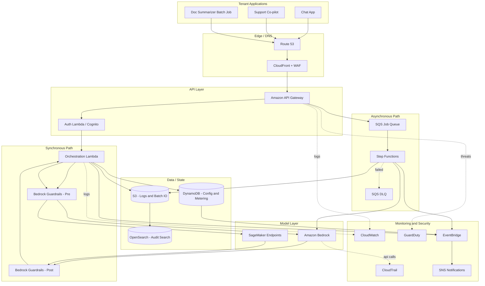

# Part VII – AI & Machine Learning Architectures

# Chapter 51: Generative AI Platform

---

## 1. Executive Summary

Enterprises adopting generative AI in 2025–2026 face a common problem: pilot projects built on a single API call to a foundation model do not survive contact with production requirements. A chatbot demo that works for a five-person proof of concept collapses when it needs to support 50,000 concurrent employees, enforce data residency, prevent prompt injection from leaking customer PII, track cost per business unit, and provide auditable answers for a regulated industry.

The **Generative AI Platform** architecture described in this chapter is not a single application. It is a **shared, multi-tenant platform** that centralizes model access, governance, observability, and cost control so that dozens of internal generative AI use cases — chat assistants, document summarization, code generation, customer support augmentation, internal knowledge search — can be built on top of it without every team re-solving the same problems.

**Business problem.** Organizations experimenting with generative AI typically end up with:

- Multiple teams independently calling OpenAI, Anthropic, or self-hosted models with no central visibility.
- No consistent guardrails for PII redaction, toxic content filtering, or prompt injection defense.
- No way to answer "how much did generative AI cost us last month, broken down by team?"
- No audit trail of what data was sent to which model, which is a compliance blocker in banking, healthcare, insurance, and government.
- Inconsistent latency and availability because each team manages its own retry logic, rate limiting, and failover.

**Architecture objective.** Build a single, centrally governed platform that:

- Exposes a unified API for internal application teams to invoke foundation models (Amazon Bedrock, and optionally self-hosted models on SageMaker) without directly managing model access, quotas, or credentials.
- Enforces authentication, authorization, PII redaction, content filtering, and prompt/response logging for every request, regardless of which internal team is calling.
- Provides per-tenant (per team, per application, per cost center) usage metering, rate limiting, and budget alerts.
- Supports both synchronous (chat, low-latency) and asynchronous (batch summarization, document processing) workloads.
- Is horizontally scalable, multi-AZ, and — for regulated tenants — deployable in a manner that satisfies data residency and encryption requirements.

**Why organizations adopt this architecture.** Three forces converge to make a shared platform the correct design, rather than letting each product team integrate directly with a foundation model provider:

1. **Governance forces it.** Once legal, security, and compliance teams get involved (and they always do, once generative AI touches customer data), they require a single point of control for what data leaves the corporate network, what gets logged, and what gets blocked. A shared platform is the only way to enforce this consistently across 20+ internal consumers.
2. **Cost forces it.** Foundation model inference is not free, and costs scale with token volume in a way that is easy to lose track of. A shared platform with per-tenant metering turns an opaque bill into an itemized, chargeable cost center report — which is what FinOps teams need to justify continued investment.
3. **Operational leverage forces it.** Building retry logic, model failover (e.g., falling back from Claude Sonnet to Claude Haiku under load, or from one region to another), caching, and prompt-injection defenses is significant engineering work. Doing it once, well, and reusing it across every internal AI use case is dramatically cheaper than having ten teams build ten mediocre versions.

**Major business benefits.**

- **Reduced time-to-market** for new generative AI features: application teams call a well-documented internal API instead of negotiating model access, IAM policies, and logging pipelines from scratch.
- **Cost transparency and control**: finance can see spend by team, by model, by use case, and set hard budget caps that pause a tenant before an overspend incident occurs.
- **Consistent security posture**: a single set of guardrails (PII redaction, jailbreak detection, output filtering) is enforced everywhere, closing the gap where one careless team exposes the whole company to risk.
- **Auditability for regulated workloads**: every prompt and response can be logged with full lineage (which user, which application, which model version, which guardrail decisions were applied), which is what internal audit and external regulators ask for.
- **Model flexibility without application rewrites**: because applications call the platform's abstraction layer rather than a specific vendor SDK, the platform team can swap or add models (e.g., add a newly released model, or move a workload to a cheaper model) without requiring every consuming application to change code.

**Typical enterprise scenarios.**

| Scenario | Description |
|---|---|
| Internal knowledge assistant | Employees ask natural-language questions against internal wikis, HR policies, and engineering docs. |
| Customer support co-pilot | Support agents get AI-drafted responses grounded in the knowledge base, which they review before sending. |
| Contract and document summarization | Legal and procurement teams get automatic first-pass summaries of long documents. |
| Code generation and review assistance | Engineering teams use AI to draft code, generate tests, and explain unfamiliar codebases. |
| Marketing content drafting | Marketing generates first drafts of campaigns, subject to human review before publication. |
| Regulatory and compliance Q&A | Compliance teams query internal policy corpora with guaranteed traceability of the source material used to generate an answer. |

This chapter builds the platform layer — API gateway, orchestration, model access, guardrails, observability, and cost governance — that all of these use cases sit on top of. Retrieval-Augmented Generation (RAG) specifics, vector databases, and agentic workflows are covered in the following chapters (52–56); this chapter assumes those capabilities plug into the platform described here as pluggable "skills" or "tools" behind the same governed API.

A note on model hosting: this architecture centers on **Amazon Bedrock** as the primary model access layer because it removes the operational burden of hosting foundation models, provides built-in guardrails (Bedrock Guardrails), and offers a consistent IAM-based access model. For organizations with custom fine-tuned models or open-weight models that must run in a specific way, **Amazon SageMaker real-time inference endpoints** are shown as a secondary path behind the same gateway, so the rest of the platform (auth, metering, logging) does not need to change based on where a model actually runs.

---

## 2. Business Requirements

### 2.1 Business Drivers

- Consolidate generative AI spend and vendor exposure under one governed platform.
- Enable self-service AI feature development for internal teams without each team needing AI/ML specialists.
- Satisfy data governance and audit requirements before generative AI is allowed to touch regulated or customer data.
- Provide a foundation that supports future use cases (RAG, agents, fine-tuning) without re-architecture.

### 2.2 Functional Requirements

| ID | Requirement |
|---|---|
| FR-1 | Provide a unified REST/HTTPS API for prompt submission (sync and async). |
| FR-2 | Support multiple foundation models (Anthropic Claude family, Amazon Titan/Nova, Meta Llama) via Amazon Bedrock. |
| FR-3 | Support streaming responses for chat-style, low-latency use cases. |
| FR-4 | Apply configurable guardrails: PII redaction, denied topics, profanity filtering, prompt-injection detection. |
| FR-5 | Authenticate and authorize every request per tenant (application/team) with scoped API keys or IAM roles. |
| FR-6 | Meter token usage and cost per tenant, per model, per day. |
| FR-7 | Log every prompt/response pair (subject to retention and redaction policy) for audit. |
| FR-8 | Support asynchronous batch processing for long-running document workloads. |
| FR-9 | Provide administrative dashboards for usage, cost, and guardrail violations. |
| FR-10 | Allow tenants to configure model preference and fallback order. |

### 2.3 Non-Functional Requirements

| Category | Requirement |
|---|---|
| Scalability | Support 500+ requests/second at peak across all tenants, growing to 2,000+ req/s within 18 months. |
| Availability | 99.9% for the platform control plane; model inference availability is bounded by Bedrock's own SLA plus platform failover logic. |
| Latency | P50 < 800 ms time-to-first-token for streaming chat; P99 < 4 s for standard synchronous completions (excluding model generation time for very long outputs). |
| Compliance | SOC 2 Type II, and (for regulated tenants) HIPAA-eligible or PCI-DSS-adjacent handling depending on business unit. |
| Security | All data encrypted in transit and at rest; PII redaction before any prompt logging; least-privilege IAM per tenant. |
| Recovery | RPO ≤ 15 minutes for configuration/metering data; RTO ≤ 1 hour for full platform restoration in a secondary region. |
| SLA | 99.9% monthly uptime commitment to internal tenants, with defined maintenance windows. |

### 2.4 Expected Workload and Growth

- **Initial launch**: 5–10 internal applications, ~50 req/s average, ~300 req/s peak.
- **Year 1**: 25–40 internal applications, ~250 req/s average, ~800 req/s peak.
- **Year 2+**: Enterprise-wide adoption, 1,000+ req/s peak, multi-region deployment for latency and residency.

> **Note:** Token-based workloads are bursty and unpredictable compared to traditional web traffic — a single "summarize this 200-page document" request can generate more backend load than 500 chat messages. Capacity planning must be done in **tokens per second**, not just requests per second.

---

## 3. Architecture Overview

### 3.1 Design Philosophy

The platform is built around three separations of concern:

1. **Control plane vs. data plane.** Tenant registration, API key issuance, guardrail configuration, and budget management (control plane) are separate from the actual prompt-processing path (data plane). This means a control-plane outage does not stop already-configured tenants from making inference calls.
2. **Synchronous vs. asynchronous paths.** Interactive chat traffic goes through a low-latency Lambda/API Gateway path with streaming support. Bulk document and batch workloads go through an SQS-backed asynchronous path with Step Functions orchestration, so a 50-page contract summarization does not block or compete with a chat user waiting on a token stream.
3. **Model abstraction.** Applications never call Bedrock or SageMaker directly. They call the platform's Gateway Service, which resolves "which model" based on tenant configuration, guardrail requirements, and current model health — enabling failover and model swaps with zero application-side changes.

### 3.2 Core Components

| Component | Role |
|---|---|
| API Gateway (Amazon API Gateway) | Public entry point for tenant applications; handles auth, throttling, request validation. |
| Auth Service (Lambda + Amazon Cognito / IAM) | Issues and validates tenant credentials, resolves tenant identity and quota. |
| Orchestration Service (Lambda / ECS Fargate) | Core request router: applies guardrails, resolves model, calls Bedrock/SageMaker, streams response. |
| Guardrails (Amazon Bedrock Guardrails) | PII redaction, denied topics, content filtering, prompt-injection heuristics. |
| Async Processing (SQS + Step Functions + Lambda) | Handles batch/document workloads asynchronously. |
| Model Layer (Amazon Bedrock, Amazon SageMaker endpoints) | Actual foundation model inference. |
| Metering Store (Amazon DynamoDB) | Real-time token/cost counters per tenant, per model, per day. |
| Usage & Audit Log Store (Amazon S3 + Amazon OpenSearch Service) | Durable, queryable log of prompts/responses (redacted) and guardrail decisions. |
| Config Store (DynamoDB + Parameter Store) | Tenant configuration: allowed models, guardrail policy, budget caps, fallback order. |
| Admin/Cost Dashboard (CloudWatch Dashboards + QuickSight) | Operational and FinOps visibility. |
| Event Bus (Amazon EventBridge) | Publishes budget-exceeded, guardrail-violation, and model-health events to downstream consumers (Slack/ticketing via SNS). |

### 3.3 High-Level Workflow

1. Tenant application authenticates and submits a prompt request to the API Gateway.
2. The Orchestration Service resolves tenant config, applies pre-inference guardrails (PII redaction, denied-topic check).
3. The request is routed to the configured model in Amazon Bedrock (or a SageMaker endpoint for custom models), with a defined fallback chain.
4. The model response streams back (for chat) or is returned as a complete payload (for standard completions).
5. Post-inference guardrails run on the output (toxicity/PII leakage check).
6. Usage is metered, the interaction is logged (redacted per policy), and the response is returned to the caller.
7. For async/batch workloads, steps 2–6 happen inside a Step Functions state machine triggered by an SQS message, with results written to S3 and the caller notified via webhook or polling endpoint.

### 3.4 Request, Response, and Data Lifecycle

- **Request lifecycle**: authenticated → validated → guardrail-checked → routed → inferred → guardrail-checked (output) → metered → logged → returned.
- **Response lifecycle**: for streaming, tokens are relayed to the client as they arrive from Bedrock via a Lambda response-streaming function or an ECS Fargate service behind an Application Load Balancer configured for HTTP/1.1 chunked responses.
- **Data lifecycle**: raw prompts/responses are redacted before persistence; redacted logs are retained in OpenSearch for 90 days (fast query) and archived to S3 Glacier for long-term audit retention (typically 1–7 years depending on regulatory tenant requirements); metering data is retained indefinitely in aggregated form for cost trend reporting.

---

## 4. AWS Services Used

### 4.1 Amazon API Gateway

- **Purpose**: Single managed entry point for all tenant traffic; handles TLS termination, request validation, throttling, and API key/usage-plan enforcement.
- **Why selected**: Native integration with Lambda and IAM authorizers, built-in per-client throttling (usage plans), and WebSocket support for streaming use cases where Lambda response streaming isn't sufficient.
- **Alternatives**: Application Load Balancer with Lambda targets (cheaper at very high volume but loses built-in usage plans and request validation); a self-hosted API gateway like Kong (more flexible, significantly more operational burden).
- **Limitations**: 29-second integration timeout on REST APIs — this is why long-running document workloads must go through the async SQS/Step Functions path, not synchronous API Gateway calls.
- **Pricing considerations**: Priced per million API calls plus data transfer; at 500 req/s sustained, this becomes a real budget line and should be modeled explicitly (see Section 16).
- **Best practices**: Use usage plans per tenant to enforce hard rate limits at the edge before any compute is spent; enable access logging to a dedicated log group for a fast, independent audit trail.

### 4.2 AWS Lambda

- **Purpose**: Runs the Orchestration Service logic for synchronous, low-latency requests, and the guardrail/metering steps in the async pipeline.
- **Why selected**: Scales to zero and to thousands of concurrent executions automatically, which matches the bursty nature of AI workloads; response streaming support (Lambda function URLs with `InvokeWithResponseStream`) enables token-by-token delivery to chat clients.
- **Alternatives**: ECS Fargate (better for very long-lived streaming connections or when consistent low cold-start latency is critical); a persistent EC2-based service (rarely justified here given the burstiness of the workload).
- **Limitations**: 15-minute maximum execution time; cold starts can add 200–500ms for orchestration functions using larger runtimes — mitigate with provisioned concurrency on the hot path.
- **Pricing considerations**: Pay-per-invocation and duration; orchestration functions are typically short (guardrails + routing), so cost is dominated by invocation count, not duration.
- **Best practices**: Keep orchestration Lambdas thin — they should call Bedrock and relay, not do heavy CPU-bound work; use provisioned concurrency for the P99 latency-sensitive chat path.

### 4.3 Amazon Bedrock

- **Purpose**: Managed access to foundation models (Anthropic Claude, Amazon Nova, Meta Llama, Mistral, and others) via a single API, with no infrastructure to manage.
- **Why selected**: Removes the operational burden of hosting foundation models; native IAM-based access control; built-in Guardrails feature; per-model and per-account quotas that integrate with Service Quotas for capacity planning; supports cross-region inference profiles for resilience.
- **Alternatives**: Self-hosting open-weight models on SageMaker or EKS with GPU instances (justified only when a fine-tuned/custom model is required, or when contractual/data-residency terms explicitly forbid a managed multi-tenant model service); direct third-party API integration (loses the IAM-native governance model this architecture depends on).
- **Limitations**: Per-model throughput quotas (tokens-per-minute, requests-per-minute) are account- and region-specific and must be requested/raised proactively; not every model is available in every region.
- **Pricing considerations**: Priced per 1,000 input/output tokens, varying significantly by model size; provisioned throughput is available for predictable high-volume workloads at a flat hourly rate instead of per-token, which can be materially cheaper above a certain volume threshold.
- **Best practices**: Use inference profiles for cross-region failover; separate "cheap/fast" model tiers (e.g., Claude Haiku-class) from "high-quality" tiers (Claude Sonnet/Opus-class) and let the orchestration layer pick based on task complexity, rather than defaulting every request to the most expensive model.

### 4.4 Amazon SageMaker (Real-Time Inference Endpoints)

- **Purpose**: Hosts custom fine-tuned or open-weight models that are not available through Bedrock, behind the same gateway abstraction.
- **Why selected**: Full control over model weights, container, and instance type; necessary when a tenant requires a fine-tuned model trained on proprietary data that cannot be exposed to a shared managed service.
- **Alternatives**: Amazon EKS with GPU node groups for teams needing full Kubernetes-native ML tooling (higher operational overhead, chosen only when the team already runs Kubernetes-based ML pipelines).
- **Limitations**: You own capacity planning, scaling, and patching of the endpoint; GPU instance availability and cost are a real constraint.
- **Pricing considerations**: Billed per instance-hour for the endpoint regardless of utilization (unless using Serverless Inference or Inference Components with scale-to-zero, which have their own cold-start trade-offs).
- **Best practices**: Use SageMaker Inference Components to pack multiple models onto shared GPU capacity when hosting several fine-tuned variants, rather than provisioning a dedicated endpoint per model.

### 4.5 Amazon DynamoDB

- **Purpose**: Stores tenant configuration, real-time usage/cost counters, and rate-limit state.
- **Why selected**: Single-digit millisecond latency for the hot metering path, on-demand scaling to match unpredictable AI traffic, native TTL for expiring rate-limit windows.
- **Alternatives**: Amazon ElastiCache (Redis) for the rate-limit counters specifically, if sub-millisecond latency is required at very high request rates — many platforms use both: DynamoDB for durable config/metering, Redis for the hottest rate-limit check.
- **Limitations**: Complex cost aggregation queries (e.g., "total spend by cost center this quarter") are awkward in DynamoDB and are better served by exporting to S3 and querying with Athena.
- **Pricing considerations**: On-demand mode is recommended initially given unpredictable AI traffic patterns; switch to provisioned capacity with auto scaling once usage patterns stabilize, for cost savings.
- **Best practices**: Use a single-table design keyed by `tenant_id` and a composite sort key encoding date/model, to keep both point lookups and per-tenant range queries efficient.

### 4.6 Amazon S3

- **Purpose**: Durable storage for redacted prompt/response logs, batch job inputs/outputs, and long-term audit archives.
- **Why selected**: Effectively unlimited scalability, native lifecycle policies for tiering to Glacier, and direct integration with Athena for ad hoc audit querying.
- **Alternatives**: None seriously competitive for this role within AWS; the only real decision is storage class and lifecycle policy design.
- **Limitations**: Not a substitute for a queryable index — hence pairing with OpenSearch for the "hot" 90-day audit window.
- **Best practices**: Enable S3 Object Lock (compliance mode) for regulated tenants' audit logs so retained records cannot be altered or deleted before their retention period expires.

### 4.7 Amazon OpenSearch Service

- **Purpose**: Fast, full-text and structured search over recent (hot) prompt/response and guardrail-decision logs for operational troubleshooting and security review.
- **Why selected**: Near-real-time indexing, rich query DSL for "show me every guardrail violation for tenant X in the last 24 hours," and native Kibana/OpenSearch Dashboards for security teams.
- **Alternatives**: Amazon CloudWatch Logs Insights (cheaper, simpler, but weaker for cross-field structured audit queries at scale).
- **Limitations**: Cluster sizing and index lifecycle management require active operational attention; costs grow with retention window and shard count.
- **Best practices**: Use Index State Management to roll data to cheaper storage tiers (UltraWarm/cold) after 7–14 days, and delete/export to S3 after 90 days.

### 4.8 Amazon SQS and AWS Step Functions

- **Purpose**: SQS decouples the API-facing submission of async/batch jobs from processing; Step Functions orchestrates the multi-step guardrail → inference → guardrail → store workflow for those jobs reliably, with built-in retry and error handling.
- **Why selected**: Both are fully managed, scale automatically, and provide native, visual state-machine execution history — critical when debugging why a specific document-processing job failed.
- **Alternatives**: Amazon MQ (unnecessary complexity here; SQS is the right level of abstraction); a custom worker-poller architecture on EC2/ECS (more operational burden with no functional benefit).
- **Limitations**: Step Functions Standard workflows have per-state and payload size limits (payloads should reference S3 objects, not embed large documents directly).
- **Best practices**: Use SQS dead-letter queues for jobs that fail guardrail or inference retries repeatedly, and alert on DLQ depth.

### 4.9 Amazon EventBridge, Amazon SNS

- **Purpose**: EventBridge routes platform events (budget threshold crossed, guardrail violation, model health degraded) to the appropriate downstream targets; SNS fans out notifications to Slack/email/ticketing integrations.
- **Why selected**: Decouples "something happened" from "who needs to know," so new notification targets (e.g., a new Slack channel for a new tenant) can be added without changing the producing service.
- **Alternatives**: Direct Lambda-to-Lambda invocation (tighter coupling, harder to extend).

### 4.10 IAM, Amazon Cognito

- **Purpose**: IAM governs service-to-service access (Lambda to Bedrock, Lambda to DynamoDB); Cognito (or an internal OIDC provider) issues and validates end-user/tenant application identities at the API Gateway.
- **Why selected**: IAM's fine-grained, resource-level policies map naturally to "this tenant's role may only invoke these specific Bedrock model ARNs," which is the core access-control primitive of the entire platform.
- **Alternatives**: A custom API-key database (simpler to start, but loses native AWS policy simulation, CloudTrail integration, and STS temporary credential support).

### 4.11 AWS KMS, AWS Secrets Manager

- **Purpose**: KMS provides customer-managed keys (CMKs) for encrypting DynamoDB, S3, and OpenSearch data at rest, with per-tenant key separation for regulated tenants; Secrets Manager holds any third-party API credentials (e.g., non-Bedrock model providers) with automatic rotation.
- **Why selected**: CMKs allow a tenant's data to be cryptographically isolated and, if required, have its key access revoked entirely (a common regulatory "right to be forgotten" / off-boarding control).
- **Best practices**: Use separate KMS keys per sensitivity tier (e.g., "regulated tenant" vs. "internal tenant") rather than one key for the whole platform, so a key compromise or required key rotation has a bounded blast radius.

### 4.12 Amazon CloudWatch, AWS CloudTrail, AWS Config, Amazon GuardDuty

- **Purpose**: CloudWatch for metrics/logs/alarms/dashboards; CloudTrail for API-level audit of every AWS control-plane action; Config for continuous compliance checking of resource configuration (e.g., "is any S3 bucket in this platform public?"); GuardDuty for threat detection (e.g., anomalous API calls, compromised credentials).
- **Why selected**: This is the standard AWS operational and security telemetry stack; a generative AI platform is a *high-value target* (it has access to internal data and model credentials), so this baseline is non-negotiable rather than optional.
- **Best practices**: Enable GuardDuty's extended threat detection for S3 and Lambda; route Config non-compliance findings and GuardDuty findings into Security Hub for a single pane of glass.

### 4.13 Route 53, Amazon CloudFront

- **Purpose**: Route 53 provides DNS and health-check-based failover between regions; CloudFront fronts the admin dashboard and any static assets, and can also front the API Gateway for tenants needing edge caching of cacheable (non-generative) responses.
- **Why selected**: Standard, low-overhead choices for DNS failover and edge delivery; CloudFront's WAF integration adds a layer of L7 protection in front of the API.

---

## 5. Complete Architecture Diagram



---

## 6. Component-by-Component Explanation

### 6.1 API Gateway

- **Purpose**: Single, governed front door for every tenant request.
- **Responsibilities**: TLS termination, request schema validation, tenant identification, throttling via usage plans, routing to sync (Lambda) or async (SQS) paths.
- **Inputs**: HTTPS requests carrying tenant API key/JWT, prompt payload, model preference hints.
- **Outputs**: Streamed or complete JSON responses; for async, a job ID and status URL.
- **Scaling**: Fully managed, scales automatically; the binding constraint is downstream Lambda concurrency and Bedrock quotas, not the gateway itself.
- **High availability**: Regional service, inherently multi-AZ; cross-region failover handled via Route 53 health checks against a secondary regional deployment.
- **Failure handling**: Per-tenant usage plans return 429 before overloading downstream systems; 5xx responses from the orchestration layer are surfaced with a correlation ID for support.
- **Dependencies**: Auth Lambda/Cognito for token validation.
- **Security**: WAF in front for common L7 attack patterns; resource policies restricting which VPCs/tenants may call which routes.
- **Monitoring**: CloudWatch metrics on 4xx/5xx rate, latency, and per-usage-plan throttling counts.

### 6.2 Orchestration Service (Lambda)

- **Purpose**: The brain of the synchronous path — resolves tenant config, applies guardrails, calls the model, and streams the result.
- **Responsibilities**: Load tenant config from DynamoDB (cached in-memory per warm invocation), invoke Bedrock Guardrails pre-check, select model per fallback chain, invoke Bedrock/SageMaker, invoke post-check guardrails, write metering record, write redacted log, return/stream response.
- **Scaling**: Concurrency scales automatically with Lambda; provisioned concurrency reserved for the hot chat path to control P99 latency.
- **High availability**: Multi-AZ by default (Lambda); model-level failover handled explicitly in code (e.g., retry against a secondary Bedrock inference profile/region on throttling or 5xx).
- **Failure handling**: Exponential backoff with jitter on Bedrock throttling (`ThrottlingException`); circuit-breaker pattern to stop calling a degraded model and fail over to the next in the tenant's configured chain.
- **Dependencies**: DynamoDB (config, metering), Bedrock/SageMaker (inference), S3 (logging).
- **Security**: Executes under a per-tenant-scoped or platform-scoped IAM role that only allows `bedrock:InvokeModel`/`InvokeModelWithResponseStream` on the specific model ARNs that tenant is entitled to use.
- **Monitoring**: Custom CloudWatch metrics for time-to-first-token, total tokens, guardrail-block rate, and model-fallback rate.

### 6.3 Guardrails (Amazon Bedrock Guardrails)

- **Purpose**: Enforce content policy on both the inbound prompt and the outbound model response.
- **Responsibilities**: PII detection/redaction, denied-topic blocking, profanity/hate-speech filtering, and (where configured) grounding checks for RAG-based answers.
- **Failure handling**: If the Guardrails service itself is unavailable, the orchestration layer fails closed for regulated tenants (block the request) and can be configured to fail open with logging for low-risk internal tenants — this is a tenant-level policy decision, not a platform-wide default.
- **Security**: This is the primary control that prevents a jailbreak attempt or accidental PII leak from becoming a data-exposure incident; it must be treated as a security-critical dependency, not an optional nicety.

### 6.4 Metering Store (DynamoDB)

- **Purpose**: Real-time source of truth for "how many tokens has tenant X used today, and what does that cost so far."
- **Responsibilities**: Atomic counter increments per request; TTL-based rolling windows for rate limiting; daily/monthly rollups consumed by the cost dashboard.
- **Scaling**: On-demand capacity mode to absorb bursty AI traffic without manual capacity planning.
- **Failure handling**: If a metering write fails, the request still completes (metering must never block the user-facing response), but the failure is logged and reconciled via a nightly batch job cross-checking Bedrock's own usage records (via Cost and Usage Reports) against platform-recorded metering — this reconciliation step is essential because in-band metering can occasionally drop counts under failure conditions.

### 6.5 Async Processing (SQS + Step Functions)

- **Purpose**: Handle document/batch workloads that exceed API Gateway's synchronous timeout or are simply not latency-sensitive.
- **Responsibilities**: Accept a job, orchestrate chunking of large documents, guardrail + inference per chunk, aggregate results, write final output to S3, notify the caller.
- **Scaling**: SQS and Step Functions both scale natively; the practical scaling constraint is Bedrock's tokens-per-minute quota, which Step Functions respects via a rate-limited Map state.
- **Failure handling**: Per-chunk retries with backoff; jobs that exhaust retries land in a DLQ and raise an EventBridge alert to the platform on-call.

---

## 7. End-to-End Request Flow

**Synchronous chat request:**

1. Client sends `POST /v1/chat` with a bearer token and prompt payload to CloudFront.
2. CloudFront/WAF inspects the request for common attack signatures and forwards to API Gateway.
3. API Gateway validates the request schema and checks the tenant's usage plan (rate limit).
4. API Gateway invokes the Auth Lambda (or a Lambda authorizer) to validate the token and resolve `tenant_id`.
5. The request is routed to the Orchestration Lambda.
6. Orchestration Lambda reads tenant configuration from DynamoDB (allowed models, guardrail policy, fallback chain).
7. Orchestration Lambda calls Bedrock Guardrails to pre-check the prompt (PII redaction, denied topics).
8. If the prompt is blocked, a policy-violation response is returned immediately and logged; flow ends here.
9. Orchestration Lambda invokes `InvokeModelWithResponseStream` against the primary configured Bedrock model.
10. On throttling or error, Orchestration Lambda retries with backoff, then fails over to the next model in the tenant's chain.
11. Tokens stream back from Bedrock and are relayed to the client in real time via the Lambda response stream.
12. As the full response completes, Orchestration Lambda runs the post-inference guardrail check on the assembled output.
13. If the output fails the post-check (e.g., leaked PII pattern), the client instead receives a policy-safe fallback message, and the incident is logged and flagged.
14. Orchestration Lambda writes a metering record (tokens in/out, model used, latency) to DynamoDB.
15. Orchestration Lambda writes a redacted prompt/response log entry to S3 (and, for near-real-time search, to OpenSearch via a Firehose subscription).
16. CloudWatch captures latency, token count, and guardrail-decision metrics for the request.
17. If any step raised an error, structured error details (with a correlation ID) are logged and a generic error is returned to the client — internal details are never leaked to the caller.

**Asynchronous batch request:**

1. Client submits `POST /v1/batch` with a reference to a document in S3.
2. API Gateway validates and forwards the job description to SQS.
3. A Step Functions execution is started, keyed by job ID.
4. Step Functions chunks the document (if needed), and for each chunk repeats steps 7–13 of the synchronous flow above.
5. Chunk results are aggregated and written to a results object in S3.
6. Step Functions publishes a completion event to EventBridge; a subscribed Lambda calls the client's registered webhook (or the client polls `GET /v1/batch/{jobId}`).
7. Metering and logging occur per chunk, identical in structure to the synchronous path, so cost reporting is consistent regardless of which path a request took.

---

## 8. Deployment Flow

- **Infrastructure provisioning**: All infrastructure (API Gateway, Lambda, DynamoDB, S3, Step Functions, IAM roles, Bedrock Guardrails configuration) is defined in Terraform modules, one module per component, composed in an environment-specific root module (`dev`, `staging`, `prod`).
- **Terraform workflow**: Pull request → `terraform plan` posted as a PR comment via CI → peer review → merge → `terraform apply` executed by CI/CD with an assumed deployment role, never from a developer laptop for staging/prod.
- **CI/CD deployment**: Application code (Lambda handlers, Step Functions definitions) is built, unit-tested, and packaged in CI; infrastructure and application deployments are versioned together via a release tag so a rollback restores both consistently.
- **Blue-Green deployment**: Lambda aliases with weighted traffic shifting (e.g., via CodeDeploy) are used to shift traffic from the previous version to the new version gradually (10% → 50% → 100%), with automatic rollback on elevated error-rate or latency alarms.
- **Rollback**: CodeDeploy's automatic rollback on CloudWatch alarm breach reverts the Lambda alias to the previous version within minutes; Terraform state is versioned so infrastructure changes can be reverted via a prior known-good plan.
- **Secrets**: Any non-IAM credentials (e.g., a third-party model provider key, if used) are stored in Secrets Manager and referenced by ARN in Lambda environment configuration — never hardcoded or stored in Terraform state in plaintext.
- **Configuration**: Tenant-level configuration (models, guardrails, budgets) is managed through an internal admin API and stored in DynamoDB — deliberately *not* through Terraform, since tenant onboarding is a frequent, self-service-style operation and should not require an infrastructure deployment.
- **Validation**: Post-deployment smoke tests call the synchronous chat path and the async batch path end-to-end against a non-production tenant before traffic is shifted to the new version.

---

## 9. Network Topology

Even though this platform is heavily serverless, network isolation still matters — particularly for the SageMaker endpoints, OpenSearch domain, and any direct integration with internal data sources (e.g., an internal document store feeding RAG pipelines in later chapters).

- **VPC**: A dedicated VPC (`10.40.0.0/16` in this reference design) hosts the network-attached resources: SageMaker endpoints, OpenSearch, and VPC-attached Lambdas that need to reach internal systems.
- **CIDR**: `/16` VPC subdivided into `/24` subnets per AZ per tier, giving ample room for growth without re-addressing.
- **Public subnets**: Host only NAT Gateways; nothing in this platform serves traffic directly from a public subnet — API Gateway and CloudFront are AWS-managed edge services, not VPC resources.
- **Private subnets**: Host SageMaker endpoint ENIs, OpenSearch data nodes, and VPC-attached Lambda ENIs (used only when a Lambda needs to reach a resource inside the VPC, such as OpenSearch).
- **NAT Gateway**: One per AZ for outbound-only connectivity from private subnets (e.g., Lambda pulling a model artifact or calling an external API); this is a notable cost driver, discussed in Section 16.
- **Internet Gateway**: Attached for the public subnets' NAT Gateway egress path only.
- **Transit Gateway**: Used when this platform's VPC must reach other internal VPCs (e.g., an internal document management system providing content for RAG use cases) without public exposure.
- **Route tables**: Private subnet route tables send `0.0.0.0/0` to the local AZ's NAT Gateway; VPC-internal and Transit-Gateway-reachable CIDRs are routed directly, bypassing NAT.
- **Network ACLs**: Baseline stateless ACLs deny all inbound except from known internal CIDRs to the OpenSearch and SageMaker subnets.
- **Security groups**: Least-privilege, resource-specific — e.g., the OpenSearch security group allows inbound 443 only from the VPC-attached Lambda security group, not from the whole VPC CIDR.
- **PrivateLink**: A VPC endpoint for Bedrock (`com.amazonaws.<region>.bedrock-runtime`) is used so that model inference traffic from VPC-attached components never traverses the public internet, and to satisfy tenants whose compliance requirements mandate this.
- **Hybrid connectivity**: For enterprises integrating this platform with on-premises data sources (e.g., an on-prem document repository feeding a RAG pipeline), Direct Connect or Site-to-Site VPN terminates into the Transit Gateway, not directly into this VPC.

---

## 10. Identity and Access

- **IAM roles**: Distinct execution roles per component — Orchestration Lambda role, Async Step Functions role, Admin API role — each scoped to only the actions and resources it needs (e.g., the Orchestration Lambda role can `bedrock:InvokeModel*` on approved model ARNs and `dynamodb:GetItem/UpdateItem` on the config/metering tables only).
- **IAM policies**: Written with explicit resource ARNs (including Bedrock model ARNs and inference profile ARNs) rather than `"Resource": "*"`, and reviewed as part of the architecture review checklist (Section 31).
- **Resource policies**: The API Gateway resource policy can restrict invocation to specific VPC endpoints for tenants requiring private-only access; S3 bucket policies enforce TLS-only and deny unencrypted uploads for the log/audit buckets.
- **STS**: Tenant-scoped temporary credentials (via `AssumeRole`) are used for any tenant-initiated direct-to-AWS interactions (e.g., a tenant application uploading a batch document directly to S3 using a presigned, time-limited role), avoiding long-lived shared credentials.
- **Cross-account access**: In a multi-account landing zone (see Chapter 99), the platform typically lives in a dedicated "AI Platform" account; tenant application accounts assume a cross-account role scoped to only the API Gateway's resource and (optionally) a presigned-upload role for batch inputs.
- **Least privilege**: Enforced via IAM Access Analyzer continuously scanning for unused permissions on platform roles, and a quarterly access review of who can modify tenant configuration and guardrail policy.
- **Service roles**: Step Functions, EventBridge rules, and CodeDeploy each run under a dedicated service role scoped to only the actions they need to invoke (e.g., Step Functions' role can invoke Lambda and write to S3, nothing else).
- **Permission boundaries**: A permission boundary is attached to any role that platform administrators can create dynamically (e.g., a role provisioned per new regulated tenant), capping the maximum permissions that role can ever have regardless of the policy attached to it — this prevents privilege escalation through platform self-service tooling.

---

## 11. Security Architecture

### 11.1 Encryption

- **At rest**: DynamoDB, S3, and OpenSearch are encrypted using customer-managed KMS keys, with separate keys per tenant sensitivity tier.
- **In transit**: TLS 1.2+ enforced at every hop — CloudFront to API Gateway, API Gateway to Lambda, Lambda to Bedrock/SageMaker (via PrivateLink where applicable), Lambda to DynamoDB/S3.
- **KMS**: Key policies restrict decrypt permissions to the specific platform roles that need them; key rotation is enabled annually at minimum, more frequently for regulated tenants per their contractual terms.

### 11.2 Perimeter and Application Security

- **WAF**: Deployed on CloudFront in front of API Gateway, with managed rule groups for common attack patterns plus a custom rule set tuned for prompt-injection-style payloads (e.g., unusually long inputs, encoded payloads attempting to bypass guardrails).
- **Shield**: AWS Shield Standard is active by default on CloudFront/Route 53; Shield Advanced is added for tenants with contractual DDoS-protection SLAs.
- **Secrets Manager**: Holds any non-IAM credentials; automatic rotation configured for any rotatable secret type.
- **Certificate Manager**: Issues and auto-renews the TLS certificates for the platform's custom domain.

### 11.3 Detection and Compliance

- **GuardDuty**: Monitors for anomalous API activity (e.g., a compromised tenant credential suddenly calling Bedrock from an unusual region or at an unusual volume).
- **Inspector**: Scans any container images used by the Async worker components (if containerized) for known vulnerabilities.
- **Security Hub**: Aggregates GuardDuty, Config, and Inspector findings into a single compliance dashboard, mapped to relevant frameworks (e.g., NIST 800-53) for audit purposes.
- **CloudTrail**: Records every AWS API call made by the platform's roles, providing the forensic trail for any security investigation.
- **AWS Config**: Continuously evaluates resource configuration against rules (e.g., "S3 buckets must not be public," "DynamoDB tables must have encryption enabled") and flags drift.

### 11.4 Zero Trust Posture

- Every internal call (API Gateway → Lambda → Bedrock, Lambda → DynamoDB) is authenticated and authorized independently via IAM — no component trusts another purely because it is "inside the VPC."
- Tenant identity is re-validated at the orchestration layer, not assumed from the API Gateway layer alone, so a compromised gateway configuration cannot silently grant broader access downstream.

### 11.5 Threat Model and Mitigations

| Attack Vector | Description | Mitigation |
|---|---|---|
| Prompt injection | Malicious input attempts to override system instructions or exfiltrate other tenants' data. | Bedrock Guardrails, input length/pattern limits, strict system-prompt isolation per tenant. |
| PII leakage in output | Model inadvertently reproduces PII from context or training data. | Post-inference guardrail scanning, redaction before logging and before returning to caller. |
| Credential compromise | A leaked tenant API key is used to exhaust budget or exfiltrate data. | Per-tenant rate limits, anomaly detection via GuardDuty, budget hard-caps with automatic suspension. |
| Model denial of service | A tenant intentionally or accidentally floods the platform with expensive requests. | Per-tenant token-per-minute quotas enforced at the orchestration layer, independent of the caller's stated intent. |
| Data exfiltration via logging | Sensitive data persists in logs longer than policy allows or is queryable by the wrong team. | Redaction before persistence, per-tenant KMS key access boundaries, OpenSearch role-based access control. |
| Supply chain risk | A compromised dependency in the orchestration Lambda's code introduces a backdoor. | Dependency scanning in CI, minimal dependency footprint, Lambda code signing. |

---

## 12. High Availability

- **AZ failures**: Lambda, API Gateway, DynamoDB, and S3 are inherently multi-AZ; SageMaker endpoints (if used) are configured with instances spread across at least two AZs.
- **Instance failures**: N/A for the serverless components; for SageMaker endpoints, multi-instance deployment behind the endpoint's built-in load balancing absorbs single-instance failure.
- **Regional failures**: Bedrock inference profiles configured for cross-region routing allow the orchestration layer to fail over to a secondary region's model endpoint automatically on sustained regional degradation; the platform's control-plane data (DynamoDB) uses global tables for cross-region replication.
- **Database failures**: DynamoDB's multi-AZ replication is automatic; global tables provide a warm secondary-region copy for regional failover of configuration and metering data.
- **Load balancing**: API Gateway and Lambda require no explicit load balancer configuration; for SageMaker, the endpoint's internal load balancing plus Application Auto Scaling handles instance-level distribution.
- **Health checks**: Route 53 health checks against a synthetic canary endpoint in each region drive DNS failover; CloudWatch Synthetics runs the canary on a fixed interval simulating a real chat request end-to-end.
- **Failover**: Automated for infrastructure-level failures (region, AZ); model-level failover (e.g., Bedrock model throttling) is handled explicitly in the orchestration logic's fallback chain, not left to infrastructure-level failover alone.

---

## 13. Disaster Recovery

- **Backup strategy**: DynamoDB point-in-time recovery (PITR) enabled on all tables; S3 versioning enabled on all log/audit buckets with cross-region replication (CRR) to the DR region.
- **Snapshots**: OpenSearch automated snapshots to S3, retained per the platform's audit retention policy.
- **Cross-region replication**: DynamoDB global tables for config/metering; S3 CRR for logs and batch artifacts.
- **Strategy selected — Warm Standby**: The secondary region runs a scaled-down but fully functional copy of the platform (Lambda deployed, API Gateway provisioned, Bedrock access configured) that can absorb full production traffic within the RTO window after a capacity/scale-up step, rather than a cold Pilot Light that must be built from scratch, and without the cost of full Active-Active.
- **Why not Pilot Light**: The RTO requirement (≤ 1 hour) is tighter than a from-scratch Lambda/API Gateway redeploy comfortably allows under incident-response conditions; Warm Standby removes deployment risk from the recovery path.
- **Why not Active-Active**: Given current traffic volumes, the operational complexity and cost of keeping two regions simultaneously serving live traffic (with consistent metering/config sync) is not justified versus Warm Standby; this is revisited as the platform scales into Chapter 98's Multi-Region Active-Active pattern.
- **RPO**: ≤ 15 minutes, driven by DynamoDB global table replication lag and S3 CRR latency, both of which are typically well under this target.
- **RTO**: ≤ 1 hour, achieved via Route 53 failover to the pre-provisioned secondary region plus an Application Auto Scaling step to bring warm-standby capacity to full production scale.

---

## 14. Scalability

- **Horizontal scaling**: The dominant pattern here — Lambda concurrency, API Gateway throughput, and DynamoDB on-demand capacity all scale horizontally and automatically with load.
- **Vertical scaling**: Applies mainly to SageMaker endpoints, where instance type (e.g., moving from `ml.g5.xlarge` to `ml.g5.2xlarge`) is adjusted for larger custom models.
- **Auto Scaling**: SageMaker endpoints use Application Auto Scaling policies keyed on `InvocationsPerInstance` or GPU utilization to add/remove instances.
- **Serverless scaling**: Lambda concurrency limits are set per-function with reserved concurrency for the orchestration path to prevent a runaway tenant from starving other tenants' capacity (a critical multi-tenant control).
- **Database scaling**: DynamoDB on-demand mode absorbs unpredictable metering write bursts without manual intervention; monitor and switch to provisioned+autoscaling once traffic patterns stabilize for cost efficiency.
- **Storage scaling**: S3 scales inherently; OpenSearch requires proactive shard and node-count planning as log volume grows — this is the one component in this architecture that needs traditional capacity planning discipline.
- **Queue scaling**: SQS scales automatically; the real constraint on the async path is Bedrock's tokens-per-minute quota, which Step Functions must respect via rate-limited processing rather than firing all chunks simultaneously.

> **Warning:** The most common scaling failure in this architecture is not infrastructure — it's hitting a **Bedrock model's tokens-per-minute or requests-per-minute quota** before hitting any AWS-infrastructure limit. Request quota increases proactively based on projected growth (Section 23), not reactively after a production incident.

---

## 15. Performance Optimization

- **Caching**: A semantic/exact-match prompt cache (e.g., DynamoDB or ElastiCache keyed on a hash of the normalized prompt + model + guardrail config) avoids re-invoking the model for identical or near-identical repeated queries — a significant cost and latency win for FAQ-style internal assistant use cases.
- **Compression**: Response payloads are gzip-compressed by API Gateway automatically; this has limited impact on token-generation latency but reduces network transfer time for large batch outputs.
- **CDN**: CloudFront caches the admin dashboard's static assets; generative responses themselves are not cached at the CDN layer since they are typically per-request and personalized.
- **Database optimization**: DynamoDB access patterns are designed around a single-table model with a partition key of `tenant_id` to keep hot-path reads/writes to O(1) lookups rather than scans.
- **Connection pooling**: For SageMaker endpoints, orchestration Lambdas reuse HTTP connections across warm invocations (keep-alive) to avoid TLS handshake overhead on every request.
- **Concurrency**: Chunked document batch jobs process multiple chunks concurrently (bounded by the Bedrock quota) via Step Functions' Map state with a configured `MaxConcurrency`, rather than serially.
- **Async processing**: Any non-latency-sensitive work (metering rollups, log indexing into OpenSearch) is decoupled from the synchronous response path via S3 event notifications and Firehose, so it never adds latency to the user-facing request.

---

## 16. Cost Optimization (FinOps)

### 16.1 Deployment Size Cost Estimates

The dominant cost driver in this architecture is **foundation model token consumption**, not the surrounding AWS infrastructure. The table below separates the two.

| Deployment Size | Avg Requests/Day | Avg Tokens/Request (in+out) | Est. Monthly Model Cost* | Est. Monthly AWS Infra Cost |
|---|---|---|---|---|
| Small (pilot, 5 apps) | 50,000 | 1,200 | $2,500 – $6,000 | $800 – $1,500 |
| Medium (25 apps) | 500,000 | 1,500 | $30,000 – $70,000 | $4,000 – $8,000 |
| Enterprise (60+ apps, multi-region) | 3,000,000+ | 1,800 | $200,000 – $450,000+ | $20,000 – $40,000 |

\* *Model cost varies significantly by which models tenants select (a Haiku-class model can be 10–15x cheaper per token than a top-tier reasoning model); these figures assume a realistic mix of tiers, not exclusive use of the most expensive model.*

**AWS infrastructure cost breakdown (Medium deployment, illustrative):**

| Line Item | Monthly Estimate | Notes |
|---|---|---|
| Lambda (orchestration + async) | $600 – $1,200 | Dominated by invocation count and provisioned concurrency on the chat path. |
| API Gateway | $500 – $900 | Per-million-request pricing plus data transfer. |
| DynamoDB (on-demand) | $400 – $900 | Metering writes dominate; grows with request volume. |
| OpenSearch | $800 – $1,800 | Instance-hours; the largest single infra line item at this size. |
| NAT Gateway | $300 – $600 | Hourly charge x3 AZs plus data processed — frequently underestimated. |
| S3 (storage + requests) | $200 – $500 | Grows with log/audit retention window. |
| CloudWatch/CloudTrail/Config/GuardDuty | $300 – $700 | Grows with log volume and number of resources monitored. |
| Data transfer (cross-AZ, egress) | $300 – $700 | Cross-AZ traffic between VPC-attached Lambdas and OpenSearch/SageMaker. |

### 16.2 Major Cost Drivers

1. **Model token volume** — by a wide margin the largest cost, and the one most within the platform's control via model-tier routing.
2. **NAT Gateway hourly + data processing charges** — often underestimated; VPC endpoints reduce this where traffic would otherwise transit NAT.
3. **OpenSearch cluster sizing** relative to actual query load — commonly over-provisioned "just in case."
4. **Provisioned concurrency** left enabled on Lambda functions at higher levels than actual peak traffic requires.
5. **Log retention windows** set longer than compliance actually requires, inflating both OpenSearch and S3 costs.

### 16.3 Optimization Opportunities

| Optimization | Mechanism | Typical Savings |
|---|---|---|
| Model-tier routing | Route simple/short tasks to a cheaper model automatically | 30–60% of model spend |
| Bedrock Provisioned Throughput | Flat hourly rate for predictable high-volume tenants instead of per-token | 15–40% for high-volume tenants |
| Prompt/response caching | Avoid re-invoking model for repeated queries | 10–25% of model spend for FAQ-heavy tenants |
| VPC endpoints for Bedrock/S3/DynamoDB | Avoid NAT Gateway data-processing charges | 20–40% of NAT spend |
| OpenSearch UltraWarm/cold tiers | Move logs older than 7–14 days off hot storage | 30–50% of OpenSearch spend |
| Lambda provisioned concurrency right-sizing | Match to actual P99 traffic, not worst-case guess | 10–30% of Lambda spend |
| S3 lifecycle to Glacier | Move audit logs older than 90 days to Glacier/Deep Archive | 60–80% of archived-log storage cost |

### 16.4 Reserved Instances, Savings Plans, Spot

- **Compute Savings Plans** apply to Lambda and, if used, Fargate — commit based on a stable baseline of orchestration traffic, leaving burst capacity on-demand.
- **Spot** is applicable only if self-hosting model training/fine-tuning jobs (covered in Chapter 58, MLOps Pipeline) — not applicable to the real-time inference path in this chapter, since interrupting a live inference request is unacceptable.
- **Reserved capacity** is not directly applicable to Bedrock's on-demand per-token pricing; **Provisioned Throughput** is Bedrock's equivalent commitment mechanism and should be evaluated per-model once volume is predictable.

### 16.5 Storage Classes and Lifecycle

| Data | Initial Class | Transition | Final Class |
|---|---|---|---|
| Batch job inputs/outputs | S3 Standard | 30 days → S3 Standard-IA | 180 days → Glacier Flexible Retrieval |
| Redacted audit logs | S3 Standard | 90 days → Glacier Instant Retrieval | 1–7 years → Glacier Deep Archive (regulated tenants) |
| OpenSearch snapshots | S3 Standard | 30 days → S3 Standard-IA | 365 days → Glacier |

### 16.6 Rightsizing, Tagging, Budgets

- **Rightsizing**: Reviewed quarterly via AWS Compute Optimizer (for any provisioned Lambda concurrency and SageMaker endpoints) and OpenSearch's own recommended sizing tooling.
- **Cost allocation tags**: Every resource tagged with `tenant_id` (where resource-level attribution is possible), `cost_center`, `environment`, and `platform:generative-ai` to enable chargeback reporting.
- **Tagging enforcement**: AWS Config rules flag any platform resource missing required tags; tag policies at the AWS Organizations level prevent resource creation without them where supported.
- **Budgets**: Per-tenant AWS Budgets (driven by the platform's own DynamoDB-based metering, not just native AWS Budgets which can't see per-tenant Bedrock spend directly) trigger EventBridge alerts at 50/80/100% of a tenant's monthly cap, with 100% optionally triggering automatic request throttling for non-critical tenants.
- **Cost Anomaly Detection**: Enabled on the overall Bedrock and Lambda cost categories to catch platform-wide spend spikes (e.g., a misconfigured retry loop) independent of per-tenant budget tracking.

---

## 17. AI-Assisted Operations

- **Amazon Q (Developer/Business)**: Used by the platform engineering team itself to accelerate Terraform authoring, explain unfamiliar CloudWatch alarm configurations, and draft runbook documentation — a meta-use of generative AI to operate the generative AI platform.
- **Bedrock for internal tooling**: The platform's own admin dashboard uses a Bedrock-backed "explain this cost spike" feature that summarizes the metering data for an on-call engineer during an incident, rather than requiring manual log correlation.
- **AI troubleshooting**: Amazon Q integrated with CloudWatch can summarize a spike in `ThrottlingException` errors across the orchestration Lambda's logs and suggest the likely root cause (e.g., "requests to model X increased 4x at 14:02 UTC, correlating with tenant Y's deployment").
- **Log analysis**: OpenSearch's anomaly detection plugin flags unusual patterns in guardrail-violation rates per tenant, which often indicates either a prompt-injection attempt or a tenant's application bug sending malformed input.
- **Incident response**: A Bedrock-backed runbook assistant (internal tool, itself built on this platform) drafts an initial incident summary from CloudWatch alarms and Step Functions execution history for the on-call engineer to review and act on.
- **Cost optimization**: Scheduled Bedrock analysis of the prior month's Cost and Usage Report highlights tenants whose model-tier selection doesn't match their actual task complexity (e.g., a tenant using a top-tier model for simple classification tasks), producing a recommendation report for the FinOps review.
- **Capacity planning**: Historical token-volume trends are summarized and forecast using a Bedrock-assisted analysis job feeding into the quarterly Service Quota increase request process.
- **Architecture review**: Amazon Q Developer is used to review Terraform pull requests for common misconfigurations (e.g., overly broad IAM policies) before human review, reducing reviewer load.
- **AI-generated Terraform**: New tenant-onboarding infrastructure (where infrastructure changes are genuinely required, e.g., a dedicated KMS key for a new regulated tenant) is scaffolded with AI assistance and then reviewed by a human engineer — AI-generated infrastructure code is never auto-applied to production without review.
- **AI-generated documentation**: Runbooks and onboarding guides are drafted with AI assistance and reviewed/edited by the platform team, keeping documentation current with less manual effort than fully manual authoring.

---

## 18. Terraform Implementation

> The following modules are illustrative, production-oriented examples. They omit some boilerplate (provider version pinning details, full variable validation) for readability, but reflect the actual resource shape used in production.

### 18.1 Providers and Backend

```hcl

# versions.tf

terraform {
  required_version = ">= 1.7.0"

  required_providers {
    aws = {
      source  = "hashicorp/aws"
      version = "~> 5.50"
    }
  }

  backend "s3" {
    bucket         = "genai-platform-tfstate-prod"
    key            = "genai-platform/prod/terraform.tfstate"
    region         = "us-east-1"
    dynamodb_table = "genai-platform-tf-locks"
    encrypt        = true
  }
}

provider "aws" {
  region = var.aws_region

  default_tags {
    tags = {
      Platform    = "generative-ai-platform"
      Environment = var.environment
      ManagedBy   = "terraform"
    }
  }
}

```

### 18.2 Variables

```hcl

# variables.tf

variable "aws_region" {
  description = "Primary deployment region"
  type        = string
  default     = "us-east-1"
}

variable "environment" {
  description = "Deployment environment (dev, staging, prod)"
  type        = string
}

variable "vpc_cidr" {
  description = "CIDR block for the platform VPC"
  type        = string
  default     = "10.40.0.0/16"
}

variable "allowed_bedrock_models" {
  description = "List of Bedrock model IDs the platform is permitted to invoke"
  type        = list(string)
  default = [
    "anthropic.claude-3-5-sonnet-20241022-v2:0",
    "anthropic.claude-3-5-haiku-20241022-v1:0",
    "amazon.nova-pro-v1:0"
  ]
}

variable "orchestration_lambda_memory_mb" {
  description = "Memory allocation for the orchestration Lambda"
  type        = number
  default     = 1024
}

variable "orchestration_provisioned_concurrency" {
  description = "Reserved warm concurrency for the sync chat path"
  type        = number
  default     = 10
}

```

### 18.3 Networking Module (excerpt)

```hcl

# modules/networking/main.tf

resource "aws_vpc" "platform" {
  cidr_block           = var.vpc_cidr
  enable_dns_support   = true
  enable_dns_hostnames = true

  tags = { Name = "genai-platform-${var.environment}-vpc" }
}

resource "aws_subnet" "private" {
  for_each          = var.private_subnets
  vpc_id            = aws_vpc.platform.id
  cidr_block        = each.value.cidr
  availability_zone = each.value.az

  tags = { Name = "genai-platform-${var.environment}-private-${each.key}" }
}

resource "aws_subnet" "public" {
  for_each                = var.public_subnets
  vpc_id                  = aws_vpc.platform.id
  cidr_block              = each.value.cidr
  availability_zone       = each.value.az
  map_public_ip_on_launch = true

  tags = { Name = "genai-platform-${var.environment}-public-${each.key}" }
}

resource "aws_nat_gateway" "this" {
  for_each      = aws_subnet.public
  subnet_id     = each.value.id
  allocation_id = aws_eip.nat[each.key].id

  tags = { Name = "genai-platform-${var.environment}-nat-${each.key}" }
}

# VPC Endpoint for Bedrock runtime traffic to avoid NAT data-processing charges

resource "aws_vpc_endpoint" "bedrock_runtime" {
  vpc_id              = aws_vpc.platform.id
  service_name        = "com.amazonaws.${var.aws_region}.bedrock-runtime"
  vpc_endpoint_type   = "Interface"
  subnet_ids          = [for s in aws_subnet.private : s.id]
  security_group_ids  = [aws_security_group.bedrock_endpoint.id]
  private_dns_enabled = true
}

```

### 18.4 IAM Module (excerpt)

```hcl

# modules/iam/main.tf

data "aws_iam_policy_document" "orchestration_lambda_assume" {
  statement {
    actions = ["sts:AssumeRole"]
    principals {
      type        = "Service"
      identifiers = ["lambda.amazonaws.com"]
    }
  }
}

resource "aws_iam_role" "orchestration_lambda" {
  name               = "genai-platform-${var.environment}-orchestration-lambda"
  assume_role_policy = data.aws_iam_policy_document.orchestration_lambda_assume.json
}

data "aws_iam_policy_document" "orchestration_lambda_permissions" {
  statement {
    sid     = "InvokeApprovedBedrockModels"
    actions = [
      "bedrock:InvokeModel",
      "bedrock:InvokeModelWithResponseStream"
    ]
    resources = [
      for model_id in var.allowed_bedrock_models :
      "arn:aws:bedrock:${var.aws_region}::foundation-model/${model_id}"
    ]
  }

  statement {
    sid       = "ApplyGuardrails"
    actions   = ["bedrock:ApplyGuardrail"]
    resources = [aws_bedrock_guardrail.platform_default.guardrail_arn]
  }

  statement {
    sid     = "ReadWriteMeteringAndConfig"
    actions = [
      "dynamodb:GetItem",
      "dynamodb:UpdateItem",
      "dynamodb:Query"
    ]
    resources = [
      aws_dynamodb_table.tenant_config.arn,
      aws_dynamodb_table.metering.arn,
      "${aws_dynamodb_table.metering.arn}/index/*"
    ]
  }

  statement {
    sid       = "WriteRedactedLogs"
    actions   = ["s3:PutObject"]
    resources = ["${aws_s3_bucket.audit_logs.arn}/*"]
  }
}

resource "aws_iam_role_policy" "orchestration_lambda" {
  name   = "orchestration-permissions"
  role   = aws_iam_role.orchestration_lambda.id
  policy = data.aws_iam_policy_document.orchestration_lambda_permissions.json
}

```

### 18.5 Compute Module (excerpt)

```hcl

# modules/compute/main.tf

resource "aws_lambda_function" "orchestration" {
  function_name = "genai-platform-${var.environment}-orchestration"
  role          = var.orchestration_role_arn
  runtime       = "python3.12"
  handler       = "orchestrator.handler"
  memory_size   = var.orchestration_lambda_memory_mb
  timeout       = 30

  s3_bucket = var.deployment_bucket
  s3_key    = var.orchestration_package_key

  environment {
    variables = {
      TENANT_CONFIG_TABLE = var.tenant_config_table_name
      METERING_TABLE      = var.metering_table_name
      AUDIT_LOG_BUCKET    = var.audit_log_bucket_name
      GUARDRAIL_ID        = var.guardrail_id
    }
  }

  tracing_config {
    mode = "Active"
  }
}

resource "aws_lambda_alias" "orchestration_live" {
  name             = "live"
  function_name    = aws_lambda_function.orchestration.function_name
  function_version = aws_lambda_function.orchestration.version
}

resource "aws_lambda_provisioned_concurrency_config" "orchestration" {
  function_name                     = aws_lambda_function.orchestration.function_name
  qualifier                         = aws_lambda_alias.orchestration_live.name
  provisioned_concurrent_executions = var.orchestration_provisioned_concurrency
}

```

### 18.6 Outputs

```hcl

# outputs.tf

output "api_gateway_invoke_url" {
  description = "Base invoke URL for the platform API"
  value       = aws_apigatewayv2_stage.platform.invoke_url
}

output "orchestration_lambda_arn" {
  value = aws_lambda_function.orchestration.arn
}

output "tenant_config_table_name" {
  value = aws_dynamodb_table.tenant_config.name
}

```

> **Best practice:** Remote state uses S3 with a DynamoDB lock table, per-environment state keys, and encryption enabled. Never share a single state file across `dev`, `staging`, and `prod` — a `terraform apply` mistake in `dev` must never be able to touch `prod` resources.

---

## 19. AWS CLI Examples

**Deployment / validation:**

```bash

# Validate Bedrock model access for the orchestration role

aws bedrock list-foundation-models \
  --region us-east-1 \
  --query 'modelSummaries[?contains(modelId, `claude-3-5`)]'

# Confirm the Bedrock Guardrail is active

aws bedrock get-guardrail \
  --guardrail-identifier "$GUARDRAIL_ID" \
  --guardrail-version "DRAFT"

# Smoke-test the orchestration Lambda directly (bypassing API Gateway)

aws lambda invoke \
  --function-name genai-platform-prod-orchestration \
  --payload '{"tenant_id":"internal-test","prompt":"ping"}' \
  --cli-binary-format raw-in-base64-out \
  response.json && cat response.json

```

**Monitoring / troubleshooting:**

```bash

# Check current Bedrock throttling errors in the last hour

aws cloudwatch get-metric-statistics \
  --namespace AWS/Bedrock \
  --metric-name InvocationThrottles \
  --dimensions Name=ModelId,Value=anthropic.claude-3-5-sonnet-20241022-v2:0 \
  --start-time "$(date -u -d '-1 hour' +%Y-%m-%dT%H:%M:%S)" \
  --end-time "$(date -u +%Y-%m-%dT%H:%M:%S)" \
  --period 300 \
  --statistics Sum

# Tail orchestration Lambda logs in real time

aws logs tail /aws/lambda/genai-platform-prod-orchestration --follow

# Inspect a specific Step Functions batch job execution

aws stepfunctions describe-execution \
  --execution-arn "$EXECUTION_ARN"

# Check DLQ depth for stuck batch jobs

aws sqs get-queue-attributes \
  --queue-url "$BATCH_DLQ_URL" \
  --attribute-names ApproximateNumberOfMessages

```

**Cost and quota checks:**

```bash

# Check current Bedrock service quotas

aws service-quotas list-service-quotas \
  --service-code bedrock \
  --query 'Quotas[?contains(QuotaName, `Claude`)]'

# Request a quota increase for tokens-per-minute

aws service-quotas request-service-quota-increase \
  --service-code bedrock \
  --quota-code L-XXXXXXX \
  --desired-value 500000

```

**Cleanup (non-production environments):**

```bash

# Remove provisioned concurrency before tearing down a dev environment

aws lambda delete-provisioned-concurrency-config \
  --function-name genai-platform-dev-orchestration \
  --qualifier live

# Empty and delete a dev-only audit log bucket

aws s3 rm s3://genai-platform-dev-audit-logs --recursive

```

---

## 20. CI/CD Integration

- **GitHub Actions**: Primary CI/CD engine in this reference design — a `plan` workflow runs on every pull request, posting the Terraform plan diff as a PR comment; an `apply` workflow runs on merge to `main`, gated by required reviewers for `prod`.
- **GitLab / Jenkins**: Equivalent pipeline structure is directly portable; the key requirement (plan-review-apply gating, environment-scoped credentials) is tool-agnostic.
- **AWS CodePipeline**: Used as the deployment engine for the Lambda application code specifically (source → build → CodeDeploy canary release), integrated with the Terraform-managed infrastructure via a fixed artifact bucket/key convention.
- **Terraform pipeline**: `terraform fmt -check`, `terraform validate`, `tflint`, and `checkov` (policy-as-code security scanning) all run before `terraform plan`; any Checkov high-severity finding blocks the pipeline.
- **Validation**: A synthetic end-to-end test (send a real chat prompt through the deployed stage, verify a valid streamed response and a corresponding metering record) runs automatically after every `staging` deployment before promotion to `prod` is allowed.
- **Security scanning**: Static analysis (Bandit for Python Lambda code), dependency scanning (`pip-audit`/`npm audit`), and container scanning (if any component is containerized) run in CI on every pull request.
- **Policy as Code**: Checkov and a custom OPA/Rego policy set enforce platform-specific rules (e.g., "no Bedrock IAM policy may use `Resource: *`," "every S3 bucket must have a lifecycle policy") as a hard CI gate, not just a linter warning.
- **Rollback**: CodeDeploy's alarm-triggered automatic rollback handles application-code regressions; Terraform rollback is performed by reverting the merge commit and re-running `apply` against the previous known-good state, never by manually editing state.

---

## 21. Monitoring

- **CloudWatch**: Central metrics store for both AWS-native service metrics (Lambda duration, DynamoDB throttles, API Gateway 5xx) and custom application metrics (guardrail-block rate, time-to-first-token, model-fallback rate) emitted via embedded metric format from the orchestration Lambda.
- **Dashboards**: A platform-operations dashboard (latency, error rate, throttling, guardrail decisions) and a separate FinOps dashboard (token spend by tenant/model, budget-cap proximity) are maintained as distinct CloudWatch dashboards for distinct audiences.
- **Metrics**: Key custom metrics include `TimeToFirstToken`, `TotalTokensPerRequest`, `GuardrailBlockRate`, `ModelFallbackRate`, and `TenantBudgetUtilizationPercent`.
- **Logs**: Structured JSON logging from every Lambda, with a consistent `correlation_id` field threading a single request across orchestration, guardrails, and metering log lines for easy tracing.
- **Tracing**: AWS X-Ray is enabled on the orchestration Lambda and Step Functions executions, providing a visual trace of time spent in guardrails vs. model inference vs. metering — essential for diagnosing "why is this request slow" without guesswork.
- **X-Ray**: Segment annotations include `tenant_id` and `model_id`, enabling trace filtering by tenant during a specific customer's incident investigation.
- **Alarms**: CloudWatch Alarms on elevated 5xx rate, elevated guardrail-block rate (which can indicate either an attack or a broken tenant integration), DLQ depth > 0, and any tenant crossing 90% of their budget cap.
- **Notifications**: Alarms route to SNS, which fans out to a PagerDuty integration for on-call-critical alarms and a Slack channel for informational alerts.
- **SLIs**: Availability (successful response rate), latency (P50/P99 time-to-first-token and total completion time), and correctness proxy (guardrail-pass rate).
- **SLOs**: 99.9% availability monthly; P99 time-to-first-token < 1.5s; these are reviewed quarterly against actual performance.
- **Error budgets**: A 0.1% monthly error budget is tracked explicitly; when more than 50% of the error budget is consumed before mid-month, new feature deployments to the platform are paused in favor of reliability work — a standard SRE error-budget policy applied to this platform specifically.

---

## 22. Logging

- **Centralized logging**: Every component's logs (API Gateway access logs, Lambda application logs, Step Functions execution history) flow into a common CloudWatch Logs account/log-group structure, then into S3 for long-term storage.
- **CloudWatch Logs**: Retention set to 30 days for operational logs (sufficient for troubleshooting), separate from the redacted audit log stream which has its own retention policy (Section 22.4).
- **S3**: The durable home for redacted prompt/response logs and archived operational logs, with lifecycle rules per Section 16.5.
- **Athena**: Used for ad hoc querying of archived logs in S3 — e.g., "how many requests from tenant X were blocked by the denied-topics guardrail in Q2" — via a Glue Data Catalog table defined over the log bucket's partitioned structure (`year/month/day/tenant_id`).
- **OpenSearch**: Provides near-real-time search over the most recent 90 days of redacted logs for operational and security investigations that can't wait for an Athena query to be authored and run.
- **Retention**: Operational logs — 30 days (CloudWatch) plus 1 year (S3). Redacted audit logs — 90 days hot (OpenSearch) plus 1–7 years archived (S3 Glacier), with the exact duration set per tenant's regulatory requirement, not a single platform-wide default.
- **Audit logging**: CloudTrail is enabled organization-wide (not just for this platform's account) with log file validation enabled, and delivered to a dedicated, restricted-access logging account per standard AWS multi-account security practice.

> **Tip:** Redaction must happen **before** any log line is written anywhere — including CloudWatch Logs, which is easy to forget because it feels like "just debug output." A PII leak into an unredacted CloudWatch log group is functionally the same incident as a leak into the permanent audit store.

---

## 23. Operational Excellence

- **Runbooks**: Maintained for the top failure scenarios in Section 24 (model throttling, guardrail service degradation, DLQ backlog, budget-cap-triggered tenant suspension), each with clear diagnostic commands and remediation steps.
- **Automation**: Tenant onboarding (API key issuance, initial config, default budget cap) is a self-service workflow through the admin API, not a manual ticket-driven process, to keep the platform team from becoming an onboarding bottleneck.
- **Patch management**: Lambda runtime versions are kept current via automated dependency-update PRs (e.g., Dependabot) reviewed on a regular cadence; SageMaker endpoint container images are rebuilt and redeployed on a defined patch cycle.
- **Maintenance**: Planned maintenance windows (e.g., OpenSearch version upgrades) are communicated to tenants in advance via the platform's status page and scheduled during documented low-traffic windows.
- **Incident response**: A defined severity matrix (Sev1: platform-wide outage; Sev2: single-tenant-impacting; Sev3: degraded, non-blocking) drives on-call escalation and communication cadence; postmortems are blameless and tracked to completion.
- **Change management**: All production changes flow through the CI/CD pipeline described in Section 20 — no manual console changes to production resources, enforced via IAM policies that deny console-initiated writes to platform resources outside of a documented break-glass procedure.

---

## 24. Failure Scenarios

| # | Scenario | Symptoms | Root Cause | Detection | Resolution | Prevention |
|---|---|---|---|---|---|---|
| 1 | Bedrock model throttling | Elevated latency, `ThrottlingException` in logs | Tenant traffic exceeds account's tokens-per-minute quota for a model | CloudWatch alarm on `InvocationThrottles` | Orchestration failover to secondary model/region; request quota increase | Proactive quota monitoring and forecasting (Section 23) |
| 2 | Guardrails service degraded | Requests fail closed (regulated tenants) or bypass checks (fail-open tenants) | Regional Bedrock Guardrails service issue | Elevated 5xx from guardrail calls in X-Ray traces | Fail closed for regulated tenants; alert security team for fail-open tenants | Multi-region guardrail evaluation path for critical tenants |
| 3 | DynamoDB metering write failures | Metering counters under-report usage | Transient DynamoDB throttling or IAM misconfiguration after a deploy | CloudWatch alarm on `UserErrors`/`SystemErrors` | Nightly reconciliation job against Bedrock CUR data corrects counters | Reserved capacity buffer; canary test in CI/CD validates metering writes |
| 4 | Async job stuck in DLQ | Batch jobs never complete; caller sees perpetual "processing" | Malformed input document, or a guardrail permanently blocking the content | DLQ depth alarm > 0 | Manual review of DLQ message; reprocess or notify tenant of rejection | Input validation at job submission; document size/type limits enforced upfront |
| 5 | Tenant budget exceeded mid-burst | Tenant suddenly receives 429/blocked responses | Budget cap enforcement triggered as designed, but tenant wasn't warned | EventBridge budget-threshold event | Confirm this is expected enforcement; tenant contacts platform team for temporary override if justified | 50/80% pre-warnings via SNS/Slack before hard cutoff |
| 6 | Cross-region failover doesn't fully restore service | Some tenants still see errors after regional failover | Secondary region's warm-standby capacity insufficient for full failover traffic | Elevated 5xx post-failover, capacity alarms | Manually scale up secondary region capacity | Regular DR game-days validating actual failover capacity, not just failover mechanics |
| 7 | Prompt injection bypasses guardrails | Guardrail-block rate normal, but a downstream review finds a policy-violating response was returned | Novel injection technique not covered by current guardrail configuration | Manual audit sampling; tenant report | Update guardrail denied-topics/patterns; retroactively review similar requests | Regular red-team testing of guardrail configuration |
| 8 | OpenSearch cluster runs out of disk | Indexing failures, search queries fail | Log volume growth outpaced index lifecycle management | CloudWatch alarm on `ClusterIndexWritesBlocked` | Emergency index rollover/deletion of oldest non-compliance-critical indices; scale cluster storage | ISM policies enforcing rollover before hitting capacity thresholds |
| 9 | Lambda cold-start latency spike | P99 time-to-first-token exceeds SLO | Provisioned concurrency insufficient for a sudden traffic spike (e.g., new tenant launch) | CloudWatch alarm on `Duration`/`ProvisionedConcurrencyUtilization` | Increase provisioned concurrency; enable auto-scaling on provisioned concurrency | Pre-scale provisioned concurrency ahead of known launches |
| 10 | Model deprecated by AWS | Requests to a specific model ID start failing | AWS deprecates/retires a Bedrock model version | Bedrock deprecation notice; failing `InvokeModel` calls | Update tenant fallback chain to a supported model version | Subscribe to Bedrock model lifecycle notifications; avoid hardcoding model IDs deep in tenant configs |
| 11 | KMS key access revoked accidentally | Encryption/decryption failures across DynamoDB/S3 for a tenant | IAM policy change inadvertently removed `kms:Decrypt` for a role | CloudWatch alarm on `AccessDenied` errors, CloudTrail review | Restore correct KMS key policy via Terraform revert | Terraform plan review catches unintended IAM/KMS policy diffs before apply |
| 12 | Runaway retry loop | Sudden cost spike, elevated request volume from one tenant | A bug in a tenant's client causes it to retry aggressively on any error | Cost Anomaly Detection alert; per-tenant request-rate alarm | Rate-limit/suspend the offending tenant; notify tenant's engineering team | Client-side SDK provided to tenants includes sane default backoff logic |
| 13 | Sensitive data logged unredacted | Audit finds PII in a log entry | A new prompt field bypassed the redaction guardrail due to a schema change | Periodic automated PII-scanning job over recent logs | Purge affected log entries per incident response procedure; patch redaction logic | Contract tests verifying redaction coverage run in CI against new payload shapes |
| 14 | Step Functions execution history truncated for very large batch jobs | Debugging a failed large batch job is difficult | Step Functions execution history size limits reached for extremely large document sets | Execution shows "history truncated" in console | Redesign job to reference S3 for intermediate state rather than embedding in execution history | Chunk size and Map state design reviewed for payload-size limits upfront |
| 15 | Cross-tenant data leakage via shared cache | Tenant A sees a cached response derived from Tenant B's prompt | Cache key did not include `tenant_id` | Tenant-reported incident; cache audit | Immediately invalidate cache; fix cache key composition; incident review with affected tenants | Cache key design reviewed explicitly for multi-tenant isolation before launch |

---

## 25. Troubleshooting Guide

| Problem | Symptoms | Likely Cause | Diagnosis | AWS CLI Commands | Resolution |
|---|---|---|---|---|---|
| High latency on chat responses | P99 time-to-first-token above SLO | Lambda cold starts or model-side latency | Check X-Ray trace segment breakdown | `aws xray get-trace-summaries --start-time ... --end-time ...` | Increase provisioned concurrency; check Bedrock model status |
| Requests returning 429 | Clients receiving throttled responses | Tenant usage plan limit or Bedrock quota reached | Check API Gateway usage plan metrics and Bedrock quota utilization | `aws apigateway get-usage --usage-plan-id ...` | Raise usage plan limit or Bedrock quota if legitimate growth |
| Guardrail blocking legitimate requests | Elevated false-positive guardrail blocks reported by a tenant | Guardrail policy too aggressive for tenant's use case | Review guardrail decision logs in OpenSearch for the tenant | `aws bedrock get-guardrail --guardrail-identifier ...` | Tune tenant-specific guardrail policy; consider per-tenant guardrail profiles |
| Batch job never completes | Job status stuck at "processing" | Step Functions execution stalled or failed silently | Describe the execution and inspect failed state | `aws stepfunctions get-execution-history --execution-arn ...` | Identify failed state, fix root cause, redrive from DLQ if applicable |
| Metering numbers don't match Bedrock billing | Discrepancy between platform-reported and actual AWS spend | Missed metering writes during a transient failure | Compare DynamoDB metering export to Cost and Usage Report | `aws ce get-cost-and-usage --time-period ... --granularity DAILY --metrics UnblendedCost` | Run reconciliation job; investigate root cause of missed writes |
| Cross-region failover not triggering | Traffic stays in degraded primary region during an outage | Route 53 health check misconfigured or threshold too lenient | Review health check status and threshold config | `aws route53 get-health-check-status --health-check-id ...` | Correct health check target/threshold; test with a DR game-day |
| OpenSearch queries timing out | Dashboards fail to load or return errors | Cluster under-provisioned for current query load | Check cluster health and JVM memory pressure | `aws opensearch describe-domain --domain-name ...` | Scale cluster; optimize index/shard strategy |
| Unexpected cost spike | Monthly bill significantly above forecast | Runaway retries, or a tenant switched to a more expensive model without notice | Query Cost Anomaly Detection findings and per-tenant metering | `aws ce get-anomalies --date-interval StartDate=...,EndDate=...` | Identify and correct offending tenant/config; consider tighter budget caps |

---

## 26. Best Practices

1. Never let application teams call Bedrock or any model provider directly — always route through the platform's Orchestration Service.
2. Treat guardrail configuration as a security control with the same change-review rigor as an IAM policy, not as an application feature toggle.
3. Redact PII **before** any persistence layer, including debug/operational logs, not just the audit log store.
4. Design DynamoDB access patterns around `tenant_id` as the partition key from day one — retrofitting multi-tenant isolation later is expensive.
5. Use per-tenant reserved Lambda concurrency (or equivalent throttling) to prevent one noisy tenant from starving others.
6. Model-tier route by task complexity — do not default every request to the most capable (and most expensive) model.
7. Enable Bedrock Guardrails' contextual grounding checks for any RAG-backed use case to reduce hallucination risk.
8. Version tenant configuration changes (who changed a guardrail policy and when) with full audit trail, not just "last write wins."
9. Build the async/batch path from day one, even if initial use cases are chat-only — document-heavy use cases arrive faster than platforms expect.
10. Use cross-region Bedrock inference profiles for resilience rather than hardcoding a single-region model ARN.
11. Require every tenant onboarding to declare an expected traffic profile, feeding into proactive quota-increase requests.
12. Reconcile platform-reported metering against the AWS Cost and Usage Report on a scheduled basis — never trust in-band metering as the sole source of billing truth.
13. Implement circuit breakers around each model in the fallback chain, not just simple retries.
14. Keep system prompts and tenant-specific instructions strictly isolated per tenant to prevent cross-tenant prompt leakage.
15. Log guardrail *decisions*, not just violations — a rising false-positive rate is itself an operational signal.
16. Enforce TLS-only and encryption-at-rest policies via AWS Config rules, not just documentation.
17. Separate the control plane (tenant config) from the data plane (inference path) so a control-plane deployment never risks live inference traffic.
18. Use Step Functions' native retry/catch semantics for the async path instead of hand-rolled retry loops in Lambda code.
19. Cap document/batch input size explicitly at the API boundary — do not let Step Functions discover an oversized payload mid-execution.
20. Build a synthetic canary that exercises the full request path (including a real, minimal model invocation) rather than only checking infrastructure health.
21. Treat Bedrock model deprecation notices as a required input to the platform's roadmap, not an afterthought discovered by a production failure.
22. Apply least-privilege IAM at the model-ARN level — a tenant's role should only be able to invoke the specific models it is entitled to.
23. Provide tenants a client SDK with sane default retry/backoff behavior to prevent accidental retry storms.
24. Separate "regulated" and "internal" tenant tiers with distinct KMS keys, guardrail defaults (fail-closed vs. fail-open), and log retention policies from the start.
25. Run scheduled automated PII-scanning over recently logged (redacted) content as a defense-in-depth check on the redaction logic itself.
26. Include `tenant_id` in every cache key without exception — cross-tenant cache leakage is a severe, easily-preventable class of incident.
27. Track error budgets explicitly and use them to gate feature velocity, not just as a reporting artifact.
28. Run quarterly red-team exercises specifically targeting prompt injection and guardrail bypass techniques.
29. Require infrastructure changes to production to go through Terraform CI/CD exclusively — no console changes, enforced by IAM deny policies.
30. Document and rehearse the DR failover procedure with real game-days, not just architecture diagrams describing what should happen.
31. Provide per-tenant, self-service usage and cost dashboards so tenants can manage their own budgets rather than relying solely on the platform team to flag overages.
32. Version and changelog the guardrail policy configuration itself, since guardrail behavior changes are a common source of "why did this suddenly start blocking" support tickets.

---

## 27. Anti-Patterns

1. **Letting each application team call the model provider directly** — reintroduces exactly the governance and cost-visibility gap this platform exists to solve. *Correct approach:* all inference goes through the governed Orchestration Service.
2. **Treating guardrails as optional/toggleable per request from the client side** — an attacker or careless client can simply disable the safety control. *Correct approach:* guardrail policy is server-side, tenant-configured, and not client-overridable.
3. **Logging raw, unredacted prompts "temporarily for debugging"** — temporary debug logging has a long history of becoming permanent and becoming the actual leak vector. *Correct approach:* redaction is applied unconditionally, with a separate, tightly access-controlled break-glass procedure for genuine debugging needs.
4. **Using a single shared IAM role for all tenants' model invocations** — removes the ability to scope which tenant can use which model, and makes any compromise blast-radius platform-wide. *Correct approach:* per-tenant-tier IAM scoping to specific model ARNs.
5. **Hardcoding a single Bedrock model ARN with no fallback** — a single model throttling event becomes a platform-wide outage. *Correct approach:* configured fallback chains with circuit breakers.
6. **Ignoring tokens-per-minute quotas during capacity planning** — infrastructure can scale fine while every request still fails on model throttling. *Correct approach:* capacity planning explicitly modeled in tokens/minute, with proactive quota increases.
7. **Building only a synchronous chat path and bolting on batch processing later as an afterthought** — leads to a rushed, less-reliable async architecture under production pressure. *Correct approach:* design both paths from the start, even if batch launches later.
8. **Caching responses without including tenant identity in the cache key** — a severe multi-tenant data leakage risk. *Correct approach:* always scope cache keys by tenant.
9. **Setting log/audit retention to "keep everything forever" by default** — inflates cost and increases the blast radius of any future data-handling incident. *Correct approach:* retention set deliberately per tenant's actual regulatory requirement.
10. **Allowing console-based manual changes to production IAM policies "just this once"** — defeats the entire CI/CD review and audit trail. *Correct approach:* IAM deny policies blocking console writes to platform resources outside break-glass procedures.
11. **Over-provisioning OpenSearch "to be safe" without index lifecycle management** — leads to runaway cost with no corresponding operational benefit. *Correct approach:* ISM-driven tiering and deletion aligned to actual retention needs.
12. **Defaulting every tenant to the most capable, most expensive model regardless of task** — inflates cost without proportional quality benefit for simple tasks. *Correct approach:* model-tier routing based on declared or inferred task complexity.
13. **Skipping DR game-days because "the architecture diagram shows failover working"** — failover mechanisms untested under real load frequently fail in ways diagrams don't reveal. *Correct approach:* scheduled, realistic failover exercises.
14. **Treating guardrail false positives as purely a tenant support issue rather than a platform tuning signal** — a rising false-positive rate usually indicates a policy tuning gap, not a tenant misuse pattern. *Correct approach:* monitor false-positive trends as an operational metric.
15. **Building tenant onboarding as a manual, ticket-driven process** — becomes an organizational bottleneck as adoption grows, and encourages shadow-IT workarounds. *Correct approach:* self-service onboarding through the admin API.
16. **Not reconciling in-band metering against actual AWS billing** — silently under- or over-charges tenants and erodes trust in the platform's cost reporting. *Correct approach:* scheduled reconciliation against the Cost and Usage Report.
17. **Embedding large documents directly in Step Functions state payloads** — hits payload size limits and produces unreadable execution history. *Correct approach:* pass S3 references, not inline content.
18. **Allowing unlimited input prompt length** — increases both cost-per-request unpredictability and the attack surface for prompt injection. *Correct approach:* explicit, tenant-configurable input size limits enforced at the API boundary.
19. **Assuming Bedrock's managed guardrails alone are sufficient without any platform-specific tuning** — generic guardrails miss organization-specific sensitive topics and internal terminology. *Correct approach:* layer custom denied-topics and pattern rules on top of the managed baseline.
20. **Not versioning tenant guardrail/config changes** — makes "why did this tenant's behavior change on Tuesday" impossible to answer quickly during an incident. *Correct approach:* full change history retained for tenant configuration.

---

## 28. Alternatives

| Alternative | Advantages | Disadvantages | Cost | Operational Complexity | Security | Performance |
|---|---|---|---|---|---|---|
| **Direct per-team integration with a model provider (no shared platform)** | Fastest initial time-to-market for a single team | No central governance, cost visibility, or consistent guardrails; duplicated engineering effort across teams | Appears cheaper short-term, but hidden duplication cost is high | Low per-team, high organization-wide | Weak — inconsistent controls across teams | Inconsistent — every team reinvents retry/failover logic |
| **Fully self-hosted open-weight models on EKS + GPU nodes** | Full control over model weights and inference stack; no per-token vendor pricing | Significant MLOps/infrastructure burden; GPU capacity management; slower to adopt new frontier models | High fixed infrastructure cost, potentially lower marginal cost at very high, sustained volume | High — requires dedicated ML infrastructure team | Strong if done well, but security is entirely the org's responsibility | Can be excellent when properly tuned, but requires significant tuning effort |
| **Third-party LLM gateway SaaS product (e.g., a commercial AI gateway)** | Fast to adopt; vendor handles gateway feature development | Data leaves AWS's IAM/KMS trust boundary; another vendor relationship and contract to govern; potential compliance friction | Subscription plus usage fees on top of model cost | Low for the platform team, but vendor management overhead | Depends heavily on vendor's own security posture — an added third-party risk | Generally good, but adds an extra network hop and dependency |
| **Bedrock used directly by each application via shared IAM policies, no orchestration layer** | Simpler than a full platform; still gets IAM-native governance | No centralized guardrail enforcement point, no unified metering/cost reporting, no model-abstraction/failover logic | Lower initial build cost | Lower initial complexity, but technical debt accumulates as tenant count grows | Moderate — IAM governs access but not content safety or PII redaction centrally | Good baseline, but no cross-model failover or caching |
| **This chapter's architecture: centrally governed platform on Bedrock + SageMaker with full guardrails/metering** | Full governance, cost visibility, consistent security posture, model flexibility without app rewrites | Higher upfront build investment; requires a dedicated platform team | Moderate infra cost, well-controlled model cost via tiering/caching | Moderate — offset by strong automation and self-service tooling | Strong — purpose-built governance and audit trail | Strong — purpose-built caching, failover, and streaming support |

---

## 29. Real Enterprise Case Study

**Company profile:** A mid-size regional insurance carrier (~6,000 employees) with claims processing, underwriting, and customer service business units, operating under state insurance-regulator compliance requirements and internal data-handling policies inherited from a recent acquisition.

**Business problem:** Three separate business units had each independently begun piloting generative AI — claims summarization, underwriting document review, and a customer service chatbot — each integrating directly with a different model provider, with no shared security review, no cost visibility at the CIO level, and no consistent PII handling. Internal audit flagged this as an unmanaged risk during a routine review.

**Architecture decisions:**

- The platform team (existing cloud infrastructure team, augmented with two ML-focused engineers) built the Generative AI Platform described in this chapter on AWS, standardizing on Amazon Bedrock for all three existing pilots.
- Claims summarization and underwriting document review (both containing regulated customer PII) were classified as "regulated tier" tenants: dedicated KMS keys, fail-closed guardrail policy, 7-year audit log retention to match state recordkeeping requirements.
- The customer service chatbot was classified as "internal tier" initially (no direct customer-facing deployment yet), with a shorter 90-day audit retention and fail-open-with-alerting guardrail policy suited to faster iteration.
- Model-tier routing was implemented early: claims summarization (high-stakes, needs strong reasoning) used a top-tier Claude model; a high-volume internal FAQ assistant use case that emerged later used a Haiku-class model, cutting that use case's cost by roughly 80% relative to defaulting to the top-tier model.

**Migration:** The three existing pilots were migrated to call the new platform's API instead of their original direct integrations over a six-week period, business unit by business unit, with the old direct integrations decommissioned only after two weeks of parallel-running validation per pilot.

**Challenges:**

- The underwriting document review use case initially hit Bedrock's per-model tokens-per-minute quota during month-end processing spikes, requiring a proactive quota-increase request once the pattern was identified via the platform's new usage dashboards (visibility that did not exist pre-platform).
- Guardrail false positives were high in the first two weeks for the claims summarization use case, due to legitimate policy numbers and claim IDs being flagged by an overly aggressive PII pattern rule; this required a tuning pass distinguishing "PII to redact" from "business identifiers to preserve."
- The NAT Gateway cost for the regulated-tier VPC-attached components was initially underestimated by roughly 40% in the original budget, corrected after the first month's actual AWS bill and addressed partly via VPC endpoints for Bedrock traffic.

**Lessons learned:**

- Centralizing cost visibility surfaced spend patterns (the FAQ assistant's inefficient model selection) that no individual business unit had any incentive or visibility to catch on their own.
- Regulatory audit readiness — being able to produce a complete, redacted request/response audit trail for any claims-summarization interaction on demand — became the single most valued platform capability from the compliance team's perspective, more so than any cost saving.
- Guardrail tuning is an ongoing operational function, not a one-time configuration task; the platform team allocated recurring time each sprint to guardrail policy review based on false-positive/false-negative trends.

**Results:**

- All three original pilots consolidated onto the shared platform within two months, with a fourth use case (a legal-document summarization tool) onboarding self-service within its first week of availability — a strong signal the self-service onboarding investment paid off.
- Overall generative AI spend became fully attributable to originating business unit for the first time, enabling accurate chargeback and a data-driven case for the CIO to expand the program's budget the following fiscal year.
- Internal audit closed the previously flagged unmanaged-AI-risk finding, citing the platform's guardrails, audit logging, and access controls as the remediation.

---

## 30. Architecture Decision Record (ADR)

**ADR-051: Adopt a Centrally Governed Generative AI Platform on Amazon Bedrock**

**Status:** Accepted

**Context:**
Multiple business units are independently integrating with generative AI model providers with no consistent governance, cost visibility, or security controls. Internal audit and compliance teams require a demonstrable, centrally auditable control point before generative AI is permitted to process customer or regulated data at scale.

**Decision:**
Build a shared Generative AI Platform on AWS, using Amazon Bedrock as the primary model access layer (with Amazon SageMaker as a secondary path for custom/fine-tuned models), fronted by a governed Orchestration Service that enforces authentication, guardrails, per-tenant metering, and audit logging for every request, regardless of the calling application.

**Alternatives considered:**
1. Allow continued direct-to-provider integration per business unit, with governance enforced only via policy/contract, not technical control. Rejected — does not satisfy audit's requirement for a demonstrable technical control point.
2. Adopt a third-party commercial AI gateway SaaS product. Rejected for regulated-tier workloads due to the added third-party data-handling trust boundary; remains under evaluation as a possible component for lower-sensitivity, non-regulated use cases in the future.
3. Fully self-host open-weight models on EKS. Rejected as the primary path due to the operational burden being disproportionate to current model-customization needs; retained as the SageMaker-based secondary path for the specific cases that do require custom fine-tuned models.

**Consequences:**
- **Positive**: Centralized cost visibility, consistent security/guardrail posture, faster onboarding for new use cases via self-service, audit-ready logging.
- **Negative**: Requires a dedicated platform engineering investment and ongoing operational ownership (on-call, guardrail tuning) that did not previously exist as a distinct function.
- **Risk**: The platform becomes a single point of dependency for all internal generative AI use cases — mitigated via the multi-AZ/multi-region high-availability and disaster recovery design in Sections 12–13.

**Review date:** This ADR will be revisited 12 months after initial production launch, or sooner if Bedrock's pricing model, regional model availability, or the organization's regulatory environment changes materially.

---

## 31. Architecture Review Checklist

**Security**
- [ ] All inter-service traffic encrypted in transit (TLS 1.2+)
- [ ] All data stores encrypted at rest with customer-managed KMS keys
- [ ] IAM policies scoped to specific resource ARNs, not wildcards
- [ ] Guardrails configured and tested for both pre- and post-inference checks
- [ ] PII redaction verified against representative sample payloads before launch
- [ ] WAF rules active and tuned for prompt-injection-style patterns

**Networking**
- [ ] VPC endpoints used for Bedrock/S3/DynamoDB where traffic would otherwise transit NAT
- [ ] Security groups follow least-privilege, resource-specific rules
- [ ] Multi-AZ subnet design confirmed for all VPC-attached components

**Operations**
- [ ] Runbooks exist for all Section 24 failure scenarios
- [ ] On-call rotation and escalation path defined
- [ ] CI/CD pipeline enforces plan-review-apply for all production changes
- [ ] Rollback procedure tested, not just documented

**Performance**
- [ ] Time-to-first-token and total-completion-time SLOs defined and monitored
- [ ] Caching strategy defined for repeat-query-heavy tenants
- [ ] Provisioned concurrency sized against actual P99 traffic

**Scalability**
- [ ] Bedrock tokens-per-minute/requests-per-minute quotas reviewed against projected growth
- [ ] Per-tenant reserved concurrency/rate limits configured to prevent noisy-neighbor impact
- [ ] OpenSearch index lifecycle management configured before launch, not retrofitted

**Reliability**
- [ ] Model fallback chain configured and tested (simulate throttling/error)
- [ ] Cross-region failover tested via a DR game-day, not just designed
- [ ] RPO/RTO targets validated against actual DynamoDB global table and S3 CRR replication lag

**Cost**
- [ ] Per-tenant budget caps configured with pre-warning thresholds
- [ ] Cost allocation tags applied and validated via AWS Config
- [ ] Model-tier routing implemented for cost-sensitive, lower-complexity use cases

**Compliance**
- [ ] Audit log retention policy matches each tenant's actual regulatory requirement
- [ ] CloudTrail, Config, and GuardDuty enabled and reporting into Security Hub
- [ ] Data residency requirements (if any) mapped to specific regional deployment choices

---

## 32. Summary

**Business value.** This platform converts generative AI from a collection of ungoverned, per-team pilots into a managed capability with consistent security controls, transparent cost attribution, and a fast, self-service path for new internal use cases to launch. The business value is realized primarily through risk reduction (audit-ready governance) and engineering leverage (shared infrastructure instead of duplicated per-team builds), with cost optimization as a meaningful secondary benefit once model-tier routing and caching are in place.

**Key architecture decisions.**
- Route all inference through a governed Orchestration Service — never direct application-to-model integration.
- Separate synchronous (chat) and asynchronous (batch/document) paths, each optimized for its own latency and reliability characteristics.
- Enforce guardrails, per-tenant metering, and redacted audit logging as non-optional, server-side platform controls.
- Use Bedrock's model abstraction plus explicit fallback chains for resilience, avoiding hardcoded single-model dependencies.
- Tier tenants explicitly (regulated vs. internal) with correspondingly different KMS, guardrail, and retention policies rather than a one-size-fits-all configuration.

**Lessons learned.** Governance requirements, not raw traffic volume, are usually the actual trigger for building this kind of platform. Cost visibility tends to surface optimization opportunities (model-tier mismatches, caching gaps) that no individual consuming team had visibility or incentive to find on their own. Guardrail tuning is a continuous operational responsibility, not a one-time setup task.

**When to use.** Choose this architecture when generative AI is expected to serve more than a handful of internal use cases, when regulated or customer data will be involved in any of those use cases, or when leadership needs credible, auditable answers to "what is this costing us" and "how do we know this is safe."

**When not to use.** Do not build this full platform for a single, narrowly scoped, non-regulated internal proof of concept — the governance and operational overhead is not justified at that scale (see Section 34 for a fuller discussion of this boundary).

---

## 33. Further Reading

- AWS Well-Architected Framework — Machine Learning Lens (AWS Documentation)
- Amazon Bedrock User Guide, including the Bedrock Guardrails documentation
- Amazon SageMaker Developer Guide — Real-Time Inference and Inference Components
- AWS Whitepaper: "Security Overview of Amazon Bedrock"
- AWS Whitepaper: "Cost Optimization Pillar — AWS Well-Architected Framework"
- NIST AI Risk Management Framework (AI RMF 1.0), for organizations mapping this platform's guardrails to a formal AI risk framework
- Terraform Registry: `hashicorp/aws` provider documentation, Bedrock and Lambda resource references
- AWS Step Functions Developer Guide — Map state and large-payload handling patterns
- This series: Chapter 52 (RAG Architecture), Chapter 53 (Vector Database), Chapter 56 (AI Agent Architecture), and Chapter 58 (MLOps Pipeline) extend this platform with retrieval, agentic, and model-lifecycle capabilities respectively.

---

# 34. Architect's Corner

## Why This Architecture Exists

Experienced architects don't reach for a shared platform on day one — the first pilot always starts as a single team calling a model API directly, and that's the right call at that stage. This architecture exists because that starting point breaks down predictably, and it breaks down for organizational reasons before it breaks down for technical ones.

- **Simpler designs fail at the governance layer first, not the infrastructure layer.** A direct integration works fine technically at low volume; what kills it is the moment legal, security, or a regulator asks "show me every prompt that touched customer PII in the last quarter" and there is no answer.
- **Cost opacity is the second failure mode.** Token-based billing does not fail loudly — it just quietly grows until someone in finance asks why the AWS bill jumped, and nobody can attribute it to a specific business outcome.
- **Every team ends up rebuilding the same undifferentiated plumbing** — retry logic, PII scrubbing, rate limiting — at different quality levels, which is a pure engineering-leverage loss with no corresponding business benefit.
- **The enterprise requirement that actually drives adoption of this pattern is almost always audit or compliance-triggered**, not a raw scale problem — see Section 29's case study, which is a realistic composite of how these platforms actually get funded.

## When You SHOULD Choose This Architecture

| Factor | Signal that this architecture fits |
|---|---|
| Organization size | Mid-size to large enterprise, 5+ internal teams with active or planned generative AI use cases |
| Traffic profile | Multiple concurrent use cases, mix of interactive and batch workloads |
| Engineering maturity | A platform/infrastructure team exists or can be staffed to own this as an ongoing product, not a one-off project |
| Compliance requirements | Any regulated data (customer PII, health, financial) is expected to touch generative AI at some point |
| Budget | Willing to invest in a dedicated platform build (typically 2–4 engineers for 2–4 months for an initial production-ready version) ahead of the full cost savings materializing |
| Growth expectations | Expect generative AI use cases to expand across multiple business units, not remain confined to a single team's tool |

## When You Should NOT Choose This Architecture

- **A single team, single use case, non-regulated data, exploratory phase.** Direct integration with Bedrock (or even a provider SDK) behind a thin internal wrapper is faster and entirely appropriate — build the platform when the second or third serious use case appears, not before the first one is even validated.
- **No team available to own it operationally.** This platform has genuine, ongoing operational surface area (guardrail tuning, quota management, DR testing) — standing it up without a committed owner produces an unmaintained, gradually-degrading control surface, which is worse than no platform at all.
- **Budget cannot absorb the upfront build cost.** Smaller organizations or under-resourced teams are often better served by a lighter-weight commercial AI gateway product, accepting the third-party trust boundary as a pragmatic trade-off, until scale justifies an in-house build.
- **Team maturity is not yet ready for a platform-as-product mindset.** Treating this as a one-time infrastructure project rather than an ongoing product with a roadmap, SLAs, and a support queue leads to a platform that stagnates within a year.

## Hidden Trade-offs

- **Operational complexity** is real and ongoing — guardrail tuning, quota forecasting, and per-tenant support are recurring work, not a one-time setup, and organizations consistently underestimate this in initial staffing plans.
- **Unexpected cloud costs** show up first in NAT Gateway and OpenSearch line items, not model tokens — teams budget carefully for the "obvious" cost (model inference) and are then surprised by the infrastructure-glue costs.
- **Troubleshooting difficulty** increases because a single user-facing failure can originate in the client, API Gateway, auth, guardrails, the model itself, or metering — X-Ray tracing is not optional instrumentation here, it is load-bearing for operability.
- **Deployment complexity** is higher than a typical CRUD service because of the blue-green Lambda alias mechanics and the need to validate both sync and async paths on every release.
- **Vendor lock-in** to Bedrock's API shape is real, even though the platform abstracts this from tenant applications — migrating the platform itself to a different model-hosting approach later is a non-trivial project, not a config change.
- **Learning curve** for engineers new to token-based cost modeling, streaming response handling, and guardrail behavior is steeper than typical backend service work, and onboarding new platform engineers takes longer than teams initially expect.
- **Security implications** of centralizing all generative AI traffic mean this platform becomes a genuinely high-value target — it must be resourced and reviewed as a security-critical system, not a convenience layer.
- **Maintenance burden** includes tracking Bedrock model deprecations and new model releases on an ongoing basis — this is a moving target that a static "set it and forget it" platform will fall behind on within a year.

## Common Architecture Review Questions

1. Why Bedrock instead of self-hosting open-weight models?
2. Why not let each team continue calling providers directly with just a contractual data-handling policy?
3. Why both a synchronous and an asynchronous path — why not just one?
4. Why DynamoDB for metering instead of a relational database?
5. Why is guardrail policy server-side and tenant-configured rather than client-controlled?
6. How is PII redaction verified to actually work, not just assumed to work?
7. How are secrets (if any third-party credentials exist) managed and rotated?
8. How is disaster recovery actually tested, versus just architecturally described?
9. How is regulatory compliance demonstrated to an external auditor on request?
10. How is cost monitored and attributed per tenant, and how quickly can an overspend be detected?
11. What happens if the Bedrock Guardrails service itself becomes unavailable?
12. Why multiple Availability Zones for components that are otherwise serverless — what actually benefits?
13. Why not run this on Kubernetes/EKS instead of Lambda-centric serverless?
14. What is the blast radius if a single tenant's credentials are compromised?
15. How is cross-tenant data isolation guaranteed, particularly in any caching layer?
16. What is the process for onboarding a new regulated-tier tenant, and who approves it?
17. How does the platform handle a Bedrock model being deprecated mid-production?
18. What is the actual, tested RTO, and when was it last validated with a real failover exercise?
19. How are guardrail false positives and false negatives tracked and improved over time?
20. What is the plan if a single tenant's traffic grows 10x unexpectedly — does the architecture degrade gracefully?
21. Who owns this platform operationally, and what is the on-call structure?

## Production Pitfalls

1. **Problem**: Underestimating Bedrock token-per-minute quotas during launch planning. **Business impact**: Launch-day throttling incidents damage tenant trust in the new platform. **Technical impact**: Cascading retries amplify the problem. **Solution**: Request quota increases proactively based on modeled peak load, weeks before launch.
2. **Problem**: Treating guardrail configuration as "set once and done." **Business impact**: Rising false-positive complaints erode tenant confidence. **Technical impact**: Support burden grows silently. **Solution**: Scheduled guardrail-tuning review as a recurring operational task.
3. **Problem**: No reconciliation between platform metering and actual AWS billing. **Business impact**: Chargeback numbers are disputed by business units, undermining the platform's credibility. **Technical impact**: Silent metering-write failures go undetected. **Solution**: Automated nightly reconciliation against the Cost and Usage Report.
4. **Problem**: NAT Gateway costs underestimated in initial budgeting. **Business impact**: Unpleasant budget surprise in month one. **Technical impact**: None directly, but drives premature cost-cutting elsewhere. **Solution**: Model NAT costs explicitly pre-launch; use VPC endpoints where traffic volume justifies it.
5. **Problem**: Cache keys omit tenant identity. **Business impact**: A serious cross-tenant data leakage incident, potentially reportable to regulators. **Technical impact**: Requires emergency cache invalidation and incident response. **Solution**: Mandatory code review checklist item for any caching layer touching tenant data.
6. **Problem**: DR failover never tested under realistic load. **Business impact**: A real regional incident reveals the secondary region can't actually absorb full traffic. **Technical impact**: Extended outage beyond the stated RTO. **Solution**: Scheduled DR game-days with production-representative traffic simulation.
7. **Problem**: Onboarding new tenants remains a manual, ticket-driven process despite the platform being "self-service" on paper. **Business impact**: Platform team becomes a bottleneck, encouraging shadow-IT direct integrations. **Technical impact**: Configuration drift between documented and actual onboarding steps. **Solution**: Genuinely automate the admin API onboarding path and remove manual steps.
8. **Problem**: Logging raw prompts to CloudWatch "temporarily" during a debugging session. **Business impact**: A PII exposure incident with no defensible explanation to compliance. **Technical impact**: Requires log purge and incident review. **Solution**: A tightly scoped, audited break-glass debug mode instead of ad hoc unredacted logging.
9. **Problem**: Defaulting all tenants to the most expensive model tier "to be safe on quality." **Business impact**: Materially inflated AI spend with no proportional quality benefit for simple tasks. **Technical impact**: None, purely a cost issue. **Solution**: Model-tier routing guidance and defaults set per use-case complexity, not blanket top-tier defaults.
10. **Problem**: IAM policies drift toward broader permissions over time as engineers hit friction and widen a policy "just to get it working." **Business impact**: Expands the platform's security blast radius silently. **Technical impact**: Detected only during a periodic access review, if at all. **Solution**: IAM Access Analyzer continuously monitoring for unused/over-broad permissions, enforced in CI.
11. **Problem**: Step Functions payloads embed full document content instead of S3 references. **Business impact**: None directly, but produces hard-to-debug failures at scale. **Technical impact**: Execution history truncation and payload-size failures on large documents. **Solution**: Enforce S3-reference-only payload design as a platform standard.
12. **Problem**: Audit log retention set identically for all tenants regardless of actual regulatory requirement. **Business impact**: Either non-compliant (too short for a regulated tenant) or needlessly expensive (too long for an internal tenant). **Technical impact**: None directly. **Solution**: Per-tenant retention policy driven explicitly by that tenant's regulatory classification.
13. **Problem**: No client-side SDK provided to tenants, leading to inconsistent, sometimes aggressive retry behavior. **Business impact**: Occasional cost spikes traced back to a single misbehaving tenant integration. **Technical impact**: Requires manual investigation each time. **Solution**: Provide and require use of an official client SDK with sane default backoff.
14. **Problem**: OpenSearch cluster sized once at launch and never revisited as log volume grew. **Business impact**: Gradual degradation of the audit/search experience for security teams. **Technical impact**: Eventually hits disk-full failures. **Solution**: Scheduled capacity review tied to actual log-volume growth trends, with ISM lifecycle policies as a first line of defense.
15. **Problem**: Guardrail decisions are logged as pass/fail only, without enough detail to distinguish a genuine policy violation from a tuning gap. **Business impact**: Slow, frustrating tuning cycles that erode tenant trust. **Technical impact**: Root-causing false positives takes much longer than necessary. **Solution**: Log the specific guardrail rule/category that triggered a decision, not just a binary outcome.

## Lessons Learned

- **What usually causes delays**: Underestimating the guardrail-tuning phase — teams budget time to build the pipes but not to tune the actual content-policy behavior against real production-like traffic, which routinely adds several weeks before general availability.
- **Why migrations fail**: Migrating an existing pilot to the new platform without a genuine parallel-run validation period; teams that cut this corner discover behavioral differences (latency, guardrail strictness) only after cutover, in front of end users.
- **Why monitoring is often insufficient**: Teams instrument infrastructure metrics thoroughly (Lambda duration, DynamoDB throttles) but under-instrument the AI-specific signals — time-to-first-token, guardrail-block rate, model-fallback rate — that actually explain user-visible quality and cost issues.
- **Why teams underestimate networking**: NAT Gateway and cross-AZ data-processing charges are easy to overlook when most of the platform is serverless and "feels" like it shouldn't have significant networking cost — until the first real bill arrives.
- **How IAM becomes overly complex**: Ad hoc policy widening under launch-deadline pressure, repeated across dozens of tenant onboardings, without a periodic consolidation/review pass, produces IAM sprawl that is expensive to untangle later.
- **How Terraform modules become difficult to maintain**: Tenant-specific infrastructure differences (a dedicated KMS key here, a different retention policy there) get hardcoded into ad hoc conditionals rather than designed as first-class module variables from the start, making the module increasingly brittle with each new tenant tier.

## Cost Surprises

- **NAT Gateway** hourly and per-GB data-processing charges are consistently the most underestimated line item at launch — VPC endpoints for Bedrock, S3, and DynamoDB meaningfully reduce this.
- **CloudFront** costs scale with the admin dashboard's traffic and any edge caching configured for tenant-facing endpoints — usually modest, but worth modeling explicitly if the dashboard becomes widely used.
- **Cross-AZ data transfer** between VPC-attached Lambdas and OpenSearch/SageMaker adds up at scale and is easy to miss in initial estimates focused on model token cost.
- **Logging costs** (CloudWatch Logs ingestion plus OpenSearch indexing) grow linearly with request volume and are often not modeled with the same rigor as model token costs, despite becoming a comparable line item at high volume.
- **Idle SageMaker endpoints** (if used for custom models) billed per instance-hour regardless of utilization are a recurring source of "why are we paying for this" findings during cost reviews — Inference Components or scheduled scale-to-zero should be evaluated for any low-traffic custom model.
- **Storage growth** in the audit log bucket is a slow, compounding cost that is easy to ignore month-to-month but material over a 1–2 year horizon without active lifecycle management.
- **Third-party licensing** is generally not applicable to this Bedrock-centric design, but becomes relevant if a tenant requires a proprietary or licensed model not available through Bedrock — factor this into the SageMaker secondary-path cost model explicitly if it applies.

## Security Blind Spots

- **IAM misconfigurations**: Overly broad `bedrock:InvokeModel` permissions using wildcard resources instead of specific model ARNs are the single most common finding in platform security reviews.
- **Overly permissive roles**: Roles created quickly during tenant onboarding under time pressure, intended to be "tightened later," frequently never get tightened.
- **Encryption gaps**: Assuming default AWS-managed encryption is sufficient for regulated tenants, when contractual terms actually require customer-managed KMS keys with specific access boundaries.
- **Secret leakage**: Any non-IAM third-party credentials accidentally logged in plaintext during error handling — a subtle but real risk in exception-logging code paths that weren't reviewed with this specific risk in mind.
- **Insufficient logging**: Guardrail decisions logged as pass/fail without enough detail to support a real security investigation after the fact.
- **Insufficient auditing**: CloudTrail enabled but not actually monitored or alerted on — logging without review provides forensic value after an incident but no preventive value.
- **Network exposure**: A misconfigured security group temporarily allowing broader VPC-wide access to OpenSearch during troubleshooting, and not reverted.
- **Supply chain risks**: Unpinned or loosely pinned dependencies in orchestration Lambda code, creating exposure to a compromised upstream package.
- **Container security**: Applicable to any containerized async workers or SageMaker custom containers — unscanned or outdated base images are a common finding.
- **API security**: Insufficient input validation at the API Gateway layer, relying entirely on downstream guardrails rather than defense-in-depth at the edge.

## Scaling Limits

- **Bedrock tokens-per-minute and requests-per-minute quotas** are the most commonly hit limit in practice — these are account- and region-specific soft limits that must be proactively raised via Service Quotas well ahead of projected growth.
- **Lambda concurrent execution limits** (account-level) can be reached when many tenants burst simultaneously — reserved concurrency per critical function protects against one function type exhausting the account-wide pool.
- **DynamoDB on-demand mode** has its own scaling ramp-up characteristics for sudden, extreme traffic spikes (it scales to recently-seen peak plus a multiple, not instantaneously to any arbitrary spike) — a genuinely unprecedented traffic spike can still see throttling even in on-demand mode.
- **OpenSearch cluster** shard and node limits become a real operational bottleneck as log volume grows, and this is the component in this architecture most likely to require traditional, deliberate capacity planning rather than "just scales automatically."
- **API Gateway** has account-level throttle limits that, while high, should be explicitly checked against projected peak platform-wide (not just per-tenant) request rate.
- **Preparation**: model quota increases requested at least one full provisioning cycle (often 1–2 weeks) ahead of a known traffic event (e.g., a large new tenant launch); OpenSearch capacity reviewed quarterly against actual growth trend, not reactively.

## Evolution Path

```

Startup / Single Pilot
  (Direct Bedrock integration, one team, no shared platform)
        ↓
Small Production
  (First shared Orchestration Service, 2-3 tenants, single region, basic guardrails)
        ↓
Highly Available Platform
  (This chapter's architecture: multi-AZ, guardrails, metering, async path, 10+ tenants)
        ↓
Multi-Tenant at Scale
  (Per-tenant tiers, self-service onboarding, model-tier routing, cost chargeback maturity)
        ↓
Multi-Region / Global Enterprise
  (Active-Active or advanced Warm Standby across regions, data-residency-aware routing,
   integration with RAG/Agent architectures from Chapters 52-56, Chapter 98 patterns)

```

At each stage, the architectural change required is driven by a specific forcing function: the move from Startup to Small Production is driven by a second team wanting access; Small Production to Highly Available is driven by the first regulated-data use case; Highly Available to Multi-Tenant at Scale is driven by onboarding volume outpacing manual processes; and the move to Global Enterprise is driven by genuine multi-region latency or data-residency requirements, not simply by traffic volume alone.

## Decision Matrix

| Criteria | This Platform (Bedrock-centric) | Direct Per-Team Integration | Self-Hosted on EKS | Third-Party AI Gateway SaaS |
|---|---|---|---|---|
| Cost | 3/5 | 4/5 (short-term only) | 2/5 | 3/5 |
| Complexity | 3/5 (higher upfront, lower long-term) | 5/5 (simple initially) | 1/5 | 4/5 |
| Performance | 4/5 | 3/5 (inconsistent) | 4/5 (with tuning) | 3/5 |
| Reliability | 5/5 | 2/5 | 3/5 | 3/5 |
| Scalability | 5/5 | 2/5 | 3/5 | 4/5 |
| Security | 5/5 | 2/5 | 4/5 (if resourced well) | 3/5 (third-party trust boundary) |
| Operational effort | 3/5 (moderate, automatable) | 4/5 (per-team, low individually) | 1/5 (high) | 4/5 (low for platform team) |
| Maintainability | 4/5 | 2/5 | 3/5 | 3/5 |
| Compliance | 5/5 | 1/5 | 4/5 | 3/5 |
| Time to Market (first use case) | 2/5 | 5/5 | 1/5 | 4/5 |
| Developer Experience | 4/5 | 3/5 (inconsistent across teams) | 2/5 | 4/5 |

**Overall recommendation**: For an organization with multiple current or planned generative AI use cases, any exposure to regulated data, and the ability to staff a platform team, this chapter's architecture scores best on the criteria that matter most at that stage — reliability, security, scalability, and compliance — at the acceptable cost of slower initial time-to-market, which is exactly the trade-off a platform investment is supposed to make.

## Final Recommendations from the Architect

- **Biggest success factor**: Treating this as a product with an internal roadmap and support model, not a one-time infrastructure project — the platforms that thrive have a named owner and a backlog; the ones that stagnate were built and handed off with no ongoing investment.
- **Biggest implementation risk**: Underestimating the guardrail-tuning effort and shipping with defaults that generate either too many false positives (tenant frustration) or too many false negatives (a real safety/compliance incident waiting to happen).
- **First thing to build**: The synchronous Orchestration Service with a single model and basic guardrails — get one real internal use case fully live end-to-end before building out the async path or multi-model fallback chains.
- **First thing to automate**: Tenant onboarding — manual onboarding is the fastest way to turn a platform team into a bottleneck and undermine the self-service value proposition.
- **First thing to monitor**: Time-to-first-token and guardrail-block rate — these two metrics reveal both user-facing quality problems and security-relevant tuning gaps faster than generic infrastructure metrics.
- **First security control to enable**: Per-tenant IAM scoping to specific Bedrock model ARNs — this single control bounds the blast radius of nearly every other failure mode in Section 24.
- **First FinOps recommendation**: Implement model-tier routing before optimizing anything else — it typically has the largest, fastest cost impact of any single optimization in Section 16.
- **First disaster recovery test**: A controlled failover of the synchronous chat path to the secondary region, run as a game-day with a real (non-production) tenant, before ever relying on the DR design during an actual incident.
- **Long-term maintenance advice**: Budget real, recurring engineering time — not "as needed" time — for guardrail tuning, model-lifecycle tracking (new releases and deprecations), and quarterly access/cost reviews; this platform's value degrades quietly and gradually if treated as finished after launch, rather than loudly and immediately, which makes ongoing investment easy to underfund unless it's explicitly planned for.
