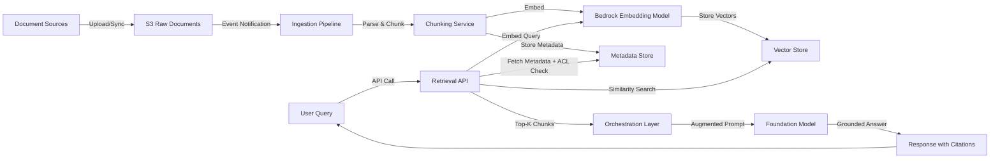
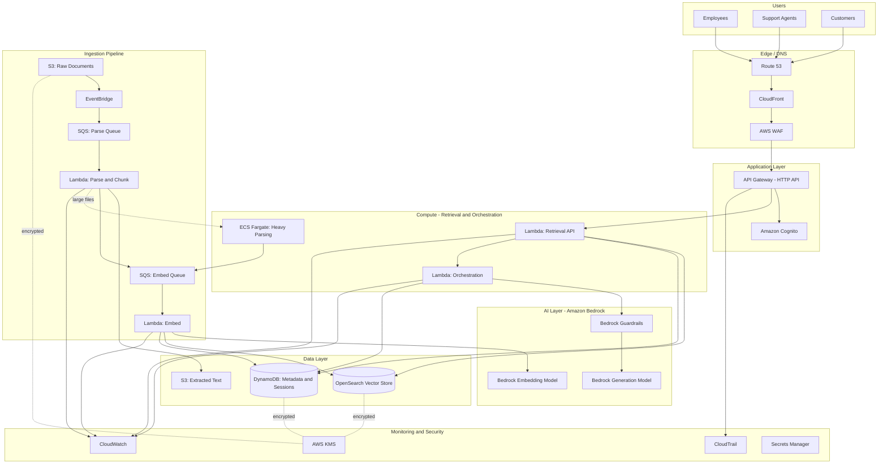

# Part VII – AI & Machine Learning Architectures

# Chapter 52: RAG Architecture

---

## 1. Executive Summary

Retrieval-Augmented Generation (RAG) has become the dominant enterprise pattern for grounding Large Language Models (LLMs) in an organization's proprietary knowledge without the cost, complexity, and risk of fine-tuning a foundation model.

### 1.1 The Business Problem

Enterprises sit on enormous volumes of unstructured knowledge: policy documents, engineering runbooks, contracts, support tickets, product manuals, compliance filings, and internal wikis. Foundation models such as those available through Amazon Bedrock are trained on public internet-scale data, not on this proprietary corpus.

This creates several concrete business problems:

- **Knowledge is inaccessible.** Employees spend excessive time searching internal SharePoint sites, Confluence spaces, and shared drives for answers that already exist somewhere in the organization.
- **Foundation models hallucinate on domain-specific facts.** An LLM asked "What is our refund policy for enterprise customers signed before 2023?" will either refuse, guess, or confidently fabricate an answer, because it never saw that document.
- **Fine-tuning is expensive and stale quickly.** Fine-tuning a model on internal data requires ML expertise, GPU budget, and a repeated retraining cycle every time policy documents change — which, in most enterprises, is continuously.
- **Compliance and auditability requirements demand traceable answers.** Regulated industries (banking, healthcare, insurance) cannot accept an AI answer without a verifiable source citation.

RAG solves this by keeping the foundation model frozen and instead retrieving the *most relevant* pieces of enterprise content at query time, injecting them into the model's context window, and asking the model to answer strictly from that retrieved context.

### 1.2 Architecture Objective

The objective of a RAG architecture is to build a pipeline that:

1. Ingests heterogeneous enterprise content (PDFs, HTML, Word documents, database records, transcripts) on a continuous or scheduled basis.
2. Breaks that content into semantically meaningful chunks and converts each chunk into a vector embedding.
3. Stores those embeddings in a vector-capable database that supports low-latency similarity search at scale.
4. At query time, embeds the user's question, retrieves the top-N most semantically relevant chunks, and constructs an augmented prompt.
5. Sends the augmented prompt to a foundation model (via Amazon Bedrock) to generate a grounded, cited answer.
6. Returns the answer to the user along with source references, while logging the full interaction for audit and continuous improvement.

### 1.3 Why Organizations Adopt This Architecture

Organizations adopt RAG rather than alternative approaches (raw fine-tuning, prompt-stuffing without retrieval, or building a traditional search engine) for a specific combination of reasons:

- **Freshness without retraining.** New documents become queryable within minutes of ingestion rather than requiring a multi-week fine-tuning cycle.
- **Cost efficiency.** Embedding and storing documents is dramatically cheaper than fine-tuning a foundation model, and inference cost scales with usage rather than with training runs.
- **Traceability.** Every generated answer can be traced back to the specific document chunks that produced it, which satisfies audit and compliance requirements that pure generative answers cannot.
- **Model portability.** Because the knowledge lives in the vector store rather than baked into model weights, organizations can swap the underlying foundation model (e.g., moving from Anthropic Claude to Amazon Titan or vice versa via Bedrock) without re-ingesting the knowledge base.
- **Reduced hallucination risk.** Grounding responses in retrieved text materially reduces (though does not eliminate) the rate of fabricated answers compared to relying on parametric model knowledge alone.

### 1.4 Major Business Benefits

| Benefit | Description | Typical Impact |
|---|---|---|
| Reduced time-to-answer | Employees get accurate answers in seconds instead of minutes-to-hours of manual search | 40–70% reduction in search time reported in enterprise deployments |
| Lower support costs | Customer support deflection via self-service RAG chatbots | 20–35% ticket deflection in mature deployments |
| Faster onboarding | New employees query internal knowledge directly instead of interrupting senior staff | Reduced ramp time for technical roles |
| Compliance support | Answers include citations, satisfying audit trails | Reduces legal/compliance review overhead |
| Knowledge democratization | Tribal knowledge trapped in senior employees' heads becomes queryable once documented and ingested | Reduces bus-factor risk |

### 1.5 Typical Enterprise Scenarios

- **Internal knowledge assistant** — engineering, HR, legal, and finance teams querying internal policy and procedure documents.
- **Customer support copilot** — support agents (or end customers) querying product documentation, past ticket resolutions, and troubleshooting guides.
- **Contract intelligence** — legal teams querying thousands of contracts for specific clauses, obligations, or renewal terms.
- **Regulatory and compliance search** — compliance officers querying regulatory filings and internal control documentation.
- **Developer productivity** — engineers querying internal API documentation, architecture decision records, and runbooks.
- **Sales enablement** — sales teams querying product battlecards, competitive intelligence, and case studies during live calls.

### 1.6 Why This Is Not "Just a Chatbot"

A common mistake is treating RAG as a thin wrapper around a chat UI. In production, RAG is fundamentally a **data pipeline problem** first and a generation problem second. The quality of answers is dominated by:

- How well documents are chunked and cleaned during ingestion.
- How well the embedding model captures domain-specific semantics.
- How the retrieval step handles ambiguous or multi-part questions.
- How access control is enforced so users only retrieve chunks they are authorized to see.

Organizations that under-invest in the ingestion and retrieval layers and over-invest in prompt engineering consistently see poor production results. This chapter treats RAG as an end-to-end enterprise data and AI system, not a demo.

---

## 2. Business Requirements

### 2.1 Business Drivers

- Reduce time spent searching for internal information.
- Improve consistency of answers given to customers and employees.
- Provide auditable, source-cited AI answers for regulated workflows.
- Reduce reliance on tribal knowledge held by senior staff.
- Enable self-service support to reduce headcount growth pressure on support teams.

### 2.2 Functional Requirements

- Support ingestion of PDF, DOCX, HTML, plain text, and structured database sources.
- Support incremental (delta) ingestion — only re-embed documents that changed.
- Support multi-tenant or department-scoped knowledge bases with access control.
- Support conversational, multi-turn queries with follow-up question handling.
- Return citations/source links alongside every generated answer.
- Support human feedback capture (thumbs up/down) for continuous improvement.
- Support configurable retrieval parameters (top-K, similarity threshold) per use case.

### 2.3 Non-Functional Requirements

| Category | Requirement |
|---|---|
| Scalability | Support growth from 10,000 to 10,000,000+ document chunks without re-architecture |
| Availability | 99.9% availability for the query path in production tier |
| Latency | P95 end-to-end response latency under 4 seconds for synchronous chat use cases |
| Compliance | Support HIPAA, SOC 2, and GDPR-aligned data handling depending on industry |
| Security | Encryption at rest and in transit; row-level or document-level access control |
| Auditability | Full request/response logging with retrieved chunk provenance |
| Cost predictability | Per-query cost visible and attributable via tagging |

### 2.4 Scalability Goals

- Ingestion pipeline must handle bursty batch loads (e.g., 50,000 documents uploaded during a system migration) without falling behind.
- Query path must scale horizontally to handle concurrent user load during business-hours peaks (typically 8–10x baseline).
- Vector store must scale to tens of millions of vectors without degrading P95 query latency beyond target.

### 2.5 Availability Requirements

- Query (read) path: 99.9% (roughly 43 minutes of downtime per month) is a reasonable enterprise target for an internal knowledge assistant.
- Ingestion (write) path: 99.5% is typically acceptable since ingestion is not user-facing in real time; a delayed ingestion run is an inconvenience, not an outage.
- Customer-facing RAG (e.g., embedded in a product) typically requires 99.95%, which changes the compute and multi-AZ design decisions discussed in Section 12.

### 2.6 Latency Requirements

| Interaction Type | Target P95 Latency |
|---|---|
| Vector similarity search alone | < 200 ms |
| Full retrieval (search + rerank) | < 800 ms |
| End-to-end synchronous chat response (including LLM generation) | < 4 s |
| Streaming first-token latency | < 1.5 s |
| Batch ingestion of a single document | < 30 s (async, not user-facing) |

### 2.7 Compliance Requirements

Depending on industry, the architecture must support:

- **HIPAA** — for healthcare document RAG, requiring a signed AWS Business Associate Addendum (BAA) and use of HIPAA-eligible services only.
- **SOC 2 Type II** — for SaaS-delivered RAG products, requiring documented change management, access review, and monitoring.
- **GDPR / data residency** — for EU-facing deployments, requiring data and embeddings to remain within EU regions and support for right-to-erasure across both source storage and the vector index.
- **FINRA / SEC recordkeeping** — for financial services, requiring immutable audit logs of every query and response for a defined retention period (often 6–7 years).

### 2.8 Security Expectations

- All data encrypted at rest using AWS KMS customer-managed keys (CMKs), not AWS-managed keys, for regulated workloads.
- All data encrypted in transit via TLS 1.2+.
- Document-level and field-level access control enforced at retrieval time, not only at the UI layer.
- No sensitive data (PII, PHI, secrets) sent to third-party model providers without an approved data processing agreement.
- Prompt injection and data exfiltration defenses (discussed in Section 11).

### 2.9 Recovery Objectives

| Metric | Target | Rationale |
|---|---|---|
| RPO (vector store) | 24 hours | Vectors are derived data; can be regenerated from source documents if lost, but daily snapshots reduce recovery time |
| RPO (source document store, S3) | Near-zero (S3 versioning + cross-region replication) | Source documents are the system of record and must not be lost |
| RTO (query path) | 1 hour | Business-critical for customer-facing deployments |
| RTO (ingestion path) | 4 hours | Non-blocking for end users |

### 2.10 SLAs

A typical enterprise RAG SLA commitment to internal stakeholders:

- 99.9% monthly uptime for the query API.
- P95 latency under 4 seconds, measured and reported monthly.
- Answer accuracy (measured via sampled human evaluation) above an agreed threshold, e.g., 90% factual grounding rate.
- Mean time to ingest a newly published document: under 15 minutes.

### 2.11 Expected Workload

A representative mid-size enterprise deployment:

- 500,000–2,000,000 source document chunks.
- 5,000–50,000 queries per day.
- Peak concurrency of 200–500 simultaneous users during business hours.
- Ingestion volume of 1,000–10,000 new/updated documents per week.

### 2.12 Expected Growth

- Document corpus growth of 20–40% year over year as more departments onboard.
- Query volume growth typically outpaces document growth by 2–3x as user trust in the system increases — architects must design retrieval and inference capacity for this disproportionate growth, not just linear scaling with document count.

---

## 3. Architecture Overview

### 3.1 Overall Design

The RAG architecture separates cleanly into three planes, each with distinct scaling, latency, and reliability characteristics:

1. **Ingestion plane** — asynchronous, batch-oriented, throughput-optimized. Responsible for turning raw documents into searchable vectors.
2. **Retrieval plane** — synchronous, latency-optimized. Responsible for finding the most relevant chunks for a given query.
3. **Generation plane** — synchronous, latency- and cost-optimized. Responsible for turning retrieved chunks plus the user's question into a grounded natural-language answer via a foundation model.

Keeping these planes architecturally distinct — different compute, different scaling policies, different failure domains — is one of the most important design decisions in a production RAG system. Conflating them (e.g., running document parsing synchronously inside the same Lambda that serves chat requests) is a common anti-pattern covered in Section 27.

### 3.2 Architecture Philosophy

- **Event-driven ingestion.** New or updated documents trigger ingestion automatically via S3 event notifications rather than relying on scheduled polling, which reduces staleness and operational overhead.
- **Stateless retrieval and generation compute.** Query-handling Lambda functions or containers hold no session state; conversational history is stored externally (DynamoDB) so any compute instance can serve any request.
- **Separation of storage concerns.** Raw documents live in S3 (cheap, durable, versioned). Structured metadata lives in DynamoDB (fast key lookups, access control attributes). Vectors live in a purpose-built vector store (Amazon OpenSearch Service with the k-NN plugin, or Amazon Bedrock Knowledge Bases backed by Amazon Aurora PostgreSQL with pgvector, or Amazon S3 Vectors for cost-optimized workloads).
- **Managed-first, build-second.** Wherever AWS offers a managed capability that meets requirements (Bedrock Knowledge Bases for orchestration, Bedrock Guardrails for safety filtering), prefer it over custom-built equivalents to reduce operational burden — but understand the trade-offs (Section 4 and Section 28) before committing.

### 3.3 Core Components

| Component | Responsibility |
|---|---|
| Document source connectors | Pull or receive documents from S3, SharePoint, Confluence, databases |
| Document parsing/chunking service | Extract text, tables, and structure; split into semantically coherent chunks |
| Embedding service | Convert text chunks into vector embeddings via a Bedrock embedding model |
| Vector store | Store and index embeddings for approximate nearest-neighbor search |
| Metadata store | Store chunk metadata, access control tags, and source references |
| Retrieval API | Accept a query, embed it, search the vector store, optionally rerank |
| Orchestration layer | Assemble the augmented prompt, call the foundation model, apply guardrails |
| Foundation model (via Bedrock) | Generate the final natural-language answer |
| Conversation/session store | Persist multi-turn conversation history |
| API layer | Expose retrieval and generation as an authenticated API (API Gateway) |
| Frontend/chat UI | End-user or agent-facing interface |
| Observability stack | Logging, tracing, metrics, and evaluation pipeline |

### 3.4 How Components Interact — High-Level Workflow



### 3.5 Request Lifecycle

1. User submits a natural-language question through the chat UI or API.
2. The API layer authenticates the request and identifies the user's access scope (department, security clearance, tenant).
3. The retrieval API embeds the query using the same embedding model used during ingestion.
4. A similarity search is executed against the vector store, filtered by the user's access scope.
5. Retrieved chunks are optionally reranked using a cross-encoder or Bedrock reranking model for higher precision.
6. The orchestration layer assembles a prompt containing the system instructions, retrieved context, conversation history, and the user's question.
7. The prompt is sent to the foundation model via Bedrock's InvokeModel or Converse API.
8. Guardrails are applied to both the input and output (topic restriction, PII redaction, harmful content filtering).
9. The response, along with source citations, is returned to the user.
10. The full interaction is logged asynchronously for audit and evaluation.

### 3.6 Response Lifecycle

- Response is streamed token-by-token to the client where possible (via Bedrock's streaming InvokeModel API) to minimize perceived latency.
- Citations are attached by mapping the retrieved chunk IDs used in the final prompt back to their source document metadata.
- If the model determines the retrieved context is insufficient to answer confidently, the system should return an explicit "I don't have enough information" response rather than allowing the model to fall back on parametric knowledge — this is enforced via prompt design and, optionally, a confidence-scoring step.

### 3.7 Data Lifecycle

- **Ingestion:** raw document → parsed text → chunks → embeddings → indexed vectors + metadata.
- **Retention:** source documents retained per corporate retention policy (often 7 years for regulated industries); vector index entries are considered derived/regenerable data.
- **Update:** when a source document changes, the pipeline must identify and delete stale chunks/vectors tied to the old version before indexing the new version, preventing duplicate or contradictory retrieval results.
- **Deletion:** when a document is deleted or a right-to-erasure request is received, both the S3 object and all associated vector store entries must be deleted — this requires a durable mapping between source document ID and all derived chunk/vector IDs (maintained in the metadata store).

---

## 4. AWS Services Used

> **Note:** Only services relevant to this architecture are detailed. Each entry explains purpose, selection rationale, alternatives, limitations, pricing considerations, and best practices.

### 4.1 Amazon Bedrock

**Purpose:** Provides fully managed access to foundation models (Anthropic Claude, Amazon Titan/Nova, Meta Llama, Mistral, Cohere) for both embedding generation and text generation, without managing GPU infrastructure.

**Why selected:**
- Single API surface for multiple model providers, enabling model swapping without re-architecting.
- Native support for Knowledge Bases (managed RAG orchestration), Guardrails (safety filtering), and Agents (tool-use orchestration).
- No infrastructure to patch, scale, or secure — AWS operates the model-serving layer.
- Data sent to Bedrock is not used to train underlying models (per AWS's model provider agreements), which is a critical enterprise requirement.

**Alternatives:**
- Self-hosted open-source models on Amazon EC2 (with GPU instances) or Amazon SageMaker endpoints — chosen when data residency requires a specific model not available in Bedrock, or when extremely high query volume makes self-hosting more cost-effective at scale.
- Third-party APIs (OpenAI, Google Vertex AI) — generally avoided in AWS-native enterprise architectures due to data governance and network egress concerns.

**Limitations:**
- Regional availability of specific models varies; architects must verify model availability in target regions before committing to a design.
- Throughput is governed by account-level and model-level quotas (tokens per minute, requests per minute) that must be requested and monitored.
- Some models require access to be explicitly requested/enabled per account before first use.

**Pricing considerations:**
- Billed per input/output token, varying significantly by model size and provider.
- Embedding models are billed per token processed during ingestion — this can be a meaningful cost driver for large initial corpus loads (Section 16).
- Provisioned Throughput is available for predictable, high-volume workloads at a lower effective per-token cost than on-demand, at the expense of a commitment.

**Best practices:**
- Use smaller, cheaper models for embedding and reserve larger models for final generation.
- Cache frequent query embeddings and retrieval results where content is static (Section 15).
- Set per-application token budgets and CloudWatch alarms on Bedrock usage metrics to avoid runaway cost.

### 4.2 Amazon Bedrock Knowledge Bases

**Purpose:** A managed RAG orchestration capability that handles chunking, embedding, vector store integration, and retrieval-augmented prompt construction with minimal custom code.

**Why selected:** Dramatically reduces time-to-production for standard RAG use cases; integrates natively with S3 as a data source and multiple vector store backends.

**Alternatives:** Fully custom orchestration (Lambda + LangChain/LlamaIndex or a custom framework) — chosen when chunking strategy, reranking logic, or prompt construction requires customization beyond what the managed service exposes.

**Limitations:** Less control over chunking strategy edge cases; customization of the retrieval pipeline (e.g., custom rerankers, hybrid search tuning) is more constrained than a fully custom build.

**Pricing considerations:** No separate charge for the orchestration layer itself beyond the underlying compute (embedding calls, vector store, generation calls) it invokes.

**Best practices:** Start with Knowledge Bases for new RAG projects; migrate to custom orchestration only when a specific, validated requirement cannot be met by the managed service.

### 4.3 Amazon OpenSearch Service (with k-NN plugin)

**Purpose:** Purpose-built vector store supporting approximate nearest-neighbor (ANN) search at scale, alongside traditional keyword (BM25) search — enabling hybrid search.

**Why selected:** Mature, battle-tested at enterprise scale; supports hybrid dense+sparse retrieval, which materially improves retrieval quality over pure vector search for many enterprise document types (legal text, technical documentation with exact terminology).

**Alternatives:**
- **Amazon Aurora PostgreSQL with pgvector** — preferred when the organization already operates Aurora and wants to keep vectors alongside relational metadata; better fit for moderate scale (millions, not billions, of vectors).
- **Amazon S3 Vectors** — a cost-optimized, purpose-built vector storage option for large, less latency-sensitive vector datasets, useful for cold or archival knowledge bases.
- **Pinecone / Weaviate / Qdrant (self-managed or SaaS)** — chosen when a team has existing expertise or requires specific features not yet available in AWS-native options; introduces a third-party dependency outside the AWS trust boundary.

**Limitations:** Cluster sizing and shard management require operational expertise; index rebuilds for algorithm changes (e.g., switching HNSW parameters) can be disruptive at large scale.

**Pricing considerations:** Billed by instance-hours for the underlying OpenSearch cluster plus storage; can become a significant cost driver at tens of millions of vectors — right-sizing and using UltraWarm/cold storage tiers for infrequently queried indices reduces cost.

**Best practices:** Use dedicated master nodes for clusters supporting production traffic; enable index lifecycle management to move older, less-queried indices to cheaper storage tiers.

### 4.4 AWS Lambda

**Purpose:** Serverless compute for event-driven ingestion steps (triggered by S3 uploads) and for the retrieval/orchestration API layer for low-to-moderate sustained traffic.

**Why selected:** No infrastructure management; scales automatically with request volume; pay-per-invocation pricing aligns well with bursty ingestion workloads.

**Alternatives:** Amazon ECS Fargate or EC2 — preferred when individual document processing exceeds Lambda's 15-minute execution limit or 10 GB memory limit (e.g., parsing very large PDFs or video transcripts), or when sustained high-throughput traffic makes provisioned compute more cost-effective than per-invocation billing.

**Limitations:** 15-minute maximum execution duration; cold starts can add latency for infrequently invoked functions (mitigated with Provisioned Concurrency for latency-sensitive retrieval APIs).

**Pricing considerations:** Pay per GB-second of execution plus request count; cost-effective for the retrieval API at moderate query volumes, less so at sustained very high throughput where Fargate/EC2 may be cheaper.

**Best practices:** Use Lambda for ingestion orchestration and light retrieval logic; move to containers if a single function's runtime approaches the 15-minute limit or memory needs exceed 10 GB.

### 4.5 Amazon S3

**Purpose:** Durable, versioned object storage for raw source documents and, optionally, for extracted text artifacts.

**Why selected:** 11 nines of durability, native event notifications for triggering ingestion, lifecycle policies for cost management, and versioning for document history/audit.

**Alternatives:** Amazon FSx or EFS — rarely appropriate for this use case since documents are write-once/read-many objects, not a shared POSIX filesystem workload.

**Limitations:** Not queryable directly; requires an index (the vector store and metadata store) to make content searchable.

**Pricing considerations:** Use S3 Intelligent-Tiering for document archives with unpredictable access patterns; apply lifecycle rules to transition old document versions to Glacier for long-term compliance retention.

**Best practices:** Enable versioning and MFA delete on the raw document bucket; enforce bucket policies requiring encryption in transit; use S3 Object Lock for regulatory write-once-read-many (WORM) requirements.

### 4.6 Amazon DynamoDB

**Purpose:** Stores document metadata, access control tags, chunk-to-document mappings, and conversation/session history.

**Why selected:** Single-digit millisecond key-value lookups at any scale; serverless with on-demand pricing suits unpredictable metadata read patterns; native TTL for expiring old conversation sessions.

**Alternatives:** Amazon RDS/Aurora — preferred when metadata requires complex relational queries or joins (e.g., "find all chunks belonging to documents owned by department X and modified after date Y" with multiple filter dimensions); DynamoDB's single-table design can express this but with more upfront modeling effort.

**Limitations:** Query flexibility is constrained compared to SQL; complex ad-hoc analytical queries require exporting to a data warehouse or using DynamoDB Streams to a secondary store.

**Pricing considerations:** On-demand mode avoids capacity planning for unpredictable ingestion bursts; provisioned mode with auto scaling is cheaper for steady, predictable traffic.

**Best practices:** Use a single-table design with composite keys to model document → chunk → vector relationships efficiently; enable point-in-time recovery for the metadata table.

### 4.7 Amazon API Gateway

**Purpose:** Exposes the retrieval and generation endpoints as a secured, throttled, and monitored HTTP API.

**Why selected:** Native integration with Lambda, built-in throttling and usage plans, native AWS IAM and Amazon Cognito authentication support, request/response transformation.

**Alternatives:** Application Load Balancer (ALB) directly in front of ECS/Fargate — preferred for containerized retrieval services requiring WebSocket support for streaming responses at scale, or when avoiding API Gateway's payload size limits (10 MB).

**Limitations:** 29-second maximum integration timeout (relevant for long-running generation calls — mitigated via streaming responses or async patterns with WebSocket APIs).

**Pricing considerations:** Pay per request plus data transfer; HTTP APIs are cheaper than REST APIs for this use case and sufficient for most RAG API needs.

**Best practices:** Use HTTP APIs (not REST APIs) unless request validation or usage plans specifically require REST API features; enable AWS WAF association for public-facing endpoints.

### 4.8 Amazon Cognito

**Purpose:** User authentication and authorization for the chat UI and API, including mapping users to access-control groups used for retrieval filtering.

**Why selected:** Managed user pools eliminate the need to build custom authentication; integrates with API Gateway and supports federation with enterprise identity providers (SAML/OIDC) via IAM Identity Center or direct SSO integration.

**Alternatives:** Enterprise IdP (Okta, Azure AD) federated directly via SAML — often used in tandem with Cognito as the federation broker rather than as a replacement.

**Limitations:** Custom attribute mapping for fine-grained access control tags requires careful upfront schema design.

**Best practices:** Map department/clearance-level custom attributes into the JWT so the retrieval layer can filter vector search results without an additional metadata lookup round-trip.

### 4.9 Amazon CloudFront

**Purpose:** CDN for the chat UI static assets and, optionally, for caching non-personalized API responses.

**Why selected:** Reduces latency for globally distributed users accessing the frontend; provides an additional layer for AWS WAF and Shield protection.

**Limitations:** Not useful for caching personalized/streaming generation responses, which are inherently dynamic and user-specific.

**Best practices:** Use CloudFront for the static frontend only; do not attempt to cache generation API responses at the CDN layer given their personalized, streaming nature.

### 4.10 AWS KMS

**Purpose:** Manages encryption keys for S3 documents, DynamoDB tables, OpenSearch domains, and Bedrock guardrail configurations.

**Why selected:** Customer-managed keys (CMKs) provide auditable, revocable encryption control required for regulated data; integrates natively with every storage service in this architecture.

**Best practices:** Use separate CMKs per data classification tier (e.g., one key for general documents, a separate key for highly sensitive/regulated documents) to enable independent key rotation and access revocation.

### 4.11 AWS Secrets Manager

**Purpose:** Stores credentials for third-party document source connectors (SharePoint, Confluence API tokens) and any non-IAM-based service credentials.

**Best practices:** Enable automatic rotation for connector credentials where the source system supports it; never store credentials in Lambda environment variables in plaintext.

### 4.12 Amazon CloudWatch and AWS CloudTrail

**Purpose:** CloudWatch provides metrics, logs, dashboards, and alarms for both the ingestion and query paths. CloudTrail provides an immutable audit log of all AWS API calls, critical for compliance evidence.

**Best practices:** Emit structured JSON logs including retrieved chunk IDs, model invoked, token counts, and latency for every query, enabling both operational monitoring and RAG-quality evaluation (Section 21).

### 4.13 Amazon SQS and Amazon EventBridge

**Purpose:** SQS decouples the ingestion pipeline stages (parsing → chunking → embedding → indexing), providing retry and dead-letter handling for failed documents. EventBridge routes S3 upload events and scheduled ingestion triggers to the pipeline.

**Best practices:** Use SQS dead-letter queues for documents that repeatedly fail parsing (e.g., corrupted PDFs) and route them to an operational alert rather than silently dropping them.

### 4.14 AWS WAF and AWS Shield

**Purpose:** Protects the public-facing API Gateway/CloudFront endpoints from common web exploits and DDoS.

**Best practices:** Apply rate-based rules specifically tuned for chat APIs, since a single malicious user issuing rapid queries can drive significant Bedrock token cost — WAF rate limiting is a cost control as much as a security control in this architecture.

---

## 5. Complete Architecture Diagram



---

## 6. Component-by-Component Explanation

### 6.1 Document Source Connectors

**Purpose:** Pull content from enterprise systems (SharePoint, Confluence, Jira, database exports) or receive direct uploads into S3.

**Responsibilities:** Authenticate to source systems, detect new/changed/deleted documents, normalize into a consistent format for S3 upload with source metadata tags.

**Inputs:** Source system APIs or scheduled export files. **Outputs:** Objects written to S3 with metadata (source system, owner, classification, last-modified).

**Scaling:** Scheduled Lambda or Fargate tasks scale independently per connector; high-volume connectors (e.g., a Confluence space with 100,000 pages) should run as Fargate batch jobs rather than a single Lambda invocation.

**High availability:** Connector failures are isolated per source system; a SharePoint outage should not block Confluence ingestion.

**Failure handling:** Failed pulls are retried with exponential backoff; persistent failures alert via CloudWatch and are logged with the specific document/page ID for manual remediation.

**Dependencies:** Secrets Manager for source system credentials; S3 for output.

**Security:** Least-privilege IAM roles scoped to specific S3 prefixes; source system credentials rotated regularly.

**Monitoring:** CloudWatch metrics for documents pulled, failed, and skipped per run.

### 6.2 Document Parsing and Chunking Service

**Purpose:** Extract clean text (and, where relevant, tables and structure) from raw documents, then split into chunks sized appropriately for the embedding model's context window and for retrieval precision.

**Responsibilities:**
- Detect file type and route to the appropriate parser (PDF text extraction, OCR for scanned documents, DOCX/HTML parsing).
- Strip boilerplate (headers, footers, navigation chrome) that pollutes embeddings.
- Apply a chunking strategy — fixed-size with overlap, semantic/paragraph-based, or structure-aware (splitting on document headings) — chosen based on document type.
- Attach metadata to every chunk: source document ID, page number, section heading, access-control tags, last-modified date.

**Inputs:** Raw document from S3. **Outputs:** Chunk records (text + metadata) written to the embedding queue.

**Scaling:** Lambda for documents under ~50 pages; ECS Fargate batch jobs for large documents (500+ page manuals) or OCR-heavy scanned document sets that exceed Lambda's time/memory limits.

**High availability:** Stateless processing; any failed chunk-processing job can be retried without side effects since chunking is idempotent given the same source document version.

**Failure handling:** Malformed documents (corrupted PDFs, password-protected files) are routed to a dead-letter queue with an operational alert rather than blocking the pipeline.

**Dependencies:** S3 (input/output), SQS (queueing), optionally Amazon Textract for OCR and table extraction from scanned documents.

**Security:** Parsing compute runs in a private subnet with no direct internet egress beyond what's required for AWS service calls (via VPC endpoints).

**Monitoring:** Chunk count per document, average chunk size, parsing duration, and OCR confidence scores (where applicable) tracked in CloudWatch.

> **Warning:** Chunking strategy is the single highest-leverage decision in the entire pipeline for retrieval quality. Poor chunking (e.g., splitting mid-sentence, or chunks so large they dilute semantic focus) degrades every downstream step no matter how good the embedding or generation model is.

### 6.3 Embedding Service

**Purpose:** Converts each text chunk into a fixed-dimensional vector representation capturing its semantic meaning, using a Bedrock embedding model (e.g., Amazon Titan Text Embeddings or Cohere Embed).

**Responsibilities:** Batch chunks for efficient API calls, invoke the embedding model, validate output dimensionality, write vectors to the vector store alongside metadata.

**Scaling:** Lambda functions scale horizontally with SQS queue depth; Bedrock's own throughput quotas (tokens per minute) become the effective ceiling and must be requested proactively ahead of large ingestion runs.

**Failure handling:** Throttling from Bedrock is handled with exponential backoff and jitter; persistent throttling triggers a CloudWatch alarm recommending a quota increase request.

**Security:** IAM role scoped only to `bedrock:InvokeModel` for the specific embedding model ARN, following least privilege.

**Monitoring:** Embedding latency, token consumption, and cost per ingestion run tracked via CloudWatch custom metrics.

> **Note:** The embedding model used at query time **must** be the identical model (and version) used at ingestion time. Mixing embedding model versions produces vectors in different geometric spaces, silently destroying retrieval quality. This is one of the most common production incidents in RAG systems (see Section 24).

### 6.4 Vector Store

**Purpose:** Indexes millions of vectors for approximate nearest-neighbor search with sub-second latency, optionally combined with keyword (BM25) search for hybrid retrieval.

**Responsibilities:** Accept vector writes from the embedding service; serve similarity search queries filtered by access-control metadata; maintain index health.

**Scaling:** OpenSearch cluster scales via adding data nodes; sharding strategy must be planned upfront based on projected vector count (over-sharding wastes resources, under-sharding limits parallelism).

**High availability:** Multi-AZ deployment with at least 3 dedicated master nodes and replica shards across AZs.

**Failure handling:** Automatic shard reallocation on node failure; snapshot-based backups to S3 for disaster recovery.

**Dependencies:** KMS for encryption at rest; VPC for network isolation.

**Security:** Fine-grained access control restricting index-level and even document-level access; all traffic within VPC, no public endpoint.

**Monitoring:** Cluster health (green/yellow/red), search latency, indexing latency, JVM memory pressure, and disk watermark alarms.

### 6.5 Metadata Store (DynamoDB)

**Purpose:** Authoritative source for document-to-chunk-to-vector relationships, access control tags, and conversation session history.

**Responsibilities:** Support fast lookups for access-control filtering, provide the mapping needed to delete all derived data when a source document is deleted.

**Scaling:** On-demand capacity mode absorbs unpredictable ingestion bursts and query traffic without manual capacity planning.

**High availability:** Multi-AZ by default; Global Tables for multi-region deployments.

**Security:** Encryption at rest with KMS; IAM policies scoped per access pattern (read-only for retrieval Lambdas, write access only for ingestion Lambdas).

**Monitoring:** Consumed read/write capacity, throttled requests, and item count growth tracked in CloudWatch.

### 6.6 Retrieval API

**Purpose:** Accepts a natural-language query, embeds it, executes similarity search (with access-control filtering), optionally reranks, and returns the top-K chunks.

**Responsibilities:** Enforce per-user access scope on every search; apply configurable similarity thresholds to avoid returning irrelevant low-confidence chunks; optionally invoke a reranking model for higher precision on ambiguous queries.

**Scaling:** Lambda with Provisioned Concurrency to eliminate cold-start latency for this latency-sensitive path, or ECS Fargate behind an ALB for very high sustained throughput.

**Failure handling:** Circuit breaker pattern against the vector store — if search fails or times out, return a graceful "unable to retrieve context" response rather than allowing the orchestration layer to proceed with an empty, ungrounded prompt.

**Security:** Access-control filter is applied as a mandatory query parameter derived from the authenticated user's JWT claims, never trusted from client input.

**Monitoring:** Search latency, result count distribution, and zero-result-rate (a strong signal of either a knowledge gap or a chunking/embedding quality problem).

### 6.7 Orchestration Layer

**Purpose:** Assembles the final augmented prompt (system instructions + retrieved context + conversation history + user question), applies guardrails, and invokes the foundation model.

**Responsibilities:** Manage prompt template versioning; enforce maximum context window budget across retrieved chunks and conversation history; apply Bedrock Guardrails for topic restriction and PII redaction; stream the response back to the client.

**Scaling:** Lambda for standard chat latency requirements; scales with API Gateway concurrency limits.

**Failure handling:** If the foundation model call fails or times out, retry once with backoff; if it fails again, return a clear error rather than a partial/truncated answer.

**Security:** Guardrails applied on both input (blocking prompt injection patterns, jailbreak attempts) and output (blocking PII leakage, off-topic responses).

**Monitoring:** Token consumption per request, guardrail intervention rate, and generation latency.

### 6.8 Conversation/Session Store

**Purpose:** Persists multi-turn conversation history so follow-up questions ("What about for enterprise customers?") can be correctly contextualized.

**Scaling:** DynamoDB with TTL to automatically expire old sessions and control storage growth.

**Security:** Session data encrypted at rest; access scoped to the owning user only.

### 6.9 Frontend/Chat UI

**Purpose:** User-facing interface for submitting queries and viewing streamed, cited responses.

**Scaling:** Static assets served via CloudFront/S3; scales trivially as a CDN-delivered single-page application.

**Security:** Enforces authentication via Cognito before allowing any API calls; never embeds API credentials in client-side code.

---

## 7. End-to-End Request Flow

1. **Client** submits a question through the chat UI, which is served as a static asset from **CloudFront**, backed by **S3**.
2. The browser resolves the API domain via **Route 53** and sends an authenticated HTTPS request (bearing a Cognito JWT) to **API Gateway**, passing through **AWS WAF** for request inspection.
3. **API Gateway** validates the JWT against the configured **Cognito** authorizer and forwards the request to the **Retrieval Lambda**.
4. The Retrieval Lambda extracts the user's access-control claims from the JWT (department, clearance level).
5. The Lambda calls **Bedrock** to embed the user's query using the same embedding model used during ingestion.
6. The Lambda executes a filtered similarity search against **OpenSearch**, restricting results to chunks the user is authorized to see.
7. If zero or low-confidence results are returned, the Lambda short-circuits and returns a "no relevant information found" response, logging the query as a knowledge gap.
8. Retrieved chunk IDs are used to fetch full metadata (source document title, URL, last-modified date) from **DynamoDB**.
9. The Orchestration Lambda retrieves prior conversation turns from the **session store** in DynamoDB.
10. The Orchestration Lambda assembles the augmented prompt and submits it to **Bedrock Guardrails** for input-side filtering.
11. The filtered prompt is sent to the selected foundation model via Bedrock's streaming **Converse API**.
12. Tokens are streamed back through **API Gateway** (via a WebSocket API or chunked HTTP response) to the client as they are generated, reducing perceived latency.
13. The complete response passes through **Bedrock Guardrails** output filtering before being finalized.
14. The final response, with attached source citations, is rendered in the chat UI.
15. The Orchestration Lambda writes the new conversation turn to **DynamoDB** for future context.
16. An asynchronous logging call writes the full request/response, retrieved chunk IDs, token counts, and latency breakdown to **CloudWatch Logs**, which are subsequently exported to **S3** for long-term audit retention and to a query engine (**Amazon Athena**) for evaluation analytics.
17. **CloudTrail** independently records the underlying AWS API calls (Bedrock invocations, DynamoDB access) for compliance audit purposes.
18. If any step fails (embedding timeout, OpenSearch unavailability, Bedrock throttling), the system returns a graceful, user-visible error message and emits a **CloudWatch** alarm rather than surfacing a raw stack trace or hanging indefinitely.

---

## 8. Deployment Flow

### 8.1 Infrastructure Provisioning

All infrastructure is provisioned via Terraform, organized into modules mirroring the architectural planes: `networking`, `ingestion`, `vector-store`, `retrieval-api`, `security`, and `monitoring`. This modular structure allows the ingestion pipeline to be updated and redeployed independently of the retrieval API, reducing blast radius for changes.

### 8.2 Terraform Workflow

1. Developer opens a pull request modifying a Terraform module.
2. CI pipeline runs `terraform fmt -check`, `terraform validate`, and `tflint`.
3. `terraform plan` output is posted as a PR comment for human review.
4. Security scanning (`tfsec` or `checkov`) runs against the plan to catch misconfigurations (e.g., an unencrypted S3 bucket) before merge.
5. On merge to `main`, a pipeline stage runs `terraform apply` against a staging environment automatically.
6. After staging validation (automated smoke tests + manual sign-off for production-impacting changes), a manual approval gate triggers `terraform apply` against production.

### 8.3 CI/CD Deployment

Application code (Lambda functions, container images) is built, tested, and packaged in a separate pipeline stage from infrastructure changes, allowing application deploys to ship independently of infrastructure changes when no infrastructure modification is required.

### 8.4 Blue-Green Deployment

- **Lambda functions:** Use Lambda aliases with weighted traffic shifting (e.g., 10% → 50% → 100%) to progressively roll out new versions, monitoring error rates at each step.
- **OpenSearch index changes** (e.g., switching embedding models, which requires re-indexing): Build the new index in parallel ("blue"), validate retrieval quality against a test query set, then atomically switch an alias to point retrieval traffic at the new index ("green"), keeping the old index available for immediate rollback.

### 8.5 Rollback

- Lambda: revert the alias weighting to the previous stable version; typically completes within seconds.
- OpenSearch index: revert the alias to the previous index; the old index must be retained (not deleted) for a defined grace period after any cutover specifically to enable this rollback path.
- Terraform: maintain state file versioning in S3 with versioning enabled, allowing `terraform apply` of a previous known-good configuration if a change introduces regressions.

### 8.6 Secrets

Managed via Secrets Manager, referenced in Terraform via data sources rather than hardcoded, and injected into Lambda/Fargate at runtime via IAM-scoped access — never committed to source control or baked into container images.

### 8.7 Configuration

Environment-specific configuration (model IDs, chunk size parameters, similarity thresholds) is managed via Systems Manager Parameter Store, allowing tuning without a full redeployment.

### 8.8 Validation

Post-deployment validation includes automated retrieval-quality regression tests (a fixed set of test queries with expected relevant document IDs) run against staging before every production promotion, catching silent retrieval-quality regressions introduced by chunking or embedding model changes.

---

## 9. Network Topology

### 9.1 VPC

A dedicated VPC hosts the OpenSearch cluster, any Fargate-based parsing compute, and VPC-attached Lambda functions requiring access to the vector store.

### 9.2 CIDR

Example: `10.20.0.0/16` allocated for the RAG workload VPC, sized to allow room for future subnet expansion (e.g., adding a dedicated subnet tier for future GPU-based self-hosted models).

### 9.3 Public and Private Subnets

| Subnet Tier | CIDR Example | Purpose |
|---|---|---|
| Public | 10.20.0.0/24, 10.20.1.0/24 | NAT Gateways, ALB (if used) |
| Private – Application | 10.20.10.0/23, 10.20.12.0/23 | Lambda ENIs, Fargate tasks |
| Private – Data | 10.20.20.0/23, 10.20.22.0/23 | OpenSearch cluster nodes |

Each tier is duplicated across at least two, preferably three, Availability Zones.

### 9.4 NAT Gateway

Deployed one per AZ (not a single shared NAT Gateway) to avoid a cross-AZ single point of failure for outbound calls from private-subnet Lambda/Fargate resources to Bedrock and other AWS service endpoints not reachable via VPC endpoints.

### 9.5 Internet Gateway

Attached for the public subnet tier only, supporting NAT Gateway egress; no compute resource in this architecture has a public IP directly attached.

### 9.6 Transit Gateway

Used when the RAG VPC needs to reach on-premises document sources (e.g., an on-prem SharePoint farm) via an existing hybrid connectivity hub, or when connecting multiple department-specific RAG VPCs to shared services (a central Bedrock access VPC, for example) in a hub-and-spoke topology.

### 9.7 Route Tables

Private application and data subnets route AWS-service-bound traffic through VPC endpoints and only route general internet-bound traffic through the NAT Gateway, minimizing NAT data processing costs (Section 16).

### 9.8 Network ACLs

Stateless NACLs applied at the subnet level as a defense-in-depth layer, restricting the data-tier subnet to only accept traffic from the application-tier subnet CIDR ranges on the OpenSearch port (443).

### 9.9 Security Groups

| Security Group | Inbound | Outbound |
|---|---|---|
| `sg-retrieval-lambda` | N/A (Lambda-managed ENI) | 443 to `sg-opensearch`, VPC endpoints |
| `sg-opensearch` | 443 from `sg-retrieval-lambda`, `sg-ingestion-compute` | None required |
| `sg-ingestion-compute` | N/A | 443 to `sg-opensearch`, VPC endpoints, NAT (for source connector APIs) |

### 9.10 PrivateLink / VPC Endpoints

Interface VPC endpoints are provisioned for Bedrock, S3 (gateway endpoint), DynamoDB (gateway endpoint), Secrets Manager, KMS, and CloudWatch Logs. This ensures traffic from private-subnet compute to these AWS services never traverses the public internet, which is both a security best practice and a meaningful reduction in NAT Gateway data-processing cost at scale.

### 9.11 Hybrid Connectivity

For organizations with on-premises document repositories, AWS Direct Connect (preferred for high, predictable volume) or Site-to-Site VPN (acceptable for lower, variable volume) connects the on-premises network to the Transit Gateway, allowing ingestion connectors to reach internal SharePoint or file-share sources securely.

---

## 10. Identity and Access

### 10.1 IAM Roles

Distinct, narrowly scoped IAM roles are defined for each compute component:

- `rag-ingestion-parser-role` — read/write access limited to specific S3 prefixes, no vector store access.
- `rag-embedding-role` — `bedrock:InvokeModel` for the embedding model ARN only, write access to the vector store index.
- `rag-retrieval-role` — read-only access to the vector store and metadata table, `bedrock:InvokeModel` for the embedding model only (not the generation model).
- `rag-orchestration-role` — `bedrock:InvokeModel`/`InvokeModelWithResponseStream` for approved generation model ARNs, read/write access to the session table.

### 10.2 IAM Policies

Example least-privilege policy for the retrieval role, scoped to a specific embedding model and DynamoDB table:

```json

{
  "Version": "2012-10-17",
  "Statement": [
    {
      "Effect": "Allow",
      "Action": ["bedrock:InvokeModel"],
      "Resource": "arn:aws:bedrock:us-east-1::foundation-model/amazon.titan-embed-text-v2:0"
    },
    {
      "Effect": "Allow",
      "Action": ["dynamodb:GetItem", "dynamodb:Query"],
      "Resource": "arn:aws:dynamodb:us-east-1:111122223333:table/rag-metadata"
    },
    {
      "Effect": "Allow",
      "Action": ["es:ESHttpPost", "es:ESHttpGet"],
      "Resource": "arn:aws:es:us-east-1:111122223333:domain/rag-vectors/*"
    }
  ]
}

```

### 10.3 Resource Policies

The OpenSearch domain access policy restricts access to only the specific IAM roles listed above, rather than allowing broad account-level access, even though network-layer isolation (VPC, security groups) already restricts reachability — this is defense in depth.

### 10.4 STS

Cross-account scenarios (e.g., a shared "AI Platform" account hosting Bedrock access for multiple business-unit accounts) use STS `AssumeRole` with external ID conditions to prevent confused-deputy issues.

### 10.5 Cross-Account Access

In a multi-account landing zone (see Chapter 99), a common pattern places the Bedrock model access and vector store in a shared "AI Platform" account, with business-unit accounts assuming a scoped role to invoke retrieval/generation, centralizing model governance and cost tracking.

### 10.6 Least Privilege

Every role above is scoped to specific resource ARNs, not wildcard resources, and specific actions rather than service-level wildcards (e.g., never `bedrock:*`).

### 10.7 Service Roles

Lambda execution roles are distinct per function rather than a single shared role across all ingestion and retrieval Lambdas, ensuring a compromised or misconfigured function cannot access resources outside its specific responsibility.

### 10.8 Permission Boundaries

A permission boundary is attached to all roles created by the ingestion pipeline's automation (e.g., roles dynamically created for per-department knowledge base isolation) capping the maximum permissions any dynamically created role can ever have, regardless of the policy attached to it — a critical control when role creation itself is automated.

---

## 11. Security Architecture

### 11.1 Encryption

- **At rest:** S3 (KMS CMK), DynamoDB (KMS CMK), OpenSearch domain (KMS CMK), CloudWatch Logs (KMS CMK).
- **In transit:** TLS 1.2+ enforced on API Gateway, VPC endpoint traffic, and OpenSearch domain access (HTTPS only, enforced via domain security policy).

### 11.2 KMS

Separate CMKs per data classification tier, with key policies restricting `kms:Decrypt` to only the specific IAM roles requiring access to that classification tier — this prevents, for example, the ingestion role for public marketing documents from ever being able to decrypt data in the highly-sensitive legal contracts key.

### 11.3 TLS

Enforced end-to-end; API Gateway custom domain uses an AWS Certificate Manager (ACM) certificate with automatic renewal.

### 11.4 WAF

Rules applied at CloudFront and/or API Gateway: rate-based rules (critical for controlling Bedrock cost exposure from abusive query volume), AWS Managed Rules for common exploits (SQL injection, known bad inputs), and custom rules blocking known prompt-injection payload patterns at the edge where feasible.

### 11.5 Shield

AWS Shield Standard is active by default on CloudFront/API Gateway; Shield Advanced is added for customer-facing production deployments where DDoS-driven cost amplification (via triggering excessive Bedrock invocations) is a material business risk.

### 11.6 Secrets Manager

Stores third-party connector credentials with automatic rotation enabled where the source system API supports it.

### 11.7 Certificate Manager

Manages the TLS certificate for the custom API domain and CloudFront distribution, with automatic renewal removing a common source of production outages (expired certificates).

### 11.8 GuardDuty

Enabled account-wide to detect anomalous behavior — for example, an ingestion Lambda role suddenly attempting to access resources outside its normal pattern, which could indicate a compromised dependency in the parsing library.

### 11.9 Inspector

Scans container images used for Fargate-based document parsing for known vulnerabilities before deployment, and continuously thereafter.

### 11.10 Security Hub

Aggregates findings from GuardDuty, Inspector, Config, and IAM Access Analyzer into a single dashboard, mapped against the AWS Foundational Security Best Practices standard.

### 11.11 CloudTrail

Immutable, multi-region trail capturing all API calls, including every `bedrock:InvokeModel` call, stored in a dedicated log-archive account with restricted write access — critical for both security investigation and compliance evidence of AI usage.

### 11.12 AWS Config

Continuously evaluates resource configuration against rules such as "S3 buckets must have encryption enabled" and "OpenSearch domains must not have public access," alerting on drift.

### 11.13 Zero Trust Principles Applied

- Every request is authenticated and authorized regardless of network origin — internal network location grants no implicit trust.
- Access-control filtering is enforced at the retrieval layer itself (query-time filtering against the user's claims), not solely at the UI layer, preventing a compromised or bypassed frontend from exposing unauthorized content.
- Service-to-service calls (Lambda to OpenSearch, Lambda to Bedrock) use IAM-based authentication (SigV4), not static API keys.

### 11.14 Threat Model

| Threat | Description | Mitigation |
|---|---|---|
| Prompt injection | Malicious content embedded in an ingested document attempts to override system instructions when retrieved into a prompt | Guardrails input filtering; treat retrieved content as data, never as instructions, via strict prompt templating |
| Data exfiltration via chat | A user crafts queries designed to extract information outside their authorized access scope | Mandatory access-control filtering at retrieval time; guardrail output scanning |
| Model output leaking PII | Generation model reproduces sensitive PII present in retrieved chunks in a context where it shouldn't be disclosed | Bedrock Guardrails PII redaction on output; document-level classification tags restricting ingestion of highly sensitive PII into general-purpose knowledge bases |
| Denial of wallet | Attacker drives excessive Bedrock invocations to inflate cost | WAF rate limiting, per-user quota enforcement, CloudWatch cost anomaly alarms |
| Poisoned ingestion source | A compromised or malicious document source injects misleading content designed to manipulate future answers | Source allowlisting, content validation/sanitization during parsing, human review workflow for new source onboarding |
| Vector store data leakage | Misconfigured access control policy exposes cross-tenant or cross-department vectors | Mandatory metadata-based filtering enforced server-side, regularly audited via automated access-control test suites |

### 11.15 Attack Vectors and Mitigations Summary

> **Tip:** Treat every piece of retrieved document content as untrusted input to the LLM, exactly as you would treat user input to a SQL query. This single mental model prevents the majority of prompt-injection-related production incidents.

---

## 12. High Availability

### 12.1 AZ Failures

All stateful components (OpenSearch, DynamoDB) are deployed multi-AZ by default. Lambda functions are inherently multi-AZ as a managed service. A single AZ failure should cause no user-visible impact beyond a brief latency blip during automatic failover.

### 12.2 Instance Failures

OpenSearch data node failures trigger automatic shard reallocation to healthy nodes; dedicated master nodes ensure cluster state management survives individual node loss.

### 12.3 Regional Failures

For customer-facing, business-critical deployments (99.95%+ SLA), a warm-standby architecture in a second region is provisioned (Section 13), with Route 53 health checks driving failover.

### 12.4 Database Failures

DynamoDB's multi-AZ replication is automatic and requires no architect intervention beyond enabling point-in-time recovery for logical-error protection (accidental deletes, corrupted writes).

### 12.5 Load Balancing

API Gateway inherently load-balances across all healthy Lambda concurrency; for Fargate-based retrieval services, an ALB distributes traffic across tasks in multiple AZs with health-check-driven deregistration of unhealthy targets.

### 12.6 Health Checks

- ALB target group health checks against a dedicated `/health` endpoint that verifies connectivity to OpenSearch and DynamoDB, not just process liveness.
- Route 53 health checks against the API's health endpoint drive multi-region failover decisions.

### 12.7 Failover

Documented, tested failover runbook (Section 23) specifying the exact sequence: promote standby OpenSearch cluster, update DynamoDB Global Table's preferred region, update Route 53 weighted/failover routing, and validate end-to-end query success before declaring failover complete.

---

## 13. Disaster Recovery

### 13.1 Backup Strategy

| Data Store | Backup Method | Frequency |
|---|---|---|
| S3 raw documents | Versioning + Cross-Region Replication | Continuous |
| DynamoDB metadata | Point-in-time recovery + on-demand backups | Continuous + weekly manual snapshot |
| OpenSearch vectors | Automated snapshots to S3 | Daily |

### 13.2 Snapshots

OpenSearch automated snapshots are retained for 14 days minimum; manual pre-change snapshots are taken before any index-impacting operation (embedding model migration, major re-chunking effort).

### 13.3 Cross-Region Replication

S3 Cross-Region Replication (CRR) ensures raw source documents — the true system of record — are durably available in a secondary region even if the primary region is fully unavailable, since vectors can always be regenerated from source documents given sufficient time.

### 13.4 Pilot Light

For cost-conscious deployments where a multi-hour RTO is acceptable, a "pilot light" DR pattern keeps only the S3 replicated documents and DynamoDB Global Table active in the secondary region; the OpenSearch cluster and compute are provisioned via Terraform only when a disaster is declared, then vectors are re-ingested or restored from the latest snapshot.

### 13.5 Warm Standby

For business-critical, customer-facing deployments, a warm standby maintains a smaller, always-running OpenSearch cluster and Lambda deployment in the secondary region, kept in sync via periodic snapshot restoration, ready to absorb full production traffic within the target RTO after a scale-up.

### 13.6 Multi-Site Active-Active

Reserved for the highest-tier global enterprise deployments (Chapter 98) where both regions actively serve production traffic simultaneously with bidirectional data synchronization — introduces significant complexity around vector store consistency and is generally not justified for the majority of RAG use cases described in this chapter.

### 13.7 RPO/RTO Summary

Restated from Section 2.9: source documents target near-zero RPO via S3 CRR; derived vector data targets a 24-hour RPO given its regenerable nature; query-path RTO targets 1 hour for business-critical deployments via warm standby, or 4–8 hours for internal-only deployments via pilot light.

---

## 14. Scalability

### 14.1 Horizontal Scaling

Lambda-based retrieval and orchestration compute scales horizontally and automatically with concurrent request volume, bounded only by account concurrency limits (which should be proactively raised ahead of expected peak load).

### 14.2 Vertical Scaling

OpenSearch data node instance types can be scaled vertically (larger instance types) for workloads with high per-query computational cost (e.g., very high-dimensional embeddings) before resorting to horizontal node addition.

### 14.3 Auto Scaling

Fargate tasks used for heavy document parsing scale based on SQS queue depth via a custom CloudWatch metric-driven scaling policy, ensuring ingestion throughput matches burst upload volume without over-provisioning idle capacity.

### 14.4 Serverless Scaling

The entire retrieval and orchestration path is serverless (Lambda, DynamoDB on-demand, API Gateway), meaning no capacity planning is required for typical query volume growth — the primary scaling consideration shifts to Bedrock throughput quotas, which must be actively managed (Section 24).

### 14.5 Database Scaling

DynamoDB on-demand mode scales automatically; if traffic patterns become highly predictable, switching to provisioned capacity with auto scaling reduces cost at the same throughput level (Section 16).

### 14.6 Storage Scaling

OpenSearch storage scales by adding data nodes or increasing EBS volume size per node; S3 storage scales inherently without any architect action required.

### 14.7 Queue Scaling

SQS scales transparently; the practical scaling constraint is downstream consumer (Lambda/Fargate) concurrency and Bedrock throughput quota, not the queue itself.

---

## 15. Performance Optimization

### 15.1 Caching

- **Query result caching:** Frequently repeated queries (common in FAQ-style customer support RAG) cache both the retrieval results and, where content sensitivity allows, the final generated answer in DynamoDB or ElastiCache with a defined TTL, avoiding redundant Bedrock generation calls entirely.
- **Embedding caching:** Cache embeddings for frequently re-submitted identical queries to skip the embedding API call.

### 15.2 Compression

Document text is stored compressed in S3 where extracted-text artifacts are retained separately from raw source files, reducing storage cost and transfer time during reprocessing runs.

### 15.3 CDN

CloudFront caches the static chat UI assets; not applicable to the dynamic query/response path itself.

### 15.4 Database Optimization

DynamoDB access patterns are modeled with a single-table design using composite sort keys to satisfy the most frequent access patterns (fetch chunk metadata by chunk ID; fetch all chunks for a document ID) with single-digit-millisecond `GetItem`/`Query` calls rather than table scans.

### 15.5 Connection Pooling

For Fargate-based retrieval services making frequent OpenSearch calls, HTTP connection pooling/keep-alive is configured to avoid the overhead of establishing a new TLS connection per request.

### 15.6 Concurrency

Retrieval and generation calls for a single user turn can be partially parallelized — for example, initiating conversation-history retrieval from DynamoDB concurrently with vector search — reducing end-to-end latency versus a fully sequential pipeline.

### 15.7 Async Processing

Response streaming (Section 7, step 12) is the single highest-impact latency optimization for perceived user experience: rather than waiting for the full generation to complete, the first tokens appear within 1–1.5 seconds even if total generation takes 4–6 seconds.

> **Tip:** Optimize for *first-token latency* and *streaming smoothness* rather than total end-to-end latency alone — user-perceived responsiveness in chat interfaces correlates far more strongly with the former.

---

## 16. Cost Optimization (FinOps)

### 16.1 Deployment Size Estimates

**Small deployment** (single department, ~50,000 chunks, ~2,000 queries/day):

| Component | Monthly Cost (approx., us-east-1) |
|---|---|
| Bedrock embeddings (ingestion) | $50–150 |
| Bedrock generation (query) | $400–900 |
| OpenSearch (3x small data nodes) | $600–900 |
| Lambda (retrieval + orchestration) | $50–150 |
| DynamoDB (on-demand) | $30–80 |
| S3, CloudWatch, misc | $50–100 |
| **Total** | **~$1,200–2,300/month** |

**Medium deployment** (multi-department, ~500,000 chunks, ~20,000 queries/day):

| Component | Monthly Cost (approx.) |
|---|---|
| Bedrock embeddings | $300–600 |
| Bedrock generation | $4,000–9,000 |
| OpenSearch (multi-AZ, larger nodes) | $2,500–4,000 |
| Lambda | $300–700 |
| DynamoDB | $200–500 |
| Networking (NAT, VPC endpoints, data transfer) | $200–400 |
| CloudWatch/CloudTrail | $150–300 |
| **Total** | **~$7,500–15,500/month** |

**Enterprise deployment** (org-wide, ~5,000,000+ chunks, ~150,000+ queries/day, multi-region DR):

| Component | Monthly Cost (approx.) |
|---|---|
| Bedrock embeddings | $1,500–3,000 |
| Bedrock generation (with Provisioned Throughput) | $30,000–70,000 |
| OpenSearch (production cluster, multi-AZ, warm tier) | $8,000–15,000 |
| Compute (Lambda + Fargate) | $2,000–5,000 |
| DynamoDB (Global Tables) | $1,500–3,000 |
| Networking + DR replication | $1,500–3,000 |
| Monitoring/logging at scale | $1,000–2,500 |
| **Total** | **~$45,000–100,000+/month** |

> **Note:** Bedrock generation cost is, by a wide margin, the dominant cost driver at medium and enterprise scale. Every other line item is secondary to disciplined token management.

### 16.2 Major Cost Drivers

1. Foundation model generation tokens (input context size × query volume).
2. OpenSearch cluster sizing (often over-provisioned "just in case" without load testing).
3. Embedding costs during large initial corpus backfills.
4. Cross-AZ data transfer if compute and OpenSearch nodes are not topology-aware.
5. CloudWatch Logs ingestion and retention at high query volume.

### 16.3 Optimization Opportunities

- **Reduce retrieved-context size.** Tune top-K and chunk size to send only the minimum context needed; every unnecessary token in the prompt is pure cost with no accuracy benefit past a certain point, and can even reduce accuracy by diluting relevant signal.
- **Use a smaller/cheaper model for simple queries, escalate to a larger model only when needed** (a routing pattern discussed further in Chapter 56).
- **Cache aggressively** for repeated/FAQ-style queries (Section 15).
- **Right-size OpenSearch** based on actual load-tested query throughput rather than worst-case guesses; use UltraWarm or cold storage tiers for older, infrequently queried document sets.

### 16.4 Reserved Instances / Savings Plans

Compute Savings Plans apply to any Fargate/Lambda compute usage (via Compute Savings Plans) and provide meaningful discounts (up to ~50%) for the predictable baseline portion of ingestion and retrieval compute, while bursty peak capacity remains on-demand.

### 16.5 Spot

Fargate Spot is well-suited for the batch document-parsing workload (interruption-tolerant, retryable) but is not appropriate for the latency-sensitive retrieval/orchestration path.

### 16.6 S3 Lifecycle and Storage Classes

- Raw documents actively referenced: S3 Standard.
- Older document versions (kept for compliance but rarely accessed): transition to S3 Glacier Instant Retrieval or Glacier Flexible Retrieval after 90 days via lifecycle policy.
- Extracted text artifacts: S3 Intelligent-Tiering, since access patterns are unpredictable.

### 16.7 Rightsizing

Quarterly review of OpenSearch cluster utilization (CPU, memory, disk) against actual query load to identify over-provisioned clusters — a very common finding in enterprise RAG cost audits is a cluster sized for a 10x growth projection that never materialized.

### 16.8 Cost Allocation and Tagging

Every resource tagged with `CostCenter`, `Department`, `Environment`, and `Application=RAG-KnowledgeAssistant`, enabling per-department chargeback, which is particularly important given Bedrock's usage-based pricing directly reflects query volume by team.

### 16.9 Budgets

AWS Budgets configured with alerts at 50%, 80%, and 100% of the monthly forecast, with a dedicated budget specifically isolating Bedrock spend given its outsized and usage-driven cost profile.

### 16.10 Cost Anomaly Detection

AWS Cost Anomaly Detection monitors Bedrock spend specifically, since a runaway query loop, a prompt-injection-driven excessive-generation attack, or a misconfigured retry policy can spike cost dramatically within hours — far faster than a monthly budget alert would catch.

---

## 17. AI-Assisted Operations

### 17.1 Amazon Q

Amazon Q Developer assists engineers maintaining this architecture by generating and explaining Terraform modules, reviewing IAM policies for least-privilege violations, and answering questions about CloudFormation/Terraform drift directly within the IDE or AWS console.

### 17.2 Bedrock for Operational Tooling

Beyond serving the primary RAG use case, Bedrock models are used within the operations team's own tooling to:

- **Summarize CloudWatch Logs anomalies** during an incident, turning thousands of log lines into a concise root-cause hypothesis for the on-call engineer.
- **Draft incident postmortems** from a timeline of CloudWatch alarms and Slack/chat incident channel transcripts.
- **Generate synthetic test queries** for retrieval-quality regression testing based on a sample of the ingested document corpus.

### 17.3 AI Troubleshooting

An internal "ops copilot," itself built using this same RAG pattern but pointed at the team's own runbooks and past incident postmortems, allows on-call engineers to query "OpenSearch cluster is yellow, what are common causes and remediation steps" and receive an answer grounded in the team's own historical incidents rather than generic public documentation.

### 17.4 Log Analysis

Bedrock-based summarization of high-volume CloudWatch Logs Insights query results reduces mean-time-to-diagnosis for ingestion pipeline failures by surfacing the specific document IDs and error patterns responsible for a spike in dead-letter-queue volume.

### 17.5 Incident Response

AI-assisted correlation of CloudWatch alarms across the ingestion and retrieval planes helps distinguish a genuine architecture-wide incident from an isolated single-component issue during the critical first minutes of triage.

### 17.6 Cost Optimization

Bedrock-assisted analysis of AWS Cost Explorer data identifies specific optimization opportunities (e.g., "OpenSearch data node CPU utilization has averaged 22% over the past 30 days, suggesting the cluster is over-provisioned") that a FinOps analyst can validate and act on.

### 17.7 Capacity Planning

Historical query volume trends are analyzed via Bedrock to forecast Bedrock token throughput quota needs ahead of anticipated department onboarding, informing proactive quota increase requests before they become a production bottleneck.

### 17.8 Architecture Review

Amazon Q can be used to review proposed Terraform changes against the organization's documented architecture standards (encryption requirements, tagging policy, least-privilege IAM) as an automated first pass before human architecture review.

### 17.9 AI-Generated Terraform

New ingestion connectors for additional document source types are frequently scaffolded with AI assistance, then reviewed and hardened by a human engineer — this accelerates delivery while keeping a human accountable for the final production configuration.

### 17.10 AI-Generated Documentation

Runbooks and architecture decision records for this system are drafted with AI assistance from the underlying Terraform and configuration, then reviewed by the responsible architect, keeping documentation more consistently up to date than manual-only processes typically achieve.

---

## 18. Terraform Implementation

> The following examples are illustrative production-pattern snippets. A real deployment splits these across multiple files/modules per the structure described in Section 8.1.

### 18.1 Providers and Backend

```hcl

terraform {
  required_version = ">= 1.7.0"

  required_providers {
    aws = {
      source  = "hashicorp/aws"
      version = "~> 5.50"
    }
  }

  backend "s3" {
    bucket         = "acme-rag-terraform-state"
    key            = "rag-architecture/terraform.tfstate"
    region         = "us-east-1"
    dynamodb_table = "acme-terraform-locks"
    encrypt        = true
  }
}

provider "aws" {
  region = var.aws_region

  default_tags {
    tags = {
      Application = "RAG-KnowledgeAssistant"
      Environment = var.environment
      ManagedBy   = "Terraform"
      CostCenter  = var.cost_center
    }
  }
}

```

### 18.2 Variables

```hcl

variable "aws_region" {
  description = "Primary AWS region for the RAG deployment"
  type        = string
  default     = "us-east-1"
}

variable "environment" {
  description = "Deployment environment (dev, staging, production)"
  type        = string
}

variable "cost_center" {
  description = "Cost center for chargeback tagging"
  type        = string
}

variable "vpc_cidr" {
  description = "CIDR block for the RAG VPC"
  type        = string
  default     = "10.20.0.0/16"
}

variable "embedding_model_id" {
  description = "Bedrock embedding model identifier"
  type        = string
  default     = "amazon.titan-embed-text-v2:0"
}

variable "generation_model_id" {
  description = "Bedrock generation model identifier"
  type        = string
  default     = "anthropic.claude-sonnet-4-6"
}

variable "opensearch_instance_type" {
  description = "Instance type for OpenSearch data nodes"
  type        = string
  default     = "r6g.large.search"
}

variable "opensearch_instance_count" {
  description = "Number of OpenSearch data nodes"
  type        = number
  default     = 3
}

```

### 18.3 Networking Module (excerpt)

```hcl

module "vpc" {
  source = "./modules/networking"

  vpc_cidr             = var.vpc_cidr
  environment          = var.environment
  availability_zones   = ["us-east-1a", "us-east-1b", "us-east-1c"]
  enable_nat_per_az    = true
  create_vpc_endpoints = true

  vpc_endpoint_services = [
    "bedrock-runtime",
    "s3",
    "dynamodb",
    "secretsmanager",
    "kms",
    "logs"
  ]
}

```

### 18.4 Vector Store (OpenSearch) Module (excerpt)

```hcl

resource "aws_opensearch_domain" "rag_vectors" {
  domain_name    = "rag-vectors-${var.environment}"
  engine_version = "OpenSearch_2.15"

  cluster_config {
    instance_type          = var.opensearch_instance_type
    instance_count          = var.opensearch_instance_count
    dedicated_master_enabled = true
    dedicated_master_type    = "r6g.large.search"
    dedicated_master_count   = 3
    zone_awareness_enabled   = true

    zone_awareness_config {
      availability_zone_count = 3
    }
  }

  ebs_options {
    ebs_enabled = true
    volume_type = "gp3"
    volume_size = 200
  }

  encrypt_at_rest {
    enabled    = true
    kms_key_id = aws_kms_key.rag_data_key.arn
  }

  node_to_node_encryption {
    enabled = true
  }

  domain_endpoint_options {
    enforce_https       = true
    tls_security_policy = "Policy-Min-TLS-1-2-2019-07"
  }

  vpc_options {
    subnet_ids         = module.vpc.private_data_subnet_ids
    security_group_ids = [aws_security_group.opensearch.id]
  }

  advanced_security_options {
    enabled                        = true
    internal_user_database_enabled = false

    master_user_options {
      master_user_arn = aws_iam_role.opensearch_admin.arn
    }
  }

  tags = {
    Name = "rag-vectors-${var.environment}"
  }
}

```

### 18.5 IAM Module (excerpt)

```hcl

data "aws_iam_policy_document" "retrieval_lambda_assume" {
  statement {
    actions = ["sts:AssumeRole"]
    principals {
      type        = "Service"
      identifiers = ["lambda.amazonaws.com"]
    }
  }
}

resource "aws_iam_role" "retrieval_lambda" {
  name               = "rag-retrieval-lambda-${var.environment}"
  assume_role_policy = data.aws_iam_policy_document.retrieval_lambda_assume.json
}

data "aws_iam_policy_document" "retrieval_lambda_permissions" {
  statement {
    sid     = "BedrockEmbeddingInvoke"
    actions = ["bedrock:InvokeModel"]
    resources = [
      "arn:aws:bedrock:${var.aws_region}::foundation-model/${var.embedding_model_id}"
    ]
  }

  statement {
    sid     = "OpenSearchQuery"
    actions = ["es:ESHttpPost", "es:ESHttpGet"]
    resources = ["${aws_opensearch_domain.rag_vectors.arn}/*"]
  }

  statement {
    sid       = "MetadataRead"
    actions   = ["dynamodb:GetItem", "dynamodb:Query"]
    resources = [aws_dynamodb_table.rag_metadata.arn]
  }
}

resource "aws_iam_role_policy" "retrieval_lambda_policy" {
  name   = "rag-retrieval-permissions"
  role   = aws_iam_role.retrieval_lambda.id
  policy = data.aws_iam_policy_document.retrieval_lambda_permissions.json
}

```

### 18.6 DynamoDB Module (excerpt)

```hcl

resource "aws_dynamodb_table" "rag_metadata" {
  name         = "rag-metadata-${var.environment}"
  billing_mode = "PAY_PER_REQUEST"
  hash_key     = "PK"
  range_key    = "SK"

  attribute {
    name = "PK"
    type = "S"
  }

  attribute {
    name = "SK"
    type = "S"
  }

  point_in_time_recovery {
    enabled = true
  }

  server_side_encryption {
    enabled     = true
    kms_key_arn = aws_kms_key.rag_data_key.arn
  }

  ttl {
    attribute_name = "expires_at"
    enabled        = true
  }
}

```

### 18.7 Outputs

```hcl

output "opensearch_endpoint" {
  description = "VPC endpoint for the OpenSearch domain"
  value       = aws_opensearch_domain.rag_vectors.endpoint
  sensitive   = false
}

output "retrieval_lambda_role_arn" {
  value = aws_iam_role.retrieval_lambda.arn
}

output "metadata_table_name" {
  value = aws_dynamodb_table.rag_metadata.name
}

```

### 18.8 Best Practices Applied Above

- Remote state in S3 with DynamoDB locking prevents concurrent state corruption.
- Every resource is tagged consistently via `default_tags` for cost allocation.
- No hardcoded ARNs, model IDs, or credentials — all parameterized via variables.
- Encryption is explicit and mandatory at every storage resource definition, not left to defaults.
- IAM policies use `aws_iam_policy_document` data sources with explicit `sid` values for auditability, scoped to specific resource ARNs rather than wildcards.

---

## 19. AWS CLI Examples

### 19.1 Deployment Validation

```bash

# Verify Bedrock model access is enabled for the target account/region

aws bedrock list-foundation-models \
  --region us-east-1 \
  --query "modelSummaries[?modelId=='amazon.titan-embed-text-v2:0']"

# Check OpenSearch domain status

aws opensearch describe-domain \
  --domain-name rag-vectors-production \
  --query "DomainStatus.Processing"

```

### 19.2 Ingestion Monitoring

```bash

# Check SQS embedding queue depth (a leading indicator of ingestion backlog)

aws sqs get-queue-attributes \
  --queue-url https://sqs.us-east-1.amazonaws.com/111122223333/rag-embed-queue \
  --attribute-names ApproximateNumberOfMessages

# Inspect the dead-letter queue for failed document parses

aws sqs receive-message \
  --queue-url https://sqs.us-east-1.amazonaws.com/111122223333/rag-parse-dlq \
  --max-number-of-messages 10

```

### 19.3 Retrieval Quality Spot-Check

```bash

# Directly test an embedding call

aws bedrock-runtime invoke-model \
  --model-id amazon.titan-embed-text-v2:0 \
  --body '{"inputText": "What is our enterprise refund policy?"}' \
  --cli-binary-format raw-in-base64-out \
  output.json

```

### 19.4 Troubleshooting

```bash

# Tail Lambda logs for the retrieval function during an active incident

aws logs tail /aws/lambda/rag-retrieval-production --follow

# Check for throttling on Bedrock invocations

aws cloudwatch get-metric-statistics \
  --namespace AWS/Bedrock \
  --metric-name ThrottledCount \
  --dimensions Name=ModelId,Value=anthropic.claude-sonnet-4-6 \
  --start-time 2026-08-11T00:00:00Z \
  --end-time 2026-08-11T12:00:00Z \
  --period 300 \
  --statistics Sum

# Check OpenSearch cluster health

aws opensearch describe-domain-health \
  --domain-name rag-vectors-production

```

### 19.5 Cleanup

```bash

# Remove a stale index alias after a validated cutover (Section 8.4)

curl -X POST "https://<opensearch-endpoint>/_aliases" \
  -H 'Content-Type: application/json' \
  -d '{"actions": [{"remove_index": {"index": "rag-vectors-v1-stale"}}]}'

# Empty a fully processed ingestion S3 prefix's staging artifacts (post-validation only)

aws s3 rm s3://acme-rag-staging/processing-temp/ --recursive

```

---

## 20. CI/CD Integration

### 20.1 GitHub Actions

```yaml

name: rag-terraform-pipeline

on:
  pull_request:
    paths: ["infra/**"]
  push:
    branches: [main]
    paths: ["infra/**"]

jobs:
  validate:
    runs-on: ubuntu-latest
    steps:
      - uses: actions/checkout@v4
      - uses: hashicorp/setup-terraform@v3
      - run: terraform -chdir=infra fmt -check
      - run: terraform -chdir=infra init -backend=false
      - run: terraform -chdir=infra validate
      - name: Security scan
        run: |
          docker run --rm -v "$PWD:/src" aquasec/tfsec /src/infra

  plan:
    needs: validate
    if: github.event_name == 'pull_request'
    runs-on: ubuntu-latest
    steps:
      - uses: actions/checkout@v4
      - uses: hashicorp/setup-terraform@v3
      - run: terraform -chdir=infra init
      - run: terraform -chdir=infra plan -out=tfplan
      - name: Post plan to PR
        run: echo "Plan output posted via PR comment integration"

  apply-staging:
    needs: validate
    if: github.ref == 'refs/heads/main'
    runs-on: ubuntu-latest
    environment: staging
    steps:
      - uses: actions/checkout@v4
      - uses: hashicorp/setup-terraform@v3
      - run: terraform -chdir=infra init
      - run: terraform -chdir=infra apply -auto-approve -var-file=staging.tfvars

  apply-production:
    needs: apply-staging
    runs-on: ubuntu-latest
    environment: production  # requires manual approval gate
    steps:
      - uses: actions/checkout@v4
      - uses: hashicorp/setup-terraform@v3
      - run: terraform -chdir=infra init
      - run: terraform -chdir=infra apply -auto-approve -var-file=production.tfvars

```

### 20.2 GitLab / Jenkins / CodePipeline

The same staged pattern (validate → security scan → plan → staging apply → manual gate → production apply) applies regardless of tooling. AWS CodePipeline is preferred when the organization standardizes on native AWS services end-to-end, integrating naturally with CodeBuild for the Terraform execution stage and Chatbot/SNS for approval notifications.

### 20.3 Validation

Every pipeline includes a post-deployment retrieval-quality regression suite (Section 8.8) as a required, non-optional stage before promoting to production — a deployment is not considered successful based on infrastructure health alone.

### 20.4 Security Scanning

`tfsec` or `checkov` scans block merge on high-severity findings (e.g., an unencrypted resource, an overly permissive security group); medium/low findings are surfaced but do not block, avoiding pipeline fatigue from noisy low-value findings.

### 20.5 Policy as Code

AWS Config rules and Open Policy Agent (OPA)/Sentinel policies enforce organization-wide guardrails (mandatory tagging, mandatory encryption, prohibited public OpenSearch access) independent of any individual pipeline's diligence, providing a backstop against a misconfigured or bypassed CI check.

### 20.6 Rollback

Automated rollback is triggered if post-deployment smoke tests fail: the pipeline automatically reverts the Lambda alias weighting and, for index changes, reverts the OpenSearch alias (Section 8.5), paging the on-call engineer rather than leaving a degraded state unattended.

---

## 21. Monitoring

### 21.1 CloudWatch Dashboards

A production dashboard surfaces, at minimum: query volume, P50/P95/P99 latency by pipeline stage, Bedrock token consumption and throttle rate, OpenSearch cluster health, ingestion queue depth, and dead-letter queue volume.

### 21.2 Metrics

| Metric | Source | Why It Matters |
|---|---|---|
| Retrieval zero-result rate | Custom metric, Retrieval Lambda | Signals knowledge gaps or embedding/chunking quality issues |
| Guardrail intervention rate | Custom metric, Orchestration Lambda | Signals prompt-injection attempts or policy-violating content |
| P95 end-to-end latency | API Gateway + custom tracing | Direct SLA compliance indicator |
| Bedrock throttled invocation count | CloudWatch/Bedrock namespace | Leading indicator of quota exhaustion risk |
| OpenSearch cluster status | OpenSearch domain metrics | Availability risk indicator |
| Ingestion DLQ depth | SQS metrics | Data freshness/completeness risk |

### 21.3 Logs

Structured JSON logging from every Lambda includes a correlation ID spanning the full request lifecycle (retrieval → orchestration → generation), enabling a single CloudWatch Logs Insights query to reconstruct any individual user interaction end to end.

### 21.4 Tracing (AWS X-Ray)

X-Ray is enabled across API Gateway, Lambda, and outbound calls to Bedrock/OpenSearch/DynamoDB, providing a service map that immediately identifies which stage of the pipeline is contributing disproportionately to latency during a performance investigation.

### 21.5 Alarms

CloudWatch Alarms are configured for: P95 latency breach, error rate above threshold, OpenSearch cluster status yellow/red, DLQ depth above threshold, and Bedrock cost anomaly — each routed to the appropriate on-call rotation via SNS/Amazon Chatbot into Slack/Teams.

### 21.6 SLIs, SLOs, and Error Budgets

| SLI | SLO | Error Budget (monthly) |
|---|---|---|
| Query availability | 99.9% | ~43 minutes |
| P95 latency ≤ 4s | 99% of requests | 1% of requests may exceed |
| Retrieval zero-result rate | < 5% | Tracked as a quality SLO, not just availability |

Error budget burn-rate alarms (fast burn over 1 hour, slow burn over 6 hours) provide earlier warning than a simple monthly SLA compliance check.

---

## 22. Logging

### 22.1 Centralized Logging

All CloudWatch Logs across ingestion, retrieval, and orchestration Lambdas are subscribed to a centralized log-archive account via a CloudWatch Logs subscription filter feeding into a shared Kinesis Data Firehose, satisfying the multi-account landing zone pattern (Chapter 99) of a single, tamper-resistant audit trail.

### 22.2 CloudWatch Logs

Retention set to 30 days in the operational account for active troubleshooting, with export to S3 for long-term retention.

### 22.3 S3 and Athena

Exported logs are queried via Amazon Athena for retrospective analysis — for example, "what percentage of queries over the past quarter returned zero retrieval results, grouped by department" — informing both quality improvement and content-gap prioritization for the document-owning teams.

### 22.4 OpenSearch (for Log Analytics)

Note: this is a *separate* OpenSearch domain/index from the vector store used for RAG retrieval — using operational log analytics dashboards (OpenSearch Dashboards) for near-real-time incident investigation, distinct from the production vector search domain, to avoid resource contention between operational tooling and production query traffic.

### 22.5 Retention

- Operational logs: 30 days hot (CloudWatch), 1 year in S3 Standard-IA, 7 years in Glacier for regulated industries.
- Audit-relevant logs (every query, response, and retrieved chunk provenance): retained per the applicable regulatory requirement (commonly 6–7 years in financial services), stored with S3 Object Lock to guarantee immutability.

### 22.6 Audit Logging

A dedicated, append-only audit log (distinct from operational debug logs) records: user identity, query text, retrieved chunk IDs and source documents, model invoked, and final response — satisfying the traceability requirement described in Section 2.7 and Section 2.8.

---

## 23. Operational Excellence

### 23.1 Runbooks

Documented, tested runbooks exist for: OpenSearch cluster degradation, Bedrock throttling/quota exhaustion, ingestion pipeline backlog, embedding model migration, and full regional failover.

### 23.2 Automation

Routine operational tasks (index snapshot verification, stale index cleanup, quota utilization reporting) are automated via scheduled Lambda functions rather than manual weekly checklists, reducing operational toil and human error.

### 23.3 Patch Management

OpenSearch domain software updates are applied during scheduled maintenance windows following AWS's service software update notifications, tested in staging first; Lambda runtime updates are managed via automated dependency scanning and scheduled redeployment.

### 23.4 Maintenance

Quarterly re-evaluation of chunking strategy and embedding model choice against newly available Bedrock models, since embedding model quality improvements over time can materially improve retrieval accuracy — but any change requires a full re-embedding and validated cutover (Section 8.4), not a live in-place swap.

### 23.5 Incident Response

A defined incident severity matrix (Sev1: query path fully unavailable; Sev2: degraded latency/accuracy; Sev3: ingestion delayed but query path healthy) drives escalation and communication procedures, ensuring proportionate response.

### 23.6 Change Management

All production changes — including prompt template modifications, which are often under-governed compared to infrastructure changes — go through the same peer-review and staged-rollout process, since a poorly worded prompt change can degrade answer quality just as significantly as an infrastructure misconfiguration.

---

## 24. Failure Scenarios

| # | Failure | Symptoms | Root Cause | Detection | Resolution | Prevention |
|---|---|---|---|---|---|---|
| 1 | Embedding model version mismatch | Retrieval quality suddenly degrades; relevant documents no longer surface | Ingestion pipeline updated to a new embedding model version without re-indexing existing vectors | Retrieval quality regression tests fail; user complaints of "worse" answers | Full re-embedding of the corpus with the new model version, followed by validated index cutover | Pin embedding model version explicitly in configuration; require full re-index as a mandatory step in any embedding model change runbook |
| 2 | Bedrock throughput throttling | Elevated latency, generation failures during peak hours | Query volume exceeded provisioned/on-demand token-per-minute quota | CloudWatch ThrottledCount metric spikes | Request quota increase; implement request queuing/backoff; consider Provisioned Throughput | Proactive quota monitoring and headroom planning ahead of usage growth |
| 3 | OpenSearch cluster yellow/red status | Search latency spikes or failures | Node failure, disk watermark breach, or unbalanced shard allocation | Cluster health alarm | Add/replace nodes; rebalance shards; increase EBS volume size | Regular capacity review; disk watermark alarms set well below critical threshold |
| 4 | Ingestion pipeline backlog | New documents not searchable for hours/days | Bedrock embedding throttling or a downstream consumer failure causing SQS backlog | SQS queue depth alarm | Scale up consumer concurrency; investigate and fix root failure; drain backlog | Auto scaling tied to queue depth; dead-letter queue alerting |
| 5 | Stale/duplicate content in results | Users receive answers referencing outdated policy | Document update did not trigger deletion of old chunks/vectors before re-indexing | User-reported inconsistency; periodic audit query sampling | Implement/verify delete-before-reindex logic; manually purge affected stale vectors | Idempotent update pipeline that always deletes prior version's chunks first |
| 6 | Prompt injection via ingested document | Model produces unexpected instructions-following behavior from document content | Malicious or adversarial content embedded in a source document | Guardrail intervention logs; anomalous response review | Strengthen prompt template to strictly delimit retrieved content as data; apply input guardrails | Source vetting; guardrail policy tuning; treat all retrieved content as untrusted |
| 7 | Cross-tenant data leakage | User sees content from an unauthorized department | Access-control filter bug in retrieval query construction | Security audit or user report | Immediate hotfix and access-control regression test addition; incident review | Automated access-control test suite run in CI for every retrieval logic change |
| 8 | Cost spike | Unexpected large Bedrock bill | Abusive query pattern, retry-loop bug, or unbounded conversation history growing the prompt size uncontrollably | Cost Anomaly Detection alert | Rate limit offending user/IP; fix retry logic; cap conversation history length | WAF rate limiting; per-user quotas; conversation history truncation logic |
| 9 | Lambda cold-start latency spikes | P95 latency degrades during low-traffic periods | Insufficient Provisioned Concurrency for the retrieval/orchestration functions | Latency dashboards | Increase Provisioned Concurrency; adjust scaling schedule | Provisioned Concurrency tuned to known traffic patterns, scheduled scaling ahead of known peak periods |
| 10 | Guardrail false positives | Legitimate queries blocked/refused | Overly aggressive guardrail topic or content policy configuration | User complaints; guardrail intervention rate spike | Tune guardrail policy thresholds; add allowlist patterns for legitimate edge cases | Staged guardrail policy rollout with monitoring before full enforcement |
| 11 | Region-wide Bedrock service disruption | All generation calls fail | AWS regional service event | AWS Health Dashboard; error rate alarm | Failover to secondary region's Bedrock endpoint (cross-region deployment) | Multi-region model access architecture for business-critical deployments |
| 12 | OpenSearch index corruption after failed migration | Search returns errors or incomplete results | Interrupted or partially failed re-indexing operation | Post-migration validation test failures | Roll back to previous index via alias switch (Section 8.5) | Always retain previous index during cutover window; validate before deleting old index |
| 13 | DynamoDB hot partition | Elevated latency/throttling on specific access patterns | Poor partition key design concentrating traffic (e.g., all sessions keyed by a low-cardinality attribute) | DynamoDB throttled request metric | Redesign partition key strategy; add write sharding | Upfront access-pattern-driven data modeling before implementation |
| 14 | Secrets rotation breaking connector | Ingestion connector to SharePoint/Confluence fails authentication | Automatic secret rotation not coordinated with connector's credential refresh logic | Connector failure alerts | Manually refresh credential; fix connector to handle rotation gracefully | Test rotation in staging; implement credential refresh retry logic in connector code |
| 15 | Silent embedding quality degradation from bad OCR | Chunks from scanned documents produce nonsensical embeddings | OCR misread text (garbled characters) fed into the embedding model | Low OCR confidence score metric; retrieval quality audit | Re-run OCR with improved settings or manual review; re-embed affected documents | OCR confidence threshold gating; flag low-confidence documents for human review before ingestion |

---

## 25. Troubleshooting Guide

| Problem | Symptoms | Likely Cause | Diagnosis | AWS CLI Commands | Resolution |
|---|---|---|---|---|---|
| Slow query responses | P95 latency > SLA target | OpenSearch under-provisioned or Bedrock generation latency high | Check X-Ray service map for bottleneck stage | `aws xray get-trace-summaries --start-time ... --end-time ...` | Scale OpenSearch or switch to a faster model tier; enable streaming if not already |
| No search results returned | User receives "no relevant information" for a query that should have a match | Access-control filter too restrictive, or content genuinely not ingested | Query OpenSearch directly bypassing the access filter to check if a match exists at all | `curl -XGET "https://<endpoint>/_search" -d '{"query":{"match":...}}'` | Fix access-control tag mismatch, or trigger ingestion of missing content |
| Irrelevant results returned | Retrieved chunks don't match query intent | Chunking too coarse/fine, or embedding model mismatch | Compare ingestion-time and query-time embedding model IDs in logs | `aws logs filter-log-events --log-group-name /aws/lambda/rag-embedding ...` | Re-chunk with improved strategy; verify consistent embedding model usage |
| Ingestion stuck | Documents uploaded but never searchable | SQS consumer failure or IAM permission error | Check DLQ and Lambda error logs | `aws sqs get-queue-attributes ...`, `aws logs tail /aws/lambda/rag-parse --follow` | Fix underlying error; redrive DLQ messages after fix |
| Bedrock 429 errors | Generation/embedding calls failing intermittently | Throughput quota exceeded | Check ThrottledCount metric | `aws cloudwatch get-metric-statistics --namespace AWS/Bedrock --metric-name ThrottledCount ...` | Request quota increase; implement backoff/queueing |
| OpenSearch domain unreachable | Connection timeout errors from Lambda | Security group misconfiguration or VPC endpoint issue | Verify security group rules and VPC route tables | `aws ec2 describe-security-groups --group-ids sg-xxxx` | Correct security group ingress rule or VPC endpoint policy |
| High Bedrock bill | Cost significantly above forecast | Excessive context size, retry loops, or abusive traffic | Review Cost Explorer breakdown by day/user; check CloudTrail for invocation volume by principal | `aws ce get-cost-and-usage --time-period ... --granularity DAILY --metrics UnblendedCost` | Implement rate limiting; reduce context size; investigate anomalous principal |
| Answers cite wrong/outdated source | Response references a superseded document version | Stale vectors not purged on document update | Query metadata store for chunk-to-document version mapping | `aws dynamodb query --table-name rag-metadata ...` | Purge stale chunks; verify delete-before-reindex logic |
| Guardrail blocking valid queries | Legitimate business questions refused | Guardrail policy too restrictive | Review guardrail intervention logs for the specific blocked category | `aws logs filter-log-events --filter-pattern "GuardrailIntervention" ...` | Adjust guardrail policy configuration; add topic allowlist entry |
| Deployment failed mid-apply | Terraform apply errors, resources in inconsistent state | Resource dependency issue or AWS API throttling during apply | Review Terraform error output and AWS CloudTrail for the failed API call | `terraform show`, `aws cloudtrail lookup-events --lookup-attributes ...` | Fix dependency ordering; re-run `terraform apply`; use `terraform state` commands to reconcile if needed |

---

## 26. Best Practices

1. Always pin and version-lock the embedding model used across ingestion and retrieval; never allow implicit "latest" model resolution.
2. Treat all retrieved document content as untrusted data within the prompt, never as instructions.
3. Enforce access control at the retrieval layer, not only at the UI layer.
4. Use structure-aware chunking (respecting headings, paragraphs, tables) over naive fixed-size splitting wherever document structure is available.
5. Always attach source metadata to every chunk to enable citation and provenance tracking.
6. Implement delete-before-reindex logic for every document update to prevent stale/duplicate content.
7. Stream generation responses to optimize perceived latency.
8. Cache repeated queries and their results where content sensitivity allows.
9. Set explicit similarity-score thresholds and return "insufficient information" rather than forcing an answer from weak matches.
10. Use hybrid (dense + sparse/keyword) search for domains with significant exact-terminology requirements (legal, technical documentation).
11. Apply Bedrock Guardrails on both input and output, not input alone.
12. Log every query, retrieved chunk set, and response for audit and continuous evaluation.
13. Separate ingestion, retrieval, and generation into distinct compute and IAM boundaries.
14. Right-size the vector store based on load-tested throughput, not worst-case guesses.
15. Use Provisioned Concurrency for latency-sensitive retrieval/orchestration Lambdas.
16. Rate-limit at the WAF layer specifically to control cost exposure, not just security exposure.
17. Maintain a retrieval-quality regression test suite and run it on every pipeline or model change.
18. Use separate KMS CMKs per data classification tier.
19. Require human review before onboarding a new, untrusted document source.
20. Use multi-AZ deployment for every stateful component by default.
21. Build a warm-standby or pilot-light DR plan appropriate to the business criticality tier.
22. Tag every resource for cost allocation from day one, not retroactively.
23. Set up Cost Anomaly Detection specifically scoped to Bedrock spend.
24. Validate that chunk size stays within the embedding model's effective context window with margin, not at its hard limit.
25. Truncate or summarize long conversation histories rather than allowing unbounded prompt growth.
26. Test disaster recovery failover procedures on a defined cadence (at minimum semi-annually), not only on paper.
27. Use infrastructure-as-code for 100% of the architecture, including OpenSearch domain configuration.
28. Isolate operational log-analytics tooling from the production vector search domain to avoid resource contention.
29. Route AI-assisted operational tooling output (log summaries, incident drafts) through human review before action, never fully autonomous remediation for production-impacting changes.
30. Document a clear escalation path and severity matrix specific to RAG-system failure modes (distinct from generic web-application incident classification).
31. Periodically sample and manually evaluate a percentage of production answers for factual grounding, not solely relying on automated metrics.
32. Version and peer-review prompt templates with the same rigor as infrastructure code changes.

---

## 27. Anti-Patterns

1. **Chunking documents without regard to structure.** Naive fixed-character-count splitting mid-sentence destroys semantic coherence; use structure-aware chunking instead.
2. **Skipping access control at the retrieval layer.** Relying solely on UI-level restrictions allows any direct API access to bypass authorization entirely; enforce filtering server-side, always.
3. **Mixing embedding model versions.** Silently degrades retrieval quality with no obvious error; always version-lock and validate consistency.
4. **Running document parsing synchronously inside the same compute serving chat requests.** Couples ingestion latency/failure modes to the user-facing query path; keep ingestion and query planes architecturally separate.
5. **Allowing unbounded conversation history growth in the prompt.** Silently inflates cost and can exceed context window limits; implement truncation/summarization.
6. **Treating retrieved content as trusted instructions.** Opens the door to prompt injection from ingested documents; always delimit and treat as data.
7. **No "insufficient information" fallback.** Forcing the model to always generate an answer even with weak retrieval matches significantly increases hallucination rate; implement a similarity threshold with explicit fallback.
8. **Over-provisioning the vector store "just in case."** Wastes significant cost without load testing to justify the sizing; right-size based on actual measured throughput.
9. **No re-index/rollback plan for embedding model or chunking strategy changes.** Leaves the team unable to safely evolve the pipeline; always maintain a validated blue-green cutover path.
10. **Ignoring OCR quality for scanned documents.** Silently poisons the knowledge base with garbled, low-value embeddings; gate on OCR confidence scores.
11. **No delete-before-reindex logic on document updates.** Produces duplicate or contradictory retrieval results over time; always purge prior chunks tied to superseded document versions.
12. **Single shared IAM role across all pipeline stages.** Violates least privilege and expands blast radius of any single compromised component; scope roles narrowly per component.
13. **No rate limiting on the public-facing chat API.** Exposes the organization to significant, fast-moving cost risk from abusive or automated query patterns; apply WAF rate-based rules and per-user quotas.
14. **Caching personalized/streaming generation responses at the CDN layer.** Fundamentally incompatible with per-user, dynamic content; reserve CDN caching for static assets only.
15. **No monitoring of retrieval zero-result rate.** Misses a critical leading indicator of content gaps or quality regressions; track and alert on this metric explicitly.
16. **Skipping staged rollout for prompt template changes.** Treats prompt engineering as "just text" rather than production logic requiring the same review rigor as code; version and stage-gate prompt changes.
17. **No audit logging of retrieved chunk provenance.** Fails compliance and audit requirements in regulated industries and makes root-cause analysis of bad answers impossible; log full provenance for every response.
18. **Single-region deployment for a business-critical, customer-facing use case.** Leaves no path to meet a realistic RTO in a regional AWS service disruption; implement at minimum a pilot-light DR strategy appropriate to criticality tier.
19. **Building custom RAG orchestration from scratch before evaluating managed options.** Increases time-to-production and ongoing maintenance burden without a validated requirement that the managed service (Bedrock Knowledge Bases) cannot meet.
20. **No human evaluation sampling of production answers.** Over-relies on automated metrics that may not capture nuanced factual grounding failures; supplement with periodic manual review.

---

## 28. Alternatives

### 28.1 Alternative Comparison Table

| Alternative | Advantages | Disadvantages | Cost | Operational Complexity | Security | Performance |
|---|---|---|---|---|---|---|
| **This architecture (custom RAG, OpenSearch + Bedrock)** | Full control over chunking/retrieval logic; hybrid search support; portable across models | Higher build/maintenance effort than managed alternatives | Medium–High | Medium–High | High (full AWS-native control) | High, tunable |
| **Amazon Bedrock Knowledge Bases (fully managed)** | Fastest time-to-production; minimal custom code; managed chunking and orchestration | Less control over chunking/reranking customization | Medium (usage-based, no extra orchestration charge) | Low | High | Good for standard use cases |
| **Fine-tuning a foundation model on enterprise data** | No retrieval latency; can capture stylistic/behavioral patterns beyond factual knowledge | Expensive, slow to update, does not solve traceability/citation requirement, higher hallucination risk on facts outside training data | High (training cost + retraining cycles) | High | Medium (harder to audit what the model "knows") | Fast inference, but stale knowledge |
| **Traditional enterprise search (Amazon Kendra) without generation** | Simpler, well-understood technology; strong relevance out of the box for document search | No natural-language synthesized answers; users must read source documents themselves | Medium | Low | High | Fast, but lower user experience quality for Q&A |
| **Third-party SaaS RAG platform (outside AWS)** | Very fast initial setup; vendor manages the entire pipeline | Data governance and residency concerns; less integration with existing AWS security tooling; potential vendor lock-in | Variable, often subscription-based | Low (for the customer) | Lower (data leaves AWS trust boundary) | Variable, dependent on vendor |
| **Self-hosted open-source LLM stack (EC2/EKS + open-source vector DB)** | Maximum control; no per-token API cost at very high volume; can meet strict data residency requirements | Significant MLOps/GPU expertise required; higher fixed infrastructure cost; slower to keep pace with foundation model improvements | High fixed cost, lower marginal cost at extreme scale | Very High | High (full control) but requires more security engineering effort | Depends heavily on team's optimization expertise |

### 28.2 When Each Alternative Wins

- **Bedrock Knowledge Bases** wins for the majority of new enterprise RAG projects where time-to-production matters more than deep retrieval customization.
- **Fine-tuning** is complementary, not a substitute — appropriate for adjusting model *behavior/style* (e.g., matching a specific brand voice) alongside RAG for *factual grounding*, rarely as a replacement for retrieval.
- **Amazon Kendra** wins when the organization needs strong document search but is not yet ready to invest in generative AI governance, or as an interim step before adding a generation layer.
- **Third-party SaaS** wins for smaller organizations without dedicated cloud platform teams, accepting the governance trade-off for speed.
- **Self-hosted open-source** wins only at extreme, sustained query volume where the fixed infrastructure and MLOps investment is clearly justified by marginal cost savings versus per-token API pricing — a threshold most organizations never actually reach, and one that should be validated with real cost modeling before committing.

---

## 29. Real Enterprise Case Study

### 29.1 Company Profile

**Northbridge Financial Group** — a mid-size regional bank holding company (fictional, representative composite) with approximately 8,000 employees, operating retail banking, commercial lending, and wealth management divisions, subject to FDIC, FINRA, and state banking regulatory oversight.

### 29.2 Business Problem

Northbridge's compliance and legal teams spent an estimated 15,000 person-hours annually manually searching internal policy documents, regulatory filings, and past examination responses to answer recurring compliance questions from business units. Policy documents were spread across SharePoint, a legacy document management system, and PDF archives with no unified search. New regulatory guidance took weeks to be reflected in team knowledge because it required manual policy document updates and internal communication, during which time inconsistent answers were being given to the same question by different compliance analysts.

### 29.3 Architecture Decisions

- Chose Amazon Bedrock with Anthropic Claude models over fine-tuning, driven primarily by the auditability requirement — every answer needed a traceable source citation for regulatory examination readiness, which fine-tuning could not provide.
- Chose Amazon OpenSearch Service over Aurora/pgvector for the vector store, driven by the need for hybrid search — compliance documents contain highly specific regulatory citation numbers and defined terms where exact keyword matching materially improves retrieval precision over pure semantic search alone.
- Deployed within the existing multi-account landing zone, with the RAG workload isolated in a dedicated account under the "AI/ML" organizational unit, inheriting existing Security Hub, GuardDuty, and centralized logging controls rather than building parallel security tooling.
- Implemented a mandatory human-in-the-loop review workflow for any answer touching specific high-risk regulatory topics (BSA/AML, fair lending) — the system flags these topics and routes the AI-generated draft answer to a compliance officer for review before it reaches the end user, rather than delivering fully autonomous answers in these domains.

### 29.4 Migration

Migration proceeded in three phases over five months:

1. **Phase 1 (6 weeks):** Ingested a curated, pre-vetted subset of 5,000 policy documents for a single business unit (retail banking) as a pilot, with compliance officers manually validating a sample of answers before wider rollout.
2. **Phase 2 (8 weeks):** Expanded ingestion to the full compliance document corpus (~120,000 documents) across all business units, building out the department-scoped access control model.
3. **Phase 3 (6 weeks):** Rolled out to all compliance and legal staff, integrated the human-review workflow for high-risk topics, and established the ongoing content-owner workflow for keeping documents current.

### 29.5 Challenges

- **Access control modeling was more complex than anticipated.** Some documents required access restrictions at a sub-document level (e.g., a single policy manual contained both general-audience and restricted sections), requiring the chunking strategy to be revised to split documents along access-boundary lines, not purely along semantic lines.
- **Initial chunking strategy produced poor retrieval for regulatory citation lookups.** Fixed-size chunking split regulation citation numbers from their surrounding context; switching to structure-aware chunking that kept citation references intact with their explanatory text significantly improved retrieval precision.
- **Underestimated the ongoing content governance burden.** The technical pipeline being fast to ingest new documents created pressure on business units to keep source documents current — a process/organizational challenge, not a technical one, that required a dedicated content-owner program.

### 29.6 Lessons Learned

- Compliance and legal stakeholders needed to be involved in defining the "insufficient information" fallback behavior and the human-review trigger criteria from the start — this was not purely an engineering decision.
- Retrieval quality regression testing against a curated set of known-answer regulatory questions became the single most valuable ongoing quality gate, catching multiple would-be production regressions before they reached compliance staff.
- The human-review workflow for high-risk topics, while adding latency for those specific queries, was essential to gaining organizational trust and regulatory comfort with the system — attempting fully autonomous answers in these domains from day one would likely have undermined adoption entirely.

### 29.7 Results

- Estimated 60% reduction in time spent by compliance analysts searching for policy information for routine (non-high-risk) queries.
- New regulatory guidance became queryable within an average of 2 business days of policy document publication, down from multi-week informal communication cycles.
- Consistency of answers across compliance analysts measurably improved, based on internal audit sampling comparing analyst-given answers to the same recurring question set before and after deployment.

---

## 30. Architecture Decision Record (ADR)

### ADR-052: Adoption of Retrieval-Augmented Generation Architecture for Enterprise Knowledge Access

**Status:** Accepted

**Context:**
The organization requires a scalable mechanism to provide accurate, traceable, natural-language answers to employees and/or customers grounded in a large and continuously changing corpus of proprietary documents. Existing options — manual search, traditional enterprise search without generation, and fine-tuning foundation models — each fail to meet the combined requirements of freshness, traceability, and natural-language usability.

**Decision:**
Adopt a Retrieval-Augmented Generation architecture using Amazon Bedrock for embedding and generation, Amazon OpenSearch Service as the vector store, and a serverless (Lambda-based) retrieval and orchestration layer, deployed within the organization's existing AWS multi-account landing zone and security control framework.

**Alternatives Considered:**
1. Fine-tuning a foundation model on the enterprise corpus — rejected due to cost, update latency, and lack of native answer traceability.
2. Amazon Kendra without a generation layer — rejected as insufficient for the natural-language Q&A user experience requirement, though retained as a fallback consideration for pure document-search use cases.
3. Third-party SaaS RAG platform — rejected due to data governance and residency requirements incompatible with keeping sensitive document content within the organization's AWS trust boundary.
4. Fully custom, self-hosted open-source model stack — rejected as not cost-justified at current and projected query volume; revisit if volume grows by an order of magnitude.

**Consequences:**
- *Positive:* Answers are traceable to source documents, satisfying audit and compliance requirements; new content becomes queryable within minutes of ingestion; the architecture is portable across foundation models via Bedrock's unified API.
- *Negative:* Introduces ongoing operational responsibility for the ingestion pipeline and vector store that did not exist with prior manual-search processes; requires new organizational processes for content governance and human review of high-risk answer categories; introduces a new, usage-driven cost category (foundation model tokens) requiring active FinOps management.

**Risks:**
- Retrieval quality is sensitive to chunking strategy and embedding model choice, both of which carry ongoing tuning and validation burden.
- Prompt injection via ingested content is a novel security risk category requiring new mitigation controls (Section 11.14) not present in traditional search architectures.
- Cost exposure from foundation model usage is less predictable than traditional infrastructure cost and requires new monitoring discipline (Section 16.10).

**Review Date:** This ADR will be reviewed 12 months from acceptance, or immediately upon any of the following triggers: a material change in foundation model pricing, availability of a significantly improved embedding model, or a security incident involving the ingestion pipeline.

---

## 31. Architecture Review Checklist

### Security

- [ ] All data encrypted at rest with customer-managed KMS keys, tiered by data classification.
- [ ] All data encrypted in transit (TLS 1.2+) end to end.
- [ ] Access control enforced server-side at the retrieval layer, validated by an automated test suite.
- [ ] Guardrails configured on both input and output of the generation model.
- [ ] Prompt template explicitly delimits retrieved content as untrusted data.
- [ ] GuardDuty, Security Hub, and AWS Config enabled and actively monitored.
- [ ] IAM roles scoped to least privilege per component, no wildcard resource ARNs.
- [ ] Secrets stored in Secrets Manager with rotation enabled where supported.

### Networking

- [ ] Vector store and compute deployed within a private VPC with no public endpoints.
- [ ] VPC endpoints configured for all relevant AWS services to avoid unnecessary internet egress.
- [ ] NAT Gateways deployed per-AZ, not as a single shared point of failure.
- [ ] Security groups follow least-privilege ingress rules, validated against actual traffic patterns.

### Operations

- [ ] Runbooks exist and have been tested for the top failure scenarios (Section 24).
- [ ] CI/CD pipeline includes retrieval-quality regression testing as a mandatory gate.
- [ ] Rollback procedures are defined and tested for both application and index-level changes.
- [ ] On-call rotation and incident severity matrix defined and communicated.

### Performance

- [ ] P95 latency targets validated under realistic load testing, not assumptions.
- [ ] Streaming responses implemented for the generation path.
- [ ] Caching strategy defined for repeated/FAQ-style queries.

### Scalability

- [ ] Vector store sharding strategy planned for projected 2–3 year document growth.
- [ ] Bedrock throughput quotas proactively monitored with headroom above current peak usage.
- [ ] Auto scaling configured for ingestion compute tied to queue depth.

### Reliability

- [ ] Multi-AZ deployment confirmed for all stateful components.
- [ ] DR strategy (pilot light / warm standby) matches the business criticality tier.
- [ ] Backup and snapshot strategy validated with an actual restore test, not only backup job success confirmation.

### Cost

- [ ] Cost allocation tagging applied to all resources.
- [ ] Bedrock-specific budget and cost anomaly detection configured.
- [ ] Vector store sizing validated against actual load-tested throughput, not worst-case assumption.

### Compliance

- [ ] Audit logging captures full query/response/chunk-provenance trail per regulatory requirement.
- [ ] Data residency requirements validated against selected AWS region(s) and model availability.
- [ ] Human-review workflow defined for any high-risk or regulated answer categories.

---

## 32. Summary

RAG architecture solves a specific, well-defined enterprise problem: making a large, continuously changing corpus of proprietary knowledge accessible through natural-language queries, with answers that are grounded, traceable, and free of the cost and staleness burden of model fine-tuning.

**Key architecture decisions** in this chapter centered on: keeping ingestion, retrieval, and generation as architecturally distinct planes; enforcing access control at the retrieval layer rather than the UI layer; treating chunking strategy as the highest-leverage quality decision in the pipeline; and building cost observability specifically around foundation model token consumption, which dominates total cost of ownership at scale.

**Lessons learned** across the failure scenarios, anti-patterns, and case study in this chapter converge on a common theme: RAG systems fail in production far more often due to data pipeline and governance gaps (stale vectors, poor chunking, insufficient access control validation) than due to foundation model limitations themselves. Architects should invest disproportionately in ingestion quality, retrieval evaluation, and access-control testing relative to prompt engineering effort.

**When to use this architecture:** organizations with a large, evolving proprietary document corpus, a genuine need for traceable/auditable AI-generated answers, and sufficient engineering capacity to own an ongoing data pipeline — not merely a one-time integration project.

**When not to use this architecture:** organizations with a small, largely static document set better served by traditional search; use cases where model *behavior* (tone, style, task-specific reasoning patterns) matters more than factual grounding in proprietary content, which may be better served by fine-tuning or prompt engineering alone; or organizations without the operational maturity to own a continuously operating data and AI pipeline, for whom a managed SaaS solution may be a more appropriate starting point.

---

## 33. Further Reading

- AWS Documentation: Amazon Bedrock Knowledge Bases developer guide.
- AWS Documentation: Amazon OpenSearch Service k-NN plugin documentation.
- AWS Whitepaper: AWS Well-Architected Framework — Machine Learning Lens.
- AWS Well-Architected Framework: Security, Reliability, and Cost Optimization pillars, applied to generative AI workloads.
- AWS Documentation: Amazon Bedrock Guardrails developer guide.
- Terraform Registry: `hashicorp/aws` provider documentation for `aws_opensearch_domain` and `aws_dynamodb_table` resources.
- AWS GitHub: `aws-samples` organization repositories for Bedrock Knowledge Bases reference implementations.
- Open-source tools: LangChain and LlamaIndex documentation, for teams evaluating custom orchestration versus Bedrock Knowledge Bases.
- Related chapters in this book: Chapter 51 (Generative AI Platform), Chapter 53 (Vector Database), Chapter 56 (AI Agent Architecture), Chapter 58 (MLOps Pipeline), Chapter 90 (Secrets Management), Chapter 97 (FinOps Architecture).

---

# 34. Architect's Corner

## Why This Architecture Exists

Experienced architects arrive at RAG not as a trend to adopt but as the answer to a very specific, recurring failure mode they've seen repeatedly: organizations that tried to solve "our AI doesn't know our business" by fine-tuning, and then discovered the fine-tuned model was stale within weeks, impossible to audit, and prohibitively expensive to keep current.

- RAG exists because **knowledge changes faster than model training cycles can follow**. A bank's compliance policy can change on a Tuesday and needs to be reflected in AI answers by Wednesday — no fine-tuning cadence supports that.
- It exists because **regulated industries fundamentally cannot accept an unaudited generative answer**. A model that "just knows" the answer from its weights offers no mechanism to prove where that knowledge came from. RAG's citation trail is not a nice-to-have; for many enterprise buyers it is the deciding factor.
- Simpler designs — a chatbot wrapped directly around a foundation model with no retrieval — eventually fail because they either hallucinate on company-specific facts or refuse to answer at all, and neither outcome is acceptable once the system moves from demo to production.
- The architecture evolved specifically in response to enterprise procurement and legal review processes discovering that "the model was trained on our data" is not an answer anyone can stand behind in an audit.

## When You SHOULD Choose This Architecture

- **Organizations with 10,000+ documents** of genuine business value that changes regularly — policy manuals, product documentation, contracts, support histories.
- **Companies with at least a small platform/data engineering team**, since the ingestion pipeline is a real engineering system requiring ongoing ownership, not a one-time setup.
- **Regulated or audit-sensitive industries** (finance, healthcare, insurance, government) where citation and traceability are non-negotiable.
- **Organizations expecting sustained query growth**, since the economics of RAG (pay-per-query via Bedrock) improve relative to fixed self-hosted infrastructure only up to a point, then flip — know roughly where your organization sits on that curve.
- **Teams with budget for a genuine multi-month build**, not a weekend project — a production-grade RAG system, done properly, typically takes 3–6 months from pilot to full production rollout, as illustrated in the case study.

## When You Should NOT Choose This Architecture

- **Small, mostly static document sets** (under a few thousand documents, updated quarterly) — traditional search or even a well-organized wiki may outperform RAG on cost and simplicity.
- **Teams without any platform engineering capacity** to own an ongoing data pipeline — RAG is not "set and forget"; it requires continuous content governance, chunking tuning, and quality monitoring.
- **Use cases where the actual need is behavioral, not factual** — e.g., "make our support bot sound more like our brand voice" is a prompt engineering or fine-tuning problem, not fundamentally a retrieval problem.
- **Extremely tight initial budgets** without a clear path to the medium-deployment cost tier (Section 16.1) — a half-funded RAG pilot that gets shelved after the initial embedding cost surprises stakeholders is a common and avoidable failure.
- **Organizations still deciding whether generative AI is appropriate for the use case at all** — pilot with a much simpler prompt-only or Kendra-only approach first to validate genuine business demand before committing to the full pipeline investment.

## Hidden Trade-offs

- **Operational complexity** is persistently underestimated. Teams budget for building the pipeline but not for the ongoing content-governance program required to keep the corpus accurate — this is organizational overhead, not just technical overhead.
- **Unexpected cloud costs** concentrate almost entirely in foundation model tokens, not the infrastructure most teams instinctively watch closely (compute, storage). Teams that optimize OpenSearch instance sizing while ignoring prompt context size are optimizing the wrong line item.
- **Troubleshooting difficulty** is higher than typical web applications because failures can be *silent* — a retrieval quality regression doesn't throw an error, it just quietly gives worse answers, which is much harder to detect than a 500 error.
- **Deployment complexity** around index migrations (embedding model changes, chunking strategy changes) requires blue-green discipline that many teams initially skip, then regret during the first embedding model upgrade.
- **Vendor lock-in** is real but asymmetric: using Bedrock's unified API keeps model choice portable, but the operational muscle memory (runbooks, monitoring, prompt templates) built around AWS-native services is not trivially portable to another cloud.
- **Learning curve** for engineers new to this pattern is steeper than it appears — traditional software engineering intuitions about testing and determinism don't map cleanly onto a system with probabilistic generation output.
- **Security implications** extend beyond traditional application security into prompt injection and content-poisoning risks that most existing security teams have not yet built mature detection capability for.
- **Maintenance burden** compounds over time as the document corpus grows, more departments onboard with distinct access-control needs, and more foundation model options become available, each requiring evaluation.

## Common Architecture Review Questions

1. Why was OpenSearch chosen over Aurora with pgvector for the vector store?
2. Why Bedrock over a self-hosted model, given our data sensitivity?
3. How is access control enforced, and has it been tested against a bypass attempt?
4. What happens when retrieval returns zero relevant results — does the system ever fabricate an answer anyway?
5. How is prompt injection from ingested documents mitigated?
6. What is the RPO/RTO for this system, and has failover actually been tested?
7. How do we know the embedding model used at query time matches what was used at ingestion?
8. What is the process for purging data when a document is deleted or a right-to-erasure request is received?
9. How is cost monitored, and what prevents a runaway query loop from generating a large unexpected bill?
10. Why was a custom pipeline built instead of using Bedrock Knowledge Bases directly?
11. What is the chunking strategy, and how was it validated for our specific document types?
12. How is answer quality measured, beyond automated retrieval metrics?
13. Who owns keeping the source documents current, and what is the SLA for reflecting a document update in search results?
14. What data, if any, is sent outside the AWS account boundary, and to which third parties?
15. How are highly sensitive documents (PII, PHI, trade secrets) handled differently from general-purpose content?
16. What is the incident response plan if the system produces a factually incorrect or harmful answer in production?
17. How are Bedrock Guardrails configured, and what topics/content categories are explicitly blocked?
18. What is the multi-region strategy, and what is the actual RTO commitment to the business?
19. How is the system tested before every production deployment — what does the regression suite cover?
20. What is the long-term cost trajectory as query volume and document corpus grow, and at what point would a different architecture become more cost-effective?
21. Is there a human-in-the-loop requirement for any answer category, and how is that enforced technically, not just procedurally?

## Production Pitfalls

1. **Problem:** Ingesting documents without stripping boilerplate (navigation menus, repeated headers/footers). **Business impact:** Diluted retrieval relevance, user distrust in answer quality. **Technical impact:** Wasted embedding cost and index bloat. **Solution:** Content-cleaning step in the parsing pipeline validated per document source type.
2. **Problem:** No re-embedding plan when upgrading to a better embedding model. **Business impact:** Team gets stuck on an outdated model indefinitely, foregoing quality improvements. **Technical impact:** Growing technical debt and eventual forced, high-risk emergency migration. **Solution:** Budget and schedule periodic embedding model evaluation and migration as routine maintenance (Section 23.4).
3. **Problem:** Access control implemented only in the frontend application. **Business impact:** Potential regulatory violation and reputational damage from a data leak. **Technical impact:** Trivial to bypass via direct API access. **Solution:** Server-side enforcement at the retrieval query layer, tested continuously.
4. **Problem:** No cost ceiling or rate limiting on the chat API. **Business impact:** A single bad actor or bug can generate a surprise five- or six-figure monthly bill. **Technical impact:** Bedrock quota exhaustion affecting all users. **Solution:** WAF rate limiting and per-user quota enforcement from day one, not added reactively after an incident.
5. **Problem:** Conversation history grows unbounded across a long session. **Business impact:** Increasing per-query cost over the course of a conversation, degrading unit economics. **Technical impact:** Eventually exceeds model context window, causing failures. **Solution:** Truncate or summarize conversation history after a defined turn count or token budget.
6. **Problem:** Treating the initial pilot's document set as representative of the full corpus. **Business impact:** Underestimated timeline and budget when the full rollout reveals document types the pilot never encountered (scanned documents, non-English content, complex tables). **Technical impact:** Parsing pipeline requires significant rework mid-project. **Solution:** Include a representative diversity sample, not just a convenient subset, in the pilot phase.
7. **Problem:** No dedicated content-owner process. **Business impact:** Corpus quality degrades over time as documents go stale and no one is accountable for updates. **Technical impact:** N/A — this is a pure organizational gap masquerading as a technical one. **Solution:** Assign explicit content ownership per document domain as part of the rollout, not an afterthought.
8. **Problem:** Guardrails configured once at launch and never revisited. **Business impact:** Either overly restrictive (frustrating legitimate users) or under-restrictive (missing new categories of misuse) as usage patterns evolve. **Technical impact:** Guardrail intervention logs go unmonitored. **Solution:** Quarterly guardrail policy review against actual intervention log data.
9. **Problem:** Vector store sized based on a vendor's generic sizing guide rather than actual workload. **Business impact:** Either significant cost waste or a painful mid-project resize. **Technical impact:** Under-provisioned clusters degrade under real query load. **Solution:** Load test with realistic query patterns before finalizing production sizing.
10. **Problem:** No distinction between "the model doesn't know" and "the retrieval failed to find relevant content." **Business impact:** Users lose trust when the system confidently answers incorrectly rather than admitting uncertainty. **Technical impact:** Masks underlying retrieval quality problems. **Solution:** Explicit similarity-threshold-based fallback response, distinct from a generic refusal.
11. **Problem:** Prompt templates changed directly in production without version control or testing. **Business impact:** Answer quality regression discovered only through user complaints. **Technical impact:** No rollback path for a bad prompt change. **Solution:** Version-controlled, peer-reviewed, staged rollout for prompt template changes, identical rigor to code changes.
12. **Problem:** Assuming Bedrock's default account quotas are sufficient for launch-day traffic. **Business impact:** Launch-day outage or severe throttling during the highest-visibility period. **Technical impact:** Cascading failures as retries compound the throttling. **Solution:** Request and validate quota increases well ahead of any planned launch or marketing push.
13. **Problem:** No plan for handling documents in multiple languages. **Business impact:** Non-English-speaking employees or customers receive degraded or no results. **Technical impact:** Embedding model performance varies significantly by language; single-language assumption baked into chunking/prompt logic. **Solution:** Explicitly scope and test multi-language support requirements during design, not discover the gap post-launch.
14. **Problem:** OpenSearch domain configured with a single dedicated master node. **Business impact:** A single master node failure can affect cluster stability during a critical business period. **Technical impact:** No master node redundancy. **Solution:** Always deploy three dedicated master nodes for production clusters.
15. **Problem:** Assuming the pilot's positive results will linearly hold at full scale. **Business impact:** Executive expectations set based on pilot metrics that don't account for scale-driven latency, cost, and quality challenges. **Technical impact:** Retrieval precision often degrades somewhat as corpus size grows without additional tuning (more semantically similar-but-irrelevant content to filter). **Solution:** Communicate pilot results with explicit caveats about scale-dependent factors, and budget for a tuning phase during full rollout.

## Lessons Learned

- **What usually causes delays:** Underestimating the document parsing/cleaning effort for messy, real-world enterprise content (scanned PDFs, inconsistent formatting, embedded tables) — this consistently takes longer than the "AI part" of the project.
- **Why migrations fail:** Teams treat the initial ingestion as a one-time data migration rather than building a durable, ongoing ingestion pipeline from day one — leading to a brittle, manually-run process that can't keep pace with the business.
- **Why monitoring is often insufficient:** Teams monitor infrastructure health (is OpenSearch up?) but not answer quality (is the system giving good answers?) — the latter requires deliberate investment in evaluation tooling that's easy to deprioritize under launch pressure.
- **Why teams underestimate networking:** VPC endpoint configuration for Bedrock and other AWS services is frequently missed in initial designs, leading to unnecessary NAT Gateway costs and, in stricter environments, failed security reviews late in the project.
- **How IAM becomes overly complex:** Ad hoc, reactive policy additions ("just add this permission to unblock the demo") accumulate into an unauditable mess; disciplined use of `aws_iam_policy_document` with explicit `sid` values and regular access-review cycles keeps this manageable.
- **How Terraform modules become difficult to maintain:** Teams that don't modularize by architectural plane (ingestion vs. retrieval vs. security) end up with monolithic Terraform configurations where an unrelated change to the ingestion pipeline risks accidentally impacting production query-path resources during apply.

## Cost Surprises

- **Bedrock generation tokens** dominate cost far more than most teams initially model — a rough 4:1 to 10:1 ratio of generation cost to all other line items combined is typical at medium-to-enterprise scale.
- **Data transfer costs** between compute and OpenSearch across AZs add up in high-query-volume deployments if AZ-aware routing isn't configured.
- **CloudFront costs** are typically minor for this architecture since the CDN serves only static assets, but teams sometimes mistakenly attempt to route dynamic API traffic through CloudFront, incurring unnecessary cost and complexity.
- **NAT Gateway costs** spike unexpectedly when VPC endpoints are missing, routing all AWS-service-bound traffic (including significant Bedrock and S3 traffic) through NAT data processing charges instead of free-tier VPC endpoint routing.
- **Logging costs** from verbose debug-level logging left enabled in production, particularly full prompt/response logging at high query volume, can become a surprisingly large CloudWatch Logs ingestion cost line item.
- **Cross-AZ charges** occur when Lambda functions and OpenSearch data nodes aren't topology-aware, causing every search request to potentially cross AZ boundaries.
- **Idle resources** — provisioned OpenSearch capacity sized for a launch-day traffic spike that never gets scaled back down afterward.
- **Storage growth** from retaining every document version indefinitely without a lifecycle policy, particularly for large PDF corpora.
- **Monitoring costs** scale with log volume and X-Ray trace sampling rate; a 100% trace sampling rate left on in production at high query volume becomes a meaningful, avoidable cost.
- **Third-party licensing** — if reranking models or specialized OCR tools are sourced from AWS Marketplace third-party listings, licensing costs need separate FinOps tracking distinct from native AWS service costs.

## Security Blind Spots

- **IAM misconfigurations:** Overly broad `bedrock:*` permissions granted "temporarily" during development that are never tightened before production launch.
- **Overly permissive roles:** A single shared Lambda execution role across multiple pipeline stages, granting each stage more access than it actually needs.
- **Encryption gaps:** CloudWatch Logs left on AWS-managed encryption rather than a customer-managed KMS key for logs containing sensitive query content.
- **Secret leakage:** Source connector API tokens accidentally logged in plaintext during debugging and never scrubbed from log retention.
- **Insufficient logging:** Missing chunk-level provenance in audit logs, making it impossible to reconstruct exactly which source content produced a specific answer during a post-incident review.
- **Insufficient auditing:** No periodic access-control regression testing, allowing a permission bug to persist undetected for months.
- **Network exposure:** An OpenSearch domain accidentally left with a public endpoint during initial setup and not caught before data ingestion began.
- **Supply chain risks:** Third-party Python libraries used in the document parsing pipeline not scanned for known vulnerabilities before deployment.
- **Container security:** Fargate task images built from unpinned base image tags, silently pulling in vulnerable dependencies on rebuild.
- **API security:** Missing input validation on the retrieval API allowing unexpectedly large query payloads that drive excessive embedding cost or attempt to manipulate retrieval filtering logic.

## Scaling Limits

- **Bedrock tokens-per-minute and requests-per-minute quotas** are the most commonly hit soft limit; these are account- and region-specific and must be proactively requested well ahead of anticipated growth, especially before any marketing launch or major department onboarding.
- **OpenSearch shard count per node** is a hard architectural constraint — too many small shards degrades performance regardless of node count; sizing must account for projected multi-year vector growth, not just current state.
- **Lambda concurrent execution limits** (account-level, region-specific) can throttle the retrieval API during sudden traffic spikes if not proactively raised.
- **DynamoDB item size limits** (400 KB) can be hit if chunk metadata is designed to store excessive derived content rather than references.
- **API Gateway payload size limits** (10 MB) can constrain very large document upload flows if raw document upload is routed through the API rather than direct-to-S3 presigned URLs.
- **Performance bottlenecks** typically emerge first in OpenSearch query latency under high concurrent load before Bedrock throughput becomes the binding constraint, in most mid-scale deployments.
- **Operational bottlenecks** emerge in the manual content-governance process well before any technical component becomes the limiting factor — the human review workflow for high-risk answer categories is often the true throughput ceiling in regulated deployments.
- **Preparation:** Establish load testing as a routine pre-launch and pre-major-rollout activity, and request quota increases with real lead time (AWS quota increase requests for high-demand models can take days to weeks during periods of high overall demand).

## Evolution Path

**Startup** → A single Lambda function calling Bedrock directly with a small, manually curated document set stuffed into the prompt — no real retrieval, no vector store. Appropriate only for a proof-of-concept demo.

**Small production** → Introduction of a proper vector store (OpenSearch or Aurora/pgvector) and a basic ingestion pipeline, single-region, single environment, serving a single department or use case as described as the "small deployment" tier in Section 16.1.

**Highly available** → Multi-AZ deployment of all stateful components, formal access-control model, staged CI/CD pipeline, monitoring and alerting — the "medium deployment" tier, typically triggered by expansion beyond a single department or by moving from an internal pilot to a customer-facing product.

**Microservices** → Ingestion, retrieval, and orchestration split into independently deployable, independently scaled services (rather than a small number of monolithic Lambda functions), typically triggered by the need for different teams to own and iterate on different pipeline stages independently.

**Multi-region** → Warm-standby or active-active deployment across regions, driven by a business-criticality tier requiring sub-hour RTO or by data-residency requirements mandating region-specific deployments for different geographies.

**Global enterprise** → Multiple department- or business-unit-scoped RAG deployments unified under a shared "AI Platform" account model (Section 10.5), with centralized model governance, shared security tooling, and federated but independently scaled ingestion pipelines per business unit — the "enterprise deployment" tier in Section 16.1.

Each stage requires not just infrastructure changes but corresponding changes to governance (who owns content), operations (who is on-call), and cost management (how spend is attributed and controlled) — architects should plan for all three dimensions at each evolution stage, not infrastructure alone.

## Decision Matrix

| Criteria | This Architecture (Custom RAG) | Bedrock Knowledge Bases | Fine-Tuning | Kendra (No Generation) | Self-Hosted OSS Stack |
|---|---|---|---|---|---|
| Cost | 3 | 4 | 2 | 4 | 2 |
| Complexity (lower is better, scored inverted here — higher score = simpler) | 2 | 4 | 2 | 4 | 1 |
| Performance | 4 | 4 | 4 | 3 | 4 |
| Reliability | 4 | 4 | 3 | 4 | 3 |
| Scalability | 4 | 4 | 3 | 4 | 3 |
| Security | 5 | 4 | 3 | 4 | 4 |
| Operational Effort (higher score = lower effort) | 2 | 4 | 2 | 4 | 1 |
| Maintainability | 3 | 4 | 2 | 4 | 2 |
| Compliance | 5 | 4 | 2 | 4 | 4 |
| Time to Market | 2 | 5 | 1 | 4 | 1 |
| Developer Experience | 3 | 4 | 2 | 4 | 2 |
| **Overall Recommendation** | **Best for regulated, high-control needs** | **Best default starting point** | **Complementary, not primary** | **Best for search-only needs** | **Best only at extreme scale** |

*(Scoring: 1 = weakest, 5 = strongest, illustrative and directional — actual scores depend on organization-specific constraints.)*

## Final Recommendations from the Architect

- **Biggest success factor:** Investment in ingestion quality — chunking strategy, content cleaning, and metadata tagging — matters more than any prompt engineering effort. Get this right first.
- **Biggest implementation risk:** Underestimating the ongoing content-governance and operational ownership burden; this is a living system, not a one-time deployment.
- **First thing to build:** A small, representative pilot with a diverse document sample (not just the easiest documents) and a real access-control model from day one, not added later.
- **First thing to automate:** The delete-before-reindex logic for document updates — getting this wrong silently corrupts retrieval quality over time in a way that's hard to detect and diagnose after the fact.
- **First thing to monitor:** Retrieval zero-result rate and guardrail intervention rate — both are leading indicators of quality and security issues, respectively, well before they surface as user complaints.
- **First security control to enable:** Server-side, query-time access-control filtering, validated with an automated regression test suite from the very first sprint — retrofitting this later, after users have grown accustomed to a less-restricted system, is organizationally painful.
- **First FinOps recommendation:** Set up Bedrock-specific cost anomaly detection and a per-user or per-department rate limit before the first production user touches the system, not after the first surprise bill.
- **First disaster recovery test:** Validate the OpenSearch index rollback procedure (Section 8.5) under a simulated failed migration — this is the DR scenario most likely to actually occur in year one, far more likely than a full regional outage.
- **Long-term maintenance advice:** Treat prompt templates, chunking configuration, and embedding model selection as production code artifacts requiring the same version control, peer review, and staged rollout discipline as any other production system component — the moment these are treated as "just configuration" is the moment quality regressions start slipping through unnoticed.
