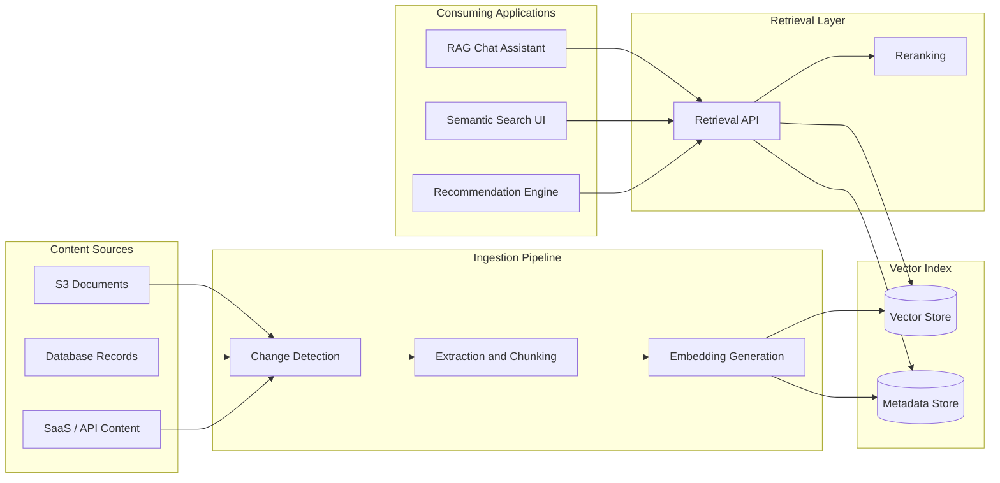
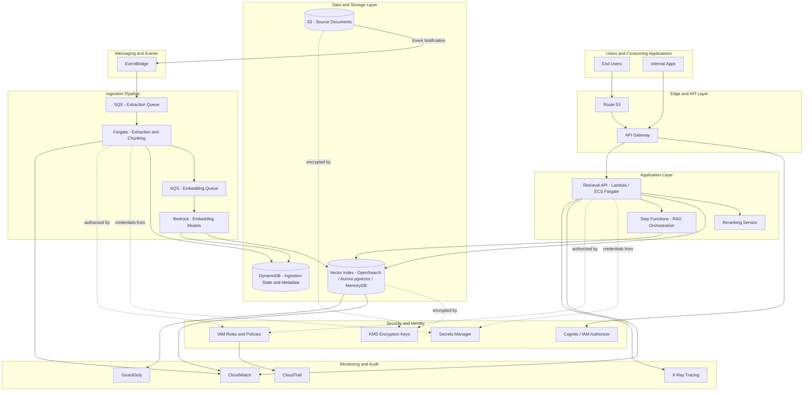

# Part VII – AI & Machine Learning Architectures

# Chapter 53: Vector Database

---

## 1. Executive Summary

### The Business Problem

Enterprises are sitting on enormous volumes of unstructured data: PDFs, support tickets, product catalogs, contracts, transcripts, images, and internal wikis. Traditional relational and even document databases index data by exact values, ranges, or keywords. They cannot answer the question that generative AI applications increasingly depend on: *"find me the pieces of content that are semantically similar to this query, even if they don't share any keywords."*

This is not a niche problem. It is the foundational retrieval layer underneath nearly every enterprise-grade Retrieval-Augmented Generation (RAG) system, semantic search product, recommendation engine, fraud-similarity detector, and duplicate-detection pipeline built in the last three years. Without a vector database, a large language model (LLM) has no reliable way to ground its answers in an organization's proprietary knowledge. It either hallucinates, or the organization is forced to fine-tune a model for every knowledge update — an approach that is slow, expensive, and operationally fragile.

A vector database solves this by storing high-dimensional numerical representations (embeddings) of content and providing efficient similarity search — typically Approximate Nearest Neighbor (ANN) search — over millions or billions of these vectors, in milliseconds, at production scale.

### Architecture Objective

The objective of this chapter's reference architecture is to design a **production-grade, horizontally scalable, highly available vector search platform on AWS** that:

- Ingests unstructured and structured content, generates embeddings, and stores them alongside metadata.
- Serves low-latency (p99 under 100ms for most workloads) similarity search at scale (tens of millions to billions of vectors).
- Supports hybrid search (vector similarity + keyword/metadata filtering).
- Is embeddable as the retrieval layer for RAG pipelines, semantic search, recommendation systems, and anomaly detection.
- Meets enterprise requirements for encryption, access control, auditability, multi-tenancy, disaster recovery, and cost governance.
- Is deployable via Infrastructure as Code (Terraform) with a repeatable CI/CD pipeline.

Vector databases are not a single AWS service — they are an architecture pattern that can be implemented on top of several AWS building blocks, each with materially different trade-offs. This chapter treats the pattern generically, then gives concrete implementation guidance for the three most common production choices on AWS:

1. **Amazon OpenSearch Service** (with the k-NN / vector engine) — the most common choice for large-scale, feature-rich vector + hybrid search.
2. **Amazon Aurora PostgreSQL with the `pgvector` extension** — the most common choice when vectors need to live next to transactional/relational data.
3. **Amazon MemoryDB for Redis (vector search)** — the choice when sub-10ms latency at high query-per-second (QPS) is the dominant requirement.

We also cover **Amazon Bedrock Knowledge Bases**, which is AWS's managed RAG orchestration layer that can provision and manage a vector store (OpenSearch Serverless, Aurora, Pinecone, Redis Enterprise Cloud, or MongoDB Atlas) on the customer's behalf.

### Why Organizations Adopt This Architecture

- **Generative AI grounding.** RAG is currently the dominant pattern for making LLM output factually accurate and current without retraining. A vector database is the retrieval backbone of RAG.
- **Semantic search replacing keyword search.** Enterprise search, e-commerce search, and internal knowledge-base search increasingly require "meaning" matches, not just token matches.
- **Recommendation and personalization.** "Users who liked this also liked..." is now frequently implemented as nearest-neighbor search over embedding space rather than collaborative filtering tables.
- **Deduplication and fraud similarity.** Finding near-duplicate records, images, or transactions is a nearest-neighbor problem at its core.
- **Multi-modal search.** Text-to-image, image-to-image, and audio similarity search all rely on embeddings and vector indexes.
- **Regulatory and knowledge-currency requirements.** Enterprises in regulated industries need answers grounded in the *current, approved* version of a policy document — not a fact baked into model weights that may be stale or unverifiable.

### Major Business Benefits

| Benefit | Description |
|---|---|
| Reduced hallucination | Grounding LLM responses in retrieved, verifiable enterprise content reduces fabricated answers. |
| Faster time-to-market for AI features | Avoids the cost and latency of fine-tuning models for every new knowledge domain. |
| Lower long-term AI cost | Updating a vector index is far cheaper than retraining or fine-tuning a foundation model. |
| Improved customer experience | Semantic search surfaces relevant results even with imprecise queries, typos, or paraphrasing. |
| Auditability | Retrieved source documents can be cited, satisfying compliance and explainability requirements. |
| Reusability | The same vector store can back multiple applications: chatbots, search, recommendations, analytics. |

### Typical Enterprise Scenarios

- A financial services firm builds an internal AI assistant that answers questions about internal risk policies, grounded in the current policy corpus, with citations back to source documents for audit purposes.
- A retailer implements semantic product search so that a query like "warm jacket for hiking in the rain" returns relevant products even when none contain those exact words.
- A healthcare provider builds a clinical documentation assistant that retrieves relevant clinical guidelines during note-taking, with strict encryption and access controls to satisfy HIPAA.
- An insurance company performs claims-similarity search to detect potential fraud by finding claims with embeddings close to known fraudulent patterns.
- A SaaS company offers multi-tenant semantic search across each customer's private document corpus, requiring strict tenant isolation inside a shared vector index.

### Scope of This Chapter

This chapter treats the vector database as the **system of record for embeddings and their associated metadata**, deployed as part of a broader ingestion → embedding → indexing → retrieval → generation pipeline. It does **not** cover foundation model training or fine-tuning (see Chapter 58, MLOps Pipeline) and treats the LLM generation step as a downstream consumer (see Chapter 51, Generative AI Platform, and Chapter 52, RAG Architecture, for the full pipeline context). This chapter is self-contained: every AWS service referenced is explained at first use.

---

## 2. Business Requirements

### 2.1 Business Drivers

- Deliver AI-grounded search and chat experiences without retraining foundation models per knowledge update.
- Support both batch (bulk corpus ingestion) and near-real-time (single-document upsert) indexing.
- Provide a retrieval layer reusable across multiple product teams and applications.
- Maintain full auditability of what content was retrieved and surfaced to end users, and by extension, to the LLM.
- Control unit economics: cost per million vectors stored, cost per query, and cost per re-index.

### 2.2 Functional Requirements

| Requirement | Description |
|---|---|
| Vector similarity search | Return top-K nearest neighbors for a query embedding using cosine similarity, Euclidean (L2), or dot product distance. |
| Hybrid search | Combine vector similarity with structured metadata filters (e.g., `tenant_id = X AND document_type = 'policy'`) and/or keyword (BM25) scoring. |
| CRUD on vectors | Insert, update, delete, and bulk-upsert vectors and their metadata. |
| Multi-tenancy | Logical or physical isolation of vectors per customer/tenant. |
| Re-embedding support | Ability to re-index the corpus when the embedding model is upgraded, without downtime. |
| Namespace/collection management | Group vectors into logical indexes (e.g., per document type, per tenant, per language). |
| Metadata filtering | Pre-filter or post-filter search results by structured attributes (date, author, ACL tags, category). |
| Access control at query time | Ensure a query only returns vectors the requesting identity is authorized to see. |

### 2.3 Non-Functional Requirements

| Category | Requirement |
|---|---|
| Scalability | Support growth from 1M to 1B+ vectors without a re-architecture. |
| Availability | 99.9%–99.99% depending on tier (see SLA table below). |
| Latency | p50 < 30ms, p99 < 100ms for top-K=10 queries at target scale (workload dependent). |
| Durability | No data loss for committed writes; durable backups with defined RPO. |
| Consistency | Eventual consistency acceptable for search freshness (typically 1–5 seconds); strong consistency required for delete-for-compliance operations. |
| Security | Encryption at rest and in transit; fine-grained access control; audit logging of all read/write operations. |
| Compliance | Support data residency, right-to-be-forgotten (deletion propagation), and audit trail requirements (e.g., GDPR, HIPAA, SOC 2, PCI-DSS depending on industry). |
| Observability | Full metrics, logs, and traces for query latency, index size, recall quality, and error rates. |
| Portability | Avoid irreversible vendor lock-in where reasonably possible; embeddings and metadata should be exportable. |

### 2.4 Scalability Goals

- **Ingestion throughput:** sustain 5,000–50,000 vector upserts/second during bulk re-indexing windows (varies by tier).
- **Query throughput:** sustain 500–10,000 queries/second (QPS) at peak, depending on tier and use case.
- **Index size growth:** design for linear scale-out as corpus grows from tens of millions to low billions of vectors.
- **Dimensionality:** typical embedding dimensions range from 384 (lightweight models) to 3072 (large frontier embedding models); the architecture must accommodate re-dimensioning when embedding models change.

### 2.5 Availability Requirements

| Tier | Availability Target | Typical Use Case |
|---|---|---|
| Standard | 99.9% (≈8.7 hours downtime/year) | Internal tools, non-customer-facing search |
| High | 99.95% (≈4.4 hours downtime/year) | Customer-facing semantic search, internal AI assistants |
| Mission-critical | 99.99% (≈52 minutes downtime/year) | Customer-facing RAG chat embedded in core product, regulated workloads |

### 2.6 Latency Requirements

| Query Pattern | Target p50 | Target p99 |
|---|---|---|
| Single vector top-K search (K=10) | < 20ms | < 80ms |
| Hybrid search (vector + filter + keyword) | < 40ms | < 150ms |
| Bulk batch retrieval (RAG multi-chunk) | < 100ms | < 300ms |
| Write (single upsert) | < 50ms | < 200ms |
| Bulk write (1,000 vectors) | < 2s | < 5s |

> **Note:** Approximate Nearest Neighbor (ANN) algorithms trade a small amount of recall accuracy (typically 90–99.5%) for large latency and cost improvements over exact k-NN. Nearly all production vector database deployments use ANN, not exact search, above a few hundred thousand vectors.

### 2.7 Compliance Requirements

- **Data residency:** vectors and source metadata must remain in-region for customers under data sovereignty obligations (e.g., EU customers requiring `eu-west-1` or `eu-central-1`).
- **Right to erasure:** deleting a source document must reliably propagate to deletion of its vector(s) within a defined SLA (commonly 24–72 hours, sometimes real-time for regulated industries).
- **Audit trail:** every write, delete, and — in regulated industries — every read, must be logged with actor identity, timestamp, and affected resource.
- **Encryption:** AES-256 at rest (via AWS KMS), TLS 1.2+ in transit, and in some cases field-level or client-side encryption for highly sensitive metadata.

### 2.8 Recovery Objectives

| Metric | Target | Notes |
|---|---|---|
| RPO (Recovery Point Objective) | 5–15 minutes (standard), near-zero (mission-critical with continuous backup) | Depends on backend: OpenSearch snapshots, Aurora continuous backup, MemoryDB snapshots. |
| RTO (Recovery Time Objective) | 30–60 minutes (standard), < 15 minutes (mission-critical with warm standby) | Full re-index from source-of-truth is always a fallback but is slow (hours to days at scale) and should not be the primary DR strategy. |

> **Warning:** A vector index is a *derived* data structure — it can theoretically always be rebuilt from source documents. However, at scale (hundreds of millions of vectors), a full re-embed-and-reindex can take many hours or days and costs real money in embedding-model inference. Treat the vector store's own backups as the primary recovery path, and full re-index as a last resort, not a routine DR plan.

### 2.9 SLAs

| Service Component | Internal SLA Commitment |
|---|---|
| Query API availability | 99.95% monthly |
| Query latency (p99) | < 150ms |
| Ingestion pipeline lag (source update → searchable) | < 5 minutes (near-real-time tier), < 24 hours (batch tier) |
| Support response (production incident) | 15 minutes (Sev-1), 4 hours (Sev-2) |

### 2.10 Expected Workload

A representative mid-size enterprise deployment:

- 50–200 million vectors across all collections/indexes.
- 1,536 or 1,024-dimension embeddings (typical for current-generation embedding models).
- 200–2,000 QPS sustained, with bursts to 5,000 QPS during business hours.
- 1–5 million document upserts/day during active ingestion periods; steady-state trickle updates otherwise.
- 10–50 concurrent tenants/applications sharing the platform.

### 2.11 Expected Growth

- Vector count growth of 20–50% year-over-year as more content sources are onboarded.
- Query volume growth tracking user adoption of AI features, typically 2–5x in the first 18 months after a successful RAG launch.
- Embedding dimensionality tends to increase over time as organizations adopt newer, higher-fidelity embedding models — the architecture must support re-indexing without downtime.

---

## 3. Architecture Overview

### 3.1 Overall Design Philosophy

The architecture separates five concerns that are frequently — and incorrectly — conflated into a single "vector database" component:

1. **Ingestion** — extracting, chunking, and normalizing source content.
2. **Embedding generation** — converting content chunks into numerical vectors via an embedding model.
3. **Indexing** — storing vectors and metadata in a structure optimized for ANN search.
4. **Retrieval** — serving similarity queries with filtering, ranking, and access control.
5. **Consumption** — downstream systems (RAG orchestrators, search UIs, recommendation engines) that call the retrieval layer.

Treating these as independently scalable, independently deployable components is what separates a production-grade vector search platform from a prototype notebook that calls a single vector database client library. Prototypes conflate all five steps into one script. Production systems decouple them with queues, well-defined APIs, and independent scaling policies — because each has different throughput characteristics, failure modes, and cost drivers.

### 3.2 Core Components

| Component | Responsibility |
|---|---|
| Content sources | S3 buckets, databases, SaaS APIs, document management systems that hold source-of-truth content. |
| Ingestion pipeline (Lambda / ECS Fargate + SQS) | Detects new/changed content, extracts text, chunks it into retrieval-sized units. |
| Embedding service (Amazon Bedrock or SageMaker endpoint) | Converts text chunks into vector embeddings. |
| Vector index (OpenSearch / Aurora pgvector / MemoryDB) | Stores vectors + metadata; serves ANN queries. |
| Metadata store (same engine or DynamoDB) | Stores document-level metadata, ACLs, versioning info. |
| Retrieval API (API Gateway + Lambda, or ALB + ECS) | Public-facing query interface with authn/authz, rate limiting, and result assembly. |
| Orchestration layer (Step Functions / Bedrock Agents) | Coordinates multi-step RAG flows: retrieve → rerank → prompt-assemble → generate. |
| Observability stack (CloudWatch, X-Ray, OpenSearch dashboards) | Monitors latency, recall, error rates, cost. |
| Security layer (IAM, KMS, Secrets Manager, VPC) | Encrypts data, manages credentials, enforces network isolation. |

### 3.3 How Components Interact

At a high level, two independent lifecycles run concurrently: the **write path** (getting content into the index) and the **read path** (serving queries against the index). They share the same underlying vector index but have very different scaling and latency profiles, which is why they are designed, deployed, and scaled independently.

### 3.4 High-Level Workflow



### 3.5 Request Lifecycle (Read Path)

1. Consuming application sends a natural-language query or a pre-computed embedding to the Retrieval API.
2. Retrieval API authenticates the caller and resolves tenant/ACL context.
3. If a raw query string was sent, the API calls the embedding service to convert it into a vector.
4. The API issues an ANN query against the vector index, with metadata filters applied (tenant ID, ACL tags, document type).
5. Results are optionally reranked (a cross-encoder or Bedrock rerank model refines the top-N candidates).
6. Results are returned to the caller — either raw (for search UIs) or assembled into a prompt context (for RAG).

### 3.6 Response Lifecycle

1. Retrieval API formats results with source citations, relevance scores, and metadata.
2. For RAG use cases, the orchestration layer assembles a prompt combining the user query and retrieved chunks, then calls the LLM.
3. The LLM response, along with citation metadata, is returned to the end-user application.
4. Query and response are logged (with PII handling per policy) for observability, quality evaluation, and audit.

### 3.7 Data Lifecycle

1. **Creation:** new content is written to a source system (S3 upload, database insert, SaaS webhook).
2. **Change detection:** an event (S3 event notification, DynamoDB Streams, CDC, or scheduled poll) triggers the ingestion pipeline.
3. **Extraction & chunking:** raw content is parsed into text and split into retrieval-optimized chunks (typically 200–1,000 tokens with overlap).
4. **Embedding:** each chunk is converted into a vector via the embedding model.
5. **Indexing:** the vector, its source chunk text, and metadata are upserted into the vector index.
6. **Serving:** the vector is available for query, typically within seconds to a few minutes of ingestion (near-real-time tier).
7. **Update:** if source content changes, the corresponding vector(s) are re-embedded and upserted (old versions deleted or superseded).
8. **Deletion:** when source content is deleted or access is revoked, corresponding vectors are deleted — this must be enforced reliably for compliance (right to erasure).
9. **Archival:** cold, rarely-queried vectors may be moved to a lower-cost tier or excluded from the hot index and rehydrated on demand.

## 4. AWS Services Used

This section explains every AWS service used in the reference architecture, why it was selected, its alternatives, its limitations, pricing considerations, and best practices. Only services relevant to a production vector search platform are covered.

### 4.1 Amazon OpenSearch Service (with Vector Engine / k-NN plugin)

**Purpose:** Amazon OpenSearch Service is a managed distributed search and analytics engine derived from Elasticsearch/OpenSearch. Its k-NN plugin (and the newer OpenSearch Serverless vector engine) adds Approximate Nearest Neighbor search on top of its existing full-text and structured search capabilities.

**Why selected:**
- Native hybrid search: combines BM25 keyword scoring with vector similarity in a single query.
- Mature, battle-tested distributed architecture with sharding, replication, and snapshotting already built in.
- Rich metadata filtering (structured queries, aggregations, geo-queries) alongside vector search.
- Supports multiple ANN algorithms (HNSW, IVF) and multiple engines (Lucene, Faiss, NMSLIB) with configurable trade-offs.

**Alternatives:** Aurora PostgreSQL + pgvector, MemoryDB for Redis, Amazon Kendra (managed enterprise search, less flexible), third-party managed vector databases (Pinecone, Weaviate, Qdrant, Milvus) deployed on EC2/EKS or consumed as SaaS.

**Limitations:**
- Cluster management (even "managed") still requires capacity planning, shard strategy, and index lifecycle management.
- OpenSearch Serverless (the fully serverless vector option) has its own cold-start and OCU (OpenSearch Compute Unit) billing model that can be expensive for spiky, low-baseline workloads.
- Re-indexing for a mapping change (e.g., dimensionality change from a new embedding model) requires a reindex operation, not an in-place schema change.

**Pricing considerations:** Billed by instance-hours (provisioned) or OCU-hours (serverless), plus storage (EBS gp3 for provisioned, managed storage for serverless), plus data transfer. Vector indexes are memory-intensive — HNSW graphs are typically held in memory for fast search, which drives instance sizing more than raw storage.

**Best practices:**
- Use `r6g`/`r7g` (memory-optimized, Graviton) instance families for vector workloads — vector search is memory-bandwidth bound.
- Use OpenSearch Serverless for unpredictable/spiky workloads; use provisioned clusters for stable, high-QPS workloads where reserved capacity pricing is more economical.
- Set `ef_search` and `ef_construction` (HNSW parameters) based on measured recall/latency trade-offs, not defaults.
- Use UltraWarm/cold storage tiers for older, rarely queried vector data to reduce cost.

### 4.2 Amazon Aurora PostgreSQL (with pgvector extension)

**Purpose:** Amazon Aurora is a MySQL/PostgreSQL-compatible managed relational database with cloud-native storage that decouples compute from a distributed, auto-scaling storage layer. The `pgvector` extension adds vector column types and ANN indexing (IVFFlat, HNSW) directly inside PostgreSQL.

**Why selected:**
- Best choice when vectors must be transactionally consistent with relational business data (e.g., a vector column on the same row as order details, user profiles, or product records).
- Full SQL query power: joins, transactions, row-level security — combined with vector similarity in a single query.
- Lower operational surface area for teams already running PostgreSQL in production.

**Alternatives:** OpenSearch (better at pure large-scale ANN + hybrid text search), dedicated vector databases, DynamoDB (no native vector search — would require a separate index).

**Limitations:**
- pgvector's HNSW/IVFFlat indexes do not scale as gracefully as purpose-built vector engines beyond roughly tens to a few hundred million vectors per instance, depending on instance size and dimensionality.
- Write-heavy re-indexing (bulk embedding updates) can compete for I/O and CPU with transactional workloads on the same cluster unless isolated to an Aurora reader instance.
- No built-in hybrid BM25 + vector scoring as elegant as OpenSearch's; typically requires combining `pg_trgm`/full-text search with vector distance in application logic.

**Pricing considerations:** Standard Aurora pricing (instance-hours + Aurora storage + I/O, or Aurora I/O-Optimized for I/O-heavy workloads) — vector workloads with frequent writes often benefit from the I/O-Optimized configuration.

**Best practices:**
- Use HNSW indexes (available in pgvector 0.5+) over IVFFlat for better recall/latency trade-offs in most production cases; IVFFlat requires periodic re-training as data grows.
- Isolate heavy vector re-indexing to an Aurora Replica; promote or redirect reads once complete.
- Use Aurora I/O-Optimized pricing for write-heavy ingestion workloads to avoid unpredictable I/O charges.

### 4.3 Amazon MemoryDB for Redis (Vector Search)

**Purpose:** Amazon MemoryDB is a durable, in-memory database compatible with Redis. Its vector search capability enables ANN search directly against data held in memory, targeting sub-millisecond to low-single-digit-millisecond query latency.

**Why selected:** Chosen when the dominant requirement is the lowest possible query latency at high QPS — e.g., real-time recommendation serving or fraud-detection systems where a search must complete within a few milliseconds as part of a larger request budget.

**Alternatives:** OpenSearch (higher latency, richer features), Amazon ElastiCache for Redis (in-memory but not durable by default — MemoryDB adds a multi-AZ transactional log for durability that ElastiCache lacks).

**Limitations:** Cost per GB is the highest of the three options because all data is memory-resident. Less mature hybrid-filtering capability compared to OpenSearch. Best suited to smaller-to-mid-size vector counts (tens of millions) where the cost of holding everything in memory remains justified by the latency requirement.

**Pricing considerations:** Billed by node type/hours (memory-optimized instance families) — cost scales directly with total vector memory footprint, so dimensionality reduction or quantization materially affects cost here more than on disk-backed engines.

**Best practices:** Use vector quantization (e.g., reducing float32 to float16 or int8 embeddings) to cut memory footprint roughly in half or more, with a small recall trade-off. Reserve MemoryDB for the "hot tier" of a two-tier architecture (hot vectors in MemoryDB, full corpus in OpenSearch or Aurora) rather than the sole store for very large corpora.

### 4.4 Amazon Bedrock (Knowledge Bases and Embedding Models)

**Purpose:** Amazon Bedrock is AWS's managed service for accessing foundation models (both AWS's own Titan models and third-party models such as Anthropic's Claude, Cohere, and Meta's Llama) via a unified API, without managing model-hosting infrastructure. Bedrock Knowledge Bases is a managed RAG orchestration feature that handles ingestion, chunking, embedding, and querying against a customer-chosen vector store.

**Why selected:** Removes undifferentiated heavy lifting from the ingestion and embedding pipeline. Provides managed connectors to S3, Confluence, SharePoint, Salesforce, and web crawlers. Supports automatic re-indexing on source updates.

**Alternatives:** Self-managed embedding pipeline using SageMaker-hosted embedding models (more control, more operational burden), open-source embedding models self-hosted on EC2/ECS (lowest cost at very high volume, highest operational burden), third-party embedding APIs (OpenAI, Cohere direct).

**Limitations:** Bedrock Knowledge Bases abstracts away some low-level control over chunking strategy and index configuration; teams with highly specialized retrieval requirements sometimes outgrow it and move to a self-managed pipeline.

**Pricing considerations:** Billed per embedding-model token processed (ingestion) and per query-model token processed (retrieval + generation), plus the underlying vector store's own cost.

**Best practices:** Use Bedrock Knowledge Bases for the majority of standard RAG use cases to reduce time-to-market; reserve custom pipelines for cases needing non-standard chunking (e.g., table-aware chunking, code-aware chunking) or non-Bedrock embedding models.

### 4.5 AWS Lambda

**Purpose:** Serverless compute for event-driven, short-duration workloads.

**Why selected:** Used for the ingestion pipeline's change-detection and lightweight transformation steps, and for the Retrieval API when request patterns are spiky and low-to-moderate in duration.

**Alternatives:** Amazon ECS Fargate (better for long-running or CPU/memory-intensive extraction/chunking jobs, e.g., OCR-heavy PDF parsing); EC2 (rarely justified here unless GPU embedding inference is self-hosted).

**Limitations:** 15-minute maximum execution time; cold-start latency (mitigated with provisioned concurrency) can affect p99 latency for latency-sensitive retrieval APIs.

**Pricing considerations:** Pay-per-invocation and duration; cost-effective for bursty ingestion workloads, less cost-effective than Fargate/EC2 for sustained high-throughput embedding generation.

**Best practices:** Use Lambda for orchestration and lightweight transformation; delegate heavy extraction (large PDFs, video/audio transcription) to Fargate tasks or Step Functions-orchestrated batch jobs.

### 4.6 Amazon S3

**Purpose:** Durable, highly available object storage; serves as the source-of-truth store for raw documents and as a staging area for extracted text and embedding batches.

**Why selected:** Standard for durable document storage (11 nines durability), integrates natively with event notifications, Bedrock Knowledge Bases connectors, and lifecycle policies for cost management.

**Alternatives:** EFS (rarely appropriate for this use case), third-party document management systems (used as sources but not as the AWS-native staging layer).

**Pricing considerations:** S3 Standard for actively queried source documents; S3 Intelligent-Tiering or Glacier for archived source content that is rarely re-embedded.

**Best practices:** Use S3 Event Notifications (or EventBridge) to trigger ingestion on new/changed objects rather than polling. Use S3 Object Lock for documents under legal hold or audit requirements.

### 4.7 Amazon SQS

**Purpose:** Fully managed message queuing service used to decouple ingestion stages (extraction → embedding → indexing) and absorb bursts.

**Why selected:** Provides back-pressure control so that a burst of document uploads does not overwhelm the embedding service or the vector index's write throughput. Supports dead-letter queues for poison-message handling.

**Alternatives:** Amazon Kinesis Data Streams (better for ordered, high-throughput streaming with multiple consumers; overkill for most document-ingestion pipelines), EventBridge (better for routing/fan-out of discrete events rather than buffering bulk work items).

**Best practices:** Use separate queues per pipeline stage with independent scaling; configure a dead-letter queue (DLQ) with alerting for every queue; set visibility timeout longer than the maximum expected processing time of the consuming Lambda/Fargate task.

### 4.8 Amazon EventBridge

**Purpose:** Serverless event bus for routing events between AWS services and custom applications based on rules.

**Why selected:** Used to route S3 object-created events, scheduled re-indexing triggers, and cross-account/cross-service ingestion signals (e.g., a SaaS webhook received via API Gateway) to the correct ingestion pipeline stage.

**Best practices:** Use EventBridge Schema Registry to formalize event contracts between ingestion stages; use EventBridge Pipes for simple point-to-point integrations that don't need full rule-based routing.

### 4.9 Amazon API Gateway

**Purpose:** Managed API front door providing authentication, throttling, request validation, and routing for the Retrieval API.

**Why selected:** Offloads cross-cutting concerns (API key management, usage plans, throttling, request/response transformation) from application code; integrates natively with Lambda and IAM/Cognito authorizers.

**Alternatives:** Application Load Balancer (ALB) in front of ECS/Fargate — preferred when the Retrieval API is a long-running containerized service rather than Lambda functions, or when WebSocket/streaming responses are required for token-by-token LLM output.

**Best practices:** Use usage plans and API keys (or Cognito/IAM authorizers) per consuming application/tenant; enable request throttling to protect the vector index from runaway query volume.

### 4.10 Amazon DynamoDB

**Purpose:** Fully managed, serverless NoSQL key-value database.

**Why selected:** Used as a fast metadata/state store — tracking ingestion job status, document version history, and idempotency keys (to prevent duplicate embedding of the same chunk) — separate from the vector index itself.

**Best practices:** Use DynamoDB Streams to trigger downstream processing on metadata changes (e.g., a document's ACL changes should trigger a permission-index update). Use on-demand capacity mode for unpredictable ingestion bursts.

### 4.11 AWS IAM

**Purpose:** Identity and Access Management — controls who (which principal: human, service, or application) can perform which actions on which AWS resources.

**Why selected:** Foundational to enforcing least-privilege access between ingestion Lambdas, the vector index, embedding services, and the Retrieval API.

**Best practices:** Use resource-based policies on OpenSearch domains/S3 buckets in addition to identity-based policies; use IAM Roles (never long-lived access keys) for all compute; use permission boundaries for any role that can create other roles.

### 4.12 Amazon VPC

**Purpose:** Provides an isolated, software-defined network within AWS in which to place private resources.

**Why selected:** The vector index (OpenSearch domain, Aurora cluster, MemoryDB cluster) should never be placed on the public internet. VPC placement with private subnets is mandatory for production.

**Best practices:** Use VPC endpoints (Interface endpoints for API access, Gateway endpoints for S3/DynamoDB) so that traffic between compute and AWS services never traverses the public internet.

### 4.13 AWS KMS

**Purpose:** Managed encryption key service.

**Why selected:** Encrypts vector index storage, S3 source documents, and Secrets Manager secrets at rest with customer-managed keys (CMKs), enabling key rotation and fine-grained access control over decryption rights.

**Best practices:** Use a dedicated CMK per data classification tier; enable automatic annual key rotation; restrict `kms:Decrypt` to only the specific roles that need it.

### 4.14 AWS Secrets Manager

**Purpose:** Securely stores and rotates credentials, API keys, and connection strings.

**Why selected:** Stores database credentials for Aurora, API keys for third-party embedding services (if used), and OpenSearch fine-grained access control credentials — with automatic rotation.

**Best practices:** Enable automatic rotation for database credentials; avoid embedding secrets in Lambda environment variables in plaintext — reference Secrets Manager ARNs and retrieve at runtime, or use Lambda's native Secrets Manager integration with caching.

### 4.15 Amazon CloudWatch

**Purpose:** Metrics, logs, alarms, and dashboards for operational observability.

**Why selected:** Central location for tracking query latency, index size, JVM heap pressure (OpenSearch), CPU/memory utilization, error rates, and custom business metrics (e.g., retrieval recall proxy metrics).

**Best practices:** Create composite alarms combining latency and error-rate signals to avoid alert fatigue; use CloudWatch Logs Insights for ad-hoc query analysis; export critical logs to S3/Athena for long-term retention and cost-effective querying.

### 4.16 AWS CloudTrail

**Purpose:** Records API-level activity across the AWS account for audit and security investigation.

**Why selected:** Provides an immutable audit trail of who created, modified, or deleted index configurations, IAM roles, and KMS keys — a compliance requirement in most regulated industries.

**Best practices:** Enable CloudTrail organization-wide with log file validation; deliver logs to a dedicated, access-restricted S3 bucket in a separate logging account.

### 4.17 Amazon GuardDuty

**Purpose:** Managed threat detection service that analyzes VPC Flow Logs, DNS logs, and CloudTrail events for malicious activity.

**Why selected:** Detects anomalous access patterns to the vector index infrastructure — e.g., unusual API call volume, credential compromise indicators, or reconnaissance behavior.

**Best practices:** Enable GuardDuty at the AWS Organizations level; route findings to Security Hub for centralized triage.

### 4.18 Not Used in This Architecture

Some commonly listed AWS services are intentionally **not** core to this architecture and are omitted from deep coverage: EC2 (only relevant if self-hosting an open-source vector database or embedding model on GPU instances — covered briefly in Section 28, Alternatives), CloudFront (relevant only if the Retrieval API is exposed to public internet consumers directly, which is uncommon — most vector search traffic is internal service-to-service), Route53 (standard DNS, not vector-search-specific), Aurora MySQL (pgvector requires PostgreSQL), SNS (used only if fan-out notification of ingestion completion is required — optional).

---

## 5. Complete Architecture Diagram



> **Note:** This diagram represents the full production topology. Smaller deployments (see Section 26, "Evolution Path" in the Architect's Corner) may collapse the ingestion pipeline into a single Lambda function and use a single-node vector index for early-stage workloads. The layered separation shown here becomes necessary once ingestion volume, query volume, or compliance requirements exceed what a single-component design can handle reliably.

---

## 6. Component-by-Component Explanation

### 6.1 Retrieval API

- **Purpose:** Single entry point for all similarity search and RAG retrieval requests.
- **Responsibilities:** Authenticate callers, resolve tenant/ACL context, convert raw queries to embeddings (if needed), execute ANN queries with filters, optionally invoke reranking, format and return results.
- **Inputs:** Query text or query vector, top-K, metadata filters, tenant/user identity.
- **Outputs:** Ranked list of matching chunks/documents with similarity scores, source citations, and metadata.
- **Scaling:** Horizontal — Lambda scales automatically per-request; ECS Fargate scales via target-tracking on CPU/request count. Stateless design is mandatory.
- **High availability:** Deployed across a minimum of two, preferably three, Availability Zones (AZs); Lambda is inherently multi-AZ; Fargate tasks are distributed across AZs by the ECS scheduler.
- **Failure handling:** Circuit breaker around the vector index and embedding-model calls; graceful degradation to keyword-only search if the embedding service is unavailable; retries with exponential backoff and jitter for transient errors.
- **Dependencies:** Vector index, embedding service (Bedrock), metadata store (DynamoDB), authorizer (Cognito/IAM).
- **Security:** All calls authenticated; tenant isolation enforced at the query-filter level (never trust client-supplied tenant IDs without validating against the authenticated identity).
- **Monitoring:** p50/p95/p99 latency, error rate, requests per tenant, cache hit rate (if a query-result cache is used).

### 6.2 Ingestion Pipeline (Extraction and Chunking)

- **Purpose:** Convert raw source documents into retrieval-ready text chunks.
- **Responsibilities:** Parse PDFs, HTML, Office documents, and other formats; strip boilerplate; segment into chunks sized appropriately for the embedding model's context window and the retrieval use case (typically 200–1,000 tokens with 10–20% overlap between adjacent chunks).
- **Inputs:** Raw documents from S3 or a connected SaaS source.
- **Outputs:** Structured chunk records (text + metadata: source document ID, chunk index, page number, section heading) written to a staging area (S3 or directly enqueued for embedding).
- **Scaling:** ECS Fargate tasks scale based on SQS queue depth; large PDF/OCR-heavy workloads benefit from Fargate over Lambda due to memory and execution-time limits.
- **High availability:** Multi-AZ Fargate service; SQS provides durable buffering so that a transient failure in this stage does not lose work.
- **Failure handling:** Poison-pill documents (malformed files) routed to a dead-letter queue for manual review rather than blocking the pipeline.
- **Dependencies:** S3, SQS, DynamoDB (for idempotency tracking).
- **Security:** IAM role scoped to read only the specific S3 prefixes it needs; no direct internet egress required (use VPC endpoints).
- **Monitoring:** Documents processed/hour, average chunking time, DLQ depth, extraction error rate by document type.

### 6.3 Embedding Service

- **Purpose:** Convert text chunks into dense vector embeddings.
- **Responsibilities:** Batch chunks for efficient inference, call the embedding model (Bedrock-hosted Titan Embeddings, Cohere Embed, or a self-hosted open-source model), handle rate limiting and retries, attach the resulting vector to its source chunk metadata.
- **Inputs:** Text chunks from the extraction stage.
- **Outputs:** Vector embeddings paired with chunk metadata, upserted to the vector index.
- **Scaling:** Bedrock scales transparently (managed service, subject to account-level quota); self-hosted embedding models on SageMaker or EC2/ECS with GPU require explicit auto-scaling policies based on GPU utilization or queue depth.
- **High availability:** Bedrock is a regional managed service with built-in redundancy; self-hosted alternatives require multi-AZ deployment and health-check-based failover.
- **Failure handling:** Exponential backoff on throttling errors; circuit breaker to prevent cascading failure if the embedding service degrades; batch retry with idempotency keys to avoid duplicate embeddings.
- **Dependencies:** SQS (input queue), vector index (output), DynamoDB (idempotency/state tracking).
- **Security:** IAM role scoped to `bedrock:InvokeModel` only for the specific approved model ARNs; no broader Bedrock permissions.
- **Monitoring:** Embedding latency per batch, throttling rate, cost per million tokens embedded, embedding model version in use (critical for tracking re-indexing needs when models are upgraded).

### 6.4 Vector Index

- **Purpose:** Store vectors and metadata; serve ANN similarity queries at low latency and high throughput.
- **Responsibilities:** Maintain the ANN graph/index structure (HNSW, IVF, etc.), handle concurrent reads and writes, enforce index-level access control, snapshot for backup.
- **Inputs:** Vector upserts from the embedding service; query vectors from the Retrieval API.
- **Outputs:** Top-K nearest-neighbor results with distance scores.
- **Scaling:** Horizontal via sharding (OpenSearch), read replicas (Aurora), or cluster sharding (MemoryDB); vertical via instance-family/size changes for memory-bound workloads.
- **High availability:** Multi-AZ deployment with automated failover is mandatory for production — a single-AZ vector index is a common and dangerous anti-pattern (see Section 27, Anti-Patterns).
- **Failure handling:** Automated failover to a standby/replica; snapshot-based recovery for catastrophic failure; circuit-breaker at the Retrieval API layer to fail gracefully if the index becomes unavailable.
- **Dependencies:** KMS (encryption), VPC (network isolation), CloudWatch (monitoring).
- **Security:** Fine-grained access control (OpenSearch), IAM database authentication (Aurora), ACL-based auth (MemoryDB); encryption at rest and in transit; private subnet placement only.
- **Monitoring:** Query latency percentiles, index size, JVM heap/memory pressure, recall-quality proxy metrics, shard/replica health.

### 6.5 Reranking Service

- **Purpose:** Refine the initial ANN top-K results using a more computationally expensive but more accurate relevance model (a cross-encoder or an LLM-based reranker).
- **Responsibilities:** Take the top-N (e.g., top 50) ANN candidates and re-score them against the original query for final top-K (e.g., top 5) selection.
- **Why it matters:** ANN search optimizes for speed over a huge candidate space; it is not the most accurate relevance signal. Reranking recovers accuracy on the much smaller candidate set at acceptable additional latency cost.
- **Scaling:** Typically implemented as a Bedrock rerank API call or a lightweight SageMaker endpoint; scales with query volume.
- **Dependencies:** Retrieval API (caller), Bedrock or SageMaker (compute).
- **Monitoring:** Reranking latency contribution to overall p99, relevance-improvement metrics from evaluation pipelines.

### 6.6 Orchestration Layer (Step Functions)

- **Purpose:** Coordinate multi-step RAG workflows: retrieve → rerank → assemble prompt → generate → post-process.
- **Responsibilities:** Sequence calls to the Retrieval API, reranking service, and generation model; handle partial failures (e.g., retrieval succeeds but generation times out) with defined fallback behavior.
- **Scaling:** Step Functions Standard workflows scale automatically; Express workflows are preferred for high-volume, short-duration RAG requests due to lower per-execution cost.
- **Monitoring:** Workflow success/failure rate, per-step latency breakdown, cost per execution.

## 7. End-to-End Request Flow

The following trace covers a typical RAG retrieval request from a chat application through to a generated, cited answer.

1. **Client** sends a user question ("What is our current PTO carryover policy?") to the application's backend over HTTPS.
2. **DNS (Route 53)** resolves the API domain to the API Gateway regional endpoint.
3. **API Gateway** validates the request, applies throttling limits for the calling application's usage plan, and invokes a Cognito/IAM authorizer to validate the caller's identity token.
4. **Retrieval API (Lambda)** receives the authenticated request, extracts the tenant ID and user permission scope from the validated token — never from client-supplied parameters.
5. **Embedding call:** the Retrieval API calls Bedrock to convert the question text into a query embedding vector.
6. **Vector index query:** the Retrieval API issues an ANN top-K query (e.g., K=20) against the vector index, with a metadata filter restricting results to documents the caller's tenant/role is authorized to see, and to the current approved document version.
7. **Reranking:** the top-20 candidates are passed to the reranking service, which re-scores them against the original question and returns the top-5 most relevant chunks.
8. **Prompt assembly:** the orchestration layer (Step Functions or in-process logic) assembles a prompt containing the user's question and the top-5 retrieved chunks, with citation markers.
9. **Generation:** the assembled prompt is sent to the LLM (via Bedrock) to generate a natural-language answer grounded in the retrieved chunks.
10. **Caching (optional):** the query embedding and/or final answer may be cached (e.g., in ElastiCache) for identical or near-identical repeated queries, subject to a defined TTL appropriate for content freshness requirements.
11. **Logging:** the query, retrieved chunk IDs, relevance scores, and generated answer (with PII redaction per policy) are logged to CloudWatch Logs and/or a dedicated analytics store for quality evaluation and audit.
12. **Monitoring:** X-Ray traces capture the latency contribution of each step (embedding, vector query, rerank, generation) for performance analysis.
13. **Error handling:** if the vector index is unavailable, the Retrieval API returns a degraded response (e.g., "I couldn't access current policy documents right now") rather than allowing the LLM to answer ungrounded — this prevents silent hallucination when retrieval fails.
14. **Response delivery:** the final answer, with source citations (document title, section, link), is returned to the client through API Gateway.
15. **Client rendering:** the application displays the answer along with citation links, allowing the user to verify the source.

---

## 8. Deployment Flow

### 8.1 Infrastructure Provisioning

All infrastructure is provisioned via Terraform, organized into reusable modules: `vpc`, `vector-index` (with sub-modules per backend choice), `ingestion-pipeline`, `retrieval-api`, `security`, and `monitoring`. Environments (dev, staging, production) are separate Terraform workspaces or separate state files per environment, never shared state.

### 8.2 Terraform Workflow

1. Developer creates a feature branch and modifies the relevant Terraform module.
2. `terraform fmt` and `terraform validate` run locally or in a pre-commit hook.
3. Pull request triggers CI: `terraform plan` runs against the target environment, and the plan output is posted as a PR comment for review.
4. A policy-as-code check (e.g., Open Policy Agent / Checkov / tfsec) scans the plan for security misconfigurations (unencrypted storage, overly permissive IAM, public network exposure).
5. On approval and merge, CI runs `terraform apply` against the target environment using a locked, versioned Terraform state stored in S3 with DynamoDB state locking.
6. Post-apply validation runs smoke tests against the newly provisioned/updated infrastructure.

### 8.3 CI/CD Deployment (Application Layer)

1. Application code (Lambda functions, Fargate container images) is built and unit-tested on every commit.
2. Container images are scanned for vulnerabilities (Amazon Inspector or a third-party scanner) before being pushed to Amazon ECR.
3. Deployment to staging happens automatically on merge to `main`; deployment to production requires manual approval (or automated promotion gated by staging smoke-test success, depending on organizational risk tolerance).

### 8.4 Blue-Green Deployment (Vector Index Schema/Model Changes)

Vector index changes are the highest-risk deployment category in this architecture because they often require reindexing, not just a rolling code update. The recommended pattern:

1. Provision a new index/collection (blue = current production, green = new version) alongside the existing one.
2. Run the ingestion pipeline against the green index using the new embedding model or mapping, in parallel with the blue index continuing to serve production traffic.
3. Run relevance evaluation (a held-out query/answer set with known-good expected chunks) against the green index to validate recall and precision meet or exceed the blue baseline.
4. Cut over the Retrieval API's index alias/pointer from blue to green — an atomic, low-risk switch if using index aliases (OpenSearch) or a connection-string/table-pointer swap (Aurora).
5. Keep the blue index available for a defined rollback window (typically 24–72 hours) before decommissioning.

> **Tip:** Never reindex in place against a live production index for a breaking schema/dimensionality change. Always build the new index alongside the old one and cut over atomically.

### 8.5 Rollback

- **Application layer:** standard Lambda alias/version rollback or ECS task-definition rollback to the previous revision.
- **Infrastructure layer:** `terraform plan` against the previous known-good state/tag, reviewed and applied through the same pipeline (never manual console changes).
- **Vector index layer:** revert the index alias/pointer back to the blue index (see 8.4) — this is why the blue-green pattern is mandatory for index changes, not optional.

### 8.6 Secrets

All credentials (database passwords, API keys for third-party embedding providers) are stored in Secrets Manager and referenced by ARN in Terraform and application configuration — never hardcoded, never stored in environment variables in plaintext in version control.

### 8.7 Configuration

Environment-specific configuration (index names, instance sizes, feature flags) is managed via Systems Manager Parameter Store or Terraform variables per environment, with a clear naming convention: `/vectordb/{env}/{component}/{parameter}`.

### 8.8 Validation

Post-deployment validation includes: synthetic canary queries against the Retrieval API, index health checks (cluster status, shard allocation), and a relevance regression test suite run against a fixed evaluation set before any index-affecting change is considered complete.

---

## 9. Network Topology

### 9.1 VPC Design

A dedicated VPC (or a shared services VPC with dedicated subnets, depending on organizational network architecture — see Chapter 19) hosts the vector index and ingestion compute. Public-facing components (API Gateway) do not require VPC placement themselves but integrate with VPC-resident backends via VPC Link or Lambda VPC configuration.

### 9.2 CIDR Planning

| Subnet Tier | Example CIDR | Purpose |
|---|---|---|
| Public | 10.20.0.0/24, 10.20.1.0/24 | NAT Gateways, bastion/SSM endpoints only — no application resources |
| Private (App) | 10.20.10.0/23, 10.20.12.0/23 | Retrieval API compute (ECS Fargate), ingestion Fargate tasks, Lambda ENIs |
| Private (Data) | 10.20.20.0/23, 10.20.22.0/23 | OpenSearch domain, Aurora cluster, MemoryDB cluster |

Reserve /16 or /20 address space per VPC to allow for future growth without re-architecture; avoid overlapping CIDRs with any VPC that may need to be peered or connected via Transit Gateway.

### 9.3 Public Subnets

Contain only NAT Gateways (one per AZ for high availability) and, if required, an Application Load Balancer for the Retrieval API if it's containerized and needs internet-facing exposure (uncommon — most consumption is internal service-to-service via private networking).

### 9.4 Private Subnets

Host all compute (Fargate tasks, Lambda functions attached to the VPC) and all data resources (OpenSearch, Aurora, MemoryDB). No direct route to the Internet Gateway.

### 9.5 NAT Gateway

Provides outbound-only internet access for private-subnet resources that need it (e.g., calling a third-party embedding API not available via VPC endpoint, or pulling container images if not using ECR VPC endpoints). Deploy one NAT Gateway per AZ to avoid cross-AZ data transfer charges and single-AZ failure risk.

### 9.6 Internet Gateway

Attached to the VPC to provide the path for NAT Gateway egress and any public-facing ALB. Never route private data-tier subnets directly to the Internet Gateway.

### 9.7 Transit Gateway

Used when the vector search platform must be reachable from multiple VPCs (e.g., multiple product teams' application VPCs need to query a centrally-hosted vector index) or from on-premises networks via Direct Connect/VPN. Transit Gateway route tables enforce which VPCs can reach the data-tier subnets, providing network-level tenant isolation in multi-VPC-consumer designs.

### 9.8 Route Tables

Separate route tables per subnet tier: public subnets route `0.0.0.0/0` to the Internet Gateway; private app subnets route `0.0.0.0/0` to the NAT Gateway; private data subnets have no default route to the internet at all — only routes to VPC endpoints and peered/Transit-Gateway-connected CIDRs that legitimately need access.

### 9.9 Network ACLs

Stateless, subnet-level ACLs provide a defense-in-depth layer beneath security groups — e.g., explicitly denying inbound traffic to the data-tier subnets from anything other than the app-tier subnet CIDR range, regardless of security group configuration.

### 9.10 Security Groups

| Security Group | Inbound Rules | Purpose |
|---|---|---|
| `sg-retrieval-api` | 443 from ALB/API Gateway VPC Link SG only | Retrieval API compute |
| `sg-ingestion-compute` | None inbound (outbound only) | Ingestion Fargate tasks |
| `sg-vector-index` | Index port (e.g., 443 for OpenSearch, 5432 for Aurora, 6379 for MemoryDB) from `sg-retrieval-api` and `sg-ingestion-compute` only | Vector index data tier |

> **Warning:** A common production incident stems from a security group rule scoped to `0.0.0.0/0` on the vector index's port "temporarily" opened for debugging and never closed. Always scope security group ingress rules to specific source security groups, never to CIDR ranges, for internal-only data-tier resources.

### 9.11 PrivateLink / VPC Endpoints

Use Interface VPC Endpoints for Bedrock, Secrets Manager, KMS, CloudWatch, and S3 (Gateway endpoint) so that traffic from ingestion and retrieval compute never traverses the public internet or a NAT Gateway — this both improves security posture and reduces NAT Gateway data-processing charges, which can be a meaningfully large line item at scale (see Section 34, Cost Surprises).

### 9.12 Hybrid Connectivity

For enterprises with on-premises document sources (e.g., an on-prem SharePoint or file server that must be crawled for ingestion), connect via Direct Connect or Site-to-Site VPN into the shared services VPC, then route through Transit Gateway to the vector search VPC's app-tier subnets only — never expose data-tier subnets directly to on-premises networks.

---

## 10. Identity and Access

### 10.1 IAM Roles

Every compute component runs under a dedicated IAM role with narrowly scoped permissions — no shared "application role" spanning multiple components.

```

- role: ingestion-extraction-task-role
  permissions: [s3:GetObject (specific prefix), sqs:SendMessage (embedding queue), dynamodb:PutItem (state table)]

- role: embedding-service-task-role
  permissions: [sqs:ReceiveMessage/DeleteMessage (embedding queue), bedrock:InvokeModel (specific model ARN), es:ESHttpPost / rds-db:connect (vector index write)]

- role: retrieval-api-lambda-role
  permissions: [bedrock:InvokeModel (embedding + rerank model ARNs), es:ESHttpGet / rds-db:connect (vector index read), dynamodb:GetItem (metadata)]

```

### 10.2 IAM Policies (Example: Retrieval API Role)

```json

{
  "Version": "2012-10-17",
  "Statement": [
    {
      "Sid": "InvokeApprovedBedrockModelsOnly",
      "Effect": "Allow",
      "Action": ["bedrock:InvokeModel"],
      "Resource": [
        "arn:aws:bedrock:us-east-1::foundation-model/amazon.titan-embed-text-v2",
        "arn:aws:bedrock:us-east-1::foundation-model/cohere.rerank-v3"
      ]
    },
    {
      "Sid": "QueryVectorIndexOnly",
      "Effect": "Allow",
      "Action": ["es:ESHttpGet", "es:ESHttpPost"],
      "Resource": "arn:aws:es:us-east-1:111122223333:domain/prod-vector-index/*"
    },
    {
      "Sid": "ReadMetadataTable",
      "Effect": "Allow",
      "Action": ["dynamodb:GetItem", "dynamodb:BatchGetItem"],
      "Resource": "arn:aws:dynamodb:us-east-1:111122223333:table/vector-metadata"
    }
  ]
}

```

### 10.3 Resource Policies

OpenSearch domain access policies and S3 bucket policies provide a second enforcement layer beyond identity-based IAM policies — both must explicitly allow an action for it to succeed, which prevents a misconfigured identity policy elsewhere in the account from accidentally granting unintended access to the vector index.

### 10.4 STS and Temporary Credentials

All compute uses IAM roles assumed via STS (Security Token Service), never long-lived IAM user access keys. Cross-account access (e.g., a shared vector-search platform team's account serving multiple business-unit accounts) uses STS `AssumeRole` with external ID validation.

### 10.5 Cross-Account Access

In a multi-account AWS Organization (see Chapter 88, Multi-Account Security), the vector search platform is often centralized in a shared "AI Platform" account, with consuming application accounts assuming a narrowly-scoped cross-account role to query the Retrieval API — never granted direct network or IAM access to the underlying vector index resources themselves.

### 10.6 Least Privilege

Every IAM policy statement is scoped to the specific resource ARN, not wildcarded, wherever the AWS service supports resource-level permissions. Bedrock model invocation is restricted to the specific approved model ARNs to prevent unauthorized/uncontrolled model usage (both a security and a cost-control measure).

### 10.7 Service Roles

Separate service-linked and service roles for OpenSearch (slow-log delivery to CloudWatch), Aurora (S3 import/export for snapshots), and Lambda (execution role, distinct from any role Lambda code assumes at runtime for cross-service calls).

### 10.8 Permission Boundaries

Any role capable of creating other IAM roles (e.g., a platform-team CI/CD deployment role) has a permission boundary attached, capping the maximum permissions any role it creates can ever have — preventing privilege escalation via infrastructure automation.

---

## 11. Security Architecture

### 11.1 Encryption

- **At rest:** all vector index storage (OpenSearch EBS volumes, Aurora storage, MemoryDB) encrypted with a customer-managed KMS key; S3 source documents encrypted with SSE-KMS.
- **In transit:** TLS 1.2+ enforced for all connections — OpenSearch domain HTTPS-only, Aurora `rds.force_ssl` parameter enabled, MemoryDB in-transit encryption enabled.
- **Field-level (optional):** for highly sensitive metadata fields (e.g., PII embedded in chunk metadata), consider client-side encryption before indexing, with decryption only in the Retrieval API after authorization checks.

### 11.2 KMS

A dedicated CMK per environment (dev/staging/prod) and, for the highest-sensitivity tenants, a dedicated CMK per tenant to support cryptographic tenant isolation and independent key-revocation capability (revoking a tenant's key access effectively disables their data without a bulk-delete operation).

### 11.3 TLS

Enforced end-to-end: client → API Gateway (TLS terminated at the edge, re-encrypted to backend), Retrieval API → vector index (TLS), ingestion compute → embedding service (TLS, enforced by Bedrock's API endpoint).

### 11.4 WAF

AWS WAF attached to API Gateway (or the ALB, if used) with managed rule groups (SQL injection, known bad inputs) plus custom rate-based rules to throttle abusive query patterns that could otherwise be used to exfiltrate the vector index's content via repeated similarity probing.

### 11.5 Shield

AWS Shield Standard is automatically active on API Gateway/CloudFront; Shield Advanced is recommended if the Retrieval API is exposed as a public-facing customer product with meaningful DDoS risk exposure and associated SLA/cost-protection requirements.

### 11.6 Secrets Manager

Covered in Section 4.14 — all credentials rotated automatically; no application code ever handles a raw, long-lived secret.

### 11.7 Certificate Manager

AWS Certificate Manager (ACM) issues and auto-renews the TLS certificate for the API Gateway custom domain; eliminates manual certificate rotation as an operational burden and a common source of outages.

### 11.8 GuardDuty

Covered in Section 4.17 — monitors for anomalous access patterns to the account hosting the vector index.

### 11.9 Inspector

Amazon Inspector continuously scans container images (ingestion/embedding Fargate tasks) and Lambda functions for known vulnerabilities (CVEs) in dependencies, integrated into the CI/CD pipeline as a deployment gate.

### 11.10 Security Hub

Aggregates findings from GuardDuty, Inspector, Config, and IAM Access Analyzer into a single dashboard with a compliance score against standards such as AWS Foundational Security Best Practices and CIS AWS Foundations Benchmark.

### 11.11 CloudTrail

Covered in Section 4.16 — every API call against the vector index infrastructure, IAM, and KMS is logged.

### 11.12 AWS Config

Continuously evaluates resource configuration against defined rules (e.g., "OpenSearch domains must have encryption at rest enabled," "S3 buckets must not be publicly readable") and flags drift for remediation.

### 11.13 Zero Trust Principles Applied

- No implicit trust between the ingestion pipeline and the vector index based on network location alone — every write is authenticated and authorized via IAM.
- Every Retrieval API query is re-validated against the caller's current authorization state, not a cached permission set from login time, for tenants with frequently changing ACLs.
- Service-to-service calls use mutual TLS or SigV4-signed requests, not shared static API keys, wherever the AWS service supports it natively.

### 11.14 Threat Model

| Threat | Attack Vector | Mitigation |
|---|---|---|
| Data exfiltration via the vector index | Compromised credentials used to bulk-export vectors/metadata | Least-privilege IAM, anomaly detection (GuardDuty), rate limiting, audit logging of bulk read operations |
| Cross-tenant data leakage | Missing or bypassed metadata filter in a query allows Tenant A to retrieve Tenant B's vectors | Enforce tenant filter server-side, never client-supplied; consider physical index-per-tenant for highest-sensitivity tenants |
| Prompt injection via retrieved content | Malicious content embedded in a source document manipulates the downstream LLM's behavior when retrieved and placed in the prompt | Sanitize/validate retrieved content before prompt assembly; use system-prompt isolation; monitor for anomalous LLM output patterns |
| Embedding inversion attacks | Adversary attempts to reconstruct source text from exposed embeddings | Never expose raw embeddings to untrusted clients; treat embeddings as sensitive as the source content they represent |
| Denial of service via expensive queries | Attacker issues high-cardinality or unbounded top-K queries to exhaust compute | Enforce maximum top-K limits, request throttling, and WAF rate-based rules |
| Insider threat — over-privileged access | An engineer with broad IAM access queries or exports the full corpus without business need | Least privilege, mandatory audit logging of administrative index access, periodic access reviews |
| Supply chain risk | Vulnerable dependency in the embedding pipeline's container image | Amazon Inspector scanning, dependency pinning, SBOM generation in CI/CD |

---

## 12. High Availability

### 12.1 AZ Failures

All production tiers deploy the vector index across a minimum of three AZs (or two for a lower tier, with the explicit trade-off documented in an ADR). OpenSearch domains use zone-awareness with replica shards distributed across AZs; Aurora clusters have at least one reader in a second AZ with automated failover; MemoryDB clusters use multi-AZ shards with automatic failover.

### 12.2 Instance Failures

Managed services (OpenSearch, Aurora, MemoryDB) automatically detect and replace failed nodes; the architecture relies on this managed self-healing rather than custom health-check/replacement automation, which is one of the primary justifications for choosing managed services over self-hosting on EC2.

### 12.3 Regional Failures

For mission-critical tiers, a secondary region is provisioned in warm-standby mode (see Section 13, Disaster Recovery) — this is an explicit, costed decision, not a default, because cross-region vector index replication has real operational and financial cost.

### 12.4 Database Failures

Aurora: automated failover to a reader in a different AZ, typically completing in under 30 seconds. OpenSearch: automatic shard reallocation from failed nodes to healthy nodes, with a brief period of reduced replica coverage during reallocation. MemoryDB: automatic failover to a replica shard, typically under a few seconds due to its multi-AZ transactional log design.

### 12.5 Load Balancing

API Gateway and/or ALB distribute Retrieval API traffic across all healthy compute instances/tasks across all AZs; health checks remove unhealthy targets from rotation automatically.

### 12.6 Health Checks

Layered health checks: shallow health check (process is running) at the load-balancer level, and a deep health check (can the Retrieval API successfully query the vector index) exposed as a separate endpoint used by synthetic canaries and deployment validation — never used as the load-balancer's own health check, to avoid cascading failure if the vector index degrades (see Anti-Patterns, Section 27).

### 12.7 Failover

Failover events are logged and alarmed; a documented runbook defines expected behavior during failover (brief latency spike, no data loss for committed writes, automatic recovery without manual intervention for AZ-level failures).

---

## 13. Disaster Recovery

### 13.1 Backup Strategy

| Component | Backup Method | Frequency |
|---|---|---|
| OpenSearch | Automated snapshots to S3 | Hourly (managed) + daily manual snapshot before major index changes |
| Aurora | Continuous backup (point-in-time recovery) | Continuous, 5-minute granularity |
| MemoryDB | Automated snapshots to S3 | Daily, plus on-demand before major changes |
| S3 source documents | Versioning + Cross-Region Replication | Continuous |

### 13.2 Snapshots

Snapshots are the primary recovery mechanism for the vector index itself. Snapshot restoration is tested on a defined cadence (quarterly minimum, monthly for mission-critical tiers) as part of DR game days — an untested backup is not a reliable backup.

### 13.3 Cross-Region Replication

For mission-critical tiers: OpenSearch cross-cluster replication to a standby domain in a secondary region; Aurora Global Database for cross-region read replicas with sub-second typical replication lag; S3 Cross-Region Replication for source documents.

### 13.4 DR Strategy Selection

| Strategy | RTO | RPO | Cost | When to Use |
|---|---|---|---|---|
| Backup and Restore | Hours | Minutes to hours | Lowest | Standard tier, non-customer-facing workloads |
| Pilot Light | 30–60 min | Minutes | Low-Medium | High tier — minimal standby infrastructure kept warm |
| Warm Standby | < 15 min | Near-zero | Medium-High | Mission-critical tier — scaled-down but fully functional secondary region |
| Multi-Site Active-Active | Near-zero | Near-zero | Highest | Only justified for the highest-tier global platforms — see Chapter 98 |

### 13.5 RPO and RTO Summary

Mapped directly to the tiers defined in Section 2.8. The vector index's DR tier should match — not exceed — the DR tier of the source-of-truth content systems it indexes; there is limited value in a near-zero-RPO vector index if the source documents it was built from have a much weaker DR posture, since the index can theoretically be rebuilt from source (slowly) as a last resort.

## 14. Scalability

### 14.1 Horizontal Scaling

- **OpenSearch:** add data nodes and increase shard count (planned at index-creation time — shard count is not easily changed after creation without reindexing); use OpenSearch Serverless for automatic scaling without shard management.
- **Aurora:** add read replicas (up to 15) to scale read/query throughput; write throughput scales only via the single writer instance's size (or Aurora Limitless Database for sharded write scaling in very large deployments).
- **MemoryDB:** add shards to a cluster to scale both storage and throughput horizontally.

### 14.2 Vertical Scaling

Increasing instance size (e.g., `r6g.xlarge` → `r6g.4xlarge`) is the fastest lever for immediate relief of memory pressure on a vector index — HNSW graphs are memory-resident and benefit directly from more RAM. Vertical scaling has a ceiling (largest available instance type) and does not address AZ-level or node-level failure risk the way horizontal scaling does.

### 14.3 Auto Scaling

- Retrieval API (Fargate): target-tracking scaling policy on CPU utilization and/or request count per target.
- Retrieval API (Lambda): inherently auto-scales; concurrency limits set to protect downstream vector index from being overwhelmed by a traffic spike.
- Ingestion compute (Fargate): scales based on SQS queue depth via a custom CloudWatch metric and target-tracking policy.

### 14.4 Serverless Scaling

OpenSearch Serverless and Aurora Serverless v2 both offer consumption-based auto-scaling without capacity planning, at a cost premium over provisioned capacity for steady, predictable workloads. The trade-off decision (serverless vs. provisioned) should be revisited whenever sustained utilization patterns become predictable enough that provisioned capacity with Reserved Instances/Savings Plans becomes more economical.

### 14.5 Database Scaling

Beyond instance/node scaling, index-level tuning matters significantly for vector workloads: HNSW parameters (`m`, `ef_construction`, `ef_search`) trade recall, latency, and memory footprint; choosing appropriate values for the workload's recall requirement (often 95%+ recall for production RAG, sometimes lower for exploratory recommendation use cases) prevents over-provisioning compute to compensate for suboptimal index parameters.

### 14.6 Storage Scaling

OpenSearch and Aurora both scale storage automatically up to service limits; MemoryDB requires proactive shard addition since it is memory-bound, not disk-bound — memory growth must be forecast and planned ahead of ingestion volume growth, unlike disk-backed engines.

### 14.7 Queue Scaling

SQS scales transparently with no configuration; the constraint is always downstream consumer scaling (Fargate/Lambda concurrency), not the queue itself. Standard queues (not FIFO) are used for the embedding pipeline unless strict ordering of updates to the same document is required, since FIFO queues cap throughput at 3,000 messages/second per message group (or 300/second without batching).

---

## 15. Performance Optimization

### 15.1 Caching

- **Query embedding cache:** identical or near-identical repeated queries (common in chat UIs where users ask follow-up questions referencing the same topic) can reuse a cached query embedding, saving an embedding-model round trip.
- **Result cache:** for high-repeat-query workloads (e.g., FAQ-style semantic search), cache final ranked results with a TTL appropriate to content freshness requirements — typically minutes to a few hours, never indefinite for content subject to updates.
- Use ElastiCache for Redis (not MemoryDB, since durability is not required for a cache) as the caching layer, keeping it architecturally separate from the vector index itself.

### 15.2 Compression

Vector quantization (float32 → float16 or int8) reduces both storage and memory footprint by 50–75%, with a measured, typically small (1–3 percentage point) recall reduction — always validate the recall impact against the specific corpus and embedding model before adopting quantization in production, since impact varies significantly across embedding models.

### 15.3 CDN

Not typically applicable to the vector index itself (queries are dynamic, not cacheable at the edge in most cases); however, if the Retrieval API serves a public-facing semantic search product with a substantial proportion of repeated, cacheable queries, CloudFront with a short TTL and cache-key normalization can offload read traffic from the origin.

### 15.4 Database Optimization

- Tune HNSW `ef_search` per query based on the latency/recall trade-off appropriate to the specific consuming application (a background batch-analytics job can tolerate higher `ef_search`/higher latency for better recall than an interactive chat UI).
- Use pre-filtering (applying metadata filters before the ANN search) rather than post-filtering (searching broadly, then discarding non-matching results) whenever the underlying engine supports efficient pre-filtering — post-filtering with a small top-K can silently return fewer results than requested if too many top candidates are filtered out.

### 15.5 Connection Pooling

For Aurora pgvector deployments, use RDS Proxy to pool connections from Lambda (which can otherwise exhaust database connections under high concurrency due to Lambda's per-invocation connection pattern) — this is one of the most common production incidents in Lambda-plus-relational-database architectures.

### 15.6 Concurrency

Set Lambda reserved/provisioned concurrency for the Retrieval API to bound the maximum concurrent load placed on the vector index, preventing a traffic spike from overwhelming index query capacity and causing cascading latency degradation across all consumers.

### 15.7 Async Processing

Ingestion (extraction, embedding, indexing) is fully asynchronous and decoupled via SQS — this is a deliberate design choice; synchronous ingestion (embedding a document inline during upload) would couple ingestion latency to upload-request latency and create a poor user/system experience during bulk ingestion events.

---

## 16. Cost Optimization (FinOps)

### 16.1 Deployment Size Estimates

> **Note:** The following are illustrative, order-of-magnitude estimates for US East (N. Virginia) pricing at time of writing. Always validate against current AWS Pricing Calculator output for the target region and instance types, as pricing changes over time.

| Deployment Size | Vector Count | Approx. Monthly Infra Cost (Vector Index Only) | Notes |
|---|---|---|---|
| Small | 1–5M | $400 – $1,200 | 2-node OpenSearch domain (r6g.large) or Aurora Serverless v2 (2–4 ACUs) |
| Medium | 20–100M | $3,000 – $9,000 | 3–6 node OpenSearch domain (r6g.xlarge/2xlarge) with UltraWarm for cold data |
| Enterprise | 200M–1B+ | $15,000 – $60,000+ | Multi-AZ sharded OpenSearch cluster (r7g.4xlarge+), cross-region DR replica |

These figures exclude embedding-model inference cost (often the largest single line item during bulk ingestion), Retrieval API compute, data transfer, and observability tooling.

### 16.2 Major Cost Drivers

| Cost Driver | Description |
|---|---|
| Vector index compute (memory-optimized instances) | Dominant driver for OpenSearch/MemoryDB — scales with vector count × dimensionality. |
| Embedding model inference | Dominant driver during bulk ingestion/re-indexing; billed per token processed. |
| Data transfer (cross-AZ, NAT Gateway) | Often underestimated; significant for high-QPS query workloads with large payloads. |
| Storage (EBS for OpenSearch, Aurora storage) | Grows with vector count and metadata volume; usually secondary to compute cost. |
| Snapshot/backup storage | Grows over time if lifecycle policies aren't applied to prune old snapshots. |
| Cross-region replication (DR) | Roughly doubles infrastructure cost for the replicated components; a deliberate trade-off for RTO/RPO improvement. |

### 16.3 Optimization Opportunities

- **Reserved Instances / Savings Plans:** for OpenSearch provisioned instances and Aurora provisioned instances with stable, predictable baseline utilization, 1-year or 3-year commitments typically yield 30–60% savings over on-demand pricing.
- **Spot for non-production:** ingestion pipeline Fargate tasks in dev/staging environments (not the vector index itself, which should never run on Spot for production) can use Fargate Spot for 50-70% compute savings.
- **S3 lifecycle policies:** transition source documents to Infrequent Access or Glacier after their active re-indexing window closes; archived documents that are unlikely to be re-embedded soon do not need Standard storage pricing.
- **Storage classes for cold vectors:** OpenSearch UltraWarm and cold storage tiers move rarely-queried vector data off expensive hot-tier memory-optimized instances.
- **Rightsizing:** review CloudWatch memory/CPU utilization quarterly; vector indexes are frequently over-provisioned "just in case" without revisiting actual utilization after initial launch.
- **Quantization:** as covered in Section 15.2, reduces memory footprint and therefore instance-size requirements directly.

### 16.4 Cost Allocation and Tagging

Mandatory tags on every resource: `Environment`, `CostCenter`, `Application`, `Tenant` (where applicable for chargeback), `DataClassification`. Cost allocation tags are activated in AWS Billing to enable per-tenant or per-application cost reporting — critical for platform teams serving multiple internal consumers who need visibility into their proportional infrastructure cost.

### 16.5 Budgets and Cost Anomaly Detection

AWS Budgets configured with alert thresholds at 80% and 100% of the monthly forecast for the vector search platform's cost center; AWS Cost Anomaly Detection configured specifically to watch Bedrock and OpenSearch/Aurora/MemoryDB spend, since embedding-model cost can spike sharply and quickly during an unplanned bulk re-index — this is one of the most common unplanned cost events in this architecture (see Section 34, Cost Surprises).

---

## 17. AI-Assisted Operations

### 17.1 Amazon Q

Amazon Q (Developer and Business variants) can assist operations teams by answering natural-language questions against CloudWatch logs and metrics ("why did p99 latency spike on the vector index at 3pm yesterday"), accelerating root-cause analysis without manually correlating multiple dashboards.

### 17.2 Bedrock for Operational Tasks

Beyond serving as the embedding/generation engine for the production RAG pipeline itself, Bedrock-hosted models can be used internally for:

- **Log analysis:** summarizing and clustering error logs from the ingestion pipeline to identify recurring failure patterns.
- **Incident response:** drafting an initial incident summary and timeline from CloudWatch alarms and CloudTrail events for human review.
- **Capacity planning:** analyzing historical query volume and vector-count growth trends to forecast when the current index tier will need to scale.
- **Architecture review:** reviewing proposed Terraform changes against the organization's documented architecture standards and flagging deviations for human review (not as a replacement for human architecture review, but as a first-pass filter).

### 17.3 AI-Generated Terraform

LLM-assisted generation of boilerplate Terraform (new environment scaffolding, new module variants) can accelerate delivery, but all AI-generated infrastructure code must go through the same `plan`/policy-scan/review pipeline as human-written code — AI assistance does not exempt a change from the standard change-management process.

### 17.4 AI-Generated Documentation

Runbooks, ADRs, and architecture diagrams-as-code (Mermaid) can be drafted with LLM assistance from source Terraform and application code, then reviewed and corrected by the responsible engineer — this materially reduces the perpetual documentation lag that afflicts most infrastructure teams, provided the human review step is not skipped.

> **Warning:** AI-assisted operations tooling should never be granted write access to production infrastructure without a human-in-the-loop approval step. Use AI for analysis, drafting, and recommendation — not for autonomous production changes — until the organization has substantial operational maturity and a strong track record validating the tooling's recommendations.

---

## 18. Terraform Implementation

The following examples show a production-oriented, modular Terraform structure for an OpenSearch-backed vector index. Equivalent patterns apply for the Aurora pgvector and MemoryDB variants.

### 18.1 Provider and Backend Configuration

```hcl

terraform {
  required_version = ">= 1.7.0"

  required_providers {
    aws = {
      source  = "hashicorp/aws"
      version = "~> 5.50"
    }
  }

  backend "s3" {
    bucket         = "acme-terraform-state-prod"
    key            = "vector-search-platform/prod/terraform.tfstate"
    region         = "us-east-1"
    dynamodb_table = "terraform-state-locks"
    encrypt        = true
  }
}

provider "aws" {
  region = var.aws_region

  default_tags {
    tags = {
      Application = "vector-search-platform"
      Environment = var.environment
      ManagedBy   = "terraform"
    }
  }
}

```

### 18.2 Variables

```hcl

variable "environment" {
  description = "Deployment environment (dev, staging, prod)"
  type        = string
}

variable "aws_region" {
  description = "AWS region for deployment"
  type        = string
  default     = "us-east-1"
}

variable "vpc_cidr" {
  description = "CIDR block for the vector search platform VPC"
  type        = string
  default     = "10.20.0.0/16"
}

variable "opensearch_instance_type" {
  description = "Instance type for OpenSearch data nodes"
  type        = string
  default     = "r6g.xlarge.search"
}

variable "opensearch_instance_count" {
  description = "Number of OpenSearch data nodes"
  type        = number
  default     = 3
}

variable "opensearch_dedicated_master" {
  description = "Enable dedicated master nodes for production stability"
  type        = bool
  default     = true
}

variable "kms_key_deletion_window" {
  description = "Waiting period, in days, before KMS key deletion"
  type        = number
  default     = 30
}

```

### 18.3 Networking Module (excerpt)

```hcl

module "vpc" {
  source = "./modules/vpc"

  environment = var.environment
  vpc_cidr    = var.vpc_cidr

  azs = ["${var.aws_region}a", "${var.aws_region}b", "${var.aws_region}c"]

  public_subnet_cidrs  = ["10.20.0.0/24", "10.20.1.0/24", "10.20.2.0/24"]
  app_subnet_cidrs     = ["10.20.10.0/23", "10.20.12.0/23", "10.20.14.0/23"]
  data_subnet_cidrs    = ["10.20.20.0/23", "10.20.22.0/23", "10.20.24.0/23"]

  enable_nat_gateway_per_az = true

  enable_vpc_endpoints = ["bedrock-runtime", "secretsmanager", "kms", "logs", "monitoring", "s3"]
}

```

### 18.4 KMS Key

```hcl

resource "aws_kms_key" "vector_index" {
  description             = "CMK for vector search platform encryption (${var.environment})"
  deletion_window_in_days = var.kms_key_deletion_window
  enable_key_rotation     = true

  policy = data.aws_iam_policy_document.kms_key_policy.json
}

resource "aws_kms_alias" "vector_index" {
  name          = "alias/vector-search-${var.environment}"
  target_key_id = aws_kms_key.vector_index.key_id
}

```

### 18.5 OpenSearch Domain

```hcl

resource "aws_opensearch_domain" "vector_index" {
  domain_name    = "vector-index-${var.environment}"
  engine_version = "OpenSearch_2.15"

  cluster_config {
    instance_type            = var.opensearch_instance_type
    instance_count            = var.opensearch_instance_count
    zone_awareness_enabled    = true

    zone_awareness_config {
      availability_zone_count = length(module.vpc.data_subnet_ids)
    }

    dedicated_master_enabled = var.opensearch_dedicated_master
    dedicated_master_type    = var.opensearch_dedicated_master ? "r6g.large.search" : null
    dedicated_master_count   = var.opensearch_dedicated_master ? 3 : null
  }

  vpc_options {
    subnet_ids         = module.vpc.data_subnet_ids
    security_group_ids = [aws_security_group.vector_index.id]
  }

  ebs_options {
    ebs_enabled = true
    volume_type = "gp3"
    volume_size = 512
    throughput  = 250
    iops        = 4000
  }

  encrypt_at_rest {
    enabled    = true
    kms_key_id = aws_kms_key.vector_index.arn
  }

  node_to_node_encryption {
    enabled = true
  }

  domain_endpoint_options {
    enforce_https       = true
    tls_security_policy = "Policy-Min-TLS-1-2-PFS-2023-10"
  }

  advanced_security_options {
    enabled                        = true
    internal_user_database_enabled = false

    master_user_options {
      master_user_arn = aws_iam_role.opensearch_admin.arn
    }
  }

  log_publishing_options {
    cloudwatch_log_group_arn = aws_cloudwatch_log_group.opensearch_slow_logs.arn
    log_type                 = "INDEX_SLOW_LOGS"
    enabled                  = true
  }

  tags = {
    Name = "vector-index-${var.environment}"
  }
}

```

### 18.6 Security Group (Data Tier)

```hcl

resource "aws_security_group" "vector_index" {
  name        = "sg-vector-index-${var.environment}"
  description = "Allow vector index traffic from app-tier compute only"
  vpc_id      = module.vpc.vpc_id

  ingress {
    description     = "HTTPS from retrieval API and ingestion compute"
    from_port       = 443
    to_port         = 443
    protocol        = "tcp"
    security_groups = [aws_security_group.retrieval_api.id, aws_security_group.ingestion_compute.id]
  }

  egress {
    from_port   = 0
    to_port     = 0
    protocol    = "-1"
    cidr_blocks = ["0.0.0.0/0"]
  }

  tags = {
    Name = "sg-vector-index-${var.environment}"
  }
}

```

### 18.7 IAM Role Example (Retrieval API)

```hcl

resource "aws_iam_role" "retrieval_api" {
  name = "retrieval-api-${var.environment}"

  assume_role_policy = data.aws_iam_policy_document.lambda_assume_role.json

  permissions_boundary = aws_iam_policy.platform_permission_boundary.arn
}

resource "aws_iam_role_policy" "retrieval_api_bedrock" {
  name   = "invoke-approved-bedrock-models"
  role   = aws_iam_role.retrieval_api.id
  policy = data.aws_iam_policy_document.retrieval_api_bedrock.json
}

data "aws_iam_policy_document" "retrieval_api_bedrock" {
  statement {
    sid       = "InvokeApprovedModelsOnly"
    effect    = "Allow"
    actions   = ["bedrock:InvokeModel"]
    resources = var.approved_bedrock_model_arns
  }
}

```

### 18.8 Outputs

```hcl

output "opensearch_domain_endpoint" {
  description = "VPC endpoint for the OpenSearch vector index"
  value       = aws_opensearch_domain.vector_index.endpoint
  sensitive   = false
}

output "opensearch_domain_arn" {
  value = aws_opensearch_domain.vector_index.arn
}

output "kms_key_arn" {
  value = aws_kms_key.vector_index.arn
}

```

### 18.9 Remote State Best Practices

- Separate state file per environment (dev/staging/prod) — never share a single state file across environments.
- S3 backend with versioning and encryption enabled on the state bucket; DynamoDB table for state locking to prevent concurrent-apply corruption.
- Cross-team consumers (e.g., an application team needing the OpenSearch endpoint) read outputs via `terraform_remote_state` data source or, preferably, via Systems Manager Parameter Store values written by the platform team's pipeline — avoiding tight coupling to Terraform state file structure.

---

## 19. AWS CLI Examples

### 19.1 Deployment Validation

```bash

# Check OpenSearch domain status

aws opensearch describe-domain \
  --domain-name vector-index-prod \
  --query 'DomainStatus.{Processing:Processing,Endpoint:Endpoints,ClusterConfig:ClusterConfig}'

# Verify cluster health directly against the domain endpoint

curl -s -X GET "https://<domain-endpoint>/_cluster/health?pretty" \
  --aws-sigv4 "aws:amz:us-east-1:es" \
  --user "$AWS_ACCESS_KEY_ID:$AWS_SECRET_ACCESS_KEY"

```

### 19.2 Index Management

```bash

# Create a vector index with HNSW configuration

curl -X PUT "https://<domain-endpoint>/policy-docs-v2" \
  --aws-sigv4 "aws:amz:us-east-1:es" \
  -H 'Content-Type: application/json' \
  -d '{
    "settings": { "index.knn": true },
    "mappings": {
      "properties": {
        "embedding": {
          "type": "knn_vector",
          "dimension": 1536,
          "method": {
            "name": "hnsw",
            "engine": "faiss",
            "space_type": "cosinesimil",
            "parameters": { "ef_construction": 256, "m": 16 }
          }
        },
        "tenant_id": { "type": "keyword" },
        "document_type": { "type": "keyword" },
        "chunk_text": { "type": "text" }
      }
    }
  }'

# List all indexes and their document counts

curl -s "https://<domain-endpoint>/_cat/indices?v" \
  --aws-sigv4 "aws:amz:us-east-1:es"

```

### 19.3 Monitoring

```bash

# Retrieve p99 latency metric for the OpenSearch domain

aws cloudwatch get-metric-statistics \
  --namespace AWS/ES \
  --metric-name SearchLatency \
  --dimensions Name=DomainName,Value=vector-index-prod Name=ClientId,Value=111122223333 \
  --start-time "$(date -u -d '1 hour ago' +%Y-%m-%dT%H:%M:%S)" \
  --end-time "$(date -u +%Y-%m-%dT%H:%M:%S)" \
  --period 300 \
  --statistics p99

# Check Lambda concurrency for the Retrieval API

aws lambda get-function-concurrency --function-name retrieval-api-prod

```

### 19.4 Troubleshooting

```bash

# Tail recent Retrieval API error logs

aws logs tail /aws/lambda/retrieval-api-prod --since 30m --filter-pattern "ERROR"

# Check SQS embedding queue depth (backlog indicator)

aws sqs get-queue-attributes \
  --queue-url https://sqs.us-east-1.amazonaws.com/111122223333/embedding-queue-prod \
  --attribute-names ApproximateNumberOfMessages ApproximateNumberOfMessagesNotVisible

# Inspect a specific document's indexed vector for debugging

curl -s "https://<domain-endpoint>/policy-docs-v2/_doc/<chunk-id>" \
  --aws-sigv4 "aws:amz:us-east-1:es"

```

### 19.5 Cleanup

```bash

# Delete a deprecated index after a successful blue-green cutover and rollback window

curl -X DELETE "https://<domain-endpoint>/policy-docs-v1" \
  --aws-sigv4 "aws:amz:us-east-1:es"

# Purge old CloudWatch log groups beyond retention policy (if not automated)

aws logs delete-log-group --log-group-name /aws/lambda/retrieval-api-dev-deprecated

```

---

## 20. CI/CD Integration

### 20.1 GitHub Actions (Terraform Pipeline)

```yaml

name: vector-search-platform-terraform

on:
  pull_request:
    paths: ["infra/**"]
  push:
    branches: [main]
    paths: ["infra/**"]

jobs:
  plan:
    runs-on: ubuntu-latest
    steps:
      - uses: actions/checkout@v4

      - uses: hashicorp/setup-terraform@v3
        with:
          terraform_version: 1.7.5

      - name: Terraform Init
        run: terraform -chdir=infra init

      - name: Terraform Validate
        run: terraform -chdir=infra validate

      - name: Security Scan (tfsec)
        uses: aquasecurity/tfsec-action@v1.0.3
        with:
          working_directory: infra

      - name: Terraform Plan
        run: terraform -chdir=infra plan -out=tfplan

      - name: Post Plan to PR
        if: github.event_name == 'pull_request'
        run: terraform -chdir=infra show -no-color tfplan >> $GITHUB_STEP_SUMMARY

  apply:
    needs: plan
    if: github.ref == 'refs/heads/main'
    runs-on: ubuntu-latest
    environment: production
    steps:
      - uses: actions/checkout@v4
      - uses: hashicorp/setup-terraform@v3
      - name: Terraform Apply
        run: terraform -chdir=infra apply -auto-approve tfplan

```

### 20.2 GitLab CI (Application Pipeline)

```yaml

stages: [test, scan, build, deploy]

unit-test:
  stage: test
  script:
    - pytest tests/ --cov=retrieval_api

image-scan:
  stage: scan
  script:
    - aws ecr get-login-password | docker login --username AWS --password-stdin $ECR_REGISTRY
    - docker build -t $ECR_REGISTRY/retrieval-api:$CI_COMMIT_SHA .
    - aws inspector2 batch-get-account-status # verify Inspector coverage active

deploy-staging:
  stage: deploy
  environment: staging
  script:
    - aws lambda update-function-code --function-name retrieval-api-staging --image-uri $ECR_REGISTRY/retrieval-api:$CI_COMMIT_SHA
    - ./scripts/smoke_test.sh staging

deploy-production:
  stage: deploy
  environment: production
  when: manual
  script:
    - aws lambda update-function-code --function-name retrieval-api-prod --image-uri $ECR_REGISTRY/retrieval-api:$CI_COMMIT_SHA
    - ./scripts/smoke_test.sh production

```

### 20.3 Policy as Code

Checkov, tfsec, or OPA/Conftest policies enforced in the pipeline block merges that would: create an unencrypted vector index, open a data-tier security group to `0.0.0.0/0`, disable fine-grained access control on OpenSearch, or grant a Bedrock invocation permission without resource-ARN scoping.

### 20.4 Rollback in CI/CD

Every production deployment records the prior task-definition/Lambda-version ARN as a pipeline artifact; a documented one-command rollback (`aws lambda update-function-code --function-name retrieval-api-prod --image-uri <previous-sha>`) is tested during onboarding of any new team member responsible for on-call.

## 21. Monitoring

### 21.1 CloudWatch

Central metrics repository for all components: OpenSearch cluster metrics (`ClusterStatus.red/yellow/green`, `SearchLatency`, `IndexingLatency`, `JVMMemoryPressure`, `FreeStorageSpace`), Aurora metrics (`CPUUtilization`, `FreeableMemory`, `ReadLatency`, `WriteLatency`), MemoryDB metrics (`EngineCPUUtilization`, `DatabaseMemoryUsagePercentage`), Lambda metrics (`Duration`, `Errors`, `Throttles`, `ConcurrentExecutions`), and custom application metrics (retrieval relevance proxy scores, cache hit rate).

### 21.2 Dashboards

A tiered dashboard structure:

- **Executive dashboard:** overall availability, cost trend, query volume trend — reviewed weekly by engineering leadership.
- **Operational dashboard:** latency percentiles, error rates, index health, queue depths — the primary on-call reference during an incident.
- **Deep-dive dashboards:** per-component detail (JVM heap, shard distribution, connection pool utilization) — used for root-cause investigation, not routine monitoring.

### 21.3 Metrics

| Metric | Target | Alarm Threshold |
|---|---|---|
| Query p99 latency | < 100ms | > 200ms for 5 consecutive minutes |
| Index write success rate | > 99.9% | < 99% over 5 minutes |
| Cluster status | Green | Yellow for > 15 min or any Red |
| Embedding queue age (oldest message) | < 5 min | > 15 min |
| JVM heap pressure (OpenSearch) | < 75% | > 85% sustained |
| DLQ message count | 0 | > 0 (any message triggers investigation) |

### 21.4 Logs

Structured JSON logging from all compute components, with a consistent correlation ID (trace ID) propagated from the initial API Gateway request through every downstream call, enabling full request reconstruction across services during investigation.

### 21.5 Tracing (X-Ray)

X-Ray traces the full request lifecycle described in Section 7, with subsegments for embedding-model latency, vector-index query latency, reranking latency, and generation latency — this segment-level breakdown is essential for identifying which stage is responsible for a p99 latency regression, since the four stages have very different latency profiles and failure modes.

### 21.6 Alarms and Notifications

CloudWatch Alarms route to SNS topics, fanning out to PagerDuty/Opsgenie for Sev-1/Sev-2 conditions and to a Slack channel for informational/Sev-3 conditions. Composite alarms combine multiple signals (e.g., elevated latency AND elevated error rate) to reduce false-positive paging from single noisy metrics.

### 21.7 SLIs, SLOs, and Error Budgets

| SLI | SLO | Error Budget (30-day) |
|---|---|---|
| Successful query rate | 99.9% | 43.2 minutes of allowed failed-query time |
| Query latency (p99 < 150ms) | 99.5% of requests meet target | 216 minutes of allowed latency-SLO breach |
| Ingestion pipeline freshness (< 5 min) | 99% of documents indexed within SLA | Tracked separately; breach triggers pipeline capacity review, not a customer-facing incident by default |

Error budget policy: when the 30-day error budget is exhausted, the platform team pauses non-essential index-affecting changes (schema changes, embedding model upgrades) until the budget resets or a documented exception is approved by the engineering lead — a standard and effective SRE governance pattern for balancing velocity against reliability.

---

## 22. Logging

### 22.1 Centralized Logging

All logs (application, infrastructure, security) are shipped to a centralized logging account, separate from the workload account, to preserve log integrity even if the workload account is compromised.

### 22.2 CloudWatch Logs

Primary near-real-time log destination for operational troubleshooting; retention set per log group according to the organization's data retention policy (commonly 30–90 days for application logs, longer for audit-relevant logs).

### 22.3 S3 and Athena

Logs older than the CloudWatch Logs hot-retention window are exported to S3 (Parquet format preferred for cost-efficient querying) and queried via Athena for long-term trend analysis, compliance reporting, and cost-effective ad-hoc investigation of historical incidents without maintaining expensive hot log storage indefinitely.

### 22.4 OpenSearch (as a Logging Destination)

Note the distinct role here: while OpenSearch is the *vector index* in this architecture, a separate OpenSearch domain (or the same platform's logging tier, kept logically and often physically separate) can also serve as a searchable log-analytics destination — these should not be the same domain, to avoid operational log-analytics workloads competing for resources with production vector search traffic.

### 22.5 Retention

| Log Type | Hot Retention (CloudWatch) | Cold Retention (S3) |
|---|---|---|
| Application logs | 30 days | 1 year |
| Access/audit logs | 90 days | 7 years (or per regulatory requirement) |
| CloudTrail | 90 days | 7 years, with Object Lock for tamper-evidence |
| VPC Flow Logs | 30 days | 1 year |

### 22.6 Audit Logging

Every write, delete, and administrative operation against the vector index is logged with actor identity, timestamp, source IP, and affected resource — satisfying both internal audit requirements and, for regulated industries, external audit and examiner requests.

---

## 23. Operational Excellence

### 23.1 Runbooks

Documented, tested runbooks exist for: index cluster status turns Yellow/Red, embedding queue backlog exceeds threshold, query latency SLO breach, failed blue-green cutover requiring rollback, and suspected cross-tenant data leakage (a security-incident-classed runbook with its own escalation path).

### 23.2 Automation

Routine operational tasks — index snapshot verification, stale-index cleanup after the blue-green rollback window closes, dead-letter-queue triage alerting — are automated via EventBridge Scheduler-triggered Lambda functions rather than manual/cron-based scripts on an EC2 instance, eliminating a class of "who owns this box" operational debt.

### 23.3 Patch Management

Managed services (OpenSearch, Aurora, MemoryDB) handle underlying OS/engine patching with configurable maintenance windows; the organization's responsibility is limited to reviewing and approving engine-version upgrades on a defined cadence (recommended: review new engine versions within 90 days of GA, applying to staging first).

### 23.4 Maintenance

Scheduled maintenance windows are configured during low-traffic periods (validated against actual traffic patterns, not assumed); maintenance-window changes are communicated to consuming application teams in advance via a status page or internal notification channel.

### 23.5 Incident Response

A defined incident-severity matrix (Sev-1: full outage or data breach; Sev-2: significant degradation; Sev-3: minor/localized issue) drives escalation path, communication cadence, and post-incident review requirements. Every Sev-1/Sev-2 incident produces a blameless post-incident review within 5 business days.

### 23.6 Change Management

Index-affecting changes (schema changes, embedding model upgrades, sharding changes) require a documented change plan, a rollback plan, and — for mission-critical tiers — a change advisory review, following the blue-green pattern from Section 8.4 as the default execution mechanism.

---

## 24. Failure Scenarios

The following are realistic, commonly encountered production failure scenarios for this architecture.

### 24.1 OpenSearch Cluster Turns Red Due to Unassigned Shards

- **Symptoms:** Cluster status Red; some queries return partial or no results; indexing failures on affected shards.
- **Root cause:** Node failure combined with insufficient replica count, or disk watermark breach preventing shard allocation.
- **Detection:** CloudWatch `ClusterStatus.red` alarm; `_cluster/health` API shows unassigned shards.
- **Resolution:** Free disk space (delete old snapshots/indices past retention), verify node health, manually trigger shard reallocation if auto-recovery stalls.
- **Prevention:** Maintain replica count ≥ 1 for all production indexes; configure disk-based alarms well below the hard watermark threshold (e.g., alarm at 75% when the flood-stage watermark is 95%).

### 24.2 Embedding Queue Backlog Grows Unbounded

- **Symptoms:** Newly ingested documents take hours to become searchable; SQS `ApproximateNumberOfMessages` climbs steadily.
- **Root cause:** Embedding-model throttling (Bedrock account-level quota reached) or a downstream index write bottleneck causing consumers to fall behind.
- **Detection:** CloudWatch alarm on queue depth and message age; Bedrock throttling error rate metric.
- **Resolution:** Request a Bedrock service quota increase; implement client-side rate limiting with backoff tuned below the quota ceiling; scale ingestion consumers if the bottleneck is compute, not the model quota.
- **Prevention:** Load-test ingestion pipelines against realistic bulk-ingestion volumes before production launch; set proactive quota-utilization alarms at 70% of account limits.

### 24.3 Cross-Tenant Data Leakage Due to Missing Filter

- **Symptoms:** A tenant reports seeing search results referencing another tenant's content.
- **Root cause:** A code change omitted the mandatory tenant-ID filter on a specific query path (e.g., a newly added "related documents" feature).
- **Detection:** Customer report (worst case) or automated cross-tenant canary testing (best case — synthetic queries per tenant validated to never cross tenant boundaries).
- **Resolution:** Immediately disable the affected query path; audit logs to determine scope of exposure; notify affected tenants and, if required, regulators, per the incident response and breach-notification runbook.
- **Prevention:** Enforce tenant filtering in a shared, tested query-building library, never ad hoc per endpoint; automated cross-tenant isolation tests in the CI pipeline as a release gate.

### 24.4 Aurora Failover Causes Application Connection Storm

- **Symptoms:** Brief spike in application errors immediately following an automated Aurora failover; slow recovery even after the new writer is available.
- **Root cause:** Application connection pools do not correctly detect the failover and continue attempting to use stale connections to the old writer endpoint.
- **Detection:** Error rate spike correlated with an Aurora failover event in CloudWatch/RDS event logs.
- **Resolution:** Restart affected application instances/tasks to force new connection establishment (short-term); implement RDS Proxy for automatic connection-level failover handling (permanent fix).
- **Prevention:** Always front Aurora with RDS Proxy in production; validate failover behavior in staging under load before go-live.

### 24.5 Bulk Re-Index Exhausts Bedrock Token Budget Mid-Month

- **Symptoms:** Embedding requests begin failing with quota-exceeded errors partway through a planned bulk re-index.
- **Root cause:** Insufficient upfront cost/quota estimation for a large-scale re-embedding project (e.g., migrating to a new embedding model across the full corpus).
- **Detection:** Bedrock throttling/quota-exceeded error rate alarm; Cost Anomaly Detection flags unusual spend trajectory.
- **Resolution:** Request a temporary quota increase; throttle the re-index job to a sustainable rate and extend the timeline.
- **Prevention:** Calculate total token volume and estimated cost/duration before starting any full-corpus re-index; request quota increases in advance for known large migrations; run large migrations in controlled batches with checkpointing.

### 24.6 Reranking Service Latency Regression

- **Symptoms:** Overall retrieval p99 latency increases without a corresponding change in vector-index query latency.
- **Root cause:** Reranking model was upgraded to a larger, more accurate but slower model without updating downstream latency budgets or timeout configuration.
- **Detection:** X-Ray trace segment breakdown isolates the regression to the reranking subsegment specifically.
- **Resolution:** Roll back to the previous reranking model version, or reduce the candidate-set size passed to reranking (e.g., top-30 instead of top-50) to compensate.
- **Prevention:** Any model-version change (embedding or reranking) goes through the same performance-regression testing as a code deployment, not just a relevance-quality check.

### 24.7 IAM Role Over-Permissioned After a "Temporary" Debugging Change

- **Symptoms:** Security Hub/Config flags an IAM role with wildcard permissions on the vector index.
- **Root cause:** An engineer broadened an IAM policy during an incident investigation and the change was never reverted.
- **Detection:** AWS Config rule for least-privilege drift; scheduled IAM Access Analyzer review.
- **Resolution:** Revert to the least-privilege policy version tracked in Terraform/version control; audit CloudTrail for any access that occurred during the over-permissioned window.
- **Prevention:** All IAM changes go through Terraform/version control, never console click-ops, even during incidents — emergency access uses a time-boxed break-glass role with mandatory post-use review, not a permanent policy widening.

### 24.8 Snapshot Restoration Fails During a DR Drill

- **Symptoms:** A quarterly DR drill discovers the latest OpenSearch snapshot cannot be restored successfully.
- **Root cause:** A schema/mapping incompatibility between the snapshot's source engine version and the target restoration environment's engine version.
- **Detection:** Only discoverable through actual drill execution — this is precisely why untested backups are a false sense of security.
- **Resolution:** Restore from an earlier, compatible snapshot; document the engine-version compatibility constraint for future snapshot/restore planning.
- **Prevention:** Include a full restore-and-validate step in every DR drill, not just a snapshot-exists check; keep restoration environment engine versions in lockstep with production.

### 24.9 NAT Gateway Cost Spike From Misconfigured VPC Endpoints

- **Symptoms:** Unexpected month-over-month increase in NAT Gateway data-processing charges.
- **Root cause:** A newly deployed ingestion Fargate task was not configured to use the Bedrock VPC endpoint, routing all embedding-model traffic through the NAT Gateway instead.
- **Detection:** Cost Anomaly Detection; Cost Explorer breakdown by service showing NAT Gateway as a top line item.
- **Resolution:** Correct the task's network configuration/security group to route via the VPC endpoint; verify with VPC Flow Logs that traffic now uses the endpoint.
- **Prevention:** Terraform module for compute tasks should default to VPC-endpoint routing for all AWS service calls, with NAT Gateway egress requiring explicit opt-in and justification.

### 24.10 Query Result Staleness After Document Deletion

- **Symptoms:** A user reports that a deleted/retracted policy document still appears in RAG-generated answers.
- **Root cause:** The deletion event from the source system did not successfully propagate to a vector-index delete operation (e.g., a failed webhook, or an ingestion-pipeline bug specific to delete events, which are typically tested far less than create/update events).
- **Detection:** Compliance/legal team report during an audit, or automated periodic reconciliation between source-system document counts and vector-index document counts.
- **Resolution:** Manually issue the delete operation against the vector index; investigate and fix the delete-event propagation gap.
- **Prevention:** Implement a scheduled reconciliation job comparing source-of-truth document IDs against indexed document IDs, alerting on drift beyond an expected threshold; test delete-event handling with the same rigor as create/update events.

### 24.11 Hybrid Query Returns Zero Results Due to Over-Restrictive Pre-Filter

- **Symptoms:** A search that should return several relevant results returns none, despite matching content existing in the index.
- **Root cause:** A metadata pre-filter (e.g., date range or document-status filter) combined with a small `k` and a pre-filtering ANN implementation eliminates too many candidates before the similarity ranking is applied.
- **Detection:** User report; synthetic relevance-evaluation test suite catching a regression in recall for filtered queries specifically.
- **Resolution:** Increase the candidate pool size passed to the ANN search stage before filtering, or switch to a post-filtering strategy with a larger initial `k` for filter-heavy query patterns.
- **Prevention:** Include filtered-query scenarios explicitly in the relevance evaluation suite, not just unfiltered top-K accuracy.

### 24.12 Embedding Model Version Drift Across Ingestion and Query Paths

- **Symptoms:** Search relevance degrades gradually and unpredictably.
- **Root cause:** The ingestion pipeline was updated to use a newer embedding-model version, but the Retrieval API's query-embedding call was not updated in lockstep — queries and stored vectors are now produced by different models and are not comparable in the same vector space.
- **Detection:** Relevance evaluation suite catching a sudden quality drop; embedding-model-version metadata mismatch check.
- **Resolution:** Ensure both paths use the identical model version immediately; if intentional, this must follow the full blue-green re-index pattern from Section 8.4.
- **Prevention:** Store the embedding-model version as metadata on every vector; add a startup/deploy-time check that the Retrieval API's configured embedding model matches the index's expected model version.

### 24.13 Fargate OOM During Large PDF Extraction

- **Symptoms:** Ingestion Fargate tasks fail with out-of-memory errors specifically on a subset of very large or image-heavy PDF documents.
- **Root cause:** Insufficient memory allocation for the extraction task relative to worst-case document size and OCR memory overhead.
- **Detection:** ECS task stopped-reason showing `OutOfMemoryError`; correlated with specific large source files.
- **Resolution:** Increase task memory allocation; implement document-size-based routing to a higher-memory task definition for large files.
- **Prevention:** Load-test extraction against the largest expected document sizes in the corpus before production launch; implement a pre-flight file-size check that routes oversized documents to an appropriately sized processing path.

### 24.14 API Gateway Throttling Silently Drops Legitimate Traffic

- **Symptoms:** A subset of retrieval requests fail with 429 errors during a legitimate traffic spike (e.g., a company-wide product launch driving chat-assistant usage).
- **Root cause:** Usage-plan throttling limits were set conservatively at initial launch and never revisited as adoption grew.
- **Detection:** API Gateway `4XXError` / `ThrottleCount` CloudWatch metrics spike.
- **Resolution:** Raise the usage-plan throttle limits; if the underlying vector index cannot sustain the higher load, this becomes a capacity-scaling action, not just a throttle-limit change.
- **Prevention:** Review and adjust throttling limits as part of the standard capacity-planning cadence, not as a one-time launch configuration.

### 24.15 Terraform State Lock Contention During Concurrent Deploys

- **Symptoms:** A deployment pipeline run fails with a state-lock-acquisition error.
- **Root cause:** Two pipeline runs (e.g., a hotfix and a scheduled deployment) attempted to apply against the same environment concurrently.
- **Detection:** Pipeline failure log showing DynamoDB lock-table conflict.
- **Resolution:** Wait for the in-progress apply to complete, or force-unlock only after confirming the other process has genuinely terminated (never force-unlock a still-running apply).
- **Prevention:** Serialize deployment pipeline runs per environment via a pipeline-level concurrency gate, not just relying on Terraform's own locking as the only safeguard.

---

## 25. Troubleshooting Guide

| Problem | Symptoms | Likely Cause | Diagnosis | AWS CLI Commands | Resolution |
|---|---|---|---|---|---|
| High query latency | p99 > SLO threshold | Undersized instances, high `ef_search`, cluster imbalance | Check CloudWatch `SearchLatency`, JVM heap pressure, shard distribution | `aws cloudwatch get-metric-statistics --metric-name SearchLatency ...` | Scale instance size/count; tune `ef_search`; rebalance shards |
| Cluster status Yellow/Red | Missing replicas, unassigned shards | Node failure, disk watermark breach | `_cluster/health`, `_cat/shards` | `curl .../_cluster/health?pretty` | Free disk space; verify replica count; trigger reallocation |
| Ingestion lag | Documents not searchable within SLA | Queue backlog, model throttling | SQS queue depth/age, Bedrock throttle metrics | `aws sqs get-queue-attributes ...` | Scale consumers; request quota increase |
| Zero results on filtered query | Expected matches missing | Over-restrictive pre-filter, small candidate pool | Reproduce query with larger `k`, inspect filter logic | N/A (application-level) | Increase candidate pool; switch filter strategy |
| Cross-tenant data visible | Tenant sees other tenant's content | Missing/bypassed tenant filter | Audit query-building code path; CloudTrail/app logs | N/A (code review + logs) | Patch query path; run isolation audit; notify per breach policy |
| Sudden relevance drop | RAG answers become less accurate | Embedding model version mismatch | Compare model version metadata on index vs. query path | N/A (config check) | Align model versions; re-index if intentional upgrade |
| Connection errors post-failover | Application errors spike after Aurora failover | Stale connections not detected | RDS event log correlation | `aws rds describe-events --source-type db-instance` | Deploy/verify RDS Proxy; restart affected tasks |
| Unexpected cost spike | Bill increase without traffic increase | NAT Gateway misroute, quota-driven retries, snapshot sprawl | Cost Explorer service breakdown | `aws ce get-cost-and-usage ...` | Fix VPC endpoint routing; review retry/backoff config; prune snapshots |
| DR restore failure | Snapshot restore fails or produces incomplete index | Engine version mismatch, snapshot corruption | Attempt restore in isolated test environment | `aws opensearch describe-domain ...` | Restore from earlier compatible snapshot; align engine versions |
| Deleted content still appears | Retracted document surfaces in results | Delete event propagation failure | Reconciliation job comparing source vs. index document counts | N/A (custom reconciliation script) | Manual delete; fix propagation bug; add reconciliation monitoring |

---

## 26. Best Practices

1. Always deploy the vector index across a minimum of two, preferably three, Availability Zones for any production workload.
2. Never expose the vector index directly to the public internet — VPC placement with private subnets is mandatory.
3. Enforce tenant/ACL filtering server-side, in a shared and tested query-building library — never trust client-supplied tenant identifiers.
4. Use the blue-green index pattern for any schema, dimensionality, or embedding-model change — never reindex in place against production.
5. Store the embedding-model version as metadata on every vector to detect and prevent model-version drift between ingestion and query paths.
6. Decouple ingestion into independently scalable stages (extraction, embedding, indexing) connected via durable queues, not a single monolithic function.
7. Implement idempotency keys for embedding/indexing operations to prevent duplicate vectors from retried operations.
8. Use customer-managed KMS keys, not AWS-managed keys, for any workload with compliance or per-tenant key-revocation requirements.
9. Front any relational vector store (Aurora pgvector) with RDS Proxy when accessed from Lambda, to avoid connection exhaustion.
10. Tune HNSW parameters (`m`, `ef_construction`, `ef_search`) based on measured recall/latency trade-offs specific to your corpus and embedding model — never rely on defaults for production.
11. Build a relevance evaluation suite (a fixed set of queries with known-good expected results) and run it as a release gate for any index-affecting change.
12. Include filtered-query and edge-case scenarios explicitly in relevance evaluation, not just unfiltered top-K accuracy.
13. Implement a scheduled reconciliation job comparing source-of-truth document counts to indexed vector counts to catch silent deletion-propagation failures.
14. Route all AWS service calls (Bedrock, S3, Secrets Manager, KMS) through VPC endpoints, not NAT Gateway, both for security posture and cost control.
15. Set proactive quota-utilization alarms (e.g., at 70% of Bedrock account limits) well before hitting hard throttling limits during bulk operations.
16. Calculate token volume and estimated cost/duration before launching any full-corpus re-embedding project.
17. Test DR snapshot restoration on a real cadence (quarterly minimum) — an untested backup is not a reliable backup.
18. Use vector quantization (float16/int8) where the corpus and embedding model's measured recall impact is acceptable, to reduce memory footprint and cost.
19. Separate the caching layer (ElastiCache) architecturally from the durable vector index (MemoryDB/OpenSearch/Aurora) — do not conflate caching and primary storage concerns.
20. Apply mandatory cost-allocation tags (`Environment`, `CostCenter`, `Application`, `Tenant`) to every resource for chargeback and anomaly investigation.
21. Never grant AI-assisted operations tooling autonomous write access to production infrastructure without a human-in-the-loop approval step.
22. Use a permission boundary on any IAM role capable of creating other roles, to prevent privilege escalation via infrastructure automation.
23. Make all IAM changes through Terraform/version control — including during incidents — using a time-boxed break-glass role for genuine emergencies, never ad hoc console policy widening.
24. Enforce TLS 1.2+ and encryption at rest on every component, with no exceptions for "internal-only" traffic.
25. Log every write, delete, and administrative operation against the vector index with actor identity and timestamp, for audit and forensic purposes.
26. Design the Retrieval API to fail gracefully (e.g., degrade to keyword-only search or a clear error) rather than allowing an LLM to answer ungrounded when retrieval fails.
27. Use X-Ray (or equivalent distributed tracing) with per-stage subsegments to isolate latency regressions to the specific pipeline stage responsible.
28. Reserve GPU/high-throughput self-hosted embedding infrastructure only for volumes where it is demonstrably more cost-effective than managed Bedrock inference — validate with real cost modeling, not assumption.
29. Right-size vector index instances quarterly based on actual CloudWatch utilization, not "launch-day" sizing left unchanged indefinitely.
30. Treat pre-filtering vs. post-filtering as an explicit, tested architectural decision per query pattern, not an accidental default of whichever engine API was easiest to call.
31. Document an explicit RPO/RTO tier per workload and align the DR strategy (backup-restore, pilot light, warm standby, active-active) to that tier deliberately — never default to the most expensive option without justification, and never accept an undocumented gap.
32. Maintain a documented ADR for every major architecture decision (backend choice, sharding strategy, DR tier) so future engineers understand the "why," not just the "what."

---

## 27. Anti-Patterns

1. **Single-AZ vector index in production.** Removes the primary availability benefit of a managed service and creates a single point of failure for the entire AI platform. Correct approach: multi-AZ deployment as a non-negotiable baseline.
2. **Reindexing in place for a breaking schema change.** Risks production downtime and makes rollback difficult or impossible mid-operation. Correct approach: blue-green index pattern.
3. **Trusting client-supplied tenant IDs for query filtering.** A trivial security vulnerability enabling cross-tenant data access. Correct approach: derive tenant context exclusively from authenticated identity server-side.
4. **Using the load balancer's shallow health check to also gate on vector-index health.** Causes cascading failure — if the vector index degrades, all Retrieval API instances are marked unhealthy simultaneously, removing all capacity exactly when partial degradation (not full removal) would serve users better. Correct approach: separate shallow (process alive) and deep (dependency healthy) health checks, using the deep check only for informational alarming and canary validation, not load-balancer routing decisions.
5. **Treating "full re-index from source" as the primary DR plan.** At scale, this can take hours to days and incurs significant embedding-model cost — unacceptable for any meaningful RTO. Correct approach: snapshot/backup-based recovery as primary; full re-index as an absolute last resort.
6. **Hardcoding embedding dimensionality and model choice with no versioning strategy.** Makes future model upgrades require a ground-up rebuild rather than a planned migration. Correct approach: store model version as vector metadata from day one.
7. **Using IVFFlat indexes in pgvector without a re-training strategy as the dataset grows.** IVFFlat's cluster centroids become stale as data distribution shifts, silently degrading recall over time. Correct approach: use HNSW where available, or establish a periodic IVFFlat retraining schedule.
8. **Running vector-index bulk re-indexing and steady-state production query traffic against the same compute without isolation.** Causes latency degradation for live users during ingestion bursts. Correct approach: isolate bulk operations to read replicas or separate capacity, or throttle bulk operations during peak query hours.
9. **Opening data-tier security groups to `0.0.0.0/0` "temporarily" for debugging.** A frequent, entirely preventable source of security incidents. Correct approach: scope ingress exclusively to specific source security groups; use Session Manager for any ad hoc debugging access rather than opening network ingress.
10. **Skipping a relevance evaluation suite because "it's just a retrieval system, not really testable."** Retrieval quality is measurable and regressable like any other system behavior; skipping evaluation means quality regressions ship silently. Correct approach: maintain a fixed, versioned evaluation query set with expected results as a standard release gate.
11. **Storing raw embeddings without any access control, on the assumption that "vectors aren't really sensitive."** Embeddings can, in some cases, be partially inverted to reveal characteristics of source content; treat them with the same sensitivity classification as the source data. Correct approach: apply the same access-control and encryption posture to embeddings as to the source documents they represent.
12. **Allowing unbounded top-K values in the public Retrieval API.** Enables both performance-degrading and data-exfiltration-enabling query patterns. Correct approach: enforce a maximum top-K server-side, independent of client request parameters.
13. **Conflating the caching layer with the primary vector store (e.g., relying on OpenSearch's own internal caching as the sole latency-optimization strategy) instead of an explicit caching tier.** Makes cache invalidation and TTL management implicit and hard to reason about. Correct approach: an explicit, separately managed cache layer (ElastiCache) with defined TTLs tied to content-freshness requirements.
14. **Granting broad `bedrock:InvokeModel` permission (`Resource: "*"`) instead of scoping to specific approved model ARNs.** Removes cost and security control over which models can be invoked, including potentially far more expensive models than intended. Correct approach: explicit ARN scoping in every IAM policy touching Bedrock.
15. **No reconciliation process between source-system deletions and vector-index deletions.** Leads to compliance violations (retracted content still being served) that are typically discovered only during an audit, not proactively. Correct approach: scheduled reconciliation jobs with alerting on drift.
16. **Provisioning DR infrastructure but never testing failover/restoration.** Creates a false sense of resilience that fails exactly when it's needed most. Correct approach: scheduled, mandatory DR drills with pass/fail criteria, not optional "nice to have" exercises.
17. **Choosing MemoryDB for a very large (500M+) vector corpus purely for latency, without cost-modeling the all-in-memory footprint.** Often results in an unsustainably expensive deployment once the true memory requirement is calculated at scale. Correct approach: use a tiered architecture (hot subset in MemoryDB, full corpus in a disk-backed engine) for very large corpora with a latency-sensitive subset.
18. **Manually managing IAM policies via the AWS console "just this once" during an incident, bypassing Terraform.** Creates drift between actual and declared infrastructure state, and the change is often forgotten and never reverted. Correct approach: all IAM changes through version-controlled Terraform, including emergency break-glass access with mandatory post-use review.
19. **No maximum execution/timeout budget defined per pipeline stage (embedding, reranking, generation), causing a single slow stage to consume the entire request's latency budget unpredictably.** Correct approach: explicit per-stage timeout budgets that sum to the overall SLA, with defined fallback behavior per stage on timeout.
20. **Treating the vector database selection (OpenSearch vs. Aurora pgvector vs. MemoryDB vs. third-party) as a one-time, permanent decision made early and never revisited.** Workload characteristics change; a choice appropriate at 5 million vectors may be wrong at 500 million. Correct approach: document the decision as an ADR with defined review triggers (e.g., "revisit if vector count exceeds 200M or query latency SLO is missed for 2 consecutive quarters").

## 28. Alternatives

### 28.1 Comparison Overview

| Alternative | Advantages | Disadvantages | Relative Cost | Operational Complexity | Security | Performance |
|---|---|---|---|---|---|---|
| **Amazon OpenSearch Service** (this chapter's primary recommendation) | Mature hybrid search, rich filtering, large-scale proven | Memory-intensive; reindex needed for breaking schema changes | Medium-High | Medium (managed, but shard/cluster tuning required) | Strong (native IAM/fine-grained access control) | Strong at scale (10M–1B+ vectors) |
| **Amazon Aurora PostgreSQL + pgvector** | Transactional consistency with relational data; familiar SQL tooling | Lower ceiling for pure ANN scale vs. purpose-built engines | Medium | Low-Medium (if already running PostgreSQL) | Strong (RDS/Aurora native controls) | Good up to ~100M vectors per instance class, workload-dependent |
| **Amazon MemoryDB for Redis (vector search)** | Lowest latency, high QPS | Highest cost per GB (all in-memory); smaller practical corpus size | High | Medium | Strong (VPC + ACL-based auth) | Best-in-class latency |
| **Third-party managed (Pinecone, Weaviate Cloud, Qdrant Cloud)** | Purpose-built vector features, often faster feature velocity | Data leaves AWS network boundary (unless PrivateLink-integrated); separate vendor billing/contract | Varies (often usage-based) | Low (fully managed) | Depends on vendor's own security posture and compliance certifications | Strong; varies by vendor |
| **Self-hosted open-source (Milvus, Qdrant, Weaviate) on EKS/EC2** | Maximum control, no vendor lock-in, potentially lowest cost at very high sustained scale | Full operational burden: patching, scaling, HA, backup all self-managed | Low (infra) but High (engineering time) | High | Depends entirely on the team's own hardening | Strong if properly tuned; requires significant expertise |
| **Amazon Kendra** | Fully managed enterprise search with built-in connectors, minimal setup | Less flexible for custom RAG pipelines; less control over embedding/ranking internals | Medium-High | Low | Strong (AWS managed) | Good for document search; less suited to fine-grained custom retrieval logic |

### 28.2 When to Choose Each

- **OpenSearch:** default choice for large-scale, hybrid (keyword + vector) search with rich metadata filtering — the most common production choice for enterprise RAG at scale.
- **Aurora pgvector:** default choice when vectors must live transactionally alongside existing relational business data, or when the team's operational expertise is concentrated in PostgreSQL.
- **MemoryDB:** default choice when sub-10ms latency at very high QPS is the dominant, non-negotiable requirement (e.g., real-time recommendation serving in the request-response path of a high-traffic product page).
- **Third-party managed:** appropriate when the team needs vector-database-specific features not yet mature in AWS-native options, or is building a multi-cloud product and wants a single vector layer across clouds — with the explicit trade-off of data leaving the AWS network boundary unless a PrivateLink integration is available.
- **Self-hosted open-source:** appropriate only for organizations with substantial existing Kubernetes/infrastructure operational maturity and either very specific feature requirements unavailable in managed options, or sustained scale where the engineering cost of self-management is demonstrably lower than the managed-service premium.
- **Amazon Kendra:** appropriate for teams wanting fast time-to-market for standard enterprise document search with minimal custom pipeline engineering, at the cost of retrieval-logic flexibility.

---

## 29. Real Enterprise Case Study

### 29.1 Company Profile

**Northbridge Financial Group** (illustrative composite, representative of common enterprise patterns) is a mid-size financial services firm with approximately 6,000 employees, operating in retail banking, wealth management, and commercial lending. The firm is subject to SOC 2 Type II, GLBA, and state-level financial-services data-protection regulations.

### 29.2 Business Problem

Compliance and risk teams spent significant analyst time manually searching a corpus of roughly 40,000 internal policy documents, regulatory guidance documents, and past examination findings to answer questions during audits, new-product reviews, and customer-escalation investigations. Keyword search against the existing document management system frequently missed relevant documents phrased differently from the search terms used, and new policy updates were not reliably surfacing over outdated superseded versions.

### 29.3 Architecture Decisions

- **Vector index:** Amazon OpenSearch Service, chosen over Aurora pgvector because hybrid keyword+vector search was a hard requirement (many compliance queries reference specific regulation numbers or defined terms that benefit from exact keyword matching combined with semantic similarity).
- **Embedding model:** Amazon Titan Text Embeddings V2 via Bedrock, selected for data-residency simplicity (no data leaves AWS) and because it met the firm's internal model-approval requirements without a lengthy third-party vendor security review.
- **Multi-tenancy:** single shared index with mandatory metadata filtering by business unit and document-classification level, rather than per-business-unit physical indexes, based on projected corpus size (well within a single well-sharded index's practical capacity) and the desire to enable cross-business-unit search for enterprise risk queries with proper authorization.
- **DR tier:** High tier (99.95% availability, RTO < 60 minutes) — not mission-critical, because the system, while important, was not customer-facing and had defined manual fallback procedures (direct document-management-system search) for extended outages.

### 29.4 Migration

The firm ran a 12-week phased migration:

1. **Weeks 1–3:** ingestion pipeline built and validated against a 500-document pilot subset; relevance evaluation suite constructed with compliance-team subject matter experts defining 75 representative test queries with expected correct documents.
2. **Weeks 4–7:** full corpus ingestion (approximately 40,000 documents, chunked into roughly 310,000 vector chunks); parallel operation alongside the existing keyword search system.
3. **Weeks 8–10:** user acceptance testing with the compliance team; relevance evaluation suite achieved 94% top-5 accuracy against the expected-document test set, exceeding the 90% target threshold set at project kickoff.
4. **Weeks 11–12:** production cutover with the legacy keyword search retained as a fallback link in the UI for a 90-day transition period.

### 29.5 Challenges

- **Chunking strategy required iteration.** Initial fixed-size chunking (500 tokens, no document-structure awareness) fragmented policy documents' numbered sub-clauses awkwardly, reducing retrieval precision for questions about specific clause numbers. The team moved to structure-aware chunking that respected document heading hierarchy, improving relevance scores measurably.
- **Superseded-document handling was underestimated.** The initial design did not adequately handle the common case of a policy document being revised, with the old version remaining in the source document-management system (for audit-history purposes) but needing to be excluded from default search results. This required adding a `document_status` metadata field and a mandatory default filter, implemented as an emergency mid-project change after the pilot surfaced the issue.
- **Cost of the initial full-corpus embedding run exceeded the initial estimate by roughly 40%**, traced to underestimating the average token count of dense, table-heavy regulatory documents compared to the simpler prose documents used in early cost modeling.

### 29.6 Lessons Learned

- Structure-aware chunking, not naive fixed-size chunking, is essential for dense reference documents with formal internal structure (numbered clauses, defined terms).
- Document lifecycle state (current vs. superseded vs. draft) must be a first-class metadata field and default filter from day one — retrofitting it after initial launch is more disruptive than including it in the original design.
- Cost estimation for bulk embedding should be based on actual token-count sampling of the real corpus, not an assumed average document size.

### 29.7 Results

- Average compliance-query research time dropped from a self-reported average of 25 minutes to under 5 minutes for the majority of routine queries.
- The relevance evaluation suite's top-5 accuracy improved from 94% at launch to 97% after two rounds of chunking-strategy and metadata refinement over the following two quarters.
- The legacy keyword search fallback link saw usage drop below 5% of total search sessions within 60 days of cutover, and was formally decommissioned at the end of the planned 90-day transition period.

---

## 30. Architecture Decision Record (ADR)

### ADR-053: Vector Database Backend Selection for Enterprise RAG Platform

**Status:** Accepted

**Context**

The organization requires a production retrieval layer supporting semantic and hybrid search over an enterprise document corpus, to serve both a customer/employee-facing RAG chat assistant and a standalone semantic search UI. The corpus is projected to grow from an initial 10 million vectors to 150–250 million vectors within 24 months. Hybrid (keyword + vector) search is a stated functional requirement from the compliance and search product teams. The platform must operate within existing AWS infrastructure and satisfy the organization's SOC 2 Type II compliance program.

**Decision**

Adopt **Amazon OpenSearch Service** as the primary vector index backend, deployed multi-AZ across three Availability Zones with dedicated master nodes, fine-grained access control enabled, and encryption at rest via a customer-managed KMS key. Embeddings will be generated via **Amazon Bedrock** (Titan Text Embeddings V2) to keep all data processing within the AWS network boundary. Retrieval will be exposed via a Lambda-based Retrieval API behind API Gateway, with reranking performed via a Bedrock-hosted rerank model.

**Alternatives Considered**

| Alternative | Reason Not Selected |
|---|---|
| Aurora PostgreSQL + pgvector | Hybrid BM25 + vector scoring less mature than OpenSearch's native capability; would require significant custom application-layer logic to combine keyword and vector relevance scoring effectively. |
| Amazon MemoryDB | Cost at projected 150–250M vector scale, fully in-memory, was assessed as prohibitively expensive relative to the latency requirement (target p99 < 100ms was achievable with OpenSearch, making MemoryDB's sub-10ms capability unnecessary for this use case). |
| Third-party managed vector database (Pinecone) | Would require data to leave the AWS network boundary or a PrivateLink integration not yet available for the vendor at time of decision; introduced additional vendor risk-assessment and contracting overhead inconsistent with project timeline. |
| Self-hosted open-source (Milvus on EKS) | Team did not have existing Kubernetes operational depth; assessed operational risk and time-to-market impact as unacceptable relative to the benefit of avoiding managed-service cost premium. |

**Consequences**

*Positive:*
- Native hybrid search meets the stated functional requirement without custom scoring-fusion logic.
- Fully within the AWS network boundary, simplifying the compliance review process.
- Mature snapshot/restore and multi-AZ capabilities meet the defined DR tier without custom tooling.

*Negative:*
- Requires ongoing shard-strategy and cluster-sizing expertise on the platform team — a genuine operational skill investment, not a "set and forget" managed service.
- Breaking schema/dimensionality changes require the blue-green reindex pattern, adding process overhead (though this is standard practice and considered acceptable).
- Memory-optimized instance costs scale directly with vector count and dimensionality, requiring active cost monitoring as the corpus grows toward the upper end of the 24-month projection.

**Risks**

- If vector count growth significantly exceeds the 250M 24-month projection, cluster resharding will be required, which is a planned but non-trivial operational event (mitigated by the documented blue-green pattern and quarterly capacity review).
- Embedding-model version upgrades over the platform's lifetime will require periodic full-corpus re-indexing events, each carrying real cost and requiring the reindex pipeline to remain well-maintained and tested, not left to atrophy between uses.

**Review Date**

This decision will be formally revisited if: vector count exceeds 200 million, query latency SLO is missed for two consecutive quarters, or a material change occurs in relative AWS/third-party vector database pricing or capability. Scheduled review regardless of trigger: 18 months from acceptance date.

---

## 31. Architecture Review Checklist

### Security

- [ ] All vector index components deployed in private VPC subnets with no direct internet route.
- [ ] Encryption at rest enabled with a customer-managed KMS key.
- [ ] TLS 1.2+ enforced for all connections (client-to-API, service-to-service, service-to-database).
- [ ] Fine-grained access control / IAM database authentication enabled on the vector index.
- [ ] Tenant/ACL filtering enforced server-side via a shared, tested query-building library.
- [ ] All IAM policies scoped to specific resource ARNs; no wildcard Bedrock model invocation permissions.
- [ ] Secrets (credentials, API keys) stored exclusively in Secrets Manager with rotation enabled.
- [ ] WAF configured on the public-facing API with rate-based rules against query-abuse patterns.
- [ ] GuardDuty and Security Hub enabled and actively monitored for the account(s) hosting the platform.
- [ ] Every write/delete/administrative operation against the vector index is audit-logged with actor identity.

### Networking

- [ ] Multi-AZ subnet design (minimum three AZs for production tiers).
- [ ] Security groups scoped to source security groups, not CIDR ranges, for data-tier ingress.
- [ ] VPC endpoints configured for Bedrock, Secrets Manager, KMS, S3, and CloudWatch to avoid unnecessary NAT Gateway traffic.
- [ ] NAT Gateway deployed per AZ (not a single shared NAT Gateway) for production tiers.
- [ ] Network ACLs provide defense-in-depth beneath security groups for data-tier subnets.

### Operations

- [ ] Documented, tested runbooks exist for the top failure scenarios identified in Section 24.
- [ ] DR restoration has been tested within the last quarter (not just backup existence verified).
- [ ] Blue-green index pattern is the documented and enforced mechanism for any breaking schema/model change.
- [ ] Automated reconciliation job compares source-of-truth document counts to indexed vector counts.
- [ ] On-call rotation and escalation path documented and tested (e.g., via a game day).

### Performance

- [ ] Latency SLOs defined per query pattern (single-query, hybrid, bulk) and validated under realistic load testing.
- [ ] HNSW/ANN parameters tuned and validated against measured recall, not left at engine defaults.
- [ ] Relevance evaluation suite exists, covers filtered and unfiltered query patterns, and runs as a release gate.
- [ ] Caching strategy (if used) is architecturally separate from the primary vector store with defined TTLs.

### Scalability

- [ ] Capacity plan documented for projected vector-count and QPS growth over the next 12–24 months.
- [ ] Sharding/scaling strategy documented and rehearsed (not merely theoretical).
- [ ] Ingestion pipeline load-tested against realistic bulk-ingestion volumes, not just steady-state trickle updates.

### Reliability

- [ ] Multi-AZ deployment confirmed for all production-tier components (vector index, compute, caching).
- [ ] Health checks separate shallow (process-alive) from deep (dependency-healthy) checks appropriately.
- [ ] Circuit breakers implemented around the embedding service and vector index calls in the Retrieval API.
- [ ] RPO/RTO targets documented per workload tier and validated against the actual implemented DR strategy.

### Cost

- [ ] Mandatory cost-allocation tags applied to all resources.
- [ ] AWS Budgets and Cost Anomaly Detection configured for the platform's cost center, with specific attention to Bedrock spend.
- [ ] Reserved Instance / Savings Plan coverage evaluated for stable baseline provisioned capacity.
- [ ] Storage lifecycle policies (S3, snapshot retention) reviewed and enforced.

### Compliance

- [ ] Data residency requirements validated against the deployment region(s).
- [ ] Right-to-erasure / deletion-propagation SLA documented and technically enforced with monitoring.
- [ ] Audit-log retention meets the organization's regulatory requirement (commonly 7 years for financial services).
- [ ] Compliance certifications of any third-party components (if applicable) reviewed and current.

---

## 32. Summary

### Business Value

A production-grade vector database platform is the retrieval backbone that makes generative AI trustworthy and useful for enterprise knowledge work. It converts an organization's unstructured content into a queryable, semantically searchable asset, enabling RAG-grounded AI assistants, semantic search, and similarity-based analytics — all without the cost, latency, and fragility of retraining foundation models for every knowledge update.

### Key Architecture Decisions

- Treat ingestion, embedding, indexing, and retrieval as independently scalable components connected by durable queues — not a single monolithic pipeline.
- Choose the vector index backend (OpenSearch, Aurora pgvector, MemoryDB, or a managed third-party option) deliberately based on the dominant requirement: hybrid search richness, transactional consistency with relational data, or raw latency — not by default or familiarity alone.
- Enforce multi-AZ deployment, tenant isolation, and least-privilege IAM as non-negotiable baselines, not optional hardening steps added later.
- Use the blue-green index pattern for any breaking change, and maintain a relevance evaluation suite as a standing release gate.

### Lessons Learned

- Chunking strategy has an outsized impact on retrieval quality and is frequently underestimated in initial project planning.
- Deletion-propagation and document-lifecycle state (superseded/draft/current) must be first-class design concerns from day one, not retrofitted after a compliance incident.
- Cost estimation for bulk embedding operations should be based on real corpus token sampling, not assumed averages — this is one of the most common sources of budget surprise in these projects.

### When to Use This Architecture

Choose this architecture when the organization needs production-grade semantic or hybrid search over a growing enterprise content corpus, to power RAG-based AI assistants, semantic search products, or similarity-based analytics, with requirements for encryption, access control, auditability, and defined availability/DR tiers appropriate to a production enterprise system.

### When Not to Use This Architecture

Do not adopt this full architecture for: a proof-of-concept or exploratory prototype (use a lightweight single-node solution or a fully managed serverless option with minimal configuration instead); a corpus small enough (well under 100,000 documents) and static enough that a simpler keyword-search or even a single unmanaged vector library embedded directly in application memory is sufficient; or a team without the operational maturity to maintain the ingestion pipeline, evaluation suite, and DR posture this architecture assumes — in which case a fully managed, higher-abstraction option (Amazon Kendra, or Bedrock Knowledge Bases with OpenSearch Serverless) should be the starting point, with migration to the fuller architecture described here as a deliberate, triggered evolution (see Architect's Corner, Section on Evolution Path).

---

## 33. Further Reading

**AWS Documentation**

- Amazon OpenSearch Service Developer Guide — k-NN and vector search
- Amazon Aurora PostgreSQL pgvector extension documentation
- Amazon MemoryDB for Redis vector search documentation
- Amazon Bedrock Knowledge Bases documentation
- AWS Well-Architected Framework — Machine Learning Lens

**AWS Whitepapers**

- AWS Well-Architected Framework (all six pillars)
- Building Generative AI Applications on AWS
- Data Classification and Encryption Best Practices on AWS

**AWS Well-Architected Framework**

- Security Pillar — Identity and Access Management, Data Protection
- Reliability Pillar — Multi-AZ and Multi-Region design patterns
- Performance Efficiency Pillar — Selection and tuning of data stores
- Cost Optimization Pillar — Right-sizing and pricing model selection
- Operational Excellence Pillar — Runbooks, game days, and observability
- Sustainability Pillar — Resource efficiency in high-memory workloads

**Terraform Documentation**

- HashiCorp AWS Provider Documentation — `aws_opensearch_domain`, `aws_rds_cluster`, `aws_memorydb_cluster` resources
- Terraform State Management and Remote Backend best practices

**Open-Source Tools**

- pgvector (PostgreSQL extension)
- Milvus, Qdrant, Weaviate (open-source vector database engines, relevant to the self-hosted alternative discussed in Section 28)
- OPA/Conftest and Checkov/tfsec (policy-as-code tooling referenced in Section 20.3)

**Related Chapters in This Series**

- Chapter 51 — Generative AI Platform
- Chapter 52 — RAG Architecture
- Chapter 56 — AI Agent Architecture
- Chapter 58 — MLOps Pipeline
- Chapter 88 — Multi-Account Security
- Chapter 95 — Disaster Recovery
- Chapter 97 — FinOps Architecture

## 34. Architect's Corner

### Why This Architecture Exists

Experienced architects arrive at this design not because it's fashionable, but because they've watched the naive version fail in production, usually within the first six months.

- The naive version is a single Python script that reads a document, calls an embedding API, and writes to an in-memory vector library — often literally a Jupyter notebook promoted to "production" with minimal change.
- That works fine for a demo. It falls over the moment two things happen simultaneously: real query volume arrives, and the underlying content needs to change.
- Simpler designs fail specifically because they conflate ingestion and serving into one process, have no story for access control, and have no plan for what happens when the embedding model needs to be upgraded — which it will, because embedding models are still improving quickly year over year.
- The enterprise requirements that drove this architecture's evolution are almost always the same three, in this order: someone asks "how do we know the AI isn't showing confidential data to the wrong team," someone asks "what happens if this goes down during business hours," and someone asks "what's this costing us and why did it triple last month." This architecture exists because those three questions have real, defensible answers built in from the start rather than bolted on after an incident.

### When You SHOULD Choose This Architecture

- **Company size:** Mid-size to large enterprises (typically 500+ employees, though smaller high-growth companies with serious compliance obligations — fintech, healthtech — also qualify early).
- **Traffic profile:** Sustained query volume in the hundreds to thousands of QPS, or a smaller but business-critical query volume where an outage has real revenue or compliance impact.
- **Engineering maturity:** A platform or infrastructure team already comfortable with Terraform, managed AWS data services, and basic SRE practices (on-call, runbooks, postmortems).
- **Compliance requirements:** Any requirement for encryption, audit trails, access control, or data residency immediately justifies the full architecture over a lightweight prototype.
- **Budget:** Willingness to spend low-to-mid five figures monthly at medium scale, growing with corpus size — this is not the cheapest possible way to do vector search, it is the way to do it reliably at enterprise scale.
- **Growth expectations:** Organizations expecting the corpus and query volume to grow materially over 12–24 months, where re-architecting later would be more expensive than building correctly now.

### When You Should NOT Choose This Architecture

- **Early-stage prototypes and hackathon projects.** The operational overhead (multi-AZ, IAM scoping, evaluation suites, DR planning) is pure friction when the goal is validating whether the AI feature is even useful to users.
- **Very small, static corpora.** A few thousand documents that rarely change can be served from a much simpler single-instance setup, or even an in-memory FAISS index rebuilt on deploy, without any of this machinery.
- **Teams without dedicated platform/infrastructure ownership.** If nobody owns on-call for this system, the multi-AZ failover and DR tooling this architecture provides will not be exercised or trusted when it matters — the human operational layer has to exist for the technical resilience layer to pay off.
- **Budget-constrained teams that haven't yet proven product-market fit for the AI feature.** Spend the minimum to validate the idea; over-engineering a feature that gets cancelled in three months is a common and entirely avoidable waste.
- **Lower-cost alternatives to consider instead:** Amazon Bedrock Knowledge Bases with OpenSearch Serverless (removes most infrastructure management at a usage-based cost premium), a single-node self-managed pgvector instance for small, low-traffic internal tools, or Amazon Kendra for standard document search without custom RAG requirements.

### Hidden Trade-offs

- **Operational complexity is real and ongoing, not a one-time setup cost.** Shard rebalancing, embedding-model version management, and relevance evaluation are recurring operational work, not "set it and forget it."
- **Unexpected cloud costs cluster around three areas:** bulk re-embedding events, NAT Gateway data-processing charges when VPC endpoints are misconfigured, and memory-optimized instance costs that creep up silently as the corpus grows without anyone revisiting instance sizing.
- **Troubleshooting difficulty is higher than a typical CRUD application.** A relevance regression ("the AI's answers got worse") is much harder to root-cause than a typical application bug, because the failure is often statistical/gradual rather than a hard error — this requires an evaluation suite and trend monitoring that most teams don't build until after their first bad surprise.
- **Deployment complexity is concentrated in index-schema changes.** Everything else in this architecture deploys like a normal application. Index changes do not, and treating them casually is the single most common source of production incidents in this pattern.
- **Vendor lock-in is moderate, not extreme.** Vectors and metadata are portable (they're just numbers and JSON), but the specific ANN tuning, hybrid-scoring configuration, and operational tooling built around a chosen engine represent real switching cost if the backend is changed later.
- **The learning curve for HNSW/ANN tuning is underestimated.** Most application engineers have never had to reason about `ef_search` versus recall trade-offs; budget real ramp-up time for the team, not just infrastructure provisioning time.
- **Security implications extend beyond the data itself to the retrieval logic.** A bug in tenant-filtering logic is a data breach, not just a functional bug — this raises the bar on code review rigor for anything touching the query-building path.
- **Maintenance burden includes the evaluation suite itself.** Test queries and expected results go stale as the corpus and business needs evolve; an unmaintained evaluation suite gives false confidence.

### Common Architecture Review Questions

1. Why this vector database engine and not one of the alternatives — what specific requirement drove the choice?
2. Why not a fully serverless option (OpenSearch Serverless, Bedrock Knowledge Bases) instead of self-managed provisioned capacity?
3. Why multiple Availability Zones — what is the actual cost/benefit versus a single-AZ deployment for this workload's criticality tier?
4. Why not Kubernetes/self-hosted for the vector engine — what's the total cost of ownership comparison including engineering time?
5. How are secrets managed, and is rotation actually automated and tested, not just configured?
6. How is disaster recovery tested, and when was it last actually exercised (not just documented)?
7. How is compliance demonstrated to an auditor — what specific evidence (logs, configurations, test results) would be produced on request?
8. How is cost monitored, and who gets paged when a cost anomaly is detected?
9. How is tenant isolation enforced, and has it been independently verified (penetration test, isolation-specific automated test suite)?
10. What happens to in-flight queries during a failover event — is this behavior tested, or assumed?
11. What is the plan for embedding-model upgrades, and has a full re-index been rehearsed at realistic scale?
12. How is retrieval quality/relevance measured, and how often is it re-evaluated?
13. What is the actual measured recall of the ANN configuration, and how was it validated against exact k-NN as a ground truth?
14. What happens when a source document is deleted — is propagation to the vector index verified, not assumed?
15. What's the blast radius if the embedding service (Bedrock) has a regional outage — is there a degraded-mode fallback?
16. How are IAM permissions scoped for each component, and when was the last access review?
17. What is the data residency guarantee, and does it hold for every component including logs and backups, not just the primary data store?
18. What is the actual RTO/RPO, and has it been tested end-to-end, including application-layer recovery, not just infrastructure-layer recovery?
19. How does this architecture scale from current volume to the 24-month projection — what specifically breaks first, and at what threshold?
20. What is the rollback plan if a production index-schema change goes wrong mid-deployment?
21. Who owns this system operationally, and is there a tested on-call rotation with realistic runbooks?
22. What third-party dependencies (embedding model providers, if not using Bedrock exclusively) introduce risk, and how is that risk assessed and monitored?

### Production Pitfalls

1. **Problem:** Deploying the vector index single-AZ "to save cost" during initial launch, with a plan to "add multi-AZ later." **Business impact:** Extended, avoidable outage during any AZ-level event. **Technical impact:** Full service unavailability, not degraded service. **Solution:** Multi-AZ from day one for any workload with a defined availability SLA above "best effort."
2. **Problem:** No relevance evaluation suite until after a customer complaint about bad AI answers. **Business impact:** Erodes user trust in the AI feature, sometimes irreversibly for that user cohort. **Technical impact:** No objective way to confirm whether a fix actually improved things. **Solution:** Build the evaluation suite before launch, not after the first complaint.
3. **Problem:** Chunking strategy copied from a blog post/tutorial without validation against the actual corpus's document structure. **Business impact:** Systematically poor retrieval quality that's hard to diagnose because it "mostly works." **Technical impact:** Fragmented context, poor citation accuracy. **Solution:** Validate chunking strategy against representative real documents before full-corpus ingestion, as the Northbridge case study illustrates.
4. **Problem:** No default filter excluding superseded/draft documents from search results. **Business impact:** Potential compliance violation if outdated guidance is presented as current, especially serious in regulated industries. **Technical impact:** Silent correctness bug, not a crash — much harder to catch. **Solution:** Document lifecycle state as a first-class, default-filtered metadata field from initial design.
5. **Problem:** Treating IAM permission scoping as a "harden it later" task. **Business impact:** Expanded blast radius if any single credential is compromised. **Technical impact:** Difficult forensic investigation after an incident due to overly broad access. **Solution:** Least-privilege IAM from the first Terraform commit, not a post-launch cleanup project.
6. **Problem:** No cost alarms on Bedrock spend specifically. **Business impact:** A runaway bulk re-index (see Failure Scenario 24.5) can produce a five-figure surprise bill before anyone notices. **Technical impact:** None directly, but triggers a scramble to understand what happened. **Solution:** Dedicated Cost Anomaly Detection monitor on Bedrock spend from day one.
7. **Problem:** Reusing a single embedding-generation Lambda for both real-time query embedding and bulk ingestion embedding, with no separate scaling/throttling configuration. **Business impact:** Bulk ingestion jobs degrade real-time query latency for end users. **Technical impact:** Resource contention, unpredictable latency. **Solution:** Separate the read-path and write-path embedding call paths with independent concurrency controls.
8. **Problem:** No reconciliation job to detect drift between source-system deletions and vector-index deletions. **Business impact:** Retracted/confidential content can remain searchable indefinitely without anyone knowing. **Technical impact:** Silent data-integrity issue. **Solution:** Scheduled reconciliation job as described in Best Practice 13.
9. **Problem:** Assuming managed service = zero operational work. **Business impact:** Teams under-staff the platform, leading to slow incident response and accumulating technical debt (unreviewed IAM changes, un-rightsized instances). **Technical impact:** Gradual reliability and cost degradation. **Solution:** Budget real ongoing engineering capacity for platform ownership, not just initial build.
10. **Problem:** Testing DR only by confirming snapshots exist, never actually restoring them. **Business impact:** False confidence; actual recovery time during a real incident may be dramatically longer than assumed, or may fail outright (see Failure Scenario 24.8). **Technical impact:** Extended outage during exactly the moment resilience matters most. **Solution:** Mandatory, scheduled full restore-and-validate drills.
11. **Problem:** Allowing ad hoc, unreviewed changes to HNSW/ANN parameters directly against production without staging validation. **Business impact:** Sudden, hard-to-diagnose relevance or latency regression. **Technical impact:** Difficult rollback if the change wasn't tracked in version control. **Solution:** Treat ANN parameter changes with the same rigor as schema changes — staged, tested, tracked in Terraform.
12. **Problem:** No maximum top-K enforcement on the public Retrieval API. **Business impact:** Enables both performance-degrading and potentially data-exfiltration-enabling query patterns. **Technical impact:** Unpredictable load spikes from a single misbehaving or malicious client. **Solution:** Server-side maximum top-K, independent of client-requested values.
13. **Problem:** Building the ingestion pipeline to handle only the "happy path" document formats seen during initial development, with poor handling of malformed or edge-case files. **Business impact:** Silent gaps in the corpus — documents that exist but were never successfully indexed, with no easy way to know which ones. **Technical impact:** DLQ fills up silently if not actively monitored. **Solution:** Active DLQ monitoring with alerting, and a defined SLA for triaging failed ingestion items.
14. **Problem:** Embedding model upgrades performed without validating that the reranking model and downstream application logic remain compatible. **Business impact:** Unexpected behavior changes in production AI features after what was framed internally as a "routine model upgrade." **Technical impact:** Cross-component compatibility bugs that are hard to trace to the actual root cause. **Solution:** Treat any model version change as a coordinated release across all dependent components, validated end-to-end in staging first.
15. **Problem:** Underestimating that PII or sensitive information can end up embedded in vector metadata (e.g., customer names in a support-ticket corpus) without an explicit data-classification review before ingestion. **Business impact:** Potential regulatory exposure if sensitive data is indexed without appropriate access controls. **Technical impact:** May require a full re-index after retrofitting proper field-level encryption or redaction. **Solution:** Data-classification review as a mandatory pre-ingestion step for any new content source, not an afterthought.

### Lessons Learned

- **What usually causes delays:** underestimating chunking-strategy iteration time, and underestimating how long it takes stakeholders to agree on what "good" retrieval quality looks like for their specific domain — this is a people/process bottleneck as much as a technical one.
- **Why migrations fail:** teams frequently attempt a "big bang" full-corpus migration to a new embedding model without the blue-green pattern, discover a relevance regression only after cutover, and then face a painful emergency rollback under pressure.
- **Why monitoring is often insufficient:** most teams monitor infrastructure health (is the cluster up) thoroughly but neglect retrieval-quality monitoring (are the results actually good) entirely, because the former is a solved, well-tooled problem and the latter requires custom evaluation infrastructure the team has to build themselves.
- **Why teams underestimate networking:** the VPC-endpoint-versus-NAT-Gateway cost and security difference is rarely understood until after the first surprise NAT Gateway bill, despite being a well-documented and easily preventable issue.
- **How IAM becomes overly complex:** incremental, unreviewed permission additions during incident response accumulate over time into an unauditable mess — this is best prevented by treating every IAM change, even "emergency" ones, as a tracked, reviewable Terraform change from the start.
- **How Terraform modules become difficult to maintain:** modules that start generic and reusable often accumulate workload-specific conditional logic over time as they're reused across slightly different use cases; periodic module refactoring (splitting an overloaded module into more focused ones) is normal, healthy maintenance, not a failure of the original design.

### Cost Surprises

- **Data transfer costs:** cross-AZ data transfer between compute and a multi-AZ vector index is a real, often-overlooked line item at high QPS — colocating compute and data-tier subnets within the same AZ where possible (with cross-AZ as the resilience fallback, not the default path) reduces this.
- **CloudFront costs:** typically minor for this architecture since most traffic is internal service-to-service, not edge-cached public content — but becomes material if the Retrieval API is exposed as a public product with CDN caching enabled without careful cache-key design.
- **NAT Gateway costs:** the single most common "surprise" cost driver in this architecture, almost always traced to a missing VPC endpoint for Bedrock, Secrets Manager, or S3 traffic, as detailed in Failure Scenario 24.9.
- **Logging costs:** verbose debug-level logging left enabled in production, especially from OpenSearch slow logs or Lambda, accumulates CloudWatch Logs ingestion and storage cost quickly at high query volume — set appropriate log levels per environment.
- **Cross-AZ charges:** as above, more significant than most teams initially model during cost estimation.
- **Idle resources:** dedicated master nodes, oversized instances from initial "safe" sizing, and staging/dev environments left running at production-equivalent scale between test cycles are common, easily preventable waste.
- **Storage growth:** vector index storage grows with both vector count and metadata richness; teams that add increasingly detailed metadata fields over time without periodic review can see storage costs grow faster than vector count alone would suggest.
- **Monitoring costs:** X-Ray tracing and detailed CloudWatch custom metrics at high request volume have real, non-trivial cost — sample tracing appropriately rather than tracing 100% of requests at high QPS.
- **Third-party licensing:** relevant only if a third-party reranking or specialized embedding model is used outside of Bedrock's native offerings — factor per-token or per-call licensing cost into the same cost-modeling rigor applied to AWS-native costs.

### Security Blind Spots

- **IAM misconfigurations:** the most common blind spot is a role that was appropriately scoped at creation but accumulated broader permissions over time through incremental "just add this one more permission" changes never revisited.
- **Overly permissive roles:** wildcard resource ARNs on Bedrock model invocation permissions, allowing invocation of any model in the account rather than the specific approved models — both a security and cost-control gap.
- **Encryption gaps:** teams correctly encrypt the primary vector index but sometimes miss encrypting intermediate S3 staging buckets used during ingestion, or CloudWatch Logs containing potentially sensitive query content.
- **Secret leakage:** embedding API keys or database credentials occasionally end up in Lambda environment variables in plaintext, or worse, committed to version control in a "temporary" test script that never gets cleaned up.
- **Insufficient logging:** read-path audit logging (who queried what) is frequently skipped because it's less obviously required than write-path logging, but is often the specific requirement regulated industries need for compliance audits.
- **Insufficient auditing:** periodic access reviews (who still has access that they no longer need) are frequently skipped as an ongoing practice, even when initial access provisioning was done correctly.
- **Network exposure:** the classic "temporarily" opened security group rule (Anti-Pattern 9) remains one of the most common real-world findings in security reviews of this architecture.
- **Supply chain risks:** dependencies in the ingestion pipeline's container images (PDF parsing libraries, OCR tools) are a common source of CVEs that go unpatched if Inspector scanning isn't actively gating deployments, not just passively reporting.
- **Container security:** base images for ingestion/extraction Fargate tasks are sometimes built once and never rebuilt/repatched unless a deployment happens to trigger a rebuild — stale base images accumulate unpatched vulnerabilities silently.
- **API security:** the Retrieval API's authentication is sometimes correctly implemented for the primary consuming application but has gaps for secondary/internal consumers added later without the same rigor.

### Scaling Limits

- **Commonly encountered AWS service quotas:** Bedrock model invocation TPS/TPM (tokens per minute) limits are the most frequently hit quota during bulk ingestion; OpenSearch domain instance-count and EBS volume-size soft limits are occasionally hit at the largest deployment tiers.
- **Soft limits:** most Bedrock and OpenSearch limits relevant here are soft limits that can be raised via a service quota increase request — but these requests can take days to process, so they must be requested well ahead of a known scaling event, not during it.
- **Hard limits:** OpenSearch shard count per node and maximum shard size (generally recommended to stay under ~50GB per shard for search performance) are effectively hard architectural constraints requiring resharding, not a quota-increase request, once exceeded.
- **Performance bottlenecks:** memory bandwidth (not CPU) is typically the first bottleneck encountered in vector search workloads — visible as elevated JVM heap pressure or search latency well before CPU utilization looks concerning.
- **Scaling bottlenecks:** shard count set too low at index creation time is the most common structural scaling limit encountered later, since it cannot be changed without a full reindex — this is why initial shard-count planning should account for the 24-month growth projection, not just current volume.
- **Operational bottlenecks:** the team's own capacity to review and validate index-schema changes safely becomes the practical bottleneck for how quickly the platform can evolve, more often than any AWS service limit.
- **Preparing before reaching limits:** quarterly capacity review comparing current utilization trend against known service quotas and architectural ceilings (shard size, instance-family maximum size) is the standard practice that prevents these limits from becoming production incidents.

### Evolution Path

```

Startup (prototype)
  Single-node vector library (e.g., FAISS in-process), no HA, manual reindex
        ↓
Small production
  Single managed vector index (OpenSearch or Aurora pgvector), single-AZ,
  basic monitoring, manual deployment
        ↓
Highly Available
  Multi-AZ vector index, automated Terraform deployment, blue-green reindex
  pattern, basic relevance evaluation suite, defined RPO/RTO
        ↓
Microservices
  Decoupled ingestion/embedding/retrieval services, independent scaling,
  dedicated Retrieval API with tenant isolation, full observability stack
        ↓
Multi-region
  Cross-region DR (warm standby or active-active), regional data-residency
  compliance, cross-region embedding-model quota management
        ↓
Global Enterprise
  Multi-account platform serving many business units/tenants, per-tenant
  cost chargeback, dedicated platform team, mature FinOps and security
  governance, formal ADR-driven architecture review process

```

At each stage, the architectural change required is driven by a specific, observable trigger — not a calendar date. Moving from "Small production" to "Highly Available" is triggered by the system becoming business-critical enough that an outage has real cost. Moving to "Microservices" is triggered by ingestion and query scaling needs diverging enough that coupling them creates real operational pain. Moving to "Multi-region" is triggered by either a genuine global latency requirement or a data-residency regulatory requirement — not by a general sense that "enterprise systems should be multi-region." Skipping stages is possible and sometimes correct for organizations that know from day one they'll need the end state, but skipping stages without the corresponding operational maturity is a common source of the production pitfalls described above.

### Decision Matrix

| Criteria | OpenSearch (this chapter) | Aurora pgvector | MemoryDB | Third-Party Managed | Self-Hosted OSS |
|---|---|---|---|---|---|
| Cost | 3/5 | 4/5 | 2/5 | 3/5 | 4/5 (infra) / 2/5 (all-in incl. eng time) |
| Complexity | 3/5 (moderate) | 4/5 (lower if PostgreSQL-experienced) | 3/5 | 5/5 (lowest) | 1/5 (highest) |
| Performance | 4/5 | 3/5 | 5/5 | 4/5 | 4/5 (if well-tuned) |
| Reliability | 5/5 | 5/5 | 4/5 | 4/5 (vendor-dependent) | 2/5 (self-managed) |
| Scalability | 5/5 | 3/5 | 3/5 | 4/5 | 4/5 (with expertise) |
| Security | 5/5 (native AWS controls) | 5/5 | 5/5 | 3/5 (vendor-dependent, data leaves AWS boundary) | 2/5 (fully self-managed) |
| Operational Effort | 3/5 | 4/5 | 3/5 | 5/5 (lowest) | 1/5 (highest) |
| Maintainability | 4/5 | 4/5 | 4/5 | 4/5 | 2/5 |
| Compliance | 5/5 | 5/5 | 5/5 | 3/5 (depends on vendor certs) | 3/5 (self-attested) |
| Time to Market | 3/5 | 4/5 | 3/5 | 5/5 | 1/5 |
| Developer Experience | 3/5 | 4/5 | 3/5 | 4/5 | 2/5 |
| **Overall Recommendation** | **Best default for large-scale hybrid enterprise search** | Best when transactional consistency matters | Best for extreme low-latency needs at moderate scale | Best for fastest time-to-market when data-boundary constraints allow | Best only with strong existing K8s/infra expertise and specific unmet feature needs |

*(Scores are illustrative, relative rankings for this specific use case — not absolute or universally applicable scores.)*

### Final Recommendations from the Architect

- **Biggest success factor:** getting the chunking strategy and relevance evaluation suite right before scaling ingestion volume — everything downstream (retrieval quality, user trust) depends on this foundation more than any infrastructure decision.
- **Biggest implementation risk:** underestimating the operational discipline required for index-schema changes and treating a breaking change as routine — this is where production incidents concentrate.
- **First thing to build:** the ingestion pipeline with a small, representative pilot corpus and a relevance evaluation suite defined with real domain experts, before writing a single line of retrieval-serving code.
- **First thing to automate:** the blue-green reindex pipeline — build it before you need it for a real model upgrade, not during the pressure of one.
- **First thing to monitor:** query latency percentiles and cluster health, immediately, from day one — but budget for building relevance-quality monitoring within the first quarter, not as a "someday" item.
- **First security control to enable:** least-privilege IAM scoping on every component, from the very first Terraform commit — retrofitting this later is dramatically more painful than building it in from the start.
- **First FinOps recommendation:** set up Cost Anomaly Detection on Bedrock spend before running your first full-corpus bulk embedding job, not after the first surprising bill.
- **First disaster recovery test:** a full snapshot restore-and-validate drill in a non-production environment, run before go-live, not scheduled as a "someday, once we're stable" task.
- **Long-term maintenance advice:** treat this platform as a product with a real roadmap and ongoing ownership, not a one-time infrastructure project — the organizations that get the most value from this architecture are the ones that keep investing in chunking quality, evaluation rigor, and cost hygiene continuously, long after the initial launch.
