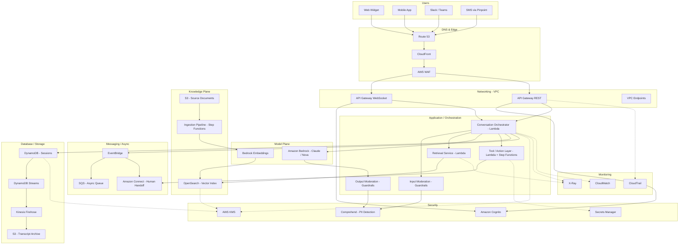

# Part VII – AI & Machine Learning Architectures

# Chapter 54 — AI Chatbot

---

# 1. Executive Summary

## The Business Problem

Enterprises today are drowning in repetitive, high-volume interactions that consume disproportionate human capital:

- Customer support teams field thousands of near-identical questions per day — order status, password resets, billing disputes, product specifications.
- Internal help desks spend enormous effort answering "how do I…" questions that already exist somewhere in a wiki, runbook, or policy document nobody can find quickly.
- Sales and pre-sales teams lose deals to slow response times when a prospect asks a technical or pricing question outside business hours.
- Employees waste hours per week searching across SharePoint, Confluence, Slack, and email for information that should be a single question away.

A conversational AI chatbot, when properly architected, converts this unstructured demand into a scalable, governed, and measurable service.

It is not simply "a chat window connected to an LLM." A production-grade enterprise chatbot is a distributed system with:

- A conversation orchestration layer.
- A knowledge retrieval layer (frequently backed by a vector database).
- An identity and entitlement layer that determines what the user is allowed to know.
- A safety and moderation layer that filters both inbound and outbound content.
- An observability layer that captures every prompt, response, and retrieval decision for audit and continuous improvement.
- A cost governance layer, because token consumption is a variable, potentially unbounded operating expense.

## Architecture Objective

The objective of this chapter's reference architecture is to design a **multi-channel, retrieval-augmented, enterprise-grade AI chatbot platform** on AWS that:

- Serves web, mobile, and messaging channels (web widget, native app, Slack/Teams, SMS) from a single backend.
- Maintains low-latency, stateful, multi-turn conversations at scale.
- Grounds responses in enterprise-approved knowledge sources to reduce hallucination.
- Enforces authentication, authorization, and data-boundary controls per tenant and per user.
- Applies content moderation and prompt-injection defenses on every request and response.
- Is fully observable, cost-attributable, and horizontally scalable using serverless-first AWS primitives.
- Supports both synchronous (request/response) and asynchronous (long-running agentic tool calls) interaction patterns.

## Why Organizations Adopt This Architecture

Organizations move to a dedicated chatbot platform — rather than embedding LLM calls directly into individual applications — for several converging reasons.

- **Consistency.** A single orchestration layer ensures every channel gets the same safety filters, the same grounding logic, and the same conversation memory model.
- **Governance.** Legal, security, and compliance teams need one place to enforce data residency, PII redaction, and audit logging — not twenty scattered integrations.
- **Cost control.** Token spend can spiral quickly. Centralizing model invocation allows rate limiting, caching, and model routing (cheaper models for simple queries, larger models for complex ones).
- **Reusability.** The same retrieval pipeline, moderation stack, and conversation store can support a customer-facing chatbot, an internal employee assistant, and a partner-facing API — with different prompts and different entitlement rules layered on top.
- **Vendor flexibility.** Centralizing behind an orchestration layer decouples the business logic from a single foundation model provider, easing future migration between Bedrock model families (Anthropic Claude, Amazon Nova, Meta Llama, Mistral) as pricing and capability evolve.

## Major Business Benefits

| Benefit | Description | Typical Impact |
|---|---|---|
| Deflection of Tier-1 support | Chatbot resolves FAQ-style tickets without human involvement | 20–45% ticket deflection in mature deployments |
| 24×7 availability | No staffing gaps across time zones | Improved CSAT, reduced abandonment |
| Faster employee onboarding | New hires query internal chatbot instead of tribal knowledge | Reduced ramp time |
| Consistent, compliant answers | Grounded responses reduce misinformation and legal exposure | Fewer compliance escalations |
| Scalable during demand spikes | Serverless compute absorbs seasonal or viral traffic | No manual capacity planning for peak events |
| Data-driven product insight | Conversation logs reveal unmet customer needs | Informs roadmap and content gaps |

## Typical Enterprise Scenarios

- **E-commerce customer support** — order tracking, returns, product Q&A, integrated with order management APIs.
- **SaaS in-app assistant** — contextual help embedded in the product UI, aware of the user's current screen and account state.
- **Internal IT/HR help desk** — policy questions, benefits enrollment guidance, password reset workflows, ticket creation.
- **Financial services virtual assistant** — account balance inquiries, transaction disputes, subject to strict regulatory and PII controls (see Chapter 67, Banking).
- **Healthcare patient engagement bot** — appointment scheduling, symptom triage disclaimers, subject to HIPAA controls (see Chapter 68, Healthcare).
- **B2B partner support portal** — API documentation Q&A, integration troubleshooting for external developers.
- **Sales development assistant** — qualifies inbound leads, answers product questions, hands off to a human rep when intent to purchase is detected.

## Why This Is Different From "Calling an LLM API"

A common architectural anti-pattern is a thin Lambda function that proxies user input directly to a foundation model and returns the raw output. This works for a demo. It fails in production for the following reasons, each of which this chapter's architecture directly addresses:

- **No grounding** — the model hallucinates product details, pricing, or policy specifics it was never given.
- **No memory management** — conversations lose context beyond a few turns, or context windows balloon unpredictably, inflating cost.
- **No authorization boundary** — any authenticated user can ask about any other user's data if the prompt does not explicitly restrict retrieval scope.
- **No moderation** — the system is exposed to prompt injection, jailbreak attempts, and toxic content generation.
- **No cost governance** — a single abusive user or a runaway agentic loop can generate unbounded token spend.
- **No observability** — when the chatbot gives a wrong or harmful answer, there is no trace of what documents were retrieved or what system prompt was in effect at that time.

This chapter's architecture treats the chatbot as a **production distributed system**, not a prompt wrapper, and is designed to satisfy the same reliability, security, and cost-governance bar as any other Tier-1 enterprise service.

---

# 2. Business Requirements

## Business Drivers

- Reduce Tier-1 support cost per contact.
- Improve first-response time to near-zero for common queries.
- Provide a consistent brand voice and compliant answer set across channels.
- Free human agents to focus on complex, high-value interactions.
- Capture conversational data as a source of product and customer insight.

## Functional Requirements

| ID | Requirement |
|---|---|
| FR-1 | Support multi-turn conversations with persisted history per user/session |
| FR-2 | Ground responses in an approved knowledge base via retrieval-augmented generation |
| FR-3 | Support multiple channels: web widget, mobile app, Slack/Teams, SMS |
| FR-4 | Authenticate users and apply per-user/per-tenant entitlement to retrieved content |
| FR-5 | Escalate to a human agent when confidence is low or the user requests it |
| FR-6 | Support tool-calling / function-calling for actions (e.g., "cancel my order") |
| FR-7 | Apply content moderation on both inbound prompts and outbound responses |
| FR-8 | Provide an admin console for reviewing conversations, updating the knowledge base, and tuning prompts |
| FR-9 | Support streaming responses to reduce perceived latency |
| FR-10 | Provide conversation export and audit trail for compliance review |

## Non-Functional Requirements

| Category | Requirement |
|---|---|
| Scalability | Support 500–50,000 concurrent conversations depending on tier |
| Latency | Time-to-first-token under 1.5 seconds (p95); full response streaming thereafter |
| Availability | 99.9% for standard tier, 99.95% for premium/regulated tier |
| Compliance | SOC 2, GDPR, and industry-specific (HIPAA/PCI-DSS) as applicable |
| Security | Zero standing credentials, encryption in transit and at rest, prompt-injection defenses |
| Data residency | Region-pinned processing for regulated customers |
| Cost predictability | Per-conversation cost tracked and alertable |

## Scalability Goals

- Horizontally scale conversation ingestion independent of model inference throughput.
- Support burst traffic (e.g., product launch, marketing campaign) without pre-provisioning.
- Scale the knowledge base independently of the chat layer as document volume grows into the millions.

## Availability Requirements

- 99.9% monthly uptime SLA for the orchestration and API layer (standard tier).
- 99.95% for regulated/premium tier with multi-AZ and cross-region failover for the knowledge base.
- Graceful degradation: if the LLM provider is degraded, fall back to a cached FAQ response path rather than a hard failure.

## Latency Requirements

| Interaction Type | Target (p95) |
|---|---|
| Time to first token | < 1.5s |
| Simple FAQ (cached) response | < 500ms |
| RAG-grounded response (full) | < 4s end-to-end |
| Tool-calling action (e.g., order lookup) | < 3s |
| Human handoff trigger | < 1s |

## Compliance Requirements

- **GDPR** — right to erasure for conversation history, data minimization, EU data residency option.
- **SOC 2 Type II** — access controls, change management, audit logging across the full pipeline.
- **HIPAA** (healthcare deployments) — BAA-eligible services only, PHI encryption, audit trail of every access.
- **PCI-DSS** (if payment data ever traverses the chatbot) — strict scoping to avoid PCI scope creep; recommend never handling card data directly in chat.

## Security Expectations

- No long-lived IAM credentials; all service-to-service auth via IAM roles and STS.
- All PII redacted or tokenized before being sent to the foundation model where feasible.
- Prompt-injection and jailbreak detection on inbound messages.
- Output moderation before any response reaches the user.
- Full audit trail: every prompt, retrieved document, and response logged with correlation IDs.

## Recovery Objectives

| Metric | Standard Tier | Regulated/Premium Tier |
|---|---|---|
| RPO (conversation data) | 15 minutes | 5 minutes |
| RPO (knowledge base) | 1 hour | 15 minutes |
| RTO (full platform) | 4 hours | 1 hour |

## SLAs

- 99.9% API availability, measured monthly, excluding scheduled maintenance windows.
- P95 time-to-first-token under 1.5 seconds during normal operating conditions.
- Support escalation SLA: critical incidents acknowledged within 15 minutes.

## Expected Workload

- Baseline: 50,000–500,000 conversations per month for a mid-size enterprise deployment.
- Peak: 5–10x baseline during promotional events, product launches, or seasonal peaks (e.g., retail holiday season).
- Average conversation length: 6–12 turns.
- Average tokens per conversation: 3,000–8,000 including retrieved context.

## Expected Growth

- Conversation volume growing 30–60% year-over-year as chatbot deflection targets increase.
- Knowledge base growing from tens of thousands to millions of indexed chunks as more content sources are onboarded.
- Channel expansion from web-only to omni-channel (mobile, messaging, voice) over 12–24 months.

---

# 3. Architecture Overview

## Overall Design

The platform is built around five decoupled planes, each independently scalable and independently securable:

- **Channel Plane** — the surfaces users interact with: web widget (WebSocket via API Gateway), mobile SDK, Slack/Teams bot, SMS via Amazon Pinpoint/SNS.
- **Orchestration Plane** — Lambda-based conversation orchestrator that manages turn-taking, session state, moderation, and tool-calling.
- **Knowledge Plane** — the RAG pipeline: ingestion, chunking, embedding, and retrieval against a vector store (Amazon OpenSearch Service or Amazon Aurora PostgreSQL with pgvector).
- **Model Plane** — Amazon Bedrock hosting the foundation models used for generation, embeddings, and moderation (Guardrails).
- **Governance Plane** — identity (Cognito/IAM Identity Center), audit logging (CloudTrail, CloudWatch Logs), cost tracking, and admin tooling.

## Architecture Philosophy

- **Serverless-first.** Conversation volume is bursty and unpredictable; Lambda, API Gateway, DynamoDB, and Bedrock scale without capacity planning.
- **Stateless compute, stateful storage.** Every orchestrator invocation is stateless; all conversation state lives in DynamoDB, never in Lambda memory.
- **Retrieval before generation.** The model is never asked to answer from its own parametric knowledge for enterprise-specific facts — it is always given retrieved, entitlement-filtered context.
- **Defense in depth on every hop.** Input moderation → retrieval scoping → output moderation → audit logging, on every single turn, with no bypass path.
- **Model-agnostic invocation.** All model calls go through Bedrock's unified API, so switching between Anthropic Claude, Amazon Nova, or other Bedrock-hosted models is a configuration change, not a rewrite.

## Core Components

| Component | Responsibility |
|---|---|
| API Gateway (WebSocket + REST) | Channel ingress, connection management, authentication |
| Conversation Orchestrator (Lambda) | Turn management, tool routing, prompt assembly |
| Session Store (DynamoDB) | Conversation history, session metadata, TTL-based expiry |
| Retrieval Service (Lambda + OpenSearch/pgvector) | Semantic search against the knowledge base |
| Embedding Pipeline (Lambda + Step Functions) | Document ingestion, chunking, embedding generation |
| Amazon Bedrock | Foundation model inference, embeddings, Guardrails |
| Moderation Layer (Bedrock Guardrails + Comprehend) | PII detection, toxicity filtering, prompt-injection defense |
| Tool/Action Layer (Lambda + Step Functions) | Executes backend actions (order lookup, ticket creation) |
| Human Handoff Service (Connect/EventBridge) | Escalation to live agent |
| Admin Console (CloudFront + S3 + API Gateway) | Knowledge base management, prompt tuning, analytics |
| Observability Stack (CloudWatch, X-Ray, OpenSearch) | Tracing, metrics, structured logs |

## How Components Interact

- The channel plane terminates the user connection and forwards a normalized message envelope to the orchestrator.
- The orchestrator loads session state, runs input moderation, and determines intent.
- For knowledge questions, the orchestrator calls the retrieval service, which queries the vector store scoped to the user's entitlements and tenant.
- The orchestrator assembles a grounded prompt (system instructions + retrieved context + conversation history + user message) and invokes Bedrock.
- If the model requests a tool call (function calling), the orchestrator routes to the tool/action layer, executes it, and feeds the result back to the model for a final response.
- The response passes through output moderation (Guardrails) before being streamed back to the channel.
- Every step emits structured logs and trace spans correlated by a conversation ID.

## High-Level Workflow

- User sends a message on any channel.
- Channel adapter normalizes it and forwards to the orchestrator.
- Orchestrator persists the inbound turn, runs moderation, retrieves context, invokes the model.
- Model response is moderated, persisted, and streamed back.
- Session state and metrics are updated asynchronously via EventBridge.

## Request Lifecycle

- Ingress → Authentication → Moderation (input) → Intent Classification → Retrieval → Prompt Assembly → Model Invocation → Tool Calling (optional) → Moderation (output) → Response Delivery → Async Logging/Analytics.

## Response Lifecycle

- Model generates tokens (streamed from Bedrock).
- Orchestrator streams tokens to the client as they arrive (via WebSocket) once the first moderation check on partial output passes, or performs full-response moderation for stricter tiers before releasing any tokens.
- Final response and citations (source documents used) are persisted to the session store.

## Data Lifecycle

- Raw source documents land in S3 (versioned bucket).
- Step Functions pipeline extracts text, chunks it, generates embeddings via Bedrock, and writes vectors to OpenSearch/pgvector.
- Conversation transcripts are written to DynamoDB (hot, TTL-bound) and archived to S3 (cold, via DynamoDB Streams → Firehose) for long-term audit retention.
- PII is redacted or tokenized at ingestion and at conversation-logging time, governed by Amazon Comprehend PII detection and KMS-encrypted storage.

---

# 4. AWS Services Used

## Amazon Bedrock

- **Purpose:** Managed access to foundation models (Anthropic Claude, Amazon Nova, Meta Llama, Mistral, Cohere) for text generation, embeddings, and guardrail enforcement, without managing GPU infrastructure.
- **Why selected:** Serverless inference, pay-per-token pricing, built-in Guardrails for content moderation and PII redaction, native integration with IAM for access control, and model choice flexibility without re-architecting.
- **Alternatives:** Self-hosted models on EC2/SageMaker endpoints (Chapter 55, Model Serving); third-party APIs (OpenAI, Google Vertex AI) reached via outbound HTTPS.
- **Limitations:** Regional model availability varies; provisioned throughput may be required for guaranteed low-latency at very high volume; context window limits vary by model.
- **Pricing considerations:** Charged per input/output token; on-demand vs. provisioned throughput; embedding calls are billed separately and are typically far cheaper per call than generation.
- **Best practices:** Use Guardrails for every invocation; use prompt caching where supported to reduce repeated system-prompt token cost; monitor per-tenant token consumption.

## Amazon OpenSearch Service (Vector Engine)

- **Purpose:** Stores document embeddings and performs approximate nearest-neighbor (ANN) semantic search for retrieval-augmented generation.
- **Why selected:** Native k-NN vector search, hybrid (keyword + vector) search support, mature access-control model, and horizontal scalability for large knowledge bases.
- **Alternatives:** Amazon Aurora PostgreSQL with the pgvector extension (simpler operationally for smaller knowledge bases, see Chapter 53, Vector Database); Amazon Kendra for managed enterprise search without building a custom pipeline.
- **Limitations:** Cluster sizing and shard management require ongoing tuning at scale; cost grows with index size and replica count.
- **Pricing considerations:** Instance-hours plus storage; OpenSearch Serverless removes cluster management at a different pricing model (OCU-based).
- **Best practices:** Use OpenSearch Serverless for unpredictable workloads; partition indices per tenant for strict data isolation; monitor `k-NN` query latency.

## AWS Lambda

- **Purpose:** Executes the conversation orchestrator, retrieval service, tool/action handlers, and ingestion pipeline steps.
- **Why selected:** Scales automatically with conversation volume, pay-per-invocation, no idle infrastructure cost, and integrates natively with API Gateway, DynamoDB, and Bedrock.
- **Alternatives:** ECS Fargate for long-running or high-memory orchestration workloads; EKS for teams standardized on Kubernetes.
- **Limitations:** 15-minute maximum execution duration (a constraint for very long agentic tool chains — mitigate with Step Functions); cold starts for large dependency bundles.
- **Pricing considerations:** Billed per millisecond of execution and memory allocated; streaming responses can extend billed duration — monitor closely.
- **Best practices:** Keep the orchestrator function lean; move long tool chains to Step Functions; use provisioned concurrency for latency-sensitive entry points during peak hours.

## Amazon API Gateway (WebSocket + REST)

- **Purpose:** WebSocket API for streaming, bidirectional chat sessions; REST API for admin console and channel-adapter integrations (Slack/Teams webhooks).
- **Why selected:** Managed connection handling, native Lambda integration, built-in throttling and API key management.
- **Alternatives:** AWS AppSync for GraphQL subscriptions; Application Load Balancer with a container-based WebSocket server for teams wanting more control over the protocol layer.
- **Limitations:** WebSocket connection state must be tracked externally (DynamoDB) since API Gateway does not persist application state.
- **Pricing considerations:** Billed per message and per connection-minute for WebSocket APIs.
- **Best practices:** Store `connectionId` mappings in DynamoDB with TTL; handle `$disconnect` events to clean up stale sessions.

## Amazon DynamoDB

- **Purpose:** Stores conversation session state, message history, WebSocket connection mappings, and tenant/user entitlement caches.
- **Why selected:** Single-digit millisecond latency at any scale, on-demand capacity mode absorbs bursty chat traffic, native TTL for automatic session expiry.
- **Alternatives:** Amazon ElastiCache (Redis/Valkey) for ephemeral session state with sub-millisecond latency; Aurora for teams needing relational session queries.
- **Limitations:** 400KB item size limit — long conversation histories must be paginated or summarized; no native full-text search.
- **Pricing considerations:** On-demand pricing scales with read/write request units; DynamoDB Streams add incremental cost for the archival pipeline.
- **Best practices:** Use a composite key of `conversationId` + `turnSequence`; enable point-in-time recovery; use TTL to auto-expire inactive sessions.

## Amazon S3

- **Purpose:** Stores raw source documents for the knowledge base, conversation transcript archives, and static admin console assets.
- **Why selected:** Durable, cost-effective, versioned object storage with native lifecycle policies and event notifications to trigger the ingestion pipeline.
- **Alternatives:** Amazon EFS for shared file-system semantics (rarely needed here).
- **Limitations:** Not a database — requires an index (OpenSearch/Athena) for querying content.
- **Pricing considerations:** Storage class transitions (Standard → IA → Glacier) reduce long-term archive cost significantly.
- **Best practices:** Enable versioning on the source-document bucket; use S3 Event Notifications to trigger Step Functions ingestion automatically on upload.

## AWS Step Functions

- **Purpose:** Orchestrates the multi-stage document ingestion pipeline (extract → chunk → embed → index) and long-running agentic tool-calling sequences that exceed Lambda's duration limits.
- **Why selected:** Visual, auditable state machines with built-in retry/error handling, native Lambda and Bedrock integration.
- **Alternatives:** Apache Airflow on MWAA for teams with existing Airflow investment; direct Lambda chaining (loses visibility and retry semantics).
- **Limitations:** Express workflows have a 5-minute duration cap; Standard workflows cost more per state transition.
- **Pricing considerations:** Standard workflows billed per state transition; Express workflows billed per execution duration and memory.
- **Best practices:** Use Express workflows for high-volume ingestion of individual documents; use Standard workflows for long agentic tool chains needing full audit history.

## Amazon Cognito

- **Purpose:** Authenticates end users (customer-facing) and issues short-lived tokens used to authorize WebSocket connections and REST calls.
- **Why selected:** Managed user pools with MFA, social identity federation, and native API Gateway authorizer integration.
- **Alternatives:** IAM Identity Center for workforce/internal chatbot deployments (see Chapter 89); third-party IdP (Okta, Auth0) federated via SAML/OIDC.
- **Limitations:** Advanced security features (adaptive authentication) require the Plus tier.
- **Pricing considerations:** Billed per monthly active user beyond the free tier.
- **Best practices:** Use Cognito user pool groups to encode tenant/role claims consumed by the entitlement layer.

## Amazon EventBridge

- **Purpose:** Decouples asynchronous side effects — analytics events, human-handoff triggers, cost-tracking updates — from the synchronous conversation path.
- **Why selected:** Native AWS service integration, schema registry, and simple rule-based routing without standing infrastructure.
- **Alternatives:** Amazon SNS/SQS for simpler fan-out without content-based routing.
- **Limitations:** Event size limit of 256KB; not intended for high-throughput streaming (use Kinesis for that).
- **Pricing considerations:** Billed per published event; inexpensive at typical chatbot event volumes.
- **Best practices:** Emit one canonical `ConversationTurnCompleted` event per turn and let downstream consumers (analytics, cost tracker, QA sampler) subscribe independently.

## Amazon Comprehend

- **Purpose:** Detects and redacts PII in both inbound user messages and outbound model responses, and can classify message sentiment/intent.
- **Why selected:** Pre-trained PII and sentiment models with no training required; integrates with Lambda synchronously in the moderation path.
- **Alternatives:** Bedrock Guardrails' built-in PII filters (increasingly overlapping in capability); custom regex/NER for narrow, well-defined PII types.
- **Limitations:** Added latency per call (mitigate by running in parallel with other moderation checks); language coverage varies by feature.
- **Pricing considerations:** Billed per unit of text processed.
- **Best practices:** Run Comprehend and Bedrock Guardrails in parallel (not serially) to minimize added latency.

## Amazon Connect

- **Purpose:** Receives human-handoff escalations from the chatbot and routes them to live agents with full conversation context attached.
- **Why selected:** Native AWS contact center service with programmatic escalation APIs and unified agent desktop.
- **Alternatives:** Zendesk, Salesforce Service Cloud, or other third-party helpdesk integration via webhook.
- **Limitations:** Requires separate contact center licensing/setup if not already in use.
- **Pricing considerations:** Per-minute usage pricing for voice/chat contact handling.
- **Best practices:** Pass the full conversation transcript and detected intent to the agent desktop to avoid the customer repeating themselves.

## AWS Key Management Service (KMS)

- **Purpose:** Encrypts conversation data, knowledge base content, and secrets at rest with customer-managed keys.
- **Why selected:** Native integration with DynamoDB, S3, OpenSearch, and Secrets Manager; supports key rotation and fine-grained key policies.
- **Alternatives:** AWS-managed keys for lower operational overhead when customer-managed key policies are not required by compliance.
- **Limitations:** API call costs and request quotas at very high throughput — use data key caching where applicable.
- **Best practices:** Use a dedicated CMK per data classification tier (conversation data vs. knowledge base vs. secrets).

## AWS Secrets Manager

- **Purpose:** Stores third-party API keys (e.g., Slack bot tokens, external CRM credentials) used by channel adapters and tool handlers.
- **Why selected:** Automatic rotation support, fine-grained IAM access policies, native Lambda SDK integration.
- **Alternatives:** SSM Parameter Store (SecureString) for lower-cost secrets without automatic rotation needs.
- **Best practices:** Never store secrets in Lambda environment variables in plaintext; scope IAM policies to specific secret ARNs.

## Amazon CloudWatch, AWS X-Ray, and CloudTrail

- **Purpose:** CloudWatch for metrics/logs/alarms; X-Ray for distributed tracing across the orchestrator, retrieval, and tool layers; CloudTrail for API-level audit logging.
- **Why selected:** Native, zero-setup integration with every compute and data service used in this architecture.
- **Alternatives:** Third-party observability platforms (Datadog, New Relic, Grafana Cloud) layered on top via the CloudWatch/X-Ray data sources.
- **Best practices:** Correlate every log line and trace span with a `conversationId`; alarm on token-spend anomalies, not just error rates.

---

# 5. Complete Architecture Diagram



---

# 6. Component-by-Component Explanation

## Conversation Orchestrator (Lambda)

- **Purpose:** The central nervous system of the chatbot — coordinates every step of a single turn.
- **Responsibilities:** Load session state, invoke moderation, call retrieval, assemble prompts, invoke Bedrock, route tool calls, persist results, stream responses.
- **Inputs:** Normalized message envelope (userId, tenantId, conversationId, message text, channel metadata).
- **Outputs:** Streamed model response, updated session state, emitted analytics events.
- **Scaling:** Scales automatically with Lambda concurrency; provisioned concurrency recommended for the peak-traffic window to avoid cold-start latency spikes.
- **High availability:** Multi-AZ by default (Lambda is a regional, multi-AZ service); no single point of failure at the compute layer.
- **Failure handling:** Idempotent turn processing keyed by `conversationId`+`turnSequence`; failed invocations retried by API Gateway/SQS with backoff; dead-letter queue for unrecoverable failures.
- **Dependencies:** DynamoDB, Bedrock, OpenSearch, Comprehend, Secrets Manager.
- **Security:** Least-privilege execution role scoped to specific DynamoDB tables, Bedrock model ARNs, and OpenSearch indices.
- **Monitoring:** Custom CloudWatch metrics for token usage, retrieval hit rate, moderation block rate; X-Ray subsegments for each downstream call.

## Retrieval Service

- **Purpose:** Executes entitlement-scoped semantic search against the knowledge base.
- **Responsibilities:** Embed the user query, apply tenant/user filters, execute k-NN search, re-rank results, return top-N chunks with source citations.
- **Inputs:** Query text, tenantId, user entitlement claims.
- **Outputs:** Ranked list of document chunks with metadata (source, confidence score, URL).
- **Scaling:** Stateless Lambda scales independently of the orchestrator; OpenSearch cluster/collection scales via replica count or Serverless OCUs.
- **High availability:** Multi-AZ OpenSearch domain with at least one replica per shard.
- **Failure handling:** Falls back to a smaller default result set or a "no grounding available" response rather than failing the whole turn.
- **Dependencies:** Amazon Bedrock (embeddings), OpenSearch.
- **Security:** Query-time filters enforce tenant isolation at the index level, not just the application level.
- **Monitoring:** Retrieval latency, recall/precision sampling, zero-result-rate alarms.

## Embedding / Ingestion Pipeline

- **Purpose:** Converts raw source documents into searchable vector embeddings.
- **Responsibilities:** Extract text (including from PDFs, HTML, Office documents), chunk with overlap, generate embeddings, write to the vector index, tag with access-control metadata.
- **Inputs:** Documents uploaded to S3 or synced from Confluence/SharePoint/CRM connectors.
- **Outputs:** Indexed vector chunks with source metadata and entitlement tags.
- **Scaling:** Step Functions Express workflow scales per-document; large batch backfills use Standard workflows with Map state parallelism.
- **High availability:** Idempotent, replayable pipeline — failed document processing does not block the rest of the batch.
- **Failure handling:** Per-document retry with exponential backoff; poison documents routed to a review queue.
- **Dependencies:** S3, Bedrock (embeddings), OpenSearch, Comprehend (for PII scrubbing before indexing).
- **Security:** Documents tagged with source ACLs at ingestion time so retrieval-time filtering has ground truth to enforce.
- **Monitoring:** Ingestion lag (time from upload to searchable), failure rate per source connector.

## Tool / Action Layer

- **Purpose:** Executes real-world actions the model requests via function calling (order lookup, ticket creation, password reset initiation).
- **Responsibilities:** Validate the model's requested tool call against an allow-list, execute the backend API call with the user's own entitlements (never elevated privileges), return structured results to the model.
- **Inputs:** Tool name and structured arguments proposed by the model.
- **Outputs:** Structured tool result fed back into the model's context for a final natural-language response.
- **Scaling:** Independent Lambda functions per tool category; Step Functions for multi-step actions.
- **High availability:** Each tool handler is independently deployable and independently scalable.
- **Failure handling:** Tool failures are surfaced to the model as a structured error so it can respond gracefully ("I wasn't able to look that up right now") rather than crash the turn.
- **Dependencies:** Backend systems of record (order management, ticketing, CRM) via their own APIs.
- **Security:** Every tool call is executed under the calling user's own permission scope — the model can never request an action beyond what the authenticated user could do directly.
- **Monitoring:** Per-tool invocation count, success rate, and latency.

## Session Store (DynamoDB)

- **Purpose:** Durable, low-latency store for conversation state.
- **Responsibilities:** Persist each turn, maintain rolling context window metadata, store WebSocket connection mappings.
- **Inputs:** Turn records from the orchestrator.
- **Outputs:** Conversation history on read; TTL-based automatic expiry.
- **Scaling:** On-demand capacity mode absorbs bursty write patterns without pre-provisioning.
- **High availability:** Multi-AZ by default; Global Tables for multi-region regulated deployments.
- **Failure handling:** Conditional writes prevent duplicate turn processing; point-in-time recovery for accidental data loss.
- **Security:** Encrypted with a customer-managed KMS key; fine-grained IAM condition keys restrict access by tenantId partition.
- **Monitoring:** Consumed capacity, throttled request alarms.

## Moderation Layer (Bedrock Guardrails + Comprehend)

- **Purpose:** Enforces content safety policy on both inbound and outbound text.
- **Responsibilities:** Block or redact PII, filter toxic/harmful content, detect prompt-injection patterns, enforce topic restrictions (e.g., no medical/legal advice outside approved scope).
- **Inputs:** Raw inbound message; raw model output.
- **Outputs:** Pass/block/redact decision plus a sanitized version of the text.
- **Scaling:** Fully managed, scales with Bedrock invocation volume.
- **Failure handling:** Default-deny on moderation service failure for regulated tiers; default-allow-with-logging for lower-risk internal tools, per risk appetite.
- **Security:** Guardrail policies version-controlled and reviewed by security/compliance before deployment.
- **Monitoring:** Block rate by category, false-positive sampling reviewed by the content team.

## Human Handoff Service (Amazon Connect)

- **Purpose:** Seamlessly transitions a conversation from bot to human agent.
- **Responsibilities:** Detect handoff triggers (explicit request, low confidence, repeated failure, negative sentiment), package conversation context, route to the appropriate agent queue.
- **Scaling:** Amazon Connect scales independently as a managed contact center service.
- **Monitoring:** Handoff rate, time-to-agent-pickup, post-handoff resolution rate.

---

# 7. End-to-End Request Flow

1. **Client sends message** — the web widget (or Slack app, mobile SDK) sends a message over an established WebSocket connection, or a REST webhook for asynchronous channels.
2. **DNS resolution** — Route 53 resolves the endpoint to the nearest CloudFront edge location.
3. **Edge security** — CloudFront forwards the request through AWS WAF, which checks rate limits, IP reputation, and known bad-bot signatures.
4. **API Gateway authentication** — a Lambda authorizer or native Cognito authorizer validates the JWT access token attached to the WebSocket connection or REST request.
5. **Routing to orchestrator** — API Gateway invokes the Conversation Orchestrator Lambda with the normalized message payload.
6. **Session load** — the orchestrator reads the existing conversation state from DynamoDB using the `conversationId`.
7. **Input moderation** — the raw user message is sent in parallel to Bedrock Guardrails and Amazon Comprehend for PII/toxicity/prompt-injection screening.
8. **Moderation decision** — if blocked, a policy-compliant refusal message is returned immediately (steps 14–16, skipping retrieval/generation); otherwise processing continues.
9. **Intent classification** — a lightweight classification step (small model call or rules) determines whether this turn needs knowledge retrieval, a tool call, or a direct conversational response.
10. **Retrieval** — for knowledge questions, the Retrieval Service embeds the query and performs a tenant/entitlement-scoped k-NN search against OpenSearch, returning the top-N relevant chunks.
11. **Prompt assembly** — the orchestrator constructs the final prompt: system instructions, retrieved context with citations, recent conversation history (windowed/summarized as needed), and the current user message.
12. **Model invocation** — the assembled prompt is sent to Amazon Bedrock; the response is streamed back token-by-token.
13. **Tool calling (conditional)** — if the model's response includes a tool call request, the orchestrator routes it to the Tool/Action Layer, executes the backend call under the user's own entitlements, and returns the result to the model for a follow-up completion.
14. **Output moderation** — the generated response passes through Bedrock Guardrails and Comprehend before release.
15. **Response delivery** — the moderated response is streamed to the client over the WebSocket connection (or returned synchronously for REST/webhook channels).
16. **Persistence** — the full turn (input, retrieved context, output, tool calls, moderation decisions) is written to DynamoDB.
17. **Async fan-out** — a `ConversationTurnCompleted` event is published to EventBridge, triggering analytics aggregation, cost tracking, and QA sampling — none of which block the user-facing response.
18. **Archival** — DynamoDB Streams captures the new item and forwards it via Kinesis Firehose to S3 for long-term, queryable audit archive.
19. **Error handling** — any unhandled exception at any stage triggers a graceful fallback message to the user, a CloudWatch alarm, and a dead-letter queue entry for engineering review; the user is never shown a raw stack trace or an empty response.
20. **Logging and tracing** — every step above emits a structured log line and an X-Ray subsegment correlated by `conversationId`, enabling full request replay for debugging and audit.

---

# 8. Deployment Flow

## Infrastructure Provisioning

- All infrastructure is defined in Terraform, organized into reusable modules (networking, data layer, compute, model plane, knowledge plane).
- A dedicated Terraform workspace/state file exists per environment (dev, staging, prod) and, for regulated customers, per data-residency region.
- Remote state is stored in S3 with DynamoDB-based state locking.

## Terraform Workflow

- `terraform plan` runs automatically on every pull request via CI, posting the plan output as a PR comment for review.
- `terraform apply` runs only on merge to the environment-specific branch, gated by a manual approval step for production.
- Drift detection runs nightly via a scheduled pipeline job comparing live state to the last-applied plan.

## CI/CD Deployment

- Application code (Lambda functions) is packaged and deployed independently of infrastructure changes using AWS SAM or the Serverless Framework layered on top of Terraform-provisioned resources.
- Container-based components (if any admin-console backend runs on Fargate) are built, scanned, and pushed to ECR as part of the same pipeline.

## Blue-Green Deployment

- Lambda function versions and aliases are used to implement blue-green releases: a new version is deployed, a small percentage of traffic is shifted using weighted aliases, and traffic is gradually increased as health metrics confirm stability.
- API Gateway stage variables point to the active alias, allowing instant rollback by repointing the stage variable.

## Rollback

- Automated rollback triggers if error rate or moderation-block-rate anomalies exceed threshold within the first 10 minutes of a new deployment.
- Rollback is a single-command operation: repoint the Lambda alias to the previous stable version.

## Secrets

- All third-party credentials (Slack tokens, external CRM API keys) are stored in Secrets Manager and referenced by ARN in Lambda environment configuration — never hard-coded or stored in Terraform state in plaintext.

## Configuration

- Environment-specific configuration (model IDs, Guardrail IDs, retrieval index names) is stored in SSM Parameter Store and loaded at Lambda cold start, cached for the life of the execution environment.

## Validation

- Post-deployment smoke tests exercise the full request flow end-to-end against a synthetic test tenant before the deployment is marked successful.
- A canary conversation suite (20–30 representative Q&A pairs with expected answer characteristics) runs automatically after every deployment to catch prompt/regression issues.

---

# 9. Network Topology

## VPC

- A dedicated VPC hosts components requiring network isolation: the OpenSearch domain, any VPC-attached Lambda functions calling internal backend systems, and NAT infrastructure.
- Bedrock, DynamoDB, and other fully managed AWS services are reached via VPC endpoints (Gateway or Interface) rather than public internet routing, keeping traffic on the AWS backbone.

## CIDR

- Example allocation: `10.40.0.0/16` for the chatbot platform VPC, sized to accommodate multi-AZ subnet expansion and future peering with backend-of-record systems.

## Public and Private Subnets

- Public subnets host only the NAT Gateways (no public-facing compute — API Gateway and CloudFront are outside the VPC by design).
- Private subnets (one per AZ, minimum two AZs) host VPC-attached Lambda ENIs and the OpenSearch domain nodes.

## NAT Gateway

- One NAT Gateway per AZ for high availability of outbound calls from private-subnet Lambda functions to third-party APIs (e.g., an external CRM tool call).

## Internet Gateway

- Attached to the VPC to support the NAT Gateways' outbound path; no direct inbound internet routes exist to private subnets.

## Transit Gateway

- Used when the chatbot platform's tool layer needs to reach backend-of-record systems (order management, ticketing) hosted in separate VPCs or AWS accounts, avoiding a mesh of VPC peering connections.

## Route Tables

- Private subnet route tables send `0.0.0.0/0` to the AZ-local NAT Gateway; AWS service traffic (DynamoDB, S3) is routed via Gateway VPC Endpoints to avoid NAT costs entirely.

## Network ACLs

- Baseline stateless NACLs restrict private subnets to expected ports only (443 for HTTPS, 9200 for OpenSearch) as a defense-in-depth layer beneath security groups.

## Security Groups

- Retrieval Lambda security group allows outbound 443/9200 to the OpenSearch security group only.
- OpenSearch security group allows inbound 9200 only from the Retrieval and Ingestion Lambda security groups — no broader access.

## PrivateLink

- Interface VPC Endpoints (PrivateLink) are used for Bedrock, Secrets Manager, KMS, and Comprehend so that VPC-attached Lambda functions never traverse the public internet to reach these services.

## Hybrid Connectivity

- For enterprises whose knowledge sources live on-premises (e.g., an internal document management system), Direct Connect or Site-to-Site VPN provides private connectivity for the ingestion pipeline to pull source content securely.

---

# 10. Identity and Access

## IAM Roles

- Distinct execution roles per Lambda function category: orchestrator, retrieval, ingestion, tool-handlers, admin-console backend — no shared "do everything" role.

## IAM Policies

- Policies are scoped to specific resource ARNs (specific DynamoDB table, specific Bedrock model IDs, specific OpenSearch domain) rather than wildcard resource access.

## Resource Policies

- The Bedrock model invocation is restricted via a resource-based policy plus IAM condition keys limiting which principals may invoke which model IDs, preventing an over-privileged function from calling an unapproved (and potentially more expensive) model.

## STS

- Cross-account tool calls (e.g., the tool layer reaching an order-management system in a separate AWS account) use STS `AssumeRole` with short-lived credentials rather than long-lived cross-account keys.

## Cross-Account Access

- A dedicated "chatbot-tool-execution-role" is assumed by the Tool/Action Layer when reaching into backend-of-record accounts, scoped to only the specific actions required (e.g., `orders:GetOrderStatus`, never `orders:*`).

## Least Privilege

- Every IAM policy in this architecture is written to a specific action list and specific resource ARNs; wildcard actions (`*`) are prohibited by an AWS Config rule and Service Control Policy at the organization level.

## Service Roles

- The ingestion Step Functions state machine has its own execution role scoped only to the S3 source bucket, the Bedrock embedding model, and the OpenSearch write index — it has no access to the conversation session table.

## Permission Boundaries

- A permission boundary is attached to all Lambda execution roles in this workload, capping the maximum possible privilege even if a future policy change is misconfigured, preventing privilege escalation beyond the chatbot platform's defined resource set.

---

# 11. Security Architecture

## Encryption

- All data at rest (DynamoDB, S3, OpenSearch) is encrypted using customer-managed KMS keys, one CMK per data-classification tier.
- All data in transit uses TLS 1.2+ enforced at API Gateway, CloudFront, and internal VPC endpoint connections.

## KMS

- Separate CMKs for conversation data, knowledge base content, and secrets, each with a distinct key policy and rotation schedule, so a compromise of one key does not expose all data classes.

## TLS

- ACM-issued certificates terminate TLS at CloudFront and API Gateway; internal service-to-service calls within the VPC also use TLS via VPC endpoint HTTPS.

## WAF

- AWS WAF rules in front of CloudFront/API Gateway block common web exploits (SQLi, XSS), enforce rate limiting per IP, and include a custom rule set tuned to detect prompt-injection-style payloads (e.g., repeated "ignore previous instructions" patterns) as an additional layer beyond Guardrails.

## Shield

- AWS Shield Standard provides baseline DDoS protection at no additional cost; Shield Advanced is recommended for the regulated/premium tier given the customer-facing, brand-sensitive nature of a chatbot.

## Secrets Manager

- All third-party credentials and API keys used by channel adapters and tool handlers, with automatic rotation configured where the target system supports it.

## Certificate Manager

- Manages and auto-renews all public TLS certificates for the CloudFront distribution and custom API Gateway domains.

## GuardDuty

- Enabled at the account level to detect anomalous API activity (e.g., an IAM role suddenly invoking Bedrock models it has never used, or unusual data-exfiltration-pattern S3 access on the transcript archive bucket).

## Inspector

- Scans any container images used by the admin console backend or by tool-handler functions packaged as container-based Lambda for known vulnerabilities before deployment.

## Security Hub

- Aggregates findings from GuardDuty, Inspector, Config, and IAM Access Analyzer into a single compliance dashboard mapped to the applicable framework (SOC 2, PCI-DSS, HIPAA as relevant).

## CloudTrail

- Captures every management-plane API call across the platform; a dedicated organization trail with log-file integrity validation feeds a centralized security account.

## AWS Config

- Continuously evaluates resource configuration against rules: no wildcard IAM policies, encryption enabled on all storage resources, no public S3 buckets, MFA enforced for console access.

## Zero Trust

- No implicit trust is granted based on network location alone. Every service-to-service call is authenticated (IAM SigV4 or short-lived STS credentials) and authorized independently of whether the call originates inside the VPC.

## Threat Model

| Threat | Description | Primary Mitigation |
|---|---|---|
| Prompt injection | User attempts to override system instructions via crafted input | Guardrails + WAF pattern rules + strict system/user role separation in prompt construction |
| Data exfiltration via chat | User tricks the bot into revealing another tenant's data | Retrieval-time entitlement filtering enforced at the index/query level, not just prompt instructions |
| Jailbreak for harmful content | User attempts to elicit disallowed content | Bedrock Guardrails denied topics + output moderation |
| Excessive token abuse | Automated scripts spam the chatbot to run up cost | Per-user/per-IP rate limiting at WAF and API Gateway; anomaly-based cost alarms |
| Credential theft via tool layer | Compromised tool handler used to escalate privilege | Least-privilege, per-tool IAM roles; user-scoped tool execution, never elevated service credentials |
| Model supply chain risk | Vulnerability or bias introduced via a third-party fine-tuned model | Use only Bedrock-vetted foundation models; version-pin model IDs; formal model-change review process |

---

# 12. High Availability

## AZ Failures

- All stateful components (DynamoDB, OpenSearch, NAT Gateways) are deployed across a minimum of two, preferably three, Availability Zones.
- Lambda and API Gateway are inherently multi-AZ managed services requiring no explicit configuration.

## Instance Failures

- Not applicable to the serverless compute layer; OpenSearch data-node failures are absorbed by replica shards and automatic node replacement.

## Regional Failures

- Standard tier: single-region with documented, tested recovery runbook (Pilot Light, see Section 13).
- Regulated/premium tier: active-passive multi-region with Aurora/OpenSearch cross-region replication and Route 53 health-check-based failover.

## Database Failures

- DynamoDB point-in-time recovery enabled; Global Tables for premium tier provide multi-region active-active session data replication.

## Load Balancing

- API Gateway and CloudFront inherently load-balance across all healthy backend Lambda concurrency; no separate load balancer tier is required for the serverless path.

## Health Checks

- Route 53 health checks monitor a synthetic canary endpoint exercising the full request flow (auth → retrieval → model invocation) every 60 seconds from multiple global locations.

## Failover

- Automated Route 53 failover repoints traffic to the secondary region if the primary region's health check fails for a sustained period, combined with a runbook for promoting the secondary OpenSearch replica to primary if needed.

---

# 13. Disaster Recovery

## Backup Strategy

- DynamoDB: point-in-time recovery (35-day window) plus daily on-demand backups retained for 1 year for compliance.
- OpenSearch: automated daily snapshots to S3, retained per the compliance schedule applicable to the deployment.
- S3 source documents and transcript archive: versioning enabled, cross-region replication for premium tier.

## Snapshots

- OpenSearch domain snapshots are the primary recovery mechanism for the knowledge base; a full re-ingestion from the S3 source-of-truth bucket is the fallback path if a snapshot is unusable.

## Cross-Region Replication

- Premium tier replicates the S3 source bucket, DynamoDB Global Tables, and OpenSearch cross-cluster replication to a secondary region.

## Pilot Light

- Standard tier DR pattern: infrastructure-as-code for the full stack is maintained and validated in a secondary region but not actively running; a documented, rehearsed runbook stands up the stack from Terraform and restores data from the latest backups within the RTO window.

## Warm Standby

- Premium tier runs a scaled-down but live secondary-region deployment (smaller OpenSearch domain, Lambda already deployed) that can absorb full traffic within minutes of a failover decision.

## Multi-Site / Active-Active

- Reserved for the highest-tier regulated deployments with strict RTO requirements; both regions actively serve traffic behind Route 53 latency-based routing, with DynamoDB Global Tables and OpenSearch cross-cluster replication keeping data in sync.

## RPO / RTO Summary

| Tier | RPO | RTO | Pattern |
|---|---|---|---|
| Standard | 15 min | 4 hours | Pilot Light |
| Premium/Regulated | 5 min | 1 hour | Warm Standby |
| Highest-tier regulated | Near-zero | Minutes | Active-Active |

---

# 14. Scalability

## Horizontal Scaling

- The orchestrator, retrieval, and tool-handler Lambdas scale horizontally with no configuration ceiling beyond the account's regional concurrency limit, which should be raised proactively via a service quota increase request ahead of anticipated peak events.

## Vertical Scaling

- OpenSearch node instance types can be scaled vertically (larger instance family) in addition to horizontally (more nodes/replicas) as index size and query concurrency grow.

## Auto Scaling

- API Gateway and Lambda require no explicit auto-scaling configuration; DynamoDB on-demand mode auto-scales read/write capacity to match traffic.

## Serverless Scaling

- Bedrock on-demand throughput scales automatically, though very high-volume, latency-sensitive tenants should move to Provisioned Throughput for guaranteed capacity and predictable latency.

## Database Scaling

- DynamoDB on-demand mode handles unpredictable bursts; for extremely predictable, steady workloads, provisioned capacity with auto-scaling policies can reduce cost.

## Storage Scaling

- S3 scales inherently; OpenSearch requires periodic reindexing/resharding review as the knowledge base grows past the initial shard-count assumptions (a common oversight — see Section 34, Scaling Limits).

## Queue Scaling

- SQS and EventBridge absorb async fan-out volume without configuration; downstream consumers (analytics, cost tracker) scale independently via their own Lambda concurrency settings.

---

# 15. Performance Optimization

## Caching

- Frequently asked, low-variance questions (e.g., "what are your business hours") are served from a DynamoDB-backed response cache keyed by a normalized query hash, bypassing the model call entirely for a sub-200ms response.
- Bedrock prompt caching (where supported by the model) reduces repeated token cost and latency for the static system-prompt portion of every request.

## Compression

- API Gateway and CloudFront responses use gzip/brotli compression for the admin console's static assets; the chat payload itself is small JSON/text and compression yields minimal benefit there.

## CDN

- CloudFront fronts the admin console and any static widget assets (JS SDK for the web chat widget), reducing load time globally.

## Database Optimization

- DynamoDB access patterns are designed around a single-table model keyed by `conversationId` to avoid cross-table joins and secondary-index overuse.

## Connection Pooling

- VPC-attached Lambda functions calling OpenSearch reuse HTTP connections across invocations within the same execution environment (client initialized outside the handler function) to avoid TLS handshake overhead on every call.

## Concurrency

- Retrieval and moderation calls are issued in parallel (not sequentially) within the orchestrator wherever there is no data dependency between them, reducing end-to-end latency.

## Async Processing

- Analytics aggregation, cost tracking, and transcript archival are entirely decoupled from the synchronous response path via EventBridge, ensuring they never add latency to what the user experiences.

---

# 16. Cost Optimization (FinOps)

## Estimated Monthly Cost by Deployment Size

| Deployment Size | Conversations/Month | Estimated Monthly Cost (USD) |
|---|---|---|
| Small (pilot/single team) | 10,000 | $800 – $1,800 |
| Medium (department/product) | 150,000 | $8,000 – $18,000 |
| Enterprise (multi-channel, omni-tenant) | 2,000,000+ | $80,000 – $220,000+ |

*Estimates assume Bedrock on-demand pricing for a mid-tier model, moderate retrieval context size (1,500–3,000 tokens), and standard-tier availability. Actual cost varies significantly by model choice, average conversation length, and whether Provisioned Throughput is used.*

## Major Cost Drivers

| Driver | Notes |
|---|---|
| Bedrock token consumption (input + output) | Typically 55–70% of total platform cost at scale |
| OpenSearch cluster/OCU cost | Grows with knowledge base size and query volume |
| Lambda invocation + duration | Scales linearly with conversation volume |
| DynamoDB read/write capacity | Usually modest relative to model cost |
| Data transfer (CloudFront, cross-AZ) | Often underestimated — see Section 34, Cost Surprises |
| Amazon Connect usage (human handoff) | Per-minute cost for escalated conversations |

## Optimization Opportunities

- **Model routing:** Use a smaller/cheaper Bedrock model for intent classification and simple FAQ responses; reserve the largest model for complex, multi-step reasoning or agentic tool-calling turns.
- **Prompt caching:** Cache the static system-prompt/instruction portion where the model provider supports it, reducing repeated token billing.
- **Response caching:** Serve deterministic, high-frequency answers from a cache rather than invoking the model at all.
- **Context window discipline:** Summarize older conversation turns rather than replaying the full history on every call — this is frequently the single largest avoidable cost driver.
- **Reserved/Provisioned Throughput:** For predictable, high-volume tenants, Bedrock Provisioned Throughput can reduce effective per-token cost compared to on-demand at scale.
- **S3 lifecycle policies:** Transition the transcript archive from S3 Standard to Infrequent Access after 30 days and Glacier Deep Archive after 1 year for long-term compliance retention.
- **OpenSearch right-sizing:** Move unpredictable or low-volume knowledge bases to OpenSearch Serverless rather than over-provisioning a fixed cluster.

## Reserved Instances / Savings Plans

- Compute Savings Plans apply to any steady-state Fargate/EC2 usage (e.g., an admin-console backend or a self-managed embedding batch process) but do not apply to Bedrock on-demand token pricing — Provisioned Throughput is the equivalent lever for Bedrock.

## Spot

- Spot Instances are applicable only if a supplementary self-hosted embedding or fine-tuning workload runs on EC2/SageMaker outside of Bedrock's managed inference — not typically part of the core chat-serving path.

## S3 Lifecycle and Storage Classes

- Source documents: S3 Standard while actively referenced; Standard-IA once superseded by a newer version but retained for audit.
- Transcript archive: Standard → Standard-IA (30 days) → Glacier Deep Archive (1 year) per the compliance retention schedule.

## Rightsizing

- Lambda memory allocation is tuned per function using AWS Lambda Power Tuning rather than left at default — orchestrator functions are typically memory-bound during JSON parsing and streaming, not CPU-bound.

## Cost Allocation and Tagging

- Every resource is tagged with `tenantId`, `environment`, `costCenter`, and `channel`, enabling per-tenant and per-channel cost attribution via Cost Explorer and the Cost and Usage Report.

## Budgets

- Per-tenant AWS Budgets with alert thresholds at 80%/100%/120% of the tenant's contracted token allowance, feeding an EventBridge-triggered throttling action if a tenant materially exceeds its plan.

## Cost Anomaly Detection

- AWS Cost Anomaly Detection is configured on the Bedrock and OpenSearch cost categories specifically, since these are the drivers most likely to spike unexpectedly from a runaway agentic loop or a mis-tuned retrieval query returning excessive context.

---

# 17. AI-Assisted Operations

## Amazon Q

- Amazon Q Developer assists the engineering team in writing and reviewing the Terraform modules, Lambda handlers, and Step Functions definitions that make up this platform, and can explain unfamiliar CloudWatch error patterns during incident response.
- Amazon Q Business can itself be layered on top of the same knowledge base (S3 + index) used by the customer-facing chatbot to provide an internal, no-code employee-facing assistant with minimal additional engineering effort.

## Bedrock for Operational Tasks

- Bedrock models are used within the platform's own operational tooling to summarize incident timelines from CloudWatch Logs Insights query results, dramatically reducing post-incident report-writing time.

## AI Troubleshooting

- A dedicated internal "ops assistant" (itself an instance of this chapter's chatbot architecture, pointed at a knowledge base of runbooks and past incident postmortems) helps on-call engineers triage alarms faster.

## Log Analysis

- CloudWatch Logs Insights queries, combined with a Bedrock summarization step, turn thousands of structured log lines from a degraded deployment into a two-paragraph root-cause hypothesis for the on-call engineer to validate.

## Incident Response

- AI-assisted correlation of X-Ray traces and CloudWatch alarms speeds identification of which layer (retrieval, model, tool call) is responsible for a latency or error spike.

## Cost Optimization

- Bedrock-assisted analysis of the Cost and Usage Report highlights per-tenant token-consumption outliers and suggests candidate prompts for shortening or caching.

## Capacity Planning

- Historical conversation-volume trends are fed into a forecasting prompt to project Lambda concurrency and OpenSearch OCU requirements ahead of known peak events (product launches, marketing campaigns).

## Architecture Review

- Amazon Q can review proposed Terraform changes against the organization's tagged architecture standards and flag deviations (e.g., a new Lambda function missing the required permission boundary) before merge.

## AI-Generated Terraform

- New tool-handler Lambda modules are frequently scaffolded with AI assistance from an approved internal prompt template, then reviewed and hardened by a human engineer before merge — AI-generated infrastructure code is never auto-applied to production without human review.

## AI-Generated Documentation

- Runbook drafts and architecture decision record first drafts are AI-assisted, with a human architect responsible for final accuracy review before publication.

---

# 18. Terraform Implementation

## Provider and Backend Configuration

```hcl

# providers.tf

terraform {
  required_version = ">= 1.7.0"

  required_providers {
    aws = {
      source  = "hashicorp/aws"
      version = "~> 5.50"
    }
  }

  backend "s3" {
    bucket         = "acme-chatbot-tfstate-prod"
    key            = "chatbot-platform/terraform.tfstate"
    region         = "us-east-1"
    dynamodb_table = "acme-chatbot-tf-locks"
    encrypt        = true
  }
}

provider "aws" {
  region = var.aws_region

  default_tags {
    tags = {
      Project     = "ai-chatbot-platform"
      Environment = var.environment
      ManagedBy   = "terraform"
    }
  }
}

```

## Variables

```hcl

# variables.tf

variable "aws_region" {
  description = "Primary AWS region for the chatbot platform"
  type        = string
  default     = "us-east-1"
}

variable "environment" {
  description = "Deployment environment (dev, staging, prod)"
  type        = string
}

variable "vpc_cidr" {
  description = "CIDR block for the chatbot platform VPC"
  type        = string
  default     = "10.40.0.0/16"
}

variable "bedrock_model_id" {
  description = "Bedrock foundation model ID used for generation"
  type        = string
  default     = "anthropic.claude-sonnet-4-6-v1:0"
}

variable "opensearch_instance_type" {
  description = "OpenSearch data node instance type"
  type        = string
  default     = "r6g.large.search"
}

variable "session_table_ttl_days" {
  description = "TTL in days for DynamoDB conversation session records"
  type        = number
  default     = 30
}

```

## Networking Module (excerpt)

```hcl

# modules/networking/main.tf

resource "aws_vpc" "chatbot" {
  cidr_block           = var.vpc_cidr
  enable_dns_support   = true
  enable_dns_hostnames = true

  tags = {
    Name = "chatbot-platform-vpc-${var.environment}"
  }
}

resource "aws_subnet" "private" {
  for_each          = var.private_subnet_cidrs
  vpc_id            = aws_vpc.chatbot.id
  cidr_block        = each.value
  availability_zone = each.key

  tags = {
    Name = "chatbot-private-${each.key}-${var.environment}"
  }
}

resource "aws_vpc_endpoint" "bedrock" {
  vpc_id              = aws_vpc.chatbot.id
  service_name        = "com.amazonaws.${var.aws_region}.bedrock-runtime"
  vpc_endpoint_type   = "Interface"
  subnet_ids          = [for s in aws_subnet.private : s.id]
  security_group_ids  = [aws_security_group.vpc_endpoints.id]
  private_dns_enabled = true
}

resource "aws_vpc_endpoint" "dynamodb" {
  vpc_id            = aws_vpc.chatbot.id
  service_name      = "com.amazonaws.${var.aws_region}.dynamodb"
  vpc_endpoint_type = "Gateway"
  route_table_ids   = [for rt in aws_route_table.private : rt.id]
}

```

## Compute Module — Conversation Orchestrator Lambda

```hcl

# modules/compute/orchestrator.tf

resource "aws_lambda_function" "orchestrator" {
  function_name = "chatbot-orchestrator-${var.environment}"
  runtime       = "nodejs20.x"
  handler       = "index.handler"
  role          = aws_iam_role.orchestrator_execution.arn
  filename      = data.archive_file.orchestrator.output_path
  memory_size   = 1024
  timeout       = 30

  vpc_config {
    subnet_ids         = var.private_subnet_ids
    security_group_ids = [aws_security_group.orchestrator.id]
  }

  environment {
    variables = {
      SESSION_TABLE_NAME   = var.session_table_name
      BEDROCK_MODEL_ID     = var.bedrock_model_id
      OPENSEARCH_ENDPOINT  = var.opensearch_endpoint
      GUARDRAIL_ID         = var.bedrock_guardrail_id
      ENVIRONMENT          = var.environment
    }
  }

  tracing_config {
    mode = "Active"
  }
}

resource "aws_lambda_alias" "orchestrator_live" {
  name             = "live"
  function_name    = aws_lambda_function.orchestrator.function_name
  function_version = aws_lambda_function.orchestrator.version
}

resource "aws_lambda_provisioned_concurrency_config" "orchestrator" {
  function_name                    = aws_lambda_function.orchestrator.function_name
  qualifier                        = aws_lambda_alias.orchestrator_live.name
  provisioned_concurrent_executions = var.orchestrator_provisioned_concurrency
}

```

## IAM Policy — Least Privilege Orchestrator Role

```hcl

# modules/compute/iam.tf

resource "aws_iam_role" "orchestrator_execution" {
  name               = "chatbot-orchestrator-role-${var.environment}"
  assume_role_policy = data.aws_iam_policy_document.lambda_assume.json
  permissions_boundary = var.lambda_permission_boundary_arn
}

data "aws_iam_policy_document" "orchestrator_policy" {
  statement {
    sid       = "InvokeApprovedBedrockModel"
    effect    = "Allow"
    actions   = ["bedrock:InvokeModel", "bedrock:InvokeModelWithResponseStream"]
    resources = [
      "arn:aws:bedrock:${var.aws_region}::foundation-model/${var.bedrock_model_id}"
    ]
  }

  statement {
    sid       = "SessionTableAccess"
    effect    = "Allow"
    actions   = ["dynamodb:GetItem", "dynamodb:PutItem", "dynamodb:Query", "dynamodb:UpdateItem"]
    resources = [var.session_table_arn]
  }

  statement {
    sid       = "InvokeRetrievalFunction"
    effect    = "Allow"
    actions   = ["lambda:InvokeFunction"]
    resources = [var.retrieval_lambda_arn]
  }
}

resource "aws_iam_role_policy" "orchestrator" {
  name   = "chatbot-orchestrator-policy-${var.environment}"
  role   = aws_iam_role.orchestrator_execution.id
  policy = data.aws_iam_policy_document.orchestrator_policy.json
}

```

## Bedrock Guardrail Resource

```hcl

# modules/model/guardrail.tf

resource "aws_bedrock_guardrail" "chatbot" {
  name                      = "chatbot-guardrail-${var.environment}"
  blocked_input_messaging   = "I'm not able to help with that request."
  blocked_outputs_messaging = "I'm not able to provide that information."

  content_policy_config {
    filters_config {
      type            = "PROMPT_ATTACK"
      input_strength  = "HIGH"
      output_strength = "NONE"
    }
    filters_config {
      type            = "HATE"
      input_strength  = "HIGH"
      output_strength = "HIGH"
    }
    filters_config {
      type            = "SEXUAL"
      input_strength  = "HIGH"
      output_strength = "HIGH"
    }
  }

  sensitive_information_policy_config {
    pii_entities_config {
      type   = "EMAIL"
      action = "ANONYMIZE"
    }
    pii_entities_config {
      type   = "US_SOCIAL_SECURITY_NUMBER"
      action = "BLOCK"
    }
  }
}

```

## Outputs

```hcl

# outputs.tf

output "orchestrator_function_arn" {
  value = aws_lambda_function.orchestrator.arn
}

output "websocket_api_endpoint" {
  value = aws_apigatewayv2_stage.chat_ws.invoke_url
}

output "opensearch_domain_endpoint" {
  value = aws_opensearch_domain.knowledge_base.endpoint
}

```

## Terraform Best Practices Applied

- Modules are versioned and published to an internal Terraform registry so different tenant environments can pin to a known-good module version.
- `terraform validate` and `tflint` run in CI before any plan is generated.
- `checkov` and `tfsec` scan every plan for security misconfigurations (public S3 buckets, overly permissive IAM) before it can be applied.
- State files are never stored locally; remote state with locking prevents concurrent-apply corruption.

---

# 19. AWS CLI Examples

## Deployment

```bash

# Package and update the orchestrator Lambda function code

aws lambda update-function-code \
  --function-name chatbot-orchestrator-prod \
  --zip-file fileb://orchestrator.zip

# Publish a new version and shift 10% of traffic for canary validation

aws lambda publish-version \
  --function-name chatbot-orchestrator-prod

aws lambda update-alias \
  --function-name chatbot-orchestrator-prod \
  --name live \
  --routing-config AdditionalVersionWeights={"5"=0.10}

```

## Validation

```bash

# Verify the Bedrock Guardrail is active and correctly configured

aws bedrock get-guardrail \
  --guardrail-identifier chatbot-guardrail-prod \
  --guardrail-version DRAFT

# Confirm the OpenSearch domain is green and multi-AZ

aws opensearch describe-domain \
  --domain-name chatbot-knowledge-base-prod \
  --query 'DomainStatus.{Health:ClusterConfig,Endpoint:Endpoint}'

```

## Monitoring

```bash

# Tail recent orchestrator errors

aws logs tail /aws/lambda/chatbot-orchestrator-prod --since 15m --filter-pattern "ERROR"

# Check current Bedrock token consumption metric

aws cloudwatch get-metric-statistics \
  --namespace AWS/Bedrock \
  --metric-name InputTokenCount \
  --dimensions Name=ModelId,Value=anthropic.claude-sonnet-4-6-v1:0 \
  --start-time $(date -u -d '-1 hour' +%Y-%m-%dT%H:%M:%S) \
  --end-time $(date -u +%Y-%m-%dT%H:%M:%S) \
  --period 300 \
  --statistics Sum

```

## Troubleshooting

```bash

# Inspect a specific conversation's full turn history for debugging

aws dynamodb query \
  --table-name chatbot-sessions-prod \
  --key-condition-expression "conversationId = :cid" \
  --expression-attribute-values '{":cid":{"S":"conv-8841af"}}'

# Trace a slow request end-to-end

aws xray get-trace-summaries \
  --start-time $(date -u -d '-30 min' +%s) \
  --end-time $(date -u +%s) \
  --filter-expression 'annotation.conversationId = "conv-8841af"'

```

## Cleanup

```bash

# Remove a decommissioned tenant's knowledge base index

curl -X DELETE "https://$OPENSEARCH_ENDPOINT/tenant-4471-index" \
  --aws-sigv4 "aws:amz:us-east-1:es"

# Delete stale provisioned concurrency after a load-test window

aws lambda delete-provisioned-concurrency-config \
  --function-name chatbot-orchestrator-loadtest \
  --qualifier live

```

---

# 20. CI/CD Integration

## GitHub Actions

```yaml

name: chatbot-platform-deploy
on:
  push:
    branches: [main]

jobs:
  terraform-plan:
    runs-on: ubuntu-latest
    steps:
      - uses: actions/checkout@v4
      - uses: hashicorp/setup-terraform@v3
      - run: terraform init
      - run: terraform validate
      - run: tfsec .
      - run: terraform plan -out=tfplan
      - uses: actions/upload-artifact@v4
        with:
          name: tfplan
          path: tfplan

  canary-conversation-suite:
    needs: terraform-plan
    runs-on: ubuntu-latest
    steps:
      - run: npm run test:canary-conversations -- --env=staging

```

## GitLab

- Equivalent pipeline structure using `.gitlab-ci.yml` stages: `validate → plan → security-scan → canary-test → apply`, with the `apply` stage gated behind a manual approval for the production environment.

## Jenkins

- A declarative pipeline mirrors the same stages; Jenkins credentials binding is used to inject the Terraform backend role ARN rather than static AWS keys.

## AWS CodePipeline

- For teams standardized on native AWS tooling, CodePipeline with CodeBuild stages achieves the same validate/plan/scan/apply flow, integrated with CodeStar Notifications to Slack for approval requests.

## Terraform Pipeline

- Plan output is posted as a PR comment via `terraform-plan-comment` action, requiring at least one human reviewer approval before the `apply` job unlocks.

## Validation

- Every pipeline run executes the canary conversation suite against a staging tenant before any production deployment is permitted to proceed.

## Security Scanning

- `checkov`, `tfsec`, and `git-secrets` run on every commit; a failed scan blocks the merge, not just the deployment.

## Policy as Code

- Open Policy Agent (OPA) policies enforce organization-specific rules (e.g., "no Bedrock model may be invoked without an attached Guardrail ID") as a required CI gate, independent of the Terraform code review.

## Rollback

- The pipeline retains the last three successful deployment artifacts; a rollback job re-applies the previous Lambda alias weighting with a single manual trigger.

---

# 21. Monitoring

## CloudWatch

- Custom metric namespace `Chatbot/Platform` captures business-relevant metrics beyond default AWS service metrics: tokens per conversation, retrieval hit rate, moderation block rate, handoff rate.

## Dashboards

- A tiered dashboard set: an executive dashboard (conversation volume, deflection rate, CSAT proxy), an SRE dashboard (latency, error rate, saturation), and a FinOps dashboard (token spend by tenant/model).

## Metrics

| Metric | Target |
|---|---|
| Time to first token (p95) | < 1.5s |
| End-to-end response latency (p95) | < 4s |
| Error rate | < 0.5% |
| Moderation block rate | Tracked, not thresholded (informational) |
| Retrieval zero-result rate | < 5% |
| Human handoff rate | Tracked per tenant baseline |

## Logs

- Structured JSON logs from every Lambda function, with a mandatory `conversationId`, `tenantId`, and `turnSequence` field on every log line to enable correlated search in CloudWatch Logs Insights.

## Tracing

- AWS X-Ray traces every request end-to-end across API Gateway, the orchestrator, retrieval, Bedrock invocation, and tool calls, with annotations for `conversationId` enabling trace lookup by conversation.

## X-Ray

- Service map visualization highlights which downstream dependency (Bedrock, OpenSearch, a specific tool handler) is contributing most to tail latency during an incident.

## Alarms

- CloudWatch Composite Alarms combine error-rate and latency signals to avoid alert fatigue from single noisy metrics; PagerDuty/Opsgenie integration via SNS for on-call paging.

## Notifications

- Slack channel integration for non-critical warnings (elevated moderation block rate, retrieval latency creeping upward); PagerDuty for SLA-breaching incidents.

## SLIs / SLOs / Error Budgets

| SLI | SLO | Error Budget (30-day) |
|---|---|---|
| Request success rate | 99.9% | 43 minutes of allowed downtime-equivalent |
| Time to first token < 1.5s | 95% of requests | Tracked via rolling burn-rate alert |

---

# 22. Logging

## Centralized Logging

- All application logs flow to a centralized CloudWatch Logs account (in a multi-account AWS Organizations setup) via cross-account log subscription filters, separating operational logs from the workload account for security isolation.

## CloudWatch Logs

- Retention set to 30 days for standard operational logs (cost-optimized); critical audit-relevant logs are additionally exported to S3 for long-term retention.

## S3

- Long-term log archive uses S3 with lifecycle transitions to Glacier Deep Archive after 90 days, satisfying multi-year compliance retention requirements at low storage cost.

## Athena

- Ad hoc querying of archived conversation transcripts and logs for compliance requests ("show me every conversation this user had in the last 12 months") uses Athena directly against the partitioned S3 archive.

## OpenSearch

- A separate operational OpenSearch (or OpenSearch Serverless) index — distinct from the knowledge-base vector index — ingests structured logs for fast, interactive troubleshooting dashboards during incidents.

## Retention

| Data Class | Hot Retention | Cold Archive Retention |
|---|---|---|
| Application/operational logs | 30 days (CloudWatch) | 1 year (S3) |
| Conversation transcripts | 30 days (DynamoDB) | 3–7 years per compliance tier (S3 Glacier) |
| Security/audit logs (CloudTrail) | 90 days (CloudWatch) | 7 years (S3 Glacier Deep Archive) |

## Audit Logging

- Every conversation turn's moderation decision, retrieved document IDs, and model/Guardrail version in effect at the time are logged immutably, satisfying the audit trail requirement for regulated deployments.

---

# 23. Operational Excellence

## Runbooks

- Documented, tested runbooks exist for: Bedrock regional outage fallback, OpenSearch domain failure, DynamoDB throttling event, and full regional failover.

## Automation

- Automated remediation via EventBridge + Lambda for common self-healing scenarios: automatically scaling OpenSearch replicas when query latency crosses a threshold, automatically pausing a tenant that exceeds its token budget.

## Patch Management

- Lambda runtimes are kept current via automated dependency-update pull requests (Dependabot/Renovate); OpenSearch minor version patches are applied during a defined maintenance window with blue-green domain migration for major version upgrades.

## Maintenance

- A monthly maintenance window is communicated to enterprise tenants for any activity requiring brief degraded service (e.g., OpenSearch major version upgrade); the serverless compute layer itself requires no scheduled maintenance.

## Incident Response

- A defined incident severity matrix (SEV1–SEV4) with corresponding response time SLAs; SEV1 (full outage) triggers automatic PagerDuty escalation and a status-page update within 15 minutes.

## Change Management

- All production changes flow through the CI/CD pipeline described in Section 20 — no manual console changes are permitted in production, enforced by an AWS Config rule flagging any change not tagged with a corresponding deployment pipeline execution ID.

---

# 24. Failure Scenarios

## 1. Bedrock Model Throttling During Traffic Spike

- **Symptoms:** Elevated 429/ThrottlingException rates from Bedrock; user-facing latency spikes.
- **Root cause:** On-demand throughput quota exceeded during an unplanned traffic surge (e.g., viral social media mention).
- **Detection:** CloudWatch alarm on `ThrottlingException` count from the Bedrock namespace.
- **Resolution:** Automatic exponential backoff and retry in the orchestrator; temporary routing to a secondary/smaller model as overflow capacity.
- **Prevention:** Provisioned Throughput for baseline capacity, combined with a pre-approved quota increase request filed ahead of known high-traffic events.

## 2. OpenSearch Cluster Yellow/Red Status

- **Symptoms:** Retrieval latency spikes or retrieval failures; degraded response grounding quality.
- **Root cause:** Node failure without sufficient replica coverage, or disk watermark breach from unmanaged index growth.
- **Detection:** CloudWatch `ClusterStatus.red`/`yellow` alarms.
- **Resolution:** Automatic node replacement (managed by the service); manual index curation if disk watermark is the cause.
- **Prevention:** Minimum two replicas per shard, proactive disk-usage alarming at 70% threshold, and scheduled index lifecycle management.

## 3. DynamoDB Throttling on Session Table

- **Symptoms:** Failed session reads/writes; users see "conversation state lost" errors.
- **Root cause:** On-demand mode's built-in scaling did not activate quickly enough for an extreme, sudden burst; or a hot partition key from an unusually chatty single tenant.
- **Detection:** CloudWatch `ThrottledRequests` metric.
- **Resolution:** Exponential backoff with jitter in the orchestrator's DynamoDB client; temporary write-sharding for the hot tenant.
- **Prevention:** Partition key design that distributes load (composite `tenantId#conversationId`) rather than a single global hot key.

## 4. Prompt Injection Bypass

- **Symptoms:** Chatbot reveals system prompt content or produces off-policy output.
- **Root cause:** A novel jailbreak pattern not yet covered by the Guardrail ruleset.
- **Detection:** Output moderation flags an anomalous pattern; QA sampling catches it in post-hoc review.
- **Resolution:** Immediate Guardrail policy update; affected conversation flagged for review.
- **Prevention:** Regular red-team testing of the Guardrail configuration; strict separation of system instructions from user-controllable prompt sections.

## 5. Runaway Agentic Tool-Calling Loop

- **Symptoms:** A single conversation consumes an abnormally large number of tokens and tool invocations.
- **Root cause:** The model enters a repetitive tool-call loop without reaching a terminal answer (e.g., repeatedly retrying a failing tool call).
- **Detection:** Per-conversation token/tool-call count exceeds a hard ceiling.
- **Resolution:** Orchestrator enforces a maximum tool-call count per turn (typically 3–5) and forces a terminal response beyond that limit.
- **Prevention:** Explicit loop-termination instructions in the system prompt plus a hard programmatic ceiling — never rely on the model to self-limit.

## 6. Cross-Tenant Data Leakage via Retrieval

- **Symptoms:** A user receives information belonging to a different tenant or customer.
- **Root cause:** A retrieval query missing the tenant-scoping filter due to a code defect.
- **Detection:** Automated QA sampling comparing retrieved-document tenant tags against the requesting user's tenant.
- **Resolution:** Immediate hotfix deployment; affected tenants notified per the incident disclosure policy.
- **Prevention:** Tenant filtering enforced at the OpenSearch index/query level (not solely in application code), with an automated test suite specifically covering cross-tenant isolation.

## 7. Cold Start Latency Spike

- **Symptoms:** Time-to-first-token exceeds SLA intermittently, correlated with low-traffic periods.
- **Root cause:** Insufficient provisioned concurrency during off-peak hours when Lambda scales down.
- **Detection:** CloudWatch `Duration` and `InitDuration` metrics.
- **Resolution:** Adjust provisioned concurrency schedule to match actual traffic patterns (including off-peak baseline).
- **Prevention:** Scheduled scaling of provisioned concurrency aligned to historical traffic curves.

## 8. Knowledge Base Staleness

- **Symptoms:** Chatbot gives outdated answers (e.g., an old pricing policy) despite a corrected source document existing.
- **Root cause:** Ingestion pipeline failure or delay for a specific document source connector.
- **Detection:** Ingestion-lag metric exceeds threshold; content-owner spot-check reports discrepancy.
- **Resolution:** Manual re-trigger of the ingestion pipeline for the affected source; root-cause the connector failure.
- **Prevention:** Automated freshness monitoring comparing source-document `lastModified` timestamps against index timestamps.

## 9. WebSocket Connection Storm on Reconnect

- **Symptoms:** Spike in API Gateway `$connect` invocations and DynamoDB writes after a client-side network blip (e.g., mobile network handoff) causes mass reconnection.
- **Root cause:** Client SDK reconnect logic without jitter, causing synchronized reconnect attempts.
- **Detection:** Correlated spike in `$connect` route invocation count.
- **Resolution:** Server-side connection-mapping cleanup and rate limiting; no user-facing impact if handled gracefully.
- **Prevention:** Client SDK reconnect logic uses exponential backoff with jitter.

## 10. Guardrail Over-Blocking Legitimate Queries

- **Symptoms:** Elevated complaint volume; users report the bot refuses reasonable questions.
- **Root cause:** A Guardrail policy tuned too aggressively, or a topic-restriction rule too broad.
- **Detection:** Spike in the moderation-block-rate metric combined with negative sentiment in handoff conversations.
- **Resolution:** Guardrail policy tuning based on the specific false-positive examples collected.
- **Prevention:** Regular false-positive-rate review as part of the content operations cadence, not just a "set and forget" Guardrail configuration.

## 11. Third-Party Channel Webhook Outage (Slack/Teams)

- **Symptoms:** Messages sent via Slack/Teams do not reach the orchestrator.
- **Root cause:** Expired webhook signing secret, or a third-party platform-side outage.
- **Detection:** Elevated 4xx/5xx responses on the channel-adapter REST endpoint.
- **Resolution:** Automated secret-rotation alerting well ahead of expiry; documented fallback channel communication to affected users.
- **Prevention:** Secrets Manager rotation schedule with a 14-day advance-warning alarm.

## 12. Tool/Action Layer Backend Dependency Outage

- **Symptoms:** Tool calls (e.g., order lookup) consistently fail; chatbot cannot complete action-oriented requests.
- **Root cause:** The backend-of-record system (order management API) is degraded or unavailable.
- **Detection:** Tool-handler error-rate alarm specific to the affected tool.
- **Resolution:** Orchestrator surfaces a graceful degradation message and offers human handoff rather than a hard failure.
- **Prevention:** Circuit-breaker pattern in the tool-handler layer to fail fast and preserve overall system responsiveness.

## 13. Excessive Context Window Cost from Unbounded History

- **Symptoms:** Gradual, unexplained increase in average cost-per-conversation over time.
- **Root cause:** Long-running conversations replay full, unsummarized history on every turn.
- **Detection:** FinOps dashboard trend on average tokens-per-conversation.
- **Resolution:** Introduce a conversation-summarization step once history exceeds a token threshold.
- **Prevention:** Enforce a rolling-window-plus-summary context strategy from day one rather than retrofitting it under cost pressure.

## 14. PII Leakage Into Model Provider Logs

- **Symptoms:** Compliance audit finds unredacted PII present in a request payload sent to the model.
- **Root cause:** A moderation bypass path (e.g., a newly added channel adapter that skipped the standard input-moderation step).
- **Detection:** Periodic compliance sampling of logged request payloads.
- **Resolution:** Immediate patch to route the new channel through the standard moderation pipeline; incident disclosure per policy if required.
- **Prevention:** Architectural enforcement — the moderation step lives in a shared library invoked by the orchestrator itself, not something each new channel adapter must remember to call independently.

## 15. Human Handoff Queue Overload

- **Symptoms:** Escalated conversations wait far longer than the agent-pickup SLA.
- **Root cause:** A spike in bot-confidence failures (e.g., after a poorly tested prompt change) drives an unexpected surge of handoffs.
- **Detection:** Amazon Connect queue-depth and wait-time metrics.
- **Resolution:** Temporary staffing surge protocol; rollback of the prompt change that caused the confidence drop.
- **Prevention:** Canary conversation suite (Section 8) specifically tests for handoff-rate regression before any prompt change reaches production.

---

# 25. Troubleshooting Guide

| Problem | Symptoms | Likely Cause | Diagnosis | AWS CLI Commands | Resolution |
|---|---|---|---|---|---|
| High latency to first token | p95 TTFT > 1.5s | Cold starts or Bedrock throttling | Check `InitDuration` and Bedrock `ThrottlingException` metrics | `aws logs tail /aws/lambda/chatbot-orchestrator-prod --filter-pattern "INIT_START"` | Increase provisioned concurrency; request Bedrock quota increase |
| Empty/generic responses | Bot answers "I don't have that information" for known content | Retrieval returning zero results | Check retrieval zero-result-rate metric; inspect ingestion lag | `aws dynamodb query --table-name chatbot-sessions-prod ...` | Re-trigger ingestion; verify OpenSearch index health |
| Conversation history lost | Bot "forgets" earlier turns | Session TTL expired or DynamoDB write failure | Query session table for the conversationId | `aws dynamodb get-item --table-name chatbot-sessions-prod --key '{"conversationId":{"S":"..."}}'` | Extend TTL policy; check for throttling errors |
| Cross-tenant data appears | User sees another tenant's info | Retrieval filter bug | Review retrieval query logs for missing tenant filter | `aws logs filter-log-events --log-group-name /aws/lambda/chatbot-retrieval-prod --filter-pattern "tenantId"` | Hotfix retrieval filter; run isolation test suite |
| Excessive cost spike | Daily Bedrock spend anomaly alert | Runaway agentic loop or unbounded context | Review Cost Anomaly Detection root-cause report | `aws ce get-anomalies --date-interval Start=...,End=...` | Enforce tool-call ceiling; add context summarization |
| WebSocket disconnects frequently | Users report chat dropping mid-conversation | API Gateway idle timeout or client network instability | Check `$disconnect` route invocation reasons | `aws apigatewayv2 get-api --api-id <id>` | Implement client-side reconnect with backoff; increase idle timeout if appropriate |
| Guardrail blocking valid requests | Elevated block-rate metric, user complaints | Overly strict Guardrail policy | Review Guardrail block reason codes in logs | `aws bedrock get-guardrail --guardrail-identifier chatbot-guardrail-prod` | Tune Guardrail thresholds; add allow-list exceptions |
| Slack integration not responding | Messages sent in Slack channel go unanswered | Expired signing secret or webhook misconfiguration | Check REST API Gateway access logs for 401/403 | `aws logs tail /aws/apigateway/chatbot-rest-prod` | Rotate secret in Secrets Manager; verify Slack app config |
| OpenSearch query latency degraded | Retrieval p95 latency increased | Shard imbalance or disk watermark breach | Check `SearchLatency` and `FreeStorageSpace` metrics | `aws opensearch describe-domain --domain-name chatbot-knowledge-base-prod` | Add replica/data nodes; curate stale indices |
| Tool call always fails | "I can't complete that action right now" for a specific tool | Backend-of-record API outage or IAM permission drift | Check tool-handler Lambda error logs | `aws logs tail /aws/lambda/chatbot-tool-orders-prod --filter-pattern "ERROR"` | Verify backend health; validate IAM role permissions |

---

# 26. Best Practices

1. Never send raw, unmoderated user input directly to the foundation model — always pass through input moderation first.
2. Never trust the model's own self-reported confidence as the sole gate for human handoff — combine it with deterministic signals (repeated failure, explicit request, sentiment).
3. Enforce retrieval-time tenant/entitlement filtering at the index level, not only in application logic.
4. Keep the system prompt and user-supplied content in clearly separated roles to reduce prompt-injection surface area.
5. Version-control every system prompt and Guardrail policy change with the same rigor as application code.
6. Run a canary conversation suite on every deployment, not just unit tests.
7. Set a hard, programmatic ceiling on tool-calling loops — never rely on model self-termination.
8. Summarize or window conversation history rather than replaying full history on every turn.
9. Use provisioned concurrency for latency-sensitive entry points during known peak windows.
10. Tag every resource with `tenantId` for accurate cost attribution from day one.
11. Treat the knowledge base ingestion pipeline as a first-class production system with its own monitoring and alerting, not a one-off batch script.
12. Use per-tool, least-privilege IAM roles in the tool/action layer — never a shared "do everything" execution role.
13. Log every moderation decision, retrieved document, and tool call for full auditability.
14. Cache deterministic, high-frequency answers to reduce both cost and latency.
15. Route simple queries to a smaller/cheaper model and reserve the most capable model for complex reasoning.
16. Test Guardrail policies against a red-team prompt-injection suite before every production release.
17. Use structured, correlated logging (`conversationId` on every line) from day one — retrofitting correlation IDs later is expensive.
18. Design the session store partition key to avoid hot partitions from high-volume single tenants.
19. Build human handoff as a first-class path, not an afterthought bolted on after launch.
20. Apply the principle of least privilege to every Lambda execution role, scoped to specific resource ARNs.
21. Use customer-managed KMS keys with per-data-class separation for regulated deployments.
22. Set per-tenant token budgets and automated throttling to prevent runaway cost from a single abusive account.
23. Validate that PII redaction actually occurs before data reaches the model provider — verify, don't assume.
24. Keep the knowledge base fresh with automated staleness monitoring, not manual spot-checks alone.
25. Use Step Functions (not chained Lambda) for any workflow exceeding a few sequential steps, for visibility and retry semantics.
26. Separate the operational OpenSearch/logging index from the knowledge-base vector index.
27. Rehearse disaster recovery runbooks at least twice a year, not just document them.
28. Avoid wildcard IAM actions and resources; enforce this via an automated Config rule, not code review alone.
29. Instrument cost anomaly detection specifically on Bedrock and OpenSearch, the two most volatile cost drivers.
30. Treat every new channel adapter as required to route through the shared moderation and orchestration path — never allow a "fast path" that bypasses governance.
31. Document and test the model-provider fallback path (secondary model or cached-response mode) before you need it during an outage.
32. Review false-positive and false-negative moderation rates on a recurring cadence, not just at initial launch.

---

# 27. Anti-Patterns

1. **Calling the LLM directly from the client application.** Exposes API keys, bypasses moderation, and removes all centralized governance. Correct approach: always route through the server-side orchestrator.
2. **Storing conversation history unbounded in a single DynamoDB item.** Hits the 400KB item-size limit and inflates every read. Correct approach: paginate history and summarize older turns.
3. **Using the model's raw output without output moderation "because the prompt already says to be safe."** Prompts are not a security control. Correct approach: always run structured output moderation regardless of prompt instructions.
4. **Granting the tool/action layer elevated service credentials instead of user-scoped permissions.** Creates a privilege-escalation path via prompt injection. Correct approach: execute every tool call under the requesting user's own entitlements.
5. **Skipping retrieval-time entitlement filtering because "the prompt tells the model only to use tenant X's data."** The model can be manipulated into ignoring such instructions. Correct approach: enforce filtering at the query/index level, which cannot be bypassed by prompt manipulation.
6. **Treating the knowledge base as a one-time upload with no ongoing ingestion pipeline.** Leads to stale, inaccurate answers within weeks. Correct approach: build ingestion as a continuously running, monitored pipeline.
7. **Replaying full conversation history on every model call indefinitely.** Silently inflates cost and can exceed context window limits mid-conversation. Correct approach: implement summarization/windowing from launch.
8. **No hard ceiling on agentic tool-calling loops.** A single malformed request can consume enormous token budget. Correct approach: enforce a programmatic maximum tool-call count per turn.
9. **Using a single shared IAM role across all Lambda functions "to simplify setup."** Violates least privilege and expands blast radius of any single compromised function. Correct approach: one execution role per function category.
10. **Ignoring cold-start latency because "it's usually fine."** Intermittent SLA violations erode user trust in a customer-facing product. Correct approach: provisioned concurrency tuned to real traffic patterns.
11. **Logging full conversation content, including PII, into a general-purpose, broadly accessible log group.** Creates unnecessary compliance exposure. Correct approach: redact PII before logging, and restrict access to conversation archives via fine-grained IAM.
12. **Hard-coding the Bedrock model ID throughout the codebase.** Makes future model migration expensive and risky. Correct approach: centralize model selection in configuration (SSM Parameter Store), enabling routing and easy version upgrades.
13. **No automated canary testing before deployment — relying solely on manual QA.** Prompt regressions slip into production. Correct approach: automated canary conversation suite as a CI/CD gate.
14. **Treating Guardrails as a "set once at launch" control.** Adversarial prompts evolve; a static Guardrail policy degrades in effectiveness over time. Correct approach: recurring red-team review and policy tuning.
15. **Building the human handoff path as a manual, ad hoc Slack message rather than an integrated system.** Does not scale and loses conversation context in transition. Correct approach: integrate with a proper contact-center service (Amazon Connect or equivalent) with full context handoff.
16. **No per-tenant cost visibility in a multi-tenant deployment.** Makes it impossible to identify which customer is driving disproportionate spend. Correct approach: tag-based cost allocation from day one.
17. **Assuming the vector database will scale linearly without operational tuning.** Query latency degrades non-linearly past certain shard/document-count thresholds if left unmanaged. Correct approach: proactive capacity planning and periodic reindexing review.
18. **Embedding secrets (API keys, tokens) directly in Lambda environment variables in plaintext.** Exposes secrets to anyone with read access to the function configuration. Correct approach: store in Secrets Manager and reference by ARN.
19. **No dead-letter queue or retry strategy for failed ingestion documents.** A single malformed document can silently block an entire ingestion batch. Correct approach: per-document retry with a DLQ for manual review.
20. **Assuming a single-region deployment is "good enough" for a customer-facing, revenue-generating chatbot without documenting the actual business impact of an outage.** Correct approach: explicitly calculate the cost of downtime and select the DR tier (Section 13) that matches that business reality — not a default assumption.

---

# 28. Alternatives

## Alternative 1: Amazon Q Business (Fully Managed, No-Code)

- **Advantages:** Near-zero custom development; built-in connectors for common enterprise data sources (SharePoint, Salesforce, S3); managed retrieval and generation.
- **Disadvantages:** Less control over prompt engineering, tool-calling logic, and custom UI/UX; primarily suited to internal, workforce-facing use cases rather than fully custom customer-facing experiences.
- **Cost:** Per-user monthly licensing rather than token-based — can be more predictable but less cost-efficient at very high per-user query volume.
- **Operational complexity:** Very low — minimal infrastructure to manage.
- **Security:** Managed by AWS with enterprise-grade controls, but less granular customization of the moderation pipeline than a custom build.
- **Performance:** Generally sufficient for internal knowledge-worker use cases; less tunable for sub-second customer-facing latency targets.
- **When to prefer:** Internal employee-assistant use cases where time-to-value matters more than deep customization.

## Alternative 2: Amazon Lex + Lambda (Traditional NLU Chatbot)

- **Advantages:** Purpose-built for structured, intent-based conversational flows (e.g., "book an appointment"); mature, predictable behavior without LLM hallucination risk.
- **Disadvantages:** Poor at open-ended, knowledge-grounded Q&A compared to an LLM-based architecture; intents must be manually authored and maintained.
- **Cost:** Generally lower per-interaction cost than LLM-based generation for narrow, well-defined use cases.
- **Operational complexity:** Moderate — intent/slot design and maintenance overhead grows with conversation complexity.
- **Security:** Simpler threat surface than an LLM-based system (no prompt injection risk in the traditional sense).
- **Performance:** Very low latency for well-defined intents.
- **When to prefer:** Narrow, transactional use cases (appointment booking, simple IVR-style flows) where open-ended knowledge Q&A is not the primary need.

## Alternative 3: Self-Hosted Open-Source LLM on SageMaker/EKS

- **Advantages:** Full control over model weights, fine-tuning, and data residency; potential cost advantage at extremely high, sustained volume.
- **Disadvantages:** Significant operational burden (GPU infrastructure, model serving, scaling); slower to adopt new model capabilities than a managed service.
- **Cost:** High fixed infrastructure cost; can become cheaper than Bedrock only at very large, sustained scale.
- **Operational complexity:** High — requires dedicated MLOps expertise (see Chapter 55, Model Serving, and Chapter 58, MLOps Pipeline).
- **Security:** Full control, but full responsibility — no managed Guardrails equivalent out of the box.
- **Performance:** Tunable, but requires significant engineering investment to match managed-service latency/throughput out of the box.
- **When to prefer:** Organizations with strict data-residency requirements that preclude any managed multi-tenant model API, or with sustained volume large enough to justify the operational investment.

## Alternative 4: Third-Party SaaS Chatbot Platform (e.g., Intercom Fin, Zendesk AI)

- **Advantages:** Fastest time-to-market; built-in CRM/helpdesk integration; vendor manages the entire model and moderation stack.
- **Disadvantages:** Limited architectural control; data leaves the AWS environment, complicating compliance for regulated industries; vendor lock-in.
- **Cost:** Per-resolution or per-seat SaaS pricing, often simpler to budget but potentially more expensive at scale than a custom AWS-native build.
- **Operational complexity:** Very low.
- **Security:** Dependent entirely on the third-party vendor's security posture and compliance certifications.
- **Performance:** Generally good, but not independently tunable.
- **When to prefer:** Smaller organizations without dedicated cloud engineering capacity, or as a fast interim solution while a custom platform is built.

## Alternative 5: Direct Third-Party LLM API Integration (OpenAI, Google Vertex AI) Instead of Bedrock

- **Advantages:** Access to specific model capabilities that may lead Bedrock's model catalog at a given point in time.
- **Disadvantages:** Traffic leaves the AWS network boundary; separate billing and IAM model to integrate; no native Guardrails equivalent without building custom moderation.
- **Cost:** Comparable token-based pricing, but data-egress and integration overhead add operational cost.
- **Operational complexity:** Moderate — requires building the equivalent of Bedrock's Guardrails and IAM-native access control from scratch.
- **Security:** Requires careful review of the third-party provider's data-usage and retention policies, especially for regulated industries.
- **Performance:** Comparable, dependent on provider and region.
- **When to prefer:** A specific model capability genuinely unavailable on Bedrock is required, and the organization is prepared to build the surrounding governance layer independently.

## Decision Summary Table

| Alternative | Cost | Complexity | Customization | Best Fit |
|---|---|---|---|---|
| This chapter's architecture (Bedrock-native) | Medium | Medium-High | Very High | Enterprise, multi-channel, regulated-capable |
| Amazon Q Business | Medium (per-user) | Low | Low-Medium | Internal knowledge-worker assistant |
| Amazon Lex + Lambda | Low | Medium | Medium (structured only) | Narrow transactional flows |
| Self-hosted OSS LLM | High (fixed) | Very High | Very High | Strict data residency, very large scale |
| Third-party SaaS | Medium-High (per-seat) | Very Low | Low | Fast time-to-market, small teams |
| Direct third-party LLM API | Medium | Medium-High | High | Specific model capability requirement |

---

# 29. Real Enterprise Case Study

## Company Profile

**Northlake Home & Garden Co.** is a mid-market e-commerce retailer with $600M in annual revenue, operating a direct-to-consumer website and a mobile app across North America. The company employs roughly 4,200 people, with a customer support organization of 180 agents handling order, product, and returns inquiries across chat, email, and phone.

## Business Problem

- Support ticket volume had grown 40% year-over-year, driven by e-commerce growth, without a proportional increase in support headcount budget.
- Average first-response time during peak season exceeded 20 minutes, well outside the company's target of under 2 minutes.
- 65% of inbound contacts were repetitive, low-complexity questions (order status, return policy, product dimensions) that agents found tedious and that customers found slow to resolve.
- Leadership set a mandate: deflect at least 30% of Tier-1 contact volume within 12 months without degrading customer satisfaction.

## Architecture Decisions

- Northlake selected the Bedrock-native, RAG-grounded architecture described in this chapter over a third-party SaaS chatbot, primarily to retain control over the knowledge base and to integrate deeply with its existing order-management system without per-resolution SaaS fees at their volume.
- The knowledge base was built from three sources: the existing customer-facing FAQ/help-center content, internal return-policy documentation, and a structured product-catalog feed — ingested via the Step Functions pipeline described in Section 4.
- The tool/action layer integrated directly with Northlake's order-management API, enabling the chatbot to answer "where is my order" and "start a return" requests as fully automated, authenticated actions rather than deflecting them to a human.
- Amazon Connect was selected for human handoff since Northlake already operated its voice contact center on Connect, allowing a unified agent desktop for both bot-escalated chats and phone calls.
- Given the customer-facing, revenue-adjacent nature of the platform, Northlake selected the Premium/Regulated availability tier (99.95% SLA, Warm Standby DR) despite not being subject to HIPAA/PCI-scope requirements, purely for business-continuity reasons around a peak holiday shopping season outage risk.

## Migration

- Phase 1 (Weeks 1–6): Knowledge base ingestion pipeline built and validated against the existing help-center content; internal-only pilot with the support team.
- Phase 2 (Weeks 7–10): Order-status and return-initiation tool integrations built and tested against a staging order-management environment.
- Phase 3 (Weeks 11–14): Limited public beta on the website widget for 10% of traffic, with the canary conversation suite and moderation policy tuned based on real user interactions.
- Phase 4 (Weeks 15–18): Full rollout across web and mobile app; Slack-based internal IT help desk instance launched using the same platform with a separate tenant and knowledge base.

## Challenges

- **Initial over-blocking by Guardrails:** The default Guardrail configuration flagged legitimate return/refund discussions as sensitive financial content at an unacceptable rate; required two rounds of policy tuning based on false-positive samples.
- **Knowledge base staleness during the pilot:** A promotional pricing change was not reflected in chatbot answers for several hours because the ingestion pipeline's connector to the marketing content source had not yet been built — this became the trigger for prioritizing the automated freshness-monitoring capability described in Section 24, Failure Scenario 8.
- **Underestimated cross-AZ and CloudFront data transfer costs**, which were not accounted for in the initial FinOps estimate and required a mid-project budget revision (see Section 34, Cost Surprises, for the general pattern).
- **Tool-layer IAM scoping took longer than expected:** achieving genuinely least-privilege, user-scoped permissions for the order-management integration required close collaboration with the order-management team's own API authorization model, which had not originally been designed with this granularity in mind.

## Lessons Learned

- Budget meaningfully more time for Guardrail and prompt tuning against real user traffic than the initial engineering estimate assumes — this is an iterative, data-driven process, not a one-time configuration task.
- Knowledge base freshness monitoring should be built from day one, not added reactively after a customer-visible staleness incident.
- Early, close collaboration with the owning teams of any backend system the tool layer will integrate with (in this case, order management) is critical to achieving genuine least-privilege access rather than a rushed, overly broad integration.

## Results

| Metric | Before | 12 Months After |
|---|---|---|
| Tier-1 contact deflection rate | 0% | 34% |
| Average first-response time | 20+ minutes | Under 5 seconds (bot), under 2 minutes (handoff) |
| Support cost per contact (blended) | Baseline | Reduced 22% |
| Customer satisfaction (CSAT) on bot-resolved contacts | N/A | 4.3 / 5.0 |
| Peak-season contact backlog | Recurring issue | Eliminated |

---

# 30. Architecture Decision Record (ADR)

## ADR-054: Adopt a Bedrock-Native, RAG-Grounded Chatbot Platform Architecture

**Status:** Accepted

**Context**

The organization requires a scalable, multi-channel AI chatbot capable of grounding responses in enterprise-specific knowledge, executing authenticated backend actions, and meeting enterprise security and compliance requirements. Prior ad hoc integrations (direct client-to-LLM calls) proved insufficient for governance, cost control, and auditability.

**Decision**

Adopt the architecture described in this chapter: a serverless orchestration layer (Lambda + API Gateway) fronting Amazon Bedrock for model inference, backed by a retrieval-augmented generation pipeline using Amazon OpenSearch Service, with Bedrock Guardrails and Amazon Comprehend for content moderation, DynamoDB for session state, and Amazon Connect for human handoff.

**Alternatives Considered**

- Amazon Q Business (rejected as primary platform due to insufficient customization for customer-facing use cases; adopted separately for internal-only use cases).
- Third-party SaaS chatbot platform (rejected due to data-residency concerns and long-term per-resolution cost at scale).
- Self-hosted open-source LLM (rejected due to operational burden disproportionate to current scale; revisit if sustained volume grows 10x).

**Consequences**

- Positive: Full architectural control, model flexibility via Bedrock's unified API, strong native AWS security/compliance integration, predictable serverless cost scaling.
- Negative: Higher initial engineering investment than a SaaS alternative; requires in-house expertise in prompt engineering, RAG pipeline maintenance, and Guardrail tuning.
- Neutral: Establishes a reusable platform pattern applicable to future internal and partner-facing conversational AI use cases beyond the initial customer-support scope.

**Risks**

- Model provider pricing or capability changes could shift the cost-benefit calculus over time (mitigated by Bedrock's multi-model flexibility).
- Guardrail policy drift if not actively maintained could degrade either safety (under-blocking) or user experience (over-blocking).

**Review Date**

This ADR will be reviewed 12 months from acceptance, or immediately upon any Bedrock pricing change exceeding 15%, whichever comes first.

---

# 31. Architecture Review Checklist

## Security

- [ ] All data at rest encrypted with customer-managed KMS keys
- [ ] TLS 1.2+ enforced on all public and internal endpoints
- [ ] Bedrock Guardrails attached to every model invocation, no bypass path
- [ ] Input and output moderation both implemented, not just one
- [ ] IAM roles scoped to least privilege with no wildcard actions/resources
- [ ] Tool/action layer executes under user-scoped, not elevated, permissions
- [ ] Retrieval-time tenant isolation enforced at the index/query level
- [ ] Secrets stored in Secrets Manager, never in code or environment variables in plaintext
- [ ] GuardDuty, Security Hub, and Config enabled across the account

## Networking

- [ ] VPC endpoints used for Bedrock, DynamoDB, Secrets Manager, KMS, Comprehend
- [ ] Security groups scoped to specific source/destination, no broad `0.0.0.0/0` inbound
- [ ] Multi-AZ subnet layout for all stateful components
- [ ] NAT Gateway redundancy per AZ

## Operations

- [ ] Structured logging with correlated `conversationId` on every log line
- [ ] Runbooks documented and tested for at least the top 5 failure scenarios
- [ ] CI/CD pipeline includes automated canary conversation testing
- [ ] Rollback procedure tested, not just documented

## Performance

- [ ] Time-to-first-token p95 measured and meeting the 1.5s target
- [ ] Provisioned concurrency configured for peak-traffic windows
- [ ] Response caching implemented for high-frequency deterministic queries
- [ ] Context window management (summarization/windowing) implemented

## Scalability

- [ ] Lambda concurrency limits reviewed and increased ahead of known peak events
- [ ] OpenSearch shard/replica strategy reviewed against projected knowledge base growth
- [ ] DynamoDB partition key design avoids hot-partition risk

## Reliability

- [ ] DR tier selected matches actual business-continuity requirements
- [ ] Backup and recovery procedures tested within the last 6 months
- [ ] Circuit breakers implemented for all external tool-layer dependencies

## Cost

- [ ] Per-tenant cost attribution tagging implemented
- [ ] Cost Anomaly Detection configured on Bedrock and OpenSearch
- [ ] Model routing strategy (cheap model for simple queries) implemented where applicable

## Compliance

- [ ] Applicable regulatory framework (SOC 2, GDPR, HIPAA, PCI-DSS) mapped to specific controls in this architecture
- [ ] Audit trail (moderation decisions, retrieved documents, tool calls) immutably logged
- [ ] Data retention and right-to-erasure procedures implemented and tested

---

# 32. Summary

## Business Value

- A properly architected AI chatbot platform converts high-volume, repetitive conversational demand into a scalable, governed, cost-attributable service — not merely a novelty feature.
- The greatest business value comes not from the model itself, but from the surrounding governance: retrieval grounding, entitlement enforcement, moderation, and observability, which together make the system trustworthy enough for production, customer-facing use.

## Key Architecture Decisions

- Serverless-first compute (Lambda, API Gateway, DynamoDB) to match the inherently bursty nature of conversational traffic without capacity planning overhead.
- Retrieval-augmented generation as the default pattern, ensuring the model is grounded in enterprise-approved content rather than relying on parametric knowledge.
- Defense-in-depth moderation (input and output, Guardrails plus Comprehend) on every single turn with no bypass path.
- User-scoped, least-privilege tool execution to prevent the model from ever acting with more authority than the requesting user already has.
- Model-agnostic invocation via Bedrock's unified API, preserving flexibility as the foundation-model landscape evolves.

## Lessons Learned

- Guardrail and prompt tuning is an ongoing, data-driven process — not a one-time launch task.
- Cost governance (token routing, caching, context-window discipline) must be designed in from the start; retrofitting it under budget pressure is far more expensive.
- Knowledge base freshness is a production concern requiring its own monitoring, not a "set it and forget it" ingestion job.

## When to Use

- Customer support, internal help desk, sales assistance, or any high-volume conversational use case requiring grounded, enterprise-specific answers.
- Organizations with the engineering capacity to own an ongoing platform, not just a one-time integration.
- Use cases requiring integration with proprietary backend systems (order management, CRM, ticketing) via authenticated tool calling.

## When Not to Use

- Very low conversation volume where a third-party SaaS chatbot's simplicity outweighs the value of full architectural control.
- Narrow, purely transactional flows better served by a structured intent-based system like Amazon Lex.
- Organizations without any capacity to own ongoing prompt/Guardrail tuning and knowledge base maintenance — an unmaintained chatbot degrades in quality and trustworthiness over time.

---

# 33. Further Reading

- AWS Documentation: Amazon Bedrock User Guide — https://docs.aws.amazon.com/bedrock/
- AWS Documentation: Amazon Bedrock Guardrails — https://docs.aws.amazon.com/bedrock/latest/userguide/guardrails.html
- AWS Documentation: Amazon OpenSearch Service Vector Database Capabilities — https://docs.aws.amazon.com/opensearch-service/
- AWS Whitepaper: AWS Well-Architected Framework — https://aws.amazon.com/architecture/well-architected/
- AWS Whitepaper: Generative AI Lens for the Well-Architected Framework
- AWS Documentation: Amazon Connect Administrator Guide — https://docs.aws.amazon.com/connect/
- AWS Documentation: Amazon Comprehend PII Detection — https://docs.aws.amazon.com/comprehend/
- Terraform Documentation: AWS Provider — https://registry.terraform.io/providers/hashicorp/aws/latest/docs
- GitHub: aws-samples/amazon-bedrock-samples — reference implementations for RAG, Guardrails, and agentic patterns
- Open-Source Tool: LangChain / LlamaIndex — orchestration and RAG pipeline frameworks commonly paired with Bedrock
- Related chapters in this book: Chapter 51 (Generative AI Platform), Chapter 52 (RAG Architecture), Chapter 53 (Vector Database), Chapter 55 (Model Serving), Chapter 56 (AI Agent Architecture), Chapter 58 (MLOps Pipeline)

---

# 34. Architect's Corner

## Why This Architecture Exists

- Experienced architects converge on this pattern — orchestration layer, RAG grounding, defense-in-depth moderation, user-scoped tool execution — because every simpler alternative eventually breaks under one of three pressures: **trust** (hallucinated or leaked answers erode customer confidence), **cost** (unbounded token spend becomes a board-level concern), or **governance** (legal and compliance teams cannot sign off on a system with no audit trail).
- A thin "prompt wrapper" chatbot solves the demo problem but not the production problem. It answers the question "can this model produce a plausible response?" — never the harder question, "can this system be trusted to represent our company, at scale, indefinitely, without supervision?"
- The specific business problems this architecture solves exceptionally well: high-volume repetitive support deflection, 24×7 availability without proportional headcount growth, and consistent, auditable, on-brand responses across every channel a customer or employee might use.
- Simpler designs fail specifically because they lack the retrieval-grounding, entitlement-enforcement, and moderation layers — not because the underlying model is inadequate. The model is rarely the weak link in a failed chatbot deployment; the surrounding system is.
- Enterprise requirements that drove this architecture's evolution: regulatory audit requirements demanding full conversation traceability, multi-tenant SaaS customers demanding provable data isolation, and finance teams demanding predictable, attributable cost — none of which a bare LLM API call can satisfy on its own.

## When You SHOULD Choose This Architecture

- **Typical organizations:** Mid-market to enterprise companies (typically 500+ employees or $50M+ revenue) with an existing customer support, IT help desk, or sales operation generating measurable repetitive-contact volume.
- **Company size:** Large enough to justify a dedicated platform engineering investment (this is not a weekend project); small enough that a fully self-hosted, custom-trained model stack (Chapter 55/58) is not yet cost-justified.
- **Traffic profile:** Sustained conversation volume in the tens of thousands to millions per month, with meaningful seasonal or event-driven bursts that benefit from serverless elasticity.
- **Engineering maturity:** Teams already comfortable with Infrastructure as Code, CI/CD, and basic observability practices — this architecture assumes, and rewards, that maturity.
- **Compliance requirements:** Any organization needing a defensible audit trail, PII handling controls, or data-residency guarantees that a third-party SaaS platform cannot fully satisfy.
- **Budget considerations:** Organizations able to fund both the initial build (typically 3–5 months for a first production release) and ongoing platform ownership (prompt tuning, knowledge base maintenance) as a permanent, not one-time, cost line.
- **Growth expectations:** Organizations expecting conversation volume, channel count, or knowledge base size to grow substantially over 12–24 months, where the architectural flexibility pays for itself.

## When You Should NOT Choose This Architecture

- **Unnecessary complexity scenarios:** A single internal team needing occasional FAQ answers from a small, static document set — a much simpler managed tool (Amazon Q Business, or even a well-organized wiki with search) solves this without any custom platform.
- **Budget limitations:** Organizations without dedicated engineering capacity to own an ongoing platform will see quality degrade within months as prompts, Guardrails, and knowledge content drift out of sync with reality — a maintained third-party SaaS product will outperform an unmaintained custom build.
- **Operational overhead:** If the organization cannot commit to the monitoring, on-call, and cost-governance practices described in Sections 16, 21, and 23, this architecture's flexibility becomes a liability rather than an asset.
- **Team maturity limitations:** Teams without existing Terraform/CI/CD discipline will struggle disproportionately with this architecture's operational surface area compared to a managed alternative.
- **Lower-cost alternatives exist:** For narrow, transactional flows (appointment booking, simple status lookups) with no need for open-ended knowledge Q&A, Amazon Lex delivers lower cost and lower complexity with comparable user experience.

## Hidden Trade-offs

- **Operational complexity:** This architecture has more moving parts than almost any other pattern in this book outside of the container/Kubernetes chapters — orchestration, retrieval, moderation, tool-calling, and human handoff are five distinct subsystems that must all be monitored and maintained together.
- **Unexpected cloud costs:** Token consumption does not scale linearly and predictably the way compute or storage does — a single prompt-engineering regression can double cost overnight with no infrastructure change at all.
- **Troubleshooting difficulty:** Debugging "why did the bot say that" requires correlating the exact retrieved documents, the exact system prompt version, the exact Guardrail policy version, and the exact model version in effect at that moment — teams that do not invest in this correlation from day one will struggle enormously during incidents.
- **Deployment complexity:** Prompt and Guardrail changes are effectively behavioral code changes but are frequently treated with less rigor than application code changes — this is a common and costly maturity gap.
- **Vendor lock-in:** While Bedrock's unified API reduces model-level lock-in, the surrounding orchestration built on Lambda, DynamoDB, and OpenSearch remains meaningfully AWS-specific; a multi-cloud strategy would require significant rework.
- **Learning curve:** Prompt engineering, RAG tuning, and Guardrail configuration are genuinely distinct skill sets from traditional application development — budget for a learning curve even among strong engineers.
- **Security implications:** The tool-calling layer introduces a novel attack surface (prompt injection leading to unintended tool invocation) that most engineering teams have not previously had to defend against.
- **Maintenance burden:** Unlike a traditional application where "done" is a meaningful state, a chatbot's knowledge base and prompts require continuous curation as the business changes — this is an ongoing content-operations commitment, not a one-time engineering project.

## Common Architecture Review Questions

1. Why Bedrock instead of a direct third-party LLM API integration?
2. Why OpenSearch for vector search instead of a purpose-built vector database service?
3. Why serverless (Lambda) instead of a containerized, always-on orchestration service?
4. Why DynamoDB for session state instead of ElastiCache/Redis?
5. How is cross-tenant data isolation enforced, and how is it tested?
6. How are secrets (API keys, tokens) managed and rotated?
7. How is disaster recovery tested, and how recently was it last tested?
8. How is regulatory compliance (SOC 2, GDPR, HIPAA as applicable) demonstrated with evidence, not just architectural intent?
9. How is per-tenant and per-channel cost monitored and alerted on?
10. What happens if the primary foundation model provider has a regional outage?
11. How is prompt injection specifically defended against, beyond "the Guardrail should catch it"?
12. What is the maximum blast radius if the tool/action layer is compromised?
13. How is PII detected and handled before it reaches the model provider?
14. What is the process for reviewing and approving changes to the system prompt or Guardrail policy?
15. How is knowledge base freshness monitored and guaranteed?
16. What is the human handoff SLA, and how is it measured?
17. How does the architecture degrade gracefully under partial failure (e.g., retrieval service down but model still available)?
18. What is the per-conversation cost, and how does it change as conversation length grows?
19. Why not fine-tune a custom model instead of relying on retrieval augmentation?
20. How is the audit trail structured to support a legal discovery or compliance investigation request?
21. What is the maximum acceptable moderation false-positive rate, and who owns tuning it?
22. How are multi-region regulated deployments kept in sync without violating data-residency requirements?

## Production Pitfalls

1. **Problem:** Treating the system prompt as "configuration" reviewed casually rather than as production code. **Business impact:** Off-brand or non-compliant responses reach customers. **Technical impact:** No rollback path if the change was not version-controlled. **Solution:** Version-control every prompt change with the same PR review rigor as application code.
2. **Problem:** No hard ceiling on tool-calling loops. **Business impact:** Unexpected cost spikes eroding unit economics. **Technical impact:** Individual conversations can consume disproportionate compute/token budget. **Solution:** Enforce a programmatic maximum tool-call count per turn.
3. **Problem:** Retrieval entitlement filtering implemented only in the prompt instructions. **Business impact:** Potential regulatory and contractual breach from cross-tenant data exposure. **Technical impact:** Trivially bypassable via prompt manipulation. **Solution:** Enforce filtering at the query/index level.
4. **Problem:** No automated canary testing before deployment. **Business impact:** Customer-visible quality regressions. **Technical impact:** Prompt or Guardrail regressions ship silently. **Solution:** Automated canary conversation suite as a mandatory CI/CD gate.
5. **Problem:** Ingestion pipeline treated as a one-time task, not an ongoing production system. **Business impact:** Customers receive outdated policy/pricing information. **Technical impact:** Silent staleness with no alerting. **Solution:** Automated freshness monitoring with alerting.
6. **Problem:** Shared, overly broad IAM roles across Lambda functions. **Business impact:** Expanded blast radius of any security incident, complicating compliance audits. **Technical impact:** Violates least privilege, fails Config rule checks. **Solution:** Per-function-category, least-privilege roles.
7. **Problem:** No per-tenant cost attribution in multi-tenant deployments. **Business impact:** Inability to price the product accurately or identify unprofitable customers. **Technical impact:** Cost anomalies cannot be root-caused quickly. **Solution:** Tag-based cost allocation from day one.
8. **Problem:** Unbounded conversation history replay on every model call. **Business impact:** Gradual, unexplained cost creep. **Technical impact:** Risk of exceeding context window mid-conversation. **Solution:** Summarization/windowing strategy implemented at launch.
9. **Problem:** Guardrail policy set once at launch and never revisited. **Business impact:** Either safety degradation (adversarial prompts evolve past static defenses) or user-experience degradation (over-blocking accumulates). **Technical impact:** No feedback loop from real traffic to policy tuning. **Solution:** Recurring Guardrail review cadence with false-positive/negative sampling.
10. **Problem:** Human handoff built as an ad hoc afterthought (e.g., a manual Slack ping) rather than an integrated system. **Business impact:** Poor customer experience during escalation, lost conversation context. **Technical impact:** No SLA measurement possible. **Solution:** Integrate with a proper contact-center service with full context handoff.
11. **Problem:** No disaster recovery testing beyond documentation. **Business impact:** Extended, unplanned outage during an actual regional event. **Technical impact:** Runbook gaps discovered only during a real incident. **Solution:** Scheduled DR game days at least twice yearly.
12. **Problem:** PII logged in plaintext in broadly accessible log groups. **Business impact:** Compliance exposure, potential breach disclosure obligation. **Technical impact:** Violates data-minimization principles. **Solution:** Redact PII before logging; restrict access via fine-grained IAM.
13. **Problem:** No circuit breaker on tool-layer backend dependencies. **Business impact:** A single backend outage cascades into full chatbot unavailability. **Technical impact:** Cascading failure across the orchestrator. **Solution:** Circuit-breaker pattern with graceful degradation messaging.
14. **Problem:** Cold-start latency ignored as "usually fine." **Business impact:** Intermittent SLA violations erode customer trust in a customer-facing product. **Technical impact:** p95/p99 latency metrics fail silently if not actively monitored. **Solution:** Provisioned concurrency tuned to real, measured traffic patterns.
15. **Problem:** No red-teaming of the Guardrail configuration before launch. **Business impact:** Public, reputationally damaging jailbreak incident. **Technical impact:** Undiscovered prompt-injection bypass paths. **Solution:** Structured adversarial testing as a pre-launch and recurring practice.

## Lessons Learned

- **What usually causes delays:** Underestimating the iterative nature of prompt and Guardrail tuning — teams consistently budget this as a one-time task rather than the ongoing, data-driven process it actually is.
- **Why migrations fail:** Attempting a "big bang" cutover from human-only support to chatbot-first without a phased rollout (pilot → limited beta → full launch) as demonstrated in the Northlake case study — phased rollout with real-traffic feedback loops is consistently the differentiator between successful and failed launches.
- **Why monitoring is often insufficient:** Teams instrument infrastructure metrics (latency, error rate) thoroughly but neglect business-quality metrics (retrieval hit rate, moderation false-positive rate, handoff rate) that actually predict user-perceived quality degradation before it shows up in error rates.
- **Why teams underestimate networking:** VPC endpoint configuration for Bedrock, Comprehend, and Secrets Manager is frequently an afterthought discovered only when a VPC-attached Lambda function times out trying to reach the public internet through a misconfigured or missing NAT path.
- **How IAM becomes overly complex:** As more tools are added to the tool/action layer, teams under time pressure default to broadening an existing role rather than creating a new least-privilege role — this compounds into an unreviewable policy surface within a year if not actively governed.
- **How Terraform modules become difficult to maintain:** Knowledge-plane and model-plane resources (OpenSearch indices, Guardrail policies) evolve at a different cadence than core networking/compute — modules that couple these together tightly become bottlenecks for otherwise-independent changes.

## Cost Surprises

- **Unexpected AWS charges:** Bedrock token cost for retrieved context is routinely underestimated — teams budget for the user's message length but forget that retrieved document chunks (often 1,500–4,000 tokens per turn) are billed as input tokens on every single call.
- **Data transfer costs:** Cross-AZ data transfer between VPC-attached Lambda functions and the OpenSearch domain, when nodes and Lambda ENIs land in different AZs, accumulates silently at scale.
- **CloudFront costs:** Higher than expected when the admin console or web widget serves large static assets without adequate cache-control headers, causing excessive origin fetches.
- **NAT Gateway costs:** Per-GB data processing charges for any tool-layer call to an external (non-AWS) API add up quickly at high conversation volume — VPC endpoints eliminate this for AWS-native calls but not for genuinely external APIs.
- **Logging costs:** Verbose debug-level logging left enabled in production (common during early operation while teams are still building confidence) can become a surprisingly large CloudWatch Logs ingestion cost line.
- **Cross-AZ charges:** As noted above, frequently the least-anticipated cost driver in the entire architecture.
- **Idle resources:** Provisioned concurrency configured for peak traffic but never scaled back down for off-peak hours is a recurring, easily preventable waste.
- **Storage growth:** Transcript archive storage grows monotonically with conversation volume — without the lifecycle policies described in Section 16, this becomes a meaningfully large, entirely avoidable cost line within 12–18 months.
- **Monitoring costs:** X-Ray tracing on 100% of requests at very high conversation volume can itself become a non-trivial cost line — sampling strategies should be reviewed at scale.
- **Third-party licensing:** If a third-party contact-center or CRM tool is integrated into the tool layer, per-seat or per-API-call licensing costs from that vendor are frequently excluded from the initial chatbot platform cost estimate, leading to budget surprises at the program level.

## Security Blind Spots

- **IAM misconfigurations:** Overly permissive execution roles granted "temporarily" during initial development that are never subsequently tightened before production launch.
- **Overly permissive roles:** The tool/action layer is the single most common location for privilege creep, since new tool integrations are added iteratively and each addition is a candidate for scope expansion.
- **Encryption gaps:** Teams frequently encrypt DynamoDB and S3 correctly but overlook that OpenSearch domain encryption-at-rest and node-to-node encryption must be explicitly enabled — it is not the default in all configurations.
- **Secret leakage:** Third-party channel-adapter tokens (Slack, Teams) accidentally committed to source control during initial integration development is a common, avoidable incident.
- **Insufficient logging:** Teams log the final model response but frequently fail to log the exact retrieved context and exact prompt sent — without this, root-causing a bad response after the fact is nearly impossible.
- **Insufficient auditing:** Guardrail policy version history is frequently not retained, making it impossible to reconstruct "what policy was in effect when this incident occurred" during a post-incident review.
- **Network exposure:** VPC-attached components inadvertently reachable from overly broad security group rules, especially when a security group is cloned from an existing one rather than defined from a documented least-privilege baseline.
- **Supply chain risks:** Third-party npm/pip dependencies in Lambda function packages are a frequently overlooked attack surface — dependency scanning (Section 20) must cover application dependencies, not just container images.
- **Container security:** For any containerized component (admin console backend, batch embedding jobs), base image vulnerability scanning is frequently skipped for "internal-only" components under the mistaken assumption that internal-facing means lower risk.
- **API security:** The REST API used for channel-adapter webhooks (Slack, Teams) is a public-internet-facing endpoint and requires the same WAF, rate-limiting, and signature-verification rigor as any other public API — it is sometimes treated as lower-risk because it is "just a webhook."

## Scaling Limits

- **AWS service quotas commonly encountered:** Bedrock on-demand throughput quotas (tokens-per-minute, requests-per-minute) per model per region; Lambda regional concurrent-execution limits; OpenSearch domain shard-count and node-count soft limits.
- **Soft limits:** Most of the above are soft limits raisable via a Service Quotas request — but requests can take days to approve, so proactive quota planning ahead of known peak events (product launches, marketing campaigns) is essential.
- **Hard limits:** Lambda's 15-minute maximum execution duration is a hard limit that shapes the architecture's decision to move long agentic tool chains to Step Functions rather than a single long-running Lambda invocation. DynamoDB's 400KB item size is a hard limit driving the conversation-history pagination design.
- **Performance bottlenecks:** OpenSearch query latency degrades non-linearly once a single index grows past several million vectors without corresponding shard-count adjustment — this is the single most common "surprise" scaling bottleneck in production knowledge bases.
- **Scaling bottlenecks:** A single, un-partitioned DynamoDB partition key servicing a very high-volume single tenant can throttle even under on-demand capacity mode if request rate exceeds the per-partition throughput ceiling.
- **Operational bottlenecks:** Guardrail and prompt-tuning review capacity (a human, cross-functional process involving content, legal, and engineering stakeholders) frequently becomes the actual bottleneck to shipping improvements — not any AWS service limit at all.
- **How to prepare before reaching them:** Establish a capacity-review cadence (quarterly at minimum) that checks current usage against quota headroom for Bedrock throughput, Lambda concurrency, and OpenSearch shard capacity, and file quota-increase requests proactively ahead of known demand growth rather than reactively during an incident.

## Evolution Path

- **Startup:** A single Lambda function calling Bedrock directly with a static prompt, no retrieval, minimal moderation — sufficient only for early internal prototyping, never customer-facing production use.
- **↓**
- **Small production:** Introduces basic retrieval (a small OpenSearch or pgvector index), DynamoDB session storage, and Bedrock Guardrails — the minimum viable version of this chapter's architecture, typically serving a single channel and a single tenant.
- **↓**
- **Highly available:** Multi-AZ deployment of all stateful components, provisioned concurrency for latency-sensitive paths, structured observability (X-Ray, correlated logging), and a tested DR runbook — the architecture described as the "standard tier" throughout this chapter.
- **↓**
- **Multi-channel / microservices:** The orchestrator, retrieval service, and tool/action layer are split into independently deployable, independently scalable services; multiple channel adapters (web, mobile, Slack, SMS) are added; human handoff integration matures into a full contact-center integration.
- **↓**
- **Multi-region:** Warm Standby or Active-Active deployment across regions for regulated or business-critical tenants, with DynamoDB Global Tables and OpenSearch cross-cluster replication — the "premium/regulated tier" described throughout this chapter.
- **↓**
- **Global enterprise:** Multi-tenant platform serving dozens of internal and external use cases from a shared, governed platform with per-tenant knowledge bases, per-tenant cost attribution, model routing across multiple Bedrock model families, and a dedicated platform team owning the system as permanent infrastructure — analogous in organizational maturity to how a company treats its core identity or payments platform.

## Decision Matrix

| Criteria | This Architecture (Bedrock RAG) | Amazon Q Business | Amazon Lex | Self-Hosted OSS LLM | Third-Party SaaS |
|---|---|---|---|---|---|
| Cost | 3 | 3 | 4 | 2 | 3 |
| Complexity (lower is better, scored inverted) | 3 | 5 | 4 | 1 | 5 |
| Performance | 4 | 4 | 5 | 4 | 4 |
| Reliability | 5 | 4 | 5 | 3 | 4 |
| Scalability | 5 | 4 | 4 | 3 | 4 |
| Security | 5 | 4 | 4 | 4 | 3 |
| Operational Effort (lower is better, scored inverted) | 3 | 5 | 4 | 1 | 5 |
| Maintainability | 4 | 4 | 4 | 2 | 4 |
| Compliance | 5 | 4 | 4 | 4 | 2 |
| Time to Market | 3 | 5 | 4 | 1 | 5 |
| Developer Experience | 4 | 4 | 3 | 3 | 5 |

*Scores are 1 (weakest) to 5 (strongest), relative to the specific criterion, for a mid-to-large enterprise customer-facing chatbot use case. Weighting should be adjusted per organization's actual priorities.*

**Overall Recommendation:** For enterprise organizations with sustained conversation volume, cross-system integration needs, and compliance obligations that a SaaS platform cannot fully satisfy, this chapter's Bedrock-native architecture offers the strongest balance of control, security, and long-term cost efficiency — provided the organization commits to the ongoing platform-ownership model this chapter describes throughout.

## Final Recommendations from the Architect

- **Biggest success factor:** Treat the knowledge base and prompts as living product surfaces with real content-ownership, not a one-time engineering deliverable — the teams that succeed long-term staff this as an ongoing responsibility, not a project with an end date.
- **Biggest implementation risk:** Underestimating the moderation and entitlement-enforcement engineering effort relative to the "get a model responding" effort — the latter is genuinely the easy 20% of the work.
- **First thing to build:** The retrieval pipeline with entitlement filtering enforced at the index level — get this right before investing heavily in prompt polish, since a beautifully worded but ungoverned answer is a liability, not an asset.
- **First thing to automate:** The canary conversation test suite — it is the single highest-leverage investment for catching regressions before they reach customers.
- **First thing to monitor:** Retrieval hit rate and moderation block rate — these leading indicators predict quality problems well before they show up in customer complaints or error-rate dashboards.
- **First security control to enable:** Input and output Guardrails on every single model invocation, with no code path that bypasses them — build this as a shared library the orchestrator calls, not a per-channel responsibility.
- **First FinOps recommendation:** Implement per-tenant token budgets and Cost Anomaly Detection before launch, not after the first unexpected bill — this is far cheaper to build proactively than to retrofit under pressure.
- **First disaster recovery test:** Simulate an OpenSearch domain failure and validate the fallback-to-cached-response path — this is the most common real-world failure mode and the cheapest to rehearse.
- **Long-term maintenance advice:** Budget a permanent, named team (even if small) to own prompt tuning, Guardrail review, and knowledge base curation — this platform's quality is a direct, continuous function of the attention it receives, not a fixed asset that stays valuable once built.

---

*End of Chapter 54 — AI Chatbot*
