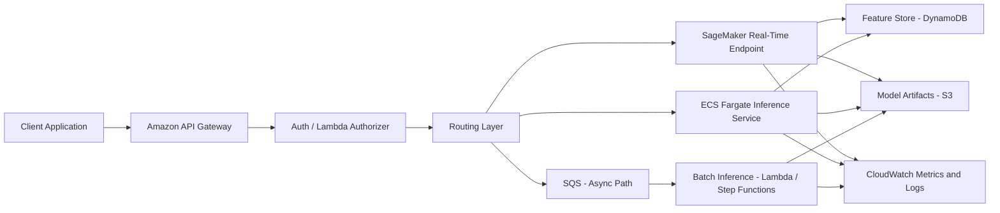
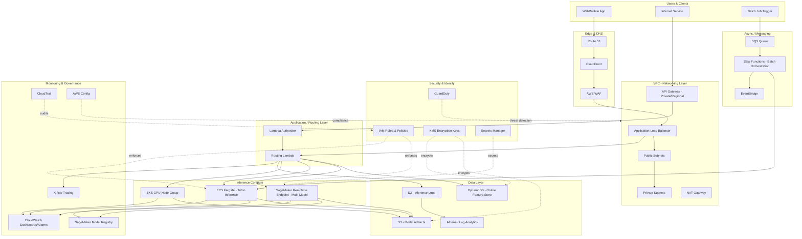

# Part VII – AI & Machine Learning Architectures

# Chapter 55: Model Serving

---

## 1. Executive Summary

### The Business Problem

Every enterprise that has moved past the "notebook experiment" stage of machine learning eventually collides with the same wall: a data scientist has a model that produces excellent offline metrics, and the business now wants that model making decisions in production, in real time, at scale, without falling over during a marketing campaign or a fraud spike.

The gap between "a model that works" and "a model that serves millions of predictions reliably, securely, and cost-effectively" is where most ML initiatives stall. This is the problem that a **Model Serving Architecture** solves.

Model serving is the discipline — and the infrastructure — of taking a trained model artifact (a set of weights, a graph, a serialized object) and exposing it as a dependable service that:

- Accepts inference requests over a network interface (REST, gRPC, or an internal queue).
- Executes the forward pass of the model with predictable latency.
- Scales elastically with demand, including near-zero traffic and sudden spikes.
- Supports multiple concurrent model versions safely (canary, A/B, shadow).
- Is observable, auditable, and cost-controlled.
- Fails gracefully rather than catastrophically.

This is fundamentally different from training infrastructure. Training is batch-oriented, throughput-focused, and tolerant of latency. Serving is request-oriented, latency-sensitive, and directly exposed to business SLAs — a slow fraud model costs the business money on every transaction; a slow recommendation model costs conversions on every page load.

### Why Organizations Adopt This Architecture

Organizations invest in a dedicated model serving architecture — rather than embedding inference code directly in application servers — for several converging reasons:

- **Separation of concerns.** Application teams should not need to understand PyTorch, TensorRT, or GPU memory management to call a prediction. A serving layer abstracts the model behind a stable API contract.
- **Independent scaling.** Inference compute (often GPU-backed) has a completely different cost and scaling profile than application compute. Coupling them wastes money and complicates capacity planning.
- **Model lifecycle velocity.** Data science teams retrain and redeploy models far more frequently than application teams ship code. A dedicated serving layer allows model updates without touching or redeploying the calling application.
- **Governance and compliance.** Regulated industries (banking, healthcare, insurance) need a single, auditable choke point where every inference request and response can be logged, versioned, and explained.
- **Multi-model and multi-tenant reuse.** A single serving platform can host dozens of models for many internal consumers, avoiding duplicated infrastructure per team.

### Major Business Benefits

| Benefit | Description |
|---|---|
| Faster time-to-production | Standardized deployment pipeline turns "trained model" into "live endpoint" in hours, not weeks |
| Predictable unit economics | Autoscaling and right-sized instance families keep cost-per-inference under control |
| Safe rollout | Canary and shadow deployment patterns de-risk every model update |
| Reduced operational toil | Centralized platform means one team maintains serving infrastructure for many model owners |
| Auditable decisions | Every inference is logged with input, output, and model version — critical for regulated domains |
| Elastic capacity | Traffic spikes (Black Friday, breaking news, fraud waves) are absorbed without manual intervention |

### Typical Enterprise Scenarios

- A retail bank serving a real-time fraud-scoring model on every card transaction, with a p99 latency budget under 80ms.
- An e-commerce platform serving personalized product recommendations on every page view, with graceful degradation to a static fallback when the model is unavailable.
- A healthcare provider serving a clinical decision-support model that must produce fully auditable, versioned predictions tied to a patient record.
- A SaaS company exposing a generative AI feature to thousands of customers through a metered API, requiring per-tenant rate limiting and cost attribution.
- An insurance company running batch and real-time underwriting models side by side, sharing the same model registry and feature store.

Across all of these, the underlying architectural pattern is remarkably consistent: a model registry, a containerized or managed inference runtime, an autoscaling compute layer (CPU or GPU), a request/response gateway, and a robust observability and governance layer wrapped around all of it. This chapter builds that architecture from first principles, using AWS-native services (SageMaker, ECS/EKS, Lambda, API Gateway) alongside the supporting networking, security, and FinOps controls required to run it in a Fortune 500 production environment.

### Why This Chapter Matters

Model serving is frequently underestimated because the "happy path" — call `model.predict()` behind a Flask app — looks deceptively simple in a notebook. In production, that same code must survive GPU driver mismatches, cold starts, traffic bursts, silent model drift, adversarial inputs, multi-region failover, and cost overruns from idle GPU instances billing at $30+/hour. This chapter treats model serving with the same production rigor as any other Tier-1 enterprise system, because at scale, that is exactly what it becomes.

---

## 2. Business Requirements

### Business Drivers

- Reduce time from "model trained" to "model in production" from weeks to hours.
- Support multiple business units sharing one inference platform to reduce duplicated infrastructure spend.
- Provide a consistent, auditable inference contract for regulators and internal risk teams.
- Enable safe, incremental model rollout to avoid revenue-impacting regressions.

### Functional Requirements

- Synchronous low-latency inference via REST/HTTPS and optionally gRPC.
- Asynchronous batch/queued inference for high-volume, latency-tolerant workloads.
- Multi-model hosting on shared infrastructure to control cost.
- Version-aware routing (v1, v2, canary, shadow) without client-side changes.
- Model registry integration for lineage, approval workflow, and rollback.
- Feature retrieval integration (online feature store) for feature-dependent models.

### Non-Functional Requirements

| Category | Requirement |
|---|---|
| Scalability | Scale from 0 to 5,000 requests/second within minutes; support horizontal and GPU-fractional scaling |
| Availability | 99.95% for real-time endpoints; 99.9% for batch |
| Latency | p50 < 30ms, p99 < 100ms for real-time synchronous inference (CPU-bound classical models); p99 < 300ms for GPU deep learning models |
| Compliance | SOC 2, PCI-DSS (for payment-adjacent models), HIPAA (for healthcare models), model explainability logs for regulated decisions |
| Security | Encryption in transit and at rest, least-privilege IAM, network isolation of inference workloads |
| Recovery | RPO of 0 for the model registry (source of truth in S3 + versioned metadata store); RTO under 15 minutes for endpoint restoration in a secondary AZ or Region |
| Observability | Full request/response logging with PII redaction, drift detection, per-model dashboards |

### Scalability Goals

- Horizontal autoscaling of inference compute based on `InvocationsPerInstance`, GPU utilization, and queue depth.
- Support for multi-model endpoints to pack many low-traffic models onto shared GPU/CPU capacity.
- Support burst absorption of 10x baseline traffic within 3–5 minutes without manual intervention.

### Availability Requirements

- Multi-AZ deployment as the default for any production inference endpoint.
- Multi-Region active-passive for Tier-1 models (fraud, payments); multi-Region active-active is reserved for the highest-criticality use cases due to added complexity and cost (see Section 28).

### Latency Requirements

- Real-time synchronous endpoints are the primary focus of this chapter.
- Latency budget is typically decomposed as: network/edge (5–10ms) + gateway/auth (5–10ms) + feature retrieval (10–20ms) + model inference (20–150ms depending on model family) + serialization/response (5ms).

### Compliance Requirements

- Model decisions affecting credit, employment, insurance pricing, or healthcare must be logged with full input/output lineage for a minimum retention period defined by regulation (commonly 5–7 years).
- PCI-DSS scope isolation is required if the model touches cardholder data, even indirectly through derived features.

### Recovery Objectives

| Metric | Target |
|---|---|
| RPO (model artifacts) | 0 — S3 versioning + cross-region replication |
| RPO (feature store) | Near-zero for online store (DynamoDB global tables) |
| RTO (endpoint) | < 15 minutes via multi-AZ Auto Scaling and pre-warmed capacity |
| RTO (full regional failover) | < 60 minutes for Tier-1 models |

### SLAs

- 99.95% monthly uptime for real-time inference endpoints.
- p99 latency SLA published per model, monitored continuously, with automated alerting on breach.

### Expected Workload and Growth

- Baseline: 200–2,000 requests/second per major model, growing 3–5x year-over-year as new use cases onboard.
- Batch workloads: nightly scoring runs of 10M–500M records, completing within a defined SLA window (typically overnight, before business open).

---

## 3. Architecture Overview

### Overall Design Philosophy

This architecture treats model serving as a **platform**, not a one-off deployment. The design separates four concerns that are frequently — and incorrectly — bundled together in early-stage ML systems:

1. **Model artifact management** — where models live, how they're versioned, and how they're promoted.
2. **Inference compute** — the runtime that actually executes the model (CPU, GPU, or specialized accelerators).
3. **Request routing and traffic management** — how a client request finds the correct model version.
4. **Observability and governance** — how every prediction is logged, monitored, and made auditable.

Each of these layers scales and evolves independently, which is the core lesson experienced architects have learned from running ML platforms at scale: coupling model code to application deployment pipelines is the single most common reason ML platforms become unmaintainable within 18 months.

### Core Components

- **Model Registry** (Amazon SageMaker Model Registry or a custom registry backed by S3 + DynamoDB) — stores approved model versions, lineage, and metadata.
- **Inference Runtime** — SageMaker Real-Time Endpoints for managed GPU/CPU hosting, or self-managed containers on ECS Fargate/EKS for teams needing more control over the runtime environment.
- **API Gateway + Lambda (or ALB)** — the client-facing contract, handling authentication, request validation, and routing to the correct model version.
- **Feature Store** (SageMaker Feature Store or DynamoDB) — low-latency retrieval of precomputed features at inference time.
- **Async Queue** (SQS + Lambda or Step Functions) — for batch and asynchronous inference paths.
- **Observability Stack** (CloudWatch, X-Ray, S3 + Athena for log analytics) — captures latency, errors, drift, and business metrics.
- **Security Layer** (IAM, KMS, Secrets Manager, VPC isolation) — enforces least privilege and encryption throughout.

### How Components Interact — High-Level Workflow



### Request Lifecycle (Real-Time Path)

1. Client submits an inference request over HTTPS.
2. API Gateway authenticates and validates the request schema.
3. A routing Lambda (or ALB listener rule) determines the target model version (default, canary, or shadow).
4. Missing features are retrieved from the online feature store.
5. The request is forwarded to the inference runtime (SageMaker endpoint or ECS/EKS service).
6. The model executes the forward pass and returns a prediction.
7. The response is logged (input hash, output, model version, latency) and returned to the client.

### Response Lifecycle

- Successful responses are returned synchronously with a model version header for traceability.
- Failures trigger a fallback strategy: cached last-known-good prediction, a simpler heuristic model, or a default safe value — never a raw 5xx to a business-critical caller when a graceful degradation path exists.

### Data Lifecycle

- Raw request/response pairs are streamed to S3 via Kinesis Data Firehose (or CloudWatch Logs subscription) for drift analysis and audit.
- Feature freshness is tracked; stale features trigger alerts to the feature engineering team.
- Model artifacts follow immutable versioning in S3 — no artifact is ever overwritten, only superseded.

---

## 4. AWS Services Used

### Amazon SageMaker (Real-Time Inference)

- **Purpose:** Fully managed model hosting with built-in autoscaling, multi-model endpoints, and A/B/canary traffic shifting.
- **Why selected:** Removes the undifferentiated heavy lifting of managing GPU drivers, container runtimes, and scaling policies for inference workloads.
- **Alternatives:** Self-managed inference on EKS with KServe/Triton, or ECS Fargate with a custom inference container.
- **Limitations:** Cold-start latency for infrequently invoked endpoints; less control over the underlying OS than a self-managed container; per-endpoint minimum cost even at low traffic (mitigated with multi-model endpoints or serverless inference).
- **Pricing considerations:** Billed per instance-hour for real-time endpoints; SageMaker Serverless Inference bills per invocation and per GB-second, ideal for spiky, low-baseline traffic.
- **Best practices:** Use multi-model endpoints to consolidate low-traffic models; enable autoscaling on `InvocationsPerInstance`; use Inference Recommender to right-size instance types before go-live.

### Amazon EC2 / ECS Fargate / EKS (Self-Managed Inference)

- **Purpose:** Container-based hosting for teams needing custom runtimes (e.g., Triton Inference Server, TorchServe, custom C++ inference engines) or GPU sharing strategies not yet supported by SageMaker.
- **Why selected:** Full control over the container, GPU scheduling, and networking; often chosen when an organization already standardizes on Kubernetes for all workloads.
- **Alternatives:** SageMaker (managed), AWS Batch (for offline scoring).
- **Limitations:** Team must own scaling policies, health checks, GPU driver patching (for EC2/EKS with GPU nodes), and upgrade cadence.
- **Pricing considerations:** Fargate has a per-vCPU/GB-hour premium over EC2; EC2 GPU instances (g5, p4d) are the largest single cost driver in most ML platforms and are prime Reserved Instance/Savings Plan candidates.
- **Best practices:** Use Karpenter or Cluster Autoscaler on EKS for fast, cost-aware node provisioning; isolate GPU node pools with taints/tolerations.

### Amazon API Gateway

- **Purpose:** Client-facing HTTPS entry point providing throttling, authentication, request validation, and usage plans.
- **Why selected:** Native integration with Lambda authorizers, WAF, and per-client API keys/usage plans for metering.
- **Alternatives:** Application Load Balancer (lower cost at very high throughput, less built-in request validation).
- **Limitations:** 29-second maximum integration timeout — unsuitable for long-running inference without an async pattern.
- **Pricing considerations:** Per-request pricing; can become a meaningful cost line at very high request volumes (millions/day), at which point ALB becomes more economical.
- **Best practices:** Use usage plans and API keys for per-tenant rate limiting and cost attribution; enable request validation to reject malformed payloads before they reach compute.

### AWS Lambda

- **Purpose:** Lightweight routing logic, request/response transformation, feature enrichment, and lightweight CPU-only model inference for small models.
- **Why selected:** Zero idle cost, automatic scaling, ideal for the "glue" logic around the serving path.
- **Alternatives:** A small ECS Fargate service for the same routing logic if execution time or package size exceeds Lambda limits.
- **Limitations:** 15-minute max execution, 10GB memory ceiling, cold starts for infrequently invoked functions, no native GPU support.
- **Pricing considerations:** Pay-per-invocation and duration; cost-effective for bursty, low-to-medium traffic routing logic.
- **Best practices:** Keep deployment packages small; use provisioned concurrency for latency-sensitive routing functions; avoid running heavy deep learning models directly in Lambda — route those to SageMaker/ECS instead.

### Amazon S3

- **Purpose:** Immutable storage for model artifacts, training data snapshots, and inference logs.
- **Why selected:** Durable, versioned, integrates natively with SageMaker and Athena for downstream analytics.
- **Alternatives:** EFS (for shared POSIX access during training, less common for serving artifacts).
- **Limitations:** Not a low-latency online store — never used for real-time feature lookups.
- **Pricing considerations:** Use S3 Intelligent-Tiering for inference logs; lifecycle old model versions to Glacier after a defined retention window.
- **Best practices:** Enable versioning and MFA delete on the model artifact bucket; use S3 Object Lock for regulatory retention of audit logs.

### Amazon DynamoDB (Online Feature Store / Metadata)

- **Purpose:** Single-digit-millisecond feature retrieval at inference time; also used for model routing metadata (which version is active per tenant/segment).
- **Why selected:** Predictable low latency at scale, native autoscaling, Global Tables for multi-region feature availability.
- **Alternatives:** ElastiCache for Redis (even lower latency, but no built-in durability guarantees as strong as DynamoDB without additional configuration).
- **Limitations:** Query patterns must be designed around access patterns up front; poor fit for ad-hoc analytical queries.
- **Pricing considerations:** On-demand capacity mode is recommended for unpredictable inference traffic; provisioned capacity with auto scaling is more economical for stable, high-volume workloads.
- **Best practices:** Use single-table design for feature retrieval; enable point-in-time recovery; use DAX in front of DynamoDB for extremely latency-sensitive feature lookups.

### Amazon SQS and EventBridge

- **Purpose:** SQS decouples the async/batch inference path; EventBridge orchestrates model lifecycle events (new model approved, drift detected, retraining triggered).
- **Why selected:** Fully managed, highly durable, natural fit for decoupling producer and consumer scaling.
- **Alternatives:** Kinesis Data Streams for ordered, replayable event processing at very high throughput.
- **Limitations:** SQS standard queues do not guarantee strict ordering (use FIFO queues when ordering matters, e.g., sequential model state updates).
- **Pricing considerations:** Inexpensive at typical enterprise volumes; cost becomes material only at extremely high message rates.
- **Best practices:** Use dead-letter queues for poison messages; use EventBridge rules to fan out model-lifecycle events to multiple downstream consumers (Slack alerts, retraining pipelines, audit logs).

### IAM, VPC, KMS, Secrets Manager

- **Purpose:** Identity, network isolation, encryption, and secret management — the security backbone described in detail in Sections 10–11.
- **Why selected:** Native, deeply integrated, auditable via CloudTrail.
- **Alternatives:** HashiCorp Vault for secrets (common in multi-cloud organizations), third-party CASB/network tooling.
- **Best practices:** Every model-serving IAM role is scoped to exactly the S3 prefix, DynamoDB table, and KMS key it needs — never `s3:*` or `dynamodb:*`.

### Amazon CloudWatch, CloudTrail, AWS Config

- **Purpose:** Metrics, logs, alarms (CloudWatch); API audit trail (CloudTrail); continuous configuration compliance (Config).
- **Why selected:** Native, low-friction integration across every service in this architecture.
- **Best practices:** Every model gets a dedicated CloudWatch dashboard; CloudTrail is enabled account-wide and shipped to a centralized, immutable log archive account.

---

## 5. Complete Architecture Diagram



---

## 6. Component-by-Component Explanation

### API Gateway

- **Purpose:** Single, authenticated entry point for all real-time inference clients.
- **Responsibilities:** TLS termination, request validation, authentication delegation, rate limiting, per-client usage metering.
- **Inputs:** HTTPS JSON payloads from client applications.
- **Outputs:** Forwarded requests to the routing Lambda or ALB target group.
- **Scaling:** Fully managed, scales automatically to tens of thousands of RPS.
- **High availability:** Regional service, inherently multi-AZ.
- **Failure handling:** Returns structured 4xx/5xx with request IDs for traceability; throttling responses (429) protect downstream compute from overload.
- **Dependencies:** Lambda authorizer, downstream routing layer.
- **Security:** WAF association, IAM/Cognito/API key authentication, resource policies restricting source VPCs where required.
- **Monitoring:** CloudWatch metrics for 4xx/5xx rate, integration latency, throttle count.

### Routing Lambda

- **Purpose:** Determines the correct model version/endpoint for a given request based on routing rules (default, canary percentage, tenant override, shadow).
- **Responsibilities:** Feature enrichment orchestration, traffic-split logic, request/response logging.
- **Inputs:** Validated request payload plus routing metadata from DynamoDB.
- **Outputs:** Inference response, structured log record.
- **Scaling:** Automatic, concurrency-based; provisioned concurrency recommended for latency-critical paths.
- **High availability:** Multi-AZ by default (Lambda is a regional service).
- **Failure handling:** Falls back to the last known stable model version on routing metadata read failure; circuit-breaks to a cached response if the inference backend times out.
- **Dependencies:** DynamoDB (routing table, feature store), SageMaker/ECS endpoints.
- **Security:** Scoped IAM role, VPC-attached if calling private endpoints.
- **Monitoring:** Custom CloudWatch metrics for routing decisions, X-Ray subsegments per downstream call.

### SageMaker Real-Time Endpoint

- **Purpose:** Hosts the trained model container and executes inference.
- **Responsibilities:** Model loading, request batching (if configured), health checks, autoscaling.
- **Inputs:** Serialized feature vector or raw payload (image, text, tabular).
- **Outputs:** Model prediction (score, class, embedding).
- **Scaling:** Target-tracking autoscaling on `InvocationsPerInstance` or GPU utilization; multi-model endpoints allow many models to share a fleet.
- **High availability:** Deploy across a minimum of two instances in two AZs; SageMaker manages instance replacement on failure.
- **Failure handling:** Unhealthy instances are automatically replaced; endpoint-level alarms trigger rollback via CI/CD if error rate exceeds threshold post-deployment.
- **Dependencies:** S3 (model artifact), ECR (inference container image), IAM execution role.
- **Security:** VPC-attached endpoint with no public internet exposure; encryption at rest via KMS.
- **Monitoring:** Built-in CloudWatch metrics (`ModelLatency`, `Invocation4XXErrors`, `Invocation5XXErrors`, `CPUUtilization`, `GPUUtilization`).

### Online Feature Store (DynamoDB)

- **Purpose:** Serve precomputed features with single-digit-millisecond latency.
- **Responsibilities:** Store the latest feature values per entity key (customer ID, transaction ID).
- **Inputs:** Feature pipeline writes (streaming or batch).
- **Outputs:** Feature vectors on read.
- **Scaling:** On-demand capacity mode for unpredictable inference traffic.
- **High availability:** Multi-AZ by default; Global Tables for multi-region.
- **Failure handling:** Read failures fall back to default/neutral feature values rather than failing the entire inference request outright, when business logic allows.
- **Security:** Encrypted with a customer-managed KMS key; IAM scoped to specific table ARNs.
- **Monitoring:** Throttled request count, consumed capacity, latency percentiles.

### Model Registry

- **Purpose:** Source of truth for approved, versioned models and their metadata (training data version, metrics, approver, approval date).
- **Responsibilities:** Enforce a promotion workflow (Pending → Approved → Rejected) before a model can be deployed to a production endpoint.
- **Dependencies:** S3 (artifact storage), IAM (approval permissions restricted to designated approvers).
- **Security:** Only specific IAM principals (ML platform leads, designated model risk approvers) can transition a model to "Approved."
- **Monitoring:** EventBridge rule fires on every state transition, notifying the platform team and writing an immutable audit record.

---

## 7. End-to-End Request Flow

1. Client sends an HTTPS POST to `https://api.company.com/v1/predict/fraud-score`.
2. Route 53 resolves the custom domain to CloudFront (for public-facing APIs) or directly to a Regional API Gateway endpoint (for internal-only APIs).
3. AWS WAF inspects the request against managed and custom rule groups (SQLi, rate-based rules, payload size limits).
4. API Gateway validates the request against a JSON schema; malformed requests are rejected with a 400 before consuming any compute.
5. A Lambda authorizer validates the caller's JWT/API key and attaches tenant context to the request.
6. The routing Lambda reads the active routing configuration from DynamoDB (which model version serves this tenant/segment).
7. The routing Lambda retrieves any missing features from the DynamoDB online feature store.
8. The enriched request is forwarded to the SageMaker real-time endpoint (or ECS Fargate/Triton service for custom runtimes).
9. The model container executes the forward pass and returns a prediction with a confidence score.
10. The routing Lambda logs the full request/response pair (with PII fields redacted or tokenized) to a Kinesis Data Firehose stream targeting S3.
11. CloudWatch and X-Ray capture latency at every hop for distributed tracing.
12. The response is returned to API Gateway and then to the client, including a `X-Model-Version` header for traceability.
13. If the inference backend times out or errors, the routing Lambda falls back to a cached last-known prediction or a safe default, and emits a CloudWatch alarm-worthy metric.
14. Downstream, Athena queries against the S3 log bucket power drift dashboards and compliance reporting on a scheduled basis.

---

## 8. Deployment Flow

### Infrastructure Provisioning

All infrastructure — VPC, IAM roles, SageMaker endpoint configuration, API Gateway, DynamoDB tables — is provisioned via Terraform, never manually through the console. Manual console changes are the single largest source of configuration drift in ML platforms observed in production incident reviews.

### Terraform Workflow

1. Engineer opens a pull request modifying a Terraform module (e.g., bumping instance count or adding a new model endpoint).
2. CI runs `terraform fmt -check`, `terraform validate`, and a policy-as-code scan (Checkov or OPA/Conftest).
3. `terraform plan` output is posted as a PR comment for human review.
4. On merge to main, a pipeline applies the plan to a staging account first, runs smoke tests, then promotes to production with manual approval gate.

### CI/CD Deployment (Model Artifacts)

1. Data science team registers a new model version in the SageMaker Model Registry with status `PendingManualApproval`.
2. Automated evaluation pipeline runs offline metrics comparison against the current production model on a holdout set.
3. A designated model risk approver reviews metrics and approves or rejects the version.
4. On approval, a pipeline (CodePipeline or GitHub Actions) deploys the new model to a canary variant receiving 5% of production traffic.
5. Canary metrics (latency, error rate, business KPI proxy) are monitored for a defined bake period (commonly 30–60 minutes to 24 hours depending on traffic volume).
6. If canary metrics are healthy, traffic is shifted incrementally (5% → 25% → 50% → 100%) using SageMaker production variant weight updates.
7. If canary metrics degrade, traffic is automatically shifted back to 0% and an incident is opened.

### Blue-Green Deployment

- A new endpoint configuration (green) is created alongside the existing one (blue).
- Traffic is cut over via a Route 53 weighted record or SageMaker endpoint update, allowing instant rollback by reverting the weight/alias.
- Blue environment is retained for a defined soak period (e.g., 24–72 hours) before decommissioning.

### Rollback

- Rollback is a configuration change, not a redeploy: revert the production variant weights or the Route 53 alias to point back to the prior known-good version.
- Rollback SLA target: under 5 minutes from decision to full traffic reversion.

### Secrets and Configuration

- Model container environment variables reference Secrets Manager ARNs, never plaintext credentials.
- Feature store connection strings and API keys for third-party enrichment services are rotated automatically via Secrets Manager rotation Lambdas.

### Validation

- Post-deployment smoke tests send a fixed set of golden test vectors through the new endpoint and assert expected outputs within tolerance before allowing any real traffic.

---

## 9. Network Topology

### VPC and CIDR Design

- A dedicated ML/Inference VPC (e.g., `10.40.0.0/16`) separate from general application VPCs, connected via Transit Gateway.
- Sized generously (`/16`) to accommodate large EKS/SageMaker managed ENI consumption — SageMaker endpoints and multi-model deployments consume ENIs per instance, and undersized subnets are a common production blocker.

### Subnet Layout

| Subnet Type | CIDR Example | Purpose |
|---|---|---|
| Public | 10.40.0.0/24, 10.40.1.0/24 | NAT Gateways, public ALB (if applicable) only |
| Private – App | 10.40.10.0/22, 10.40.14.0/22 | Routing Lambdas (VPC-attached), API Gateway VPC Link |
| Private – Inference | 10.40.20.0/21, 10.40.28.0/21 | SageMaker endpoints, ECS/EKS inference nodes |
| Private – Data | 10.40.40.0/22 | DynamoDB VPC endpoints, ElastiCache, RDS (if used for metadata) |

### NAT Gateway and Internet Gateway

- One NAT Gateway per AZ (not a single shared NAT) to avoid a cross-AZ single point of failure and cross-AZ data transfer charges.
- Internet Gateway attached only for the public subnets fronting the ALB/CloudFront path; inference subnets have no direct internet route.

### Transit Gateway

- Connects the ML/Inference VPC to shared services (CI/CD, logging, identity) VPCs and to on-premises via Direct Connect where hybrid model training data sources exist.

### Route Tables

- Private inference subnets route to NAT only for necessary egress (e.g., pulling public PyPI packages during container build — ideally eliminated by using a private CodeArtifact/ECR mirror instead).

### Network ACLs and Security Groups

- Security groups are the primary control: inference compute security group allows inbound only from the routing Lambda's security group on the model server port (e.g., 8080).
- NACLs provide a coarse-grained defense-in-depth layer, primarily to explicitly deny known-bad CIDR ranges.

### PrivateLink

- SageMaker endpoints are invoked via a VPC endpoint (Interface Endpoint) for `sagemaker-runtime`, ensuring inference traffic never traverses the public internet even when called from within AWS.
- S3 and DynamoDB use Gateway VPC Endpoints to avoid NAT Gateway data processing charges on high-volume feature store and model artifact traffic — a significant, frequently-missed cost optimization.

### Hybrid Connectivity

- For organizations with on-premises feature pipelines or legacy risk engines, Direct Connect with a private VIF into the Transit Gateway avoids public internet transit for sensitive feature data.

---

## 10. Identity and Access

### IAM Roles

- **SageMaker Execution Role:** Scoped to read the specific S3 prefix containing approved model artifacts, write to the specific inference log bucket prefix, and use the specific KMS key for that model's encryption. No wildcard S3 or KMS permissions.
- **Routing Lambda Role:** Read access to the routing DynamoDB table, invoke permission on `sagemaker:InvokeEndpoint` scoped to specific endpoint ARNs, and CloudWatch PutMetricData.
- **CI/CD Deployment Role:** Permission to create/update SageMaker endpoint configurations and update production variant weights, but explicitly denied `sagemaker:DeleteEndpoint` in production — deletions require a separate, more privileged, break-glass role.

### IAM Policies (Example — Scoped Inference Invocation Policy)

```json

{
  "Version": "2012-10-17",
  "Statement": [
    {
      "Sid": "InvokeFraudScoreEndpointOnly",
      "Effect": "Allow",
      "Action": "sagemaker:InvokeEndpoint",
      "Resource": "arn:aws:sagemaker:us-east-1:123456789012:endpoint/fraud-score-prod"
    },
    {
      "Sid": "ReadRoutingTable",
      "Effect": "Allow",
      "Action": ["dynamodb:GetItem", "dynamodb:Query"],
      "Resource": "arn:aws:dynamodb:us-east-1:123456789012:table/model-routing-config"
    },
    {
      "Sid": "PublishMetrics",
      "Effect": "Allow",
      "Action": "cloudwatch:PutMetricData",
      "Resource": "*",
      "Condition": {
        "StringEquals": { "cloudwatch:namespace": "MLPlatform/Routing" }
      }
    }
  ]
}

```

### Resource Policies

- API Gateway resource policies restrict invocation to specific VPC endpoints for internal-only APIs, preventing any public exposure even if a public endpoint type is accidentally selected during provisioning.

### STS and Cross-Account Access

- In multi-account setups (common enterprise pattern: separate ML platform account from business unit accounts), business unit applications assume a cross-account role via STS that only permits `sagemaker:InvokeEndpoint` on specific endpoints — the calling application never has broader access to the ML platform account.

### Least Privilege

- Every role in this architecture is generated from a Terraform module with a per-model parameterized ARN — no shared "MLServiceRole" with broad permissions across all models. This is a deliberate, non-negotiable control that costs slightly more Terraform boilerplate up front and prevents an entire class of lateral-movement incidents.

### Permission Boundaries

- All roles created by the ML platform's automated onboarding pipeline are constrained by a permission boundary that caps the maximum possible permissions, preventing privilege escalation even if a role's inline policy is later misconfigured.

---

## 11. Security Architecture

### Encryption

- **At rest:** All S3 buckets (model artifacts, logs), DynamoDB tables, and EBS volumes (for EKS GPU nodes) are encrypted with customer-managed KMS keys, one key per data classification tier (model artifacts, feature data, audit logs).
- **In transit:** TLS 1.2+ enforced at every hop — client to CloudFront, CloudFront to ALB/API Gateway, API Gateway to Lambda, Lambda to SageMaker runtime (SageMaker runtime traffic is encrypted by default over PrivateLink).

### WAF and Shield

- AWS WAF is attached to CloudFront/API Gateway with managed rule groups (Core Rule Set, Known Bad Inputs) plus custom rules for payload size limits appropriate to the model's expected input size — oversized payloads are a common resource-exhaustion vector against inference endpoints.
- AWS Shield Standard is active by default; Shield Advanced is added for internet-facing, revenue-critical inference APIs (e.g., a public-facing recommendation API).

### Secrets Manager and Certificate Manager

- All third-party API keys (e.g., calling an external identity-verification service as part of feature enrichment) live in Secrets Manager with automatic rotation.
- ACM issues and auto-renews the TLS certificate for the custom API domain.

### GuardDuty, Inspector, Security Hub

- GuardDuty monitors for anomalous API activity (e.g., a compromised credential suddenly calling `sagemaker:CreateEndpoint` from an unfamiliar region).
- Inspector scans container images (SageMaker inference containers, ECS/EKS images) for known vulnerabilities before deployment is permitted.
- Security Hub aggregates findings across GuardDuty, Inspector, and Config into a single compliance dashboard reviewed weekly by the security team.

### CloudTrail and AWS Config

- CloudTrail logs every API call across the ML platform account, shipped immutably to a centralized logging account with S3 Object Lock enabled.
- AWS Config rules continuously verify that S3 buckets remain non-public, KMS keys are not disabled, and security groups have not drifted to allow unintended ingress.

### Zero Trust Considerations

- No implicit trust between the routing layer and the inference layer based on network location alone — every service-to-service call is authenticated via IAM (SigV4) even within the private VPC.
- Model containers run with no outbound internet access by default; any legitimate external dependency (e.g., a third-party enrichment API) is explicitly allowlisted via a controlled egress proxy.

### Threat Model and Attack Vectors

| Threat | Mitigation |
|---|---|
| Model extraction via repeated querying | Rate limiting per API key, anomaly detection on query patterns |
| Adversarial input crafted to force misclassification | Input validation, confidence-score monitoring, human review queue for low-confidence high-stakes decisions |
| Data poisoning via compromised feature pipeline | Feature pipeline IAM isolation, anomaly detection on feature distributions before they reach the online store |
| Credential leakage exposing invoke permissions | Secrets Manager rotation, scoped IAM policies, GuardDuty alerting |
| Container supply-chain compromise | Inspector scanning, signed container images, private ECR with image immutability enabled |

---

## 12. High Availability

### AZ Failures

- SageMaker endpoints and ECS/EKS services are deployed across a minimum of two AZs; instance count per AZ is sized so that the loss of one AZ still leaves sufficient capacity to serve full traffic (N+1 sizing, not 50/50 split with no headroom).

### Instance Failures

- SageMaker automatically detects and replaces unhealthy instances behind an endpoint.
- ECS/EKS use health checks (ALB target group health checks or Kubernetes liveness/readiness probes) to remove and replace unhealthy tasks/pods automatically.

### Regional Failures

- Tier-1 models maintain a warm-standby endpoint in a secondary Region, with model artifacts replicated via S3 Cross-Region Replication and routing metadata replicated via DynamoDB Global Tables.
- Route 53 health checks and failover routing policies redirect traffic to the secondary Region if the primary Region's health check fails.

### Database/Feature Store Failures

- DynamoDB Global Tables provide multi-region write availability for the feature store; a regional DynamoDB outage triggers automatic routing to the nearest healthy region.

### Load Balancing and Health Checks

- ALB/API Gateway health checks probe a dedicated `/health` endpoint on the inference service that verifies not just process liveness but successful model-load state — a common production bug is a health check that passes while the model itself failed to load into memory.

### Failover

- Failover is tested quarterly via GameDay exercises that simulate AZ and Region loss, validating that automated failover meets the documented RTO.

---

## 13. Disaster Recovery

### Backup Strategy

- Model artifacts: S3 versioning (every version retained) plus Cross-Region Replication to a DR region.
- Routing and feature metadata: DynamoDB point-in-time recovery enabled, with continuous backups.
- Infrastructure: entirely defined in Terraform, stored in version control — the DR environment can be rebuilt from code, not from manual runbooks alone.

### Snapshots and Cross-Region Replication

- S3 CRR replicates the model artifact and approved-model-registry bucket to the DR region within minutes of a new approved deployment.

### DR Strategy Selection

| Strategy | Description | Used For |
|---|---|---|
| Pilot Light | Minimal standby infrastructure, scaled up on failover | Lower-tier, non-critical internal models |
| Warm Standby | Reduced-capacity endpoint always running in DR region | Tier-1 customer-facing models (fraud, recommendations) |
| Multi-Site Active-Active | Full capacity in two+ regions, live traffic split | Reserved for the single highest-criticality model (e.g., real-time payment fraud) due to cost and complexity |

### RPO / RTO Summary

| Component | RPO | RTO |
|---|---|---|
| Model artifacts | 0 (versioned + replicated) | N/A (read-only restore) |
| Feature store | Near-zero (Global Tables) | < 5 minutes (automatic) |
| Real-time endpoint | N/A | < 15 min (warm standby) / < 60 min (pilot light) |

---

## 14. Scalability

### Horizontal Scaling

- SageMaker and ECS/EKS both scale horizontally by adding instances/tasks/pods behind the load balancer or endpoint, driven by target-tracking policies on `InvocationsPerInstance`, CPU, or GPU utilization.

### Vertical Scaling

- Used selectively — moving a model from a `ml.c5.xlarge` to a `ml.g5.xlarge` when profiling shows the model is compute-bound on matrix operations that benefit from GPU acceleration, rather than simply adding more CPU instances.

### Auto Scaling Configuration Example (SageMaker)

```hcl

resource "aws_appautoscaling_target" "sagemaker_target" {
  max_capacity       = 10
  min_capacity        = 2
  resource_id        = "endpoint/fraud-score-prod/variant/primary"
  scalable_dimension = "sagemaker:variant:DesiredInstanceCount"
  service_namespace  = "sagemaker"
}

resource "aws_appautoscaling_policy" "sagemaker_policy" {
  name               = "fraud-score-invocation-scaling"
  policy_type        = "TargetTrackingScaling"
  resource_id        = aws_appautoscaling_target.sagemaker_target.resource_id
  scalable_dimension = aws_appautoscaling_target.sagemaker_target.scalable_dimension
  service_namespace  = aws_appautoscaling_target.sagemaker_target.service_namespace

  target_tracking_scaling_policy_configuration {
    target_value = 750.0
    predefined_metric_specification {
      predefined_metric_type = "SageMakerVariantInvocationsPerInstance"
    }
    scale_in_cooldown  = 300
    scale_out_cooldown = 60
  }
}

```

### Serverless Scaling

- SageMaker Serverless Inference is used for models with intermittent, unpredictable traffic (e.g., an internal tool used a few hundred times a day) — scales to zero, eliminating idle GPU/CPU cost, at the expense of cold-start latency on the first request after idle.

### Database and Storage Scaling

- DynamoDB on-demand mode auto-scales read/write capacity with traffic; S3 has effectively unlimited scaling for artifact and log storage.

### Queue Scaling

- SQS consumers (Lambda or Step Functions) scale concurrency automatically based on queue depth via CloudWatch-driven autoscaling policies on the consuming Fargate/EKS batch workers.

---

## 15. Performance Optimization

### Caching

- Feature values that change infrequently (e.g., customer tenure, static demographic attributes) are cached at the routing Lambda layer with a short TTL, reducing DynamoDB read load and shaving milliseconds off the critical path.
- Prediction caching (idempotent inputs) is used cautiously and only where the business accepts slightly stale predictions — never for fraud/risk scoring, but often appropriate for recommendation results.

### Compression

- Request/response payload compression (gzip) is enabled at API Gateway for large feature vectors or batch-style single requests, reducing network latency for larger payloads.

### CDN

- CloudFront is used primarily for static assets tied to an ML-powered web experience (e.g., a recommendation widget's UI), not for the inference API itself, which is not cacheable.

### Model Optimization

- Model compilation via SageMaker Neo or TensorRT to reduce inference latency and cost, particularly impactful for deep learning models on GPU.
- Quantization (FP32 → FP16/INT8) is evaluated for latency-critical models where the accuracy trade-off is acceptable and validated against the offline evaluation suite before production rollout.

### Connection Pooling and Concurrency

- The routing Lambda maintains a warm HTTP connection pool to the SageMaker runtime and DynamoDB to avoid TCP/TLS handshake overhead on every invocation — a frequently overlooked several-millisecond tax on p99 latency.

### Async Processing

- Non-latency-critical enrichment (e.g., writing the audit log record) is performed asynchronously after the response is returned to the client, never blocking the critical path.

---

## 16. Cost Optimization (FinOps)

### Deployment Size Cost Estimates (Monthly, US East, illustrative)

| Deployment Size | Compute | Est. Monthly Cost |
|---|---|---|
| Small (2x ml.c5.xlarge, low traffic) | CPU real-time endpoint | $350–$600 |
| Medium (4x ml.g5.xlarge, multi-model) | GPU real-time endpoint, autoscaling | $6,000–$12,000 |
| Enterprise (multi-region, 20+ models, mixed CPU/GPU, DR standby) | Mixed fleet + DR + logging + Athena | $60,000–$150,000+ |

> **Note:** These figures are illustrative order-of-magnitude estimates for planning purposes, not quotes. Always validate against the current AWS Pricing Calculator and negotiated enterprise discount rates.

### Major Cost Drivers

- GPU instance-hours (by far the largest line item for deep learning serving).
- NAT Gateway data processing charges (mitigated by VPC Gateway Endpoints for S3/DynamoDB).
- CloudWatch Logs ingestion and storage at high request volumes.
- Cross-AZ and cross-region data transfer for feature retrieval and replication.

### Optimization Opportunities

- **Reserved Instances / Savings Plans** on baseline, predictable GPU capacity — typically 30–50% savings versus on-demand for the "floor" of traffic.
- **Spot Instances** for asynchronous/batch inference workloads that can tolerate interruption, at 60–90% savings.
- **Multi-model endpoints** to consolidate low-traffic models onto shared instances rather than dedicating a full fleet per model.
- **S3 lifecycle policies** moving inference logs older than 90 days to Glacier, and older than the regulatory minimum to Deep Archive.
- **Right-sizing** via SageMaker Inference Recommender, which benchmarks a model against multiple instance types and reports the cost/latency frontier.

### Cost Allocation and Tagging

- Every model-serving resource is tagged with `cost-center`, `model-name`, `business-unit`, and `environment`, enabling per-model P&L reporting — critical for platform teams that need to charge back GPU costs to the business units consuming them.

### Budgets and Cost Anomaly Detection

- AWS Budgets alerts are configured per model/business-unit cost center with thresholds at 80% and 100% of forecast.
- Cost Anomaly Detection is scoped to the ML platform account to catch runaway autoscaling events (e.g., a misconfigured scaling policy spinning up far more GPU instances than traffic warrants) within hours rather than at month-end billing review.

---

## 17. AI-Assisted Operations

### Amazon Q and Bedrock for Platform Operations

- **Amazon Q Developer** assists engineers writing and reviewing Terraform for new model endpoints, flagging deviations from the organization's IAM least-privilege standards.
- **Amazon Bedrock**-backed internal tooling summarizes CloudWatch log anomalies during an incident, translating raw error patterns into a plain-language root-cause hypothesis for on-call engineers.

### AI Troubleshooting and Log Analysis

- A Bedrock-powered log analysis assistant is given read-only access to the Athena-queryable inference log table and can answer natural-language questions such as "show me all requests with latency over 500ms in the last hour, grouped by model version" — accelerating incident triage.

### Incident Response

- During a live incident, an AI assistant drafts an initial incident summary and timeline from CloudWatch alarms and CloudTrail events, which the on-call engineer reviews and refines rather than writing from scratch.

### Capacity Planning

- Historical invocation metrics are fed to a Bedrock-based forecasting prompt (grounded with actual CloudWatch data, not model imagination) to project GPU capacity needs ahead of known seasonal events (e.g., holiday shopping traffic for a recommendation model).

### Architecture Review Assistance

- New model-serving proposals are pre-screened by an AI assistant against the organization's architecture standards checklist (Section 31) before being scheduled for human Architecture Review Board time, reducing review cycle time.

### AI-Generated Terraform and Documentation

- AI-assisted Terraform generation is used for boilerplate (new model endpoint module instantiation) but every generated plan is reviewed by a human engineer before merge — AI accelerates drafting, it does not replace review.

---

## 18. Terraform Implementation

### Directory Structure

```

modules/
  model-serving/
    main.tf
    variables.tf
    outputs.tf
    iam.tf
    networking.tf
environments/
  prod/
    main.tf
    backend.tf
    terraform.tfvars

```

### Providers and Backend

```hcl

terraform {
  required_version = ">= 1.7.0"

  required_providers {
    aws = {
      source  = "hashicorp/aws"
      version = "~> 5.0"
    }
  }

  backend "s3" {
    bucket         = "company-ml-platform-tfstate"
    key            = "model-serving/prod/terraform.tfstate"
    region         = "us-east-1"
    dynamodb_table = "terraform-state-lock"
    encrypt        = true
  }
}

provider "aws" {
  region = var.aws_region

  default_tags {
    tags = {
      Project     = "ml-model-serving"
      ManagedBy   = "terraform"
      Environment = var.environment
    }
  }
}

```

### Variables

```hcl

variable "model_name" {
  description = "Unique name of the model being served"
  type        = string
}

variable "instance_type" {
  description = "SageMaker instance type for real-time inference"
  type        = string
  default     = "ml.c5.xlarge"
}

variable "min_capacity" {
  type    = number
  default = 2
}

variable "max_capacity" {
  type    = number
  default = 10
}

variable "vpc_id" {
  type = string
}

variable "private_subnet_ids" {
  type = list(string)
}

```

### SageMaker Endpoint Module (Core Resources)

```hcl

resource "aws_sagemaker_model" "this" {
  name               = "${var.model_name}-model"
  execution_role_arn = aws_iam_role.sagemaker_execution.arn

  primary_container {
    image          = var.container_image_uri
    model_data_url = var.model_artifact_s3_uri
  }

  vpc_config {
    subnets            = var.private_subnet_ids
    security_group_ids = [aws_security_group.sagemaker_inference.id]
  }
}

resource "aws_sagemaker_endpoint_configuration" "this" {
  name = "${var.model_name}-config-${var.model_version}"

  production_variants {
    variant_name           = "primary"
    model_name             = aws_sagemaker_model.this.name
    initial_instance_count = var.min_capacity
    instance_type           = var.instance_type
    initial_variant_weight  = 1.0
  }

  kms_key_arn = aws_kms_key.model_serving.arn

  lifecycle {
    create_before_destroy = true
  }
}

resource "aws_sagemaker_endpoint" "this" {
  name                 = "${var.model_name}-prod"
  endpoint_config_name = aws_sagemaker_endpoint_configuration.this.name

  tags = {
    ModelName = var.model_name
  }
}

```

### IAM (Scoped Execution Role)

```hcl

resource "aws_iam_role" "sagemaker_execution" {
  name = "${var.model_name}-sagemaker-execution"

  assume_role_policy = jsonencode({
    Version = "2012-10-17"
    Statement = [{
      Effect    = "Allow"
      Principal = { Service = "sagemaker.amazonaws.com" }
      Action    = "sts:AssumeRole"
    }]
  })
}

resource "aws_iam_role_policy" "sagemaker_scoped_access" {
  name = "${var.model_name}-scoped-access"
  role = aws_iam_role.sagemaker_execution.id

  policy = jsonencode({
    Version = "2012-10-17"
    Statement = [
      {
        Effect   = "Allow"
        Action   = ["s3:GetObject"]
        Resource = "arn:aws:s3:::${var.model_artifact_bucket}/${var.model_name}/*"
      },
      {
        Effect   = "Allow"
        Action   = ["kms:Decrypt", "kms:GenerateDataKey"]
        Resource = aws_kms_key.model_serving.arn
      },
      {
        Effect   = "Allow"
        Action   = ["logs:CreateLogStream", "logs:PutLogEvents"]
        Resource = "arn:aws:logs:*:*:log-group:/aws/sagemaker/Endpoints/${var.model_name}-prod:*"
      }
    ]
  })
}

```

### Networking (Security Group)

```hcl

resource "aws_security_group" "sagemaker_inference" {
  name   = "${var.model_name}-inference-sg"
  vpc_id = var.vpc_id

  ingress {
    description     = "Allow routing Lambda only"
    from_port       = 443
    to_port         = 443
    protocol        = "tcp"
    security_groups = [var.routing_lambda_sg_id]
  }

  egress {
    description = "Allow HTTPS to AWS services via VPC endpoints"
    from_port   = 443
    to_port     = 443
    protocol    = "tcp"
    cidr_blocks = [var.vpc_cidr]
  }
}

```

### Outputs

```hcl

output "endpoint_name" {
  value = aws_sagemaker_endpoint.this.name
}

output "endpoint_arn" {
  value = aws_sagemaker_endpoint.this.arn
}

```

### Best Practices Applied

- Remote state with locking (S3 + DynamoDB) to prevent concurrent apply conflicts.
- `create_before_destroy` lifecycle on endpoint configurations to support zero-downtime updates.
- Every IAM policy is resource-scoped, never wildcard.
- Reusable module pattern so onboarding a new model is a parameterized module call, not copy-pasted Terraform.

---

## 19. AWS CLI Examples

### Deployment

```bash

# Create a new endpoint configuration for a canary rollout

aws sagemaker create-endpoint-config \
  --endpoint-config-name fraud-score-canary-v12 \
  --production-variants '[
    {"VariantName":"primary","ModelName":"fraud-score-v11","InitialInstanceCount":4,"InstanceType":"ml.g5.xlarge","InitialVariantWeight":0.95},
    {"VariantName":"canary","ModelName":"fraud-score-v12","InitialInstanceCount":1,"InstanceType":"ml.g5.xlarge","InitialVariantWeight":0.05}
  ]'

# Update the live endpoint to the new configuration

aws sagemaker update-endpoint \
  --endpoint-name fraud-score-prod \
  --endpoint-config-name fraud-score-canary-v12

```

### Validation

```bash

# Send a test inference request

aws sagemaker-runtime invoke-endpoint \
  --endpoint-name fraud-score-prod \
  --body fileb://test-payload.json \
  --content-type application/json \
  output.json

cat output.json

```

### Monitoring

```bash

# Check endpoint status

aws sagemaker describe-endpoint --endpoint-name fraud-score-prod

# Pull recent invocation error metrics

aws cloudwatch get-metric-statistics \
  --namespace AWS/SageMaker \
  --metric-name Invocation5XXErrors \
  --dimensions Name=EndpointName,Value=fraud-score-prod Name=VariantName,Value=primary \
  --start-time 2026-08-10T00:00:00Z \
  --end-time 2026-08-11T00:00:00Z \
  --period 300 \
  --statistics Sum

```

### Troubleshooting

```bash

# Tail the endpoint's CloudWatch log stream

aws logs tail /aws/sagemaker/Endpoints/fraud-score-prod --follow

# Check autoscaling activity history

aws application-autoscaling describe-scaling-activities \
  --service-namespace sagemaker \
  --resource-id endpoint/fraud-score-prod/variant/primary

```

### Cleanup

```bash

# Roll back a bad canary by removing the variant

aws sagemaker update-endpoint-weights-and-capacities \
  --endpoint-name fraud-score-prod \
  --desired-weights-and-capacities '[{"VariantName":"canary","DesiredWeight":0,"DesiredInstanceCount":0}]'

# Delete a deprecated endpoint configuration (never delete the live endpoint directly)

aws sagemaker delete-endpoint-config --endpoint-config-name fraud-score-canary-v10

```

---

## 20. CI/CD Integration

### GitHub Actions (Terraform Plan/Apply)

```yaml

name: model-serving-infra
on:
  pull_request:
    paths: ["modules/model-serving/**", "environments/**"]

jobs:
  plan:
    runs-on: ubuntu-latest
    steps:
      - uses: actions/checkout@v4
      - uses: hashicorp/setup-terraform@v3
      - run: terraform fmt -check -recursive
      - run: terraform init
        working-directory: environments/prod
      - run: terraform validate
        working-directory: environments/prod
      - name: Policy as Code Scan
        run: checkov -d environments/prod --compact
      - run: terraform plan -out=tfplan
        working-directory: environments/prod

```

### AWS CodePipeline (Model Promotion)

- Stage 1: SageMaker Model Registry status change triggers EventBridge → CodePipeline.
- Stage 2: Automated offline evaluation Lambda compares new model metrics against production baseline.
- Stage 3: Manual approval gate (model risk approver).
- Stage 4: Deploy canary endpoint configuration via CodeDeploy/Terraform.
- Stage 5: Automated bake-time monitoring; auto-rollback Lambda watches CloudWatch alarms.

### Security Scanning and Policy as Code

- Checkov/Conftest run against every Terraform plan to enforce: no public S3 buckets, no wildcard IAM actions, mandatory KMS encryption on all data stores, mandatory VPC attachment for SageMaker endpoints.
- Container images are scanned by Inspector/Trivy in the build pipeline before push to ECR; builds fail on Critical/High CVEs without an approved exception.

### Rollback in CI/CD

- Every deployment pipeline run is tagged with the prior production variant configuration as a pipeline artifact, allowing a one-click "redeploy previous artifact" rollback job independent of Terraform state changes.

---

## 21. Monitoring

### CloudWatch Dashboards and Metrics

Each model gets a dedicated dashboard tracking:

- `ModelLatency` (p50, p90, p99)
- `Invocations`, `Invocation4XXErrors`, `Invocation5XXErrors`
- `CPUUtilization` / `GPUUtilization`
- Business proxy metric (e.g., fraud-catch rate estimate, click-through rate for recommendations)

### Logs and Tracing

- X-Ray traces the full request path from API Gateway through the routing Lambda to the SageMaker runtime, exposing exactly where latency accumulates.

### Alarms and Notifications

| Alarm | Condition | Action |
|---|---|---|
| High latency | p99 latency > SLA for 3 consecutive periods | Page on-call, auto-consider rollback |
| Elevated 5xx | Error rate > 1% for 5 minutes | Page on-call |
| GPU saturation | GPU utilization > 85% sustained 10 min | Trigger scale-out, notify platform team |
| Drift detected | Feature distribution shift beyond threshold | Notify model owner, do not auto-remediate |

### SLIs, SLOs, and Error Budgets

- SLI: percentage of requests served within the p99 latency budget.
- SLO: 99.9% of requests within budget over a rolling 30-day window.
- Error budget burn-rate alerts (fast burn over 1 hour, slow burn over 6 hours) follow Google SRE-style multi-window alerting to balance noise against detection speed.

---

## 22. Logging

### Centralized Logging

- All CloudWatch Logs from routing Lambdas and SageMaker/ECS inference services are subscribed to a Kinesis Data Firehose delivering to a centralized S3 log bucket in a dedicated logging account.

### Athena and OpenSearch

- Athena provides ad-hoc SQL querying over the S3-partitioned log data (partitioned by model, date, hour) for compliance reporting and drift investigation.
- OpenSearch is layered on top for operational teams needing near-real-time full-text search across logs during an active incident.

### Retention

- Operational logs: 90 days hot (CloudWatch/OpenSearch), then archived.
- Regulated-decision audit logs: retained per regulatory requirement (commonly 5–7 years) in S3 with Object Lock in compliance mode.

### Audit Logging

- Every inference request/response pair for a regulated model is logged with: input feature hash, full output, model version, timestamp, and the routing decision rationale — sufficient to reconstruct exactly why a given decision was made, a frequent regulatory examiner request.

---

## 23. Operational Excellence

### Runbooks

- Every alarm in Section 21 links directly to a runbook detailing diagnosis steps and remediation actions, stored in the team's internal wiki and version-controlled alongside the Terraform module.

### Automation

- Routine operations (canary promotion, scheduled scale-down of non-production endpoints outside business hours) are automated via Lambda/EventBridge scheduled rules rather than manual console actions.

### Patch Management

- Base container images for inference runtimes are rebuilt weekly against the latest security patches via an automated pipeline, with Inspector gating any image containing unresolved Critical CVEs.

### Maintenance Windows

- Non-breaking infrastructure changes (scaling policy tuning) are applied continuously; breaking changes (major runtime version upgrades) are scheduled during defined low-traffic maintenance windows with stakeholder notification.

### Incident Response

- A documented incident severity matrix (SEV1–SEV4) maps directly to paging policy and communication cadence; SEV1 for any Tier-1 model equates to full outage of a revenue-critical decision path.

### Change Management

- All production changes flow through the CI/CD pipeline described in Section 20 — there is no "hotfix directly in the console" path for production model-serving infrastructure, even during an incident (emergency changes still go through an expedited but auditable pipeline).

---

## 24. Failure Scenarios

| # | Scenario | Symptoms | Root Cause | Detection | Resolution | Prevention |
|---|---|---|---|---|---|---|
| 1 | Model fails to load on new instance | 5xx errors from new instances only | Corrupt/incompatible artifact | Health check failures, CloudWatch alarm | Roll back endpoint config | Smoke test artifact before promotion |
| 2 | GPU memory exhaustion | Intermittent 5xx under load | Batch size too large for instance | GPU utilization/OOM logs | Reduce batch size, scale instance type | Load test before production |
| 3 | Feature store latency spike | Elevated p99 only | DynamoDB throttling | CloudWatch throttled requests metric | Switch to on-demand capacity, add DAX | Capacity planning, load testing |
| 4 | Cold start on serverless endpoint | First-request latency spike | Endpoint scaled to zero | CloudWatch latency outliers | Accept for low-traffic models or switch to provisioned | Use provisioned concurrency for latency-sensitive paths |
| 5 | Silent model drift | Business KPI degradation, no errors | Feature distribution shift in production | Drift monitoring dashboard | Retrain and redeploy | Continuous drift monitoring |
| 6 | Canary traffic never shifted back after bad deploy | Stuck partial rollout | Automation failure in rollback Lambda | Alarm on prolonged canary weight | Manual weight reset via CLI | Add rollback health check on the automation itself |
| 7 | IAM role missing new S3 prefix permission | Deployment fails with AccessDenied | Terraform module not updated for new model path | CI/CD pipeline failure | Update IAM policy, redeploy | Policy-as-code test coverage |
| 8 | NAT Gateway saturation | Elevated latency, connection errors | High egress traffic without VPC endpoints | VPC Flow Logs, NAT metrics | Add S3/DynamoDB Gateway Endpoints | Network design review before go-live |
| 9 | Cross-AZ imbalance | One AZ overloaded | Uneven instance distribution | Per-AZ CloudWatch metrics | Rebalance instance count | Explicit multi-AZ Terraform config |
| 10 | Poisoned feature pipeline | Model outputs anomalous scores | Upstream ETL bug | Feature distribution anomaly alert | Roll back feature pipeline, replay clean data | Data quality gates upstream |
| 11 | Expired TLS certificate | Client connection failures | ACM auto-renewal misconfigured | CloudWatch certificate expiry alarm | Manual renewal, fix automation | Monitor cert expiry proactively |
| 12 | Runaway autoscaling cost | Unexpected billing spike | Misconfigured scaling policy target value | Cost Anomaly Detection alert | Cap max_capacity, fix policy | Budget alerts, max capacity limits |
| 13 | Multi-model endpoint contention | Latency spikes for specific model | Noisy neighbor on shared instance | Per-model latency breakdown | Move high-traffic model to dedicated endpoint | Traffic-based endpoint segmentation |
| 14 | Region-wide SageMaker service event | All endpoints in region degraded | AWS service-level incident | AWS Health Dashboard, own alarms | Fail over to DR region | Tested multi-region DR plan |
| 15 | Stale routing configuration cached | Requests routed to deprecated model | Lambda cache TTL too long | Version mismatch in logs | Reduce cache TTL, force cache bust | Cache invalidation on config change |

---

## 25. Troubleshooting Guide

| Problem | Symptoms | Likely Cause | Diagnosis | AWS CLI Commands | Resolution |
|---|---|---|---|---|---|
| High p99 latency | Slow responses under normal load | Undersized instance or noisy neighbor | Check per-model GPU/CPU utilization | `aws cloudwatch get-metric-statistics --metric-name ModelLatency ...` | Scale out or move to dedicated endpoint |
| Sudden 5xx spike | Errors after a deployment | Bad model artifact or config error | Compare error rate before/after deploy timestamp | `aws logs tail /aws/sagemaker/Endpoints/<name> --follow` | Roll back endpoint configuration |
| Endpoint stuck "Updating" | Deployment hangs | Instance capacity unavailable in AZ | Check service quotas for instance type | `aws service-quotas get-service-quota --service-code sagemaker ...` | Request quota increase or change instance type |
| Feature retrieval timeouts | Elevated latency, DynamoDB errors | Table under-provisioned or hot partition | Check consumed capacity and throttling | `aws dynamodb describe-table --table-name model-routing-config` | Switch to on-demand, redesign partition key |
| Unexpected cost spike | Budget alert fired | Runaway autoscaling or forgotten test endpoint | Review Cost Explorer by resource tag | `aws ce get-cost-and-usage --time-period ...` | Terminate unused endpoints, cap autoscaling |
| Access denied on deploy | Pipeline fails at IAM step | Missing scoped policy statement | Review CloudTrail for the denied action | `aws cloudtrail lookup-events --lookup-attributes AttributeKey=EventName,AttributeValue=CreateEndpoint` | Add least-privilege statement, redeploy |

---

## 26. Best Practices

1. Separate model serving infrastructure from application infrastructure — different scaling profiles, different teams, different lifecycles.
2. Never allow a model to reach production without passing through the Model Registry approval workflow.
3. Always deploy new model versions as a canary before full traffic cutover.
4. Scope every IAM role to specific resource ARNs — no wildcard actions or resources.
5. Encrypt all data at rest with customer-managed KMS keys, segmented by data classification.
6. Use VPC Gateway Endpoints for S3 and DynamoDB to avoid unnecessary NAT Gateway costs.
7. Log every inference request/response pair for regulated models, with PII redaction at the point of logging.
8. Build a dedicated CloudWatch dashboard per model, not one shared dashboard for the whole platform.
9. Define and monitor an explicit latency SLO per model — "fast" is not a specification.
10. Use multi-model endpoints to consolidate low-traffic models and control GPU cost.
11. Right-size instances using SageMaker Inference Recommender before go-live, not by guessing.
12. Always have a documented, tested fallback behavior for inference failures — never a raw unhandled exception to the caller.
13. Automate rollback based on canary health metrics; don't rely purely on human reaction time.
14. Tag every resource with cost center and model name for accurate chargeback.
15. Use Reserved Instances/Savings Plans for baseline GPU capacity and Spot for interruption-tolerant batch inference.
16. Treat Terraform as the only path to production infrastructure changes — no manual console changes.
17. Run quarterly DR failover tests, not just tabletop exercises.
18. Monitor for feature and prediction drift continuously, not just at retraining time.
19. Require a human approver for any model touching a regulated decision (credit, healthcare, employment).
20. Isolate inference compute in private subnets with no direct internet route.
21. Use security groups as the primary network control; treat NACLs as defense-in-depth only.
22. Version model artifacts immutably in S3 — never overwrite an existing version.
23. Keep API Gateway request validation strict — reject malformed payloads before they consume compute.
24. Use provisioned concurrency for latency-critical Lambda routing functions.
25. Build cost anomaly detection scoped to the ML platform account specifically, not just org-wide.
26. Document and test the rollback procedure for every model — rollback should be a config change, not a redeploy.
27. Keep container images minimal and regularly rebuilt against current security patches.
28. Use X-Ray tracing across the full request path to make latency attribution trivial during incidents.
29. Require golden test-vector smoke tests to pass before any endpoint receives production traffic.
30. Review the architecture against the Well-Architected Framework at least annually as traffic and requirements evolve.
31. Prefer managed services (SageMaker) over self-managed (raw EC2/EKS) unless a specific, documented requirement demands the extra control.
32. Keep the routing/gateway layer thin — business logic belongs in the model or a dedicated feature service, not scattered across routing Lambdas.

---

## 27. Anti-Patterns

1. **Embedding model inference code directly in the application server.** Couples unrelated scaling and deployment lifecycles; makes model updates require a full application redeploy.
2. **Using a single shared IAM role for all models.** A compromise or misconfiguration on one model grants blast radius across every model on the platform.
3. **Deploying a new model version directly to 100% traffic.** Removes the safety net that canary deployment exists to provide; correct approach is incremental traffic shifting with automated health gates.
4. **No fallback behavior on inference failure.** A raw 5xx to a business-critical caller (e.g., checkout flow) is worse than a slightly less accurate cached/default prediction.
5. **Treating model artifacts as mutable.** Overwriting an S3 model artifact in place destroys rollback capability and audit trail; always version.
6. **Ignoring cold starts on serverless/scale-to-zero endpoints for latency-critical paths.** Correct approach is provisioned concurrency or a minimum warm instance count for anything with a real-time SLA.
7. **No drift monitoring.** Assuming a model that performed well at launch continues to perform well indefinitely; correct approach is continuous distribution and performance monitoring.
8. **Manually clicking through the console to update production endpoints.** Introduces drift from Terraform state and removes the audit trail a pipeline provides; correct approach is pipeline-only production changes.
9. **Overprovisioning GPU capacity "just in case."** Wastes significant budget on idle capacity; correct approach is autoscaling with a validated minimum baseline informed by actual traffic data.
10. **Logging full unredacted PII in inference logs.** Creates unnecessary compliance exposure; correct approach is tokenization/redaction at the logging layer.
11. **Sharing one giant VPC with no subnet segmentation between inference and application tiers.** Increases blast radius of a network compromise; correct approach is dedicated subnets with tight security groups.
12. **No load testing before production launch.** GPU memory exhaustion and latency cliffs are routinely discovered in production instead of pre-launch; correct approach is realistic load testing against production-shaped traffic.
13. **Relying solely on average latency metrics.** Averages hide tail latency that directly impacts the worst-affected users; correct approach is tracking and alerting on p90/p99.
14. **No documented rollback procedure.** Under incident pressure, ad-hoc rollback attempts are error-prone; correct approach is a pre-tested, one-command rollback path.
15. **Skipping the model registry approval workflow "just this once" for a rushed launch.** Erodes governance and sets a dangerous precedent; correct approach is a fast-track approval SLA, not a bypass.
16. **Coupling batch and real-time inference on the same compute fleet.** Batch jobs consuming shared capacity can starve real-time SLAs; correct approach is separate, appropriately sized compute pools.
17. **Ignoring cross-AZ data transfer costs in the architecture design.** Silently inflates cost at scale; correct approach is co-locating tightly coupled components within the same AZ where latency-safe, and monitoring transfer costs explicitly.
18. **No automated smoke test before shifting traffic.** Relying on manual verification is slow and error-prone under deployment pressure; correct approach is automated golden-vector validation gating traffic shift.
19. **Building a bespoke serving stack per team with no shared platform.** Multiplies operational overhead and security review burden across the organization; correct approach is a shared, governed serving platform with self-service onboarding.
20. **Treating security review as a one-time gate at initial launch.** Model-serving infrastructure evolves continuously; correct approach is periodic re-review, especially after significant architecture changes.

---

## 28. Alternatives

### Alternative 1: Fully Self-Managed Kubernetes (EKS + KServe/Triton)

- **Advantages:** Maximum control over runtime, GPU sharing strategies, and multi-cloud portability.
- **Disadvantages:** Significant operational burden — the team owns GPU driver management, autoscaler tuning, and Kubernetes upgrade cycles.
- **Cost:** Comparable or slightly lower compute cost than SageMaker at very large scale, offset by higher engineering headcount cost.
- **Operational complexity:** High.
- **Security:** Equivalent achievable posture, but requires more manual configuration to reach parity.
- **Performance:** Can be tuned to marginally outperform managed options for specialized runtimes (e.g., custom Triton backends).

### Alternative 2: SageMaker Serverless Inference Only

- **Advantages:** Zero idle cost, minimal operational overhead, ideal for spiky/low-baseline traffic.
- **Disadvantages:** Cold-start latency unsuitable for strict low-latency SLAs; less control over instance type selection.
- **Cost:** Lowest for low-traffic models; can exceed dedicated instance cost at sustained high traffic.
- **Best fit:** Internal tools, low-QPS models, early-stage use cases.

### Alternative 3: Third-Party Managed Platforms (e.g., a dedicated MLOps vendor)

- **Advantages:** Faster initial time-to-value, vendor-managed feature velocity.
- **Disadvantages:** Vendor lock-in, data residency and compliance review overhead, often duplicative of native AWS capability already licensed.
- **Cost:** Additional licensing on top of underlying AWS compute.
- **Best fit:** Organizations without a dedicated ML platform team wanting to move fast initially.

### Alternative 4: Embedding Inference Directly in Application Lambda/Containers

- **Advantages:** Simplicity for very small models (small classical ML models, not deep learning), lowest latency (no network hop).
- **Disadvantages:** Does not scale operationally across many models/teams; couples model and application deployment lifecycles.
- **Best fit:** A single, small, stable model tightly owned by one application team.

### Alternative 5: Batch-Only Architecture (No Real-Time Serving)

- **Advantages:** Dramatically simpler; avoids all real-time latency/availability engineering.
- **Disadvantages:** Unsuitable for any use case requiring a decision at the moment of user interaction (fraud, real-time personalization).
- **Best fit:** Use cases where predictions can be precomputed on a schedule and looked up (e.g., nightly churn scores).

### Comparison Summary

| Alternative | Cost | Ops Complexity | Control | Best Fit |
|---|---|---|---|---|
| This chapter's SageMaker-centric architecture | Medium-High | Medium | Medium-High | Enterprise multi-model platform |
| Self-managed EKS | Medium | High | Highest | Large platform teams, multi-cloud requirement |
| Serverless Inference only | Low | Low | Medium | Low-traffic, latency-tolerant use cases |
| Third-party MLOps platform | Medium-High (+ license) | Low | Low | Fast start without a platform team |
| Embedded in application | Low | Low | Low | Single small model, single owning team |
| Batch-only | Low | Low | N/A | No real-time requirement |

---

## 29. Real Enterprise Case Study

### Company Profile

A mid-size regional bank (~$40B in assets, ~4M retail customers) operating a legacy on-premises fraud detection rules engine that could not incorporate machine learning scoring in real time.

### Business Problem

The rules engine caught only 62% of confirmed fraud, with a false-positive rate high enough to generate significant customer complaint volume from legitimate transactions being declined. The bank needed a real-time ML fraud score integrated into the existing card-authorization path with a hard latency budget of 100ms end-to-end, inherited from the card network's authorization timeout.

### Architecture Decisions

- Chose SageMaker real-time endpoints over self-managed EKS, given a small (6-person) ML platform team with no existing Kubernetes operational experience.
- Chose DynamoDB for the online feature store, given the bank's existing DynamoDB expertise from other retail banking systems.
- Deployed a warm-standby DR endpoint in a second Region given the Tier-1 criticality of the fraud path, with automated Route 53 failover.
- Enforced mandatory canary deployment (minimum 24-hour bake at 5% traffic) for every model version given the direct financial and reputational risk of a bad model.

### Migration Approach

- Ran the new ML model in **shadow mode** for 90 days — receiving live traffic and logging predictions without influencing any actual authorization decision — to validate accuracy and latency against production traffic patterns before it was ever allowed to affect a real transaction.
- Gradually introduced the ML score as an additional input to the existing rules engine (hybrid decisioning) before fully replacing rule-based logic for the highest-confidence score ranges.

### Challenges

- Initial feature store latency exceeded budget under peak Black Friday-adjacent traffic; resolved by moving from DynamoDB provisioned capacity to on-demand mode combined with a DAX caching layer.
- Early canary rollbacks were manual and slow (12+ minutes to detect and revert); the team subsequently built the automated rollback Lambda described in Section 20, reducing rollback time to under 2 minutes.
- Cross-team friction emerged around IAM scoping — application teams initially requested broad `sagemaker:*` access for convenience; the platform team held the line on least-privilege scoped policies, which paid off during a later third-party vendor credential compromise that was contained entirely within its scoped blast radius.

### Lessons Learned

- Shadow mode deployment before any live-decision influence was the single highest-value risk-mitigation step in the entire migration.
- Feature store performance under peak load must be load-tested against realistic peak traffic, not average traffic, well before launch.
- Automating rollback, not just automating deployment, is what actually reduces incident duration.

### Results

- Fraud catch rate improved from 62% to 89% within six months of full production rollout.
- False-positive customer-impact rate decreased by 34%, directly reducing customer complaint volume.
- p99 end-to-end latency held at 78ms in production, within the 100ms card-network budget.
- Full regional failover tested successfully in under 12 minutes during a scheduled DR exercise.

---

## 30. Architecture Decision Record (ADR)

**ADR-055: Adopt a Centralized, SageMaker-Centric Model Serving Platform**

**Context:**
Multiple business units are independently building ad-hoc inference infrastructure, resulting in duplicated cost, inconsistent security posture, and no centralized audit trail for regulated model decisions.

**Decision:**
Adopt a centralized model serving platform built on Amazon SageMaker real-time endpoints, API Gateway, and DynamoDB-backed feature store, governed by a mandatory Model Registry approval workflow, owned by a dedicated ML Platform team and consumed as a shared service by business units.

**Alternatives Considered:**
- Self-managed EKS-based serving platform — rejected due to insufficient Kubernetes operational maturity at the time of decision.
- Continued per-team ad-hoc infrastructure — rejected due to compounding security and cost governance risk.
- Third-party MLOps platform — rejected due to data residency review overhead and cost at scale.

**Consequences:**
- Positive: consistent security posture, centralized audit trail, reduced duplicated infrastructure spend, faster onboarding for new models.
- Negative: introduces a shared-platform dependency — an ML Platform team outage or misconfiguration has a broader blast radius than an isolated per-team failure; requires investment in a dedicated platform team.

**Risks:**
- Platform team becomes a bottleneck if onboarding is not sufficiently self-service — mitigated by parameterized Terraform modules and a documented self-service onboarding process.
- Multi-tenant noisy-neighbor risk on shared multi-model endpoints — mitigated by per-model traffic monitoring and the ability to migrate high-traffic models to dedicated endpoints.

**Review Date:** This ADR will be reviewed annually, or immediately upon any Region-wide SageMaker service disruption event affecting production availability.

---

## 31. Architecture Review Checklist

### Security

- [ ] All IAM roles scoped to specific resource ARNs, no wildcards
- [ ] All data encrypted at rest with customer-managed KMS keys
- [ ] TLS 1.2+ enforced at every network hop
- [ ] Inference compute has no direct internet egress
- [ ] WAF attached to all public-facing entry points
- [ ] Secrets managed exclusively via Secrets Manager with rotation

### Networking

- [ ] Multi-AZ subnet design with dedicated inference subnets
- [ ] VPC Gateway Endpoints configured for S3 and DynamoDB
- [ ] Security groups follow least-privilege source restrictions
- [ ] No public IP addresses assigned to inference compute

### Operations

- [ ] All infrastructure changes flow through Terraform + CI/CD, no manual console changes
- [ ] Documented, tested rollback procedure for every model
- [ ] Runbooks exist for every defined alarm
- [ ] Quarterly DR failover test scheduled and tracked

### Performance

- [ ] Load testing completed against realistic peak traffic before launch
- [ ] p50/p90/p99 latency SLOs defined and monitored per model
- [ ] Instance type validated via Inference Recommender or equivalent benchmarking

### Scalability

- [ ] Autoscaling policies configured and tested under load
- [ ] Multi-model endpoint strategy evaluated for low-traffic models
- [ ] Growth projection reviewed against current service quotas

### Reliability

- [ ] Multi-AZ deployment with N+1 capacity sizing
- [ ] Fallback behavior defined and tested for inference failures
- [ ] Canary deployment mandatory for all production model updates

### Cost

- [ ] Resources tagged for cost-center chargeback
- [ ] Reserved capacity/Savings Plans evaluated for baseline load
- [ ] Budget alerts and Cost Anomaly Detection configured

### Compliance

- [ ] Model Registry approval workflow enforced for all production models
- [ ] Audit logging meets regulatory retention requirements
- [ ] PII redaction/tokenization applied to logged inference data

---

## 32. Summary

### Business Value

A centralized, well-governed model serving architecture converts machine learning from a collection of one-off experiments into a dependable, auditable, cost-controlled production capability — directly enabling revenue-generating and risk-reducing use cases like real-time fraud scoring and personalization at enterprise scale.

### Key Architecture Decisions

- Separate model serving infrastructure from application infrastructure to allow independent scaling and deployment lifecycles.
- Use a managed inference runtime (SageMaker) as the default, reserving self-managed EKS for cases with a specific, documented need for deeper control.
- Enforce a mandatory Model Registry approval and canary rollout workflow for every production model change.
- Build observability, security, and cost governance in from the start, not as an afterthought.

### Lessons Learned

- Shadow-mode validation before any live-decision influence is the highest-leverage risk mitigation available for high-stakes models.
- Automating rollback matters as much as automating deployment for reducing incident duration.
- Feature store and network design (VPC endpoints, NAT sizing) are frequently underestimated cost and latency risks.

### When to Use This Architecture

- Multiple business units need to deploy and serve ML models with consistent governance.
- Real-time, latency-sensitive inference is a core business requirement.
- Regulatory or audit requirements demand full traceability of model decisions.

### When Not to Use This Architecture

- A single, small, stable model owned entirely by one team, where the operational overhead of a shared platform outweighs its benefit — favor a simpler embedded or serverless-only approach (see Section 28).
- Purely batch, non-latency-sensitive use cases where a much simpler batch-only pattern suffices.
- Early-stage organizations without the engineering maturity to operate the governance and observability layers this architecture assumes — start simpler and evolve into this pattern as scale demands (see Evolution Path in Section 34).

---

## 33. Further Reading

- AWS Well-Architected Framework — Machine Learning Lens: https://docs.aws.amazon.com/wellarchitected/latest/machine-learning-lens/
- Amazon SageMaker Developer Guide — Real-Time Inference: https://docs.aws.amazon.com/sagemaker/latest/dg/realtime-endpoints.html
- Amazon SageMaker Model Registry documentation: https://docs.aws.amazon.com/sagemaker/latest/dg/model-registry.html
- AWS Whitepaper: Building a Scalable Machine Learning Platform on AWS
- Terraform AWS Provider documentation: https://registry.terraform.io/providers/hashicorp/aws/latest/docs
- Google SRE Book — Chapter on Service Level Objectives (for error-budget methodology referenced in Section 21)
- NIST AI Risk Management Framework (for organizations building formal model governance programs)
- Related chapters in this series: Chapter 51 (Generative AI Platform), Chapter 53 (Vector Database), Chapter 58 (MLOps Pipeline), Chapter 96 (Observability Platform), Chapter 97 (FinOps Architecture)

---

## 34. Architect's Corner

### Why This Architecture Exists

Experienced architects converge on this pattern — registry, managed runtime, canary rollout, centralized governance — because every simpler alternative eventually fails in the same predictable way: a model gets pushed straight to production, it works fine until it doesn't, and there's no clean way to roll it back, no audit trail explaining the bad decision, and no isolation preventing the incident from affecting other models sharing the same ad-hoc infrastructure.

The business requirements that force this evolution are rarely technical — they're governance and trust requirements. The moment a model influences money movement, a healthcare decision, or a regulated outcome, "it works in the notebook" stops being sufficient, and the organization needs the same rigor it already applies to any other Tier-1 financial system.

### When You SHOULD Choose This Architecture

- Organizations with 5+ models in production or a credible near-term roadmap to that scale.
- Any regulated decision-making use case (credit, fraud, healthcare, insurance underwriting), regardless of model count.
- Engineering organizations with a dedicated platform or MLOps function capable of owning shared infrastructure.
- Companies experiencing real budget pain from duplicated per-team ML infrastructure.
- Growth-stage to enterprise companies where traffic and model count are both expected to grow substantially over the next 12–24 months.

### When You Should NOT Choose This Architecture

- A single early-stage startup with one model and one small team — the governance overhead will slow you down before it protects you from anything.
- Teams with no Terraform/IaC maturity yet — build that foundation first, or the "shared platform" becomes a pile of console clicks with extra steps.
- Budget-constrained proof-of-concept phases — a serverless-only or embedded-model approach validates business value at a fraction of the cost and complexity.
- Organizations where a single team will always own a single model with no expectation of a broader platform — the coordination overhead of a shared platform isn't justified.

### Hidden Trade-offs

- **Operational complexity:** the platform team becomes a genuine dependency for every business unit — a platform outage is now everyone's outage.
- **Unexpected cloud costs:** GPU instance-hours and cross-AZ/cross-region data transfer are consistently underestimated in initial budgeting.
- **Troubleshooting difficulty:** a multi-hop request path (gateway → routing → feature store → inference) means a latency issue requires distributed tracing discipline, not just checking one dashboard.
- **Deployment complexity:** canary rollout with automated health gates is more moving parts than a single `deploy` command, and it needs to be built and maintained.
- **Vendor lock-in:** deep SageMaker integration (Model Registry, multi-model endpoints, autoscaling policies) creates real switching cost to another cloud or self-managed stack.
- **Learning curve:** engineers joining the platform team need to understand ML-specific concepts (model versioning, drift, feature stores) on top of standard cloud infrastructure skills.
- **Security implications:** a shared platform is a higher-value target — a single compromised credential with broad access could affect many models, which is exactly why Section 10's strict per-model IAM scoping is non-negotiable.
- **Maintenance burden:** container base images, runtime versions, and Terraform modules all require ongoing patching — this is real, recurring engineering capacity, not a one-time build cost.

### Common Architecture Review Questions

1. Why SageMaker and not a self-managed Kubernetes-based serving stack?
2. Why not serverless inference for every model, given the cost savings?
3. Why multiple Availability Zones for every production endpoint — what's the actual cost/benefit at our traffic level?
4. Why not Kubernetes for consistency with the rest of our container platform?
5. How are secrets managed and rotated for models calling third-party enrichment APIs?
6. How is disaster recovery actually tested, and when was it last tested?
7. How is regulatory compliance demonstrated for a specific audited model decision?
8. How is cost monitored and attributed back to the business unit consuming the model?
9. What is the blast radius if the ML Platform account is compromised?
10. What is the rollback time SLA, and has it been tested under real incident conditions?
11. How do we prevent one noisy-neighbor model from degrading others on a shared multi-model endpoint?
12. What is the actual measured p99 latency under peak — not average — load?
13. How are model risk approvers selected, and what prevents approval fatigue from becoming a rubber stamp?
14. What happens to in-flight requests during a canary rollback?
15. How is PII handled in inference logs, and who has access to unredacted records?
16. What is the process for onboarding a new model — how much of it is genuinely self-service?
17. How do we detect silent model drift versus a hard failure?
18. What is the DR RTO/RPO for the highest-criticality model, and is it actually tested to that number?
19. How are GPU costs forecast and budgeted ahead of known seasonal traffic events?
20. What is the plan if AWS deprecates a specific SageMaker feature this architecture depends on?

### Production Pitfalls

1. **Problem:** Deploying a model without shadow-mode validation. **Business impact:** Bad decisions affect real customers immediately. **Technical impact:** No safety net for miscalibrated confidence scores. **Solution:** Mandatory shadow period for any new decision-influencing model.
2. **Problem:** Underestimating feature store load at peak traffic. **Business impact:** SLA breaches during the highest-value traffic periods (e.g., holiday shopping). **Technical impact:** Cascading latency into the inference path. **Solution:** Load test at 3–5x expected peak before launch.
3. **Problem:** No automated rollback. **Business impact:** Extended outage duration during incidents. **Technical impact:** Manual, slow, error-prone recovery. **Solution:** Build automated, alarm-triggered rollback as a first-class deployment feature.
4. **Problem:** Wildcard IAM permissions for convenience. **Business impact:** Amplified blast radius on any credential compromise. **Technical impact:** Fails least-privilege audits. **Solution:** Resource-scoped policies enforced via policy-as-code in CI/CD.
5. **Problem:** No PII redaction in logs. **Business impact:** Regulatory exposure, breach notification risk. **Technical impact:** Expanded compliance scope for the entire log pipeline. **Solution:** Redact/tokenize at the point of logging, not after the fact.
6. **Problem:** GPU instances left running for decommissioned models. **Business impact:** Silent budget waste. **Technical impact:** None functionally, but represents governance failure. **Solution:** Automated resource tagging audits and lifecycle policies.
7. **Problem:** Single NAT Gateway for the whole VPC. **Business impact:** Regional-feeling outage from a single AZ failure. **Technical impact:** Cross-AZ latency and cost. **Solution:** One NAT Gateway per AZ.
8. **Problem:** No canary bake-time discipline — rushing traffic shift. **Business impact:** Bad models reach full production traffic before detection. **Technical impact:** Larger incident blast radius. **Solution:** Enforce minimum bake periods scaled to traffic volume.
9. **Problem:** Treating average latency as the operative metric. **Business impact:** Worst-affected customers go unnoticed. **Technical impact:** SLO breaches hidden by favorable averages. **Solution:** Monitor and alert on p99, not just mean.
10. **Problem:** Manual console changes to production endpoints "just this once." **Business impact:** Untracked configuration drift causing later confusion during incidents. **Technical impact:** Terraform state divergence. **Solution:** Hard block console write access to production ML resources for all but break-glass roles.
11. **Problem:** No drift monitoring post-launch. **Business impact:** Gradual model degradation goes unnoticed until a business KPI clearly suffers. **Technical impact:** No early warning signal. **Solution:** Continuous feature and prediction distribution monitoring.
12. **Problem:** Underprovisioned service quotas discovered during a real incident. **Business impact:** Inability to scale during exactly the traffic spike that needs it most. **Technical impact:** Failed autoscaling actions. **Solution:** Proactive quota review tied to growth forecasting.
13. **Problem:** Multi-model endpoint hosting both low- and high-criticality models together. **Business impact:** A low-priority model's issue can degrade a Tier-1 model's SLA. **Technical impact:** Shared fault domain. **Solution:** Segment endpoints by criticality tier, not just by traffic volume.
14. **Problem:** No tested DR failover, only a documented plan. **Business impact:** False confidence in recovery capability. **Technical impact:** Untested automation frequently fails on first real use. **Solution:** Quarterly GameDay exercises with real failover, not tabletop-only.
15. **Problem:** Approving model risk reviews without adequate time or context. **Business impact:** Governance becomes theater rather than genuine risk control. **Technical impact:** Bad models slip through a nominally-enforced gate. **Solution:** Protect approver time and require structured evaluation criteria, not ad hoc sign-off.

### Lessons Learned

- **What usually causes delays:** underestimating the IAM and network design phase — teams consistently budget time for the model and compute layer but not for the security and networking foundation, which ends up being the long pole.
- **Why migrations fail:** skipping shadow-mode validation and going straight to a live traffic cutover, discovering calibration or latency issues only after real customer impact.
- **Why monitoring is often insufficient:** teams instrument infrastructure metrics (CPU, latency) thoroughly but neglect model-quality metrics (drift, calibration, business KPI proxies) until a business stakeholder notices a problem first.
- **Why teams underestimate networking:** NAT Gateway costs and VPC endpoint configuration are rarely modeled in initial cost estimates, then show up as a surprising line item post-launch.
- **How IAM becomes overly complex:** ad hoc policy additions over time, without periodic review, accumulate into unreadable, overly broad policies — schedule quarterly IAM policy review as a standing practice.
- **How Terraform modules become difficult to maintain:** resisting parameterization early "to move fast" leads to copy-pasted modules per model that diverge over time — invest in a clean, parameterized module from the first or second model, not the tenth.

### Cost Surprises

- Cross-AZ data transfer between the routing layer and inference compute, unaccounted for in initial estimates.
- CloudFront costs when a public-facing ML feature has unexpectedly high cacheable-asset traffic alongside the (non-cacheable) inference calls.
- NAT Gateway data processing charges before VPC Gateway Endpoints are added for S3/DynamoDB.
- CloudWatch Logs ingestion costs at high request volumes with verbose logging enabled by default.
- Idle GPU instances behind endpoints that were meant to be temporary/experimental and never decommissioned.
- Storage growth from retaining every model version and full audit logs indefinitely without a lifecycle policy.
- Athena query costs scaling unexpectedly once ad hoc drift analysis queries become a daily habit across a growing analyst team.
- Third-party licensing for specialized inference runtimes (e.g., commercial optimization compilers) not included in initial AWS-only cost modeling.

### Security Blind Spots

- Overly permissive SageMaker execution roles inherited from a copy-pasted example rather than scoped per model.
- Encryption gaps where a newly added S3 bucket or DynamoDB table is missed by the standard KMS enforcement policy.
- Secret leakage through environment variables logged in plaintext during debugging, rather than referenced via Secrets Manager ARNs.
- Insufficient logging on the feature enrichment path, leaving a blind spot if a compromised upstream feature source injects malicious data.
- Network exposure from an accidentally public SageMaker endpoint configuration during initial setup, before VPC attachment is enforced by policy-as-code.
- Supply chain risk from unpinned base container image tags (`:latest`) instead of digest-pinned, scanned images.
- API security gaps where an internal-only API Gateway is left with a public endpoint type rather than a private/regional type with resource policy restrictions.

### Scaling Limits

- SageMaker per-account endpoint and instance-type quotas are commonly hit first during rapid model-count growth — request increases proactively ahead of known launches.
- DynamoDB partition-level throughput limits can bottleneck a poorly designed feature-store key schema well before overall table capacity is a concern.
- Lambda concurrent execution limits (account-level) can be exhausted by a burst across many routing functions simultaneously — request limit increases and consider reserved concurrency for critical functions.
- ENI limits per subnet/AZ can constrain the number of SageMaker instances that can be provisioned in a smaller subnet — size subnets generously up front (see Section 9).
- API Gateway account-level throttle defaults can silently cap throughput during a traffic spike if never explicitly raised for a high-traffic launch.

### Evolution Path

**Startup** → single model embedded directly in the application, no separate serving layer.

**Small Production** → first dedicated SageMaker endpoint, manual deployment, single AZ.

**Highly Available** → multi-AZ endpoint, basic autoscaling, first canary deployment process introduced.

**Microservices / Platform** → dedicated ML platform team, Model Registry adopted, shared multi-model endpoints, Terraform-managed infrastructure, this chapter's architecture fully realized.

**Multi-Region** → warm-standby or active-active DR, Global Tables for feature store, Route 53 failover routing.

**Global Enterprise** → self-service model onboarding, per-business-unit cost chargeback, formal AI governance board, continuous compliance automation across dozens to hundreds of models.

Each stage requires a genuine architectural change, not just "more of the same" — attempting to skip stages (e.g., going straight to multi-region active-active without first mastering single-region multi-AZ operations) is a common and costly mistake.

### Decision Matrix

| Criteria | This Architecture (SageMaker-centric) | Self-Managed EKS | Serverless-Only |
|---|---|---|---|
| Cost | 3 | 3 | 5 |
| Complexity | 3 | 2 | 5 |
| Performance | 4 | 5 | 3 |
| Reliability | 4 | 4 | 3 |
| Scalability | 5 | 5 | 3 |
| Security | 5 | 4 | 4 |
| Operational Effort | 3 | 2 | 5 |
| Maintainability | 4 | 3 | 4 |
| Compliance | 5 | 4 | 3 |
| Time to Market | 4 | 2 | 5 |
| Developer Experience | 4 | 3 | 4 |

*(Scale: 1 = poor, 5 = excellent. Scores reflect a typical enterprise, multi-model context — a single-model early-stage context would score serverless-only considerably higher across the board.)*

**Overall Recommendation:** For organizations with 5+ production models, regulatory requirements, or a credible growth trajectory, the SageMaker-centric platform architecture in this chapter offers the strongest balance of security, compliance, and time-to-market. Self-managed EKS is justified only with genuine, documented requirements for runtime control beyond what SageMaker offers. Serverless-only remains the right starting point for a single low-traffic model.

### Final Recommendations from the Architect

- **Biggest success factor:** disciplined, automated canary deployment with real health gates — not the compute platform choice itself.
- **Biggest implementation risk:** underscoping the IAM and networking foundation, leading to a rushed, overly permissive setup that becomes very expensive to unwind later.
- **First thing to build:** the Terraform module for a single model end-to-end (registry → endpoint → routing), proven on one real model before generalizing to a platform.
- **First thing to automate:** the rollback path — automate this before you automate deployment, because you will need it sooner than you expect.
- **First thing to monitor:** p99 latency and 5xx error rate per model, from day one, before any other dashboard.
- **First security control to enable:** scoped, per-model IAM execution roles — retrofitting least privilege onto a broad shared role later is far harder than starting scoped.
- **First FinOps recommendation:** tag every resource with model name and cost center from the very first deployment — cost attribution added retroactively is always incomplete.
- **First disaster recovery test:** a single-AZ failure simulation within the first quarter of production operation, before attempting full regional failover testing.
- **Long-term maintenance advice:** schedule a recurring quarterly architecture review against the checklist in Section 31 — the biggest production incidents in mature ML platforms come not from novel failures, but from slow, unreviewed drift away from the standards the platform was originally built with.
