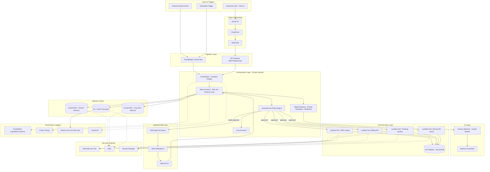

# Part VII – AI & Machine Learning Architectures

# Chapter 56: AI Agent Architecture

---

## 1. Executive Summary

Enterprises adopting generative AI quickly discover that a single prompt-response chatbot cannot execute multi-step business processes. A customer service request that requires checking an order status, issuing a refund, updating a CRM record, and sending a confirmation email involves four distinct systems and a sequence of decisions that depends on intermediate results. A static LLM call cannot do this — it can only produce text. **AI Agent Architecture** solves this problem by wrapping a foundation model inside an orchestration loop that can reason about a goal, select tools, invoke real systems, observe results, and iterate until the goal is satisfied or a safety boundary is reached.

This is fundamentally different from the Retrieval-Augmented Generation (RAG) pattern covered in Chapter 52 or the model-serving pattern in Chapter 55. RAG retrieves context to *answer a question*. An AI agent *takes action* — it calls APIs, writes to databases, triggers downstream workflows, and produces side effects in the real world. This distinction matters enormously for architecture, because side-effecting systems require a different security model, a different observability model, and a different failure-handling model than read-only question-answering systems.

**Business problem.** Enterprises have thousands of multi-step, rules-heavy workflows — claims processing, IT ticket triage, vendor onboarding, invoice reconciliation, security incident response — that are too variable for traditional rule engines but too structured and consequential to hand entirely to an unsupervised model. Traditional RPA (Robotic Process Automation) is brittle: it breaks the moment a UI changes or an unexpected case appears. Traditional workflow engines (Step Functions, Camunda) require every branch to be pre-defined by an engineer. Neither approach can handle the "long tail" of exceptions that make up 20–40% of real operational volume in most enterprises.

AI agents close this gap by combining the reasoning flexibility of an LLM with the determinism of tool calls and the auditability of a workflow engine. The agent decides *which* tool to call and *in what order*, but each tool itself is a deterministic, testable, permissioned piece of code — typically a Lambda function, an internal API, or a Step Functions state machine.

**Architecture objective.** The objective of this architecture is to provide a production-grade, secure, observable, and cost-controlled environment in which an LLM-driven agent can:

- Decompose a natural-language or event-driven goal into a plan.
- Select and invoke a constrained set of registered tools (APIs, databases, internal services).
- Maintain short-term (session) and long-term (persistent) memory.
- Operate within strict guardrails: budget limits, action allow-lists, human-in-the-loop checkpoints, and hard timeouts.
- Emit a full, replayable audit trail of every decision, tool call, and side effect.
- Scale horizontally to support concurrent agent sessions without violating tenant isolation or cost budgets.

**Why organizations adopt this architecture.** Three forces are driving adoption in 2025–2026:

1. **Model capability crossed a threshold.** Frontier models (Anthropic Claude, and others accessible via Amazon Bedrock) now support reliable, structured tool-use (function calling) with low hallucination rates on well-scoped tool schemas. This made multi-step autonomous tool orchestration practical rather than a research demo.
2. **Labor cost and throughput pressure.** Contact center, back-office, and DevOps teams face growing ticket volume without proportional headcount growth. Agentic automation targets the 60–80% of tickets that are procedurally similar but not identical enough for hard-coded automation.
3. **Competitive pressure from AI-native entrants.** Startups building agent-first products (support, sales engineering, SRE copilots) are compressing the resolution time for tasks that previously required a human specialist, forcing incumbents to respond.

**Major business benefits.**

| Benefit | Description | Typical Impact |
|---|---|---|
| Reduced mean time to resolution | Agents execute multi-step diagnostics/remediation without waiting on human queue time | 30–70% reduction for in-scope ticket classes |
| Lower cost per transaction | Automating tier-1/tier-2 work reduces headcount pressure | 20–50% cost reduction on automatable volume |
| 24/7 operation | Agents don't require shift coverage | Improved SLA compliance in off-hours |
| Consistency | Deterministic tool calls remove human variance in policy application | Fewer compliance exceptions |
| Faster onboarding of new workflows | Adding a new capability is "register a new tool," not "hire and train" | Weeks instead of months |
| Audit trail | Every decision and action is logged, unlike ad hoc human judgment | Easier compliance evidence |

**Typical enterprise scenarios.**

- **IT Operations copilot**: an agent that receives a PagerDuty alert, queries CloudWatch Logs Insights and X-Ray, correlates with a recent deployment in CodePipeline, and either auto-remediates (e.g., rolls back a canary) or escalates with a structured incident summary.
- **Customer support resolution agent**: given a support ticket, the agent looks up the customer in the CRM, checks entitlement in a billing system, issues a refund up to a policy-defined limit, and drafts a response for human approval above that limit.
- **Financial operations agent**: reconciles invoices against purchase orders across ERP and accounts-payable systems, flags mismatches, and auto-approves matches within tolerance.
- **Security response agent**: triages GuardDuty findings, enriches with Security Hub and CloudTrail context, and executes a pre-approved containment action (e.g., isolate an EC2 instance's security group) with human sign-off for anything destructive.
- **DevOps agent**: given a Terraform plan output, evaluates it against Policy-as-Code rules, opens a pull request with any auto-fixable violations resolved, and notifies the owning team of unresolved ones.

**Important framing for architects.** An AI agent is not "a chatbot that can also call APIs." It is a distributed system with a non-deterministic controller (the LLM) sitting in the request path. Every architectural decision in this chapter — network isolation, IAM scoping, cost governance, human-in-the-loop gating — exists specifically because the controller's behavior cannot be fully unit-tested the way traditional application code can be. The rest of this chapter treats the LLM as an *untrusted, probabilistic component* that must be wrapped in deterministic, auditable, and reversible infrastructure — the same posture a security architect would take toward any component that accepts adversarial input, because prompt injection from tool outputs and user input is a first-class threat in this architecture, not an edge case.

---

## 2. Business Requirements

### 2.1 Business Drivers

- Reduce operational cost per resolved case in support, IT operations, and back-office functions.
- Increase throughput without linear headcount growth.
- Improve consistency of policy application across large transaction volumes.
- Provide a foundation that new agentic use cases can be added to without re-architecting.
- Maintain auditability sufficient for SOC 2, PCI-DSS, or industry-specific regulatory review.

### 2.2 Functional Requirements

- Accept goals via multiple entry points: chat UI, event trigger (EventBridge), scheduled trigger, or API call.
- Maintain a registry of callable tools, each with a JSON schema, an owner, and a permission scope.
- Support multi-turn planning: the agent must be able to call a tool, observe the result, and decide the next action.
- Support persistent memory per user/session (conversation history) and per organization (long-term knowledge, e.g., past resolutions).
- Support a human-in-the-loop approval step for any action above a configurable risk threshold.
- Provide a full transcript of reasoning steps, tool calls, tool outputs, and final actions for every session.
- Support graceful degradation: if a tool is unavailable, the agent must report the limitation rather than hallucinate a result.

### 2.3 Non-Functional Requirements

| Category | Requirement |
|---|---|
| Scalability | Support 500–50,000 concurrent agent sessions depending on tier, horizontally scalable |
| Availability | 99.9% for the orchestration layer; individual tool availability may vary and must degrade gracefully |
| Latency | P50 tool-call round trip < 2s; end-to-end agent turn (including LLM inference) P50 < 8s, P99 < 30s |
| Compliance | SOC 2 Type II, and industry-specific (HIPAA, PCI-DSS, GDPR) depending on tenant |
| Security | All tool calls scoped to least privilege; all destructive actions gated |
| RPO | 15 minutes for session/memory stores |
| RTO | 1 hour for full orchestration layer recovery in a secondary region |
| Cost governance | Hard per-session and per-tenant token/dollar budget enforcement |
| Auditability | 100% of tool invocations logged immutably for a minimum retention period defined by tenant compliance regime (commonly 1–7 years) |

### 2.4 Scalability Goals

- Stateless orchestration compute must scale horizontally behind a queue-based ingestion layer.
- Memory and session stores must scale independently of compute (DynamoDB on-demand, or provisioned with auto scaling).
- Tool execution must be parallelizable where the plan allows independent sub-tasks (fan-out via Step Functions or Lambda).

### 2.5 Availability, Latency, and Compliance Requirements

- The orchestration control plane (API Gateway, Lambda, Step Functions) is designed for Multi-AZ resilience by default, since these are regional, AZ-redundant AWS services.
- LLM inference latency (via Amazon Bedrock) is the dominant contributor to end-to-end latency; architecture must support streaming responses to improve perceived latency for interactive use cases.
- Compliance requirements (PCI-DSS, HIPAA, GDPR) directly constrain which data may be sent to the model, which is why this architecture places a **PII redaction and policy-enforcement layer** between the orchestrator and the model call (detailed in Section 11).

### 2.6 Recovery Objectives

- **RPO of 15 minutes** on session and memory data is achieved via DynamoDB point-in-time recovery and cross-region replication (Global Tables) for tier-1 tenants.
- **RTO of 1 hour** is achieved through infrastructure-as-code redeployment into a secondary region plus DNS failover via Route 53 health checks.

### 2.7 SLAs

| Tier | Availability SLA | Support Response | Max concurrent sessions |
|---|---|---|---|
| Standard | 99.5% | Next business day | 500 |
| Business | 99.9% | 4 hours | 5,000 |
| Enterprise | 99.95% | 1 hour | 50,000+ |

### 2.8 Expected Workload and Growth

- Initial deployments typically start with 1–3 agent "personas" (e.g., support agent, IT ops agent) and 10–30 registered tools.
- Mature deployments commonly grow to 10+ personas and 100+ tools within 18 months, which is the primary driver for the tool-registry and permission-boundary design discussed in Sections 4 and 10 — an unmanaged tool sprawl is the single most common cause of both cost overruns and security incidents in year two of an agent program.

---

## 3. Architecture Overview

### 3.1 Overall Design Philosophy

This architecture treats the agent loop as a **supervised state machine**, not an open-ended autonomous process. Three design principles anchor every decision in this chapter:

1. **The model proposes, the platform disposes.** The LLM decides *what it wants to do next*, but a deterministic policy layer decides *whether it is allowed to*. This separation is what makes the system auditable and safe.
2. **Every tool call is a permissioned, logged, idempotent operation.** Tools are not arbitrary code the model can write and execute; they are pre-registered, schema-validated, IAM-scoped functions.
3. **Bounded autonomy.** Every agent session has a hard ceiling on iterations, tokens, cost, and elapsed time. An agent that has not converged on an answer within these bounds fails safely and escalates to a human rather than looping indefinitely.

### 3.2 Core Components

| Component | Role |
|---|---|
| Ingestion Layer | Accepts goals from chat, API, or event sources (API Gateway, EventBridge) |
| Orchestrator | The control loop that manages planning, tool selection, and iteration (Lambda or ECS Fargate + Step Functions) |
| Model Gateway | Mediates all calls to Amazon Bedrock; enforces prompt templates, PII redaction, and cost tracking |
| Tool Registry | Catalog of callable tools with schemas, owners, and permission scopes (DynamoDB + IAM) |
| Tool Execution Layer | Lambda functions / internal APIs that perform the actual side-effecting work |
| Memory Store | Session (short-term) and long-term memory (DynamoDB, and optionally a vector store for semantic recall) |
| Guardrail & Policy Engine | Evaluates every proposed action against risk rules before execution |
| Human-in-the-Loop (HITL) Layer | Presents high-risk actions for approval (SNS/SQS-backed approval queue + UI) |
| Observability Layer | Full transcript logging, tracing, metrics (CloudWatch, X-Ray, S3 + Athena) |
| Cost Governor | Tracks token/dollar spend per session/tenant and enforces budgets in real time |

### 3.3 How Components Interact — High-Level Workflow

1. A goal enters the system (user chat message, or an automated event such as a new support ticket).
2. The Orchestrator loads relevant session memory and organizational long-term memory.
3. The Orchestrator calls the Model Gateway, which forwards a structured prompt (goal + available tool schemas + memory context) to Bedrock.
4. The model responds with either a final answer or a **tool call proposal**.
5. The Guardrail Engine evaluates the proposed tool call against policy: is this tool allowed for this tenant/persona? Does it exceed a risk threshold requiring human approval?
6. If approved automatically, the Tool Execution Layer invokes the actual function and returns a structured result.
7. If it requires approval, the action is queued to the HITL layer and the loop pauses until a human approves, rejects, or modifies it.
8. The tool result is appended to the conversation context, and the loop returns to step 3 until the model produces a final answer or a bound (iteration/time/cost) is hit.
9. The final result is returned to the caller, and the full transcript is persisted for audit.

### 3.4 Request, Response, and Data Lifecycle

- **Request lifecycle**: entry point → authentication/authorization → orchestrator session creation → planning loop → completion.
- **Response lifecycle**: for interactive use cases, partial responses are streamed back via WebSocket (API Gateway WebSocket API) or Server-Sent Events so the user sees progress during long-running tool chains.
- **Data lifecycle**: session data lives in DynamoDB with a TTL matching the tenant's retention policy; the full audit transcript is written to S3 in an append-only, versioned bucket for long-term compliance retention and Athena-based analysis.

---

## 4. AWS Services Used

> **Note:** This section explains only the services materially used by this architecture. Where a service is optional (used only in certain deployment sizes), that is noted.

### 4.1 Amazon Bedrock

**Purpose.** Bedrock is AWS's managed foundation-model service. It provides API access to multiple model providers (including Anthropic's Claude models) without the customer needing to host GPU infrastructure, and supports native tool-use/function-calling, guardrails, and knowledge-base integration.

**Why selected.** For an agent architecture, Bedrock is preferred over self-hosting because: (a) it removes GPU capacity planning entirely, (b) it provides built-in Guardrails and model evaluation tooling, (c) IAM-native access control avoids a separate API-key management problem, and (d) usage is billed per-token, aligning cost directly with agent activity.

**Alternatives.** Self-hosted inference (SageMaker endpoints running open-weight models, or EC2 with GPU instances) is viable when data residency rules forbid sending data to a third-party-operated model, or when sustained throughput makes dedicated capacity cheaper than pay-per-token pricing at very large scale. Direct API integration with a model provider outside AWS is also possible but forfeits IAM-native auth and VPC-private connectivity.

**Limitations.** Regional model availability varies; provisioned throughput must be purchased in advance for guaranteed low-latency capacity at high volume; context window and output token limits constrain how much tool-call history can be kept in a single turn (mitigated by the memory-summarization pattern in Section 6).

**Pricing considerations.** On-demand pricing is per input/output token and varies by model. High-volume, latency-sensitive workloads should evaluate **Provisioned Throughput** to get predictable latency and often lower effective cost per token, at the expense of committing to a minimum spend.

**Best practices.** Use the smallest model that reliably meets the task's accuracy bar for cost efficiency (see Section 16); route by task complexity ("model routing") rather than using the largest model for every step; always enable Bedrock Guardrails for content filtering in addition to the custom policy engine described in Section 11.

### 4.2 AWS Lambda

**Purpose.** Executes both individual tool implementations and, in smaller deployments, the orchestrator loop itself.

**Why selected.** Per-invocation billing matches the bursty, unpredictable nature of agent tool calls; no idle capacity cost; native integration with Step Functions, EventBridge, and API Gateway.

**Alternatives.** ECS Fargate is preferred for the orchestrator when a single agent turn involves a long-running loop (multiple minutes) that would approach Lambda's 15-minute maximum execution time, or when the orchestrator needs to hold a persistent WebSocket connection for streaming.

**Limitations.** 15-minute maximum execution duration; cold starts add latency (mitigate with provisioned concurrency for latency-sensitive tool paths); 10GB memory ceiling.

**Pricing considerations.** Charged per GB-second and per request; at high tool-call volume, compare against Fargate's per-vCPU/memory-second pricing for the orchestrator specifically.

**Best practices.** Keep each tool as a small, single-purpose Lambda function; use Lambda Powertools for structured logging and tracing; set aggressive but realistic timeouts per tool to bound worst-case agent-turn latency.

### 4.3 AWS Step Functions

**Purpose.** Orchestrates multi-step, stateful workflows — used here to implement the agent's plan-act-observe loop as an explicit, visualizable, resumable state machine, and to fan out independent tool calls in parallel.

**Why selected.** Step Functions gives you a durable execution history and built-in retry/catch semantics for free, which is exactly what's needed when a tool call fails transiently (network blip) versus permanently (invalid input) versus requires escalation.

**Alternatives.** A custom loop inside a long-running Fargate task is viable and gives more flexibility for very dynamic looping logic, at the cost of building your own durability/replay logic.

**Limitations.** Standard Workflows have a 25,000-event history limit and 1-year maximum duration; Express Workflows are cheaper and faster for short-lived executions but have a 5-minute duration cap and different logging semantics — most agent turns should use **Express Workflows** for sub-tasks and **Standard Workflows** for the overall session if it spans human-approval waits that could last hours.

**Pricing considerations.** Standard Workflows are billed per state transition; Express Workflows are billed per execution duration and memory — at high volume, Express is usually far cheaper for short tool-fan-out patterns.

**Best practices.** Model the guardrail check as an explicit state before every tool-invoking state; use `Wait for Callback` (`waitForTaskToken`) for human-in-the-loop approval steps so the state machine pauses without cost while awaiting a human.

### 4.4 Amazon API Gateway

**Purpose.** Provides the HTTP/WebSocket entry point for agent sessions — REST for synchronous request/response and API calls from other systems, WebSocket for streaming interactive chat sessions.

**Why selected.** Native IAM/Cognito authorization, request validation, throttling, and direct Lambda/Step Functions integration remove the need to run and patch a custom API layer.

**Alternatives.** An Application Load Balancer in front of ECS Fargate is preferable when the orchestrator is a long-lived stateful service rather than a set of discrete Lambda-backed endpoints.

**Limitations.** REST API payload size limit of 10MB; WebSocket connections have a 2-hour maximum duration and 10-minute idle timeout, which matters for very long HITL-pending sessions (mitigate by re-establishing the connection or falling back to polling for long waits).

**Pricing considerations.** Priced per request/message and, for WebSocket, per connection-minute; high-frequency polling patterns can be more expensive than they appear — prefer push (WebSocket/SSE) for interactive sessions.

**Best practices.** Use usage plans and API keys or Cognito authorizers per tenant to enforce per-tenant rate limits independent of the cost governor described in Section 16.

### 4.5 Amazon DynamoDB

**Purpose.** Stores session state, short-term conversation memory, the tool registry, and guardrail policy configuration.

**Why selected.** Single-digit-millisecond reads are required to keep the plan-act-observe loop fast; on-demand capacity mode matches the highly bursty, unpredictable access pattern of agent sessions; native TTL supports automatic memory expiration for compliance.

**Alternatives.** Amazon Aurora (PostgreSQL) is preferable when memory needs complex relational queries (e.g., joining session history against structured case data) or when the team already standardizes on relational schemas for this domain — see Chapter 43/44.

**Limitations.** 400KB item size limit means long conversation histories must be summarized or externalized to S3 with a pointer stored in DynamoDB, rather than storing the full transcript inline.

**Pricing considerations.** On-demand mode is cost-efficient for unpredictable, spiky agent traffic; switch to provisioned capacity with auto scaling once traffic patterns stabilize and sustained throughput becomes predictable, which is typically 20–40% cheaper at steady state.

**Best practices.** Use a composite key of `tenantId#sessionId` for session isolation; enable Point-in-Time Recovery; use DynamoDB Streams to trigger asynchronous audit-log writes to S3 without adding latency to the hot path.

### 4.6 Amazon S3

**Purpose.** Stores the immutable, long-term audit transcript of every agent session (full reasoning trace, tool calls, tool outputs, approvals) and any large artifacts (documents retrieved or generated during a session).

**Why selected.** Durable, cheap, versioned, and integrates natively with Athena for compliance querying and Glacier lifecycle transitions for cost-efficient long-term retention.

**Alternatives.** None seriously competes for this specific role at this cost point; the question is usually storage class strategy, not S3 vs. an alternative.

**Limitations.** Not queryable directly — requires Athena or a similar query engine on top for ad hoc compliance investigation.

**Pricing considerations.** Use S3 Intelligent-Tiering or explicit lifecycle rules to transition audit logs older than 90 days to Glacier Instant Retrieval, and older than 1 year to Glacier Deep Archive, per Section 16.

**Best practices.** Enable S3 Object Lock in compliance mode for audit transcripts subject to regulatory retention, so even an administrator cannot delete them before the retention period expires.

### 4.7 Amazon SQS and Amazon SNS

**Purpose.** SQS decouples asynchronous tool invocations and buffers the human-in-the-loop approval queue; SNS fans out notifications (e.g., "an agent action needs your approval") to Slack/email/PagerDuty integrations.

**Why selected.** Both are fully managed, require no capacity planning, and provide the at-least-once delivery guarantees needed for reliable tool execution and approval routing.

**Alternatives.** EventBridge is preferred over SNS when routing needs content-based filtering across many event types rather than simple fan-out — most mature deployments use both, with EventBridge as the primary event bus and SNS/SQS behind specific integration points.

**Limitations.** Standard SQS queues offer at-least-once, not exactly-once, delivery — tool implementations must be idempotent (see Section 6) to handle possible duplicate delivery.

**Pricing considerations.** Negligible at typical agent volumes; the cost driver is downstream compute, not the queue itself.

**Best practices.** Use a dead-letter queue on every tool-invocation queue so persistently failing tool calls are surfaced for investigation rather than silently retried forever.

### 4.8 Amazon EventBridge

**Purpose.** Serves as the primary event bus for triggering agent sessions from external system events (a new support ticket, a GuardDuty finding, a deployment completion) and for publishing agent-completion events that downstream systems subscribe to.

**Why selected.** Native integration with dozens of AWS services as event sources, content-based filtering, and schema registry support make it the natural entry point for event-driven agent invocation, as distinct from the direct API-Gateway entry point for interactive chat.

**Alternatives.** Direct Lambda-to-Lambda invocation is simpler for a single, tightly coupled integration but loses the decoupling and replay benefits EventBridge provides as the number of event sources grows.

**Limitations.** At-least-once delivery, and a 24-hour event archive by default (extendable) — not a substitute for the durable S3 audit log.

**Best practices.** Use a dedicated custom event bus per environment (dev/staging/prod) rather than the default bus, to keep agent events isolated from other application traffic.

### 4.9 AWS Identity and Access Management (IAM)

**Purpose.** Enforces least-privilege access for every component — critically, each registered tool executes under its **own** IAM role scoped to exactly the AWS/API permissions it needs, not a shared "agent role."

**Why selected.** This is the primary technical control that limits blast radius if the model proposes (or is manipulated via prompt injection into proposing) an inappropriate action — the tool's IAM role, not the model's "intent," is the final enforcement boundary.

**Best practices.** Detailed in Section 10; the short version is one execution role per tool, permission boundaries on any role the orchestrator itself assumes, and no tool role should ever have `iam:*` or the ability to modify other tools' permissions.

### 4.10 Amazon VPC, ALB, CloudFront, Route 53, CloudWatch, CloudTrail, AWS Config, GuardDuty, KMS, Secrets Manager, Systems Manager

These foundational services are used in their standard enterprise roles and are covered in depth in Chapters 2, 15, and 87–94. In this architecture specifically:

- **VPC**: Lambda functions that call internal databases or on-premises systems run in private subnets with VPC endpoints for Bedrock, DynamoDB, S3, and Secrets Manager to avoid NAT Gateway costs and public internet exposure (Section 9).
- **CloudFront + ALB**: front the optional web-based chat UI; not on the path for the core agent API when accessed machine-to-machine.
- **Route 53**: health-check-based failover for multi-region deployments (Section 13).
- **CloudWatch**: metrics, logs, and alarms for the entire agent pipeline (Section 21).
- **CloudTrail**: management-plane audit logging, complementary to (not a replacement for) the application-level agent transcript log.
- **AWS Config**: continuously evaluates that tool IAM roles have not drifted from their approved least-privilege baseline.
- **GuardDuty**: threat detection on the AWS account, including anomalous API call patterns that could indicate a compromised tool credential.
- **KMS**: encrypts session memory, audit logs, and Secrets Manager entries; a dedicated CMK per tenant is recommended for enterprise tenants requiring cryptographic isolation.
- **Secrets Manager**: stores third-party API credentials that tools need (CRM, billing system, ticketing system), with automatic rotation where the target system supports it.
- **Systems Manager Parameter Store**: stores non-secret configuration (prompt templates, model routing rules, feature flags) that must be changed without a redeploy.

---

## 5. Complete Architecture Diagram



---

## 6. Component-by-Component Explanation

### 6.1 Orchestrator

**Purpose.** Owns the lifecycle of an agent session from goal receipt to final response.

**Responsibilities.** Session creation, memory hydration, invoking the Step Functions state machine, streaming partial results back to interactive clients, persisting the final transcript.

**Inputs.** A goal payload (user message, event payload, or scheduled task definition), tenant/persona identifier, authentication context.

**Outputs.** Final response to the caller; a completion event published to EventBridge for downstream systems.

**Scaling.** Stateless — scales horizontally with concurrent invocations; Lambda concurrency limits (or Fargate service auto scaling) are set per tenant to prevent one tenant from starving others.

**High availability.** Multi-AZ by default as a managed Lambda/Fargate service; no single point of failure within a region.

**Failure handling.** Any unhandled exception in the orchestrator results in the session being marked `failed` with the partial transcript preserved, and an alert raised — sessions are never silently dropped.

**Dependencies.** Step Functions, Model Gateway, DynamoDB, S3.

**Security.** Assumes a scoped IAM role that can only invoke the specific Step Functions state machine and read/write its own session records — it cannot directly call tool APIs.

**Monitoring.** CloudWatch custom metrics for session count, duration, and failure rate; X-Ray trace as the root of every session's trace tree.

### 6.2 Model Gateway

**Purpose.** The single, centralized chokepoint through which every call to Bedrock passes — this is where prompt templating, PII redaction, model routing, and per-call cost accounting happen.

**Responsibilities.** Injects the system prompt and tool schemas; redacts PII/PHI before sending context to the model where required by tenant policy; selects the appropriate model (routing) based on task complexity; records token usage for the Cost Governor.

**Inputs.** Conversation context, tool schema list, tenant policy configuration.

**Outputs.** Model response (text or structured tool-call proposal), token usage metrics.

**Scaling.** Stateless, scales with the orchestrator.

**Failure handling.** Retries transient Bedrock throttling with exponential backoff; on persistent failure, falls back to a secondary model or region if configured, otherwise fails the session cleanly.

**Security.** This is the only component with an IAM policy granting `bedrock:InvokeModel`; no other component can call the model directly, which prevents tool code from bypassing prompt-template safety wrapping.

**Monitoring.** Per-tenant token consumption dashboards; latency percentiles per model.

### 6.3 Guardrail and Policy Engine

**Purpose.** The deterministic decision point that evaluates every tool-call proposal from the model against policy before execution — this is the architectural embodiment of "the model proposes, the platform disposes."

**Responsibilities.** Validates the tool call against its JSON schema; checks the tool against the persona's allow-list; evaluates a risk score (informed by tool sensitivity, parameter values, and tenant-specific rules) to decide auto-approve vs. human-approval-required; enforces rate limits per tool per session.

**Inputs.** Proposed tool call (name + parameters), session/tenant context.

**Outputs.** Approve, deny, or route-to-human decision.

**Scaling.** Stateless rule evaluation, scales trivially.

**Failure handling.** Fails closed — if the policy engine cannot be reached or evaluation errors, the default behavior is deny/escalate, never auto-approve.

**Security.** This component itself has read-only access to policy configuration in DynamoDB/Parameter Store; it has no ability to invoke tools directly, preserving separation of duties between "decide" and "execute."

**Monitoring.** Every decision (approve/deny/escalate) is logged with full reasoning context for post-hoc review and for tuning the risk model over time.

### 6.4 Tool Execution Layer

**Purpose.** The set of individually deployed, individually permissioned functions that actually perform side-effecting or data-retrieval work.

**Responsibilities.** Validate input against schema (defense in depth beyond the Guardrail Engine's validation); execute the underlying action (API call, database query, internal service call); return a structured, bounded-size result.

**Design requirement — idempotency.** Because upstream delivery (SQS, Step Functions retries) is at-least-once, every tool that performs a write operation (issue refund, update record) must be implemented idempotently, typically via a client-supplied idempotency key stored alongside the transaction record, so a retried call does not double-execute.

**Scaling.** Each tool scales independently as a Lambda function; a slow or throttled downstream system (e.g., a legacy mainframe API) limits only that tool's throughput, not the whole platform's, provided the orchestrator treats tool timeouts as a normal, handled outcome.

**Failure handling.** Transient failures retried with backoff up to a small bounded count; permanent failures returned as a structured error to the model so it can adapt its plan (e.g., try an alternative tool or escalate) rather than crash the session.

**Security.** One IAM execution role per tool, scoped to only the downstream resource(s) it needs; secrets pulled from Secrets Manager at invocation time, never embedded in code or environment variables in plaintext.

### 6.5 Memory Store

**Purpose.** Provides both short-term (within-session) and long-term (cross-session, organizational) memory to the agent.

**Responsibilities.** Session memory holds the rolling conversation/tool-call history for the current goal, summarized/compacted once it approaches the model's context window budget. Long-term memory holds durable facts (e.g., "this customer's preferred contact method," "this class of incident's historical resolution pattern") retrievable via key lookup or semantic search (optionally backed by Amazon OpenSearch Service or Bedrock Knowledge Bases as a vector store, as covered in Chapter 53).

**Scaling.** DynamoDB on-demand mode absorbs bursty session creation without capacity planning.

**Failure handling.** Session memory read failure causes the session to start with degraded context rather than fail outright, with a warning logged; long-term memory is treated as best-effort enrichment, never a hard dependency for basic operation.

**Security.** Encrypted at rest with per-tenant KMS keys for enterprise tenants; TTL-based expiration enforces data minimization for tenants with strict retention limits.

### 6.6 Human-in-the-Loop Layer

**Purpose.** Provides the escape valve for any action the Guardrail Engine determines requires human judgment or authorization.

**Responsibilities.** Queue the pending action with full context; notify the appropriate approver (Slack, email, PagerDuty via SNS); present an approval UI; resume the paused Step Functions execution via task token callback once a decision is made.

**Scaling.** SQS absorbs arbitrary approval volume; the constraint is human approver capacity, which is a business process concern, not an infrastructure one — architecturally, this means the state machine must be able to wait indefinitely (within the Standard Workflow's 1-year limit) without consuming compute while waiting.

**Failure handling.** Unactioned approvals beyond a configurable SLA trigger an escalation notification (e.g., to a manager) rather than silently expiring.

**Security.** Approval UI enforces that only authorized approvers for the given tenant/action-type can approve, with the approval itself logged as part of the immutable audit transcript.

---

## 7. End-to-End Request Flow

The following walks through a representative flow: a customer support agent session that ends in an auto-approved refund.

1. **Client submits goal.** A support ticket is created in an external ticketing system, which publishes an event to EventBridge.
2. **DNS resolution.** For any interactive component (approval UI, admin dashboard), Route 53 resolves the request to the nearest healthy regional endpoint.
3. **Edge and WAF.** CloudFront serves static UI assets; AWS WAF inspects any public-facing API traffic for injection/exploitation patterns before it reaches API Gateway.
4. **Event ingestion.** EventBridge routes the ticket-created event to the Orchestrator Lambda via a rule matching `source: "ticketing.system"` and `detail-type: "TicketCreated"`.
5. **Session creation.** The Orchestrator creates a session record in DynamoDB with a unique `sessionId`, loads the relevant persona configuration (support-agent persona, its allowed tool list, and risk thresholds).
6. **Memory hydration.** The Orchestrator queries long-term memory for prior interactions with this customer, if any, and includes a summarized version in the initial context.
7. **State machine start.** The Orchestrator starts a Step Functions execution, passing the goal and hydrated context.
8. **Model call #1.** The Model Gateway sends the ticket details and available tool schemas (CRM lookup, billing lookup, refund issuance, email send) to Bedrock.
9. **Model proposes a tool call.** The model responds with a proposal to call `crm_lookup` with the customer ID.
10. **Guardrail check.** The Policy Engine confirms `crm_lookup` is a read-only, low-risk tool on the support-agent persona's allow-list — auto-approved.
11. **Tool execution.** The `crm_lookup` Lambda queries the CRM API and returns structured customer data.
12. **Loop iteration.** The result is appended to context; Step Functions loops back to another model call.
13. **Model proposes refund.** The model, having confirmed the order is eligible per policy context provided in its instructions, proposes calling `issue_refund` with an amount.
14. **Guardrail risk evaluation.** The Policy Engine checks the refund amount against the persona's auto-approval ceiling (e.g., $50). If under the ceiling, auto-approve; if over, route to HITL.
15. **(Auto-approve path) Tool execution.** The `issue_refund` Lambda calls the billing system with an idempotency key derived from the session and tool-call ID, and returns a confirmation.
16. **(Escalation path, if over ceiling) HITL routing.** The action is placed on the SQS approval queue, an SNS notification is sent to the finance approver channel, and the Step Functions execution pauses on a task token.
17. **Final model call.** With the refund confirmation in context, the model produces a final natural-language response summarizing the resolution.
18. **Response delivery.** The Orchestrator sends the final response back to the ticketing system via its API (and, if this were an interactive chat session, streams it to the client over WebSocket).
19. **Audit persistence.** The full transcript — every model call, tool proposal, guardrail decision, and tool result — is written to the S3 audit bucket, and a summary record is written to DynamoDB for fast lookup.
20. **Completion event.** The Orchestrator publishes a `SessionCompleted` event to EventBridge, which the ticketing system consumes to close or update the ticket.
21. **Logging and monitoring.** CloudWatch records latency, token usage, and tool-call counts for the session; X-Ray captures the full distributed trace across every Lambda and Step Functions state; any anomaly (e.g., unusually high token usage) triggers a CloudWatch Alarm.
22. **Error handling (any step).** If any tool call fails permanently, the failure is captured as a structured observation the model can reason about; if the model cannot produce a resolution within the bounded iteration/time/cost budget, the session is marked `escalated` and routed to a human queue with the full transcript attached, rather than returned to the customer as a silent failure.

---

## 8. Deployment Flow

### 8.1 Infrastructure Provisioning

All infrastructure — API Gateway, Lambda functions, Step Functions state machines, DynamoDB tables, IAM roles, KMS keys — is provisioned via Terraform, organized into modules by concern (networking, orchestration, tool registry, per-tool modules) so that adding a new tool is a matter of instantiating a module rather than hand-editing shared resources.

### 8.2 Terraform Workflow

- Feature branch → `terraform plan` in CI → human review of the plan output (especially IAM diffs) → merge → `terraform apply` in CI on merge to main, gated by a manual approval step for production.
- State is stored remotely in S3 with DynamoDB state locking (see Section 18 for the backend configuration).

### 8.3 CI/CD Deployment

- Application code (Lambda functions, tool implementations) is deployed independently of infrastructure changes via a standard build → test → package → deploy pipeline.
- Every new or modified tool requires: a schema definition, a unit test suite, an IAM policy diff review, and a Guardrail Engine risk-classification entry — enforced as required CI checks, not optional guidance.

### 8.4 Blue-Green Deployment

- Lambda aliases and versions are used to implement blue-green rollout for both the Orchestrator and individual tools: a new version is deployed to a small percentage of traffic (Lambda weighted alias routing) and promoted only after error-rate and latency metrics remain within bounds for a soak period.
- Step Functions state machine definitions are versioned; a new version is only referenced by the Orchestrator after validation against a synthetic test suite of representative agent sessions.

### 8.5 Rollback

- Lambda alias weighting is shifted back to the previous version immediately on alarm breach (automated via CloudWatch Alarm → Lambda deployment hook, using AWS CodeDeploy's canary/linear deployment configurations).
- Because tool calls are idempotent and fully logged, a rollback does not require compensating transactions for reads, and writes are protected by the idempotency-key pattern described in Section 6.4.

### 8.6 Secrets and Configuration

- All third-party credentials live in Secrets Manager, referenced by ARN in Terraform and resolved at Lambda invocation time — never hardcoded, never in Lambda environment variables in plaintext.
- Prompt templates, model routing tables, and persona/tool allow-lists live in Systems Manager Parameter Store (or DynamoDB for higher-change-frequency config) so they can be updated without a code deployment, with changes themselves subject to the same CI review gate.

### 8.7 Validation

- Every deployment runs a **regression suite of recorded agent sessions** (golden transcripts) through the new version in a shadow/staging environment, comparing tool-call sequences and final outcomes against expected results before promotion — this is the agent-architecture equivalent of integration testing and is non-negotiable given the non-determinism of the model component.

---

## 9. Network Topology

### 9.1 VPC and CIDR

- A dedicated VPC per environment (dev/staging/prod), e.g., `10.20.0.0/16` for production, sized to accommodate the tool-execution Lambda fleet's ENI requirements at peak concurrency.

### 9.2 Public and Private Subnets

- **Public subnets** (e.g., `10.20.0.0/24`, `10.20.1.0/24` across two AZs): host only the ALB (if a web UI is deployed) and NAT Gateways.
- **Private subnets** (e.g., `10.20.10.0/23`, `10.20.12.0/23` across two AZs): host the Orchestrator (if Fargate-based), and any Lambda functions requiring VPC attachment to reach internal systems (on-premises CRM, internal databases).

### 9.3 NAT Gateway and Internet Gateway

- One NAT Gateway per AZ (not a single shared NAT Gateway) to avoid a cross-AZ single point of failure for outbound calls from private-subnet tools to external SaaS APIs (billing provider, ticketing system) — the cost implication of per-AZ NAT Gateways is addressed explicitly in Section 16.
- Internet Gateway attached for the public subnets.

### 9.4 Transit Gateway

- Used when the agent platform must reach resources in other VPCs/accounts (e.g., a shared services VPC hosting the internal CRM database) — see Chapter 17 for full Transit Gateway design; in this architecture, Transit Gateway routes are scoped narrowly to only the specific internal subnets each tool needs, not a blanket peering.

### 9.5 Route Tables, NACLs, and Security Groups

- Private subnet route tables send `0.0.0.0/0` to the AZ-local NAT Gateway; VPC-endpoint-eligible AWS service traffic (DynamoDB, S3, Bedrock, Secrets Manager) is routed via Gateway/Interface VPC Endpoints instead, reducing both NAT cost and internet exposure.
- Security Groups follow a strict per-tool-tier model: the "tool execution" security group allows outbound HTTPS only to explicitly required destinations (via prefix lists where the destination is another AWS service, or explicit CIDR/security-group references for internal systems) — no `0.0.0.0/0` egress on any tool security group.
- NACLs provide a coarse secondary control layer at the subnet boundary, primarily to block known-bad CIDR ranges.

### 9.6 PrivateLink

- **Bedrock, DynamoDB, S3, Secrets Manager, and Systems Manager** are all accessed via **Interface or Gateway VPC Endpoints**, keeping all control-plane and data-plane traffic between the agent platform and its core AWS dependencies off the public internet entirely — this is both a cost optimization (avoids NAT data-processing charges) and a security control (eliminates an entire class of exfiltration/interception risk).

### 9.7 Hybrid Connectivity

- Where a tool must reach an on-premises system (e.g., a mainframe-hosted policy engine), connectivity is via Direct Connect or Site-to-Site VPN into the same VPC, routed through Transit Gateway — see Chapter 23/24 for full hybrid design guidance. In all cases, the specific tool's Lambda function is placed in a private subnet with a route to that hybrid path; unrelated tools have no route to on-premises networks at all, preserving segmentation.

---

## 10. Identity and Access

### 10.1 IAM Roles — One Per Tool

The single most important IAM decision in this architecture is that **each registered tool has its own IAM execution role**, scoped to exactly the resources and actions that tool needs — never a shared "agent-execution-role" used across tools. This is what makes the Guardrail Engine's decision meaningful: even if a compromised or manipulated model attempts to invoke a tool for a purpose beyond its intent, that tool's *IAM role* — not the model's stated intent — is the actual enforcement boundary.

```hcl

# Example: least-privilege role for a single tool (refund issuance)

resource "aws_iam_role" "tool_issue_refund" {
  name = "agent-tool-issue-refund-${var.environment}"

  assume_role_policy = jsonencode({
    Version = "2012-10-17"
    Statement = [{
      Effect    = "Allow"
      Principal = { Service = "lambda.amazonaws.com" }
      Action    = "sts:AssumeRole"
    }]
  })

  permissions_boundary = aws_iam_policy.tool_permission_boundary.arn
}

resource "aws_iam_role_policy" "tool_issue_refund_policy" {
  name = "issue-refund-policy"
  role = aws_iam_role.tool_issue_refund.id

  policy = jsonencode({
    Version = "2012-10-17"
    Statement = [
      {

        # Scoped to a single Secrets Manager secret, not a wildcard

        Effect   = "Allow"
        Action   = ["secretsmanager:GetSecretValue"]
        Resource = [aws_secretsmanager_secret.billing_api_key.arn]
      },
      {

        # Scoped to a single DynamoDB table, and only the actions this tool needs

        Effect   = "Allow"
        Action   = ["dynamodb:PutItem", "dynamodb:GetItem"]
        Resource = [aws_dynamodb_table.refund_idempotency.arn]
      },
      {
        Effect   = "Allow"
        Action   = ["logs:CreateLogStream", "logs:PutLogEvents"]
        Resource = ["${aws_cloudwatch_log_group.tool_issue_refund.arn}:*"]
      }
    ]
  })
}

```

### 10.2 Permission Boundaries

- Every tool role is additionally constrained by a **permission boundary** that caps the maximum possible permissions regardless of what the inline/attached policy grants — this protects against a future policy-authoring mistake (e.g., an overly broad `Resource: "*"`) still being caught by the boundary.
- The boundary explicitly denies `iam:*`, `organizations:*`, and any action that could modify other tools' roles or the Guardrail Engine's configuration.

### 10.3 Resource Policies and Cross-Account Access

- Where tools must call resources in a separate AWS account (e.g., a shared data-lake account), access is via a resource policy on the target resource granting `sts:AssumeRole` to the specific tool role ARN, combined with an STS `AssumeRole` call scoped to a short session duration (15–60 minutes) — never long-lived cross-account credentials.

### 10.4 STS and Service Roles

- The Orchestrator itself runs under a role that can invoke Step Functions and read/write only its own session tables — it explicitly **cannot** assume any tool's role or call tool APIs directly, enforcing separation of duties between "run the loop" and "execute an action."
- Step Functions has its own service role, scoped to invoke exactly the Lambda functions registered as states in that specific state machine (not `lambda:InvokeFunction` on `Resource: "*"`).

### 10.5 Least Privilege in Practice — A Checklist

- [ ] Every tool has a dedicated IAM role, never shared.
- [ ] Every role has a permission boundary applied.
- [ ] No role includes `Resource: "*"` for any mutating action.
- [ ] Cross-account access uses STS AssumeRole with session duration ≤ 1 hour.
- [ ] AWS Config rules continuously check for policy drift from the approved baseline.
- [ ] IAM Access Analyzer runs on a schedule to flag unused permissions for periodic tightening.

---

## 11. Security Architecture

### 11.1 Threat Model Specific to AI Agents

Unlike a traditional three-tier application, this architecture has a distinctive threat: the LLM component processes untrusted content (user input, and critically, **tool output**, which may itself contain adversarial text — e.g., a malicious email body a tool retrieves and feeds back into context) as part of its reasoning. This creates a **prompt injection** attack surface that does not exist in deterministic software.

| Attack Vector | Description | Mitigation |
|---|---|---|
| Direct prompt injection | User instructs the agent to ignore its instructions and perform an unauthorized action | Guardrail Engine enforces tool allow-lists independent of model output; system prompt is not the sole safety mechanism |
| Indirect prompt injection | A tool retrieves external content (email, webpage, document) containing hidden instructions aimed at the model | Treat all tool output as data, never as instructions, in prompt construction; Bedrock Guardrails content filtering on tool outputs before re-injection into context |
| Excessive agency | Model is granted a tool more powerful than the task requires | Principle of least privilege applied to tool grants per persona, not just per platform |
| Tool output poisoning | A compromised or malicious downstream system returns data designed to manipulate subsequent agent decisions | Schema-validate all tool outputs; treat schema violations as tool failures, not as data to reason over |
| Credential exfiltration via generated output | Model is tricked into including a secret value (accidentally in context) in its final response | Model Gateway performs output-side redaction scanning for known secret patterns before returning any response |
| Denial of wallet | Adversarial input causes the agent to loop excessively or call expensive tools repeatedly | Hard iteration/time/token/cost caps per session, enforced by the Cost Governor (Section 16) independent of model behavior |

### 11.2 Encryption

- **At rest**: DynamoDB, S3, and Secrets Manager all encrypted with KMS; enterprise tenants get a dedicated customer-managed KMS key (CMK) for cryptographic tenant isolation.
- **In transit**: TLS 1.2+ enforced on every API Gateway endpoint, every VPC endpoint, and every internal service call; ACM-issued certificates rotated automatically.

### 11.3 WAF and Shield

- AWS WAF is attached to any public-facing API Gateway/CloudFront distribution with managed rule groups for common injection and bot patterns, plus custom rules rate-limiting per source IP and per API key.
- AWS Shield Standard provides baseline DDoS protection; Shield Advanced is recommended for enterprise tenants with public-facing interactive chat UIs where availability SLAs are contractually binding.

### 11.4 Secrets Manager and Certificate Manager

- All tool credentials in Secrets Manager with automatic rotation configured wherever the target system supports a rotation Lambda.
- ACM manages all public and private certificates; private CA (ACM Private CA) is used for internal service-to-service mTLS where the Orchestrator communicates with self-hosted components.

### 11.5 GuardDuty, Inspector, and Security Hub

- GuardDuty monitors for anomalous IAM activity (e.g., a tool role being used from an unexpected source, which could indicate credential compromise) and unusual data-transfer patterns.
- Inspector continuously scans Lambda function code and any container images (if the Orchestrator runs on Fargate) for known vulnerabilities.
- Security Hub aggregates findings from GuardDuty, Inspector, and Config into a single compliance dashboard, mapped against the relevant compliance frameworks (PCI-DSS, HIPAA, SOC 2) for each tenant.

### 11.6 CloudTrail and AWS Config

- CloudTrail logs every management-plane API call across the account, providing the forensic record of infrastructure changes independent of the application-level agent transcript.
- AWS Config continuously evaluates IAM role configurations against the least-privilege baseline described in Section 10 and flags drift.

### 11.7 Zero Trust Posture

- No component in this architecture implicitly trusts another based on network location alone. Every service-to-service call is authenticated via IAM (SigV4) or mTLS; the Guardrail Engine re-validates every tool call regardless of which component proposed it; VPC endpoints replace implicit "inside the VPC = trusted" assumptions with explicit, policy-scoped access.

> **Warning:** A common and dangerous anti-pattern is treating the system prompt ("you may only perform actions X, Y, Z") as a security control. It is not. System prompt instructions are guidance to a probabilistic model, not an enforceable boundary, and can be bypassed via injection. The Guardrail Engine's deterministic, code-based policy checks are the actual security control; the system prompt is a UX and cost-efficiency mechanism to reduce how often the model *attempts* out-of-scope actions in the first place.

---

## 12. High Availability

### 12.1 AZ Failures

- All stateful components (DynamoDB, Step Functions, Lambda, API Gateway) are natively Multi-AZ as managed AWS services; NAT Gateways and any Fargate-based Orchestrator are explicitly deployed one-per-AZ across a minimum of two (ideally three) AZs.

### 12.2 Instance/Compute Failures

- Lambda-based components have no "instance" to fail — AWS handles compute placement and retry transparently. Fargate-based Orchestrator tasks are managed by an ECS Service with a minimum healthy task count and automatic replacement of failed tasks.

### 12.3 Regional Failures

- See Section 13 (Disaster Recovery) for full regional failover design; at a high level, enterprise-tier tenants get a warm-standby deployment in a secondary region with DynamoDB Global Tables replicating session/memory data and Route 53 health-check-based failover.

### 12.4 Database Failures

- DynamoDB's managed replication across AZs within a region handles the common case transparently; Point-in-Time Recovery protects against logical corruption (e.g., a bad deployment writing malformed session data).

### 12.5 Load Balancing and Health Checks

- API Gateway and ALB (where used) perform health-checked routing to healthy Fargate tasks/Lambda integrations; CloudWatch Synthetics canaries continuously exercise the end-to-end agent flow (a scripted "test" session) to detect degradation before it's customer-visible.

### 12.6 Failover

- Automated failover for the data plane (DynamoDB Global Tables, S3 Cross-Region Replication) is continuous; failover for the compute/orchestration plane to a secondary region is a Route 53 health-check-triggered DNS change combined with pre-provisioned (via Terraform, kept in sync via CI/CD to both regions) infrastructure in the standby region.

---

## 13. Disaster Recovery

### 13.1 Backup Strategy

| Data | Backup Mechanism | Frequency |
|---|---|---|
| Session/memory data (DynamoDB) | Point-in-Time Recovery + Global Tables (enterprise tier) | Continuous |
| Audit transcripts (S3) | Versioning + Cross-Region Replication | Continuous |
| Tool registry/policy config (DynamoDB) | PITR + daily on-demand backup export | Continuous + daily |
| Infrastructure definitions | Terraform in version control | Every change |

### 13.2 DR Strategy by Tier

| Tier | Strategy | RPO | RTO |
|---|---|---|---|
| Standard | Backup and Restore (single region, cross-region S3/DynamoDB backups) | 4 hours | 8 hours |
| Business | Pilot Light (secondary region has core data replicated, compute provisioned on demand) | 30 minutes | 2 hours |
| Enterprise | Warm Standby (secondary region fully deployed, scaled down, ready for traffic) | 15 minutes | 1 hour |

- **Active-Active** is generally **not recommended** for this architecture except for the largest, most latency-sensitive enterprise deployments, because Bedrock model invocation routing across regions adds complexity disproportionate to the benefit for most agent workloads — Warm Standby achieves the RTO/RPO targets most enterprises need at meaningfully lower operational complexity, consistent with the Well-Architected guidance to match DR investment to actual business impact.

### 13.3 DR Testing

- Quarterly game-day exercises simulate full regional failure by disabling the primary region's Route 53 health check and validating that the secondary region serves traffic within the target RTO, with full agent-session functional tests (not just infrastructure health checks) run against the failed-over environment.

---

## 14. Scalability

### 14.1 Horizontal Scaling

- Lambda-based Orchestrator and tool functions scale horizontally by design; the practical constraint is not AWS-imposed concurrency limits (which are raised via support request as needed) but **downstream system capacity** — e.g., a legacy CRM API that cannot absorb agent-driven query volume. Tool-level rate limiting and caching are used to protect fragile downstream dependencies.

### 14.2 Vertical Scaling

- Applies mainly to the Fargate-based Orchestrator variant (when used for long-running sessions): task CPU/memory is sized based on observed p99 memory usage during load testing, with headroom for context-window-heavy sessions.

### 14.3 Auto Scaling and Serverless Scaling

- DynamoDB on-demand mode auto-scales to absorb bursty session creation without pre-provisioning.
- Step Functions and Lambda scale natively; the binding constraint in practice is **Bedrock throughput** — on-demand Bedrock capacity is shared and subject to regional throttling under sustained high load, which is why high-volume production deployments provision **Bedrock Provisioned Throughput** for predictable capacity rather than relying solely on on-demand.

### 14.4 Database, Storage, and Queue Scaling

- DynamoDB partitions automatically based on key distribution — the `tenantId#sessionId` composite key design in Section 4.5 exists specifically to avoid hot-partition issues under high per-tenant concurrency.
- S3 scales implicitly; SQS scales implicitly, with the practical throughput ceiling being the consuming Lambda's concurrency limit, not the queue itself.

---

## 15. Performance Optimization

### 15.1 Caching

- Tool results that are safe to cache (e.g., a product catalog lookup) are cached in DynamoDB with a short TTL to reduce redundant tool calls within a session and across sessions for the same tenant.
- Frequently reused prompt-template segments (system instructions, tool schema definitions) are structured to take advantage of **Bedrock prompt caching** where supported by the model, reducing both latency and token cost for the static portions of every call.

### 15.2 Compression and CDN

- Applies primarily to the optional web chat UI: static assets served via CloudFront with compression enabled; not a significant factor for the machine-to-machine agent API itself.

### 15.3 Database Optimization

- DynamoDB access patterns are designed around the known query shapes (get session by ID, get recent sessions by tenant) with GSIs created deliberately rather than ad hoc, avoiding scan operations in the hot path entirely.

### 15.4 Connection Pooling

- Tools that call relational databases (e.g., an internal Aurora instance) use RDS Proxy to pool connections across concurrent Lambda invocations, avoiding the classic Lambda-to-RDS connection exhaustion failure mode under burst concurrency.

### 15.5 Concurrency and Async Processing

- Independent sub-tasks within a single agent plan (e.g., looking up CRM data and billing data simultaneously, when the model's plan indicates both are needed and neither depends on the other) are executed as parallel Step Functions branches rather than sequential tool calls, directly reducing end-to-end session latency.
- Long-running tool calls (e.g., a report-generation tool that takes minutes) are modeled as asynchronous: the tool immediately returns an "in progress" acknowledgment, and a callback (via `waitForTaskToken` or an EventBridge completion event) resumes the state machine, rather than holding a synchronous connection open.

---

## 16. Cost Optimization (FinOps)

### 16.1 Deployment Size Cost Estimates

*(Illustrative monthly estimates for the orchestration and tool-execution infrastructure; Bedrock token costs vary significantly by model choice and are itemized separately below. Actual costs depend on region, negotiated pricing, and workload specifics — always validate with the AWS Pricing Calculator for a specific design.)*

| Component | Small (5K sessions/mo) | Medium (100K sessions/mo) | Enterprise (2M sessions/mo) |
|---|---|---|---|
| Lambda (orchestrator + tools) | $50–150 | $800–2,000 | $12,000–25,000 |
| Step Functions (Express) | $20–60 | $400–900 | $6,000–12,000 |
| DynamoDB (on-demand) | $30–80 | $500–1,200 | $8,000–18,000 |
| API Gateway | $10–30 | $200–500 | $3,000–6,000 |
| S3 (audit logs, incl. lifecycle) | $5–20 | $100–300 | $1,500–4,000 |
| NAT Gateway (per-AZ) | $65–100 | $200–400 | $600–1,200 |
| CloudWatch/X-Ray | $20–50 | $300–700 | $4,000–9,000 |
| **Infrastructure subtotal** | **~$200–500** | **~$2,500–6,000** | **~$35,000–75,000** |
| Bedrock tokens (model-dependent, see 16.2) | $300–2,000 | $6,000–40,000 | $120,000–800,000 |

> **Note:** At every tier, **Bedrock token cost typically dominates total spend**, often by 3–10x over the infrastructure cost. Model selection and prompt/context efficiency are therefore the highest-leverage cost levers in this architecture — far more impactful than infrastructure right-sizing.

### 16.2 Major Cost Drivers

1. **Model token consumption** — driven by (a) which model is used per task, (b) how much conversation/tool-output history is kept in context per turn, and (c) how many turns (tool-call iterations) a typical session requires.
2. **NAT Gateway data processing** — every byte a VPC-attached tool sends to an external SaaS API through NAT is billed; this is a frequently underestimated line item.
3. **Cross-AZ data transfer** — chatty communication between AZ-distributed components adds up at high volume; co-locating latency-sensitive call chains within an AZ where correctness allows reduces this.
4. **CloudWatch Logs ingestion and retention** — verbose debug-level logging left enabled in production is a common, avoidable cost driver.
5. **Idle Bedrock Provisioned Throughput** — committing to provisioned capacity sized for peak rather than typical load wastes spend during off-peak hours.

### 16.3 Optimization Opportunities

- **Model routing by task complexity**: use a smaller, cheaper model for simple classification/extraction sub-tasks within the plan (e.g., "does this tool output match the expected schema") and reserve the largest model for the actual multi-step reasoning/planning calls.
- **Context compaction**: summarize older turns in a session rather than replaying the full raw history on every model call — this is often the single largest token-cost reduction available, frequently 40–60% on long-running sessions.
- **Prompt caching**: structure static prompt segments (system instructions, tool schemas) to benefit from Bedrock's prompt caching where the model supports it.
- **VPC endpoints instead of NAT** for all AWS-service traffic (Section 9.6) — directly eliminates NAT data-processing charges for that traffic.
- **S3 Lifecycle policies**: transition audit logs to Glacier Instant Retrieval after 90 days and Glacier Deep Archive after 1 year, tuned to the tenant's actual compliance retention requirement rather than keeping everything in S3 Standard indefinitely.
- **Reserved Capacity / Savings Plans**: Compute Savings Plans for the baseline, steady-state Lambda/Fargate spend once traffic patterns stabilize (typically after the first 2–3 months of production operation).
- **Bedrock Provisioned Throughput sizing**: provision for the sustained baseline, and allow on-demand to absorb burst above that baseline, rather than provisioning for peak.

### 16.4 Rightsizing, Tagging, and Governance

- Every resource is tagged with `tenant`, `persona`, `environment`, and `cost-center` at creation time via Terraform, enabling per-tenant cost allocation reports — this is a hard prerequisite for any multi-tenant agent platform's FinOps practice, not an optional nicety.
- **AWS Budgets** are configured per tenant and per environment with alert thresholds at 50/80/100% of the monthly allocation.
- **Cost Anomaly Detection** is enabled on the Bedrock and Lambda cost categories specifically, since a runaway agent loop (a session that fails to converge and keeps calling tools) is the most likely single-incident cost spike in this architecture — this is the FinOps-layer complement to the Cost Governor's real-time per-session enforcement described next.

### 16.5 The Cost Governor — Real-Time Budget Enforcement

Unlike traditional infrastructure cost governance (which is largely retrospective — dashboards, budgets, alerts after the fact), this architecture requires **real-time, in-line cost enforcement**, because a single misbehaving agent session can consume a meaningful dollar amount in minutes. The Cost Governor:

- Tracks cumulative token spend and tool-call count per session against a persona-defined ceiling (e.g., "no session may exceed $2.00 or 40 tool calls").
- Is checked by the Guardrail Engine before every model call and every tool call, not just at session start.
- Forces a graceful termination (return best-effort partial result + escalate) rather than an abrupt kill when a session approaches its ceiling.

---

## 17. AI-Assisted Operations

### 17.1 Amazon Q and Bedrock for Platform Operations

Beyond the agent architecture itself being AI-powered, AWS's own AI operations tooling accelerates building and running this platform:

- **Amazon Q Developer** assists engineers writing and reviewing the Terraform modules and Lambda tool implementations described in this chapter, including flagging overly permissive IAM policies during code review.
- **Amazon Q in CloudWatch / Amazon Q for troubleshooting** can accelerate root-cause analysis of production incidents in the agent platform itself (e.g., correlating a spike in Guardrail Engine denials with a recently deployed persona configuration change).

### 17.2 AI Troubleshooting and Log Analysis

- The same architectural pattern this chapter describes (an agent with scoped tools) can itself be pointed inward — an internal "platform ops agent" with read-only tools against CloudWatch Logs Insights, X-Ray, and the audit transcript store, used by the platform team to accelerate diagnosis of production issues in the agent platform itself. This is explicitly **read-only tooling** for this internal use case; write/remediation actions for the platform's own infrastructure should go through the same HITL gating as any other high-risk tool.

### 17.3 Incident Response, Cost Optimization, and Capacity Planning

- Bedrock-based analysis of the audit transcript corpus (via Athena queries feeding a summarization prompt) surfaces patterns such as: which tools are most frequently invoked, which personas are approaching their cost ceilings, and which failure modes recur — informing both capacity planning and prioritization of new tool development.

### 17.4 AI-Generated Terraform and Documentation

- AI-assisted generation of new tool modules (following the established module pattern in Section 18) can accelerate onboarding new capabilities, provided every generated module still passes through the same human-reviewed CI gates (IAM diff review, risk classification, golden-transcript regression testing) as any other change — AI-assisted authorship does not exempt a change from the review process described in Section 8.

---

## 18. Terraform Implementation

### 18.1 Provider and Backend Configuration

```hcl

terraform {
  required_version = ">= 1.7.0"

  required_providers {
    aws = {
      source  = "hashicorp/aws"
      version = "~> 5.0"
    }
  }

  backend "s3" {
    bucket         = "acme-agent-platform-tfstate-prod"
    key            = "agent-platform/prod/terraform.tfstate"
    region         = "us-east-1"
    dynamodb_table = "terraform-state-lock"
    encrypt        = true
  }
}

provider "aws" {
  region = var.aws_region

  default_tags {
    tags = {
      Project     = "ai-agent-platform"
      Environment = var.environment
      ManagedBy   = "terraform"
    }
  }
}

```

### 18.2 Variables

```hcl

variable "environment" {
  description = "Deployment environment (dev, staging, prod)"
  type        = string
}

variable "aws_region" {
  description = "Primary AWS region for this deployment"
  type        = string
  default     = "us-east-1"
}

variable "vpc_cidr" {
  description = "CIDR block for the agent platform VPC"
  type        = string
  default     = "10.20.0.0/16"
}

variable "bedrock_model_id" {
  description = "Default Bedrock model identifier for the primary planning model"
  type        = string
}

variable "session_ttl_days" {
  description = "TTL in days for session memory records, per tenant compliance requirement"
  type        = number
  default     = 30
}

```

### 18.3 Networking Module (excerpt)

```hcl

module "agent_vpc" {
  source = "./modules/networking"

  environment          = var.environment
  vpc_cidr             = var.vpc_cidr
  az_count             = 3
  enable_nat_per_az    = true
  create_vpc_endpoints = ["dynamodb", "s3", "bedrock-runtime", "secretsmanager", "ssm"]
}

```

### 18.4 Orchestrator Module (excerpt)

```hcl

module "orchestrator" {
  source = "./modules/orchestrator"

  environment       = var.environment
  vpc_id            = module.agent_vpc.vpc_id
  private_subnet_ids = module.agent_vpc.private_subnet_ids
  step_functions_arn = module.agent_state_machine.state_machine_arn
  memory_table_arn   = module.session_memory.table_arn
  audit_bucket_arn   = module.audit_logging.bucket_arn

  lambda_memory_mb   = 1024
  lambda_timeout_sec = 60
}

```

### 18.5 Reusable Tool Module

```hcl

# modules/agent-tool/main.tf

# Each tool is instantiated from this module with tool-specific IAM and code.

variable "tool_name" {
  type = string
}

variable "tool_iam_statements" {
  description = "Least-privilege IAM statements specific to this tool"
  type        = list(any)
}

variable "environment" {
  type = string
}

resource "aws_iam_role" "this" {
  name = "agent-tool-${var.tool_name}-${var.environment}"

  assume_role_policy = jsonencode({
    Version = "2012-10-17"
    Statement = [{
      Effect    = "Allow"
      Principal = { Service = "lambda.amazonaws.com" }
      Action    = "sts:AssumeRole"
    }]
  })

  permissions_boundary = data.aws_iam_policy.tool_boundary.arn
}

resource "aws_iam_role_policy" "this" {
  name   = "${var.tool_name}-policy"
  role   = aws_iam_role.this.id
  policy = jsonencode({
    Version   = "2012-10-17"
    Statement = var.tool_iam_statements
  })
}

resource "aws_lambda_function" "this" {
  function_name = "agent-tool-${var.tool_name}-${var.environment}"
  role          = aws_iam_role.this.arn
  runtime       = "python3.12"
  handler       = "handler.lambda_handler"
  timeout       = 30
  memory_size   = 512

  filename         = "${path.module}/build/${var.tool_name}.zip"
  source_code_hash = filebase64sha256("${path.module}/build/${var.tool_name}.zip")

  tracing_config {
    mode = "Active"
  }

  environment {
    variables = {
      TOOL_NAME   = var.tool_name
      ENVIRONMENT = var.environment
    }
  }
}

# Register the tool in the DynamoDB tool registry so the orchestrator

# and Guardrail Engine can discover it and its risk classification.

resource "aws_dynamodb_table_item" "registry_entry" {
  table_name = var.tool_registry_table_name
  hash_key   = "toolName"

  item = jsonencode({
    toolName    = { S = var.tool_name }
    lambdaArn   = { S = aws_lambda_function.this.arn }
    environment = { S = var.environment }
  })
}

output "tool_lambda_arn" {
  value = aws_lambda_function.this.arn
}

output "tool_role_arn" {
  value = aws_iam_role.this.arn
}

```

### 18.6 Instantiating a Specific Tool

```hcl

module "tool_issue_refund" {
  source      = "./modules/agent-tool"
  tool_name   = "issue-refund"
  environment = var.environment

  tool_iam_statements = [
    {
      Effect   = "Allow"
      Action   = ["secretsmanager:GetSecretValue"]
      Resource = [module.billing_secret.secret_arn]
    },
    {
      Effect   = "Allow"
      Action   = ["dynamodb:PutItem", "dynamodb:GetItem"]
      Resource = [module.refund_idempotency_table.table_arn]
    }
  ]

  tool_registry_table_name = module.tool_registry.table_name
}

```

### 18.7 Outputs

```hcl

output "orchestrator_lambda_arn" {
  value = module.orchestrator.lambda_arn
}

output "agent_api_endpoint" {
  value = module.ingestion.api_gateway_invoke_url
}

output "audit_log_bucket" {
  value = module.audit_logging.bucket_name
}

```

### 18.8 Terraform Best Practices for This Architecture

- One module per tool, instantiated declaratively — never a monolithic Lambda with a giant `if/elif` tool dispatcher, which defeats per-tool IAM scoping entirely.
- `terraform plan` output is a required, human-reviewed artifact in every pull request touching IAM resources — automate the *diffing*, never the *approval*, for permission changes.
- Use `moved` blocks when refactoring tool modules to avoid destroy/recreate cycles that would briefly remove a tool's IAM role in production.

---

## 19. AWS CLI Examples

### 19.1 Deployment and Validation

```bash

# Validate a Terraform plan before apply

terraform plan -var-file=prod.tfvars -out=prod.tfplan

# Confirm a specific tool Lambda deployed successfully

aws lambda get-function \
  --function-name agent-tool-issue-refund-prod \
  --query 'Configuration.[State,LastUpdateStatus]'

# Verify the tool registry entry exists

aws dynamodb get-item \
  --table-name agent-tool-registry-prod \
  --key '{"toolName": {"S": "issue-refund"}}'

```

### 19.2 Monitoring

```bash

# Tail orchestrator logs in real time

aws logs tail /aws/lambda/agent-orchestrator-prod --follow

# Check Step Functions execution history for a specific session

aws stepfunctions get-execution-history \
  --execution-arn arn:aws:states:us-east-1:123456789012:execution:agent-loop-prod:session-abc123 \
  --max-results 50

# Retrieve current Bedrock provisioned throughput utilization

aws cloudwatch get-metric-statistics \
  --namespace AWS/Bedrock \
  --metric-name InvocationThrottles \
  --dimensions Name=ModelId,Value=anthropic.claude-sonnet \
  --start-time 2026-08-10T00:00:00Z \
  --end-time 2026-08-11T00:00:00Z \
  --period 3600 \
  --statistics Sum

```

### 19.3 Troubleshooting

```bash

# Find failed Step Functions executions in the last 24 hours

aws stepfunctions list-executions \
  --state-machine-arn arn:aws:states:us-east-1:123456789012:stateMachine:agent-loop-prod \
  --status-filter FAILED \
  --max-results 20

# Inspect the guardrail decision log for a specific session

aws logs filter-log-events \
  --log-group-name /aws/lambda/agent-guardrail-engine-prod \
  --filter-pattern '{ $.sessionId = "session-abc123" }'

# Check for IAM policy drift against the approved baseline

aws configservice get-compliance-details-by-config-rule \
  --config-rule-name agent-tool-role-least-privilege-check

```

### 19.4 Cleanup

```bash

# Remove a decommissioned tool's Lambda function and registry entry

aws lambda delete-function --function-name agent-tool-legacy-lookup-dev

aws dynamodb delete-item \
  --table-name agent-tool-registry-dev \
  --key '{"toolName": {"S": "legacy-lookup"}}'

# Destroy a full dev environment via Terraform

terraform destroy -var-file=dev.tfvars

```

---

## 20. CI/CD Integration

### 20.1 GitHub Actions Pipeline (excerpt)

```yaml

name: agent-platform-ci

on:
  pull_request:
    branches: [main]

jobs:
  validate:
    runs-on: ubuntu-latest
    steps:
      - uses: actions/checkout@v4

      - name: Terraform Format & Validate
        run: |
          terraform fmt -check -recursive
          terraform init -backend=false
          terraform validate

      - name: Terraform Plan
        run: terraform plan -var-file=prod.tfvars -out=prod.tfplan

      - name: IAM Policy Diff Review Gate
        run: ./scripts/check-iam-diff.sh prod.tfplan

        # Fails the build if any IAM policy change is detected without

        # an accompanying entry in the security-review-log.md file.

      - name: Tool Schema Validation
        run: python ./scripts/validate_tool_schemas.py

      - name: Golden Transcript Regression Suite
        run: python ./scripts/run_golden_transcripts.py --env=staging

      - name: Policy-as-Code Scan (OPA/Conftest)
        run: conftest test prod.tfplan.json --policy ./policy/

```

### 20.2 Rollback in the Pipeline

- A failed post-deploy synthetic canary (Section 12.5) automatically triggers a CodeDeploy-managed alias rollback for the affected Lambda function(s), and pages the on-call platform engineer.

### 20.3 Policy as Code

- OPA/Conftest rules enforce structural guardrails at plan time — for example, denying any `aws_iam_role_policy` resource that grants a tool role `Resource: "*"` on a mutating action, independent of human review, as a final automated backstop.

---

## 21. Monitoring

### 21.1 CloudWatch Dashboards and Metrics

Key custom metrics emitted by the platform:

| Metric | Purpose |
|---|---|
| `SessionDuration` | End-to-end latency per agent session |
| `ToolCallCount` | Number of tool invocations per session |
| `TokensConsumed` | Per-session and per-tenant token usage |
| `GuardrailDenialRate` | Proportion of proposed actions denied or escalated |
| `HITLQueueDepth` | Pending human approvals, alarmed if SLA at risk |
| `SessionEscalationRate` | Proportion of sessions failing to converge automatically |

### 21.2 Logs, Tracing, and X-Ray

- Structured JSON logging (via Lambda Powertools) with a consistent `sessionId` correlation field across every component, enabling a single CloudWatch Logs Insights query to reconstruct a session's full execution path.
- X-Ray traces the entire distributed call chain — Orchestrator → Step Functions → Model Gateway → Bedrock → Tool Lambdas — giving a single trace view of where latency accumulates in a slow session.

### 21.3 Alarms and Notifications

- CloudWatch Alarms on `GuardrailDenialRate` spikes (possible prompt-injection attempt or misconfigured persona), `HITLQueueDepth` breaching SLA, and `SessionEscalationRate` trending upward (possible model or tool regression), routed via SNS to the on-call channel.

### 21.4 SLIs, SLOs, and Error Budgets

| SLI | SLO | Error Budget (monthly) |
|---|---|---|
| Session completion rate (non-error) | 99.5% | ~3.6 hours equivalent downtime |
| P99 session latency | < 30s | 1% of sessions may exceed |
| Guardrail Engine availability | 99.95% | ~21 minutes |
| Tool execution success rate (excluding downstream outages) | 99.9% | ~43 minutes |

---

## 22. Logging

### 22.1 Centralized Logging

- All component logs flow to a centralized CloudWatch Logs destination per environment, with a subscription filter streaming a copy to S3 for long-term, cost-efficient retention and Athena querying.

### 22.2 CloudWatch Logs, S3, and Athena

- Real-time operational queries (debugging a live incident) use CloudWatch Logs Insights.
- Historical/compliance queries (e.g., "show every refund-issuing tool call over $500 in Q2") run against the S3-archived audit transcripts via Athena, using a partitioned schema (`year/month/day/tenant`) for query efficiency and cost control.

### 22.3 OpenSearch (Optional)

- Deployments requiring full-text search across historical transcripts (e.g., for a support-analytics use case) add Amazon OpenSearch Service as a secondary index over the S3 audit log, populated via a Lambda subscriber on the DynamoDB Streams / S3 event trail — this is an addition for analytics use cases, not required for core compliance logging.

### 22.4 Retention and Audit Logging

- Retention periods are tenant- and regulation-specific (commonly 1 year minimum, up to 7 years for financial services); enforced via S3 Lifecycle policies and, for tenants under legal hold or strict regulatory retention, S3 Object Lock in compliance mode as noted in Section 4.6.

---

## 23. Operational Excellence

### 23.1 Runbooks

- A runbook exists for each alarm defined in Section 21.3, specifying diagnostic steps (which dashboard, which log query) and remediation actions (e.g., "if `GuardrailDenialRate` spikes, check for a recent persona config change; roll back via Parameter Store version history").

### 23.2 Automation

- Routine operational tasks — rotating unused tool credentials, archiving old sessions, generating the monthly per-tenant cost report — are themselves implemented as scheduled EventBridge-triggered Lambda functions, following the same IaC and review discipline as the core platform.

### 23.3 Patch Management and Maintenance

- Lambda runtime versions are kept current via a scheduled dependency-update pipeline (Dependabot or equivalent) with the same CI gates (golden transcript regression, IAM diff review) as any other change.

### 23.4 Incident Response

- Incidents are classified by severity based on impact (e.g., "Guardrail Engine down" is Sev-1 because it fails closed and halts all agent activity; "single tool degraded" is Sev-2/3 depending on tool criticality), with escalation paths defined per severity.

### 23.5 Change Management

- Persona configuration changes (which tools a persona can access, risk thresholds, auto-approval ceilings) go through the same PR-review-and-CI-gate process as infrastructure code — these are security-relevant configuration, not "just config," and are treated accordingly.

---

## 24. Failure Scenarios

1. **Bedrock model throttling under load.** *Symptoms*: elevated session latency, increased `ThrottlingException` rate in Model Gateway logs. *Root cause*: on-demand Bedrock capacity contention during a traffic spike. *Detection*: CloudWatch alarm on `InvocationThrottles`. *Resolution*: automatic retry with backoff; sustained issue triggers failover to Provisioned Throughput capacity or a secondary region. *Prevention*: provision baseline throughput sized to typical peak, not average, load.
2. **Runaway agent loop (non-convergence).** *Symptoms*: a session's `ToolCallCount` and `TokensConsumed` climb well beyond typical values without reaching a final answer. *Root cause*: ambiguous goal, a tool returning unexpected data the model cannot reconcile, or a prompt-injection attempt inducing looping behavior. *Detection*: Cost Governor iteration/cost ceiling breach. *Resolution*: forced graceful termination and escalation to human queue. *Prevention*: tightly scoped tool schemas and explicit "when you cannot proceed, stop and escalate" instructions validated in golden-transcript tests.
3. **Guardrail Engine unavailability.** *Symptoms*: all tool calls stall or are denied. *Root cause*: a bug in a recent Guardrail Engine deployment, or a DynamoDB throttling event on the policy table. *Detection*: `GuardrailDenialRate` spikes to 100%, or Guardrail Engine Lambda error rate alarm. *Resolution*: since the system fails closed, no unauthorized actions occur — roll back the Guardrail Engine deployment. *Prevention*: canary deployment for Guardrail Engine changes specifically, given its criticality.
4. **Downstream tool API outage (e.g., CRM system down).** *Symptoms*: `crm_lookup` tool calls fail consistently. *Root cause*: third-party system outage. *Detection*: tool-specific CloudWatch error rate alarm. *Resolution*: model receives a structured failure and, per its instructions, either retries with backoff, uses cached/long-term-memory data if available and appropriate, or informs the user of the limitation. *Prevention*: circuit-breaker pattern in the tool wrapper to fail fast rather than exhausting retries against a known-down dependency.
5. **DynamoDB hot partition.** *Symptoms*: elevated latency/throttling on session reads/writes for a specific high-volume tenant. *Root cause*: composite key design not adequately distributing load for an unusually high-concurrency tenant. *Detection*: DynamoDB `ThrottledRequests` CloudWatch metric. *Resolution*: temporary provisioned capacity burst; longer-term key redesign or per-tenant table isolation for outlier tenants. *Prevention*: capacity and access-pattern review as part of enterprise tenant onboarding.
6. **Prompt injection via tool output.** *Symptoms*: agent attempts an action inconsistent with the original user goal. *Root cause*: adversarial content embedded in retrieved data (e.g., an email body) manipulating the model's next proposed action. *Detection*: Guardrail Engine denies the out-of-scope tool call (if working as designed); post-hoc review of denied-action logs for patterns. *Resolution*: the deny itself is the containment; investigate the source content. *Prevention*: strict "tool output is data, not instructions" prompt construction, and Bedrock Guardrails content scanning on tool outputs before re-injection.
7. **Human-in-the-loop approval SLA breach.** *Symptoms*: sessions stuck in `pending_approval` beyond target resolution time. *Root cause*: approver unavailability or notification delivery failure. *Detection*: `HITLQueueDepth`/age alarm. *Resolution*: automated escalation to a secondary approver or manager. *Prevention*: on-call rotation coverage for approval roles, tested during game days.
8. **Idempotency key collision or reuse bug.** *Symptoms*: a refund or write action executes twice for one logical request. *Root cause*: a bug in idempotency-key derivation (e.g., not including a sufficiently unique component). *Detection*: reconciliation job comparing tool-call counts to actual downstream transaction counts. *Resolution*: immediate rollback of the duplicate transaction via the downstream system's compensating action; hotfix the key derivation logic. *Prevention*: idempotency-key unit tests as a mandatory part of every write-tool's test suite.
9. **Cross-region failover data lag.** *Symptoms*: after regional failover, some recent sessions appear missing or stale in the secondary region. *Root cause*: DynamoDB Global Tables replication lag exceeding the RPO under extreme write load just prior to the outage. *Detection*: replication latency CloudWatch metric. *Resolution*: accept the RPO-bounded data loss per the documented DR tier; reconcile from source systems where possible. *Prevention*: replication-lag alarming well below the RPO threshold to catch degradation before an actual failover event.
10. **Cost Governor bypass due to a new tool omitting cost tracking.** *Symptoms*: a newly added tool's token/cost usage doesn't appear in Cost Governor totals, allowing a session to exceed its intended budget. *Root cause*: the new tool module didn't wire into the shared cost-tracking library. *Detection*: reconciliation between actual Bedrock billing and Cost Governor's recorded totals. *Resolution*: hotfix the tool to emit cost events; retroactively review affected sessions. *Prevention*: CI check requiring every new tool module to include the cost-tracking integration as a structural requirement, not a convention.
11. **VPC endpoint misconfiguration blocking Bedrock access.** *Symptoms*: all model calls from VPC-attached components fail with connectivity errors. *Root cause*: a Terraform change to security groups or route tables inadvertently removed access to the Bedrock VPC endpoint. *Detection*: immediate spike in Model Gateway error rate post-deployment. *Resolution*: rollback the networking change. *Prevention*: post-deploy synthetic canary (Section 12.5) that exercises an actual model call, catching this class of regression within minutes.
12. **Secrets rotation breaking a tool mid-session.** *Symptoms*: a tool's downstream API calls start failing with authentication errors at a specific time. *Root cause*: Secrets Manager automatic rotation completed, but the tool cached the old credential value for longer than the rotation grace period. *Detection*: tool-specific auth-failure alarm correlated with the Secrets Manager rotation event in CloudTrail. *Resolution*: force a cache invalidation/tool redeploy. *Prevention*: tools fetch secrets per-invocation (or with a short cache TTL well under the rotation window), never at cold-start only.
13. **Guardrail risk-scoring drift causing over-escalation.** *Symptoms*: `HITLQueueDepth` grows steadily, and approvers report most escalations are routine/low-risk. *Root cause*: a policy configuration change (or accumulation of overly conservative rules) is escalating actions that should be auto-approved. *Detection*: trend analysis on escalation reasons in the audit log. *Resolution*: tune risk thresholds based on the observed false-escalation rate. *Prevention*: periodic (e.g., quarterly) policy review informed by escalation-outcome data — most human-reviewed escalations that are consistently approved without modification are candidates for threshold adjustment.
14. **Context window overflow on long sessions.** *Symptoms*: sessions with many tool-call iterations start producing degraded or truncated model responses. *Root cause*: conversation history exceeded the model's effective context window without triggering the summarization/compaction logic. *Detection*: token-count monitoring approaching model limits, correlated with response quality regression in golden-transcript tests. *Resolution*: trigger emergency summarization; for the affected session class, lower the compaction trigger threshold. *Prevention*: proactive context compaction well before the hard context limit, not reactive.
15. **Tenant data isolation failure in shared infrastructure.** *Symptoms*: an audit finding or a bug report indicates Tenant A's session data was momentarily visible to Tenant B's session (e.g., via a missing tenant-scoping filter in a query). *Root cause*: a code defect in a shared query path that omitted the `tenantId` partition-key filter. *Detection*: automated tenant-isolation test suite (deliberately attempting cross-tenant reads in staging) as part of the CI regression suite. *Resolution*: immediate hotfix and incident disclosure per the applicable data-processing agreement. *Prevention*: this class of bug is the reason enterprise tenants get dedicated KMS keys and, for the highest-sensitivity tenants, fully isolated DynamoDB tables rather than shared tables with logical partitioning alone.

---

## 25. Troubleshooting Guide

| Problem | Symptoms | Likely Cause | Diagnosis | AWS CLI Commands | Resolution |
|---|---|---|---|---|---|
| High session latency | P99 latency alarm firing | Bedrock throttling or slow tool | X-Ray trace to find the slow segment | `aws xray get-trace-summaries` | Provision Bedrock throughput; optimize/parallelize slow tool |
| Session stuck pending | No progress for >SLA | Awaiting HITL approval | Check SQS approval queue depth | `aws sqs get-queue-attributes --queue-url <url> --attribute-names ApproximateNumberOfMessages` | Escalate to secondary approver |
| Tool calls all failing | Elevated tool error rate | Downstream API outage or credential issue | Check tool CloudWatch Logs and Secrets Manager rotation history | `aws logs filter-log-events --log-group-name <tool-log-group>` | Circuit-break the tool; notify downstream owner |
| Guardrail denying everything | `GuardrailDenialRate` = 100% | Bad policy deployment or DynamoDB throttling on policy table | Check recent Parameter Store/DynamoDB policy config change history | `aws ssm get-parameter-history --name /agent/policy/support-persona` | Roll back policy config to last known-good version |
| Unexpected high cost | Budget alarm | Runaway session(s) or model routing misconfiguration | Query Cost Governor per-session totals in DynamoDB/Athena | `aws athena start-query-execution --query-string "..."` | Terminate offending session(s); tighten per-session ceiling |
| IAM Access Denied on a new tool | Tool Lambda errors on deploy | Missing or incorrect IAM policy statement | Review CloudTrail for the specific denied action | `aws cloudtrail lookup-events --lookup-attributes AttributeKey=EventName,AttributeValue=AccessDenied` | Add the precise missing permission (never broaden beyond exact need) |
| Duplicate side effects | Two refunds for one request | Idempotency key bug or at-least-once delivery edge case | Compare tool-call IDs against downstream transaction IDs | `aws dynamodb query --table-name refund-idempotency ...` | Fix key derivation; issue compensating transaction |
| Cross-region failover incomplete | Secondary region missing recent sessions | Replication lag exceeded RPO | Check DynamoDB Global Tables replication latency metric | `aws cloudwatch get-metric-statistics --namespace AWS/DynamoDB --metric-name ReplicationLatency` | Accept documented RPO-bounded loss; reconcile from source system |

---

## 26. Best Practices

1. Treat the model as an untrusted, probabilistic component — never as the enforcement point for security or cost policy.
2. Give every tool its own IAM role; never share a role across tools.
3. Apply permission boundaries to every tool role as a structural backstop against policy-authoring mistakes.
4. Fail closed in the Guardrail Engine — unavailability of the policy layer must deny action, not default-approve.
5. Enforce hard per-session iteration, time, and cost ceilings, independent of model behavior.
6. Make every write-capable tool idempotent using a client-supplied idempotency key.
7. Treat all tool output as data during prompt construction, never as instructions.
8. Log the full reasoning-and-action transcript for every session, immutably, for the tenant's required retention period.
9. Use VPC endpoints for all AWS-service traffic to avoid both NAT cost and public-internet exposure.
10. Route model calls through a single centralized Model Gateway — never let arbitrary components call Bedrock directly.
11. Use Bedrock Guardrails as a complement to, not a replacement for, the custom policy engine.
12. Compact/summarize session context proactively, well before hitting the model's context window limit.
13. Route tasks to the smallest model that reliably meets the accuracy bar for that specific sub-task.
14. Require golden-transcript regression testing for every deployment given the model's inherent non-determinism.
15. Gate every IAM policy change behind human review of the actual Terraform plan diff, not just the PR description.
16. Provision Bedrock Provisioned Throughput for sustained baseline load; let on-demand absorb burst above baseline.
17. Tag every resource with tenant, persona, environment, and cost-center at creation time for FinOps visibility.
18. Enable Cost Anomaly Detection specifically on Bedrock and Lambda cost categories.
19. Use one-AZ-per-NAT-Gateway, not a single shared NAT Gateway, for orchestration-layer resilience.
20. Design DynamoDB partition keys around actual tenant/session access patterns to avoid hot partitions.
21. Use Step Functions Express Workflows for short tool-fan-out and Standard Workflows for sessions that may pause on human approval.
22. Implement circuit breakers in tool wrappers around known-fragile downstream systems.
23. Rotate all tool credentials automatically via Secrets Manager; never embed credentials in code or environment variables.
24. Run quarterly DR game days that exercise full functional agent sessions, not just infrastructure health checks.
25. Maintain a dedicated tool registry (schema, owner, risk classification) as the single source of truth for what an agent can do.
26. Require a documented risk classification for every new tool before it can be granted to any persona.
27. Separate duties structurally: the Orchestrator cannot invoke tools directly; only the Guardrail-approved path can.
28. Use S3 Object Lock in compliance mode for audit transcripts subject to regulatory retention.
29. Periodically review Guardrail Engine escalation-outcome data to tune auto-approval thresholds rather than leaving them static.
30. Prefer Warm Standby over Active-Active DR for this architecture unless latency/scale genuinely demands the added complexity.
31. Build a synthetic canary that exercises a full, real agent session end-to-end post-deployment, not just a health-check ping.
32. Isolate the highest-sensitivity tenants with dedicated KMS keys and, where warranted, dedicated tables rather than relying solely on logical partitioning.

---

## 27. Anti-Patterns

1. **Shared "god" IAM role across all tools.** *Why dangerous*: any tool compromise or model manipulation has the full blast radius of every tool combined. *Correct approach*: one scoped role per tool (Section 10).
2. **Treating the system prompt as a security boundary.** *Why dangerous*: prompt instructions are guidance, not enforcement, and are bypassable via injection. *Correct approach*: deterministic Guardrail Engine policy checks as the actual control.
3. **Unbounded agent loops with no iteration/cost ceiling.** *Why dangerous*: a single ambiguous goal or adversarial input can consume unbounded tokens and dollars. *Correct approach*: hard, enforced session ceilings (Section 16.5).
4. **Letting the model call Bedrock/tools directly without a mediating gateway.** *Why dangerous*: no centralized point for redaction, cost tracking, or prompt-template consistency. *Correct approach*: single Model Gateway chokepoint (Section 6.2).
5. **No idempotency handling on write tools.** *Why dangerous*: at-least-once delivery semantics cause duplicate financial or state-changing actions. *Correct approach*: idempotency keys on every write tool.
6. **Feeding raw tool output directly back as trusted instructions.** *Why dangerous*: opens the door to indirect prompt injection from any external content the agent retrieves. *Correct approach*: explicit "tool output is data" prompt framing plus content scanning.
7. **A single shared NAT Gateway for all AZs.** *Why dangerous*: creates an unnecessary single point of failure and cross-AZ data transfer cost. *Correct approach*: one NAT Gateway per AZ.
8. **Storing full raw conversation history in every DynamoDB item without compaction.** *Why dangerous*: approaches DynamoDB's 400KB item limit and drives excessive token cost on every subsequent model call. *Correct approach*: proactive summarization/compaction (Section 15.1).
9. **No human-in-the-loop gate for financially or operationally significant actions.** *Why dangerous*: fully autonomous execution of high-impact actions removes the safety net for the (rare but real) cases where the model reasons incorrectly. *Correct approach*: risk-based HITL gating (Section 6.6).
10. **Using the largest, most expensive model for every sub-task regardless of complexity.** *Why dangerous*: multiplies cost with no accuracy benefit for simple sub-tasks. *Correct approach*: task-complexity-based model routing (Section 16.3).
11. **Deploying new tools without golden-transcript regression testing.** *Why dangerous*: the model's non-deterministic behavior means a new tool or prompt change can silently alter agent behavior in ways unit tests alone won't catch. *Correct approach*: mandatory regression suite gate (Section 8.7).
12. **Logging verbose debug output permanently at production log levels.** *Why dangerous*: unnecessary CloudWatch ingestion/retention cost and potential PII exposure in logs. *Correct approach*: tiered logging levels, PII-aware log redaction.
13. **Granting a tool broader permissions "in case we need it later."** *Why dangerous*: directly violates least privilege and expands blast radius for no current benefit. *Correct approach*: grant exactly what's needed now; expand deliberately, reviewed, when actually needed.
14. **No dead-letter queue on tool-invocation queues.** *Why dangerous*: persistently failing tool calls retry silently forever or are lost, with no visibility. *Correct approach*: DLQ plus alerting on any DLQ arrival.
15. **Skipping VPC endpoints and routing all AWS-service traffic through NAT.** *Why dangerous*: unnecessary cost and unnecessary public-internet exposure for traffic that should stay entirely within the AWS network. *Correct approach*: Interface/Gateway VPC Endpoints for Bedrock, DynamoDB, S3, Secrets Manager.
16. **Building the Guardrail Engine to fail open on error.** *Why dangerous*: a bug or outage in the policy layer would silently permit unauthorized actions. *Correct approach*: fail closed, always.
17. **No per-tenant cost ceiling, only a global platform budget.** *Why dangerous*: one tenant's runaway usage can silently consume budget that starves or throttles other tenants. *Correct approach*: per-tenant AND per-session ceilings.
18. **Manually editing infrastructure outside Terraform "just this once."** *Why dangerous*: causes state drift that AWS Config and future `terraform plan` runs will fight, and undermines the audit trail of who changed what and why. *Correct approach*: all changes through IaC and the CI review gate, without exception.
19. **Assuming Active-Active multi-region is always "more resilient" and therefore always the right choice.** *Why dangerous*: for most agent workloads it adds substantial operational and cost complexity (cross-region model routing, conflict resolution) without a proportional reliability benefit over Warm Standby. *Correct approach*: match DR investment to actual documented RTO/RPO business requirements (Section 13).
20. **No structured risk classification process for new tools.** *Why dangerous*: leads to ad hoc, inconsistent auto-approval thresholds across tools of genuinely different risk levels. *Correct approach*: a documented, reviewed risk classification as a mandatory field in the tool registry before a tool can be assigned to any persona.

---

## 28. Alternatives

### 28.1 Comparison of Approaches

| Alternative | Advantages | Disadvantages | Cost | Operational Complexity | Security | Performance |
|---|---|---|---|---|---|---|
| **This architecture: Governed Agent Platform (Bedrock + Step Functions + Guardrail Engine)** | Auditable, bounded autonomy, scales to many tools/personas, strong security posture | Higher upfront build effort; requires disciplined tool-registry governance | Medium–High (token-dominated) | Medium–High | High (deliberately designed for it) | Good, tunable via model routing |
| **Traditional RPA (UI-driven automation)** | Familiar to ops teams; no LLM involved | Brittle to UI/process changes; cannot handle the "long tail" of variation | Medium (license-driven) | Medium | Medium (credential handling is a common weak point) | Fast for in-scope cases, fails hard outside them |
| **Pure workflow engine (Step Functions/Camunda, no LLM)** | Fully deterministic, easiest to audit and test | Every branch must be pre-defined by an engineer; cannot handle novel cases at all | Low–Medium | Low–Medium | High | Fast and predictable |
| **Unconstrained autonomous agent framework (no policy engine, direct tool access)** | Fastest to prototype | No enforced least privilege, no cost ceiling, high risk of unbounded action — generally unsuitable for production enterprise use | Unpredictable, often high | Low upfront, high hidden operational risk | Low | Unpredictable |
| **Single large "mega-prompt" chatbot with tools bolted on, no separate policy layer** | Simple initial build | Security and cost policy live only in the prompt — bypassable, unauditable at scale | Low upfront, cost grows unmanaged | Low upfront, grows sharply with tool count | Low | Degrades as tool count grows (context bloat) |
| **Fully human-staffed process (no automation)** | Maximum judgment and flexibility per case | Does not scale with volume; inconsistent policy application; slower resolution | High (labor) | N/A | High (assuming standard access controls) | Slow relative to automation |

### 28.2 When Each Alternative Is Actually the Better Choice

- **Pure workflow engine** is the right choice when the process truly has a small, fully enumerable set of branches and does not need to handle a meaningful "long tail" of exceptions — adding an LLM here is unnecessary cost and complexity.
- **Traditional RPA** remains appropriate for narrow, UI-only automation of a single legacy system with no API, where building an API-based tool isn't feasible.
- **This architecture** earns its complexity specifically when the process has real branching driven by natural-language input or judgment calls across multiple systems, and where the exception volume is too high and too varied for a hand-coded workflow engine to keep up with.

---

## 29. Real Enterprise Case Study

**Company profile.** A mid-sized (4,200 employees) North American insurance carrier processing approximately 18,000 customer service tickets per month across claims status, policy changes, and billing inquiries.

**Business problem.** Average ticket resolution time was 14 hours, driven primarily by tier-1 agents needing to manually check three separate systems (policy administration, claims system, billing platform) before they could respond. Roughly 55% of tickets followed a small number of recognizable patterns but still required this manual cross-system lookup, and management could not economically staff to the growing ticket volume without proportional headcount increases.

**Architecture decisions.** The carrier implemented the governed agent platform described in this chapter, starting with a single persona ("Tier-1 Support Agent") and seven tools: policy lookup, claims status lookup, billing lookup, refund issuance (capped at auto-approval for amounts under $100), policy-document retrieval, email drafting, and ticket-status update. Human-in-the-loop approval was required for any refund over $100 and for any policy-change action, given the higher stakes and lower reversibility of those actions. The team deliberately chose DynamoDB on-demand for session memory over Aurora, given the highly variable, bursty traffic pattern and the team's preference to avoid capacity planning during the initial rollout.

**Migration.** The rollout was staged over 10 weeks: weeks 1–3 built the core orchestration platform and the three read-only lookup tools in a staging environment against synthetic tickets; weeks 4–6 added the write-capable tools (refund, ticket update) behind mandatory HITL approval for every action regardless of amount, to build confidence; weeks 7–8 ran the agent in shadow mode alongside human agents on live tickets, comparing proposed actions against actual human decisions without executing anything; weeks 9–10 enabled auto-approval for the low-risk, high-confidence action classes based on the shadow-mode comparison data, and went live on 20% of ticket volume, ramping to 100% over the following month.

**Challenges.** The largest early challenge was the claims system's API rate limits, which the agent platform's initial tool implementation did not respect, causing throttling during peak hours — resolved by adding a token-bucket rate limiter inside the tool wrapper. A second challenge was prompt-injection risk from customer-submitted ticket text; the team added explicit input sanitization and Bedrock Guardrails content filtering after a red-team exercise surfaced the risk during the shadow-mode phase, before any production exposure. A third challenge was underestimating context-compaction needs — early sessions involving multiple back-and-forth clarifications with the customer occasionally approached the model's context limit, addressed by implementing proactive summarization after the fourth conversational turn.

**Lessons learned.** The shadow-mode phase was, in the team's own retrospective, the single highest-value part of the rollout — it surfaced both the rate-limiting issue and gave the risk/compliance team concrete data to set sensible auto-approval thresholds, rather than guessing. The team also found that tool-level idempotency, while extra upfront engineering effort, prevented what would otherwise have been the most damaging class of production incident (duplicate refunds) during a period when they experienced elevated SQS redelivery due to a downstream billing-system slowdown.

**Results.** Within four months of full rollout, average resolution time for in-scope ticket classes dropped from 14 hours to approximately 45 minutes (dominated by HITL approval wait time for the remaining gated actions), and tier-1 agent headcount growth needs for the following year's projected ticket volume increase were eliminated, with existing tier-1 staff redirected to the more complex, judgment-heavy ticket categories that remained outside the agent's tool scope by design.

---

## 30. Architecture Decision Record (ADR)

**ADR-056: Adopt a Governed Agent Platform for Multi-Step Automated Workflows**

**Context.** The organization has a growing volume of multi-step, cross-system operational workflows (support resolution, IT operations, back-office processing) that are too variable for deterministic workflow engines but too consequential and compliance-sensitive to hand to an unconstrained autonomous AI system.

**Decision.** Adopt the architecture described in this chapter: a Bedrock-based LLM orchestrated via Step Functions, with all tool access mediated by a deterministic Guardrail and Policy Engine, per-tool least-privilege IAM roles, a real-time Cost Governor, and human-in-the-loop approval for actions above a configurable risk threshold.

**Alternatives considered.**
- *Pure workflow engine (no LLM)*: rejected as the primary pattern because it cannot handle the natural-language and judgment-dependent branching that constitutes a significant share of target ticket/case volume; remains in use for the fully deterministic subset of processes.
- *Unconstrained autonomous agent framework*: rejected due to insufficient auditability and lack of enforced least privilege for a regulated operating environment.
- *Continue with fully human-staffed process*: rejected as not economically scalable to projected volume growth.

**Consequences.**
- Positive: significant reduction in resolution time and cost-per-case for in-scope workflows; strong audit trail supporting compliance review; incremental extensibility via the tool-registry pattern.
- Negative: meaningfully higher upfront engineering investment than either a simple chatbot or continuing manual process; ongoing governance overhead (tool risk classification, policy review) as an operational responsibility, not a one-time cost; dependency on Amazon Bedrock model availability and pricing.

**Risks.**
- Prompt injection and tool-output poisoning are novel threat classes requiring ongoing red-team review, not a one-time control.
- Token cost is sensitive to model choice and context management discipline; requires active FinOps ownership, not "set and forget."
- Guardrail Engine is a single point of policy enforcement; its own availability and correctness are now critical-path for the entire platform.

**Review date.** This ADR should be revisited within 12 months of initial production deployment, or immediately upon any material change in Bedrock pricing/model availability, or following any security incident involving the platform.

---

## 31. Architecture Review Checklist

**Security**
- [ ] Every tool has its own least-privilege IAM role with a permission boundary.
- [ ] Guardrail Engine fails closed on error or unavailability.
- [ ] Tool output is never treated as trusted instructions in prompt construction.
- [ ] Bedrock Guardrails content filtering is enabled in addition to the custom policy engine.
- [ ] All secrets are in Secrets Manager with rotation configured where supported.
- [ ] Encryption at rest (KMS) and in transit (TLS 1.2+) verified for every data store and endpoint.

**Networking**
- [ ] VPC endpoints in place for Bedrock, DynamoDB, S3, Secrets Manager, and SSM.
- [ ] NAT Gateway deployed per-AZ, not shared.
- [ ] Security groups scoped to explicit required destinations, no `0.0.0.0/0` egress on tool roles.

**Operations**
- [ ] Runbooks exist for every defined CloudWatch alarm.
- [ ] Golden-transcript regression suite runs on every deployment.
- [ ] DR game day scheduled and evidence of the last exercise retained.

**Performance**
- [ ] Context compaction/summarization implemented before hitting model context limits.
- [ ] Independent sub-tasks parallelized via Step Functions where the plan allows.
- [ ] Bedrock Provisioned Throughput sized against actual sustained baseline usage.

**Scalability**
- [ ] DynamoDB partition key design validated against expected per-tenant concurrency.
- [ ] Per-tenant and per-persona concurrency limits configured to prevent noisy-neighbor effects.

**Reliability**
- [ ] RPO/RTO targets documented per tenant tier and validated by the most recent DR test.
- [ ] Idempotency verified for every write-capable tool.
- [ ] Dead-letter queues and alerting configured for every asynchronous tool-invocation path.

**Cost**
- [ ] Per-session and per-tenant cost ceilings enforced by the Cost Governor.
- [ ] Cost Anomaly Detection enabled on Bedrock and Lambda cost categories.
- [ ] Tagging strategy (tenant/persona/environment/cost-center) verified on all resources.

**Compliance**
- [ ] Audit transcript retention configured per the relevant tenant's regulatory requirement.
- [ ] S3 Object Lock (compliance mode) enabled where legal/regulatory retention applies.
- [ ] Tool risk classification documented and reviewed for every tool in the registry.

---

## 32. Summary

This chapter presented a production-grade architecture for deploying AI agents that take real, consequential action across enterprise systems — not merely answer questions. The defining architectural principle is the separation between a probabilistic, untrusted reasoning component (the LLM, accessed via Amazon Bedrock) and a deterministic, auditable enforcement layer (the Guardrail and Policy Engine, per-tool IAM scoping, and the Cost Governor) that decides what the model's proposals are actually allowed to do.

**Key architecture decisions**: one IAM role per tool rather than a shared role; a centralized Model Gateway as the sole path to Bedrock; Step Functions as the durable, resumable state machine for the plan-act-observe loop; DynamoDB for low-latency session/memory state; S3 for immutable, long-term audit transcripts; and mandatory human-in-the-loop gating for actions above a configurable risk threshold.

**Lessons learned** across real deployments consistently point to the same handful of high-leverage practices: shadow-mode validation before granting auto-approval, proactive context compaction, idempotent write tools, and treating tool output as untrusted data rather than instructions.

**When to use this architecture**: multi-step, cross-system workflows with meaningful natural-language or judgment-based branching, sufficient volume to justify the engineering investment, and an organization prepared to invest in ongoing tool-registry governance rather than treating the platform as a one-time build.

**When not to use this architecture**: fully enumerable, low-variation processes better served by a deterministic workflow engine; low-volume workflows where the engineering investment cannot be justified; or organizations not yet prepared to operate the governance processes (risk classification, policy review, DR testing) this architecture requires to be safe in production.

---

## 33. Further Reading

- AWS Well-Architected Framework — https://aws.amazon.com/architecture/well-architected/
- Amazon Bedrock documentation — https://docs.aws.amazon.com/bedrock/
- Amazon Bedrock Guardrails — https://docs.aws.amazon.com/bedrock/latest/userguide/guardrails.html
- AWS Step Functions Developer Guide — https://docs.aws.amazon.com/step-functions/
- AWS IAM Permission Boundaries — https://docs.aws.amazon.com/IAM/latest/UserGuide/access_policies_boundaries.html
- AWS Security Reference Architecture — https://docs.aws.amazon.com/prescriptive-guidance/latest/security-reference-architecture/
- Terraform AWS Provider documentation — https://registry.terraform.io/providers/hashicorp/aws/latest/docs
- OWASP Top 10 for Large Language Model Applications — https://owasp.org/www-project-top-10-for-large-language-model-applications/
- Related chapters in this book: Chapter 52 (RAG Architecture), Chapter 53 (Vector Database), Chapter 55 (Model Serving), Chapter 58 (MLOps Pipeline), Chapter 87 (Zero Trust), Chapter 90 (Secrets Management), Chapter 97 (FinOps Architecture)

---

# 34. Architect's Corner

## Why This Architecture Exists

Experienced architects converge on this pattern for one core reason: **enterprises need the flexibility of natural-language reasoning combined with the auditability of deterministic systems, and neither extreme delivers both.**

- Pure rule engines fail because real operational work has a long tail of exceptions no engineer fully enumerates in advance.
- Unconstrained autonomous agents fail because "the model decided to" is not an acceptable answer to a compliance auditor, a security incident review, or a customer disputing a charge.
- This architecture exists specifically to let the model handle the *variability* while deterministic code handles the *accountability*.

Simpler designs — a chatbot with tools bolted on, no separate policy layer — work fine in a demo. They fail in production the moment: (a) a second tool is added and permission scoping becomes ambiguous, (b) a cost-conscious finance team asks "what's our worst-case exposure if this loops," or (c) a security review asks "what stops the model from doing something it wasn't supposed to." Every one of those questions is what drove this architecture's specific components into existence.

## When You SHOULD Choose This Architecture

- **Organizations** with meaningful ticket/case volume (typically 5,000+ per month) in a domain with real branching complexity.
- **Engineering maturity**: a team already comfortable with IaC, IAM least-privilege discipline, and CI/CD gating — this architecture amplifies existing platform engineering maturity rather than substituting for its absence.
- **Compliance context**: any environment where "what did the system do and why" must be answerable months later.
- **Budget**: sufficient to fund both the initial build (typically 2–4 months for a first persona with 5–10 tools) and ongoing token cost, which frequently exceeds infrastructure cost.
- **Growth expectation**: organizations expecting to add agent capabilities to multiple business functions over time benefit most from the tool-registry pattern's extensibility.

## When You Should NOT Choose This Architecture

- **Low volume, low variation processes** — a deterministic Step Functions workflow alone is cheaper, simpler, and easier to certify.
- **Teams without IAM/least-privilege discipline already in place** — bolting rigorous access control onto an unprepared team, at the same time as adopting a novel AI pattern, compounds risk unnecessarily; build the platform-engineering foundation first.
- **Extremely tight budget with no tolerance for token-cost variability** — a fixed-cost human process or a simple rules engine offers more cost predictability.
- **Organizations not prepared to own ongoing governance** — a tool registry with stale risk classifications and unreviewed auto-approval thresholds is more dangerous than no automation at all.

## Hidden Trade-offs

- **Operational complexity** is genuinely higher than a traditional three-tier app — you're operating a distributed system with a non-deterministic component, and debugging requires reasoning about *why* a model made a specific decision, not just *what* code path executed.
- **Unexpected cloud costs** concentrate in Bedrock tokens, not infrastructure — teams that FinOps-govern infrastructure carefully but not token consumption are routinely surprised.
- **Troubleshooting difficulty** is real: the same input can occasionally produce a different tool-call sequence across runs, which is why golden-transcript regression testing checks for *acceptable outcome ranges*, not byte-for-byte determinism.
- **Vendor lock-in** to Bedrock's tool-use API shape is moderate — migrating to a different model provider is feasible but not trivial, given prompt-template and tool-schema tuning is somewhat model-specific.
- **Learning curve** for engineers new to agent systems is steeper than typical CRUD service development — budget for it explicitly in project timelines.
- **Security implications** are ongoing, not one-time — prompt injection defenses require periodic red-teaming as models and adversarial techniques evolve.
- **Maintenance burden** grows with tool count — a platform with 100+ tools requires dedicated ownership of the tool registry, not ad hoc maintenance by whichever team happened to build a given tool.

## Common Architecture Review Questions

1. Why Bedrock instead of self-hosting an open-weight model?
2. Why is each tool a separate IAM role instead of one shared execution role?
3. What specifically prevents the model from calling a tool it isn't authorized to call?
4. How is prompt injection via tool output mitigated?
5. What is the maximum possible cost of a single runaway session, and how is that bounded?
6. Why Step Functions instead of a custom orchestration loop?
7. How is idempotency guaranteed for write-capable tools given at-least-once delivery?
8. What happens if the Guardrail Engine itself is unavailable?
9. How is disaster recovery tested, and what is the actual measured RTO from the last test?
10. How is compliance with [applicable regulation] demonstrated to an auditor?
11. How is cost tracked and capped per tenant?
12. Why is human-in-the-loop required for some actions and not others — how is that threshold set and reviewed?
13. What is the process for onboarding a new tool, and who approves its risk classification?
14. How is tenant data isolation enforced in a shared multi-tenant data store?
15. What is the blast radius if a single tool's credentials are compromised?
16. Why DynamoDB instead of a relational database for session memory?
17. How does the system behave when a downstream tool API is degraded but not fully down?
18. What testing exists to catch a behavior regression caused by a prompt or model version change?
19. How is the audit transcript protected from tampering, including by platform administrators?
20. What is the plan if the chosen foundation model is deprecated or its pricing changes materially?

## Production Pitfalls

1. **Problem**: Shared IAM role across tools. **Business impact**: potential for a single compromised tool to affect unrelated business functions. **Technical impact**: blast radius equals the union of all tool permissions. **Solution**: refactor to per-tool roles before production launch, not after.
2. **Problem**: No shadow-mode validation before enabling auto-approval. **Business impact**: erosion of trust if early auto-approved actions are wrong. **Technical impact**: no empirical basis for risk thresholds. **Solution**: run shadow mode against real traffic before granting any auto-approval.
3. **Problem**: Debug-level logging left on in production. **Business impact**: unnecessary cost; potential PII exposure. **Technical impact**: log storage cost growth, compliance risk. **Solution**: environment-specific log-level configuration enforced in CI.
4. **Problem**: No dead-letter queue on tool invocation. **Business impact**: silently failing customer requests. **Technical impact**: invisible failure accumulation. **Solution**: DLQ plus alarm on every queue.
5. **Problem**: Single shared NAT Gateway. **Business impact**: full-region outage risk if that NAT Gateway's AZ has an issue. **Technical impact**: single point of failure. **Solution**: one NAT Gateway per AZ.
6. **Problem**: Overly broad tool permissions "for flexibility." **Business impact**: expanded audit/compliance exposure. **Technical impact**: violates least privilege. **Solution**: grant narrowly; expand deliberately and reviewed.
7. **Problem**: No context compaction strategy. **Business impact**: degraded response quality on long sessions, directly affecting customer experience. **Technical impact**: approaching/exceeding model context limits. **Solution**: proactive summarization well before the limit.
8. **Problem**: Cost Governor not wired into every new tool. **Business impact**: budget overrun risk. **Technical impact**: incomplete cost visibility. **Solution**: CI-enforced requirement for cost-tracking integration on every tool.
9. **Problem**: Treating system prompt as sufficient security control. **Business impact**: potential unauthorized action execution. **Technical impact**: bypassable via prompt injection. **Solution**: deterministic Guardrail Engine as the actual control.
10. **Problem**: No golden-transcript regression suite. **Business impact**: silent behavior regressions reaching production. **Technical impact**: non-deterministic model output not caught by traditional unit tests. **Solution**: mandatory regression suite on every deploy.
11. **Problem**: Manual infrastructure changes outside Terraform. **Business impact**: audit trail gaps. **Technical impact**: state drift. **Solution**: all changes through IaC without exception.
12. **Problem**: Guardrail Engine fails open on error. **Business impact**: potential unauthorized actions during an outage. **Technical impact**: undermines the entire security model. **Solution**: fail closed, always, with explicit testing of this failure path.
13. **Problem**: No per-tenant cost isolation. **Business impact**: one tenant's misbehavior starves others' budget. **Technical impact**: noisy-neighbor effect. **Solution**: per-tenant AND per-session ceilings.
14. **Problem**: Secrets fetched only at cold start, not per-invocation. **Business impact**: authentication failures after credential rotation. **Technical impact**: stale credential caching. **Solution**: short-TTL secret caching aligned with rotation windows.
15. **Problem**: No tenant-isolation test suite in CI. **Business impact**: risk of a serious data-exposure incident and associated regulatory/contractual consequences. **Technical impact**: cross-tenant data leakage bugs reach production undetected. **Solution**: automated cross-tenant-read attempt tests as a required CI gate.

## Lessons Learned

- **What usually causes delays**: underestimating the time needed for shadow-mode validation and risk-threshold tuning — teams that budget only for the "happy path" build consistently slip their launch date by 4–8 weeks.
- **Why migrations fail**: attempting to grant broad tool access to a new persona all at once, rather than starting narrow and expanding based on observed, reviewed behavior.
- **Why monitoring is often insufficient**: teams instrument infrastructure health (Lambda errors, latency) thoroughly but neglect agent-specific signals (Guardrail denial rate, escalation rate, token consumption trends) that actually predict problems earlier.
- **Why teams underestimate networking**: VPC endpoint configuration for Bedrock is easy to get wrong on the first attempt, and the failure mode (all model calls fail) is often only caught by a synthetic canary, not standard infrastructure health checks.
- **How IAM becomes overly complex**: without the disciplined one-role-per-tool module pattern from day one, teams retrofit scoped roles under production pressure, which is far more error-prone than designing for it upfront.
- **How Terraform modules become difficult to maintain**: skipping the reusable tool-module pattern (Section 18.5) in favor of one-off resources per tool leads to inconsistent IAM patterns and permission-boundary gaps within the first dozen tools.

## Cost Surprises

- **Bedrock token cost dominance**: teams that carefully budget infrastructure but not token consumption are routinely surprised when Bedrock becomes 70–90% of total platform spend.
- **NAT Gateway data-processing charges**: for VPC-attached tools calling external SaaS APIs frequently, NAT data-processing fees accumulate faster than teams expect — VPC endpoints eliminate this for AWS-service traffic but not for genuine third-party API calls.
- **CloudFront/edge costs**: relevant primarily if a web chat UI is added; usually modest relative to token cost but worth tracking separately.
- **Cross-AZ data transfer**: chatty inter-component communication across AZs adds a line item that's easy to overlook in initial cost modeling.
- **Logging costs**: verbose structured logs at high session volume can become a meaningfully sized CloudWatch Logs bill if retention and log-level discipline aren't enforced.
- **Idle Provisioned Throughput**: committing to Bedrock Provisioned Throughput sized for peak rather than sustained baseline wastes spend during predictable off-peak hours (nights, weekends for B2B use cases).
- **Storage growth**: audit transcripts accumulate continuously; without lifecycle policies tuned to actual retention requirements, S3 Standard storage cost grows unnecessarily over multi-year operation.
- **Monitoring costs**: X-Ray tracing and CloudWatch custom metrics at high transaction volume are a real, non-trivial cost line — budget for it rather than treating observability as free.
- **Third-party licensing**: if tools integrate with licensed enterprise systems (CRM, ERP) with per-API-call or per-seat pricing, agent-driven call volume can materially increase those third-party costs — this is easy to miss when modeling only AWS spend.

## Security Blind Spots

- **IAM misconfigurations**: the most common blind spot is a tool role that's technically scoped but includes one overly broad statement (e.g., a wildcard resource) added "temporarily" during debugging and never tightened.
- **Overly permissive roles**: roles copied from a similar tool as a starting point often retain permissions the new tool doesn't actually need.
- **Encryption gaps**: teams reliably encrypt DynamoDB and S3 but sometimes miss encrypting Lambda environment variables or CloudWatch Log Groups with a customer-managed key when tenant requirements demand it.
- **Secret leakage**: the most subtle version is a secret value inadvertently included in a tool's error message, which then gets logged in plaintext — output-side scanning (Section 11.1) exists specifically for this class of leak.
- **Insufficient logging**: logging the tool-call decision but not the full parameter values (to save space) undermines exactly the forensic capability the audit log exists to provide.
- **Insufficient auditing**: relying solely on CloudTrail (management plane) without the application-level agent transcript misses the actual business-logic decisions entirely.
- **Network exposure**: forgetting a VPC endpoint for one AWS service and falling back to NAT-routed public internet access for that specific traffic without anyone noticing.
- **Supply chain risks**: third-party Lambda layers or dependencies used in tool implementations should go through the same vulnerability scanning (Inspector) as first-party code.
- **Container security**: applies if the Orchestrator runs on Fargate — base image scanning and minimal-privilege container configuration apply exactly as in any other containerized workload (see Chapter 35/36).
- **API security**: internal APIs that tools call should require authentication even when "internal," since the tool execution environment itself should not be implicitly trusted as a network perimeter under a Zero Trust posture.

## Scaling Limits

- **Bedrock on-demand throttling**: the most commonly encountered soft limit; addressed via Provisioned Throughput or a documented AWS service quota increase request submitted well ahead of anticipated growth.
- **Lambda concurrent execution limits**: default account-level concurrency limits can be reached with a large number of simultaneously active tools under high session volume — request increases proactively based on load-testing data, not reactively after a production incident.
- **DynamoDB partition throughput limits**: a single very high-volume tenant can approach per-partition throughput limits even under on-demand mode if the key design doesn't distribute sufficiently — plan for per-tenant table isolation as an escape valve for outlier tenants.
- **Step Functions Standard Workflow event history limit (25,000 events)**: extremely long-running or high-iteration sessions can theoretically approach this; the session-level cost/iteration ceilings described in Section 16.5 keep normal sessions well under this limit as a side effect.
- **API Gateway WebSocket connection limits**: relevant primarily for very high concurrent interactive-chat deployments; plan connection-count quota increases ahead of a known marketing/launch traffic spike.
- **Performance bottlenecks**: the dominant bottleneck in practice is Bedrock inference latency, not any AWS infrastructure component — architects should benchmark actual model latency for the specific model and prompt-length profile early, rather than assuming infrastructure will be the limiting factor.

## Evolution Path

- **Startup**: single persona, 3–5 tools, all actions require human approval — building trust and gathering shadow-mode data.
- ↓
- **Small production**: 1–2 personas, 10–15 tools, low-risk actions auto-approved based on shadow-mode evidence, single-region deployment.
- ↓
- **Highly available**: Multi-AZ hardening across all components, DR strategy formalized (Pilot Light or Warm Standby), per-tenant cost governance introduced as multi-tenant usage grows.
- ↓
- **Multiple personas/microservices of tools**: tool registry governance formalized with dedicated ownership; tool-module pattern enforced consistently; risk classification process matured.
- ↓
- **Multi-region**: Warm Standby (or, for the largest deployments, selectively Active-Active for specific latency-critical personas) with DynamoDB Global Tables and cross-region Bedrock capacity planning.
- ↓
- **Global enterprise**: dozens of personas, 100+ tools, dedicated per-tenant cryptographic isolation for the highest-sensitivity tenants, mature FinOps practice with per-tenant chargeback, and a formal internal governance board reviewing new tool risk classifications on a regular cadence.

## Decision Matrix

| Criteria | This Architecture | Pure Workflow Engine | Traditional RPA | Unconstrained Agent Framework | Fully Human Process |
|---|---|---|---|---|---|
| Cost | Medium–High | Low–Medium | Medium | Unpredictable | High |
| Complexity | High | Low–Medium | Medium | Low (deceptively) | Low (technically) |
| Performance | Good | Fast, predictable | Fast in-scope | Unpredictable | Slow |
| Reliability | High (by design) | High | Medium | Low | Medium |
| Scalability | High | Medium | Low–Medium | Theoretically high, practically risky | Low |
| Security | High (by design) | High | Medium | Low | Medium |
| Operational effort | Medium–High | Low–Medium | Medium | Low upfront, high hidden | High (staffing) |
| Maintainability | Medium (with discipline) | High | Medium | Low | N/A |
| Compliance | High (by design) | High | Medium | Low | Medium |
| Time to Market | Medium | Fast | Fast | Fastest (misleadingly) | Immediate |
| Developer Experience | Good, once patterns established | Straightforward | Tool-dependent | Simple initially, painful at scale | N/A |
| **Overall Recommendation** | **Best for real-world variable, multi-system, compliance-sensitive workflows at meaningful scale** | Best for fully enumerable processes | Best for narrow legacy-UI automation | Not recommended for production enterprise use | Best for low-volume, high-judgment edge cases outside any automation's scope |

## Final Recommendations from the Architect

- **Biggest success factor**: disciplined shadow-mode validation before granting any auto-approval — every successful deployment reviewed for this chapter had this in common; every troubled one skipped or rushed it.
- **Biggest implementation risk**: under-scoping IAM early and retrofitting least privilege under production pressure — design the one-role-per-tool pattern in from the very first tool.
- **First thing to build**: the Guardrail and Policy Engine, before a single tool goes live — it is the component every other safety property depends on.
- **First thing to automate**: the golden-transcript regression suite — without it, you have no reliable way to know a change didn't silently alter agent behavior.
- **First thing to monitor**: Guardrail denial/escalation rate — it's the earliest signal of both security issues (unexpected denial spikes) and cost/scope creep (unexpected auto-approval patterns).
- **First security control to enable**: per-tool IAM roles with permission boundaries — everything else in the security architecture assumes this foundation is in place.
- **First FinOps recommendation**: instrument per-session token cost from day one, even before volume makes it materially significant — retrofitting cost visibility after a budget surprise is far harder than building it in from the start.
- **First disaster recovery test**: a full functional failover test (not just an infrastructure health check) within the first quarter of production operation — a DR plan that has never actually run an agent session in the secondary environment is a hypothesis, not a capability.
- **Long-term maintenance advice**: treat the tool registry as a living governance artifact with a named owner and a recurring review cadence, not a one-time build deliverable — the architectures that degrade into security or cost incidents over time are, almost without exception, the ones where tool sprawl outpaced governance.
