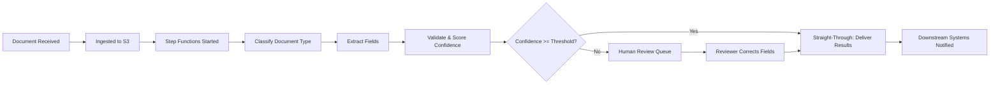
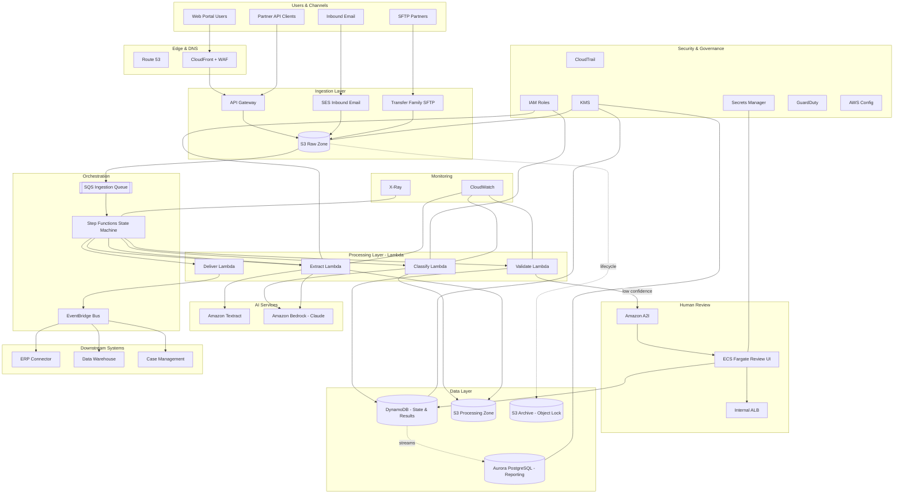

# Part VII – AI & Machine Learning Architectures

# Chapter 57: Document Intelligence

---

# 1. Executive Summary

## The Business Problem

Every large enterprise runs on documents. Invoices, contracts, loan applications, insurance claims, medical records, purchase orders, tax forms, KYC packets, shipping manifests — these artifacts arrive in every conceivable format (PDF, scanned TIFF, JPEG photos of paper forms, Word documents, faxes converted to images) and from every conceivable channel (email, SFTP, scanner, mobile capture, EDI, partner portals).

For decades, the only reliable way to turn this unstructured chaos into usable, structured data was manual data entry. Rows of people in shared-services centers or business-process-outsourcing (BPO) firms retype invoice line items, cross-check totals, and route exceptions. This is:

- Slow — cycle times measured in days, not seconds
- Expensive — headcount scales linearly with document volume
- Error-prone — human transcription error rates commonly sit between 1–4% per field
- Difficult to audit — inconsistent judgment calls, no consistent evidence trail
- A talent retention problem — data entry roles have extremely high attrition

Optical Character Recognition (OCR) software from the 1990s and 2000s improved raw text extraction but did not solve the *structure* problem. Knowing that the string "$4,213.55" appears somewhere on a page tells you nothing about whether that string is a subtotal, a tax amount, or a line-item price. Traditional OCR-plus-regex or OCR-plus-template pipelines are brittle: a single change in a vendor's invoice layout breaks the whole extraction template, and enterprises routinely deal with thousands of distinct document layouts from thousands of distinct trading partners.

**Document Intelligence** — sometimes called Intelligent Document Processing (IDP) — solves this by combining computer vision, layout-aware machine learning, natural language processing, and, increasingly, large language models (LLMs) to extract not just text, but *structured, validated, business-meaningful data* from documents, regardless of layout variation, with a human-in-the-loop safety net for low-confidence extractions.

## Architecture Objective

The objective of this chapter's reference architecture is to design a production-grade, horizontally scalable, secure, and cost-optimized pipeline on AWS that:

- Ingests documents from multiple channels (upload portal, email, SFTP, API, batch)
- Classifies each document by type (invoice, contract, ID card, claim form, etc.)
- Extracts structured fields using a combination of Amazon Textract, Amazon Bedrock foundation models, and — where domain specificity demands it — custom-trained models
- Validates extracted data against business rules and reference systems (ERP, CRM)
- Routes low-confidence extractions to human reviewers through a managed review workflow
- Persists both the extracted structured data and full audit trail
- Feeds downstream systems (ERP, data warehouse, case management) via event-driven integration
- Scales elastically from dozens to millions of documents per day without architectural rework
- Meets enterprise security, compliance, and data residency requirements

This is not a demo pipeline that calls one API and prints JSON. It is a system designed to run unattended, at scale, for years, with the operational rigor expected of a Tier-1 enterprise workload.

## Why Organizations Adopt This Architecture

Organizations invest in document intelligence architectures for several converging reasons:

**1. Straight-through processing (STP) economics.** Every document that can be processed automatically, end-to-end, without human touch, costs a fraction of a cent in compute. Every document that requires a human touch costs dollars in labor. Moving the STP rate from 40% to 85% on a workload of 2 million documents per month is frequently a seven-figure annual savings.

**2. Cycle time compression.** Loan origination, claims adjudication, and accounts-payable cycles that used to take 3–10 business days can be compressed to minutes for straightforward cases. This directly affects customer satisfaction, working capital (faster invoice processing enables early-payment discounts), and competitive differentiation.

**3. Auditability and compliance.** A well-designed document intelligence pipeline produces a complete, immutable audit trail: what was extracted, with what confidence, by which model version, reviewed by whom, and when. This is frequently *easier* to audit than a manual process, which is significant for regulated industries (financial services, healthcare, insurance, government).

**4. Labor market pressure.** Data-entry and document-review roles are difficult to staff and retain, particularly in high-cost-of-living markets. Automating the repetitive 80% of the work and redirecting human reviewers to the genuinely ambiguous 20% improves both unit economics and employee experience.

**5. Generative AI has changed the cost/accuracy curve.** Multimodal foundation models (Claude on Amazon Bedrock, for example) can now read scanned documents, understand layout and context, and extract fields with a level of generalization that previously required expensive, document-type-specific model training. This has lowered the barrier to entry substantially and is the primary driver of renewed enterprise investment in this space since 2023.

## Major Business Benefits

| Benefit | Typical Impact Range | Notes |
|---|---|---|
| Reduction in manual data entry FTEs | 40–75% | Redirected to exception handling and higher-value work |
| Document cycle time | Days → minutes | For straight-through cases |
| Extraction accuracy (structured fields) | 90–99% | Depends on document quality and field type |
| Cost per document processed | $0.02–$0.15 | Versus $1–$8 for fully manual processing |
| Straight-through processing rate | 60–90% | Improves over time as models and rules mature |
| Audit and compliance readiness | Significant improvement | Full extraction and review lineage retained |

These numbers vary enormously by document type, quality, and industry, and this chapter will avoid overstating them — a realistic architecture assumes a *mixed* population of clean digital PDFs and poor-quality scanned images, and is designed so that both are handled gracefully.

## Typical Enterprise Scenarios

- **Accounts Payable Automation**: Extracting vendor, invoice number, line items, PO matching data, and payment terms from inbound vendor invoices for 3-way match against purchase orders and goods-receipt records.
- **Insurance Claims Intake**: Extracting policyholder information, incident details, damage estimates, and supporting documentation from First Notice of Loss (FNOL) packets, often including handwritten adjuster notes.
- **Mortgage and Loan Origination**: Extracting data from pay stubs, W-2s, bank statements, and government IDs, then cross-validating against credit bureau data.
- **Healthcare Intake and Claims**: Extracting patient demographics, diagnosis codes, and provider information from referral forms and explanation-of-benefits (EOB) documents, subject to HIPAA constraints.
- **KYC/AML Onboarding**: Extracting and verifying identity document data (passports, driver's licenses, utility bills) during customer onboarding in regulated financial institutions.
- **Legal Contract Review**: Extracting key clauses, obligations, renewal dates, and counterparties from contracts for portfolio-level risk analysis.
- **Logistics and Trade Documents**: Extracting shipment details from bills of lading, customs forms, and commercial invoices for cross-border trade compliance.

This chapter designs a **generalized architecture** that supports all of these use cases through configuration (document-type-specific extraction schemas and business rules) rather than through separate bespoke pipelines — a decision explained and justified throughout the chapter.


---

# 2. Business Requirements

## Business Drivers

- Reduce cost per document processed across accounts payable, claims, or onboarding workflows.
- Compress cycle time from document receipt to structured, usable data.
- Improve extraction accuracy and consistency versus manual keying.
- Provide a defensible, auditable trail for regulators and internal audit.
- Support growth in document volume without proportional headcount growth.
- Enable new products (e.g., same-day loan decisioning) that depend on fast document turnaround.

## Functional Requirements

| ID | Requirement |
|---|---|
| FR-01 | System shall accept documents via API upload, web portal, SFTP drop, and email ingestion. |
| FR-02 | System shall support PDF, TIFF, PNG, JPEG, and DOCX input formats. |
| FR-03 | System shall classify each document into one of a configurable set of document types. |
| FR-04 | System shall extract a configurable schema of fields per document type. |
| FR-05 | System shall compute a confidence score per extracted field. |
| FR-06 | System shall apply configurable business validation rules (e.g., date ranges, checksum validation, cross-field consistency). |
| FR-07 | System shall route documents below a confidence threshold to a human review queue. |
| FR-08 | System shall present a review UI showing the source document alongside extracted fields for correction. |
| FR-09 | System shall persist original documents, extracted data, and full processing history. |
| FR-10 | System shall emit events to downstream systems upon completion. |
| FR-11 | System shall support reprocessing of a document with an updated model or schema version. |
| FR-12 | System shall provide a searchable case-management view of document status. |

## Non-Functional Requirements

| Category | Requirement |
|---|---|
| Scalability | Support burst ingestion of 50,000 documents/hour with graceful queuing beyond that. |
| Availability | 99.9% for ingestion and processing APIs; 99.5% for the review UI. |
| Latency | P95 end-to-end processing time under 90 seconds for straight-through documents under 10 pages. |
| Durability | 11 nines for stored source documents (S3 standard durability). |
| Compliance | SOC 2 Type II, and where applicable HIPAA, PCI-DSS, or GLBA depending on document content. |
| Data residency | All document content and derived data must remain within the designated AWS Region(s). |
| Security | Encryption at rest and in transit for all document content; least-privilege IAM throughout. |
| Auditability | Immutable audit log of every extraction, confidence score, and human correction. |

## Scalability Goals

- Initial production load: 50,000–200,000 documents/month.
- 12-month target: 1–3 million documents/month.
- Architecture must scale primarily through serverless and managed-service elasticity, not manual capacity planning.
- Multi-tenant support: the same infrastructure should serve multiple business units or document-type portfolios without cross-contamination of data or configuration.

## Availability Requirements

- Core ingestion path (API Gateway, upload, queue) targets 99.95% — this is the customer/partner-facing surface.
- Processing pipeline (Lambda, Step Functions, Textract, Bedrock) targets 99.9%, with automatic retry and dead-letter handling for transient failures.
- Human review UI targets 99.5% — internal tooling with a wider acceptable maintenance window.

## Latency Requirements

| Document Class | Target P95 Latency |
|---|---|
| Single-page digital PDF, straight-through | < 15 seconds |
| Multi-page (up to 20 pages) scanned document | < 90 seconds |
| Document requiring human review | < 4 business hours (SLA, not system latency) |
| Batch reprocessing job (10,000 documents) | < 2 hours |

## Compliance Requirements

Depending on industry vertical, one or more of the following typically apply:

- **SOC 2 Type II** — baseline expectation for any B2B SaaS or enterprise-shared platform.
- **HIPAA** — required when documents contain protected health information (PHI); mandates BAA-covered AWS services only, and stricter access logging.
- **PCI-DSS** — required if documents contain cardholder data; strongly favors tokenization and avoiding storage of full card numbers.
- **GLBA / SOX** — required for financial services documents such as loan files and financial statements.
- **GDPR / regional privacy law** — required when documents contain EU (or other jurisdiction) personal data; drives data residency and right-to-erasure design decisions.

> **Note:** This chapter designs the architecture to be compliance-*ready* using AWS HIPAA-eligible and PCI-DSS-eligible services, but actual certification requires a compliance program (policies, evidence collection, third-party audit) layered on top of the technical architecture. Technology alone does not achieve compliance.

## Security Expectations

- All data encrypted at rest with AWS KMS customer-managed keys (CMKs).
- All data encrypted in transit with TLS 1.2+.
- Least-privilege IAM roles scoped per pipeline stage.
- No long-lived credentials; workloads authenticate via IAM roles.
- Full CloudTrail audit logging with log file integrity validation.
- PII/PHI field-level access controls in the review UI (role-based masking).

## Recovery Objectives

| Metric | Target | Rationale |
|---|---|---|
| RPO (Recovery Point Objective) | ≤ 5 minutes | S3 versioning + cross-region replication + DynamoDB point-in-time recovery. |
| RTO (Recovery Time Objective) | ≤ 1 hour for full regional failover (warm standby) | Acceptable given this is a backend processing system, not a real-time transactional core. |

## SLAs

- 99.9% monthly uptime for document submission API.
- 95% of documents fully processed (auto or human-reviewed) within 4 business hours.
- 99.99% durability guarantee on stored source documents (inherited from S3).

## Expected Workload and Growth

- Year 1: 50K–200K documents/month, 3–5 document types.
- Year 2: 500K–1.5M documents/month, 10–15 document types, multiple business units onboarded.
- Year 3+: 2M+ documents/month, potential multi-region expansion for data residency (e.g., EU tenant isolated in eu-west-1).

This growth profile is the primary justification for choosing a serverless-first, event-driven architecture over a fixed-capacity, server-based design — see Section 28 (Alternatives) for the full comparison.


---

# 3. Architecture Overview

## Overall Design

The architecture is **event-driven, serverless-first, and stage-decoupled**. Each stage of the document lifecycle — ingestion, classification, extraction, validation, human review, and delivery — is implemented as an independent, horizontally scalable unit connected by durable messaging (Amazon SQS, Amazon EventBridge) and orchestrated by AWS Step Functions.

This decoupling is deliberate and is the single most important design decision in the chapter. It means:

- Any stage can fail, retry, or be redeployed without taking down the others.
- Any stage can scale independently — extraction (which calls external ML APIs) scales differently than validation (which is CPU-light and fast).
- New document types or new extraction models can be introduced by adding configuration and, at most, a new Lambda function — not by rewriting the pipeline.
- Reprocessing (e.g., after a model upgrade) is a matter of replaying messages from S3 through the same pipeline, because the source document and full processing history are always retained.

## Architecture Philosophy

Three principles guide every decision in this chapter:

1. **Confidence-driven automation, not full automation.** The goal is not to remove humans entirely — it is to route only the documents that genuinely need human judgment to humans, and to make that routing decision transparently, based on calibrated confidence scores and business rules, not a blanket policy.
2. **Composable extraction, not a single monolithic model.** Amazon Textract handles high-accuracy, low-latency OCR and structured form/table extraction. Amazon Bedrock foundation models handle semantic understanding, classification, and extraction from documents with unpredictable or highly variable layouts (the class of problem where rigid templates fail). The architecture routes each document through the right tool for its characteristics rather than assuming one model does everything well.
3. **Everything is replayable.** Every document, every intermediate extraction result, and every human correction is persisted with a version identifier. This is what makes model upgrades, audits, and error investigations tractable in production, as opposed to a "black box" pipeline that cannot explain a historical decision.

## Core Components

| Layer | Component | Responsibility |
|---|---|---|
| Ingestion | API Gateway, S3 upload bucket, SES inbound, Transfer Family (SFTP) | Accept documents from all channels |
| Orchestration | Step Functions state machine | Coordinate the multi-stage pipeline per document |
| Classification | Lambda + Bedrock (Claude) | Determine document type |
| Extraction | Lambda + Textract + Bedrock | Extract structured fields |
| Validation | Lambda + business rule engine | Validate extracted data against rules and reference data |
| Human Review | Amazon Augmented AI (A2I) + custom review UI on ECS Fargate | Human-in-the-loop correction for low-confidence cases |
| Persistence | S3 (documents), DynamoDB (extraction results and state), Aurora PostgreSQL (structured reporting store) | Durable storage of documents, results, and history |
| Messaging | SQS, EventBridge, SNS | Decouple stages, notify downstream systems |
| Delivery | EventBridge + Lambda connectors | Push results to ERP/CRM/data warehouse |
| Security | KMS, IAM, Secrets Manager, GuardDuty, Security Hub | Protect data and detect threats |
| Observability | CloudWatch, X-Ray, CloudTrail | Monitor, trace, and audit the system |

## How Components Interact

At a high level, the system is a **pipeline of pipelines**: the outer Step Functions state machine coordinates the document's journey through classification, extraction, validation, and (conditionally) human review. Each of those inner stages is itself a Lambda function (or, for the review UI, a containerized service) that reads its input from the previous stage's output in S3/DynamoDB and writes its output back, publishing an event when complete.

This "write-then-notify" pattern (as opposed to synchronous request/response chaining) is what allows the pipeline to survive partial failures. If the extraction stage fails for a document, the orchestrator retries just that stage — the document does not need to be reclassified, and no other document's processing is affected.

## High-Level Workflow



## Request Lifecycle

1. Client (portal, partner API, SFTP drop, or inbound email) submits a document.
2. The ingestion layer validates the request (auth, file type, size) and writes the raw document to the **Raw Zone** S3 bucket.
3. An S3 event triggers the creation of a document record in DynamoDB and starts a new Step Functions execution.
4. The state machine drives the document through classification, extraction, and validation.
5. If confidence is sufficient, the document is marked complete and an event is emitted.
6. If confidence is insufficient, the document is placed in the human review queue, and the state machine pauses (via a task token) until a reviewer submits corrections.

## Response Lifecycle

- Synchronous callers (API Gateway direct-submit) receive an immediate `202 Accepted` with a document ID; they poll a status endpoint or receive a webhook callback.
- Asynchronous callers (SFTP, email) never expect a synchronous response — results are delivered via the event bus to downstream systems, and optionally via a results-drop file back to an outbound SFTP folder.

## Data Lifecycle

| Stage | Data State | Storage | Retention |
|---|---|---|---|
| Raw ingestion | Original, unmodified document | S3 Raw Zone (versioned, KMS-encrypted) | Per compliance policy, typically 7 years for financial/insurance |
| Processing artifacts | OCR text, bounding boxes, intermediate model output | S3 Processing Zone | 90 days, then deleted (reproducible from raw + re-run) |
| Structured results | Final extracted, validated fields | DynamoDB (hot) + Aurora PostgreSQL (reporting/warehouse feed) | Matches raw document retention |
| Audit trail | Every state transition, confidence score, reviewer action | DynamoDB with streams to S3/Athena for long-term audit query | 7 years, immutable (S3 Object Lock) |

---

# 4. AWS Services Used

For each service below: purpose, why it was selected for this architecture, alternatives considered, limitations, pricing considerations, and best practices.

## Amazon Textract

**Purpose:** Purpose-built OCR and document-structure extraction service. Detects raw text, key-value pairs (forms), and tables directly from scanned images and PDFs, including handwriting recognition for many common formats.

**Why selected:** Textract's `AnalyzeDocument` and `AnalyzeExpense`/`AnalyzeID` specialized APIs provide pre-built, highly accurate extraction for common document types (invoices, receipts, identity documents) without any model training. It returns geometry (bounding boxes) for every detected element, which is essential for the human review UI to highlight the exact source of a field on the original document image — something a text-only LLM response cannot do natively.

**Alternatives:** Open-source OCR (Tesseract) — free but significantly lower accuracy on noisy scans and no native table/form structure detection. Google Document AI and Azure Form Recognizer — comparable managed capability, but introduce a second cloud vendor and cross-cloud data transfer for an AWS-hosted pipeline. Bedrock multimodal models alone — capable of reading images, but without Textract's precise bounding-box geometry, and at higher per-page cost for high-volume, well-structured document types.

**Limitations:** Fixed set of specialized "Analyze" APIs (Expense, ID, Lending) — anything outside those categories falls back to generic form/table detection, which requires more custom post-processing. Asynchronous API required for documents over roughly 5 pages (or over 10MB), adding latency and requiring the pipeline to handle polling or SNS completion notification. Table extraction on very dense or nested tables is imperfect and needs a validation layer.

**Pricing considerations:** Priced per page/image, with distinct pricing tiers for plain text detection, forms/tables analysis, and the specialized Analyze APIs (Expense, ID, Lending). At the volumes in this chapter's target growth curve (1–3M documents/month, averaging a few pages each), Textract is frequently the single largest line item in the AWS bill for this workload — see Section 16 (Cost Optimization).

**Best practices:**
- Use `AnalyzeExpense` for invoices/receipts and `AnalyzeID` for identity documents rather than generic `AnalyzeDocument` — the specialized APIs are both more accurate and cheaper per equivalent extracted field.
- Always use the asynchronous API (`StartDocumentAnalysis` + SNS completion) for multi-page documents to avoid Lambda timeout issues.
- Cache/deduplicate identical document hashes to avoid re-billing for reprocessed duplicates.

## Amazon Bedrock

**Purpose:** Managed access to foundation models (including Anthropic's Claude models) for semantic classification, free-form extraction from irregular layouts, summarization, and confidence reasoning that goes beyond fixed-schema OCR.

**Why selected:** Bedrock is used in this architecture for two specific jobs that Textract does not do well: (1) **document classification** — determining "what kind of document is this" across a long, evolving taxonomy, where a multimodal LLM's general reasoning outperforms training a bespoke classifier for every new document type; and (2) **extraction from non-standard layouts** — contracts, correspondence, and free-text forms where there is no fixed key-value structure for Textract to key off of. Running inference within the customer's own AWS account/VPC (versus calling an external LLM API) keeps document content inside the compliance boundary, which is a hard requirement for most of the target industries.

**Alternatives:** Self-hosted open-source LLMs on Amazon EKS with GPU nodes — full control, but materially higher operational burden (model serving infrastructure, GPU capacity management) that is rarely justified below very large scale. Third-party LLM APIs (outside AWS) — introduces a data residency and compliance boundary crossing that is disqualifying for most of the regulated use cases this chapter targets.

**Limitations:** Model output for extraction tasks must be constrained (via structured output / tool-use patterns) and validated — LLMs can hallucinate a plausible-looking but incorrect value, which is why this architecture never accepts an LLM extraction without a validation and confidence-scoring pass. Higher per-document cost than Textract for simple, well-structured documents, which is why the routing layer in Section 6 sends only the appropriate document classes to Bedrock.

**Pricing considerations:** Token-based pricing (input + output tokens). Multimodal document pages consume meaningfully more input tokens than plain text prompts. Provisioned Throughput can be considered once monthly volume justifies the commitment, to reduce per-token cost and guarantee latency at peak.

**Best practices:**
- Use structured output (tool-use / JSON schema constraints) rather than free-text prompting for field extraction — this dramatically reduces post-processing and parsing errors.
- Keep prompts and extraction schemas in a version-controlled configuration store (not hardcoded in Lambda), so schema changes do not require a code deployment.
- Log the model ID and prompt version alongside every extraction result for reproducibility and audit.

## AWS Lambda

**Purpose:** Serverless compute for every discrete processing step: classification invocation, extraction orchestration, validation logic, event routing, and connector functions to downstream systems.

**Why selected:** The workload is bursty (document arrival is unpredictable) and stage-decoupled, which is exactly the profile Lambda is designed for — pay only for actual invocations, scale automatically from zero to thousands of concurrent executions, and no server fleet to patch or right-size.

**Alternatives:** ECS Fargate tasks per stage — viable, but adds unnecessary operational surface (task definitions, service scaling policies) for functions that run in seconds and complete. Fargate is reserved in this architecture specifically for the human review UI, which is a long-running, stateful web application, not a discrete processing step.

**Limitations:** 15-minute maximum execution time — this is why large/multi-page document extraction uses Textract's asynchronous API with a callback rather than a synchronous, long-running Lambda invocation. Cold starts can add latency for infrequently-invoked functions — mitigated with Provisioned Concurrency on the classification and extraction functions, which sit on the critical path.

**Pricing considerations:** Pay-per-invocation and duration; at this workload's volume, Lambda cost is typically a small fraction of total spend compared to Textract and Bedrock — see Section 16.

**Best practices:**
- One Lambda function per pipeline stage, each with its own least-privilege IAM role.
- Externalize all configuration (thresholds, schema definitions) to Parameter Store/DynamoDB — never hardcode business logic that changes per document type.
- Use Lambda Powertools for structured logging, tracing, and idempotency handling.

## Amazon S3

**Purpose:** Durable object storage for raw documents, intermediate processing artifacts, and long-term archival.

**Why selected:** 11 nines durability, native versioning, lifecycle policies for cost-tiered storage, native event notifications that drive the pipeline, and Object Lock for immutable audit retention — all directly map to this architecture's requirements.

**Alternatives:** EFS — unnecessary for this workload; documents are write-once, read-many objects, not a shared POSIX filesystem. FSx — not applicable.

**Limitations:** Not a database — S3 alone cannot answer "give me all invoices from Vendor X over $10,000," which is why structured results are additionally written to DynamoDB/Aurora.

**Pricing considerations:** Use S3 Intelligent-Tiering or explicit lifecycle rules to move raw documents from Standard to Infrequent Access to Glacier as they age past their active processing window — see Section 16.

**Best practices:**
- Separate buckets (or clearly prefixed zones) for Raw, Processing, and Archive.
- Enforce bucket policies requiring KMS encryption and TLS-only access.
- Enable S3 Object Lock (compliance mode) on the archive zone for regulated document types.

## Amazon DynamoDB

**Purpose:** Low-latency, high-throughput store for document processing state, extraction results, and the task-token bookkeeping that lets Step Functions pause for human review.

**Why selected:** The access pattern is overwhelmingly "get/put by document ID" with a secondary lookup by status and date — a textbook DynamoDB use case. On-demand capacity mode absorbs the bursty, unpredictable arrival pattern without capacity planning.

**Alternatives:** Aurora PostgreSQL alone — used in this architecture as the *reporting* store (see below), but is a poorer fit for the hot-path, single-item read/write pattern of pipeline state due to higher latency and the operational overhead of connection pooling from many concurrent Lambda invocations.

**Limitations:** Not suited for complex ad hoc analytical queries (e.g., "average extraction confidence by vendor over the last quarter") — this is why results are also streamed into Aurora/the data warehouse.

**Pricing considerations:** On-demand mode is appropriate for this bursty workload; DynamoDB Streams (used to propagate results to Aurora) adds a modest, predictable cost.

**Best practices:**
- Single-table design keyed by `documentId`, with a GSI on `status`+`receivedDate` for queue/dashboard queries.
- Enable point-in-time recovery (PITR).
- Use conditional writes to make state transitions idempotent (critical for safe Lambda retries).

## Aurora PostgreSQL (Serverless v2)

**Purpose:** Structured, queryable reporting store for extracted document data, feeding BI dashboards and ad hoc analyst queries.

**Why selected:** Business and compliance teams need SQL-queryable, relational access to extraction results (joins across vendors, date ranges, aggregate accuracy metrics) that DynamoDB is not designed for. Aurora Serverless v2 scales capacity automatically with query load, which fits a workload where analytical query volume is unpredictable and much lower than pipeline transaction volume.

**Alternatives:** Amazon Redshift — better suited once the reporting workload becomes genuinely large-scale analytical (billions of rows, complex star-schema BI); for this architecture's initial and Year-2 scale, Aurora is more cost-efficient and operationally simpler. Amazon RDS for PostgreSQL (non-serverless) — viable, but loses the automatic scale-to-zero-adjacent elasticity that keeps cost low during off-peak hours.

**Limitations:** Not designed for the high-frequency, low-latency read/write pattern of live pipeline state — that role belongs to DynamoDB, with Aurora populated asynchronously via DynamoDB Streams → Lambda → Aurora.

**Pricing considerations:** Serverless v2 ACUs scale with load; right-size minimum/maximum ACU bounds to avoid both cold-start latency and runaway cost during unexpected reporting query storms.

**Best practices:** Use IAM database authentication instead of static credentials; place in private subnets only; enable automated backups and cross-region snapshot copy for DR.

## Amazon SQS

**Purpose:** Durable buffering and decoupling between ingestion and the orchestration layer, and between the validation stage and the human review queue.

**Why selected:** SQS absorbs traffic spikes (e.g., a partner uploading 20,000 documents in one batch) without overwhelming downstream Lambda concurrency limits, and its dead-letter queue (DLQ) mechanism provides a clean pattern for isolating documents that repeatedly fail processing for investigation.

**Alternatives:** Kinesis Data Streams — better suited to ordered, replayable, high-throughput streaming use cases; document processing does not require strict ordering, and SQS's simpler consumption model and native Lambda integration are a better fit here.

**Limitations:** Standard queues do not guarantee ordering (not required here) or exactly-once delivery (mitigated with idempotent processing keyed on document ID).

**Best practices:** Always pair a primary queue with a DLQ; set `maxReceiveCount` deliberately (e.g., 3) so transient failures get retried but poison messages are quarantined for investigation, not retried forever.

## Amazon EventBridge

**Purpose:** The system's central event bus for cross-stage and cross-system notification — "document classified," "document completed," "document requires review," and delivery events to downstream ERP/CRM systems.

**Why selected:** EventBridge's schema registry and rule-based routing let new downstream consumers subscribe to relevant events without modifying the producing service — critical for an architecture expected to onboard new business units and downstream integrations over time.

**Alternatives:** SNS — used in this architecture specifically for Textract's asynchronous completion callback (Textract's native integration point), while EventBridge is used for the broader business-event fabric; the two are complementary, not competing, here.

**Best practices:** Define and version event schemas in the EventBridge Schema Registry; use content-based filtering in rules rather than having every consumer filter irrelevant events itself.

## AWS Step Functions

**Purpose:** Orchestrates the multi-stage, conditional, human-in-the-loop workflow for each document from ingestion through delivery.

**Why selected:** The pipeline has genuine branching logic (classification determines which extraction path runs; confidence score determines whether a human review pause is needed) and needs to durably pause for hours or days while a document sits in a human review queue — Step Functions' native task-token "wait for callback" pattern is purpose-built for exactly this.

**Alternatives:** Custom orchestration via Lambda-calling-Lambda or SQS chains — this quickly becomes an ad hoc, hard-to-visualize, hard-to-debug workflow engine that Step Functions already provides as a managed capability, complete with a visual execution graph that is invaluable during incident investigation.

**Limitations:** Standard Workflows have a 25,000-event execution history limit and per-state payload size limits (256KB, mitigated by passing S3 references rather than document content through the state machine).

**Best practices:** Use Standard Workflows (not Express) for this use case, since executions can legitimately run for hours/days awaiting human review, and Standard Workflows' execution history and free retry semantics matter more here than Express's higher throughput ceiling. Pass S3 object references between states, never raw document bytes.

## Amazon Augmented AI (A2I) and Custom Review UI

**Purpose:** Human-in-the-loop review workflow for low-confidence extractions.

**Why selected:** A2I provides a managed foundation (worker task queues, private/public workforce integration) that this architecture extends with a custom-built review UI (React on ECS Fargate) tailored to the specific document types and business rules in play — a pure off-the-shelf review tool rarely matches an enterprise's exact reviewer workflow and role-based access needs.

**Alternatives:** Fully custom-built review queue on top of SQS/DynamoDB with no A2I involvement — viable, and in some enterprise deployments preferred when the reviewer workforce and permissions model is highly bespoke; this chapter uses A2I where its human-loop primitives reduce build effort and a custom UI where domain specificity requires it.

## Identity, Security, and Governance Services

| Service | Role in this Architecture |
|---|---|
| IAM | Least-privilege roles per Lambda function, per pipeline stage, per human reviewer role |
| KMS | Customer-managed keys for S3, DynamoDB, Aurora, and Secrets Manager encryption |
| Secrets Manager | Storage of database credentials, third-party API keys (e.g., ERP connector credentials), with automatic rotation |
| Systems Manager (Parameter Store) | Externalized, versioned configuration (confidence thresholds, extraction schemas) |
| VPC | Network isolation for Aurora, ECS Fargate review UI, and Lambda functions requiring private connectivity |
| Route 53 | DNS for the review UI and any customer-facing status API |
| CloudFront | CDN and TLS termination for the review UI and document upload portal |
| WAF | Layer 7 protection for the public-facing upload API and review UI |
| GuardDuty | Continuous threat detection across the account |
| Security Hub | Centralized security posture and compliance-standard scoring |
| AWS Config | Continuous configuration compliance (e.g., "no S3 bucket may be public") |
| CloudTrail | Full API audit log, immutable, replicated to a dedicated log-archive account |
| CloudWatch | Metrics, logs, alarms, dashboards across every component |

Services explicitly **not** used in this architecture, and why: EC2 (no long-running general-purpose servers are required — every compute need is either serverless (Lambda) or containerized (Fargate) for the review UI); ALB in front of Lambda (API Gateway is the correct edge for this workload; ALB is reserved for the ECS Fargate review UI's internal traffic).


---

# 5. Complete Architecture Diagram



**Diagram notes:**

- Dotted lines represent lifecycle/streaming relationships rather than direct synchronous calls.
- The Security and Monitoring layers apply horizontally across every component; the diagram shows representative connections rather than every edge, to preserve readability.
- The Human Review subgraph is only invoked conditionally, for documents below the confidence threshold — this is the branch shown as `low confidence` in the flow.


---

# 6. Component-by-Component Explanation

## 6.1 Ingestion Layer (API Gateway, SES, Transfer Family)

**Purpose:** Provide multiple, channel-appropriate entry points for documents while normalizing everything into a single S3-based ingestion contract.

**Responsibilities:**
- Authenticate and authorize submitters (IAM auth for partner APIs, Cognito for portal users, SFTP key-based auth for Transfer Family).
- Validate file type, size, and basic structural integrity before accepting.
- Write the raw document to S3 Raw Zone with a consistent key structure (`{tenant}/{documentType-if-known}/{yyyy}/{mm}/{dd}/{documentId}.{ext}`).
- Attach initial metadata (submitter identity, channel, received timestamp) as S3 object tags and a DynamoDB record.

**Inputs:** Raw files over HTTPS (API Gateway), SMTP (SES), or SFTP (Transfer Family).

**Outputs:** An S3 object plus a DynamoDB record with status `RECEIVED`, and an SQS message that triggers the state machine.

**Scaling:** API Gateway and SES scale natively without configuration. Transfer Family scales per configured endpoint; for very high-volume SFTP partners, dedicate a separate server endpoint to avoid noisy-neighbor throttling.

**High availability:** All three ingestion paths are inherently multi-AZ managed services; no failover configuration required.

**Failure handling:** Rejected files (wrong type, oversized) receive a synchronous error (API) or a bounce/NDR (email) rather than being silently dropped. Malformed SFTP uploads are quarantined in a `/rejected` prefix with an alert.

**Dependencies:** S3 Raw Zone, DynamoDB, SQS, IAM/Cognito for auth.

**Security:** WAF in front of API Gateway; Transfer Family restricted to IP allow-lists per partner where feasible; SES configured with SPF/DKIM/DMARC validation and a strict allow-list of expected sender domains.

**Monitoring:** CloudWatch metrics on request count, 4xx/5xx rate, and per-channel volume; alarms on sustained error-rate spikes.

## 6.2 Step Functions Orchestrator

**Purpose:** Drive each document through its full lifecycle with explicit, auditable state transitions.

**Responsibilities:** Sequence classify → extract → validate → (conditionally) review → deliver; manage retries with exponential backoff per stage; expose a task token to pause for human review callbacks.

**Inputs:** An S3 object reference and document ID from the ingestion SQS queue.

**Outputs:** A completed execution record (visible in the Step Functions console and exported to CloudWatch Logs) and a final DynamoDB status of `COMPLETED`, `REJECTED`, or `FAILED`.

**Scaling:** Standard Workflows scale to tens of thousands of concurrent executions per account by default (with a service quota increase available for higher ceilings); each document is an independent execution, so there is no cross-document contention.

**High availability:** Fully managed, multi-AZ by default; no configuration required.

**Failure handling:** Per-state retry policies (`IntervalSeconds`, `BackoffRate`, `MaxAttempts`) for transient AWS API errors (e.g., Textract throttling); a `Catch` block routes unrecoverable failures to a `FAILED` state with full error context persisted for investigation, rather than a silent drop.

**Dependencies:** All downstream Lambda functions, DynamoDB, A2I.

**Security:** Execution role scoped to only invoke the specific Lambda ARNs and services required — not a wildcard `lambda:InvokeFunction` on `*`.

**Monitoring:** CloudWatch dashboard on execution counts by status; X-Ray tracing enabled for full request-path visibility across Lambda invocations within an execution.

## 6.3 Classification Function

**Purpose:** Determine document type from a configurable taxonomy (invoice, contract, ID document, claim form, correspondence, unknown).

**Responsibilities:** Render document pages to images if needed; invoke Bedrock with a structured-output prompt constrained to the current taxonomy; write the classification result and confidence score.

**Inputs:** S3 object reference.

**Outputs:** `documentType`, `classificationConfidence`, written to DynamoDB and S3 Processing Zone.

**Scaling:** Stateless Lambda, scales with concurrent invocations; Bedrock has its own account-level throughput quotas that must be monitored (see Section 24, Failure Scenarios).

**Failure handling:** On Bedrock throttling, retry with backoff; on repeated failure, route to `manual-classification` human queue rather than blocking the pipeline indefinitely.

**Dependencies:** Bedrock, S3, DynamoDB.

**Security:** Least-privilege role limited to `bedrock:InvokeModel` on approved model ARNs only.

## 6.4 Extraction Function

**Purpose:** Extract the field schema appropriate to the classified document type.

**Responsibilities:** Route to Textract `AnalyzeExpense`/`AnalyzeID` for standard document types; route to Bedrock structured extraction for free-form/contract-type documents; normalize both outputs into a single internal extraction schema (field name, value, confidence, source bounding box where available).

**Inputs:** S3 object reference, `documentType` from classification.

**Outputs:** Structured extraction result written to S3 Processing Zone and summarized into DynamoDB.

**Scaling:** Textract asynchronous jobs are polled via SNS completion callback rather than long Lambda invocations, keeping this stage's Lambda duration short regardless of document page count.

**Failure handling:** Textract job failures (e.g., unsupported/corrupt file) route the document to a `manual-extraction` queue with the original file attached for reviewer download.

**Dependencies:** Textract, Bedrock, S3, SNS.

## 6.5 Validation Function

**Purpose:** Apply business rules and compute a final, per-field and per-document confidence score that determines the review routing decision.

**Responsibilities:** Cross-field checks (e.g., invoice line items sum to subtotal); reference-data checks (e.g., vendor ID exists in ERP vendor master); confidence thresholding per field type (e.g., dollar amounts require higher confidence than free-text descriptions).

**Inputs:** Extraction result, business rule configuration (Parameter Store/DynamoDB).

**Outputs:** Validated result with a `requiresReview: true/false` flag and specific flagged fields.

**Failure handling:** A rule-engine exception (e.g., malformed configuration) fails safe — the document is routed to review rather than allowed to pass with an unvalidated result.

## 6.6 Human Review (A2I + Custom UI)

**Purpose:** Present flagged documents to a human reviewer with the source image and extracted fields side-by-side for correction.

**Responsibilities:** Queue management by document type/priority; role-based field visibility (e.g., PII masked for reviewers without clearance); write corrections back to DynamoDB; resume the paused Step Functions execution via `SendTaskSuccess`.

**Scaling:** ECS Fargate service auto-scales on request count and CPU; reviewer capacity (headcount) is the actual bottleneck at high review-rate volumes, which is a staffing/business decision the architecture surfaces via queue-depth metrics, not a technical scaling problem.

**High availability:** ECS service spans multiple AZs behind an internal ALB; minimum task count of 2 to survive a single-task or single-AZ failure.

**Security:** Reviewer authentication via IAM Identity Center (SSO); field-level access control enforced in application logic based on reviewer role/clearance.

## 6.7 Delivery Function and Downstream Connectors

**Purpose:** Publish completed results to downstream systems and close the loop with the submitting channel.

**Responsibilities:** Publish an EventBridge event with the final structured payload; per-integration connector Lambdas (ERP, data warehouse, case management) subscribe to relevant event patterns and perform system-specific delivery (API call, file drop, database write).

**Failure handling:** Each connector has its own DLQ; a downstream ERP outage does not block the core pipeline — completed documents accumulate in the connector's queue and deliver once the downstream system recovers.


---

# 7. End-to-End Request Flow

1. **Client submits document.** A partner system calls the ingestion API with a signed request, or a document lands in the SFTP inbound folder, or an email arrives via SES.
2. **DNS resolution.** Route 53 resolves the API/portal hostname to CloudFront.
3. **Edge processing.** CloudFront terminates TLS and forwards to API Gateway; AWS WAF evaluates the request against managed and custom rule groups (rate limiting, known bad actor lists) before it reaches the origin.
4. **API Gateway authorization.** The request is authenticated (IAM SigV4 for partner APIs, Cognito JWT for portal users) and authorized against the caller's permitted document types/tenant.
5. **Raw storage.** The document is streamed to the S3 Raw Zone bucket under a tenant-scoped, date-partitioned key; the write is encrypted with the tenant's KMS key.
6. **Metadata record created.** A DynamoDB item is created with `documentId`, `status=RECEIVED`, `submitter`, `channel`, and `receivedAt`.
7. **Queueing.** The S3 `ObjectCreated` event triggers an SQS message; this decouples ingestion throughput from downstream processing capacity.
8. **Orchestration starts.** A Lambda function consuming the SQS queue starts a new Step Functions execution, passing the S3 reference and document ID.
9. **Classification.** The state machine invokes the Classify Lambda, which renders the document and calls Bedrock; the result (document type + confidence) is persisted.
10. **Extraction routing.** Based on document type, the Extract Lambda calls either Textract's specialized Analyze API or Bedrock's structured extraction, normalizing the output.
11. **Textract async handling (where applicable).** For multi-page documents, Textract processes asynchronously and publishes a completion notification to SNS, which resumes the paused Step Functions task via a task token.
12. **Validation.** The Validate Lambda applies business rules and cross-field checks, computing a final confidence score and `requiresReview` flag.
13. **Branch: straight-through.** If confidence clears the configured threshold, the state machine transitions directly to delivery.
14. **Branch: human review.** If confidence is insufficient, the state machine pauses (task token stored) and the document appears in the reviewer queue via A2I/the custom review UI.
15. **Reviewer action.** A reviewer opens the document, reviews the highlighted extracted fields against the source image, corrects any values, and submits.
16. **Resume execution.** The review UI calls `SendTaskSuccess` with the corrected payload, resuming the paused state machine at the delivery stage.
17. **Delivery.** The Deliver Lambda writes the final result to DynamoDB/Aurora and publishes an EventBridge event.
18. **Downstream fan-out.** Subscribed connector Lambdas (ERP, data warehouse, case management) receive the event and perform their system-specific delivery, each with its own retry/DLQ.
19. **Caller notification.** If the original submission was synchronous (portal/API), a webhook or status-poll response reflects `COMPLETED`; SFTP submitters receive a results file in their outbound folder; email submitters may receive a confirmation reply.
20. **Logging and monitoring.** Every step above emits structured logs to CloudWatch Logs, spans to X-Ray, and management-plane calls to CloudTrail; CloudWatch alarms fire on error-rate or latency-threshold breaches at any stage.
21. **Error handling (any stage).** On unrecoverable error, the state machine transitions to a `FAILED` state, writes full error context to DynamoDB, and publishes a `document.failed` event that can trigger operational alerting or automatic retry-eligibility evaluation.
22. **Archival.** After the retention window for active processing artifacts expires, an S3 lifecycle rule transitions the raw document to the Archive Zone (Glacier, Object Lock enabled) for long-term compliance retention.


---

# 8. Deployment Flow

## Infrastructure Provisioning

All infrastructure is defined in Terraform, organized into reusable modules (networking, data, compute, security) composed per environment (dev, staging, production) via environment-specific root modules. No console-driven manual provisioning is permitted in staging or production — this is enforced via IAM policy restricting console `Create`/`Update`/`Delete` actions on core resources to a break-glass role only.

## Terraform Workflow

1. Developer creates a feature branch and modifies the relevant module.
2. `terraform fmt` and `terraform validate` run locally (and again in CI).
3. Pull request opened; CI runs `terraform plan` against the target environment's remote state and posts the plan as a PR comment.
4. Peer review of both the code change and the plan output.
5. On merge to `main`, CI runs `terraform apply` against dev automatically; staging and production applies require manual approval gates.
6. State is stored remotely in S3 with DynamoDB state locking, per environment, with versioning enabled on the state bucket for rollback of last-known-good state.

## CI/CD Deployment (Application Code)

- Lambda functions are packaged and deployed via AWS SAM or the Terraform `aws_lambda_function` resource with a CI-built artifact (never `terraform apply` building code inline).
- The review UI (ECS Fargate) is built as a container image, pushed to ECR, scanned (see Section 20), and deployed via a new task definition revision.

## Blue-Green Deployment

- **Lambda:** Use Lambda aliases with weighted traffic shifting (e.g., CodeDeploy's `Linear10PercentEvery1Minute` deployment configuration) for the classification and extraction functions, since a bad model-prompt or parsing change here directly affects extraction accuracy in production.
- **ECS Fargate (Review UI):** CodeDeploy Blue/Green with an ALB target group swap; the old task set remains running and reachable for a configurable bake time before termination, enabling instant rollback.

## Rollback

- Lambda: CodeDeploy automatically rolls back a deployment if configured CloudWatch alarms (error rate, duration) breach thresholds during the traffic-shift window.
- ECS: Blue/Green rollback re-points the ALB to the previous (still-running) task set with zero downtime.
- Terraform: Roll back by reverting the merge commit and re-applying, using the versioned state bucket as a secondary safety net if a destructive change needs manual state surgery.

## Secrets

- All secrets (database credentials, third-party connector API keys) live in Secrets Manager, referenced by ARN in Terraform/task definitions — never plaintext in code, environment variables committed to source, or Terraform variable files.
- Automatic rotation enabled for database credentials (30-day cycle) via Secrets Manager's native RDS/Aurora rotation Lambda.

## Configuration

- Business configuration (confidence thresholds, extraction schemas per document type, validation rules) is stored in DynamoDB and Parameter Store, versioned, and changeable without a code deployment — this is a deliberate separation from infrastructure/application deployment, since business teams need to tune thresholds far more frequently than engineers ship code.

## Validation (Post-Deployment)

- Automated smoke test suite submits a small set of known "golden" documents through the full pipeline after every production deployment and asserts expected extraction output, before the deployment is marked successful in CI.
- Synthetic canary (CloudWatch Synthetics) runs the same golden-document flow on a schedule independent of deployments, to catch drift/regression between deployments.


---

# 9. Network Topology

## VPC Design

A dedicated VPC hosts the components that require network-level isolation: Aurora PostgreSQL, the ECS Fargate review UI, and any Lambda functions that connect to the database. Purely serverless-to-managed-service integrations (Lambda calling Textract/Bedrock/DynamoDB/S3 via AWS APIs) do not require VPC attachment and are deliberately kept **outside** the VPC to avoid unnecessary ENI provisioning latency and NAT Gateway data-processing costs.

| Attribute | Value |
|---|---|
| VPC CIDR | 10.20.0.0/16 |
| Public subnets (3 AZs) | 10.20.0.0/24, 10.20.1.0/24, 10.20.2.0/24 |
| Private application subnets (3 AZs) | 10.20.10.0/23, 10.20.12.0/23, 10.20.14.0/23 |
| Private data subnets (3 AZs) | 10.20.20.0/24, 10.20.21.0/24, 10.20.22.0/24 |

## Subnet Placement

- **Public subnets:** NAT Gateways only (one per AZ). No compute is placed directly in public subnets.
- **Private application subnets:** ECS Fargate review UI tasks, VPC-attached Lambda functions (Aurora connectors).
- **Private data subnets:** Aurora PostgreSQL cluster instances only, with a security group permitting inbound only from the application subnets' security group.

## NAT Gateway

One NAT Gateway per AZ (three total) for outbound internet access from the private application subnets (e.g., ECS tasks pulling container updates, calling third-party ERP APIs that are not reachable via PrivateLink). Single-NAT-per-VPC is explicitly rejected here despite the cost saving, because it creates a cross-AZ single point of failure for a production workload — see Section 26 (Best Practices).

## Internet Gateway

One IGW attached to the VPC, used only by the NAT Gateways and (for the review UI's ALB, if internet-facing rather than internal-only per tenant policy) the public-facing ALB.

## Transit Gateway

Where this pipeline needs to reach on-premises systems (e.g., an on-prem ERP for a large enterprise customer not yet cloud-migrated), a Transit Gateway attachment connects this VPC to the enterprise's central connectivity hub, avoiding a point-to-point VPN/Direct Connect per VPC as the platform scales to serve multiple business units, each potentially in their own VPC.

## Route Tables

- Public subnet route table: default route to IGW.
- Private application subnet route table: default route to the AZ-local NAT Gateway (never cross-AZ, to avoid inter-AZ data transfer charges and the availability coupling of routing through another AZ's NAT).
- Private data subnet route table: no default internet route at all; only VPC-local routes and, where required, a route to the Transit Gateway for on-prem database replication/DR.

## Network ACLs

Baseline NACLs allow standard ephemeral-port return traffic and explicitly deny direct inbound access to the data subnets from anything other than the application subnet CIDR range — a defense-in-depth layer behind security groups, not a replacement for them.

## Security Groups

| Security Group | Inbound | Outbound |
|---|---|---|
| `sg-alb-internal` | 443 from corporate SSO IdP ranges / internal CIDR | To `sg-ecs-review` on 8443 |
| `sg-ecs-review` | 8443 from `sg-alb-internal` only | To `sg-aurora` on 5432; HTTPS to AWS service endpoints |
| `sg-aurora` | 5432 from `sg-ecs-review` and VPC-attached Lambda SG only | None required outbound |
| `sg-lambda-vpc` | None (Lambda-managed ENIs) | To `sg-aurora` on 5432; HTTPS to AWS endpoints |

## PrivateLink

VPC endpoints (interface endpoints) are provisioned for S3, DynamoDB (gateway endpoint), Secrets Manager, KMS, Textract, and Bedrock, so that traffic between VPC-attached compute and these AWS services never traverses the public internet or incurs NAT Gateway data-processing charges — this is both a security best practice and a meaningful cost optimization at this workload's volume (see Section 16).

## Hybrid Connectivity

For enterprise customers requiring on-premises ERP/document-source integration, AWS Direct Connect (with a Transit Gateway attachment) is the preferred path over site-to-site VPN for any sustained volume above a few Mbps, both for cost predictability and latency consistency; VPN remains available as a lower-commitment fallback for smaller integrations or DR connectivity.


---

# 10. Identity and Access

## IAM Roles

Every compute unit in the pipeline has its own, uniquely scoped IAM role — there is no shared "pipeline execution role." This granularity is deliberate: it means a compromised or misconfigured extraction function cannot, for example, delete DynamoDB tables or modify IAM policies, because its role simply does not have those permissions.

| Role | Attached To | Key Permissions |
|---|---|---|
| `role-ingest-lambda` | Ingestion Lambda | `s3:PutObject` (Raw Zone prefix only), `dynamodb:PutItem` (state table only) |
| `role-classify-lambda` | Classify Lambda | `bedrock:InvokeModel` (specific model ARNs), `s3:GetObject` (Raw/Processing), `dynamodb:UpdateItem` |
| `role-extract-lambda` | Extract Lambda | `textract:StartDocumentAnalysis`, `textract:GetDocumentAnalysis`, `bedrock:InvokeModel`, `s3:GetObject`/`PutObject` (Processing Zone) |
| `role-validate-lambda` | Validate Lambda | `dynamodb:GetItem`/`UpdateItem`, `ssm:GetParameter` (rules config) |
| `role-review-ecs-task` | ECS Fargate task | `dynamodb:GetItem`/`UpdateItem`, `s3:GetObject` (presigned via app, not direct broad access), `states:SendTaskSuccess`/`SendTaskFailure` |
| `role-deliver-lambda` | Deliver Lambda | `events:PutEvents`, `dynamodb:UpdateItem` |
| `role-sfn-execution` | Step Functions | `lambda:InvokeFunction` (only the specific pipeline function ARNs) |

## IAM Policies

Policies are written with explicit resource ARNs and, where the API supports it, condition keys (e.g., `s3:x-amz-server-side-encryption` must equal `aws:kms`, `aws:RequestedRegion` pinned to the approved Region). Wildcard resource policies (`Resource: "*"`) are prohibited in production by an AWS Config rule and Service Control Policy (SCP), except for the small set of IAM actions that genuinely have no ARN-scoped equivalent (e.g., `ec2:DescribeRegions`).

## Resource Policies

- S3 bucket policies deny any request not using TLS (`aws:SecureTransport: false` → Deny) and deny any request not specifying KMS encryption on write.
- KMS key policies restrict `kms:Decrypt` to the specific roles listed above — not account-wide.
- Secrets Manager resource policies restrict retrieval to the specific ECS task role and the Secrets Manager rotation Lambda only.

## STS and Cross-Account Access

In a multi-account landing zone (see the account structure implied by Chapter 99, referenced here for context), this workload's account assumes a narrowly scoped cross-account role to write audit logs to the central log-archive account, and to publish security findings to the central Security Hub delegated administrator account. All cross-account access uses STS `AssumeRole` with an external ID and a maximum session duration of one hour — no long-lived cross-account access keys anywhere in this architecture.

## Least Privilege in Practice

Least privilege is enforced, not just documented, via three mechanisms: (1) IAM Access Analyzer runs continuously and flags any role with unused permissions after 90 days; (2) every new role is peer-reviewed as part of the Terraform PR process described in Section 8; (3) a quarterly access review requires each role owner to re-justify every permission still in use.

## Service Roles

Managed service roles (e.g., the Textract service role for SNS publishing, the CodeDeploy service role for Lambda/ECS deployments) use AWS-managed policies where available, with any customer-managed additions scoped identically to the custom roles above.

## Permission Boundaries

A permission boundary is attached to every role created by the CI/CD pipeline, capping the maximum permissions any automated process can grant a role, even if a Terraform module is misconfigured — this is the safety net against a well-intentioned but overly broad policy change slipping through code review.


---

# 11. Security Architecture

## Encryption

- **At rest:** Every data store (S3 buckets, DynamoDB tables, Aurora cluster, EBS volumes underlying Fargate if any) is encrypted with AWS KMS customer-managed keys, one CMK per data classification tier (raw documents, structured results, audit logs), enabling independent key rotation and access-policy tuning per tier.
- **In transit:** TLS 1.2 minimum enforced at every hop — CloudFront to origin, API Gateway to Lambda, Lambda to AWS service APIs (default), Lambda/ECS to Aurora (`sslmode=verify-full`).

## KMS

Customer-managed keys, not AWS-managed keys, are used for anything containing document content or PII/PHI, specifically because CMKs allow: key policy restriction to named roles, CloudTrail-visible key usage logging, and the ability to disable/schedule-delete a key as an incident-response action if a specific data tier is compromised — none of which is possible with AWS-managed keys.

## TLS / Certificate Manager

Public-facing certificates (CloudFront, the review UI's ALB if internet-reachable) are issued and auto-renewed via AWS Certificate Manager; private certificates for internal service-to-service mTLS (where used between the review UI and internal APIs) are issued via ACM Private CA.

## WAF

AWS WAF is attached to both CloudFront and the internal ALB fronting the review UI, with AWS Managed Rule Groups (Core Rule Set, Known Bad Inputs, SQLi) plus custom rate-based rules limiting any single source IP's request rate on the document-submission endpoint — a control that also functions as basic abuse/DoS protection.

## Shield

AWS Shield Standard is active by default across CloudFront and any Elastic IPs in use; Shield Advanced is considered for the platform once it processes documents for customers with strict uptime SLAs where a large-scale DDoS event would have material contractual/financial consequences — a cost/benefit decision revisited annually.

## Secrets Manager

As described in Section 8 and Section 10 — all credentials live here, with automatic rotation for database credentials and manual-rotation-with-alerting for third-party API keys that lack native rotation support.

## GuardDuty

Enabled account-wide (and delegated administrator across the multi-account landing zone) with S3 Protection, Malware Protection for S3, and Lambda Protection findings types specifically relevant to this workload — a document-processing pipeline is a plausible malware-upload vector, which is precisely why GuardDuty's S3 Malware Protection feature (which scans newly uploaded objects) is enabled on the Raw Zone bucket.

## Inspector

Amazon Inspector continuously scans the ECS Fargate review UI's container images (in ECR) and any Lambda functions using container-image packaging for known CVEs, gating the CI/CD pipeline described in Section 20 on a "no critical/high findings" policy before deployment.

## Security Hub

Aggregates GuardDuty, Inspector, Config, and Access Analyzer findings into a single compliance-standard-scored dashboard (AWS Foundational Security Best Practices, and CIS AWS Foundations Benchmark), giving the security team one place to triage rather than five consoles.

## CloudTrail

Organization-wide trail, replicated to a dedicated log-archive account with S3 Object Lock (compliance mode) applied to the log bucket, log file integrity validation enabled, and CloudTrail Insights active to surface anomalous API call volume (e.g., a sudden spike in `s3:GetObject` calls against the Raw Zone, which could indicate exfiltration).

## AWS Config

Continuously evaluates the account against custom and managed rules relevant to this workload: no public S3 buckets, all EBS/RDS/DynamoDB encrypted, no IAM policies with wildcard resources (as noted in Section 10), Security Groups do not permit unrestricted ingress on database ports. Non-compliant resources trigger an EventBridge-routed alert and, for select high-risk rules, an automatic remediation Lambda (e.g., auto-revoking a security group rule that opens 5432 to 0.0.0.0/0).

## Zero Trust Posture

Even though most components are inside a single VPC/account boundary, the architecture applies Zero Trust principles: every service-to-service call is authenticated (IAM SigV4 or mTLS, never network-location-based trust alone), every data store denies unencrypted/non-TLS access regardless of source network, and human reviewer access is continuously re-verified via short-lived SSO sessions rather than a persistent VPN-granted trust zone.

## Threat Model

| Threat | Vector | Mitigation |
|---|---|---|
| Malicious document upload (malware payload disguised as PDF) | Ingestion API/SFTP/email | GuardDuty Malware Protection on S3 Raw Zone; document rendering isolated from raw byte execution (never execute uploaded content) |
| PII/PHI exfiltration via over-privileged role | Compromised Lambda/ECS credentials | Least-privilege IAM (Section 10), CloudTrail Insights anomaly detection |
| LLM prompt injection via document content | Malicious text embedded in a document instructing the extraction model to ignore instructions | Structured/constrained output schemas (Bedrock tool-use), output validation layer that rejects any field value inconsistent with expected type/format, no direct LLM output ever executed as code or used to construct database queries without parameterization |
| Reviewer credential compromise | Phished SSO session | Short session TTL, MFA-enforced SSO, field-level audit logging of every reviewer action |
| Denial of service on submission API | Volumetric/application-layer flood | WAF rate-based rules, CloudFront caching/absorption, SQS buffering preventing downstream overload |
| Data tampering in transit between stages | Network-level interception (low likelihood within VPC, but defense-in-depth) | TLS everywhere, VPC PrivateLink endpoints avoiding public internet transit |
| Insider threat — reviewer exceeding authorized access | Legitimate credentials, excessive scope | Role-based field masking, quarterly access review, anomaly alerting on review-volume outliers per reviewer |

---

# 12. High Availability

## AZ Failures

Every stateful component in this architecture is inherently multi-AZ: S3, DynamoDB, and Aurora (with at least two instances across two AZs, typically three) are all multi-AZ by design or configuration. Lambda and Step Functions are regional services with automatic multi-AZ execution — there is no single-AZ compute to fail over. The one component requiring explicit multi-AZ configuration is the ECS Fargate review UI service, which is deployed with tasks spread across a minimum of two AZs and an ALB health check that removes an unhealthy AZ's targets automatically.

## Instance/Task Failures

- Lambda: failed invocations are retried automatically by the service (for asynchronous invocations) or by the Step Functions retry policy (for synchronous invocations within the state machine).
- ECS Fargate: the service scheduler replaces failed tasks automatically to maintain the desired count; ALB health checks stop routing traffic to a task before it is replaced.
- Aurora: automatic failover to a reader replica in another AZ on primary instance failure, typically completing in under 30 seconds.

## Regional Failures

The DR strategy (Section 13) covers regional failure specifically; at the AZ/instance level described here, the architecture is designed to absorb failures transparently without any DR invocation.

## Load Balancing

The internal ALB in front of the review UI performs continuous health checks (`/health` endpoint, checking DB connectivity) and deregisters unhealthy targets within the configured threshold (default: 2 consecutive failures at a 15-second interval, so roughly 30 seconds to detection).

## Health Checks

| Component | Health Check | Failure Action |
|---|---|---|
| ECS Fargate tasks | ALB target group HTTP health check | Deregister target, scheduler launches replacement |
| Aurora | RDS-native instance health monitoring | Automatic failover promotes reader to writer |
| Step Functions executions | CloudWatch alarm on `ExecutionsFailed` metric | PagerDuty alert to on-call, no automatic remediation (requires investigation) |
| Textract/Bedrock API calls | Lambda-level try/catch with CloudWatch error metric | Retry with backoff; escalate to DLQ after max attempts |

## Failover

Failover for managed services (Aurora, DynamoDB global tables if enabled for DR) is automatic and requires no runbook execution. Failover for the review UI (in the rare case an entire AZ's task capacity is lost simultaneously) is handled by the ECS scheduler launching replacement tasks in the remaining healthy AZs — no manual intervention required, though the on-call team is alerted to confirm root cause.


---

# 13. Disaster Recovery

## Backup Strategy

| Data Store | Backup Method | Frequency | Retention |
|---|---|---|---|
| S3 Raw/Archive Zone | Versioning + Cross-Region Replication (CRR) | Continuous | Per compliance retention (up to 7 years) |
| DynamoDB | Point-in-Time Recovery (PITR) + on-demand backups before major changes | Continuous (PITR), weekly (on-demand) | 35 days PITR, 1 year on-demand backups |
| Aurora | Automated snapshots + continuous backup to S3 | Continuous | 35 days automated, monthly manual snapshots retained 1 year |
| Configuration (Parameter Store/DynamoDB config tables) | Included in DynamoDB backup above; also version-controlled in Terraform/Git | Continuous | Matches DynamoDB retention + full Git history |

## Snapshots

Aurora automated backups provide continuous point-in-time restore within the retention window; monthly manual snapshots are additionally copied cross-region for the warm-standby DR posture described below.

## Cross-Region Replication

The S3 Raw and Archive Zone buckets replicate to a DR Region (e.g., primary `us-east-1`, DR `us-west-2`) using S3 CRR with a replication time control (RTC) SLA of 15 minutes, ensuring the RPO target from Section 2 is met even for the largest documents in the pipeline.

## DR Strategy: Warm Standby

This architecture adopts a **warm standby** DR strategy rather than pilot light or full active-active, because:

- The workload is asynchronous batch/near-real-time processing, not a customer-facing transactional system requiring zero-downtime failover — a warm standby's minutes-to-tens-of-minutes RTO is acceptable per the SLA in Section 2.
- Active-active would require solving cross-region document-processing ordering and deduplication for marginal availability benefit at disproportionate cost and complexity for this workload class.
- Pilot light (infra defined but not running) would not meet the 1-hour RTO target given Aurora cluster startup and DNS propagation time.

**Warm standby implementation:**
- Terraform-defined infrastructure is deployed in the DR Region at reduced capacity (Aurora reader-only replica kept warm; Lambda/Step Functions/API Gateway defined but receiving no traffic; ECS service running at minimum task count).
- Route 53 health-check-based failover routing points traffic at the primary Region under normal operation.
- On declared disaster: Aurora DR replica is promoted to a standalone writable cluster, ECS service is scaled to full capacity, and Route 53 failover redirects traffic — all executed via a tested, scripted runbook (not manual console clicks) to hit the 1-hour RTO.

## Multi-Site / Active-Active — Explicitly Not Chosen (For Now)

Full active-active across two Regions was evaluated and rejected for the initial production architecture on cost/complexity grounds, but is documented as the natural next evolution step (see Section 34, Evolution Path) once volume and customer SLA requirements justify it — most likely triggered by a specific enterprise customer contractually requiring multi-region active processing for their tenant.

## RPO / RTO Achieved

| Metric | Target (Section 2) | Achieved by this Design |
|---|---|---|
| RPO | ≤ 5 minutes | ~1–15 minutes depending on data store (DynamoDB PITR near-continuous; S3 CRR RTC 15-min SLA) |
| RTO | ≤ 1 hour | 30–45 minutes typical, based on quarterly DR test results (see Section 23) |

> **Warning:** RPO/RTO numbers are only real if they are tested. This architecture mandates a quarterly, scripted DR failover test in a non-production account replica, with results tracked and reviewed by the architecture review board — an untested DR plan is, in practice, not a DR plan.


---

# 14. Scalability

## Horizontal Scaling

The overwhelming majority of this architecture scales horizontally by default, with no capacity planning required:

- Lambda functions scale from zero to thousands of concurrent executions automatically (subject to account/region concurrency quotas, which are monitored and pre-emptively increased ahead of projected growth).
- SQS absorbs arbitrary burst depth, decoupling arrival rate from processing rate.
- DynamoDB on-demand mode scales read/write capacity automatically with load.

## Vertical Scaling

Vertical scaling is relevant only to Aurora, where Serverless v2's ACU range can be widened (min/max) as reporting query complexity grows, and to ECS Fargate task CPU/memory sizing for the review UI, tuned based on observed utilization rather than guessed upfront.

## Auto Scaling (ECS)

The review UI ECS service scales on a target-tracking policy keyed to `ALBRequestCountPerTarget` and CPU utilization, with a minimum of 2 tasks (HA floor) and a maximum sized to the largest anticipated concurrent-reviewer headcount plus headroom.

## Serverless Scaling Considerations

- **Lambda concurrency quotas:** Default account concurrency limits are a real, frequently-hit ceiling at scale — Section 24 (Failure Scenarios) covers this specifically as a production incident pattern. Reserved concurrency is set on the classification and extraction functions to guarantee their share of the account limit is not starved by a burst in another function.
- **Textract/Bedrock throughput quotas:** Both services enforce transactions-per-second and (for Bedrock) tokens-per-minute quotas per account/Region. These are the most likely scaling bottleneck in this architecture, not AWS's general compute scaling — addressed via Service Quota increase requests planned ahead of projected volume, and via Bedrock Provisioned Throughput once volume justifies the commitment.

## Database Scaling

- DynamoDB: on-demand capacity mode absorbs the bursty pipeline-state workload without planning; if a predictable baseline load emerges at higher volumes, provisioned capacity with auto scaling can reduce cost (see Section 16).
- Aurora Serverless v2: ACU range widened as reporting/analytics query concurrency grows; a migration to Redshift is the documented next step if analytical scale outgrows Aurora (Section 28, Alternatives).

## Storage Scaling

S3 has no meaningful scaling ceiling for this workload; the operational concern is cost management (lifecycle policies) rather than capacity, addressed in Section 16.

## Queue Scaling

SQS scales transparently; the practical scaling concern is downstream consumer (Lambda) concurrency keeping pace with queue depth, monitored via the `ApproximateAgeOfOldestMessage` metric with alarms tuned to the latency SLA in Section 2.


---

# 15. Performance Optimization

## Caching

- CloudFront caches static review-UI assets (JS/CSS bundles) at the edge; API responses are not cached (per-request document data).
- Document-classification results for byte-identical files (detected via SHA-256 hash) are cached in DynamoDB to avoid redundant Textract/Bedrock calls on accidental duplicate submissions — a meaningful cost and latency optimization given how often partners retry uploads on transient network errors.

## Compression

Documents are stored uncompressed in S3 (compression offers marginal benefit on already-compressed PDF/JPEG content and would add CPU overhead to every read); API Gateway and CloudFront apply gzip/brotli compression to JSON API responses and the review UI's static assets.

## CDN

CloudFront serves the review UI and upload portal, reducing latency for geographically distributed reviewer teams and partner integrations, and absorbing a meaningful share of request volume at the edge before it reaches API Gateway.

## Database Optimization

- Aurora reporting queries are supported by purpose-built indexes matching known dashboard/analyst query patterns (vendor, date range, document type, confidence score) rather than ad hoc indexing after the fact.
- DynamoDB access patterns are fully enumerated at design time (single-table design, Section 4) so that every production query is a key-based `GetItem`/`Query`, never a `Scan`.

## Connection Pooling

VPC-attached Lambda functions and the ECS review UI use RDS Proxy in front of Aurora, avoiding the classic serverless-to-relational-database connection exhaustion problem where thousands of concurrent Lambda invocations each open a direct database connection.

## Concurrency

Lambda reserved concurrency is set on the classification/extraction functions (Section 14) both as a scaling guarantee and a performance-isolation mechanism, preventing a burst in one document type's volume from starving another's processing capacity.

## Async Processing

The entire pipeline is asynchronous by design past the initial ingestion acknowledgment — this is the single biggest performance lever in the architecture, because it means the customer-facing latency (API response time) is decoupled from the actual (often multi-second-to-minute) document-processing time. Synchronous processing end-to-end would be both slower for the caller and far less resilient to the inherent latency variability of OCR/LLM inference.


---

# 16. Cost Optimization (FinOps)

## Cost Estimation by Deployment Size

Assumptions: average document is 3 pages; mix is 70% Textract-suitable (invoices, IDs, forms) and 30% Bedrock-suitable (contracts, correspondence); 25% of documents require human review.

| Component | Small (50K docs/mo) | Medium (500K docs/mo) | Enterprise (3M docs/mo) |
|---|---|---|---|
| Amazon Textract | ~$650 | ~$6,500 | ~$39,000 |
| Amazon Bedrock (classification + free-form extraction) | ~$400 | ~$4,000 | ~$24,000 |
| Lambda | ~$60 | ~$500 | ~$2,800 |
| Step Functions | ~$75 | ~$750 | ~$4,500 |
| DynamoDB (on-demand) | ~$40 | ~$350 | ~$1,900 |
| Aurora Serverless v2 | ~$180 | ~$450 | ~$1,600 |
| S3 (storage + requests) | ~$50 | ~$400 | ~$2,200 |
| ECS Fargate (review UI) | ~$120 | ~$300 | ~$900 |
| NAT Gateway + data transfer | ~$100 | ~$300 | ~$1,100 |
| CloudWatch/X-Ray/CloudTrail | ~$70 | ~$450 | ~$2,300 |
| WAF / GuardDuty / Security Hub / Config | ~$90 | ~$180 | ~$450 |
| **Estimated Monthly Total** | **~$1,835** | **~$14,180** | **~$80,750** |
| **Approx. cost per document** | **~$0.037** | **~$0.028** | **~$0.027** |

> **Note:** These figures are directional planning estimates based on public AWS pricing at the time of writing, not a quote. Actual cost depends heavily on document page count, image resolution/quality (affecting Textract processing time and retries), the specific Bedrock model selected, and Region. Always validate with the AWS Pricing Calculator and a production pilot before committing to a budget.

## Major Cost Drivers

1. **Amazon Textract and Bedrock** — together typically 55–65% of total spend at scale; this is a compute-for-intelligence workload, and the AI inference cost genuinely scales with document volume in a way that infrastructure cost does not.
2. **CloudWatch Logs and X-Ray** — often underestimated; verbose debug-level logging left enabled in production at high document volume can become a surprisingly large line item (see Section 34, Cost Surprises).
3. **NAT Gateway data processing** — mitigated substantially by the PrivateLink endpoints described in Section 9.

## Optimization Opportunities

| Opportunity | Mechanism | Typical Savings |
|---|---|---|
| Route documents to the cheapest sufficient extraction method | Use Textract `AnalyzeExpense`/`AnalyzeID` instead of Bedrock wherever the document type is standard | 30–50% reduction on extraction cost for the routed subset |
| Deduplicate identical uploads | Hash-based cache before re-invoking Textract/Bedrock | Small but consistent (2–5% of volume in most real-world partner integrations) |
| S3 lifecycle tiering | Standard → Infrequent Access (30 days) → Glacier Deep Archive (180 days) | 60–80% reduction on storage cost for aged documents |
| DynamoDB capacity mode review | Move to provisioned + auto scaling once baseline load is predictable | 15–25% reduction versus pure on-demand at steady, high volume |
| Lambda right-sizing | Use AWS Compute Optimizer recommendations on memory allocation | 10–20% reduction on Lambda compute cost |
| Bedrock Provisioned Throughput | Commit once monthly token volume justifies it | 20–40% reduction on Bedrock unit cost at sufficient scale |
| VPC endpoints instead of NAT for AWS API traffic | PrivateLink for S3, DynamoDB, Secrets Manager, KMS, Textract, Bedrock | Eliminates most NAT data-processing charges for AWS-service traffic |
| CloudWatch Logs retention and sampling | Tiered retention (7 days hot, export to S3/Athena for long-term) plus X-Ray sampling rules | 30–50% reduction on observability cost |

## Reserved Instances / Savings Plans

This architecture has no EC2 footprint, so traditional Reserved Instances are not applicable. **Compute Savings Plans** apply to Lambda and Fargate usage and are recommended once usage is stable enough (typically after 2–3 months of production history) to commit to a 1-year term at the observed baseline, layering on-demand only for burst above that baseline.

## Spot

Not applicable to the core pipeline (Lambda/Fargate/managed services have no Spot equivalent in this design). If a future evolution adds GPU-based custom model training/inference (Section 34, Evolution Path), Spot becomes relevant for batch training jobs specifically, never for the production inference path.

## S3 Lifecycle and Storage Classes

| Age | Storage Class | Rationale |
|---|---|---|
| 0–30 days | S3 Standard | Active processing, review, and reprocessing window |
| 31–180 days | S3 Standard-IA | Rarely accessed but must remain millisecond-retrievable for audit/dispute resolution |
| 181 days–7 years | S3 Glacier Deep Archive | Compliance retention only; retrieval SLA of hours is acceptable for this tier |

## Rightsizing

Lambda memory allocation for the extraction function is tuned using AWS Compute Optimizer and load-test data — memory (and proportionally, CPU) is increased only to the point where duration reduction stops paying for the added memory cost, avoiding both under- and over-provisioning.

## Cost Allocation and Tagging

Every resource is tagged with `CostCenter`, `Tenant` (business unit), `Environment`, and `Component`, enforced via an AWS Config tagging-compliance rule and an SCP that denies resource creation without the mandatory tag set — this is what makes per-tenant, per-business-unit cost allocation possible once the platform serves multiple internal customers, per Section 2's multi-tenant growth requirement.

## Budgets and Cost Anomaly Detection

AWS Budgets alerts are configured per environment and per major cost driver (Textract, Bedrock specifically) at 80%/100%/120% of forecast; AWS Cost Anomaly Detection monitors the Textract and Bedrock cost categories specifically, since a runaway loop or misconfigured retry policy in this architecture would manifest first and most expensively as an AI-inference cost spike, not a compute-cost spike.


---

# 17. AI-Assisted Operations

## Amazon Q

Amazon Q Developer is integrated into the team's IDEs and the AWS Console for this workload, used for: explaining unfamiliar Step Functions execution failures in plain language during incident response, generating first-draft Terraform for new document-type onboarding (new S3 prefixes, new DynamoDB config entries), and querying CloudWatch Logs Insights with natural-language-to-query translation during troubleshooting.

## Bedrock (Beyond the Core Pipeline)

Beyond its role in document classification/extraction, Bedrock is used operationally for: generating human-readable summaries of failed Step Functions executions for the on-call Slack channel, and drafting release notes from a sprint's merged pull requests.

## AI Troubleshooting

When a document fails processing, an operational Lambda (triggered on the `document.failed` EventBridge event) assembles the relevant CloudWatch Logs, X-Ray trace, and DynamoDB state history, and calls Bedrock to produce a plain-language root-cause hypothesis (e.g., "Textract returned a low-confidence result likely due to a skewed/rotated scan; recommend re-submission after image correction") attached to the incident ticket — this does not replace engineer judgment but meaningfully reduces triage time for the on-call rotation.

## Log Analysis

CloudWatch Logs Insights queries, many AI-assisted in authoring via Amazon Q, identify patterns across large log volumes — e.g., correlating a spike in validation failures with a specific vendor's recent invoice-template change.

## Incident Response

Runbooks (Section 23) are supplemented, not replaced, by an AI-assisted first-response summary generated at incident declaration, giving the on-call engineer a starting hypothesis and relevant links (dashboard, recent deployments, related past incidents) within seconds of paging.

## Cost Optimization (AI-Assisted)

Monthly, an automated job feeds the prior month's Cost Explorer data to Bedrock with a prompt template asking it to identify anomalous line-item growth and suggest specific, actionable optimizations — cross-checked by the FinOps practitioner against the recommendations in Section 16 before any action is taken; AI output here is a starting point for analysis, not an autonomous cost-cutting agent.

## Capacity Planning

Historical volume trends (documents/day by type) are fed to Bedrock alongside upcoming known business events (e.g., a new partner onboarding, a tax-season volume spike for financial-document customers) to produce a capacity-planning narrative that informs Service Quota increase requests ahead of need — again reviewed by an engineer, never auto-applied.

## Architecture Review

New proposed changes to this architecture are run through a Bedrock-assisted "pre-review" that checks the proposal against this chapter's documented best practices and anti-patterns (Sections 26–27) before it reaches the human Architecture Review Board, catching common oversights (missing DLQ, wildcard IAM resource, missing encryption) early and cheaply.

## AI-Generated Terraform

Boilerplate Terraform for onboarding a new document type (a new Parameter Store entry, a new DynamoDB config item, a new EventBridge rule for a new downstream connector) is scaffolded via Amazon Q Developer from the existing module patterns, then reviewed and merged through the standard PR process in Section 8 — AI accelerates the first draft, it does not bypass review.

## AI-Generated Documentation

This chapter's structure — and, more practically, the team's internal runbooks, ADRs, and onboarding docs for new engineers — are drafted with AI assistance and then technically reviewed and corrected by the architecture team, which is both faster than writing from a blank page and produces more consistent documentation across a large, evolving system.


---

# 18. Terraform Implementation

The following excerpts show representative, production-quality modules. In the actual repository these live under `modules/` with per-environment root modules in `environments/{dev,staging,production}/`.

## 18.1 Providers and Backend

```hcl

# environments/production/versions.tf

terraform {
  required_version = ">= 1.7.0"

  required_providers {
    aws = {
      source  = "hashicorp/aws"
      version = "~> 5.50"
    }
  }

  backend "s3" {
    bucket         = "docintel-tfstate-prod-use1"
    key            = "document-intelligence/production/terraform.tfstate"
    region         = "us-east-1"
    dynamodb_table = "docintel-tfstate-lock-prod"
    encrypt        = true
    kms_key_id     = "alias/docintel-tfstate-key"
  }
}

provider "aws" {
  region = var.aws_region

  default_tags {
    tags = {
      Project     = "document-intelligence"
      Environment = var.environment
      ManagedBy   = "terraform"
      CostCenter  = var.cost_center
    }
  }
}

```

## 18.2 Variables

```hcl

# environments/production/variables.tf

variable "aws_region" {
  description = "Primary AWS region for the document intelligence platform"
  type        = string
  default     = "us-east-1"
}

variable "environment" {
  description = "Deployment environment name"
  type        = string
  default     = "production"
}

variable "cost_center" {
  description = "Cost allocation tag value"
  type        = string
}

variable "vpc_cidr" {
  description = "CIDR block for the document intelligence VPC"
  type        = string
  default     = "10.20.0.0/16"
}

variable "confidence_threshold_default" {
  description = "Default field confidence threshold below which documents route to human review"
  type        = number
  default     = 0.85

  validation {
    condition     = var.confidence_threshold_default > 0 && var.confidence_threshold_default <= 1
    error_message = "confidence_threshold_default must be between 0 and 1."
  }
}

variable "kms_deletion_window_days" {
  description = "Waiting period before a scheduled KMS key deletion is finalized"
  type        = number
  default     = 30
}

```

## 18.3 Networking Module (excerpt)

```hcl

# modules/networking/main.tf

resource "aws_vpc" "this" {
  cidr_block           = var.vpc_cidr
  enable_dns_support   = true
  enable_dns_hostnames = true

  tags = {
    Name = "${var.name_prefix}-vpc"
  }
}

resource "aws_subnet" "private_data" {
  for_each = var.private_data_subnets

  vpc_id            = aws_vpc.this.id
  cidr_block        = each.value.cidr
  availability_zone = each.value.az

  tags = {
    Name = "${var.name_prefix}-data-${each.key}"
    Tier = "data"
  }
}

resource "aws_nat_gateway" "per_az" {
  for_each = var.public_subnets

  allocation_id = aws_eip.nat[each.key].id
  subnet_id     = aws_subnet.public[each.key].id

  tags = {
    Name = "${var.name_prefix}-nat-${each.key}"
  }
}

# VPC endpoints avoid NAT data-processing charges for AWS-service traffic

resource "aws_vpc_endpoint" "s3" {
  vpc_id            = aws_vpc.this.id
  service_name      = "com.amazonaws.${var.aws_region}.s3"
  vpc_endpoint_type = "Gateway"
  route_table_ids   = [for rt in aws_route_table.private_app : rt.id]
}

resource "aws_vpc_endpoint" "textract" {
  vpc_id              = aws_vpc.this.id
  service_name        = "com.amazonaws.${var.aws_region}.textract"
  vpc_endpoint_type   = "Interface"
  subnet_ids          = [for s in aws_subnet.private_app : s.id]
  security_group_ids  = [aws_security_group.vpc_endpoints.id]
  private_dns_enabled = true
}

resource "aws_vpc_endpoint" "bedrock_runtime" {
  vpc_id              = aws_vpc.this.id
  service_name        = "com.amazonaws.${var.aws_region}.bedrock-runtime"
  vpc_endpoint_type   = "Interface"
  subnet_ids          = [for s in aws_subnet.private_app : s.id]
  security_group_ids  = [aws_security_group.vpc_endpoints.id]
  private_dns_enabled = true
}

```

## 18.4 IAM Module (Least-Privilege Lambda Role Example)

```hcl

# modules/iam/extract-lambda-role.tf

data "aws_iam_policy_document" "extract_lambda_assume" {
  statement {
    actions = ["sts:AssumeRole"]
    principals {
      type        = "Service"
      identifiers = ["lambda.amazonaws.com"]
    }
  }
}

resource "aws_iam_role" "extract_lambda" {
  name               = "${var.name_prefix}-extract-lambda-role"
  assume_role_policy = data.aws_iam_policy_document.extract_lambda_assume.json
  permissions_boundary = var.lambda_permissions_boundary_arn
}

data "aws_iam_policy_document" "extract_lambda_policy" {
  statement {
    sid       = "TextractAnalyze"
    actions   = ["textract:StartDocumentAnalysis", "textract:GetDocumentAnalysis", "textract:AnalyzeExpense", "textract:AnalyzeID"]
    resources = ["*"] # Textract does not support resource-level ARNs for these actions
  }

  statement {
    sid     = "BedrockInvoke"
    actions = ["bedrock:InvokeModel"]
    resources = [
      "arn:aws:bedrock:${var.aws_region}::foundation-model/anthropic.claude-*"
    ]
  }

  statement {
    sid       = "ReadRawWriteProcessing"
    actions   = ["s3:GetObject"]
    resources = ["${var.raw_zone_bucket_arn}/*"]
  }

  statement {
    sid       = "WriteProcessingZone"
    actions   = ["s3:PutObject"]
    resources = ["${var.processing_zone_bucket_arn}/*"]
    condition {
      test     = "StringEquals"
      variable = "s3:x-amz-server-side-encryption"
      values   = ["aws:kms"]
    }
  }

  statement {
    sid       = "UpdateDocumentState"
    actions   = ["dynamodb:GetItem", "dynamodb:UpdateItem"]
    resources = [var.document_state_table_arn]
  }

  statement {
    sid       = "KmsDecryptEncrypt"
    actions   = ["kms:Decrypt", "kms:GenerateDataKey"]
    resources = [var.data_kms_key_arn]
  }
}

resource "aws_iam_role_policy" "extract_lambda" {
  name   = "${var.name_prefix}-extract-lambda-policy"
  role   = aws_iam_role.extract_lambda.id
  policy = data.aws_iam_policy_document.extract_lambda_policy.json
}

```

## 18.5 Compute Module (Lambda + Step Functions excerpt)

```hcl

# modules/compute/lambda.tf

resource "aws_lambda_function" "extract" {
  function_name = "${var.name_prefix}-extract"
  role          = var.extract_lambda_role_arn
  handler       = "extract_handler.lambda_handler"
  runtime       = "python3.12"
  memory_size   = 1024
  timeout       = 120
  reserved_concurrent_executions = var.extract_reserved_concurrency

  s3_bucket = var.deployment_artifacts_bucket
  s3_key    = var.extract_lambda_artifact_key

  environment {
    variables = {
      PROCESSING_ZONE_BUCKET = var.processing_zone_bucket
      DOCUMENT_STATE_TABLE   = var.document_state_table_name
      BEDROCK_MODEL_ID       = var.bedrock_model_id
      LOG_LEVEL              = var.environment == "production" ? "INFO" : "DEBUG"
    }
  }

  tracing_config {
    mode = "Active"
  }
}

resource "aws_lambda_alias" "extract_live" {
  name             = "live"
  function_name    = aws_lambda_function.extract.function_name
  function_version = aws_lambda_function.extract.version
}

resource "aws_cloudwatch_metric_alarm" "extract_errors" {
  alarm_name          = "${var.name_prefix}-extract-lambda-errors"
  comparison_operator = "GreaterThanThreshold"
  evaluation_periods  = 2
  metric_name         = "Errors"
  namespace           = "AWS/Lambda"
  period              = 60
  statistic           = "Sum"
  threshold           = 5
  dimensions = {
    FunctionName = aws_lambda_function.extract.function_name
  }
  alarm_actions = [var.deployment_alarm_sns_topic_arn]
}

```

```hcl

# modules/compute/step-functions.tf

resource "aws_sfn_state_machine" "document_pipeline" {
  name     = "${var.name_prefix}-document-pipeline"
  role_arn = var.sfn_execution_role_arn
  type     = "STANDARD"

  definition = templatefile("${path.module}/state_machine/document_pipeline.asl.json", {
    classify_lambda_arn = var.classify_lambda_arn
    extract_lambda_arn  = var.extract_lambda_arn
    validate_lambda_arn = var.validate_lambda_arn
    deliver_lambda_arn  = var.deliver_lambda_arn
  })

  logging_configuration {
    log_destination        = "${var.log_group_arn}:*"
    include_execution_data = true
    level                  = "ALL"
  }

  tracing_configuration {
    enabled = true
  }
}

```

## 18.6 Outputs

```hcl

# environments/production/outputs.tf

output "document_pipeline_state_machine_arn" {
  description = "ARN of the document intelligence Step Functions state machine"
  value       = module.compute.document_pipeline_state_machine_arn
}

output "raw_zone_bucket_name" {
  description = "S3 bucket name for raw document ingestion"
  value       = module.storage.raw_zone_bucket_name
  sensitive   = false
}

output "review_ui_endpoint" {
  description = "Internal ALB DNS name for the human review UI"
  value       = module.review_ui.alb_dns_name
}

```

## 18.7 Terraform Best Practices Applied

- Remote state in S3 with DynamoDB locking and KMS encryption, per environment.
- No hardcoded account IDs or ARNs — all cross-module references passed via module outputs/variables.
- `permissions_boundary` applied to every IAM role created by Terraform (Section 10).
- `validation` blocks on business-meaningful variables (e.g., confidence threshold) catch misconfiguration at `plan` time, not in production.
- Modules versioned and referenced by Git tag from a private Terraform module registry, not by mutable branch reference, ensuring reproducible applies.


---

# 19. AWS CLI Examples

## Deployment

```bash

# Package and update the extract Lambda function code

aws lambda update-function-code \
  --function-name docintel-prod-extract \
  --s3-bucket docintel-deployment-artifacts-prod \
  --s3-key lambda/extract/2026-08-11-a1b2c3d.zip \
  --publish

# Shift traffic gradually to the new version using CodeDeploy

aws deploy create-deployment \
  --application-name docintel-prod-extract-app \
  --deployment-group-name docintel-prod-extract-dg \
  --revision revisionType=AppSpecContent,appSpecContent="{content=\"$(cat appspec.yaml)\"}"

```

## Validation

```bash

# Confirm the Step Functions state machine definition is valid before deploying

aws stepfunctions validate-state-machine-definition \
  --definition file://document_pipeline.asl.json

# Run a golden-document smoke test execution and wait for completion

EXECUTION_ARN=$(aws stepfunctions start-execution \
  --state-machine-arn arn:aws:states:us-east-1:123456789012:stateMachine:docintel-prod-document-pipeline \
  --name "smoke-test-$(date +%s)" \
  --input file://smoke-test-input.json \
  --query 'executionArn' --output text)

aws stepfunctions describe-execution --execution-arn "$EXECUTION_ARN" \
  --query '{status:status, output:output}'

```

## Monitoring

```bash

# Check current SQS queue depth (backlog) for the ingestion queue

aws sqs get-queue-attributes \
  --queue-url https://sqs.us-east-1.amazonaws.com/123456789012/docintel-prod-ingestion \
  --attribute-names ApproximateNumberOfMessages ApproximateAgeOfOldestMessage

# Query recent extraction failures via CloudWatch Logs Insights

aws logs start-query \
  --log-group-name /aws/lambda/docintel-prod-extract \
  --start-time $(date -d '1 hour ago' +%s) \
  --end-time $(date +%s) \
  --query-string 'fields @timestamp, @message | filter @message like /ERROR/ | sort @timestamp desc | limit 50'

# List currently open CloudWatch alarms for the pipeline

aws cloudwatch describe-alarms \
  --alarm-name-prefix docintel-prod \
  --state-value ALARM

```

## Troubleshooting

```bash

# Inspect a specific Step Functions execution's history to locate the failing state

aws stepfunctions get-execution-history \
  --execution-arn "$EXECUTION_ARN" \
  --query 'events[?type==`TaskFailed`]'

# Retrieve a Textract asynchronous job's status directly (bypassing SNS) during investigation

aws textract get-document-analysis --job-id "1a2b3c4d5e6f7g8h9i0j"

# Check DynamoDB item state for a specific document

aws dynamodb get-item \
  --table-name docintel-prod-document-state \
  --key '{"documentId": {"S": "doc-9f8e7d6c"}}'

# Redrive messages from a DLQ back to the primary queue after fixing a root cause

aws sqs start-message-move-task \
  --source-arn arn:aws:sqs:us-east-1:123456789012:docintel-prod-extract-dlq

```

## Cleanup

```bash

# Remove a deprecated Lambda alias after confirming it has zero invocations

aws lambda delete-alias --function-name docintel-prod-extract --name canary-2026-06

# Empty and delete a temporary test-environment S3 bucket

aws s3 rm s3://docintel-dev-scratch-bucket --recursive
aws s3api delete-bucket --bucket docintel-dev-scratch-bucket

# Deregister an old Step Functions state machine version no longer referenced

aws stepfunctions delete-state-machine \
  --state-machine-arn arn:aws:states:us-east-1:123456789012:stateMachine:docintel-dev-document-pipeline-old

```


---

# 20. CI/CD Integration

## GitHub Actions (Primary Pipeline in This Reference)

```yaml

# .github/workflows/deploy-production.yml

name: Deploy Document Intelligence - Production

on:
  push:
    branches: [main]
    paths:
      - 'terraform/**'
      - 'lambda/**'

jobs:
  terraform-plan:
    runs-on: ubuntu-latest
    steps:
      - uses: actions/checkout@v4
      - uses: hashicorp/setup-terraform@v3
        with:
          terraform_version: "1.7.5"
      - name: Terraform Init
        run: terraform -chdir=environments/production init
      - name: Terraform Validate
        run: terraform -chdir=environments/production validate
      - name: Terraform Plan
        run: terraform -chdir=environments/production plan -out=tfplan
      - name: Checkov Policy Scan
        uses: bridgecrewio/checkov-action@master
        with:
          directory: terraform/
          framework: terraform

  security-scan-lambda:
    runs-on: ubuntu-latest
    steps:
      - uses: actions/checkout@v4
      - name: Bandit SAST scan (Python Lambda source)
        run: |
          pip install bandit
          bandit -r lambda/ -ll

  container-scan:
    runs-on: ubuntu-latest
    steps:
      - uses: actions/checkout@v4
      - name: Build review-ui image
        run: docker build -t docintel-review-ui:${{ github.sha }} review-ui/
      - name: Scan image with Trivy
        uses: aquasecurity/trivy-action@master
        with:
          image-ref: docintel-review-ui:${{ github.sha }}
          severity: CRITICAL,HIGH
          exit-code: 1

  deploy-production:
    needs: [terraform-plan, security-scan-lambda, container-scan]
    runs-on: ubuntu-latest
    environment: production   # requires manual approval gate configured in GitHub
    steps:
      - uses: actions/checkout@v4
      - uses: hashicorp/setup-terraform@v3
        with:
          terraform_version: "1.7.5"
      - name: Terraform Apply
        run: terraform -chdir=environments/production apply -auto-approve tfplan
      - name: Run Golden-Document Smoke Test
        run: ./scripts/run_smoke_test.sh production

```

## GitLab CI (Equivalent, for Teams Standardized on GitLab)

```yaml

stages: [validate, scan, plan, deploy]

terraform-validate:
  stage: validate
  script:
    - terraform -chdir=environments/production init
    - terraform -chdir=environments/production validate

checkov-scan:
  stage: scan
  script:
    - checkov -d terraform/ --framework terraform

terraform-plan:
  stage: plan
  script:
    - terraform -chdir=environments/production plan -out=tfplan
  artifacts:
    paths: [tfplan]

deploy-production:
  stage: deploy
  environment: production
  when: manual
  script:
    - terraform -chdir=environments/production apply -auto-approve tfplan
    - ./scripts/run_smoke_test.sh production

```

## AWS CodePipeline (For Teams Standardized on Native AWS Tooling)

An equivalent pipeline is implemented with CodePipeline (source stage from CodeCommit/GitHub via CodeStar Connections), CodeBuild for the `terraform plan`/security-scan stages, a manual approval action gating production, and CodeDeploy for the Blue/Green Lambda and ECS deployment stages described in Section 8. This chapter standardizes examples on GitHub Actions because it is the most commonly adopted tool across the target audience, but the underlying stage design (validate → scan → plan → approve → apply → smoke test) is identical regardless of the specific CI/CD tool.

## Terraform Pipeline Discipline

- `terraform plan` output is always reviewed by a human before `apply` in staging/production — no fully automated apply on merge for these environments.
- State-modifying commands (`terraform state mv`, `import`) are never run from a local machine against production state; they go through the same CI pipeline with an explicit, reviewed PR.

## Validation Gates

| Gate | Tool | Blocks Deployment On |
|---|---|---|
| Terraform syntax/policy | `terraform validate`, Checkov | Syntax errors, policy violations (public S3, missing encryption, wildcard IAM) |
| Lambda SAST | Bandit (Python) | High/critical static-analysis findings |
| Container vulnerability scan | Trivy / Amazon Inspector | Critical/high CVEs in the review UI image |
| Golden-document smoke test | Custom script against Step Functions | Any deviation from expected extraction output on known test documents |

## Security Scanning

Beyond the SAST/container scanning above, Terraform plans are additionally evaluated against a custom Open Policy Agent (OPA)/Sentinel policy set encoding this chapter's specific requirements (e.g., "every S3 bucket resource must set `sse_algorithm = aws:kms`", "every Lambda IAM policy document must not contain `Resource: "*"` for `dynamodb:*` actions") — this is the **Policy as Code** layer referenced in the chapter outline, and it is what actually enforces Sections 10 and 11's stated principles rather than relying on manual review discipline alone.

## Rollback (CI/CD Level)

A failed golden-document smoke test after a production deployment automatically triggers a CodeDeploy/Lambda alias rollback (Section 8) and pages the on-call engineer — the pipeline does not consider a deployment "done" until the smoke test passes, and a failing smoke test is treated as a deployment failure, not a follow-up bug.


---

# 21. Monitoring

## CloudWatch

CloudWatch is the backbone of operational visibility: every Lambda function, Step Functions state machine, DynamoDB table, Aurora cluster, and ECS service publishes standard metrics automatically; custom business metrics (documents processed per minute, straight-through-processing rate, average confidence score by document type) are published from the Validate and Deliver Lambdas via embedded metric format (EMF) for efficient, structured custom metrics without a separate `PutMetricData` API call per data point.

## Dashboards

A single production dashboard is organized into four panels matching the four things an on-call engineer needs at a glance:

1. **Pipeline health** — executions started/succeeded/failed, per-stage duration percentiles.
2. **Business metrics** — documents processed, STP rate, review queue depth, average time-in-review.
3. **AI service health** — Textract/Bedrock call volume, error rate, and latency (these are the most likely source of degraded performance, per Section 24).
4. **Infrastructure health** — Lambda concurrency utilization vs. quota, DynamoDB throttle events, Aurora ACU utilization, NAT Gateway/VPC endpoint traffic.

## Metrics

| Metric | Source | Alarm Threshold |
|---|---|---|
| `ExecutionsFailed` | Step Functions | > 1% of executions in 5-min window |
| `Errors` | Lambda (per function) | > 5 in 1-min window, 2 consecutive periods |
| `ApproximateAgeOfOldestMessage` | SQS (ingestion queue) | > 5 minutes |
| `ThrottledRequests` | DynamoDB | > 0 sustained for 3 min |
| `ConcurrentExecutions` vs. account limit | Lambda | > 80% of quota |
| `ReviewQueueDepth` (custom) | Validate Lambda EMF | > configured business SLA threshold |
| `CPUUtilization` / `ACUUtilization` | Aurora | > 80% sustained 10 min |

## Logs

Structured JSON logging (via Lambda Powertools) across every function, with a consistent `documentId` correlation field present on every log line related to a given document's processing — this single field is what makes cross-service log correlation in CloudWatch Logs Insights tractable during an investigation spanning classify → extract → validate.

## Tracing (X-Ray)

Active tracing is enabled end-to-end: API Gateway → Lambda → Step Functions → downstream Lambda invocations → Textract/Bedrock SDK calls all appear as a single connected trace, letting an engineer see exactly which stage (and, within a stage, which downstream AWS API call) contributed the most latency to a specific slow document — invaluable for the P95 latency SLA in Section 2.

## Alarms and Notifications

Alarms route to an SNS topic subscribed by both PagerDuty (for on-call paging on customer-impacting thresholds) and a Slack channel (for lower-severity, informational alarms) — the distinction between "page a human at 2 AM" and "post to Slack for morning triage" is a deliberate, documented severity classification per alarm, not left to individual engineer judgment at alarm-creation time.

## SLIs, SLOs, and Error Budgets

| SLI | SLO | Error Budget (30-day rolling) |
|---|---|---|
| Ingestion API availability | 99.95% | ~21.6 minutes downtime |
| End-to-end processing success rate (excluding legitimate document rejects) | 99.5% | 0.5% of documents may fail and require manual intervention |
| P95 straight-through processing latency | < 90 seconds | Tracked continuously; SLO breach triggers a performance-investigation ticket, not a page |

Error budget consumption is reviewed weekly by the team; a budget burned significantly faster than the 30-day pace triggers a temporary feature-freeze on non-reliability work until root cause is addressed — this is standard SRE practice applied to a document-processing workload, and it is what prevents "just ship the next feature" from silently eroding reliability over time.


---

# 22. Logging

## Centralized Logging

All application and infrastructure logs flow into CloudWatch Logs in the workload account, with a subscription filter streaming every log group to a centralized S3-based log lake in the dedicated log-archive account for long-term retention, cross-account audit query, and cost-effective storage of high-volume, low-query-frequency historical logs.

## CloudWatch Logs (Hot Tier)

Retention on CloudWatch Logs log groups is set to 30 days for application logs and 90 days for Step Functions execution logs (which carry more audit weight) — long enough for active operational troubleshooting without paying CloudWatch Logs' higher per-GB storage cost for data that is rarely queried after the first few weeks.

## S3 + Athena (Cold Tier / Long-Term Audit Query)

The centralized log lake in S3 is partitioned by `year/month/day/service` and queried via Amazon Athena for compliance and audit requests (e.g., "show every extraction and review action taken on this specific document over its full lifecycle") that fall outside the CloudWatch Logs hot-tier retention window.

## OpenSearch (Operational Search, Optional at Higher Scale)

At higher document volumes, an OpenSearch Service domain is introduced specifically for the operations team's ad hoc, fast, full-text log search needs during active incidents — Athena is excellent for structured, scheduled/periodic audit queries but is not well suited to the sub-second, iterative search pattern an engineer needs mid-incident; this is a deliberate two-tier logging architecture (Athena for compliance/audit, OpenSearch for operational search) rather than forcing one tool to serve both use cases.

## Retention

| Log Type | Hot Tier (CloudWatch) | Cold Tier (S3/Athena) |
|---|---|---|
| Application logs (Lambda) | 30 days | 1 year |
| Step Functions execution logs | 90 days | 7 years (compliance) |
| CloudTrail (management + data events) | 90 days | 7 years, Object Lock enabled |
| Reviewer action audit logs | 90 days | 7 years, Object Lock enabled |
| VPC Flow Logs | 30 days | 1 year |

## Audit Logging

Every human reviewer action (field correction, approval, rejection) is logged as an immutable, append-only audit record — not merely the final corrected value, but the original extracted value, the corrected value, the reviewer identity, and a timestamp — because for a regulated document type, "what did the AI extract originally, and what did the human change it to, and why" is frequently the exact question a compliance auditor or a dispute-resolution process asks, and reconstructing that answer after the fact from a system that only stored final values is effectively impossible.


---

# 23. Operational Excellence

## Runbooks

Every alarm defined in Section 21 links directly to a runbook document with: the alarm's meaning, likely root causes ranked by frequency observed in production, step-by-step diagnostic commands (many drawn directly from Section 19), and escalation criteria. Runbooks are stored as version-controlled Markdown alongside the infrastructure code, not in a wiki that drifts out of sync with the actual system.

## Automation

Routine operational tasks are automated rather than left as manual runbook steps wherever feasible: DLQ redrive after a known-fixed root cause, S3 lifecycle transitions, Secrets Manager credential rotation, and Config-rule auto-remediation (Section 11) all run without human intervention, reserving human attention for genuinely novel problems.

## Patch Management

- Lambda runtime patching is handled by AWS automatically for the managed runtime; the team's responsibility is dependency patching (Python package updates), automated via Dependabot/Renovate PRs that flow through the standard CI/CD gates in Section 20.
- The ECS Fargate review UI's base container image is rebuilt weekly via a scheduled pipeline even absent application code changes, to pick up OS-level security patches, with the Trivy scan gate (Section 20) enforcing no critical/high CVEs reach production.

## Maintenance

Planned maintenance windows (e.g., Aurora minor version upgrades) are scheduled during documented low-volume windows (typically weekend early morning in the primary customer time zone) and communicated via the status page; Aurora's Multi-AZ configuration means most maintenance operations are applied with sub-minute failover impact rather than a true outage window.

## Incident Response

- Severity levels (SEV1–SEV4) are defined with explicit criteria (e.g., SEV1: ingestion API down or > 10% of documents failing processing) and corresponding response-time SLAs.
- Every SEV1/SEV2 incident produces a blameless post-incident review within 5 business days, with action items tracked to completion — not merely discussed and forgotten.

## Change Management

All production changes flow through the CI/CD pipeline described in Section 20; emergency/break-glass changes (rare, reserved for active SEV1 mitigation) still require post-hoc PR and review within 24 hours, ensuring no production state permanently diverges from what is represented in version control.


---

# 24. Failure Scenarios

## 24.1 Textract Asynchronous Job Never Completes

- **Symptoms:** Document stuck in `EXTRACTING` state well past expected latency; Step Functions execution shows a task waiting on a callback token that never arrives.
- **Root cause:** SNS notification for the Textract job failed to deliver (e.g., Lambda subscriber permission misconfiguration after a redeploy) or the Textract job itself failed silently without a corresponding SNS message under a rare edge condition.
- **Detection:** CloudWatch alarm on Step Functions `ActivityScheduled`-but-not-`Completed` age; a scheduled Lambda periodically scans for stuck executions past a timeout threshold.
- **Resolution:** Poll Textract directly via `GetDocumentAnalysis` using the stored job ID to retrieve the actual result and manually resume the execution via `SendTaskSuccess`/`SendTaskFailure`.
- **Prevention:** A Step Functions `Wait`+`Task` timeout on the callback state ensures the execution fails cleanly (routing to manual review) rather than hanging indefinitely; SNS subscription permissions are covered by the smoke test in Section 20.

## 24.2 Bedrock Model Throttling During Peak Volume

- **Symptoms:** Elevated classification/extraction latency and `ThrottlingException` errors in Lambda logs during high-volume periods (e.g., month-end invoice surge).
- **Root cause:** Account/Region-level Bedrock TPS or tokens-per-minute quota exceeded.
- **Detection:** CloudWatch alarm on Bedrock `InvokeModel` throttle count; correlated spike in Lambda retries.
- **Resolution:** Exponential backoff retry (already implemented) absorbs short bursts; sustained throttling requires either a Service Quota increase request or temporarily shedding load to the human review queue.
- **Prevention:** Bedrock Provisioned Throughput sized to known peak (e.g., month-end) volume; proactive Service Quota increase requests ahead of projected growth (Section 14).

## 24.3 Lambda Account Concurrency Limit Exhausted

- **Symptoms:** `TooManyRequestsException` errors across multiple pipeline functions simultaneously; new documents fail to start processing.
- **Root cause:** A burst in one document type (or a runaway retry loop in a misbehaving upstream integration) consumes the account's total available Lambda concurrency, starving other functions.
- **Detection:** CloudWatch alarm on aggregate `ConcurrentExecutions` approaching the account limit.
- **Resolution:** Reserved concurrency (already configured per Section 14) protects the critical-path functions from being fully starved; request an emergency Service Quota increase if the burst is legitimate, expected traffic.
- **Prevention:** Reserved concurrency floors on critical functions; Service Quota headroom monitoring with proactive increase requests at 70% sustained utilization.

## 24.4 DynamoDB Hot Partition on a High-Volume Tenant

- **Symptoms:** Elevated latency and occasional throttling specifically on writes for one large tenant's documents, while other tenants are unaffected.
- **Root cause:** A partition key design that inadvertently concentrates a single high-volume tenant's traffic disproportionately (e.g., if `tenantId` were used as a leading key element without sufficient cardinality in a secondary access pattern).
- **Detection:** DynamoDB Contributor Insights identifies the specific hot key.
- **Resolution:** On-demand capacity mode (already in use) auto-adapts within minutes; for a sustained pattern, add a randomized suffix/shard to the affected access pattern's key design.
- **Prevention:** Key design reviewed against realistic per-tenant volume projections during initial design, not only average-case assumptions.

## 24.5 Aurora Connection Exhaustion from ECS Review UI Under Load

- **Symptoms:** Review UI users experience intermittent 500 errors during peak reviewer activity; Aurora shows connection count near its instance-class limit.
- **Root cause:** RDS Proxy was bypassed in a code change, or its connection pool settings were not sized for the actual concurrent reviewer count.
- **Detection:** CloudWatch alarm on Aurora `DatabaseConnections` metric approaching the instance-class maximum.
- **Resolution:** Restore/verify RDS Proxy configuration; scale Aurora instance class if genuinely at legitimate capacity.
- **Prevention:** Load testing the review UI at realistic peak-reviewer concurrency before each major release; RDS Proxy connection pool alarms.

## 24.6 Corrupted or Password-Protected PDF Submission

- **Symptoms:** Extraction stage fails immediately with a Textract "unsupported document format" error.
- **Root cause:** Partner submitted a password-protected, corrupted, or genuinely non-PDF file with a `.pdf` extension.
- **Detection:** Textract error response captured and logged with the specific error code.
- **Resolution:** Document routes automatically to a "manual intake" review queue with the original file available for a human to open manually and determine next action (request re-submission from partner).
- **Prevention:** Basic file-integrity/format validation at the ingestion layer (Section 6.1) catches a subset of these before they even enter the pipeline.

## 24.7 Duplicate Document Submission Causing Double-Processing

- **Symptoms:** The same invoice appears twice in downstream ERP delivery, causing a potential duplicate payment risk.
- **Root cause:** A partner's retry logic re-submitted a document after a slow (but ultimately successful) API response, and the hash-based deduplication cache (Section 15) had a TTL shorter than the retry window.
- **Detection:** Downstream ERP connector's own duplicate-detection logic, or a periodic reconciliation job comparing document hashes against delivered results.
- **Resolution:** ERP connector rejects/flags the duplicate delivery; root document record is corrected to reference the original.
- **Prevention:** Deduplication cache TTL extended to comfortably exceed realistic partner retry windows; idempotency keys required on the ingestion API contract.

## 24.8 Human Reviewer Introduces an Incorrect Correction

- **Symptoms:** Downstream system receives a value that does not match the source document upon later audit.
- **Root cause:** Reviewer error — misread a field, fat-fingered a correction, or misunderstood an ambiguous source document.
- **Detection:** Periodic quality-assurance sampling (a percentage of completed reviews re-checked by a second reviewer or supervisor); customer/downstream-system dispute triggers a targeted audit-trail lookup.
- **Resolution:** Full audit trail (Section 22) allows precise reconstruction and correction of the specific record; downstream system notified of the correction via a standard update event.
- **Prevention:** Reviewer accuracy tracked per-individual (a supportive coaching metric, not a punitive one) with targeted retraining for elevated error rates; UI design highlighting exactly the source bounding box reduces misread errors.

## 24.9 Model Drift Degrading Classification Accuracy Over Time

- **Symptoms:** Gradual increase in the human review rate for a document type that had previously achieved a high straight-through-processing rate.
- **Root cause:** A partner's document template changed (e.g., a vendor redesigned their invoice layout), and the classification/extraction confidence for that pattern has genuinely dropped, not a system bug.
- **Detection:** Automated weekly trend report on STP rate by document type/source, flagging statistically significant degradation.
- **Resolution:** Investigate the specific documents driving the drop; if a systematic template change, update extraction configuration/prompts for that specific source; in the interim, the confidence-based review routing (working as designed) protects data quality.
- **Prevention:** This is fundamentally expected system behavior for a confidence-driven architecture, not a failure to prevent — the monitoring exists to catch and respond to drift quickly, not to eliminate it.

## 24.10 EventBridge Rule Misconfiguration Silently Drops Downstream Events

- **Symptoms:** Documents show `COMPLETED` status in the pipeline, but a specific downstream system (e.g., the data warehouse) has no record of them.
- **Root cause:** An EventBridge rule's event pattern was inadvertently narrowed during a recent change, excluding a subset of legitimate completion events.
- **Detection:** A reconciliation job comparing `COMPLETED` document count in DynamoDB against received-event count in each downstream system, run daily.
- **Resolution:** Correct the rule pattern; replay missed events from the DynamoDB Streams-derived audit trail (Section 3's data lifecycle) rather than needing to reprocess the original documents.
- **Prevention:** EventBridge rule changes go through the same Terraform PR review as any other infrastructure change (Section 8); the daily reconciliation job is a standing safety net regardless.

## 24.11 Cross-Region Replication Lag During a Regional Degradation Event

- **Symptoms:** S3 CRR replication lag metric exceeds the 15-minute RTC SLA during an AWS-side regional service degradation (not necessarily a full outage).
- **Root cause:** Upstream AWS service issue affecting S3 replication throughput in the source Region.
- **Detection:** S3 Replication Time Control metrics in CloudWatch; AWS Health Dashboard correlation.
- **Resolution:** Monitor and wait for AWS-side resolution if replication resumes on its own; if a full regional failover is warranted, the warm-standby DR plan (Section 13) accepts the documented RPO risk inherent in the scenario.
- **Prevention:** This scenario underscores why RPO is a target, not a guarantee — DR testing (Section 13) explicitly includes scenarios with degraded, not just failed, replication.

## 24.12 IAM Policy Regression Blocking a Legitimate Pipeline Stage

- **Symptoms:** A specific pipeline stage begins failing with `AccessDenied` errors immediately following a deployment.
- **Root cause:** An IAM policy change (often an over-eager tightening intended for a different resource) inadvertently removed a permission the stage genuinely needs.
- **Detection:** The golden-document smoke test (Section 20) should catch this before it reaches production; if it slips through, CloudWatch error-rate alarms catch it within minutes in production.
- **Resolution:** Roll back the IAM policy change via the standard Terraform revert-and-reapply process (Section 8).
- **Prevention:** IAM policy changes require the same PR review rigor as any other code change, plus the automated smoke test as a final gate.

## 24.13 Poison Message Loop Between SQS and Lambda

- **Symptoms:** A specific document repeatedly fails processing, consuming Lambda invocations and Textract/Bedrock cost on every retry without ever succeeding.
- **Root cause:** A genuinely malformed or edge-case document that fails deterministically (e.g., a zero-byte file that slipped past initial validation).
- **Detection:** DLQ depth alarm; the `maxReceiveCount` configuration (Section 4) automatically limits retries.
- **Resolution:** Investigate the DLQ'd message, determine root cause, either fix and manually redrive or mark the document as permanently rejected with submitter notification.
- **Prevention:** `maxReceiveCount` is the primary defense; stronger ingestion-layer validation reduces the population of documents that reach this failure mode at all.

## 24.14 Review UI Deployment Regression Blocking Reviewers

- **Symptoms:** Reviewers cannot load or submit corrections following a review-UI deployment; review queue depth climbs.
- **Root cause:** A frontend regression or an API contract mismatch between a new UI version and the backend Lambda functions it calls.
- **Detection:** Synthetic canary (Section 8) exercising the review UI's core flow on a schedule; real-user error-rate spike in application logs.
- **Resolution:** Blue/Green rollback (Section 8) restores the previous, known-good task set immediately with zero additional downtime.
- **Prevention:** The CI/CD smoke-test gate should ideally include a review-UI-specific synthetic flow, not only the backend pipeline smoke test — a gap worth closing if this scenario recurs.

## 24.15 Secrets Manager Rotation Breaks Database Connectivity

- **Symptoms:** Sudden spike in Aurora connection failures across the ECS review UI immediately following a scheduled credential rotation.
- **Root cause:** RDS Proxy (which should abstract rotation transparently from application code) was misconfigured, or a non-Proxy direct-connection code path was accidentally introduced in a recent change.
- **Detection:** CloudWatch alarm on ECS task health-check failures correlated in time with the Secrets Manager rotation event.
- **Resolution:** Verify and, if necessary, force-refresh the RDS Proxy's credential cache; roll back any code change that bypassed the Proxy.
- **Prevention:** RDS Proxy is architecturally the only sanctioned database connection path (Section 15) — enforced via code review and, ideally, a network-level control (security group) that only permits the Proxy, not application tasks directly, to reach the Aurora instances.

## 24.16 GuardDuty False Positive on Legitimate High-Volume S3 Access

- **Symptoms:** GuardDuty raises a finding suggesting anomalous S3 access patterns on the Raw Zone bucket during a legitimate, large batch-reprocessing job.
- **Root cause:** Reprocessing jobs (Section 3) can legitimately generate access patterns that resemble the volumetric signature GuardDuty is designed to flag.
- **Detection:** Security Hub finding routed to the security team's triage queue.
- **Resolution:** Security team confirms the activity against the known, planned reprocessing job (change ticket correlation) and suppresses the specific finding with documented justification.
- **Prevention:** Planned large-scale reprocessing jobs are logged in a change ticket referenced during triage, and, where the pattern is genuinely recurring and expected, a scoped suppression rule is added rather than repeatedly re-triaging the same benign signature.


---

# 25. Troubleshooting Guide

| Problem | Symptoms | Likely Cause | Diagnosis | AWS CLI Commands | Resolution |
|---|---|---|---|---|---|
| Documents stuck in `EXTRACTING` | No status change past expected latency | Textract SNS callback failure | Check Step Functions execution history for a hung task | `aws stepfunctions get-execution-history --execution-arn ...` | Poll Textract directly, manually resume via `SendTaskSuccess` |
| Spike in `AccessDenied` errors | Specific Lambda stage failing post-deploy | IAM policy regression | Check CloudTrail for the denied API call and role | `aws cloudtrail lookup-events --lookup-attributes AttributeKey=EventName,AttributeValue=AssumeRole` | Roll back IAM policy change via Terraform |
| Review queue depth climbing | Reviewers report inability to load/submit | Review UI deployment regression | Check ALB target health and ECS task logs | `aws ecs describe-services --cluster docintel-prod --services review-ui` | Blue/Green rollback to previous task set |
| Ingestion API 5xx spike | Partner integrations reporting failures | API Gateway or downstream Lambda error, or WAF false-positive block | Check API Gateway execution logs and WAF sampled requests | `aws logs filter-log-events --log-group-name API-Gateway-Execution-Logs_...` | Identify root cause layer; adjust WAF rule or fix Lambda bug |
| Extraction confidence dropping for one vendor | STP rate declines for a specific document source | Vendor changed document template (model drift) | Compare recent low-confidence documents against historical template | Review S3 Processing Zone artifacts for the affected `documentId`s | Update extraction schema/prompt configuration for that source |
| DynamoDB throttling on one tenant | Elevated latency for a specific tenant only | Hot partition key | Run DynamoDB Contributor Insights | `aws dynamodb describe-contributor-insights --table-name docintel-prod-document-state` | Add key sharding for the affected access pattern |
| Downstream system missing completed documents | Reconciliation job reports count mismatch | EventBridge rule misconfiguration | Compare EventBridge rule pattern against expected event schema | `aws events test-event-pattern --event-pattern file://pattern.json --event file://sample-event.json` | Correct rule, replay missed events from audit trail |
| Aurora connection errors under load | ECS review UI 500 errors during peak | RDS Proxy bypass or under-sized pool | Check Aurora `DatabaseConnections` metric and RDS Proxy target health | `aws rds describe-db-proxy-targets --db-proxy-name docintel-prod-proxy` | Restore RDS Proxy path, scale instance class if needed |
| Sustained Bedrock throttling | Elevated latency, `ThrottlingException` in logs | Account TPS/TPM quota exceeded | Check CloudWatch Bedrock invocation and throttle metrics | `aws service-quotas get-service-quota --service-code bedrock --quota-code <code>` | Request quota increase; consider Provisioned Throughput |
| Documents repeatedly failing identically | Same document ID cycling through retries | Malformed/corrupt file (poison message) | Inspect the DLQ message content and original file | `aws sqs receive-message --queue-url <dlq-url>` | Manually classify as rejected or fix and redrive |
| Unexpected cost spike in monthly bill | Cost Anomaly Detection alert | Runaway retry loop or verbose debug logging left enabled | Review Cost Explorer by service, correlate with recent deployments | `aws ce get-cost-and-usage --time-period Start=...,End=... --granularity DAILY --metrics UnblendedCost --group-by Type=DIMENSION,Key=SERVICE` | Identify and fix the specific loop/logging config; add stronger cost alarms |

---

# 26. Best Practices

1. Use S3-reference passing between Step Functions states — never pass raw document bytes through state payloads.
2. Route each document to the cheapest extraction method that meets its accuracy requirement (Textract specialized APIs before generic Bedrock extraction).
3. Always use Textract's asynchronous API for documents over roughly five pages to avoid Lambda timeout coupling.
4. Constrain LLM extraction output with structured schemas (tool-use/JSON schema) — never parse free-text LLM responses with regex in production.
5. Give every pipeline stage its own least-privilege IAM role — never share a single execution role across stages.
6. Attach a permissions boundary to every automatically created IAM role.
7. Enforce KMS customer-managed keys (not AWS-managed keys) on every data store containing document content or PII/PHI.
8. Deploy NAT Gateways per-AZ, never a single shared NAT Gateway, for production workloads.
9. Use VPC PrivateLink endpoints for S3, DynamoDB, Secrets Manager, KMS, Textract, and Bedrock to avoid unnecessary NAT costs and public-internet transit.
10. Deduplicate document submissions via content hash before invoking billable AI services.
11. Externalize business configuration (confidence thresholds, extraction schemas) to Parameter Store/DynamoDB — never hardcode business logic in Lambda source.
12. Version every extraction schema and prompt template; log the version used with every extraction result for reproducibility.
13. Use RDS Proxy for all Lambda/ECS-to-Aurora connections to avoid connection exhaustion.
14. Set explicit `maxReceiveCount` on every SQS queue paired with a DLQ — never leave messages retrying indefinitely.
15. Use Lambda reserved concurrency on critical-path functions to protect them from account-wide concurrency starvation.
16. Enable Standard (not Express) Step Functions Workflows for any process that may legitimately pause for human review spanning hours or days.
17. Store the original extracted value alongside every human-corrected value — never overwrite extraction history with corrections.
18. Enable S3 Object Lock (compliance mode) on the archive zone for regulated document types.
19. Run a golden-document smoke test after every production deployment and treat a failure as a deployment failure.
20. Use Blue/Green deployment with automatic alarm-triggered rollback for both Lambda and ECS Fargate.
21. Tag every resource with `CostCenter`, `Tenant`, `Environment`, and `Component`, enforced via policy, not convention.
22. Set AWS Budgets and Cost Anomaly Detection specifically on Textract and Bedrock cost categories, not just overall account spend.
23. Apply S3 lifecycle policies to transition aged documents through Standard → IA → Glacier Deep Archive.
24. Enable GuardDuty S3 Malware Protection on any bucket accepting externally submitted files.
25. Require MFA-enforced SSO with short session TTLs for human reviewer access, with role-based field-level masking for PII/PHI.
26. Run quarterly, scripted (not manual) DR failover tests and track RPO/RTO results against documented targets.
27. Use embedded metric format (EMF) for custom business metrics to avoid per-datapoint `PutMetricData` API costs at scale.
28. Correlate every log line related to a document with a consistent `documentId` field for cross-service traceability.
29. Enable X-Ray active tracing end-to-end, including inside Lambda functions calling Textract/Bedrock SDKs.
30. Define explicit SLIs/SLOs with error budgets, and review error-budget burn rate on a fixed cadence, not only during incidents.
31. Gate CI/CD deployments on both SAST/container vulnerability scanning and infrastructure policy-as-code checks, not code review alone.
32. Track per-reviewer accuracy as a coaching metric to catch systematic review-quality issues early.
33. Treat rising human review rates for a specific document source as an expected signal to investigate template drift, not as a system failure to suppress.
34. Reconcile downstream event delivery against pipeline completion counts on a scheduled basis, independent of alarms.


---

# 27. Anti-Patterns

1. **Building a single monolithic extraction Lambda that does classification, extraction, and validation in one function.** Dangerous because a bug or timeout in any one concern takes down the entire document's processing and makes independent scaling/tuning impossible. Correct approach: decoupled, single-responsibility stages as designed in this chapter.
2. **Passing raw document bytes through Step Functions state payloads.** Dangerous because it hits the 256KB state payload limit almost immediately for real documents and bloats execution history. Correct approach: pass S3 object references only.
3. **Accepting LLM-extracted values without a validation/confidence layer.** Dangerous because foundation models can produce plausible-looking but incorrect values (hallucination) with no built-in signal of unreliability. Correct approach: structured output plus explicit business-rule validation before any value is trusted for straight-through processing.
4. **Using a single shared IAM role across all pipeline Lambda functions.** Dangerous because it violates least privilege and means a single compromised function has the combined permissions of the entire pipeline. Correct approach: one narrowly scoped role per function.
5. **Deploying a single NAT Gateway for the whole VPC to save cost.** Dangerous because it creates a cross-AZ availability dependency and a throughput bottleneck at scale. Correct approach: one NAT Gateway per AZ.
6. **Hardcoding confidence thresholds and extraction schemas in Lambda source code.** Dangerous because every business-driven tuning change requires a full code deployment, slowing response to real accuracy issues. Correct approach: externalized, versioned configuration.
7. **Allowing direct Lambda-to-Aurora connections without RDS Proxy.** Dangerous because concurrent Lambda invocations rapidly exhaust the database's connection limit under load. Correct approach: RDS Proxy in front of Aurora for all serverless connections.
8. **Retrying failed SQS messages indefinitely with no DLQ.** Dangerous because a single malformed message can consume processing capacity and cost forever without ever succeeding. Correct approach: bounded `maxReceiveCount` paired with a DLQ.
9. **Storing only the final, human-corrected value and discarding the original AI extraction.** Dangerous because it destroys the audit trail needed for compliance, model-accuracy measurement, and dispute resolution. Correct approach: retain both, with full lineage.
10. **Treating a rising human-review rate as a bug to silently suppress (e.g., lowering the confidence threshold to reduce review volume without investigation).** Dangerous because it trades data quality for a superficially better STP metric, pushing bad data downstream. Correct approach: investigate root cause (often template drift) before adjusting thresholds.
11. **Using Express Workflows for a process that may need to pause for human review.** Dangerous because Express Workflows are not designed for long-running, paused executions and lack the task-token callback pattern this architecture depends on. Correct approach: Standard Workflows for any human-in-the-loop process.
12. **Running Textract synchronously inside a single Lambda invocation for multi-page documents.** Dangerous because it couples document processing time directly to the 15-minute Lambda execution limit and blocks Lambda concurrency unnecessarily. Correct approach: asynchronous Textract API with SNS/task-token callback.
13. **Granting wildcard (`Resource: "*"`) IAM permissions "temporarily" during development, intending to tighten later.** Dangerous because "temporarily" routinely becomes permanent in practice, and this is precisely the class of misconfiguration that leads to serious breaches. Correct approach: scoped ARNs from day one, enforced by policy-as-code in CI.
14. **Skipping deduplication and reprocessing every retried/duplicate submission through billable AI services.** Dangerous because it directly and unnecessarily inflates Textract/Bedrock cost at scale. Correct approach: content-hash-based deduplication cache.
15. **Building the human review UI with no field-level access control, showing all fields (including PII/PHI) to every reviewer regardless of role.** Dangerous because it violates least-privilege data access principles and creates unnecessary compliance exposure. Correct approach: role-based field masking.
16. **Relying on manual, undocumented DR failover procedures.** Dangerous because an untested, tribal-knowledge DR plan reliably fails or takes far longer than the target RTO during an actual disaster. Correct approach: scripted, version-controlled, regularly tested failover runbooks.
17. **Logging full document content (including PII/PHI) at DEBUG level in production CloudWatch Logs.** Dangerous because it creates an unnecessary, poorly access-controlled copy of sensitive data outside the primary data stores' security controls. Correct approach: log document/field identifiers and metadata, never raw sensitive content, at any log level in production.
18. **Deploying infrastructure changes directly via console click-ops in production "just this once."** Dangerous because it creates drift between actual infrastructure and the Terraform state, undermining the reproducibility and auditability the whole IaC discipline exists to provide. Correct approach: all production changes through the CI/CD pipeline, even emergency ones (with retroactive PR).
19. **Assuming Textract/Bedrock output accuracy is uniform across all document quality levels and never measuring it segmented by source/quality.** Dangerous because it hides systematic accuracy problems for specific partners or document conditions (e.g., poor mobile-phone-photo scans) behind an acceptable blended average. Correct approach: segment accuracy/STP metrics by document source and quality tier.
20. **Treating this chapter's cost estimates (Section 16) as a firm quote rather than a planning input requiring workload-specific validation.** Dangerous because actual page counts, image quality, and model selection materially change unit economics, and budgeting on unvalidated assumptions leads to unpleasant surprises. Correct approach: run a representative pilot on real document samples before finalizing budget commitments.


---

# 28. Alternatives

## Alternative 1: Fully Manual / BPO-Based Processing (No Automation)

- **Advantages:** No engineering investment; handles arbitrarily unusual documents with human judgment; simple to understand and staff.
- **Disadvantages:** High per-document cost, slow cycle time, inconsistent accuracy, difficult to scale with volume growth, high attrition-driven training overhead.
- **Cost:** Highest per-document cost of all alternatives, typically $1–$8/document depending on complexity and labor market.
- **Operational complexity:** Low technical complexity, high people-operations complexity (staffing, training, quality management).
- **Security:** Depends entirely on the BPO vendor's controls; often the weakest link in the chain for sensitive documents.
- **Performance:** Slowest; cycle times measured in days.
- **When it's still the right choice:** Extremely low volume, highly unusual/non-standardized documents, or as the review layer feeding into this chapter's architecture rather than a full alternative to it.

## Alternative 2: Template-Based OCR + Regex (Legacy IDP)

- **Advantages:** Lower per-document cost than LLM-based extraction for genuinely fixed-format documents; simpler to reason about (deterministic rules).
- **Disadvantages:** Extremely brittle to layout variation; a template must be built and maintained per distinct document layout, which does not scale to thousands of trading partners; effectively unusable for free-form documents like contracts or correspondence.
- **Cost:** Lower AI-service cost, but materially higher engineering/maintenance cost as the template library grows.
- **Operational complexity:** High long-term maintenance burden (constant template upkeep).
- **Security:** Comparable to this chapter's architecture if built on similar AWS primitives.
- **Performance:** Fast and predictable for matched templates; fails outright for unmatched layouts.
- **When it's still the right choice:** A narrow, genuinely fixed-format, high-volume, single-source document stream (e.g., one specific government form with a legally fixed layout) where template maintenance overhead is minimal.

## Alternative 3: Single Third-Party SaaS IDP Platform (Buy, Not Build)

- **Advantages:** Fastest time-to-value; vendor handles model maintenance and accuracy improvements; lower initial engineering investment.
- **Disadvantages:** Data leaves the AWS account/compliance boundary (a frequent disqualifier for the regulated use cases this chapter targets); ongoing per-document licensing cost that does not improve with the customer's own scale/optimization efforts; vendor lock-in; less control over the human review workflow and downstream integration model.
- **Cost:** Often lower upfront, but per-document licensing at high volume frequently exceeds this chapter's AWS-native unit economics once volume is substantial.
- **Operational complexity:** Lowest — the vendor operates the pipeline.
- **Security:** Entirely dependent on vendor certifications and contractual data-handling terms; a genuine constraint for data-residency-sensitive workloads.
- **When it's still the right choice:** Smaller organizations without a platform engineering team, or as a bridge solution while an in-house capability like this chapter's architecture is built.

## Alternative 4: Self-Hosted Open-Source Models on Amazon EKS with GPU Nodes

- **Advantages:** Full control over model selection/fine-tuning; potentially lower marginal per-document cost at very high, sustained volume; no dependency on Bedrock model availability/pricing changes.
- **Disadvantages:** Significant operational burden (GPU capacity management, model serving infrastructure, MLOps for fine-tuning/versioning); requires deep ML engineering expertise most enterprise platform teams do not have in-house; slower to adopt new frontier model capabilities than a managed service.
- **Cost:** Potentially lower per-document cost at extreme scale, but higher fixed engineering and infrastructure cost that only pays off well above this chapter's target Year-1/Year-2 volumes.
- **Operational complexity:** Highest of all alternatives.
- **When it's still the right choice:** Very large scale (tens of millions of documents/month) with a dedicated ML platform team, or specific domain requirements demanding a fine-tuned proprietary model unavailable via Bedrock.

## Alternative 5: Synchronous, Request/Response Pipeline (No Async Orchestration)

- **Advantages:** Conceptually simpler for a small team to build initially; easier to reason about for very low volume.
- **Disadvantages:** Directly couples caller-facing latency to actual document-processing time (seconds to minutes); cannot cleanly support human-in-the-loop review (a synchronous HTTP request cannot wait hours for a reviewer); poor resilience to transient AWS API failures without a durable retry/queue layer; does not scale gracefully under burst load.
- **Cost:** Similar AI-service cost, but higher Lambda duration cost from long-running synchronous invocations, and higher operational risk cost from poor failure isolation.
- **When it's still the right choice:** A narrow, genuinely low-volume, no-human-review-required use case where simplicity outweighs the resilience and scalability this chapter's async architecture provides — rarely the right trade-off for a production enterprise workload at the scale this chapter targets.

## Comparison Summary

| Alternative | Relative Cost at Scale | Time to Value | Data Residency Control | Scalability | Best Fit |
|---|---|---|---|---|---|
| Fully manual / BPO | Highest | Fast (no build) | Vendor-dependent | Poor | Very low volume, highly unusual documents |
| Template OCR + regex | Medium (rises with maintenance) | Medium | Full (in-house) | Poor for varied layouts | Single fixed-format document stream |
| Third-party SaaS IDP | Medium–High at scale | Fastest | Limited | Good | Smaller orgs, bridge solution |
| Self-hosted OSS on EKS/GPU | Lowest at extreme scale | Slowest | Full (in-house) | Excellent (with investment) | Very large scale, dedicated ML team |
| Synchronous pipeline (no orchestration) | Similar AI cost, higher ops risk | Fast | Full (in-house) | Poor | Low volume, no human review needed |
| **This chapter's architecture** | **Optimized for mid-to-large enterprise scale** | **Medium** | **Full (in-house, AWS-native)** | **Excellent** | **Growing enterprise document volume with compliance requirements** |

---

# 29. Real Enterprise Case Study

## Company Profile

**Meridian Insurance Group** (a composite, illustrative enterprise profile representative of common patterns seen in this segment) is a mid-large regional property and casualty insurer processing approximately 180,000 First Notice of Loss (FNOL) claim documents per month across auto, home, and commercial lines, with a supporting document volume (repair estimates, medical bills, police reports, photos with embedded metadata) several multiples of that. Prior to this project, claims intake was handled by a 140-person data-entry and claims-support team split across an internal team and a BPO partner.

## Business Problem

- Average claim intake cycle time was 2.5 business days from document receipt to a claims adjuster having usable, structured data.
- Manual entry error rate on key fields (policy number, incident date, claimed amount) was measured at approximately 3.2%, contributing to downstream claim-processing delays and occasional payment errors.
- The BPO relationship cost was rising 8–12% annually, driven by wage inflation and BPO margin, with no corresponding improvement in cycle time or accuracy.
- Regulatory examiners had flagged inconsistent documentation of "what data was captured from what source document" during a routine market-conduct exam, creating audit-remediation pressure.

## Architecture Decisions

- Adopted the event-driven, serverless-first architecture described in this chapter, deployed within Meridian's existing AWS Organizations landing zone.
- Chose Textract `AnalyzeExpense`-equivalent structured extraction for repair estimates and medical bills (which follow reasonably standardized formats across most providers), and Bedrock (Claude) for FNOL narrative fields, police report free text, and adjuster handwritten notes.
- Set an initial confidence threshold deliberately conservative (0.92) for the first 90 days, prioritizing trust-building with the claims organization over maximizing straight-through-processing rate.
- Retained the internal claims-support team (reduced from 140 to 55 over 18 months through attrition, not layoffs) as the human review workforce, redirecting them from data entry to judgment-based review and exception handling — a deliberate change-management decision that significantly eased internal adoption.

## Migration

- Ran the new pipeline in shadow mode (processing every document in parallel with the existing manual process, but not yet driving any actual claims workflow) for eight weeks, comparing extraction results against manually keyed values to build an empirical accuracy baseline before cutover.
- Migrated claim types incrementally — auto FNOL first (highest volume, most standardized), then home, then commercial (most varied, highest average document complexity) — over a 5-month rollout rather than a single cutover.
- Ran a formal DR failover test (per Section 13) before go-live on the highest-volume claim type, as a condition of the internal risk committee's sign-off.

## Challenges

- Initial classification accuracy on handwritten adjuster field notes was materially lower than digital/typed documents, requiring a dedicated confidence-threshold tier specifically for handwritten-content documents rather than a single blanket threshold.
- The claims organization's initial trust in AI-extracted data was low; the team addressed this by making the review UI's "show original document alongside extracted field with highlighted source location" feature (Section 6.6) highly visible and by publishing weekly accuracy dashboards to claims leadership during the rollout period.
- A specific regional auto-body-shop chain's repair-estimate template changed mid-rollout (an instance of the model drift failure scenario, Section 24.9), causing a temporary STP-rate dip for that document source that was resolved within one sprint once detected by the weekly trend monitoring.

## Lessons Learned

- Shadow-mode parallel running before cutover was, in the team's assessment, the single highest-value risk-mitigation step in the entire project — it converted "we believe this will work" into "we have eight weeks of empirical evidence it works," which was decisive in securing both technical and organizational buy-in.
- Incremental rollout by claim type allowed the team to tune confidence thresholds and extraction schemas independently per document population, rather than forcing one configuration to fit meaningfully different document characteristics.
- Redirecting, rather than eliminating, the human workforce materially improved both internal change-management outcomes and, pragmatically, review quality — experienced claims staff turned out to be better exception reviewers than a newly hired, lower-cost alternative would have been.

## Results (Representative, Illustrative Figures)

| Metric | Before | After (12 months post full rollout) |
|---|---|---|
| Average claim intake cycle time | 2.5 business days | 40 minutes (straight-through), same-day for reviewed |
| Straight-through processing rate | N/A (fully manual) | 78% |
| Key-field error rate | 3.2% | 0.6% (post-review, blended) |
| Data-entry/BPO cost | Baseline | ~52% reduction |
| Audit documentation completeness | Flagged in exam | Full field-level lineage available on demand |

---

# 30. Architecture Decision Record (ADR)

## ADR-057: Adopt Event-Driven, Confidence-Routed Document Intelligence Architecture

**Status:** Accepted

**Context:**

The organization needs to process a growing volume of unstructured business documents (invoices, claims, contracts, identity documents) into structured, validated data, at a cost and cycle time that manual processing cannot sustain as volume scales. Existing template-based OCR tooling is brittle against layout variation and does not generalize across the diversity of document types in scope. Foundation models (via Amazon Bedrock) now provide sufficient semantic extraction capability to handle irregular-layout documents, but require validation and human oversight to be trustworthy for straight-through processing.

**Decision:**

Adopt the architecture described in this chapter: an event-driven, serverless-first pipeline (S3, Lambda, Step Functions, SQS, EventBridge) that routes each document through classification, extraction (Textract for structured document types, Bedrock for irregular layouts), business-rule validation, and confidence-based human review, with full audit lineage retained for every extraction and correction.

**Alternatives Considered:**

- Fully manual/BPO processing (Section 28, Alternative 1) — rejected due to unsustainable cost and cycle time at target volume.
- Template-based OCR + regex (Alternative 2) — rejected due to brittleness against the target document diversity and trading-partner count.
- Third-party SaaS IDP platform (Alternative 3) — rejected primarily on data-residency/compliance-boundary grounds for regulated document types, and secondarily on long-term unit-economics grounds at projected scale.
- Self-hosted OSS models on EKS/GPU (Alternative 4) — rejected as premature given current volume; documented as a candidate future evolution step if volume and specific model-customization needs justify it.

**Consequences:**

- *Positive:* Elastic, pay-for-use scaling; full compliance-boundary control; strong audit lineage; confidence-driven review preserves data quality while reducing manual touch over time.
- *Positive:* Decoupled stage architecture allows independent evolution (e.g., swapping in a fine-tuned model for one document type) without pipeline-wide rework.
- *Negative:* Higher initial build complexity and engineering investment than a third-party SaaS buy decision.
- *Negative:* Ongoing per-document AI-inference cost (Textract/Bedrock) that scales with volume and requires active FinOps management (Section 16) to keep unit economics favorable.
- *Negative:* Requires internal platform engineering capability to operate — not a "set and forget" system.

**Risks:**

- Bedrock/Textract service quota constraints at peak volume (mitigated via Provisioned Throughput and proactive quota management, Section 24.2/24.3).
- Model drift degrading accuracy for specific document sources over time without active monitoring (mitigated via the weekly STP-rate trend monitoring described in Section 24.9).
- Underestimating human-review workforce sizing during the initial, more-conservative confidence-threshold period (mitigated via the case study's phased threshold approach, Section 29).

**Review Date:** This ADR will be formally revisited 12 months after full production rollout, or sooner if document volume exceeds 150% of the projection used in this decision, or if a specific customer/regulatory requirement (e.g., a new data-residency jurisdiction) emerges that the current single-Region deployment cannot satisfy.


---

# 31. Architecture Review Checklist

## Security

- [ ] All data stores encrypted at rest with customer-managed KMS keys.
- [ ] TLS 1.2+ enforced on every network hop, including internal service-to-service calls.
- [ ] No IAM policy contains a wildcard `Resource: "*"` for any action with a supported resource-level ARN.
- [ ] Every IAM role has a permissions boundary attached.
- [ ] GuardDuty, Security Hub, and AWS Config are enabled and actively monitored.
- [ ] Secrets Manager used for all credentials, with rotation enabled where supported.
- [ ] WAF is attached to every public-facing entry point.
- [ ] Human reviewer access enforces MFA-backed SSO with role-based field-level data masking.

## Networking

- [ ] VPC subnet tiering (public/private-app/private-data) is correctly enforced with security groups and NACLs.
- [ ] NAT Gateways are deployed per-AZ, not a single shared gateway.
- [ ] VPC PrivateLink endpoints are used for S3, DynamoDB, Secrets Manager, KMS, Textract, and Bedrock.
- [ ] No database security group permits ingress from 0.0.0.0/0.

## Operations

- [ ] Runbooks exist and are version-controlled for every defined CloudWatch alarm.
- [ ] CI/CD pipeline gates on SAST, container scanning, and infrastructure policy-as-code checks.
- [ ] Golden-document smoke test runs automatically after every production deployment.
- [ ] Blue/Green deployment with automatic alarm-triggered rollback is configured for both Lambda and ECS.
- [ ] DR failover has been tested within the last quarter, with results documented.

## Performance

- [ ] P95 latency targets are defined and actively monitored per document class.
- [ ] RDS Proxy is confirmed as the only database connection path from serverless/container compute.
- [ ] Lambda memory/concurrency settings are validated against Compute Optimizer recommendations.

## Scalability

- [ ] Lambda reserved concurrency is configured for critical-path functions.
- [ ] Bedrock/Textract service quotas have documented headroom against projected peak volume.
- [ ] DynamoDB access patterns are fully enumerated with no reliance on `Scan` operations in the hot path.

## Reliability

- [ ] Every SQS queue has a paired DLQ with an explicit `maxReceiveCount`.
- [ ] Step Functions retry/catch policies are defined per state, not left to default behavior.
- [ ] Multi-AZ is confirmed for Aurora, ECS Fargate task placement, and NAT Gateways.
- [ ] SLIs/SLOs and error budgets are documented and reviewed on a fixed cadence.

## Cost

- [ ] AWS Budgets and Cost Anomaly Detection are configured specifically on Textract and Bedrock cost categories.
- [ ] S3 lifecycle policies are configured for the Raw and Archive zones.
- [ ] Cost allocation tagging is enforced via policy, not convention.
- [ ] Content-hash-based deduplication is confirmed active before billable AI service calls.

## Compliance

- [ ] Audit trail retains both original AI extraction and human-corrected values, with reviewer identity and timestamp.
- [ ] S3 Object Lock (compliance mode) is enabled on the archive zone for regulated document types.
- [ ] Data residency requirements are confirmed satisfied by the deployed Region(s).
- [ ] A documented data-retention policy exists and is implemented via S3 lifecycle rules, not manual process.


---

# 32. Summary

## Business Value

This architecture converts unstructured document intake — historically one of the most labor-intensive, error-prone, and slow-to-scale processes in an enterprise — into an elastic, confidence-governed, largely automated pipeline. It compresses cycle time from days to minutes for the majority of documents, materially reduces per-document cost as volume grows, and produces a defensible audit trail that improves rather than complicates regulatory posture.

## Key Architecture Decisions

- Event-driven, serverless-first design decouples every pipeline stage, enabling independent scaling, deployment, and evolution.
- A composable extraction strategy — Textract for structured document types, Bedrock foundation models for irregular layouts — routes each document to the tool best suited to its characteristics, rather than forcing a single model to handle everything.
- Confidence-driven, not blanket, automation preserves data quality by routing genuinely uncertain extractions to human reviewers, with full audit lineage connecting every AI output and human correction.
- A warm-standby, multi-Region DR posture matches the workload's actual availability requirements without the cost and complexity of full active-active.

## Lessons Learned (Chapter-Level)

- The single highest-leverage risk-mitigation technique for this class of system is a shadow-mode parallel run against the existing manual process before cutover — it converts assumptions into evidence.
- Textract and Bedrock cost, not compute cost, dominates the AWS bill at scale; FinOps discipline specifically targeting AI-inference cost categories is not optional at production volume.
- Model/template drift is an expected, ongoing operational reality, not a one-time integration problem to solve and forget — it requires standing monitoring, not a launch-day checklist item.

## When to Use This Architecture

- Enterprise document volume in the tens of thousands to millions per month, with meaningful layout/source diversity.
- Compliance requirements demanding data residency and full audit lineage within the organization's own cloud boundary.
- An organization with (or building) platform engineering capability to operate a serverless, event-driven AWS system in production.

## When Not to Use This Architecture

- Very low document volume where a third-party SaaS IDP platform or even manual processing remains more cost-effective than the engineering investment required here.
- A single, genuinely fixed-format document type where a simpler template-based approach is sufficient and lower-cost to maintain.
- Organizations without any in-house cloud platform engineering capability and no near-term intent to build one — this architecture requires ongoing operational ownership, not a deploy-and-forget posture.


---

# 33. Further Reading

## AWS Documentation

- Amazon Textract Developer Guide — API reference for `AnalyzeDocument`, `AnalyzeExpense`, and `AnalyzeID`.
- Amazon Bedrock User Guide — model access, structured output/tool-use patterns, and Provisioned Throughput.
- AWS Step Functions Developer Guide — Standard vs. Express Workflows, task tokens, and service integrations.
- Amazon A2I Developer Guide — human review workflow primitives.

## AWS Whitepapers

- AWS Well-Architected Framework (all six pillars, including the Sustainability Pillar).
- Machine Learning Lens — AWS Well-Architected Framework.
- Data Analytics Lens — AWS Well-Architected Framework, relevant to the reporting/warehouse feed described in Section 3.

## AWS Well-Architected Framework

Every recommendation in this chapter maps to one or more of the six pillars:

| Pillar | How This Architecture Addresses It |
|---|---|
| Operational Excellence | Runbooks, CI/CD gating, golden-document smoke tests, blameless post-incident review (Section 23) |
| Security | Least-privilege IAM, KMS everywhere, GuardDuty/Security Hub/Config, Zero Trust posture (Section 11) |
| Reliability | Multi-AZ by default, warm-standby DR, DLQ/retry discipline, SLIs/SLOs with error budgets (Sections 12–13, 21) |
| Performance Efficiency | Async processing, caching/dedup, RDS Proxy, right-sized compute (Section 15) |
| Cost Optimization | FinOps-driven AI-service routing, S3 lifecycle tiering, tagging/budget enforcement (Section 16) |
| Sustainability | Serverless-first design minimizes idle compute footprint; S3 lifecycle tiering reduces long-term storage energy footprint; right-sizing avoids over-provisioned, underutilized resources |

## Relevant RFCs and Standards

- RFC 8446 (TLS 1.3) — relevant to the TLS enforcement discussed in Section 11.
- NIST SP 800-53 — a common baseline referenced when mapping this architecture's controls to a formal compliance framework.

## Terraform Documentation

- HashiCorp Terraform AWS Provider documentation, particularly the `aws_sfn_state_machine`, `aws_lambda_function`, and `aws_vpc_endpoint` resources used in Section 18.
- Terraform state management and remote backend best practices.

## GitHub Repositories and Open-Source Tools

- `aws-samples/amazon-textract-textractor` — a widely used open-source Python library simplifying Textract response parsing.
- Checkov (Bridgecrew/Prisma Cloud) — the policy-as-code scanner referenced in Section 20.
- Trivy (Aqua Security) — the container vulnerability scanner referenced in Section 20.
- AWS Lambda Powertools (Python/TypeScript) — structured logging, tracing, and idempotency utilities referenced throughout Sections 6 and 21.

## Additional Chapters from This Series

- Chapter 51 – Generative AI Platform (foundational Bedrock architecture patterns referenced throughout this chapter).
- Chapter 52 – RAG Architecture (relevant if document intelligence output feeds a downstream retrieval-augmented generation system).
- Chapter 58 – MLOps Pipeline (relevant if a future evolution toward fine-tuned or self-hosted models, per Section 34's Evolution Path, is pursued).
- Chapter 90 – Secrets Management (deeper treatment of the Secrets Manager patterns referenced in Sections 8 and 11).
- Chapter 95 – Disaster Recovery (deeper treatment of the warm-standby DR pattern referenced in Section 13).
- Chapter 97 – FinOps Architecture (deeper treatment of the cost-optimization principles referenced in Section 16).


---

# 34. Architect's Corner

## Why This Architecture Exists

Experienced architects don't arrive at an event-driven, confidence-routed pipeline by preference — they arrive at it by watching simpler designs fail in predictable ways.

- A synchronous, single-service extraction pipeline works beautifully in a demo and in the first month of production. It starts failing the moment document volume becomes bursty (month-end invoice surges, Monday-morning claim backlogs) and there is no buffer between arrival rate and processing capacity.
- A single-model extraction approach (pick one tool, use it for everything) works for the first document type onboarded and breaks down by the third or fourth, because "an invoice" and "a scanned handwritten claim form" and "a 40-page commercial contract" are genuinely different extraction problems that no single tool handles equally well.
- A "fully automated, no human in the loop" design works until the first material extraction error reaches a downstream financial or regulatory process, at which point the business, correctly, stops trusting the system entirely — often reverting to manual processing wholesale rather than tuning the automation.

This architecture exists because each of those failure modes is not a hypothetical — it is the observed lifecycle of nearly every document-processing initiative that skips straight to "just call an LLM API" without the surrounding orchestration, validation, and review infrastructure. The business problems that drove this design's evolution are, specifically: unpredictable arrival volume, genuine document-type diversity, and the non-negotiable requirement that a financial or regulated process cannot silently accept low-confidence machine output.

## When You SHOULD Choose This Architecture

- **Typical organizations:** Mid-size to large enterprises (typically 500+ employees) with a genuine, recurring document-processing burden — not a one-time migration project.
- **Company size:** Organizations with an existing platform/cloud engineering function, even a small one (2–5 engineers), capable of operating a serverless AWS system.
- **Traffic profile:** Bursty, unpredictable document arrival — batch drops, seasonal peaks, partner-driven volume spikes — rather than a perfectly smooth, predictable trickle.
- **Engineering maturity:** Comfortable with Infrastructure as Code, CI/CD discipline, and event-driven architecture patterns; this is not a first cloud project for a team.
- **Compliance requirements:** Any regulated data (financial, healthcare, insurance, government) where data residency and full audit lineage are non-negotiable.
- **Budget considerations:** Sufficient initial engineering budget to build the pipeline (typically a multi-month effort for the first production-ready version) in exchange for materially lower long-term marginal cost per document than manual or SaaS-licensed alternatives.
- **Growth expectations:** Document volume expected to grow meaningfully over 1–3 years — the architecture's elasticity is wasted value if volume is genuinely flat and low.

## When You Should NOT Choose This Architecture

- **Unnecessary complexity risk:** A team processing a few hundred documents a month of a single, fixed format gains little from this architecture's sophistication and pays real complexity cost for it.
- **Budget limitations:** Organizations without the engineering budget for a multi-month build should strongly consider a third-party SaaS IDP platform first, revisiting an in-house build only once volume and cost trends justify the investment.
- **Operational overhead:** If the organization has no platform engineering capacity to operate Step Functions, Lambda, and the associated observability stack in production, this architecture will not be reliably maintained — and an unmaintained event-driven system degrades quietly and dangerously (silent DLQ growth, stale confidence thresholds) rather than failing loudly.
- **Team maturity limitations:** A team new to AWS or to production distributed systems should build simpler, more centralized systems first and grow into this pattern, rather than adopting the full architecture on day one.
- **Lower-cost alternatives:** For narrow, single-document-type, low-volume needs, Alternative 2 (template OCR) or Alternative 3 (third-party SaaS) in Section 28 are frequently the better business decision, full stop.

## Hidden Trade-offs

- **Operational complexity:** The number of moving parts (a dozen-plus AWS services working in concert) means on-call engineers need genuine familiarity with the whole system, not just their own service — this is a real training and documentation investment, not a one-time cost.
- **Unexpected cloud costs:** Textract and Bedrock costs scale directly and immediately with volume in a way infrastructure costs on a fixed server fleet do not — a volume spike is a cost spike, not just a performance question, and FinOps monitoring has to be first-class, not an afterthought.
- **Troubleshooting difficulty:** A failure that spans classify → extract → validate → review requires cross-service log/trace correlation skill; teams without strong observability discipline will find root-causing production issues genuinely harder than in a monolithic system.
- **Deployment complexity:** Coordinating Blue/Green deployment across Lambda and ECS, with a shared golden-document smoke test, is more moving parts than a single-service deployment pipeline.
- **Vendor lock-in:** Deep integration with Textract's specific API surface and Bedrock's specific model interface means porting this architecture to another cloud provider is a substantial rewrite, not a configuration change — an explicit, accepted trade-off in exchange for the managed-service leverage this chapter relies on throughout.
- **Learning curve:** Step Functions' task-token pattern, EventBridge's schema registry, and confidence-driven routing logic are not concepts every engineer arrives already knowing — budget onboarding time.
- **Security implications:** More components means a larger IAM surface area to get right; the least-privilege discipline in Section 10 is non-negotiable specifically because this architecture has more attack surface than a simpler system, not despite it.
- **Maintenance burden:** Extraction schemas, prompts, and confidence thresholds require ongoing tuning as document sources evolve — this is a permanent operational commitment, not a one-time configuration task.

## Common Architecture Review Questions

1. Why Textract and Bedrock together, rather than one or the other exclusively?
2. Why Step Functions Standard Workflows instead of Express, given the higher per-transition cost?
3. Why DynamoDB for pipeline state instead of using Aurora for everything?
4. How is the confidence threshold determined, and who owns changing it?
5. What happens if Bedrock or Textract has a regional outage?
6. How is PII/PHI specifically protected in the human review UI?
7. How is disaster recovery tested, and what were the results of the most recent test?
8. Why warm standby rather than active-active given the stated availability requirements?
9. How are secrets rotated, and what is the blast radius if a credential is compromised?
10. What is the actual, measured straight-through-processing rate, segmented by document type?
11. How do you prevent an LLM prompt-injection attack embedded in a malicious document from affecting extraction integrity?
12. What is the cost per document today, and how does it trend as volume grows 10x?
13. How is model/template drift detected, and how quickly is it typically resolved?
14. Why isn't Kubernetes used for the review UI instead of ECS Fargate?
15. What is the audit trail retention policy, and does it satisfy the organization's specific regulatory requirements?
16. How is a human reviewer's accuracy measured and improved over time?
17. What is the blast radius of a single Lambda function's IAM role being over-permissioned?
18. How does the system handle a partner submitting the same document twice?
19. What is the process for onboarding a new document type — does it require a code deployment?
20. How is compliance (SOC 2, HIPAA, etc.) actually demonstrated to an external auditor, beyond the technical architecture itself?
21. What is the plan if AWS deprecates or materially changes pricing on a foundation model this pipeline depends on?
22. How is cost monitored and attributed at the tenant/business-unit level?

## Production Pitfalls

1. **Problem:** Confidence threshold set too aggressively low at launch to maximize STP-rate optics. **Business impact:** Downstream financial/regulatory errors reach production. **Technical impact:** Erodes trust in the system once errors surface, often triggering a costly manual-process reversion. **Solution:** Start conservative (per the case study, Section 29) and lower thresholds only with measured evidence.
2. **Problem:** No content-hash deduplication implemented at launch. **Business impact:** Inflated AI-service cost from redundant processing of retried submissions. **Technical impact:** Wasted Lambda/Textract/Bedrock capacity during peak load. **Solution:** Implement deduplication before go-live, not as a post-launch optimization.
3. **Problem:** Verbose DEBUG-level logging left enabled in production. **Business impact:** Unnecessary CloudWatch Logs cost and potential PII exposure in logs. **Technical impact:** Log noise obscures genuine errors during incident investigation. **Solution:** Environment-gated log levels, enforced via configuration, not developer discretion.
4. **Problem:** Single shared IAM role used across pipeline stages during initial build "to move fast." **Business impact:** Larger breach blast radius, failed security audit findings. **Technical impact:** Impossible to reason about least privilege after the fact without a full re-architecture of roles. **Solution:** Per-stage roles from the first commit, enforced by code review checklist.
5. **Problem:** No golden-document smoke test in the CI/CD pipeline. **Business impact:** Silent extraction-accuracy regressions reach production undetected. **Technical impact:** Root-causing a regression after the fact, once multiple deployments have occurred, is far harder than catching it at deploy time. **Solution:** Mandatory smoke test gate, no exceptions (Section 20).
6. **Problem:** RDS Proxy configuration skipped "for now" during initial build, direct Lambda-to-Aurora connections used instead. **Business impact:** Review UI outages under peak load. **Technical impact:** Connection exhaustion incidents that are genuinely difficult to diagnose without knowing to look for this specific pattern. **Solution:** RDS Proxy from day one, not a later hardening pass.
7. **Problem:** DLQ configured but never monitored (no alarm on DLQ depth). **Business impact:** Documents silently fail to process for extended periods before anyone notices. **Technical impact:** A growing backlog of unresolved failures with no operational visibility. **Solution:** DLQ depth alarm is a mandatory, not optional, part of the SQS setup checklist.
8. **Problem:** Extraction schema changes deployed without versioning the schema itself. **Business impact:** Inability to reproduce or audit historical extraction results against the schema that was actually in effect at the time. **Technical impact:** Compliance and dispute-resolution requests become unanswerable. **Solution:** Version every schema and prompt; log the version with every result (Section 26, Best Practice 12).
9. **Problem:** No segmentation of accuracy metrics by document source/quality. **Business impact:** A specific partner's poor-quality scans systematically underperform, hidden inside a healthy blended average. **Technical impact:** The team is blind to a real, fixable accuracy problem. **Solution:** Segmented monitoring from the start (Section 27, Anti-Pattern 19).
10. **Problem:** DR runbook exists as a document but has never been executed end-to-end. **Business impact:** Actual RTO during a real event is discovered, painfully, to be far longer than the documented target. **Technical impact:** Untested assumptions about failover mechanics (DNS propagation time, Aurora promotion time) prove wrong under real conditions. **Solution:** Quarterly scripted DR tests, no exceptions (Section 13).
11. **Problem:** Cost Anomaly Detection configured only at the overall-account level, not on Textract/Bedrock specifically. **Business impact:** A runaway retry loop or misconfiguration inflates AI-service cost for days before the aggregate account-level alert fires. **Technical impact:** Delayed detection means delayed remediation and larger unnecessary spend. **Solution:** Service-specific cost anomaly monitoring (Section 16).
12. **Problem:** Human reviewer role-based field masking not implemented at launch, all reviewers see all fields. **Business impact:** Unnecessary compliance exposure and potential regulatory finding. **Technical impact:** Retrofit requires reworking both the UI and the underlying data-access layer. **Solution:** Design field-level access control into the review UI from the start, not as a later hardening pass (Section 27, Anti-Pattern 15).
13. **Problem:** Terraform state managed with a single, unlocked backend during early development, later migrated to proper remote state with locking. **Business impact:** A brief but real period of risk where concurrent applies could corrupt state. **Technical impact:** State corruption requiring manual recovery. **Solution:** Proper remote state with DynamoDB locking configured before the first team member other than the original builder touches the codebase.
14. **Problem:** No reconciliation job comparing pipeline completion counts against downstream delivery counts. **Business impact:** Silently missing documents in a downstream ERP/data warehouse go unnoticed for weeks. **Technical impact:** Discovered only when a business user notices a discrepancy manually. **Solution:** Daily automated reconciliation job (Section 24.10).
15. **Problem:** Bedrock model version pinned implicitly (using a "latest" alias) rather than an explicit version. **Business impact:** An AWS-side model update silently changes extraction behavior/accuracy without any change on the team's part. **Technical impact:** Untraceable accuracy shifts that are extremely difficult to root-cause without a corresponding code or config change to point to. **Solution:** Pin explicit model versions, and treat model version upgrades as a reviewed, tested change like any other deployment.

## Lessons Learned

- **What usually causes delays:** Underestimating the time required to build and tune the human review UI's usability — a review UI that reviewers find slow or confusing directly undermines the entire confidence-routing strategy, because a struggling reviewer either rubber-stamps incorrect extractions to clear their queue or takes far longer than budgeted per document.
- **Why migrations fail:** Skipping the shadow-mode parallel-run period (Section 29) in favor of a faster cutover is the single most common cause of a failed or reverted rollout — without empirical accuracy evidence, the first material error in production destroys organizational trust immediately.
- **Why monitoring is often insufficient:** Teams frequently monitor infrastructure health (Lambda errors, DynamoDB throttles) thoroughly but under-invest in business-metric monitoring (STP rate by source, reviewer accuracy trends) — and it is almost always the business metrics that catch the problems that actually matter to the organization.
- **Why teams underestimate networking:** The VPC/PrivateLink design is easy to treat as a "set once, forget" concern, but NAT Gateway cost and cross-AZ data-transfer patterns are a recurring source of unexpected cost growth as the review UI and Aurora footprint scale — this deserves periodic re-review, not a one-time setup.
- **How IAM becomes overly complex:** IAM sprawl typically starts with well-intentioned per-function roles (correct) and then accumulates one-off, undocumented permission additions during incident firefighting that never get cleaned up — the quarterly access review (Section 10) exists specifically to catch and reverse this drift.
- **How Terraform modules become difficult to maintain:** Modules that start clean often accumulate environment-specific conditional logic (`count = var.environment == "production" ? 1 : 0` sprinkled everywhere) as edge cases accumulate — the fix is disciplined use of environment-specific variable files feeding genuinely environment-agnostic modules, revisited periodically rather than left to grow organically.

## Cost Surprises

- **Data transfer costs:** Cross-AZ data transfer between the review UI's ECS tasks and Aurora, if AZ-affinity is not considered in task placement, accumulates surprisingly quickly at scale — worth explicit monitoring, not an assumed-negligible cost.
- **CloudFront costs:** Generally modest for this workload, but a misconfigured cache policy that fails to cache static review-UI assets effectively can inflate origin request volume unnecessarily.
- **NAT Gateway costs:** The most commonly underestimated cost in VPC-attached workloads — data-processing charges accumulate per-GB regardless of the underlying purpose, and the PrivateLink endpoint strategy (Section 9) is a direct, material mitigation, not an optional nicety.
- **Logging costs:** CloudWatch Logs ingestion and storage cost scales with log volume, and verbose logging left on for "just a bit longer during this investigation" routinely outlives the investigation by months — tiered retention (Section 22) and disciplined log-level management matter.
- **Cross-AZ charges:** Beyond the review UI/Aurora example above, any architecture pattern that routes traffic through a NAT Gateway in a different AZ than the originating resource incurs both a NAT charge and a cross-AZ data-transfer charge — the AZ-local routing design in Section 9 exists specifically to avoid this.
- **Idle resources:** Aurora Serverless v2's minimum ACU setting, if left too high relative to actual off-peak load, pays for idle capacity around the clock — revisit minimum ACU bounds periodically against observed utilization.
- **Storage growth:** Raw document storage grows monotonically and, without active lifecycle management (Section 16), silently accumulates Standard-tier storage cost for documents that have not been actively accessed in months.
- **Monitoring costs:** X-Ray tracing and CloudWatch custom metrics both have real per-unit costs at high transaction volume — sampling rules and EMF-based custom metrics (rather than a `PutMetricData` call per data point) are cost-management decisions, not just performance ones.
- **Third-party licensing:** If any component of the downstream integration layer (e.g., a specific ERP connector SDK) carries its own licensing cost, this is easy to omit from the AWS-focused cost model in Section 16 and should be tracked as a distinct line item in the overall program budget.

## Security Blind Spots

- **IAM misconfigurations:** The most common real-world blind spot is not a single egregious wildcard policy, but the slow accumulation of small, individually-reasonable-seeming permission grants that collectively exceed genuine least privilege — caught only by systematic review (IAM Access Analyzer, quarterly audits), not by intuition.
- **Overly permissive roles:** Roles created during incident response under time pressure ("just grant it broadly, we'll fix it later") are the single most common source of permanent over-permissioning — track and expire these explicitly rather than trusting a future cleanup that often never happens.
- **Encryption gaps:** A newly added data store (e.g., a new DynamoDB table added for a new feature) that inherits default (AWS-managed key) encryption rather than the organization's customer-managed key standard is an easy, common miss — enforced via AWS Config rule, not manual checklist alone.
- **Secret leakage:** The most common real-world leakage vector is not a compromised Secrets Manager, but a secret accidentally committed to source control during local development before the team's pre-commit secret-scanning hook was configured — this hook should be a day-one repository setup step, not an eventual addition.
- **Insufficient logging:** Data-plane events (e.g., individual S3 object reads) are more expensive to log than management-plane events, and teams frequently under-log them to save cost — for a document-processing pipeline handling sensitive content, data-plane CloudTrail logging on the Raw Zone bucket specifically is worth the cost.
- **Insufficient auditing:** As covered extensively in Section 22, the specific blind spot is storing only final corrected values rather than full extraction-to-correction lineage — this is a design decision that must be correct from the start, since retrofitting historical audit lineage after the fact is generally impossible.
- **Network exposure:** A development/staging environment's review UI ALB left internet-facing "temporarily" for convenient remote testing is a recurring, real-world exposure pattern — production discipline (internal-only ALB, Section 9) should apply to staging as well, not just production.
- **Supply chain risks:** Third-party Python packages used in Lambda functions and the review UI's frontend dependencies both carry supply-chain risk; automated dependency scanning (Dependabot/Renovate, Section 23) combined with the container/SAST scanning in Section 20 is the mitigation, but requires genuinely acting on the findings, not just generating them.
- **Container security:** The review UI's container image is the pipeline's only genuinely "container" attack surface — base image minimality (distroless or minimal base images) and the weekly rebuild-for-patching cadence (Section 23) are both meaningful, concrete mitigations, not theoretical best practice.
- **API security:** The ingestion API's authentication/authorization logic deserves particular scrutiny — a subtle authorization bug that allows one tenant's API credentials to read another tenant's documents is a severe, business-ending class of vulnerability in a multi-tenant document platform, and tenant-isolation testing should be an explicit, repeated part of the security testing program, not assumed correct from initial code review alone.

## Scaling Limits

- **Textract TPS quotas:** The most commonly encountered soft limit in practice; default account quotas are frequently insufficient for enterprise-scale burst volume and require proactive Service Quota increase requests well ahead of projected peak, not reactive requests during an incident.
- **Bedrock tokens-per-minute quotas:** Similarly a common soft-limit bottleneck, particularly for the free-form extraction path handling longer documents (contracts) that consume proportionally more input tokens per request.
- **Lambda account concurrency limit:** A hard-ish limit (increasable via Service Quotas, but not unlimited) that becomes a genuine bottleneck at high sustained multi-function concurrent volume — reserved concurrency (Section 14) manages the symptom; a Service Quota increase addresses the underlying ceiling.
- **DynamoDB partition throughput:** Individual partition throughput limits (not overall table limits, which scale well under on-demand mode) can bottleneck a specific hot-key access pattern, as covered in Section 24.4.
- **Step Functions Standard Workflow execution history limit:** The 25,000-event-per-execution ceiling is rarely hit for this workload's typical execution shape, but is worth being aware of for any future evolution toward a more deeply nested or loop-heavy state machine design.
- **Aurora Serverless v2 max ACU:** A genuine ceiling if analytical/reporting query complexity grows substantially — the documented migration path to Redshift (Section 28) exists specifically for when this limit becomes the binding constraint.
- **Performance bottlenecks:** In practice, the binding performance constraint for this workload is almost always Textract/Bedrock inference latency and throughput, not any AWS compute or database service — architects should budget their scaling-preparedness attention accordingly.
- **How to prepare before reaching them:** Maintain a standing Service Quota dashboard tracking current utilization against limits for Lambda concurrency, Textract TPS, and Bedrock TPM specifically; request increases at 70% sustained utilization, not at the point of active throttling.

## Evolution Path

**Startup** → A single Lambda function calling Textract synchronously, no orchestration, manual review via a spreadsheet. Appropriate for a proof-of-concept or genuinely tiny volume.

↓ *Trigger: volume exceeds what synchronous processing and spreadsheet review can sustain.*

**Small Production** → Introduce Step Functions orchestration, SQS buffering, and a basic DynamoDB state table; still single document type, single Region, minimal DR posture.

↓ *Trigger: a second and third document type onboarded; availability requirements formalized.*

**Highly Available** → The full architecture described in this chapter: multi-AZ throughout, warm-standby DR, confidence-routed human review, full audit lineage, FinOps discipline.

↓ *Trigger: document processing becomes one capability among several interconnected business workflows (e.g., claims processing spans intake, adjudication, and payment).*

**Microservices / Platform** → Document intelligence becomes a shared internal platform capability consumed by multiple downstream business workflows via well-defined event contracts (EventBridge schemas), rather than a single point-to-point pipeline; a dedicated platform team owns it as a product.

↓ *Trigger: specific customers or business units require data residency in additional jurisdictions, or genuinely global, low-latency processing.*

**Multi-Region** → The warm-standby DR posture (Section 13) evolves toward true multi-Region active-active for specific tenants/jurisdictions requiring it, with per-tenant Region pinning for data-residency compliance.

↓ *Trigger: scale and specific model-customization needs justify the investment in self-hosted/fine-tuned models.*

**Global Enterprise** → Introduction of fine-tuned, domain-specific models (potentially self-hosted per Alternative 4, Section 28) for the highest-volume, most standardized document types, while retaining Bedrock foundation models for long-tail, irregular document types — a hybrid strategy rather than a wholesale migration away from managed AI services.

## Decision Matrix

| Criteria | This Architecture | Manual/BPO | Template OCR | Third-Party SaaS | Self-Hosted OSS |
|---|---|---|---|---|---|
| Cost (at target scale) | 4/5 | 1/5 | 3/5 | 3/5 | 4/5 (only at extreme scale) |
| Complexity (lower is better, shown inverted as ease) | 3/5 | 5/5 | 4/5 | 5/5 | 1/5 |
| Performance | 5/5 | 1/5 | 4/5 (matched templates only) | 4/5 | 5/5 |
| Reliability | 5/5 | 2/5 | 3/5 | 4/5 (vendor-dependent) | 4/5 |
| Scalability | 5/5 | 1/5 | 2/5 | 4/5 | 5/5 |
| Security / Data Residency | 5/5 | 2/5 | 5/5 | 2/5 | 5/5 |
| Operational Effort (lower is better, shown inverted as ease) | 2/5 | 4/5 (people-ops heavy) | 2/5 | 5/5 | 1/5 |
| Maintainability | 4/5 | 3/5 | 2/5 | 5/5 (vendor-owned) | 3/5 |
| Compliance Readiness | 5/5 | 2/5 | 4/5 | 3/5 | 5/5 |
| Time to Market | 3/5 | 4/5 | 3/5 | 5/5 | 1/5 |
| Developer Experience | 4/5 | N/A | 3/5 | 5/5 | 2/5 |
| **Overall Recommendation** | **Best fit for growing enterprise volume with compliance needs** | Very low volume only | Single fixed-format streams only | Smaller orgs / bridge solution | Very large scale, dedicated ML team |

## Final Recommendations from the Architect

- **Biggest success factor:** Running a genuine shadow-mode parallel period before cutover. Every successful rollout observed shares this; every troubled one skipped or shortened it.
- **Biggest implementation risk:** Underestimating the human review UI's design and usability investment — this is the component most likely to be treated as an afterthought and most likely to determine whether the confidence-routing strategy actually protects data quality in practice.
- **First thing to build:** The ingestion-to-classification path with full observability (Section 21) wired in from the start — get one document type flowing end-to-end with real monitoring before adding a second document type or optimizing anything.
- **First thing to automate:** The golden-document smoke test in CI/CD (Section 20) — build this before the second production deployment, not after the first regression incident makes the need obvious.
- **First thing to monitor:** Straight-through-processing rate segmented by document source, from day one — this single metric surfaces both accuracy problems and template-drift issues faster than almost anything else in the observability stack.
- **First security control to enable:** Per-stage least-privilege IAM roles (Section 10) — retrofitting this after a shared-role architecture has calcified is materially more painful than building it correctly from the first commit.
- **First FinOps recommendation:** Service-specific Cost Anomaly Detection on Textract and Bedrock (Section 16) — configure this before go-live, since these are the cost categories most exposed to a runaway-loop or misconfiguration incident.
- **First disaster recovery test:** Run a full, scripted DR failover test in a non-production environment before the first production document is processed — not after go-live, and not only once a year going forward.
- **Long-term maintenance advice:** Treat extraction schemas, confidence thresholds, and prompts as living configuration requiring an owner and a regular review cadence — not a one-time setup task. The single biggest determinant of whether this architecture remains valuable three years from launch is whether someone continues actively tuning it against real-world document drift, or whether it is left running unattended until accuracy quietly degrades and trust erodes.
