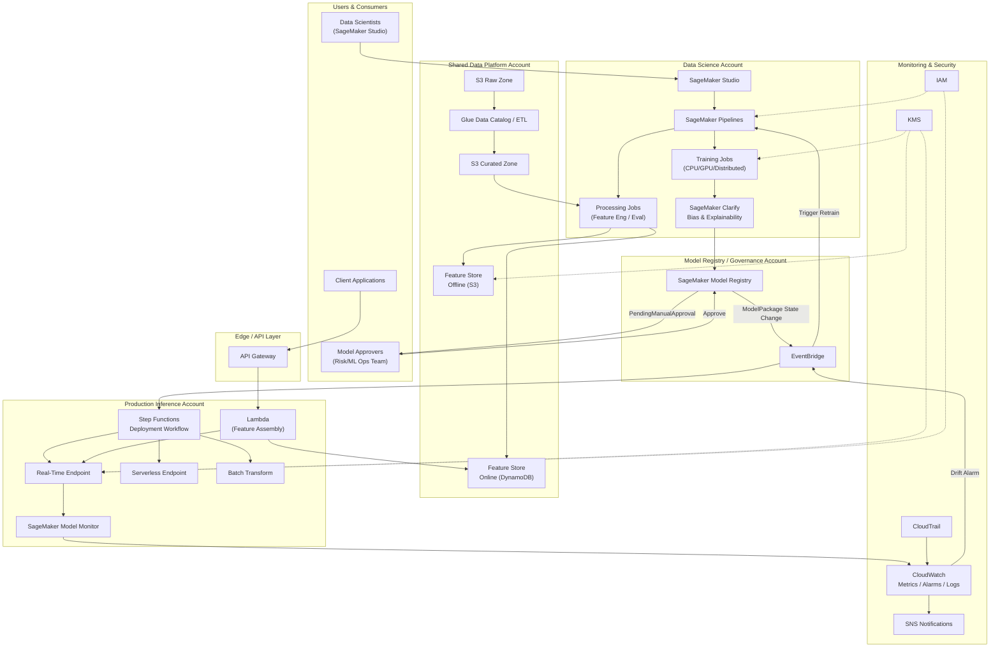
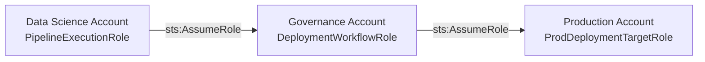

# Part VII – AI & Machine Learning Architectures

# Chapter 58: MLOps Pipeline

---

# 1. Executive Summary

## The Business Problem

Machine learning initiatives fail in production far more often than they fail in the notebook.

- Gartner and multiple industry surveys have repeatedly found that **60–87% of ML models never make it to production**.
- Of the models that do reach production, a large share degrade silently within months due to data drift, concept drift, or unmanaged retraining processes.
- Data science teams frequently build models in isolated notebooks with no reproducibility, no lineage, and no automated path to deployment.
- Engineering teams inherit these models with no understanding of how they were trained, what data they used, or how to safely update them.

This gap between "a model that works on a laptop" and "a model that reliably serves millions of predictions a day, is monitored, retrained, and rolled back safely" is exactly the gap MLOps closes.

- MLOps is not a single AWS service.
- MLOps is an **operating model** built from CI/CD, data versioning, feature management, experiment tracking, automated training, model registries, deployment automation, and continuous monitoring — all wired together into a repeatable pipeline.
- The architecture in this chapter treats a trained model the same way modern software engineering treats a compiled binary: versioned, tested, promoted through environments, and rolled back on demand.

## Architecture Objective

The objective of an MLOps pipeline architecture is to industrialize the machine learning lifecycle so that:

- Data scientists can experiment quickly without being blocked by infrastructure.
- Every model that reaches production has full lineage: which data, which code, which hyperparameters, which metrics.
- Model promotion from development to staging to production is governed, auditable, and reversible.
- Retraining happens automatically when data drifts, performance degrades, or new labeled data becomes available — not only when someone remembers to do it manually.
- Deployment of a new model version does not require redeploying the serving application.
- Rollback of a bad model is a control-plane operation, not an emergency code change.
- Cost, latency, and accuracy are all first-class, continuously monitored metrics — not one-time acceptance criteria checked before launch.

## Why Organizations Adopt This Architecture

Enterprises adopt a formal MLOps pipeline for several converging reasons.

1. **Regulatory and audit pressure.** Financial services, healthcare, and insurance regulators increasingly require model explainability, bias testing, and full lineage from training data to production prediction.
2. **Model decay is inevitable.** Real-world data distributions shift. A fraud model trained on 2023 transaction patterns degrades as fraud tactics evolve. Without automated retraining and monitoring, this decay is invisible until it causes financial loss.
3. **Team scaling.** A single data scientist training a model ad hoc does not need MLOps. Twenty data scientists across five business units, all needing to ship models safely without stepping on each other, absolutely do.
4. **Deployment velocity.** Competitive pressure demands weekly or daily model updates, not quarterly manual releases.
5. **Cost accountability.** GPU training and real-time inference are expensive. Without pipeline-level cost tracking, ML budgets spiral silently.
6. **Reproducibility requirements.** "Why did the model make this prediction six months ago?" is a question regulators, auditors, and even internal risk teams will ask. Without versioned data, code, and model artifacts, this question is unanswerable.

## Major Business Benefits

| Benefit | Description |
|---|---|
| Faster time-to-production | Automated pipelines cut model deployment time from weeks to hours |
| Reduced production incidents | Automated validation and canary deployment catch bad models before full rollout |
| Full auditability | Every production prediction can be traced to a specific model version, training dataset, and code commit |
| Lower operational cost | Shared infrastructure, spot training, and serverless inference reduce idle spend |
| Consistent governance | Model approval workflows enforce human review before high-risk models go live |
| Faster experimentation | Data scientists self-serve infrastructure through standardized pipelines instead of filing tickets |
| Reduced model decay risk | Continuous monitoring and automated retraining catch drift before it causes business harm |

## Typical Enterprise Scenarios

This architecture is commonly implemented for:

- **Fraud detection** — real-time transaction scoring with sub-100ms latency requirements and frequent retraining as fraud patterns evolve.
- **Recommendation engines** — e-commerce and media platforms retraining ranking models daily or hourly based on fresh interaction data.
- **Credit risk and underwriting** — regulated models requiring full explainability, bias testing, and audit trails before every deployment.
- **Demand forecasting** — retail and manufacturing organizations retraining forecasting models on a rolling schedule as new sales data arrives.
- **Predictive maintenance** — industrial IoT platforms where sensor data streams feed continuous model refresh.
- **Churn prediction** — SaaS and telecom companies scoring customers on a recurring batch cadence to trigger retention workflows.
- **Document and text classification** — insurance claims triage, customer support routing, and content moderation pipelines.
- **Computer vision at scale** — quality inspection, medical imaging triage, and retail shelf analytics requiring GPU training and low-latency inference.

## Why This Matters Beyond the Data Science Team

A well-designed MLOps pipeline is an enterprise capability, not a data science convenience.

- It becomes the platform other teams build on: fraud, marketing, risk, and operations all consume the same pipeline patterns.
- It creates a shared vocabulary — model registry, feature store, experiment tracking — that lets engineering, security, and compliance teams participate in ML governance without needing to understand the modeling internals.
- It converts "the data science team's laptop" into an enterprise asset with the same rigor applied to any other production system: SLAs, on-call rotations, cost budgets, and disaster recovery.

This chapter presents a complete, production-ready MLOps pipeline architecture built on Amazon SageMaker as the core ML platform, integrated with the broader AWS ecosystem for data, security, networking, and observability.

---

# 2. Business Requirements

## Business Drivers

- Reduce model time-to-production from months to days.
- Provide a self-service platform for data science teams across multiple business units.
- Guarantee full lineage and reproducibility for regulatory audits.
- Detect and respond to model performance degradation automatically.
- Support both batch and real-time inference workloads from a shared platform.
- Control and forecast ML infrastructure spend, particularly GPU training costs.

## Functional Requirements

| Requirement | Description |
|---|---|
| Experiment tracking | Every training run must log parameters, metrics, and artifacts |
| Feature reuse | Features computed for one model must be discoverable and reusable by other teams |
| Model registry | Every trained model must be versioned with approval status (pending, approved, rejected, archived) |
| Automated retraining | Pipelines must support scheduled and event-triggered retraining |
| Multiple deployment targets | Real-time endpoints, serverless inference, batch transform, and asynchronous inference must all be supported |
| A/B and canary deployment | New model versions must be deployable to a subset of traffic before full rollout |
| Rollback | Any production model must be revertible to a prior version within minutes |
| Data and model lineage | Full lineage from raw data through features, training job, model artifact, and deployed endpoint |
| Bias and explainability checks | Models must be evaluated for bias and provide explainability reports before production approval |

## Non-Functional Requirements

| Category | Requirement |
|---|---|
| Scalability | Support 50+ concurrent data scientists and hundreds of training jobs per day |
| Availability | Production inference endpoints must meet 99.9% availability |
| Latency | Real-time inference endpoints must return predictions in under 100ms at p99 for the fraud use case |
| Security | All data encrypted at rest and in transit; network isolation for training and inference workloads |
| Compliance | Full audit trail for SR 11-7 (model risk management) and similar regulatory frameworks |
| Cost control | Training costs tracked per team/project; idle endpoints automatically flagged |
| Observability | Model performance, data drift, and infrastructure health all monitored continuously |

## Scalability Goals

- Support growth from an initial 5 models in production to 200+ models across business units within 24 months.
- Training pipeline must scale from single-GPU experimentation to distributed multi-node training for large models without architectural change.
- Feature store must scale to billions of feature records with sub-10ms online retrieval latency.

## Availability Requirements

- Real-time inference endpoints: 99.9% (approximately 8.7 hours of downtime per year budget).
- Batch and asynchronous inference: 99.5% is generally acceptable given retry tolerance.
- Training pipeline orchestration: 99.5% — a training job that retries after a transient failure is acceptable; production serving downtime is not.

## Latency Requirements

| Use Case | Target Latency |
|---|---|
| Fraud scoring (real-time endpoint) | < 100ms p99 |
| Recommendation ranking | < 150ms p99 |
| Batch demand forecasting | Completion within nightly batch window (typically 2–4 hours) |
| Asynchronous document classification | < 5 minutes end-to-end |

## Compliance Requirements

- SR 11-7 / OCC model risk management guidance for financial institutions.
- GDPR / CCPA data handling for models trained on personal data, including right-to-erasure implications for training datasets.
- SOC 2 Type II controls for the platform itself.
- Industry-specific requirements (HIPAA for healthcare models, PCI DSS if payment card data touches feature pipelines).

## Security Expectations

- No data scientist has standing access to production inference infrastructure.
- All training and inference workloads run inside private subnets with no direct internet egress.
- Model artifacts and training data encrypted with customer-managed KMS keys.
- Every model promotion to production requires a human approval step recorded in the model registry.

## Recovery Objectives

| Metric | Target |
|---|---|
| RPO (feature store / training data) | 15 minutes (via continuous replication and versioned S3 storage) |
| RPO (model registry) | Near-zero — model artifacts are immutable and versioned in S3 with cross-region replication |
| RTO (real-time inference endpoint) | 15 minutes via multi-AZ endpoint failover |
| RTO (training pipeline) | 4 hours — training is not typically on the critical incident path |

## SLAs

- Inference endpoint uptime: 99.9% monthly.
- Model deployment pipeline: new approved model deployed to production within 30 minutes of approval.
- Retraining pipeline: triggered retraining completes and produces a candidate model within the defined SLA window per use case (commonly 4–12 hours depending on dataset size).

## Expected Workload

- Initial state: 10–20 data scientists, 5–10 models in production, mix of batch and real-time inference.
- Training volume: 50–200 training jobs per week across experimentation and scheduled retraining.
- Inference volume: real-time endpoints handling anywhere from a few hundred to tens of thousands of requests per second depending on use case (fraud scoring at payment-processing scale is the upper bound).

## Expected Growth

- 3x growth in data science headcount within 18–24 months as the platform proves value and additional business units onboard.
- Model count growing from single digits to hundreds as the platform becomes the default path for any ML initiative.
- Feature store growing from a handful of feature groups to hundreds, shared across teams, requiring strong governance to avoid duplication and inconsistency.

---

# 3. Architecture Overview

## Overall Design

This architecture is organized around a **hub-and-spoke, multi-account model** that separates concerns cleanly:

- A **Data Science account** where experimentation, feature engineering, and training occur.
- A **Model Registry / Governance account** that acts as the single source of truth for approved model versions.
- A **Production Inference account (or accounts)** where approved models are deployed to serve real traffic.
- A **Shared Data Platform account** hosting the feature store, raw/curated data lake, and data catalog.

This separation mirrors how mature organizations separate application build environments from production runtime environments — but applied to models instead of application code.

## Architecture Philosophy

Three principles drive every design decision in this chapter:

1. **Treat models like software artifacts.** A trained model is a versioned, immutable artifact with a build provenance record, not a file someone emails around.
2. **Decouple training from serving.** Training infrastructure (GPU-heavy, bursty, batch-oriented) has completely different scaling and cost characteristics than serving infrastructure (latency-sensitive, steady-state, availability-critical). They are architected, scaled, and secured independently.
3. **Automate the boring parts, gate the risky parts.** Data validation, feature computation, training execution, and infrastructure provisioning are fully automated. Promotion of a model to production traffic requires an explicit approval gate, because that is the point of highest business risk.

## Core Components

| Component | Purpose |
|---|---|
| Data Lake (S3 + Lake Formation) | Stores raw, curated, and feature-ready datasets |
| SageMaker Feature Store | Centralized online/offline feature repository |
| SageMaker Studio | Managed IDE for data scientists |
| SageMaker Pipelines | Orchestrates training, evaluation, and registration steps |
| SageMaker Model Registry | Versioned catalog of trained models with approval workflow |
| SageMaker Training Jobs | Managed, scalable model training (CPU/GPU/distributed) |
| SageMaker Endpoints (real-time, serverless, async, batch transform) | Model serving in multiple modes |
| EventBridge | Event-driven triggers for retraining and deployment automation |
| Step Functions | Orchestrates cross-service deployment workflows |
| CodePipeline / CodeBuild | CI/CD for pipeline code and infrastructure |
| SageMaker Model Monitor | Continuous data quality, bias, and drift monitoring |
| CloudWatch + SageMaker Clarify | Observability, explainability, and bias detection |
| ECR | Stores custom training and inference container images |
| KMS, IAM, Secrets Manager | Security and secrets management |

## How Components Interact

- Raw data lands in the data lake and is cataloged via AWS Glue Data Catalog / Lake Formation.
- Feature engineering jobs (SageMaker Processing) transform raw data into features, writing both an **offline store** (S3, for training) and an **online store** (DynamoDB-backed, for low-latency inference lookups) via SageMaker Feature Store.
- A SageMaker Pipeline orchestrates: data validation → feature computation → training → evaluation → bias/explainability checks → conditional registration in the Model Registry.
- A registered model sits in `PendingManualApproval` status until a human reviewer approves it via the registry.
- Approval triggers an EventBridge event that invokes a Step Functions deployment workflow, which provisions or updates the target SageMaker endpoint using a blue-green or canary strategy.
- SageMaker Model Monitor continuously captures live inference data, compares it against the training baseline, and raises CloudWatch alarms on drift.
- Drift or performance degradation alarms can automatically trigger a new SageMaker Pipeline execution, closing the loop.

## High-Level Workflow

```

Raw Data → Data Validation → Feature Engineering → Feature Store
    → Training Job → Model Evaluation → Bias/Explainability Check
    → Model Registry (Pending Approval) → Human Approval
    → Automated Deployment (Canary) → Production Traffic
    → Continuous Monitoring → Drift Detected → Retraining Triggered (loop)

```

## Request Lifecycle (Inference)

1. Client application calls an API Gateway endpoint.
2. API Gateway invokes a Lambda function (or directly integrates with a SageMaker endpoint via VPC link for high-throughput cases).
3. Lambda performs any request-time feature lookups from the Feature Store online store.
4. Lambda invokes the SageMaker real-time endpoint with the assembled feature vector.
5. SageMaker endpoint returns a prediction, which Lambda post-processes and returns to the client.
6. SageMaker Model Monitor's data capture feature asynchronously logs the request/response pair to S3 for later drift analysis.

## Response Lifecycle

- Successful predictions return within the latency SLA and are logged for monitoring.
- Failed predictions (endpoint error, timeout) trigger CloudWatch alarms and fall back to a default/cached response where business logic allows, rather than failing the client request outright.

## Data Lifecycle

- Raw data → Bronze (raw) → Silver (cleaned/validated) → Gold (feature-ready) tiers in the data lake, following the medallion architecture pattern.
- Feature Store retains both current online values (fast lookup) and full historical offline records (point-in-time correct training sets).
- Model artifacts and their associated datasets are retained per compliance policy (commonly 7 years for regulated industries), with S3 Lifecycle policies transitioning older artifacts to Glacier.

---

# 4. AWS Services Used

## Amazon SageMaker (Studio, Pipelines, Training, Model Registry, Endpoints, Model Monitor, Clarify)

**Purpose:** SageMaker is the core managed ML platform providing the IDE, pipeline orchestration, training infrastructure, model registry, and serving infrastructure used throughout this architecture.

**Why selected:**
- Deep native integration across the entire ML lifecycle reduces the amount of custom glue code needed compared to assembling open-source tools independently.
- Managed training and inference infrastructure removes the operational burden of managing GPU clusters directly.
- SageMaker Pipelines provides a purpose-built DAG orchestrator for ML workflows with native lineage tracking.
- SageMaker Model Registry provides an out-of-the-box approval workflow that maps directly to model risk governance requirements.

**Alternatives:**
- **Kubeflow on EKS** — more flexibility and portability, but significantly higher operational overhead; teams must manage the Kubernetes control plane, Kubeflow components, and scaling themselves.
- **MLflow (self-hosted or managed)** — excellent for experiment tracking and model registry, often used *alongside* SageMaker rather than as a full replacement; lacks SageMaker's native managed training/serving infrastructure.
- **Databricks MLflow + Databricks Model Serving** — strong option for organizations already standardized on Databricks for data engineering; less native integration with AWS-native security and networking controls.

**Limitations:**
- SageMaker introduces AWS vendor lock-in for pipeline definitions and registry metadata.
- Cold-start latency on serverless inference endpoints can be a concern for the strictest latency SLAs.
- Studio's per-user application infrastructure has its own cost and quota considerations at scale.

**Pricing considerations:**
- Training billed per-second of instance usage; Spot Training can reduce cost by 60–90% for interruption-tolerant workloads.
- Real-time endpoints billed for the full duration the endpoint is running, regardless of request volume — right-sizing and auto-scaling are essential.
- Serverless Inference and Asynchronous Inference bill per-invocation/per-duration, better suited to spiky or low-traffic workloads.

**Best practices:**
- Use SageMaker Pipelines (not ad hoc notebooks) for anything that will run more than once.
- Use Managed Spot Training for all non-time-critical training jobs.
- Right-size endpoint instance types using SageMaker Inference Recommender before launch.
- Enable Model Monitor data capture on every production endpoint from day one, even before drift detection is fully tuned.

## Amazon S3

**Purpose:** Backbone storage for raw data, curated data, feature store offline data, model artifacts, pipeline outputs, and Model Monitor captured data.

**Why selected:** Effectively unlimited scalability, strong durability (11 nines), native integration with every AWS analytics and ML service, and fine-grained lifecycle and encryption controls.

**Alternatives:** EFS (only for specific POSIX-filesystem training requirements), FSx for Lustre (for extremely high-throughput distributed training reading the same dataset repeatedly).

**Limitations:** Not a POSIX filesystem; extremely high request-rate workloads need key-naming strategies to avoid partition hot-spotting (though modern S3 auto-scales partitions more gracefully than in the past).

**Pricing considerations:** Use S3 Intelligent-Tiering or explicit lifecycle rules to move older training datasets and superseded model artifacts to Infrequent Access and Glacier tiers.

**Best practices:** Separate buckets (or clearly prefixed paths) for raw, curated, feature, and model-artifact data with distinct lifecycle and access policies for each.

## AWS Glue (Data Catalog, ETL Jobs, Glue DataBrew)

**Purpose:** Central metadata catalog for all datasets in the lake, plus managed Spark-based ETL for large-scale data preparation ahead of feature engineering.

**Why selected:** Serverless Spark reduces operational burden versus self-managed EMR for most feature engineering workloads; the Data Catalog is the shared metadata layer used by Athena, Lake Formation, and SageMaker Feature Store.

**Alternatives:** EMR (for teams needing full Spark cluster control or already running EMR for other workloads), SageMaker Processing jobs (preferred for feature engineering steps that need to live inside a SageMaker Pipeline for lineage purposes).

**Limitations:** Glue job cold-start latency; less suited to sub-minute streaming transformations (use Kinesis Data Analytics / Managed Flink for those).

**Pricing considerations:** Billed per DPU-hour; right-size worker type and count, and use job bookmarks to avoid reprocessing unchanged data.

## Amazon SageMaker Feature Store

**Purpose:** Centralized, versioned repository of ML features with both an online store (low-latency lookups for real-time inference) and offline store (point-in-time correct historical data for training).

**Why selected:** Solves the training/serving skew problem directly — the same feature definitions and values are used in both training and inference, eliminating a leading cause of production model underperformance.

**Alternatives:** Tecton, Feast (open-source), or a custom DynamoDB + S3 implementation. Feast is commonly chosen by teams wanting multi-cloud portability; the custom DynamoDB approach is chosen by teams with very specific latency or cost requirements not met by the managed offering.

**Limitations:** Online store latency, while low (single-digit milliseconds typical), adds an additional network hop compared to embedding features directly in the request payload for the very simplest use cases.

**Pricing considerations:** Online store billed on provisioned/on-demand DynamoDB-equivalent pricing; offline store billed as standard S3 storage.

## Amazon ECR

**Purpose:** Stores custom Docker images for training and inference when the built-in SageMaker framework containers (PyTorch, TensorFlow, XGBoost, Scikit-learn) are insufficient.

**Why selected:** Native IAM integration, vulnerability scanning, and tight integration with SageMaker's `image_uri` parameter for training/serving jobs.

**Best practices:** Enable image scanning on push; use immutable tags for production images; separate repositories per model family for clean lifecycle policies.

## AWS Step Functions

**Purpose:** Orchestrates the cross-service deployment workflow that begins when a model is approved in the registry — provisioning/updating endpoints, running smoke tests, shifting traffic, and rolling back on failure.

**Why selected:** Native error handling, retry, and human-approval-adjacent patterns; visual workflow for auditors and platform engineers reviewing deployment logic; strong integration with SageMaker, Lambda, and SNS.

**Alternatives:** SageMaker Pipelines could theoretically extend into deployment, but Step Functions is better suited to the broader multi-service orchestration (endpoint config updates, traffic shifting, notification, rollback) that spans beyond pure ML steps.

## Amazon EventBridge

**Purpose:** Event bus that decouples the model registry approval event from the deployment workflow, and decouples drift/performance alarms from the retraining trigger.

**Why selected:** Native SageMaker event source integration (model package state change events); enables true event-driven automation without polling.

## AWS Lambda

**Purpose:** Lightweight glue logic — invoking Step Functions workflows on events, performing request-time feature assembly for real-time inference, running lightweight validation checks in pipelines.

**Why selected:** No infrastructure to manage for short-lived, bursty invocation patterns; scales automatically with request volume for the inference-time feature-lookup use case.

**Limitations:** 15-minute maximum execution time and cold-start latency mean Lambda is unsuitable for long-running training or heavy batch processing — those stay on SageMaker Processing/Training.

## Amazon API Gateway

**Purpose:** Managed API layer in front of inference Lambda functions, providing throttling, authentication, request validation, and usage plans for internal and external model consumers.

## AWS CodePipeline / CodeBuild / CodeCommit (or GitHub-integrated equivalents)

**Purpose:** CI/CD for the pipeline *code itself* — SageMaker Pipeline definitions, container build scripts, infrastructure-as-code — separate from the ML training pipeline that CI/CD deploys.

**Why selected:** Native AWS integration for teams standardized on CodePipeline; equally valid to substitute GitHub Actions or GitLab CI if the organization has already standardized elsewhere (see Section 20).

## Amazon CloudWatch

**Purpose:** Central metrics, logs, dashboards, and alarms for both infrastructure health (endpoint CPU/memory/invocation errors) and ML-specific metrics (model latency, drift scores from Model Monitor).

## AWS IAM, KMS, Secrets Manager

**Purpose:** Identity, encryption key management, and secrets storage underpinning every component — see Sections 10 and 11 for full detail.

## Amazon VPC, PrivateLink, Security Groups

**Purpose:** Network isolation for training and inference workloads, ensuring no ML workload has direct internet access and all AWS service calls stay on the AWS private network — see Section 9.

## Amazon SageMaker Clarify

**Purpose:** Pre-training and post-training bias detection, plus model explainability (SHAP values) — a first-class requirement for regulated model use cases.

## Amazon Bedrock (where generative AI components are part of the pipeline)

**Purpose:** For organizations layering generative AI capabilities (e.g., LLM-based feature extraction from unstructured text, or LLM-assisted labeling) into an otherwise classical MLOps pipeline. Covered further in Section 17.

---

# 5. Complete Architecture Diagram



---

# 6. Component-by-Component Explanation

## SageMaker Studio

- **Purpose:** Managed, browser-based IDE for data scientists to explore data, prototype models, and author pipeline code.
- **Responsibilities:** Notebook execution, interactive debugging, local-mode testing of pipeline steps before submitting to managed infrastructure.
- **Inputs:** Curated datasets from the data lake, feature definitions from the Feature Store.
- **Outputs:** Pipeline definition code committed to version control; ad hoc experiment artifacts logged to SageMaker Experiments.
- **Scaling:** Each user gets an isolated compute environment; scales per-user without affecting others.
- **High availability:** Studio itself is a managed service with AWS-managed availability; user environments are ephemeral and recreatable.
- **Failure handling:** A crashed kernel or notebook instance does not affect any other user or any production system — isolation is a key design benefit.
- **Dependencies:** IAM execution role, VPC configuration for private connectivity, S3 for storage.
- **Security:** Each user assumes a scoped IAM execution role; no standing access to production resources.
- **Monitoring:** CloudWatch tracks Studio application resource usage; idle-environment alarms help control cost.

## SageMaker Pipelines

- **Purpose:** Defines and orchestrates the DAG of steps — data validation, feature engineering, training, evaluation, bias check, conditional registration — as a versioned, repeatable workflow.
- **Responsibilities:** Step sequencing, parameter passing, caching of unchanged steps, lineage tracking.
- **Inputs:** Pipeline definition (Python SDK, compiled to a JSON pipeline definition), input datasets, hyperparameters.
- **Outputs:** Trained model artifacts, evaluation reports, a registered model package (conditional on passing evaluation gates).
- **Scaling:** Each pipeline execution runs on its own set of managed instances; concurrent executions scale independently.
- **High availability:** Orchestration state is managed by the SageMaker control plane; step failures are retried per configured retry policy.
- **Failure handling:** Failed steps halt the pipeline and emit a CloudWatch event; conditional steps prevent bad models from ever reaching the registry.
- **Dependencies:** IAM role with permissions to launch Processing/Training jobs, S3 access, ECR access for custom containers.
- **Security:** Executes within a configured VPC with no internet egress unless explicitly required (e.g., for package installation via a controlled proxy or pre-baked container).
- **Monitoring:** Pipeline execution status, step duration, and failure reasons are all visible in SageMaker Studio and exportable to CloudWatch.

## Feature Store (Online + Offline)

- **Purpose:** Single source of truth for feature values, eliminating training/serving skew.
- **Responsibilities:** Ingest feature records with event-time timestamps; serve low-latency lookups for inference; provide point-in-time-correct historical joins for training dataset generation.
- **Inputs:** Output of feature engineering Processing jobs.
- **Outputs:** Feature vectors for both training queries and real-time inference lookups.
- **Scaling:** Online store (DynamoDB-backed) scales automatically with on-demand capacity mode; offline store (S3-backed) scales inherently with S3.
- **High availability:** DynamoDB-backed online store provides multi-AZ durability by default.
- **Failure handling:** Failed writes are retried by the ingestion job; the offline store's append-only design means no data is overwritten on retry.
- **Dependencies:** IAM roles for both write (Processing jobs) and read (inference Lambda) paths.
- **Security:** KMS encryption at rest; fine-grained IAM policies scoping which roles can read which feature groups.
- **Monitoring:** CloudWatch metrics for read/write throughput, throttling events, and ingestion latency.

## Training Jobs

- **Purpose:** Executes the actual model training computation on managed, ephemeral infrastructure.
- **Responsibilities:** Pull training data, run the training script, emit metrics to CloudWatch/Experiments, write the model artifact to S3.
- **Scaling:** Single-instance for small models; distributed data-parallel or model-parallel training across multiple instances for large models, using SageMaker's built-in distributed training libraries.
- **High availability:** Not applicable in the traditional sense — training jobs are batch workloads, not always-on services; Managed Spot Training handles interruption via automatic checkpoint/resume.
- **Failure handling:** Automatic retry on transient infrastructure failure; checkpointing to S3 enables resume after Spot interruption.
- **Dependencies:** Training container image (built-in or custom via ECR), input data channels, IAM role.
- **Security:** Runs inside the configured VPC subnets with security groups restricting egress to only required AWS service endpoints (via VPC endpoints).
- **Monitoring:** Training and validation metrics streamed to CloudWatch in near real time; SageMaker Debugger can flag issues like vanishing gradients or resource bottlenecks.

## Model Registry

- **Purpose:** Versioned catalog of trained models grouped into Model Package Groups, each version carrying metadata, evaluation metrics, and an approval status.
- **Responsibilities:** Store immutable references to model artifacts; enforce approval workflow state transitions; emit events on state change.
- **Inputs:** Model package registration calls from SageMaker Pipelines (typically gated by a condition step on evaluation metrics).
- **Outputs:** Approved model packages consumed by the deployment workflow.
- **High availability:** Backed by the SageMaker control plane; metadata is durable and versioned.
- **Failure handling:** Registration failures halt the pipeline before any deployment can occur — a fail-safe by design.
- **Security:** IAM policies control who can transition a model package to `Approved` — typically restricted to a designated ML Ops or Model Risk role, distinct from the data scientists who trained it (separation of duties).
- **Monitoring:** CloudTrail logs every state transition for audit purposes.

## Deployment Workflow (Step Functions)

- **Purpose:** Executes the multi-step process of taking an approved model from the registry to serving production traffic safely.
- **Responsibilities:** Create/update endpoint configuration, deploy with a canary or linear traffic-shifting strategy, run automated smoke tests, monitor initial error rates, roll back automatically on failure, notify stakeholders on success/failure.
- **Failure handling:** Built-in Step Functions retry and catch blocks trigger automatic rollback to the previous endpoint configuration if smoke tests fail or error rates exceed threshold during canary traffic.
- **Security:** Assumes a tightly scoped IAM role permitted only to manage SageMaker endpoints, not to modify the model registry or training infrastructure.
- **Monitoring:** Step Functions execution history provides a full audit trail of every deployment, visible in the AWS Console and exportable to CloudWatch Logs.

## Real-Time / Serverless / Batch Transform Endpoints

- **Purpose:** Serve predictions in the mode appropriate to the use case — always-on low-latency (real-time), intermittent/spiky traffic (serverless), or large offline datasets (batch transform).
- **Scaling:** Real-time endpoints use SageMaker's built-in auto-scaling (target-tracking on `InvocationsPerInstance`); serverless endpoints scale to zero and back automatically; batch transform jobs parallelize across instances based on dataset partitioning.
- **High availability:** Real-time endpoints deploy across multiple instances (minimum 2 for production) spread across Availability Zones automatically.
- **Failure handling:** Multi-variant endpoint configuration allows instant traffic shift away from an unhealthy variant.

## SageMaker Model Monitor

- **Purpose:** Continuously compares live inference data against a training-time baseline to detect data quality issues, feature drift, and (with Model Quality Monitor) prediction accuracy drift once ground truth becomes available.
- **Responsibilities:** Schedule recurring monitoring jobs, compare captured request/response data to baseline constraints, emit CloudWatch metrics and violations reports.
- **Failure handling:** A monitoring job failure raises an alarm but does not affect the serving endpoint itself — monitoring is deliberately decoupled from the serving path.
- **Monitoring:** Drift violation counts and constraint breach details published to CloudWatch, feeding the automated retraining trigger described in Section 3.

---

# 7. End-to-End Request Flow

## Inference Request Flow (Real-Time)

1. **Client** sends an HTTPS request to **API Gateway** with an authentication token (Cognito or IAM SigV4).
2. **API Gateway** validates the request schema and authorization, then invokes the **feature-assembly Lambda function**.
3. **Lambda** extracts the entity ID (e.g., customer ID, transaction ID) from the request payload.
4. **Lambda** queries the **Feature Store online store** for the latest pre-computed features for that entity (single-digit-millisecond lookup).
5. **Lambda** merges request-time features (e.g., transaction amount from the current request) with the retrieved historical features into a single feature vector.
6. **Lambda** invokes the **SageMaker real-time endpoint** with the assembled feature vector via `InvokeEndpoint`.
7. **SageMaker endpoint** runs inference and returns the prediction (e.g., fraud probability score) with latency measured and logged.
8. **SageMaker Model Monitor's data capture** asynchronously writes the request/response pair to an **S3 data capture bucket** (this does not block the response path).
9. **Lambda** applies any post-processing business logic (e.g., threshold-based decisioning) and returns the final response to **API Gateway**.
10. **API Gateway** returns the response to the **client**.
11. **CloudWatch** records latency, error rate, and invocation count metrics for the entire request chain.
12. If the endpoint returns an error or times out, **Lambda's** built-in retry/circuit-breaker logic falls back to a **cached last-known-good response or a conservative default decision**, and an **error metric** is emitted.
13. **X-Ray** tracing (if enabled) captures the full distributed trace across API Gateway, Lambda, and SageMaker for troubleshooting.

## Batch Inference Flow

1. A **scheduled EventBridge rule** (e.g., nightly at 02:00) triggers a **Step Functions** state machine.
2. Step Functions launches a **SageMaker Batch Transform job** pointing at the latest curated input dataset in S3.
3. Batch Transform reads input records, invokes the approved production model in parallel across allocated instances, and writes predictions back to S3.
4. On completion, Step Functions triggers a **Glue job** to load predictions into the curated data zone or directly into a downstream data warehouse table.
5. **SNS** notifies the consuming business team that fresh predictions are available.
6. Any job failure triggers an **SNS alert** to the on-call ML Ops rotation and halts the downstream load step.

## Error Handling Summary

| Failure Point | Handling Strategy |
|---|---|
| Feature Store lookup timeout | Lambda falls back to default feature values; logs a warning metric |
| SageMaker endpoint timeout | Lambda retries once with exponential backoff, then returns a safe default response |
| Endpoint returns 5xx | CloudWatch alarm fires; if error rate exceeds threshold, auto-scaling and/or automatic rollback to prior model variant is triggered |
| Batch Transform job failure | Step Functions catch block halts downstream steps and pages on-call via SNS |
| Data capture write failure | Logged but does not block the inference response — monitoring is best-effort, not blocking |

---

# 8. Deployment Flow

## Infrastructure Provisioning

- All infrastructure (VPCs, IAM roles, S3 buckets, SageMaker domain, EventBridge rules) is provisioned via **Terraform**, never manually through the console, to guarantee reproducibility across the Data Science, Governance, and Production accounts.
- Environment-specific configuration (dev/staging/prod) is managed via Terraform workspaces or a directory-per-environment structure with a shared module library.

## Terraform Workflow

1. Engineer opens a pull request modifying a Terraform module (e.g., adding a new SageMaker endpoint configuration).
2. CI pipeline runs `terraform fmt -check`, `terraform validate`, and `tflint`.
3. CI pipeline runs `terraform plan` and posts the plan output as a PR comment for review.
4. A second engineer reviews and approves the PR.
5. On merge to `main`, CI pipeline runs `terraform apply` against the target environment (with production applies gated behind a manual approval step in the pipeline).
6. State is stored remotely in an S3 backend with DynamoDB state locking, one state file per environment/account.

## CI/CD Deployment (ML Pipeline Code)

- Separate from infrastructure Terraform, the **SageMaker Pipeline definition code** (Python) follows its own CI/CD path:
  1. Data scientist opens a PR with pipeline code changes.
  2. CI runs unit tests against pipeline step logic (using local-mode execution where feasible) and linting.
  3. On merge, CI packages and uploads the updated pipeline definition, registering the new pipeline version with SageMaker.
  4. The updated pipeline is *not* automatically executed against production data — execution is triggered separately by schedule or event, keeping "pipeline code deployment" and "pipeline execution" as distinct, independently auditable actions.

## Blue-Green / Canary Model Deployment

- New model versions are deployed using **SageMaker's production variant traffic shifting**:
  1. Deploy the new model as `VariantB` alongside the existing `VariantA` on the same endpoint, initially receiving 0% of traffic.
  2. Shift 5% of traffic to `VariantB`; monitor error rate and latency for a defined bake period (e.g., 15–30 minutes).
  3. If healthy, progressively shift to 25%, 50%, then 100%.
  4. If unhealthy at any stage, Step Functions automatically shifts traffic back to `VariantA` (100%) and halts the rollout.
  5. Once `VariantB` reaches 100% and remains healthy for a defined soak period, `VariantA` is decommissioned.

## Rollback

- Rollback is a **control-plane operation**: shifting the `ProductionVariant` weight back to the previous approved model version, executed in under a minute via the same Step Functions workflow used for deployment (run in reverse).
- Because the previous model artifact and endpoint configuration are never deleted immediately (retained for a minimum soak-plus-buffer period), rollback does not require retraining or rebuilding anything.

## Secrets

- Database credentials, third-party API keys, and any sensitive configuration used by feature engineering or inference Lambdas are stored in **AWS Secrets Manager**, retrieved at runtime via IAM role — never embedded in code, container images, or Terraform variables files.

## Configuration

- Environment-specific configuration (endpoint instance types, auto-scaling thresholds, feature group names) is externalized into **AWS Systems Manager Parameter Store**, referenced by both Terraform and pipeline code, avoiding hardcoded environment differences in application logic.

## Validation

- Every deployment includes an automated **smoke test suite** (a small set of known input/output pairs) run against the new endpoint variant before any real traffic is shifted to it.
- Schema validation on both feature inputs and prediction outputs guards against silent contract drift between the training pipeline and the serving application.

---

# 9. Network Topology

## VPC Design

- A dedicated VPC per account (Data Science, Governance, Production) following a hub-and-spoke pattern connected via **Transit Gateway**, consistent with the enterprise landing zone described in Chapter 99.

## CIDR Allocation

| Account | VPC CIDR | Purpose |
|---|---|---|
| Data Science | 10.20.0.0/16 | Studio, training, processing workloads |
| Governance | 10.21.0.0/16 | Model registry supporting infrastructure |
| Production Inference | 10.22.0.0/16 | Real-time/serverless/batch endpoints |
| Shared Data Platform | 10.23.0.0/16 | Data lake, Feature Store supporting infrastructure |

## Public Subnets

- Used only where strictly necessary — e.g., NAT Gateways and Application Load Balancers (if a custom inference application layer is used in front of SageMaker).
- SageMaker Studio, training jobs, and endpoints themselves run in **private subnets only**.

## Private Subnets

- All SageMaker Studio domains, training jobs, processing jobs, and inference endpoints are configured with `VpcConfig` pointing to private subnets across at least two Availability Zones for high availability.

## NAT Gateway

- One NAT Gateway per AZ (not a single shared NAT Gateway) to avoid a single point of failure and cross-AZ data transfer charges for outbound traffic (e.g., pulling Python packages during container builds, though production training containers should be pre-baked to minimize this).

## Internet Gateway

- Present only in the public subnet tier, used exclusively for NAT Gateway egress and any public-facing API Gateway custom domain endpoints.

## Transit Gateway

- Connects all four account VPCs, enabling the Governance account to reach the Data Science account's SageMaker Pipeline execution role (for triggering pipelines) and the Production account to reach the Shared Data Platform's Feature Store online store.
- Route tables are scoped per attachment so the Data Science account cannot directly reach the Production account's inference endpoints — only the Governance account's deployment workflow can.

## Route Tables

- Explicit, minimal routes per subnet — private subnets route to NAT Gateway for internet-bound traffic only when unavoidable, and to Transit Gateway for cross-account traffic; no default `0.0.0.0/0` route to Transit Gateway.

## Network ACLs

- Stateless NACLs at the subnet boundary provide a coarse-grained secondary control, primarily used to explicitly deny known-bad ranges and enforce subnet-tier isolation (e.g., processing-job subnets cannot initiate connections to inference-endpoint subnets).

## Security Groups

- Security groups are scoped per component: a SageMaker Studio security group, a training-job security group, an endpoint security group, and a Feature Store access security group — each allowing only the specific ports and source/destination pairs required.

## PrivateLink / VPC Endpoints

- **Interface VPC Endpoints** for: `sagemaker.api`, `sagemaker.runtime`, `s3` (Gateway endpoint), `sts`, `secretsmanager`, `kms`, `logs`, `monitoring`, `dynamodb` (Gateway endpoint, for Feature Store online store access).
- This ensures **no ML workload requires internet access at all** for normal operation — a critical control for both security posture and cost (avoiding NAT Gateway data processing charges for high-volume training data pulls).

## Hybrid Connectivity

- Where on-premises data sources feed the data lake (e.g., legacy mainframe extracts), **Direct Connect** (see Chapter 24) terminates at the Shared Data Platform account, with data landing in the raw zone via a controlled, monitored ingestion path — never with direct on-premises network access extended into the Data Science or Production accounts.

---

# 10. Identity and Access

## IAM Roles

| Role | Assigned To | Key Permissions |
|---|---|---|
| `DataScientistExecutionRole` | SageMaker Studio user profiles | Read curated data, read/write personal experimentation S3 prefix, submit training/processing jobs, no production endpoint access |
| `PipelineExecutionRole` | SageMaker Pipelines | Launch training/processing jobs, read Feature Store, write to Model Registry (register only, not approve) |
| `ModelApproverRole` | Designated ML Ops / Risk reviewers | Transition model package status to Approved/Rejected in the registry |
| `DeploymentWorkflowRole` | Step Functions deployment state machine | Create/update SageMaker endpoint configurations and variants; no access to training infrastructure or raw data |
| `InferenceLambdaRole` | Feature-assembly Lambda | Read Feature Store online store, invoke SageMaker endpoint; no write access anywhere |
| `MonitoringRole` | SageMaker Model Monitor scheduled jobs | Read captured inference data, read training baseline, write violation reports |

## IAM Policies

- Every role above is defined with an explicit **least-privilege policy document** — no `"Action": "sagemaker:*"` wildcards in production-facing roles.
- Policies are managed as Terraform modules and reviewed the same way application code is reviewed.

## Resource Policies

- The S3 buckets holding model artifacts and training data carry **bucket policies** additionally restricting access to specific VPC endpoints (via `aws:SourceVpce` condition keys), so even a leaked credential cannot exfiltrate data outside the AWS private network path.

## STS

- Cross-account access (e.g., the Governance account's deployment workflow acting on the Production account's SageMaker endpoints) uses **STS `AssumeRole`** with external ID conditions and a maximum session duration of one hour, never long-lived cross-account credentials.

## Cross-Account Access



## Least Privilege

- Data scientists cannot approve their own models (separation of duties enforced at the IAM policy level, not just process convention).
- The Pipeline Execution Role can *register* a model package but explicitly cannot *approve* one — approval requires a distinct human identity assuming the `ModelApproverRole`.

## Service Roles

- Each AWS service (SageMaker, Step Functions, Lambda, Glue) uses its own dedicated service role rather than sharing a single broad "automation role" across services, limiting blast radius if any single service's role is compromised.

## Permission Boundaries

- All roles created within the Data Science account are constrained by a **permission boundary policy** that caps maximum possible permissions regardless of how a role's own policy is later modified — preventing privilege escalation even by well-intentioned but overly permissive future policy edits.

---

# 11. Security Architecture

## Encryption

- **At rest:** All S3 buckets (raw data, curated data, feature store offline, model artifacts, data capture) encrypted with **customer-managed KMS keys**, one key per data classification tier where compliance requires it.
- **In transit:** TLS 1.2+ enforced on every API Gateway, SageMaker endpoint, and inter-service call; VPC endpoint traffic stays within the AWS private network by design.

## KMS

- Separate KMS keys for: training data, model artifacts, Feature Store, and Secrets Manager secrets — enabling granular key rotation and access-policy scoping per data sensitivity tier.
- Key policies restrict `kms:Decrypt` to the specific IAM roles that legitimately need it (e.g., only `InferenceLambdaRole` and `MonitoringRole` can decrypt data-capture objects).

## TLS

- Enforced via bucket policies (`aws:SecureTransport` condition) and API Gateway TLS configuration; no plaintext HTTP endpoint exists anywhere in the architecture.

## WAF

- **AWS WAF** attached to API Gateway, with managed rule groups for common exploits plus a custom rate-based rule to prevent inference-endpoint abuse/scraping (a real risk for models that could be reverse-engineered via high-volume querying).

## Shield

- **AWS Shield Standard** (automatic) covers the API Gateway and any public-facing endpoints; **Shield Advanced** is added for the production inference tier if the model serves external, internet-facing traffic at business-critical scale.

## Secrets Manager

- Automatic rotation configured for any database credentials used by feature engineering jobs; inference Lambda pulls secrets at cold-start and caches for the container lifetime to avoid excessive API calls.

## Certificate Manager

- ACM-issued certificates for the custom API Gateway domain, auto-renewed, eliminating manual certificate rotation risk.

## GuardDuty

- Enabled across all four accounts with findings aggregated to a central Security account (per the landing zone pattern in Chapter 99); specific attention to GuardDuty's ML-specific finding types around anomalous API call patterns against SageMaker.

## Inspector

- Scans container images pushed to ECR (both custom training and inference containers) for OS and library vulnerabilities before they can be used in production pipelines.

## Security Hub

- Aggregates findings from GuardDuty, Inspector, Config, and Macie (if scanning training data for PII) into a single compliance dashboard, mapped to CIS AWS Foundations and any applicable regulatory framework.

## CloudTrail

- Organization-wide trail capturing every API call across all four accounts, with particular retention emphasis on `sagemaker:CreateModelPackage`, `sagemaker:UpdateModelPackage` (approval events), and `sagemaker:CreateEndpoint`/`UpdateEndpoint` calls — the core audit trail for model risk governance.

## AWS Config

- Config rules enforce: S3 buckets are not publicly accessible, EBS/S3 encryption is enabled, SageMaker notebook instances have no direct internet access, IAM roles do not have wildcard actions on sensitive services.

## Zero Trust Principles Applied

- No implicit trust between accounts — every cross-account call requires explicit `AssumeRole` with conditions.
- No standing human access to production inference infrastructure — all changes flow through the Step Functions deployment workflow and Terraform CI/CD, never console click-ops.
- Network segmentation ensures a compromised Data Science account cannot directly reach production endpoints.

## Threat Model / Attack Vectors / Mitigations

| Attack Vector | Mitigation |
|---|---|
| Model extraction via high-volume querying | WAF rate limiting, API Gateway usage plans, anomaly detection on invocation patterns |
| Training data poisoning | Data validation steps in the pipeline with statistical checks; access controls on raw data ingestion |
| Adversarial input at inference time | Input validation/sanitization in the feature-assembly Lambda; SageMaker Clarify used to understand model sensitivity to input perturbation |
| Credential leakage in notebooks | No long-lived credentials issued to Studio roles; Secrets Manager for any required secrets, never hardcoded |
| Privilege escalation via IAM policy drift | Permission boundaries, quarterly IAM Access Analyzer reviews, Terraform-only IAM changes with peer review |
| Data exfiltration via compromised training job | VPC-only egress via PrivateLink, bucket policies restricting access to specific VPC endpoints |
| Insecure container images | ECR image scanning, Inspector continuous scanning, base image allow-list |

---

# 12. High Availability

## AZ Failures

- Real-time endpoints deploy a minimum of 2 instances spread across at least 2 Availability Zones; SageMaker automatically handles instance placement.
- Feature Store's online store (DynamoDB-backed) is inherently multi-AZ.

## Instance Failures

- SageMaker automatically detects and replaces unhealthy endpoint instances without manual intervention; auto-scaling policies maintain the configured minimum instance count.

## Regional Failures

- For business-critical inference use cases (e.g., fraud scoring on the critical payment path), a **warm-standby endpoint in a secondary region** is maintained, with the model artifact replicated via **S3 Cross-Region Replication** and endpoint configuration kept in sync via Terraform applied to both regions.
- Route 53 health checks and failover routing direct traffic to the secondary region's endpoint if the primary region's API Gateway health check fails.

## Database Failures

- The Feature Store online store's underlying DynamoDB tables use Global Tables where cross-region failover is required for the most latency-critical, business-critical feature groups.

## Load Balancing

- SageMaker endpoints internally load-balance across their deployed instances; for custom inference architectures fronting multiple endpoints, an internal ALB with health checks distributes traffic.

## Health Checks

- API Gateway custom domain health checks feed Route 53 failover routing; SageMaker endpoint health is monitored via CloudWatch `ModelLatency` and invocation error metrics with alarms tied to auto-remediation.

## Failover

- Failover from primary to secondary region is a **DNS-level change (Route 53)** combined with a pre-warmed standby endpoint — avoiding the multi-hour cold-start time a fully cold secondary region would require for GPU-backed endpoints.

---

# 13. Disaster Recovery

## Backup Strategy

| Asset | Backup Approach |
|---|---|
| Model artifacts | Immutable, versioned S3 objects with Cross-Region Replication |
| Feature Store offline data | S3 versioning + Cross-Region Replication |
| Feature Store online data | DynamoDB point-in-time recovery + Global Tables for critical feature groups |
| Training/pipeline code | Git repository with standard branch protection and remote mirroring |
| Model registry metadata | SageMaker control plane data; supplemented by a nightly export of registry metadata to S3 for an independent audit copy |

## Snapshots

- Any custom databases used in feature engineering (e.g., an RDS staging database) use automated daily snapshots with a defined retention period aligned to compliance requirements.

## Cross-Region Replication

- All S3 buckets holding model artifacts and offline feature data replicate to a secondary region within minutes of write, satisfying the 15-minute RPO target from Section 2.

## DR Strategy: Pilot Light for Training, Warm Standby for Production Inference

- **Training infrastructure** follows a **Pilot Light** model: Terraform modules exist to stand up the full Data Science account infrastructure in the secondary region, but nothing runs continuously there — training is not typically on the critical incident-response path, and a 4-hour RTO is acceptable.
- **Production inference** for business-critical models follows a **Warm Standby** model: a scaled-down (but running) endpoint exists in the secondary region at all times, ready to absorb full traffic within the 15-minute RTO target if scaled up.

## Multi-Site / Active-Active

- Reserved for the highest-tier use cases (e.g., real-time fraud scoring at global payment scale) where even a 15-minute RTO is unacceptable; both regions actively serve a portion of production traffic behind a global routing layer (Global Accelerator), with the Feature Store's DynamoDB Global Tables providing consistent feature data in both regions.

## RPO / RTO Summary

| Tier | RPO | RTO |
|---|---|---|
| Standard batch/async inference | 1 hour | 4 hours |
| Real-time inference (standard) | 15 minutes | 15 minutes (warm standby) |
| Real-time inference (mission-critical, active-active) | Near-zero | Near-zero (automatic regional routing) |

---

# 14. Scalability

## Horizontal Scaling

- Real-time endpoints scale horizontally via SageMaker's built-in auto-scaling, adding instances based on a target-tracking policy against `InvocationsPerInstance` or custom CloudWatch metrics like queue depth.

## Vertical Scaling

- Instance type upgrades (e.g., moving from `ml.m5.xlarge` to `ml.c6i.2xlarge`) are handled as a standard blue-green endpoint variant swap, requiring no application-layer change.

## Auto Scaling

```hcl

resource "aws_appautoscaling_target" "sagemaker_endpoint" {
  max_capacity       = 10
  min_capacity        = 2
  resource_id         = "endpoint/${aws_sagemaker_endpoint.prod.name}/variant/AllTraffic"
  scalable_dimension  = "sagemaker:variant:DesiredInstanceCount"
  service_namespace   = "sagemaker"
}

resource "aws_appautoscaling_policy" "sagemaker_endpoint_policy" {
  name               = "sagemaker-endpoint-target-tracking"
  policy_type        = "TargetTrackingScaling"
  resource_id         = aws_appautoscaling_target.sagemaker_endpoint.resource_id
  scalable_dimension  = aws_appautoscaling_target.sagemaker_endpoint.scalable_dimension
  service_namespace   = aws_appautoscaling_target.sagemaker_endpoint.service_namespace

  target_tracking_scaling_policy_configuration {
    target_value       = 500
    predefined_metric_specification {
      predefined_metric_type = "SageMakerVariantInvocationsPerInstance"
    }
    scale_in_cooldown  = 300
    scale_out_cooldown = 60
  }
}

```

## Serverless Scaling

- Serverless Inference endpoints scale from zero to the configured maximum concurrency automatically, well suited to feature-development, staging, and any production use case with unpredictable or low-volume traffic — eliminating idle-instance cost entirely.

## Database Scaling

- Feature Store's DynamoDB-backed online store uses **on-demand capacity mode** for feature groups with unpredictable traffic, or **provisioned capacity with auto-scaling** for feature groups with well-understood, steady traffic patterns where on-demand pricing would be more expensive.

## Storage Scaling

- S3 requires no capacity planning; partition-naming strategy (avoiding sequential prefixes for extremely high-throughput write paths) is the only scaling consideration at very high scale.

## Queue Scaling

- Asynchronous Inference endpoints use an internal SQS-backed queue that scales automatically; a CloudWatch alarm on `ApproximateBacklogSizePerInstance` triggers additional instance scale-out before the queue backs up meaningfully.

---

# 15. Performance Optimization

## Caching

- Feature values that change infrequently (e.g., customer demographic attributes) are cached at the Lambda execution-environment level (in-memory, per-container) to avoid a Feature Store round-trip on every single request within a warm container's lifetime.

## Compression

- Model artifacts and training data use compressed formats (Parquet with Snappy/ZSTD compression) to reduce both storage cost and I/O time during training data loading.

## CDN

- Not typically applicable to the inference request path itself (predictions are per-request, non-cacheable), but any static assets for model-explanation dashboards or documentation are served via CloudFront.

## Database Optimization

- Feature Store offline-store queries for training dataset generation use **Athena with partition projection** on the S3-backed offline store, dramatically reducing query planning time versus scanning full partition metadata.

## Connection Pooling

- Inference Lambda functions reuse SDK clients (SageMaker Runtime client, DynamoDB client) across invocations within the same execution environment rather than instantiating new clients per request.

## Concurrency

- Real-time endpoint instance count and Lambda reserved/provisioned concurrency are both tuned based on load testing to ensure the system can absorb realistic peak traffic (e.g., end-of-month batch score spikes for credit risk use cases) without cold-start latency spikes.

## Async Processing

- Use cases tolerant of multi-second-to-minute latency (document classification, non-real-time recommendation refresh) route through **Asynchronous Inference** rather than real-time endpoints, freeing real-time capacity for genuinely latency-sensitive traffic and reducing cost.

---

# 16. Cost Optimization (FinOps)

## Estimated Monthly Cost — Small Deployment

*(10 data scientists, 5 production models, moderate traffic)*

| Component | Estimated Monthly Cost |
|---|---|
| SageMaker Studio (10 users, moderate usage) | $800 |
| Training jobs (Spot, ~100 jobs/month) | $1,200 |
| Feature Store (online + offline) | $400 |
| Real-time endpoints (2x ml.m5.xlarge, 3 endpoints) | $1,800 |
| Serverless/async endpoints | $300 |
| S3 storage (data lake + artifacts) | $250 |
| Glue ETL | $400 |
| CloudWatch / monitoring | $200 |
| Networking (NAT, Transit Gateway, VPC endpoints) | $500 |
| **Total** | **~$5,850/month** |

## Estimated Monthly Cost — Medium Deployment

*(30 data scientists, 25 production models, higher traffic)*

| Component | Estimated Monthly Cost |
|---|---|
| SageMaker Studio | $2,400 |
| Training jobs (mixed Spot/On-Demand, GPU included) | $6,500 |
| Feature Store | $2,000 |
| Real-time endpoints (15 endpoints, various sizes) | $9,000 |
| Serverless/async/batch | $1,500 |
| S3 storage | $1,200 |
| Glue ETL | $1,800 |
| CloudWatch / monitoring | $900 |
| Networking | $1,200 |
| **Total** | **~$26,500/month** |

## Estimated Monthly Cost — Enterprise Deployment

*(100+ data scientists, 150+ production models, multi-region DR)*

| Component | Estimated Monthly Cost |
|---|---|
| SageMaker Studio | $8,000 |
| Training jobs (large-scale distributed GPU training) | $45,000 |
| Feature Store (multi-region Global Tables) | $12,000 |
| Real-time endpoints (80+ endpoints, multi-region warm standby) | $55,000 |
| Serverless/async/batch | $6,000 |
| S3 storage (multi-region replication) | $6,500 |
| Glue ETL | $9,000 |
| CloudWatch / monitoring / Security Hub | $5,000 |
| Networking (multi-account Transit Gateway, cross-region transfer) | $7,000 |
| **Total** | **~$153,500/month** |

## Major Cost Drivers

1. **GPU training instances** — by far the largest single line item at scale; interruptible Spot Training and right-sized instance families are essential levers.
2. **Idle/over-provisioned real-time endpoints** — the single most common ML platform cost waste; endpoints sized for peak but running 24/7 at that size for average traffic.
3. **Data transfer** between accounts/regions, particularly for large training datasets pulled repeatedly instead of cached locally to the training environment.
4. **Feature Store online store** provisioned capacity mismatched to actual read/write patterns.

## Optimization Opportunities

- **Managed Spot Training** for all non-time-critical training jobs — typically 60–90% savings versus On-Demand.
- **SageMaker Savings Plans** for predictable baseline training/inference usage.
- **Serverless Inference** for low-traffic or spiky endpoints instead of always-on real-time endpoints.
- **Multi-Model Endpoints** to host many low-traffic models on shared infrastructure rather than one dedicated endpoint per model.
- **S3 Lifecycle policies** transitioning superseded model artifacts and old training datasets to Glacier after the compliance-required "hot" retention window.
- **Inference Recommender** to right-size endpoint instance types based on actual load-test data rather than guesswork.

## Reserved Instances / Savings Plans

- **SageMaker Savings Plans** committing to a consistent hourly spend across training and inference usage provide up to ~64% savings versus On-Demand for organizations with predictable baseline ML infrastructure usage.

## Spot

- Spot instances are the default for all training jobs unless the training job has a hard wall-clock deadline that cannot tolerate interruption-driven delay (rare in practice, given checkpoint/resume support).

## S3 Lifecycle / Storage Classes

| Data | Lifecycle Policy |
|---|---|
| Raw ingested data | Standard → Standard-IA after 30 days → Glacier Flexible Retrieval after 180 days |
| Model artifacts (superseded versions) | Standard → Standard-IA after 90 days → Glacier after 1 year (retain per compliance requirement) |
| Model Monitor captured data | Standard → Standard-IA after 30 days → delete after 1 year (unless required for audit) |

## Rightsizing

- Quarterly review of all real-time endpoint instance utilization via CloudWatch; endpoints consistently below 30% utilization are downsized or converted to serverless.

## Cost Allocation / Tagging

- Mandatory tags on every resource: `Project`, `Team`, `ModelName`, `Environment`, `CostCenter` — enforced via AWS Config rules and Terraform module defaults, enabling per-team and per-model cost attribution.

## Budgets / Cost Anomaly Detection

- **AWS Budgets** configured per team/project with alert thresholds at 80% and 100% of monthly allocation.
- **Cost Anomaly Detection** monitors SageMaker spend specifically, catching runaway training jobs (e.g., a mis-configured hyperparameter tuning job launching far more parallel jobs than intended) within hours rather than at month-end billing review.

---

# 17. AI-Assisted Operations

## Amazon Q

- **Amazon Q Developer** assists platform engineers in writing and reviewing SageMaker Pipeline code, Terraform modules, and IAM policies directly within the IDE, reducing the time to implement new pipeline steps or debug failing pipeline executions.
- **Amazon Q in the console** can be used to interactively query CloudWatch logs and SageMaker execution history in natural language during incident triage (e.g., "why did training job X fail last night?").

## Amazon Bedrock

- Bedrock-hosted foundation models are commonly layered into the *front end* of a classical MLOps pipeline for specific sub-tasks:
  - **LLM-assisted labeling** — using a foundation model to pre-label training data (e.g., sentiment or intent labels) which human labelers then review and correct, substantially reducing labeling cost and time.
  - **Feature extraction from unstructured text** — using an LLM to extract structured features (entities, categories, summaries) from free-text fields, which then feed into the classical feature engineering pipeline as additional structured features.
  - **Synthetic data generation** — generating additional training examples for underrepresented classes, always paired with statistical validation to ensure synthetic data does not introduce its own bias.

## AI Troubleshooting

- Amazon Q and Bedrock-backed internal tooling can summarize a failed SageMaker Pipeline execution's CloudWatch logs into a plain-language root-cause hypothesis, dramatically reducing mean-time-to-diagnosis for on-call platform engineers unfamiliar with a specific pipeline's internals.

## Log Analysis

- Bedrock-based log-summarization tooling, fed CloudWatch Logs Insights query results, helps triage which of dozens of concurrent training job failures share a common root cause (e.g., a shared dependency version bump) versus which are independent issues.

## Incident Response

- Generative AI assistance drafts an initial incident timeline and impact summary from CloudTrail and CloudWatch data, which the on-call engineer reviews and refines — reducing the administrative burden of incident documentation during a live event.

## Cost Optimization

- Bedrock-backed analysis of Cost and Usage Report data (see Chapter 97) can surface natural-language cost optimization recommendations specific to ML workloads (e.g., "endpoint X has averaged 12% CPU utilization for 30 days; consider downsizing from ml.m5.2xlarge to ml.m5.large").

## Capacity Planning

- Historical training-job resource utilization data, summarized via generative AI tooling, informs quarterly capacity planning conversations — flagging teams likely to need GPU quota increases before they hit a hard blocker.

## Architecture Review

- Amazon Q can review a proposed Terraform change against the organization's documented Well-Architected best practices and flag deviations (e.g., a new S3 bucket missing encryption configuration) before it reaches human review.

## AI-Generated Terraform / Documentation

- New feature groups, endpoint configurations, and pipeline scaffolding are commonly drafted with AI assistance from a documented internal template, then reviewed and refined by a platform engineer — accelerating onboarding of new use cases onto the shared platform while keeping a human firmly in the review loop for anything touching production.

---

# 18. Terraform Implementation

## Provider and Backend Configuration

```hcl

terraform {
  required_version = ">= 1.7.0"

  required_providers {
    aws = {
      source  = "hashicorp/aws"
      version = "~> 5.50"
    }
  }

  backend "s3" {
    bucket         = "mlops-platform-terraform-state"
    key            = "production-inference/terraform.tfstate"
    region         = "us-east-1"
    dynamodb_table = "mlops-platform-terraform-locks"
    encrypt        = true
  }
}

provider "aws" {
  region = var.aws_region

  default_tags {
    tags = {
      Project     = "mlops-pipeline"
      ManagedBy   = "terraform"
      Environment = var.environment
    }
  }
}

```

## Variables

```hcl

variable "aws_region" {
  description = "AWS region for the production inference account"
  type        = string
  default     = "us-east-1"
}

variable "environment" {
  description = "Deployment environment (dev, staging, prod)"
  type        = string
}

variable "vpc_cidr" {
  description = "CIDR block for the production inference VPC"
  type        = string
  default     = "10.22.0.0/16"
}

variable "model_endpoint_min_capacity" {
  description = "Minimum instance count for the production real-time endpoint"
  type        = number
  default     = 2
}

variable "model_endpoint_max_capacity" {
  description = "Maximum instance count for the production real-time endpoint"
  type        = number
  default     = 10
}

variable "model_endpoint_instance_type" {
  description = "Instance type for the production real-time endpoint"
  type        = string
  default     = "ml.m5.xlarge"
}

variable "kms_key_arn" {
  description = "KMS key ARN for encrypting model artifacts and endpoint storage"
  type        = string
}

```

## Networking Module (excerpt)

```hcl

module "vpc" {
  source = "../modules/vpc"

  vpc_cidr             = var.vpc_cidr
  environment          = var.environment
  availability_zones   = ["us-east-1a", "us-east-1b"]
  private_subnet_cidrs = ["10.22.1.0/24", "10.22.2.0/24"]
  public_subnet_cidrs  = ["10.22.101.0/24", "10.22.102.0/24"]
  enable_nat_gateway   = true
  single_nat_gateway   = false # one per AZ for HA
}

module "vpc_endpoints" {
  source = "../modules/vpc-endpoints"

  vpc_id             = module.vpc.vpc_id
  private_subnet_ids = module.vpc.private_subnet_ids
  route_table_ids    = module.vpc.private_route_table_ids

  interface_endpoints = [
    "sagemaker.api",
    "sagemaker.runtime",
    "secretsmanager",
    "sts",
    "kms",
    "logs",
    "monitoring",
  ]

  gateway_endpoints = ["s3", "dynamodb"]
}

```

## SageMaker Model and Endpoint Module

```hcl

resource "aws_sagemaker_model" "production_model" {
  name               = "fraud-scoring-model-${var.environment}"
  execution_role_arn = aws_iam_role.sagemaker_inference_role.arn

  primary_container {
    image          = var.inference_image_uri
    model_data_url = var.approved_model_artifact_s3_uri
  }

  vpc_config {
    subnets            = module.vpc.private_subnet_ids
    security_group_ids = [aws_security_group.sagemaker_endpoint.id]
  }

  tags = {
    ModelName = "fraud-scoring"
  }
}

resource "aws_sagemaker_endpoint_configuration" "production_config" {
  name = "fraud-scoring-endpoint-config-${formatdate("YYYYMMDDhhmmss", timestamp())}"

  production_variants {
    variant_name           = "AllTraffic"
    model_name             = aws_sagemaker_model.production_model.name
    initial_instance_count = var.model_endpoint_min_capacity
    instance_type           = var.model_endpoint_instance_type
    initial_variant_weight  = 1.0
  }

  data_capture_config {
    enable_capture              = true
    initial_sampling_percentage = 100
    destination_s3_uri           = "s3://${var.data_capture_bucket}/fraud-scoring/"

    capture_options {
      capture_mode = "Input"
    }
    capture_options {
      capture_mode = "Output"
    }

    kms_key_id = var.kms_key_arn
  }

  lifecycle {
    create_before_destroy = true
  }
}

resource "aws_sagemaker_endpoint" "production" {
  name                 = "fraud-scoring-endpoint-${var.environment}"
  endpoint_config_name = aws_sagemaker_endpoint_configuration.production_config.name

  lifecycle {
    create_before_destroy = true
  }
}

```

## IAM Module (excerpt)

```hcl

resource "aws_iam_role" "sagemaker_inference_role" {
  name = "sagemaker-inference-execution-role-${var.environment}"

  assume_role_policy = jsonencode({
    Version = "2012-10-17"
    Statement = [{
      Effect    = "Allow"
      Principal = { Service = "sagemaker.amazonaws.com" }
      Action    = "sts:AssumeRole"
    }]
  })
}

resource "aws_iam_role_policy" "sagemaker_inference_policy" {
  name = "sagemaker-inference-least-privilege"
  role = aws_iam_role.sagemaker_inference_role.id

  policy = jsonencode({
    Version = "2012-10-17"
    Statement = [
      {
        Effect   = "Allow"
        Action   = ["s3:GetObject"]
        Resource = ["${var.model_artifact_bucket_arn}/*"]
      },
      {
        Effect   = "Allow"
        Action   = ["kms:Decrypt", "kms:GenerateDataKey"]
        Resource = [var.kms_key_arn]
      },
      {
        Effect   = "Allow"
        Action   = ["logs:CreateLogGroup", "logs:CreateLogStream", "logs:PutLogEvents"]
        Resource = ["arn:aws:logs:*:*:log-group:/aws/sagemaker/*"]
      }
    ]
  })
}

```

## Auto Scaling Module

```hcl

resource "aws_appautoscaling_target" "endpoint" {
  max_capacity       = var.model_endpoint_max_capacity
  min_capacity        = var.model_endpoint_min_capacity
  resource_id         = "endpoint/${aws_sagemaker_endpoint.production.name}/variant/AllTraffic"
  scalable_dimension  = "sagemaker:variant:DesiredInstanceCount"
  service_namespace   = "sagemaker"
}

resource "aws_appautoscaling_policy" "endpoint_target_tracking" {
  name               = "invocations-per-instance-target-tracking"
  policy_type        = "TargetTrackingScaling"
  resource_id         = aws_appautoscaling_target.endpoint.resource_id
  scalable_dimension  = aws_appautoscaling_target.endpoint.scalable_dimension
  service_namespace   = aws_appautoscaling_target.endpoint.service_namespace

  target_tracking_scaling_policy_configuration {
    target_value = 500
    predefined_metric_specification {
      predefined_metric_type = "SageMakerVariantInvocationsPerInstance"
    }
    scale_in_cooldown  = 300
    scale_out_cooldown = 60
  }
}

```

## Outputs

```hcl

output "endpoint_name" {
  description = "Name of the production SageMaker endpoint"
  value       = aws_sagemaker_endpoint.production.name
}

output "endpoint_arn" {
  description = "ARN of the production SageMaker endpoint"
  value       = aws_sagemaker_endpoint.production.arn
}

```

## Remote State and Best Practices

- One state file per account/environment combination, never a single monolithic state for all four accounts.
- `terraform plan` output required as a PR artifact before any apply; production applies require a second human approval distinct from the PR reviewer.
- Modules versioned and referenced by Git tag (`ref=v2.3.0`), never `ref=main`, to prevent unreviewed upstream module changes from silently affecting downstream environments.

---

# 19. AWS CLI Examples

## Deployment

```bash

# Register a trained model as a new version in a Model Package Group

aws sagemaker create-model-package \
  --model-package-group-name fraud-scoring-models \
  --model-approval-status PendingManualApproval \
  --inference-specification file://inference-spec.json

# Approve a model package (typically executed via the console or an automated

# governance workflow, shown here for completeness)

aws sagemaker update-model-package \
  --model-package-arn arn:aws:sagemaker:us-east-1:111122223333:model-package/fraud-scoring-models/7 \
  --model-approval-status Approved

```

## Validation

```bash

# Describe an endpoint to confirm it is InService before shifting traffic

aws sagemaker describe-endpoint \
  --endpoint-name fraud-scoring-endpoint-prod \
  --query 'EndpointStatus'

# Invoke an endpoint with a test payload to validate a new variant

aws sagemaker-runtime invoke-endpoint \
  --endpoint-name fraud-scoring-endpoint-prod \
  --target-variant VariantB \
  --content-type application/json \
  --body fileb://test-payload.json \
  response.json

```

## Monitoring

```bash

# List Model Monitor executions for a monitoring schedule

aws sagemaker list-monitoring-executions \
  --monitoring-schedule-name fraud-scoring-data-quality-monitor \
  --max-results 10

# Retrieve CloudWatch metrics for endpoint invocation errors

aws cloudwatch get-metric-statistics \
  --namespace AWS/SageMaker \
  --metric-name Invocation4XXErrors \
  --dimensions Name=EndpointName,Value=fraud-scoring-endpoint-prod \
  --start-time $(date -u -d '1 hour ago' +%Y-%m-%dT%H:%M:%S) \
  --end-time $(date -u +%Y-%m-%dT%H:%M:%S) \
  --period 300 \
  --statistics Sum

```

## Troubleshooting

```bash

# View the last 50 log events for a failed training job

aws logs tail /aws/sagemaker/TrainingJobs \
  --log-stream-names fraud-model-training-2026-08-10-12-00-00 \
  --since 1h

# Describe a pipeline execution to identify the failed step

aws sagemaker describe-pipeline-execution \
  --pipeline-execution-arn arn:aws:sagemaker:us-east-1:111122223333:pipeline/fraud-scoring-pipeline/execution/abc123

# List steps within a specific pipeline execution

aws sagemaker list-pipeline-execution-steps \
  --pipeline-execution-arn arn:aws:sagemaker:us-east-1:111122223333:pipeline/fraud-scoring-pipeline/execution/abc123

```

## Cleanup

```bash

# Delete an endpoint no longer needed (e.g., a decommissioned staging endpoint)

aws sagemaker delete-endpoint --endpoint-name fraud-scoring-endpoint-staging-old

# Delete the associated endpoint configuration

aws sagemaker delete-endpoint-config --endpoint-config-name fraud-scoring-endpoint-config-20260601120000

# Deregister a superseded model package group version (retains artifact per lifecycle policy)

aws sagemaker update-model-package \
  --model-package-arn arn:aws:sagemaker:us-east-1:111122223333:model-package/fraud-scoring-models/4 \
  --model-approval-status Rejected

```

---

# 20. CI/CD Integration

## GitHub Actions

```yaml

name: sagemaker-pipeline-ci

on:
  pull_request:
    paths:
      - 'pipelines/**'
  push:
    branches: [main]
    paths:
      - 'pipelines/**'

jobs:
  validate:
    runs-on: ubuntu-latest
    steps:
      - uses: actions/checkout@v4
      - uses: actions/setup-python@v5
        with:
          python-version: '3.11'
      - run: pip install -r requirements.txt
      - run: pytest tests/unit --maxfail=1
      - run: python pipelines/fraud_scoring/pipeline.py --validate-only

  deploy-pipeline-definition:
    needs: validate
    if: github.ref == 'refs/heads/main'
    runs-on: ubuntu-latest
    steps:
      - uses: actions/checkout@v4
      - uses: aws-actions/configure-aws-credentials@v4
        with:
          role-to-assume: arn:aws:iam::111122223333:role/github-actions-pipeline-deployer
          aws-region: us-east-1
      - run: python pipelines/fraud_scoring/pipeline.py --upsert

```

## GitLab CI (equivalent pattern)

- Mirrors the GitHub Actions structure using GitLab's OIDC integration with AWS IAM roles rather than long-lived access keys, with `merge_requests` and `main` branch rules analogous to the `pull_request`/`push` triggers above.

## Jenkins

- Organizations with existing Jenkins investment implement the same three stages (validate, plan/review, deploy) as a declarative Jenkinsfile, using the AWS CLI/SDK with an instance-profile-attached or federated IAM role rather than static credentials stored in Jenkins.

## AWS CodePipeline

- The AWS-native alternative uses **CodeCommit/CodeConnections** (for GitHub source) → **CodeBuild** (validate/test) → a **manual approval action** → **CodeBuild** (deploy) — functionally equivalent to the GitHub Actions workflow above, preferred by organizations standardized entirely within the AWS toolchain.

## Terraform Pipeline (Infrastructure CI/CD)

- A separate pipeline, following the standard `plan → review → apply` pattern described in Section 8, with production applies requiring a distinct manual approval gate from the ML pipeline code deployment above — infrastructure changes and pipeline logic changes are never bundled into a single deployment event.

## Validation

- Unit tests for pipeline step logic, `terraform validate`/`tflint` for infrastructure, and container image vulnerability scanning (via Inspector, triggered on ECR push) are all required, blocking CI checks — no path to production skips any of them.

## Security Scanning

- **Checkov** or **tfsec** scans every Terraform plan for security misconfigurations (unencrypted storage, overly permissive security groups) as a blocking CI gate, in addition to the runtime Config rules described in Section 11.

## Policy as Code

- **AWS CloudFormation Guard** or **Open Policy Agent (OPA)** policies enforce organizational standards (mandatory tags, approved instance types, encryption requirements) at plan-time, rejecting non-compliant Terraform plans before they ever reach apply.

## Rollback

- Both infrastructure (Terraform) and model deployment (Step Functions) rollback paths are described in Sections 8 and 18; CI/CD pipeline rollback for pipeline *code* itself is a standard Git revert-and-redeploy, since pipeline code deployment (registering a new pipeline definition) does not itself affect running production endpoints.

---

# 21. Monitoring

## CloudWatch

- Central metrics repository for both infrastructure metrics (endpoint CPU, memory, invocation latency, error rates) and custom ML metrics (drift scores, feature null-rate, prediction distribution shift) published by Model Monitor and custom pipeline steps.

## Dashboards

- A dedicated **CloudWatch dashboard per production model** showing: invocation volume, p50/p95/p99 latency, error rate, current auto-scaling instance count, and the latest Model Monitor drift score — the single pane of glass an on-call engineer checks first during an incident.

## Metrics

| Metric | Source | Alarm Threshold (example) |
|---|---|---|
| `ModelLatency` | SageMaker endpoint | > 150ms p99 for 5 consecutive minutes |
| `Invocation5XXErrors` | SageMaker endpoint | > 1% of requests over 5 minutes |
| `CPUUtilization` | Endpoint instances | > 85% for 10 minutes (triggers scale-out, informational alarm) |
| `feature_baseline_drift_check_violations` | Model Monitor | Any violation on a monitored feature |
| `TrainingJobStatus = Failed` | SageMaker training | Any occurrence |
| `PipelineExecutionStatus = Failed` | SageMaker Pipelines | Any occurrence |

## Logs

- All component logs (Lambda, SageMaker training/processing containers, endpoint container logs) centralize into **CloudWatch Logs**, with structured JSON logging enforced by a shared logging library used across all pipeline code and inference Lambdas.

## Tracing

## X-Ray

- **AWS X-Ray** traces the full inference request path from API Gateway through Lambda to the SageMaker endpoint, essential for diagnosing latency contribution from the feature-lookup step versus the model inference step itself.

## Alarms

- CloudWatch Alarms route to an **SNS topic** subscribed by both a PagerDuty/Opsgenie integration for on-call paging and an email distribution list for lower-severity, business-hours-only notifications, separated by alarm severity tagging.

## Notifications

- Model approval events, deployment successes/failures, and drift detection alerts each route to **distinct SNS topics** so different stakeholder groups (data science team, ML Ops on-call, model risk/compliance team) subscribe only to what's relevant to them.

## SLIs / SLOs / Error Budgets

| SLI | SLO | Error Budget (monthly) |
|---|---|---|
| Endpoint availability | 99.9% | ~43 minutes |
| p99 inference latency ≤ 100ms | 99.5% of requests | 0.5% of requests may exceed |
| Successful scheduled retraining completion | 99% of scheduled runs | 1 missed/failed run per 100 |

- Error budget burn is tracked on the same dashboard as raw metrics; a fast-burn alarm (budget consumed at a rate that would exhaust it before month-end) pages on-call proactively rather than waiting for a hard SLA breach.

---

# 22. Logging

## Centralized Logging

- All four accounts (Data Science, Governance, Production, Shared Data Platform) forward CloudWatch Logs to a central **Logging account** via CloudWatch Logs subscription filters feeding a centralized **Kinesis Data Firehose → S3** pipeline, consistent with the observability platform pattern in Chapter 96.

## CloudWatch Logs

- Retention set per log group based on data sensitivity and compliance need: inference request logs retained 90 days in CloudWatch (hot), then archived to S3/Glacier for long-term compliance retention (commonly 7 years for regulated model types).

## S3

- The long-term log archive in S3 uses the same medallion-tier lifecycle policy pattern as the data lake itself, with Glacier transition after the compliance-mandated hot-retention window.

## Athena

- Ad hoc investigation of historical inference logs (e.g., "show me every prediction made for customer X in the last 90 days for this audit request") runs via **Athena** queries directly against the S3 log archive, partitioned by date and model name for query efficiency.

## OpenSearch

- Real-time log search and dashboarding for active incident triage uses an **OpenSearch** cluster fed by the same Kinesis Firehose stream, giving on-call engineers sub-second log search during a live incident rather than waiting on an Athena query.

## Retention

| Log Type | Hot Retention (CloudWatch/OpenSearch) | Cold Retention (S3/Glacier) |
|---|---|---|
| Inference request/response logs | 90 days | 7 years (regulated models) |
| Training job logs | 30 days | 1 year |
| Pipeline execution logs | 90 days | 3 years |
| CloudTrail / audit logs | 90 days | 7 years |

## Audit Logging

- Model approval decisions, deployment approvals, and every IAM policy change are logged with the acting principal's identity, timestamp, and full request parameters — satisfying the "who approved what, when, and why" question that every model risk audit ultimately asks.

---

# 23. Operational Excellence

## Runbooks

- Documented, versioned runbooks exist for: endpoint rollback, retraining pipeline manual trigger, Feature Store data backfill, and cross-region DR failover — each runbook tested at least annually via a live game-day exercise.

## Automation

- Routine operational tasks (decommissioning stale staging endpoints, archiving superseded model artifacts, rotating Secrets Manager credentials) are automated via scheduled Lambda functions rather than relying on manual checklist discipline.

## Patch Management

- Custom training/inference container base images are rebuilt and rescanned on a scheduled cadence (minimum monthly, or immediately on a critical CVE disclosure) via an automated CI pipeline, with the resulting image automatically promoted through the same approval gates as any model change.

## Maintenance

- Planned maintenance windows for infrastructure changes affecting production endpoints follow the same blue-green deployment pattern as model updates — there is deliberately no separate "maintenance window downtime" concept for this architecture.

## Incident Response

- A documented severity matrix (SEV1: production endpoint down or serving materially degraded predictions; SEV2: elevated latency/error rate; SEV3: monitoring/tooling degradation with no direct production impact) drives paging urgency and communication cadence.

## Change Management

- All production changes (Terraform apply, model deployment, pipeline code deployment) are tracked through the same change-ticket system used by the broader engineering organization, with the Step Functions/CodePipeline execution ID attached as evidence of what was actually deployed.

---

# 24. Failure Scenarios

| # | Failure | Symptoms | Root Cause | Detection | Resolution | Prevention |
|---|---|---|---|---|---|---|
| 1 | Training job OOM crash | Job status `Failed`, CloudWatch memory metric spikes to ceiling before failure | Training script loads full dataset into memory instead of streaming/batching | CloudWatch alarm on training job failure | Rerun with a larger instance type or refactor script to stream data | Enforce data-loading review in code review checklist; set memory alarms at 80% |
| 2 | Feature Store online/offline skew | Model performs worse in production than in offline evaluation | Feature computed differently in the real-time Lambda path vs. the offline batch feature engineering job | Model Monitor data quality violations; manual investigation | Refactor to use a single shared feature computation library for both paths | Enforce "single feature definition, dual write" pattern from day one |
| 3 | Endpoint traffic-shift rollout failure | Elevated 5xx errors during canary phase | New model variant incompatible with current feature schema | CloudWatch alarm during canary bake period | Automatic Step Functions rollback to prior variant | Mandatory schema validation smoke test before any traffic shift |
| 4 | Data drift undetected | Gradual accuracy decline over weeks, no alarm fired | Model Monitor baseline never updated after last retrain, so drift thresholds are stale | Delayed manual discovery via downstream business metric decline | Recompute baseline, tune drift thresholds, retrain | Automate baseline refresh as part of every retraining pipeline run |
| 5 | Runaway hyperparameter tuning job cost | Unexpected large SageMaker bill | Tuning job configured with far more parallel jobs / max jobs than intended | Cost Anomaly Detection alert | Terminate tuning job, review configuration | Enforce max-job and max-parallel-job limits via Service Control Policy or pipeline template defaults |
| 6 | Cross-account IAM AssumeRole failure | Deployment workflow fails at endpoint-update step | External ID mismatch after a role policy update | Step Functions execution failure, CloudWatch alarm | Correct the trust policy / external ID | Automated integration test validating cross-account role assumption after every IAM change |
| 7 | Feature Store online store throttling | Elevated inference latency, some request failures | Feature group provisioned capacity too low for actual traffic | DynamoDB throttling CloudWatch metric | Switch feature group to on-demand capacity or increase provisioned capacity | Load-test feature groups before launch; default to on-demand for new feature groups |
| 8 | Model artifact KMS key access denied | Endpoint deployment fails to start | KMS key policy not updated after new production account onboarding | SageMaker endpoint creation failure event | Update KMS key policy to include new account/role | Automate KMS key policy updates via the same Terraform module that provisions new accounts |
| 9 | Duplicate/conflicting feature group definitions | Two teams unknowingly compute the "same" feature differently, causing inconsistent model behavior across use cases | No centralized feature governance / discovery process | Manual discovery during a cross-team model review | Consolidate to a single shared feature definition; deprecate the duplicate | Establish a Feature Store governance review before new feature groups are created |
| 10 | Spot Training interruption without checkpointing | Training job restarts from scratch repeatedly, never completing | Training script does not implement checkpoint/resume logic | Repeated `Failed`/`Stopped` job status pattern in CloudWatch | Implement checkpointing to S3 at regular intervals | Mandate checkpointing in the shared training script template |
| 11 | Silent schema change in upstream source data | Training pipeline succeeds but produces a materially worse model | Upstream team added/removed/renamed a column without notice | Data validation step catches column mismatch (if implemented); otherwise caught later via evaluation metric drop | Add explicit schema contract validation as the first pipeline step | Formal data contract agreements with upstream data-producing teams |
| 12 | Endpoint left running after project completion | Ongoing unnecessary cost | No automated decommissioning process for inactive endpoints | Monthly cost review / Cost Anomaly Detection | Decommission the endpoint | Automated idle-endpoint detection Lambda flags endpoints with near-zero invocations for 30+ days |
| 13 | Model Monitor false-positive drift alarms | Unnecessary retraining pipeline triggers, wasted compute cost | Drift thresholds set too tight relative to natural data variance | Repeated retraining with negligible model improvement | Recalibrate drift thresholds using historical variance analysis | Set thresholds based on a statistically validated baseline period, not arbitrary defaults |
| 14 | Human approval bottleneck | Approved models sit for days before deployment | Single named approver, no backup, no SLA on approval turnaround | Model Registry dashboard shows aging `PendingManualApproval` packages | Establish an approver rotation with defined SLA | Build approver rotation and SLA into the governance process from the start |
| 15 | Cross-region DR failover untested | Failover fails or takes far longer than RTO target during an actual regional event | DR runbook never exercised in a live game day | Discovered only during an actual incident (worst case) or a scheduled game day (best case) | Execute the documented failover runbook, fix gaps found | Mandatory quarterly DR game day exercises with documented results |

---

# 25. Troubleshooting Guide

| Problem | Symptoms | Likely Cause | Diagnosis | AWS CLI Commands | Resolution |
|---|---|---|---|---|---|
| Endpoint returns high latency | p99 latency alarm firing | Instance under-provisioned for current load | Check `CPUUtilization` and `InvocationsPerInstance` metrics | `aws cloudwatch get-metric-statistics --metric-name CPUUtilization ...` | Trigger scale-out or increase instance size |
| Training job stuck in `InProgress` indefinitely | No progress in CloudWatch logs for extended period | Deadlock in distributed training communication | Check training container logs for communication errors | `aws logs tail /aws/sagemaker/TrainingJobs --log-stream-names <job>` | Stop and restart with corrected distributed training configuration |
| Model registration fails | Pipeline halts at registration step | Evaluation metric condition not met (by design) | Review pipeline execution step details | `aws sagemaker describe-pipeline-execution --pipeline-execution-arn <arn>` | Investigate why the model underperformed; not necessarily a "fix," may be correct behavior |
| Feature lookup returns null values | Predictions degrade for specific entities | Feature not yet backfilled for new entities | Query Feature Store online store directly for the entity | `aws sagemaker-featurestore-runtime get-record --feature-group-name <fg> --record-identifier-value-as-string <id>` | Trigger a backfill job or add a default-value fallback in the Lambda |
| Deployment workflow stuck | Step Functions execution shows `Running` far longer than expected | Waiting on a manual approval task token that was never actioned | Check Step Functions execution history for the pending state | `aws stepfunctions describe-execution --execution-arn <arn>` | Notify the pending approver; consider adding a timeout with escalation |
| Cost spike on SageMaker | Budget alarm triggered | Runaway or duplicated training/tuning jobs | Review Cost Explorer filtered to SageMaker, cross-reference with recent job launches | `aws ce get-cost-and-usage --time-period ... --filter '{"Dimensions":{"Key":"SERVICE","Values":["Amazon SageMaker"]}}'` | Terminate unnecessary jobs; add job-count guardrails |
| Model Monitor shows no results | Monitoring dashboard empty | Data capture not enabled on the endpoint, or baseline never created | Check endpoint configuration for `DataCaptureConfig` | `aws sagemaker describe-endpoint-config --endpoint-config-name <name>` | Enable data capture and create/re-run the baseline job |
| Cross-account deployment fails | Step Functions `AssumeRole` error | Trust policy misconfigured after account restructuring | Review IAM role trust policy in the target account | `aws iam get-role --role-name ProdDeploymentTargetRole` | Correct the trust relationship and external ID condition |

---

# 26. Best Practices

1. Treat every trained model artifact as immutable and versioned — never overwrite a model artifact in place.
2. Enforce separation of duties: the person/role that trains a model cannot be the same role that approves it for production.
3. Enable SageMaker Model Monitor data capture on every production endpoint from day one, even before drift thresholds are fully tuned.
4. Use a single, shared feature computation library for both online (real-time) and offline (training) feature paths to eliminate training/serving skew.
5. Default all training jobs to Managed Spot Training unless there is a documented hard deadline that cannot tolerate interruption.
6. Require automated smoke tests to pass before any production traffic shift, with no manual override path in the standard workflow.
7. Use canary/linear traffic shifting for every production model deployment — never a hard cutover.
8. Externalize all environment-specific configuration to Parameter Store; never hardcode instance types, thresholds, or resource names in pipeline code.
9. Apply mandatory resource tagging (`Project`, `Team`, `ModelName`, `Environment`, `CostCenter`) enforced by Config rules, not convention alone.
10. Run SageMaker Clarify bias and explainability checks as a required, gating pipeline step for any model influencing decisions about individuals.
11. Keep training and inference infrastructure in logically and physically separate accounts to limit blast radius and simplify cost attribution.
12. Use VPC-only networking with PrivateLink/VPC endpoints for every ML workload; no ML component should require direct internet access.
13. Retain at least one prior approved model version and its endpoint configuration at all times to guarantee fast rollback.
14. Automate baseline recalculation for Model Monitor as part of every retraining pipeline execution, not as a manual one-time setup step.
15. Require schema/data-contract validation as the first step in every pipeline, failing fast before any compute-expensive training begins.
16. Use Multi-Model Endpoints for low-traffic models rather than provisioning a dedicated always-on endpoint per model.
17. Load-test every new production endpoint using SageMaker Inference Recommender before go-live, not after the first incident.
18. Implement checkpoint/resume logic in every training script as a standard template requirement, not an optional enhancement.
19. Centralize logging across all ML accounts into a single audit-ready archive from day one — retrofitting audit logging after a compliance request is far more painful.
20. Define and monitor explicit SLOs and error budgets for every production model, not just infrastructure-level uptime.
21. Use Terraform (or equivalent IaC) for 100% of infrastructure; prohibit console-based manual changes to any production resource.
22. Version pipeline code the same way application code is versioned, with mandatory PR review before any change reaches a scheduled/triggered execution.
23. Establish a documented approver rotation with a defined SLA to prevent model promotion bottlenecks.
24. Build automated idle-resource detection (endpoints, Studio environments) into routine cost governance, not just quarterly manual review.
25. Separate "pipeline code deployment" from "pipeline execution" as two distinct, independently auditable actions.
26. Require KMS customer-managed keys (not AWS-managed keys) for any data or artifact subject to regulatory retention requirements, for auditable key-policy control.
27. Run quarterly disaster recovery game days for any model tier with a defined RTO/RPO commitment.
28. Establish a Feature Store governance review process to prevent duplicate/conflicting feature definitions as team count grows.
29. Use permission boundaries on all IAM roles created within the Data Science account to prevent future privilege escalation.
30. Document and test rollback procedures with the same rigor as deployment procedures — a rollback that has never been tested is not a reliable rollback.
31. Instrument end-to-end distributed tracing (X-Ray) across the full inference path, not just isolated per-service metrics.
32. Prefer Asynchronous Inference or Batch Transform over real-time endpoints for any use case that can tolerate non-instant response, to reduce both cost and operational surface area.

---

# 27. Anti-Patterns

1. **Deploying models directly from a data scientist's notebook.** Bypasses the entire pipeline, registry, and approval process. *Correct approach:* every production model originates from a SageMaker Pipeline execution, never a manual notebook `deploy()` call.
2. **A single shared endpoint for every model regardless of traffic pattern.** Causes noisy-neighbor performance issues and makes cost attribution impossible. *Correct approach:* size and isolate endpoints (or use Multi-Model Endpoints deliberately) based on actual traffic and criticality profile.
3. **No separation between training and serving IAM roles.** A compromised training job credential should never be able to modify production inference infrastructure. *Correct approach:* fully distinct roles per Section 10.
4. **Skipping data validation "because the data always looks fine."** The first time it doesn't, a garbage model reaches production undetected. *Correct approach:* mandatory automated schema and statistical validation as the first pipeline step, every time.
5. **Treating Model Monitor as optional/"nice to have."** Without it, model decay is invisible until a business metric visibly suffers. *Correct approach:* mandatory data capture and monitoring schedule on every production endpoint.
6. **Hardcoding hyperparameters and instance types directly in pipeline code.** Makes environment promotion error-prone and configuration drift likely. *Correct approach:* externalize to Parameter Store/pipeline parameters.
7. **One giant monolithic training script with no modular steps.** Impossible to cache, debug, or reuse individual steps. *Correct approach:* decompose into discrete SageMaker Pipeline steps (validate, engineer features, train, evaluate, register).
8. **No automated rollback path — relying on someone remembering the manual steps during an incident.** Increases MTTR significantly during exactly the moment speed matters most. *Correct approach:* automated Step Functions rollback triggered by alarm thresholds.
9. **Approving models without independent evaluation metrics review.** Rubber-stamp approval defeats the entire purpose of the governance gate. *Correct approach:* approvers review a standardized evaluation report, not just a Slack message saying "looks good."
10. **Retraining on a fixed calendar schedule regardless of actual drift.** Wastes compute on unnecessary retraining while potentially under-reacting to sudden drift between scheduled runs. *Correct approach:* combine scheduled and event-triggered (drift-based) retraining.
11. **Storing model artifacts and training data in the same S3 bucket/prefix as unrelated application data.** Complicates access control, lifecycle policy, and audit scope. *Correct approach:* dedicated, purpose-specific buckets/prefixes with scoped policies.
12. **Ignoring Spot interruption handling "because it usually doesn't happen."** Leads to wasted compute and delayed training completion when it inevitably does happen. *Correct approach:* mandatory checkpointing in every training script.
13. **No cost tagging strategy until costs become a problem.** Retrofitting tagging across hundreds of existing resources is far more painful than enforcing it from day one. *Correct approach:* Config-rule-enforced mandatory tags from the platform's inception.
14. **Allowing data scientists standing IAM access to production endpoints "just in case."** Violates least privilege and separation of duties, and is a common audit finding. *Correct approach:* all production changes flow through the automated deployment workflow only.
15. **Feature engineering logic duplicated between the training pipeline and the real-time inference Lambda.** Guarantees eventual training/serving skew as one copy drifts from the other. *Correct approach:* single shared feature library, imported by both paths.
16. **No load testing before production launch.** First real discovery of endpoint capacity limits happens during a traffic spike, not a controlled test. *Correct approach:* mandatory Inference Recommender / load test as a go-live gate.
17. **Treating the model registry as documentation rather than an enforced gate.** If deployment can bypass the registry, the registry provides no actual governance value. *Correct approach:* deployment automation only triggers off registry approval events — there is no alternate deployment path.
18. **Unbounded hyperparameter tuning job configurations.** Leads to runaway cost from unexpectedly large parallel job counts. *Correct approach:* enforce max-job and max-parallel-job caps at the pipeline-template level.
19. **No documented DR runbook for the ML platform specifically.** General application DR runbooks often don't account for GPU capacity availability or model-artifact-specific recovery steps. *Correct approach:* ML-platform-specific DR runbook, tested via game day.
20. **Single named individual as the sole model approver.** Creates a bottleneck and a single point of organizational failure. *Correct approach:* an approver rotation with a defined SLA.

---

# 28. Alternatives

## Alternative 1: Kubeflow on Amazon EKS

- **Advantages:** Full portability across cloud providers and on-premises; deep customization of every pipeline component; large open-source ecosystem.
- **Disadvantages:** Significantly higher operational burden — the team must manage the Kubernetes control plane, Kubeflow's own components, and their upgrade lifecycle.
- **Cost:** Comparable or lower direct compute cost, but materially higher engineering/operational cost to run reliably at scale.
- **Operational complexity:** High — requires dedicated platform engineering expertise in both Kubernetes and Kubeflow internals.
- **Security:** Requires the team to independently implement network policy, RBAC, and secrets management patterns that SageMaker provides natively.
- **Performance:** Comparable for most workloads; can be tuned more granularly for specialized distributed training topologies.

## Alternative 2: MLflow + Self-Managed Training Infrastructure

- **Advantages:** Best-in-class open-source experiment tracking and model registry UX; no vendor lock-in for the tracking/registry layer specifically.
- **Disadvantages:** MLflow alone does not provide managed training/serving infrastructure — the team must still build and operate that layer (commonly on EC2, ECS, or EKS).
- **Cost:** Lower licensing cost (MLflow is free/open-source), but the underlying compute infrastructure cost and operational overhead remain.
- **Operational complexity:** Medium-to-high, concentrated in the self-managed training/serving layer.
- **Security:** Requires custom implementation of the same network isolation and IAM patterns described in this chapter.

## Alternative 3: Databricks (MLflow-native, Databricks Model Serving)

- **Advantages:** Excellent unified experience for organizations already using Databricks for data engineering and Spark-based feature engineering; strong native MLflow integration.
- **Disadvantages:** Less native integration with AWS-specific security/networking controls (though Databricks on AWS does integrate with VPC and IAM); potential for increased overall platform cost when running both Databricks and native AWS services in parallel.
- **Cost:** Databricks licensing adds cost on top of underlying AWS compute; can be cost-effective for organizations with heavy existing Spark/Databricks investment.
- **Operational complexity:** Lower than self-managed Kubeflow, comparable to SageMaker for teams already fluent in the Databricks platform.

## Alternative 4: Google Vertex AI / Azure Machine Learning (Multi-Cloud Comparison)

- **Advantages:** Directly comparable managed MLOps capability if the organization is multi-cloud or has strategic reasons to avoid single-cloud dependency.
- **Disadvantages:** Introduces genuine multi-cloud operational complexity if the rest of the enterprise's data platform is AWS-native; loses the tight integration with AWS-native data lake, IAM, and networking described throughout this chapter.
- **Cost:** Broadly comparable pricing models (managed training/serving billed similarly); true cost driven more by data egress and duplicated platform tooling than by the ML platform itself.

## Alternative 5: Fully Custom Platform (EC2/ECS + Airflow + Custom Model Registry)

- **Advantages:** Maximum flexibility; no dependency on any single managed ML platform's opinionated workflow.
- **Disadvantages:** Substantial upfront and ongoing engineering investment to build what SageMaker provides out of the box — a registry, pipeline orchestration, endpoint auto-scaling, and monitoring all need to be built and maintained in-house.
- **Cost:** Compute cost can be lower at very large, well-optimized scale; total cost of ownership (including engineering time) is typically higher for most organizations below hyperscale.
- **Operational complexity:** Highest of all alternatives — the organization owns every layer of the stack.

## Comparative Summary

| Alternative | Cost | Operational Complexity | Security | Performance | Best Fit |
|---|---|---|---|---|---|
| SageMaker (this chapter) | Medium | Low-Medium | High (native AWS integration) | High | Most AWS-native enterprises |
| Kubeflow on EKS | Medium | High | Medium (self-implemented) | High (tunable) | Multi-cloud, Kubernetes-native teams |
| MLflow + self-managed | Low-Medium | Medium-High | Medium (self-implemented) | Medium-High | Teams wanting registry flexibility without full platform lock-in |
| Databricks | Medium-High | Medium | Medium-High | High | Heavy existing Spark/Databricks shops |
| Vertex AI / Azure ML | Medium | Low-Medium | High (native to that cloud) | High | Multi-cloud or non-AWS-primary organizations |
| Fully custom | Variable (often highest TCO) | Highest | Depends entirely on implementation | Variable | Hyperscale organizations with unique requirements |

---

# 29. Real Enterprise Case Study

## Company Profile

**Meridian Payments Group** is a mid-size payment processor handling approximately 40 million transactions per month across North American merchants, with a growing fraud-scoring product line and regulatory obligations under both PCI DSS and evolving state-level algorithmic accountability requirements.

## Business Problem

- Meridian's fraud detection model had been trained and deployed manually by a single data scientist eighteen months prior, with no formal retraining process.
- Fraud tactics evolved faster than the model, and false-negative fraud losses grew 34% year-over-year.
- The compliance team could not produce a full audit trail connecting a specific historical prediction back to the training data and code that produced it — a finding flagged in an internal audit.
- Deploying a model update required a multi-week manual process involving three different teams and no automated rollback capability.

## Architecture Decisions

- Meridian adopted the multi-account MLOps architecture described in this chapter, with a dedicated Governance account enforcing separation of duties between the data science team and a newly formed Model Risk team.
- The existing fraud model was re-implemented as a SageMaker Pipeline with automated feature engineering against a newly built Feature Store, replacing a patchwork of ad hoc SQL scripts.
- Real-time scoring moved to a SageMaker real-time endpoint behind API Gateway and a feature-assembly Lambda, replacing a legacy on-premises scoring service.
- SageMaker Clarify bias and explainability checks were added as a mandatory gate, directly addressing the audit finding around explainability.

## Migration

- Migration proceeded in three phases over five months: (1) parallel-run the new pipeline producing shadow predictions alongside the legacy system with no production impact, (2) canary a small percentage of live traffic to the new endpoint, (3) full cutover with the legacy system retained as a documented rollback path for 60 days before decommissioning.
- The shadow-mode phase caught two meaningful discrepancies between the new feature computation logic and the legacy system's undocumented business rules, which were resolved before any live traffic shifted.

## Challenges

- Feature Store online store latency during initial load testing exceeded the 100ms end-to-end SLA at peak traffic; resolved by moving the highest-traffic feature group from provisioned to on-demand DynamoDB capacity and optimizing the Lambda's feature-merge logic.
- Initial resistance from the data science team to the separation-of-duties approval gate, perceived as slowing down iteration; addressed by establishing a same-business-day approver SLA and a fast-track path for low-risk, non-customer-facing model updates.
- Underestimated the effort required to backfill historical feature data for the offline store to support proper point-in-time-correct training set generation — this took six additional weeks beyond the original estimate.

## Lessons Learned

- Shadow-mode parallel running before any live traffic cutover was the single highest-value risk-mitigation step in the entire migration.
- Feature Store governance needed to be established *before* the second team onboarded, not after — retrofitting governance onto already-duplicated feature definitions was harder than starting clean.
- The approval-gate SLA was essential to sustaining data science team buy-in; governance without operational responsiveness breeds workarounds.

## Results

| Metric | Before | After |
|---|---|---|
| Model deployment time | 2–3 weeks | Same-day (post-approval) |
| False-negative fraud loss (YoY trend) | +34% | -18% (within 9 months of new model + faster retraining cadence) |
| Audit finding on model lineage | Open | Closed — full lineage now available for any historical prediction |
| Mean time to detect model drift | Not measured (undetected until business impact) | Within 24 hours via automated Model Monitor alarms |
| Rollback time for a bad deployment | Multi-day manual process | Under 5 minutes via automated Step Functions rollback |

---

# 30. Architecture Decision Record (ADR)

## ADR-058: Adopt Multi-Account SageMaker-Based MLOps Pipeline Architecture

**Status:** Accepted

**Context**

The organization's existing model development and deployment process was ad hoc, notebook-driven, and lacked auditability, automated retraining, and a governed approval workflow. Regulatory and business risk pressure (model decay, audit findings, slow deployment velocity) required a structured MLOps platform.

**Decision**

Adopt a multi-account architecture built on Amazon SageMaker (Studio, Pipelines, Feature Store, Model Registry, Model Monitor) with Step Functions-orchestrated deployment automation, separating Data Science, Governance, Production Inference, and Shared Data Platform concerns into distinct AWS accounts connected via Transit Gateway.

**Alternatives Considered**

- Kubeflow on EKS — rejected due to higher operational overhead relative to current platform engineering team size.
- MLflow + self-managed infrastructure — rejected as insufficient managed serving/scaling capability for the real-time fraud use case's latency and availability requirements.
- Continue with ad hoc process, add governance process only — rejected as insufficient; process alone without platform enforcement had already failed to produce adequate lineage and auditability.

**Consequences**

- *Positive:* Full model lineage and auditability; automated deployment and rollback; reduced deployment time; separation of duties satisfying model risk governance requirements.
- *Negative:* AWS/SageMaker vendor lock-in for pipeline definitions and registry metadata; initial migration effort and learning curve for the data science team; ongoing multi-account operational overhead.

**Risks**

- SageMaker service limits/quotas could constrain rapid scale-out of concurrent training jobs during periods of high experimentation demand — mitigated via proactive quota increase requests tied to capacity planning (Section 17).
- Approval-gate bottleneck risk if approver rotation/SLA is not properly staffed — mitigated via the documented rotation process from the case study lessons learned.

**Review Date**

This ADR will be reviewed 12 months after initial production adoption, or immediately upon any material change to regulatory model-risk requirements affecting the organization.

---

# 31. Architecture Review Checklist

## Security

- [ ] All S3 buckets encrypted with customer-managed KMS keys
- [ ] No ML workload has direct internet access; all AWS service calls route via VPC endpoints
- [ ] IAM roles follow least privilege with no wildcard actions on sensitive services
- [ ] Separation of duties enforced between model training and model approval roles
- [ ] Container images scanned for vulnerabilities before use in any pipeline
- [ ] Secrets stored exclusively in Secrets Manager, never in code or configuration files

## Networking

- [ ] Private subnets used for all Studio, training, processing, and endpoint workloads
- [ ] NAT Gateway deployed per-AZ, not a single shared instance
- [ ] Transit Gateway route tables scoped to prevent unintended cross-account access
- [ ] Security groups scoped per component, not shared broadly

## Operations

- [ ] Documented and tested runbooks for rollback, DR failover, and manual retraining trigger
- [ ] All infrastructure provisioned via Terraform with no manual console changes to production
- [ ] Automated smoke tests required before any production traffic shift
- [ ] Approver rotation established with a defined SLA

## Performance

- [ ] Load testing / Inference Recommender results reviewed before go-live
- [ ] Auto-scaling policies configured and tested under realistic peak load
- [ ] Feature Store online store capacity mode validated against actual traffic pattern

## Scalability

- [ ] Endpoint auto-scaling min/max capacity aligned to expected growth
- [ ] Feature Store and training pipeline validated to scale with projected data science team growth
- [ ] Multi-Model Endpoint strategy considered for low-traffic model consolidation

## Reliability

- [ ] Minimum 2 instances across 2+ AZs for every production real-time endpoint
- [ ] Automated rollback path tested, not just documented
- [ ] DR runbook exercised via a live game day within the last 12 months

## Cost

- [ ] Mandatory tagging enforced via Config rules
- [ ] Managed Spot Training used as the default for eligible training jobs
- [ ] Budgets and Cost Anomaly Detection configured per team/project
- [ ] Idle-endpoint detection automation in place

## Compliance

- [ ] Full lineage available from any production prediction back to training data, code, and model version
- [ ] Bias and explainability checks (SageMaker Clarify) gating production approval for applicable models
- [ ] Audit logging (CloudTrail) retained per the applicable regulatory retention period
- [ ] Data handling for personal data reviewed against GDPR/CCPA/HIPAA as applicable

---

# 32. Summary

## Business Value

This architecture converts machine learning from a research activity into a governed, auditable, and repeatable production capability. It directly addresses the core reasons ML initiatives historically fail to reach or sustain production impact: lack of reproducibility, lack of governance, undetected model decay, and slow, risky deployment processes.

## Key Architecture Decisions

- Separating training, governance, and production inference into distinct AWS accounts to enforce clean security boundaries and separation of duties.
- Using SageMaker Feature Store as the single source of truth for features, eliminating training/serving skew.
- Gating every production deployment behind an explicit human approval step recorded in the Model Registry.
- Automating deployment via Step Functions with canary traffic shifting and automatic rollback.
- Closing the loop with continuous Model Monitor drift detection feeding automated retraining triggers.

## Lessons Learned

- Governance and velocity are not opposing forces when the governance process itself is automated and SLA-bound.
- Feature Store governance must be established early — retrofitting it after duplication has occurred across teams is materially harder.
- Shadow-mode parallel running before any live cutover is consistently the highest-leverage risk mitigation available during a migration to this architecture.

## When to Use This Architecture

- Organizations with more than a handful of data scientists and more than a handful of production models.
- Any regulated use case requiring full model lineage, bias testing, and auditability.
- Use cases with a genuine business need for frequent, safe model updates rather than infrequent, high-risk manual releases.

## When Not to Use This Architecture

- A single data scientist maintaining one or two low-stakes internal models — the platform overhead exceeds the governance benefit at that scale.
- Extremely early-stage experimentation where the modeling approach itself is still highly uncertain — introduce the full pipeline once a model direction stabilizes, not before.
- Organizations with a hard strategic requirement for multi-cloud portability that outweighs the benefit of SageMaker's native AWS integration.

---

# 33. Further Reading

- AWS Well-Architected Framework — Machine Learning Lens
- AWS Whitepaper: "Machine Learning Best Practices in Financial Services"
- AWS Documentation: Amazon SageMaker Pipelines Developer Guide
- AWS Documentation: Amazon SageMaker Feature Store Developer Guide
- AWS Documentation: Amazon SageMaker Model Monitor Developer Guide
- AWS Documentation: Amazon SageMaker Clarify Developer Guide
- Terraform Registry: `hashicorp/aws` provider documentation, SageMaker resources
- GitHub: `aws/amazon-sagemaker-examples` — official example pipeline implementations
- GitHub: `aws-samples/amazon-sagemaker-mlops-workshop` — reference MLOps workshop patterns
- Open-source tools referenced: MLflow, Feast, Kubeflow, Great Expectations (data validation), Evidently AI (drift monitoring)
- Related chapters in this series: Chapter 43 (Relational Database), Chapter 45 (DynamoDB), Chapter 50 (Multi-Database Architecture), Chapter 51 (Generative AI Platform), Chapter 96 (Observability Platform), Chapter 97 (FinOps Architecture), Chapter 99 (Reference Landing Zone)

---

# 34. Architect's Corner

## Why This Architecture Exists

- Experienced architects arrive at this design because they have personally watched the alternative fail: a model quietly deployed by a single engineer, undocumented, untested against drift, and impossible to explain to an auditor eighteen months later.
- Simpler designs — a notebook, a manual `model.deploy()` call, a cron job — work fine for exactly one model owned by exactly one person. They fail the moment a second person, a second model, or a second business unit enters the picture, because there is no shared contract for how models move from idea to production.
- The business problems this architecture solves exceptionally well are the ones with real consequences for getting it wrong: financial loss from stale fraud models, regulatory exposure from unexplainable decisions, and lost trust when a "quick model update" breaks something in production with no fast way back.
- The requirements that drove this architecture's evolution are almost always the same three, arriving in this order: first, a production incident caused by an untested model update; second, an audit or regulatory inquiry that cannot be satisfactorily answered; third, a data science team large enough that ad hoc coordination between individuals stops scaling.

## When You SHOULD Choose This Architecture

- **Organization type:** Any enterprise with a dedicated data science or ML engineering function, not a single individual wearing many hats.
- **Company size:** Mid-size to large enterprises — typically once the data science team exceeds roughly 5–10 people, or once ML output starts directly touching regulated or financially material decisions regardless of team size.
- **Traffic profile:** Both steady, high-volume real-time inference (fraud, recommendations) and scheduled batch inference (forecasting, risk scoring) benefit; the architecture is deliberately designed to support both from shared infrastructure.
- **Engineering maturity:** Teams already comfortable with CI/CD, infrastructure as code, and basic cloud networking concepts will onboard fastest; teams without this foundation should build it in parallel, not instead of, MLOps adoption.
- **Compliance requirements:** Any organization subject to model risk management guidance (SR 11-7 or equivalent), GDPR/CCPA on training data, or industry-specific regulation should treat this architecture's governance capabilities as close to mandatory.
- **Budget considerations:** The platform overhead (Sections 16's cost tables) needs to be weighed against the cost of *not* having it — a single undetected model-decay incident in a fraud or credit use case commonly exceeds a full year of platform operating cost.
- **Growth expectations:** Organizations expecting to grow from a handful of models to dozens or hundreds should adopt this architecture before that growth happens, not after — retrofitting governance onto an established sprawl of ungoverned models is a much larger project than building it in from the start.

## When You Should NOT Choose This Architecture

- A single data scientist or a two-person team maintaining one or two internal, low-stakes models (e.g., an internal reporting dashboard's simple regression model) — the governance overhead here exceeds the risk being managed.
- Early-stage research or proof-of-concept work where the modeling approach itself is still highly uncertain — build the full pipeline once there's a validated direction worth productionizing, not while still deciding if the model is even feasible.
- Organizations with a firm, already-decided multi-cloud or cloud-agnostic strategic mandate, where SageMaker's native AWS integration becomes a liability rather than an asset — Kubeflow or a cloud-agnostic MLflow-based stack may be the better starting point.
- Teams without any existing DevOps/IaC discipline attempting to adopt this architecture's full scope in one step — a phased adoption (start with Model Registry and basic CI/CD, add Feature Store and automated retraining later) is more realistic than a big-bang implementation.

## Hidden Trade-offs

- **Operational complexity:** Four AWS accounts, cross-account IAM, and Transit Gateway routing is meaningfully more infrastructure to reason about than a single-account setup — this is a real, ongoing cost, not a one-time setup tax.
- **Unexpected cloud costs:** GPU training and always-on real-time endpoints are the two line items most likely to blow past initial budget estimates; see Section 16's cost surprises for specifics.
- **Troubleshooting difficulty:** A failed prediction can originate in the feature-assembly Lambda, the Feature Store, the endpoint itself, or an upstream data quality issue — diagnosing "why did this specific prediction look wrong" requires tracing across more components than a monolithic application would.
- **Deployment complexity:** Canary traffic shifting with automated rollback is safer than a hard cutover, but it is also more moving parts to build, test, and maintain correctly.
- **Vendor lock-in:** SageMaker Pipeline definitions, Model Registry metadata structures, and Feature Store schemas are AWS-specific; migrating away later is a genuine, non-trivial project.
- **Learning curve:** Data scientists accustomed to notebook-only workflows need real ramp-up time to become productive authoring SageMaker Pipeline steps rather than ad hoc scripts.
- **Security implications:** More accounts and cross-account trust relationships mean more surface area for IAM misconfiguration if not managed with the same Terraform-and-review discipline described in Section 8.
- **Maintenance burden:** Someone has to own container image patching, Terraform module upgrades, and SageMaker feature deprecations over time — this is an ongoing platform-engineering responsibility, not a "build once" project.

## Common Architecture Review Questions

1. Why SageMaker over a self-managed Kubeflow/MLflow stack?
2. Why separate AWS accounts instead of separate VPCs within one account?
3. Why is the data scientist who trained the model not permitted to approve it?
4. How is training/serving feature skew specifically prevented, not just hoped against?
5. What is the actual RTO/RPO for the production inference tier, and has it been tested?
6. How are secrets (database credentials, API keys) managed across the pipeline?
7. How is bias detected and documented before a model reaches production?
8. What happens, step by step, if a canary deployment shows elevated errors?
9. How is data drift distinguished from natural, acceptable variance?
10. What triggers an automatic retrain versus requiring a human-initiated one?
11. How is cost attributed per team/project, and who is accountable for it?
12. What is the process if an approver is unavailable — is there a bottleneck risk?
13. How is a specific historical prediction traced back to its exact model version and training data?
14. What network path does inference traffic take, and where could it be intercepted or exfiltrated?
15. Why real-time SageMaker endpoints instead of a simpler container on ECS/Fargate?
16. How are container images for training/inference kept patched against CVEs?
17. What is the blast radius if the Data Science account is compromised?
18. How does this architecture handle a model that must be immediately pulled from production (e.g., a discovered bias issue)?
19. What is the actual, tested time to roll back a bad production deployment?
20. How does the Feature Store prevent two teams from defining conflicting versions of "the same" feature?
21. What is the disaster recovery strategy for the Feature Store's online store specifically?
22. How is this architecture's total cost of ownership tracked and reviewed over time?

## Production Pitfalls

1. **Problem:** Feature Store online/offline skew discovered only after production launch. **Business impact:** Model underperforms silently, eroding trust in the platform. **Technical impact:** Requires emergency refactor under production pressure. **Solution:** Enforce a single shared feature library from day one (Best Practice #4).
2. **Problem:** Approver bottleneck delays every deployment by days. **Business impact:** Business stakeholders lose confidence in "fast, safe deployment" as a platform promise. **Technical impact:** None directly, but encourages workaround requests for approval bypass. **Solution:** Approver rotation with SLA (Section 29 case study).
3. **Problem:** Runaway hyperparameter tuning job costs. **Business impact:** Unbudgeted spend erodes platform ROI narrative. **Technical impact:** None beyond cost. **Solution:** Enforce max-job/max-parallel-job caps at the template level.
4. **Problem:** No checkpointing in training scripts, Spot interruptions cause repeated full restarts. **Business impact:** Delayed model delivery, missed SLA for retraining. **Technical impact:** Wasted compute, frustrated data scientists. **Solution:** Mandatory checkpointing pattern in the shared training template.
5. **Problem:** Duplicate feature definitions across teams. **Business impact:** Inconsistent model behavior across related use cases (e.g., two fraud models scoring the same transaction differently on "the same" feature). **Technical impact:** Debugging effort multiplies. **Solution:** Feature Store governance review process.
6. **Problem:** Model Monitor thresholds never tuned past defaults. **Business impact:** Either alarm fatigue (too sensitive) or missed real drift (too loose). **Technical impact:** On-call trust in alarms erodes either way. **Solution:** Statistically validated threshold calibration during onboarding, not left at defaults.
7. **Problem:** No load testing before go-live. **Business impact:** First traffic spike causes a customer-facing incident. **Technical impact:** Emergency scaling under pressure. **Solution:** Mandatory Inference Recommender / load test as a go-live gate.
8. **Problem:** IAM roles created with broad permissions "to save time" during initial buildout. **Business impact:** Audit finding, increased breach blast radius. **Technical impact:** Difficult to retroactively tighten without breaking something. **Solution:** Permission boundaries and least-privilege-by-default from the first Terraform module.
9. **Problem:** DR runbook exists but has never been executed. **Business impact:** Actual failover during a real regional event takes far longer than the documented RTO, or fails outright. **Technical impact:** Extended production outage. **Solution:** Mandatory quarterly DR game days.
10. **Problem:** Idle endpoints left running after a project ends. **Business impact:** Silent, ongoing cost waste. **Technical impact:** None, purely financial. **Solution:** Automated idle-resource detection.
11. **Problem:** Container images never rebuilt/rescanned after initial launch. **Business impact:** Accumulating unpatched CVE exposure. **Technical impact:** Potential compromise vector. **Solution:** Scheduled rebuild/rescan cadence (Section 23).
12. **Problem:** No schema/data-contract validation, upstream data change silently breaks the pipeline. **Business impact:** Degraded model quality goes unnoticed until a business metric visibly suffers. **Technical impact:** Difficult root-cause tracing after the fact. **Solution:** Mandatory schema validation as the first pipeline step.
13. **Problem:** Cross-account trust policy drifts out of sync after an account restructuring. **Business impact:** Deployment workflow failures block releases. **Technical impact:** Emergency IAM debugging under time pressure. **Solution:** Automated integration test validating cross-account role assumption after every IAM change.
14. **Problem:** Compliance retention requirements not mapped to S3 lifecycle policies at launch. **Business impact:** Data deleted before the required retention period, or retained (and paid for) far longer than necessary. **Technical impact:** Requires a retroactive lifecycle policy audit. **Solution:** Map retention requirements to lifecycle policy explicitly during initial design (Section 22).
15. **Problem:** Real-time endpoints provisioned at peak size and left running 24/7. **Business impact:** Materially higher cost than necessary. **Technical impact:** None beyond cost. **Solution:** Quarterly rightsizing review, serverless inference for spiky workloads (Best Practice #17, #32).

## Lessons Learned

- Migrations that skip a shadow-mode parallel-run phase consistently discover feature-computation discrepancies in production instead of before — this single step is worth the schedule time it costs.
- Delays are most often caused not by AWS infrastructure but by upstream data-quality and data-contract issues that were assumed to be "already handled" by another team.
- Monitoring set up once at launch and never revisited becomes insufficient within months as traffic patterns and data distributions evolve — monitoring needs the same ongoing maintenance as the model itself.
- Networking effort is consistently underestimated by data science-led initiatives; budget real platform engineering time for the VPC, Transit Gateway, and cross-account IAM work, not just the ML pipeline code.
- IAM complexity grows organically and silently unless a permission-boundary and least-privilege review process is baked in from the start — retrofitting it after dozens of roles exist is a substantial project.
- Terraform modules maintained by a single owner without a documented versioning and review discipline become difficult to change safely as more teams depend on them — invest in module ownership and versioning early.

## Cost Surprises

- **Data transfer** between the Data Science and Shared Data Platform accounts for large training datasets, particularly when training jobs re-pull the same dataset repeatedly instead of caching locally.
- **CloudFront/API Gateway costs** scale with inference request volume in ways that are easy to underestimate for high-QPS use cases like fraud scoring.
- **NAT Gateway** data processing charges accumulate quickly for any workload that hasn't been fully migrated to PrivateLink/VPC endpoints.
- **Logging costs** from 100% data capture sampling on high-volume endpoints — worth evaluating a sampling percentage below 100% for very high-traffic, lower-risk models once a stable baseline is established.
- **Cross-AZ charges** for chatty distributed training jobs that weren't architected with AZ-locality in mind.
- **Idle resources**, specifically endpoints and Studio environments left running after a project concludes — the single most common and most avoidable cost surprise.
- **Storage growth** from retaining every superseded model artifact and full offline Feature Store history without an active lifecycle policy.
- **Monitoring costs** from CloudWatch custom metrics and OpenSearch cluster sizing scaling faster than anticipated as the number of monitored models grows.
- **Third-party licensing**, where applicable (e.g., a commercial feature store or monitoring tool layered on top of the native AWS services) — evaluate build-vs-buy costs explicitly rather than defaulting to a third-party tool out of familiarity.

## Security Blind Spots

- **IAM misconfigurations:** Overly permissive roles created during initial rapid platform buildout and never tightened afterward.
- **Overly permissive roles:** A single "ML automation role" shared across multiple services, rather than distinct roles per service as recommended in Section 10.
- **Encryption gaps:** Intermediate/temporary data written by processing jobs to default (non-KMS-scoped) S3 locations during rapid prototyping, outside the governed data lake structure.
- **Secret leakage:** Credentials accidentally committed to notebook cells or pipeline code during development, particularly before a Secrets Manager pattern is well-established with the team.
- **Insufficient logging:** Data capture disabled on lower-priority endpoints "to save cost," creating monitoring blind spots exactly where drift is least likely to be noticed by other means.
- **Insufficient auditing:** CloudTrail retention set shorter than the actual regulatory requirement, discovered only during an audit request for historical data.
- **Network exposure:** A forgotten public subnet resource (e.g., a debugging notebook instance) left with a public IP during early development.
- **Supply chain risks:** Unpinned Python package versions in training containers, introducing risk of a compromised or broken upstream dependency silently affecting model training.
- **Container security:** Custom inference containers built from outdated base images without a scheduled rebuild cadence.
- **API security:** Inference API Gateway endpoints without adequate rate limiting, vulnerable to model-extraction attacks via high-volume querying.

## Scaling Limits

- **SageMaker service quotas** commonly encountered: concurrent training job count, concurrent processing job count, and per-account endpoint count — all soft limits that should be proactively increased ahead of anticipated growth, not discovered as a blocker during a launch.
- **Feature Store online store** throughput limits (DynamoDB-backed) can become a bottleneck for extremely high-QPS feature groups without on-demand capacity or proper provisioned scaling.
- **Performance bottlenecks:** Feature-assembly Lambda cold starts under bursty traffic; mitigated with provisioned concurrency for the most latency-sensitive functions.
- **Scaling bottlenecks:** GPU instance availability in a single AZ/region during periods of high demand across the industry (a real, recurring constraint for GPU-heavy training workloads).
- **Operational bottlenecks:** A single platform engineering team supporting an exponentially growing number of onboarded models and teams — plan for platform team headcount growth alongside model count growth, not independently.
- **Preparation:** Establish a quarterly capacity planning review (Section 17) that proactively requests quota increases and monitors GPU availability trends well ahead of projected need.

## Evolution Path

```

Startup (1–2 data scientists, manual notebook deployment)
    ↓  Add: basic Model Registry, single-account CI/CD
Small Production (5–10 models, single account, manual approval)
    ↓  Add: Feature Store, automated Model Monitor, Step Functions deployment automation
Highly Available (multi-AZ endpoints, automated rollback, defined SLOs)
    ↓  Add: multi-account separation (Data Science / Governance / Production), separation of duties
Microservices-Aligned MLOps (per-use-case pipelines, shared platform team, self-service onboarding)
    ↓  Add: multi-region warm standby, Global Tables for critical Feature Store data
Multi-Region (active-active for mission-critical models, cross-region DR tested via game days)
    ↓  Add: enterprise-wide governance council, standardized platform templates across business units
Global Enterprise (hundreds of models, dedicated platform engineering org, full regulatory audit automation)

```

Each stage requires deliberate re-architecture, not just "more of the same" — the jump from Small Production to Highly Available, for example, is primarily about introducing automated rollback and defined SLOs, while the jump to multi-account separation is primarily about governance and blast-radius containment rather than raw scale.

## Decision Matrix

| Criteria | This Architecture (SageMaker Multi-Account) | Kubeflow on EKS | MLflow + Self-Managed | Databricks |
|---|---|---|---|---|
| Cost | 7/10 | 6/10 | 7/10 | 6/10 |
| Complexity (lower is better, scored inverted here as ease) | 7/10 | 4/10 | 5/10 | 7/10 |
| Performance | 9/10 | 8/10 | 7/10 | 8/10 |
| Reliability | 9/10 | 7/10 | 6/10 | 8/10 |
| Scalability | 9/10 | 8/10 | 6/10 | 8/10 |
| Security | 9/10 | 6/10 | 6/10 | 7/10 |
| Operational Effort (lower effort scores higher) | 7/10 | 4/10 | 5/10 | 7/10 |
| Maintainability | 8/10 | 6/10 | 6/10 | 7/10 |
| Compliance | 9/10 | 6/10 | 6/10 | 7/10 |
| Time to Market | 8/10 | 5/10 | 6/10 | 7/10 |
| Developer Experience | 8/10 | 6/10 | 7/10 | 8/10 |
| **Overall Recommendation** | **Strong default for AWS-native enterprises** | **Best for multi-cloud/Kubernetes-native orgs** | **Best for flexible, lower-lock-in registry needs** | **Best for existing Databricks/Spark shops** |

## Final Recommendations from the Architect

- **Biggest success factor:** Getting Feature Store governance right before the second team onboards — everything downstream (model consistency, audit trail, cross-team trust) depends on this foundation.
- **Biggest implementation risk:** Underestimating the data-contract and upstream-data-quality work required before the pipeline even begins — this is consistently the largest source of schedule slip.
- **First thing to build:** The Model Registry and a basic approval workflow, even before the full Feature Store and monitoring stack — this establishes the governance habit early.
- **First thing to automate:** Model deployment via Step Functions with automated rollback — this is the single highest-leverage automation for reducing both deployment time and incident risk.
- **First thing to monitor:** Endpoint latency and error rate from day one; add drift monitoring once a stable baseline period has been established.
- **First security control to enable:** VPC-only networking with PrivateLink/VPC endpoints — retrofitting network isolation after workloads are already running with internet access is far more disruptive than building it in from the start.
- **First FinOps recommendation:** Mandatory resource tagging enforced via Config rules — every other cost optimization technique depends on being able to attribute spend accurately first.
- **First disaster recovery test:** A tabletop walkthrough of the documented rollback runbook within the first month of production launch, followed by a live game day within the first quarter.
- **Long-term maintenance advice:** Treat this platform as a product with its own roadmap and dedicated ownership, not as a one-time project that's "done" after initial launch — the organizations that get the most value from this architecture are the ones that keep investing in it as usage grows.
