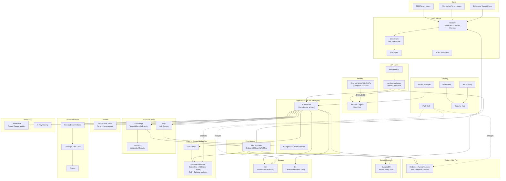

# Part VIII – Enterprise Application Architectures

# Chapter 59 — SaaS Multi-Tenant

---

# 1. Executive Summary

## The Business Problem

Software-as-a-Service companies face a structural economic problem that on-premises software vendors never had to solve.

- A traditional enterprise software vendor ships one codebase per customer, installed on that customer's infrastructure. Cost scales roughly linearly with customer count, and that cost is largely paid by the customer.
- A SaaS vendor operates the infrastructure for every customer simultaneously, on its own balance sheet. Gross margin — the single most scrutinized metric by SaaS investors — depends almost entirely on how efficiently the vendor can serve many customers ("tenants") from shared infrastructure.
- The moment a SaaS company deploys a dedicated stack per customer, it has effectively become an on-premises vendor with extra steps. Deployment velocity slows, infrastructure cost grows linearly with customer count instead of sub-linearly, and the operations team drowns in per-customer drift.

Multi-tenancy is the architectural response to this problem. It is the practice of serving multiple customers ("tenants") from a shared set of infrastructure, application code, and (in many designs) shared data stores — while preserving strict logical isolation between tenants' data, configuration, and performance characteristics.

- The core tension the architecture must resolve: **efficiency** (share as much as possible to keep unit economics healthy) versus **isolation** (keep tenants' data, security posture, and performance completely separated so that no tenant can see, affect, or be affected by another).
- Every design decision in this chapter is, at its root, a trade-off point somewhere along that efficiency-versus-isolation spectrum.

## Architecture Objective

The objective of this chapter's reference architecture is to provide a **tiered multi-tenant SaaS platform** on AWS that:

- Serves the majority of tenants from a shared ("pooled") compute and database layer to maximize infrastructure efficiency and minimize operational burden.
- Offers a **siloed** deployment option for enterprise tenants who require dedicated compute, dedicated databases, or contractual data-residency and compliance guarantees that a shared model cannot satisfy.
- Automates tenant onboarding, tenant configuration, tenant-aware billing/metering, and tenant lifecycle management (suspension, upgrade, offboarding) so that adding a new customer is a software operation, not an infrastructure operation.
- Provides tenant-level observability, tenant-level cost attribution, and tenant-level security boundaries strong enough to satisfy enterprise procurement and compliance review, even inside a pooled data model.
- Scales from a handful of pilot customers to tens of thousands of tenants without requiring a rewrite at each growth stage.

## Why Organizations Adopt This Architecture

- **Unit economics.** Pooled multi-tenancy is the only model that lets infrastructure cost grow sub-linearly with tenant count. A well-run pooled architecture can serve thousands of small-to-mid tenants on the same database cluster that would otherwise require thousands of individual clusters.
- **Operational leverage.** One codebase, one deployment pipeline, one monitoring stack serving every tenant means the engineering team does not multiply its operational surface area every time sales closes a new logo.
- **Feature velocity.** A single shared codebase means a new feature ships to every tenant simultaneously (subject to feature-flagging), rather than requiring a rollout wave across hundreds of isolated stacks.
- **Predictable compliance posture.** Centralizing security controls — encryption, logging, access control, patching — in one architecture makes it dramatically easier to pass SOC 2, ISO 27001, or HIPAA audits than attesting to hundreds of divergent customer-specific deployments.
- **Competitive necessity.** Enterprise buyers increasingly expect SaaS pricing and SaaS delivery speed. A vendor stuck on a single-tenant, per-customer deployment model cannot compete on price or time-to-value against a multi-tenant-native competitor.

## Major Business Benefits

| Benefit | Mechanism | Typical Impact |
|---|---|---|
| Lower cost of goods sold (COGS) | Shared compute/database utilization across many tenants | 30–60% lower infrastructure cost per tenant vs. siloed deployment at scale |
| Faster customer onboarding | Automated, software-driven tenant provisioning | Onboarding time reduced from days/weeks to minutes |
| Faster feature delivery | Single deployment target for all tenants | Release cadence moves from monthly/quarterly to daily/weekly |
| Stronger compliance posture | Centralized security controls, one audit surface | Single SOC 2 Type II report covers all tenants |
| Improved gross margin | COGS efficiency scales with tenant count | Gross margin commonly improves from 60–70% (early stage) to 75–85% (scaled, pooled multi-tenant) |
| Reduced operational headcount growth | One platform to operate instead of N per-customer stacks | Infrastructure/SRE headcount grows sub-linearly with customer count |

## Typical Enterprise Scenarios

- A B2B SaaS company selling a workflow, CRM, HR, analytics, or collaboration product to small-and-medium businesses (SMB) at self-serve or low-touch price points, where per-tenant dedicated infrastructure would be economically impossible.
- A company moving up-market from SMB into mid-market and enterprise accounts, where large customers begin demanding stronger isolation, dedicated capacity, or contractual data-residency guarantees that the original pure-pooled architecture cannot provide.
- A vertical SaaS company (e.g., healthcare practice management, legal case management, financial back-office software) where certain tenants are contractually or regulatorily required to have dedicated data stores (HIPAA Business Associate Agreements, financial services data segregation rules), while the majority of the customer base is comfortable with a pooled model.
- A platform business building an ecosystem of third-party integrations and APIs on top of tenant data, requiring strict per-tenant API rate limiting, usage metering, and billing integration.
- A company preparing for a security-conscious enterprise sales motion, where the ability to answer "how is my data isolated from other customers?" with a concrete, auditable answer directly affects deal velocity.

> **Note:** Multi-tenancy is not a single pattern — it is a spectrum. The right point on that spectrum depends on tenant size distribution, compliance requirements, and the company's stage of growth. This chapter's architecture is deliberately **tiered** (supports both pooled and siloed tenants simultaneously) because in practice almost every SaaS company beyond its earliest years ends up needing both models concurrently, not one or the other.

---

# 2. Business Requirements

## Business Drivers

- Support rapid, low-friction self-serve signup for SMB tenants with no manual provisioning step.
- Support a sales-assisted onboarding motion for mid-market and enterprise tenants, including custom domains, SSO/SAML federation, and (for the largest accounts) dedicated infrastructure.
- Provide per-tenant usage metering that feeds directly into billing, so pricing can be usage-based, seat-based, or tiered without a separate metering project.
- Guarantee tenant data isolation strong enough to satisfy enterprise security questionnaires and compliance audits (SOC 2, ISO 27001, and — for specific verticals — HIPAA or PCI DSS).
- Keep infrastructure cost per tenant predictable and attributable, so gross margin can be reported and defended to the board and investors.

## Functional Requirements

- New tenant signup must provision an isolated logical environment (database schema/row-level partition, storage prefix, configuration record) within minutes, without manual intervention, for standard-tier tenants.
- Each tenant must be reachable via a unique subdomain (`tenant-slug.app.example.com`) and, for enterprise tenants, an optional custom domain (`app.customer.com`) with a customer-provided or ACM-issued TLS certificate.
- Tenant administrators must be able to manage their own users, roles, and permissions within their tenant boundary.
- Enterprise tenants must be able to federate authentication through their own identity provider (SAML 2.0 or OIDC) rather than using the platform's native credential store.
- The platform must support tenant-level feature flags so that features can be rolled out progressively by tenant tier, by individual tenant, or by percentage cohort.
- The platform must record per-tenant API call volume, storage consumption, and compute consumption for billing and for enforcing plan-based usage limits.
- Platform administrators must be able to suspend, resume, upgrade (tier change), migrate (pooled → siloed), and permanently offboard (with data export and deletion) any tenant through an internal control plane, without touching application code.

## Non-Functional Requirements

| Category | Requirement |
|---|---|
| Availability | 99.95% for standard tier, 99.99% for enterprise tier (per tenant SLA) |
| Latency | p95 API response time under 300 ms for read operations, under 800 ms for write operations |
| Tenant isolation | No tenant can read, enumerate, or infer the existence of another tenant's data under any application-layer condition, including bugs in tenant-scoping logic (defense in depth via database-layer enforcement) |
| Data residency | Enterprise tenants in regulated industries or specific geographies must be able to pin their data to a specific AWS Region |
| Auditability | Every data access must be attributable to a tenant, a user, and a request, and retained in audit logs for a minimum of one year (longer for regulated tenants) |
| Elasticity | The platform must absorb a single large tenant's traffic spike without degrading response times for other pooled tenants ("noisy neighbor" protection) |

## Scalability Goals

- Support 10,000+ pooled tenants on shared infrastructure at launch scale, growing to 100,000+ pooled tenants without a re-architecture.
- Support at least 200 siloed enterprise tenants, each with dedicated compute and database capacity, provisioned through the same automated pipeline used for pooled tenants.
- Support tenants ranging from a single user to organizations with 50,000+ end users, without the largest tenants degrading performance for smaller ones.

## Availability Requirements

- Multi-AZ deployment for all stateful components (Aurora, ElastiCache, EFS if used) as the default posture for every tenant, pooled or siloed.
- Zero-downtime deployments for the shared application tier (rolling or blue-green), since a deployment window is shared across thousands of tenants and cannot be scheduled around any single customer's business hours.
- Independent failure domains between the control plane (tenant management, billing, provisioning) and the data plane (tenant application traffic), so a control-plane incident does not take down tenant-facing traffic.

## Latency Requirements

- API Gateway + Lambda authorizer tenant resolution must add no more than 15–20 ms to request latency.
- Database queries scoped by `tenant_id` must remain performant as row counts grow into the hundreds of millions by ensuring `tenant_id` is the leading column in every relevant composite index.
- CloudFront-fronted static assets (SPA frontend) should achieve sub-100 ms time-to-first-byte for cached content globally.

## Compliance Requirements

- SOC 2 Type II (baseline requirement for essentially all B2B SaaS selling into mid-market and enterprise).
- ISO 27001 for tenants in EMEA and APAC enterprise segments.
- HIPAA (with signed Business Associate Agreements) for tenants in healthcare verticals — typically satisfied only through the siloed tenant tier.
- GDPR data-subject rights (access, deletion, portability) implemented per tenant, not just per platform, since each tenant is itself a data controller for its own end users.

## Security Expectations

- Encryption at rest for all tenant data (database, object storage, backups) using AWS KMS, with the option of tenant-specific KMS keys for enterprise/siloed tenants.
- Encryption in transit (TLS 1.2+) for every hop, including internal service-to-service traffic.
- Strict least-privilege IAM boundaries between the control plane and any component that can access tenant data.
- Web Application Firewall (WAF) protection with per-tenant rate limiting to prevent one tenant's traffic (or a compromised tenant credential) from degrading service for others.

## Recovery Objectives

| Tier | RPO | RTO |
|---|---|---|
| Standard (pooled) | 5 minutes | 1 hour |
| Enterprise (siloed) | 1 minute | 15 minutes |

## SLAs

- Standard tier: 99.95% monthly uptime, published status page, service credits for breach.
- Enterprise tier: 99.99% monthly uptime, dedicated capacity, contractual penalty clauses, private support channel.

## Expected Workload

- Launch: ~500 tenants, ~50,000 end users, ~2,000 requests/second peak.
- Year 2: ~10,000 tenants, ~1,000,000 end users, ~25,000 requests/second peak.
- Year 4: ~50,000+ tenants including 150–300 siloed enterprise tenants, ~300,000 requests/second peak, multi-region presence.

## Expected Growth

- Tenant count is expected to grow non-linearly with strong SMB self-serve growth in years 1–2, followed by an accelerating enterprise mix in years 3+ as the company moves up-market — which is precisely why the architecture must support both pooled and siloed tenancy models from day one rather than bolting siloing on later.

---

# 3. Architecture Overview

## Overall Design

The platform is built as a **tiered multi-tenant architecture** with three tenant isolation models available simultaneously, selected per tenant at provisioning time:

1. **Pooled (shared) tier** — the default. Tenants share application compute, a shared Aurora PostgreSQL cluster, and shared caching, with logical isolation enforced through `tenant_id` partitioning and PostgreSQL Row-Level Security (RLS).
2. **Bridge (schema-isolated) tier** — mid-market tenants who need stronger data isolation than row-level partitioning but do not yet justify dedicated compute. These tenants get a dedicated PostgreSQL schema within a shared cluster.
3. **Silo (dedicated) tier** — enterprise tenants with dedicated Aurora clusters, dedicated compute capacity (separate ECS service or task set), and optionally a dedicated KMS key and dedicated S3 prefix/bucket.

All three tiers are served through the **same application codebase**, the **same API surface**, and the **same deployment pipeline** — the difference between tiers is purely in how the tenant-resolution and data-access layer routes a given tenant's requests to isolated infrastructure. This is the architectural principle that keeps engineering velocity high even as the business sells increasingly sophisticated isolation guarantees.

## Architecture Philosophy

- **Tenant context is established once, early, and propagated everywhere.** A `tenant_id` (and its isolation tier) is resolved at the edge (API Gateway authorizer) and carried through every downstream call — application logs, database connections, cache keys, queue messages, and billing events — as a first-class piece of context, never re-derived ad hoc deep in application code.
- **Isolation is enforced at the lowest possible layer, not just in application code.** Every layer that can enforce tenant boundaries does so independently: IAM policies, PostgreSQL RLS policies, S3 bucket policies with prefix conditions, and cache key namespacing. This is defense-in-depth against the single most common and most damaging class of SaaS bug — the cross-tenant data leak caused by a missing `WHERE tenant_id = ?` clause.
- **The control plane and the data plane are architecturally separate.** Provisioning, billing, tenant configuration, and administrative operations run through a distinct set of services (the control plane) from the services that serve tenant end-user traffic (the data plane). This separation means a runaway billing job or a provisioning bug cannot take down live tenant traffic, and vice versa.
- **Tier is a routing decision, not a code fork.** The same service code that serves a pooled tenant serves a siloed tenant; only the resolved database connection string, cache namespace, and (for the largest tenants) compute target differ.

## Core Components

| Layer | Component | Responsibility |
|---|---|---|
| Edge | Route 53, CloudFront, ACM | DNS, TLS termination, static asset delivery, custom domain support |
| API | Amazon API Gateway + Lambda Authorizer | Tenant resolution, JWT validation, request routing |
| Identity | Amazon Cognito (+ external SAML/OIDC IdPs) | End-user authentication, tenant-scoped user pools/groups |
| Application | ECS Fargate services | Multi-tenant business logic, tenant-aware data access layer |
| Async processing | Lambda, SQS, EventBridge | Webhooks, background jobs, tenant lifecycle events |
| Data | Aurora PostgreSQL (Serverless v2), DynamoDB | Tenant application data, tenant metadata/config |
| Caching | ElastiCache for Redis | Session cache, tenant-namespaced query cache |
| Storage | Amazon S3 | Tenant file/document storage, tenant-prefixed |
| Metering | Kinesis Data Firehose, S3, Athena | Usage capture for billing and quota enforcement |
| Provisioning | Step Functions, Lambda | Automated tenant onboarding/offboarding workflows |
| Security | WAF, KMS, Secrets Manager, GuardDuty, Security Hub | Perimeter defense, encryption, threat detection |
| Observability | CloudWatch, X-Ray | Tenant-tagged metrics, tracing, alarms |

## How Components Interact

- End users hit a tenant-specific subdomain or custom domain, resolved via Route 53 to CloudFront.
- CloudFront serves the SPA frontend from S3 and forwards API calls to API Gateway.
- API Gateway invokes a Lambda authorizer that validates the JWT (issued by Cognito or a federated SAML/OIDC IdP), extracts the `tenant_id` claim, looks up the tenant's isolation tier and resource pointers in DynamoDB (`TenantConfig` table, cached), and injects this context into the request.
- ECS Fargate application services receive the enriched request, use the tenant context to select the correct database connection (pooled cluster + RLS session variable, bridge schema, or dedicated silo cluster), and execute business logic.
- Asynchronous work (webhooks, exports, notifications) is published to tenant-tagged SQS messages or EventBridge events and processed by Lambda consumers that re-establish tenant context from the message payload.
- Every data-plane operation emits a usage event to Kinesis Data Firehose, landing in S3 for Athena-based metering and billing reconciliation.

## High-Level Workflow

1. Tenant signs up (self-serve) or is provisioned by sales/success (enterprise) → Step Functions provisioning workflow runs.
2. Tenant record created in `TenantConfig` (DynamoDB) with tier, isolation mode, resource pointers, feature flags.
3. Tenant's users authenticate via Cognito (or federated IdP for enterprise) and receive a JWT with `tenant_id` and role claims.
4. All subsequent API requests are tenant-resolved at the edge and routed to isolated data resources.
5. Usage events stream continuously to the metering pipeline; billing system reconciles nightly.

## Request Lifecycle

Client → Route 53 → CloudFront → API Gateway → Lambda Authorizer (tenant resolution) → ECS Fargate service → Aurora/DynamoDB/ElastiCache (tenant-scoped) → response.

## Response Lifecycle

Application service → structured JSON response (tagged internally with `tenant_id` for logging, stripped before returning to client) → API Gateway → CloudFront → client. Usage event emitted asynchronously to Kinesis in parallel, off the request's critical path.

## Data Lifecycle

Tenant data is created and read through the tenant-scoped data access layer, replicated synchronously across AZs by Aurora, backed up via automated snapshots (point-in-time recovery), archived to S3 for long-term/cold storage where required by tenant retention policy, and permanently deleted (data + backups + KMS key destruction for siloed tenants) upon verified offboarding.

---

# 4. AWS Services Used

## Amazon ECS on AWS Fargate

- **Purpose:** Runs the stateless, multi-tenant application services (API backend, background workers) without managing EC2 instances.
- **Why selected:** Fargate removes the operational burden of patching and scaling EC2 hosts, which matters enormously for a platform team whose real product is the SaaS application, not infrastructure. Fargate's per-task billing also makes it straightforward to right-size and cost-attribute compute for dedicated (siloed) enterprise tenants.
- **Alternatives:** Amazon EKS (more flexibility, far more operational overhead — see Chapter 36); AWS Lambda for the entire application tier (viable for lighter workloads, but connection-pooling to a relational database at high concurrency becomes a serious constraint — mitigated with RDS Proxy, but still adds architectural complexity for latency-sensitive, long-lived-connection workloads).
- **Limitations:** Cold-start-free but slower task startup than Lambda; less granular scale-to-zero behavior than serverless compute.
- **Pricing considerations:** Billed per vCPU/memory-second; Fargate Spot can cut cost 40–70% for background worker tasks that tolerate interruption.
- **Best practices:** Separate ECS services for the API tier and the background-worker tier so they scale independently; use Fargate Spot for asynchronous/batch workloads only, never for the customer-facing API tier.

## Amazon API Gateway

- **Purpose:** The single entry point for all tenant API traffic; hosts the Lambda authorizer that performs tenant resolution.
- **Why selected:** Built-in JWT/Lambda authorizer support, native throttling and usage-plan features map naturally onto per-tenant rate limiting, and integrates cleanly with WAF.
- **Alternatives:** Application Load Balancer with a Lambda target for authorization (lower cost at very high volume, but loses API Gateway's native usage-plan and request-validation features); a self-managed API gateway on ECS (Kong, Envoy) for teams needing more customization at the cost of operating it themselves.
- **Limitations:** Default throttle/quota limits require AWS Support requests to raise at very large scale; REST API payload size limits (10 MB).
- **Pricing considerations:** Pay-per-request pricing is efficient for bursty SMB traffic but should be modeled carefully against ALB's flat hourly cost at very high sustained request volumes.
- **Best practices:** Use usage plans and API keys (or a custom authorizer-driven equivalent) to enforce per-tenant-tier rate limits; cache authorizer results for a short TTL (30–60 seconds) to avoid re-resolving tenant context on every single request.

## AWS Lambda

- **Purpose:** Powers the tenant-resolution authorizer, asynchronous background jobs (webhooks, notifications, exports), and the tenant provisioning/offboarding workflow steps.
- **Why selected:** Pay-per-invocation economics fit bursty, tenant-triggered asynchronous work far better than always-on compute; natural fit for Step Functions-orchestrated workflows.
- **Alternatives:** ECS Fargate tasks for longer-running or higher-throughput background work (used here for the always-on API tier, while Lambda handles the sporadic/event-driven tier).
- **Limitations:** 15-minute maximum execution time; cold starts can affect the authorizer's tail latency (mitigated with provisioned concurrency for the authorizer function specifically).
- **Pricing considerations:** Extremely low cost at the request volumes typical of tenant lifecycle events (onboarding, offboarding, plan changes) which are orders of magnitude less frequent than core API traffic.
- **Best practices:** Apply provisioned concurrency to the tenant-resolution authorizer to keep p99 authorization latency predictable; keep authorizer functions minimal — a DynamoDB lookup and a signature check, nothing more.

## Amazon Aurora PostgreSQL (Serverless v2)

- **Purpose:** The primary relational data store for tenant application data, serving pooled tenants (via `tenant_id` + Row-Level Security), bridge tenants (via dedicated schema), and — as separate clusters — siloed enterprise tenants.
- **Why selected:** PostgreSQL's native Row-Level Security is the single most important database feature for this architecture: it lets the database itself refuse to return rows outside the current session's tenant context, providing a second line of defense below the application layer. Aurora Serverless v2 lets pooled-cluster capacity scale with aggregate tenant load without manual instance resizing, and lets dedicated siloed clusters for smaller enterprise tenants start cheap and scale as that tenant grows.
- **Alternatives:** Amazon RDS for PostgreSQL (simpler, less elastic, a reasonable choice for siloed clusters that don't need Aurora's replication/scaling features); DynamoDB as the primary store (excellent for the tenant metadata table and high-throughput key-value access patterns, but a poor fit for the platform's core relational, multi-table, transactional business data).
- **Limitations:** RLS policies add a small but measurable per-query overhead; must be paired with connection pooling (RDS Proxy) to avoid connection exhaustion when thousands of pooled-tenant requests share a cluster.
- **Pricing considerations:** Serverless v2 Aurora Capacity Units (ACUs) bill per second of provisioned capacity within a configured min/max range — set conservative minimums for siloed enterprise clusters serving low-traffic tenants to avoid paying for idle headroom.
- **Best practices:** Enforce `tenant_id` as the leading column of every composite index; enable RLS on every tenant-scoped table with a policy tied to a session-local `app.tenant_id` variable set at the start of every request; use RDS Proxy in front of the pooled cluster.

## Amazon DynamoDB

- **Purpose:** Stores the `TenantConfig` metadata table (tier, isolation mode, resource pointers, feature flags) and other high-throughput, simple-access-pattern data such as session tokens and idempotency keys.
- **Why selected:** Single-digit-millisecond reads at any scale are exactly what tenant-resolution needs on the hot path of every single API request; DynamoDB Accelerator (DAX) or aggressive application-level caching further reduces this to near-zero added latency.
- **Alternatives:** Storing tenant metadata in the same Aurora cluster it is meant to route requests to would create a circular dependency and a single point of failure for the entire routing layer — a clear anti-pattern this design deliberately avoids.
- **Limitations:** Not a good fit for complex relational queries or multi-table joins — used here strictly for its strengths (key-value lookups, simple access patterns), not as the system's general-purpose database.
- **Pricing considerations:** On-demand capacity mode is appropriate given the read pattern is proportional to (and much smaller than) primary API traffic.
- **Best practices:** Cache `TenantConfig` lookups aggressively (authorizer-local cache + optional DAX) since the same tenant is resolved on every request from that tenant.

## Amazon S3

- **Purpose:** Stores tenant-uploaded files/documents (tenant-prefixed), the static SPA frontend build, data lake landing zone for the usage-metering pipeline, and Aurora/EFS backup archives.
- **Why selected:** Effectively unlimited scale, native support for prefix-based access policies (a clean primitive for tenant isolation in object storage), lifecycle policies for automatic tiering/expiration, and native KMS integration for per-tenant encryption keys where required.
- **Alternatives:** Amazon EFS for tenant file storage where POSIX file semantics are required by the application (higher cost, more operational surface, used only where genuinely needed).
- **Limitations:** IAM/bucket-policy-based prefix isolation must be carefully tested — a misconfigured policy can accidentally grant broader access than intended.
- **Pricing considerations:** S3 Intelligent-Tiering for tenant file storage where access patterns are unpredictable; S3 Lifecycle rules to transition old exports/audit logs to Glacier.
- **Best practices:** One bucket per environment with strict tenant-prefix IAM conditions for pooled/bridge tenants; a dedicated bucket (and dedicated KMS key) per siloed enterprise tenant where contractually required.

## Amazon ElastiCache for Redis

- **Purpose:** Session caching, tenant-scoped query result caching, and rate-limit counters.
- **Why selected:** Sub-millisecond latency for the hot-path lookups (session validation, tenant config, rate-limit counters) that would otherwise add database round-trips to every request.
- **Alternatives:** DynamoDB Accelerator (DAX) covers DynamoDB-specific caching; Redis is preferred here because it also serves as the rate-limiting counter store, which benefits from Redis's atomic increment/expire primitives.
- **Limitations:** Requires careful key namespacing (`tenant:{id}:...`) to avoid cross-tenant cache key collisions — a subtle but real isolation risk if overlooked.
- **Pricing considerations:** Reserved nodes for the always-on pooled-tier cluster; on-demand for smaller siloed-tenant caches if used.
- **Best practices:** Never allow a raw, un-namespaced cache key to reach Redis from application code — enforce key construction through a single shared helper function.

## Amazon Cognito

- **Purpose:** End-user authentication for pooled and bridge tenants; federation broker for enterprise tenants bringing their own SAML/OIDC identity provider.
- **Why selected:** Native support for multiple identity pools/user pools, custom JWT claims (used to embed `tenant_id`), and built-in SAML/OIDC federation removes the need to build a custom identity broker.
- **Alternatives:** A third-party identity platform (Auth0, Okta CIC) offers a more polished federation UX out of the box at meaningfully higher cost per monthly active user; self-built identity (never recommended — authentication is one of the worst areas to under-invest in or reinvent).
- **Limitations:** Customizing the hosted UI beyond Cognito's built-in options requires additional engineering; per-tenant user pool isolation (one Cognito User Pool per tenant) does not scale operationally past a few hundred tenants and is avoided in favor of one pool with tenant-scoped groups/claims.
- **Pricing considerations:** Billed per monthly active user (MAU); federation via SAML/OIDC has a higher per-MAU rate — model this into enterprise tenant contract pricing.
- **Best practices:** Use a single Cognito User Pool with a custom `tenant_id` attribute and Cognito Groups for role-based access within a tenant, rather than provisioning one User Pool per tenant.

## Amazon SQS and Amazon EventBridge

- **Purpose:** SQS decouples synchronous API requests from slower asynchronous work (report generation, bulk export, webhook delivery); EventBridge distributes tenant lifecycle events (created, upgraded, suspended, offboarded) to every interested downstream consumer (billing, provisioning, notifications, analytics).
- **Why selected:** SQS's per-message visibility timeout and dead-letter-queue support make it a reliable buffer for tenant-triggered background jobs; EventBridge's schema registry and content-based routing rules are a natural fit for a growing set of tenant lifecycle subscribers that should not need to know about each other.
- **Alternatives:** Amazon Kinesis Data Streams where strict ordering and replay across many consumers is required (used here specifically for the usage-metering pipeline, not general messaging).
- **Limitations:** SQS standard queues do not guarantee ordering (acceptable for this workload); FIFO queues trade throughput for ordering where per-tenant sequencing matters (e.g., billing adjustment events).
- **Pricing considerations:** Both services are inexpensive relative to compute at this workload's message volumes.
- **Best practices:** Tag every message/event with `tenant_id` in the message attributes (not just the body) so consumers, dead-letter-queue triage, and cost attribution can filter without deserializing the payload.

## Amazon Kinesis Data Firehose

- **Purpose:** Streams tenant usage events (API calls, storage consumed, feature usage) into S3 for the metering and billing pipeline.
- **Why selected:** Firehose's built-in buffering, batching, and S3/Parquet conversion removes the need to build and operate a custom streaming-to-storage pipeline for what is, functionally, an append-only audit/metering log.
- **Alternatives:** Writing usage events directly to DynamoDB (works at small scale, becomes expensive and awkward for the large-scale analytical queries billing reconciliation requires).
- **Pricing considerations:** Billed per GB ingested; converting to Parquet at ingestion meaningfully reduces downstream Athena query cost.
- **Best practices:** Partition the S3 usage-event data lake by `tenant_id` and date to keep Athena billing-reconciliation queries fast and cheap.

## AWS Step Functions

- **Purpose:** Orchestrates the multi-step tenant provisioning workflow (create DynamoDB tenant record → create database schema/cluster → create S3 prefix/bucket → create Cognito group → create DNS record → send welcome notification) and the mirror-image offboarding workflow.
- **Why selected:** Tenant provisioning is a textbook Saga-shaped workflow (see Chapter 80) — multiple steps across multiple AWS services, each of which can fail independently and each of which needs a defined compensating action. Step Functions' native retry, catch, and state-visualization capabilities make this reliable and auditable in a way a chain of Lambda functions calling each other would not be.
- **Alternatives:** A custom orchestrator built on SQS + Lambda (more code to maintain, no built-in visual audit trail, no native compensation/retry semantics).
- **Limitations:** Standard Step Functions workflows have a maximum execution history size; provisioning workflows are short enough that this is not a practical constraint.
- **Best practices:** Every provisioning step must have an explicit compensating (rollback) action defined in the state machine, so a failure halfway through onboarding a tenant never leaves that tenant in a half-provisioned, invisible-but-costly state.

## AWS WAF and AWS Shield

- **Purpose:** Perimeter protection against common web exploits (SQL injection, XSS) and DDoS mitigation, with custom rules for per-tenant rate limiting.
- **Why selected:** Native integration with CloudFront and API Gateway; rate-based rules can key on the tenant-identifying header/token to throttle abusive tenants without penalizing the rest of the platform.
- **Alternatives:** A third-party WAF (Cloudflare, Imperva) offers a larger managed rule catalog at additional cost and an additional vendor relationship; AWS WAF is preferred here for tight native integration with the rest of the AWS-native edge stack.
- **Best practices:** Use WAF rate-based rules scoped to a tenant-identifying token, in addition to (not instead of) IP-based rate limiting, since many tenants' end users share NAT'd corporate IP ranges.

## AWS KMS and AWS Secrets Manager

- **Purpose:** KMS provides envelope encryption for all data at rest, with the option of a dedicated Customer Managed Key (CMK) per siloed enterprise tenant; Secrets Manager stores database credentials, third-party API keys, and per-tenant SSO configuration secrets.
- **Why selected:** Native, deeply integrated encryption across every AWS data service used in this architecture; Secrets Manager's automatic rotation removes a recurring manual security task.
- **Best practices:** Rotate the pooled-cluster database credential automatically via Secrets Manager's native RDS/Aurora rotation Lambda; issue and track a distinct CMK per siloed tenant so a single tenant's offboarding can include verifiable key destruction.

## Amazon GuardDuty, AWS Security Hub, and AWS Config

- **Purpose:** Continuous threat detection (GuardDuty), centralized security posture aggregation (Security Hub), and configuration drift/compliance detection (Config) across the account(s) hosting the platform.
- **Why selected:** These are the baseline "always-on" AWS-native security services expected by virtually every SOC 2 and ISO 27001 auditor reviewing a SaaS platform; they require comparatively little operational investment relative to the assurance they provide.
- **Best practices:** Route all three services' findings into a central Security Hub view (or a dedicated security-tooling account in an AWS Organizations structure) rather than checking each service's console individually.

## Amazon CloudFront and AWS Certificate Manager

- **Purpose:** CloudFront serves the SPA frontend and can proxy API traffic at the edge; ACM issues and auto-renews TLS certificates, including per-tenant custom-domain certificates for enterprise accounts.
- **Best practices:** Use CloudFront's multi-tenant distribution with dynamic origin selection or a dedicated distribution per custom domain (via CloudFront's SaaS Manager / multi-tenant distribution capabilities) to support enterprise custom domains without provisioning a full distribution per tenant by hand.

## Amazon Route 53

- **Purpose:** DNS for the platform's wildcard tenant subdomain (`*.app.example.com`) and for delegated or ACM-validated enterprise custom domains.
- **Best practices:** Automate subdomain DNS record creation as part of the Step Functions tenant-provisioning workflow so a new tenant's subdomain resolves the instant provisioning completes.

---

# 5. Complete Architecture Diagram



> **Diagram Note:** The pooled/bridge data plane and the silo data plane are drawn as separate subgraphs deliberately. The application service layer (`APISVC`) is a single shared codebase that routes to whichever data plane a given request's tenant context resolves to — this is the architectural expression of "tier is a routing decision, not a code fork."

---

# 6. Component-by-Component Explanation

## Route 53 (DNS)

- **Purpose:** Resolves the platform's wildcard subdomain and enterprise custom domains to CloudFront.
- **Responsibilities:** Wildcard `A`/`ALIAS` record for `*.app.example.com`; per-tenant `CNAME`/`ALIAS` records for custom domains, created automatically during provisioning.
- **Scaling:** DNS scales natively; no capacity planning required.
- **High availability:** Route 53 is a globally distributed, highly available managed service by design.
- **Dependencies:** ACM for certificate validation on custom domains.

## CloudFront

- **Purpose:** Global edge distribution for the SPA frontend and API acceleration.
- **Responsibilities:** TLS termination, static asset caching, origin routing to API Gateway.
- **Scaling:** Scales automatically with global traffic.
- **Failure handling:** Origin failover configuration points to a secondary API Gateway/region for enterprise tenants requiring multi-region resilience.
- **Security:** Integrated with WAF; enforces HTTPS-only viewer protocol policy.

## API Gateway + Lambda Authorizer

- **Purpose:** The tenant-resolution chokepoint — every single request passes through this component before touching any tenant data.
- **Responsibilities:** JWT validation, `tenant_id` extraction, tenant tier/resource-pointer lookup (from cached `TenantConfig`), request context enrichment, per-tenant throttling.
- **Inputs:** HTTPS request with Authorization header (Cognito or federated JWT).
- **Outputs:** Enriched request context (tenant ID, tier, database connection target, feature flags) passed to the application service.
- **Scaling:** API Gateway scales automatically; the authorizer Lambda uses provisioned concurrency to eliminate cold-start-driven latency spikes.
- **Failure handling:** Authorizer failures return 401/403 rather than silently defaulting to an ambiguous tenant context — a fail-closed design is mandatory here.
- **Security:** This is the single most security-critical component in the entire platform; a bug here is a cross-tenant data breach.

## ECS Fargate Application Service

- **Purpose:** Executes tenant business logic against tenant-scoped data.
- **Responsibilities:** Sets the PostgreSQL session-local `app.tenant_id` variable (enforcing RLS) or selects the correct dedicated connection string (silo tier) at the start of every request; enforces tenant-scoped authorization on top of RLS.
- **Scaling:** Target-tracking auto scaling on CPU/request count; independently scaled from the background-worker service.
- **High availability:** Deployed across a minimum of three Availability Zones, behind an internal ALB or API Gateway VPC Link.
- **Dependencies:** RDS Proxy (pooled tier), dedicated Aurora endpoints (silo tier), ElastiCache, S3.

## RDS Proxy

- **Purpose:** Connection pooling and multiplexing in front of the shared pooled/bridge Aurora cluster.
- **Responsibilities:** Prevents connection exhaustion as thousands of pooled tenants' requests fan out across ECS Fargate tasks.
- **Why critical:** Without connection pooling, a pooled multi-tenant architecture at scale will exhaust PostgreSQL's `max_connections` well before it exhausts compute capacity — one of the most common production incidents in pooled SaaS databases.

## Aurora PostgreSQL — Pooled/Bridge Cluster

- **Purpose:** Primary relational store for the majority of tenants.
- **Responsibilities:** Enforces Row-Level Security per tenant on pooled tables; hosts dedicated schemas for bridge-tier tenants within the same physical cluster.
- **Scaling:** Aurora Serverless v2 auto-scales ACUs with aggregate load; read replicas absorb read-heavy reporting workloads without impacting write latency.
- **Failure handling:** Multi-AZ with automated failover to a replica within seconds; automated backups with point-in-time recovery.

## Aurora PostgreSQL — Silo Clusters

- **Purpose:** Dedicated database per enterprise tenant requiring the strongest isolation guarantee.
- **Responsibilities:** Fully isolated compute, storage, backup, and (optionally) KMS key per tenant.
- **Scaling:** Sized independently per tenant contract; can be right-sized down for lower-traffic enterprise tenants using Serverless v2's minimum ACU floor.

## DynamoDB — TenantConfig

- **Purpose:** The authoritative source of truth for tenant tier, isolation mode, resource pointers (which cluster/schema/bucket a tenant's data lives in), and feature flags.
- **Responsibilities:** Sub-10ms lookups on the hot path of every request's tenant resolution.
- **High availability:** Multi-AZ by default (DynamoDB's standard behavior); global tables for multi-region deployments.

## ElastiCache for Redis

- **Purpose:** Session cache, `TenantConfig` cache (to avoid a DynamoDB round-trip on every request), and rate-limit counters.
- **Responsibilities:** All keys are namespaced `tenant:{tenant_id}:...` to prevent cross-tenant key collisions.
- **Failure handling:** Multi-AZ with automatic failover; application falls back to DynamoDB/Aurora directly (at higher latency) if Redis is unavailable, rather than failing the request outright.

## Amazon S3 — Tenant File Storage

- **Purpose:** Stores tenant-uploaded documents and generated exports.
- **Responsibilities:** Prefix-based isolation (`s3://platform-tenant-files/{tenant_id}/...`) for pooled/bridge tenants; dedicated buckets for silo tenants.
- **Security:** IAM policies scoped with `s3:prefix` conditions matching the requesting service's resolved `tenant_id`; bucket policies deny any cross-prefix access even from within the application's own IAM role, as a defense-in-depth backstop.

## SQS and EventBridge

- **Purpose:** Decouple slow or bursty operations (exports, notifications, tenant lifecycle events) from the synchronous request path.
- **Responsibilities:** SQS queues per job type (export, webhook-delivery) with dead-letter queues; EventBridge routes tenant lifecycle events to billing, provisioning, and analytics consumers independently.

## Step Functions — Provisioning Workflow

- **Purpose:** Orchestrates tenant creation and deletion as a reliable, auditable, resumable saga.
- **Responsibilities:** Sequenced creation of DynamoDB record → schema/cluster → S3 prefix/bucket → Cognito group → DNS record, with compensating rollback actions defined at every step.

## Kinesis Data Firehose + Athena — Metering Pipeline

- **Purpose:** Captures every billable usage event and makes it queryable for billing reconciliation and quota enforcement.
- **Responsibilities:** Streams to S3 in Parquet format, partitioned by `tenant_id` and date.

## WAF, KMS, Secrets Manager, GuardDuty, Security Hub, Config

- **Purpose:** Perimeter defense, encryption, secret management, and continuous compliance/threat monitoring — described in detail in Section 11.

---

# 7. End-to-End Request Flow

1. **Client request.** A user of Tenant A (`tenant-a.app.example.com`) submits a request from the browser SPA.
2. **DNS resolution.** Route 53 resolves the subdomain to the CloudFront distribution.
3. **Edge TLS termination.** CloudFront terminates TLS using the ACM certificate for `*.app.example.com` (or the tenant's custom-domain certificate).
4. **WAF inspection.** AWS WAF evaluates the request against managed rule groups and tenant-aware rate-based rules; malicious or over-quota requests are blocked with a 403.
5. **API Gateway routing.** The request reaches API Gateway, which invokes the Lambda authorizer before any business logic executes.
6. **JWT validation.** The authorizer validates the JWT signature and expiry against Cognito's (or the federated IdP's) public keys.
7. **Tenant resolution.** The authorizer extracts `tenant_id` from the JWT claim and looks up the tenant's tier and resource pointers from the ElastiCache-cached `TenantConfig` (falling back to DynamoDB on cache miss).
8. **Rate limit check.** The authorizer checks the tenant's current request count in Redis against its plan's rate limit; over-limit requests are rejected with a 429 before reaching application compute.
9. **Context injection.** API Gateway passes the enriched, signed request context (tenant ID, tier, resource pointers) to the ECS Fargate application service.
10. **Session tenant binding.** The application service opens (or reuses, via RDS Proxy) a database connection and sets the session-local `app.tenant_id` variable, activating the relevant Row-Level Security policies for pooled/bridge tenants, or connects directly to the tenant's dedicated Aurora endpoint for silo tenants.
11. **Business logic execution.** The service executes the requested operation, reading/writing only data the RLS policy (or dedicated cluster boundary) permits.
12. **Cache interaction.** Frequently accessed, tenant-namespaced data is read from or written to ElastiCache alongside the database call.
13. **Object storage interaction (if applicable).** File uploads/downloads are proxied through pre-signed S3 URLs scoped to the tenant's prefix or dedicated bucket.
14. **Usage event emission.** An asynchronous usage event (API call type, resource consumed) is published to Kinesis Data Firehose, off the critical path.
15. **Structured logging.** The application emits a structured log line tagged with `tenant_id`, `request_id`, and `trace_id` to CloudWatch Logs.
16. **Distributed tracing.** X-Ray captures the full trace across API Gateway, Lambda authorizer, ECS service, and downstream data calls, tagged with `tenant_id` as a trace annotation.
17. **Response formation.** The application service returns a JSON response; internal tenant metadata is stripped before serialization.
18. **Response transit.** The response flows back through API Gateway → CloudFront → the client.
19. **Error handling.** Any unhandled exception is caught by a global error-handling middleware, logged with full tenant/request context, and returned to the client as a sanitized error (no internal stack traces, no cross-tenant information ever included in error payloads).
20. **Monitoring evaluation.** CloudWatch alarms continuously evaluate tenant-tagged error-rate and latency metrics; anomalies for a single high-volume tenant trigger a distinct alarm from platform-wide anomalies, so a single tenant's incident doesn't get lost in aggregate metrics — and, symmetrically, doesn't falsely trigger a platform-wide page.

---

# 8. Deployment Flow

## Infrastructure Provisioning

- All infrastructure — networking, ECS clusters/services, Aurora clusters, DynamoDB tables, Cognito pools, API Gateway, Step Functions state machines — is defined in Terraform and applied through a CI/CD pipeline, never through manual console changes.
- Silo-tier Aurora clusters and (optionally) dedicated S3 buckets are provisioned dynamically at tenant-onboarding time by the Step Functions workflow, which itself invokes a constrained, parameterized Terraform module (via a CI/CD API trigger or a Terraform Cloud/Terraform Enterprise run) rather than hand-editing infrastructure code per enterprise customer.

## Terraform Workflow

1. Engineer opens a pull request modifying a Terraform module.
2. CI runs `terraform fmt -check`, `terraform validate`, and a policy-as-code check (e.g., Open Policy Agent / Sentinel) against tagging, encryption, and network-exposure rules.
3. CI runs `terraform plan` and posts the plan as a PR comment for human review.
4. On merge to the main branch, CI runs `terraform apply` against a remote state backend (S3 + DynamoDB lock table).
5. For the tenant-provisioning-triggered silo module specifically, Step Functions invokes a dedicated, tightly scoped Terraform run (via a CodeBuild project or a Terraform Cloud API call) with only the variables required to create one tenant's dedicated resources — this run has no ability to modify shared platform infrastructure.

## CI/CD Deployment (Application)

- The application container image is built and pushed to Amazon ECR on every merge to main.
- ECS service deployment uses a rolling update strategy with a minimum healthy percent of 100% and a maximum percent of 200%, ensuring zero-downtime deploys across all tenants simultaneously.
- Database schema migrations run as a distinct, gated pipeline step before the application deployment, using an expand/contract migration pattern (see Section 27, Anti-Patterns) so old and new application code can both run correctly during the rollout window.

## Blue-Green Deployment

- For higher-risk releases, the platform uses a blue-green ECS deployment via AWS CodeDeploy, shifting traffic from the old task set to the new task set in stages (e.g., 10% → 50% → 100%) with automated CloudWatch alarm-based rollback if tenant-tagged error rates increase during the shift.

## Rollback

- Application rollback is a CodeDeploy traffic-shift reversal, typically completing in under two minutes.
- Database migrations follow the expand/contract pattern specifically so that a rollback never requires an unsafe backward schema migration under load.

## Secrets

- Database credentials, third-party API keys, and per-tenant SSO signing certificates are stored in Secrets Manager and injected into ECS tasks at runtime via task-definition secret references — never baked into container images or environment variable files in source control.

## Configuration

- Tenant-specific configuration (feature flags, plan limits, branding) lives in DynamoDB, not in deployed application configuration files, so tenant configuration changes never require a deployment.

## Validation

- Post-deployment smoke tests run synthetic transactions against a small set of dedicated internal test tenants (spanning pooled, bridge, and silo tiers) before the deployment pipeline reports success.

---

# 9. Network Topology

## VPC Design

- A single production VPC per Region, CIDR `10.20.0.0/16`, spanning three Availability Zones.

| Subnet Tier | Purpose | Example CIDR (per AZ) |
|---|---|---|
| Public | ALB/NAT Gateway only | `10.20.0.0/24`, `10.20.1.0/24`, `10.20.2.0/24` |
| Private – Application | ECS Fargate tasks, Lambda (VPC-attached) | `10.20.10.0/23`, `10.20.12.0/23`, `10.20.14.0/23` |
| Private – Data | Aurora clusters (pooled + silo), ElastiCache | `10.20.20.0/23`, `10.20.22.0/23`, `10.20.24.0/23` |

## NAT Gateway

- One NAT Gateway per AZ (three total) for outbound internet access from private subnets (e.g., calling third-party APIs, downloading patches), avoiding a single-AZ NAT Gateway as a cross-AZ single point of failure.

## Internet Gateway

- One Internet Gateway attached to the VPC, used only by public-subnet resources (ALB, NAT Gateways).

## Route Tables

- Distinct route tables per subnet tier per AZ; private-application and private-data route tables send `0.0.0.0/0` to the AZ-local NAT Gateway; data-tier subnets have no route to the internet at all beyond NAT (no direct public exposure under any circumstance).

## Network ACLs

- Baseline NACLs at the subnet level as a coarse-grained backstop (deny known-bad ports/protocols); the primary access-control mechanism is Security Groups, which are more expressive and easier to reason about at the application level.

## Security Groups

| Security Group | Inbound | Outbound |
|---|---|---|
| `sg-alb` | 443 from `0.0.0.0/0` (via CloudFront-managed prefix list) | To `sg-app` on application port |
| `sg-app` (ECS tasks) | Application port from `sg-alb` only | To `sg-data` (Aurora/Redis ports), to NAT for external calls |
| `sg-data` (Aurora, Redis) | Database/cache ports from `sg-app` only | None required |
| `sg-silo-data-{tenant}` | Database port from `sg-app` only | None required |

## PrivateLink

- For the small number of enterprise tenants requiring direct private network connectivity (rather than public internet-facing API access), the platform exposes a VPC endpoint service (PrivateLink) fronting the API layer, avoiding the far heavier operational cost of full VPC peering or Transit Gateway attachment per tenant.

## Hybrid Connectivity

- Not required for the majority of tenants. Where a specific enterprise tenant's contract requires connectivity from their own on-premises network, this is handled as an isolated, tenant-specific Direct Connect or Site-to-Site VPN attached only to that tenant's silo VPC (or a dedicated subnet), never to the shared pooled-tier VPC.

---

# 10. Identity and Access

## IAM Roles

- **ECS Task Execution Role** — pulls container images from ECR, retrieves secrets from Secrets Manager; no access to tenant data.
- **ECS Task Role (API service)** — scoped to Aurora (via RDS Proxy IAM authentication where used), DynamoDB `TenantConfig` table, S3 tenant-file bucket with prefix conditions, and the specific KMS keys required for decryption — nothing broader.
- **ECS Task Role (background worker)** — scoped separately from the API service role; workers do not need the same permission set as the request-serving tier.
- **Provisioning Role (Step Functions/Lambda)** — the only role in the platform permitted to create new tenant-scoped resources (schemas, S3 prefixes, DNS records); this role is never assumed by the application data plane.
- **Silo Terraform Execution Role** — narrowly scoped to create resources tagged for exactly one new tenant ID; cannot modify existing shared infrastructure.

## IAM Policies

- Every tenant-data-accessing policy uses `s3:ExistingObjectTag` / `s3:prefix` conditions and, where applicable, `dynamodb:LeadingKeys` conditions to enforce tenant scoping at the IAM layer as an additional line of defense beyond application logic and database RLS.

## Resource Policies

- S3 bucket policies explicitly deny any `s3:GetObject`/`s3:PutObject` call that does not match the expected tenant-prefix condition, even from principals that otherwise hold broad IAM permissions — a deliberate belt-and-suspenders control.

## STS and Cross-Account Access

- The control plane (billing, provisioning, security tooling) lives in a separate AWS account from the data plane (tenant-facing application), connected via cross-account IAM roles assumed through STS, following an AWS Organizations multi-account structure (see Chapter 88).

## Least Privilege

- No IAM role in the data plane has `*` resource scope on any tenant-data service; every policy is scoped to the specific ARNs, prefixes, or tag conditions required for that role's function.

## Service Roles

- Distinct service-linked and custom service roles per AWS service integration (Firehose delivery role, Step Functions execution role, EventBridge rule target role), each scoped narrowly to its single integration point.

## Permission Boundaries

- A permission boundary is attached to all developer-assumable IAM roles used in CI/CD, capping the maximum permissions any pipeline-created role can ever have, regardless of what an individual Terraform module requests — a critical guardrail given how many engineers may contribute Terraform changes over the platform's life.

---

# 11. Security Architecture

## Encryption

- **At rest:** Every Aurora cluster (pooled and silo), every DynamoDB table, every S3 bucket, and every EBS/ElastiCache resource is encrypted using AWS KMS. Silo-tier tenants may be assigned a dedicated Customer Managed Key (CMK) for cryptographic isolation and verifiable key destruction upon offboarding.
- **In transit:** TLS 1.2+ enforced on every public and internal hop, including ECS-to-Aurora and ECS-to-Redis connections (Redis in-transit encryption enabled).

## KMS

- Distinct KMS key policies grant decrypt permission only to the specific IAM roles that legitimately need it (the API service task role, the backup/restore role) — not blanket account-wide decrypt access.

## TLS / Certificate Manager

- ACM issues and auto-renews the wildcard certificate for `*.app.example.com` and per-tenant certificates for custom domains, validated via DNS validation records created automatically during onboarding.

## WAF

- Managed rule groups (SQL injection, known bad inputs, IP reputation lists) combined with custom rate-based rules keyed on the tenant-identifying token.

## Shield

- AWS Shield Standard provides baseline DDoS protection at no additional cost; AWS Shield Advanced is enabled for the production account given the business-continuity stakes of a customer-facing SaaS platform, providing DDoS cost protection and dedicated AWS DDoS Response Team access.

## Secrets Manager

- All credentials and third-party API keys are stored here with automatic rotation enabled wherever the underlying service supports it (native for RDS/Aurora credentials).

## GuardDuty

- Continuous threat detection across the account(s), covering anomalous API calls, potential credential compromise, and unusual data access patterns — findings routed to Security Hub.

## Inspector

- Continuous vulnerability scanning of ECR container images and ECS task definitions, blocking deployment of images with critical unpatched CVEs as a CI/CD gate.

## Security Hub

- Central aggregation point for GuardDuty, Inspector, Config, and WAF findings, providing a single compliance-posture dashboard mapped against the CIS AWS Foundations Benchmark and (where relevant) the AWS Foundational Security Best Practices standard.

## CloudTrail

- Organization-wide trail logging every API call, delivered to a dedicated, access-restricted logging account's S3 bucket with object lock enabled (write-once) to satisfy audit-integrity requirements.

## AWS Config

- Continuously evaluates resource configuration against rules enforcing encryption, tagging, and network-exposure policies; non-compliant resources trigger automated remediation or, at minimum, an alert.

## Zero Trust Posture

- No implicit trust is granted based on network location alone. Every service-to-service call within the VPC still requires a valid IAM role or mutual authentication; the private subnet boundary is treated as one layer of defense, not the only layer (see Chapter 87 for the full Zero Trust reference architecture, which this platform's internal security model draws directly from).

## Threat Model — Key Attack Vectors and Mitigations

| Attack Vector | Description | Mitigation |
|---|---|---|
| Cross-tenant data leak via application bug | Missing/incorrect `tenant_id` filter in a query | Database-layer RLS enforcement independent of application code; automated cross-tenant isolation tests in CI |
| Compromised tenant JWT | Stolen or forged token used to access another tenant's data | Short-lived JWTs, signature validation on every request, tenant-tier binding validated server-side, not trusted from client claims alone |
| Noisy-neighbor denial of service | One tenant's traffic spike degrades others on shared infrastructure | Per-tenant rate limiting at WAF and API Gateway; Aurora Serverless v2 auto-scaling; silo tier for tenants with contractual performance isolation needs |
| Privilege escalation via IAM misconfiguration | Overly broad IAM role grants cross-tenant data access | Least-privilege IAM with tag/prefix conditions; permission boundaries; periodic access reviews via IAM Access Analyzer |
| SQL injection | Malicious input reaching the database layer | Parameterized queries exclusively (enforced via code review and static analysis); WAF managed rules as a secondary layer |
| Secrets exposure | Database credentials or API keys leaked via logs or source control | Secrets Manager exclusively, with secret-scanning pre-commit hooks and CI checks |

---

# 12. High Availability

## AZ Failures

- Every stateful component (Aurora, ElastiCache, ECS task placement) spans a minimum of three Availability Zones; loss of one AZ results in automated failover with no manual intervention.

## Instance Failures

- ECS service auto-recovery replaces unhealthy tasks automatically based on ALB/API Gateway VPC Link health checks; Aurora automatically replaces failed instances within its cluster.

## Regional Failures

- The baseline architecture is single-Region with multi-AZ resilience; enterprise tenants with contractual multi-region requirements are served through the silo tier's optional cross-region Aurora Global Database read replica and a warm-standby application stack in a secondary Region (see Section 13).

## Database Failures

- Aurora's built-in replica promotion typically completes failover in under 30 seconds; RDS Proxy transparently redirects connections to the new writer endpoint without requiring application-level reconnection logic.

## Load Balancing

- API Gateway (edge) and an internal Application Load Balancer or VPC Link (in front of ECS) distribute traffic across all healthy tasks in all AZs.

## Health Checks

- ECS task health checks validate application-level readiness (not just process liveness), including a lightweight database-connectivity check, before routing traffic to a task.

## Failover

- Failover for pooled/bridge tenants is fully automated and transparent. Failover for silo tenants follows the same automated pattern within their dedicated cluster, with no cross-tenant blast radius in either direction.

---

# 13. Disaster Recovery

## Backup Strategy

- Aurora automated backups with point-in-time recovery (35-day retention for pooled cluster, configurable per silo tenant contract).
- DynamoDB point-in-time recovery enabled on the `TenantConfig` table (this table is the platform's routing brain — losing it, even briefly, is equivalent to losing the ability to serve any tenant correctly).
- S3 cross-region replication for tenant file storage where contractually required.

## Snapshots

- Daily automated Aurora snapshots retained per compliance requirement (minimum 35 days pooled, up to 7 years for specific regulated silo tenants, stored in a dedicated backup account).

## Cross-Region Replication

- Available as a silo-tier add-on via Aurora Global Database, replicating with typically sub-second lag to a secondary Region for tenants requiring regional failover capability.

## DR Strategy by Tier

| Tier | DR Pattern | RPO | RTO |
|---|---|---|---|
| Pooled/Bridge | Multi-AZ (single Region) with automated backups | 5 minutes | 1 hour |
| Silo (standard) | Multi-AZ (single Region) with automated backups | 1 minute | 15 minutes |
| Silo (premium, multi-region add-on) | Warm Standby — Aurora Global Database + standby application stack | Under 1 minute | Under 5 minutes |

## Pilot Light / Warm Standby

- The platform-wide control plane (provisioning, billing) runs a Pilot Light pattern in a secondary Region — core control-plane data replicated continuously, compute scaled up only during an actual regional failover drill or event.
- The premium multi-region silo add-on runs a full Warm Standby — a continuously running, minimally scaled application stack in the secondary Region that can absorb full production traffic within minutes of a promotion decision.

## Active-Active

- Not offered as a standard tier given its substantial added complexity (see Chapter 98 for the dedicated Multi-Region Active-Active reference architecture) — reserved for the rare enterprise tenant whose contract specifically requires it, treated as a bespoke silo variant rather than a platform-wide default.

---

# 14. Scalability

## Horizontal Scaling

- ECS Fargate services scale horizontally via target-tracking policies on CPU utilization and request count per target, independently for the API tier and the worker tier.

## Vertical Scaling

- Individual silo Aurora clusters can be resized (instance class or Serverless v2 ACU ceiling) independently per tenant as that tenant's usage grows, without affecting any other tenant.

## Auto Scaling

- Pooled Aurora cluster scales via Serverless v2's ACU range based on aggregate pooled-tenant load; ECS services scale via Application Auto Scaling; DynamoDB uses on-demand capacity mode to absorb tenant-resolution read spikes automatically.

## Serverless Scaling

- The asynchronous/background tier (Lambda-based webhook delivery, export generation) scales to zero when idle and absorbs bursty tenant-triggered spikes (e.g., a large tenant's bulk export) without any pre-provisioned capacity.

## Database Scaling

- The single most important scaling lever in this architecture is the **pooled-to-bridge-to-silo migration path**: a growing pooled tenant that begins to dominate the shared cluster's resource consumption is migrated (via the same Step Functions-style workflow used for onboarding) to a bridge schema or a dedicated silo cluster, protecting the remaining pooled tenants' performance.

## Storage Scaling

- S3 scales natively; Aurora storage auto-scales up to 128 TiB per cluster without manual intervention.

## Queue Scaling

- SQS and Kinesis Data Firehose scale automatically with message volume; Lambda consumer concurrency scales to match queue depth, bounded by reserved concurrency limits to protect downstream Aurora connections from being overwhelmed by a burst of background jobs.

---

# 15. Performance Optimization

## Caching

- `TenantConfig` lookups cached in ElastiCache with a short TTL (30–60 seconds) plus event-driven cache invalidation on tenant configuration changes, balancing routing-freshness against database load.
- Frequently read, rarely written tenant data (e.g., tenant branding/settings) cached with longer TTLs.

## Compression

- API responses compressed (gzip/br) at the CloudFront and API Gateway layer; database query result payloads kept lean via field selection rather than over-fetching.

## CDN

- Static frontend assets and cacheable, non-tenant-specific API responses (e.g., public reference data) served from CloudFront edge caches globally.

## Database Optimization

- `tenant_id` as the leading column in every composite index touching tenant-scoped tables.
- Query plans reviewed specifically for RLS policy interaction — a poorly written RLS policy predicate can silently defeat an otherwise well-designed index.
- Read replicas absorb reporting/analytics queries away from the primary write path.

## Connection Pooling

- RDS Proxy in front of the pooled cluster is treated as a non-negotiable requirement, not an optimization — without it, connection exhaustion is one of the most common causes of full-platform outages in pooled multi-tenant PostgreSQL architectures.

## Concurrency

- ECS task-level concurrency tuned per service based on load testing; Lambda reserved concurrency caps applied to background functions that write to the shared Aurora cluster, preventing a burst of asynchronous jobs from starving the synchronous API tier of database connections.

## Async Processing

- Anything not required for the immediate API response (usage metering, non-critical notifications, report generation) is pushed to SQS/EventBridge rather than executed inline, keeping the synchronous request path as short as possible.

---

# 16. Cost Optimization (FinOps)

## Estimated Monthly Cost — Small Deployment (Launch Scale)

*~500 pooled tenants, no silo tenants, single Region*

| Component | Estimated Monthly Cost (USD) |
|---|---|
| ECS Fargate (API + worker) | $800 |
| Aurora Serverless v2 (pooled cluster) | $600 |
| RDS Proxy | $150 |
| DynamoDB (on-demand) | $100 |
| ElastiCache Redis | $250 |
| API Gateway + Lambda | $200 |
| CloudFront + WAF | $150 |
| S3 (storage + metering data lake) | $100 |
| Cognito (MAU-based) | $150 |
| Kinesis Data Firehose | $50 |
| Monitoring/Logging (CloudWatch, X-Ray) | $200 |
| **Total** | **~$2,750/month** |

## Estimated Monthly Cost — Medium Deployment

*~10,000 pooled/bridge tenants, 20 silo tenants, single Region*

| Component | Estimated Monthly Cost (USD) |
|---|---|
| ECS Fargate (API + worker) | $6,500 |
| Aurora Serverless v2 (pooled cluster) | $4,500 |
| Aurora (20 silo clusters, right-sized) | $9,000 |
| RDS Proxy | $400 |
| DynamoDB | $700 |
| ElastiCache Redis | $1,200 |
| API Gateway + Lambda | $2,500 |
| CloudFront + WAF | $1,800 |
| S3 (storage + metering data lake) | $1,200 |
| Cognito | $2,200 |
| Kinesis Data Firehose + Athena | $500 |
| Monitoring/Logging | $1,500 |
| **Total** | **~$32,000/month** |

## Estimated Monthly Cost — Enterprise Deployment

*~50,000 pooled/bridge tenants, 200 silo tenants, multi-Region control plane*

| Component | Estimated Monthly Cost (USD) |
|---|---|
| ECS Fargate (API + worker) | $28,000 |
| Aurora Serverless v2 (pooled cluster, multiple shards) | $22,000 |
| Aurora (200 silo clusters, right-sized) | $85,000 |
| RDS Proxy | $1,500 |
| DynamoDB | $3,500 |
| ElastiCache Redis | $6,000 |
| API Gateway + Lambda | $12,000 |
| CloudFront + WAF + Shield Advanced | $9,000 |
| S3 | $6,000 |
| Cognito | $14,000 |
| Kinesis Data Firehose + Athena | $2,500 |
| DR (secondary Region control plane + premium silo add-ons) | $15,000 |
| Monitoring/Logging | $6,000 |
| **Total** | **~$210,500/month** |

## Major Cost Drivers

- **Silo-tier Aurora clusters** dominate cost at scale — each dedicated cluster carries fixed baseline cost regardless of that tenant's actual utilization, making silo-tenant pricing strategy directly dependent on infrastructure cost discipline.
- **Cognito MAU pricing**, particularly SAML/OIDC federation pricing tiers for enterprise tenants, scales linearly with end-user count and should be modeled explicitly into enterprise contract pricing.
- **Cross-AZ data transfer** between ECS tasks and Aurora/Redis when task placement and database endpoint are not AZ-aligned.

## Optimization Opportunities

- **Reserved Capacity / Savings Plans** for the always-on baseline of ECS Fargate and pooled-cluster Aurora capacity, layered with on-demand for burst.
- **Fargate Spot** for the background-worker service (interruption-tolerant by design).
- **Serverless v2 minimum ACU tuning** on lower-traffic silo clusters — the single highest-leverage cost lever for the silo tier, since idle capacity on 200 clusters compounds quickly.
- **S3 Lifecycle policies** transitioning old exports, audit logs, and metering data to Glacier/Glacier Deep Archive after their active-query window closes.
- **Right-sizing reviews** on a recurring cadence, comparing each silo tenant's actual utilization against its provisioned capacity, with automated recommendations surfaced through Compute Optimizer.

## Cost Allocation and Tagging

- Every billable resource is tagged with `tenant_id` (for silo resources) or `tier: pooled` (for shared resources), `cost-center`, and `environment`, enabling Cost Explorer and CUR-based per-tenant cost attribution — a capability the business needs not just for FinOps hygiene but to validate that each pricing tier's gross margin assumptions hold in production (see Chapter 97 for the full FinOps reference architecture this platform's cost pipeline is built on).

## Budgets and Cost Anomaly Detection

- AWS Budgets alerts configured per environment and per major cost category; Cost Anomaly Detection specifically monitors the silo-cluster cost category, since an anomaly there is the clearest early signal of either a misconfigured tenant migration or a single tenant's usage spike that should trigger a tier/pricing conversation with that customer.

---

# 17. AI-Assisted Operations

## Amazon Q

- Amazon Q Developer assists engineers writing and reviewing the tenant-scoping logic in the data access layer, and is specifically useful for reviewing pull requests that touch RLS policies or IAM tenant-scoping conditions — the exact class of change where a subtle mistake has the highest blast radius in this architecture.
- Amazon Q in the AWS console assists on-call engineers investigating a tenant-specific incident by querying CloudWatch Logs Insights and X-Ray traces in natural language, filtered to a specific `tenant_id`.

## Amazon Bedrock

- Used within the product itself (not just for internal operations) for tenant-facing AI features where applicable — always invoked with strict tenant-scoped context windows so that no tenant's data can appear in another tenant's model prompt context, a critical isolation boundary that must be treated with the same rigor as database RLS.
- For internal operations, Bedrock-backed tooling summarizes multi-tenant incident postmortems and drafts customer-facing status page updates from raw incident timeline data.

## AI Troubleshooting and Log Analysis

- Natural-language querying over tenant-tagged CloudWatch Logs and Athena-queried usage data accelerates root-cause analysis when a specific tenant reports an issue, letting on-call engineers ask "show me all 5xx errors for tenant X in the last hour" rather than manually constructing Logs Insights queries under incident pressure.

## Incident Response

- AI-assisted incident summarization drafts an initial timeline and probable-cause hypothesis from CloudWatch alarms, X-Ray traces, and recent deployment history, which the on-call engineer validates rather than constructs from scratch — reducing mean time to diagnosis, not replacing human judgment on remediation.

## Cost Optimization and Capacity Planning

- AI-assisted analysis of Cost Explorer and CUR data identifies silo clusters trending toward their provisioned ceiling weeks before a manual quarterly review would catch it, feeding directly into the tier-migration and right-sizing workflow described in Section 16.

## Architecture Review

- Amazon Q assists in reviewing new Terraform modules against the platform's tenant-isolation guardrails (tagging, encryption, network exposure) as an additional automated reviewer alongside the policy-as-code CI checks described in Section 8.

## AI-Generated Terraform and Documentation

- AI-assisted generation of boilerplate Terraform for new silo-tenant provisioning variants and of internal runbook documentation, always reviewed by a human engineer before merge — AI-generated infrastructure code is treated as a first draft, never as an unreviewed production change, given the isolation-critical nature of this platform's infrastructure.

---

# 18. Terraform Implementation

## Provider and Backend Configuration

```hcl

terraform {
  required_version = ">= 1.7.0"

  required_providers {
    aws = {
      source  = "hashicorp/aws"
      version = "~> 5.0"
    }
  }

  backend "s3" {
    bucket         = "platform-terraform-state"
    key            = "saas-multitenant/production/terraform.tfstate"
    region         = "us-east-1"
    dynamodb_table = "terraform-state-lock"
    encrypt        = true
  }
}

provider "aws" {
  region = var.aws_region

  default_tags {
    tags = {
      Project     = "saas-multitenant-platform"
      Environment = var.environment
      ManagedBy   = "terraform"
    }
  }
}

```

## Variables

```hcl

variable "aws_region" {
  description = "Primary AWS region for the platform"
  type        = string
  default     = "us-east-1"
}

variable "environment" {
  description = "Deployment environment (production, staging)"
  type        = string
}

variable "vpc_cidr" {
  description = "CIDR block for the platform VPC"
  type        = string
  default     = "10.20.0.0/16"
}

variable "pooled_aurora_min_acu" {
  description = "Minimum Aurora Serverless v2 capacity units for the pooled cluster"
  type        = number
  default     = 2
}

variable "pooled_aurora_max_acu" {
  description = "Maximum Aurora Serverless v2 capacity units for the pooled cluster"
  type        = number
  default     = 64
}

```

## Networking Module (excerpt)

```hcl

module "vpc" {
  source = "./modules/vpc"

  vpc_cidr             = var.vpc_cidr
  availability_zones    = ["us-east-1a", "us-east-1b", "us-east-1c"]
  environment           = var.environment

  public_subnet_cidrs   = ["10.20.0.0/24", "10.20.1.0/24", "10.20.2.0/24"]
  app_subnet_cidrs      = ["10.20.10.0/23", "10.20.12.0/23", "10.20.14.0/23"]
  data_subnet_cidrs     = ["10.20.20.0/23", "10.20.22.0/23", "10.20.24.0/23"]

  single_nat_gateway    = false # one NAT per AZ in production
}

```

## Pooled Aurora Cluster Module (excerpt)

```hcl

resource "aws_rds_cluster" "pooled" {
  cluster_identifier      = "saas-platform-pooled-${var.environment}"
  engine                  = "aurora-postgresql"
  engine_mode             = "provisioned"
  engine_version          = "15.4"
  database_name           = "platform"
  master_username          = "platform_admin"
  manage_master_user_password = true
  master_user_secret_kms_key_id = aws_kms_key.pooled_data.arn

  db_subnet_group_name    = module.vpc.data_subnet_group_name
  vpc_security_group_ids  = [aws_security_group.aurora_pooled.id]

  storage_encrypted       = true
  kms_key_id              = aws_kms_key.pooled_data.arn

  backup_retention_period = 35
  preferred_backup_window = "05:00-06:00"

  serverlessv2_scaling_configuration {
    min_capacity = var.pooled_aurora_min_acu
    max_capacity = var.pooled_aurora_max_acu
  }

  enabled_cloudwatch_logs_exports = ["postgresql"]

  tags = {
    Tier = "pooled"
  }
}

resource "aws_rds_cluster_instance" "pooled_writer" {
  count              = 3
  identifier         = "saas-platform-pooled-${var.environment}-${count.index}"
  cluster_identifier = aws_rds_cluster.pooled.id
  instance_class     = "db.serverless"
  engine             = aws_rds_cluster.pooled.engine
  engine_version     = aws_rds_cluster.pooled.engine_version
}

```

## Silo Tenant Cluster Module (reusable per-tenant)

```hcl

variable "tenant_id" {
  description = "Unique tenant identifier for this silo deployment"
  type        = string
}

resource "aws_kms_key" "tenant" {
  description             = "CMK for silo tenant ${var.tenant_id}"
  deletion_window_in_days = 30
  enable_key_rotation     = true

  tags = {
    TenantId = var.tenant_id
    Tier     = "silo"
  }
}

resource "aws_rds_cluster" "silo" {
  cluster_identifier           = "saas-platform-silo-${var.tenant_id}"
  engine                       = "aurora-postgresql"
  engine_version                = "15.4"
  database_name                = "tenant_${var.tenant_id}"
  manage_master_user_password  = true
  master_user_secret_kms_key_id = aws_kms_key.tenant.arn

  db_subnet_group_name         = var.data_subnet_group_name
  vpc_security_group_ids       = [var.silo_security_group_id]

  storage_encrypted            = true
  kms_key_id                   = aws_kms_key.tenant.arn

  backup_retention_period      = 35

  serverlessv2_scaling_configuration {
    min_capacity = 0.5
    max_capacity = 8
  }

  tags = {
    TenantId = var.tenant_id
    Tier     = "silo"
  }
}

resource "aws_rds_cluster_instance" "silo_writer" {
  identifier         = "saas-platform-silo-${var.tenant_id}-writer"
  cluster_identifier = aws_rds_cluster.silo.id
  instance_class     = "db.serverless"
  engine             = aws_rds_cluster.silo.engine
  engine_version     = aws_rds_cluster.silo.engine_version
}

```

## IAM Policy — Tenant-Scoped S3 Access (excerpt)

```hcl

data "aws_iam_policy_document" "app_s3_tenant_scoped" {
  statement {
    sid    = "AllowTenantPrefixOnly"
    effect = "Allow"
    actions = [
      "s3:GetObject",
      "s3:PutObject",
      "s3:DeleteObject"
    ]
    resources = ["${aws_s3_bucket.tenant_files.arn}/*"]

    condition {
      test     = "StringLike"
      variable = "s3:prefix"
      values   = ["$${aws:PrincipalTag/tenant_id}/*"]
    }
  }
}

```

## Outputs

```hcl

output "pooled_aurora_endpoint" {
  description = "Writer endpoint for the pooled Aurora cluster"
  value       = aws_rds_cluster.pooled.endpoint
  sensitive   = true
}

output "vpc_id" {
  value = module.vpc.vpc_id
}

```

> **Best practice:** The silo tenant module is invoked with a distinct, narrowly scoped Terraform workspace/state file per tenant (`saas-multitenant/silo/${tenant_id}/terraform.tfstate`), never sharing state with the shared platform module. This prevents a single `terraform apply` from ever touching more than one tenant's dedicated infrastructure or the shared pooled infrastructure simultaneously.

---

# 19. AWS CLI Examples

## Deployment

```bash

# Force a new ECS deployment after a container image update

aws ecs update-service \
  --cluster saas-platform-production \
  --service api-service \
  --force-new-deployment

# Check deployment rollout status

aws ecs describe-services \
  --cluster saas-platform-production \
  --services api-service \
  --query "services[0].deployments"

```

## Validation

```bash

# Verify RLS is enabled on a tenant-scoped table

aws rds-data execute-statement \
  --resource-arn "$AURORA_CLUSTER_ARN" \
  --secret-arn "$AURORA_SECRET_ARN" \
  --database platform \
  --sql "SELECT relname, relrowsecurity FROM pg_class WHERE relname = 'invoices';"

# Confirm a tenant's DynamoDB config record exists and is correctly tiered

aws dynamodb get-item \
  --table-name TenantConfig \
  --key '{"tenant_id": {"S": "tenant-abc123"}}'

```

## Monitoring

```bash

# Pull recent error-rate metrics for a specific tenant dimension

aws cloudwatch get-metric-statistics \
  --namespace "SaaSPlatform/API" \
  --metric-name "5xxErrorCount" \
  --dimensions Name=TenantId,Value=tenant-abc123 \
  --start-time "$(date -u -d '-1 hour' +%Y-%m-%dT%H:%M:%S)" \
  --end-time "$(date -u +%Y-%m-%dT%H:%M:%S)" \
  --period 300 \
  --statistics Sum

```

## Troubleshooting

```bash

# Search structured logs for a specific tenant's failed requests

aws logs start-query \
  --log-group-name "/ecs/saas-platform/api-service" \
  --start-time "$(date -u -d '-2 hours' +%s)" \
  --end-time "$(date -u +%s)" \
  --query-string 'fields @timestamp, @message | filter tenant_id = "tenant-abc123" and status_code >= 500 | sort @timestamp desc | limit 50'

# Check current Aurora Serverless v2 capacity utilization for the pooled cluster

aws rds describe-db-clusters \
  --db-cluster-identifier saas-platform-pooled-production \
  --query "DBClusters[0].ServerlessV2ScalingConfiguration"

```

## Cleanup (Tenant Offboarding Verification)

```bash

# Verify a silo tenant's KMS key is scheduled for deletion after offboarding

aws kms describe-key \
  --key-id "$TENANT_KMS_KEY_ID" \
  --query "KeyMetadata.{State: KeyState, DeletionDate: DeletionDate}"

# Confirm the tenant's dedicated Aurora cluster has been deleted

aws rds describe-db-clusters \
  --db-cluster-identifier "saas-platform-silo-tenant-abc123" 2>&1 | grep -q "DBClusterNotFoundFault" \
  && echo "Cluster successfully deleted" || echo "Cluster still exists"

```

---

# 20. CI/CD Integration

## GitHub Actions (Terraform Plan/Apply)

```yaml

name: terraform-plan-apply

on:
  pull_request:
    paths: ["infrastructure/**"]
  push:
    branches: [main]
    paths: ["infrastructure/**"]

jobs:
  plan:
    runs-on: ubuntu-latest
    steps:
      - uses: actions/checkout@v4
      - uses: hashicorp/setup-terraform@v3
      - run: terraform -chdir=infrastructure fmt -check
      - run: terraform -chdir=infrastructure init
      - run: terraform -chdir=infrastructure validate
      - name: Policy-as-code check
        run: conftest test infrastructure/ --policy policy/
      - run: terraform -chdir=infrastructure plan -out=tfplan
      - uses: actions/upload-artifact@v4
        with:
          name: tfplan
          path: infrastructure/tfplan

  apply:
    needs: plan
    if: github.ref == 'refs/heads/main'
    runs-on: ubuntu-latest
    steps:
      - uses: actions/checkout@v4
      - uses: hashicorp/setup-terraform@v3
      - uses: actions/download-artifact@v4
        with:
          name: tfplan
          path: infrastructure/
      - run: terraform -chdir=infrastructure apply tfplan

```

## Application Deployment Pipeline

```yaml

name: deploy-api-service

on:
  push:
    branches: [main]
    paths: ["services/api/**"]

jobs:
  build-and-deploy:
    runs-on: ubuntu-latest
    steps:
      - uses: actions/checkout@v4

      - name: Build and push image
        run: |
          docker build -t $ECR_REPO:${{ github.sha }} services/api
          aws ecr get-login-password | docker login --username AWS --password-stdin $ECR_REGISTRY
          docker push $ECR_REPO:${{ github.sha }}

      - name: Run database migrations (expand phase)
        run: ./scripts/run-migrations.sh --phase expand

      - name: Deploy to ECS
        run: |
          aws ecs update-service \
            --cluster saas-platform-production \
            --service api-service \
            --force-new-deployment

      - name: Wait for stable deployment
        run: aws ecs wait services-stable --cluster saas-platform-production --services api-service

      - name: Run tenant-scoped smoke tests
        run: ./scripts/smoke-test.sh --tenants pooled-test,bridge-test,silo-test

      - name: Run database migrations (contract phase)
        run: ./scripts/run-migrations.sh --phase contract

```

## Security Scanning and Policy as Code

- Static application security testing (SAST) and dependency scanning run on every pull request.
- Container images scanned by Amazon Inspector post-push to ECR; deployment pipeline blocks promotion of any image with unpatched critical CVEs.
- Terraform policy-as-code checks (Open Policy Agent via `conftest`) specifically enforce: every tenant-data resource must have encryption enabled, every S3 bucket policy must include an explicit tenant-prefix condition, every silo module invocation must target its own isolated state file.

## Rollback

- Failed smoke tests automatically halt the pipeline before the contract-phase migration runs, and trigger an automated CodeDeploy traffic-shift rollback to the previous stable ECS task set.

---

# 21. Monitoring

## CloudWatch

- Custom metrics namespace `SaaSPlatform/API` with `TenantId` and `Tier` as CloudWatch dimensions for request count, error count, and latency — enabling both aggregate platform dashboards and per-tenant drill-down.

> **Warning:** High-cardinality dimensions (a distinct `TenantId` value for every one of 50,000+ tenants) can generate substantial CloudWatch custom-metric cost and hit metric-cardinality limits. In production, per-tenant metrics are emitted only for the silo tier and for pooled tenants above a configurable usage threshold; the long tail of small pooled tenants is monitored in aggregate with tenant-level detail available on-demand via Logs Insights rather than as a first-class metric dimension.

## Dashboards

- Platform-wide dashboard (aggregate request rate, error rate, latency percentiles, Aurora ACU utilization).
- Per-silo-tenant dashboard (auto-generated at provisioning time) covering that tenant's dedicated cluster and compute allocation.
- FinOps dashboard tracking cost-per-tenant trends against pricing-tier margin targets.

## Metrics

| Metric | Threshold | Alarm Action |
|---|---|---|
| API 5xx error rate (platform-wide) | > 1% over 5 minutes | Page on-call |
| API 5xx error rate (single silo tenant) | > 5% over 5 minutes | Page on-call, tagged to tenant |
| Pooled Aurora ACU utilization | > 85% of max for 10 minutes | Warn, review scaling ceiling |
| RDS Proxy connection pinning rate | > 10% | Warn (indicates queries preventing multiplexing) |
| Authorizer p99 latency | > 100 ms | Warn |

## Tracing

- AWS X-Ray traces every request end-to-end, annotated with `tenant_id`, enabling filtering traces by a specific tenant during incident investigation without needing to correlate logs manually.

## Alarms and Notifications

- CloudWatch Alarms route to a paging system (e.g., PagerDuty via SNS) with distinct severity routing for platform-wide alarms versus single-large-tenant alarms.

## SLIs, SLOs, and Error Budgets

| SLI | SLO (Standard) | SLO (Enterprise) |
|---|---|---|
| API availability | 99.95% monthly | 99.99% monthly |
| API p95 latency (read) | < 300 ms | < 200 ms |
| API p95 latency (write) | < 800 ms | < 500 ms |

- Error budget burn-rate alerts follow a multi-window approach (fast burn over 1 hour, slow burn over 6 hours), preventing both alert fatigue on transient blips and delayed detection of a slow, sustained degradation.

---

# 22. Logging

## Centralized Logging

- All ECS/Lambda logs stream to CloudWatch Logs, structured as JSON with a mandatory `tenant_id`, `request_id`, and `trace_id` field on every log line — enforced through a shared logging middleware, not left to individual engineers' discretion.

## CloudWatch Logs

- Application logs retained 30 days in CloudWatch Logs for active investigation, then exported to S3 for longer-term retention.

## S3 and Athena

- Exported logs land in S3, partitioned by date and (for silo tenants) tenant ID, queryable via Athena for historical incident investigation and compliance audit requests.

## OpenSearch

- For tenants and internal teams requiring interactive log search and dashboards beyond Logs Insights' capability, a subset of high-value logs (security-relevant events, silo-tenant application logs) is additionally indexed into an OpenSearch domain.

## Retention

| Log Category | Hot Retention | Cold/Archive Retention |
|---|---|---|
| Application logs (pooled/bridge) | 30 days (CloudWatch) | 1 year (S3) |
| Application logs (silo, regulated) | 30 days (CloudWatch) | 7 years (S3 Glacier) |
| CloudTrail audit logs | 90 days (CloudWatch) | 7 years (S3, Object Lock) |
| Access/authentication logs | 30 days (CloudWatch) | 3 years (S3) |

## Audit Logging

- Every read and write to tenant data is attributable to a specific authenticated principal, tenant, and request ID — a hard requirement both for SOC 2 audit evidence and for investigating a suspected cross-tenant access incident after the fact.

---

# 23. Operational Excellence

## Runbooks

- Documented, tested runbooks for the highest-frequency and highest-severity incident classes: single-tenant performance degradation, pooled-cluster connection exhaustion, RLS policy misconfiguration, and tenant provisioning workflow failure.

## Automation

- Tenant onboarding, offboarding, and tier migration are fully automated through the Step Functions workflow — manual infrastructure changes for an individual tenant are treated as an operational anti-pattern, not a normal path.

## Patch Management

- Container base images rebuilt and redeployed on a weekly cadence at minimum, and immediately upon a critical CVE disclosure, via the standard CI/CD pipeline (no manual patching of running infrastructure).

## Maintenance

- Aurora and ElastiCache maintenance windows scheduled during each tenant's lowest-traffic period where feasible; silo-tenant maintenance windows are individually configurable per that tenant's business hours.

## Incident Response

- A defined incident-severity matrix distinguishes platform-wide incidents (all-hands, status page update) from single-tenant incidents (tenant-scoped notification, standard on-call response) so response proportionality matches actual blast radius.

## Change Management

- All production changes flow through the CI/CD pipeline described in Section 20; emergency changes follow a documented break-glass process requiring post-hoc review, never silent manual intervention.

---

# 24. Failure Scenarios

1. **Pooled Aurora connection exhaustion.**
   - *Symptoms:* Elevated API latency and 5xx errors across many pooled tenants simultaneously.
   - *Root cause:* RDS Proxy misconfiguration or a code path holding connections open longer than expected under load.
   - *Detection:* RDS Proxy connection-pinning metric spike; CloudWatch alarm on database connection count approaching `max_connections`.
   - *Resolution:* Identify and fix the connection-holding code path; temporarily raise pool size as a stopgap.
   - *Prevention:* Load testing that specifically exercises connection-pool exhaustion scenarios before release.
2. **RLS policy regression.**
   - *Symptoms:* A tenant reports seeing another tenant's data, or (more commonly, and safer) a tenant reports seeing no data at all.
   - *Root cause:* A schema migration or RLS policy change was deployed without an accompanying cross-tenant isolation test.
   - *Detection:* Automated cross-tenant isolation test suite failure — ideally catching this in CI, never in production.
   - *Resolution:* Immediate rollback of the offending migration/deployment; incident review with legal/compliance if any cross-tenant exposure occurred.
   - *Prevention:* Mandatory automated isolation tests as a merge-blocking CI gate for any change touching tenant-scoped tables.
3. **Tenant provisioning workflow partial failure.**
   - *Symptoms:* A new tenant's DynamoDB record exists but their DNS record or Cognito group was never created.
   - *Root cause:* A downstream Step Functions state failed without a defined compensating action.
   - *Detection:* Step Functions execution failure alarm.
   - *Resolution:* Manual (or automated retry) completion of the remaining provisioning steps.
   - *Prevention:* Every provisioning state must have an explicit compensating rollback or safe-retry action defined before shipping.
4. **Noisy-neighbor tenant on the pooled tier.**
   - *Symptoms:* Latency degradation across the pooled cluster correlated with one tenant's traffic pattern.
   - *Root cause:* An SMB tenant's usage grew beyond what the pooled tier's fair-share assumptions anticipated.
   - *Detection:* Per-tenant request-rate and query-time metrics (sampled, given cardinality constraints) surfacing an outlier tenant.
   - *Resolution:* Apply a temporary per-tenant rate limit; fast-track migration to bridge or silo tier.
   - *Prevention:* Proactive usage-trend monitoring that flags candidates for tier migration before they become an incident.
5. **Cognito federation misconfiguration for an enterprise tenant.**
   - *Symptoms:* That tenant's users cannot log in; unaffected tenants are unimpacted.
   - *Root cause:* Incorrect SAML metadata or attribute mapping configured during onboarding.
   - *Detection:* Spike in authentication failures scoped to a single tenant's identity provider configuration.
   - *Resolution:* Correct the SAML/OIDC configuration; validate with a synthetic login test.
   - *Prevention:* Automated validation step in the enterprise onboarding workflow that performs a test federation login before marking onboarding complete.
6. **Silo tenant Aurora Serverless v2 under-provisioned ceiling.**
   - *Symptoms:* A single enterprise tenant experiences elevated latency during their peak hours.
   - *Root cause:* The tenant's dedicated cluster's max ACU ceiling was set too conservatively at onboarding and traffic has since grown.
   - *Detection:* Per-cluster ACU utilization alarm approaching the configured ceiling.
   - *Resolution:* Raise the max ACU ceiling (a low-risk, fast configuration change for a dedicated cluster).
   - *Prevention:* Quarterly right-sizing review for all silo clusters.
7. **Cross-region DR failover for a premium silo tenant fails validation.**
   - *Symptoms:* A scheduled DR drill reveals the standby stack cannot serve production traffic within the RTO.
   - *Root cause:* Configuration drift between the primary and standby Region's application stack.
   - *Detection:* Scheduled DR drill (this scenario is specifically why drills, not just architecture diagrams, are mandatory).
   - *Resolution:* Reconcile standby-region infrastructure to match primary via Terraform re-apply.
   - *Prevention:* DR drills run on a fixed quarterly cadence for every tenant with a multi-region contractual commitment.
8. **Usage metering pipeline lag causing billing discrepancies.**
   - *Symptoms:* Billing reconciliation shows unexplained gaps for a subset of tenants.
   - *Root cause:* Kinesis Data Firehose buffering delay combined with an Athena query window that didn't account for late-arriving data.
   - *Detection:* Automated daily reconciliation job comparing expected versus actual usage-event counts per tenant.
   - *Resolution:* Re-run the affected billing period's Athena aggregation after confirming all events have landed.
   - *Prevention:* Build a defined "late-arrival tolerance window" into the billing reconciliation query design from the start.
9. **S3 bucket policy misconfiguration exposes a broader prefix than intended.**
   - *Symptoms:* Security review or automated Config rule flags overly permissive access.
   - *Root cause:* A manual bucket policy edit (bypassing Terraform) or an overly broad wildcard in a policy condition.
   - *Detection:* AWS Config rule evaluating bucket policy against the expected tenant-prefix condition pattern.
   - *Resolution:* Immediate policy correction and access-log review for any actual cross-tenant access during the exposure window.
   - *Prevention:* No manual console changes to production bucket policies — Terraform-only, enforced via IAM permission boundaries and Config-based drift detection.
10. **ElastiCache Redis cache-key collision across tenants.**
    - *Symptoms:* A tenant sees stale or incorrect cached data that appears to belong to another tenant.
    - *Root cause:* A code path constructed a cache key without the shared tenant-namespacing helper function.
    - *Detection:* Automated isolation test suite (extended to cover the cache layer, not just the database layer) or a customer-reported anomaly.
    - *Resolution:* Immediate code fix and cache flush of the affected key pattern.
    - *Prevention:* Lint rule / code-review checklist item banning direct Redis key construction outside the shared helper.
11. **WAF rate-limit rule blocks a legitimate high-volume enterprise tenant.**
    - *Symptoms:* One tenant reports intermittent request failures during their normal peak usage.
    - *Root cause:* The tenant's legitimate traffic pattern exceeds the default rate-based rule threshold applied uniformly across tiers.
    - *Detection:* WAF blocked-request metrics scoped to that tenant's token.
    - *Resolution:* Apply a tenant-specific rate-limit override consistent with their contracted plan.
    - *Prevention:* Tier-aware WAF rate-limit configuration set at onboarding, not a single platform-wide default.
12. **ECS deployment introduces a schema-incompatible query before migration completes.**
    - *Symptoms:* Errors immediately following a deployment, resolving once the migration's contract phase runs.
    - *Root cause:* Application code deployed referencing a column/table not yet created by the expand-phase migration.
    - *Detection:* Deployment-correlated error-rate spike.
    - *Resolution:* Rollback the application deployment; re-sequence the migration and deployment.
    - *Prevention:* Strict enforcement of the expand/contract migration ordering as a pipeline gate (Section 8).
13. **DynamoDB `TenantConfig` table throttling during a traffic spike.**
    - *Symptoms:* Widespread authorization failures across many tenants simultaneously.
    - *Root cause:* An unexpected surge in tenant-resolution reads outpaced on-demand capacity's burst allowance, or a hot-key pattern from a single very-high-traffic tenant.
    - *Detection:* DynamoDB throttled-request CloudWatch metric.
    - *Resolution:* The ElastiCache layer in front of `TenantConfig` should absorb the vast majority of this load; if the cache itself is unavailable, this becomes a cascading-failure scenario requiring immediate cache-layer restoration.
    - *Prevention:* This is precisely why the `TenantConfig` cache is treated as a critical-path dependency with its own dedicated monitoring, not an optional optimization.
14. **Secrets Manager rotation breaks the pooled cluster connection mid-rotation.**
    - *Symptoms:* Brief spike in database connection failures during a scheduled credential rotation window.
    - *Root cause:* Application connection pool did not gracefully pick up rotated credentials.
    - *Detection:* Connection-failure spike correlated precisely with the rotation event timestamp.
    - *Resolution:* RDS Proxy (already in the architecture specifically to mitigate this) handles credential rotation transparently to the application; verify the proxy, not the application, is the actual connection target.
    - *Prevention:* Regular rotation drills in staging to confirm RDS Proxy's transparent handling before relying on it in production.
15. **Silo tenant offboarding leaves orphaned KMS key or S3 bucket.**
    - *Symptoms:* Cost anomaly or compliance audit finding an active resource for a tenant that should no longer exist.
    - *Root cause:* The offboarding Step Functions workflow's compensating action for that resource type was incomplete or failed silently.
    - *Detection:* Scheduled reconciliation job comparing active `TenantConfig` records against actual provisioned resources tagged with a `tenant_id`.
    - *Resolution:* Manual verified deletion following the documented offboarding runbook, with compliance sign-off for regulated tenants.
    - *Prevention:* The offboarding workflow's final state is a verification step that queries every resource type by tag and confirms deletion before marking the tenant record as fully offboarded — never assume success from the "delete" step alone.

---

# 25. Troubleshooting Guide

| Problem | Symptoms | Likely Cause | Diagnosis | AWS CLI Command | Resolution |
|---|---|---|---|---|---|
| Elevated platform-wide latency | p95 latency above SLO across many tenants | Pooled Aurora ACU near ceiling or connection pool saturation | Check ACU utilization and RDS Proxy connection metrics | `aws rds describe-db-clusters --db-cluster-identifier saas-platform-pooled-production --query "DBClusters[0].ServerlessV2ScalingConfiguration"` | Raise ACU ceiling; investigate expensive queries |
| Single tenant reports data not found | 404/empty results for one tenant only | RLS session variable not set correctly for that request path | Review request trace for the missing `SET app.tenant_id` call | `aws logs start-query ...` filtered by `tenant_id` and `trace_id` | Fix the code path that skipped tenant-context binding; add isolation test coverage |
| Authentication failures for enterprise tenant | Users of one tenant cannot log in | SAML/OIDC federation misconfiguration | Review Cognito federation logs for that IdP | `aws cognito-idp describe-identity-provider --user-pool-id $POOL_ID --provider-name $TENANT_IDP` | Correct SAML metadata/attribute mapping |
| Billing discrepancy for a tenant | Usage report doesn't match tenant's actual activity | Metering pipeline lag or late-arriving Firehose data | Query Athena for that tenant's event counts vs. expected | Athena query via console/CLI | Re-run reconciliation after confirming full data arrival |
| Deployment causes error spike | 5xx errors immediately post-deploy | Schema/code migration ordering mismatch | Correlate error timestamps with deployment and migration timestamps | `aws ecs describe-services ...` | Rollback deployment; fix migration sequencing |
| Silo tenant performance degradation | Latency increase for one enterprise tenant only | Dedicated cluster approaching provisioned ACU ceiling | Check that tenant's cluster-specific ACU utilization | `aws rds describe-db-clusters --db-cluster-identifier saas-platform-silo-<tenant>` | Raise that tenant's max ACU ceiling |
| WAF blocking legitimate traffic | 403s for a specific tenant during peak hours | Rate-based rule threshold too low for that tenant's contracted tier | Review WAF sampled requests for that tenant's token | `aws wafv2 get-sampled-requests ...` | Apply tier-appropriate rate-limit override |
| Cross-tenant data visibility (critical) | A tenant reports seeing unfamiliar data | RLS policy regression or missing tenant filter | Run automated cross-tenant isolation test suite immediately | N/A — treat as security incident | Immediate rollback, security incident process, legal/compliance notification per policy |

---

# 26. Best Practices

1. Establish tenant context exactly once, at the edge, and propagate it through every downstream layer — never re-derive it deep in application code.
2. Enforce tenant isolation at the database layer (Row-Level Security) as well as the application layer — never rely on application code alone.
3. Make `tenant_id` the leading column of every composite index on tenant-scoped tables.
4. Use RDS Proxy (or an equivalent pooler) in front of any shared multi-tenant database cluster without exception.
5. Namespace every cache key with `tenant:{id}:` through a single shared helper function, never constructed ad hoc.
6. Treat the tenant-resolution authorizer as the platform's single most security-critical component and review changes to it with proportionate rigor.
7. Fail closed, not open, on any ambiguous or failed tenant-resolution outcome.
8. Automate tenant provisioning and offboarding end-to-end; treat manual per-tenant infrastructure changes as an anti-pattern.
9. Give every provisioning workflow step an explicit compensating (rollback) action.
10. Separate the control plane (billing, provisioning) from the data plane (tenant traffic) architecturally, not just logically.
11. Design the tier model (pooled/bridge/silo) as a routing decision on a shared codebase, not a code fork per tier.
12. Build a proactive tenant-migration path (pooled → bridge → silo) before a growing tenant becomes a noisy-neighbor incident.
13. Tag every resource with `tenant_id` (silo) or `tier` (shared) for cost attribution from day one, not retrofitted later.
14. Use a single Cognito User Pool with tenant-scoped claims/groups rather than one pool per tenant.
15. Require automated cross-tenant isolation tests as a merge-blocking CI gate for any change touching tenant-scoped data paths.
16. Use the expand/contract migration pattern for every schema change touching a shared table.
17. Apply per-tenant, tier-aware rate limiting at both WAF and the API layer.
18. Assign dedicated KMS keys to silo tenants for cryptographic isolation and verifiable key destruction at offboarding.
19. Run scheduled, not just documented, DR drills for every tenant with a contractual multi-region commitment.
20. Keep per-tenant CloudWatch metric cardinality bounded — reserve first-class per-tenant metrics for the silo tier and high-usage pooled tenants.
21. Reconcile provisioned resources against `TenantConfig` records on a scheduled cadence to catch orphaned or under-provisioned resources.
22. Never allow manual console changes to production tenant-data resource policies — Terraform only, with drift detection.
23. Validate enterprise SSO federation with an automated test login as part of the onboarding workflow, not after go-live.
24. Keep the background-worker ECS service and the API-serving ECS service as independently scaled services.
25. Use Fargate Spot only for interruption-tolerant background workloads, never the customer-facing API tier.
26. Attach IAM permission boundaries to every pipeline-assumable role, capping blast radius regardless of individual policy content.
27. Route usage-metering data through a dedicated pipeline (Firehose/S3/Athena) distinct from operational logging.
28. Right-size silo cluster ACU ceilings on a recurring quarterly cadence, not just at onboarding.
29. Treat any suspected cross-tenant data exposure as a security incident requiring the full incident-response process, regardless of apparent severity.
30. Design error responses to never include cross-tenant information, internal stack traces, or resource identifiers beyond what the requesting tenant is entitled to see.
31. Keep silo-tenant Terraform state isolated per tenant so no single apply can affect more than one tenant's dedicated infrastructure.
32. Build the billing reconciliation pipeline to tolerate late-arriving usage events explicitly, rather than assuming a fixed-cutoff window.

---

# 27. Anti-Patterns

1. **One database per tenant for the entire customer base, from day one.** Destroys unit economics at SMB scale; reserve dedicated databases for the silo tier where the customer's contract justifies the cost.
2. **Deriving tenant context from a request body field the client controls, instead of a signed JWT claim.** Trivially spoofable; tenant identity must come from a cryptographically verified source, never from client-supplied, unsigned input.
3. **Relying on application-layer `WHERE tenant_id = ?` filtering alone, with no database-layer enforcement.** One missed filter in one code path is a cross-tenant data breach; RLS (or an equivalent database-enforced boundary) is not optional.
4. **One Cognito User Pool per tenant.** Does not scale operationally past a few hundred tenants; use tenant-scoped claims/groups within a shared pool instead.
5. **Manually provisioning enterprise (silo) tenants outside the standard automated workflow "just this once."** Creates permanent configuration drift and an unauditable exception that compounds with every subsequent manual tenant.
6. **Sharing a single database connection pool across the API tier and the background-worker tier.** A burst of background jobs can starve the customer-facing API tier of connections; separate pools (and separate ECS services) for each.
7. **Treating CloudWatch per-tenant metrics as free.** High-cardinality tenant-dimensioned metrics at scale generate meaningful cost and can hit service limits; be deliberate about which tenants and which metrics get first-class dimensional tracking.
8. **Skipping schema-migration expand/contract discipline "because it's a small change."** The smallest migrations are exactly the ones most likely to be rushed past code review and cause a deployment-window outage.
9. **Storing tenant configuration in deployed application config files instead of a dynamic store (DynamoDB).** Forces a full deployment for every tenant configuration change, coupling operational velocity to release cadence unnecessarily.
10. **Using the client-provided `Host` header alone to resolve tenant identity without validating it against the authenticated JWT's tenant claim.** Allows a compromised or misconfigured client to potentially target another tenant's subdomain context.
11. **Building cross-tenant "admin" tooling with broad, unscoped database access "for convenience."** Every internal tool touching tenant data should itself be tenant-scoped per operation, with its own audit trail — broad internal access is one of the most common sources of accidental or malicious cross-tenant exposure.
12. **Ignoring the noisy-neighbor problem until a customer complains.** Proactive usage-trend monitoring and a defined tier-migration trigger threshold should exist before the first incident, not be built reactively after one.
13. **Hardcoding rate limits identically across all tenant tiers.** SMB self-serve and enterprise silo tenants have fundamentally different legitimate traffic profiles; a uniform limit either blocks legitimate enterprise usage or fails to protect the platform from an SMB tenant's runaway script.
14. **Allowing silo Terraform modules to share state with shared-platform infrastructure.** A single `apply` touching both risks cross-tenant blast radius from what should be an isolated, low-risk per-tenant change.
15. **Deferring DR drills until "we have time."** An untested DR plan is not a DR plan; the first real failover attempt should never be the first time the process has been executed end-to-end.
16. **Treating the tenant-resolution authorizer as "just another Lambda function" in terms of review rigor.** It is the platform's single point of tenant-isolation enforcement at the edge and deserves proportionate scrutiny on every change.
17. **Logging full request/response payloads without redaction across tenant boundaries in shared observability tooling.** Risks exposing one tenant's data to engineers debugging an unrelated tenant's issue if access controls on the logging tool itself aren't equally tenant-aware.
18. **Assuming Aurora Serverless v2's auto-scaling eliminates the need for capacity planning entirely.** Auto-scaling has a ceiling and a scaling *lag*; sudden, extreme spikes can still outpace it, particularly for a single silo tenant's dedicated cluster with a conservatively set ceiling.
19. **Building the usage-metering pipeline as an afterthought once billing becomes urgent.** Retrofitting accurate historical usage data is far harder than designing metering as a first-class data pipeline from the start.
20. **Offboarding a tenant by simply deleting the `TenantConfig` record and leaving underlying infrastructure "for later cleanup."** Creates orphaned, still-billed, still-encrypted-but-unaccounted-for resources that become both a cost leak and a compliance liability.

---

# 28. Alternatives

## Alternative 1 — Pure Siloed (One Stack Per Tenant)

- **Advantages:** Maximum isolation; simplest mental model for compliance; trivial per-tenant customization.
- **Disadvantages:** Cost scales linearly with tenant count; operational burden multiplies with every new customer; feature rollout requires per-tenant deployment waves.
- **Cost:** Highest per-tenant cost by a wide margin, especially at SMB price points.
- **Operational complexity:** Very high — effectively N independent systems to operate.
- **Security:** Strongest isolation by default, but N times the security surface area to patch and audit.
- **Performance:** Best possible per-tenant performance isolation, at the cost of everything else.
- **When it fits instead:** A vendor selling exclusively to a small number (dozens, not thousands) of very large enterprise or government customers, where per-customer infrastructure cost is a rounding error relative to contract value.

## Alternative 2 — Pure Pooled (No Silo Option)

- **Advantages:** Maximum efficiency and lowest cost per tenant; simplest single codebase and single infrastructure footprint to operate.
- **Disadvantages:** Cannot satisfy enterprise buyers' isolation, compliance, or performance-guarantee requirements; caps the business's ability to move up-market.
- **Cost:** Lowest infrastructure cost, but this advantage disappears the moment the business needs to turn down or heavily discount enterprise deals it structurally cannot service.
- **When it fits instead:** An early-stage, SMB-only self-serve product with no near-term ambition to sell into mid-market or enterprise accounts.

## Alternative 3 — Database-Per-Tenant with Shared Compute (No Row-Level Security)

- **Advantages:** Stronger data isolation than RLS-based pooling without the full cost of siloed compute; simpler mental model than RLS policies (isolation is structural, not policy-enforced).
- **Disadvantages:** Database connection and management overhead scales with tenant count even though compute is shared; migrations must run across potentially thousands of individual databases; harder to achieve the extreme SMB-tier cost efficiency of true row-level pooling.
- **When it fits instead:** A mid-market-focused SaaS product (never selling to very small, very price-sensitive SMB customers) where per-tenant database count in the low thousands, not tens of thousands, is expected.

## Alternative 4 — Kubernetes-Based Multi-Tenancy (Namespace-Per-Tenant on EKS)

- **Advantages:** Fine-grained per-tenant resource quotas and network policies at the orchestration layer; portable across cloud providers.
- **Disadvantages:** Substantially higher operational complexity than ECS Fargate for a team whose core competency is the SaaS application, not Kubernetes platform engineering (see Chapter 36); namespace isolation still requires the same database-layer isolation discipline this chapter's architecture already implements.
- **When it fits instead:** An organization with existing deep Kubernetes operational expertise, multi-cloud portability requirements, or workloads (e.g., customer-supplied containerized extensions) that specifically need Kubernetes-native isolation primitives.

## Alternative 5 — Third-Party Multi-Tenancy Platform (e.g., a SaaS-in-a-box vendor)

- **Advantages:** Faster initial time-to-market by outsourcing tenant management, billing, and identity federation to a specialized vendor.
- **Disadvantages:** Vendor lock-in on a foundational architectural layer; less control over the specific isolation model needed for a particular compliance posture; ongoing per-tenant vendor fees stack on top of underlying AWS infrastructure cost.
- **When it fits instead:** A very early-stage company optimizing purely for speed to first customers, with the explicit expectation of migrating to a custom architecture like this chapter's once product-market fit and enterprise demand justify the investment.

## Alternative Comparison Matrix

| Alternative | Cost Efficiency | Isolation Strength | Operational Complexity | Time to Enterprise-Ready |
|---|---|---|---|---|
| This chapter's tiered architecture | High | High (tier-appropriate) | Moderate | Fast |
| Pure Siloed | Low | Highest | Very High | Immediate (by design) |
| Pure Pooled | Highest | Lower | Low | Slow/blocked |
| DB-per-tenant, shared compute | Moderate | High | Moderate-High | Moderate |
| Kubernetes namespace-per-tenant | Moderate | High | Very High | Moderate |
| Third-party SaaS platform | Moderate (plus vendor fees) | Vendor-dependent | Low (initially) | Fast initially, migration later |

---

# 29. Real Enterprise Case Study

## Company Profile

**Rivermark Cloud Software** is a mid-market B2B SaaS company providing project and resource management software to professional services firms (consulting, architecture, engineering). Founded five years prior to this case study, Rivermark grew from zero to roughly 6,000 customers on a purely pooled, single-database architecture, serving customers ranging from five-person boutique firms to several 2,000+ employee regional firms.

## Business Problem

- Rivermark's largest pooled-tier customer — a 2,000-employee engineering firm — began experiencing intermittent performance degradation, and Rivermark's own platform-wide dashboards showed correlated latency spikes for unrelated smaller customers during that firm's peak usage windows: a textbook noisy-neighbor problem.
- Simultaneously, Rivermark's sales team was losing multiple enterprise deals (200+ employee firms, higher contract value) specifically because prospects' security review teams could not get a satisfactory answer to "how is our data isolated from other tenants in your shared database?" beyond "application-level filtering."
- Rivermark's board and CFO were tracking a gross-margin target that a wholesale move to per-customer dedicated infrastructure would have made unachievable, given the long tail of small pooled customers driving most of the customer count.

## Architecture Decisions

- Rivermark adopted the tiered pooled/bridge/silo model described in this chapter rather than choosing between "stay fully pooled" and "go fully dedicated."
- PostgreSQL Row-Level Security was retrofitted onto the existing pooled cluster's tenant-scoped tables as an additional enforcement layer beneath the existing application-level filtering — closing the exact gap enterprise security reviewers were flagging.
- The 25 largest existing customers (including the engineering firm causing noisy-neighbor issues) were migrated to dedicated silo Aurora clusters using the automated Step Functions-based migration workflow, executed during a scheduled low-traffic maintenance window per customer.
- A new bridge tier (dedicated schema, shared cluster) was introduced for the next tier of growing mid-market customers who did not yet justify full silo cost but needed stronger isolation guarantees than the pooled tier's RLS-only model for their own compliance narratives.

## Migration

- Migration ran customer-by-customer over a 14-week program, prioritized by a combination of contract value and observed pooled-cluster resource consumption.
- Each migration used logical replication to build the destination silo cluster from the pooled cluster's tenant-scoped data with minimal cutover downtime (under five minutes per customer), validated against an automated data-integrity checksum before the customer's traffic was cut over via the `TenantConfig` resource-pointer update.

## Challenges

- Retrofitting RLS onto tables that had been designed and queried for years assuming application-level filtering surfaced several previously undetected code paths lacking a `tenant_id` filter entirely — RLS enforcement caused these paths to correctly return zero rows rather than leaking data, which Rivermark treated as a serious finding (and, on internal review, confirmed no external exposure had occurred, but treated the near-miss with full incident-review rigor).
- Coordinating customer-specific maintenance windows for 25 large-customer migrations required significantly more customer-success and account-management coordination than the engineering migration work itself.

## Lessons Learned

- Retrofitting database-layer isolation onto a mature pooled system is achievable but should be paired with a full audit of every tenant-scoped query path — the RLS rollout is as much a code-quality discovery exercise as an infrastructure change.
- The ability to say concretely, in a security questionnaire, "your data resides in a database instance dedicated exclusively to your organization, encrypted with a key unique to your tenant" measurably shortened enterprise sales-cycle security review time in subsequent deals.
- Automating the tier-migration workflow (rather than treating each large-customer migration as a bespoke project) was the single highest-leverage investment of the entire program — the 25th migration took a fraction of the engineering time of the first.

## Results

- Enterprise deal win rate on deals citing data-isolation concerns in the sales process improved measurably following the silo-tier launch and its use as a concrete answer in security reviews.
- The noisy-neighbor incident pattern affecting unrelated small customers was eliminated following migration of the largest resource-consuming accounts to dedicated clusters.
- Gross margin was preserved because the newly introduced silo tier's pricing was structured to cover its dedicated infrastructure cost, while the long tail of small pooled customers continued to benefit from the original shared-infrastructure efficiency.

---

# 30. Architecture Decision Record (ADR)

**ADR-059: Adopt a Tiered (Pooled / Bridge / Silo) Multi-Tenancy Model**

**Status:** Accepted

**Context**

The platform must serve a customer base spanning price-sensitive SMB self-serve customers through large enterprise accounts with contractual isolation and compliance requirements. A single, uniform tenancy model — either fully pooled or fully siloed — cannot simultaneously satisfy SMB unit-economics requirements and enterprise isolation/compliance requirements.

**Decision**

Adopt a tiered multi-tenancy architecture supporting three isolation models (pooled, bridge, silo) on a single shared application codebase, with tenant tier selected at provisioning time and changeable through an automated migration workflow as a tenant's needs evolve.

**Alternatives Considered**

- Pure pooled multi-tenancy (rejected: cannot satisfy enterprise isolation/compliance requirements, caps upmarket growth).
- Pure siloed multi-tenancy (rejected: infrastructure cost scales linearly with tenant count, unworkable for SMB price points).
- Database-per-tenant with shared compute for all tenants (rejected: database management overhead scales with tenant count even at SMB scale, without silo tier's full performance-isolation benefit).

**Consequences**

- *Positive:* Serves the full customer spectrum from one codebase; preserves SMB-tier unit economics; provides a concrete, auditable answer to enterprise isolation requirements; supports a defined growth path (pooled → bridge → silo) as individual tenants scale.
- *Negative:* Meaningfully higher architectural and operational complexity than a single-tier model — three isolation models to test, monitor, and reason about instead of one; requires disciplined automation investment (Step Functions provisioning/migration workflows) to avoid the operational cost of siloed infrastructure creeping back in through manual per-tenant handling.

**Risks**

- RLS policy regressions in the pooled/bridge tier remain the highest-severity risk class in the architecture and require sustained investment in automated isolation testing, not a one-time implementation effort.
- Tier-migration tooling must be kept in good working order continuously, not built once and left unmaintained, as the enterprise segment grows.

**Review Date**

This ADR should be revisited within 18 months of initial adoption, or immediately if silo-tier tenant count exceeds 500 (at which point per-cluster operational overhead may justify additional automation investment or a shift toward greater silo-cluster consolidation via multi-tenant-aware sharding within the silo tier itself).

---

# 31. Architecture Review Checklist

## Security

- [ ] Row-Level Security (or equivalent database-layer enforcement) is enabled on every tenant-scoped table.
- [ ] Tenant context is derived exclusively from a signed, validated JWT claim, never from unsigned client input.
- [ ] Every tenant-data-accessing IAM policy includes an explicit tenant-scoping condition (prefix, tag, or leading-key condition).
- [ ] Silo tenants requiring dedicated KMS keys have them provisioned and documented.
- [ ] Automated cross-tenant isolation tests run as a merge-blocking CI gate.

## Networking

- [ ] Data-tier subnets have no direct route to the internet.
- [ ] Security groups scope database/cache access to the application tier only, by security-group reference, not CIDR range.
- [ ] PrivateLink (not full VPC peering) is used for the small number of tenants requiring private network connectivity.

## Operations

- [ ] Tenant provisioning and offboarding are fully automated with defined compensating actions at every step.
- [ ] Runbooks exist and have been exercised for the highest-severity failure scenarios in Section 24.
- [ ] DR drills are scheduled and have been executed for every tenant with a contractual multi-region requirement.

## Performance

- [ ] `tenant_id` is the leading column of every relevant composite index.
- [ ] RDS Proxy (or equivalent) is in place in front of the pooled cluster.
- [ ] Cache keys are constructed exclusively through the shared tenant-namespacing helper.

## Scalability

- [ ] A defined, monitored trigger threshold exists for migrating a growing pooled tenant to bridge or silo tier.
- [ ] Silo cluster ACU ceilings are reviewed on a recurring cadence.

## Reliability

- [ ] Every stateful component spans a minimum of three Availability Zones.
- [ ] Failover has been tested, not just configured, for both the pooled cluster and a representative silo cluster.

## Cost

- [ ] Every resource is tagged for tenant-level or tier-level cost attribution.
- [ ] Per-tenant cost data is reconciled against pricing-tier margin assumptions on a recurring cadence.

## Compliance

- [ ] Audit logging attributes every tenant-data access to a principal, tenant, and request ID.
- [ ] Data-residency requirements for regulated silo tenants are documented and enforced at the infrastructure level, not just contractually.

---

# 32. Summary

## Business Value

This architecture resolves the central economic tension of every SaaS business — efficiency versus isolation — not by picking one side, but by making isolation strength a per-tenant routing decision layered on top of a single shared codebase and deployment pipeline. It allows a SaaS company to serve its most price-sensitive customers with maximally efficient pooled infrastructure while offering its highest-value enterprise customers dedicated, auditable, compliance-ready isolation — without forking engineering effort or operational overhead between two separate platforms.

## Key Architecture Decisions

- Tenant context resolved once, at the edge, via a signed JWT claim, and propagated through every downstream layer.
- Database-layer isolation (Row-Level Security) enforced independently of, not instead of, application-layer tenant scoping.
- A tiered model (pooled/bridge/silo) implemented as a routing decision on shared code, not a codebase fork.
- Fully automated tenant provisioning, migration, and offboarding through Step Functions, with explicit compensating actions at every workflow step.
- A dedicated, tenant-tagged usage-metering pipeline feeding billing and quota enforcement, architecturally separate from operational logging.

## Lessons Learned

- The single highest-leverage security investment in a multi-tenant SaaS platform is database-layer isolation enforcement — application-layer filtering alone is a when-not-if source of eventual cross-tenant exposure at sufficient scale and code complexity.
- Automation of tenant lifecycle operations (not just initial provisioning) is what makes a tiered model operationally sustainable — without it, the silo tier silently reverts to the same linear operational-cost problem that pure siloed architectures have from day one.

## When to Use

- A B2B SaaS platform serving a genuinely mixed customer base — from self-serve SMB to enterprise accounts with real isolation/compliance requirements.
- A company anticipating (or already experiencing) upmarket growth where enterprise security review is becoming a sales-cycle bottleneck.
- A platform team with the engineering capacity to invest in automated tenant lifecycle tooling as a first-class product, not an afterthought.

## When Not to Use

- A very early-stage company with only SMB customers and no near-term enterprise ambition — the added architectural complexity of a tiered model is not yet justified; start pooled, and adopt this chapter's model when (not if) enterprise demand materializes.
- A vendor serving only a small number of very large, contractually distinct enterprise customers — a pure siloed model, without the added complexity of a pooled tier, may be simpler and entirely sufficient.

---

# 33. Further Reading

- AWS Well-Architected Framework — SaaS Lens
- AWS Whitepaper: "SaaS Storage Strategies"
- AWS Whitepaper: "Multi-Tenant SaaS Storage Strategies Built on Amazon DynamoDB"
- AWS Well-Architected Framework — General
- PostgreSQL Documentation: Row Security Policies
- Amazon Aurora Serverless v2 documentation
- Amazon Cognito Developer Guide — SAML and OIDC Federation
- AWS Step Functions Developer Guide
- Terraform AWS Provider Documentation
- This series: Chapter 36 (Amazon EKS), Chapter 45 (DynamoDB), Chapter 80 (Saga Pattern), Chapter 87 (Zero Trust), Chapter 88 (Multi-Account Security), Chapter 97 (FinOps Architecture), Chapter 98 (Multi-Region Active-Active)

---

# 34. Architect's Corner

## Why This Architecture Exists

- Experienced architects converge on tiered multi-tenancy not because it is elegant in the abstract, but because every SaaS company that survives long enough to sell into mid-market and enterprise segments runs into the exact same wall: the pooled architecture that got them to their first thousand customers cannot satisfy the isolation and compliance demands of their next hundred, larger customers.
- Simpler designs — pure pooled, or "we'll just build a second dedicated stack for big customers when we need to" — fail not because the initial idea is wrong, but because the second option, built reactively under sales pressure, is almost always built as an unplanned one-off rather than a designed, automated tier, and it accretes operational debt from day one.
- The enterprise requirements that drove this architecture's evolution are rarely purely technical — they are answers to specific security-questionnaire questions ("is our data in a database shared with other customers?"), specific compliance frameworks (HIPAA BAAs effectively require silo-level isolation for many healthcare tenants), and specific contractual SLAs that a shared, noisy-neighbor-prone pool cannot reliably meet.

## When You SHOULD Choose This Architecture

- Company is selling (or has concrete plans to sell) to organizations ranging from small self-serve accounts to 500+ employee enterprise accounts within the same product line.
- Engineering team has the maturity to build and maintain automated infrastructure workflows (Terraform, Step Functions) as a core product capability, not a one-time project.
- Compliance requirements (SOC 2 at minimum, likely HIPAA/ISO 27001 for specific verticals) are already a sales-cycle factor, or clearly will be within 12–18 months.
- The business has, or is building, the pricing and packaging discipline to charge enterprise tenants enough to cover dedicated infrastructure cost — this architecture assumes silo-tier pricing reflects silo-tier cost, not that dedicated infrastructure is given away at pooled-tier margins.

## When You Should NOT Choose This Architecture

- Pre-product-market-fit companies with only a handful of pilot customers, all similar in size and requirements — the tiered model's added complexity has no return yet; a simple pooled architecture (with RLS from day one, since that costs little to build early) is the right starting point.
- Teams without the platform-engineering capacity to build and maintain automated provisioning/migration tooling — a tiered model implemented with manual per-tenant infrastructure work reintroduces exactly the linear operational cost this architecture exists to avoid.
- Businesses whose entire customer base is genuinely homogeneous (all SMB, or all large enterprise) — in either extreme, one of the three tiers is unnecessary complexity with no corresponding customer segment to serve.

## Hidden Trade-offs

- **Operational complexity:** Three isolation models mean three sets of failure modes, three sets of monitoring dashboards, and three sets of on-call runbooks — this is a real, ongoing tax, not a one-time implementation cost.
- **Unexpected cloud costs:** Idle capacity across dozens or hundreds of silo clusters compounds quietly; without disciplined ACU right-sizing, silo-tier margin erodes gradually rather than in an obvious spike.
- **Troubleshooting difficulty:** An incident affecting "some tenants but not others" requires immediately determining which tier and which specific tenants are affected — this is harder to triage than a uniform, single-tier platform's incidents, and requires tooling investment (tenant-tagged tracing and logging) specifically to make triage fast.
- **Deployment complexity:** A single application deployment must be validated against all three tiers' data-access paths, not just one, before being considered safe to ship.
- **Vendor lock-in:** Deep reliance on Aurora Serverless v2's scaling behavior, DynamoDB, and Cognito's federation model represents meaningful AWS-native lock-in; this is a deliberate trade-off for operational leverage, not an oversight, but should be a conscious decision, not a default.
- **Learning curve:** New engineers need to internalize the tenant-context-propagation discipline before they can safely touch tenant-scoped code paths — this requires deliberate onboarding investment, not just documentation that goes unread.
- **Security implications:** Three isolation models mean three isolation boundaries to get right, audit, and continuously test — more surface area for a subtle regression than a single-tier model, offset only by the value of the isolation options this surface area provides.
- **Maintenance burden:** The tier-migration tooling itself becomes a piece of critical infrastructure that must be kept working and tested as the platform evolves, not built once and forgotten.

## Common Architecture Review Questions

1. Why PostgreSQL with Row-Level Security instead of a NoSQL database with application-level tenant partitioning?
2. Why not go fully serverless (Lambda) for the entire application tier instead of ECS Fargate?
3. Why three Availability Zones for every stateful component, rather than two?
4. Why not Kubernetes (EKS) for tenant isolation via namespaces instead of the pooled/bridge/silo database model?
5. How are database credentials and per-tenant SSO secrets managed and rotated?
6. How is disaster recovery tested, and how often?
7. How is SOC 2 / ISO 27001 / HIPAA compliance demonstrated to auditors and prospective enterprise customers?
8. How is infrastructure cost monitored and attributed at the individual tenant level?
9. What prevents a bug in application code from causing a cross-tenant data leak, given the pooled tier shares a physical database?
10. How is a tenant migrated from pooled to silo tier, and what is the customer-facing downtime during that migration?
11. What is the blast radius of a single ECS deployment across all three tenancy tiers simultaneously?
12. How does the platform prevent one tenant's traffic spike from degrading performance for other pooled tenants?
13. What happens to a tenant's data, backups, and encryption keys upon offboarding, and how is deletion verified?
14. How are enterprise tenants' custom domains and TLS certificates provisioned and renewed?
15. What is the process for a tenant requiring data residency in a specific AWS Region?
16. How is the tenant-resolution authorizer tested and reviewed given its outsized security importance?
17. What is the recovery time objective for a single silo tenant's dedicated cluster failure versus a pooled-cluster failure?
18. How does the platform's IAM permission model prevent an internal engineering tool from having unscoped cross-tenant access?
19. What is the cost delta between pooled, bridge, and silo tiers, and how does that map to pricing/packaging?
20. How does the platform detect and respond to a suspected cross-tenant data exposure incident, from detection to customer notification?

## Production Pitfalls

1. **Problem:** Retrofitting RLS onto a mature pooled schema surfaces previously undetected query paths lacking tenant filters.
   **Business impact:** Potential (often narrowly avoided) cross-tenant exposure discovered late.
   **Technical impact:** Emergency remediation work under time pressure.
   **Solution:** Implement RLS from day one on any new tenant-scoped table, never as a retrofit project deferred until an audit or incident forces it.

2. **Problem:** Per-tenant CloudWatch metrics enabled uniformly across tens of thousands of pooled tenants.
   **Business impact:** Unplanned monitoring cost growth.
   **Technical impact:** Metric cardinality limits reached, degrading dashboard reliability.
   **Solution:** Reserve first-class per-tenant metrics for silo tenants and usage-threshold-qualifying pooled tenants; use log-based ad hoc querying for the rest.

3. **Problem:** Silo cluster ACU minimums left at default, uniform values regardless of actual tenant usage.
   **Business impact:** Silo-tier gross margin erosion.
   **Technical impact:** None directly — purely a cost issue hiding in plain sight.
   **Solution:** Quarterly right-sizing review comparing provisioned ceiling/floor against actual utilization per cluster.

4. **Problem:** Manual "just this once" infrastructure provisioning for a strategic enterprise deal under sales pressure.
   **Business impact:** Permanent configuration drift and an unauditable exception.
   **Technical impact:** That tenant's infrastructure diverges from the automated pipeline's guarantees.
   **Solution:** No exceptions to the automated provisioning workflow, regardless of deal size or sales urgency — extend the workflow to support the new requirement instead.

5. **Problem:** Background-worker service and API service sharing a single database connection pool.
   **Business impact:** Customer-facing outage during a background-job burst.
   **Technical impact:** Connection exhaustion cascades into API-tier failures.
   **Solution:** Separate connection pools and separate ECS services for API and worker tiers.

6. **Problem:** WAF and API Gateway rate limits set identically across all tenant tiers.
   **Business impact:** Enterprise tenants blocked during legitimate peak usage, damaging the relationship the silo tier exists to protect.
   **Technical impact:** False-positive throttling.
   **Solution:** Tier-aware rate limits configured at onboarding, reviewed as part of enterprise contract negotiation.

7. **Problem:** Tenant offboarding workflow's final step assumed to have succeeded without verification.
   **Business impact:** Orphaned, still-billed resources and compliance exposure for supposedly deleted regulated tenant data.
   **Technical impact:** Cost leak and audit finding.
   **Solution:** A mandatory verification step querying every resource type by tag before marking offboarding complete.

8. **Problem:** DR drills scheduled but repeatedly deprioritized under feature-delivery pressure.
   **Business impact:** A real regional incident reveals the standby stack cannot actually meet the contracted RTO.
   **Technical impact:** Extended customer-facing outage during an actual disaster.
   **Solution:** Treat DR drills as a non-negotiable, calendar-fixed obligation with the same priority as a customer commitment, not an optional engineering task.

9. **Problem:** Cache keys constructed without the shared tenant-namespacing helper in a newly written feature.
   **Business impact:** Cross-tenant data visible in cached responses.
   **Technical impact:** Emergency cache flush and code fix.
   **Solution:** Static analysis / lint rule blocking direct cache-key string construction outside the shared helper.

10. **Problem:** Terraform silo module sharing remote state with shared-platform infrastructure.
    **Business impact:** A routine per-tenant change unexpectedly plans changes to shared production infrastructure.
    **Technical impact:** High-risk `apply` reviewed as if it were low-risk.
    **Solution:** Enforce per-tenant isolated Terraform state as a hard architectural rule, verified in CI.

11. **Problem:** Usage-metering pipeline built reactively once billing accuracy became an urgent complaint.
    **Business impact:** Historical billing disputes with customers that cannot be fully resolved due to incomplete historical data.
    **Technical impact:** Retrofit engineering effort under pressure.
    **Solution:** Build metering as a first-class pipeline from the platform's earliest production version, even before usage-based billing is the pricing model.

12. **Problem:** Enterprise SSO federation configured but never tested with an actual login before go-live.
    **Business impact:** Enterprise tenant's entire user base locked out on launch day.
    **Technical impact:** Emergency same-day fix under customer pressure.
    **Solution:** Automated synthetic login test as a mandatory, blocking step in the enterprise onboarding workflow.

13. **Problem:** Internal admin tooling built with broad, unscoped cross-tenant database access "for convenience."
    **Business impact:** Elevated risk profile for both accidental and malicious cross-tenant exposure.
    **Technical impact:** No per-operation audit trail for internal tenant-data access.
    **Solution:** Internal tools scoped and audited per operation exactly like customer-facing paths — no privileged shortcut.

14. **Problem:** Migration from pooled to silo tier attempted without a defined rollback path if the destination cluster fails validation.
    **Business impact:** A stuck, half-migrated tenant during a customer-visible maintenance window.
    **Technical impact:** Manual emergency intervention.
    **Solution:** Every tier-migration step, like every provisioning step, needs an explicit rollback path defined before the migration workflow is used on a real customer.

15. **Problem:** Assuming Aurora Serverless v2 auto-scaling alone eliminates all capacity-planning need for silo clusters.
    **Business impact:** A large, fast-growing enterprise tenant experiences a performance incident despite "auto-scaling infrastructure."
    **Technical impact:** Scaling lag under an extreme, sudden spike outpaces the configured ceiling.
    **Solution:** Auto-scaling reduces, but does not eliminate, the need for periodic capacity review against each silo tenant's actual growth trajectory.

## Lessons Learned

- Migrations of any kind — schema, tier, region — routinely take longer than engineering estimates because the bottleneck is rarely the technical migration itself; it is customer-success coordination, maintenance-window scheduling, and validation, all of which scale with customer count in ways pure engineering timelines don't account for.
- Monitoring built for a single-tenant mental model (aggregate metrics only) is systematically insufficient for a multi-tenant platform — the most damaging incidents are frequently ones affecting a small number of tenants intensely, which aggregate dashboards can mask entirely until a customer complains.
- Teams consistently underestimate the ongoing (not just initial) engineering investment networking and IAM tenant-scoping require — these are not "build once" concerns; every new feature, every new data type, and every new integration reopens the tenant-isolation question and needs review with the same rigor as the original design.
- IAM policy complexity grows unpredictably as tenant-scoping conditions accumulate across more resource types and more internal tooling; a periodic IAM policy audit and simplification pass should be a scheduled activity, not something done only when a security review forces it.
- Terraform modules for a tiered multi-tenant platform become difficult to maintain when the pooled, bridge, and silo variants are implemented as three divergent modules rather than parameterized variants of a shared module — invest early in a module structure that expresses tier as a parameter, not a fork.

## Cost Surprises

- **NAT Gateway data processing charges** compound faster than expected once background workers begin making frequent outbound calls to third-party integrations across thousands of pooled tenants' webhooks and API connections.
- **CloudFront and data-transfer costs** for tenant file downloads/exports grow non-linearly as the platform's largest tenants' usage compounds — model this explicitly into large-tenant pricing rather than treating it as a fixed platform cost.
- **Cross-AZ data transfer charges** between ECS tasks and Aurora/Redis when task placement isn't AZ-aligned with the database's active writer — a subtle, easy-to-miss cost line item that compounds at scale.
- **Idle silo-cluster capacity** across dozens to hundreds of dedicated clusters is the single largest and most persistent cost surprise in this architecture if ACU floors aren't actively managed.
- **Cognito MAU charges for SAML/OIDC federation** at enterprise-tenant pricing tiers can materially affect the margin on a large-seat-count enterprise deal if not modeled into that deal's pricing from the start.
- **Logging and observability costs** scale with both request volume and the granularity of per-tenant tracing/metrics enabled — a direct trade-off against the troubleshooting-difficulty concern raised earlier in this section.
- **Storage growth for tenant file storage and long-retention audit logs** for regulated silo tenants (multi-year retention requirements) compounds steadily and should be actively managed with S3 lifecycle policies, not left on standard storage indefinitely.

## Security Blind Spots

- **Overly permissive internal tooling roles** — the most common real-world source of cross-tenant exposure risk is not external attackers but internal admin/support tooling built with broader access than any single support ticket actually requires.
- **IAM misconfigurations accumulating silently** as more resource types and more tenant-scoping conditions are added over time, without a periodic audit catching drift from least-privilege.
- **Encryption gaps in less-obvious data paths** — cache layers, log exports, and temporary files generated during report/export jobs are easy to overlook relative to the primary database and object storage, which get the most security review attention by default.
- **Secret leakage through logs** when a developer inadvertently logs a full request payload that includes an authorization header or a database connection string during debugging.
- **Insufficient auditing of internal (not just external) API access** to tenant data — audit trails focused only on customer-facing API calls miss internal tooling and batch-job access paths.
- **Network exposure from a misconfigured PrivateLink or VPN attachment** for the small number of tenants requiring private connectivity — these are rare, bespoke configurations, and rarity itself is a risk factor since they receive less routine review than the standard path.
- **Supply-chain risk in third-party dependencies** used by the application layer, particularly any dependency with database or credential access — dependency scanning must be continuous, not a one-time audit.
- **Container security drift** if base images aren't rebuilt and redeployed on the disciplined cadence described in Section 23 — a known-vulnerable base image sitting in a "working" production deployment is a common, quietly accumulating risk.
- **API security gaps in less-used internal or partner-integration endpoints** that don't receive the same load-testing and security-review attention as the primary tenant-facing API surface.

## Scaling Limits

- **DynamoDB and RDS Proxy connection limits** are rarely the actual bottleneck at this architecture's target scale; the more common bottleneck is Aurora's `max_connections` on the pooled cluster before RDS Proxy multiplexing is correctly tuned.
- **API Gateway account-level throttle quotas** should be proactively raised via AWS Support well ahead of projected peak traffic, not discovered as a hard limit during an actual traffic spike.
- **Cognito federation throughput limits** for very large SAML/OIDC-based single sign-on events (e.g., an entire 5,000-person enterprise tenant's workforce logging in simultaneously at the start of a business day) should be load-tested specifically, since this traffic pattern differs meaningfully from steady-state API traffic.
- **CloudWatch custom metric cardinality limits**, discussed earlier, become a real operational constraint well before compute or database scaling limits are reached, given the tenant-count scale this architecture targets.
- **Aurora storage auto-scaling ceiling (128 TiB per cluster)** is a genuine long-horizon constraint for the pooled cluster specifically, given it aggregates data across potentially tens of thousands of tenants — this should be tracked against realistic growth projections well before it becomes an active constraint, with a defined pooled-cluster sharding strategy as the pre-planned mitigation.
- **Preparation approach:** Treat every limit in this list as something to proactively monitor against a defined threshold (e.g., "raise a service-limit-increase request when utilization crosses 70% of the current quota"), not something to discover during an incident.

## Evolution Path

**Startup** → A single pooled Aurora instance (not yet Serverless v2 at meaningful scale), application-level tenant filtering only, manual tenant onboarding via a support ticket.

**Small production** → RLS introduced on the pooled cluster from the start of any new schema work; automated self-serve onboarding for pooled tenants via the Step Functions workflow described in this chapter; single-Region, Multi-AZ.

**Highly Available** → Full Multi-AZ discipline across every stateful component (as described throughout this chapter); RDS Proxy introduced as connection-pool pressure becomes measurable; first automated DR drills.

**Bridge/Silo introduction** → The bridge and silo tiers are introduced specifically in response to the first enterprise deals requiring stronger isolation than RLS-only pooling provides — this is the point at which this chapter's full tiered architecture is realized.

**Multi-region** → Aurora Global Database and warm-standby application stacks introduced as premium silo-tier add-ons for the first tenants with genuine multi-region contractual requirements, not as a platform-wide default.

**Global Enterprise** → Pooled-cluster sharding introduced as aggregate pooled-tenant data approaches Aurora's practical scaling ceiling; regional data-residency-specific deployments introduced for tenants in jurisdictions requiring in-country data storage; the control plane itself becomes multi-region active-active (see Chapter 98) to meet the platform's own increasingly stringent SLA commitments.

## Decision Matrix

| Criteria | This Chapter's Tiered Architecture | Pure Pooled | Pure Siloed | Kubernetes Namespace-per-Tenant |
|---|---|---|---|---|
| Cost | 4/5 | 5/5 | 2/5 | 3/5 |
| Complexity | 3/5 (moderate-high) | 5/5 (low) | 2/5 (high, but simple per unit) | 2/5 (high) |
| Performance | 5/5 (tier-appropriate) | 3/5 | 5/5 | 4/5 |
| Reliability | 5/5 | 4/5 | 5/5 | 4/5 |
| Scalability | 5/5 | 3/5 (caps at large enterprise) | 2/5 (linear cost growth) | 4/5 |
| Security/Isolation | 5/5 | 3/5 | 5/5 | 4/5 |
| Operational Effort | 3/5 (with automation) | 5/5 | 1/5 | 2/5 |
| Maintainability | 4/5 | 5/5 | 2/5 | 3/5 |
| Compliance Readiness | 5/5 | 3/5 | 5/5 | 4/5 |
| Time to Market (initial) | 3/5 | 5/5 | 4/5 | 2/5 |
| Developer Experience | 4/5 | 5/5 | 3/5 | 3/5 |
| **Overall Recommendation** | **Best fit for a growing B2B SaaS spanning SMB to enterprise** | Best fit for SMB-only, early-stage | Best fit for a small number of very large customers | Best fit for teams with existing deep Kubernetes expertise |

## Final Recommendations from the Architect

- **Biggest success factor:** Treat tenant-context propagation and database-layer isolation enforcement as the architecture's non-negotiable core from the very first commit — retrofitting it later is achievable, as Rivermark's case study shows, but costs far more than building it correctly from day one.
- **Biggest implementation risk:** Building the silo tier's automated provisioning/migration tooling as an afterthought once the first large enterprise deal forces the issue — this is precisely how manual, undocumented per-tenant infrastructure debt accumulates.
- **First thing to build:** The tenant-resolution authorizer and the `TenantConfig` metadata table — every other component depends on this routing layer being correct and fast.
- **First thing to automate:** Tenant provisioning (even before offboarding and migration) — this is the highest-frequency operation early on and the fastest way to eliminate manual infrastructure toil from the team's daily workload.
- **First thing to monitor:** Per-tenant error rate and latency for the platform's largest tenants specifically, since aggregate platform-wide dashboards will mask a single large tenant's degradation for far too long otherwise.
- **First security control to enable:** Row-Level Security on every tenant-scoped table, from the very first schema migration — this single control eliminates the most common and most damaging class of SaaS security incident.
- **First FinOps recommendation:** Tag every resource with tenant/tier identifiers from day one, even before there is a dedicated FinOps dashboard to consume that data — retrofitting tags across years of untagged resources is a much larger project than tagging consistently from the start.
- **First disaster recovery test:** A full failover drill of the pooled cluster (the tier affecting the largest number of customers simultaneously) before onboarding the first enterprise silo tenant who will expect that same rigor applied to their dedicated infrastructure.
- **Long-term maintenance advice:** Revisit this architecture's tier boundaries and automation tooling on a fixed recurring cadence (annually, at minimum) as the tenant base's size distribution shifts — the pooled/bridge/silo thresholds that were right at 1,000 tenants will not be right at 50,000, and the tooling should evolve deliberately rather than being patched reactively under growth pressure.
