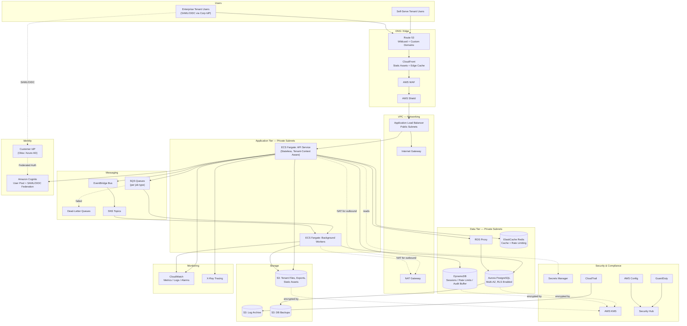

# Part VIII – Enterprise Application Architectures

# Chapter 60: B2B SaaS

---

## 1. Executive Summary

Business-to-business Software as a Service (B2B SaaS) is a delivery model where a vendor operates a single software platform that is sold, in seat-based or usage-based form, to multiple corporate customers. Unlike consumer SaaS, B2B SaaS buyers are procurement teams, IT security departments, and line-of-business executives who evaluate the vendor not only on functionality but on contractual guarantees: uptime SLAs, data residency, SOC 2 / ISO 27001 attestations, single sign-on (SSO) support, audit logging, and the ability to isolate one customer's data from another's.

This chapter documents a production-grade reference architecture for a B2B SaaS platform built on AWS. The architecture is designed around three non-negotiable properties that distinguish enterprise B2B SaaS from a typical multi-tenant consumer application:

- **Tenant isolation that can be proven, not just claimed.** Enterprise customers will ask for evidence — architecture diagrams, penetration test reports, and sometimes a right-to-audit clause — that their data cannot leak into another tenant's view, even under an application bug.
- **Enterprise identity integration.** Enterprise buyers almost universally require SAML 2.0 or OIDC federation with their own identity provider (Okta, Azure AD / Entra ID, Ping Identity, Google Workspace) rather than username/password accounts managed by the SaaS vendor.
- **Commercial flexibility without architectural fragmentation.** The same codebase and infrastructure must serve a self-serve starter tier, a mid-market tier with dedicated support, and an enterprise tier that may require a dedicated (single-tenant) deployment for regulatory reasons — without maintaining three separate codebases.

### The Business Problem

Software vendors historically sold on-premises licensed software: a customer purchased a perpetual license, installed the software on their own infrastructure, and was responsible for patching, scaling, and securing it. This model has largely disappeared for new software categories because it imposes enormous operational burden on the customer and creates slow, expensive upgrade cycles for the vendor.

B2B SaaS solves this by centralizing operations with the vendor:

- The vendor operates one (or a small number of) production environments.
- All customers run the same software version, eliminating the "which version is the customer on" support burden.
- The vendor can ship improvements continuously rather than through infrequent, disruptive upgrade projects.
- The vendor captures usage telemetry across the entire customer base, which improves product decisions and enables usage-based pricing.

The architectural challenge is that this centralization creates a shared-fate problem: a single infrastructure incident, a single mis-scoped database query, or a single IAM misconfiguration can affect every customer simultaneously. The reference architecture in this chapter is built specifically to contain and limit the blast radius of failures while preserving the operational leverage that makes SaaS economically viable.

### Architecture Objective

The objective of this architecture is to deliver a **multi-tenant application platform with tenant-aware routing, enforced data isolation at the database layer, enterprise identity federation, granular audit logging, and tiered deployment topology** — all while keeping infrastructure cost proportional to actual tenant usage rather than growing linearly with tenant count.

Concretely, this means:

- New tenants can be provisioned in minutes through automation, not manual infrastructure changes.
- A noisy or compromised tenant cannot degrade service for other tenants (the "noisy neighbor" problem).
- Enterprise customers requiring dedicated infrastructure (common in banking, healthcare, and government verticals) can be accommodated using the same core application code, deployed into an isolated stack.
- Every data access, configuration change, and administrative action is logged in a way that supports SOC 2 Type II audits and customer-facing audit log exports.

### Why Organizations Adopt This Architecture

- **Faster enterprise sales cycles.** Security questionnaires and vendor risk assessments move faster when the architecture already has documented tenant isolation, encryption at rest and in transit, and SSO support.
- **Lower operational cost per customer.** A well-designed pooled multi-tenant model can serve hundreds of small and mid-market customers on shared infrastructure, keeping gross margins healthy — a metric investors and boards scrutinize heavily in SaaS businesses.
- **Support for the "enterprise tier" without a rewrite.** Rather than building a separate on-premises product for large customers, the same platform can be deployed as an isolated single-tenant stack, satisfying data residency or contractual isolation requirements.
- **Predictable compliance posture.** Centralizing logging, encryption, and access control makes it dramatically easier to pass SOC 2, ISO 27001, and, where applicable, HIPAA or PCI DSS audits than it would be if each customer had a bespoke deployment.
- **Usage-based and seat-based billing.** Centralized telemetry makes metering straightforward, enabling flexible commercial models (per-seat, per-API-call, tiered feature access) without per-customer engineering work.

### Major Business Benefits

| Benefit | Description |
|---|---|
| Reduced cost to serve | Shared infrastructure amortizes fixed costs (control plane, monitoring, CI/CD) across many tenants. |
| Faster time-to-market for new customers | Tenant onboarding becomes a data-plane operation, not an infrastructure deployment. |
| Improved product velocity | One codebase, one deployment pipeline, no per-customer patching backlog. |
| Stronger compliance story | Centralized security controls are easier to certify and to demonstrate to auditors. |
| Expansion revenue | Usage metering and feature-flagging on a shared platform make upsell and cross-sell mechanically simple. |
| Reduced blast radius (with proper isolation) | A well-isolated tenant model limits the impact of a single tenant's misuse, bug, or breach. |

### Typical Enterprise Scenarios

- A workflow automation platform sold to mid-market and enterprise operations teams, where each customer (tenant) has their own users, workflows, and integrations, but all run on shared compute and a shared (logically partitioned) database tier.
- A B2B analytics platform where large enterprise customers with strict data residency requirements (e.g., a European bank) require a dedicated, single-tenant deployment in an EU region, while smaller customers share pooled infrastructure in a US region.
- A developer-tooling SaaS (CI/CD, observability, API management) where usage is highly variable across tenants — some tenants push thousands of events per second, others are nearly idle — requiring strong per-tenant rate limiting and resource governance.
- A vertical SaaS product (e.g., practice management software for healthcare clinics) where HIPAA obligations require signed Business Associate Agreements (BAAs), audit logging of every PHI access, and encryption key management that can, per tenant, be demonstrated to a compliance officer.

> **Note:** This chapter uses a generic "B2B workflow and collaboration platform" as the running example throughout, since the architectural patterns generalize across most B2B SaaS verticals. Vertical-specific nuances (HIPAA, PCI DSS, FedRAMP) are called out explicitly where they materially change the design.

---

## 2. Business Requirements

### Business Drivers

- Land-and-expand go-to-market motion: start with a small pilot team inside a customer organization, then expand to the full enterprise account.
- Predictable, defensible gross margins (typically targeted at 75–85% for SaaS businesses) that pooled multi-tenancy protects.
- Sales enablement: a security architecture document, SOC 2 report, and penetration test summary must be producible on demand for enterprise procurement.
- Support for both self-serve signup (product-led growth) and sales-assisted enterprise onboarding within the same platform.

### Functional Requirements

- Tenant-scoped user management: each tenant has its own users, roles, and permissions.
- Enterprise SSO via SAML 2.0 and OIDC, configurable per tenant.
- SCIM-based user provisioning/deprovisioning for enterprise identity providers.
- Role-based access control (RBAC) with tenant-level admin roles.
- Per-tenant configuration (branding, feature flags, integrations, webhooks).
- Tenant-scoped API keys for programmatic access, with rate limiting.
- Exportable, tenant-scoped audit logs (who did what, when, from where).
- Billing and usage metering integrated with a subscription billing provider (e.g., Stripe Billing) or an in-house metering pipeline.
- Support for a "dedicated tenant" deployment mode for enterprise customers requiring physical or logical infrastructure isolation.

### Non-Functional Requirements

| Category | Requirement |
|---|---|
| Availability | 99.9% for standard tier, 99.95% for enterprise tier (contractual SLA) |
| Latency | P95 API latency < 300 ms for read operations, < 800 ms for write operations |
| Scalability | Support growth from 10 to 5,000+ tenants without architectural redesign |
| Durability | 99.999999999% (11 nines) for stored customer data (S3-class durability) |
| Security | Encryption at rest and in transit for all customer data; least-privilege IAM |
| Compliance | SOC 2 Type II (mandatory), ISO 27001 (common ask), HIPAA/PCI as vertical-specific add-ons |
| Auditability | All administrative and data-mutating actions logged with tenant, user, and IP context |
| Data residency | Ability to pin a tenant's data to a specific AWS region on request |

### Scalability Goals

- Support tenant counts scaling from tens (early stage) to thousands (growth stage) without re-architecting the data layer.
- Support wide variance in per-tenant load: a small tenant might generate 100 API requests/day; a large enterprise tenant might generate 50 million/day.
- Horizontally scale the application tier independently of the database tier.
- Avoid "hot tenant" problems where one tenant's load degrades performance for others sharing the same database.

### Availability Requirements

- Multi-AZ deployment as the baseline for all tiers.
- Multi-region active-passive for the enterprise tier where contractually required.
- Zero-downtime deployments (blue-green or rolling) — SaaS customers do not tolerate scheduled maintenance windows the way on-premises customers historically did.

### Latency Requirements

- API Gateway/ALB to application: sub-50ms internal network latency (same-region, same-VPC).
- Application to database: sub-10ms for cache hits, sub-50ms for primary database reads within the same AZ.
- Cross-region replication lag (for DR purposes): under 5 minutes for asynchronous replication (RPO target).

### Compliance Requirements

- SOC 2 Type II is the baseline requirement for almost any B2B SaaS selling into mid-market or enterprise accounts in the US.
- GDPR compliance is mandatory for any tenant with EU-based data subjects, including support for data subject access requests (DSARs) and the right to erasure.
- Vertical-specific: HIPAA (healthcare), PCI DSS (payment card data), FedRAMP (US federal government customers) — each of these materially changes network segmentation, logging retention, and encryption key management requirements, discussed later in this chapter.

### Security Expectations

- Encryption at rest via AWS KMS with customer-managed keys (CMKs) available for enterprise tenants who require "bring your own key" (BYOK) capability.
- TLS 1.2+ enforced for all data in transit; TLS 1.3 preferred where client compatibility allows.
- Web Application Firewall (WAF) in front of all public endpoints.
- Secrets never stored in application code, environment variables committed to source control, or container images — always retrieved from AWS Secrets Manager or Systems Manager Parameter Store at runtime.
- Principle of least privilege enforced through scoped IAM roles per service, not shared "admin" roles.

### Recovery Objectives

| Tier | RPO | RTO |
|---|---|---|
| Standard (pooled multi-tenant) | 15 minutes | 4 hours |
| Enterprise (dedicated tenant, DR-enabled) | 5 minutes | 1 hour |
| Enterprise (active-active, premium SLA) | Near-zero (seconds) | Near-zero (automatic failover) |

### SLAs

- 99.9% uptime commitment translates to approximately 43 minutes of downtime per month, or 8h 45m per year — this is the standard SaaS baseline and should be treated as a hard floor, not a target.
- 99.95% (enterprise tier) translates to roughly 21 minutes per month.
- SLA credits are typically structured as service-credit percentages against monthly subscription fees, not cash refunds — this is a commercial detail, but it drives the architecture because credit exposure motivates investment in redundancy.

### Expected Workload

- Read-heavy application (typical B2B SaaS pattern: dashboards, reports, list views dominate traffic; writes are comparatively rare, concentrated around form submissions and background processing).
- Bursty traffic aligned with business hours in each tenant's time zone — a global tenant base smooths this out, but early-stage B2B SaaS companies concentrated in one region (e.g., US Eastern business hours) will see pronounced daily traffic curves.
- Background job processing (report generation, data imports/exports, webhook delivery, email notifications) that should be decoupled from the synchronous request path via a message queue.

### Expected Growth

- Tenant count: linear-to-exponential growth depending on go-to-market stage; infrastructure must scale by adding pooled capacity, not by re-provisioning per tenant.
- Data volume: grows per-tenant over the lifetime of the account (a 3-year-old enterprise tenant will have vastly more data than a 3-month-old one) — this argues for storage-tier lifecycle policies and time-based partitioning strategies covered in Section 14.

---

## 3. Architecture Overview

### Overall Design

The architecture follows a **pooled multi-tenant model with a tenant-context propagation layer**, augmented by an optional **dedicated single-tenant deployment path** for enterprise customers who require it. Both paths share the same application container image and Terraform modules — the difference is purely in how those modules are instantiated (shared VPC and database cluster versus a dedicated VPC and database cluster per tenant).

The core design philosophy can be summarized in four principles:

1. **Tenant context is established once, at the edge, and propagated everywhere.** A tenant identifier is resolved as early as possible in the request lifecycle (from subdomain, custom domain mapping, or JWT claim) and carried through every downstream call — application logic, database queries, logging, and metering — so that no code path can accidentally operate without knowing which tenant it is serving.
2. **Isolation is enforced at the data layer, not just the application layer.** Relying solely on `WHERE tenant_id = ?` clauses in application code is a well-known source of data leakage bugs. This architecture layers database-level enforcement (row-level security in PostgreSQL, or a tenant-per-schema model for higher-security tiers) on top of application-layer scoping.
3. **Stateless compute, stateful data tier.** All application servers are stateless and horizontally scalable; session state and tenant context live in signed tokens or in a fast key-value store (ElastiCache), never in local server memory, so any request can be served by any application instance.
4. **Everything is provisioned through code.** Tenant onboarding, infrastructure changes, and even dedicated-tenant deployments are Terraform- and pipeline-driven. Manual console changes are treated as an incident-worthy anti-pattern (see Section 27).

### Architecture Philosophy

The architecture deliberately avoids two extremes:

- **Silo-per-tenant (one full stack per customer)** — This is the safest isolation model but is economically unworkable at scale; infrastructure cost grows linearly with tenant count regardless of how small the tenant is, and operational overhead (patching, monitoring, deployments) multiplies by tenant count.
- **Fully pooled with no isolation boundary beyond a `tenant_id` column** — This is the cheapest model but creates unacceptable risk: a single ORM bug or missing `WHERE` clause can expose one customer's data to another. Enterprise security reviewers will reject this model outright.

The chosen middle path — **pooled compute, isolated data with defense-in-depth enforcement, and an escape hatch to full isolation for tenants who need or pay for it** — reflects how the most successful B2B SaaS companies (Salesforce's original "pod" architecture, Atlassian's tenant-context model, and modern platforms like Vercel and Retool) have solved this problem in practice.

### Core Components

| Layer | Component | Purpose |
|---|---|---|
| Edge | Route 53, CloudFront, WAF, Shield | DNS, edge caching/TLS termination, request filtering, DDoS protection |
| Networking | VPC, ALB, NAT Gateway | Traffic routing, network isolation |
| Application | ECS Fargate services (API, background workers) | Stateless business logic execution |
| Async | SQS, SNS, EventBridge | Decoupled background processing, webhook delivery, event-driven integrations |
| Data | Aurora PostgreSQL (Multi-AZ), DynamoDB, ElastiCache Redis | Transactional data, high-throughput key-value data, caching/session state |
| Storage | S3 | Tenant file uploads, exports, static assets, log archival |
| Identity | Cognito (or external IdP via SAML/OIDC), IAM | Tenant user authentication, enterprise SSO federation, service-to-service auth |
| Security | KMS, Secrets Manager, GuardDuty, Security Hub, Config | Encryption, secret storage, threat detection, compliance posture |
| Observability | CloudWatch, X-Ray, CloudTrail | Metrics, tracing, audit logging |

### How Components Interact

A request enters through Route 53 and CloudFront, is filtered by WAF, and terminates TLS at the Application Load Balancer inside a public subnet. The ALB routes to ECS Fargate tasks running in private subnets. The application resolves tenant context from the request (subdomain or JWT claim), attaches it to a request-scoped context object, and uses it for every downstream call: Aurora PostgreSQL queries (scoped via row-level security policies keyed to `tenant_id`), Redis cache key namespacing (`tenant:{id}:...`), and S3 object key prefixing (`tenants/{id}/...`).

Asynchronous work — report generation, webhook delivery, bulk import/export — is pushed onto SQS queues with the tenant context embedded in the message payload, and processed by a separate pool of ECS Fargate worker tasks that scale independently of the API tier based on queue depth.

### High-Level Workflow

1. User authenticates (via Cognito-hosted login for self-serve tenants, or SAML/OIDC federation for enterprise tenants).
2. Application issues a signed JWT containing user identity, tenant ID, and role claims.
3. Subsequent requests carry this JWT; the API tier validates it and establishes tenant context for the request.
4. Business logic executes against tenant-scoped data.
5. Response is returned; asynchronous side effects (audit log entry, webhook trigger, usage metering event) are published to EventBridge/SQS for out-of-band processing.

### Request Lifecycle

Client → DNS resolution → CloudFront (cache check, WAF evaluation) → ALB (TLS termination, target selection) → ECS Fargate task (JWT validation, tenant context resolution, business logic) → Aurora/DynamoDB/ElastiCache (data access) → response serialization → CloudFront (response caching if applicable) → client.

### Response Lifecycle

Application response includes standard security headers (HSTS, CSP, X-Content-Type-Options), a request ID for support correlation, and — for API consumers — rate limit headers reflecting the tenant's current quota consumption.

### Data Lifecycle

Data is written to Aurora PostgreSQL as the system of record, with change-data-capture (via Aurora's native replication or a Debezium-based pipeline) feeding an event stream for analytics and downstream integrations. Files (uploads, exports) go directly to S3 via presigned URLs to avoid routing large payloads through the application tier. Data ages through S3 storage class transitions (Standard → Standard-IA → Glacier) based on tenant-configurable retention policies, and is permanently deleted upon tenant offboarding or GDPR erasure request, following a documented deletion workflow that touches every data store (Aurora, DynamoDB, S3, backups, and logs).

---

## 4. AWS Services Used

Each service below is described with its purpose in this architecture, why it was selected over alternatives, what its limitations are, pricing considerations, and best practices specific to a multi-tenant B2B SaaS context.

### Amazon ECS (Fargate)

**Purpose:** Runs the stateless API and background worker containers without requiring the team to manage EC2 instances.

**Why selected:** Fargate removes the operational burden of patching and scaling the underlying compute fleet, which matters disproportionately for a SaaS engineering team whose differentiated value is the product, not infrastructure management. It also provides strong task-level isolation (each task runs in its own micro-VM boundary via Firecracker), which is a meaningful point in enterprise security questionnaires.

**Alternatives:** Amazon EKS (Kubernetes) offers more portability and a larger ecosystem of tooling but adds meaningful operational overhead (control plane management, node group patching, more complex networking) that is rarely justified until the platform reaches significant scale or the team already has deep Kubernetes expertise. EC2 Auto Scaling Groups running containers directly via Docker are viable but reintroduce OS patching responsibility.

**Limitations:** Fargate has per-task CPU/memory ceilings (currently up to 16 vCPU / 120 GB per task), cold-start latency for scale-out events (typically 30–90 seconds to a healthy task), and less granular control over the underlying kernel than EC2 (relevant for workloads needing custom kernel modules or GPU access, neither of which is typical for this architecture).

**Pricing considerations:** Billed per vCPU-second and GB-second of memory allocated, not just consumed — right-sizing task definitions materially affects cost. Fargate Spot can reduce background worker costs by up to 70% for fault-tolerant, retriable jobs (report generation, non-time-critical webhook delivery).

**Best practices:** Separate task definitions and services for the API tier and worker tier so they scale independently; use Fargate Spot for workers, standard Fargate for the customer-facing API tier where interruption is unacceptable; set CPU/memory requests based on actual profiling data, not guesses.

### Application Load Balancer (ALB)

**Purpose:** Layer 7 load balancing, TLS termination, and routing to ECS Fargate tasks via target groups.

**Why selected:** ALB supports host-based and path-based routing, which is used here to route wildcard subdomains (`{tenant}.app.example.com`) to the same target group while still allowing dedicated-tenant deployments to use a separate ALB entirely.

**Alternatives:** Network Load Balancer (NLB) operates at Layer 4 and is preferred for extreme throughput or non-HTTP protocols, but loses the Layer 7 routing and native WAF integration ALB provides. API Gateway is a strong alternative for a pure API product (see Chapter 25) but is less natural when the platform also serves server-rendered or SPA frontend assets.

**Limitations:** ALB has soft limits on rules per listener and target groups per load balancer that matter at very large tenant-subdomain counts — mitigated by using a single wildcard-based routing rule rather than per-tenant rules.

**Pricing considerations:** Billed on Load Balancer Capacity Units (LCUs), which factor in new connections, active connections, bandwidth, and rule evaluations — WAF rule complexity indirectly affects this.

**Best practices:** Enable access logging to S3 for every ALB, enable deletion protection in production, and use a dedicated target group per ECS service so deployments can shift traffic independently.

### Amazon CloudFront

**Purpose:** Global edge caching for static assets and the SPA frontend bundle, and a unified entry point for WAF and Shield protection.

**Why selected:** Reduces latency for globally distributed enterprise users and offloads static asset traffic from the origin, and provides a single place to enforce TLS policy and attach AWS WAF.

**Alternatives:** Serving directly from ALB/S3 without a CDN is viable for very early-stage products but sacrifices both latency and the DDoS-absorption benefit CloudFront provides at the edge.

**Limitations:** Cache invalidation adds deployment-pipeline complexity; CloudFront's default cache behaviors must be carefully scoped so tenant-specific API responses are never accidentally cached and served to the wrong tenant — this is a documented real-world SaaS incident category and is discussed further in Section 24.

**Pricing considerations:** Data transfer out to the internet is the dominant cost driver; using Regional Edge Caches and appropriate cache TTLs meaningfully reduces origin fetches and cost.

**Best practices:** Never cache authenticated, tenant-specific API responses at CloudFront unless explicitly designed with per-tenant cache keys (via `Vary` headers or cache key normalization); use Origin Access Control (OAC) so the S3 origin is not publicly accessible.

### AWS WAF and AWS Shield

**Purpose:** WAF filters malicious requests (SQL injection, XSS, known bad IP reputation lists, rate-based rules); Shield Standard (included free) and Shield Advanced (paid, for enterprise tier) protect against DDoS.

**Why selected:** Enterprise security questionnaires explicitly ask whether a WAF is deployed in front of public endpoints — this is close to a mandatory checkbox for enterprise sales.

**Alternatives:** Third-party WAFs (Cloudflare, Akamai) offer comparable protection but add a second vendor relationship and a second set of rules to maintain; native AWS WAF integrates most tightly with CloudFront/ALB and CloudWatch.

**Limitations:** WAF managed rule groups can produce false positives against legitimate application traffic (particularly for products that accept rich text or code snippets as input) — requires tuning and a staged rollout (count mode before block mode).

**Pricing considerations:** Charged per web ACL, per rule, and per million requests evaluated — costs scale with traffic, not tenant count, which is favorable for this architecture's pooled model.

**Best practices:** Deploy AWS Managed Rules (Core Rule Set, Known Bad Inputs, SQLi) in count mode first, monitor for false positives for at least one deployment cycle, then switch to block mode; add rate-based rules scoped per source IP to blunt credential-stuffing and scraping attempts against tenant login endpoints.

### AWS Lambda

**Purpose:** Used for event-driven, short-lived tasks that don't warrant a persistent Fargate service — presigned URL generation, webhook signature verification, image thumbnail generation, and Cognito trigger functions (pre-signup validation, custom token claims).

**Why selected:** Zero idle cost for infrequent triggers and native integration with S3 events, EventBridge, and Cognito triggers.

**Alternatives:** These tasks could run as additional endpoints on the Fargate API service, but that couples their scaling and deployment lifecycle to the main application unnecessarily.

**Limitations:** 15-minute maximum execution duration, cold-start latency (mitigated with provisioned concurrency for latency-sensitive triggers like Cognito pre-token-generation), and a less familiar debugging/local-development experience than a long-running service.

**Pricing considerations:** Pay-per-invocation and per-GB-second of execution — extremely cheap at the volumes typical for auxiliary tasks like these.

**Best practices:** Keep Lambda functions single-purpose; use Lambda Powertools (or equivalent) for structured logging and tracing consistency with the rest of the platform.

### Amazon S3

**Purpose:** Stores tenant file uploads, generated reports/exports, application static assets, database backups, and centralized log archives.

**Why selected:** Effectively unlimited scalability, 11 nines of durability, native lifecycle policy support, and deep integration with KMS for encryption and with CloudTrail for object-level audit logging.

**Alternatives:** EFS is appropriate for POSIX-filesystem-semantics workloads (not needed here); EBS is block storage tied to a single instance/AZ and unsuitable for this use case.

**Limitations:** Eventually-consistent-feeling behavior for certain edge cases has been eliminated (S3 has offered strong read-after-write consistency since December 2020), but object versioning and lifecycle interactions still require careful design to avoid unexpected storage growth.

**Pricing considerations:** Storage class selection is the primary lever — Intelligent-Tiering is a strong default for tenant upload buckets with unpredictable access patterns; Glacier Deep Archive for long-term compliance retention (e.g., 7-year audit log retention for financial services tenants).

**Best practices:** Prefix tenant data by tenant ID (`s3://bucket/tenants/{tenant_id}/...`) to simplify per-tenant IAM policies, lifecycle rules, and eventual per-tenant deletion; enable S3 Block Public Access at the account level; use bucket keys to reduce KMS request costs at scale.

### Amazon Aurora PostgreSQL

**Purpose:** The primary system-of-record relational database for tenant, user, and core business entity data.

**Why selected:** Aurora provides MySQL/PostgreSQL compatibility with significantly better throughput and built-in high availability (6-way replication across 3 AZs) than self-managed RDS PostgreSQL, plus features directly relevant to multi-tenancy: PostgreSQL's native row-level security (RLS) for defense-in-depth tenant isolation, and Aurora Serverless v2 for cost-efficient handling of highly variable per-tenant load.

**Alternatives:** Standard RDS PostgreSQL is cheaper at small scale but lacks Aurora's storage-layer replication and faster failover (typically under 30 seconds for Aurora versus minutes for standard RDS Multi-AZ). DynamoDB is considered for specific high-throughput, simple-access-pattern tables (see below) but is a poor fit for the complex relational queries (joins across users, roles, permissions, and business entities) that dominate this application.

**Limitations:** Aurora PostgreSQL still requires careful connection management (PostgreSQL's per-connection memory overhead means connection pooling via RDS Proxy or PgBouncer is effectively mandatory at scale); vertical write scaling is ultimately bounded by the writer instance size, which is why the architecture separates high-throughput, simple-shape data (see DynamoDB below) from the relational core.

**Pricing considerations:** Aurora Serverless v2 bills per Aurora Capacity Unit (ACU) per second, which is attractive for the "many small tenants, few large tenants" load distribution typical of B2B SaaS, but provisioned Aurora instances are more cost-predictable and often cheaper at sustained high utilization — a hybrid approach (Serverless v2 for the primary cluster, provisioned read replicas for predictable reporting load) is common.

**Best practices:** Enable Row-Level Security with a `tenant_id` policy on every multi-tenant table; use RDS Proxy in front of Aurora to pool connections from Fargate tasks and to enable fast failover without connection storms; enable Performance Insights and slow query logging; take automated snapshots with a retention period matching the compliance requirement (commonly 35 days) and cross-region copy them for DR.

### Amazon DynamoDB

**Purpose:** Used for high-throughput, simple-access-pattern data that doesn't need relational joins — session/token state, real-time activity feeds, rate-limiting counters, and audit log write buffering ahead of durable archival to S3.

**Why selected:** Single-digit millisecond latency at any scale, with the tenant ID as (part of) the partition key providing natural per-tenant data distribution and, combined with on-demand capacity mode, protection against one tenant's burst traffic starving another tenant's throughput on a shared table.

**Alternatives:** ElastiCache Redis could serve some of these use cases (see below) but lacks DynamoDB's durability guarantees, making it wrong for anything that must survive a cache flush (e.g., audit trail buffering).

**Limitations:** No native joins or complex ad-hoc queries — access patterns must be designed up front, which requires more initial data-modeling discipline than a relational table.

**Pricing considerations:** On-demand capacity mode is recommended for this workload's unpredictable, tenant-driven traffic pattern despite its higher per-request cost than provisioned capacity, because it removes the risk of throttling a legitimate enterprise tenant's burst while avoiding the operational overhead of Auto Scaling tuning for provisioned tables.

**Best practices:** Design partition keys to begin with `tenant_id` to spread load evenly and to make per-tenant data export/deletion tractable; enable DynamoDB Streams where downstream event processing (e.g., triggering a Lambda on rate-limit threshold breach) is needed; enable point-in-time recovery (PITR).

### Amazon ElastiCache (Redis)

**Purpose:** Application-level caching (frequently read reference/configuration data), session token caching to avoid a database round-trip on every request, and distributed rate-limiting counters for the API.

**Why selected:** Sub-millisecond latency and native support for atomic counter operations (`INCR`/`EXPIRE`) that make sliding-window rate limiting per tenant straightforward to implement correctly.

**Alternatives:** DynamoDB with TTL can substitute for some caching use cases but has higher latency and per-request cost for very hot keys; Memcached is an option for pure caching but lacks Redis's richer data structures needed for rate limiting and lacks native replication/failover.

**Limitations:** Data is not durable across a full cluster failure unless AOF persistence is enabled (which adds latency) — this is acceptable for cache and rate-limit data but the architecture never treats Redis as a system of record.

**Pricing considerations:** Node-hour billing based on instance type; Redis cluster mode (sharding) adds cost but is necessary once a single shard's throughput or memory ceiling is approached.

**Best practices:** Namespace every key with `tenant:{tenant_id}:...` to prevent cross-tenant key collisions and to make bulk key eviction on tenant offboarding possible; enable in-transit and at-rest encryption; use Multi-AZ with automatic failover in production.

### Amazon Cognito

**Purpose:** Manages authentication for self-serve tenant users and acts as the SAML/OIDC broker for enterprise tenants federating from their own identity provider.

**Why selected:** Cognito User Pools natively support both direct username/password authentication and third-party IdP federation (SAML 2.0 and OIDC) per app client, which maps cleanly onto the requirement that each tenant can independently choose "email/password" or "federate with our Okta/Azure AD instance." It also removes the burden of building and securing a custom credential store.

**Alternatives:** Third-party identity platforms (Auth0, WorkOS, FusionAuth) are strong alternatives, and in practice many B2B SaaS companies choose WorkOS or Auth0 specifically because enterprise SSO/SCIM support is more mature and requires less custom integration work than Cognito's. This is a legitimate build-vs-buy decision (see Section 28) — this chapter documents the AWS-native path using Cognito because it keeps the reference architecture within the AWS service catalog, but teams should evaluate WorkOS/Auth0 seriously for the identity layer specifically.

**Limitations:** Cognito's per-tenant SAML/OIDC configuration UX and API are less polished than dedicated identity platforms; multi-tenant SSO configuration (mapping a specific email domain or subdomain to a specific enterprise IdP) requires custom logic on top of Cognito's app client model, typically via a Lambda-backed "pre-authentication" trigger that resolves the correct identity provider based on tenant context.

**Pricing considerations:** Billed per monthly active user (MAU); SAML/OIDC federation is only available on Cognito's paid tiers, which is a material cost line item that should be modeled per tenant, not treated as negligible.

**Best practices:** Use one Cognito User Pool for the whole platform with tenant ID embedded as a custom attribute/claim on the user, rather than one User Pool per tenant (which would reintroduce the silo-scaling problem at the identity layer); use pre-token-generation Lambda triggers to inject `tenant_id` and `role` claims into the issued JWT so downstream services never need a separate lookup to establish tenant context.

### Amazon SNS, Amazon SQS, and Amazon EventBridge

**Purpose:** SQS decouples synchronous API requests from slow background work (report generation, bulk import/export, webhook delivery retries); SNS fans out notifications to multiple subscribers (e.g., a single "tenant created" event triggering provisioning, billing setup, and welcome email workflows in parallel); EventBridge provides a schema-aware event bus for both internal service-to-service events and, increasingly, for exposing webhook-style integration events to customers' own automation tools.

**Why selected:** This combination is the standard, battle-tested AWS asynchronous messaging pattern; SQS provides reliable at-least-once delivery with dead-letter queue support for poison messages, SNS provides fan-out, and EventBridge provides content-based routing and native integrations with third-party SaaS tools (relevant for a B2B product that itself needs to integrate with customers' other tools).

**Alternatives:** Apache Kafka (via Amazon MSK) is a stronger choice if the platform needs high-throughput event streaming with long retention and multiple independent consumer groups replaying history — this is common in later-stage SaaS platforms with a dedicated data/analytics pipeline, but is unnecessary operational overhead for the baseline architecture described here.

**Limitations:** SQS standard queues provide at-least-once, not exactly-once, delivery, and do not guarantee ordering — application logic (webhook handlers, import processors) must be idempotent; SQS FIFO queues solve ordering but cap throughput per message group.

**Pricing considerations:** Priced per request/message — cheap at typical B2B SaaS volumes; the more significant cost driver is often the compute (Fargate workers) consuming the queue, not the queue itself.

**Best practices:** Attach a dead-letter queue (DLQ) to every SQS queue with a CloudWatch alarm on DLQ depth; include `tenant_id` in every message payload so worker logs and metrics can be attributed per tenant; use SNS-to-SQS fan-out (rather than direct multi-subscriber SNS to Lambda) when at-least-once, durable delivery to multiple independent consumers is required.

### AWS IAM

**Purpose:** Controls access for both human operators (via IAM Identity Center / SSO) and AWS services (via IAM roles for ECS tasks, Lambda functions, and CI/CD pipelines).

**Why selected:** IAM is the foundational access-control layer for every other AWS service in this architecture; there is no viable alternative within AWS.

**Alternatives:** N/A within AWS; the alternative decision point is whether to manage human access via IAM users directly (strongly discouraged) versus IAM Identity Center federated from a corporate IdP (recommended, covered in Section 10).

**Limitations:** IAM policy complexity grows with the number of distinct roles and resources; without discipline, organizations accumulate overly broad policies over time (see Section 27, Anti-Patterns).

**Pricing considerations:** IAM itself is free; cost impact is indirect, through the resources IAM controls access to.

**Best practices:** One IAM role per ECS task definition, scoped to only the resources that specific service needs; no long-lived IAM user access keys in CI/CD — use OIDC federation from GitHub Actions (or equivalent) to assume a role instead; enforce permission boundaries on any role that can create other IAM roles.

### Amazon VPC

**Purpose:** Provides network isolation for the entire platform — public subnets for internet-facing load balancers, private subnets for application and database tiers.

**Why selected:** VPC is the mandatory networking foundation for any production AWS workload; there is no scenario in this architecture where resources should run outside a VPC with explicit subnet and security group boundaries.

**Limitations:** VPC design decisions (CIDR sizing, subnet layout) are difficult to change later without disruptive re-IP-ing — covered in detail in Section 9.

**Pricing considerations:** VPC itself is free; NAT Gateway (hourly + per-GB data processing charge) is typically the largest network-related cost line item and is discussed in Section 16 (Cost Surprises).

**Best practices:** Plan CIDR ranges with room for multi-region expansion from day one; use separate subnets (and route tables) per tier (public/app/data) across at least two, ideally three, Availability Zones.

### Amazon Route 53

**Purpose:** DNS management for the platform's apex domain, wildcard tenant subdomains (`*.app.example.com`), and customer-provided custom domains (CNAME-based, for enterprise tenants who want `app.customer.com` to point at the platform).

**Why selected:** Deep integration with ALB/CloudFront (alias records avoid an extra DNS lookup and are free of charge, unlike CNAME queries), and Route 53 health checks integrate directly with failover routing policies for DR.

**Alternatives:** Third-party DNS providers (Cloudflare, NS1) are viable and sometimes preferred for their DNS-layer security features, but native Route 53 simplifies the overall AWS-centric operational model.

**Limitations:** Supporting arbitrary customer-provided custom domains at scale requires either ACM certificate automation (DNS validation per customer domain) or a proxy layer (e.g., CloudFront with SNI-based routing) — this is a genuinely non-trivial multi-tenant SaaS feature, discussed further in Section 6.

**Pricing considerations:** Billed per hosted zone and per query volume — negligible relative to compute/data costs at this architecture's scale.

**Best practices:** Use alias records rather than CNAMEs wherever pointing at AWS resources; enable Route 53 health checks against the ALB for automated DNS failover in multi-region DR configurations.

### Amazon CloudWatch

**Purpose:** Central metrics, logs, dashboards, and alarms for the entire platform.

**Why selected:** Native integration with every AWS service used in this architecture means CloudWatch is the path of least resistance for baseline observability, and CloudWatch Alarms integrate directly with SNS for on-call paging.

**Alternatives:** Third-party observability platforms (Datadog, New Relic, Grafana Cloud) offer richer dashboards, better cross-service correlation, and often superior alerting ergonomics — many mature SaaS companies run CloudWatch as the source of truth but forward metrics/logs to Datadog for the actual day-to-day operational experience. This trade-off is discussed in Section 21.

**Limitations:** CloudWatch's native dashboarding and log query experience (Logs Insights) is functional but less ergonomic than dedicated observability tooling, and cross-account/cross-region aggregation requires additional configuration.

**Pricing considerations:** Log ingestion and storage, custom metrics, and dashboard counts all contribute to cost — high-cardinality custom metrics (e.g., a metric dimension per tenant) can become surprisingly expensive at scale and are generally better handled via structured logs queried on demand than as first-class CloudWatch metrics.

**Best practices:** Use structured (JSON) logging with `tenant_id` as a standard field so Logs Insights queries can filter/aggregate per tenant without needing per-tenant metrics; set log retention explicitly per log group (default is "never expire," which silently accumulates cost).

### AWS CloudTrail

**Purpose:** Records every AWS API call made within the account — both by human operators and by the application's own IAM roles — providing the audit trail required for SOC 2 and for forensic investigation.

**Why selected:** CloudTrail is the AWS-native mechanism for API-level audit logging and is effectively mandatory for any compliance-driven B2B SaaS platform; it is also the definitive source of truth for "who changed what infrastructure, when."

**Limitations:** CloudTrail logs AWS control-plane (and optionally data-plane) API activity, not application-level business events (e.g., "user X viewed record Y") — that is a separate, application-owned audit log (see Section 22).

**Pricing considerations:** One copy of management events is free; data event logging (e.g., S3 object-level access, which is often required for compliance) incurs per-event charges and should be scoped to the buckets that actually need it rather than enabled account-wide indiscriminately.

**Best practices:** Enable an organization-wide CloudTrail trail writing to a dedicated, access-restricted log archive account; enable log file validation to detect tampering; enable CloudTrail Insights for anomaly detection on unusual API call volume.

### AWS Config

**Purpose:** Continuously evaluates AWS resource configurations against defined rules (e.g., "no S3 bucket may be publicly readable," "all EBS volumes must be encrypted") and records configuration history for compliance evidence.

**Why selected:** Directly supports SOC 2 and ISO 27001 audits by providing continuous, automated evidence of control effectiveness rather than point-in-time manual attestations.

**Limitations:** Rule evaluation has a slight delay (not real-time enforcement) — Config is a detective control, not a preventive one; preventive enforcement should additionally use Service Control Policies (SCPs) at the AWS Organizations level.

**Pricing considerations:** Billed per configuration item recorded and per rule evaluation — can grow meaningfully in a large, frequently changing account; scope recording to relevant resource types where cost is a concern.

**Best practices:** Enable AWS Config Conformance Packs mapped to the relevant compliance framework (e.g., the AWS Foundational Security Best Practices conformance pack) as a starting point rather than authoring every rule from scratch.

### Amazon GuardDuty

**Purpose:** Continuous, ML-driven threat detection across CloudTrail logs, VPC Flow Logs, and DNS logs — detects things like compromised credentials, cryptomining activity, and communication with known malicious IPs.

**Why selected:** Requires no infrastructure to deploy or manage, and its findings integrate directly with Security Hub and EventBridge for automated response workflows.

**Limitations:** GuardDuty is detective, not preventive — it identifies suspicious activity after it starts, so it must be paired with automated response (e.g., an EventBridge rule that isolates a compromised ECS task or revokes credentials on a high-severity finding) to materially reduce dwell time.

**Pricing considerations:** Priced based on volume of CloudTrail events, VPC Flow Log data, and DNS query volume analyzed — generally a modest, predictable cost relative to the security value delivered.

**Best practices:** Enable GuardDuty at the AWS Organizations level (delegated administrator) so every account, including any dedicated-tenant accounts, is covered by default; route high-severity findings to a paged on-call channel, not just a dashboard nobody watches.

### AWS KMS

**Purpose:** Manages encryption keys for data at rest across S3, Aurora, DynamoDB, EBS, and Secrets Manager, and supports customer-managed keys (CMKs) for enterprise tenants requiring "bring your own key" capability.

**Why selected:** Native, deeply integrated encryption key management across every AWS storage service used in this architecture, with detailed CloudTrail logging of every key usage event.

**Limitations:** KMS API request quotas (particularly for `Decrypt` and `GenerateDataKey`) can become a bottleneck at very high request rates unless client-side data key caching is used; per-tenant CMKs (for BYOK enterprise features) multiply the number of keys to manage and rotate.

**Pricing considerations:** Monthly per-key charge plus per-API-request charge — offering a dedicated CMK per enterprise tenant is a real, non-trivial cost line that should be priced into the enterprise tier's contract.

**Best practices:** Use AWS-managed keys for the pooled multi-tenant tier by default; offer customer-managed keys only as an explicit enterprise-tier add-on with its own pricing and operational runbook for key rotation and revocation; enable automatic annual key rotation for customer-managed keys where the tenant doesn't require manual control.

### AWS Secrets Manager

**Purpose:** Stores database credentials, third-party API keys, and other secrets consumed by the application at runtime, with automatic rotation for supported secret types (notably RDS/Aurora credentials).

**Why selected:** Native automatic rotation for database credentials removes an entire class of "expired/leaked long-lived credential" risk, and IAM-based access control means secret access itself is fully audited via CloudTrail.

**Alternatives:** Systems Manager Parameter Store (SecureString) is a lower-cost alternative for secrets that don't need automatic rotation (e.g., a static third-party API key) — this architecture uses Secrets Manager for database credentials specifically and Parameter Store for lower-sensitivity, non-rotating configuration values, balancing cost and capability.

**Limitations:** Per-secret monthly charge makes Secrets Manager comparatively expensive if used indiscriminately for every configuration value, which is why the hybrid approach with Parameter Store exists.

**Pricing considerations:** Charged per secret per month plus per API call — for a platform with, say, one database credential secret and a handful of third-party API keys, this is a minor cost; it becomes material only if secrets are created per-tenant without justification.

**Best practices:** Enable automatic rotation for all database credentials; grant ECS task roles access only to the specific secret ARNs they need, never a wildcard `secretsmanager:GetSecretValue` on `*`.

### AWS Systems Manager (Session Manager, Parameter Store)

**Purpose:** Session Manager provides shell access to any EC2/ECS-adjacent resources that need it without opening inbound SSH ports or managing bastion hosts; Parameter Store holds non-secret and lower-sensitivity secret configuration.

**Why selected:** Eliminates the bastion host as an attack surface entirely (see Chapter 10 for a dedicated treatment of bastion-less infrastructure) and centralizes configuration management with IAM-controlled, CloudTrail-logged access.

**Limitations:** Session Manager requires the SSM agent to be present and network connectivity to the SSM endpoints (directly or via VPC endpoint) — an outbound-internet-restricted private subnet needs explicit VPC endpoints for `ssm`, `ssmmessages`, and `ec2messages`.

**Pricing considerations:** Both features are free to use; the only cost is the underlying resources (e.g., VPC endpoints, if used) and standard data transfer.

**Best practices:** Use VPC endpoints for Systems Manager services so private-subnet resources never need a NAT Gateway path just for SSM connectivity; log all Session Manager sessions to CloudWatch Logs and/or S3 for audit purposes.

---

## 5. Complete Architecture Diagram



> **Tip:** For enterprise "dedicated tenant" deployments, this entire diagram (Networking, App Tier, Data Tier) is replicated into a separate AWS account under the same AWS Organization, provisioned by the same Terraform modules with a different `tenant_mode = "dedicated"` variable. See Section 8 for the deployment automation that makes this practical.

---

## 6. Component-by-Component Explanation

### Route 53

- **Purpose:** Resolves the platform's apex domain, wildcard tenant subdomains, and customer-provided custom domains to the correct edge endpoint.
- **Responsibilities:** DNS resolution, health-check-driven failover routing for DR, custom domain CNAME/ALIAS management for enterprise tenants.
- **Inputs:** DNS queries; health check results from ALB/CloudFront endpoints.
- **Outputs:** DNS responses routing traffic to CloudFront or, for API-only enterprise integrations, directly to the regional ALB.
- **Scaling:** Fully managed, scales automatically with query volume.
- **High availability:** Anycast-based global service; inherently highly available.
- **Failure handling:** Health-check-based failover routing policies automatically redirect traffic away from an unhealthy region in multi-region DR configurations.
- **Dependencies:** ACM for TLS certificates on custom domains; CloudFront/ALB as routing targets.
- **Security:** DNSSEC can be enabled for the apex domain; Route 53 Resolver query logging provides visibility into DNS-based exfiltration attempts.
- **Monitoring:** CloudWatch metrics for health check status; alarms on health check failures feeding the on-call pipeline.

### CloudFront + WAF + Shield

- **Purpose:** Edge termination point providing caching, TLS, request filtering, and DDoS absorption before traffic reaches the VPC.
- **Responsibilities:** Cache static assets; enforce WAF rules; absorb volumetric DDoS traffic at the edge, far from application capacity limits.
- **Inputs:** Client HTTPS requests.
- **Outputs:** Cached responses (static assets) or forwarded requests to the ALB origin.
- **Scaling:** Elastic by design; no customer-managed scaling required.
- **High availability:** Globally distributed edge network; no single point of failure.
- **Failure handling:** Origin failover configuration can route to a secondary ALB/region if the primary origin becomes unhealthy.
- **Dependencies:** ACM certificate (in `us-east-1`, a CloudFront-specific requirement), ALB origin, WAF Web ACL.
- **Security:** WAF managed rule groups, custom rate-based rules per source IP, Shield Advanced for enterprise-tier DDoS SLA guarantees.
- **Monitoring:** CloudFront real-time logs and standard access logs to S3; WAF sampled requests and blocked-request metrics in CloudWatch.

### Application Load Balancer

- **Purpose:** Layer 7 entry point into the VPC, routing to the correct ECS service target group.
- **Responsibilities:** TLS termination (using ACM-issued certificates), health checking of ECS tasks, host/path-based routing.
- **Inputs:** HTTPS requests forwarded from CloudFront (or directly from clients for API-only enterprise integrations bypassing CloudFront).
- **Outputs:** Proxied requests to healthy ECS Fargate tasks.
- **Scaling:** Scales automatically with traffic; the main tuning lever is target group deregistration delay and health check intervals during deployments.
- **High availability:** Deployed across a minimum of two AZs; automatically routes around an AZ that fails health checks.
- **Failure handling:** Removes unhealthy targets from rotation based on configurable health check thresholds; connection draining during deployments prevents dropped in-flight requests.
- **Dependencies:** ACM certificate, target groups pointing to ECS services, security groups permitting inbound 443 from CloudFront/WAF and outbound to the app tier security group only.
- **Security:** Security group allows inbound only from CloudFront's managed prefix list (not `0.0.0.0/0` when CloudFront is mandatory in front); access logs capture every request for forensic use.
- **Monitoring:** Target response time, HTTP 4xx/5xx count, healthy/unhealthy host count — all as CloudWatch alarms feeding the on-call pipeline.

### ECS Fargate — API Service

- **Purpose:** Executes the core application business logic: authentication validation, tenant context resolution, request handling, and synchronous data access.
- **Responsibilities:** JWT validation, tenant-scoped authorization checks, request routing to internal business logic modules, publishing async events for anything that doesn't need to complete within the request/response cycle.
- **Inputs:** HTTP requests from the ALB.
- **Outputs:** JSON API responses; messages published to SQS/EventBridge for async processing.
- **Scaling:** ECS Service Auto Scaling based on target tracking (CPU utilization and/or ALB request count per target) with a defined minimum task count per AZ for baseline availability.
- **High availability:** Tasks spread across a minimum of two AZs via ECS's default AZ-rebalancing behavior; ALB health checks remove failing tasks automatically.
- **Failure handling:** Unhealthy tasks are automatically stopped and replaced; circuit breaker deployment configuration automatically rolls back a deployment that fails health checks.
- **Dependencies:** RDS Proxy (database access), ElastiCache (cache/session), Cognito (token validation), Secrets Manager (credentials), SQS/EventBridge (async publishing).
- **Security:** Task IAM role scoped to only the specific Secrets Manager ARNs, SQS queue ARNs, and S3 prefixes it needs; runs in private subnets with no direct internet inbound path.
- **Monitoring:** Custom application metrics (request latency percentiles, error rate by tenant tier) emitted via CloudWatch Embedded Metric Format; distributed tracing via X-Ray for cross-service latency breakdown.

### ECS Fargate — Background Workers

- **Purpose:** Processes asynchronous work — report generation, bulk import/export, webhook delivery, scheduled per-tenant jobs.
- **Responsibilities:** Poll SQS queues, execute long-running or resource-intensive tasks outside the synchronous request path, retry failed work with exponential backoff before routing to a DLQ.
- **Inputs:** SQS messages containing job type, tenant context, and job payload/reference.
- **Outputs:** Side effects — database writes, S3 file writes, outbound webhook HTTP calls, email dispatch via SES.
- **Scaling:** ECS Service Auto Scaling driven by SQS queue depth (via a custom CloudWatch metric or the native `ApproximateNumberOfMessagesVisible` metric), decoupling worker capacity from API tier load entirely.
- **High availability:** Multiple tasks across AZs; SQS visibility timeout ensures a task crash mid-processing results in the message becoming visible again for another worker to pick up.
- **Failure handling:** Per-message retry count tracked via SQS `ApproximateReceiveCount`; messages exceeding the retry threshold move to a DLQ with an alarm notifying the on-call engineer.
- **Dependencies:** Same data-tier dependencies as the API service, plus SES (email) and outbound internet access (via NAT Gateway) for webhook delivery to customer-controlled endpoints.
- **Security:** Outbound webhook calls to customer-provided URLs are a genuine SSRF risk vector and must be validated against a denylist of internal/private IP ranges before the request is issued (see Section 11, Threat Model).
- **Monitoring:** Queue depth, processing latency, DLQ message count, per-job-type success/failure rate.

### Aurora PostgreSQL + RDS Proxy

- **Purpose:** System-of-record relational data store for tenants, users, roles, and core business entities, fronted by RDS Proxy for connection pooling.
- **Responsibilities:** Durable, ACID-compliant storage; row-level security enforcement of tenant boundaries; read replica support for reporting/analytics query offload.
- **Inputs:** SQL queries from the API and worker tasks (via RDS Proxy).
- **Outputs:** Query results; continuous backup stream to S3.
- **Scaling:** Vertical scaling of the writer instance class for write-heavy growth; horizontal read scaling via up to 15 Aurora Replicas; Aurora Serverless v2 auto-scales ACUs within a configured min/max range for variable load.
- **High availability:** Storage is replicated 6 ways across 3 AZs automatically; a failover to a replica typically completes in under 30 seconds.
- **Failure handling:** RDS Proxy maintains connection pools that survive a database failover without requiring every application task to re-establish connections simultaneously, avoiding a "thundering herd" reconnect storm.
- **Dependencies:** KMS for encryption at rest, Secrets Manager for rotated credentials, VPC private subnets with restrictive security groups.
- **Security:** Row-Level Security policies enforce `tenant_id` scoping at the database engine level, independent of application code correctness; all connections require TLS; security group permits inbound only from the RDS Proxy security group, not directly from application tasks.
- **Monitoring:** Performance Insights for query-level performance analysis; CloudWatch alarms on CPU, freeable memory, replica lag, and connection count.

### DynamoDB

- **Purpose:** High-throughput storage for session tokens, rate-limiting counters, and an append-only audit event buffer ahead of S3 archival.
- **Responsibilities:** Sub-10ms reads/writes at any scale without capacity planning overhead.
- **Inputs:** Writes from the API tier (session/rate-limit updates) and audit event writes from a middleware layer wrapping every mutating API call.
- **Outputs:** Fast key-value reads; DynamoDB Streams events for downstream processing (e.g., archiving audit events to S3 via a stream-triggered Lambda).
- **Scaling:** On-demand capacity mode absorbs unpredictable per-tenant bursts without manual capacity planning.
- **High availability:** Multi-AZ by default within a region; Global Tables available if active-active multi-region is required for the enterprise tier.
- **Failure handling:** Fully managed; AWS handles node failures transparently.
- **Dependencies:** KMS for encryption at rest, IAM for fine-grained access control (including attribute-based access control keyed on `tenant_id` where applicable).
- **Security:** Table access scoped via IAM conditions so a compromised task role cannot read arbitrary tenants' items outside its expected access pattern.
- **Monitoring:** Consumed read/write capacity, throttled request count, and DynamoDB Streams iterator age.

### ElastiCache Redis

- **Purpose:** Application cache and distributed rate-limiter.
- **Responsibilities:** Cache frequently accessed, infrequently changing data (tenant configuration, feature flags, permission sets) to reduce database load; implement sliding-window rate limiting per tenant/API key.
- **Inputs:** Cache reads/writes from API tasks; atomic counter operations for rate limiting.
- **Outputs:** Cached values; rate-limit decisions (allow/reject).
- **Scaling:** Read replicas for read-heavy cache workloads; cluster mode (sharding) if a single node's throughput/memory ceiling is reached.
- **High availability:** Multi-AZ with automatic failover configured in production.
- **Failure handling:** Application code must treat cache misses gracefully (fall through to the database) — Redis is never a hard dependency for correctness, only for performance.
- **Dependencies:** KMS for at-rest encryption, VPC security groups restricting access to the application tier only.
- **Security:** AUTH token or Redis ACLs enabled; encryption in transit enabled.
- **Monitoring:** Cache hit ratio, evictions, CPU utilization, replication lag.

### S3 (Tenant Files, Backups, Logs)

- **Purpose:** Durable object storage for tenant-uploaded files, generated exports, database backups, and centralized log archives.
- **Responsibilities:** Store data with tenant-prefixed keys enabling per-tenant IAM scoping, lifecycle management, and deletion.
- **Inputs:** Direct uploads via presigned URLs (bypassing the application tier for large files); backup exports from Aurora; log delivery from CloudTrail/ALB/CloudFront.
- **Outputs:** Presigned download URLs; lifecycle-transitioned objects moving to cheaper storage classes over time.
- **Scaling:** Effectively unlimited; no customer-managed scaling required.
- **High availability:** 99.99% availability SLA, 11 nines durability, automatically replicated across AZs within a region.
- **Failure handling:** Cross-Region Replication (CRR) configured for the enterprise-tier DR path.
- **Dependencies:** KMS for encryption, IAM/bucket policies for access control, CloudFront (Origin Access Control) for the static assets bucket.
- **Security:** Block Public Access enabled account-wide; bucket policies deny unencrypted (`aws:SecureTransport: false`) requests; per-tenant prefix-scoped IAM policies for any direct-access use cases.
- **Monitoring:** S3 Storage Lens for usage/cost trends; CloudTrail data events on sensitive buckets for object-level audit trail.

### Cognito (+ Federated Enterprise IdPs)

- **Purpose:** Central identity provider for the platform, brokering both direct authentication and enterprise SSO federation.
- **Responsibilities:** Issue signed JWTs carrying user identity, tenant ID, and role claims; broker SAML/OIDC federation per tenant; support SCIM-driven user lifecycle for enterprise tenants (via a custom SCIM endpoint backed by Cognito's admin API, since Cognito does not natively expose SCIM).
- **Inputs:** Login credentials or SAML assertions/OIDC tokens from a customer's IdP.
- **Outputs:** Signed JWTs (ID token, access token, refresh token).
- **Scaling:** Fully managed; scales with MAU count.
- **High availability:** Regional service with AWS-managed redundancy.
- **Failure handling:** Refresh token flow allows short-lived access tokens to be renewed without forcing re-authentication on transient issues.
- **Dependencies:** Lambda triggers for custom claim injection and tenant-to-IdP resolution logic.
- **Security:** MFA enforcement configurable per tenant (a common enterprise security requirement); token signing keys rotated automatically by Cognito.
- **Monitoring:** CloudWatch metrics on sign-in success/failure rate, risky sign-in detection (via Cognito's advanced security features) feeding into GuardDuty/Security Hub correlation.

---

## 7. End-to-End Request Flow

The following walks through a concrete example: an enterprise user at `acme.app.example.com` loading their dashboard, which requires authentication, a database read, a cache lookup, and response logging.

1. **Client resolves DNS.** The browser resolves `acme.app.example.com` via Route 53, which returns an alias to the CloudFront distribution.
2. **TLS handshake with CloudFront.** CloudFront terminates TLS using the platform's wildcard ACM certificate covering `*.app.example.com`.
3. **WAF evaluation.** AWS WAF evaluates the request against managed and custom rule groups (rate-based rules, SQLi/XSS patterns). If blocked, WAF returns a 403 immediately and the request never reaches the origin.
4. **Cache check.** CloudFront checks whether the request matches a cacheable behavior (it does not — this is an authenticated API/dashboard route) and forwards it to the ALB origin.
5. **ALB routes to a healthy target.** The ALB selects a healthy ECS Fargate task from the API service's target group using round-robin/least-outstanding-requests.
6. **JWT validation.** The API task validates the JWT's signature against Cognito's public keys (cached locally to avoid a network call on every request), checks expiration, and extracts the `tenant_id` and `role` claims.
7. **Tenant context established.** A request-scoped context object is populated with `tenant_id`, `user_id`, and `role`, and attached to the logger, tracer, and database session for the remainder of the request.
8. **Authorization check.** The application verifies the authenticated user's role permits the requested dashboard view.
9. **Cache lookup.** The application checks ElastiCache for cached dashboard configuration data using a `tenant:{tenant_id}:dashboard-config` key.
10. **Cache miss handling.** On a miss, the application queries Aurora PostgreSQL via RDS Proxy; PostgreSQL's row-level security policy transparently restricts the query to rows matching the session's `tenant_id` setting, providing a second enforcement layer beyond the application's own `WHERE` clause.
11. **Cache population.** The fetched result is written back to ElastiCache with an appropriate TTL.
12. **Response assembly.** The application serializes the response, attaches a request ID and rate-limit headers reflecting the tenant's current API quota consumption.
13. **Audit event publication.** A "dashboard viewed" audit event, tagged with `tenant_id`, `user_id`, and source IP, is asynchronously published to an SQS queue for durable audit log processing — this happens off the critical path so it never adds latency to the user-facing response.
14. **Distributed trace emission.** X-Ray records the full trace spanning ALB → ECS → RDS Proxy → Aurora, with segment-level timing for each hop, tagged with `tenant_id` as trace metadata for per-tenant performance analysis.
15. **Response returned to client.** The ALB returns the response to CloudFront, which forwards it to the client (uncached, per the cache behavior configuration for this route).
16. **Structured logging.** The API task emits a structured JSON log line containing `tenant_id`, `user_id`, request path, status code, and latency to CloudWatch Logs.
17. **Metrics emission.** Latency and status code are recorded as CloudWatch Embedded Metric Format data points, feeding both dashboards and alarms.
18. **Error handling (if applicable).** Had step 10 failed (e.g., a database connection error), the application would return a 5xx with a generic error body (never a raw stack trace or SQL error to the client), log the full error internally with the request ID for correlation, and increment an error-rate metric that feeds a CloudWatch alarm if the error rate crosses a defined threshold.

---

## 8. Deployment Flow

### Infrastructure Provisioning

All infrastructure — VPC, ECS clusters/services, Aurora clusters, ElastiCache, S3 buckets, IAM roles — is provisioned exclusively through Terraform. No production resource is created via the AWS Console; console access for engineers is read-only except for a small, audited break-glass role used only during declared incidents.

### Terraform Workflow

1. Engineer opens a pull request against the infrastructure repository modifying a Terraform module or variable.
2. CI pipeline runs `terraform fmt -check`, `terraform validate`, and a static security scan (`tfsec` or `checkov`).
3. CI pipeline runs `terraform plan` against the target environment's remote state and posts the plan output as a PR comment for human review.
4. A second engineer reviews and approves the PR (mandatory for any change touching the `production` workspace).
5. On merge to `main`, the CI/CD pipeline runs `terraform apply` using a scoped IAM role assumed via OIDC federation (no long-lived AWS credentials stored in the CI system).
6. Apply output and resulting state are logged; any drift detected on the next scheduled `terraform plan` (run nightly against production) triggers an alert for investigation.

### CI/CD Deployment (Application)

1. Merge to `main` triggers a build: container image is built, scanned for vulnerabilities (via Amazon ECR image scanning or a third-party scanner), and pushed to ECR with an immutable tag (commit SHA).
2. The pipeline updates the ECS task definition to reference the new image tag and triggers an ECS service deployment.
3. ECS performs a rolling deployment by default, or a blue-green deployment via AWS CodeDeploy for changes deemed higher-risk (e.g., database migration-coupled releases).
4. Automated smoke tests run against the newly deployed tasks before they receive production traffic (via CodeDeploy's pre-traffic hook, or an equivalent health-check gate in a rolling deployment).
5. ECS deployment circuit breaker automatically rolls back if the new task set fails to reach a healthy state within the configured timeout.

### Blue-Green Deployment

For higher-risk releases, AWS CodeDeploy manages a blue-green ECS deployment: a new task set ("green") is stood up alongside the existing ("blue") task set, validated via automated tests and/or a manual approval gate, and traffic is shifted — either all-at-once or via a linear/canary weighted shift over a defined interval — from blue to green. If CloudWatch alarms (elevated error rate, latency regression) fire during the shift, CodeDeploy automatically rolls traffic back to the blue task set.

### Rollback

- **Application rollback:** Redeploy the previous immutable image tag via the same pipeline (or, for blue-green deployments, an automatic or one-click traffic shift back to the blue task set that is kept running for a defined bake period before termination).
- **Database migration rollback:** Migrations are written to be backward-compatible with the previous application version for at least one deployment cycle (the "expand/contract" pattern) specifically so that an application rollback never requires a simultaneous, riskier database rollback.
- **Infrastructure rollback:** Revert the Terraform commit and re-apply; because state is the source of truth, this is safe as long as no manual out-of-band changes have been made.

### Secrets

Deployment pipelines never embed secrets in the CI/CD configuration or the container image. Database credentials, third-party API keys, and signing keys are retrieved by the running ECS task at startup from Secrets Manager, using the task's IAM role — the CI/CD pipeline itself never has visibility into production secret values.

### Configuration

Environment-specific, non-secret configuration (feature flags, service endpoints, log levels) is managed via ECS task definition environment variables sourced from Systems Manager Parameter Store, versioned alongside the Terraform configuration that provisions those parameters.

### Validation

Post-deployment validation includes automated smoke tests against critical user journeys (login, dashboard load, a representative write operation), a synthetic canary (via CloudWatch Synthetics) running continuously against production to detect regressions independent of real user traffic, and a manual go/no-go checkpoint for blue-green deployments carrying elevated risk.

---

## 9. Network Topology

### VPC and CIDR

A dedicated VPC per environment (staging, production) with a `/16` CIDR block (e.g., `10.0.0.0/16`) provides ample address space for growth, including future subnet additions for new AZs or service tiers without a disruptive re-IP.

### Public Subnets

Three public subnets (one per AZ, e.g., `10.0.0.0/24`, `10.0.1.0/24`, `10.0.2.0/24`) host only the ALB and NAT Gateways — no application or database resources are ever placed in a public subnet.

### Private Subnets

Two tiers of private subnets:

- **Application private subnets** (e.g., `10.0.10.0/24` per AZ) host ECS Fargate tasks.
- **Data private subnets** (e.g., `10.0.20.0/24` per AZ) host Aurora, ElastiCache, and RDS Proxy, with security groups permitting inbound traffic only from the application private subnets' security group.

### NAT Gateway

One NAT Gateway per AZ (not a single shared NAT Gateway) is deployed in production to avoid a cross-AZ single point of failure and to avoid inter-AZ data transfer charges that a single, shared NAT Gateway would incur for traffic originating in other AZs. Staging/non-production environments may use a single NAT Gateway to reduce cost, given their lower availability requirements.

### Internet Gateway

A single Internet Gateway attached to the VPC provides the path for public subnet resources (the ALB) to be reachable from the internet, and, via NAT Gateways, for private subnet resources to make outbound calls (e.g., webhook delivery to customer endpoints, third-party API calls).

### Transit Gateway

Not required in the baseline single-VPC architecture. Transit Gateway becomes relevant once the platform grows to multiple VPCs that need to communicate — for example, a shared-services VPC (CI/CD runners, centralized logging) alongside per-region or per-large-tenant dedicated VPCs. See Chapter 17 for a dedicated treatment; this chapter's baseline architecture uses VPC peering only if and when a second VPC (e.g., for a single dedicated enterprise tenant) needs controlled connectivity back to shared services.

### Route Tables

Separate route tables per subnet tier: the public subnet route table sends `0.0.0.0/0` to the Internet Gateway; each private application subnet's route table sends `0.0.0.0/0` to its AZ-local NAT Gateway; the private data subnet route table has no default internet route at all — database and cache resources have no path to the internet, inbound or outbound, which is both a security control and a useful "if this resource is somehow reaching the internet, something is badly misconfigured" tripwire.

### Network ACLs

Network ACLs are used as a coarse, stateless second layer of defense (e.g., explicitly denying known-bad CIDR ranges at the subnet level) rather than as the primary access control mechanism — security groups, being stateful and resource-scoped, do the majority of the access control work in this architecture.

### Security Groups

- **ALB security group:** inbound 443 from CloudFront's managed prefix list only; outbound to the application security group only.
- **Application security group:** inbound from the ALB security group only, on the application port; outbound to the data security group (database ports), to VPC endpoints, and to the internet via NAT (for third-party API calls and webhook delivery).
- **Data security group:** inbound from the application security group (and RDS Proxy security group specifically for Aurora) only; no outbound internet path.

### PrivateLink

VPC Endpoints (Interface endpoints backed by PrivateLink) are provisioned for S3, Secrets Manager, ECR, CloudWatch Logs, and Systems Manager, so that application tasks in private subnets can reach these AWS services without traversing the NAT Gateway — this reduces NAT data processing cost and removes a class of egress traffic that would otherwise need to be justified during a security review.

### Hybrid Connectivity

Not required for the baseline SaaS architecture, since there is no on-premises component. If a specific enterprise customer requires private connectivity (e.g., AWS Direct Connect or a Site-to-Site VPN into their own network for a dedicated-tenant deployment), that connectivity is added to that tenant's dedicated VPC specifically, not to the shared pooled-tenant VPC — this containment is deliberate, so that one enterprise customer's private network extension never becomes a path into the shared multi-tenant environment.

---

## 10. Identity and Access

### IAM Roles

Every AWS-side compute resource (ECS task, Lambda function) runs under its own dedicated IAM role, never a shared "application role." This ensures that a compromise of one component (e.g., the webhook-delivery worker, which makes outbound calls to arbitrary customer-provided URLs and is therefore a comparatively higher-risk component) cannot be leveraged to access resources unrelated to its function.

### IAM Policies

Policies are written to name specific resource ARNs wherever the AWS service supports it (S3 bucket/prefix ARNs, specific Secrets Manager secret ARNs, specific SQS queue ARNs) rather than wildcards. Where a service doesn't support fine-grained ARN scoping for a given action, the policy is scoped as narrowly as the service allows and the residual risk is documented.

### Resource Policies

S3 bucket policies explicitly deny any request not using TLS (`aws:SecureTransport`) and deny public access at the bucket-policy layer as a second enforcement point on top of account-level Block Public Access. KMS key policies explicitly enumerate which IAM roles may use each key, rather than relying solely on IAM policy grants.

### STS

Cross-account access (e.g., from the central management account into a dedicated-tenant AWS account) uses STS `AssumeRole` with short-lived credentials, never long-lived IAM user access keys copied between accounts.

### Cross-Account Access

The platform's AWS footprint is organized under AWS Organizations with, at minimum: a management account, a shared-services/log-archive account, a production account (or accounts, for dedicated-tenant isolation), and a staging/development account. CI/CD pipelines assume a scoped deployment role in the target account via OIDC federation from the CI provider — no static AWS credentials exist in the CI/CD system at all.

### Least Privilege

Enforced through a combination of narrowly scoped IAM policies, IAM Access Analyzer (which continuously identifies unused permissions and externally shared resources), and a quarterly access review process where every production IAM role's actual CloudTrail usage is compared against its granted permissions, with unused permissions removed.

### Service Roles

Distinct service roles exist for: the API ECS task, the background worker ECS task, each Lambda function by purpose, the CI/CD deployment pipeline, and the Terraform apply pipeline — each scoped to only the actions and resources that specific role's function requires.

### Permission Boundaries

Any IAM role capable of creating other IAM roles or policies (notably the Terraform apply role) has a permission boundary attached that caps the maximum permissions any role it creates can ever have, preventing privilege escalation even if that role's policy is later mis-edited to be overly broad.

### Human Access

Engineers never receive IAM user credentials. All human access is federated through AWS IAM Identity Center (successor to AWS SSO) from the corporate identity provider, with permission sets mapped to job function (read-only for most engineers, elevated break-glass access requiring justification and time-bounded session duration for incident response), and MFA enforced at the corporate IdP layer.

---

## 11. Security Architecture

### Encryption

- **At rest:** KMS-backed encryption enabled on every data store — Aurora, DynamoDB, S3, ElastiCache, EBS (where applicable to any residual EC2 usage), and Secrets Manager.
- **In transit:** TLS 1.2 minimum (TLS 1.3 preferred) enforced from client to CloudFront, CloudFront to ALB, ALB to ECS tasks, and ECS tasks to Aurora/ElastiCache/DynamoDB.

### KMS

AWS-managed keys are the default for the pooled multi-tenant tier; customer-managed keys (CMKs) are offered as an enterprise add-on for tenants requiring BYOK, with a documented key rotation and revocation runbook, since revoking a CMK a tenant controls will render that tenant's encrypted data inaccessible — an operational reality that must be clearly contracted with the customer.

### TLS / ACM

Certificates are issued and auto-renewed via AWS Certificate Manager; a wildcard certificate covers `*.app.example.com` for pooled-tenant subdomains, and per-domain DNS-validated certificates are automated for enterprise customers using custom domains.

### WAF

Covered in Section 4 and Section 6; layered managed and custom rules, with rate-based rules specifically protecting login and password-reset endpoints against credential stuffing.

### Shield

Shield Standard is active by default at no additional cost for all CloudFront/Route 53/ALB resources. Shield Advanced is enabled for the production account when the enterprise SLA tier requires a contractual DDoS response time commitment and financial protection against scaling charges incurred during a DDoS event.

### Secrets Manager

Covered in Section 4; automatic rotation for database credentials, least-privilege access scoped per consuming role.

### Certificate Manager

See TLS/ACM above.

### GuardDuty, Inspector, Security Hub

GuardDuty provides continuous threat detection (Section 4); Amazon Inspector continuously scans ECR container images and running ECS tasks for known vulnerabilities (CVEs), gating the CI/CD pipeline on critical/high findings; Security Hub aggregates findings from GuardDuty, Inspector, Config, and Macie (if enabled for S3 sensitive-data discovery) into a single prioritized view mapped to compliance frameworks (e.g., the AWS Foundational Security Best Practices standard).

### CloudTrail and AWS Config

Covered in Section 4; provide the audit trail and continuous configuration compliance evidence required for SOC 2 and ISO 27001.

### Zero Trust

Applied pragmatically rather than dogmatically: no implicit trust is granted based on network location alone (e.g., being inside the VPC does not exempt a service from authentication for internal calls that cross a trust boundary), every service-to-service call is authenticated (via IAM SigV4 for AWS service calls, mTLS or signed internal tokens for any custom internal service-to-service HTTP calls), and human access to production infrastructure requires federated, MFA-backed authentication with no standing broad-access credentials.

### Threat Model

| Attack Vector | Description | Mitigation |
|---|---|---|
| Cross-tenant data leakage | Application bug (missing `WHERE tenant_id` clause) exposes one tenant's data to another | Database-level Row-Level Security as a defense-in-depth backstop; automated tests that assert cross-tenant query isolation |
| Credential stuffing | Automated login attempts using leaked credential lists | WAF rate-based rules on login endpoints; Cognito advanced security risk-based challenges; MFA enforcement option per tenant |
| SSRF via webhook delivery | Worker task tricked into making requests to internal AWS metadata endpoints or private IP ranges via a malicious webhook URL | Outbound URL validation denylisting RFC 1918 ranges and the `169.254.169.254` metadata endpoint before any outbound HTTP call |
| Compromised CI/CD pipeline | Attacker gains access to the CI/CD system and pushes a malicious deployment | OIDC-federated, short-lived deployment credentials; mandatory PR review; image vulnerability scanning gate |
| Insider threat / overprivileged engineer | An engineer with excessive standing access exfiltrates or modifies tenant data | Least-privilege IAM, mandatory MFA, CloudTrail logging of all data-plane access, quarterly access reviews |
| Dependency/supply chain compromise | A compromised third-party package introduces malicious code into the application | Automated dependency vulnerability scanning (Dependabot/Snyk) in CI; container image scanning via Inspector; SBOM generation |
| DDoS against public endpoints | Volumetric or application-layer DDoS against the login page or public API | CloudFront + Shield absorb volumetric attacks at the edge; WAF rate-based rules mitigate application-layer floods |
| Leaked API key | A tenant's API key is committed to a public repository or leaked | Per-key rate limiting and scoping; key rotation self-service in the tenant admin console; anomaly detection on API key usage patterns |
| Misconfigured S3 bucket | A bucket is accidentally made public during a rushed change | Account-level Block Public Access; AWS Config rule detecting/auto-remediating public buckets; deny-by-default bucket policies |

---

## 12. High Availability

### AZ Failures

Every tier — ALB, ECS tasks, NAT Gateways, Aurora, ElastiCache — is deployed across a minimum of two, and for production, three Availability Zones, so the loss of a single AZ removes at most a third of capacity, not the whole service, and ECS/ALB automatically redistribute load across the remaining healthy AZs.

### Instance Failures

Fargate task failures are detected by ALB health checks and ECS service scheduling, which automatically launches a replacement task; because tasks are stateless, there is no data loss and no manual intervention required for a single task failure.

### Regional Failures

The pooled multi-tenant tier's standard SLA (99.9%) is met with a single-region, multi-AZ design plus documented, tested (but not automatically triggered) cross-region recovery procedures. The enterprise tier's higher SLA (99.95%+) for customers who contract for it uses an active-passive multi-region design, detailed in Section 13.

### Database Failures

Aurora's storage layer is already replicated across 3 AZs; a writer instance failure triggers automatic failover to a reader replica, typically completing in under 30 seconds, with RDS Proxy absorbing the reconnect storm from application tasks so it is not felt as a full outage by end users (typically manifesting as a brief latency spike rather than user-visible errors).

### Load Balancing

The ALB's cross-zone load balancing (enabled by default) ensures traffic is evenly distributed across all healthy targets regardless of which AZ they're in, preventing uneven load distribution when AZ capacity is imbalanced.

### Health Checks

Layered health checks exist at every tier: ALB target group health checks (HTTP-level, hitting a dedicated `/health` endpoint that verifies database and cache connectivity, not just process liveness), ECS container health checks, and Route 53 health checks (for multi-region failover routing).

### Failover

Database failover is automatic (Aurora); application-tier failover is automatic (ECS/ALB); regional failover for enterprise-tier customers is a semi-automated, tested runbook (detailed in Section 13) rather than fully automatic, reflecting the real-world trade-off that fully automatic regional failover introduces its own risk of false-positive failovers if not extremely carefully designed and tested.

---

## 13. Disaster Recovery

### Backup Strategy

- Aurora automated backups with point-in-time recovery, retained for 35 days (the maximum), plus daily manual snapshots copied cross-region for the enterprise DR-enabled tier.
- DynamoDB point-in-time recovery enabled on all tables.
- S3 versioning enabled on all buckets containing tenant data, with Cross-Region Replication for the enterprise DR-enabled tier.

### Snapshots

Automated Aurora snapshots are encrypted with the same KMS key as the source cluster (or re-encrypted with a destination-region key when copied cross-region, since KMS keys are region-specific) and tagged with the environment and retention policy for automated lifecycle management.

### Cross-Region Replication

For enterprise-tier DR, Aurora Global Database provides fast (typically under 1 second) cross-region replication to a secondary region, and S3 Cross-Region Replication keeps the file storage tier synchronized, giving an RPO in the low-single-digit-minutes range for the enterprise DR path.

### Pilot Light

The standard tier's DR posture is effectively a **pilot light** model: infrastructure-as-code for the full stack exists and is regularly tested in a DR drill, but the secondary region does not run live standby compute continuously — it is provisioned on-demand from Terraform during an actual regional failure, trading a longer RTO (targeted at 4 hours) for meaningfully lower ongoing cost.

### Warm Standby

The enterprise DR-enabled tier runs a **warm standby**: a scaled-down but running set of ECS services and an Aurora Global Database secondary cluster in the DR region at all times, ready to be scaled up and promoted quickly, reducing RTO to approximately 1 hour.

### Multi-Site / Active-Active

A small number of premium-SLA enterprise contracts justify a full **active-active** deployment, where both regions actively serve traffic and Aurora Global Database's managed write-forwarding (or, for true multi-master write availability, a re-architecture toward a globally distributed database) supports near-zero RTO. This is explicitly the most expensive and operationally complex DR posture in this architecture and is offered only where the contract value justifies it.

### Active-Passive

The default posture for both the pilot-light and warm-standby tiers described above: one region actively serves all production traffic, the other is either dormant (pilot light) or running reduced capacity (warm standby), promoted only during a declared disaster.

### RPO / RTO Summary

| Tier | Backup Model | RPO | RTO |
|---|---|---|---|
| Standard | Pilot light, automated backups | 15 min | 4 hours |
| Enterprise (DR add-on) | Warm standby, Aurora Global DB | 5 min | 1 hour |
| Enterprise (premium active-active) | Active-active, continuous replication | Near-zero | Near-zero |

> **Warning:** A DR plan that has never been tested is not a DR plan — it is a hypothesis. This architecture mandates a scheduled DR drill (at minimum semi-annually for the warm-standby tier, annually for pilot-light) that actually promotes the secondary region and validates the application functions correctly against it, not merely a tabletop review of the runbook document.

---

## 14. Scalability

### Horizontal Scaling

The API and worker ECS services scale horizontally via ECS Service Auto Scaling, driven by CPU utilization, ALB request count per target, and (for workers) SQS queue depth — this is the primary scaling mechanism for the compute tier and requires no architectural change as tenant count grows.

### Vertical Scaling

Reserved for the database tier's writer instance, where a single logical writer is the ultimate ceiling on write throughput; Aurora supports online instance class changes with minimal downtime (typically under a minute with Aurora's fast-restart capability), and Aurora Serverless v2 removes the need for manual vertical scaling decisions entirely within its configured ACU range.

### Auto Scaling

Target-tracking scaling policies are preferred over step scaling for their simplicity and smoother capacity response; minimum task counts are set per-AZ to ensure baseline availability is never compromised by an aggressive scale-in event during a traffic lull.

### Serverless Scaling

Lambda functions (auxiliary tasks) and Aurora Serverless v2 (database) both scale automatically without any capacity planning, which is specifically valuable for absorbing the load spikes an individual large enterprise tenant can generate without that spike needing to be pre-provisioned for at the platform level.

### Database Scaling

- **Reads:** Add Aurora Replicas (up to 15) and route reporting/analytics queries to a dedicated reader endpoint, isolating that load from the primary transactional path.
- **Writes:** Ultimately bounded by the writer instance; the architecture's mitigation is to move genuinely high-throughput, simple-shape data (session state, rate limiting, audit buffering) to DynamoDB, keeping Aurora's write load proportional to actual business-entity mutation, not incidental high-frequency writes.
- **Very large tenant growth path:** If a small number of tenants grow to a scale where they meaningfully strain the shared Aurora cluster's write capacity, those specific tenants become candidates for the dedicated-tenant deployment path (Section 3), which also has the side benefit of resolving any "noisy neighbor" concern for the remaining pooled tenants.

### Storage Scaling

Aurora storage auto-scales up to 128 TiB per cluster with no manual intervention; S3 has no meaningful scaling ceiling for this workload; DynamoDB partitions automatically as table size and throughput grow, provided partition keys are well-distributed (which is why `tenant_id`-prefixed keys, rather than a low-cardinality key, are mandated in Section 4).

### Queue Scaling

SQS scales transparently with no configuration; the actual scaling lever is the worker ECS service's Auto Scaling policy tracking queue depth, ensuring worker capacity grows and shrinks in proportion to backlog rather than running over-provisioned at all times.

---

## 15. Performance Optimization

### Caching

Multi-layer caching: CloudFront caches static assets at the edge; ElastiCache caches frequently read, infrequently changed data (tenant configuration, permission sets, feature flags) at the application layer; RDS Proxy's connection pooling reduces the latency and resource cost of establishing new database connections on every request.

### Compression

Gzip/Brotli compression enabled at CloudFront and at the ALB/application layer for JSON API responses above a minimum size threshold, meaningfully reducing payload size and transfer time for list/report endpoints that return large JSON arrays.

### CDN

Beyond static assets, CloudFront's Origin Shield feature is enabled for high-traffic deployments to add an additional caching layer that reduces origin load and improves cache hit ratio for semi-dynamic content (e.g., public marketing pages that share the platform's domain).

### Database Optimization

- Indexes reviewed and validated against actual query patterns via Performance Insights, not assumed from the schema design alone.
- Composite indexes leading with `tenant_id` on every multi-tenant table, since virtually every query filters by tenant first.
- N+1 query patterns eliminated via eager loading/batching in the application's data access layer — a common and costly anti-pattern in ORMs, and specifically dangerous in a multi-tenant context where an N+1 pattern on a report endpoint can degrade shared database capacity for every other tenant simultaneously.

### Connection Pooling

RDS Proxy handles connection pooling to Aurora centrally, meaning individual ECS task connection pool settings can be kept modest, avoiding the classic failure mode where dozens of horizontally scaled application instances each maintain large local connection pools and collectively exhaust the database's maximum connection limit.

### Concurrency

The API service is built on an async-capable runtime so a single task can handle many concurrent in-flight requests (most of which are I/O-bound, waiting on database/cache/network calls) without one slow request blocking others on the same task.

### Async Processing

Anything not required for the immediate response — audit logging, webhook delivery, email notifications, report generation, search index updates — is pushed to SQS and handled by the background worker tier, keeping the synchronous request path's latency profile tight and predictable regardless of what auxiliary work a given action triggers.

---

## 16. Cost Optimization (FinOps)

### Estimated Monthly Cost by Deployment Size

> **Note:** These are illustrative, order-of-magnitude estimates for a representative workload, based on `us-east-1` on-demand pricing at time of writing. Actual costs vary significantly with traffic patterns, data volume, and specific instance/configuration choices — always validate with the AWS Pricing Calculator and, ideally, a Cost and Usage Report analysis of an actual pilot deployment.

| Component | Small (≈20 tenants, low traffic) | Medium (≈200 tenants, moderate traffic) | Enterprise (≈2,000 tenants + dedicated tenants) |
|---|---|---|---|
| ECS Fargate (API + Workers) | $150–300 | $1,500–3,000 | $8,000–15,000+ |
| Aurora PostgreSQL | $200 (Serverless v2, low ACU) | $1,200–2,000 (provisioned + replicas) | $6,000–12,000 (provisioned, multi-region) |
| DynamoDB | $20–50 | $200–500 | $1,500–3,000 |
| ElastiCache Redis | $50–100 | $400–700 | $2,000–4,000 |
| S3 (storage + requests) | $30–80 | $300–700 | $3,000–8,000+ |
| CloudFront + WAF | $30–60 | $300–600 | $2,000–4,000 |
| NAT Gateway | $100–150 | $300–500 | $1,500–3,000 |
| CloudWatch (logs + metrics) | $50–100 | $400–800 | $2,500–5,000 |
| Cognito | $0 (free tier) | $200–400 | $2,000–4,000 |
| Misc (KMS, Secrets Manager, GuardDuty, Config) | $50 | $200 | $800–1,500 |
| **Approximate Total** | **~$700–1,100/mo** | **~$5,000–9,400/mo** | **~$30,000–60,000/mo** |

### Major Cost Drivers

1. **Compute (Fargate)** and **database (Aurora)** together typically account for 50–65% of total infrastructure spend at every scale.
2. **NAT Gateway data processing charges** are consistently underestimated during initial cost modeling — every byte of outbound traffic from private subnets (webhook delivery, third-party API calls, package downloads during CI) is billed per GB in addition to the hourly charge.
3. **CloudWatch Logs ingestion and storage** grows unexpectedly as the platform scales and verbose logging (particularly debug-level logging left on in production, or per-request logging without sampling on very high-traffic tenants) accumulates cost silently.
4. **Cross-AZ data transfer** between application tasks and database/cache resources in a different AZ adds a small per-GB charge that becomes material at high request volumes if AZ affinity isn't considered.

### Optimization Opportunities

- **Reserved Instances / Savings Plans:** Compute Savings Plans applied to the baseline, predictable portion of Fargate usage (the minimum task count that's always running) can reduce that portion of compute cost by 20–50% compared to on-demand, while burst/scale-out capacity remains on-demand.
- **Spot:** Fargate Spot for the background worker tier, where tasks are naturally retriable and interruption-tolerant, commonly cutting worker compute cost by up to 70%.
- **S3 Lifecycle:** Transition tenant export files and old audit log archives from S3 Standard to Standard-IA after 30 days and to Glacier Deep Archive after 1 year (or per the tenant's contracted retention policy), which can reduce storage cost for aged data by 70–95%.
- **Storage Classes:** S3 Intelligent-Tiering for tenant upload buckets with unpredictable access patterns removes the need to manually tune lifecycle rules per object type.
- **Rightsizing:** Regular review of Fargate task CPU/memory allocation against actual utilization (via Compute Optimizer recommendations) frequently reveals over-provisioned task definitions, especially after initial "safe" over-allocation during early development.
- **Cost Allocation and Tagging:** Every resource tagged with `tenant_tier` (pooled vs. dedicated), `environment`, and `cost_center`, enabling cost allocation reports that answer the commercially critical question of gross margin per tenant tier — essential for validating that the pooled multi-tenant pricing model remains profitable as it scales.
- **Budgets and Cost Anomaly Detection:** AWS Budgets alerts configured per environment and per major cost category; AWS Cost Anomaly Detection configured to catch the specific, recurring SaaS failure mode of a single tenant's runaway background job (e.g., an infinite retry loop or an unbounded report generation) silently driving up compute or NAT costs before it's noticed through normal dashboard review.

> **Tip:** In a pooled multi-tenant architecture, per-tenant cost attribution is genuinely difficult because most infrastructure is shared. A pragmatic approach many SaaS companies use is to track a small set of proxy usage metrics per tenant (API request count, background job count, storage consumed) and periodically reconcile them against the aggregate infrastructure bill to estimate cost-to-serve per tenant tier — this is good enough to inform pricing decisions without requiring perfect per-tenant cost allocation, which is rarely achievable in a genuinely shared infrastructure model.

---

## 17. AI-Assisted Operations

### Amazon Q

Amazon Q Developer assists engineers with code review, Terraform authoring, and troubleshooting directly within the IDE and AWS Console, and Amazon Q Business can be deployed internally as a natural-language interface over the platform's own documentation, runbooks, and (with appropriate access controls) CloudWatch/Config data for on-call engineers investigating an incident.

### Bedrock

Amazon Bedrock provides managed access to foundation models for AI features the SaaS platform itself might offer to tenants (e.g., AI-assisted content generation, document summarization within the product), keeping tenant data within the AWS environment and subject to Bedrock's data-handling commitments (customer data is not used to train the underlying models) — an important detail for the same enterprise security reviews discussed throughout this chapter.

### AI Troubleshooting

Amazon Q integrated with CloudWatch can summarize likely root causes from a spike in error logs or an alarm firing, meaningfully reducing mean-time-to-diagnosis during an incident, particularly for on-call engineers less familiar with a specific service's normal behavior.

### Log Analysis

Natural-language querying of CloudWatch Logs Insights via Amazon Q reduces the barrier for less experienced engineers to extract useful signal from high-volume structured logs during an investigation, without needing to hand-write complex Logs Insights query syntax.

### Incident Response

AI-assisted runbook generation and summarization can draft an initial incident timeline and customer-facing status update from raw CloudWatch/PagerDuty data, which a human engineer then reviews and refines — this accelerates communication during an incident without removing human judgment from customer-facing statements.

### Cost Optimization

AI-assisted analysis of Cost and Usage Reports can surface rightsizing and Reserved Instance/Savings Plan purchase recommendations faster than manual review, though the actual purchase decision should remain a human/FinOps team decision given the multi-year commitment implications.

### Capacity Planning

Historical CloudWatch metrics combined with AI-assisted trend analysis can inform Auto Scaling policy tuning and Aurora instance sizing decisions ahead of anticipated growth (e.g., a known large enterprise customer's go-live date), rather than relying solely on reactive scaling.

### Architecture Review

Amazon Q can be used to review proposed Terraform changes against AWS Well-Architected best practices as an additional automated check in the PR pipeline, complementing (not replacing) `tfsec`/`checkov` static analysis and human architectural review.

### AI-Generated Terraform

AI-assisted Terraform authoring accelerates writing boilerplate module code (a new ECS service module following the platform's existing patterns, for example) but every AI-generated Terraform change goes through the same mandatory `plan` review and human approval process as any other change — AI assistance changes the speed of authoring, not the governance process around applying infrastructure changes.

### AI-Generated Documentation

AI-assisted generation of runbook drafts, ADR drafts, and API documentation from code/comments reduces the documentation burden on engineers, with a human review pass to ensure accuracy before publication — particularly important for customer-facing documentation and any compliance-relevant runbook.

---

## 18. Terraform Implementation

The following excerpts illustrate the core modular structure. In production, these are organized as separate reusable modules (`modules/networking`, `modules/ecs-service`, `modules/aurora`, etc.) consumed by per-environment root configurations (`environments/production`, `environments/staging`, and, for the dedicated-tenant path, `environments/dedicated/{tenant_slug}`).

### Providers and Backend

```hcl

# environments/production/versions.tf

terraform {
  required_version = ">= 1.7.0"

  required_providers {
    aws = {
      source  = "hashicorp/aws"
      version = "~> 5.50"
    }
  }

  backend "s3" {
    bucket         = "example-saas-tfstate-prod"
    key            = "production/terraform.tfstate"
    region         = "us-east-1"
    dynamodb_table = "example-saas-tfstate-lock"
    encrypt        = true
  }
}

provider "aws" {
  region = var.aws_region

  default_tags {
    tags = {
      Project     = "b2b-saas-platform"
      Environment = var.environment
      ManagedBy   = "terraform"
    }
  }
}

```

### Variables

```hcl

# environments/production/variables.tf

variable "aws_region" {
  description = "Primary AWS region for this environment"
  type        = string
  default     = "us-east-1"
}

variable "environment" {
  description = "Environment name (production, staging, dedicated-<tenant>)"
  type        = string
}

variable "vpc_cidr" {
  description = "CIDR block for the VPC"
  type        = string
  default     = "10.0.0.0/16"
}

variable "az_count" {
  description = "Number of Availability Zones to span"
  type        = number
  default     = 3
}

variable "tenant_mode" {
  description = "Deployment mode: 'pooled' for shared multi-tenant, 'dedicated' for single-tenant isolation"
  type        = string
  default     = "pooled"

  validation {
    condition     = contains(["pooled", "dedicated"], var.tenant_mode)
    error_message = "tenant_mode must be either 'pooled' or 'dedicated'."
  }
}

variable "aurora_min_acu" {
  description = "Minimum Aurora Serverless v2 capacity units"
  type        = number
  default     = 2
}

variable "aurora_max_acu" {
  description = "Maximum Aurora Serverless v2 capacity units"
  type        = number
  default     = 32
}

```

### Networking Module (excerpt)

```hcl

# modules/networking/main.tf

resource "aws_vpc" "this" {
  cidr_block           = var.vpc_cidr
  enable_dns_support   = true
  enable_dns_hostnames = true

  tags = { Name = "${var.environment}-vpc" }
}

resource "aws_subnet" "public" {
  count                   = var.az_count
  vpc_id                  = aws_vpc.this.id
  cidr_block              = cidrsubnet(var.vpc_cidr, 8, count.index)
  availability_zone       = data.aws_availability_zones.available.names[count.index]
  map_public_ip_on_launch = false

  tags = { Name = "${var.environment}-public-${count.index}" }
}

resource "aws_subnet" "app_private" {
  count             = var.az_count
  vpc_id            = aws_vpc.this.id
  cidr_block        = cidrsubnet(var.vpc_cidr, 8, count.index + 10)
  availability_zone = data.aws_availability_zones.available.names[count.index]

  tags = { Name = "${var.environment}-app-private-${count.index}" }
}

resource "aws_subnet" "data_private" {
  count             = var.az_count
  vpc_id            = aws_vpc.this.id
  cidr_block        = cidrsubnet(var.vpc_cidr, 8, count.index + 20)
  availability_zone = data.aws_availability_zones.available.names[count.index]

  tags = { Name = "${var.environment}-data-private-${count.index}" }
}

resource "aws_internet_gateway" "this" {
  vpc_id = aws_vpc.this.id
  tags   = { Name = "${var.environment}-igw" }
}

# One NAT Gateway per AZ in production for HA and to avoid cross-AZ data charges

resource "aws_eip" "nat" {
  count  = var.az_count
  domain = "vpc"
}

resource "aws_nat_gateway" "this" {
  count         = var.az_count
  allocation_id = aws_eip.nat[count.index].id
  subnet_id     = aws_subnet.public[count.index].id

  tags = { Name = "${var.environment}-nat-${count.index}" }
}

```

### ECS Service Module (excerpt)

```hcl

# modules/ecs-service/main.tf

resource "aws_ecs_task_definition" "this" {
  family                   = "${var.environment}-${var.service_name}"
  requires_compatibilities = ["FARGATE"]
  network_mode             = "awsvpc"
  cpu                      = var.task_cpu
  memory                   = var.task_memory
  execution_role_arn       = aws_iam_role.execution.arn
  task_role_arn             = aws_iam_role.task.arn

  container_definitions = jsonencode([
    {
      name      = var.service_name
      image     = "${var.ecr_repository_url}:${var.image_tag}"
      essential = true

      portMappings = [{
        containerPort = var.container_port
        protocol      = "tcp"
      }]

      secrets = [
        {
          name      = "DATABASE_URL"
          valueFrom = var.database_secret_arn
        }
      ]

      environment = [
        { name = "TENANT_MODE", value = var.tenant_mode },
        { name = "ENVIRONMENT", value = var.environment }
      ]

      logConfiguration = {
        logDriver = "awslogs"
        options = {
          "awslogs-group"         = aws_cloudwatch_log_group.this.name
          "awslogs-region"        = var.aws_region
          "awslogs-stream-prefix" = var.service_name
        }
      }
    }
  ])
}

resource "aws_ecs_service" "this" {
  name            = "${var.environment}-${var.service_name}"
  cluster         = var.cluster_id
  task_definition = aws_ecs_task_definition.this.arn
  desired_count   = var.min_task_count
  launch_type     = "FARGATE"

  network_configuration {
    subnets          = var.app_private_subnet_ids
    security_groups  = [var.app_security_group_id]
    assign_public_ip = false
  }

  load_balancer {
    target_group_arn = var.target_group_arn
    container_name    = var.service_name
    container_port    = var.container_port
  }

  deployment_circuit_breaker {
    enable   = true
    rollback = true
  }

  deployment_minimum_healthy_percent = 100
  deployment_maximum_percent         = 200
}

resource "aws_appautoscaling_target" "this" {
  max_capacity       = var.max_task_count
  min_capacity       = var.min_task_count
  resource_id        = "service/${var.cluster_id}/${aws_ecs_service.this.name}"
  scalable_dimension = "ecs:service:DesiredCount"
  service_namespace  = "ecs"
}

resource "aws_appautoscaling_policy" "cpu" {
  name               = "${var.environment}-${var.service_name}-cpu-scaling"
  policy_type        = "TargetTrackingScaling"
  resource_id        = aws_appautoscaling_target.this.resource_id
  scalable_dimension = aws_appautoscaling_target.this.scalable_dimension
  service_namespace  = aws_appautoscaling_target.this.service_namespace

  target_tracking_scaling_policy_configuration {
    predefined_metric_specification {
      predefined_metric_type = "ECSServiceAverageCPUUtilization"
    }
    target_value       = 60
    scale_in_cooldown  = 300
    scale_out_cooldown = 60
  }
}

```

### IAM Task Role (least privilege example)

```hcl

# modules/ecs-service/iam.tf

data "aws_iam_policy_document" "task_permissions" {
  statement {
    sid       = "ReadOwnSecrets"
    effect    = "Allow"
    actions   = ["secretsmanager:GetSecretValue"]
    resources = [var.database_secret_arn]
  }

  statement {
    sid    = "S3TenantPrefixAccess"
    effect = "Allow"
    actions = [
      "s3:GetObject",
      "s3:PutObject"
    ]
    resources = ["${var.tenant_data_bucket_arn}/tenants/*"]
  }

  statement {
    sid       = "PublishToWorkQueues"
    effect    = "Allow"
    actions   = ["sqs:SendMessage"]
    resources = var.sqs_queue_arns
  }
}

resource "aws_iam_role_policy" "task" {
  name   = "${var.environment}-${var.service_name}-task-policy"
  role   = aws_iam_role.task.id
  policy = data.aws_iam_policy_document.task_permissions.json
}

```

### Aurora Module (excerpt)

```hcl

# modules/aurora/main.tf

resource "aws_rds_cluster" "this" {
  cluster_identifier      = "${var.environment}-aurora-postgresql"
  engine                  = "aurora-postgresql"
  engine_mode             = "provisioned"
  engine_version          = "15.4"
  database_name           = "platform"
  master_username         = "platform_admin"
  manage_master_user_password = true
  db_subnet_group_name    = aws_db_subnet_group.this.name
  vpc_security_group_ids  = [var.data_security_group_id]
  storage_encrypted       = true
  kms_key_id              = var.kms_key_arn
  backup_retention_period = 35
  preferred_backup_window = "03:00-04:00"
  deletion_protection     = true

  serverlessv2_scaling_configuration {
    min_capacity = var.aurora_min_acu
    max_capacity = var.aurora_max_acu
  }
}

resource "aws_rds_cluster_instance" "writer" {
  cluster_identifier = aws_rds_cluster.this.id
  instance_class     = "db.serverless"
  engine             = aws_rds_cluster.this.engine
  engine_version     = aws_rds_cluster.this.engine_version
}

resource "aws_rds_cluster_instance" "reader" {
  count              = var.reader_count
  cluster_identifier = aws_rds_cluster.this.id
  instance_class     = "db.serverless"
  engine             = aws_rds_cluster.this.engine
  engine_version     = aws_rds_cluster.this.engine_version
}

```

### Outputs

```hcl

# environments/production/outputs.tf

output "alb_dns_name" {
  value = module.networking.alb_dns_name
}

output "aurora_cluster_endpoint" {
  value     = module.aurora.cluster_endpoint
  sensitive = true
}

output "aurora_reader_endpoint" {
  value     = module.aurora.reader_endpoint
  sensitive = true
}

```

### Best Practices Applied Above

- Remote state in S3 with DynamoDB state locking to prevent concurrent, conflicting applies.
- `deletion_protection = true` on the Aurora cluster to prevent accidental destruction via a careless `terraform destroy`.
- `manage_master_user_password = true` delegates master credential generation and storage to Secrets Manager natively, rather than passing a password through Terraform variables.
- IAM policy scoped to specific ARNs and specific S3 key prefixes (`tenants/*`) rather than the whole bucket.
- Deployment circuit breaker enabled on the ECS service so a bad deployment automatically rolls back rather than requiring manual detection and intervention.

---

## 19. AWS CLI Examples

### Deployment

```bash

# Force a new ECS deployment after pushing a new image tag

aws ecs update-service \
  --cluster production-cluster \
  --service production-api \
  --force-new-deployment

# Check deployment rollout status

aws ecs describe-services \
  --cluster production-cluster \
  --services production-api \
  --query 'services[0].deployments'

```

### Validation

```bash

# Confirm all tasks are healthy in the target group

aws elbv2 describe-target-health \
  --target-group-arn arn:aws:elasticloadbalancing:us-east-1:123456789012:targetgroup/production-api-tg/abcdef1234567890

# Validate Terraform plan has no unexpected changes before merge

terraform plan -out=tfplan -var-file=production.tfvars
terraform show -json tfplan | jq '.resource_changes[] | select(.change.actions != ["no-op"])'

```

### Monitoring

```bash

# Tail recent API errors for a specific tenant using Logs Insights

aws logs start-query \
  --log-group-name /ecs/production-api \
  --start-time $(date -d '1 hour ago' +%s) \
  --end-time $(date +%s) \
  --query-string 'fields @timestamp, tenant_id, status_code, message

                   | filter tenant_id = "acme-corp" and status_code >= 500

                   | sort @timestamp desc

                   | limit 50'

# Check SQS dead-letter queue depth

aws sqs get-queue-attributes \
  --queue-url https://sqs.us-east-1.amazonaws.com/123456789012/production-webhook-dlq \
  --attribute-names ApproximateNumberOfMessages

```

### Troubleshooting

```bash

# Get the reason a task stopped

aws ecs describe-tasks \
  --cluster production-cluster \
  --tasks arn:aws:ecs:us-east-1:123456789012:task/production-cluster/abc123 \
  --query 'tasks[0].{StoppedReason:stoppedReason, ExitCode:containers[0].exitCode}'

# Check Aurora cluster failover events

aws rds describe-events \
  --source-identifier production-aurora-postgresql \
  --source-type db-cluster \
  --duration 1440

# Check GuardDuty findings above medium severity from the last 24 hours

aws guardduty list-findings \
  --detector-id abc123def456 \
  --finding-criteria '{"Criterion":{"severity":{"Gte":4}}}'

```

### Cleanup

```bash

# Identify and remove old, unused ECR image tags to control storage cost

aws ecr list-images \
  --repository-name production-api \
  --filter tagStatus=UNTAGGED \
  --query 'imageIds[*]' | \
  aws ecr batch-delete-image \
  --repository-name production-api \
  --image-ids file:///dev/stdin

# Deregister old, unused ECS task definition revisions

aws ecs list-task-definitions --family-prefix production-api --status ACTIVE

```

---

## 20. CI/CD Integration

### GitHub Actions

The primary reference pipeline uses GitHub Actions with OIDC federation into AWS — no long-lived AWS access keys are stored as GitHub secrets. A typical workflow: lint/test → build and scan container image → push to ECR → `terraform plan` (on PR) → manual approval gate for production → `terraform apply` / ECS deployment (on merge).

```yaml

# .github/workflows/deploy-production.yml (excerpt)

name: Deploy Production

on:
  push:
    branches: [main]

permissions:
  id-token: write   # required for OIDC federation
  contents: read

jobs:
  deploy:
    runs-on: ubuntu-latest
    environment: production   # requires manual approval via GitHub Environments
    steps:
      - uses: actions/checkout@v4

      - name: Configure AWS credentials via OIDC
        uses: aws-actions/configure-aws-credentials@v4
        with:
          role-to-assume: arn:aws:iam::123456789012:role/github-actions-deploy
          aws-region: us-east-1

      - name: Build and push image
        run: |
          IMAGE_TAG=${{ github.sha }}
          docker build -t $ECR_REPO:$IMAGE_TAG .
          docker push $ECR_REPO:$IMAGE_TAG

      - name: Scan image for vulnerabilities
        run: |
          aws ecr wait image-scan-complete --repository-name production-api --image-id imageTag=${{ github.sha }}
          aws ecr describe-image-scan-findings --repository-name production-api --image-id imageTag=${{ github.sha }} \
            --query 'imageScanFindings.findingSeverityCounts.CRITICAL' | grep -q '^0$'

      - name: Deploy to ECS
        run: aws ecs update-service --cluster production-cluster --service production-api --force-new-deployment

```

### GitLab / Jenkins / AWS CodePipeline

The same conceptual pipeline (build → scan → plan → approve → apply/deploy) is equally implementable in GitLab CI (using GitLab's native OIDC support for AWS), Jenkins (using the AWS Steps plugin with a similarly federated role rather than static credentials), or a fully AWS-native AWS CodePipeline/CodeBuild pipeline — the choice is generally driven by where the rest of the engineering organization's tooling already lives rather than any hard technical requirement specific to this architecture.

### Terraform Pipeline

Kept as a separate pipeline from the application deployment pipeline, with a stricter approval process (mandatory two-reviewer approval for any production `apply`, versus a single-reviewer/automated-gate process for routine application deployments), reflecting that infrastructure changes carry broader blast-radius risk than a typical application code change.

### Validation and Security Scanning

`tfsec`/`checkov` for Terraform static analysis, container image scanning via ECR/Inspector, dependency vulnerability scanning (Dependabot/Snyk) all run as required, blocking CI checks — a PR cannot be merged if any of these report a critical/high finding without an explicit, documented, time-bounded exception.

### Policy as Code

Beyond static scanning, Open Policy Agent (OPA)/Conftest or AWS's own CloudFormation Guard equivalent for Terraform plans can enforce organization-specific policies as automated, unbypassable gates — for example, "no security group may allow inbound `0.0.0.0/0` on any port other than 443 on the ALB," encoded as a policy rather than relying on manual reviewer vigilance to catch it.

### Rollback

Covered in detail in Section 8; the CI/CD pipeline itself supports one-click redeployment of any previous immutable image tag, and the ECS deployment circuit breaker provides automatic rollback for failed deployments without requiring pipeline intervention at all.

---

## 21. Monitoring

### CloudWatch

The default, AWS-native observability backbone for this architecture: metrics from every service (ECS, ALB, Aurora, ElastiCache, SQS, DynamoDB) flow into CloudWatch automatically, and application-emitted custom metrics (via Embedded Metric Format, which avoids the PutMetricData API call overhead and cost of naive custom metrics) supplement them with business-relevant signals like per-tenant-tier latency.

### Dashboards

A tiered dashboard structure: an executive/on-call summary dashboard (overall error rate, latency, active incident count), a per-service operational dashboard (ECS, Aurora, ElastiCache detail), and a tenant-health dashboard highlighting the small number of tenants generating disproportionate load or error rates — the last of these is specifically valuable in a multi-tenant architecture where aggregate metrics can mask a single problematic tenant.

### Metrics

Golden signals (latency, traffic, errors, saturation) are tracked at every tier; database-specific signals (replica lag, connection count, buffer cache hit ratio) and queue-specific signals (depth, age of oldest message, DLQ count) round out the metric set.

### Logs

Structured JSON logging with a mandatory field set (`timestamp`, `tenant_id`, `user_id`, `request_id`, `service`, `level`, `message`) across every service, enabling consistent Logs Insights querying and correlation regardless of which component emitted a given log line.

### Tracing / X-Ray

Distributed tracing via AWS X-Ray (or an OpenTelemetry-instrumented equivalent forwarding to X-Ray or a third-party backend) spans the full request path from ALB through ECS to Aurora/ElastiCache, tagged with `tenant_id` as trace annotations, enabling per-tenant latency breakdown investigation without needing to reconstruct a request's path manually from logs.

### Alarms and Notifications

CloudWatch Alarms feed SNS topics that route to the on-call paging system (PagerDuty, Opsgenie, or equivalent), with alarm severity tiers (page immediately vs. business-hours ticket) explicitly mapped so that a non-urgent anomaly doesn't wake an engineer at 3 a.m., and a genuinely customer-impacting issue always does.

### SLIs, SLOs, Error Budgets

- **SLIs** (Service Level Indicators) tracked: API availability (successful response rate), API latency (P50/P95/P99), and background job processing latency.
- **SLOs** (Service Level Objectives) set intentionally tighter than the contractual SLA (e.g., an internal 99.95% availability SLO backing a 99.9% contractual SLA) to provide an operating margin before customer-visible SLA breach.
- **Error budgets** derived from the SLO (e.g., a 99.95% monthly SLO permits roughly 21 minutes of budget) are tracked and reviewed regularly; a team that has exhausted its error budget for the period shifts priority from feature work toward reliability work — a discipline borrowed directly from Google's SRE practice and increasingly standard in mature SaaS engineering organizations.

> **Note:** Many mature SaaS engineering organizations run CloudWatch as the system of record for AWS-native metrics but forward logs and metrics to a dedicated observability platform (Datadog, Grafana Cloud, New Relic) for the actual day-to-day dashboarding, alerting, and cross-service correlation experience, because these platforms generally offer materially better query ergonomics and cross-signal correlation than native CloudWatch. This is a legitimate, common architectural choice and should be evaluated against team preference and budget — see Section 28 for further discussion.

---

## 22. Logging

### Centralized Logging

All application and infrastructure logs flow to CloudWatch Logs first, with a subscription filter streaming them to a centralized S3-based log archive (in the dedicated log-archive AWS account) for long-term retention, cost-efficient storage, and querying via Athena when a CloudWatch Logs Insights query window (limited to the CloudWatch retention period) isn't sufficient.

### CloudWatch Logs

Used for near-real-time operational querying (the most recent 30–90 days, depending on the log group's configured retention), which is the window that matters for the overwhelming majority of day-to-day debugging and incident investigation.

### S3 + Athena

Long-term log archive in S3, partitioned by date (and, for audit logs specifically, by tenant) for efficient Athena querying — this is the path used for compliance-driven historical audit log retrieval (e.g., a customer's annual security audit requesting 12 months of their own access history) and for security investigations that need to look back further than the CloudWatch retention window.

### OpenSearch

An optional addition for platforms that need rich, low-latency full-text search across logs at a scale or query complexity Athena doesn't comfortably serve (e.g., a security team running frequent, complex ad-hoc threat-hunting queries) — not included in the architecture's cost baseline in Section 16, and generally only justified once log volume and investigative query frequency reach a scale where Athena's per-query cost and latency become a genuine operational friction point.

### Retention

| Log Category | CloudWatch Retention | S3 Archive Retention |
|---|---|---|
| Application/API logs | 30 days | 1 year |
| ALB/CloudFront access logs | 30 days | 1 year |
| CloudTrail (management events) | 90 days | 7 years (compliance) |
| Application audit log (business events) | 90 days | 7 years (compliance) / per-tenant contract |
| VPC Flow Logs | 30 days | 1 year |

### Audit Logging

Distinct from infrastructure/CloudTrail logging, the application maintains its own **business-level audit log** — every authentication event, permission change, data export, and record mutation, tagged with `tenant_id`, `actor_user_id`, `action`, `target_resource`, `source_ip`, and `timestamp` — written durably (via the DynamoDB buffer described in Section 6, archived to S3) and exposed to tenant administrators through a self-service audit log export feature, which is frequently an explicit contractual requirement for enterprise and regulated-industry customers.

---

## 23. Operational Excellence

### Runbooks

Every recurring or foreseeable operational scenario — database failover, elevated error rate, DLQ backlog, a tenant reporting a suspected data isolation issue, a security incident — has a written, version-controlled runbook stored alongside the infrastructure code, reviewed and updated after every incident where it was used (or where its absence was felt).

### Automation

Routine operational tasks (tenant provisioning, tenant offboarding/data deletion, SSL certificate renewal validation, dependency patching) are automated via scripts or Lambda functions triggered by well-defined events, specifically to reduce the risk and inconsistency of manual execution of tasks that touch customer data.

### Patch Management

Base container images are rebuilt on a scheduled cadence (at minimum weekly) to pick up OS and dependency security patches even when no application code has changed, with Inspector's continuous scanning catching newly disclosed CVEs against already-deployed images and triggering a rebuild-and-redeploy pipeline run.

### Maintenance

Aurora minor version upgrades and other managed-service maintenance are scheduled during defined low-traffic maintenance windows per environment, communicated to enterprise customers in advance per their contractual notice requirements, and, where the managed service supports it (Aurora does, via Blue/Green deployments for major version upgrades), executed with minimal to zero downtime.

### Incident Response

A defined incident severity classification (SEV1 through SEV4, or equivalent), a documented on-call rotation and escalation path, and a blameless post-incident review process producing concrete follow-up action items with owners and due dates — the review artifact itself becomes part of the durable operational knowledge base referenced in future incidents.

### Change Management

Every production change — application deployment, infrastructure change, manual configuration change (via the audited break-glass process) — is tracked, reviewed, and correlated with monitoring data so that "what changed right before this incident started" is always a fast, reliable question to answer, not a forensic exercise.

---

## 24. Failure Scenarios

| # | Scenario | Symptoms | Root Cause | Detection | Resolution | Prevention |
|---|---|---|---|---|---|---|
| 1 | Cross-tenant data leak via missing WHERE clause | A customer reports seeing another company's data | New code path omitted tenant scoping | Automated cross-tenant isolation test catches it in CI, or customer report | Immediate rollback, incident declared, affected tenants notified per contractual breach notification terms | Mandatory RLS enforcement at DB layer; automated isolation tests in CI |
| 2 | CloudFront caches an authenticated API response | Users intermittently see stale or another user's dashboard data | Cache behavior misconfigured to cache an authenticated route | Anomalous CloudFront cache hit ratio on a route expected to be uncached; customer report | Immediately set cache behavior to `Cache-Control: no-store` for the affected route and invalidate | Explicit cache behavior review as part of every new API route's deployment checklist |
| 3 | NAT Gateway single point of failure (non-prod misconfig applied to prod) | Full outage for one AZ's application tasks | Terraform module misapplied a single shared NAT Gateway config to production | ALB unhealthy host alarm; AZ-scoped error rate spike | Provision per-AZ NAT Gateways per the correct module configuration | Environment-specific module variables validated in CI; peer review on Terraform environment configs |
| 4 | Aurora writer failover reconnect storm | Brief spike in 5xx errors during failover | Application tasks bypassing RDS Proxy, connecting directly to the writer endpoint | Elevated error rate alarm correlated with RDS failover event | Ensure all connections route through RDS Proxy | Enforce RDS Proxy usage via security group rules denying direct app-to-Aurora connectivity |
| 5 | SQS DLQ silently accumulating | Background jobs (e.g., report generation) not completing for a subset of tenants | An unhandled exception type in the worker causing repeated processing failure | DLQ depth alarm (if configured) — otherwise, customer report of missing reports | Fix the unhandled exception; manually reprocess DLQ messages after fix is deployed | Mandatory DLQ depth alarm on every queue at provisioning time, not added ad hoc |
| 6 | Webhook delivery SSRF attempt | Unusual outbound traffic pattern to internal IP ranges detected | Malicious or misconfigured customer-provided webhook URL pointing at an internal address | GuardDuty finding; VPC Flow Log anomaly | Block the outbound request; investigate whether URL validation was bypassed | Enforce strict URL validation (deny RFC 1918, deny metadata endpoint) before every outbound webhook call |
| 7 | Runaway tenant background job consuming shared worker capacity | Other tenants' background jobs delayed/queued | A single tenant's bulk import job entered a retry loop | Queue depth and processing latency alarms; per-tenant job metrics dashboard | Kill/quarantine the offending job; add per-tenant job rate limiting | Per-tenant concurrency limits on background job execution |
| 8 | Expired ACM certificate on a custom domain | Enterprise tenant's custom domain returns TLS errors | DNS validation record for the custom domain was removed/changed at the customer's DNS provider, breaking auto-renewal | ACM certificate expiration approaching alarm (if configured); customer report | Re-validate DNS ownership and reissue certificate | Automated monitoring of DNS validation record presence, not just certificate expiration date |
| 9 | IAM role privilege creep enabling lateral movement | Security review finds an overly broad IAM policy | Iterative "just add this permission to unblock deployment" changes over time without cleanup | Quarterly IAM Access Analyzer review | Tighten policy to actually used permissions | Mandatory least-privilege review gate on any IAM policy PR; scheduled Access Analyzer reviews |
| 10 | Secrets Manager rotation breaks application connectivity | Brief error spike immediately after a scheduled credential rotation | Application caching the old credential longer than the rotation grace period | Error rate alarm correlated with Secrets Manager rotation event timestamp | Reduce credential cache TTL below the rotation grace period; restart affected tasks | Test rotation behavior explicitly in staging before enabling in production |
| 11 | Regional service disruption (AWS-side) | Broad multi-service degradation in the primary region | AWS regional incident (rare, but has occurred historically) | AWS Health Dashboard; broad correlated alarm activity | Execute DR runbook: promote secondary region per the tier's DR posture | Regularly tested DR plan appropriate to the tenant's contracted tier |
| 12 | Cost anomaly from a compromised or misbehaving component | Unexpected daily spend spike | A worker task stuck in an infinite retry loop against a paid third-party API, or a compromised credential used for cryptomining | AWS Cost Anomaly Detection alert | Identify and terminate the offending resource/task; rotate any compromised credentials | Cost Anomaly Detection enabled from day one; GuardDuty cryptomining detection findings routed to paging |
| 13 | Deployment introduces a database migration incompatible with the still-running previous version | Errors during the rolling deployment window as old and new application versions run concurrently against a mid-migration schema | Migration not written using the expand/contract backward-compatible pattern | ECS deployment circuit breaker triggers rollback; elevated error rate during deployment | Roll back the application deployment; fix the migration to be backward-compatible and redeploy | Mandatory migration review checklist enforcing expand/contract pattern |
| 14 | Enterprise tenant's SAML assertion misconfigured after their IdP changes signing certificate | That tenant's users cannot log in | Customer rotated their IdP's SAML signing certificate without notifying the platform | Spike in authentication failures scoped to a single tenant | Update the stored IdP metadata/certificate for that tenant | Proactive SAML metadata refresh automation where the IdP supports metadata URL polling; customer-facing change-notification requirement in the SSO setup process |
| 15 | S3 lifecycle rule misconfiguration deletes data prematurely | Tenant reports missing older files/exports | A lifecycle rule's prefix scoping was broader than intended | Customer report; S3 inventory/versioning shows unexpected deletions | Restore from S3 versioning (if enabled) or from backup; correct the lifecycle rule scope | Mandatory S3 versioning on all tenant data buckets; lifecycle rule changes require review with an explicit prefix-scope test before applying to production |

---

## 25. Troubleshooting Guide

| Problem | Symptoms | Likely Cause | Diagnosis | AWS CLI Commands | Resolution |
|---|---|---|---|---|---|
| Elevated 5xx error rate | ALB 5xx count alarm firing | Application error, database connectivity issue, or upstream dependency failure | Check ECS task logs and X-Ray traces for the affected time window | `aws logs start-query ...` (Logs Insights on `/ecs/production-api`) | Identify failing dependency from trace/logs; roll back if correlated with a recent deployment |
| High database CPU | Aurora CPU utilization alarm | Missing index, N+1 query pattern, or a genuinely large tenant's legitimate load growth | Performance Insights top SQL by load | `aws rds describe-db-instances --db-instance-identifier ...` | Add missing index; fix N+1 pattern; consider read replica offload or dedicated-tenant migration for the specific large tenant |
| ECS tasks repeatedly restarting | Task count churn, `stoppedReason` shows non-zero exit code | Application startup failure, often a missing/incorrect environment variable or unreachable dependency | `aws ecs describe-tasks` for `stoppedReason` and exit code | `aws ecs describe-tasks --cluster ... --tasks ...` | Fix the underlying startup error; validate the fix in staging before redeploying to production |
| Growing SQS queue depth | Queue depth alarm; delayed background job completion | Worker capacity insufficient for current job volume, or a processing bug causing retries | Check worker service Auto Scaling activity and per-message processing time | `aws sqs get-queue-attributes --attribute-names All` | Scale up worker task count/max capacity; fix the processing bug if retries are the cause |
| Certificate/TLS errors on a custom domain | Browser TLS warning for a specific tenant's custom domain | ACM certificate not validated/renewed, often due to a DNS validation record change | `aws acm describe-certificate` for validation status | `aws acm describe-certificate --certificate-arn ...` | Re-establish DNS validation with the customer; reissue certificate |
| Tenant reports seeing wrong/missing data | Data isolation concern reported by customer | Potential RLS/application scoping bug, or a caching layer serving stale/misscoped data | Immediate priority: reproduce in staging with test tenants; audit recent code changes touching the affected query path | Query Aurora directly (via a break-glass, time-bounded, logged session) to compare expected vs. actual row scoping | Treat as a SEV1 security incident until isolation is confirmed intact; follow the documented data-isolation-incident runbook |
| Slow API responses for one specific tenant | Elevated P95 latency scoped to a single `tenant_id` in traces | Tenant has disproportionately large data volume hitting a query pattern that doesn't scale well, or is generating load exceeding rate-limit design assumptions | X-Ray trace filtered by `tenant_id`; Logs Insights query scoped to the tenant | `aws logs start-query` with a `tenant_id` filter | Add tenant-specific indexing/optimization; evaluate the tenant for the dedicated-tenant migration path if load continues to grow |
| Deployment stuck / not progressing | ECS service shows deployment `IN_PROGRESS` for an extended period | New tasks failing health checks | `aws ecs describe-services` deployment status; check target group health | `aws elbv2 describe-target-health --target-group-arn ...` | Investigate failing health check (application startup issue); circuit breaker will auto-rollback if configured, otherwise manually roll back |

---

## 26. Best Practices

1. Establish tenant context as early as possible in the request lifecycle and propagate it through every log line, trace, database session, and cache key.
2. Enforce tenant isolation at the database layer (Row-Level Security) in addition to application-layer scoping — never rely on application code alone.
3. Never place database or cache resources in a public subnet, and never grant them a route to the internet.
4. Use RDS Proxy in front of Aurora for every application connection; never connect directly from a horizontally scaled application tier to the database.
5. Make every ECS task stateless; store session and cache state in ElastiCache/DynamoDB, never in local process memory.
6. Run one NAT Gateway per Availability Zone in production, not a single shared NAT Gateway.
7. Scope every IAM policy to specific resource ARNs; avoid wildcards wherever the service supports granular scoping.
8. Federate all human AWS access through IAM Identity Center from the corporate IdP; never issue standing IAM user credentials to engineers.
9. Federate CI/CD access via OIDC with short-lived credentials; never store long-lived AWS access keys in a CI/CD system.
10. Enable deletion protection on production databases and other stateful, hard-to-recreate resources.
11. Attach a dead-letter queue with a depth alarm to every SQS queue without exception.
12. Enable the ECS deployment circuit breaker with automatic rollback on every production service.
13. Validate all outbound webhook URLs against a denylist of private IP ranges and the cloud metadata endpoint before making the request.
14. Enforce TLS everywhere — client to edge, edge to origin, and every internal service-to-service and service-to-datastore connection.
15. Use customer-managed KMS keys only as a deliberate, contractually priced enterprise add-on, not as a default for every tenant.
16. Tag every resource with tenant tier, environment, and cost center to enable meaningful cost allocation reporting.
17. Enable AWS Config and a relevant conformance pack from day one, not retrofitted right before an audit.
18. Enable GuardDuty and Security Hub at the AWS Organizations level so every account, including future dedicated-tenant accounts, is covered automatically.
19. Test disaster recovery by actually promoting the secondary region on a defined schedule, not merely reviewing the runbook document.
20. Write database migrations using the expand/contract pattern so application rollback never requires a coupled database rollback.
21. Keep audit logging (business-level, tenant-facing) architecturally separate from infrastructure logging (CloudTrail) — they serve different audiences and different retention requirements.
22. Design DynamoDB partition keys to lead with `tenant_id` to ensure even load distribution and tractable per-tenant data export/deletion.
23. Use on-demand DynamoDB capacity mode for tenant-driven, unpredictable workloads rather than tuning provisioned capacity auto-scaling.
24. Namespace every ElastiCache key with the tenant ID to prevent cross-tenant key collisions and to enable bulk eviction on tenant offboarding.
25. Provision VPC endpoints for S3, Secrets Manager, ECR, and CloudWatch Logs to reduce NAT Gateway cost and internet-egress attack surface.
26. Treat manual AWS Console changes to production as an incident-worthy anti-pattern; all changes flow through Terraform and reviewed pipelines.
27. Require a second reviewer's approval on every Terraform plan touching the production workspace.
28. Set explicit CloudWatch Logs retention on every log group; never leave it at the default "never expire."
29. Run scheduled container image rebuilds (at minimum weekly) to pick up base image security patches even without an application code change.
30. Build the platform to support a "dedicated tenant" deployment mode using the same Terraform modules from the start, even before the first enterprise customer requires it — retrofitting this later is significantly more disruptive.
31. Set internal SLOs meaningfully tighter than the contractual customer-facing SLA to preserve an operating margin.
32. Establish a blameless post-incident review process with tracked, owned follow-up actions for every SEV1/SEV2 incident.

---

## 27. Anti-Patterns

1. **Relying solely on application-layer `WHERE tenant_id = ?` clauses for isolation.** Dangerous because a single missed clause in a new code path silently leaks data across tenants. Correct approach: enforce Row-Level Security at the database engine level as a mandatory backstop.
2. **One database (or database cluster) per tenant "for safety."** Seems safer but doesn't actually scale operationally or economically beyond a small number of tenants — patching, monitoring, and backup management multiply by tenant count. Correct approach: pooled data tier with enforced isolation, escape hatch to full dedication only for tenants who genuinely require or pay for it.
3. **Long-lived IAM user access keys for CI/CD.** A leaked static credential provides standing access until manually detected and rotated. Correct approach: OIDC federation with short-lived, automatically expiring credentials.
4. **Sharing a single NAT Gateway across all AZs in production.** Creates an AZ-crossing single point of failure and incurs unnecessary inter-AZ data transfer charges. Correct approach: one NAT Gateway per AZ.
5. **Caching authenticated, tenant-specific API responses at the CDN layer without careful cache-key design.** A well-documented category of real-world SaaS data-leak incidents. Correct approach: explicit `no-store` cache-control on authenticated routes unless a deliberate, tenant-scoped cache key strategy is implemented and tested.
6. **Connecting application tasks directly to Aurora instead of through RDS Proxy.** Causes connection exhaustion at scale and reconnect storms during failover. Correct approach: always route through RDS Proxy.
7. **Storing session state in local application server memory.** Breaks horizontal scaling (a user's session becomes "sticky" to a specific task) and loses session data on task replacement. Correct approach: externalize session state to ElastiCache.
8. **Wildcard IAM policies (`Action: "*"`, `Resource: "*"`) used "temporarily" to unblock a deployment.** These are rarely cleaned up in practice and represent the single most common finding in cloud security audits. Correct approach: scope precisely from the start; if truly blocked, scope narrowly and file a tracked follow-up.
9. **Skipping DLQ configuration on SQS queues "because failures are rare."** When failures do occur, messages are silently lost or infinitely retried with no visibility. Correct approach: DLQ and a depth alarm on every queue, without exception, from initial provisioning.
10. **No per-tenant rate limiting or job concurrency control.** A single misbehaving or maliciously scripted tenant can degrade the shared platform for every other tenant. Correct approach: enforce per-tenant API rate limits and background job concurrency caps.
11. **Manual, undocumented AWS Console changes to production "just this once."** Creates drift between actual infrastructure state and the Terraform-defined state, and is invisible to code review. Correct approach: all changes through Terraform, even urgent ones — use a documented, audited break-glass process for genuine emergencies, followed by codifying the change afterward.
12. **Debug-level logging left enabled in production.** Silently inflates CloudWatch Logs cost and can leak sensitive data (request bodies, tokens) into logs. Correct approach: structured, intentional log levels with a documented policy on what is safe to log.
13. **No automated cross-tenant isolation testing in CI.** Isolation bugs are then only caught by manual review or, worse, by a customer. Correct approach: automated tests that specifically assert one tenant's API/database calls cannot access another tenant's fixtures.
14. **Treating a DR runbook as "done" once written, without ever executing a real failover drill.** An untested DR plan reliably fails in ways only discovered during an actual disaster. Correct approach: scheduled, mandatory DR drills that actually promote the secondary environment.
15. **Coupling application deployment and database migration into a single, simultaneous, non-backward-compatible change.** Makes rollback impossible without a risky database rollback under incident pressure. Correct approach: expand/contract migration pattern.
16. **Granting every enterprise customer a fully dedicated AWS account by default, regardless of actual need.** Multiplies operational and security-monitoring overhead unnecessarily. Correct approach: dedicated deployment reserved for customers with a genuine contractual or regulatory requirement for it.
17. **No tagging strategy, making cost allocation and security-relevant resource inventory guesswork.** Correct approach: mandatory tagging enforced via Terraform module defaults and, ideally, an AWS Config rule flagging untagged resources.
18. **Ignoring AWS service quotas until they're hit in production.** A sudden quota-driven throttling event during a traffic spike is entirely avoidable. Correct approach: proactively monitor quota utilization (via Service Quotas and Trusted Advisor) and request increases ahead of anticipated growth.
19. **Treating Amazon Cognito (or any identity provider) configuration as a one-time setup rather than an ongoing, tenant-specific configuration surface.** Enterprise IdP certificate rotations and metadata changes are common and will break tenant SSO if not proactively monitored. Correct approach: monitor SAML/OIDC metadata validity and build a proactive customer-notification process for upcoming certificate expirations.
20. **No documented, tested tenant offboarding/data-deletion process touching every data store.** Leaves the platform unable to reliably fulfill GDPR erasure requests or contractual data-deletion obligations upon customer churn. Correct approach: a single, tested, automated workflow that deletes (or verifiably anonymizes) a tenant's data across Aurora, DynamoDB, S3, backups, and logs within the contractually committed timeframe.

---

## 28. Alternatives

### Alternative 1: Silo-Per-Tenant (Full Stack Isolation for Every Tenant)

- **Advantages:** Maximum isolation; simplest security story for any individual customer's audit; no noisy-neighbor risk.
- **Disadvantages:** Infrastructure cost scales linearly (or worse) with tenant count regardless of tenant size; operational overhead (patching, monitoring, deployment) multiplies by tenant count.
- **Cost:** Significantly higher at any meaningful tenant count.
- **Operational complexity:** High — every operational task must be repeated or automated per tenant stack.
- **Security:** Excellent isolation, but a larger overall attack surface (many more independently configured stacks to keep correctly secured).
- **Performance:** Excellent, since no tenant shares capacity with another.
- **When it's the right choice:** A very small number of extremely high-value customers with hard regulatory isolation requirements (e.g., certain government or defense contracts) where cost is a secondary concern to isolation guarantees.

### Alternative 2: Fully Pooled, Schema-Per-Tenant Database Model

- **Advantages:** Stronger data isolation than a shared-schema model without the full cost of separate database clusters; a customer's data can be backed up/restored/deleted independently.
- **Disadvantages:** PostgreSQL schema count becomes a real operational concern at thousands of tenants (connection pooling, migration tooling, and query planner behavior all degrade with very high schema counts); cross-tenant reporting/analytics becomes harder.
- **Cost:** Moderate — more than a shared-schema model, less than silo-per-tenant.
- **Operational complexity:** Migrations must run against every schema, which becomes a meaningful pipeline engineering problem at scale.
- **When it's the right choice:** A mid-scale platform (hundreds, not many thousands, of tenants) where the team wants materially stronger per-tenant data isolation than RLS alone provides, and is willing to invest in the migration tooling to support it.

### Alternative 3: Kubernetes (EKS) Instead of ECS Fargate

- **Advantages:** Broader ecosystem, greater portability (relevant if multi-cloud is a strategic requirement), finer-grained control over scheduling and networking.
- **Disadvantages:** Materially higher operational overhead — control plane and node group management, more complex networking (CNI configuration), a steeper learning curve for the team.
- **Cost:** EKS control plane has a flat hourly charge on top of node costs; overall cost is comparable to Fargate at scale but requires more engineering time to optimize.
- **Operational complexity:** Meaningfully higher unless the team already has deep Kubernetes expertise.
- **Security:** Comparable when properly configured, but the larger configuration surface area (RBAC, network policies, admission controllers) means more that can be misconfigured.
- **Performance:** Comparable; Kubernetes offers more scheduling flexibility for specialized workloads (e.g., GPU scheduling) not relevant to this baseline architecture.
- **When it's the right choice:** A platform team with existing deep Kubernetes expertise, a genuine multi-cloud requirement, or workload types (e.g., ML training/inference) that benefit from Kubernetes-specific scheduling capabilities. See Chapter 36 for a dedicated EKS architecture.

### Alternative 4: Third-Party Identity Platform (Auth0 / WorkOS) Instead of Cognito

- **Advantages:** Materially more mature enterprise SSO/SCIM support, purpose-built multi-tenant identity configuration UX, faster implementation for B2B-specific identity requirements.
- **Disadvantages:** An additional vendor relationship and cost outside the AWS bill; some architects prefer to minimize the number of critical-path third-party dependencies.
- **Cost:** Per-active-user or per-organization pricing that is often, in practice, competitive with or cheaper than Cognito once the custom engineering effort to replicate WorkOS/Auth0's B2B-specific SSO tooling on top of Cognito is accounted for.
- **Operational complexity:** Generally lower for the specific problem of multi-tenant enterprise SSO, since these platforms are purpose-built for exactly this use case.
- **Security:** Comparable, assuming the vendor's own security posture (SOC 2, etc.) meets the platform's own compliance bar — worth explicit vendor due diligence.
- **When it's the right choice:** Nearly any B2B SaaS company where enterprise SSO is a frequent, near-term sales requirement and the team wants to avoid building custom tenant-to-IdP resolution logic on top of Cognito. This is, in practice, an extremely common choice among B2B SaaS companies specifically because of this trade-off.

### Alternative 5: Serverless-First (API Gateway + Lambda) Instead of ECS Fargate

- **Advantages:** True pay-per-request billing with zero idle cost; no capacity planning for the application tier at all; scales instantly to very high concurrency.
- **Disadvantages:** Cold-start latency (mitigable but not eliminable) can be a poor fit for latency-sensitive, consistently-trafficked API endpoints; long-running background jobs (large report generation, bulk import processing) run up against Lambda's 15-minute execution ceiling; local development and debugging experience is generally less mature than for a long-running containerized service.
- **Cost:** Can be cheaper at low, spiky traffic; can become more expensive than Fargate at sustained high request volume, depending on request/duration profile.
- **Operational complexity:** Lower for the compute layer itself (no cluster/service management), but distributed serverless architectures introduce their own debugging and local-testing complexity.
- **Performance:** Excellent for bursty, unpredictable traffic; cold starts are a genuine consideration for P99 latency-sensitive endpoints.
- **When it's the right choice:** An API-primarily product (see Chapter 25) with genuinely spiky, unpredictable traffic and a team comfortable with the serverless operational model; less natural for this chapter's baseline B2B SaaS platform, which also serves a persistent frontend application and has meaningful background-processing workloads that don't fit neatly within Lambda's execution limits.

---

## 29. Real Enterprise Case Study

### Company Profile

**Northbeam Ops** (illustrative composite, representative of common patterns across real B2B SaaS companies) is a workflow automation platform for mid-market and enterprise operations teams, founded five years prior to this case study. At the time of this architecture review, Northbeam served approximately 850 customer organizations ranging from 10-person startups to a Fortune 500 logistics company with over 4,000 internal users on the platform.

### Business Problem

Northbeam's original architecture — built in the company's first 18 months — was a single-tenant-per-database model running on individually provisioned RDS instances, with a manually run onboarding script for each new customer. This worked acceptably at 30 customers. At 200 customers, the operations team was spending the equivalent of two full-time engineers' worth of effort per month purely on database patching, backup verification, and per-tenant provisioning toil. Gross margin on the product had degraded from 82% to 61% over eighteen months, driven almost entirely by this per-tenant infrastructure overhead, and the company's board flagged margin trajectory as a material concern ahead of a planned funding round.

### Architecture Decisions

Northbeam's engineering leadership commissioned a migration to a pooled multi-tenant architecture closely following the pattern documented in this chapter:

- Consolidated approximately 700 of the smaller/mid-market tenants (representing roughly 15% of total revenue but the overwhelming majority of the per-tenant operational toil) onto a shared Aurora PostgreSQL cluster with Row-Level Security enforcement.
- Retained fully dedicated infrastructure for the 12 largest enterprise accounts (representing roughly 55% of total revenue) who had explicit contractual data-residency and isolation clauses, but rebuilt those dedicated deployments using the same Terraform modules as the pooled environment, rather than the bespoke, drift-prone configurations that had accumulated over time.
- Migrated identity from a homegrown username/password system to Cognito with SAML federation for enterprise accounts, closing a recurring sales-blocking objection from enterprise security reviews.
- Introduced RDS Proxy, which had not been part of the original architecture, after repeated connection-exhaustion incidents during the migration's load-testing phase revealed the original design would not have tolerated the pooled tier's connection concurrency.

### Migration

The migration was executed over approximately seven months, in three phases: (1) build the new pooled architecture and validate it with a small cohort of newly onboarded customers rather than migrating existing ones first; (2) migrate existing small/mid-market tenants in scheduled batches during low-traffic maintenance windows, using a dual-write/backfill/cutover pattern per tenant to keep migration risk isolated to one customer at a time; (3) rebuild the dedicated-tenant deployment path on the shared Terraform modules and migrate the 12 largest accounts last, each with its own customer-communicated maintenance window.

### Challenges

- **Row-Level Security performance tuning.** Initial RLS policy implementation added a measurable query latency overhead (roughly 15–20% on the most complex reporting queries) until the team restructured composite indexes to lead with `tenant_id`, after which the overhead became negligible.
- **A near-miss isolation bug caught in staging.** A new reporting feature's raw SQL query (bypassing the application's ORM-layer tenant scoping) was caught by the newly introduced automated cross-tenant isolation test suite before reaching production — validating the specific defense-in-depth investment the architecture had made.
- **Underestimated NAT Gateway costs.** The pooled architecture's consolidated webhook-delivery worker fleet generated meaningfully more NAT Gateway data-processing charges than the previous per-tenant model's distributed (and individually under-monitored) infrastructure had made visible, requiring a follow-up optimization pass (VPC endpoints for AWS-service traffic, and NAT Gateway cost monitoring that hadn't previously existed).

### Lessons Learned

- Isolation testing should be built and enforced in CI from the start of the pooled architecture's development, not added reactively after a near-miss.
- Connection pooling (RDS Proxy) is not optional at pooled-multi-tenant scale; it should be part of the initial design, not a reactive fix after an incident.
- Migrating a subset of tenants first, rather than attempting a full cutover, meaningfully reduced blast radius and gave the team confidence (and real production data) before migrating the company's largest, highest-risk accounts.

### Results

- Gross margin recovered from 61% to 79% within two quarters of completing the migration, driven by the elimination of per-tenant infrastructure overhead for the pooled cohort.
- Average new-tenant onboarding time dropped from approximately three business days (manual provisioning) to under ten minutes (fully automated) for pooled-tier customers.
- Enterprise sales cycle time for deals requiring a security review shortened measurably after the introduction of SAML SSO and a documented, diagram-backed tenant isolation architecture that could be shared directly with prospective customers' security teams.

---

## 30. Architecture Decision Record (ADR)

**ADR-060: Adopt Pooled Multi-Tenant Architecture with RLS Enforcement and a Dedicated-Tenant Escape Hatch**

**Status:** Accepted

**Context**

The platform must serve a B2B customer base ranging from small self-serve teams to large enterprise accounts with contractual data-isolation and residency requirements, while keeping infrastructure cost proportional to actual usage and keeping engineering/operational overhead from scaling linearly with tenant count. Enterprise sales cycles increasingly require a documented, defensible tenant-isolation architecture as part of security due diligence.

**Decision**

Adopt a pooled multi-tenant architecture as the default deployment model, with tenant isolation enforced at both the application layer (tenant-context propagation) and the database layer (PostgreSQL Row-Level Security), running on shared ECS Fargate compute and a shared Aurora PostgreSQL cluster fronted by RDS Proxy. Provide a "dedicated tenant" deployment mode — using the same Terraform modules, instantiated into a separate AWS account — for enterprise customers with a genuine contractual or regulatory requirement for full infrastructure isolation.

**Alternatives Considered**

- Silo-per-tenant for all customers: rejected due to unsustainable linear cost and operational overhead growth.
- Fully pooled with application-layer isolation only (no RLS): rejected due to unacceptable data-leakage risk and inability to satisfy enterprise security review requirements.
- Schema-per-tenant within a shared cluster: considered as a middle ground; deferred in favor of RLS plus a dedicated-tenant escape hatch, given RLS's lower migration-tooling complexity at the anticipated tenant-count scale, with schema-per-tenant remaining a documented option to revisit if RLS-based isolation proves insufficient for a future compliance requirement.

**Consequences**

- Positive: Cost-to-serve remains favorable as tenant count grows; new tenant onboarding is fully automated; a single, well-tested codebase and Terraform module set serves both pooled and dedicated deployment modes.
- Negative: Requires sustained engineering discipline (mandatory RLS policies on every multi-tenant table, automated isolation testing in CI) to keep the isolation guarantee intact as the codebase evolves; the dedicated-tenant deployment path, while using shared modules, still adds real operational surface area (a growing number of AWS accounts to monitor and patch) as enterprise adoption grows.

**Risks**

- A missed RLS policy on a newly added table would silently weaken the isolation guarantee for that table; mitigated by a CI check that fails the build if any new multi-tenant table lacks an RLS policy.
- Growth in the number of dedicated-tenant AWS accounts could eventually reintroduce meaningful per-account operational overhead; mitigated by keeping dedicated-tenant provisioning and patching fully Terraform- and pipeline-automated rather than manually managed per account.

**Review Date**

This decision should be revisited if the pooled tenant count exceeds a scale where Aurora's write throughput ceiling becomes a recurring constraint even after read/write separation and dedicated-tenant offload, or if a new regulatory requirement (e.g., a compliance framework mandating physical, not merely logical, tenant separation for a specific data category) emerges. Scheduled review: 18 months from adoption, or sooner if triggered by either condition above.

---

## 31. Architecture Review Checklist

### Security

- [ ] Row-Level Security policies present and tested on every multi-tenant database table.
- [ ] Automated cross-tenant isolation tests run in CI and block merge on failure.
- [ ] WAF deployed in front of every public-facing endpoint, with rate-based rules on authentication endpoints.
- [ ] All data encrypted at rest (KMS) and in transit (TLS 1.2+) across every data store and network hop.
- [ ] No IAM policy contains an unscoped wildcard resource without a documented, time-bounded exception.
- [ ] Outbound webhook/HTTP calls to customer-provided URLs validated against a private-IP-range and metadata-endpoint denylist.
- [ ] Secrets retrieved exclusively from Secrets Manager/Parameter Store at runtime; none present in code, images, or CI/CD configuration.
- [ ] GuardDuty and Security Hub enabled at the AWS Organizations level.

### Networking

- [ ] No database, cache, or other data-tier resource is placed in a public subnet or has a route to the internet.
- [ ] One NAT Gateway per Availability Zone in production.
- [ ] Security groups scoped to specific source security groups, not open CIDR ranges, for internal traffic.
- [ ] VPC endpoints provisioned for S3, Secrets Manager, ECR, and CloudWatch Logs.

### Operations

- [ ] Every SQS queue has an attached DLQ with a configured depth alarm.
- [ ] ECS deployment circuit breaker with automatic rollback enabled on every production service.
- [ ] All infrastructure changes flow through Terraform with mandatory PR review; no direct Console changes in production.
- [ ] Documented, version-controlled runbooks exist for every foreseeable operational scenario in Section 24.

### Performance

- [ ] RDS Proxy used for all application-to-Aurora connections.
- [ ] Composite indexes lead with `tenant_id` on every frequently queried multi-tenant table.
- [ ] Caching layer (ElastiCache) in place for frequently read, infrequently changed data.
- [ ] N+1 query patterns eliminated in the data access layer.

### Scalability

- [ ] ECS services configured with Auto Scaling policies (CPU/request-count for API, queue-depth for workers).
- [ ] Aurora configured with a read replica strategy appropriate to reporting/analytics load offload.
- [ ] DynamoDB tables use on-demand capacity mode with `tenant_id`-prefixed partition keys.
- [ ] A documented path exists to migrate a large/noisy tenant to a dedicated deployment if pooled-tier scaling limits are reached.

### Reliability

- [ ] Multi-AZ deployment for every stateful component (Aurora, ElastiCache).
- [ ] DR posture (pilot light / warm standby / active-active) matches the contracted tier's RPO/RTO.
- [ ] DR failover has been tested via an actual promotion drill within the defined review cadence, not only documented.
- [ ] Health checks configured at every tier (ALB, ECS, Route 53).

### Cost

- [ ] Every resource tagged with tenant tier, environment, and cost center.
- [ ] AWS Budgets and Cost Anomaly Detection configured and alerting to a monitored channel.
- [ ] S3 lifecycle policies configured for aged tenant exports and log archives.
- [ ] Fargate task CPU/memory allocation validated against actual utilization, not left at initial "safe" over-provisioned defaults.

### Compliance

- [ ] SOC 2 (and any vertical-specific framework) control mapping documented and evidenced via AWS Config conformance packs and CloudTrail.
- [ ] Tenant-facing audit log export capability implemented and tested.
- [ ] Documented, tested tenant offboarding/data-deletion workflow covering every data store.
- [ ] Data residency commitments (where contracted) verified against actual resource region placement.

---

## 32. Summary

### Business Value

This architecture allows a B2B SaaS company to serve a customer base spanning self-serve small teams through large regulated enterprises from a single, well-governed platform, without sacrificing the gross margin economics that make the SaaS business model attractive, and without requiring a ground-up rewrite when the first enterprise customer demands infrastructure isolation.

### Key Architecture Decisions

- Pooled multi-tenant compute and data tier as the default, with tenant isolation enforced at both the application and database layers.
- A dedicated-tenant deployment path built on the same Terraform modules, reserved for customers with genuine contractual or regulatory need.
- Enterprise identity federation (SAML/OIDC) as a first-class, per-tenant configurable capability rather than an afterthought.
- Defense-in-depth security controls (WAF, encryption everywhere, least-privilege IAM, continuous detective controls via GuardDuty/Config/Security Hub) sized to satisfy enterprise security due diligence from the outset.

### Lessons Learned

- Tenant isolation must be enforced at the database layer, not solely trusted to application code discipline.
- Connection pooling (RDS Proxy) and per-tenant rate/concurrency limiting are not optional refinements at scale — they are prerequisites for a stable pooled multi-tenant platform.
- A DR plan is only as good as its most recent successful test.
- The dedicated-tenant escape hatch is far cheaper to build in from the start than to retrofit after the first enterprise contract requires it.

### When to Use

- The product serves multiple distinct customer organizations (tenants) with their own users, data, and configuration.
- The business model depends on healthy gross margins that per-tenant dedicated infrastructure would erode.
- Enterprise sales require demonstrable data isolation, SSO support, and a defensible compliance posture.
- Tenant load and data volume vary widely across the customer base, requiring elastic, shared infrastructure rather than fixed per-tenant provisioning.

### When Not to Use

- A true single-tenant enterprise software product with only a handful of customers ever, where the operational simplicity of one dedicated stack per customer outweighs any pooled-infrastructure cost benefit.
- A consumer-facing product where the isolation, SSO federation, and audit-logging requirements this architecture is built around are largely unnecessary overhead.
- An extremely early-stage product still validating product-market fit, where the engineering investment in RLS, isolation testing, and the dedicated-tenant deployment path is premature relative to more pressing product-validation priorities — a simpler pooled architecture with basic application-layer scoping, upgraded to this full pattern once the business has validated it needs enterprise-grade isolation guarantees, is often the more pragmatic sequencing.

---

## 33. Further Reading

- AWS Well-Architected Framework — https://aws.amazon.com/architecture/well-architected/
- AWS SaaS Factory — https://aws.amazon.com/partners/programs/saas-factory/
- AWS Whitepaper: "SaaS Tenant Isolation Strategies" (AWS SaaS Factory)
- AWS Whitepaper: "Multi-Tenant SaaS Storage Strategies"
- PostgreSQL documentation on Row-Level Security — https://www.postgresql.org/docs/current/ddl-rowsecurity.html
- Amazon Aurora documentation — https://docs.aws.amazon.com/AmazonRDS/latest/AuroraUserGuide/
- Amazon ECS documentation — https://docs.aws.amazon.com/AmazonECS/latest/developerguide/
- Terraform AWS Provider documentation — https://registry.terraform.io/providers/hashicorp/aws/latest/docs
- OWASP Top 10 — https://owasp.org/www-project-top-ten/
- Google SRE Book (for SLI/SLO/error budget practice) — https://sre.google/sre-book/table-of-contents/
- Related chapters in this Handbook: Chapter 25 (REST APIs), Chapter 36 (Amazon EKS), Chapter 59 (SaaS Multi-Tenant), Chapter 87 (Zero Trust), Chapter 90 (Secrets Management), Chapter 97 (FinOps Architecture)

---

# 34. Architect's Corner

## Why This Architecture Exists

Experienced architects converge on this pattern because it is the only one that has been proven, repeatedly, across the industry's most successful B2B SaaS companies to reconcile two forces that are otherwise in direct tension: the economics of shared infrastructure and the isolation guarantees enterprise buyers demand.

Simpler designs fail in predictable ways:

- A fully pooled model with only application-layer isolation eventually produces a data-leak incident — not because the engineering team is careless, but because at sufficient code velocity and headcount, some code path will eventually miss a scoping clause. The question is not "if" but "when," and the architecture exists specifically to make that "when" a non-event (caught by RLS and CI tests) rather than a customer-facing breach.
- A fully siloed model eventually collapses under its own operational weight. Every additional tenant becomes another database to patch, another set of alarms to tune, another deployment to coordinate — and the team that scales this way finds its engineering capacity increasingly consumed by tenant-count-proportional toil rather than product development.

Enterprise requirements specifically drove this architecture's evolution: SOC 2 auditors, enterprise security questionnaires, and increasingly sophisticated procurement teams now routinely ask pointed questions about tenant isolation architecture — not as a formality, but because they have seen (or read about) real multi-tenant SaaS data-leak incidents and know what questions expose a weak design.

## When You SHOULD Choose This Architecture

- **Company size:** Growth-stage to enterprise-stage B2B SaaS companies, typically from Series A onward, where tenant count is expected to grow into the hundreds or thousands and per-tenant infrastructure cost has become (or will soon become) a visible line item against gross margin.
- **Traffic profile:** Read-heavy, business-hours-concentrated traffic with wide variance in per-tenant load — the classic B2B SaaS shape.
- **Engineering maturity:** A team with (or building toward) genuine Terraform/IaC discipline, CI/CD maturity, and the willingness to invest in automated isolation testing — this architecture assumes and requires engineering rigor, not just AWS service adoption.
- **Compliance requirements:** Any platform where SOC 2 is a near-term or already-active requirement, or where specific verticals (healthcare, financial services) bring HIPAA/PCI/GLBA-adjacent obligations.
- **Budget considerations:** Teams with the budget to invest meaningfully in the isolation and observability tooling this architecture requires up front, in exchange for materially better long-term unit economics.
- **Growth expectations:** Companies explicitly planning to serve both self-serve/mid-market and enterprise segments from one platform, rather than building genuinely separate products for each.

## When You Should NOT Choose This Architecture

- **Pre-product-market-fit startups** with a handful of pilot customers, where the engineering investment in RLS enforcement, isolation CI testing, and dedicated-tenant Terraform modules is premature relative to the far more urgent question of whether the product itself is right. A simpler pooled architecture with basic, disciplined application-layer scoping is the correct starting point — this full architecture is where that simpler system graduates to once traction (and enterprise interest) is real.
- **Genuinely single-tenant products** sold to a very small number of large customers (fewer than, say, 10–20 ever), where a dedicated-per-customer deployment is simpler to build and reason about than the pooled-plus-dedicated hybrid this architecture centers on.
- **Teams without IaC/CI-CD maturity.** This architecture's isolation guarantees depend on automated enforcement (RLS, CI isolation tests, Terraform-driven provisioning); attempting it with manual processes and Console-driven infrastructure changes undermines the very isolation guarantee the architecture exists to provide.
- **Severe, near-term budget constraints** where the team cannot yet invest in RDS Proxy, multi-AZ redundancy, and the observability stack this architecture assumes — a lower-cost, single-AZ, simpler starting architecture (accepting higher risk explicitly, as a deliberate, temporary trade-off) may be the pragmatic near-term choice, revisited once revenue justifies the investment.

## Hidden Trade-offs

- **Operational complexity:** RDS Proxy, RLS policy management, and the dual pooled/dedicated deployment paths add genuine operational surface area that a simpler single-tenant-per-database model does not have — this complexity is the price paid for the economics and scalability the architecture delivers.
- **Unexpected cloud costs:** NAT Gateway data processing, CloudWatch Logs ingestion, and (if offered broadly) customer-managed KMS keys are the three most commonly underestimated cost lines in real deployments of this pattern.
- **Troubleshooting difficulty:** A shared infrastructure model means a single tenant's problem can sometimes only be diagnosed by correlating signals across a shared, multi-tenant telemetry stream — good tenant-tagging discipline (Section 21) is what makes this tractable rather than a forensic ordeal.
- **Deployment complexity:** Maintaining feature and behavioral parity between the pooled and dedicated-tenant deployment paths, using the same Terraform modules, requires discipline to avoid the two paths silently drifting apart over time.
- **Vendor lock-in:** Heavy reliance on Aurora-specific features (RLS combined with Aurora Serverless v2, RDS Proxy) and Cognito's specific federation model creates meaningful AWS lock-in; this is a conscious trade-off made in exchange for reduced operational burden, and should be an explicit, documented decision, not an accidental one.
- **Learning curve:** Engineers joining the team need to internalize the tenant-context-propagation discipline (Section 3) as a first-class concern in every feature they build — this is a cultural/practice investment as much as a technical one.
- **Security implications:** The pooled model's blast radius, while contained by RLS and other controls, is fundamentally larger than a fully siloed model's — this residual risk should be explicitly acknowledged in the platform's own risk register, not treated as fully eliminated by the architecture's controls.
- **Maintenance burden:** Every new multi-tenant database table is a new surface where an RLS policy must be correctly applied — this is an ongoing discipline requirement, not a one-time setup cost.

## Common Architecture Review Questions

1. How, specifically, is tenant data isolated at the database layer, and how is that isolation tested?
2. What happens if an engineer accidentally omits a `WHERE tenant_id` clause in a new query — is there a backstop?
3. Why Aurora PostgreSQL specifically, rather than DynamoDB for the primary data store?
4. Why ECS Fargate rather than Kubernetes (EKS)?
5. Why multiple Availability Zones, and what is the actual measured failover time for each stateful component?
6. How are secrets (database credentials, API keys) managed, rotated, and audited?
7. How is disaster recovery tested, and when was the most recent successful test?
8. How is SOC 2 (or the relevant compliance framework) evidence generated and maintained on an ongoing basis?
9. How is infrastructure cost monitored and attributed, and what triggers an anomaly investigation?
10. What is the process for onboarding a new enterprise customer requiring a dedicated deployment, and how long does it take?
11. How is enterprise SSO configured per tenant, and what happens if a customer's IdP certificate rotates unexpectedly?
12. What is the blast radius of a single compromised ECS task's IAM role?
13. How are outbound webhook calls to customer-provided URLs protected against SSRF?
14. What is the process, and the maximum committed timeframe, for permanently deleting a tenant's data upon offboarding or a GDPR erasure request?
15. How is a "noisy neighbor" tenant detected and contained before it affects other tenants?
16. What is the actual RTO/RPO for each SLA tier, and how were those numbers validated (not just estimated)?
17. Who has standing production access, and how is that access reviewed and revoked?
18. What triggers an automatic rollback during a deployment, versus requiring manual intervention?
19. How does the platform demonstrate data residency commitments to a specific customer, technically, not just contractually?
20. What is the plan if a specific pooled-tier tenant grows to a scale that strains shared infrastructure — is there a defined migration path to dedicated infrastructure?

## Production Pitfalls

1. **Problem:** RLS policy added to a new table only after a security review flagged its absence. **Business impact:** Delayed feature launch; audit finding. **Technical impact:** Temporary isolation gap during the interim. **Solution:** CI gate that fails any migration adding a multi-tenant table without a corresponding RLS policy.
2. **Problem:** A single large tenant's reporting queries degrade database performance platform-wide. **Business impact:** Broad customer-visible latency complaints, unrelated to the offending tenant. **Technical impact:** Shared Aurora writer/reader saturation. **Solution:** Route heavy reporting queries to a dedicated reader replica; evaluate the tenant for dedicated migration if the pattern persists.
3. **Problem:** Webhook delivery worker makes a request to an internal AWS metadata endpoint due to unvalidated customer-provided URL. **Business impact:** Potential credential exposure, regulatory reporting obligation. **Technical impact:** SSRF exploitation. **Solution:** Mandatory outbound URL validation, tested explicitly in CI.
4. **Problem:** CloudWatch Logs retention left at "never expire" account-wide. **Business impact:** Unplanned, gradually accumulating cost with no clear owner. **Technical impact:** None directly, but obscures genuine cost-anomaly signals under a large, slow-growing baseline. **Solution:** Explicit retention policy per log group, enforced via Terraform module default.
5. **Problem:** Enterprise tenant's SAML login breaks after their IT team rotates the IdP signing certificate without notice. **Business impact:** Customer-visible outage for that tenant, support escalation, potential SLA credit. **Technical impact:** Authentication failures scoped to one tenant. **Solution:** Proactive metadata-refresh automation and a documented customer-side change-notification requirement in the SSO onboarding process.
6. **Problem:** A background worker's unhandled exception causes an infinite SQS retry loop. **Business impact:** That tenant's reports/exports silently never complete; support ticket volume increases before root cause is found. **Technical impact:** DLQ silently fills (or, if not configured, messages are lost entirely after max retries). **Solution:** Mandatory DLQ and depth alarm on every queue from initial provisioning.
7. **Problem:** IAM policy for the CI/CD deployment role grows an unreviewed `iam:*` permission "temporarily," never removed. **Business impact:** Latent risk surfaced only during a security audit, damaging audit outcome and customer trust if disclosed. **Technical impact:** A compromised CI/CD pipeline could escalate privileges arbitrarily. **Solution:** Permission boundaries on any role capable of creating/modifying IAM; scheduled Access Analyzer reviews.
8. **Problem:** A shared NAT Gateway configuration, correct for staging, is accidentally applied to production via a copy-pasted Terraform variable file. **Business impact:** Full-AZ outage during a NAT Gateway failure that a properly configured per-AZ setup would have contained. **Technical impact:** Cross-AZ single point of failure. **Solution:** Environment-specific variable validation in CI; explicit peer review of environment `.tfvars` changes.
9. **Problem:** A tenant offboarding request is fulfilled by deleting the tenant's row in the primary `tenants` table, but S3 objects and DynamoDB items are left behind. **Business impact:** GDPR/contractual non-compliance risk; potential regulatory exposure. **Technical impact:** Orphaned data with no clear ownership. **Solution:** A single, tested, automated offboarding workflow touching every data store, not a manual, ad hoc process.
10. **Problem:** ElastiCache keys are not namespaced per tenant, and a cache key collision briefly serves one tenant's cached configuration to another. **Business impact:** Customer-visible, security-relevant incident. **Technical impact:** Cross-tenant cache pollution. **Solution:** Mandatory `tenant:{id}:` key prefix convention, enforced via a shared caching utility library rather than left to individual engineers' discipline.
11. **Problem:** Aurora minor version upgrade applied during a maintenance window causes a brief connection disruption that RDS Proxy was expected to, but did not, fully absorb due to a misconfigured idle connection timeout. **Business impact:** Brief customer-visible error spike during a routine, supposedly zero-downtime maintenance event. **Technical impact:** Connection pool misconfiguration. **Solution:** Explicit testing of maintenance-window behavior in staging before assuming zero-downtime maintenance in production.
12. **Problem:** A new engineer, unfamiliar with the tenant-context-propagation convention, writes a background job that processes records across all tenants without per-tenant scoping in its logging, making a later incident investigation for one specific tenant far harder than necessary. **Business impact:** Slower incident resolution, longer customer-visible impact window. **Technical impact:** Missing `tenant_id` in structured logs for that code path. **Solution:** Onboarding documentation and a code-review checklist item specifically covering tenant-context propagation for every new code path.
13. **Problem:** Cost Anomaly Detection is enabled but routes only to an email address nobody actively monitors. **Business impact:** A real cost anomaly (e.g., a stuck retry loop against a paid third-party API) runs for days before being noticed via the monthly bill review. **Technical impact:** None beyond the underlying issue itself, but detection value is lost. **Solution:** Route anomaly alerts to the same paging/notification channel as operational alarms, not a separate, easily ignored channel.
14. **Problem:** A dedicated-tenant AWS account is provisioned manually, once, "to move fast for this important deal," diverging from the standard Terraform module going forward. **Business impact:** That account silently drifts out of compliance with security baselines applied to every other account over time. **Technical impact:** Configuration drift, inconsistent patching. **Solution:** No exceptions to the Terraform-module-driven provisioning process, regardless of deal urgency; if the module genuinely can't meet a specific deal's timeline, that is a signal to invest in module speed, not to bypass it.
15. **Problem:** Customer-managed KMS key (BYOK) offered to an enterprise tenant without a clearly communicated key-revocation runbook; the customer's security team later rotates/disables the key without realizing it will render their data inaccessible. **Business impact:** Customer-visible data-access outage, a difficult support and trust conversation, potential contractual dispute. **Technical impact:** Application errors on every operation touching that tenant's encrypted data. **Solution:** A clearly documented, customer-facing runbook and explicit warning built into any BYOK self-service key-management interface before allowing a key rotation/disable action.

## Lessons Learned

- **What usually causes delays:** Underestimating the engineering effort required for genuinely robust RLS policy coverage and automated isolation testing — teams frequently budget for "add a `tenant_id` column" and don't budget for the testing discipline that makes the isolation guarantee real.
- **Why migrations fail:** Attempting a full, simultaneous cutover of every tenant at once, rather than a phased, reversible, per-tenant migration approach that keeps blast radius contained if something goes wrong.
- **Why monitoring is often insufficient:** Aggregate, platform-wide metrics can mask a single problematic tenant's impact; per-tenant-tagged metrics and logs are what actually make a pooled multi-tenant platform operable, and are frequently added reactively after an incident rather than built in from the start.
- **Why teams underestimate networking:** NAT Gateway architecture (per-AZ versus shared) and VPC endpoint coverage are treated as "solved once, forget about it" decisions, when in practice they're both a recurring cost lever and a recurring availability consideration that deserves periodic review.
- **How IAM becomes overly complex:** Incremental, unreviewed "just add this permission" changes made under deployment time pressure accumulate into policies nobody can confidently reason about a year later — the fix is process (mandatory least-privilege review on every IAM PR), not a one-time cleanup effort.
- **How Terraform modules become difficult to maintain:** Modules that started simple accumulate tenant-mode-specific conditionals (`if tenant_mode == "dedicated"`) scattered throughout, rather than being refactored into clean composition of shared and mode-specific sub-modules — worth a deliberate refactor once the conditional logic starts appearing in more than two or three places.

## Cost Surprises

- **Data transfer costs:** Cross-AZ traffic between application tasks and database/cache resources, and internet egress for webhook delivery and third-party API calls, are both easy to underestimate during initial cost modeling.
- **CloudFront costs:** Data transfer out to the internet, particularly for a platform with large report/export downloads, can become a larger line item than initially modeled once a meaningful fraction of the customer base is actively exporting data regularly.
- **NAT Gateway costs:** Consistently the most commonly cited "we didn't expect this to be this expensive" line item among teams operating this architecture pattern — both the per-AZ hourly charge and the per-GB data processing charge.
- **Logging costs:** CloudWatch Logs ingestion cost grows with both traffic volume and log verbosity; a debug-level logging setting left on in production is a recurring, quietly expensive mistake.
- **Cross-AZ charges:** Beyond the database/cache traffic mentioned above, any service-to-service communication pattern that isn't AZ-aware can accumulate meaningful cross-AZ data transfer charges at high request volumes.
- **Idle resources:** Aurora provisioned instances and ElastiCache nodes sized for anticipated future growth, but running underutilized for months in the interim, are a common source of avoidable spend caught only by periodic Compute Optimizer/rightsizing review.
- **Storage growth:** Tenant file storage and audit log archives grow monotonically over a tenant's lifetime; without S3 lifecycle policies in place from the start, storage cost creeps upward in a way that's easy to miss until a Cost Explorer deep-dive.
- **Monitoring costs:** High-cardinality custom CloudWatch metrics (particularly a metric dimension per tenant, which is tempting but expensive) can become a surprisingly large cost line — structured logs queried on demand are usually the better trade-off for per-tenant granularity.
- **Third-party licensing:** If a third-party observability platform (Datadog, etc.) is layered on top of CloudWatch, its per-host or per-GB-ingested pricing model needs its own dedicated cost review, separate from the AWS bill.

## Security Blind Spots

- **IAM misconfigurations:** Overly permissive roles accumulated through deployment-time pressure, as discussed above, remain the single most common finding in real-world security reviews of architectures like this one.
- **Encryption gaps:** A newly added data store (e.g., a new ElastiCache cluster for a new feature) provisioned without encryption enabled, because it wasn't caught by the same review process applied to the original architecture's data stores.
- **Secret leakage:** Secrets accidentally logged (e.g., a database connection string including credentials, logged during a debugging session and never scrubbed) is a recurring, avoidable blind spot.
- **Insufficient logging:** A new API endpoint added without the standard audit-logging middleware applied, leaving a gap in the business-level audit trail for actions taken through that endpoint.
- **Insufficient auditing:** Assuming CloudTrail alone satisfies audit requirements, when it captures AWS API activity, not application-level business events — the two audit logs (Section 22) serve different purposes and both need dedicated attention.
- **Network exposure:** A security group rule added "temporarily" to unblock a debugging session, opening broader access than intended, and never removed.
- **Supply chain risks:** Third-party npm/pip dependencies pulled into the application without automated vulnerability scanning, or a compromised upstream package silently introducing malicious code.
- **Container security:** Base images not rebuilt on a regular cadence, allowing known CVEs in OS-level packages to persist in production long after a patch is available upstream.
- **API security:** Tenant-scoped API keys without adequate rate limiting or anomaly detection, allowing a leaked key to be used for extensive, undetected data exfiltration before the leak is noticed.

## Scaling Limits

- **Commonly encountered AWS service quotas:** Default VPC Elastic IP limits (relevant to per-AZ NAT Gateway provisioning at scale), Lambda concurrent execution limits (relevant if auxiliary Lambda usage grows significantly), Aurora max connections (mitigated by RDS Proxy, but still a real ceiling worth monitoring), and ECS/Fargate task launch rate limits during aggressive scale-out events.
- **Soft limits:** Most of the above are soft limits that can be raised via a Service Quotas increase request — the key operational practice is monitoring utilization against the current quota proactively, not discovering the limit reactively during a traffic spike.
- **Hard limits:** Aurora's per-cluster storage ceiling (128 TiB) and per-instance connection limits (even with pooling) are effectively hard architectural boundaries that, if approached, signal it's time to consider sharding strategies or migrating the largest tenants to dedicated infrastructure.
- **Performance bottlenecks:** The Aurora writer instance remains the ultimate throughput ceiling for write-heavy workloads; this is the primary long-term scaling constraint of the pooled data tier and the main technical justification for the dedicated-tenant escape hatch at the high end of tenant size.
- **Scaling bottlenecks:** SQS consumer throughput is bounded by worker task count and per-task processing efficiency, not by SQS itself — worker-tier Auto Scaling tuning is the actual lever, not a service-level ceiling.
- **Operational bottlenecks:** The number of AWS accounts (from the dedicated-tenant deployment path) that a small platform/security team can effectively monitor and patch is a genuine, if less discussed, operational scaling limit — worth tracking as a leading indicator, not just infrastructure metrics.
- **How to prepare before reaching them:** Regular Service Quotas review against actual utilization trends, load testing ahead of anticipated major account go-lives, and an explicit, pre-agreed threshold (in tenant size or load) that triggers evaluation for dedicated-tenant migration rather than waiting for a production incident to force the decision.

## Evolution Path

**Startup** → A single-region, single-AZ (or minimal multi-AZ) deployment with a simple pooled database and basic application-layer tenant scoping; the priority is product-market fit, not infrastructure robustness.

**↓**

**Small Production** → Multi-AZ introduced for the database and application tiers; RDS Proxy added; basic CloudWatch alarming established; RLS introduced as the first real defense-in-depth isolation control.

**↓**

**Highly Available** → Full multi-AZ architecture as documented in this chapter; automated CI/CD with deployment circuit breakers; WAF and GuardDuty/Security Hub introduced; SOC 2 readiness work begins in earnest.

**↓**

**Microservices** → As the platform and team grow, the initially monolithic API service is decomposed into a small number of independently deployable services (e.g., separating the core workflow engine from a growing integrations/webhook subsystem) sharing the same data-isolation and tenant-context conventions established earlier — see Chapter 77 for a dedicated treatment of this transition.

**↓**

**Multi-region** → The dedicated-tenant DR posture (warm standby, and eventually active-active for premium accounts) extends to the pooled tier as enterprise customer concentration and contractual SLA commitments justify the investment — see Chapter 98.

**↓**

**Global Enterprise** → Full multi-region active-active for the pooled tier, a mature landing-zone structure (Chapter 99) governing a growing number of dedicated-tenant accounts, and a dedicated platform engineering function (Chapter 40) owning the shared Terraform modules and internal developer experience that both the pooled and dedicated deployment paths depend on.

## Decision Matrix

| Criteria | This Architecture (Pooled + Dedicated Hybrid) | Silo-per-Tenant | Fully Pooled (App-Layer Only) | Schema-per-Tenant |
|---|---|---|---|---|
| Cost | 4/5 | 2/5 | 5/5 | 3/5 |
| Complexity | 3/5 (moderate, deliberate investment) | 2/5 (simple per-unit, complex in aggregate) | 5/5 (simplest) | 3/5 |
| Performance | 4/5 | 5/5 | 4/5 | 4/5 |
| Reliability | 5/5 | 4/5 | 4/5 | 4/5 |
| Scalability | 5/5 | 2/5 | 3/5 (isolation risk grows with scale) | 3/5 |
| Security | 5/5 | 5/5 | 2/5 | 4/5 |
| Operational Effort | 3/5 (moderate, automation-dependent) | 1/5 (multiplies with tenant count) | 5/5 (least effort, but least safe) | 3/5 |
| Maintainability | 4/5 | 2/5 | 4/5 | 3/5 |
| Compliance | 5/5 | 5/5 | 2/5 | 4/5 |
| Time to Market | 3/5 (more upfront investment) | 3/5 | 5/5 (fastest initially) | 3/5 |
| Developer Experience | 4/5 | 3/5 | 4/5 | 3/5 |
| **Overall Recommendation** | **Recommended for growth-to-enterprise-stage B2B SaaS** | Reserve for very small, very high-isolation-requirement customer counts | Acceptable only for pre-PMF/early-stage products, with a clear upgrade plan | Viable middle ground; more migration tooling investment than RLS-based isolation |

## Final Recommendations from the Architect

- **Biggest success factor:** Treating tenant isolation as a continuously-enforced, automatically-tested property of the system — not a one-time design decision documented in an architecture diagram and then trusted indefinitely.
- **Biggest implementation risk:** Underinvesting in automated cross-tenant isolation testing, which is the single control most likely to catch an isolation bug before a customer does.
- **First thing to build:** The tenant-context-propagation convention (Section 3) and the RLS policy pattern, applied consistently from the very first multi-tenant table — retrofitting this onto an existing schema is dramatically more painful than building it in from the start.
- **First thing to automate:** Tenant onboarding and, closely following it, tenant offboarding/data deletion — both are high-frequency, customer-visible operations where manual process is both slow and risky.
- **First thing to monitor:** Per-tenant error rate and latency, tagged distinctly from aggregate platform metrics, so a single problematic tenant is visible immediately rather than diluted into a healthy-looking platform-wide average.
- **First security control to enable:** Row-Level Security on every multi-tenant table, paired with an automated isolation test suite — this is the architecture's single most important defense-in-depth control.
- **First FinOps recommendation:** Tag every resource from day one; retrofitting a tagging strategy onto an already-large, untagged resource inventory is far more effort than enforcing it via Terraform module defaults from the start.
- **First disaster recovery test:** Actually promote the secondary region (or restore from a point-in-time backup into a fresh environment) in staging before the platform has any customers depending on the DR posture being real — don't let the first real DR test be an actual disaster.
- **Long-term maintenance advice:** Schedule a recurring (at minimum quarterly) architecture review specifically revisiting IAM policy scope, RLS policy coverage on any tables added since the last review, and cost-per-tenant-tier trends — this architecture's safety and economics both depend on discipline that decays without deliberate, scheduled reinforcement, not on any one-time design decision remaining correct forever.
