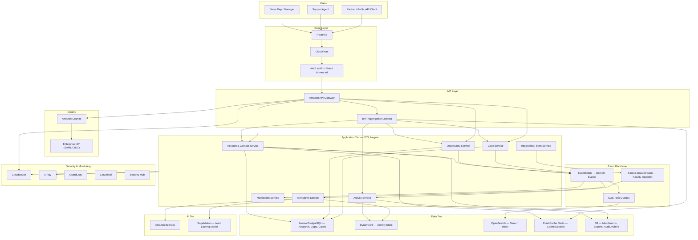

# Chapter 61 — CRM Platform

*Part VIII – Enterprise Application Architectures*

---

# 1. Executive Summary

## The Business Problem

Every enterprise that sells, services, or supports customers eventually confronts the same operational reality: customer data is scattered.

- Sales teams keep pipeline data in spreadsheets or point tools.
- Support teams log tickets in a separate helpdesk system.
- Marketing runs campaigns from a third platform with its own contact database.
- Finance holds billing and contract history in the ERP.

None of these systems agree with each other. A support agent cannot see that the customer on the phone just signed a six-figure renewal. A sales rep cannot see that the same account has three open, unresolved P1 tickets. Marketing sends a win-back campaign to a customer who churned because of an unresolved bug that engineering fixed two weeks ago, but nobody looped in marketing.

A **CRM (Customer Relationship Management) platform** exists to close this gap. It provides a single, authoritative, real-time record of every customer relationship — spanning sales opportunities, support cases, marketing engagement, contracts, and activity history — and exposes that record to every team, application, and channel that touches the customer.

## Architecture Objective

The objective of this chapter is to design a **production-grade, multi-tenant, horizontally scalable CRM platform on AWS** that:

- Serves as the system of record for accounts, contacts, opportunities, cases, and activities.
- Supports tens of thousands of concurrent users across sales, support, and marketing functions.
- Ingests and correlates customer activity from many channels (web, email, phone, chat, mobile) in near real time.
- Provides sub-200ms read latency for the core UI (account 360 view, pipeline board, case queue).
- Offers a public and partner-facing API for CRM data, with strict multi-tenant isolation.
- Embeds AI-assisted capabilities (lead scoring, case summarization, next-best-action) without becoming dependent on a single proprietary AI vendor.
- Meets enterprise security, compliance, and auditability requirements (SOC 2, GDPR, and — depending on customer base — HIPAA or PCI DSS adjacency for stored contact and payment metadata).
- Can be delivered both as an internally operated platform for a single enterprise and as a multi-tenant SaaS product resold to other companies.

## Why Organizations Adopt This Architecture

Organizations do not build CRM platforms because they enjoy building CRM platforms. They build (or heavily customize) one of these architectures for reasons that fall into a few recurring categories:

**1. Off-the-shelf CRM does not fit the domain model.**
Standard CRM products (built around generic "leads, contacts, opportunities" objects) frequently do not map cleanly onto industries with unusual relationship structures — multi-party contracts, regulated referral chains, complex account hierarchies, or usage-based billing entities. When the object model has to be bent too far, teams build a custom platform on top of AWS primitives instead.

**2. Data gravity and integration cost.**
Once a company has ten or more systems that need to read and write customer data, the cost of licensing an all-in-one CRM and building connectors to every downstream system often exceeds the cost of owning the platform outright, especially at scale.

**3. Product-led companies embedding CRM into their own product.**
SaaS vendors building account management, support, or success tooling *into their own product* (rather than using an off-the-shelf CRM their customers never see) need a platform they can white-label, extend, and multi-tenant.

**4. Compliance and data residency control.**
Highly regulated industries (banking, healthcare, government contractors) frequently cannot use a third-party CRM vendor's multi-tenant cloud without extensive compensating controls. Owning the architecture on AWS gives full control over encryption, key management, data residency, and audit trails.

**5. AI differentiation.**
Companies building AI-native customer engagement (predictive churn, generative case summarization, autonomous outreach agents) frequently find off-the-shelf CRM's AI extensibility too limited, and build a platform where the AI layer is first-class rather than bolted on.

## Major Business Benefits

| Benefit | Description |
|---|---|
| Unified customer record | One authoritative view of every account, eliminating conflicting data across sales, support, and marketing systems. |
| Faster resolution and sales cycles | Agents and reps see full context (open cases, deal stage, contract terms) without switching tools. |
| Reduced churn | Correlating support signals with renewal timing surfaces at-risk accounts before they churn. |
| Platform extensibility | Internal teams and partners can build on top of a documented API rather than waiting on a vendor roadmap. |
| Cost control at scale | Usage-based AWS infrastructure costs scale with actual load, avoiding the per-seat licensing cliffs of commercial CRM products at large headcounts. |
| AI-assisted productivity | Lead scoring, case triage, and next-best-action recommendations reduce manual busywork for reps and agents. |
| Data sovereignty | Full control of where data is stored, replicated, and processed — critical for regulated and multi-region enterprises. |

## Typical Enterprise Scenarios

- A **B2B SaaS company** with 500+ enterprise accounts building an internal CRM to manage renewals, expansion, and support escalations, tightly integrated with its own product telemetry.
- A **financial services firm** replacing a legacy on-premises CRM that cannot meet modern availability and AI requirements, while maintaining strict regulatory control over customer PII.
- A **healthcare services company** building a patient/provider relationship platform with CRM-like capabilities, subject to HIPAA.
- A **manufacturing enterprise** unifying dealer, distributor, and end-customer relationship data across regions and languages.
- A **SaaS vendor** building a CRM product to sell to other companies (multi-tenant, white-labeled, billed per seat or per usage).

This chapter designs the architecture generically enough to support all of these scenarios, while calling out the specific decisions that change depending on whether the platform is **single-tenant internal** or **multi-tenant SaaS**.

---

# 2. Business Requirements

## Business Drivers

- Consolidate sales, support, and marketing customer data into one system of record.
- Reduce average case resolution time and sales cycle length through better context.
- Enable partner and internal teams to build on top of CRM data via API.
- Support enterprise customers who require regional data residency and strict audit trails.
- Reduce long-term licensing cost compared to per-seat commercial CRM products at scale.

## Functional Requirements

- CRUD operations on core objects: Accounts, Contacts, Opportunities, Cases, Activities, Notes, Tasks.
- Configurable object schema (custom fields, custom objects) per tenant or business unit.
- Full-text and faceted search across all customer records.
- Activity timeline aggregating emails, calls, meetings, and support tickets per account/contact.
- Pipeline (Kanban-style) views for opportunities, with stage transitions and automation triggers.
- Case queue and SLA management for support agents.
- Bulk import/export and data deduplication tooling.
- Role-based views: sales rep, sales manager, support agent, support manager, marketing operator, administrator.
- Public/partner REST and webhook API with per-tenant rate limiting.
- Reporting and dashboarding (pipeline value, case backlog, SLA compliance).
- AI-assisted lead scoring, case summarization, and next-best-action suggestions.

## Non-Functional Requirements

| Category | Requirement |
|---|---|
| Availability | 99.95% for core CRM API and UI; 99.9% for reporting/analytics subsystems |
| Latency | p95 < 200ms for record read; p95 < 400ms for record write; p95 < 800ms for search |
| Scalability | Support 50,000 concurrent users, 500M+ activity records, 10K+ requests/sec at peak |
| Data durability | 99.999999999% (11 nines) for stored records via managed storage services |
| Compliance | SOC 2 Type II, GDPR, CCPA; HIPAA-ready configuration for healthcare tenants |
| Auditability | Immutable audit trail of every create/update/delete on customer records, retained 7 years |
| Multi-tenancy | Strict logical (and, for regulated tenants, physical) data isolation |
| Extensibility | Custom fields/objects per tenant without schema migration downtime |
| Internationalization | UTF-8 throughout; multi-currency, multi-timezone, multi-language UI |

## Scalability Goals

- Horizontal scaling of the application tier to absorb 5x traffic spikes (product launches, marketing campaigns) without manual intervention.
- Database read scaling via replicas to support reporting workloads without impacting transactional latency.
- Search index scaling independent of the primary transactional store.
- Event ingestion pipeline capable of absorbing bursts of 50,000 activity events/second from connected channels (email sync, telephony, web tracking).

## Availability Requirements

- Multi-AZ deployment as the non-negotiable baseline.
- Multi-region active-passive for enterprise/regulated tenants requiring documented DR.
- Zero-downtime deployments (blue-green or rolling with health-check gating).

## Latency Requirements

- Account 360 view (aggregating account, contacts, opportunities, cases, recent activity) must render in under 800ms end-to-end, including all backend fan-out calls.
- Search-as-you-type contact/account lookup must return in under 150ms.

## Compliance Requirements

- GDPR: right to access, right to erasure, data portability, consent tracking.
- CCPA: equivalent consumer rights for California residents.
- SOC 2 Type II: access control, change management, monitoring evidence.
- HIPAA (conditional): required only for tenants storing protected health information; drives a separate encryption and BAA-covered service boundary.
- Data residency: EU tenant data must remain in EU AWS regions; no cross-region replication of regulated data without tenant consent.

## Security Expectations

- Encryption at rest (KMS-backed) and in transit (TLS 1.2+) for all customer data.
- Field-level encryption for the most sensitive fields (SSNs, payment tokens, health information) independent of the tenant's general database encryption.
- Least-privilege IAM for every service; no shared credentials between services.
- Full audit logging of administrative actions and data access to sensitive fields.

## Recovery Objectives

| Metric | Target | Applies To |
|---|---|---|
| RPO | 5 minutes | Transactional database (Aurora) |
| RPO | 15 minutes | Search index (rebuildable from source of truth) |
| RTO | 30 minutes | Full regional failover for Tier-1 tenants |
| RTO | 4 hours | Full regional failover for standard tenants |

## SLAs

- 99.95% monthly uptime commitment for the core API, with service credits for breaches.
- P1 support case first-response SLA: 15 minutes for Tier-1 accounts, 1 hour for standard.
- Public API rate limits published per plan tier, with documented burst allowances.

## Expected Workload

- 5,000–50,000 concurrent authenticated users depending on deployment size.
- 200M–2B total customer records (accounts, contacts, activities combined) at steady state for large deployments.
- 10,000–20,000 requests/second sustained at peak for large multi-tenant deployments.

## Expected Growth

- Record volume growing 30–50% year-over-year as activity capture channels expand.
- Tenant count (for SaaS deployments) growing linearly with sales growth; each new enterprise tenant adds 500–50,000 records on day one via data migration.

---

# 3. Architecture Overview

## Overall Design

The CRM platform is built as a **domain-oriented, service-based architecture** running primarily on ECS Fargate, backed by Aurora PostgreSQL as the system-of-record database, OpenSearch for search, DynamoDB for high-volume activity/event data, and an event-driven backbone (EventBridge + SQS + Kinesis) connecting the domains together.

The design deliberately avoids two extremes:

- A **single monolithic application** talking to one giant database, which becomes an operational and organizational bottleneck once the platform passes a handful of engineering teams.
- A **fully decomposed microservices mesh** with dozens of independently deployed services, which is significantly more operational overhead than a CRM platform's actual domain complexity justifies for most organizations.

Instead, the platform is decomposed into a small number of **bounded-context services**, each owning its own data:

| Service | Owns | Primary store |
|---|---|---|
| Account & Contact Service | Accounts, contacts, relationships, custom fields | Aurora PostgreSQL |
| Opportunity Service | Deals, pipeline stages, forecasting | Aurora PostgreSQL |
| Case Service | Support cases, SLAs, escalations | Aurora PostgreSQL |
| Activity Service | Emails, calls, meetings, notes, tasks (high write volume) | DynamoDB |
| Search Service | Cross-object full-text and faceted search | OpenSearch |
| Integration/Sync Service | Inbound channel connectors (email, telephony, web tracking, marketing) | SQS + Lambda |
| AI Insights Service | Lead scoring, case summarization, next-best-action | Bedrock + DynamoDB (feature/inference cache) |
| Notification Service | In-app, email, and webhook notifications | SNS + SQS |
| Reporting Service | Aggregations and dashboards | Aurora read replica + Redshift Serverless (large deployments) |

## Architecture Philosophy

1. **System of record vs. system of engagement.** Aurora PostgreSQL is the durable system of record for structured relationship data (accounts, opportunities, cases). DynamoDB handles high-volume, append-heavy activity data where relational joins are unnecessary and throughput matters more than query flexibility.
2. **Read/write separation.** Write paths go through the owning service's API and database. Read-heavy views (dashboards, account 360, search) are served from denormalized projections (OpenSearch, read replicas, cached aggregates) rather than hammering the primary transactional database.
3. **Event-driven cross-domain communication.** When an opportunity closes, the Case Service, Notification Service, and Reporting Service should react — but the Opportunity Service should not need to know any of them exist. All cross-service reaction happens through EventBridge, not synchronous service-to-service calls.
4. **Tenant isolation is a first-class architectural concern**, not an afterthought bolted onto the database schema. Every request is scoped by tenant ID at the API Gateway, application, and database (row-level security) layers.
5. **AI is additive, not load-bearing.** The AI Insights Service can be degraded or fully disabled without breaking core CRM functionality — a hard requirement, since third-party model availability and latency are outside the platform's control.

## Core Components

- **Edge**: Route 53, CloudFront, AWS WAF, Shield Advanced.
- **API layer**: Amazon API Gateway (REST + WebSocket for real-time updates) fronting the service tier.
- **Application tier**: ECS Fargate services behind internal ALBs, one service per bounded context.
- **Event backbone**: Amazon EventBridge (domain events), Amazon SQS (task queues), Amazon Kinesis Data Streams (high-volume activity ingestion).
- **Data tier**: Aurora PostgreSQL (Multi-AZ, with read replicas), Amazon DynamoDB (activity/event store), Amazon OpenSearch Service (search index), Amazon ElastiCache for Redis (session and hot-record caching).
- **AI tier**: Amazon Bedrock (foundation models for summarization/scoring), SageMaker (custom lead-scoring model, optional).
- **Storage**: Amazon S3 (attachments, data exports, audit archive).
- **Identity**: Amazon Cognito (customer/tenant users) federated with enterprise IdPs via SAML/OIDC; IAM for service-to-service and administrative access.
- **Observability**: CloudWatch, X-Ray, OpenSearch (log analytics).

## How Components Interact

A typical write (e.g., a sales rep updates an opportunity stage) flows: client → CloudFront → API Gateway → Opportunity Service (ECS Fargate) → Aurora PostgreSQL (write) → EventBridge (`opportunity.stage_changed` event) → fan-out to Notification Service, Reporting Service, and Search Service's indexer Lambda.

A typical read (account 360 view) flows: client → CloudFront → API Gateway → an aggregation Lambda (BFF — Backend for Frontend) that fans out in parallel to the Account Service (cached), Opportunity Service (cached), Case Service (cached), and Activity Service (DynamoDB query), then merges and returns a single payload.

## High-Level Workflow

1. User authenticates via Cognito (federated SSO for enterprise tenants).
2. Client requests account 360 view; BFF Lambda aggregates data from multiple services with ElastiCache-backed caching.
3. User edits a record; write goes to the owning service, persisted to Aurora, and an event is emitted.
4. Downstream services react asynchronously: search index updates, notifications fire, reporting aggregates refresh.
5. Inbound channel events (an email sent to a tracked address, a call logged by the telephony integration) land in Kinesis, are enriched, and are written to the Activity Service's DynamoDB table, then indexed into OpenSearch.
6. AI Insights Service periodically (and on-demand) computes lead scores and case summaries, publishing results back through EventBridge so they appear in the UI without the AI service being on the critical path of any user-facing write.

## Request Lifecycle

Request → WAF inspection → API Gateway (auth, throttling, tenant resolution) → target ECS service → business logic → database write/read → response. Full detail is given in Section 7.

## Response Lifecycle

Response payloads are shaped by the BFF layer to avoid over-fetching; API Gateway response caching is used selectively for read-heavy, slow-changing endpoints (e.g., pipeline stage configuration).

## Data Lifecycle

- **Hot data** (active records, last 90 days of activity) lives in Aurora and DynamoDB with full read/write access patterns.
- **Warm data** (closed opportunities, resolved cases older than 90 days) remains queryable but is optimized for reporting via read replicas and Redshift Serverless.
- **Cold data** (audit logs, historical exports, data older than the tenant's active retention window) moves to S3 with lifecycle policies to S3 Glacier for long-term compliance retention.

---

# 4. AWS Services Used

## EC2

Used sparingly in this architecture — primarily as a fallback for self-managed OpenSearch data nodes if not using the managed service, and for any legacy integration adapters that cannot run in a container. Fargate is preferred for the application tier because CRM services have variable, spiky load (business hours peaks, campaign-driven surges) that benefits more from Fargate's fast scale-out than from managing an EC2 Auto Scaling fleet.

- **Why not primary compute here**: operational overhead of patching and capacity planning is not justified when Fargate meets the latency and cost profile.
- **Alternative**: EKS with Fargate profiles, if the organization already standardizes on Kubernetes tooling (see Chapter 36).
- **Pricing consideration**: On-Demand EC2 would only be considered for steady-state, predictable background workloads (e.g., nightly deduplication batch jobs) where Compute Savings Plans make it cheaper than Fargate.

## ALB (Application Load Balancer)

Used as the internal load balancer in front of each ECS Fargate service, and can also front the public API directly for tenants requiring VPC-based private connectivity (via PrivateLink) instead of public API Gateway access.

- **Why selected**: native ECS integration, path-based routing for BFF aggregation, WebSocket support for real-time notification streams, and health-check-driven deregistration during deployments.
- **Alternative**: Network Load Balancer for pure TCP workloads (not needed here since all traffic is HTTP/HTTPS/WebSocket).
- **Limitation**: ALB itself does not provide tenant-aware rate limiting; that responsibility sits with API Gateway and application-layer middleware.

## CloudFront

Serves the SPA frontend, caches static assets, and provides the TLS termination and DDoS-mitigation edge in front of API Gateway.

- **Why selected**: global edge presence reduces latency for geographically distributed sales/support teams; integrates natively with WAF and Shield.
- **Best practice**: separate cache behaviors for static assets (long TTL, versioned filenames) vs. API paths (no caching, or short TTL only for explicitly cacheable GET endpoints).

## Lambda

Used for the BFF aggregation layer, event-driven fan-out consumers (search indexing, notification dispatch), inbound channel connectors (email/webhook parsers), and the AI Insights orchestration layer.

- **Why selected**: these workloads are event-driven and bursty; paying only for actual invocations is far cheaper than keeping dedicated ECS tasks warm for infrequent, spiky event processing.
- **Limitation**: 15-minute maximum execution time means long-running bulk import/export jobs are handled by Step Functions orchestrating multiple Lambda invocations, or by ECS Fargate tasks for the heaviest batch jobs.

## S3

Stores file attachments (emails with attachments, contracts, case attachments), data export/import files, and the long-term audit log archive.

- **Best practice**: separate buckets (or prefixes with distinct policies) per data classification — attachments, exports, audit archive — each with its own lifecycle and access policy.
- **Pricing consideration**: S3 Intelligent-Tiering for attachments with unpredictable access patterns; explicit lifecycle-to-Glacier for audit archives with a known 7-year retention requirement.

## RDS / Aurora

Aurora PostgreSQL is the system of record for Accounts, Contacts, Opportunities, and Cases.

- **Why selected over standard RDS PostgreSQL**: Aurora's storage layer (6-way replication across 3 AZs) provides higher durability and faster failover (typically under 30 seconds) than standard RDS Multi-AZ, and Aurora Replicas can serve reporting reads without impacting the writer.
- **Why PostgreSQL over MySQL**: native row-level security (critical for tenant isolation), rich JSONB support for custom fields, and mature full-text search primitives used as a fallback when OpenSearch is unavailable.
- **Alternative considered**: Amazon RDS for PostgreSQL (standard) — rejected due to slower failover and lack of Aurora-specific read scaling.
- **Limitation**: Aurora writer is still a single logical write endpoint; very high write throughput ultimately requires either read/write splitting at the application layer (already done here) or sharding by tenant for the very largest deployments (see Section 14).

## DynamoDB

Stores the high-volume Activity stream (emails, calls, notes, tasks) where write throughput and simple key-based access patterns dominate over complex relational queries.

- **Why selected**: activity records are append-heavy, queried almost exclusively by account/contact ID and time range, and can scale to millions of writes per day without the schema and index management overhead of a relational table.
- **Best practice**: single-table design keyed by `tenant_id#entity_id` partition key and `timestamp#activity_id` sort key, with GSIs for cross-entity queries (e.g., "all activities by owner this week").
- **Limitation**: complex ad-hoc analytical queries are not DynamoDB's strength; those are served by streaming DynamoDB changes into the reporting pipeline instead.

## SNS

Used for fan-out notification delivery (in-app, email, push) once the Notification Service decides a user needs to be notified.

- **Why selected**: decouples the decision to notify from the delivery mechanism; supports multiple subscriber protocols (SQS for in-app feed, Lambda for email/push dispatch) from a single publish.

## SQS

Used for task queues that require guaranteed, ordered (where needed, via FIFO queues) processing with retry and dead-letter handling — inbound channel event processing, bulk import/export job steps, and webhook delivery retries to external partner endpoints.

- **Best practice**: dead-letter queues on every processing queue, with CloudWatch alarms on DLQ depth, and a documented replay runbook.

## EventBridge

The primary domain-event backbone. Every meaningful state change (opportunity stage change, case status change, new contact created) is published as a domain event on a dedicated EventBridge event bus.

- **Why selected over SNS for this role**: EventBridge's content-based routing rules let each downstream service subscribe only to the specific event types and detail-level filters it cares about, without every publisher needing to know every subscriber.
- **Best practice**: schema registry enabled on the event bus so producers and consumers can validate event contracts and detect breaking changes before deployment.

## IAM

Provides the identity boundary between services (execution roles per ECS task definition and per Lambda function, scoped to only the specific tables, queues, and buckets that service needs) and between administrative users (permission sets via IAM Identity Center, see Chapter 89).

## VPC

Each environment (and, for the largest regulated tenants, potentially each tenant) runs in its own VPC or isolated set of subnets, following the network design in Section 9.

## Route 53

Provides DNS for the public API and UI domains, health-check-based failover routing for multi-region DR, and private hosted zones for internal service discovery where ECS Service Connect is not used.

## CloudWatch

Central metrics and log aggregation for every service; see Section 21.

## CloudTrail

Records every AWS API call across the account(s) for security and compliance audit — mandatory given the SOC 2 and GDPR requirements in Section 2.

## AWS Config

Continuously evaluates resource configuration against compliance rules (encryption enabled, public access blocked, etc.) and feeds Security Hub.

## GuardDuty

Threat detection across the account, VPC flow logs, DNS logs, and (for the Activity Service's S3 attachment storage) S3 data events.

## KMS

Customer-managed keys (CMKs) per tenant tier: shared CMK for standard-tier multi-tenant data, dedicated per-tenant CMK for enterprise/regulated tenants who require the ability to revoke their own key (crypto-shredding) independent of other tenants.

## Secrets Manager

Stores database credentials, third-party API keys (email providers, telephony providers, marketing platform integrations), and Bedrock/AI provider credentials, with automatic rotation configured for database credentials.

## Systems Manager

Parameter Store for non-secret configuration; Session Manager for break-glass access to any EC2/container debugging without SSH keys or bastion hosts (see Chapter 10).

---

# 5. Complete Architecture Diagram



---

# 6. Component-by-Component Explanation

## Account & Contact Service

- **Purpose**: system of record for company/account hierarchy and individual contacts.
- **Responsibilities**: CRUD, deduplication, hierarchy management (parent/child accounts), custom field schema enforcement.
- **Inputs**: API Gateway requests; bulk import jobs; deduplication merge requests.
- **Outputs**: `account.created`, `account.updated`, `contact.created` domain events on EventBridge.
- **Scaling**: horizontal ECS task scaling on CPU/request-count target tracking; Aurora reader scaling for read-heavy reporting queries.
- **High availability**: minimum 2 tasks per AZ across 3 AZs; Aurora Multi-AZ with automated failover.
- **Failure handling**: circuit breaker on downstream calls (search indexing) so a search outage does not block account writes; writes always succeed to Aurora first.
- **Dependencies**: Aurora, Redis (cache), EventBridge.
- **Security**: row-level security in Aurora enforcing tenant_id scoping at the database layer, not just the application layer.
- **Monitoring**: p50/p95/p99 latency per endpoint, error rate, Aurora connection pool saturation.

## Opportunity Service

- **Purpose**: manages the sales pipeline — deal stages, forecast amounts, close dates, win/loss reasons.
- **Responsibilities**: stage transition validation (enforcing configured pipeline workflow), forecast rollups, automation trigger emission.
- **Scaling / HA / dependencies**: same pattern as Account & Contact Service.
- **Failure handling**: stage-transition writes are wrapped in a database transaction with the forecast rollup update, preventing partial updates.

## Case Service

- **Purpose**: support case management with SLA timers and escalation logic.
- **Responsibilities**: case lifecycle state machine, SLA clock management (via EventBridge Scheduler for SLA breach detection), escalation routing.
- **Failure handling**: SLA breach detection is decoupled via scheduled events rather than a long-running in-process timer, so a service restart cannot silently drop an SLA clock.

## Activity Service

- **Purpose**: append-heavy store for emails, calls, meeting notes, and tasks linked to accounts/contacts/opportunities/cases.
- **Responsibilities**: ingesting activity records from the Integration/Sync Service via Kinesis, exposing time-ranged activity queries per entity.
- **Scaling**: DynamoDB on-demand capacity mode for unpredictable, campaign-driven bursts; provisioned capacity with auto scaling for large, predictable-load tenants where on-demand pricing becomes more expensive than provisioned.
- **Failure handling**: Kinesis consumer checkpointing ensures no activity events are lost on consumer restart; a dead-letter mechanism captures malformed events for manual review.

## Integration / Sync Service

- **Purpose**: connects external channels (email providers via IMAP/Graph API, telephony providers, marketing platforms, web tracking pixels) into the platform.
- **Responsibilities**: per-channel adapters, credential management via Secrets Manager, rate-limit-aware polling or webhook receipt.
- **Failure handling**: per-tenant, per-channel circuit breakers so one tenant's misconfigured integration cannot degrade ingestion for others.

## AI Insights Service

- **Purpose**: computes lead scores, case summaries, and next-best-action suggestions.
- **Responsibilities**: orchestrates calls to Bedrock and/or a custom SageMaker model; caches inference results; publishes results as events, never blocking a synchronous user write path.
- **Failure handling**: if Bedrock/SageMaker is unavailable or slow, the UI falls back to the last cached insight or omits the AI panel entirely — the core record remains fully editable.

## Notification Service

- **Purpose**: decides who should be notified of a domain event and dispatches via the appropriate channel (in-app feed, email, webhook to partner systems).
- **Responsibilities**: per-user notification preference evaluation, digest batching, webhook delivery with retry/backoff.

## Search Service

- **Purpose**: cross-object search (accounts, contacts, opportunities, cases) with faceting and typeahead.
- **Responsibilities**: consumes domain events via SQS, transforms them into OpenSearch documents, maintains per-tenant index aliases for isolation.
- **Failure handling**: OpenSearch outage degrades search functionality only; core CRUD operations remain unaffected because OpenSearch is never in the write path.

---

# 7. End-to-End Request Flow

**Scenario: A sales rep opens an Account 360 view.**

1. Client (browser SPA) requests `https://app.example.com/accounts/{id}`.
2. Route 53 resolves to the CloudFront distribution.
3. CloudFront serves the cached SPA shell; the SPA then calls the API.
4. API request `GET /api/v1/accounts/{id}/summary` is routed through CloudFront (no caching for this path) to API Gateway.
5. AWS WAF inspects the request against managed and custom rule groups (SQLi, rate-based rules, tenant-abuse patterns).
6. API Gateway validates the JWT issued by Cognito, extracts `tenant_id` and `user_id` claims.
7. API Gateway forwards the request to the BFF Lambda via a VPC Link to the internal ALB.
8. BFF Lambda checks ElastiCache for a cached aggregate response for this account; on cache miss, it fans out in parallel to:
   - Account & Contact Service (account + contacts)
   - Opportunity Service (open opportunities for this account)
   - Case Service (open cases for this account)
   - Activity Service (last 20 activities, queried from DynamoDB)
9. Each downstream service enforces tenant-scoped row-level security on its query.
10. BFF Lambda merges the responses, writes the merged result to ElastiCache with a short TTL (e.g., 30 seconds), and returns the payload.
11. API Gateway returns the response through CloudFront to the client.
12. X-Ray traces the full call graph across API Gateway, BFF Lambda, and all four downstream services for latency diagnosis.
13. CloudWatch records latency, error rate, and cache hit ratio metrics for this endpoint.
14. If any downstream service errors, the BFF Lambda returns a partial response with the failed section marked as `unavailable` rather than failing the entire request — a support agent should still be able to see case details even if the opportunity service is temporarily degraded.
15. Client renders the account 360 view, displaying a degraded-state indicator only for the specific panel that failed.

**Error handling detail**: every downstream call from the BFF has a strict timeout (300ms) and a single retry with jitter; a service that does not respond within the timeout is treated as unavailable for that request rather than blocking the whole page load.

---

# 8. Deployment Flow

## Infrastructure Provisioning

All infrastructure is provisioned via Terraform, organized into layered state: network → data tier → application tier → edge. See Section 18 for code.

## Terraform Workflow

1. Feature branch → `terraform plan` runs automatically in CI on every pull request, output posted as a PR comment.
2. Peer review of both the application code and the Terraform diff.
3. Merge to `main` triggers `terraform apply` against the staging environment.
4. Automated integration test suite runs against staging.
5. Manual approval gate promotes the same reviewed plan to production.

## CI/CD Deployment

- Application services: container image built and pushed to ECR, then deployed via ECS blue-green deployment (CodeDeploy) with automated health-check and CloudWatch alarm-based rollback.
- Lambda functions: deployed via SAM/CDK with weighted alias traffic shifting for gradual rollout.

## Blue-Green Deployment

Each ECS service deployment provisions a fresh task set (green) alongside the running set (blue), shifts ALB target group traffic gradually (10% → 50% → 100%) while monitoring CloudWatch alarms for elevated 5xx rate or latency, and automatically rolls back to blue if any alarm fires during the shift window.

## Rollback

- Application-level rollback: CodeDeploy automatic rollback on alarm breach, plus a documented one-command manual rollback to the previous task definition revision.
- Database migrations: every schema migration must be backward-compatible with the previous application version for at least one deployment cycle (expand/contract pattern), so a code rollback never requires a simultaneous database rollback.

## Secrets

All secrets sourced from Secrets Manager at container startup via the ECS task definition's `secrets` block; no secrets are baked into container images or Terraform state.

## Configuration

Non-secret configuration (feature flags, per-tenant pipeline stage definitions) is stored in Parameter Store and DynamoDB (for tenant-specific configuration), never in environment variables baked into images, so configuration changes do not require redeployment.

## Validation

Post-deployment smoke tests run against production immediately after each deployment, covering the critical path: authentication, account read, opportunity write, case creation.

---

# 9. Network Topology

## VPC

A dedicated VPC per environment (dev, staging, production), and — for the largest regulated enterprise tenants on dedicated infrastructure — a dedicated VPC per tenant.

## CIDR

Production VPC: `10.20.0.0/16`, sized to accommodate multiple AZs and future subnet growth without renumbering.

## Public Subnets

Host only the ALB/NLB elastic network interfaces and NAT Gateways — no application or database resources.

## Private Subnets

Two tiers:
- **Application private subnets**: ECS Fargate tasks, Lambda functions (VPC-attached for database access).
- **Data private subnets**: Aurora, ElastiCache, OpenSearch — no route to the internet at all, not even via NAT.

## NAT Gateway

One NAT Gateway per AZ (not a single shared NAT Gateway) to avoid a cross-AZ single point of failure and to avoid inter-AZ data transfer charges for outbound traffic.

## Internet Gateway

Attached to the VPC for public subnet egress/ingress only.

## Transit Gateway

Used when the CRM platform VPC must connect to other internal enterprise VPCs (data warehouse, ERP integration) or to a hub-and-spoke multi-account landing zone (see Chapter 17).

## Route Tables

Separate route tables per subnet tier; data subnets have no `0.0.0.0/0` route at all.

## Network ACLs

Baseline stateless NACLs restricting data-subnet traffic to only the specific ports (5432 for Aurora, 6379 for Redis, 443 for OpenSearch) from application-subnet CIDR ranges.

## Security Groups

Least-privilege, referencing security group IDs rather than CIDR ranges wherever possible — e.g., the Aurora security group allows inbound 5432 only from the Account/Opportunity/Case service security groups, not from the whole VPC CIDR.

## PrivateLink

Exposed for enterprise tenants that require private connectivity to the public API without traversing the public internet, and used internally for VPC-to-VPC access to shared services (e.g., a shared Bedrock VPC endpoint) without public egress.

## Hybrid Connectivity

For enterprises integrating the CRM with on-premises systems (legacy ERP, on-prem telephony PBX), Direct Connect or Site-to-Site VPN terminates into a dedicated shared-services VPC, never directly into the CRM application VPC (see Chapter 23/24).

---

# 10. Identity and Access

## IAM Roles

Every ECS task definition and Lambda function has its own execution role, scoped to the exact resources it needs — e.g., the Activity Service's role can read/write only its own DynamoDB table and its own Kinesis stream, nothing else.

## IAM Policies

Written with explicit resource ARNs, not wildcards, and reviewed via automated policy-linting (e.g., IAM Access Analyzer) in the CI pipeline before merge.

## Resource Policies

S3 bucket policies deny any request not using TLS and not from the expected VPC endpoint; KMS key policies restrict `Decrypt` to the specific service roles that legitimately need it.

## STS

Used for the Integration/Sync Service to assume short-lived, tenant-scoped roles when a tenant grants access to their own external systems (e.g., a tenant's own S3 bucket for data export) via cross-account role assumption rather than long-lived credentials.

## Cross-Account Access

Production, staging, and shared-services (logging, security tooling) each live in separate AWS accounts under AWS Organizations, with cross-account roles used only for specific, audited purposes (central logging ingestion, security scanning).

## Least Privilege

Enforced via a combination of scoped IAM policies, permission boundaries on any role that can create other roles, and quarterly access reviews driven by IAM Access Analyzer findings.

## Service Roles

Distinct roles for: ECS task execution (pulling images, writing logs) vs. ECS task role (application runtime permissions) — these are never combined into a single role.

## Permission Boundaries

Applied to any CI/CD deployment role capable of creating IAM resources, preventing privilege escalation even if the deployment pipeline itself is compromised.

---

# 11. Security Architecture

## Encryption

- **At rest**: Aurora, DynamoDB, OpenSearch, S3, and EBS (for any remaining EC2 usage) all encrypted with KMS CMKs.
- **In transit**: TLS 1.2+ enforced at CloudFront, API Gateway, ALB, and between services via ACM-issued certificates; internal service-to-service traffic within the VPC also uses TLS via ECS Service Connect's built-in mTLS or an App Mesh sidecar for stricter zero-trust requirements.

## KMS

Per-tenant CMKs for enterprise/regulated tenants, enabling crypto-shredding (key deletion renders that tenant's data permanently unreadable, satisfying "right to erasure" for structured data faster than row-by-row deletion).

## TLS

Enforced end-to-end; HTTP requests are redirected, never served, at CloudFront.

## WAF

Managed rule groups (SQL injection, known bad inputs, IP reputation) plus custom rules for CRM-specific abuse patterns: rate-based rules per API key, and rules blocking known scraper user agents on the public API.

## Shield

AWS Shield Advanced on the CloudFront distribution and API Gateway, given the public API surface and the reputational/SLA cost of a DDoS-driven outage on a system enterprise customers rely on for sales operations.

## Secrets Manager

All database credentials, third-party integration API keys, and AI provider credentials — automatic 30-day rotation for database credentials.

## Certificate Manager

Public certificates for CloudFront and API Gateway custom domains; private CA (ACM Private CA) for internal mTLS between services if App Mesh/service mesh is adopted.

## GuardDuty

Enabled account-wide, including S3 protection (monitoring the attachments bucket for anomalous access patterns) and Malware Protection for S3 (scanning uploaded attachments before they are made available to other users).

## Inspector

Continuous vulnerability scanning of ECR container images and Lambda function dependencies, gating deployment on critical/high findings.

## Security Hub

Aggregates findings from GuardDuty, Inspector, Config, and Access Analyzer into a single compliance posture view, mapped to the CIS AWS Foundations Benchmark and, where relevant, HIPAA and PCI DSS standards.

## CloudTrail

Organization-wide trail with log file validation enabled, delivered to a dedicated, access-restricted logging account.

## AWS Config

Rules enforcing: encryption-at-rest required on all data stores, no public S3 buckets, MFA required for IAM users, security groups do not allow unrestricted ingress.

## Zero Trust

Every service-to-service call is authenticated and authorized independently — no implicit trust based on network location alone. See Chapter 87 for the full Zero Trust reference pattern this platform builds on.

## Threat Model (Summary)

| Threat | Mitigation |
|---|---|
| Cross-tenant data leakage | Row-level security in Aurora + tenant-scoped IAM/query filters at every service layer |
| Compromised API credential | Short-lived JWTs, per-key rate limiting, anomaly detection on API usage patterns |
| Malicious file upload (attachments) | GuardDuty Malware Protection for S3 scanning before files are served |
| Insider threat / over-privileged admin | Permission boundaries, quarterly access review, full audit trail of admin actions |
| Data exfiltration via bulk export | Export jobs logged and rate-limited; large exports require additional approval workflow for regulated tenants |

---

# 12. High Availability

## AZ Failures

All stateful services (Aurora, ElastiCache, OpenSearch) are deployed Multi-AZ; ECS services run a minimum of 2 tasks per AZ across 3 AZs so the loss of one AZ removes at most one-third of application capacity, which Auto Scaling replaces within minutes.

## Instance Failures

ECS/Fargate handles individual task failure via health-check-driven replacement; ALB removes unhealthy targets within the configured health-check interval (default 30 seconds, tuned to 10 seconds for the core API services).

## Regional Failures

Addressed via the DR strategy in Section 13 — not covered by AZ-level HA alone.

## Database Failures

Aurora automated failover to a replica typically completes in under 30 seconds; application connection pools use the Aurora cluster reader/writer endpoints (never a specific instance endpoint) so failover is transparent to the application.

## Load Balancing

ALB health checks target a dedicated `/healthz` endpoint per service that verifies database connectivity, not just process liveness — a service that can accept TCP connections but cannot reach Aurora must be marked unhealthy.

## Health Checks

Layered: ALB target health checks (fast, shallow), plus a separate CloudWatch synthetic canary running the full account-360 read path every minute from outside the VPC to catch issues the shallow health check would miss.

## Failover

Route 53 health-check-based failover routing for the multi-region DR posture (Section 13); Aurora Global Database for cross-region data replication where regulatory posture permits.

---

# 13. Disaster Recovery

## Backup Strategy

- Aurora automated backups (35-day retention) plus daily manual snapshots retained per tenant contract terms.
- DynamoDB point-in-time recovery enabled on all tables.
- S3 versioning enabled on attachment and export buckets, with cross-region replication for the audit archive bucket.

## Snapshots

Aurora snapshots copied cross-region nightly for tenants on the DR-covered tier; snapshot copy jobs monitored with CloudWatch alarms on failure.

## Cross-Region Replication

Aurora Global Database (for regulated tenants whose data residency terms permit a DR region) provides sub-second replication lag to a secondary region, with a promotable secondary cluster.

## DR Strategy Selection

| Tier | Strategy | RTO | RPO |
|---|---|---|---|
| Standard | Backup & Restore | 4 hours | 5 minutes (via PITR) |
| Enterprise | Warm Standby | 30 minutes | Near-zero (Aurora Global Database) |
| Tier-1 Regulated | Active-Active (where data residency allows) | Near-zero | Near-zero |

- **Pilot Light**: not used here — the platform's baseline HA already exceeds pilot-light RTOs for standard tier; warm standby is the meaningful next step up.
- **Warm Standby**: secondary region runs a minimal, always-on copy of the application tier (low task count) plus the Aurora Global Database secondary cluster; scaled up on failover.
- **Multi-Site / Active-Active**: reserved for the highest-tier regulated tenants where cost is justified; requires careful handling of write conflicts, generally resolved by routing each tenant's writes to a single "home" region even in an active-active deployment (tenant-level active-active, not record-level).

## RPO / RTO Recap

See Section 2 table; DR architecture directly targets those figures, validated via the DR test cadence in Section 23.

---

# 14. Scalability

## Horizontal Scaling

ECS services scale via target-tracking on request count per task and CPU utilization; scaling policies are tuned per service based on observed load-testing behavior (the Activity Service, being I/O-bound on DynamoDB, scales primarily on request count rather than CPU).

## Vertical Scaling

Aurora instance class upgrades (e.g., `db.r6g.2xlarge` → `db.r6g.4xlarge`) handled during low-traffic maintenance windows for the rare cases where read-replica horizontal scaling alone is insufficient.

## Auto Scaling

Application Auto Scaling configured per ECS service with distinct min/max task counts reflecting each service's baseline and peak load profile; scheduled scaling pre-warms capacity ahead of known peak periods (start of business day across major time zones).

## Serverless Scaling

Lambda-based components (BFF, event consumers, integration adapters) scale natively with concurrency limits set per function to protect downstream Aurora connection pools from being overwhelmed by a burst of concurrent Lambda invocations (mitigated further with RDS Proxy).

## Database Scaling

- Aurora read replicas (up to 15) absorb reporting and BFF read traffic.
- **RDS Proxy** in front of Aurora pools connections across the Lambda and ECS fleet, preventing connection exhaustion during scale-out events.
- For the largest deployments approaching Aurora's practical write ceiling, tenant-based sharding (multiple Aurora clusters, tenants assigned to a cluster by a routing table) is the documented next evolution step — see Section "Evolution Path."

## Storage Scaling

Aurora storage auto-scales up to 128TB without manual intervention; DynamoDB and S3 scale natively with no capacity planning required beyond cost monitoring.

## Queue Scaling

SQS and Kinesis both scale to absorb burst ingestion; Kinesis shard count is monitored and auto-scaled (via a Lambda-based scaling utility or Kinesis On-Demand mode for unpredictable-volume tenants) to avoid `ProvisionedThroughputExceeded` errors during large campaign-driven activity bursts.

---

# 15. Performance Optimization

## Caching

- ElastiCache Redis caches: session data, the BFF's aggregated account-360 payloads (short TTL), and frequently read reference data (pipeline stage definitions, custom field schemas) with longer TTLs and explicit invalidation on schema change events.
- API Gateway response caching for genuinely static reference endpoints only.

## Compression

Gzip/Brotli compression enabled at CloudFront and API Gateway for all JSON responses above a minimum size threshold.

## CDN

CloudFront serves the SPA bundle and any public-facing static assets (help center content, public API documentation).

## Database Optimization

- Query plans reviewed for every new endpoint before production release; slow query logging enabled with a CloudWatch-alarm threshold.
- Composite indexes designed around the platform's known access patterns (tenant_id + owner_id + status is a near-universal filter combination across services).
- Partitioning of the largest tables (activity-adjacent audit tables in Aurora) by tenant_id range or by month, depending on query pattern.

## Connection Pooling

RDS Proxy for all Lambda and high-concurrency ECS connections to Aurora; PgBouncer-style pooling configuration tuned per service based on observed connection churn.

## Concurrency

ECS services configured with appropriately sized thread/worker pools matched to Fargate task vCPU allocation to avoid CPU starvation under concurrent load.

## Async Processing

Anything not required for the immediate user-facing response (search indexing, notification dispatch, AI insight computation, audit log writing) is pushed to asynchronous processing via EventBridge/SQS rather than performed synchronously in the request path.

---

# 16. Cost Optimization (FinOps)

## Estimated Monthly Cost by Deployment Size

| Component | Small (5K users) | Medium (25K users) | Enterprise (50K+ users, multi-region) |
|---|---|---|---|
| ECS Fargate (app tier) | $2,500 | $9,000 | $28,000 |
| Aurora PostgreSQL | $1,800 | $6,500 | $22,000 |
| DynamoDB | $600 | $2,800 | $9,500 |
| OpenSearch | $900 | $3,200 | $11,000 |
| ElastiCache | $400 | $1,500 | $4,500 |
| API Gateway + Lambda | $500 | $2,200 | $7,000 |
| CloudFront + WAF + Shield | $600 | $1,800 | $6,500 (incl. Shield Advanced) |
| S3 + data transfer | $300 | $1,200 | $4,800 |
| Kinesis + SQS + EventBridge | $250 | $900 | $3,200 |
| Monitoring (CloudWatch, X-Ray) | $350 | $1,100 | $3,800 |
| **Estimated Total** | **~$8,200/mo** | **~$30,200/mo** | **~$100,300/mo** |

*Figures are directional estimates for architecture planning, not quotes; actual costs depend heavily on activity volume, attachment storage, and AI usage patterns.*

## Major Cost Drivers

1. Aurora and OpenSearch instance sizing (the two most expensive always-on components).
2. Data transfer, particularly cross-AZ and cross-region replication for DR-tier tenants.
3. Bedrock/AI inference costs, which scale with usage and can spike unexpectedly if AI features are exposed without rate limiting.
4. NAT Gateway data processing charges for outbound integration traffic (email/telephony API calls).

## Optimization Opportunities

- **Compute Savings Plans** covering the baseline (non-elastic) portion of Fargate usage, with the elastic peak covered at On-Demand rates.
- **Aurora Reserved Instances** for the always-on writer and baseline reader capacity.
- **S3 lifecycle policies**: attachments moved to Intelligent-Tiering; audit archive moved to Glacier Deep Archive after the active compliance window.
- **DynamoDB capacity mode review**: quarterly analysis of on-demand vs. provisioned + auto scaling cost for each table based on observed traffic predictability.
- **Rightsizing**: automated weekly Compute Optimizer review of ECS task CPU/memory allocation vs. actual utilization.
- **Cost allocation tagging**: every resource tagged with `tenant-tier`, `environment`, `service`, and `cost-center`, enabling per-tenant cost attribution — essential for SaaS deployments to understand gross margin per account.
- **Budgets and Cost Anomaly Detection**: per-environment budgets with alert thresholds at 80%/100%/120% of forecast; Cost Anomaly Detection specifically monitoring Bedrock and data transfer line items, which are the categories most prone to unexpected spikes.

---

# 17. AI-Assisted Operations

## Amazon Q

Used by the platform engineering team for troubleshooting CloudWatch logs, generating runbook drafts, and querying AWS resource configuration during incident response — not embedded in the customer-facing product itself.

## Bedrock

Powers the customer-facing AI Insights Service: case summarization (condensing a long email/call thread into a 2-sentence summary for an agent), lead scoring rationale (explaining *why* a lead scored highly, not just the number), and next-best-action suggestions on the account 360 view.

- **Model selection**: a smaller, faster model for high-volume, low-stakes tasks (case summarization) and a larger model for lower-volume, higher-stakes tasks (churn-risk narrative generation for account executives).
- **Guardrails**: Bedrock Guardrails configured to prevent the model from fabricating factual claims about a customer that are not present in the source data, and to redact any PII the model should not be echoing into logs.

## AI Troubleshooting / Log Analysis

CloudWatch Logs Insights queries, augmented by Amazon Q, used to triage production incidents; anomaly detection on error rate metrics feeds directly into the incident response workflow described in Section 23.

## Incident Response

AI-assisted first-pass triage (summarizing recent deployment changes, correlated alarm history) speeds up the initial incident timeline, but human on-call engineers retain final decision authority — the AI output is advisory, appended to the incident channel, never auto-executed.

## Cost Optimization / Capacity Planning

Bedrock and Compute Optimizer recommendations reviewed monthly in the FinOps review cadence (Chapter 97); AI-generated capacity forecasts cross-checked against actual growth trends before committing to Reserved Instance/Savings Plan purchases.

## Architecture Review

New service proposals within the platform are reviewed with AI-assisted Well-Architected Framework checklists as a first pass, before the formal Architecture Review Board session (Section 31).

## AI-Generated Terraform / Documentation

Used for first-draft generation of boilerplate Terraform modules and runbook documentation, always reviewed and edited by an engineer before merge — never applied directly to production infrastructure.

---

# 18. Terraform Implementation

```hcl

# providers.tf

terraform {
  required_version = ">= 1.7.0"
  required_providers {
    aws = {
      source  = "hashicorp/aws"
      version = "~> 5.50"
    }
  }
  backend "s3" {
    bucket         = "crm-platform-terraform-state-prod"
    key            = "crm-platform/prod/terraform.tfstate"
    region         = "us-east-1"
    dynamodb_table = "crm-platform-terraform-locks"
    encrypt        = true
  }
}

provider "aws" {
  region = var.aws_region
  default_tags {
    tags = {
      Project     = "crm-platform"
      Environment = var.environment
      ManagedBy   = "terraform"
    }
  }
}

```

```hcl

# variables.tf

variable "environment" {
  description = "Deployment environment name (dev, staging, prod)"
  type        = string
}

variable "aws_region" {
  description = "Primary AWS region for deployment"
  type        = string
  default     = "us-east-1"
}

variable "vpc_cidr" {
  description = "CIDR block for the CRM platform VPC"
  type        = string
  default     = "10.20.0.0/16"
}

variable "az_count" {
  description = "Number of Availability Zones to deploy across"
  type        = number
  default     = 3
}

variable "aurora_instance_class" {
  description = "Aurora PostgreSQL instance class"
  type        = string
  default     = "db.r6g.xlarge"
}

```

```hcl

# network.tf

module "vpc" {
  source = "./modules/vpc"

  environment = var.environment
  vpc_cidr    = var.vpc_cidr
  az_count    = var.az_count

  # Data subnets have no internet route at all

  create_data_subnets = true
}

resource "aws_security_group" "aurora" {
  name_prefix = "crm-${var.environment}-aurora-"
  vpc_id      = module.vpc.vpc_id
  description = "Allow Postgres access only from application service security groups"

  ingress {
    description     = "Postgres from app tier"
    from_port       = 5432
    to_port         = 5432
    protocol        = "tcp"
    security_groups = [aws_security_group.app_tier.id]
  }

  egress {
    from_port   = 0
    to_port     = 0
    protocol    = "-1"
    cidr_blocks = ["0.0.0.0/0"]
  }

  tags = { Name = "crm-${var.environment}-aurora-sg" }
}

resource "aws_security_group" "app_tier" {
  name_prefix = "crm-${var.environment}-app-"
  vpc_id      = module.vpc.vpc_id
  description = "ECS Fargate application tier"

  egress {
    from_port   = 0
    to_port     = 0
    protocol    = "-1"
    cidr_blocks = ["0.0.0.0/0"]
  }

  tags = { Name = "crm-${var.environment}-app-sg" }
}

```

```hcl

# aurora.tf

resource "aws_rds_cluster" "crm" {
  cluster_identifier      = "crm-${var.environment}-aurora"
  engine                  = "aurora-postgresql"
  engine_version          = "15.4"
  database_name           = "crm"
  master_username         = "crm_admin"
  manage_master_user_password = true

  db_subnet_group_name   = module.vpc.data_subnet_group_name
  vpc_security_group_ids = [aws_security_group.aurora.id]

  storage_encrypted = true
  kms_key_id        = aws_kms_key.crm_data.arn

  backup_retention_period      = 35
  preferred_backup_window      = "03:00-04:00"
  preferred_maintenance_window = "sun:04:30-sun:05:30"

  deletion_protection = var.environment == "prod" ? true : false

  enabled_cloudwatch_logs_exports = ["postgresql"]

  tags = { Name = "crm-${var.environment}-aurora" }
}

resource "aws_rds_cluster_instance" "writer" {
  identifier         = "crm-${var.environment}-aurora-writer"
  cluster_identifier = aws_rds_cluster.crm.id
  instance_class     = var.aurora_instance_class
  engine             = aws_rds_cluster.crm.engine
  engine_version     = aws_rds_cluster.crm.engine_version
}

resource "aws_rds_cluster_instance" "reader" {
  count               = var.environment == "prod" ? 2 : 1
  identifier          = "crm-${var.environment}-aurora-reader-${count.index}"
  cluster_identifier  = aws_rds_cluster.crm.id
  instance_class      = var.aurora_instance_class
  engine              = aws_rds_cluster.crm.engine
  engine_version      = aws_rds_cluster.crm.engine_version
}

resource "aws_kms_key" "crm_data" {
  description             = "CMK for CRM platform data encryption - ${var.environment}"
  deletion_window_in_days = 30
  enable_key_rotation     = true
}

```

```hcl

# ecs_service.tf (example: Opportunity Service)

resource "aws_ecs_task_definition" "opportunity_service" {
  family                   = "crm-${var.environment}-opportunity-service"
  requires_compatibilities = ["FARGATE"]
  network_mode             = "awsvpc"
  cpu                      = 1024
  memory                   = 2048
  execution_role_arn       = aws_iam_role.ecs_task_execution.arn
  task_role_arn             = aws_iam_role.opportunity_service_task.arn

  container_definitions = jsonencode([
    {
      name      = "opportunity-service"
      image     = "${aws_ecr_repository.opportunity_service.repository_url}:${var.image_tag}"
      essential = true
      portMappings = [{ containerPort = 8080, protocol = "tcp" }]
      secrets = [
        {
          name      = "DATABASE_URL"
          valueFrom = aws_secretsmanager_secret.opportunity_db_creds.arn
        }
      ]
      logConfiguration = {
        logDriver = "awslogs"
        options = {
          "awslogs-group"         = aws_cloudwatch_log_group.opportunity_service.name
          "awslogs-region"        = var.aws_region
          "awslogs-stream-prefix" = "opportunity-service"
        }
      }
      healthCheck = {
        command  = ["CMD-SHELL", "curl -f http://localhost:8080/healthz || exit 1"]
        interval = 10
        timeout  = 5
        retries  = 3
      }
    }
  ])
}

resource "aws_ecs_service" "opportunity_service" {
  name            = "opportunity-service"
  cluster         = aws_ecs_cluster.crm.id
  task_definition = aws_ecs_task_definition.opportunity_service.arn
  desired_count   = var.environment == "prod" ? 6 : 2
  launch_type     = "FARGATE"

  network_configuration {
    subnets         = module.vpc.app_subnet_ids
    security_groups = [aws_security_group.app_tier.id]
  }

  load_balancer {
    target_group_arn = aws_lb_target_group.opportunity_service.arn
    container_name   = "opportunity-service"
    container_port   = 8080
  }

  deployment_controller {
    type = "CODE_DEPLOY"
  }

  lifecycle {
    ignore_changes = [task_definition, desired_count]
  }
}

resource "aws_appautoscaling_target" "opportunity_service" {
  max_capacity       = 20
  min_capacity       = var.environment == "prod" ? 6 : 2
  resource_id        = "service/${aws_ecs_cluster.crm.name}/${aws_ecs_service.opportunity_service.name}"
  scalable_dimension = "ecs:service:DesiredCount"
  service_namespace  = "ecs"
}

resource "aws_appautoscaling_policy" "opportunity_service_requests" {
  name               = "opportunity-service-request-count"
  policy_type        = "TargetTrackingScaling"
  resource_id        = aws_appautoscaling_target.opportunity_service.resource_id
  scalable_dimension = aws_appautoscaling_target.opportunity_service.scalable_dimension
  service_namespace  = aws_appautoscaling_target.opportunity_service.service_namespace

  target_tracking_scaling_policy_configuration {
    predefined_metric_specification {
      predefined_metric_type = "ALBRequestCountPerTarget"
      resource_label         = "${aws_lb.internal.arn_suffix}/${aws_lb_target_group.opportunity_service.arn_suffix}"
    }
    target_value       = 500
    scale_in_cooldown  = 120
    scale_out_cooldown = 60
  }
}

```

```hcl

# outputs.tf

output "aurora_cluster_endpoint" {
  value       = aws_rds_cluster.crm.endpoint
  description = "Aurora cluster writer endpoint"
}

output "aurora_reader_endpoint" {
  value       = aws_rds_cluster.crm.reader_endpoint
  description = "Aurora cluster reader endpoint for read-scaled traffic"
}

output "ecs_cluster_name" {
  value = aws_ecs_cluster.crm.name
}

```

**Terraform best practices applied:**

- Remote state in S3 with DynamoDB locking prevents concurrent apply conflicts.
- Every module accepts an `environment` variable rather than hardcoding dev/staging/prod differences into separate copies of configuration.
- `lifecycle { ignore_changes }` on ECS service `task_definition`/`desired_count` prevents Terraform from fighting with CodeDeploy-managed deployments and Application Auto Scaling.
- KMS CMKs, not the default AWS-managed keys, used for all data-tier encryption to support per-tenant crypto-shredding requirements.
- `manage_master_user_password = true` delegates Aurora master credential storage and rotation entirely to Secrets Manager rather than passing a password through Terraform state.

---

# 19. AWS CLI Examples

**Deployment validation:**

```bash

# Confirm ECS service reached steady state after a deployment

aws ecs wait services-stable \
  --cluster crm-prod \
  --services opportunity-service

# Check current running task count vs. desired

aws ecs describe-services \
  --cluster crm-prod \
  --services opportunity-service \
  --query 'services[0].[desiredCount,runningCount,pendingCount]'

```

**Monitoring and troubleshooting:**

```bash

# Tail recent logs for the Opportunity Service

aws logs tail /ecs/crm-prod/opportunity-service --since 15m --follow

# Check Aurora cluster failover history

aws rds describe-events \
  --source-identifier crm-prod-aurora \
  --source-type db-cluster \
  --duration 1440

# Inspect current Aurora connection count vs. max_connections

aws cloudwatch get-metric-statistics \
  --namespace AWS/RDS \
  --metric-name DatabaseConnections \
  --dimensions Name=DBClusterIdentifier,Value=crm-prod-aurora \
  --start-time $(date -u -d '-1 hour' +%Y-%m-%dT%H:%M:%S) \
  --end-time $(date -u +%Y-%m-%dT%H:%M:%S) \
  --period 300 \
  --statistics Average Maximum

```

**Search index validation:**

```bash

# Check OpenSearch cluster health

aws opensearch describe-domain \
  --domain-name crm-prod-search \
  --query 'DomainStatus.[Processing,ClusterConfig.InstanceCount]'

```

**Cleanup (non-production environments):**

```bash

# Scale down a staging ECS service ahead of a scheduled cost-saving window

aws ecs update-service \
  --cluster crm-staging \
  --service opportunity-service \
  --desired-count 0

```

---

# 20. CI/CD Integration

## GitHub Actions

```yaml

name: deploy-opportunity-service

on:
  push:
    branches: [main]
    paths:
      - 'services/opportunity-service/**'

jobs:
  build-and-deploy:
    runs-on: ubuntu-latest
    permissions:
      id-token: write
      contents: read
    steps:
      - uses: actions/checkout@v4

      - name: Configure AWS credentials (OIDC)
        uses: aws-actions/configure-aws-credentials@v4
        with:
          role-to-assume: arn:aws:iam::123456789012:role/github-actions-deploy
          aws-region: us-east-1

      - name: Build and push image
        run: |
          aws ecr get-login-password | docker login --username AWS --password-stdin ${{ secrets.ECR_REGISTRY }}
          docker build -t $ECR_REGISTRY/opportunity-service:${{ github.sha }} services/opportunity-service
          docker push $ECR_REGISTRY/opportunity-service:${{ github.sha }}

      - name: Run Trivy vulnerability scan
        uses: aquasecurity/trivy-action@master
        with:
          image-ref: '${{ secrets.ECR_REGISTRY }}/opportunity-service:${{ github.sha }}'
          severity: 'CRITICAL,HIGH'
          exit-code: '1'

      - name: Deploy via CodeDeploy blue-green
        run: |
          aws deploy create-deployment \
            --application-name crm-opportunity-service \
            --deployment-group-name prod \
            --revision revisionType=AppSpecContent,appSpecContent="{content=$(cat appspec.yaml)}"

```

## Terraform Pipeline Gate

- `terraform validate` and `tflint` run on every PR.
- `terraform plan` output posted as a PR comment; a policy-as-code check (Open Policy Agent / Sentinel) blocks any plan that would remove encryption, widen a security group to `0.0.0.0/0`, or disable deletion protection on production data stores.

## Rollback

CodeDeploy automatically rolls back to the previous deployment on CloudWatch alarm breach during the traffic-shift window; a manual `aws deploy stop-deployment --auto-rollback-enabled` command is documented for immediate human-triggered rollback.

---

# 21. Monitoring

## CloudWatch

Central metrics namespace per service (`CRM/OpportunityService`, `CRM/CaseService`, etc.) with custom business metrics (opportunities created per hour, case SLA breach count) alongside infrastructure metrics.

## Dashboards

A tiered dashboard structure:
- **Executive dashboard**: uptime, SLA compliance, active tenant count.
- **Service dashboards**: per-service latency, error rate, throughput, dependency health.
- **On-call dashboard**: current alarms, recent deployments, error budget burn rate.

## Metrics

Standard RED metrics (Rate, Errors, Duration) for every service endpoint, plus USE metrics (Utilization, Saturation, Errors) for Aurora, DynamoDB, and ElastiCache.

## Logs

Structured JSON logging from every service, shipped to CloudWatch Logs, with a correlation ID propagated across every service in a request's call graph.

## Tracing

AWS X-Ray enabled on API Gateway, Lambda, and ECS (via the X-Ray daemon sidecar), providing full distributed traces across the BFF fan-out pattern described in Section 7.

## Alarms

CloudWatch Composite Alarms combining error rate and latency thresholds to reduce alert noise from single-metric flapping; alarms route to PagerDuty/Opsgenie via SNS.

## Notifications

Tiered: P1 (customer-facing outage) pages on-call immediately; P2/P3 route to a Slack channel for next-business-day triage.

## SLIs / SLOs / Error Budgets

| SLI | SLO | Error Budget (monthly) |
|---|---|---|
| API availability | 99.95% | ~21.6 minutes |
| Account 360 read latency (p95) | < 800ms | 0.5% of requests may exceed |
| Opportunity write success rate | 99.99% | ~4.3 minutes-equivalent |

Error budget burn rate is tracked on the on-call dashboard; a fast-burn alert (budget exhausted in under 6 hours at current rate) pages immediately, while a slow-burn alert (budget exhausted in under 3 days) is a next-business-day ticket.

---

# 22. Logging

## Centralized Logging

All service logs, ALB access logs, CloudFront logs, and VPC Flow Logs are shipped to a centralized logging account, separate from the application accounts, so that log integrity is preserved even if an application account is compromised.

## CloudWatch Logs

Primary real-time log store for the 30-day hot retention window used for active troubleshooting.

## S3 + Athena

Logs older than 30 days are exported to S3 and queried via Athena for historical investigation and compliance reporting, at a fraction of CloudWatch Logs' long-term storage cost.

## OpenSearch

A dedicated OpenSearch domain (separate from the customer-data search index) ingests structured application logs for operational log analytics and dashboarding via OpenSearch Dashboards.

## Retention

- Application logs: 30 days hot (CloudWatch), 1 year warm (S3/Athena).
- Audit logs (record access, administrative actions): 7 years, S3 with Object Lock in compliance mode, satisfying SOC 2 and financial-services regulatory retention requirements.

## Audit Logging

Every read of a sensitive field (SSN, payment token) and every create/update/delete of a customer record is written to an immutable audit log stream, separate from general application logs, with the acting user ID, tenant ID, timestamp, and before/after values for updates.

---

# 23. Operational Excellence

## Runbooks

Documented, version-controlled runbooks for the top 15 failure scenarios in Section 24, each with step-by-step diagnosis and resolution commands, kept in the same repository as the infrastructure code so they are reviewed alongside architecture changes.

## Automation

- Automated nightly deduplication job flags likely duplicate accounts/contacts for review (never auto-merges without confirmation for tenants with strict data-governance requirements).
- Automated SLA breach detection and escalation routing via EventBridge Scheduler.

## Patch Management

Base container images rebuilt weekly via automated pipeline picking up OS and dependency security patches; Inspector findings gate promotion to production.

## Maintenance

Aurora minor version upgrades applied during the documented maintenance window with automated pre-upgrade snapshot; major version upgrades planned and tested in staging with a full regression pass before scheduling in production.

## Incident Response

Standard severity-tiered process (P1–P4) with a documented incident commander rotation, automated incident channel creation on PagerDuty trigger, and mandatory blameless post-incident review within 5 business days for every P1/P2.

## Change Management

All production changes flow through the CI/CD pipeline described in Section 20 — no manual console changes to production infrastructure, enforced via IAM policies that deny console-initiated write actions on production resources outside the deployment role.

---

# 24. Failure Scenarios

| # | Scenario | Symptoms | Root Cause | Detection | Resolution | Prevention |
|---|---|---|---|---|---|---|
| 1 | Aurora writer failover | Brief write errors, elevated latency | AZ degradation or instance failure | RDS event notification, CloudWatch alarm | Application retries against new writer endpoint automatically | Connection pooling via RDS Proxy handles reconnection gracefully |
| 2 | Aurora connection exhaustion | 500 errors across multiple services | Burst of Lambda invocations opening new connections | CloudWatch DatabaseConnections alarm | Scale RDS Proxy, throttle Lambda concurrency | Enforce RDS Proxy for all Lambda DB access |
| 3 | DynamoDB throttling | Elevated 5xx on Activity Service | Sudden write burst exceeding provisioned capacity | CloudWatch ThrottledRequests metric | Switch table to on-demand mode or raise provisioned capacity | Use on-demand mode for unpredictable-load tenants |
| 4 | OpenSearch cluster yellow/red | Search returning stale or no results | Node failure or disk watermark breach | OpenSearch cluster health alarm | Add/replace nodes, clear old indices | Index lifecycle management, dedicated master nodes |
| 5 | EventBridge rule misconfiguration | Downstream service stops receiving events | Bad deployment changed event pattern filter | Drop in downstream consumer invocation metric | Roll back rule change | Schema registry validation in CI before deploy |
| 6 | SQS DLQ growth | Notifications not delivered | Malformed event payload from an upstream change | CloudWatch DLQ depth alarm | Inspect and replay DLQ messages after fix | Contract testing between producer and consumer |
| 7 | Kinesis shard throughput exceeded | Activity ingestion lag increases | Marketing campaign driving abnormal event volume | IteratorAge metric alarm | Increase shard count / switch to on-demand mode | Pre-scale ahead of known campaign launches |
| 8 | Cross-tenant data leakage bug | Tenant reports seeing another tenant's data | Missing tenant_id filter in a new query path | Automated tenant-isolation test failure, or customer report | Emergency hotfix, full audit of affected records, customer notification | Mandatory tenant-isolation test suite gating every merge |
| 9 | Bedrock API latency spike | AI insights panel slow/timing out | Upstream model provider degradation | X-Ray trace showing Bedrock call latency | Fall back to cached insight, degrade gracefully | AI service never on synchronous critical path |
| 10 | ECS deployment stuck | New tasks failing health checks repeatedly | Bad application config referencing a removed Parameter Store key | CodeDeploy automatic rollback triggers | Automatic rollback to previous task definition | Pre-deployment smoke test against new config in staging |
| 11 | NAT Gateway saturation | Integration/Sync Service timeouts calling external APIs | Single NAT Gateway bandwidth limit reached | CloudWatch NAT Gateway metrics | Add NAT Gateway per AZ if not already present | Provision one NAT Gateway per AZ from the start |
| 12 | KMS key policy misconfiguration | Service cannot decrypt secrets, fails to start | Recent key policy change removed a role's decrypt permission | ECS task startup failure alarm | Revert key policy change | Peer review + automated policy diff check for KMS changes |
| 13 | Certificate expiration | TLS errors on custom domain | ACM certificate not auto-renewed due to DNS validation record removal | ACM expiration warning (30 days prior) | Restore DNS validation record, request renewal | Automated check that validation records remain in place |
| 14 | Runaway bulk import job | Aurora CPU spikes, other services slow | Tenant-initiated large import without rate limiting | Aurora CPU alarm | Throttle/pause import job, resume in smaller batches | Enforce batch size and backoff on all bulk import jobs |
| 15 | Regional service disruption (upstream AWS incident) | Multiple services degraded simultaneously | AWS regional issue affecting a shared dependency | AWS Health Dashboard, multi-service alarm correlation | Execute documented regional failover runbook (Section 13) | Regular DR failover testing, warm standby readiness |

---

# 25. Troubleshooting Guide

| Problem | Symptoms | Likely Cause | Diagnosis | AWS CLI Commands | Resolution |
|---|---|---|---|---|---|
| Slow account 360 load | p95 latency > 2s | ElastiCache miss storm or downstream service degradation | Check X-Ray trace for the slow span | `aws xray get-trace-summaries --start-time ... --end-time ...` | Warm cache, scale affected downstream service |
| Opportunity writes failing | 5xx on `PUT /opportunities/{id}` | Aurora writer unreachable or connection pool exhausted | Check RDS Proxy metrics, Aurora events | `aws rds describe-events --source-type db-cluster` | Failover confirmation, scale RDS Proxy |
| Search results stale | New records not appearing in search | SQS consumer lag or Lambda indexing failure | Check SQS queue depth and Lambda error metrics | `aws sqs get-queue-attributes --attribute-names ApproximateNumberOfMessages` | Investigate Lambda errors, replay from DLQ |
| Notification not received | User reports missing email/in-app alert | SNS delivery failure or user preference misconfiguration | Check SNS delivery status logs | `aws sns get-topic-attributes` | Verify subscription, check delivery status logging |
| High AWS bill spike | Cost Anomaly Detection alert | Runaway Bedrock usage or unthrottled bulk export | Cost Explorer breakdown by service and tag | `aws ce get-cost-and-usage --time-period ... --granularity DAILY` | Apply rate limiting, investigate anomalous tenant activity |
| Tenant reports data isolation concern | Customer sees unexpected data | Application-layer or RLS policy bug | Review audit logs for the affected query path | `aws logs filter-log-events --log-group-name /ecs/crm-prod/account-service` | Immediate isolation test, hotfix, customer communication per incident policy |

---

# 26. Best Practices

1. Enforce tenant isolation at three layers: API Gateway claim validation, application-layer query filters, and database row-level security — never rely on just one.
2. Never let a single service's database schema become a shared dependency for another service; access other services' data only through their API or published events.
3. Treat AI-generated insights as advisory and cacheable, never as a blocking dependency for core CRUD operations.
4. Use RDS Proxy for all Lambda-to-Aurora connections to avoid connection storms during scale-out.
5. Tag every resource with tenant-tier, environment, and cost-center from day one — retrofitting cost attribution later is expensive.
6. Design database migrations to be backward-compatible for at least one full deployment cycle (expand/contract pattern).
7. Keep the BFF aggregation layer resilient to partial downstream failure — a degraded panel beats a failed page load.
8. Use EventBridge schema registry to catch breaking event contract changes in CI, not in production.
9. Provision one NAT Gateway per AZ, never a single shared NAT Gateway, for both resilience and cost reasons.
10. Encrypt every data store with a customer-managed KMS key, not the AWS-managed default, to support per-tenant crypto-shredding.
11. Separate audit logging from general application logging; audit logs need longer retention and immutability guarantees.
12. Automate DR failover testing at least twice a year; an untested DR plan is not a DR plan.
13. Apply least-privilege IAM per service, never a shared "application role" across multiple services.
14. Use blue-green deployments with automated alarm-based rollback for every production release.
15. Build a dedicated tenant-isolation automated test suite and run it on every pull request, not just at release time.
16. Cache aggressively at the BFF layer for read-heavy views, but keep TTLs short enough that stale data windows are acceptable to the business.
17. Design the Activity Service around DynamoDB's strengths (high write throughput, simple key access) rather than forcing relational query patterns onto it.
18. Keep the AI Insights Service's model choice swappable — do not hardcode a single vendor's SDK throughout the application layer.
19. Separate the logging AWS account from application accounts to preserve audit integrity during a security incident.
20. Require peer review on every Terraform plan touching encryption, IAM, or security group configuration.
21. Monitor Aurora connection count continuously; connection exhaustion is one of the most common production incidents in this architecture pattern.
22. Use Compute Savings Plans for baseline Fargate capacity and On-Demand for elastic peak capacity.
23. Instrument every service with X-Ray from day one — retrofitting distributed tracing after an incident is far harder than building it in up front.
24. Rate-limit bulk import/export jobs; an unthrottled bulk operation is a top cause of production database CPU incidents.
25. Version every public API endpoint from the start; CRM platforms accumulate long-lived integrations that cannot tolerate breaking changes.
26. Build the search index as a derived, rebuildable projection — never treat OpenSearch as a source of truth.
27. Document and test the crypto-shredding (per-tenant KMS key deletion) procedure before a regulated tenant ever requires it.
28. Keep pipeline stage and case status workflows configurable per tenant, but validate configuration against a strict schema to prevent invalid state machines.
29. Set explicit Lambda concurrency limits on functions that write to Aurora, to protect the database from serverless scale-out bursts.
30. Review Security Hub findings weekly, not just during audit season.
31. Use permission boundaries on any role capable of creating other IAM roles, including CI/CD deployment roles.
32. Keep the account 360 read path's fan-out calls under strict per-call timeouts so one slow dependency cannot make the entire page unusable.

---

# 27. Anti-Patterns

1. **Sharing a single database across all services.** Turns the "service" boundary into a fiction; any service can accidentally couple to another's internal schema. *Correct approach*: each bounded-context service owns its own tables/database.
2. **Putting AI inference in the synchronous write path.** A model provider outage becomes a CRM outage. *Correct approach*: AI runs asynchronously, results cached and degraded gracefully.
3. **Relying only on application-layer tenant filtering.** One missed `WHERE tenant_id = ?` clause causes a data breach. *Correct approach*: enforce row-level security at the database layer as a second line of defense.
4. **Using a single shared NAT Gateway.** Creates a cross-AZ single point of failure and unnecessary inter-AZ data transfer cost. *Correct approach*: one NAT Gateway per AZ.
5. **Storing secrets in environment variables baked into container images.** Secrets end up in image layers, logs, and CI artifacts. *Correct approach*: inject from Secrets Manager at runtime.
6. **Treating OpenSearch as a source of truth.** Loses data on index corruption with no recovery path. *Correct approach*: always rebuildable from Aurora/DynamoDB.
7. **Synchronous service-to-service calls for cross-domain reactions.** Creates tight coupling and cascading failure risk. *Correct approach*: EventBridge domain events.
8. **No connection pooling in front of Aurora for Lambda.** Serverless scale-out directly causes connection exhaustion. *Correct approach*: RDS Proxy mandatory for all Lambda DB access.
9. **Skipping backward-compatible database migrations.** Forces simultaneous code and schema rollback, turning every deployment into a high-risk event. *Correct approach*: expand/contract migrations.
10. **Allowing unrestricted, unthrottled bulk import/export.** A single large job can degrade the platform for every tenant. *Correct approach*: rate-limited, batched, backoff-aware bulk operations.
11. **Wildcard IAM policies "to save time."** Defeats least privilege and makes audits meaningless. *Correct approach*: explicit resource ARNs, reviewed via Access Analyzer.
12. **No dead-letter queue on processing queues.** Malformed events are silently dropped with no visibility. *Correct approach*: DLQ plus alarm on depth for every queue.
13. **Hardcoding a single AI vendor's SDK throughout business logic.** Makes future model/provider changes a large rewrite. *Correct approach*: abstract AI calls behind an internal interface.
14. **Manual console changes to production infrastructure.** Untracked drift from Terraform state, invisible to change management. *Correct approach*: all changes through CI/CD; console write access denied on production.
15. **No per-tenant cost visibility.** SaaS deployments cannot identify unprofitable tenants or cost anomalies. *Correct approach*: tenant-tier tagging from day one.
16. **Combining ECS task execution role and task role.** Grants the container runtime unnecessary permissions to pull images and push logs. *Correct approach*: separate, narrowly scoped roles.
17. **Testing DR only on paper.** An assumed RTO/RPO that has never been exercised is not reliable. *Correct approach*: scheduled, mandatory DR failover drills.
18. **Auto-merging suspected duplicate records without human review.** Risks silently destroying data for regulated tenants. *Correct approach*: flag for review, never silent auto-merge, for governed tenants.
19. **Single, monolithic EventBridge rule catching all events for a consumer.** Creates unnecessary coupling and processing overhead. *Correct approach*: narrowly scoped rules per consumer need.
20. **No schema validation on tenant-configurable pipeline/case workflows.** Invalid configuration can produce unreachable states or broken SLA logic. *Correct approach*: strict schema validation on any tenant-authored workflow configuration.

---

# 28. Alternatives

| Alternative | Advantages | Disadvantages | Cost | Operational Complexity | Security | Performance |
|---|---|---|---|---|---|---|
| Commercial CRM (Salesforce, Dynamics 365) | Fast time-to-market, mature ecosystem, vendor-managed uptime | Expensive per-seat licensing at scale, limited domain-model flexibility, vendor lock-in | High at large seat counts | Low (vendor-managed) | Vendor-dependent controls | Good, but customization can degrade it |
| Monolithic single-database application | Simpler initial development, fewer moving parts | Scaling and team-ownership bottlenecks as the platform grows | Lower initially, higher at scale | Low initially, rising sharply with growth | Simpler to reason about, harder to isolate tenants at scale | Good at small scale, degrades under load |
| Fully decomposed microservices (20+ services) | Maximum team independence, fine-grained scaling | Excessive operational overhead for CRM's actual domain complexity, higher latency from more network hops | Higher (more infrastructure surface) | High | More attack surface to secure | Can be worse due to network hop overhead |
| Kubernetes (EKS) instead of ECS Fargate | Portability, larger ecosystem of tooling | Higher operational burden (cluster management, upgrades) for teams without existing Kubernetes expertise | Comparable or higher (cluster overhead) | Higher | Comparable, with more configuration surface | Comparable |
| Serverless-only (all Lambda, no ECS) | No container management, fine-grained cost scaling | 15-minute execution limits complicate long-running batch and bulk operations; connection management to Aurora is harder at scale | Lower at low/variable traffic, can exceed Fargate at sustained high traffic | Lower for the app tier, but RDS Proxy and concurrency tuning add complexity | Comparable | Excellent for spiky load, weaker for sustained high-throughput services |

This chapter's recommended architecture (bounded-context ECS Fargate services + selective Lambda for event-driven and bursty workloads) sits deliberately between the monolith and full-microservices extremes, and is chosen because CRM's actual domain complexity — a handful of clearly bounded contexts with well-understood relationships — does not justify either extreme.

---

# 29. Real Enterprise Case Study

## Company Profile

**Fortress Industrial Group** is a mid-market industrial equipment manufacturer with 40 regional distributors, 1,200 direct sales and support employees, and roughly 18,000 active customer accounts spanning manufacturing, energy, and construction sectors.

## Business Problem

Fortress ran a 12-year-old on-premises CRM that could not integrate with its modern e-commerce parts ordering platform, lacked mobile support for field service technicians, and had no meaningful reporting beyond static monthly exports. Support case data lived in a separate on-premises helpdesk system with no connection to the CRM, meaning sales reps routinely called on accounts with open, unresolved equipment failures without knowing it.

## Architecture Decisions

- Adopted the bounded-context ECS Fargate architecture described in this chapter, deployed single-tenant (internal use only, no external SaaS resale).
- Chose Aurora PostgreSQL over the incumbent on-prem Oracle database specifically for the row-level security feature, since Fortress's distributor model required strict data segmentation — each regional distributor's sales team could see only their own accounts, while corporate sales leadership needed cross-region visibility.
- Integrated the existing on-premises helpdesk system via the Integration/Sync Service during a 9-month migration window, before fully retiring it in favor of the new Case Service.
- Deployed the AI Insights Service with case summarization first (highest immediate agent productivity value) and lead scoring second, after establishing enough historical opportunity data to train a meaningful model.

## Migration

- Phase 1 (months 1–3): stood up the platform in parallel with the legacy system; new accounts created in both systems.
- Phase 2 (months 4–7): bulk migration of historical account, contact, and opportunity data via a dedicated ECS Fargate batch migration job, run in controlled batches with reconciliation reporting after each batch.
- Phase 3 (months 8–9): case data migration from the legacy helpdesk, cutover of all users to the new platform, legacy systems moved to read-only archive status.

## Challenges

- Data quality: the legacy system had approximately 22% duplicate account records accumulated over a decade; the deduplication tooling (Section 26, best practice #15) required significant tuning against Fortress's specific account-naming conventions before migration.
- Distributor security model: mapping the 40 distributors' regional access boundaries onto row-level security policies required more design iteration than initially scoped, ultimately resolved with a `distributor_id` column feeding the RLS policy alongside `tenant_id`.
- Change management: field service technicians' mobile adoption lagged corporate sales adoption by nearly two quarters, requiring a dedicated mobile-first onboarding push.

## Lessons Learned

- Data deduplication should have started before the migration project, not during it — it became the single largest schedule risk.
- The AI case summarization feature drove faster agent adoption of the new platform than any other single feature, because it delivered visible, immediate time savings.
- Underestimating the distributor-level access model's complexity was the architecture team's biggest planning miss; it should have been scoped at the same level of detail as tenant isolation itself.

## Results

- Average case resolution time decreased 34% within six months of full cutover, attributed primarily to agents having full account context (open opportunities, prior cases) at the point of contact.
- Sales cycle length for renewal opportunities decreased 18%, attributed to the account 360 view surfacing unresolved support issues before renewal conversations.
- Infrastructure cost came in approximately 40% lower than the incumbent system's total cost of ownership (including the retired on-prem hardware refresh that was avoided).

---

# 30. Architecture Decision Record (ADR)

**ADR-061: Bounded-Context Service Architecture for the CRM Platform**

**Context**
The organization needs a CRM platform capable of scaling to tens of thousands of users, supporting strict multi-tenant data isolation, and embedding AI-assisted capabilities without those capabilities becoming a single point of failure for core CRM functionality. The two extremes considered — a single monolithic application and a fully decomposed microservices mesh — both carry known failure modes at this domain's actual complexity level.

**Decision**
Adopt a bounded-context service architecture on ECS Fargate, with Aurora PostgreSQL as the relational system of record, DynamoDB for high-volume activity data, OpenSearch as a derived search projection, and EventBridge as the cross-service event backbone. AI capabilities (Bedrock/SageMaker) are isolated in a dedicated service that is never on the synchronous write path of core CRM operations.

**Alternatives Considered**
1. Commercial off-the-shelf CRM — rejected due to domain-model fit and long-term per-seat licensing cost at Fortress's scale (see Section 28).
2. Single monolithic application — rejected due to anticipated team-ownership and scaling bottlenecks beyond the first 2–3 years of growth.
3. Fully decomposed microservices (20+ services) — rejected as disproportionate operational overhead for the CRM domain's actual bounded-context count.

**Consequences**
- Positive: clear team ownership boundaries per service; independent scaling per domain; AI features can fail without taking down core CRM functionality; tenant isolation enforced at multiple architectural layers.
- Negative: cross-service consistency requires careful event-driven design discipline; teams must maintain event contract discipline via the EventBridge schema registry; initial platform stand-up requires more upfront infrastructure investment than a monolith.

**Risks**
- Aurora write throughput ceiling at the very largest tenant scale, mitigated by the documented tenant-sharding evolution path (Section 14).
- Event-driven eventual consistency between services requires UI design that tolerates brief propagation delay (e.g., a just-created contact appearing in search a few seconds later).

**Review Date**
This ADR should be revisited at 18 months post-launch, or immediately if any tenant's write throughput approaches 70% of the single-cluster Aurora ceiling observed in load testing.

---

# 31. Architecture Review Checklist

**Security**
- [ ] All data stores encrypted at rest with customer-managed KMS keys
- [ ] TLS 1.2+ enforced end-to-end, no plaintext HTTP paths
- [ ] Row-level security enforced in Aurora for every tenant-scoped table
- [ ] IAM roles scoped to least privilege, no wildcard resource ARNs
- [ ] Secrets sourced exclusively from Secrets Manager at runtime
- [ ] GuardDuty, Security Hub, and Config enabled account-wide

**Networking**
- [ ] Data-tier subnets have no route to the internet
- [ ] One NAT Gateway per AZ
- [ ] Security groups reference other security groups, not broad CIDR ranges, where possible
- [ ] Private connectivity (PrivateLink) available for enterprise tenants requiring it

**Operations**
- [ ] Blue-green deployment with automated alarm-based rollback configured for every service
- [ ] Runbooks documented for all Section 24 failure scenarios
- [ ] DR failover tested within the last 6 months
- [ ] Change management enforced entirely through CI/CD, no manual production console changes

**Performance**
- [ ] BFF aggregation calls have explicit per-call timeouts
- [ ] RDS Proxy in front of all Lambda-to-Aurora connections
- [ ] Caching strategy documented with explicit TTL and invalidation triggers

**Scalability**
- [ ] Auto scaling policies tuned and load-tested for each service
- [ ] Tenant-sharding evolution path documented for future write-throughput growth
- [ ] Kinesis/DynamoDB capacity mode reviewed against actual traffic predictability

**Reliability**
- [ ] Multi-AZ deployment for all stateful components
- [ ] Health checks verify true dependency health, not just process liveness
- [ ] Dead-letter queues and alarms configured on every processing queue

**Cost**
- [ ] Resources tagged for per-tenant and per-service cost attribution
- [ ] Budgets and Cost Anomaly Detection configured, including for Bedrock usage
- [ ] Savings Plans/Reserved Instance coverage reviewed quarterly against actual baseline usage

**Compliance**
- [ ] Audit logging captures all sensitive-field access and administrative actions
- [ ] Data residency requirements mapped to tenant deployment configuration
- [ ] Crypto-shredding procedure documented and tested for regulated tenants

---

# 32. Summary

## Business Value

This architecture gives an organization a single, authoritative, real-time customer record spanning sales, support, and marketing — eliminating the fragmented, conflicting views that slow down every customer interaction. It does this while remaining operationally proportionate: enough service decomposition to scale teams and workloads independently, without the overhead of decomposition far beyond what the CRM domain actually requires.

## Key Architecture Decisions

- Bounded-context services (not a monolith, not 20+ microservices) aligned to the CRM domain's natural boundaries.
- Aurora PostgreSQL with row-level security as the relational system of record; DynamoDB for high-volume activity data; OpenSearch as a derived, rebuildable search projection.
- EventBridge as the cross-service event backbone, decoupling every downstream reaction from the services that trigger it.
- AI capabilities architecturally isolated so they enhance the product without ever being a dependency for core CRUD functionality.
- Tenant isolation enforced redundantly at the API, application, and database layers.

## Lessons Learned

- Data quality and deduplication effort is consistently underestimated in CRM migrations and should be scoped as its own workstream from day one.
- Features that deliver immediate, visible time savings (like AI case summarization) drive platform adoption faster than backend architecture improvements users never see.
- Multi-tenant access models (distributor hierarchies, regional segmentation) deserve the same design rigor as tenant isolation itself — they are frequently more complex in practice than the base tenant model.

## When to Use

- Organizations with clearly bounded CRM domains (accounts, opportunities, cases, activities) and enough scale to justify owning infrastructure rather than licensing a commercial CRM.
- Companies building CRM-like capability directly into their own product for resale.
- Regulated enterprises requiring data residency, encryption, and audit control beyond what a third-party CRM vendor can offer.

## When Not to Use

- Small organizations (under a few hundred employees, modest customer counts) where a commercial CRM's time-to-market advantage outweighs the cost savings of ownership.
- Organizations without existing platform engineering capability to operate a service-based architecture; the operational maturity bar for this pattern is real.
- Teams needing to ship in weeks, not months — this architecture's upfront investment only pays off at sufficient scale and time horizon.

---

# 33. Further Reading

- AWS Well-Architected Framework — https://aws.amazon.com/architecture/well-architected/
- AWS Well-Architected Framework, SaaS Lens — for multi-tenant architecture guidance specific to this chapter's SaaS deployment variant
- Amazon Aurora PostgreSQL documentation, Row-Level Security section
- Amazon EventBridge documentation, Schema Registry
- Amazon Bedrock documentation, Guardrails
- AWS Whitepaper: "Multi-Tenant SaaS Storage Strategies"
- AWS Whitepaper: "Security Pillar — AWS Well-Architected Framework"
- Terraform AWS Provider documentation — registry.terraform.io/providers/hashicorp/aws
- Related chapters in this series: Chapter 45 (DynamoDB), Chapter 59 (SaaS Multi-Tenant), Chapter 60 (B2B SaaS), Chapter 87 (Zero Trust), Chapter 89 (IAM Identity Center), Chapter 97 (FinOps Architecture)

---

# 34. Architect's Corner

## Why This Architecture Exists

Experienced architects converge on this pattern for CRM platforms because the domain has a genuinely small number of natural bounded contexts — accounts, opportunities, cases, activities — that map cleanly onto separately ownable, separately scalable services without forcing artificial decomposition.

Simpler designs (a single application, a single database) work fine for the first year or two. They fail predictably once:

- Multiple engineering teams need to ship independently without blocking on each other's database migrations.
- Activity data volume (emails, calls, web tracking events) grows an order of magnitude faster than structured relationship data, and a single relational database cannot absorb that write pattern economically.
- AI features get added and, without architectural isolation, start taking down core functionality every time a third-party model provider has a bad day.

The bounded-context pattern exists specifically to defer the far more expensive full-microservices decomposition until (if ever) the organization's actual scale justifies it, while still solving the team-ownership and workload-isolation problems that kill monoliths.

## When You SHOULD Choose This Architecture

- Mid-market to enterprise organizations (typically 500+ employees, or SaaS vendors with meaningful ARR) with more than one engineering team touching customer data.
- Organizations with clear compliance or data-residency requirements a third-party CRM vendor cannot satisfy.
- Teams with existing platform engineering maturity — container orchestration, CI/CD, IAM discipline — since this architecture assumes that baseline competency exists.
- Growth trajectories where record volume and user count are both expected to grow meaningfully over 2–3 years, justifying the upfront investment.

## When You Should NOT Choose This Architecture

- Early-stage companies still validating product-market fit — the opportunity cost of months spent building CRM infrastructure instead of core product is rarely justified this early.
- Organizations with a single small team and no near-term plan to scale engineering headcount around this platform.
- Teams without existing operational maturity in containers, IaC, and cloud security — the learning curve compounds badly with the domain complexity.
- Situations where a commercial CRM's native integrations (email, calendar, marketing automation) would take months to replicate and the business does not have a compliance reason requiring ownership.

## Hidden Trade-offs

- **Operational complexity**: nine-plus independently deployed services means nine-plus sets of dashboards, alarms, and on-call runbooks to maintain — a real ongoing tax, not a one-time cost.
- **Unexpected cloud costs**: Bedrock usage and cross-AZ data transfer are the two categories that most often blow past initial estimates, particularly as AI features get more heavily used than initially modeled.
- **Troubleshooting difficulty**: a slow account-360 load could be Aurora, DynamoDB, OpenSearch, ElastiCache, or the BFF's own fan-out logic — distributed tracing is not optional here, it is load-bearing for operability.
- **Deployment complexity**: nine services each need their own CI/CD pipeline, health checks, and rollback logic; the marginal cost of adding a tenth service is much lower than the cost of standing up the first three.
- **Vendor lock-in**: heavy reliance on Aurora-specific features (Global Database, RLS performance characteristics) and Bedrock makes a future cloud-provider migration a substantial project, not a configuration change.
- **Learning curve**: engineers new to the platform need to understand not just one codebase but the event-driven contracts between services — onboarding takes measurably longer than onboarding onto a monolith.
- **Security implications**: more services means more IAM roles, more security groups, more attack surface to review — the security review burden scales with service count.
- **Maintenance burden**: nine services each accumulate their own dependency upgrade cycles, patching schedules, and technical debt independently.

## Common Architecture Review Questions

1. Why Aurora PostgreSQL instead of a fully serverless database (Aurora Serverless v2, DynamoDB-only)?
2. Why not a single shared database with strict application-layer discipline instead of per-service ownership?
3. Why ECS Fargate instead of EKS, given the organization's existing Kubernetes investment elsewhere?
4. How exactly is tenant isolation enforced, and how is that enforcement tested continuously, not just at launch?
5. What happens to core CRM functionality if Bedrock is unavailable for an extended period?
6. How is DR tested, and when was the most recent test executed?
7. How is per-tenant cost visibility achieved, and who reviews it?
8. What is the actual RTO/RPO for a full regional failure, and has it been validated under realistic load?
9. How are database schema migrations coordinated across a rolling deployment without downtime?
10. What is the blast radius of a single service's compromise, given the current IAM role scoping?
11. How does the platform handle a tenant's right-to-erasure request across all nine services and the audit archive?
12. What is the plan for the Aurora write-throughput ceiling as the largest tenants grow?
13. How is cross-service data consistency handled given the event-driven, eventually-consistent design?
14. What is the actual measured latency of the BFF fan-out pattern under peak concurrent load?
15. How are secrets rotated, and what is the blast radius if one integration credential is compromised?
16. What is the process for onboarding a new regulated tenant requiring a dedicated KMS key and VPC?
17. How is the AI Insights Service's output quality monitored and how is model drift detected?
18. What automated tests exist specifically for tenant-isolation regressions, and do they run on every PR?
19. How does the platform's cost structure compare to the commercial CRM alternative at current and projected scale?
20. What is the plan if a critical third-party integration (email provider API) changes its rate limits or deprecates an API version with short notice?

## Production Pitfalls

1. **Missing tenant_id filter in a new query** — Business impact: potential data breach and regulatory exposure. Technical impact: cross-tenant data leakage. Solution: mandatory RLS as a second enforcement layer plus automated isolation tests on every PR.
2. **Underprovisioned RDS Proxy** — Business impact: platform-wide outage during traffic spikes. Technical impact: connection exhaustion cascading across services. Solution: load-test RDS Proxy capacity against realistic Lambda concurrency scenarios before launch.
3. **AI service treated as synchronous dependency by a well-meaning engineer** — Business impact: CRM outage tied to a third-party model provider's uptime. Technical impact: cascading timeout failures. Solution: architectural review gate requiring async, cached AI integration patterns.
4. **Unbounded bulk import from a large enterprise tenant onboarding** — Business impact: platform-wide slowness affecting other tenants during a single customer's migration. Technical impact: Aurora CPU saturation. Solution: mandatory batching and rate limiting on all bulk operations, enforced in code, not just by policy.
5. **EventBridge rule pattern typo silently dropping events** — Business impact: notifications/search silently stop working for a subset of event types, often unnoticed for weeks. Technical impact: silent data staleness. Solution: schema registry validation and consumer-side monitoring for expected event volume.
6. **KMS key policy change made without review** — Business impact: service outage or, worse, an accidental over-permissive grant. Technical impact: services failing to decrypt secrets. Solution: mandatory peer review and automated policy diffing on all KMS changes.
7. **Search index and source-of-truth drifting silently out of sync** — Business impact: users cannot find records they know exist. Technical impact: indexing pipeline failure with no alerting. Solution: periodic reconciliation job comparing record counts between Aurora and OpenSearch, alarmed on drift beyond threshold.
8. **Cost Anomaly Detection not configured for Bedrock** — Business impact: unexpected five-figure monthly overage discovered only at bill time. Technical impact: none until discovered. Solution: dedicated anomaly detection and budget alerts scoped specifically to AI service cost line items.
9. **DR plan never tested end-to-end** — Business impact: actual failover takes far longer than the documented RTO during a real incident. Technical impact: undiscovered gaps in the failover runbook. Solution: mandatory semi-annual DR failover exercises with documented results.
10. **Overly broad IAM role reused across multiple Lambda functions "for convenience"** — Business impact: increased blast radius of any single function's compromise. Technical impact: audit failures. Solution: one execution role per function, scoped narrowly, enforced via policy-as-code in CI.
11. **No backward-compatible migration discipline** — Business impact: forced simultaneous rollback of code and schema during an incident, extending downtime. Technical impact: deployment/rollback coupling. Solution: mandatory expand/contract migration pattern with CI enforcement.
12. **Distributor/regional access hierarchy modeled as an afterthought** (as seen in the Fortress Industrial case study) — Business impact: incorrect data visibility across regions, requiring rework mid-project. Technical impact: RLS policy redesign after initial launch. Solution: scope hierarchical access models with the same rigor as tenant isolation from the start.
13. **Attachments stored without malware scanning** — Business impact: platform used as a malware distribution vector between users. Technical impact: reputational and security incident. Solution: GuardDuty Malware Protection for S3 enabled from day one, not retrofitted after an incident.
14. **No dead-letter queue monitoring** — Business impact: silently failed notifications or sync operations go unnoticed for extended periods. Technical impact: data staleness and customer trust erosion. Solution: DLQ depth alarms on every processing queue, reviewed as part of standard on-call rotation.
15. **Case SLA timers implemented as in-process application timers** — Business impact: SLA breaches go undetected after a service restart silently drops the timer. Technical impact: compliance and customer-facing SLA failures. Solution: SLA clocks implemented via EventBridge Scheduler, decoupled from any single service instance's lifecycle.

## Lessons Learned

- **What usually causes delays**: data migration and deduplication, consistently underestimated relative to the "greenfield" application development work, which teams naturally focus their planning attention on.
- **Why migrations fail**: insufficient reconciliation tooling to verify migrated data matches the source system record-for-record; teams that build reconciliation reporting *before* the bulk migration, not after, catch problems while they're still cheap to fix.
- **Why monitoring is often insufficient**: teams instrument infrastructure metrics thoroughly but under-instrument business metrics (opportunities created per hour, case SLA compliance) — the metrics that actually tell you the product is working, not just the servers.
- **Why teams underestimate networking**: the NAT Gateway-per-AZ and security-group-referencing-security-group patterns look like minor details in a design review, but retrofitting them after a cost or availability incident is disproportionately painful compared to building them correctly from the start.
- **How IAM becomes overly complex**: roles accumulate permissions over time as engineers add "just one more" action to unblock a deployment; without a quarterly access review cadence, roles drift toward over-permissioned within 12–18 months regardless of how carefully they started.
- **How Terraform modules become difficult to maintain**: modules that accept too many optional variables to serve every possible use case become harder to reason about than several smaller, more opinionated modules — favor composition over configuration flexibility.

## Cost Surprises

- **Data transfer costs**: cross-AZ traffic between application services and data stores, particularly before teams realize ElastiCache and Aurora replicas should be placed to minimize cross-AZ hops for the hottest read paths.
- **CloudFront costs**: usually well-estimated for the SPA and static assets, but easy to underestimate for high-cardinality API response caching scenarios if response caching is misapplied to non-cacheable, tenant-specific endpoints.
- **NAT Gateway costs**: per-GB data processing charges for outbound integration traffic (email/telephony API polling) accumulate faster than teams expect, especially with high-frequency polling integrations before they are converted to webhook-based, push-driven patterns.
- **Logging costs**: verbose debug-level logging left enabled in production, especially from third-party SDK libraries, is a recurring and avoidable CloudWatch Logs cost driver.
- **Cross-AZ charges**: any chatty service-to-service communication pattern that doesn't account for AZ affinity multiplies data transfer costs at scale.
- **Idle resources**: over-provisioned non-production environments (staging Aurora instances sized like production, run 24/7) are a common, easily-fixed cost leak.
- **Storage growth**: attachment storage grows faster than initially modeled once file-heavy workflows (contract uploads, case screenshots) become popular with end users.
- **Monitoring costs**: X-Ray and CloudWatch Logs Insights costs scale with traffic and can become material at the largest deployment tiers if sampling rates aren't tuned.
- **Third-party licensing**: Bedrock foundation model costs, and any third-party telephony/email API usage-based pricing, both scale with product success in ways that need to be modeled into unit economics, not treated as a fixed infrastructure line item.

## Security Blind Spots

- **IAM misconfigurations**: roles granted broad `dynamodb:*` or `s3:*` actions "temporarily" during initial development that are never tightened before production launch.
- **Overly permissive roles**: a shared CI/CD deployment role with more permissions than any single deployment actually requires, becoming a high-value target if the pipeline itself is compromised.
- **Encryption gaps**: attachment buckets or backup snapshots created outside the standard Terraform module path, missing the organization's default KMS encryption configuration.
- **Secret leakage**: integration API keys logged in plaintext during debugging sessions and never scrubbed from log retention.
- **Insufficient logging**: administrative actions (manual data corrections, tenant configuration changes) not captured in the audit trail with the same rigor as customer-initiated actions.
- **Insufficient auditing**: sensitive-field access (SSNs, payment tokens) not distinctly logged from general record access, making it impossible to answer "who viewed this specific field" during an investigation.
- **Network exposure**: a debugging security group rule opened to `0.0.0.0/0` "temporarily" during an incident and never closed afterward.
- **Supply chain risks**: unpinned or loosely pinned third-party dependencies in service container images, increasing exposure to compromised upstream packages.
- **Container security**: base images not rebuilt on a regular cadence, accumulating unpatched OS-level vulnerabilities over time.
- **API security**: public API rate limiting configured per API key but not correlated with anomalous usage pattern detection, missing slow-and-low data scraping attempts.

## Scaling Limits

- **Aurora write throughput**: the single most commonly encountered hard scaling limit in this architecture; large single-tenant write bursts (e.g., a major enterprise customer's bulk migration) can approach the practical ceiling of a single Aurora writer well before storage or read capacity become concerns.
- **Lambda concurrent execution limits**: default account-level concurrency limits can be exhausted during burst event processing if not proactively raised and monitored, particularly for the Integration/Sync Service during high-volume campaign periods.
- **DynamoDB partition throughput**: even with on-demand mode, a single very "hot" tenant or entity can exceed per-partition throughput limits if the key design does not distribute load evenly — a known risk for the largest single tenant in a multi-tenant deployment.
- **Kinesis shard limits**: fixed shard counts (if not using on-demand mode) become a bottleneck during unplanned traffic spikes; teams that don't proactively monitor `IteratorAge` discover this only during an actual incident.
- **OpenSearch cluster sizing**: search relevance and latency degrade non-linearly once index size significantly exceeds the cluster's provisioned heap, well before disk capacity becomes the binding constraint.
- **API Gateway account-level quotas**: default throttle limits can be reached faster than expected during traffic spikes tied to marketing campaigns or major customer launches; these are soft limits that must be proactively raised ahead of known peak events, not discovered during them.
- **Preparation approach**: load test each of these limits explicitly, at 2–3x current peak traffic, at least twice a year, and track headroom against actual growth trend, not just current usage.

## Evolution Path

**Startup** → single application, single Aurora database, minimal service decomposition; focus entirely on product-market fit, not platform architecture.

**Small production** → introduce Multi-AZ Aurora, basic CI/CD, and the first service boundary split (typically separating the Activity/event-ingestion workload from the core CRUD application, since it's the first workload with meaningfully different scaling characteristics).

**Highly Available** → full bounded-context service decomposition as described in this chapter; introduction of the event-driven backbone (EventBridge), dedicated search index, and formal DR strategy.

**Microservices** *(only if genuinely justified)* → further decomposition beyond the nine core services only where a specific team-ownership or scaling need justifies it — for example, splitting the Case Service into separate "case management" and "SLA/escalation" services if that boundary becomes a genuine organizational bottleneck. Most organizations should stop at the bounded-context stage described in this chapter and resist pressure to decompose further without a concrete driving need.

**Multi-region** → warm-standby or active-active DR posture (Section 13), Aurora Global Database, and tenant-level region assignment for regulated/data-residency-sensitive customers.

**Global Enterprise** → tenant-based database sharding for write-throughput scaling beyond a single Aurora cluster's ceiling, per-region deployment of the full stack for latency-sensitive global user bases, and dedicated regional compliance postures (data residency, region-specific KMS keys) per major market.

## Decision Matrix

| Criteria | This Architecture (Bounded-Context ECS Fargate) | Commercial CRM | Monolith | Full Microservices |
|---|---|---|---|---|
| Cost (at scale) | High initial, low marginal | Low initial, high marginal (per-seat) | Low initial, high marginal (scaling) | Highest |
| Complexity | Medium | Low (vendor-managed) | Low initially, high later | Highest |
| Performance | High (tuned for domain) | Medium (generic, harder to optimize) | High initially, degrades at scale | Variable (network hop overhead) |
| Reliability | High (Multi-AZ, DR-designed) | High (vendor SLA) | Medium | High (if operated well) |
| Scalability | High | Medium (vendor-dependent limits) | Low at scale | Highest |
| Security | High (full control) | Vendor-dependent | Medium | High (more surface to secure) |
| Operational Effort | Medium-High | Low | Low initially, high later | Highest |
| Maintainability | High (clear boundaries) | Low (limited customization) | Low at scale | Medium (contract sprawl) |
| Compliance | High (full control) | Vendor-dependent | Medium | High |
| Time to Market | Medium-Slow | Fast | Fast | Slowest |
| Developer Experience | Good (clear ownership) | N/A (vendor product) | Good initially, poor later | Variable (coordination overhead) |
| **Overall Recommendation** | **Best for mid-market+ orgs with platform maturity and multi-year horizon** | Best for small orgs or fast time-to-market needs | Best only for very early stage | Justified only at the largest scale with a genuine organizational driver |

## Final Recommendations from the Architect

- **Biggest success factor**: getting tenant isolation right at all three layers (API, application, database) from day one — retrofitting it later is a much larger, riskier project than building it correctly the first time.
- **Biggest implementation risk**: underestimating data migration and deduplication effort; scope it as its own workstream with its own timeline, not a subtask of the application build.
- **First thing to build**: the Account & Contact Service and its row-level security model — every other service and every isolation guarantee depends on getting this foundation right.
- **First thing to automate**: the tenant-isolation automated test suite, running on every pull request before any other feature work merges.
- **First thing to monitor**: Aurora connection count and RDS Proxy utilization — connection exhaustion is the most common real-world incident in this architecture pattern.
- **First security control to enable**: customer-managed KMS encryption on every data store, from the very first Terraform apply — retrofitting encryption key ownership later is disruptive.
- **First FinOps recommendation**: tag every resource with tenant-tier and cost-center before the first production deployment; cost attribution added later requires reconstructing history that was never captured.
- **First disaster recovery test**: a full Aurora failover drill in staging within the first month of production launch, well before the first real incident forces you to learn the failover behavior under pressure.
- **Long-term maintenance advice**: resist decomposing beyond the bounded-context service count established at launch unless a specific, documented organizational or scaling driver requires it — the temptation to keep splitting services is real, and the operational cost of over-decomposition compounds quietly until it becomes very expensive to reverse.
