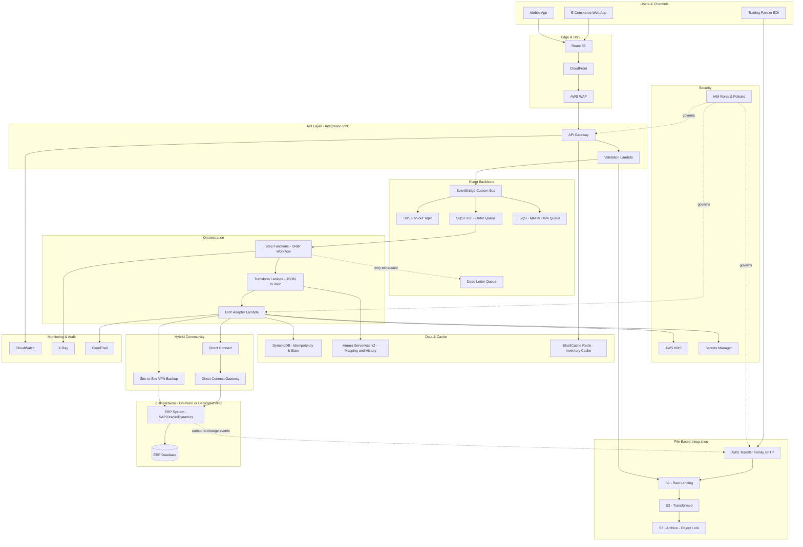

# Part VIII – Enterprise Application Architectures

# Chapter 62: ERP Integration

---

## 1. Executive Summary

Enterprise Resource Planning (ERP) systems — SAP S/4HANA, Oracle E-Business Suite, Oracle Fusion Cloud, Microsoft Dynamics 365, NetSuite, and Infor — sit at the center of nearly every large organization's financial, supply chain, manufacturing, and HR operations.

These systems were historically deployed on-premises, tightly coupled to internal networks, batch file transfers, and proprietary middleware. As organizations move workloads to AWS, the ERP itself frequently remains on-premises or is migrated to a specialized ERP-certified hosting model (for example, SAP on AWS using certified EC2 instance families), while the surrounding digital ecosystem — customer portals, e-commerce, mobile apps, data lakes, AI/ML pipelines, and partner integrations — increasingly lives natively in AWS.

This chapter addresses the **ERP Integration Architecture**: a production-grade AWS pattern for connecting cloud-native applications to an ERP system (on-premises, AWS-hosted, or SaaS) in a way that is secure, observable, resilient, and cost-efficient.

**The business problem.**

ERP systems were not designed for high-concurrency, low-latency, event-driven integration:

- They expose integration primarily through SOAP/REST APIs (BAPI/RFC/OData for SAP, REST for NetSuite, Web Services for Oracle EBS), file drops (IDoc, flat files, EDI), or database-level replication.
- They enforce strict transactional integrity and often cannot tolerate high request volumes without additional load on production instances that also run financial close, payroll, and manufacturing operations.
- They frequently sit inside a private network (on-premises data center or a dedicated VPC) that cloud-native applications cannot reach directly for security and compliance reasons.
- Business logic changes in the ERP release cycle are slow (quarterly to annual), while cloud-native applications release weekly or daily — creating an architectural impedance mismatch that must be absorbed by an integration layer, not pushed onto either side.

**The architecture objective.**

Build a durable, decoupled integration layer between AWS-native applications and the ERP system that:

1. Buffers request volume and traffic spikes away from the ERP using asynchronous messaging.
2. Normalizes ERP-specific data formats (IDoc, BAPI, flat file, EDI 850/856/810) into clean, versioned event schemas consumed by downstream systems.
3. Guarantees at-least-once delivery with idempotent processing, since ERPs are highly sensitive to duplicate transactions (duplicate purchase orders, duplicate invoices, duplicate stock movements).
4. Provides full auditability — every message in, every message out, every transformation, every retry — because financial and supply chain integrations are subject to SOX, GDPR, and industry-specific audit requirements.
5. Supports both real-time (order status, inventory checks) and batch (nightly financial postings, mass data synchronization) integration patterns without requiring two separate platforms.
6. Isolates network access to the ERP behind a narrow, monitored, least-privilege boundary (VPN, Direct Connect, or PrivateLink) rather than exposing ERP endpoints broadly across the cloud estate.

**Why organizations adopt this architecture.**

- **Modernization without ERP replatforming.** Replacing an ERP is a multi-year, high-risk program. Organizations instead build a modern integration layer around the existing ERP, allowing customer-facing systems to modernize independently of the ERP release cycle.
- **Omni-channel commerce.** E-commerce, mobile apps, marketplaces, and partner EDI all need to check inventory, submit orders, and receive shipment confirmations from the ERP without hammering it directly.
- **Data platform enablement.** Finance, supply chain, and operations analytics require ERP data in a cloud data lake or warehouse (Chapter 46, Chapter 49) — this requires a reliable extraction and change-data-capture pipeline, not one-off point-to-point exports.
- **M&A and divestiture integration.** Enterprises frequently run multiple ERP instances after acquisitions; an integration layer provides a canonical event model so downstream systems don't need per-ERP logic.
- **Regulatory and audit pressure.** SOX-regulated companies need traceability of every financial transaction crossing system boundaries — a message bus with full logging and replay capability satisfies this far better than ad hoc point-to-point scripts.

**Major business benefits.**

| Benefit | Description |
|---|---|
| Reduced ERP load | Asynchronous buffering prevents integration traffic from degrading ERP transaction throughput during peak periods (e.g., month-end close, Black Friday order volume). |
| Faster time-to-market | New cloud applications integrate against a stable, versioned event schema instead of learning ERP-specific protocols (IDoc, BAPI). |
| Improved resilience | ERP maintenance windows, patching, and outages no longer cause cascading failures in dependent cloud applications — messages queue and drain once the ERP is available again. |
| Auditability | Every integration transaction is logged, traceable, and replayable, satisfying SOX/GDPR/industry audit requirements. |
| Cost control | Right-sized, serverless-first integration components scale with actual transaction volume rather than requiring a permanently provisioned middleware cluster. |
| Vendor flexibility | A canonical internal event schema decouples downstream consumers from ERP vendor specifics, easing future ERP migration or multi-ERP consolidation. |

**Typical enterprise scenarios.**

1. A retailer's e-commerce platform (AWS-native) needs real-time inventory availability and order submission against an on-premises SAP ECC system.
2. A manufacturer needs to push IoT-collected shop-floor data into SAP for production order completion confirmations.
3. A financial services company needs to synchronize customer and billing data between a cloud CRM (Chapter 61) and an on-premises Oracle EBS general ledger.
4. A healthcare provider needs HR and payroll data flowing from Workday (SaaS ERP/HCM) into AWS-hosted analytics and compliance reporting systems.
5. A distribution company needs EDI 850 (purchase order), 856 (advance ship notice), and 810 (invoice) transactions translated between trading partners and an ERP system, with an AWS-hosted EDI translation layer in between.
6. A company undergoing SAP S/4HANA migration needs a stable integration contract that survives the underlying ERP replatforming, so dependent applications are not rewritten twice.

This chapter builds the reference architecture for these scenarios: an event-driven, hybrid-connected, fully observable ERP integration platform on AWS, using Amazon API Gateway, Amazon EventBridge, Amazon SQS/SNS, AWS Lambda, AWS Step Functions, AWS Transfer Family, Amazon S3, Amazon RDS/Aurora, AWS Direct Connect/Site-to-Site VPN, and a full security, monitoring, and FinOps layer.

---

## 2. Business Requirements

### 2.1 Business Drivers

- Reduce risk and cost of point-to-point ERP integrations that have accumulated over 10–20 years ("integration spaghetti").
- Enable new digital channels (e-commerce, partner APIs, mobile) without direct, synchronous coupling to the ERP.
- Provide a single, governed integration platform that finance, supply chain, and IT can all rely on for audit and change management.
- Prepare for ERP modernization (S/4HANA migration, Oracle Fusion Cloud move, ERP consolidation post-M&A) by insulating dependent systems from the underlying ERP technology.

### 2.2 Functional Requirements

| Requirement | Detail |
|---|---|
| Inbound order submission | Cloud applications submit sales orders, which are validated, transformed, and delivered to the ERP as IDoc/BAPI calls or REST/OData calls. |
| Outbound master data sync | Product, customer, and pricing master data changes in the ERP are published as events for downstream consumption. |
| Inventory availability | Near-real-time inventory queries against ERP-held stock data, with a cached read-through layer to avoid direct ERP load. |
| Financial posting | Batch and near-real-time posting of invoices, payments, and journal entries with full reconciliation support. |
| EDI processing | Translation of X12/EDIFACT EDI transactions to/from canonical event schema for trading partner integration. |
| Error handling and manual remediation | A dead-letter queue and operational UI/console for support teams to inspect, correct, and replay failed transactions. |
| Idempotency | All write operations to the ERP must be idempotent — a retried message must never create a duplicate order, invoice, or stock movement. |

### 2.3 Non-Functional Requirements

**Scalability goals**

- Support peak order volumes of 500–5,000 transactions/second during flash sales or seasonal peaks (e-commerce-driven scenarios), while the ERP itself may only sustain 50–200 transactions/second — the architecture must absorb this differential via queuing.
- Support batch windows of millions of records (e.g., nightly price list sync) without impacting real-time transaction paths.

**Availability requirements**

- Integration platform: 99.95% availability (cloud-native components).
- ERP backend availability is typically lower (99.5%–99.9%, constrained by on-premises infrastructure and maintenance windows) — the architecture must gracefully queue and retry during ERP unavailability rather than fail transactions outright.

**Latency requirements**

| Integration type | Target latency |
|---|---|
| Real-time inventory check (cached) | < 200 ms p99 |
| Real-time inventory check (ERP passthrough) | < 2 s p99 |
| Order submission acknowledgment | < 500 ms (async ack; ERP posting may complete seconds to minutes later) |
| Batch financial posting | Completed within nightly batch window (typically 2–4 hours) |
| EDI transaction turnaround | < 15 minutes end-to-end (trading partner SLA driven) |

**Compliance requirements**

- SOX: immutable audit trail of all financial transactions crossing the integration boundary, with segregation of duties enforced via IAM.
- GDPR/CCPA: PII fields (customer name, address, payment data) must be encrypted at rest and in transit, with data residency controls for EU-originated data.
- Industry-specific: PCI DSS if payment data flows through the integration layer; HIPAA if healthcare data (Chapter 68) is involved.

**Security expectations**

- No direct internet exposure of ERP endpoints.
- All connectivity to the ERP network via Direct Connect or Site-to-Site VPN, terminated in a dedicated, tightly controlled VPC.
- Credentials for ERP service accounts stored in AWS Secrets Manager, rotated automatically, never embedded in application code or Lambda environment variables in plaintext.

**Recovery objectives**

| Metric | Target |
|---|---|
| RPO (integration platform) | Near-zero — SQS/EventBridge persistence and S3 durability (11 nines) mean no message loss under normal operation. |
| RPO (ERP backend, out of scope but referenced) | Typically 15 minutes–1 hour, governed by ERP database backup strategy. |
| RTO (integration platform) | < 15 minutes for full regional component recovery using Infrastructure as Code redeployment. |
| RTO (ERP connectivity) | Dependent on Direct Connect/VPN failover — target < 5 minutes with dual-path connectivity. |

**SLAs**

- 99.9% successful message processing within defined latency targets, measured monthly.
- Dead-letter queue depth alerting within 5 minutes of threshold breach.
- Mean time to detect (MTTD) integration failures: < 5 minutes via CloudWatch alarms.
- Mean time to resolve (MTTR) for P1 integration incidents: < 1 hour.

**Expected workload and growth**

- Baseline: 200,000 transactions/day across order, inventory, and master data flows.
- Peak: 10x baseline during promotional events.
- 3-year growth projection: 3–5x baseline as additional channels (marketplaces, partner EDI, IoT telemetry) are onboarded.

---

## 3. Architecture Overview

### 3.1 Overall Design

The architecture follows an **event-driven hub-and-spoke integration pattern** with the AWS-hosted integration layer as the hub, and the ERP (on-premises, AWS-hosted, or SaaS) as one spoke among many (e-commerce, CRM, data lake, partner EDI).

Core design tenets:

1. **Asynchronous by default.** Every integration is modeled as an event or message. Synchronous request/response is only used where the business requirement genuinely demands it (e.g., real-time inventory check at checkout), and even then, backed by a cache to avoid direct ERP load.
2. **Canonical data model.** ERP-specific formats (IDoc, BAPI/RFC, EDI X12/EDIFACT) are transformed at the boundary into a canonical, versioned JSON event schema. Downstream consumers never need to understand ERP-native formats.
3. **Idempotent, exactly-once-effect processing.** Every inbound message carries an idempotency key (business document number + transaction type). Processing logic checks a DynamoDB idempotency table before writing to the ERP.
4. **Durable buffering.** Amazon SQS and EventBridge decouple producers from the ERP's processing capacity. If the ERP is down for maintenance, messages queue safely rather than being dropped or retried destructively.
5. **Full traceability.** Every message is stored in S3 (raw and transformed), correlated with a trace ID propagated through CloudWatch Logs and X-Ray, satisfying audit requirements.

### 3.2 Core Components

| Layer | AWS Services | Purpose |
|---|---|---|
| API Layer | Amazon API Gateway, AWS Lambda | Expose REST/GraphQL endpoints for cloud applications to submit orders, query inventory, and receive callbacks. |
| Event Backbone | Amazon EventBridge, Amazon SNS, Amazon SQS | Route, fan out, and buffer events between producers and consumers. |
| Orchestration | AWS Step Functions | Coordinate multi-step transformation, validation, ERP call, and error-handling workflows. |
| Transformation | AWS Lambda, AWS Glue (for batch) | Convert between canonical JSON and ERP-native formats (IDoc XML, EDI X12, flat file). |
| File-Based Integration | AWS Transfer Family (SFTP), Amazon S3 | Support legacy file-drop integration patterns (flat files, EDI over SFTP) required by many ERP interfaces. |
| Hybrid Connectivity | AWS Direct Connect, AWS Site-to-Site VPN, AWS PrivateLink | Secure, private network path from AWS to the on-premises or ERP-hosting VPC. |
| Data Persistence | Amazon DynamoDB, Amazon Aurora | Idempotency tracking, integration state, transaction history, and reference/mapping data. |
| Caching | Amazon ElastiCache | Read-through cache for high-frequency inventory/pricing queries to reduce ERP load. |
| Security | AWS IAM, AWS KMS, AWS Secrets Manager, AWS WAF | Encryption, credential management, least-privilege access, edge protection. |
| Observability | Amazon CloudWatch, AWS X-Ray, AWS CloudTrail | Metrics, tracing, logging, and audit trail. |

### 3.3 High-Level Workflow

**Inbound flow (cloud application → ERP):**

1. Cloud application calls API Gateway with an order submission request.
2. Lambda validates the request schema and writes the raw payload to S3 (audit trail) and publishes an event to EventBridge.
3. EventBridge routes the event to an SQS queue dedicated to order processing.
4. A Step Functions workflow, triggered by the queue, performs idempotency check, transformation to IDoc/BAPI format, and invokes the ERP adapter Lambda.
5. The ERP adapter Lambda calls the ERP over the private network path (via Direct Connect/VPN), using credentials retrieved from Secrets Manager.
6. On success, a confirmation event is published back to EventBridge for downstream consumers (e.g., order confirmation email, analytics).
7. On failure, the message is retried with exponential backoff; after exhausting retries, it is routed to a dead-letter queue for manual review.

**Outbound flow (ERP → cloud applications):**

1. ERP changes (new customer, price change, inventory update) are captured via ERP-native change-data-capture (SAP: change pointers/IDoc output; Oracle: business events) and delivered to an AWS Transfer Family SFTP endpoint or an on-premises integration agent that calls API Gateway.
2. A Lambda function parses the ERP-native format, transforms it to canonical JSON, and publishes to EventBridge.
3. EventBridge fans the event out to interested consumers: data lake ingestion (Chapter 46), CRM sync (Chapter 61), search index updates, cache invalidation.

### 3.4 Request, Response, and Data Lifecycle

- **Request lifecycle:** API Gateway → Lambda (validation) → S3 (raw audit copy) → EventBridge → SQS → Step Functions → ERP adapter Lambda → ERP.
- **Response lifecycle:** ERP response → ERP adapter Lambda → DynamoDB (status update) → EventBridge (result event) → SNS/SQS fan-out to interested consumers → CloudWatch metrics emitted at each stage.
- **Data lifecycle:** Raw payloads retained in S3 with lifecycle policies (Standard for 30 days, Glacier Instant Retrieval for 1 year, Glacier Deep Archive for 7 years to satisfy SOX retention); DynamoDB idempotency records retained with TTL (30–90 days); Aurora transaction history retained per compliance schedule.


---

## 4. AWS Services Used

Each service below is explained the first time it is used, per chapter requirements.

### 4.1 Amazon API Gateway

**Purpose.** Provides a managed, scalable HTTP front door for cloud applications to submit orders, query inventory, and receive integration callbacks, without operating your own load balancer/web server fleet for the API surface.

**Why selected.** Fully managed request validation, throttling, API key management, and native integration with Lambda and IAM authorization removes undifferentiated heavy lifting compared to self-hosted API gateways (Kong, NGINX on EC2).

**Alternatives.** Application Load Balancer + EC2/Fargate (lower cost at very high sustained throughput, more operational burden); self-managed Kong/NGINX (more control over plugins, but more operational overhead); AWS AppSync (if GraphQL is the primary access pattern).

**Limitations.** 29-second maximum integration timeout (unsuitable for long-running synchronous ERP calls — hence the asynchronous pattern used in this architecture); payload size limits (10 MB).

**Pricing considerations.** Pay-per-request pricing suits variable, spiky order volumes better than a fixed EC2/ALB fleet sized for peak.

**Best practices.** Use request validation models to reject malformed payloads before invoking Lambda; enable usage plans and API keys per consuming application; enable AWS WAF on the API Gateway stage.

### 4.2 Amazon EventBridge

**Purpose.** Serverless event bus that routes events from producers (order API, ERP change-data-capture) to multiple consumers based on content-based routing rules, without producers needing to know who consumes their events.

**Why selected.** Native schema registry, content-based filtering, and built-in retry/DLQ support make it a strong fit for a canonical event backbone; avoids building custom pub/sub routing logic.

**Alternatives.** Amazon SNS (simpler fan-out, no content-based routing on payload); Apache Kafka via Amazon MSK (better fit for very high-throughput streaming with strict ordering and long retention, but materially higher operational complexity).

**Limitations.** No strict message ordering guarantee (use SQS FIFO downstream where ordering matters, e.g., sequential inventory adjustments); event payload size limit of 256 KB (larger payloads referenced via S3 pointer).

**Pricing considerations.** Charged per published event; for very high volume (>100M events/month) compare against MSK total cost of ownership.

**Best practices.** Use a dedicated custom event bus per domain (order-events, master-data-events) rather than the default bus, for clearer IAM boundaries and monitoring.

### 4.3 Amazon SQS

**Purpose.** Durable, at-least-once message queue that buffers ERP-bound transactions, decoupling producer throughput from ERP processing capacity.

**Why selected.** Native dead-letter queue support, visibility timeout-based retry, and FIFO queues (with per-message-group ordering) are exactly the semantics needed for ERP write operations where duplicate suppression and ordering (e.g., "create order" before "update order") matter.

**Alternatives.** Amazon MQ (for organizations standardized on JMS/AMQP from legacy middleware migration); Kinesis Data Streams (for high-throughput ordered streaming with multiple independent consumers replaying the same data).

**Limitations.** FIFO queues cap at 3,000 messages/second with batching (300/second without); 256 KB message size limit.

**Best practices.** Use FIFO queues with message group ID = ERP document number for per-document ordering; set visibility timeout to at least 6x the Lambda function timeout; configure a DLQ with a maxReceiveCount of 3–5.

### 4.4 AWS Lambda

**Purpose.** Executes transformation logic (canonical JSON ↔ IDoc/EDI), validation, and ERP adapter calls without managing servers.

**Why selected.** Scales automatically with queue depth; pay-per-invocation aligns cost with actual transaction volume; native integration with SQS, EventBridge, Step Functions, and VPC networking (required to reach the ERP over Direct Connect/VPN).

**Alternatives.** AWS Fargate (for transformation logic requiring larger memory/CPU or longer-running processes beyond Lambda's 15-minute limit, e.g., large batch file transformation); EC2 (rarely justified here except for COTS middleware requiring persistent processes, e.g., SAP PI/PO agents).

**Limitations.** 15-minute maximum execution time; cold start latency when running inside a VPC (mitigated with provisioned concurrency for latency-sensitive paths); /tmp storage limited to 10 GB.

**Best practices.** Deploy ERP adapter Lambdas inside the private VPC subnet that has routing to Direct Connect/VPN; use Lambda Powertools for structured logging and idempotency utilities; keep functions single-purpose (validate, transform, call-ERP as separate functions orchestrated by Step Functions) for testability.

### 4.5 AWS Step Functions

**Purpose.** Orchestrates the multi-step process of validating, transforming, calling the ERP, handling errors, and publishing results — as an explicit, visual state machine rather than implicit logic buried in a monolithic Lambda.

**Why selected.** Native retry/backoff/catch semantics per step, built-in execution history for audit, and the ability to pause for human review (via callback tasks) on failed transactions align directly with the error-handling and auditability requirements.

**Alternatives.** Apache Airflow on MWAA (batch/DAG-oriented, better fit for data pipeline orchestration in Chapter 46/49 than for transactional per-message orchestration); custom Lambda orchestration (higher maintenance burden, weaker audit trail).

**Limitations.** Standard workflows have a 1-year maximum duration but a 25,000-event execution history limit per execution; Express workflows are cheaper for high-volume, short-duration workflows but have a 5-minute maximum duration and reduced execution history detail.

**Best practices.** Use Express Workflows for per-message real-time flows (order submission) and Standard Workflows for batch/human-in-the-loop error remediation flows.

### 4.6 Amazon S3

**Purpose.** Durable object storage for raw inbound payloads (audit trail), transformed ERP-format files (IDoc XML, EDI), and batch data lake landing zone.

**Why selected.** 99.999999999% (11 nines) durability satisfies SOX/audit retention requirements; native lifecycle policies move data through storage classes automatically as it ages; native event notifications trigger downstream processing (e.g., new EDI file arrival).

**Alternatives.** Amazon EFS (only if the ERP adapter requires a POSIX file system, e.g., legacy SFTP-based batch tools expecting a mounted directory).

**Limitations.** Eventually consistent for some cross-region replication scenarios (though S3 is strongly consistent for same-region read-after-write); not a transactional database — do not use for idempotency state.

**Best practices.** Separate buckets (or prefixes with distinct lifecycle policies) for raw, transformed, and archived data; enable S3 Object Lock in compliance mode for financial transaction archives subject to SOX.

### 4.7 Amazon DynamoDB

**Purpose.** Stores idempotency keys and integration transaction state with single-digit millisecond latency, ensuring duplicate ERP writes are detected and suppressed.

**Why selected.** Native TTL support automatically expires idempotency records after the retention window; on-demand capacity mode absorbs unpredictable spike traffic without capacity planning.

**Alternatives.** Amazon Aurora (better fit for complex relational queries across transaction history, used alongside DynamoDB in this architecture rather than instead of it — see Section 4.8).

**Limitations.** No native complex joins/aggregations — use Aurora or export to S3/Athena for reporting queries.

**Best practices.** Partition key = idempotency key (business document number + transaction type + source system); use conditional writes (`ConditionExpression: attribute_not_exists(pk)`) to atomically detect duplicates.

### 4.8 Amazon Aurora (PostgreSQL-compatible)

**Purpose.** Relational store for integration mapping tables (customer ID cross-reference, product code mapping between systems), transaction history for reporting, and reconciliation queries.

**Why selected.** Aurora's storage auto-scaling and read replica support handle both operational transaction lookups and reporting-style queries; PostgreSQL compatibility eases use of existing SQL tooling and staff skills.

**Alternatives.** Amazon RDS for PostgreSQL/SQL Server (simpler, lower baseline cost for smaller integration footprints, no need for Aurora's 15-replica scale or cross-region Global Database); Amazon Redshift (if reporting query complexity/volume grows to warrant a dedicated warehouse — see Chapter 49).

**Limitations.** Minimum cluster cost is higher than single-instance RDS for very small workloads; not serverless by default (Aurora Serverless v2 mitigates this — recommended for variable integration workloads).

**Best practices.** Use Aurora Serverless v2 for integration mapping/history workloads with unpredictable query volume; enable Performance Insights for query tuning; use IAM database authentication instead of static passwords where the client library supports it.

### 4.9 Amazon ElastiCache (Redis)

**Purpose.** Read-through cache for high-frequency inventory and pricing lookups, avoiding direct ERP query load for every checkout page view.

**Why selected.** Sub-millisecond read latency at high request volume; native TTL for cache expiration aligned with acceptable staleness (e.g., inventory cache refreshed every 60 seconds).

**Alternatives.** DynamoDB Accelerator (DAX) if the cached data already lives in DynamoDB rather than being sourced fresh from the ERP; API Gateway caching (simpler, but coarser-grained and less flexible for cache invalidation logic).

**Limitations.** Cache staleness must be acceptable to the business — never cache data where absolute real-time accuracy is a hard requirement (e.g., final payment authorization).

**Best practices.** Use cache-aside pattern with explicit invalidation triggered by ERP change events (Section 3.3, outbound flow) rather than relying solely on TTL expiry.

### 4.10 AWS Transfer Family

**Purpose.** Fully managed SFTP/FTPS/FTP endpoint for legacy file-based integration patterns that many ERP interfaces still require (flat files, EDI batches) — landing files directly into S3.

**Why selected.** Removes the operational burden of running and patching a self-managed SFTP server (a common legacy pattern for EDI trading partner exchange); native IAM and S3 integration for access control and event-driven downstream processing.

**Alternatives.** Self-managed SFTP on EC2 (only justified if a legacy compliance requirement mandates on-instance file processing that Transfer Family's S3-backed model cannot satisfy).

**Limitations.** Per-endpoint hourly cost plus per-GB data processing cost — for very low file volumes, a self-managed option may be marginally cheaper, but rarely worth the operational trade-off.

**Best practices.** Use service-managed users with IAM policies scoping each trading partner to their own S3 prefix; enable CloudTrail data events for SFTP file access auditing.

### 4.11 AWS Direct Connect / Site-to-Site VPN

**Purpose.** Provides the private network path from the AWS integration VPC to the on-premises data center (or ERP-hosting VPC) where the ERP application and database servers reside.

**Why selected.** Avoids exposing ERP RFC/OData/database endpoints to the public internet; Direct Connect offers consistent, low-latency, high-bandwidth connectivity for production traffic, while Site-to-Site VPN provides a lower-cost, faster-to-provision failover path or primary path for lower-volume integrations.

**Alternatives.** AWS PrivateLink (if the ERP is itself hosted in AWS, e.g., SAP on AWS, PrivateLink or VPC peering can replace Direct Connect for AWS-to-AWS connectivity); public internet with mutual TLS (strongly discouraged for ERP financial/transactional data — acceptable only for SaaS ERPs like NetSuite/Workday that provide no private connectivity option, in which case IP allow-listing and mTLS are mandatory compensating controls).

**Limitations.** Direct Connect requires physical cross-connect provisioning lead time (weeks); a single Direct Connect circuit is a single point of failure — production architectures need a second circuit in a different location or a VPN failover path (Section 9 and Section 12).

**Best practices.** Always pair Direct Connect with a Site-to-Site VPN as a backup path using BGP route preference; use a dedicated Direct Connect Gateway if connecting to multiple VPCs/regions.

### 4.12 AWS IAM, AWS KMS, AWS Secrets Manager

**Purpose.** IAM enforces least-privilege access to every AWS resource in the integration layer; KMS encrypts data at rest (S3, DynamoDB, Aurora, SQS); Secrets Manager stores and automatically rotates ERP service account credentials.

**Why selected.** These are the baseline AWS security primitives — covered in depth in Section 10 and Section 11.

**Alternatives.** HashiCorp Vault (common in organizations with existing multi-cloud Vault investment; adds operational overhead compared to native Secrets Manager for an AWS-only integration layer).

### 4.13 AWS WAF

**Purpose.** Protects the API Gateway endpoint from common web exploits (SQL injection, XSS) and enforces rate limiting against abusive clients before requests reach Lambda.

**Why selected.** Managed rule groups (AWS Managed Rules, OWASP Top 10 coverage) reduce the custom security logic the integration team must build and maintain.

**Alternatives.** Third-party WAF (Cloudflare, F5) if already standardized elsewhere in the enterprise — adds cross-vendor operational complexity for marginal benefit within an AWS-native integration layer.

### 4.14 Amazon CloudWatch, AWS X-Ray, AWS CloudTrail

**Purpose.** CloudWatch provides metrics, logs, and alarms; X-Ray provides distributed tracing across API Gateway → Lambda → Step Functions → SQS → ERP adapter; CloudTrail provides an immutable audit log of every AWS API call, required for SOX evidence.

Covered in depth in Section 21 and Section 22.


---

## 5. Complete Architecture Diagram



**Diagram notes:**

- The dotted lines from IAM represent governance/permission boundaries, not data flow.
- The ERP network subgraph represents either an on-premises data center or a dedicated AWS VPC hosting SAP/Oracle (for AWS-hosted ERP scenarios) — connectivity pattern differs (Direct Connect/VPN for on-prem, VPC peering/Transit Gateway/PrivateLink for AWS-hosted, detailed in Section 9).
- S3 Object Lock on the archive bucket satisfies SOX 7-year retention for financial transaction evidence.


---

## 6. Component-by-Component Explanation

### 6.1 API Gateway + Validation Lambda

- **Purpose:** Entry point for all synchronous cloud-application requests (order submission, inventory query).
- **Responsibilities:** Schema validation, authentication (IAM/Cognito/API key), rate limiting, writing a raw audit copy to S3, publishing a validated event to EventBridge.
- **Inputs:** JSON payloads from web/mobile/partner applications.
- **Outputs:** HTTP 202 Accepted (async pattern) with a tracking ID; EventBridge event.
- **Scaling:** Fully managed, scales automatically to thousands of requests/second; Lambda concurrency governed by reserved/provisioned concurrency settings.
- **High availability:** Regional service, inherently multi-AZ; no customer-managed failover needed.
- **Failure handling:** Malformed requests rejected at the gateway with 4xx before consuming compute; downstream failures surfaced via async status endpoint, not a blocking response.
- **Dependencies:** IAM for auth, S3 for audit trail, EventBridge for downstream routing.
- **Security:** WAF in front, resource policies restricting source VPC/IP where applicable, request validation models preventing injection payloads from reaching Lambda.
- **Monitoring:** CloudWatch 4xx/5xx rate, integration latency, throttling metrics.

### 6.2 EventBridge Custom Bus

- **Purpose:** Canonical routing layer decoupling event producers from consumers.
- **Responsibilities:** Content-based routing (rules matching event `detail-type` and payload attributes), schema registry enforcement, fan-out to SQS/SNS/Step Functions targets.
- **Scaling:** Serverless, scales to sustained high event rates; no capacity planning required.
- **High availability:** Multi-AZ by default (regional service).
- **Failure handling:** Failed target delivery retried with configurable retry policy; unresolved failures routed to a per-rule DLQ.
- **Security:** Resource-based policies restrict which accounts/roles can publish to the bus; schema registry prevents malformed events from propagating.
- **Monitoring:** `FailedInvocations`, `ThrottledRules`, `IngestionToInvocationLatency` CloudWatch metrics.

### 6.3 SQS FIFO Order Queue

- **Purpose:** Ordered, exactly-once-processing buffer for order transactions bound for the ERP.
- **Responsibilities:** Preserve per-order-document sequencing via message group ID; provide visibility timeout-based retry; route exhausted retries to DLQ.
- **Scaling:** Up to 3,000 messages/second with batching per queue; horizontally partition by message group for higher aggregate throughput.
- **Failure handling:** `maxReceiveCount` of 3–5 before DLQ routing; DLQ alarm triggers PagerDuty/Ops notification.
- **Dependencies:** Consumed by Step Functions via Lambda poller or direct SQS-to-Step-Functions integration.
- **Security:** SSE-KMS encryption at rest; queue policy restricting `SendMessage`/`ReceiveMessage` to specific IAM roles.

### 6.4 Step Functions Order Workflow

- **Purpose:** Orchestrates idempotency check → transformation → ERP call → result publication, with explicit error branches.
- **Responsibilities:** Coordinate Lambda invocations; implement retry/backoff per state; branch to human-review flow (via callback task) for transactions failing business validation in the ERP (e.g., credit hold, invalid customer).
- **Scaling:** Express Workflows scale to very high per-second execution rates for the real-time order path.
- **Failure handling:** Catch blocks route ERP timeout/error responses to a remediation state that writes to DynamoDB and notifies an operations queue.
- **Monitoring:** Execution success/failure rate, state duration, via CloudWatch and the Step Functions console execution history (critical for audit).

### 6.5 ERP Adapter Lambda

- **Purpose:** The only component with network reachability to the ERP; encapsulates protocol-specific logic (SAP RFC/BAPI via SAP JCo running in a Lambda container image, or OData/REST calls).
- **Responsibilities:** Retrieve credentials from Secrets Manager, execute the ERP call, map ERP response/error codes to canonical result codes, write outcome to DynamoDB.
- **Scaling:** Concurrency deliberately capped (via reserved concurrency) to protect the ERP from being overwhelmed — this is the architectural throttle point.
- **High availability:** Deployed across multiple AZs within the integration VPC; relies on Direct Connect/VPN path redundancy for actual ERP reachability.
- **Failure handling:** Distinguishes retryable errors (ERP temporarily unavailable, lock timeout) from non-retryable errors (invalid data, business rule violation) and routes accordingly.
- **Dependencies:** Secrets Manager, KMS, Direct Connect/VPN path, DynamoDB.
- **Security:** Runs inside a private subnet with no internet route (uses VPC endpoints for AWS service access); IAM role scoped to only the Secrets Manager secret and DynamoDB table it needs.

### 6.6 DynamoDB Idempotency & State Table

- **Purpose:** Prevents duplicate ERP writes and tracks per-transaction processing status for support/audit visibility.
- **Responsibilities:** Conditional-write-based duplicate detection; TTL-based expiry of old idempotency records; status field queried by an operations dashboard.
- **Scaling:** On-demand capacity mode absorbs traffic spikes without pre-provisioning.
- **High availability:** Multi-AZ by default; optionally Global Tables for multi-region DR (Section 13).

### 6.7 Aurora Serverless v2 (Mapping & History)

- **Purpose:** Relational store for cross-system ID mapping (e.g., cloud customer ID ↔ SAP customer number) and long-term transaction history for reconciliation reporting.
- **Responsibilities:** Serve mapping lookups during transformation; support ad hoc SQL reporting queries for finance/operations teams.
- **Scaling:** Serverless v2 scales ACUs based on load; read replicas offload reporting queries from the transactional write path.
- **Failure handling:** Automated failover to a reader promoted to writer within seconds on primary instance failure.

### 6.8 ElastiCache Redis (Inventory Cache)

- **Purpose:** Absorbs high-frequency inventory/pricing reads that would otherwise hit the ERP directly.
- **Responsibilities:** Serve cached reads with short TTL; invalidated proactively by outbound ERP change events.
- **Failure handling:** Cluster mode with automatic failover to a replica shard; application falls back to a (rate-limited) direct ERP read on full cache unavailability, with a circuit breaker to prevent cache-outage-triggered ERP overload.

### 6.9 AWS Transfer Family (SFTP)

- **Purpose:** Managed endpoint for EDI and flat-file batch integration with trading partners and ERP interfaces that only support file-based exchange.
- **Responsibilities:** Authenticate trading partners (service-managed users or custom identity provider via Lambda), land files in per-partner S3 prefixes, trigger S3 event notifications for downstream processing.
- **Security:** SFTP-only (FTP/FTPS disabled unless a partner mandates it); per-partner IAM policy restricting S3 prefix access; CloudTrail data events enabled for file-level audit.

### 6.10 Direct Connect / Site-to-Site VPN

- **Purpose:** The sole network path between the AWS integration VPC and the ERP network.
- **Responsibilities:** Carry all ERP adapter traffic privately; VPN serves as automatic BGP failover if Direct Connect degrades.
- **High availability:** Dual Direct Connect circuits terminating at different AWS Direct Connect locations, each paired with diverse on-premises router hardware, plus VPN as tertiary failover.

---

## 7. End-to-End Request Flow

**Scenario: customer submits an order on the e-commerce site, order is posted into SAP ECC as a sales order.**

1. Customer submits checkout on the e-commerce web application.
2. Client resolves `api.example.com` via **Route 53**.
3. Request routes through **CloudFront** (edge caching for static assets; pass-through for API paths) and **AWS WAF** (rate limiting, managed rule evaluation).
4. **API Gateway** receives `POST /orders`, applies the request validation model, and authenticates the caller via an IAM-authorized Lambda authorizer.
5. **Validation Lambda** performs business-level schema validation (required fields, currency codes, line-item quantities > 0).
6. Validation Lambda writes the raw payload to the **S3 raw landing bucket** with a generated `transactionId` as the object key prefix (audit trail, satisfies SOX evidence requirements).
7. Validation Lambda publishes an `OrderSubmitted` event to the **EventBridge** custom bus, including the `transactionId` for correlation.
8. API Gateway returns `202 Accepted` with the `transactionId` to the client immediately — the client does not wait for ERP posting to complete.
9. An **EventBridge rule** matches `OrderSubmitted` events and delivers them to the **SQS FIFO order queue**, with `MessageGroupId` set to the order's customer account (preserving per-customer order sequencing).
10. The **Step Functions Express Workflow** is triggered per message (via Lambda poller with `ReportBatchItemFailures` enabled for partial batch failure handling).
11. **Step 1 (Idempotency check):** the workflow queries **DynamoDB** using the `transactionId`; if already processed, the workflow short-circuits to the success-notification state (guards against duplicate delivery from SQS at-least-once semantics).
12. **Step 2 (Transform):** the **Transform Lambda** converts the canonical JSON order into a SAP-compatible **IDoc** (ORDERS05 message type) or a BAPI call payload (`BAPI_SALESORDER_CREATEFROMDAT2`), using mapping data from **Aurora** to resolve cloud product/customer IDs to SAP material/customer numbers.
13. **Step 3 (ERP call):** the **ERP Adapter Lambda**, running inside the integration VPC's private subnet, retrieves the SAP service account credentials from **Secrets Manager**, and calls the SAP system over the **Direct Connect** path (or VPN failover).
14. SAP processes the sales order creation and returns a SAP document number or an application-level error (e.g., credit block, material not found).
15. **On success:** the ERP Adapter Lambda writes the SAP document number and status to DynamoDB, and Step Functions publishes an `OrderConfirmed` event to EventBridge.
16. **On retryable failure** (SAP temporarily locked, network timeout): Step Functions retries with exponential backoff (up to 3 attempts) before escalating.
17. **On non-retryable failure** (credit block, invalid material): the workflow transitions to a human-review branch, writing the transaction to a "needs attention" DynamoDB status and publishing an `OrderRequiresReview` event to an operations SNS topic.
18. Downstream consumers subscribed to `OrderConfirmed` (order confirmation email service, analytics pipeline, customer-facing order-status API) process the event independently and in parallel.
19. **CloudWatch** captures latency and success/failure metrics at every stage; **X-Ray** traces the full request path from API Gateway through Step Functions to the ERP adapter call for troubleshooting.
20. **CloudTrail** records every AWS API call (Secrets Manager access, DynamoDB writes) for the audit trail required by SOX.

**Error handling summary:** every failure mode (validation, transient ERP unavailability, business rule rejection) has an explicit, monitored path — none result in silently dropped transactions, satisfying the auditability and reliability requirements from Section 2.


---

## 8. Deployment Flow

### 8.1 Infrastructure Provisioning Philosophy

- All infrastructure defined in Terraform, versioned in Git, deployed via CI/CD — no manual console changes in production ("ClickOps" is prohibited for this architecture given its SOX-audited surface).
- Environments (dev, test, staging, production) are isolated AWS accounts under AWS Organizations, not just separate VPCs — this prevents a dev/test experiment from ever touching production ERP credentials.

### 8.2 Terraform Workflow

1. Developer opens a feature branch and modifies Terraform modules (e.g., adding a new SQS queue for a new integration flow).
2. `terraform fmt` and `terraform validate` run as pre-commit hooks.
3. Pull request triggers CI pipeline: `terraform plan` against the target environment's remote state, output posted as a PR comment for reviewer visibility.
4. A second engineer reviews the plan output — mandatory for any change touching IAM policies, Secrets Manager, or the ERP adapter Lambda (security-sensitive components).
5. On merge to `main`, CI runs `terraform apply` against **dev**, then requires manual approval gates for **staging** and **production**.
6. Production apply requires a change ticket reference (linked in the pipeline) to satisfy SOX change management evidence.

### 8.3 Blue-Green Deployment for the ERP Adapter Lambda

Because the ERP adapter is the most operationally sensitive component (any bug here can write bad data into the ERP), it uses Lambda alias-based blue-green deployment:

1. New Lambda version is published but not yet routed traffic.
2. **AWS CodeDeploy** shifts 10% of traffic to the new version via a weighted alias.
3. CloudWatch alarms (error rate, ERP rejection rate) are monitored for 10 minutes.
4. If alarms stay green, traffic shifts to 100%; if alarms fire, CodeDeploy automatically rolls back to the previous version alias weight.

### 8.4 Rollback

- Terraform: rollback via `terraform apply` of the previous known-good commit's plan, never manual state editing.
- Lambda: instant rollback via alias repointing (no redeployment needed) — this is why alias-based deployment is used rather than direct `$LATEST` invocation.
- Step Functions: state machine definitions are versioned; rollback redeploys the prior definition JSON via Terraform.

### 8.5 Secrets and Configuration

- ERP service account credentials created once in Secrets Manager (out-of-band, not via Terraform, to avoid credentials ever appearing in Terraform state or CI logs).
- Terraform references the secret by ARN only; rotation is handled by a Secrets Manager rotation Lambda on a 30-day schedule, coordinated with the ERP's own credential change process via a rotation runbook (Section 23).
- Non-secret configuration (queue names, ERP endpoint hostnames, retry counts) managed via Systems Manager Parameter Store, referenced by Terraform and Lambda environment variables.

### 8.6 Validation

- Post-deployment smoke test: a synthetic "canary" order is submitted through the full pipeline in staging and production (using a dedicated test customer/material configured in the ERP for this purpose) after every deployment, verifying end-to-end success before the deployment is marked complete.
- Contract tests validate that the canonical JSON schema and IDoc/BAPI mapping have not drifted from the ERP's actual interface definition (critical after ERP patches/upgrades).

---

## 9. Network Topology

### 9.1 VPC Design

The integration layer runs in a dedicated **Integration VPC**, separate from other application VPCs, because it is the only VPC with a network path to the ERP — isolating blast radius and simplifying the security review scope.

| Element | Value (example) | Purpose |
|---|---|---|
| VPC CIDR | 10.20.0.0/16 | Integration VPC, sized for growth across AZs and subnet tiers |
| Public subnets | 10.20.0.0/24, 10.20.1.0/24 | NAT Gateways only — no public-facing compute in this VPC |
| Private app subnets | 10.20.10.0/24, 10.20.11.0/24 | Lambda ENIs (validation, transform functions) |
| Private ERP-adapter subnets | 10.20.20.0/24, 10.20.21.0/24 | ERP Adapter Lambda ENIs — routed to Direct Connect/VPN only |
| Data subnets | 10.20.30.0/24, 10.20.31.0/24 | Aurora, ElastiCache, DynamoDB VPC endpoints |

### 9.2 Routing

- **Public subnets:** route to Internet Gateway (for NAT Gateway egress only — no inbound internet routes to any integration compute).
- **Private app subnets:** route to NAT Gateway for outbound AWS API calls not covered by VPC endpoints, and to internal ALB/API Gateway VPC links.
- **ERP-adapter subnets:** route table sends the ERP network's CIDR range exclusively via the **Direct Connect Gateway** (primary) and **Virtual Private Gateway/Transit Gateway VPN attachment** (backup, lower BGP priority) — these subnets have **no NAT Gateway route and no Internet Gateway route at all**, enforcing that ERP-adapter compute can only ever reach the ERP network and AWS service endpoints, never the public internet.

### 9.3 NAT Gateway and Internet Gateway

- NAT Gateways deployed one per AZ (not a single shared NAT Gateway) to avoid a cross-AZ single point of failure and cross-AZ data transfer charges (Section 16).
- Internet Gateway attached only to route egress from NAT Gateways; no compute in this VPC has a public IP.

### 9.4 Transit Gateway

- If the enterprise already operates a **Transit Gateway** hub-and-spoke network (Chapter 17), the Integration VPC attaches to it, and the ERP's on-premises network is reached via the Transit Gateway's Direct Connect Gateway association — avoiding a dedicated Direct Connect virtual interface per VPC.
- If the ERP is hosted in a separate AWS account/VPC (e.g., SAP on AWS in a dedicated ERP-hosting account), Transit Gateway also carries VPC-to-VPC traffic, avoiding public routing entirely.

### 9.5 Route Tables and Network ACLs

- Distinct route tables per subnet tier (public, app, ERP-adapter, data) — never a single shared route table, so a routing mistake in one tier cannot accidentally expose another.
- Network ACLs on the ERP-adapter subnets explicitly allow only the ERP's specific destination IP ranges and ports (e.g., SAP gateway port 3300-3399, HTTPS 443 for OData), denying all other outbound traffic by default — a defense-in-depth layer beyond security groups.

### 9.6 Security Groups

| Security Group | Inbound | Outbound |
|---|---|---|
| `sg-apigw-lambda` | From API Gateway VPC link only | To VPC endpoints, ElastiCache |
| `sg-erp-adapter` | None (Lambda, no inbound needed) | To ERP CIDR on specific ports only; to Secrets Manager/KMS VPC endpoints |
| `sg-data-tier` | From app/erp-adapter security groups on DB/cache ports only | None required |

### 9.7 PrivateLink

- VPC endpoints (Interface type, PrivateLink-backed) deployed for Secrets Manager, KMS, DynamoDB, S3 (Gateway endpoint), Systems Manager, and CloudWatch Logs — ensuring ERP-adapter Lambdas never need a NAT Gateway/internet route to reach AWS services, tightening the security posture and reducing NAT data processing costs.
- If the ERP is SaaS-hosted with AWS PrivateLink support (increasingly offered by ERP SaaS vendors for dedicated-tenant deployments), a PrivateLink VPC endpoint replaces the Direct Connect/VPN path entirely for that integration.

### 9.8 Hybrid Connectivity Summary

| Path | Use case | Failover role |
|---|---|---|
| Direct Connect (dual circuits, diverse locations) | Primary path to on-premises ERP data center | Primary |
| Site-to-Site VPN (dual tunnels, two customer gateways) | Backup path, BGP lower preference | Automatic failover |
| PrivateLink / VPC Peering / Transit Gateway | AWS-hosted ERP (SAP on AWS, Oracle on AWS) | Primary for AWS-hosted ERP scenario |

---

## 10. Identity and Access

### 10.1 IAM Roles

Each Lambda function and Step Functions state machine has a dedicated, single-purpose execution role — never a shared "integration-role" used by multiple functions, which would violate least privilege and complicate audit.

| Role | Attached to | Key permissions |
|---|---|---|
| `role-validation-lambda` | Validation Lambda | `s3:PutObject` (raw bucket prefix only), `events:PutEvents` (specific bus) |
| `role-transform-lambda` | Transform Lambda | `rds-db:connect` (Aurora, scoped to mapping schema), read-only |
| `role-erp-adapter-lambda` | ERP Adapter Lambda | `secretsmanager:GetSecretValue` (single secret ARN), `dynamodb:PutItem`/`ConditionCheck` (single table), VPC ENI permissions |
| `role-stepfunctions-order` | Step Functions state machine | `lambda:InvokeFunction` (only the three named functions), `sns:Publish` (ops topic) |
| `role-transfer-family` | AWS Transfer Family (per trading partner) | `s3:PutObject`/`GetObject` scoped to `s3://edi-bucket/partner-id/*` only |

### 10.2 IAM Policies (example: ERP Adapter Lambda)

```json

{
  "Version": "2012-10-17",
  "Statement": [
    {
      "Sid": "GetErpCredential",
      "Effect": "Allow",
      "Action": "secretsmanager:GetSecretValue",
      "Resource": "arn:aws:secretsmanager:us-east-1:111122223333:secret:erp/sap-prod-svc-account-*"
    },
    {
      "Sid": "IdempotencyTable",
      "Effect": "Allow",
      "Action": [
        "dynamodb:PutItem",
        "dynamodb:GetItem",
        "dynamodb:UpdateItem"
      ],
      "Resource": "arn:aws:dynamodb:us-east-1:111122223333:table/erp-integration-idempotency"
    },
    {
      "Sid": "KmsDecrypt",
      "Effect": "Allow",
      "Action": "kms:Decrypt",
      "Resource": "arn:aws:kms:us-east-1:111122223333:key/erp-integration-key",
      "Condition": {
        "StringEquals": { "kms:ViaService": "secretsmanager.us-east-1.amazonaws.com" }
      }
    },
    {
      "Sid": "VpcNetworking",
      "Effect": "Allow",
      "Action": [
        "ec2:CreateNetworkInterface",
        "ec2:DescribeNetworkInterfaces",
        "ec2:DeleteNetworkInterface"
      ],
      "Resource": "*"
    }
  ]
}

```

**Note:** the secret resource ARN uses a wildcard suffix only to accommodate Secrets Manager's random suffix, not to broaden the intended scope — this is a common misread during security review and should be called out explicitly in ADR documentation (Section 30).

### 10.3 Resource Policies

- The EventBridge custom bus resource policy restricts `PutEvents` to a named list of producer IAM roles, preventing any Lambda/service in the account from publishing to the order-events bus.
- The S3 raw landing bucket policy denies any `s3:GetObject`/`s3:PutObject` outside the account and enforces `aws:SecureTransport` (TLS-only access).
- The Secrets Manager secret's resource policy explicitly denies access from any principal outside the ERP Adapter Lambda's role and the rotation Lambda's role.

### 10.4 STS and Cross-Account Access

- If the ERP integration spans multiple AWS accounts (e.g., a shared integration account and a separate SAP-on-AWS hosting account under Organizations), cross-account access uses **STS `AssumeRole`** with an external ID and a trust policy scoped to the specific source account and role, never long-lived cross-account access keys.
- Cross-account roles are time-bounded (`MaxSessionDuration` set to 1 hour) and require MFA for any human (non-service) assumption path.

### 10.5 Least Privilege in Practice

- Deny-by-default IAM boundary: every new Lambda function is deployed with a **permission boundary policy** that caps the maximum permissions any function-specific role can ever be granted, preventing privilege escalation through a misconfigured Terraform module.
- Quarterly IAM Access Analyzer review identifies unused permissions granted to integration roles (e.g., a `dynamodb:Scan` permission granted early in development but never actually used) for removal.

### 10.6 Service Roles and Permission Boundaries

```hcl

resource "aws_iam_role" "erp_adapter_lambda" {
  name                 = "role-erp-adapter-lambda"
  permissions_boundary = aws_iam_policy.integration_boundary.arn
  assume_role_policy   = data.aws_iam_policy_document.lambda_trust.json
}

resource "aws_iam_policy" "integration_boundary" {
  name   = "erp-integration-permission-boundary"
  policy = data.aws_iam_policy_document.boundary.json
}

```

The permission boundary explicitly excludes `iam:*`, `organizations:*`, and any cross-region resource actions, ensuring even a compromised or misconfigured integration Lambda role cannot escalate beyond the integration domain.


---

## 11. Security Architecture

### 11.1 Encryption

| Data | At rest | In transit |
|---|---|---|
| S3 (raw, transformed, archive) | SSE-KMS, customer-managed key | TLS 1.2+ enforced via bucket policy |
| DynamoDB | KMS encryption at rest (customer-managed key) | TLS via AWS SDK default |
| Aurora | KMS encryption at rest | TLS enforced via parameter group (`rds.force_ssl=1`) |
| SQS/SNS | SSE-KMS | TLS via AWS SDK default |
| Secrets Manager | KMS encryption at rest | TLS |
| Direct Connect | N/A (private circuit) | MACsec optional for physical-layer encryption on Direct Connect; recommended for financial data per compliance policy |
| Site-to-Site VPN | N/A | IPsec (AES-256) |

**Note:** Direct Connect alone does not encrypt traffic in transit at the network layer by default — it is a private, non-internet-routed circuit, not inherently encrypted. Enterprises with strict compliance requirements (SOX evidentiary standards, industry-specific mandates) should enable **MACsec** on Direct Connect or run application-layer TLS (e.g., HTTPS for OData ERP calls) over the circuit regardless.

### 11.2 KMS Key Strategy

- A dedicated **customer-managed KMS key** (`erp-integration-key`) is used for all integration-layer encryption, separate from other application KMS keys, so that key policy and access logging are scoped specifically to ERP-related data (audit-relevant boundary).
- Key policy grants `kms:Decrypt` only to the specific IAM roles that need it (ERP adapter Lambda, transform Lambda) — not account-wide `kms:*` grants.
- Automatic annual key rotation enabled.

### 11.3 TLS / Certificate Manager

- All API Gateway custom domains use **AWS Certificate Manager** (ACM) certificates with automatic renewal.
- ERP adapter calls to OData/REST ERP endpoints validate the ERP's TLS certificate against a pinned CA bundle stored in the Lambda deployment package, guarding against man-in-the-middle risk even on the private Direct Connect path (defense in depth).

### 11.4 WAF and Shield

- AWS WAF on the API Gateway stage: AWS Managed Rules (Core Rule Set, Known Bad Inputs), plus a custom rate-based rule limiting any single source IP to 100 requests/5 minutes on the order submission endpoint.
- **AWS Shield Standard** is active by default on API Gateway/CloudFront; **Shield Advanced** is recommended if the e-commerce channel driving ERP order volume has previously experienced targeted DDoS activity, given the business-continuity impact of an ERP-order-blocking attack.

### 11.5 Secrets Manager

- ERP service account credentials stored as a single JSON secret (`username`, `password`, `client`, `system_number` for SAP RFC connections).
- Automatic rotation every 30 days via a rotation Lambda that coordinates a credential change in both Secrets Manager and the ERP's user management (SU01 in SAP) using a scheduled, tested runbook — because ERP credential rotation done incorrectly can lock integration accounts and halt all order processing (see Section 24, Failure Scenario 6).

### 11.6 GuardDuty, Inspector, Security Hub

- **GuardDuty** enabled account-wide, with particular attention to findings involving the Integration VPC (e.g., unusual API call patterns from the ERP adapter role, which would indicate credential compromise).
- **Inspector** scans the ERP adapter Lambda's container image (if using SAP JCo via container image deployment) for known CVEs on every build.
- **Security Hub** aggregates GuardDuty, Inspector, Config, and IAM Access Analyzer findings into a single compliance dashboard mapped to the CIS AWS Foundations Benchmark and PCI DSS (if payment data is in scope).

### 11.7 CloudTrail and AWS Config

- CloudTrail: organization-wide trail with log file validation enabled, delivered to a dedicated, access-restricted log archive account (not the integration account itself) — satisfying the SOX requirement that audit logs be tamper-evident and outside the control of the team being audited.
- AWS Config: rules monitoring for IAM policy drift on integration roles, unencrypted S3 buckets, and security group changes on the ERP-adapter subnets, with automatic remediation (Lambda-backed Config remediation) reverting unauthorized security group changes within minutes.

### 11.8 Zero Trust Considerations

- Every component-to-component call is authenticated and authorized independently (IAM for AWS-to-AWS calls, mutual TLS or service-account credentials for the ERP call) — there is no implicit trust granted purely by network location (i.e., being inside the Integration VPC does not itself grant access to the ERP).
- The ERP adapter Lambda is the single, narrow chokepoint with ERP network reachability — no other compute in the account has a route to the ERP CIDR, making it the sole component requiring the highest security scrutiny.

### 11.9 Threat Model and Mitigations

| Attack vector | Mitigation |
|---|---|
| Compromised e-commerce application submitting fraudulent orders at volume | Rate limiting (WAF), business validation (credit checks in ERP itself), anomaly detection on order volume (CloudWatch anomaly detection alarm) |
| Compromised ERP adapter Lambda credentials | Secrets Manager auto-rotation, least-privilege IAM, GuardDuty anomaly detection on the role's API call pattern |
| Man-in-the-middle on Direct Connect | MACsec encryption, application-layer TLS with certificate pinning |
| SQL/IDoc injection via malformed order payload | API Gateway request validation model, Lambda-layer schema validation before transformation, parameterized ERP calls (no string-concatenated RFC calls) |
| Insider threat — engineer modifying Terraform to widen IAM permissions | Mandatory PR review for IAM/security-sensitive changes, permission boundaries capping maximum grantable permissions, IAM Access Analyzer alerting |
| Trading partner SFTP account compromise | Per-partner scoped IAM policy limiting blast radius to a single S3 prefix, CloudTrail data event logging on all SFTP file access |
| Replay attack — resubmission of a captured order payload | Idempotency key + DynamoDB conditional write ensures replay produces no duplicate ERP transaction |

---

## 12. High Availability

### 12.1 AZ Failures

- All Lambda functions, API Gateway, EventBridge, SQS, DynamoDB, and Aurora are inherently multi-AZ managed services — no customer action needed for AZ-level resilience within a region.
- Direct Connect: dual circuits terminate at physically diverse AWS Direct Connect locations, so a single location outage does not sever ERP connectivity.
- ElastiCache: Multi-AZ with automatic failover enabled; a primary node failure promotes a replica within seconds.

### 12.2 Instance/Component Failures

- Lambda: platform-managed retries and automatic instance replacement — no customer-managed "instance" concept.
- Aurora: automated failover to a reader replica, typically completing in under 30 seconds; application retry logic (with connection pooling via RDS Proxy) absorbs the brief failover window transparently.

### 12.3 Regional Failures

- Full regional failure of the primary AWS region requires DR activation (Section 13) — the ERP itself, if on-premises, is unaffected by an AWS regional outage, but the integration layer must fail over to a secondary region to resume processing.

### 12.4 Database Failures

- DynamoDB: no customer-managed failover needed (fully managed, multi-AZ replication built in).
- Aurora: automated failover as above; **RDS Proxy** in front of Aurora pools connections and masks failover from the ERP adapter and transform Lambdas, avoiding connection storm issues during failover.

### 12.5 Load Balancing and Health Checks

- API Gateway: platform-managed, no customer health checks required.
- ERP-side health: a scheduled CloudWatch Synthetics canary performs a lightweight ERP health check call (e.g., a read-only RFC ping) every 60 seconds; sustained failures trigger an alarm that pauses new SQS consumption (via Lambda concurrency reduction) to prevent building an unmanageable backlog against a known-down ERP.

### 12.6 Failover Summary Table

| Failure type | Detection | Failover mechanism | Target RTO |
|---|---|---|---|
| Single AZ outage | CloudWatch/Health Dashboard | Automatic (managed services) | 0 (no customer action) |
| Direct Connect circuit failure | BGP route withdrawal | Automatic failover to VPN | < 2 minutes |
| Aurora primary instance failure | RDS event subscription | Automated failover to reader | < 30 seconds |
| ERP system unavailable (maintenance/outage) | Synthetics canary alarm | Queue buffering, consumption pause, automatic resume | Bounded by ERP MTTR, no data loss |
| Full AWS region outage | Route 53 health check | Manual/automated failover to DR region (Section 13) | < 4 hours (warm standby) |

---

## 13. Disaster Recovery

### 13.1 Backup Strategy

| Component | Backup method | Retention |
|---|---|---|
| Aurora | Automated daily snapshots + continuous backup (point-in-time recovery to any second in the last 35 days) | 35 days PITR, 7-year long-term snapshot archive for SOX |
| DynamoDB | Point-in-time recovery enabled | 35 days; on-demand backups before major deployments |
| S3 (raw/transformed/archive) | Versioning enabled; archive bucket uses S3 Object Lock (compliance mode) | 7 years for financial transaction evidence per SOX |
| Secrets Manager | AWS-managed durability (no customer backup needed) | N/A |

### 13.2 Cross-Region Replication

- S3: Cross-Region Replication (CRR) from the primary region archive bucket to a DR region bucket, satisfying the requirement that audit evidence survive a full regional loss.
- Aurora: **Aurora Global Database** replicates the mapping/history database to the DR region with typical replication lag under 1 second, enabling fast promotion.
- DynamoDB: **Global Tables** replicate the idempotency/state table to the DR region, ensuring idempotency guarantees hold even during failover (a message reprocessed in the DR region against a stale idempotency table would risk duplicate ERP writes — Global Tables prevents this gap).

### 13.3 DR Strategy Selection: Warm Standby

Given the RTO/RPO targets in Section 2 (RTO < 4 hours, RPO near-zero for the integration layer), this architecture uses a **Warm Standby** pattern rather than Pilot Light or full Active-Active:

| Pattern | Fit for this architecture | Reason |
|---|---|---|
| Backup & Restore | ❌ Not sufficient | RTO of many hours/days violates the < 4 hour target |
| Pilot Light | ⚠️ Marginal | Cold-start scaling of Lambda/API Gateway from near-zero adds unacceptable delay for order-processing continuity during a peak sales event |
| **Warm Standby** | ✅ Selected | DR region runs a scaled-down but fully functional replica of the integration stack, continuously replicated data, ready to absorb full traffic within the RTO window after a scale-up and DNS failover |
| Active-Active Multi-Region | ⚠️ Considered, not selected by default | Adds significant complexity (bi-directional idempotency across regions, ERP connectivity duplicated in two regions) — justified only for the largest global enterprises processing very high transaction volumes across follow-the-sun regions (see Chapter 98 for the full pattern) |

### 13.4 DR Runbook Summary

1. Route 53 health check detects sustained primary region API Gateway failure.
2. Operations team (or automated Route 53 failover routing policy) shifts DNS to the DR region API Gateway endpoint.
3. DR region Lambda concurrency is scaled up from warm-standby baseline to production capacity (pre-configured provisioned concurrency target, activated via a deployment pipeline trigger).
4. Aurora Global Database DR cluster is promoted to a standalone writable cluster.
5. DynamoDB Global Tables continue serving reads/writes natively in the DR region with no manual action.
6. ERP connectivity: DR region requires its own Direct Connect/VPN path to the ERP network (provisioned in advance, not created reactively) — this is the most commonly underestimated DR dependency (see Section 24, Failure Scenario 12).
7. Post-failover smoke test (the same canary transaction used in Section 8.6) confirms end-to-end functionality before declaring DR active.

### 13.5 RPO/RTO Achieved

| Metric | Target | Achieved with Warm Standby |
|---|---|---|
| RPO | Near-zero | Near-zero (Global Tables/Global Database continuous replication) |
| RTO | < 4 hours | 30–60 minutes typical, dependent primarily on DR-region Direct Connect/VPN activation time |

---

## 14. Scalability

### 14.1 Horizontal Scaling

- API Gateway, Lambda, EventBridge, SQS, DynamoDB: horizontally scale automatically with load — no customer-managed instance counts.
- The deliberate architectural constraint is **not** the cloud side, but the ERP's own transaction throughput ceiling — the queue-based buffering pattern exists specifically to decouple cloud-side horizontal scaling from ERP-side fixed capacity.

### 14.2 Vertical Scaling

- Aurora: instance class can be scaled vertically (e.g., `db.r6g.large` → `db.r6g.xlarge`) for reporting-query-heavy periods; Aurora Serverless v2 makes this automatic within a configured ACU range rather than requiring a manual resize.
- Lambda: memory allocation (which also scales proportional CPU) tuned per function based on profiling — the transform Lambda benefits from higher memory (faster IDoc XML generation), while the validation Lambda needs minimal memory.

### 14.3 Auto Scaling Controls

```hcl

resource "aws_appautoscaling_target" "aurora_replica" {
  max_capacity       = 16
  min_capacity       = 2
  resource_id        = "cluster:${aws_rds_cluster.integration.cluster_identifier}"
  scalable_dimension = "rds:cluster:ReadReplicaCount"
  service_namespace  = "rds"
}

```

### 14.4 Serverless Scaling Considerations

- Lambda reserved concurrency on the ERP adapter function is **intentionally capped** (e.g., 20 concurrent executions) — this is the architectural throttle protecting the ERP, not a limitation to be "fixed" by raising the cap. Any request to raise this value should trigger an ERP capacity conversation, not just a Lambda configuration change.
- SQS naturally absorbs the resulting backpressure: if 500 orders/second arrive but the ERP adapter can only process 20 concurrent calls, the queue depth grows temporarily and drains as capacity allows — this is by design, not a failure condition, provided the queue depth alarm thresholds account for expected peak-drain time.

### 14.5 Database Scaling

- DynamoDB on-demand mode scales automatically to any request rate without capacity planning, ideal for the unpredictable, spiky nature of idempotency-check traffic.
- Aurora read replicas (up to 15) scale out reporting/mapping-lookup read traffic independent of the write path.

### 14.6 Storage Scaling

- S3: effectively unlimited, no action needed; lifecycle policies manage cost as volume grows (Section 16).
- Aurora storage: auto-scales up to 128 TB per cluster with no downtime.

### 14.7 Queue Scaling

- A single SQS FIFO queue with well-distributed `MessageGroupId` values (e.g., per customer or per order type) can sustain very high aggregate throughput despite the 300–3,000 msg/sec per-queue-without-batching limit, because FIFO throughput scales per unique message group.
- For extreme volume tiers (>3,000 msg/sec sustained), consider sharding into multiple FIFO queues by a hash of the message group ID, with a routing Lambda directing to the correct shard.


---

## 15. Performance Optimization

### 15.1 Caching

- ElastiCache Redis read-through cache for inventory/pricing queries reduces ERP read load by an estimated 80–95% in typical e-commerce catalog-browsing scenarios, where the same top-selling SKUs are queried repeatedly.
- Cache invalidation is event-driven (triggered by outbound ERP change events), not purely TTL-based, to balance freshness against ERP load — a hybrid of a short TTL (60 seconds, safety net) plus explicit invalidation (immediate consistency on known changes) performs best in practice.

### 15.2 Compression

- API Gateway and CloudFront both support gzip/Brotli compression for JSON payloads, reducing bandwidth for order payloads with many line items.
- IDoc XML payloads transmitted to the ERP are not typically compressed (protocol-level constraint of RFC/IDoc transport), but batch file transfers via Transfer Family/S3 use gzip compression for large flat-file exports.

### 15.3 CDN

- CloudFront in front of API Gateway primarily benefits static/cacheable GET endpoints (e.g., product catalog reads); order submission (POST) and ERP-bound traffic bypass CDN caching entirely (correctly configured with `Cache-Control: no-store` on those paths) — a common misconfiguration is accidentally caching a POST response or a personalized inventory response, which this architecture explicitly guards against via cache-key and header configuration.

### 15.4 Database Optimization

- Aurora: covering indexes on the customer/product mapping tables (composite index on `cloud_id, source_system`) keep transform Lambda lookups under 5ms p99.
- Connection pooling via **RDS Proxy** avoids Lambda's classic "connection storm" problem where each concurrent invocation opens a new database connection, which can exhaust Aurora's max connections under burst load.

### 15.5 Concurrency and Async Processing

- The entire architecture is built around asynchronous processing specifically to optimize perceived performance: the customer-facing API responds in under 500ms (just validation + event publish), while the actual ERP posting (which may take 2–10 seconds due to ERP-side processing) happens out-of-band.
- Step Functions Express Workflows are chosen over Standard Workflows for the real-time path specifically for their higher throughput and lower per-execution cost at high volume, accepting the trade-off of reduced execution history retention (mitigated by the separate S3 audit trail, which does not rely on Step Functions history for compliance evidence).


---

## 16. Cost Optimization (FinOps)

### 16.1 Deployment Size Cost Estimates

Estimates assume `us-east-1` pricing, moderate reserved/savings-plan coverage, and exclude the ERP itself (out of scope — ERP hosting/licensing costed separately).

| Component | Small (200K txn/mo) | Medium (2M txn/mo) | Enterprise (20M txn/mo) |
|---|---|---|---|
| API Gateway | ~$70/mo | ~$700/mo | ~$7,000/mo |
| Lambda (validation/transform/adapter) | ~$50/mo | ~$400/mo | ~$3,500/mo |
| EventBridge | ~$20/mo | ~$200/mo | ~$2,000/mo |
| SQS | ~$10/mo | ~$100/mo | ~$900/mo |
| Step Functions (Express) | ~$25/mo | ~$250/mo | ~$2,400/mo |
| DynamoDB (on-demand) | ~$40/mo | ~$350/mo | ~$3,000/mo |
| Aurora Serverless v2 | ~$180/mo | ~$600/mo | ~$2,500/mo |
| ElastiCache | ~$100/mo | ~$300/mo | ~$1,200/mo |
| Direct Connect (2x 1 Gbps + data transfer) | ~$400/mo | ~$400/mo | ~$1,200/mo (10 Gbps ports) |
| NAT Gateway (3x AZ, moderate data) | ~$150/mo | ~$400/mo | ~$1,800/mo |
| S3 (storage + requests, with lifecycle) | ~$60/mo | ~$300/mo | ~$2,200/mo |
| CloudWatch/X-Ray/CloudTrail | ~$80/mo | ~$350/mo | ~$2,500/mo |
| **Estimated total** | **~$1,185/mo** | **~$3,950/mo** | **~$30,200/mo** |

> **Note:** these figures are illustrative planning estimates, not quotes. Always validate with AWS Pricing Calculator and a Cost and Usage Report-based model before budgeting, as per-region pricing and actual payload/traffic patterns materially affect real spend.

### 16.2 Major Cost Drivers

1. **Direct Connect port hours and data transfer** — often the single largest fixed cost, especially for enterprises over-provisioning circuit bandwidth "just in case."
2. **NAT Gateway data processing charges** — a frequently underestimated cost; every GB processed through NAT Gateway (not just data transfer) is billed, which is why this architecture routes ERP-adapter traffic around NAT entirely via Direct Connect/VPN and uses VPC endpoints for AWS service calls.
3. **CloudWatch Logs ingestion and storage** — verbose debug-level logging left enabled in production is a common, avoidable cost driver.
4. **DynamoDB on-demand at very high sustained volume** — at predictable high baseline volume, provisioned capacity with auto-scaling is materially cheaper than on-demand; on-demand is optimal for spiky/unpredictable volume, not steady-state high volume.
5. **Aurora idle capacity** — over-provisioned minimum ACUs on Aurora Serverless v2 for a workload that is genuinely spiky wastes the "serverless" cost benefit.

### 16.3 Optimization Opportunities

| Opportunity | Applicability | Typical savings |
|---|---|---|
| Compute Savings Plans (covering Lambda) | All tiers, once baseline usage is predictable (~3 months of production data) | 15–20% on Lambda compute |
| Reserved Capacity for Aurora (if not using Serverless v2) | Predictable, steady-state read-replica fleets | 30–40% vs. on-demand |
| S3 Intelligent-Tiering / lifecycle to Glacier | All tiers — raw/transformed data ages out of hot access quickly | 50–70% on storage older than 90 days |
| Right-sizing Lambda memory via AWS Lambda Power Tuning | All tiers | 10–30% on Lambda cost, plus latency improvement |
| NAT Gateway elimination via VPC endpoints | All tiers | Eliminates NAT data processing charges for AWS-service-bound traffic entirely |
| Direct Connect circuit right-sizing (post-launch review) | Enterprise tier, after 6 months of real traffic data | 20–40% if initially over-provisioned |
| CloudWatch Logs retention policy tuning + log level reduction in production | All tiers | 30–50% on logging costs |

### 16.4 S3 Lifecycle and Storage Classes

```hcl

resource "aws_s3_bucket_lifecycle_configuration" "raw_landing" {
  bucket = aws_s3_bucket.raw_landing.id

  rule {
    id     = "raw-payload-lifecycle"
    status = "Enabled"

    transition {
      days          = 30
      storage_class = "STANDARD_IA"
    }

    transition {
      days          = 90
      storage_class = "GLACIER_IR"
    }

    transition {
      days          = 365
      storage_class = "DEEP_ARCHIVE"
    }

    expiration {
      days = 2555 # 7 years, SOX retention
    }
  }
}

```

### 16.5 Rightsizing

- Monthly AWS Compute Optimizer review of Lambda memory allocations and Aurora instance sizing, feeding into a quarterly rightsizing pass.
- CloudWatch Container/Lambda Insights identify functions with consistently low memory/CPU utilization relative to allocation.

### 16.6 Cost Allocation and Tagging

| Tag key | Purpose | Example value |
|---|---|---|
| `CostCenter` | Chargeback to the business unit owning the integration flow | `supply-chain` |
| `Environment` | Environment-level cost segmentation | `production` |
| `IntegrationFlow` | Per-flow cost attribution (order, master-data, EDI) | `order-to-cash` |
| `DataClassification` | Compliance and cost-of-protection tracking | `financial-pii` |

Tag enforcement via **AWS Config** mandatory tag rules and **Service Control Policies** preventing resource creation without required tags in the integration account.

### 16.7 Budgets and Cost Anomaly Detection

- **AWS Budgets**: monthly budget per integration flow tag, with alert thresholds at 80% and 100% of forecast.
- **AWS Cost Anomaly Detection**: monitors the integration account for spend pattern deviations (e.g., a runaway Lambda retry loop silently driving up invocation costs) — this has, in real deployments, caught misconfigured infinite-retry bugs within hours rather than at month-end invoice review.


---

## 17. AI-Assisted Operations

### 17.1 Amazon Q

- **Amazon Q Developer** assists engineers writing and reviewing the Terraform modules and Lambda transformation logic for this architecture, particularly useful for generating boilerplate IDoc/EDI parsing code from sample payloads.
- **Amazon Q in CloudWatch/Q Business** helps operations staff investigate integration incidents by natural-language querying of CloudWatch Logs Insights (e.g., "show me all failed order transactions to SAP in the last hour grouped by error code") without needing to hand-write Logs Insights query syntax.

### 17.2 Amazon Bedrock

- A **Bedrock**-backed classification model can triage failed transactions in the dead-letter queue by error message pattern, pre-categorizing them (data quality issue vs. ERP business rule rejection vs. transient infrastructure fault) before they reach the human remediation queue — reducing manual triage time.
- Bedrock Knowledge Bases, ingesting the ERP's interface documentation (IDoc structure specs, BAPI parameter definitions) and historical incident runbooks, power a retrieval-augmented support assistant for L1/L2 operations staff troubleshooting integration failures (a specific application of the RAG pattern in Chapter 52).

### 17.3 AI Troubleshooting and Log Analysis

- Anomaly detection on CloudWatch metrics (queue depth, error rate, ERP adapter latency) using **CloudWatch anomaly detection alarms** (built on statistical models, not full LLM-based AI, but part of the same AI-assisted operations toolchain) flags deviations from learned baseline patterns — useful for catching gradual ERP performance degradation before it becomes a full outage.
- For deeper root-cause analysis, Bedrock-based log summarization can condense a burst of X-Ray traces and CloudWatch Logs from an incident window into a plain-language incident summary for the post-incident review (Section 23).

### 17.4 Incident Response

- An AI-assisted runbook suggestion tool (Bedrock agent with access to the incident's CloudWatch metrics and the runbook knowledge base) proposes the most likely matching runbook for a given alarm signature, reducing MTTR for on-call engineers less familiar with ERP-specific failure modes.

### 17.5 Cost Optimization and Capacity Planning

- AI-driven forecasting (AWS Cost Explorer's built-in ML-based forecast, supplemented by Bedrock-generated narrative cost review summaries) supports the quarterly FinOps review, highlighting trend deviations in Direct Connect data transfer or Lambda invocation growth ahead of budget cycles.

### 17.6 Architecture Review

- Bedrock-assisted review of proposed Terraform changes against the organization's architecture standards (a custom agent checking IAM policy changes against the permission boundary policy, flagging deviations) supplements — but does not replace — mandatory human security review for this SOX-sensitive integration layer.

### 17.7 AI-Generated Terraform and Documentation

- AI-generated Terraform module scaffolding (via Amazon Q Developer) accelerates onboarding of new integration flows (e.g., a new EDI transaction type) by generating a first draft of the SQS queue, EventBridge rule, and Lambda function Terraform resources from a natural-language description — always subject to the same PR review and `terraform plan` validation as human-authored changes.
- AI-generated documentation drafts (runbook first drafts, ADR first drafts) are reviewed and finalized by the architecture team — useful for maintaining documentation currency without it becoming a purely manual, frequently-neglected task.

> **Caution:** AI-assisted tooling in this architecture is explicitly kept out of the direct transaction-processing path. AI is used for developer productivity, operational triage, and analysis — never for autonomously approving or modifying financial transactions bound for the ERP, which remain governed by deterministic, auditable business rules and human-reviewed exception handling.


---

## 18. Terraform Implementation

The following modules illustrate a production-quality, modular structure. Directory layout:

```

terraform/
├── environments/
│   ├── dev/
│   ├── staging/
│   └── production/
├── modules/
│   ├── networking/
│   ├── event-backbone/
│   ├── erp-adapter/
│   ├── data-tier/
│   └── security/
└── backend.tf

```

### 18.1 Providers and Backend

```hcl

# backend.tf

terraform {
  required_version = ">= 1.7.0"

  required_providers {
    aws = {
      source  = "hashicorp/aws"
      version = "~> 5.0"
    }
  }

  backend "s3" {
    bucket         = "erp-integration-tfstate-prod"
    key            = "erp-integration/production/terraform.tfstate"
    region         = "us-east-1"
    dynamodb_table = "terraform-state-lock"
    encrypt        = true
  }
}

provider "aws" {
  region = var.aws_region

  default_tags {
    tags = {
      Project     = "erp-integration"
      Environment = var.environment
      ManagedBy   = "terraform"
    }
  }
}

```

### 18.2 Variables

```hcl

# variables.tf

variable "environment" {
  description = "Deployment environment (dev, staging, production)"
  type        = string
}

variable "aws_region" {
  description = "Primary AWS region for the integration stack"
  type        = string
  default     = "us-east-1"
}

variable "vpc_cidr" {
  description = "CIDR block for the integration VPC"
  type        = string
}

variable "erp_network_cidr" {
  description = "CIDR range of the on-premises or ERP-hosting network reachable via Direct Connect/VPN"
  type        = string
}

variable "erp_adapter_reserved_concurrency" {
  description = "Maximum concurrent ERP adapter Lambda executions - the deliberate ERP-protection throttle"
  type        = number
  default     = 20
}

variable "dr_region" {
  description = "Disaster recovery region for warm standby"
  type        = string
  default     = "us-west-2"
}

```

### 18.3 Networking Module (excerpt)

```hcl

# modules/networking/main.tf

resource "aws_vpc" "integration" {
  cidr_block           = var.vpc_cidr
  enable_dns_support   = true
  enable_dns_hostnames = true

  tags = { Name = "vpc-erp-integration-${var.environment}" }
}

resource "aws_subnet" "erp_adapter" {
  for_each = var.erp_adapter_subnet_cidrs

  vpc_id            = aws_vpc.integration.id
  cidr_block        = each.value
  availability_zone = each.key

  tags = { Name = "subnet-erp-adapter-${each.key}" }
}

resource "aws_route_table" "erp_adapter" {
  vpc_id = aws_vpc.integration.id

  route {
    cidr_block                = var.erp_network_cidr
    gateway_id                = aws_dx_gateway_association.erp.dx_gateway_id
  }

  route {
    cidr_block         = var.erp_network_cidr
    vpn_gateway_id      = aws_vpn_gateway.backup.id
  }

  tags = { Name = "rt-erp-adapter-${var.environment}" }
}

# Note: dual routes with equal-priority static routes are illustrative;

# production BGP-based failover priority is configured via DX/VPN BGP

# path attributes, not solely static route table entries.

resource "aws_vpc_endpoint" "secretsmanager" {
  vpc_id              = aws_vpc.integration.id
  service_name        = "com.amazonaws.${var.aws_region}.secretsmanager"
  vpc_endpoint_type   = "Interface"
  subnet_ids          = [for s in aws_subnet.erp_adapter : s.id]
  security_group_ids  = [aws_security_group.vpc_endpoints.id]
  private_dns_enabled = true
}

```

### 18.4 Event Backbone Module (excerpt)

```hcl

# modules/event-backbone/main.tf

resource "aws_cloudwatch_event_bus" "order_events" {
  name = "order-events-${var.environment}"
}

resource "aws_sqs_queue" "order_dlq" {
  name                      = "order-queue-dlq-${var.environment}"
  message_retention_seconds = 1209600 # 14 days
  kms_master_key_id         = var.kms_key_arn
}

resource "aws_sqs_queue" "order_queue" {
  name                        = "order-queue-${var.environment}.fifo"
  fifo_queue                  = true
  content_based_deduplication = false # explicit idempotency key used instead
  visibility_timeout_seconds  = 90
  kms_master_key_id           = var.kms_key_arn

  redrive_policy = jsonencode({
    deadLetterTargetArn = aws_sqs_queue.order_dlq.arn
    maxReceiveCount      = 5
  })
}

resource "aws_cloudwatch_event_rule" "order_submitted" {
  event_bus_name = aws_cloudwatch_event_bus.order_events.name
  name           = "route-order-submitted-${var.environment}"

  event_pattern = jsonencode({
    source      = ["erp-integration.orders"]
    detail-type = ["OrderSubmitted"]
  })
}

resource "aws_cloudwatch_event_target" "to_order_queue" {
  rule           = aws_cloudwatch_event_rule.order_submitted.name
  event_bus_name = aws_cloudwatch_event_bus.order_events.name
  arn            = aws_sqs_queue.order_queue.arn

  sqs_target {
    message_group_id = "$.detail.customerAccountId"
  }
}

```

### 18.5 ERP Adapter Module (excerpt)

```hcl

# modules/erp-adapter/main.tf

resource "aws_lambda_function" "erp_adapter" {
  function_name                 = "erp-adapter-${var.environment}"
  role                          = aws_iam_role.erp_adapter.arn
  package_type                  = "Image"
  image_uri                    = var.erp_adapter_image_uri
  timeout                       = 30
  memory_size                   = 512
  reserved_concurrent_executions = var.erp_adapter_reserved_concurrency

  vpc_config {
    subnet_ids         = var.erp_adapter_subnet_ids
    security_group_ids = [aws_security_group.erp_adapter.id]
  }

  environment {
    variables = {
      ERP_SECRET_ARN     = var.erp_secret_arn
      IDEMPOTENCY_TABLE  = var.idempotency_table_name
      ERP_ENDPOINT       = var.erp_endpoint_hostname
    }
  }

  tracing_config {
    mode = "Active" # X-Ray
  }
}

resource "aws_lambda_alias" "erp_adapter_live" {
  name             = "live"
  function_name    = aws_lambda_function.erp_adapter.function_name
  function_version = aws_lambda_function.erp_adapter.version
}

resource "aws_codedeploy_deployment_group" "erp_adapter" {
  app_name              = aws_codedeploy_app.integration.name
  deployment_group_name = "erp-adapter-${var.environment}"
  service_role_arn      = aws_iam_role.codedeploy.arn

  deployment_style {
    deployment_type   = "BLUE_GREEN"
    deployment_option = "WITH_TRAFFIC_CONTROL"
  }

  auto_rollback_configuration {
    enabled = true
    events  = ["DEPLOYMENT_FAILURE", "DEPLOYMENT_STOP_ON_ALARM"]
  }

  alarm_configuration {
    alarms  = [aws_cloudwatch_metric_alarm.erp_adapter_errors.alarm_name]
    enabled = true
  }
}

```

### 18.6 Outputs

```hcl

# outputs.tf

output "order_queue_arn" {
  description = "ARN of the order FIFO queue, referenced by dependent monitoring stacks"
  value       = aws_sqs_queue.order_queue.arn
}

output "erp_adapter_function_name" {
  value = aws_lambda_function.erp_adapter.function_name
}

output "integration_vpc_id" {
  value = aws_vpc.integration.id
}

```

### 18.7 Terraform Best Practices Applied

- Remote state in S3 with DynamoDB state locking, per-environment state files (never a shared state file across dev/staging/production).
- `for_each` over subnet/AZ maps rather than `count`, avoiding the classic Terraform pitfall where inserting/removing a list element shifts every subsequent resource index.
- No hardcoded credentials or ARNs with account IDs in module code — all environment-specific values passed via variables populated from `environments/<env>/terraform.tfvars` or SSM Parameter Store data sources.
- Explicit `permissions_boundary` on every IAM role created by the module (Section 10.6).


---

## 19. AWS CLI Examples

### 19.1 Deployment Validation

```bash

# Validate Terraform plan before apply

terraform plan -var-file=environments/production/terraform.tfvars -out=plan.out

# Confirm the ERP adapter Lambda deployed with the expected reserved concurrency

aws lambda get-function-concurrency \
  --function-name erp-adapter-production

# Verify the Direct Connect virtual interface is in an "available" BGP state

aws directconnect describe-virtual-interfaces \
  --query "virtualInterfaces[?virtualInterfaceState=='available']"

```

### 19.2 Monitoring

```bash

# Check current SQS order queue depth

aws sqs get-queue-attributes \
  --queue-url https://sqs.us-east-1.amazonaws.com/111122223333/order-queue-production.fifo \
  --attribute-names ApproximateNumberOfMessages ApproximateNumberOfMessagesNotVisible

# Check dead-letter queue depth (alert threshold trigger)

aws sqs get-queue-attributes \
  --queue-url https://sqs.us-east-1.amazonaws.com/111122223333/order-queue-dlq-production \
  --attribute-names ApproximateNumberOfMessages

# Recent Step Functions execution failures for the order workflow

aws stepfunctions list-executions \
  --state-machine-arn arn:aws:states:us-east-1:111122223333:stateMachine:order-workflow-production \
  --status-filter FAILED \
  --max-results 20

```

### 19.3 Troubleshooting

```bash

# Fetch the last 50 log entries for the ERP adapter Lambda

aws logs tail /aws/lambda/erp-adapter-production --since 1h --follow

# Retrieve a specific X-Ray trace for correlation with a failed transactionId

aws xray batch-get-traces --trace-ids 1-668f1a2b-abcdef1234567890abcdef12

# Inspect a specific failed message body sitting in the DLQ (peek without deleting)

aws sqs receive-message \
  --queue-url https://sqs.us-east-1.amazonaws.com/111122223333/order-queue-dlq-production \
  --max-number-of-messages 5 \
  --visibility-timeout 0

# Check the current status of a specific transaction in the idempotency table

aws dynamodb get-item \
  --table-name erp-integration-idempotency \
  --key '{"transactionId": {"S": "txn-8f3c2e91"}}'

# Verify Secrets Manager rotation status for the ERP service account

aws secretsmanager describe-secret \
  --secret-id erp/sap-prod-svc-account \
  --query "{LastRotated:LastRotatedDate,NextRotation:NextRotationDate,RotationEnabled:RotationEnabled}"

```

### 19.4 Cleanup

```bash

# Purge a test queue in a lower environment (never run against production)

aws sqs purge-queue \
  --queue-url https://sqs.us-east-1.amazonaws.com/111122223333/order-queue-dev.fifo

# Remove stale, unused CloudWatch Log Groups after retention review

aws logs delete-log-group --log-group-name /aws/lambda/legacy-adapter-decommissioned

# Terraform destroy scoped to a single module (dev environment only)

terraform destroy -target=module.event_backbone -var-file=environments/dev/terraform.tfvars

```

> **Warning:** `terraform destroy` and `aws sqs purge-queue` must never be run against the production or staging state files/queues — CI/CD pipelines for this architecture should enforce an environment guard (e.g., a pipeline variable check) preventing destructive commands from targeting the production workspace.


---

## 20. CI/CD Integration

### 20.1 Pipeline Overview


### 20.2 GitHub Actions Example

```yaml

name: erp-integration-deploy
on:
  pull_request:
    branches: [main]
  push:
    branches: [main]

jobs:
  validate:
    runs-on: ubuntu-latest
    steps:
      - uses: actions/checkout@v4
      - uses: hashicorp/setup-terraform@v3
      - run: terraform fmt -check -recursive
      - run: terraform init -backend=false
      - run: terraform validate
      - name: Security scan
        uses: bridgecrewio/checkov-action@master
        with:
          directory: terraform/

  plan:
    needs: validate
    runs-on: ubuntu-latest
    steps:
      - uses: actions/checkout@v4
      - uses: hashicorp/setup-terraform@v3
      - run: terraform init
      - run: terraform plan -var-file=environments/dev/terraform.tfvars -out=plan.out
      - name: Post plan to PR
        uses: actions/github-script@v7
        with:
          script: |
            // posts terraform plan output as a PR comment for reviewer visibility

  deploy-dev:
    needs: plan
    if: github.ref == 'refs/heads/main'
    runs-on: ubuntu-latest
    environment: dev
    steps:
      - run: terraform apply -auto-approve plan.out
      - name: Run canary transaction
        run: ./scripts/run-canary-order.sh dev

  deploy-production:
    needs: deploy-dev
    if: github.ref == 'refs/heads/main'
    runs-on: ubuntu-latest
    environment: production # requires manual approval gate configured in GitHub environment protection rules
    steps:
      - run: terraform apply -auto-approve -var-file=environments/production/terraform.tfvars
      - run: ./scripts/run-canary-order.sh production

```

### 20.3 GitLab / Jenkins / CodePipeline Equivalents

- **GitLab CI:** equivalent stage structure using `rules:` for environment gating and GitLab's built-in manual approval jobs for staging/production promotion.
- **Jenkins:** a declarative pipeline with `stage` blocks mirroring the above, using the Jenkins Terraform plugin and a manual `input` step for production approval.
- **AWS CodePipeline:** natively integrates a CodeCommit/GitHub source stage, CodeBuild for `terraform plan`/`apply`, and a manual approval action before the production deployment stage — often preferred when the organization wants the entire pipeline to stay within the AWS control plane for audit simplicity.

### 20.4 Validation and Security Scanning

- **Checkov** or **tfsec** run on every PR, failing the build on high-severity findings (e.g., an S3 bucket without encryption, an IAM policy with a wildcard resource on a sensitive action).
- **Policy as Code** via **AWS Config** conformance packs (applied post-deployment) and **Open Policy Agent (OPA)/Sentinel** (applied pre-deployment, in Terraform Cloud/Enterprise setups) enforce organizational guardrails — e.g., "no Lambda function outside the erp-adapter module may have a route to the ERP CIDR."

### 20.5 Rollback in CI/CD

- Infrastructure rollback: re-running the pipeline against the last known-good Git commit (never manual `terraform state` edits).
- Application (Lambda) rollback: automatic via CodeDeploy alarm-triggered rollback (Section 8.3), independent of the CI/CD pipeline's own rollback path, giving two independent safety nets.


---

## 21. Monitoring

### 21.1 CloudWatch Dashboards

A dedicated "ERP Integration Health" CloudWatch dashboard combines:

- SQS order queue depth and age of oldest message (leading indicator of ERP-side backlog).
- ERP adapter Lambda invocation count, error rate, and duration percentiles (p50/p95/p99).
- Step Functions execution success/failure rate.
- DLQ depth (should be at or near zero in healthy operation).
- Direct Connect BGP session state and circuit utilization.
- Aurora CPU, connections, and replica lag.

### 21.2 Key Metrics and SLIs/SLOs

| SLI | SLO | Alarm threshold |
|---|---|---|
| Order submission API success rate | 99.9% over 30 days | Alarm if 5-minute error rate > 1% |
| End-to-end order-to-ERP-confirmation latency (p95) | < 30 seconds | Alarm if p95 > 60 seconds for 10 minutes |
| DLQ depth | 0 under normal operation | Alarm if depth > 0 for 5 minutes |
| ERP adapter error rate | < 0.5% | Alarm if > 2% over 5 minutes |
| Direct Connect circuit availability | 99.95% | Alarm on BGP session down event (immediate) |

### 21.3 Error Budgets

- With a 99.9% SLO on order submission success, the monthly error budget is approximately 43 minutes of unavailability/elevated error rate.
- Error budget consumption is tracked on the dashboard; when 50% of the monthly budget is consumed, change freezes are considered for non-critical integration updates until the budget resets, per the team's operational excellence policy (Section 23).

### 21.4 Tracing (X-Ray)

- X-Ray tracing enabled end-to-end: API Gateway → Validation Lambda → EventBridge (via annotation propagation) → Step Functions → Transform Lambda → ERP Adapter Lambda.
- Trace annotations include `transactionId`, `customerAccountId`, and `erpDocumentType`, enabling fast filtering in the X-Ray console when investigating a specific customer's order issue.
- Subsegments around the actual ERP network call isolate ERP-side latency from AWS-side processing latency — critical for correctly attributing performance issues during incident response (a very common point of confusion without this level of tracing granularity).

### 21.5 Alarms and Notifications

- CloudWatch Alarms route to an **SNS topic** subscribed by both a PagerDuty integration (for P1/P2 alerts) and a Slack channel (for all severities, visibility for the wider team).
- Composite alarms combine related signals (e.g., DLQ depth alarm AND ERP adapter error rate alarm firing together strongly indicates an ERP-side outage rather than an integration-layer bug) to reduce alert noise and speed correct triage.


---

## 22. Logging

### 22.1 Centralized Logging

- All Lambda functions use structured JSON logging (AWS Lambda Powertools for Python/Node/Java) with a consistent field schema: `transactionId`, `timestamp`, `level`, `component`, `message`, `erpDocumentNumber` (once available).
- Logs are centralized in **CloudWatch Logs**, with a subscription filter streaming logs to an **Amazon OpenSearch** cluster for cross-component search during incident investigation, and to **S3** (via Kinesis Data Firehose) for long-term, low-cost retention queried via **Athena**.

### 22.2 Retention

| Log type | CloudWatch Logs retention | Long-term archive (S3) |
|---|---|---|
| Application logs (Lambda) | 30 days | 1 year (Athena-queryable) |
| Audit-relevant transaction logs | 90 days | 7 years (SOX), Object Lock enabled |
| VPC Flow Logs (ERP-adapter subnets) | 90 days | 1 year |
| CloudTrail | Indefinite (dedicated log archive account) | Indefinite |

### 22.3 Audit Logging

- Every ERP write operation logs the full request and response payload (with PII fields tokenized/masked per the data classification policy) to the S3 raw/transformed buckets — this, combined with CloudTrail's AWS API call log, provides the two-sided audit trail (business transaction evidence + infrastructure access evidence) that SOX auditors typically request during controls testing.
- Log queries used during audits are themselves documented as saved Athena queries/OpenSearch dashboards, so audit evidence retrieval is repeatable and not dependent on one engineer's tribal knowledge.

### 22.4 Log Query Examples (Athena)

```sql

-- Find all failed order transactions to SAP in the last 24 hours, by error code
SELECT transaction_id, error_code, error_message, timestamp
FROM erp_integration_logs
WHERE component = 'erp-adapter'
  AND level = 'ERROR'
  AND timestamp > current_timestamp - interval '1' day
ORDER BY timestamp DESC;

```


---

## 23. Operational Excellence

### 23.1 Runbooks

Maintained runbooks (versioned in Git alongside Terraform, reviewed quarterly) cover:

- ERP credential rotation procedure (coordinated Secrets Manager + ERP-side user management steps).
- DLQ triage and replay procedure.
- Direct Connect failover verification steps.
- DR activation procedure (Section 13.4).
- ERP maintenance window coordination checklist (pausing/resuming queue consumption gracefully).

### 23.2 Automation

- Automated DLQ redrive: a scheduled Lambda inspects DLQ messages, categorizes retryable vs. non-retryable failures (using the error code taxonomy defined during transformation), and automatically redrives retryable failures (e.g., transient ERP lock timeout) back to the main queue, reserving human review for genuinely business-exception cases.
- Automated ERP health-check pausing (Section 12.5) removes the need for a human to manually pause consumption during a known ERP maintenance window, provided the window is registered in a maintenance calendar the health-check Lambda consults.

### 23.3 Patch Management

- Lambda runtime versions and container base images (for the ERP adapter, using SAP JCo or similar) are patched on a monthly cadence via automated dependency scanning (Dependabot/Renovate) and CI-driven rebuild/redeploy, using the blue-green deployment path (Section 8.3) to validate before full rollout.

### 23.4 Maintenance

- ERP maintenance windows (typically monthly for SAP support pack application, or ERP vendor-scheduled downtime) are coordinated via a shared calendar; the integration layer automatically queues and holds traffic during these windows rather than erroring out, per Section 12.5.

### 23.5 Incident Response

- A documented incident severity matrix (P1: complete order-processing halt; P2: degraded but functioning, e.g., elevated latency; P3: non-customer-facing, e.g., reporting pipeline delay) drives on-call escalation and communication cadence.
- Post-incident reviews (blameless) are mandatory for all P1/P2 incidents, with action items tracked to closure — a recurring theme in Section 24's failure scenarios is that many production incidents stem from a previously-identified-but-unresolved action item.

### 23.6 Change Management

- All production changes (Terraform apply, Lambda deployment, ERP-side interface configuration changes) are linked to a change ticket, satisfying SOX change management control evidence.
- Emergency changes (P1 incident mitigation) follow an expedited approval path but still require retrospective documentation within 24 hours.


---

## 24. Failure Scenarios

### 24.1 SQS FIFO Queue Throughput Ceiling Reached During Flash Sale

- **Symptoms:** Order submission API responses slow; queue depth climbing faster than it drains.
- **Root cause:** All orders shared a single `MessageGroupId` (e.g., a static value instead of per-customer), collapsing FIFO throughput to the single-group limit (~300 msg/sec).
- **Detection:** CloudWatch alarm on queue depth growth rate.
- **Resolution:** Redeploy with corrected `MessageGroupId` logic (per-customer or hashed shard); temporarily scale out via queue sharding.
- **Prevention:** Load testing with realistic message group cardinality before go-live; architecture review checklist item (Section 31) explicitly covers this.

### 24.2 ERP Adapter Lambda Exhausts Reserved Concurrency, Backlog Builds

- **Symptoms:** SQS queue depth grows steadily; Lambda throttling metric non-zero.
- **Root cause:** Reserved concurrency intentionally capped at 20 (Section 14.4), but incoming volume sustained above ERP capacity for an extended period (e.g., unplanned promotional traffic).
- **Detection:** Composite alarm (queue depth + Lambda throttles).
- **Resolution:** Confirm with ERP team whether ERP capacity can temporarily absorb higher concurrency; if not, allow queue to drain naturally (this is the designed behavior, not a fault) and communicate expected delay to the business.
- **Prevention:** Pre-event capacity planning conversations with the ERP team ahead of known promotional events.

### 24.3 Secrets Manager Rotation Breaks ERP Connectivity

- **Symptoms:** All ERP adapter calls suddenly fail with authentication errors.
- **Root cause:** Automated rotation Lambda updated the Secrets Manager secret, but the corresponding ERP-side user account password change did not complete successfully (partial rotation failure).
- **Detection:** ERP adapter error rate alarm spikes to near 100%.
- **Resolution:** Roll back to previous secret version (Secrets Manager retains prior versions); manually verify/re-sync ERP-side credential.
- **Prevention:** Rotation Lambda should verify successful ERP-side authentication with the new credential *before* marking rotation complete and deprecating the old version; canary transaction test immediately post-rotation.

### 24.4 Direct Connect Circuit Failure Without Working VPN Failover

- **Symptoms:** Complete loss of ERP connectivity despite AWS-side components reporting healthy.
- **Root cause:** VPN failover path was provisioned but never tested; BGP configuration error meant VPN never received route advertisements.
- **Detection:** ERP adapter Lambda timeout errors; Direct Connect BGP session down event.
- **Resolution:** Manual VPN configuration fix; failover activated.
- **Prevention:** Scheduled quarterly failover drills (deliberately failing over Direct Connect to VPN in a controlled test window) — untested failover paths are a leading cause of extended outages across enterprise architectures generally.

### 24.5 Duplicate Order Creation Due to Idempotency Table Miss

- **Symptoms:** Customer complaints of duplicate charges/orders in SAP.
- **Root cause:** DynamoDB idempotency record TTL expired (30 days) before a very late retry (e.g., a message stuck in a DLQ for 45 days before manual redrive) was reprocessed.
- **Detection:** Reconciliation report comparing cloud order count vs. SAP sales order count flags a discrepancy.
- **Resolution:** Manual SAP-side order cancellation/credit; root-cause fix to idempotency TTL policy.
- **Prevention:** Align idempotency TTL with the maximum realistic message age in the system (including DLQ dwell time), or make idempotency checks permanent for financial transactions rather than TTL-based.

### 24.6 ERP Maintenance Window Not Communicated, Queue Backlog Overwhelms Post-Maintenance Drain

- **Symptoms:** Very large queue depth spike after ERP comes back online; ERP itself becomes slow processing the backlog.
- **Root cause:** ERP team performed an unscheduled/uncommunicated maintenance window; integration layer had no advance notice to throttle intake.
- **Detection:** Sudden ERP adapter error spike (connection refused) followed by backlog drain alarm.
- **Resolution:** Gradual, rate-limited backlog drain (manually reduce Lambda concurrency temporarily, then ramp back up) to avoid overwhelming the just-recovered ERP.
- **Prevention:** Formal maintenance-window communication SLA agreed with the ERP operations team; automated health-check-based pausing (Section 12.5) as a safety net regardless of communication failures.

### 24.7 Schema Drift After ERP Upgrade

- **Symptoms:** Transform Lambda errors spike immediately following an ERP support pack/patch application.
- **Root cause:** The ERP upgrade altered a BAPI's required parameters or an IDoc segment structure without advance notice to the integration team.
- **Detection:** Transform Lambda error rate alarm; contract test failures if run post-upgrade.
- **Resolution:** Emergency Lambda patch to accommodate the new interface structure.
- **Prevention:** Contract testing (Section 8.6) run against the ERP's test/QA instance as part of the ERP upgrade's own change management process, not just the integration team's deployment pipeline.

### 24.8 Cross-AZ NAT Gateway Cost Spike

- **Symptoms:** Unexpected AWS bill increase in a given month.
- **Root cause:** A newly deployed Lambda function (outside the ERP-adapter subnets) was misconfigured to route AWS API calls through NAT Gateway instead of using VPC endpoints, and cross-AZ NAT traffic patterns compounded the cost.
- **Detection:** AWS Cost Anomaly Detection alert.
- **Resolution:** Add missing VPC endpoints; correct subnet/route table assignment.
- **Prevention:** Terraform module standard requiring VPC endpoint usage for all AWS-service calls from any subnet in the Integration VPC, enforced via a Config rule.

### 24.9 DLQ Silently Growing Unnoticed

- **Symptoms:** Discovered during an unrelated audit that hundreds of failed transactions have been sitting in the DLQ for weeks.
- **Root cause:** DLQ depth alarm was configured but its SNS subscription was accidentally removed during an unrelated cleanup, and no one noticed the alert channel had gone silent.
- **Detection:** Manual discovery during audit — the failure mode itself is "silent alarm failure."
- **Resolution:** Manual triage and replay of the backlog; restored alarm subscription.
- **Prevention:** A "dead man's switch" synthetic alarm that periodically verifies the alerting pipeline itself is functioning (e.g., a scheduled test alarm that must be acknowledged), catching silent monitoring failures.

### 24.10 Aurora Connection Exhaustion Under Burst Load

- **Symptoms:** Transform Lambda errors with "too many connections" during a traffic spike.
- **Root cause:** Lambda concurrency scaled up rapidly under load, each execution opening a direct database connection, exceeding Aurora's max connection limit.
- **Detection:** Aurora `DatabaseConnections` metric alarm; Lambda error logs.
- **Resolution:** Deploy RDS Proxy in front of Aurora (Section 15.4) to pool connections.
- **Prevention:** RDS Proxy should be a mandatory component of the reference architecture from initial deployment, not retrofitted after an incident.

### 24.11 Incorrect Currency/Unit-of-Measure Mapping Causes Silent Financial Data Corruption

- **Symptoms:** Finance team discovers incorrect order values in SAP weeks after go-live.
- **Root cause:** A mapping table error (Aurora reference data) incorrectly mapped a regional currency code, and because the transaction was technically "successful" (ERP accepted the write), no error alarm fired.
- **Detection:** Manual financial reconciliation, not automated alerting — this is the concerning part of this scenario.
- **Resolution:** Data correction in SAP via finance-team-led adjustment process; mapping table fix.
- **Prevention:** Automated reconciliation job comparing aggregate order value (cloud-side) against aggregate posted value (ERP-side) daily, alerting on variance beyond a tolerance threshold — "successful" is not sufficient validation for financial data; "correct" must be separately verified.

### 24.12 DR Region Missing ERP Connectivity When Actually Needed

- **Symptoms:** DR failover exercise (or real event) reveals the DR region has no route to the ERP network.
- **Root cause:** Direct Connect/VPN was provisioned only in the primary region; DR region's warm-standby stack was deployed but never connected to the ERP network, an oversight from treating DR as "just redeploy the AWS resources."
- **Detection:** DR drill (ideally) or real DR event (worst case).
- **Resolution:** Provision Direct Connect/VPN in the DR region proactively.
- **Prevention:** DR region connectivity must be an explicit, tested line item in the DR runbook and validated via regular DR drills — this is one of the most common gaps in real-world ERP integration DR planning.

### 24.13 Trading Partner EDI File Malformed, Poisons Downstream Processing

- **Symptoms:** EDI processing Lambda crashes repeatedly on a specific file; SFTP-triggered processing backs up.
- **Root cause:** A trading partner sent a malformed EDI 850 file (missing a mandatory segment) that the parser did not handle gracefully, causing an unhandled exception rather than a controlled rejection.
- **Detection:** Lambda error alarm; repeated retries of the same poison message.
- **Resolution:** Move the malformed file to a quarantine S3 prefix; notify the trading partner; fix parser to handle malformed input gracefully going forward.
- **Prevention:** Defensive parsing with explicit validation and quarantine-on-failure logic from day one, rather than assuming well-formed trading partner input.

### 24.14 Lambda Cold Start Latency Spike After VPC Configuration Change

- **Symptoms:** p99 latency for the ERP adapter function spikes noticeably after a Terraform change.
- **Root cause:** A subnet/security group change forced Lambda to recreate its Hyperplane ENI attachments, temporarily increasing cold-start rates during the deployment window.
- **Detection:** CloudWatch latency alarm.
- **Resolution:** Latency normalizes automatically as ENIs re-warm; provisioned concurrency mitigates during the transition if the deployment coincides with peak traffic.
- **Prevention:** Schedule VPC-networking-affecting Lambda changes outside peak traffic windows; use provisioned concurrency for latency-sensitive functions.

### 24.15 Over-Broad IAM Policy Discovered During Security Review

- **Symptoms:** IAM Access Analyzer flags the ERP adapter role as having unused `dynamodb:Scan` and `dynamodb:DeleteTable` permissions.
- **Root cause:** An early-development Terraform module used a broad `dynamodb:*` action for convenience and was never tightened before production deployment.
- **Detection:** Quarterly IAM Access Analyzer review (Section 10.5).
- **Resolution:** Terraform PR narrowing the policy to the specific actions actually used.
- **Prevention:** Mandatory least-privilege IAM policy review as a go-live gate, not just a periodic retrospective review.


---

## 25. Troubleshooting Guide

| Problem | Symptoms | Likely Cause | Diagnosis | AWS CLI Commands | Resolution |
|---|---|---|---|---|---|
| Orders not reaching ERP | Queue depth growing, no adapter invocations | Lambda throttled or reserved concurrency exhausted | Check Lambda concurrency metrics | `aws lambda get-function-concurrency --function-name erp-adapter-production` | Confirm ERP capacity; temporarily raise concurrency if ERP can absorb it |
| High DLQ depth | DLQ alarm firing | Sustained ERP or transformation errors | Inspect DLQ message bodies for error pattern | `aws sqs receive-message --queue-url <dlq-url> --visibility-timeout 0` | Categorize and redrive retryable failures; escalate business-exception failures |
| Slow order confirmation | p95 latency alarm | ERP-side processing slowdown or connection pool exhaustion | Review X-Ray subsegment breakdown (AWS-side vs. ERP-side time) | `aws xray batch-get-traces --trace-ids <trace-id>` | Engage ERP team if ERP-side; scale RDS Proxy/Aurora if AWS-side |
| Authentication failures to ERP | 100% adapter error rate, auth error codes | Secret rotation failure or expired credential | Check secret rotation history | `aws secretsmanager describe-secret --secret-id erp/sap-prod-svc-account` | Roll back to previous secret version; verify ERP-side account status |
| Direct Connect down | Complete ERP connectivity loss | Circuit failure, BGP session down | Check DX virtual interface state | `aws directconnect describe-virtual-interfaces` | Confirm VPN failover activated; engage AWS Support if circuit-level issue |
| Duplicate transactions in ERP | Finance/ops reports duplicate orders | Idempotency check bypassed or TTL expired | Query idempotency table for the transactionId | `aws dynamodb get-item --table-name erp-integration-idempotency --key '{"transactionId":{"S":"<id>"}}'` | Manual ERP-side correction; fix idempotency TTL/logic |
| Unexpected cost spike | Budget alarm | NAT Gateway misroute, retry loop, or logging verbosity | Review Cost Explorer by service/tag | `aws ce get-cost-and-usage --time-period Start=2026-08-01,End=2026-08-12 --granularity DAILY --metrics UnblendedCost --group-by Type=DIMENSION,Key=SERVICE` | Fix VPC endpoint routing; cap retry loops; adjust log level |
| EDI file processing stuck | File sits unprocessed in S3 | Malformed EDI file crashing parser | Check Lambda error logs for the specific file key | `aws logs tail /aws/lambda/edi-processor-production --since 2h` | Quarantine file; fix parser defensive handling; notify trading partner |
| Financial data mismatch | Finance reconciliation variance | Mapping table error (currency, UOM, tax code) | Compare cloud order totals vs. ERP posted totals | `aws athena start-query-execution --query-string "SELECT ..."` | Correct mapping table; ERP-side financial adjustment; add automated daily reconciliation |
| DR failover fails | ERP unreachable post-failover | Missing DR-region Direct Connect/VPN | Check DR region route tables and DX/VPN state | `aws ec2 describe-route-tables --region us-west-2` | Provision DR-region connectivity; update DR runbook |

---

## 26. Best Practices

1. Treat asynchronous, queue-buffered integration as the default; reserve synchronous ERP calls for cases with a genuine real-time business requirement.
2. Always assign a business-meaningful idempotency key (document number + transaction type + source system) — never rely solely on SQS's built-in deduplication for financial write operations.
3. Cap ERP adapter concurrency deliberately and treat that cap as an ERP-capacity-protection control, not a performance limitation to eliminate.
4. Isolate the ERP adapter Lambda in its own subnets with no NAT/internet route — the smallest possible network blast radius for the only component that talks to the ERP.
5. Use VPC endpoints for all AWS service calls from the Integration VPC to avoid NAT Gateway cost and reduce the network attack surface.
6. Store every raw inbound payload in S3 before any transformation, for audit and replay capability independent of downstream processing success.
7. Separate the canonical event schema from ERP-native formats; never let downstream consumers depend on IDoc/BAPI structure directly.
8. Version the canonical event schema explicitly (e.g., `OrderSubmitted.v2`) and support at least one prior version during consumer migration windows.
9. Pair every Direct Connect circuit with a tested VPN failover path, and drill the failover quarterly.
10. Encrypt everything at rest with customer-managed KMS keys scoped to the integration domain, not shared account-wide keys.
11. Rotate ERP service account credentials automatically, but verify successful ERP-side authentication before deprecating the prior credential version.
12. Build a dead-letter queue triage process (automated categorization + human review for genuine exceptions) from day one, not as an afterthought.
13. Implement automated daily financial reconciliation between cloud-side and ERP-side transaction totals — "the ERP accepted it" is not the same as "it is correct."
14. Use Step Functions (not implicit logic buried in a monolithic Lambda) for any multi-step ERP integration workflow, for auditability and explicit error branching.
15. Apply blue-green deployment with automated alarm-based rollback specifically to the ERP adapter function, given its outsized blast radius if a bad deployment writes incorrect data to the ERP.
16. Maintain a permission boundary policy capping the maximum IAM privileges any integration role can be granted, as a backstop against Terraform module misconfiguration.
17. Log structured, correlatable (`transactionId`-tagged) events at every processing stage for end-to-end traceability.
18. Enable X-Ray tracing end-to-end and use subsegments to separate AWS-side latency from ERP-side latency.
19. Test the DR runbook — including DR-region ERP connectivity — on a regular drill cadence, not only on paper.
20. Align idempotency record retention (TTL) with the realistic maximum message age in the system, including DLQ dwell time.
21. Use RDS Proxy in front of Aurora for any Lambda-based database access pattern to avoid connection exhaustion under burst load.
22. Tag every resource with cost-center and integration-flow identifiers from initial deployment for accurate FinOps chargeback.
23. Contract-test the ERP interface mapping against the ERP's QA/test instance as part of every ERP upgrade's change management process.
24. Quarantine (never silently drop or endlessly retry) malformed inbound files/messages, and alert on quarantine volume.
25. Use a "dead man's switch" synthetic check to verify the alerting pipeline itself remains functional, not just the systems it monitors.
26. Prefer Aurora Serverless v2 or DynamoDB on-demand for genuinely spiky integration workloads; move to provisioned/reserved capacity only once volume is stable and predictable.
27. Keep the canonical transformation logic (Lambda) single-purpose and independently testable — separate validation, transformation, and ERP-call logic into distinct functions orchestrated by Step Functions.
28. Never store ERP credentials in Lambda environment variables in plaintext — always retrieve from Secrets Manager at invocation time.
29. Require mandatory second-reviewer approval on any Terraform PR touching IAM policy, Secrets Manager, or network routing to the ERP CIDR.
30. Document every architectural decision as an ADR (Section 30), particularly deviations from this reference pattern, so future engineers understand the "why," not just the "what."
31. Maintain a maintenance-window communication SLA with the ERP operations team, with automated health-check-based pausing as a technical safety net regardless of communication reliability.
32. Right-size and periodically review NAT Gateway, Direct Connect circuit bandwidth, and CloudWatch Logs retention as deliberate quarterly FinOps exercises, not one-time setup decisions.

---

## 27. Anti-Patterns

1. **Synchronous, direct API calls from every cloud application straight to the ERP.** Removes all the buffering/decoupling benefit of this architecture and directly couples cloud application availability to ERP availability. *Correct approach:* route through the asynchronous event backbone.
2. **A single shared IAM role used by all integration Lambda functions.** Violates least privilege and makes audit and incident scoping far harder. *Correct approach:* one role per function, scoped narrowly.
3. **Skipping idempotency checks because "SQS mostly delivers once."** SQS is explicitly at-least-once; skipping idempotency guarantees eventual duplicate ERP transactions. *Correct approach:* mandatory idempotency check before every ERP write.
4. **Uncapped Lambda concurrency on the ERP adapter function.** Under load, this can overwhelm the ERP, causing a cascading outage of the very system being protected. *Correct approach:* deliberate, ERP-capacity-aligned concurrency cap.
5. **Treating "ERP call succeeded" as sufficient validation.** Business logic/mapping errors can produce a technically successful but financially incorrect transaction. *Correct approach:* automated reconciliation between cloud and ERP transaction totals.
6. **Hardcoding ERP credentials in Lambda environment variables.** Creates a credential leakage risk via console access, CloudTrail data events, or accidental logging. *Correct approach:* Secrets Manager retrieval at runtime.
7. **A single Direct Connect circuit with no VPN failover.** A single point of failure for the only path to the ERP. *Correct approach:* dual circuits plus VPN failover, tested quarterly.
8. **Deploying the DR region's application stack without provisioning DR-region ERP connectivity.** Renders the DR region useless for its actual purpose. *Correct approach:* DR connectivity is a first-class, tested DR runbook item.
9. **Allowing NAT Gateway routes on the ERP-adapter subnets "just in case."** Widens the network attack surface and adds unnecessary cost. *Correct approach:* no internet route at all from ERP-adapter subnets; VPC endpoints only.
10. **Logging full, unmasked PII/financial payloads to CloudWatch Logs at debug level in production.** Creates compliance exposure and unnecessary logging cost. *Correct approach:* structured logging with PII masking/tokenization, log level tuned per environment.
11. **Building bespoke, per-integration point-to-point Lambda functions instead of routing through the shared event backbone.** Recreates the "integration spaghetti" problem this architecture exists to solve. *Correct approach:* every new integration flow publishes/consumes via the canonical EventBridge bus.
12. **Manually editing Terraform state or making console changes "just this once" during an incident.** Causes state drift that undermines the entire IaC discipline and complicates future changes. *Correct approach:* even emergency changes go through the pipeline, with an expedited approval path.
13. **Using `content_based_deduplication` on SQS FIFO as the sole duplicate-prevention mechanism for financial transactions.** SQS content-based dedup only covers a 5-minute window and doesn't account for business-level duplicate submissions. *Correct approach:* explicit, long-lived idempotency table.
14. **No DLQ triage process — DLQ messages accumulate indefinitely without review.** Silent data loss risk and eventual audit finding. *Correct approach:* automated categorization plus scheduled human review SLA.
15. **Treating AI-assisted tooling as authoritative for financial transaction decisions.** Introduces unpredictable, hard-to-audit behavior into a domain requiring deterministic, auditable logic. *Correct approach:* AI assists developer/operator productivity; deterministic business rules govern actual transaction processing.
16. **Sizing NAT Gateway/Direct Connect for peak-of-peak "just in case" without revisiting after go-live.** Leads to significant recurring overspend. *Correct approach:* size for realistic peak plus headroom, revisit quarterly with real usage data.
17. **No contract testing against the ERP's actual interface before each ERP patch/upgrade.** ERP-side changes silently break the integration in production. *Correct approach:* mandatory pre-upgrade contract test as part of the ERP's own change process.
18. **Combining reporting/analytics queries directly against the operational Aurora write instance.** Risks contention with transactional workloads during peak processing. *Correct approach:* dedicated read replicas for reporting.
19. **Granting the ERP adapter Lambda broad `dynamodb:*` or `secretsmanager:*` permissions for "development convenience," never revisited before production.** Long-lived over-privilege is a common audit finding and security risk. *Correct approach:* least-privilege from the start, enforced by permission boundaries and periodic Access Analyzer review.
20. **No maintenance-window communication process with the ERP operations team, relying solely on automated health checks to detect ERP unavailability.** Detection-only, without proactive coordination, causes avoidable backlog spikes and confused incident response. *Correct approach:* both — proactive communication SLA and automated health-check-based pausing as a safety net.


---

## 28. Alternatives

### 28.1 Alternative 1: Traditional Enterprise Service Bus (MuleSoft, Boomi, SAP PI/PO) on EC2/Self-Managed

| Dimension | Assessment |
|---|---|
| Advantages | Mature ERP-specific connectors; familiar to integration teams with existing ESB experience; strong out-of-the-box support for legacy protocols (IDoc, RFC, EDI). |
| Disadvantages | Higher fixed infrastructure cost (always-on cluster sized for peak); slower to scale elastically; often licensed per-core/per-connector, adding significant recurring cost. |
| Cost | Generally higher total cost of ownership at variable/spiky volume due to fixed licensing and infrastructure. |
| Operational complexity | Higher — patching, clustering, and capacity planning are customer-managed. |
| Security | Comparable if properly configured, but the larger always-on surface area increases the patching/vulnerability management burden. |
| Performance | Comparable for steady-state; less elastic under sudden spikes than the serverless-first AWS-native pattern. |

### 28.2 Alternative 2: Apache Kafka (Amazon MSK) as the Event Backbone Instead of EventBridge/SQS

| Dimension | Assessment |
|---|---|
| Advantages | Higher sustained throughput ceiling; strict ordering with long retention enables event replay for new consumers joining later; strong fit if the organization already runs Kafka elsewhere. |
| Disadvantages | Significantly higher operational complexity (cluster sizing, partition management, consumer group tuning) compared to fully serverless EventBridge/SQS. |
| Cost | Higher baseline (always-on brokers) unless using MSK Serverless, which narrows but doesn't eliminate the complexity gap. |
| Operational complexity | Higher — justified primarily when replay-heavy, very-high-throughput streaming use cases dominate over simple request/response integration patterns. |
| Security | Comparable with proper configuration (IAM auth, encryption). |
| Performance | Superior at very high sustained throughput (>50K events/sec); unnecessary complexity for typical ERP integration volumes. |

### 28.3 Alternative 3: iPaaS SaaS Platforms (Boomi, Workato, Celigo, SAP Integration Suite)

| Dimension | Assessment |
|---|---|
| Advantages | Fastest time-to-value with pre-built ERP connectors; lower initial engineering effort; vendor-managed scaling and patching. |
| Disadvantages | Recurring subscription cost that scales with transaction volume, often exceeding AWS-native cost at enterprise scale; less architectural control over network path to the ERP (may require exposing endpoints more broadly than a private Direct Connect-only path); vendor lock-in on integration logic. |
| Cost | Lower initial cost, but frequently higher at sustained enterprise volume. |
| Operational complexity | Lower — largely vendor-managed. |
| Security | Varies by vendor; requires careful review of the vendor's network connectivity model to the ERP. |
| Performance | Generally adequate for moderate volume; less proven at extreme peak scale. |

### 28.4 Alternative 4: Direct Database-Level Replication (ERP Database CDC via AWS DMS)

| Dimension | Assessment |
|---|---|
| Advantages | Simple for pure data-synchronization (read-only reporting/analytics) use cases; low latency for change capture. |
| Disadvantages | Bypasses ERP business logic entirely — unsuitable for write operations (order submission) which must go through the ERP's application layer for validation (credit checks, inventory allocation); tightly couples consumers to the ERP's internal schema, which is far more likely to change across upgrades than a published API/IDoc interface. |
| Cost | Lower for pure CDC/reporting use cases. |
| Operational complexity | Moderate — DMS task management, but no transformation/orchestration layer needed for read-only sync. |
| Security | Requires direct database network access, a broader and more sensitive attack surface than an application-layer API/IDoc boundary. |
| Performance | Excellent for reporting/analytics; not applicable to transactional write scenarios. |

**Recommendation:** database CDC (Chapter 46/49 patterns) is a valid *complementary* pattern for analytics use cases, used alongside — not instead of — the application-layer integration architecture described in this chapter for transactional flows.

### 28.5 Alternative 5: SAP Business Technology Platform (BTP) Integration Suite as the Sole Integration Layer

| Dimension | Assessment |
|---|---|
| Advantages | Native SAP tooling, strong support for SAP-specific standards (IDoc, OData, SAP Event Mesh); simplifies integration if the organization is SAP-only with no other ERP/CRM/data platform diversity. |
| Disadvantages | Less natural fit for multi-system integration beyond SAP (e.g., syncing with a non-SAP CRM, AWS data lake, or partner EDI) without additional middleware; introduces a second cloud platform's operational and cost model alongside AWS. |
| Cost | Additional SAP BTP subscription cost on top of AWS spend. |
| Operational complexity | Requires SAP BTP expertise in addition to AWS expertise. |
| Security | Comparable, but adds a second security domain/vendor to govern. |
| Performance | Strong for pure SAP-to-SAP scenarios. |

**Recommendation:** for organizations with deep multi-system integration needs (the common enterprise case), the AWS-native architecture in this chapter, using SAP-provided connectors/adapters where needed (e.g., an SAP JCo-based Lambda), offers a single integration platform and cost model spanning ERP, CRM, data lake, and partner integrations. For organizations that are SAP-centric with minimal non-SAP integration scope, SAP BTP Integration Suite is a reasonable alternative worth evaluating against this reference architecture during the ADR process (Section 30).


---

## 29. Real Enterprise Case Study

### 29.1 Company Profile

**Meridian Home & Garden** is a mid-to-large North American home improvement retailer with 340 physical stores, an e-commerce platform generating 35% of total revenue, and a 25-year-old on-premises SAP ECC 6.0 system handling finance, inventory, and supply chain for the entire enterprise.

### 29.2 Business Problem

- E-commerce order volume during promotional weekends spiked to 8–10x baseline, causing direct SAP RFC calls from the e-commerce platform's legacy point-to-point integration to time out and, in two documented incidents, contribute to a broader SAP performance degradation affecting in-store point-of-sale systems.
- Inventory accuracy on the e-commerce site lagged SAP by up to 20 minutes due to a batch-only synchronization job, leading to overselling of low-stock items and customer service costs from cancelled orders.
- The integration codebase (a decade-old custom Java middleware running on EC2) had no automated testing, poor documentation, and represented significant key-person risk as the original engineers had left the company.

### 29.3 Architecture Decisions

- Adopted the event-driven integration architecture described in this chapter, replacing direct RFC calls with the EventBridge/SQS/Step Functions pattern.
- Implemented the ElastiCache read-through inventory cache with event-driven invalidation, reducing perceived inventory latency from ~20 minutes to under 90 seconds for the vast majority of SKUs.
- Retained SAP ECC on-premises (a full S/4HANA migration was scoped as a separate, later initiative) and connected via dual Direct Connect circuits from a new dedicated Integration VPC.
- Used a phased migration: new integration flows (order submission) were built on the new architecture first, running in parallel with the legacy Java middleware behind a feature flag, before fully decommissioning the legacy path.

### 29.4 Migration Approach

1. **Phase 1 (3 months):** built the core event backbone, ERP adapter, and idempotency layer; validated against a SAP QA instance with synthetic load testing simulating peak promotional traffic.
2. **Phase 2 (2 months):** ran the new architecture in shadow mode — receiving a copy of live order traffic and processing it end-to-end into a SAP QA/staging instance, without affecting production, to validate correctness under real traffic patterns.
3. **Phase 3 (1 month):** cut over 10% of live production order traffic to the new architecture via a feature flag, monitoring error rates and reconciliation reports closely.
4. **Phase 4 (2 months):** ramped to 100% of production traffic, decommissioned the legacy Java middleware, and completed a full DR drill including DR-region Direct Connect connectivity before declaring the migration complete.

### 29.5 Challenges

- Discovered during shadow-mode testing that the legacy middleware had several undocumented, informal "business rule" workarounds (e.g., silently correcting a specific vendor's malformed product codes) that had to be identified and explicitly reimplemented in the new transformation layer — a reminder that legacy integration code often encodes tribal business knowledge nowhere else documented.
- Initial Direct Connect circuit sizing underestimated data transfer for the new architecture's more verbose audit logging (full payload capture to S3), requiring a mid-project bandwidth increase.
- The first DR drill revealed the DR-region Direct Connect circuit had been ordered but not yet fully commissioned by the telecom provider — delaying the DR drill by six weeks (directly matching Failure Scenario 24.12 in this chapter).

### 29.6 Lessons Learned

- Shadow-mode validation against real production traffic (without affecting production) was the single highest-value risk mitigation step in the migration, catching data-mapping edge cases that synthetic test data had not exercised.
- Legacy system archaeology (identifying undocumented business rules) took longer than initially estimated and should be scoped as an explicit discovery phase in future ERP integration migrations, not assumed to be captured in existing documentation.
- Provisioning DR-region network connectivity in parallel with the primary region from project day one (rather than as a later phase) would have avoided the DR drill delay.

### 29.7 Results

| Metric | Before | After |
|---|---|---|
| Peak order processing capacity | ~150 orders/sec before SAP degradation | 5,000+ orders/sec sustained via queue buffering, SAP processing rate unchanged and protected |
| Inventory sync latency | ~20 minutes (batch) | < 90 seconds (event-driven, cache-backed) |
| Documented SAP-impacting incidents (12-month trailing) | 2 (both tied to integration load) | 0 |
| Order-related customer service tickets (overselling) | Baseline | 62% reduction |
| Integration platform monthly AWS cost | N/A (legacy EC2 middleware, ~$4,200/mo fixed) | ~$3,800/mo (variable, tracks actual volume) — comparable steady-state cost with materially higher peak capacity and reduced legacy operational risk |

---

## 30. Architecture Decision Record (ADR)

### ADR-062: Event-Driven Integration Layer for ERP Connectivity

**Status:** Accepted

**Date:** 2026-08-12

**Context**

The organization requires a durable, secure, and auditable integration pattern connecting cloud-native applications (e-commerce, CRM, data lake) to an on-premises/hybrid ERP system. Direct, synchronous point-to-point integration has caused ERP performance degradation during peak traffic and lacks the auditability required for SOX compliance. The integration layer must support both real-time (order submission, inventory queries) and batch (financial posting, EDI) patterns.

**Decision**

Adopt an event-driven hub-and-spoke integration architecture using Amazon EventBridge as the canonical event backbone, Amazon SQS FIFO queues for durable, ordered buffering of ERP-bound transactions, AWS Step Functions for orchestrated multi-step processing with explicit error handling, and AWS Lambda for transformation and ERP adapter logic — connected to the ERP network via redundant AWS Direct Connect circuits with Site-to-Site VPN failover.

**Alternatives Considered**

1. Traditional Enterprise Service Bus (MuleSoft/SAP PI) on EC2 — rejected due to higher fixed cost and lower elasticity for spiky e-commerce traffic patterns (Section 28.1).
2. Apache Kafka (Amazon MSK) as the event backbone — rejected as unnecessary operational complexity given current throughput requirements; documented as a future migration path if sustained throughput exceeds ~50K events/sec (Section 28.2).
3. iPaaS SaaS platform (Boomi/Workato) — rejected due to recurring cost scaling unfavorably at enterprise transaction volume and reduced control over the network path to the ERP (Section 28.3).
4. Direct database CDC via AWS DMS — rejected as the sole pattern for transactional writes, since it bypasses ERP business validation logic; retained as a complementary pattern for read-only analytics synchronization (Section 28.4).

**Consequences**

*Positive:*
- ERP write traffic is buffered and rate-limited, protecting ERP performance during peak cloud-application traffic.
- Full audit trail (S3 raw payloads + CloudTrail + Step Functions execution history) satisfies SOX evidentiary requirements.
- Elastic, pay-per-use cost model aligns spend with actual transaction volume.
- New integration flows (additional consumers, additional ERP transaction types) can be added by extending the event schema and adding EventBridge rules, without re-architecting existing flows.

*Negative:*
- Higher initial engineering effort compared to an iPaaS SaaS platform.
- Requires ongoing Direct Connect/VPN network operations expertise not previously needed by the application engineering team.
- Asynchronous processing means order confirmation is not instantaneous from the ERP's perspective — business stakeholders must accept an eventual-consistency model for ERP posting status, communicated clearly to customer-facing UX design.

**Risks**

- Direct Connect circuit failure without a properly tested VPN failover remains a single point of failure if failover drills are neglected (mitigated by the mandatory quarterly drill practice, Section 23).
- Idempotency logic errors could permit duplicate financial transactions if not rigorously tested (mitigated by the automated daily reconciliation control, Section 26 best practice #13).
- ERP-side upgrades (support packs, S/4HANA migration) risk silently breaking the transformation layer's assumptions about IDoc/BAPI structure (mitigated by mandatory contract testing tied to ERP change management, Section 24.7).

**Review Date:** 2027-02-12 (6-month review, or immediately upon any material change to ERP platform, e.g., S/4HANA migration initiation)


---

## 31. Architecture Review Checklist

### Security

- [ ] No ERP-adapter compute has an internet/NAT route.
- [ ] All AWS-service calls from the Integration VPC use VPC endpoints, not NAT Gateway.
- [ ] ERP credentials stored exclusively in Secrets Manager, never in code or environment variables in plaintext.
- [ ] KMS customer-managed keys used for all data-at-rest encryption in the integration domain.
- [ ] IAM roles are single-purpose, least-privilege, and bounded by a permission boundary policy.
- [ ] WAF enabled on the public API Gateway stage with rate-based rules.
- [ ] CloudTrail delivers to a dedicated, access-restricted log archive account.

### Networking

- [ ] Direct Connect deployed with dual circuits at physically diverse locations.
- [ ] Site-to-Site VPN failover configured and tested within the last quarter.
- [ ] Network ACLs on ERP-adapter subnets explicitly restrict destination to the ERP's specific CIDR/ports.
- [ ] DR region has provisioned and tested Direct Connect/VPN connectivity to the ERP network.

### Operations

- [ ] Runbooks exist and are current for: credential rotation, DLQ triage, DR activation, Direct Connect failover.
- [ ] DLQ alarm subscription verified functional (not just configured) within the last quarter.
- [ ] Maintenance-window communication process agreed with the ERP operations team.
- [ ] Automated DLQ redrive/triage process in place for retryable failure categories.

### Performance

- [ ] Load testing conducted at realistic peak volume with representative message group cardinality.
- [ ] RDS Proxy deployed in front of Aurora for all Lambda-based database access.
- [ ] Inventory/pricing cache invalidation is event-driven, not purely TTL-based, where business requirements demand near-real-time accuracy.

### Scalability

- [ ] ERP adapter reserved concurrency is deliberately set based on validated ERP capacity, documented in the ADR.
- [ ] SQS FIFO message group strategy validated to avoid unintentional throughput bottlenecks.
- [ ] Aurora/DynamoDB scaling mode (serverless/on-demand vs. provisioned) matches actual workload variability.

### Reliability

- [ ] Idempotency implemented for every ERP write operation, with TTL/retention aligned to maximum realistic message age including DLQ dwell time.
- [ ] Blue-green deployment with automated alarm-based rollback configured for the ERP adapter function.
- [ ] DR warm-standby stack validated via a recent (< 6 months) DR drill, including a full canary transaction test.

### Cost

- [ ] All resources tagged with cost center and integration flow identifiers.
- [ ] AWS Budgets and Cost Anomaly Detection configured for the integration account.
- [ ] S3 lifecycle policies configured for raw/transformed/archive data tiers.
- [ ] CloudWatch Logs retention and log level tuned appropriately per environment.

### Compliance

- [ ] Financial transaction data retained per SOX requirements (7 years, S3 Object Lock enabled on archive bucket).
- [ ] Automated daily reconciliation between cloud-side and ERP-side transaction totals is operational and alerting.
- [ ] PII fields masked/tokenized in logs per data classification policy.
- [ ] Change management evidence (tickets linked to deployments) captured for every production change.


---

## 32. Summary

This chapter presented a production-grade, event-driven ERP integration architecture designed to connect AWS-native applications with an ERP system — whether on-premises, AWS-hosted, or SaaS — without exposing the ERP directly to unpredictable cloud-application traffic patterns.

**Business value.** The architecture decouples cloud application scaling from ERP capacity constraints, reduces the risk of ERP performance degradation during peak demand, provides the full auditability required for SOX and other regulatory frameworks, and enables organizations to modernize customer-facing systems independently of the ERP's own release cycle.

**Key architecture decisions.**

- Asynchronous, event-driven processing (EventBridge, SQS, Step Functions) as the default pattern, with synchronous calls reserved for genuine real-time requirements backed by caching.
- A deliberately capped ERP adapter concurrency, treating ERP capacity protection as a first-class architectural control rather than an afterthought.
- Mandatory idempotency for every ERP write operation, backed by DynamoDB conditional writes.
- Isolated, narrow network access to the ERP via a dedicated adapter subnet tier with no internet route, connected through redundant Direct Connect circuits and VPN failover.
- Comprehensive observability (CloudWatch, X-Ray, CloudTrail) and automated financial reconciliation, recognizing that "the ERP accepted the transaction" is not sufficient validation for financial correctness.

**Lessons learned.** Real-world deployments (Section 29) consistently show that the highest-risk gaps are not in the AWS-native components themselves — which are well-understood managed services — but in the hybrid connectivity layer (untested DR-region ERP connectivity, unverified VPN failover) and in legacy system archaeology (undocumented business rules embedded in the system being replaced).

**When to use this architecture.** Organizations with an existing ERP investment (on-premises or hybrid), meaningful integration transaction volume (tens of thousands to millions of transactions/month), and compliance requirements demanding auditability should adopt this pattern as their standard ERP integration platform.

**When not to use this architecture.** Very small organizations with low, predictable integration volume and no near-term growth trajectory may find an iPaaS SaaS platform (Section 28.3) delivers adequate capability with lower initial engineering investment — revisit this reference architecture as transaction volume and compliance requirements grow.

---

## 33. Further Reading

**AWS Documentation**

- AWS Well-Architected Framework: https://aws.amazon.com/architecture/well-architected/
- Amazon EventBridge documentation: https://docs.aws.amazon.com/eventbridge/
- AWS Step Functions documentation: https://docs.aws.amazon.com/step-functions/
- AWS Direct Connect documentation: https://docs.aws.amazon.com/directconnect/
- AWS Transfer Family documentation: https://docs.aws.amazon.com/transfer/

**AWS Whitepapers**

- "Hybrid Connectivity" whitepaper (AWS Direct Connect and VPN design patterns).
- "Amazon API Gateway: Best Practices" whitepaper.
- "Disaster Recovery of Workloads on AWS: Recovery in the Cloud" whitepaper.

**AWS Well-Architected Framework**

- Security Pillar, Reliability Pillar, and Cost Optimization Pillar whitepapers — directly referenced throughout Sections 11, 12–13, and 16 of this chapter.

**Terraform Documentation**

- HashiCorp Terraform AWS Provider documentation: https://registry.terraform.io/providers/hashicorp/aws/latest/docs
- Terraform state management best practices: https://developer.hashicorp.com/terraform/language/state

**Standards and Specifications Referenced**

- ANSI X12 EDI standard (850, 856, 810 transaction sets) for trading partner integration.
- SAP IDoc and BAPI interface documentation (SAP-provided, version-specific to the ERP release in use).

**Related Chapters in This Book**

- Chapter 17 – Transit Gateway (hub-and-spoke hybrid networking, relevant if extending this architecture across multiple VPCs/accounts).
- Chapter 46 – Data Lake and Chapter 49 – Data Warehouse (for ERP data destined for analytics rather than transactional processing).
- Chapter 52 – RAG Architecture (underlying pattern for the Bedrock Knowledge Base operations assistant referenced in Section 17).
- Chapter 61 – CRM Platform (a common downstream consumer of ERP master data events).
- Chapter 87 – Zero Trust and Chapter 90 – Secrets Management (deeper treatment of the security patterns applied in Section 11).
- Chapter 95 – Disaster Recovery and Chapter 98 – Multi-Region Active-Active (deeper treatment of the DR patterns applied in Section 13, including the active-active alternative for the largest global enterprises).


---

## 34. Architect's Corner

### Why This Architecture Exists

- Experienced architects converge on this pattern because ERPs are, by design, transaction-integrity-optimized systems, not high-concurrency web-scale systems — the mismatch between cloud-native traffic patterns and ERP processing capacity is structural, not a temporary limitation that will be "fixed" by ERP vendors.
- Simpler point-to-point integration designs work fine in pilot projects and low-volume early deployments, then fail predictably the first time a real traffic spike (promotional event, viral product, seasonal peak) hits — by then, the integration is deeply embedded and expensive to re-architect under pressure.
- The specific enterprise requirements that drove this architecture's evolution: SOX auditability demands (which point-to-point scripts cannot satisfy), the need to onboard new digital channels without re-engineering ERP connectivity each time, and the reality that ERP upgrade cycles (annual to multi-year) cannot be allowed to block cloud application release cadence (weekly to daily).

### When You SHOULD Choose This Architecture

| Factor | Fit indicator |
|---|---|
| Organization size | Mid-market to large enterprise (typically 500+ employees, meaningful e-commerce/digital revenue) |
| Traffic profile | Variable/spiky, with peak-to-baseline ratios of 5x or more |
| Engineering maturity | Team with existing Terraform/CI-CD discipline, or actively building it |
| Compliance requirements | SOX, GDPR, industry-specific audit mandates requiring transaction-level traceability |
| Budget considerations | Willing to invest in initial engineering effort (typically 4–9 months for a full production build) in exchange for lower marginal cost at scale |
| Growth expectations | Expecting integration transaction volume and channel count to grow materially over 2–3 years |

### When You Should NOT Choose This Architecture

- **Very low, stable integration volume** (a few hundred transactions/day, no growth expected) — the operational overhead of Direct Connect, multi-service orchestration, and DR planning is disproportionate; a simpler scheduled batch job or a lightweight iPaaS SaaS connector is more appropriate.
- **No dedicated platform/integration engineering capacity** — this architecture requires ongoing ownership (credential rotation, DR drills, contract testing against ERP upgrades); without a team to own it, complexity accumulates as unmanaged risk.
- **Extremely tight initial budget with no near-term compliance driver** — an iPaaS SaaS platform's lower initial engineering cost may better fit a genuinely resource-constrained organization, with a planned re-architecture once volume/compliance requirements justify it.
- **A single, one-time data migration** (not an ongoing integration) — this is a data migration project (ETL tooling, AWS DMS, or a one-off Glue job), not an integration platform.

### Hidden Trade-offs

- **Operational complexity:** the number of moving parts (EventBridge, SQS, Step Functions, Lambda, Direct Connect, Secrets Manager rotation) means genuine on-call competency requires ramp-up time — this is not a "deploy and forget" pattern.
- **Unexpected cloud costs:** NAT Gateway misconfigurations, verbose logging, and under-tuned retry logic are the most common sources of budget surprises (Section 24.8) — cost discipline must be continuous, not a one-time setup exercise.
- **Troubleshooting difficulty:** a failure can originate in any of six or more distinct components (API Gateway, Lambda, EventBridge, SQS, Step Functions, the ERP itself); without disciplined X-Ray tracing and correlation IDs from day one, root-cause analysis becomes materially harder as the system matures.
- **Deployment complexity:** blue-green deployment, canary testing, and multi-environment promotion gates add process overhead compared to a simpler "push to production" model — appropriate given the financial data at stake, but a real velocity cost worth acknowledging.
- **Vendor lock-in:** while the canonical event schema reduces ERP vendor lock-in for downstream consumers, the architecture itself is meaningfully AWS-native (EventBridge, Step Functions specifically) — a future multi-cloud strategy would require rearchitecting the event backbone.
- **Learning curve:** hybrid networking (BGP, Direct Connect failover behavior) is a distinct skill set from typical cloud-native application engineering; teams without existing network engineering depth should budget for this explicitly.
- **Security implications:** the ERP adapter becomes a uniquely high-value target — its narrow scope is a security benefit, but it also means a compromise there has outsized business impact, warranting the elevated scrutiny described in Section 11.
- **Maintenance burden:** ERP-side upgrades are an ongoing tax on the integration layer — contract testing and change coordination with the ERP team must be a permanent process, not a one-time migration task.

### Common Architecture Review Questions

1. Why an event-driven pattern instead of direct synchronous API calls to the ERP?
2. Why SQS FIFO specifically, and how is message ordering guaranteed per business document?
3. Why is ERP adapter Lambda concurrency capped, and who validated that number against actual ERP capacity?
4. How is duplicate transaction prevention guaranteed, not just assumed?
5. Why Direct Connect instead of a VPN-only or public-internet-with-mTLS connection?
6. How is Direct Connect failover tested, and when was it last tested?
7. Why not run the ERP adapter on Kubernetes/EKS instead of Lambda?
8. How are ERP credentials stored, rotated, and what happens if rotation fails mid-process?
9. How is PII handled in logs and in the S3 audit trail?
10. What is the actual RPO/RTO for this integration layer, and has DR been tested end-to-end including ERP connectivity?
11. How is compliance (SOX transaction traceability) demonstrated to an auditor in practice — what would you show them?
12. How is cost monitored and attributed, and what triggered the last cost anomaly alert?
13. What happens to in-flight transactions if the ERP goes down mid-processing?
14. How does this architecture handle an ERP upgrade or patch that changes the IDoc/BAPI interface?
15. What is the process when a transaction lands in the dead-letter queue — who reviews it, and within what SLA?
16. How do you know a financial transaction was processed *correctly*, not just successfully accepted by the ERP?
17. Why EventBridge instead of Kafka/MSK, given the enterprise's other streaming investments?
18. What is the blast radius if the ERP adapter Lambda's IAM role were compromised?
19. How does this architecture scale if transaction volume grows 5x over the next two years — what breaks first?
20. What is the actual cost difference versus the iPaaS SaaS alternative at current and projected volume, and when was that comparison last revisited?

### Production Pitfalls

1. **Problem:** Skipping load testing with realistic message-group cardinality. **Business impact:** Order processing stalls during the first real peak event, direct revenue loss. **Technical impact:** FIFO throughput collapses to single-group limits. **Solution:** Mandatory load test with production-representative message-group distribution before go-live.
2. **Problem:** No automated financial reconciliation. **Business impact:** Silent revenue/data corruption discovered weeks later, costly manual correction. **Technical impact:** Mapping errors pass undetected because the ERP "accepted" the transaction. **Solution:** Daily automated reconciliation job with variance alerting.
3. **Problem:** Untested VPN failover. **Business impact:** Extended ERP-connectivity outage during a Direct Connect failure. **Technical impact:** BGP misconfiguration only discovered during the actual failure. **Solution:** Quarterly failover drills.
4. **Problem:** Credential rotation without post-rotation verification. **Business impact:** Complete integration outage. **Technical impact:** ERP-side credential change fails silently while Secrets Manager updates successfully. **Solution:** Automated canary authentication check as part of the rotation workflow.
5. **Problem:** Idempotency TTL shorter than realistic message/DLQ dwell time. **Business impact:** Duplicate financial transactions requiring manual correction. **Technical impact:** Idempotency record expires before a legitimately delayed retry occurs. **Solution:** Align TTL to worst-case message age, or use permanent idempotency records for financial transactions.
6. **Problem:** DR region missing ERP network connectivity. **Business impact:** DR is non-functional exactly when needed. **Technical impact:** DR-region resources deploy successfully but cannot reach the ERP. **Solution:** DR-region connectivity provisioned and drilled from project inception.
7. **Problem:** Broad, unreviewed IAM permissions carried from early development into production. **Business impact:** Audit findings, increased breach blast radius. **Technical impact:** Unused `dynamodb:Scan`/`DeleteTable`-class permissions on production roles. **Solution:** Mandatory least-privilege review gate before go-live.
8. **Problem:** No maintenance-window coordination with the ERP team. **Business impact:** Unplanned backlog spikes and confused incident response. **Technical impact:** Health-check-based pausing reacts but doesn't prevent avoidable backlog buildup. **Solution:** Formal communication SLA plus automated pausing as a safety net.
9. **Problem:** Verbose debug logging left enabled in production. **Business impact:** Unnecessary logging cost, potential PII exposure. **Technical impact:** CloudWatch Logs ingestion cost spike. **Solution:** Environment-tuned log levels, PII masking enforced at the logging library level.
10. **Problem:** No contract testing tied to ERP upgrade change management. **Business impact:** Integration outage immediately following an ERP patch, often during a business-critical period. **Technical impact:** Silent IDoc/BAPI structure change breaks the transformation layer. **Solution:** Contract tests as a mandatory gate in the ERP's own upgrade process.
11. **Problem:** Single shared NAT Gateway across all AZs. **Business impact:** Unnecessary cross-AZ cost and a latent single point of failure. **Technical impact:** Cross-AZ data transfer charges and AZ-outage exposure. **Solution:** One NAT Gateway per AZ.
12. **Problem:** No RDS Proxy in front of Aurora. **Business impact:** Order processing failures during traffic spikes. **Technical impact:** Connection exhaustion under Lambda concurrency bursts. **Solution:** RDS Proxy as a mandatory component from initial deployment.
13. **Problem:** DLQ alarm subscription silently broken. **Business impact:** Weeks of undetected failed transactions discovered only during audit. **Technical impact:** Alert channel misconfiguration with no self-monitoring. **Solution:** A synthetic "dead man's switch" alarm verifying the alerting pipeline itself.
14. **Problem:** Treating this as a "set it and forget it" platform after go-live. **Business impact:** Gradual cost creep, security posture drift, and an eventual painful catch-up remediation project. **Technical impact:** Accumulating unused permissions, oversized NAT/Direct Connect provisioning, stale runbooks. **Solution:** Quarterly architecture and cost review cadence built into the team's operating rhythm from day one.
15. **Problem:** Underestimating legacy system "tribal knowledge" during migration from a point-to-point integration. **Business impact:** Post-cutover data quality incidents from unreplicated informal business rules. **Technical impact:** Undocumented workarounds in the legacy code silently dropped during rebuild. **Solution:** Explicit legacy-archaeology discovery phase with shadow-mode validation against live traffic before cutover.

### Lessons Learned

- **What usually causes delays:** underestimating the hybrid networking provisioning lead time (Direct Connect circuit ordering and commissioning can take 4–8+ weeks) — this should be the first workstream kicked off in any project timeline, not a mid-project afterthought.
- **Why migrations fail:** most commonly not due to the new architecture's technical design, but due to under-scoped discovery of legacy business logic embedded in the system being replaced.
- **Why monitoring is often insufficient:** teams frequently monitor "is the AWS infrastructure healthy" without monitoring "is the data financially correct" — these are different questions requiring different controls (technical health vs. business/financial reconciliation).
- **Why teams underestimate networking:** application engineering teams often treat Direct Connect/VPN as a one-time setup task rather than an ongoing operational responsibility requiring drills, monitoring, and occasionally engaging AWS Support or the telecom provider — budget ongoing network operations capacity, not just initial setup.
- **How IAM becomes overly complex:** permissions accumulate incrementally during development ("just add this action to unblock testing") and are rarely proactively pruned; a scheduled least-privilege review process is the only reliable countermeasure observed in practice.
- **How Terraform modules become difficult to maintain:** modules grow organically without refactoring as new integration flows are added; establishing clear module boundaries (networking, event-backbone, erp-adapter, data-tier) from the start, as shown in Section 18, prevents this more effectively than refactoring after the fact.

### Cost Surprises

- **Data transfer costs:** cross-AZ data transfer between Lambda functions and Aurora/ElastiCache in different AZs is frequently underestimated in initial cost models.
- **CloudFront costs:** generally minimal for this architecture since CloudFront primarily fronts cacheable GET traffic, not the ERP-bound POST path — but misconfigured cache behavior on dynamic endpoints has caused unexpected origin request costs in observed deployments.
- **NAT Gateway costs:** the most consistently underestimated cost driver — both the hourly charge and, more significantly, the per-GB data processing charge for any traffic not routed through VPC endpoints.
- **Logging costs:** CloudWatch Logs ingestion and storage at verbose log levels across many Lambda invocations compounds faster than teams expect, particularly once full payload logging is added for audit purposes without corresponding retention/level tuning.
- **Cross-AZ charges:** Aurora Multi-AZ replication and cross-AZ Lambda-to-cache calls both contribute; co-locating latency-sensitive components within AZ-aware routing where possible reduces this.
- **Idle resources:** over-provisioned Aurora minimum ACUs, or ElastiCache node sizes set for peak and never revisited, are common sources of avoidable steady-state cost.
- **Storage growth:** raw payload audit storage grows linearly with transaction volume indefinitely without S3 lifecycle policies — a frequently missed setup step that becomes expensive to remediate retroactively (moving petabytes of already-Standard-tier data).
- **Monitoring costs:** X-Ray tracing and detailed CloudWatch metrics at very high transaction volume have a real, non-trivial cost that should be included in initial FinOps modeling, not treated as a rounding error.
- **Third-party licensing:** SAP JCo or other ERP-vendor-specific connector libraries may carry their own licensing terms/costs that are easy to overlook when costing "AWS spend" in isolation.

### Security Blind Spots

- **IAM misconfigurations:** the most common finding in real architecture reviews is a role scoped correctly at launch that accumulates unreviewed additional permissions over 12–24 months of feature development.
- **Overly permissive roles:** wildcard resource ARNs (`Resource: "*"`) used "temporarily" during development that are never tightened before production launch.
- **Encryption gaps:** intermediate data (e.g., a Lambda's `/tmp` scratch space during large file transformation) is sometimes overlooked in encryption-at-rest reviews, even though it's ephemeral and lower-risk than persistent storage.
- **Secret leakage:** accidental inclusion of a secret value in a CloudWatch Log statement during debugging, left in place after the debugging session — a recurring, entirely preventable finding.
- **Insufficient logging:** teams sometimes disable detailed logging for cost reasons without recognizing the compliance/audit trade-off being made.
- **Insufficient auditing:** CloudTrail enabled account-wide is necessary but not sufficient — data event logging on S3/DynamoDB for the specific audit-relevant buckets/tables is a frequently missed configuration.
- **Network exposure:** a misconfigured security group rule opening the ERP-adapter subnet more broadly than intended during a troubleshooting session, and never reverted — Config rules with automatic remediation are the most reliable mitigation observed.
- **Supply chain risks:** container images for the ERP adapter (bundling SAP JCo or similar vendor libraries) require the same vulnerability scanning discipline as any other production image — easy to treat as "special" and exempt from standard CI security scanning.
- **Container security:** if the ERP adapter uses a Lambda container image, base image provenance and regular rebuild cadence matter as much as for any containerized workload.
- **API security:** the order submission API's authorization model must be reviewed for whether it properly scopes a given caller to only their own customer/order data — a common gap when API Gateway authorization is treated as "authenticated = authorized."

### Scaling Limits

| Constraint | Type | Typical trigger point | Preparation |
|---|---|---|---|
| SQS FIFO per-message-group throughput (~300/sec without batching, up to 3,000/sec with batching) | Soft (architectural) | High-cardinality message groups needed well before hitting this | Design message-group strategy for horizontal scale from the start |
| Lambda concurrent execution account limit (default 1,000, adjustable) | Soft (service quota) | Sudden multi-function traffic growth across the account | Request quota increase proactively ahead of known growth events |
| Direct Connect port bandwidth (1/10/100 Gbps tiers) | Hard (physical) | Sustained data transfer approaching provisioned circuit capacity | Monitor utilization trend, plan upgrade lead time (weeks) ahead of saturation |
| Aurora max connections (instance-class dependent) | Hard (engine limit) | Lambda concurrency bursts without connection pooling | RDS Proxy from initial deployment (Section 24.10) |
| EventBridge PutEvents throughput per account/region | Soft (service quota) | Very high sustained event publish rate | Request quota increase; consider multiple custom buses for isolation and quota headroom |
| Step Functions Standard Workflow execution history (25,000 events) | Hard (per-execution) | Very long-running or high-fan-out workflows | Use Express Workflows for high-volume, short-duration flows; decompose long workflows |

### Evolution Path

```

Startup / Pilot
  - Single Lambda direct-calling ERP synchronously, no queue
  ↓
Small Production
  - Add SQS buffering, basic idempotency, single-region
  ↓
Highly Available
  - Multi-AZ, Direct Connect + VPN failover, DLQ triage process, this chapter's full pattern
  ↓
Microservices / Multi-Flow
  - Multiple EventBridge-routed flows (order, master data, EDI), dedicated teams per flow
  ↓
Multi-Region
  - Warm standby DR (Section 13), DR-region ERP connectivity, Global Tables/Global Database
  ↓
Global Enterprise
  - Active-active multi-region (Chapter 98), multi-ERP consolidation via canonical event schema,
    AI-assisted operations at scale (Section 17)

```

Each stage requires deliberate architectural investment — organizations that skip directly from "Startup" to attempting "Global Enterprise" scale without the intermediate hardening steps (idempotency, DR testing, least-privilege IAM) consistently experience the production incidents catalogued in Section 24.

### Decision Matrix

| Criteria | This Architecture (AWS-native event-driven) | Traditional ESB (EC2) | Kafka/MSK backbone | iPaaS SaaS | Direct DB CDC only |
|---|---|---|---|---|---|
| Cost (at moderate-enterprise volume) | 4 | 2 | 3 | 3 | 5 |
| Complexity (lower score = simpler) | 3 | 2 | 2 | 5 | 4 |
| Performance | 5 | 3 | 5 | 3 | 4 (reporting only) |
| Reliability | 5 | 3 | 4 | 3 | 3 |
| Scalability | 5 | 2 | 5 | 3 | 2 |
| Security | 5 | 4 | 4 | 3 | 3 |
| Operational effort (lower score = less effort) | 3 | 2 | 2 | 5 | 4 |
| Maintainability | 4 | 2 | 3 | 4 | 2 |
| Compliance | 5 | 4 | 4 | 3 | 3 |
| Time to Market | 3 | 2 | 2 | 5 | 4 |
| Developer Experience | 4 | 3 | 3 | 4 | 3 |

*(Scale: 1 = poor fit, 5 = excellent fit; scores reflect typical mid-to-large enterprise ERP integration scenarios, not universal rankings.)*

**Overall recommendation:** the AWS-native event-driven architecture is the strongest general-purpose fit for organizations with meaningful, growing transaction volume and compliance requirements. iPaaS SaaS platforms win on time-to-market and lower operational effort for smaller-scale needs; Kafka/MSK wins specifically at very high sustained streaming throughput; direct DB CDC is a valid complement for read-only analytics but not a substitute for transactional integration.

### Final Recommendations from the Architect

- **Biggest success factor:** disciplined idempotency and reconciliation from day one — nearly every serious production incident in this domain traces back to either a duplicate transaction or an undetected data-correctness gap, not an infrastructure availability failure.
- **Biggest implementation risk:** underestimating hybrid network provisioning lead time and under-testing failover — start the Direct Connect ordering process in week one of the project, not after the application architecture is built.
- **First thing to build:** the idempotency table and conditional-write logic, before any ERP adapter code — retrofitting idempotency into an already-live integration is far riskier than building it in from the start.
- **First thing to automate:** the canary transaction test (Section 8.6) — it is the cheapest, highest-value automated validation in the entire pipeline and should exist before the first production deployment, not after an incident makes its absence obvious.
- **First thing to monitor:** dead-letter queue depth, paired with a verified (not just configured) alert subscription — this is the single metric most predictive of an emerging data-correctness or ERP-availability problem.
- **First security control to enable:** least-privilege IAM roles with permission boundaries, established in the initial Terraform modules — narrowing permissions after the fact is materially harder than starting narrow.
- **First FinOps recommendation:** deploy S3 lifecycle policies and VPC endpoints (avoiding NAT Gateway data processing charges) from the very first production deployment — both are essentially free to configure correctly upfront and expensive to retrofit.
- **First disaster recovery test:** validate DR-region ERP network connectivity specifically, independent of application-layer DR testing — this is the most commonly discovered gap, and discovering it during a drill is dramatically preferable to discovering it during an actual regional event.
- **Long-term maintenance advice:** treat this platform as a permanent, owned product with a named team and a quarterly review cadence (security, cost, DR drill, IAM audit) — not as a project that is "done" at go-live. The architectures that age well in production are the ones where someone keeps asking, every quarter, "does this still match reality?"
