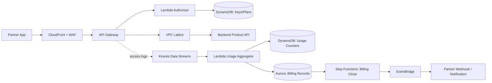
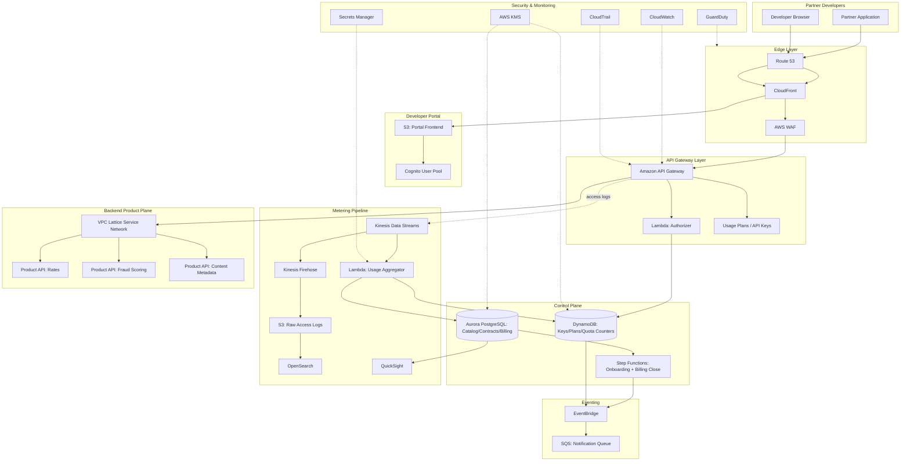

# Part VIII – Enterprise Application Architectures

# Chapter 63 — API Marketplace

---

## 1. Executive Summary

### The Business Problem

Enterprises increasingly monetize data and business logic as products rather than
internal-only services. A single internal API — say, a fraud-scoring engine or a
logistics-rate calculator — can become an external revenue stream once it is
packaged, secured, metered, and billed correctly.

The challenge is not building the API. Most organizations already have working
APIs internally. The challenge is turning an internal API into a **marketplace
product**:

- Third-party developers must be able to discover, evaluate, and self-register for access.
- Access must be tiered (free, pay-as-you-go, enterprise) with different rate limits and SLAs per tier.
- Usage must be metered accurately enough to generate a bill or a settlement report.
- Abuse, credential leakage, and runaway consumers must not be able to take down the platform.
- Partners expect a developer portal, API documentation, sandbox credentials, and self-service key rotation — not a support ticket queue.

Many organizations attempt this with a hand-rolled combination of an API gateway,
a spreadsheet of API keys, and a monthly manual invoice run. This does not scale
past a handful of partners and creates significant operational and financial risk:
untracked usage, inconsistent throttling, and disputes over billed volumes.

### Architecture Objective

The API Marketplace architecture provides:

- A **public-facing, multi-tenant API gateway layer** that authenticates, authorizes, throttles, and routes requests to backend product APIs.
- A **developer portal** for self-service registration, API key issuance, documentation, and usage dashboards.
- A **metering and billing pipeline** that captures every billable request and reconciles it against subscription plans.
- A **catalog and subscription model** so that new API products can be onboarded without rebuilding the platform.
- **Isolation** between marketplace-facing infrastructure and the internal systems that actually implement the business logic.

### Why Organizations Adopt This Architecture

- **New revenue line.** Data and logic that already exist can be sold without building a new product from scratch.
- **Partner ecosystem growth.** SaaS platforms increasingly compete on the strength of their partner/developer ecosystem, not just their own feature set.
- **Reduced integration cost.** A well-designed marketplace lowers the cost of onboarding each additional partner, because the plumbing (auth, throttling, billing) is reusable.
- **Internal API governance.** Building the discipline required for a public marketplace (contracts, versioning, deprecation policy) typically improves internal API quality as a side effect.

### Major Business Benefits

| Benefit | Description |
|---|---|
| Monetization | Converts existing internal capabilities into billable products |
| Partner enablement | Reduces time-to-first-call for new partners from weeks to hours |
| Usage visibility | Gives product and finance teams real usage data instead of estimates |
| Governance | Centralizes throttling, authentication, and versioning policy |
| Scalability | Onboarding a new API product does not require re-architecting the platform |

### Typical Enterprise Scenarios

- A logistics company exposes a **rate-shopping API** to e-commerce platforms.
- A bank exposes **account verification** and **payment initiation** APIs to fintech partners under Open Banking-style regulation.
- A healthcare data company exposes a **claims-eligibility API** to clearinghouses.
- A media company exposes a **content metadata and licensing API** to syndication partners.
- A SaaS company exposes **its own core product functionality** as an API so customers can build automations on top of it.

In each case, the underlying pattern is identical: a gateway layer that
authenticates and meters, a catalog/subscription layer that governs entitlement,
and a backend layer that does the actual work — kept deliberately decoupled from
the marketplace-facing concerns.

---

## 2. Business Requirements

### Business Drivers

- Launch a partner-facing API program within one or two fiscal quarters.
- Support multiple pricing tiers (free trial, metered pay-as-you-go, flat-fee enterprise).
- Provide self-service onboarding to reduce sales/support overhead per partner.
- Produce auditable usage records for billing disputes and revenue recognition.

### Functional Requirements

- Developer registration and API key issuance without human intervention.
- API catalog with versioned product listings and machine-readable specifications (OpenAPI 3.x).
- Tiered rate limiting and quota enforcement per subscription plan.
- Usage metering per API key, per product, per billing period.
- Sandbox environment with synthetic data, separate from production.
- Webhooks or notifications for quota-approaching and quota-exceeded events.
- Revocation and rotation of API keys without downtime for the partner.

### Non-Functional Requirements

| Category | Requirement |
|---|---|
| Scalability | Support growth from tens to tens of thousands of API consumers without re-architecture |
| Availability | 99.95% for the gateway/auth path; degraded-but-available for the portal |
| Latency | P99 gateway overhead (auth + throttle + route) under 50 ms |
| Compliance | SOC 2 Type II; PCI DSS scope isolation if payment data is involved; regional data residency where required |
| Security | Defense in depth: WAF, per-key throttling, anomaly detection, least-privilege backend access |
| Recovery | RPO ≤ 5 minutes for subscription/entitlement data; RTO ≤ 30 minutes for the gateway path |

### Scalability Goals

- Gateway layer must absorb bursty traffic from any single partner without affecting other partners (noisy-neighbor isolation).
- Metering pipeline must handle at least 10x the current peak request volume without redesign, since marketplace usage tends to grow non-linearly once a partner integration succeeds.

### Availability Requirements

- The **authentication and throttling path** is the most business-critical component — if it goes down, no partner can call any API, regardless of backend health. It is designed for 99.95%+ availability, multi-AZ by default.
- The **developer portal** (documentation, dashboards, self-service key management) can tolerate a lower availability target (99.9%) since a short outage delays administrative tasks rather than blocking live traffic.

### Latency Requirements

- Gateway-added latency (auth, throttle decision, routing) should stay under 50 ms at P99.
- End-to-end latency budget is dominated by the backend product API, not the marketplace layer — the marketplace layer's job is to add as little overhead as possible.

### Compliance Requirements

- SOC 2 Type II report available to enterprise partners under NDA.
- PCI DSS scope minimization: payment-adjacent APIs are isolated into their own account/VPC boundary so the marketplace's shared infrastructure does not fall into PCI scope.
- Regional data residency: EU partner traffic and associated logs are processed and stored in an EU region when contractually required.

### Security Expectations

- Every request must be authenticated using an API key bound to a specific subscription and rate-limited independently.
- Credential leakage must be detectable (unexpected geographic origin, unexpected volume spikes) and revocable within minutes.
- Backend product APIs must never be reachable directly from the internet — only through the gateway.

### Recovery Objectives

| Metric | Target | Applies To |
|---|---|---|
| RPO | 5 minutes | Subscription, entitlement, and API-key data |
| RPO | 15 minutes | Usage/metering events (some tolerance for reprocessing from a durable queue) |
| RTO | 30 minutes | Gateway and authentication path |
| RTO | 4 hours | Developer portal and billing reconciliation pipeline |

### SLAs

- Public commitment: 99.9% monthly uptime for the API gateway path, published in the partner terms of service.
- Internal target: 99.95%, giving operational headroom before an SLA credit is triggered.

### Expected Workload

- Initial launch: 50–200 registered developer accounts, low thousands of requests per minute at peak.
- Steady state (12–18 months): thousands of developer accounts, tens of thousands of requests per minute at peak, driven by a small number of high-volume partners.

### Expected Growth

- Request volume growth is dominated by a small number of large partners scaling their own usage — the architecture must isolate one partner's growth from affecting others (per-key throttling, not just aggregate throttling).
- Product catalog growth (new APIs being marketplace-enabled) should be operationally cheap — onboarding a new backend product should not require gateway redesign.

---

## 3. Architecture Overview

### Overall Design

The architecture separates cleanly into four planes:

1. **Edge and gateway plane** — public entry point, WAF, authentication, throttling, routing.
2. **Control plane** — catalog, subscription, plan management, developer portal.
3. **Metering and billing plane** — usage capture, aggregation, invoice/settlement generation.
4. **Backend product plane** — the actual APIs being sold, owned by separate internal teams, integrated via a private network path.

This separation exists because each plane has different scaling characteristics,
different teams responsible for it, and different failure domains. Coupling them
tightly — for example, embedding billing logic directly inside the API Gateway
integration — creates a system where a billing bug can take down live traffic, or
a traffic spike can corrupt billing data. Keeping them decoupled, connected only
through well-defined asynchronous interfaces (events, queues), is the core design
philosophy of this chapter.

### Architecture Philosophy

- **The gateway path must be simple and fast.** Every additional synchronous
  dependency in the request path (a database lookup, a billing check) is a new
  latency source and a new failure mode. Entitlement checks are cached
  aggressively; usage capture is asynchronous, never blocking the response.
- **Metering is append-only and replayable.** Usage events are written to a
  durable stream (Kinesis Data Streams or an SQS/EventBridge pipeline) and
  aggregated downstream. If the aggregation pipeline fails, it can be replayed
  from the stream without re-hitting partner traffic.
- **Backend product teams are not marketplace experts, and shouldn't need to
  be.** They expose a standard internal API; the marketplace layer handles
  everything partner-facing. This lets new products be marketplace-enabled by
  configuration, not by each backend team re-implementing auth and metering.
- **Isolation over convenience.** Backend APIs sit in private subnets, reachable
  only via VPC Lattice or private integrations from API Gateway — never a
  public endpoint that "happens" to also be used internally.

### Core Components

| Component | Role |
|---|---|
| Amazon CloudFront | Edge caching, TLS termination, DDoS absorption in front of the portal and gateway |
| AWS WAF | Layer 7 protection (rate-based rules, managed rule groups, bot control) |
| Amazon API Gateway (Edge/Regional, REST + HTTP APIs) | Partner-facing entry point; authorizers, usage plans, API keys, throttling |
| AWS Lambda (Authorizer) | Validates API keys/JWTs, resolves subscription plan, returns policy |
| Amazon DynamoDB | Subscription, plan, API key metadata; low-latency lookups for the authorizer |
| Amazon Aurora PostgreSQL | System of record for catalog, contracts, and billing reconciliation |
| Amazon Kinesis Data Streams | Durable, ordered capture of every billable API call |
| AWS Lambda (Usage Aggregator) | Consumes the stream, rolls up usage into per-key, per-period counters |
| Amazon EventBridge | Domain events (subscription created, quota exceeded, plan changed) |
| Amazon SQS | Buffering for billing reconciliation and downstream notification delivery |
| AWS Step Functions | Orchestrates partner onboarding and monthly billing-close workflows |
| VPC Lattice | Private service-to-service connectivity from the gateway to backend product APIs |
| Amazon Cognito | Developer portal identity (registration, login, MFA) |
| Amazon S3 + CloudFront | Static developer portal frontend and OpenAPI documentation hosting |
| Amazon OpenSearch Service | Usage analytics and operational search over API logs |
| Amazon QuickSight | Partner-facing and internal usage/revenue dashboards |
| AWS KMS | Encryption of API keys, subscription data, and billing records |
| AWS Secrets Manager | Backend service credentials, third-party billing system credentials |

### How Components Interact

At a high level:

1. A partner application calls a product endpoint through CloudFront/API Gateway.
2. A Lambda authorizer validates the API key against DynamoDB (cached), resolves the subscription plan, and returns an IAM policy plus throttling context.
3. API Gateway applies the resolved usage plan (rate limit, burst, quota) and forwards the request over VPC Lattice to the backend product service.
4. The backend responds; API Gateway returns the response to the partner.
5. Asynchronously, API Gateway access logs and a Lambda-based usage emitter publish a billing event to Kinesis Data Streams.
6. A stream consumer aggregates usage into DynamoDB counters (for real-time quota enforcement) and Aurora (for billing reconciliation).
7. A monthly Step Functions workflow closes the billing period, generates settlement/invoice records, and publishes events to the partner via EventBridge/webhook.

### High-Level Workflow



### Request Lifecycle

1. TLS termination and edge caching at CloudFront.
2. WAF evaluation (rate-based rules, managed rule sets, IP reputation).
3. API Gateway custom authorizer resolves identity and entitlement.
4. Usage-plan throttling applied per API key.
5. Request routed privately to the backend product service.
6. Response returned to the partner; latency and status recorded.

### Response Lifecycle

- Successful responses pass through unmodified except for standard headers (rate-limit remaining, request ID for support correlation).
- Error responses are normalized to a consistent problem/JSON schema across all marketplace products, so partners get a predictable integration experience regardless of which backend team built the API.

### Data Lifecycle

- **Hot path data** (API keys, plan limits) lives in DynamoDB with authorizer-side caching (TTL 30–60 seconds) to avoid a database round-trip on every request.
- **Usage events** flow through Kinesis, are aggregated into DynamoDB (real-time counters) and Aurora (durable billing ledger).
- **Cold data** (raw access logs, long-tail analytics) is written to S3 via Kinesis Data Firehose and queried through Athena/OpenSearch, with lifecycle policies moving it to Glacier after the compliance retention window for hot query needs has passed.

---

## 4. AWS Services Used

### Amazon API Gateway

**Purpose:** Public-facing entry point for all marketplace product APIs; enforces authentication, throttling, and usage plans.

**Why selected:**
- Native support for API keys, usage plans, and per-client throttling — the core primitives a marketplace needs.
- Built-in integration with Lambda authorizers for custom entitlement logic.
- Both REST APIs (fine-grained request/response transformation, usage plans) and HTTP APIs (lower cost, lower latency) are available; most marketplaces use REST APIs specifically because usage plans and API keys are a REST API feature.

**Alternatives:** Self-managed Kong or Apigee (more control, significantly more operational overhead); AWS App Mesh/VPC Lattice alone (lacks partner-facing developer features like API keys and usage plans, which is why it is used *behind* API Gateway, not instead of it).

**Limitations:**
- API keys and usage plans are a REST API feature; HTTP APIs do not support them natively, so custom rate limiting must be built if HTTP APIs are used for cost reasons.
- Regional throttle quotas are account-level defaults (10,000 RPS burst by default) and must be raised via Service Quotas for large marketplaces.

**Pricing considerations:** Charged per request plus data transfer; at high volume, this becomes one of the largest line items in the platform's own cost structure — factor gateway cost into partner pricing tiers.

**Best practices:** One usage plan per pricing tier, not per partner; use resource policies to prevent direct backend access; enable access logging to a dedicated log group for the metering pipeline.

### AWS Lambda

**Purpose:** Custom authorizer logic, usage-event emission, billing aggregation, and Step Functions task execution.

**Why selected:** Pay-per-invocation cost model matches the bursty, partner-driven traffic pattern; no idle capacity to manage for logic that runs on every request.

**Alternatives:** A dedicated ECS/Fargate authorizer service (better for extremely high, steady request volume where cold starts matter); most marketplaces start with Lambda and only move to a container-based authorizer once sustained RPS makes it more cost-effective.

**Limitations:** Cold starts can add tail latency to the authorizer path; mitigated with Provisioned Concurrency on the authorizer function once traffic is predictable.

**Pricing considerations:** At very high steady-state RPS, a containerized authorizer behind Application Load Balancer can be cheaper than Lambda; this is a scaling-stage decision, not a launch-day one.

**Best practices:** Keep the authorizer function's external dependencies (DynamoDB) behind a short-lived in-memory cache; avoid calling out to Aurora synchronously from the authorizer.

### Amazon DynamoDB

**Purpose:** Low-latency store for API keys, subscription plans, and real-time usage counters consulted on the hot request path.

**Why selected:** Single-digit-millisecond reads at any scale, which is required because the authorizer runs on every single API call.

**Alternatives:** ElastiCache/MemoryDB as a pure cache in front of Aurora (viable, but DynamoDB removes the need to keep a cache and a source of truth in sync for this specific dataset).

**Limitations:** Not well suited for complex relational billing queries (multi-table joins for invoice generation) — this is why Aurora, not DynamoDB, is the system of record for billing reconciliation.

**Pricing considerations:** On-demand capacity mode is recommended at launch (unpredictable partner traffic); switch to provisioned capacity with auto scaling once usage patterns stabilize, for cost efficiency.

**Best practices:** Use the API key as the partition key for the entitlement table; use a TTL attribute for sandbox/trial key expiry; enable DynamoDB Streams to feed real-time quota-exceeded notifications.

### Amazon Aurora PostgreSQL

**Purpose:** System of record for the API catalog, partner contracts, and the durable billing ledger used for invoice/settlement generation.

**Why selected:** Billing reconciliation requires transactional integrity and relational queries (join usage against contract terms, apply tiered pricing, generate line items) — a relational engine is the right tool here, unlike the hot-path entitlement data.

**Alternatives:** Amazon RDS for PostgreSQL (simpler, less expensive, adequate for smaller marketplaces without Aurora's read-scaling needs); Aurora Serverless v2 for variable, spiky reconciliation workloads (batch billing runs once a day/month, idle otherwise).

**Limitations:** Not suited for the microsecond-latency entitlement lookups on the request hot path — that responsibility stays with DynamoDB.

**Pricing considerations:** Aurora Serverless v2 is attractive here because the billing workload is naturally bursty (heavy at month-end close, idle otherwise); pay only for the capacity actually used.

**Best practices:** Multi-AZ deployment; automated backups with point-in-time recovery; separate read replica for reporting/QuickSight so reporting queries never compete with the billing-close transaction workload.

### Amazon Kinesis Data Streams

**Purpose:** Durable, ordered ingestion of every billable API-call event, decoupling metering from the live request path.

**Why selected:** Ordering per shard (per API key, using the key as the partition key) matters for accurate sequential usage aggregation; multiple independent consumers (real-time counters, billing ledger, analytics) can read the same stream without contention.

**Alternatives:** Amazon SQS (simpler, but no ordering guarantee across a partition and no fan-out to multiple independent consumer groups without additional plumbing); Amazon MSK/Kafka (more powerful, considerably more operational overhead — usually reserved for organizations already standardized on Kafka elsewhere).

**Limitations:** Shard-level throughput limits require capacity planning as partner volume grows; on-demand mode removes most of this concern at a cost premium.

**Pricing considerations:** On-demand mode is recommended for the metering stream at launch, given unpredictable adoption; provisioned mode with defined shard counts becomes cost-effective once volume is predictable.

**Best practices:** Partition key = API key or partner ID, to keep one partner's usage events in order without needing global ordering; retain 24–48 hours in the stream to allow consumer replay after an aggregation bug.

### Amazon EventBridge

**Purpose:** Domain event bus for subscription lifecycle events (created, upgraded, quota-exceeded, suspended) and integration point for partner-facing webhooks.

**Why selected:** Decouples the control plane (subscription management) from downstream consumers (notification service, partner webhook delivery, internal Slack/ops alerts) without point-to-point integration code.

**Alternatives:** Amazon SNS (simpler fan-out, but lacks EventBridge's content-based routing and schema registry, which matter once dozens of event types accumulate).

**Limitations:** At-least-once delivery — downstream consumers (especially partner webhook delivery) must be idempotent.

**Best practices:** Define a versioned event schema per event type from day one; use an EventBridge archive for replay during incident investigation.

### Amazon Cognito

**Purpose:** Developer portal identity provider — registration, login, MFA, and federation for enterprise partners who want to use their own IdP.

**Why selected:** Handles the full self-service registration/verification/password-reset flow out of the box, and supports SAML/OIDC federation for larger partners who require SSO into the developer portal.

**Alternatives:** Auth0/Okta CIC (feature-rich, but adds a third-party billing relationship and another system to operate for functionality Cognito already covers for most marketplaces).

**Limitations:** Cognito is for portal login only — it is not used to authenticate the actual API traffic, which uses API keys/JWTs issued after portal login, not Cognito tokens directly on every backend call.

**Best practices:** Separate Cognito user pool for the developer portal from any internal employee identity system; enforce MFA for accounts with billing/admin privileges.

### VPC Lattice

**Purpose:** Private, policy-controlled connectivity from the API Gateway integration layer to backend product services owned by different internal teams, potentially in different VPCs or accounts.

**Why selected:** Backend product teams should not need to peer VPCs or manage PrivateLink endpoints manually every time a new product joins the marketplace; VPC Lattice provides a service network that new backends join with an IAM-governed association.

**Alternatives:** VPC Peering + internal ALB (works, but does not scale operationally as the number of backend product teams grows — N backend teams means N sets of networking to manage); AWS PrivateLink per service (viable, more setup per service than Lattice's service-network model).

**Limitations:** Relatively newer service; verify current Region availability for all Regions the platform operates in before committing.

**Best practices:** One VPC Lattice service network per environment (prod/sandbox); auth policies scoped per backend service, not a blanket allow.

### AWS WAF and AWS Shield

**Purpose:** Layer 7 protection against credential stuffing, scraping, and volumetric abuse targeting the public gateway and portal.

**Why selected:** A public developer-registration flow and public API endpoints are natural targets for automated abuse; WAF's rate-based rules and managed rule groups (bot control, IP reputation) are the first line of defense before requests even reach the authorizer.

**Best practices:** Rate-based rule scoped per source IP on the registration endpoint specifically (distinct from the per-API-key throttling done at API Gateway); Shield Advanced if the marketplace's outage would have material, quantifiable business impact.

### Amazon S3 and CloudFront

**Purpose:** Hosting for the static developer portal frontend, OpenAPI specification documents, and SDK downloads; also the long-term store for raw access logs.

**Why selected:** Standard, low-cost, highly available static hosting pattern; CloudFront gives global partners low-latency access to documentation regardless of which AWS Region hosts the backend.

**Best practices:** Origin Access Control restricting S3 bucket access to CloudFront only; separate buckets for portal assets versus raw log archives, since their lifecycle and access patterns differ.

### Amazon OpenSearch Service and Amazon QuickSight

**Purpose:** OpenSearch supports operational search over API access logs (troubleshooting a specific partner's failed calls); QuickSight provides usage and revenue dashboards for both internal stakeholders and partner-facing usage reports.

**Best practices:** Do not put the billing system of record in OpenSearch — it is an operational/analytical index, not a ledger; reconcile against Aurora for anything financial.

### AWS KMS and AWS Secrets Manager

**Purpose:** Encryption of API key material and subscription data at rest; secure storage of backend service credentials and any third-party billing/payment processor credentials.

**Best practices:** Customer-managed KMS keys per data classification tier (billing data vs. general application data), enabling separate key rotation and access policies; Secrets Manager automatic rotation enabled for any credential the platform itself can rotate (database credentials, internal service tokens).

---

## 5. Complete Architecture Diagram



---

## 6. Component-by-Component Explanation

### API Gateway (Partner Entry Point)

- **Purpose:** Single authenticated, throttled, routed entry point for every marketplace product.
- **Responsibilities:** TLS termination (in front of CloudFront), API key validation trigger, usage-plan enforcement, request/response transformation, routing to VPC Lattice.
- **Inputs:** HTTPS requests from partner applications, carrying an API key header or bearer token.
- **Outputs:** Proxied requests to backend services; normalized error responses; access logs to CloudWatch/Kinesis.
- **Scaling:** Fully managed, scales automatically; account-level throttle quota must be raised proactively before large partner launches.
- **High availability:** Regional service, inherently multi-AZ; use a Regional or Edge-optimized endpoint per the partner's geographic profile.
- **Failure handling:** Backend integration failures return a normalized 5xx with a correlation ID; circuit-breaking is implemented at the VPC Lattice/backend layer, not in API Gateway itself.
- **Dependencies:** Lambda authorizer, VPC Lattice, CloudWatch Logs.
- **Security:** Resource policies restricting direct invoke; WAF Web ACL association; TLS 1.2+ enforced.
- **Monitoring:** 4xx/5xx rate, integration latency, throttled-request count per API key.

### Lambda Authorizer

- **Purpose:** Resolve an incoming API key/token into an entitlement decision (allow/deny, plan, rate limits) on every request.
- **Responsibilities:** Validate key format and signature; look up subscription status in DynamoDB (cached); return an IAM policy and context (plan tier, remaining quota) to API Gateway.
- **Inputs:** API key or JWT from the request header.
- **Outputs:** IAM policy document plus a context map consumed by downstream logging.
- **Scaling:** Scales with request volume; Provisioned Concurrency recommended once traffic is predictable to eliminate cold-start tail latency.
- **High availability:** Multi-AZ by default (Lambda); DynamoDB dependency is itself multi-AZ.
- **Failure handling:** On DynamoDB timeout, fail closed (deny) for paid tiers where over-serving creates billing disputes, or fail open with strict rate-limiting for free tiers — this is a deliberate business decision documented in the ADR (Section 30).
- **Dependencies:** DynamoDB (keys/plans table).
- **Security:** Least-privilege IAM role limited to `dynamodb:GetItem` on the specific table; no outbound internet access.
- **Monitoring:** Authorizer error rate, cache hit ratio, decision latency.

### DynamoDB (Entitlement + Quota Store)

- **Purpose:** Hot-path store for API key validity, plan tier, and rolling quota counters.
- **Responsibilities:** Serve sub-10ms reads to the authorizer; atomically increment usage counters; expire sandbox keys via TTL.
- **Scaling:** On-demand capacity at launch; provisioned with auto scaling once traffic is predictable.
- **High availability:** Multi-AZ by design; Global Tables if the marketplace serves multiple Regions with local-latency requirements.
- **Failure handling:** Point-in-time recovery enabled; DynamoDB Streams captures every entitlement change for downstream event publication.
- **Security:** Encryption at rest via KMS; fine-grained IAM condition keys if any client-side access pattern is ever introduced.

### Aurora PostgreSQL (Catalog, Contracts, Billing Ledger)

- **Purpose:** System of record for what was sold, to whom, under what terms, and what was actually billed.
- **Responsibilities:** Store product catalog entries, partner contracts, pricing tiers, and the immutable billing ledger (one row per billable aggregation period per key).
- **Scaling:** Aurora Serverless v2 scales automatically for the bursty month-end billing-close workload; read replica isolates reporting queries.
- **High availability:** Multi-AZ cluster; automated failover.
- **Failure handling:** Point-in-time recovery; billing-close Step Functions workflow is idempotent and safely re-runnable.
- **Security:** IAM database authentication where possible; encryption at rest and in transit; column-level encryption for any sensitive contract terms.

### Kinesis Data Streams (Usage Event Backbone)

- **Purpose:** Durable, ordered, replayable capture of every billable API call, decoupled from the live request path.
- **Responsibilities:** Buffer usage events between production (API Gateway access log subscription / Lambda emitter) and multiple independent consumers.
- **Scaling:** On-demand mode at launch; shard-level provisioning once volume is predictable, partitioned by API key/partner ID.
- **Failure handling:** 24–48 hour retention allows consumer replay if the aggregation Lambda has a bug or is rolled back.

### VPC Lattice (Backend Connectivity)

- **Purpose:** Private, IAM-governed path from the gateway integration layer to backend product services, without requiring each backend team to manage VPC peering or PrivateLink endpoints manually.
- **Responsibilities:** Service discovery and authorization policy enforcement for east-west traffic between the marketplace layer and product teams' services.
- **Scaling:** Scales with the number of associated services; new backend products join the service network via a lightweight association, not a networking redesign.
- **Security:** Auth policies scoped per service; backend teams retain control of their own service's access policy while inheriting the shared network.

### EventBridge and SQS (Notification/Integration Layer)

- **Purpose:** Publish subscription lifecycle and quota events for consumption by notification services and partner-facing webhooks.
- **Responsibilities:** Route `SubscriptionCreated`, `QuotaExceeded`, `PlanChanged`, `KeyRevoked` events to the appropriate consumers.
- **Failure handling:** SQS dead-letter queues capture failed webhook deliveries for manual or automated retry.

---

## 7. End-to-End Request Flow

1. **Client** — Partner application sends an HTTPS request with an API key header to the marketplace domain (e.g., `api.partner-marketplace.example.com`).
2. **DNS** — Route 53 resolves the domain to the CloudFront distribution.
3. **CloudFront** — Terminates TLS at the edge, applies the associated AWS WAF Web ACL.
4. **WAF** — Evaluates rate-based rules and managed rule groups; blocks or allows the request.
5. **API Gateway** — Receives the request; invokes the Lambda authorizer.
6. **Lambda Authorizer** — Checks its local cache first; on a cache miss, reads the API key record from DynamoDB; returns an allow/deny policy with plan context.
7. **Usage Plan Enforcement** — API Gateway applies the resolved plan's rate limit and burst settings; throttles with a `429` if exceeded.
8. **Routing** — Allowed requests are routed over VPC Lattice to the specific backend product service that owns the requested resource.
9. **Backend Product API** — Processes the business logic (e.g., calculates a shipping rate, scores a transaction) and returns a response.
10. **Response** — API Gateway returns the backend's response to the partner, adding standard rate-limit headers.
11. **Logging** — Access log entry is written; subscription filter forwards it to Kinesis Data Streams as a billing event.
12. **Usage Aggregation** — The Lambda consumer increments the DynamoDB real-time counter and appends a row to the Aurora billing ledger.
13. **Quota Check (Async)** — If the aggregate usage crosses a threshold (e.g., 80% of monthly quota), an EventBridge event triggers a partner notification.
14. **Monitoring** — CloudWatch captures latency, error rate, and throttle counts for both platform operations and per-partner dashboards.
15. **Error Handling** — Any 5xx from the backend, or a deny from the authorizer, is normalized into the marketplace's standard error schema before being returned to the partner, with a correlation ID for support lookups.

---

## 8. Deployment Flow

### Infrastructure Provisioning

- All infrastructure — API Gateway, Lambda, DynamoDB, Aurora, Kinesis, VPC Lattice — is provisioned via Terraform, organized into modules per plane (gateway, control, metering, backend-onboarding).
- A separate module handles onboarding a new backend product: it registers the service with VPC Lattice, creates the catalog entry in Aurora, and wires the API Gateway resource/route — this is the unit of reuse that lets new products be marketplace-enabled without re-architecting the platform.

### Terraform Workflow

- Standard plan/apply flow via CI/CD, with a mandatory `terraform plan` review step for any change touching the gateway or authorizer, given their business-criticality.
- State stored remotely in S3 with DynamoDB state locking; separate state files per plane to limit blast radius of a bad apply.

### CI/CD Deployment

- Application code (authorizer, aggregator Lambdas) deployed via CodePipeline/CodeBuild or GitHub Actions, with automated tests covering entitlement edge cases (expired key, revoked key, quota-exceeded) before any promotion to production.

### Blue-Green Deployment

- Lambda functions use versioned aliases with weighted traffic shifting for the authorizer specifically, since a bad authorizer deployment can block 100% of marketplace traffic; a canary of 5% traffic for 10–15 minutes with automated CloudWatch alarm rollback is standard practice.
- API Gateway stage variables support pointing a stage at a specific Lambda alias, enabling instant rollback without a redeploy.

### Rollback

- Automated rollback is triggered by CloudWatch alarms on authorizer error rate or 5xx rate exceeding a threshold during the canary window.
- Database migrations (Aurora schema changes) are additive-only in the same release as application code; destructive migrations are a separate, subsequent release after the new code path is confirmed stable.

### Secrets

- Backend service credentials and any payment-processor API keys are stored in Secrets Manager with automatic rotation where the credential type supports it.

### Configuration

- Plan definitions (rate limits, quotas, pricing) are stored as data in Aurora/DynamoDB, not hardcoded in Terraform or Lambda code, so a new pricing tier can be added without a deployment.

### Validation

- Post-deployment smoke tests call each product API with a synthetic sandbox key covering the free, paid, and over-quota scenarios before the deployment is marked successful.

---

## 9. Network Topology

### VPC

- A dedicated marketplace VPC hosts the control-plane and metering-plane resources requiring network isolation (Aurora, any VPC-attached Lambdas).
- Backend product APIs typically live in **separate VPCs owned by their respective teams**, connected via VPC Lattice rather than VPC peering, which avoids CIDR-overlap coordination overhead as the number of backend teams grows.

### CIDR

- Marketplace VPC: `10.40.0.0/16`, subdivided into public (NAT/ALB), private (Lambda/application), and data (Aurora, ElastiCache) subnets across three Availability Zones.

### Public Subnets

- Host only NAT Gateways and, if used, an internal ALB fronting a containerized authorizer at high scale. No backend product logic is ever placed in a public subnet.

### Private Subnets

- Host VPC-attached Lambda functions (usage aggregator, billing-close workers) that need to reach Aurora directly.

### NAT Gateway

- One per Availability Zone for outbound internet access (e.g., calling an external payment processor or partner webhook endpoint) from private subnets.

### Internet Gateway

- Standard IGW attached to the VPC for the public subnet tier.

### Transit Gateway

- Used when the marketplace must reach multiple backend-team VPCs across accounts within the same AWS Organization, rather than a full mesh of peering connections.

### Route Tables

- Distinct route tables per subnet tier; private subnets route 0.0.0.0/0 through NAT; data subnets have no default route to the internet at all.

### Network ACLs

- Baseline NACLs at the subnet level as a coarse-grained defense layer, supplementing (not replacing) security groups.

### Security Groups

- Aurora security group allows inbound only from the specific Lambda security group(s) that need database access — never `0.0.0.0/0` and never the whole VPC CIDR.

### PrivateLink / VPC Lattice

- VPC Lattice is the primary mechanism connecting the API Gateway integration layer to backend product APIs across account/VPC boundaries, replacing what would otherwise be a proliferation of PrivateLink endpoints or peering connections as products are onboarded.

### Hybrid Connectivity

- Not typically required for this architecture unless a backend product API lives on-premises, in which case Direct Connect or a Site-to-Site VPN terminates into the marketplace VPC's private subnet tier, with the same VPC Lattice/private-integration pattern extended over that connection.

---

## 10. Identity and Access

### IAM Roles

- Distinct execution roles per Lambda function (authorizer, usage aggregator, billing-close worker), each scoped to only the resources it needs.
- A dedicated deployment role for CI/CD, separate from any human/interactive role.

### IAM Policies

- Authorizer role: `dynamodb:GetItem` on the entitlement table only — no `Scan`, no write permissions.
- Usage aggregator role: `dynamodb:UpdateItem` on the counters table, `rds-data:ExecuteStatement` (or direct DB credentials via Secrets Manager) on the billing ledger, `kinesis:GetRecords` on the usage stream.

### Resource Policies

- API Gateway resource policy restricts invocation to the CloudFront distribution's managed prefix list where feasible, preventing direct bypass of the edge/WAF layer.
- VPC Lattice auth policies scoped per backend service, defined and owned by the backend team, not centrally overridden by the marketplace platform team.

### STS

- Cross-account access to backend-team accounts (for the VPC Lattice association or Terraform provisioning) uses short-lived STS-assumed roles, never long-lived cross-account IAM users.

### Cross-Account Access

- Each backend product team retains its own AWS account; the marketplace platform team is granted a narrowly scoped role in that account solely for the VPC Lattice service association and monitoring read access.

### Least Privilege

- Enforced at every layer: authorizer cannot write, backend teams cannot modify marketplace billing data, the billing-close workflow cannot modify entitlement data outside of its own transaction.

### Service Roles

- Kinesis Firehose delivery role scoped to write only to its designated S3 prefix.
- Step Functions execution role scoped to invoke only the specific Lambda functions in the billing-close state machine.

### Permission Boundaries

- Applied to any role that CI/CD can create/modify, capping the maximum permissions a pipeline-created role can ever have, even if the Terraform code is later modified maliciously or in error.

---

## 11. Security Architecture

### Encryption

- All data at rest (DynamoDB, Aurora, S3, Kinesis) encrypted via AWS KMS customer-managed keys, with separate keys for billing data versus general operational data to support differentiated access policies and audit trails.
- TLS 1.2+ enforced end-to-end: partner-to-CloudFront, CloudFront-to-API Gateway, and API Gateway-to-backend over VPC Lattice.

### KMS

- Customer-managed keys with key policies restricting decrypt permission to the specific roles that need it (e.g., only the billing-close Lambda can decrypt the billing ledger's sensitive columns).

### TLS

- Enforced at every hop; API Gateway configured to reject any non-TLS request.

### WAF

- Rate-based rules on the developer-registration endpoint and on a per-source-IP basis at the edge, distinct from the per-API-key throttling performed inside API Gateway itself — these operate at different layers and catch different abuse patterns.
- AWS Managed Rules (Core Rule Set, Known Bad Inputs, Bot Control) applied to both the portal and the API path.

### Shield

- Shield Standard by default; Shield Advanced considered once the marketplace generates material revenue, given its DDoS cost-protection and 24/7 DRT access.

### Secrets Manager

- Stores backend integration credentials and any external billing/payment processor API keys, with automatic rotation configured for supported credential types.

### Certificate Manager

- ACM-issued certificates for the CloudFront distribution and any regional API Gateway custom domain, auto-renewed.

### GuardDuty

- Enabled account-wide, with particular attention to anomaly findings tied to the Lambda execution roles (unusual API calls from the authorizer role would indicate a credential compromise).

### Inspector

- Scans container images if any component (e.g., a high-scale containerized authorizer) is deployed on ECS/Fargate rather than Lambda.

### Security Hub

- Aggregates findings across GuardDuty, Inspector, and Config for a single compliance view, particularly useful when producing evidence for a partner's security questionnaire.

### CloudTrail

- Organization trail capturing all control-plane API activity, with particular retention emphasis on any action touching the KMS keys protecting billing data.

### AWS Config

- Rules enforcing that Aurora is encrypted, that no security group allows unrestricted ingress, and that the API Gateway stage has logging enabled — continuously evaluated, not just checked at deployment time.

### Zero Trust

- No implicit trust between backend product services and the marketplace layer; every VPC Lattice association carries an explicit auth policy rather than relying on network location alone.

### Threat Model

| Threat | Mitigation |
|---|---|
| Leaked API key used for unauthorized volume | Per-key throttling, anomaly detection on volume/geography, rapid revocation flow |
| Credential stuffing on developer portal registration | Cognito + WAF rate-based rules + CAPTCHA on registration |
| Backend API exposed directly, bypassing gateway | VPC Lattice auth policy denies any caller other than the gateway's integration role |
| Billing data tampering | Append-only ledger design, KMS-encrypted, CloudTrail-audited access |
| Partner webhook endpoint compromise used to attack the platform | Outbound webhook delivery is one-way (platform → partner); no inbound trust granted based on webhook responses |

### Attack Vectors

- Automated scraping of the API catalog/documentation to enumerate endpoints for abuse.
- Free-tier abuse via mass account registration to bypass rate limits (mitigated with per-account and per-verified-domain limits, not just per-key).
- Slowloris-style connection exhaustion against the gateway (mitigated by CloudFront/Shield's edge absorption before requests reach API Gateway).

---

## 12. High Availability

### AZ Failures

- All stateful components (Aurora, DynamoDB) are inherently multi-AZ; Lambda and API Gateway are Regional services unaffected by a single AZ failure by design.

### Instance Failures

- Not applicable to the serverless components; Aurora automatically fails over to a standby instance in another AZ within typically under 60 seconds.

### Regional Failures

- The gateway/authentication path can be deployed active-passive across two Regions for marketplaces with a strict SLA, with Route 53 health-check-based failover; most launches start single-Region with a documented Pilot Light DR plan (Section 13) and add multi-Region once revenue justifies the added complexity.

### Database Failures

- Aurora Multi-AZ automated failover for the billing ledger; DynamoDB's inherent multi-AZ replication for the entitlement store.

### Load Balancing

- API Gateway and CloudFront handle load balancing implicitly as managed services; if a containerized authorizer is used at scale, an internal ALB with health checks across multiple AZ target groups performs this role.

### Health Checks

- Route 53 health checks against a synthetic canary endpoint that exercises the full authorizer → DynamoDB path, not just a shallow "is the process running" check.

### Failover

- Documented runbook for promoting the DR Region's Aurora read replica to primary and repointing Route 53, with the RTO target from Section 13 validated by a scheduled DR game day, not assumed.

---

## 13. Disaster Recovery

### Backup Strategy

- Aurora automated backups with point-in-time recovery (35-day retention); DynamoDB point-in-time recovery enabled on both the entitlement and counters tables.

### Snapshots

- Daily Aurora snapshots copied cross-Region for the DR posture described below.

### Cross-Region Replication

- Aurora Global Database for the billing ledger if multi-Region DR is required; S3 Cross-Region Replication for the raw access-log archive.

### Pilot Light

- The default DR posture at launch: a minimal standby environment (Aurora Global Database secondary cluster, DynamoDB Global Table replica) in a second Region, with the gateway/Lambda/API Gateway stack deployed via the same Terraform but scaled to zero/minimal until needed.

### Warm Standby

- The typical next stage once the marketplace has material revenue: the DR Region runs a live, low-traffic-capacity copy of the gateway stack continuously, ready to absorb full production traffic with a scale-up rather than a cold deploy.

### Multi-Site / Active-Active

- Reserved for marketplaces with a contractual near-zero-downtime SLA; requires DynamoDB Global Tables and Aurora Global Database in active-active-compatible configuration, plus partner-facing multi-Region DNS routing — a significant increase in operational complexity, justified only at meaningful scale.

### RPO / RTO Recap

| Component | RPO | RTO |
|---|---|---|
| Entitlement data (DynamoDB) | 5 minutes | 30 minutes |
| Billing ledger (Aurora) | 5 minutes | 30 minutes |
| Usage events in flight (Kinesis) | 15 minutes | Replay from stream |
| Developer portal | 1 hour | 4 hours |

---

## 14. Scalability

### Horizontal Scaling

- API Gateway, Lambda, and DynamoDB scale horizontally by default with no capacity planning required for the gateway path itself.

### Vertical Scaling

- Aurora instance class can be scaled up for the billing-close workload if Serverless v2's auto-scaling ceiling is reached during month-end processing.

### Auto Scaling

- DynamoDB auto scaling (if using provisioned mode) tied to consumption metrics; Aurora Serverless v2's automatic capacity adjustment for the bursty billing workload.

### Serverless Scaling

- Lambda concurrency scales automatically; a reserved concurrency floor is set on the authorizer function to guarantee capacity is not starved by a burst elsewhere in the account, and a concurrency ceiling is set to protect downstream DynamoDB from a runaway partner.

### Database Scaling

- Aurora read replicas absorb reporting/QuickSight query load separately from the transactional billing-close path.

### Storage Scaling

- S3 scales inherently; lifecycle policies transition raw access logs to Infrequent Access and then Glacier as they age out of the active investigation window.

### Queue Scaling

- Kinesis on-demand mode removes shard-capacity planning at launch; SQS scales inherently for the notification/webhook delivery queue.

---

## 15. Performance Optimization

### Caching

- Authorizer-side in-memory cache (30–60 second TTL) for entitlement lookups, dramatically reducing DynamoDB read volume and authorizer latency for repeat callers.
- CloudFront caching for static portal assets and OpenAPI documentation.

### Compression

- gzip/Brotli compression enabled on API Gateway responses and CloudFront for the documentation site.

### CDN

- CloudFront in front of both the portal and, where response payloads are cacheable (e.g., reference/lookup APIs with infrequent data changes), select GET-based product endpoints.

### Database Optimization

- Indexes on the Aurora billing ledger tuned for the actual reconciliation query patterns (by API key + billing period), validated with `EXPLAIN ANALYZE` before go-live, not assumed.

### Connection Pooling

- RDS Proxy in front of Aurora for any Lambda function that opens a direct database connection, preventing connection exhaustion under Lambda's concurrent-invocation scaling model.

### Concurrency

- Lambda reserved concurrency tuning as described above; Kinesis consumer parallelism scaled to shard count for the usage aggregator.

### Async Processing

- Usage metering, billing aggregation, and notification delivery are entirely asynchronous relative to the partner-facing request — the partner never waits on billing logic to get their API response.

---

## 16. Cost Optimization (FinOps)

### Estimated Monthly Cost — Small Deployment

*(≈500K API calls/month, 50 active partners)*

| Service | Estimated Monthly Cost |
|---|---|
| API Gateway | $150 |
| Lambda (authorizer + aggregator) | $40 |
| DynamoDB (on-demand) | $60 |
| Aurora Serverless v2 (min capacity) | $180 |
| Kinesis Data Streams (on-demand) | $50 |
| CloudFront + WAF | $80 |
| Cognito | $0 (free tier covers this volume) |
| OpenSearch (small instance) | $150 |
| **Total** | **≈ $710/month** |

### Estimated Monthly Cost — Medium Deployment

*(≈25M API calls/month, 1,000 active partners)*

| Service | Estimated Monthly Cost |
|---|---|
| API Gateway | $6,500 |
| Lambda | $900 |
| DynamoDB (provisioned + auto scaling) | $1,200 |
| Aurora Serverless v2 | $700 |
| Kinesis Data Streams (provisioned) | $600 |
| CloudFront + WAF | $1,800 |
| OpenSearch | $900 |
| QuickSight | $300 |
| **Total** | **≈ $12,900/month** |

### Estimated Monthly Cost — Enterprise Deployment

*(≈500M API calls/month, tens of thousands of partners, multi-Region DR)*

| Service | Estimated Monthly Cost |
|---|---|
| API Gateway | $110,000 |
| Lambda | $14,000 |
| DynamoDB (Global Tables) | $22,000 |
| Aurora Global Database | $9,000 |
| Kinesis Data Streams | $8,000 |
| CloudFront + WAF + Shield Advanced | $28,000 |
| OpenSearch (multi-node) | $6,000 |
| QuickSight | $2,000 |
| **Total** | **≈ $199,000/month** |

> **Note:** These are directional estimates for planning purposes; validate against the AWS Pricing Calculator and current Regional pricing before presenting to finance.

### Major Cost Drivers

- API Gateway per-request pricing is the dominant cost at scale — factor this directly into partner pricing tiers so margin is preserved as volume grows.
- CloudFront/WAF data transfer costs scale with response payload size, particularly for data-heavy product APIs.
- OpenSearch and QuickSight are frequently under-right-sized at launch and over-provisioned once volume is known — review quarterly.

### Optimization Opportunities

- Migrate from REST API to HTTP API for high-volume, simple product endpoints that do not need usage plans/API keys natively (implement custom throttling instead) — HTTP APIs are materially cheaper per request.
- Reserved Capacity / Savings Plans for Aurora and any steady-state compute once traffic patterns stabilize past the initial unpredictable launch phase.
- S3 Intelligent-Tiering for the raw access-log archive, since access patterns to old logs are unpredictable and typically drop off sharply after 30–60 days.

### Reserved Instances / Savings Plans

- Compute Savings Plans applied to any steady-state Lambda/Fargate usage (the containerized authorizer at high scale, if adopted) once the 12-month usage baseline is established.

### Spot

- Not typically applicable to this architecture's core path, since it is serverless/managed; may apply to any batch analytics workload processing the cold-tier log archive.

### S3 Lifecycle / Storage Classes

- Raw access logs: Standard for 30 days → Infrequent Access for 60 days → Glacier Deep Archive beyond the compliance retention window, if retained purely for audit purposes.

### Rightsizing

- Aurora Serverless v2 min/max ACU bounds reviewed monthly against actual billing-close workload peaks.

### Cost Allocation and Tagging

- Every resource tagged with `product-line`, `environment`, and `cost-center`; API Gateway usage plans tagged per partner tier to attribute gateway cost against the revenue that tier generates.

### Budgets

- AWS Budgets alert at 80% and 100% of the monthly forecast for the marketplace account, with a separate, tighter budget on the OpenSearch/QuickSight line items given their tendency to be over-provisioned.

### Cost Anomaly Detection

- Enabled on the marketplace account specifically to catch a runaway partner (or an authorizer misconfiguration causing unexpected retry storms) before it becomes a large bill.

---

## 17. AI-Assisted Operations

### Amazon Q

- Amazon Q Developer assists with generating and reviewing the Terraform modules for onboarding a new backend product, reducing the platform team's per-product onboarding effort.
- Amazon Q Business can be exposed internally (and, in a support-desk capacity, partner-facing) to answer "how do I authenticate against the Rates API" style questions by indexing the OpenAPI specs and documentation in the developer portal.

### Bedrock

- A Bedrock-backed summarization workflow can automatically generate partner-facing monthly usage summaries in natural language, supplementing the QuickSight dashboard for less technical partner stakeholders.

### AI Troubleshooting

- A Bedrock agent with access to CloudWatch Logs Insights queries (via a tool/function-calling pattern) can accelerate root-cause triage for a specific partner's reported issue — "why did API key X get 429s between 2 and 3 PM" — by correlating throttle events with the entitlement table's plan at that time.

### Log Analysis

- Anomaly detection on the OpenSearch-indexed access logs (via OpenSearch's built-in anomaly detection or a Bedrock-based classifier) flags unusual usage patterns for the fraud/abuse review queue.

### Incident Response

- AI-assisted runbook generation drafts an initial incident timeline from CloudWatch/CloudTrail data during a P1, reducing time-to-first-update for the status page.

### Cost Optimization

- Bedrock-assisted analysis of the CUR (Cost and Usage Report) data can identify under-utilized OpenSearch/QuickSight capacity and propose rightsizing recommendations for FinOps review.

### Capacity Planning

- Forecasting models (built with SageMaker or a simpler Bedrock-assisted time-series analysis over historical Kinesis/DynamoDB throughput) inform when to move from on-demand to provisioned capacity modes.

### Architecture Review

- Amazon Q can be used to review Terraform changes against the organization's Well-Architected checklist before a change touching the gateway/authorizer path is approved.

### AI-Generated Terraform

- New backend-product onboarding modules are frequently scaffolded with AI assistance and then reviewed by a human engineer — this accelerates the mechanical parts of onboarding (VPC Lattice association, API Gateway resource definition) while keeping a human in the loop for the auth-policy decisions that carry real risk.

### AI-Generated Documentation

- OpenAPI-derived, AI-drafted "getting started" guides per product reduce the developer-portal documentation backlog, with human review before publishing.

---

## 18. Terraform Implementation

### Provider and Backend Configuration

```hcl

terraform {
  required_version = ">= 1.7.0"

  required_providers {
    aws = {
      source  = "hashicorp/aws"
      version = "~> 5.50"
    }
  }

  backend "s3" {
    bucket         = "acme-marketplace-tfstate"
    key            = "gateway/terraform.tfstate"
    region         = "us-east-1"
    dynamodb_table = "acme-marketplace-tf-locks"
    encrypt        = true
  }
}

provider "aws" {
  region = var.aws_region

  default_tags {
    tags = {
      Project     = "api-marketplace"
      Environment = var.environment
      ManagedBy   = "terraform"
    }
  }
}

```

### Variables

```hcl

variable "aws_region" {
  description = "Primary AWS region for the marketplace platform"
  type        = string
  default     = "us-east-1"
}

variable "environment" {
  description = "Deployment environment (sandbox, staging, prod)"
  type        = string
}

variable "vpc_cidr" {
  description = "CIDR block for the marketplace VPC"
  type        = string
  default     = "10.40.0.0/16"
}

variable "usage_plans" {
  description = "Map of pricing tier usage plan definitions"
  type = map(object({
    rate_limit  = number
    burst_limit = number
    quota_limit  = number
    quota_period = string
  }))
  default = {
    free = {
      rate_limit   = 5
      burst_limit  = 10
      quota_limit  = 10000
      quota_period = "MONTH"
    }
    growth = {
      rate_limit   = 50
      burst_limit  = 100
      quota_limit  = 1000000
      quota_period = "MONTH"
    }
    enterprise = {
      rate_limit   = 500
      burst_limit  = 1000
      quota_limit  = 50000000
      quota_period = "MONTH"
    }
  }
}

```

### Networking Module (excerpt)

```hcl

resource "aws_vpc" "marketplace" {
  cidr_block           = var.vpc_cidr
  enable_dns_support   = true
  enable_dns_hostnames = true

  tags = { Name = "marketplace-vpc-${var.environment}" }
}

resource "aws_subnet" "private" {
  for_each          = var.private_subnet_cidrs
  vpc_id            = aws_vpc.marketplace.id
  cidr_block        = each.value
  availability_zone = each.key

  tags = { Name = "marketplace-private-${each.key}" }
}

resource "aws_security_group" "aurora" {
  name        = "marketplace-aurora-sg-${var.environment}"
  description = "Allow Postgres access only from Lambda functions"
  vpc_id      = aws_vpc.marketplace.id

  ingress {
    description     = "Postgres from usage aggregator and billing-close Lambdas"
    from_port       = 5432
    to_port         = 5432
    protocol        = "tcp"
    security_groups = [aws_security_group.lambda_data_access.id]
  }

  egress {
    from_port   = 0
    to_port     = 0
    protocol    = "-1"
    cidr_blocks = ["0.0.0.0/0"]
  }
}

```

### API Gateway and Usage Plans

```hcl

resource "aws_api_gateway_rest_api" "marketplace" {
  name = "api-marketplace-${var.environment}"

  endpoint_configuration {
    types = ["REGIONAL"]
  }
}

resource "aws_api_gateway_usage_plan" "tier" {
  for_each = var.usage_plans
  name     = "plan-${each.key}-${var.environment}"

  api_stages {
    api_id = aws_api_gateway_rest_api.marketplace.id
    stage  = aws_api_gateway_stage.prod.stage_name
  }

  throttle_settings {
    rate_limit  = each.value.rate_limit
    burst_limit = each.value.burst_limit
  }

  quota_settings {
    limit  = each.value.quota_limit
    period = each.value.quota_period
  }
}

resource "aws_api_gateway_authorizer" "entitlement" {
  name                             = "entitlement-authorizer"
  rest_api_id                      = aws_api_gateway_rest_api.marketplace.id
  authorizer_uri                   = aws_lambda_function.authorizer.invoke_arn
  authorizer_credentials           = aws_iam_role.api_gateway_authorizer_invoke.arn
  identity_source                  = "method.request.header.x-api-key"
  authorizer_result_ttl_in_seconds = 30
  type                             = "REQUEST"
}

```

### Lambda Authorizer Function

```hcl

resource "aws_lambda_function" "authorizer" {
  function_name = "marketplace-authorizer-${var.environment}"
  role          = aws_iam_role.authorizer_role.arn
  runtime       = "provided.al2023"
  architectures = ["arm64"]
  handler       = "bootstrap"
  filename      = data.archive_file.authorizer.output_path

  environment {
    variables = {
      ENTITLEMENT_TABLE = aws_dynamodb_table.entitlements.name
      CACHE_TTL_SECONDS = "45"
    }
  }

  reserved_concurrent_executions = 200
}

resource "aws_iam_role" "authorizer_role" {
  name = "marketplace-authorizer-role-${var.environment}"

  assume_role_policy = jsonencode({
    Version = "2012-10-17"
    Statement = [{
      Action    = "sts:AssumeRole"
      Effect    = "Allow"
      Principal = { Service = "lambda.amazonaws.com" }
    }]
  })
}

resource "aws_iam_role_policy" "authorizer_dynamodb" {
  name = "authorizer-dynamodb-read"
  role = aws_iam_role.authorizer_role.id

  policy = jsonencode({
    Version = "2012-10-17"
    Statement = [{
      Effect   = "Allow"
      Action   = ["dynamodb:GetItem"]
      Resource = aws_dynamodb_table.entitlements.arn
    }]
  })
}

```

### DynamoDB Tables

```hcl

resource "aws_dynamodb_table" "entitlements" {
  name         = "marketplace-entitlements-${var.environment}"
  billing_mode = "PAY_PER_REQUEST"
  hash_key     = "api_key"

  attribute {
    name = "api_key"
    type = "S"
  }

  ttl {
    attribute_name = "expires_at"
    enabled        = true
  }

  point_in_time_recovery {
    enabled = true
  }

  server_side_encryption {
    enabled     = true
    kms_key_arn = aws_kms_key.marketplace_data.arn
  }
}

```

### Kinesis Data Stream

```hcl

resource "aws_kinesis_stream" "usage_events" {
  name             = "marketplace-usage-events-${var.environment}"
  stream_mode_details {
    stream_mode = "ON_DEMAND"
  }
  retention_period = 48

  encryption_type = "KMS"
  kms_key_id      = aws_kms_key.marketplace_data.key_id
}

```

### Outputs

```hcl

output "api_gateway_invoke_url" {
  value = aws_api_gateway_stage.prod.invoke_url
}

output "entitlement_table_name" {
  value = aws_dynamodb_table.entitlements.name
}

output "usage_stream_arn" {
  value = aws_kinesis_stream.usage_events.arn
}

```

### Remote State and Best Practices

- Separate state files per plane (`gateway/`, `control/`, `metering/`, `backend-onboarding/`) so a bad apply in one plane cannot lock or corrupt state for another.
- `terraform plan` output posted to the pull request for review; any change to the authorizer or usage-plan resources requires a second approver given business criticality.
- Modules versioned and published to a private registry so backend-product-team onboarding modules are consumed as a dependency, not copy-pasted.

---

## 19. AWS CLI Examples

### Deployment / Verification

```bash

# Confirm the API Gateway stage is deployed and healthy

aws apigateway get-stage \
  --rest-api-id abc123xyz \
  --stage-name prod

# List usage plans and their throttle/quota settings

aws apigateway get-usage-plans

# Create a new API key for a sandbox partner

aws apigateway create-api-key \
  --name "partner-acme-sandbox" \
  --enabled

# Associate the key with a usage plan

aws apigateway create-usage-plan-key \
  --usage-plan-id plan123 \
  --key-id key456 \
  --key-type "API_KEY"

```

### Validation

```bash

# Verify DynamoDB table encryption and PITR status

aws dynamodb describe-table \
  --table-name marketplace-entitlements-prod \
  --query "Table.{SSE:SSEDescription,Status:TableStatus}"

aws dynamodb describe-continuous-backups \
  --table-name marketplace-entitlements-prod

# Check Kinesis stream shard/consumer status

aws kinesis describe-stream-summary \
  --stream-name marketplace-usage-events-prod

```

### Monitoring

```bash

# Recent 5xx errors on the marketplace API Gateway stage

aws cloudwatch get-metric-statistics \
  --namespace AWS/ApiGateway \
  --metric-name 5XXError \
  --dimensions Name=ApiName,Value=api-marketplace-prod \
  --start-time "$(date -u -d '1 hour ago' +%FT%TZ)" \
  --end-time "$(date -u +%FT%TZ)" \
  --period 300 \
  --statistics Sum

# Throttled requests, useful for a noisy-neighbor investigation

aws cloudwatch get-metric-statistics \
  --namespace AWS/ApiGateway \
  --metric-name ThrottleCount \
  --dimensions Name=ApiName,Value=api-marketplace-prod \
  --start-time "$(date -u -d '1 hour ago' +%FT%TZ)" \
  --end-time "$(date -u +%FT%TZ)" \
  --period 300 \
  --statistics Sum

```

### Troubleshooting

```bash

# Pull the authorizer's recent logs to investigate a denied-request report

aws logs filter-log-events \
  --log-group-name /aws/lambda/marketplace-authorizer-prod \
  --filter-pattern "DENY" \
  --start-time $(date -d '2 hours ago' +%s000)

# Check a specific API key's current entitlement record

aws dynamodb get-item \
  --table-name marketplace-entitlements-prod \
  --key '{"api_key": {"S": "abc123-partner-key"}}'

```

### Cleanup

```bash

# Revoke a compromised or offboarded partner API key

aws apigateway update-api-key \
  --api-key key456 \
  --patch-operations op=replace,path=/enabled,value=false

# Remove a decommissioned sandbox usage plan

aws apigateway delete-usage-plan --usage-plan-id plan789

```

---

## 20. CI/CD Integration

### GitHub Actions (excerpt)

```yaml

name: deploy-marketplace-gateway

on:
  push:
    branches: [main]
    paths:
      - "terraform/gateway/**"
      - "src/authorizer/**"

jobs:
  plan-and-apply:
    runs-on: ubuntu-latest
    steps:
      - uses: actions/checkout@v4

      - name: Configure AWS credentials
        uses: aws-actions/configure-aws-credentials@v4
        with:
          role-to-assume: arn:aws:iam::111122223333:role/marketplace-ci-deploy
          aws-region: us-east-1

      - name: Terraform Plan
        working-directory: terraform/gateway
        run: |
          terraform init
          terraform plan -out=tfplan

      - name: Manual Approval Gate
        uses: trstringer/manual-approval@v1
        with:
          approvers: platform-team-leads

      - name: Terraform Apply
        working-directory: terraform/gateway
        run: terraform apply -auto-approve tfplan

      - name: Canary Alias Shift (5%)
        run: ./scripts/shift-authorizer-traffic.sh 5

      - name: Wait and Check Alarms
        run: ./scripts/wait-for-canary-health.sh 900

      - name: Promote to 100%
        run: ./scripts/shift-authorizer-traffic.sh 100

```

### GitLab / Jenkins / AWS CodePipeline

- The same plan → manual gate → canary → full-promotion pattern applies regardless of CI/CD tool; AWS CodePipeline is a natural fit for organizations already standardized on native AWS tooling, using CodeBuild for the plan/apply steps and a Lambda-backed manual approval action.

### Terraform Pipeline

- `terraform validate` and `tflint` run on every pull request; `terraform plan` output required as a PR comment before merge is permitted for changes to the gateway or authorizer modules specifically.

### Validation

- Contract tests against the OpenAPI spec run in CI to catch any accidental breaking change to a published product API before it reaches partners.

### Security Scanning

- `tfsec`/Checkov scanning of Terraform for common misconfigurations (public S3 buckets, overly permissive security groups) as a required CI gate.
- Dependency scanning of the authorizer and aggregator Lambda code for known-vulnerable packages.

### Policy as Code

- Open Policy Agent (OPA) or AWS Config custom rules enforce that no usage plan can be created without a corresponding entry in the Aurora pricing catalog, preventing an untracked/unbilled plan from reaching production.

### Rollback

- Automated rollback triggered by the canary health-check script if error-rate alarms fire during the 5% traffic window; manual rollback runbook documented for anything the automated gate does not catch.

---

## 21. Monitoring

### CloudWatch

- Dashboards per plane: gateway (latency, 4xx/5xx, throttle count), metering (Kinesis iterator age, aggregator Lambda errors), billing (Step Functions execution failures).

### Metrics

| Metric | Source | Why It Matters |
|---|---|---|
| `IntegrationLatency` | API Gateway | Measures backend product API performance, separate from gateway overhead |
| `Latency` | API Gateway | Total request latency including gateway overhead |
| `ThrottleCount` | API Gateway | Detects both legitimate overage and potential abuse |
| `4XXError` / `5XXError` | API Gateway | Client vs. platform error rate |
| `IteratorAge` | Kinesis (via CloudWatch) | Detects the usage aggregator falling behind — a leading indicator of billing lag |
| `ConsumedReadCapacityUnits` | DynamoDB | Entitlement table load, correlated with authorizer latency |

### Logs

- API Gateway access logs in a structured JSON format including API key ID (not the raw secret), latency, status code, and backend integration status.

### Tracing

- AWS X-Ray enabled across API Gateway, the authorizer, and backend integrations to visualize exactly where latency is introduced in the request path — critical for diagnosing whether a slow response is a marketplace-layer or backend-team problem.

### X-Ray

- Service map used in partner escalations to definitively show whether a reported latency issue originated in the gateway/auth layer or the backend product API, which matters for internal accountability between the platform team and product teams.

### Alarms

- P99 authorizer latency > 100 ms for 5 consecutive minutes.
- Kinesis iterator age > 5 minutes (billing lag risk).
- Aurora Serverless v2 approaching max configured ACU during a billing-close run.

### Notifications

- CloudWatch Alarms → SNS → PagerDuty/Slack for the platform on-call rotation; separate, lower-urgency notification channel for FinOps-relevant alerts (budget thresholds, cost anomalies).

### SLIs / SLOs

| SLI | SLO |
|---|---|
| Gateway availability | 99.95% monthly |
| Authorizer P99 latency | < 100 ms |
| Billing-close job success | 100% on first attempt, with automatic retry within RPO |

### Error Budgets

- The 0.05% monthly error budget (against the 99.95% internal target) is tracked explicitly; consuming more than 50% of the budget in the first half of a month triggers a change freeze on non-critical gateway changes for the remainder of that month.

---

## 22. Logging

### Centralized Logging

- All CloudWatch Logs from API Gateway, Lambda functions, and Aurora audit logs are forwarded to a centralized logging account via subscription filters, separate from the marketplace workload account for security and audit segregation.

### CloudWatch Logs

- Retention: 30 days hot in CloudWatch, then exported to S3 for long-term retention at lower cost.

### S3

- Long-term log archive, partitioned by date and API key prefix for efficient Athena querying during investigations.

### Athena

- Ad hoc querying of historical access logs for support and billing-dispute investigations, without needing to keep everything in a hot, queryable index indefinitely.

### OpenSearch

- Hot-tier operational search (last 14–30 days) for real-time troubleshooting and the anomaly-detection use case described in Section 17.

### Retention

- Raw access logs: 13 months hot/warm for billing-dispute resolution (covering a full prior calendar year), then archived to Glacier for the remainder of the compliance-mandated retention window.

### Audit Logging

- CloudTrail data events enabled specifically for the KMS keys protecting billing data and the DynamoDB entitlement table, since these are the highest-sensitivity data stores in the platform.

---

## 23. Operational Excellence

### Runbooks

- Documented, tested runbooks for: API key compromise/revocation, authorizer rollback, billing-close manual re-run, and DR failover.

### Automation

- New backend-product onboarding is templated (Terraform module + a standardized PR checklist) so it does not require ad hoc platform-team engineering per product.

### Patch Management

- Lambda runtime updates and dependency patching tracked via automated dependency-scanning alerts feeding into the normal CI/CD pipeline, rather than a manual quarterly review.

### Maintenance

- Aurora maintenance windows scheduled outside of the monthly billing-close window specifically, to avoid any risk of a maintenance-triggered failover interrupting the billing run.

### Incident Response

- A defined incident-severity matrix specific to this platform: a gateway/authorizer outage is always Sev-1 (blocks all partner traffic); a billing-aggregation delay is Sev-2 if within the Kinesis retention replay window, Sev-1 if not.

### Change Management

- Any change to usage-plan definitions or pricing-tier limits requires sign-off from both engineering and the product/finance owner, since these changes have direct revenue impact.

---

## 24. Failure Scenarios

| # | Scenario | Symptoms | Root Cause | Detection | Resolution | Prevention |
|---|---|---|---|---|---|---|
| 1 | Authorizer DynamoDB throttling | Elevated 5xx from API Gateway | Entitlement table under-provisioned during a traffic spike | CloudWatch DynamoDB throttle metric | Switch to on-demand or raise provisioned capacity | Auto scaling policy tuned with headroom |
| 2 | Kinesis consumer falling behind | Delayed usage counters, billing lag | Aggregator Lambda error loop or under-provisioned concurrency | Iterator age alarm | Fix/redeploy consumer, replay from stream | Alarm on iterator age before it becomes a billing SLA issue |
| 3 | Runaway partner exceeding fair use | Gateway latency degradation for other partners | Per-key throttle misconfigured too high for that tier | Per-key request volume dashboard | Apply emergency plan downgrade | Default conservative throttle on any new plan tier |
| 4 | Aurora billing-close job failure | Invoices not generated on schedule | Schema drift or transient connection failure during Step Functions run | Step Functions execution failure alarm | Re-run idempotent billing-close workflow | Pre-flight schema validation step in the workflow |
| 5 | Leaked API key | Unusual geographic origin, volume spike on one key | Partner-side credential leakage (e.g., committed to a public repo) | Anomaly detection on OpenSearch-indexed logs | Immediate key revocation, issue new key | Partner education, secret-scanning recommendation in onboarding docs |
| 6 | Backend product API outage | 5xx from a specific product path only | Backend team deployment issue, unrelated to marketplace layer | X-Ray service map isolates the failing segment | Backend team rolls back; gateway returns normalized error | Per-backend health checks and automatic circuit-breaking |
| 7 | WAF false positive blocking a legitimate partner | Partner reports 403s | Overly aggressive managed rule group | WAF sampled request logs | Add a scoped exception for the affected rule | Staged WAF rule rollout (count mode before block mode) |
| 8 | Cognito outage affecting portal login | Partners cannot log in to the portal, live API traffic unaffected | Regional Cognito service issue | Cognito service health dashboard | Communicate status; API traffic continues unaffected since it doesn't depend on Cognito | Confirm architecturally that Cognito is a portal-only dependency, not a request-path dependency |
| 9 | VPC Lattice auth policy misconfiguration | 403s from gateway to a specific backend | Backend team's auth policy update revoked marketplace access unintentionally | Elevated integration errors for one backend only | Backend team restores policy; add change-review requirement | Require platform-team review on backend auth policy changes affecting the marketplace principal |
| 10 | Duplicate billing events | Partner over-billed | Non-idempotent retry in the usage-emission path | Billing reconciliation discrepancy report | Deduplicate using event ID, issue credit | Idempotency key on every usage event from the source |
| 11 | KMS key policy change breaks decryption | Widespread 500s across multiple services | Overly broad key-policy edit removed a required role | CloudTrail KMS access-denied events | Revert key policy | Change review requirement on any KMS key policy touching production data keys |
| 12 | NAT Gateway capacity exhaustion | Outbound webhook delivery failures | Unexpected spike in outbound calls (e.g., retry storm to a down partner endpoint) | NAT Gateway bandwidth/connection metrics | Add NAT Gateway capacity, fix retry backoff | Exponential backoff with jitter on all outbound webhook delivery |
| 13 | Route 53 health check misconfiguration during DR test | False failover triggered | Health check endpoint too shallow, flapped under normal load | Route 53 health check history | Fix health check to require sustained failure before failover | Deep, representative synthetic health check, not a shallow ping |
| 14 | Terraform state lock contention | Deployment pipeline stuck | Two concurrent applies against the same plane's state | Pipeline timeout/error | Release stale lock after confirming no in-progress apply | Serialize deployments per plane via pipeline concurrency limits |
| 15 | Sandbox/production data cross-contamination | Partner sees unexpected data in sandbox | Shared entitlement table between environments | Manual/automated data audit | Separate table per environment, migrate | Environment isolation enforced at the Terraform module level from day one |

---

## 25. Troubleshooting Guide

| Problem | Symptoms | Likely Cause | Diagnosis | AWS CLI Commands | Resolution |
|---|---|---|---|---|---|
| Partner receiving 403 on valid key | All requests denied | Key disabled, expired, or plan mismatch | Check entitlement record | `aws dynamodb get-item --table-name marketplace-entitlements-prod --key '{"api_key":{"S":"KEY"}}'` | Re-enable key or correct plan assignment |
| Partner receiving 429 unexpectedly | Requests throttled below expected rate | Wrong usage plan associated with the key | Check usage-plan-key association | `aws apigateway get-usage-plan-keys --usage-plan-id PLAN_ID` | Reassign key to the correct plan |
| Billing counters not incrementing | Usage dashboard flat despite live traffic | Aggregator Lambda erroring or stream consumer stalled | Check Lambda error logs and iterator age | `aws logs filter-log-events --log-group-name /aws/lambda/marketplace-usage-aggregator-prod --filter-pattern ERROR` | Fix and redeploy aggregator, replay stream |
| Elevated latency on one product only | P99 latency spike scoped to one backend | Backend product API degradation | X-Ray service map | `aws xray get-service-graph --start-time ... --end-time ...` | Escalate to owning backend team |
| Developer portal registration failing | Users cannot self-register | Cognito user pool misconfiguration or WAF over-blocking | Check Cognito and WAF sampled requests | `aws wafv2 get-sampled-requests --web-acl-arn ARN --rule-metric-name RATE_LIMIT --scope REGIONAL --time-window ... --max-items 50` | Adjust WAF rule or fix Cognito trigger Lambda |
| Invoice discrepancy reported by partner | Billed usage does not match partner's own logs | Duplicate or missed usage events | Cross-reference Kinesis event IDs against Aurora ledger rows | `aws kinesis get-records --shard-iterator ...` | Reconcile and issue credit/debit adjustment |

---

## 26. Best Practices

1. Keep the authorizer's only synchronous dependency as a cached, low-latency lookup — never call Aurora directly from the request path.
2. Meter usage asynchronously; never let billing logic block or fail a partner's live request.
3. Design the billing ledger as append-only for auditability and dispute resolution.
4. One usage plan per pricing tier, not per partner, to keep plan management tractable at scale.
5. Isolate backend product APIs in private subnets/accounts, reachable only via VPC Lattice from the gateway.
6. Version every product API from day one (`/v1/`, `/v2/`) — retrofitting versioning after partners integrate is far more painful.
7. Publish a documented deprecation policy for API versions before the first deprecation actually happens.
8. Use idempotency keys on usage events to prevent double-billing on retries.
9. Fail closed on entitlement checks for paid tiers; document the explicit business decision for free tiers.
10. Separate sandbox and production environments completely — different tables, different accounts if feasible.
11. Enforce per-account and per-domain registration limits, not just per-key throttling, to blunt free-tier abuse.
12. Require MFA for any developer-portal account with billing or admin privileges.
13. Normalize error responses across all backend product APIs into a single schema for a consistent partner experience.
14. Use canary deployments with automated rollback specifically for the authorizer, given its blast radius.
15. Tag every resource with a cost center so gateway cost can be attributed to the pricing tier that generates the matching revenue.
16. Run a scheduled DR game day, not just a documented DR plan.
17. Keep Kinesis retention long enough (24–48 hours minimum) to allow safe replay after an aggregation bug.
18. Store plan/pricing configuration as data, not code, so new tiers do not require a deployment.
19. Separate the Aurora read replica used for reporting from the transactional billing-close path.
20. Apply WAF rules in count mode before switching to block mode, to catch false positives before they affect partners.
21. Grant backend product teams ownership of their own VPC Lattice auth policy, with platform-team review on changes.
22. Use Provisioned Concurrency on the authorizer once traffic is predictable, to eliminate cold-start tail latency.
23. Publish machine-readable OpenAPI specs for every product, and generate SDKs from them rather than hand-maintaining partner-facing client libraries.
24. Build a quota-approaching notification (e.g., 80% of monthly quota) so partners are not surprised by a hard cutoff.
25. Keep the developer portal's availability target lower than the gateway's — they have genuinely different business criticality.
26. Encrypt billing data with a separate KMS key from general operational data, for differentiated access control.
27. Require a second approver on any change to usage-plan throttle/quota values, given direct revenue impact.
28. Use Route 53 health checks that exercise the real authorizer path, not a shallow liveness check.
29. Instrument X-Ray across the full request path to definitively attribute latency between the marketplace layer and backend teams.
30. Treat the API catalog and OpenAPI specs as the source of truth for documentation generation, not a hand-maintained wiki that drifts out of sync.
31. Build the partner offboarding/key-revocation flow to be a single, fast, auditable action — not a multi-team ticket process.
32. Review Cost Anomaly Detection findings weekly during the first six months post-launch, when usage patterns are least predictable.

---

## 27. Anti-Patterns

1. **Putting billing logic in the synchronous request path.** A billing-database hiccup should never cause a partner's live API call to fail. *Correct approach:* asynchronous metering via a durable stream.
2. **One giant shared API key across a partner's entire organization.** Makes revocation, auditing, and per-team quota impossible. *Correct approach:* per-application, per-environment API keys.
3. **Hardcoding rate limits in application code.** Every pricing change becomes a deployment. *Correct approach:* store plan definitions as data.
4. **Exposing backend product APIs directly to the internet "temporarily" for testing.** These endpoints get found and abused. *Correct approach:* VPC Lattice/private integration from day one, even in sandbox.
5. **No sandbox environment.** Forces partners to test against production, risking real billing events during integration. *Correct approach:* fully isolated sandbox with synthetic data.
6. **Treating the developer portal and the gateway as one deployable unit.** Couples unrelated availability and release cadences. *Correct approach:* separate deployment pipelines and availability targets.
7. **Using DynamoDB Scan operations in the authorizer.** Destroys the latency budget the entire architecture depends on. *Correct approach:* `GetItem` only, by partition key.
8. **No idempotency on usage events.** Retry logic silently double-bills partners. *Correct approach:* idempotency keys, deduplicated at aggregation time.
9. **Skipping API versioning at launch "because there's only one version."** The first breaking change becomes a partner-relations crisis. *Correct approach:* version from the very first release.
10. **Granting the authorizer's IAM role broad DynamoDB permissions "to be safe."** Expands blast radius of a compromised function. *Correct approach:* least privilege, `GetItem` on one table only.
11. **Manually editing the billing ledger to "fix" a dispute.** Destroys auditability of an append-only ledger. *Correct approach:* issue a documented, auditable adjustment record referencing the original entry.
12. **Running the billing-close job as a cron on an EC2 instance with no idempotency.** A mid-run failure leaves billing in an inconsistent, hard-to-recover state. *Correct approach:* Step Functions with idempotent, retryable tasks.
13. **No per-key throttling, only aggregate account-level throttling.** One partner's traffic spike degrades every other partner. *Correct approach:* usage-plan throttling scoped per API key.
14. **Ignoring WAF false positives instead of tuning rules.** Erodes partner trust and generates support load. *Correct approach:* count-mode staged rollout, monitored before enforcing.
15. **Treating Cognito login tokens as the API authentication mechanism for backend calls.** Conflates human portal identity with machine-to-machine API authentication. *Correct approach:* separate API keys/service credentials for actual API traffic.
16. **No documented deprecation policy.** Partners integrate assuming permanence; removing an endpoint becomes a breach of trust. *Correct approach:* publish and honor a deprecation window from day one.
17. **Skipping a DR game day because "the plan is documented."** Untested DR plans routinely fail during a real event. *Correct approach:* scheduled, graded DR exercises.
18. **Sharing a single AWS account between the marketplace platform and every backend product team.** Removes blast-radius isolation and complicates cost attribution. *Correct approach:* separate accounts per backend team, connected via VPC Lattice/Transit Gateway.
19. **Logging raw API key secrets in access logs.** Creates a credential-leakage risk inside your own observability data. *Correct approach:* log a hashed or truncated key identifier only.
20. **No anomaly detection on usage patterns.** Leaked-key abuse goes unnoticed until the partner disputes an inflated invoice. *Correct approach:* automated volume/geography anomaly detection feeding a review queue.

---

## 28. Alternatives

### Alternative 1: Self-Managed Kong/Tyk Gateway on EKS

- **Advantages:** Full control over gateway plugin behavior; potentially lower per-request cost at very high, steady-state volume; avoids AWS API Gateway account-level throttle quotas.
- **Disadvantages:** Significant operational overhead (cluster management, plugin upgrades, HA configuration); the platform team owns gateway uptime end-to-end instead of relying on a managed service's SLA.
- **Cost:** Lower marginal per-request cost at extreme scale, higher fixed operational/engineering cost.
- **Operational complexity:** High — requires dedicated platform engineering investment.
- **Security:** Comparable if configured correctly, but the burden of correct configuration and patching sits entirely with the internal team.
- **Performance:** Can be tuned for lower latency at the margin, but requires expertise to realize.

### Alternative 2: Apigee (Google Cloud)

- **Advantages:** Mature, purpose-built API monetization platform with built-in developer portal, analytics, and monetization features out of the box.
- **Disadvantages:** Introduces a multi-cloud dependency for an otherwise AWS-native organization; backend product APIs would still need private connectivity back into AWS.
- **Cost:** Often higher licensing cost, but reduces build time for monetization-specific features.
- **Operational complexity:** Lower for the gateway/portal specifically, higher overall due to cross-cloud networking.

### Alternative 3: Third-Party API Management SaaS (e.g., Moesif, RapidAPI Enterprise Hub)

- **Advantages:** Fastest time-to-market; monetization, analytics, and developer portal largely pre-built.
- **Disadvantages:** Less control over data residency and security posture; ongoing vendor cost scales with usage in a way that can erode margin at high volume; backend integration still requires secure connectivity to AWS-hosted product APIs.
- **Cost:** Lower upfront engineering cost, higher ongoing per-call vendor fees.
- **Operational complexity:** Lowest of all options, at the cost of platform control.

### Alternative 4: HTTP APIs + Custom Authorizer/Throttling (No Usage Plans)

- **Advantages:** Lower per-request cost than REST APIs; simpler routing model.
- **Disadvantages:** No native usage-plan/API-key support — rate limiting and quota enforcement must be entirely custom-built (e.g., token-bucket logic in the authorizer against DynamoDB), increasing engineering effort and risk of bugs in a business-critical control.
- **Cost:** Lower gateway cost, higher engineering cost to reach feature parity.
- **When it fits:** Very high-volume, simple product APIs where the cost savings materially outweigh the added engineering investment.

### Alternative 5: GraphQL Federation Gateway (AWS AppSync)

- **Advantages:** Well suited if partners primarily need flexible, client-driven data queries across multiple backend product APIs rather than fixed REST endpoints.
- **Disadvantages:** Usage-based monetization and per-field rate limiting are considerably harder to reason about and bill accurately than per-request REST metering; less familiar integration model for many partner developers.
- **When it fits:** Marketplaces where the product is fundamentally a queryable data graph rather than discrete transactional endpoints.

### Comparison Summary

| Alternative | Cost at Scale | Operational Complexity | Time to Market | Control |
|---|---|---|---|---|
| API Gateway + Lambda (this chapter) | Moderate | Low–Moderate | Fast | High |
| Self-managed Kong/Tyk on EKS | Low (marginal) | High | Slow | Highest |
| Apigee | Moderate–High | Moderate | Moderate | Moderate |
| Third-party SaaS | High (per-call fees) | Lowest | Fastest | Lowest |
| HTTP API + custom throttling | Low | Moderate–High | Moderate | High |
| AppSync/GraphQL Federation | Moderate | Moderate | Moderate | High (different model) |

---

## 29. Real Enterprise Case Study

### Company Profile

**Meridian Freight Exchange** is a mid-market logistics technology company operating
a rate-shopping and carrier-matching platform for regional freight brokers. The
company's core product — a rate calculation and carrier-matching engine — had been
built as an internal service for its own web application.

### Business Problem

Several of Meridian's largest customers (freight brokerages) asked to integrate
Meridian's rate-shopping logic directly into their own dispatch software, rather
than using Meridian's web UI. Meridian's leadership recognized this as an
opportunity to launch a paid API product, but the existing internal API had no
authentication model beyond a shared internal service token, no usage metering,
and no tiered access.

### Architecture Decisions

- Meridian adopted the API Gateway + Lambda authorizer + DynamoDB entitlement pattern described in this chapter, choosing REST APIs specifically for native usage-plan support.
- The existing internal rate-calculation service was **not rewritten**. It was placed behind VPC Lattice in its existing VPC, and a thin adapter layer normalized its internal error format into the marketplace's public error schema.
- Three pricing tiers were defined: a free sandbox tier (synthetic carrier data), a metered pay-as-you-go tier, and a flat-fee enterprise tier for the largest brokerages.
- Kinesis Data Streams was chosen over SQS specifically because Meridian's finance team required strictly ordered, replayable usage events for month-end reconciliation against carrier-side settlement data.

### Migration

- Migration was executed in three phases over one quarter: (1) stand up the marketplace platform and sandbox tier in parallel with the existing internal-only API, (2) onboard three design-partner brokerages onto the pay-as-you-go tier under close monitoring, (3) general availability launch with self-service registration.
- The internal web application was migrated to call the rate-calculation service through the same VPC Lattice path used by external partners, ensuring the internal team experienced the same reliability characteristics as paying partners — a deliberate "dogfooding" decision that surfaced several latency issues before external launch.

### Challenges

- The initial authorizer implementation made a synchronous Aurora call for entitlement checks during the design-partner phase, causing P99 latency spikes during a peak-traffic day. This was resolved by moving entitlement data to DynamoDB with authorizer-side caching, exactly the pattern recommended in Section 6.
- Early usage metering had a double-counting bug during Lambda retries, leading to one design partner being over-billed in month one. This drove the adoption of idempotency keys on every usage event (Anti-Pattern 8) and a documented, auditable credit-adjustment process (Anti-Pattern 11) rather than manual ledger edits.
- Freight-industry seasonality (a sharp Q4 volume spike) exposed under-provisioned Kinesis shard capacity during the first holiday season; Meridian subsequently moved the stream to on-demand mode ahead of the following peak season.

### Lessons Learned

- Decoupling billing from the request path was the single highest-leverage architectural decision — it meant a billing pipeline bug never once caused a partner-facing outage, even during the double-counting incident.
- Dogfooding the same integration path internally caught real production issues before any external partner did.
- Publishing a clear, honest deprecation and versioning policy before the first breaking change was needed built partner trust that paid off during a later v2 migration.

### Results

- Within 18 months, the API product grew to over 300 registered developer accounts and became a double-digit percentage of total company revenue.
- Partner integration time dropped from an average of six weeks (custom, sales-engineer-assisted integration) to under three days for self-service pay-as-you-go partners.
- The internal rate-calculation team reported improved reliability of their own service, attributed to the additional observability (X-Ray tracing, per-caller metrics) introduced by the marketplace layer.

---

## 30. Architecture Decision Record (ADR)

**ADR-063: Adopt API Gateway + Lambda Authorizer + Kinesis Metering Pipeline for the API Marketplace Platform**

**Context**

The organization needs to expose internal APIs to external partners with
authentication, tiered rate limiting, and accurate usage-based billing, without
requiring backend product teams to individually implement partner-facing
concerns.

**Decision**

Adopt Amazon API Gateway (REST APIs) with a Lambda custom authorizer backed by
DynamoDB for entitlement resolution, Kinesis Data Streams for durable usage
metering decoupled from the live request path, and Aurora PostgreSQL as the
system of record for the billing ledger. Backend product APIs remain in their
owning teams' accounts/VPCs, connected via VPC Lattice.

**Alternatives Considered**

- Self-managed Kong/Tyk on EKS — rejected at launch due to operational overhead exceeding the platform team's initial capacity; documented as a future option if per-request cost at extreme scale justifies the investment.
- Third-party API management SaaS — rejected due to data-residency and long-term margin concerns as volume grows.
- HTTP APIs with fully custom throttling — rejected at launch in favor of REST API's native usage-plan support, to reduce time-to-market and risk in a business-critical control; may be revisited for specific high-volume, simple endpoints later.

**Consequences**

- Positive: Fast time-to-market, native throttling/quota primitives, clear separation between marketplace-facing and backend-team-owned infrastructure.
- Negative: Per-request API Gateway cost becomes a material cost line at high scale, requiring active FinOps attention and eventual reconsideration of the HTTP API alternative for specific endpoints.
- Negative: Introduces a second data store (DynamoDB) alongside Aurora specifically for hot-path entitlement data, requiring discipline to keep the two systems' data models clearly separated (entitlement/quota vs. billing ledger).

**Risks**

- Authorizer becomes a single point of failure for all partner traffic if not deployed with canary rollout and automated rollback — mitigated per Section 8.
- Usage-metering pipeline lag could delay quota enforcement — mitigated with iterator-age alarms and a documented acceptable lag window.

**Review Date**

This ADR will be revisited 12 months post-launch, or sooner if monthly API Gateway
cost exceeds 15% of gross marketplace revenue, to reassess the HTTP API/self-managed
alternatives.

---

## 31. Architecture Review Checklist

**Security**
- [ ] Backend product APIs are unreachable from the public internet
- [ ] API keys are never logged in plaintext
- [ ] KMS keys for billing data are separate from general operational data keys
- [ ] WAF managed rule groups are enabled and validated in count mode before block mode
- [ ] MFA enforced for portal accounts with billing/admin privileges

**Networking**
- [ ] VPC Lattice (or equivalent) used for backend connectivity, not public endpoints or ad hoc peering
- [ ] Security groups scoped to specific source security groups, not CIDR ranges, where feasible
- [ ] NAT Gateway capacity sized for expected outbound webhook volume

**Operations**
- [ ] Runbooks exist and have been exercised for key revocation, authorizer rollback, and DR failover
- [ ] DR game day scheduled and results documented
- [ ] Onboarding a new backend product is a templated, self-service process for the platform team

**Performance**
- [ ] Authorizer P99 latency validated under realistic load before launch
- [ ] X-Ray tracing enabled end-to-end
- [ ] Connection pooling (RDS Proxy) in place for any direct Lambda-to-Aurora connections

**Scalability**
- [ ] Per-key throttling isolates noisy-neighbor partners
- [ ] Kinesis and DynamoDB capacity modes appropriate for current traffic predictability
- [ ] Account-level API Gateway throttle quota raised ahead of any known large-partner launch

**Reliability**
- [ ] Usage metering is fully decoupled from the live request path
- [ ] Billing-close workflow is idempotent and safely re-runnable
- [ ] Multi-AZ confirmed for all stateful components

**Cost**
- [ ] Cost allocation tags applied per pricing tier
- [ ] Budgets and Cost Anomaly Detection configured
- [ ] Quarterly rightsizing review scheduled for OpenSearch/QuickSight

**Compliance**
- [ ] Data residency requirements mapped to Region selection
- [ ] Audit logging (CloudTrail data events) enabled for billing-sensitive resources
- [ ] Retention policy documented and implemented for access logs and billing records

---

## 32. Summary

### Business Value

The API Marketplace architecture converts existing internal capabilities into a
governed, monetizable, partner-facing product line. Its value comes not from any
single AWS service but from the deliberate separation between the gateway,
control, metering, and backend planes — a separation that lets the platform scale
in partner count and request volume without becoming operationally fragile.

### Key Architecture Decisions

- Keep the request-serving path (gateway, authorizer) synchronous and minimal; make billing and metering asynchronous and replayable.
- Use DynamoDB for hot-path entitlement data and Aurora for the relational, auditable billing ledger — two different data stores for two genuinely different access patterns.
- Connect backend product APIs privately via VPC Lattice, preserving each backend team's autonomy while giving the platform team a consistent connectivity model.

### Lessons Learned

- Billing bugs and traffic bugs must be architecturally incapable of affecting each other.
- Dogfooding the marketplace path internally surfaces real issues before partners do.
- A documented, honest versioning and deprecation policy is as much a part of the architecture as any AWS service.

### When to Use

- The organization has an existing internal API/capability with clear external demand.
- Multiple pricing tiers and accurate usage-based billing are business requirements, not nice-to-haves.
- Partner growth is expected to be uneven (a few large partners driving most volume), requiring per-key isolation.

### When Not to Use

- A single, known enterprise partner with a flat-fee, unmetered contract may not need the full metering pipeline — a simpler API Gateway + usage plan setup without Kinesis/Aurora billing infrastructure may suffice until multiple partners and tiers exist.
- Organizations without an existing, stable internal API to expose should build and stabilize that API first; layering a marketplace on top of an unstable backend just exposes the instability to external partners with financial consequences.

---

## 33. Further Reading

- AWS Well-Architected Framework — [https://aws.amazon.com/architecture/well-architected/](https://aws.amazon.com/architecture/well-architected/)
- Amazon API Gateway Developer Guide (Usage Plans and API Keys) — AWS Documentation
- Amazon Kinesis Data Streams Developer Guide
- AWS VPC Lattice User Guide
- AWS Whitepaper: "Implementing Microservices on AWS"
- AWS Whitepaper: "Building a Multi-Tenant SaaS Solution Using AWS Serverless Services"
- Terraform AWS Provider Documentation — registry.terraform.io/providers/hashicorp/aws
- Open Policy Agent Documentation — for policy-as-code enforcement in CI/CD
- Related chapters in this Handbook: Chapter 25 (REST APIs), Chapter 33 (EventBridge Integration), Chapter 59 (SaaS Multi-Tenant), Chapter 86 (API Gateway Pattern), Chapter 97 (FinOps Architecture)

---

## 34. Architect's Corner

### Why This Architecture Exists

Experienced architects reach for this pattern because monetizing an existing
capability is fundamentally a **governance and metering problem**, not a
compute problem. The backend logic almost always already exists and already
works. What's missing is:

- A trustworthy way to know who is calling, how much, and under what terms.
- A way to protect that backend from becoming an unmetered, unthrottled public resource.
- A way to bill accurately enough to survive a dispute.

Simpler designs — a shared API key checked in application code, usage tracked
in a spreadsheet — work for the first two or three partners. They fail once a
partner disputes an invoice and there is no auditable, replayable record of
what actually happened. They fail again when one partner's traffic spike
degrades service for every other partner because there was never any per-key
isolation. The architecture in this chapter exists specifically because those
failure modes are predictable and expensive once a marketplace has real
revenue attached to it.

### When You SHOULD Choose This Architecture

- The organization has at least one internal API capability with **proven external demand** — not a hypothetical one.
- Multiple pricing tiers or usage-based billing are contractually required, not just a "nice to have" for later.
- Engineering maturity includes comfort operating serverless/event-driven pipelines; a team with no experience running asynchronous, replayable pipelines will need a ramp-up period.
- Budget supports the metering/billing infrastructure specifically — this is real, ongoing infrastructure, not a one-time build.
- Growth expectations include partner count growing past what a manually managed spreadsheet of keys and limits can handle (roughly, more than a handful of partners).

### When You Should NOT Choose This Architecture

- A single flat-fee enterprise partner with no metering requirement — a much simpler API Gateway + IAM auth setup is sufficient until a second, differently-priced partner appears.
- Very early-stage validation of whether external demand exists at all — build a manually gated pilot with one or two design partners first; do not build the full metering/billing pipeline before confirming there is a business to meter.
- Teams without any existing operational experience running asynchronous pipelines (Kinesis, Step Functions) — the learning curve compounds with the business risk of a billing bug; consider a managed third-party API monetization SaaS as an interim step.

### Hidden Trade-offs

- **Operational complexity** is genuinely higher than a simple internal API — there are now four planes to operate, monitor, and secure instead of one.
- **Unexpected cloud costs** most often come from API Gateway per-request pricing and OpenSearch/QuickSight over-provisioning, not from the "obvious" services.
- **Troubleshooting difficulty** increases because a partner-reported issue could originate in the edge layer, the authorizer, the metering pipeline, or the backend product team's service — X-Ray tracing is not optional tooling, it is load-bearing for support operations.
- **Deployment complexity** is real for the authorizer specifically, given its blast radius — canary deployment tooling has to be built and tested before it's needed, not during an incident.
- **Vendor lock-in** to AWS-specific primitives (usage plans, VPC Lattice) is meaningful; migrating this architecture to another cloud is a substantial rebuild, not a lift-and-shift.
- **Learning curve** for teams new to event-driven, eventually-consistent billing systems is nontrivial — "the usage counter isn't updated instantly" is a genuinely unfamiliar mental model for engineers used to synchronous CRUD systems.
- **Security implications** scale with partner count — every new partner is a new external attacker surface via their credentials, not just a new customer.
- **Maintenance burden** includes an ongoing obligation to support old API versions during deprecation windows, which is real, recurring engineering cost.

### Common Architecture Review Questions

1. Why API Gateway REST APIs instead of HTTP APIs, given the cost difference?
2. Why not build the entitlement lookup directly against Aurora and skip DynamoDB entirely?
3. Why Kinesis instead of SQS for usage events?
4. How is a leaked API key detected, and how quickly can it be revoked?
5. How is disaster recovery tested, and when was it last tested?
6. How is PCI scope isolated if any product API touches payment data?
7. Why VPC Lattice instead of standard VPC peering for backend connectivity?
8. What happens to a partner's in-flight requests during an authorizer deployment?
9. How is double-billing prevented during a Lambda retry?
10. What is the fail-open vs. fail-closed decision for the authorizer, and why?
11. How is compliance (SOC 2, data residency) demonstrated to enterprise partners?
12. How is cost monitored and attributed per partner/tier?
13. Why is the developer portal's availability target lower than the gateway's?
14. How are backend product teams prevented from bypassing the gateway entirely?
15. What is the process for deprecating an API version, and how is it communicated?
16. How is the account-level API Gateway throttle quota managed as partner count grows?
17. Why Aurora Serverless v2 instead of a fixed-capacity Aurora cluster for billing?
18. How is a billing dispute investigated and resolved end-to-end?
19. What is the blast radius of a single backend product team's misconfiguration?
20. Why is Kubernetes/EKS not used for the gateway layer?
21. How is the sandbox environment kept fully isolated from production billing?
22. What is the RPO/RTO for the entitlement data specifically, and how was it validated?

### Production Pitfalls

1. **Problem:** Authorizer making a synchronous database call on every request. **Business impact:** Latency complaints, partner churn risk. **Technical impact:** Cascading failures under load. **Solution:** Cache entitlement data with a short TTL.
2. **Problem:** No idempotency on usage events. **Business impact:** Billing disputes, credibility damage. **Technical impact:** Ledger corruption. **Solution:** Idempotency keys deduplicated at aggregation.
3. **Problem:** Shared API keys across a partner's whole org. **Business impact:** Cannot isolate abuse to a specific application. **Technical impact:** Revocation affects unrelated integrations. **Solution:** Per-application key issuance.
4. **Problem:** No sandbox environment. **Business impact:** Partners test against production, risking real charges. **Technical impact:** Test traffic pollutes production metrics. **Solution:** Fully isolated sandbox with synthetic data.
5. **Problem:** Backend product API reachable directly, bypassing the gateway. **Business impact:** Unmetered, unbilled usage; security exposure. **Technical impact:** No throttling protection. **Solution:** VPC Lattice auth policy denying any non-gateway caller.
6. **Problem:** No per-key throttling, only account-level. **Business impact:** One partner degrades service for all others. **Technical impact:** Cascading throttling. **Solution:** Usage-plan throttling per key.
7. **Problem:** Manual invoice generation from spreadsheets. **Business impact:** Errors, slow billing cycles, disputes. **Technical impact:** No audit trail. **Solution:** Automated, auditable billing-close workflow.
8. **Problem:** No versioning strategy. **Business impact:** Breaking changes damage partner trust. **Technical impact:** No safe deprecation path. **Solution:** Version from the first release.
9. **Problem:** Logging raw API keys. **Business impact:** Credential-leakage liability. **Technical impact:** Self-inflicted security exposure. **Solution:** Log hashed/truncated identifiers only.
10. **Problem:** No anomaly detection on usage volume. **Business impact:** Fraud/abuse goes undetected until dispute time. **Technical impact:** Delayed incident response. **Solution:** Automated volume/geography anomaly alerts.
11. **Problem:** Skipping a DR game day. **Business impact:** Untested RTO commitments to partners. **Technical impact:** Real failover fails in ways the documented plan didn't anticipate. **Solution:** Scheduled, graded DR exercises.
12. **Problem:** Overly broad IAM role for the authorizer. **Business impact:** Larger blast radius if compromised. **Technical impact:** Violates least privilege. **Solution:** Scope to `GetItem` on one table only.
13. **Problem:** WAF rules deployed straight to block mode. **Business impact:** Legitimate partners blocked, support burden. **Technical impact:** False positives undetected until reported. **Solution:** Count mode first, staged rollout.
14. **Problem:** No documented deprecation policy. **Business impact:** Trust erosion at the first breaking change. **Technical impact:** No safe migration path for partners. **Solution:** Publish and honor a deprecation window.
15. **Problem:** Reporting queries run against the transactional billing database. **Business impact:** Billing-close delays during heavy reporting use. **Technical impact:** Lock contention. **Solution:** Dedicated read replica for reporting.

### Lessons Learned

- Delays usually come from underestimating the metering/billing pipeline's complexity, not the gateway itself — teams often budget for "add an API Gateway" and are surprised by how much engineering the billing-close workflow actually requires.
- Migrations from a spreadsheet-based manual billing process fail most often when the cutover tries to run both systems in parallel indefinitely instead of committing to a hard cutover date with a reconciliation period.
- Monitoring is frequently insufficient in the first few months because teams monitor the gateway (which is easy to instrument) and under-monitor the metering pipeline (iterator age, aggregation lag), which is where the actual business risk lives.
- Teams consistently underestimate the networking design for connecting to backend teams' independently-owned VPCs — VPC Lattice reduces this pain significantly compared to peering, but the account-boundary IAM work is still real effort.
- IAM becomes overly complex when platform and backend teams don't agree early on who owns which policies — establish the ownership boundary (backend teams own their own auth policy; platform team owns the gateway/authorizer) before onboarding the second backend product, not after.
- Terraform modules for backend onboarding become hard to maintain when they try to be too generic too early — start with one well-built module for the first two or three products, then generalize based on actual variance observed, not hypothetical variance.

### Cost Surprises

- **API Gateway per-request cost** is consistently the largest line item once volume scales, and is the one most commonly missing from initial cost estimates because it's easy to underestimate request volume during planning.
- **Data transfer costs** from CloudFront/API Gateway to partners scale with response payload size — a data-heavy product API (e.g., returning large JSON payloads) can generate meaningfully more transfer cost than a lightweight transactional API at the same request volume.
- **NAT Gateway costs** accumulate from outbound webhook delivery and any external payment-processor calls; often overlooked in initial estimates because it's a "supporting" service.
- **Logging costs** (CloudWatch Logs, OpenSearch ingestion) grow faster than expected once access logs are enabled at full verbosity for every request — sample or filter logging verbosity deliberately rather than logging everything at maximum detail by default.
- **Cross-AZ data transfer charges** between Lambda functions and Aurora/DynamoDB in different AZs accumulate at high request volume — usually small individually, but worth reviewing in the CUR at scale.
- **Idle OpenSearch/QuickSight capacity** is a recurring surprise — these are frequently provisioned generously at launch "to be safe" and never rightsized downward once real usage patterns are known.
- **Storage growth** in the raw access-log archive is easy to underestimate; without a lifecycle policy, S3 storage cost creeps upward monthly with no natural ceiling.
- **Monitoring costs** (X-Ray traces, custom CloudWatch metrics) scale with request volume in a way that's easy to miss when the initial cost model focuses only on compute and database line items.
- **Third-party licensing** (a payment processor, a fraud-detection API used inside a backend product) is sometimes billed per-transaction in a way that doesn't match the marketplace's own usage-plan quota periods, creating reconciliation friction.

### Security Blind Spots

- **IAM misconfigurations:** The authorizer role accumulating unnecessary permissions over time as engineers add "just one more" permission during debugging and forget to remove it.
- **Overly permissive roles:** A shared deployment role used across gateway, metering, and backend-onboarding Terraform, rather than scoped roles per plane.
- **Encryption gaps:** Billing-sensitive columns in Aurora left unencrypted at the column level even though the database itself is encrypted at rest, leaving a gap if database-level access controls are ever misconfigured.
- **Secret leakage:** Partner-side leakage (API keys committed to public repositories) is far more common in practice than platform-side leakage, and requires partner education and secret-scanning guidance as part of onboarding, not just platform-side controls.
- **Insufficient logging:** Not enabling CloudTrail data events specifically for the KMS keys protecting billing data, leaving a gap in the audit trail for exactly the data most likely to be disputed.
- **Insufficient auditing:** No regular access review of who can decrypt the billing-data KMS key or read the entitlement table directly.
- **Network exposure:** A backend product team standing up a temporary public endpoint for their own debugging and forgetting to tear it down.
- **Supply chain risks:** Third-party Lambda layers or dependencies in the authorizer/aggregator functions not being scanned for known vulnerabilities as part of CI.
- **Container security:** If a containerized authorizer is adopted at high scale, base image patching cadence becomes a new ongoing responsibility that didn't exist with pure Lambda.
- **API security:** Backend product teams' own APIs not validating input rigorously, assuming "the gateway already handled security" — the gateway handles authentication and throttling, not backend-specific input validation.

### Scaling Limits

- **API Gateway account-level throttle quota** (default account-level burst/steady-state limits) is a commonly encountered soft limit — request a Service Quotas increase well ahead of any known large-partner launch, not reactively.
- **Lambda concurrent execution limits** at the account level can be exhausted by a traffic spike if reserved concurrency isn't carefully allocated across the authorizer, aggregator, and any other Lambda functions sharing the account.
- **DynamoDB on-demand mode's internal scaling ramp** can briefly throttle under an extremely sudden spike (faster than DynamoDB's automatic partition scaling can absorb) — a gradual traffic ramp (e.g., a partner's phased rollout) avoids this; a sudden, unannounced partner launch is a real risk.
- **Kinesis shard-level throughput** (1MB/sec or 1,000 records/sec per shard in provisioned mode) becomes a bottleneck if usage events aren't partitioned with a sufficiently distributed key.
- **Aurora Serverless v2's maximum configured ACU ceiling** can be reached during an unusually large billing-close run if the ceiling wasn't raised in step with partner-count growth.
- **VPC Lattice service network limits** (number of associated services, per-account quotas) should be checked against Service Quotas as the number of onboarded backend products grows into the dozens.
- **Preparation approach:** Treat Service Quotas review as a standing item in the quarterly capacity-planning process, not a reactive response to a limit actually being hit in production.

### Evolution Path

```

Startup (single internal API, no external partners)
   ↓  [first external partner requests API access]
Small Production (single usage plan, manual key issuance, no metering pipeline)
   ↓  [second partner, first pricing tier differentiation]
Highly Available (multi-AZ gateway, DynamoDB entitlement store, basic Kinesis metering)
   ↓  [partner count grows past manual management]
Self-Service Marketplace (developer portal, automated onboarding, full billing-close pipeline)
   ↓  [multiple backend product teams onboarded]
Multi-Product Platform (VPC Lattice service network, templated backend onboarding)
   ↓  [enterprise partners require guaranteed regional availability]
Multi-Region (Warm Standby DR, Aurora Global Database, DynamoDB Global Tables)
   ↓  [material revenue justifies near-zero-downtime commitments]
Global Enterprise (Active-Active multi-Region, contractual uptime SLAs, dedicated FinOps function)

```

Each stage requires a genuinely different set of architectural investments — the
mistake most organizations make is either over-building for a later stage before
partner demand justifies it, or under-investing in metering/billing discipline
at the "Small Production" stage and paying for it later in billing disputes.

### Decision Matrix

| Criteria | This Architecture | Self-Managed Gateway (EKS) | Third-Party SaaS |
|---|---|---|---|
| Cost | 7/10 | 6/10 | 5/10 |
| Complexity | 7/10 | 4/10 | 9/10 |
| Performance | 8/10 | 8/10 | 7/10 |
| Reliability | 9/10 | 7/10 | 7/10 |
| Scalability | 9/10 | 8/10 | 6/10 |
| Security | 8/10 | 7/10 | 6/10 |
| Operational Effort | 7/10 | 4/10 | 9/10 |
| Maintainability | 8/10 | 5/10 | 6/10 |
| Compliance | 8/10 | 7/10 | 5/10 |
| Time to Market | 8/10 | 4/10 | 9/10 |
| Developer Experience | 8/10 | 7/10 | 7/10 |
| **Overall Recommendation** | **Best default for most organizations building an AWS-native API marketplace** | Best only with strong existing Kubernetes operations expertise and extreme scale | Best for the fastest possible pilot, revisit once revenue and data-residency requirements grow |

### Final Recommendations from the Architect

- **Biggest success factor:** Getting the asynchronous decoupling between the request path and the billing path right from day one — this single decision prevents the majority of the incidents described in this chapter.
- **Biggest implementation risk:** Under-investing in the billing-close workflow's idempotency and auditability, because it's less visible than the gateway during initial development but carries the most direct financial and trust consequences when it fails.
- **First thing to build:** The entitlement data model (DynamoDB schema for keys/plans) and the authorizer, since everything else depends on a correct, fast entitlement decision.
- **First thing to automate:** Backend product onboarding as a templated Terraform module — this is what lets the platform scale in product count without linear platform-team growth.
- **First thing to monitor:** Kinesis iterator age and authorizer latency — these two metrics are the earliest leading indicators of, respectively, a billing problem and a partner-facing outage.
- **First security control to enable:** Per-key throttling via usage plans — it is the single control that prevents one partner's traffic from becoming everyone's incident.
- **First FinOps recommendation:** Set up Cost Anomaly Detection and per-tier cost allocation tagging before launch, not after the first surprising bill.
- **First disaster recovery test:** A controlled authorizer rollback drill — it is the cheapest DR test to run and validates the mechanism most likely to actually be needed in practice.
- **Long-term maintenance advice:** Treat API versioning and deprecation as an ongoing product discipline, not a one-time architectural decision — the organizations that sustain a healthy partner ecosystem are the ones that keep their deprecation promises consistently over years, not just at launch.
