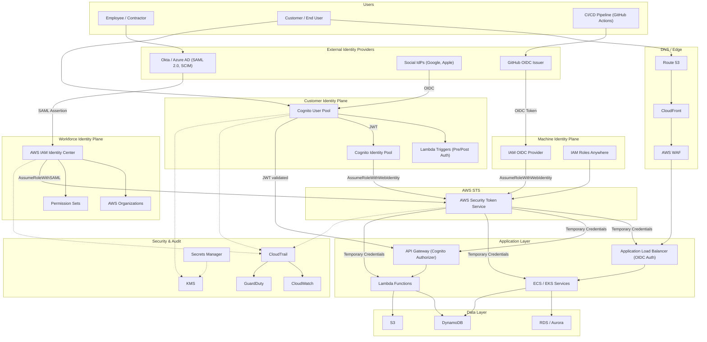

# Part VIII – Enterprise Application Architectures

# Chapter 64: Identity Federation

---

## 1. Executive Summary

### The Business Problem

Every enterprise eventually confronts the same structural problem: identity sprawl.

- Employees need access to AWS accounts, SaaS applications, internal portals, and partner systems.
- Contractors and vendors need scoped, temporary access without becoming permanent entries in a corporate directory.
- Customers need to log in to a product without the company operating a bespoke username/password database.
- Partner organizations need to call enterprise APIs without exchanging long-lived credentials.
- Auditors need a single, defensible answer to the question: "who can access what, and how do you prove it?"

Without a federation strategy, organizations solve this piecemeal. Individual AWS accounts accumulate IAM users with static access keys. SaaS vendors are given separate logins. Internal teams build home-grown SSO gateways. Each of these solutions works in isolation, and each one becomes a liability at scale.

- Static credentials leak. They are committed to source control, embedded in scripts, and forgotten in old CI/CD jobs.
- Duplicate identities create drift. When an employee leaves, deprovisioning becomes a scavenger hunt across a dozen systems.
- Inconsistent authentication makes compliance audits expensive and error-prone.
- Manual access reviews do not scale past a few hundred users, let alone thousands of employees and dynamic workforce contractors.

Identity Federation is the architectural answer to this problem. It centralizes authentication in a small number of trusted identity providers (IdPs), and it replaces long-lived credentials with short-lived, cryptographically verifiable tokens that are exchanged for temporary AWS credentials at the moment they are needed.

### Architecture Objective

The objective of an Identity Federation architecture is to establish a **trust relationship** between an external identity provider (corporate directory, social identity provider, partner IdP) and AWS, such that:

- Users authenticate once, against a system they already trust (their corporate credentials, their Google/Microsoft account, or a partner's IdP).
- AWS never stores or manages long-term passwords for federated users.
- Access to AWS resources is granted through short-lived, automatically expiring credentials obtained via AWS Security Token Service (STS).
- Authorization decisions (what a user can do once authenticated) are separated cleanly from authentication decisions (who the user is).
- The same pattern extends naturally to workforce identity (employees), customer identity (end users of a product), and machine identity (workloads, CI/CD pipelines, cross-account automation).

This is not a single AWS service. It is a composition of protocols (SAML 2.0, OIDC, OAuth 2.0), AWS services (IAM Identity Center, Cognito, IAM Identity Providers, STS), and organizational processes (joiner/mover/leaver workflows, access reviews, break-glass procedures).

### Why Organizations Adopt This Architecture

**1. Credential lifecycle elimination.** Federated access means AWS-side credentials exist for minutes, not months. There is no access key to rotate, because there is no long-lived access key.

**2. Single source of truth for identity.** When Active Directory, Okta, or Azure AD is the single source of truth, a termination in HR systems cascades automatically to AWS access removal — often within minutes, versus the days or weeks it takes when access is managed manually per-system.

**3. Regulatory and audit requirements.** Frameworks such as SOC 2, ISO 27001, PCI-DSS, HIPAA, and FedRAMP explicitly evaluate identity lifecycle management, MFA enforcement, and least-privilege access. A federation architecture with centralized policy and logging is dramatically easier to certify than a patchwork of IAM users.

**4. Mergers, acquisitions, and multi-account growth.** As organizations grow past a handful of AWS accounts, federation becomes the only practical way to give thousands of employees access to hundreds of accounts without an explosion of IAM users duplicated per account.

**5. Customer-facing products need scalable identity.** A SaaS product cannot ask every user to become an IAM user. Customer Identity and Access Management (CIAM), built on Amazon Cognito or a third-party IdP federated into Cognito, lets millions of end users authenticate with social logins, enterprise SSO, or native accounts, all funneled into a consistent authorization model.

**6. Machine-to-machine trust without secrets.** Modern CI/CD systems (GitHub Actions, GitLab CI) support OIDC federation directly into AWS IAM roles. This eliminates the long-standing anti-pattern of storing AWS access keys as CI/CD secrets.

### Major Business Benefits

| Benefit | Description | Primary Beneficiary |
|---|---|---|
| Reduced credential risk | No long-lived AWS access keys for human users | Security team |
| Faster onboarding | New hires gain AWS access via existing directory group membership | IT operations |
| Faster offboarding | Directory deactivation immediately revokes AWS access | Security / Compliance |
| Centralized audit trail | Every federated sign-in and role assumption is logged centrally | Compliance / Auditors |
| Reduced help desk load | Single sign-on removes password reset tickets for AWS access | IT operations |
| Simplified multi-account governance | One identity source maps to permission sets across all accounts | Cloud platform team |
| Lower breach blast radius | Compromise of a federated session token expires quickly; no static keys to rotate | Security team |
| Consistent CIAM experience | Customers use familiar identity providers (Google, Microsoft, Apple, enterprise SSO) | Product / Growth teams |
| Regulatory alignment | Meets identity controls required by SOC 2, ISO 27001, HIPAA, PCI-DSS | Compliance / Legal |

### Typical Enterprise Scenarios

- A 5,000-employee enterprise with 40 AWS accounts organized under AWS Organizations needs every employee to sign in once through Okta and land in the correct AWS account with the correct permission set, without ever creating an IAM user.
- A B2B SaaS company needs its own employees to use workforce federation (IAM Identity Center) while its **customers** authenticate through a separate customer identity pool (Amazon Cognito) that may itself federate to the customer's own Azure AD tenant (SAML/OIDC), a pattern known as "Bring Your Own Identity" (BYOI).
- A financial services company must federate access for third-party auditors with time-boxed, scoped access that automatically expires at the end of an audit engagement, with no standing account ever created.
- A platform engineering team needs its GitHub Actions pipelines to deploy to AWS without storing any AWS secret in GitHub, using GitHub's OIDC provider federated directly to an IAM role.
- A healthcare provider must support clinician logins from multiple hospital systems (each with its own Active Directory Federation Services (AD FS) instance) into a shared clinical application hosted on AWS, all mapped to a single authorization model with row-level and field-level access controls tied to license and role.

This chapter builds the complete reference architecture for enterprise identity federation: workforce federation via AWS IAM Identity Center, customer federation via Amazon Cognito, and machine federation via OIDC-based IAM roles, along with the surrounding network, security, observability, cost, and operational architecture required to run it reliably in production.


---

## 2. Business Requirements

### Business Drivers

- Eliminate standing IAM users and static access keys for human access to AWS.
- Provide a single employee sign-on experience across AWS, internal tools, and SaaS applications.
- Support external identity providers for customers, partners, and auditors without creating local accounts.
- Satisfy compliance frameworks (SOC 2 Type II, ISO 27001, PCI-DSS, HIPAA, FedRAMP Moderate) with demonstrable identity lifecycle controls.
- Reduce the mean time to revoke access after employee termination from days to minutes.
- Support rapid AWS account growth (multi-account strategy) without linear growth in identity administration effort.

### Functional Requirements

- Employees authenticate via corporate IdP (Okta, Azure AD, Ping Identity, or AWS Directory Service) using SAML 2.0 or OIDC.
- Successful authentication maps the user, via group or attribute assertions, to one or more AWS permission sets across one or more AWS accounts.
- Customer-facing applications authenticate end users via Amazon Cognito, supporting email/password, social identity providers (Google, Apple, Facebook), and enterprise federation (SAML/OIDC) for B2B customers.
- CI/CD pipelines and workloads assume IAM roles via OIDC federation, with no static AWS credentials stored anywhere.
- All authentication and authorization events are centrally logged and queryable for audit purposes.
- Multi-factor authentication (MFA) is enforced at the identity provider for all human access to production AWS accounts.
- Break-glass emergency access exists and is independently audited, for the scenario where the primary IdP is unavailable.

### Non-Functional Requirements

| Category | Requirement |
|---|---|
| Scalability | Support 10,000+ workforce identities and 5,000,000+ customer identities without redesign |
| Availability | Identity plane must exceed 99.9% availability; a federation outage blocks all downstream access |
| Latency | Token issuance and validation must complete in under 300ms at p99 |
| Compliance | SOC 2 Type II, ISO 27001, and (where applicable) HIPAA / PCI-DSS controls must be demonstrable |
| Security | MFA enforced for all workforce access; short-lived credentials only; no long-lived AWS access keys for humans |
| Auditability | Every authentication event, role assumption, and permission change must be logged and retained per policy |
| Recovery | Break-glass access procedure with independent audit trail, tested quarterly |

### Scalability Goals

- Workforce identity: scale linearly with headcount across an AWS Organizations structure that may reach hundreds of accounts.
- Customer identity: scale to millions of monthly active users with sign-in latency unaffected by user pool size.
- Machine identity: scale to thousands of concurrent CI/CD jobs and cross-account automation roles without a shared secrets bottleneck.

### Availability Requirements

- IAM Identity Center and Cognito are both regional-but-highly-available managed services; the architecture inherits their multi-AZ resilience automatically.
- The corporate IdP (Okta, Azure AD) is typically the actual single point of failure in a federation architecture, not AWS. Its SLA (commonly 99.9%) becomes the effective ceiling for the whole system unless a break-glass path exists.
- Target: 99.9% availability for the end-to-end sign-in experience, with a documented break-glass procedure covering the remaining 0.1%.

### Latency Requirements

- SAML/OIDC token issuance: under 300ms p99 from the external IdP.
- STS `AssumeRoleWithSAML` / `AssumeRoleWithWebIdentity` calls: under 200ms p99 (this is an AWS-managed API and is rarely the bottleneck).
- Cognito user pool authentication (`InitiateAuth`): under 300ms p99 for standard flows; higher for flows involving Lambda triggers that call external systems.

### Compliance Requirements

- SOC 2: logical access controls (CC6.1–CC6.3), including unique identification, MFA, and timely deprovisioning.
- ISO 27001: Annex A.9 (Access Control) — user registration/deregistration, privileged access management, access review.
- PCI-DSS: Requirement 8 — unique IDs, MFA for all access to the cardholder data environment, no shared or generic accounts.
- HIPAA: 45 CFR §164.312(a) — unique user identification, automatic logoff, and audit controls.
- FedRAMP: identity federation must align with NIST 800-63 Identity Assurance Levels (IAL) and Authenticator Assurance Levels (AAL), typically AAL2 minimum for workforce access to production.

### Recovery Objectives

| Metric | Target | Notes |
|---|---|---|
| RPO (identity configuration) | 0 minutes | Identity Center / Cognito configuration is managed as code (Terraform) and version controlled; no data loss window |
| RPO (Cognito user data) | Near-zero | Cognito is a managed, replicated service; user pool data is not self-managed |
| RTO (federation outage) | 15 minutes | Time to activate break-glass procedure for emergency AWS console/API access |
| RTO (regional Cognito outage) | 30–60 minutes | Time to fail over to a secondary-region user pool if a multi-region CIAM design is in place |

### SLAs

- Internal SLA: workforce sign-in success rate ≥ 99.9% measured monthly.
- Customer-facing SLA (if contractually obligated): sign-in availability ≥ 99.95% for CIAM, generally requiring multi-region Cognito or a third-party IdP with a stronger published SLA.

### Expected Workload

- Workforce: peak sign-in bursts at the start of the business day (typically 8:00–9:30 local time), with SSO session reuse reducing repeated authentication for the remainder of the day.
- Customer: workload shape depends entirely on the product; e-commerce and consumer apps see strong diurnal and marketing-driven spikes; B2B SaaS sees business-hours concentration similar to workforce patterns.
- Machine identity: CI/CD-driven role assumption is bursty and correlates with deployment frequency; can spike sharply during release windows.

### Expected Growth

- Workforce identity count typically grows with headcount (10–30% year-over-year in growth-stage companies).
- AWS account count under AWS Organizations frequently grows faster than headcount as teams adopt an account-per-workload or account-per-environment strategy — federation design must assume permission sets will be assigned to dozens or hundreds of accounts, not a handful.
- Customer identity pools in successful products can grow 2–10x year over year; Cognito scales natively but downstream systems (Lambda triggers, custom authorizers) must be load-tested at target scale.


---

## 3. Architecture Overview

### Overall Design

The architecture separates identity into three distinct planes, because workforce, customer, and machine identity have fundamentally different trust models, lifecycles, and regulatory expectations. Conflating them into a single system is one of the most common and expensive mistakes in enterprise identity design (see Section 27, Anti-Patterns).

**Plane 1 — Workforce Identity (employees, contractors, internal staff)**

- Source of truth: corporate directory (Okta, Azure AD, or AWS Managed Microsoft AD).
- Federation broker: AWS IAM Identity Center (formerly AWS SSO).
- Protocol: SAML 2.0 for the SSO portal; SCIM 2.0 for automated user/group provisioning.
- Destination: temporary credentials scoped to AWS accounts under AWS Organizations, via Permission Sets.

**Plane 2 — Customer Identity (end users of a product)**

- Source of truth: either Cognito's own user pool (email/password, social login) or a customer's own enterprise IdP (SAML/OIDC) for B2B products.
- Federation broker: Amazon Cognito User Pools (authentication) and Identity Pools (authorization/AWS credential exchange, when the app needs direct AWS resource access).
- Protocol: OIDC / OAuth 2.0 for application sign-in; SAML or OIDC for enterprise customer federation into Cognito.
- Destination: JWTs consumed by the application's own backend (API Gateway authorizers, ALB OIDC authentication), and optionally temporary AWS credentials for direct client access to scoped resources (e.g., S3 uploads).

**Plane 3 — Machine Identity (workloads, pipelines, cross-account automation)**

- Source of truth: the workload's own execution identity (an EKS pod's service account, a GitHub Actions run, an EC2 instance profile) or a third-party OIDC provider (GitHub, GitLab).
- Federation broker: AWS IAM OIDC Identity Providers and IAM Roles Anywhere (for non-AWS compute needing AWS credentials, such as on-premises servers).
- Protocol: OIDC.
- Destination: temporary credentials via `AssumeRoleWithWebIdentity`, scoped tightly by IAM trust policy conditions (repository, branch, workflow).

### Architecture Philosophy

- **Never issue long-lived AWS credentials to a human.** Every workforce and customer interaction with AWS resources flows through STS-issued temporary credentials with a maximum session duration measured in hours, not months.
- **Authentication and authorization are separated.** The IdP proves *who* the user is. AWS IAM (via Permission Sets or IAM roles) decides *what* they can do. Federation architecture should never encode authorization logic inside the IdP beyond group/attribute assertions.
- **Centralize identity, decentralize permission sets.** One identity source, many scoped destinations. This is what allows the architecture to scale from 5 AWS accounts to 500 without a redesign.
- **Assume the IdP is the trust root and protect it accordingly.** Compromise of the corporate IdP is equivalent to compromise of every downstream AWS account. This drives the security requirements in Section 11.
- **Design for offboarding, not just onboarding.** The architecture's real value is demonstrated at termination, not at hire — access must disappear automatically, not through a manual checklist.

### Core Components

| Component | Role |
|---|---|
| Corporate IdP (Okta / Azure AD) | Authenticates employees; source of truth for group membership |
| AWS IAM Identity Center | SAML 2.0 identity broker for AWS Organizations; manages Permission Sets |
| AWS Organizations | Groups AWS accounts; Permission Sets are assigned per account or organizational unit (OU) |
| AWS STS | Issues short-lived credentials for every federated session |
| Amazon Cognito User Pools | Customer directory and OIDC/OAuth authentication for applications |
| Amazon Cognito Identity Pools | Exchanges validated tokens for temporary AWS credentials for direct client-side AWS access |
| IAM OIDC Identity Providers | Trust anchors for GitHub Actions, GitLab CI, Kubernetes service accounts (IRSA), and other OIDC-capable workloads |
| IAM Roles Anywhere | Extends temporary AWS credentials to non-AWS compute (on-premises, other clouds) via X.509 certificates |
| AWS CloudTrail | Immutable audit log of every STS `AssumeRole*` call and IAM Identity Center event |
| Amazon CloudWatch | Metrics, alarms, and dashboards for authentication volume, error rate, and latency |
| AWS Secrets Manager | Stores IdP metadata, SAML certificates, and any residual application secrets (never AWS credentials) |
| AWS KMS | Encrypts Cognito data at rest, Secrets Manager secrets, and CloudTrail logs |

### How Components Interact — High-Level Workflow

1. A user (employee or customer) initiates a sign-in against their identity provider.
2. The IdP authenticates the user (validating password + MFA) and issues a signed assertion (SAML) or token (OIDC).
3. AWS validates the assertion/token against a pre-configured trust relationship (SAML metadata or OIDC provider thumbprint/issuer).
4. AWS STS issues short-lived temporary credentials (or, for workforce users, IAM Identity Center brokers access to the AWS Management Console or CLI directly).
5. The user or application uses the temporary credentials to call AWS APIs, subject to the permissions attached to the assumed role or permission set.
6. Every step from 2–5 is logged: the IdP logs the authentication event, and CloudTrail logs the STS call and every subsequent AWS API call made with the resulting credentials.
7. Credentials expire automatically (default and maximum session durations are configurable per Permission Set / IAM role) and cannot be renewed without a fresh authentication event upstream.

### Request Lifecycle (Workforce Example)

```

Employee -> Okta login (password + MFA)
Okta -> SAML assertion -> AWS IAM Identity Center
IAM Identity Center -> STS AssumeRoleWithSAML -> temporary credentials
Employee console/CLI session -> AWS API calls using temporary credentials
CloudTrail -> logs every API call under the assumed role session
Session expires (default 1 hour, configurable up to 12 hours) -> re-authentication required

```

### Response Lifecycle

- Successful authentication returns a signed SAML assertion or JWT to the relying party (AWS or the application).
- Failed authentication (bad password, MFA failure, conditional access policy block) returns an IdP-specific error and is logged at the IdP; AWS never sees failed password attempts because AWS is not the password validator.
- Authorization failures (valid identity, insufficient IAM permissions) surface as standard AWS `AccessDenied` errors and are logged in CloudTrail — this is the signal used to detect both misconfiguration and malicious probing.

### Data Lifecycle

- Identity attributes (name, email, group membership, department) originate in the corporate HR system, flow into the directory (Active Directory / Azure AD / Okta Universal Directory), and are provisioned into AWS IAM Identity Center via SCIM.
- No password ever leaves the IdP. AWS federation architecture, correctly implemented, means AWS never stores or transmits a workforce or customer password.
- Session data (temporary credentials) exists only in memory / local credential cache on the client and expires automatically; it is never persisted to a database.
- Audit data (CloudTrail logs, IdP sign-in logs) is retained per the compliance requirements in Section 2, typically 1–7 years depending on framework, and is shipped to a centralized, access-controlled log archive (Section 22).


---

## 4. AWS Services Used

### AWS IAM Identity Center (formerly AWS SSO)

**Purpose:** Central broker for workforce access to the AWS Management Console, CLI, and SDKs across every account in an AWS Organizations structure. Manages Permission Sets (collections of IAM policies) and assigns them to users/groups per account.

**Why selected:** It is the only AWS-native service purpose-built for multi-account workforce federation. It natively understands AWS Organizations, supports SAML 2.0 and SCIM provisioning from any major IdP, and eliminates the need to hand-configure a SAML IAM Identity Provider in every individual account.

**Alternatives:** Direct SAML federation via IAM Identity Providers configured per-account (viable only below ~5 accounts; does not scale); third-party privileged access management tools (CyberArk, Okta's own AWS integration without Identity Center) that duplicate functionality AWS now provides natively.

**Limitations:** Identity Center is a regional service tied to one "home region" per AWS Organization; it manages console/CLI access but is not the mechanism for customer-facing (CIAM) authentication — that is Cognito's job. Permission Set changes can take a few minutes to propagate to all assigned accounts.

**Pricing:** No additional charge for AWS IAM Identity Center itself. Costs are indirect: CloudTrail storage for the audit trail, and any third-party IdP licensing (Okta, Azure AD Premium) required for SAML/SCIM federation.

**Best practices:** Use groups, not individual user assignments, for all Permission Set assignments. Keep the number of Permission Sets small and purpose-built (e.g., `ReadOnly`, `PowerUser`, `NetworkAdmin`, `BillingViewer`) rather than one bespoke set per team.

### Amazon Cognito

**Purpose:** Customer identity and access management (CIAM). User Pools handle authentication (sign-up, sign-in, MFA, password policy, social/enterprise federation). Identity Pools exchange validated identity for temporary AWS credentials when an application needs direct client-side access to AWS resources.

**Why selected:** Fully managed, scales to millions of users without operational overhead, supports OAuth 2.0/OIDC natively, and integrates directly with API Gateway, Application Load Balancer, and AWS AppSync as an authorizer.

**Alternatives:** Auth0, Okta Customer Identity Cloud, Azure AD B2C, or a self-hosted solution (Keycloak). Third-party CIAM platforms often provide richer out-of-the-box UX customization and more mature B2B organization/tenant management; Cognito is preferred when the cost sensitivity is high, the application is AWS-native, and B2B tenant complexity is moderate.

**Limitations:** Cognito's hosted UI customization is limited compared to dedicated CIAM platforms; advanced B2B multi-tenant patterns (organization switching, complex role hierarchies) require custom application logic on top of Cognito rather than being provided out of the box; Lambda triggers add latency and a new failure mode to the authentication path.

**Pricing:** Monthly Active Users (MAU) pricing tier for User Pools; free tier covers a meaningful baseline (tens of thousands of MAU as of current pricing — verify current tier at time of implementation). Advanced security features (compromised credential detection, adaptive authentication) are priced separately and materially increase cost at scale.

**Best practices:** Use User Pools for authentication and Identity Pools only when the application genuinely needs direct AWS SDK access from the client (e.g., direct-to-S3 uploads); most applications should validate the Cognito-issued JWT at the backend and never touch Identity Pools at all.

### AWS Security Token Service (STS)

**Purpose:** Issues temporary, short-lived security credentials for federated users and roles. Every federation pattern in this chapter — SAML, OIDC, cross-account — terminates in an STS API call (`AssumeRoleWithSAML`, `AssumeRoleWithWebIdentity`, `AssumeRole`).

**Why selected:** It is the only mechanism AWS provides for converting an external trust assertion into AWS-native, time-bound credentials. There is no viable alternative within AWS.

**Alternatives:** None within AWS; the "alternative" is the anti-pattern of long-lived IAM user access keys, which this architecture exists specifically to eliminate.

**Limitations:** Default session duration is 1 hour; maximum is configurable up to 12 hours for role assumption and up to 36 hours for some federation flows via IAM Identity Center — sessions cannot be extended beyond the configured maximum without a fresh authentication event.

**Pricing:** No charge for STS API calls.

**Best practices:** Set the shortest session duration that is operationally tolerable; use session tags and external IDs for cross-account and third-party role assumption; never allow a Permission Set or IAM role trust policy to be broader than the specific IdP/OIDC subject it needs to trust.

### IAM OIDC Identity Providers

**Purpose:** Establishes AWS as a relying party for an external OIDC issuer, most commonly GitHub Actions, GitLab CI, or a Kubernetes cluster's OIDC issuer (for IAM Roles for Service Accounts, IRSA).

**Why selected:** Removes the need to store static AWS access keys as CI/CD secrets. The workload authenticates to AWS using a token minted by the CI/CD platform itself, scoped to a specific repository, branch, or workflow.

**Alternatives:** Static IAM user access keys stored as CI/CD secrets (the legacy and now-discouraged pattern); AWS CodePipeline/CodeBuild with native IAM roles (avoids the OIDC federation question entirely when the pipeline runs inside AWS).

**Limitations:** Requires careful trust policy condition scoping (`sub`, `aud` claims) — an overly broad trust policy (e.g., trusting any branch of any repository in an organization) is a serious and common misconfiguration.

**Pricing:** No additional charge.

**Best practices:** Scope the trust policy `Condition` block to specific repository + branch + environment combinations; rotate the OIDC provider's thumbprint monitoring (AWS automatically manages GitHub's thumbprint, but this should still be verified periodically for less common providers).

### IAM Roles Anywhere

**Purpose:** Extends the short-lived credential model to workloads running outside AWS — on-premises servers, other cloud providers — by using X.509 certificates from a trusted certificate authority instead of an OIDC token.

**Why selected:** Necessary in hybrid environments where a legacy on-premises system needs to call AWS APIs and static access keys are the only alternative.

**Alternatives:** Static IAM user access keys deployed to on-premises servers (the anti-pattern this service replaces); a VPN/Direct Connect plus instance-profile-based access is not viable because instance profiles cannot be attached to non-EC2 compute.

**Limitations:** Requires an existing private certificate authority (AWS Private CA or an on-premises CA) and certificate lifecycle management; adds operational complexity relative to native AWS compute.

**Pricing:** AWS Private CA has its own monthly and per-certificate charges if used as the trust anchor.

### AWS CloudTrail

**Purpose:** Immutable, centralized audit log of every AWS API call, including every STS `AssumeRole*` call and every IAM Identity Center authentication event.

**Why selected:** It is the definitive, non-repudiable record required by every compliance framework referenced in Section 2. Without CloudTrail, "who did what and when" cannot be answered for AWS-side actions.

**Alternatives:** None within AWS for this specific requirement; third-party SIEM tools (Splunk, Datadog) consume CloudTrail as a source rather than replacing it.

**Limitations:** CloudTrail is not real-time (typical delivery latency is a few minutes); management events are logged by default, but data events (e.g., individual S3 object access) require explicit configuration and add cost.

**Pricing:** One copy of management events is free; additional trails, data events, and long-term S3 storage incur cost (see Section 16).

**Best practices:** Enable an organization-wide CloudTrail trail from the AWS Organizations management account, write logs to a dedicated, access-restricted log archive account, and enable log file integrity validation.

### Amazon CloudWatch

**Purpose:** Metrics and alarms for authentication volume, error rates, and STS call latency; dashboards for the identity platform's operational health.

**Why selected:** Native integration with every AWS service in this architecture; no additional agent or infrastructure required.

**Alternatives:** Third-party observability platforms (Datadog, New Relic) can subscribe to CloudWatch metrics or ingest CloudTrail/Cognito logs directly for a unified enterprise dashboard.

**Pricing:** Charged per custom metric, per alarm, and per dashboard; log ingestion and storage charged separately if Cognito/Lambda logs are shipped to CloudWatch Logs.

### AWS Secrets Manager

**Purpose:** Stores IdP metadata (SAML signing certificates), Cognito Lambda trigger secrets (e.g., third-party API keys used for adaptive authentication), and any application-level secrets — explicitly never AWS credentials, which should never exist as static secrets in this architecture.

**Why selected:** Native rotation support, fine-grained IAM-based access control, and KMS encryption at rest.

**Alternatives:** AWS Systems Manager Parameter Store (SecureString) is a lower-cost alternative for secrets that do not need automatic rotation.

**Pricing:** Per-secret monthly charge plus API call charges; Parameter Store SecureString is cheaper for low-throughput, non-rotating secrets.

### AWS KMS

**Purpose:** Encrypts Cognito user pool data, Secrets Manager secrets, and CloudTrail log archives at rest with customer-managed keys where compliance requires demonstrable key ownership and rotation.

**Why selected:** Required for HIPAA and many PCI-DSS interpretations; provides auditable key usage via CloudTrail.

**Alternatives:** AWS-managed keys (no additional cost, less audit granularity) are acceptable where compliance does not mandate customer-managed keys.

**Pricing:** Customer-managed keys incur a monthly per-key charge plus per-API-call charges for encrypt/decrypt operations.

### Amazon VPC, Route 53, and CloudFront

**Purpose:** While IAM Identity Center and Cognito are both managed, regionless-from-the-network-perspective services, the applications consuming their tokens (internal portals, customer-facing web apps) run inside a VPC behind CloudFront and are resolved via Route 53. These services are covered in depth in Section 9 (Network Topology) because the identity architecture's security depends on the network architecture protecting the applications that rely on it.

Only the services directly relevant to identity federation are covered in this chapter. General-purpose compute, storage, and database services covered in earlier chapters (Chapters 5–14, 43–50) are assumed as the operational substrate for the applications that consume federated identity, not re-explained here.


---

## 5. Complete Architecture Diagram



**Diagram notes:**

- Solid arrows represent request/credential flow; dotted arrows represent logging/audit flow.
- The three identity planes (workforce, customer, machine) never share a trust boundary — they converge only at AWS STS, which is the single common credential-issuance point.
- WAF sits in front of the ALB protecting the customer-facing application, not in front of IAM Identity Center or Cognito's hosted UI directly (those are AWS-managed endpoints; WAF for Cognito hosted UI is applied via a separate WebACL association where supported).


---

## 6. Component-by-Component Explanation

### AWS IAM Identity Center

- **Purpose:** Central SAML 2.0 identity broker for workforce access across AWS Organizations.
- **Responsibilities:** Maintains Permission Sets; maps directory groups to Permission Sets per account; issues the AWS access portal; brokers STS role assumption.
- **Inputs:** SAML assertions from the corporate IdP; SCIM provisioning events (user/group create, update, delete).
- **Outputs:** Temporary AWS credentials via STS; AWS access portal session.
- **Scaling:** Fully managed; no capacity planning required. Scales natively with AWS Organizations account count and directory size.
- **High availability:** Regional managed service with AWS-managed multi-AZ resilience; no customer-managed failover required.
- **Failure handling:** If the upstream IdP is unavailable, workforce sign-in fails entirely — this is why a break-glass IAM role (Section 11) must exist independent of Identity Center.
- **Dependencies:** Corporate IdP (SAML/SCIM), AWS Organizations.
- **Security:** Enforces MFA via the upstream IdP's conditional access policy (Identity Center itself can also enforce MFA directly if not delegated to the IdP); session duration is configurable per Permission Set.
- **Monitoring:** CloudTrail logs every sign-in and role assumption; CloudWatch alarms on unusual assumption patterns (Section 21).

### Amazon Cognito User Pool

- **Purpose:** Customer directory and authentication service.
- **Responsibilities:** User registration, sign-in, password policy enforcement, MFA, social/enterprise federation, JWT issuance.
- **Inputs:** Username/password, social IdP OAuth tokens, SAML assertions from B2B customer IdPs.
- **Outputs:** ID token, access token, refresh token (JWTs) consumed by the application backend.
- **Scaling:** Fully managed; scales to millions of users. Lambda triggers (pre-auth, post-auth, pre-token-generation) can become a bottleneck if they call slow external systems — these should be monitored independently.
- **High availability:** Regional managed service with AWS-managed resilience; for a global customer base requiring regional failover, a multi-region active-active or active-passive user pool design (Section 13) is required, since Cognito User Pools are not natively multi-region.
- **Failure handling:** Application backends should treat token validation failures distinctly from Cognito service unavailability, with clear user-facing messaging and retry logic for the latter.
- **Dependencies:** SES (for email verification, if used), SNS (for SMS MFA, if used), KMS (encryption at rest).
- **Security:** Enforces password policy, MFA (SMS, TOTP, or WebAuthn/passkeys), account takeover protection (advanced security feature tier), and compromised credential checking.
- **Monitoring:** Cognito publishes metrics (sign-in success/failure counts, throttling) to CloudWatch; CloudTrail logs administrative API calls (not end-user sign-in events, which are found in Cognito's own logs).

### Amazon Cognito Identity Pool

- **Purpose:** Exchanges a validated identity (Cognito User Pool token, or a third-party OIDC/SAML token) for temporary AWS credentials.
- **Responsibilities:** Maps authenticated (and optionally unauthenticated/guest) identities to IAM roles.
- **Inputs:** Validated JWT or SAML assertion.
- **Outputs:** Temporary AWS credentials via STS, scoped to the mapped IAM role.
- **Scaling:** Fully managed, scales with request volume.
- **When to use:** Only when the client application needs to call AWS services directly (e.g., browser-based direct upload to S3). Most server-side architectures should skip Identity Pools entirely and validate the User Pool JWT at the backend instead.

### IAM OIDC Identity Provider (GitHub Actions example)

- **Purpose:** Trust anchor allowing GitHub Actions workflows to assume an IAM role without stored credentials.
- **Responsibilities:** Validates the OIDC token's issuer, audience, and subject claims against the configured trust policy.
- **Inputs:** OIDC token minted by GitHub for the specific workflow run.
- **Outputs:** Temporary AWS credentials scoped to exactly the permissions the deployment role needs.
- **Scaling:** No capacity concerns; scales with CI/CD job concurrency.
- **Security:** The trust policy `Condition` block must restrict `token.actions.githubusercontent.com:sub` to specific repository/branch/environment combinations — an unscoped trust policy is equivalent to granting the entire GitHub organization the role's permissions.
- **Monitoring:** CloudTrail logs every `AssumeRoleWithWebIdentity` call, including the source repository and workflow identifiers embedded in the session tags if configured.

### AWS STS

- **Purpose:** Universal credential issuance point for every federation flow in the architecture.
- **Responsibilities:** Validates the incoming assertion/token against the configured trust relationship; issues time-bound access key, secret key, and session token.
- **Scaling:** Fully managed, effectively unlimited scale; regional endpoints available to reduce latency and support data residency requirements.
- **Failure handling:** STS is a foundational AWS service with very high availability; an STS outage would be a broad AWS service-health event, not an application-specific failure mode. Applications should still implement retry-with-backoff for transient STS errors.

### CloudTrail, CloudWatch, GuardDuty (Security & Audit Components)

- **Purpose:** Provide the observability and audit backbone that makes the entire federation architecture defensible to auditors and detectable to security operations.
- **Responsibilities:** CloudTrail records every API call; CloudWatch aggregates metrics and drives alarms; GuardDuty applies threat-detection heuristics to CloudTrail, VPC Flow Logs, and DNS logs, including specific findings for anomalous STS usage (e.g., `UnauthorizedAccess:IAMUser/InstanceCredentialExfiltration`, credential use from an unusual geography).
- **Dependencies:** All three depend on the identity plane's activity as their primary data source for this architecture's threat model.


---

## 7. End-to-End Request Flow

### Flow A: Workforce Console Access

1. Employee navigates to the company's AWS access portal URL (`https://<subdomain>.awsapps.com/start` or a custom domain).
2. IAM Identity Center redirects to the corporate IdP (Okta) for authentication.
3. Okta prompts for username/password, evaluates conditional access policy (device trust, network location), and enforces MFA.
4. Okta issues a signed SAML assertion back to IAM Identity Center, including group membership attributes.
5. IAM Identity Center matches the user's groups to configured Permission Set assignments across AWS accounts and renders the list of available accounts/roles.
6. Employee selects an account and Permission Set (role).
7. IAM Identity Center calls STS `AssumeRoleWithSAML` (internally) to obtain temporary credentials scoped to that Permission Set's IAM policy.
8. Employee is redirected into the AWS Management Console (or receives short-lived CLI credentials via `aws sso login`) with the temporary credentials active.
9. Every subsequent AWS API call the employee makes is executed under the assumed role session and logged to CloudTrail with the session name identifying the underlying user.
10. Error handling: if Okta denies the login (conditional access failure), the user never reaches AWS — the denial and reason are logged in Okta's own system log, not CloudTrail.
11. Session expires at the configured maximum duration; the employee must re-authenticate through Okta to obtain a new session — there is no silent token refresh across a full re-authentication boundary in this flow.

### Flow B: Customer Web Application Sign-In

1. Customer's browser resolves the application domain via Route 53.
2. Request passes through CloudFront and AWS WAF (bot control, rate limiting, managed rule groups) to the application.
3. Application redirects unauthenticated users to the Cognito Hosted UI (or a custom-branded sign-in page built against Cognito APIs).
4. Customer authenticates with email/password, or chooses a social identity provider (Google), or — for a B2B customer — is redirected to their own corporate IdP via SAML/OIDC federation configured on the User Pool.
5. Cognito executes any configured Lambda triggers (e.g., `PreAuthentication` for custom risk scoring, `PostAuthentication` for logging to an external system).
6. Cognito issues ID token, access token, and refresh token (JWTs) to the application via the OAuth 2.0 authorization code flow.
7. Application's backend (API Gateway with a Cognito authorizer, or a custom authorizer validating the JWT signature and claims) verifies the token on every API request.
8. If the application requires direct client-side AWS access (e.g., uploading a file directly to S3 from the browser), the client exchanges the ID token via a Cognito Identity Pool for temporary AWS credentials scoped to an IAM role restricted to that customer's own S3 prefix.
9. Application queries backend data stores (RDS, DynamoDB) using the authenticated user's identity (in application-layer authorization) or the STS-derived role (for direct AWS access scenarios).
10. Application logs, WAF logs, and Cognito authentication logs all correlate via a request ID for troubleshooting.
11. Error handling: invalid credentials return a generic error to the user (to avoid username enumeration) while Cognito's own metrics record the specific failure reason for operational visibility.
12. Access token expires (default 1 hour, configurable); refresh token (default 30 days, configurable) allows silent renewal without re-prompting the user, subject to the refresh token's own expiration and any configured token revocation.

### Flow C: CI/CD Pipeline Deployment

1. A GitHub Actions workflow run starts for a push to the `main` branch of a specific repository.
2. GitHub's OIDC provider mints a short-lived JSON Web Token embedding the repository, branch, and workflow identity as claims.
3. The workflow's `aws-actions/configure-aws-credentials` step calls STS `AssumeRoleWithWebIdentity`, presenting the GitHub-issued token.
4. AWS validates the token against the configured IAM OIDC Identity Provider and the IAM role's trust policy conditions (repository, branch match).
5. STS issues temporary credentials scoped to exactly the IAM role's attached policy (e.g., permission to deploy to a specific ECS service, push to a specific ECR repository, or run a specific Terraform plan/apply against a specific state backend).
6. The workflow uses the temporary credentials for the remainder of the job; credentials expire when the job completes or the maximum session duration is reached, whichever is first.
7. CloudTrail logs the `AssumeRoleWithWebIdentity` call and every subsequent API call under that session, correlatable back to the specific GitHub Actions run via the token's claims (if session tagging is configured).
8. Error handling: a trust policy mismatch (wrong branch, wrong repository) results in an `AccessDenied` at the `AssumeRoleWithWebIdentity` call itself — the workflow fails immediately with a clear, auditable reason, rather than gaining broader access than intended.


---

## 8. Deployment Flow

### Infrastructure Provisioning

All identity infrastructure — IAM Identity Center Permission Sets and assignments, Cognito User Pools and Identity Pools, IAM OIDC providers, IAM roles and trust policies — should be managed as code. Manual console configuration of identity infrastructure is a significant audit and drift risk; it is one of the highest-value targets for Infrastructure as Code in the entire AWS estate, because identity misconfiguration has outsized blast radius compared to most other resource types.

### Terraform Workflow

1. Identity infrastructure lives in a dedicated Terraform root module (or Terraform workspace) separate from application infrastructure, reflecting its different change cadence and approval requirements.
2. Changes to Permission Sets, IAM role trust policies, or Cognito configuration require a pull request with mandatory review from the security/platform team — this is enforced via CODEOWNERS or branch protection rules, not just convention.
3. `terraform plan` output is posted to the pull request automatically via CI, so reviewers see the exact IAM policy diff before approval.
4. `terraform apply` runs only after merge, from a CI/CD pipeline using a tightly scoped, OIDC-federated deployment role (Flow C above) — never from a developer's local machine with long-lived credentials.
5. State is stored remotely (S3 backend with DynamoDB state locking, or Terraform Cloud) with encryption at rest and access restricted to the deployment role and a small number of break-glass administrators.

### CI/CD Deployment

- Identity infrastructure changes should deploy through a slower, more heavily gated pipeline than typical application code — a broken Permission Set can lock out an entire team, and an overly permissive IAM role can create a serious security incident.
- Recommended: a two-stage pipeline — `plan` runs automatically on every pull request; `apply` requires a manual approval gate even after merge, performed by a second individual (four-eyes principle) distinct from the PR author.

### Blue-Green Deployment (for Applications Consuming Federated Identity)

- Applications behind an ALB using OIDC authentication, or behind API Gateway with a Cognito authorizer, support standard blue-green deployment patterns (weighted target groups, Lambda alias traffic shifting) without any special identity-related handling, because the authentication layer is decoupled from the application's compute layer.
- The one identity-specific consideration: if a deployment changes the audience (`aud`) claim validation or the expected token issuer, both the old and new application versions must accept tokens correctly during the transition window, or in-flight user sessions will experience authentication failures mid-cutover.

### Rollback

- Terraform-managed identity infrastructure rolls back via `terraform apply` of the previous known-good configuration, exactly like any other Terraform-managed resource.
- **Warning:** Rolling back a Permission Set assignment removal (i.e., re-granting access that was intentionally revoked, such as during an offboarding) must go through the same review gate as any other change — rollback automation should never bypass the four-eyes approval for identity changes specifically.

### Secrets

- SAML signing certificates and IdP metadata are stored in Secrets Manager or as Terraform-managed resources sourced from a secure out-of-band exchange with the IdP administrator — never committed to source control in plaintext.
- Cognito Lambda trigger secrets (e.g., an API key for a third-party fraud-detection service used in `PreAuthentication`) are retrieved from Secrets Manager at runtime, not baked into the Lambda deployment package or environment variables in plaintext.

### Configuration

- Permission Set definitions, Cognito User Pool configuration (password policy, MFA requirements, Lambda trigger ARNs), and IAM OIDC trust policies are all defined declaratively in Terraform and reviewed as code.
- Environment-specific configuration (dev/staging/production) uses separate Terraform workspaces or a separate root module invocation per environment, with production requiring stricter approval gates.

### Validation

- Automated policy validation (`terraform validate`, `checkov`, or `tfsec`) runs in CI on every pull request to catch overly permissive IAM policies (wildcard actions/resources) before merge.
- A dedicated integration test suite exercises each federation flow end-to-end in a non-production account after every identity infrastructure change: simulate a SAML login, confirm the expected Permission Set is assumable and no more; simulate a Cognito sign-up/sign-in cycle; simulate an OIDC `AssumeRoleWithWebIdentity` call from a test CI job and confirm it succeeds only for the intended repository/branch.


---

## 9. Network Topology

Identity federation itself (IAM Identity Center, Cognito, STS) operates on AWS-managed, public regional endpoints and does not run inside a customer VPC. However, the applications that consume federated identity — internal portals, customer-facing web apps, and the CI/CD runners performing OIDC federation — do run inside a VPC, and their network design directly affects the security posture of the overall identity architecture.

### VPC

- A dedicated VPC (or a shared VPC under AWS Organizations' RAM sharing) hosts the application tier that validates and consumes federated tokens.
- Recommended CIDR: a `/16` per environment (e.g., `10.20.0.0/16` for production), sized to accommodate multiple subnet tiers across 3 Availability Zones without exhaustion as the account grows.

### CIDR and Subnet Design

| Subnet Tier | Example CIDR (per AZ) | Purpose |
|---|---|---|
| Public | `10.20.0.0/24`, `.1.0/24`, `.2.0/24` | ALB, NAT Gateway |
| Private (application) | `10.20.10.0/24`, `.11.0/24`, `.12.0/24` | ECS/EKS tasks, Lambda ENIs |
| Private (data) | `10.20.20.0/24`, `.21.0/24`, `.22.0/24` | RDS, ElastiCache |

### Public Subnets

- Host only the ALB and NAT Gateways. No application compute runs in public subnets.
- The ALB terminates TLS and, where the OIDC-authenticate-users action is used, performs the OAuth 2.0 authorization code exchange with Cognito directly at the load balancer layer before traffic reaches application targets.

### Private Subnets

- Application compute (ECS tasks, EKS pods, Lambda functions attached to the VPC) runs here with no direct internet route; outbound calls to AWS APIs (STS, Cognito, Secrets Manager) route either through NAT Gateway or, preferably, through VPC endpoints (see PrivateLink below) to avoid unnecessary internet egress.

### NAT Gateway

- One NAT Gateway per AZ (not a single shared NAT Gateway) to avoid a cross-AZ single point of failure and to avoid inter-AZ data transfer charges for NAT-bound traffic.
- **Cost note:** NAT Gateway is frequently the largest unexpected cost driver in this architecture when VPC endpoints are not used for STS/Secrets Manager/Cognito calls — see Section 16 and Section 34 (Cost Surprises).

### Internet Gateway

- Standard single Internet Gateway per VPC, attached to route tables for public subnets only.

### Transit Gateway

- Required when the application VPC needs to reach shared services (a centralized logging VPC, an on-premises Active Directory via Direct Connect/VPN) across multiple VPCs/accounts under AWS Organizations.
- For a pure identity federation workload, Transit Gateway is typically needed only if the corporate IdP itself is hosted on-premises (e.g., AD FS) and requires network-level connectivity distinct from the public SAML endpoint.

### Route Tables

- Public subnet route table: default route to Internet Gateway.
- Private subnet route table: default route to the AZ-local NAT Gateway; explicit routes to VPC endpoints for AWS service traffic take precedence and avoid the NAT Gateway entirely for that traffic.

### Network ACLs

- Default-deny stateless NACLs at the subnet boundary, permitting only the specific ports required (443 for HTTPS, ephemeral return traffic) as a defense-in-depth layer beneath security groups.

### Security Groups

| Security Group | Inbound | Outbound |
|---|---|---|
| `alb-sg` | 443 from `0.0.0.0/0` (behind WAF/CloudFront) | 443 to `app-sg` |
| `app-sg` | 443 from `alb-sg` only | 443 to VPC endpoints, 5432/6379 to `data-sg` |
| `data-sg` | 5432/6379 from `app-sg` only | None (no outbound needed) |

### PrivateLink (VPC Endpoints)

- Interface VPC endpoints for `sts`, `secretsmanager`, `kms`, `logs`, and `cognito-idp` keep all AWS API traffic from application compute on the AWS private network, never traversing the public internet or consuming NAT Gateway bandwidth.
- This is both a cost optimization (Section 16) and a security hardening measure (Section 11) — it materially reduces the network attack surface for credential-related API calls.

### Hybrid Connectivity

- If the corporate IdP is on-premises (self-hosted AD FS rather than a cloud IdP like Okta/Azure AD), a Direct Connect or Site-to-Site VPN connection is required between the corporate network and the AWS VPC hosting any component that must reach it directly. In most modern deployments, this is avoided entirely by using a cloud-hosted IdP or Azure AD Connect/Okta's cloud connectors, which communicate outbound-only from the corporate network and require no inbound hybrid connectivity into AWS.


---

## 10. Identity and Access

### IAM Roles

- Every Permission Set in IAM Identity Center is backed by an IAM role created and managed automatically in each target account; these roles should never be manually edited outside of Identity Center's own management, or drift will occur between the Identity Center console's view and the account's actual IAM state.
- IAM roles used for OIDC federation (CI/CD, IRSA) are managed separately in Terraform, one role per distinct workload/pipeline purpose — avoid a single shared "deploy role" used by every pipeline, since this collapses the blast radius of a compromised pipeline into every other pipeline sharing the role.

### IAM Policies

- Permission Sets and OIDC-federated roles should be built from AWS managed policies where they precisely match the need (e.g., `ReadOnlyAccess`, `ViewOnlyAccess`) and customer-managed policies for anything more specific — avoid attaching `AdministratorAccess` to any federated role as a starting point "to get it working," since this pattern reliably becomes permanent.
- Every custom policy should be scoped to specific resource ARNs and specific actions; wildcard `Resource: "*"` combined with wildcard `Action: "*"` is treated as a Sev-1 finding in any competent architecture review (Section 34).

### Resource Policies

- S3 bucket policies, KMS key policies, and Secrets Manager resource policies provide a second layer of access control independent of the IAM identity policy — for sensitive resources (audit log buckets, IdP metadata secrets), both the identity-based policy on the role and the resource-based policy on the resource should independently restrict access, so a misconfiguration in one layer does not alone grant unintended access.

### STS

- `AssumeRoleWithSAML`, `AssumeRoleWithWebIdentity`, and `AssumeRole` (for cross-account access using an already-federated session) are the three STS operations relevant to this architecture.
- Session duration should be set per Permission Set / role to the shortest value operationally tolerable — 1 hour for high-privilege roles, up to 8–12 hours for standard workforce access, and matched to the CI/CD job's expected maximum runtime (plus margin) for machine identity roles.

### Cross-Account Access

- For workforce users needing to operate across accounts (e.g., a platform engineer managing 20 workload accounts from a central tooling account), the recommended pattern is: IAM Identity Center Permission Set grants access to a central "jump" role, which itself has narrowly scoped `AssumeRole` permission into target account roles — this keeps a single audit trail anchor (the Identity Center session) while still supporting fine-grained per-account permissions.
- For machine identity crossing accounts (e.g., a central CI/CD account deploying into 20 workload accounts), each workload account's deployment role trusts only the specific central CI/CD role ARN, with an external ID or session tag condition where third-party tooling is involved.

### Least Privilege

- Start every new Permission Set or federated role with zero permissions and add specific actions based on documented need, rather than starting from a broad managed policy and narrowing it later — narrowing rarely happens once something "works."
- Use IAM Access Analyzer's policy generation feature, which reviews actual CloudTrail activity for a role over a chosen time window and generates a least-privilege policy reflecting real usage — this is the most practical way to right-size a Permission Set that was initially over-scoped.

### Service Roles

- Distinguish clearly between roles assumed by humans via federation (Permission Sets, workforce OIDC where applicable) and service roles assumed by AWS services themselves (e.g., an ECS task execution role, a Lambda execution role) — service roles are not part of the federation architecture per se, but they are frequently the actual destination of a federated session's permissions and must be reviewed with the same rigor.

### Permission Boundaries

- Apply a permission boundary to any IAM role that a federated user or pipeline is allowed to create or modify (for example, a platform team's self-service "create a deployment role" workflow) — the boundary caps the maximum possible permissions of any role created this way, preventing a federated user from privilege-escalating by creating a new, more permissive role for themselves.


---

## 11. Security Architecture

### Encryption

- All data in transit uses TLS 1.2+ end to end: browser to CloudFront, CloudFront to ALB, ALB to application targets, application to Cognito/STS/Secrets Manager endpoints.
- Cognito User Pool data (user attributes) is encrypted at rest by default using AWS-managed keys; customer-managed KMS keys can be used for advanced security features and are typically required for HIPAA-regulated workloads.
- CloudTrail log files are encrypted at rest via KMS and use log file integrity validation (SHA-256 digest files) to detect tampering.

### KMS

- Customer-managed KMS keys should back Secrets Manager secrets containing IdP metadata/certificates, and CloudTrail log archives where compliance requires demonstrable key control (rotation policy, access logging, key deletion protection with a mandatory waiting period).
- Key policies should explicitly enumerate which roles may `Decrypt` versus which may only `Encrypt`/`GenerateDataKey`, separating the ability to write secrets from the ability to read them where the workflow allows it.

### TLS

- Public-facing endpoints (CloudFront, ALB) use AWS Certificate Manager (ACM) certificates with automatic renewal; certificates should never be manually managed or allowed to expire, since certificate expiry is one of the most common self-inflicted outages in production.

### WAF

- AWS WAF sits in front of CloudFront/ALB for any customer-facing authentication surface (Cognito Hosted UI custom domain, application login pages), applying AWS Managed Rule Groups for common threats (SQL injection, known bad inputs) plus rate-based rules specifically targeting the login/token endpoints to blunt credential-stuffing attempts before they reach Cognito.

### Shield

- AWS Shield Standard is automatically active on CloudFront and ALB at no additional cost; AWS Shield Advanced is recommended for customer-facing authentication endpoints supporting a business-critical, internet-scale product, given the outsized business impact of a DDoS-driven login outage.

### Secrets Manager

- Stores SAML IdP metadata/certificates and any third-party API keys used in Cognito Lambda triggers; automatic rotation is configured wherever the downstream system supports it.

### Certificate Manager

- Manages TLS certificates for all public identity-adjacent endpoints (custom Cognito domain, ALB listeners); private certificates for IAM Roles Anywhere are issued from AWS Private CA or an existing enterprise CA.

### GuardDuty

- Enabled organization-wide via AWS Organizations delegated administration; specifically valuable for this architecture's threat model because of its purpose-built findings for anomalous IAM/STS activity — for example, credentials used from an unexpected geography, or a pattern consistent with credential exfiltration from compute metadata services.

### Inspector

- Scans the container images and Lambda functions in the application layer (not the identity services themselves, which are AWS-managed and out of the customer's patching scope) for known vulnerabilities that could be leveraged to steal an assumed role's in-memory temporary credentials.

### Security Hub

- Aggregates findings from GuardDuty, Inspector, IAM Access Analyzer, and AWS Config into a single dashboard, and maps them against the CIS AWS Foundations Benchmark and AWS Foundational Security Best Practices standard — both of which include multiple controls directly relevant to identity federation (MFA enforcement, unused credential detection, root account usage).

### CloudTrail

- Covered in depth in Section 4 and Section 22; it is the foundational evidence source for every security control in this section.

### AWS Config

- Config Rules specific to this architecture: `iam-user-mfa-enabled` (for any residual break-glass IAM users), `mfa-enabled-for-iam-console-access`, `access-keys-rotated` (as a canary for any static credential that should not exist under this architecture but might be created accidentally), `iam-policy-no-statements-with-admin-access`.

### Zero Trust

- This architecture implements core Zero Trust identity principles: no implicit trust based on network location alone (a request from inside the corporate network still requires full authentication and, ideally, device posture evaluation at the IdP); every session is short-lived and independently re-verified rather than perpetually trusted; authorization is evaluated per-request against the current state of IAM policy, not cached from the moment of login.

### Threat Model

| Threat | Description |
|---|---|
| Credential theft (phishing) | Attacker obtains a user's IdP password and MFA factor |
| Session token theft | Attacker steals a valid SAML assertion, JWT, or temporary AWS credential from a compromised endpoint |
| Over-permissioned role | A Permission Set or OIDC role grants more access than the legitimate use case requires, expanding the blast radius of any compromise |
| Trust policy misconfiguration | An OIDC role's trust policy fails to scope the `sub`/`aud` claims tightly, allowing unintended repositories/branches to assume it |
| IdP compromise | The corporate IdP itself is compromised, granting the attacker the ability to impersonate any federated identity |
| Insider threat | A legitimate, authenticated user intentionally misuses their granted permissions |
| Stale access | A departed employee or decommissioned pipeline retains valid access because deprovisioning did not fully propagate |

### Attack Vectors

- Phishing targeting the corporate IdP's login page (mitigated by phishing-resistant MFA such as WebAuthn/FIDO2 security keys).
- Adversary-in-the-middle (AiTM) proxy attacks that relay both password and MFA in real time (mitigated by phishing-resistant MFA and conditional access policies evaluating device trust/token binding).
- Compromised CI/CD runner attempting to assume an over-scoped OIDC role to pivot into production AWS accounts (mitigated by tight trust policy scoping and least-privilege deployment roles).
- Credential-stuffing against the Cognito Hosted UI or custom login page using breached password lists (mitigated by WAF rate-based rules, Cognito's compromised credential detection, and mandatory MFA).

### Mitigations Summary

| Mitigation | Addresses |
|---|---|
| Phishing-resistant MFA (WebAuthn) at the IdP | Credential theft, AiTM phishing |
| Short STS session durations | Session token theft impact window |
| Least-privilege Permission Sets / OIDC roles | Over-permissioned role blast radius |
| Trust policy condition scoping | Trust policy misconfiguration |
| SCIM-automated deprovisioning tied to HR system | Stale access |
| GuardDuty + CloudTrail + Security Hub | Detection across all threat categories |
| Break-glass procedure with independent audit | IdP compromise / unavailability |

---

## 12. High Availability

### AZ Failures

- IAM Identity Center, Cognito, and STS are all AWS-managed regional services already spanning multiple Availability Zones internally; no customer-side multi-AZ configuration is required for these services specifically.
- The application layer consuming federated identity (ALB targets, ECS/EKS tasks) must independently be deployed across at least 3 AZs, since an AZ failure there is unrelated to, but can appear alongside, identity-layer issues during troubleshooting.

### Instance Failures

- Because credentials are short-lived and re-obtained per session rather than cached on a single long-running instance, an individual compute instance failure has no special identity-related failure mode beyond standard Auto Scaling Group / ECS service replacement — a replacement instance simply re-authenticates (for service roles) or the user re-establishes their session (for workforce/customer flows) against a healthy target.

### Regional Failures

- IAM Identity Center is a single-region-per-organization service (with a designated "home region"); a full regional outage of that home region is a genuine single point of failure for workforce console access org-wide. AWS Organizations does not currently support an active multi-region Identity Center configuration.
- Cognito User Pools are region-scoped; customer-facing applications requiring resilience to a full regional outage need a multi-region design (Section 13) with either a secondary user pool and application-layer failover logic, or a third-party global IdP as the primary authentication source with Cognito federation as a downstream integration.

### Database Failures

- Not directly part of the identity plane, but the application-layer session/authorization data store (if any exists beyond the JWT itself, such as a user-profile database) should follow standard Multi-AZ RDS/Aurora or DynamoDB global table patterns as covered in Chapters 43–50.

### Load Balancing

- ALB performs OIDC token validation and health-checks targets independently per AZ; an unhealthy target in one AZ is removed from rotation without affecting the identity layer.

### Health Checks

- Application health checks should include a synthetic check of the token validation path itself (e.g., a `/health/auth` endpoint that confirms the application can still reach Cognito's JWKS endpoint or STS), not just basic TCP/HTTP liveness — this catches a category of failure (identity provider unreachable) that a plain liveness check misses entirely.

### Failover

- For workforce access, failover during an Identity Center regional outage is the break-glass procedure (Section 11/26), not an automated technical failover — there is no supported automated multi-region failover for IAM Identity Center itself.
- For customer-facing Cognito, failover requires either DNS-level redirection to a secondary-region user pool (with pre-provisioned, kept-in-sync user data via a custom replication mechanism, since Cognito does not natively replicate user pools cross-region) or reliance on a third-party global-scale IdP as the primary source of truth.


---

## 13. Disaster Recovery

### Backup Strategy

- Identity **configuration** (Permission Sets, Cognito User Pool configuration, IAM roles/trust policies) is version-controlled in Terraform and effectively backed up via source control history — recovery is a `terraform apply` of the last known-good state, not a traditional backup restore.
- Cognito **user data** is not directly exportable/importable in bulk through a simple backup API; organizations requiring cross-region DR for customer identity typically maintain a periodic export (via `ListUsers` pagination or Cognito's export-to-S3 feature where available) to a secondary region as a cold-standby dataset, understanding this introduces an RPO greater than zero for user attribute changes.

### Snapshots

- Not directly applicable to IAM Identity Center or Cognito, which have no customer-managed snapshot mechanism; this is a deliberate reason to treat Terraform state and version control as the actual backup mechanism for this layer.

### Cross-Region Replication

- For a genuinely global, DR-critical customer identity requirement, the recommended pattern is **not** attempting to replicate Cognito User Pools directly, but instead:
  - Use a third-party, natively multi-region IdP (Okta, Azure AD) as the authoritative source, with Cognito (in each region) federating to it via SAML/OIDC as a thin regional token-issuance layer.
  - This shifts the multi-region resilience burden to a platform (the third-party IdP) that is purpose-built for it, rather than re-engineering Cognito's single-region design.

### Pilot Light

- A pilot-light DR pattern for the application layer (minimal standby infrastructure in a secondary region, scaled up on failover) pairs naturally with a Cognito User Pool pre-provisioned in that secondary region and kept in sync via the periodic export process described above.

### Warm Standby

- For workforce access, IAM Identity Center's single-home-region design means there is no meaningful "warm standby" pattern available at the Identity Center layer itself; the warm standby that matters is the break-glass IAM role/user, pre-provisioned and MFA-protected, ready for immediate use.

### Multi-Site / Active-Active / Active-Passive

- **Active-active** customer identity (both regions actively serving sign-in traffic) requires either a third-party global IdP as described above, or a custom-built synchronization layer between two Cognito User Pools — the latter is a substantial engineering investment and should only be undertaken when the business case (Section 2 SLA requirements) clearly justifies it.
- **Active-passive** is the more common and more practical pattern for organizations without an extreme (99.99%+) availability SLA: a secondary-region Cognito User Pool exists, kept reasonably in sync, and is promoted only during a declared DR event, with DNS cutover directing traffic to the secondary region's application stack.

### RPO / RTO for This Architecture

| Scenario | RPO | RTO |
|---|---|---|
| Identity infrastructure misconfiguration | 0 (Terraform revert) | Under 15 minutes |
| Corporate IdP outage (workforce) | N/A (no data loss) | 15 minutes (break-glass activation) |
| Cognito regional outage (customer, active-passive DR) | Minutes to hours (depends on export sync frequency) | 30–60 minutes (DNS cutover + secondary pool promotion) |
| Full loss of Terraform state (worst case) | 0 (state can be reconstructed from AWS resource inspection, though painfully) | Hours (manual reconciliation) |

---

## 14. Scalability

### Horizontal Scaling

- The identity plane itself (IAM Identity Center, Cognito, STS) requires no customer-managed horizontal scaling — these are fully managed services that scale transparently with request volume.
- The application layer consuming tokens scales horizontally in the standard way (ECS/EKS service replica counts, Lambda concurrency), with the identity validation step (JWT signature verification against a cached JWKS) adding negligible per-request overhead when implemented correctly (cache the JSON Web Key Set locally rather than fetching it on every request).

### Vertical Scaling

- Not a meaningful concept for the managed identity services; relevant only to any self-hosted component in the architecture, such as a self-hosted Keycloak instance if used as an intermediary (uncommon in a pure-AWS-native design, but seen in hybrid/multi-cloud identity architectures).

### Auto Scaling

- Application compute behind the ALB/API Gateway scales via standard Auto Scaling Group or ECS Service Auto Scaling policies, triggered by request count or CPU/memory utilization — token validation load scales linearly with request volume and should be included in load testing baselines.

### Serverless Scaling

- Lambda functions used as Cognito triggers (`PreAuthentication`, `PostAuthentication`, `PreTokenGeneration`) scale automatically with authentication volume, but each trigger sits directly in the authentication critical path — a slow or throttled Lambda trigger directly increases sign-in latency or can cause sign-in failures under load. Reserved concurrency should be considered for these functions to guarantee capacity during authentication traffic spikes, separate from the account's general Lambda concurrency pool.

### Database Scaling

- Not directly part of the identity plane; the application's own user-profile or session-adjacent data stores should be scaled per the patterns in Chapters 43–50, sized against the customer identity growth projections from Section 2.

### Storage Scaling

- Cognito User Pool storage scales transparently with user count; no customer action required. CloudTrail log storage in S3 scales similarly and is the more relevant storage-scaling consideration for this chapter — plan S3 lifecycle policies (Section 16) as log volume grows with authentication traffic.

### Queue Scaling

- Where asynchronous processing of authentication events is required (e.g., feeding a fraud-detection pipeline or a data warehouse from Cognito's post-authentication events via EventBridge/SQS), standard SQS/EventBridge scaling patterns apply and are covered in Chapters 26 and 33.


---

## 15. Performance Optimization

### Caching

- Cache the identity provider's JSON Web Key Set (JWKS) locally in the application (with standard TTL-based refresh, respecting the `Cache-Control` headers Cognito/the IdP returns) rather than fetching it on every request — this is the single highest-impact performance optimization in the token-validation path.
- Cache authorization decisions derived from token claims (e.g., a resolved list of permissions for a given user) for the lifetime of the access token where the application's consistency requirements allow it, avoiding redundant database lookups per request.

### Compression

- Standard HTTP compression (gzip/brotli) at CloudFront/ALB reduces the size of the login page and any client-side authentication SDK bundles; JWTs themselves are not meaningfully compressible and should not be a compression target.

### CDN

- CloudFront in front of the application's login pages and static authentication assets reduces latency globally; the Cognito Hosted UI itself, when used with a custom domain, can also be placed behind CloudFront for additional edge caching of static assets and WAF protection.

### Database Optimization

- If the application layer performs a database lookup on every authenticated request to resolve additional authorization context beyond what is in the JWT claims, that lookup — not the token validation itself — is almost always the actual performance bottleneck in production; profile accordingly rather than assuming the identity layer is the source of latency.

### Connection Pooling

- Application backends validating tokens against Cognito or an external IdP over HTTPS should reuse persistent connections/connection pools rather than establishing a new TLS handshake per validation call, particularly relevant for any Lambda-based token validation where cold starts can otherwise force repeated handshakes.

### Concurrency

- Size Lambda reserved concurrency for Cognito triggers and any custom authorizer functions based on peak expected authentication rate (Section 2 workload projections), with headroom for marketing-driven or seasonal spikes.

### Async Processing

- Non-blocking, non-critical-path work triggered by authentication events (analytics, welcome emails, downstream CRM sync) should be pushed to EventBridge/SQS and processed asynchronously, never performed synchronously inside a Cognito Lambda trigger, where it directly adds to sign-in latency and can cause sign-in failures if the downstream system is slow or unavailable.


---

## 16. Cost Optimization (FinOps)

### Estimated Monthly Costs by Deployment Size

**Assumptions:** costs are illustrative, based on typical current published pricing patterns; always validate against the AWS Pricing Calculator and current regional pricing at implementation time.

| Deployment Size | Workforce Users | Customer MAU | Estimated Monthly Cost (USD) |
|---|---|---|---|
| Small | 100 | 10,000 | $150 – $400 |
| Medium | 1,000 | 250,000 | $1,500 – $4,000 |
| Enterprise | 10,000+ | 5,000,000+ | $15,000 – $60,000+ |

### Major Cost Drivers

| Driver | Notes |
|---|---|
| Cognito MAU pricing | Scales directly with customer identity growth; the largest line item at enterprise CIAM scale |
| Cognito Advanced Security Features | Priced per MAU on top of base pricing; a common source of budget surprise when enabled without cost review |
| CloudTrail data events + S3 storage | Grows with API call volume and audit retention duration |
| NAT Gateway data processing | Avoidable via VPC endpoints (Section 9); frequently the largest *unnecessary* cost in this architecture |
| CloudWatch Logs ingestion/storage | Grows with application and Lambda trigger log verbosity |
| KMS API calls | Scales with encrypt/decrypt volume if customer-managed keys are used pervasively |
| Third-party IdP licensing (Okta/Azure AD) | Often the single largest cost in the entire architecture, but sits outside the AWS bill |

### Optimization Opportunities

- IAM Identity Center itself has no direct AWS charge — cost optimization effort should focus on the surrounding infrastructure (NAT Gateway, CloudTrail retention, CloudWatch Logs), not the identity broker.
- Use VPC endpoints for `sts`, `secretsmanager`, `cognito-idp`, and `logs` to eliminate NAT Gateway data processing charges for this traffic — for a high-authentication-volume application, this alone can be a five-figure annual saving.
- Right-size CloudTrail data event logging: enable it selectively for the specific S3 buckets/Lambda functions that genuinely require object-level audit trails, rather than account-wide, to control cost.
- Apply S3 lifecycle policies to CloudTrail log archives: transition to S3 Glacier Instant Retrieval after 90 days and Glacier Deep Archive after 1 year, aligned to the compliance retention requirement from Section 2 — full-price S3 Standard storage for years of audit logs is a common unnecessary cost.
- Review Cognito Advanced Security Features cost against actual fraud/account-takeover incidence before enabling broadly; it is priced per MAU and can meaningfully increase cost at large scale for a benefit that may be achievable more cheaply via WAF rate limiting and mandatory MFA alone.

### Reserved Instances / Savings Plans / Spot

- Not directly applicable to the identity services themselves (fully serverless/managed, no reservable capacity).
- Applicable to the application compute layer consuming federated identity: Savings Plans for steady-state ECS/EC2 capacity, Spot for non-critical batch workloads that happen to use OIDC-federated roles (e.g., CI/CD runners), covered in depth in Chapters 8 and 97.

### S3 Lifecycle / Storage Classes

- CloudTrail logs: S3 Standard (0–90 days) → S3 Glacier Instant Retrieval (90 days–1 year) → S3 Glacier Deep Archive (1+ years, until the compliance-mandated deletion date).
- Cognito export snapshots (for DR, Section 13): S3 Standard-IA is typically sufficient given infrequent access outside a DR event.

### Rightsizing

- Lambda trigger memory/timeout configuration should be rightsized based on actual observed execution duration (CloudWatch Logs Insights query against `REPORT` lines) — over-provisioned Lambda memory on high-invocation-count authentication triggers is a recurring, easily corrected cost inefficiency.

### Cost Allocation and Tagging

- Tag all identity-adjacent resources (Cognito User Pools, IAM roles, CloudTrail trails, KMS keys) with a consistent cost allocation tag schema (`CostCenter`, `Environment`, `Owner`) so identity/security spend is visible as its own line item in Cost Explorer rather than blended into general platform costs.

### Budgets and Cost Anomaly Detection

- Configure an AWS Budget specifically scoped to Cognito and CloudTrail spend with alert thresholds at 80% and 100% of the monthly forecast, since both services' cost scales with user/traffic growth in a way that can outpace a general "keep AWS costs flat" assumption during a successful product's rapid customer growth.
- Enable AWS Cost Anomaly Detection on the identity-related cost allocation tags to catch a runaway Lambda trigger loop or an unexpectedly enabled Cognito Advanced Security Feature before it accumulates a full month of unplanned spend.


---

## 17. AI-Assisted Operations

### Amazon Q

- Amazon Q Developer can assist in reviewing Terraform IAM policy diffs during pull requests, flagging overly broad `Action`/`Resource` combinations before human review, and can accelerate writing least-privilege IAM policies by generating a first draft from a plain-language description of the required permissions — always subject to the same PR review rigor as any other identity change.
- Amazon Q in the AWS console can help an on-call engineer quickly interpret an unfamiliar `AccessDenied` error during an incident by explaining which specific policy statement or permission boundary is the likely blocker, reducing mean time to resolution during an access-related outage.

### Bedrock

- Amazon Bedrock-based custom tooling can be used to build an internal "access request assistant" that translates a plain-language access request ("I need to deploy to the staging ECS cluster") into a proposed, reviewable IAM policy or Permission Set change — a genuine productivity gain, provided the output is still routed through the same human-reviewed pull request workflow as any other identity change, never auto-applied.

### AI Troubleshooting

- Large language model-assisted log analysis (via Bedrock or Amazon Q) can correlate a spike in CloudTrail `AccessDenied` events with a specific recent Terraform change, significantly reducing the investigation time compared to manual CloudTrail log searching during an incident.

### Log Analysis

- AI-assisted anomaly detection (e.g., summarizing GuardDuty findings related to anomalous STS usage into a human-readable incident brief) helps a security operations team triage a higher volume of alerts than manual review alone would allow.

### Incident Response

- An AI assistant integrated into the incident response runbook (Section 23) can pre-populate a draft incident timeline from CloudTrail and CloudWatch data the moment an identity-related alarm fires, giving the responding engineer a head start rather than starting log correlation from zero.

### Cost Optimization

- AI-assisted cost anomaly explanation (summarizing *why* Cost Anomaly Detection flagged a spend spike, cross-referencing recent deployments) speeds up FinOps triage of the cost surprises discussed in Section 16 and Section 34.

### Capacity Planning

- AI-assisted forecasting against historical Cognito MAU growth and CloudTrail event volume trends can inform Permission Set/quota planning ahead of anticipated growth, complementing rather than replacing standard CloudWatch metric trend analysis.

### Architecture Review

- AI tooling can pre-screen a proposed identity architecture change against the review questions in Section 34 (Common Architecture Review Questions) before it reaches the human Architecture Review Board, surfacing likely objections early and reducing review cycle time.

### AI-Generated Terraform

- AI-generated Terraform for IAM policies and Cognito configuration is a reasonable starting point for a first draft but should never be applied without human review and automated policy scanning (`checkov`/`tfsec`) — AI-generated IAM policies have a documented tendency to over-scope permissions ("just to be safe") unless explicitly prompted for least privilege and reviewed against actual need.

### AI-Generated Documentation

- AI tooling is well suited to keeping the human-facing documentation of Permission Set purposes, OIDC role trust boundaries, and break-glass procedures up to date as the underlying Terraform changes, reducing the common failure mode where documentation drifts from the actual, current identity configuration.


---

## 18. Terraform Implementation

The following modular Terraform demonstrates the three federation planes. Adapt account IDs, ARNs, and organizational identifiers to your environment before use.

### Providers and Backend

```hcl

# versions.tf

terraform {
  required_version = ">= 1.7.0"

  required_providers {
    aws = {
      source  = "hashicorp/aws"
      version = "~> 5.50"
    }
  }

  backend "s3" {
    bucket         = "acme-platform-terraform-state"
    key            = "identity-federation/terraform.tfstate"
    region         = "us-east-1"
    dynamodb_table = "acme-platform-terraform-locks"
    encrypt        = true
  }
}

provider "aws" {
  region = var.aws_region

  default_tags {
    tags = {
      ManagedBy   = "terraform"
      Component   = "identity-federation"
      Environment = var.environment
    }
  }
}

```

### Variables

```hcl

# variables.tf

variable "aws_region" {
  description = "Primary AWS region for identity resources"
  type        = string
  default     = "us-east-1"
}

variable "environment" {
  description = "Deployment environment (dev, staging, production)"
  type        = string
}

variable "identity_center_instance_arn" {
  description = "ARN of the AWS IAM Identity Center instance (org home region)"
  type        = string
}

variable "identity_store_id" {
  description = "Identity Store ID associated with IAM Identity Center"
  type        = string
}

variable "github_org" {
  description = "GitHub organization name for OIDC federation trust scoping"
  type        = string
}

variable "github_repo" {
  description = "GitHub repository name for OIDC federation trust scoping"
  type        = string
}

```

### Plane 1 — Workforce: IAM Identity Center Permission Set

```hcl

# workforce-identity.tf

resource "aws_ssoadmin_permission_set" "read_only" {
  name             = "ReadOnlyAccess"
  description      = "Least-privilege read-only access for auditors and support staff"
  instance_arn     = var.identity_center_instance_arn
  session_duration = "PT4H" # 4-hour maximum session

  tags = {
    Purpose = "workforce-federation"
  }
}

resource "aws_ssoadmin_managed_policy_attachment" "read_only_policy" {
  instance_arn       = var.identity_center_instance_arn
  managed_policy_arn = "arn:aws:iam::aws:policy/ReadOnlyAccess"
  permission_set_arn = aws_ssoadmin_permission_set.read_only.arn
}

resource "aws_ssoadmin_permission_set" "platform_engineer" {
  name             = "PlatformEngineerAccess"
  description      = "Scoped platform-engineering access; no IAM/Organizations write actions"
  instance_arn     = var.identity_center_instance_arn
  session_duration = "PT8H"
}

resource "aws_ssoadmin_permission_set_inline_policy" "platform_engineer_inline" {
  instance_arn       = var.identity_center_instance_arn
  permission_set_arn = aws_ssoadmin_permission_set.platform_engineer.arn

  inline_policy = jsonencode({
    Version = "2012-10-17"
    Statement = [
      {
        Sid    = "AllowEcsEksManagement"
        Effect = "Allow"
        Action = [
          "ecs:*",
          "eks:Describe*",
          "eks:List*",
          "eks:AccessKubernetesApi"
        ]
        Resource = "*"
      },
      {
        Sid      = "DenyIamAndOrgWrite"
        Effect   = "Deny"
        Action   = ["iam:*", "organizations:*", "sso:*"]
        Resource = "*"
      }
    ]
  })
}

# Assign the Permission Set to a directory group in a specific account

resource "aws_ssoadmin_account_assignment" "platform_engineers_workload_account" {
  instance_arn       = var.identity_center_instance_arn
  permission_set_arn = aws_ssoadmin_permission_set.platform_engineer.arn

  principal_id   = data.aws_identitystore_group.platform_engineers.group_id
  principal_type = "GROUP"

  target_id   = "111122223333" # target AWS account ID
  target_type = "AWS_ACCOUNT"
}

data "aws_identitystore_group" "platform_engineers" {
  identity_store_id = var.identity_store_id

  alternate_identifier {
    unique_attribute {
      attribute_path  = "DisplayName"
      attribute_value = "platform-engineers"
    }
  }
}

```

> **Note:** Permission Sets should always include an explicit `Deny` on `iam:*`, `organizations:*`, and `sso:*` for any non-administrative role, preventing privilege escalation via self-service IAM changes even if a broad managed policy is otherwise attached.

### Plane 2 — Customer: Cognito User Pool with Enterprise Federation

```hcl

# customer-identity.tf

resource "aws_cognito_user_pool" "customers" {
  name = "acme-customer-pool-${var.environment}"

  mfa_configuration = "ON"

  software_token_mfa_configuration {
    enabled = true
  }

  password_policy {
    minimum_length                   = 12
    require_lowercase                = true
    require_uppercase                = true
    require_numbers                  = true
    require_symbols                  = true
    temporary_password_validity_days = 3
  }

  account_recovery_setting {
    recovery_mechanism {
      name     = "verified_email"
      priority = 1
    }
  }

  lambda_config {
    pre_authentication  = aws_lambda_function.pre_auth_risk_check.arn
    post_authentication = aws_lambda_function.post_auth_logger.arn
  }

  user_pool_add_ons {
    advanced_security_mode = "ENFORCED"
  }
}

resource "aws_cognito_user_pool_domain" "customers" {
  domain          = "auth-acme-${var.environment}"
  user_pool_id    = aws_cognito_user_pool.customers.id
  certificate_arn = var.custom_domain_certificate_arn
}

# B2B enterprise customer federation via SAML

resource "aws_cognito_identity_provider" "enterprise_customer_saml" {
  user_pool_id  = aws_cognito_user_pool.customers.id
  provider_name = "ContosoCorpSSO"
  provider_type = "SAML"

  provider_details = {
    MetadataURL = "https://contoso-corp.okta.com/app/exkabc123/sso/saml/metadata"
  }

  attribute_mapping = {
    email       = "email"
    given_name  = "firstName"
    family_name = "lastName"
  }
}

resource "aws_cognito_user_pool_client" "web_app" {
  name         = "acme-web-app-${var.environment}"
  user_pool_id = aws_cognito_user_pool.customers.id

  generate_secret                     = false
  allowed_oauth_flows                 = ["code"]
  allowed_oauth_scopes                = ["openid", "email", "profile"]
  allowed_oauth_flows_user_pool_client = true
  supported_identity_providers        = ["COGNITO", aws_cognito_identity_provider.enterprise_customer_saml.provider_name]

  callback_urls = ["https://app.acme.com/callback"]
  logout_urls   = ["https://app.acme.com/logout"]

  access_token_validity  = 1  # hours
  id_token_validity      = 1  # hours
  refresh_token_validity = 30 # days

  token_validity_units {
    access_token  = "hours"
    id_token      = "hours"
    refresh_token = "days"
  }

  prevent_user_existence_errors = "ENABLED"
}

```

### Plane 3 — Machine: GitHub Actions OIDC Federation

```hcl

# machine-identity.tf

resource "aws_iam_openid_connect_provider" "github_actions" {
  url             = "https://token.actions.githubusercontent.com"
  client_id_list  = ["sts.amazonaws.com"]
  thumbprint_list = ["6938fd4d98bab03faadb97b34396831e3780aea1"]
}

data "aws_iam_policy_document" "github_actions_trust" {
  statement {
    effect  = "Allow"
    actions = ["sts:AssumeRoleWithWebIdentity"]

    principals {
      type        = "Federated"
      identifiers = [aws_iam_openid_connect_provider.github_actions.arn]
    }

    condition {
      test     = "StringEquals"
      variable = "token.actions.githubusercontent.com:aud"
      values   = ["sts.amazonaws.com"]
    }

    # Scope the trust to a specific repository AND a specific branch/environment.

    # An unscoped "repo:acme-corp/*:*" pattern here is a critical misconfiguration.

    condition {
      test     = "StringEquals"
      variable = "token.actions.githubusercontent.com:sub"
      values   = ["repo:${var.github_org}/${var.github_repo}:ref:refs/heads/main"]
    }
  }
}

resource "aws_iam_role" "github_actions_deploy" {
  name               = "gh-actions-deploy-${var.github_repo}"
  assume_role_policy = data.aws_iam_policy_document.github_actions_trust.json
  max_session_duration = 3600 # 1 hour, matched to expected pipeline runtime
}

resource "aws_iam_role_policy" "github_actions_deploy_policy" {
  name = "deploy-permissions"
  role = aws_iam_role.github_actions_deploy.id

  policy = jsonencode({
    Version = "2012-10-17"
    Statement = [
      {
        Sid    = "EcsDeployOnly"
        Effect = "Allow"
        Action = [
          "ecs:UpdateService",
          "ecs:DescribeServices",
          "ecs:RegisterTaskDefinition"
        ]
        Resource = "arn:aws:ecs:${var.aws_region}:*:service/acme-cluster/acme-web-app"
      }
    ]
  })
}

```

### Outputs

```hcl

# outputs.tf

output "cognito_user_pool_id" {
  value       = aws_cognito_user_pool.customers.id
  description = "Cognito User Pool ID for customer identity"
}

output "cognito_hosted_ui_domain" {
  value       = aws_cognito_user_pool_domain.customers.domain
  description = "Cognito Hosted UI custom domain"
}

output "github_actions_deploy_role_arn" {
  value       = aws_iam_role.github_actions_deploy.arn
  description = "IAM role ARN assumed by GitHub Actions via OIDC federation"
}

```

### Best Practices Applied Above

- Every Permission Set includes an explicit deny on IAM/Organizations/SSO write actions to prevent privilege escalation.
- Every OIDC trust policy scopes the `sub` claim to a specific repository and branch, never a wildcard.
- Session durations are set explicitly and matched to actual operational need, not left at defaults uniformly.
- Cognito enforces MFA, a strong password policy, and advanced security features rather than relying on defaults.
- Remote state uses S3 with DynamoDB locking and encryption, consistent with the deployment flow described in Section 8.


---

## 19. AWS CLI Examples

### Deployment / Configuration

```bash

# List available AWS IAM Identity Center instances in the organization

aws sso-admin list-instances

# Retrieve details of a Permission Set

aws sso-admin describe-permission-set \
  --instance-arn arn:aws:sso:::instance/ssoins-1234567890abcdef \
  --permission-set-arn arn:aws:sso:::permissionSet/ssoins-1234567890abcdef/ps-abc123

# Create a Cognito User Pool client for a new application

aws cognito-idp create-user-pool-client \
  --user-pool-id us-east-1_ABC123DEF \
  --client-name "acme-mobile-app" \
  --generate-secret \
  --allowed-o-auth-flows code \
  --allowed-o-auth-scopes openid email profile

# List IAM OIDC identity providers configured in the account

aws iam list-open-id-connect-providers

```

### Validation

```bash

# Confirm a Permission Set assignment exists for a given account and group

aws sso-admin list-account-assignments \
  --instance-arn arn:aws:sso:::instance/ssoins-1234567890abcdef \
  --account-id 111122223333 \
  --permission-set-arn arn:aws:sso:::permissionSet/ssoins-1234567890abcdef/ps-abc123

# Validate an OIDC provider's trust configuration end-to-end from a CI runner

aws sts assume-role-with-web-identity \
  --role-arn arn:aws:iam::111122223333:role/gh-actions-deploy-app \
  --role-session-name "validation-test" \
  --web-identity-token "$OIDC_TOKEN"

# Simulate whether a given IAM policy allows a specific action (dry run, no resource impact)

aws iam simulate-principal-policy \
  --policy-source-arn arn:aws:iam::111122223333:role/PlatformEngineerAccess \
  --action-names ecs:UpdateService \
  --resource-arns arn:aws:ecs:us-east-1:111122223333:service/acme-cluster/acme-web-app

```

### Monitoring

```bash

# Query CloudTrail for all STS AssumeRoleWithSAML events in the last 24 hours

aws cloudtrail lookup-events \
  --lookup-attributes AttributeKey=EventName,AttributeValue=AssumeRoleWithSAML \
  --start-time "$(date -u -d '24 hours ago' +%Y-%m-%dT%H:%M:%SZ)"

# Retrieve Cognito sign-in success/failure metrics for the last hour

aws cloudwatch get-metric-statistics \
  --namespace AWS/Cognito \
  --metric-name SignInSuccesses \
  --dimensions Name=UserPool,Value=us-east-1_ABC123DEF Name=UserPoolClient,Value=abc123client \
  --start-time "$(date -u -d '1 hour ago' +%Y-%m-%dT%H:%M:%SZ)" \
  --end-time "$(date -u +%Y-%m-%dT%H:%M:%SZ)" \
  --period 300 \
  --statistics Sum

# List GuardDuty findings related to anomalous credential use

aws guardduty list-findings \
  --detector-id 12abc34def567890gh1i2jk34l5m6n7o \
  --finding-criteria '{"Criterion":{"type":{"Eq":["UnauthorizedAccess:IAMUser/AnomalousBehavior"]}}}'

```

### Troubleshooting

```bash

# Identify the exact IAM policy statement responsible for an AccessDenied error

aws iam simulate-principal-policy \
  --policy-source-arn arn:aws:iam::111122223333:role/gh-actions-deploy-app \
  --action-names ecs:UpdateService \
  --resource-arns "*"

# Fetch the current SAML metadata configured for an Identity Provider (for troubleshooting assertion mismatches)

aws iam get-saml-provider \
  --saml-provider-arn arn:aws:iam::111122223333:saml-provider/OktaCorpSSO

# Retrieve recent failed Cognito authentication attempts for investigation

aws logs filter-log-events \
  --log-group-name /aws/cognito/userpools/us-east-1_ABC123DEF \
  --filter-pattern "FAILED"

```

### Cleanup

```bash

# Remove a Permission Set account assignment (revoke access)

aws sso-admin delete-account-assignment \
  --instance-arn arn:aws:sso:::instance/ssoins-1234567890abcdef \
  --target-id 111122223333 \
  --target-type AWS_ACCOUNT \
  --permission-set-arn arn:aws:sso:::permissionSet/ssoins-1234567890abcdef/ps-abc123 \
  --principal-id 44445555-6666-7777-8888-999900001111 \
  --principal-type GROUP

# Delete an unused Cognito Identity Provider integration

aws cognito-idp delete-identity-provider \
  --user-pool-id us-east-1_ABC123DEF \
  --provider-name LegacyPartnerSSO

# Remove an unused IAM OIDC provider (only after confirming no active trust policies reference it)

aws iam delete-open-id-connect-provider \
  --open-id-connect-provider-arn arn:aws:iam::111122223333:oidc-provider/token.actions.githubusercontent.com

```


---

## 20. CI/CD Integration

### GitHub Actions

- The recommended pattern uses the `aws-actions/configure-aws-credentials` action with `id-token: write` permission granted at the job level, eliminating any stored AWS secret entirely.

```yaml

name: deploy
on:
  push:
    branches: [main]

permissions:
  id-token: write
  contents: read

jobs:
  deploy:
    runs-on: ubuntu-latest
    steps:
      - uses: actions/checkout@v4
      - uses: aws-actions/configure-aws-credentials@v4
        with:
          role-to-assume: arn:aws:iam::111122223333:role/gh-actions-deploy-acme-web-app
          aws-region: us-east-1
      - run: aws ecs update-service --cluster acme-cluster --service acme-web-app --force-new-deployment

```

### GitLab CI

- GitLab CI supports the same OIDC federation pattern via its own ID token claims; the IAM OIDC provider is configured against `https://gitlab.com` (or a self-managed GitLab instance's issuer URL) instead of GitHub's issuer, with trust policy conditions scoped to `project_path` and `ref`.

### Jenkins

- Self-hosted Jenkins does not natively mint OIDC tokens in the same way as GitHub/GitLab's cloud-native runners; the recommended pattern is either an OIDC plugin configured against an internal identity provider capable of issuing tokens on Jenkins' behalf, or — where that is not feasible — IAM Roles Anywhere using a certificate issued to the Jenkins controller, rather than falling back to static IAM user credentials.

### AWS CodePipeline

- Pipelines running natively inside AWS (CodePipeline/CodeBuild) do not need OIDC federation at all — CodeBuild projects use a service role directly, which is simpler and removes an entire trust boundary compared to external CI/CD systems, and is the preferred choice when there is no organizational requirement to use GitHub/GitLab-hosted runners specifically.

### Terraform Pipeline

- The identity infrastructure's own Terraform pipeline (Section 8) should itself deploy via OIDC federation using a dedicated, narrowly scoped role — distinct from the application deployment role — since the Terraform apply role for identity infrastructure necessarily has more sensitive permissions (IAM, Cognito, SSO admin APIs) than a typical application deployment role.

### Validation (Policy as Code)

- `tfsec` or `checkov` runs in every pull request against identity-infrastructure Terraform, failing the build on high-severity findings (wildcard IAM actions/resources, missing MFA enforcement, disabled Cognito advanced security without an explicit waiver).
- Open Policy Agent (OPA) / Conftest can enforce organization-specific rules beyond generic scanners — for example, a custom policy requiring every `aws_iam_openid_connect_provider` trust condition to include a `sub` claim restriction, rejecting any pull request that omits it.

### Security Scanning

- Static analysis of IAM policy documents (via `checkov`, `tfsec`, or IAM Access Analyzer's `ValidatePolicy` API) runs automatically before any identity-related `terraform apply`, catching common misconfigurations (overly permissive resource wildcards, missing conditions on federated trust policies) before they reach production.

### Rollback

- Every identity infrastructure pipeline retains the previous applied Terraform plan artifact, allowing a fast, reviewed rollback via `terraform apply` of the prior state without needing to reconstruct the previous configuration from scratch during an incident.


---

## 21. Monitoring

### CloudWatch

- Central metrics namespace for both `AWS/Cognito` (sign-in success/failure counts, throttling) and custom metrics derived from CloudTrail (STS assumption counts, `AccessDenied` rate) via CloudWatch Logs metric filters or Contributor Insights.

### Dashboards

- A dedicated "Identity Platform Health" CloudWatch dashboard should include: Cognito sign-in success rate, Cognito sign-in latency (p50/p99), STS `AssumeRole*` call volume by role, `AccessDenied` event rate, and the count of active break-glass sessions (should be zero under normal operation).

### Metrics

| Metric | Source | Alert Threshold (example) |
|---|---|---|
| Cognito sign-in failure rate | Cognito / CloudWatch | > 5% over 5 minutes |
| STS `AssumeRoleWithSAML` failure rate | CloudTrail metric filter | > 10 failures in 5 minutes |
| `AccessDenied` rate (any role) | CloudTrail metric filter | > 50 in 15 minutes (possible misconfiguration or probing) |
| Break-glass role usage | CloudTrail metric filter | Any usage triggers immediate page |
| Cognito Lambda trigger duration (p99) | Lambda / CloudWatch | > 2 seconds |
| OIDC federation `AssumeRoleWithWebIdentity` failure rate | CloudTrail metric filter | > 5 in 10 minutes for a given repository |

### Logs

- Application-layer authentication logs, Lambda trigger logs, and ALB access logs (including the OIDC authentication action's outcome) are shipped to CloudWatch Logs and, for longer retention/analysis, to a centralized S3-based log archive queried via Athena (Section 22).

### Tracing

- AWS X-Ray traces the application's token-validation step as a distinct segment, making it visible in the service map whether latency in a slow request originates from the application, the database, or the identity provider call itself.

### X-Ray

- Instrumenting the Cognito Lambda triggers with X-Ray specifically is valuable because these functions sit directly in the sign-in critical path — X-Ray reveals whether a trigger's own logic or a downstream call (e.g., to a fraud-detection API) is the source of added latency.

### Alarms

- CloudWatch Alarms on every threshold in the metrics table above route to the on-call rotation via SNS/PagerDuty/Slack integration, with the break-glass usage alarm configured for the highest urgency, since any legitimate use of break-glass access should already be a known, communicated event — an unexpected alert is a strong incident signal.

### Notifications

- Route identity-platform alarms to a dedicated Slack channel and PagerDuty service distinct from general application alerting, so the security/platform on-call team sees identity-specific signals without being drowned out by unrelated application noise.

### SLIs / SLOs / Error Budgets

| SLI | SLO Target | Error Budget (monthly) |
|---|---|---|
| Cognito sign-in success rate | 99.9% | ~43 minutes of degraded sign-in |
| STS role assumption success rate | 99.95% | ~22 minutes |
| Token validation latency (p99) | < 300ms | Tracked via CloudWatch percentile alarms, not a binary budget |

- Error budget burn on the sign-in success SLI is treated as a release-blocking signal for the application team, consistent with standard SRE practice — an application deployment that coincides with elevated `AccessDenied` rates should be rolled back pending investigation, not shipped through regardless.


---

## 22. Logging

### Centralized Logging

- All identity-related logs — CloudTrail (org-wide trail), Cognito logs, ALB access logs, WAF logs, GuardDuty findings — are aggregated into a dedicated, access-restricted logging account under AWS Organizations, separate from both the workload accounts and the security tooling account, following the AWS multi-account logging best practice.

### CloudWatch Logs

- Used for near-real-time log access (Lambda trigger output, application logs) with a shorter retention tier (30–90 days) optimized for operational troubleshooting rather than long-term audit.

### S3

- CloudTrail's authoritative long-term log store; also the destination for exported CloudWatch Logs beyond their operational retention window, using subscription filters or scheduled export, to reach the multi-year retention required by compliance frameworks (Section 2) at a materially lower cost than CloudWatch Logs' native long-term storage pricing.

### Athena

- Amazon Athena queries CloudTrail logs directly from S3 using standard SQL, enabling ad hoc investigation ("show me every `AssumeRole` call for this IAM role in the last 90 days") without needing to provision or manage a database — the standard pattern for audit and incident investigation queries against this architecture's log volume.

```sql

-- Example Athena query: all STS AssumeRoleWithSAML events for a specific user in the last 30 days
SELECT eventtime, useridentity.arn, sourceipaddress, errorcode
FROM cloudtrail_logs
WHERE eventname = 'AssumeRoleWithSAML'
  AND useridentity.principalid LIKE '%jane.doe%'
  AND eventtime > date_format(date_add('day', -30, current_date), '%Y-%m-%dT%H:%i:%sZ')
ORDER BY eventtime DESC;

```

### OpenSearch

- For organizations requiring real-time, full-text-searchable log analysis across identity and application logs simultaneously (e.g., correlating a customer support ticket to a specific failed sign-in attempt within seconds), Amazon OpenSearch Service ingests CloudWatch Logs and Cognito logs via Kinesis Data Firehose, trading higher operational cost for lower query latency than Athena-over-S3.

### Retention

| Log Source | Operational Tier (CloudWatch Logs) | Long-Term Archive (S3) |
|---|---|---|
| CloudTrail | N/A (S3-native) | 7 years (compliance-driven) |
| Cognito authentication logs | 90 days | 3 years |
| ALB/WAF access logs | 30 days | 1 year |
| Lambda trigger logs | 30 days | 90 days (operational value only) |

### Audit Logging

- Every administrative change to identity infrastructure (Permission Set edits, Cognito configuration changes, IAM OIDC provider changes) is captured both by CloudTrail (the "what changed in AWS") and by the Terraform pipeline's own audit trail (the "who approved the pull request") — together these satisfy the auditor's need to trace a change from business justification through to the AWS API call that implemented it.


---

## 23. Operational Excellence

### Runbooks

- Maintain a dedicated runbook for each identity-platform incident category: "corporate IdP outage — activate break-glass," "elevated Cognito sign-in failures," "suspected OIDC trust policy compromise," "Permission Set assignment removal not propagating." Runbooks should specify exact CLI commands (Section 19), not just prose descriptions of what to do.

### Automation

- Joiner/mover/leaver processes are automated end to end: HR system change → directory (Azure AD/Okta) update → SCIM provisioning to IAM Identity Center → group membership change → Permission Set access updated, all without manual AWS console intervention. Any manual step in this chain is a latent audit and security gap.

### Patch Management

- Not directly applicable to the fully managed identity services; applies to any self-hosted component (a self-managed AD FS server, a Jenkins controller using IAM Roles Anywhere) which should follow standard patch cadence and vulnerability scanning (Chapter 90/93 territory).

### Maintenance

- Periodically review (quarterly, minimum) every Permission Set and OIDC role for unused permissions using IAM Access Analyzer's policy generation against actual CloudTrail usage, removing permissions that have gone unused for the review period.

### Incident Response

- The identity-specific incident response plan should explicitly cover: suspected credential compromise (workforce or customer), suspected over-permissioned role discovered in a review, corporate IdP outage, and anomalous GuardDuty findings tied to STS activity — each with a defined severity, escalation path, and communication template.

### Change Management

- All identity infrastructure changes flow through the four-eyes-reviewed Terraform pipeline described in Section 8; emergency changes (e.g., urgently revoking a compromised user's access) have a documented expedited path that still requires a second approver, even under time pressure, to prevent an incident response action from itself becoming a security incident.


---

## 24. Failure Scenarios

**1. Corporate IdP outage**
- *Symptoms:* Employees cannot reach the AWS access portal; sign-in attempts hang or error at the IdP redirect.
- *Root cause:* Okta/Azure AD service disruption (upstream provider incident).
- *Detection:* IdP status page, synthetic canary sign-in test failing.
- *Resolution:* Activate break-glass IAM access procedure (Section 26) for essential personnel.
- *Prevention:* Cannot prevent a third-party outage; mitigate via a tested, ready break-glass path.

**2. SAML certificate expiration**
- *Symptoms:* All workforce SAML sign-ins suddenly fail with a signature validation error.
- *Root cause:* The IdP's SAML signing certificate expired and was not rotated in AWS IAM Identity Center's trust configuration.
- *Detection:* CloudWatch alarm on SAML assertion failure rate; also typically a hard outage noticed immediately by users.
- *Resolution:* Update the SAML IdP metadata/certificate in IAM Identity Center from the IdP's current metadata.
- *Prevention:* Track certificate expiration dates in a monitored calendar/automation; many IdPs support metadata auto-refresh via a metadata URL rather than a static uploaded certificate — prefer that where supported.

**3. Over-permissioned OIDC trust policy**
- *Symptoms:* A pipeline in an unintended repository/branch successfully assumes a deployment role.
- *Root cause:* Trust policy `sub` condition used a wildcard pattern instead of an exact repository/branch match.
- *Detection:* CloudTrail review or IAM Access Analyzer external access finding.
- *Resolution:* Correct the trust policy condition immediately; audit CloudTrail for any unauthorized use during the exposure window.
- *Prevention:* Policy-as-code scanning (Section 20) that rejects wildcard `sub` conditions in pull requests.

**4. Cognito Lambda trigger timeout under load**
- *Symptoms:* Elevated customer sign-in failure rate during a traffic spike.
- *Root cause:* `PreAuthentication` Lambda trigger calling a slow third-party fraud-detection API without an appropriate timeout, causing the trigger itself to time out under concurrent load.
- *Detection:* CloudWatch Lambda duration/error metrics correlated with Cognito sign-in failure metrics.
- *Resolution:* Add an aggressive internal timeout with fail-open or fail-closed behavior (per risk tolerance) inside the trigger; increase reserved concurrency.
- *Prevention:* Load test Cognito triggers at projected peak traffic before launch; avoid synchronous third-party calls in the authentication critical path (Section 15).

**5. Stale access after offboarding**
- *Symptoms:* A terminated employee's Okta account is deactivated, but their IAM Identity Center Permission Set assignment silently remains functional for a period.
- *Root cause:* SCIM deprovisioning sync delay, or the employee retained a valid, unexpired CLI session token obtained before deactivation.
- *Detection:* Periodic access review comparing HR termination records against active Permission Set assignments.
- *Resolution:* Manually revoke the assignment; for the token-based case, wait for natural session expiration (bounded by the session duration configuration).
- *Prevention:* Shorter session durations for sensitive roles; automated, near-real-time SCIM sync monitoring with alerting on sync failures.

**6. Break-glass IAM user credential leak**
- *Symptoms:* Unexpected activity under the break-glass IAM user identity.
- *Root cause:* Break-glass credentials stored insecurely (e.g., in a shared document) rather than in a properly access-controlled vault.
- *Detection:* GuardDuty anomalous activity finding; CloudTrail alarm on any break-glass usage (Section 21).
- *Resolution:* Immediately rotate/deactivate the break-glass credential; investigate the full scope of actions taken under it.
- *Prevention:* Store break-glass credentials in a hardware-backed vault (e.g., a physically secured MFA device plus a sealed credential envelope process) with mandatory dual custody.

**7. Cross-account role trust misconfiguration**
- *Symptoms:* A legitimate cross-account automation workflow suddenly fails with `AccessDenied` on `sts:AssumeRole`.
- *Root cause:* A Terraform change updated the trusting account's role policy but omitted the correct principal ARN for the trusted account's role.
- *Detection:* CI/CD pipeline failure; CloudTrail `AssumeRole` denial.
- *Resolution:* Correct the trust policy principal; redeploy.
- *Prevention:* Integration tests (Section 8) that explicitly exercise every cross-account assumption path after any trust policy change.

**8. Cognito user pool MAU cost spike**
- *Symptoms:* Unexpected month-over-month increase in AWS bill attributable to Cognito.
- *Root cause:* A marketing campaign drove a large spike in new sign-ups, or a bug caused duplicate/synthetic user creation.
- *Detection:* AWS Cost Anomaly Detection alert (Section 16).
- *Resolution:* Validate whether growth is legitimate; if synthetic, identify and remove the duplicate-creation bug and clean up erroneous user records.
- *Prevention:* Rate limiting on the sign-up endpoint via WAF; cost anomaly alerting scoped specifically to Cognito.

**9. Regional Cognito outage (no DR plan in place)**
- *Symptoms:* Total customer sign-in outage during an AWS regional service disruption affecting Cognito.
- *Root cause:* Single-region Cognito deployment with no DR failover path.
- *Detection:* AWS Service Health Dashboard; customer-reported outage.
- *Resolution:* Wait for AWS to restore the affected region (no self-service failover exists without a pre-built DR plan).
- *Prevention:* Implement the active-passive DR pattern described in Section 13 before this becomes the first time it is tested.

**10. Identity Center Permission Set propagation delay mistaken for a bug**
- *Symptoms:* A newly assigned Permission Set does not appear immediately in the user's AWS access portal.
- *Root cause:* Normal propagation delay (typically a few minutes) after an assignment change.
- *Detection:* User report; verified against the timestamp of the Terraform apply.
- *Resolution:* Wait for propagation; if still absent after 15+ minutes, investigate for an actual failure via CloudTrail.
- *Prevention:* Document expected propagation delay in onboarding communication to set correct expectations.

**11. WAF rate limit blocking legitimate bulk sign-in (e.g., a large enterprise customer's Monday-morning login surge)**
- *Symptoms:* Elevated sign-in failures reported by a single large B2B customer, absent for other customers.
- *Root cause:* WAF rate-based rule threshold too low for the legitimate, concentrated traffic pattern of one large customer's workforce.
- *Detection:* WAF logs showing blocked requests from the customer's known egress IP ranges.
- *Resolution:* Add a scoped exception or raise the threshold for the specific traffic pattern after validating it is legitimate.
- *Prevention:* Load-test WAF thresholds against realistic large-customer traffic patterns, not just aggregate expected volume.

**12. KMS key policy change breaks Cognito encryption**
- *Symptoms:* Cognito operations relying on a customer-managed KMS key begin failing.
- *Root cause:* A KMS key policy update inadvertently removed Cognito's service principal permission to use the key.
- *Detection:* Cognito API errors referencing KMS access denial; CloudTrail KMS `AccessDenied` events.
- *Resolution:* Restore the required KMS key policy statement granting the Cognito service principal `kms:Decrypt`/`kms:GenerateDataKey`.
- *Prevention:* Policy-as-code review specifically for KMS key policy changes touching keys used by managed services.

**13. Duplicate/conflicting Permission Set names across a large Terraform codebase**
- *Symptoms:* Terraform apply fails or, worse, silently overwrites an unrelated Permission Set with the same name created by a different team.
- *Root cause:* Lack of a centralized naming convention/registry for Permission Sets as the organization scaled past a single platform team.
- *Detection:* Terraform plan showing an unexpected destroy/recreate of a Permission Set owned by another team.
- *Resolution:* Rename with a namespaced convention (`team-purpose-environment`) and reconcile Terraform state.
- *Prevention:* Enforce a naming convention and a single source-of-truth Terraform root module for all Permission Sets org-wide, rather than allowing multiple teams to manage them independently.

**14. Refresh token not revoked after password reset**
- *Symptoms:* A customer who reset their password after a suspected account compromise remains logged in on an attacker's device.
- *Root cause:* Application did not call Cognito's global sign-out / token revocation API as part of the password reset flow.
- *Detection:* Customer support report of continued unauthorized access post-reset.
- *Resolution:* Invoke `AdminUserGlobalSignOut` (or the equivalent revocation API) as a mandatory step in the password reset workflow.
- *Prevention:* Include token revocation in the password reset integration test suite.

**15. GuardDuty findings ignored due to alert fatigue**
- *Symptoms:* A genuine anomalous STS usage finding sits unactioned for days.
- *Root cause:* Security Hub/GuardDuty alert volume is high enough that the team has developed a pattern of triaging only a subset of findings.
- *Detection:* Post-incident review reveals the finding existed well before the incident was otherwise noticed.
- *Resolution:* Investigate the missed finding retroactively; tune finding suppression/severity rules to reduce noise going forward.
- *Prevention:* Regularly tune GuardDuty/Security Hub suppression rules to keep genuine identity-related findings from being buried under lower-value noise.

**16. Session tag injection via a misconfigured attribute mapping**
- *Symptoms:* A federated user unexpectedly receives elevated permissions tied to a session tag value they should not possess.
- *Root cause:* An IdP attribute mapping (e.g., mapping a user-editable profile field directly into a session tag used in an IAM policy condition) allows the user to influence their own effective permissions.
- *Detection:* IAM Access Analyzer or a security review identifying the mapping.
- *Resolution:* Remove the mapping from any user-editable attribute; use only IdP-controlled, non-user-editable group/role attributes for session tags feeding IAM policy conditions.
- *Prevention:* Security review of every attribute mapping used in an IAM policy condition before it goes live — treat any user-influenceable input to an IAM condition as a privilege-escalation risk by default.


---

## 25. Troubleshooting Guide

| Problem | Symptoms | Likely Cause | Diagnosis | AWS CLI Commands | Resolution |
|---|---|---|---|---|---|
| Workforce SAML sign-in fails for all users | Every employee sees a SAML error on the AWS access portal | Expired or mismatched SAML certificate | Check IAM Identity Center's configured IdP metadata against the IdP's current signing certificate | `aws sso-admin describe-instance` (portal); check IdP admin console | Re-upload/refresh SAML metadata |
| Single user cannot access an account they should have | One user reports missing access; others in the same group are fine | User not yet synced into the correct directory group | Query the identity store for the user's group membership | `aws identitystore list-group-memberships-for-member` | Correct group membership at the source directory; wait for SCIM sync |
| CI/CD pipeline `AssumeRoleWithWebIdentity` denied | Pipeline fails at the credential configuration step | Trust policy `sub` condition does not match the branch/environment | Compare the OIDC token's actual claims to the trust policy condition | `aws sts assume-role-with-web-identity` (manual test) | Correct the trust policy condition to match the actual repo/branch |
| Customer sign-in intermittently slow | Elevated p99 latency on Cognito sign-in | Lambda trigger cold starts or slow downstream call | Review Lambda duration metrics for configured triggers | `aws lambda get-function-configuration`; CloudWatch Logs Insights | Increase reserved concurrency; add caching/timeout to the trigger |
| `AccessDenied` on an otherwise-correct API call | User has the expected role but the call still fails | A permission boundary or explicit Deny statement is overriding the Allow | Use policy simulation to identify the blocking statement | `aws iam simulate-principal-policy` | Adjust the permission boundary or remove the conflicting Deny |
| Cross-account role assumption fails after a Terraform change | A previously working automation now fails at `sts:AssumeRole` | Trust policy principal ARN typo or account ID mismatch introduced in the change | Diff the trust policy before/after the change | `aws iam get-role --role-name <role>` | Correct the principal ARN; redeploy |
| Break-glass credential does not work when needed | Emergency access attempt fails | Credential rotated/expired without updating the secure vault record | Check the vault's last-rotation record against the credential in use | `aws iam list-access-keys --user-name break-glass-admin` | Rotate and re-vault the credential; update runbook reference |
| Customers report being logged out unexpectedly | Elevated refresh-token failures | Refresh token validity misconfigured too short, or a global sign-out was triggered inadvertently | Check `token_validity_units` configuration and any recent `AdminUserGlobalSignOut` calls in CloudTrail | `aws cognito-idp describe-user-pool-client` | Correct token validity configuration; investigate any unintended revocation logic |
| Unexpected spend increase attributed to Cognito | Monthly AWS bill higher than forecast | MAU growth spike or Advanced Security Features enabled without cost review | Cross-reference Cost Explorer with Cognito MAU metrics | `aws ce get-cost-and-usage` | Validate legitimacy of growth; disable/adjust Advanced Security tier if not justified |
| GuardDuty finding for anomalous STS geography | Finding indicates credential use from an unexpected country | Legitimate travel, VPN egress change, or actual credential compromise | Correlate the finding's IP/timestamp with known employee travel or VPN provider ranges | `aws guardduty get-findings` | Confirm legitimacy or immediately rotate/revoke the affected credential |

---

## 26. Best Practices

1. Never issue long-lived AWS access keys to a human user; every workforce and customer credential should be STS-issued and short-lived.
2. Enforce MFA at the identity provider for all workforce access to production AWS accounts, preferring phishing-resistant methods (WebAuthn/FIDO2) over SMS.
3. Assign Permission Sets to directory groups, never to individual users, so access changes flow through directory group membership rather than one-off AWS console edits.
4. Scope every OIDC federation trust policy's `sub` claim to a specific repository, branch, and environment — never a wildcard pattern.
5. Set the shortest STS session duration that is operationally tolerable per role, not a uniform default across all roles.
6. Automate SCIM provisioning from the HR-driven directory so termination in HR cascades to AWS access removal without manual steps.
7. Maintain a tested, documented break-glass procedure independent of the primary IdP, with its usage alarmed at the highest severity.
8. Manage all identity infrastructure (Permission Sets, Cognito configuration, IAM OIDC providers) as code with mandatory pull request review.
9. Separate workforce identity, customer identity, and machine identity into distinct planes rather than conflating them into a single system.
10. Use AWS managed policies where they precisely match the need; build narrowly scoped customer-managed policies otherwise.
11. Apply an explicit `Deny` on `iam:*`, `organizations:*`, and `sso:*` to any non-administrative Permission Set to prevent privilege escalation.
12. Use IAM Access Analyzer's policy generation feature to right-size over-scoped roles based on actual CloudTrail usage.
13. Enable an organization-wide CloudTrail trail from the AWS Organizations management account, writing to a dedicated, access-restricted logging account.
14. Enable CloudTrail log file integrity validation to detect tampering with the audit trail itself.
15. Use VPC interface endpoints for STS, Secrets Manager, Cognito, and CloudWatch Logs to keep credential-related traffic off the public internet and reduce NAT Gateway cost.
16. Cache the identity provider's JWKS locally in the application rather than fetching it on every token validation.
17. Never perform synchronous, slow third-party calls inside a Cognito Lambda trigger; push non-critical work to asynchronous processing.
18. Enforce a strong password policy and mandatory MFA on every Cognito User Pool serving customer identity.
19. Use `prevent_user_existence_errors` (or the equivalent setting) on Cognito app clients to avoid username enumeration.
20. Invoke global sign-out / token revocation as a mandatory step of any password reset or suspected-compromise workflow.
21. Apply WAF rate-based rules specifically to login/token endpoints to blunt credential-stuffing attempts before they reach the identity service.
22. Use customer-managed KMS keys for identity-related secrets and audit logs where compliance requires demonstrable key ownership.
23. Tag every identity-adjacent resource with a consistent cost allocation schema to make identity/security spend visible as its own budget line.
24. Apply S3 lifecycle policies to CloudTrail archives aligned to the actual compliance retention requirement rather than leaving logs in full-price storage indefinitely.
25. Load-test Cognito Lambda triggers and WAF thresholds against realistic peak and large-single-customer traffic patterns before launch.
26. Review every Permission Set and OIDC role quarterly for unused permissions and remove them.
27. Require a second, independent approver for any emergency identity change, even under incident time pressure.
28. Treat any user-editable attribute mapped into an IAM policy condition (including session tags) as a privilege-escalation risk and disallow it.
29. Distinguish clearly, in both design and documentation, between service roles assumed by AWS services and roles assumed by federated humans or external workloads.
30. Build integration tests that exercise every federation flow (SAML, OIDC, Cognito sign-in) end to end after every identity infrastructure change, not just a Terraform plan review.
31. Configure AWS Cost Anomaly Detection specifically scoped to Cognito and CloudTrail spend given their usage-driven cost growth.
32. Document expected Permission Set propagation delay to set correct user expectations and reduce false-positive support tickets.
33. Use a single, centralized Terraform root module (or a small, clearly owned set) for org-wide Permission Sets rather than allowing multiple teams to manage them independently.
34. Prefer IdP metadata URL-based configuration over static uploaded certificates where supported, to avoid manual certificate rotation failures.

---

## 27. Anti-Patterns

1. **Creating IAM users with static access keys for employee AWS access.** Danger: long-lived credentials that must be manually rotated and are a prime phishing/leak target. Correct approach: federate every workforce user through IAM Identity Center.
2. **Attaching `AdministratorAccess` to a Permission Set "to get it working."** Danger: becomes permanent; massively expands blast radius of any compromise. Correct approach: start from zero permissions and add specific actions based on documented need.
3. **Using a wildcard `sub` claim pattern in an OIDC trust policy (e.g., `repo:org/*:*`).** Danger: any repository/branch in the organization can assume the role. Correct approach: scope to the exact repository and branch/environment.
4. **Sharing a single deployment IAM role across every CI/CD pipeline.** Danger: a compromise of one pipeline grants access to every other pipeline's permissions. Correct approach: one narrowly scoped role per pipeline/purpose.
5. **Storing AWS access keys as CI/CD secrets when OIDC federation is available.** Danger: static, long-lived, and a prime exfiltration target from build logs or a compromised runner. Correct approach: OIDC federation with `AssumeRoleWithWebIdentity`.
6. **Assigning Permission Sets to individual users instead of directory groups.** Danger: access does not follow directory-driven joiner/mover/leaver automation, creating drift and manual cleanup burden. Correct approach: group-based assignment exclusively.
7. **Mapping a user-editable profile attribute into a session tag used in an IAM policy condition.** Danger: allows the user to influence their own effective permissions. Correct approach: use only IdP-controlled, non-user-editable attributes for authorization-relevant session tags.
8. **Treating IAM Identity Center's home region as arbitrarily changeable.** Danger: home region changes are disruptive and not something to decide casually; revisiting this decision after significant adoption is costly. Correct approach: choose the home region deliberately at the outset based on data residency and latency requirements.
9. **Performing synchronous third-party API calls inside a Cognito authentication Lambda trigger.** Danger: directly increases sign-in latency and creates a new failure mode for authentication itself. Correct approach: move non-critical work to asynchronous processing outside the authentication critical path.
10. **Setting uniformly long STS session durations "for convenience."** Danger: extends the exposure window if a session is compromised. Correct approach: set the shortest tolerable duration per role, informed by actual operational need.
11. **Skipping MFA enforcement for "low-risk" internal tools.** Danger: any credential-based entry point is a viable initial-access vector for an attacker; there is no meaningfully low-risk AWS access. Correct approach: enforce MFA universally for workforce access.
12. **Manually editing IAM Identity Center Permission Sets in the console outside of Terraform.** Danger: causes drift between the Terraform-managed state and actual AWS configuration, undermining the audit trail and review process. Correct approach: all changes flow through the reviewed Terraform pipeline.
13. **Relying solely on the corporate IdP's own logs without a corresponding AWS-side CloudTrail record.** Danger: cannot demonstrate what a federated session actually did inside AWS, only that authentication occurred. Correct approach: CloudTrail is the authoritative record of AWS-side activity; both logs are needed for a complete picture.
14. **Building customer identity directly on IAM (creating an IAM user or role per customer).** Danger: does not scale past a small number of customers and conflates customer identity with AWS's own access-control plane. Correct approach: use Amazon Cognito (or a dedicated CIAM platform) for customer identity, never native IAM.
15. **Ignoring GuardDuty/Security Hub findings related to STS due to alert volume.** Danger: genuine anomalous credential use goes unactioned. Correct approach: regularly tune suppression rules to keep the signal-to-noise ratio actionable.
16. **Deploying Cognito in a single region for a business-critical, globally available product with no DR plan.** Danger: a regional AWS outage becomes a total, unplanned customer-facing outage. Correct approach: implement the active-passive (or active-active, where justified) DR pattern from Section 13 proactively.
17. **Leaving CloudTrail data events (object-level S3 logging) disabled account-wide as a cost-saving default without evaluating actual audit need.** Danger: cannot investigate object-level access during an incident when it is genuinely needed. Correct approach: enable data events selectively for the specific resources that require it, balancing cost and audit need deliberately.
18. **Treating a successful `terraform plan` with no human review as sufficient for an identity infrastructure change.** Danger: automated tooling does not substitute for human judgment on the security implications of an IAM policy change. Correct approach: mandatory human review on every identity-related pull request, regardless of what automated scanning reports.
19. **Storing break-glass credentials in a general-purpose password manager shared broadly across the team.** Danger: defeats the purpose of an emergency-only, tightly controlled access path. Correct approach: dedicated, access-restricted vault with dual-custody controls and mandatory post-use review.
20. **Assuming Cognito Identity Pools are required for every application using Cognito User Pools.** Danger: unnecessary added complexity and an additional trust boundary for applications that only need backend-side JWT validation. Correct approach: use Identity Pools only when the client genuinely needs direct AWS SDK access; validate the JWT at the backend otherwise.
21. **Never testing the break-glass procedure until an actual emergency.** Danger: the procedure fails precisely when it is needed most, under the worst possible conditions. Correct approach: test break-glass access on a defined schedule (quarterly, minimum) as part of standard DR testing.


---

## 28. Alternatives

### Alternative 1: Static IAM Users with Access Keys per Employee

- **Advantages:** Simple to understand initially; no dependency on an external IdP.
- **Disadvantages:** Does not scale past a handful of users; static credentials require manual rotation and are a persistent leak risk; no centralized offboarding.
- **Cost:** No direct AWS charge, but high hidden operational and incident-response cost.
- **Operational complexity:** Low initially, extremely high at scale (credential sprawl, rotation burden).
- **Security:** Poor — this is the exact anti-pattern the federation architecture exists to eliminate.
- **Performance:** No latency difference in normal operation; incident response is far slower due to lack of centralized audit trail.

### Alternative 2: Third-Party CIAM Platform (Auth0, Okta Customer Identity Cloud) Instead of Cognito

- **Advantages:** More mature out-of-the-box B2B multi-tenant features, richer hosted UI customization, broader pre-built social/enterprise IdP connector library.
- **Disadvantages:** Additional vendor cost and contract management; a second system to integrate with AWS IAM for any direct AWS resource access; potential data residency complexity with a non-AWS-native identity store.
- **Cost:** Typically higher per-MAU cost than Cognito at scale, though feature-for-feature comparisons vary.
- **Operational complexity:** Similar overall complexity, shifted toward vendor integration rather than AWS-native configuration.
- **Security:** Comparable when correctly configured; evaluate the vendor's own SOC 2/ISO 27001 posture as part of the decision.
- **Performance:** Comparable; latency depends on the vendor's own infrastructure and geographic presence relative to your user base.

### Alternative 3: Self-Hosted Keycloak on AWS

- **Advantages:** Full control over customization; no per-MAU licensing cost; open source.
- **Disadvantages:** Customer, not AWS, owns availability, patching, scaling, and security hardening of the identity service itself — a substantial and easily underestimated operational burden for a system that is, by definition, business-critical.
- **Cost:** No licensing cost, but real infrastructure and — more significantly — engineering time cost for ongoing operation.
- **Operational complexity:** High; effectively re-implements what Cognito/Identity Center provide as a managed service.
- **Security:** Entirely dependent on the operating team's diligence; a self-hosted identity service is a high-value target and demands the same security rigor as any AWS-managed identity component, without AWS's shared responsibility model absorbing the underlying platform's security burden.
- **Performance:** Dependent on the team's own capacity planning and scaling design; no automatic managed scaling.

### Alternative 4: Direct Per-Account SAML Federation (No IAM Identity Center)

- **Advantages:** Marginally simpler for a very small number of AWS accounts (fewer than 5); no dependency on AWS Organizations.
- **Disadvantages:** Does not scale — each account requires its own SAML IAM Identity Provider and IAM role configuration, multiplying administrative effort linearly with account count; no centralized Permission Set management or single access portal.
- **Cost:** No direct cost difference.
- **Operational complexity:** Rapidly becomes unmanageable past a handful of accounts.
- **Security:** Comparable per-account, but harder to audit consistently across accounts without a central broker.
- **Performance:** No meaningful difference.

### Alternative 5: VPN-Based Network-Level Access Control Instead of Identity Federation

- **Advantages:** Familiar to teams with a traditional network security background; can be combined with federation rather than replacing it.
- **Disadvantages:** Network location is not identity — this approach does not satisfy modern compliance expectations around unique user identification and MFA-backed access, and it does not address customer or machine identity at all.
- **Cost:** VPN infrastructure has its own ongoing cost and operational burden.
- **Operational complexity:** Comparable to or higher than identity federation, without providing the audit granularity identity federation provides.
- **Security:** Weaker as a standalone control — it conflates network reachability with authorization and is best understood as a complementary network control, not a substitute for identity federation.
- **Performance:** VPN adds latency and a potential bottleneck/single point of failure not present in a well-designed federation architecture.

---

## 29. Real Enterprise Case Study

### Company Profile

**NorthPeak Financial Services** is a mid-size wealth management firm with 3,200 employees, operating 62 AWS accounts under AWS Organizations, and serving approximately 400,000 retail customers through a web and mobile investment platform. The firm is subject to SEC, FINRA, and SOC 2 Type II compliance requirements.

### Business Problem

NorthPeak's cloud footprint grew from 3 AWS accounts to 62 over four years as engineering teams adopted an account-per-service model. Workforce access was managed through IAM users created individually in each account by a small central cloud team — a process that had become a multi-day bottleneck for new engineer onboarding and, more seriously, a multi-week process for offboarding, which a SOC 2 audit flagged as a material control deficiency. Separately, the customer-facing platform used a homegrown username/password authentication system with no native MFA support, a growing liability as account-takeover fraud attempts increased industry-wide.

### Architecture Decisions

- Adopted AWS IAM Identity Center as the workforce federation broker, integrated with the firm's existing Azure AD tenant via SAML 2.0 and SCIM.
- Consolidated ad hoc, per-team IAM policies into 14 standardized Permission Sets aligned to job function (e.g., `TradingPlatformEngineer`, `ComplianceAuditor`, `ReadOnlyFinance`), each with an explicit deny on IAM/Organizations write actions.
- Migrated the customer-facing platform's authentication to Amazon Cognito, implementing mandatory TOTP-based MFA and Cognito's Advanced Security Features for compromised-credential detection.
- Federated the firm's institutional (B2B) clients — registered investment advisors managing assets on the platform — via SAML federation into the same Cognito User Pool, using each advisory firm's own Azure AD tenant as the identity source.
- Migrated all CI/CD pipelines (GitHub Actions) from long-lived IAM user access keys to OIDC federation, with per-repository, per-environment scoped deployment roles.

### Migration

- The workforce migration was executed account-by-account over a 10-week period, running IAM Identity Center federation in parallel with legacy IAM users, with the legacy IAM users' access keys deactivated (not deleted, initially) two weeks after each account's cutover to allow for rollback if an unforeseen Permission Set gap was discovered.
- The customer-facing Cognito migration used a phased approach: new customer sign-ups moved to Cognito immediately, while existing customers were migrated in batches during their next sign-in via a Cognito Lambda migration trigger that validated credentials against the legacy system and transparently created the corresponding Cognito user record on first successful login.

### Challenges

- Several legacy IAM policies discovered during the Permission Set consolidation were far broader than any team could justify — including one long-forgotten "temporary" policy granting `s3:*` across the entire organization, created three years earlier and never revisited. This forced an unplanned, urgent remediation workstream in parallel with the main migration.
- The Cognito Lambda migration trigger initially used a synchronous call to the legacy authentication system with no timeout, causing a measurable increase in sign-in latency during the migration period until a strict internal timeout and asynchronous fallback were added.
- Coordinating SAML federation onboarding with dozens of independent registered investment advisory firms' own IT teams proved to be the single largest source of schedule slippage, as each firm's SAML metadata exchange and testing required individual coordination.

### Lessons Learned

- The Permission Set consolidation exercise itself — auditing every existing IAM policy against actual documented need — surfaced more genuine security risk reduction value than the federation migration's headline goal of eliminating static credentials.
- B2B SAML federation onboarding time should be budgeted generously and treated as an external-dependency risk, not an internal engineering task with a predictable timeline.
- Load testing the Cognito migration trigger under realistic concurrent sign-in volume before the broader customer rollout would have caught the timeout issue before it affected real customers.

### Results

- New-employee AWS access provisioning time dropped from 2–3 business days to under 15 minutes (limited only by Azure AD group membership propagation).
- Offboarding-related access revocation time dropped from up to several weeks (in the worst observed legacy cases) to under 30 minutes, directly resolving the SOC 2 finding.
- Customer account-takeover fraud attempts (measured as successful unauthorized logins) dropped by an internally reported 94% year-over-year following mandatory MFA rollout, though NorthPeak notes multiple contributing factors beyond the identity migration alone.
- The firm passed its subsequent SOC 2 Type II audit with zero identity-related findings, compared to two findings in the prior cycle.

---

## 30. Architecture Decision Record (ADR)

**ADR-064: Adopt AWS IAM Identity Center and Amazon Cognito as the Enterprise Identity Federation Architecture**

**Status:** Accepted

**Context**

The organization operates a growing multi-account AWS Organizations structure and a customer-facing product with an expanding user base. Workforce access is currently managed via per-account IAM users with static credentials, and customer authentication uses a legacy, self-managed username/password system. Both patterns present growing security, compliance, and operational scaling risk as documented in Sections 1–2 of this chapter.

**Decision**

Adopt AWS IAM Identity Center as the sole broker for workforce access to AWS accounts, federated from the corporate IdP via SAML 2.0 with SCIM-based provisioning. Adopt Amazon Cognito as the customer identity platform, supporting native sign-up/sign-in, social identity federation, and B2B enterprise customer federation via SAML/OIDC. Adopt IAM OIDC federation as the standard for all CI/CD and cross-account machine identity, eliminating static IAM user access keys for that purpose as well.

**Alternatives Considered**

- Continuing with static IAM users (rejected: does not meet compliance or scaling requirements — see Section 28, Alternative 1).
- A third-party CIAM platform in place of Cognito (rejected for the primary path due to cost at projected scale and the value of native AWS integration; retained as a documented fallback option if B2B multi-tenant feature requirements later exceed Cognito's capability — see Section 28, Alternative 2).
- Self-hosted Keycloak (rejected: operational burden of self-managing a business-critical identity service outweighs the licensing cost savings — see Section 28, Alternative 3).

**Consequences**

- *Positive:* Eliminates long-lived AWS credentials for human and machine access; centralizes audit trail; significantly reduces onboarding/offboarding time; establishes a scalable foundation for continued multi-account and customer growth.
- *Negative:* Introduces a hard dependency on the corporate IdP's availability for workforce access, mitigated by the break-glass procedure; requires sustained Terraform/process discipline to avoid configuration drift; introduces Cognito MAU-based cost that scales with customer growth and must be actively monitored (Section 16).

**Risks**

- Corporate IdP outage blocking workforce access (mitigated: break-glass procedure, Section 26).
- Misconfigured OIDC trust policies granting unintended machine access (mitigated: policy-as-code scanning, Section 20).
- Cognito cost growth outpacing budget forecast at scale (mitigated: Cost Anomaly Detection scoped to Cognito, Section 16).

**Review Date**

This ADR should be revisited within 18 months of adoption, or sooner if AWS account count doubles, customer MAU grows beyond 5x the figure used in initial cost modeling, or a material identity-related security incident occurs.

---

## 31. Architecture Review Checklist

**Security**
- [ ] MFA enforced for all workforce access, preferring phishing-resistant methods
- [ ] No long-lived AWS access keys exist for human or CI/CD machine access
- [ ] Every OIDC trust policy scopes `sub`/`aud` claims to a specific repository/branch/environment
- [ ] Explicit deny on `iam:*`/`organizations:*`/`sso:*` present on non-administrative Permission Sets
- [ ] Break-glass procedure documented, vaulted, and tested within the last quarter
- [ ] Customer-managed KMS keys used where compliance requires demonstrable key control

**Networking**
- [ ] VPC endpoints in place for STS, Secrets Manager, Cognito, CloudWatch Logs
- [ ] WAF applied in front of customer-facing authentication endpoints with rate-based rules on login/token paths
- [ ] Security groups scoped to least-privilege source/destination for identity-adjacent traffic

**Operations**
- [ ] Identity infrastructure fully managed as code with mandatory PR review
- [ ] SCIM provisioning tied to the HR-driven joiner/mover/leaver process, with sync failure alerting
- [ ] Runbooks exist for every failure scenario in Section 24

**Performance**
- [ ] JWKS caching implemented in every application validating tokens
- [ ] No synchronous slow calls inside Cognito Lambda triggers
- [ ] Load testing performed against projected peak and large-customer traffic patterns

**Scalability**
- [ ] Permission Set / Cognito design validated against projected account and MAU growth (Section 2)
- [ ] Lambda trigger concurrency sized for peak authentication volume

**Reliability**
- [ ] DR plan documented for corporate IdP outage (break-glass) and, where required, Cognito regional outage
- [ ] SLOs defined and monitored for sign-in success rate and token validation latency

**Cost**
- [ ] Cost allocation tagging applied to all identity-adjacent resources
- [ ] AWS Budgets and Cost Anomaly Detection configured specifically for Cognito and CloudTrail spend
- [ ] S3 lifecycle policies applied to CloudTrail archives aligned to actual retention requirements

**Compliance**
- [ ] Mapped explicitly against every applicable framework from Section 2 (SOC 2, ISO 27001, PCI-DSS, HIPAA, FedRAMP as relevant)
- [ ] Audit log retention meets or exceeds the longest applicable compliance requirement
- [ ] Quarterly access review process documented and evidenced

---

## 32. Summary

### Business Value

Identity federation replaces a fragmented, credential-heavy access model with a centralized, short-lived-credential architecture that scales with organizational growth rather than against it. The business value is concentrated in three places: dramatically faster and more reliable offboarding (the control auditors care about most), elimination of the single largest class of AWS credential leak risk, and a customer identity platform that can absorb rapid user growth without a proportional increase in engineering or support burden.

### Key Architecture Decisions

- Separate workforce, customer, and machine identity into distinct planes, converging only at AWS STS.
- Never issue long-lived AWS credentials to a human; every session is short-lived and independently re-verifiable.
- Manage every piece of identity infrastructure as reviewed, version-controlled code.
- Treat the corporate IdP as the trust root and protect it — and plan for its unavailability — accordingly.

### Lessons Learned

- The process of building or auditing a federation architecture routinely surfaces pre-existing over-permissioned access that predates the project itself; budget for this discovery work.
- B2B SAML/OIDC federation with external partner organizations is frequently the largest source of schedule risk in a real migration, not the AWS-side configuration.
- Break-glass procedures that are never tested reliably fail when actually needed.

### When to Use This Architecture

- Any organization with more than a handful of AWS accounts and more than a small handful of employees needing AWS access.
- Any customer-facing product needing scalable, MFA-capable authentication without building and maintaining a bespoke identity system.
- Any organization with CI/CD pipelines currently using static AWS credentials.
- Any organization facing SOC 2, ISO 27001, PCI-DSS, HIPAA, or FedRAMP compliance obligations around identity lifecycle management.

### When Not to Use This Architecture

- A single-developer or very small team with one or two AWS accounts and no compliance obligation may reasonably defer the full IAM Identity Center investment, though OIDC-based CI/CD federation and MFA remain worthwhile at any scale.
- An organization not yet operating under AWS Organizations should establish that foundation first, since IAM Identity Center's primary value is realized across multiple accounts.

---

## 33. Further Reading

- AWS Documentation: *AWS IAM Identity Center User Guide* — https://docs.aws.amazon.com/singlesignon/
- AWS Documentation: *Amazon Cognito Developer Guide* — https://docs.aws.amazon.com/cognito/
- AWS Documentation: *IAM Roles Anywhere* — https://docs.aws.amazon.com/rolesanywhere/
- AWS Whitepaper: *AWS Security Best Practices*
- AWS Well-Architected Framework — Security Pillar
- NIST Special Publication 800-63: *Digital Identity Guidelines*
- Terraform Registry: `hashicorp/aws` provider documentation for `aws_ssoadmin_*`, `aws_cognito_*`, and `aws_iam_openid_connect_provider` resources
- GitHub: `aws-actions/configure-aws-credentials` — reference implementation for OIDC-based GitHub Actions federation
- Open Policy Agent / Conftest documentation for policy-as-code enforcement in Terraform pipelines
- Related chapters in this handbook: Chapter 87 (Zero Trust), Chapter 88 (Multi-Account Security), Chapter 89 (IAM Identity Center — deep dive), Chapter 90 (Secrets Management), Chapter 95 (Disaster Recovery), Chapter 97 (FinOps Architecture)


---

## 34. Architect's Corner

### Why This Architecture Exists

- Experienced architects gravitate toward federation not because it is elegant in the abstract, but because every alternative they have personally cleaned up after — static IAM users, homegrown SSO gateways, per-account credential sprawl — eventually produces an incident, an audit finding, or a multi-week offboarding scramble.
- Simpler designs (a shared IAM user, a spreadsheet tracking who has access to what) work fine at 5 people and 2 accounts. They fail predictably somewhere between 20 and 100 people, not because anyone made a mistake, but because manual identity management does not scale sub-linearly with organizational size — it scales worse than linearly, because the number of relationships between people, accounts, and permissions grows combinatorially.
- The specific enterprise requirements that drove this architecture's evolution: SOC 2 auditors asking "show me you revoked this person's access within a defined SLA," security teams unable to answer "what can this credential do" for a static access key found in a leaked repository, and platform teams drowning in access-request tickets that a directory group membership change should have handled automatically.

### When You SHOULD Choose This Architecture

- Organizations with more than roughly 20–30 employees needing AWS access, or more than a handful of AWS accounts under AWS Organizations — the administrative overhead of manual access management crosses from "annoying" to "actively dangerous" around this size.
- Organizations with any compliance obligation (SOC 2, ISO 27001, PCI-DSS, HIPAA, FedRAMP) where an auditor will specifically ask about identity lifecycle controls.
- Organizations already operating, or planning to operate, a corporate IdP (Okta, Azure AD, Google Workspace) for other SaaS applications — the marginal cost of extending that same IdP into AWS is low compared to building AWS-specific identity management from scratch.
- Products with a growing customer base needing MFA-capable, scalable authentication without the ongoing burden of maintaining a bespoke user database.
- Teams with at least one engineer capable of owning Terraform-managed infrastructure and IAM policy design with genuine rigor — this architecture requires ongoing care, not a one-time setup.

### When You Should NOT Choose This Architecture

- A pre-seed startup with 3 engineers and a single AWS account genuinely does not need IAM Identity Center yet; a small number of IAM users with mandatory MFA and rigorous credential rotation discipline is a defensible interim state, provided there is an explicit plan to migrate before the team or account count grows meaningfully.
- Organizations without any existing corporate IdP and without budget or appetite to adopt one — while Identity Center can work with AWS Managed Microsoft AD as a directory of last resort, the real value of this architecture is realized when the IdP is already the organization's authentication hub for other systems too.
- Teams with no one who can own IAM policy design with sufficient rigor — an under-resourced team implementing this architecture badly (overly broad Permission Sets "to get it working," as seen throughout Section 27) can end up with worse security posture than a small, carefully managed set of static credentials, simply with more moving parts to misconfigure.
- Situations where the budget genuinely cannot support even Cognito's modest per-MAU pricing at projected scale and a simpler, cheaper interim authentication approach is the pragmatic choice for an early-stage product still validating product-market fit.

### Hidden Trade-offs

- **Operational complexity:** the architecture introduces multiple new systems (Identity Center, Cognito, OIDC providers) each with their own configuration surface, failure modes, and monitoring requirements — this is real, ongoing operational load, not a one-time setup cost.
- **Unexpected cloud costs:** Cognito's MAU-based pricing and CloudTrail's data-event/storage costs both scale with success (more users, more API activity), which means a growing product's identity costs grow too, sometimes surprising teams who budgeted based on launch-day traffic.
- **Troubleshooting difficulty:** a federated authentication failure can originate at the IdP, in the SAML/OIDC assertion itself, at IAM Identity Center or Cognito, or in the application's own token validation logic — diagnosing "why can't this user log in" genuinely requires cross-system log correlation skill that not every engineer has out of the box.
- **Deployment complexity:** identity infrastructure changes carry outsized blast radius compared to typical application deployments, which justifies — but also imposes — the heavier review gates described in Section 8.
- **Vendor lock-in:** deep integration with AWS IAM Identity Center's Permission Set model and Cognito's specific feature set makes a future migration to a different cloud or CIAM platform a genuinely significant undertaking, not a drop-in replacement.
- **Learning curve:** SAML, OIDC, OAuth 2.0, STS session mechanics, and IAM policy evaluation logic are each nontrivial topics; a team without prior exposure should expect a real ramp-up period, not a weekend of reading documentation.
- **Security implications:** centralizing identity also centralizes risk — a misconfiguration or compromise at the identity layer has organization-wide blast radius in a way a single misconfigured application does not.
- **Maintenance burden:** Permission Sets, OIDC trust policies, and Cognito configuration all drift toward over-permissioning over time without active quarterly review; this is not a "set and forget" system.

### Common Architecture Review Questions

1. Why IAM Identity Center instead of per-account SAML federation?
2. Why Cognito instead of a third-party CIAM platform?
3. How is MFA enforced, and is it phishing-resistant?
4. What is the maximum session duration for each Permission Set, and why was that value chosen?
5. How is the break-glass procedure tested, and when was it last tested?
6. How does SCIM provisioning tie to the HR termination process, and what is the measured latency?
7. What prevents an OIDC-federated CI/CD pipeline from assuming a role outside its intended repository/branch?
8. How are Permission Sets reviewed for unused/excess permissions, and on what cadence?
9. How is the audit trail (CloudTrail) protected from tampering or deletion?
10. What happens to workforce access if the corporate IdP has an extended outage?
11. What happens to customer sign-in if the primary AWS region hosting Cognito is unavailable?
12. How is a suspected compromised customer account's session revoked in real time?
13. How are B2B enterprise customers' SAML/OIDC federation configurations validated and kept current?
14. What is the cost model for Cognito at 3x and 10x current MAU, and is it monitored proactively?
15. Are there any remaining static AWS access keys anywhere in the organization, and if so, why?
16. How is a privilege-escalation path via self-service IAM role creation prevented?
17. What logging exists for administrative changes to identity infrastructure itself, separate from end-user authentication events?
18. How does the architecture demonstrate compliance with [specific applicable framework] to an external auditor?
19. What is the process for granting temporary, time-boxed access to a third-party auditor or contractor?
20. How is a Cognito Lambda trigger's failure or timeout handled — does it fail open or fail closed, and is that the intended behavior?
21. What prevents a Terraform apply for identity infrastructure from being run by a single individual without a second reviewer?
22. How is data residency for customer identity data addressed if the organization operates in a region with specific data sovereignty requirements?

### Production Pitfalls

1. **Problem:** Permission Set created with a broad managed policy "temporarily" during an incident, never narrowed afterward. **Business impact:** persistent excess access, audit finding risk. **Technical impact:** expanded blast radius. **Solution:** mandatory follow-up ticket with an expiration date for any emergency-widened access, enforced by process, not just good intentions.
2. **Problem:** SAML certificate rotation missed because it was tracked only in an engineer's personal calendar. **Business impact:** full workforce sign-in outage. **Technical impact:** hard authentication failure org-wide. **Solution:** automated certificate expiration monitoring with alerting well ahead of the actual expiry date, owned by a team, not an individual.
3. **Problem:** OIDC trust policy copy-pasted from an example with an overly broad `sub` wildcard. **Business impact:** unintended repositories can deploy to production. **Technical impact:** significant security exposure. **Solution:** policy-as-code scanning that rejects wildcard `sub` patterns automatically in CI.
4. **Problem:** Cognito Advanced Security Features enabled organization-wide without cost modeling. **Business impact:** unexpected multi-thousand-dollar monthly cost increase. **Technical impact:** none directly, but triggers a scramble to justify or roll back the spend. **Solution:** cost modeling and a Budget alert before enabling any per-MAU feature tier.
5. **Problem:** Break-glass credentials stored in a general team wiki page. **Business impact:** defeats the security purpose of the emergency access path. **Technical impact:** high risk of the credential itself becoming the compromise vector. **Solution:** dedicated, access-restricted vault with dual-custody and mandatory post-use review.
6. **Problem:** No integration tests exercising the actual federation flows after Terraform changes. **Business impact:** a broken Permission Set is discovered only when a real user cannot access production. **Technical impact:** avoidable outage. **Solution:** automated end-to-end federation tests in the deployment pipeline (Section 8).
7. **Problem:** Multiple teams independently managing Permission Sets with no naming convention. **Business impact:** confusion, duplicate/conflicting access grants. **Technical impact:** Terraform state conflicts, accidental resource overwrites. **Solution:** a single, centrally owned Terraform module for org-wide Permission Sets.
8. **Problem:** Cognito Lambda trigger with no timeout calling a flaky third-party API. **Business impact:** intermittent customer-facing sign-in outages during third-party degradation. **Technical impact:** authentication critical path coupled to an external dependency's reliability. **Solution:** aggressive internal timeouts and a defined fail-open/fail-closed policy.
9. **Problem:** Quarterly access reviews treated as a checkbox exercise rather than a genuine review. **Business impact:** stale, unused, and over-broad access persists indefinitely. **Technical impact:** growing attack surface. **Solution:** use IAM Access Analyzer's actual-usage-based policy generation to make the review data-driven, not just a rubber stamp.
10. **Problem:** No monitoring on break-glass credential usage. **Business impact:** a genuine compromise of the emergency access path could go undetected. **Technical impact:** blind spot in the security monitoring coverage. **Solution:** highest-severity alarm on any break-glass usage, expected to always correlate with a known, communicated incident.
11. **Problem:** Refresh token revocation not wired into the password-reset flow. **Business impact:** an attacker with a stolen session remains logged in after the legitimate user "secures" their account. **Technical impact:** incomplete remediation of account compromise. **Solution:** mandatory global sign-out as part of the reset flow.
12. **Problem:** WAF rate limits tuned only against aggregate traffic, not large single-customer concentration. **Business impact:** a major enterprise customer's legitimate Monday-morning login surge gets blocked. **Technical impact:** false-positive-driven customer-facing outage. **Solution:** load-test against realistic large-customer traffic concentration, not just average volume.
13. **Problem:** KMS key policy changed without considering the AWS service principals that depend on it. **Business impact:** Cognito or Secrets Manager functionality breaks unexpectedly. **Technical impact:** encryption-dependent operations fail. **Solution:** dedicated review step for any KMS key policy change touching a key used by a managed service.
14. **Problem:** No clear owner for the identity platform as a whole once initial migration is complete. **Business impact:** configuration drift and neglected maintenance over time. **Technical impact:** gradual security posture degradation. **Solution:** assign explicit, ongoing ownership (typically the platform/security team) with defined maintenance responsibilities, not just a one-time project team.
15. **Problem:** Session tags or attribute mappings tested only for the "happy path" identity, not adversarially. **Business impact:** a privilege-escalation vector goes undiscovered until exploited. **Technical impact:** unauthorized elevated access. **Solution:** explicitly review every attribute-to-IAM-condition mapping for user-influenceable input during design, not just functional testing.

### Lessons Learned

- Migrations are usually delayed by external-dependency coordination (B2B partner SAML onboarding, third-party IdP scheduling) far more than by the internal AWS-side technical work.
- Monitoring is often insufficient at launch because teams instrument the "system is up" signal (is Cognito reachable) but not the "system is behaving correctly" signal (is the sign-in success rate within expected bounds) — both matter, and the second is what actually catches subtle regressions.
- Teams reliably underestimate the coordination and review overhead networking and cross-account trust configuration require, treating it as a quick Terraform change rather than the security-sensitive decision it is.
- IAM becomes overly complex specifically when Permission Sets are created ad hoc, per request, without a naming convention or ownership model — the fix is establishing that discipline early, since retrofitting it onto dozens of already-created Permission Sets is significantly more painful.
- Terraform modules for identity infrastructure become difficult to maintain when a single monolithic module tries to cover workforce, customer, and machine identity together — separating them into the three distinct planes described in this chapter, each with its own module, keeps changes reviewable and blast radius contained.

### Cost Surprises

- Cognito's MAU pricing scales directly with a successful product's growth — a viral marketing campaign or a large new B2B customer onboarding can move Cognito from a negligible line item to a material one within a single billing cycle.
- CloudFront costs associated with the customer-facing login experience are often attributed to "the frontend team's budget" and overlooked in identity-specific cost reviews, even though login/auth pages are frequently among the highest-traffic pages in a product.
- NAT Gateway data processing charges for STS/Secrets Manager/Cognito API calls from application compute are a recurring surprise until VPC endpoints are adopted — this is consistently one of the highest-ROI cost optimizations in this entire architecture.
- Logging costs (CloudWatch Logs ingestion for verbose Lambda trigger logging, CloudTrail data events enabled more broadly than necessary) accumulate quietly and are rarely reviewed against actual audit/debugging value realized.
- Cross-AZ data transfer charges appear when NAT Gateways are consolidated to a single AZ "to save cost" and application traffic ends up crossing AZ boundaries to reach it — the intended savings can be outweighed by the resulting cross-AZ transfer cost.
- Idle Cognito Advanced Security Feature spend persists after a security initiative concludes if no one revisits whether the feature is still delivering proportionate value at its current cost.
- Storage growth in the CloudTrail S3 archive compounds over years if lifecycle policies are never configured, eventually becoming a nontrivial recurring cost for data that is, by that point, rarely if ever queried.
- Third-party IdP licensing (per-user Okta/Azure AD Premium seats) is frequently the single largest cost in the overall identity architecture and is easy to overlook in an AWS-focused cost review, since it does not appear on the AWS bill at all.

### Security Blind Spots

- IAM misconfigurations most often originate not from malice but from a well-intentioned "just get it working" broadening of a Permission Set under deadline pressure that is never revisited.
- Overly permissive roles accumulate specifically in the machine identity plane, where a CI/CD role's permissions are set once at pipeline creation and rarely revisited as the pipeline's actual responsibilities evolve.
- Encryption gaps commonly appear at the edges — a Cognito Lambda trigger logging sensitive claim data to CloudWatch Logs in plaintext, for instance, sidesteps the careful KMS configuration applied to the primary data stores.
- Secret leakage risk shifts, under this architecture, away from AWS credentials (which no longer exist as static secrets) and toward the residual application-level secrets — third-party API keys used in Lambda triggers, SAML signing certificates — which still require the same Secrets Manager discipline.
- Insufficient logging is most often found at the Cognito Lambda trigger layer, where custom business logic executes without the same automatic CloudTrail coverage that native AWS API calls receive by default.
- Insufficient auditing shows up as a gap between "we have CloudTrail enabled" and "we actually review CloudTrail for the specific events that matter" — logging without review provides limited real protection.
- Network exposure risk is low for the identity services themselves (AWS-managed, not customer-network-resident) but real for the applications consuming tokens if they are not properly placed behind WAF/private subnets as described in Section 9.
- Supply chain risk enters through third-party libraries used for JWT validation or SAML assertion parsing in application code — a vulnerability in a widely used SAML parsing library has historically been a real-world attack vector across the industry, not a theoretical concern.
- Container security for any self-hosted component (a custom authorizer Lambda, a self-hosted identity gateway) needs the same image-scanning and least-privilege execution role discipline as any other workload, and is easy to treat as "just infrastructure" rather than part of the identity attack surface.
- API security for the application's own authenticated endpoints depends on consistent enforcement of token validation across every API surface — a single endpoint that skips validation "temporarily during testing" and is forgotten is a realistic and serious gap.

### Scaling Limits

- IAM Identity Center Permission Set and account assignment quotas (soft limits, raisable via AWS Support) can become a real constraint for organizations with very large numbers of AWS accounts combined with fine-grained per-team Permission Sets — consolidating toward fewer, broader-but-still-least-privilege Permission Sets mitigates this before it becomes a blocker.
- Cognito User Pool quotas on sign-up/sign-in rate and Lambda trigger concurrency can become a bottleneck during extreme traffic spikes (viral growth events, marketing-driven surges) — proactively request quota increases ahead of anticipated major launches rather than discovering the limit during the event itself.
- IAM policy size limits (character count per policy) are occasionally hit when a Permission Set accumulates many granular statements over time — this is usually a signal that the Permission Set has grown beyond a single coherent purpose and should be split.
- STS API rate limits are rarely a practical bottleneck given AWS's generous default quotas, but extremely high-frequency machine-identity role assumption patterns (e.g., a serverless function assuming a role on every single invocation rather than caching credentials for their validity window) can approach limits unnecessarily — credential caching within the STS-issued session's validity window avoids this entirely.
- Operational bottlenecks appear less in AWS service quotas and more in human review capacity — a four-eyes-reviewed identity change pipeline is only as scalable as the number of qualified reviewers available, which is worth planning for explicitly as the organization and its rate of identity-related change both grow.

### Evolution Path

**Startup** → A handful of IAM users with mandatory MFA and disciplined credential rotation; no IAM Identity Center yet.

**Small production** → First AWS Organizations structure established; IAM Identity Center adopted even at a small account count to establish the pattern early, before habits around static credentials calcify.

**Highly Available** → Full workforce federation via corporate IdP with SCIM provisioning; Cognito adopted for the customer-facing product as it moves beyond an MVP user base; break-glass procedure formalized and first tested.

**Microservices** → Machine identity federation (OIDC for CI/CD, IRSA for Kubernetes workloads) becomes essential as the number of independently deployable services and pipelines grows; Permission Set and IAM role sprawl actively managed via naming conventions and centralized Terraform ownership.

**Multi-region** → Customer identity DR planning becomes necessary as the product's availability SLA tightens; active-passive or active-active Cognito patterns (Section 13) evaluated against actual business-justified availability requirements.

**Global Enterprise** → B2B customer federation at scale (many external partner IdPs); dedicated identity platform team with explicit ownership; formal quarterly access reviews and continuous policy-as-code enforcement mature into a standing governance function rather than a project.

### Decision Matrix

| Criteria | This Architecture (Identity Center + Cognito) | Third-Party CIAM (Auth0/Okta CIC) | Self-Hosted Keycloak | Static IAM Users |
|---|---|---|---|---|
| Cost | 4/5 | 3/5 | 3/5 (hidden ops cost) | 5/5 (low direct cost) |
| Complexity | 3/5 | 3/5 | 2/5 (higher) | 4/5 (simple, until scale) |
| Performance | 4/5 | 4/5 | 3/5 (self-managed scaling) | 4/5 |
| Reliability | 4/5 | 4/5 | 2/5 (self-managed) | 3/5 |
| Scalability | 5/5 | 4/5 | 2/5 | 1/5 |
| Security | 5/5 | 4/5 | 3/5 (depends on operator) | 2/5 |
| Operational Effort | 4/5 (low, managed) | 4/5 | 2/5 (high) | 2/5 (high at scale) |
| Maintainability | 4/5 | 4/5 | 2/5 | 1/5 |
| Compliance | 5/5 | 4/5 | 3/5 | 1/5 |
| Time to Market | 4/5 | 4/5 | 2/5 | 5/5 |
| Developer Experience | 4/5 | 4/5 | 3/5 | 2/5 |
| **Overall Recommendation** | **Preferred for AWS-native organizations at meaningful scale** | Preferred for organizations already invested in a third-party CIAM platform or needing advanced B2B tenant features | Only for organizations with specific customization needs and strong platform engineering capacity | Only viable for very early-stage, single-account, small-team situations |

### Final Recommendations from the Architect

- **Biggest success factor:** treating identity infrastructure with the same code-review rigor as production application code, from day one — retrofitting that discipline onto an already-sprawling set of manually created Permission Sets is far harder than establishing it up front.
- **Biggest implementation risk:** an overly permissive Permission Set or OIDC trust policy created under deadline pressure and never revisited — build the quarterly review habit into the team's calendar before the first one is ever created.
- **First thing to build:** the break-glass procedure — build and test it before migrating a single real user, not after.
- **First thing to automate:** SCIM-driven deprovisioning tied to the HR termination event — this is the single control most auditors will ask about first, and manual deprovisioning is the most common real-world gap.
- **First thing to monitor:** Cognito/Identity Center sign-in success rate and CloudTrail `AccessDenied` rate — these two signals catch the large majority of both operational and security issues in this architecture early.
- **First security control to enable:** mandatory MFA for all workforce access, before any other refinement of Permission Sets — MFA absence is the single highest-leverage gap to close first.
- **First FinOps recommendation:** deploy VPC endpoints for STS/Secrets Manager/Cognito traffic immediately — it is a low-effort, immediately measurable cost reduction with no functional trade-off.
- **First disaster recovery test:** exercise the break-glass procedure end to end, on a real (non-production) account, before it is ever needed for real — the first live use of an emergency procedure should never be the first time it has been tried.
- **Long-term maintenance advice:** assign explicit, ongoing ownership of the identity platform to a specific team, with a recurring calendar commitment for Permission Set/OIDC role review — an architecture this central to the organization's security posture cannot run safely on implicit or occasional attention.
