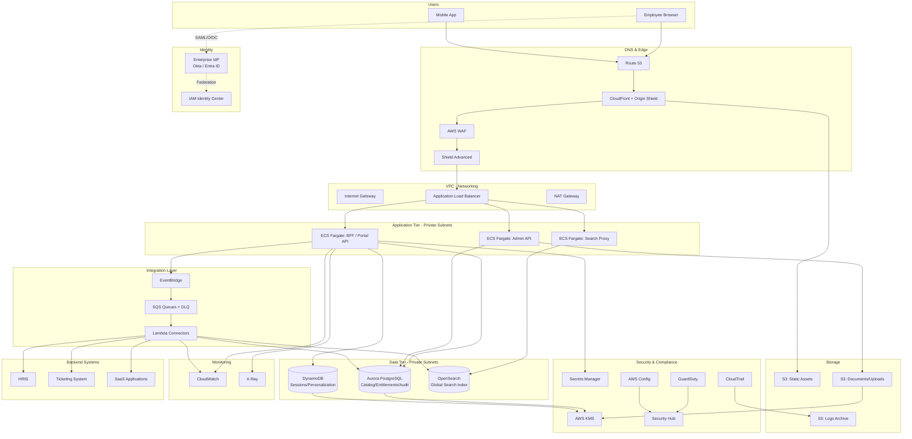

# Part VIII – Enterprise Application Architectures

# Chapter 65 — Enterprise Portal

---

# 1. Executive Summary

Large organizations rarely suffer from a lack of applications. They suffer from too many of them, scattered across business units, each with its own login screen, its own navigation model, and its own idea of what "search" means. A Fortune 500 enterprise commonly runs 200–800 internal applications: HR systems, expense tools, ticketing platforms, knowledge bases, dashboards, procurement systems, and dozens of homegrown tools built by individual departments over a decade or more. Employees waste measurable time every day simply finding the right tool, remembering which credentials apply, and re-learning inconsistent interaction patterns.

The **Enterprise Portal** architecture solves this by acting as a single, authenticated front door into the organization's digital estate. It is not "one more application" — it is the aggregation and orchestration layer that federates identity, content, and functionality from many backend systems into one coherent experience.

## The Business Problem

- Employees juggle 10–40 separate logins across HR, finance, IT, and business-unit tools.
- Knowledge is fragmented across SharePoint sites, wikis, ticketing systems, and file shares.
- Onboarding a new employee often takes days simply to provision access to the tools they need.
- IT support tickets are dominated by "how do I find X" and "I can't log in to Y" — both symptoms of poor aggregation, not poor individual applications.
- Compliance and audit teams cannot answer "who has access to what" without stitching together data from a dozen identity stores.
- Executive reporting requires manually pulling data from disconnected dashboards.

## Architecture Objective

The Enterprise Portal architecture is designed to:

- Provide **single sign-on (SSO)** across every integrated application, internal and SaaS.
- Present a **unified content and application catalog**, personalized by role, department, and entitlement.
- Offer a **composable UI** (widgets, micro-frontends, or iframed panels) so individual teams can publish content without redeploying the portal itself.
- Centralize **search** across documents, applications, and people.
- Serve as the **audit and governance control point** for who can reach what.
- Scale to tens of thousands of concurrent employees globally, with regional latency targets, without becoming a bottleneck for every downstream system.

## Why Organizations Adopt This Architecture

1. **Productivity** — Reducing "time to find" translates directly into recovered labor hours. For a 20,000-employee organization, saving even 5 minutes/day/employee is over 1,600 hours of recovered productivity daily.
2. **Security posture** — Centralizing authentication reduces the attack surface presented by dozens of independently managed login systems, many of which lag behind on MFA, session timeout policy, or password hygiene.
3. **Consistency** — A shared design system and navigation model reduces training costs and support tickets.
4. **Governance** — A portal that mediates access to backend systems is a natural point to enforce entitlement reviews, access certification, and audit logging.
5. **M&A integration** — When companies merge, a portal is frequently the fastest way to give a newly acquired workforce a coherent, branded entry point while backend systems are gradually consolidated or replaced.
6. **Regulatory reporting** — Financial services and healthcare organizations are frequently required to demonstrate access control lineage; a portal with strong identity federation dramatically simplifies these audits.

## Major Business Benefits

| Benefit | Description |
|---|---|
| Reduced support cost | Fewer "how do I access X" tickets; self-service catalog reduces IT desk load |
| Faster onboarding | New hires get role-based access to relevant tools on day one |
| Improved security | Centralized session management, MFA enforcement, and conditional access |
| Better compliance posture | Single point for entitlement review and access logging |
| Higher employee satisfaction | Consistent, modern UI vs. a patchwork of legacy interfaces |
| Data-driven decision making | Centralized analytics on tool usage inform IT investment decisions |

## Typical Enterprise Scenarios

- A global bank consolidating access to 150+ internal tools behind a single portal with region-specific data residency requirements.
- A healthcare system giving clinicians a single pane of glass across EHR systems, scheduling, and internal communications, with strict HIPAA-aligned audit logging.
- A manufacturing conglomerate integrating dozens of subsidiaries acquired over the years, each with different identity providers, behind a unified employee portal.
- A government agency providing a citizen-facing services portal that federates identity across multiple departmental systems while meeting FedRAMP or equivalent controls.
- A retail enterprise providing store associates a portal for scheduling, training, and point-of-sale support tooling, accessed from thousands of physical locations with variable network quality.

## Architecture Objective in One Sentence

> Build a highly available, secure, identity-federated aggregation layer that lets tens of thousands of users reach the right internal or SaaS system in one click, without the portal itself becoming a single point of failure, a security liability, or a performance bottleneck for the systems it fronts.

This chapter walks through the complete production architecture: identity, networking, compute, content aggregation, security, disaster recovery, cost, Terraform implementation, and the operational lessons that only surface after running this pattern in production for years.

---

# 2. Business Requirements

## Business Drivers

- Reduce fragmentation of employee-facing tools.
- Improve time-to-productivity for new hires.
- Strengthen the organization's overall security posture through centralized identity.
- Provide leadership with visibility into tool adoption and usage patterns.
- Support rapid onboarding of newly acquired business units.

## Functional Requirements

| Requirement | Description |
|---|---|
| SSO | Federated authentication across all integrated applications |
| Application catalog | Role-based, searchable directory of internal and SaaS tools |
| Content aggregation | News, announcements, documents, and dashboards surfaced centrally |
| Global search | Cross-system search spanning documents, apps, and people |
| Personalization | Content and app visibility driven by role, department, location |
| Notifications | Centralized inbox for alerts originating from backend systems |
| Self-service access requests | Employees can request access to tools with an approval workflow |
| Admin console | Business owners can publish widgets/tiles without portal redeploys |
| Mobile access | Responsive or native mobile experience |
| Multi-language support | Localization for global workforce |

## Non-Functional Requirements

| Category | Target |
|---|---|
| Availability | 99.95% (portal is a daily-use, business-critical system) |
| Latency (page load, P95) | Under 1.5 seconds for authenticated home page |
| Concurrent users | 50,000+ globally during peak business hours |
| Peak throughput | 5,000+ requests/second at edge |
| Data residency | Region-specific storage for EU/APAC workforce segments |
| Accessibility | WCAG 2.1 AA compliance |
| Browser support | Last two major versions of Chrome, Edge, Safari, Firefox |

## Scalability Goals

- Horizontally scale compute tiers independent of the identity and search tiers.
- Support seasonal spikes (e.g., open enrollment, year-end reporting) of 3–5x normal traffic without manual intervention.
- Onboard new backend integrations (additional SaaS apps, additional identity providers) without architectural rework.

## Availability Requirements

- No single AZ failure should cause a portal outage.
- Regional failure should degrade gracefully (read-only cached mode) rather than causing total unavailability, for organizations with multi-region requirements.
- Identity provider outages (upstream IdP) should not fully lock out users who already hold a valid session, where policy allows.

## Latency Requirements

| User Segment | Target P95 Latency |
|---|---|
| Same-region users | < 300 ms API response |
| Cross-region users (no regional presence) | < 800 ms API response |
| Static assets (via CDN) | < 100 ms |

## Compliance Requirements

Depending on industry, one or more of the following typically apply:

- **SOC 2 Type II** — nearly universal expectation for enterprise SaaS-adjacent platforms.
- **ISO 27001** — common for global enterprises.
- **HIPAA** — if the portal surfaces any healthcare-related content or links to PHI-containing systems.
- **GDPR / regional data protection laws** — if EU employee data is processed or stored.
- **FedRAMP** — for U.S. government-facing deployments.
- **PCI DSS** — rare for an internal portal, but relevant if payment-adjacent tools are integrated.

## Security Expectations

- MFA enforced at the identity provider for all sessions.
- Session timeout and idle timeout policies enforced centrally.
- All traffic encrypted in transit (TLS 1.2+) and at rest (KMS-backed encryption).
- Principle of least privilege for every IAM role in the AWS account.
- Full audit trail of authentication events, access grants, and admin actions.

## Recovery Objectives

| Metric | Target |
|---|---|
| RPO (Recovery Point Objective) | 5 minutes for transactional data (access requests, personalization), near-zero for identity data |
| RTO (Recovery Time Objective) | 30 minutes for full regional failover; under 5 minutes for AZ-level failure (automatic) |

## SLAs

| Tier | Availability Target | Penalty Structure |
|---|---|---|
| Internal SLA (IT to business) | 99.95% monthly | Formal incident review below threshold |
| Vendor SLA (if SaaS components integrated) | Per vendor contract, typically 99.9% | Service credits per vendor terms |

## Expected Workload

- 20,000–100,000 registered users typical for a large enterprise.
- 30–60% daily active usage during business hours.
- Peak concurrency during shift-change windows (retail/manufacturing) or start-of-day (office workforce).

## Expected Growth

- 15–25% year-over-year growth in integrated applications as more teams onboard.
- User base grows with headcount and M&A activity; architecture must absorb step-changes (e.g., +10,000 users overnight from an acquisition) without redesign.

---

# 3. Architecture Overview

## Overall Design

The Enterprise Portal is built as a **layered aggregation platform**:

1. **Edge layer** — CloudFront + WAF + Shield for global distribution, caching, and protection.
2. **Identity layer** — Federated authentication via SAML/OIDC, backed by IAM Identity Center or a third-party IdP (Okta, Azure AD/Entra ID, Ping).
3. **Application layer** — A containerized or serverless backend serving the portal shell, personalization API, and aggregation services.
4. **Integration layer** — EventBridge, SQS, and API-based connectors to backend systems (HRIS, ticketing, SaaS apps).
5. **Data layer** — Aurora for relational data (catalog, entitlements, audit), DynamoDB for high-velocity personalization/session data, OpenSearch for global search.
6. **Storage layer** — S3 for static assets, uploaded documents, and content.
7. **Observability layer** — CloudWatch, X-Ray, CloudTrail, Config, GuardDuty, Security Hub.

## Architecture Philosophy

- **The portal is an aggregator, not a monolith.** It should not become the system of record for anything it doesn't need to own. HR data stays in the HRIS; the portal caches a read-optimized, personalization-relevant subset.
- **Backend systems are integrated via APIs and events, not screen-scraping or tight coupling.** This keeps the portal resilient to backend changes.
- **Micro-frontend or widget model** — individual teams publish "tiles" or "widgets" into the portal via a defined contract (manifest + iframe or Module Federation), so the central platform team is not a bottleneck for every content change.
- **Identity-first design.** Every architectural decision is filtered through "how does this affect the federated identity model," because a portal's core value proposition collapses if SSO is unreliable.
- **Graceful degradation over hard failure.** If a backend integration is down, its tile shows a cached or "unavailable" state — it does not take down the rest of the portal.

## Core Components

| Component | Responsibility |
|---|---|
| CloudFront + WAF | Global edge distribution, caching, DDoS/L7 protection |
| ALB | Regional load balancing across compute tier |
| ECS Fargate (or Lambda) | Portal shell rendering, personalization API, BFF (Backend-for-Frontend) |
| IAM Identity Center / 3rd-party IdP | Federated SSO, MFA enforcement |
| Aurora PostgreSQL | Catalog, entitlements, audit trail, access requests |
| DynamoDB | Session metadata, personalization cache, widget state |
| OpenSearch | Cross-system global search index |
| S3 | Static assets, uploaded files, content repository |
| EventBridge + SQS | Asynchronous integration bus to backend systems |
| Lambda | Event-driven connectors, scheduled sync jobs |
| Secrets Manager | Credentials for backend integrations |
| KMS | Encryption key management |
| CloudWatch / X-Ray | Monitoring, tracing |
| CloudTrail / Config / GuardDuty / Security Hub | Security and compliance monitoring |

## How Components Interact

The portal shell (a React or similar SPA) is served as static assets from S3 via CloudFront. On load, it calls the BFF API (running on ECS Fargate behind an ALB) to retrieve the authenticated user's personalized catalog, notifications, and widget configuration. The BFF authenticates the session against the identity provider (via OIDC token validation), reads entitlements from Aurora, reads/writes session and personalization state to DynamoDB, and queries OpenSearch for search requests. Backend integrations run asynchronously: scheduled Lambda functions or EventBridge-triggered connectors sync catalog metadata, entitlements, and content from source systems into the portal's own data stores, so the live user-facing path never depends synchronously on the availability or performance of 40+ backend systems.

## High-Level Workflow

1. User authenticates via the identity provider (SSO).
2. Portal shell loads from CDN.
3. BFF resolves the user's entitlements and personalized view.
4. Widgets/tiles render, each optionally making its own scoped API call.
5. User interacts with search, navigates to linked applications (deep-linked SSO into target systems), or takes action within embedded widgets.
6. All access and administrative actions are logged for audit.

## Request Lifecycle

Client → DNS (Route 53) → CloudFront (cache check) → \[cache miss\] → ALB → ECS Fargate service → Aurora/DynamoDB/OpenSearch → response bubbles back up, cacheable responses stored at edge.

## Response Lifecycle

Personalization responses are marked non-cacheable (or cached per-user at very short TTL in DynamoDB-backed application cache); static assets and catalog metadata (non-personalized) are aggressively cached at CloudFront with cache invalidation triggered by content publishing events.

## Data Lifecycle

- **Catalog and entitlement data**: sourced from HRIS/IdP nightly and on-demand sync, stored in Aurora, cached in DynamoDB for low-latency reads.
- **Search index**: rebuilt incrementally via EventBridge-triggered indexing Lambdas whenever source content changes.
- **Audit data**: written synchronously to Aurora (for transactional integrity) and streamed to S3/OpenSearch for long-term retention and analysis.
- **Session data**: stored in DynamoDB with TTL-based expiry aligned to the organization's idle-timeout policy.

---

# 4. AWS Services Used

## Compute

### ECS Fargate

- **Purpose**: Runs the portal BFF, personalization API, and widget-serving services without managing EC2 instances.
- **Why selected**: The portal's compute needs are steady-state with predictable diurnal patterns (business hours) punctuated by occasional spikes; Fargate removes patching and capacity-planning overhead while integrating cleanly with ALB, IAM task roles, and Auto Scaling.
- **Alternatives**: EKS (more control, more operational overhead — appropriate if the organization already runs a shared Kubernetes platform); Lambda (viable for the BFF if request patterns are highly spiky and stateless, but cold starts and 15-minute execution limits complicate long-lived WebSocket-style notification features).
- **Limitations**: Task startup time (tens of seconds) makes very bursty scale-to-zero patterns less efficient than Lambda; requires more hands-on capacity planning than pure serverless.
- **Pricing considerations**: Billed per vCPU/memory-second; right-sizing tasks matters — over-provisioned Fargate tasks are one of the most common cost leaks in portal architectures.
- **Best practices**: Use Fargate Spot for non-critical background workers; set target-tracking Auto Scaling on request count per target and CPU; separate the BFF service from background sync workers so scaling policies don't conflict.

### AWS Lambda

- **Purpose**: Event-driven backend connectors (syncing catalog/entitlement data), scheduled jobs, and lightweight API endpoints (e.g., search-index updates).
- **Why selected**: Most integration jobs are short-lived, bursty, and event-triggered — a natural fit for Lambda's pay-per-invocation model.
- **Alternatives**: ECS scheduled tasks (better for long-running or high-memory sync jobs exceeding Lambda's 15-minute limit).
- **Limitations**: 15-minute max execution time; cold starts can affect latency-sensitive paths (mitigate with provisioned concurrency for user-facing functions only).
- **Pricing considerations**: Very cost-effective for spiky, low-volume integration workloads; can become expensive if used for sustained high-throughput traffic better suited to Fargate.
- **Best practices**: One function per integration responsibility; use Lambda Powertools for structured logging/tracing; keep functions stateless and idempotent since retries are common with SQS/EventBridge triggers.

## Edge and Delivery

### CloudFront

- **Purpose**: Global CDN distributing static assets (JS/CSS/images) and caching cacheable API responses (non-personalized catalog metadata).
- **Why selected**: Reduces latency for a globally distributed workforce and offloads static asset traffic from origin compute, which is critical when tens of thousands of users load the portal shell simultaneously at shift start.
- **Alternatives**: Akamai/Cloudflare (viable, but adds a second vendor relationship and loses tight IAM/WAF integration with the rest of the AWS estate).
- **Limitations**: Cache invalidation adds operational complexity for frequently changing content; misconfigured caching of personalized responses is a serious security risk (user A seeing user B's cached response).
- **Pricing considerations**: Data transfer out is typically the dominant cost; regional edge caches reduce origin fetches.
- **Best practices**: Use cache-control headers explicitly rather than relying on defaults; never cache personalized/authenticated JSON responses at CloudFront unless using signed, per-user cache keys with extreme care; enable Origin Shield for high-traffic origins.

### AWS WAF

- **Purpose**: Layer 7 protection against SQLi, XSS, credential stuffing, and bot traffic targeting the login and API surfaces.
- **Why selected**: A portal is a high-value target — it's the front door to dozens of internal systems, making it a prime credential-stuffing target.
- **Alternatives**: Third-party WAF (Cloudflare, Imperva) — sometimes chosen for advanced bot management, but adds integration complexity.
- **Limitations**: Rule tuning requires ongoing effort to avoid false positives blocking legitimate enterprise traffic (e.g., corporate NAT IPs generating high request volume).
- **Best practices**: Use AWS Managed Rule Groups as a baseline, add custom rate-based rules on login endpoints, integrate with GuardDuty/Security Hub findings for adaptive rules.

### AWS Shield (Standard / Advanced)

- **Purpose**: DDoS protection at the network and transport layer.
- **Why selected**: Standard is included by default; Advanced is justified for a business-critical, internet-facing portal where DDoS-driven downtime has direct productivity cost.
- **Alternatives**: None meaningfully replace Shield within the AWS ecosystem; on-prem scrubbing centers are legacy approaches.
- **Pricing considerations**: Shield Advanced has a meaningful annual commitment cost — justify it based on the criticality of portal uptime.

## Application Delivery

### Application Load Balancer (ALB)

- **Purpose**: Regional Layer 7 load balancing across ECS Fargate tasks, path-based routing to different backend services (BFF, search proxy, admin API).
- **Why selected**: Native integration with ECS service discovery, target group health checks, and WAF.
- **Alternatives**: Network Load Balancer (only if raw TCP performance or static IPs are required — not typical for a portal's HTTP workload).
- **Best practices**: Enable access logging to S3, use host/path-based routing to cleanly separate services, configure deregistration delay to avoid dropped connections during deploys.

## Data Stores

### Amazon Aurora (PostgreSQL-compatible)

- **Purpose**: System of record for the application/content catalog, entitlements, access requests, and audit trail.
- **Why selected**: Relational integrity matters for entitlements and audit data (who has access to what, when it was granted, by whom); Aurora's storage auto-scaling and read replica model fit a read-heavy, moderately-write workload well.
- **Alternatives**: RDS PostgreSQL (simpler, lower cost, less built-in HA — reasonable for a smaller-scale portal); DynamoDB alone (poor fit for complex relational entitlement queries and audit joins).
- **Limitations**: Higher baseline cost than RDS; requires more careful connection management (use RDS Proxy) under high concurrency from Fargate tasks.
- **Best practices**: Use Aurora Global Database if true multi-region read locality is required; use RDS Proxy to pool connections from bursty Fargate scaling events; enable Performance Insights.

### Amazon DynamoDB

- **Purpose**: Session state, personalization cache, per-user widget layout, notification inbox.
- **Why selected**: Single-digit millisecond latency at scale for access-pattern-driven data that doesn't need complex relational queries; TTL support is ideal for session expiry.
- **Alternatives**: ElastiCache (Redis) — often used alongside DynamoDB specifically for session caching; the two are complementary rather than mutually exclusive in mature deployments.
- **Limitations**: Requires careful access-pattern-first data modeling; not suited for ad hoc analytical queries (export to S3/Athena for that).
- **Best practices**: Use on-demand capacity mode initially, move to provisioned with auto scaling once traffic patterns stabilize (materially cheaper at scale); use single-table design carefully — for a portal with genuinely distinct access patterns (sessions vs. widget state vs. notifications), separate tables are often more maintainable than forcing single-table design.

### Amazon OpenSearch Service

- **Purpose**: Powers the cross-system global search experience (documents, apps, people).
- **Why selected**: Purpose-built for full-text search with relevance ranking, faceting, and near-real-time indexing — capabilities relational databases handle poorly at scale.
- **Alternatives**: Amazon Kendra (better out-of-the-box relevance/NLP for enterprise search, higher cost, less indexing flexibility); self-managed Elasticsearch (more control, materially more operational burden).
- **Limitations**: Cluster sizing and shard management require ongoing tuning; reindexing large corpora can be resource-intensive.
- **Best practices**: Use index aliases for zero-downtime reindexing; isolate the search tier's compute from the transactional data tier so a reindex job cannot degrade portal responsiveness.

## Storage

### Amazon S3

- **Purpose**: Static asset hosting (portal shell build artifacts), uploaded document storage, content repository backing the CMS-like features of the portal, log storage.
- **Why selected**: Effectively unlimited scale, strong durability, native lifecycle management, and deep integration with CloudFront.
- **Best practices**: Separate buckets by function (assets, uploads, logs) with distinct lifecycle policies and access policies; enable versioning on content buckets; block all public access at the account level and use CloudFront Origin Access Control instead.

## Messaging and Integration

### Amazon EventBridge

- **Purpose**: Central event bus for content-publish events, entitlement-change events, and backend system webhooks.
- **Why selected**: Decouples the portal from the dozens of backend systems it integrates with; supports schema registry and content-based routing, which matters when connector count grows into the dozens.
- **Alternatives**: SNS+SQS (simpler, sufficient for lower-complexity fan-out; EventBridge adds routing rules and third-party SaaS event source integrations that are valuable at enterprise scale).

### Amazon SQS

- **Purpose**: Buffering and reliable delivery for asynchronous work (indexing jobs, entitlement sync, notification delivery).
- **Why selected**: Decouples producers (event bus, scheduled jobs) from consumers (Lambda/Fargate workers), absorbing backend system slowness without impacting the user-facing path.
- **Best practices**: Use dead-letter queues on every consumer; set visibility timeout comfortably above worst-case processing time.

## Identity and Security

### IAM Identity Center (successor to AWS SSO)

- **Purpose**: Central identity broker if the organization is standardizing on AWS-native identity federation, or as the AWS-account-access layer even when a third-party IdP (Okta/Entra ID) is the actual employee-facing IdP.
- **Why selected**: Provides a clean SAML/OIDC federation point and simplifies permission-set management across AWS accounts if the portal spans a multi-account landing zone.
- **Alternatives**: Okta, Azure AD/Entra ID, Ping Identity — in the vast majority of large enterprises, one of these (not IAM Identity Center) is the actual employee-facing IdP, with IAM Identity Center or direct OIDC federation used to connect AWS-hosted applications to it.
- **Best practices**: Never build a portal-specific user directory; always federate to the existing enterprise IdP to avoid a second source of truth for identity.

### IAM (core service)

- **Purpose**: Governs every AWS-level permission: ECS task roles, Lambda execution roles, CI/CD deployment roles.
- **Best practices**: Least privilege per service, permission boundaries for any role that can create other roles, no long-lived access keys — use role assumption everywhere.

### VPC

- **Purpose**: Network isolation for compute and data tiers.
- **Best practices**: Private subnets for compute and data, public subnets only for load balancers/NAT.

### Route 53

- **Purpose**: DNS for the portal domain, health-check-based failover routing for multi-region deployments.
- **Best practices**: Use latency-based or geoproximity routing for global user bases; health checks tied to actual application health endpoints, not just TCP reachability.

### AWS KMS

- **Purpose**: Encryption key management for Aurora, DynamoDB, S3, Secrets Manager.
- **Best practices**: Use customer-managed keys (CMKs) rather than AWS-managed keys for anything covered by compliance scope, enabling key rotation policy and access auditing.

### AWS Secrets Manager

- **Purpose**: Storing credentials/API keys for the dozens of backend system integrations.
- **Why selected**: Automatic rotation support and fine-grained IAM-based access control per secret, critical when many different connector Lambdas need scoped access to different credentials.
- **Alternatives**: SSM Parameter Store (SecureString) — lower cost, lacks native rotation; reasonable for lower-sensitivity config values, not ideal as the sole store for high-value integration credentials at enterprise scale.

### AWS Systems Manager

- **Purpose**: Patch management for any remaining EC2 instances (e.g., self-managed OpenSearch nodes if not using the managed service), Session Manager for break-glass access without bastion hosts, Parameter Store for non-secret configuration.

## Monitoring and Compliance

### CloudWatch

- **Purpose**: Metrics, logs, dashboards, alarms across every layer.

### CloudTrail

- **Purpose**: Full audit trail of every AWS API call — essential for compliance evidence and incident forensics.

### AWS Config

- **Purpose**: Continuous compliance checking against organizational rules (e.g., "no public S3 buckets," "all Aurora clusters encrypted").

### GuardDuty

- **Purpose**: Threat detection across the account (anomalous API calls, compromised credentials, crypto-mining activity).

### AWS Security Hub

- **Purpose**: Aggregates findings from GuardDuty, Config, Inspector, and third-party tools into a single compliance/security posture dashboard.

---

# 5. Complete Architecture Diagram



---

# 6. Component-by-Component Explanation

## Portal Shell (S3 + CloudFront)

- **Purpose**: Deliver the static single-page application (SPA) that renders the portal UI.
- **Responsibilities**: Serve JS/CSS/HTML bundles; bootstrap the client-side app; initiate authentication redirect.
- **Inputs**: Build artifacts from CI/CD pipeline.
- **Outputs**: Rendered UI to the browser.
- **Scaling**: Effectively infinite via CloudFront edge caching.
- **High availability**: Multi-edge-location by design; S3 origin is regionally redundant (11 nines durability).
- **Failure handling**: CloudFront serves stale cached content if origin is briefly unavailable, when configured with appropriate `stale-while-revalidate`/error caching behavior.
- **Dependencies**: S3 bucket, CloudFront distribution, ACM certificate.
- **Security**: Origin Access Control restricts direct S3 access; CSP headers enforced at CloudFront Functions/Lambda@Edge.
- **Monitoring**: CloudFront real-time logs, cache hit ratio dashboards.

## BFF / Portal API (ECS Fargate)

- **Purpose**: Backend-for-frontend serving personalization, catalog, and aggregation APIs.
- **Responsibilities**: Validate session tokens, resolve entitlements, aggregate widget data, proxy authenticated calls to backend systems where synchronous access is required.
- **Inputs**: HTTPS requests from portal shell, OIDC tokens.
- **Outputs**: JSON API responses.
- **Scaling**: Target-tracking Auto Scaling on ALB request count per target and CPU utilization.
- **High availability**: Minimum 2 tasks per AZ across 3 AZs; ALB health checks remove unhealthy tasks automatically.
- **Failure handling**: Circuit breakers around backend integration calls; graceful degradation (partial page render) if a specific widget's data source is unavailable.
- **Dependencies**: Aurora, DynamoDB, Secrets Manager, identity provider token validation endpoint.
- **Security**: Runs with a scoped IAM task role; no long-lived credentials; validates JWT signature and audience on every request.
- **Monitoring**: X-Ray traces per request, CloudWatch custom metrics for entitlement-resolution latency.

## Identity Federation Layer

- **Purpose**: Authenticate users once and issue tokens the portal and downstream systems trust.
- **Responsibilities**: SAML/OIDC assertion issuance, MFA enforcement, conditional access policy evaluation (device posture, location).
- **Dependencies**: Enterprise IdP (Okta/Entra ID/Ping), IAM Identity Center for AWS-side federation.
- **Failure handling**: If the IdP is degraded, existing valid sessions should continue to function until natural expiry; new logins fail closed (no bypass).
- **Security**: This is the single highest-value target in the architecture — enforce MFA, monitor for anomalous login patterns via GuardDuty and IdP-native risk signals.

## Aurora PostgreSQL Cluster

- **Purpose**: System of record for catalog, entitlements, audit trail.
- **Scaling**: Aurora Auto Scaling for read replicas based on CPU/connections; storage auto-scales up to 128 TB.
- **High availability**: Multi-AZ cluster with automatic failover (typically under 30 seconds); at least one reader in a second AZ.
- **Failure handling**: Automated failover to a reader promoted to writer; application retries with exponential backoff via RDS Proxy.
- **Dependencies**: KMS for encryption, RDS Proxy for connection pooling, Secrets Manager for credential rotation.
- **Security**: Encrypted at rest and in transit; network-isolated in private data subnets; access restricted to application security groups only.
- **Monitoring**: Performance Insights, CloudWatch alarms on CPU/connections/replica lag.

## DynamoDB Tables (Sessions, Personalization, Notifications)

- **Purpose**: Low-latency, high-throughput state storage.
- **Scaling**: On-demand or auto-scaled provisioned capacity.
- **High availability**: Natively multi-AZ; Global Tables if multi-region active-active is required.
- **Failure handling**: Built-in retries in SDK; conditional writes prevent race conditions on concurrent session updates.
- **Security**: Encrypted with KMS CMK; fine-grained IAM policies scoped per table/action.

## OpenSearch Cluster

- **Purpose**: Global search across documents, applications, and people.
- **Scaling**: Add data nodes horizontally; dedicated master nodes for cluster stability at scale.
- **High availability**: Multi-AZ deployment with zone awareness enabled; minimum 3 dedicated master nodes to avoid split-brain.
- **Failure handling**: Replica shards absorb node failure without data loss; index snapshots to S3 for disaster recovery.
- **Security**: VPC-only access, fine-grained access control, encryption at rest and in transit.

## EventBridge + SQS + Lambda Connectors

- **Purpose**: Asynchronous integration bus to dozens of backend systems.
- **Responsibilities**: Sync catalog metadata, entitlement changes, content updates without coupling the live user path to backend availability.
- **Scaling**: Lambda scales automatically with SQS queue depth (via event source mapping); EventBridge scales natively.
- **Failure handling**: Dead-letter queues capture failed messages for replay; per-connector isolation means one failing integration doesn't block others.
- **Security**: Each connector Lambda has a scoped IAM role and its own Secrets Manager secret — no shared "god credential" across integrations.

---

# 7. End-to-End Request Flow

1. **Client initiates request** — Employee opens the portal URL in a browser.
2. **DNS resolution** — Route 53 resolves the domain, potentially using latency-based routing to the nearest regional CloudFront/ALB pairing.
3. **CloudFront edge check** — CloudFront checks whether the requested static asset is cached at the edge location.
4. **WAF evaluation** — AWS WAF evaluates the request against managed and custom rules (rate limiting, known bad signatures) before forwarding.
5. **Authentication redirect (first visit)** — If no valid session cookie/token exists, the portal shell redirects the browser to the enterprise IdP for SAML/OIDC authentication.
6. **MFA challenge** — The IdP enforces MFA per organizational policy.
7. **Token issuance** — Upon successful authentication, the IdP issues a signed OIDC token/SAML assertion back to the portal.
8. **Session establishment** — The BFF validates the token, establishes a session record in DynamoDB, and sets a secure, HttpOnly session cookie.
9. **ALB routing** — Subsequent API calls route through the ALB to healthy ECS Fargate BFF tasks.
10. **Entitlement resolution** — The BFF queries Aurora (or a DynamoDB-cached projection) for the user's role-based entitlements.
11. **Personalized catalog assembly** — The BFF assembles the widget/tile list the user is entitled to see.
12. **Parallel widget data fetch** — Each widget's backing data (notifications, tickets, announcements) is fetched in parallel, with per-widget timeouts to avoid one slow backend blocking the whole page.
13. **Search query (if invoked)** — Search requests route to the Search Proxy service, which queries OpenSearch and applies entitlement-based result filtering (a user should never see search results for content they can't access).
14. **Caching** — Non-personalized catalog metadata responses are cached at CloudFront with short TTLs; personalized responses are never edge-cached.
15. **Deep-link SSO to backend system** — When the user clicks a tile, the portal either performs an IdP-initiated SSO redirect to the target system or exchanges a token for a scoped access grant, depending on the integration pattern.
16. **Logging** — Every authentication event, entitlement check, and admin action is logged to CloudWatch Logs and streamed to S3/CloudTrail for audit retention.
17. **Monitoring** — X-Ray captures the full trace across ALB → Fargate → Aurora/DynamoDB/OpenSearch for latency breakdown.
18. **Error handling** — If a widget's backend call fails or times out, the BFF returns a partial response with a per-widget error state; the overall page still renders. Full request failures return a structured error the frontend renders as a friendly retry prompt, never a raw stack trace.
19. **Response delivery** — Assembled response returns to CloudFront (if cacheable) or directly to the client, rendered by the SPA.
20. **Session refresh** — Background token refresh occurs silently before expiry to avoid mid-session interruption.

---

# 8. Deployment Flow

## Infrastructure Provisioning

Infrastructure is provisioned entirely through Terraform, organized into layered state:

1. **Foundation layer** — VPC, subnets, route tables, NAT gateways, Transit Gateway attachment (if part of a larger landing zone).
2. **Data layer** — Aurora cluster, DynamoDB tables, OpenSearch domain, S3 buckets.
3. **Application layer** — ECS cluster, task definitions, ALB, target groups.
4. **Identity/security layer** — IAM roles, KMS keys, Secrets Manager secrets, WAF rules.
5. **Application deployment** — Container images built and pushed via CI/CD; ECS service updated via rolling or blue-green deployment.

## Terraform Workflow

1. Developer opens a pull request modifying Terraform configuration.
2. CI pipeline runs `terraform fmt -check`, `terraform validate`, and `tflint`.
3. `terraform plan` output posted as a PR comment for review.
4. Security scanning (`tfsec` / `checkov`) runs against the plan.
5. Peer review and approval required before merge.
6. On merge to main, CI runs `terraform apply` against a locked remote state (S3 + DynamoDB lock table), typically gated by a manual approval step for production.

## CI/CD Deployment (Application)

1. Code merged to main branch triggers build pipeline.
2. Container image built, scanned for vulnerabilities (Inspector or third-party scanner), pushed to ECR.
3. New task definition revision registered.
4. ECS service updated using a blue-green deployment strategy (via CodeDeploy or equivalent).
5. Health checks validate the new task set before shifting traffic.
6. Automated smoke tests run against the new environment.
7. Traffic gradually shifted; automatic rollback triggered if error rate or latency thresholds are breached.

## Blue-Green Deployment

- Two target groups (blue = current, green = new) behind the same ALB listener.
- CodeDeploy shifts traffic incrementally (e.g., 10% → 50% → 100%) with automated CloudWatch alarm-based rollback triggers.
- Database migrations are handled separately and must be backward-compatible with both the outgoing and incoming application versions during the transition window (expand/contract migration pattern).

## Rollback

- Application rollback: revert to the previous ECS task definition revision; CodeDeploy supports automatic rollback on alarm breach.
- Infrastructure rollback: revert Terraform PR and re-apply; state locking prevents concurrent conflicting applies.

## Secrets

- All runtime secrets (backend integration API keys, database credentials) sourced from Secrets Manager at container startup — never baked into images or environment variables in plaintext.
- Database credentials rotated automatically via Secrets Manager rotation Lambdas.

## Configuration

- Non-secret configuration (feature flags, integration endpoints) managed via SSM Parameter Store, loaded at task startup, with environment-specific parameter hierarchies (`/portal/prod/...`, `/portal/staging/...`).

## Validation

- Post-deployment automated checks: health endpoint, synthetic login flow (Canary via CloudWatch Synthetics), key API contract tests.
- Manual validation checklist for major releases: SSO flow, search functionality, at least one representative widget from each integrated backend system.

---

# 9. Network Topology

## VPC

A dedicated VPC (or a spoke VPC within a hub-and-spoke landing zone) hosts the portal's compute and data tiers, isolated from other workloads.

## CIDR

Example allocation for a /20 VPC (4,096 addresses), sized to accommodate Fargate ENI density and future growth:

| Subnet Tier | CIDR Example | AZ |
|---|---|---|
| Public A | 10.20.0.0/24 | us-east-1a |
| Public B | 10.20.1.0/24 | us-east-1b |
| Public C | 10.20.2.0/24 | us-east-1c |
| App Private A | 10.20.16.0/22 | us-east-1a |
| App Private B | 10.20.20.0/22 | us-east-1b |
| App Private C | 10.20.24.0/22 | us-east-1c |
| Data Private A | 10.20.32.0/24 | us-east-1a |
| Data Private B | 10.20.33.0/24 | us-east-1b |
| Data Private C | 10.20.34.0/24 | us-east-1c |

> **Note:** App tier subnets are sized larger (/22) because Fargate tasks each consume an ENI/IP; underestimating this is a common source of "cannot place task, no IP addresses available" incidents during scale-out events.

## Public Subnets

Host only the ALB and NAT Gateways. No application compute or data resources ever reside here.

## Private Subnets

- **App private subnets**: ECS Fargate tasks, Lambda functions configured for VPC access.
- **Data private subnets**: Aurora, DynamoDB VPC endpoints, OpenSearch — isolated further from the app tier via dedicated security groups.

## NAT Gateway

One NAT Gateway per AZ (not a single shared NAT) to avoid a cross-AZ single point of failure and cross-AZ data transfer charges for outbound traffic.

## Internet Gateway

Attached at the VPC level, routes only reachable from public subnets.

## Transit Gateway

Used when the portal VPC must reach shared services (centralized logging, on-prem connectivity via Direct Connect, other application VPCs) in a multi-account landing zone. Avoids the operational complexity of a full mesh of VPC peering connections as the number of connected VPCs grows.

## Route Tables

- Public subnet route table: default route to Internet Gateway.
- Private app subnet route tables: default route to NAT Gateway (per-AZ), specific routes to Transit Gateway for internal service reachability.
- Private data subnet route tables: no default internet route at all; only routes to VPC endpoints and peer/TGW routes required for replication or cross-account access.

## Network ACLs

Stateless, coarse-grained boundary defense layered beneath security groups — typically default-allow within the VPC with explicit deny rules for known-bad ranges, since security groups do the fine-grained work.

## Security Groups

| Security Group | Inbound From | Purpose |
|---|---|---|
| alb-sg | 443 from 0.0.0.0/0 (via WAF/CloudFront) | Public entry point |
| app-sg | 443/8080 from alb-sg only | ECS Fargate tasks |
| data-sg | 5432 from app-sg only | Aurora |
| search-sg | 443 from app-sg only | OpenSearch |
| lambda-sg | N/A (outbound only rules) | Integration connectors |

## PrivateLink

Used for:
- Accessing AWS service APIs (S3, Secrets Manager, KMS, ECR) via VPC endpoints without traversing the public internet — reduces NAT Gateway data processing costs and improves security posture.
- Consuming SaaS backend integrations that offer PrivateLink endpoints, avoiding public internet exposure for sensitive integration traffic.

## Hybrid Connectivity

For enterprises with significant on-premises footprint (legacy HRIS, on-prem Active Directory as the IdP source), Direct Connect (with a VPN backup path) connects the landing zone to on-prem data centers via Transit Gateway, allowing the portal's Lambda connectors to reach on-prem systems securely.

---

# 10. Identity and Access

## IAM Roles

Every compute component runs under a distinct, narrowly scoped IAM role:

- `portal-bff-task-role` — read/write to specific DynamoDB tables, read from Aurora via IAM auth or Secrets Manager, no S3 write access.
- `portal-admin-task-role` — broader write access for catalog management, scoped to specific S3 prefixes.
- `connector-hris-lambda-role` — read access to a single Secrets Manager secret, write access to a single SQS queue and Aurora table.
- `ci-cd-deploy-role` — scoped to ECS deployment actions only, assumed via OIDC federation from the CI/CD system (no static AWS credentials stored in CI).

## IAM Policies

Written per least-privilege principle, scoped to specific resource ARNs rather than wildcards wherever feasible. Example fragment (illustrative, not exhaustive):

```json

{
  "Version": "2012-10-17",
  "Statement": [
    {
      "Sid": "DynamoDBSessionAccess",
      "Effect": "Allow",
      "Action": [
        "dynamodb:GetItem",
        "dynamodb:PutItem",
        "dynamodb:UpdateItem",
        "dynamodb:DeleteItem"
      ],
      "Resource": "arn:aws:dynamodb:us-east-1:123456789012:table/portal-sessions"
    },
    {
      "Sid": "SecretsReadOnly",
      "Effect": "Allow",
      "Action": ["secretsmanager:GetSecretValue"],
      "Resource": "arn:aws:secretsmanager:us-east-1:123456789012:secret:portal/db-credentials-*"
    }
  ]
}

```

## Resource Policies

- S3 bucket policies deny any non-TLS (`aws:SecureTransport: false`) access.
- Secrets Manager resource policies restrict which IAM principals can retrieve a given secret, in addition to the identity-based policy on the caller.
- KMS key policies explicitly enumerate which roles may `Decrypt`/`GenerateDataKey`, preventing accidental over-grant via IAM policy alone.

## STS

Short-lived credentials via `AssumeRole` used everywhere: CI/CD pipelines federate via OIDC to assume a deployment role rather than storing static AWS access keys; cross-account access (e.g., a shared logging account) uses `AssumeRole` with external ID conditions.

## Cross-Account Access

In a multi-account landing zone, the portal typically lives in its own workload account, with:
- A **shared services account** for centralized logging (CloudTrail, Config aggregator).
- A **security tooling account** for GuardDuty/Security Hub aggregation.
- Cross-account roles trusted only from specific source accounts, with `sts:ExternalId` conditions where third parties are involved.

## Least Privilege

- No IAM role in the portal architecture uses `*` for both Action and Resource.
- Periodic IAM Access Analyzer review identifies unused permissions for right-sizing.
- Break-glass admin access is a separate, tightly monitored role requiring approval workflow, never used for day-to-day operations.

## Service Roles

- ECS task execution role (pulls images, writes logs) is distinct from the task role (application runtime permissions) — a common point of confusion that, when collapsed into one overly broad role, violates least privilege.

## Permission Boundaries

Applied to any role capable of creating other IAM roles (e.g., a platform-team CI/CD role that provisions per-service roles), capping the maximum permissions any created role can ever have — a critical control preventing privilege escalation via infrastructure automation.

---

# 11. Security Architecture

## Encryption

- **At rest**: Aurora, DynamoDB, OpenSearch, S3, and EBS (where applicable) all encrypted using customer-managed KMS keys.
- **In transit**: TLS 1.2+ enforced at CloudFront, ALB listeners, and between application tier and data tier (Aurora enforces SSL, DynamoDB/OpenSearch use TLS endpoints by default).

## KMS

- Separate CMKs per data classification tier (e.g., one key for PII-adjacent audit data, one for general application data) to allow differentiated access policies and simplify blast-radius analysis if a key is ever compromised.
- Automatic annual key rotation enabled.

## TLS

- ACM-issued certificates for CloudFront and ALB, auto-renewed.
- Minimum TLS 1.2, with TLS 1.3 preferred where client compatibility allows.

## WAF

- Managed rule groups: Core Rule Set, Known Bad Inputs, IP Reputation List.
- Custom rate-based rule on `/login` and `/api/auth/*` paths to blunt credential-stuffing attempts.
- Custom rules to allow-list corporate egress IP ranges at higher rate thresholds where legitimate NAT-aggregated traffic would otherwise trip generic rate limits.

## Shield

- Shield Standard covers baseline network/transport layer DDoS protection automatically.
- Shield Advanced justified given the portal's business-critical status, providing cost protection during DDoS events and access to the AWS DDoS Response Team.

## Secrets Manager

- Every backend integration credential stored as a distinct secret with automatic rotation configured where the target system supports it.
- IAM conditions restrict which roles can access which secret prefixes.

## Certificate Manager

- Manages TLS certificates for the portal domain and any custom domains used for backend deep-linking.

## GuardDuty

- Enabled account-wide; monitors for anomalous API activity, compromised credential indicators, and unusual data exfiltration patterns from the VPC (e.g., DNS exfiltration attempts).

## Inspector

- Continuous vulnerability scanning of container images in ECR and any remaining EC2/Lambda runtime dependencies.

## Security Hub

- Aggregates findings from GuardDuty, Config, Inspector, and Macie (if deployed for S3 content classification) into a single prioritized view, mapped to CIS AWS Foundations Benchmark and relevant industry frameworks.

## CloudTrail

- Organization-level trail capturing management and data events, delivered to a centralized, access-restricted S3 bucket in the logging account with object lock enabled for tamper resistance.

## AWS Config

- Rules enforcing: encrypted Aurora/DynamoDB, no public S3 buckets, MFA on root/privileged users, security groups with no unrestricted ingress on sensitive ports.

## Zero Trust

- No implicit trust based on network location alone; every request is authenticated and authorized at the application layer regardless of whether it originates "inside" the corporate network.
- Service-to-service calls within the VPC still require valid IAM-signed requests or mTLS where applicable — network segmentation is defense-in-depth, not the sole control.

## Threat Model

| Threat | Likelihood | Impact | Primary Mitigation |
|---|---|---|---|
| Credential stuffing against SSO | High | High | MFA, WAF rate limiting, IdP risk-based auth |
| Compromised backend integration credential | Medium | High | Per-integration scoped secrets, rotation, least privilege |
| Session hijacking via XSS | Medium | High | CSP headers, HttpOnly/Secure cookies, input sanitization |
| Insider over-entitlement | Medium | Medium | Periodic access review, least privilege catalog design |
| DDoS against public endpoint | Medium | Medium | Shield Advanced, WAF, CloudFront absorption |
| Data exfiltration via misconfigured S3 | Low | High | Block Public Access, Config rules, Macie monitoring |

## Attack Vectors and Mitigations

- **Phishing leading to credential theft** → mitigated primarily at the IdP layer (MFA, conditional access), not something the portal architecture itself can fully solve — call this out explicitly to stakeholders so expectations are set correctly.
- **Supply chain compromise of a third-party npm/pip dependency** → mitigated via dependency scanning in CI, SBOM generation, and Inspector continuous monitoring.
- **Misconfigured widget iframe allowing clickjacking** → mitigated via `X-Frame-Options`/`frame-ancestors` CSP directives and strict widget manifest validation.

---

# 12. High Availability

## AZ Failures

- ECS Fargate tasks distributed across 3 AZs minimum; ALB automatically routes only to healthy targets.
- Aurora writer failover to a same-region reader in another AZ, typically completing in under 30 seconds.
- DynamoDB and S3 are inherently multi-AZ with no configuration required.

## Instance Failures

- Not directly applicable to Fargate (no EC2 instance management), but underlying capacity failures are handled transparently by AWS; ECS service scheduler replaces failed tasks automatically.

## Regional Failures

- For organizations with a true multi-region requirement (see Section 13), Route 53 health-check-based failover redirects traffic to a secondary region.
- For single-region deployments, regional failure is accepted as an RTO-bounded DR event rather than instant failover — a deliberate cost/complexity trade-off (see Section 28).

## Database Failures

- Aurora automated backups and continuous backup to S3 (via the underlying storage layer) support point-in-time recovery.
- DynamoDB point-in-time recovery enabled on all tables holding non-reconstructable state.

## Load Balancing

- ALB health checks configured against a dedicated `/healthz` endpoint that verifies downstream dependency reachability (Aurora, DynamoDB) — not just process liveness — so a task that's "up" but can't reach its database is correctly marked unhealthy and removed from rotation.

## Health Checks

| Check | Frequency | Threshold |
|---|---|---|
| ALB target health | 15s interval | 2 consecutive failures = unhealthy |
| Route 53 health check (multi-region) | 30s interval | 3 consecutive failures = failover |
| ECS container health check | 30s interval | 3 consecutive failures = task replaced |

## Failover

- Application-layer failover (ALB → healthy task) is automatic and sub-minute.
- Database-layer failover (Aurora) is automatic, typically 15–30 seconds, with connection retry logic in the application (via RDS Proxy) masking most of this from end users.
- Regional failover (if applicable) is either automated via Route 53 health checks (for warm standby) or manually triggered (for pilot-light) depending on the chosen DR tier.

---

# 13. Disaster Recovery

## Backup Strategy

| Data Store | Backup Method | Frequency | Retention |
|---|---|---|---|
| Aurora | Automated snapshots + continuous backup | Continuous (5-min PITR granularity) | 35 days, plus monthly snapshot to cold storage for 1 year |
| DynamoDB | Point-in-time recovery + on-demand backups | Continuous | 35 days PITR, quarterly on-demand backups retained 1 year |
| OpenSearch | Automated snapshots to S3 | Daily | 30 days |
| S3 (documents/assets) | Versioning + cross-region replication | Continuous | Per lifecycle policy, typically 1–7 years for compliance content |

## Snapshots

Automated Aurora snapshots are encrypted with the same CMK as the source cluster; cross-region snapshot copy is configured for the DR region if a multi-region strategy is in scope.

## Cross-Region Replication

- S3 Cross-Region Replication (CRR) for document/asset buckets to the DR region.
- Aurora Global Database (if warranted by RTO requirements) provides sub-second replication lag to a secondary region with a promotable reader cluster.
- DynamoDB Global Tables for session/personalization data if active-active or fast-failover across regions is required.

## Pilot Light

- Minimal DR posture: replicated data (via the mechanisms above) exists in the DR region, but compute infrastructure is not running — Terraform is applied to stand up ECS services, ALB, and networking only when a DR event is declared.
- Lower cost, longer RTO (typically 1–4 hours depending on automation maturity).
- Appropriate for organizations where portal downtime is inconvenient but not existentially costly.

## Warm Standby

- Scaled-down but running compute in the DR region at all times (e.g., minimum task count), scaled up rapidly during failover.
- Meaningfully lower RTO (15–30 minutes) at meaningfully higher steady-state cost.
- Recommended posture for the 99.95%-availability requirement stated in Section 2.

## Multi-Site (Active-Active)

- Both regions actively serving production traffic, with Route 53 latency-based routing distributing load.
- Requires Aurora Global Database write-forwarding or a write-locality strategy (e.g., regional write partitioning) since Aurora Global Database secondary regions are read-only for the primary engine unless using specific write-forwarding features.
- Highest cost and highest operational complexity; justified primarily for global enterprises where "the portal" must never be perceived as unavailable regardless of which region has an issue, and where cross-region latency budgets support it.

## Active-Passive

- The more common enterprise pattern: one region fully active, a second region on warm standby, promoted only during a declared DR event.
- Simpler operationally than active-active; the trade-off is that the standby region's correctness is only as good as the last DR test (see Section 23 on why this matters).

## RPO / RTO Summary

| DR Tier | RPO | RTO | Relative Cost |
|---|---|---|---|
| Pilot Light | 5–15 minutes | 1–4 hours | Low |
| Warm Standby | Under 5 minutes | 15–30 minutes | Medium |
| Active-Active | Near zero | Near zero (automatic) | High |

> **Recommendation**: For the requirements stated in Section 2 (RTO 30 minutes, RPO 5 minutes), **Warm Standby** is the correct default choice for most enterprises. Active-Active is over-engineering unless the organization has genuinely global, latency-sensitive, always-on requirements — and it should be adopted deliberately, not by default, given its cost and complexity.

---

# 14. Scalability

## Horizontal Scaling

- ECS Fargate service Auto Scaling on ALB request count per target (primary signal) and CPU utilization (secondary signal), scaling between a defined min/max task count per AZ.
- OpenSearch data nodes scale horizontally as index size and query volume grow.

## Vertical Scaling

- Aurora instance class can be scaled vertically (e.g., `db.r6g.large` → `db.r6g.2xlarge`) for write-throughput-bound workloads before horizontal read-replica scaling addresses read-bound workloads.
- Generally treated as a secondary lever after horizontal scaling options are exhausted, since vertical scaling requires a brief failover/restart.

## Auto Scaling

- Target-tracking scaling policies preferred over step scaling for predictable, smooth capacity adjustment.
- Scheduled scaling actions layered on top for known traffic patterns (e.g., pre-scale before shift-change windows in retail/manufacturing deployments).

## Serverless Scaling

- Lambda connectors scale natively with SQS queue depth via event source mapping concurrency controls; reserved concurrency set per-function to prevent one runaway integration from starving Lambda concurrency available to others.

## Database Scaling

- Aurora read replicas (up to 15) added to absorb read-heavy catalog/entitlement query load.
- RDS Proxy connection pooling prevents Fargate scale-out events from exhausting Aurora's max connection limit — one of the most common production incidents in container-based architectures talking directly to relational databases without a proxy layer.

## Storage Scaling

- S3 scales natively with no configuration.
- Aurora storage auto-scales up to 128 TB without downtime.

## Queue Scaling

- SQS scales natively; the operational concern is downstream consumer scaling (Lambda concurrency, Fargate worker task count) rather than the queue itself.

---

# 15. Performance Optimization

## Caching

- **Edge caching**: CloudFront caches static assets and explicitly-marked non-personalized API responses (e.g., public catalog metadata) with appropriate `Cache-Control` and `Vary` headers.
- **Application caching**: DynamoDB used as a fast personalization cache layer in front of Aurora for entitlement lookups, avoiding a relational query on every page load.
- **Consider ElastiCache (Redis)** for session lookups if DynamoDB latency (single-digit ms) is still insufficient for extremely high-frequency internal service-to-service calls, or for pub/sub-based real-time notification fan-out.

## Compression

- Gzip/Brotli compression enabled at CloudFront and ALB for text-based responses (JS, CSS, JSON).

## CDN

- All static assets versioned (content-hash filenames) to allow aggressive, effectively-infinite cache TTLs with instant invalidation via new deployment (new filename), avoiding the operational overhead of manual cache invalidation for every release.

## Database Optimization

- Read replicas isolate reporting/audit-query workloads from the transactional entitlement-check path.
- Indexes tuned specifically around the portal's actual query patterns (entitlement lookups by user+role, audit queries by date range) rather than generic indexing.

## Connection Pooling

- RDS Proxy in front of Aurora, mandatory given Fargate's elastic scaling behavior — without it, connection storms during scale-out events are a recurring, entirely preventable incident class.

## Concurrency

- BFF designed for high request concurrency per task using async I/O (Node.js/Go runtimes are common choices specifically for this reason); backend widget calls fanned out in parallel with per-call timeouts rather than sequential blocking calls.

## Async Processing

- Anything not required for the initial page render (e.g., notification badge counts, less-critical widget data) is fetched asynchronously after first paint, improving perceived performance without blocking the critical rendering path.

---

# 16. Cost Optimization (FinOps)

## Estimated Monthly Cost by Deployment Size

| Component | Small (5K users) | Medium (25K users) | Enterprise (100K+ users) |
|---|---|---|---|
| ECS Fargate | $800 | $3,500 | $12,000 |
| ALB | $50 | $150 | $500 |
| CloudFront | $200 | $1,200 | $5,000 |
| Aurora | $600 | $2,800 | $9,000 |
| DynamoDB | $150 | $900 | $3,500 |
| OpenSearch | $400 | $1,800 | $6,000 |
| S3 + data transfer | $100 | $600 | $2,500 |
| Lambda + SQS + EventBridge | $50 | $300 | $1,200 |
| WAF + Shield Advanced | $150 (Standard only) | $3,200 (Advanced) | $3,500 (Advanced) |
| Monitoring/Logging (CloudWatch, CloudTrail, Config) | $150 | $700 | $2,500 |
| **Estimated Total** | **~$2,650** | **~$15,150** | **~$45,700** |

> **Note**: These figures are illustrative planning ranges based on typical production configurations, not vendor quotes. Actual costs depend heavily on data transfer volume, log retention, and integration count. Always validate against the AWS Pricing Calculator for a specific design before presenting figures to finance stakeholders.

## Major Cost Drivers

1. **Shield Advanced** — a large fixed cost that only makes sense once justified by criticality (Section 11).
2. **OpenSearch** — cluster sizing driven by index size and query concurrency; frequently over-provisioned "just in case."
3. **CloudFront data transfer** — dominant at scale for a globally distributed workforce; often underestimated during initial sizing.
4. **Aurora** — particularly if over-provisioned instance classes are chosen without load testing first.
5. **CloudWatch Logs retention** — verbose application logging with indefinite retention is a frequently overlooked, steadily growing cost.

## Optimization Opportunities

| Opportunity | Estimated Savings |
|---|---|
| Aurora Reserved Instances / Savings Plans (1-year) | 20–30% on Aurora compute |
| Compute Savings Plans covering Fargate | 15–25% on Fargate |
| S3 Intelligent-Tiering for document storage | 10–40% depending on access patterns |
| CloudWatch Logs retention policy tuning (30–90 days hot, export to S3 for cold) | 30–60% on logging cost |
| Right-sizing OpenSearch nodes after 90 days of real usage data | 15–30% |
| Fargate Spot for non-critical background workers | Up to 70% on eligible workloads |

## Reserved Instances / Savings Plans

- Compute Savings Plans recommended over EC2/Fargate-specific RIs for flexibility, since the portal's compute mix may shift between Fargate and Lambda over time as usage patterns mature.
- Aurora Reserved Instances appropriate once steady-state baseline capacity is well understood (typically after 6+ months in production).

## Spot

- Fargate Spot appropriate for background sync workers and non-time-critical indexing jobs — never for the user-facing BFF tier, where interruption directly impacts availability SLAs.

## S3 Lifecycle

- Uploaded documents: Standard → Infrequent Access after 30 days → Glacier Instant Retrieval after 180 days, tuned to actual access patterns and any compliance-driven minimum retrieval-speed requirements.

## Storage Classes

- Static assets: S3 Standard (frequently accessed, small footprint).
- Audit log archive: S3 Glacier Deep Archive after the active compliance window closes.

## Rightsizing

- Quarterly review of Fargate task CPU/memory utilization against provisioned size; a very common finding is tasks provisioned at 1 vCPU/2GB running at 15% average utilization — a direct, easily corrected cost leak.

## Cost Allocation and Tagging

| Tag Key | Example Value | Purpose |
|---|---|---|
| `Application` | `enterprise-portal` | Cost rollup by application |
| `Environment` | `prod` / `staging` / `dev` | Environment-level cost tracking |
| `CostCenter` | `IT-1200` | Chargeback to business unit |
| `Owner` | `platform-team` | Accountability |
| `DataClassification` | `internal` / `confidential` | Compliance and cost-sensitivity correlation |

## Budgets

- AWS Budgets configured per environment with alert thresholds at 50%/80%/100% of forecasted monthly spend, routed to the platform team's notification channel.

## Cost Anomaly Detection

- AWS Cost Anomaly Detection monitors for unexpected spend spikes (e.g., a misconfigured Lambda retry loop driving runaway invocation costs, or an accidental cross-region data transfer pattern) — this has caught real incidents in production portal deployments before they became five-figure surprises on the monthly bill.

---

# 17. AI-Assisted Operations

## Amazon Q

- **Amazon Q Developer** assists engineers in writing and reviewing Terraform, IAM policies, and application code against AWS best practices during development.
- **Amazon Q Business** can itself be integrated as a *widget within the portal* — a natural fit, since employees are already there searching for information; Q Business can answer questions grounded in the same document repositories the portal's search feature indexes.

## Bedrock

- Used for building the AI-assisted search experience: a Bedrock-backed conversational layer sits alongside traditional OpenSearch keyword/faceted search, letting employees ask natural-language questions ("who approves expense reports over $5,000") that are answered by retrieval-augmented generation over the indexed content corpus.
- Also used for internal content summarization (e.g., summarizing long policy documents into a portal tile).

## AI Troubleshooting

- Amazon Q integrated with CloudWatch can suggest root causes for anomalous metric patterns (e.g., correlating a latency spike with a specific deployment or a specific backend integration's error rate increase).

## Log Analysis

- Natural-language querying of CloudWatch Logs Insights via Amazon Q reduces the time on-call engineers spend hand-writing Logs Insights query syntax during an incident.

## Incident Response

- AI-assisted runbook suggestion based on alarm context, cross-referenced against the organization's documented runbooks (Section 23), speeding up mean-time-to-mitigation for well-understood failure classes.

## Cost Optimization

- AI-driven rightsizing recommendations (via Compute Optimizer, which increasingly incorporates ML-based recommendations) flagged directly to the platform team.

## Capacity Planning

- Historical CloudWatch metrics fed into forecasting models (via QuickSight ML insights or Bedrock-based analysis) to predict capacity needs ahead of known events (open enrollment, fiscal year-end).

## Architecture Review

- Amazon Q can review Terraform plans against the AWS Well-Architected Framework checklist as an additional (not sole) layer of review before human architecture board sign-off.

## AI-Generated Terraform

- Used for scaffolding new module boilerplate and generating documentation from existing modules — always subject to the same PR review, `tfsec`/`checkov` scanning, and human approval as any other Terraform change. AI-generated infrastructure code is never auto-applied without review.

## AI-Generated Documentation

- Runbook drafts and architecture documentation drafted with AI assistance, then reviewed and validated by the engineers who actually operate the system — AI accelerates the first draft, it does not replace subject-matter validation.

---

# 18. Terraform Implementation

## Providers

```hcl

terraform {
  required_version = ">= 1.7.0"

  required_providers {
    aws = {
      source  = "hashicorp/aws"
      version = "~> 5.50"
    }
  }

  backend "s3" {
    bucket         = "enterprise-portal-tfstate-prod"
    key            = "portal/network/terraform.tfstate"
    region         = "us-east-1"
    dynamodb_table = "terraform-locks"
    encrypt        = true
  }
}

provider "aws" {
  region = var.aws_region

  default_tags {
    tags = {
      Application = "enterprise-portal"
      ManagedBy   = "terraform"
      Environment = var.environment
    }
  }
}

```

## Variables

```hcl

variable "environment" {
  description = "Deployment environment (prod, staging, dev)"
  type        = string
}

variable "aws_region" {
  description = "Primary AWS region for deployment"
  type        = string
  default     = "us-east-1"
}

variable "vpc_cidr" {
  description = "CIDR block for the portal VPC"
  type        = string
  default     = "10.20.0.0/20"
}

variable "az_count" {
  description = "Number of Availability Zones to span"
  type        = number
  default     = 3
}

variable "fargate_min_tasks" {
  description = "Minimum ECS Fargate task count per service"
  type        = number
  default     = 3
}

variable "fargate_max_tasks" {
  description = "Maximum ECS Fargate task count per service"
  type        = number
  default     = 30
}

variable "aurora_instance_class" {
  description = "Instance class for Aurora cluster instances"
  type        = string
  default     = "db.r6g.large"
}

```

## Networking Module

```hcl

module "vpc" {
  source = "./modules/vpc"

  vpc_cidr    = var.vpc_cidr
  az_count    = var.az_count
  environment = var.environment

  # Three-tier subnet layout: public, app-private, data-private

  public_subnet_newbits = 4   # /24 subnets within the VPC CIDR
  app_subnet_newbits    = 2   # /22 subnets for Fargate ENI density
  data_subnet_newbits   = 4   # /24 subnets for data tier

  enable_nat_gateway     = true
  single_nat_gateway     = false  # one NAT per AZ, not shared
  enable_flow_logs       = true
  flow_logs_destination  = "s3"
}

resource "aws_security_group" "alb" {
  name_prefix = "portal-alb-"
  vpc_id      = module.vpc.vpc_id
  description = "Allows inbound HTTPS from CloudFront/WAF"

  ingress {
    description = "HTTPS from internet via WAF"
    from_port   = 443
    to_port     = 443
    protocol    = "tcp"
    cidr_blocks = ["0.0.0.0/0"]
  }

  egress {
    from_port   = 0
    to_port     = 0
    protocol    = "-1"
    cidr_blocks = ["0.0.0.0/0"]
  }
}

resource "aws_security_group" "app" {
  name_prefix = "portal-app-"
  vpc_id      = module.vpc.vpc_id
  description = "ECS Fargate tasks - inbound only from ALB"

  ingress {
    description     = "App traffic from ALB only"
    from_port       = 8080
    to_port         = 8080
    protocol        = "tcp"
    security_groups = [aws_security_group.alb.id]
  }

  egress {
    from_port   = 0
    to_port     = 0
    protocol    = "-1"
    cidr_blocks = ["0.0.0.0/0"]
  }
}

resource "aws_security_group" "data" {
  name_prefix = "portal-data-"
  vpc_id      = module.vpc.vpc_id
  description = "Aurora - inbound only from app tier"

  ingress {
    description     = "PostgreSQL from app tier only"
    from_port       = 5432
    to_port         = 5432
    protocol        = "tcp"
    security_groups = [aws_security_group.app.id]
  }
}

```

## Compute Module (ECS Fargate)

```hcl

resource "aws_ecs_cluster" "portal" {
  name = "enterprise-portal-${var.environment}"

  setting {
    name  = "containerInsights"
    value = "enabled"
  }
}

resource "aws_ecs_task_definition" "bff" {
  family                   = "portal-bff-${var.environment}"
  requires_compatibilities = ["FARGATE"]
  network_mode             = "awsvpc"
  cpu                      = 1024
  memory                   = 2048
  execution_role_arn       = aws_iam_role.bff_execution.arn
  task_role_arn            = aws_iam_role.bff_task.arn

  container_definitions = jsonencode([
    {
      name      = "bff"
      image     = "${var.ecr_repository_url}:${var.image_tag}"
      essential = true
      portMappings = [{ containerPort = 8080, protocol = "tcp" }]
      environment = [
        { name = "NODE_ENV", value = var.environment },
        { name = "AWS_REGION", value = var.aws_region }
      ]
      secrets = [
        {
          name      = "DB_CREDENTIALS"
          valueFrom = aws_secretsmanager_secret.db_credentials.arn
        }
      ]
      logConfiguration = {
        logDriver = "awslogs"
        options = {
          "awslogs-group"         = aws_cloudwatch_log_group.bff.name
          "awslogs-region"        = var.aws_region
          "awslogs-stream-prefix" = "bff"
        }
      }
      healthCheck = {
        command     = ["CMD-SHELL", "curl -f http://localhost:8080/healthz || exit 1"]
        interval    = 30
        timeout     = 5
        retries     = 3
        startPeriod = 60
      }
    }
  ])
}

resource "aws_ecs_service" "bff" {
  name            = "portal-bff"
  cluster         = aws_ecs_cluster.portal.id
  task_definition = aws_ecs_task_definition.bff.arn
  desired_count   = var.fargate_min_tasks
  launch_type     = "FARGATE"

  network_configuration {
    subnets          = module.vpc.app_private_subnet_ids
    security_groups  = [aws_security_group.app.id]
    assign_public_ip = false
  }

  load_balancer {
    target_group_arn = aws_lb_target_group.bff.arn
    container_name    = "bff"
    container_port    = 8080
  }

  deployment_controller {
    type = "CODE_DEPLOY"
  }

  lifecycle {
    ignore_changes = [task_definition, desired_count]
  }
}

resource "aws_appautoscaling_target" "bff" {
  max_capacity       = var.fargate_max_tasks
  min_capacity       = var.fargate_min_tasks
  resource_id        = "service/${aws_ecs_cluster.portal.name}/${aws_ecs_service.bff.name}"
  scalable_dimension  = "ecs:service:DesiredCount"
  service_namespace   = "ecs"
}

resource "aws_appautoscaling_policy" "bff_request_count" {
  name               = "portal-bff-request-count-scaling"
  policy_type        = "TargetTrackingScaling"
  resource_id        = aws_appautoscaling_target.bff.resource_id
  scalable_dimension = aws_appautoscaling_target.bff.scalable_dimension
  service_namespace  = aws_appautoscaling_target.bff.service_namespace

  target_tracking_scaling_policy_configuration {
    predefined_metric_specification {
      predefined_metric_type = "ALBRequestCountPerTarget"
      resource_label         = "${aws_lb.portal.arn_suffix}/${aws_lb_target_group.bff.arn_suffix}"
    }
    target_value       = 1000
    scale_in_cooldown  = 120
    scale_out_cooldown = 60
  }
}

```

## IAM Module

```hcl

resource "aws_iam_role" "bff_task" {
  name = "portal-bff-task-role-${var.environment}"

  assume_role_policy = jsonencode({
    Version = "2012-10-17"
    Statement = [{
      Action    = "sts:AssumeRole"
      Effect    = "Allow"
      Principal = { Service = "ecs-tasks.amazonaws.com" }
    }]
  })
}

resource "aws_iam_role_policy" "bff_dynamodb" {
  name = "portal-bff-dynamodb-access"
  role = aws_iam_role.bff_task.id

  policy = jsonencode({
    Version = "2012-10-17"
    Statement = [{
      Effect = "Allow"
      Action = [
        "dynamodb:GetItem",
        "dynamodb:PutItem",
        "dynamodb:UpdateItem",
        "dynamodb:Query"
      ]
      Resource = [
        aws_dynamodb_table.sessions.arn,
        aws_dynamodb_table.personalization.arn,
        "${aws_dynamodb_table.sessions.arn}/index/*"
      ]
    }]
  })
}

resource "aws_iam_role_policy_attachment" "bff_permission_boundary" {
  role       = aws_iam_role.bff_task.name
  policy_arn = aws_iam_policy.standard_permission_boundary.arn
}

```

## Outputs

```hcl

output "alb_dns_name" {
  description = "DNS name of the portal ALB"
  value       = aws_lb.portal.dns_name
}

output "cloudfront_distribution_id" {
  description = "CloudFront distribution ID for cache invalidation in CI/CD"
  value       = aws_cloudfront_distribution.portal.id
}

output "aurora_cluster_endpoint" {
  description = "Aurora cluster writer endpoint"
  value       = aws_rds_cluster.portal.endpoint
  sensitive   = true
}

output "ecs_cluster_name" {
  value = aws_ecs_cluster.portal.name
}

```

## Remote State

- State stored in a versioned, encrypted S3 bucket with a DynamoDB table for locking, in a dedicated infrastructure account separate from the workload account.
- State split by layer (network / data / compute / security) rather than one monolithic state file — this materially reduces blast radius and plan/apply time as the codebase grows, and is one of the most impactful structural decisions for long-term Terraform maintainability (see Section 34, Lessons Learned).

## Best Practices Applied

- `default_tags` at the provider level ensures consistent cost-allocation tagging without per-resource repetition.
- `lifecycle { ignore_changes }` on ECS service task definition/desired count, since deployment and autoscaling are intentionally managed outside of Terraform's direct control after initial creation.
- Modules versioned via Git tags, consumed with pinned version constraints, never `ref=main`.

---

# 19. AWS CLI Examples

## Deployment

```bash

# Register a new ECS task definition revision

aws ecs register-task-definition \
  --cli-input-json file://task-definition.json \
  --region us-east-1

# Update the ECS service to a new task definition

aws ecs update-service \
  --cluster enterprise-portal-prod \
  --service portal-bff \
  --task-definition portal-bff-prod:47 \
  --force-new-deployment

# Invalidate CloudFront cache after a static asset deployment

aws cloudfront create-invalidation \
  --distribution-id E1A2B3C4D5E6F7 \
  --paths "/index.html" "/static/js/*"

```

## Validation

```bash

# Check ECS service deployment status

aws ecs describe-services \
  --cluster enterprise-portal-prod \
  --services portal-bff \
  --query 'services[0].deployments'

# Verify target group health

aws elbv2 describe-target-health \
  --target-group-arn arn:aws:elasticloadbalancing:us-east-1:123456789012:targetgroup/portal-bff/abc123

# Run a synthetic login check via Lambda test invocation

aws lambda invoke \
  --function-name portal-synthetic-login-check \
  --payload '{}' \
  response.json

```

## Monitoring

```bash

# Fetch recent 5xx error count from CloudWatch

aws cloudwatch get-metric-statistics \
  --namespace AWS/ApplicationELB \
  --metric-name HTTPCode_Target_5XX_Count \
  --dimensions Name=LoadBalancer,Value=app/portal-alb/abc123 \
  --start-time 2026-08-12T00:00:00Z \
  --end-time 2026-08-12T23:59:59Z \
  --period 3600 \
  --statistics Sum

# Query recent application errors via Logs Insights

aws logs start-query \
  --log-group-name /ecs/portal-bff-prod \
  --start-time $(date -d '1 hour ago' +%s) \
  --end-time $(date +%s) \
  --query-string 'fields @timestamp, @message | filter level = "ERROR" | sort @timestamp desc | limit 50'

```

## Troubleshooting

```bash

# Inspect recent stopped tasks for exit reason

aws ecs list-tasks \
  --cluster enterprise-portal-prod \
  --service-name portal-bff \
  --desired-status STOPPED

aws ecs describe-tasks \
  --cluster enterprise-portal-prod \
  --tasks <task-arn> \
  --query 'tasks[0].{StoppedReason:stoppedReason,Containers:containers[*].reason}'

# Check Aurora cluster failover events

aws rds describe-events \
  --source-identifier portal-aurora-cluster \
  --source-type db-cluster \
  --duration 1440

# Verify Secrets Manager rotation status

aws secretsmanager describe-secret \
  --secret-id portal/db-credentials \
  --query '{LastRotated:LastRotatedDate,NextRotation:NextRotationDate}'

```

## Cleanup

```bash

# Deregister old task definition revisions beyond retention policy (scripted example)

aws ecs list-task-definitions \
  --family-prefix portal-bff-prod \
  --status ACTIVE \
  --sort ASC \
  --query 'taskDefinitionArns[:-10]' \
  --output text | xargs -n1 aws ecs deregister-task-definition --task-definition

# Remove expired CloudFront invalidation history is automatic; clean up orphaned target groups

aws elbv2 describe-target-groups \
  --query 'TargetGroups[?length(LoadBalancerArns)==`0`].TargetGroupArn' \
  --output text | xargs -n1 aws elbv2 delete-target-group --target-group-arn

```

---

# 20. CI/CD Integration

## GitHub Actions

```yaml

name: Deploy Portal BFF

on:
  push:
    branches: [main]
    paths: ['services/bff/**']

permissions:
  id-token: write   # required for OIDC federation to AWS
  contents: read

jobs:
  build-and-deploy:
    runs-on: ubuntu-latest
    steps:
      - uses: actions/checkout@v4

      - name: Configure AWS credentials via OIDC
        uses: aws-actions/configure-aws-credentials@v4
        with:
          role-to-assume: arn:aws:iam::123456789012:role/portal-cicd-deploy-role
          aws-region: us-east-1

      - name: Build and push container image
        run: |
          docker build -t $ECR_REPO:$GITHUB_SHA services/bff
          aws ecr get-login-password | docker login --username AWS --password-stdin $ECR_REGISTRY
          docker push $ECR_REPO:$GITHUB_SHA

      - name: Scan image for vulnerabilities
        run: aws ecr start-image-scan --repository-name portal-bff --image-id imageTag=$GITHUB_SHA

      - name: Deploy via CodeDeploy blue-green
        run: |
          aws deploy create-deployment \
            --application-name portal-bff \
            --deployment-group-name portal-bff-prod \
            --revision revisionType=AppSpecContent,appSpecContent="{content=$(cat appspec.yaml)}"

```

## Terraform Pipeline (GitLab example)

```yaml

stages: [validate, plan, security-scan, apply]

validate:
  stage: validate
  script:
    - terraform fmt -check -recursive
    - terraform init -backend=false
    - terraform validate

plan:
  stage: plan
  script:
    - terraform init
    - terraform plan -out=tfplan
  artifacts:
    paths: [tfplan]

security-scan:
  stage: security-scan
  script:
    - tfsec .
    - checkov -d . --framework terraform

apply:
  stage: apply
  script:
    - terraform apply -auto-approve tfplan
  when: manual
  only: [main]

```

## Jenkins / AWS CodePipeline

- Enterprises with existing Jenkins investment typically wire Jenkins as the build/test stage, handing off to AWS CodePipeline + CodeDeploy for the actual blue-green ECS deployment, since CodeDeploy's native ECS blue-green support (traffic shifting, automatic alarm-based rollback) is difficult to fully replicate in a generic Jenkins pipeline without significant custom scripting.

## Validation (in-pipeline)

- Contract tests against the BFF API run against the newly deployed (but not yet traffic-shifted) green environment before any production traffic is routed to it.
- Synthetic canary (CloudWatch Synthetics) exercises the full SSO login flow post-deployment as an automated gate.

## Security Scanning

- `tfsec`/`checkov` for Terraform.
- Container image scanning via ECR/Inspector before any image is eligible for deployment.
- SAST scanning (e.g., CodeQL) on application source code as a required PR check.

## Policy as Code

- OPA/Conftest or AWS Config custom rules enforce organizational policy (e.g., "no security group may allow 0.0.0.0/0 on ports other than 443") as an automated pipeline gate, not just a post-deployment audit finding.

## Rollback

- CodeDeploy automatic rollback triggered by CloudWatch alarm breach during traffic shifting (e.g., 5xx rate exceeding baseline by more than 2%).
- Terraform rollback via reverted PR, re-planned and re-applied through the same gated pipeline — never a manual `terraform apply` from a local machine against production state.

---

# 21. Monitoring

## CloudWatch

Central metrics and alarms platform across every layer of the architecture.

## Dashboards

| Dashboard | Key Widgets |
|---|---|
| Executive/SLA | Uptime %, P95 latency, error rate trend |
| Application Health | Request count, 4xx/5xx rate, task count, deployment markers |
| Data Tier | Aurora CPU/connections/replica lag, DynamoDB throttles, OpenSearch cluster health |
| Integration Health | Per-connector success/failure rate, SQS queue depth, DLQ message count |
| Security | WAF blocked request count, GuardDuty finding count, failed authentication rate |

## Metrics

- Golden signals tracked per service: latency, traffic, errors, saturation.
- Custom application metrics: entitlement-resolution latency, widget-render success rate per integration, search query latency.

## Logs

- Structured JSON logging from all application components, shipped to CloudWatch Logs, with a correlation ID propagated across every service hop for a single user request.

## Tracing

## X-Ray

- End-to-end distributed tracing from ALB through Fargate to Aurora/DynamoDB/OpenSearch, essential for diagnosing which specific widget/backend call is responsible for a slow page load in a system aggregating dozens of independent data sources.

## Alarms

| Alarm | Condition | Action |
|---|---|---|
| High 5xx rate | > 2% of requests over 5 min | Page on-call, trigger auto-rollback if mid-deployment |
| Aurora replica lag | > 5 seconds sustained | Notify DBA on-call |
| SQS DLQ depth | > 0 messages | Notify integration owner |
| GuardDuty high-severity finding | Any occurrence | Page security on-call immediately |
| ECS task count below minimum | Sustained 2 min | Page platform on-call |

## Notifications

- SNS topics route alarms to PagerDuty/Opsgenie for on-call paging and to Slack/Teams channels for team-wide visibility, with severity-based routing (only high-severity pages; medium/low post to chat).

## SLIs / SLOs / Error Budgets

| SLI | SLO | Error Budget (monthly) |
|---|---|---|
| Availability | 99.95% | ~21.9 minutes downtime |
| P95 API latency | < 300 ms | 5% of requests may exceed |
| Search query success rate | 99.9% | 0.1% failure tolerance |

Error budget burn-rate alerts (fast burn over 1 hour, slow burn over 6 hours) are more actionable in production than a single end-of-month SLO report, since they surface problems while there's still time to react within the budget period.

---

# 22. Logging

## Centralized Logging

All application and infrastructure logs flow to a centralized logging account, separate from the workload account, so that log integrity is preserved even if the workload account is compromised.

## CloudWatch Logs

- Application logs (BFF, connectors) with 30–90 day retention in CloudWatch for active troubleshooting, exported to S3 for long-term retention.

## S3

- Long-term log archive with lifecycle transition to Glacier after the active investigation window closes; Object Lock enabled on the CloudTrail archive bucket specifically to meet audit-integrity requirements (logs cannot be altered or deleted, even by an account administrator, before the retention period expires).

## Athena

- Ad hoc querying of archived logs in S3 for historical incident investigation or compliance evidence requests, without needing to keep everything hot in CloudWatch indefinitely.

## OpenSearch

- A separate, dedicated OpenSearch index (distinct from the content-search index) is sometimes used for operational log analytics/dashboarding (effectively an ELK-style pattern) when CloudWatch Logs Insights query capability proves insufficient for the team's operational dashboard needs — evaluate this against the added operational cost before adopting it as a second OpenSearch workload.

## Retention

| Log Type | Hot Retention | Cold Archive |
|---|---|---|
| Application logs | 30 days | 1 year (S3) |
| ALB access logs | 30 days | 1 year (S3) |
| CloudTrail | 90 days | 7 years (S3 + Object Lock, compliance-driven) |
| WAF logs | 30 days | 1 year (S3) |

## Audit Logging

- Every entitlement grant/revoke, every admin catalog change, and every access request approval/denial is written as a discrete, immutable audit record in Aurora and mirrored to the compliance log archive — this is the data compliance auditors will ask for by name, and it must never depend solely on generic application logs that could plausibly be lost or truncated.

---

# 23. Operational Excellence

## Runbooks

Maintained for every alarm defined in Section 21, structured as: symptom → likely cause → diagnostic steps → remediation steps → escalation path. Runbooks are version-controlled alongside the infrastructure code, not kept in a separate wiki that drifts out of sync.

## Automation

- Auto-remediation Lambda functions for well-understood, low-risk failure classes (e.g., automatically restarting a task stuck in an unhealthy state beyond a threshold) — reserved strictly for scenarios where automated action carries negligible risk of making things worse.

## Patch Management

- Container base images rebuilt on a weekly cadence via automated pipeline picking up upstream security patches, not left running indefinitely on a "if it isn't broken" basis.
- Systems Manager Patch Manager for any remaining EC2-based components.

## Maintenance

- Planned maintenance windows communicated in-portal (a maintenance banner widget — the portal announcing its own maintenance is a nice, often-overlooked pattern) at least 72 hours in advance for anything with expected user impact.

## Incident Response

- Defined severity levels (SEV1–SEV4) with corresponding response time and communication cadence expectations.
- Blameless post-incident review required for all SEV1/SEV2 incidents within 5 business days, with action items tracked to closure — not just documented and forgotten.

## Change Management

- All production changes flow through the CI/CD pipeline described in Section 20; no manual out-of-band changes to production infrastructure or configuration, enforced partly through IAM (only the CI/CD role has write access to production resources) and partly through process.

---

# 24. Failure Scenarios

| # | Failure | Symptoms | Root Cause | Detection | Resolution | Prevention |
|---|---|---|---|---|---|---|
| 1 | Aurora writer instance failure | Elevated 5xx, connection errors | Underlying hardware/AZ issue | RDS event notification, CloudWatch alarm | Automatic failover to reader (~15-30s) | Multi-AZ deployment, RDS Proxy retry logic |
| 2 | Fargate task OOM crash loop | Repeated task restarts, degraded latency | Undersized memory allocation for traffic spike | ECS stopped-task reason, CloudWatch memory metric | Increase task memory, redeploy | Load testing before major releases, memory alarms at 80% |
| 3 | IdP outage | All new logins fail | Third-party IdP service disruption | Spike in auth failure rate, IdP status page | Existing sessions continue functioning per policy; communicate to users | Cannot fully mitigate; document dependency risk explicitly to leadership |
| 4 | Runaway Lambda retry loop | Unexpected cost spike, SQS DLQ growth | Non-idempotent handler causing repeated failures on retry | Cost Anomaly Detection, DLQ alarm | Fix handler idempotency, purge poison messages | Idempotent handler design from day one, DLQ alarms |
| 5 | CloudFront serving stale personalized data | Users see another user's cached content | Cache-Control misconfiguration on personalized endpoint | User-reported security issue (critical severity) | Immediate cache purge, fix Cache-Control headers, force-invalidate | Explicit no-cache policy tests in CI for all authenticated endpoints |
| 6 | OpenSearch cluster yellow/red status | Search failures or degraded relevance | Node failure, unbalanced shard allocation | Cluster health alarm | Add replica nodes, rebalance shards | Zone-aware allocation, adequate replica count |
| 7 | Connection pool exhaustion on Aurora | Intermittent connection timeouts during scale-out | Fargate scale-out outpacing available DB connections | RDS Proxy connection metrics | Scale RDS Proxy, tune max connections | Mandatory RDS Proxy usage, connection pool sizing tied to max task count |
| 8 | WAF false-positive blocking legitimate traffic | Support tickets from specific office locations | Overly aggressive rate-based rule against NAT-aggregated corporate IP | WAF sampled request logs | Add IP allow-list exception with adjusted threshold | Pre-production WAF rule testing against known corporate egress ranges |
| 9 | DynamoDB throttling during traffic spike | Elevated latency, some failed personalization reads | Under-provisioned capacity mode/limits | DynamoDB throttle metric alarm | Switch to/adjust on-demand capacity | Capacity planning ahead of known high-traffic events |
| 10 | EventBridge rule misconfiguration drops events | Catalog data silently stale | Rule pattern typo after a schema change | Data freshness monitoring on catalog sync job | Fix rule pattern, backfill missed events | Schema registry validation, integration test coverage for event rules |
| 11 | Secrets Manager rotation breaks integration | Backend integration suddenly fails auth | Rotation Lambda incompatible with target system's credential update API | Connector error rate alarm | Manual credential fix, patch rotation Lambda | Test rotation Lambda in staging before enabling in production |
| 12 | Blue-green deployment stuck mid-shift | Traffic split indefinitely between old/new versions | Health check failure on green environment not correctly detected | CodeDeploy deployment status alarm | Manual rollback to blue, investigate green environment logs | Pre-deployment smoke tests against green before any traffic shift |
| 13 | Cross-AZ NAT Gateway single point of contention | Elevated latency for outbound calls in one AZ | Shared NAT Gateway (misconfiguration against best practice) | NAT Gateway bandwidth metric | Deploy per-AZ NAT Gateways | Terraform enforces one NAT Gateway per AZ by design |
| 14 | S3 bucket policy accidentally made public | Security Hub critical finding | Manual console change bypassing Terraform | Config rule violation, Security Hub alert | Immediately revert via Terraform apply, rotate any potentially exposed credentials | Block Public Access at account level, IAM restricting console-based policy edits |
| 15 | Regional service disruption (broader AWS event) | Multiple services degraded simultaneously | AWS regional incident | AWS Health Dashboard, multiple simultaneous alarms | Execute DR failover runbook if warranted by duration/severity | Warm standby DR posture, regularly tested failover procedure |

---

# 25. Troubleshooting Guide

| Problem | Symptoms | Likely Cause | Diagnosis | AWS CLI Commands | Resolution |
|---|---|---|---|---|---|
| Portal home page slow to load | High P95 latency on `/api/personalize` | Slow widget backend, missing timeout | Check X-Ray trace segment durations | `aws xray get-trace-summaries --start-time ... --end-time ...` | Add/tighten per-widget timeout, cache slow backend responses |
| Users randomly logged out | Increased re-auth rate | Session TTL misconfigured or DynamoDB throttling | Check DynamoDB throttle metrics, session TTL config | `aws dynamodb describe-table --table-name portal-sessions` | Adjust capacity mode or TTL policy |
| Search returns stale results | Newly published content not appearing | Indexing Lambda failing silently | Check Lambda error logs, SQS DLQ | `aws sqs get-queue-attributes --queue-url <dlq-url> --attribute-names ApproximateNumberOfMessages` | Reprocess DLQ messages, fix indexing Lambda |
| Deployment stuck | CodeDeploy status "InProgress" beyond expected window | Green environment failing health checks | Check ECS task health, CodeDeploy events | `aws deploy get-deployment --deployment-id <id>` | Investigate green task logs, manual rollback if needed |
| Elevated 5xx after deployment | Error rate spike correlated with release | Bug in new release or missing config/secret | Compare CloudWatch error rate before/after deploy marker | `aws logs filter-log-events --log-group-name /ecs/portal-bff-prod --filter-pattern "ERROR"` | Roll back via CodeDeploy, patch and redeploy |
| Aurora CPU sustained high | Slow queries across the board | Missing index or query regression | Performance Insights top SQL | `aws rds describe-db-clusters --db-cluster-identifier portal-aurora-cluster` | Add index, optimize query, consider read replica offload |
| WAF blocking legitimate users | Specific user segment reports access denied | Overly broad WAF rule | Sampled WAF request logs | `aws wafv2 get-sampled-requests --web-acl-arn <arn> --rule-metric-name <rule> --time-window ...` | Adjust rule, add scoped exception |
| Backend integration silently failing | Widget shows "unavailable" persistently | Expired credential, upstream API change | Connector Lambda error logs, Secrets Manager last-rotated date | `aws secretsmanager describe-secret --secret-id <secret>` | Refresh credential, patch connector for upstream API change |

---

# 26. Best Practices

1. Federate identity to the enterprise IdP — never build a portal-specific user store.
2. Enforce MFA at the identity provider, not as an afterthought at the application layer.
3. Treat the portal as an aggregator; never let it become the system of record for data owned elsewhere.
4. Use RDS Proxy for any relational database accessed from elastically scaling compute.
5. Never cache personalized/authenticated API responses at the CDN layer.
6. Design every widget/integration to degrade gracefully rather than fail the entire page.
7. Isolate each backend integration's credentials in its own Secrets Manager secret.
8. Apply least-privilege IAM roles per service, never a shared "application role."
9. Use permission boundaries on any role capable of provisioning other roles.
10. Split Terraform state by layer (network/data/compute/security) to limit blast radius.
11. Pin Terraform module versions; never reference `main`/`master` branches directly.
12. Enforce `tfsec`/`checkov` scanning as a required CI gate, not an optional check.
13. Use OIDC federation for CI/CD-to-AWS authentication; eliminate static access keys entirely.
14. Deploy across a minimum of three Availability Zones for all stateful and stateless tiers.
15. Configure health checks that verify actual downstream dependency reachability, not just process liveness.
16. Use blue-green deployment with automated, alarm-triggered rollback for every production release.
17. Tag every resource consistently for cost allocation from day one — retrofitting tagging is far more expensive than doing it upfront.
18. Set CloudWatch Logs retention deliberately; unlimited retention is a silent, compounding cost.
19. Enable GuardDuty, Security Hub, and Config account-wide from day one, not after a security incident.
20. Use Object Lock on the CloudTrail/compliance log archive bucket.
21. Design entitlement checks to fail closed (deny by default) rather than fail open.
22. Load-test before major traffic events (open enrollment, fiscal year-end, M&A onboarding waves).
23. Test DR failover on a defined cadence (at minimum annually, ideally quarterly) — an untested DR plan is a hypothesis, not a capability.
24. Separate the CI/CD deployment role's permissions from any human operator's permissions.
25. Use structured JSON logging with correlation IDs propagated across every service hop.
26. Set per-widget timeouts on backend calls; never let one slow integration block the entire page render.
27. Version static assets with content-hash filenames to enable safe, aggressive CDN caching.
28. Use Aurora read replicas to isolate reporting/audit query load from the transactional path.
29. Review IAM policies quarterly with IAM Access Analyzer to catch unused, over-broad permissions.
30. Document every architecture decision as an ADR (Section 30) so future teams understand the "why," not just the "what."
31. Rotate all long-lived credentials automatically via Secrets Manager rotation, tested in staging first.
32. Build the access-request/approval workflow as a first-class portal feature, not a bolted-on afterthought — it's frequently the most-used administrative feature.
33. Keep the DR region's infrastructure defined in the same Terraform codebase as primary, parameterized by region — never a manually maintained, drift-prone "DR copy."

---

# 27. Anti-Patterns

1. **Building a portal-specific identity store** — creates a second source of truth for identity that inevitably drifts from the authoritative HRIS/IdP, causing access to persist after employee termination. Correct approach: federate everything to the enterprise IdP.
2. **Caching authenticated API responses at CloudFront without per-user cache keys** — a severe, recurring security defect class (user A sees user B's data). Correct approach: mark authenticated responses `Cache-Control: no-store` by default; opt in to caching only with rigorous per-user cache key design and dedicated review.
3. **Synchronous, blocking calls to every backend system on every page load** — a single slow backend degrades the entire portal experience. Correct approach: parallel fetch with per-widget timeouts and graceful degradation.
4. **One shared IAM role for all application services** — violates least privilege and makes any single compromised service a path to broader account compromise. Correct approach: one scoped role per service.
5. **Storing integration credentials as plaintext environment variables** — trivially exposed via task definition inspection or logs. Correct approach: Secrets Manager with scoped IAM access.
6. **Skipping RDS Proxy "because it adds cost"** — leads to connection storm outages during scale-out events that cost far more in downtime than the proxy's modest monthly fee. Correct approach: treat RDS Proxy as mandatory for any Fargate/Lambda-to-Aurora architecture.
7. **A single, monolithic Terraform state file for the entire portal** — every change risks every resource, and plan/apply times balloon as the codebase grows. Correct approach: layer state by network/data/compute/security.
8. **Manual, undocumented production changes "just this once"** — breaks the audit trail and inevitably causes configuration drift that Terraform will fight on the next apply. Correct approach: all changes through the pipeline, no exceptions, enforced via IAM.
9. **Treating DR as a document rather than a tested capability** — a DR plan that has never been executed is worth very little in an actual regional incident. Correct approach: scheduled, mandatory DR failover tests with tracked pass/fail results.
10. **Unlimited CloudWatch Logs retention "just in case"** — a slow, compounding, easily-avoidable cost leak. Correct approach: deliberate hot/cold retention tiers per Section 22.
11. **Ignoring WAF rule tuning until a false-positive incident occurs** — corporate NAT-aggregated traffic frequently trips generic rate-based rules. Correct approach: pre-production testing against realistic corporate traffic patterns.
12. **Building the search feature without entitlement-based result filtering** — a serious information-disclosure risk where users see search results for content they cannot actually access. Correct approach: filter every search result through the same entitlement engine used elsewhere in the portal.
13. **No idempotency in event-driven Lambda connectors** — SQS/EventBridge's at-least-once delivery guarantees mean retries are normal, and non-idempotent handlers cause duplicate processing and, in cost terms, runaway retry loops. Correct approach: idempotent handler design from day one.
14. **Auto-approving all Terraform applies to production without human review** — removes a critical safety check for infrastructure changes with genuine blast-radius risk. Correct approach: manual approval gate for production applies, automated for lower environments.
15. **Hardcoding backend integration endpoints/credentials per environment in application code** — breaks environment portability and forces code changes for configuration updates. Correct approach: externalized configuration via SSM Parameter Store/Secrets Manager.
16. **Deploying WAF and Shield only after a security incident** — reactive security posture is inherently more expensive (both financially and reputationally) than proactive posture. Correct approach: WAF and appropriate Shield tier enabled from initial production launch.
17. **Skipping load testing before predictable high-traffic events** — open enrollment and fiscal year-end traffic spikes are entirely predictable and should never be the first time the architecture is tested at that scale. Correct approach: scheduled load tests ahead of known events.
18. **No circuit breaker pattern around backend integration calls** — a single degraded backend can exhaust application-tier thread/connection pools and cascade into a full portal outage. Correct approach: circuit breakers with fast-fail and graceful degradation.
19. **Treating the portal's admin/catalog-management API with the same security posture as read-only endpoints** — admin actions (granting entitlements, publishing content) deserve stricter authentication, authorization, and audit logging than general browsing. Correct approach: elevated controls and mandatory audit logging specifically on admin/write paths.
20. **Underestimating app-tier subnet sizing for Fargate ENI density** — leads to "no available IP addresses" failures during scale-out precisely when capacity is most needed. Correct approach: size app-private subnets generously (Section 9) with headroom for 2–3x expected peak task count.

---

# 28. Alternatives

## Alternative 1: SaaS Enterprise Portal Platform (e.g., commercial intranet/portal products)

- **Advantages**: Faster initial time-to-market; vendor handles undifferentiated heavy lifting (base UI framework, some integrations out of the box).
- **Disadvantages**: Less control over data residency and deep customization; ongoing per-seat licensing cost scales linearly (sometimes super-linearly) with headcount; integration with bespoke internal systems often requires custom connector development regardless of platform choice.
- **Cost**: Often lower upfront engineering cost, higher steady-state licensing cost at scale — the crossover point typically favors the custom AWS-native build somewhere between 10,000–30,000 users, depending on integration complexity.
- **Operational complexity**: Lower for the platform team, but shifts complexity to vendor-relationship management and customization constraints.
- **Security**: Dependent on vendor's security posture and certifications; due diligence (SOC 2 report review, penetration test results) is essential.
- **Performance**: Variable; multi-tenant SaaS platforms may not offer the same latency guarantees as a dedicated build.

## Alternative 2: SharePoint Online / Microsoft 365-Centric Portal

- **Advantages**: Strong fit for organizations already deeply invested in the Microsoft ecosystem; native integration with Entra ID, Teams, and Office document workflows.
- **Disadvantages**: Customization beyond SharePoint's native model can become architecturally awkward; less suited to embedding arbitrary third-party widgets with fine-grained entitlement logic; search relevance across non-Microsoft systems is weaker without significant custom connector work.
- **Cost**: Often bundled within existing M365 licensing, appearing cost-effective, though customization work (SPFx development) has real engineering cost.
- **Operational complexity**: Lower for pure-Microsoft-shop scenarios; higher when significant AWS-hosted or non-Microsoft backend integration is required.
- **Security**: Strong native Microsoft security tooling; less natural fit if the broader application estate is AWS-hosted, since cross-cloud identity and networking add complexity.

## Alternative 3: Simple Link Directory (No Aggregation Layer)

- **Advantages**: Minimal engineering investment; fast to stand up; low ongoing operational burden.
- **Disadvantages**: Does not solve SSO fragmentation, personalization, or unified search — essentially addresses discoverability only, not the deeper productivity and security problems described in Section 1.
- **Cost**: Very low.
- **Operational complexity**: Very low.
- **Security**: No improvement to the organization's federated identity posture.
- **Performance**: Not a meaningful consideration given minimal functionality.
- **When appropriate**: Very small organizations (under ~500 employees) or as an interim stopgap while a full portal is being built.

## Alternative 4: Kubernetes-Based (EKS) Instead of ECS Fargate

- **Advantages**: Beneficial if the organization already runs a shared, well-operated Kubernetes platform team and wants the portal to be one tenant among many on shared infrastructure; richer ecosystem for service mesh, advanced deployment strategies (e.g., Argo Rollouts).
- **Disadvantages**: Meaningfully higher operational burden (cluster upgrades, node group management, more complex networking) if the organization does not already have EKS operational maturity; frequently over-engineered for a single-application team without a dedicated platform function.
- **Cost**: Cluster management overhead (control plane cost is modest, but the operational engineering time is not) generally exceeds Fargate's managed model unless amortized across many tenant applications.
- **When appropriate**: Organizations with an existing, mature, multi-tenant EKS platform where the portal can be "just another workload" rather than the reason a Kubernetes practice needs to be built from scratch.

## Alternative 5: Serverless-Only (Lambda + API Gateway, No ECS/Fargate)

- **Advantages**: Fine-grained pay-per-use cost model; zero idle compute cost during off-hours; simplified operational surface (no task/cluster management at all).
- **Disadvantages**: Cold starts can materially affect the P95 latency target for a latency-sensitive, high-traffic portal; long-lived connections (e.g., WebSocket-based real-time notifications) are more awkward on pure Lambda/API Gateway than on a long-running Fargate service; very high sustained request volume can become more expensive on a per-invocation billing model than on Fargate's compute-time model.
- **Cost**: Favorable at low-to-moderate, spiky traffic; can become less favorable than Fargate at sustained high concurrency.
- **When appropriate**: Smaller organizations with lower, spikier traffic profiles, or specifically for the asynchronous integration layer (which this chapter's primary architecture already uses Lambda for) even when the synchronous BFF tier uses Fargate.

## Decision Summary

| Alternative | Best Fit When |
|---|---|
| Custom AWS-native (this chapter's architecture) | Enterprise scale, deep integration requirements, strong platform engineering team |
| Commercial SaaS portal | Faster time-to-market prioritized over deep customization, smaller platform team |
| SharePoint/M365-centric | Organization is a deep Microsoft ecosystem shop |
| Simple link directory | Very small organization or interim stopgap |
| EKS-based | Existing mature multi-tenant Kubernetes platform |
| Serverless-only | Lower/spikier traffic, smaller scale, cost-sensitive early stage |

---

# 29. Real Enterprise Case Study

## Company Profile

**Meridian Industrial Group** — a global manufacturing conglomerate with approximately 45,000 employees across 30 countries, formed through a decade of acquisitions of smaller regional manufacturers. Prior to the portal initiative, the company operated 12 largely independent IT environments inherited from acquired subsidiaries, each with its own identity provider, intranet, and application stack.

## Business Problem

- New employees (via both direct hire and acquisition) took an average of 9 business days to gain functional access to the tools needed for their role.
- IT help desk reported that 38% of ticket volume was access-related ("I can't log in," "I don't know where to find X").
- Executive leadership had no unified view of which internal tools were actually being used across the newly combined organization, making tool rationalization decisions largely guesswork.
- Security audit findings repeatedly cited inconsistent MFA enforcement across the 12 separate identity environments as a high-priority finding.

## Architecture Decisions

- Standardized on **Okta** as the single enterprise IdP, federating all 12 legacy identity environments into Okta over an 18-month migration (not a prerequisite for portal launch — the portal was intentionally launched supporting a hybrid state where some subsidiaries were still mid-migration, with the portal's identity layer abstracting this transition from end users).
- Adopted the architecture described in this chapter: ECS Fargate for the BFF, Aurora for entitlements/catalog, DynamoDB for sessions, OpenSearch for cross-system search.
- Chose **Warm Standby** DR posture (Section 13) given the RTO/RPO requirements set by the risk committee, explicitly rejecting Active-Active as unnecessary cost/complexity for an internal employee-facing system.
- Built the widget/tile publishing model specifically to let acquired subsidiaries' IT teams publish their own tools into the shared portal without requiring the central platform team to become a bottleneck — a deliberate design choice given the ongoing pace of acquisitions.

## Migration

- Phased rollout by region, starting with North American headquarters (5,000 employees) as a pilot, followed by staged rollout to remaining regions over 14 months.
- Legacy intranets kept running in parallel (read-only, deprecation-notice banner) for 90 days per region post-cutover before decommissioning, giving employees a safety net and giving the platform team confidence before fully retiring legacy systems.

## Challenges

- **Identity federation complexity**: Several acquired subsidiaries used on-premises Active Directory with no existing cloud identity bridge, requiring incremental Azure AD Connect/Okta agent deployment work that took longer than initially scoped — a recurring theme in M&A-heavy organizations (see Section 34, Lessons Learned).
- **Entitlement mapping**: Translating each subsidiary's ad hoc, undocumented access-control conventions into the portal's structured role-based entitlement model required significant manual discovery work; this was consistently underestimated in initial project timelines.
- **Search relevance across languages**: With operations across 30 countries, initial OpenSearch relevance tuning favored English-language content; a dedicated multi-language relevance tuning effort was required post-launch.
- **NAT Gateway and WAF false positives during pilot**: Corporate proxy-aggregated traffic from large manufacturing sites initially tripped WAF rate-based rules, requiring the allow-list exception pattern described in Section 27 (Anti-Pattern #11).

## Lessons Learned

- Identity federation timelines are almost always the long pole in the tent for M&A-heavy organizations — plan the portal rollout schedule around identity federation readiness, not the reverse.
- Running legacy and new systems in parallel for a defined window, rather than a hard cutover, materially reduced support ticket volume and user resistance during migration.
- Entitlement/access-mapping discovery work deserves its own dedicated project workstream with realistic time allocation, not an assumed byproduct of the technical build.

## Results

| Metric | Before | After (12 months post full rollout) |
|---|---|---|
| Time to functional access for new hires | 9 business days | 1 business day |
| Access-related help desk tickets | 38% of total volume | 11% of total volume |
| MFA enforcement consistency | 5 of 12 environments | 100% (federated through Okta) |
| Employee satisfaction (internal survey, tool findability) | 42% satisfied | 81% satisfied |

---

# 30. Architecture Decision Record (ADR)

**ADR-065: Enterprise Portal Aggregation Architecture**

## Context

The organization operates a fragmented set of internal and SaaS applications, each with independent authentication and inconsistent discoverability. A decision is needed on the architectural approach for a unified employee-facing portal, including compute model, identity federation strategy, and DR posture.

## Decision

Adopt a layered aggregation architecture on AWS consisting of: CloudFront + WAF at the edge, ECS Fargate for the BFF/application tier, federated identity via the enterprise IdP (bridged through IAM Identity Center where AWS-account-level federation is required), Aurora PostgreSQL for entitlements/catalog/audit, DynamoDB for session/personalization state, OpenSearch for cross-system search, and an EventBridge/SQS/Lambda-based asynchronous integration layer connecting to backend systems. Adopt a Warm Standby DR posture as the default, deployed via Terraform with layered remote state.

## Alternatives Considered

- Commercial SaaS portal platform (rejected: higher long-term licensing cost at target scale, less control over deep customization and data residency).
- SharePoint/M365-centric build (rejected: organization's broader application estate is predominantly AWS-hosted; would introduce cross-cloud identity/networking complexity).
- EKS-based compute (rejected for initial build: organization does not have an existing mature multi-tenant Kubernetes platform; Fargate's lower operational overhead is the better starting point, with a documented path to EKS if a broader platform team is established later).
- Active-Active multi-region (rejected: RTO/RPO requirements are satisfied by Warm Standby at meaningfully lower cost and operational complexity; revisit if future requirements demand near-zero RTO).

## Consequences

**Positive:**
- Single federated identity model reduces credential-related security risk and support burden.
- Decoupled integration layer allows onboarding new backend systems without core platform redesign.
- Clear separation of concerns (aggregator vs. system of record) keeps the portal maintainable as the integrated application count grows.

**Negative / Accepted Trade-offs:**
- Warm Standby DR accepts a 15–30 minute RTO rather than near-zero, in exchange for materially lower steady-state cost.
- ECS Fargate introduces more operational surface than a fully serverless (Lambda-only) BFF, in exchange for better-suited long-lived connection support and more predictable latency.
- Dependency on the enterprise IdP's availability for new logins is an accepted risk not fully mitigable within the portal's own architecture.

## Risks

| Risk | Mitigation |
|---|---|
| IdP outage blocking new logins | Documented as an accepted risk; existing sessions unaffected per policy |
| Entitlement data staleness between sync cycles | Near-real-time event-driven sync where source systems support webhooks; scheduled fallback sync as backstop |
| Integration count growth straining the connector model | EventBridge schema registry and per-connector isolation designed for horizontal growth |

## Review Date

This ADR will be formally reviewed **12 months from initial production launch**, or immediately upon any of the following triggers: a sustained RTO/RPO requirement change from the risk committee, a decision to pursue a shared multi-tenant Kubernetes platform, or growth beyond 150,000 registered users.

---

# 31. Architecture Review Checklist

## Security

- [ ] MFA enforced at the identity provider for all user sessions
- [ ] All data encrypted at rest with customer-managed KMS keys
- [ ] TLS 1.2+ enforced on all public and internal endpoints
- [ ] WAF managed rules and custom rate-based rules deployed and tested against realistic traffic
- [ ] Every backend integration credential isolated in its own Secrets Manager secret
- [ ] IAM roles reviewed for least privilege with no wildcard resource grants on sensitive actions
- [ ] GuardDuty, Security Hub, and Config enabled account-wide

## Networking

- [ ] Compute and data tiers isolated in private subnets with no direct internet route
- [ ] NAT Gateway deployed per AZ, not shared
- [ ] Security groups scoped to specific source security groups, not broad CIDR ranges, for internal traffic
- [ ] VPC endpoints used for AWS service access where feasible to avoid unnecessary NAT traffic

## Operations

- [ ] Runbooks exist and are version-controlled for every defined alarm
- [ ] CI/CD pipeline enforces automated security scanning and manual approval gates for production
- [ ] Blue-green deployment with automated alarm-based rollback configured
- [ ] DR failover has been tested within the last 12 months with documented results

## Performance

- [ ] P95 latency targets validated under load test at 2–3x expected peak traffic
- [ ] Per-widget/backend-call timeouts configured to prevent cascading slowness
- [ ] RDS Proxy deployed in front of Aurora for all elastically scaling compute clients
- [ ] CDN caching policy explicitly verified to exclude all authenticated/personalized responses

## Scalability

- [ ] Auto Scaling policies tested against a simulated traffic spike matching known seasonal peaks
- [ ] App-tier subnets sized with sufficient headroom for peak Fargate ENI density
- [ ] Database and search tier scaling paths (read replicas, node addition) documented and rehearsed

## Reliability

- [ ] Multi-AZ deployment verified for every stateful component
- [ ] Health checks validate actual downstream dependency reachability, not just process liveness
- [ ] Graceful degradation confirmed for at least one simulated backend integration failure

## Cost

- [ ] Consistent resource tagging in place for cost allocation from initial deployment
- [ ] Budgets and Cost Anomaly Detection configured with routed alerts
- [ ] Reserved capacity / Savings Plans evaluated once baseline usage is established

## Compliance

- [ ] Audit logging covers every entitlement change and admin action, independent of general application logs
- [ ] CloudTrail archive bucket configured with Object Lock for tamper resistance
- [ ] Data residency requirements mapped and satisfied for all regional workforce segments

---

# 32. Summary

## Business Value

The Enterprise Portal architecture converts a fragmented, high-friction application landscape into a single, federated, secure entry point. Its value is measured less in the infrastructure it runs and more in the hours of employee productivity recovered, the security posture improvement from centralized identity, and the governance clarity it provides to compliance and audit functions.

## Key Architecture Decisions

- Aggregate, don't own — the portal never becomes the system of record for data that belongs elsewhere.
- Identity is federated to the enterprise IdP; the portal never maintains its own parallel user directory.
- Asynchronous integration (EventBridge/SQS/Lambda) decouples the live user path from the availability of dozens of backend systems.
- Warm Standby DR is the right default for most enterprises; Active-Active is deliberate over-engineering unless global near-zero-RTO requirements genuinely exist.
- ECS Fargate is the right compute default absent an existing mature multi-tenant Kubernetes platform.

## Lessons Learned

- Identity federation complexity, not portal engineering itself, is consistently the long pole in enterprise rollout timelines.
- Entitlement/access-mapping discovery deserves dedicated project time, not an assumed byproduct of the build.
- Untested DR plans are hypotheses; only a tested, rehearsed failover counts as an operational capability.

## When to Use

- Organizations with 5,000+ employees and a meaningfully fragmented application landscape.
- Organizations undergoing active M&A integration needing a fast, coherent front door for newly acquired workforces.
- Organizations with compliance drivers requiring centralized access governance and audit evidence.

## When NOT to Use

- Very small organizations (under ~500 employees) where a simple, well-maintained link directory and a single IdP already solve most of the discoverability problem.
- Organizations without the platform engineering capacity to operate the identity federation, integration layer, and DR posture this architecture requires — a poorly operated version of this architecture can be worse than the fragmented status quo it replaces.

---

# 33. Further Reading

## AWS Documentation

- AWS Well-Architected Framework — https://docs.aws.amazon.com/wellarchitected/
- Amazon ECS Best Practices Guide — https://docs.aws.amazon.com/AmazonECS/latest/bestpracticesguide/
- Amazon Aurora User Guide — https://docs.aws.amazon.com/AmazonRDS/latest/AuroraUserGuide/
- Amazon OpenSearch Service Developer Guide — https://docs.aws.amazon.com/opensearch-service/

## AWS Whitepapers

- "Security Pillar" and "Reliability Pillar" whitepapers within the Well-Architected Framework series.
- AWS Multi-Region Fundamentals whitepaper (relevant to Section 13, Disaster Recovery).

## AWS Well-Architected Framework

- Review all six pillars (Operational Excellence, Security, Reliability, Performance Efficiency, Cost Optimization, Sustainability) against this chapter's architecture using the AWS Well-Architected Tool.

## Terraform Documentation

- Terraform AWS Provider documentation — https://registry.terraform.io/providers/hashicorp/aws/latest/docs
- Terraform state management best practices — https://developer.hashicorp.com/terraform/language/state

## Open-Source Tools

- `tfsec` and `checkov` for Terraform security scanning.
- OPA/Conftest for policy-as-code enforcement in CI/CD pipelines.

## Additional Chapters in This Series

- Chapter 64 — Identity Federation (foundational reading for Section 10 of this chapter).
- Chapter 89 — IAM Identity Center (deeper treatment of AWS-native identity federation).
- Chapter 95 — Disaster Recovery (deeper treatment of the DR tiers referenced in Section 13).
- Chapter 96 — Observability Platform (deeper treatment of the monitoring approach referenced in Section 21).
- Chapter 97 — FinOps Architecture (deeper treatment of the cost model referenced in Section 16).

---

# 34. Architect's Corner

## Why This Architecture Exists

Experienced architects don't arrive at this design out of preference for complexity — they arrive at it after watching simpler approaches fail at scale, repeatedly, in predictable ways.

- **Point-to-point SSO integrations don't scale.** Configuring SAML/OIDC individually between every application and every identity source works fine at 5 integrations. At 50, it's an unmanageable web of bespoke configurations, each a potential security gap.
- **"Just use SharePoint" solutions hit a ceiling.** They work well for document-centric content but strain badly once an organization wants deep entitlement-aware widget aggregation across a genuinely heterogeneous backend estate.
- **Simple link directories solve discoverability but not security.** A bookmark list doesn't enforce MFA, doesn't provide audit trails, and doesn't reduce the credential sprawl that's the actual root cause of most access-related risk.
- **Enterprise requirements that drove this architecture's evolution**: M&A-driven identity fragmentation, growing regulatory pressure for centralized access governance, and the sheer operational cost of dozens of independently-secured login systems each requiring separate patching, monitoring, and incident response attention.

## When You SHOULD Choose This Architecture

| Factor | Indicator |
|---|---|
| Organization size | 5,000+ employees |
| Traffic profile | Steady business-hours pattern with predictable seasonal spikes |
| Engineering maturity | Existing platform engineering function capable of operating Terraform, ECS, and a federated identity model |
| Compliance requirements | SOC 2, ISO 27001, or industry-specific frameworks requiring centralized access governance |
| Budget | Capacity to fund both the initial build and the ongoing platform team required to operate it well |
| Growth expectations | Active M&A activity, or an application portfolio expected to keep growing in fragmentation without intervention |

## When You Should NOT Choose This Architecture

- **Under 500–1,000 employees** with a small, relatively unfragmented application set — the operational overhead of this architecture will exceed the problem it solves.
- **No dedicated platform engineering capacity** — this architecture requires ongoing care (identity federation maintenance, integration connector upkeep, DR testing); an unattended version of this system degrades faster and more dangerously than a simpler system would.
- **Severe budget constraints** — a commercial SaaS portal platform, despite its licensing cost, may have a lower total cost of ownership at smaller scale once engineering time is honestly accounted for.
- **A team with no prior Terraform/AWS operational experience** — the learning curve, layered onto the identity federation complexity, is a recipe for a prolonged, troubled rollout. Build foundational cloud operations maturity first.

## Hidden Trade-offs

- **Operational complexity** is real and ongoing — this is not a "build once, forget" system. Integration connectors need maintenance as backend systems evolve their APIs.
- **Unexpected cloud costs** most often come from CloudFront data transfer at global scale and from OpenSearch over-provisioning done defensively without real usage data.
- **Troubleshooting difficulty** increases with integration count — diagnosing "why is this specific widget slow for this specific user" across a system aggregating 40+ backends genuinely requires strong distributed tracing discipline (X-Ray) from day one, not added later.
- **Deployment complexity** — blue-green deployment with database migration compatibility (expand/contract pattern) is a skill the team needs to build deliberately; naive deployments will eventually cause a production incident during a schema change.
- **Vendor lock-in** — this is a genuinely AWS-native design; migrating off AWS later would require substantial rework of the compute, data, and integration layers. This is an accepted trade-off, not an oversight, but it should be stated explicitly to leadership during initial architecture approval.
- **Learning curve** — teams new to Fargate, Aurora, and federated identity concepts simultaneously will need meaningful ramp-up time; consider phased rollout of platform components rather than a "big bang" first project.
- **Security implications** — centralizing this much access into one system makes the portal itself the highest-value target in the organization's application estate; the security investment (Section 11) must be commensurate with that reality, not treated as a standard web application's security baseline.
- **Maintenance burden** — every new backend integration is a permanent maintenance commitment, not a one-time build; budget ongoing engineering capacity accordingly, not just initial delivery capacity.

## Common Architecture Review Questions

1. Why Aurora over a simpler RDS PostgreSQL instance for the entitlement/catalog data?
2. Why not build the BFF entirely serverless (Lambda + API Gateway) instead of ECS Fargate?
3. Why three Availability Zones specifically, and what's the cost delta versus two?
4. Why not adopt Kubernetes/EKS given it's an increasingly common enterprise standard?
5. How are backend integration secrets rotated, and has rotation been tested against each specific integration?
6. How is disaster recovery actually tested, and when was the last test executed?
7. How is compliance evidence (access review, audit trail) produced for auditors without manual data assembly?
8. How is cost monitored and attributed back to the business units consuming the portal?
9. What happens to active user sessions if the upstream identity provider experiences an outage?
10. How does the search feature prevent users from seeing results for content they aren't entitled to access?
11. What is the actual RTO/RPO being delivered today versus what's documented, and how was it last validated?
12. How does the widget/integration publishing model prevent a poorly-built third-party widget from degrading the entire portal's performance or security posture?
13. What is the process for onboarding a newly acquired subsidiary's applications into the portal, and how long does it realistically take?
14. How are IAM permissions reviewed for drift, and on what cadence?
15. What is the blast radius if the CI/CD deployment role's credentials were ever compromised?
16. How does the architecture handle a sudden 3–5x traffic spike without manual intervention?
17. What data does the portal itself store versus proxy from source systems, and is that boundary documented and enforced?
18. How is the WAF rule set tuned to avoid blocking legitimate high-volume corporate traffic while still blocking real threats?
19. What is the plan if a specific backend integration becomes permanently unavailable (vendor deprecation, contract end)?
20. How does the platform team's on-call rotation handle an incident spanning both the portal and one of its 40+ integrated backend systems — where does responsibility for diagnosis and remediation actually sit?

## Production Pitfalls

1. **Problem**: Caching authenticated responses at CloudFront without per-user cache keys. **Business impact**: Severe data-privacy incident, potential regulatory reporting obligation. **Technical impact**: Cross-user data leakage. **Solution**: Explicit `no-store` policy on all authenticated endpoints, verified in CI.
2. **Problem**: Underestimating identity federation timeline for M&A-driven onboarding. **Business impact**: Delayed realization of productivity/security benefits for acquired workforce. **Technical impact**: N/A — primarily a planning failure. **Solution**: Treat identity federation as its own workstream with independent, realistic timeline estimation.
3. **Problem**: No RDS Proxy in front of Aurora. **Business impact**: Outages during predictable high-traffic events (open enrollment). **Technical impact**: Connection pool exhaustion. **Solution**: Mandatory RDS Proxy from initial architecture, not retrofitted after the first incident.
4. **Problem**: Monolithic Terraform state. **Business impact**: Slower delivery velocity as the platform grows; higher risk per change. **Technical impact**: Long plan/apply times, broad blast radius. **Solution**: Layered state by network/data/compute/security from the start.
5. **Problem**: DR plan never actually tested. **Business impact**: False confidence; potential extended outage during a real regional event. **Technical impact**: Unknown — that's the point. **Solution**: Mandatory, scheduled DR failover tests with tracked results.
6. **Problem**: WAF rules tuned only against synthetic test traffic, never real corporate NAT-aggregated traffic. **Business impact**: Support ticket spike, user frustration, potential shadow-IT workarounds. **Technical impact**: False-positive blocking. **Solution**: Pre-production testing against realistic traffic samples from major office/site locations.
7. **Problem**: Unlimited CloudWatch Logs retention. **Business impact**: Steadily compounding, unbudgeted cost. **Technical impact**: None functionally, purely financial. **Solution**: Deliberate retention tiers, S3 export for cold storage.
8. **Problem**: Search feature built without entitlement filtering on results. **Business impact**: Information disclosure risk, potential compliance violation. **Technical impact**: Users see content metadata they shouldn't. **Solution**: Route every search result through the same entitlement engine as the rest of the portal.
9. **Problem**: Non-idempotent event-driven integration handlers. **Business impact**: Unexpected cost spikes, data corruption from duplicate processing. **Technical impact**: Retry storms. **Solution**: Idempotent handler design as a non-negotiable coding standard for all connectors.
10. **Problem**: No circuit breakers around backend integration calls. **Business impact**: Full portal outage caused by a single degraded third-party system. **Technical impact**: Cascading resource exhaustion. **Solution**: Circuit breaker pattern with fast-fail and graceful degradation on every external call.
11. **Problem**: Admin/catalog-management API held to the same security bar as read-only browsing endpoints. **Business impact**: Elevated risk of unauthorized entitlement grants. **Technical impact**: Insufficiently audited privileged actions. **Solution**: Stricter authentication, authorization, and mandatory audit logging specifically on write/admin paths.
12. **Problem**: App-tier subnets undersized for Fargate ENI density. **Business impact**: Inability to scale out during the exact traffic spike the architecture was built to handle. **Technical impact**: Task placement failures. **Solution**: Generous subnet sizing with 2–3x headroom over expected peak task count.
13. **Problem**: Manual, undocumented production changes bypassing the CI/CD pipeline. **Business impact**: Configuration drift, audit trail gaps. **Technical impact**: Terraform plan conflicts on next legitimate apply. **Solution**: IAM-enforced restriction — only the CI/CD role has production write access.
14. **Problem**: Rotation Lambda for a backend integration credential never tested against that specific integration's actual rotation API behavior. **Business impact**: Integration outage at rotation time, often during off-hours. **Technical impact**: Broken authentication to a specific backend. **Solution**: Test every rotation Lambda in staging against the real target system before enabling in production.
15. **Problem**: Load testing skipped ahead of a known predictable traffic event. **Business impact**: Outage during a highly visible, business-critical period (e.g., open enrollment deadline day). **Technical impact**: Under-provisioned capacity discovered in production instead of in a test environment. **Solution**: Scheduled load tests ahead of every known high-traffic event, without exception.

## Lessons Learned

- **What usually causes delays**: Identity federation and entitlement-mapping discovery work, consistently, across nearly every enterprise portal rollout — not the core AWS infrastructure build itself, which is comparatively well-understood and repeatable.
- **Why migrations fail**: Underestimating the "long tail" of legacy applications with undocumented, ad hoc access-control conventions that resist clean mapping into a structured role-based model.
- **Why monitoring is often insufficient**: Teams instrument the application tier well but under-instrument the integration layer — leaving "why is this specific backend widget slow/failing" as a blind spot precisely where distributed tracing (X-Ray) is most needed.
- **Why teams underestimate networking**: Subnet sizing for Fargate ENI density and NAT Gateway per-AZ redundancy are easy to get wrong on paper and only surface as real incidents under genuine scale-out load.
- **How IAM becomes overly complex**: Organic, incremental permission grants ("just add this one action to unblock the deploy") without periodic Access Analyzer review accumulate into unmanageable, overly broad roles within 12–18 months if not actively curated.
- **How Terraform modules become difficult to maintain**: Modules grown organically without versioning discipline, consumed via `ref=main` rather than pinned tags, become a source of surprise breaking changes across environments — establish module versioning conventions before the module count exceeds a handful.

## Cost Surprises

- **CloudFront data transfer** for a genuinely global workforce is consistently underestimated in initial cost models — validate against realistic per-region user distribution, not a flat global average.
- **NAT Gateway** costs (both hourly and per-GB data processing) accumulate quickly when integration connectors make frequent outbound calls to SaaS backends; VPC endpoints for AWS-service traffic reduce this meaningfully, but third-party SaaS traffic still traverses NAT.
- **CloudWatch Logs** ingestion and storage costs scale with log verbosity; teams that enable debug-level logging in production "temporarily" and forget to revert it are a recurring, avoidable cost source.
- **Cross-AZ data transfer charges** between application tier and database tier are easy to overlook in initial cost modeling and become material at high request volume.
- **Idle OpenSearch/Aurora capacity** provisioned defensively ahead of actual usage data, then never rightsized after real traffic patterns emerge, is one of the most common and most easily corrected cost leaks identified in post-launch cost reviews.
- **Third-party licensing** for any SaaS backend systems integrated into the portal is a cost outside AWS's bill entirely, but should be tracked in the same FinOps reporting for an accurate total cost of ownership picture.

## Security Blind Spots

- **IAM misconfigurations**: Roles granted broader permissions than needed "to unblock a deadline," never revisited afterward.
- **Overly permissive roles**: Especially common for CI/CD deployment roles, which accumulate permissions across many pipeline changes without a corresponding cleanup process.
- **Encryption gaps**: Non-production environments (staging, dev) sometimes skip encryption-at-rest configuration that production correctly applies — a gap auditors will find.
- **Secret leakage**: Secrets accidentally logged in application debug output or committed to source control history before detection tooling catches it.
- **Insufficient logging**: Admin/write-path actions logged less rigorously than read-path actions, despite carrying materially higher risk.
- **Insufficient auditing**: Entitlement changes tracked in application logs but not in a dedicated, immutable audit table — making compliance evidence production slow and manual.
- **Network exposure**: A forgotten public-facing security group rule left over from initial development/testing, never cleaned up before production launch.
- **Supply chain risks**: Third-party npm/pip dependencies in the BFF and connector Lambdas not continuously scanned, only checked at initial build time.
- **Container security**: Base images not rebuilt on a regular cadence, accumulating unpatched OS-level vulnerabilities over time.
- **API security**: Internal service-to-service APIs sometimes assumed "trusted by network location" rather than independently authenticated — a Zero Trust gap.

## Scaling Limits

| Service | Common Quota Encountered | Mitigation |
|---|---|---|
| Aurora | Max connections per instance class | RDS Proxy pooling, read replica offload |
| DynamoDB | Partition throughput limits on hot keys | Better partition key design, on-demand capacity |
| Lambda | Concurrent execution limit (account/region default) | Request quota increase, reserved concurrency per function |
| ALB | Target group size limits | Additional target groups per service tier if approaching limits |
| OpenSearch | Shard count per node recommendations | Add data nodes, rebalance shard allocation |
| VPC | ENIs per subnet (IP address exhaustion) | Subnet sizing per Section 9 guidance |
| Secrets Manager | API call rate limits under connector fan-out | Caching secret values in-memory within Lambda execution context (with appropriate TTL) |

**How to prepare before reaching them**: Establish a quarterly service-quota review as part of the platform team's operational cadence, correlating current usage trends against default and requested quota increases — reactive quota-limit incidents during a traffic spike are entirely preventable with this discipline.

## Evolution Path

**Startup** → A simple link directory or lightweight internal wiki serves early-stage discoverability needs; no dedicated identity federation investment yet.

**Small Production** → Single-region deployment, basic SSO via one identity provider, a handful of integrated applications, single-AZ or basic multi-AZ compute.

**Highly Available** → Full multi-AZ deployment as described in this chapter's baseline architecture; RDS Proxy, Auto Scaling, and proper health-check design introduced.

**Microservices** → As integration count grows into the dozens, the BFF/integration layer decomposes further — dedicated services per major backend category (HR-related widgets, IT-related widgets) rather than one monolithic BFF, improving team ownership boundaries and independent deployability.

**Multi-Region** → Warm Standby DR introduced as availability requirements tighten; eventually Active-Active if genuinely global, latency-sensitive, always-on requirements emerge — deliberately, not by default.

**Global Enterprise** → Full multi-region active-active posture, Aurora Global Database with write-forwarding or regional write partitioning, DynamoDB Global Tables, region-aware data residency enforcement, and a mature platform engineering organization operating the system as a durable internal product with its own roadmap, on-call rotation, and budget — not a one-time project.

## Decision Matrix

| Criteria | This Architecture (AWS-Native) | Commercial SaaS Portal | SharePoint/M365-Centric | Simple Link Directory | EKS-Based |
|---|---|---|---|---|---|
| Cost (at 25K+ users) | Medium | Medium-High | Medium (if already licensed) | Very Low | Medium-High |
| Complexity | High | Low | Medium | Very Low | Very High |
| Performance | High | Medium | Medium | N/A | High |
| Reliability | High (with Warm Standby+) | Vendor-dependent | High (Microsoft-managed) | Low | High |
| Scalability | High | Vendor-dependent | Medium | N/A | High |
| Security | High (self-controlled) | Vendor-dependent | High (Microsoft-managed) | Low | High |
| Operational Effort | High | Low | Medium | Very Low | Very High |
| Maintainability | Medium-High (with discipline) | Low (vendor-managed) | Medium | Low | Medium |
| Compliance | High (self-demonstrable) | Vendor-dependent | High (Microsoft-managed) | Low | High |
| Time to Market | Medium-Slow | Fast | Fast (if M365-native) | Very Fast | Slow |
| Developer Experience | High (for a mature platform team) | Low (limited customization) | Medium | N/A | High (for K8s-experienced teams) |
| **Overall Recommendation** | **Best for large, AWS-hosted enterprises with platform engineering maturity** | Best for faster time-to-market, smaller platform teams | Best for deep Microsoft ecosystem shops | Best only as an interim stopgap | Best only with existing mature multi-tenant K8s platform |

## Final Recommendations from the Architect

- **Biggest success factor**: Getting identity federation right and treating it as its own dedicated workstream — everything else in this architecture is comparatively straightforward engineering once identity is solid.
- **Biggest implementation risk**: Underestimating the entitlement-mapping discovery effort required to translate legacy, undocumented access conventions into the portal's structured model.
- **First thing to build**: The identity federation and session-establishment path, end-to-end, before any widget or aggregation feature — validate this thoroughly with real users before investing further.
- **First thing to automate**: The Terraform-driven infrastructure pipeline with layered state and CI-enforced security scanning, so every subsequent change inherits guardrails from day one.
- **First thing to monitor**: Authentication success/failure rate and P95 login-to-first-render latency — these are the two metrics most directly tied to user trust in the platform.
- **First security control to enable**: MFA enforcement at the identity provider, before any other portal feature goes live.
- **First FinOps recommendation**: Implement consistent resource tagging and AWS Budgets alerts before the first production deployment, not after the first surprising invoice.
- **First disaster recovery test**: Execute a controlled Warm Standby failover test in a lower environment within the first 60 days of production launch, then schedule the first production-equivalent test within 6 months — don't let "we'll test DR later" become "we've never tested DR."
- **Long-term maintenance advice**: Treat this architecture as a durable internal product with a permanent platform team, ongoing budget, and its own roadmap — not a one-time project that gets handed off to a general infrastructure team and slowly decays. The organizations that get the most enduring value from this pattern are the ones that keep investing in it deliberately, integration by integration, year after year.
