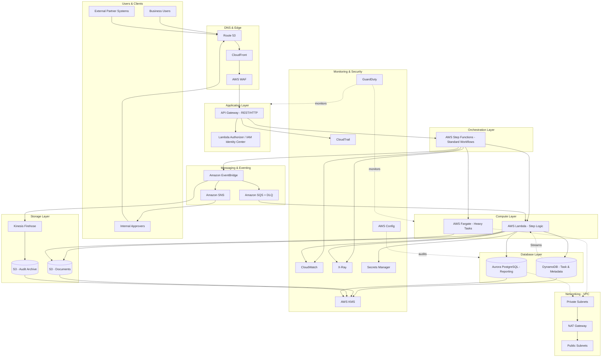

# Part VIII – Enterprise Application Architectures

# Chapter 66: Workflow Automation

---

## 1. Executive Summary

### The Business Problem

Enterprises run hundreds of internal processes that require multiple approvals, handoffs between departments, and coordination between humans and systems. Examples include:

- Employee onboarding (HR, IT, Facilities, Payroll)
- Purchase order approvals (Requester, Manager, Finance, Procurement)
- Loan origination (Application, Credit Check, Underwriting, Compliance, Disbursement)
- Insurance claims processing (Intake, Adjuster Review, Fraud Check, Payout)
- Contract lifecycle management (Draft, Legal Review, Signature, Archival)
- Incident and change management (Detection, Triage, Approval, Remediation)

Historically, these processes lived in spreadsheets, email chains, ticketing tools bolted together with manual scripts, or expensive commercial Business Process Management (BPM) suites. Each of these approaches has a structural weakness:

- Spreadsheets and email have no audit trail, no SLA enforcement, and no programmatic state machine — a task can silently fall through the cracks for weeks.
- Legacy on-premises BPM suites (Pega, Appian, IBM BPM, jBPM) are powerful but come with heavy licensing costs, long implementation cycles, and infrastructure that must be separately patched, scaled, and secured.
- Point-to-point integrations between systems (a script that polls system A and pushes into system B) become brittle as the number of integrated systems grows — this is the classic N² integration problem.

Workflow Automation architecture on AWS solves this by treating a business process as a **durable, observable, and independently scalable state machine**, coordinated by managed services rather than custom polling scripts or a monolithic BPM engine.

### Architecture Objective

The objective of this architecture is to give an organization a way to:

1. Model a business process as an explicit sequence of steps, branches, retries, and human approval gates.
2. Execute that process reliably even if individual steps fail, time out, or take days to complete (e.g., waiting on a human approver).
3. Provide full auditability — who did what, when, and why — for compliance and dispute resolution.
4. Scale from a handful of executions per day to millions, without re-architecting.
5. Decouple the orchestration layer from the systems being orchestrated (ERP, CRM, ticketing, identity, payment, notification systems).
6. Allow business analysts and engineers to change process logic without redeploying the applications that participate in the workflow.

### Why Organizations Adopt This Architecture

Organizations move to a cloud-native workflow automation architecture for several converging reasons:

- **Process sprawl.** As a company grows, the number of cross-departmental processes grows faster than headcount. Automating the coordination layer (not necessarily the business logic itself) removes the human "process babysitting" overhead.
- **Compliance pressure.** Regulated industries (banking, insurance, healthcare, government) must prove that every approval step happened, in order, with the correct authorization. A durable state machine with an event log satisfies auditors far more convincingly than an email thread.
- **Integration modernization.** Enterprises migrating off legacy middleware (ESBs, MQ Series, custom cron jobs) want an orchestration layer that is managed, elastic, and does not require a dedicated operations team to keep patched.
- **Cost pressure on BPM licensing.** Commercial BPM suites often charge per-user or per-core licensing that becomes disproportionately expensive at enterprise scale. A serverless orchestration layer converts this into consumption-based pricing.
- **Desire for observability.** Engineering and business stakeholders want dashboards showing exactly where a given case (loan application, support ticket, purchase order) currently sits in its lifecycle, and how long it has been there.

### Major Business Benefits

| Benefit | Description |
|---|---|
| Reduced cycle time | Automated routing and reminders shrink the time between task creation and completion. |
| Lower operational cost | Serverless orchestration removes the fixed cost of always-on BPM servers. |
| Improved compliance posture | Every state transition is logged immutably, supporting SOX, HIPAA, PCI-DSS, and GDPR audits. |
| Higher process resilience | Steps automatically retry with backoff; failures route to dead-letter queues instead of silently disappearing. |
| Faster change velocity | Workflow definitions are code (state machine definitions), so they go through the same CI/CD pipeline as application code. |
| Better cross-team visibility | Centralized dashboards give operations, business, and compliance teams a single source of truth for in-flight processes. |

### Typical Enterprise Scenarios

This chapter's reference architecture is broadly applicable, but the design decisions below are calibrated around these representative scenarios:

1. **Purchase order and vendor onboarding automation** at a mid-to-large enterprise, integrating with an ERP (SAP, Oracle, NetSuite) and a document e-signature service.
2. **Loan and account opening workflows** at a financial services company, requiring strict audit trails, human-in-the-loop underwriting steps, and strong encryption at rest and in transit.
3. **IT service management (ITSM) automation** — automated ticket triage, approval routing, and remediation orchestration integrated with tools like ServiceNow or Jira.
4. **Employee lifecycle automation** — onboarding/offboarding workflows spanning IAM Identity Center, HRIS systems, and endpoint management tools.

Throughout the chapter, the architecture is described generically enough to apply to any of these, while the Terraform, IAM policies, and cost estimates assume a mid-size enterprise workload of roughly 50,000–500,000 workflow executions per month, each with an average of 8–15 steps and human approval gates that can pause a workflow for hours or days.

> **Note:** "Workflow" in this chapter refers to a **long-running business process orchestration**, not a short-lived request/response API call. The defining characteristic of this architecture is that individual workflow executions can be paused for arbitrarily long periods (minutes to months) while waiting on a human or an external system, without consuming compute resources during the wait.

---

## 2. Business Requirements

### Business Drivers

- Replace manual, email-driven approval chains with an auditable digital system.
- Reduce average process cycle time by a defined percentage (commonly 30–60% in real deployments).
- Provide a single pane of glass for in-flight and historical process instances.
- Support integration with existing enterprise systems (ERP, CRM, HRIS, ITSM) without requiring those systems to be replaced.
- Enable non-engineering teams (business analysts) to understand and, within guardrails, adjust process flows.

### Functional Requirements

| ID | Requirement |
|---|---|
| FR-1 | System must support sequential, parallel, and conditional (branching) steps within a workflow. |
| FR-2 | System must support long-running human approval tasks that can remain pending for days without consuming compute. |
| FR-3 | System must support automatic retries with exponential backoff for transient step failures. |
| FR-4 | System must support timeouts at both the step level and the overall workflow level. |
| FR-5 | System must emit an auditable event for every state transition. |
| FR-6 | System must support versioning of workflow definitions so in-flight executions are unaffected by new deployments. |
| FR-7 | System must expose a REST/GraphQL API for starting, querying, and canceling workflow executions. |
| FR-8 | System must support asynchronous callbacks from external systems (webhooks) to resume paused workflows. |
| FR-9 | System must support role-based task assignment and delegation for human approval steps. |
| FR-10 | System must integrate with enterprise notification channels (email, Slack, Teams, SMS). |

### Non-Functional Requirements

- **Scalability goals:** Support at least 500,000 concurrent in-flight workflow executions and 1,000 new workflow starts per minute at peak, without manual capacity planning.
- **Availability requirements:** 99.95% availability for the control plane (API for starting/querying workflows); workflow execution durability of 99.999% (an in-flight workflow must never be silently lost).
- **Latency requirements:** API response for starting a workflow execution under 300 ms p99; step transition latency (system-to-system, non-human steps) under 2 seconds p99.
- **Compliance requirements:** SOC 2 Type II, and where applicable PCI-DSS (payment workflows), HIPAA (healthcare workflows), or GLBA/SOX (financial workflows). All state transitions must be retained for a minimum of 7 years for regulated workflows.
- **Security expectations:** Encryption at rest and in transit for all workflow data; field-level encryption for PII/PHI payloads; least-privilege IAM for every component; no long-lived credentials in workflow definitions.
- **Recovery objectives:**
  - **RPO (Recovery Point Objective): near-zero** — the event-sourced nature of the architecture (state machine history + event bus) means no committed state transition should ever be lost.
  - **RTO (Recovery Time Objective): under 1 hour** for full regional recovery using warm-standby DR pattern (detailed in Section 13).
- **SLAs:** 99.9% of workflow steps complete within their configured SLA timer; breaches trigger automatic escalation.
- **Expected workload:** Baseline 100,000 workflow executions/month, each averaging 10 steps, growing to 1,000,000/month within 3 years.
- **Expected growth:** Linear growth aligned with business unit onboarding — architecture must scale horizontally without redesign as additional business units (HR, Finance, Legal, IT) onboard their processes onto the platform.

---

## 3. Architecture Overview

### Overall Design

The architecture is built around three core ideas:

1. **State machines as the source of truth.** AWS Step Functions models each workflow definition as an Amazon States Language (ASL) state machine. Step Functions is a managed orchestrator that persists execution state durably, so a workflow can pause for months waiting on a human approval without any compute running during the wait.
2. **Event-driven decoupling.** Amazon EventBridge is the nervous system connecting workflow steps to the actual business logic (Lambda functions, container tasks, third-party APIs) and to downstream consumers (audit logging, notifications, analytics) — without those consumers needing to know about each other.
3. **Human-in-the-loop via callback pattern.** For steps requiring human approval, Step Functions uses the `waitForTaskToken` service integration pattern: execution pauses, a task token is handed to a human task system (API Gateway + DynamoDB-backed task list + notification), and execution resumes only when that token is returned via a callback API.

### Architecture Philosophy

- **Prefer managed, serverless orchestration over self-hosted BPM engines.** This removes patching, capacity planning, and licensing overhead.
- **Treat workflow definitions as code.** ASL definitions live in version control and deploy through the same CI/CD pipeline as application code (Section 8, Section 20).
- **Decouple orchestration from execution.** Step Functions decides *what happens next*; Lambda/Fargate/EventBridge targets decide *how it happens*. This separation lets teams change business logic without touching orchestration logic, and vice versa.
- **Make every transition observable.** Every state transition publishes an event to EventBridge, which fans out to CloudWatch Logs, an audit trail S3 bucket via Kinesis Firehose, and real-time dashboards.
- **Design for idempotency.** Because Step Functions guarantees at-least-once execution semantics for certain failure/retry scenarios, every Lambda-backed step must be idempotent (Section 6 covers this per-component).

### Core Components

| Layer | Component | Role |
|---|---|---|
| Entry | Amazon API Gateway | Public/internal REST API to start, query, cancel workflow executions |
| Orchestration | AWS Step Functions (Standard Workflows) | Durable state machine execution engine |
| Compute | AWS Lambda | Stateless business logic for individual workflow steps |
| Compute (long-running) | AWS Fargate (ECS) | Heavier or longer-running step logic (e.g., document generation, large file processing) |
| Eventing | Amazon EventBridge | Decoupled pub/sub bus for cross-system events and integrations |
| Queuing | Amazon SQS | Buffering and retry isolation between EventBridge and consumers |
| Human tasks | Amazon DynamoDB + API Gateway | Task list storage and callback API for human approval steps |
| Data | Amazon DynamoDB | Workflow metadata, task assignment, idempotency tokens |
| Data | Amazon Aurora PostgreSQL | Relational reporting store for process analytics |
| Storage | Amazon S3 | Workflow definitions, document attachments, audit archive |
| Notification | Amazon SNS | Fan-out notifications to email/SMS/chat integrations |
| Identity | IAM Identity Center + IAM Roles | Human authentication and least-privilege service permissions |
| Security | AWS KMS, Secrets Manager | Encryption keys and credential management |
| Observability | CloudWatch, X-Ray, CloudTrail | Metrics, tracing, and audit logging |

### How Components Interact

At a high level, a workflow execution flows as follows:

1. A triggering event (API call, scheduled event, or upstream system event) starts a Step Functions execution.
2. Step Functions evaluates the ASL definition and invokes the first state — typically a Lambda function via a synchronous service integration.
3. For automated steps, Lambda performs the business logic (e.g., "check credit score", "validate purchase order against budget") and returns a result; Step Functions transitions to the next state based on that result.
4. For human approval steps, Step Functions uses `waitForTaskToken`: it writes a task record to DynamoDB, publishes a notification via SNS/EventBridge, and pauses. The human approver interacts with a task UI, which calls back through API Gateway to `SendTaskSuccess` or `SendTaskFailure`, resuming the execution.
5. Every state transition publishes an event to EventBridge, which is consumed by an audit-logging Lambda (writes to S3 via Firehose) and a real-time dashboard update path (via a WebSocket API or polling API backed by DynamoDB Streams).
6. On completion (success, failure, or timeout), Step Functions emits a terminal event; downstream systems (ERP, notification service, reporting store) are updated via EventBridge targets.

### High-Level Workflow (Conceptual)

```

Trigger → Validate → Branch (auto vs. human) →
   [Automated Path] → Execute → Verify → Complete
   [Human Path] → Assign Task → Wait for Decision → Route on Decision → Complete
→ Notify → Archive → Report

```

### Request Lifecycle

A synchronous "start workflow" API request lifecycle:

1. Client calls `POST /workflows/{type}/start` via API Gateway.
2. API Gateway authorizer (Lambda authorizer backed by IAM Identity Center / Cognito) validates the caller's identity and scopes.
3. A lightweight Lambda validates the request payload against a JSON Schema and writes an idempotency key to DynamoDB (to prevent duplicate workflow starts on client retries).
4. Lambda calls `StartExecution` on the target Step Functions state machine, passing the validated payload as execution input.
5. API Gateway returns `202 Accepted` with the execution ARN and a polling/status URL.

### Response Lifecycle

Because workflows are long-running, the primary "response" is asynchronous:

1. Clients poll `GET /workflows/executions/{id}` (backed by a Lambda reading Step Functions `DescribeExecution` plus enriched DynamoDB metadata), or
2. Clients subscribe to a webhook callback registered at workflow start, invoked by an EventBridge rule on terminal-state events, or
3. For UI-driven use cases, a WebSocket API (API Gateway WebSocket + DynamoDB Streams trigger) pushes real-time state updates to a connected dashboard.

### Data Lifecycle

- **In-flight execution state** lives inside Step Functions' internal, fully-managed execution history (no separate database required for orchestration state itself).
- **Business payload data** (documents, form submissions) is stored in S3, with only references (S3 keys) passed through the state machine input/output to keep Step Functions payloads within its 256 KB per-state data limit.
- **Task metadata** (who is assigned, due date, priority) lives in DynamoDB for low-latency task-list queries.
- **Audit trail** — every state transition event is streamed via Kinesis Data Firehose into an S3 data lake in Parquet format, queryable through Amazon Athena for compliance reporting, and retained per the regulatory retention policy (often 7 years, using S3 Lifecycle transitions to Glacier Deep Archive after 90 days).
- **Reporting data** — a nightly (or near-real-time via EventBridge Pipes) ETL job denormalizes completed workflow data into Aurora PostgreSQL for BI tooling (QuickSight, Tableau) to query process-cycle-time analytics.


---

## 4. AWS Services Used

> Each service below is explained the first time it is used in this chapter, per the self-contained chapter requirement, even if the reader is already familiar with it from earlier parts of the book.

### AWS Step Functions

**Purpose:** Step Functions is a fully managed orchestration service that executes workflows defined in Amazon States Language (ASL), a JSON-based DSL describing states, transitions, retries, and error handling.

**Why selected:** It is the only AWS-native service purpose-built for long-running, durable state machine execution with native human-in-the-loop support (`waitForTaskToken`), built-in retry/backoff, and visual execution history — critical for audit and debugging.

**Alternatives:** Apache Airflow (self-managed or Amazon MWAA), self-hosted Camunda/Zeebe, Temporal (self-hosted or Temporal Cloud), custom SQS+Lambda polling loops.

**Limitations:**
- 25,000 execution history events per Standard Workflow execution (a very long-running workflow with excessive looping can hit this).
- 256 KB maximum payload size passed between states (mitigated by passing S3 references instead of raw documents).
- Standard Workflows only report state history after completion is polled; very high-frequency polling patterns are better served by Express Workflows (for short-duration, high-volume workloads), though Express Workflows are not suitable for multi-day human approval waits due to their different execution/billing model.

**Pricing considerations:** Standard Workflows are billed per state transition (not per duration), which is ideal for a workflow that pauses for days waiting on a human — you pay for transitions, not for idle wait time.

**Best practices:** Use Standard Workflows (not Express) for any workflow containing `waitForTaskToken` or `waitForCallback` because Express Workflows have a 5-minute maximum duration for synchronous invocation and different at-least-once semantics unsuitable for multi-day pauses.

### Amazon API Gateway

**Purpose:** Managed API front door exposing REST/HTTP endpoints for starting, querying, and interacting with workflows, and for callback endpoints used by human task UIs.

**Why selected:** Native integration with Lambda authorizers, IAM Identity Center, request validation, throttling, and direct service integrations (can call Step Functions `StartExecution` without a Lambda in the middle for simple cases).

**Alternatives:** Application Load Balancer + ECS/Fargate API service, AWS AppSync (if GraphQL is preferred for the task/dashboard API).

**Limitations:** 29-second maximum integration timeout — unsuitable for anything synchronous and long-running (which is precisely why this architecture is asynchronous/callback-based).

**Pricing considerations:** Pay-per-request; HTTP APIs are notably cheaper than REST APIs for simple proxy integrations and are preferred here unless WAF integration or request/response transformation mandates REST APIs.

**Best practices:** Use HTTP APIs for the callback/status endpoints (cost-sensitive, high volume); use REST APIs only where WAF attachment or usage plans/API keys are required for external partner access.

### AWS Lambda

**Purpose:** Executes the discrete, short-lived business logic behind each automated workflow step (validation, scoring, API calls to external systems, notification dispatch).

**Why selected:** Zero infrastructure management, automatic scaling, native Step Functions service integration, and pay-per-invocation billing aligns with the bursty, event-driven nature of workflow steps.

**Alternatives:** AWS Fargate (for steps needing >15 minutes execution or more memory/CPU than Lambda's ceiling), EC2 (rarely justified here).

**Limitations:** 15-minute maximum execution duration, 10 GB memory ceiling — long document-generation or large-file-processing steps should be delegated to Fargate tasks instead.

**Pricing considerations:** Billed per GB-second; at enterprise scale, right-sizing memory (which also scales CPU proportionally) materially affects cost — see Section 16.

**Best practices:** Keep Lambda functions single-purpose and idempotent; externalize configuration to Parameter Store/Secrets Manager; use provisioned concurrency only for latency-critical, consistently-invoked steps (avoid it for infrequent steps — it is a fixed cost).

### AWS Fargate (Amazon ECS)

**Purpose:** Serverless container compute for workflow steps that exceed Lambda's duration or resource limits — e.g., generating large PDF contract packages, running OCR over scanned documents, or batch reconciliation jobs invoked as part of a workflow step.

**Why selected:** No EC2 fleet to patch or scale manually; integrates with Step Functions via the `ecs:runTask.sync` service integration, which blocks the state until the task completes and returns its exit status.

**Alternatives:** Amazon EKS (justified only if the organization already standardizes on Kubernetes and needs the same container platform across many other workloads — unnecessary operational overhead for a workflow-automation-only use case).

**Limitations:** Cold-start latency (tens of seconds) is higher than Lambda; not ideal for latency-sensitive steps.

**Pricing considerations:** Billed per vCPU/memory-second while the task runs; Fargate Spot can reduce cost ~70% for non-time-critical batch-style steps that tolerate interruption and retry.

**Best practices:** Reserve Fargate for steps genuinely requiring it; do not default every step to Fargate "for consistency" — this needlessly increases both cost and step latency versus Lambda.

### Amazon EventBridge

**Purpose:** Serverless event bus enabling publish/subscribe integration between the workflow engine, downstream systems, and audit/observability pipelines, without direct point-to-point coupling.

**Why selected:** Native Step Functions integration (Step Functions can emit execution status change events automatically), content-based filtering rules, schema registry, and built-in support for third-party SaaS event sources (useful when a workflow needs to react to, e.g., a Salesforce or Zendesk event).

**Alternatives:** Amazon SNS (simpler pub/sub, but lacks content-based routing and schema registry), Apache Kafka / Amazon MSK (justified only at very high sustained throughput with strict ordering requirements — overkill for typical enterprise workflow volumes).

**Limitations:** At-least-once delivery — consumers must be idempotent; a single event bus rule invocation payload is capped at 256 KB.

**Pricing considerations:** Billed per event published; for very high-volume audit event streams, consider batching or filtering unnecessary events before publishing.

**Best practices:** Use one custom Event Bus per major domain (e.g., `workflow-events`, `integration-events`) rather than a single bus for everything, to keep IAM permissions and rule management scoped and auditable.

### Amazon SQS

**Purpose:** Buffers events between EventBridge and downstream Lambda/Fargate consumers, isolating failures and enabling controlled retry/backoff and dead-letter handling per consumer.

**Why selected:** Decouples producer and consumer scaling rates; a slow or failing downstream consumer (e.g., a flaky third-party ERP API) cannot cause event loss or back-pressure onto the orchestration layer.

**Alternatives:** Direct Lambda-on-EventBridge-rule invocation (acceptable for simple, reliable consumers, but lacks the buffering and DLQ isolation SQS provides).

**Limitations:** Standard queues do not guarantee strict ordering (use FIFO queues where processing order per workflow instance matters, at the cost of throughput).

**Pricing considerations:** Very low cost per million requests; batching consumers reduces Lambda invocation count and therefore cost.

**Best practices:** Attach a dead-letter queue (DLQ) to every SQS queue used in this architecture with a CloudWatch alarm on DLQ depth > 0, so failed integration events are never silently dropped.

### Amazon DynamoDB

**Purpose:** Stores human task metadata (assignee, due date, priority, status), idempotency tokens for workflow-start deduplication, and workflow-instance business metadata used for fast dashboard queries.

**Why selected:** Single-digit millisecond latency at any scale, on-demand capacity mode removes capacity planning, and DynamoDB Streams enables real-time dashboard updates without polling.

**Alternatives:** Amazon Aurora (better for complex relational reporting queries, but higher latency and requires connection pooling under high concurrency — used here as the secondary reporting store, not the primary task store).

**Limitations:** 400 KB item size limit (fine for task metadata; large documents belong in S3); eventually-consistent reads by default (use strongly consistent reads for the task-assignment table where read-after-write correctness matters).

**Pricing considerations:** On-demand mode for unpredictable/bursty workflow-start traffic; provisioned mode with auto-scaling once traffic patterns stabilize, to reduce cost at sustained high volume.

**Best practices:** Design table access patterns (single-table design where appropriate) before defining Terraform resources; use TTL to automatically expire completed task records after the retention window required for near-real-time access (long-term retention lives in the S3 audit archive, not DynamoDB).

### Amazon Aurora (PostgreSQL-Compatible)

**Purpose:** Relational store for denormalized, completed workflow data used for BI/analytics reporting (cycle time by process type, approval bottleneck analysis, SLA breach trends).

**Why selected:** Aurora provides MySQL/PostgreSQL compatibility with up to 3x throughput of standard PostgreSQL on comparable hardware, along with read replicas and Aurora Global Database for cross-region DR (Section 13).

**Alternatives:** Amazon Redshift (justified only if the reporting workload grows into true data-warehouse-scale analytical queries over billions of rows — likely a later evolution stage, see Section "Evolution Path").

**Limitations:** Not designed for the sub-10ms task-list read/write pattern DynamoDB handles; using Aurora as the primary orchestration data store would introduce unnecessary connection-pool contention under bursty Lambda concurrency.

**Pricing considerations:** Aurora Serverless v2 is recommended over provisioned instances for this reporting workload, since query volume is spiky (heavier during business hours and end-of-month reporting cycles) rather than constant.

**Best practices:** Use RDS Proxy in front of Aurora when Lambda functions connect directly, to avoid connection exhaustion under concurrent Lambda invocation spikes.

### Amazon S3

**Purpose:** Stores workflow definitions (versioned ASL JSON), business document attachments (contracts, invoices, scanned forms), and the long-term audit trail archive.

**Why selected:** 99.999999999% durability, native versioning, lifecycle policies for cost-tiered retention, and direct integration with Athena for audit querying.

**Alternatives:** None reasonably compete for this use case at this cost/durability profile.

**Limitations:** Not a database — do not use S3 for high-frequency read/write task-status updates; that pattern belongs in DynamoDB.

**Pricing considerations:** Use S3 Intelligent-Tiering for document attachments with unpredictable access patterns; transition audit logs to Glacier Deep Archive after the active compliance query window (commonly 90 days) closes.

**Best practices:** Enable S3 Object Lock (compliance mode) on the audit archive bucket for regulated workflows, preventing even root-account deletion before the retention period expires.

### Amazon SNS

**Purpose:** Fan-out notification delivery to email, SMS, and chat-integration Lambda subscribers when a human task is assigned, an SLA is at risk, or a workflow completes.

**Why selected:** Simple pub/sub fan-out with native support for multiple protocol endpoints (email, SMS, Lambda, SQS, HTTPS webhook) from a single publish call.

**Alternatives:** Direct EventBridge targets to each notification channel (viable, but SNS's fan-out simplicity is preferable when the primary need is "notify N channels about one event" rather than complex content-based routing, which is EventBridge's strength).

**Limitations:** No built-in message deduplication on standard topics (use FIFO topics if exactly-once notification delivery is required for compliance-sensitive alerts).

**Pricing considerations:** Negligible at typical enterprise notification volumes; SMS is the most expensive protocol and should be reserved for high-priority SLA-breach alerts, not routine task notifications.

**Best practices:** Use topic-level access policies to restrict which services can publish, preventing unauthorized services from injecting notifications.

### Amazon EventBridge Scheduler / CloudWatch Events (Rules)

**Purpose:** Triggers time-based workflow actions — SLA-timer escalation checks, scheduled workflow starts (e.g., nightly reconciliation workflows), and periodic reminder notifications for pending human tasks.

**Why selected:** Native, serverless cron/rate-based scheduling without needing a separate scheduler service or EC2-hosted cron daemon.

**Alternatives:** Step Functions native `Wait` states (better for per-execution timers tied to a specific workflow instance) versus EventBridge Scheduler (better for fleet-wide periodic sweeps, e.g., "check all pending tasks for SLA breach every 15 minutes").

**Limitations:** EventBridge Scheduler has a maximum of one-minute granularity — sufficient for enterprise SLA monitoring but not for sub-minute timing needs.

**Best practices:** Prefer per-execution `Wait` states inside the state machine for workflow-instance-specific timers (e.g., "escalate this specific approval after 48 hours") rather than a fleet-wide scan, since the former scales naturally with Step Functions and avoids a custom scanning Lambda.

### AWS IAM

**Purpose:** Defines least-privilege permissions for every component (Step Functions execution role, Lambda execution roles, API Gateway invocation roles, human users via IAM Identity Center).

**Why selected:** Native, mandatory, and free service — there is no viable alternative on AWS.

**Best practices:** One distinct execution role per Lambda function (not one shared role for all functions) to enforce least privilege and simplify audit; see Section 10 for full detail.

### Amazon VPC

**Purpose:** Provides network isolation for any components requiring private connectivity — most notably Aurora, RDS Proxy, and any Fargate tasks that must reach internal enterprise systems (ERP, on-premises HRIS) over Direct Connect/VPN.

**Why selected:** Required for any RDS/Aurora deployment and for private connectivity to on-premises or other VPC-resident systems.

**Best practices:** Lambda functions that only call AWS service APIs (Step Functions, DynamoDB, S3, SNS) should **not** be placed in a VPC unless they need private network access — VPC-attached Lambdas incur ENI cold-start overhead and require NAT Gateway for internet/AWS API access, adding cost and latency without benefit.

### Amazon Route 53

**Purpose:** DNS resolution for the workflow platform's public API domain and internal service discovery records.

**Why selected:** Native health-check-based failover routing, critical for the multi-region DR pattern described in Section 13.

### Amazon CloudWatch

**Purpose:** Metrics, logs, dashboards, and alarms for every component — Step Functions execution failures, Lambda errors/duration, SQS DLQ depth, Aurora connection saturation.

**Why selected:** Native integration with every AWS service used in this architecture; no additional agent deployment required for managed services.

### AWS X-Ray

**Purpose:** Distributed tracing across API Gateway → Step Functions → Lambda → downstream service calls, essential for diagnosing latency and failure root cause in a workflow spanning a dozen services.

**Why selected:** Native Step Functions and Lambda instrumentation with minimal configuration; visualizes the full step-by-step trace of a single execution, which is invaluable when debugging why a specific workflow instance is slow or stuck.

### AWS CloudTrail

**Purpose:** Immutable audit log of every AWS API call made against the account — who started/canceled a Step Functions execution via the console or API, who modified an IAM policy, who accessed the audit S3 bucket.

**Why selected:** Mandatory for SOC 2 / PCI-DSS / HIPAA compliance evidence; this is distinct from the *business-level* audit trail (Section 3's EventBridge-to-S3 pipeline), which records workflow state transitions, not AWS API calls.

### AWS Config

**Purpose:** Continuously evaluates AWS resource configuration against compliance rules (e.g., "no S3 bucket without encryption", "no IAM policy with wildcard actions on production resources").

**Why selected:** Provides continuous compliance drift detection rather than point-in-time audits.

### Amazon GuardDuty

**Purpose:** Threat detection service monitoring for anomalous API activity, compromised credentials, and malicious network activity across the account.

**Why selected:** Especially relevant here because workflow automation platforms often hold sensitive business data (loan applications, employee records, contracts) and are an attractive target for credential-based attacks.

### AWS KMS

**Purpose:** Manages encryption keys for DynamoDB, S3, Aurora, and Secrets Manager, and provides envelope encryption for field-level PII/PHI encryption in Lambda-processed payloads.

**Why selected:** Customer-managed KMS keys (CMKs) provide auditable key usage (every `Decrypt` call is logged in CloudTrail) and fine-grained key policies, versus relying solely on AWS-managed keys, which do not support cross-account key policies or detailed usage auditing to the same degree.

**Best practices:** Use a distinct CMK per major data domain (e.g., one for the audit archive bucket, one for PII fields in DynamoDB) rather than one account-wide key, so key rotation and access revocation can be scoped without a blast radius across unrelated data.

### AWS Secrets Manager

**Purpose:** Stores credentials for integration with external systems (ERP API keys, e-signature vendor tokens, ITSM tool credentials) referenced by Lambda functions at runtime.

**Why selected:** Automatic rotation support, fine-grained IAM-based access control per secret, and native Lambda extension for cached retrieval (reducing per-invocation Secrets Manager API cost/latency).

**Alternatives:** AWS Systems Manager Parameter Store (SecureString) — lower cost, viable for secrets that do not require automatic rotation; this architecture uses Secrets Manager specifically for the subset of integration credentials that support/require rotation, and Parameter Store for static configuration values.

### AWS Systems Manager

**Purpose:** Parameter Store for non-secret configuration (feature flags, environment-specific endpoints), and Session Manager for secure, bastion-less operator access to any Fargate/EC2 resources if needed for troubleshooting.


---

## 5. Complete Architecture Diagram



> **Tip:** In enterprise environments, render this diagram with the official AWS Architecture Icons set in draw.io or Lucidchart for board-level and audit presentations; the Mermaid version above is optimized for version-controlled documentation living alongside the Terraform code.

---

## 6. Component-by-Component Explanation

### API Gateway (Entry Point)

- **Purpose:** Single, authenticated entry point for starting workflows, querying status, and receiving human-task callback responses.
- **Responsibilities:** Request validation (JSON Schema), authentication/authorization delegation, throttling, request/response logging.
- **Inputs:** HTTPS requests from internal business applications, partner systems, and the human-task UI.
- **Outputs:** Synchronous `202 Accepted` responses with execution identifiers; asynchronous state changes delivered via webhook or WebSocket.
- **Scaling:** Fully managed, scales automatically to tens of thousands of requests per second; account-level throttle limits should be raised proactively for planned peak events (e.g., quarter-end approval surges).
- **High availability:** Regional service, inherently multi-AZ; for DR, a secondary regional API Gateway deployment is fronted by Route 53 failover routing (Section 13).
- **Failure handling:** Client retries with idempotency keys (Section 6, Lambda component) prevent duplicate workflow starts on network-level retry.
- **Dependencies:** Lambda authorizer, Step Functions, CloudWatch Logs.
- **Security:** WAF attached for public-facing stages; resource policies restrict partner API access by source IP/VPC endpoint where applicable.
- **Monitoring:** 4xx/5xx rate alarms, p99 latency alarms, and per-route usage dashboards.

### AWS Step Functions (Orchestration Core)

- **Purpose:** Executes the ASL-defined state machine representing the business process.
- **Responsibilities:** State transition evaluation, retry/backoff per state, error catch/handling, task-token issuance for human steps, execution history persistence.
- **Inputs:** JSON execution input (validated payload + S3 references to documents).
- **Outputs:** JSON execution output; intermediate EventBridge events on every transition (via the native "Step Functions Execution Status Change" event source).
- **Scaling:** Virtually unlimited concurrent executions for Standard Workflows (soft limit, raisable via Service Quotas); no capacity planning required.
- **High availability:** Fully managed, multi-AZ by default within a region.
- **Failure handling:** Per-state `Retry` blocks (exponential backoff, configurable max attempts) and `Catch` blocks routing to compensating/error-handling states; unrecoverable failures transition to a terminal "Failed" state that publishes an alert event.
- **Dependencies:** IAM execution role scoped to the specific Lambda ARNs, Fargate task definitions, and AWS service integrations the state machine invokes.
- **Security:** Execution role follows least privilege (Section 10); execution input containing PII should be minimized — pass S3 references, not raw PII, wherever the field is not needed for a branching decision.
- **Monitoring:** `ExecutionsFailed`, `ExecutionsTimedOut`, and `ExecutionThrottled` CloudWatch metrics with alarms; X-Ray tracing enabled for full step-level latency breakdown.

### AWS Lambda (Step Logic)

- **Purpose:** Implements the discrete business logic invoked by each Step Functions task state.
- **Responsibilities:** Input validation, calling downstream systems (ERP, credit bureau, identity systems), writing task/metadata records to DynamoDB, returning structured results to Step Functions.
- **Inputs:** JSON payload from the invoking state, environment variables/Parameter Store config, Secrets Manager credentials.
- **Outputs:** JSON payload consumed by the next state; side effects in DynamoDB/S3/downstream APIs.
- **Scaling:** Automatic, per-invocation concurrency scaling; reserved concurrency should be set on functions calling rate-limited downstream systems to avoid overwhelming a legacy ERP API.
- **High availability:** Multi-AZ by default (AWS-managed).
- **Failure handling:** Step Functions-managed retries at the state level; functions must be **idempotent** because a retried invocation with the same input may execute more than once (e.g., after a Lambda timeout where the function had actually completed but the response was lost).
- **Dependencies:** IAM execution role, VPC configuration only if private-network access is required (see Section 4 VPC guidance), Secrets Manager for credentials.
- **Security:** No embedded credentials; environment variables containing sensitive values are avoided in favor of Secrets Manager references resolved at runtime.
- **Monitoring:** Error rate, duration (p50/p90/p99), throttle count, and concurrent execution count per function.

### AWS Fargate (Heavy/Long-Running Tasks)

- **Purpose:** Executes workflow steps exceeding Lambda's execution or resource limits.
- **Responsibilities:** Document generation/merging, OCR, large batch reconciliation.
- **Scaling:** ECS service auto scaling based on SQS queue depth or Step Functions-invoked task count.
- **Failure handling:** `ecs:runTask.sync` integration surfaces the task's exit code to Step Functions, which applies the same `Retry`/`Catch` semantics as Lambda tasks.
- **Security:** Task execution role and task role are separate (execution role pulls the container image and writes logs; task role is what the application code inside the container assumes) — a common misconfiguration is granting excessive permissions to the execution role instead of scoping business permissions to the task role only.

### Amazon EventBridge (Event Bus)

- **Purpose:** Decouples the orchestration layer from every downstream consumer of workflow events.
- **Responsibilities:** Rule-based routing of execution-status-change events and custom business events to their respective targets (audit pipeline, notification service, reporting ETL trigger).
- **Failure handling:** Each rule's target has a configured retry policy and DLQ (an SQS queue) for events that repeatedly fail delivery.
- **Security:** Resource-based policies restrict which accounts/services may publish to the custom event bus; this matters in multi-account setups where a shared workflow platform serves multiple business-unit accounts.

### Amazon DynamoDB (Task & Metadata Store)

- **Purpose:** Low-latency store for human task assignment, idempotency tokens, and workflow-instance summary metadata for dashboard queries.
- **Responsibilities:** Serve the task-list UI, provide the idempotency check on workflow start, expose DynamoDB Streams for real-time dashboard push updates.
- **Scaling:** On-demand capacity mode recommended for unpredictable business-hour-concentrated traffic.
- **High availability:** Multi-AZ by default; Global Tables enable active-active multi-region reads for global organizations (evaluated in Section 13 DR strategy).
- **Security:** Encryption at rest with a customer-managed KMS key; fine-grained IAM condition keys restrict task-record access to the assigned user or their delegate.

### Amazon Aurora PostgreSQL (Reporting Store)

- **Purpose:** Supports complex relational/analytical queries over completed workflow data for business intelligence.
- **Responsibilities:** Store denormalized workflow-completion records populated via an EventBridge-triggered ETL Lambda or EventBridge Pipes pipeline.
- **Scaling:** Aurora Serverless v2 auto-scales ACUs based on query load, appropriate for the spiky nature of reporting queries (heaviest at month-end).
- **High availability:** Multi-AZ cluster with automated failover; Aurora Global Database for cross-region DR read replicas.
- **Security:** Credentials stored in Secrets Manager with automatic rotation; RDS Proxy in front to manage connection pooling from bursty Lambda invocations.

### Amazon S3 (Document & Audit Storage)

- **Purpose:** Durable storage for business documents referenced by workflow steps, and the immutable long-term audit trail.
- **Responsibilities:** Store uploaded attachments with server-side encryption; receive audit events streamed via Kinesis Firehose in Parquet format for efficient Athena querying.
- **Security:** Object Lock (compliance mode) on the audit bucket; bucket policies deny any non-TLS request and restrict access to specific VPC endpoints for internal-only document buckets.

### Amazon SNS (Notification Fan-out)

- **Purpose:** Delivers task-assignment and SLA-breach notifications to email, SMS, and chat-integration subscribers.
- **Failure handling:** Delivery status logging enabled to CloudWatch Logs to detect bounced emails/failed SMS for compliance-sensitive notifications (e.g., regulatory deadline alerts).

---

## 7. End-to-End Request Flow

The following describes the complete lifecycle of a representative workflow instance — a purchase order approval — from initiation to archival.

1. **Client submits request.** An internal procurement application calls `POST /workflows/purchase-order/start` with the PO details and an idempotency key.
2. **DNS resolution.** Route 53 resolves the API's custom domain to the CloudFront distribution fronting API Gateway.
3. **Edge security.** CloudFront forwards the request through AWS WAF, which evaluates managed rule groups (SQL injection, known bad IPs, rate-based rules) before allowing the request through.
4. **API Gateway authorization.** A Lambda authorizer validates the caller's IAM Identity Center-issued JWT and checks the caller's scope includes `workflow:start:purchase-order`.
5. **Idempotency check.** A validation Lambda checks the supplied idempotency key against DynamoDB; if already present, the previous execution ARN is returned immediately without starting a duplicate execution.
6. **Workflow start.** Step Functions `StartExecution` is called with the validated payload; the response (execution ARN) is returned to the client with `202 Accepted`.
7. **First automated step.** Step Functions invokes a Lambda that validates the PO against the requester's budget authority by querying the ERP system's API (credentials retrieved from Secrets Manager).
8. **Branch evaluation.** If the PO amount is below the requester's auto-approval threshold, the workflow transitions directly to the "Provision Vendor" state; otherwise it transitions to the "Manager Approval" human task state.
9. **Human task creation.** Step Functions issues a task token via `waitForTaskToken`, and a Lambda writes a task record to DynamoDB (assignee, due date, PO reference) and publishes an SNS notification to the manager's email/Slack.
10. **Execution pause.** The Step Functions execution remains paused — consuming no compute — for however long the manager takes to act (minutes to days).
11. **Human decision.** The manager opens the task in the internal approval UI, which calls back to `POST /workflows/tasks/{taskId}/complete` with an approve/reject decision.
12. **Callback resumes execution.** The callback Lambda calls `SendTaskSuccess` (or `SendTaskFailure`) with the stored task token, resuming the paused Step Functions execution with the manager's decision as input.
13. **Post-approval automated steps.** On approval, subsequent states create the vendor purchase order in the ERP system, generate a PDF PO document via a Fargate task, and store it in S3.
14. **Notification.** An EventBridge rule matching the "Execution Succeeded" event triggers an SNS notification to the original requester confirming PO issuance.
15. **Audit logging.** Every state transition throughout steps 6–14 published an event to EventBridge, consumed by a Firehose delivery stream writing Parquet records to the S3 audit archive bucket.
16. **Reporting update.** A separate EventBridge rule triggers a Lambda that writes the completed workflow's summary (cycle time, approver, amount) into the Aurora reporting table.
17. **Error handling (alternate path).** If the ERP API call in step 13 fails after exhausting configured retries, the state machine's `Catch` block transitions to a "Manual Remediation" human task, notifying the procurement operations team rather than silently failing the workflow.
18. **Monitoring.** Throughout execution, CloudWatch captures per-state duration metrics and X-Ray captures the distributed trace, both queryable by execution ID for troubleshooting.
19. **Completion.** The execution reaches a terminal "Succeeded" state; the client's registered webhook (if any) is invoked by an EventBridge target with the final execution summary.
20. **Long-term archival.** After 90 days, an S3 Lifecycle rule transitions the audit records for this execution to Glacier Deep Archive, retained for the 7-year regulatory window before eligible deletion.


---

## 8. Deployment Flow

### Infrastructure Provisioning

- All infrastructure (Step Functions state machines, Lambda functions, DynamoDB tables, IAM roles, EventBridge buses/rules) is defined in Terraform modules (Section 18) stored in a version-controlled monorepo.
- Environments (dev, staging, production) are isolated using separate AWS accounts under AWS Organizations, not just separate Terraform workspaces within one account — this prevents a staging misconfiguration from ever affecting production IAM boundaries.

### Terraform Workflow

1. Developer opens a pull request modifying a workflow's Terraform module or ASL definition.
2. CI pipeline runs `terraform fmt -check`, `terraform validate`, and a policy-as-code check (Section 20).
3. `terraform plan` output is posted as a PR comment for human review.
4. On merge to `main`, CI runs `terraform apply` against the dev account automatically; staging and production applies require a manual approval gate in the pipeline.

### CI/CD Deployment

- Lambda function code is packaged and deployed independently of the Terraform-managed infrastructure using either Lambda aliases with weighted traffic shifting (for gradual rollout) or a dedicated deployment pipeline stage (e.g., AWS SAM/CDK pipeline, or a Terraform-managed `aws_lambda_alias` combined with CodeDeploy for automated canary shifts).
- ASL state machine definitions are versioned as a distinct Terraform-managed resource (`aws_sfn_state_machine`); Step Functions does not require blue-green shifting at the state-machine level because **in-flight executions always continue running against the ASL definition version they started with** — a state machine update only affects newly started executions. This is a critical operational property: deploying a new workflow version never breaks an in-progress human approval.

### Blue-Green Deployment

- For Lambda functions, CodeDeploy's `Linear10PercentEvery1Minute` (or similar) deployment configuration shifts traffic from the old version alias to the new version alias gradually, with automatic CloudWatch alarm-triggered rollback if the error rate exceeds a defined threshold during the shift.
- For the API Gateway layer, a canary release stage routes a small percentage of traffic to the new deployment before promoting it to 100%.

### Rollback

- Lambda: CodeDeploy automatically rolls back to the previous alias version on alarm breach during a canary shift.
- Step Functions: because old executions continue on their original definition version, "rollback" for the state machine itself simply means reverting the Terraform-managed definition to the prior version and re-applying — no in-flight executions are affected either way.
- Infrastructure: `terraform apply` of the previous known-good commit, gated by the same manual approval process as forward deployments.

### Secrets

- No secrets are stored in Terraform state or version control. Terraform provisions empty Secrets Manager secret resources; actual secret values are populated out-of-band by a controlled process (e.g., a break-glass runbook or a separate secrets-rotation Lambda) and referenced by ARN in Lambda environment configuration.

### Configuration

- Environment-specific, non-secret configuration (feature flags, downstream API endpoints) lives in SSM Parameter Store, namespaced by environment (`/workflow-platform/prod/erp-endpoint`), and is provisioned via Terraform alongside the rest of the infrastructure.

### Validation

- Post-deployment smoke tests run a synthetic "canary workflow" execution (a lightweight test process with no real business side effects) immediately after each production deployment, verifying the full path from API Gateway through Step Functions to a terminal state before the deployment pipeline reports success.

---

## 9. Network Topology

### VPC

A dedicated VPC hosts only the components requiring private networking: Aurora, RDS Proxy, and any Fargate tasks needing access to on-premises or partner systems over Direct Connect/VPN. Lambda functions calling only AWS service APIs remain outside the VPC per the guidance in Section 4.

### CIDR

- VPC CIDR: `10.20.0.0/16`, sized to accommodate multiple subnet tiers across 3 Availability Zones with headroom for future Fargate task ENI scaling.

### Public Subnets

- `10.20.0.0/24`, `10.20.1.0/24`, `10.20.2.0/24` (one per AZ) — host only NAT Gateways; no compute resources are placed directly in public subnets.

### Private Subnets

- `10.20.10.0/23`, `10.20.12.0/23`, `10.20.14.0/23` (one per AZ) — host Aurora instances, RDS Proxy ENIs, and any Fargate tasks requiring VPC placement.

### NAT Gateway

- One NAT Gateway per AZ (not a single shared NAT Gateway) to avoid a cross-AZ single point of failure and cross-AZ data transfer charges for private-subnet resources reaching the internet/AWS APIs.

### Internet Gateway

- Single Internet Gateway attached to the VPC, used only by the NAT Gateways and any public-facing load balancer if a self-hosted task UI is deployed within the VPC (uncommon in this architecture, which favors API Gateway/CloudFront for public entry).

### Transit Gateway

- Used when the workflow platform's VPC must reach multiple other VPCs (e.g., a shared-services VPC hosting the on-premises connectivity, and business-unit VPCs hosting the actual ERP/HRIS systems being integrated). A hub-and-spoke Transit Gateway topology avoids the N² VPC peering problem as more business units onboard.

### Route Tables

- Private subnet route tables route `0.0.0.0/0` to the AZ-local NAT Gateway and on-premises CIDR ranges to the Transit Gateway attachment.
- Public subnet route tables route `0.0.0.0/0` to the Internet Gateway.

### Network ACLs

- Default-allow NACLs are used at the subnet level (stateless, coarse-grained), with the primary access control enforced by Security Groups (stateful, resource-level) — this reflects AWS best practice of using NACLs for defense-in-depth broad denies (e.g., explicitly blocking known-bad CIDR ranges) rather than as the primary control mechanism.

### Security Groups

- `sg-aurora`: allows inbound 5432 only from `sg-rds-proxy`.
- `sg-rds-proxy`: allows inbound 5432 only from `sg-lambda-vpc` and `sg-fargate-tasks`.
- `sg-fargate-tasks`: allows outbound HTTPS to on-premises CIDR via Transit Gateway and to VPC endpoints; no inbound rules required for task-invoked-by-Step-Functions patterns.

### PrivateLink

- VPC endpoints (Interface endpoints) are provisioned for Secrets Manager, S3 (Gateway endpoint), DynamoDB (Gateway endpoint), and Step Functions, so that VPC-resident Fargate tasks never traverse the public internet (via NAT) to reach AWS service APIs — this reduces NAT Gateway data-processing cost and improves the security posture by keeping traffic on the AWS backbone.

### Hybrid Connectivity

- AWS Direct Connect (with a Site-to-Site VPN as a backup path) connects the Transit Gateway to the on-premises data center hosting the legacy ERP/HRIS systems many enterprise workflows must integrate with. BGP routing over Direct Connect provides sub-10ms, high-bandwidth, more cost-predictable connectivity than VPN alone for sustained integration traffic.

---

## 10. Identity and Access

### IAM Roles

Every component in this architecture uses a distinct IAM role, following one-role-per-function rather than shared broad roles:

| Role | Assumed By | Key Permissions |
|---|---|---|
| `sfn-exec-role` | Step Functions | `lambda:InvokeFunction` (scoped to specific function ARNs), `ecs:RunTask` (scoped to specific task definitions), `events:PutEvents` (scoped to the workflow event bus) |
| `lambda-start-workflow-role` | "Start workflow" Lambda | `states:StartExecution` (scoped to specific state machine ARNs), `dynamodb:PutItem`/`GetItem` (scoped to the idempotency table) |
| `lambda-task-callback-role` | Callback Lambda | `states:SendTaskSuccess`, `states:SendTaskFailure` (no ARN-level scoping possible for task tokens, so this is mitigated by application-level authorization checks before the call) |
| `lambda-integration-role` | Step-logic Lambdas calling ERP/CRM | `secretsmanager:GetSecretValue` (scoped to specific secret ARNs), outbound network access via VPC if required |
| `fargate-task-role` | Fargate containers | Scoped to only the S3 prefixes and DynamoDB tables that specific task type needs |
| `firehose-delivery-role` | Kinesis Firehose | `s3:PutObject` scoped to the audit bucket prefix |

### IAM Policies

- Policies are written with resource-level ARN scoping wherever the AWS service supports it (Step Functions, Lambda, DynamoDB, S3 all support resource-level permissions).
- `states:SendTaskSuccess`/`SendTaskFailure` do not support resource-level restriction to a specific execution, so the callback Lambda enforces authorization by verifying, at the application layer, that the calling user is the assigned approver for the task token being completed — the IAM policy alone cannot express this business rule.

### Resource Policies

- The workflow platform's custom EventBridge bus carries a resource policy restricting `PutEvents` to specifically listed source account IDs, relevant when multiple business-unit AWS accounts publish integration events onto a shared platform bus.
- The audit S3 bucket policy denies any request not using TLS 1.2+ and denies any principal outside the designated Firehose delivery role and read-only audit/compliance IAM role.

### STS

- Cross-account Lambda invocations (e.g., a shared workflow-platform account invoking a business-unit account's integration Lambda) use STS `AssumeRole` with an external ID condition to prevent confused-deputy attacks, rather than long-lived cross-account credentials.

### Cross-Account Access

- In a multi-account landing zone (Section 18 references this via the account structure), the workflow platform typically lives in a dedicated "Shared Services" or "Workflow Platform" account, with business-unit accounts granting the platform account a narrowly-scoped role to invoke their specific integration Lambdas — never granting the platform account broad access into business-unit accounts.

### Least Privilege

- No IAM policy in this architecture uses `Resource: "*"` in combination with a mutating action (`Put*`, `Delete*`, `Update*`); wildcard resources are only used for read-only, low-sensitivity actions like `logs:CreateLogGroup` where AWS itself does not support finer scoping for the initial log group creation call.

### Service Roles

- Distinct service-linked roles are used where AWS provides them (e.g., for Application Auto Scaling on Aurora Serverless v2 and DynamoDB auto-scaling), rather than manually crafting equivalent custom roles.

### Permission Boundaries

- All human-created (non-service) IAM roles in the platform's AWS account are required to attach a permission boundary policy that caps the maximum permissions any role can be granted, preventing privilege escalation even if a developer's Terraform PR mistakenly requests overly broad permissions — the boundary acts as a hard ceiling enforced independent of the role's own policy.

---

## 11. Security Architecture

### Encryption

- **At rest:** All DynamoDB tables, S3 buckets, and the Aurora cluster use customer-managed KMS keys (not AWS-managed defaults) for encryption at rest, enabling detailed CloudTrail-logged key usage auditing.
- **In transit:** TLS 1.2+ enforced at every hop — CloudFront to origin, API Gateway to Lambda/Step Functions (AWS-internal, TLS by default), Lambda to Aurora (via RDS Proxy with `sslmode=require`), Lambda to external ERP APIs.
- **Field-level:** PII fields within DynamoDB items (e.g., SSN in an HR onboarding workflow) are encrypted client-side using AWS Encryption SDK with a dedicated KMS key before being written, so that even a DynamoDB table-level breach (e.g., an over-permissioned IAM role granted read access) does not expose plaintext PII.

### KMS

- Distinct CMKs per data domain (Section 4); key policies grant `kms:Decrypt` only to the specific IAM roles that legitimately need to read that domain's data, and `kms:GenerateDataKey` only to the roles that write it — read and write access are not automatically symmetric.

### TLS

- ACM-issued certificates for the CloudFront distribution and any regional API Gateway custom domain, auto-renewed by AWS.

### WAF

- AWS WAF attached to CloudFront with managed rule groups (Core Rule Set, Known Bad Inputs, SQL Injection) plus a custom rate-based rule limiting any single source IP to a defined request threshold per 5-minute window to mitigate scraping/brute-force attempts against the callback API.

### Shield

- AWS Shield Standard (automatic, free) provides baseline DDoS protection; Shield Advanced is recommended if the workflow platform's public API is business-critical enough to justify the additional cost and the enhanced SLA/DDoS response team engagement it provides.

### Secrets Manager

- Covered in Section 4; automatic rotation configured for all third-party integration credentials that support rotation (most modern SaaS APIs support API key/token rotation via a Lambda rotation function).

### Certificate Manager

- ACM manages and auto-renews all public TLS certificates; no manually-managed certificate files exist anywhere in this architecture.

### GuardDuty

- Enabled account-wide (and delegated administrator across the AWS Organization for centralized findings) to detect anomalous behavior such as an IAM role suddenly calling APIs from an unfamiliar geographic region, or unusual Secrets Manager access patterns.

### Inspector

- Amazon Inspector scans Fargate container images in ECR for known vulnerabilities (CVEs) before deployment and continuously as new CVEs are published against already-deployed images.

### Security Hub

- Aggregates findings from GuardDuty, Inspector, and AWS Config into a single compliance dashboard, mapped against the CIS AWS Foundations Benchmark and, where applicable, PCI-DSS and SOC 2 standards.

### CloudTrail

- Organization-wide trail with log file validation enabled, delivering to a centralized, access-restricted logging account's S3 bucket — separate from the workflow platform's own audit bucket, since CloudTrail records AWS *API activity*, distinct from the *business-process* audit trail described in Section 3.

### AWS Config

- Config rules specifically relevant to this architecture include: `dynamodb-table-encrypted-kms`, `s3-bucket-server-side-encryption-enabled`, `iam-policy-no-statements-with-admin-access`, and a custom Config rule verifying that every Step Functions state machine's execution role does not include wildcard `lambda:InvokeFunction` permissions.

### Zero Trust

- No implicit trust is granted based on network location alone; every API call (including internal service-to-service calls) is authenticated and authorized via IAM/resource policies rather than relying on "it's inside the VPC, so it's trusted."

### Threat Model

Primary threats considered for this architecture:

1. Compromised human-task-approver credentials used to approve fraudulent workflows (e.g., a fraudulent purchase order).
2. Over-permissioned Lambda execution role used as a lateral-movement vector after a dependency-confusion or supply-chain compromise of a third-party npm/pip package.
3. Task-token leakage allowing an unauthorized party to call `SendTaskSuccess` and improperly advance a paused workflow.
4. PII/PHI exposure through overly broad DynamoDB or S3 read permissions.
5. Denial-of-service against the public API Gateway endpoint disrupting business-critical approval processes.

### Attack Vectors and Mitigations

| Attack Vector | Mitigation |
|---|---|
| Compromised approver credentials | MFA enforced via IAM Identity Center; anomalous approval pattern detection (e.g., approvals outside business hours from new IP) feeding into a fraud-review workflow |
| Over-permissioned Lambda role | Permission boundaries, least-privilege per-function roles, automated IAM Access Analyzer scans in CI |
| Task-token leakage | Application-layer authorization check verifying caller identity matches assigned approver before invoking `SendTaskSuccess`; task tokens are single-use and expire |
| PII/PHI exposure | Field-level encryption, IAM condition keys scoping DynamoDB access, Macie scanning of S3 document buckets for unexpected sensitive-data patterns |
| DDoS against public API | CloudFront + Shield + WAF rate-based rules; API Gateway throttling |

---

## 12. High Availability

### AZ Failures

- Every component used is either inherently multi-AZ (Step Functions, Lambda, DynamoDB, API Gateway, EventBridge, S3) or explicitly deployed multi-AZ (Aurora cluster with a replica in a second AZ, NAT Gateway per AZ, Fargate tasks scheduled across multiple AZ-mapped subnets).

### Instance Failures

- There are no long-running EC2 instances in this architecture to fail in the traditional sense; Fargate task failures are handled by ECS service scheduling a replacement task, and Step Functions' `Retry`/`Catch` blocks handle the resulting task failure at the workflow level.

### Regional Failures

- See Section 13 (Disaster Recovery) for the full regional failover pattern; at the availability level, the key design point is that Step Functions execution history and DynamoDB task data must both be recoverable in the DR region, which drives the choice of DynamoDB Global Tables and Aurora Global Database.

### Database Failures

- Aurora's automated failover to a standby replica in a second AZ typically completes within 30 seconds; RDS Proxy shields Lambda connections from needing to detect and reconnect to a new writer endpoint, since Proxy maintains the connection pool and transparently redirects to the new primary.

### Load Balancing

- API Gateway is inherently load-balanced across the region; no additional load balancer is required in front of it. Fargate tasks invoked by Step Functions do not sit behind a load balancer at all in this architecture (they are invoked as discrete run-to-completion tasks, not as a continuously-running service receiving traffic).

### Health Checks

- Route 53 health checks against a `/health` endpoint on each regional API Gateway deployment drive the DR failover routing policy described in Section 13.

### Failover

- Failover from primary to DR region is described fully in Section 13; within a single region, failover between AZs for Aurora and across NAT Gateways is automatic and requires no manual intervention.

---

## 13. Disaster Recovery

### Backup Strategy

- **Aurora:** Automated daily snapshots with a 35-day retention window, plus continuous point-in-time recovery within that window.
- **DynamoDB:** Point-in-time recovery (PITR) enabled on all tables, providing continuous backups with per-second granularity restore for the trailing 35 days.
- **S3:** Versioning enabled on all buckets; cross-region replication (CRR) configured for the document and audit buckets to the DR region.

### Snapshots

- Aurora snapshots are additionally copied cross-region on a scheduled basis (via AWS Backup) to support the warm-standby DR pattern below without depending solely on continuous replication mechanisms.

### Cross-Region Replication

- S3 CRR replicates all document and audit objects to the DR region bucket asynchronously (typically within 15 minutes, per S3 Replication Time Control if enabled for the audit bucket given its compliance criticality).
- DynamoDB Global Tables provide active-active, multi-region replication for the task-metadata and idempotency tables, with typical replication latency under 1 second.

### Pilot Light

- Not the chosen pattern for this workload — pilot light is a better fit for compute-heavy architectures with long cold-start times; this serverless-first architecture's compute layer (Lambda, Step Functions) requires no pre-provisioned standby compute at all, making Pilot Light's core benefit largely moot here.

### Warm Standby (Selected Pattern)

- The DR region maintains a fully deployed, scaled-down copy of the platform: Step Functions state machines and Lambda functions are deployed (no cost when not invoked), Aurora runs a Global Database secondary cluster (read-only, minimal capacity) ready for promotion, and DynamoDB Global Tables keep task data continuously synced.
- On regional failover, Route 53 health-check-based failover routing redirects API traffic to the DR region's API Gateway; an operational runbook promotes the Aurora Global Database secondary to a standalone writable cluster (a manual or automated step taking a few minutes).

### Multi-Site / Active-Active

- Full active-active (both regions simultaneously serving production traffic) is evaluated in Section "Evolution Path" as a later maturity stage — it is not the default recommendation here because it substantially increases operational complexity (bi-directional Aurora writes are not natively supported by Aurora Global Database, requiring an application-level conflict-resolution strategy) without a proportional benefit for most enterprise workflow-automation use cases, where the DR region only needs to be ready within the RTO, not simultaneously serving live traffic.

### Active-Passive (Effective Pattern Here)

- The warm-standby pattern above is effectively active-passive at the write layer (single Aurora writer, single "active" Step Functions region issuing new executions) while being active-active at the DynamoDB Global Tables layer for task data — a hybrid appropriate to this workload's actual consistency requirements.

### RPO

- **Near-zero for DynamoDB** (Global Tables replication lag typically <1 second).
- **Under 5 minutes for Aurora** (Global Database's typical replication lag, ranging from sub-second to a few seconds under normal conditions, with a defined worst-case RPO target of 5 minutes for planning purposes).
- **Under 15 minutes for S3 documents/audit records** (standard CRR replication time; sub-15-minute with Replication Time Control enabled).

### RTO

- **Under 1 hour** for full regional failover, encompassing: Route 53 health check detection and failover (minutes), Aurora Global Database secondary promotion (minutes), and validation smoke tests before declaring the DR region fully operational.

> **Warning:** DR is only as good as its last test. This architecture mandates a quarterly, automated DR failover drill (Section 23) that actually promotes the DR region's Aurora cluster and routes a slice of synthetic traffic through it, rather than a tabletop exercise alone — many organizations discover their DR runbook is stale only during a real incident.


---

## 14. Scalability

### Horizontal Scaling

- The orchestration and compute layers (Step Functions, Lambda, Fargate) scale horizontally by design with no server fleet to manage; scaling is a function of concurrent invocation count, not pre-provisioned capacity.

### Vertical Scaling

- Vertical scaling is relevant primarily to Lambda memory allocation (which proportionally scales CPU) and Aurora instance class (for the provisioned-instance option, if Serverless v2's ACU ceiling is exceeded for a specific reporting workload).

### Auto Scaling

- Fargate service auto scaling (target tracking on CPU/queue depth) applies to any long-running Fargate *services* in the platform (e.g., a task-list API service if one is deployed as a service rather than as Step Functions-invoked run-to-completion tasks).
- Aurora Serverless v2 auto-scales ACUs (0.5 to a configured maximum) based on active query load.
- DynamoDB on-demand mode auto-scales read/write capacity transparently; provisioned mode with application auto scaling is a cost-optimization option once traffic patterns are well understood (Section 16).

### Serverless Scaling

- Step Functions and Lambda scale to the account's service quota ceilings (which are soft limits, raisable via Service Quotas requests well ahead of anticipated peak events like fiscal year-end approval surges).

### Database Scaling

- Aurora read replicas (up to 15) can be added to scale read-heavy reporting query load horizontally; Aurora Serverless v2 handles write-scaling within a single writer instance's ACU range.
- DynamoDB scales writes/reads horizontally via partition-key distribution — table design must avoid "hot partition" patterns (e.g., using a single fixed partition key like `"ALL_TASKS"` for every item), instead partitioning by a composite key such as `workflowType#date`.

### Storage Scaling

- S3 scales storage capacity transparently with no practical ceiling relevant to this workload; request-rate scaling (S3 automatically partitions prefixes under sustained high request rates) is a consideration only at very high document-upload volumes, mitigated by using randomized or hashed key prefixes if document upload rate ever approaches thousands of PUTs per second.

### Queue Scaling

- SQS scales transparently; the practical scaling concern is downstream Lambda concurrency limits when consuming from SQS — reserved concurrency and batch size tuning control the effective throughput ceiling per consumer.

---

## 15. Performance Optimization

### Caching

- API Gateway response caching is enabled for read-heavy, infrequently-changing endpoints (e.g., workflow-type metadata lookups), reducing Lambda invocation count and latency for those routes.
- DynamoDB Accelerator (DAX) is considered only if task-list read latency under DynamoDB's native single-digit-millisecond performance becomes a proven bottleneck — for most enterprise task volumes, native DynamoDB performance is sufficient and DAX's added cost/complexity is not justified.

### Compression

- CloudFront and API Gateway both enable response compression (gzip/brotli) for JSON payloads, reducing latency for dashboard-polling clients over slower or mobile network connections.

### CDN

- CloudFront fronts the API Gateway (as shown in Section 5) primarily for WAF integration, DDoS absorption, and TLS termination at the edge — not for content caching, since workflow API responses are inherently dynamic and per-user.

### Database Optimization

- Aurora query performance is monitored via Performance Insights; the reporting schema is indexed specifically for the known dashboard query patterns (cycle-time-by-process-type, SLA-breach-by-department) rather than broadly indexing every column, which would degrade write throughput on the ETL ingestion path.

### Connection Pooling

- RDS Proxy is mandatory (not optional) given Lambda's connection-per-invocation model — without it, a burst of concurrent workflow-completion events could exhaust Aurora's native connection limit within seconds.

### Concurrency

- Lambda reserved concurrency is set on functions calling rate-limited external systems (e.g., an ERP API with a documented 50 requests/second ceiling) to prevent the workflow platform from overwhelming that system during a burst of workflow starts.

### Async Processing

- The entire human-task-approval pattern is inherently asynchronous by design (Section 3); additionally, any step whose result is not needed to determine the next branch (e.g., "send a confirmation email") is dispatched via EventBridge/SQS rather than being placed synchronously in the critical path of the state machine, keeping the core approval chain's latency independent of notification-delivery latency.

---

## 16. Cost Optimization (FinOps)

### Estimated Monthly Cost by Deployment Size

| Deployment Size | Executions/Month | Estimated Monthly Cost (USD) | Primary Cost Drivers |
|---|---|---|---|
| Small | 10,000 | $400 – $700 | Step Functions transitions, Lambda invocations, Aurora Serverless v2 minimum ACU |
| Medium | 100,000 | $2,500 – $4,500 | Step Functions transitions, DynamoDB on-demand, NAT Gateway data processing, CloudWatch Logs ingestion |
| Enterprise | 1,000,000 | $18,000 – $30,000 | Step Functions transitions (dominant driver at this scale), Aurora provisioned capacity, cross-region replication, Firehose/S3 audit storage |

> **Note:** These figures assume an average of 10 state transitions per workflow execution and moderate human-task volume; actual cost is highly sensitive to state-transition count per workflow, since Step Functions Standard Workflows are billed per transition. Workflows with excessive looping or unnecessarily granular state decomposition inflate cost disproportionately — see Anti-Patterns (Section 27).

### Major Cost Drivers

1. **Step Functions state transitions** — typically the single largest line item at high execution volume; each state entered/exited counts as a transition.
2. **NAT Gateway data processing charges** — for any VPC-resident components (Aurora, VPC-attached Fargate tasks) sending traffic through NAT; mitigated substantially by VPC endpoints (Section 9).
3. **CloudWatch Logs ingestion and storage** — high-verbosity Lambda logging at scale becomes a meaningful cost line if log retention and log level are not tuned.
4. **Cross-region replication** (S3 CRR, DynamoDB Global Tables, Aurora Global Database) — a direct cost of the DR posture chosen in Section 13.
5. **Aurora capacity** — provisioned instances or Serverless v2 ACU-hours, especially if reporting query patterns are not optimized.

### Optimization Opportunities

- **Reduce unnecessary state transitions:** Combine simple sequential Lambda calls into a single Lambda step (using SDK calls internally) where the intermediate state is not independently useful for the audit trail or error-handling granularity — every additional state is additional per-transition cost.
- **Right-size Lambda memory:** Use AWS Lambda Power Tuning (an open-source tool) to find the memory setting minimizing cost × duration for each function, rather than guessing.
- **VPC endpoints over NAT Gateway:** As detailed in Section 9, Gateway endpoints (S3, DynamoDB) are free; Interface endpoints have an hourly + data-processing cost that is still typically lower than equivalent NAT Gateway data-processing charges at scale.
- **CloudWatch Logs retention tuning:** Set explicit retention periods (e.g., 30 days for standard application logs, longer only where compliance requires it) rather than the indefinite-retention default, and export older logs to S3/Glacier for cheaper long-term storage if needed.

### Reserved Instances

- Not directly applicable to the serverless-first compute layer (Lambda, Fargate, Step Functions have no RI equivalent); Aurora *provisioned* instances (if used instead of/alongside Serverless v2 for a predictable baseline reporting load) can use Reserved Instances for 1- or 3-year commitments at 30–60% discount versus on-demand.

### Savings Plans

- Compute Savings Plans apply to Fargate and Lambda usage (as of the relevant AWS Savings Plans coverage) and are recommended once the platform's baseline Fargate/Lambda usage is predictable enough (typically after 3–6 months of production traffic history) to commit to a 1-year term without over-committing.

### Spot

- Fargate Spot is appropriate for non-time-critical, retry-tolerant batch-style steps (e.g., nightly reconciliation Fargate tasks) at up to ~70% discount versus on-demand Fargate pricing; not appropriate for human-approval-adjacent steps where interruption would add latency to a business-critical approval chain.

### S3 Lifecycle

- Document attachments: Intelligent-Tiering (automatic cost optimization for unpredictable access patterns).
- Audit archive: Standard → Standard-IA at 30 days → Glacier Deep Archive at 90 days, aligned to the 7-year compliance retention requirement from Section 2.

### Storage Classes

- Glacier Deep Archive is specifically chosen over Glacier Flexible Retrieval for the audit archive because compliance audit retrievals are rare and not time-critical (12-hour retrieval time is acceptable), and Deep Archive's storage cost is roughly 4x cheaper than Flexible Retrieval.

### Rightsizing

- A quarterly FinOps review examines Lambda memory settings, Aurora ACU utilization, and DynamoDB capacity mode choice against actual observed utilization, adjusting each independently rather than as a one-time initial setting.

### Cost Allocation and Tagging

| Tag Key | Purpose | Example Value |
|---|---|---|
| `cost-center` | Chargeback to the owning business unit | `finance`, `hr`, `procurement` |
| `environment` | Separate cost tracking per environment | `prod`, `staging`, `dev` |
| `workflow-platform` | Identify all resources belonging to this platform for consolidated reporting | `true` |
| `data-classification` | Flag resources handling regulated data for compliance cost/risk reporting | `pii`, `phi`, `public` |

### Budgets

- AWS Budgets alerts are configured per business-unit cost-center tag, with escalating notification thresholds (50%, 80%, 100%, 120% of forecasted monthly spend) sent to both the platform engineering team and the consuming business unit's budget owner.

### Cost Anomaly Detection

- AWS Cost Anomaly Detection is configured against the Step Functions, Lambda, and Aurora service categories specifically, since these are the drivers most likely to spike unexpectedly from an application-level bug (e.g., an infinite retry loop in a poorly designed ASL `Retry` block) rather than legitimate business growth.

---

## 17. AI-Assisted Operations

### Amazon Q

- Amazon Q Developer assists engineers in writing and reviewing ASL state machine definitions and Terraform modules directly in the IDE, catching common mistakes (missing `Catch` blocks, overly broad IAM policies) before code review.
- Amazon Q Business can be exposed to non-engineering process owners as a natural-language interface over the workflow platform's documentation and historical execution data ("Which purchase order approvals took longer than 5 days last quarter?"), reducing the reporting burden on the engineering team.

### Bedrock

- Amazon Bedrock (with models such as Anthropic's Claude accessed via Bedrock) is used within specific workflow steps themselves — not just for platform operations — for tasks like extracting structured data from unstructured document uploads (e.g., parsing a vendor invoice PDF into structured line items before the "Validate PO" step), and for drafting human-readable summaries of complex approval decisions for the audit record.

### AI Troubleshooting

- A Bedrock-backed Lambda can be invoked as an on-call troubleshooting aid: given a failed Step Functions execution ARN, it retrieves the execution history and relevant CloudWatch Logs, and produces a plain-language root-cause hypothesis for the on-call engineer, substantially reducing mean-time-to-diagnosis for unfamiliar failure patterns.

### Log Analysis

- CloudWatch Logs Insights combined with a Bedrock summarization step over a rolling window of Lambda error logs surfaces emerging failure patterns (e.g., a specific downstream API beginning to return elevated error rates) before they trigger a formal incident.

### Incident Response

- AI-assisted runbook generation: given a new class of incident (e.g., "ERP integration Lambda timing out"), Bedrock can draft an initial remediation runbook based on the CloudWatch/X-Ray data and prior similar incidents recorded in the incident-management system, for human review and refinement rather than fully autonomous action.

### Cost Optimization

- Bedrock-assisted analysis of AWS Cost and Usage Reports can identify specific Lambda functions or Step Functions state machines whose transition/invocation patterns changed significantly month-over-month, flagging candidates for the Section 16 rightsizing review.

### Capacity Planning

- Historical execution-volume trends (from the Aurora reporting store) combined with a forecasting model can project when account-level service quotas (Section "Scaling Limits") are likely to be approached, prompting proactive quota-increase requests rather than reactive throttling incidents.

### Architecture Review

- Amazon Q can review proposed ASL definitions and Terraform plans against the organization's internal architecture standards (via a custom knowledge base of the organization's own review checklists, Section 31) before a human architecture review board meeting, reducing the review board's cycle time.

### AI-Generated Terraform

- AI-assisted Terraform module scaffolding accelerates onboarding new workflow types (Section "Evolution Path") by generating a first draft of the IAM role, Lambda function, and Step Functions state machine boilerplate from a natural-language description of the new process — always subject to the same PR review and policy-as-code checks as human-written Terraform (Section 20).

### AI-Generated Documentation

- Bedrock-assisted generation of end-user-facing process documentation (e.g., "How the Purchase Order Approval workflow works") directly from the ASL definition and its inline comments keeps documentation synchronized with the actual deployed process logic, reducing the common problem of documentation drifting out of sync with implementation.


---

## 18. Terraform Implementation

> The examples below are illustrative production-quality modules for the core orchestration components. A complete platform would include additional modules for networking (Section 9), Aurora, and monitoring, following the same structure and conventions.

### Repository Structure

```

workflow-platform/
├── modules/
│   ├── step-functions-workflow/
│   ├── lambda-function/
│   ├── dynamodb-task-table/
│   ├── eventbridge-bus/
│   └── networking/
├── environments/
│   ├── dev/
│   ├── staging/
│   └── prod/
└── policies/
    └── opa/

```

### Providers and Backend

```hcl

# environments/prod/providers.tf

terraform {
  required_version = ">= 1.7.0"

  required_providers {
    aws = {
      source  = "hashicorp/aws"
      version = "~> 5.50"
    }
  }

  backend "s3" {
    bucket         = "acme-workflow-platform-tfstate-prod"
    key            = "workflow-platform/prod/terraform.tfstate"
    region         = "us-east-1"
    dynamodb_table = "acme-tfstate-lock-prod"
    encrypt        = true
    kms_key_id     = "alias/tfstate-prod"
  }
}

provider "aws" {
  region = var.aws_region

  default_tags {
    tags = {
      environment      = "prod"
      workflow-platform = "true"
      managed-by       = "terraform"
    }
  }
}

```

### Variables

```hcl

# environments/prod/variables.tf

variable "aws_region" {
  description = "Primary AWS region for the workflow platform"
  type        = string
  default     = "us-east-1"
}

variable "dr_region" {
  description = "Disaster recovery AWS region"
  type        = string
  default     = "us-west-2"
}

variable "environment" {
  description = "Deployment environment name"
  type        = string
  default     = "prod"
}

variable "cost_center" {
  description = "Business unit cost center for chargeback tagging"
  type        = string
}

```

### Reusable Lambda Function Module

```hcl

# modules/lambda-function/main.tf

#

# Purpose: Creates a single Lambda function with a dedicated,

# least-privilege execution role. One instance of this module

# is used per workflow-step Lambda -- roles are never shared.

resource "aws_iam_role" "this" {
  name = "lambda-${var.function_name}-role"

  assume_role_policy = jsonencode({
    Version = "2012-10-17"
    Statement = [{
      Effect = "Allow"
      Principal = { Service = "lambda.amazonaws.com" }
      Action = "sts:AssumeRole"
    }]
  })

  permissions_boundary = var.permissions_boundary_arn
}

resource "aws_iam_role_policy" "logging" {
  name = "logging"
  role = aws_iam_role.this.id

  policy = jsonencode({
    Version = "2012-10-17"
    Statement = [{
      Effect   = "Allow"
      Action   = ["logs:CreateLogStream", "logs:PutLogEvents"]
      Resource = "${aws_cloudwatch_log_group.this.arn}:*"
    }]
  })
}

resource "aws_iam_role_policy" "custom" {
  count  = length(var.additional_policy_statements) > 0 ? 1 : 0
  name   = "custom-permissions"
  role   = aws_iam_role.this.id
  policy = jsonencode({
    Version   = "2012-10-17"
    Statement = var.additional_policy_statements
  })
}

resource "aws_cloudwatch_log_group" "this" {
  name              = "/aws/lambda/${var.function_name}"
  retention_in_days = var.log_retention_days
  kms_key_id        = var.log_kms_key_arn
}

resource "aws_lambda_function" "this" {
  function_name = var.function_name
  role          = aws_iam_role.this.arn
  handler       = var.handler
  runtime       = var.runtime
  memory_size   = var.memory_size
  timeout       = var.timeout_seconds

  filename         = var.package_path
  source_code_hash = filebase64sha256(var.package_path)

  reserved_concurrent_executions = var.reserved_concurrency

  environment {
    variables = var.environment_variables
  }

  tracing_config {
    mode = "Active"
  }

  dynamic "vpc_config" {
    for_each = var.vpc_subnet_ids != null ? [1] : []
    content {
      subnet_ids         = var.vpc_subnet_ids
      security_group_ids = var.vpc_security_group_ids
    }
  }
}

output "function_arn" {
  value = aws_lambda_function.this.arn
}

output "role_arn" {
  value = aws_iam_role.this.arn
}

```

### Step Functions State Machine Module

```hcl

# modules/step-functions-workflow/main.tf

#

# Purpose: Provisions a Step Functions Standard Workflow with a

# scoped execution role granting invoke permissions only to the

# specific Lambda ARNs referenced in the workflow definition.

resource "aws_iam_role" "sfn_exec" {
  name = "sfn-${var.workflow_name}-exec-role"

  assume_role_policy = jsonencode({
    Version = "2012-10-17"
    Statement = [{
      Effect = "Allow"
      Principal = { Service = "states.amazonaws.com" }
      Action = "sts:AssumeRole"
    }]
  })

  permissions_boundary = var.permissions_boundary_arn
}

resource "aws_iam_role_policy" "sfn_permissions" {
  name = "invoke-permissions"
  role = aws_iam_role.sfn_exec.id

  policy = jsonencode({
    Version = "2012-10-17"
    Statement = [
      {
        Effect   = "Allow"
        Action   = "lambda:InvokeFunction"
        Resource = var.lambda_function_arns
      },
      {
        Effect   = "Allow"
        Action   = "events:PutEvents"
        Resource = var.event_bus_arn
      },
      {
        Effect = "Allow"
        Action = [
          "xray:PutTraceSegments",
          "xray:PutTelemetryRecords"
        ]
        Resource = "*"
      }
    ]
  })
}

resource "aws_sfn_state_machine" "this" {
  name     = var.workflow_name
  role_arn = aws_iam_role.sfn_exec.arn
  type     = "STANDARD"

  definition = var.asl_definition

  logging_configuration {
    log_destination        = "${aws_cloudwatch_log_group.sfn.arn}:*"
    include_execution_data = true
    level                   = "ALL"
  }

  tracing_configuration {
    enabled = true
  }
}

resource "aws_cloudwatch_log_group" "sfn" {
  name              = "/aws/vendedlogs/states/${var.workflow_name}"
  retention_in_days = var.log_retention_days
}

output "state_machine_arn" {
  value = aws_sfn_state_machine.this.arn
}

```

### Example ASL Definition (Purchase Order Approval, Simplified)

```json

{
  "Comment": "Purchase Order Approval Workflow v3",
  "StartAt": "ValidateBudget",
  "States": {
    "ValidateBudget": {
      "Type": "Task",
      "Resource": "arn:aws:states:::lambda:invoke",
      "Parameters": {
        "FunctionName": "${validate_budget_lambda_arn}",
        "Payload.$": "$"
      },
      "Retry": [
        {
          "ErrorEquals": ["Lambda.ServiceException", "Lambda.TooManyRequestsException"],
          "IntervalSeconds": 2,
          "MaxAttempts": 5,
          "BackoffRate": 2.0
        }
      ],
      "Catch": [
        {
          "ErrorEquals": ["States.ALL"],
          "ResultPath": "$.error",
          "Next": "ManualRemediation"
        }
      ],
      "Next": "RequiresApproval"
    },
    "RequiresApproval": {
      "Type": "Choice",
      "Choices": [
        {
          "Variable": "$.Payload.amount",
          "NumericGreaterThan": 5000,
          "Next": "ManagerApproval"
        }
      ],
      "Default": "ProvisionVendor"
    },
    "ManagerApproval": {
      "Type": "Task",
      "Resource": "arn:aws:states:::lambda:invoke.waitForTaskToken",
      "Parameters": {
        "FunctionName": "${create_task_lambda_arn}",
        "Payload": {
          "taskToken.$": "$$.Task.Token",
          "execution.$": "$"
        }
      },
      "TimeoutSeconds": 259200,
      "Catch": [
        {
          "ErrorEquals": ["States.Timeout"],
          "Next": "EscalateApproval"
        }
      ],
      "Next": "ApprovalDecision"
    },
    "ApprovalDecision": {
      "Type": "Choice",
      "Choices": [
        { "Variable": "$.decision", "StringEquals": "approved", "Next": "ProvisionVendor" }
      ],
      "Default": "Rejected"
    },
    "ProvisionVendor": {
      "Type": "Task",
      "Resource": "arn:aws:states:::lambda:invoke",
      "Parameters": {
        "FunctionName": "${provision_vendor_lambda_arn}",
        "Payload.$": "$"
      },
      "Next": "NotifyRequester"
    },
    "NotifyRequester": {
      "Type": "Task",
      "Resource": "arn:aws:states:::events:putEvents",
      "Parameters": {
        "Entries": [{
          "Source": "workflow-platform.purchase-order",
          "DetailType": "PurchaseOrderApproved",
          "Detail.$": "$"
        }]
      },
      "End": true
    },
    "EscalateApproval": {
      "Type": "Task",
      "Resource": "arn:aws:states:::lambda:invoke",
      "Parameters": {
        "FunctionName": "${escalate_lambda_arn}",
        "Payload.$": "$"
      },
      "Next": "ManagerApproval"
    },
    "ManualRemediation": {
      "Type": "Task",
      "Resource": "arn:aws:states:::lambda:invoke.waitForTaskToken",
      "Parameters": {
        "FunctionName": "${create_remediation_task_lambda_arn}",
        "Payload": {
          "taskToken.$": "$$.Task.Token",
          "execution.$": "$"
        }
      },
      "End": true
    },
    "Rejected": {
      "Type": "Task",
      "Resource": "arn:aws:states:::events:putEvents",
      "Parameters": {
        "Entries": [{
          "Source": "workflow-platform.purchase-order",
          "DetailType": "PurchaseOrderRejected",
          "Detail.$": "$"
        }]
      },
      "End": true
    }
  }
}

```

### Outputs

```hcl

# environments/prod/outputs.tf

output "purchase_order_state_machine_arn" {
  value       = module.purchase_order_workflow.state_machine_arn
  description = "ARN of the production purchase order approval state machine"
}

output "api_gateway_invoke_url" {
  value       = module.api.invoke_url
  description = "Base invoke URL for the workflow platform API"
}

```

### Remote State

- State is stored in a dedicated, versioned, encrypted S3 bucket per environment, with DynamoDB-based state locking to prevent concurrent `apply` operations from corrupting state — this is standard Terraform practice, but is worth emphasizing here because multiple engineering teams (platform team, and eventually business-unit teams onboarding their own workflow modules) will operate against this state concurrently.

### Best Practices Applied Above

- One IAM role per Lambda function and per state machine — no shared roles.
- Resource-level ARN scoping in every IAM policy statement where the action supports it.
- Permissions boundaries applied to every role.
- X-Ray tracing and full execution logging enabled by default, not as an opt-in afterthought.
- ASL definition externalized as a template with Terraform-injected ARNs (via `templatefile()` in the calling module), keeping the workflow logic itself readable and reviewable independent of environment-specific ARNs.

---

## 19. AWS CLI Examples

### Deployment

```bash

# Validate an ASL definition before deployment

aws stepfunctions validate-state-machine-definition \
  --definition file://purchase-order-workflow.json

# Start a test execution against staging

aws stepfunctions start-execution \
  --state-machine-arn arn:aws:states:us-east-1:111122223333:stateMachine:purchase-order-approval-staging \
  --name "smoke-test-$(date +%s)" \
  --input file://test-payloads/po-small.json

```

### Validation

```bash

# Describe a running execution to check current status

aws stepfunctions describe-execution \
  --execution-arn arn:aws:states:us-east-1:111122223333:execution:purchase-order-approval-prod:abc123

# Fetch the full execution history for debugging

aws stepfunctions get-execution-history \
  --execution-arn arn:aws:states:us-east-1:111122223333:execution:purchase-order-approval-prod:abc123 \
  --max-results 100 \
  --reverse-order

```

### Monitoring

```bash

# List executions currently stuck in RUNNING state older than a threshold

aws stepfunctions list-executions \
  --state-machine-arn arn:aws:states:us-east-1:111122223333:stateMachine:purchase-order-approval-prod \
  --status-filter RUNNING \
  --query 'executions[?startDate<=`2026-08-01`]'

# Pull CloudWatch metrics for failed executions over the last 24 hours

aws cloudwatch get-metric-statistics \
  --namespace AWS/States \
  --metric-name ExecutionsFailed \
  --dimensions Name=StateMachineArn,Value=arn:aws:states:us-east-1:111122223333:stateMachine:purchase-order-approval-prod \
  --start-time "$(date -u -d '24 hours ago' +%Y-%m-%dT%H:%M:%S)" \
  --end-time "$(date -u +%Y-%m-%dT%H:%M:%S)" \
  --period 3600 \
  --statistics Sum

```

### Troubleshooting

```bash

# Manually send a task success to resume a stuck human-approval step

# (used only in a documented break-glass runbook, never routinely)

aws stepfunctions send-task-success \
  --task-token "AAAAKgAAAAI..." \
  --task-output '{"decision":"approved","approver":"ops-oncall"}'

# Check DLQ depth for a workflow's integration event queue

aws sqs get-queue-attributes \
  --queue-url https://sqs.us-east-1.amazonaws.com/111122223333/erp-integration-dlq \
  --attribute-names ApproximateNumberOfMessages

# Retrieve a specific Lambda function's recent error logs

aws logs filter-log-events \
  --log-group-name /aws/lambda/validate-budget-prod \
  --filter-pattern "ERROR" \
  --start-time "$(date -u -d '1 hour ago' +%s000)"

```

### Cleanup

```bash

# Stop a runaway or erroneously started execution

aws stepfunctions stop-execution \
  --execution-arn arn:aws:states:us-east-1:111122223333:execution:purchase-order-approval-prod:xyz789 \
  --cause "Duplicate execution triggered by client retry bug"

# Delete a deprecated state machine version no longer in use

# (only after confirming zero RUNNING executions reference it)

aws stepfunctions delete-state-machine \
  --state-machine-arn arn:aws:states:us-east-1:111122223333:stateMachine:purchase-order-approval-v1-deprecated

```

---

## 20. CI/CD Integration

### GitHub Actions

```yaml

# .github/workflows/deploy-workflow-platform.yml

name: Deploy Workflow Platform

on:
  pull_request:
    paths: ['modules/**', 'environments/**']
  push:
    branches: [main]
    paths: ['modules/**', 'environments/**']

jobs:
  validate:
    runs-on: ubuntu-latest
    steps:
      - uses: actions/checkout@v4
      - uses: hashicorp/setup-terraform@v3
      - run: terraform -chdir=environments/prod fmt -check
      - run: terraform -chdir=environments/prod init -backend=false
      - run: terraform -chdir=environments/prod validate
      - name: Validate ASL definitions
        run: |
          for f in workflows/*.json; do
            aws stepfunctions validate-state-machine-definition --definition "file://$f"
          done
      - name: Policy-as-Code check (OPA/Conftest)
        run: conftest test --policy policies/opa environments/prod/*.tf

  plan:
    needs: validate
    runs-on: ubuntu-latest
    if: github.event_name == 'pull_request'
    steps:
      - uses: actions/checkout@v4
      - uses: hashicorp/setup-terraform@v3
      - run: terraform -chdir=environments/prod init
      - run: terraform -chdir=environments/prod plan -out=tfplan
      - name: Post plan to PR
        uses: actions/github-script@v7
        with:
          script: |
            // posts terraform plan output as a PR comment for review

  apply-staging:
    needs: validate
    runs-on: ubuntu-latest
    if: github.ref == 'refs/heads/main'
    steps:
      - uses: actions/checkout@v4
      - uses: hashicorp/setup-terraform@v3
      - run: terraform -chdir=environments/staging init
      - run: terraform -chdir=environments/staging apply -auto-approve
      - name: Run canary workflow smoke test
        run: ./scripts/run-canary-execution.sh staging

  apply-prod:
    needs: apply-staging
    runs-on: ubuntu-latest
    environment: production   # requires manual approval gate configured in repo settings
    steps:
      - uses: actions/checkout@v4
      - uses: hashicorp/setup-terraform@v3
      - run: terraform -chdir=environments/prod init
      - run: terraform -chdir=environments/prod apply -auto-approve
      - name: Run canary workflow smoke test
        run: ./scripts/run-canary-execution.sh prod

```

### GitLab

- Equivalent staged pipeline (`validate` → `plan` → `apply:staging` → `apply:prod` with a manual gate) implemented via GitLab CI `rules` and a `when: manual` job for the production stage, using GitLab-managed Terraform state or the same S3 backend shown above.

### Jenkins

- A declarative Jenkinsfile with equivalent stages is appropriate for enterprises with existing Jenkins infrastructure investment; the key requirement carried over regardless of CI tool is the mandatory manual approval gate before any production `apply`, and the automated canary-execution smoke test as a deployment gate.

### AWS CodePipeline

- For organizations standardized on native AWS tooling, CodePipeline with CodeBuild stages achieves the same flow, with the added benefit of native integration with AWS CodeStar Notifications for Slack/Teams pipeline status updates and native IAM-based (rather than OIDC-federated) authentication to AWS from the pipeline.

### Terraform Pipeline

- All environments other than dev require a plan-then-manual-approval-then-apply flow; dev auto-applies on merge to accelerate iteration, accepting slightly higher risk in a non-production account with tightly scoped blast radius.

### Validation

- Every pipeline run validates both the Terraform (`terraform validate`, `terraform fmt -check`) and the ASL definitions (`aws stepfunctions validate-state-machine-definition`) independently, since a syntactically valid Terraform apply could still deploy a syntactically invalid state machine definition if only Terraform-level validation were performed.

### Security Scanning

- `tfsec` or `checkov` runs in the validate stage to catch common IaC misconfigurations (unencrypted resources, overly permissive security groups) before plan/apply.
- Container images for any Fargate task definitions are scanned by Amazon Inspector (Section 11) as part of the image build/push stage, gating deployment on no Critical/High findings.

### Policy as Code

- Open Policy Agent (OPA) / Conftest policies enforce organization-specific rules beyond generic security scanning — e.g., "every `aws_iam_role_policy` resource must not contain `Resource: \"*\"` combined with a `states:*` or `dynamodb:*` wildcard action", and "every Lambda function must set `tracing_config.mode = Active`." These policies are themselves version-controlled and reviewed like any other code.

### Rollback

- As detailed in Section 8, Lambda rollback is CodeDeploy-automated on alarm breach; Terraform-level infrastructure rollback is a `git revert` plus re-run of the same pipeline against the reverted commit, ensuring rollback goes through the identical validation/approval gates as any forward change — there is no "emergency bypass" apply path, even for rollbacks, because a bad rollback can be just as damaging as a bad forward deployment.


---

## 21. Monitoring

### CloudWatch

- Central metrics store for every managed service used in this architecture; no third-party APM agent is required for the AWS-native components, though X-Ray (below) supplements CloudWatch for distributed tracing.

### Dashboards

A dedicated CloudWatch dashboard per major workflow type displays:

- Executions started / succeeded / failed / timed out (time series)
- p50/p90/p99 execution duration (from start to terminal state)
- Currently open human tasks by age bucket (0–24h, 24–72h, >72h)
- DLQ depth across all integration queues
- Aurora reporting-store query latency

### Metrics

Key custom metrics published (in addition to native AWS service metrics):

| Metric | Source | Purpose |
|---|---|---|
| `WorkflowSLABreach` | Custom, from a Wait-state timeout handler | Counts executions that breached their configured step SLA |
| `HumanTaskAge` | Custom, from a periodic EventBridge Scheduler sweep | Gauge of oldest pending task per workflow type |
| `IdempotencyDuplicateBlocked` | Custom, from the start-workflow Lambda | Tracks how often client retries are being deduplicated (validates idempotency logic is functioning) |

### Logs

- Structured JSON logging (not free-text) from every Lambda function, including a correlation ID equal to the Step Functions execution ID, enabling a single CloudWatch Logs Insights query to reconstruct the full cross-Lambda log trail for one workflow instance.

### Tracing

### X-Ray

- End-to-end trace maps spanning API Gateway → Step Functions → Lambda → downstream HTTP calls (ERP, e-signature vendor), with annotations for workflow type and execution ID enabling trace search by business identifiers, not just technical request IDs.

### Alarms

| Alarm | Threshold | Action |
|---|---|---|
| `ExecutionsFailed` rate | >2% of executions over 15 min | Page on-call engineer |
| DLQ depth | >0 messages for 5 min | Page on-call engineer |
| `HumanTaskAge` p99 | >72 hours | Notify process owner (business, not engineering) |
| Aurora CPU utilization | >80% for 10 min | Notify platform team, evaluate ACU ceiling |
| API Gateway 5xx rate | >1% over 5 min | Page on-call engineer |

### Notifications

- CloudWatch Alarms publish to an SNS topic subscribed by both a PagerDuty/Opsgenie integration (for engineering pages) and a Slack channel (for lower-urgency, informational alerts), with severity-based routing so business-facing SLA alerts do not page engineering unnecessarily.

### SLIs

- Execution success rate, execution duration (p99), API availability, human-task assignment latency.

### SLOs

| SLI | SLO Target |
|---|---|
| Execution success rate | 99.5% of executions reach a terminal "Succeeded" state without unrecoverable error |
| API availability | 99.95% monthly |
| Automated-step transition latency | p99 < 2 seconds |
| Human-task assignment latency (event to notification sent) | p99 < 60 seconds |

### Error Budgets

- The 0.05% monthly API-availability error budget (per the 99.95% SLO) is tracked via a CloudWatch composite alarm; when more than 50% of the monthly error budget is consumed before mid-month, the platform team pauses non-critical feature deployment in favor of reliability-focused work, per standard SRE error-budget policy.

---

## 22. Logging

### Centralized Logging

- All CloudWatch Logs groups across the platform (Lambda, Step Functions, API Gateway access logs) are subscribed to a centralized log-aggregation Kinesis Firehose stream, delivering to both a searchable OpenSearch domain (for operational troubleshooting) and the S3 audit archive (for long-term retention and Athena querying).

### CloudWatch Logs

- Retention explicitly set per log group (Section 16); no log group is left on the indefinite-retention default, which silently accumulates cost and creates unbounded compliance-scope ambiguity ("how long are we actually retaining this data?").

### S3

- The long-term audit archive (Section 4) receives both the business-level workflow event trail (via the EventBridge → Firehose path in Section 3) and, separately, the operational log archive described above — these are kept in distinct S3 prefixes/buckets since they serve different audiences (compliance auditors vs. engineering troubleshooting) and often have different retention and access-control requirements.

### Athena

- Compliance and audit teams query the Parquet-formatted audit archive directly via Athena, using a defined table schema (partitioned by year/month/workflow-type) that keeps query cost low even against years of accumulated audit history.

### OpenSearch

- The operational OpenSearch domain retains a shorter window (typically 30–90 days) of full-text-searchable logs for active troubleshooting, since OpenSearch storage is materially more expensive than S3/Glacier and is not the long-term compliance retention mechanism.

### Retention

| Data Type | Hot/Searchable Retention | Cold/Compliance Retention |
|---|---|---|
| Operational Lambda logs | 30 days (CloudWatch Logs) | 90 days (S3 Standard-IA), then deleted |
| Business audit trail (state transitions) | 90 days (S3 Standard, Athena-queryable) | 7 years (Glacier Deep Archive) |
| CloudTrail (AWS API activity) | 90 days (CloudWatch Logs) | 7 years (S3, Object Lock) |

### Audit Logging

- Distinguish clearly (as emphasized in Section 11) between the **business audit trail** (who approved what business decision) and the **infrastructure audit trail** (CloudTrail — who changed what AWS configuration). Both are required for a complete compliance posture, and both are described above, but they serve different auditors and different regulatory citations.

---

## 23. Operational Excellence

### Runbooks

Maintained runbooks cover, at minimum:

- Stuck/long-running execution investigation and manual intervention (including the `send-task-success` break-glass procedure from Section 19, with explicit approval-chain requirements before use).
- DLQ message replay procedure.
- Regional DR failover execution (Section 13), including the Aurora Global Database promotion steps.
- IAM role permission-boundary exception request process.

### Automation

- The quarterly DR failover drill (Section 13) is itself automated as a scheduled pipeline job, not a manually-triggered event, ensuring it cannot be silently skipped due to competing priorities.
- Automated nightly reconciliation Fargate tasks detect and flag workflow executions whose Aurora reporting-store record does not match the corresponding Step Functions execution's terminal state, catching ETL pipeline bugs before they accumulate into a significant reporting discrepancy.

### Patch Management

- There are no EC2 instances or self-managed containers requiring OS-level patching in the default architecture (Fargate uses AWS-managed underlying infrastructure); the patch-management surface is limited to: (a) Lambda runtime version upgrades (deprecated runtimes must be migrated ahead of AWS's published deprecation dates), and (b) dependency updates within Lambda function packages (via automated Dependabot/Renovate PRs feeding the same CI pipeline as any other code change).

### Maintenance

- Aurora engine version upgrades are scheduled during a defined monthly maintenance window, tested first in staging with a full canary-workflow execution suite before being applied to production.

### Incident Response

- A documented incident-severity matrix maps observable conditions (e.g., "DLQ depth >100 for one specific integration" vs. "API Gateway fully unavailable") to severity levels, each with defined response-time expectations and escalation paths, avoiding ad hoc severity judgment calls during an actual incident.

### Change Management

- All production changes flow through the CI/CD pipeline described in Section 20 — there is no out-of-band manual console change path for production resources; IAM policies for human operators explicitly deny `states:UpdateStateMachine`, `dynamodb:UpdateTable`, and equivalent mutating actions in the production account outside of the pipeline's execution role.

---

## 24. Failure Scenarios

| # | Scenario | Symptoms | Root Cause | Detection | Resolution | Prevention |
|---|---|---|---|---|---|---|
| 1 | ERP integration API outage | Multiple executions stuck retrying "ProvisionVendor" state | Downstream ERP system unavailable | CloudWatch alarm on elevated `Retry` count and eventual `Catch`-routed executions | Executions route to `ManualRemediation` human task; ops team monitors ERP status page and resumes once restored | Circuit-breaker pattern in the Lambda calling the ERP; broader `Retry`/`Catch` design already limits blast radius |
| 2 | Task token expiration | `SendTaskSuccess` call fails with `TaskTimedOut` | Human approver did not act within the `TimeoutSeconds` window | `States.Timeout` `Catch` block triggers escalation path automatically | `EscalateApproval` state re-issues the task to a backup approver | SLA-timer design already accounts for this; ensure escalation chains are configured for every human task type |
| 3 | Duplicate workflow start from client retry | Two executions created for one business event | Client did not receive the `202` response due to network blip and retried without honoring idempotency key | `IdempotencyDuplicateBlocked` metric spikes are the *expected* healthy signal; absence of expected dedup indicates a bug | Investigate why the idempotency check did not catch the duplicate; manually cancel the erroneous duplicate execution | Idempotency key enforcement at the API layer (already designed in); client-side guidance to always reuse the same key on retry |
| 4 | Lambda cold-start latency spike | p99 step-transition latency alarm fires | Sudden traffic burst exceeding warm concurrency pool | X-Ray trace shows elevated `Init Duration` | Provisioned concurrency temporarily increased for the affected function | Provisioned concurrency pre-configured for latency-critical, high-traffic functions ahead of known peak events |
| 5 | DynamoDB hot partition | Elevated `ThrottledRequests` on the task table | Poor partition-key design concentrating writes (e.g., all tasks for one workflow type sharing a key prefix) | CloudWatch DynamoDB throttle metrics | Switch to on-demand mode temporarily; redesign partition key | Partition-key design reviewed at table-creation time (Section 6) |
| 6 | Aurora connection exhaustion | Lambda functions return connection errors during a workflow-completion burst | RDS Proxy connection pool undersized for burst concurrency | CloudWatch RDS Proxy connection metrics | Increase RDS Proxy max connections / Aurora ACU ceiling | Load testing during initial capacity planning; RDS Proxy mandated by design (Section 15) |
| 7 | EventBridge rule misconfiguration after deployment | Audit events stop appearing in S3 | A Terraform change inadvertently altered an EventBridge rule's event pattern | Firehose delivery metric drops to zero; alarm on missing audit events | Revert the Terraform change; replay events from the SQS DLQ if one was configured on the rule's target | Policy-as-code check requiring DLQ configuration on every EventBridge rule target (Section 20) |
| 8 | KMS key access denied after key policy change | Lambda functions fail decrypting DynamoDB items | An IAM role's ARN changed (e.g., role recreated) without updating the KMS key policy | CloudWatch Logs show `AccessDeniedException` from KMS | Update the KMS key policy to reference the correct role ARN | Use role names/aliases rather than raw ARNs where possible in key policies; monitor for role recreation events via CloudTrail |
| 9 | Runaway Step Functions loop | Unexpectedly high Step Functions billing / transition count | ASL definition bug causing an unintended infinite retry loop between two states | Cost Anomaly Detection alert (Section 16) | Stop affected executions; patch and redeploy the ASL definition with a corrected `MaxAttempts`/loop guard | ASL definition review checklist mandates an explicit maximum loop/retry bound on every `Retry`/`Choice`-based loop |
| 10 | S3 audit bucket accidental public exposure | Security Hub finding | Terraform misconfiguration removing a bucket policy statement | AWS Config rule `s3-bucket-public-read-prohibited` | Immediately restore the restrictive bucket policy; rotate any potentially exposed credentials/data | Config rule enforced continuously (not just at deploy time); policy-as-code check blocking any Terraform change removing bucket policy deny statements |
| 11 | Regional service degradation (partial AWS outage) | Elevated errors across multiple services in the primary region | AWS regional service disruption | Multiple simultaneous CloudWatch alarms; AWS Health Dashboard | Initiate the documented DR failover runbook (Section 13) | Warm-standby DR posture and regularly tested failover procedure |
| 12 | Secrets Manager rotation breaks integration | ERP integration Lambda suddenly fails authentication | Automatic secret rotation Lambda's rotation logic did not match the ERP vendor's actual rotation API contract | Immediate spike in `AccessDenied`/401 errors from the ERP-calling Lambda | Roll back to the previous secret version via Secrets Manager version staging; fix and test the rotation Lambda in staging before re-enabling | Rotation Lambda logic tested against a staging ERP sandbox before enabling in production |
| 13 | Excessive CloudWatch Logs cost | Unexpected FinOps budget alert | A Lambda function's debug-level logging was accidentally left enabled after a troubleshooting session | AWS Budgets alert (Section 16) | Reduce log level back to production standard; adjust retention | Log-level configuration reviewed and reset as part of the standard incident post-mortem checklist |
| 14 | Approver delegation gap | Tasks pile up unassigned while an approver is on leave | No delegate configured for the absent approver | `HumanTaskAge` metric alarm | Manually reassign pending tasks to a designated backup approver | Mandatory delegate configuration as part of the approver-onboarding checklist (Section 26) |
| 15 | Cross-account EventBridge permission drift | A business-unit account's integration events stop being received on the shared platform bus | The business-unit account's IAM role permitting `events:PutEvents` to the shared bus was inadvertently modified | Missing-event alarm on the consuming side (absence of an expected event pattern within an SLA window) | Restore the cross-account resource policy on the shared event bus | Config rule / drift-detection monitoring the shared bus's resource policy specifically |

---

## 25. Troubleshooting Guide

| Problem | Symptoms | Likely Cause | Diagnosis | AWS CLI Commands | Resolution |
|---|---|---|---|---|---|
| Workflow execution appears stuck | No state transitions for hours beyond expected SLA | Waiting on a human task, or a downstream integration hang | Check execution history for the current state | `aws stepfunctions describe-execution` / `get-execution-history` | If human task: verify assignment and notification delivery. If integration: check downstream system health and Lambda logs |
| Client receives duplicate execution results | Two execution ARNs returned for what the client believes is one request | Idempotency key not passed consistently by the client | Query the idempotency DynamoDB table for the key in question | `aws dynamodb get-item --table-name idempotency-keys --key ...` | Correct client retry logic to reuse the same idempotency key |
| Human approver cannot complete a task | Callback API returns 403 | Approver identity does not match the task's assigned approver, or the task token has expired | Check the DynamoDB task record's `assignedTo` field and `TimeoutSeconds` on the ASL state | `aws dynamodb get-item --table-name tasks --key ...` | Reassign the task, or escalate per the timeout path if legitimately expired |
| Elevated Lambda error rate | CloudWatch alarm firing | Downstream dependency failure, bad deployment, or malformed input payload | Review CloudWatch Logs Insights for the error message pattern; check recent deployments | `aws logs filter-log-events` | Roll back the recent deployment (Section 8) if correlated, or fix the downstream dependency |
| Aurora reporting dashboard shows stale data | Completed workflows missing from BI dashboards | ETL Lambda consuming completion events is failing or its EventBridge rule is misconfigured | Check the ETL Lambda's error metrics and the EventBridge rule's target DLQ | `aws sqs get-queue-attributes` (on the ETL rule's DLQ) | Replay DLQ messages after fixing the root cause; verify rule pattern matches current event schema |
| Unexpectedly high AWS bill | Cost Anomaly Detection alert | Runaway retry loop, forgotten debug logging, or unplanned traffic spike | Cross-reference Cost Explorer by service/tag against the Section 16 cost-driver list | `aws ce get-cost-and-usage` | Identify and remediate the specific driver (Failure Scenario #9 and #13 are the most common causes) |
| DR failover test fails | Aurora Global Database promotion does not complete cleanly | Untested runbook drift versus current infrastructure state | Review the failed promotion step's error output against the documented runbook | `aws rds failover-global-cluster` | Update the runbook and Terraform to reflect current infrastructure; re-test |

---

## 26. Best Practices

1. Treat every ASL state machine definition as version-controlled code, never hand-edited in the console for production.
2. Use one IAM role per Lambda function and per state machine — never a shared, broad execution role.
3. Apply permissions boundaries to every human-creatable IAM role.
4. Pass S3 references, not raw documents/large payloads, through Step Functions state input/output.
5. Design every Lambda function invoked by Step Functions to be idempotent.
6. Attach a dead-letter queue to every SQS queue and every EventBridge rule target.
7. Use Standard Workflows (not Express) for any workflow containing human-in-the-loop `waitForTaskToken` steps.
8. Explicitly bound every retry loop in ASL with a `MaxAttempts` value — never leave a loop unbounded.
9. Keep Lambda functions outside a VPC unless they genuinely need private network access.
10. Use VPC Gateway endpoints for S3/DynamoDB and Interface endpoints for other AWS services accessed from within the VPC, rather than routing that traffic through NAT Gateway.
11. Mandate RDS Proxy in front of Aurora for any Lambda-based access pattern.
12. Encrypt all data at rest with customer-managed KMS keys, scoped per data domain.
13. Apply field-level encryption for PII/PHI fields beyond table-level encryption.
14. Enforce MFA for all human approvers via IAM Identity Center.
15. Separate the business-level audit trail (EventBridge → S3) from the infrastructure audit trail (CloudTrail) — both are required, neither substitutes for the other.
16. Set explicit CloudWatch Logs retention on every log group; never leave it at indefinite retention by default.
17. Use structured JSON logging with a correlation ID equal to the Step Functions execution ID.
18. Enable X-Ray tracing on every Lambda function and state machine by default, not as an opt-in.
19. Define SLOs and error budgets for the platform, and adjust deployment cadence when the error budget is significantly consumed.
20. Run a quarterly, automated (not tabletop-only) DR failover drill that actually promotes the DR region's database.
21. Use Aurora Serverless v2 for spiky reporting workloads rather than over-provisioned fixed-capacity instances.
22. Apply S3 Object Lock (compliance mode) to the audit archive bucket for regulated workflows.
23. Tag every resource with `cost-center`, `environment`, and `data-classification` from day one — retrofitting tagging later is materially more expensive.
24. Use policy-as-code (OPA/Conftest) in CI to enforce organization-specific IAM and architecture standards beyond generic security scanners.
25. Require a manual approval gate before any production Terraform apply, with no console-based bypass path.
26. Route SLA-breach notifications to business process owners, not just engineering — a stuck approval is a business problem first.
27. Configure delegate/backup approvers for every human task role to avoid task pile-up during absences.
28. Use AWS Lambda Power Tuning to right-size Lambda memory rather than guessing.
29. Reserve Fargate for steps genuinely exceeding Lambda's duration/resource limits — do not default every step to Fargate.
30. Combine trivially sequential Lambda calls into a single state where the intermediate state offers no independent audit/error-handling value, to control Step Functions transition cost.
31. Distinguish and separately retain "hot/searchable" operational logs from "cold/compliance" audit archives, since they serve different audiences and retention requirements.
32. Test IAM permission changes in staging with the same permission-boundary constraints as production before promoting.

---

## 27. Anti-Patterns

1. **Shared IAM execution role across all Lambda functions.** Danger: a compromise or misconfiguration in one function grants blast-radius access to every other function's resources. Correct approach: one role per function, scoped to only what that function needs.
2. **Passing full document contents through Step Functions state input.** Danger: exceeds the 256 KB payload limit and bloats execution history/cost. Correct approach: store documents in S3, pass only the object key/reference.
3. **Using Express Workflows for human-approval steps.** Danger: Express Workflows are not designed for multi-day pauses and have different at-least-once execution semantics unsuitable for durable human tasks. Correct approach: use Standard Workflows for any workflow containing `waitForTaskToken`.
4. **Unbounded retry loops in ASL.** Danger: a persistent downstream failure causes runaway Step Functions transition costs and can mask the underlying incident. Correct approach: always set an explicit `MaxAttempts` and route to a `Catch`/remediation path on exhaustion.
5. **Placing every Lambda function inside a VPC "for consistency."** Danger: unnecessary NAT Gateway cost, ENI cold-start latency, and no actual security benefit for functions that only call AWS service APIs. Correct approach: VPC-attach only functions that need private network access.
6. **No dead-letter queue on SQS/EventBridge targets.** Danger: failed events are silently dropped with no operational visibility, leading to unnoticed data loss (e.g., a missed audit record or a missed downstream ERP update). Correct approach: DLQ on every queue and rule target, with an alarm on non-zero depth.
7. **Storing secrets as Lambda environment variables in plaintext.** Danger: environment variables are visible to anyone with `lambda:GetFunctionConfiguration` permission and appear in CloudTrail/console views. Correct approach: store in Secrets Manager/Parameter Store SecureString, resolved at runtime.
8. **Treating CloudTrail as the business audit trail.** Danger: CloudTrail records AWS API calls, not business process decisions (who approved a purchase order) — relying on it alone leaves a compliance gap. Correct approach: maintain the separate EventBridge-driven business audit trail described in Section 3.
9. **Non-idempotent Lambda functions invoked by Step Functions.** Danger: Step Functions' retry semantics can cause a function to execute more than once for the same logical step, and a non-idempotent function (e.g., one that creates a duplicate vendor record on retry) corrupts downstream data. Correct approach: design every step for idempotency, typically via a conditional write keyed on the execution ID.
10. **Single shared NAT Gateway across all AZs.** Danger: single point of failure and cross-AZ data transfer charges. Correct approach: one NAT Gateway per AZ.
11. **Ignoring Step Functions transition cost when designing overly granular state machines.** Danger: excessive per-transition billing at scale for state decomposition that provides no audit or error-handling benefit. Correct approach: balance granularity against cost; combine trivial sequential calls.
12. **No permission boundary on IAM roles.** Danger: a single overly broad Terraform PR can grant unintended, unbounded permissions with no independent ceiling. Correct approach: mandatory permission boundary on every human-creatable role.
13. **Manual, console-based production changes "just this once."** Danger: bypasses code review, policy-as-code checks, and creates configuration drift from the Terraform-managed source of truth. Correct approach: all production changes flow through the pipeline; IAM explicitly denies mutating console access in production.
14. **Treating a tabletop DR exercise as sufficient DR testing.** Danger: runbook steps that look correct on paper frequently fail against actual current infrastructure state (stale ARNs, changed security groups). Correct approach: automated, quarterly, real failover drills that actually promote the DR database.
15. **Using a single DynamoDB partition key value for all task records.** Danger: creates a hot partition, throttling writes at scale. Correct approach: partition by a composite key distributing load (e.g., `workflowType#date`).
16. **Skipping field-level encryption for PII because table-level encryption is enabled.** Danger: table-level encryption protects against physical media theft, not against an over-permissioned IAM role with table read access — a common real-world breach vector. Correct approach: field-level encryption for genuinely sensitive fields.
17. **Long-lived, unrotated third-party integration credentials.** Danger: a leaked credential remains valid indefinitely, maximizing breach impact. Correct approach: Secrets Manager automatic rotation wherever the vendor API supports it.
18. **No SLA/escalation path on human task states.** Danger: a task can sit indefinitely if the assigned approver never acts, with no automated recovery. Correct approach: `TimeoutSeconds` plus a `Catch`-routed escalation state on every human task.
19. **Over-indexing the Aurora reporting schema "just in case."** Danger: excessive indexes slow the ETL write path without a corresponding query benefit. Correct approach: index specifically for known dashboard query patterns, reviewed periodically.
20. **Deploying Fargate task definitions without image vulnerability scanning.** Danger: known-CVE container images reach production undetected. Correct approach: mandatory Amazon Inspector scanning gate in the CI pipeline before deployment.


---

## 28. Alternatives

### Alternative 1: Self-Hosted BPM Suite (Camunda, jBPM) on EC2/EKS

- **Advantages:** Rich process-modeling GUI for business analysts (BPMN notation), mature ecosystem, no vendor lock-in to a specific cloud provider's orchestration primitives.
- **Disadvantages:** Requires a dedicated operations team to patch, scale, and secure the BPM engine itself; licensing costs (for commercial editions) can be substantial at enterprise scale.
- **Cost:** Higher — includes both infrastructure (EC2/EKS) and potentially per-core/per-user licensing.
- **Operational complexity:** Higher — the platform team owns the BPM engine's availability, scaling, and patching in addition to the business processes running on it.
- **Security:** Comparable if properly hardened, but the additional attack surface of a self-managed engine (OS, JVM, BPM application layer) requires more ongoing security investment than a fully managed service.
- **Performance:** Comparable for moderate scale; can outperform Step Functions for extremely high-frequency, short-duration process instances if tuned well, but this is not the typical enterprise workflow-automation profile.

### Alternative 2: Amazon Managed Workflows for Apache Airflow (MWAA)

- **Advantages:** Strong fit if the organization already uses Airflow for data-pipeline orchestration and wants to consolidate business-process workflows onto the same platform; rich Python-based DAG authoring.
- **Disadvantages:** Airflow's execution model is fundamentally batch/DAG-oriented, not designed for the `waitForTaskToken`-style long-running human-approval pause pattern central to this chapter's use case; achieving equivalent human-in-the-loop behavior requires more custom engineering.
- **Cost:** MWAA environments have a fixed hourly cost regardless of DAG execution volume, which is less cost-efficient than Step Functions' pure pay-per-transition model for workflow-automation-style (as opposed to data-pipeline-style) workloads.
- **Operational complexity:** Moderate — MWAA is managed, but DAG development and testing conventions differ significantly from ASL, adding a second orchestration paradigm if the organization is not already an Airflow shop.

### Alternative 3: Temporal (Self-Hosted or Temporal Cloud)

- **Advantages:** Code-first workflow definition (write workflows as regular application code in Go/Java/Python/TypeScript rather than a declarative DSL), strong developer ergonomics, excellent for engineering teams that prefer workflow-as-code over ASL's JSON-based state machine definitions.
- **Disadvantages:** Not an AWS-native service (Temporal Cloud is a third-party SaaS; self-hosted requires operating the Temporal cluster); introduces a new operational dependency and vendor relationship outside the AWS billing/support umbrella.
- **Cost:** Temporal Cloud pricing is usage-based but separate from AWS billing, complicating unified FinOps tracking; self-hosted requires the same operational overhead concerns as Alternative 1.
- **Operational complexity:** Lower than self-hosted BPM if using Temporal Cloud; comparable to Alternative 1 if self-hosted.
- **Security:** Requires establishing a distinct trust boundary and data-residency review for Temporal Cloud, versus staying entirely within the AWS shared-responsibility model.

### Alternative 4: Custom SQS + Lambda Polling Architecture

- **Advantages:** Maximum flexibility, lowest initial AWS service surface, sometimes appealing for very simple, low-step-count processes.
- **Disadvantages:** Reimplements, poorly, what Step Functions already provides natively — durable execution state, visual execution history, retry/backoff semantics, and task-token-based human approval. This "hand-rolled orchestrator" pattern reliably becomes a maintenance burden and reliability liability as process complexity grows.
- **Cost:** Deceptively low at small scale, but engineering time spent maintaining custom orchestration logic (state tracking, retry logic, audit trail) typically exceeds the cost of Step Functions transitions at any meaningful process complexity.
- **Operational complexity:** Higher long-term — every reliability property (durable pause/resume, audit trail, retry semantics) must be custom-built and maintained rather than provided by a managed service.
- **Recommendation:** Reasonable only for genuinely trivial, single-step, no-human-approval automations; not recommended for anything resembling the multi-step, human-in-the-loop processes this chapter addresses.

### Alternative 5: Commercial SaaS Workflow Platforms (e.g., a dedicated no-code workflow/BPM SaaS product)

- **Advantages:** Fastest time-to-value for business users who want to build workflows without engineering involvement; strong out-of-the-box UI for task management and process visualization.
- **Disadvantages:** Data residency and integration constraints (business data must flow to a third-party SaaS); per-user or per-workflow licensing costs scale unfavorably at enterprise volume; deeper custom integrations with internal systems are often more constrained than a fully custom AWS-native build.
- **Cost:** Often lower initial cost, but licensing scales with users/workflows in a way that can exceed the AWS-native architecture's marginal cost at high enterprise scale.
- **Operational complexity:** Lowest — the vendor operates the platform entirely.
- **Recommendation:** A reasonable choice for organizations without a dedicated cloud engineering team, or for a narrow, well-defined process that does not require deep integration with proprietary internal systems; less suitable for organizations needing tight, secure integration with a complex internal system landscape and full control over data residency.

### Comparison Summary

| Alternative | Cost at Scale | Ops Complexity | Vendor Lock-in | Human-in-the-Loop Fit | Best Fit |
|---|---|---|---|---|---|
| AWS Step Functions (this chapter) | Low–Moderate | Low | Moderate (AWS-native) | Excellent (native) | Enterprises standardized on AWS wanting managed, auditable orchestration |
| Self-hosted BPM (Camunda/jBPM) | High | High | Low | Excellent | Organizations needing BPMN modeling for business analysts, willing to operate the engine |
| Amazon MWAA | Moderate–High | Moderate | Moderate (AWS-native) | Poor (data-pipeline oriented) | Organizations already standardized on Airflow for data pipelines |
| Temporal | Moderate | Moderate–High | Low–Moderate | Excellent | Engineering-heavy teams preferring code-first workflow definitions |
| Custom SQS+Lambda | Low initial, High long-term | High long-term | Low | Poor (must be hand-built) | Trivial, single-step automations only |
| Commercial SaaS BPM | Moderate–High (licensing) | Lowest | High (vendor-specific) | Excellent (vendor UI) | Organizations without dedicated cloud engineering capacity |

---

## 29. Real Enterprise Case Study

### Company Profile

**Meridian Industrial Supply Co.** (name illustrative) is a mid-size B2B industrial equipment distributor with approximately 3,200 employees across North America, generating roughly $1.1 billion in annual revenue. The company operates a legacy SAP ECC ERP system alongside a homegrown procurement portal built in the early 2010s.

### Business Problem

Meridian's purchase order approval process ran through a combination of SAP workflow (limited to simple single-level approvals) and email escalation for anything requiring multi-department sign-off (Finance + Legal + department VP for POs over $50,000). Average cycle time for a multi-approval PO was 11 business days, with a significant fraction of that time attributable to approvals sitting unnoticed in someone's inbox. An internal audit flagged the lack of a consolidated, timestamped approval trail as a SOX control deficiency.

### Architecture Decisions

- Adopted the Step Functions-based architecture described in this chapter as a **new orchestration layer sitting alongside SAP**, rather than attempting a full SAP workflow replacement — SAP remained the system of record for the PO itself, while Step Functions owned the approval-routing and audit-trail responsibility.
- Chose Aurora PostgreSQL (provisioned, not Serverless v2, at initial launch) for the reporting store, given the existing internal BI team's PostgreSQL expertise; migrated to Serverless v2 eighteen months later once traffic patterns proved sufficiently spiky to justify it.
- Deployed in a single region initially (Section 13's warm-standby DR pattern was added in year two, once the platform was deemed business-critical enough to justify the additional DR investment).
- Integrated with SAP via a Lambda calling SAP's OData API layer, with credentials in Secrets Manager rotated quarterly (SAP's API did not support automated rotation, so this was a scheduled manual-with-automation-assist process rather than fully automatic).

### Migration

- Migration was phased by PO value threshold: the platform first handled only POs above $50,000 (the multi-approval cases causing the worst pain), running in parallel with the legacy email process for eight weeks before fully cutting over. Lower-value, single-approval POs (still handled adequately by native SAP workflow) were migrated in a second phase six months later, once the platform's reliability track record justified expanding scope.

### Challenges

- The SAP OData integration proved less reliable than anticipated, with intermittent timeouts during SAP's own nightly batch-processing windows — resolved by adding explicit `Retry` backoff tuned to avoid SAP's batch window, and routing persistent failures to the `ManualRemediation` human-task pattern described in Section 24 (Failure Scenario #1).
- Initial DynamoDB table design used a single partition key scheme that created a hot partition under month-end PO volume spikes — identified and corrected per Failure Scenario #5 before it caused a production incident, following a pre-launch load test that specifically simulated month-end volume.
- Change management resistance from finance approvers accustomed to email-based approval; addressed by ensuring the new task-notification emails closely mirrored the format and urgency cues of the previous email-based process, easing the transition.

### Lessons Learned

- Running the new platform in parallel with the legacy process for a defined pilot period, rather than a hard cutover, was the single highest-value risk-mitigation decision — it surfaced the SAP OData reliability issue and the DynamoDB partition-key issue before either affected a production-critical PO.
- Business stakeholder buy-in depended heavily on the task-notification UX feeling familiar, not just on the underlying architecture being technically superior.
- The decision to keep SAP as the system of record and add Step Functions purely as an orchestration/audit layer significantly reduced project risk and stakeholder resistance compared to a full ERP-workflow-replacement approach.

### Results

- Average multi-approval PO cycle time reduced from 11 business days to 3.2 business days within six months of full rollout.
- 100% of multi-approval POs now have a complete, timestamped, immutable approval audit trail, resolving the SOX control deficiency in the following year's audit cycle.
- SLA-breach escalation (Section 21) reduced the "silently stuck in someone's inbox" failure mode to near zero, with the `HumanTaskAge` metric consistently below the 72-hour alarm threshold after the first quarter of operation.

---

## 30. Architecture Decision Record (ADR)

### ADR-066: Adopt AWS Step Functions-Based Orchestration for Enterprise Workflow Automation

**Status:** Accepted

**Context**

The organization requires a durable, auditable orchestration layer for multi-step, multi-approver business processes (purchase orders, vendor onboarding, employee lifecycle events) that currently run through a combination of legacy ERP workflow modules and unstructured email escalation. Existing tooling lacks a consolidated audit trail, SLA enforcement, and reliable human-approval routing, creating both operational inefficiency and compliance risk (SOX control deficiency identified in internal audit).

**Decision**

Adopt AWS Step Functions (Standard Workflows) as the core orchestration engine, integrated with Lambda for step logic, EventBridge for decoupled eventing, DynamoDB for task/idempotency metadata, and Aurora PostgreSQL for reporting — as detailed throughout this chapter. The platform will sit alongside existing systems of record (ERP, HRIS) rather than replacing them, owning approval-routing and audit-trail responsibility specifically.

**Alternatives Considered**

- Self-hosted BPM suite (Camunda/jBPM) — rejected primarily due to ongoing operational/licensing overhead disproportionate to the organization's current process complexity.
- Amazon MWAA — rejected as a poor architectural fit for long-running human-approval pauses.
- Temporal — considered viable but rejected in favor of staying within a fully AWS-native operational and billing model, given the organization's existing AWS Organizations landing zone investment.
- Custom SQS+Lambda — rejected as reimplementing, with higher long-term risk, functionality Step Functions provides natively.
- Commercial SaaS BPM — rejected due to data-residency requirements for regulated PII/PHI-adjacent process data and the need for deep SAP integration.

**Consequences**

- *Positive:* Reduced operational overhead versus self-hosted alternatives; strong audit-trail compliance posture; pay-per-transition cost model aligned with actual usage; native AWS IAM integration simplifies the security model versus introducing a third-party SaaS trust boundary.
- *Negative:* Moderate lock-in to AWS-specific orchestration primitives (ASL); ASL's JSON-based DSL has a steeper initial learning curve for engineers accustomed to code-first workflow definition (e.g., Temporal's model); Step Functions transition-based billing requires ongoing cost discipline in state machine design (Section 27, Anti-Pattern #11).

**Risks**

- Step Functions service quota ceilings (Section "Scaling Limits") could become a constraint at very high enterprise scale without proactive quota management.
- Reliance on downstream legacy system APIs (e.g., SAP OData) as integration points introduces reliability risk outside the platform's direct control, mitigated but not eliminated by the `Retry`/`Catch` design pattern.

**Review Date**

This ADR will be formally revisited 18 months after initial production launch, or sooner if a business unit's requirements (e.g., a need for true multi-region active-active execution) exceed the warm-standby DR pattern's suitability.

---

## 31. Architecture Review Checklist

### Security

- [ ] Every IAM role follows least privilege with resource-level ARN scoping where supported.
- [ ] Permissions boundaries applied to all human-creatable roles.
- [ ] Customer-managed KMS keys used for all data-at-rest encryption, scoped per data domain.
- [ ] Field-level encryption applied to PII/PHI fields beyond table-level encryption.
- [ ] No plaintext secrets in Lambda environment variables or Terraform state.
- [ ] WAF attached to all public-facing API endpoints with appropriate managed rule groups.
- [ ] MFA enforced for all human approver identities.

### Networking

- [ ] VPC attachment limited to components genuinely requiring private network access.
- [ ] NAT Gateway deployed per AZ, not shared.
- [ ] VPC endpoints (Gateway/Interface) used for AWS service access from within the VPC.
- [ ] Security groups scoped to specific source security groups, not broad CIDR ranges, for internal traffic.

### Operations

- [ ] All production changes flow through the CI/CD pipeline with a manual approval gate; no console-based production changes permitted.
- [ ] Runbooks exist and are tested for: stuck execution investigation, DLQ replay, DR failover, permission-boundary exceptions.
- [ ] DLQs configured on every SQS queue and EventBridge rule target, with non-zero-depth alarms.
- [ ] Quarterly automated DR failover drill scheduled and tracked.

### Performance

- [ ] RDS Proxy in place for all Lambda-to-Aurora connections.
- [ ] Lambda memory right-sized via Power Tuning analysis, not default/guessed values.
- [ ] Reserved concurrency set on functions calling rate-limited downstream systems.

### Scalability

- [ ] DynamoDB partition-key design reviewed against realistic peak (e.g., month-end) load patterns.
- [ ] Step Functions and Lambda service quotas assessed against projected 12-month growth, with quota increase requests submitted proactively.
- [ ] Aurora capacity mode (Serverless v2 vs. provisioned) matched to actual workload variability.

### Reliability

- [ ] Every ASL `Retry` block has an explicit, bounded `MaxAttempts`.
- [ ] Every human task state has a configured `TimeoutSeconds` and escalation path.
- [ ] Every Lambda function invoked by Step Functions is verified idempotent.
- [ ] SLOs and error budgets defined and actively tracked.

### Cost

- [ ] Resources tagged with `cost-center`, `environment`, `data-classification` from initial deployment.
- [ ] Cost Anomaly Detection configured for Step Functions, Lambda, and Aurora specifically.
- [ ] S3 lifecycle policies configured for document and audit storage tiers.
- [ ] State machine design reviewed for unnecessary transition-count inflation.

### Compliance

- [ ] Business-level audit trail (EventBridge → S3) and infrastructure audit trail (CloudTrail) both configured and retained per regulatory requirement.
- [ ] S3 Object Lock (compliance mode) applied to the audit archive bucket where regulatory retention mandates immutability.
- [ ] Data retention periods explicitly documented and mapped to specific regulatory citations (SOX, HIPAA, PCI-DSS, GDPR as applicable).

---

## 32. Summary

### Business Value

This architecture converts ad hoc, email-and-spreadsheet-driven business processes into a durable, auditable, and elastically scalable orchestration platform, materially reducing process cycle time while closing common compliance gaps around approval audit trails.

### Key Architecture Decisions

- Standard (not Express) Step Functions workflows to natively support multi-day human-approval pauses via `waitForTaskToken`, at effectively zero idle-compute cost.
- EventBridge as the decoupling layer between orchestration and every downstream consumer (audit, notification, reporting), avoiding tight point-to-point coupling.
- Clear separation between the business-level audit trail and the AWS-infrastructure-level audit trail (CloudTrail), both required for a complete compliance posture.
- DynamoDB for low-latency task metadata, Aurora for relational reporting — deliberately different data stores for different access patterns rather than forcing one store to serve both.
- Warm-standby, not pilot-light or full active-active, as the DR pattern best matched to a serverless-first compute layer with negligible idle-compute cost and moderate (not sub-minute) RTO requirements.

### Lessons Learned

- Running new platforms in parallel with legacy processes during a defined pilot phase substantially de-risks migration, as demonstrated in the Section 29 case study.
- Step Functions transition-count discipline in state machine design has a direct, material cost impact at enterprise scale and must be a first-class design consideration, not an afterthought.
- Human-approval UX (notification format, familiarity) materially affects organizational adoption success independent of underlying technical architecture quality.

### When to Use

- The organization has multiple cross-departmental business processes with human approval gates, a genuine compliance/audit-trail requirement, and either an existing AWS footprint or a strategic decision to standardize on AWS-native services.
- Process volume and complexity justify managed orchestration over ad hoc scripting, but do not yet require (or the organization does not wish to take on) the operational overhead of a self-hosted BPM platform.

### When Not to Use

- A single, simple, single-approver process with no meaningful compliance audit-trail requirement — a lighter-weight solution (even a well-designed SaaS ticketing tool) may suffice, per Section "When You Should NOT Choose This Architecture" in the Architect's Corner below.
- The organization requires business-analyst-authored BPMN process modeling as a hard requirement — a BPMN-native platform (Alternative 1 or 5 in Section 28) is a better fit than ASL's engineer-oriented JSON DSL.

---

## 33. Further Reading

### AWS Documentation

- AWS Step Functions Developer Guide — Amazon States Language specification and service integration patterns.
- Amazon EventBridge User Guide — event bus architecture and cross-account event routing.
- Amazon DynamoDB Developer Guide — partition key design best practices.

### AWS Whitepapers

- "AWS Well-Architected Framework" — the six pillars referenced throughout this chapter's design decisions.
- "Serverless Application Lens" (AWS Well-Architected) — serverless-specific reliability, cost, and operational guidance directly applicable to the Step Functions/Lambda/EventBridge core of this architecture.

### AWS Well-Architected Framework

- Security Pillar, Reliability Pillar, Performance Efficiency Pillar, Cost Optimization Pillar, Operational Excellence Pillar, and Sustainability Pillar — each mapped implicitly throughout Sections 11–17 and 21–23 of this chapter.

### Terraform Documentation

- HashiCorp Terraform AWS Provider documentation for `aws_sfn_state_machine`, `aws_lambda_function`, and `aws_dynamodb_table` resource references.
- Terraform Cloud/Enterprise documentation on remote state and policy-as-code (Sentinel) as an alternative to the OPA/Conftest approach shown in Section 20 for organizations already standardized on Terraform Cloud.

### GitHub Repositories and Open-Source Tools

- AWS Step Functions Workflow Studio and the `aws-samples` GitHub organization's Step Functions example repositories for additional ASL pattern references.
- AWS Lambda Power Tuning (open-source, `aws-samples/aws-lambda-power-tuning`) for the memory-rightsizing practice referenced in Section 16 and Section 26.
- Open Policy Agent / Conftest documentation for the policy-as-code CI pattern referenced in Section 20.

### Additional Books from This Series

- Chapter 27 (Lambda Microservices) and Chapter 33 (EventBridge Integration) in Part IV provide deeper foundational coverage of the serverless compute and eventing primitives this chapter builds upon.
- Chapter 62 (ERP Integration) in this Part complements the SAP/ERP integration pattern illustrated in the Section 29 case study.
- Chapter 90 (Secrets Management) and Chapter 91 (Encryption) in Part XI provide deeper coverage of the KMS/Secrets Manager patterns referenced in Section 11.


---

# 34. Architect's Corner

## Why This Architecture Exists

Experienced architects reach for a Step Functions-based orchestration platform specifically because two forces collide in every mature enterprise:

- Processes that started as "just email a manager" quietly grow multiple approval layers, exception paths, and compliance obligations no one designed for up front.
- The systems those processes touch (ERP, HRIS, ITSM) were never built to natively coordinate with each other, so someone — historically a human — becomes the de facto integration layer.

Simpler designs (a shared inbox, a spreadsheet tracker, a single-purpose script) fail not because they are poorly built, but because they have no durable state model. Once a process needs to survive a multi-day pause, retry a failed integration call, or produce a defensible audit trail on demand, ad hoc tooling runs out of road. The enterprise requirements that specifically drove this architecture's evolution are SOX/PCI/HIPAA audit pressure, cross-departmental process sprawl outpacing headcount, and the desire to decouple orchestration logic from the business systems being coordinated so each can evolve independently.

## When You SHOULD Choose This Architecture

- **Organization size:** Typically mid-size to large enterprises (500+ employees) with more than one cross-departmental process needing coordination — the platform's value compounds as more process types onboard.
- **Traffic profile:** Bursty, business-hours-concentrated execution starts, with individual executions that can legitimately remain open for hours to weeks (human approval).
- **Engineering maturity:** A team comfortable with Infrastructure as Code, CI/CD, and IAM least-privilege discipline — the architecture assumes and rewards that maturity rather than requiring a graphical, no-code authoring experience.
- **Compliance requirements:** Any regulatory obligation to prove who approved what, when, and under what authority.
- **Budget considerations:** Organizations that want to convert a fixed licensing/infrastructure cost into a usage-based cost, and that already have (or are building) an AWS-centric cloud footprint.
- **Growth expectations:** Process volume and process-type count expected to grow over a multi-year horizon, justifying the upfront platform investment.

## When You Should NOT Choose This Architecture

- A single, low-volume, single-approver process with no compliance audit requirement — the platform's operational and design overhead is not justified; a well-built SaaS ticketing workflow or even a carefully audited spreadsheet-with-approval-log may be perfectly adequate.
- Teams without IaC/CI-CD maturity who need a graphical, business-analyst-owned process designer as a hard requirement — a BPMN-native commercial platform is a better organizational fit, even at higher licensing cost, because the total cost of ownership includes the cost of the skills gap, not just infrastructure.
- Very tight budget constraints in the platform's first year, where even Step Functions' consumption-based pricing plus the engineering time to build and operate the platform exceeds what a lower-cost SaaS alternative would cost for the specific, narrow process in question.
- Organizations whose engineering capacity is fully consumed by other priorities — this platform is not a "set it and forget it" purchase; it requires ongoing platform-team ownership (Section 23).

## Hidden Trade-offs

- **Operational complexity** is genuinely lower than a self-hosted BPM suite, but it is not zero — someone still owns IAM policy hygiene, ASL definition review, and DR drill execution indefinitely.
- **Unexpected cloud costs** most often come from Step Functions transition-count creep in poorly reviewed ASL definitions (Section 27, Anti-Pattern #11), not from the "big" services like Aurora or Lambda that teams instinctively watch closely.
- **Troubleshooting difficulty** is generally lower than a hand-rolled orchestrator thanks to native execution history, but debugging a `Catch`-routed failure still requires genuine familiarity with ASL semantics — this is not a zero-training-cost platform for the on-call engineer.
- **Deployment complexity** is manageable but real: a full production deployment touches Terraform, ASL definitions, and Lambda application code as three semi-independent deployment surfaces that must be kept in sync.
- **Vendor lock-in** to AWS-specific orchestration primitives (ASL) is moderate; migrating off Step Functions to another orchestrator later would require rewriting workflow definitions, not just redeploying infrastructure.
- **Learning curve** for ASL's JSON-based DSL is real for engineers used to code-first workflow frameworks (Temporal, Airflow); budget onboarding time accordingly.
- **Security implications** scale with the sensitivity of the business data flowing through the platform — a purchase-order platform and an employee-onboarding platform handling SSNs carry meaningfully different security investment requirements even on identical infrastructure.
- **Maintenance burden** includes not just infrastructure patching (minimal, given the serverless-first design) but ongoing ASL definition review as business processes themselves evolve — the process owners, not just engineers, generate ongoing change requests.

## Common Architecture Review Questions

1. Why Step Functions specifically, and not a simpler SQS+Lambda polling design?
2. Why Standard Workflows rather than Express Workflows?
3. How is a task token prevented from being used by someone other than the assigned approver?
4. Why DynamoDB for task metadata and a separate Aurora instance for reporting, rather than one database for both?
5. How are secrets for third-party integrations stored, rotated, and audited?
6. How is disaster recovery tested, and how recently was the last successful test?
7. What is the actual RPO/RTO, and how was it validated rather than merely estimated?
8. How is compliance with [specific regulation] demonstrated to an external auditor on request?
9. Why multiple Availability Zones for Aurora but not full active-active multi-region?
10. Why not Kubernetes/EKS for the compute layer instead of Lambda/Fargate?
11. How is cost monitored and attributed to the correct business-unit cost center?
12. What happens if a downstream ERP integration is unavailable for an extended period — does the business process stall indefinitely?
13. How are IAM permissions reviewed for drift over time, not just at initial deployment?
14. What is the process for a business user to request a change to an existing workflow's approval logic?
15. How is PII/PHI specifically protected beyond generic encryption at rest?
16. What is the blast radius if a single Lambda function's credentials are compromised?
17. How does the platform prevent duplicate workflow executions from client-side retries?
18. What is the maximum realistic scale (executions/month) before the current design requires architectural changes?
19. Who has the ability to manually resume a stuck workflow execution, and what controls exist over that capability?
20. How is the audit trail protected from tampering, including by users with administrative AWS access?

## Production Pitfalls

1. **Problem:** Overly granular ASL state decomposition. **Business impact:** unexpectedly high Step Functions bill. **Technical impact:** none functionally, purely cost. **Solution:** consolidate trivial sequential Lambda calls per Anti-Pattern #11.
2. **Problem:** No delegate configured for an approver going on leave. **Business impact:** business process stalls, missed deadlines. **Technical impact:** `HumanTaskAge` alarm fatigue if this happens repeatedly. **Solution:** mandatory delegate configuration at approver onboarding.
3. **Problem:** VPC-attaching Lambda functions unnecessarily. **Business impact:** slower approval processing during traffic bursts due to cold-start latency. **Technical impact:** NAT Gateway cost and ENI exhaustion risk. **Solution:** VPC-attach only functions genuinely requiring private network access.
4. **Problem:** Debug-level logging left enabled after troubleshooting. **Business impact:** unplanned cost. **Technical impact:** CloudWatch Logs cost spike, noisy log signal for future troubleshooting. **Solution:** log-level reset checklist item in post-mortems (Failure Scenario #13).
5. **Problem:** DynamoDB hot partition under month-end volume spikes. **Business impact:** approval processing delays exactly when business urgency is highest (month-end close). **Technical impact:** throttled writes. **Solution:** partition-key design reviewed against realistic peak load before launch.
6. **Problem:** Task token used by an unauthorized party. **Business impact:** fraudulent or unauthorized approval. **Technical impact:** compliance/audit failure. **Solution:** application-layer authorization check on every callback, independent of IAM.
7. **Problem:** Unbounded ASL retry loop from a typo in `MaxAttempts` configuration. **Business impact:** stuck processes, unexpected cost. **Technical impact:** runaway Step Functions billing. **Solution:** ASL review checklist mandating explicit bounded retries.
8. **Problem:** Secrets Manager rotation Lambda logic mismatched to a vendor's actual rotation contract. **Business impact:** integration outage during business hours. **Technical impact:** authentication failures across all executions touching that integration. **Solution:** test rotation logic against a vendor sandbox before production enablement.
9. **Problem:** DR runbook drift versus actual current infrastructure. **Business impact:** extended outage during an actual regional event, well beyond the documented RTO. **Technical impact:** failed or partial DR promotion. **Solution:** mandatory quarterly automated DR drills, not tabletop-only exercises.
10. **Problem:** Console-based emergency production change bypassing the pipeline. **Business impact:** unaudited change, potential compliance finding. **Technical impact:** configuration drift from Terraform state. **Solution:** IAM explicitly denies mutating console actions in production; all changes, including emergency ones, flow through the pipeline with expedited (not bypassed) approval.
11. **Problem:** Missing DLQ on an EventBridge rule target. **Business impact:** silently missing audit records or downstream ERP updates, discovered only much later. **Technical impact:** data loss with no operational alert. **Solution:** DLQ mandated on every rule target via policy-as-code.
12. **Problem:** Notification email format significantly different from the legacy process users were accustomed to. **Business impact:** low adoption, approvers missing or ignoring new-format notifications. **Technical impact:** none, purely a change-management issue. **Solution:** design notification UX with direct input from the business process owners, not engineering alone.
13. **Problem:** Field-level encryption skipped because table-level encryption was assumed sufficient. **Business impact:** regulatory exposure if an over-permissioned IAM role is later granted table read access. **Technical impact:** PII/PHI exposed in plaintext to any principal with table-level read access. **Solution:** field-level encryption for genuinely sensitive fields as a non-negotiable design requirement, not an optional hardening step.
14. **Problem:** Aurora reporting schema over-indexed "just in case" during initial design. **Business impact:** none directly, but degrades ETL throughput over time as data volume grows. **Technical impact:** slower write path, higher storage cost. **Solution:** index specifically for known query patterns, reviewed periodically rather than maximized upfront.
15. **Problem:** Cross-account EventBridge resource policy silently modified by an unrelated Terraform change in a shared module. **Business impact:** a business unit's integration events stop flowing, discovered only when a downstream report goes stale. **Technical impact:** missing events with no direct alarm unless "absence of expected event" monitoring is specifically built. **Solution:** drift detection specifically on the shared bus's resource policy, and explicit "missing event within SLA" alerting rather than relying only on error-rate alarms.

## Lessons Learned

- **What usually causes delays:** underestimating the legacy-system integration effort (SAP/ERP API quirks, undocumented rate limits, batch-window conflicts) far more often than the AWS-native components themselves, which tend to behave predictably.
- **Why migrations fail:** hard cutovers without a parallel-run pilot period are the single most common root cause of failed or painfully rocky migrations — the Section 29 case study's phased, parallel-run approach is the pattern to emulate.
- **Why monitoring is often insufficient:** teams instrument technical failure (Lambda errors, Step Functions failures) thoroughly but under-instrument *business* SLA breaches (a task sitting too long) — both matter, and the business-facing metric often surfaces problems the technical metrics miss entirely.
- **Why teams underestimate networking:** the temptation to VPC-attach everything "to be safe" is common and usually backfires as unnecessary cost and latency rather than actual security improvement — networking decisions deserve the same deliberate review as IAM decisions.
- **How IAM becomes overly complex:** permission requests accumulate incrementally ("just add this one more action to unblock me") without periodic review; a scheduled quarterly IAM Access Analyzer review, not just initial least-privilege design, is what actually keeps IAM clean over years of operation.
- **How Terraform modules become difficult to maintain:** modules that try to be maximally generic/parameterized from day one, before the team has built more than one or two workflow types, tend to accumulate unused parameters and conditional logic; it is generally better to start with a slightly less generic module and refactor toward genuine reuse once three or four real workflow types reveal the actual common pattern.

## Cost Surprises

- **Step Functions transition count** is consistently the most common source of an unpleasant month-over-month cost increase, almost always traced to either a new workflow type with unnecessarily granular state decomposition, or a retry-loop bug (Failure Scenario #9).
- **Data transfer costs** are usually modest for this architecture's traffic profile, but cross-AZ traffic between VPC-resident Aurora replicas and Lambda functions in a different AZ's subnet is an easy-to-miss line item worth checking during cost review.
- **CloudFront costs** are typically small here since CloudFront is used for edge security/TLS termination rather than content caching, but request-count-based charges still scale with total API traffic and are worth including in capacity forecasts for high-volume public-facing deployments.
- **NAT Gateway costs** are the most commonly *avoidable* surprise — teams that skip VPC endpoints (Section 9) and route all AWS-service-API traffic through NAT pay materially more than necessary, often without realizing it until a FinOps review.
- **Logging costs** creep up gradually as more workflow types onboard and each adds its own Lambda functions' log volume; retention-period discipline (Section 16, Section 26) is the primary lever.
- **Cross-AZ charges** apply to Aurora replica traffic and any Fargate-to-Aurora traffic crossing AZ boundaries — generally small relative to other drivers but worth including in a full cost model at enterprise scale.
- **Idle resources:** the serverless-first design largely eliminates classic "idle EC2 instance" waste, but a forgotten Aurora provisioned-instance sized for a since-decommissioned reporting use case is the equivalent failure mode to watch for.
- **Storage growth:** the audit archive grows monotonically by design (compliance retention); the S3 lifecycle tiering (Section 16) is what keeps this growth's cost impact linear rather than compounding.
- **Monitoring costs:** X-Ray tracing and CloudWatch Logs Insights queries both have usage-based costs that scale with troubleshooting activity volume — generally small, but worth including in the FinOps review for very high-transaction-volume deployments.
- **Third-party licensing:** not typically a direct AWS cost, but ERP/CRM API call volume against a vendor's own rate-limited or usage-billed API tier is a cost surprise that lives outside AWS Cost Explorer entirely and is easy to overlook in an AWS-centric FinOps review.

## Security Blind Spots

- **IAM misconfigurations:** the most common real-world blind spot is not the initial role definition but *drift* — a role that started narrowly scoped accumulating additional permissions over months of incremental "just add this" requests without a corresponding periodic review.
- **Overly permissive roles:** shared/broad execution roles (Anti-Pattern #1) remain a surprisingly common finding in architecture reviews of teams new to this pattern, often introduced under initial-build time pressure with the intention to "narrow it later" — a narrowing pass that frequently never happens without an explicit review gate.
- **Encryption gaps:** field-level encryption is the most frequently skipped control relative to its actual risk-reduction value, usually because table-level encryption is (incorrectly) assumed sufficient.
- **Secret leakage:** environment-variable-stored secrets (Anti-Pattern #7) are still found in real production systems, particularly in early-prototype code that was never revisited before production launch.
- **Insufficient logging:** teams often log successful state transitions thoroughly but under-log the *reason* for `Catch`-routed failures, making post-incident root-cause analysis harder than it needs to be — log the full error detail, not just the fact that an error occurred.
- **Insufficient auditing:** conflating CloudTrail (infrastructure audit) with the business audit trail (Anti-Pattern #8) is a genuine, recurring blind spot that surfaces specifically during external compliance audits, not during normal operations.
- **Network exposure:** an accidentally public S3 bucket (Failure Scenario #10) remains one of the most common real-world cloud security incidents across the industry generally, and this architecture's audit bucket is a particularly sensitive target given its content.
- **Supply chain risks:** Lambda function dependencies (npm/pip packages) are a growing attack surface; automated dependency scanning in CI is necessary, not optional, at enterprise scale.
- **Container security:** Fargate task images without vulnerability scanning (Anti-Pattern #20) is a common gap specifically for teams that treat Fargate as "just like Lambda" and forget the container-image supply chain considerations that come with it.
- **API security:** the callback API's authorization logic (verifying the caller is the actual assigned approver, not just any authenticated user) is a business-logic-layer control that IAM alone cannot express — teams sometimes assume IAM authentication is sufficient and skip this application-layer check.

## Scaling Limits

- **Step Functions:** default account-level open execution limits and API rate limits (StartExecution, DescribeExecution) are soft limits raisable via Service Quotas — request increases proactively ahead of known peak events (e.g., fiscal year-end) rather than reactively during an incident.
- **Lambda:** default concurrent execution limit (account-level, shared across all functions in the account/region) is a common bottleneck once multiple workflow types share an account — request an increase and use reserved concurrency to protect critical functions from noisy-neighbor throttling by less critical ones.
- **DynamoDB:** on-demand mode handles most scaling transparently, but a poorly designed partition key (Failure Scenario #5) creates an effective scaling bottleneck no capacity mode can fix — this is a design problem, not a quota problem.
- **API Gateway:** default account-level throttle limits (requests per second) should be reviewed and increased ahead of planned high-traffic events.
- **Aurora:** Serverless v2's maximum ACU ceiling is a real capacity limit at extreme reporting-query volume; monitor ACU utilization trends and plan a provisioned-instance or read-replica-scaling path before hitting the ceiling under load.
- **EventBridge:** custom event bus PutEvents throughput has an account-level quota; very high-volume audit-event publishing at extreme enterprise scale may require batching or a dedicated bus with an increased quota.
- **Preparation approach:** the platform team should maintain a standing quarterly review of actual utilization against every relevant service quota (not just wait for a throttling incident to discover a limit exists), feeding proactive Service Quotas increase requests into the same capacity-planning cadence as the Section 16 FinOps review.

## Evolution Path

**Startup → Small Production**
A single Step Functions state machine handling one workflow type, single-region, no formal DR posture beyond AWS's native multi-AZ resilience, DynamoDB and a small Aurora instance (or even RDS single-instance) for the reporting store.

**Small Production → Highly Available**
Multiple workflow types onboarded, formal SLOs/error budgets established (Section 21), RDS Proxy introduced, dedicated CI/CD pipeline with staged environments (Section 8/20) replacing ad hoc console deployment.

**Highly Available → Microservices**
Workflow-step Lambda functions increasingly call into genuinely independent internal microservices (rather than monolithic legacy system APIs directly) as the broader application landscape modernizes; EventBridge's role expands from "workflow platform's own eventing" to "the organization's general-purpose integration backbone."

**Microservices → Multi-region**
Warm-standby DR (Section 13) is introduced once the platform is deemed business-critical; DynamoDB Global Tables and Aurora Global Database are added; the quarterly DR drill becomes a formal operational requirement, not an aspiration.

**Multi-region → Global Enterprise**
Full active-active multi-region execution (with application-level conflict resolution for any genuinely bi-directional write patterns) becomes justified only once the organization operates truly global, follow-the-sun business processes where a single-region "active" designation itself becomes a meaningful availability constraint — most enterprises, including large ones, never actually need to reach this stage for a workflow-automation platform specifically, even if other systems in the organization do.

## Decision Matrix

| Criteria | This Architecture (Step Functions) | Self-Hosted BPM | MWAA | Temporal | Custom SQS+Lambda | Commercial SaaS |
|---|---|---|---|---|---|---|
| Cost | 4 | 2 | 3 | 3 | 3 (short-term) / 1 (long-term) | 3 |
| Complexity (lower=better, scored inverted so higher=simpler) | 4 | 2 | 3 | 3 | 2 | 5 |
| Performance | 4 | 4 | 3 | 4 | 3 | 3 |
| Reliability | 5 | 4 | 3 | 4 | 2 | 4 |
| Scalability | 5 | 3 | 3 | 4 | 3 | 3 |
| Security | 5 | 4 | 4 | 3 | 3 | 3 |
| Operational Effort (lower=better, scored inverted) | 4 | 2 | 3 | 3 | 2 | 5 |
| Maintainability | 4 | 3 | 3 | 4 | 2 | 4 |
| Compliance | 5 | 4 | 3 | 3 | 2 | 3 |
| Time to Market | 3 | 2 | 3 | 3 | 3 | 5 |
| Developer Experience | 3 | 3 | 4 | 5 | 3 | 4 |

*(Scale: 1 = poor fit, 5 = excellent fit. Scores reflect the representative mid-to-large enterprise scenario described in Section 1, not every possible organizational context.)*

**Overall Recommendation:** For an AWS-standardized enterprise with genuine multi-step, human-approval, compliance-sensitive processes and an engineering team comfortable with IaC/CI-CD, the Step Functions-based architecture in this chapter offers the strongest overall balance of cost, reliability, security, and scalability, at the cost of a real (though manageable) ASL learning curve and moderate AWS-specific lock-in.

## Final Recommendations from the Architect

- **Biggest success factor:** running the new platform in genuine parallel with the legacy process during a defined pilot window before any hard cutover — this single practice de-risks migration more than any individual technical design decision.
- **Biggest implementation risk:** underestimating legacy-system integration reliability (ERP/HRIS API quirks) relative to the AWS-native components, which tend to behave far more predictably than the systems being integrated.
- **First thing to build:** the single highest-value, highest-pain-point workflow type first (per the Section 29 case study's PO-approval example) — not a generic "platform" with no concrete first workload, which tends to produce over-engineered infrastructure with no real usage to validate it against.
- **First thing to automate:** the CI/CD pipeline with its manual production approval gate (Section 8/20) — build this before the second workflow type is added, not after several have accumulated with inconsistent deployment practices.
- **First thing to monitor:** `HumanTaskAge` and execution success rate — the two metrics most directly tied to whether the business is actually experiencing the intended value of the platform, ahead of purely technical infrastructure metrics.
- **First security control to enable:** least-privilege, per-function IAM roles with permission boundaries from the very first Lambda function — retrofitting this after several dozen functions share a broad role is materially harder than starting correctly.
- **First FinOps recommendation:** tag every resource with `cost-center` and `environment` from the first Terraform apply — retrofitting tagging across an already-deployed estate is a recurring, avoidable source of FinOps friction.
- **First disaster recovery test:** run the quarterly automated DR drill for the first time in staging well before the platform is deemed business-critical enough to require production DR — discovering runbook gaps in staging is materially cheaper than discovering them during a real production incident.
- **Long-term maintenance advice:** schedule the IAM Access Analyzer review, the FinOps rightsizing review, and the DR drill as standing quarterly calendar events owned by the platform team, not as reactive activities triggered only by an incident or an audit finding — the architecture's long-term health depends on this operational discipline as much as on the initial design quality.
