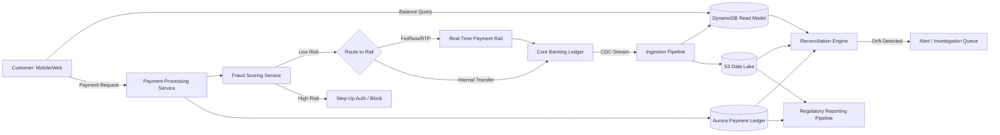
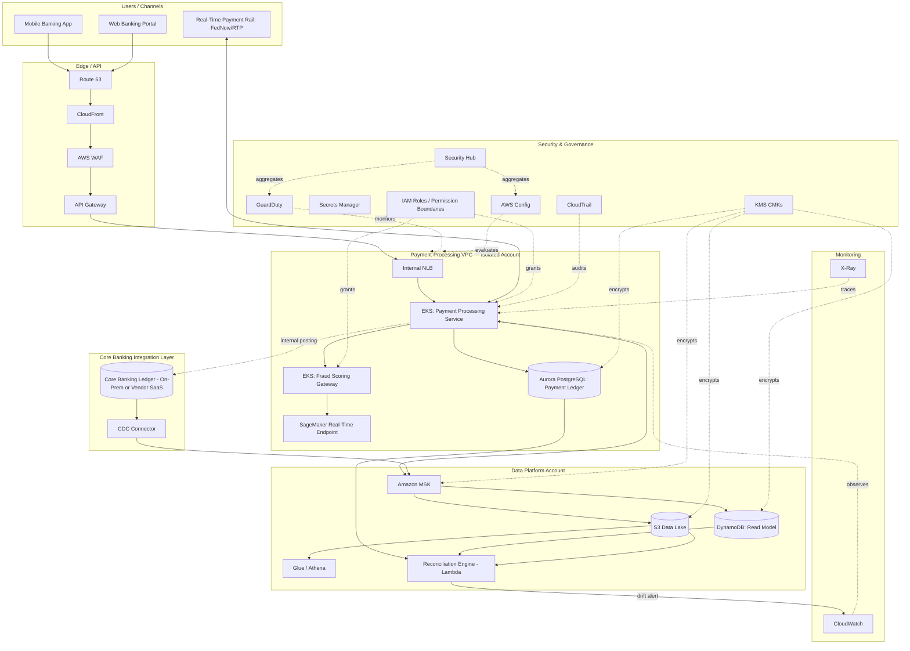

# Part IX – Industry-Specific Architectures

# Chapter 67: Banking

---

## 1. Executive Summary

Banking is the industry where cloud architecture mistakes are least forgiving. A retail e-commerce outage costs revenue and reputation; a core banking outage can leave depositors unable to access their own money, trigger regulatory reporting obligations within hours, and in extreme cases threaten an institution's charter. This chapter presents a production-grade reference architecture for a **digital banking platform** — the layer that sits in front of (and increasingly alongside) a bank's core banking ledger, handling customer-facing digital channels, real-time payments, fraud detection, and regulatory reporting — designed specifically to survive the scrutiny of banking regulators, external auditors, and an institution's own risk committee, not just a normal architecture review board.

**The business problem.**

Traditional core banking systems — mainframe-based general ledgers, deposit systems, and loan servicing platforms — were built for batch processing in an era when "real-time" meant end-of-day settlement. Customers today expect instant balance updates, instant peer-to-peer transfers, instant fraud alerts, and mobile-first digital experiences. Meeting these expectations without a wholesale, multi-year core banking replacement (a program many institutions have tried and few have completed on time or budget) requires an architecture that sits alongside the core, absorbing digital-channel traffic and real-time payment rails while treating the core ledger as the authoritative system of record for account balances and transaction settlement.

This creates a specific and recurring architectural tension: digital channels want to move fast and scale elastically; the core ledger moves slowly, is often a batch-oriented system with limited throughput, and cannot be treated as just another microservice dependency. The architecture in this chapter is built around this tension explicitly — it does not attempt to replace the core, it is designed to protect the core from the traffic patterns and availability expectations of modern digital banking while giving customers a real-time experience on top of a system that, underneath, may still close its books at 2 AM.

**Architecture objective.**

The objective is a digital banking platform that:

1. Provides real-time balance and transaction visibility to customers through mobile and web channels, using an event-driven, eventually-consistent read model that is refreshed continuously from the core ledger rather than querying the core directly on every customer request.
2. Processes real-time payment rails (RTP, FedNow, card authorizations) with the strict latency and availability requirements those rails impose — many real-time payment schemes have contractually mandated response times measured in seconds, with financial penalties for non-compliance.
3. Runs continuous fraud detection and transaction monitoring, using machine learning models to score transactions in real time without introducing unacceptable latency into the customer-facing payment path.
4. Produces the audit trail, data lineage, and reporting artifacts required by banking regulators — the OCC and Federal Reserve in the United States, the PRA and FCA in the United Kingdom, or equivalent bodies elsewhere — as a first-class architectural output, not an afterthought bolted on before an exam.
5. Isolates blast radius aggressively: a failure in a marketing-analytics pipeline or a third-party integration must never be able to affect payment processing or account balance accuracy.

**Why organizations adopt this architecture.**

- **Digital-first competitive pressure.** Neobanks and fintech competitors set customer expectations that traditional institutions must match without the multi-year, multi-hundred-million-dollar core replacement programs that a from-scratch neobank never had to undertake.
- **Real-time payment scheme participation.** Joining FedNow or RTP as a participating institution is, in practice, an architectural commitment as much as a business one — these schemes have explicit, audited service-level requirements that a legacy batch-oriented core cannot meet without a real-time layer in front of it.
- **Regulatory modernization pressure.** Regulators increasingly expect institutions to demonstrate real-time fraud monitoring and faster incident detection/reporting capability than a batch-era architecture can provide.
- **Cost pressure on mainframe capacity.** Every transaction pushed through a real-time digital layer instead of hitting the mainframe core directly for read operations reduces MIPS consumption on a cost basis that is frequently the single largest line item in a bank's technology budget.

**Major business benefits.**

| Benefit | Business Impact |
|---|---|
| Real-time customer experience | Competitive parity with digital-native challengers; reduced call center volume for balance inquiries. |
| Real-time payment rail participation | New revenue streams (instant payment fees) and reduced counterparty risk versus ACH's multi-day settlement window. |
| Continuous fraud monitoring | Reduced fraud losses; faster reg-mandated Suspicious Activity Report (SAR) filing. |
| Reduced mainframe MIPS consumption | Directly reduces one of the largest recurring technology cost lines for institutions still running a mainframe core. |
| Auditable, regulator-ready reporting | Reduced examination preparation cost and reduced risk of a Matter Requiring Attention (MRA) or consent order tied to data governance findings. |
| Incremental modernization path | Avoids the all-or-nothing risk profile of a full core replacement program; the digital layer can be built and iterated independently of the core migration timeline. |

**Typical enterprise scenarios.**

- A regional bank building a real-time payments capability (FedNow/RTP) in front of a mainframe core that only posts transactions in overnight batch cycles.
- A bank replacing a third-party-hosted online/mobile banking platform with an in-house digital banking layer for cost, customization, and data-ownership reasons.
- A bank building a real-time fraud and transaction monitoring capability to replace a legacy rules-only fraud system with an ML-augmented one.
- A bank undergoing a phased core banking modernization, where the digital layer described in this chapter is the durable component that survives an eventual switch from one core provider to another — a core migration becomes materially less risky when customer-facing channels are already decoupled from direct core dependency.

> **Note:** This chapter deliberately does **not** describe replacing the core ledger itself. Core banking replacement is its own multi-year architectural program with its own risk profile, regulatory approval requirements (in many jurisdictions a core conversion requires regulator notification or approval), and vendor landscape (Temenos, Finastra, FIS, Thought Machine, Mambu, and others). This chapter's reference architecture treats the core as an external system of record accessed through a well-defined integration boundary, which is the realistic position most institutions are actually in.

---

## 2. Business Requirements

### 2.1 Business Drivers

- Enable real-time balance inquiry and P2P/real-time payment processing without a core banking replacement.
- Reduce mainframe MIPS cost by offloading read-heavy digital-channel traffic to a cloud-native read model.
- Strengthen fraud detection and reduce fraud losses through real-time, ML-augmented transaction scoring.
- Meet regulatory expectations for auditability, data lineage, and incident detection/reporting speed.
- Support participation in real-time payment schemes (FedNow, RTP) with contractually mandated response-time SLAs.

### 2.2 Functional Requirements

- Provide a real-time (sub-second, eventually-consistent) balance and transaction history view to mobile/web channels.
- Process real-time payment requests (send and receive) against FedNow/RTP rails, including request-for-payment and remittance data handling.
- Score every transaction for fraud risk in real time, blocking or step-up-authenticating high-risk transactions without materially delaying legitimate ones.
- Reconcile the cloud-native read model continuously against the core ledger, detecting and alerting on any drift.
- Generate the specific regulatory reports required (e.g., Bank Secrecy Act/AML transaction monitoring exports, Suspicious Activity Report supporting data) from a single, auditable data lineage.

### 2.3 Non-Functional Requirements

| Category | Requirement |
|---|---|
| Scalability | Support 5 million digital-banking customers, 20 million transactions/day at launch, scaling to 15 million customers within three years. |
| Availability | 99.99% for the payment-processing path (real-time rail participation contractually requires this); 99.95% for the digital-channel read path. |
| Latency | Real-time payment rail response within the scheme's mandated window (typically under 5–15 seconds end-to-end depending on the specific rail and message type); balance inquiry under 300ms p99. |
| Compliance | PCI-DSS (card data), GLBA (customer financial data privacy), Bank Secrecy Act/AML, SOX (financial reporting controls), FFIEC IT examination handbook guidance, and jurisdiction-specific banking regulation (OCC/Federal Reserve/FDIC in the US, PRA/FCA in the UK, or equivalent). |
| Security | Defense-in-depth architecture explicitly designed to withstand a formal regulatory examination and a third-party penetration test, not just a routine internal security review. |
| Recovery | RPO of 0 for any financial transaction data; RTO of 15 minutes or less for the payment-processing path, given the direct regulatory and contractual consequences of extended payment-rail downtime. |
| SLAs | 99.99% of real-time payment requests processed within the scheme's mandated response window; 100% of transactions reconciled against the core ledger within 24 hours with zero unresolved discrepancies older than 48 hours. |

### 2.4 Scalability Goals

- The read model and fraud-scoring path must scale independently of the core ledger's own throughput ceiling, since the entire point of this architecture is decoupling digital-channel scale from core-banking scale.
- Real-time payment volume must scale to handle scheme-wide adoption growth (RTP and FedNow both are in the process of broad multi-year adoption ramp-up across US financial institutions) without requiring an architecture redesign.

### 2.5 Availability Requirements

- The payment-processing path is architected as the single most available component in this system, given that real-time payment scheme participation agreements typically include explicit uptime commitments with financial and reputational consequences for non-compliance.
- The digital-channel read path, while still held to a high bar, can tolerate brief degraded-mode operation (e.g., serving slightly stale balance data with an explicit "as of" timestamp) in ways the payment path cannot.

### 2.6 Latency Requirements

- Real-time payment rails are the most latency-constrained component in this architecture; both FedNow and RTP specify maximum response-time windows within their respective participation rules, and exceeding them has both scheme-level and customer-experience consequences (a payment appearing to hang or fail when it may have actually succeeded downstream is a specific, well-documented failure mode this architecture must avoid).
- Fraud scoring must complete within the overall payment latency budget — this chapter's design targets a fraud-scoring latency budget of under 150ms p99 specifically so it never becomes the binding constraint on the overall payment response window.

### 2.7 Compliance Requirements

- **PCI-DSS** for any card-linked payment data flowing through this platform.
- **GLBA (Gramm-Leach-Bliley Act)** and equivalent data-privacy regulation for customer financial information — requiring documented data-sharing controls, opt-out mechanisms, and safeguarding of nonpublic personal information (NPI).
- **Bank Secrecy Act (BSA) / Anti-Money Laundering (AML)** requirements for transaction monitoring and Suspicious Activity Report (SAR) filing capability.
- **SOX** internal controls over financial reporting, to the extent this platform's data feeds into financial statements or reconciliation processes subject to SOX scope.
- **FFIEC IT Examination Handbook** guidance, which US banking regulators use as the de facto framework for evaluating an institution's technology risk management, business continuity, and third-party (including cloud provider) risk management practices.

### 2.8 Security Expectations

- Every component handling customer financial data or payment instructions is designed assuming it will be specifically reviewed by a bank examiner or an external auditor engaged for a SOC 2/SOC 1 Type II report, not just an internal security team.
- Segregation of duties is enforced architecturally (via IAM permission boundaries and approval workflows), not merely as a documented policy, since segregation of duties is a specific, commonly-cited examination finding when it exists only on paper.

### 2.9 Recovery Objectives

| Metric | Target | Rationale |
|---|---|---|
| RPO | 0 for transaction/payment data | Any data loss in a financial transaction is not an acceptable operational trade-off; regulators treat this as a fundamental safety-and-soundness expectation. |
| RTO | 15 minutes (payment path) | Aligned to real-time payment scheme participation requirements and the institution's own board-approved business continuity plan. |
| RTO | 60 minutes (digital-channel read path) | Less stringent than the payment path, reflecting that temporarily degraded balance-inquiry availability, while undesirable, does not carry the same direct financial and regulatory consequence as a failed real-time payment. |

### 2.10 SLAs

- 99.99% of real-time payment requests meet the scheme's mandated response-time window.
- 100% of transactions are reconciled against the core ledger within 24 hours, with any discrepancy triaged within 4 hours of detection given the direct financial-reporting and customer-trust implications of an unresolved balance discrepancy.

### 2.11 Expected Workload and Growth

- Launch: 5 million digital-banking customers, 20 million transactions/day, real-time payment volume representing roughly 5% of total transaction volume at launch (consistent with early-stage adoption curves observed across the industry for real-time payment rails).
- Year 3: 15 million customers, real-time payment volume growing to an estimated 25–30% of total transaction volume as scheme-wide adoption matures industry-wide.

---

## 3. Architecture Overview

### 3.1 Overall Design

The architecture is a **core-adjacent, event-driven digital banking platform**. The core banking ledger remains the system of record for account balances and final transaction settlement. A Change Data Capture (CDC) pipeline continuously streams core-ledger transaction events into the cloud, populating a real-time, eventually-consistent read model (DynamoDB) that serves all digital-channel balance and transaction-history queries. Real-time payment requests are processed through a dedicated, highly available payment-processing path that validates, fraud-scores, and — depending on the specific rail's integration pattern — either posts directly to the core in real time (where the core supports it) or posts to an intermediate ledger with guaranteed, reconciled settlement to the core on the next available posting cycle.

### 3.2 Architecture Philosophy

Four principles govern this architecture, each specifically shaped by banking's regulatory and risk context:

1. **The core ledger is the immutable source of truth; the cloud platform is a read-optimized and payment-orchestration layer around it, never a competing source of truth.** Every design decision defers final balance authority to the core, even when that means the digital layer must explicitly represent and communicate "pending" or "as of" states to customers rather than presenting cloud-side data as unconditionally authoritative.
2. **Blast radius isolation is a regulatory requirement, not just good engineering practice.** The payment-processing path is architecturally isolated (separate AWS accounts, separate IAM boundaries, separate on-call rotation) from lower-criticality digital-channel features (statements, rewards, marketing), so that a failure or security incident in a lower-criticality component can never propagate into payment processing — this directly maps to FFIEC expectations around risk-tiered system criticality.
3. **Every financial data flow must be reconstructable and auditable end-to-end.** From the moment a transaction enters the platform to the moment it settles in the core, there must be an unbroken, queryable data lineage — this is designed in from day one because retrofitting audit lineage after a regulatory finding is a materially more expensive and more disruptive undertaking than building it in initially.
4. **Segregation of duties is enforced by IAM and workflow design, not documentation alone.** No single engineer's credentials can both modify fraud-detection rules and approve their own change to production; this is enforced via IAM permission boundaries and a mandatory two-person CI/CD approval gate for any change to the fraud-scoring or payment-processing components specifically.

### 3.3 Core Components

- **Change Data Capture (CDC) pipeline** — streams transaction events from the core ledger (via a core-vendor-provided CDC mechanism, a message queue the core publishes to, or a batch-file-to-event conversion process for cores that only support file-based interfaces) into the cloud platform.
- **DynamoDB read model** — stores the eventually-consistent, customer-facing view of balances and transaction history.
- **Payment-processing service (ECS Fargate / EKS)** — validates, fraud-scores, and routes real-time payment requests to the appropriate rail (FedNow, RTP) or the core's own posting interface.
- **Fraud-scoring service** — a low-latency ML inference service (SageMaker real-time endpoint or a custom-hosted model) scoring every transaction.
- **Aurora PostgreSQL** — stores payment-processing transactional state (idempotency records, payment request/response audit trail) requiring strong relational consistency and referential integrity beyond what the DynamoDB read model provides.
- **EventBridge / Kafka (MSK)** — the event backbone connecting CDC ingestion, fraud scoring, payment processing, and downstream reconciliation/reporting consumers.
- **S3 Data Lake** — the durable, queryable archive of every transaction and payment event, serving both regulatory reporting and long-term reconciliation.
- **Reconciliation engine** — a scheduled and event-triggered process continuously comparing the DynamoDB read model and Aurora payment ledger against the core's own reported balances, alerting on any drift.

### 3.4 How Components Interact

The core ledger publishes transaction events (via CDC or a vendor-specific integration) that flow through a dedicated ingestion pipeline into both the DynamoDB read model (for customer-facing queries) and the S3 data lake (for durable audit archive). Real-time payment requests originate from a mobile/web channel or a payment-rail inbound message, flow through the fraud-scoring service, and — on approval — are posted through the payment-processing service to the appropriate rail or the core's posting interface, with every step recorded in the Aurora audit ledger and published as an event for downstream reconciliation and reporting consumers.

### 3.5 High-Level Workflow



### 3.6 Request Lifecycle

1. Customer initiates a real-time payment via the mobile app.
2. Request reaches the payment-processing service via API Gateway.
3. Idempotency check against Aurora (using a client-supplied idempotency key) to guard against duplicate submission from network retries.
4. Fraud-scoring service scores the transaction in real time.
5. On approval, the payment-processing service routes the request to the appropriate rail (FedNow/RTP) or the core's internal posting interface.
6. The rail's response (or the core's posting acknowledgment) is recorded in the Aurora audit ledger and published as an event.
7. The DynamoDB read model is updated (via the same event) so the customer's next balance query reflects the pending/completed payment.

### 3.7 Response Lifecycle

- The mobile/web channel receives a synchronous response indicating the payment's immediate status (accepted, pending, declined) within the rail's mandated response window; final settlement confirmation, where the rail's protocol distinguishes the two, is delivered asynchronously via push notification or the next balance refresh.

### 3.8 Data Lifecycle

- Every transaction event is durably persisted in the S3 data lake at ingestion (both from CDC and from the payment-processing path), independent of the DynamoDB read model's retention, since the data lake — not the read model — is the long-term regulatory and reconciliation source of truth for the cloud platform's own records.
- DynamoDB read-model data is retained for the customer-facing transaction-history window (commonly 18–24 months, per the institution's specific disclosure policy) with older data served from the data lake via an on-demand query path if a customer requests older history.

---

## 4. AWS Services Used

### 4.1 Amazon EKS (Elastic Kubernetes Service)

**Purpose:** Hosts the payment-processing and fraud-scoring services, which require the deployment flexibility, sidecar patterns (for mutual TLS, service mesh policy enforcement), and fine-grained resource control that a container orchestration platform provides.

**Why selected:** Banking payment-processing workloads frequently need service-mesh-enforced mutual TLS between every service (a specific, common examination and penetration-test expectation), fine-grained network policy, and the ability to run a mix of long-lived services and short-lived batch/reconciliation jobs on shared infrastructure — EKS with a service mesh (Istio or AWS App Mesh) is the natural fit for this workload profile at banking scale.

**Alternatives:** ECS Fargate (simpler operational model, less native service-mesh flexibility, evaluated seriously and rejected here specifically because the security team required mutual TLS and fine-grained network policy enforcement patterns that are more mature in the EKS/Istio ecosystem at the time of this platform's design); Lambda (rejected for the core payment-processing path due to cold-start latency risk against the strict rail response-time SLA, though used extensively for the lower-criticality digital-channel and reconciliation components).

**Limitations:** Materially higher operational complexity than ECS Fargate or Lambda; requires a dedicated platform engineering capability to operate safely at banking-grade availability.

**Pricing considerations:** EKS control plane cost is small relative to worker node cost; worker nodes for the payment-processing path run on-demand (not Spot) given the availability requirement, with Savings Plans applied once baseline utilization is established.

**Best practices:** Dedicated node groups (or a dedicated cluster entirely) for the payment-processing path, isolated from lower-criticality workloads; Pod Security Standards enforced at the `restricted` level; network policies denying all traffic by default with explicit allow rules per service.

### 4.2 Amazon Aurora PostgreSQL

**Purpose:** Stores the payment-processing audit ledger — idempotency records, payment request/response history, and the transactional state requiring strong relational consistency and referential integrity.

**Why selected:** Payment processing requires ACID transactional guarantees (an idempotency check and a ledger write must be atomic) that a purely eventually-consistent NoSQL store cannot provide as naturally; Aurora's PostgreSQL compatibility gives the team a mature, well-understood relational engine with strong consistency, point-in-time recovery, and multi-AZ synchronous replication.

**Alternatives:** DynamoDB with conditional writes could provide idempotency guarantees for simpler cases, but the payment audit ledger's need for complex relational queries (joining payment requests, rail responses, and reconciliation records) during audits and investigations favors a relational engine; Aurora is preferred here over standard RDS PostgreSQL specifically for its faster failover (typically under 30 seconds) and read-replica scaling.

**Limitations:** Vertical scaling ceiling exists (though very high); write throughput is ultimately bounded by the writer instance, a real consideration at very high payment volume that this architecture addresses via careful schema design (avoiding hot partitions/rows) rather than by moving off Aurora.

**Pricing considerations:** Aurora's per-I/O pricing model (unless using Aurora I/O-Optimized) can become a material cost line at very high transaction volume; this is specifically evaluated and modeled in Section 16.

**Best practices:** Multi-AZ deployment with at least one reader in a separate AZ; encryption at rest with a customer-managed KMS key; automated backups with a retention period aligned to the institution's data-retention policy (commonly 7 years for financial transaction records, though the primary long-term archive lives in the S3 data lake, not in Aurora backups).

### 4.3 Amazon DynamoDB

**Purpose:** Serves as the real-time, customer-facing read model for balance inquiries and transaction history, decoupling digital-channel read scale entirely from the core ledger's own throughput ceiling.

**Why selected:** Single-digit-millisecond read latency at effectively unlimited scale is exactly what a customer-facing balance-inquiry API needs; DynamoDB Streams provide the mechanism to keep downstream caches and notification systems current as the read model updates.

**Alternatives:** ElastiCache (Redis) as a pure cache in front of a relational read replica was considered and rejected as the primary store, since DynamoDB's on-demand scaling better matches a customer base with highly variable per-customer access patterns (a small number of business customers may generate disproportionate transaction volume) without requiring careful cache-invalidation logic.

**Limitations:** Eventually consistent by default (strongly consistent reads are used specifically for the payment-processing idempotency check, at a cost/throughput trade-off); 400KB item size limit (transaction history is stored as time-ordered items per customer, not accumulated into a single large item).

**Pricing considerations:** On-demand mode is used initially for its operational simplicity during the platform's early growth phase; provisioned capacity with auto-scaling is evaluated once traffic patterns stabilize, as detailed in Section 16.

**Best practices:** Single-table design with a composite key (`customerId` partition key, `transactionTimestamp#transactionId` sort key) supporting efficient time-ordered transaction-history queries; point-in-time recovery enabled; customer-managed KMS encryption.

### 4.4 Amazon MSK (Managed Streaming for Apache Kafka)

**Purpose:** The primary event backbone for CDC ingestion, fraud-scoring pipeline input, and downstream reconciliation/reporting consumers, chosen over EventBridge for this specific workload because of the ordering guarantees, replay capability, and very high sustained throughput banking transaction volume requires.

**Why selected:** Banking transaction streams require strict per-account (or per-partition-key) ordering guarantees that Kafka's partition model provides naturally; the ability to replay a topic from an arbitrary offset is specifically valuable for reconciliation investigations ("replay everything that happened to this account in the last 48 hours") and for rebuilding a downstream consumer's state after a bug fix.

**Alternatives:** Amazon EventBridge (used extensively elsewhere in this architecture for lower-throughput, less ordering-sensitive event routing, such as notification fan-out) does not provide the same per-key ordering and replay semantics at this throughput; Amazon Kinesis Data Streams is a credible alternative and was seriously evaluated, with MSK ultimately preferred here for the specific team's existing Kafka operational expertise and the desire for full Kafka protocol compatibility with several vendor-provided CDC connectors that speak native Kafka Connect.

**Limitations:** Meaningfully higher operational complexity than EventBridge or Kinesis; requires careful partition-count and retention planning up front, since partition count changes are disruptive for ordering-sensitive consumers.

**Pricing considerations:** MSK broker cost and storage cost are a material, continuously-running cost line (unlike serverless alternatives that scale to zero) — MSK Serverless is evaluated as a lower-operational-overhead alternative and is a reasonable choice for institutions without existing dedicated Kafka operational expertise.

**Best practices:** Dedicated topics per data domain (transaction events, fraud-scoring results, reconciliation events) with a partition key chosen to guarantee per-account ordering; encryption in transit (TLS) and at rest (KMS); IAM-based or SASL/SCRAM authentication with per-service ACLs, never a shared cluster-wide credential.

### 4.5 Amazon SageMaker

**Purpose:** Hosts the real-time fraud-scoring model as a low-latency inference endpoint.

**Why selected:** SageMaker's real-time endpoint hosting provides the sub-100ms inference latency this architecture's fraud-scoring budget requires, along with the model-versioning, A/B testing (via production variants), and monitoring (SageMaker Model Monitor) capabilities a regulated fraud-detection model needs for governance and explainability.

**Alternatives:** A self-hosted inference service on ECS/EKS was considered; SageMaker is preferred for its native model governance features (model registry, approval workflow, drift monitoring) that map directly to the model-risk-management expectations banking regulators hold institutions to (in the US, this is commonly referenced against the Federal Reserve's SR 11-7 model risk management guidance).

**Limitations:** Endpoint cold-start and auto-scaling latency during a sudden, very sharp demand spike requires careful provisioned-concurrency-equivalent planning (SageMaker's own capacity provisioning) ahead of known high-volume events.

**Pricing considerations:** Real-time endpoints incur continuous instance cost regardless of request volume (unlike serverless inference), a deliberate trade-off accepted here specifically because the fraud-scoring path cannot tolerate the cold-start latency risk of a scale-to-zero inference option.

**Best practices:** Multi-model or multi-variant endpoints for safe canary rollout of a new fraud model version; SageMaker Model Monitor configured to detect data drift and model-quality degradation continuously, alerting the model-risk-management team (a role that exists specifically in banking risk organizations) rather than only the engineering team.

### 4.6 Amazon S3 (Data Lake)

**Purpose:** Durable, queryable long-term archive of every transaction and payment event, serving as the source for regulatory reporting, reconciliation, and any customer transaction-history request beyond the DynamoDB read model's retention window.

**Why selected:** S3's durability, low cost at scale, and native integration with Athena/Glue for ad hoc and scheduled regulatory query workloads make it the natural long-term system of record for the cloud platform's own transaction history.

**Best practices:** Object Lock in compliance mode for any data subject to a regulatory retention mandate, ensuring immutability even against an account administrator; partitioned by date and account-segment for efficient Athena query performance; lifecycle policies transitioning older data to Glacier tiers once the active-query window has passed, while respecting the institution's specific regulatory retention period (frequently 7 years or longer for financial transaction records, verified against the specific jurisdiction's requirement rather than assumed).

### 4.7 IAM, KMS, Secrets Manager, CloudWatch, CloudTrail, AWS Config, GuardDuty, Security Hub

Covered in depth in Sections 10, 11, 21, and 22. In a banking context specifically:

- **IAM** permission boundaries enforce segregation of duties as an architectural control, not just policy documentation — this is the single most examination-relevant IAM design decision in this chapter.
- **KMS** customer-managed keys, with key policies reviewed by the security and audit teams jointly, given that demonstrable control over encryption keys is a specific, common item in both PCI-DSS assessments and banking regulatory examinations.
- **CloudTrail** is configured with log-file integrity validation enabled and delivered to a separate, access-restricted log-archive account with Object Lock, since the immutability and integrity of the audit trail is itself an examination focus area, not merely a nice-to-have.
- **AWS Config** rules continuously evaluate the environment against both AWS security best practices and bank-specific control mappings (e.g., a custom Config rule verifying that the payment-processing account has no internet-facing ingress at all, a specific architectural invariant this platform enforces).
- **GuardDuty** and **Security Hub** aggregate findings across the multi-account banking environment into a single risk view consumed by both the security team and, in summary form, the institution's technology risk committee.

Services explicitly **not** central to this architecture, and why: EC2/ALB appear only as supporting infrastructure for specific legacy integrations (e.g., a VPN-terminating appliance bridging to an on-premises core), not as the primary compute layer, since the payment-processing and fraud-scoring workloads are containerized (EKS) or serverless (Lambda) by design; RDS (non-Aurora) is not used, since Aurora's faster failover characteristics are specifically valuable given the payment path's strict RTO.

---

## 5. Complete Architecture Diagram



> **Tip:** Note that the payment-processing VPC has no direct internet ingress path at all — traffic reaches it only via the internal NLB from API Gateway (through a VPC Link) and outbound only to the real-time payment rail and the core banking integration layer over dedicated, allow-listed connections. This is a specific, deliberate architectural invariant, not an oversight — it is the single control most frequently verified first by both penetration testers and bank examiners reviewing this class of system.

---

## 6. Component-by-Component Explanation

### 6.1 Payment Processing Service (EKS)

- **Purpose:** Validates, orchestrates, and records real-time payment requests.
- **Responsibilities:** Idempotency enforcement, fraud-scoring orchestration, rail routing, ledger recording.
- **Inputs:** Payment request (from mobile/web channel via API Gateway, or inbound from a real-time payment rail).
- **Outputs:** Payment response (accepted/pending/declined), ledger entry, published event for downstream consumers.
- **Scaling:** Horizontal pod autoscaling based on request rate and p99 latency, with a minimum replica count sized to the institution's peak historical payment volume plus a documented safety margin — never scaled purely reactively for this specific workload, given the rail's strict response-time SLA.
- **High availability:** Deployed across a minimum of three Availability Zones; the EKS cluster's control plane is itself inherently multi-AZ as an AWS-managed component.
- **Failure handling:** Every external call (fraud-scoring endpoint, rail API, core posting interface) has an explicit circuit breaker and a documented fallback behavior — critically, a fraud-scoring service outage results in a documented, pre-approved fallback policy (e.g., apply a more conservative static rule set and flag for post-hoc review) rather than either blocking all payments or bypassing fraud screening entirely, since either extreme is a specific, foreseeable operational and reputational risk that must be decided in advance, not during an incident.
- **Dependencies:** Aurora, MSK, SageMaker fraud endpoint, real-time payment rail APIs, core banking posting interface.
- **Security:** Runs in a fully isolated VPC/account with no internet ingress; mutual TLS enforced between all internal service calls via the service mesh.
- **Monitoring:** p50/p95/p99 latency against the rail's mandated SLA window as the single most important dashboard metric in this entire architecture.

### 6.2 Fraud Scoring Service

- **Purpose:** Real-time transaction risk scoring.
- **Inputs:** Transaction attributes (amount, counterparty, device/session signals, historical account behavior features retrieved from a feature store).
- **Outputs:** Risk score and recommended action (approve, step-up authentication, block, flag for manual review).
- **Failure handling:** Documented fallback policy per above; SageMaker Model Monitor tracks data and prediction drift continuously, escalating to the model-risk-management function on detected drift.
- **Security:** No direct internet exposure; model artifacts and training data access restricted via IAM to the specific data science and model-risk-management roles.

### 6.3 CDC Ingestion Pipeline

- **Purpose:** Streams transaction events from the core banking ledger into the cloud platform.
- **Responsibilities:** Schema translation (core-specific transaction formats to the platform's canonical event schema), ordering preservation, exactly-once (or effectively-once via idempotent consumers) delivery into MSK.
- **Failure handling:** A CDC pipeline outage does not stop the core from processing transactions — it stops the cloud platform's read model from being current, which is why every customer-facing balance display includes an explicit "as of" timestamp, and why a CDC lag alarm is one of the highest-priority operational alarms in this architecture (a stale read model presenting outdated balances is a specific, well-documented category of customer complaint and, at sufficient staleness, a regulatory concern).

### 6.4 Reconciliation Engine

- **Purpose:** Continuously verifies that the DynamoDB read model and Aurora payment ledger match the core's own authoritative balances.
- **Responsibilities:** Scheduled full reconciliation (daily) plus event-triggered spot reconciliation (on specific high-value or high-risk transaction patterns); alerting on any drift beyond a documented tolerance.
- **Security:** Read-only access to all systems it reconciles; cannot write to any ledger, by IAM design, since a reconciliation engine that can also modify the data it is meant to independently verify defeats its own purpose as a control.

### 6.5 Aurora Payment Ledger

- **Purpose:** Authoritative record, within the cloud platform, of every payment request and its outcome.
- **High availability:** Multi-AZ with synchronous replication; automated failover typically completing in under 30 seconds.
- **Security:** Encrypted at rest with a customer-managed KMS key; database-level audit logging enabled (`pgaudit` extension) capturing every read and write to the payment ledger tables specifically, given the examination-relevant sensitivity of this data.

---

## 7. End-to-End Request Flow

1. **Customer initiates a real-time payment** via the mobile app, which calls API Gateway over TLS 1.2+.
2. **WAF** evaluates the request against managed rule groups and a banking-specific rate-limiting rule before it reaches the API.
3. **API Gateway** authenticates the request (via Amazon Cognito or the institution's existing identity provider through a SAML/OIDC federation) and forwards it via a VPC Link to the internal NLB fronting the payment-processing service.
4. **Payment-processing service** checks Aurora for an existing record matching the client-supplied idempotency key; if found, returns the previously recorded result rather than reprocessing (protecting against duplicate submission from a mobile network retry).
5. **Payment-processing service** calls the **fraud-scoring service**, which retrieves account behavior features and returns a risk score within its latency budget.
6. **Choice:** low-risk transactions proceed; high-risk transactions are either declined, routed to step-up authentication (e.g., an out-of-band confirmation prompt), or flagged for manual review depending on the configured risk threshold and the specific transaction type.
7. **Payment-processing service** routes the approved request to the appropriate rail (FedNow/RTP API call) or, for an internal transfer, to the core banking posting interface.
8. **Rail or core response** is received and recorded, along with the full request/response payload, in the **Aurora payment ledger**.
9. **Event published to MSK** carrying the payment outcome.
10. **DynamoDB read model updated** by a consumer of that MSK event, so the customer's subsequent balance query reflects the (at minimum, pending) transaction.
11. **S3 data lake** receives the same event via a separate MSK consumer, for durable long-term archive independent of the read model's retention window.
12. **Customer receives a synchronous response** (accepted/pending/declined) within the rail's mandated window; a push notification confirms final settlement asynchronously if the rail's protocol distinguishes acceptance from final settlement.
13. **Reconciliation engine** picks up the event (and the corresponding core-ledger CDC event, once it arrives) to confirm the cloud platform's record matches the core's authoritative posting.
14. **CloudWatch and X-Ray** capture the full trace, including the fraud-scoring and rail-call subsegments, enabling precise latency-budget attribution if the end-to-end response approaches the rail's SLA window.
15. **On any unrecoverable error** (rail timeout with an ambiguous outcome, core posting failure), the payment-processing service records an explicit "indeterminate" status rather than guessing at success or failure, and routes the transaction to a dedicated investigation queue for manual reconciliation — a deliberate design choice, since presenting an incorrect success or failure state to a customer or to the core ledger is a materially worse outcome than an honest "we are confirming this" state.

---

## 8. Deployment Flow

### 8.1 Infrastructure Provisioning

All infrastructure is provisioned via Terraform across a multi-account AWS Organizations structure, with the payment-processing account's Terraform module subject to an additional mandatory security-team review step beyond the standard peer review required for other accounts in this architecture.

### 8.2 Terraform Workflow

1. Engineer opens a PR; CI runs `terraform plan`, `tfsec`/`Checkov`, and policy-as-code checks.
2. For changes touching the payment-processing or fraud-scoring account specifically, a second, independent approval from a designated security reviewer is mandatory before merge — enforced via branch protection rules requiring two distinct approving reviewers from two distinct team groups, directly implementing the segregation-of-duties principle from Section 3.2 as a technical control rather than a process document.
3. On merge, CI applies to `staging`, runs the automated integration and reconciliation test suite, and requires a manual promotion gate before applying to `prod`.

### 8.3 Blue-Green Deployment

- The payment-processing service on EKS uses a weighted traffic-shifting deployment (via the service mesh's traffic management, e.g., Istio VirtualService weights) rather than a simple rolling update, allowing a new version to receive a small percentage of live payment traffic while the majority continues to the previous, known-good version.
- Canary metrics (error rate, p99 latency against the rail SLA) are evaluated automatically before traffic is shifted further; any regression triggers an automatic rollback of the traffic weighting.

### 8.4 Rollback

- Rollback is a traffic-weight reversion, not a redeploy — the previous version's pods remain running throughout the canary window specifically so rollback is a near-instantaneous configuration change, not a new deployment that itself carries risk during an active incident.

### 8.5 Secrets and Configuration

- All rail API credentials, core-banking integration credentials, and database credentials are stored in Secrets Manager with automatic rotation; the payment-processing service retrieves them via the Secrets Manager CSI driver integration for EKS, never as plaintext environment variables or baked into container images.

### 8.6 Validation

- A synthetic transaction test suite runs continuously in production (using a dedicated, clearly-flagged test account excluded from real customer reporting and reconciliation) to validate end-to-end payment-path health independent of real customer traffic volume, giving the team a signal even during periods of genuinely low transaction volume (e.g., overnight) when real-traffic-based monitoring alone would be less sensitive to a partial degradation.

---

## 9. Network Topology

- **VPC segmentation by criticality tier:** The payment-processing workload runs in its own dedicated VPC within its own dedicated AWS account (part of a broader AWS Organizations multi-account strategy segmenting workloads by risk tier), completely separate from the digital-channel (statements, rewards, marketing) VPC/account and the data-platform VPC/account.
- **CIDR:** Payment-processing VPC uses `10.30.0.0/16`, non-overlapping with all other account VPCs to support Transit Gateway-based routing without conflict.
- **Public subnets:** None exist in the payment-processing VPC — this is a deliberate, examination-relevant architectural invariant, not an oversight. All external connectivity (to the real-time payment rail, to the core banking integration layer) occurs through explicitly allow-listed private connectivity paths (PrivateLink where the counterparty supports it, or a dedicated VPN/Direct Connect path with strict security-group and NACL controls where it does not).
- **Private subnets:** Host all EKS worker nodes and the Aurora cluster, across three Availability Zones.
- **NAT Gateway:** Present only to the extent any component requires outbound-only internet access (e.g., pulling container images from a public registry mirror, or the SageMaker endpoint's dependency resolution); the payment-processing service's actual transaction-processing path itself never traverses a NAT Gateway to reach the internet, since the real-time payment rail and core-integration connectivity are both private paths.
- **Transit Gateway:** Centralizes routing across the payment-processing, data-platform, and digital-channel accounts, with route tables carefully scoped so the payment-processing VPC can reach only the specific data-platform resources (MSK, specific S3 buckets) it needs, and cannot reach the digital-channel VPC directly at all.
- **Network ACLs:** Configured restrictively at the payment-processing VPC's subnet boundaries as defense-in-depth, denying all traffic by default with narrow, explicit allow rules.
- **Security Groups:** Every service-to-service connection has its own narrowly-scoped security group rule (e.g., the payment-processing service's security group permits outbound traffic to the Aurora cluster's security group on port 5432 specifically, not a broad CIDR range).
- **PrivateLink:** Used for the connection to the real-time payment rail's API where the rail operator offers a PrivateLink endpoint (increasingly common for regulated financial infrastructure), and for the platform's own internal service-to-service calls that cross account boundaries, avoiding any traversal of the public internet for sensitive traffic.
- **Hybrid connectivity:** A dedicated Direct Connect connection (with a redundant second Direct Connect connection from a different provider/location for resilience, a common banking-specific requirement given the criticality of core-banking connectivity) links the payment-processing VPC to the on-premises core banking data center where the core itself has not been migrated to the cloud.

> **Warning:** A frequently cited banking-specific examination and penetration-test finding is a payment-processing environment that technically has "no public subnet" but still has an internet gateway attached to the VPC, or a security group rule broader than the specific traffic pattern requires "just in case." Both are treated in this architecture as hard failures of the network design, verified continuously via an AWS Config rule (not just at initial build time), since a network topology this critical must be provably compliant on an ongoing basis, not just correct at the moment it was last manually reviewed.

---

## 10. Identity and Access

### 10.1 IAM Roles and Segregation of Duties

Segregation of duties in a banking context specifically requires that the ability to modify fraud-detection logic, the ability to approve that modification for production deployment, and the ability to modify the audit trail that records the change are held by distinct roles, with no single identity holding all three.

```hcl

resource "aws_iam_role" "fraud_model_deploy" {
  name = "fraud-model-deploy-role"

  assume_role_policy = jsonencode({
    Version = "2012-10-17"
    Statement = [{
      Effect    = "Allow"
      Principal = { Service = "codepipeline.amazonaws.com" }
      Action    = "sts:AssumeRole"
      Condition = {
        StringEquals = { "aws:SourceAccount" = var.cicd_account_id }
      }
    }]
  })

  permissions_boundary = aws_iam_policy.banking_permission_boundary.arn
}

resource "aws_iam_policy" "banking_permission_boundary" {
  name = "banking-workload-permission-boundary"

  policy = jsonencode({
    Version = "2012-10-17"
    Statement = [
      {
        Sid    = "DenyIAMSelfModification"
        Effect = "Deny"
        Action = ["iam:CreatePolicyVersion", "iam:DeleteRolePermissionsBoundary", "iam:PutRolePermissionsBoundary"]
        Resource = "*"
      },
      {
        Sid    = "DenyLoggingTampering"
        Effect = "Deny"
        Action = ["cloudtrail:StopLogging", "cloudtrail:DeleteTrail", "s3:DeleteObject"]
        Resource = "*"
        Condition = {
          StringEquals = { "aws:ResourceTag/DataClass" = "audit-log" }
        }
      }
    ]
  })
}

```

### 10.2 IAM Policies

- Fraud-model deployment roles cannot modify their own permission boundary or the CloudTrail configuration recording their actions — this specific pairing (self-elevation denial plus audit-tamper denial) is the technical implementation of the segregation-of-duties control an examiner will specifically ask about.

### 10.3 Resource Policies

- The S3 data lake bucket policy explicitly denies `s3:DeleteObject` and `s3:PutBucketLifecycleConfiguration` for any principal other than a narrowly-scoped data-governance role, as defense-in-depth alongside Object Lock.

### 10.4 STS and Cross-Account Access

- The reconciliation engine assumes a read-only cross-account role into both the payment-processing and digital-channel accounts via STS, with the trust policy restricted to the specific reconciliation Lambda's execution role ARN and an external ID, and with the assumed role itself carrying no write permissions whatsoever to either account.

### 10.5 Least Privilege

- Every role in the payment-processing account is validated against IAM Access Analyzer's policy validation checks in CI, and additionally reviewed quarterly by the security team specifically for this account, given its criticality tier — a review cadence more frequent than the organization's standard annual access review for lower-criticality workloads.

### 10.6 Service Roles

- The EKS worker node IAM role, the payment-processing service's pod-level IAM role (via IRSA — IAM Roles for Service Accounts), and the fraud-scoring service's pod-level IAM role are all distinct, each scoped to only the specific resources that specific service needs — a common and serious anti-pattern in less mature banking cloud environments is a single, broad EKS node IAM role shared across every workload on the cluster.

### 10.7 Permission Boundaries

- An organization-wide permission boundary caps the maximum permissions any workload role can hold, specifically prohibiting `iam:*` actions, `organizations:*` actions, and any action against the CloudTrail/Config/GuardDuty configuration in the security/audit account, regardless of what a specific role's own policy document says — this boundary is treated as a compensating control against a Terraform module error that might otherwise grant excessive permissions.

---

## 11. Security Architecture

### 11.1 Encryption

- **At rest:** Aurora, DynamoDB, MSK, and S3 all encrypted with customer-managed KMS keys, with key policies restricting `kms:Decrypt` to the specific IAM roles in the payment-processing and data-platform accounts, and administrative KMS actions restricted to the security team's dedicated key-management role.
- **In transit:** TLS 1.2+ enforced everywhere; mutual TLS (via the service mesh) enforced between every internal service-to-service call within the payment-processing VPC, a specific control frequently verified in penetration tests of banking payment infrastructure.

### 11.2 KMS

- Separate customer-managed KMS keys per data classification tier (payment-ledger data, read-model data, data-lake archive data) rather than a single shared key, so that key-level access review and, if ever necessary, key rotation or revocation can be scoped precisely to the affected data classification without affecting unrelated data.

### 11.3 TLS / Certificate Manager

- Public-facing endpoints use ACM-issued, auto-renewed certificates; internal service mesh mutual TLS uses a private certificate authority (via ACM Private CA or the service mesh's own integrated CA) with short-lived certificates rotated automatically, minimizing the operational and security risk of long-lived internal certificates.

### 11.4 WAF / Shield

- AWS WAF with managed rule groups plus banking-specific custom rules (rate limiting on authentication endpoints specifically, geo-restriction where the institution's customer base is geographically bounded) in front of the API Gateway edge.
- AWS Shield Advanced is adopted for this workload specifically (unlike the general e-commerce reference architecture in Chapter 28, where Shield Standard was judged sufficient), given that a real-time payment-processing platform is a specifically attractive DDoS target and Shield Advanced's DRT (DDoS Response Team) engagement and cost-protection guarantees are judged worth the additional cost for this criticality tier.

### 11.5 Secrets Manager

- Core-banking integration credentials and real-time payment rail API credentials rotate on a schedule coordinated with both the core vendor's and the rail operator's own credential-rotation processes, tested in a staging environment against each counterparty's sandbox before every production rotation.

### 11.6 GuardDuty / Inspector / Security Hub

- GuardDuty is enabled with the EKS-specific protection plan (monitoring for anomalous Kubernetes API activity and container runtime behavior) in addition to standard VPC and account-level threat detection.
- Inspector continuously scans EKS container images for known vulnerabilities, with a hard CI gate blocking deployment of any image with an unpatched critical-severity finding to the payment-processing cluster specifically (a more stringent gate than applied to lower-criticality workloads).
- Security Hub aggregates findings across the entire multi-account banking environment, mapped explicitly to the FFIEC IT Examination Handbook's control domains and to PCI-DSS requirements, giving the technology risk committee a single, examination-ready compliance view.

### 11.7 CloudTrail / AWS Config

- CloudTrail log-file integrity validation is enabled, and logs are delivered to a dedicated log-archive account with S3 Object Lock in compliance mode — an examiner will specifically ask whether audit logs can be altered by anyone, including a compromised or rogue administrator, and this architecture's answer must be a demonstrable no.
- AWS Config includes custom rules specific to this platform's architectural invariants (no internet gateway in the payment-processing VPC, all Aurora instances encrypted, all S3 buckets in the data-lake account have Object Lock enabled) evaluated continuously, not just at build time.

### 11.8 Zero Trust

- No implicit trust based on VPC membership or account membership; every service-to-service call within the payment-processing environment is authenticated via mutual TLS and authorized via the service mesh's policy layer, regardless of network location.

### 11.9 Threat Model

| Attack Vector | Mitigation |
|---|---|
| Compromised EKS worker node used to pivot to the payment ledger | Pod-level IAM (IRSA) scoping means a compromised node's default role has no direct database credentials; mutual TLS and service mesh authorization required for any service-to-service call regardless of network reachability. |
| Fraud-scoring model manipulation (data poisoning or adversarial input crafting) | SageMaker Model Monitor drift detection; model governance workflow requiring model-risk-management sign-off before any production model change; input validation and feature bounds-checking prior to model inference. |
| Insider threat — engineer with production access modifying fraud thresholds to evade detection | Segregation-of-duties IAM controls (Section 10) preventing self-approval of production changes; CloudTrail-logged, tamper-evident audit trail of every configuration change. |
| Real-time payment rail API credential compromise | Automatic credential rotation; anomaly detection on rail API call patterns (volume, destination account patterns) via GuardDuty and a custom fraud-adjacent monitoring rule. |
| Core banking integration channel compromise (on-premises to cloud) | Dedicated, redundant Direct Connect with its own encryption layer at the network level, plus application-layer mutual TLS for the CDC and posting-interface traffic itself, providing defense-in-depth beyond the private network path alone. |
| Denial-of-service against the payment-processing API | Shield Advanced, WAF rate-based rules, and API Gateway throttling configured specifically to protect the payment-processing path's availability SLA even under attack. |

---

## 12. High Availability

- **AZ failures:** EKS, Aurora, DynamoDB, MSK, and S3 are all deployed/configured for multi-AZ resilience by design; the payment-processing service's EKS pod placement is explicitly spread across three AZs via topology spread constraints, not left to the scheduler's default behavior.
- **Instance/node failures:** EKS managed node groups automatically replace unhealthy nodes; pod disruption budgets ensure a minimum number of payment-processing replicas remain available during any node replacement or cluster upgrade.
- **Regional failures:** Addressed in Section 13; given the payment path's 15-minute RTO, a warm-standby (evolving toward active-active for the payment path specifically, given its criticality) secondary-region deployment is maintained.
- **Database failures:** Aurora's automated failover (typically under 30 seconds) handles a writer-instance failure; DynamoDB's inherent multi-AZ design requires no explicit failover action.
- **Load balancing:** The internal NLB in front of the payment-processing service performs health-check-based routing across all healthy pods/AZs; Route 53 health checks and weighted/failover routing manage traffic across regions for the DR scenario.
- **Health checks:** Beyond simple liveness checks, the payment-processing service exposes a deep health check specifically validating connectivity to Aurora, MSK, the fraud-scoring endpoint, and the core-banking integration channel — a shallow "process is running" health check is explicitly judged insufficient for this workload, since a payment-processing pod that is running but cannot reach the core banking system is not actually healthy in any meaningful sense.
- **Failover:** Regional failover for the payment path is a rehearsed, largely automated runbook (Route 53 failover routing plus a pre-provisioned secondary-region deployment), tested quarterly at minimum given the direct regulatory and contractual stakes of extended payment-path downtime.

---

## 13. Disaster Recovery

### 13.1 Backup Strategy

- Aurora automated backups plus point-in-time recovery; DynamoDB PITR; S3 versioning plus Object Lock for the data lake's compliance-scoped data.

### 13.2 Snapshots

- Daily Aurora snapshots retained for the institution's specific regulatory retention requirement, in addition to continuous PITR, providing a second, independent recovery mechanism.

### 13.3 Cross-Region Replication

- Aurora Global Database replicates the payment ledger to the secondary region with typical replication lag under one second, meeting the RPO-0 target for this data.
- DynamoDB Global Tables replicate the read model; S3 Cross-Region Replication replicates the data lake.

### 13.4 DR Strategy Selection

Given the payment path's 15-minute RTO and RPO-0 requirement, and given the direct regulatory and real-time-payment-scheme contractual consequences of extended downtime, this architecture selects **Warm Standby evolving toward Active-Active** specifically for the payment-processing path:

- **Backup & Restore and Pilot Light** are rejected outright for the payment path: neither can plausibly meet a 15-minute RTO once infrastructure provisioning and data restoration time are honestly accounted for.
- **Warm Standby** is the baseline: a continuously running, right-sized (not full-scale) secondary-region deployment of the payment-processing service, Aurora Global Database read replica, and MSK cluster, ready to be promoted to full capacity and traffic within the RTO window.
- **Active-Active** is the target end-state the institution is migrating toward for the payment path specifically (not yet fully achieved at the time of this chapter's reference architecture), given that active-active eliminates the failover-decision latency entirely and is increasingly the expectation for real-time payment infrastructure as scheme volume grows — this is explicitly called out as a roadmap item, not claimed as already fully implemented, since claiming an untested or partially implemented active-active capability to a regulator or auditor is itself a significant risk this chapter's author has seen materialize in real engagements.
- The digital-channel read path (lower criticality, 60-minute RTO) uses a simpler Warm Standby without the active-active roadmap commitment, reflecting its lower criticality tier.

### 13.5 RPO / RTO Achieved

| Metric | Target | Achieved via |
|---|---|---|
| RPO | 0 (payment ledger) | Aurora Global Database sub-second replication; MSK topic replication (MirrorMaker 2 or MSK Replicator) to the secondary region. |
| RTO | 15 minutes (payment path) | Warm standby with automated Route 53 failover and a pre-tested promotion runbook; quarterly DR game days validate this figure against real conditions, not just design assumptions. |
| RTO | 60 minutes (digital-channel read path) | Standard warm standby without the additional active-active investment applied to the payment path. |

> **Note:** For any institution participating in FedNow or RTP, the specific scheme operator's own business continuity and resilience requirements for participating institutions should be reviewed directly and incorporated into this DR design — scheme-specific requirements can be more stringent than an institution's own generic BCP policy in ways that materially affect the RTO target and the specific failover mechanism required.

---

## 14. Scalability

- **Horizontal scaling:** The payment-processing and fraud-scoring services scale horizontally via EKS Horizontal Pod Autoscaler, with a documented minimum replica floor set above the historical peak volume (never scaling purely reactively from zero for this workload).
- **Vertical scaling:** Aurora writer instance class is reviewed against sustained write throughput; a schema design avoiding hot rows/partitions is prioritized over simply scaling the writer instance larger, since write-throughput ceilings in a single-writer architecture like Aurora are ultimately bounded regardless of instance size.
- **Auto Scaling:** DynamoDB read-model capacity auto-scales (on-demand mode initially, per Section 4.3); MSK broker count and storage scale based on sustained throughput and retention requirements, planned ahead of expected growth (per Section 2.11) rather than reactively.
- **Serverless scaling:** Lower-criticality digital-channel features (statement generation, rewards processing, marketing-triggered notifications) use Lambda extensively, since their scaling and cost profile benefit from serverless elasticity without the strict latency floor the payment path requires.
- **Database scaling:** DynamoDB partition-key design (customer ID as partition key) distributes load evenly across the customer base; Aurora read replicas scale read-heavy reconciliation and reporting query load away from the primary writer.
- **Storage scaling:** S3 scales inherently; the data lake's partitioning scheme (by date and account segment) is designed up front for the multi-year data volume this platform will accumulate, not just current volume.
- **Queue scaling:** MSK partition count is planned for the institution's three-year transaction-volume projection (Section 2.11) at initial build time, since increasing partition count later disrupts per-key ordering guarantees for any consumer relying on them.

---

## 15. Performance Optimization

- **Caching:** Frequently-accessed, slowly-changing reference data (fee schedules, product configuration) is cached at the application layer with a short TTL; account balance data is explicitly **not** cached beyond the DynamoDB read model itself, since caching a value this customer- and compliance-sensitive introduces staleness risk disproportionate to the marginal latency benefit.
- **Compression:** API Gateway and CloudFront compress digital-channel API responses; irrelevant to the payment-processing path's small, latency-critical payloads.
- **CDN:** CloudFront serves the mobile/web application's static assets; the payment-processing API itself bypasses CloudFront entirely via a direct, private path to minimize latency-budget consumption for the rail-SLA-constrained payment flow.
- **Database optimization:** Aurora query plans for the payment ledger are reviewed specifically for any query pattern on the hot path (idempotency check, ledger write) to ensure index usage and avoid any full-table scan risk as transaction volume grows; DynamoDB access patterns are designed single-table with GSIs supporting the specific query patterns needed.
- **Connection pooling:** RDS Proxy (or Aurora's own connection management, depending on the specific EKS-to-Aurora connection pattern chosen) is used to avoid connection exhaustion under the payment-processing service's horizontally-scaled pod count, a real and commonly-encountered issue when a relational database is accessed from a highly elastic containerized workload without a pooling layer.
- **Concurrency:** The fraud-scoring call and the idempotency check are executed concurrently (not sequentially) within the payment-processing service's request-handling logic wherever they have no data dependency on each other, reducing the latency contribution of each to the overall rail-SLA budget.
- **Async processing:** Final settlement confirmation and customer push notification are explicitly asynchronous relative to the synchronous rail-response path, correctly treating "confirm to the rail within its SLA window" and "notify the customer" as related but distinct latency budgets.

---

## 16. Cost Optimization (FinOps)

### 16.1 Cost Estimation

Assumptions: 20 million transactions/day at launch, of which roughly 5% (1 million/day) are real-time payment-rail transactions requiring the full fraud-scoring and payment-processing path; the remainder are digital-channel read (balance/history) queries served from DynamoDB.

| Deployment Size | Transactions/Day | EKS (Payment Path) | Aurora | DynamoDB | MSK | SageMaker | Estimated Monthly Total* |
|---|---|---|---|---|---|---|---|
| Small (Launch) | 20M (1M real-time) | ~$4,500 | ~$3,200 | ~$2,800 | ~$3,500 | ~$2,200 | ~$16,200 |
| Medium | 40M (5M real-time) | ~$8,000 | ~$5,500 | ~$5,200 | ~$5,000 | ~$3,000 | ~$26,700 |
| Enterprise (Year 3) | 100M (25M real-time) | ~$18,000 | ~$11,000 | ~$11,500 | ~$9,000 | ~$5,500 | ~$55,000 |

*Illustrative order-of-magnitude figures; always model against current published AWS pricing, the institution's specific EDP/PPA negotiated rates, and the specific instance families/sizes chosen during detailed capacity planning. Continuously-running components (EKS worker nodes for the payment path, Aurora, MSK, SageMaker real-time endpoints) dominate this cost profile precisely because this architecture deliberately avoids scale-to-zero patterns for the latency-critical payment path — this is a conscious trade-off, not an oversight, and should be presented to the institution's finance/FinOps stakeholders as such rather than as a cost-optimization opportunity to be "fixed."

### 16.2 Major Cost Drivers

1. **Continuously-running compute for the payment path** (EKS worker nodes, Aurora, MSK brokers, SageMaker endpoints) — the direct cost of the availability and latency guarantees this workload requires.
2. **MSK storage and broker cost** at the retention period required for reconciliation and replay capability.
3. **Data lake storage growth** over a multi-year regulatory retention horizon, partially mitigated by lifecycle transitions to colder storage tiers.

### 16.3 Optimization Opportunities

- **Reserved Instances / Savings Plans:** Compute Savings Plans applied to the steady-state baseline EKS worker node and Aurora instance cost once utilization patterns stabilize post-launch; the payment path's minimum-replica-floor design (Section 14) actually makes this baseline highly predictable and therefore well-suited to a Savings Plan commitment.
- **Spot:** Explicitly **not** used for the payment-processing path's EKS node group, given the availability requirement; Spot is used for the data-platform account's batch reconciliation and reporting compute, which can tolerate interruption.
- **S3 lifecycle / storage classes:** Data-lake transaction archives transition to S3 Glacier Instant Retrieval after the active-query window (commonly 12–18 months) and to Glacier Deep Archive once the data is retained purely for regulatory/legal purposes rather than active reconciliation use, subject to the institution's specific, legally-verified retention schedule.
- **Rightsizing:** SageMaker endpoint instance type and count reviewed quarterly against actual inference latency and utilization; Aurora instance class reviewed against actual write-throughput headroom.
- **Cost allocation / tagging:** Every resource tagged with `CriticalityTier` (payment-critical, digital-channel, data-platform) in addition to standard cost-center tagging, since the institution's FinOps reporting specifically needs to demonstrate to the board and to examiners that spend on the payment-critical tier is deliberate and monitored distinctly from lower-criticality spend.
- **Budgets / Cost Anomaly Detection:** A dedicated AWS Budget and Cost Anomaly Detection monitor scoped specifically to the payment-processing account, given that a cost anomaly in this specific account is a meaningfully different signal (potentially indicating a runaway process on the most critical workload in the platform) than the same dollar anomaly in a lower-criticality account.

> **Warning:** Resist the temptation to apply generic serverless/scale-to-zero cost-optimization advice uniformly across this architecture. The payment-processing path's continuously-running compute is a deliberate reliability and latency investment tied directly to real-time payment scheme SLA obligations and regulatory expectations — presenting this specific cost line as a target for elimination, without the full context of why it exists, is a common and consequential FinOps mistake in banking cloud environments specifically.

---

## 17. AI-Assisted Operations

- **Amazon Q Developer** assists engineers authoring Terraform for new digital-channel features and reviewing IAM policy changes against the permission-boundary pattern described in Section 10, reducing the time to correctly scope a new role.
- **Bedrock-based fraud-pattern analysis** is used as an investigative aid for the fraud-operations team, summarizing clusters of flagged transactions and surfacing emerging fraud patterns for human analyst review — explicitly positioned as an analyst productivity tool, not as an autonomous fraud-decisioning system, given the model-risk-management and explainability expectations that apply to any system materially influencing a fraud or account-action decision in a regulated banking context.
- **AI-assisted log analysis** clusters recurring error signatures across the payment-processing service's logs, surfacing candidate root causes to the on-call engineer during an incident.
- **AI-assisted incident response summaries** give the incident commander a synthesized situation report during an active payment-path incident, reducing time-to-context at the moment it matters most.
- **AI-assisted cost anomaly triage** flags likely causes of a detected cost anomaly for human review.
- **AI-generated Terraform and documentation** are used for scaffolding, always subject to the same two-reviewer approval gate described in Section 8.2 for any change touching the payment-processing or fraud-scoring account — an AI-suggested IAM policy is reviewed with the same scrutiny as a human-authored one, precisely because a subtly overprivileged AI-generated policy is exactly the kind of error the segregation-of-duties and permission-boundary controls in this chapter are designed to catch regardless of who or what authored the change.

> **Note:** Given banking's specific model-risk-management expectations (in the US, commonly referenced against Federal Reserve SR 11-7 guidance), any AI system whose output materially influences a customer-facing financial decision — the fraud-scoring model, most notably — is subject to a formal model governance process: documented development and validation, ongoing performance monitoring, and a defined model owner accountable to the institution's model risk management function. This is a materially higher bar than the general "AI-assisted operations" pattern used elsewhere in this chapter for engineering productivity tooling, and the two should never be conflated in an architecture review or an examination response.

---

## 18. Terraform Implementation

### 18.1 Providers and Multi-Account Backend

```hcl

terraform {
  required_version = ">= 1.7.0"

  required_providers {
    aws = {
      source  = "hashicorp/aws"
      version = "~> 5.50"
    }
  }

  backend "s3" {
    bucket         = "bankco-terraform-state-payment-prod"
    key            = "payment-processing/terraform.tfstate"
    region         = "us-east-1"
    dynamodb_table = "terraform-state-lock-payment"
    encrypt        = true
    kms_key_id     = "arn:aws:kms:us-east-1:111122223333:key/payment-tfstate-cmk"
  }
}

provider "aws" {
  alias  = "payment_account"
  region = var.aws_region

  assume_role {
    role_arn = "arn:aws:iam::111122223333:role/terraform-deploy-role"
  }

  default_tags {
    tags = {
      CriticalityTier = "payment-critical"
      Workload        = "digital-banking-payments"
      ManagedBy       = "terraform"
      Environment     = var.environment
    }
  }
}

```

### 18.2 Variables

```hcl

variable "environment" {
  description = "Deployment environment (staging, prod)"
  type        = string
}

variable "aws_region" {
  description = "Primary AWS region for the payment-processing account"
  type        = string
  default     = "us-east-1"
}

variable "dr_region" {
  description = "Secondary AWS region for warm-standby disaster recovery"
  type        = string
  default     = "us-west-2"
}

variable "min_payment_service_replicas" {
  description = "Minimum EKS replica count for the payment-processing service, set above documented historical peak"
  type        = number
  default     = 12
}

variable "fraud_score_latency_budget_ms" {
  description = "Maximum allowed p99 latency for the fraud-scoring call, used to configure SageMaker endpoint alarms"
  type        = number
  default     = 150
}

```

### 18.3 Aurora Payment Ledger (Multi-AZ, Global Database)

```hcl

resource "aws_rds_global_cluster" "payment_ledger_global" {
  global_cluster_identifier = "payment-ledger-global-${var.environment}"
  engine                    = "aurora-postgresql"
  engine_version            = "15.4"
  storage_encrypted         = true
}

resource "aws_rds_cluster" "payment_ledger_primary" {
  provider                       = aws.payment_account
  cluster_identifier              = "payment-ledger-${var.environment}"
  engine                          = "aurora-postgresql"
  engine_version                  = "15.4"
  global_cluster_identifier       = aws_rds_global_cluster.payment_ledger_global.id
  database_name                   = "payment_ledger"
  master_username                 = "paymentadmin"
  manage_master_user_password     = true
  kms_key_id                      = aws_kms_key.payment_ledger_cmk.arn
  storage_encrypted                = true
  backup_retention_period          = 35
  preferred_backup_window          = "03:00-04:00"
  deletion_protection              = true
  db_subnet_group_name             = aws_db_subnet_group.payment_private.name
  vpc_security_group_ids           = [aws_security_group.aurora_payment_sg.id]
  enabled_cloudwatch_logs_exports  = ["postgresql"]

  lifecycle {
    prevent_destroy = true
  }
}

resource "aws_rds_cluster_instance" "payment_ledger_writer" {
  provider           = aws.payment_account
  count              = 3
  identifier         = "payment-ledger-${var.environment}-${count.index}"
  cluster_identifier = aws_rds_cluster.payment_ledger_primary.id
  instance_class     = "db.r6g.2xlarge"
  engine             = aws_rds_cluster.payment_ledger_primary.engine
  engine_version     = aws_rds_cluster.payment_ledger_primary.engine_version

  availability_zone = element(["us-east-1a", "us-east-1b", "us-east-1c"], count.index)
}

```

### 18.4 EKS Payment Processing Node Group (No Spot, Multi-AZ)

```hcl

resource "aws_eks_node_group" "payment_processing" {
  provider        = aws.payment_account
  cluster_name    = aws_eks_cluster.payment_cluster.name
  node_group_name = "payment-processing-ng-${var.environment}"
  node_role_arn   = aws_iam_role.eks_payment_node_role.arn
  subnet_ids      = aws_subnet.payment_private[*].id
  capacity_type   = "ON_DEMAND"

  scaling_config {
    desired_size = var.min_payment_service_replicas
    max_size     = var.min_payment_service_replicas * 3
    min_size     = var.min_payment_service_replicas
  }

  update_config {
    max_unavailable_percentage = 25
  }

  labels = {
    "workload-tier" = "payment-critical"
  }

  taint {
    key    = "workload-tier"
    value  = "payment-critical"
    effect = "NO_SCHEDULE"
  }
}

```

### 18.5 Outputs

```hcl

output "payment_ledger_cluster_endpoint" {
  value     = aws_rds_cluster.payment_ledger_primary.endpoint
  sensitive = true
}

output "eks_payment_node_group_arn" {
  value = aws_eks_node_group.payment_processing.arn
}

```

### 18.6 Best Practices Applied

- Dedicated node group with a taint (`workload-tier=payment-critical:NoSchedule`) ensures only explicitly-tolerating, payment-critical pods schedule onto this node group, preventing accidental co-location of lower-criticality workloads.
- `deletion_protection = true` and `prevent_destroy` lifecycle rule on the Aurora payment ledger cluster provide a technical safeguard against accidental destruction via a Terraform state error, a meaningful protection given this is the institution's own authoritative audit ledger for cloud-side payment processing.
- `manage_master_user_password = true` delegates Aurora master credential management to AWS Secrets Manager integration natively, avoiding a hand-managed master password.

---

## 19. AWS CLI Examples

**Deployment / Validation**

```bash

# Verify the payment-processing EKS node group is on-demand only (never Spot)

aws eks describe-nodegroup \
  --cluster-name payment-cluster-prod \
  --nodegroup-name payment-processing-ng-prod \
  --query 'nodegroup.capacityType'

# Confirm the Aurora global database's cross-region replication lag

aws rds describe-global-clusters \
  --global-cluster-identifier payment-ledger-global-prod

```

**Monitoring**

```bash

# Check current fraud-scoring endpoint latency (p99) against the SLA budget

aws cloudwatch get-metric-statistics \
  --namespace AWS/SageMaker \
  --metric-name ModelLatency \
  --dimensions Name=EndpointName,Value=fraud-scoring-endpoint-prod \
  --start-time 2026-07-27T00:00:00Z \
  --end-time 2026-07-28T00:00:00Z \
  --period 300 \
  --statistics p99 \
  --extended-statistics p99

# Check MSK consumer lag for the reconciliation engine's consumer group

aws kafka list-clusters --cluster-name-filter payment-events-prod

```

**Troubleshooting**

```bash

# Check for reconciliation drift alerts in the last 24 hours

aws logs start-query \
  --log-group-name /aws/lambda/reconciliation-engine-prod \
  --start-time $(date -d '24 hours ago' +%s) \
  --end-time $(date +%s) \
  --query-string 'fields @timestamp, @message | filter @message like /DRIFT_DETECTED/'

# Verify no internet gateway is attached to the payment-processing VPC (architectural invariant check)

aws ec2 describe-internet-gateways \
  --filters "Name=attachment.vpc-id,Values=vpc-0a1b2c3d4e5f6g7h8"

```

**Cleanup**

```bash

# Never destroy the payment ledger cluster without an explicit override — protected by Terraform's prevent_destroy

# Manual emergency procedure requires security-team co-approval and a documented change ticket

aws rds modify-db-cluster \
  --db-cluster-identifier payment-ledger-prod \
  --no-deletion-protection \
  --apply-immediately

```

> **Warning:** The final command above (disabling deletion protection) should never appear in a routine runbook or be run without a documented, dual-approved change ticket. It is included here only to make explicit that this is a deliberate, heavily-gated, rare emergency action — not a routine operational step — consistent with the segregation-of-duties principle applied throughout this chapter.

---

## 20. CI/CD Integration

### 20.1 Pipeline Structure (AWS CodePipeline, chosen here over GitHub Actions specifically for its native integration with the institution's existing AWS Organizations-based deployment approval workflow)

```yaml

# Representative CodeBuild buildspec for the payment-processing service pipeline

version: 0.2
phases:
  install:
    commands:
      - echo "Installing Terraform, tfsec, Checkov, conftest"
  pre_build:
    commands:
      - terraform init -backend-config=envs/${ENVIRONMENT}.backend.hcl
      - terraform validate
      - tfsec . --minimum-severity HIGH
      - checkov -d . --framework terraform
      - conftest test . --policy policy/banking-controls/
  build:
    commands:
      - terraform plan -var-file=envs/${ENVIRONMENT}.tfvars -out=plan.out
  post_build:
    commands:
      - echo "Plan complete — awaiting dual approval for payment-processing account changes"

```

### 20.2 Dual-Approval Gate

- For any pull request touching the payment-processing or fraud-scoring Terraform modules, GitHub branch protection requires two approving reviews from two distinct, predefined reviewer groups (platform engineering and security engineering), enforced technically via CODEOWNERS file rules mapping those specific paths to both groups — this is the segregation-of-duties principle from Section 3.2 implemented as a hard, unavoidable technical gate rather than a documented expectation.

### 20.3 Security Scanning and Policy as Code

- `tfsec` and `Checkov` scan every Terraform plan for IAM and encryption misconfigurations; a custom Open Policy Agent policy set (`policy/banking-controls/`) specifically encodes this chapter's architectural invariants (no internet gateway in the payment-processing VPC, all Aurora/DynamoDB/MSK resources reference an approved customer-managed KMS key, every IAM role includes the organization's permission boundary) as automated, unavoidable CI checks.

### 20.4 Rollback

- Application-layer rollback uses the traffic-weight reversion described in Section 8.4; infrastructure-layer rollback re-applies the previous Git commit's Terraform configuration, following the same dual-approval gate as any other change to this account (an emergency rollback is not exempt from the segregation-of-duties control, since a rushed, unreviewed emergency change is itself a documented common cause of production incidents).

---

## 21. Monitoring

### 21.1 CloudWatch

| Metric | Alarm Threshold | Rationale |
|---|---|---|
| Payment-processing p99 latency | > 80% of the rail's mandated SLA window | Early warning before an actual SLA breach, giving on-call time to react. |
| Fraud-scoring endpoint latency (p99) | > `fraud_score_latency_budget_ms` | Ensures fraud scoring never becomes the binding constraint on the overall payment SLA. |
| CDC pipeline lag | > 5 minutes | A stale read model is both a customer-experience and, at sufficient staleness, a regulatory concern. |
| Reconciliation drift count | Any occurrence beyond documented tolerance | Direct signal of a potential financial-reporting or customer-trust issue. |
| Aurora replica lag (Global Database) | > 1 second sustained | Early warning that the RPO-0 target for cross-region replication may be at risk. |

### 21.2 Dashboards

A dedicated "Payment Path Health" dashboard combines rail-SLA latency, fraud-scoring latency, Aurora/DynamoDB/MSK health, and reconciliation drift status on a single screen reviewed by the payment-operations on-call team continuously and by the technology risk committee in summary form on a regular reporting cadence.

### 21.3 Logs

- Structured JSON logging throughout, with a consistent transaction/payment correlation ID enabling a full trace of a single payment across every service it touched.

### 21.4 Tracing (X-Ray)

- Full X-Ray tracing on the payment-processing path specifically, with the fraud-scoring call and rail-API call captured as distinct subsegments, giving precise attribution of where latency-budget consumption occurs — essential both for day-to-day performance tuning and for demonstrating to the rail operator, if ever required, exactly where time was spent in a disputed slow-response investigation.

### 21.5 Alarms and Notifications

- Payment-path alarms page the payment-operations on-call rotation directly (not a general engineering on-call rotation), reflecting the distinct criticality tier and the specialized incident-response runbook this specific workload requires.

### 21.6 SLIs, SLOs, and Error Budgets

| SLI | SLO | Error Budget (30-day) |
|---|---|---|
| % of real-time payments meeting the rail's SLA window | 99.99% | ~4.3 minutes-equivalent of out-of-SLA responses |
| % of transactions reconciled within 24h with zero unresolved drift beyond 48h | 100% | Zero tolerance; any miss triggers immediate investigation, not just budget tracking |
| Fraud-scoring endpoint availability | 99.99% | ~4.3 minutes-equivalent of unavailability, informing the documented fallback-policy activation threshold from Section 6.1 |

---

## 22. Logging

- **Centralized logging:** All payment-processing, fraud-scoring, and reconciliation logs are shipped to a dedicated log-archive account, separate from the payment-processing account itself, so log data survives even a compromise scenario within the workload account.
- **CloudWatch Logs:** Real-time operational log store with a retention period aligned to active incident-investigation needs (commonly 90 days) before export.
- **S3 / Athena:** Logs exported to S3 in a queryable format for long-term audit and examination-support queries spanning the institution's full regulatory retention period.
- **OpenSearch:** Used for fast full-text search across recent logs during active incident investigation, complementing (not replacing) the long-term S3/Athena archive.
- **Retention:** Aligned explicitly to the institution's specific, legally-verified regulatory retention requirement for financial transaction records (commonly 7 years or longer, verified per jurisdiction and record type rather than assumed uniformly).
- **Audit logging:** CloudTrail with log-file integrity validation, delivered to a write-restricted, Object-Locked S3 bucket in the dedicated log-archive account — the single most examination-critical logging control in this entire architecture, since the demonstrable, tamper-evident integrity of the audit trail is frequently the first thing verified in both a regulatory examination and an external audit engagement.

---

## 23. Operational Excellence

- **Runbooks:** Documented for every scenario in Section 24, with the payment-path runbooks specifically reviewed and re-certified by both the platform engineering and security teams on a quarterly cadence, given the criticality tier.
- **Automation:** Safe, idempotent, well-tested remediation (e.g., automated DLQ re-drive after a confirmed downstream recovery) is automated; any remediation touching the payment ledger, fraud-scoring configuration, or IAM permissions requires human approval via the same dual-approval pattern used for deployments — automation here is deliberately conservative relative to the general engineering automation posture, given the specific segregation-of-duties and audit-trail expectations this workload carries.
- **Patch management:** EKS cluster and node group version upgrades for the payment-processing cluster are tested extensively in staging against the full synthetic-transaction test suite (Section 8.6) before a scheduled, low-traffic-window production upgrade, never applied reactively to the payment-critical cluster without this validation.
- **Maintenance:** The blue-green/canary deployment pattern (Section 8.3) means routine payment-processing service updates require no customer-visible downtime; infrastructure-level maintenance (e.g., an Aurora engine version upgrade) is scheduled during a documented, board-visible maintenance window given the criticality tier, even though the technical mechanism (Aurora's own minimal-downtime upgrade process) may not strictly require one.
- **Incident response:** The payment-path incident response runbook explicitly names the specific individuals or roles authorized to invoke each emergency action (traffic-weight rollback, deletion-protection override, manual reconciliation override), consistent with the segregation-of-duties principle even under incident pressure.
- **Change management:** Every change to the payment-processing or fraud-scoring configuration is traceable to a specific, dual-approved pull request and change ticket, satisfying both internal change-management policy and the specific change-management evidence a bank examiner will request during a technology examination.

---

## 24. Failure Scenarios

1. **Real-time payment rail outage or degraded response time.** *Symptoms:* elevated rail-call latency or error rate. *Root cause:* the external scheme operator's own infrastructure issue. *Detection:* CloudWatch alarm on rail-call latency/error rate specifically, distinct from internal-service latency. *Resolution:* the payment-processing service's documented fallback (queue for retry within the rail's own retry window, or fail gracefully with an honest "temporarily unavailable" customer message) rather than an indefinite hang. *Prevention:* pre-agreed escalation contact and process with the rail operator, tested as part of the institution's own scheme-participation onboarding.
2. **Fraud-scoring endpoint outage.** *Symptoms:* elevated fraud-scoring call latency/errors. *Root cause:* SageMaker endpoint capacity exhaustion or a model deployment issue. *Detection:* CloudWatch alarm on `ModelLatency`/`Invocation4XXErrors`/`Invocation5XXErrors`. *Resolution:* documented fallback policy activation (Section 6.1) — conservative static rules plus mandatory post-hoc review, never silent bypass of fraud screening. *Prevention:* SageMaker endpoint auto-scaling pre-provisioned ahead of known high-volume periods; canary deployment pattern for model updates.
3. **CDC pipeline lag exceeding the alerting threshold.** *Symptoms:* stale balances in the read model. *Root cause:* core-side batch delay, network issue between the core and the CDC connector, or a downstream MSK consumer backlog. *Detection:* dedicated CDC-lag CloudWatch metric and alarm. *Resolution:* customer-facing balance display shows an explicit "as of" timestamp so staleness is transparent rather than silently misleading; engineering investigates and clears the backlog. *Prevention:* CDC pipeline capacity planning ahead of core-side batch-window changes, coordinated with the core vendor's own release calendar.
4. **Reconciliation drift detected between the cloud read model and the core ledger.** *Symptoms:* reconciliation engine alert. *Root cause:* a missed or duplicated event somewhere in the CDC-to-read-model pipeline, or a genuine core-side posting error. *Detection:* daily and event-triggered reconciliation checks. *Resolution:* investigation queue triage within the documented 4-hour SLA (Section 2.10); root-cause-specific remediation (event replay from MSK, or escalation to the core-vendor support channel for a genuine core-side issue). *Prevention:* idempotent, exactly-once-effective consumer design throughout the CDC pipeline.
5. **Aurora writer instance failure.** *Symptoms:* brief connection errors from the payment-processing service. *Root cause:* underlying hardware or AZ-level issue. *Detection:* CloudWatch RDS event notifications. *Resolution:* Aurora's automated failover (typically under 30 seconds) promotes a reader to writer; the payment-processing service's connection pool reconnects automatically. *Prevention:* connection pool configured with appropriately short connection lifetimes and retry logic tuned to Aurora's documented failover characteristics.
6. **MSK broker or partition unavailability causing consumer lag.** *Symptoms:* rising consumer lag on the reconciliation or read-model-update consumer groups. *Root cause:* broker-level issue or an under-provisioned partition count relative to actual throughput. *Detection:* MSK CloudWatch metrics (`UnderReplicatedPartitions`, consumer lag). *Resolution:* broker auto-recovery (AWS-managed); if partition-count-related, a planned (not emergency) partition increase following the ordering-guarantee review from Section 14. *Prevention:* partition-count capacity planning aligned to the three-year volume projection.
7. **Segregation-of-duties control bypass attempt (e.g., an engineer attempting to self-approve a fraud-threshold change).** *Symptoms:* a PR failing to merge due to a missing required second reviewer group. *Root cause:* either a legitimate urgent need routed incorrectly, or a genuine attempted policy bypass. *Detection:* branch protection enforcement itself, plus CloudTrail/GitHub audit log review. *Resolution:* escalate to the security team for review regardless of stated intent; use the documented emergency-change process (which still requires the dual approval, just on an expedited timeline) rather than bypassing the control. *Prevention:* the control is a hard technical gate, not a policy reminder, specifically to prevent this scenario from being a matter of individual judgment under pressure.
8. **Fraud model drift causing a rising false-positive (customer-declined-legitimate-transaction) rate.** *Symptoms:* rising customer complaint volume and/or SageMaker Model Monitor drift alert. *Root cause:* a genuine shift in customer transaction behavior patterns the model was not trained on, or a data-pipeline issue feeding incorrect features to the model. *Detection:* Model Monitor's data-drift and prediction-drift metrics, cross-referenced with customer complaint volume trends. *Resolution:* model-risk-management-approved model retraining or threshold adjustment, following the formal model governance process (Section 17), never an ad hoc engineering-only threshold tweak. *Prevention:* scheduled model performance review cadence rather than purely reactive drift response.
9. **Real-time payment sent to an incorrect or fraudulent counterparty account (a specific, high-profile risk category for real-time payment rails given their irrevocability once settled).** *Symptoms:* customer or counterparty-bank dispute after settlement. *Root cause:* typically a social-engineering/authorized-push-payment-fraud scenario rather than a technical failure of this platform. *Detection:* post-settlement dispute intake process (not a purely technical detection, though transaction-pattern anomaly detection can flag some cases pre-settlement). *Resolution:* engagement with the rail operator's specific recall/recovery process (where the scheme provides one — RTP and FedNow both have documented, limited request-for-return mechanisms, though real-time rails are explicitly designed to make unauthorized reversal difficult by intent). *Prevention:* pre-send confirmation-of-payee-style verification where the rail and counterparty institution support it, and customer education integrated into the payment confirmation UX — this is as much a product and customer-experience design question as a purely technical one, and is called out here because it is a specific, well-documented risk category unique to real-time payment participation that a purely infrastructure-focused architecture review can easily under-weight.
10. **Terraform state lock contention or drift in the payment-processing account specifically.** *Symptoms:* `terraform plan` showing unexpected drift, or an apply failing to acquire the state lock. *Root cause:* an out-of-band console change (which should not happen in this account given IAM restrictions, but must still be defended against) or a genuinely stuck lock from a cancelled pipeline run. *Detection:* AWS Config drift detection cross-referenced against the Terraform-managed baseline; pipeline failure output. *Resolution:* `terraform force-unlock` after confirming no concurrent apply; drift correction via a reviewed, dual-approved PR re-applying the intended configuration. *Prevention:* IAM restrictions preventing any console-level write access to this account's resources for anyone outside the CI/CD role.
11. **Deep health check false negative causing unnecessary pod restarts.** *Symptoms:* payment-processing pods cycling due to a health check failing intermittently despite the service actually being healthy. *Root cause:* an overly strict health-check timeout relative to a dependency's normal latency variance (e.g., the core-banking integration channel's occasional legitimate slow response). *Detection:* correlation between pod restart events and the specific health-check dependency's own latency metrics. *Resolution:* tune the health-check timeout and failure-threshold to the dependency's actual observed latency distribution rather than an arbitrary default. *Prevention:* health-check configuration reviewed as part of the same performance-tuning process applied to the request path itself.
12. **Cross-region DR promotion runbook step failing during an actual (not drill) regional failover.** *Symptoms:* the automated Route 53 failover completes, but the secondary-region payment-processing service fails its own deep health check post-promotion. *Root cause:* a configuration drift between primary and secondary region (e.g., a secrets-rotation event that updated the primary region's cached credential but not the secondary's) that a drill using synthetic transactions did not surface because the drill did not exercise the exact credential state present at the moment of a real failure. *Detection:* the promoted region's own deep health check, and the quarterly DR game day process specifically designed to catch this class of drift before it matters in a real event. *Resolution:* immediate secrets-refresh in the secondary region as part of the promotion runbook's explicit steps, not assumed to be already current. *Prevention:* the promotion runbook explicitly includes a secrets/configuration freshness verification step, added specifically after this exact scenario was identified during a prior DR game day — included here as a realistic, learned-the-hard-way example rather than a purely theoretical failure mode.
13. **Regulatory reporting export job failure.** *Symptoms:* a scheduled BSA/AML transaction-monitoring export fails to complete before its required delivery deadline. *Root cause:* an Athena query timeout against an unexpectedly large partition, or a Glue job resource exhaustion. *Detection:* scheduled job failure alert, ideally with enough lead time before the regulatory deadline to remediate. *Resolution:* immediate escalation and manual query optimization/resource increase; if the deadline is genuinely at risk, proactive communication with the compliance team who owns the regulatory relationship, since a late-but-disclosed filing is handled very differently by regulators than an undisclosed miss discovered later. *Prevention:* the export job is scheduled with a buffer well ahead of the actual regulatory deadline specifically to allow time for this exact failure-and-retry scenario.
14. **Container image vulnerability blocking a scheduled deployment.** *Symptoms:* CI pipeline blocked by the Inspector critical-vulnerability gate (Section 11.6) on an otherwise-ready release. *Root cause:* a newly disclosed CVE in a base image or dependency. *Detection:* the CI gate itself. *Resolution:* patch the affected dependency and rebuild; if the vulnerability is in a component not actually reachable/exploitable in this specific deployment context, a documented, security-team-approved risk acceptance is required to proceed — never a unilateral engineering override of the gate. *Prevention:* base image and dependency update automation (Dependabot/Renovate) reduces the frequency of last-minute discovery.
15. **Idempotency key collision due to a client-side bug generating a duplicate key for two genuinely distinct payment requests.** *Symptoms:* a customer's second, legitimate payment silently returns the first payment's result instead of processing. *Root cause:* a mobile-app-side bug in idempotency key generation logic. *Detection:* customer complaint of a "missing" transaction, cross-referenced against the payment-processing service's idempotency-hit logs. *Resolution:* mobile-app-side fix for key generation; for the affected customer, manual review and correction of the missed transaction. *Prevention:* idempotency key generation guidance and testing requirements documented explicitly for any client team integrating with this payment-processing API, since this specific failure mode originates client-side but manifests as a platform-level customer-trust issue.

---

## 25. Troubleshooting Guide

| Problem | Symptoms | Likely Cause | Diagnosis | AWS CLI Commands | Resolution |
|---|---|---|---|---|---|
| Rail-SLA latency approaching breach | p99 latency near threshold | Fraud-scoring or rail-call subsegment slow | Check X-Ray trace subsegment breakdown | `aws xray get-trace-summaries --time-range-type TraceId ...` | Identify and address the specific slow subsegment; consider fallback policy activation if fraud-scoring is the cause |
| Stale customer balance display | Customer complaint of outdated balance | CDC pipeline lag | Check CDC-lag CloudWatch metric | `aws cloudwatch get-metric-statistics --namespace CustomBanking/CDC --metric-name PipelineLagSeconds` | Investigate and clear pipeline backlog; verify "as of" timestamp displayed correctly to customer in the interim |
| Reconciliation drift alert | Daily reconciliation report shows discrepancy | Missed/duplicated event or core-side posting error | Query reconciliation engine's investigation log | `aws logs start-query --log-group-name /aws/lambda/reconciliation-engine-prod` | Root-cause-specific remediation; escalate to core vendor if core-side |
| Payment declined unexpectedly | Elevated fraud-scoring block rate | Model drift or a feature-pipeline data issue | Check SageMaker Model Monitor drift report | `aws sagemaker describe-monitoring-schedule --monitoring-schedule-name fraud-model-monitor-prod` | Model-risk-management-approved retraining/threshold review |
| Aurora connection errors | Brief spike in connection failures | Writer failover event | Check RDS event subscription log | `aws rds describe-events --source-identifier payment-ledger-prod --source-type db-cluster` | Confirm automated failover completed; verify connection pool reconnected |
| MSK consumer lag rising | Reconciliation or read-model updates delayed | Broker issue or partition under-provisioning | Check MSK CloudWatch consumer-lag metrics | `aws kafka describe-cluster-v2 --cluster-arn <arn>` | Broker auto-recovery or planned partition increase |
| CI pipeline blocked on payment-account change | PR cannot merge | Missing required second reviewer group (segregation of duties) | Check CODEOWNERS / branch protection status | N/A (GitHub/GitLab UI) | Obtain the required second approval from the designated security reviewer group; do not bypass |
| DR promotion health check failing | Secondary region fails deep health check post-failover | Configuration/secrets drift between regions | Compare secrets/config state between regions | `aws secretsmanager list-secrets --region <dr-region>` | Refresh secrets/config in the secondary region per the promotion runbook |

---

## 26. Best Practices

1. Treat the core banking ledger as the immutable system of record; never let the cloud platform's read model be treated as authoritative for final balance determination.
2. Isolate the payment-processing workload into its own dedicated AWS account, distinct from lower-criticality digital-channel and data-platform workloads.
3. Enforce segregation of duties as a technical IAM and CI/CD control (dual-approval gates, permission boundaries), never as documentation alone.
4. Give the payment-processing VPC no internet gateway at all; verify this continuously via AWS Config, not just at initial build.
5. Never use Spot capacity for the payment-processing path's compute; accept the continuous-running cost as a deliberate reliability investment.
6. Design every customer-facing balance/transaction display to show an explicit "as of" timestamp, acknowledging the read model's eventual consistency honestly rather than implying real-time authority it does not have.
7. Define and document an explicit fraud-scoring-outage fallback policy in advance; never let this decision be made ad hoc during an actual incident.
8. Give the compensation/reconciliation path equal or greater design and testing rigor than the forward payment-processing path.
9. Use mutual TLS for every internal service-to-service call within the payment-processing environment, regardless of network location trust.
10. Encrypt every data store with a customer-managed KMS key, using separate keys per data-classification tier rather than one shared key.
11. Enable CloudTrail log-file integrity validation and store audit logs in an Object-Locked, separate log-archive account.
12. Apply a hard CI gate blocking deployment of any critical-severity container vulnerability to the payment-processing cluster specifically.
13. Subject any model materially influencing a customer financial decision (fraud scoring, credit decisioning) to formal model governance, distinct from general engineering change management.
14. Use Aurora Global Database (or an equivalent) for RPO-0 cross-region replication of the payment ledger.
15. Select a DR strategy (Warm Standby, evolving toward Active-Active) explicitly justified against the specific RTO/RPO the payment path requires — never default to Backup & Restore for a workload with this criticality.
16. Run quarterly DR game days for the payment path specifically, and treat any gap surfaced (e.g., secrets-freshness on promotion) as a required runbook update, not a one-off note.
17. Plan MSK partition count for the multi-year volume projection up front, since increasing it later disrupts per-key ordering guarantees.
18. Set a documented minimum replica floor for the payment-processing service above historical peak volume; never scale this specific workload purely reactively from a low baseline.
19. Use deep, dependency-aware health checks for the payment-processing service, not a shallow liveness probe.
20. Route regulatory reporting exports through a single, auditable data lineage from the S3 data lake, scheduled with a buffer well ahead of the actual regulatory deadline.
21. Tag every resource with a criticality tier in addition to standard cost-center tagging, supporting both FinOps and risk-committee reporting needs.
22. Apply Shield Advanced (not just Standard) to a real-time payment-processing platform specifically, given its attractiveness as a DDoS target.
23. Rotate all rail and core-integration credentials automatically, tested against each counterparty's sandbox before every production rotation.
24. Use a permission boundary across the entire banking workload to cap maximum possible IAM permissions regardless of any individual role's own policy.
25. Require every idempotency-critical Task/API to have a client-side key-generation guideline documented and tested, since idempotency failures frequently originate client-side but manifest as platform-level trust issues.
26. Map every Security Hub finding explicitly to the relevant FFIEC/PCI-DSS/GLBA control domain, so the technology risk committee sees an examination-ready view, not just a raw security dashboard.
27. Distinguish clearly, in every architecture and cost conversation, between the payment-critical tier and the digital-channel tier — apply different reliability, cost, and security postures deliberately to each, not uniformly.
28. Include an explicit "indeterminate" transaction state (never silently guessing success or failure) for any ambiguous rail or core-posting response.
29. Review IAM roles in the payment-processing account quarterly, more frequently than the organization's standard annual review cadence, given the criticality tier.
30. Keep architecture diagrams, ADRs, and the Terraform module in the same repository and pull request, updated together as the platform evolves.
31. Treat AI-generated infrastructure code and IAM policy suggestions with the same review rigor as human-authored code, especially for the payment-processing and fraud-scoring accounts.
32. Build the synthetic-transaction health-check capability from day one, since it is the only signal that remains sensitive during genuinely low-traffic periods.

---

## 27. Anti-Patterns

1. **Treating the cloud-side read model as authoritative for final balance determination.** Danger: a customer or downstream system acts on stale or eventually-consistent data as if it were final settlement truth, creating real financial and trust risk. Correct approach: always defer to the core ledger as the system of record, with explicit "as of" transparency in the cloud-side view.
2. **Sharing a single AWS account (or a single EKS cluster without workload-tier isolation) across payment-critical and lower-criticality digital-channel workloads.** Danger: a bug or incident in a low-criticality feature (e.g., a rewards-points batch job) can consume shared capacity or, worse, IAM permissions that affect payment processing. Correct approach: dedicated account and, within EKS, dedicated node groups/taints for the payment-critical tier.
3. **Documenting segregation of duties as policy without a technical enforcement mechanism.** Danger: this is a specifically and frequently cited examination finding — "documented but not enforced" controls are treated far more skeptically by examiners and auditors than technically-enforced ones. Correct approach: dual-approval CI/CD gates and IAM permission boundaries as described throughout this chapter.
4. **Using Spot capacity for the payment-processing compute layer to save cost.** Danger: an interruption during a real-time payment request directly risks an SLA breach with contractual and regulatory consequences. Correct approach: on-demand capacity for this specific tier, with Savings Plans applied to the predictable baseline instead.
5. **Silently bypassing fraud screening during a fraud-scoring service outage rather than following a pre-approved fallback policy.** Danger: an undocumented, ad hoc "just let it through" decision made under incident pressure is both a fraud-loss risk and, if ever reviewed after the fact, a governance failure. Correct approach: a documented, pre-approved fallback policy decided in advance, not improvised during an incident.
6. **Guessing at a payment's success/failure state when a rail or core response is genuinely ambiguous (e.g., a timeout with no confirmed outcome).** Danger: presenting an incorrect status to a customer or double-posting to the core ledger. Correct approach: an explicit "indeterminate" state routed to manual investigation.
7. **Retrofitting audit-trail and data-lineage capability after a regulatory finding rather than building it in from the start.** Danger: retrofitting is materially more expensive, more disruptive, and itself often becomes an examination finding regarding the timeliness of remediation. Correct approach: design the S3 data lake and reconciliation lineage in from day one, as described in Section 3.4.
8. **Applying a single, shared KMS key across every data classification tier.** Danger: complicates key-level access review and makes it impossible to scope a key-rotation or revocation response narrowly if ever needed. Correct approach: separate customer-managed keys per data-classification tier.
9. **Allowing console-level write access to the payment-processing account for engineers, even "just for emergencies."** Danger: undermines the entire Terraform-as-source-of-truth and dual-approval model, and creates exactly the kind of untracked change that both drift-detection and audit-trail controls are meant to prevent. Correct approach: IAM restrictions preventing console write access outside the CI/CD role, with a clearly documented (and still dual-approved) emergency-change process for genuine emergencies.
10. **Treating the fraud-scoring model as a purely engineering artifact rather than subjecting it to formal model governance.** Danger: fails to meet model-risk-management expectations banking regulators specifically hold institutions to for systems materially influencing customer financial decisions. Correct approach: model registry, validation, and ongoing monitoring under the model-risk-management function, distinct from general software change management.
11. **Assuming a shallow liveness health check is sufficient for the payment-processing service.** Danger: a pod that is "running" but cannot reach the core-banking integration channel is not actually healthy, and a shallow check will not catch this. Correct approach: deep, dependency-aware health checks.
12. **Under-provisioning MSK partition count at launch, planning to "increase it later if needed."** Danger: increasing partition count later disrupts per-key ordering guarantees for any consumer relying on them, a disruptive and risky change to make on a live, ordering-sensitive banking event stream. Correct approach: partition-count capacity planning against the multi-year volume projection up front.
13. **Claiming a fully active-active DR posture that has not actually been validated end-to-end.** Danger: an untested or partially-implemented claim, if surfaced during a real regional failover or during a regulatory examination, is a materially worse outcome than an honestly-scoped warm-standby claim. Correct approach: name the actual, tested current state explicitly, and treat further maturity (e.g., toward active-active) as an explicit, tracked roadmap item.
14. **Running DR game days only in a "friendly," fully-prepared drill scenario that doesn't exercise real conditions (e.g., current, not stale, secrets state).** Danger: the drill passes but does not actually validate the failover path that would be exercised in a genuine, less-prepared incident. Correct approach: periodically include unannounced or less-choreographed elements in the DR game day specifically to surface the kind of drift a fully-scripted drill would miss.
15. **Treating AI-generated Terraform or IAM policy suggestions as pre-approved because "the AI got it right before."** Danger: an AI-suggested policy can be subtly overprivileged in ways that pass a cursory review, precisely the failure mode the dual-approval and permission-boundary controls exist to catch. Correct approach: identical review rigor for AI-assisted and human-authored infrastructure code, with no exception for either.
16. **Caching account balance data at an additional application layer beyond the DynamoDB read model "for performance."** Danger: introduces an additional staleness layer on top of an already eventually-consistent read model, compounding the risk of presenting materially outdated balance data to a customer without transparency. Correct approach: rely on the read model's own currency, with an explicit "as of" timestamp, rather than adding an opaque cache on top.
17. **Scheduling regulatory reporting exports right up against the actual regulatory deadline with no buffer.** Danger: any job failure or performance issue leaves no time to remediate before a missed, undisclosed filing — a materially worse outcome than a late-but-proactively-disclosed one. Correct approach: schedule with a meaningful buffer specifically to allow for failure-and-retry.
18. **Applying the same cost-optimization playbook (aggressive scale-to-zero, Spot everywhere) uniformly across payment-critical and lower-criticality tiers.** Danger: undermines the payment path's specific reliability and latency commitments in the name of a generic FinOps target that does not account for this tier's distinct requirements. Correct approach: explicitly differentiated cost posture per criticality tier, communicated clearly to finance/FinOps stakeholders.
19. **Granting the reconciliation engine write access to any of the systems it reconciles, "to allow it to auto-correct minor discrepancies."** Danger: a reconciliation engine that can also modify the data it independently verifies is no longer an independent control, undermining its entire purpose and almost certainly drawing a specific examination finding if discovered. Correct approach: strictly read-only access for the reconciliation engine, with any correction requiring a separate, human-reviewed action.
20. **Not distinguishing, in architecture and incident-response documentation, between the payment-critical and digital-channel criticality tiers.** Danger: an incident-response team treats a low-criticality digital-channel issue with the same (or, worse, insufficiently urgent) response posture as a payment-path issue, either over- or under-reacting relative to actual business and regulatory stakes. Correct approach: explicit, documented criticality-tier-specific incident-response runbooks and on-call rotations, as described throughout this chapter.

---

## 28. Alternatives

| Alternative | Advantages | Disadvantages | Cost | Operational Complexity | Security | Performance |
|---|---|---|---|---|---|---|
| **Core-adjacent digital banking platform (this chapter)** | Decouples digital-channel/payment scale from core throughput; incremental modernization path avoiding full core replacement risk; strong audit/reconciliation posture | Requires ongoing reconciliation discipline; core remains a dependency and eventual bottleneck for anything requiring true real-time core posting | Medium-High (continuously-running payment-path compute) | High (multi-account, service mesh, dual-approval CI/CD) | High (purpose-built for banking examination/audit rigor) | High for the payment path specifically; core-dependent for anything requiring direct core write |
| **Full core banking replacement (cloud-native core)** | Eliminates the core-as-bottleneck problem entirely; single, modern system of record | Multi-year program risk; often requires regulator notification/approval; vendor lock-in to the new core provider; enormous migration risk to existing customer data and operations | Very High (multi-year program cost, often materially exceeding initial estimates industry-wide) | Very High | Depends entirely on the chosen core vendor's own security posture | Potentially highest long-term, but with significant multi-year execution risk before realized |
| **Third-party-hosted digital banking platform (vendor SaaS, e.g., a digital banking platform provider)** | Faster initial time-to-market; vendor bears much of the operational and compliance burden | Less customization; data-ownership and vendor lock-in concerns; the institution's own audit/reconciliation posture is only as good as the vendor's, and is harder for the institution to independently verify | Medium (subscription/usage-based vendor pricing) | Low (for the institution) / vendor-dependent | Depends on vendor's own certification (SOC 2, PCI-DSS) — institution retains ultimate regulatory responsibility regardless | Vendor-dependent, often good but less tunable than an in-house platform |
| **Batch-only modernization (faster batch cycles, no real-time layer)** | Materially lower cost and complexity than a real-time platform | Does not meet real-time payment scheme participation requirements at all; does not meet growing customer expectations for instant balance/payment visibility | Low | Low | Comparable to existing legacy posture, likely lower maturity than this chapter's architecture | Cannot meet real-time SLA requirements by design |
| **Single-account, non-isolated cloud architecture (all workloads in one account/cluster)** | Lower initial setup complexity; faster initial build | Fails to meet blast-radius isolation and segregation-of-duties expectations this chapter treats as non-negotiable for banking; a specific, common source of examination findings | Lower nominal infrastructure cost, but materially higher risk-adjusted cost given examination/incident exposure | Lower initially, but higher long-term as retrofitting isolation is disruptive | Meaningfully weaker; not recommended for payment-critical workloads in a regulated banking context | Comparable raw performance, but without the isolation guarantees a regulator will specifically look for |

**When this chapter's architecture is the right choice:** an institution needs real-time digital-channel and payment-rail capability without undertaking a full core replacement, and has (or is building) the platform engineering and security maturity to operate a multi-account, service-mesh-based, dual-approval-gated environment.

**When an alternative is worth serious consideration:** an institution genuinely ready for and committed to a full core replacement program (with board-level sponsorship and a realistic multi-year timeline) may find that investment more strategically valuable long-term; a smaller institution without the engineering maturity to operate this chapter's architecture safely may be better served, at least initially, by a reputable third-party-hosted digital banking platform, accepting its customization and lock-in trade-offs in exchange for materially lower initial operational burden.

---

## 29. Real Enterprise Case Study

**Company profile:** A regional bank ("Cascade Trust Bank," a composite representative profile) with approximately 4.5 million retail and small-business customers, operating a 15-year-old mainframe core banking system, seeking to launch real-time payment capability and modernize its digital banking channel without a full core replacement.

**Business problem:** Cascade Trust's existing online/mobile banking was hosted by a third-party vendor with limited customization, and the bank's core could only post transactions in nightly batch cycles, making real-time balance updates and same-day P2P payments impossible without a fundamental architecture change. Leadership had evaluated a full core replacement two years earlier and shelved it after a vendor-conducted feasibility assessment projected a four-year program timeline and a cost the board judged disproportionate to the immediate business need — real-time payment capability specifically, not a full core modernization.

**Architecture decisions:** Cascade Trust adopted the core-adjacent digital banking platform described in this chapter, with these specific decisions:

- A CDC pipeline was built against the mainframe core's existing (if limited) message-queue-based transaction-posting interface, rather than waiting for a planned but not-yet-delivered core vendor API upgrade — a pragmatic decision to start building the digital layer against what actually existed rather than what was promised, which the bank's own post-implementation review specifically credited as a key reason the program stayed on schedule.
- The payment-processing account was isolated from day one, with the dual-approval CI/CD gate implemented before the first production deployment rather than retrofitted later — the security team specifically insisted on this sequencing, having seen (at a prior institution) the cost of retrofitting segregation-of-duties controls after a system was already live.
- Given the mainframe core's batch nature, real-time payments were initially posted to an intermediate Aurora-based shadow ledger with guaranteed same-business-day reconciliation to the core's next batch cycle, rather than attempting (unsuccessfully, in an early proof-of-concept) to force real-time posting directly into the batch-oriented core.

**Migration:** The digital-channel read path (balance/transaction-history display) launched first, in parallel with the existing third-party vendor platform, over a six-month build period. Real-time payment capability (FedNow participation specifically) launched nine months later, following an extended period of synthetic-transaction testing and a formal readiness review with the bank's primary federal regulator, consistent with the institution's understanding of applicable supervisory expectations for a new payment capability of this kind.

**Challenges:**

- The mainframe core's message-queue interface had lower throughput headroom than initially assumed, requiring the CDC pipeline to implement its own backpressure and batching logic rather than assuming the core could absorb the cloud platform's full read-query-driven event volume directly.
- The shadow-ledger-to-core reconciliation process initially had a higher-than-expected rate of same-day discrepancies during the first month of real-time payment volume, traced to a timing edge case around the core's specific end-of-day cutover window — a genuine, non-obvious integration detail that required close collaboration with the core vendor's own support team to resolve.
- The dual-approval CI/CD gate initially slowed release velocity more than the platform engineering team expected, requiring a deliberate investment in making the security-reviewer group's response time itself a tracked, managed SLA rather than an unmanaged bottleneck.

**Lessons learned:**

- Building against the core's actual, currently-available integration interface — rather than a promised future API — was the single most impactful early decision for keeping the program on schedule; the case study's authors specifically caution against sequencing a modernization program's critical path on a vendor deliverable outside the institution's own control.
- The batch-core-timing edge case in reconciliation is a specific, recurring risk category for any institution building a real-time layer in front of a batch-oriented core, and is worth explicit, dedicated testing focus rather than being treated as a generic integration detail.
- Making the security-review SLA a tracked, managed commitment (not just a policy expectation) was necessary to keep the segregation-of-duties control from becoming a de facto bottleneck that teams would otherwise be tempted to work around.

**Results:**

- FedNow participation launched successfully, meeting the scheme's mandated response-time requirements from day one of production traffic.
- Customer-reported "balance seems wrong" support tickets, previously a top-five call center driver tied to the vendor platform's own periodic sync delays, dropped significantly after the new read model's explicit "as of" timestamp transparency replaced the prior platform's silent, unexplained staleness.
- The bank's technology risk committee specifically cited the isolated payment-processing account and dual-approval control as a positive, differentiating factor in the subsequent regulatory technology examination, in contrast to findings noted in the same examination cycle regarding a separate, older internal system that lacked equivalent segregation-of-duties enforcement.

---

## 30. Architecture Decision Record (ADR)

**ADR-067: Adopt a Core-Adjacent Digital Banking Platform Rather Than a Full Core Banking Replacement**

**Status:** Accepted

**Context:** The institution requires real-time digital-channel and real-time-payment-rail capability to remain competitive and to participate in FedNow/RTP, but a full core banking replacement carries multi-year program risk and cost disproportionate to this specific, more immediate business need.

**Decision:** Build a cloud-native digital banking platform (real-time read model, payment-processing service, fraud scoring, reconciliation engine) that treats the existing core banking ledger as the immutable system of record, integrated via CDC and a defined posting interface, rather than pursuing a full core replacement at this time.

**Alternatives Considered:**

- Full core banking replacement: rejected for this specific business need, given the disproportionate multi-year timeline and cost relative to the immediate real-time-payments and digital-channel modernization objective; remains a separately-tracked, longer-term strategic option the institution may revisit independently.
- Third-party-hosted digital banking platform: seriously considered; rejected primarily due to data-ownership, customization, and the institution's own desire to directly control and demonstrate its reconciliation and audit posture to regulators rather than depend on a vendor's equivalent controls.
- Batch-only modernization without a real-time layer: rejected, since it cannot meet FedNow/RTP participation requirements or growing customer real-time expectations regardless of cost savings.

**Consequences:**

- *Positive:* Faster time-to-market than a full core replacement; preserves optionality for a future core replacement decision, made independently and without the digital-channel modernization being held hostage to that separate, larger program's timeline; strong audit/reconciliation posture built in from the start.
- *Negative:* The core ledger remains an eventual throughput and batch-timing dependency that the digital platform must design around rather than eliminate; ongoing reconciliation operational discipline is required indefinitely, not just during initial build.

**Risks:**

- Batch-core timing edge cases in reconciliation (materialized during the case study's first month of production real-time payment volume; mitigated going forward by dedicated test coverage for this specific scenario class).
- Segregation-of-duties CI/CD gate becoming a release-velocity bottleneck if the security-reviewer response SLA is not itself actively managed (materialized and mitigated per the case study's lessons learned).

**Review Date:** Scheduled for review 18 months after production launch of the real-time payment capability, or sooner if the institution's separate core-replacement strategic evaluation reaches a decision point that would materially change this architecture's long-term integration assumptions.

---

## 31. Architecture Review Checklist

**Security**
- [ ] No internet gateway attached to the payment-processing VPC, verified continuously via AWS Config.
- [ ] Mutual TLS enforced for all internal service-to-service calls within the payment-processing environment.
- [ ] Separate customer-managed KMS keys per data-classification tier.
- [ ] CloudTrail log-file integrity validation enabled, logs delivered to an Object-Locked, separate account.
- [ ] Shield Advanced applied to the payment-processing edge.

**Networking**
- [ ] Payment-processing account fully isolated from digital-channel and data-platform accounts, with Transit Gateway routing scoped narrowly.
- [ ] PrivateLink or equivalent private connectivity used for the real-time payment rail and core-banking integration paths.
- [ ] No security group rule broader than the specific traffic pattern requires.

**Operations**
- [ ] Deep, dependency-aware health checks configured for the payment-processing service.
- [ ] Synthetic-transaction test suite running continuously in production.
- [ ] Runbooks for the top identified failure modes, re-certified quarterly for the payment-path tier.

**Performance**
- [ ] Fraud-scoring latency budget explicitly defined and monitored against the overall rail-SLA window.
- [ ] Connection pooling in place between the payment-processing service and Aurora.

**Scalability**
- [ ] MSK partition count planned against the multi-year volume projection.
- [ ] Minimum payment-processing replica floor documented above historical peak volume.

**Reliability**
- [ ] Documented fraud-scoring-outage fallback policy, approved in advance.
- [ ] Explicit "indeterminate" transaction state for ambiguous rail/core responses.
- [ ] DR strategy (Warm Standby / Active-Active roadmap) explicitly justified against the payment path's RTO/RPO, validated via quarterly game days.

**Cost**
- [ ] Criticality-tier tagging applied consistently, with differentiated cost posture communicated to FinOps stakeholders.
- [ ] Cost Anomaly Detection scoped specifically to the payment-processing account.

**Compliance**
- [ ] Segregation-of-duties enforced technically (dual-approval CI/CD, permission boundaries), not just documented.
- [ ] Fraud-scoring model under formal model governance, distinct from general engineering change management.
- [ ] Regulatory reporting export lineage traceable end-to-end from the S3 data lake, scheduled with a buffer ahead of the actual deadline.
- [ ] Reconciliation engine strictly read-only against every system it reconciles.

---

## 32. Summary

This chapter presented a production-grade reference architecture for a core-adjacent digital banking platform — a cloud-native layer providing real-time digital-channel experiences and real-time-payment-rail participation while treating an institution's existing core banking ledger as the immutable, authoritative system of record. This approach lets an institution meet modern real-time customer and payment-scheme expectations without undertaking the multi-year, high-risk program a full core banking replacement represents.

**Business value:** competitive real-time digital-channel and payment capability; reduced mainframe MIPS cost through cloud-native read-model offload; stronger, continuously-monitored fraud detection; and an examination-ready audit and reconciliation posture built in from the start rather than retrofitted after a finding.

**Key architecture decisions:** strict isolation of the payment-processing workload into its own account and criticality tier; segregation of duties enforced technically via dual-approval CI/CD gates and IAM permission boundaries; a CDC-driven, eventually-consistent read model with explicit staleness transparency rather than false real-time authority; formal model governance for the fraud-scoring model; and a Warm Standby (evolving toward Active-Active) DR posture specifically justified against the payment path's strict RTO/RPO.

**Lessons learned:** build against the core's actual, currently-available integration interface rather than a promised future one; treat batch-core-timing reconciliation edge cases as a specific, dedicated test focus; and make any segregation-of-duties control's operational overhead (e.g., a security-reviewer response SLA) a managed commitment, not an unmanaged bottleneck teams will be tempted to route around.

**When to use this architecture:** an institution needs real-time digital-channel and payment-rail capability without a full core replacement, and has or is building the platform engineering and security maturity to operate a multi-account, dual-approval-gated environment safely.

**When not to use this architecture:** an institution genuinely committed to and ready for a full core replacement program may find that the more strategically valuable long-term investment; a smaller institution without the engineering maturity to operate this chapter's architecture safely may be better served, at least initially, by a reputable third-party-hosted digital banking platform.

---

## 33. Further Reading

- FFIEC IT Examination Handbook — the primary framework US banking regulators use to evaluate technology risk management, business continuity, and third-party (including cloud) risk management practices.
- Federal Reserve SR 11-7, "Guidance on Model Risk Management" — the foundational reference for the model governance expectations applied to the fraud-scoring model throughout this chapter.
- FedNow Service and The Clearing House RTP network operating rules and participant documentation — the authoritative source for the specific response-time and resilience requirements referenced throughout this chapter; always consult the current, scheme-published rules directly rather than relying on secondary summaries for compliance purposes.
- AWS Well-Architected Framework, Financial Services Industry Lens — for mapping this architecture's decisions against the six pillars with financial-services-specific guidance.
- PCI-DSS current version documentation, for the card-data-handling aspects of any payment flow touching card networks.
- AWS Whitepaper: "Segregation of Duties in AWS" and related AWS Financial Services security guidance, for deeper coverage of the IAM permission-boundary and dual-approval patterns used throughout this chapter.
- Terraform Registry: `hashicorp/aws` provider documentation for `aws_rds_global_cluster`, `aws_eks_node_group`, and related resources used in Section 18.
- Other chapters in this series: Part IV, Chapter 28 (Step Functions Workflow) for orchestration patterns applicable to the reconciliation engine described here; Part XI, Chapter 89 (IAM Identity Center) and Chapter 90 (Secrets Management) for deeper coverage of the identity and credential-management patterns referenced throughout this chapter; Part IX, Chapter 69 (Insurance) for a related regulated-industry architecture sharing several of the same audit and reconciliation patterns.

---

# 34. Architect's Corner

## Why This Architecture Exists

Banking technology leaders who have lived through — or watched from a distance — a stalled or over-budget core banking replacement program develop a healthy skepticism toward any proposal framed as "let's just replace the core." This architecture exists because it offers something a full core replacement cannot: a materially faster, lower-risk path to real-time digital banking and payment-rail participation, while leaving the higher-risk, higher-cost core-replacement decision as a separate matter the institution can pursue on its own timeline, or not at all.

Simpler designs — a third-party-hosted digital banking platform, or a thin real-time layer bolted onto the core without the isolation and segregation-of-duties rigor described in this chapter — work for a time, but fail specifically at the point where an institution needs to demonstrate, to a regulator or an auditor, that its controls are real and enforced rather than merely documented. This is the single specific enterprise requirement that has driven this architecture's evolution more than any other: banking regulators and examiners have, across the industry, become progressively more focused on whether a control is technically enforced (a dual-approval CI/CD gate, an IAM permission boundary that cannot be self-modified) rather than whether it is merely written down in a policy document, and institutions that under-invested in the technical enforcement layer have specifically and repeatedly seen this surface as an examination finding.

## When You SHOULD Choose This Architecture

- **Company size:** Mid-market regional banks through large national and global institutions — the scale at which real-time payment-rail participation and digital-channel modernization are both genuinely business-critical and worth the platform investment described here.
- **Traffic profile:** Millions of digital-banking customers, with real-time payment volume representing a growing (even if initially small) share of total transaction volume.
- **Engineering maturity:** Institutions with, or actively building, a platform engineering capability comfortable operating a multi-account AWS environment, a service mesh, and a dual-approval CI/CD process — this is not a starter architecture for a team's first cloud project.
- **Compliance requirements:** Any institution subject to banking-specific regulatory examination (which is to say, essentially every chartered depository institution) benefits from this architecture's built-in audit and reconciliation posture; the benefit is proportionally larger for institutions that have previously received an MRA or examination finding related to technology risk management or segregation of duties specifically.
- **Budget considerations:** Institutions that have evaluated a full core replacement and judged its cost and timeline disproportionate to their immediate real-time-payments and digital-channel objective, per the case study in Section 29.
- **Growth expectations:** Institutions expecting real-time payment volume to grow meaningfully over a three-to-five-year horizon, consistent with industry-wide FedNow/RTP adoption trends, and wanting an architecture that scales with that growth without a redesign.

## When You Should NOT Choose This Architecture

- A very small community bank or credit union without a dedicated platform engineering function — the operational maturity this architecture requires (multi-account management, service mesh operation, dual-approval CI/CD) is a genuine and ongoing commitment, not a one-time build cost, and an institution without the team to sustain it long-term is often better served by a reputable third-party-hosted digital banking platform, accepting the customization trade-off.
- An institution not currently planning to participate in any real-time payment scheme and with no near-term digital-channel modernization driver — the specific latency, availability, and isolation investments this architecture makes are proportionate to real-time-payment participation and may be more than a purely batch-oriented institution's current needs justify.
- An institution already deep into a fully-committed, well-funded, board-sponsored core banking replacement program with a realistic near-term timeline — in this specific case, building this chapter's core-adjacent platform as a separate, parallel investment may create redundant work that the incoming modern core will itself absorb; close coordination between the two initiatives (or a decision to sequence rather than parallelize them) is warranted.
- A very early-stage fintech or de novo bank building its core banking capability natively cloud-first from inception — much of this chapter's architecture exists specifically to bridge a legacy, batch-oriented core, a problem a genuinely cloud-native de novo institution may not have in the same form.

## Hidden Trade-offs

- **Operational complexity** is genuinely high and ongoing — the multi-account structure, service mesh, and dual-approval CI/CD gate are not a one-time setup cost but a sustained operational commitment requiring dedicated platform engineering and security review capacity indefinitely.
- **Unexpected cloud costs** most often surface from the continuously-running, non-Spot, non-scale-to-zero compute the payment-critical tier deliberately requires — this needs to be explicitly and repeatedly communicated to finance stakeholders as a reliability investment, not a cost-optimization gap, or it will recurringly surface as a FinOps "finding" that isn't actually one.
- **Troubleshooting difficulty** for reconciliation-drift and batch-core-timing edge cases specifically is genuinely harder than typical cloud-native troubleshooting, since root-causing often requires deep collaboration with the core vendor's own support organization, an external dependency the team does not fully control.
- **Deployment complexity** from the dual-approval gate is real; if the security-reviewer group's response time is not itself actively managed as a tracked SLA, this control will become a de facto release-velocity bottleneck, exactly as the case study in Section 29 describes.
- **Vendor lock-in** exists at two levels worth naming honestly: lock-in to the specific core vendor's integration interfaces (a separate, longer-term consideration outside this chapter's scope), and lock-in to the specific AWS-native patterns (EKS/Istio, Aurora Global Database, MSK) this architecture uses, which would require meaningful rework in a multi-cloud or cloud-repatriation scenario.
- **Learning curve** for the service mesh (Istio/App Mesh) and the model-governance workflow specifically is steeper than most general application-engineering teams expect, and should be budgeted as dedicated ramp-up time, not assumed to be picked up incidentally during the build.
- **Security implications** of the dual-approval and permission-boundary controls cut both ways: they are the correct, examination-defensible design, but they also mean that a genuine emergency response is deliberately slower than a single-approver model would allow — this trade-off should be made consciously and documented, not discovered as a frustration during a real incident.
- **Maintenance burden** includes keeping the reconciliation engine's understanding of the core's specific batch-timing and posting-format quirks current as the core vendor itself releases updates — this is an ongoing integration-maintenance cost that does not disappear once the initial build is complete.

## Common Architecture Review Questions

1. Why is the payment-processing workload isolated into its own AWS account rather than a namespace within a shared account?
2. How is segregation of duties technically enforced, not just documented, for changes to fraud-detection logic and payment-processing configuration?
3. What is the core ledger's role as system of record, and how does the cloud platform avoid ever presenting stale data as authoritative?
4. Why Aurora for the payment ledger instead of DynamoDB, given DynamoDB's use elsewhere in this architecture?
5. Why EKS instead of ECS Fargate or Lambda for the payment-processing service specifically?
6. How is the fraud-scoring model governed, validated, and monitored for drift, and who is the accountable model owner?
7. What happens to in-flight payment requests during a fraud-scoring service outage — is there a documented, pre-approved fallback policy?
8. How is disaster recovery tested for the payment path specifically, and what was the actual (not theoretical) RTO achieved in the most recent test?
9. Why Warm Standby rather than a full Active-Active posture today, and what is the roadmap toward it?
10. How is compliance with FFIEC, PCI-DSS, GLBA, and BSA/AML demonstrated to an examiner, and what specific evidence does this architecture produce?
11. What is the reconciliation engine's access level to the systems it reconciles, and how is its independence as a control guaranteed?
12. How are real-time payment rail and core-banking integration credentials rotated, and has that rotation process itself been tested?
13. Why is there no internet gateway in the payment-processing VPC, and how is that continuously verified rather than just true at initial build?
14. How does the architecture handle an ambiguous or indeterminate rail/core response rather than guessing at success or failure?
15. What is the plan if the real-time payment scheme's own operating rules change in a way that affects this architecture's assumptions?
16. How is cost monitored and reported differently for the payment-critical tier versus the digital-channel tier?
17. What is the specific mechanism preventing an engineer from approving their own change to production payment-processing infrastructure?
18. How does this architecture's audit trail demonstrate log-file integrity and tamper-evidence to an examiner?
19. What is the institution's position on eventual full core banking replacement, and how does this architecture's investment relate to (or get superseded by) that longer-term decision?
20. How is a suspected authorized-push-payment-fraud incident (a customer sending a real-time payment to a fraudulent counterparty) handled, given the rail's own limited reversal capability?
21. What specific AWS service quotas are closest to being reached at current or projected peak real-time payment volume, and what is the plan to request increases proactively?

## Production Pitfalls

1. **Problem:** Segregation-of-duties controls documented in policy but not technically enforced. **Business impact:** a specific, commonly-cited examination finding, with associated remediation cost and reputational impact with the regulator. **Technical impact:** the underlying risk (a single individual able to both make and approve a high-risk change) remains live despite the documentation. **Solution:** dual-approval CI/CD gates and IAM permission boundaries as described throughout Sections 8, 10, and 20.
2. **Problem:** Fraud-scoring outage handled ad hoc (either blocking all payments or silently bypassing screening) rather than per a pre-approved policy. **Business impact:** either a customer-facing outage disproportionate to the actual issue, or an undocumented fraud-loss exposure window. **Technical impact:** inconsistent incident response depending on which engineer is on call. **Solution:** a documented, pre-approved fallback policy decided in advance by the appropriate risk stakeholders, not improvised during the incident.
3. **Problem:** Reconciliation engine granted write access "to auto-correct minor discrepancies." **Business impact:** undermines the control's independence, a specific and serious examination risk if discovered. **Technical impact:** a single component now capable of both introducing and masking a discrepancy. **Solution:** strictly read-only reconciliation access, with any correction requiring a separate, human-reviewed action.
4. **Problem:** DR game days scripted to a fully-prepared, "friendly" scenario that doesn't exercise real conditions like current secrets state. **Business impact:** false confidence in the institution's actual DR readiness, discovered the hard way during a genuine incident. **Technical impact:** a passing drill that would not actually reflect a real failover's conditions. **Solution:** periodically include unannounced or less-choreographed elements specifically designed to surface this class of drift.
5. **Problem:** Claiming an active-active DR posture for the payment path that has not been fully validated end-to-end. **Business impact:** a materially worse outcome if this claim is tested — whether by a real incident or by a regulator's own examination — and found not to hold. **Technical impact:** unvalidated assumptions embedded in the failover runbook. **Solution:** name the actual, tested current state explicitly (Warm Standby, with Active-Active as an explicit, tracked roadmap item), never overstate current capability.
6. **Problem:** Fraud-scoring model changes deployed through general engineering change management rather than a formal model-governance process. **Business impact:** fails to meet model-risk-management regulatory expectations for systems materially influencing customer financial decisions. **Technical impact:** no independent validation or ongoing drift monitoring by an accountable model owner distinct from the engineering team that built the model. **Solution:** formal model registry, validation, and monitoring process under the institution's model-risk-management function.
7. **Problem:** Single, shared KMS key across every data-classification tier in the payment-processing account. **Business impact:** complicates a scoped response (key-level access review or rotation) if ever needed for a specific data class. **Technical impact:** broader blast radius for any key-related incident than necessary. **Solution:** separate customer-managed keys per data-classification tier.
8. **Problem:** MSK partition count under-provisioned at launch with a "we'll increase it later" plan. **Business impact:** a disruptive, risky mid-flight change to a live, ordering-sensitive banking event stream when the increase eventually becomes necessary. **Technical impact:** per-key ordering guarantees at risk during the increase. **Solution:** capacity planning against the multi-year volume projection at initial build.
9. **Problem:** Shallow liveness health checks on the payment-processing service. **Business impact:** an unhealthy-but-"running" pod continues receiving traffic, degrading customer experience and potentially causing incorrect payment outcomes. **Technical impact:** the orchestrator has no signal to remove the truly unhealthy pod from rotation. **Solution:** deep, dependency-aware health checks covering Aurora, MSK, the fraud-scoring endpoint, and the core-integration channel specifically.
10. **Problem:** Regulatory reporting export jobs scheduled with no buffer before the actual deadline. **Business impact:** a job failure leaves no time to remediate before a missed, undisclosed filing — a materially worse regulatory outcome than a late-but-disclosed one. **Technical impact:** no operational slack for a routine failure-and-retry cycle. **Solution:** schedule with a meaningful buffer specifically to allow for this.
11. **Problem:** Console-level write access to the payment-processing account granted to engineers "for emergencies." **Business impact:** undermines the entire Terraform-as-source-of-truth and audit-trail model. **Technical impact:** untracked changes possible outside the reviewed CI/CD path. **Solution:** IAM restrictions preventing console write access outside the CI/CD role, with a still-dual-approved, expedited emergency-change process instead.
12. **Problem:** Applying generic FinOps cost-optimization pressure (Spot, scale-to-zero) uniformly to the payment-critical tier. **Business impact:** directly undermines the reliability and latency commitments the payment path's contractual and regulatory obligations require. **Technical impact:** increased risk of an SLA-breaching interruption at exactly the wrong moment. **Solution:** explicitly differentiated cost posture per criticality tier, communicated clearly to finance/FinOps stakeholders as described in Section 16.
13. **Problem:** Idempotency key generation bugs on the client side causing a legitimate second payment to silently return the first payment's result. **Business impact:** a customer's genuine transaction appears to never have happened, a serious trust and support issue. **Technical impact:** difficult to diagnose without cross-referencing client-side logs against the platform's idempotency-hit records. **Solution:** documented, tested idempotency-key-generation guidance for every client team integrating with the payment-processing API.
14. **Problem:** Security-reviewer group response time for the dual-approval gate left unmanaged. **Business impact:** engineering teams grow frustrated and look for ways to route around the control, undermining its purpose. **Technical impact:** release velocity for the payment-critical tier degrades below what the business needs. **Solution:** treat the security-review SLA as a tracked, managed commitment with its own staffing and prioritization, not an afterthought.
15. **Problem:** No dedicated, differentiated incident-response runbook and on-call rotation distinguishing the payment-critical tier from the digital-channel tier. **Business impact:** a payment-path incident receives the same (insufficiently urgent) response posture as a low-criticality digital-channel issue, or vice versa. **Technical impact:** response time and escalation path mismatched to actual business and regulatory stakes. **Solution:** explicit, documented, criticality-tier-specific incident-response runbooks and on-call rotations.

## Lessons Learned

- Programs consistently stay on schedule when they build against the core's actual, currently-available integration interface rather than sequencing critical-path work on a promised future core-vendor API delivery — this is the single most impactful early sequencing decision observed across real institutional migrations of this kind.
- Migrations most often stall or exceed budget when the reconciliation and batch-core-timing edge cases are treated as a generic integration detail rather than a dedicated, deeply-tested focus area specific to bridging a batch-oriented core with a real-time layer.
- Monitoring is frequently insufficient not from a lack of dashboards, but from monitoring only the "obvious" payment-path metrics (latency, error rate) while under-monitoring the reconciliation-drift and CDC-lag signals that are actually the earliest indicators of a developing, examination-relevant data-integrity issue.
- Teams underestimate networking specifically around the multi-account Transit Gateway routing design — getting the route-table scoping wrong in either direction (too permissive, undermining isolation; too restrictive, breaking a legitimate cross-account dependency) is a common source of both security findings and production incidents.
- IAM becomes overly complex specifically in the payment-processing account when one-off policy exceptions accumulate during incident response without a subsequent cleanup pass — the more frequent (quarterly, not annual) IAM review cadence this chapter recommends for this specific account exists precisely to catch this drift before it compounds.
- Terraform modules for this architecture become difficult to maintain when the multi-account provider aliasing and cross-account IAM trust relationships aren't documented clearly from the start — this is a specific, recurring maintainability challenge distinct from the general Terraform maintainability concerns in a single-account architecture.

## Cost Surprises

- **Continuously-running compute for the payment-critical tier** (EKS on-demand nodes, Aurora, MSK, SageMaker real-time endpoints) is, by design, the largest and most persistent cost line in this architecture — it should never come as a genuine surprise if the reliability rationale is communicated clearly up front, but it recurringly does surface as an unwelcome finding when that context isn't proactively shared with finance stakeholders.
- **MSK storage cost** at the retention period required for reconciliation replay capability, particularly as transaction volume scales toward the three-year projection.
- **Data lake storage growth** over the multi-year regulatory retention horizon (commonly 7+ years), partially but not fully offset by lifecycle transitions to colder storage tiers.
- **Cross-region replication cost** (Aurora Global Database, DynamoDB Global Tables, S3 CRR) for the payment path's RPO-0 requirement — a direct, necessary cost of the resilience posture, not an inefficiency to eliminate.
- **SageMaker real-time endpoint cost** during periods of low actual transaction volume, since the endpoint's continuous-running cost does not scale down with demand the way a serverless inference option would — a deliberate trade-off given the fraud-scoring latency budget.
- **Direct Connect cost** for the redundant, dual-provider hybrid connectivity to the on-premises core, a banking-specific resilience investment with an ongoing cost line that a purely cloud-native architecture would not carry.
- **Third-party rail participation fees** (a real-time payment scheme's own membership and per-transaction fee structure) are not an AWS cost at all but are frequently a larger overall cost driver than the AWS infrastructure itself, and should be modeled and reported separately in any total-cost-of-ownership conversation with finance.
- **Model-governance and validation process cost** (data science and model-risk-management staff time for ongoing model monitoring and periodic revalidation) is a real, recurring operational cost this chapter's architecture creates a need for, distinct from and in addition to the AWS infrastructure cost itself.

## Security Blind Spots

- **IAM misconfigurations** accumulated through incident-response exceptions, exactly as described in the Lessons Learned section, remain the most common blind spot surfaced during the recommended quarterly access review.
- **Overly permissive EKS node-level IAM roles** shared across workload tiers rather than scoped via IRSA per specific service, a specific and serious finding for a payment-processing cluster.
- **Encryption gaps** where a newly added resource is provisioned outside the reviewed Terraform module that enforces customer-managed KMS encryption by default, particularly during rapid feature development on the lower-criticality digital-channel tier that can inadvertently set a precedent misapplied to a payment-adjacent resource.
- **Secret leakage** via application-level logging of a resolved secret during debugging — a real, recurring risk specifically for the core-banking-integration and rail-API credentials this platform handles, arguing for automated secret-scanning on CloudWatch Logs output, not just source code repositories.
- **Insufficient logging on segregation-of-duties-relevant actions specifically** — without CloudTrail capturing precisely who approved a fraud-threshold change or a production deployment, the entire control's evidentiary value to an examiner is undermined regardless of whether the technical gate itself functioned correctly.
- **Insufficient auditing of who can disable Aurora deletion protection or otherwise perform the small set of genuinely dangerous emergency actions** described in Section 19 — these must be as tightly audited as the actions themselves are tightly gated.
- **Network exposure via an overly broad security group rule "just in case"** on the payment-processing service, undermining the otherwise-strict no-internet-gateway network design with an unnecessarily permissive internal rule.
- **Supply chain risk in the fraud-scoring model's own dependencies** (a third-party feature-engineering library, a pretrained embedding model) receiving less security scrutiny than application code dependencies, despite materially influencing a high-stakes financial decision.
- **Container security for the EKS-hosted payment-processing and fraud-scoring services** specifically, where a lower-severity-but-real vulnerability in a base image can be deprioritized relative to application-level findings, despite running in the platform's highest-criticality tier.
- **API security at the customer-facing payment-processing endpoint**, where WAF rule coverage tuned for typical e-commerce/web-application threats may not fully address banking-specific attack patterns (e.g., account-enumeration attempts targeting the payment-initiation endpoint specifically) without deliberate, banking-context-specific rule tuning.

## Scaling Limits

- **EKS pod and node scaling limits** are rarely the actual bottleneck for this workload; the payment-processing service's own documented minimum-replica-floor design means the practical ceiling is almost always a downstream dependency (Aurora write throughput, the rail operator's own rate limits) rather than Kubernetes itself.
- **Aurora writer-instance write-throughput ceiling** is the most consequential hard-ish limit in this architecture at very high sustained real-time payment volume, requiring careful schema design (avoiding hot rows) well before the theoretical instance-class ceiling is approached.
- **MSK partition count and per-partition throughput** must be planned against the three-year volume projection specifically because increasing partition count later disrupts per-key ordering guarantees — this is the single scaling limit in this architecture most important to get right at initial build rather than adjust reactively.
- **SageMaker real-time endpoint auto-scaling latency** during a very sharp, sudden demand spike (a scenario worth explicitly load-testing, not just assuming will scale smoothly) can risk breaching the fraud-scoring latency budget during the scale-up window itself.
- **Real-time payment rail's own participant-level rate limits**, set by the scheme operator rather than by AWS, are frequently the actual binding constraint on peak throughput and must be understood and planned for directly with the rail operator, independent of any AWS-side capacity planning.
- **Direct Connect bandwidth** to the on-premises core, if the core has not been migrated to the cloud, is a hard physical-link constraint that must be sized against the CDC pipeline's and posting-interface's combined peak throughput, with a documented upgrade path (additional circuits) planned ahead of projected growth.
- **Operational bottlenecks** most often manifest as the security-reviewer group's dual-approval response capacity, as discussed above — a genuinely AWS-service-quota-independent scaling limit worth planning staffing for as release cadence and team count grow.
- **Preparing ahead of limits:** a standing quarterly review of the top AWS service quotas relevant to this workload (EKS, Aurora, MSK, SageMaker) cross-referenced against the three-year volume projection, requesting increases proactively, alongside an equivalent standing review of the rail operator's and core vendor's own capacity constraints, which are just as real a scaling limit as any AWS quota.

## Evolution Path

```

Legacy Core Only (batch-only, no real-time capability)
    ↓  [pain point: cannot meet real-time customer/payment-scheme expectations]
Digital-Channel Read Model (CDC pipeline, DynamoDB read model, no real-time payments yet)
    ↓  [pain point: business need for real-time payment-rail participation]
Core-Adjacent Payment Platform (this chapter's architecture — isolated payment-processing tier, fraud scoring, reconciliation engine, FedNow/RTP participation)
    ↓  [pain point: growing real-time payment volume demands stronger resilience guarantees]
Active-Active Payment Path (regional failover eliminated for the payment tier specifically, per the roadmap noted in Section 13.4)
    ↓  [pain point: multi-brand, multi-charter, or international expansion introduces additional regulatory jurisdictions]
Multi-Entity / Multi-Jurisdiction Platform (per-entity data residency and compliance controls layered onto the shared platform, with entity-specific reconciliation and reporting)
    ↓  [pain point: the legacy core itself becomes the binding long-term constraint on further modernization]
Full Core Banking Replacement (a separate, independently-governed program that may eventually supersede or absorb parts of this chapter's core-adjacent platform)

```

At each stage, the architectural change required is progressively less about the digital layer itself (which this chapter's design scales well) and increasingly about the surrounding organizational and regulatory context — additional jurisdictions bringing additional compliance requirements, and the eventual core-replacement decision becoming a genuinely separate, board-level strategic question rather than an incremental extension of the digital platform's own roadmap.

## Decision Matrix

| Criteria | Core-Adjacent Platform (this chapter) | Full Core Replacement | Third-Party-Hosted Digital Platform | Batch-Only Modernization |
|---|---|---|---|---|
| Cost | Medium-High (continuously-running payment tier) | Very High (multi-year program) | Medium (subscription-based) | Low |
| Complexity | High | Very High | Low (for the institution) | Low |
| Performance | High (payment path); core-dependent otherwise | Potentially highest, long-term | Vendor-dependent, often good | Cannot meet real-time requirements |
| Reliability | High, purpose-built for this tier | Depends on execution quality of the replacement program | Depends on vendor | Comparable to existing legacy posture |
| Scalability | High for the digital/payment layer | High, if successfully delivered | Vendor-dependent | Low |
| Security | High (banking-specific controls built in) | Depends on new core vendor | Depends on vendor certification | Comparable to existing legacy posture |
| Operational Effort | High, ongoing | Very High during migration, potentially lower after | Low (for the institution) | Low |
| Maintainability | Medium-High (multi-account complexity) | Depends on new core vendor | Low (vendor-managed) | High (few moving parts) |
| Compliance | High (built-in audit/reconciliation posture) | Depends on execution | Depends on vendor, institution retains ultimate responsibility | Lower maturity, no real-time monitoring uplift |
| Time to Market | Medium (months, not years) | Very Slow (years) | Fast | Fast, but doesn't meet the actual business need |
| Developer Experience | Medium (steep initial learning curve, strong tooling once mature) | Depends entirely on new core vendor's tooling | High (vendor abstracts most complexity) | High (simple, familiar) |
| **Overall Recommendation** | **Best fit for institutions needing real-time capability without a full core replacement** | Best for institutions with board-level sponsorship for a multi-year core modernization | Best for smaller institutions without platform engineering maturity to sustain this chapter's architecture | Not recommended if real-time payment-scheme participation or modern customer expectations are a genuine requirement |

## Final Recommendations from the Architect

- **Biggest success factor:** building the segregation-of-duties and audit/reconciliation controls in from the very first production deployment, not retrofitting them after a finding — every successful implementation this chapter draws on made this an explicit, funded, non-negotiable part of the initial build, not a "phase two" item.
- **Biggest implementation risk:** underestimating the batch-core-timing reconciliation edge cases specific to bridging a legacy, batch-oriented core with a real-time layer — budget dedicated testing time for this exact scenario class, not just generic integration testing.
- **First thing to build:** the CDC-to-read-model pipeline with explicit "as of" timestamp transparency, since this is both the foundational data flow every other component depends on and the fastest way to deliver visible customer and cost (mainframe MIPS offload) value.
- **First thing to automate:** the dual-approval CI/CD gate and its associated policy-as-code checks — get this in place before the first production deployment to the payment-processing account, not after.
- **First thing to monitor:** the reconciliation-drift alarm and the CDC-lag alarm together — these two signals catch the specific category of silent, examination-relevant data-integrity issue that no purely latency/error-rate-focused dashboard will surface on its own.
- **First security control to enable:** the no-internet-gateway architectural invariant for the payment-processing VPC, verified continuously via AWS Config from the very first deployment, not just checked once at initial build.
- **First FinOps recommendation:** explicitly document and communicate, to finance and FinOps stakeholders, why the payment-critical tier's continuously-running compute is a deliberate reliability investment rather than a cost-optimization gap — do this before the first monthly cost review, not reactively after the first "why is this so expensive" question.
- **First disaster recovery test:** a full DR game day for the payment path within the first quarter of production operation, deliberately including at least one unannounced or less-choreographed element (per the lesson in Section 24, scenario 12) rather than a fully-scripted, guaranteed-to-pass drill.
- **Long-term maintenance advice:** schedule a recurring (quarterly) joint review combining IAM policy drift, model-governance status, DR game day results, reconciliation-drift trends, and cost trends in a single session — these five areas compound on each other in a banking context specifically, and a technology risk committee reviewing them together, rather than in isolation, is far more likely to catch the kind of gap that becomes an examination finding if left to surface on its own.
