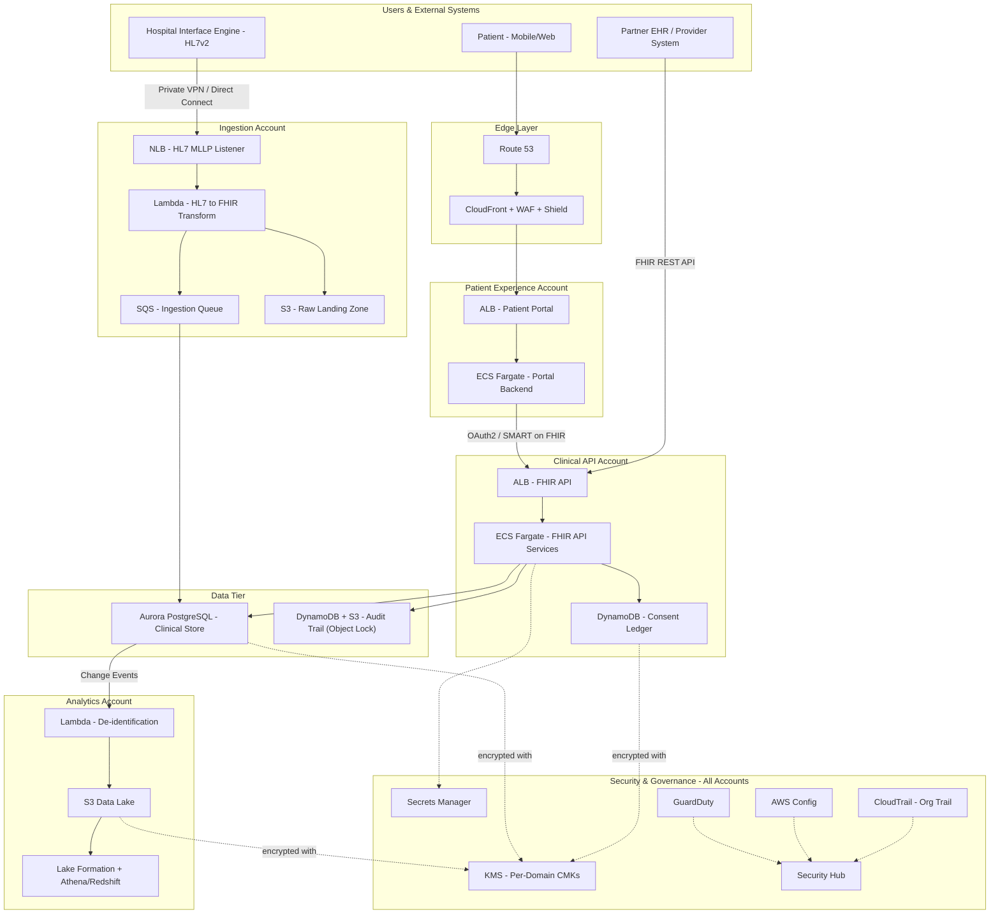

# Part IX – Industry-Specific Architectures

# Chapter 68 — Healthcare

*A HIPAA-Eligible, Multi-Tier Patient Data Platform on AWS*

---

# 1. Executive Summary

## 1.1 Business Problem

Healthcare organizations — hospital networks, telehealth platforms, health information exchanges (HIEs), pharmacy benefit managers, and digital health startups — face a structurally different engineering problem than most industries.

They must simultaneously satisfy:

- Strict regulatory obligations (HIPAA, HITECH, 42 CFR Part 2, state-level privacy laws, and international equivalents such as GDPR for cross-border care).
- Life-safety availability requirements — a clinician who cannot pull up a chart during an active care episode is not a "degraded experience," it is a patient safety incident.
- Extremely heterogeneous data types — HL7v2 feeds from legacy hospital systems, FHIR R4 APIs from modern EHRs, DICOM imaging studies that can exceed several gigabytes per study, claims data in X12 EDI formats, and unstructured clinical notes.
- Long data retention mandates — many jurisdictions require 7–10 years of retention for adult records and until age of majority plus several years for pediatric records.
- Multi-party data sharing — payers, providers, labs, pharmacies, and patients themselves (via patient portals) all need access to overlapping but distinct views of the same underlying data, governed by consent.

A generic three-tier web application architecture is insufficient here. It does not natively address audit-grade traceability of every PHI (Protected Health Information) access event, does not enforce encryption-everywhere by default, and does not provide the workflow isolation needed to keep a batch claims-processing pipeline from ever touching the same compute boundary as a public-facing patient portal.

## 1.2 Architecture Objective

This chapter designs a **HIPAA-eligible healthcare data platform** on AWS that supports three converging workloads under one governed platform:

1. **Clinical data exchange** — ingesting and serving FHIR/HL7 data to EHR systems, mobile apps, and partner organizations.
2. **Patient-facing digital services** — portals, appointment scheduling, secure messaging, and telehealth session metadata.
3. **Analytics and population health** — de-identified data pipelines feeding quality reporting, risk stratification, and research.

The objective is not simply "run healthcare workloads on AWS." It is to build a platform where:

- PHI is encrypted at rest and in transit by default, with no code path capable of bypassing encryption.
- Every read and write of PHI is attributable to an identity, a purpose, and a timestamp, and that record is immutable.
- Workloads with materially different risk profiles (public ingress vs. internal batch vs. research) are architecturally segmented, not just logically separated by application code.
- The platform can demonstrate compliance on demand — for an auditor, a payer contract review, or an incident response — without weeks of manual evidence collection.

## 1.3 Why Organizations Adopt This Architecture

Healthcare organizations converge on this pattern for a consistent set of reasons:

- **Signed AWS Business Associate Addendum (BAA)** — AWS will sign a BAA covering a defined list of HIPAA-eligible services, which lets covered entities and business associates build compliant systems without operating their own data centers. Organizations design around the eligible-services list specifically to stay inside this legal boundary.
- **Audit fatigue reduction** — manual evidence-gathering for SOC 2, HITRUST, and internal compliance reviews is one of the largest hidden costs in healthcare IT. An architecture with built-in immutable audit trails and automated compliance evidence (via AWS Config, CloudTrail, and Security Hub) cuts audit preparation time dramatically.
- **M&A and interoperability pressure** — health systems merge, acquire physician groups, and are required by the ONC Cures Act Final Rule to expose FHIR APIs. A platform built for controlled, governed data exchange from day one absorbs this pressure far better than point-to-point HL7 interfaces built over 20 years.
- **Cost predictability under value-based care** — as reimbursement shifts from fee-for-service to value-based and risk-sharing contracts, organizations need analytics platforms that can be cost-attributed per population, per contract, per line of business — which pushes them toward cloud-native, taggable, consumption-based infrastructure.
- **Clinical availability requirements** — a data center refresh cycle or a single points-of-failure legacy SAN is no longer acceptable when a hospital's EHR access depends on it. Multi-AZ, and in some cases multi-region, resilience becomes a board-level requirement after any major outage in the industry.

## 1.4 Major Business Benefits

| Benefit | Description |
|---|---|
| Regulatory defensibility | Continuous, automated compliance evidence reduces audit cycle time from months to days. |
| Clinical safety | Multi-AZ high availability removes single points of failure from systems clinicians depend on during active care. |
| Interoperability readiness | Native FHIR/HL7 ingestion positions the organization to meet ONC/CMS interoperability mandates without re-architecture. |
| Data monetization (governed) | De-identified analytics pipelines enable population health and value-based care reporting without re-exposing PHI. |
| Reduced breach blast radius | Workload segmentation and least-privilege IAM limit how far a compromised credential or workload can reach. |
| Faster partner onboarding | A defined, governed API layer (API Gateway + FHIR facade) reduces the time to onboard a new payer, lab, or pharmacy integration from months to weeks. |
| Cost transparency | Tag-based cost allocation lets finance attribute cloud spend to specific service lines, contracts, or grant-funded research projects. |

## 1.5 Typical Enterprise Scenarios

- A **regional hospital network** consolidating five acquired physician groups onto one patient data platform, exposing a unified FHIR API to their EHR vendor and to payer partners.
- A **digital health / telehealth company** that started as a monolith on a single RDS instance and must now become HIPAA-eligible at scale to sign contracts with self-insured employers and health plans.
- A **health information exchange (HIE)** aggregating clinical data across dozens of unaffiliated provider organizations, requiring strong multi-tenant data isolation and consent tracking.
- A **payer (health plan)** building a claims and eligibility platform that must integrate HL7/X12 feeds from thousands of provider trading partners while meeting CMS interoperability rules.
- A **clinical research organization** running de-identified analytics and machine learning on longitudinal patient data under IRB-approved data use agreements.

> **Note:** Nothing in this chapter should be interpreted as legal or compliance advice. HIPAA compliance is a shared responsibility between AWS (infrastructure) and the customer (application, data handling, workforce policy, and administrative safeguards). Always engage compliance and legal counsel alongside architecture design.

---

# 2. Business Requirements

## 2.1 Business Drivers

- Achieve and maintain HIPAA compliance across all environments handling PHI.
- Support real-time clinical data access for care delivery.
- Enable secure, governed data sharing with external payers, labs, and partner health systems.
- Support population health analytics without expanding PHI exposure surface.
- Reduce time-to-onboard new interoperability partners.
- Provide patients with self-service access to their own records (Cures Act "information blocking" compliance).

## 2.2 Functional Requirements

- Ingest HL7v2 (ADT, ORU, ORM) feeds from hospital interface engines.
- Expose FHIR R4 REST APIs for clinical data (Patient, Encounter, Observation, MedicationRequest, DocumentReference resources).
- Store and stream DICOM imaging metadata (full PACS is typically a separate, specialized system, but metadata and links are referenced from the platform).
- Provide a patient portal for scheduling, secure messaging, and record access.
- Support asynchronous batch processing for claims files (X12 837/835) and eligibility (270/271).
- Maintain a consent and authorization ledger governing which parties can access which data elements.
- Provide de-identified data extracts for analytics and reporting.

## 2.3 Non-Functional Requirements

| Category | Requirement |
|---|---|
| Scalability | Support growth from 50,000 to 5,000,000 covered patients without re-architecture. |
| Availability | 99.95% for clinical-facing APIs; 99.9% for patient portal; 99.5% for batch analytics. |
| Latency | P99 < 300ms for FHIR read APIs; P99 < 800ms for FHIR search operations. |
| Compliance | HIPAA, HITECH, SOC 2 Type II, HITRUST CSF (where contractually required), state privacy laws. |
| Security | Encryption at rest and in transit (no exceptions), least-privilege IAM, full audit trail of PHI access. |
| Recovery | RPO ≤ 15 minutes for clinical databases; RTO ≤ 1 hour for Tier-1 clinical services. |
| Data Retention | Minimum 7 years post-encounter (longer for pediatric records per state law). |

## 2.4 Scalability Goals

- Horizontal scaling of stateless FHIR API compute to absorb EHR-vendor batch pulls (which are often bursty — a hospital nightly sync can generate large spikes).
- Database read scaling via read replicas to support analytics queries without impacting transactional clinical workloads.
- Elastic ingestion for HL7 feeds during hospital system cutover events (go-lives can generate 5–10x normal message volume).

## 2.5 Availability Requirements

- No single Availability Zone dependency for any Tier-1 (clinical-facing) service.
- Multi-region DR posture for the core clinical database and identity systems, activated for organizations operating across regions with regulatory data residency constraints per region.

## 2.6 Latency Requirements

- Clinical read paths (chart review during a patient encounter) must return in sub-second time; this is a patient-safety requirement, not just a UX preference.
- Batch and analytics workloads can tolerate minutes-to-hours of latency and should be architected asynchronously to avoid consuming capacity needed by real-time paths.

## 2.7 Compliance Requirements

- All PHI-touching AWS services must appear on the AWS HIPAA-eligible services list, and a BAA must be executed with AWS before any PHI is processed.
- CloudTrail must be enabled organization-wide, log-file-validated, and retained per policy (commonly 6–7 years for healthcare).
- Access to PHI must be logged with actor identity, timestamp, resource accessed, and purpose of use where feasible (supports "minimum necessary" reviews).
- Data classification tagging must distinguish PHI, de-identified data, and non-PHI operational data.

## 2.8 Security Expectations

- Zero standing access to production PHI datastores for engineering staff; access via time-boxed, logged, break-glass procedures only.
- Network-level isolation between the public-facing patient portal tier and internal clinical data tier.
- Field-level encryption or tokenization for the most sensitive identifiers (SSN, full DOB in combination with name) beyond the baseline volume/database encryption.

## 2.9 Recovery Objectives

| Workload | RPO | RTO |
|---|---|---|
| Clinical transactional database (Aurora) | ≤ 5 minutes | ≤ 30 minutes |
| Patient portal application tier | ≤ 15 minutes | ≤ 1 hour |
| HL7/FHIR ingestion pipeline | ≤ 15 minutes | ≤ 1 hour |
| Analytics / data lake | ≤ 24 hours | ≤ 8 hours |
| Document/imaging metadata store | ≤ 15 minutes | ≤ 2 hours |

## 2.10 SLAs

- 99.95% monthly uptime commitment for clinical APIs to provider partners, with defined service credits.
- Documented maintenance windows communicated at least 5 business days in advance for anything affecting Tier-1 services.

## 2.11 Expected Workload

- Steady-state: 200–2,000 FHIR API requests/second across a large hospital network during business hours, with nightly batch windows for claims and eligibility files.
- HL7v2 ingestion: continuous stream, typically 10–500 messages/second depending on facility size, with burst multipliers during system go-lives.

## 2.12 Expected Growth

- 3–5x patient population growth over 3 years is common for organizations pursuing M&A-driven consolidation or expanding into new markets/states, which directly drives the requirement for horizontally scalable, stateless compute and read-replica database scaling rather than vertical-only scaling strategies.

---

# 3. Architecture Overview

## 3.1 Overall Design

The platform is organized into **four workload domains**, each with its own account (multi-account strategy, detailed in Chapter 88) and its own network boundary, connected through a shared services layer:

1. **Ingestion Domain** — receives HL7v2 feeds (via VPN/Direct Connect from hospital interface engines) and X12 EDI files (via SFTP/AS2), normalizes them, and writes to the clinical data store.
2. **API Domain** — exposes FHIR R4 REST APIs to internal applications, partner health systems, and the patient portal, backed by Aurora PostgreSQL and DynamoDB.
3. **Patient Experience Domain** — the public-facing patient portal and mobile backend, isolated behind CloudFront, WAF, and Shield, never directly reachable to the clinical datastore without passing through the governed API layer.
4. **Analytics Domain** — a de-identification pipeline feeding a data lake (S3 + Lake Formation + Athena/Redshift) used for population health, quality reporting, and research, deliberately isolated from the transactional PHI store.

## 3.2 Architecture Philosophy

- **Segregation by risk, not just by function.** The public patient portal, which faces the internet, is architecturally the highest-risk component and is treated as a hostile-adjacent tier — it never holds long-term PHI storage and always calls back into the governed API domain.
- **Encrypt everywhere, decrypt nowhere unnecessarily.** KMS customer-managed keys (CMKs) are used per data domain so that a key compromise in one domain does not expose another.
- **Assume breach.** Design for containment (network segmentation, least privilege, short-lived credentials) rather than assuming perimeter controls alone will prevent all incidents.
- **Audit is a first-class citizen, not an afterthought.** Every PHI-touching service emits structured access logs to a centralized, immutable log store from day one, not bolted on before an audit.
- **Prefer managed services on the HIPAA-eligible list** to reduce the undifferentiated heavy lifting of operating compliant infrastructure, reserving custom engineering effort for actual clinical/business logic.

## 3.3 Core Components

- Route 53 (DNS, health-check-based failover)
- CloudFront + AWS WAF + AWS Shield Advanced (edge and patient portal protection)
- Application Load Balancer (internal and external tiers)
- ECS Fargate / Lambda (application compute, FHIR API services, HL7 processing)
- Aurora PostgreSQL (clinical transactional data, FHIR resource store)
- DynamoDB (consent ledger, session state, high-throughput audit index)
- S3 (raw HL7/X12 landing zone, document storage, data lake)
- SQS/SNS/EventBridge (asynchronous message processing and event routing)
- KMS (encryption key management, per-domain CMKs)
- Secrets Manager (credentials, API keys, partner integration secrets)
- AWS Config + CloudTrail + Security Hub + GuardDuty (continuous compliance and threat detection)
- AWS Lake Formation + Athena/Redshift (governed analytics)

## 3.4 How Components Interact

- External hospital systems push HL7v2 messages over a private network path (VPN or Direct Connect) into an ingestion Lambda/ECS service sitting behind an internal NLB.
- The ingestion service validates, normalizes to FHIR resources, and writes through to Aurora PostgreSQL, publishing an event to EventBridge for downstream consumers (audit indexing, analytics de-identification pipeline).
- The FHIR API domain reads from Aurora (and DynamoDB for consent checks) to serve provider and patient-facing requests, always authenticating and authorizing via IAM/OAuth2 (SMART on FHIR) before returning data.
- The patient portal, running in its own account, calls only the FHIR API domain over PrivateLink or through an internal ALB — never connecting directly to the clinical database.
- The analytics domain subscribes to de-identification events, strips or tokenizes direct identifiers, and lands data into S3 for Lake Formation-governed querying.

## 3.5 High-Level Workflow

1. Clinical event occurs at a hospital (e.g., lab result finalized).
2. HL7 ORU message sent to AWS ingestion endpoint.
3. Message validated, transformed to FHIR Observation resource.
4. Resource persisted to Aurora; event emitted.
5. Provider or patient app queries FHIR API; consent checked; data returned.
6. Access event logged to immutable audit store.
7. De-identified copy flows to analytics domain for quality reporting.

## 3.6 Request Lifecycle

A FHIR API GET request from a partner EHR: DNS resolution → CloudFront (if public) or internal ALB → WAF rule evaluation → OAuth2/SMART-on-FHIR token validation → authorization/consent check against DynamoDB → Aurora query → response serialization to FHIR JSON → structured audit log emitted → response returned.

## 3.7 Response Lifecycle

Responses are streamed through the same path in reverse, with response-size guardrails (FHIR `_count` pagination parameters enforced server-side) to prevent unbounded result sets from large population queries overwhelming compute or exfiltrating bulk PHI through a single call.

## 3.8 Data Lifecycle

Raw inbound data (S3, encrypted, short retention) → normalized clinical store (Aurora, long retention per policy) → audit trail (DynamoDB/S3, immutable, 6–7 year retention) → de-identified analytics copy (S3 data lake, retained per research/IRB agreement) → eventual archival to S3 Glacier for records past active-care relevance but still within legal retention windows.

---

# 4. AWS Services Used

> Every service listed below appears on AWS's HIPAA-eligible services list at the time of writing. This list changes over time — always verify current eligibility against the official AWS HIPAA compliance documentation before finalizing a design, and ensure a BAA is in place with AWS before any PHI touches these services.

## 4.1 Compute

### EC2

**Purpose:** Used selectively for workloads that need OS-level control — e.g., a licensed HL7 interface engine (such as Mirth Connect / NextGen Connect running as a self-managed workload) that isn't naturally containerized by the vendor.

**Why selected:** Some legacy healthcare integration software still assumes a persistent VM with local filesystem access and specific OS-level configuration.

**Alternatives:** ECS Fargate (preferred for anything that can be containerized), Lambda (for lightweight transformation logic).

**Limitations:** Higher operational burden — patch management, AMI hardening, and instance-level monitoring all become the customer's responsibility.

**Pricing considerations:** Reserved Instances or Savings Plans for steady-state interface engines; avoid On-Demand for 24/7 workloads.

**Best practices:** Use hardened, CIS-benchmarked AMIs; enforce Systems Manager Session Manager instead of SSH; enable detailed monitoring; encrypt EBS volumes with a dedicated CMK.

### Lambda

**Purpose:** Event-driven HL7/FHIR transformation logic, consent-check microservices, de-identification functions, and lightweight API handlers.

**Why selected:** Scales to zero between hospital batch windows, which matters because ingestion traffic is highly bursty; removes patching burden for PHI-adjacent compute.

**Alternatives:** ECS Fargate for longer-running or higher-memory transformation jobs (e.g., large DICOM metadata parsing); Step Functions for orchestrating multi-stage pipelines.

**Limitations:** 15-minute maximum execution time; cold starts can matter for latency-sensitive synchronous FHIR calls (mitigate with provisioned concurrency for Tier-1 read paths).

**Pricing considerations:** Very cost-effective for spiky ingestion workloads; can become expensive versus Fargate for sustained high-throughput steady-state processing — model both before committing.

**Best practices:** One function, one responsibility; encrypt environment variables with KMS; never log PHI to CloudWatch Logs in plaintext (redact or tokenize before logging).

### ECS Fargate

**Purpose:** Hosts the FHIR API services, patient portal backend, and sustained HL7 ingestion workers.

**Why selected:** No EC2 instance management, strong isolation between tasks, straightforward integration with ALB, Service Connect, and Secrets Manager.

**Alternatives:** EKS (Chapter 36) — chosen instead when the organization already runs Kubernetes elsewhere and wants a single control plane paradigm across all workloads; adds operational complexity that is often not justified for a pure API-serving healthcare workload.

**Limitations:** Less granular infrastructure control than EC2; task startup time can affect very aggressive scale-out scenarios (mitigate with capacity provider warm pools or Application Auto Scaling target tracking tuned conservatively).

**Best practices:** Run tasks in private subnets only; use task-level IAM roles (never a shared over-privileged role); enable Fargate platform version pinning for predictable patching cycles.

## 4.2 Networking & Edge

### ALB

**Purpose:** Layer 7 load balancing for the FHIR API domain and patient portal backend; supports host/path-based routing to separate API versions and partner-specific routes.

**Why selected:** Native integration with WAF, ACM-managed TLS certificates, and target-group health checks that can fail traffic away from an unhealthy AZ within seconds.

**Alternatives:** NLB for the raw TCP/HL7 MLLP ingestion tier (Layer 7 features aren't needed there, and NLB gives lower latency and static IPs required by some hospital firewall allow-lists).

**Limitations:** No native Layer 7 routing on NLB — hence the split usage pattern above.

### CloudFront

**Purpose:** Edge delivery for the patient portal's static assets and API acceleration, combined with AWS WAF for OWASP Top 10 protection at the edge.

**Why selected:** Reduces latency for geographically distributed patients, absorbs volumetric DDoS attempts before they reach the origin, and provides a natural integration point for AWS Shield Advanced.

**Limitations:** Adds cache-invalidation complexity for frequently changing content; must be carefully configured to never cache authenticated PHI-bearing API responses.

**Best practices:** Set `Cache-Control: no-store` on all PHI-bearing responses; only cache genuinely static, non-PHI assets (JS/CSS/images).

### Route 53

**Purpose:** DNS management with health-check-based failover between regions/AZs for DR scenarios, and private hosted zones for internal service discovery.

**Best practices:** Use Route 53 Application Recovery Controller for Tier-1 clinical services requiring coordinated multi-region failover.

### VPC

**Purpose:** Network isolation boundary per domain (ingestion, API, patient portal, analytics), each with dedicated public/private subnet tiers.

**Best practices:** No PHI-processing subnet should have a route to an Internet Gateway; all outbound internet access from private subnets goes through NAT Gateway (or VPC endpoints where the destination is an AWS service, which is strongly preferred to avoid PHI ever transiting the public internet path).

## 4.3 Data & Storage

### Aurora PostgreSQL

**Purpose:** Primary transactional store for FHIR resources (Patient, Encounter, Observation, etc.), modeled either as a relational normalized schema or using PostgreSQL's JSONB support to store FHIR resources natively alongside relational indexes for search parameters.

**Why selected:** Strong consistency for clinical data (a lab result must never be "eventually" visible — clinicians need read-your-writes guarantees), mature encryption and IAM database authentication support, automated multi-AZ failover in under 30 seconds typically.

**Alternatives:** DynamoDB — excellent for the consent ledger, audit index, and session state (high throughput, simple access patterns) but weaker fit for the complex relational queries and ad hoc search parameter combinations that FHIR search requires. RDS PostgreSQL (non-Aurora) — viable for smaller organizations where Aurora's premium isn't justified by scale.

**Limitations:** Higher cost than RDS at small scale; requires careful connection pooling (RDS Proxy) under Lambda-driven bursty access patterns to avoid connection exhaustion.

**Best practices:** Enable encryption at rest with a dedicated CMK; enable IAM database authentication for application roles; use RDS Proxy in front of Lambda-invoked database access; enable Performance Insights with encrypted data.

### DynamoDB

**Purpose:** Consent/authorization ledger, session and token state, and a high-throughput write-optimized audit event index (separate from the durable long-term audit log in S3).

**Why selected:** Single-digit millisecond latency for consent checks on every API call, and seamless scaling for audit-write volume that spikes during large batch data pulls.

**Limitations:** Not suited to complex multi-attribute clinical search; used deliberately for narrow, high-throughput access patterns only.

**Best practices:** Enable encryption with a CMK (not just the default AWS-owned key) for anything touching PHI; enable Point-in-Time Recovery; use DynamoDB Streams to fan out audit events to the long-term S3 audit store.

### S3

**Purpose:** Raw HL7/X12 file landing zone, document/imaging-metadata storage, data lake storage for the analytics domain, and long-term audit log archive.

**Best practices:** Default encryption with SSE-KMS using domain-specific CMKs; S3 Object Lock (compliance mode) on the audit log bucket to guarantee immutability for the retention period; separate buckets per data classification (raw PHI, de-identified, audit) with distinct bucket policies — never mix classifications in one bucket.

## 4.4 Messaging & Eventing

### SQS

**Purpose:** Buffers inbound HL7 messages and outbound partner notifications, decoupling bursty ingestion from steady-state processing capacity.

**Best practices:** Server-side encryption with KMS; dead-letter queues on every queue handling PHI-bearing messages, with alerting on DLQ depth.

### SNS

**Purpose:** Fan-out notification for events like "new lab result available" to multiple downstream subscribers (patient notification service, analytics pipeline, audit indexer) without tight coupling.

### EventBridge

**Purpose:** Central event bus for cross-domain integration — e.g., routing a "resource created" event from the ingestion domain to both the audit domain and the analytics de-identification pipeline without those domains needing direct knowledge of each other.

**Best practices:** Use schema registry to enforce event contract discipline between domains owned by different teams.

## 4.5 Security & Identity

### IAM

**Purpose:** Enforces least-privilege access for every human and machine identity touching the platform.

**Best practices:** No IAM user has standing access to production PHI resources; break-glass access uses time-boxed roles assumed via STS with mandatory MFA and automatic CloudTrail alerting on assumption.

### KMS

**Purpose:** Encryption key management for every data store, with per-domain customer-managed keys so that a key policy compromise in the analytics domain cannot decrypt data in the clinical domain.

**Best practices:** Automatic annual key rotation enabled; key policies scoped to specific IAM roles, not broad account-level access; CloudTrail logging of every Decrypt call for PHI keys, alerting on anomalous volume.

### Secrets Manager

**Purpose:** Stores database credentials, partner API keys, and OAuth client secrets, with automatic rotation for database credentials.

**Alternatives:** Systems Manager Parameter Store (SecureString) is a lower-cost alternative for secrets that don't need automatic rotation, commonly used for less sensitive configuration values.

### GuardDuty, Security Hub, AWS Config, CloudTrail

**Purpose:** Continuous threat detection, centralized compliance posture scoring, configuration drift detection, and immutable API activity logging — together forming the continuous compliance backbone described in Section 11.

## 4.6 Monitoring

### CloudWatch

**Purpose:** Metrics, logs, dashboards, and alarms across every service; the operational nervous system of the platform.

**Best practices:** Separate log groups per data classification with distinct retention and access policies; never allow PHI into standard application log statements — use structured, redacted logging.

---

# 5. Complete Architecture Diagram



---

# 6. Component-by-Component Explanation

## 6.1 CloudFront + WAF + Shield

**Purpose:** First line of defense for the patient portal; terminates TLS, caches non-PHI static assets, and applies managed and custom WAF rule groups.

**Responsibilities:** Rate limiting, geo-restriction where appropriate, blocking known bad actor IP reputation lists, and absorbing volumetric DDoS.

**Inputs/Outputs:** Receives HTTPS requests from patients globally; forwards dynamic requests to the patient portal ALB origin.

**Scaling:** Fully managed, scales automatically to absorb traffic spikes.

**High availability:** Globally distributed edge network by design.

**Failure handling:** Origin failover configuration to a secondary ALB in a DR region for Tier-1 continuity.

**Dependencies:** ACM for TLS certificates, WAF rule groups, Shield Advanced subscription for enhanced DDoS response.

**Security:** No PHI is ever cached at this layer; all dynamic, authenticated responses are marked non-cacheable.

**Monitoring:** CloudFront real-time logs streamed to a SIEM; WAF blocked-request metrics alarmed.

## 6.2 FHIR API Service (ECS Fargate)

**Purpose:** Implements the FHIR R4 RESTful API surface — resource CRUD, search, and bulk export operations — as the single governed entry point to clinical data.

**Responsibilities:** Authentication/authorization (SMART on FHIR OAuth2 scopes), consent enforcement, query construction against Aurora, response shaping, and audit event emission.

**Inputs:** Authenticated HTTPS requests from the patient portal and partner EHR systems.

**Outputs:** FHIR-JSON responses; audit events to EventBridge.

**Scaling:** Application Auto Scaling on ECS service, target-tracking on CPU and request count per target, with pre-warmed minimum capacity sized for expected hospital batch windows.

**High availability:** Tasks spread across a minimum of 3 AZs; ALB health checks remove unhealthy tasks within seconds.

**Failure handling:** Circuit breaker pattern (see Chapter 83) against Aurora to avoid cascading failure if the database is degraded; graceful degradation to read-replica-only mode for read paths during a primary database failover.

**Dependencies:** Aurora, DynamoDB (consent), Secrets Manager, KMS.

**Security:** Task IAM role scoped to only the specific KMS keys and data resources it needs; no broad `s3:*` or `dynamodb:*` permissions.

**Monitoring:** Custom CloudWatch metrics for FHIR operation latency by resource type, consent-denial rate, and error rate by partner/client ID.

## 6.3 HL7 Ingestion Service

**Purpose:** Accepts HL7v2 MLLP-framed messages from hospital interface engines and Lambda-based transformation into FHIR resources.

**Responsibilities:** Message parsing, ACK/NACK response per HL7 protocol, deduplication (hospitals commonly retransmit on ACK timeout), transformation, and validation against FHIR profiles before persistence.

**Scaling:** SQS buffer absorbs burst; Lambda concurrency scales with queue depth; reserved concurrency cap protects downstream Aurora from being overwhelmed during a hospital go-live surge.

**Failure handling:** Malformed messages route to a dead-letter queue with alerting; a human-reviewable quarantine bucket in S3 retains rejected messages for clinical informatics review (a rejected lab result cannot simply be dropped).

**Security:** VPN/Direct Connect only — no public internet ingestion path for HL7 traffic.

## 6.4 Consent Ledger (DynamoDB)

**Purpose:** The single source of truth for "who is allowed to see what, and why" — modeling patient consent directives, provider treatment relationships, and break-glass emergency access grants.

**Responsibilities:** Answering consent-check queries in single-digit milliseconds on every FHIR API call.

**Scaling:** On-demand capacity mode recommended given unpredictable partner query patterns.

**Security:** Every write to the consent ledger is itself an audited event — consent changes are as security-sensitive as PHI access itself.

## 6.5 Audit Trail (DynamoDB Streams → S3 Object Lock)

**Purpose:** Immutable, tamper-evident record of every PHI access, satisfying HIPAA's audit control requirement (45 CFR §164.312(b)).

**Responsibilities:** Capturing actor, action, resource, timestamp, and (where available) purpose-of-use for every read and write.

**Failure handling:** If the audit-write path fails, the design should fail closed for write operations creating new PHI in edge cases determined by policy — many organizations choose to fail open for reads (availability priority) but require synchronous, guaranteed audit logging for any modification of PHI.

**Security:** S3 Object Lock in compliance mode prevents deletion or modification even by account root during the retention period.

## 6.6 Analytics De-identification Pipeline

**Purpose:** Strips or tokenizes the 18 HIPAA Safe Harbor identifiers from clinical data before it lands in the analytics domain, enabling broader analytical use without PHI exposure.

**Responsibilities:** Deterministic tokenization of patient identifiers (so longitudinal analysis remains possible without re-identifying individuals), date shifting where required by the de-identification methodology chosen (Safe Harbor vs. Expert Determination), and validation that no direct identifiers leak through free-text clinical notes (often requiring a natural-language de-identification model in addition to structured-field stripping).

**Security:** Runs in a separate account with no network path back to the transactional clinical store other than the one-way event subscription.

---

# 7. End-to-End Request Flow

**Scenario: A partner EHR system requests a patient's recent lab results via the FHIR API.**

1. Partner EHR system authenticates via OAuth2 client-credentials or SMART-on-FHIR authorization-code flow against the platform's identity provider (Amazon Cognito or a federated enterprise IdP).
2. DNS resolves `api.healthplatform.example.com` via Route 53.
3. Request reaches CloudFront (if the API is partner/public-facing) or directly reaches the internal ALB for private partner connections over Direct Connect/VPN.
4. AWS WAF evaluates the request against managed rule groups (SQL injection, known bad actor lists) and rate-based rules.
5. Request forwarded to the FHIR API ALB, which selects a healthy ECS Fargate target across 3 AZs.
6. FHIR API service validates the OAuth2 access token and extracts the requesting client's scopes (e.g., `patient/Observation.read`).
7. Service queries the DynamoDB consent ledger to confirm the requesting party has an active treatment relationship or patient-authorized consent for this specific patient and resource type.
8. If consent check fails, a `403 Forbidden` OperationOutcome is returned, and a consent-denial audit event is emitted — this is itself a security-relevant signal, alerted on if the denial rate from a given client spikes.
9. If consent check passes, the service queries Aurora PostgreSQL for the requested Observation resources, applying FHIR search parameters (`patient`, `category=laboratory`, `date`).
10. Aurora returns results from the reader endpoint (read replica) to avoid contending with write traffic on the primary.
11. FHIR API service serializes results into a FHIR Bundle, applying `_count` pagination limits.
12. An audit event (actor, resource IDs returned, timestamp) is emitted synchronously to DynamoDB Streams before the response is finalized.
13. Response is returned to the partner EHR over TLS 1.2+.
14. CloudWatch captures latency, status code, and client ID dimensions for the request.
15. If any step exceeds latency thresholds, an alarm fires to the on-call engineering channel with correlated X-Ray trace ID for rapid diagnosis.

**Error handling paths:**

- Database timeout → circuit breaker opens → cached-if-available or graceful `503` with `Retry-After` header, never a silent partial response.
- Malformed request → FHIR OperationOutcome with structured error detail, never a raw stack trace.
- Token expiry → `401` with a clear re-authentication prompt, logged but not treated as a security alert unless volume is anomalous.

---

# 8. Deployment Flow

## 8.1 Infrastructure Provisioning

All infrastructure is provisioned through Terraform, with each domain (ingestion, API, patient portal, analytics) as a separate Terraform root module and remote state, deployed to its own AWS account under an AWS Organizations structure (see Chapter 88).

## 8.2 Terraform Workflow

1. Developer opens a pull request against the relevant domain's Terraform repository.
2. CI pipeline runs `terraform fmt -check`, `terraform validate`, and `tflint`.
3. `terraform plan` output posted as a PR comment for human review.
4. Policy-as-code (Open Policy Agent / Sentinel) validates the plan against guardrails — e.g., "no S3 bucket may be created without `SSE-KMS` encryption," "no security group may allow `0.0.0.0/0` on any port touching a PHI-tagged resource."
5. Two-person approval required for any change to a production PHI-touching resource.
6. Merge triggers `terraform apply` via a locked-down CI/CD execution role with no human standing access to apply permissions.

## 8.3 CI/CD Deployment (Application Layer)

1. Code merged to main branch triggers container build.
2. Image scanned for vulnerabilities (Amazon Inspector / ECR scanning) — build fails on critical/high findings above policy threshold.
3. Image pushed to ECR with immutable tags.
4. Deployment pipeline updates ECS service via a blue-green deployment (CodeDeploy) or rolling update depending on service criticality.

## 8.4 Blue-Green Deployment

For Tier-1 FHIR API services, blue-green deployment via AWS CodeDeploy for ECS is preferred over rolling updates: a new task set is stood up alongside the existing one, a small percentage of traffic is shifted via the ALB, key health and error-rate metrics are evaluated automatically, and full cutover only proceeds if metrics remain within threshold — otherwise automatic rollback occurs with zero manual intervention required, which matters when the on-call engineer may not be immediately available.

## 8.5 Rollback

- Application rollback: automatic via CodeDeploy metric-based rollback, or manual one-command rollback to the previous task definition revision.
- Infrastructure rollback: `terraform plan` against the previous committed state, reviewed and applied through the same pipeline — infrastructure changes are never rolled back by manual console edits.

## 8.6 Secrets and Configuration

- Application secrets injected at task startup from Secrets Manager via ECS task definition secret references — never baked into container images or environment variables in plaintext in source control.
- Non-secret configuration managed via Systems Manager Parameter Store, versioned and environment-scoped.

## 8.7 Validation

- Post-deployment smoke tests validate FHIR capability statement endpoint, synthetic patient read/write against a non-production test patient record, and consent-check enforcement (a synthetic "should be denied" test case is run on every deploy to catch authorization regressions before they reach real patients).

---

# 9. Network Topology

## 9.1 VPC and CIDR Strategy

Each domain account has its own VPC with non-overlapping CIDR ranges to support future Transit Gateway peering and hybrid connectivity without renumbering:

| Domain | VPC CIDR | AZs |
|---|---|---|
| Ingestion | 10.10.0.0/16 | 3 |
| Clinical API | 10.20.0.0/16 | 3 |
| Patient Portal | 10.30.0.0/16 | 3 |
| Analytics | 10.40.0.0/16 | 3 |
| Shared Services | 10.0.0.0/16 | 3 |

## 9.2 Subnet Design (per VPC)

- **Public subnets** — ALB/NLB only; no application compute or database ever placed here.
- **Private application subnets** — ECS Fargate tasks, Lambda ENIs.
- **Private data subnets** — Aurora, DynamoDB VPC endpoints; most restrictive security groups in the account.

## 9.3 NAT Gateway and Internet Gateway

- One NAT Gateway per AZ (not a single shared NAT Gateway) to avoid cross-AZ data transfer charges and to remove a single point of failure for outbound connectivity.
- Internet Gateway attached only to VPCs with a genuine public-facing tier (patient portal, ingestion's public API if applicable); the pure clinical API and analytics VPCs may omit an Internet Gateway entirely, relying solely on VPC endpoints for AWS service access.

## 9.4 Transit Gateway

Used to connect the ingestion domain's VPN/Direct Connect attachment to hospital networks with the shared services VPC, and to enable controlled routing between domains without full mesh peering complexity. Route tables per attachment enforce that, for example, the patient portal VPC has no route to the ingestion domain's hospital-facing subnets.

## 9.5 Route Tables and Network ACLs

- Route tables scoped per subnet tier; data subnets have no route to 0.0.0.0/0 at all.
- Network ACLs provide a coarse, stateless second layer of defense behind security groups — used primarily to explicitly deny known-bad CIDR ranges and to enforce subnet-tier isolation as a backstop against security group misconfiguration.

## 9.6 Security Groups

- Security groups reference other security groups by ID rather than CIDR ranges wherever possible (e.g., "allow port 5432 from the FHIR API service security group," not "allow from 10.20.1.0/24") to keep rules correct automatically as the environment scales.

## 9.7 PrivateLink

- The patient portal domain reaches the FHIR API domain via an interface VPC endpoint (PrivateLink) backed by an NLB in the API domain, rather than through public internet or even Transit Gateway routing — this keeps all inter-domain PHI traffic entirely off any path that could be exposed to a misconfigured route table elsewhere in the environment, and allows the API domain to control exactly which consumer accounts may connect via endpoint service allow-listing.

## 9.8 Hybrid Connectivity

- Direct Connect (primary) with a Site-to-Site VPN (backup) to each major hospital partner's data center for HL7 feed delivery, terminating into the ingestion domain's Transit Gateway attachment. Direct Connect is preferred for volume and latency predictability; VPN provides automatic failover.

---

# 10. Identity and Access

## 10.1 IAM Roles

- **Task execution roles** (ECS) — scoped only to pull the specific ECR image and write to the specific log group; never combined with application permissions.
- **Task roles** (application runtime permissions) — scoped per service to the exact KMS keys, DynamoDB tables, and S3 prefixes needed, with resource-level ARN conditions rather than wildcard resources.
- **CI/CD execution roles** — permitted to apply Terraform changes only within the specific account/domain the pipeline targets, with explicit deny statements preventing cross-domain resource creation.

## 10.2 IAM Policies

Example least-privilege policy fragment for the FHIR API service task role, scoped to a single KMS key and a single DynamoDB table:

```json

{
  "Version": "2012-10-17",
  "Statement": [
    {
      "Sid": "ConsentLedgerAccess",
      "Effect": "Allow",
      "Action": [
        "dynamodb:GetItem",
        "dynamodb:Query"
      ],
      "Resource": "arn:aws:dynamodb:us-east-1:222233334444:table/consent-ledger"
    },
    {
      "Sid": "KMSDecryptOnly",
      "Effect": "Allow",
      "Action": "kms:Decrypt",
      "Resource": "arn:aws:kms:us-east-1:222233334444:key/clinical-data-cmk-id",
      "Condition": {
        "StringEquals": {
          "kms:ViaService": "dynamodb.us-east-1.amazonaws.com"
        }
      }
    }
  ]
}

```

## 10.3 Resource Policies

- S3 bucket policies deny any request not using TLS (`aws:SecureTransport: false` → Deny) and deny any request not encrypted with the expected CMK on upload.
- KMS key policies explicitly enumerate the IAM roles permitted to use the key — the default account-wide key policy is never used for PHI-touching CMKs.

## 10.4 STS and Cross-Account Access

- Break-glass access to production PHI datastores is granted via a dedicated IAM role assumable only via STS with mandatory MFA, a maximum 1-hour session duration, and automatic Security Hub finding generation on every assumption for after-the-fact review by the security team.

## 10.5 Least Privilege in Practice

- No engineer has direct, always-on database credentials to production Aurora. Access, when genuinely required for incident response, is granted through IAM database authentication with a time-limited token, itself gated behind the break-glass role above.

## 10.6 Service Roles and Permission Boundaries

- Permission boundaries are attached to any IAM role creation performed by automation (e.g., a CI/CD pipeline that provisions per-tenant roles in a multi-tenant analytics scenario), capping the maximum permissions any dynamically created role can ever hold regardless of the policy attached to it — a critical control against privilege escalation via infrastructure-as-code misconfiguration.

---

# 11. Security Architecture

## 11.1 Encryption

- **At rest:** SSE-KMS on every S3 bucket, Aurora storage encryption, DynamoDB encryption with CMKs, EBS volume encryption for any remaining EC2-based components.
- **In transit:** TLS 1.2 minimum enforced at ALB/CloudFront listener policies; internal service-to-service traffic also TLS-encrypted (not just relying on VPC network isolation) as a defense-in-depth measure against internal network compromise.

## 11.2 KMS Strategy

- Per-domain customer-managed keys (ingestion CMK, clinical-data CMK, audit CMK, analytics CMK) rather than a single account-wide key, so that a key-policy misconfiguration or compromise in one domain cannot decrypt another domain's data.
- Automatic annual rotation enabled; CloudTrail Decrypt-call volume alarmed per key to detect abnormal bulk-decryption patterns indicative of exfiltration.

## 11.3 WAF and Shield

- AWS Managed Rules (Core rule set, SQL injection rule set, known bad inputs) applied to the patient portal and any publicly reachable API endpoints.
- Custom rate-based rules to prevent credential stuffing against the patient login endpoint.
- Shield Advanced subscribed for the patient portal given its public internet exposure and the reputational/availability criticality of patient-facing services; the internal-only FHIR partner API reachable solely via Direct Connect/PrivateLink does not require Shield Advanced, illustrating cost-aware, risk-based control application rather than blanket application of every control everywhere.

## 11.4 Secrets Manager and Certificate Manager

- All database credentials and partner integration API keys stored in Secrets Manager with automatic rotation configured for RDS/Aurora credentials.
- ACM-issued and auto-renewed TLS certificates for every public and internal-ALB listener; no manually managed certificates.

## 11.5 GuardDuty, Inspector, Security Hub

- GuardDuty enabled organization-wide (delegated administrator model), covering S3 protection, malware protection for EC2/ECS, and RDS protection specifically because it detects anomalous database login patterns relevant to PHI datastores.
- Inspector continuously scans ECR images and running EC2/ECS workloads for known vulnerabilities, gating deployment pipelines on critical findings.
- Security Hub aggregates findings from GuardDuty, Inspector, Config, and third-party tools into a single compliance score dashboard, mapped to the HIPAA Security Rule control set via Security Hub's compliance standards support.

## 11.6 CloudTrail and AWS Config

- Organization-wide CloudTrail trail, log-file validation enabled, delivered to a dedicated, restricted-access logging account's S3 bucket with Object Lock.
- AWS Config rules continuously evaluate encryption settings, public-access blocks, and security group configurations, automatically flagging (and, for select high-risk rules, auto-remediating via Systems Manager Automation) any drift from the compliant baseline.

## 11.7 Zero Trust Principles Applied

- No implicit trust granted based on network location alone — even workloads inside the "trusted" private subnet authenticate to each other via IAM/mTLS rather than relying on network position as a proxy for identity.
- Every request is authenticated, authorized, and logged regardless of source.

## 11.8 Threat Model Summary

| Attack Vector | Mitigation |
|---|---|
| Compromised partner API credential | Short-lived OAuth2 tokens, scope-limited access, anomaly-based alerting on access-pattern changes |
| Insider threat (excessive PHI access) | Consent-ledger enforcement, audit logging, "minimum necessary" access reviews, UEBA-style anomaly detection on audit logs |
| SQL injection against FHIR search parameters | Parameterized queries only, WAF SQL injection rule set, input validation against FHIR profile constraints |
| Ransomware / data destruction | Aurora automated backups + PITR, S3 Object Lock on audit and backup buckets, cross-region backup replication |
| DDoS against patient portal | CloudFront + Shield Advanced + WAF rate-based rules |
| Misconfigured S3 bucket exposing PHI | AWS Config rules denying public access, Macie for continuous sensitive-data discovery and exposure alerting |
| Supply chain compromise (malicious container dependency) | Image scanning in CI/CD, SBOM generation, signed image verification before deployment |

---

# 12. High Availability

## 12.1 AZ Failures

Every Tier-1 component (ECS services, Aurora, NAT Gateways, ALBs) is deployed across a minimum of three Availability Zones. ECS service Application Auto Scaling maintains a minimum task count per AZ so that the loss of one AZ still leaves two-thirds capacity available, sufficient for typical daytime clinical load given appropriate capacity planning headroom.

## 12.2 Instance/Task Failures

ALB health checks (both target-group HTTP health checks and, where applicable, deeper application-level `/health` endpoints that verify database connectivity) remove unhealthy targets within the configured interval, typically tuned to 10–15 seconds for Tier-1 services to balance fast failure detection against false-positive flapping.

## 12.3 Regional Failures

For organizations with a regulatory or contractual requirement for regional resilience beyond single-region multi-AZ, Aurora Global Database provides a secondary region with typical replication lag under 1 second and a documented promotion procedure achieving RTO targets in the tens of minutes. This is deliberately not the default posture for every healthcare organization — see Section 34's "When You Should NOT Choose This Architecture" for cost/complexity trade-off guidance.

## 12.4 Database Failures

Aurora's built-in synchronous replication across 3 AZs means a primary instance failure typically fails over to a reader in under 30 seconds without data loss for committed transactions. Applications must implement retry-with-backoff logic against the cluster endpoint to ride out this brief interruption gracefully rather than surfacing an error directly to a clinician mid-workflow.

## 12.5 Load Balancing and Health Checks

Cross-zone load balancing enabled on all ALBs/NLBs to ensure even distribution regardless of target AZ imbalance. Health check paths deliberately validate downstream dependency health (not just "process is running") for Tier-1 services, since a service that responds `200 OK` on liveness but cannot reach its database is not actually healthy from a clinical-availability standpoint.

## 12.6 Failover Summary Table

| Failure Type | Detection Time | Failover Time | Data Loss Risk |
|---|---|---|---|
| Single AZ outage | Seconds (health checks) | Automatic, near-instant | None (multi-AZ sync replication) |
| Aurora primary instance failure | Seconds | ~30 seconds | None for committed transactions |
| Full regional outage (with Global Database) | Minutes (manual/automated promotion decision) | 10s of minutes | Sub-second RPO typical, but requires deliberate promotion decision |
| ECS task crash | Seconds (health check) | Seconds (auto-replaced) | None (stateless) |

---

# 13. Disaster Recovery

## 13.1 Backup Strategy

- Aurora automated backups with a 35-day retention window plus point-in-time recovery; additionally, scheduled logical backups exported to S3 for long-term retention beyond the PITR window where compliance requires multi-year backup availability distinct from the operational database's own retention.
- DynamoDB Point-in-Time Recovery enabled on the consent ledger and audit tables.
- S3 cross-region replication configured on the raw landing zone and audit buckets to a secondary region for geographic redundancy of source data.

## 13.2 Cross-Region Replication

Aurora Global Database replicates the clinical data store to a secondary region asynchronously with typical sub-second lag, providing both a DR target and, optionally, a low-latency read source for geographically distributed users without impacting primary-region write capacity.

## 13.3 DR Strategy Selection

| Strategy | RTO | RPO | Cost | When Used in This Platform |
|---|---|---|---|---|
| Backup & Restore | Hours | Hours | Lowest | Analytics domain (data lake) |
| Pilot Light | ~1 hour | Minutes | Low-Medium | Ingestion domain (interface engine can be re-provisioned quickly; message replay from hospital source system is generally acceptable) |
| Warm Standby | Minutes | Seconds | Medium-High | Clinical API domain (Aurora Global Database, minimal standing compute in DR region) |
| Multi-Site Active-Active | Near-zero | Near-zero | Highest | Only justified for organizations with genuine multi-region regulatory requirements or extreme availability SLAs — not the default posture |

## 13.4 DR Testing

Disaster recovery for the clinical API domain is tested via a scheduled quarterly game day: a controlled Aurora Global Database promotion is executed against a non-production replica of the environment, timed end-to-end, and the results (actual RTO achieved, any manual steps that had to be improvised) are documented and fed back into runbook improvements. Untested DR plans are, in practice, not DR plans — they are hypotheses.

---

# 14. Scalability

## 14.1 Horizontal Scaling

ECS Fargate services scale horizontally via Application Auto Scaling target-tracking policies on request count per target and CPU utilization, with a minimum baseline capacity sized to absorb the largest predictable partner batch pull (e.g., a hospital's nightly full-population sync) without cold-start latency impacting concurrent real-time clinical traffic.

## 14.2 Database Scaling

- Aurora read replicas (up to 15) absorb read-heavy analytics and reporting queries, keeping the writer instance dedicated to transactional clinical writes.
- Aurora Serverless v2 is a strong option for the analytics-adjacent reporting database or for lower-traffic partner organizations onboarded onto a shared multi-tenant instance, scaling capacity automatically between defined minimum and maximum ACUs.

## 14.3 Queue and Ingestion Scaling

SQS absorbs ingestion bursts natively without capacity planning; downstream Lambda concurrency scales with queue depth up to a reserved concurrency ceiling that protects Aurora from write-throughput saturation during a hospital go-live surge — deliberately trading ingestion latency (messages queue briefly) for database stability, an appropriate trade-off since HL7 ingestion tolerates minutes of latency far better than the clinical database tolerates connection exhaustion.

## 14.4 Storage Scaling

S3 scales inherently without capacity planning; Aurora storage auto-scales up to 128 TiB without downtime.

---

# 15. Performance Optimization

## 15.1 Caching

- CloudFront caches only genuinely static, non-PHI assets.
- Application-layer caching (ElastiCache Redis) for FHIR CapabilityStatement responses and reference/terminology data (e.g., ICD-10, LOINC, SNOMED code lookups) which changes infrequently and is safe to cache aggressively, distinct from patient-specific data which is never cached.

## 15.2 Database Optimization

- Purpose-built indexes on common FHIR search parameter combinations (`patient_id + resource_type + date`), validated against actual partner query patterns rather than guessed in advance.
- RDS Proxy in front of Lambda-based access paths to pool connections and prevent connection storm issues during ingestion bursts.

## 15.3 Connection Pooling and Concurrency

ECS-based FHIR API services use application-level connection pools (e.g., PgBouncer sidecar or built-in pool in the application framework) sized against Aurora's `max_connections` parameter group setting, monitored to avoid the classic failure mode of connection exhaustion under burst load.

## 15.4 Async Processing

Anything not required for the synchronous clinical read/write path — notification delivery, analytics de-identification, audit indexing beyond the synchronous write — is processed asynchronously via SQS/EventBridge to keep the critical path latency minimal and predictable.

---

# 16. Cost Optimization (FinOps)

## 16.1 Deployment Size Cost Estimates

*(Illustrative monthly estimates, us-east-1 pricing, actual costs vary by usage pattern and negotiated rates — always validate with the AWS Pricing Calculator for a specific design.)*

| Component | Small (50K patients) | Medium (500K patients) | Enterprise (5M patients) |
|---|---|---|---|
| Aurora PostgreSQL | ~$800/mo | ~$4,500/mo | ~$28,000/mo |
| ECS Fargate (API + Portal) | ~$600/mo | ~$3,000/mo | ~$18,000/mo |
| DynamoDB (consent + audit index) | ~$150/mo | ~$1,200/mo | ~$7,500/mo |
| S3 (raw + data lake + audit) | ~$200/mo | ~$1,500/mo | ~$9,000/mo |
| CloudFront + WAF + Shield | ~$150/mo | ~$700/mo | ~$4,500/mo (incl. Shield Advanced) |
| NAT Gateway + Direct Connect | ~$300/mo | ~$900/mo | ~$3,500/mo |
| Monitoring/Logging (CloudWatch) | ~$200/mo | ~$1,000/mo | ~$6,000/mo |
| **Estimated Total** | **~$2,400/mo** | **~$12,800/mo** | **~$76,500/mo** |

## 16.2 Major Cost Drivers

- Aurora compute (especially at enterprise scale with multiple read replicas for analytics offload).
- CloudWatch Logs ingestion and retention, particularly given the extended retention required for audit compliance.
- Data transfer, especially cross-AZ traffic if services aren't AZ-aware, and NAT Gateway processing charges for high-volume ingestion.
- Shield Advanced fixed monthly commitment, justified primarily for the public-facing patient portal.

## 16.3 Optimization Opportunities

- **Reserved Instances / Savings Plans** for steady-state Aurora and Fargate baseline capacity, layering On-Demand only for burst above the reserved baseline.
- **S3 Intelligent-Tiering** for the data lake and document storage, automatically moving infrequently accessed data to lower-cost tiers without manual lifecycle policy tuning.
- **S3 Lifecycle policies** transitioning audit logs older than the active-review window (commonly 1 year) to S3 Glacier Deep Archive while remaining within Object Lock compliance retention.
- **Rightsizing** Aurora instance classes based on actual CPU/memory utilization from Performance Insights rather than initial provisioning guesses, reviewed quarterly.
- **CloudWatch Logs retention tiering** — shorter retention (30–90 days) in CloudWatch for operational logs with automatic export to cheaper S3 storage for the long-tail compliance retention requirement, rather than paying CloudWatch Logs storage rates for 7 years of data.

## 16.4 Cost Allocation and Tagging

Mandatory tag schema enforced via AWS Config (`Tag Policies` / Service Control Policies denying resource creation without required tags):

| Tag Key | Purpose |
|---|---|
| `data-classification` | phi / de-identified / non-phi |
| `cost-center` | Business unit or service line for chargeback |
| `environment` | prod / staging / dev |
| `contract-id` | Attribution to specific payer/partner contracts for value-based care cost analysis |
| `compliance-scope` | hipaa-eligible / non-regulated |

## 16.5 Budgets and Cost Anomaly Detection

AWS Budgets configured per domain account with alert thresholds at 80%/100%/120% of forecast; AWS Cost Anomaly Detection monitoring the Aurora and data transfer cost categories specifically, since ingestion volume spikes (hospital go-lives) are a recurring, legitimate but budget-relevant cost driver that finance teams need visibility into ahead of the invoice.

---

# 17. AI-Assisted Operations

## 17.1 Amazon Q

Amazon Q Developer assists engineering teams with Terraform module authoring, IAM policy least-privilege suggestions, and code review for the FHIR API service codebase, accelerating development while a human reviewer remains the final approval gate for anything touching PHI-adjacent infrastructure.

Amazon Q Business can be deployed internally (never with PHI as a data source unless a specific BAA-covered configuration and data governance review has been completed) to help clinical informatics and compliance staff query internal policy documentation, runbooks, and non-PHI operational knowledge bases.

## 17.2 Bedrock

Amazon Bedrock is used, deliberately outside the direct PHI transactional path, for two categories of workload:

1. **Clinical note de-identification assistance** — a Bedrock-hosted model assists the Section 6.6 de-identification pipeline in identifying free-text PHI mentions that structured-field stripping alone would miss, with output subject to validation before data is considered de-identified — this is an assistive control, not a sole source of truth for compliance determination.
2. **Population health insight generation** — summarizing de-identified analytics trends for quality-reporting narratives, operating only on data that has already passed through the de-identification pipeline in Section 6.6.

> **Warning:** Any use of generative AI models against PHI requires the specific Bedrock model and configuration to be covered under the AWS BAA, with data retention/training-use settings explicitly configured to prevent PHI from being used for model improvement. Verify current eligibility before connecting any AI service to a PHI data source.

## 17.3 AI for Operations

- **Log analysis:** CloudWatch Logs Insights combined with anomaly detection alarms surfaces unusual audit-access patterns (e.g., a clinician account suddenly querying an unusually large number of distinct patient records in a short window) for security team review.
- **Incident response:** AI-assisted runbook suggestion during incidents, cross-referencing CloudWatch alarms and recent deployment history to propose likely root causes, with the human on-call engineer retaining decision authority.
- **Capacity planning:** Forecasting models applied to historical ingestion and API traffic patterns to project Aurora and Fargate capacity needs ahead of known events (e.g., a scheduled hospital go-live or open-enrollment period for a payer).
- **AI-generated Terraform and documentation:** Used as an accelerant for first-draft module generation and architecture documentation, always subject to the same PR review and policy-as-code gates described in Section 8.2 — AI assistance changes authorship speed, not the review bar.

---

# 18. Terraform Implementation

## 18.1 Provider and Backend Configuration

```hcl

# providers.tf

terraform {
  required_version = ">= 1.7.0"

  required_providers {
    aws = {
      source  = "hashicorp/aws"
      version = "~> 5.50"
    }
  }

  backend "s3" {
    bucket         = "healthplatform-tfstate-clinical-api"
    key            = "clinical-api/terraform.tfstate"
    region         = "us-east-1"
    dynamodb_table = "terraform-locks-clinical-api"
    encrypt        = true
    kms_key_id     = "arn:aws:kms:us-east-1:222233334444:key/tfstate-cmk-id"
  }
}

provider "aws" {
  region = var.aws_region

  default_tags {
    tags = {
      Domain             = "clinical-api"
      DataClassification = "phi"
      ManagedBy          = "terraform"
    }
  }
}

```

## 18.2 Variables

```hcl

# variables.tf

variable "aws_region" {
  description = "Primary AWS region for the clinical API domain"
  type        = string
  default     = "us-east-1"
}

variable "environment" {
  description = "Deployment environment (prod, staging, dev)"
  type        = string
}

variable "vpc_cidr" {
  description = "CIDR block for the clinical API VPC"
  type        = string
  default     = "10.20.0.0/16"
}

variable "az_count" {
  description = "Number of Availability Zones to span"
  type        = number
  default     = 3
}

variable "aurora_min_capacity" {
  description = "Minimum Aurora Serverless v2 ACUs"
  type        = number
  default     = 2
}

variable "aurora_max_capacity" {
  description = "Maximum Aurora Serverless v2 ACUs"
  type        = number
  default     = 32
}

```

## 18.3 Networking Module (excerpt)

```hcl

# modules/networking/main.tf

data "aws_availability_zones" "available" {
  state = "available"
}

resource "aws_vpc" "clinical_api" {
  cidr_block           = var.vpc_cidr
  enable_dns_support   = true
  enable_dns_hostnames = true

  tags = {
    Name = "vpc-clinical-api-${var.environment}"
  }
}

resource "aws_subnet" "private_data" {
  count             = var.az_count
  vpc_id            = aws_vpc.clinical_api.id
  cidr_block        = cidrsubnet(var.vpc_cidr, 8, count.index + 20)
  availability_zone = data.aws_availability_zones.available.names[count.index]

  tags = {
    Name = "subnet-data-${var.environment}-${count.index}"
    Tier = "data"
  }
}

resource "aws_subnet" "private_app" {
  count             = var.az_count
  vpc_id            = aws_vpc.clinical_api.id
  cidr_block        = cidrsubnet(var.vpc_cidr, 8, count.index + 10)
  availability_zone = data.aws_availability_zones.available.names[count.index]

  tags = {
    Name = "subnet-app-${var.environment}-${count.index}"
    Tier = "application"
  }
}

# VPC Endpoints keep AWS-service traffic off the public internet entirely

resource "aws_vpc_endpoint" "s3" {
  vpc_id            = aws_vpc.clinical_api.id
  service_name      = "com.amazonaws.${var.aws_region}.s3"
  vpc_endpoint_type = "Gateway"
  route_table_ids   = aws_route_table.private_data[*].id
}

resource "aws_vpc_endpoint" "kms" {
  vpc_id              = aws_vpc.clinical_api.id
  service_name        = "com.amazonaws.${var.aws_region}.kms"
  vpc_endpoint_type   = "Interface"
  subnet_ids          = aws_subnet.private_app[*].id
  private_dns_enabled = true
  security_group_ids  = [aws_security_group.vpc_endpoints.id]
}

```

## 18.4 Aurora Module (excerpt)

```hcl

# modules/database/main.tf

resource "aws_kms_key" "clinical_data" {
  description             = "CMK for clinical Aurora cluster encryption"
  deletion_window_in_days = 30
  enable_key_rotation     = true

  tags = {
    DataClassification = "phi"
  }
}

resource "aws_rds_cluster" "clinical" {
  cluster_identifier      = "clinical-api-${var.environment}"
  engine                  = "aurora-postgresql"
  engine_mode             = "provisioned"
  engine_version           = "15.4"
  master_username          = "clinical_admin"
  manage_master_user_password = true
  master_user_secret_kms_key_id = aws_kms_key.clinical_data.arn

  db_subnet_group_name    = aws_db_subnet_group.clinical.name
  vpc_security_group_ids  = [aws_security_group.aurora.id]

  storage_encrypted       = true
  kms_key_id              = aws_kms_key.clinical_data.arn

  backup_retention_period = 35
  preferred_backup_window = "03:00-04:00"

  deletion_protection     = true

  serverlessv2_scaling_configuration {
    min_capacity = var.aurora_min_capacity
    max_capacity = var.aurora_max_capacity
  }

  enabled_cloudwatch_logs_exports = ["postgresql"]

  tags = {
    DataClassification = "phi"
  }
}

resource "aws_rds_cluster_instance" "writer" {
  identifier          = "clinical-api-writer-${var.environment}"
  cluster_identifier  = aws_rds_cluster.clinical.id
  instance_class      = "db.serverless"
  engine              = aws_rds_cluster.clinical.engine
  engine_version      = aws_rds_cluster.clinical.engine_version
  performance_insights_enabled     = true
  performance_insights_kms_key_id  = aws_kms_key.clinical_data.arn
}

resource "aws_rds_cluster_instance" "reader" {
  count               = 2
  identifier          = "clinical-api-reader-${var.environment}-${count.index}"
  cluster_identifier  = aws_rds_cluster.clinical.id
  instance_class      = "db.serverless"
  engine              = aws_rds_cluster.clinical.engine
  engine_version      = aws_rds_cluster.clinical.engine_version
  performance_insights_enabled = true
}

```

## 18.5 IAM Module (excerpt)

```hcl

# modules/iam/main.tf

resource "aws_iam_role" "fhir_api_task_role" {
  name = "fhir-api-task-role-${var.environment}"

  assume_role_policy = jsonencode({
    Version = "2012-10-17"
    Statement = [{
      Effect    = "Allow"
      Principal = { Service = "ecs-tasks.amazonaws.com" }
      Action    = "sts:AssumeRole"
    }]
  })

  permissions_boundary = aws_iam_policy.phi_permission_boundary.arn
}

resource "aws_iam_policy" "phi_permission_boundary" {
  name = "phi-service-permission-boundary"

  policy = jsonencode({
    Version = "2012-10-17"
    Statement = [
      {
        Effect = "Allow"
        Action = [
          "dynamodb:GetItem",
          "dynamodb:Query",
          "dynamodb:PutItem",
          "rds-db:connect",
          "kms:Decrypt",
          "kms:GenerateDataKey",
          "secretsmanager:GetSecretValue",
          "logs:CreateLogStream",
          "logs:PutLogEvents"
        ]
        Resource = "*"
      },
      {
        Effect   = "Deny"
        Action   = ["dynamodb:DeleteTable", "kms:ScheduleKeyDeletion", "kms:DisableKey"]
        Resource = "*"
      }
    ]
  })
}

```

## 18.6 Outputs

```hcl

# outputs.tf

output "aurora_cluster_endpoint" {
  description = "Writer endpoint for the clinical Aurora cluster"
  value       = aws_rds_cluster.clinical.endpoint
  sensitive   = true
}

output "aurora_reader_endpoint" {
  value     = aws_rds_cluster.clinical.reader_endpoint
  sensitive = true
}

output "vpc_id" {
  value = aws_vpc.clinical_api.id
}

```

## 18.7 Remote State and Module Best Practices

- One remote state file per domain/account — never a single monolithic state file spanning ingestion, API, portal, and analytics, which would force unrelated teams to coordinate on every apply and dramatically increase blast radius of a state corruption event.
- State bucket itself encrypted with a dedicated CMK and versioned, with MFA delete enabled.
- Modules versioned via Git tags and consumed with pinned version constraints (`source = "git::...?ref=v2.3.0"`), never `ref=main`, to prevent an unreviewed upstream module change from silently altering a production PHI environment.

---

# 19. AWS CLI Examples

## 19.1 Deployment Validation

```bash

# Verify Aurora cluster is encrypted and multi-AZ

aws rds describe-db-clusters \
  --db-cluster-identifier clinical-api-prod \
  --query 'DBClusters[0].[StorageEncrypted,MultiAZ,Status]'

# Confirm ECS service has reached steady state across desired count

aws ecs describe-services \
  --cluster clinical-api-prod \
  --services fhir-api-service \
  --query 'services[0].[runningCount,desiredCount,deployments]'

```

## 19.2 Monitoring

```bash

# Check for recent WAF-blocked requests against the patient portal

aws wafv2 get-sampled-requests \
  --web-acl-arn arn:aws:wafv2:us-east-1:222233334444:regional/webacl/patient-portal-acl/abc123 \
  --rule-metric-name BlockedRequests \
  --scope REGIONAL \
  --time-window StartTime=$(date -u -d '1 hour ago' +%s),EndTime=$(date -u +%s) \
  --max-items 20

# Pull recent GuardDuty findings above medium severity

aws guardduty list-findings \
  --detector-id 11223344556677889900aabbccddeeff \
  --finding-criteria '{"Criterion":{"severity":{"Gte":4}}}'

```

## 19.3 Troubleshooting

```bash

# Inspect ECS task stopped reason for a failed FHIR API deployment

aws ecs describe-tasks \
  --cluster clinical-api-prod \
  --tasks arn:aws:ecs:us-east-1:222233334444:task/clinical-api-prod/abcdef1234567890 \
  --query 'tasks[0].stoppedReason'

# Check Aurora cluster recent events for failover activity

aws rds describe-events \
  --source-identifier clinical-api-prod \
  --source-type db-cluster \
  --duration 1440

```

## 19.4 Audit and Compliance Evidence

```bash

# Export CloudTrail events for a specific IAM principal accessing the clinical database over a date range (incident investigation)

aws cloudtrail lookup-events \
  --lookup-attributes AttributeKey=Username,AttributeValue=break-glass-oncall \
  --start-time 2026-07-01T00:00:00Z \
  --end-time 2026-07-29T00:00:00Z

# Verify Config compliance status for the S3 encryption rule

aws configservice get-compliance-details-by-config-rule \
  --config-rule-name s3-bucket-server-side-encryption-enabled \
  --compliance-types NON_COMPLIANT

```

## 19.5 Cleanup

```bash

# Identify orphaned EBS snapshots older than retention policy for cost review

aws ec2 describe-snapshots \
  --owner-ids self \
  --query 'Snapshots[?StartTime<=`2025-07-29`].[SnapshotId,StartTime,VolumeSize]' \
  --output table

```

---

# 20. CI/CD Integration

## 20.1 Pipeline Options Compared

| Tool | Fit for This Platform | Notes |
|---|---|---|
| GitHub Actions | Strong default choice | Native OIDC federation to AWS IAM roles removes need for long-lived AWS credentials in CI |
| GitLab CI | Equivalent strong choice | Preferred when the organization already standardizes on GitLab for source control |
| Jenkins | Viable, higher operational overhead | Common in organizations with existing Jenkins investment and dedicated platform team to maintain it |
| AWS CodePipeline | Strong choice for AWS-native shops | Tightest native integration with CodeDeploy blue-green for ECS, reduces third-party tool surface area |

## 20.2 Terraform Pipeline Stages

1. **Lint & Format** — `terraform fmt -check`, `tflint`.
2. **Validate** — `terraform validate` against each module.
3. **Plan** — output posted for human review; no `apply` without an approved, matching plan.
4. **Policy Scan** — Open Policy Agent / Checkov evaluating the plan against the organization's compliance guardrails (encryption enforced, no public S3, no overly permissive security groups on PHI-tagged resources).
5. **Security Scan** — `tfsec`/Checkov static analysis for IaC misconfigurations.
6. **Apply** — executed only via the pipeline's dedicated execution role, never from a developer laptop.

## 20.3 Application Pipeline Stages

1. Unit and integration tests (including consent-enforcement test cases as first-class, non-optional test suites).
2. Container image build.
3. Vulnerability scan (Inspector/ECR scanning) — pipeline fails on critical/high findings.
4. Push to ECR with immutable image tags.
5. Blue-green deployment via CodeDeploy with automated metric-based rollback.
6. Post-deploy smoke tests against synthetic test-patient data.

## 20.4 Policy as Code Example (Checkov-style intent)

```yaml

# Example custom policy intent (Rego/OPA style pseudocode)

deny[msg] {
  input.resource_type == "aws_s3_bucket"
  not input.config.server_side_encryption_configuration
  msg := "S3 buckets must have SSE-KMS encryption enabled"
}

deny[msg] {
  input.resource_type == "aws_security_group_rule"
  input.config.cidr_blocks[_] == "0.0.0.0/0"
  input.tags["DataClassification"] == "phi"
  msg := "PHI-tagged resources must not allow ingress from 0.0.0.0/0"
}

```

## 20.5 Rollback in CI/CD

Metric-based automatic rollback thresholds (error rate, latency P99) configured directly in the CodeDeploy deployment group so that a bad deployment self-heals without requiring an on-call engineer to notice and manually intervene during, for example, an overnight hospital batch window.

---

# 21. Monitoring

## 21.1 CloudWatch Dashboards

Dedicated dashboards per domain, each showing: request rate, error rate, P50/P95/P99 latency, Aurora CPU/connections/replica lag, ECS task count vs. desired count, and consent-denial rate (a security-relevant business metric, not just an infrastructure metric).

## 21.2 Metrics and Alarms

| Metric | Threshold | Action |
|---|---|---|
| FHIR API P99 latency | > 800ms for 5 min | Page on-call |
| Aurora replica lag | > 5 sec | Page on-call (analytics queries may be reading stale data) |
| Consent-denial rate spike | > 3x baseline | Alert security team (possible credential misuse) |
| ECS running count < desired | Any duration | Page on-call |
| Audit-write failure count | > 0 | Immediate page (compliance-critical) |
| WAF blocked-request rate spike | > 5x baseline | Alert security team |

## 21.3 X-Ray Tracing

Distributed tracing enabled across the FHIR API service, Lambda ingestion functions, and Aurora calls, allowing an engineer to follow a single request end-to-end and identify exactly which hop introduced latency or failure — essential given the multi-account, multi-hop nature of this architecture.

## 21.4 SLIs, SLOs, and Error Budgets

| Service | SLI | SLO | Error Budget (monthly) |
|---|---|---|---|
| FHIR API (read) | Successful response rate | 99.95% | ~21.9 minutes |
| Patient Portal | Successful page load rate | 99.9% | ~43.8 minutes |
| HL7 Ingestion | Message processed within 5 min | 99.5% | ~3.6 hours |

Error budget burn-rate alerts (fast-burn and slow-burn) are configured so the team is alerted well before a full monthly budget is exhausted, giving time to slow the pace of risky changes if burn is unusually high early in the period.

---

# 22. Logging

## 22.1 Centralized Logging Architecture

All application and infrastructure logs ship to a dedicated logging account, separate from workload accounts, via CloudWatch Logs subscription filters or Firehose delivery to S3 — ensuring that even a full compromise of a workload account does not grant the attacker access to modify or delete the historical log record.

## 22.2 CloudWatch Logs vs. S3/Athena

- **CloudWatch Logs** — short-to-medium retention (30–90 days) for active operational troubleshooting, with Logs Insights queries used for rapid incident investigation.
- **S3 + Athena** — long-term (multi-year) compliance retention, queried via Athena for audit and investigation purposes at a fraction of the cost of equivalent CloudWatch Logs long-term retention.

## 22.3 OpenSearch

An OpenSearch Service domain (in the logging account) indexes security-relevant logs (WAF, GuardDuty, audit-trail events) for real-time SIEM-style dashboards and correlation searches used by the security operations team, distinct from the raw compliance archive in S3.

## 22.4 Retention Policy

| Log Type | CloudWatch Retention | S3 Archive Retention |
|---|---|---|
| Application logs (non-PHI) | 90 days | 1 year |
| PHI access audit logs | 30 days (operational copy) | 7 years (Object Lock, compliance mode) |
| CloudTrail (management + data events) | 90 days | 7 years |
| VPC Flow Logs | 30 days | 1 year |

## 22.5 Audit Logging Specifics

Every audit log entry for PHI access captures, at minimum: actor identity (IAM role/OAuth client ID), patient resource ID(s) accessed, action performed, timestamp (UTC, millisecond precision), source IP, and — where the calling application supports it — a purpose-of-use code, enabling "minimum necessary" access reviews required under the HIPAA Privacy Rule.

---

# 23. Operational Excellence

## 23.1 Runbooks

Documented, version-controlled runbooks exist for: Aurora failover response, ECS deployment rollback, HL7 ingestion backlog clearance, break-glass access procedure, and suspected PHI breach initial response — each runbook tested during game days, not written once and left unvalidated.

## 23.2 Automation

- Automated patch management for any remaining EC2-based components via Systems Manager Patch Manager, with maintenance windows scheduled outside clinical peak hours and validated in staging before production rollout.
- Automated remediation (Systems Manager Automation documents triggered by Config rule non-compliance) for a defined subset of low-risk findings — e.g., automatically attaching a missing required tag — while higher-risk findings (an overly permissive security group) route to human review rather than blind auto-remediation, which itself could cause an unexpected outage.

## 23.3 Change Management

All production changes to PHI-touching infrastructure go through the two-person-approval Terraform pipeline described in Section 8.2; emergency changes use an expedited but still-logged break-glass change process, never a silent manual console change.

## 23.4 Incident Response

A defined incident severity matrix (SEV1–SEV4) with specific criteria for what constitutes a potential HIPAA breach requiring the organization's formal breach-notification assessment process (distinct from, but triggered by, technical incident response) — engineering on-call staff are trained to recognize and escalate this distinction rather than making a unilateral "this isn't a big deal" determination.

---

# 24. Failure Scenarios

| # | Scenario | Symptoms | Root Cause | Detection | Resolution | Prevention |
|---|---|---|---|---|---|---|
| 1 | Aurora primary instance failure | Elevated 5xx on FHIR API for ~30s | Underlying hardware fault | RDS event notification, CloudWatch alarm | Automatic Aurora failover to reader | Multi-AZ by design; ensure app retry logic handles brief disconnect |
| 2 | HL7 ingestion queue backlog | Delayed lab result visibility | Downstream Lambda concurrency limit reached during hospital go-live | SQS queue depth alarm | Temporarily raise reserved concurrency; verify Aurora can absorb resulting write burst | Pre-scale concurrency ahead of known go-live dates |
| 3 | Consent ledger DynamoDB throttling | Elevated 403s misclassified as consent denials | Insufficient on-demand capacity burst headroom during partner bulk pull | DynamoDB throttled-request metric | Switch table to on-demand if not already; add exponential backoff in client | Load-test consent ledger against expected partner query volume before onboarding |
| 4 | WAF false positive blocking legitimate partner traffic | Partner reports 403 errors | Overly aggressive managed rule group matching valid FHIR JSON payloads | Partner escalation, WAF sampled request review | Add rule exclusion for verified false-positive pattern | Stage new WAF rule changes in count mode before switching to block mode |
| 5 | Certificate expiry on internal ALB | TLS handshake failures between portal and API domain | Manually managed cert (bypassing ACM) not renewed | Synthetic canary failure alarm | Emergency cert reissue and ALB listener update | Enforce ACM-only, auto-renewing certificates via policy |
| 6 | S3 accidental public-access misconfiguration | Config finding, potential exposure | Manual console change outside IaC pipeline | AWS Config rule non-compliance alert | Immediate auto-remediation to restore Block Public Access | Service Control Policy denying public-access changes outside pipeline |
| 7 | KMS key policy misconfiguration blocks application decrypt | Application 500 errors on PHI read | Terraform change removed necessary key policy statement | Application error rate alarm, CloudTrail AccessDenied events | Rollback Terraform to last known-good state | Policy-as-code check specifically validating KMS key policy statements pre-apply |
| 8 | NAT Gateway single-AZ dependency (misconfiguration) | Outbound calls fail for tasks in one AZ | NAT Gateway deployed in only one AZ instead of per-AZ | AZ-scoped error rate spike | Deploy per-AZ NAT Gateways per standard design | Terraform module enforces per-AZ NAT by default, no override path |
| 9 | Partner EHR sends malformed HL7 causing parser crash loop | Ingestion Lambda repeatedly erroring for one partner's messages | Unhandled edge case in HL7 parsing library | Lambda error rate alarm, DLQ depth | Route offending message type to quarantine, patch parser, redeploy | Fuzz-test HL7 parser against wide variety of real-world message variants pre-launch |
| 10 | Break-glass role used without following procedure | Security Hub finding for unexpected role assumption | Engineer bypassed documented approval step under time pressure | Automatic Security Hub finding on every assumption | Immediate security review of the specific access, revalidate necessity | Mandatory post-incident review for every break-glass use, regardless of outcome |
| 11 | Cross-region replication lag spike on Aurora Global Database | DR region data staleness beyond RPO target | Network path degradation between regions | Replication lag CloudWatch metric alarm | Investigate network path; consider temporary traffic reduction on primary | Monitor replication lag continuously, not just during DR tests |
| 12 | ECS deployment stuck due to insufficient subnet IP capacity | New tasks fail to launch during scale-out event | Subnet CIDR sized too small for eventual scale | ECS service event log, failed task launches | Add additional subnet or expand CIDR (requires care, may need new subnet) | Size subnets generously at initial design time; monitor IP utilization |
| 13 | De-identification pipeline fails to catch a free-text PHI mention | Downstream analytics dataset contains residual PHI | NLP-based de-identification model limitation on unusual note format | Manual QA audit sampling, Macie scan on analytics bucket | Immediate quarantine of affected dataset, re-run with improved model/rules | Continuous Macie scanning of the "de-identified" bucket as a safety net, not just a one-time validation |
| 14 | CloudTrail delivery disruption | Gap in audit log record | S3 bucket policy change inadvertently blocked CloudTrail delivery | CloudTrail "delivery failure" CloudWatch alarm (a specifically configured, mandatory alarm) | Restore bucket policy, verify gap coverage via Config history | Bucket policy changes on the CloudTrail destination bucket require highest tier of change approval |
| 15 | Cost anomaly from runaway Lambda retry loop | Unexpected 3x daily spend spike | Misconfigured DLQ redrive causing infinite reprocessing loop | AWS Cost Anomaly Detection alert | Pause the affected event source mapping, fix redrive logic | Set Lambda function-level concurrency and maximum retry attempt limits explicitly, never rely on defaults alone |

---

# 25. Troubleshooting Guide

| Problem | Symptoms | Likely Cause | Diagnosis | AWS CLI Commands | Resolution |
|---|---|---|---|---|---|
| FHIR API returning 500s | Elevated error rate on dashboard | Aurora connection exhaustion | Check RDS Proxy connection metrics | `aws rds describe-db-proxy-target-groups --db-proxy-name clinical-api-proxy` | Increase proxy max connections or add connection pooling at app layer |
| Partner cannot authenticate | 401 errors from a specific partner | Expired or misconfigured OAuth client secret | Check Secrets Manager rotation history and IdP client config | `aws secretsmanager describe-secret --secret-id partner-oauth-client-xyz` | Rotate and redistribute client credentials via secure channel |
| Slow FHIR search queries | P99 latency spike on `_search` endpoint | Missing index for a new search parameter combination | Review Aurora Performance Insights top SQL | `aws pi get-resource-metrics --service-type RDS --identifier <resource-id> --metric-queries ...` | Add targeted index; validate via EXPLAIN ANALYZE |
| Ingestion messages stuck | SQS queue depth climbing | Downstream Lambda throttled or erroring | Check Lambda error/throttle metrics and DLQ | `aws lambda get-function-concurrency --function-name hl7-transform` | Raise concurrency limit or fix underlying transform error |
| Unexpected data in analytics bucket | Macie finding on "de-identified" bucket | De-identification pipeline gap | Review Macie finding detail, sample affected records | `aws macie2 get-findings --finding-ids <id>` | Quarantine dataset, patch pipeline, re-validate |
| Deployment stuck in progress | ECS service deployment not completing | Health check failing on new task revision | Check target group health and task logs | `aws ecs describe-services --cluster clinical-api-prod --services fhir-api-service` | Inspect application logs for startup error; rollback if unresolved within SLA window |
| GuardDuty finding: anomalous API call volume | Security Hub high-severity alert | Possible compromised credential or legitimate bulk operation | Cross-reference CloudTrail for the specific principal | `aws cloudtrail lookup-events --lookup-attributes AttributeKey=AccessKeyId,AttributeValue=<key>` | Disable credential if unauthorized; document if legitimate and tune finding suppression carefully |
| Backup restore test failure | Restored Aurora snapshot fails validation query | Snapshot corruption or schema drift not captured | Compare restored schema against production DDL | `aws rds describe-db-cluster-snapshots --db-cluster-identifier clinical-api-prod` | Investigate backup job configuration; increase backup validation frequency |

---

# 26. Best Practices

1. Execute an AWS BAA before any PHI touches any AWS service, and maintain a current inventory of exactly which services are in scope.
2. Encrypt everything at rest and in transit, with no exceptions for "internal-only" traffic.
3. Use per-domain, per-data-classification KMS CMKs rather than one account-wide key.
4. Enforce least-privilege IAM with resource-level scoping, not wildcard resources.
5. Eliminate standing human access to production PHI datastores; use time-boxed, logged break-glass access only.
6. Segment workloads by risk profile into separate accounts, not just separate VPCs within one account.
7. Never allow the public-facing patient portal direct network access to the transactional clinical database.
8. Log every PHI access with actor, resource, timestamp, and action, synchronously for write operations.
9. Store audit logs with S3 Object Lock in compliance mode for the full regulatory retention period.
10. Treat consent as data, not code — model it in a queryable, auditable ledger, not hardcoded business logic.
11. De-identify data in a physically and logically separate pipeline/account from the transactional PHI store.
12. Validate de-identification continuously (e.g., via Macie), not as a one-time launch gate.
13. Use policy-as-code to enforce compliance guardrails in the deployment pipeline, not just after-the-fact auditing.
14. Require two-person approval for any production change to PHI-touching infrastructure.
15. Test disaster recovery procedures on a real, scheduled cadence — an untested DR plan is not a DR plan.
16. Size Aurora and Fargate baseline capacity for known burst events (hospital go-lives, open enrollment) ahead of time.
17. Separate CloudWatch operational log retention (short) from S3 compliance archive retention (long) for cost efficiency.
18. Never log PHI in plaintext to standard application logs.
19. Use RDS Proxy in front of Lambda-invoked database connections to prevent connection exhaustion.
20. Apply WAF rules in count mode before switching to block mode to avoid false-positive partner disruption.
21. Use ACM-managed, auto-renewing TLS certificates exclusively — no manually managed certificates.
22. Tag every resource with data classification and cost center from creation, enforced via policy, not convention.
23. Alert distinctly on consent-denial rate spikes as a security signal, not just an application error metric.
24. Pin Terraform module versions to specific tags, never to a mutable branch reference.
25. Use permission boundaries on any IAM role created dynamically by automation.
26. Prefer VPC endpoints over NAT Gateway/internet routing for AWS service traffic wherever available.
27. Run quarterly access reviews validating that granted IAM and application-level permissions still match actual need.
28. Build synthetic canary tests that specifically validate consent-enforcement is still working after every deployment.
29. Keep a current data flow diagram mapping exactly where PHI enters, transforms, and exits the environment — required for both security review and breach impact assessment speed.
30. Separate the CloudTrail logging destination account from all workload accounts, with restricted access even for platform administrators.
31. Use immutable container image tags and scan images for vulnerabilities before every deployment.
32. Design ingestion pipelines to be replay-safe (idempotent) since hospital interface engines routinely retransmit on timeout.
33. Model RPO/RTO per workload tier explicitly — not every component needs the same DR posture, and over-engineering DR for low-criticality analytics wastes budget better spent on Tier-1 resilience.

---

# 27. Anti-Patterns

1. **Storing PHI in CloudWatch Logs in plaintext.** Dangerous because logs often have broader access than the primary datastore and longer retention than intended. Correct approach: redact or tokenize PHI before logging; log resource IDs, not clinical content.
2. **Using a single AWS account for all workloads regardless of risk profile.** Dangerous because a compromise anywhere grants lateral movement everywhere. Correct approach: multi-account segmentation by domain and data classification.
3. **Granting engineers standing IAM access to production databases "for convenience."** Dangerous because it removes the audit trail's ability to distinguish routine access from investigation-worthy access. Correct approach: break-glass, time-boxed, MFA-gated access only.
4. **Caching authenticated FHIR API responses at CloudFront.** Dangerous because it can leak one patient's data to another session sharing a cache key misconfiguration. Correct approach: explicit `no-store` cache headers on all PHI-bearing responses.
5. **Treating de-identification as a one-time data transformation rather than a continuously validated pipeline.** Dangerous because clinical note formats evolve and can reintroduce identifiers undetected. Correct approach: continuous scanning (e.g., Macie) of "de-identified" data stores.
6. **Using one shared KMS key across every service and data classification.** Dangerous because it maximizes blast radius of any key policy error. Correct approach: per-domain, per-classification CMKs.
7. **Allowing the patient portal direct database access "to reduce latency."** Dangerous because it removes the governed consent-check chokepoint. Correct approach: portal always calls through the governed FHIR API layer.
8. **Skipping load testing of the consent ledger before onboarding a large new partner.** Dangerous because throttling on the authorization check path can manifest as a false denial-of-service to legitimate clinical access. Correct approach: load test against expected partner query volume pre-onboarding.
9. **Manually managing TLS certificates instead of using ACM.** Dangerous because expired certificates are one of the most common, entirely preventable causes of clinical-service outages. Correct approach: ACM auto-renewal exclusively.
10. **Applying new WAF rules directly in block mode against production traffic.** Dangerous because false positives can block legitimate partner integrations without warning. Correct approach: stage in count mode, review sampled requests, then switch to block.
11. **Building disaster recovery plans that are never tested.** Dangerous because the actual RTO achieved during a real incident is unknown and typically far worse than assumed. Correct approach: scheduled, documented DR game days.
12. **Combining raw PHI and de-identified analytics data in the same S3 bucket with prefix-based separation only.** Dangerous because a single bucket-policy misconfiguration exposes both data classifications simultaneously. Correct approach: separate buckets per classification with distinct policies.
13. **Auto-remediating every Config rule finding without human review.** Dangerous because blind auto-remediation of, say, a security group change can cause an unexpected production outage. Correct approach: auto-remediate only pre-approved, genuinely low-risk finding types.
14. **Ignoring cross-AZ data transfer costs when designing NAT Gateway topology.** Dangerous financially at scale, and a symptom of not having a per-AZ NAT design in the first place, which also creates an availability single point of failure. Correct approach: per-AZ NAT Gateways as a default, evaluated for both cost and resilience.
15. **Hardcoding partner API credentials in application configuration files checked into source control.** Dangerous — an extremely common and severe breach vector. Correct approach: Secrets Manager with automated rotation, referenced at runtime only.
16. **Treating HIPAA eligibility of an AWS service as a permanent, unchanging fact.** Dangerous because the eligible-services list evolves, and a design built years ago may reference a service configuration no longer aligned with current guidance. Correct approach: periodic architecture review against current AWS HIPAA documentation.
17. **Sizing Aurora and compute for average load only, without accounting for known burst events.** Dangerous because hospital go-lives and open-enrollment periods are predictable, recurring burst events, not surprises. Correct approach: capacity plan explicitly for known burst calendars.
18. **Allowing unrestricted `_count` parameters on FHIR search/bulk export endpoints.** Dangerous because it enables a single authenticated call to exfiltrate an unbounded volume of PHI. Correct approach: server-enforced maximum page size and rate limiting on bulk operations.
19. **Using generative AI models against PHI without verifying BAA coverage and data-use configuration.** Dangerous — a direct compliance violation risk. Correct approach: verify specific model/service BAA eligibility and disable training-data retention before any PHI-adjacent use.
20. **Deploying infrastructure changes via manual console edits "just this once" during an incident.** Dangerous because it creates drift from the IaC source of truth and often goes undocumented. Correct approach: even emergency changes go through an expedited but still-recorded pipeline path.

---

# 28. Alternatives

## 28.1 Alternative 1 — Fully Serverless (API Gateway + Lambda + Aurora Serverless v2, No ECS)

**Advantages:** Lower idle cost for organizations with genuinely spiky, low-baseline traffic; less infrastructure to manage.
**Disadvantages:** Cold-start latency can conflict with sub-second clinical read requirements unless provisioned concurrency is used, which erodes much of the cost advantage; less mature connection-pooling ergonomics for high-throughput relational access without RDS Proxy.
**Cost:** Lower at small scale, comparable or higher at sustained high scale.
**Operational complexity:** Lower (less to patch/manage) but debugging distributed Lambda chains can be harder than a consolidated service.
**Security:** Comparable, given equivalent IAM discipline.
**Performance:** Comparable for async/batch paths; requires careful tuning for synchronous clinical reads.

## 28.2 Alternative 2 — EKS-Based Platform Instead of ECS Fargate

**Advantages:** Justified when the organization already runs Kubernetes at scale elsewhere and wants one operational paradigm; richer ecosystem for service mesh, advanced traffic shaping.
**Disadvantages:** Meaningfully higher operational overhead (cluster upgrades, node group management, add-on patching) that is rarely justified purely for a healthcare API workload in isolation.
**Cost:** Higher control-plane and operational-staffing cost; compute cost comparable.
**Operational complexity:** Materially higher.
**Security:** Comparable if managed well, but a larger surface area (cluster RBAC, node security) to get right.

## 28.3 Alternative 3 — Third-Party Managed FHIR Server (e.g., a vendor-hosted FHIR platform layered on AWS)

**Advantages:** Faster initial time-to-market; vendor handles FHIR spec compliance nuances.
**Disadvantages:** Less architectural control over data residency and the specific segmentation model described in this chapter; potential vendor lock-in; still requires the organization to build the surrounding consent, audit, and de-identification layers unless the vendor provides them.
**Cost:** Often higher recurring licensing cost, offset by lower initial engineering investment.
**Operational complexity:** Lower for the FHIR layer specifically, unchanged for everything else.

## 28.4 Alternative 4 — On-Premises / Colocated Data Center (No Cloud)

**Advantages:** Perceived (often outdated) sense of control; may suit organizations with existing sunk capital investment and long-term contracts.
**Disadvantages:** Far higher fixed cost, slower elasticity for burst events, materially harder to achieve the same multi-AZ resilience without duplicating physical infrastructure, and does not benefit from AWS's compliance-relevant physical/environmental controls already covered under the BAA framework.
**Cost:** Higher total cost of ownership at any meaningful scale.
**Operational complexity:** Highest — the organization owns every layer, including physical security and hardware lifecycle.

## 28.5 Alternative 5 — Single-Account, Logically Segmented Architecture (No Multi-Account)

**Advantages:** Simpler initial setup, fewer cross-account networking constructs (no Transit Gateway/PrivateLink needed between domains), lower initial learning curve.
**Disadvantages:** Materially weaker blast-radius containment — an IAM misconfiguration or compromised credential in one workload has a shorter path to reach another workload's data than in a multi-account design. Generally not recommended once the organization is handling real PHI at production scale, though reasonable for an early-stage pilot or proof-of-concept.
**Cost:** Marginally lower (no cross-account data transfer, simpler tooling).
**Operational complexity:** Lower initially, but retrofitting proper segmentation later is significantly more disruptive than designing it in from the start.

## 28.6 Comparison Summary

| Alternative | Cost | Complexity | Security Isolation | Time to Market | Best Fit |
|---|---|---|---|---|---|
| This chapter's design (multi-account ECS Fargate) | Medium | Medium-High | High | Medium | Mid-to-large healthcare organizations at real production scale |
| Fully serverless | Low-Medium | Low-Medium | High (with discipline) | Fast | Lower-traffic, bursty workloads, early-stage digital health |
| EKS-based | Medium-High | High | High | Slower | Organizations already standardized on Kubernetes org-wide |
| Third-party managed FHIR | Medium-High (licensing) | Low (for FHIR layer) | Depends on vendor | Fastest | Organizations prioritizing speed over architectural control |
| On-premises | Highest | Highest | Depends entirely on internal capability | Slowest | Rarely recommended for new builds today |
| Single-account | Low | Low | Lower | Fastest | Pilots/POCs only, not production PHI at scale |

---

# 29. Real Enterprise Case Study

## 29.1 Company Profile

**MidState Regional Health Network** — a composite, illustrative regional health system operating 6 hospitals and 40 affiliated physician practices across a single U.S. state, serving approximately 850,000 unique patients annually. Prior to this initiative, clinical data lived across 4 separate legacy EHR instances (inherited through prior acquisitions) with point-to-point HL7 interfaces and no unified patient-facing digital experience.

## 29.2 Business Problem

Following the ONC Cures Act Final Rule's information-blocking provisions and a new value-based care contract with a regional payer requiring near-real-time quality metric reporting, MidState needed to expose a unified, governed FHIR API across its fragmented EHR landscape within 18 months, while simultaneously launching a single patient portal to replace four disconnected legacy patient-access systems.

## 29.3 Architecture Decisions

- Adopted the four-domain multi-account model described in this chapter, with the ingestion domain specifically built first to normalize the four legacy HL7 feeds into a single FHIR representation before any patient-facing work began — a deliberate sequencing decision to avoid building the portal against a moving/inconsistent data foundation.
- Chose Aurora PostgreSQL with JSONB-based FHIR resource storage over a dedicated third-party FHIR server product, prioritizing long-term architectural control and avoiding a new vendor dependency given the organization's existing PostgreSQL operational expertise.
- Deferred multi-region Aurora Global Database in the initial launch, judging single-region multi-AZ sufficient for the 18-month timeline and revisiting the decision after the first full year of production operation — an explicit, documented trade-off rather than an oversight.

## 29.4 Migration

Migration proceeded facility-by-facility over 10 months, with each hospital's HL7 feed cut over to the new ingestion pipeline individually and run in parallel with the legacy interface for a minimum 30-day validation window before the legacy path was decommissioned, catching several message-mapping discrepancies during parallel-run reconciliation that would otherwise have reached the patient portal.

## 29.5 Challenges

- The largest facility's go-live generated ingestion volume roughly 6x the modeled steady-state estimate during the first 48 hours (a backlog of historical records was pushed in bulk rather than purely incrementally, contrary to the original integration plan agreed with the facility's IT team) — the SQS-buffered, reserved-concurrency-capped ingestion design absorbed this without impacting the already-live patient portal for other facilities, though the ingestion backlog took approximately 14 hours to fully clear, longer than the team's informal expectation.
- Consent modeling proved more complex than initially scoped once behavioral health data (subject to 42 CFR Part 2's stricter re-disclosure consent requirements) was included, requiring a mid-project extension to the consent ledger's data model.

## 29.6 Lessons Learned

- Sequencing the ingestion/normalization work before any patient-facing feature development prevented a costly rebuild.
- Modeling burst capacity from real historical facility volume data (once obtained) rather than initial vendor estimates would have avoided the 14-hour backlog clearance surprise.
- Involving compliance and legal counsel in consent-model design from the start, rather than treating it as a downstream engineering detail, would have avoided the mid-project data model extension.

## 29.7 Results

- Unified FHIR API launched across all 6 hospitals within 19 months (1 month beyond original target, attributed directly to the consent-model rework).
- Patient portal adoption reached approximately 40% of the active patient population within the first year post-launch.
- Payer quality-metric reporting turnaround reduced from a monthly manual batch process to near-real-time API-driven reporting, a factor cited by MidState's finance team in successfully renegotiating more favorable terms on the value-based care contract's data-timeliness provisions.

---

# 30. Architecture Decision Record (ADR)

**ADR-068-01: Multi-Account Domain Segmentation for the Healthcare Data Platform**

**Status:** Accepted

**Context:**
The platform must handle PHI across ingestion, clinical API, patient-facing, and analytics workloads with materially different risk profiles, particularly given the public internet exposure of the patient portal versus the private-network-only exposure of the HL7 ingestion and partner FHIR API paths. A single-account design was evaluated and rejected on blast-radius grounds.

**Decision:**
Adopt a four-account (minimum) domain segmentation model — ingestion, clinical API, patient experience, and analytics — connected via Transit Gateway and PrivateLink, each with independent Terraform state, IAM boundaries, and per-domain KMS CMKs.

**Alternatives Considered:**
1. Single account, VPC-level segmentation only — rejected due to insufficient IAM blast-radius containment for a PHI workload.
2. Two-account model (public-facing vs. internal) — rejected as insufficiently granular; conflates the analytics domain's very different data-classification profile (de-identified) with the internal clinical domain's (raw PHI).
3. Per-facility/per-tenant account model — rejected as operationally excessive for the current organizational scale; revisit if the platform expands to serve genuinely independent, unaffiliated provider organizations at HIE scale.

**Consequences:**
- Positive: Strong blast-radius containment; clear cost-allocation boundary per domain; independent deployment cadence per domain team.
- Negative: Additional networking complexity (Transit Gateway, PrivateLink endpoint services) and cross-account IAM role management overhead versus a single-account model.

**Risks:**
- Cross-account networking misconfiguration could inadvertently create an unintended path between domains — mitigated by the policy-as-code guardrails in Section 8.2 and periodic network path auditing.

**Review Date:** 12 months from initial adoption, or immediately upon any material change to organizational structure (e.g., merger bringing in a new unaffiliated provider organization).

---

# 31. Architecture Review Checklist

## Security

- [ ] BAA executed with AWS covering every service in scope.
- [ ] All PHI-touching data stores encrypted at rest with a dedicated CMK.
- [ ] TLS 1.2+ enforced on every public and internal listener.
- [ ] No standing human IAM access to production PHI datastores.
- [ ] WAF and Shield Advanced applied to all public-facing PHI-adjacent endpoints.
- [ ] GuardDuty, Security Hub, and Config enabled organization-wide.

## Networking

- [ ] No PHI-processing subnet routes to an Internet Gateway.
- [ ] Per-AZ NAT Gateways deployed (no single-AZ NAT dependency).
- [ ] Cross-domain traffic routed via PrivateLink/Transit Gateway, not public internet.
- [ ] Security groups reference security group IDs, not broad CIDR ranges, where feasible.

## Operations

- [ ] Runbooks exist and have been tested for the top failure scenarios in Section 24.
- [ ] CI/CD pipeline enforces policy-as-code guardrails before every apply.
- [ ] Blue-green or equivalent zero-downtime deployment strategy in place for Tier-1 services.
- [ ] On-call rotation and escalation paths documented and current.

## Performance

- [ ] P99 latency SLOs defined and monitored per Tier-1 service.
- [ ] Load testing performed against realistic partner query volume before major onboarding.
- [ ] Connection pooling (RDS Proxy or equivalent) in place for burst-prone access paths.

## Scalability

- [ ] Baseline capacity sized against known burst calendar events (go-lives, open enrollment).
- [ ] Read replicas or equivalent in place to isolate analytics load from transactional load.

## Reliability

- [ ] Multi-AZ deployment verified for every Tier-1 component.
- [ ] RPO/RTO targets defined and validated per workload tier via actual DR testing.
- [ ] Automated rollback configured for deployment pipelines.

## Cost

- [ ] Mandatory tagging schema enforced via policy.
- [ ] Budgets and Cost Anomaly Detection configured per domain account.
- [ ] Storage lifecycle policies in place for long-retention audit/compliance data.

## Compliance

- [ ] Audit logging captures actor, resource, action, and timestamp for every PHI access.
- [ ] Audit logs stored with Object Lock for the full regulatory retention period.
- [ ] De-identification pipeline continuously validated (not just launch-gated).
- [ ] Data flow diagram current and available for breach-impact assessment speed.

---

# 32. Summary

## Business Value

This architecture converts healthcare's structural compliance and interoperability burden into a governed, repeatable platform capability — reducing partner-onboarding time, shrinking audit preparation cycles from months to days, and providing the clinical-grade availability that patient care genuinely requires.

## Key Architecture Decisions

- Multi-account domain segmentation by risk profile (ingestion, clinical API, patient portal, analytics).
- Aurora PostgreSQL as the transactional FHIR resource store, DynamoDB for high-throughput consent and audit-index workloads.
- A dedicated, continuously validated de-identification pipeline physically separated from the transactional PHI store.
- Per-domain KMS CMKs and a break-glass-only access model for production PHI.

## Lessons Learned

- Sequence data normalization/ingestion work before patient-facing feature development.
- Model burst capacity from real historical data, not vendor estimates alone.
- Involve compliance/legal in consent-model design from day one, not as a downstream engineering afterthought.

## When to Use

Mid-size to large healthcare organizations — hospital networks, payers, HIEs, and scaling digital health companies — handling real PHI in production, needing multi-partner interoperability, and operating under genuine HIPAA compliance obligations with dedicated platform engineering capacity.

## When Not to Use

Early-stage pilots, proofs-of-concept, or organizations with fewer than a handful of engineers who cannot realistically operate a multi-account, policy-as-code-governed environment — see Section 34 for detailed guidance on simpler starting points and the evolution path toward this architecture.

---

# 33. Further Reading

- AWS HIPAA Eligible Services Reference (AWS Documentation)
- AWS Architecting for HIPAA Security and Compliance Whitepaper
- AWS Well-Architected Framework — Healthcare Industry Lens
- HL7 FHIR R4 Specification (hl7.org/fhir)
- ONC Cures Act Final Rule — Information Blocking Provisions
- NIST SP 800-66 — Implementing the HIPAA Security Rule
- Terraform AWS Provider Documentation (registry.terraform.io/providers/hashicorp/aws)
- AWS Lake Formation Developer Guide
- HITRUST CSF Framework Documentation
- This series: Chapter 67 (Banking), Chapter 88 (Multi-Account Security), Chapter 90 (Secrets Management), Chapter 95 (Disaster Recovery)

---

# 34. Architect's Corner

## Why This Architecture Exists

Experienced architects converge on domain-segmented, defense-in-depth healthcare platforms for one core reason: **PHI breaches are not primarily a technology failure mode — they are primarily an access-control and blast-radius failure mode.** Almost every major healthcare breach traced back to root cause involves either an over-privileged credential, a flat network with no meaningful segmentation, or a monitoring gap that let exfiltration continue undetected for weeks or months.

Simpler designs — a single account, a monolithic database directly reachable from the public-facing portal, engineer credentials with standing production access — work fine in a demo and often work fine for the first 12–18 months of production operation. They fail specifically at the moment an organization scales past its founding team's direct personal knowledge of every system, or the moment a single compromised credential needs to be contained rather than granted the run of the entire estate. Regulatory requirements (BAA obligations, breach notification law, payer contract audit clauses) are the forcing function that pulls organizations toward this architecture, not abstract best-practice enthusiasm.

## When You SHOULD Choose This Architecture

- Organizations already handling real PHI in production, not still validating product-market fit.
- Engineering teams of at least 8–15 people with dedicated platform/security capacity — this architecture assumes someone owns IAM policy review, Terraform module maintenance, and compliance evidence collection as an ongoing responsibility, not a one-time setup task.
- Organizations with active or anticipated multi-partner data-sharing obligations (payer integrations, EHR interoperability mandates, HIE participation).
- Organizations under contractual audit requirements (HITRUST, SOC 2 Type II) where automated compliance evidence materially reduces audit burden.
- Expected growth trajectory that will meaningfully outgrow a single-account, single-database design within 2–3 years.

## When You Should NOT Choose This Architecture

- Early-stage digital health startups still validating clinical workflow fit with a small pilot population — the multi-account overhead will slow iteration speed without commensurate benefit at that stage. Start with a well-encrypted single-account design with a clear, documented evolution path (see below), not this full architecture on day one.
- Organizations with fewer than roughly 5 engineers total — there is no realistic capacity to maintain four separate Terraform root modules, cross-account IAM, and policy-as-code guardrails without dedicated platform ownership; the operational overhead will exceed the team's bandwidth and guardrails will silently rot.
- Budget-constrained organizations where the incremental cost of Shield Advanced, multi-account networking, and dedicated compliance tooling cannot be justified against current PHI volume — a smaller HIPAA-eligible footprint with rigorous encryption and access control fundamentals is a legitimate, defensible starting point.
- Situations where a well-vetted third-party managed FHIR/health-data platform can meet the actual requirement faster and the organization's differentiation is genuinely elsewhere (clinical workflow, not data platform engineering).

## Hidden Trade-offs

- **Operational complexity** compounds non-linearly with each additional account — four accounts is not "four times as complex" as one, closer to seven or eight times once cross-account IAM, networking, and pipeline coordination are accounted for.
- **Unexpected cloud costs** most often show up in cross-account data transfer, NAT Gateway processing charges during ingestion bursts, and CloudWatch Logs ingestion volume once every service is logging verbosely for audit purposes — budget for this explicitly rather than discovering it on the first invoice.
- **Troubleshooting difficulty** increases because a single clinical request now traverses multiple accounts and network hops; X-Ray tracing is not optional at this scale, it is load-bearing for anyone's ability to debug production issues in a reasonable time.
- **Deployment complexity** — four independent pipelines mean four places a release can go wrong, and cross-domain contract changes (e.g., a new FHIR field) require coordinated multi-team releases that a single-account team wouldn't need to think about.
- **Learning curve** for new engineers is materially steeper — expect 4–8 weeks before a new hire is comfortable navigating the account structure, IAM boundaries, and cross-account debugging workflow, versus days for a simpler design.
- **Vendor lock-in** is real but arguably lower than perceived — the FHIR API surface and Terraform-managed infrastructure are both reasonably portable; the deepest lock-in risk is actually organizational (institutional knowledge of the specific account/IAM topology), not technical.

## Common Architecture Review Questions

1. Why Aurora PostgreSQL instead of a purpose-built FHIR server product?
2. Why not run everything serverless — what specifically requires ECS Fargate over Lambda?
3. Why four accounts and not two, or eight?
4. Why isn't the patient portal allowed to query the database directly, given the added latency of going through the API layer?
5. How exactly is "minimum necessary" access enforced and demonstrated to an auditor?
6. What happens, step by step, if the consent ledger itself becomes unavailable — does the platform fail open or fail closed for reads?
7. How is de-identification methodology validated — Safe Harbor or Expert Determination, and who signs off?
8. How are break-glass access events reviewed, and by whom, and on what cadence?
9. What is the actual, tested RTO for the clinical API domain — not the theoretical target, the last measured result?
10. How does the platform handle a hospital partner retransmitting the same HL7 message multiple times?
11. What specifically prevents a compromised patient-portal credential from reaching the ingestion domain?
12. How is the KMS key rotation schedule validated, and what happens to data encrypted under a rotated-out key version?
13. Why isn't multi-region active-active the default posture given the criticality of clinical data?
14. What is the actual cost delta between this design and a simpler single-account alternative, and is it justified by current scale?
15. How are Terraform module changes reviewed for unintended cross-domain blast radius?
16. What is the process when a Config rule auto-remediation itself causes an unexpected issue?
17. How is compliance evidence collected and presented for a HITRUST or SOC 2 audit — is it automated or manually assembled?
18. What is the alerting and escalation path when the audit-write path itself fails?
19. How does the analytics domain guarantee it never re-identifies a patient through a join with an external dataset?
20. What is the plan for onboarding a new, unaffiliated partner organization — does it require new infrastructure or does the existing design accommodate it?
21. How is the platform's WAF rule set kept current against evolving attack patterns without introducing false positives?
22. Who has the authority to approve an emergency break-glass access request, and is that authority itself audited?

## Production Pitfalls

1. **Problem:** Consent ledger under-provisioned for burst partner queries. **Business impact:** Legitimate clinical access denied during a critical window. **Technical impact:** Elevated 403s misread as security incidents. **Solution:** On-demand DynamoDB capacity plus pre-onboarding load testing.
2. **Problem:** Audit logging treated as best-effort rather than synchronous for writes. **Business impact:** Compliance gap discovered only during an actual audit or incident. **Technical impact:** Incomplete audit trail undermines breach investigation. **Solution:** Synchronous audit write on the critical write path, with explicit fail-closed behavior for PHI modification.
3. **Problem:** WAF rules deployed directly to block mode. **Business impact:** Partner integration outage, contractual SLA breach. **Technical impact:** Legitimate FHIR JSON payloads misidentified as attacks. **Solution:** Count-mode staging before block-mode cutover.
4. **Problem:** Single shared KMS key across data classifications. **Business impact:** Broader breach notification scope than necessary if any single key is implicated. **Technical impact:** Key policy error affects unrelated domains. **Solution:** Per-domain, per-classification CMKs.
5. **Problem:** De-identification validated only at launch, not continuously. **Business impact:** Undetected PHI exposure in analytics accumulating over months. **Technical impact:** Silent data quality/compliance drift. **Solution:** Continuous Macie scanning as a standing control.
6. **Problem:** Break-glass access granted without MFA enforcement. **Business impact:** Weakens the entire justification for not granting standing access. **Technical impact:** Reduces the control to security theater. **Solution:** Hard MFA requirement on the break-glass role's trust policy.
7. **Problem:** DR plan exists on paper but has never been executed. **Business impact:** Actual RTO during a real incident significantly exceeds the documented target, discovered at the worst possible time. **Technical impact:** Untested promotion procedures fail or take far longer than expected. **Solution:** Scheduled, mandatory DR game days with documented results.
8. **Problem:** Terraform state for multiple domains accidentally consolidated for "simplicity" by a well-meaning engineer. **Business impact:** A single state corruption or lock contention blocks unrelated teams' releases. **Technical impact:** Loss of blast-radius containment the multi-account model was meant to provide. **Solution:** Enforce one state file per domain via pipeline tooling, not just documentation.
9. **Problem:** CloudWatch Logs retention set to match the full 7-year compliance requirement. **Business impact:** Materially higher-than-necessary logging cost. **Technical impact:** None directly, but wastes budget better spent elsewhere. **Solution:** Short CloudWatch retention with S3 export for long-term compliance retention.
10. **Problem:** Partner OAuth client secrets shared via email or chat during onboarding. **Business impact:** Credential exposure risk outside any monitored channel. **Technical impact:** Secrets Manager rotation doesn't help if the initial secret was already exposed. **Solution:** Secure, time-limited credential delivery mechanism as standard onboarding procedure.
11. **Problem:** FHIR bulk export endpoint left without a maximum result-size guardrail. **Business impact:** A single compromised or misused credential can exfiltrate the entire population's data in one call. **Technical impact:** No technical control prevents mass extraction. **Solution:** Server-enforced pagination limits and anomaly-based alerting on unusually large result sets.
12. **Problem:** Ingestion pipeline not designed to be idempotent. **Business impact:** Duplicate clinical records confuse downstream care decisions. **Technical impact:** Hospital HL7 retransmission on ACK timeout creates duplicate FHIR resources. **Solution:** Deterministic dedup keys derived from message content/identifiers before persistence.
13. **Problem:** Security group rules written against broad CIDR ranges instead of security group references. **Business impact:** Difficult-to-audit network posture as the environment grows. **Technical impact:** Rules silently become incorrect as subnet layouts evolve. **Solution:** Security-group-to-security-group referencing as the default pattern.
14. **Problem:** No distinct alerting for consent-denial rate anomalies. **Business impact:** Credential misuse pattern goes unnoticed amid normal application error noise. **Technical impact:** A security-relevant signal is buried in generic error metrics. **Solution:** Dedicated consent-denial rate alarm with its own escalation path.
15. **Problem:** Cost tagging enforced by convention/documentation only, not by policy. **Business impact:** Finance cannot accurately attribute cost to contracts or service lines, undermining value-based care cost analysis. **Technical impact:** Untagged resources accumulate over time. **Solution:** Service Control Policy or Config rule denying resource creation without required tags.

## Lessons Learned

- **What usually causes delays:** Underestimating the consent/authorization data model's complexity — it is almost always more nuanced than initially scoped once real-world consent scenarios (behavioral health, minors, revoked consent, emergency break-glass treatment access) are incorporated.
- **Why migrations fail:** Attempting to cut over all data sources simultaneously rather than facility-by-facility or domain-by-domain with a genuine parallel-run validation window.
- **Why monitoring is often insufficient:** Teams instrument infrastructure health thoroughly but under-instrument business-relevant security signals like consent-denial rate or unusual bulk-query patterns — infrastructure can look perfectly healthy while a real security event is in progress.
- **Why teams underestimate networking:** Cross-account PrivateLink and Transit Gateway routing is conceptually simple but operationally fiddly to get exactly right the first time, especially around route table propagation and endpoint service consumer allow-listing — budget real time for this, not an afternoon.
- **How IAM becomes overly complex:** Permissions accumulate additively over time as engineers add "just one more" action to an existing role to unblock a task, rather than creating a new narrowly scoped role — left unchecked for a year, most roles drift toward far broader access than genuinely needed.
- **How Terraform modules become difficult to maintain:** Modules grow monolithic when domain teams keep adding conditional logic to a shared module rather than forking into domain-specific modules early — a module trying to serve every domain's slightly different requirements becomes fragile and hard to reason about.

## Cost Surprises

- **Cross-AZ data transfer charges** accumulate quietly when services in different AZs talk to each other frequently (e.g., an ECS task calling Aurora in a different AZ on every request) — often invisible until the monthly bill review.
- **NAT Gateway processing charges** scale with data volume, not just uptime — high-volume HL7 ingestion or bulk analytics exports through NAT can surprise teams who budgeted only for the hourly NAT Gateway charge.
- **CloudFront and Shield Advanced** fixed and usage-based costs are frequently underestimated for a patient portal expecting to scale — Shield Advanced's monthly commitment in particular is a fixed cost regardless of actual attack volume.
- **CloudWatch Logs ingestion and storage** costs scale directly with verbosity — a well-intentioned "log everything for compliance" instinct without a retention-tiering strategy (Section 22) can produce a surprisingly large logging line item.
- **Idle Aurora read replicas** provisioned for anticipated analytics load that never materialized at the expected volume — a common rightsizing gap caught only during a FinOps review.
- **Storage growth** from DICOM imaging metadata and document attachments compounds faster than initially modeled as patient population and encounter volume both grow — model storage growth against actual encounter-volume trends, not a flat initial estimate.
- **Third-party licensing** for any commercial HL7 interface engine or terminology service (e.g., licensed SNOMED CT content in certain jurisdictions) is easy to omit from the initial cloud cost model since it's technically a separate line item from AWS spend, but it's a real, often substantial, ongoing cost of the platform.

## Security Blind Spots

- **IAM misconfigurations** — roles granted broader-than-needed permissions during initial development and never tightened before production launch.
- **Overly permissive roles** — a single "application role" shared across multiple services instead of per-service scoped roles, common when teams are moving quickly during initial build-out.
- **Encryption gaps** — a newly added data store (e.g., an ElastiCache cluster added later for caching) that misses the default-encryption policy applied to the original architecture components.
- **Secret leakage** — credentials committed to source control history even after being removed from the current file version (history itself must be scrubbed, not just the current commit).
- **Insufficient logging** — data-plane events (e.g., individual S3 object reads) not enabled on CloudTrail by default, leaving a genuine visibility gap for data-level access auditing beyond API-level actions.
- **Insufficient auditing** — audit logs collected but never actually reviewed on any cadence, making the control largely theoretical until an incident forces a first-ever review.
- **Network exposure** — a security group rule opened broadly "temporarily" for a debugging session and never closed.
- **Supply chain risks** — third-party container base images or open-source HL7/FHIR libraries not tracked in an SBOM, leaving the organization unaware of a vulnerable dependency until an external scanner flags it.
- **Container security** — running containers as root by default, expanding the impact of any container-escape vulnerability.
- **API security** — insufficient rate limiting on individual FHIR resource-type endpoints beyond the coarse WAF rate-based rule, allowing targeted enumeration of a specific resource type even when overall request volume looks normal.

## Scaling Limits

- **DynamoDB** — default account-level table and throughput quotas are rarely a practical constraint at healthcare scale, but partition key design (hot-partition risk on a poorly chosen consent-ledger key) becomes the real bottleneck well before any AWS-imposed quota.
- **Aurora** — connection count limits (tied to instance class) are the most commonly hit limit under Lambda-driven bursty access patterns; RDS Proxy is the standard mitigation, not a larger instance class alone.
- **Lambda concurrent execution quota** — the account-level default is a soft limit that must be proactively raised well ahead of a known hospital go-live event, not discovered as a throttling incident during the event itself.
- **VPC IP address exhaustion** — subnets sized too conservatively at initial design time become a real constraint during ECS scale-out events; size subnets with multi-year growth headroom from the start.
- **CloudTrail/Config event volume** — extremely high-volume accounts can approach service-level event processing limits; monitor for delivery delay as an early warning sign rather than discovering a gap after the fact.
- **Direct Connect bandwidth** — a fixed-capacity circuit that was appropriately sized for initial partner volume can become a bottleneck as additional hospital facilities are onboarded onto the same connection; plan circuit capacity against the full onboarding roadmap, not just the first facility.

**Preparation approach:** Request quota increases proactively ahead of known events (not reactively during an incident), maintain a living capacity-planning document tied to the organization's actual growth roadmap, and treat AWS Trusted Advisor and Service Quotas dashboards as a standing part of quarterly architecture review, not a one-time setup check.

## Evolution Path

**Startup →** Single AWS account, encrypted RDS PostgreSQL, a monolithic application, manual deployments — appropriate for early clinical pilot validation with a small patient population.

**↓**

**Small Production →** Introduce Multi-AZ RDS, basic CI/CD, CloudTrail and Config enabled, first formal IAM least-privilege pass — the point at which real PHI at meaningful volume first flows through the system in production.

**↓**

**Highly Available →** Move to Aurora, introduce read replicas, formalize break-glass access, build the first version of the consent ledger and audit-logging pipeline as genuinely first-class components rather than afterthoughts.

**↓**

**Microservices / Domain Segmentation →** Split into the multi-account model described in this chapter — ingestion, clinical API, patient portal, analytics — as partner integration count and organizational team count both grow past what a single account/team can safely and efficiently manage.

**↓**

**Multi-Region →** Introduce Aurora Global Database and cross-region DR posture once genuine regulatory, contractual, or availability requirements justify the added cost and complexity — not before.

**↓**

**Global Enterprise →** Full active-active or near-active-active posture, dedicated platform engineering organization, formalized FinOps and compliance-automation practice, and a mature policy-as-code guardrail system covering every domain account automatically.

Each stage's architectural changes should be driven by a specific, named business or compliance requirement reaching the current design's actual limit — not adopted preemptively "because a reference architecture book described it," which is precisely the over-engineering risk called out in the "When You Should NOT Choose This Architecture" section above.

## Decision Matrix

| Criteria | This Design (Multi-Account) | Single-Account | Fully Serverless | EKS-Based | Third-Party Managed FHIR |
|---|---|---|---|---|---|
| Cost | Medium | Low | Low-Medium | Medium-High | Medium-High |
| Complexity | Medium-High | Low | Low-Medium | High | Low (for FHIR layer) |
| Performance | High | High | Medium-High | High | Depends on vendor |
| Reliability | High | Medium | Medium-High | High | Depends on vendor |
| Scalability | High | Medium | High | High | Depends on vendor |
| Security Isolation | High | Low-Medium | Medium-High | High | Depends on vendor |
| Operational Effort | Medium-High | Low | Low-Medium | High | Low |
| Maintainability | Medium | High (at small scale) | Medium | Medium | Low (vendor-dependent) |
| Compliance Readiness | High | Medium | Medium-High | High | Depends on vendor's own compliance posture |
| Time to Market | Medium | Fast | Fast | Slow | Fastest |
| Developer Experience | Medium | High | Medium-High | Medium | High (for FHIR-specific work) |
| **Overall Recommendation** | **Best for production-scale healthcare organizations with dedicated platform capacity** | Best for pilots/POCs only | Best for lower-traffic, bursty digital health workloads | Best only if already Kubernetes-standardized org-wide | Best when speed matters more than architectural control |

## Final Recommendations from the Architect

- **Biggest success factor:** Getting the consent/authorization data model right early, with compliance and legal counsel involved from the start — nearly every project delay traced back to this being underscoped initially.
- **Biggest implementation risk:** Treating audit logging and de-identification validation as launch-gate checkboxes rather than standing, continuously operating controls.
- **First thing to build:** The ingestion and normalization pipeline, validated against real historical facility data volume before any patient-facing feature work begins.
- **First thing to automate:** Policy-as-code guardrails in the Terraform pipeline — retrofitting these after the environment already has drift is significantly harder than enforcing them from the first commit.
- **First thing to monitor:** Consent-denial rate as a distinct, alerted signal — it is simultaneously an early warning for both application bugs and credential misuse.
- **First security control to enable:** Organization-wide CloudTrail with log-file validation, delivered to a separate logging account, before a single line of application code is deployed.
- **First FinOps recommendation:** Enforce the tagging policy via Service Control Policy from day one — retrofitting cost allocation onto an untagged multi-account environment is a multi-month cleanup project.
- **First disaster recovery test:** A controlled Aurora failover test (not even a full regional DR exercise) within the first month of production operation, to validate the application's retry/reconnect logic actually behaves as designed under real failover conditions, not just in theory.
- **Long-term maintenance advice:** Schedule a recurring (at minimum semi-annual) IAM access review and Terraform module audit as a standing calendar commitment, not an ad hoc activity — permission and module drift are gradual and invisible day-to-day, and only become obvious (often during an audit or incident) once significant technical and compliance debt has already accumulated.
