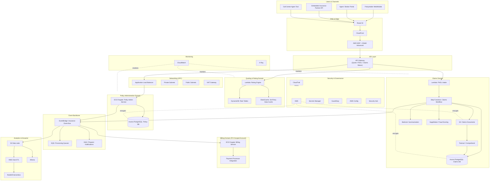

# Part IX – Industry-Specific Architectures

# Chapter 69 — Insurance

*A production-ready reference architecture for policy administration, underwriting, claims processing, and regulated insurance workloads on AWS.*

---

# 1 Executive Summary

## 1.1 The Business Problem

Insurance carriers — property & casualty (P&C), life, health, specialty, and reinsurance — run some of the most data-intensive, compliance-heavy, and financially consequential software systems in existence.

A modern insurance technology platform must simultaneously support:

- **Quoting and rating engines** that compute premiums in real time based on actuarial tables, risk models, and third-party data (credit bureaus, motor vehicle records, property data, medical records).
- **Policy administration systems (PAS)** that manage the full policy lifecycle: issuance, endorsements, renewals, cancellations, and non-renewals.
- **Claims management systems** that intake, adjudicate, investigate, and settle claims — often under strict regulatory timelines.
- **Underwriting workbenches** where human underwriters review AI-generated risk scores and either approve, decline, or refer applications.
- **Billing and payments** for premium collection, commission disbursement, and claims payouts.
- **Agent and broker portals** for distribution partners who sell policies on the carrier's behalf.
- **Direct-to-consumer digital channels** — web and mobile apps for self-service quoting, policy management, and First Notice of Loss (FNOL).
- **Regulatory reporting** to state Departments of Insurance (DOI), the National Association of Insurance Commissioners (NAIC), and — for health lines — HIPAA-covered entities.
- **Fraud detection** systems that flag suspicious claims before payout.
- **Actuarial and analytics platforms** that price risk, reserve for losses, and forecast loss ratios.

Legacy insurance IT is notorious for decades-old policy administration mainframes, batch-oriented nightly processing, and rigid monolithic claims systems that cannot support real-time digital experiences. Carriers that fail to modernize lose market share to insurtechs (Lemonade, Root, Hippo) and digitally mature incumbents that can quote in seconds, settle simple claims in minutes, and iterate on pricing models weekly instead of annually.

At the same time, insurance is one of the most heavily regulated industries in the world. Every US state maintains its own insurance code, rate-filing requirements, and consumer-protection rules enforced by its DOI. Carriers writing health lines are HIPAA covered entities. Carriers processing card payments are subject to PCI-DSS. Publicly traded carriers are subject to SOX controls over financial reporting, including reserve calculations. This creates a genuine tension: the business wants speed and innovation, while compliance and legal demand auditability, data residency, and rigorous change control.

## 1.2 Architecture Objective

This chapter designs a cloud-native insurance platform on AWS that:

- Separates **quoting/rating** (high read volume, latency-sensitive, stateless) from **policy administration** (transactional, strongly consistent, long-lived state) from **claims processing** (event-driven, workflow-heavy, document-intensive).
- Uses **event-driven architecture** as the backbone connecting these domains, so that a claim event, a policy endorsement, or a payment event can fan out to billing, analytics, fraud detection, and notifications without tight coupling.
- Applies **AI/ML** — Amazon Bedrock, Amazon Textract, Amazon Comprehend, and SageMaker — to underwriting risk scoring, claims document extraction, fraud triage, and customer service automation, while keeping a human in the loop for regulated decisions.
- Builds a **compliance-first foundation**: multi-account landing zone, encryption everywhere, immutable audit trails, and NAIC/DOI/HIPAA/PCI-aligned controls baked into the architecture rather than bolted on afterward.
- Supports **actuarial and analytics workloads** through a data lake and lakehouse pattern, decoupled from transactional systems so that heavy analytical queries never degrade production policy or claims throughput.
- Provides **multi-region resilience** appropriate to a regulated financial-services workload, with defined RPO/RTO targets and tested failover procedures.

## 1.3 Why Organizations Adopt This Architecture

**1. Regulatory timelines are unforgiving.**
Most states require carriers to acknowledge a claim within 10–15 days and, in many jurisdictions, to pay or deny within 30–45 days of receiving proof of loss. Missing these deadlines triggers statutory penalties, interest, and in some states, bad-faith litigation exposure. An event-driven claims pipeline with SLA tracking built into Step Functions state machines gives operations teams real-time visibility into which claims are approaching regulatory deadlines.

**2. Distribution is increasingly digital and API-driven.**
Independent agents, managing general agents (MGAs), comparison-shopping websites, and embedded-insurance partners (e.g., insurance sold at the point of sale for a rental car or a mortgage) all integrate via API. A carrier that cannot expose a stable, well-documented, rate-limited API for real-time quoting loses distribution partners to competitors who can.

**3. Loss ratio improvement is a direct P&L lever.**
Every percentage point improvement in fraud detection or claims leakage (overpayment) translates directly to underwriting profit. Carriers increasingly justify cloud and AI investment purely on fraud-detection ROI — a single prevented fraudulent claim can be worth $10,000–$100,000+, and a modern ML-based fraud model typically pays for its own infrastructure cost many times over.

**4. Catastrophe (CAT) events create extreme, unpredictable load spikes.**
A hurricane, wildfire, or hailstorm can generate tens of thousands of FNOL submissions within 48 hours in an affected region. On-premises claims systems sized for average-day volume fall over during these events — precisely when policyholders need the carrier most, and when reputational and regulatory scrutiny is highest. Elastic cloud infrastructure that scales claims intake, document upload, and adjuster dispatch capacity in minutes is a direct competitive and reputational advantage.

**5. Legacy core systems cannot support modern digital experiences.**
Mainframe-based policy admin systems (Duck Creek, Guidewire on legacy stacks, homegrown COBOL/AS400 systems) were never designed for mobile apps, real-time chat-based FNOL, or API-first distribution. Rather than a "big bang" core system replacement (historically a multi-year, high-failure-rate undertaking), most carriers adopt a **strangler fig** pattern: new digital capabilities are built cloud-native, integrate with the legacy core via APIs and event streams, and progressively take over functionality until the legacy core is either replaced or reduced to a narrow system of record.

## 1.4 Major Business Benefits

| Benefit | Mechanism | Typical Impact |
|---|---|---|
| Faster quote-to-bind cycle | Serverless rating APIs, cached third-party data lookups | Quote time reduced from minutes to sub-second |
| Reduced claims cycle time | Event-driven workflow orchestration, automated document extraction | 20–40% reduction in average claims handling time |
| Lower fraud losses | ML-based fraud scoring at FNOL intake | 10–25% reduction in fraudulent claims paid |
| Elastic CAT-event capacity | Auto Scaling, serverless intake, queue-based buffering | Absorb 10–50x normal FNOL volume without outage |
| Lower infrastructure TAG (total cost of ownership) | Pay-as-you-go compute, S3 storage tiering, Spot for batch actuarial jobs | 30–50% reduction vs. equivalent on-prem capacity |
| Faster regulatory reporting | Automated data pipelines feeding NAIC statutory reporting | Reporting cycle reduced from weeks to days |
| Improved agent/broker satisfaction | Stable, documented APIs with predictable latency and uptime | Higher API adoption, reduced integration support burden |

## 1.5 Typical Enterprise Scenarios

- A **regional P&C carrier** modernizing FNOL and claims intake ahead of hurricane season, replacing a call-center-only process with a digital-first, AI-assisted claims pipeline.
- A **national life and health insurer** building a HIPAA-compliant underwriting platform that ingests medical records, lab results, and prescription history to accelerate accelerated underwriting (no-exam life insurance).
- An **MGA (Managing General Agent)** building a cloud-native quoting and binding platform from scratch, with no legacy core system to migrate — a greenfield opportunity to build fully cloud-native from day one.
- A **specialty/commercial lines carrier** building a document-intensive underwriting workbench that uses AI to extract data from broker-submitted PDFs, spreadsheets, and loss-run reports.
- A **reinsurer or CAT-modeling function** running large-scale simulation workloads (hundreds of thousands of CPU-hours) to model catastrophe exposure across a portfolio, requiring elastic HPC-style compute.
- An **insurtech** building an embedded-insurance product distributed through partner APIs (e.g., insurance offered at checkout for a bicycle, a phone, or a rental car), requiring extremely low quote latency and high API reliability.

---

# 2 Business Requirements

## 2.1 Business Drivers

- Reduce average claims cycle time and improve policyholder Net Promoter Score (NPS).
- Increase quote-to-bind conversion rate through faster, more accurate real-time rating.
- Reduce fraud and claims leakage through AI-assisted triage.
- Meet statutory claims-handling deadlines in every state of operation.
- Enable API-first distribution to agents, brokers, and embedded-insurance partners.
- Reduce total cost of ownership versus legacy mainframe and data-center infrastructure.
- Support catastrophe-event surge capacity without service degradation.
- Demonstrate auditable compliance to state regulators, NAIC examiners, and (where applicable) HIPAA/PCI auditors.

## 2.2 Functional Requirements

| Capability | Requirement |
|---|---|
| Quoting | Real-time premium calculation using rating tables, third-party data, and risk models |
| Policy administration | Full policy lifecycle: issuance, endorsement, renewal, cancellation, reinstatement |
| Claims (FNOL) | Multi-channel intake: web, mobile, call center, agent portal, IoT/telematics triggers |
| Claims adjudication | Workflow orchestration with SLA tracking, adjuster assignment, reserve setting |
| Document processing | OCR and data extraction from claims documents, medical records, estimates, photos |
| Fraud detection | Real-time and batch scoring of claims and applications against fraud indicators |
| Billing | Premium invoicing, payment processing, commission calculation, claims disbursement |
| Reporting | NAIC statutory reporting, state DOI reporting, internal actuarial reporting |
| Notifications | Multi-channel (email, SMS, push) status updates to policyholders and agents |
| Agent/broker portal | Quote, bind, endorse, and view commission statements |

## 2.3 Non-Functional Requirements

| Category | Requirement |
|---|---|
| Availability | 99.95% for customer-facing quoting and claims intake; 99.9% for internal admin tools |
| Latency | Sub-second rating API response (p95 < 800 ms); sub-3-second claims document upload acknowledgment |
| Scalability | Absorb a 20–50x surge in FNOL volume during a declared CAT event within 15 minutes |
| Durability | 11 nines for claims documents and policy records (S3 durability) |
| Data residency | US-only data residency for US-licensed lines of business (state DOI expectation) |
| Auditability | Immutable audit trail for every policy change, claims decision, and underwriting decision |
| Recoverability | RPO ≤ 15 minutes, RTO ≤ 4 hours for core transactional systems |

## 2.4 Scalability Goals

- Rating API: scale from a baseline of a few hundred requests/second to several thousand requests/second during marketing campaigns or CAT-driven quote-shopping surges.
- Claims intake: scale from a baseline of dozens of FNOLs/hour to thousands/hour during a declared catastrophe.
- Document processing (OCR/Textract): scale to process tens of thousands of claims documents within a 24–48 hour CAT-event window.
- Actuarial batch workloads: scale to thousands of vCPUs for portfolio-wide CAT simulation runs, without impacting production transactional capacity.

## 2.5 Availability Requirements

| Tier | Systems | Target |
|---|---|---|
| Tier 1 | Quoting API, claims FNOL intake, payments | 99.95% |
| Tier 2 | Policy admin, agent portal, claims adjudication workbench | 99.9% |
| Tier 3 | Internal reporting, actuarial analytics, back-office tools | 99.5% |

## 2.6 Latency Requirements

| Operation | Target (p95) |
|---|---|
| Real-time quote generation | < 800 ms |
| Policy lookup | < 300 ms |
| FNOL submission acknowledgment | < 2 s |
| Document upload confirmation | < 3 s |
| Fraud score (real-time, at FNOL) | < 500 ms |

## 2.7 Compliance Requirements

- **State insurance regulations** — every state where the carrier is licensed has its own claims-handling timelines, unfair claims practices acts, and rate-filing requirements.
- **NAIC Model Audit Rule (MAR)** — requires an internal-controls attestation over financial reporting, similar in spirit to SOX, specifically for insurers.
- **HIPAA** — applies to health and, in many cases, life and disability lines that handle Protected Health Information (PHI) during underwriting or claims.
- **PCI-DSS** — applies to premium payment processing and claims disbursement via card networks.
- **SOX** — applies to publicly traded carriers for financial-reporting controls, including reserve and loss-ratio calculations.
- **State-specific data breach notification laws** — every state has its own notification timeline and threshold.
- **GLBA (Gramm-Leach-Bliley Act)** — governs the privacy and security of nonpublic personal financial information for insurers, as financial institutions.

## 2.8 Security Expectations

- Encryption at rest (KMS, customer-managed keys) and in transit (TLS 1.2+) for all policyholder PII, PHI, and financial data.
- Field-level encryption or tokenization for the most sensitive fields (SSN, driver's license number, bank account numbers).
- Least-privilege IAM with strong separation between underwriting, claims, and finance functions.
- Comprehensive, immutable audit logging of every access to policyholder records (a common DOI market-conduct exam requirement).
- Multi-factor authentication for all internal users; strong customer authentication for high-value self-service transactions (e.g., changing bank account details for claims payout).

## 2.9 Recovery Objectives

| System | RPO | RTO |
|---|---|---|
| Policy administration database | 5 minutes | 2 hours |
| Claims database | 5 minutes | 2 hours |
| Document store (S3) | Near-zero (cross-region replication) | 30 minutes |
| Rating/quoting service | 15 minutes (mostly stateless) | 1 hour |
| Data lake / analytics | 24 hours | 8 hours |

## 2.10 SLAs

- 99.95% uptime commitment to distribution partners (agents, brokers, embedded-insurance API consumers) for the quoting API, with defined penalty credits for breach.
- Statutory claims acknowledgment and payment timelines per state, tracked and enforced via workflow SLA timers, not manual tracking spreadsheets.

## 2.11 Expected Workload

- Baseline: a mid-size regional P&C carrier with roughly 500,000 in-force policies, 50,000–100,000 quotes/day, and 200–500 new claims/day.
- Peak (CAT event): 10,000+ FNOLs within a 72-hour window in an affected region, with a corresponding spike in document uploads and adjuster dispatch requests.

## 2.12 Expected Growth

- 20–30% year-over-year growth in digital quote volume as agents and consumers shift from phone/paper to digital channels.
- Expansion into new states, each adding distinct rate-filing and compliance requirements.
- Expansion into new lines of business (e.g., a P&C carrier adding a cyber-insurance line), each with distinct rating and underwriting logic that should plug into the same platform rather than requiring a parallel stack.

---

# 3 Architecture Overview

## 3.1 Overall Design

The platform is organized around **four bounded domains**, each independently deployable and independently scalable, connected by an **event backbone**:

1. **Quoting & Rating** — stateless, high-throughput, latency-sensitive. Built on Lambda and API Gateway, backed by DynamoDB for rate tables and cached third-party data lookups.
2. **Policy Administration** — transactional, strongly consistent. Built on ECS Fargate services backed by Aurora PostgreSQL, since policy state changes require ACID transactions and complex relational queries (e.g., coverage relationships, endorsement history).
3. **Claims Management** — event-driven, workflow-heavy, document-intensive. Built on Step Functions for claims-lifecycle orchestration, SQS/EventBridge for asynchronous processing, S3 for documents, and Textract/Comprehend/Bedrock for AI-assisted extraction and triage.
4. **Billing & Payments** — transactional, PCI-scoped. Isolated into its own AWS account with a reduced blast radius, integrating with a PCI-compliant payment processor.

These four domains publish and subscribe to a shared **EventBridge event bus** (the "Insurance Event Bus"), which also feeds the **data lake** for actuarial analytics and the **fraud detection** pipeline, without any domain needing direct knowledge of the others' internal data models.

## 3.2 Architecture Philosophy

- **Domain-driven bounded contexts.** Quoting, policy, claims, and billing are separate services with separate data stores. This prevents the "one giant database" anti-pattern that made legacy policy admin systems impossible to change safely.
- **Event-driven integration over synchronous coupling.** A claim status change publishes an event; billing, notifications, fraud detection, and analytics each subscribe independently. No domain blocks on another domain's availability.
- **Human-in-the-loop AI.** AI/ML accelerates underwriting and fraud triage but does not make final regulated decisions autonomously for consequential outcomes (declines, non-renewals, claim denials) — a human underwriter or adjuster reviews and approves, which is both a regulatory expectation in most states and a sound risk-management practice.
- **Compliance as code.** Multi-account landing zone, AWS Config rules, and Service Control Policies (SCPs) enforce controls automatically rather than relying on periodic manual audits.
- **Read/write separation for analytics.** Actuarial and reporting workloads never query production transactional databases directly; they consume from the data lake, fed by CDC (Change Data Capture) and event streams.

## 3.3 Core Components

| Component | Technology | Domain |
|---|---|---|
| Quote API | API Gateway + Lambda | Quoting & Rating |
| Rate table store | DynamoDB | Quoting & Rating |
| Third-party data cache | DynamoDB + ElastiCache | Quoting & Rating |
| Policy admin services | ECS Fargate | Policy Administration |
| Policy database | Aurora PostgreSQL (Multi-AZ) | Policy Administration |
| FNOL intake API | API Gateway + Lambda | Claims |
| Claims workflow orchestration | Step Functions | Claims |
| Claims database | Aurora PostgreSQL (Multi-AZ) | Claims |
| Document store | S3 (versioned, replicated) | Claims |
| Document extraction | Textract, Comprehend, Bedrock | Claims |
| Fraud scoring | SageMaker endpoint + Bedrock | Claims |
| Event bus | EventBridge | Cross-domain |
| Async processing queues | SQS | Cross-domain |
| Notifications | SNS + Amazon Pinpoint | Cross-domain |
| Payment processing | ECS Fargate (isolated PCI account) | Billing |
| Data lake | S3 + Glue + Athena | Analytics |
| Data warehouse | Redshift Serverless | Analytics |
| Agent/broker portal | CloudFront + S3 + API Gateway | Distribution |

## 3.4 How Components Interact

- The **agent portal** and **direct-to-consumer web/mobile apps** call the **Quote API** for real-time rating, and the **Policy Admin API** to bind and manage policies.
- A bound policy triggers a `PolicyBound` event on the Insurance Event Bus, consumed by Billing (to set up the premium payment schedule) and by the Data Lake ingestion pipeline (for analytics).
- A policyholder reports a loss through the **FNOL intake API** (web, mobile, or call-center agent tool). This creates a claim record and starts a **Step Functions** state machine that orchestrates the claims lifecycle: acknowledgment, document collection, fraud scoring, adjuster assignment, investigation, settlement, and payment.
- Uploaded claims documents land in S3 and trigger **Textract** for OCR and **Comprehend** for entity extraction (injuries, damages, dates, parties involved). Extracted structured data is written back to the claims database and made available to the adjuster workbench.
- **Bedrock** is used for claims summarization (condensing a large claims file into a structured summary for adjuster review) and for underwriting-note generation, always with a human review step before any customer-facing action.
- Claim status transitions publish events consumed by **Notifications** (policyholder SMS/email updates) and by the **Data Lake** for real-time claims analytics dashboards.
- **Billing** consumes `PolicyBound`, `PolicyEndorsed`, and `ClaimSettled` events to trigger premium invoicing, refunds, or claims payouts, and integrates with a PCI-compliant payment processor within its isolated account.

## 3.5 High-Level Workflow

1. Prospect requests a quote → Quote API returns a premium in real time.
2. Prospect binds the policy → Policy Admin issues the policy and emits `PolicyBound`.
3. Billing sets up the premium payment schedule.
4. Policyholder experiences a loss → submits FNOL → Claims domain creates a claim and starts the orchestration workflow.
5. Claim is triaged (fraud score, complexity score) → routed to straight-through processing (low complexity, low fraud risk) or to a human adjuster (high complexity or elevated fraud risk).
6. Claim is investigated, reserved, and settled → `ClaimSettled` event triggers payment via Billing.
7. All events feed the data lake for actuarial reserving, loss-ratio analysis, and regulatory reporting.

## 3.6 Request Lifecycle

A rating request flows: CloudFront (static portal assets) → API Gateway (Quote API) → Lambda (rating engine) → DynamoDB (rate tables) + cached third-party data → response assembled and returned, typically within a few hundred milliseconds.

## 3.7 Response Lifecycle

Claims status responses are served from the claims database via the Claims API, with the Step Functions execution status providing granular workflow state (e.g., "documents pending," "under review," "approved — payment processing") surfaced to the policyholder through the self-service portal.

## 3.8 Data Lifecycle

- **Hot data** (in-force policies, open claims): Aurora PostgreSQL, optimized for transactional access.
- **Warm data** (recently closed claims, expired policies within statute-of-limitations window): S3 Standard, queryable via Athena.
- **Cold data** (records beyond active retention need but still within regulatory retention requirements, often 7+ years): S3 Glacier Flexible Retrieval or Glacier Deep Archive, governed by S3 Lifecycle policies aligned to each state's record-retention statutes.
- **Analytical data**: continuously replicated from transactional stores via CDC into the data lake for actuarial and reporting use, ensuring production databases are never burdened by analytical query load.

---

# 4 AWS Services Used

## 4.1 Compute

### Amazon ECS on Fargate

**Purpose:** Runs policy administration services and the PCI-scoped billing/payment service — long-running, stateful-adjacent services requiring predictable performance and strong network isolation.
**Why selected:** Fargate removes EC2 patching burden (a real audit-scope reduction for PCI and NAIC MAR compliance) while still providing the container-level control and connection-pooling behavior that a relational, transactional policy-admin workload needs, which pure Lambda handles less gracefully at sustained high throughput.
**Alternatives:** EKS (justified only if the organization already runs Kubernetes elsewhere and wants a single control plane); EC2 Auto Scaling Groups (more operational overhead, more compliance-audit surface area from patch management).
**Limitations:** Cold-start on task placement during rapid scale-out is slower than Lambda; task-level networking configuration for PCI segmentation requires careful VPC design.
**Pricing considerations:** Billed per vCPU/memory-second; right-sizing task definitions and using Fargate Spot for non-production environments materially reduces cost.
**Best practices:** One ECS service per bounded-context microservice; separate ECS clusters per compliance boundary (e.g., a dedicated cluster for PCI-scoped billing); Fargate platform version pinned per environment with a controlled upgrade process.

### AWS Lambda

**Purpose:** Powers the Quote API, FNOL intake API, document-processing triggers, and event-driven fan-out logic.
**Why selected:** Quoting and FNOL intake are bursty and unpredictable (especially during CAT events) — Lambda's automatic, near-instant scaling handles a 50x traffic spike without any pre-provisioning decision, and cost scales to zero during quiet periods.
**Alternatives:** Fargate (justified for long-running or stateful logic, not used here for the stateless rating engine); EC2 (unjustified operational overhead for bursty workloads).
**Limitations:** 15-minute maximum execution time (irrelevant for rating/FNOL, relevant for very large document-processing batch jobs, which are instead handled via Step Functions + Fargate); cold starts for infrequently invoked functions can affect p99 latency — mitigated with Provisioned Concurrency for the Quote API during anticipated high-traffic windows (e.g., marketing campaigns, hurricane-season pre-positioning).
**Pricing considerations:** Pay-per-invocation and duration; Provisioned Concurrency incurs a baseline cost and should be reserved for genuinely latency-critical, predictable-traffic functions.
**Best practices:** One responsibility per function; externalize rate tables and configuration to DynamoDB/Parameter Store rather than bundling in deployment packages; use Lambda Power Tuning to right-size memory allocation.

## 4.2 Networking & Edge

### Amazon CloudFront

**Purpose:** Global content delivery for the agent portal and direct-to-consumer web application static assets, and TLS termination at the edge.
**Why selected:** Reduces latency for geographically distributed agents and policyholders, and provides a first layer of DDoS absorption ahead of AWS Shield.
**Alternatives:** Direct ALB exposure (higher latency for distant users, no edge caching, larger DDoS attack surface).
**Limitations:** Cache invalidation adds operational complexity for frequently updated content; not useful for the latency-sensitive Quote API itself, which must always hit the live rating engine.
**Best practices:** Origin Access Control (OAC) restricting direct S3 bucket access; separate cache behaviors for static assets versus API paths (API paths set to no-cache, forwarded directly to origin).

### Application Load Balancer (ALB)

**Purpose:** Routes traffic to ECS Fargate services for policy admin and billing.
**Why selected:** Native integration with ECS service auto scaling, health checks, and path-based routing across policy-admin microservices.
**Alternatives:** Network Load Balancer (used instead for the PCI billing service where static IP allow-listing is required by the payment processor).

### Amazon Route 53

**Purpose:** DNS management and health-check-based failover routing for multi-region disaster recovery.
**Why selected:** Native integration with ACM certificates, health checks, and latency-based or failover routing policies needed for the multi-region DR strategy described in Section 13.

### AWS WAF and AWS Shield Advanced

**Purpose:** Protects public-facing APIs (Quote API, FNOL intake, agent portal) from common web exploits and volumetric DDoS attacks.
**Why selected:** Insurance quoting APIs are a known target for scraping (competitors or data brokers harvesting rate data) and credential-stuffing attacks against the policyholder self-service portal; WAF rate-based rules and managed rule groups mitigate both.
**Best practices:** Geo-restriction to licensed states where appropriate; rate-based rules tuned to legitimate agent/broker API traffic patterns to avoid false positives blocking real distribution partners.

## 4.3 API & Integration

### Amazon API Gateway

**Purpose:** Exposes the Quote API, FNOL intake API, and Claims Status API to external consumers (agents, brokers, embedded-insurance partners, mobile/web apps).
**Why selected:** Built-in throttling, API-key-based usage plans (critical for managing distribution-partner integrations with distinct rate limits per partner tier), and native Lambda integration.
**Alternatives:** ALB + Lambda (loses usage-plan and API-key management, which distribution-partner onboarding relies on heavily).
**Best practices:** Separate usage plans per partner tier; request validation at the gateway layer to reject malformed requests before they consume Lambda invocations; WAF association on every public API.

### Amazon EventBridge

**Purpose:** The cross-domain event bus connecting quoting, policy, claims, billing, fraud detection, and analytics.
**Why selected:** Schema registry support (critical for a platform with many event-producing and event-consuming teams to avoid silent breaking changes), native SaaS and third-party integration for data-provider events, and content-based filtering so consumers only receive relevant events.
**Alternatives:** SNS+SQS fan-out (viable but lacks EventBridge's schema registry and content filtering, both valuable at this scale); Kafka/MSK (justified only if event volumes and consumer complexity grow to require it — see Section 14 scaling discussion).

### Amazon SQS

**Purpose:** Buffers document-processing jobs, batch fraud-scoring requests, and CAT-event FNOL surge intake so that downstream processing capacity can scale independently of intake capacity.
**Why selected:** Decouples burst intake (which must never reject a policyholder trying to report a loss) from processing capacity (which scales out over minutes, not milliseconds).
**Best practices:** Dead-letter queues on every processing queue; CloudWatch alarms on queue depth and age-of-oldest-message as leading indicators of processing backlog during a CAT event.

### AWS Step Functions

**Purpose:** Orchestrates the multi-step, long-running claims lifecycle: acknowledgment, document collection, fraud scoring, adjuster assignment, investigation, approval, and payment — with built-in SLA timers against statutory deadlines.
**Why selected:** Claims processing is fundamentally a stateful workflow with human-in-the-loop steps (adjuster review, underwriter approval) that can pause for days; Step Functions' native support for `waitForTaskToken` patterns and long-running executions fits this far better than a hand-rolled state machine in application code.
**Alternatives:** A custom workflow engine (significant undifferentiated engineering effort); Amazon MWAA/Airflow (better suited to data-pipeline DAGs than to human-in-the-loop transactional workflows).

## 4.4 Data & Storage

### Amazon Aurora PostgreSQL

**Purpose:** System of record for policy administration and claims management — data requiring ACID transactions, complex relational integrity (policy-coverage-endorsement relationships), and point-in-time recovery.
**Why selected:** Policy and claims data has genuine relational structure (a policy has many coverages, many endorsements, many claims; a claim has many reserves, many payments, many documents) that benefits from foreign-key integrity and transactional guarantees that a NoSQL store would push into fragile application logic. Aurora's storage-layer replication and fast failover (typically under 30 seconds) meet the availability targets in Section 2.
**Alternatives:** Amazon RDS for PostgreSQL (Aurora's faster failover and read-replica scaling are worth the modest cost premium for Tier-1 systems); DynamoDB (poor fit for the deeply relational, ad hoc query patterns underwriters and claims adjusters require).
**Limitations:** Vertical scaling ceiling on write throughput eventually requires read/write splitting or domain-level sharding as policy count grows into the tens of millions.
**Best practices:** Separate Aurora clusters per bounded context (policy vs. claims) so a noisy-neighbor issue in one domain cannot degrade the other; Aurora Global Database for the multi-region DR strategy in Section 13; automated minor-version patching during defined maintenance windows.

### Amazon DynamoDB

**Purpose:** Stores rate tables, third-party data-lookup caches, and session/quote-in-progress state for the Quote API.
**Why selected:** Single-digit-millisecond reads at effectively unlimited scale are exactly what a real-time rating engine needs; rate-table lookups are simple key-based access patterns well-suited to DynamoDB, not relational joins.
**Alternatives:** ElastiCache (used as a complementary layer for third-party data-lookup caching where TTL-based expiry is the primary requirement); Aurora (wrong fit — rating lookups are high-volume, low-complexity key/value reads, not relational queries).
**Best practices:** On-demand capacity mode for unpredictable CAT-event traffic; DynamoDB Streams feeding the data lake for rate-table-change audit history (a common DOI rate-filing audit requirement).

### Amazon S3

**Purpose:** Stores claims documents (photos, estimates, medical records, police reports), policy documents, and the raw/curated data-lake zones.
**Why selected:** 11-nines durability meets the durability requirement for legally significant claims documents; S3 Object Lock provides WORM (write-once-read-many) compliance for documents subject to litigation hold or regulatory retention.
**Best practices:** Separate buckets per data classification (PHI-containing medical documents isolated with stricter bucket policies and KMS keys than general claims photos); S3 Lifecycle policies aligned to each state's record-retention statute; Cross-Region Replication for DR.

### Amazon Redshift Serverless / AWS Glue / Amazon Athena

**Purpose:** Powers actuarial analytics, loss-ratio reporting, and NAIC statutory reporting, decoupled entirely from transactional systems.
**Why selected:** Actuarial queries (loss triangles, reserve development, portfolio-wide CAT exposure aggregation) are read-heavy, complex, and unpredictable in resource demand — running them against Aurora would risk degrading production transactional latency. Redshift Serverless scales analytical compute independently and only when queries run, avoiding a fixed always-on cluster cost for workloads that are often batch/scheduled.
**Alternatives:** Athena-only (sufficient for ad hoc and moderate-frequency reporting; Redshift Serverless is added specifically for complex, join-heavy actuarial queries and BI-tool concurrency).

## 4.5 AI/ML

### Amazon Textract

**Purpose:** Extracts structured data (names, dates, dollar amounts, policy numbers) from scanned claims documents, medical bills, and repair estimates.
**Why selected:** Purpose-built OCR with table and form extraction, far more accurate on insurance-specific document layouts than general-purpose OCR, and integrates natively with the S3-triggered document pipeline.

### Amazon Comprehend / Comprehend Medical

**Purpose:** Extracts entities (injuries, medications, diagnoses) from unstructured claims narratives and medical records for health/life/disability lines.
**Why selected:** Comprehend Medical is purpose-built for clinical entity extraction with HIPAA-eligible handling, essential for accelerated underwriting and injury-claim triage.

### Amazon Bedrock

**Purpose:** Powers claims-file summarization for adjuster review, underwriting-note drafting, and customer-service chatbot responses.
**Why selected:** Foundation models substantially reduce adjuster time-to-context on complex claims files (condensing hundreds of pages into a structured summary) and provide natural-language self-service for policyholder inquiries. Used strictly as a decision-support and drafting tool — final claims and underwriting decisions remain with a licensed human, per regulatory expectation and sound risk governance (see Section 17).
**Alternatives:** SageMaker-hosted open-source LLMs (justified if data-residency or model-customization requirements exceed what Bedrock's managed models satisfy).

### Amazon SageMaker

**Purpose:** Trains and hosts the fraud-detection and claims-complexity scoring models on proprietary claims-history data.
**Why selected:** Fraud and complexity scoring benefit from models trained specifically on the carrier's own historical claims and fraud-investigation outcomes — a task suited to SageMaker's full training/tuning/hosting lifecycle rather than a general-purpose foundation model.

## 4.6 Security & Governance

### AWS KMS

**Purpose:** Encrypts all data at rest — Aurora, DynamoDB, S3, EBS — with customer-managed keys, and provides field-level envelope encryption for the most sensitive PII/PHI fields.
**Best practices:** Separate KMS keys per data-classification tier and per bounded context, so a key-policy misconfiguration in one domain cannot expose another; key rotation enabled; key usage logged to CloudTrail and alerted on for anomalous access patterns.

### AWS Secrets Manager

**Purpose:** Stores database credentials, third-party data-provider API keys (credit bureaus, MVR providers, property-data vendors), and payment-processor credentials.
**Best practices:** Automatic rotation for database credentials; strict resource-based policies scoping each secret to the specific service that needs it.

### AWS IAM, GuardDuty, Security Hub, Config, CloudTrail

**Purpose:** Collectively provide identity governance, threat detection, continuous compliance evaluation, and immutable audit logging — detailed in Sections 10 and 11.

---

# 5 Complete Architecture Diagram



---

# 6 Component-by-Component Explanation

## 6.1 Quote API (Lambda + API Gateway)

- **Purpose:** Real-time premium calculation.
- **Responsibilities:** Validate applicant input, retrieve rate tables, query cached third-party data (credit, MVR, CLUE loss history), compute premium, return quote.
- **Inputs:** Applicant demographic and risk data, coverage selections.
- **Outputs:** Quote ID, premium amount, coverage summary, quote expiration.
- **Scaling:** Automatic, per-request Lambda concurrency; Provisioned Concurrency pre-warmed ahead of known high-traffic windows.
- **High availability:** Multi-AZ by default (Lambda is inherently regional and AZ-resilient); DynamoDB Global Tables for cross-region rate-table availability in DR.
- **Failure handling:** Circuit breaker around third-party data-provider calls with cached fallback data and a "referred for manual quote" degraded path if a provider is down.
- **Dependencies:** DynamoDB rate tables, ElastiCache third-party data cache, third-party data-provider APIs.
- **Security:** API Gateway usage plans and API keys per distribution partner; WAF in front; least-privilege Lambda execution role scoped only to the specific DynamoDB tables and Secrets Manager entries it needs.
- **Monitoring:** CloudWatch custom metrics for quote latency percentiles and third-party provider error rates; X-Ray tracing across the full quote request path.

## 6.2 Policy Administration Service (ECS Fargate)

- **Purpose:** System of record for policy issuance, endorsement, renewal, and cancellation.
- **Responsibilities:** Enforce policy business rules (e.g., coverage limits, eligibility), maintain transactional integrity across coverage and endorsement records, emit domain events.
- **Scaling:** ECS Service Auto Scaling on CPU/memory and on ALB request-count-per-target.
- **High availability:** Tasks spread across a minimum of three Availability Zones; Aurora Multi-AZ with automated failover.
- **Failure handling:** Idempotent endorsement-processing logic (critical, since retried requests must not double-apply a coverage change); dead-letter handling for failed event publication with a reconciliation job.
- **Dependencies:** Aurora PostgreSQL, EventBridge, Secrets Manager.
- **Security:** Task IAM roles scoped per service; database credentials rotated via Secrets Manager; VPC private subnets with no direct internet route.
- **Monitoring:** Container Insights for ECS; custom business metrics (policies bound/hour, endorsement processing latency).

## 6.3 FNOL Intake & Claims Workflow (Lambda + Step Functions)

- **Purpose:** Captures a reported loss and orchestrates the claim through its full lifecycle.
- **Responsibilities:** Validate FNOL submission, create claim record, initiate document collection, trigger fraud scoring, route to straight-through processing or human adjuster, track SLA deadlines, coordinate settlement and payment.
- **Scaling:** Step Functions Standard workflows scale to tens of thousands of concurrent executions; SQS buffers document-processing bursts during CAT events.
- **High availability:** Step Functions is a fully managed, multi-AZ service by default; claims database is Aurora Multi-AZ.
- **Failure handling:** Step Functions built-in retry/backoff on transient task failures; explicit error-handling branches routing to a "manual review" state for anything that fails automated processing after retries.
- **Dependencies:** Aurora claims database, S3 document store, Textract, SageMaker fraud endpoint, Bedrock, EventBridge.
- **Security:** Step Functions execution role scoped to only the specific Lambda functions, S3 prefixes, and SageMaker endpoint required; claims documents encrypted with a dedicated KMS key with tighter access policy than general application data.
- **Monitoring:** Step Functions execution history provides a natural audit trail per claim; CloudWatch alarms on executions approaching statutory SLA deadlines.

## 6.4 Document Processing Pipeline (S3 + Textract + Comprehend + Bedrock)

- **Purpose:** Converts unstructured claims documents into structured, searchable data.
- **Responsibilities:** OCR extraction, entity recognition, document classification (police report vs. medical bill vs. repair estimate), summarization for adjuster review.
- **Scaling:** S3 event-driven invocation scales naturally with upload volume; Textract asynchronous API used for multi-page documents to avoid timeout constraints.
- **Failure handling:** Documents that fail automated extraction (poor scan quality, handwriting) are flagged and routed to manual data entry rather than silently dropped.
- **Security:** Separate S3 prefixes and KMS keys for PHI-containing medical documents versus general claims documents, with IAM policies restricting Comprehend Medical access to only the roles that legitimately process health data.

## 6.5 Fraud Scoring Service (SageMaker)

- **Purpose:** Real-time and batch scoring of claims and applications for fraud risk.
- **Responsibilities:** Score incoming FNOLs against a trained model using claim characteristics, claimant history, and network-analysis features (e.g., shared addresses or repair shops across multiple claims).
- **Scaling:** SageMaker real-time endpoint with auto scaling on invocation count; batch transform jobs for portfolio-wide periodic re-scoring.
- **Failure handling:** A fraud-scoring service outage degrades gracefully to routing all claims to standard human review rather than blocking claims processing entirely.
- **Security:** Model artifacts and training data encrypted with KMS; endpoint accessible only from the claims workflow's VPC endpoint, not exposed publicly.

## 6.6 Event Backbone (EventBridge, SQS, SNS)

- **Purpose:** Decouples the four domains and fans out events to notifications and analytics.
- **Responsibilities:** Reliable, ordered-where-necessary event delivery; schema governance via the EventBridge Schema Registry.
- **Scaling:** EventBridge scales automatically; SQS queues sized and alarmed per consumer's processing capacity.
- **Failure handling:** Dead-letter queues on every rule target; EventBridge Archive and Replay used for reprocessing after a downstream outage.

## 6.7 Billing & Payments Service (Isolated PCI Account)

- **Purpose:** Premium invoicing, payment collection, commission calculation, and claims-payout disbursement.
- **Responsibilities:** Integrate with a PCI-DSS-compliant payment processor (tokenized card handling — the platform itself never stores raw card numbers), reconcile payments against policy and claims events.
- **Security:** Deployed in a dedicated AWS account with its own VPC, its own KMS keys, and its own tightly scoped IAM — minimizing PCI audit scope to only this account rather than the entire platform.

## 6.8 Data Lake & Actuarial Analytics

- **Purpose:** Feeds actuarial pricing models, loss-ratio analysis, reserve adequacy studies, and NAIC statutory reporting.
- **Responsibilities:** Ingest events and CDC streams from all four domains; curate into query-optimized layers (raw, cleansed, aggregated); serve BI tools and actuarial notebooks.
- **Scaling:** Glue jobs and Redshift Serverless scale independently of transactional systems, guaranteeing analytical workloads never degrade production latency.

---

# 7 End-to-End Request Flow

## 7.1 Real-Time Quote Request

1. Prospect enters applicant and coverage information into the web or agent portal.
2. Route 53 resolves the domain to CloudFront.
3. CloudFront forwards the API request (uncached) through AWS WAF to API Gateway.
4. API Gateway authenticates the request (API key for partners, Cognito-issued JWT for direct consumers) and validates the request schema.
5. API Gateway invokes the Rating Lambda function.
6. The Rating Lambda retrieves applicable rate tables from DynamoDB.
7. The Rating Lambda checks ElastiCache for cached third-party data (credit-based insurance score, MVR, CLUE loss history); on a cache miss, it calls the third-party provider and caches the result with an appropriate TTL.
8. The Rating Lambda computes the premium and coverage options.
9. The response is returned through API Gateway to the client, typically within a few hundred milliseconds.
10. CloudWatch records latency and error metrics; X-Ray captures the full trace for troubleshooting.

## 7.2 First Notice of Loss (FNOL) and Claims Processing

1. Policyholder submits an FNOL through the mobile app, web portal, or call-center tool.
2. API Gateway invokes the FNOL Intake Lambda, which validates the policy is active and creates a claim record in the Claims Aurora database.
3. The FNOL Intake Lambda starts a Step Functions execution for the claim.
4. Step Functions sends an acknowledgment notification via SNS/Pinpoint and starts an SLA timer against the applicable state's statutory acknowledgment deadline.
5. Step Functions requests supporting documents (photos, police report, repair estimate) via the policyholder portal; uploaded documents land in S3.
6. S3 upload events trigger Textract for OCR extraction and Comprehend for entity extraction; extracted data is written to the claims database.
7. Step Functions invokes the SageMaker fraud-scoring endpoint with the claim's current feature set.
8. Based on the fraud score and claim complexity score, Step Functions routes the claim either to straight-through automated processing (low risk, low complexity, within pre-authorized settlement limits) or to a human adjuster's work queue.
9. If routed to a human adjuster, the adjuster reviews a Bedrock-generated claim summary alongside the full claims file, sets a reserve, and makes an approve/deny/further-investigate decision.
10. Upon approval, Step Functions emits a `ClaimSettled` event to EventBridge.
11. The Billing service consumes `ClaimSettled` and initiates the claims payout through the PCI-scoped payment integration.
12. EventBridge also delivers the event to the Data Lake ingestion pipeline and to Notifications, which informs the policyholder of the settlement.
13. Every state transition, document, and decision is retained in the Step Functions execution history and the claims database, forming the audit trail for regulatory examination.
14. If any automated step fails after configured retries, the workflow transitions to an explicit "manual review required" state, alerting the claims operations team rather than failing silently.

---

# 8 Deployment Flow

## 8.1 Infrastructure Provisioning

- All infrastructure defined in Terraform, organized into per-domain modules (`quoting`, `policy-admin`, `claims`, `billing`, `data-lake`, `security-baseline`).
- Remote state stored in an S3 backend with DynamoDB state locking, one state file per domain per environment to limit blast radius of any single `terraform apply`.

## 8.2 Terraform Workflow

1. Developer opens a pull request modifying a Terraform module.
2. CI runs `terraform fmt -check`, `terraform validate`, and `tflint`.
3. CI runs `terraform plan` and posts the plan output as a PR comment for review.
4. A second engineer (and, for the PCI-scoped billing account, a security-team approver) reviews and approves.
5. On merge, CI runs `terraform apply` against the target environment using a scoped deployment role assumed via OIDC — no long-lived AWS credentials stored in CI.

## 8.3 CI/CD Deployment (Application Code)

- Each domain's application services deploy independently through their own pipeline.
- ECS services use blue-green deployment via AWS CodeDeploy, shifting traffic gradually while monitoring CloudWatch alarms for elevated error rates or latency.
- Lambda functions deploy using weighted alias traffic shifting (e.g., 10% → 50% → 100%) with automatic rollback on CloudWatch alarm breach.

## 8.4 Blue-Green Deployment

- New task set is deployed alongside the existing production task set.
- CodeDeploy shifts a small percentage of ALB traffic to the new task set, monitors defined CloudWatch alarms (5xx rate, latency, business-metric anomalies such as a sudden quote-decline-rate spike), and either continues the shift or triggers automatic rollback.
- Full cutover typically completes within 15–30 minutes for policy-admin and billing services; the old task set is retained briefly for fast rollback before termination.

## 8.5 Rollback

- Lambda: revert alias weighting to the previous version immediately; no redeployment required.
- ECS: CodeDeploy automatic rollback reroutes 100% of traffic back to the original task set.
- Database schema changes use expand-contract migrations (add new columns/tables first, backfill, cut over application logic, remove old structures only in a later release) so that a code rollback never requires an accompanying destructive schema rollback.

## 8.6 Secrets and Configuration

- Database credentials, API keys, and payment-processor credentials in Secrets Manager, injected into ECS tasks and Lambda functions at runtime — never baked into container images or deployment artifacts.
- Non-secret configuration (feature flags, rate-table versions, state-specific rule toggles) in Systems Manager Parameter Store, versioned and auditable.

## 8.7 Validation

- Post-deployment smoke tests validate the Quote API returns a valid premium for a known test scenario in each licensed state, and that a synthetic FNOL submission successfully starts a Step Functions execution.
- Canary synthetic transactions run continuously in production via CloudWatch Synthetics to detect regressions between deployments.

---

# 9 Network Topology

## 9.1 VPC Design

- Separate VPCs per AWS account: `quoting-vpc`, `policy-admin-vpc`, `claims-vpc`, `billing-vpc` (PCI-scoped), `shared-services-vpc`, `data-platform-vpc`.
- Cross-VPC/cross-account connectivity via AWS Transit Gateway, with route-table isolation ensuring the PCI billing VPC only communicates with the specific services it must (EventBridge endpoint, Secrets Manager endpoint) and nothing else.

## 9.2 CIDR Planning

| VPC | CIDR (example) |
|---|---|
| Shared Services | 10.0.0.0/20 |
| Quoting | 10.1.0.0/20 |
| Policy Admin | 10.2.0.0/20 |
| Claims | 10.3.0.0/20 |
| Billing (PCI) | 10.4.0.0/22 (deliberately smaller — narrow scope) |
| Data Platform | 10.5.0.0/20 |

## 9.3 Public and Private Subnets

- Public subnets: only ALB/NLB elastic network interfaces and NAT Gateways.
- Private subnets: ECS tasks, Lambda ENIs (for VPC-connected functions), Aurora, ElastiCache, SageMaker endpoints.
- No compute resource handling policyholder PII/PHI or payment data is ever placed in a public subnet.

## 9.4 NAT Gateway and Internet Gateway

- One NAT Gateway per AZ per VPC (avoiding a cross-AZ single point of failure) for outbound calls to third-party data providers.
- Internet Gateway attached only to VPCs with public-facing load balancers.

## 9.5 Transit Gateway

- Central hub connecting all domain VPCs and the shared-services VPC (which hosts the EventBridge custom bus endpoint, centralized logging, and directory services).
- Route tables per attachment enforce that the Billing VPC cannot be reached from the Quoting VPC directly — all billing-related interaction happens via EventBridge, not direct network paths.

## 9.6 Route Tables, Network ACLs, Security Groups

- Security groups scoped to specific service-to-service communication (e.g., the Claims ECS service security group only permits inbound traffic from the ALB security group on the application port, and outbound only to the Aurora security group and defined VPC endpoints).
- Network ACLs provide a coarse-grained secondary control, particularly useful for explicitly denying known-bad CIDR ranges at the subnet level.

## 9.7 VPC Endpoints (PrivateLink)

- Interface endpoints for S3, DynamoDB, Secrets Manager, KMS, SageMaker Runtime, and EventBridge in every private subnet, ensuring no traffic to these AWS services traverses the public internet — a frequent PCI-DSS and NAIC MAR audit finding when missing.

## 9.8 Hybrid Connectivity

- For carriers with a remaining legacy mainframe/data-center policy admin system during a phased migration, AWS Direct Connect (with a VPN backup path) provides low-latency, private connectivity between the data center and the claims/quoting VPCs for the integration period.

---

# 10 Identity and Access

## 10.1 IAM Roles and Policies

- Least-privilege, service-specific IAM roles: the Rating Lambda's execution role can read only the specific DynamoDB rate-table tables it needs, nothing else; the Claims Step Functions execution role can invoke only the specific Lambda functions and SageMaker endpoint the workflow calls.
- No IAM user access keys for any workload identity — all service-to-service authentication uses IAM roles.

## 10.2 Resource Policies

- S3 bucket policies on the claims-documents bucket restrict access to the specific claims-processing IAM roles and deny any request not using TLS or not encrypted with the designated KMS key.
- KMS key policies explicitly enumerate the IAM roles permitted to use each key, with separate keys (and therefore separate access boundaries) for PHI-containing documents versus general claims documents versus payment data.

## 10.3 STS and Cross-Account Access

- Human access to any account (including read-only production troubleshooting access) is via IAM Identity Center federated roles assumed through STS, time-bounded, and logged to CloudTrail — no standing IAM users with console passwords in any production account.
- Cross-account service access (e.g., the Data Platform account's Glue jobs reading from the Policy Admin account's Aurora snapshots) uses explicit cross-account IAM roles with external ID conditions, never account-wide trust.

## 10.4 Least Privilege in Practice

- Underwriters, claims adjusters, and finance staff are provisioned through distinct IAM Identity Center permission sets mapped to their actual job function, enforcing separation of duties (e.g., the role that can set a claims reserve is distinct from the role that can approve a payment above a threshold, satisfying common SOX and NAIC MAR segregation-of-duties expectations).

## 10.5 Service Roles

- Each ECS task definition specifies its own task role, distinct from the task execution role, so that application-level AWS API permissions (e.g., "read this specific Secrets Manager secret") are separate from the infrastructure-level permissions ECS itself needs (e.g., "pull this container image").

## 10.6 Permission Boundaries

- Permission boundaries applied to all developer and CI/CD deployment roles, capping the maximum permissions any Terraform-applied role can ever grant — preventing a misconfigured module from accidentally provisioning an overly permissive production role.

---

# 11 Security Architecture

## 11.1 Encryption

- **At rest:** KMS customer-managed keys for Aurora, DynamoDB, S3, EBS, and SageMaker model artifacts; automatic annual key rotation enabled.
- **Field-level:** SSNs, driver's license numbers, and bank account numbers are additionally encrypted at the application layer before being written to the database, so that even a database-level compromise does not expose these fields in plaintext.
- **In transit:** TLS 1.2+ enforced on every load balancer listener and API Gateway stage; VPC endpoints ensure AWS-service traffic never traverses the public internet.

## 11.2 TLS, WAF, and Shield

- ACM-issued and auto-renewed certificates on every public endpoint.
- AWS WAF managed rule groups (Core Rule Set, Known Bad Inputs, SQL Injection) plus custom rate-based rules tuned per API consumer tier.
- Shield Advanced on all public-facing CloudFront distributions and ALBs given the reputational and regulatory stakes of a DDoS-induced claims-intake outage during a CAT event.

## 11.3 Secrets Manager and Certificate Manager

- All credentials rotated automatically on a defined schedule; rotation Lambda functions tested in a non-production environment before enabling in production.

## 11.4 GuardDuty, Inspector, Security Hub

- GuardDuty enabled organization-wide across all accounts via AWS Organizations delegated administration, with findings routed to a centralized Security Hub in the security-tooling account.
- Inspector continuously scans ECS container images and Lambda functions for known vulnerabilities, blocking deployment of images with critical unpatched CVEs via a CI/CD gate.

## 11.5 CloudTrail and AWS Config

- Organization-wide CloudTrail with log file validation enabled, delivered to a centralized, access-restricted S3 bucket in the security account with Object Lock (WORM) — a direct control supporting both NAIC MAR and general audit-trail-integrity expectations.
- AWS Config rules continuously evaluate encryption settings, public-access configurations, and IAM policy conditions, with non-compliant resources automatically flagged (and, for critical rules like "S3 bucket must not be public," automatically remediated).

## 11.6 Zero Trust Principles

- No implicit trust based on network location alone; every service-to-service call is authenticated (IAM SigV4 or mTLS) and authorized independently of whether it originates "inside" the VPC.
- Internal admin tools (underwriter workbench, adjuster workbench) require IAM Identity Center authentication with MFA, regardless of whether the user is on the corporate network or remote.

## 11.7 Threat Model and Key Attack Vectors

| Attack Vector | Mitigation |
|---|---|
| Rate-scraping of the Quote API by competitors/data brokers | WAF rate-based rules, API-key-scoped usage plans, anomaly alerting |
| Credential stuffing against the policyholder portal | Cognito advanced security features, MFA, WAF bot control |
| Fraudulent claims submission at scale (bot-driven) | Fraud-scoring model features specifically tuned for submission-pattern anomalies, CAPTCHA on suspicious sessions |
| Insider access to PII/PHI beyond job function | Least-privilege IAM, field-level encryption, comprehensive access logging with anomaly alerting |
| Payment-data exfiltration | PCI-scoped isolated account, tokenized card handling (raw PANs never touch the platform), strict egress controls |
| Third-party data-provider compromise | Provider API responses validated and sanitized before use; providers accessed only via least-privilege, rotated credentials |
| Supply-chain compromise of container images / dependencies | Inspector image scanning, SBOM generation, signed images, dependency-vulnerability scanning in CI |

---

# 12 High Availability

## 12.1 AZ Failures

- All ECS services, Aurora clusters, and Lambda functions span a minimum of three Availability Zones; ALB health checks automatically remove unhealthy targets, and ECS Service Auto Scaling replaces failed tasks within the affected AZ.

## 12.2 Instance/Task Failures

- ECS Service scheduler maintains desired task count continuously; failed tasks are replaced automatically, typically within 30–60 seconds.

## 12.3 Regional Failures

- See Section 13 (Disaster Recovery) for the full multi-region strategy — Tier 1 systems (quoting, FNOL intake) support active-passive regional failover.

## 12.4 Database Failures

- Aurora Multi-AZ automated failover typically completes within 30 seconds; application connection pooling uses the Aurora cluster (writer) endpoint, which automatically redirects to the newly promoted writer without application-level intervention.

## 12.5 Load Balancing and Health Checks

- ALB health checks configured against a dedicated `/health` endpoint on each service that validates not just process liveness but downstream dependency health (database connectivity), so a task with a broken database connection is removed from rotation rather than serving errors.

## 12.6 Failover

- Route 53 health checks continuously probe each region's endpoint; a failed health check triggers automatic DNS failover to the standby region within the configured TTL window.

---

# 13 Disaster Recovery

## 13.1 Backup Strategy

- Aurora automated backups with point-in-time recovery (35-day retention) plus daily manual snapshots retained per each state's record-retention requirement.
- S3 Cross-Region Replication for all claims documents and policy documents, ensuring document durability independent of a single region's availability.

## 13.2 Multi-Region Strategy: Warm Standby

Given the RPO ≤ 15 minutes / RTO ≤ 4 hours targets from Section 2.9, and the statutory and reputational cost of a Tier-1 outage during (very possibly) a regional CAT event, a **Warm Standby** pattern is used for Tier 1 systems:

- **Primary region:** us-east-1. **DR region:** us-west-2.
- Aurora Global Database replicates the Policy and Claims databases to the DR region with typical replication lag under one second, satisfying the RPO target with substantial margin.
- Lambda functions and ECS task definitions are deployed to both regions continuously via the same CI/CD pipeline (deploy to both regions on every release), so the DR region always runs current code, not a stale image requiring an emergency deployment during an incident.
- DynamoDB Global Tables replicate rate tables bidirectionally.
- The DR region runs at reduced capacity (a smaller ECS desired-task-count and lower Lambda Provisioned Concurrency) during normal operation — "warm," not "cold" — so that a failover requires only a capacity scale-up and a database promotion, not a full environment build, keeping actual RTO well inside the 4-hour target.

## 13.3 Regional Failover Procedure

1. Route 53 health check detects sustained failure of the primary region's endpoint.
2. On-call incident commander confirms the outage is regional (not a transient blip) and authorizes failover.
3. Aurora Global Database secondary is promoted to a standalone writable cluster in the DR region.
4. ECS services in the DR region scale up to full production capacity.
5. Route 53 failover routing shifts traffic to the DR region's endpoint.
6. Once the primary region recovers, a planned failback is executed during a maintenance window, never as an emergency action.

## 13.4 CAT-Event Considerations

Note that a *regional AWS infrastructure failure* and a *regional catastrophe event driving claims volume* are different risks requiring different responses — a hurricane does not take down us-east-1, but it does drive a 20–50x claims-intake surge that the warm-standby region's elastic scaling (not a regional failover) absorbs. The two DR mechanisms — regional failover for infrastructure outages, and elastic auto scaling for demand surges — are deliberately independent.

## 13.5 DR Testing

- Full regional failover tested at least twice yearly in a controlled game-day exercise, with results documented for both internal audit and, where applicable, regulatory examination evidence.

---

# 14 Scalability

## 14.1 Horizontal Scaling

- ECS Service Auto Scaling and Lambda concurrency both scale horizontally with no architectural ceiling for the traffic profiles described in Section 2.

## 14.2 Database Scaling

- Aurora read replicas (up to 15) absorb read-heavy reporting and adjuster-workbench query load without impacting write throughput on the primary.
- As policy volume grows toward the tens of millions, domain-level sharding (e.g., by state or by line of business) becomes the next scaling lever, rather than a single ever-larger Aurora cluster.

## 14.3 Queue and Event-Bus Scaling

- SQS and EventBridge scale automatically and require no capacity planning; the operational focus shifts to consumer scaling (ensuring Lambda concurrency limits and ECS desired counts scale to match queue depth), monitored via the queue-depth and age-of-oldest-message alarms described in Section 21.
- If event volume and consumer complexity eventually justify it (very high-throughput, ordered, replayable event streams across dozens of consuming teams), migrating the event backbone to Amazon MSK becomes a reasonable evolution — but is deliberately not adopted at this scale, since EventBridge's lower operational overhead is the better fit for the described workload.

## 14.4 Batch/Actuarial Scaling

- CAT-simulation and portfolio-analytics batch workloads run on AWS Batch with Spot compute, scaling to thousands of vCPUs for the duration of a simulation run and scaling back to zero afterward — a workload profile fundamentally different from the always-on transactional services and deliberately isolated into its own compute environment.

---

# 15 Performance Optimization

## 15.1 Caching

- ElastiCache for third-party data-provider responses (credit scores, MVR data) with TTLs aligned to each provider's data-freshness guarantees — typically 24 hours for MVR, shorter for higher-volatility data.
- CloudFront caching for all static portal assets, with cache-busting on deployment.

## 15.2 Database Optimization

- Read replicas dedicated to reporting/adjuster-workbench queries, isolated from the transactional write path.
- Query-pattern-driven indexing reviewed quarterly against actual production query plans (`pg_stat_statements`), not guessed in advance.

## 15.3 Connection Pooling

- RDS Proxy in front of Aurora for Lambda-based services, avoiding connection-exhaustion under bursty Lambda concurrency — a common and easily overlooked failure mode when Lambda functions connect directly to a relational database at scale.

## 15.4 Async Processing

- Anything not required for the synchronous user-facing response (document-processing triggers, analytics event publication, non-critical notifications) is offloaded to SQS/EventBridge, keeping the synchronous request path lean and the p95 latency targets in Section 2.6 achievable.

---

# 16 Cost Optimization (FinOps)

## 16.1 Estimated Monthly Costs

| Deployment Size | In-Force Policies | Estimated Monthly AWS Spend |
|---|---|---|
| Small (single-state MGA) | 25,000 | $15,000 – $30,000 |
| Medium (regional carrier) | 500,000 | $80,000 – $150,000 |
| Enterprise (national multi-line carrier) | 5,000,000+ | $400,000 – $900,000+ |

*Figures are illustrative planning estimates, not quotes; actual cost depends heavily on claims-document volume, AI/ML usage intensity, and data-retention footprint.*

## 16.2 Major Cost Drivers

- Aurora cluster sizing (particularly during CAT-event read-replica scale-out).
- Textract/Comprehend/Bedrock usage, which scales directly with claims-document volume — a major CAT event can spike this cost category sharply for a short period.
- Data-transfer costs, particularly cross-AZ traffic between application tiers and databases, and CloudFront egress for document-heavy claims portals.
- S3 storage growth, driven by the multi-year regulatory retention requirement for claims documents.
- NAT Gateway data-processing charges for outbound third-party data-provider calls at high quote volume.

## 16.3 Optimization Opportunities

| Lever | Approach |
|---|---|
| Compute | Fargate Spot for non-production and for AWS Batch actuarial workloads |
| Reserved commitments | Compute Savings Plans covering the steady-state baseline ECS/Lambda spend, with burst capacity left on-demand |
| Storage tiering | S3 Lifecycle policies moving closed-claim documents from Standard → Infrequent Access → Glacier as they age past active-use likelihood, aligned to each state's retention statute |
| Data transfer | VPC endpoints eliminating NAT Gateway processing charges for AWS-service traffic; CloudFront caching reducing origin egress |
| Right-sizing | Quarterly Compute Optimizer and Aurora right-sizing review against actual utilization, not initial provisioning guesses |
| AI/ML cost control | Batch (not real-time) Textract/Comprehend processing for non-urgent document backlogs; Bedrock usage scoped to genuinely valuable summarization tasks, not applied indiscriminately |

## 16.4 Cost Allocation, Tagging, and Budgets

- Mandatory tags on every resource: `domain` (quoting/policy/claims/billing/data-platform), `environment`, `cost-center`, `line-of-business`.
- AWS Budgets with alerts at 80% and 100% of each domain's monthly forecast, and Cost Anomaly Detection tuned to flag unusual spend spikes (e.g., an unexpectedly large Textract bill signaling either a genuine CAT event or a misconfigured retry loop — both worth immediate investigation).

---

# 17 AI-Assisted Operations

## 17.1 Amazon Q Developer

- Used by the engineering team for code review assistance, Terraform module authoring, and CloudWatch Logs Insights query generation during incident investigation.

## 17.2 Bedrock for Business Operations

- Claims-file summarization for adjuster review (reducing time-to-context on complex, document-heavy claims).
- Draft generation for underwriting referral notes and customer-communication templates, always reviewed and finalized by a licensed underwriter or adjuster before use — Bedrock accelerates drafting, it does not make or communicate final regulated decisions autonomously.
- Customer-service chatbot for routine policyholder inquiries (coverage explanations, claims-status lookups), with clear escalation to a human agent for anything beyond defined confidence thresholds or involving a claims/coverage decision.

## 17.3 AI-Assisted Troubleshooting

- CloudWatch Logs Insights combined with Amazon Q Developer accelerates root-cause investigation during incidents — engineers describe the symptom in natural language and receive a suggested log-query starting point, rather than hand-writing complex queries under incident pressure.

## 17.4 AI-Assisted Capacity Planning

- Historical CAT-event traffic patterns (from prior hurricane seasons, for example) are analyzed to pre-position Provisioned Concurrency and ECS baseline capacity ahead of a forecasted event, rather than reacting purely to real-time Auto Scaling triggers alone — valuable because the first hours of a CAT-event surge are the most reputationally and regulatorily consequential.

## 17.5 AI-Generated Terraform and Documentation

- Amazon Q Developer assists in drafting new Terraform modules from a natural-language description, which are then reviewed through the standard PR process described in Section 8.2 — AI accelerates drafting, human review remains mandatory before any infrastructure change reaches production.

---

# 18 Terraform Implementation

## 18.1 Provider and Backend Configuration

```hcl

# providers.tf

terraform {
  required_version = ">= 1.7.0"

  required_providers {
    aws = {
      source  = "hashicorp/aws"
      version = "~> 5.0"
    }
  }

  backend "s3" {
    bucket         = "insurance-platform-tfstate-claims"
    key            = "claims-domain/terraform.tfstate"
    region         = "us-east-1"
    dynamodb_table = "insurance-platform-tf-locks"
    encrypt        = true
  }
}

provider "aws" {
  region = var.aws_region

  default_tags {
    tags = {
      Domain      = "claims"
      Environment = var.environment
      ManagedBy   = "terraform"
    }
  }
}

```

## 18.2 Variables

```hcl

# variables.tf

variable "aws_region" {
  description = "Primary AWS region for this domain deployment"
  type        = string
  default     = "us-east-1"
}

variable "environment" {
  description = "Deployment environment: dev, staging, prod"
  type        = string
}

variable "vpc_cidr" {
  description = "CIDR block for the claims domain VPC"
  type        = string
  default     = "10.3.0.0/20"
}

variable "aurora_instance_class" {
  description = "Aurora PostgreSQL instance class for the claims database"
  type        = string
  default     = "db.r6g.xlarge"
}

variable "claims_sla_acknowledgment_hours" {
  description = "Map of state code to statutory FNOL acknowledgment deadline in hours"
  type        = map(number)
  default = {
    "CA" = 360  # 15 calendar days
    "FL" = 336  # 14 calendar days
    "TX" = 360
  }
}

```

## 18.3 Networking Module

```hcl

# modules/networking/main.tf

resource "aws_vpc" "claims" {
  cidr_block           = var.vpc_cidr
  enable_dns_support   = true
  enable_dns_hostnames = true

  tags = {
    Name = "claims-vpc-${var.environment}"
  }
}

resource "aws_subnet" "private" {
  for_each          = var.private_subnet_cidrs
  vpc_id            = aws_vpc.claims.id
  cidr_block        = each.value
  availability_zone = each.key

  tags = {
    Name = "claims-private-${each.key}-${var.environment}"
    Tier = "private"
  }
}

resource "aws_subnet" "public" {
  for_each                = var.public_subnet_cidrs
  vpc_id                  = aws_vpc.claims.id
  cidr_block              = each.value
  availability_zone       = each.key
  map_public_ip_on_launch = false

  tags = {
    Name = "claims-public-${each.key}-${var.environment}"
    Tier = "public"
  }
}

# VPC Endpoints — keep AWS-service traffic off the public internet

resource "aws_vpc_endpoint" "s3" {
  vpc_id            = aws_vpc.claims.id
  service_name      = "com.amazonaws.${var.aws_region}.s3"
  vpc_endpoint_type = "Gateway"
  route_table_ids   = [for rt in aws_route_table.private : rt.id]
}

resource "aws_vpc_endpoint" "secrets_manager" {
  vpc_id              = aws_vpc.claims.id
  service_name        = "com.amazonaws.${var.aws_region}.secretsmanager"
  vpc_endpoint_type   = "Interface"
  subnet_ids          = [for s in aws_subnet.private : s.id]
  security_group_ids  = [aws_security_group.vpc_endpoints.id]
  private_dns_enabled = true
}

```

## 18.4 Aurora Claims Database Module

```hcl

# modules/claims-database/main.tf

resource "aws_kms_key" "claims_db" {
  description             = "KMS key for claims database encryption"
  deletion_window_in_days = 30
  enable_key_rotation     = true
}

resource "aws_rds_cluster" "claims" {
  cluster_identifier      = "claims-db-${var.environment}"
  engine                  = "aurora-postgresql"
  engine_version          = "15.4"
  database_name           = "claims"
  master_username         = "claims_admin"
  manage_master_user_password = true

  db_subnet_group_name    = aws_db_subnet_group.claims.name
  vpc_security_group_ids  = [aws_security_group.claims_db.id]

  storage_encrypted       = true
  kms_key_id              = aws_kms_key.claims_db.arn

  backup_retention_period = 35
  preferred_backup_window = "03:00-04:00"

  deletion_protection     = true

  enabled_cloudwatch_logs_exports = ["postgresql"]

  tags = {
    Name = "claims-aurora-cluster-${var.environment}"
  }
}

resource "aws_rds_cluster_instance" "claims_writer" {
  identifier         = "claims-db-writer-${var.environment}"
  cluster_identifier = aws_rds_cluster.claims.id
  instance_class     = var.aurora_instance_class
  engine             = aws_rds_cluster.claims.engine
  engine_version     = aws_rds_cluster.claims.engine_version
}

resource "aws_rds_cluster_instance" "claims_reader" {
  count              = var.reader_count
  identifier         = "claims-db-reader-${count.index}-${var.environment}"
  cluster_identifier = aws_rds_cluster.claims.id
  instance_class     = var.aurora_instance_class
  engine             = aws_rds_cluster.claims.engine
  engine_version     = aws_rds_cluster.claims.engine_version
}

# Global Database for multi-region DR

resource "aws_rds_global_cluster" "claims_global" {
  count                     = var.enable_global_database ? 1 : 0
  global_cluster_identifier = "claims-global-${var.environment}"
  source_db_cluster_identifier = aws_rds_cluster.claims.arn
}

```

## 18.5 Claims Step Functions State Machine (excerpt)

```hcl

# modules/claims-workflow/main.tf

resource "aws_sfn_state_machine" "claims_workflow" {
  name     = "claims-lifecycle-${var.environment}"
  role_arn = aws_iam_role.claims_workflow.arn

  definition = jsonencode({
    Comment = "Insurance claims lifecycle orchestration"
    StartAt = "AcknowledgeClaim"
    States = {
      AcknowledgeClaim = {
        Type     = "Task"
        Resource = aws_lambda_function.acknowledge_claim.arn
        Next     = "CollectDocuments"
        Retry = [{
          ErrorEquals     = ["States.TaskFailed"]
          IntervalSeconds = 5
          MaxAttempts     = 3
          BackoffRate     = 2.0
        }]
      }
      CollectDocuments = {
        Type     = "Task"
        Resource = "arn:aws:states:::lambda:invoke.waitForTaskToken"
        Parameters = {
          FunctionName = aws_lambda_function.request_documents.arn
          Payload = {
            "TaskToken.$" = "$$.Task.Token"
            "ClaimId.$"   = "$.claimId"
          }
        }
        Next = "FraudScoring"
      }
      FraudScoring = {
        Type     = "Task"
        Resource = aws_lambda_function.fraud_score.arn
        Next     = "RouteClaim"
      }
      RouteClaim = {
        Type = "Choice"
        Choices = [
          {
            Variable          = "$.fraudScore"
            NumericGreaterThan = 70
            Next              = "ManualInvestigation"
          },
          {
            Variable          = "$.complexityScore"
            NumericLessThan   = 30
            Next              = "StraightThroughProcessing"
          }
        ]
        Default = "AdjusterReview"
      }
      StraightThroughProcessing = {
        Type     = "Task"
        Resource = aws_lambda_function.auto_settle.arn
        Next     = "PublishSettlement"
      }
      AdjusterReview = {
        Type     = "Task"
        Resource = "arn:aws:states:::lambda:invoke.waitForTaskToken"
        Parameters = {
          FunctionName = aws_lambda_function.assign_adjuster.arn
          Payload = {
            "TaskToken.$" = "$$.Task.Token"
            "ClaimId.$"   = "$.claimId"
          }
        }
        Next = "PublishSettlement"
      }
      ManualInvestigation = {
        Type     = "Task"
        Resource = aws_lambda_function.flag_siu.arn
        Next     = "AdjusterReview"
      }
      PublishSettlement = {
        Type     = "Task"
        Resource = "arn:aws:states:::events:putEvents"
        Parameters = {
          Entries = [{
            Source       = "insurance.claims"
            DetailType   = "ClaimSettled"
            EventBusName = var.event_bus_arn
            "Detail.$"   = "$"
          }]
        }
        End = true
      }
    }
  })
}

```

## 18.6 Outputs

```hcl

# outputs.tf

output "claims_db_cluster_endpoint" {
  value       = aws_rds_cluster.claims.endpoint
  description = "Writer endpoint for the claims Aurora cluster"
}

output "claims_workflow_arn" {
  value       = aws_sfn_state_machine.claims_workflow.arn
  description = "ARN of the claims lifecycle Step Functions state machine"
}

output "claims_document_bucket" {
  value       = aws_s3_bucket.claims_documents.id
  description = "S3 bucket storing claims documents"
}

```

## 18.7 Terraform Best Practices Applied

- One state file per domain per environment — limits blast radius and lock contention.
- All KMS keys, IAM roles, and security groups defined explicitly (never relying on default/wildcard permissions).
- `deletion_protection = true` on every production database resource.
- Sensitive outputs (connection strings, credentials) never output in plaintext — retrieved via Secrets Manager references at runtime instead.

---

# 19 AWS CLI Examples

## 19.1 Deployment and Validation

```bash

# Verify Aurora cluster status before a maintenance window

aws rds describe-db-clusters \
  --db-cluster-identifier claims-db-prod \
  --query 'DBClusters[0].[Status,MultiAZ,Engine,EngineVersion]'

# Start a Step Functions execution for a test claim (staging validation)

aws stepfunctions start-execution \
  --state-machine-arn arn:aws:states:us-east-1:123456789012:stateMachine:claims-lifecycle-staging \
  --input '{"claimId": "TEST-0001", "policyNumber": "POL-99999", "lossType": "auto-collision"}'

# Check the status of a claims workflow execution

aws stepfunctions describe-execution \
  --execution-arn arn:aws:states:us-east-1:123456789012:execution:claims-lifecycle-prod:claim-abc123

```

## 19.2 Monitoring and Troubleshooting

```bash

# Check for claims approaching statutory SLA deadline (custom metric)

aws cloudwatch get-metric-statistics \
  --namespace "InsurancePlatform/Claims" \
  --metric-name "ClaimsApproachingSLA" \
  --start-time $(date -u -d '1 hour ago' +%Y-%m-%dT%H:%M:%S) \
  --end-time $(date -u +%Y-%m-%dT%H:%M:%S) \
  --period 300 \
  --statistics Maximum

# Inspect SQS dead-letter queue depth during a CAT event

aws sqs get-queue-attributes \
  --queue-url https://sqs.us-east-1.amazonaws.com/123456789012/claims-document-processing-dlq \
  --attribute-names ApproximateNumberOfMessages

# Query recent Lambda errors for the rating engine via Logs Insights

aws logs start-query \
  --log-group-name /aws/lambda/rating-engine-prod \
  --start-time $(date -u -d '30 minutes ago' +%s) \
  --end-time $(date -u +%s) \
  --query-string 'fields @timestamp, @message | filter @message like /ERROR/ | sort @timestamp desc | limit 50'

```

## 19.3 Fraud/Underwriting Model Operations

```bash

# Check SageMaker fraud-scoring endpoint health and invocation metrics

aws sagemaker describe-endpoint \
  --endpoint-name fraud-scoring-prod \
  --query 'EndpointStatus'

aws cloudwatch get-metric-statistics \
  --namespace AWS/SageMaker \
  --metric-name Invocation4XXErrors \
  --dimensions Name=EndpointName,Value=fraud-scoring-prod \
  --start-time $(date -u -d '1 hour ago' +%Y-%m-%dT%H:%M:%S) \
  --end-time $(date -u +%Y-%m-%dT%H:%M:%S) \
  --period 300 \
  --statistics Sum

```

## 19.4 Cleanup / Cost Hygiene

```bash

# Identify Aurora read replicas that may be oversized relative to actual CPU utilization

aws cloudwatch get-metric-statistics \
  --namespace AWS/RDS \
  --metric-name CPUUtilization \
  --dimensions Name=DBInstanceIdentifier,Value=claims-db-reader-0-prod \
  --start-time $(date -u -d '7 days ago' +%Y-%m-%dT%H:%M:%S) \
  --end-time $(date -u +%Y-%m-%dT%H:%M:%S) \
  --period 3600 \
  --statistics Average

# List S3 objects eligible for lifecycle transition review (closed claims older than 2 years)

aws s3api list-objects-v2 \
  --bucket claims-documents-prod \
  --prefix "closed-claims/" \
  --query 'Contents[?LastModified<=`2024-01-01`].[Key,Size]'

```

---

# 20 CI/CD Integration

## 20.1 GitHub Actions — Terraform Pipeline

```yaml

name: terraform-claims-domain

on:
  pull_request:
    paths: ["infrastructure/claims-domain/**"]
  push:
    branches: [main]
    paths: ["infrastructure/claims-domain/**"]

permissions:
  id-token: write
  contents: read

jobs:
  plan:
    runs-on: ubuntu-latest
    steps:
      - uses: actions/checkout@v4
      - uses: aws-actions/configure-aws-credentials@v4
        with:
          role-to-assume: arn:aws:iam::123456789012:role/github-actions-terraform-plan
          aws-region: us-east-1
      - uses: hashicorp/setup-terraform@v3
      - run: terraform -chdir=infrastructure/claims-domain fmt -check
      - run: terraform -chdir=infrastructure/claims-domain init
      - run: terraform -chdir=infrastructure/claims-domain validate
      - run: tflint --chdir=infrastructure/claims-domain
      - run: terraform -chdir=infrastructure/claims-domain plan -out=tfplan
      - uses: actions/upload-artifact@v4
        with:
          name: tfplan
          path: infrastructure/claims-domain/tfplan

  apply:
    if: github.ref == 'refs/heads/main'
    needs: plan
    runs-on: ubuntu-latest
    environment: production
    steps:
      - uses: actions/checkout@v4
      - uses: aws-actions/configure-aws-credentials@v4
        with:
          role-to-assume: arn:aws:iam::123456789012:role/github-actions-terraform-apply
          aws-region: us-east-1
      - uses: hashicorp/setup-terraform@v3
      - run: terraform -chdir=infrastructure/claims-domain init
      - run: terraform -chdir=infrastructure/claims-domain apply -auto-approve tfplan

```

## 20.2 Security Scanning and Policy as Code

- `checkov` and `tfsec` run in every Terraform PR pipeline, blocking merges on high-severity findings (e.g., an unencrypted S3 bucket or an overly permissive security group).
- Open Policy Agent (OPA) / Conftest policies enforce organization-specific rules beyond generic security scanning — for example, a custom policy rejecting any Terraform plan that would remove `deletion_protection` from a production Aurora cluster.

## 20.3 Rollback in CI/CD

- Every Terraform apply is preceded by an automatic state backup; a failed apply triggers an alert and blocks further pipeline runs against that domain until manually investigated — infrastructure rollbacks are deliberately not fully automated, given the risk of a bad automated rollback compounding an already-degraded state.
- Application rollbacks (Lambda alias, ECS blue-green) are automated as described in Section 8.5.

---

# 21 Monitoring

## 21.1 CloudWatch Dashboards

- A dedicated "Claims Operations" dashboard surfaces: open claims by status, claims approaching statutory SLA deadline, fraud-scoring endpoint latency and error rate, document-processing queue depth, and Step Functions execution failure rate.
- A dedicated "Quoting Performance" dashboard surfaces: quote latency percentiles, quote volume by state, third-party data-provider error rates, and cache hit ratio.

## 21.2 Metrics, Logs, Tracing

- Custom CloudWatch metrics published for business-relevant events, not just infrastructure metrics — e.g., `ClaimsSettledStraightThrough`, `ClaimsRoutedToAdjuster`, `QuoteDeclineRate` — since a sudden shift in these business metrics often signals a problem (a rating-logic bug, a fraud-model regression) well before any infrastructure metric would.
- X-Ray tracing enabled across the full quote and FNOL request paths, essential for diagnosing latency contributed by third-party data-provider calls versus internal processing.

## 21.3 Alarms and Notifications

| Alarm | Threshold | Action |
|---|---|---|
| Claims approaching statutory SLA | < 24 hours remaining, no adjuster assigned | Page claims operations on-call |
| Fraud-scoring endpoint error rate | > 5% over 5 minutes | Page ML platform on-call; workflow degrades to manual routing |
| Aurora replica lag | > 30 seconds | Page database on-call |
| SQS document-processing queue age-of-oldest-message | > 30 minutes | Auto-scale consumer capacity; page if scaling doesn't resolve within 15 minutes |
| Quote API p95 latency | > 1.5 seconds for 10 minutes | Page platform on-call |

## 21.4 SLIs, SLOs, and Error Budgets

| Service | SLI | SLO |
|---|---|---|
| Quote API | Successful response rate | 99.95% monthly |
| FNOL Intake | Successful acknowledgment rate | 99.95% monthly |
| Claims Workflow | Executions completing without manual-intervention failure | 99.5% monthly |

- Error-budget burn-rate alerts (fast-burn and slow-burn) feed the on-call paging strategy, aligned with standard SRE practice — a fast burn pages immediately, a slow burn generates a ticket for the next business day.

---

# 22 Logging

## 22.1 Centralized Logging

- All application logs (ECS, Lambda) shipped to CloudWatch Logs, then exported to a centralized S3-based log archive in the security account for long-term retention and Athena-based ad hoc investigation.

## 22.2 Audit Logging

- Every access to a policyholder record (view, edit) by an internal user is logged with the user identity, timestamp, and accessed fields — a direct requirement commonly examined during a state DOI market-conduct exam.
- CloudTrail captures every AWS API call across every account, feeding both the security-monitoring pipeline and the compliance-evidence archive.

## 22.3 Retention

- Application and audit logs retained per the longer of: internal security policy (typically 1 year hot, longer cold) or the applicable state's record-retention statute for claims-related records (commonly 5–7 years, longer in some jurisdictions) — governed by S3 Lifecycle policies rather than manual tracking.

## 22.4 Log Analysis

- OpenSearch Service (or Athena over the S3 log archive, depending on query-frequency and cost trade-offs for a given log category) supports security investigation and operational troubleshooting queries across the centralized log archive.

---

# 23 Operational Excellence

## 23.1 Runbooks

- Documented runbooks for every paged alarm: CAT-event traffic surge, Aurora failover, fraud-scoring endpoint degradation, Step Functions execution failure spike — each runbook specifying detection, immediate mitigation, and escalation path.

## 23.2 Automation

- Auto-remediation via AWS Config for well-understood, low-risk findings (e.g., automatically re-enabling S3 bucket encryption if disabled); higher-risk findings route to a human for review rather than automated action.

## 23.3 Patch Management

- Fargate eliminates OS-level patching burden for application compute; Aurora minor-version patching applied during defined maintenance windows with pre-patch snapshot and automated post-patch smoke testing.

## 23.4 Incident Response

- A defined incident-severity matrix (SEV1 = Tier-1 system outage or statutory-deadline risk, down through SEV4 = minor internal-tool degradation) drives paging urgency and executive-communication requirements — a SEV1 during a declared CAT event triggers both the standard incident process and a parallel regulatory/communications workstream, given the heightened public and DOI scrutiny during such events.

## 23.5 Change Management

- Every production change (infrastructure or application) traceable to a specific pull request, approval, and deployment pipeline run — a direct control supporting SOX and NAIC MAR change-management audit requirements.

---

# 24 Failure Scenarios

| # | Failure | Symptoms | Root Cause | Detection | Resolution | Prevention |
|---|---|---|---|---|---|---|
| 1 | Aurora writer failure | Elevated 5xx on policy/claims APIs | Underlying instance hardware fault | RDS event notification, CloudWatch alarm | Automated Multi-AZ failover (~30s) | Multi-AZ by design; connection pooling via RDS Proxy |
| 2 | Third-party data provider outage | Quote requests timing out or falling back | Provider-side outage | Elevated Lambda duration/error metrics, X-Ray trace | Circuit breaker trips, cached/degraded quote path activates | Cached fallback data, provider SLA monitoring |
| 3 | Fraud-scoring endpoint overload during CAT event | Elevated SageMaker latency/errors | Insufficient endpoint auto-scaling headroom | CloudWatch SageMaker metrics | Endpoint auto-scales; workflow falls back to manual routing if still degraded | Pre-scale endpoint ahead of forecasted CAT events |
| 4 | S3 document upload failures | Policyholders unable to attach claims photos | Client-side network issues or, rarely, S3 regional degradation | Elevated client-reported errors, S3 request metrics | Retry with exponential backoff; multipart upload for large files | Resilient client upload SDK with resumable uploads |
| 5 | Step Functions execution stuck in "waiting for adjuster" indefinitely | Claims aging past SLA with no resolution | Adjuster queue backlog, understaffing during CAT event | SLA-approaching alarm | Escalation workflow reassigns to available adjuster or overflow team | Capacity planning ahead of forecasted CAT events, overflow-adjuster arrangements |
| 6 | EventBridge rule misconfiguration drops events | Billing not triggered for settled claims | Deployment error in event-pattern filter | Reconciliation job detects settled claims with no corresponding payment | EventBridge Replay from Archive after fix deployed | Schema Registry validation, integration tests on event patterns |
| 7 | DDoS attack on Quote API | Latency spike, legitimate traffic degraded | Volumetric attack | Shield Advanced/WAF metrics | WAF rate-based rules auto-mitigate; Shield Advanced DDoS Response Team engaged if needed | Shield Advanced proactive engagement, WAF tuning |
| 8 | Lambda cold-start latency spike | p99 quote latency exceeds SLA during traffic spike | Insufficient Provisioned Concurrency | CloudWatch Lambda duration metrics | Increase Provisioned Concurrency | Pre-scale ahead of known high-traffic events |
| 9 | Aurora storage/IOPS exhaustion | Elevated query latency across claims workload | Unindexed query introduced in a recent release | Performance Insights top-SQL view | Add missing index, rollback offending release if needed | Query-plan review in PR process for schema-touching changes |
| 10 | Textract misclassification of documents | Incorrect data extracted from claims documents | Poor scan quality or unusual document layout | Adjuster QA flags, extraction-confidence-score monitoring | Route low-confidence extractions to manual entry | Confidence-threshold routing built into pipeline from the start |
| 11 | Secrets Manager rotation failure | Database connection failures after rotation window | Rotation Lambda bug or permissions issue | CloudWatch alarm on rotation failure | Manual rotation completion, fix rotation Lambda | Test rotation in non-production before enabling in production |
| 12 | Cross-region replication lag exceeds RPO | DR region data significantly behind primary | Sustained high write volume exceeding replication throughput | Aurora Global Database replication-lag metric | Investigate write-volume spike; scale replication if structurally under-provisioned | Regular DR capacity review against current write volume |
| 13 | PCI billing account misconfiguration exposes broader network path | Unexpected connectivity between billing VPC and other domains | Transit Gateway route-table error | AWS Config rule violation, network-path audit | Correct route table, re-verify isolation | Automated Config rule specifically checking billing VPC isolation |
| 14 | Bedrock-generated summary contains inaccuracies presented as fact to an adjuster | Adjuster makes a decision based on flawed AI summary | Model hallucination on complex/ambiguous claim narrative | Periodic QA sampling of AI summaries against source documents | Adjuster training emphasizing summary is a starting point, not a substitute for source review | Mandatory source-document review before any consequential decision; summary clearly labeled as AI-generated |
| 15 | CAT-event FNOL surge exceeds SQS consumer scaling rate | Growing document-processing backlog | Consumer Lambda concurrency limit reached | Queue-depth and age-of-oldest-message alarms | Raise Lambda reserved-concurrency limit, request quota increase proactively before hurricane season | Pre-emptive quota increases ahead of known high-risk seasons |

---

# 25 Troubleshooting Guide

| Problem | Symptoms | Likely Cause | Diagnosis | AWS CLI Commands | Resolution |
|---|---|---|---|---|---|
| Quote API returning elevated 5xx | Client error reports, dashboard alarm | Downstream DynamoDB throttling or Lambda error | Check Lambda error logs and DynamoDB throttle metrics | `aws logs start-query ...` / `aws cloudwatch get-metric-statistics --namespace AWS/DynamoDB --metric-name ThrottledRequests` | Switch table to on-demand capacity, or raise provisioned capacity |
| Claims stuck in "AdjusterReview" | SLA-approaching alarms firing | Adjuster queue backlog | Check Step Functions execution list filtered by status | `aws stepfunctions list-executions --state-machine-arn ... --status-filter RUNNING` | Reassign via overflow queue, escalate staffing |
| Aurora high CPU | Elevated query latency | Missing index or query-plan regression from a recent release | Performance Insights top-SQL | `aws pi get-resource-metrics ...` | Add index, review recent schema/query changes |
| Fraud endpoint 5xx | Claims routing failures | SageMaker endpoint under-scaled or model artifact issue | Check endpoint status and invocation metrics | `aws sagemaker describe-endpoint --endpoint-name fraud-scoring-prod` | Scale endpoint instance count, redeploy model if artifact-related |
| Document processing backlog | Growing SQS queue depth | Consumer under-scaled for CAT-event volume | Check queue depth and consumer Lambda concurrency | `aws sqs get-queue-attributes ...` | Raise reserved concurrency, request service-quota increase |
| Cross-region replica lag | DR dashboard shows lag > RPO target | Write-volume spike or network degradation | Check Aurora Global Database replication metrics | `aws rds describe-global-clusters` | Investigate write pattern, consider replication-optimized instance class |
| Unexpected Textract cost spike | Cost anomaly alert | Retry loop reprocessing the same documents repeatedly | Review Step Functions execution history for repeated Textract invocations on the same document | `aws stepfunctions get-execution-history --execution-arn ...` | Fix retry logic, add idempotency check before re-invoking Textract |

---

# 26 Best Practices

1. Separate bounded-context data stores (quoting, policy, claims, billing) rather than a single shared database.
2. Use event-driven integration between domains instead of synchronous cross-domain API calls.
3. Keep a human in the loop for every regulated decision (underwriting decline, claim denial, non-renewal) — AI accelerates, never autonomously decides.
4. Isolate PCI-scoped billing into its own AWS account to minimize audit scope.
5. Use field-level encryption for the most sensitive PII fields (SSN, bank account, driver's license).
6. Build SLA-deadline tracking directly into the claims workflow, not into a separate spreadsheet or reporting tool.
7. Use Step Functions for any workflow with human-in-the-loop, multi-day-duration steps.
8. Cache third-party data-provider responses with TTLs matched to genuine data-freshness requirements, not arbitrarily.
9. Pre-scale capacity ahead of forecasted CAT events rather than relying solely on reactive auto scaling.
10. Use RDS Proxy in front of Aurora for any Lambda-based service to avoid connection exhaustion.
11. Apply least-privilege IAM at the individual-service level, not shared roles across domains.
12. Enforce encryption at rest and in transit with automated AWS Config rule checks, not manual review.
13. Use VPC endpoints for all AWS-service traffic to keep it off the public internet.
14. Test full regional DR failover at least twice yearly, not just on paper.
15. Separate analytical (data lake) workloads entirely from transactional systems to protect production latency.
16. Use expand-contract database migration patterns so code rollback never requires a destructive schema rollback.
17. Route low-confidence document-extraction results to manual review rather than silently accepting them.
18. Tag every resource with domain, environment, and cost center for accurate FinOps attribution.
19. Use S3 Lifecycle policies aligned to actual state record-retention statutes, not a single generic retention period.
20. Build fraud scoring to degrade gracefully to manual review rather than blocking claims processing on an outage.
21. Maintain separate KMS keys per data-classification tier (PHI vs. general vs. payment data).
22. Use blue-green deployment with automatic rollback on business-metric anomalies, not just infrastructure metrics.
23. Require dual review (engineering + security) for changes to the PCI-scoped billing account.
24. Build synthetic canary transactions for both the Quote API and FNOL intake to detect regressions proactively.
25. Use schema-registry-governed events (EventBridge Schema Registry) to prevent silent breaking changes across teams.
26. Publish business-relevant custom metrics (claims settled straight-through, quote decline rate), not just infrastructure metrics.
27. Pre-authorize straight-through claims settlement only within carefully calibrated, periodically re-validated limits.
28. Maintain a documented, tested incident-severity matrix with a parallel regulatory-communications workstream for CAT-event SEV1s.
29. Require permission boundaries on all CI/CD deployment roles to cap the blast radius of a misconfigured Terraform module.
30. Label all AI-generated content (summaries, drafts) clearly as AI-generated in any workbench UI shown to underwriters or adjusters.
31. Conduct quarterly right-sizing reviews against actual utilization data, not initial provisioning assumptions.
32. Maintain immutable, Object-Locked audit logs for every policyholder record access, in anticipation of DOI market-conduct exams.

---

# 27 Anti-Patterns

1. **A single shared database across quoting, policy, and claims.** Creates tight coupling, makes independent scaling and deployment impossible, and turns any schema change into a cross-team coordination event. Correct approach: bounded-context data stores with event-driven integration.
2. **Letting an AI model autonomously deny a claim or decline an application.** Creates real regulatory and bad-faith litigation exposure, and erodes the human accountability regulators expect. Correct approach: AI drafts and scores; a licensed human decides.
3. **Storing raw card numbers anywhere in the platform.** Massively expands PCI-DSS audit scope and creates severe breach liability. Correct approach: tokenize at the payment processor; the platform never touches raw PANs.
4. **Running actuarial analytics queries directly against the production transactional database.** Degrades production latency unpredictably and couples reporting schema changes to transactional schema changes. Correct approach: decoupled data lake fed by CDC/events.
5. **Treating a regional AWS infrastructure failure and a CAT-event demand surge as the same problem.** They require different responses (failover vs. elastic scaling); conflating them leads to under-preparedness for the far-more-common demand-surge scenario. Correct approach: design and test both mechanisms independently.
6. **No SLA-deadline tracking built into the claims system itself.** Relying on manual tracking (spreadsheets, tribal knowledge) reliably leads to missed statutory deadlines and regulatory penalties at scale. Correct approach: SLA timers as first-class workflow state.
7. **Sharing a single IAM role across multiple Lambda functions "for simplicity."** Violates least privilege and makes blast-radius analysis after any single compromised function far worse than necessary. Correct approach: one execution role per function, scoped tightly.
8. **Skipping cache-TTL calibration and simply caching third-party data "forever."** Leads to stale underwriting/rating decisions based on outdated credit, MVR, or property data — a real accuracy and compliance risk. Correct approach: TTLs matched to each provider's actual data-refresh cadence.
9. **No circuit breaker around third-party data-provider calls.** A single slow or down provider cascades into Quote API-wide latency or outage. Correct approach: circuit breaker with cached/degraded fallback.
10. **Deploying the DR region "cold" (zero baseline capacity) for a Tier-1 workload with a 4-hour RTO target.** Building an environment from scratch during an active incident routinely blows past aggressive RTO targets. Correct approach: warm standby with continuous deployment to both regions.
11. **Applying a single generic data-retention period to all documents regardless of state or document type.** Either violates a state's minimum retention requirement or needlessly retains (and pays to store, and exposes as breach liability) data longer than necessary. Correct approach: retention policy driven by document type and applicable state statute.
12. **No dead-letter queue on event-processing SQS queues.** Failed messages are silently lost rather than surfaced for investigation — a serious problem when the "message" is a claims payment trigger. Correct approach: DLQ plus alarm on DLQ depth.
13. **Granting the CI/CD deployment role unrestricted IAM permissions "to avoid pipeline friction."** A single compromised pipeline credential or a buggy Terraform module can then provision arbitrarily permissive production resources. Correct approach: permission boundaries capping maximum grantable permissions.
14. **Building the fraud-scoring model without a graceful-degradation path.** A model-serving outage then blocks claims processing entirely rather than falling back to manual review. Correct approach: explicit fallback branch in the workflow.
15. **Testing DR failover only via tabletop exercise, never an actual failover.** Untested failover procedures reliably reveal gaps (stale runbooks, missing permissions, unexpected dependencies) precisely when there's no time to discover them. Correct approach: real, scheduled game-day failover exercises.
16. **Presenting AI-generated claims summaries to adjusters without clearly labeling them as AI-generated.** Risks the summary being treated as an authoritative source-of-truth rather than a starting point, especially under time pressure during a CAT event. Correct approach: explicit UI labeling and mandatory source-document review for consequential decisions.
17. **No segregation of duties between claims-reserve-setting and payment-approval roles.** Creates a direct internal-fraud and audit-finding risk, and fails common NAIC MAR/SOX expectations. Correct approach: distinct IAM Identity Center permission sets enforcing separation of duties.
18. **Ignoring cross-AZ data-transfer costs when designing service placement.** Chatty service-to-service communication across AZs at high transaction volume produces a meaningfully larger bill than anticipated. Correct approach: az-aware placement and cost monitoring for high-volume internal traffic.
19. **Hardcoding state-specific business rules (SLA deadlines, rate rules) directly in application code.** Makes adding a new state or responding to a regulatory change a full code-deployment event instead of a configuration change. Correct approach: externalized, versioned configuration (Parameter Store, DynamoDB) for state-specific rules.
20. **No automated evidence collection for compliance controls.** Relying on manual screenshot-gathering at audit time is slow, error-prone, and hard to demonstrate as a continuous control. Correct approach: AWS Config, Security Hub, and CloudTrail continuously generating auditable evidence.

---

# 28 Alternatives

## 28.1 Comparison Matrix

| Alternative | Advantages | Disadvantages | Cost | Operational Complexity | Security | Performance |
|---|---|---|---|---|---|---|
| **This architecture** (domain-separated, event-driven, cloud-native) | Independent scaling/deployment per domain, strong compliance isolation, elastic CAT-event capacity | Requires genuine domain-driven design discipline; more moving parts than a monolith | Medium-high | Medium-high | High | High |
| **Legacy mainframe/on-prem PAS with a cloud claims add-on** | Lower initial disruption; leverages existing core-system investment | Cannot scale elastically for CAT events; slow release cycles; high long-term maintenance cost | High (long-term) | High (dual-stack operations) | Medium (legacy systems often lag on modern controls) | Low-medium |
| **Single monolithic cloud application (all domains, one database)** | Simpler initial build, fewer moving parts to reason about early on | Cannot scale or deploy domains independently; a claims-processing bug can risk policy-admin availability; harder compliance isolation | Lower initially, higher at scale (forced over-provisioning) | Lower initially, much higher as the system grows | Medium (harder to isolate PCI/PHI scope) | Degrades as domains compete for shared resources |
| **Full commercial insurance-core platform (Guidewire, Duck Creek) on AWS** | Vendor-supported, insurance-domain-specific out of the box, faster initial time-to-market for core policy/claims/billing | Significant licensing cost, less architectural flexibility, vendor lock-in, customization limits | High (licensing + implementation) | Medium (vendor-managed upgrade cycles) | High (vendor-hardened) but less carrier control | Medium-high, vendor-dependent |
| **Fully serverless, no ECS (Lambda + Step Functions for everything, including policy admin)** | Minimal infrastructure management, scales to zero | Long-running, highly transactional policy-admin logic fits Lambda's execution model less naturally; connection-pooling and complex-transaction patterns are more awkward | Lower for bursty workloads, comparable for steady-state | Lower for ops, higher for architecture design | High | High for bursty workloads, comparable otherwise |
| **Kubernetes (EKS) instead of ECS Fargate** | Portability across clouds, larger ecosystem of tooling, useful if already standardized elsewhere in the org | Meaningfully higher operational overhead (cluster management, upgrades) for a team without existing Kubernetes expertise; larger audit surface | Comparable or higher (cluster overhead) | High | High if well-operated, but larger misconfiguration surface | Comparable |

## 28.2 When Each Alternative Makes Sense

- **Commercial core platform (Guidewire/Duck Creek):** appropriate for carriers prioritizing speed-to-market for standard lines of business over deep architectural customization, or lacking a large in-house engineering team.
- **Monolith:** defensible for an early-stage MGA validating a single line of business with a small team, with an explicit plan to decompose as domains and team size grow.
- **Fully serverless (no ECS):** worth reconsidering as policy-admin transaction complexity grows; many carriers start fully serverless and introduce Fargate specifically for the policy-admin domain once transactional complexity justifies it.
- **EKS:** appropriate specifically when the organization already runs and operates Kubernetes at scale elsewhere, making the incremental operational cost near-zero rather than a new capability to build from scratch.

---

# 29 Real Enterprise Case Study

## 29.1 Company Profile

**Meridian Mutual Insurance** (illustrative composite) is a regional P&C carrier writing homeowners, auto, and umbrella policies across eight Gulf Coast and Southeastern states, with approximately 480,000 in-force policies and a legacy on-premises policy administration system running on a 20-year-old platform.

## 29.2 Business Problem

Following two consecutive severe hurricane seasons, Meridian's call-center-only FNOL process and batch-oriented legacy claims system produced:

- Average claims-acknowledgment time of 4.5 days during CAT events (against a statutory requirement of 15 days in most operating states — technically compliant, but dangerously close to breach during peak surge, and far behind digitally mature competitors acknowledging within minutes).
- A 22% claims-processing staff attrition spike during CAT season due to manual, high-pressure claims-intake workload.
- No systematic fraud detection beyond manual adjuster judgment, with an estimated 8–12% of paid claims later assessed as containing some degree of inflated or fraudulent elements.
- Policyholder NPS dropping sharply following each CAT event, directly correlated with claims-experience complaints in post-event surveys.

## 29.3 Architecture Decisions

- Adopted the domain-separated, event-driven architecture described in this chapter, migrating claims and quoting first (highest business impact, lowest legacy-integration complexity) while policy administration remained on the legacy system temporarily, integrated via a change-data-capture bridge publishing policy events to the new EventBridge bus.
- Prioritized the FNOL intake and claims-workflow domains for the initial 9-month build, specifically to be production-ready ahead of the next hurricane season.
- Implemented SageMaker-based fraud scoring trained on five years of historical claims and confirmed-fraud investigation outcomes.
- Established the warm-standby multi-region DR pattern specifically because Gulf Coast operations create correlated risk between a major hurricane and potential regional AWS infrastructure stress in the same geography — though, as discussed in Section 13.4, the primary CAT-event risk mitigation is elastic scaling, with regional failover addressing the separate, lower-probability infrastructure-outage risk.

## 29.4 Migration Approach

- **Phase 1 (months 1–4):** Build claims domain (FNOL intake, Step Functions workflow, document processing) and quoting domain in parallel; legacy system remains system-of-record for policy data, integrated via CDC.
- **Phase 2 (months 4–7):** Fraud-model training and validation against historical data; adjuster-workbench UI rollout with a pilot group of adjusters running the new system alongside the legacy process.
- **Phase 3 (months 7–9):** Full cutover of claims processing to the new platform ahead of hurricane season; legacy claims system retained in read-only mode for historical-claim lookup only.
- **Phase 4 (year 2):** Policy administration domain migrated off the legacy mainframe using a strangler-fig approach, retiring the legacy system entirely by the end of year 2.

## 29.5 Challenges

- Legacy CDC integration proved more fragile than anticipated — the mainframe's batch-oriented nightly processing did not naturally support near-real-time change capture, requiring a custom polling-based bridge as an interim solution rather than true CDC.
- Adjuster change management required more investment than the technology build itself — experienced adjusters were initially skeptical of AI-generated claim summaries, requiring a deliberate rollout emphasizing the summaries as a time-saving starting point, not a replacement for their judgment.
- Initial fraud-model false-positive rate was too high in the first production month, routing too many legitimate claims to manual investigation and creating adjuster workload rather than relieving it — required a model-threshold recalibration cycle with close monitoring in weeks 2–6.

## 29.6 Lessons Learned

- Migrating the highest-business-impact, lowest-legacy-coupling domain first (claims) delivered value quickly and built organizational confidence for the harder policy-admin migration later.
- Fraud-model thresholds need active monitoring and recalibration in the first months of production, not a "set and forget" deployment.
- Adjuster and underwriter change management is as significant a workstream as the technical build, and was underestimated in the initial project plan.

## 29.7 Results

- Claims acknowledgment time during the subsequent hurricane season dropped from an average of 4.5 days to under 10 minutes for digital-channel FNOLs.
- Straight-through claims settlement (no human adjuster touch) reached 28% of eligible low-complexity claims within the first year, freeing adjuster capacity for complex claims during CAT-event surges.
- Estimated fraud losses declined by approximately 18% year-over-year following fraud-model deployment and threshold stabilization.
- Post-CAT-event policyholder NPS improved measurably, specifically correlated with faster claims acknowledgment and status-update transparency.

---

# 30 Architecture Decision Record (ADR)

## ADR-069: Domain-Separated, Event-Driven Insurance Platform Architecture

**Status:** Accepted

**Context:**
Meridian's legacy, monolithic, on-premises policy and claims systems could not support elastic CAT-event scaling, real-time digital quoting, or AI-assisted claims processing. A platform decision was required between (a) a domain-separated, event-driven cloud-native architecture, (b) a commercial insurance-core platform, and (c) continued incremental modernization of the legacy system.

**Decision:**
Adopt a domain-separated, event-driven architecture on AWS as described in this chapter, with quoting, policy administration, claims, and billing as independently deployable bounded contexts connected via an EventBridge event backbone, migrating in the phased order described in Section 29.4.

**Alternatives Considered:**
- Commercial insurance-core platform (Guidewire): rejected primarily due to licensing cost at Meridian's scale and a desire for full architectural control over the fraud-detection and claims-workflow logic that represents genuine competitive differentiation.
- Continued legacy-system modernization: rejected because incremental modernization could not plausibly deliver elastic CAT-event scaling or real-time digital quoting within the required timeline ahead of the next hurricane season.
- Full monolith rebuild in the cloud: rejected due to anticipated long-term scaling and independent-deployment limitations as identified in Section 27, Anti-Pattern 3.

**Consequences:**
- Positive: elastic CAT-event scaling, faster claims cycle time, improved fraud detection, independent domain deployment velocity.
- Negative: higher initial architectural complexity than a monolith; requires sustained investment in domain-driven design discipline and event-schema governance as the platform grows.
- Neutral: legacy policy-admin system requires a CDC/integration bridge during the multi-year phased migration, adding temporary complexity that is expected to retire by end of year 2.

**Risks:**
- CDC bridge fragility during the transitional period (materialized during Phase 1, mitigated with a polling-based interim solution).
- Fraud-model calibration risk in early production (materialized, mitigated via active threshold monitoring).
- Adjuster change-management risk (materialized, mitigated via phased rollout and training investment).

**Review Date:** 18 months post-full-cutover, to reassess whether the legacy CDC bridge can be fully retired and whether the initial domain boundaries still reflect actual team and business-capability boundaries.

---

# 31 Architecture Review Checklist

## Security

- [ ] All data at rest encrypted with customer-managed KMS keys
- [ ] Field-level encryption applied to SSN, driver's license, and bank account fields
- [ ] TLS 1.2+ enforced on all public endpoints
- [ ] WAF and Shield Advanced enabled on all public-facing distributions/load balancers
- [ ] PCI-scoped billing isolated into its own AWS account
- [ ] No IAM users with standing access keys in production accounts

## Networking

- [ ] VPC endpoints in place for all AWS-service traffic
- [ ] No compute handling PII/PHI/payment data in a public subnet
- [ ] Cross-domain network isolation verified (billing VPC unreachable directly from quoting/claims VPCs)
- [ ] NAT Gateway deployed per AZ, not a single-AZ single point of failure

## Operations

- [ ] Runbooks documented for every paged alarm
- [ ] Change-management process traceable from PR to production deployment
- [ ] Patch-management process defined for all remaining non-Fargate compute

## Performance

- [ ] Quote API p95 latency validated against the < 800 ms target under load test
- [ ] Cache-hit ratios monitored for third-party data-provider lookups
- [ ] RDS Proxy in place for all Lambda-to-Aurora connections

## Scalability

- [ ] Load-tested against a simulated 20–50x CAT-event traffic surge
- [ ] SQS consumer scaling validated against realistic document-processing backlog scenarios
- [ ] Service quotas proactively raised ahead of known high-risk seasons

## Reliability

- [ ] Multi-AZ deployment verified for every Tier-1 component
- [ ] Regional DR failover tested within the last 12 months
- [ ] RPO/RTO targets validated against actual test results, not just design intent

## Cost

- [ ] Mandatory tagging enforced across all resources
- [ ] Budgets and Cost Anomaly Detection configured per domain
- [ ] S3 Lifecycle policies validated against actual state retention requirements

## Compliance

- [ ] NAIC MAR internal-controls evidence continuously generated (Config, Security Hub, CloudTrail)
- [ ] HIPAA-eligible services used for any PHI-processing workflow, with a signed AWS BAA in place
- [ ] PCI-DSS scope formally validated as limited to the isolated billing account
- [ ] Segregation of duties verified between claims-reserve-setting and payment-approval roles

---

# 32 Summary

## 32.1 Business Value

This architecture directly addresses the defining tension of insurance technology: the business need for speed, digital experience, and AI-accelerated operations, set against a regulatory and compliance burden that is among the heaviest of any industry. By separating quoting, policy administration, claims, and billing into independently scalable, independently deployable bounded contexts connected through an event-driven backbone, the platform delivers real-time digital quoting, faster and more transparent claims handling, AI-accelerated (but human-decided) underwriting and claims adjudication, and elastic capacity for the unpredictable, high-stakes demand surges that define catastrophe events — all while building compliance evidence continuously rather than reconstructing it under audit pressure.

## 32.2 Key Architecture Decisions

- Domain-separated bounded contexts over a shared monolithic database.
- Event-driven integration (EventBridge) over synchronous cross-domain coupling.
- Step Functions for the inherently long-running, human-in-the-loop claims workflow.
- Aurora PostgreSQL for genuinely relational, transactional policy and claims data; DynamoDB for high-throughput key-value rating lookups.
- Isolated PCI-scoped billing account to minimize compliance audit surface.
- AI/ML (Textract, Comprehend, Bedrock, SageMaker) as an acceleration and decision-support layer, never as an autonomous decision-maker for regulated outcomes.
- Warm-standby multi-region DR distinct from — and complementary to — elastic CAT-event demand scaling.

## 32.3 Lessons Learned

- The highest-business-impact, lowest-legacy-coupling domain (claims) is usually the right place to start a phased migration.
- AI model calibration and adjuster change management require as much sustained investment as the technical build itself.
- Untested DR failover procedures reliably hide gaps that only surface during a real event — testing must be real, not tabletop-only.

## 32.4 When to Use This Architecture

- A carrier or MGA with meaningful digital distribution ambitions, exposure to catastrophe-driven demand surges, and the in-house (or contracted) engineering capacity to operate a genuinely domain-driven, event-driven system.
- Organizations prioritizing long-term architectural control and AI/ML differentiation over the faster initial time-to-market of a commercial core platform.

## 32.5 When Not to Use This Architecture

- A very small, single-line MGA with minimal engineering capacity may be better served initially by a commercial core platform or a simpler monolith, evolving toward this architecture as team size, transaction volume, and line-of-business count grow (see the Evolution Path in Section 34).
- Carriers without genuine CAT-event exposure or elastic-scaling needs may not need the full multi-region warm-standby investment described in Section 13, and could reasonably start with a single-region, Multi-AZ deployment.

---

# 33 Further Reading

- AWS Well-Architected Framework — https://aws.amazon.com/architecture/well-architected/
- AWS Well-Architected Framework: Financial Services Industry Lens
- AWS Whitepaper: Insurance Industry Solutions on AWS
- NAIC Model Audit Rule (Model #205) — National Association of Insurance Commissioners
- HIPAA Compliance on AWS — AWS Compliance documentation
- PCI-DSS Compliance on AWS — AWS Compliance documentation
- Amazon EventBridge Developer Guide, including the Schema Registry documentation
- AWS Step Functions Developer Guide — human-in-the-loop workflow patterns
- Amazon Textract and Amazon Comprehend Medical developer documentation
- Amazon Bedrock responsible-AI and human-oversight guidance
- Terraform AWS Provider documentation — https://registry.terraform.io/providers/hashicorp/aws
- Additional chapters in this series: Chapter 67 (Banking), Chapter 68 (Healthcare), Chapter 95 (Disaster Recovery), Chapter 97 (FinOps Architecture)

---

# 34 Architect's Corner

## Why This Architecture Exists

Experienced architects converge on domain-separated, event-driven designs for insurance platforms because the alternative — a single system trying to be quoting engine, policy system of record, claims workflow engine, and billing system simultaneously — inevitably breaks under one of two pressures: a CAT-event traffic spike that a rigid architecture cannot absorb, or a compliance boundary (PCI, HIPAA) that a shared architecture cannot cleanly isolate.

Simpler designs — a single monolithic application, a single shared database — work fine at low transaction volume and low regulatory complexity. They fail as soon as any one of three things happens: claims volume spikes non-linearly during a CAT event, a new line of business or state adds distinct compliance requirements, or the engineering team grows large enough that multiple teams need to deploy independently without coordinating every release.

The architecture's core requirements — elastic surge capacity, compliance isolation, AI-augmented but human-accountable decisioning, and multi-team independent deployability — are not generic cloud-architecture best practices applied indiscriminately; they are direct responses to the specific, well-documented failure modes of legacy insurance IT.

## When You SHOULD Choose This Architecture

- Regional or national P&C, life, or health carriers with meaningful digital distribution and genuine catastrophe or demand-surge exposure.
- Organizations with an engineering team (in-house or contracted) of at least a handful of dedicated engineers capable of operating a multi-account, multi-service architecture — this is not a weekend project for a two-person team.
- Carriers expanding into new states or new lines of business, where the compliance-configuration flexibility of externalized, per-jurisdiction rules pays for itself quickly.
- Organizations with board-level or executive sponsorship for a multi-phase (often 12–24 month) modernization, since the full value (especially for policy-admin migration off a legacy core) is realized over multiple phases, not a single release.
- Carriers where AI-assisted underwriting or claims fraud detection represents a genuine, defensible competitive differentiator worth building in-house rather than buying off-the-shelf.

## When You Should NOT Choose This Architecture

- A very small MGA or startup insurtech writing a single product line in a single state, with a two-person engineering team and urgent time-to-market pressure — a commercial core platform or a deliberately simple monolith will get to market faster and cheaper, with a planned evolution path once volume and complexity justify decomposition.
- Organizations without dedicated platform/DevOps capacity to operate multi-account AWS Organizations, Terraform pipelines, and continuous compliance tooling — the operational overhead will exceed the team's capacity to sustain it well.
- Carriers with no near-term CAT-event or demand-surge exposure and no near-term multi-state or multi-line expansion plans, where the multi-region DR and domain-separation investment may not yet be justified by actual risk exposure.

## Hidden Trade-offs

- **Operational complexity:** more services, more IAM roles, more deployment pipelines, more moving parts to monitor than a monolith — genuinely harder to reason about as a whole system, even though each individual piece is simpler.
- **Unexpected cloud costs:** Textract/Comprehend/Bedrock costs scale directly (and sometimes surprisingly steeply) with claims-document volume during a CAT event — worth budgeting a CAT-event cost scenario explicitly, not just steady-state cost.
- **Troubleshooting difficulty:** a single claims-processing issue may require tracing across Step Functions, Lambda, SQS, EventBridge, and Aurora — X-Ray tracing and business-metric dashboards are not optional nice-to-haves, they are load-bearing for operability at this level of decomposition.
- **Deployment complexity:** four independently deployable domains means four (or more) release trains to coordinate, version, and test integration between — genuine discipline is required to avoid a de facto "big release" anti-pattern re-emerging informally.
- **Vendor lock-in:** deep reliance on Step Functions, EventBridge, and Bedrock creates real AWS-specific architectural coupling — a reasonable and often correct trade-off for the operational leverage gained, but one that should be a conscious decision, not an accident.
- **Learning curve:** teams accustomed to a single monolithic codebase need real ramp-up time on domain-driven design, event-driven debugging, and distributed-systems failure modes.
- **Security implications:** more services and more cross-service trust relationships mean more surface area to configure correctly — the multi-account, least-privilege approach mitigates this but requires sustained governance discipline, not a one-time setup.
- **Maintenance burden:** event-schema evolution across many independent consumers requires deliberate governance (the Schema Registry, versioned event types) to avoid silent breaking changes as the platform grows.

## Common Architecture Review Questions

1. Why Aurora PostgreSQL for policy and claims data instead of a serverless-native option like DynamoDB?
2. Why is the rating engine on Lambda while policy administration runs on ECS Fargate — why not use the same compute model for both?
3. Why EventBridge instead of Kafka/MSK for the event backbone, given the platform's scale?
4. Why is the billing/payments service isolated into a separate AWS account rather than a separate VPC in the same account?
5. How are secrets (database credentials, third-party API keys, payment-processor credentials) managed and rotated?
6. How is disaster recovery tested, and when was it last tested in a real failover exercise rather than a tabletop review?
7. How is NAIC MAR compliance evidence generated and maintained on an ongoing basis?
8. How is HIPAA compliance demonstrated for the health/life underwriting workflow, including the AWS Business Associate Agreement status?
9. How is PCI-DSS scope formally validated as limited to the isolated billing account, and how is that boundary continuously verified?
10. How is cost monitored and forecast, particularly for AI/ML services with volume-driven, CAT-event-sensitive cost profiles?
11. Why isn't Kubernetes (EKS) used instead of ECS Fargate?
12. Why is a human required in the loop for every claims-denial and underwriting-decline decision — what is the specific regulatory or risk basis?
13. How does the fraud-detection model avoid disparate-impact or fairness concerns across protected classes, and how is that monitored?
14. What is the actual, tested RTO for a full regional failover, and does it match the documented 4-hour target?
15. How does the platform handle a third-party data-provider (credit bureau, MVR) outage without blocking new business quoting entirely?
16. How is segregation of duties enforced between claims-reserve-setting, claims-payment-approval, and underwriting-decision roles?
17. What is the plan and timeline for fully retiring the legacy policy-admin system, and what are the specific risks of the interim CDC-bridge period?
18. How are AI-generated summaries and drafts (Bedrock) clearly distinguished from human-authored content in adjuster- and underwriter-facing tools?
19. What service quotas (Lambda concurrency, SageMaker endpoint capacity, Textract throughput) have been proactively raised ahead of the next CAT-event season, and what is the process for reviewing them annually?
20. How is data residency for US-licensed lines of business enforced and verified, particularly for any AI/ML service that might otherwise process data outside the required region?
21. What is the incident-response and regulatory-communications process specifically for a SEV1 outage occurring during a declared catastrophe event?

## Production Pitfalls

1. **Problem:** Fraud-model false-positive rate too high at initial launch. **Business impact:** legitimate claims delayed, adjuster workload increased instead of relieved. **Technical impact:** manual-review queue backlog. **Solution:** active threshold monitoring and recalibration cadence in the first 60–90 days of production, not a set-and-forget deployment.
2. **Problem:** CDC bridge from a legacy mainframe proves too fragile for true real-time change capture. **Business impact:** policy-data staleness in the new platform during the transitional period. **Technical impact:** reconciliation-job overhead and occasional data-consistency incidents. **Solution:** explicit interim polling-based bridge with a documented staleness tolerance, and a firm migration end-date rather than an open-ended interim state.
3. **Problem:** Underestimating adjuster/underwriter change management. **Business impact:** slower-than-planned adoption of AI-assisted tools, reduced ROI in year one. **Technical impact:** none directly, but reflects a project-planning gap. **Solution:** dedicated change-management workstream with the same seniority and budget as the technical build.
4. **Problem:** Service quotas (Lambda concurrency, SageMaker endpoint limits) not raised ahead of hurricane season. **Business impact:** claims-intake degradation during the exact event the platform was built to handle well. **Technical impact:** throttling errors during peak surge. **Solution:** an annual, calendar-driven service-quota review ahead of known high-risk seasons.
5. **Problem:** Cross-domain event-schema changes deployed without coordination. **Business impact:** silent billing or notification failures. **Technical impact:** consumer Lambda errors on unexpected event shape. **Solution:** EventBridge Schema Registry with versioned schemas and consumer contract testing in CI.
6. **Problem:** PCI-scoped billing account's network isolation drifts over time (a well-intentioned Transit Gateway route-table change inadvertently widens connectivity). **Business impact:** expanded PCI audit scope, potential compliance finding. **Technical impact:** unintended cross-VPC reachability. **Solution:** an automated Config rule specifically and continuously validating billing-VPC isolation, not a point-in-time manual review.
7. **Problem:** Aurora read-replica count not adjusted ahead of a CAT event, leaving reporting/adjuster-workbench queries competing with production write load. **Business impact:** degraded adjuster-tool performance exactly when adjuster throughput matters most. **Technical impact:** elevated query latency. **Solution:** pre-scale read replicas as part of the same CAT-event-readiness playbook used for compute auto scaling.
8. **Problem:** Document-processing pipeline lacks a confidence-threshold routing step at initial build, silently accepting low-quality OCR extractions. **Business impact:** inaccurate claims data feeding downstream decisions. **Technical impact:** data-quality incidents discovered late, often by an adjuster noticing a mismatch. **Solution:** confidence-threshold routing to manual entry built in from day one, not retrofitted after an incident.
9. **Problem:** No clear ownership boundary between the platform/infrastructure team and the individual domain teams for shared components (the event bus, the shared-services VPC). **Business impact:** slower incident response due to ambiguous ownership. **Technical impact:** configuration drift in shared components. **Solution:** explicit RACI for every shared component, documented in the platform's operating model.
10. **Problem:** DR failover tested only via tabletop discussion, never executed. **Business impact:** false confidence in the stated RTO/RPO targets. **Technical impact:** real failover, when eventually needed, reveals gaps (stale IAM permissions, missing DNS records) under incident pressure. **Solution:** scheduled, real game-day failover exercises at least twice yearly.
11. **Problem:** Bedrock-generated underwriting notes drafted in a tone or level of detail that gets copy-pasted into customer-facing communication without adequate review. **Business impact:** potential inconsistency with actual underwriting rationale, compliance risk. **Technical impact:** none directly. **Solution:** mandatory human review and edit step before any AI-drafted content reaches a policyholder-facing channel.
12. **Problem:** Cost Anomaly Detection not tuned specifically for AI/ML services, so a CAT-event-driven Textract cost spike is either missed or falsely treated as an anomaly requiring investigation every single CAT event. **Business impact:** either missed genuine anomalies or alert fatigue. **Technical impact:** none directly. **Solution:** anomaly-detection thresholds explicitly informed by historical CAT-event cost patterns.
13. **Problem:** Segregation-of-duties gaps between claims-reserve-setting and payment-approval roles not caught until an internal audit. **Business impact:** audit finding, remediation project under time pressure. **Technical impact:** IAM Identity Center permission-set redesign. **Solution:** segregation-of-duties requirements defined and reviewed as part of the initial IAM design, not discovered reactively.
14. **Problem:** New state expansion assumes existing SLA-deadline configuration applies unchanged. **Business impact:** potential statutory-deadline miss in the new state if its rules differ. **Technical impact:** none if configuration is externalized correctly; significant if hardcoded. **Solution:** externalized, per-state configuration validated against actual state statute before go-live in any new state.
15. **Problem:** Underestimating the ongoing governance effort for event-schema evolution as more teams and consumers are added to the event bus. **Business impact:** gradually increasing risk of silent breaking changes as the platform scales. **Technical impact:** consumer failures traced back to an unannounced producer schema change. **Solution:** a lightweight but mandatory schema-change review process as the number of event producers and consumers grows.

## Lessons Learned

- **What usually causes delays:** legacy-system integration (the CDC bridge, in the case study) is consistently underestimated relative to new-system build effort — legacy systems rarely expose the clean integration points the project plan assumes.
- **Why migrations fail:** most commonly not from a purely technical failure, but from underestimating the organizational change-management effort required for underwriters, adjusters, and call-center staff to trust and adopt a new system.
- **Why monitoring is often insufficient:** teams frequently instrument infrastructure metrics thoroughly but under-invest in business metrics (claims settled straight-through, quote decline rate, fraud-model precision/recall in production) — and it is the business metrics that most reliably catch a subtle regression early.
- **Why teams underestimate networking:** multi-account, multi-VPC network isolation (especially for the PCI-scoped billing account) is deceptively easy to get right initially and deceptively easy to accidentally widen later through a well-intentioned but unreviewed change — hence the need for continuous automated verification, not just initial design review.
- **How IAM becomes overly complex:** organic growth of one-off IAM policies for specific troubleshooting needs, never cleaned up, is the most common path to an unmanageably complex IAM footprint — a periodic IAM Access Analyzer review and unused-permission cleanup cadence prevents this from compounding.
- **How Terraform modules become difficult to maintain:** modules that grow to cover too many responsibilities (a single module provisioning networking, compute, and IAM together) become hard to reason about and hard to safely change — narrower, composable modules with clear interfaces age much better.

## Cost Surprises

- **Textract/Comprehend/Bedrock during CAT events:** the single most common line-item surprise — document-processing AI costs can spike 10–20x baseline during a major CAT event's document-upload surge; this should be an explicitly budgeted CAT-event cost scenario, not a surprise.
- **Data transfer:** cross-AZ traffic between application tiers and Aurora, and CloudFront egress for a document-heavy claims portal, both accumulate faster than initial estimates typically assume.
- **NAT Gateway:** data-processing charges for outbound third-party data-provider calls at high quote volume are easy to underestimate; VPC endpoints for AWS-service traffic reduce this, but third-party provider calls still route through NAT.
- **CloudFront:** origin-fetch costs for uncached, dynamic API paths (the Quote API itself is never cached) are sometimes mistakenly assumed to be reduced by CloudFront when they are not — CloudFront helps static assets and edge security, not dynamic API cost.
- **Cross-AZ charges:** high-volume, chatty service-to-service communication across AZs (common in a domain-separated architecture with many small services) adds up meaningfully at scale.
- **Logging costs:** comprehensive audit logging (a compliance necessity, not optional) at high transaction volume produces genuinely significant CloudWatch Logs ingestion and storage costs — S3 export with Athena querying is materially cheaper than keeping everything in CloudWatch Logs long-term.
- **Idle DR-region capacity:** the warm-standby DR region's baseline capacity is a real, ongoing cost, not a one-time expense — worth periodically re-validating that the DR-region baseline sizing still matches actual failover-capacity needs, neither over- nor under-provisioned.
- **Storage growth:** multi-year claims-document retention requirements mean S3 storage grows continuously and rarely shrinks — Lifecycle-policy tiering to Glacier is not optional cost hygiene at this data-growth profile, it is essential.
- **Monitoring costs:** X-Ray tracing and detailed Container Insights, while valuable, add a non-trivial cost at high transaction volume — sampling rates should be deliberately tuned rather than left at defaults.
- **Third-party licensing:** data-provider costs (credit bureaus, MVR providers, property-data vendors) often scale per-lookup and can become a larger line item than the AWS infrastructure itself at high quote volume — caching strategy directly controls this cost, not just latency.

## Security Blind Spots

- **IAM misconfigurations:** the most common real-world finding is an overly broad Lambda execution role granted during initial development and never tightened before production launch.
- **Overly permissive roles:** wildcard resource ARNs (`"Resource": "*"`) in IAM policies, often introduced for development convenience and never revisited.
- **Encryption gaps:** a new S3 bucket or DynamoDB table created without explicit KMS configuration, defaulting to weaker or no encryption — Config rules catch this after the fact, but preventing it at creation time (via Service Control Policies denying unencrypted resource creation) is stronger.
- **Secret leakage:** credentials accidentally committed to a repository or logged in plaintext during debugging — automated secret-scanning in CI is essential, not optional.
- **Insufficient logging:** a service added later in the platform's life that doesn't get the same audit-logging rigor applied to the original services — logging requirements need to be a checklist item for every new service, not assumed to propagate automatically.
- **Insufficient auditing:** logs exist but are never reviewed proactively, only reactively after an incident — periodic (not just incident-triggered) log review and anomaly-detection tuning closes this gap.
- **Network exposure:** a security group rule opened broadly "temporarily" for troubleshooting and never closed — a recurring, almost universal finding in security reviews across industries.
- **Supply-chain risks:** container base images and third-party dependencies not scanned or not kept current, creating latent vulnerability exposure — Inspector scanning and a defined patch-SLA for critical CVEs addresses this.
- **Container security:** overly permissive container task roles, or containers running with unnecessary root privileges — least-privilege task roles and non-root container users should be a build-time standard, not a review-time finding.
- **API security:** insufficient rate limiting or input validation on partner-facing APIs, particularly around the Quote API given its scraping/competitive-intelligence attractiveness — API Gateway request validation and WAF rate-based rules mitigate this directly.

## Scaling Limits

- **Aurora write throughput:** as in-force policy count grows into the tens of millions, a single Aurora cluster's write throughput eventually becomes the binding constraint — the next lever is domain-level sharding (by state or line of business), not simply larger instance classes indefinitely.
- **Lambda concurrent-execution account limits:** default account-level concurrency limits can be reached during a genuine CAT-event surge if not proactively raised — this is a soft limit, and a service-quota increase request should be filed well ahead of hurricane season, not during it.
- **API Gateway throttling limits:** default account and per-API throttling limits need explicit review against realistic peak-traffic projections, not left at defaults.
- **SageMaker endpoint auto-scaling response time:** endpoint auto scaling reacts over minutes, not seconds — a sudden fraud-scoring invocation spike can outpace auto-scaling response unless baseline capacity is pre-positioned ahead of a forecasted surge.
- **SQS in-flight message limits:** high-volume document-processing during a major CAT event can approach the per-queue in-flight message limit, requiring either multiple queues or careful consumer-scaling tuning.
- **Textract asynchronous job concurrency:** account-level concurrency limits for asynchronous Textract jobs are a real, encounterable constraint during a CAT-event document-upload surge, and should be included in the same proactive quota-review process as Lambda and API Gateway.
- **How to prepare:** maintain a documented, calendar-driven service-quota review specifically ahead of each carrier's known high-risk season (hurricane season for Gulf Coast/Southeast carriers, wildfire season for Western carriers, winter-storm season more broadly), rather than discovering limits reactively during an actual event.

## Evolution Path

**Startup / Greenfield MGA**
→ Single-region, single AWS account, simplified monolith or a small number of services, manual scaling adequate at low volume.

**Small Production (single state, single line of business)**
→ Multi-AZ within a single region, basic auto scaling, still likely a limited number of separate services.

**Highly Available (multi-state expansion)**
→ Full Multi-AZ across all Tier-1 services, externalized per-state configuration, dedicated fraud-detection capability introduced as claims volume justifies the investment.

**Domain-Separated Microservices (this chapter's architecture)**
→ Quoting, policy, claims, and billing separated into independently deployable domains connected via an event backbone, multi-account landing zone, compliance-as-code controls — typically the right stage once engineering headcount, transaction volume, and regulatory complexity (multiple states, multiple lines of business) all justify the added architectural investment.

**Multi-Region**
→ Warm-standby DR introduced specifically once Tier-1 RTO/RPO requirements and genuine catastrophe-correlated regional risk justify the investment (as in the Meridian case study), not as a default first step.

**Global / Multi-Entity Enterprise**
→ Relevant primarily for carriers operating across multiple countries with distinct regulatory regimes, requiring per-jurisdiction data residency, localized compliance controls, and potentially fully separate regional platform deployments rather than a single global architecture.

Each transition should be driven by a genuine, demonstrated business or regulatory need — not adopted preemptively "because it's best practice," which is precisely how unnecessary complexity accumulates in enterprise platforms.

## Decision Matrix

| Criteria | This Architecture | Commercial Core Platform | Monolith | Legacy + Cloud Claims Add-on |
|---|---|---|---|---|
| Cost (long-term) | Medium | High (licensing) | Low-Medium | High |
| Complexity | Medium-High | Low-Medium (vendor-managed) | Low | High (dual-stack) |
| Performance | High | Medium-High | Medium (degrades at scale) | Low-Medium |
| Reliability | High | High | Medium | Medium |
| Scalability | High | Medium | Low-Medium | Low |
| Security | High (compliance-isolated) | High (vendor-hardened) | Medium | Medium |
| Operational Effort | Medium-High | Low-Medium | Low (initially) | High |
| Maintainability | High | Medium (vendor-dependent) | Low (at scale) | Low |
| Compliance | High | High | Medium | Medium |
| Time to Market | Medium | Fast | Fast | Slow |
| Developer Experience | High | Medium (vendor constraints) | High (initially) | Low |
| **Overall Recommendation** | **Best for carriers with genuine scale, CAT exposure, and engineering capacity** | **Best for speed-to-market on standard lines with limited engineering capacity** | **Best for early-stage, single-line validation only** | **Not recommended as a long-term target state** |

## Final Recommendations from the Architect

- **Biggest success factor:** genuine organizational commitment to phased migration, starting with the highest-business-impact, lowest-legacy-coupling domain — claims, in most carriers' case — rather than attempting a big-bang replacement of everything at once.
- **Biggest implementation risk:** underestimating legacy-system integration fragility and adjuster/underwriter change management, both of which consistently exceed initial estimates more than the core technical build does.
- **First thing to build:** the FNOL intake and claims-workflow domain, since it delivers the most visible business value fastest and is the domain most exposed to CAT-event demand-surge risk.
- **First thing to automate:** SLA-deadline tracking within the claims workflow itself — this single capability directly addresses the highest-consequence regulatory risk (missed statutory claims deadlines).
- **First thing to monitor:** business metrics, not just infrastructure metrics — claims settled straight-through, quote decline rate, fraud-model precision/recall — since these catch subtle regressions well before infrastructure metrics would.
- **First security control to enable:** organization-wide GuardDuty and Security Hub, providing baseline threat visibility across every account from day one, before any workload-specific hardening begins.
- **First FinOps recommendation:** explicitly budget a CAT-event cost scenario (10–20x baseline AI/ML and compute cost for a 48–72 hour window) rather than only budgeting steady-state cost — this is the single most common cost-forecasting gap in insurance-platform FinOps.
- **First disaster recovery test:** a full, real (not tabletop) regional failover exercise conducted before the platform's first hurricane/CAT season in production, not deferred to "later once things stabilize."
- **Long-term maintenance advice:** treat event-schema governance and IAM-permission hygiene as ongoing, calendared operational disciplines — both degrade gradually and invisibly if left to organic, ad hoc management, and both are far more expensive to remediate after the fact than to maintain continuously.

---

*End of Chapter 69.*
