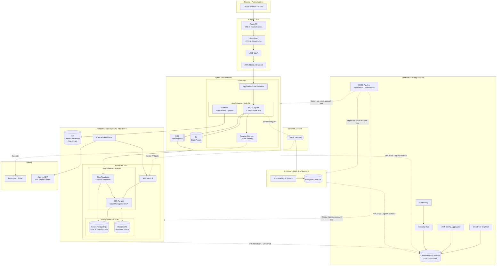
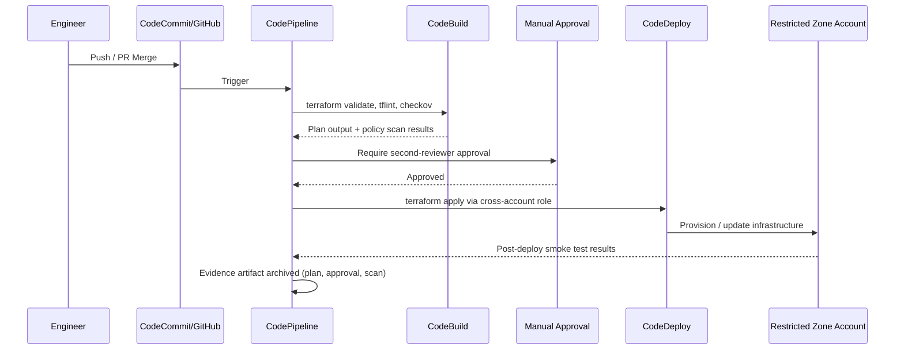

# Part IX – Industry-Specific Architectures

# Chapter 70 — Government

*A Production Reference Architecture for Federal, State, Local, and Public-Sector Cloud Platforms on AWS*

---

## 1. Executive Summary

### The Business Problem

Government agencies — federal, state, local, and tribal (SLTT) — operate under a combination of constraints that few commercial enterprises face simultaneously.

- Citizens expect commercial-grade digital experiences (benefits portals, permitting systems, tax filing, license renewal) but agencies must deliver them on public budgets, with public accountability, and under intense compliance scrutiny.
- Legacy mainframe and on-premises data center investments span decades. Modernization has to happen without service interruption to constituents who may have no alternative channel.
- Every system that touches personally identifiable information (PII), federal tax information (FTI), criminal justice information (CJI), protected health information (PHI), or controlled unclassified information (CUI) is subject to a specific compliance framework — FedRAMP, IRS Publication 1075, CJIS Security Policy, NIST 800-53, NIST 800-171, StateRAMP — and these frameworks are not optional checkboxes. They gate go-live.
- Procurement cycles, authorization to operate (ATO) processes, and change control boards move at a different cadence than commercial DevOps. An architecture that assumes weekly production deploys without a compliance-aware pipeline will stall in the ATO queue for months.
- Budget cycles are annual and appropriated. Unlike a startup that can burn venture capital on over-provisioned infrastructure, a government program that overspends against its FinOps forecast faces congressional or legislative scrutiny, GAO audits, and in the worst case, program cancellation.
- Availability expectations are asymmetric. A benefits disbursement system going down on the day unemployment checks are due, or an emergency alerting system failing during a natural disaster, has consequences that go well beyond lost revenue — it is a public safety and public trust event.

This chapter defines a reference architecture for building modern, cloud-native government digital services on AWS that satisfy these constraints simultaneously: security and compliance by design, cost accountability, high availability appropriate to mission-critical public services, and a delivery pipeline compatible with government change management processes (ATO, Section 508 accessibility, FedRAMP continuous monitoring).

### Architecture Objective

The objective of this architecture is to provide a **FedRAMP Moderate/High-aligned, multi-tier, highly available, citizen-facing and case-worker-facing government services platform** that:

1. Segregates workloads by data sensitivity (public-facing content vs. FTI/CJI/PII-bearing case data) using account and network boundaries, not just IAM policy.
2. Provides a fully auditable trail of every administrative action, API call, and data access event, retained per the applicable compliance framework (commonly 3–7 years).
3. Supports both citizen self-service (public internet-facing) and internal case-worker/analyst workloads (GovCloud-eligible, CJI/FTI-bearing) inside a single coherent landing zone, without co-mingling data classifications.
4. Achieves availability targets appropriate for essential public services (99.9%–99.95%) using multi-AZ and, for tier-1 systems, multi-region designs.
5. Is deployed and changed exclusively through Infrastructure as Code (Terraform) with policy-as-code guardrails, producing the evidence artifacts an Authorizing Official (AO) needs for a Risk Management Framework (RMF) package or FedRAMP Security Assessment Report (SAR).
6. Keeps run-rate cost defensible against an appropriated, publicly disclosed budget, with chargeback/showback to individual program offices.

### Why Organizations Adopt This Architecture

**Legacy risk.** Many state unemployment insurance, Medicaid eligibility, and case management systems still run on 30–40 year old mainframe COBOL platforms. The engineers who maintain them are retiring. Every additional year on legacy infrastructure increases operational risk, not just modernization cost.

**Surge demand.** Government systems experience extreme, unpredictable surges — a hurricane triggers a spike in disaster assistance applications, a recession triggers a spike in unemployment claims, a policy change triggers a spike in benefit re-certifications. On-premises capacity planned for average load fails during exactly the moment citizens need the service most. Elastic cloud infrastructure directly solves this.

**Compliance modernization.** FedRAMP, StateRAMP, and CJIS have matured to the point where cloud-native architectures are now often *more* auditable than legacy on-premises systems, because IaC and centralized logging produce continuous evidence rather than point-in-time manual audits.

**Public accountability and transparency.** Executive orders and state-level digital service mandates (e18F, USDS, state digital service offices) push agencies toward iterative, user-tested, accessible digital services rather than multi-year waterfall IT projects. A cloud-native, CI/CD-capable architecture is a prerequisite for this delivery model.

**Interoperability.** Modern government platforms need to exchange data with other agencies (federal-to-state, state-to-county) via standardized APIs (NIEM, FHIR for health and human services), which is far easier to implement on API Gateway/Lambda-based integration layers than on legacy point-to-point mainframe interfaces.

### Major Business Benefits

| Benefit | Description |
|---|---|
| Elastic capacity for surge events | Auto Scaling absorbs disaster-driven or policy-driven demand spikes without pre-provisioning for worst case year-round |
| Reduced legacy operational risk | Removes single points of failure tied to aging on-premises hardware and scarce mainframe skill sets |
| Compliance-by-design | Landing zone bakes in NIST 800-53 control mappings, continuous monitoring, and audit evidence generation |
| Faster constituent-facing releases | CI/CD pipeline with automated compliance gates shortens release cycles from months to weeks |
| Lower total cost of ownership over 5–7 years | Pay-for-use model versus fixed capital depreciation of data center hardware, when governed by FinOps discipline |
| Improved public trust | Higher availability and faster incident response directly reduce visible outages during high-stakes windows (benefit disbursement, emergency alerts, election-related information systems) |
| Interoperability | API-first integration layer supports NIEM/FHIR-based data exchange with other levels of government |

### Typical Enterprise Scenarios

- A state health and human services agency modernizing its Medicaid eligibility and enrollment system, migrating off a 25-year-old mainframe to a case-management platform that must remain IRS Pub 1075 and CMS MARS-E compliant.
- A state department of labor building a new unemployment insurance benefits portal designed to survive 50x normal traffic during a recession or pandemic-scale event.
- A county government consolidating permitting, licensing, and 311 citizen-request systems into a unified citizen portal.
- A federal agency migrating a public-facing grants management system to a FedRAMP-authorized cloud environment to meet a Cloud Smart / Cloud First modernization mandate.
- A state law enforcement agency building a CJIS-compliant records management system that must run in an AWS GovCloud (US) environment with FBI CJIS Security Policy controls.
- A state motor vehicle agency building a citizen-facing license renewal and vehicle registration platform integrated with legacy DMV mainframe systems via a modern API layer.

> **Note:** This chapter presents a *reference* architecture. Actual FedRAMP/StateRAMP/CJIS authorization requires engagement with a Third-Party Assessment Organization (3PAO), your agency's Authorizing Official, and (for CJIS) your state's CJIS Systems Officer. Nothing in this chapter constitutes an authorization boundary determination or a substitute for a formal RMF package.

---

## 2. Business Requirements

### Business Drivers

- Replace or augment legacy eligibility/benefits/records systems that can no longer be safely maintained or scaled.
- Meet statutory or executive-mandated modernization timelines (e.g., state legislature-mandated UI modernization after a strained pandemic response).
- Reduce the risk of a high-visibility public outage during a benefit disbursement, emergency notification, or election-adjacent event.
- Enable data sharing across agencies (state-to-federal reporting, cross-agency eligibility verification) via standardized, auditable APIs.
- Improve accessibility and equity of access (Section 508 / WCAG 2.1 AA) for citizens using assistive technology.

### Functional Requirements

| Requirement | Description |
|---|---|
| Citizen self-service portal | Public-facing web application for applications, status checks, document upload, secure messaging |
| Case worker portal | Internal application for eligibility determination, case notes, document review — restricted to authenticated state/agency staff |
| Identity verification | Integration with identity proofing (Login.gov, ID.me, or state-run IdP) and multi-factor authentication |
| Document management | Secure upload, virus scanning, and long-term retention of citizen-submitted documents |
| Notifications | Email/SMS notifications for application status, appointment reminders, benefit determinations |
| Reporting and analytics | Program-level reporting for agency leadership and federal reporting mandates |
| System-to-system interoperability | NIEM-based or FHIR-based data exchange with other state/federal systems |
| Audit trail | Immutable log of every eligibility decision, document access, and administrative action |

### Non-Functional Requirements

- **Accessibility:** WCAG 2.1 AA / Section 508 conformance for all citizen-facing interfaces.
- **Data residency:** All FTI, CJI, and in many cases all citizen PII must remain within US regions; CJI workloads typically require AWS GovCloud (US).
- **Auditability:** Every read/write to case data must be logged with actor identity, timestamp, and before/after state where feasible.
- **Language accessibility:** Multi-language support for citizen-facing content is frequently a statutory requirement (e.g., California, New York).

### Scalability Goals

- Absorb a 20x–50x surge in application submissions within minutes during a declared emergency or economic downturn, without manual intervention.
- Support incremental onboarding of additional counties/regions/program types without re-architecture.

### Availability Requirements

| System Tier | Example | Target Availability | Rationale |
|---|---|---|---|
| Tier 1 — Life/Safety Critical | Emergency alerting, disaster benefit application intake | 99.95%+ (multi-region active-passive or active-active) | Direct public safety impact |
| Tier 2 — Benefit Disbursement | Unemployment insurance, SNAP/TANF benefits | 99.9% (multi-AZ) | High financial and reputational impact, but short outages are recoverable |
| Tier 3 — Internal Case Management | Case worker portal, internal reporting | 99.5% (multi-AZ) | Business hours dependency, internal users, lower blast radius |
| Tier 4 — Reporting/Analytics | Federal compliance reporting, dashboards | 99.0% | Batch-oriented, not real-time citizen facing |

### Latency Requirements

- Citizen-facing portal: p95 page load under 2.5 seconds on median US broadband/mobile connections.
- Case worker portal: p95 API response under 500ms for search and case lookups.
- Document upload: support files up to 25MB with resumable/multipart upload for low-bandwidth rural connections.

### Compliance Requirements

| Framework | Applies When |
|---|---|
| FedRAMP Moderate/High | Federal agency systems, or state systems handling federal data under a federal program (e.g., Medicaid, SNAP) |
| StateRAMP | State/local government systems in states that have adopted StateRAMP as an authorization baseline |
| IRS Publication 1075 | Any system that receives, stores, processes, or transmits Federal Tax Information (FTI) |
| CJIS Security Policy | Any system that accesses Criminal Justice Information (CJI) via NCIC or state criminal history repositories |
| NIST 800-53 Rev 5 | Underlying control catalog for FedRAMP and most agency ATO packages |
| NIST 800-171 / CMMC | Systems handling Controlled Unclassified Information (CUI) under DoD contracts |
| Section 508 / WCAG 2.1 AA | All public-facing federal and (in most states) state digital services |
| HIPAA / CMS MARS-E | Health and human services systems handling PHI, e.g., Medicaid eligibility |
| State privacy statutes | State-specific requirements (e.g., California CCPA/CPRA applies to some SLTT vendor relationships) |

### Security Expectations

- Encryption at rest (KMS, CMK per data classification) and in transit (TLS 1.2+) for all data stores.
- Least-privilege IAM with mandatory permission boundaries for all human and service roles.
- Continuous vulnerability scanning and configuration compliance monitoring (AWS Config, Security Hub, Inspector).
- Segregation of duties: no single engineer can both deploy code to production and approve their own change.
- Immutable, tamper-evident audit logs retained per the applicable framework (CJIS: minimum 1 year online + longer archival; IRS 1075: minimum 6 years).

### Recovery Objectives

| System Tier | RPO | RTO |
|---|---|---|
| Tier 1 (Life/Safety) | ≤ 5 minutes | ≤ 15 minutes |
| Tier 2 (Benefits) | ≤ 15 minutes | ≤ 1 hour |
| Tier 3 (Case Management) | ≤ 1 hour | ≤ 4 hours |
| Tier 4 (Reporting) | ≤ 24 hours | ≤ 24 hours |

### SLAs

- Public portal uptime SLA typically defined in the systems integrator or cloud program contract — commonly 99.9% monthly with defined service credits.
- Internal case worker portal SLA usually tied to business-hours support windows with defined incident response time (e.g., Severity 1: 15-minute acknowledgment, 4-hour resolution target).

### Expected Workload and Growth

- Baseline: tens of thousands to low millions of citizen accounts depending on program and jurisdiction size.
- Growth pattern is **event-driven, not linear** — the architecture must be validated against surge scenarios (recession, pandemic, natural disaster, policy-driven benefit expansion), not just year-over-year organic growth.

---

## 3. Architecture Overview

### Overall Design Philosophy

The architecture separates the platform into three data-sensitivity zones, each with its own AWS account(s) inside an AWS Organizations multi-account landing zone:

1. **Public Zone** — citizen-facing web/mobile applications, marketing/informational content, public API endpoints. Internet-facing, CloudFront-fronted, WAF-protected.
2. **Restricted Zone** — case management, eligibility determination, document storage containing PII/PHI/FTI. No direct internet ingress; accessed only via authenticated application tier or through a controlled VPN/Direct Connect path for case workers.
3. **CJI Zone (where applicable)** — law-enforcement-adjacent workloads requiring CJIS Security Policy compliance, deployed in **AWS GovCloud (US)** with advanced identity, encryption, and personnel screening controls that exceed the Restricted Zone baseline.

A shared **Platform Account** hosts centralized logging (CloudTrail organization trail, centralized CloudWatch/S3 log archive), Security Hub aggregation, AWS Config aggregator, and the CI/CD pipeline that deploys into each spoke account via cross-account roles.

Network connectivity between zones is brokered through a **Transit Gateway** in a Network account, with strict route table segmentation ensuring the Public Zone cannot directly reach the Restricted or CJI Zones except through explicitly allow-listed, logged API paths.

### Core Components

- **Edge:** Route 53 (DNS, health-check-based failover), CloudFront (CDN + edge WAF), AWS WAF, AWS Shield Advanced (for Tier 1 systems).
- **Application tier (Public Zone):** Application Load Balancer → ECS Fargate or Lambda-based microservices for citizen portal APIs.
- **Application tier (Restricted Zone):** Internal ALB → ECS Fargate services for case management APIs, accessible only from the case-worker application and from the Public Zone through a narrowly scoped, logged integration API.
- **Data tier:** Amazon Aurora PostgreSQL (case/eligibility data), DynamoDB (session state, high-throughput status lookups), S3 (document storage with Object Lock for retention compliance).
- **Messaging/Integration:** Amazon SQS and EventBridge for asynchronous eligibility processing workflows; Step Functions for multi-step benefit determination workflows.
- **Identity:** Amazon Cognito (citizen identity, integrated with Login.gov/ID.me via SAML/OIDC) for the Public Zone; AWS IAM Identity Center federated with the agency's Active Directory for internal case-worker access.
- **Security and compliance:** AWS Config, Security Hub, GuardDuty, Macie (PII discovery in S3), CloudTrail organization trail, KMS with per-classification CMKs, Secrets Manager.
- **Observability:** CloudWatch (metrics, logs, alarms, dashboards), X-Ray (distributed tracing), centralized log archive in the Platform account.

### High-Level Workflow

1. A citizen visits the public benefits portal (Route 53 → CloudFront → WAF → ALB → application tier in the Public Zone).
2. The citizen authenticates via Cognito, federated to Login.gov for identity-proofed access.
3. The citizen submits an application; the request is validated, written to a staging data store, and an asynchronous eligibility determination workflow (Step Functions) is triggered.
4. The workflow calls internal Restricted Zone services (through a tightly scoped API path across the Transit Gateway) to check existing case history, cross-reference other benefit programs, and calculate eligibility.
5. A case worker, authenticated through the agency's IAM Identity Center-federated internal portal, reviews flagged/edge-case applications in the Restricted Zone case management application.
6. The determination is recorded, an audit log entry is written immutably, and the citizen is notified (SNS/SES) of the outcome.
7. All administrative actions, API calls, and data access events are captured by CloudTrail and forwarded to the centralized Platform account log archive for retention and analysis.

### Request Lifecycle vs. Response Lifecycle vs. Data Lifecycle

- **Request lifecycle:** DNS resolution → edge security (WAF/Shield) → CDN cache check → load balancer → authentication/authorization → business logic → data access → response assembly.
- **Response lifecycle:** Application response → structured logging (correlation ID) → CloudFront cache headers applied → TLS termination → client delivery.
- **Data lifecycle:** Application intake → validation → encryption at rest (classification-specific CMK) → retention per compliance schedule → archival to S3 Glacier/Deep Archive after active-case closure → deletion per records retention schedule (subject to state records law, not solely technical policy).

---

## 4. AWS Services Used

For each service below: purpose, why selected, alternatives considered, limitations, pricing considerations, and best practices in this architecture.

### Amazon EC2

**Purpose:** Used sparingly in this architecture — primarily for workloads that cannot be containerized easily (e.g., some COTS case management software with OS-level licensing dependencies) and for bastion-free management via SSM.

**Why selected:** Full control over the OS is sometimes contractually required by legacy COTS vendors used in government case management (many state HHS systems still run on vendor-licensed platforms with specific OS/middleware requirements).

**Alternatives:** ECS Fargate (preferred for anything containerizable — no OS patching burden, which materially reduces ATO continuous monitoring overhead). Lambda for event-driven, short-duration processing.

**Limitations:** Instances require ongoing OS patch management, which becomes a recurring line item in the POA&M (Plan of Action and Milestones) tracked as part of continuous ATO monitoring. Every EC2 instance is a control-inheritance liability compared to Fargate/Lambda, where AWS inherits more of the OS-layer control burden.

**Pricing considerations:** Reserved Instances or Savings Plans for predictable baseline case-worker application load; on-demand for short-lived surge capacity.

**Best practices:** No direct SSH; use Systems Manager Session Manager exclusively. Golden AMI pipeline with monthly patch baseline. Mandatory IMDSv2. Auto Scaling Groups spanning a minimum of 3 AZs for Tier 1/2 workloads.

### Application Load Balancer (ALB)

**Purpose:** Layer 7 load balancing for both the Public Zone citizen portal and the Restricted Zone case management application.

**Why selected:** Native integration with AWS WAF, ECS Fargate target groups, and health-check-based failover; supports path-based routing needed to separate citizen-facing and case-worker-facing API paths under a shared domain structure where required.

**Alternatives:** Network Load Balancer (for non-HTTP protocols or extreme throughput — not typically needed here). API Gateway (preferred for pure Lambda-backed microservices without a container fleet).

**Limitations:** ALB alone provides no WAF; WAF must be explicitly associated. Does not natively enforce mTLS for service-to-service calls — that requires additional configuration or a service mesh.

**Pricing considerations:** Charged per load balancer-hour plus Load Balancer Capacity Units (LCUs) — plan for surge-driven LCU cost spikes during disaster response windows and include in the FinOps forecast.

**Best practices:** Separate ALBs for Public Zone and Restricted Zone (do not share a load balancer across data classification boundaries). Enable access logging to S3 for every ALB, required for audit trails.

### Amazon CloudFront

**Purpose:** CDN and edge security layer for the citizen-facing portal; caches static assets, offloads TLS termination, and is the enforcement point for AWS WAF and Shield.

**Why selected:** Reduces origin load during traffic surges (disaster events, benefit deadline days), improves latency for citizens across a large geographic state or the entire country, and provides the edge WAF attachment point.

**Alternatives:** Direct ALB exposure (not recommended for any public-facing government system — loses edge DDoS absorption and caching benefits). Third-party CDN (introduces an additional FedRAMP-authorization dependency; AWS-native CloudFront simplifies the authorization boundary).

**Limitations:** Cache invalidation for frequently updated dynamic content (e.g., real-time application status) requires careful cache-control header design; over-aggressive caching of citizen-specific data is a serious privacy risk and must be explicitly prevented via `Cache-Control: private, no-store` on any personalized response.

**Pricing considerations:** Data transfer out is the dominant cost driver; use compression and appropriate cache TTLs to reduce origin fetches and overall data transfer cost.

**Best practices:** Never cache authenticated/personalized API responses. Use Origin Access Control (OAC) to ensure S3-hosted static assets are only reachable through CloudFront, not directly.

### AWS Lambda

**Purpose:** Event-driven processing — document virus scanning triggers, notification dispatch, lightweight API endpoints, Step Functions task handlers for the eligibility determination workflow.

**Why selected:** No server patching burden (removes an entire category of continuous monitoring findings), scales automatically for surge events, and is cost-efficient for intermittent, event-driven government workloads (most citizen interactions are bursty, not constant).

**Alternatives:** ECS Fargate for long-running or high-throughput services; EC2 only when OS-level control is contractually mandated.

**Limitations:** 15-minute maximum execution duration (use Step Functions to orchestrate longer multi-step eligibility workflows). Cold starts can affect p95 latency for infrequently invoked case-worker tools — mitigate with provisioned concurrency for latency-sensitive paths.

**Pricing considerations:** Pay-per-invocation and duration; very cost-efficient for the bursty, unpredictable traffic pattern typical of benefit application intake.

**Best practices:** One function, one responsibility. Never embed long-lived database connections without RDS Proxy. Use dead-letter queues on every asynchronous invocation to guarantee no citizen application is silently dropped.

### Amazon S3

**Purpose:** Storage for citizen-submitted documents (proof of income, identification, medical records for eligibility), static web assets, and the centralized audit log archive.

**Why selected:** Durable (11 nines), supports Object Lock for WORM (write-once-read-many) compliance retention, integrates natively with Macie for automated PII/PHI discovery, and supports fine-grained bucket policies for classification-based access segregation.

**Alternatives:** EFS for POSIX-filesystem-dependent legacy applications; FSx for Windows File Server for COTS software requiring SMB shares.

**Limitations:** Not a database — do not use S3 as a system of record for structured case data requiring transactional consistency.

**Pricing considerations:** Lifecycle policies to transition closed-case documents to S3 Glacier/Deep Archive after the active retention window, materially reducing long-term storage cost while meeting multi-year retention mandates.

**Best practices:** Separate buckets per data classification (Public assets vs. Restricted PII/PHI documents vs. audit log archive). Enable S3 Object Lock (compliance mode) on the audit log and document retention buckets. Block all public access at the account level except for the explicitly designated public static-asset bucket behind CloudFront OAC.

### Amazon RDS / Aurora

**Purpose:** System of record for structured case and eligibility data (Aurora PostgreSQL) in the Restricted Zone.

**Why selected:** Aurora provides higher availability (6-way replication across 3 AZs), faster failover (typically under 30 seconds), and better read-scaling than standard RDS, which matters for Tier 2 benefit disbursement systems with defined RTOs.

**Alternatives:** Standard RDS PostgreSQL/MySQL for lower-tier internal reporting systems where Aurora's cost premium isn't justified; DynamoDB for high-throughput, simple-access-pattern data (session state, status lookups).

**Limitations:** Aurora is PostgreSQL/MySQL-compatible, not a drop-in replacement for every legacy database engine — some COTS case management systems require SQL Server or Oracle, in which case standard RDS for SQL Server/Oracle applies with correspondingly higher licensing cost.

**Pricing considerations:** Aurora I/O-Optimized pricing is often more predictable and cost-effective for write-heavy eligibility workflows than the standard I/O-charged configuration; benchmark both against actual workload characteristics.

**Best practices:** Multi-AZ mandatory for Tier 1/2. Automated backups with a retention window matching compliance requirements, cross-region snapshot copy for DR. Encryption at rest with a dedicated CMK per data classification. IAM database authentication where the COTS/application stack supports it, to avoid static database credentials.

### Amazon DynamoDB

**Purpose:** Session state, application status lookups, rate-limiting counters, and other high-throughput, simple-key-access-pattern data.

**Why selected:** Single-digit millisecond latency at any scale, fully serverless (no patching, no capacity planning for surge events when using on-demand mode), which is valuable for the unpredictable surge pattern of government portals.

**Alternatives:** ElastiCache for pure caching use cases; Aurora for data requiring complex relational queries or multi-row transactions.

**Limitations:** Not suited for complex relational queries or ad hoc reporting; pair with an OLAP export (e.g., to Redshift/Athena) for analytical/compliance reporting needs.

**Pricing considerations:** On-demand capacity mode for unpredictable citizen traffic; switch to provisioned with auto scaling once traffic patterns stabilize and cost predictability becomes more valuable than elasticity headroom.

**Best practices:** Enable point-in-time recovery. Use DynamoDB Streams to feed the audit log pipeline for any table holding case-related state changes.

### Amazon SNS / SQS

**Purpose:** SNS for citizen notification fan-out (email/SMS on application status change); SQS for decoupling the eligibility determination workflow from the citizen-facing intake API, absorbing surge load without overwhelming downstream processing.

**Why selected:** Decoupling is essential for surge resilience — during a disaster-driven application spike, the intake API must remain responsive even if downstream eligibility processing is temporarily queued.

**Alternatives:** EventBridge for more complex event-routing scenarios with multiple heterogeneous consumers (preferred over SNS/SQS when the number of downstream event consumers and event types grows beyond simple fan-out).

**Limitations:** SQS standard queues do not guarantee ordering — use FIFO queues where eligibility processing order matters (e.g., first-come-first-served benefit allocation with a capped fund).

**Pricing considerations:** Low cost at typical government transaction volumes; primary cost driver is a truly extreme surge event, which should be explicitly modeled in the FinOps forecast.

**Best practices:** Dead-letter queues on every queue. Encrypt queues with KMS. Set visibility timeouts appropriately for the eligibility processing Lambda/Fargate task duration.

### Amazon EventBridge

**Purpose:** Central event bus for cross-service and cross-account integration — e.g., a document-uploaded event triggering both a virus scan and a case-worker notification, or a determination-complete event triggering both citizen notification and federal reporting data export.

**Why selected:** Native cross-account event routing simplifies the multi-account landing zone integration between Public Zone and Restricted Zone without opening broad network paths.

**Alternatives:** Direct Lambda-to-Lambda invocation (creates tighter coupling, harder to audit); SNS for simpler single-purpose fan-out.

**Limitations:** Event schema governance requires discipline — without a schema registry, cross-team event contracts can drift, which is a particular risk in multi-vendor government IT environments with several systems integrators working in parallel.

**Best practices:** Use EventBridge Schema Registry to formally define and version event contracts between the citizen portal team and the case management team, who are frequently different contractors.

### AWS IAM

**Purpose:** Access control for all AWS API-level actions across the landing zone.

**Why selected:** Foundational; no substitute in an AWS environment.

**Best practices:** No long-lived IAM user access keys for human access — IAM Identity Center federated from agency Active Directory/PIV-based identity for all human access. Service roles scoped to least privilege with mandatory permission boundaries. Separate roles per environment (dev/test/prod) and per data classification zone.

### Amazon VPC

**Purpose:** Network isolation boundary for each account/zone.

**Best practices:** Three-tier subnet design (public/app/data) per zone, no direct internet route from the Restricted or CJI Zone data subnets, VPC Flow Logs enabled and forwarded to the centralized log archive for every VPC without exception (this is a near-universal FedRAMP/CJIS control requirement).

### Amazon Route 53

**Purpose:** DNS for the citizen portal and internal case-worker application, with health-check-based failover for DR.

**Best practices:** Route 53 Application Recovery Controller (or health-check-driven failover routing policy) for Tier 1 systems requiring multi-region failover; DNSSEC where the agency's domain registrar supports it, increasingly expected for public-sector domains.

### Amazon CloudWatch

**Purpose:** Metrics, logs, dashboards, and alarms across all tiers.

**Best practices:** Centralized cross-account CloudWatch log groups shipped to the Platform account. Alarms tied to both technical thresholds (error rate, latency) and business thresholds (application submission rate anomalies, which can indicate either a fraud pattern or a broken intake form).

### AWS CloudTrail

**Purpose:** API-level audit trail — the backbone of every government compliance framework's audit requirement.

**Best practices:** Organization-wide trail from the AWS Organizations management account, delivered to a dedicated, access-restricted S3 bucket in the Platform account with Object Lock enabled, log file integrity validation turned on, and a minimum multi-year retention matching the most restrictive applicable framework (commonly IRS Pub 1075's 6-year requirement where FTI is in scope).

### AWS Config

**Purpose:** Continuous configuration compliance monitoring — directly produces evidence for FedRAMP continuous monitoring (ConMon) deliverables.

**Best practices:** AWS Config Aggregator in the Platform account collecting from every spoke account; conformance packs mapped to NIST 800-53 control families; auto-remediation for common drift (e.g., an S3 bucket losing its public-access block).

### Amazon GuardDuty

**Purpose:** Threat detection — anomalous API calls, potential credential compromise, malware detection on EC2/container workloads, S3 data exfiltration patterns.

**Best practices:** Organization-wide GuardDuty with a delegated administrator account; findings routed to Security Hub and to the agency SOC (many states now run or contract a 24/7 SOC specifically for this purpose).

### AWS KMS

**Purpose:** Encryption key management for every data store in the architecture.

**Best practices:** Separate Customer Managed Keys (CMKs) per data classification (Public, Restricted/PII, CJI) with distinct key policies; key rotation enabled; CloudTrail logging of every key usage event (critical for demonstrating encryption-key-access audit trails to a 3PAO).

### AWS Secrets Manager

**Purpose:** Storage and automated rotation of database credentials, third-party API keys (identity-proofing vendor integrations, SMS gateway credentials).

**Best practices:** Automatic rotation enabled for all database credentials; no credentials embedded in Terraform state or CI/CD pipeline variables in plaintext.

### AWS Systems Manager

**Purpose:** Patch management, Session Manager (eliminates the need for bastion hosts and inbound SSH), Parameter Store for non-secret configuration.

**Best practices:** Mandatory Session Manager-only access policy enforced via SCP at the AWS Organizations level, removing SSH/RDP inbound rules as an available option entirely.

---

## 5. Complete Architecture Diagram



> **Note:** The dotted lines between the Public Zone and Restricted Zone represent a narrowly scoped, explicitly allow-listed API integration path — never a general network route. This is the single most scrutinized boundary in a government architecture review and deserves its own dedicated security group, its own logging pipeline, and its own penetration test scope.

---

## 6. Component-by-Component Explanation

### Citizen Portal (Public Zone — ECS Fargate)

- **Purpose:** Serves the public-facing application intake, status check, and document upload experience.
- **Responsibilities:** Input validation, Section 508-compliant rendering, session management via Cognito, queuing eligibility requests.
- **Inputs:** HTTPS requests from CloudFront/ALB; citizen-submitted form data and documents.
- **Outputs:** SQS messages to the eligibility workflow; S3 document writes; notification triggers.
- **Scaling:** ECS Service Auto Scaling on CPU/memory/request-count-per-target, with pre-configured scaling policies tested against modeled surge scenarios (recession, disaster).
- **High availability:** Minimum 2 tasks per AZ across 3 AZs; ALB health checks with fast deregistration for unhealthy tasks.
- **Failure handling:** Circuit breaker pattern on downstream calls to the Restricted Zone integration API; graceful degradation to "application saved, processing delayed" messaging rather than a hard failure during downstream outages.
- **Dependencies:** Cognito, SQS, S3, WAF.
- **Security:** No direct database access from this tier; all case data access is mediated through the Restricted Zone API.
- **Monitoring:** Request rate, error rate, p50/p95/p99 latency, Cognito auth failure rate (a leading indicator of both UX problems and credential-stuffing attacks).

### Case Management Application (Restricted Zone — ECS Fargate)

- **Purpose:** Eligibility determination, case notes, document review for authenticated agency staff.
- **Responsibilities:** Enforces role-based access control (caseworker vs. supervisor vs. auditor roles), writes immutable audit entries for every case data access.
- **Scaling:** Lower, more predictable load pattern than the citizen portal (bounded by agency staff headcount) — sized for steady-state with modest surge headroom rather than 50x elasticity.
- **High availability:** Multi-AZ; Tier 2/3 availability target as defined in Section 2.
- **Failure handling:** Read replicas for Aurora to preserve read availability (case lookup, search) even during a primary failover event.
- **Security:** mTLS or equivalent authenticated service-to-service communication with the eligibility workflow; every case record access logged with case worker identity and reason code where required by policy.

### Eligibility Determination Workflow (Step Functions)

- **Purpose:** Orchestrates the multi-step business logic of determining benefit eligibility — often involving multiple rule checks, cross-program verification, and conditional human review.
- **Responsibilities:** Sequencing automated rule evaluation, invoking human-in-the-loop review for edge cases, recording the final determination.
- **Scaling:** Serverless — scales with the volume of queued applications; no capacity planning required.
- **Failure handling:** Built-in retry with exponential backoff on transient downstream failures; explicit failure states routed to a case-worker review queue rather than silently dropped.
- **Monitoring:** Step Functions execution history provides a natural audit trail of every eligibility decision path, valuable both operationally and for compliance evidence.

### Aurora PostgreSQL (Restricted Zone system of record)

- **Purpose:** Authoritative store for case and eligibility data.
- **High availability:** Multi-AZ cluster, automated failover.
- **Failure handling:** Automated backups, point-in-time recovery, cross-region snapshot replication for DR.
- **Security:** Encrypted at rest with a dedicated Restricted Zone CMK; network-isolated in data subnets with no route to the internet; access restricted to the application tier security group only.

### Document Storage (S3 with Object Lock)

- **Purpose:** Long-term, tamper-evident storage of citizen-submitted eligibility documents.
- **Responsibilities:** Enforce retention schedules matching statutory records-retention requirements; support legal hold when a case is under appeal or litigation.
- **Security:** Server-side encryption with Restricted Zone CMK; Object Lock in compliance mode for documents subject to a mandatory retention period; access logging on every GET/PUT.

### Centralized Logging (Platform Account)

- **Purpose:** Single source of truth for all audit and security-relevant events across every account in the landing zone.
- **Responsibilities:** Aggregates CloudTrail, VPC Flow Logs, Config, GuardDuty, Security Hub findings, and application-level audit logs.
- **Security:** Write-once storage with Object Lock; access restricted to the security/compliance team, with break-glass procedures for incident response requiring dual approval.

---

## 7. End-to-End Request Flow

**Scenario: A citizen submits a benefits application.**

1. Citizen's browser resolves the portal domain via Route 53.
2. Route 53 returns the CloudFront distribution endpoint (with health-check-based failover to a secondary region for Tier 1 systems).
3. Request reaches CloudFront edge location nearest the citizen.
4. AWS WAF evaluates the request against managed rule groups (SQL injection, XSS, government-specific rate-based rules) and Shield Advanced provides DDoS absorption.
5. If the request is for a static asset, CloudFront serves from edge cache; if dynamic, the request is forwarded to the origin ALB.
6. ALB in the Public Zone VPC routes the request to a healthy ECS Fargate task running the citizen portal API.
7. The application authenticates the citizen session via Cognito (previously federated through Login.gov identity proofing at account creation/first login).
8. The application validates submitted form data and uploaded documents.
9. Documents are written to the Restricted Zone S3 document bucket via a scoped, logged cross-account write path (never directly public-writable).
10. The application publishes an "application submitted" message to SQS.
11. SQS decouples intake from processing — the citizen receives an immediate "application received" confirmation regardless of downstream processing load.
12. A Step Functions execution is triggered from the queue, orchestrating the eligibility determination workflow in the Restricted Zone.
13. The workflow calls the Case Management API (internal ALB) to check existing case history and cross-program eligibility.
14. Automated rules evaluate straightforward cases; edge cases are routed to a case worker review queue in the Case Management application.
15. Upon determination, the outcome is written to Aurora as the system of record, with an immutable audit entry.
16. An EventBridge event triggers citizen notification via SNS/SES (email/SMS).
17. CloudWatch captures metrics and structured logs at every step, correlated by a request/trace ID propagated through X-Ray.
18. CloudTrail records every underlying AWS API call (S3 write, SQS publish, Step Functions execution start) to the centralized Platform account log archive.
19. If any step fails, the error is captured, the citizen is shown a graceful "processing delayed" message rather than a raw error, and an alarm notifies the on-call engineering team via CloudWatch Alarms → SNS → PagerDuty/agency incident system.
20. Once the citizen's case is closed, documents transition to a longer-term S3 storage class per the retention lifecycle policy, and case data in Aurora is archived per the records retention schedule.

---

## 8. Deployment Flow

### Infrastructure Provisioning

All infrastructure is provisioned exclusively through Terraform, executed via a CI/CD pipeline — no manual console changes are permitted in any environment above `dev`, enforced via SCP-restricted IAM permissions in production accounts (only the CI/CD deployment role may write infrastructure changes).

### Terraform Workflow

1. Engineer opens a pull request against the Terraform repository.
2. Automated pipeline runs `terraform fmt -check`, `terraform validate`, `tflint`, and a policy-as-code check (`checkov` or `tfsec`, mapped explicitly to relevant NIST 800-53 controls).
3. `terraform plan` output is posted to the pull request for human review.
4. A second, independent reviewer (segregation-of-duties requirement) approves the pull request.
5. Merge to main triggers `terraform apply` via the pipeline's cross-account deployment role — never via a human's personal credentials.
6. Plan/apply logs are archived as compliance evidence.

### CI/CD Deployment

- Source repository → build/test stage → policy-as-code compliance gate → manual approval gate (for production) → deploy stage → post-deploy validation (smoke tests, synthetic canary checks) → automatic rollback on failure.

### Blue-Green Deployment

- New application version deployed to a parallel target group; traffic shifted gradually via weighted ALB target groups or via CodeDeploy's blue/green ECS deployment; automatic rollback triggered by CloudWatch alarm breach (elevated 5xx rate, latency regression) during the shift.

### Rollback

- Application layer: CodeDeploy automatic rollback on alarm breach.
- Infrastructure layer: Terraform state rollback via a previous known-good plan, executed through the same reviewed pipeline — never a manual `terraform apply` from a laptop.

### Secrets

- Injected at runtime from Secrets Manager via ECS task role; never stored in Terraform variables files, environment files in source control, or CI/CD pipeline variables in plaintext.

### Configuration

- Non-secret configuration via Systems Manager Parameter Store, versioned and environment-scoped (`/govapp/prod/case-api/*`).

### Validation

- Post-deployment: automated accessibility scan (axe-core or similar, checking Section 508/WCAG conformance on every release), synthetic transaction canaries against critical citizen-facing flows, and a compliance-scan gate (Config conformance pack evaluation) before a release is marked complete.

---

## 9. Network Topology

### VPC and CIDR Design

| Account | VPC | CIDR (example) | Purpose |
|---|---|---|---|
| Public Zone | pub-vpc | 10.10.0.0/16 | Citizen portal application tier |
| Restricted Zone | rest-vpc | 10.20.0.0/16 | Case management, eligibility data |
| CJI Zone (GovCloud) | cji-vpc | 10.30.0.0/16 | Records management, CJIS-scoped workloads |
| Network | — | — | Transit Gateway, no workloads |
| Platform | plat-vpc | 10.40.0.0/16 | Logging, CI/CD, security tooling |

### Subnet Design (per workload VPC)

| Subnet Tier | AZ Count | Purpose | Internet Route |
|---|---|---|---|
| Public | 3 | ALB, NAT Gateway | Internet Gateway |
| Application | 3 | ECS Fargate tasks, Lambda ENIs | Via NAT Gateway (outbound only) |
| Data | 3 | Aurora, DynamoDB VPC endpoints | No route to internet |

### NAT Gateway

- One NAT Gateway per AZ (not a single shared NAT Gateway) to avoid a cross-AZ single point of failure and cross-AZ data transfer charges for the application tier's outbound traffic.

### Internet Gateway

- Present only in the Public Zone VPC's public subnet route table. The Restricted and CJI Zone VPCs have **no Internet Gateway at all** — outbound package/patch traffic is routed through VPC endpoints and a tightly controlled egress proxy in the Network account where truly required.

### Transit Gateway

- Central hub connecting Public, Restricted, CJI, and Platform VPCs.
- Route tables are **segmented per attachment** — the Public Zone's TGW route table only contains a route to the specific Restricted Zone integration subnet (not the whole Restricted VPC CIDR), enforcing the "narrow API path only" requirement at the network layer, not just the application layer.

### Route Tables

- Explicit route tables per subnet tier; no default "0.0.0.0/0 via IGW" in any data-tier route table.

### Network ACLs

- Stateless NACLs as a defense-in-depth layer at the subnet boundary, particularly restricting the data subnets to only the specific ports/protocols required (e.g., 5432 from the application subnet CIDR only).

### Security Groups

- Security-group-referencing (not CIDR-based) rules between tiers — e.g., the Aurora security group allows inbound 5432 only from the ECS task security group, not from a CIDR range.

### PrivateLink

- VPC endpoints (Gateway endpoints for S3/DynamoDB, Interface endpoints for Secrets Manager, KMS, CloudWatch Logs, SSM) in every VPC, eliminating the need for NAT Gateway traffic to reach these AWS services and reducing both cost and the network attack surface.

### Hybrid Connectivity

- For agencies with an existing on-premises mainframe integration requirement (common during a phased legacy migration), AWS Direct Connect or a redundant Site-to-Site VPN pair terminates in the Network account and is exposed to the Restricted Zone only through the same Transit Gateway segmentation model.

---

## 10. Identity and Access

### IAM Roles

- Distinct roles per function: `citizen-portal-ecs-task-role`, `case-mgmt-ecs-task-role`, `eligibility-workflow-role`, `cicd-deploy-role`, `security-readonly-role`, `break-glass-role` (time-limited, requires dual approval to assume).

### IAM Policies

- Written as least-privilege, resource-scoped policies — never `Action: "*"` or `Resource: "*"` in any production role. Every policy change goes through the same Terraform PR review process as infrastructure.

### Resource Policies

- S3 bucket policies explicitly deny access outside the designated VPC endpoint (`aws:sourceVpce` condition) for the Restricted Zone document bucket, preventing exfiltration even if credentials are compromised outside the expected network path.

### STS / Cross-Account Access

- The CI/CD pipeline in the Platform account assumes a scoped deployment role in each spoke account via `sts:AssumeRole`, with a session duration capped at the expected deployment window (e.g., 1 hour) and CloudTrail logging every assumption event.

### Least Privilege

- Enforced through a combination of scoped IAM policies, mandatory permission boundaries, and quarterly access reviews (a standard control requirement across FedRAMP, StateRAMP, and CJIS).

### Service Roles

- Every AWS service that needs to act on the account's behalf (Config, GuardDuty, Lambda execution) has a dedicated, minimally scoped service role — no shared "do everything" service role.

### Permission Boundaries

- Applied to every human-assumable role and every role a CI/CD pipeline can create, capping the maximum permissions even if the underlying policy is later misconfigured — a critical defense-in-depth control in an environment where several different systems integrator teams may be contributing Terraform code.

---

## 11. Security Architecture

### Encryption

- **At rest:** KMS CMKs, one per data classification zone, with key policies restricting usage to the specific application roles that need it. Aurora, DynamoDB, S3, and EBS all encrypted by default at the account level via SCP-enforced policy.
- **In transit:** TLS 1.2+ enforced everywhere; ALB listener policies restricted to modern TLS ciphers only; internal service-to-service traffic authenticated via mTLS or IAM SigV4 where feasible.

### KMS

- Key rotation enabled; key usage logged via CloudTrail; separate keys for Public Zone (lower sensitivity), Restricted Zone (PII/PHI/FTI), and CJI Zone (highest sensitivity, GovCloud-resident keys only).

### TLS / Certificate Manager

- AWS Certificate Manager for all public and internal certificates, with automated renewal, eliminating the expired-certificate outage class entirely.

### WAF

- Managed rule groups (Core Rule Set, Known Bad Inputs, SQL Injection) plus custom rules specific to government portal abuse patterns (e.g., rate-limiting on the application-submission endpoint to blunt bot-driven benefit fraud attempts, a well-documented attack pattern against unemployment insurance systems).

### Shield

- Shield Standard by default (included); Shield Advanced for Tier 1 systems given the elevated public-safety impact of a successful DDoS against, for example, an emergency benefits application system during a declared disaster.

### Secrets Manager

- All database credentials, third-party API keys (identity-proofing vendor, SMS gateway) rotated automatically; no application ever has a hardcoded credential.

### GuardDuty / Inspector / Security Hub

- GuardDuty for runtime threat detection, Inspector for continuous vulnerability scanning of container images and EC2 instances, Security Hub as the aggregation and NIST 800-53 control-mapping console used directly in ATO evidence packages.

### CloudTrail / AWS Config

- As described in Section 4 — the backbone of continuous monitoring evidence.

### Zero Trust

- No implicit trust based on network location alone; every service-to-service call is authenticated and authorized independently of whether it originates "inside" the VPC. This is particularly important at the Public-to-Restricted Zone boundary, where network segmentation alone is treated as one layer, not the only layer, of defense.

### Threat Model — Representative Attack Vectors and Mitigations

| Attack Vector | Description | Mitigation |
|---|---|---|
| Credential stuffing against citizen accounts | Automated login attempts using breached credential lists | Cognito advanced security features, WAF rate-based rules, mandatory MFA for high-sensitivity actions |
| Benefit fraud via automated application submission | Bots submitting fraudulent benefit applications at scale | WAF bot control, CAPTCHA on submission, anomaly detection on submission rate/pattern |
| Lateral movement from Public to Restricted Zone | Compromised Public Zone workload attempting to reach case data directly | Network segmentation via Transit Gateway route tables, security-group-referenced least-privilege rules, no direct Public-to-Restricted database route |
| Insider threat — case worker over-access | Authorized case worker accessing records outside their assigned caseload | Fine-grained RBAC, mandatory access-reason logging, anomaly detection on access patterns (Macie/GuardDuty + custom detection) |
| Data exfiltration via S3 misconfiguration | Accidental public exposure of a document bucket | Account-level S3 Block Public Access via SCP, Config rules with auto-remediation, Macie continuous PII scanning |
| Supply chain compromise via third-party dependency | Vulnerable open-source package in application build | Software composition analysis in CI/CD, Inspector container scanning, SBOM generation |
| DDoS against benefit disbursement portal during high-demand window | Coordinated attack during a known high-traffic event (deadline day, disaster response) | Shield Advanced, CloudFront/WAF rate limiting, pre-scaled Auto Scaling baseline ahead of known high-demand dates |

---

## 12. High Availability

### AZ Failures

- All Tier 1–3 workloads deployed across a minimum of 3 AZs; ALB health checks and ECS service scheduling automatically redistribute tasks away from a failed AZ within the health-check interval.

### Instance/Task Failures

- ECS service desired-count and Auto Scaling policies maintain minimum healthy task count per AZ; failed tasks are automatically replaced.

### Regional Failures

- Tier 1 systems (life/safety) implement a warm-standby or active-active secondary region with Route 53 health-check-based failover; Tier 2/3 systems rely on documented, tested regional failover runbooks with an RTO consistent with Section 2's targets, typically executed rather than fully automated given the lower frequency and higher cost/complexity trade-off of full active-active for non-Tier-1 systems.

### Database Failures

- Aurora Multi-AZ automated failover (typically under 30 seconds); read replicas absorb read traffic during a primary failover event; RDS Proxy in front of Aurora smooths connection-level disruption during failover for the application tier.

### Load Balancing and Health Checks

- ALB target group health checks tuned for fast failure detection (short interval, low unhealthy threshold) balanced against avoiding false-positive removal during transient load spikes — tuned and load-tested against the modeled surge scenarios, not left at default values.

### Failover

- Documented, and — critically for a government audit — **tested** failover procedures, executed at minimum annually (often a specific FedRAMP/StateRAMP continuous monitoring requirement) with results documented as part of the contingency plan test evidence.

---

## 13. Disaster Recovery

### Backup Strategy

- Aurora automated backups with point-in-time recovery; DynamoDB point-in-time recovery enabled; S3 cross-region replication for document and log archives.

### Snapshots

- Automated daily Aurora snapshots, retained per the compliance-driven retention schedule, copied cross-region for Tier 1/2 systems.

### Cross-Region Replication

- S3 CRR for the document bucket and centralized log archive; Aurora Global Database for Tier 1 systems requiring sub-second cross-region replication lag and fast regional failover.

### DR Strategy by Tier

| Tier | DR Pattern | Description |
|---|---|---|
| Tier 1 | Warm Standby / Active-Active | Secondary region running at reduced but active capacity, Aurora Global Database, Route 53 health-check failover |
| Tier 2 | Warm Standby | Secondary region infrastructure defined in Terraform but scaled to zero/minimal, activated via a tested runbook within the RTO window |
| Tier 3 | Pilot Light | Minimal always-on footprint (e.g., database replica only) with application infrastructure deployed on-demand from Terraform during a declared DR event |
| Tier 4 | Backup and Restore | Standard backup/restore from S3/snapshot, acceptable given the longer RTO tolerance |

### RPO / RTO

- As defined in Section 2; every DR pattern above is selected specifically to meet its tier's RPO/RTO, not the other way around — the architecture pattern is a consequence of the recovery requirement, not a default choice.

---

## 14. Scalability

### Horizontal Scaling

- ECS Fargate service Auto Scaling on request count per target and CPU/memory utilization; Lambda scales natively per-invocation.

### Vertical Scaling

- Used sparingly — primarily for Aurora instance class sizing during predictable high-demand windows (e.g., pre-scaling ahead of a known benefit re-certification deadline), rather than as a reactive scaling mechanism.

### Auto Scaling

- Target-tracking scaling policies validated against load-tested surge scenarios (20x–50x baseline), not just default AWS reference values — government surge events are qualitatively different from typical e-commerce traffic patterns (single sustained spike over days/weeks, not a short flash sale).

### Serverless Scaling

- Lambda and DynamoDB on-demand mode absorb unpredictable surge load without any pre-provisioning, which is specifically valuable for disaster-driven application intake where the timing of the surge cannot be forecast.

### Database Scaling

- Aurora Auto Scaling read replicas for read-heavy case-lookup load; write scaling addressed through careful data model design (avoiding hot partitions/rows) rather than purely infrastructure scaling, since Aurora's single-writer model is a real constraint for extremely write-heavy surge scenarios.

### Storage Scaling

- S3 scales natively; DynamoDB on-demand scales natively; Aurora storage auto-scales up to the engine's maximum.

### Queue Scaling

- SQS scales natively to essentially unlimited throughput; downstream Lambda/Fargate consumer concurrency is the actual scaling lever to tune, with reserved concurrency limits set deliberately to protect the Restricted Zone database from being overwhelmed during an extreme surge (a queue-depth-based scaling safety valve).

---

## 15. Performance Optimization

### Caching

- CloudFront caching for static assets and public informational content; ElastiCache (Redis) for frequently accessed, non-personalized reference data (e.g., benefit program rules, county lookup tables) in the application tier.

### Compression

- Gzip/Brotli compression enabled at CloudFront and ALB for all text-based responses, materially reducing transfer time for citizens on lower-bandwidth rural connections — a genuine equity consideration for statewide government portals.

### CDN

- As described in Section 4; critically, personalized/authenticated responses are explicitly excluded from caching via `Cache-Control: private, no-store` headers.

### Database Optimization

- Query performance monitored via Performance Insights on Aurora; read replicas offload case-search and reporting queries from the write-serving primary.

### Connection Pooling

- RDS Proxy in front of Aurora for both the Lambda-based and Fargate-based application tiers, preventing connection exhaustion during Lambda-driven concurrency spikes — a well-known failure mode when Lambda functions connect directly to a relational database without pooling.

### Concurrency

- Lambda reserved and provisioned concurrency tuned for latency-sensitive case-worker-facing functions; ECS Fargate task count and ALB target group sizing tuned for citizen-facing throughput.

### Async Processing

- The eligibility determination workflow is intentionally asynchronous (SQS + Step Functions) precisely so that citizen-facing intake latency is decoupled from potentially slower downstream processing — this is a deliberate architectural choice to protect the citizen experience during surge events, not just a convenience.

---

## 16. Cost Optimization (FinOps)

### Estimated Monthly Cost by Deployment Size

> Figures are illustrative planning estimates for a US East region deployment, exclusive of data transfer surge scenarios and third-party licensing (identity-proofing vendor, SMS gateway). Actual costs must be validated against the AWS Pricing Calculator and current published rates for your specific configuration.

| Component | Small (County, ~50K citizens) | Medium (State Agency, ~1M citizens) | Large (Statewide, Multi-Program, ~5M+ citizens) |
|---|---|---|---|
| Compute (ECS Fargate + Lambda) | $1,500–$3,000 | $8,000–$15,000 | $30,000–$60,000 |
| Database (Aurora + DynamoDB) | $1,200–$2,500 | $10,000–$20,000 | $40,000–$80,000 |
| Storage (S3, incl. document retention) | $300–$800 | $3,000–$7,000 | $15,000–$30,000 |
| CloudFront / Data Transfer | $500–$1,200 | $4,000–$9,000 | $20,000–$45,000 |
| Networking (Transit Gateway, NAT, VPN/DX) | $600–$1,000 | $2,500–$4,500 | $8,000–$15,000 |
| Security & Compliance (GuardDuty, Config, Security Hub, Macie) | $400–$900 | $2,000–$4,000 | $8,000–$15,000 |
| Logging & Monitoring (CloudWatch, centralized archive) | $300–$700 | $2,500–$5,000 | $10,000–$20,000 |
| **Estimated Total (before surge)** | **$4,800–$10,100** | **$32,000–$64,500** | **$131,000–$265,000** |

> **Warning:** These figures do not include a modeled surge event. A 20x–50x demand spike during a disaster or benefit-deadline window can temporarily increase compute, data transfer, and (to a lesser extent) database cost by a comparable multiple for the duration of the surge. This must be explicitly modeled and pre-approved in the program's appropriated budget contingency, not discovered after the fact in a monthly AWS bill review.

### Major Cost Drivers

1. Data transfer out (CloudFront/S3), particularly for document-heavy programs (image/PDF uploads at scale).
2. Aurora provisioned capacity sized for surge headroom rather than steady state.
3. Long-term document and log retention at scale (multi-year statutory retention across millions of citizen documents).
4. Cross-AZ and cross-region data transfer for DR replication.

### Optimization Opportunities

- **Reserved Instances / Savings Plans:** Compute Savings Plans covering the steady-state Fargate/Lambda baseline, leaving surge capacity on-demand.
- **Spot:** Applicable for non-time-sensitive batch workloads (e.g., overnight federal reporting extract jobs), not for citizen-facing or case-management real-time services.
- **S3 lifecycle policies:** Transition closed-case documents from S3 Standard → Infrequent Access → Glacier Deep Archive on a schedule aligned to statutory retention, typically the single largest long-term storage savings lever in a government document-heavy system.
- **Storage classes:** S3 Intelligent-Tiering for document access patterns that are hard to predict at design time.
- **Rightsizing:** Regular Aurora instance class review against Performance Insights data — many government systems are initially over-provisioned out of an abundance of caution and can be rightsized after the first full budget cycle of real usage data.
- **Cost allocation and tagging:** Mandatory tagging (`Program`, `CostCenter`, `DataClassification`, `Environment`) enforced via SCP/Config rule, enabling chargeback/showback to individual program offices — often a specific requirement for agencies managing multiple federally funded programs with distinct allowable-cost rules.
- **Budgets and Cost Anomaly Detection:** AWS Budgets alerts tied to the appropriated program budget, with AWS Cost Anomaly Detection catching unexpected spend (e.g., a misconfigured Lambda causing a retry storm) before it becomes a quarter-end surprise that has to be explained to a legislative oversight committee.

> **Tip:** Government FinOps has a dimension commercial FinOps often does not: **public disclosure risk**. An unexplained cost spike in a publicly auditable government cloud bill is not just a budget problem — it can become a news story or an inspector general finding. Cost governance discipline here is as much a public-accountability control as a financial one.

---

## 17. AI-Assisted Operations

### Amazon Q

- Amazon Q Developer can accelerate Terraform module authoring, IAM policy review, and CloudFormation/Terraform drift explanation for engineering teams — useful for the smaller platform teams typical of many state and county IT organizations, where a small team must cover a broad surface area.
- Amazon Q Business can be used internally (with appropriate authorization boundary consideration) to help case workers search internal policy/procedure documentation faster, provided it is deployed within the Restricted Zone's authorization boundary if it touches any case-sensitive content.

### Amazon Bedrock

- Applicable for citizen-facing use cases such as an AI-assisted chatbot to help citizens understand benefit program eligibility criteria in plain language — **with mandatory human review of any output that influences an actual eligibility determination**. Fully automated AI-driven benefit denial without human review is both an emerging legal/regulatory risk area (several states have enacted or proposed AI-in-government-decision-making disclosure and human-review requirements) and a fairness/equity concern.
- Any Bedrock deployment touching citizen PII must sit inside the Restricted Zone's authorization boundary and be explicitly included in the FedRAMP/StateRAMP assessment scope — it is not a "side" system exempt from the ATO.

### AI Troubleshooting / Log Analysis

- Bedrock or Q can assist SOC analysts in summarizing GuardDuty/Security Hub finding clusters during incident triage, reducing mean-time-to-triage — genuinely valuable given the relatively lean security staffing common in SLTT government IT compared to large commercial enterprises.

### Incident Response

- AI-assisted runbook generation and post-incident report drafting, always reviewed and finalized by a human incident commander before it becomes part of the official record — particularly important given that government incident reports are frequently subject to public records requests.

### Cost Optimization / Capacity Planning

- AI-assisted anomaly detection on the Cost and Usage Report can flag unusual spend patterns faster than manual monthly review, valuable for the FinOps public-accountability reasons described in Section 16.

### Architecture Review

- AI-assisted review of Terraform plans against the agency's control catalog can serve as a **first-pass** check before human architecture review board evaluation — not a replacement for the human review required by most ATO processes.

### AI-Generated Terraform / Documentation

- Useful as a drafting accelerator; every AI-generated Terraform module and every AI-generated compliance document must go through the same human review, testing, and approval gates as human-authored work. Treat AI output as a first draft from a junior team member, not as authorized-for-production code or evidence.

---

## 18. Terraform Implementation

### Repository Structure

```

government-platform/
├── modules/
│   ├── network/
│   ├── ecs-service/
│   ├── aurora-cluster/
│   ├── s3-compliant-bucket/
│   ├── kms-classification-key/
│   └── logging-baseline/
├── environments/
│   ├── public-zone/
│   │   ├── dev/
│   │   ├── test/
│   │   └── prod/
│   ├── restricted-zone/
│   │   ├── dev/
│   │   ├── test/
│   │   └── prod/
│   └── platform/
└── policy/
    └── checkov-custom-rules/

```

### Providers and Backend

```hcl

# environments/restricted-zone/prod/providers.tf

terraform {
  required_version = ">= 1.7.0"

  required_providers {
    aws = {
      source  = "hashicorp/aws"
      version = "~> 5.50"
    }
  }

  backend "s3" {
    bucket         = "gov-platform-tfstate-restricted-prod"
    key            = "restricted-zone/prod/terraform.tfstate"
    region         = "us-east-1"
    dynamodb_table = "gov-platform-tfstate-lock"
    encrypt        = true
    kms_key_id     = "alias/tfstate-restricted-cmk"
  }
}

provider "aws" {
  region = var.aws_region

  default_tags {
    tags = {
      Program            = var.program_name
      DataClassification = "Restricted"
      Environment        = var.environment
      ManagedBy          = "Terraform"
      CostCenter         = var.cost_center
    }
  }
}

```

### Variables

```hcl

# environments/restricted-zone/prod/variables.tf

variable "aws_region" {
  description = "Primary AWS region for the Restricted Zone workload"
  type        = string
  default     = "us-east-1"
}

variable "program_name" {
  description = "Program office this environment supports, used for FinOps chargeback"
  type        = string
}

variable "cost_center" {
  description = "Appropriated budget cost center for chargeback/showback"
  type        = string
}

variable "environment" {
  description = "Deployment environment name"
  type        = string
  validation {
    condition     = contains(["dev", "test", "prod"], var.environment)
    error_message = "environment must be one of: dev, test, prod."
  }
}

variable "vpc_cidr" {
  description = "CIDR block for the Restricted Zone VPC"
  type        = string
  default     = "10.20.0.0/16"
}

variable "availability_zones" {
  description = "AZs for multi-AZ deployment"
  type        = list(string)
  default     = ["us-east-1a", "us-east-1b", "us-east-1c"]
}

variable "aurora_min_capacity" {
  description = "Minimum Aurora Serverless v2 ACU"
  type        = number
  default     = 2
}

variable "aurora_max_capacity" {
  description = "Maximum Aurora Serverless v2 ACU, sized for modeled surge"
  type        = number
  default     = 64
}

```

### Networking Module (excerpt)

```hcl

# modules/network/main.tf

resource "aws_vpc" "this" {
  cidr_block           = var.vpc_cidr
  enable_dns_support   = true
  enable_dns_hostnames = true

  tags = {
    Name = "${var.name_prefix}-vpc"
  }
}

resource "aws_subnet" "data" {
  for_each = toset(var.availability_zones)

  vpc_id            = aws_vpc.this.id
  cidr_block        = cidrsubnet(var.vpc_cidr, 8, index(var.availability_zones, each.key) + 20)
  availability_zone = each.key

  tags = {
    Name = "${var.name_prefix}-data-${each.key}"
    Tier = "data"
  }
}

# Data subnets have NO route to an Internet Gateway or NAT Gateway.

# Egress for patching/updates is via VPC endpoints only.

resource "aws_route_table" "data" {
  vpc_id = aws_vpc.this.id

  tags = {
    Name = "${var.name_prefix}-data-rt"
  }
}

resource "aws_route_table_association" "data" {
  for_each = aws_subnet.data

  subnet_id      = each.value.id
  route_table_id = aws_route_table.data.id
}

resource "aws_flow_log" "this" {
  vpc_id                   = aws_vpc.this.id
  traffic_type              = "ALL"
  log_destination_type      = "s3"
  log_destination           = var.centralized_log_bucket_arn
  max_aggregation_interval  = 60
}

resource "aws_vpc_endpoint" "s3" {
  vpc_id            = aws_vpc.this.id
  service_name      = "com.amazonaws.${var.aws_region}.s3"
  vpc_endpoint_type = "Gateway"
  route_table_ids   = [aws_route_table.data.id]
}

resource "aws_vpc_endpoint" "secretsmanager" {
  vpc_id              = aws_vpc.this.id
  service_name        = "com.amazonaws.${var.aws_region}.secretsmanager"
  vpc_endpoint_type   = "Interface"
  subnet_ids          = [for s in aws_subnet.data : s.id]
  security_group_ids  = [aws_security_group.vpc_endpoints.id]
  private_dns_enabled = true
}

```

### Compliant S3 Bucket Module (excerpt)

```hcl

# modules/s3-compliant-bucket/main.tf

resource "aws_s3_bucket" "this" {
  bucket = var.bucket_name

  object_lock_enabled = var.object_lock_enabled
}

resource "aws_s3_bucket_public_access_block" "this" {
  bucket = aws_s3_bucket.this.id

  block_public_acls       = true
  block_public_policy     = true
  ignore_public_acls      = true
  restrict_public_buckets = true
}

resource "aws_s3_bucket_server_side_encryption_configuration" "this" {
  bucket = aws_s3_bucket.this.id

  rule {
    apply_server_side_encryption_by_default {
      sse_algorithm     = "aws:kms"
      kms_master_key_id = var.kms_key_arn
    }
    bucket_key_enabled = true
  }
}

resource "aws_s3_bucket_object_lock_configuration" "this" {
  count  = var.object_lock_enabled ? 1 : 0
  bucket = aws_s3_bucket.this.id

  rule {
    default_retention {
      mode = "COMPLIANCE"
      days = var.retention_days
    }
  }
}

resource "aws_s3_bucket_policy" "vpce_only" {
  bucket = aws_s3_bucket.this.id

  policy = jsonencode({
    Version = "2012-10-17"
    Statement = [
      {
        Sid       = "DenyAccessOutsideVpce"
        Effect    = "Deny"
        Principal = "*"
        Action    = "s3:*"
        Resource = [
          aws_s3_bucket.this.arn,
          "${aws_s3_bucket.this.arn}/*"
        ]
        Condition = {
          StringNotEquals = {
            "aws:sourceVpce" = var.allowed_vpc_endpoint_id
          }
          Bool = {
            "aws:PrincipalIsAWSService" = "false"
          }
        }
      }
    ]
  })
}

```

### IAM Least-Privilege Example (Case Management ECS Task Role)

```hcl

# environments/restricted-zone/prod/iam.tf

data "aws_iam_policy_document" "case_mgmt_task" {
  statement {
    sid    = "AuroraDataAccess"
    effect = "Allow"
    actions = [
      "rds-db:connect"
    ]
    resources = [
      "arn:aws:rds-db:${var.aws_region}:${data.aws_caller_identity.current.account_id}:dbuser:${aws_rds_cluster.case_data.cluster_resource_id}/case_app_user"
    ]
  }

  statement {
    sid    = "DocumentBucketReadWrite"
    effect = "Allow"
    actions = [
      "s3:GetObject",
      "s3:PutObject"
    ]
    resources = [
      "${aws_s3_bucket.documents.arn}/*"
    ]
  }

  statement {
    sid    = "SecretsAccess"
    effect = "Allow"
    actions = [
      "secretsmanager:GetSecretValue"
    ]
    resources = [
      aws_secretsmanager_secret.case_db_credentials.arn
    ]
  }
}

resource "aws_iam_role" "case_mgmt_task" {
  name                 = "case-mgmt-ecs-task-role"
  assume_role_policy    = data.aws_iam_policy_document.ecs_task_assume.json
  permissions_boundary  = aws_iam_policy.permissions_boundary.arn
}

resource "aws_iam_role_policy" "case_mgmt_task" {
  name   = "case-mgmt-task-policy"
  role   = aws_iam_role.case_mgmt_task.id
  policy = data.aws_iam_policy_document.case_mgmt_task.json
}

```

### Outputs

```hcl

# environments/restricted-zone/prod/outputs.tf

output "aurora_cluster_endpoint" {
  description = "Aurora cluster writer endpoint"
  value       = aws_rds_cluster.case_data.endpoint
  sensitive   = true
}

output "document_bucket_name" {
  description = "S3 bucket for citizen document storage"
  value       = aws_s3_bucket.documents.id
}

output "internal_alb_dns_name" {
  description = "Internal ALB DNS name for the case management application"
  value       = aws_lb.case_mgmt.dns_name
}

```

> **Best Practice:** Every module in this repository should have an accompanying `README.md` mapping the module's controls to the specific NIST 800-53 control IDs it helps satisfy (e.g., the `s3-compliant-bucket` module maps to SC-13 encryption, AU-11 audit retention). This mapping becomes a direct input to the System Security Plan (SSP) and dramatically reduces the manual documentation burden during ATO renewal.

---

## 19. AWS CLI Examples

### Deployment Validation

```bash

# Verify no S3 buckets in the Restricted Zone account allow public access

aws s3api list-buckets --query 'Buckets[].Name' --output text | \
  xargs -I{} aws s3api get-public-access-block --bucket {} 2>&1

# Confirm CloudTrail organization trail is logging and validated

aws cloudtrail get-trail-status --name org-audit-trail

# Verify Config recorder is active in every account

aws configservice describe-configuration-recorder-status

```

### Monitoring

```bash

# Check current GuardDuty findings by severity, Restricted Zone account

aws guardduty list-findings \
  --detector-id $DETECTOR_ID \
  --finding-criteria '{"Criterion":{"severity":{"Gte":7}}}'

# Pull Security Hub compliance score for FedRAMP-mapped standard

aws securityhub get-findings \
  --filters '{"ComplianceStatus":[{"Value":"FAILED","Comparison":"EQUALS"}]}'

# ECS service health check across the citizen portal cluster

aws ecs describe-services \
  --cluster public-zone-cluster \
  --services citizen-portal-api \
  --query 'services[0].{Running:runningCount,Desired:desiredCount,Deployments:deployments}'

```

### Troubleshooting

```bash

# Trace a specific citizen application through CloudTrail by correlation ID

aws cloudtrail lookup-events \
  --lookup-attributes AttributeKey=EventName,AttributeValue=PutObject \
  --start-time 2026-07-01T00:00:00Z \
  --end-time 2026-07-02T00:00:00Z

# Check Aurora cluster failover events

aws rds describe-events \
  --source-identifier case-data-cluster \
  --source-type db-cluster \
  --duration 1440

# Inspect a failed Step Functions execution for a stuck eligibility determination

aws stepfunctions describe-execution --execution-arn $EXECUTION_ARN
aws stepfunctions get-execution-history --execution-arn $EXECUTION_ARN

```

### Cleanup (Non-Production Only)

```bash

# Tear down a dev environment stack via Terraform, never via direct CLI in prod

cd environments/restricted-zone/dev
terraform destroy -var-file=dev.tfvars

```

> **Warning:** Direct CLI mutation of production resources (rather than through the Terraform pipeline) breaks the state file's accuracy and, more importantly, bypasses the segregation-of-duties and change-approval controls that a FedRAMP/StateRAMP assessor will specifically test for. Treat any manual CLI write action against a production government resource as an audited, logged exception requiring documented justification — not a routine operational tool.

---

## 20. CI/CD Integration

### Platform Choice

Government engagements commonly use one of: AWS CodePipeline/CodeBuild (favored when the agency wants everything inside the FedRAMP-authorized AWS boundary, simplifying the ATO scope), GitHub Actions (common with GitHub-based systems integrators, GitHub Enterprise Cloud/Server has its own FedRAMP authorization to evaluate), GitLab (common in agencies with an existing GitLab Ultimate investment), or Jenkins (common in longer-tenured government IT shops with existing Jenkins infrastructure, though it carries a higher self-managed patching/hardening burden).

### AWS CodePipeline Reference Flow



### Terraform Pipeline Stages

1. **Lint/Format** — `terraform fmt -check`, `tflint`.
2. **Validate** — `terraform validate` per environment.
3. **Policy as Code** — `checkov`/`tfsec` scan mapped to the agency's control catalog; pipeline fails the build on any High/Critical finding without an approved waiver.
4. **Plan** — output posted for human review, stored as an immutable evidence artifact.
5. **Manual Approval** — required for `test` and `prod`; enforces segregation of duties.
6. **Apply** — executed only by the pipeline's cross-account role.
7. **Post-Deploy Validation** — synthetic canary tests, accessibility scan, Config conformance pack evaluation.

### Security Scanning

- Static application security testing (SAST) on every application code commit.
- Software composition analysis (dependency vulnerability scanning) on every build.
- Container image scanning (Inspector or a third-party scanner) before any image is pushed to the production ECR repository.
- Dynamic application security testing (DAST) against the citizen portal in the `test` environment before each production release.

### Policy as Code

- Custom Checkov/OPA rules encoding agency-specific requirements beyond generic best practice (e.g., "every S3 bucket in the Restricted Zone must have Object Lock enabled," "every Aurora cluster must have a CMK from the Restricted Zone key, never the Public Zone key").

### Rollback

- Automatic application-layer rollback via CodeDeploy alarm-triggered rollback.
- Infrastructure-layer rollback via a re-run of the pipeline against the last known-good Terraform commit — never a manual state edit.

---

## 21. Monitoring

### CloudWatch

- Central metrics and log aggregation per account, forwarded to the Platform account for cross-account dashboards.

### Dashboards

- Executive dashboard: application volume, determination turnaround time, system availability — often shared with agency leadership and, in some programs, published in some form for public transparency reporting.
- Engineering dashboard: error rates, latency percentiles, queue depth, Auto Scaling activity.
- Security dashboard: Security Hub compliance score trend, GuardDuty finding volume, failed authentication rate.

### Metrics

- Golden signals (latency, traffic, errors, saturation) per service, plus government-specific business metrics: applications submitted per hour, determination turnaround time by program, backlog queue depth.

### Logs

- Structured JSON application logs with a correlation ID propagated end-to-end, shipped to CloudWatch Logs and archived to the centralized S3 log bucket.

### Tracing

- AWS X-Ray across the citizen portal → SQS → Step Functions → case management API path, essential for diagnosing latency in the asynchronous eligibility determination flow.

### Alarms and Notifications

- CloudWatch Alarms → SNS → the agency's incident management/paging system (PagerDuty, Opsgenie, or an agency-run equivalent), with severity-tiered escalation matching the tiering defined in Section 2.

### SLIs / SLOs / Error Budgets

| Service Level Indicator | SLO Target | Error Budget (30-day) |
|---|---|---|
| Citizen portal availability | 99.9% | ~43 minutes |
| Application submission success rate | 99.5% | ~3.6 hours equivalent |
| Case worker portal availability | 99.5% | ~3.6 hours |
| p95 API latency (citizen portal) | < 500ms | Tracked as a continuous SLI, not a binary pass/fail |

---

## 22. Logging

### Centralized Logging

- Every account's CloudTrail, VPC Flow Logs, Config, application logs, and ALB access logs are forwarded to a single, access-restricted S3 bucket in the Platform account, with Object Lock enabled.

### CloudWatch Logs

- Real-time operational log analysis; retained per environment (shorter retention in CloudWatch Logs itself, exported to S3 for long-term compliance retention to control CloudWatch Logs storage cost).

### S3 / Athena

- Long-term log archive queried via Athena for both operational investigation and compliance reporting (e.g., "show every access to citizen X's case record in the last 6 years" — a genuinely common records-request-driven query in government systems).

### OpenSearch

- Optional, for teams needing interactive log search/dashboarding beyond what Athena's query-on-demand model comfortably supports — weigh the added operational and cost overhead of running an OpenSearch domain against the actual query pattern needs; many government platform teams find Athena-on-S3 sufficient and meaningfully cheaper.

### Retention

- Matched to the most restrictive applicable framework — commonly a minimum of 1 year "hot"/searchable and up to 6–7 years archived, per IRS Pub 1075 and CJIS Security Policy retention mandates where applicable.

### Audit Logging

- Application-level audit logs (who accessed which case record, when, and — where policy requires — why) are a distinct stream from infrastructure logs, written to an Object Lock–protected bucket, and are frequently the single most scrutinized artifact during a compliance audit or a public-records-driven investigation.

---

## 23. Operational Excellence

### Runbooks

- Documented, version-controlled runbooks for: regional failover, Aurora failover, a full DR activation, a security incident response, and a "surge day" pre-scaling checklist ahead of known high-demand dates (benefit deadlines, disaster declarations).

### Automation

- Automated patch baseline for any remaining EC2 footprint; automated Config remediation for common drift; automated synthetic canary testing of critical citizen-facing flows every 5 minutes.

### Patch Management

- Systems Manager Patch Manager on a defined maintenance window, with patch compliance reported into the same Security Hub dashboard used for ConMon evidence.

### Maintenance

- Scheduled maintenance windows communicated to citizens in advance via the portal itself (a specific expectation for public-facing government systems, where an unannounced outage undermines public trust even when technically minor).

### Incident Response

- A documented incident response plan aligned to NIST 800-61, with defined severity tiers, communication templates (including a public-facing status page for citizen-facing outages), and a post-incident review process producing a corrective action plan tracked to closure.

### Change Management

- Every production change flows through the Terraform PR/review/approval pipeline described in Section 8/20; emergency changes have a documented, still-logged, expedited path — never an unlogged exception.

---

## 24. Failure Scenarios

| # | Scenario | Symptoms | Root Cause | Detection | Resolution | Prevention |
|---|---|---|---|---|---|---|
| 1 | Aurora primary instance failure during peak submission window | Elevated 5xx errors, application timeouts | Underlying hardware/AZ issue | CloudWatch alarm on database connection errors, RDS event notification | Automated Aurora Multi-AZ failover (~30s) | Multi-AZ by default, RDS Proxy to smooth connection disruption |
| 2 | SQS queue backlog during disaster-driven surge | Citizens report delayed "processing" status | Downstream Step Functions/Lambda concurrency limit reached | CloudWatch alarm on queue depth/age of oldest message | Increase reserved concurrency, add consumer capacity | Pre-modeled surge testing, pre-approved emergency scaling runbook |
| 3 | WAF false positive blocking legitimate citizen submissions | Spike in support calls, elevated 403 rate | Overly aggressive managed rule group setting | CloudWatch alarm on WAF block rate anomaly | Adjust rule group action to count/review, deploy targeted exception | Staged WAF rule rollout (count mode before block mode) on new rules |
| 4 | Cross-account IAM role misconfiguration blocks CI/CD deploy | Pipeline failure, deployment blocked | Terraform change altered the trust policy on the deploy role | Pipeline failure alert, CloudTrail AssumeRole denial | Roll back the offending Terraform change via pipeline | Mandatory PR review with policy-as-code diff check on IAM changes |
| 5 | S3 document bucket accidentally loses Block Public Access | Macie/Config finding | Manual console change bypassing pipeline (policy violation) | AWS Config rule non-compliance, GuardDuty S3 finding | Auto-remediation Lambda restores Block Public Access immediately | SCP prevents public-access-block modification outside the pipeline role |
| 6 | Case worker credential compromise | Unusual access pattern from case worker account | Phishing-based credential theft | GuardDuty/UEBA anomaly detection, unusual case-record access volume | Disable IAM Identity Center session, force re-authentication, investigate access log | Mandatory MFA, conditional access policies, access anomaly alerting |
| 7 | Regional AWS service degradation affecting Lambda | Elevated Lambda invocation errors | AWS regional service event | AWS Health Dashboard, CloudWatch error rate alarm | Failover Tier 1 traffic to secondary region per DR runbook | Multi-region architecture for Tier 1 systems, tested failover |
| 8 | Step Functions workflow stuck in a retry loop | Backlog of unresolved eligibility determinations | Unhandled exception in a downstream integration call | CloudWatch alarm on execution duration/failure rate | Fix and redeploy the faulty task handler, manually resolve stuck executions | Explicit failure states routed to human review rather than infinite auto-retry |
| 9 | Certificate expiration on an internal service | Internal API calls failing TLS handshake | Certificate not managed by ACM (legacy manually issued cert) | Synthetic canary failure, CloudWatch alarm | Emergency certificate reissue and deployment | Migrate all certificates to ACM with automated renewal |
| 10 | Cost anomaly from a misconfigured retry storm | Unexpected daily spend spike | Application bug causing excessive Lambda invocations | AWS Cost Anomaly Detection alert | Disable the offending function, fix the retry logic, redeploy | Reserved concurrency caps, dead-letter queues, circuit breakers |
| 11 | DynamoDB hot partition during a specific benefit deadline day | Throttling errors on status lookups | Poor partition key design concentrating load on a single date-based key | CloudWatch ThrottledRequests metric alarm | Switch to on-demand capacity mode temporarily, redesign partition key | Partition key design review before launch, load testing against realistic surge patterns |
| 12 | Third-party identity-proofing vendor outage (Login.gov/ID.me) | Citizens unable to complete identity verification | Vendor-side outage, outside AWS control | Synthetic canary against the federation endpoint, vendor status page | Display a clear citizen-facing message, queue applications for later identity verification where policy allows | Documented vendor SLA, fallback manual identity verification process for critical windows |
| 13 | Terraform state lock contention during a coordinated multi-team release | Deployment pipeline stalls | Two teams applying changes to the same state file simultaneously | Pipeline timeout/error on state lock acquisition | Coordinate release windows, resolve lock manually if a process crashed mid-apply | Separate state files per bounded context/service, documented release calendar |
| 14 | GuardDuty finding storm following a legitimate but unusual load test | Alert fatigue, potential real findings missed in the noise | Load test traffic pattern resembling an attack signature | Security Hub finding volume spike | Suppress known load-test finding patterns with documented, time-boxed suppression | Pre-notify the SOC before any load test, tag load-test traffic distinctly |
| 15 | Records retention deletion job removes data still under legal hold | Data unavailable for an active appeal/litigation case | Lifecycle policy did not account for a legal hold flag | Legal/records team escalation | Restore from backup/versioned copy if within recovery window | Legal hold flag integrated into the lifecycle automation logic, not a manual side process |
| 16 | Section 508 accessibility regression shipped to production | Accessibility complaint or automated scan failure | New UI component not tested against assistive technology | Automated accessibility scan in CI/CD (post-deploy validation) | Hotfix release, manual remediation | Mandatory accessibility scan gate before every citizen-facing release |
| 17 | NAT Gateway single point of failure in a misconfigured single-AZ deployment | Outbound connectivity loss for an entire AZ's workloads | NAT Gateway not deployed per-AZ (cost-cutting shortcut) | CloudWatch alarm on outbound connectivity errors | Deploy per-AZ NAT Gateways per the reference design | Terraform module enforces per-AZ NAT Gateway as a default, not an option |

---

## 25. Troubleshooting Guide

| Problem | Symptoms | Likely Cause | Diagnosis | AWS CLI Commands | Resolution |
|---|---|---|---|---|---|
| Citizen portal 5xx errors spiking | Elevated error rate on ALB metrics | ECS task failing health checks or downstream dependency failure | Check ECS service events, target group health | `aws ecs describe-services --cluster public-zone-cluster --services citizen-portal-api` | Restart unhealthy tasks, investigate application logs for the underlying exception |
| Application submissions not reaching eligibility workflow | Citizens report "submitted" but no case created | SQS message not being consumed, or Step Functions execution failure | Check queue depth, DLQ, Step Functions execution status | `aws sqs get-queue-attributes --queue-url $URL --attribute-names All` | Redrive DLQ messages after fixing the consumer, verify IAM permissions on the workflow role |
| Aurora connection exhaustion | "Too many connections" errors under load | Application not using RDS Proxy, or connection pool misconfigured | Review RDS Proxy metrics, Aurora `DatabaseConnections` metric | `aws rds describe-db-proxy-targets --db-proxy-name case-data-proxy` | Route all application connections through RDS Proxy, tune pool size |
| Pipeline deployment blocked | `terraform apply` fails with an access denied error | Cross-account deploy role trust policy or permission boundary misconfigured | Review the role's trust policy and attached/boundary policies | `aws iam get-role --role-name cicd-deploy-role` | Correct the Terraform IAM configuration via a reviewed PR, redeploy |
| Elevated WAF block rate on legitimate traffic | Spike in citizen-reported "access denied" issues | An overly broad managed rule or rate-based rule threshold | Review WAF sampled requests for the blocking rule | `aws wafv2 get-sampled-requests --web-acl-arn $ARN --rule-metric-name $RULE --scope REGIONAL --time-window ...` | Tune the rule threshold or move to count mode pending review |
| GuardDuty finding for anomalous S3 access | Unexpected data access pattern alert | Legitimate but unusual batch job, or genuine compromise | Correlate CloudTrail events with the finding's principal/resource | `aws guardduty get-findings --detector-id $ID --finding-ids $FINDING_ID` | Confirm legitimacy and suppress, or escalate to incident response if unconfirmed |
| Slow case-worker search queries | p95 latency regression on case search endpoint | Missing index, or read replica lag under load | Review Aurora Performance Insights, slow query log | `aws pi get-resource-metrics --service-type RDS --identifier $DBI_RESOURCE_ID --metric-queries ...` | Add/optimize index, scale read replica capacity |
| DR failover test fails to meet RTO | Documented failover procedure exceeds the target window | Untested runbook step, missing automation | Post-test review of the failover timeline against each step | `aws rds describe-db-clusters --db-cluster-identifier case-data-cluster-dr` | Update and re-test the runbook, automate the slowest manual step |

---

## 26. Best Practices

1. Segregate data classification zones into separate AWS accounts, not just separate VPCs or IAM policies — account boundaries are the strongest, most auditable isolation boundary AWS offers.
2. Treat the Public-to-Restricted Zone integration path as the single most security-critical component in the architecture; scope it as narrowly as the business requirement allows.
3. Never store FTI, CJI, or unencrypted citizen PII outside the Restricted or CJI Zone accounts.
4. Use AWS GovCloud (US) for any workload genuinely requiring CJIS or ITAR-level control, but do not default every workload there — GovCloud carries real operational and service-availability trade-offs (fewer regions, sometimes delayed feature parity) that should be justified by an actual compliance requirement, not applied blanket.
5. Enforce Infrastructure as Code exclusively — no console changes in any environment above `dev`, enforced technically via SCP, not just by policy memo.
6. Require a second, independent reviewer on every production Terraform change — segregation of duties is a control an assessor will explicitly test.
7. Map every Terraform module to the specific NIST 800-53 control IDs it satisfies; this mapping becomes direct SSP content and saves substantial ATO documentation time.
8. Build the accessibility scan into the CI/CD pipeline as a release gate, not a periodic manual audit — Section 508/WCAG regressions are far cheaper to catch pre-release.
9. Model and load-test against realistic surge scenarios (20x–50x baseline) before go-live, not just steady-state load.
10. Decouple citizen-facing intake from downstream processing (queue-based architecture) so that a downstream slowdown never becomes a citizen-facing outage.
11. Use Object Lock (compliance mode) on every bucket holding data under a mandatory retention requirement.
12. Encrypt every data store with a classification-specific CMK, never a single shared account-wide key.
13. Enforce MFA for all human access, without exception, including for case workers and administrators.
14. Route all human access through IAM Identity Center federated to the agency's existing identity provider — never local IAM users.
15. Eliminate SSH/RDP inbound entirely in favor of Systems Manager Session Manager.
16. Enable VPC Flow Logs on every VPC without exception; this is close to a universal compliance-framework requirement.
17. Centralize all audit-relevant logs (CloudTrail, Config, application audit logs) into a single, access-restricted, Object Lock-protected archive.
18. Tag every resource with `Program`, `CostCenter`, `DataClassification`, and `Environment`, enforced via Config rule, to support both FinOps chargeback and compliance scoping queries.
19. Pre-model a realistic surge cost scenario and get it pre-approved in the program budget — do not discover surge cost impact for the first time during an actual disaster response.
20. Use S3 lifecycle policies aligned to the statutory retention schedule to control long-term storage cost without violating retention requirements.
21. Test DR failover at least annually, and treat the test result — not the paper runbook — as the actual evidence of RTO/RPO capability.
22. Build a legal-hold mechanism into any automated data lifecycle/deletion process from day one; retrofitting it later under litigation pressure is far riskier.
23. Keep human review in the loop for any AI-assisted output that influences an actual citizen-facing eligibility or benefit determination.
24. Include any Bedrock/Q deployment touching citizen PII explicitly within the FedRAMP/StateRAMP authorization boundary — do not treat it as an out-of-scope "add-on."
25. Use RDS Proxy in front of any Aurora/RDS database accessed by Lambda to prevent connection exhaustion under surge concurrency.
26. Build dead-letter queues into every asynchronous processing path so no citizen application can be silently lost.
27. Prefer ECS Fargate/Lambda over self-managed EC2 wherever the workload allows, to reduce the OS-patching control-inheritance burden carried into ATO continuous monitoring.
28. Design the citizen-facing UI mobile-first and low-bandwidth-tolerant — a meaningful share of citizens accessing benefit programs do so from mobile devices on constrained connections.
29. Publish a citizen-facing status page for public-facing systems; unexplained silent outages erode public trust disproportionately compared to a communicated, time-boxed maintenance window.
30. Run a documented tabletop incident response exercise at least annually, separate from the technical DR failover test, covering the communications and decision-making dimensions of a real incident.
31. Treat cost anomalies as a public-accountability control, not just a financial one — an unexplained spend spike in a government cloud bill carries reputational and oversight risk beyond the dollar amount.
32. Maintain a formal data classification standard for the agency/program, referenced by every Terraform module and IAM policy, so "Restricted" has one unambiguous, documented meaning across every team touching the platform.

---

## 27. Anti-Patterns

1. **Co-mingling public and restricted data in a single account.** Dangerous because a single IAM misconfiguration can expose PII/FTI to a broader blast radius than necessary. Correct approach: separate accounts per data classification zone.
2. **Manual console changes in production "just this once."** Breaks the audit trail, undermines segregation of duties, and produces Terraform state drift. Correct approach: every change, without exception, through the reviewed pipeline.
3. **Sharing a single ALB across data classification tiers.** Increases the risk of misrouted requests crossing a compliance boundary. Correct approach: dedicated load balancers per zone.
4. **Treating GovCloud as mandatory for every government workload.** Adds real operational cost and feature-lag overhead without a corresponding compliance benefit unless CJIS/ITAR-level control is genuinely required. Correct approach: scope GovCloud usage to the workloads that actually require it.
5. **Over-provisioning Aurora/EC2 for worst-case surge year-round.** Wastes appropriated budget the vast majority of the year. Correct approach: elastic scaling (Fargate/Lambda/on-demand DynamoDB) sized for steady state with tested surge headroom.
6. **Fully automating an eligibility/benefit denial decision with no human review.** Creates legal, regulatory, and equity risk, and is increasingly restricted by state AI-in-government statutes. Correct approach: AI/automation assists; a human makes or reviews the final adverse determination.
7. **Skipping the accessibility scan gate to hit a release deadline.** Produces citizen-facing harm and real legal exposure under Section 508/ADA. Correct approach: make the accessibility gate a hard release blocker, not an optional check.
8. **Using long-lived IAM user access keys for human or CI/CD access.** A major, frequently cited finding in government cloud security assessments. Correct approach: federated identity and short-lived STS credentials exclusively.
9. **Allowing SSH/RDP inbound "for emergency troubleshooting."** Creates a persistent attack surface for a rarely used capability. Correct approach: Systems Manager Session Manager, with a documented break-glass procedure if console access is ever truly required.
10. **Treating CloudTrail/Config/logging as a "compliance checkbox" rather than an operational tool.** Leads to logging that technically exists but is never actually reviewed, missing real incidents. Correct approach: build logging into daily/weekly operational review, not just annual audit prep.
11. **Storing FTI or CJI in a data store without a documented, reviewed encryption key policy.** A direct, severe compliance violation. Correct approach: every FTI/CJI-bearing data store has an explicit, reviewed CMK policy documented in the SSP.
12. **Building a bespoke, one-off DR runbook that has never actually been executed.** A paper runbook is not evidence of DR capability. Correct approach: annual, documented, executed failover tests.
13. **Ignoring records retention/legal hold requirements when designing S3 lifecycle policies.** Risks premature deletion of data under an active legal hold. Correct approach: integrate legal hold flags into the automated lifecycle logic from initial design.
14. **Allowing every engineer broad production access "to move fast."** Undermines least privilege and segregation of duties, both explicitly tested compliance controls. Correct approach: role-scoped access with quarterly review.
15. **Deploying a third-party CDN or non-AWS-native security tool without evaluating its own authorization status.** Introduces an additional, separate compliance dependency into the authorization boundary. Correct approach: prefer AWS-native services within the already-authorized boundary where functionally sufficient.
16. **Underestimating cross-AZ and cross-region data transfer cost in the FinOps model.** Produces unpleasant budget surprises, particularly for DR replication and multi-AZ NAT Gateway traffic. Correct approach: explicitly model these costs before go-live.
17. **Treating the case-worker portal and citizen portal as the same application with role-based UI toggling.** Weakens the isolation between the two very different threat models and data sensitivity levels. Correct approach: separate applications, separate accounts, separate deployment pipelines.
18. **Neglecting multi-language support until late in the project.** Creates a costly retrofit and, in many states, a compliance gap against statutory language-access requirements. Correct approach: design the content and UI architecture for localization from the start.
19. **Assuming the identity-proofing vendor integration (Login.gov/ID.me) is "someone else's problem."** Vendor outages directly affect citizen access to benefits; the architecture needs an explicit degraded-mode plan. Correct approach: define and test a fallback path for vendor outages.
20. **Skipping load testing against realistic disaster-driven surge patterns.** Discovering a scaling bottleneck during an actual disaster is the worst possible time. Correct approach: scheduled, realistic surge load testing as a standing operational practice, not a one-time pre-launch activity.

---

## 28. Alternatives

| Alternative | Advantages | Disadvantages | Cost | Operational Complexity | Security | Performance |
|---|---|---|---|---|---|---|
| **On-premises data center modernization** (rehost legacy hardware without cloud migration) | Familiar to existing staff, no cloud migration risk | Cannot elastically absorb surge, high fixed capital cost, aging skill-set risk continues | High fixed capital + ongoing maintenance | High (legacy hardware and OS management) | Depends entirely on internal capability; typically weaker continuous monitoring than cloud-native | Poor under surge; adequate at steady state |
| **Lift-and-shift to EC2 without re-architecture** | Faster initial migration, minimal application changes | Retains legacy scaling limitations, higher OS-patching ATO burden, does not gain serverless surge elasticity | Moderate | Moderate-High (ongoing OS/patch management) | Moderate — control inheritance burden higher than Fargate/Lambda | Better than on-prem, but surge-constrained by instance capacity planning |
| **Single-account, single-VPC design (no zone segregation)** | Simpler initial setup, lower initial engineering effort | Weak compliance boundary story, higher blast radius, difficult to pass a rigorous ATO/3PAO assessment for FTI/CJI-bearing systems | Lower initial cost | Lower initial complexity, but higher long-term compliance remediation risk | Weak — a primary finding source in real assessments | Comparable, but security trade-off is significant |
| **Fully serverless, single-account, no case-worker portal separation** | Minimal infrastructure to manage, fast to build an MVP | Struggles with COTS case-management software dependencies, less mature audit tooling for some serverless patterns, harder to enforce zone segregation | Lower for small programs, can grow unpredictably at scale | Lower day-to-day ops burden | Comparable if disciplined, but easier to accidentally co-mingle data without account boundaries | Excellent at variable load, some cold-start latency risk for infrequent internal tools |
| **Multi-cloud (AWS + Azure Government) for redundancy** | Vendor diversification, some agencies mandate multi-cloud by policy | Roughly doubles the compliance authorization burden (separate ATO paths), significantly higher operational complexity, harder to enforce a single consistent security baseline | Higher — duplicated tooling and staff expertise required | Very high | Comparable per-cloud, but the *seam* between clouds is a new, harder-to-secure boundary | Comparable, with added cross-cloud latency for any integrated workflow |
| **This reference architecture (multi-account, zone-segregated, IaC-driven)** | Strong compliance boundary story, elastic surge handling, clear ATO evidence generation, supports both citizen and case-worker workloads coherently | Higher upfront architectural and Terraform investment, requires disciplined multi-account governance (AWS Organizations, SCPs) | Moderate, but well-optimized for actual usage pattern via FinOps discipline | Moderate — offset by strong automation and IaC discipline | Strong — account-boundary segmentation is the AWS-recommended isolation pattern for this exact use case | Strong, purpose-built for surge-driven government traffic patterns |

---

## 29. Real Enterprise Case Study

> The following is a realistic, composite case study for illustrative purposes. It does not describe a specific named agency or program.

### Company Profile

**Agency:** State Department of Labor and Workforce Development, a mid-sized US state (population ~6 million).
**Program:** Unemployment Insurance (UI) benefits system modernization.
**Starting Point:** A 32-year-old COBOL mainframe system, augmented in the prior decade with a bolted-on web front end that could not scale beyond roughly 15,000 concurrent applicants.

### Business Problem

During a prior economic downturn, the state's UI system received application volume roughly 40 times its typical baseline within a two-week window. The legacy system's web front end became effectively unusable; citizens reported multi-hour wait times and repeated timeout errors. The resulting public and legislative scrutiny drove a statutory mandate to modernize the system within 24 months, with an explicit requirement to demonstrate surge resilience before go-live.

### Architecture Decisions

- Adopted the multi-account, zone-segregated pattern described in this chapter, with a Public Zone for the citizen application portal and a Restricted Zone for case adjudication, both within the state's existing FedRAMP-aligned AWS environment (the UI program receives federal funding, bringing it into FedRAMP-adjacent scope through the associated federal reporting requirements).
- Retained the legacy mainframe as the system of record for historical wage records during a phased migration, integrated via a modern API layer (API Gateway + Lambda) rather than attempting a risky "big bang" full data migration on a fixed legislative deadline.
- Built the eligibility determination workflow using Step Functions specifically because the UI adjudication process involves multiple conditional branches (monetary eligibility, separation reason review, work-search compliance) well suited to an explicit state-machine model, and because Step Functions execution history directly produced the audit trail the state's Office of Inspector General required.
- Load-tested the architecture against a modeled 40x surge scenario (matching the prior downturn's actual observed peak) six months before go-live, identifying and resolving a DynamoDB hot-partition issue on the status-lookup table before it could affect citizens.

### Migration

- Phase 1 (Months 1–6): Landing zone and account structure, CI/CD pipeline, and security baseline (Config, GuardDuty, Security Hub, CloudTrail) established and independently assessed by a 3PAO ahead of any application workload.
- Phase 2 (Months 6–14): Citizen portal built and piloted with a single county, running in parallel with the legacy system (not yet a full cutover).
- Phase 3 (Months 14–20): Case management/adjudication application built in the Restricted Zone; case workers trained and transitioned in waves by region.
- Phase 4 (Months 20–24): Statewide cutover, legacy mainframe front end decommissioned; mainframe itself retained as a wage-record source of truth pending a longer-term full data migration.

### Challenges

- The identity-proofing vendor integration (required to combat a documented pattern of UI benefit fraud rings) took longer than planned to pass the vendor's own security review process, becoming a critical path item.
- Case worker change management was harder than the technical migration — many case workers had used the legacy green-screen interface for over a decade, and the new case management UI required a deliberate, multi-month training and phased-rollout approach rather than a single cutover date.
- An early version of the WAF configuration produced a meaningful false-positive rate against legitimate citizen submissions, requiring a staged rollout (count mode, then block mode) rather than an immediate hard block on new managed rule groups.

### Lessons Learned

- The surge load test conducted six months before go-live was, by the program's own retrospective, the single highest-value activity in the entire project — it caught a scaling bottleneck that would otherwise have surfaced during a live crisis.
- Maintaining the legacy mainframe as an interim system of record for wage history, rather than forcing a risky big-bang full migration on a fixed legislative deadline, reduced overall program risk even though it added short-term integration complexity.
- Underestimating case-worker change management timeline was the single largest schedule risk in the project — more so than any technical component.

### Results

- The modernized system was validated at 45x baseline load in testing, exceeding the 40x target derived from the prior downturn's actual peak.
- Case adjudication turnaround time improved measurably due to the structured Step Functions workflow surfacing edge cases to case workers faster than the legacy manual triage process.
- The program passed its FedRAMP-aligned assessment with a materially smaller Plan of Action and Milestones (POA&M) than the agency's prior on-premises system had carried, attributed directly to the IaC-driven continuous compliance evidence generation built into the pipeline.

---

## 30. Architecture Decision Record (ADR)

**ADR-070: Multi-Account, Zone-Segregated Government Services Platform**

**Status:** Accepted

**Context:**
The agency requires a citizen-facing benefits platform and an internal case management platform that must coexist, exchange data, and independently satisfy different but overlapping compliance frameworks (FedRAMP/StateRAMP baseline, IRS Pub 1075 where FTI is present, potentially CJIS for specific record types). The legacy single-data-center architecture cannot elastically absorb disaster- or policy-driven demand surges and carries increasing operational risk due to aging infrastructure and a shrinking pool of legacy-skilled staff.

**Decision:**
Adopt a multi-account AWS Organizations landing zone with distinct Public Zone, Restricted Zone, and (where applicable) CJI Zone accounts, connected via a segmented Transit Gateway, with all infrastructure provisioned exclusively through a reviewed Terraform CI/CD pipeline, and centralized logging/security tooling in a dedicated Platform account.

**Alternatives Considered:**
1. Single-account design with IAM-only segregation — rejected due to weaker compliance boundary evidence and higher blast radius.
2. Lift-and-shift to EC2 without containerization — rejected due to higher long-term OS-patching ATO burden and weaker surge elasticity.
3. Multi-cloud redundancy (AWS + a second cloud provider) — rejected for this program due to the disproportionate increase in compliance authorization burden relative to the marginal resilience benefit, given AWS's existing multi-AZ/multi-region capability was assessed as sufficient for the program's defined RTO/RPO targets.

**Consequences:**
- Positive: Strong, auditable compliance boundary; elastic surge handling validated against realistic load scenarios; clear IaC-driven ATO evidence generation; supports phased legacy migration without requiring a risky big-bang cutover.
- Negative: Higher upfront architectural and Terraform tooling investment; requires sustained multi-account governance discipline (SCPs, tagging enforcement, cross-account role management); introduces genuine complexity at the Public-to-Restricted Zone integration boundary that must be actively maintained, not just designed once.

**Risks:**
- Risk that the narrowly scoped Public-to-Restricted integration API becomes a bottleneck under extreme surge if not independently load-tested — mitigated by explicit surge modeling of that specific path, not just the citizen portal in isolation.
- Risk of multi-account governance drift over time (inconsistent tagging, SCP gaps) — mitigated by AWS Config conformance packs and quarterly governance review.
- Risk of case-worker change management timeline underestimation, based on comparable program experience — mitigated by a phased, region-by-region rollout with dedicated training resources budgeted from program inception.

**Review Date:** This ADR should be formally revisited at the next ATO renewal cycle, or sooner if a material change occurs in the applicable compliance framework (e.g., a CJIS Security Policy revision) or in the program's surge/growth assumptions.

---

## 31. Architecture Review Checklist

### Security

- [ ] Every data classification zone is in a separate AWS account.
- [ ] All human access is via federated identity with mandatory MFA; no long-lived IAM user credentials.
- [ ] All data stores are encrypted at rest with a classification-specific CMK.
- [ ] TLS 1.2+ enforced on every public and internal endpoint.
- [ ] WAF and Shield are attached to every public-facing entry point.
- [ ] No SSH/RDP inbound rules exist anywhere in the environment.
- [ ] Every S3 bucket has Block Public Access enabled at minimum, with Object Lock where retention is mandated.

### Networking

- [ ] Data subnets have no route to an Internet Gateway.
- [ ] The Public-to-Restricted Zone integration path is scoped to a specific subnet/route, not the full VPC CIDR.
- [ ] VPC Flow Logs are enabled on every VPC.
- [ ] Security groups reference other security groups, not broad CIDR ranges, for internal service-to-service rules.
- [ ] NAT Gateways are deployed per-AZ, not as a single shared resource.

### Operations

- [ ] All infrastructure changes flow through the reviewed Terraform CI/CD pipeline; no console changes are permitted in production.
- [ ] A documented, tested DR runbook exists for every system tier, with the most recent test date recorded.
- [ ] Segregation of duties is enforced (a deployer cannot also be the sole approver of their own change).
- [ ] Patch management is automated and compliance is tracked centrally.

### Performance

- [ ] The architecture has been load-tested against a realistic, documented surge scenario (not just steady-state traffic).
- [ ] Citizen-facing intake is decoupled from downstream processing via a queue.
- [ ] RDS Proxy (or equivalent) is in place for any Lambda-to-relational-database access path.

### Scalability

- [ ] Auto Scaling policies are tuned and validated against the modeled surge, not left at default values.
- [ ] Database scaling strategy (read replicas, Aurora Serverless v2 capacity range) is sized for both steady state and modeled peak.

### Reliability

- [ ] Every Tier 1–3 workload spans a minimum of 3 AZs.
- [ ] RTO/RPO targets are explicitly defined per system tier and mapped to a specific DR pattern.
- [ ] Dead-letter queues exist on every asynchronous processing path.

### Cost

- [ ] A surge cost scenario has been modeled and pre-approved within the program's appropriated budget.
- [ ] Mandatory tagging for `Program`, `CostCenter`, `DataClassification`, and `Environment` is enforced via Config rule.
- [ ] S3 lifecycle policies are aligned to the statutory retention schedule.
- [ ] AWS Budgets and Cost Anomaly Detection are configured with alerts routed to the responsible program office.

### Compliance

- [ ] Every Terraform module is mapped to the specific NIST 800-53 control IDs it satisfies.
- [ ] Audit log retention meets the most restrictive applicable framework (FTI, CJI, or agency-specific requirement).
- [ ] Section 508/WCAG 2.1 AA accessibility scanning is a hard gate in the release pipeline.
- [ ] A legal-hold mechanism is integrated into any automated data lifecycle/deletion process.
- [ ] Any AI/Bedrock/Q component touching citizen PII is explicitly within the authorization boundary and subject to human review for any decision-influencing output.

---

## 32. Summary

### Business Value

This architecture converts a class of government IT risk — legacy system fragility, unpredictable surge demand, and compliance-driven delivery friction — into a managed, auditable, elastically scalable platform. It allows an agency to meet citizens where they are (a fast, accessible, mobile-friendly digital service) while satisfying the specific, non-negotiable compliance frameworks that govern public-sector data.

### Key Architecture Decisions

- Data-classification-driven account segregation (Public, Restricted, CJI) as the primary compliance and security boundary.
- Asynchronous, queue-decoupled processing to protect citizen-facing responsiveness during surge events.
- Infrastructure as Code with mandatory policy-as-code gates as the exclusive change mechanism, directly generating ATO/ConMon evidence.
- Tiered availability and DR design matched explicitly to each system's actual public-safety and financial impact, rather than a single blanket standard applied everywhere.

### Lessons Learned

- Surge load testing against realistic, historically grounded demand scenarios is the single highest-leverage activity before go-live.
- Case-worker (internal user) change management is frequently underestimated relative to citizen-facing UX design effort, and deserves comparable planning investment.
- Compliance evidence generation is dramatically easier when it is a byproduct of the IaC pipeline (Config, CloudTrail, policy-as-code scan results) rather than a separate manual documentation exercise bolted on afterward.

### When to Use This Architecture

- Any citizen-facing or case-worker-facing government platform handling PII, PHI, FTI, or CJI, where compliance authorization (FedRAMP/StateRAMP/CJIS) is a hard go-live gate.
- Programs with genuinely unpredictable, potentially extreme demand surges (benefits, disaster response, emergency services).
- Organizations replacing aging legacy infrastructure where continued operation carries rising operational risk.

### When Not to Use This Architecture

- A small, purely informational public website with no PII collection and no compliance-sensitive data — the full multi-account, zone-segregated design is unnecessary overhead; a simpler single-account static/CloudFront architecture is more appropriate.
- A short-lived pilot or proof-of-concept intended to be discarded within months — invest in this level of governance only once the program has a credible path to production and multi-year operation.
- An agency without the organizational capacity to sustain ongoing multi-account governance (SCP management, tagging enforcement, quarterly access review) — in that case, a phased approach starting with a simpler design and maturing toward this pattern is more realistic than attempting the full architecture on day one.

---

## 33. Further Reading

- AWS Well-Architected Framework — https://aws.amazon.com/architecture/well-architected/
- AWS Well-Architected Framework, Public Sector-specific guidance and whitepapers — available via the AWS Well-Architected Tool and AWS Public Sector resource pages
- FedRAMP Program — https://www.fedramp.gov/
- StateRAMP — https://stateramp.org/
- NIST Special Publication 800-53 Revision 5, *Security and Privacy Controls for Information Systems and Organizations*
- NIST Special Publication 800-171, *Protecting Controlled Unclassified Information in Nonfederal Systems and Organizations*
- IRS Publication 1075, *Tax Information Security Guidelines for Federal, State and Local Agencies*
- FBI CJIS Security Policy — available via your state's CJIS Systems Officer / the FBI CJIS Division
- AWS GovCloud (US) documentation — https://aws.amazon.com/govcloud-us/
- Section 508 / WCAG 2.1 guidance — https://www.section508.gov/ and https://www.w3.org/WAI/WCAG21/quickref/
- Terraform documentation — https://developer.hashicorp.com/terraform/docs
- AWS Organizations and multi-account best practices — https://docs.aws.amazon.com/organizations/
- NIEM (National Information Exchange Model) — https://www.niem.gov/
- US Digital Services Playbook — https://playbook.cio.gov/

---

# 34. Architect's Corner

## Why This Architecture Exists

Experienced architects arrive at this design not from a theoretical best-practices exercise, but from watching simpler designs fail in production under exactly the conditions government systems are most likely to encounter.

- A single-account design looks fine in a design review and fails its first serious compliance assessment, because assessors specifically probe for blast-radius and segregation-of-duties evidence that a shared account structure cannot produce convincingly.
- A system sized for average load looks fine for eleven months of the year and fails publicly, visibly, and politically in the twelfth — during exactly the event (recession, disaster, policy change) that made the system matter in the first place.
- A tightly coupled, synchronous citizen-intake-to-determination pipeline looks fine in a demo and collapses the moment any downstream dependency (a legacy mainframe integration, a slow third-party identity-proofing check) becomes a bottleneck under real load.

This architecture exists specifically because government systems face a combination of compliance rigor, surge unpredictability, and public accountability that simpler commercial patterns were not designed to absorb simultaneously.

## When You SHOULD Choose This Architecture

- **Organization type:** State, county, or federal agencies delivering a benefits, licensing, records, or case-management service directly to citizens or handling law-enforcement-adjacent data.
- **Company size / team:** A program with a dedicated, even if small, platform engineering team capable of sustaining Terraform, multi-account governance, and CI/CD discipline — this is not a pattern for a single part-time IT generalist to maintain alone.
- **Traffic profile:** Meaningfully variable, surge-prone traffic (benefit programs, disaster response, seasonal licensing renewal cycles).
- **Engineering maturity:** A team already comfortable with, or actively building toward, IaC and CI/CD discipline — retrofitting this onto a team with no automation culture is itself a multi-quarter change management project.
- **Compliance requirements:** Any program in scope for FedRAMP, StateRAMP, IRS Pub 1075, or CJIS.
- **Budget considerations:** Appropriated, multi-year program budget capable of absorbing the upfront architectural investment described above.
- **Growth expectations:** A program expected to operate for years, potentially expanding to additional counties, programs, or integrations over time.

## When You Should NOT Choose This Architecture

- A short-lived pilot, a purely informational site, or a program with no PII/PHI/FTI/CJI in scope — the compliance-driven account segregation is unjustified overhead.
- A very small agency (single-county, handful of IT staff) without realistic capacity to sustain multi-account governance — consider a managed/shared-services model (many states offer a shared state government cloud landing zone smaller agencies can build on top of) rather than standing up an independent full implementation of this pattern.
- A program under extreme schedule pressure with no room for the upfront landing-zone and pipeline investment — in that specific case, a simpler single-account MVP with an explicit, budgeted migration plan to this pattern within 12–18 months may be the pragmatic choice, clearly documented as technical debt with a remediation date, not left implicit.

## Hidden Trade-offs

- **Operational complexity:** Multi-account governance (SCPs, cross-account roles, centralized logging pipelines) is genuinely more operationally demanding day-to-day than a single-account design, even though it is more secure and more auditable.
- **Unexpected cloud costs:** Cross-AZ, cross-account, and cross-region data transfer costs are easy to underestimate at design time and are a near-universal source of first-year budget surprise in this pattern.
- **Troubleshooting difficulty:** Tracing a single citizen's request across the Public Zone, Transit Gateway, and Restricted Zone requires disciplined correlation-ID propagation and centralized logging — without that discipline, cross-account troubleshooting is materially harder than a single-account system.
- **Deployment complexity:** Coordinating a release that spans Public Zone and Restricted Zone infrastructure requires careful pipeline sequencing; a naive "deploy everything simultaneously" approach risks a partially-applied, inconsistent state during the deployment window.
- **Vendor lock-in:** Heavy reliance on AWS-native services (Cognito, Step Functions, EventBridge) is a deliberate trade-off to simplify the FedRAMP authorization boundary — it does increase migration cost if the agency ever needed to move to a different cloud provider, which is a real, if usually secondary, consideration for some agencies' procurement policy.
- **Learning curve:** Terraform, multi-account AWS Organizations governance, and policy-as-code tooling represent a real, multi-month learning curve for teams coming from a traditional on-premises or ClickOps background.
- **Security implications:** The narrow Public-to-Restricted integration path, if not actively maintained and periodically re-tested, can silently become overly broad over time as new features are added under schedule pressure — this boundary requires ongoing architectural stewardship, not a one-time design.
- **Maintenance burden:** Compliance frameworks themselves evolve (NIST 800-53 revisions, CJIS Security Policy updates); the architecture's control mappings require periodic review and update, not a one-time mapping exercise at initial ATO.

## Common Architecture Review Questions

1. Why is data segregated by AWS account rather than by IAM policy alone within a single account?
2. Why Aurora PostgreSQL rather than a fully serverless database like DynamoDB for the case data system of record?
3. Why not a fully serverless architecture end-to-end — what specifically requires ECS Fargate rather than Lambda alone?
4. Why three Availability Zones specifically, rather than two?
5. Why not Kubernetes/EKS for this workload, given its popularity elsewhere in the industry?
6. How are secrets managed, rotated, and audited across every environment?
7. How is disaster recovery tested, and what is the evidence of the most recent test result?
8. How is FedRAMP/StateRAMP/CJIS compliance continuously demonstrated, not just proven at initial ATO?
9. How is cost monitored and attributed to specific program offices for chargeback/showback?
10. What specifically prevents the Public Zone from directly querying the Restricted Zone database?
11. How is the narrow Public-to-Restricted integration API's scope enforced and re-validated over time as features are added?
12. What is the actual, tested RTO/RPO for each system tier, and how was it validated?
13. How are case-worker access patterns monitored for insider-threat-style anomalies?
14. What happens to a citizen's application if the eligibility determination workflow fails midway?
15. How is Section 508/WCAG accessibility conformance verified before every release, not just at initial launch?
16. What is the process for a legal hold on a specific citizen record, and how does it interact with the automated retention/deletion lifecycle?
17. How does the architecture handle a third-party identity-proofing vendor outage?
18. What is the actual modeled and tested surge capacity, and against what historical event was it validated?
19. Who can approve a production Terraform change, and how is segregation of duties technically enforced (not just documented as policy)?
20. What AI/ML components exist in the platform, what data do they touch, and what human review gate exists before their output affects a citizen-facing decision?
21. How are software supply chain risks (open-source dependencies, container base images) monitored and remediated?
22. What is the actual, current AWS Config/Security Hub compliance score, and what open findings exist in the POA&M?

## Production Pitfalls

1. **Problem:** Deploying WAF managed rules directly in block mode without a staged rollout. **Business impact:** Legitimate citizen applications silently rejected. **Technical impact:** Elevated support call volume, false trust in "clean" error metrics since blocked requests never reach the application layer. **Solution:** Stage new rules in count mode, review sampled requests, then promote to block mode.
2. **Problem:** Connecting Lambda functions directly to Aurora without RDS Proxy. **Business impact:** Application outages during legitimate traffic spikes. **Technical impact:** Connection exhaustion under concurrency. **Solution:** Mandatory RDS Proxy for all Lambda-to-relational-database paths.
3. **Problem:** Underestimating case-worker training and change management timeline. **Business impact:** Delayed go-live, frustrated internal users, risk of parallel-running legacy and new systems longer than budgeted. **Technical impact:** None directly, but drives schedule pressure that increases the risk of rushed technical decisions elsewhere. **Solution:** Budget change management as a first-class program workstream, not an afterthought to the technical build.
4. **Problem:** Treating the Public-to-Restricted Zone API boundary as "done" after initial design. **Business impact:** Gradual, unreviewed scope creep of what the Public Zone can reach. **Technical impact:** Erosion of the core compliance boundary the whole architecture depends on. **Solution:** Periodic (at minimum, per-release) review of exactly what the integration API exposes.
5. **Problem:** Not modeling surge cost in the appropriated budget. **Business impact:** Legislative/oversight scrutiny of an "unexpected" cloud bill during a disaster response, at the worst possible political moment. **Technical impact:** None directly, but can create pressure to under-provision during the next surge out of budget anxiety. **Solution:** Explicit, pre-approved surge cost contingency modeled before go-live.
6. **Problem:** Building the DR runbook but never executing a full test. **Business impact:** False confidence in recovery capability. **Technical impact:** Untested runbooks routinely fail on their first real execution due to a missed dependency or stale documentation. **Solution:** Mandatory, scheduled, documented annual failover test.
7. **Problem:** Allowing informal, undocumented exceptions to the IaC-only change policy "just for this emergency fix." **Business impact:** Erodes the audit trail an assessor relies on. **Technical impact:** State drift between Terraform and actual infrastructure. **Solution:** A documented, still-logged expedited change path — never an unlogged manual exception.
8. **Problem:** Fully automating benefit determination without human review for edge cases. **Business impact:** Legal and equity exposure, potential legislative/regulatory violation in states with AI-in-government disclosure laws. **Technical impact:** N/A — this is primarily a policy/legal risk, not a technical one. **Solution:** Human-in-the-loop review for any adverse or edge-case determination.
9. **Problem:** Insufficient load testing of the specific Public-to-Restricted integration path (only testing the citizen portal in isolation). **Business impact:** Surge-time failure at exactly the boundary most critical to protect. **Technical impact:** The integration path becomes the actual bottleneck even though the citizen portal itself scales fine. **Solution:** Include the full end-to-end path, not just the edge tier, in every surge load test.
10. **Problem:** Retention/lifecycle automation with no legal hold integration. **Business impact:** Spoliation risk during active litigation or appeal. **Technical impact:** Irrecoverable data loss if not caught before the lifecycle policy executes. **Solution:** Legal hold flag as a first-class input to the lifecycle automation logic.
11. **Problem:** Skipping the accessibility scan gate under deadline pressure. **Business impact:** Direct legal exposure and citizen harm, disproportionately affecting users of assistive technology. **Technical impact:** Regressions accumulate silently without an automated gate. **Solution:** Hard, non-negotiable accessibility gate in the release pipeline.
12. **Problem:** Sharing a single centralized logging bucket without sufficiently restrictive access controls. **Business impact:** The audit trail itself becomes a high-value target; a compromise here undermines the credibility of every other control. **Technical impact:** Potential tampering with the very evidence used to prove compliance. **Solution:** Object Lock, minimal access, dual-approval break-glass procedures for the log archive itself.
13. **Problem:** Treating GuardDuty/Security Hub findings as a monthly report rather than a live operational signal. **Business impact:** Delayed detection of a genuine incident. **Technical impact:** Alert fatigue accumulates, real findings get lost in noise. **Solution:** Integrate findings into daily/weekly operational review, tune out known-noisy findings deliberately and visibly.
14. **Problem:** Not pre-notifying the SOC before a scheduled load test. **Business impact:** Wasted incident response time investigating a self-inflicted "attack." **Technical impact:** Alert fatigue, potential real findings missed during the noise window. **Solution:** Documented load-test notification procedure, distinctly tagged load-test traffic.
15. **Problem:** Underinvesting in the identity-proofing vendor integration's failure mode. **Business impact:** Citizens unable to access benefits during a vendor outage, with no fallback. **Technical impact:** A hard external dependency with no graceful degradation path. **Solution:** A documented, tested fallback process for vendor outages, even if it is a manual, lower-throughput process reserved for genuine outage windows.

## Lessons Learned

- **What usually causes delays:** Third-party vendor integration approval processes (identity proofing, payment processing) and internal change management for case-worker-facing systems consistently take longer than the core technical build.
- **Why migrations fail:** Attempting a single "big bang" cutover from a legacy mainframe rather than a phased approach with the legacy system retained as an interim system of record for the hardest-to-migrate data.
- **Why monitoring is often insufficient:** Teams instrument technical metrics (latency, error rate) thoroughly but under-instrument business metrics (application submission rate anomalies, determination turnaround time by program) that are often the earliest signal of either a technical problem or a fraud pattern.
- **Why teams underestimate networking:** The Public-to-Restricted Zone integration boundary is frequently treated as a one-time design decision rather than an ongoing governance responsibility, leading to gradual scope creep.
- **How IAM becomes overly complex:** Without a documented data classification standard referenced by every policy, teams independently invent slightly different interpretations of "Restricted," producing inconsistent and hard-to-audit IAM policies over time.
- **How Terraform modules become difficult to maintain:** Without an early investment in a shared module library (network, compliant S3 bucket, classification-specific KMS key) with clear ownership, multiple contractor teams working in parallel tend to reinvent slightly inconsistent versions of the same pattern, each requiring separate compliance review.

## Cost Surprises

- **Data transfer costs:** Document-heavy programs (image/PDF-based benefit applications) generate meaningfully more data transfer cost than typical text-based citizen portals — model this explicitly rather than using a generic per-request estimate.
- **CloudFront costs:** Under-cached dynamic/personalized content that should never have been routed through CloudFront caching logic in the first place can produce unexpectedly high origin-fetch costs; the more common issue is actually *too little* effective caching of legitimately cacheable static content, not too much CloudFront spend.
- **NAT Gateway costs:** Per-AZ NAT Gateways (the correct HA pattern) cost more than a single shared NAT Gateway; budget for this explicitly rather than "optimizing" it away and reintroducing a single point of failure.
- **Logging costs:** Verbose application-level audit logging at the volume required for full case-access traceability can become a significant CloudWatch Logs cost line if not exported to S3 for long-term storage promptly.
- **Cross-AZ charges:** Chatty service-to-service communication patterns that cross AZ boundaries unnecessarily accumulate cost at scale; design for AZ-affinity where the workload allows it.
- **Idle resources:** Non-production environments (dev/test) left running 24/7 rather than scheduled to shut down outside business hours are a common, easily preventable cost leak in government programs with predictable business-hours-only development activity.
- **Storage growth:** Multi-year statutory document retention means storage cost grows monotonically unless lifecycle policies actively transition aging data to cheaper storage classes — this is not optional cost optimization, it is a structural necessity for a program with a decade-plus retention mandate.
- **Monitoring costs:** A large number of custom CloudWatch metrics and high-resolution alarms across a multi-account environment can accumulate cost faster than anticipated; consolidate and rationalize the metric set periodically.
- **Third-party licensing:** COTS case management software often carries its own licensing model (per-user, per-transaction) independent of AWS infrastructure cost — this must be tracked as a distinct FinOps line item, not conflated with cloud spend.

## Security Blind Spots

- **IAM misconfigurations:** The most common finding in real government cloud assessments is an overly broad service role granted during initial development that is never subsequently tightened before production go-live.
- **Overly permissive roles:** "Just use AdministratorAccess for now, we'll fix it later" is one of the most consistently observed and consistently unremediated anti-patterns across real programs.
- **Encryption gaps:** A data store added late in the project (a new reporting table, a supplemental cache) that misses the classification-specific CMK policy applied to the rest of the architecture.
- **Secret leakage:** Credentials accidentally committed to a Terraform variables file or CI/CD pipeline configuration during a rushed change, rather than sourced from Secrets Manager — still one of the most common real-world findings even in otherwise well-governed environments.
- **Insufficient logging:** Application-level audit logging that captures *that* a case record was accessed but not *why* (where a reason code is policy-required), leaving a compliance gap that is expensive to retrofit.
- **Insufficient auditing:** Log data that exists but is never actually reviewed — logging without a corresponding review process is compliance theater, not a real control.
- **Network exposure:** A development or test environment accidentally left with broader network exposure than production, frequently overlooked because review attention concentrates on the production environment.
- **Supply chain risks:** Unpinned or unreviewed open-source dependencies in the application build, particularly acute in fast-moving citizen-portal frontend codebases with large npm dependency trees.
- **Container security:** Base images not regularly rebuilt/rescanned, allowing known vulnerabilities to persist in production container images long after a patch is available upstream.
- **API security:** The Public-to-Restricted integration API itself — if not independently penetration-tested as its own distinct target, not just as part of a broader citizen-portal pentest scope — is a genuine blind spot in many real assessments.

## Scaling Limits

- **Aurora single-writer constraint:** Aurora's single-writer architecture is a real ceiling for extremely write-heavy surge scenarios (mass simultaneous application submission); mitigate through queue-based write smoothing rather than expecting the database layer alone to absorb an instantaneous write spike.
- **Lambda concurrency quotas:** Default account-level concurrent execution quotas can be reached during an extreme surge; request a quota increase well ahead of a known high-demand event (benefit deadline, disaster season), not reactively during the event itself.
- **DynamoDB partition throughput limits:** Poorly chosen partition keys (e.g., a single shared "today's date" key) create hot-partition throttling under surge; this is a data modeling problem, not purely an infrastructure scaling problem.
- **Transit Gateway attachment/bandwidth limits:** At very large multi-account scale, Transit Gateway per-attachment bandwidth quotas can become a real constraint for high-throughput cross-zone integration paths; monitor and plan capacity ahead of projected growth.
- **VPC IP address exhaustion:** A common, easily overlooked operational bottleneck — CIDR ranges sized too conservatively at initial design fail to accommodate later ECS/Lambda ENI scaling under surge; size subnets generously from the start, since resizing later is disruptive.
- **CloudWatch Logs ingestion cost/throughput at extreme surge:** Very high-volume structured logging during a genuine 40x+ surge event can itself become a meaningful cost and throughput consideration; sampling strategies for high-volume, low-value log lines are worth designing in advance.

## Evolution Path

**Startup → Small Production**
Single-account, single-region deployment; manual or lightly automated deployment process; adequate for an initial pilot program in one county or a small agency.

↓

**Small Production → Highly Available**
Introduction of multi-AZ deployment for the pilot's core services, automated CI/CD pipeline established, initial IaC discipline (Terraform) adopted for reproducibility.

↓

**Highly Available → Multi-Account Zone Segregation** *(the pattern described in this chapter)*
Data classification-driven account separation introduced as the program moves from pilot to statewide production and compliance authorization (FedRAMP/StateRAMP/CJIS) becomes a hard requirement; centralized logging and security tooling consolidated into a dedicated Platform account.

↓

**Zone Segregation → Multi-Region**
Tier 1 (life/safety-critical) components evolve toward warm-standby or active-active multi-region deployment as the program's public-safety impact and RTO/RPO requirements tighten, often driven by a specific prior incident or a new statutory mandate following one.

↓

**Multi-Region → Global/Multi-Agency Enterprise**
For federal-level or multi-state shared-service programs, the architecture evolves toward a true multi-tenant platform serving multiple agencies/states from a common, more heavily governed shared landing zone, with tenant-level data isolation becoming as important a boundary as the original Public/Restricted/CJI zone segregation.

## Decision Matrix

| Criteria | This Architecture (Multi-Account, Zone-Segregated) | Single-Account IAM-Segregated | Lift-and-Shift EC2 | Fully Serverless, No Zone Split | Multi-Cloud Redundant |
|---|---|---|---|---|---|
| Cost | Moderate | Lower initial, higher remediation risk later | Moderate-High | Lower for small scale | High |
| Complexity | Moderate-High | Lower | Moderate | Lower | Very High |
| Performance | Strong under surge | Comparable | Weaker under surge | Strong under surge | Comparable, added latency at cloud seams |
| Reliability | Strong | Moderate | Moderate | Strong for stateless tiers | Strong, but harder to operate consistently |
| Scalability | Strong | Moderate | Weak | Strong | Strong |
| Security | Strong (account-boundary isolation) | Weak-Moderate | Moderate | Moderate (depends on discipline) | Strong per-cloud, weak at the seam |
| Operational Effort | Moderate-High | Lower | Moderate-High | Lower | Very High |
| Maintainability | Strong with shared module library | Moderate | Moderate | Strong | Weak (duplicated tooling) |
| Compliance | Strong — designed for FedRAMP/StateRAMP/CJIS evidence | Weak | Moderate | Moderate | Strong per-cloud, complex overall boundary |
| Time to Market | Slower initial, faster subsequent releases | Faster initial | Moderate | Fast initial | Slowest |
| Developer Experience | Strong once tooling matures | Simple initially | Moderate | Strong | Complex |
| **Overall Recommendation** | **Recommended for any production, compliance-scoped citizen or case-worker platform** | Acceptable only for a genuinely low-sensitivity pilot | Acceptable as a bridge during legacy migration, not a long-term end state | Viable for a smaller, well-disciplined program without COTS constraints | Justify only against a specific, documented multi-cloud policy mandate |

## Final Recommendations from the Architect

- **Biggest success factor:** Getting the data classification standard and account segregation model reviewed and agreed with your compliance/security team *before* writing the first line of Terraform — retrofitting account boundaries after workloads are live is dramatically more disruptive than designing them correctly from the start.
- **Biggest implementation risk:** Underestimating case-worker change management and the identity-proofing vendor integration timeline — both are consistently the actual critical path in real programs, more so than the core application build.
- **First thing to build:** The landing zone — AWS Organizations structure, SCPs, centralized logging, and the CI/CD pipeline itself — before any application workload, so every subsequent piece of work inherits the governance and audit trail from day one.
- **First thing to automate:** The Terraform CI/CD pipeline with policy-as-code gates; every hour invested here pays back repeatedly across every subsequent release and materially reduces ATO documentation burden.
- **First thing to monitor:** The Public-to-Restricted Zone integration path specifically, both for security (is it still scoped as narrowly as designed) and for performance (is it the bottleneck under surge) — it is the single most consequential boundary in the entire architecture.
- **First security control to enable:** Organization-wide CloudTrail and Config, before any workload account is provisioned — you cannot retroactively generate audit evidence for a period when logging wasn't yet enabled.
- **First FinOps recommendation:** Model and get budget pre-approval for a realistic surge cost scenario before go-live — do this before your first legislative budget cycle after launch, not after an unplanned cost spike forces the conversation.
- **First disaster recovery test:** Run a full, documented failover test for your highest-tier system within the first 90 days of production go-live, while the architecture and the team's memory of it are both still fresh — waiting a full year for the "annual" test to happen for the first time is a common and avoidable mistake.
- **Long-term maintenance advice:** Treat this architecture as a living system requiring ongoing governance, not a project with a defined end date. Compliance frameworks change, surge patterns evolve, and the narrow integration boundaries this design depends on erode quietly under feature-delivery pressure unless someone owns their upkeep explicitly, on a recurring cadence, for as long as the system is in production.
