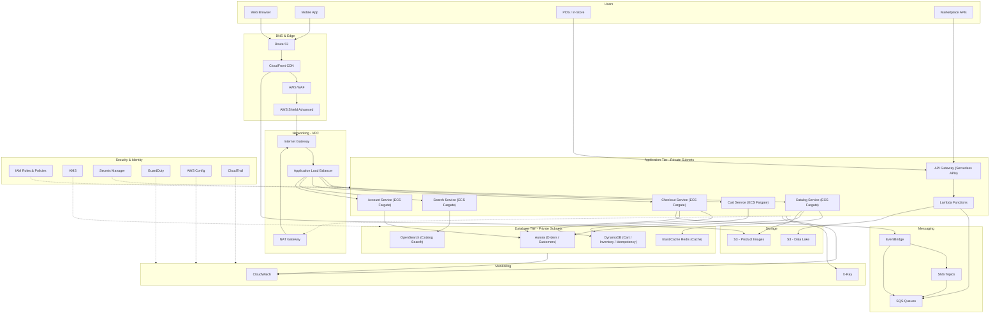

# Chapter 71 — Retail

*Part IX – Industry-Specific Architectures*

---

# 1. Executive Summary

Retail is one of the most demanding industries to build cloud infrastructure for, not because the individual technical problems are exotic, but because retail compresses every hard problem in distributed systems into a single, unforgiving calendar. A retailer's infrastructure has to behave like a boring, reliable utility for 360 days a year and then absorb a 20x–50x traffic multiplier during Black Friday, Cyber Monday, Prime Day–style flash sales, or a single viral TikTok moment — with zero tolerance for downtime, because every minute of an outage during peak season is measured directly in lost revenue, not just in an SLA credit.

**The business problem.** A modern retail organization is rarely just "a website." It is simultaneously:

- A **transactional e-commerce platform** (web, mobile app, PWA) that must convert browsing into checkout with sub-second page loads.
- An **omnichannel commerce engine** that unifies inventory, pricing, and order state across web, mobile, marketplaces (Amazon, eBay), physical point-of-sale (POS) systems, and call centers.
- A **real-time inventory and fulfillment system** that has to answer "can I ship this to this ZIP code by Friday?" correctly, because overselling out-of-stock items destroys customer trust and generates costly cancellations.
- A **personalization and recommendation engine** that increases average order value (AOV) through product recommendations, search relevance, and targeted promotions.
- A **payments and fraud platform** that must be PCI-DSS compliant, low-latency, and resistant to card-testing attacks, account takeover, and promo abuse.
- A **supply chain and logistics integration layer** connecting warehouse management systems (WMS), transportation management systems (TMS), and third-party logistics (3PL) providers.

Each of these sub-systems has different scaling characteristics, different consistency requirements, and different failure tolerances. The architecture objective of this chapter is to describe a reference design that lets these sub-systems scale independently while still presenting a single, consistent customer experience.

**Architecture objective.** The design in this chapter targets:

- **Elastic, event-driven scaling** — compute and messaging layers that can absorb sudden multi-order-of-magnitude traffic spikes without manual intervention, and scale back down afterward to avoid paying for idle peak-day capacity all year.
- **Read/write separation at the data layer** — because retail traffic is overwhelmingly read-heavy (product browsing, search, catalog views) with a much smaller, latency-sensitive write path (cart, checkout, inventory decrement).
- **Global edge delivery** — because retail customers are geographically distributed and page-load latency has a directly measurable effect on conversion rate (studies consistently show conversion drops materially for every 100ms of added latency).
- **Strong consistency where it matters, eventual consistency where it doesn't** — inventory decrement and payment capture need strong consistency guarantees; product catalog updates, review counts, and "customers also bought" widgets can tolerate eventual consistency.
- **Defense in depth against retail-specific fraud** — bot-driven checkout abuse, gift card cracking, promo code stuffing, and card testing are endemic to retail and must be designed for from day one, not bolted on after an incident.

**Why organizations adopt this architecture.** Retailers adopt this pattern because the alternative — a monolithic application tied to a single relational database with vertically scaled compute — reliably fails in one of two ways. Either it falls over during a flash sale (the classic "site down on Black Friday" headline), or the organization over-provisions for peak year-round, which is financially indefensible when peak-day traffic can be 30–50x the daily average and lasts only 48–72 hours a year. Event-driven, horizontally scalable, cloud-native architecture solves both problems: it scales to meet the spike and scales back down afterward, turning a capital expenditure problem into an operating expenditure problem that FinOps practices can actively manage.

**Major business benefits.**

- **Revenue protection during peak events.** A single hour of downtime during Cyber Monday can cost a mid-size retailer six to seven figures in lost sales, not counting brand damage and customer churn. Elastic architecture directly protects revenue.
- **Improved conversion through performance.** CDN-backed edge delivery, aggressive caching, and optimized checkout flows reduce time-to-first-byte and time-to-interactive, which correlates directly with conversion rate and cart abandonment reduction.
- **Operational efficiency.** Auto scaling and serverless compute reduce the standing headcount needed to manage infrastructure capacity manually, freeing engineering time for feature development rather than capacity firefighting.
- **Faster time-to-market for new channels.** A well-decomposed, API-first architecture lets the business launch new sales channels (a new marketplace integration, a new regional storefront, a new mobile experience) without re-architecting the core platform.
- **Better fraud and chargeback economics.** Purpose-built fraud detection integrated into the checkout path reduces chargeback rates, which directly affects the retailer's payment processor rates and reserve requirements.
- **Data-driven merchandising.** A properly instrumented platform produces the clickstream, cart, and purchase data that merchandising and marketing teams need to run pricing experiments, personalize the storefront, and optimize inventory allocation.

**Typical enterprise scenarios.** This architecture pattern is typically adopted by:

- Mid-market to enterprise retailers ($50M–$10B+ annual revenue) migrating off legacy on-premises commerce platforms (older versions of on-prem WebSphere Commerce, monolithic .NET or Java e-commerce stacks) to cloud-native architecture.
- Digitally native vertical brands (DNVBs) that started cloud-native but have outgrown a single-region, single-database MVP architecture as they scale past $100M in GMV (gross merchandise value).
- Traditional brick-and-mortar retailers building an omnichannel capability (buy-online-pickup-in-store, ship-from-store, endless aisle) that requires real-time inventory visibility across previously siloed systems.
- Retailers preparing for a specific high-stakes event: a first Black Friday on a new platform, a major marketing campaign, a celebrity product collaboration launch, or entry into a new geographic market.

The remainder of this chapter walks through the complete reference architecture: business and non-functional requirements, the AWS services involved, network and identity design, security architecture, high availability and disaster recovery, scalability and performance patterns, FinOps cost modeling, AI-assisted operations, full Terraform implementation, CI/CD, observability, and a closing "Architect's Corner" section that captures the hard-won lessons that only show up after several real production peak-season cycles.

---

# 2. Business Requirements

## 2.1 Business Drivers

| Driver | Description |
|---|---|
| Revenue growth | Support increasing GMV without proportional increases in infrastructure cost or headcount. |
| Peak-event resilience | Guarantee availability and performance during Black Friday/Cyber Monday, flash sales, and viral demand spikes. |
| Omnichannel unification | Provide a single source of truth for inventory, pricing, and order status across web, mobile, marketplace, and in-store channels. |
| Customer experience | Deliver sub-second page loads, accurate search, and reliable checkout to protect conversion rate. |
| Fraud and loss prevention | Minimize chargeback and promo-abuse losses while keeping legitimate checkout friction low. |
| Global expansion | Support new geographic markets, currencies, tax jurisdictions, and languages without re-architecting. |
| Regulatory compliance | Meet PCI-DSS for payment data, and regional data protection law (GDPR, CCPA) for customer data. |

## 2.2 Functional Requirements

- Product catalog browsing with search, filtering, and faceted navigation.
- Real-time cart management with support for guest and authenticated checkout.
- Inventory availability checks that reflect near-real-time stock across warehouses and stores.
- Order placement, payment authorization/capture, and order confirmation.
- Order management: cancellations, returns, exchanges, and refunds.
- Promotions engine: coupon codes, percentage/flat discounts, buy-one-get-one, tiered pricing.
- Customer account management: order history, saved addresses, saved payment methods, wishlists.
- Product recommendations and personalization (browsing history, purchase history, collaborative filtering).
- Multi-channel order ingestion (web, mobile, marketplace APIs, POS).
- Fulfillment routing: warehouse selection, ship-from-store, buy-online-pickup-in-store (BOPIS).
- Notification delivery: order confirmation, shipping updates, back-in-stock alerts (email, SMS, push).

## 2.3 Non-Functional Requirements

| Category | Requirement |
|---|---|
| Scalability | Absorb 30–50x baseline traffic during peak events without manual intervention. |
| Availability | 99.95%–99.99% availability for the checkout path; 99.9% for browsing/catalog. |
| Latency | P50 page load < 1.5s, P99 < 3s globally; checkout API P99 < 500ms. |
| Consistency | Strong consistency for inventory decrement and payment state; eventual consistency acceptable for catalog and reviews. |
| Compliance | PCI-DSS Level 1 (for direct card handling) or scope reduction via tokenization; GDPR/CCPA for customer PII. |
| Security | Defense-in-depth against bot abuse, credential stuffing, card testing, and promo abuse. |
| Auditability | Full audit trail of order state changes, price changes, and inventory adjustments. |
| Data residency | Regional data residency for customer PII where required by local law (EU, certain APAC jurisdictions). |

## 2.4 Scalability Goals

- Catalog/browsing tier: scale from a daily baseline of, for example, 2,000 requests/second to 60,000+ requests/second during a flash sale, elastically, within minutes.
- Checkout tier: scale from 50 orders/second baseline to 1,500+ orders/second during peak, while preserving strict inventory consistency.
- Search tier: scale query throughput independently of the transactional write path, since search is a pure-read workload that benefits from aggressive caching and read replicas.

## 2.5 Availability Requirements

- Checkout and payment path: 99.99% (approximately 52 minutes of downtime per year), because this is the direct revenue path.
- Product catalog and browsing: 99.95%, because a brief catalog staleness or a degraded (but available) experience is preferable to a hard outage.
- Internal back-office tools (merchandising, order management console): 99.5%, since internal tooling downtime does not directly affect customer revenue.

## 2.6 Latency Requirements

- Global page load: P50 under 1.5 seconds, P99 under 3 seconds, measured from major customer geographies via Real User Monitoring (RUM), not just synthetic checks.
- API latency for cart and checkout operations: P99 under 500ms, since checkout latency has an outsized effect on cart abandonment.
- Search-as-you-type latency: under 150ms to feel instantaneous to the user.

## 2.7 Compliance Requirements

- **PCI-DSS**: required wherever cardholder data is transmitted, processed, or stored. The reference architecture in this chapter minimizes PCI scope by using a tokenizing payment processor (Stripe, Adyen, Braintree) and hosted payment fields, so the retailer's own infrastructure never touches raw card numbers (SAQ A or SAQ A-EP scope rather than full SAQ D).
- **GDPR / CCPA**: customer PII (name, address, email, purchase history) must support right-to-access and right-to-erasure workflows, and EU customer data should generally remain in EU AWS regions unless Standard Contractual Clauses and appropriate safeguards are in place.
- **Accessibility (ADA / WCAG 2.1 AA)**: not an AWS architecture concern directly, but it constrains the CDN/edge design (no aggressive UA-based content stripping that breaks assistive technology).

## 2.8 Recovery Objectives

| Metric | Target | Applies To |
|---|---|---|
| RPO (Recovery Point Objective) | < 1 minute | Order and payment data |
| RPO | < 15 minutes | Catalog and pricing data |
| RTO (Recovery Time Objective) | < 15 minutes | Checkout path (regional failover) |
| RTO | < 5 minutes | Compute-tier instance/AZ failure (automatic) |
| RTO | < 4 hours | Full regional disaster recovery to secondary region |

## 2.9 SLAs

- External SLA to customers (implicit, brand-driven): site available and checkout functioning at all times, with visible status page transparency during incidents.
- Internal SLA to the business: 99.99% checkout availability during the defined "peak season" window (typically the six weeks spanning late November through the December holiday shopping period), with a formal incident postmortem required for any peak-season customer-facing outage exceeding 5 minutes.
- Internal SLA to engineering teams: p99 API latency budgets per service, tracked as SLOs with error budgets (see Section 21).

## 2.10 Expected Workload and Growth

A representative mid-large retailer workload profile used throughout this chapter:

| Metric | Baseline (average day) | Peak (Black Friday/Cyber Monday) |
|---|---|---|
| Concurrent users | 15,000 | 400,000+ |
| Page views/second | 2,000 | 60,000 |
| Orders/second | 50 | 1,500 |
| Search queries/second | 800 | 25,000 |
| Payment authorizations/second | 60 | 1,800 |

Expected year-over-year GMV growth of 20–30% is assumed, meaning the architecture must be designed with headroom for baseline growth in addition to peak-event elasticity — these are two distinct scaling dimensions and conflating them is a common architecture review mistake (see Section 24).

---

# 3. Architecture Overview

## 3.1 Overall Design and Philosophy

This reference architecture follows an **event-driven, cell-based, multi-tier design** built around three core philosophies:

1. **Decouple everything that doesn't need to be synchronous.** Order placement, payment capture, inventory decrement, fulfillment routing, and notification delivery are related but do not all need to happen in a single synchronous call chain. Using Amazon SQS and Amazon EventBridge to decouple these steps means a slow or temporarily unavailable downstream system (e.g., the warehouse management system integration) does not block the customer-facing checkout confirmation.
2. **Separate the read path from the write path.** The overwhelming majority of retail traffic is read traffic: product browsing, search, category pages, and content. This traffic is served from a heavily cached, CDN-fronted, read-replica-backed path that can scale nearly infinitely and cheaply. The write path — cart mutation, checkout, payment, inventory decrement — is comparatively small in volume but requires strong consistency and is protected by targeted throttling, idempotency keys, and strongly consistent data stores (Aurora, or DynamoDB with conditional writes).
3. **Design for graceful degradation, not just uptime.** A well-designed retail platform degrades non-critical features (personalized recommendations, "recently viewed," non-essential third-party pixels) before it allows the checkout path to fail. This means circuit breakers around non-critical downstream calls, feature flags that can shed load selectively, and a checkout flow that has as few hard dependencies as architecturally possible.

## 3.2 Core Components

| Layer | Components |
|---|---|
| Edge & DNS | Route 53, CloudFront, AWS WAF, AWS Shield Advanced |
| Application | ALB, ECS Fargate / EKS services, API Gateway + Lambda for specific serverless APIs |
| Messaging | Amazon SQS, Amazon SNS, Amazon EventBridge |
| Data | Aurora (PostgreSQL/MySQL) for transactional order data, DynamoDB for cart/session/inventory hot-path data, ElastiCache (Redis) for caching, OpenSearch for product search |
| Storage | S3 for product images, static assets, data lake landing zone |
| Identity | IAM, Cognito for customer identity (if not using a dedicated CIAM vendor), IAM Identity Center for workforce access |
| Security | KMS, Secrets Manager, GuardDuty, Security Hub, AWS Config, CloudTrail |
| Observability | CloudWatch, X-Ray, OpenSearch (for log analytics) |
| AI/ML | Amazon Personalize (recommendations), Amazon Bedrock (customer service assistants, product description generation), Amazon Q (operational assistance) |

## 3.3 How Components Interact — High-Level Workflow

At a high level, a customer request flows through five conceptual zones:

1. **Edge zone** — DNS resolution, CDN caching, WAF inspection, bot filtering.
2. **Application zone** — stateless application services running behind load balancers, horizontally auto-scaled.
3. **Messaging zone** — asynchronous decoupling of order events, inventory events, and notification events.
4. **Data zone** — polyglot persistence: relational for transactional integrity, key-value for high-throughput low-latency access, search index for catalog discovery, cache for hot reads.
5. **Cross-cutting zone** — security, identity, observability, and AI-assisted operations, which touch every other zone.

## 3.4 Request Lifecycle (Conceptual)

A product page view: DNS → CloudFront (cache hit for static assets and often for full HTML on anonymous browsing) → on cache miss, ALB → ECS service → ElastiCache (product data cache) → on cache miss, Aurora read replica or DynamoDB → response cached at CloudFront edge for subsequent requests.

A checkout request: DNS → CloudFront (pass-through, not cached) → WAF (bot/fraud rules) → ALB → checkout ECS service → synchronous call to payment processor (tokenized) → synchronous conditional write to inventory table (DynamoDB conditional decrement) → order record write to Aurora → asynchronous event published to EventBridge for fulfillment routing, notification, and analytics consumers → synchronous response to customer with order confirmation.

## 3.5 Response Lifecycle

Responses are shaped by the same read/write split: read responses are optimized for cache-hit ratio and edge delivery; write responses are optimized for correctness and idempotency (a retried checkout request must not create a duplicate order or double-decrement inventory — enforced via client-supplied idempotency keys stored in DynamoDB with a short TTL).

## 3.6 Data Lifecycle

Order data flows from the transactional Aurora cluster into the data lake (via AWS DMS or a CDC pipeline using Debezium/Kinesis) for analytics, forecasting, and the AI/ML recommendation pipeline. Product catalog data flows from a Product Information Management (PIM) system, through an ingestion pipeline, into both OpenSearch (for search/browse) and DynamoDB/ElastiCache (for fast lookups), and is invalidated at the CDN edge on update. Clickstream data flows from the client directly to a Kinesis Data Stream for real-time personalization and near-real-time merchandising dashboards.


---

# 4. AWS Services Used

For each service below: purpose, why it was selected for this architecture, alternatives considered, limitations, pricing considerations, and best practices.

## 4.1 Amazon EC2

**Purpose.** EC2 provides resizable virtual compute instances. In this architecture, EC2 is used sparingly — primarily for specialized workloads that don't fit well into containers or serverless, such as licensed third-party commerce middleware, legacy WMS connector agents, or GPU-backed batch jobs for image processing.

**Why selected.** Full control over the OS and runtime is occasionally necessary for legacy retail middleware (older order management systems, EDI translators) that cannot be containerized without significant vendor cooperation.

**Alternatives.** ECS Fargate and EKS are preferred for anything that can be containerized, since they remove patching and capacity-management overhead. Lambda is preferred for event-driven, short-duration work.

**Limitations.** Requires patch management, AMI lifecycle management, and manual or Auto Scaling Group-based capacity management. Cold-start scaling is slower than containers or Lambda.

**Pricing considerations.** On-Demand pricing for unpredictable legacy workloads; Reserved Instances or Savings Plans for steady-state baseline capacity; Spot Instances only for fully fault-tolerant batch work (e.g., nightly image resizing jobs), never for anything in the checkout critical path.

**Best practices.** Use Auto Scaling Groups even for "legacy" EC2 workloads to get self-healing. Use SSM Session Manager instead of bastion hosts/SSH keys. Bake AMIs with EC2 Image Builder rather than mutating running instances.

## 4.2 Application Load Balancer (ALB)

**Purpose.** Layer 7 load balancing across ECS/EKS targets, with path-based and host-based routing, and native integration with AWS WAF.

**Why selected.** Retail platforms typically expose many logical services (catalog API, cart API, checkout API, account API) that benefit from a single ALB with path-based routing rules, reducing the number of internet-facing endpoints that need to be secured and monitored.

**Alternatives.** Network Load Balancer (NLB) for TCP/UDP or extreme-throughput/low-latency scenarios (rare for HTTP-based retail APIs); API Gateway for fully serverless API surfaces.

**Limitations.** ALB target group health checks must be tuned carefully — overly aggressive health checks can cause healthy targets to be removed during brief GC pauses or connection pool warmup, a frequent cause of self-inflicted "phantom" outages during traffic ramp-up.

**Pricing considerations.** Charged per Load Balancer Capacity Unit (LCU-hour); during peak events, LCU consumption (driven by new connections, active connections, bandwidth, and rule evaluations) can spike materially — this is a commonly underestimated peak-season cost line.

**Best practices.** Enable access logs to S3 for every ALB. Use separate target groups per logical service even behind a single ALB. Set deregistration delay to match downstream connection-draining needs (typically 30–60s for checkout services to avoid dropping in-flight orders).

## 4.3 Amazon CloudFront

**Purpose.** Global CDN for static asset delivery (images, CSS, JS), full-page caching for anonymous browsing, and edge-level security enforcement via AWS WAF integration.

**Why selected.** Retail traffic is globally distributed and heavily read-dominated; CloudFront's edge cache dramatically reduces both origin load and end-user latency, which directly improves conversion.

**Alternatives.** Third-party CDNs (Akamai, Fastly, Cloudflare) are common in retail and are sometimes chosen for multi-CDN redundancy strategies at the largest retailers — this is discussed further in Section 28 (Alternatives).

**Limitations.** Cache invalidation at scale (thousands of SKUs updated simultaneously during a price change) requires careful cache-key design (e.g., versioned asset URLs) rather than relying purely on invalidation API calls, which are rate-limited and not instantaneous.

**Pricing considerations.** Data transfer out is the dominant cost driver; using Origin Shield and long TTLs for immutable assets (product images with content-hashed filenames) reduces both cost and origin load.

**Best practices.** Use cache-control headers and versioned URLs for images rather than invalidation. Use CloudFront Functions for lightweight edge logic (redirect rules, header manipulation) and Lambda@Edge only when genuinely necessary (heavier compute, e.g., A/B test bucketing at the edge).

## 4.4 AWS Lambda

**Purpose.** Event-driven compute for asynchronous order-processing steps: fulfillment routing, notification dispatch, image thumbnail generation, webhook handlers for marketplace integrations, and scheduled batch jobs.

**Why selected.** Many retail backend workflows are inherently event-driven and bursty (a flash sale generates a burst of order-confirmation emails, for example) — Lambda's automatic, near-instantaneous scaling matches this pattern without any capacity planning.

**Alternatives.** ECS Fargate for longer-running or more complex processing pipelines; Step Functions when the workflow has many sequential/branching steps (see Chapter 28, Step Functions Workflow, for a deeper treatment).

**Limitations.** 15-minute maximum execution duration; cold starts can affect latency-sensitive synchronous paths (mitigated with Provisioned Concurrency for the small number of Lambda functions that sit in a synchronous customer-facing path, if any).

**Pricing considerations.** Pay-per-invocation and duration; for extremely high-volume, low-compute functions (e.g., a simple webhook receiver invoked millions of times during peak), compare cost against a small always-on Fargate service — at very high sustained volume, Fargate can become cheaper.

**Best practices.** Keep functions single-purpose. Use reserved concurrency to prevent a runaway downstream integration (e.g., a marketplace webhook flood) from exhausting account-wide Lambda concurrency and starving unrelated functions.

## 4.5 Amazon S3

**Purpose.** Storage for product images and media, static website assets, data lake landing zone for clickstream and order data exports, and Terraform remote state (in a separate, tightly access-controlled bucket).

**Why selected.** S3's durability (11 nines), virtually unlimited scale, and native integration with CloudFront make it the default choice for both media assets and the data lake tier.

**Alternatives.** EFS for shared POSIX filesystem needs (rare in this architecture); FSx for specialized workloads (not typically needed for retail web/commerce).

**Limitations.** Not a database — object listing at very large scale requires prefix design discipline; eventual consistency nuances around overwrite-then-read in some access patterns (largely resolved in modern S3, but still worth designing around for critical paths).

**Pricing considerations.** Storage class transitions (S3 Intelligent-Tiering, S3 Standard-IA, S3 Glacier) for older product images and historical order exports materially reduce storage cost at scale; S3 request costs (PUT/GET) matter at high image-catalog-update volume.

**Best practices.** Enable S3 Versioning and MFA Delete on the Terraform state bucket. Use S3 Lifecycle policies to transition product images that are no longer actively merchandised. Use S3 Object Lambda if on-the-fly image resizing/watermarking is required without maintaining separate derivative copies.

## 4.6 Amazon RDS

**Purpose.** Managed relational database for smaller, well-bounded transactional workloads (e.g., a promotions/coupon service, a customer-service ticketing integration) that don't need Aurora's scale or global-database capability.

**Why selected.** Lower operational and cost overhead than Aurora for services with modest, predictable throughput.

**Alternatives.** Aurora (preferred for the core order/checkout database — see below); DynamoDB for non-relational access patterns.

**Limitations.** Vertical scaling ceiling is lower than Aurora; read replica lag and failover characteristics are less refined than Aurora's.

**Pricing considerations.** Instance-hour billing plus storage; Multi-AZ doubles the compute cost but is mandatory for any production retail workload.

**Best practices.** Always deploy Multi-AZ for production. Use RDS Proxy in front of Lambda-invoked database access to avoid connection exhaustion during traffic bursts.

## 4.7 Amazon Aurora

**Purpose.** The system-of-record relational database for orders, customers, and the core transactional schema, using Aurora PostgreSQL or Aurora MySQL depending on team expertise and existing tooling.

**Why selected.** Aurora provides up to 15 low-latency read replicas, storage that auto-scales up to 128 TiB, and significantly faster failover (typically under 30 seconds) than standard RDS Multi-AZ — critical for the checkout path's RTO requirements. Aurora Global Database additionally supports cross-region disaster recovery with typical replication lag under 1 second (see Chapter 44 for a deep treatment of Aurora Global Database).

**Alternatives.** DynamoDB for the cart and inventory hot path (see below) where access patterns are simple key-value/conditional-write rather than complex relational queries; a third-party managed Postgres (e.g., a multi-cloud database vendor) if multi-cloud portability is a hard business requirement.

**Limitations.** Still fundamentally a relational database — write throughput is bounded by the single writer instance (Aurora MySQL) or limited multi-writer support (Aurora PostgreSQL Limitless is changing this, but should be evaluated carefully before being relied upon for peak-day write scaling).

**Pricing considerations.** Aurora I/O-Optimized storage configuration is usually more cost-effective than the standard configuration for read-heavy, high-I/O retail workloads — this trade-off should be modeled explicitly against actual I/O patterns before committing.

**Best practices.** Use Aurora Auto Scaling for read replicas tied to peak-season traffic forecasts, provisioned ahead of known peak events rather than reactively. Enable Performance Insights. Use RDS Proxy for connection pooling from containerized/serverless compute.

## 4.8 Amazon DynamoDB

**Purpose.** The primary data store for cart state, session data, real-time inventory counters, and idempotency keys — the hottest, most latency-sensitive, highest-throughput part of the data tier.

**Why selected.** DynamoDB's single-digit-millisecond latency at effectively unlimited throughput (with on-demand capacity mode) makes it the correct tool for inventory decrement operations that must handle extreme peak-day concurrency with strict conditional-write correctness (preventing overselling).

**Alternatives.** Aurora for the same use case is a common anti-pattern at retail peak scale — a hot single row (e.g., inventory count for a viral product) under Aurora row-level locking becomes a severe bottleneck; DynamoDB's partition-level scaling and conditional expressions handle this far better.

**Limitations.** No native complex relational queries or joins; requires careful access-pattern-driven table and index design up front (changing access patterns later is costly).

**Pricing considerations.** On-demand capacity mode is recommended for the cart/inventory tables given their extreme, event-driven traffic variance; provisioned capacity with Auto Scaling can be more cost-effective for genuinely steady-state tables (e.g., a reference/config table) but is riskier for peak-event tables since Auto Scaling reacts with some lag.

**Best practices.** Use DynamoDB Accelerator (DAX) in front of read-heavy DynamoDB access patterns if microsecond latency is required. Design partition keys to avoid hot partitions (e.g., don't partition purely by a single viral SKU ID without a sharding suffix). Use conditional writes for inventory decrement to guarantee no overselling under concurrency.

## 4.9 Amazon SNS

**Purpose.** Pub/sub fan-out for events that multiple independent consumers need (e.g., "order placed" fanning out to the notification service, the fraud-scoring service, and the analytics pipeline simultaneously).

**Why selected.** SNS-to-SQS fan-out is the standard AWS pattern for one-event-many-consumers scenarios, decoupling producers from an unknown or growing number of consumers.

**Alternatives.** EventBridge (preferred when consumers need content-based filtering rather than simple topic-based fan-out — see below).

**Limitations.** No built-in content filtering as rich as EventBridge's event pattern matching (SNS filter policies are simpler, attribute-based only).

**Pricing considerations.** Priced per request/notification; at extreme peak volume, fan-out multiplies message count across every subscriber, which should be modeled explicitly in cost forecasts.

**Best practices.** Use SNS FIFO topics where strict per-customer ordering matters (e.g., sequential order-status updates for a single order); use dead-letter queues on every SQS subscription.

## 4.10 Amazon SQS

**Purpose.** Durable, decoupled queuing for asynchronous work: order fulfillment routing, notification dispatch, inventory reconciliation, and marketplace webhook processing.

**Why selected.** SQS provides at-least-once delivery with configurable visibility timeouts and dead-letter queue support, which is exactly the durability/retry semantic needed for "this must eventually happen but doesn't need to happen synchronously" retail workflows.

**Alternatives.** Kinesis Data Streams when strict ordering and replay/multiple-consumer-at-different-offsets semantics are needed (e.g., clickstream processing); EventBridge for routing based on event content rather than simple queue consumption.

**Limitations.** Standard queues do not guarantee strict ordering (FIFO queues do, at lower throughput ceilings, though high-throughput FIFO mode has substantially closed this gap).

**Pricing considerations.** Priced per request; batching (SendMessageBatch, ReceiveMessage with multiple messages) meaningfully reduces cost at high volume and should be a code-review checklist item.

**Best practices.** Always configure a dead-letter queue with alerting on DLQ depth. Use FIFO queues for per-order-sequential operations (e.g., order status transitions) and standard queues for independent, idempotent work items (e.g., "send this one notification").

## 4.11 Amazon EventBridge

**Purpose.** The central event bus for content-based routing of domain events (OrderPlaced, InventoryLow, PaymentCaptured, ShipmentCreated) to the correct set of consumers, including third-party SaaS targets (e.g., a marketing automation platform) via EventBridge's SaaS integrations.

**Why selected.** EventBridge's schema registry and content-based event pattern matching make it well suited to a growing, evolving set of domain events and consumers in a retail platform, without requiring producers to know their consumers in advance.

**Alternatives.** SNS/SQS for simpler fan-out needs where content-based filtering isn't required; a self-managed Kafka cluster (MSK) for extremely high-throughput streaming needs, though this is usually unnecessary complexity for typical retail event volumes.

**Limitations.** Higher per-event cost than SQS/SNS at extreme scale; not designed for strict ordering guarantees across a stream (use Kinesis for that).

**Pricing considerations.** Priced per event published; at 1,500 orders/second peak with multiple downstream rules per event, this can become a non-trivial cost line that should be included in FinOps peak-event forecasting.

**Best practices.** Use schema discovery to keep event contracts documented. Use EventBridge Archive and Replay for after-the-fact reprocessing (e.g., replaying order events if a downstream consumer had a bug during peak).

## 4.12 IAM

**Purpose.** Identity and access control for every AWS API interaction across the platform — human access (via IAM Identity Center federation), service-to-service access (IAM roles for ECS tasks, Lambda execution roles), and cross-account access (for a multi-account landing zone).

**Why selected.** IAM is the foundational, non-optional control plane for least-privilege access in any AWS architecture; retail's PCI-DSS scope and customer PII handling make rigorous IAM discipline a compliance requirement, not just a best practice.

**Alternatives.** None at the AWS layer — IAM is the only option, though the design choice is how granularly to scope roles and whether to centralize identity via IAM Identity Center versus per-account IAM users (per-account IAM users for human access should be avoided entirely in a mature design).

**Limitations.** Policy complexity grows quickly in a multi-service, multi-team organization; this is discussed at length in Section 10 and revisited in the Architect's Corner.

**Pricing considerations.** No direct cost for IAM itself.

**Best practices.** One IAM role per ECS task definition / Lambda function, scoped to only the resources that specific service needs. Use permission boundaries for any role a development team can self-service create. Use IAM Access Analyzer continuously, not just at initial setup.

## 4.13 Amazon VPC

**Purpose.** Network isolation boundary for the entire platform, with public subnets for internet-facing load balancers/NAT gateways and private subnets for application and data tiers.

**Why selected.** Mandatory foundational networking construct for any production AWS workload handling payment and customer data.

**Alternatives.** None — VPC is the standard; the design choice is topology (single VPC with multiple subnet tiers vs. multi-VPC with Transit Gateway), covered in Section 9.

**Limitations.** CIDR planning mistakes made early (too-small CIDR blocks) are expensive to fix later and are a very common real-world pitfall (see Section 24).

**Pricing considerations.** VPC itself is free; NAT Gateway hourly and per-GB data processing charges are a frequently underestimated cost line (see Section 16 and the Cost Surprises section).

**Best practices.** Plan CIDR blocks assuming 3–5 years of growth and multi-region expansion, not just current-day needs. Use VPC Flow Logs for security and troubleshooting visibility.

## 4.14 Amazon Route 53

**Purpose.** DNS resolution for the storefront domain(s), health-check-based failover routing between regions/environments, and latency-based routing for global audiences.

**Why selected.** Native integration with CloudFront, ALB, and AWS health checks makes Route 53 the natural choice for DNS-level failover as part of the disaster recovery strategy.

**Alternatives.** Third-party DNS providers are sometimes used for multi-provider DNS redundancy at the largest retailers, similar to the multi-CDN discussion in Section 4.3.

**Limitations.** DNS-based failover has an inherent propagation delay (mitigated with low TTLs on the relevant records, at the cost of slightly higher query volume/cost).

**Pricing considerations.** Hosted zone and query charges are typically a minor cost line relative to the rest of the architecture.

**Best practices.** Use Route 53 Application Recovery Controller for more deterministic, tested failover than basic health-check routing policies alone, particularly for the checkout path's RTO requirements.

## 4.15 Amazon CloudWatch

**Purpose.** Metrics, logs, dashboards, and alarms across every layer of the architecture — the primary observability backbone.

**Why selected.** Native, zero-additional-infrastructure integration with every AWS service used in this architecture.

**Alternatives.** Third-party observability platforms (Datadog, New Relic, Grafana/Prometheus stack on top of Amazon Managed Service for Prometheus) are extremely common in retail and are often layered on top of, not instead of, CloudWatch — see Section 21 for a fuller discussion.

**Limitations.** Native CloudWatch dashboards and alerting are less flexible than dedicated observability platforms for complex, cross-service correlation and long-retention analytics.

**Pricing considerations.** Custom metrics, high-resolution metrics, and log ingestion/storage volume are all significant, frequently underestimated cost drivers at retail peak-event log volumes.

**Best practices.** Define SLO-based alarms (see Section 21), not just resource-utilization alarms. Use metric filters and log insights queries rather than shipping every log line to an expensive external platform.

## 4.16 AWS CloudTrail

**Purpose.** Immutable audit log of every AWS API call made within the account(s) — essential for security investigation and compliance evidence (PCI-DSS explicitly requires this class of audit logging).

**Why selected.** Non-negotiable compliance and security-forensics requirement; there is no viable substitute at the AWS control-plane level.

**Alternatives.** None for AWS API-level audit; CloudTrail is complemented by, not replaced by, application-level audit logging.

**Limitations.** CloudTrail captures control-plane (and optionally data-plane) API activity, not application-level business logic — application audit trails (e.g., "who changed this product's price") must be built separately.

**Pricing considerations.** Data event logging (e.g., S3 object-level, DynamoDB item-level) can become expensive at high volume; scope data-event logging to the specific resources that need it (e.g., the payment-token bucket) rather than enabling it account-wide by default.

**Best practices.** Enable an organization-wide CloudTrail trail in a dedicated log-archive account with S3 Object Lock for tamper-evidence, per AWS security reference architecture guidance.

## 4.17 AWS Config

**Purpose.** Continuous configuration compliance monitoring — e.g., detecting an S3 bucket that becomes public, a security group that opens 0.0.0.0/0 on a sensitive port, or an unencrypted EBS volume.

**Why selected.** PCI-DSS and general security posture management require continuous configuration drift detection, not just point-in-time audits.

**Alternatives.** Third-party Cloud Security Posture Management (CSPM) tools are common as a supplement, but AWS Config conformance packs provide a strong native baseline.

**Limitations.** Rule evaluation has some latency (not instantaneous); should be paired with preventive controls (SCPs, permission boundaries) rather than relied on as the only control.

**Pricing considerations.** Priced per configuration item recorded and per rule evaluation; scope recording to relevant resource types rather than "record everything" by default in cost-sensitive accounts.

**Best practices.** Use AWS Config conformance packs aligned to PCI-DSS for continuous compliance evidence generation.

## 4.18 Amazon GuardDuty

**Purpose.** Managed threat detection using VPC Flow Logs, DNS logs, CloudTrail events, and (with the appropriate protection plans enabled) EKS audit logs, S3 data events, and RDS login activity, to detect compromised credentials, cryptomining, reconnaissance, and other threat patterns.

**Why selected.** Retail platforms are high-value targets for credential-stuffing bots, card-testing fraud rings, and opportunistic attackers; GuardDuty provides continuous, low-overhead managed detection without requiring the retailer to build and tune a SIEM detection pipeline from scratch.

**Alternatives.** Third-party SIEM/XDR platforms, usually layered on top of GuardDuty findings rather than replacing them.

**Limitations.** Detection, not prevention — findings must feed into an actual incident response process (see Section 23) to have value.

**Pricing considerations.** Priced by log volume analyzed; S3 Protection and EKS Protection add-ons have separate pricing that should be evaluated against the specific risk profile.

**Best practices.** Route GuardDuty findings to Security Hub and EventBridge for automated triage/response workflows, not just a dashboard nobody watches.

## 4.19 AWS KMS

**Purpose.** Encryption key management for data at rest (Aurora, DynamoDB, S3, EBS) and application-level envelope encryption for particularly sensitive fields.

**Why selected.** Mandatory for PCI-DSS and general customer-data protection; KMS is the standard, deeply integrated AWS encryption key management service.

**Alternatives.** AWS CloudHSM for workloads requiring dedicated, customer-controlled HSM hardware (rare requirement for typical retail workloads, more common for very specific card-scheme requirements).

**Limitations.** API request costs and request-rate quotas can matter at very high per-request encryption volume; consider envelope encryption with data keys cached appropriately rather than calling KMS for every single field-level operation.

**Pricing considerations.** Per-key monthly charge plus per-API-request charge; using AWS-managed keys where customer-managed keys (CMKs) aren't specifically required reduces cost and operational overhead.

**Best practices.** Use customer-managed KMS keys (not AWS-managed) for anything in PCI or PII scope, so that key policies, rotation, and access can be explicitly controlled and audited.

## 4.20 AWS Secrets Manager

**Purpose.** Storage and automatic rotation of database credentials, third-party API keys (payment processor, tax calculation service, shipping rate APIs), and other application secrets.

**Why selected.** Native automatic rotation for RDS/Aurora credentials removes a common source of security debt (long-lived, unrotated database passwords).

**Alternatives.** Systems Manager Parameter Store (SecureString) for lower-cost secret storage where automatic rotation isn't required; HashiCorp Vault for organizations with existing multi-cloud secret management investment.

**Limitations.** Per-secret monthly cost, which matters at very large numbers of secrets (e.g., per-tenant API keys in a marketplace-integration-heavy architecture).

**Pricing considerations.** Compare Secrets Manager's per-secret cost against Parameter Store for secrets that don't need automatic rotation or fine-grained resource policies.

**Best practices.** Never bake secrets into container images or Terraform state in plaintext. Reference Secrets Manager ARNs from ECS task definitions and Lambda environment configuration rather than embedding values.

## 4.21 AWS Systems Manager

**Purpose.** Session Manager for bastion-less secure shell access to EC2 instances, Parameter Store for non-secret configuration, Patch Manager for EC2 patch compliance, and Run Command for fleet-wide operational tasks.

**Why selected.** Eliminates the need for bastion hosts and SSH key management, reducing the network attack surface (see Chapter 10, Bastion-less Infrastructure with SSM, for a deeper treatment).

**Alternatives.** Traditional bastion host with SSH key management (legacy pattern, discouraged in modern AWS architecture).

**Limitations.** Requires the SSM Agent to be installed and the instance role to have appropriate permissions; doesn't apply to Fargate tasks (which have no persistent host to access, by design).

**Pricing considerations.** No additional charge for Session Manager itself.

**Best practices.** Disable SSH entirely at the security-group level for production instances and rely exclusively on Session Manager, logging all sessions to CloudWatch Logs/S3 for audit purposes.


---

# 5. Complete Architecture Diagram



**Diagram notes.** This is a layered, cell-based view. In production, the "App" tier is deployed as multiple independent, horizontally scaled ECS services (not a monolith), each with its own target group, its own Auto Scaling policy, and its own circuit breakers around downstream dependencies. The messaging layer is intentionally the connective tissue between the checkout service and everything downstream of order placement (fulfillment, notifications, analytics), so that those downstream systems can degrade or fail without affecting the customer-facing checkout confirmation.

---

# 6. Component-by-Component Explanation

## 6.1 CloudFront + WAF (Edge Layer)

- **Purpose.** Terminates global customer connections as close to the customer as possible, serves cacheable content from edge locations, and applies WAF rules before traffic ever reaches the origin.
- **Responsibilities.** TLS termination, cache-hit serving, bot mitigation (AWS WAF Bot Control), rate-based rules, geo-restriction if required by sanctions compliance.
- **Inputs.** HTTPS requests from browsers, mobile apps, and marketplace integrations.
- **Outputs.** Cached responses directly from edge, or forwarded requests to the origin ALB/API Gateway.
- **Scaling.** Fully managed and effectively infinite at the CDN layer; no capacity planning required from the retailer.
- **High availability.** Inherently multi-region/multi-edge by design.
- **Failure handling.** Origin failover groups configured to a secondary origin (e.g., a static "sorry page" S3 bucket) if the primary origin is unhealthy.
- **Dependencies.** ACM for TLS certificates, S3/ALB as origins.
- **Security.** WAF managed rule groups (Core Rule Set, Known Bad Inputs, Bot Control), Shield Advanced for DDoS.
- **Monitoring.** CloudFront real-time logs, cache-hit-ratio metrics, WAF blocked-request metrics.

## 6.2 Application Load Balancer

- **Purpose.** Layer 7 routing of decrypted traffic to the correct ECS service target group based on path (`/api/catalog/*`, `/api/cart/*`, `/api/checkout/*`).
- **Responsibilities.** Health checking, connection draining, TLS termination (or pass-through to services, depending on internal mTLS design), WAF association.
- **Scaling.** Auto-scales LCU capacity transparently; retailer must ensure target groups can scale to match.
- **High availability.** Deployed across a minimum of three Availability Zones.
- **Failure handling.** Automatically removes unhealthy targets from rotation based on configured health checks.
- **Security.** Security groups restrict inbound to WAF/CloudFront-originated traffic only where architecturally feasible (e.g., via a custom header check plus IP range restriction, since CloudFront does not have a single static IP range guarantee — AWS publishes CloudFront IP ranges for this purpose).
- **Monitoring.** Target response time, HTTP 5xx count, healthy/unhealthy host count.

## 6.3 ECS Fargate Application Services (Catalog, Cart, Checkout, Search, Account)

- **Purpose.** Stateless application logic implementing the retail domain services.
- **Responsibilities.** Business logic, request validation, calls to data tier and downstream integrations (payment processor, tax service, shipping rate service).
- **Inputs.** HTTP requests from ALB; events from SQS for asynchronous processing services.
- **Outputs.** HTTP responses; domain events published to EventBridge.
- **Scaling.** Target-tracking Auto Scaling on request count per target and/or CPU/memory utilization; checkout service additionally scaled on a custom CloudWatch metric (queue depth of pending payment authorizations) to scale ahead of a detected surge.
- **High availability.** Minimum 2 tasks per service across at least 2 AZs at all times, even at baseline, to tolerate an AZ failure without a scaling event being required first.
- **Failure handling.** ECS automatically replaces unhealthy tasks; circuit breakers (e.g., using resilience libraries or a service mesh) trip around slow/failing downstream dependencies rather than allowing cascading thread/connection pool exhaustion.
- **Dependencies.** Aurora, DynamoDB, ElastiCache, OpenSearch, Secrets Manager, external payment/tax/shipping APIs.
- **Security.** Task IAM roles scoped per service; tasks run in private subnets with no direct internet exposure; egress via NAT Gateway only for necessary third-party API calls.
- **Monitoring.** Per-service CloudWatch dashboards, X-Ray traces for cross-service latency breakdown, custom business metrics (cart abandonment rate, checkout success rate).

## 6.4 DynamoDB (Cart, Inventory, Idempotency)

- **Purpose.** Hot-path, high-throughput, low-latency data store for cart contents, live inventory counters, and checkout idempotency keys.
- **Responsibilities.** Conditional writes for inventory decrement (preventing overselling under concurrency), TTL-based expiry for abandoned carts and idempotency keys.
- **Scaling.** On-demand capacity mode for peak-event tables; DynamoDB Accelerator (DAX) considered for the inventory-read hot path if p99 read latency requirements tighten further.
- **High availability.** Multi-AZ by default (DynamoDB's standard architecture); Global Tables for multi-region active-active if required.
- **Failure handling.** Automatic retries with exponential backoff in the application SDK for throttled requests; alarms on `ThrottledRequests` to catch partition hot-spotting early.
- **Security.** Encryption at rest via KMS; fine-grained IAM policies restricting each service to only its own tables/items where feasible (e.g., using `dynamodb:LeadingKeys` condition for multi-tenant patterns).

## 6.5 Aurora (Orders, Customers)

- **Purpose.** System of record for order history, customer profiles, and any data requiring relational integrity and complex query support (order line items, returns, order status history).
- **Responsibilities.** ACID-compliant transactional writes for order finalization; read replicas serve reporting and account-history read queries.
- **Scaling.** Read replica Auto Scaling tied to read-traffic forecasts; write scaling bounded by instance class (vertical scaling) since Aurora MySQL/PostgreSQL standard configuration has a single writer.
- **High availability.** Multi-AZ cluster with automated failover typically under 30 seconds.
- **Failure handling.** Aurora automatically promotes a replica on writer failure; application layer must handle the brief connection interruption gracefully (via RDS Proxy and retry logic).
- **Security.** Encryption at rest via KMS, encryption in transit via TLS, IAM database authentication where feasible to avoid long-lived database passwords.

## 6.6 ElastiCache (Redis)

- **Purpose.** Sub-millisecond caching layer for product data, session data, and rate-limiting counters.
- **Responsibilities.** Reduce read load on Aurora and OpenSearch; provide a fast distributed counter for rate-limiting and fraud-scoring heuristics.
- **Scaling.** Cluster mode enabled for horizontal scaling of both storage and throughput across shards.
- **High availability.** Multi-AZ with automatic failover between primary and replica nodes per shard.
- **Failure handling.** Application falls back to the database on cache miss/unavailability rather than failing the request outright — cache is a performance optimization, not a hard dependency.

## 6.7 OpenSearch (Product Search)

- **Purpose.** Full-text and faceted search over the product catalog, powering search-as-you-type, filtering, and category browse pages.
- **Responsibilities.** Index product catalog data (synced from the PIM/catalog service), serve low-latency search queries.
- **Scaling.** Dedicated master nodes for cluster stability; data node count scaled to index size and query throughput, with UltraWarm/cold storage tiers for older, less-frequently-queried data (e.g., discontinued product history).
- **High availability.** Multi-AZ domain deployment with at least 3 dedicated master nodes.
- **Failure handling.** Search degrades gracefully to a simpler category-browse fallback (e.g., a cached "popular products" list) if the search cluster is unavailable, rather than presenting a hard error.


---

# 7. End-to-End Request Flow

## 7.1 Product Browsing Flow (Read Path)

1. Client requests `https://shop.example.com/products/12345`.
2. Route 53 resolves to the CloudFront distribution.
3. CloudFront checks its edge cache for this URL.
4. **Cache hit** — response served directly from the edge; flow ends here for the majority of anonymous browsing traffic.
5. **Cache miss** — request forwarded through AWS WAF for inspection (bot rules, rate-based rules).
6. Request reaches the origin ALB.
7. ALB routes the request to the Catalog Service target group based on path.
8. Catalog Service checks ElastiCache for the product data.
9. **Cache hit** — data returned from Redis.
10. **Cache miss** — Catalog Service queries an Aurora read replica, then populates the Redis cache with a TTL.
11. Catalog Service renders/returns the response.
12. Response flows back through ALB → CloudFront, which caches it at the edge according to cache-control headers.
13. Response delivered to the client.
14. Access logs written to S3 (ALB and CloudFront); metrics emitted to CloudWatch; trace spans emitted to X-Ray.
15. **Error handling** — if the Aurora read replica is unavailable, the Catalog Service serves a slightly stale cached copy from Redis (if available) rather than returning a hard error, logging a warning for the on-call engineer.

## 7.2 Checkout Flow (Write Path)

1. Client submits checkout request with cart ID, shipping address, and a client-generated idempotency key.
2. Request passes through CloudFront (pass-through, not cached), WAF (fraud/bot rule evaluation, including velocity checks), and reaches the ALB.
3. ALB routes to the Checkout Service target group.
4. Checkout Service checks DynamoDB for the idempotency key; if already processed, returns the cached prior response immediately (preventing duplicate orders on client retry).
5. Checkout Service retrieves cart contents from DynamoDB.
6. Checkout Service performs a conditional write to the DynamoDB inventory table to decrement stock for each line item, failing the specific line item (not the whole order) if stock is insufficient.
7. Checkout Service calls the payment processor (tokenized card data, never touching raw PAN) to authorize payment.
8. On successful authorization, Checkout Service writes the order record to Aurora within a database transaction.
9. Checkout Service publishes an `OrderPlaced` event to EventBridge.
10. EventBridge routes the event to: (a) an SQS queue consumed by the fulfillment-routing Lambda, (b) an SQS queue consumed by the notification service, (c) a Kinesis stream for real-time analytics.
11. Checkout Service returns an order confirmation response to the client, including the order ID.
12. **Asynchronously**, the fulfillment-routing Lambda determines the optimal warehouse/store for shipment and calls the WMS integration.
13. **Asynchronously**, the notification service sends an order-confirmation email/SMS via Amazon SES/Pinpoint or a third-party ESP.
14. **Error handling** — if payment authorization fails, the Checkout Service releases the inventory reservation (compensating action) and returns a clear decline reason to the client without exposing processor-internal error codes.
15. **Error handling** — if the Aurora write fails after successful payment authorization, the Checkout Service enters a compensating workflow (implemented via Step Functions in more mature implementations) to either retry the order write or, if unrecoverable, flag the order for manual reconciliation and voids/refunds the payment authorization — this exact edge case is one of the most consequential design points in the entire architecture and is revisited in Section 24 (Failure Scenarios).
16. Monitoring: end-to-end checkout latency, success rate, and decline-reason breakdown are tracked as core SLIs (Section 21).


---

# 8. Deployment Flow

## 8.1 Infrastructure Provisioning

All infrastructure is provisioned via Terraform, organized into modular, environment-parameterized modules (networking, data, application, security) with a remote state backend in S3 and state locking via DynamoDB.

## 8.2 Terraform Workflow

1. Developer opens a pull request modifying a Terraform module.
2. CI pipeline runs `terraform fmt -check`, `terraform validate`, and `tflint`.
3. CI pipeline runs `terraform plan` against the target environment and posts the plan output as a PR comment.
4. Security scanning (Checkov or tfsec) runs against the plan to catch policy violations (e.g., unencrypted resources, overly permissive security groups) before merge.
5. A designated reviewer approves the PR after reviewing the plan output.
6. On merge to the main branch, CI pipeline runs `terraform apply` against a staging environment automatically.
7. After staging validation (automated smoke tests plus manual QA sign-off for major changes), a manual approval gate triggers `terraform apply` against production.

## 8.3 CI/CD Deployment (Application Layer)

Application deployments are decoupled from infrastructure deployments. Container images are built, scanned (Amazon Inspector / a third-party container scanner), and pushed to Amazon ECR. ECS service definitions are updated via CodePipeline/CodeDeploy (or GitHub Actions calling the ECS deploy action) using a blue-green deployment strategy.

## 8.4 Blue-Green Deployment

- A new "green" task set is deployed alongside the existing "blue" task set behind the same ALB target group (via CodeDeploy's ECS blue-green integration).
- A small percentage of traffic (or a synthetic canary) is shifted to green first.
- CloudWatch alarms tied to the deployment (error rate, latency) are monitored automatically during the traffic shift.
- If alarms trigger, CodeDeploy automatically rolls back to the blue task set with zero manual intervention required.
- If healthy, traffic is fully shifted to green and the blue task set is deregistered after a bake period.

## 8.5 Rollback

- Automatic rollback triggered by CloudWatch alarm breach during a CodeDeploy blue-green shift (as above).
- Manual rollback capability via a one-command pipeline job that redeploys the last known-good container image tag.
- Database migrations are designed to be backward-compatible for at least one deployment cycle (expand/contract pattern) specifically so that a rollback of the application layer never requires a corresponding database rollback.

## 8.6 Secrets and Configuration

- Application secrets (database credentials, API keys) are stored in Secrets Manager and injected into ECS task definitions at runtime via the `secrets` block, never baked into the container image or committed to source control.
- Non-secret configuration (feature flags, environment-specific URLs) is stored in Systems Manager Parameter Store or a dedicated feature-flag service (e.g., AWS AppConfig, or a third-party flag platform), enabling configuration changes without a full redeployment.

## 8.7 Validation

- Post-deployment automated smoke tests exercise the critical customer journeys (browse → add to cart → checkout with a test payment method) against the newly deployed environment before it is considered "released."
- Synthetic canaries (CloudWatch Synthetics) continuously validate the checkout path in production, independent of any specific deployment event, to catch regressions introduced by non-code changes (e.g., a third-party payment processor outage).

---

# 9. Network Topology

## 9.1 VPC and CIDR Design

A dedicated VPC per environment (dev, staging, production) is used, sized with a `/16` CIDR block (e.g., `10.0.0.0/16` for production) to leave ample room for subnet growth and future peering/Transit Gateway attachment without requiring a CIDR migration later — a mistake that is expensive and disruptive to fix retroactively (see Section 24).

## 9.2 Subnet Layout (per Availability Zone, x3 AZs minimum)

| Subnet Tier | Purpose | Example CIDR (AZ-a) |
|---|---|---|
| Public | ALB, NAT Gateway | 10.0.0.0/24 |
| Private – Application | ECS Fargate tasks, Lambda (VPC-attached) | 10.0.10.0/23 |
| Private – Data | Aurora, ElastiCache, OpenSearch, DynamoDB VPC endpoints | 10.0.20.0/23 |

## 9.3 NAT Gateway and Internet Gateway

- An Internet Gateway attached to the VPC provides the path for public subnet resources (ALB) to reach the internet.
- One NAT Gateway per AZ (not a single shared NAT Gateway) is deployed for production, trading a modest additional hourly cost for AZ-independent egress resilience — a single shared NAT Gateway is a common cost-cutting anti-pattern that creates a cross-AZ single point of failure (see Section 27).

## 9.4 Transit Gateway

For organizations with multiple VPCs (e.g., a shared-services VPC hosting CI/CD tooling, a separate VPC for the data platform/analytics workloads), a Transit Gateway provides hub-and-spoke connectivity without the operational burden of a full mesh of VPC peering connections. This is discussed in depth in Chapter 17 (Transit Gateway); for a single-VPC retail platform at moderate scale, Transit Gateway may be deferred until a second VPC is genuinely needed.

## 9.5 Route Tables

- Public subnet route table: default route (`0.0.0.0/0`) to the Internet Gateway.
- Private application subnet route table: default route to the AZ-local NAT Gateway.
- Private data subnet route table: no default internet route at all; only routes to VPC endpoints and other in-VPC subnets, since data-tier resources should never require internet egress.

## 9.6 Network ACLs and Security Groups

- Security groups are the primary, application-aware control (e.g., "only the Checkout Service security group may connect to the Aurora security group on port 5432").
- Network ACLs are used as a coarse, stateless secondary control at the subnet boundary, primarily to explicitly deny known-bad CIDR ranges and to enforce subnet-tier isolation as a defense-in-depth layer, not as the primary access control mechanism.

## 9.7 PrivateLink

Gateway VPC endpoints are used for S3 and DynamoDB (no additional cost, keeps traffic off the NAT Gateway/internet path). Interface VPC endpoints (PrivateLink) are used for Secrets Manager, KMS, and any third-party SaaS integration that offers a PrivateLink endpoint (increasingly common among payment processors and tax-calculation providers), reducing both data-exfiltration surface area and NAT Gateway data-processing costs.

## 9.8 Hybrid Connectivity

For retailers with existing on-premises warehouse management or ERP systems that cannot yet be migrated, a Direct Connect connection (with a VPN backup path) provides low-latency, private connectivity between the AWS VPC and the on-premises data center, avoiding the introduction of these critical integrations over the public internet. See Chapter 24 (Direct Connect Enterprise) for a full treatment.

---

# 10. Identity and Access

## 10.1 IAM Roles

Every compute identity (ECS task, Lambda function) is assigned its own IAM role, scoped to exactly the AWS resources that specific service needs — the Catalog Service role can read from its Aurora replica and its Redis cluster but has no permissions on the Checkout Service's payment-related Secrets Manager entries, for example.

## 10.2 IAM Policies

Policies are written using specific resource ARNs and, where possible, condition keys (e.g., restricting `dynamodb:GetItem` to specific tables and, via `dynamodb:LeadingKeys`, to items matching a specific key pattern) rather than wildcard resource scoping.

## 10.3 Resource Policies

S3 bucket policies, KMS key policies, and Secrets Manager resource policies provide a second, resource-side layer of access control, ensuring that even a misconfigured IAM policy elsewhere cannot grant unintended access to the most sensitive resources (payment-token storage, customer PII buckets).

## 10.4 STS and Cross-Account Access

Human access is federated through IAM Identity Center, which issues short-lived STS credentials scoped to a specific permission set per account (e.g., "ReadOnly" in production, "PowerUser" in staging), eliminating long-lived IAM user access keys entirely for human operators.

## 10.5 Cross-Account Architecture

Following the AWS multi-account landing zone pattern (see Chapter 99, Reference Landing Zone), the retail platform is typically split across at minimum: a Log Archive account, a Security Tooling account, a Shared Services account (CI/CD, shared networking), and separate Production/Staging/Development workload accounts, with cross-account roles used sparingly and explicitly (e.g., the CI/CD pipeline in Shared Services assumes a deployment role in the Production account, scoped to only the actions the pipeline genuinely needs).

## 10.6 Least Privilege

Least privilege is enforced iteratively: initial roles are scoped based on documented access patterns, then IAM Access Analyzer and CloudTrail-based access analysis are used over the following weeks of real traffic to identify and remove any granted-but-unused permissions.

## 10.7 Service Roles

Terraform itself runs under a dedicated deployment role with a permission boundary that caps its maximum possible privilege, so that even a compromised or misconfigured Terraform pipeline cannot, for example, modify IAM policies outside the boundary or disable CloudTrail.

## 10.8 Permission Boundaries

Any role that a development team can self-service create (e.g., via a Terraform module exposed to application teams) has a permission boundary attached, preventing privilege escalation regardless of what the team's own IAM policy authoring might otherwise allow.


---

# 11. Security Architecture

## 11.1 Encryption

- **At rest.** All data stores (Aurora, DynamoDB, ElastiCache, OpenSearch, S3, EBS) are encrypted using customer-managed KMS keys, with separate keys per data classification tier (a distinct key for payment-adjacent data versus general catalog data) so that key policies and access logging can be scoped and audited independently.
- **In transit.** TLS 1.2+ enforced at every hop: client-to-CloudFront, CloudFront-to-ALB, ALB-to-ECS task (via HTTPS listeners or a service mesh with mTLS for particularly sensitive internal calls), and application-to-database (TLS-enforced database connections).

## 11.2 KMS

Customer-managed keys with automatic annual rotation enabled, restrictive key policies naming specific IAM roles rather than broad account-level trust, and CloudTrail logging of every `kms:Decrypt` call for the payment-adjacent key as a specific, monitored security signal.

## 11.3 TLS / Certificate Manager

AWS Certificate Manager issues and auto-renews public TLS certificates for CloudFront and the ALB, eliminating manual certificate renewal as an operational failure mode (expired certificates are a surprisingly common cause of real production outages — see Section 24).

## 11.4 WAF

AWS WAF is deployed at both the CloudFront layer (edge) and, where API Gateway is used for partner/marketplace integrations, at the API Gateway layer, with managed rule groups (Core Rule Set, Known Bad Inputs, Amazon IP Reputation List, Bot Control) plus custom rules for retail-specific abuse patterns: rate-based rules on login and checkout endpoints, and rules detecting promo-code enumeration patterns (rapid sequential attempts against the coupon-validation endpoint).

## 11.5 Shield

AWS Shield Advanced is enabled for the production CloudFront distribution and any Elastic IPs in use, providing enhanced DDoS protection, cost protection against scaling charges incurred during a genuine DDoS event, and access to the AWS DDoS Response Team (DRT) during an active incident — a meaningful protection given that retail sites are a common target for both extortion-motivated and competitor-motivated DDoS attacks around major sale events.

## 11.6 Secrets Manager

Covered in Section 4.20; the security-architecture-relevant point is that automatic rotation is enabled for all database credentials, and third-party API keys are rotated on a defined schedule with rotation Lambda functions where the third party's API supports programmatic key rotation.

## 11.7 GuardDuty, Inspector, Security Hub

- **GuardDuty** provides continuous threat detection (Section 4.18).
- **Amazon Inspector** continuously scans ECR container images and EC2 instances for known vulnerabilities (CVEs), gating the CI/CD pipeline on critical/high findings before a new image is allowed to deploy to production.
- **Security Hub** aggregates findings from GuardDuty, Inspector, Config, and Macie into a single pane of glass, mapped against the AWS Foundational Security Best Practices standard and PCI-DSS standard, providing both an operational triage view and compliance evidence.

## 11.8 CloudTrail and AWS Config

Covered in Sections 4.16–4.17; both feed Security Hub and are retained for a minimum of one year (often longer for PCI-DSS evidence retention requirements) in the Log Archive account with S3 Object Lock enabled for tamper-evidence.

## 11.9 Zero Trust Principles Applied

- No implicit trust based on network location alone — every service-to-service call is authenticated and authorized (via IAM roles for AWS API calls, and mTLS or signed service tokens for internal application-to-application calls where a service mesh is in use).
- Database and cache tiers accept connections only from specifically authorized security groups, never from a broad "application subnet" CIDR range.
- Human access to production is never via long-lived credentials, always via federated, short-lived, MFA-enforced STS sessions.

## 11.10 Threat Model and Attack Vectors

| Attack Vector | Description | Primary Mitigation |
|---|---|---|
| Credential stuffing | Automated login attempts using breached credential lists | WAF rate-based rules, Cognito/CIAM advanced security features, MFA prompts on anomalous login |
| Card testing | Attackers use the checkout/payment path to validate stolen card numbers in bulk | Payment processor fraud scoring, WAF rate limiting on checkout, CAPTCHA on anomalous velocity |
| Promo/coupon abuse | Enumeration or sharing of promo codes beyond intended scope | Rate limiting on coupon validation endpoint, per-customer and per-code usage caps enforced server-side |
| Scalper/bot purchasing | Automated bots buying limited-availability items faster than humans | WAF Bot Control, CAPTCHA challenges on high-demand product pages, purchase-limit enforcement |
| DDoS | Volumetric or application-layer denial of service, often timed to major sale events | Shield Advanced, CloudFront absorbing volumetric load, WAF rate-based rules |
| Data exfiltration via SSRF/injection | Application vulnerabilities exploited to access internal metadata or data stores | WAF managed rules, IMDSv2 enforcement, least-privilege IAM, input validation, dependency scanning |
| Insider/over-privileged access | Overly broad IAM permissions misused or compromised | Least privilege, permission boundaries, IAM Access Analyzer, CloudTrail monitoring |
| Supply chain compromise | Compromised third-party dependency or container base image | Inspector scanning, SBOM generation, dependency pinning, signed container images |

---

# 12. High Availability

## 12.1 AZ Failures

Every tier of the architecture is deployed across a minimum of three Availability Zones: ECS services run tasks distributed across AZs, Aurora runs Multi-AZ with automated failover, DynamoDB and ElastiCache are inherently Multi-AZ, and the ALB itself spans all configured AZ subnets. Losing a single AZ should result in no customer-visible impact beyond a brief, automatically recovered latency blip.

## 12.2 Instance/Task Failures

ECS continuously monitors task health via ALB target group health checks and container health checks, automatically replacing failed tasks. Auto Scaling Groups (for the smaller EC2 footprint, Section 4.1) similarly replace failed instances automatically.

## 12.3 Regional Failures

A full regional failure is addressed via the disaster recovery strategy detailed in Section 13 — a warm-standby secondary region for the checkout-critical path, with Route 53 Application Recovery Controller managing failover.

## 12.4 Database Failures

Aurora's automated failover to a read replica in a different AZ typically completes in under 30 seconds; the application layer uses RDS Proxy and implements connection-retry logic to ride out this brief interruption without surfacing errors to the end customer for anything beyond the failover window itself. DynamoDB has no concept of a "failover" from the application's perspective — AWS manages this transparently.

## 12.5 Load Balancing and Health Checks

ALB health checks are tuned per service: the Checkout Service uses a dedicated `/health/deep` endpoint that verifies connectivity to its critical dependencies (Aurora, DynamoDB, payment processor reachability) rather than a shallow "process is running" check, ensuring traffic is only routed to genuinely healthy tasks — while being careful not to make the health check itself a source of cascading failure (a "deep" health check that calls an overloaded downstream dependency can itself cause healthy tasks to be marked unhealthy during a partial outage; this trade-off is discussed further in the Architect's Corner).

## 12.6 Failover

Failover behavior is tested regularly (see Section 13.7, DR testing) rather than assumed to work correctly based on configuration alone — a recurring theme throughout this chapter and one of the most common gaps found in real architecture reviews.


---

# 13. Disaster Recovery

## 13.1 Backup Strategy

- **Aurora**: automated daily snapshots retained for 35 days, plus continuous backup enabling point-in-time recovery to any second within the retention window.
- **DynamoDB**: point-in-time recovery (PITR) enabled on all tables holding order-adjacent data; on-demand backups taken before major schema or capacity-mode changes.
- **S3**: versioning enabled on buckets holding product images and data-lake exports, with cross-region replication for the data-lake landing zone.

## 13.2 Snapshots

Aurora snapshots and DynamoDB backups are automatically copied to the disaster-recovery region on a scheduled basis (in addition to Aurora Global Database's continuous replication, discussed below), providing a second, independent recovery path in case of a replication-layer issue rather than only a snapshot-layer issue.

## 13.3 Cross-Region Replication

- **Aurora Global Database** replicates the primary cluster to a secondary region with typical replication lag under 1 second, enabling a fast regional failover for the order/customer data tier.
- **DynamoDB Global Tables** provide multi-region active-active replication for the cart/inventory tier, though inventory-decrement conditional-write semantics across regions require careful design (see the discussion of eventual consistency trade-offs in the Architect's Corner) — many retailers instead choose a single "inventory authority region" with the secondary region operating in a degraded, read-mostly mode during an active failover, rather than true multi-region active-active writes for inventory specifically.
- **S3 Cross-Region Replication (CRR)** for product images and the data lake landing zone.

## 13.4 DR Strategy Selection: Pilot Light vs. Warm Standby vs. Multi-Site

| Strategy | RTO | RPO | Cost | Description |
|---|---|---|---|---|
| Backup & Restore | Hours | Hours | Lowest | Not appropriate for the checkout-critical path; may be acceptable for internal back-office tooling only. |
| Pilot Light | 10s of minutes | Minutes | Low-Medium | Core data replicated continuously; compute scaled up from minimal footprint only when failover is triggered. |
| **Warm Standby (chosen for this architecture)** | **Minutes** | **Seconds** | **Medium-High** | Secondary region runs a scaled-down but fully functional copy of the platform at all times, scaled up to full capacity during failover. |
| Multi-Site Active-Active | Near-zero | Near-zero | Highest | Both regions serve production traffic simultaneously; requires solving multi-region write consistency for inventory, which is architecturally significant (see Chapter 98, Multi-Region Active-Active). |

This reference architecture adopts a **Warm Standby** posture for the checkout-critical path: the secondary region runs a minimal but fully deployed and continuously tested copy of every service, Aurora Global Database keeps the secondary cluster continuously current, and Route 53 Application Recovery Controller can redirect traffic within the RTO target. Full Multi-Site Active-Active (Chapter 98) is reserved for the largest global retailers where the additional architectural complexity of solving multi-region inventory consistency is justified by the business's global-scale, always-on requirements.

## 13.5 RPO / RTO Summary (restated with DR context)

| Component | RPO | RTO |
|---|---|---|
| Order/customer data (Aurora Global DB) | < 1 second (typical replication lag) | < 15 minutes (regional failover) |
| Cart/inventory data (DynamoDB) | Near-zero (PITR) to minutes (Global Tables lag) | < 15 minutes |
| Product catalog/search (OpenSearch) | Minutes (re-index acceptable) | < 30 minutes |
| Static assets (S3/CloudFront) | Near-zero (CRR) | Near-zero (CDN naturally multi-region) |

## 13.6 Failover Execution

1. Regional health-check failure detected by Route 53 Application Recovery Controller (or manually triggered by an incident commander for a confirmed regional event).
2. Traffic is shifted at the DNS/CDN-origin level to the secondary region's ALB.
3. Secondary-region ECS services scale from warm-standby capacity up to full production capacity, driven by the same Auto Scaling policies used for peak-event scaling in the primary region.
4. Aurora Global Database secondary cluster is promoted to a standalone writable cluster.
5. On-call and incident-response processes (Section 23) are activated, including customer-facing status-page updates.

## 13.7 DR Testing

DR failover is tested at minimum semi-annually via a controlled game-day exercise, and ideally validated continuously via automated chaos-engineering-style checks (e.g., regularly verifying that the secondary region's services can serve a synthetic transaction end-to-end without actually cutting production traffic over). A DR plan that has never been tested is not a DR plan — this point is emphasized repeatedly throughout this book because it is, empirically, the single most common gap found in enterprise architecture reviews.

---

# 14. Scalability

## 14.1 Horizontal Scaling

The application tier (ECS Fargate services) scales horizontally by adding task count, driven by target-tracking Auto Scaling policies on request count per target, CPU/memory utilization, and, for the Checkout Service specifically, a custom CloudWatch metric tracking pending-payment-authorization queue depth to scale ahead of demand rather than purely reactively.

## 14.2 Vertical Scaling

Vertical scaling (larger Fargate task CPU/memory allocations, larger Aurora instance classes) is used selectively for components with a single-writer bottleneck (Aurora) or for workloads with high per-request compute cost (e.g., image processing Lambda functions), rather than as the primary scaling mechanism for the stateless application tier.

## 14.3 Auto Scaling — Predictive and Scheduled

Because Black Friday/Cyber Monday and other major sale events are known in advance, this architecture combines **reactive** Auto Scaling (target-tracking policies responding to real-time load) with **scheduled scaling actions** that pre-warm capacity (Fargate task counts, Aurora read replica counts, ElastiCache node counts) ahead of a known traffic event, rather than relying purely on reactive scaling to keep up with a demand curve that can go from baseline to 30x within minutes at midnight on Black Friday.

## 14.4 Serverless Scaling

Lambda-based asynchronous processing (notification dispatch, fulfillment routing, webhook handling) scales automatically and near-instantaneously with no pre-warming required, though reserved concurrency limits are set deliberately on functions that call rate-limited downstream third-party APIs (e.g., the shipping-label-generation API) to avoid Lambda's scaling outpacing what the downstream dependency can actually absorb.

## 14.5 Database Scaling

- Aurora: read replica Auto Scaling for the read path; write path scaled vertically ahead of forecasted peak (instance class upsized before, not during, the peak event, since an instance-class change requires a brief failover).
- DynamoDB: on-demand capacity mode for peak-event tables absorbs traffic spikes without any pre-provisioning, at a higher per-request cost than provisioned capacity — an explicit, deliberate FinOps trade-off favoring reliability during the highest-stakes traffic events of the year.

## 14.6 Storage Scaling

S3 scales automatically with no action required. Aurora storage auto-scales up to 128 TiB. OpenSearch storage is scaled by adding data nodes ahead of forecasted catalog growth and index size, monitored via disk-watermark alarms.

## 14.7 Queue Scaling

SQS scales automatically and requires no capacity planning; the operationally relevant scaling concern is ensuring the *consumer* side (Lambda concurrency, ECS worker task count) scales to match queue depth, monitored via `ApproximateNumberOfMessagesVisible` alarms feeding consumer Auto Scaling policies.


---

# 15. Performance Optimization

## 15.1 Caching

A layered caching strategy is essential to retail performance economics:

- **CDN edge cache (CloudFront)** — static assets and cacheable anonymous-browsing HTML/JSON, TTLs from minutes (category pages) to a year (content-hashed static assets).
- **Application cache (ElastiCache Redis)** — product data, session data, computed/expensive query results.
- **Database-tier cache** — Aurora's own buffer pool tuning, and read replicas as a scaling cache layer for read-heavy queries.

## 15.2 Compression

Gzip/Brotli compression enabled at CloudFront and at the origin for all text-based responses (HTML, JSON, CSS, JS), meaningfully reducing payload size and time-to-first-byte, particularly for customers on slower mobile connections, which represent a large share of retail traffic.

## 15.3 CDN

Beyond static asset delivery, CloudFront is used for full-page caching of anonymous, non-personalized storefront pages, with personalization (recommendations, recently viewed) loaded client-side via a separate, non-cached API call — this "cache the shell, personalize client-side" pattern is one of the highest-leverage performance techniques available to a retail platform and is discussed further in the Architect's Corner.

## 15.4 Database Optimization

- Query patterns are reviewed against Aurora Performance Insights regularly to catch regressions (e.g., a new feature introducing an unindexed query) before they affect peak-season performance.
- Appropriate indexing on order lookup patterns (customer ID, order date range, order status) is maintained deliberately as query patterns evolve, rather than only reactively after a slow-query incident.

## 15.5 Connection Pooling

RDS Proxy sits in front of Aurora for both Lambda and ECS-based access, pooling and multiplexing connections so that a burst of concurrent Lambda invocations or a rapid ECS Auto Scaling event does not exhaust Aurora's maximum connection limit — a very common, very avoidable peak-season failure mode.

## 15.6 Concurrency

ECS services are sized (CPU/memory per task, and application-level thread/connection pool configuration within each task) so that per-task concurrency limits are well understood and match the downstream connection pool sizing (Aurora, Redis, OpenSearch), avoiding a situation where the application layer scales tasks faster than the data layer can actually absorb new connections.

## 15.7 Asynchronous Processing

Every step of the checkout flow that does not need to complete before the customer sees an order confirmation is moved to asynchronous processing via SQS/EventBridge (fulfillment routing, notification dispatch, loyalty-points accrual, analytics event emission), keeping the synchronous customer-facing latency budget focused only on the steps that are genuinely required for a valid order confirmation: cart retrieval, inventory reservation, and payment authorization.

---

# 16. Cost Optimization (FinOps)

## 16.1 Estimated Monthly Cost by Deployment Size

The following are directional monthly cost estimates (US East region, on-demand pricing unless noted) for illustrative purposes; actual costs depend heavily on traffic patterns, data volume, and negotiated enterprise discounts, and should always be validated with the AWS Pricing Calculator and Cost Explorer against real workload telemetry.

| Deployment Size | Profile | Estimated Monthly Cost (baseline, non-peak) |
|---|---|---|
| Small | ~500K monthly visitors, single region | $8,000 – $15,000 |
| Medium | ~5M monthly visitors, single region, peak-event scaling | $35,000 – $75,000 |
| Enterprise | ~50M+ monthly visitors, multi-region, warm-standby DR | $250,000 – $600,000+ |

**Note:** These baseline figures exclude the incremental cost incurred specifically during peak events (Black Friday/Cyber Monday week), which can add 15–40% to that month's bill depending on Auto Scaling aggressiveness, on-demand vs. reserved capacity mix, and data-transfer volume — this incremental peak cost should be explicitly budgeted for and tracked as its own line item, not absorbed silently into "cloud spend variance."

## 16.2 Major Cost Drivers

| Cost Driver | Typical Share of Bill | Notes |
|---|---|---|
| Compute (ECS/EC2/Lambda) | 25–35% | Dominant driver; scales with Auto Scaling behavior |
| Data transfer (CloudFront, NAT Gateway, cross-AZ) | 15–25% | Frequently underestimated at architecture design time |
| Database (Aurora, DynamoDB) | 15–20% | On-demand DynamoDB at peak can spike this materially |
| Storage (S3, EBS) | 5–10% | Grows steadily; lifecycle policies matter over years |
| Observability (CloudWatch, logs) | 5–10% | Often underestimated; log volume at peak is significant |
| Security/Compliance tooling | 3–7% | GuardDuty, Config, Security Hub, WAF |

## 16.3 Optimization Opportunities

- **Savings Plans** for the steady-state baseline compute footprint (Compute Savings Plans covering the ECS Fargate/EC2 baseline that runs 24/7/365, sized conservatively to avoid over-committing against a workload that will grow but whose peak-day capacity should remain on-demand/Auto Scaling).
- **Reserved Instances** for Aurora's baseline writer/reader instance classes, which run continuously regardless of traffic level.
- **Spot Instances** only for genuinely fault-tolerant, non-customer-facing batch workloads (nightly catalog re-indexing, image-derivative generation) — never for anything in the checkout critical path, given Spot's interruption risk.
- **S3 Lifecycle policies** transitioning older product images and historical order/data-lake exports through S3 Standard-IA and Glacier tiers.
- **DynamoDB capacity mode strategy** — provisioned capacity with Auto Scaling for stable, predictable tables; on-demand specifically for the highest-variance peak-event tables (cart, inventory), accepting the per-request cost premium as the price of guaranteed peak-day headroom.
- **CloudFront Origin Shield** reducing origin fetch volume and associated compute/data-transfer cost.
- **Right-sizing** ECS task CPU/memory allocations based on actual utilization data (Compute Optimizer recommendations), reviewed quarterly, since over-provisioned task sizes are a very common, very silent cost leak.

## 16.4 Cost Allocation and Tagging

A mandatory tagging policy (enforced via AWS Config rules and/or Service Control Policies blocking resource creation without required tags) ensures every resource carries `Environment`, `Service`, `CostCenter`, and `Team` tags, enabling Cost Explorer and Cost and Usage Reports to attribute spend accurately down to the individual service level (e.g., "how much does the Search service cost us per month, and how does that scale with catalog size?").

## 16.5 Budgets and Cost Anomaly Detection

- AWS Budgets configured with alerts at 50%/80%/100%/120% of the forecasted monthly spend, with a separate, more sensitive budget specifically for the peak-event window.
- AWS Cost Anomaly Detection monitors for unexpected spend spikes (e.g., a misconfigured Auto Scaling policy that fails to scale back down after a peak event, a runaway Lambda recursive invocation loop, or an accidentally-enabled expensive logging configuration) and routes alerts to the FinOps and engineering on-call channels.


---

# 17. AI-Assisted Operations

## 17.1 Amazon Q

Amazon Q Developer is used within the engineering organization to accelerate Terraform module authoring, generate unit tests for domain logic, and assist with root-cause investigation by summarizing CloudWatch Logs Insights query results during an active incident. Amazon Q Business is used by non-engineering stakeholders (merchandising, customer service leadership) to query internal documentation and dashboards in natural language without requiring direct AWS console access.

## 17.2 Amazon Bedrock

Bedrock-hosted foundation models power several retail-specific capabilities:

- **Product description generation and enrichment** from structured PIM attributes, accelerating catalog onboarding for new SKUs.
- **Customer service assistants**, using Retrieval-Augmented Generation (RAG) against the order-history and product-knowledge-base data (see Chapter 52, RAG Architecture, for the full pattern) to answer "where is my order" and "how do I return this" style queries with grounded, order-specific accuracy rather than generic responses.
- **Semantic search enhancement**, using Bedrock embeddings alongside traditional OpenSearch lexical search to improve relevance for natural-language and long-tail search queries.

## 17.3 AI-Assisted Troubleshooting and Log Analysis

CloudWatch Logs Insights, paired with Amazon Q's natural-language query generation, allows on-call engineers to investigate incidents ("show me all checkout errors in the last 30 minutes grouped by error code") without needing to hand-author complex query syntax under incident-response time pressure — meaningfully reducing mean time to diagnosis (MTTD) during high-stress peak-season incidents.

## 17.4 Incident Response Assistance

AI-generated incident summaries (drafted from the timeline of CloudWatch alarms, deployment events, and Slack incident-channel messages) reduce the manual burden of postmortem documentation, though human review and editing remain mandatory before any postmortem is considered final — an AI-drafted summary is a starting point, not a substitute for the incident commander's judgment.

## 17.5 Cost Optimization Assistance

AWS Cost Explorer's generative-AI-assisted natural-language querying, combined with Amazon Q, helps the FinOps team investigate cost anomalies and right-sizing opportunities without requiring every stakeholder to be a Cost Explorer power user.

## 17.6 Capacity Planning

Historical traffic data (from CloudWatch, combined with business forecasts for the upcoming peak season) is fed into forecasting models — increasingly assisted by Bedrock-hosted time-series-capable models — to generate the scheduled pre-scaling actions described in Section 14.3, rather than relying purely on prior-year peak numbers, which understate genuine year-over-year growth.

## 17.7 Architecture Review Assistance

Amazon Q can assist architecture review boards by summarizing a proposed Terraform change set's security and cost implications ahead of a formal review meeting, surfacing likely discussion points (e.g., "this change removes encryption-at-rest from a new DynamoDB table") for human reviewers to focus on — again, as an augmentation to the human review process described in Section 31, not a replacement for it.

## 17.8 AI-Generated Terraform and Documentation

AI-assisted Terraform module generation is used for scaffolding new, well-understood infrastructure patterns (a new ECS service following the established module pattern), with all generated code subject to the same PR review, `terraform plan` review, and security-scanning gates as human-authored code — no exception is made for AI-generated infrastructure code in the review process, precisely because AI-generated code has been observed in practice to occasionally produce subtly incorrect IAM scoping that a less rigorous review process would miss.


---

# 18. Terraform Implementation

The following examples illustrate the modular structure used to provision this architecture. Directory layout:

```

infra/
├── environments/
│   ├── production/
│   │   ├── main.tf
│   │   ├── variables.tf
│   │   ├── terraform.tfvars
│   │   └── backend.tf
│   └── staging/
│       └── ...
└── modules/
    ├── networking/
    ├── ecs-service/
    ├── data-tier/
    ├── security/
    └── observability/

```

## 18.1 Backend and Provider Configuration

```hcl

# environments/production/backend.tf

terraform {
  required_version = ">= 1.7.0"

  backend "s3" {
    bucket         = "acme-retail-terraform-state-prod"
    key            = "production/terraform.tfstate"
    region         = "us-east-1"
    dynamodb_table = "acme-retail-terraform-locks"
    encrypt        = true
  }

  required_providers {
    aws = {
      source  = "hashicorp/aws"
      version = "~> 5.0"
    }
  }
}

provider "aws" {
  region = var.aws_region

  default_tags {
    tags = {
      Environment = var.environment
      Project     = "retail-platform"
      ManagedBy   = "terraform"
    }
  }
}

```

## 18.2 Networking Module

```hcl

# modules/networking/variables.tf

variable "environment" {
  description = "Deployment environment name (e.g., production, staging)"
  type        = string
}

variable "vpc_cidr" {
  description = "CIDR block for the VPC. Use a /16 to leave room for growth."
  type        = string
  default     = "10.0.0.0/16"
}

variable "availability_zones" {
  description = "List of AZs to deploy across. Minimum 3 for production."
  type        = list(string)
}

variable "nat_gateway_per_az" {
  description = "Deploy one NAT Gateway per AZ (true) vs. a single shared NAT Gateway (false, not recommended for production)."
  type        = bool
  default     = true
}

```

```hcl

# modules/networking/main.tf

resource "aws_vpc" "main" {
  cidr_block           = var.vpc_cidr
  enable_dns_support   = true
  enable_dns_hostnames = true

  tags = {
    Name = "${var.environment}-retail-vpc"
  }
}

resource "aws_internet_gateway" "main" {
  vpc_id = aws_vpc.main.id

  tags = {
    Name = "${var.environment}-retail-igw"
  }
}

# Public subnets (ALB, NAT Gateways)

resource "aws_subnet" "public" {
  for_each = { for idx, az in var.availability_zones : az => idx }

  vpc_id                  = aws_vpc.main.id
  cidr_block              = cidrsubnet(var.vpc_cidr, 8, each.value)
  availability_zone       = each.key
  map_public_ip_on_launch = true

  tags = {
    Name = "${var.environment}-public-${each.key}"
    Tier = "public"
  }
}

# Private application subnets

resource "aws_subnet" "private_app" {
  for_each = { for idx, az in var.availability_zones : az => idx }

  vpc_id            = aws_vpc.main.id
  cidr_block        = cidrsubnet(var.vpc_cidr, 7, each.value + 10)
  availability_zone = each.key

  tags = {
    Name = "${var.environment}-private-app-${each.key}"
    Tier = "application"
  }
}

# Private data subnets

resource "aws_subnet" "private_data" {
  for_each = { for idx, az in var.availability_zones : az => idx }

  vpc_id            = aws_vpc.main.id
  cidr_block        = cidrsubnet(var.vpc_cidr, 7, each.value + 20)
  availability_zone = each.key

  tags = {
    Name = "${var.environment}-private-data-${each.key}"
    Tier = "data"
  }
}

resource "aws_eip" "nat" {
  for_each = var.nat_gateway_per_az ? aws_subnet.public : { (keys(aws_subnet.public)[0]) = values(aws_subnet.public)[0] }

  domain = "vpc"

  tags = {
    Name = "${var.environment}-nat-eip-${each.key}"
  }
}

resource "aws_nat_gateway" "main" {
  for_each = var.nat_gateway_per_az ? aws_subnet.public : { (keys(aws_subnet.public)[0]) = values(aws_subnet.public)[0] }

  allocation_id = aws_eip.nat[each.key].id
  subnet_id     = each.value.id

  tags = {
    Name = "${var.environment}-nat-${each.key}"
  }

  depends_on = [aws_internet_gateway.main]
}

resource "aws_route_table" "public" {
  vpc_id = aws_vpc.main.id

  route {
    cidr_block = "0.0.0.0/0"
    gateway_id = aws_internet_gateway.main.id
  }

  tags = {
    Name = "${var.environment}-public-rt"
  }
}

resource "aws_route_table" "private_app" {
  for_each = aws_subnet.private_app

  vpc_id = aws_vpc.main.id

  route {
    cidr_block     = "0.0.0.0/0"
    nat_gateway_id = var.nat_gateway_per_az ? aws_nat_gateway.main[each.key].id : values(aws_nat_gateway.main)[0].id
  }

  tags = {
    Name = "${var.environment}-private-app-rt-${each.key}"
  }
}

# Data subnets intentionally have NO default internet route.

resource "aws_route_table" "private_data" {
  vpc_id = aws_vpc.main.id

  tags = {
    Name = "${var.environment}-private-data-rt"
  }
}

# S3 and DynamoDB Gateway VPC Endpoints (no data transfer cost, keeps traffic off NAT)

resource "aws_vpc_endpoint" "s3" {
  vpc_id            = aws_vpc.main.id
  service_name      = "com.amazonaws.${var.aws_region}.s3"
  vpc_endpoint_type = "Gateway"
  route_table_ids   = concat([aws_route_table.public.id, aws_route_table.private_data.id], [for rt in aws_route_table.private_app : rt.id])
}

resource "aws_vpc_endpoint" "dynamodb" {
  vpc_id            = aws_vpc.main.id
  service_name      = "com.amazonaws.${var.aws_region}.dynamodb"
  vpc_endpoint_type = "Gateway"
  route_table_ids   = concat([aws_route_table.private_data.id], [for rt in aws_route_table.private_app : rt.id])
}

```

```hcl

# modules/networking/outputs.tf

output "vpc_id" {
  value = aws_vpc.main.id
}

output "public_subnet_ids" {
  value = [for s in aws_subnet.public : s.id]
}

output "private_app_subnet_ids" {
  value = [for s in aws_subnet.private_app : s.id]
}

output "private_data_subnet_ids" {
  value = [for s in aws_subnet.private_data : s.id]
}

```

## 18.3 ECS Service Module (Checkout Service Example)

```hcl

# modules/ecs-service/variables.tf

variable "service_name" {
  type = string
}

variable "environment" {
  type = string
}

variable "cluster_id" {
  type = string
}

variable "vpc_id" {
  type = string
}

variable "private_subnet_ids" {
  type = list(string)
}

variable "container_image" {
  type = string
}

variable "container_port" {
  type    = number
  default = 8080
}

variable "cpu" {
  type    = number
  default = 1024
}

variable "memory" {
  type    = number
  default = 2048
}

variable "min_capacity" {
  type    = number
  default = 4
}

variable "max_capacity" {
  type    = number
  default = 200
}

variable "alb_target_group_arn" {
  type = string
}

variable "alb_security_group_id" {
  type = string
}

```

```hcl

# modules/ecs-service/main.tf

resource "aws_ecs_task_definition" "this" {
  family                   = "${var.environment}-${var.service_name}"
  requires_compatibilities = ["FARGATE"]
  network_mode             = "awsvpc"
  cpu                      = var.cpu
  memory                   = var.memory
  execution_role_arn       = aws_iam_role.execution.arn
  task_role_arn            = aws_iam_role.task.arn

  container_definitions = jsonencode([
    {
      name      = var.service_name
      image     = var.container_image
      essential = true
      portMappings = [
        {
          containerPort = var.container_port
          protocol      = "tcp"
        }
      ]
      secrets = [
        {
          name      = "DB_CONNECTION_STRING"
          valueFrom = "arn:aws:secretsmanager:${data.aws_region.current.name}:${data.aws_caller_identity.current.account_id}:secret:${var.environment}/${var.service_name}/db-connection"
        }
      ]
      logConfiguration = {
        logDriver = "awslogs"
        options = {
          "awslogs-group"         = aws_cloudwatch_log_group.this.name
          "awslogs-region"        = data.aws_region.current.name
          "awslogs-stream-prefix" = var.service_name
        }
      }
      healthCheck = {
        command     = ["CMD-SHELL", "curl -f http://localhost:${var.container_port}/health/deep || exit 1"]
        interval    = 15
        timeout     = 5
        retries     = 3
        startPeriod = 30
      }
    }
  ])
}

resource "aws_ecs_service" "this" {
  name            = "${var.environment}-${var.service_name}"
  cluster         = var.cluster_id
  task_definition = aws_ecs_task_definition.this.arn
  launch_type     = "FARGATE"
  desired_count   = var.min_capacity

  deployment_controller {
    type = "CODE_DEPLOY"
  }

  network_configuration {
    subnets         = var.private_subnet_ids
    security_groups = [aws_security_group.service.id]
  }

  load_balancer {
    target_group_arn = var.alb_target_group_arn
    container_name   = var.service_name
    container_port   = var.container_port
  }

  lifecycle {
    ignore_changes = [task_definition, desired_count]
  }
}

resource "aws_security_group" "service" {
  name_prefix = "${var.environment}-${var.service_name}-"
  vpc_id      = var.vpc_id

  ingress {
    from_port       = var.container_port
    to_port         = var.container_port
    protocol        = "tcp"
    security_groups = [var.alb_security_group_id]
  }

  egress {
    from_port   = 0
    to_port     = 0
    protocol    = "-1"
    cidr_blocks = ["0.0.0.0/0"]
  }

  tags = {
    Name = "${var.environment}-${var.service_name}-sg"
  }
}

# Auto Scaling: target tracking on request count per target

resource "aws_appautoscaling_target" "this" {
  max_capacity       = var.max_capacity
  min_capacity       = var.min_capacity
  resource_id        = "service/${var.cluster_id}/${aws_ecs_service.this.name}"
  scalable_dimension = "ecs:service:DesiredCount"
  service_namespace  = "ecs"
}

resource "aws_appautoscaling_policy" "request_count" {
  name               = "${var.environment}-${var.service_name}-request-count"
  policy_type        = "TargetTrackingScaling"
  resource_id        = aws_appautoscaling_target.this.resource_id
  scalable_dimension = aws_appautoscaling_target.this.scalable_dimension
  service_namespace  = aws_appautoscaling_target.this.service_namespace

  target_tracking_scaling_policy_configuration {
    predefined_metric_specification {
      predefined_metric_type = "ALBRequestCountPerTarget"
      resource_label         = var.alb_target_group_arn
    }
    target_value       = 500
    scale_in_cooldown  = 120
    scale_out_cooldown = 30
  }
}

data "aws_region" "current" {}
data "aws_caller_identity" "current" {}

```

## 18.4 IAM Module (Least-Privilege Task Role Example)

```hcl

# modules/ecs-service/iam.tf

resource "aws_iam_role" "task" {
  name = "${var.environment}-${var.service_name}-task-role"

  assume_role_policy = jsonencode({
    Version = "2012-10-17"
    Statement = [{
      Effect    = "Allow"
      Principal = { Service = "ecs-tasks.amazonaws.com" }
      Action    = "sts:AssumeRole"
    }]
  })

  permissions_boundary = "arn:aws:iam::${data.aws_caller_identity.current.account_id}:policy/service-role-boundary"
}

resource "aws_iam_role_policy" "task_dynamodb" {
  name = "${var.environment}-${var.service_name}-dynamodb"
  role = aws_iam_role.task.id

  policy = jsonencode({
    Version = "2012-10-17"
    Statement = [
      {
        Sid    = "InventoryConditionalWrites"
        Effect = "Allow"
        Action = [
          "dynamodb:GetItem",
          "dynamodb:UpdateItem",
          "dynamodb:PutItem"
        ]
        Resource = "arn:aws:dynamodb:${data.aws_region.current.name}:${data.aws_caller_identity.current.account_id}:table/${var.environment}-inventory"
      },
      {
        Sid    = "IdempotencyKeys"
        Effect = "Allow"
        Action = [
          "dynamodb:GetItem",
          "dynamodb:PutItem"
        ]
        Resource = "arn:aws:dynamodb:${data.aws_region.current.name}:${data.aws_caller_identity.current.account_id}:table/${var.environment}-idempotency-keys"
      }
    ]
  })
}

resource "aws_iam_role_policy" "task_eventbridge" {
  name = "${var.environment}-${var.service_name}-eventbridge"
  role = aws_iam_role.task.id

  policy = jsonencode({
    Version = "2012-10-17"
    Statement = [{
      Sid      = "PublishOrderEvents"
      Effect   = "Allow"
      Action   = ["events:PutEvents"]
      Resource = "arn:aws:events:${data.aws_region.current.name}:${data.aws_caller_identity.current.account_id}:event-bus/${var.environment}-retail-events"
    }]
  })
}

resource "aws_iam_role" "execution" {
  name = "${var.environment}-${var.service_name}-execution-role"

  assume_role_policy = jsonencode({
    Version = "2012-10-17"
    Statement = [{
      Effect    = "Allow"
      Principal = { Service = "ecs-tasks.amazonaws.com" }
      Action    = "sts:AssumeRole"
    }]
  })
}

resource "aws_iam_role_policy_attachment" "execution_managed" {
  role       = aws_iam_role.execution.name
  policy_arn = "arn:aws:iam::aws:policy/service-role/AmazonECSTaskExecutionRolePolicy"
}

resource "aws_iam_role_policy" "execution_secrets" {
  name = "${var.environment}-${var.service_name}-secrets-access"
  role = aws_iam_role.execution.id

  policy = jsonencode({
    Version = "2012-10-17"
    Statement = [{
      Effect   = "Allow"
      Action   = ["secretsmanager:GetSecretValue"]
      Resource = "arn:aws:secretsmanager:${data.aws_region.current.name}:${data.aws_caller_identity.current.account_id}:secret:${var.environment}/${var.service_name}/*"
    }]
  })
}

```

## 18.5 DynamoDB Inventory Table (Conditional Writes)

```hcl

# modules/data-tier/dynamodb.tf

resource "aws_dynamodb_table" "inventory" {
  name         = "${var.environment}-inventory"
  billing_mode = "PAY_PER_REQUEST" # on-demand: absorbs peak-event spikes without pre-provisioning
  hash_key     = "sku_id"

  attribute {
    name = "sku_id"
    type = "S"
  }

  point_in_time_recovery {
    enabled = true
  }

  server_side_encryption {
    enabled     = true
    kms_key_arn = var.kms_key_arn
  }

  tags = {
    Name = "${var.environment}-inventory"
  }
}

resource "aws_dynamodb_table" "idempotency_keys" {
  name         = "${var.environment}-idempotency-keys"
  billing_mode = "PAY_PER_REQUEST"
  hash_key     = "idempotency_key"

  attribute {
    name = "idempotency_key"
    type = "S"
  }

  ttl {
    attribute_name = "expires_at"
    enabled        = true
  }

  server_side_encryption {
    enabled     = true
    kms_key_arn = var.kms_key_arn
  }
}

```

## 18.6 Best Practices Applied Throughout

- Remote state in S3 with DynamoDB locking, versioning and encryption enabled on the state bucket.
- Modules parameterized per environment; no hardcoded environment-specific values inside module logic.
- `for_each` used over `count` for resources keyed by a natural identifier (AZ name) to avoid destructive re-indexing when the AZ list changes.
- Every IAM role scoped to specific resource ARNs, never `Resource: "*"` except where the AWS action genuinely has no resource-level permission support.
- Permissions boundaries attached to every self-service-creatable role.
- `lifecycle { ignore_changes = [...] }` used on the ECS service's `task_definition` and `desired_count` because these are intentionally managed by the CI/CD deployment pipeline and Auto Scaling respectively, not by Terraform on every apply — a very common source of Terraform/CI-CD "fighting" if omitted.


---

# 19. AWS CLI Examples

## 19.1 Deployment

```bash

# Register a new task definition revision and deploy via CodeDeploy blue-green

aws ecs register-task-definition \
  --cli-input-json file://checkout-service-taskdef.json

aws deploy create-deployment \
  --application-name production-checkout-service \
  --deployment-group-name production-checkout-service-dg \
  --revision revisionType=AppSpecContent,appSpecContent="{content=$(cat appspec.yaml)}"

```

## 19.2 Validation

```bash

# Verify ECS service health after deployment

aws ecs describe-services \
  --cluster production-retail-cluster \
  --services production-checkout-service \
  --query 'services[0].{Running:runningCount,Desired:desiredCount,Deployments:deployments}'

# Confirm target group health behind the ALB

aws elbv2 describe-target-health \
  --target-group-arn arn:aws:elasticloadbalancing:us-east-1:123456789012:targetgroup/checkout-tg/abc123

```

## 19.3 Monitoring

```bash

# Pull recent checkout error rate from CloudWatch

aws cloudwatch get-metric-statistics \
  --namespace AWS/ApplicationELB \
  --metric-name HTTPCode_Target_5XX_Count \
  --dimensions Name=TargetGroup,Value=targetgroup/checkout-tg/abc123 \
  --start-time $(date -u -d '-30 minutes' +%Y-%m-%dT%H:%M:%S) \
  --end-time $(date -u +%Y-%m-%dT%H:%M:%S) \
  --period 60 \
  --statistics Sum

# Check DynamoDB throttling on the inventory table during a peak event

aws cloudwatch get-metric-statistics \
  --namespace AWS/DynamoDB \
  --metric-name ThrottledRequests \
  --dimensions Name=TableName,Value=production-inventory \
  --start-time $(date -u -d '-15 minutes' +%Y-%m-%dT%H:%M:%S) \
  --end-time $(date -u +%Y-%m-%dT%H:%M:%S) \
  --period 60 \
  --statistics Sum

```

## 19.4 Troubleshooting

```bash

# Tail recent logs for the checkout service via Logs Insights

aws logs start-query \
  --log-group-name /ecs/production-checkout-service \
  --start-time $(date -u -d '-20 minutes' +%s) \
  --end-time $(date -u +%s) \
  --query-string 'fields @timestamp, @message | filter @message like /ERROR/ | sort @timestamp desc | limit 50'

# Inspect a specific ECS task's stopped reason (e.g., after unexpected task churn)

aws ecs describe-tasks \
  --cluster production-retail-cluster \
  --tasks arn:aws:ecs:us-east-1:123456789012:task/production-retail-cluster/abcdef1234567890 \
  --query 'tasks[0].{StoppedReason:stoppedReason,Containers:containers[*].reason}'

# Check Aurora failover / instance status during an incident

aws rds describe-db-clusters \
  --db-cluster-identifier production-retail-aurora \
  --query 'DBClusters[0].{Status:Status,Writer:DBClusterMembers[?IsClusterWriter==`true`].DBInstanceIdentifier}'

```

## 19.5 Cleanup

```bash

# Scale a non-production environment down to zero outside business hours (cost control)

aws ecs update-service \
  --cluster staging-retail-cluster \
  --service staging-checkout-service \
  --desired-count 0

# Remove old, unused task definition revisions after confirming they are not referenced

aws ecs list-task-definitions \
  --family-prefix staging-checkout-service \
  --status INACTIVE \
  --query 'taskDefinitionArns'

```

---

# 20. CI/CD Integration

## 20.1 GitHub Actions Example (Terraform Plan/Apply Pipeline)

```yaml

# .github/workflows/terraform-production.yml

name: Terraform Production

on:
  pull_request:
    paths: ["infra/environments/production/**", "infra/modules/**"]
  push:
    branches: [main]
    paths: ["infra/environments/production/**", "infra/modules/**"]

permissions:
  id-token: write
  contents: read
  pull-requests: write

jobs:
  plan:
    runs-on: ubuntu-latest
    steps:
      - uses: actions/checkout@v4

      - uses: aws-actions/configure-aws-credentials@v4
        with:
          role-to-assume: arn:aws:iam::123456789012:role/github-actions-terraform-deploy
          aws-region: us-east-1

      - uses: hashicorp/setup-terraform@v3
        with:
          terraform_version: "1.7.5"

      - name: Terraform Format Check
        run: terraform -chdir=infra/environments/production fmt -check -recursive

      - name: Terraform Init
        run: terraform -chdir=infra/environments/production init

      - name: Terraform Validate
        run: terraform -chdir=infra/environments/production validate

      - name: Security Scan (tfsec)
        uses: aquasecurity/tfsec-action@v1.0.3
        with:
          working_directory: infra/environments/production

      - name: Terraform Plan
        run: terraform -chdir=infra/environments/production plan -out=tfplan

      - name: Post Plan to PR
        if: github.event_name == 'pull_request'
        uses: actions/github-script@v7
        with:
          script: |
            github.rest.issues.createComment({
              issue_number: context.issue.number,
              owner: context.repo.owner,
              repo: context.repo.repo,
              body: 'Terraform plan completed. See workflow run for full output.'
            })

  apply:
    needs: plan
    if: github.ref == 'refs/heads/main' && github.event_name == 'push'
    runs-on: ubuntu-latest
    environment: production # requires manual approval gate configured in GitHub Environments
    steps:
      - uses: actions/checkout@v4
      - uses: aws-actions/configure-aws-credentials@v4
        with:
          role-to-assume: arn:aws:iam::123456789012:role/github-actions-terraform-deploy
          aws-region: us-east-1
      - uses: hashicorp/setup-terraform@v3
      - run: terraform -chdir=infra/environments/production init
      - run: terraform -chdir=infra/environments/production apply -auto-approve

```

## 20.2 Application Deployment Pipeline (Blue-Green via CodeDeploy)

Key stages of the application CI/CD pipeline, regardless of whether implemented in GitHub Actions, GitLab CI, Jenkins, or AWS CodePipeline:

1. **Build** — compile/build the application, run unit tests.
2. **Container build & scan** — build the Docker image, scan with Amazon Inspector or Trivy, block on critical/high CVEs.
3. **Push to ECR** — tag with both a semantic version and the Git commit SHA.
4. **Deploy to staging** — automatic blue-green deployment to staging via CodeDeploy.
5. **Automated smoke tests** — exercise the critical customer journeys against staging.
6. **Manual approval gate** — required for production deployment, satisfying change-management requirements.
7. **Deploy to production** — blue-green via CodeDeploy, with automatic CloudWatch-alarm-based rollback.
8. **Post-deployment validation** — synthetic canary checks confirm the checkout path is healthy on the new version.

## 20.3 Validation and Policy as Code

Checkov or tfsec runs as a required status check on every Terraform pull request, enforcing rules such as "no security group may allow 0.0.0.0/0 ingress on a database port" and "all S3 buckets must have encryption enabled" as hard PR-merge blockers rather than advisory warnings, ensuring policy violations are caught before merge rather than in a post-deployment audit.

## 20.4 Rollback in CI/CD

Rollback is automatic (CloudWatch-alarm-triggered, as described in Section 8.5) for application deployments, and manual-but-fast (`terraform apply` of the previous known-good commit, gated by the same approval process as forward changes) for infrastructure changes — infrastructure rollbacks are treated with the same rigor as forward changes, never as an emergency "just revert it" action outside the normal pipeline, since an untested infrastructure rollback can itself cause an outage.


---

# 21. Monitoring

## 21.1 CloudWatch Dashboards

Purpose-built dashboards per audience: an executive/business dashboard (orders/second, revenue/minute, conversion rate) for leadership visibility during peak events; a per-service technical dashboard (latency percentiles, error rate, task count, dependency health) for engineering on-call.

## 21.2 Metrics

Core metrics tracked per service: request count, error rate (4xx/5xx split), latency percentiles (p50/p90/p99), and resource utilization (CPU/memory). Business metrics tracked platform-wide: checkout conversion rate, cart abandonment rate, average order value, search zero-results rate.

## 21.3 Logs

Structured JSON logging from every service, shipped to CloudWatch Logs, with a consistent correlation ID (propagated from the edge through every downstream service call) enabling a single request/order to be traced across the entire distributed system.

## 21.4 Tracing (X-Ray)

AWS X-Ray traces every request across the ALB → ECS service → downstream dependency chain, making it possible to see, for a slow checkout request, exactly which hop (payment processor call, DynamoDB conditional write, Aurora transaction commit) contributed the latency — indispensable during peak-season performance investigations where "the site feels slow" needs to become "the payment processor's p99 latency doubled" within minutes, not hours.

## 21.5 Alarms and Notifications

CloudWatch Alarms feed Amazon SNS topics that route to PagerDuty/Opsgenie for on-call paging, with severity-tiered routing: checkout-path alarms page immediately, catalog-browsing degradation alarms notify but don't page outside business-critical windows, and cost-anomaly alarms route to the FinOps Slack channel rather than paging engineering.

## 21.6 SLIs, SLOs, and Error Budgets

| Service | SLI | SLO | Error Budget (30-day) |
|---|---|---|---|
| Checkout API | Availability (successful responses / total) | 99.95% | ~21.6 minutes |
| Checkout API | Latency (p99 < 500ms) | 99% of requests | — |
| Catalog/Browse | Availability | 99.9% | ~43.2 minutes |
| Search | Availability | 99.5% | ~3.6 hours |

Error budgets are used deliberately as a release-management input: when the checkout service's error budget for the current period is significantly consumed, the team shifts priority toward reliability work and away from new feature deployment until the budget recovers — a discipline that is easy to state and, in practice, one of the hardest things for a fast-moving retail engineering organization to actually honor under business pressure (see the Architect's Corner).

---

# 22. Logging

## 22.1 Centralized Logging

All application and infrastructure logs are shipped to a centralized CloudWatch Logs destination in the Log Archive account (via cross-account log subscription), preventing individual workload accounts from being a single point of failure or single point of tampering for audit-relevant log data.

## 22.2 CloudWatch Logs → S3 → Athena

For long-term retention and ad-hoc analytical querying beyond CloudWatch Logs Insights' practical window, logs are exported to S3 and queried via Athena, enabling cost-effective historical analysis (e.g., "what was our checkout error rate during last year's Black Friday, hour by hour") without paying CloudWatch Logs' per-GB storage rate indefinitely.

## 22.3 OpenSearch for Log Analytics

For teams requiring more interactive log exploration and dashboarding than CloudWatch Logs Insights or Athena provide, a subset of high-value logs (application error logs, security-relevant audit logs) is additionally streamed to OpenSearch via Kinesis Data Firehose, powering Kibana-style dashboards for the security and platform teams.

## 22.4 Retention

| Log Type | Retention |
|---|---|
| Application logs (CloudWatch Logs) | 30 days hot, 1 year in S3 |
| CloudTrail (audit) | 1 year minimum (often longer for PCI-DSS evidence) |
| ALB/CloudFront access logs | 90 days hot, 1 year in S3 |
| VPC Flow Logs | 90 days |

## 22.5 Audit Logging

Beyond infrastructure-level CloudTrail audit logging, the application layer maintains its own business-level audit trail — every price change, inventory adjustment, and order-status override made through internal tooling is logged with the acting user's identity, timestamp, and before/after values, stored separately from operational logs specifically because audit records must be tamper-evident and retained on a different (often longer) schedule than operational debugging logs.

---

# 23. Operational Excellence

## 23.1 Runbooks

Documented, regularly reviewed runbooks exist for every known failure mode discussed in Section 24, including exact CLI commands and decision trees, written so that a competent on-call engineer unfamiliar with a specific subsystem can follow the runbook under incident pressure without needing to reverse-engineer the system's behavior in real time.

## 23.2 Automation

Routine operational tasks — certificate renewal validation, scheduled pre-peak-event scaling, stale-idempotency-key cleanup, unused-task-definition pruning — are automated via scheduled Lambda functions or Systems Manager Automation documents rather than relying on a human to remember a manual checklist.

## 23.3 Patch Management

Systems Manager Patch Manager handles OS-level patching for the residual EC2 footprint on a defined maintenance-window schedule; container base images are rebuilt and redeployed on a regular cadence (at minimum monthly, or immediately upon a critical CVE disclosure) via the standard CI/CD pipeline rather than patching running containers in place.

## 23.4 Maintenance

Planned maintenance windows (Aurora minor version upgrades, OpenSearch domain configuration changes) are scheduled outside peak-traffic windows and explicitly blacked out during the defined peak-season freeze period (see the Change Management section below), communicated to stakeholders in advance via the internal change calendar.

## 23.5 Incident Response

A defined incident-response process includes: severity classification criteria, an incident commander role, a dedicated incident Slack channel auto-created on alarm trigger, a status-page update SLA (customer-facing status updates within 10 minutes of a confirmed Sev-1), and a mandatory blameless postmortem within 5 business days of resolution for any Sev-1/Sev-2 incident.

## 23.6 Change Management

A formal change freeze is enforced during the defined peak-season window (typically the two weeks bracketing Black Friday/Cyber Monday through the end of the holiday shopping period): no non-critical deployments are permitted, and any exception requires incident-commander-level sign-off, precisely because the majority of production incidents are correlated with recent changes, and the cost of a peak-season incident is asymmetrically higher than the cost of a two-week feature-deployment pause.


---

# 24. Failure Scenarios

## 24.1 Inventory Overselling Under Concurrent Checkout

- **Symptoms.** Multiple customers receive order confirmations for the last unit of a product; fulfillment later discovers insufficient stock.
- **Root cause.** Non-atomic read-then-write inventory decrement logic (read current count, check, then write) racing under high concurrency.
- **Detection.** Post-order reconciliation job flags negative inventory counts; customer service escalations for cancelled orders.
- **Resolution.** Migrate inventory decrement to DynamoDB conditional writes (`ConditionExpression: stock > :qty`) that atomically fail the specific line item if insufficient stock exists at write time.
- **Prevention.** Load-test the checkout path specifically for concurrent-purchase-of-same-SKU scenarios before every peak season, not just aggregate throughput.

## 24.2 NAT Gateway Bandwidth Exhaustion During Peak

- **Symptoms.** Elevated latency or connection failures specifically for outbound calls to third-party APIs (payment processor, tax service) during peak traffic.
- **Root cause.** A single shared NAT Gateway (or insufficient NAT Gateway bandwidth) becoming a bottleneck as outbound call volume scales with order volume.
- **Detection.** CloudWatch NAT Gateway `BytesOutToDestination`/`PacketDropCount` metrics.
- **Resolution.** Deploy one NAT Gateway per AZ; use PrivateLink/VPC endpoints for any third-party integration that supports it to remove that traffic from the NAT path entirely.
- **Prevention.** Include NAT Gateway metrics in pre-peak-season load testing and capacity review.

## 24.3 Aurora Connection Exhaustion During Auto Scaling Events

- **Symptoms.** Sudden spike in database connection errors immediately following a rapid ECS Auto Scaling event.
- **Root cause.** New tasks each opening their own direct connection pool to Aurora, collectively exceeding `max_connections`.
- **Detection.** RDS `DatabaseConnections` metric approaching the instance-class ceiling; application-level connection-refused errors.
- **Resolution.** Route all database access through RDS Proxy, which pools and multiplexes connections independent of application-tier scaling events.
- **Prevention.** Load-test scaling events specifically, not just steady-state peak load.

## 24.4 Expired TLS Certificate

- **Symptoms.** Browsers show certificate errors; API clients (marketplace integrations) fail TLS handshake.
- **Root cause.** A manually managed certificate (outside ACM's auto-renewal) expiring unnoticed.
- **Detection.** Should be caught by proactive certificate-expiry monitoring, not by customer reports.
- **Resolution.** Migrate all certificates to ACM with auto-renewal; for any certificate that cannot use ACM (rare third-party requirement), alert 30/14/7 days before expiry.
- **Prevention.** Standardize on ACM-managed certificates as an architecture review gate item — no exceptions without explicit sign-off.

## 24.5 CloudFront Cache Poisoning via Missing Vary Header

- **Symptoms.** Users intermittently see another user's personalized content or an incorrect currency/locale.
- **Root cause.** A cacheable response varies by a header (e.g., `Accept-Language`, an auth cookie) that isn't included in the CloudFront cache key, so CloudFront serves one user's response to another.
- **Detection.** Customer reports of "seeing someone else's data"; extremely high severity, treated as a security incident.
- **Resolution.** Immediately invalidate the affected cache behavior; correct the CloudFront cache policy to include the relevant `Vary` dimensions or mark the response as non-cacheable.
- **Prevention.** Mandatory architecture review checklist item for any new cacheable endpoint: "does this response vary by anything not in the cache key?"

## 24.6 Payment Processor Outage/Degradation

- **Symptoms.** Checkout success rate drops; elevated payment-authorization timeout errors.
- **Root cause.** Third-party payment processor experiencing their own outage or regional degradation.
- **Detection.** Payment-authorization latency/error-rate alarms; processor status page.
- **Resolution.** Circuit breaker trips around the payment integration; if a secondary payment processor is configured (common for enterprise retailers), failover to it; otherwise, present a clear "checkout temporarily unavailable" state rather than a generic error.
- **Prevention.** Multi-processor architecture for the largest retailers; documented processor-outage runbook and pre-negotiated secondary-processor relationship for smaller retailers who can't justify full multi-processor complexity.

## 24.7 Runaway Auto Scaling Cost Event

- **Symptoms.** Unexpected cost spike unrelated to actual traffic growth.
- **Root cause.** A misconfigured Auto Scaling policy (e.g., a metric math error) causing continuous scale-out without a corresponding scale-in trigger.
- **Detection.** AWS Cost Anomaly Detection alert; Auto Scaling activity history review.
- **Resolution.** Cap `max_capacity` at a sane ceiling as a safety net even when target-tracking policies are trusted; investigate and correct the underlying metric/policy misconfiguration.
- **Prevention.** Require max-capacity ceilings and cost-impact review as part of any Auto Scaling policy change.

## 24.8 DynamoDB Hot Partition on a Viral Product

- **Symptoms.** Elevated latency and throttling specifically on requests for one product's inventory record, while overall table metrics look healthy in aggregate.
- **Root cause.** A single viral SKU's inventory record receiving disproportionate read/write traffic, exceeding a single partition's throughput ceiling.
- **Detection.** Per-key latency monitoring (aggregate table metrics can mask a single hot partition); customer reports of slow add-to-cart for a specific product.
- **Resolution.** Introduce a sharding suffix for high-demand SKUs' inventory keys (e.g., `SKU#12345#shard3`), aggregating shard counts at read time; DAX in front of the read path for extreme cases.
- **Prevention.** Proactively identify and pre-shard known high-demand launch SKUs ahead of a planned product drop.

## 24.9 Search Cluster Overload

- **Symptoms.** Search latency degrades platform-wide during a promotional event driving high search-query volume.
- **Root cause.** OpenSearch data node count sized for baseline, not promotional-event, query volume.
- **Detection.** OpenSearch cluster CPU/JVM memory pressure alarms.
- **Resolution.** Scale out data nodes ahead of known promotional events (same scheduled-scaling philosophy as the application tier); fall back to a cached "popular products" view if the cluster becomes fully saturated.
- **Prevention.** Include search infrastructure explicitly in peak-event capacity planning, not just the application/database tiers.

## 24.10 Idempotency Key Collision/Reuse

- **Symptoms.** A customer's legitimate second order (different cart, same session) is incorrectly rejected as a duplicate.
- **Root cause.** Idempotency key generation scoped too broadly (e.g., per-session rather than per-checkout-attempt).
- **Detection.** Customer service escalations of "my order won't go through."
- **Resolution.** Correct idempotency key scoping to be per-distinct-checkout-attempt (typically including a cart-content hash or a client-generated UUID per checkout button click).
- **Prevention.** Explicit test coverage for the idempotency key generation logic, including the "legitimate repeat purchase in the same session" case.

## 24.11 Regional Service Degradation (Not Full Outage)

- **Symptoms.** Elevated error rates across multiple services in one AWS region, without an official AWS status-page acknowledgment yet.
- **Root cause.** A partial, hard-to-diagnose regional AWS service degradation (these occur more often than full regional outages and are harder to detect confidently).
- **Detection.** Cross-service correlated error-rate increase; AWS Health Dashboard/Personal Health Dashboard.
- **Resolution.** Incident commander makes a judgment call, informed by the correlated evidence, on whether to proactively initiate DR failover rather than waiting for official AWS acknowledgment — this decision point is deliberately included in the DR runbook rather than left ambiguous.
- **Prevention.** Practice this exact ambiguous-signal scenario in DR game days, not just clean "primary region is fully down" scenarios.

## 24.12 Promo Code Abuse at Scale

- **Symptoms.** A disproportionate share of orders during a campaign use a single promo code beyond its intended distribution.
- **Root cause.** A promo code shared publicly (e.g., leaked on a coupon-aggregator site) without server-side usage caps enforced.
- **Detection.** Marketing/finance flags unexpected discount-redemption volume.
- **Resolution.** Enforce per-code and per-customer usage caps server-side (never client-side only); disable the specific code if abuse is confirmed.
- **Prevention.** Mandatory server-side usage-cap enforcement as a launch checklist item for any new promo code.

## 24.13 Deployment-Induced Cascading Failure

- **Symptoms.** A routine deployment to a non-critical service causes checkout-path degradation.
- **Root cause.** An unexpected tight coupling — e.g., the checkout service synchronously calling the recommendations service on the confirmation page, which was assumed to be "just a nice-to-have" but was not actually decoupled with a circuit breaker/timeout.
- **Detection.** Deployment-correlated alarm activation on an ostensibly unrelated service.
- **Resolution.** Automatic CodeDeploy rollback (Section 8.4); post-incident, add a circuit breaker/timeout around the previously-unprotected synchronous call.
- **Prevention.** Architecture review explicitly maps and challenges every synchronous dependency of the checkout path (see the Architect's Corner review questions).

## 24.14 Log Volume Cost/Performance Spike During Peak

- **Symptoms.** CloudWatch Logs costs spike unexpectedly during peak week; in extreme cases, logging itself becomes a performance bottleneck.
- **Root cause.** Verbose (e.g., DEBUG-level) logging left enabled in production, multiplied by 30x peak traffic volume.
- **Detection.** Cost Anomaly Detection; CloudWatch Logs ingestion volume metric.
- **Resolution.** Enforce INFO-level (or higher) logging in production by default, with the ability to dynamically enable DEBUG logging for a specific troubleshooting window via a feature flag rather than leaving it always-on.
- **Prevention.** Include log-volume-at-peak-scale estimation in pre-peak-season capacity and cost review.

## 24.15 Post-Payment-Authorization Order-Write Failure

- **Symptoms.** A customer's card is charged (authorized) but no order record exists in the system.
- **Root cause.** Aurora write failure (e.g., a transient failover) occurring after successful payment authorization but before the order transaction commits.
- **Detection.** Reconciliation job comparing payment-processor authorization records against order records, flagging any authorization with no matching order.
- **Resolution.** Automated compensating workflow (ideally implemented as a Step Functions state machine) that either retries the order write against the now-healthy database or, if still unrecoverable, automatically voids the authorization and notifies the customer — this exact scenario is one of the most consequential edge cases in the entire checkout design and deserves dedicated engineering investment, not an afterthought.
- **Prevention.** Treat "payment succeeded, order write failed" as a first-class designed-for failure mode from day one, not a rare edge case discovered in production.

## 24.16 CDN Origin Overload After a Cache-Busting Deployment

- **Symptoms.** Origin (ALB/ECS) load spikes sharply immediately after a frontend deployment.
- **Root cause.** A deployment that changes static asset filenames/versioning in a way that invalidates a large share of previously-cached CloudFront content simultaneously, sending a surge of cache-miss traffic to the origin.
- **Detection.** CloudFront cache-hit-ratio metric drop correlated with a deployment event; origin-tier latency/error alarms.
- **Resolution.** Origin-tier Auto Scaling absorbs the transient surge; if severe, temporarily throttle deployment-triggered cache invalidation scope.
- **Prevention.** Stagger cache-key/versioning changes where possible; ensure origin Auto Scaling has sufficient headroom to absorb a full cache-cold-start scenario, not just steady-state peak.

---

# 25. Troubleshooting Guide

| Problem | Symptoms | Likely Cause | Diagnosis | AWS CLI Commands | Resolution |
|---|---|---|---|---|---|
| Checkout errors spike | Elevated 5xx on `/api/checkout/*` | Payment processor degradation or DB connection exhaustion | Check X-Ray trace segment latency breakdown | `aws xray get-trace-summaries`, `aws rds describe-db-clusters` | Circuit-break payment integration; scale RDS Proxy / verify connection pool config |
| Slow page loads globally | RUM p99 latency elevated worldwide | CloudFront cache-hit ratio drop | Check CloudFront cache statistics | `aws cloudfront get-distribution` | Investigate recent cache-key/TTL config change; check origin health |
| Search returns no results | Elevated zero-results rate | OpenSearch index out of sync or cluster degraded | Check OpenSearch cluster health and index freshness | `aws opensearch describe-domain` | Trigger re-index; scale cluster; verify ingestion pipeline health |
| Inventory shows negative stock | Post-order reconciliation flags | Non-atomic decrement / race condition | Review order timestamps vs. inventory writes | `aws dynamodb query` | Migrate to conditional writes (see 24.1) |
| ECS tasks repeatedly restarting | High task churn, low running count | Failing health check or app crash on startup | `aws ecs describe-tasks` stoppedReason | `aws ecs describe-tasks`, `aws logs start-query` | Fix startup dependency (e.g., Secrets Manager permission); relax overly aggressive health check |
| Cost spike detected | Anomaly Detection alert | Runaway Auto Scaling or forgotten non-prod resources | Review Cost Explorer by service/tag | `aws ce get-cost-and-usage` | Cap max capacity; scale down/terminate orphaned resources |
| Certificate warning in browser | TLS errors reported by users | Expired or misconfigured certificate | Check ACM certificate status | `aws acm describe-certificate` | Renew/reissue via ACM; migrate off manually managed cert |
| DynamoDB throttling | `ThrottledRequests` metric elevated | Hot partition or under-provisioned on-demand burst | Review per-key access patterns | `aws dynamodb describe-table`, CloudWatch Contributor Insights | Add sharding suffix; consider DAX |
| Deployment rollback triggered | CodeDeploy auto-rollback event | New revision breached CloudWatch alarm threshold | Review deployment-linked alarm history | `aws deploy get-deployment` | Investigate root cause in new revision before re-attempting deploy |
| Customers see wrong personalized content | Reports of "seeing someone else's data" | CDN cache-key missing a `Vary` dimension | Review CloudFront cache policy configuration | `aws cloudfront get-cache-policy` | Immediately invalidate; correct cache policy (see 24.5); treat as security incident |

---

# 26. Best Practices

1. Deploy across a minimum of three Availability Zones for every tier of the checkout-critical path.
2. Use conditional writes (DynamoDB `ConditionExpression`) for any inventory-decrement operation — never read-then-write.
3. Enforce idempotency keys on every mutating checkout-path API call.
4. Route all database access through RDS Proxy to avoid connection exhaustion during Auto Scaling events.
5. Use one NAT Gateway per Availability Zone in production, never a single shared NAT Gateway.
6. Use ACM-managed certificates with auto-renewal for every TLS endpoint; no manually managed exceptions without explicit sign-off.
7. Design the checkout confirmation page to have zero synchronous hard dependencies on non-critical services (recommendations, reviews) — load them asynchronously client-side.
8. Combine reactive Auto Scaling with scheduled pre-scaling ahead of known peak events.
9. Use on-demand DynamoDB capacity mode for the highest-variance, peak-critical tables; provisioned with Auto Scaling for stable tables.
10. Scope every IAM role to specific resource ARNs; avoid `Resource: "*"` wherever the action supports resource-level scoping.
11. Attach permission boundaries to every self-service-creatable IAM role.
12. Federate all human AWS access through IAM Identity Center with short-lived STS credentials; eliminate long-lived IAM user access keys.
13. Enable customer-managed KMS keys (not AWS-managed) for any PCI- or PII-scoped data store.
14. Never store or process raw cardholder data directly — use a tokenizing payment processor and hosted payment fields to minimize PCI scope.
15. Enable AWS WAF with managed rule groups plus custom rate-based rules on login, checkout, and coupon-validation endpoints.
16. Enable Shield Advanced for the production CDN distribution ahead of any known high-profile sale event.
17. Implement blue-green deployment with automatic CloudWatch-alarm-triggered rollback for every production application deployment.
18. Design database schema changes to be backward-compatible for at least one deployment cycle (expand/contract pattern) to keep rollback safe.
19. Use structured JSON logging with a propagated correlation ID across every service.
20. Define SLIs/SLOs with explicit error budgets, and actually use error-budget consumption as a release-gating input.
21. Run DR failover tests at minimum semi-annually, with automated validation checks continuously in between.
22. Use Aurora Global Database (or equivalent) for cross-region replication of transactional data with sub-second lag.
23. Tag every resource with `Environment`, `Service`, `CostCenter`, and `Team`, enforced via policy, not convention.
24. Set explicit Auto Scaling `max_capacity` ceilings as a cost safety net, even when target-tracking policies are trusted.
25. Use S3 Lifecycle policies to transition aging product images and historical exports to lower-cost storage tiers.
26. Scan every container image for CVEs before it is allowed to deploy to production; block on critical/high findings.
27. Run architecture and IAM-permission review continuously (via IAM Access Analyzer, Config, Security Hub), not only at initial design time.
28. Enforce a change freeze during the peak-season window, with an explicit, high-bar exception process.
29. Treat "payment succeeded but order write failed" as a first-class designed-for failure mode, with an automated compensating workflow.
30. Load-test specifically for concurrent-purchase-of-the-same-SKU and rapid-scaling scenarios, not just aggregate peak throughput.
31. Use Origin Shield and versioned/content-hashed asset URLs to minimize CloudFront invalidation dependence.
32. Maintain a documented, regularly reviewed runbook for every known failure scenario, with exact CLI commands included.

---

# 27. Anti-Patterns

1. **Single shared NAT Gateway for all AZs.** Creates a cross-AZ single point of failure and a bandwidth bottleneck at exactly the moment (peak traffic) it can least afford one. *Correct approach:* one NAT Gateway per AZ.
2. **Read-then-write inventory decrement.** Guarantees overselling under concurrent load; the classic retail data-integrity bug. *Correct approach:* atomic conditional writes.
3. **Synchronous, hard-dependency checkout confirmation page.** Coupling checkout confirmation to non-critical services (recommendations, reviews) means an unrelated service outage takes down revenue. *Correct approach:* asynchronous, client-side-loaded non-critical widgets with independent failure isolation.
4. **Over-provisioning for peak, year-round.** Running Black-Friday-scale capacity 365 days a year is financially indefensible given a 30–50x peak-to-baseline ratio lasting only days. *Correct approach:* elastic Auto Scaling plus scheduled pre-scaling.
5. **Under-provisioning and hoping Auto Scaling reacts fast enough.** Purely reactive scaling can lag a demand curve that goes from baseline to 30x within minutes at midnight. *Correct approach:* scheduled pre-scaling ahead of known events, combined with reactive scaling.
6. **Storing raw cardholder data in application databases.** Massively expands PCI-DSS scope and breach blast radius for no meaningful business benefit. *Correct approach:* tokenizing payment processor with hosted fields.
7. **Long-lived IAM user access keys for human operators.** A durable, high-value credential-theft target. *Correct approach:* federated, short-lived STS sessions via IAM Identity Center.
8. **Wildcard IAM policies (`Resource: "*"`, `Action: "*"`) "to save time."** Violates least privilege and dramatically increases blast radius of any single compromised credential or misconfigured pipeline. *Correct approach:* explicit, resource-scoped policies from day one.
9. **No idempotency key on checkout submission.** A customer's double-click or a client retry after a timeout creates duplicate orders and double-charges. *Correct approach:* client-generated idempotency keys, server-side deduplication.
10. **Aggressive CloudFront caching of personalized or session-specific responses without correct `Vary` handling.** Risks serving one user's data to another — a severe privacy/security incident. *Correct approach:* explicit cache-key design review for every cacheable endpoint.
11. **Deploying database schema changes and application code changes as a single, non-backward-compatible unit.** Makes rollback unsafe or impossible. *Correct approach:* expand/contract migration pattern.
12. **Treating DR as "configured" rather than "tested."** A failover path that has never actually been exercised reliably fails in exactly the way it wasn't tested. *Correct approach:* regular game-day DR testing.
13. **DEBUG-level logging left enabled in production.** Multiplies log volume and cost by the peak traffic factor, and can itself become a performance bottleneck. *Correct approach:* INFO-level default with dynamic, time-boxed DEBUG enablement via feature flag.
14. **No max-capacity ceiling on Auto Scaling policies.** A metric-math bug or unexpected load pattern can scale spend without bound before anyone notices. *Correct approach:* explicit, reviewed max-capacity ceilings plus Cost Anomaly Detection.
15. **Deploying new code directly to 100% of production traffic with no canary/bake period.** Removes the opportunity to catch a bad deployment before it affects all customers. *Correct approach:* blue-green with automated alarm-based rollback.
16. **Ignoring the "payment succeeded, order write failed" edge case as "too rare to worry about."** At sufficient transaction volume, rare edge cases occur regularly and directly damage customer trust when mishandled. *Correct approach:* explicit compensating-transaction design.
17. **Single-region architecture with no tested regional failover for a business at a scale where regional outage cost materially exceeds warm-standby cost.** *Correct approach:* warm standby with Aurora Global Database and Route 53 Application Recovery Controller, sized to the business's actual risk tolerance.
18. **Manually managed TLS certificates outside ACM's auto-renewal.** A recurring, entirely avoidable cause of real production outages. *Correct approach:* standardize on ACM for every certificate that can use it.
19. **No server-side enforcement of promo code usage limits.** Client-side-only enforcement is trivially bypassed and has caused real, material retailer losses. *Correct approach:* server-side per-code and per-customer usage caps.
20. **Treating architecture review as a one-time gate at initial launch rather than a recurring practice.** Systems drift from their original design under continuous feature development; a review done once at launch provides no ongoing assurance. *Correct approach:* recurring architecture review cadence (see Section 31), continuous automated compliance monitoring (Config, Security Hub) between formal reviews.


---

# 28. Alternatives

## 28.1 Comparison Overview

| Alternative | Advantages | Disadvantages | Cost | Operational Complexity | Security | Performance |
|---|---|---|---|---|---|---|
| **This reference architecture** (AWS-native, ECS Fargate + Aurora + DynamoDB, event-driven) | Deep AWS integration, elastic peak scaling, managed services reduce operational burden | AWS-centric skill requirement; some vendor lock-in at the managed-service level | Medium-High | Medium | High (with disciplined IAM/encryption practices) | High |
| Fully self-managed Kubernetes (EKS) on the same AWS services | Greater workload portability; large ecosystem of K8s tooling; consistent platform for teams already invested in Kubernetes | Higher operational burden (cluster upgrades, node management) than Fargate; steeper learning curve | Medium-High | High | High (with disciplined K8s security practices) | High |
| SaaS commerce platform (e.g., Salesforce Commerce Cloud, commercetools, Shopify Plus) with AWS used only for satellite services | Fastest time-to-market; vendor handles peak scaling and PCI compliance largely out of the box | Less architectural control; ongoing vendor licensing cost that scales with GMV; harder to deeply customize checkout/fulfillment logic | Medium (licensing-driven, not infrastructure-driven) | Low | Medium-High (vendor-dependent) | Medium-High |
| Multi-cloud active-active (AWS + a second cloud provider) | Reduces single-cloud-provider dependency risk; can optimize cost/service selection per workload | Substantially higher architectural and operational complexity; data-consistency challenges across clouds; talent requirements span two ecosystems | Highest | Very High | Medium (harder to maintain consistent security posture across two clouds) | Medium-High (network hops between clouds add latency risk) |
| On-premises/colocation with cloud burst for peak only | Potentially lower steady-state infrastructure cost for very large, well-utilized baseline; full control over hardware | Cloud-burst architecture is genuinely difficult to execute correctly; on-prem lacks cloud's native elasticity and managed-service ecosystem; slower to evolve | Variable, often higher total cost of ownership when engineering time is included | Very High | Medium (depends heavily on in-house security maturity) | Medium |
| Single-region, single-database monolith (legacy pattern, included for contrast) | Lowest initial complexity and cost for a very small retailer | Cannot absorb realistic retail peak-event traffic multipliers; single point of failure; the exact pattern this chapter's architecture exists to replace | Lowest (until it fails) | Low | Low-Medium | Low at scale |

## 28.2 Discussion

The **SaaS commerce platform** alternative is a legitimate, frequently correct choice for retailers below roughly $50–100M GMV or without a dedicated platform engineering team — the build-vs-buy calculus genuinely favors buying commerce-platform capability rather than building it, and AWS is then used for satellite services (data platform, AI/ML, marketing technology integrations) rather than the core transactional path. The architecture in this chapter becomes the more clearly correct choice once the business has outgrown SaaS platform customization limits, transaction-volume-based licensing costs, or needs deep, proprietary integration with its own fulfillment/inventory systems that a SaaS platform cannot accommodate.

**Multi-cloud active-active** is rarely justified purely on resilience grounds for retail specifically — AWS's own multi-region capabilities (Section 13) address the realistic disaster scenarios at dramatically lower operational complexity than a genuine multi-cloud active-active design. Multi-cloud is more often justified by specific negotiating-leverage, regulatory, or historical-acquisition reasons than by pure technical resilience requirements, and should be adopted deliberately for those reasons rather than as a default "best practice."

**Self-managed EKS** versus **ECS Fargate** is a closer call and is frequently a genuine, defensible either-way decision (see Chapter 35, ECS Fargate, and Chapter 36, Amazon EKS, for the dedicated deep comparison) — organizations with existing Kubernetes investment and multi-cloud portability requirements reasonably choose EKS; organizations optimizing for AWS-native operational simplicity reasonably choose Fargate, as this chapter does.

---

# 29. Real Enterprise Case Study

## 29.1 Company Profile

**Northfield & Pine** is a mid-market apparel and home goods retailer with approximately $340M in annual GMV, roughly 65% direct-to-consumer e-commerce and 35% through 140 physical retail locations. The company was founded as a catalog retailer, built a first-generation e-commerce platform on an on-premises, monolithic Java application backed by a single large Oracle database, and had grown that platform organically for over a decade.

## 29.2 Business Problem

Two consecutive Black Fridays produced significant, well-documented site instability: the first resulted in roughly 90 minutes of full checkout outage; the second, after a round of manual capacity over-provisioning intended to fix the first problem, produced a database connection-exhaustion cascade that degraded (though did not fully outage) the checkout path for nearly four hours, alongside significant overspend on manually provisioned, mostly idle standby hardware capacity that sat unused for the other 361 days of the year. Leadership mandated a cloud migration with an explicit, board-visible objective: "never again lose checkout availability during a peak sales event."

## 29.3 Architecture Decisions

- Migrated from a single monolithic Oracle-backed application to the event-driven, decomposed architecture described in this chapter, on AWS, over an 11-month program.
- Split the monolith incrementally using the Strangler Fig pattern (Chapter 84), starting with the highest-risk, highest-value component first: inventory and checkout, rather than attempting a full rewrite before any component went live.
- Adopted DynamoDB specifically for the inventory hot path after root-causing the prior Black Friday database connection-exhaustion incident to lock contention on a single hot inventory row under Oracle — a direct, evidence-driven architecture decision rather than a default technology preference.
- Adopted a Warm Standby DR posture (Section 13.4) rather than full multi-region active-active, judged an appropriate risk/cost trade-off for the business's size and risk tolerance by the architecture review board.

## 29.4 Migration

Migration was executed in phases aligned to the Strangler Fig pattern: read-path (catalog, search) migrated first behind a routing layer, validated over two full quarters including one full peak season running the new read path against the still-legacy write path; checkout and inventory migrated second, deliberately scheduled to complete with a full quarter of runway before the next peak season for load testing and DR game-day validation; legacy platform fully decommissioned only after one full successful peak season on the new architecture.

## 29.5 Challenges

- Underestimated the effort required to migrate historical order data with full referential integrity into the new Aurora schema — this took roughly 40% longer than initially scoped.
- Initial DynamoDB table design for inventory did not anticipate hot-partition behavior for viral/limited-edition product drops (a recurring pattern in the apparel business specifically); this was discovered and corrected during pre-peak-season load testing, not in production, specifically because load testing explicitly included a "viral SKU" concurrent-purchase scenario informed by the architecture review board's questions (Section 34).
- Organizational change management — moving from a single monolithic codebase owned by one team to multiple independently deployable services owned by multiple teams — required more deliberate platform-engineering investment (shared Terraform modules, a paved-road CI/CD pipeline) than the initial program plan allocated for.

## 29.6 Lessons Learned

- Root-causing the *specific* prior-year failure (lock contention on a hot inventory row) before choosing the replacement technology produced a much better outcome than a generic "let's modernize to microservices" mandate would have.
- Running the new read-path architecture in production for a full peak season before migrating the write path significantly de-risked the overall program, at the cost of a longer overall migration timeline — a trade-off the architecture review board judged correct in hindsight.
- Platform engineering investment (shared, well-documented Terraform modules and a paved-road CI/CD pipeline) should have been funded and staffed from program day one rather than added reactively partway through, since inconsistent per-team infrastructure practices created avoidable rework.

## 29.7 Results

Following full migration, Northfield & Pine's subsequent Black Friday/Cyber Monday period ran with zero checkout-path downtime and a measured 99.98% checkout availability against the architecture's 99.95% SLO target, at a peak-week infrastructure cost approximately 35% lower than the prior year's manually over-provisioned on-premises standby capacity cost, while serving approximately 22% higher peak order volume than the prior year.


---

# 30. Architecture Decision Record (ADR)

**ADR-071-01: Adopt Event-Driven, Cell-Based Architecture with DynamoDB for Inventory Hot Path and Aurora for Transactional System of Record**

| Field | Detail |
|---|---|
| Status | Accepted |
| Date | 2026-02-14 |
| Owners | Principal Solutions Architect, VP Engineering, Director of Platform |
| Review Date | Annually, or immediately following any Sev-1 incident touching checkout/inventory |

**Context.** The retail platform must absorb 30–50x peak-to-baseline traffic multipliers during known annual sale events without downtime, while maintaining strict inventory-accuracy guarantees and PCI-DSS-relevant payment security. The prior monolithic, single-relational-database architecture demonstrated repeated, well-documented failure under peak load, specifically due to lock contention on hot inventory rows and database connection exhaustion during rapid scaling events.

**Decision.** Adopt an event-driven, cell-based architecture on AWS: ECS Fargate for stateless application services behind Application Load Balancer and CloudFront/WAF; DynamoDB with conditional writes for the cart/inventory/idempotency hot path; Aurora (with Global Database for cross-region DR) as the system of record for orders and customers; EventBridge/SNS/SQS for asynchronous decoupling of fulfillment, notification, and analytics workflows; a Warm Standby disaster-recovery posture across two AWS regions.

**Alternatives Considered.**
1. Continue with a single relational database for both inventory and orders, scaled vertically — rejected due to direct evidence of prior-year failure under exactly this pattern.
2. Full multi-region active-active from day one — rejected as disproportionate to current business risk tolerance and GMV scale; revisit if/when the business reaches a scale where Warm Standby's RTO becomes commercially unacceptable.
3. Migrate to a SaaS commerce platform instead of building custom infrastructure — rejected due to the business's requirement for deep, proprietary integration with existing warehouse management and store-fulfillment systems that available SaaS platforms could not accommodate within an acceptable customization cost.

**Consequences.**
- *Positive:* Demonstrated peak-event resilience (see Section 29.7 case study results); independent scaling of read-heavy and write-critical paths; reduced peak-season infrastructure cost relative to prior manual over-provisioning.
- *Negative:* Increased architectural and operational complexity relative to a monolith; requires sustained platform-engineering investment (shared Terraform modules, paved-road CI/CD) to remain manageable as the number of independently deployed services grows; introduces eventual-consistency reasoning (e.g., DynamoDB Global Tables lag) that engineering teams must explicitly design around rather than assuming relational-database-style strong consistency everywhere.

**Risks.**
- Team skill-gap risk in distributed-systems debugging (mitigated via X-Ray tracing investment and documented runbooks).
- Risk of architecture drift from the documented design as feature development continues (mitigated via recurring architecture review cadence, Section 31, and continuous automated compliance monitoring).
- Multi-service IAM policy sprawl becoming difficult to audit over time (mitigated via IAM Access Analyzer continuous review and standardized per-service Terraform IAM modules).

---

# 31. Architecture Review Checklist

## 31.1 Security

- [ ] All data at rest encrypted with customer-managed KMS keys for PCI/PII-scoped resources.
- [ ] TLS 1.2+ enforced at every network hop; no manually managed certificates outside ACM without explicit sign-off.
- [ ] WAF managed rule groups plus custom rate-based rules active on login, checkout, and coupon-validation endpoints.
- [ ] No IAM policy uses `Resource: "*"` without documented justification.
- [ ] Permission boundaries attached to every self-service-creatable IAM role.
- [ ] Payment card data never touches application infrastructure directly (tokenized processor confirmed).
- [ ] GuardDuty, Security Hub, and Config enabled and actively monitored (not just enabled).

## 31.2 Networking

- [ ] Minimum three Availability Zones for every checkout-critical tier.
- [ ] One NAT Gateway per AZ (no single shared NAT Gateway in production).
- [ ] Data-tier subnets have no default internet route.
- [ ] Security groups scoped to specific source security groups, not broad CIDR ranges, for internal service-to-service traffic.
- [ ] VPC CIDR sized with genuine multi-year growth headroom.

## 31.3 Operations

- [ ] Documented, current runbooks exist for every failure scenario in Section 24.
- [ ] Blue-green deployment with automatic alarm-based rollback configured for every production service.
- [ ] Change freeze policy defined and enforced for the peak-season window.
- [ ] On-call rotation and incident-response process documented and drilled.

## 31.4 Performance

- [ ] p99 latency SLOs defined and actively monitored per critical service.
- [ ] Load testing includes concurrent-purchase-of-same-SKU and rapid-Auto-Scaling-event scenarios, not just aggregate throughput.
- [ ] CDN cache-hit ratio monitored and optimized; cache-key design reviewed for every new cacheable endpoint.

## 31.5 Scalability

- [ ] Scheduled pre-scaling configured ahead of known peak events, in addition to reactive Auto Scaling.
- [ ] DynamoDB capacity mode strategy explicitly reviewed per table (on-demand vs. provisioned+Auto Scaling).
- [ ] Aurora read replica Auto Scaling configured and tested under simulated peak read load.

## 31.6 Reliability

- [ ] DR failover tested within the last six months (Warm Standby or equivalent).
- [ ] RPO/RTO targets documented and validated against actual test results, not just design intent.
- [ ] Compensating-transaction workflow exists and is tested for "payment succeeded, order write failed."

## 31.7 Cost

- [ ] Every resource tagged with `Environment`, `Service`, `CostCenter`, `Team`.
- [ ] Auto Scaling `max_capacity` ceilings explicitly reviewed and justified.
- [ ] Cost Anomaly Detection enabled and routed to an actively monitored channel.
- [ ] Peak-event incremental cost forecasted and budgeted as its own explicit line item.

## 31.8 Compliance

- [ ] PCI-DSS scope documented and confirmed to match actual architecture (SAQ A/A-EP assumption validated, not assumed).
- [ ] GDPR/CCPA right-to-access and right-to-erasure workflows implemented and tested.
- [ ] CloudTrail organization-wide trail active, immutable (S3 Object Lock), retained per compliance requirement.
- [ ] AWS Config conformance packs aligned to PCI-DSS active and passing.


---

# 32. Summary

This chapter presented a complete, production-grade reference architecture for retail e-commerce on AWS, built around three organizing principles: decouple everything that doesn't need to be synchronous, separate the read path from the write path, and design explicitly for graceful degradation rather than assuming uptime.

**Business value.** The architecture directly protects revenue during the highest-stakes days of the retail calendar, reduces infrastructure cost relative to manual peak-day over-provisioning, and provides the operational foundation (event-driven integration points, a real-time data platform, AI-assisted operations) for the business to keep evolving its omnichannel and personalization capabilities without re-architecting the core platform.

**Key architecture decisions.** DynamoDB with conditional writes for the inventory hot path, specifically to solve the concurrency and hot-row problems that relational databases handle poorly under extreme peak concurrency; Aurora (with Global Database) as the transactional system of record where relational integrity genuinely matters; EventBridge/SNS/SQS to decouple the checkout confirmation from downstream fulfillment, notification, and analytics processing; CloudFront and aggressive, carefully-keyed caching to serve the overwhelmingly read-dominated browsing traffic at global scale and low cost; a Warm Standby multi-region DR posture sized to match realistic business risk tolerance rather than defaulting to the most complex (and most expensive) multi-region active-active pattern.

**Lessons learned.** The most consequential failures in real retail platforms are rarely exotic — they are read-then-write inventory races, connection exhaustion during Auto Scaling events, untested DR plans, and expired certificates. Rigorous, boring engineering discipline around these known failure modes prevents the large majority of real production incidents; the "interesting" architectural decisions (which database, which messaging pattern) matter, but disciplined execution of the fundamentals matters more.

**When to use this architecture.** Mid-market to enterprise retailers with genuine peak-event traffic multipliers (10x+), a dedicated platform/DevOps engineering capability, and business requirements (proprietary fulfillment integration, deep customization, cost control at scale) that outgrow what a SaaS commerce platform can economically provide.

**When not to use this architecture.** Very early-stage or small-scale retailers below roughly $10–50M GMV, without a dedicated platform engineering team, are generally better served by a SaaS commerce platform or a substantially simpler single-region, managed-service-heavy architecture — the operational complexity of the full pattern described in this chapter is not yet justified by the business's actual scale or risk profile, and premature adoption of this complexity is itself a documented anti-pattern (see the Architect's Corner, "When You Should NOT Choose This Architecture").

---

# 33. Further Reading

**AWS Documentation**
- AWS Well-Architected Framework — https://aws.amazon.com/architecture/well-architected/
- Amazon DynamoDB Developer Guide, "Best Practices for Designing and Using Partition Keys Effectively"
- Amazon Aurora User Guide, "Aurora Global Database"
- AWS Prescriptive Guidance, "Retail Industry Lens" (AWS Well-Architected Lens for Retail)

**AWS Whitepapers**
- "AWS Well-Architected Framework — Reliability Pillar"
- "AWS Well-Architected Framework — Cost Optimization Pillar"
- "Disaster Recovery of Workloads on AWS: Recovery in the Cloud"
- "PCI DSS Compliance in AWS"

**AWS Well-Architected Framework**
- The six pillars (Operational Excellence, Security, Reliability, Performance Efficiency, Cost Optimization, Sustainability) should be used as a recurring review lens, not a one-time checklist, for this architecture — see Chapter 3 (Enterprise Design Principles) for the foundational treatment referenced throughout this chapter.

**Relevant Standards**
- PCI Security Standards Council, PCI-DSS v4.0
- W3C Web Content Accessibility Guidelines (WCAG) 2.1 AA

**Terraform Documentation**
- HashiCorp Terraform AWS Provider Documentation — registry.terraform.io/providers/hashicorp/aws
- Terraform Best Practices for module design and remote state management

**GitHub Repositories and Open-Source Tools**
- `aws-samples` organization on GitHub for reference implementations of ECS, DynamoDB, and event-driven patterns
- Checkov and tfsec for Terraform static security analysis
- AWS CDK and Terraform CDK as alternative infrastructure-as-code approaches worth evaluating against the native Terraform HCL approach used in this chapter

**Related Chapters in This Book**
- Chapter 8 — Auto Scaling Architecture
- Chapter 13 — Blue-Green Infrastructure
- Chapter 17 — Transit Gateway
- Chapter 26 — Event Driven Systems
- Chapter 35 — ECS Fargate
- Chapter 44 — Aurora Global Database
- Chapter 45 — DynamoDB
- Chapter 84 — Strangler Fig (referenced in the Section 29 case study migration approach)
- Chapter 95 — Disaster Recovery
- Chapter 97 — FinOps Architecture
- Chapter 98 — Multi-Region Active-Active


---

# 34. Architect's Corner

## Why This Architecture Exists

Experienced architects don't arrive at event-driven, cell-based retail architecture out of a preference for complexity. They arrive at it because they've personally watched simpler designs fail in specific, memorable ways:

- A single relational database handling both catalog reads and inventory writes eventually hits lock contention on a hot row during exactly the moment — a flash sale, a viral product — when the business needs it most.
- A synchronous call chain from checkout to "nice to have" services (recommendations, loyalty points, marketing pixels) eventually turns a minor, unrelated outage into a revenue-impacting one.
- Manual, human-driven capacity provisioning eventually either fails to keep pace with a demand spike or wastes enormous amounts of money sitting idle.

None of these failures are subtle or surprising in hindsight. They are the predictable, well-documented consequence of architecture that wasn't designed for retail's specific traffic shape: long stretches of predictable, moderate load punctuated by extreme, business-critical spikes with zero tolerance for failure. The business requirements that drove this architecture's evolution — inventory accuracy under concurrency, elastic scaling that doesn't require human intervention at 2am on Black Friday, and graceful degradation instead of hard failure — are not abstract engineering preferences. They map directly to specific dollar amounts of protected revenue and specific customer-trust failures avoided.

## When You SHOULD Choose This Architecture

- **Company size:** Mid-market to enterprise, typically $50M+ in annual GMV, where peak-event revenue at risk clearly justifies the engineering investment.
- **Traffic profile:** A meaningful peak-to-baseline ratio (10x or greater) driven by known seasonal events, flash sales, or viral demand potential — not a flat, predictable traffic profile.
- **Engineering maturity:** A dedicated platform/DevOps capability exists or is being actively built; the organization can sustain Terraform module ownership, on-call rotations, and recurring architecture review discipline.
- **Compliance requirements:** Direct handling of payment and customer PII at a scale where PCI-DSS and data-protection regulation are active, ongoing compliance concerns rather than a one-time checkbox.
- **Budget considerations:** The organization can fund both the initial build and the ongoing platform-engineering investment required to keep a multi-service architecture from degrading into unmanageable sprawl.
- **Growth expectations:** The business genuinely expects continued GMV growth that will stress a simpler architecture's ceiling within a 2–3 year horizon.

## When You Should NOT Choose This Architecture

- **Small retailers** below roughly $10–50M GMV, without a dedicated platform team — the operational overhead of running and maintaining a dozen independently deployed services, each with its own IAM roles, Auto Scaling policies, and on-call burden, exceeds what a small engineering team can sustain well. A SaaS commerce platform, or a much simpler single-database, single-region architecture, is very often the correct choice here, and recommending this chapter's full pattern to such an organization is itself a form of architectural malpractice — over-engineering is exactly as real a failure mode as under-engineering.
- **Budget-constrained organizations** where the peak-event revenue at risk is genuinely small relative to the engineering investment required — do the math explicitly before assuming the "enterprise-grade" architecture is the responsible choice.
- **Teams without genuine distributed-systems debugging capability**, where introducing eventual consistency, asynchronous event flows, and cross-service tracing will produce more incidents from operational unfamiliarity than it prevents from architectural robustness — in this case, a temporary simpler architecture plus a deliberate team-capability-building investment is the more honest path forward.
- **Businesses with genuinely flat, predictable traffic** (e.g., a B2B wholesale platform with no consumer flash-sale dynamic) — much of this chapter's complexity exists specifically to solve the extreme-peak-event problem, and that complexity is wasted if the business doesn't actually have that problem.

## Hidden Trade-offs

- **Operational complexity compounds, it doesn't add.** Ten independently deployable services each add manageable individual complexity, but the *interactions* between them — which service calls which, synchronously or asynchronously, and what happens when one degrades — grow closer to quadratically than linearly, and this is consistently underestimated at initial design time.
- **Unexpected cloud costs** show up specifically at the seams: NAT Gateway data processing, CloudFront invalidation and data transfer, and cross-AZ data transfer between services that were designed without explicit AZ-affinity awareness are all real, material costs that rarely appear in the initial architecture proposal's cost estimate.
- **Troubleshooting difficulty** increases meaningfully with the introduction of asynchronous, eventually-consistent flows — "why didn't this order's confirmation email arrive" now requires tracing through EventBridge, SQS, and a Lambda function rather than reading a single synchronous call stack, and teams new to this pattern consistently underestimate the debugging-skill investment required.
- **Deployment complexity** — coordinating a schema change across a service boundary, or a breaking API contract change between two independently deployed services, requires genuine discipline (versioned APIs, backward-compatible migrations) that is easy to state as a principle and consistently hard to maintain under delivery pressure.
- **Vendor lock-in** at the managed-service level (DynamoDB's API and consistency model, Aurora's specific failover behavior, EventBridge's specific event routing model) is real and should be acknowledged honestly rather than denied — this architecture is not trivially portable to another cloud provider, and that trade-off should be a conscious business decision, not an accidental one.
- **Learning curve** for engineers joining from a monolithic-application background is genuinely steep; budget explicit onboarding and mentorship time, not just documentation.
- **Security implications** of a larger number of independently deployed services and IAM roles is a larger total attack surface and a harder-to-audit permission landscape than a monolith's — this is a real cost of the pattern, offset by (but not eliminated by) disciplined least-privilege practice.
- **Maintenance burden** of a growing library of shared Terraform modules, container base images, and CI/CD pipeline configuration is ongoing, not one-time, and needs a genuinely staffed platform-engineering function, not a part-time responsibility bolted onto an already-busy application team.

## Common Architecture Review Questions

1. Why DynamoDB for inventory instead of Aurora, given Aurora is already in use for orders?
2. Why not go fully serverless (Lambda + API Gateway) for the entire application tier instead of ECS Fargate?
3. Why three Availability Zones and not two — what specifically does the third AZ buy us?
4. Why Kubernetes/EKS was not chosen over ECS Fargate, given the team's prior Kubernetes experience?
5. How exactly are database credentials and third-party API keys rotated, and what's the blast radius if one leaks?
6. What is the actual tested RTO for a full regional failover, and when was it last tested end-to-end?
7. How is PCI-DSS scope demonstrated to an external QSA (Qualified Security Assessor) — walk through the SAQ type and the evidence trail?
8. How is cost monitored and attributed at the individual-service level, and who is accountable for a specific service's cost trend?
9. What happens, precisely, if payment authorization succeeds but the order-write transaction fails — walk through the exact compensating workflow?
10. What is the plan if DynamoDB experiences a hot partition on a genuinely viral product during a live sale event — has this been load-tested?
11. How does the architecture prevent a slow, degraded third-party dependency (payment processor, tax service) from cascading into checkout-wide failure?
12. What is the actual, measured CloudFront cache-hit ratio, and how does cache-key design account for personalization and locale variance?
13. How are IAM permissions kept from drifting toward over-permissioned over time as the number of services grows?
14. What is the process, concretely, for a security researcher or bug bounty submission reporting a vulnerability in the checkout path?
15. How does the architecture handle a customer's GDPR right-to-erasure request that touches data replicated across multiple regions and multiple data stores (Aurora, DynamoDB, OpenSearch, the data lake)?
16. What is the actual dollar cost delta between baseline and peak-week infrastructure spend, and has that been explicitly budgeted and approved?
17. How is a "silent" partial regional AWS degradation (not a full outage) detected and distinguished from an application-level problem?
18. What safeguards exist to prevent promo-code or gift-card abuse at scale, and are they enforced server-side?
19. How is the change-freeze policy during peak season actually enforced — is it a written policy only, or is there a technical control (e.g., a deployment-pipeline gate)?
20. What is the realistic timeline and cost to migrate from Warm Standby DR to full Multi-Region Active-Active if the business's risk tolerance changes — has that path been kept open architecturally, or would it require significant rework?

## Production Pitfalls

1. **Problem:** Health checks too shallow (process-alive only). **Business impact:** Traffic routed to tasks that are "up" but unable to actually serve requests correctly. **Technical impact:** Elevated error rate despite healthy-looking infrastructure dashboards. **Solution:** Deep health checks verifying critical dependency connectivity, balanced against the risk of a deep health check itself becoming a cascading-failure vector (see #2).
2. **Problem:** Health checks too deep, calling an already-overloaded downstream dependency. **Business impact:** A partial downstream degradation gets amplified into a full outage as healthy tasks are marked unhealthy en masse. **Technical impact:** Rapid, correlated task deregistration during an already-stressful incident. **Solution:** Health checks should verify *reachability*, not full round-trip correctness, of critical dependencies, with circuit breakers as the mechanism for handling actual downstream degradation gracefully.
3. **Problem:** Terraform state drift from manual console changes made "just this once" during an incident. **Business impact:** Subsequent `terraform apply` unexpectedly reverts an emergency fix. **Technical impact:** Confusing, hard-to-diagnose infrastructure behavior post-incident. **Solution:** Strict "no manual console changes in production" policy, with any genuine emergency exception immediately followed by a corresponding Terraform PR before the incident is considered closed.
4. **Problem:** Over-broad security group rules ("just allow the whole VPC CIDR, it's easier"). **Business impact:** Expanded blast radius if any single service is compromised. **Technical impact:** Fails least-privilege architecture review. **Solution:** Security-group-to-security-group references scoped to specific source services.
5. **Problem:** No load testing of the *scaling event itself*, only of steady-state peak load. **Business impact:** Connection-exhaustion-style incidents specifically during rapid Auto Scaling. **Technical impact:** Database connection errors correlated precisely with scale-out events. **Solution:** Explicit scaling-event load test scenarios (see Section 24.3).
6. **Problem:** Idempotency keys scoped too broadly or too narrowly. **Business impact:** Either duplicate orders/charges (too narrow) or legitimate repeat purchases incorrectly rejected (too broad). **Technical impact:** Customer service escalation volume spike. **Solution:** Careful, explicitly tested idempotency-key scoping design (Section 24.10).
7. **Problem:** CloudFront cache-key design not reviewed for new personalized endpoints. **Business impact:** Severe privacy incident risk (Section 24.5). **Technical impact:** One user's cached response served to another. **Solution:** Mandatory cache-key review for every new cacheable endpoint, no exceptions.
8. **Problem:** DEBUG logging left on in production "temporarily" and forgotten. **Business impact:** Unnecessary cost, and potential performance impact at peak log volume. **Technical impact:** CloudWatch Logs cost and ingestion-latency spike. **Solution:** Dynamic, time-boxed DEBUG logging via feature flag, never a persistent production default.
9. **Problem:** No max-capacity ceiling on an Auto Scaling policy. **Business impact:** Unbounded cost exposure from a metric-math bug or unexpected load pattern. **Technical impact:** Silent cost anomaly until the monthly bill arrives. **Solution:** Explicit, reviewed max-capacity ceilings on every Auto Scaling policy, paired with Cost Anomaly Detection.
10. **Problem:** Database schema migrations that are not backward-compatible with the currently running application version. **Business impact:** A deployment rollback becomes unsafe or impossible exactly when it's most needed. **Technical impact:** Incident response constrained by an unsafe rollback path. **Solution:** Expand/contract migration pattern, enforced by review, not left to individual developer discretion.
11. **Problem:** DR failover plan never actually tested end-to-end. **Business impact:** Discovering the DR plan doesn't actually work during a real regional incident — the worst possible time to discover it. **Technical impact:** Extended, unplanned outage duration. **Solution:** Mandatory, calendared DR game-day exercises (Section 13.7).
12. **Problem:** Promo/coupon usage caps enforced only client-side. **Business impact:** Direct, measurable financial loss from abuse at scale. **Technical impact:** Discovered only after finance flags anomalous discount redemption. **Solution:** Server-side enforcement as a non-negotiable launch checklist item.
13. **Problem:** IAM role permissions granted broadly "to unblock the team" during initial development and never subsequently tightened. **Business impact:** Expanded security blast radius that persists indefinitely. **Technical impact:** IAM Access Analyzer findings accumulate and are ignored. **Solution:** Scheduled, owned remediation of Access Analyzer findings as a recurring operational responsibility, not a one-time cleanup.
14. **Problem:** Single shared NAT Gateway retained "to save cost," discovered as a bottleneck only during a real peak event. **Business impact:** Peak-event outage or degradation directly caused by a cost-optimization shortcut. **Technical impact:** Elevated latency/errors on all outbound third-party calls simultaneously. **Solution:** One NAT Gateway per AZ treated as a non-negotiable production baseline, not an optional cost optimization.
15. **Problem:** Architecture review treated as a one-time gate at initial launch. **Business impact:** Gradual, invisible architecture drift as features accumulate, until a preventable incident reveals how far the system has drifted from its original design assumptions. **Technical impact:** Review findings that would have been easy to address early become expensive to address after years of accumulated drift. **Solution:** Recurring architecture review cadence (at minimum annually, and after any significant incident) as a standing organizational practice, not a project-launch checkbox.

## Lessons Learned

- **What usually causes delays:** Underestimating data migration effort — specifically, preserving referential integrity and historical accuracy for years of existing order history — is consistently the single most underestimated line item in a retail platform migration timeline.
- **Why migrations fail:** Migrations most often fail not from the new architecture being wrong, but from attempting too large a cutover at once instead of an incremental, evidence-validated approach (the Strangler Fig pattern used in the Section 29 case study specifically exists to address this).
- **Why monitoring is often insufficient:** Teams frequently instrument infrastructure metrics thoroughly (CPU, memory, request count) while under-instrumenting the business metrics that actually matter (checkout conversion rate, cart abandonment, search zero-results rate) — infrastructure can look perfectly healthy while the business is actively losing revenue to a subtle UX or logic regression.
- **Why teams underestimate networking:** CIDR planning and NAT Gateway topology decisions made in week one of a project are exactly the decisions that are hardest and most disruptive to change later, yet they receive the least design attention relative to "more interesting" application-layer decisions.
- **How IAM becomes overly complex:** Permission sprawl accumulates gradually, one "just add this one permission to unblock me" request at a time, and without a scheduled, owned remediation process, this accumulation is never reversed — only ever added to.
- **How Terraform modules become difficult to maintain:** Module interfaces that are too tightly coupled to one specific service's initial requirements become awkward and heavily conditional as they're reused across a growing number of services with subtly different needs — investing in genuinely general-purpose module design early pays for itself many times over.

## Cost Surprises

- **Data transfer costs**, particularly cross-AZ data transfer between services that weren't designed with AZ-affinity in mind, is one of the most common "where did this cost come from" surprises in the first few months after launch.
- **CloudFront costs** driven by data transfer out during a viral or heavily promoted event can materially exceed the compute-tier cost for that same event, and are frequently absent from the initial cost model, which tends to focus on compute and database costs.
- **NAT Gateway costs** — both the per-hour charge (multiplied by going from one shared to one-per-AZ) and the per-GB data-processing charge — are a recurring surprise line item, particularly once third-party API call volume scales with order volume during peak events.
- **Logging costs** at peak-event log volume (30x baseline log volume during a 30x traffic event) can spike sharply if log level and retention weren't explicitly modeled for peak scenarios, not just baseline.
- **Cross-AZ charges** for chatty inter-service communication that wasn't designed with AZ locality in mind.
- **Idle resources** — staging/QA environments left running 24/7 rather than scheduled down outside business hours, and orphaned resources (old task definitions, unattached EBS volumes, forgotten load testing infrastructure) left behind after a project phase concludes.
- **Storage growth** — product image libraries and historical order/analytics data grow steadily and silently; without S3 lifecycle policies actively transitioning older data to cheaper storage tiers, this becomes an increasingly expensive default-storage-class bill over multiple years.
- **Monitoring costs** — custom CloudWatch metrics and high-cardinality dimensions (e.g., a metric dimension per individual SKU) can produce a surprisingly large CloudWatch bill if not designed with cardinality limits in mind.
- **Third-party licensing** — payment processor per-transaction fees, tax-calculation service fees, and search/personalization SaaS add-ons all scale with order volume and should be modeled as part of the *total* cost of the peak event, not treated as separate from "infrastructure cost."

## Security Blind Spots

- **IAM misconfigurations** accumulated gradually via "just unblock me" permission grants, discussed above.
- **Overly permissive roles** granted to CI/CD pipelines specifically, since pipeline roles are often provisioned once early in a project and rarely revisited as the pipeline's actual scope of responsibility narrows or changes.
- **Encryption gaps** on secondary or "temporary" data stores spun up for a specific project (a quick analytics export bucket, a debugging DynamoDB table) that don't go through the same architecture review rigor as core production resources.
- **Secret leakage** via container image layers (a secret accidentally baked into an image during local development and never removed from image history) or via verbose application logs that inadvertently log full request/response bodies including sensitive fields.
- **Insufficient logging** on read access to sensitive customer PII data stores specifically — write-path audit logging is common, but read-path access logging (who looked at this customer's order history, and why) is frequently overlooked until a compliance audit or an actual insider-access incident forces the gap into visibility.
- **Insufficient auditing** of third-party integration access — a marketplace or payment-processor webhook integration's IAM role or API key scope is often provisioned generously at initial integration time and never re-scoped down once actual usage patterns are understood.
- **Network exposure** via a forgotten development/testing security group rule that was meant to be temporary.
- **Supply chain risks** from unpinned or loosely-pinned third-party dependencies and container base images, particularly in the many small Lambda functions that accumulate in an event-driven architecture and are individually easy to overlook in a dependency-scanning process designed primarily around the larger application services.
- **Container security** gaps from base images that aren't rebuilt/patched on a defined cadence, drifting further from current security patches the longer a service goes without a routine redeployment.
- **API security** gaps in partner/marketplace-facing APIs specifically, which often receive less rigorous rate-limiting and input-validation scrutiny than the primary customer-facing checkout API, despite being an equally viable attack surface.

## Scaling Limits

- **DynamoDB partition throughput limits** are the most commonly encountered hard scaling boundary in this architecture, specifically for viral/high-demand single-SKU scenarios — addressed via key-sharding strategies (Section 24.8), which should be designed proactively for any known high-demand product launch rather than discovered reactively.
- **Aurora single-writer throughput ceiling** — since standard Aurora configurations have a single writer instance, extremely high write-volume scenarios (well beyond typical order-placement volume, but relevant for very high-throughput event-logging-style writes if mistakenly routed to Aurora instead of DynamoDB) will hit a vertical-scaling ceiling; this is a common signal that a workload was routed to the wrong data store.
- **Lambda account-level concurrency limits** — a burst of invocations from a single event source (e.g., a webhook flood from a marketplace partner) can exhaust account-wide Lambda concurrency and starve unrelated functions if reserved concurrency isn't used to isolate blast radius.
- **ALB connection and LCU limits** — while ALB scales automatically, extremely rapid connection-count ramp-up (the first seconds of a flash sale) can occasionally outpace ALB's own scaling response; pre-warming the ALB (a documented AWS support request process for known, scheduled traffic spikes) is a real, underused mitigation for the largest, most predictable peak events.
- **OpenSearch cluster query-throughput ceiling** under promotional-event-driven search volume, addressed via proactive, scheduled scaling ahead of known promotional events (Section 24.9).
- **Service quota limits generally** (VPC Elastic IPs, concurrent ECS tasks per cluster, EventBridge rules per event bus) should be reviewed against forecasted peak-event scale well in advance, since AWS service quota increase requests are not always instantaneous and should never be a same-day surprise discovered during an actual peak event.

## Evolution Path

**Startup** — single-region, single relational database, monolithic application, manual scaling. Appropriate and correct for very early-stage validation of product-market fit.

↓

**Small production** — introduction of a CDN, basic Auto Scaling Groups, a managed database (RDS) replacing self-managed database infrastructure, still largely monolithic.

↓

**Highly Available** — Multi-AZ deployment across the application and database tiers, introduction of caching (ElastiCache), basic infrastructure-as-code adoption (Terraform), the point at which this chapter's foundational patterns begin to apply.

↓

**Microservices / Event-Driven** — decomposition of the monolith into independently deployable services (via Strangler Fig, as in the Section 29 case study), introduction of DynamoDB for the inventory/cart hot path, EventBridge/SQS for asynchronous decoupling — the full pattern described in this chapter.

↓

**Multi-region** — Warm Standby DR posture, Aurora Global Database, Route 53 Application Recovery Controller — appropriate once peak-event revenue at risk clearly justifies the additional operational investment.

↓

**Global Enterprise** — potential evolution to Multi-Region Active-Active (Chapter 98) for the largest, most globally distributed retailers, solving true multi-region write consistency for inventory — a substantial additional architectural undertaking that should only be pursued with clear, quantified business justification, not as a default "more advanced is better" progression.

## Decision Matrix

| Criteria | This Architecture (AWS-native, event-driven) | Self-Managed EKS | SaaS Commerce Platform | Multi-Cloud Active-Active | Single-Region Monolith |
|---|---|---|---|---|---|
| Cost | 3/5 | 3/5 | 4/5 (at smaller scale) | 1/5 | 5/5 (until peak-event failure cost is included) |
| Complexity | 3/5 (manageable with platform investment) | 2/5 | 5/5 (lowest complexity) | 1/5 | 4/5 |
| Performance | 5/5 | 5/5 | 3/5 (vendor-dependent) | 4/5 | 2/5 at scale |
| Reliability | 5/5 | 5/5 | 3/5 (vendor-dependent) | 5/5 | 1/5 at peak scale |
| Scalability | 5/5 | 5/5 | 3/5 (licensing/vendor ceiling) | 5/5 | 1/5 |
| Security | 4/5 (with disciplined practice) | 4/5 (with disciplined practice) | 3/5 (vendor-dependent) | 3/5 (harder to keep consistent) | 2/5 |
| Operational Effort | 3/5 | 2/5 | 5/5 (lowest effort) | 1/5 | 3/5 (deceptively low until scale hits) |
| Maintainability | 3/5 | 3/5 | 4/5 | 1/5 | 2/5 |
| Compliance | 4/5 | 4/5 | 3/5 (vendor-dependent evidence) | 3/5 | 3/5 |
| Time to Market | 3/5 | 3/5 | 5/5 | 1/5 | 4/5 (initially) |
| Developer Experience | 3/5 | 3/5 | 4/5 | 2/5 | 4/5 (initially, degrades with scale) |
| **Overall Recommendation** | **Recommended for mid-market to enterprise retailers with genuine peak-event scale and platform engineering capability** | Recommended as an equally valid alternative for organizations with existing Kubernetes investment | Recommended for smaller retailers or those prioritizing time-to-market over deep customization | Recommended only for organizations with specific, quantified multi-cloud business drivers | Recommended only for very early-stage validation, not production peak-scale retail |

## Final Recommendations from the Architect

- **Biggest success factor:** Genuine, sustained platform-engineering investment — shared Terraform modules, a paved-road CI/CD pipeline, and consistent operational tooling across services — funded from the start of the program, not added reactively after the first round of avoidable inconsistency-driven incidents.
- **Biggest implementation risk:** Attempting a single, large-bang cutover instead of an incremental, evidence-validated migration (the Strangler Fig approach); the second-biggest risk is under-investing in the "payment succeeded, order write failed" compensating-transaction workflow, which is unglamorous but directly protects customer trust.
- **First thing to build:** The inventory conditional-write logic and its load-tested concurrent-purchase behavior — this is the single highest-consequence piece of business logic in the entire platform and deserves to be built, tested, and reviewed first, not last.
- **First thing to automate:** The Terraform CI/CD pipeline itself (plan/apply with security scanning gates), since every subsequent piece of infrastructure benefits from this foundation being solid from day one.
- **First thing to monitor:** End-to-end checkout success rate and latency, as a business-level SLI, before granular infrastructure metrics — infrastructure metrics matter, but they matter *because* they explain business-metric degradation, not as an end in themselves.
- **First security control to enable:** Federated, short-lived STS access via IAM Identity Center for all human operators, eliminating long-lived credentials before any other security investment — this single control eliminates an entire, common class of credential-theft risk immediately.
- **First FinOps recommendation:** Implement mandatory resource tagging and Cost Anomaly Detection before the first peak event, not after the first surprising bill — you cannot optimize what you cannot attribute.
- **First disaster recovery test:** A tabletop exercise walking the incident-response team through a simulated regional degradation (not a full clean outage — the ambiguous, partial-degradation scenario described in Section 24.11), specifically because this ambiguous scenario is both more realistic and more commonly mishandled than a clean, obvious full-outage scenario.
- **Long-term maintenance advice:** Treat architecture review as a living, recurring practice rather than a project-launch artifact — the architecture described in this chapter will drift under the pressure of continuous feature development, and the organizations that sustain this pattern successfully over multiple years are the ones that scheduled, staffed, and genuinely honored a recurring review cadence rather than treating the initial design document as a permanent, self-enforcing contract.
