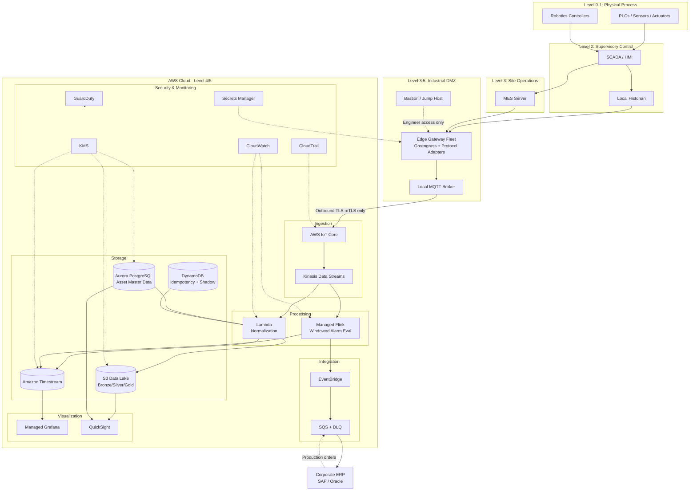

# Part IX – Industry-Specific Architectures

# Chapter 72: Manufacturing

*A production-ready AWS reference architecture for smart manufacturing, industrial IoT, MES/ERP integration, predictive maintenance, and factory-to-cloud connectivity.*

---

# 1. Executive Summary

## The Business Problem

Manufacturing organizations run two worlds that were never designed to talk to each other.

- **Operational Technology (OT)**: PLCs, SCADA systems, historian databases, MES platforms, robotics controllers, and sensor networks running on the factory floor.
- **Information Technology (IT)**: ERP systems, data warehouses, cloud analytics, AI/ML platforms, and enterprise reporting tools running in corporate data centers or the cloud.

For decades these two worlds stayed separate on purpose. OT systems prioritized determinism, safety, and uptime over connectivity. IT systems prioritized flexibility, integration, and analytics. That separation is now the single biggest obstacle to modern manufacturing initiatives:

- Predictive maintenance programs need historian and sensor data in a data lake, not trapped in a proprietary historian appliance on a single plant network.
- Quality engineers want real-time defect detection using computer vision, which requires GPU inference near the line and model training in the cloud.
- Supply chain planners need near-real-time visibility into work-in-progress (WIP) inventory across dozens of plants, not end-of-day batch exports.
- Executives are asked to report on Overall Equipment Effectiveness (OEE) across a global plant network, but every plant reports numbers differently.
- Cybersecurity teams are increasingly required (by insurers, by customers, by regulation) to demonstrate that OT networks are segmented, monitored, and not directly exposed to the internet.

This chapter presents a reference architecture that connects the factory floor to AWS without compromising the safety, availability, and determinism requirements of OT systems, while giving IT, data science, and executive teams the real-time and historical data they need.

## Architecture Objective

The objective of this architecture is to build a **unified, secure, and scalable Manufacturing Data and Control Plane** on AWS that:

- Ingests high-frequency telemetry from PLCs, sensors, and SCADA systems at the edge.
- Buffers and forwards this telemetry to AWS reliably, even when factory network connectivity is intermittent.
- Normalizes disparate protocols (OPC-UA, Modbus, MQTT, EtherNet/IP) into a common data model.
- Feeds real-time dashboards, alerting, and anomaly detection.
- Feeds a manufacturing data lake for historical analytics, ML model training, and compliance reporting.
- Supports bidirectional command-and-control for approved automation use cases (with strict guardrails).
- Integrates with ERP/MES systems for order-to-production and production-to-inventory workflows.
- Maintains strict network segmentation between OT and IT per IEC 62443 / Purdue Model principles.

## Why Organizations Adopt This Architecture

Manufacturers adopt this pattern for several converging reasons.

- **Digital transformation mandates.** Boards and private equity owners increasingly require quantifiable OEE, yield, and downtime metrics across the plant network, not anecdotal plant-manager reports.
- **Labor shortages.** Predictive maintenance and remote monitoring reduce the need for specialized on-site technicians at every plant, letting a smaller central engineering team support many sites.
- **Quality and compliance pressure.** Automotive, aerospace, medical device, and food/beverage manufacturers face increasingly strict traceability requirements (IATF 16949, AS9100, FDA 21 CFR Part 11) that require immutable, auditable production records.
- **Energy and sustainability reporting.** Scope 1/2/3 emissions reporting increasingly requires plant-level energy consumption data aggregated centrally.
- **M&A integration.** Manufacturers that grow by acquisition inherit a patchwork of plant systems; a common cloud data plane is often the fastest way to get a unified view without ripping out working OT systems.
- **Cybersecurity insurance and customer requirements.** Automotive OEMs and defense primes now routinely require Tier 1/2/3 suppliers to demonstrate network segmentation and monitoring as a condition of doing business (see CMMC in the U.S. defense supply chain).

## Major Business Benefits

| Benefit | Description |
|---|---|
| Reduced unplanned downtime | Predictive maintenance models trained on historian + sensor data typically reduce unplanned downtime by 20-40% in mature deployments. |
| Improved OEE visibility | Standardized OEE calculation across plants removes "every plant has its own spreadsheet" inconsistency. |
| Faster root-cause analysis | Engineers query a central data lake instead of VPN-ing into individual plant historians one at a time. |
| Lower integration cost for new plants | A repeatable edge + cloud pattern (via Terraform modules and edge device images) turns "onboard a new plant" into a templated, weeks-not-months exercise. |
| Better capacity planning | Central visibility into WIP and machine utilization improves cross-plant production scheduling. |
| Regulatory traceability | Immutable, timestamped production records support audits and recalls. |
| New product opportunities | Manufacturers increasingly sell "equipment as a service" or usage-based contracts, which require exactly this kind of telemetry pipeline. |

## Typical Enterprise Scenarios

This architecture is commonly implemented in the following scenarios.

- A discrete manufacturer (automotive parts, industrial equipment) with 5-50 plants standardizing on a common edge-to-cloud telemetry pipeline.
- A process manufacturer (chemicals, food and beverage, pharmaceuticals) needing historian data integrated with cloud-based quality and compliance systems.
- A private-equity-owned manufacturing group integrating telemetry across recently acquired, heterogeneous plants.
- A contract manufacturer building a customer-facing portal that shows real-time production status for OEM customers.
- An industrial equipment OEM building a remote monitoring and predictive maintenance product for equipment it sells to end customers (an "equipment as a service" or IIoT product line).

This is not a "spin up a website" architecture. It spans OT network design, edge computing, industrial protocol translation, cloud data engineering, and enterprise integration. Every section of this chapter assumes the reader is designing a system that will run for years, touch physical equipment, and be held to safety and compliance standards that a typical web application never faces.

---

# 2. Business Requirements

## Business Drivers

- Standardize OEE, downtime, and yield reporting across all plants within 12-18 months.
- Enable predictive maintenance for critical rotating equipment (compressors, motors, pumps) within 6-12 months at pilot plants.
- Provide plant managers and corporate operations with near-real-time dashboards (under 5 second latency for critical alarms).
- Support IATF 16949 / FDA traceability requirements for finished goods genealogy.
- Reduce the cost and time of onboarding a new plant to under 4 weeks using a repeatable edge deployment pattern.

## Functional Requirements

- Ingest data from OPC-UA servers, Modbus TCP devices, MQTT-speaking sensors, and existing SCADA historians.
- Normalize ingested data into a common schema (asset ID, tag name, timestamp, value, quality code, unit of measure).
- Buffer data locally at the edge for a minimum of 72 hours during WAN outages, then resync.
- Provide real-time streaming to dashboards and alerting systems (sub-5-second latency for critical alarms).
- Persist raw and normalized data in a queryable data lake for a minimum of 7 years (compliance-driven retention).
- Support bidirectional integration with MES and ERP systems (SAP, Oracle, or similar) for production orders and inventory movements.
- Provide role-based dashboards for plant operators, plant managers, corporate operations, and quality/compliance teams.
- Support command-and-control workflows only through a tightly governed, auditable path (not general-purpose remote PLC write access).

## Non-Functional Requirements

| Category | Requirement |
|---|---|
| Scalability | Support 50-500 plants, each generating 500-50,000 tags at 1Hz-1kHz sampling rates. |
| Availability | Cloud ingestion pipeline: 99.9%. Edge buffering: must tolerate WAN outages up to 7 days without data loss. |
| Latency | Critical alarm-to-dashboard: under 5 seconds. Historical query: under 10 seconds for a 30-day window on a single asset. |
| Compliance | IATF 16949, FDA 21 CFR Part 11 (where applicable), IEC 62443 for OT network segmentation, SOC 2 for the cloud platform. |
| Security | Zero direct internet exposure of OT devices; one-way or brokered data flow from OT to IT wherever possible. |
| RPO | 15 minutes for streaming telemetry; 24 hours for MES/ERP integration data. |
| RTO | 4 hours for the cloud ingestion pipeline; edge devices continue buffering independently during cloud outages. |
| SLA | 99.9% uptime for dashboards and alerting during production shifts. |

## Scalability Goals

- Start with 3-5 pilot plants; scale to full plant network (50-500 plants) over 24-36 months.
- Support onboarding a new plant's edge gateway fleet within 4 weeks using Terraform and pre-built device images.
- Support tag counts growing 20-30% year over year as sensor density increases (a common pattern as manufacturers add condition-monitoring sensors to older equipment).

## Availability, Latency, Compliance, Security Summary

This architecture treats **availability and data integrity as higher priority than raw throughput.** A dropped tag reading is far less damaging than an edge gateway that silently corrupts or duplicates a batch during resync after a WAN outage. Every design decision in this chapter — the choice of MQTT with QoS 1, the local buffering strategy, the idempotent ingestion design — reflects that priority.

## Recovery Objectives

| System | RPO | RTO |
|---|---|---|
| Real-time telemetry pipeline | 15 minutes | 4 hours |
| Historian / data lake | 24 hours | 8 hours |
| MES/ERP integration | 24 hours | 8 hours |
| Dashboards and alerting | 15 minutes | 2 hours |
| Edge gateways (local operation) | N/A — designed to operate independently of cloud connectivity | N/A |

## Expected Workload and Growth

- Pilot phase: 5 plants, ~10,000 tags total, ~50GB/day ingested.
- Year 1: 25 plants, ~150,000 tags, ~500GB/day.
- Year 3: 150 plants, ~1.5M tags, ~3-5TB/day.
- Growth is driven by both plant onboarding and increasing sensor density per machine (condition monitoring retrofits).


---

# 3. Architecture Overview

## Design Philosophy

This architecture follows the **Purdue Enterprise Reference Architecture (PERA)** model, adapted for cloud connectivity. The Purdue Model is the de facto standard for segmenting industrial networks into layers, from physical process (Level 0) up to enterprise IT (Level 5).

- **Level 0-1**: Physical process, sensors, actuators, PLCs.
- **Level 2**: Supervisory control (SCADA/HMI) within a single plant.
- **Level 3**: Site operations (MES, historian, plant-level servers).
- **Level 3.5 (DMZ)**: Industrial DMZ — the critical boundary where OT meets IT. This is where the edge gateway fleet lives.
- **Level 4-5**: Enterprise IT and cloud (ERP, analytics, AWS).

The architecture never allows Level 0-3 systems to initiate or accept direct connections from the cloud. All communication flows through the Level 3.5 industrial DMZ, where purpose-built edge gateways translate protocols, buffer data, and forward telemetry outbound over an encrypted, authenticated channel.

## Core Components

- **Edge Gateway Fleet**: Ruggedized industrial computers (or virtual machines on existing plant servers) running AWS IoT Greengrass, protocol adapters (OPC-UA, Modbus, MQTT), and local buffering.
- **Industrial DMZ**: A segmented network zone containing only the edge gateways, a local MQTT broker, and jump-host style bastion access for engineers — no direct routes between Level 3 OT and Level 4 IT/cloud networks.
- **AWS IoT Core**: Cloud-side MQTT broker and device registry, terminating TLS-mutual-auth connections from edge gateways.
- **Streaming Ingestion Layer**: Amazon Kinesis Data Streams / MSK for high-throughput telemetry ingestion, decoupling ingestion rate from downstream processing rate.
- **Stream Processing**: AWS Lambda and Kinesis Data Analytics (Managed Flink) for real-time normalization, unit conversion, and alarm evaluation.
- **Manufacturing Data Lake**: S3 with a medallion (raw/bronze, cleansed/silver, curated/gold) structure, cataloged with AWS Glue.
- **Time-Series Store**: Amazon Timestream (or a self-managed InfluxDB/TimescaleDB on RDS, discussed in Section 28) for sub-second dashboard queries over recent data.
- **Relational Store**: Aurora PostgreSQL for asset master data, MES/ERP integration state, and configuration.
- **Integration Layer**: EventBridge and SQS for decoupled, retryable integration with MES/ERP systems.
- **Dashboards**: Amazon Managed Grafana for operator/plant-manager dashboards; QuickSight for executive OEE/yield reporting.
- **Command-and-Control Path**: A tightly scoped, human-approved workflow using Step Functions and IoT Core Jobs — never a general-purpose "write to PLC" API.

## How Components Interact — High-Level Workflow

1. Sensors and PLCs publish data on the plant floor network using native protocols.
2. Edge gateways in the industrial DMZ poll or subscribe to this data via protocol adapters.
3. Edge gateways normalize the data into a common schema and publish it to a local MQTT broker.
4. Edge gateways forward normalized data to AWS IoT Core over an outbound-only, mutually authenticated TLS connection.
5. AWS IoT Core rules route data into Kinesis Data Streams.
6. Stream processing applications evaluate alarms, perform unit conversion, and write to both the time-series store (recent, hot data) and the S3 data lake (durable, long-term data).
7. Dashboards query the time-series store for real-time views and the data lake (via Athena) for historical analysis.
8. Batch and near-real-time jobs synchronize production data with MES/ERP systems.
9. ML pipelines periodically retrain predictive maintenance models against the curated data lake and deploy updated models back to edge gateways for local inference where low-latency inference is required.

## Data Lifecycle Summary

| Stage | Location | Retention | Access Pattern |
|---|---|---|---|
| Raw ingest | S3 Bronze | 7+ years (compliance) | Rarely queried directly; replay source |
| Cleansed | S3 Silver | 7+ years | Athena, Glue ETL jobs |
| Curated / aggregated | S3 Gold, Redshift (optional) | 7+ years | BI tools, QuickSight, data science |
| Hot / recent | Timestream | 30-90 days | Real-time dashboards, alerting |
| Edge local buffer | Edge gateway disk | 72 hours - 7 days | WAN outage resilience only |

---

# 4. AWS Services Used

Each service below is explained with purpose, selection rationale, alternatives, limitations, pricing considerations, and best practices. Only services relevant to this architecture are included.

## AWS IoT Core

**Purpose**: Managed MQTT broker and device registry that terminates connections from edge gateways, authenticates devices via X.509 certificates, and routes messages via IoT Rules.

**Why selected**: IoT Core provides mutual TLS device authentication, per-device policy enforcement, and native routing to Kinesis/Lambda/S3 without operating a broker cluster. For a fleet of hundreds to thousands of edge gateways, the device management, certificate rotation, and fleet provisioning (IoT Device Management, Fleet Provisioning) capabilities remove significant operational burden.

**Alternatives**: Self-managed MQTT broker (EMQX, Mosquitto) on EC2; Amazon MSK with an MQTT-to-Kafka bridge.

**When to prefer alternatives**: If the organization already operates Kafka at scale and wants a single streaming backbone, bridging MQTT into MSK directly (via a broker like HiveMQ or EMQX with a Kafka connector) can reduce the number of distinct systems. Self-managed brokers make sense only when IoT Core's device limits or protocol support (e.g., unusual custom protocols) are a hard blocker — which is rare.

**Limitations**: Message size limit of 128KB; regional service, so multi-region device fleets need explicit regional routing design; per-message pricing can become non-trivial at very high message rates (mitigated by batching, discussed in Section 15).

**Pricing considerations**: Priced per connection-minute and per message. High-frequency tags (100Hz+) should be batched at the edge gateway before publishing rather than publishing one MQTT message per reading.

**Best practices**: One X.509 certificate per device (never shared certificates); least-privilege IoT policies scoped to each device's specific topic namespace (e.g., `plant/{plantId}/gateway/{gatewayId}/#`); use Fleet Provisioning for zero-touch onboarding of new gateways.

## AWS IoT Greengrass

**Purpose**: Edge runtime that runs on the industrial gateway hardware, hosting protocol adapter components, local MQTT broker, local buffering/store-and-forward logic, and (optionally) local ML inference.

**Why selected**: Greengrass provides component lifecycle management, secure over-the-air (OTA) deployment of updated protocol adapters or ML models, and local Lambda execution for edge-local logic — all centrally managed from AWS IoT without needing a separate fleet management tool.

**Alternatives**: Custom Linux service written in-house; commercial industrial IoT platforms (Ignition, PTC Kepware combined with a custom forwarder).

**When to prefer alternatives**: Organizations already standardized on Ignition or Kepware for protocol translation often keep that layer and use Greengrass (or a lighter custom forwarder) only for the "forward to AWS reliably" function — this is a very common hybrid pattern and is fully compatible with this architecture.

**Limitations**: Requires a reasonably capable edge device (minimum ~1-2GB RAM for a full Greengrass core with several components); OTA deployment requires careful testing since a bad component update can disrupt data collection at a live plant.

**Best practices**: Stage OTA deployments (canary to 1-2 gateways, then wider rollout); never deploy untested components directly to all plants simultaneously; keep the local store-and-forward buffer on durable local storage (not tmpfs).

## Amazon Kinesis Data Streams

**Purpose**: Durable, ordered, high-throughput ingestion buffer that decouples the rate at which IoT Core delivers messages from the rate at which downstream consumers (Lambda, Flink) process them.

**Why selected**: Kinesis provides shard-based scaling to match variable plant telemetry volume, native integration with IoT Core rules, and multiple independent consumers (real-time alarm evaluation, data lake archival, anomaly detection) reading the same stream without competing for messages.

**Alternatives**: Amazon MSK (Kafka) — preferred when the organization needs Kafka-specific features (long retention, complex consumer groups, existing Kafka tooling) or already runs Kafka elsewhere. Kinesis Data Firehose alone (without Data Streams) — simpler, but loses the multi-consumer fan-out pattern.

**Limitations**: Per-shard throughput limits (1MB/s or 1,000 records/s ingest per shard) require careful shard planning as plant count grows; resharding is an operational task that needs monitoring.

**Pricing considerations**: Shard-hour and PUT payload unit pricing; on-demand mode removes shard planning burden at a cost premium and is often worth it during the pilot/early-growth phase.

**Best practices**: Use on-demand mode until traffic patterns are well understood, then migrate to provisioned mode with auto-scaling for predictable cost; partition keys should distribute by plant+asset to avoid hot shards.

## AWS Lambda

**Purpose**: Executes stream processing functions (unit normalization, alarm evaluation, MES/ERP integration triggers) and IoT Rule actions.

**Why selected**: Serverless scaling matches the highly variable nature of plant telemetry (shift changes, planned downtime, and unplanned bursts during startup after outages all create spiky load); no infrastructure to manage for the large number of small, independent processing functions this architecture requires.

**Alternatives**: Amazon Kinesis Data Analytics (Managed Apache Flink) for stateful, complex event processing (e.g., detecting a pattern across a rolling 5-minute window); ECS Fargate tasks for longer-running or more complex processing.

**When to prefer Flink over Lambda**: Any alarm logic that requires state across a time window (e.g., "temperature exceeded threshold for 3 consecutive minutes") is a poor fit for stateless Lambda and a good fit for Managed Flink, which is used in this architecture for exactly that purpose.

**Limitations**: 15-minute maximum execution time; cold starts can add latency for infrequently invoked functions (mitigated with provisioned concurrency for latency-sensitive alarm paths).

**Best practices**: Keep Lambda functions single-purpose; use Lambda for stateless per-record processing and Flink for anything stateful/windowed; set appropriately conservative reserved concurrency limits to avoid one plant's traffic burst starving processing for other plants.

## Amazon MSK (Managed Streaming for Apache Kafka) — Alternative/Optional

**Purpose**: Alternative streaming backbone for organizations with existing Kafka investment or requiring long retention and complex consumer group semantics.

**When selected instead of Kinesis**: Organizations with an existing enterprise Kafka platform (common in larger manufacturers that also stream ERP change-data-capture events) often standardize all streaming — IoT and enterprise — on MSK for operational consistency.

**Limitations**: Higher operational overhead than Kinesis (broker sizing, partition planning, MSK Connect configuration) even though AWS manages the underlying Kafka brokers.

## Amazon S3

**Purpose**: Durable, low-cost storage for the manufacturing data lake (raw, cleansed, and curated layers) and for edge gateway OTA artifact storage.

**Why selected**: Effectively unlimited scale, 11 nines durability, native integration with Glue/Athena/EMR for analytics, and storage class tiering to control cost for 7+ year compliance retention.

**Alternatives**: On-premises data lake storage (HDFS, NAS) — rejected because it does not meet the multi-plant, centrally-queryable requirement and adds significant operational burden.

**Limitations**: Not a query engine itself — requires Athena, Redshift Spectrum, or EMR for analytical queries; small-file problems (very common with per-message IoT data) must be actively managed via compaction jobs.

**Pricing considerations**: Use S3 Intelligent-Tiering or lifecycle policies to move data older than 90 days to Infrequent Access, and data older than 1 year to Glacier Instant Retrieval, balancing the 7-year compliance retention requirement against cost.

**Best practices**: Partition by plant/year/month/day for efficient Athena queries; run regular compaction jobs (via Glue or EMR) to merge small IoT-generated files into larger Parquet files.

## Amazon Timestream

**Purpose**: Purpose-built time-series database for recent, high-cardinality telemetry data, powering real-time dashboards.

**Why selected**: Automatic tiering between in-memory (recent, hot) and magnetic (older) storage, built-in time-series functions (interpolation, smoothing), and scales without manual partition management — a good fit for the "last 30-90 days, queried constantly" access pattern.

**Alternatives**: Self-managed InfluxDB or TimescaleDB on EC2/RDS — preferred by teams that need specific InfluxDB/Timescale ecosystem tooling (e.g., existing Grafana dashboards built against InfluxQL) or want more predictable reserved-capacity pricing at very high cardinality.

**Limitations**: Query language (Timestream SQL) has a learning curve; extremely high cardinality (millions of unique series) requires careful dimension design to avoid cost surprises.

**Best practices**: Keep only 30-90 days in Timestream; rely on the S3 data lake for anything older; design dimensions (plant, line, asset, tag) carefully since cardinality directly drives cost.

## Amazon Aurora PostgreSQL

**Purpose**: Relational store for asset master data (plant/line/machine/tag hierarchy), MES/ERP integration state, and application configuration.

**Why selected**: This data is relational by nature (foreign keys between plants, lines, assets), requires strong consistency, and benefits from Aurora's multi-AZ durability and read replica scaling for reporting queries.

**Alternatives**: Amazon RDS for PostgreSQL — a reasonable choice for smaller deployments (under ~10 plants) where Aurora's additional cost is not justified by its scaling headroom.

**Limitations**: Not designed for high-frequency time-series writes — this is why Timestream/S3, not Aurora, hold telemetry data.

## Amazon DynamoDB

**Purpose**: Device registry cache, idempotency tracking for MES/ERP integration messages, and edge gateway shadow/state storage.

**Why selected**: Single-digit millisecond latency for the "has this message already been processed" idempotency check that is critical when edge gateways resync after a WAN outage and may re-send buffered data.

**Alternatives**: Aurora with a unique constraint — viable at lower scale, but DynamoDB's latency and throughput characteristics are a better fit for the high-frequency idempotency-check access pattern.

## Amazon EventBridge and Amazon SQS

**Purpose**: Decoupled, retryable integration between the telemetry pipeline and MES/ERP systems, and between internal microservices (alarm service, notification service, data lake archival service).

**Why selected**: EventBridge provides schema-aware event routing and is well suited to "fan out this production event to five different consumers" patterns; SQS provides guaranteed-delivery, retryable queues for point-to-point integration (e.g., the MES integration worker).

**Best practices**: Use SQS dead-letter queues for every integration queue; MES/ERP integrations must be idempotent since network issues will cause retries.

## Amazon Managed Grafana and Amazon QuickSight

**Purpose**: Grafana serves near-real-time operational dashboards for plant floor operators and engineers; QuickSight serves executive OEE, yield, and cost reporting drawing from the curated data lake.

**Why selected**: Grafana's time-series-native visualization and alerting are a strong fit for operational, engineer-facing dashboards; QuickSight's row-level security and native AWS data source integration are a strong fit for governed executive reporting without operating a separate BI server.

## AWS Glue and Amazon Athena

**Purpose**: Glue Data Catalog provides schema management over the S3 data lake; Glue ETL jobs perform the bronze-to-silver-to-gold transformation and compaction; Athena provides serverless SQL query access for analysts and BI tools.

## IAM, VPC, KMS, Secrets Manager, Systems Manager, CloudWatch, CloudTrail, AWS Config, GuardDuty, Security Hub

These foundational services are covered in depth in Sections 9-11 and 21-22 in the context of this specific architecture (industrial DMZ network design, edge device credential management, and OT-aware monitoring). They are listed here for completeness and are not repeated in generic detail — see the referenced sections for manufacturing-specific application.


---

# 5. Complete Architecture Diagram



**Diagram notes:**

- The only connection between the Industrial DMZ and AWS is an **outbound-initiated, mutually authenticated TLS connection** from the edge gateway to AWS IoT Core. There is no inbound path from AWS to Level 0-3.
- Engineer access to edge gateways for maintenance goes through a bastion/jump host inside the DMZ, never directly from a corporate laptop into the plant network.
- ERP integration is bidirectional but always mediated through SQS with dead-letter queues — never a direct database connection between MES and ERP.

---

# 6. Component-by-Component Explanation

## Edge Gateway Fleet (AWS IoT Greengrass)

- **Purpose**: Translate industrial protocols into a normalized schema and reliably forward data to AWS.
- **Responsibilities**: Protocol polling/subscription (OPC-UA, Modbus, MQTT), local buffering during WAN outages, OTA component updates, optional local ML inference for latency-sensitive use cases (e.g., vision-based defect detection that must act within milliseconds).
- **Inputs**: Native PLC/SCADA/historian data via industrial protocols.
- **Outputs**: Normalized MQTT messages published to AWS IoT Core.
- **Scaling**: Horizontal — each plant gets its own gateway or small gateway cluster; scaling is "add more plants," not "make one gateway bigger."
- **High availability**: Deploy in active/passive pairs at critical plants; Greengrass supports local failover between gateway devices.
- **Failure handling**: Local buffer (minimum 72 hours, sized per plant's data volume) absorbs WAN outages; buffered data resyncs with idempotency keys to prevent duplicates.
- **Dependencies**: Local network access to PLCs/SCADA/historian; outbound internet/WAN access to AWS IoT Core endpoint.
- **Security**: Unique X.509 certificate per device; Greengrass component signing; no inbound ports open on the gateway from the plant network beyond what protocol adapters strictly require.
- **Monitoring**: Greengrass health metrics (CPU, memory, component status) published to CloudWatch; buffer depth alarms warn engineers before local storage fills during extended outages.

## AWS IoT Core

- **Purpose**: Cloud-side MQTT broker and device identity/policy enforcement point.
- **Responsibilities**: TLS termination and mutual authentication, topic-level authorization, routing via IoT Rules to Kinesis.
- **Scaling**: Fully managed; scales automatically with connection and message volume.
- **High availability**: Regional service with built-in redundancy across AZs.
- **Failure handling**: If IoT Core is unreachable, edge gateways buffer locally and retry with backoff.
- **Security**: Per-device IoT policies scoped to that device's own topic namespace only, preventing one compromised gateway from publishing to or reading another plant's topics.

## Kinesis Data Streams / Managed Flink

- **Purpose**: Durable buffering and stateful stream processing.
- **Responsibilities**: Kinesis decouples ingest rate from processing rate; Flink evaluates windowed alarm conditions (e.g., sustained threshold breaches) and detects patterns across multiple correlated tags.
- **Scaling**: Kinesis scales via shard count (or on-demand mode); Flink scales via parallelism configuration tied to Kinesis Processing Units.
- **Failure handling**: Kinesis retains data for a configurable period (default 24 hours, extendable to 365 days) allowing reprocessing after a downstream failure; Flink checkpoints state to S3 for exactly-once processing semantics.

## Amazon Timestream / S3 Data Lake

- **Purpose**: Timestream serves hot, recent queries for dashboards; S3 serves durable, long-term compliance and analytics storage.
- **Responsibilities**: Timestream retains 30-90 days for millisecond dashboard queries; S3 retains 7+ years across bronze/silver/gold layers for compliance and ML training.
- **Scaling**: Both scale automatically; S3 cost is managed through lifecycle policies rather than manual intervention.

## Aurora PostgreSQL (Asset Master Data)

- **Purpose**: System of record for the plant/line/asset/tag hierarchy and MES/ERP integration state.
- **High availability**: Multi-AZ deployment with automated failover; read replicas serve reporting queries without impacting write performance.

## Integration Layer (EventBridge, SQS, MES/ERP Connector)

- **Purpose**: Reliable, retryable, auditable integration between the manufacturing data plane and enterprise systems.
- **Failure handling**: Dead-letter queues capture failed integration messages for manual review; all integration messages carry idempotency keys.

## Dashboards (Grafana, QuickSight)

- **Purpose**: Operational visibility (Grafana, near-real-time) and executive reporting (QuickSight, curated/aggregated).
- **Security**: Row-level security in QuickSight restricts plant managers to their own plant's data; corporate roles see aggregated cross-plant views.

---

# 7. End-to-End Request Flow

The following describes the path of a single sensor reading from a plant-floor temperature sensor through to a plant manager's dashboard, and a corresponding alarm notification.

1. A temperature sensor on a critical compressor publishes a reading to the local PLC every 250ms.
2. The plant's OPC-UA server exposes this tag to the local network.
3. The edge gateway's OPC-UA protocol adapter polls the tag on a configured interval (e.g., every 1 second, aggregating the 250ms readings) and normalizes it into the common schema: `{plantId, assetId, tagName, timestamp, value, unit, qualityCode}`.
4. The edge gateway batches normalized readings (typically 1-5 seconds of data) and publishes them to the local MQTT broker.
5. The local MQTT broker forwards the batch to AWS IoT Core over the outbound mTLS connection.
6. AWS IoT Core authenticates the device certificate, checks the IoT policy for the topic, and applies an IoT Rule that routes the message to Kinesis Data Streams.
7. A Lambda function consumes the Kinesis record, performs unit conversion (e.g., Celsius to Fahrenheit per corporate standard) and writes the normalized reading to Amazon Timestream.
8. In parallel, a Managed Flink application evaluates the reading against a windowed alarm rule ("temperature above 95°C for 3 consecutive minutes").
9. If the alarm condition is met, Flink emits an event to EventBridge.
10. EventBridge routes the alarm event to an SNS topic (operator notification) and to an SQS queue (MES integration, to log the alarm against the current production order).
11. Amazon Managed Grafana, subscribed to Timestream, refreshes the plant manager's dashboard within its configured refresh interval (typically 2-5 seconds for critical panels).
12. CloudWatch records latency and error metrics at every stage (IoT Rule invocation errors, Lambda duration/errors, Flink checkpoint lag) for operational monitoring.
13. If any stage fails (e.g., Lambda throttling during a traffic spike), the failed record remains in Kinesis (within the retention window) and is reprocessed automatically once capacity is restored — no data is silently dropped.
14. Raw and normalized readings are also written to the S3 bronze/silver layers via a separate Kinesis Firehose delivery stream, providing the durable long-term record independent of the real-time dashboard path.
15. If the edge gateway loses WAN connectivity between steps 4 and 5, readings are written to the local buffer instead, and resync automatically once connectivity is restored, using the same idempotency-key mechanism to avoid duplicate records in Timestream and S3.


---

# 8. Deployment Flow

## Infrastructure Provisioning

- All AWS-side infrastructure (VPCs, IoT Core, Kinesis, Timestream, Aurora, Lambda, EventBridge) is provisioned via Terraform, organized into modules by domain (networking, ingestion, storage, integration, monitoring).
- Edge gateway configuration (Greengrass component definitions, IoT policies, certificates) is provisioned via a separate Terraform module plus AWS IoT Greengrass deployment manifests, kept in the same monorepo but planned/applied independently since edge deployments follow a different cadence and approval process than cloud infrastructure changes.

## Terraform Workflow

- Feature branches trigger `terraform plan` in CI, posting the plan as a pull request comment for review.
- Merges to `main` trigger `terraform apply` against a **staging** AWS account first, followed by automated smoke tests (synthetic IoT message publish, verify it reaches Timestream within an SLA window).
- Promotion to **production** requires manual approval from both a cloud platform engineer and an OT/controls engineer — the dual-approval step matters here specifically because production changes can affect live plant data collection.

## CI/CD Deployment

- Cloud-side application code (Lambda functions, Flink jobs) deploys via a standard CI/CD pipeline: build, unit test, deploy to staging, integration test, manual approval, deploy to production.
- Edge gateway component updates deploy via **staged Greengrass deployments**: first to a single canary gateway at a non-critical pilot line, monitored for 24-48 hours, then to a wider ring of plants, then fleet-wide.

## Blue-Green Deployment

- Cloud-side stream processing (Lambda, Flink) uses blue-green deployment via versioned functions/applications and Kinesis consumer group cutover, allowing rollback without reprocessing already-consumed data.
- Edge gateways do not use blue-green in the traditional sense (physical devices), but Greengrass supports **rollback to the previous component version** automatically if a new component fails its health check after deployment.

## Rollback

- Cloud infrastructure: Terraform state-based rollback via `terraform apply` of the previous known-good commit, combined with RDS/Aurora point-in-time recovery if data corruption is involved.
- Edge components: Automatic rollback triggered by Greengrass component health checks; manual rollback available via the IoT Greengrass console/API for any deployment group.

## Secrets and Configuration

- Edge gateway credentials (X.509 private keys) are provisioned at manufacturing/staging time and stored in the device's hardware security module (HSM) or TPM where available — never in a plaintext config file.
- Cloud-side secrets (database credentials, third-party API keys for MES/ERP connectors) are stored in AWS Secrets Manager with automatic rotation enabled for Aurora credentials.
- Configuration (alarm thresholds, unit conversion rules, plant-specific tag mappings) is stored in Aurora and versioned, with changes requiring approval through the same MES/controls engineering review process as other production changes.

## Validation

- Every edge deployment includes automated post-deployment validation: publish a known synthetic test tag, verify it arrives in Timestream within the expected latency window, verify the gateway's local buffer is functioning by briefly simulating a WAN outage in a lab environment before any fleet-wide rollout.

---

# 9. Network Topology

## VPC and CIDR Design

- A dedicated **Manufacturing Data Platform VPC** (e.g., `10.40.0.0/16`) hosts all cloud-side ingestion, processing, and storage components.
- This VPC is deliberately **separate** from other corporate application VPCs, connected only via Transit Gateway with tightly scoped route tables — a compromise in a customer-facing web application VPC should not have any network path to the manufacturing data plane.

## Subnet Layout

| Subnet Type | CIDR Example | Purpose |
|---|---|---|
| Public | 10.40.0.0/24, 10.40.1.0/24 | NAT Gateways only; no application resources |
| Private — Ingestion | 10.40.10.0/24, 10.40.11.0/24 | IoT Core VPC endpoints, Kinesis |
| Private — Processing | 10.40.20.0/24, 10.40.21.0/24 | Lambda, Flink (Kinesis Data Analytics) ENIs |
| Private — Data | 10.40.30.0/24, 10.40.31.0/24 | Aurora, Timestream VPC endpoints, DynamoDB endpoints |
| Private — Integration | 10.40.40.0/24, 10.40.41.0/24 | MES/ERP connector workers |

## Industrial DMZ (Plant-Side, Not AWS VPC)

- The Industrial DMZ sits within each plant's own network infrastructure, not in AWS. It follows IEC 62443 zone/conduit segmentation: a dedicated VLAN with firewall rules permitting only outbound HTTPS/MQTT-over-TLS to AWS IoT Core endpoints, and no route from Level 0-3 OT VLANs directly to the corporate IT network or the internet.
- Firewall rules at the plant explicitly allowlist the AWS IoT Core endpoint (and, if used, a small set of AWS IP ranges via a documented change process) rather than allowing broad outbound internet access from OT-adjacent devices.

## NAT Gateway and Internet Gateway

- NAT Gateways provide outbound-only internet access for cloud-side components that need it (e.g., pulling container images, calling third-party MES/ERP SaaS APIs) — most components use VPC endpoints instead and have no internet path at all.
- No Internet Gateway route exists into the private subnets; all AWS-side service access uses interface or gateway VPC endpoints (IoT Core, Kinesis, S3, DynamoDB, Secrets Manager, KMS).

## Transit Gateway

- Transit Gateway connects the Manufacturing Data Platform VPC to the corporate network (for ERP integration and engineer/analyst access) and, where applicable, to a Direct Connect or Site-to-Site VPN link back to plants that use a private WAN rather than public internet for their AWS IoT Core connection.
- Route tables are scoped per attachment: the ERP integration subnet can reach the corporate ERP network; nothing else in the VPC can.

## Route Tables, NACLs, Security Groups

- Security groups are scoped per component tier (ingestion, processing, data, integration) with explicit source/destination rules — no `0.0.0.0/0` ingress anywhere in this VPC.
- NACLs provide a secondary, stateless layer of defense at the subnet boundary, primarily to block known-bad IP ranges and enforce subnet-level segmentation even if a security group is misconfigured.

## PrivateLink

- Where MES/ERP SaaS providers offer AWS PrivateLink endpoints, they are used in preference to public internet connectivity, keeping ERP integration traffic on the AWS backbone.

## Hybrid Connectivity

- Plants with an existing private WAN (MPLS or SD-WAN) route their AWS IoT Core traffic over that private WAN and a Direct Connect or VPN link into the Transit Gateway, rather than over the public internet, where compliance or latency requirements justify the added cost.
- Plants without an existing private WAN connect over the public internet using TLS mutual authentication, which is an acceptable and common pattern for IoT Core given the strength of the mTLS + IoT policy authorization model.

---

# 10. Identity and Access

## IAM Roles and Policies

| Role | Scope | Notes |
|---|---|---|
| `iot-ingestion-lambda-role` | Read Kinesis, write Timestream, write S3 bronze | No delete permissions anywhere |
| `flink-alarm-processor-role` | Read Kinesis, write EventBridge, S3 checkpoint bucket | Scoped to specific EventBridge event bus |
| `mes-integration-worker-role` | Read/write specific SQS queues, Secrets Manager (MES credentials only) | No direct Aurora access — goes through an API layer |
| `plant-engineer-role` | Read-only Grafana/Timestream/Athena for assigned plants | Enforced via ABAC tag on plant ID |
| `corporate-ops-role` | Read-only cross-plant QuickSight, Athena | No write access to any production system |
| `platform-admin-role` | Terraform apply, break-glass access | MFA required, time-bound via IAM Identity Center permission sets |

## Resource Policies

- IoT Core policies are attached per-device (not per-fleet) and scoped to that device's own topic namespace, so a compromised gateway credential cannot be used to publish to or subscribe to another plant's data.
- S3 bucket policies deny any request not using TLS and deny any principal outside the account/organization, in addition to IAM-level access control (defense in depth).

## STS and Cross-Account Access

- The manufacturing data platform lives in a dedicated AWS account (per the multi-account strategy in Section 88 of this handbook); analysts and engineers assume roles via AWS IAM Identity Center rather than holding long-lived IAM users.
- Cross-account access from a central data science account (for ML model training against the curated data lake) uses a scoped cross-account role with read-only access to the gold-layer S3 prefix only.

## Least Privilege in Practice

- Plant engineers can view only their own plant's dashboards and data (enforced via attribute-based access control tied to a `plantId` tag on IAM principals and resource-level Grafana/QuickSight permissions).
- No human role has standing write access to production Aurora asset master data; changes go through a reviewed configuration-change workflow, consistent with the change-management expectations of IATF 16949 and similar quality standards.

## Service Roles and Permission Boundaries

- Every Lambda and Flink execution role has a permission boundary applied that caps maximum possible permissions regardless of what the role's attached policy grants, preventing privilege escalation through a misconfigured policy.
- Terraform-managed IAM roles are the only supported way to create new roles in this account; manually created IAM roles are flagged by AWS Config as non-compliant.


---

# 11. Security Architecture

## Encryption

- All data in transit uses TLS 1.2+; edge gateway-to-IoT-Core connections use mutual TLS with X.509 client certificates, not just server-side TLS.
- All data at rest is encrypted with AWS KMS customer-managed keys (CMKs) — separate CMKs for the data lake, Timestream, Aurora, and Secrets Manager, allowing independent key rotation and access control per data domain.

## KMS

- CMK key policies restrict `kms:Decrypt` to the specific service roles that need it (e.g., only the ingestion Lambda role can decrypt bronze-layer S3 objects), not broadly to the account.
- Key rotation is enabled annually at minimum; for CMKs protecting compliance-retention data (7+ years), rotation history is preserved to allow decryption of historically-encrypted data.

## TLS, WAF, Shield

- WAF is applied to any public-facing API (e.g., a partner-facing production status API for contract manufacturing customers, discussed in Section 29's case study) — not applicable to the internal IoT ingestion path, which has no public HTTP surface.
- AWS Shield Standard is active by default; Shield Advanced is considered only if a public-facing API becomes business-critical enough to justify the cost, which is uncommon for the core telemetry pipeline itself.

## Secrets Manager and Certificate Manager

- MES/ERP connector credentials, database credentials, and third-party API keys are stored exclusively in Secrets Manager with automatic rotation where the target system supports it.
- AWS Certificate Manager issues and rotates TLS certificates for any public-facing endpoints; edge gateway device certificates are managed through AWS IoT's own certificate lifecycle (issuance, rotation, and revocation), separate from ACM.

## GuardDuty, Inspector, Security Hub

- GuardDuty is enabled account-wide, including its IoT-specific finding types (e.g., unusual device connection patterns, credential misuse) which are directly relevant to detecting a compromised edge gateway.
- Inspector scans container images (used in Fargate-based MES/ERP connector workers) and Lambda function dependencies for known vulnerabilities as part of the CI/CD pipeline, blocking deployment of critical-severity findings.
- Security Hub aggregates findings across GuardDuty, Inspector, and Config, and is the single pane of glass reviewed weekly by the security team.

## CloudTrail and AWS Config

- CloudTrail logs are enabled in all regions, delivered to a centralized, immutable (S3 Object Lock) logging account, satisfying both general security requirements and the audit-trail expectations of quality standards like IATF 16949.
- AWS Config rules continuously check for drift from the approved baseline: unencrypted S3 buckets, IAM roles without permission boundaries, security groups with unrestricted ingress, and IoT policies granting overly broad topic access.

## Zero Trust Principles Applied to OT/IT Boundary

- No implicit trust is granted based on network location — even a device physically inside the industrial DMZ must authenticate with its own certificate and is authorized only for its own topic namespace.
- The architecture assumes any single edge gateway may eventually be compromised and is designed so that a compromised gateway can, at worst, publish false data on its own topics — not access another plant's data, not gain any path back into the OT network from the cloud side, and not issue commands beyond its narrowly scoped command-and-control permissions.

## Threat Model and Attack Vectors

| Attack Vector | Mitigation |
|---|---|
| Compromised edge gateway used to pivot into OT network | Gateway has no unnecessary open ports on the OT-facing interface; segmentation prevents lateral movement even if the gateway is compromised |
| Stolen device certificate used to impersonate a gateway | Per-device certificates with narrow topic-scoped policies limit blast radius; certificate revocation via IoT Core on detection |
| Man-in-the-middle on the IoT Core connection | Mutual TLS with certificate pinning; no plaintext fallback |
| Malicious or buggy OTA component update | Staged/canary Greengrass deployments; automatic rollback on health check failure |
| Data exfiltration via the MES/ERP integration path | Least-privilege IAM roles scoped to specific queues; VPC endpoints keep traffic off the public internet where possible |
| Insider threat — engineer with legitimate plant access | CloudTrail + Config audit trail; break-glass access is logged and time-bound; production configuration changes require dual approval |
| Supply chain compromise of a third-party protocol adapter library | Dependency scanning (Inspector) in CI/CD; components are signed and verified before Greengrass will install them |

---

# 12. High Availability

## AZ Failures

- All cloud-side stateful services (Aurora, Timestream is inherently multi-AZ) are deployed Multi-AZ; Lambda and Flink are inherently resilient to single-AZ failure as AWS manages their underlying compute placement.
- Kinesis Data Streams replicates data across three AZs automatically.

## Instance and Component Failures

- Greengrass edge gateways at critical plants are deployed in active/passive pairs; the passive gateway takes over protocol polling if the active gateway's health check fails, using a local heartbeat mechanism independent of cloud connectivity (since the failure being handled may coincide with a WAN outage).

## Regional Failures

- The core telemetry pipeline is single-region by default (region chosen for proximity to the majority of plants, minimizing latency); a regional failure is treated as a disaster recovery scenario (Section 13) rather than a high-availability scenario, because edge gateways continue buffering locally regardless of which AWS region is ultimately available to receive their data.

## Database Failures

- Aurora automated failover to a standby replica typically completes in under 30 seconds; the MES/ERP integration layer retries with exponential backoff, tolerating this brief unavailability without data loss due to the SQS-based decoupling.

## Load Balancing and Health Checks

- Any public-facing API components (e.g., the partner production-status API) sit behind an Application Load Balancer with health checks against a dedicated `/health` endpoint that verifies downstream dependency (Aurora, Timestream) reachability, not just process liveness.

## Failover

- Failover for the ingestion path is inherent to the managed services used (IoT Core, Kinesis) and requires no custom failover logic.
- Failover for edge gateways is local and physical (active/passive pair at the plant), deliberately not dependent on cloud connectivity.

---

# 13. Disaster Recovery

## Backup Strategy

- Aurora: automated daily snapshots plus continuous backup (point-in-time recovery) retained per the RPO/RTO table in Section 2.
- S3 data lake: versioning enabled on all buckets; cross-region replication to a secondary region for the gold (curated) layer, which is the layer most critical for BI and compliance reporting continuity.
- Timestream: not directly backed up (it is treated as a 30-90 day hot cache); the S3 data lake is the durable source of truth, so Timestream can be rebuilt from S3 if necessary.

## Cross-Region Replication

- The gold-layer S3 bucket replicates to a secondary region; Aurora Global Database is used if the organization's RTO requirements for asset master data are aggressive enough to justify the additional cost (typically justified once the platform supports more than ~50 plants, given the business impact of an extended outage at that scale).

## DR Strategy Selection: Warm Standby

- This architecture uses a **Warm Standby** DR pattern rather than Pilot Light or full Active-Active, because:
  - Edge gateways continue buffering locally during a full regional outage, meaning the business impact of a cloud outage is "delayed visibility," not "lost production data" — this materially reduces the urgency (and justified cost) of an Active-Active pattern.
  - A Pilot Light pattern (minimal standby, scale up on failover) would still leave dashboards and alerting unavailable for too long during the scale-up window, given that plant operators rely on real-time alarms during production shifts.
  - Warm Standby keeps a scaled-down version of the ingestion and processing pipeline running in the secondary region continuously, allowing failover within the 4-hour RTO target without the cost of running full Active-Active capacity in two regions.

## RPO/RTO Recap

| Scenario | RPO | RTO |
|---|---|---|
| Single-AZ failure | 0 (automatic multi-AZ failover) | Under 1 minute |
| Regional failure | 15 minutes (streaming), 24 hours (MES/ERP) | 4 hours (warm standby activation) |
| Accidental data deletion | Determined by S3 versioning/Aurora PITR retention | Minutes to hours, restore from snapshot/version |

## DR Testing

- A full regional failover is tested at least twice per year, including validating that edge gateways correctly reconnect to the secondary region's IoT Core endpoint (achieved via Route 53 health-check-based failover routing for the IoT Core custom domain).

---

# 14. Scalability

## Horizontal Scaling

- Adding a new plant is a horizontal scaling event: deploy a new edge gateway (or pair) using the standard Terraform module and Greengrass deployment group, register new IoT Core device certificates and policies — no changes to the shared cloud-side ingestion pipeline are required for a single new plant.

## Vertical Scaling

- Edge gateway hardware is sized per plant based on tag count and sampling frequency; a plant with unusually high sensor density (e.g., a fully instrumented smart-factory pilot line) may require a more capable gateway (more CPU/RAM) rather than additional gateways, since protocol polling for a single production line is typically not easily parallelized across devices.

## Auto Scaling (Cloud Side)

- Kinesis: on-demand mode auto-scales; provisioned mode uses scaling policies keyed to `IncomingBytes`/`IncomingRecords` CloudWatch metrics once traffic patterns are predictable enough to make provisioned mode more cost-effective.
- Lambda: concurrency scales automatically; reserved concurrency limits are set per function to protect shared downstream resources (Aurora connection limits, Timestream write throughput) from being overwhelmed during a traffic spike from a single plant.
- Flink (Kinesis Data Analytics): parallelism is scaled based on Kinesis Processing Unit utilization, monitored and adjusted as tag volume grows.

## Database Scaling

- Aurora: read replicas added as reporting/analytics query load grows, isolating that load from the write path used by MES/ERP integration.
- Timestream and DynamoDB scale automatically with no manual intervention required.

## Storage Scaling

- S3 has no practical scaling limit for this workload; the operational concern is cost and query performance (small-file compaction), not capacity.

## Queue Scaling

- SQS scales automatically; the operational concern is consumer throughput (MES/ERP integration worker concurrency) rather than the queue itself.

---

# 15. Performance Optimization

## Batching at the Edge

- Individual MQTT publishes per sensor reading are avoided; the edge gateway batches readings over a 1-5 second window before publishing, dramatically reducing IoT Core message costs and connection overhead while still meeting the sub-5-second critical alarm latency requirement.

## Compression

- Batched payloads are compressed (gzip) before publishing where the protocol adapter supports it, reducing bandwidth usage on plants with constrained WAN links.

## Caching

- Grafana dashboards cache recent Timestream query results for a short TTL (a few seconds) to avoid re-querying on every dashboard auto-refresh from multiple simultaneous viewers of the same plant dashboard.

## Database Optimization

- Timestream dimension design (plant, line, asset, tag as dimensions; value as the measure) is chosen specifically to keep query patterns efficient for the "show me this asset's readings over the last 24 hours" access pattern that dominates dashboard usage.
- Aurora read replicas absorb QuickSight/Athena-adjacent reporting query load, keeping the write path (MES/ERP integration, asset master updates) fast and uncontended.

## Connection Pooling

- MES/ERP integration workers (Fargate tasks) use RDS Proxy in front of Aurora to pool connections efficiently, since the integration workload involves many short-lived Lambda-adjacent connections that would otherwise exhaust Aurora's connection limit.

## Concurrency and Async Processing

- Alarm evaluation (Flink) and data lake archival (Firehose) run as independent consumers of the same Kinesis stream, so a slowdown in one path (e.g., a temporary Athena/Glue backlog) never delays real-time alarm delivery.

## CDN

- Not a primary component of this architecture (no significant static content delivery need), except for the optional partner-facing production-status portal discussed in Section 29, which uses CloudFront for its web assets.

---

# 16. Cost Optimization (FinOps)

## Estimated Monthly Cost by Deployment Size

| Component | Small (5 plants, ~10K tags) | Medium (25 plants, ~150K tags) | Enterprise (150 plants, ~1.5M tags) |
|---|---|---|---|
| AWS IoT Core | $300 - $600 | $2,000 - $4,000 | $15,000 - $25,000 |
| Kinesis Data Streams | $200 - $400 | $1,500 - $3,000 | $10,000 - $18,000 |
| Lambda | $150 - $300 | $1,000 - $2,000 | $6,000 - $10,000 |
| Managed Flink (KDA) | $500 - $800 | $2,500 - $4,000 | $12,000 - $18,000 |
| Amazon Timestream | $400 - $700 | $3,000 - $5,500 | $20,000 - $35,000 |
| S3 (with lifecycle tiering) | $150 - $300 | $1,200 - $2,500 | $8,000 - $15,000 |
| Aurora PostgreSQL | $400 - $600 | $1,200 - $1,800 | $4,000 - $7,000 |
| Data transfer / NAT / VPC endpoints | $150 - $300 | $800 - $1,500 | $4,000 - $7,000 |
| Grafana / QuickSight | $200 - $400 | $1,000 - $2,000 | $5,000 - $9,000 |
| Monitoring / logging (CloudWatch, CloudTrail) | $150 - $300 | $700 - $1,200 | $3,500 - $6,000 |
| **Estimated Total** | **$2,600 - $4,700** | **$15,000 - $28,000** | **$88,000 - $150,000** |

*Note: these are AWS infrastructure costs only and exclude edge gateway hardware, plant network upgrades, systems integration labor, and licensing for any commercial protocol translation software (Kepware, Ignition) if used instead of building custom adapters.*

## Major Cost Drivers

- Amazon Timestream at high cardinality (many unique plant/line/asset/tag combinations) is consistently the largest or second-largest line item at enterprise scale — dimension design directly controls this cost.
- AWS IoT Core message and connection-minute charges scale with tag count and publish frequency; edge-side batching is the single most effective lever to control this cost.
- Managed Flink (Kinesis Data Analytics) is priced on Kinesis Processing Units and runs continuously, making it one of the more expensive "always-on" components — right-sizing parallelism matters.

## Optimization Opportunities

- **Edge batching**: The single biggest cost lever; moving from per-reading publish to 1-5 second batches typically cuts IoT Core costs by 80-95%.
- **Timestream retention tuning**: Keep only what dashboards actually need in memory-tier storage; move everything older to the magnetic tier or purely to S3.
- **S3 storage classes**: Intelligent-Tiering for the silver layer; direct-to-Glacier Instant Retrieval lifecycle rules for bronze data older than 1 year, since raw bronze data is rarely queried directly once it has been processed into silver/gold.
- **Reserved Capacity / Savings Plans**: Compute Savings Plans for steady-state Lambda/Fargate usage once traffic patterns stabilize post-pilot.
- **Kinesis provisioned mode**: Switch from on-demand to provisioned mode with auto-scaling once traffic is predictable, typically saving 20-30% at steady, well-understood volumes.

## Cost Allocation, Tagging, Budgets

- Every resource is tagged with `plantId`, `costCenter`, and `environment`, enabling per-plant cost allocation reports — critical for chargeback models common in multi-plant manufacturing organizations.
- AWS Budgets alerts are configured per environment and, at enterprise scale, per major cost center (e.g., a budget alert specifically on Timestream spend, since it is the most volatile line item as plant count and sensor density grow).
- Cost Anomaly Detection is enabled account-wide and specifically monitored around new plant onboarding events, when it is common (and expected) to see a step-change increase in spend.


---

# 17. AI-Assisted Operations

## Amazon Q and Bedrock in the Manufacturing Context

- **Amazon Q Developer** assists platform engineers with Terraform module authoring, IAM policy review, and Lambda/Flink code review during pull requests — used as a productivity aid, not as an unreviewed auto-merge mechanism.
- **Amazon Bedrock** powers two manufacturing-specific use cases in this architecture:
  - A natural-language query interface over the curated data lake, letting plant managers ask "what was line 3's OEE last week compared to the week before?" without writing SQL, translated to an Athena query by a Bedrock-backed agent with a fixed, reviewed set of allowed query templates (never arbitrary generated SQL against production data without guardrails).
  - Root-cause-analysis summarization: when an alarm fires, a Bedrock-backed function summarizes recent related tag trends and historical similar events into a short human-readable brief for the on-call engineer, reducing the time to first diagnosis.

## AI for Log Analysis and Incident Response

- CloudWatch Logs Insights queries, combined with Bedrock-based summarization, help engineers quickly identify patterns across thousands of Lambda invocation logs during an ingestion pipeline incident, rather than manually grepping logs plant by plant.

## AI for Capacity Planning

- Historical Timestream and Kinesis utilization data feeds a periodic (monthly) capacity planning review, using simple forecasting models to project when shard counts, Flink parallelism, or Aurora instance sizing will need to change ahead of new plant onboarding waves.

## AI-Generated Terraform and Documentation

- New plant onboarding Terraform (IoT policies, device registration, dashboard provisioning) is scaffolded from an AI-assisted generator built on top of the existing reviewed Terraform modules — it drafts the plant-specific variables file, which a platform engineer reviews and applies, rather than fully automating the apply step.
- Architecture documentation (runbooks, this-chapter-style reference docs for internal wikis) is drafted with AI assistance and reviewed by the controls/OT engineering team before publication, given the safety-critical nature of some of the referenced procedures.

## Guardrails on AI Use in This Architecture

- No AI system in this architecture is granted direct write access to OT systems, PLC configuration, or production alarm thresholds — AI assists analysis and drafting; humans approve any change with operational or safety impact.

---

# 18. Terraform Implementation

The following examples illustrate the modular structure used for this architecture. They are illustrative and abbreviated for space — a production implementation would include additional variables, outputs, and validation blocks.

## Provider and Backend Configuration

```hcl

# providers.tf

terraform {
  required_version = ">= 1.7.0"

  required_providers {
    aws = {
      source  = "hashicorp/aws"
      version = "~> 5.50"
    }
  }

  backend "s3" {
    bucket         = "mfg-platform-tfstate-prod"
    key            = "manufacturing-data-platform/terraform.tfstate"
    region         = "us-east-1"
    dynamodb_table = "mfg-platform-tf-locks"
    encrypt        = true
  }
}

provider "aws" {
  region = var.aws_region

  default_tags {
    tags = {
      Project     = "manufacturing-data-platform"
      Environment = var.environment
      ManagedBy   = "terraform"
    }
  }
}

```

## Variables

```hcl

# variables.tf

variable "environment" {
  description = "Deployment environment (staging, production)"
  type        = string
}

variable "aws_region" {
  description = "Primary AWS region for the platform"
  type        = string
  default     = "us-east-1"
}

variable "vpc_cidr" {
  description = "CIDR block for the manufacturing data platform VPC"
  type        = string
  default     = "10.40.0.0/16"
}

variable "plants" {
  description = "Map of plant configurations to provision IoT resources for"
  type = map(object({
    plant_id       = string
    region_code    = string
    expected_tags  = number
    gateway_count  = number
  }))
}

```

## Networking Module (Excerpt)

```hcl

# modules/networking/main.tf

resource "aws_vpc" "mfg_platform" {
  cidr_block           = var.vpc_cidr
  enable_dns_support   = true
  enable_dns_hostnames = true

  tags = {
    Name = "mfg-platform-vpc-${var.environment}"
  }
}

resource "aws_subnet" "private_ingestion" {
  for_each          = var.availability_zones
  vpc_id            = aws_vpc.mfg_platform.id
  cidr_block        = cidrsubnet(var.vpc_cidr, 8, each.value.index + 10)
  availability_zone = each.key

  tags = {
    Name = "mfg-ingestion-private-${each.key}"
    Tier = "ingestion"
  }
}

resource "aws_vpc_endpoint" "kinesis" {
  vpc_id              = aws_vpc.mfg_platform.id
  service_name        = "com.amazonaws.${var.aws_region}.kinesis-streams"
  vpc_endpoint_type   = "Interface"
  subnet_ids          = [for s in aws_subnet.private_ingestion : s.id]
  security_group_ids  = [aws_security_group.ingestion_endpoints.id]
  private_dns_enabled = true
}

```

## IoT Core Device Provisioning per Plant

```hcl

# modules/iot-plant-onboarding/main.tf

resource "aws_iot_thing_group" "plant" {
  name = "plant-${var.plant_id}"
}

resource "aws_iot_thing" "gateway" {
  count = var.gateway_count
  name  = "gw-${var.plant_id}-${count.index + 1}"
}

resource "aws_iot_policy" "gateway_policy" {
  name = "gateway-policy-${var.plant_id}"

  policy = jsonencode({
    Version = "2012-10-17"
    Statement = [
      {
        Effect   = "Allow"
        Action   = ["iot:Connect"]
        Resource = "arn:aws:iot:${var.aws_region}:${var.account_id}:client/gw-${var.plant_id}-*"
      },
      {
        Effect   = "Allow"
        Action   = ["iot:Publish"]
        Resource = "arn:aws:iot:${var.aws_region}:${var.account_id}:topic/plant/${var.plant_id}/gateway/*"
      },
      {
        Effect   = "Allow"
        Action   = ["iot:Subscribe", "iot:Receive"]
        Resource = "arn:aws:iot:${var.aws_region}:${var.account_id}:topicfilter/plant/${var.plant_id}/gateway/*/commands"
      }
    ]
  })
}

```

## Kinesis Stream and IoT Rule

```hcl

# modules/ingestion/main.tf

resource "aws_kinesis_stream" "telemetry" {
  name             = "mfg-telemetry-${var.environment}"
  stream_mode_details {
    stream_mode = var.environment == "production" ? "PROVISIONED" : "ON_DEMAND"
  }
  shard_count      = var.environment == "production" ? var.telemetry_shard_count : null
  retention_period = 168 # 7 days, allows reprocessing after downstream incidents
}

resource "aws_iot_topic_rule" "telemetry_to_kinesis" {
  name        = "telemetry_to_kinesis_${var.environment}"
  enabled     = true
  sql         = "SELECT * FROM 'plant/+/gateway/+/telemetry'"
  sql_version = "2016-03-23"

  kinesis {
    stream_name   = aws_kinesis_stream.telemetry.name
    partition_key = "$${topic(2)}"
    role_arn      = aws_iam_role.iot_rule_role.arn
  }

  error_action {
    s3 {
      bucket_name = aws_s3_bucket.iot_rule_errors.id
      key         = "errors/$${timestamp()}/$${topic()}"
      role_arn    = aws_iam_role.iot_rule_role.arn
    }
  }
}

```

## Outputs

```hcl

# outputs.tf

output "kinesis_stream_arn" {
  value       = aws_kinesis_stream.telemetry.arn
  description = "ARN of the telemetry Kinesis stream, consumed by processing modules"
}

output "vpc_id" {
  value       = aws_vpc.mfg_platform.id
  description = "VPC ID for downstream module attachment"
}

```

## Terraform Best Practices Applied

- Modules organized by domain (networking, iot-plant-onboarding, ingestion, processing, storage, integration, monitoring), each independently versioned and testable.
- Remote state in S3 with DynamoDB locking; separate state files per environment to prevent a staging change from ever touching production state.
- `for_each` used for per-plant and per-AZ resources rather than `count`, avoiding the well-known Terraform pitfall where index-based resources get destroyed/recreated unexpectedly when the underlying list changes order.
- All IAM policies defined in Terraform as `jsonencode` blocks reviewed in pull requests, never created manually in the console.

---

# 19. AWS CLI Examples

## Deployment

```bash

# Register a new edge gateway device certificate

aws iot create-keys-and-certificate \
  --set-as-active \
  --output json > gw-plant042-cert.json

# Attach the gateway policy to the new certificate

aws iot attach-policy \
  --policy-name gateway-policy-plant042 \
  --target "$(jq -r '.certificateArn' gw-plant042-cert.json)"

# Create a Greengrass deployment targeting a single canary gateway

aws greengrassv2 create-deployment \
  --target-arn "arn:aws:iot:us-east-1:123456789012:thing/gw-plant042-1" \
  --deployment-name "canary-protocol-adapter-v2.3.1" \
  --components file://deployment-components.json

```

## Validation

```bash

# Verify a synthetic test message reached Timestream within SLA

aws timestream-query query \
  --query-string "SELECT * FROM \"mfg_platform\".\"telemetry\" \
    WHERE plantId = 'plant042' AND tagName = 'synthetic_test_tag' \
    AND time > ago(2m) ORDER BY time DESC LIMIT 1"

# Confirm the IoT thing's last connection timestamp

aws iot describe-thing --thing-name gw-plant042-1

```

## Monitoring

```bash

# Check Kinesis stream throttling over the last hour

aws cloudwatch get-metric-statistics \
  --namespace AWS/Kinesis \
  --metric-name WriteProvisionedThroughputExceeded \
  --dimensions Name=StreamName,Value=mfg-telemetry-production \
  --start-time "$(date -u -d '1 hour ago' +%Y-%m-%dT%H:%M:%S)" \
  --end-time "$(date -u +%Y-%m-%dT%H:%M:%S)" \
  --period 300 --statistics Sum

# Check current Greengrass core device health across a plant's gateways

aws greengrassv2 list-core-devices \
  --filter "PLANT_PREFIX=plant042"

```

## Troubleshooting

```bash

# List recent IoT rule errors (e.g., malformed messages)

aws s3 ls s3://mfg-platform-iot-rule-errors/errors/ --recursive | tail -20

# Inspect a specific Lambda function's recent errors

aws logs filter-log-events \
  --log-group-name /aws/lambda/mfg-telemetry-normalizer-production \
  --filter-pattern "ERROR" \
  --start-time "$(date -d '30 minutes ago' +%s000)"

# Check DLQ depth for the MES integration queue

aws sqs get-queue-attributes \
  --queue-url "https://sqs.us-east-1.amazonaws.com/123456789012/mes-integration-dlq" \
  --attribute-names ApproximateNumberOfMessages

```

## Cleanup (Decommissioning a Plant or Gateway)

```bash

# Deactivate and detach a decommissioned gateway's certificate

aws iot update-certificate --certificate-id <cert-id> --new-status INACTIVE
aws iot detach-policy --policy-name gateway-policy-plant042 --target <cert-arn>
aws iot delete-thing --thing-name gw-plant042-1

```

---

# 20. CI/CD Integration

## Pipeline Overview

| Stage | Tool | Purpose |
|---|---|---|
| Source | GitHub | Monorepo containing Terraform, Lambda/Flink code, Greengrass component definitions |
| Plan/Validate | GitHub Actions | `terraform fmt -check`, `terraform validate`, `tflint`, `checkov` policy scanning |
| Security Scan | GitHub Actions + Inspector | Dependency scanning for Lambda packages and container images |
| Deploy — Staging | GitHub Actions | `terraform apply` to staging account; deploy edge components to lab test gateways |
| Integration Test | GitHub Actions | Synthetic telemetry publish, verify end-to-end latency and correctness |
| Manual Approval | GitHub Actions environment protection | Requires platform engineer + OT/controls engineer sign-off |
| Deploy — Production | GitHub Actions | `terraform apply` to production; staged Greengrass rollout (canary → ring → fleet) |
| Post-Deploy Validation | GitHub Actions | Synthetic test tag verification against production Timestream |

## Example GitHub Actions Workflow (Abbreviated)

```yaml

name: mfg-platform-deploy

on:
  push:
    branches: [main]

jobs:
  plan:
    runs-on: ubuntu-latest
    steps:
      - uses: actions/checkout@v4
      - uses: hashicorp/setup-terraform@v3
      - run: terraform init
      - run: terraform fmt -check
      - run: terraform validate
      - run: checkov -d . --framework terraform
      - run: terraform plan -out=tfplan

  deploy-staging:
    needs: plan
    runs-on: ubuntu-latest
    environment: staging
    steps:
      - run: terraform apply -auto-approve tfplan
      - run: ./scripts/publish-synthetic-test-message.sh staging
      - run: ./scripts/verify-timestream-latency.sh staging

  deploy-production:
    needs: deploy-staging
    runs-on: ubuntu-latest
    environment: production   # requires manual reviewers in GitHub environment protection rules
    steps:
      - run: terraform apply -auto-approve tfplan
      - run: ./scripts/canary-greengrass-deployment.sh
      - run: ./scripts/verify-timestream-latency.sh production

```

## Policy as Code

- `checkov` and custom OPA/Conftest policies enforce: no public S3 buckets, no IAM policies with `"Resource": "*"` combined with write actions, all Kinesis streams must have retention >= 24 hours, all IoT policies must scope topics to a specific plant/gateway pattern (never a bare wildcard).

## Rollback in the Pipeline

- A failed post-deploy validation step automatically triggers a Terraform rollback job (`terraform apply` of the last known-good plan) and a Greengrass component rollback for any canary deployment still in progress.

---

# 21. Monitoring

## CloudWatch Dashboards

- A per-plant CloudWatch dashboard tracks: IoT Core connection status, message ingestion rate, Kinesis iterator age (a key leading indicator of processing lag), Lambda error rate, and Flink checkpoint duration.
- A fleet-wide dashboard aggregates across all plants for platform engineering's operational awareness.

## Key Metrics

| Metric | Why It Matters |
|---|---|
| IoT Core connection duration / disconnect rate | Leading indicator of plant network or gateway hardware issues |
| Kinesis `GetRecords.IteratorAgeMilliseconds` | Indicates processing lag building up — the single most important stream-processing health metric |
| Edge gateway local buffer depth | Warns of an extended WAN outage before local storage fills |
| Lambda error rate / duration | Standard serverless health signals |
| Flink checkpoint duration and failure rate | Indicates state management health in windowed alarm evaluation |
| Aurora `CPUUtilization`, `FreeableMemory`, replica lag | Standard RDBMS health signals |
| Timestream `SuccessfulRequestLatency` | Dashboard responsiveness for end users |

## Tracing

- AWS X-Ray traces requests through the Lambda-based normalization path and the MES/ERP integration workers, helping pinpoint which stage of a multi-hop integration is contributing latency during troubleshooting.

## Alarms and Notifications

- CloudWatch Alarms route to SNS, which fans out to PagerDuty (for platform engineering on-call) and to plant-specific operator notification channels for production-impacting alarms (e.g., a critical machine threshold breach), keeping infrastructure alerts and production alerts in appropriately separate channels.

## SLIs, SLOs, Error Budgets

| Service | SLI | SLO |
|---|---|---|
| Critical alarm delivery | Time from sensor reading to operator notification | 99% under 5 seconds |
| Dashboard availability | Uptime during production shifts | 99.9% |
| Data lake completeness | % of edge-buffered data successfully resynced within 24 hours of reconnection | 99.99% |

- Error budget burn on the critical alarm delivery SLO is treated as a page-worthy event for platform engineering, given its direct link to plant safety and downtime response.

---

# 22. Logging

## Centralized Logging

- All Lambda, Flink, and Fargate logs stream to CloudWatch Logs, then export to a centralized logging S3 bucket (in the shared logging account) for long-term retention and cross-account analysis.

## Retention

| Log Type | Retention |
|---|---|
| CloudWatch Logs (application) | 30 days hot, then exported to S3 |
| S3-archived application logs | 1 year |
| CloudTrail (management + data events) | 7 years (compliance-aligned with data lake retention) |
| IoT Core connection/audit logs | 1 year |

## Athena and OpenSearch for Log Analysis

- Athena queries CloudTrail and application logs archived in S3 for periodic security and compliance review.
- OpenSearch (optional, added at larger scale) provides interactive log search for platform engineers during active incidents, where Athena's query latency is too slow for real-time troubleshooting.

## Audit Logging

- Every configuration change to alarm thresholds, asset master data, and IAM policies is captured in CloudTrail and, for the subset relevant to quality/compliance (alarm thresholds affecting product quality parameters), also written to an immutable, versioned Aurora audit table specifically to satisfy IATF 16949 and FDA Part 11 electronic-record requirements.


---

# 23. Operational Excellence

## Runbooks

- A dedicated runbook exists for each of the top 10 recurring incident types (WAN outage at a plant, IoT Core connection storm after a mass gateway restart, Kinesis iterator age spike, Aurora failover, Flink checkpoint failure, and others), each with clear diagnostic steps and escalation paths.

## Automation

- Routine operational tasks (certificate rotation reminders, buffer-depth threshold alerts, stale-device detection) are automated via scheduled Lambda functions rather than relying on manual audits.

## Patch Management

- Edge gateway OS and Greengrass core updates follow the same staged canary-then-fleet rollout pattern as application component updates, scheduled during planned maintenance windows coordinated with plant operations, never pushed silently during production hours.

## Maintenance

- Planned maintenance windows are coordinated jointly with plant operations teams; the architecture's local buffering means most cloud-side maintenance (e.g., an Aurora minor version upgrade) is invisible to plant floor operations as long as it completes within the buffer window.

## Incident Response

- Incidents are triaged by blast radius first: single-plant issue (likely gateway/network) vs. platform-wide issue (likely a shared cloud-side component) — this distinction determines whether the OT/controls team or the cloud platform team leads the response.

## Change Management

- All production changes affecting alarm thresholds, protocol adapter logic, or MES/ERP integration mappings go through a change advisory process aligned with the organization's quality management system, since these changes can have direct product quality and safety implications — a materially higher bar than typical web application change management.

---

# 24. Failure Scenarios

| # | Scenario | Symptoms | Root Cause | Detection | Resolution | Prevention |
|---|---|---|---|---|---|---|
| 1 | Plant WAN outage | Dashboard shows stale data for one plant; buffer depth alarm fires | ISP or plant network hardware failure | CloudWatch buffer-depth alarm, IoT Core disconnect event | Local buffering continues automatically; resync on reconnect | Redundant WAN links at critical plants; buffer sized for realistic outage duration |
| 2 | Edge gateway hardware failure | No data from one gateway; passive gateway should take over | Disk/power/hardware fault | Local heartbeat failure, CloudWatch connection metric | Passive gateway takes over; replace hardware | Active/passive pairing at critical plants |
| 3 | Kinesis shard throttling | Rising iterator age across multiple plants | Insufficient shard count for aggregate traffic | `WriteProvisionedThroughputExceeded` CloudWatch metric | Increase shard count or switch to on-demand mode | Proactive capacity planning ahead of plant onboarding waves |
| 4 | Lambda throttling during traffic spike | Iterator age spikes, some records delayed | Reserved concurrency limit reached | Lambda `Throttles` metric | Raise reserved concurrency; investigate spike source | Load testing before onboarding high-tag-count plants |
| 5 | Flink checkpoint failure | Alarm evaluation stops or lags | State backend (S3) transient error or resource exhaustion | Checkpoint failure CloudWatch alarm | Restart from last successful checkpoint | Right-size Flink parallelism; monitor state size growth |
| 6 | Aurora failover | Brief write unavailability (~30s) | AZ failure or maintenance failover | RDS event notification | Automatic; application layer retries | Ensure all Aurora clients use retry-with-backoff logic |
| 7 | Certificate expiration on an edge gateway | Gateway cannot connect to IoT Core | Certificate rotation missed | IoT Core connection failure alarm | Reissue and redeploy certificate | Automated expiration monitoring with 30/14/7-day alerts |
| 8 | Bad OTA component deployment | Data collection stops or malforms on affected gateways | Untested component bug | Greengrass health check failure, buffer depth alarm | Automatic rollback to previous component version | Mandatory canary deployment stage before fleet-wide rollout |
| 9 | Duplicate records after resync | Analysts see inflated counts in reports | Idempotency key not correctly applied during buffer resync | Data quality validation job flags anomalies | Deduplicate using idempotency key in a corrective Glue job | Rigorous idempotency-key testing during gateway software QA |
| 10 | MES integration message stuck in DLQ | Production orders not reflected in dashboard | Malformed message or downstream MES API change | DLQ depth CloudWatch alarm | Manual review and reprocessing of DLQ messages | Schema validation before publishing to the integration queue; contract testing against MES API |
| 11 | Timestream cost spike | Unexpected bill increase | Unplanned high-cardinality dimension (e.g., a bug generating unique tag names per session) | Cost Anomaly Detection alert | Fix the dimension bug; delete the malformed series if possible | Code review specifically checking dimension cardinality before deployment |
| 12 | S3 small-file explosion | Athena queries become slow and expensive | Compaction job not running or failing | Query duration/cost trending upward; compaction job failure alarm | Run manual compaction; fix scheduled job | Monitor compaction job success as a first-class operational metric |
| 13 | Compromised edge gateway credential | Unusual publish pattern from one device | Physical device tampering or credential leak | GuardDuty IoT finding, anomalous topic pattern | Revoke certificate immediately, physically inspect device | Per-device policies limit blast radius even before detection |
| 14 | Regional AWS outage | All plants show stale cloud-side dashboards | AWS regional service disruption | Multi-region health checks | Failover to warm standby region (Section 13) | Regular DR testing; ensure edge gateways can redirect to secondary region endpoint |
| 15 | Protocol adapter misinterprets a PLC data type change | Silently wrong values appear in dashboards (e.g., a units mismatch) | PLC program updated without corresponding adapter config update | Data quality/range validation job, or an alert operator notices | Correct the adapter mapping; backfill/correct affected data | Change management process requiring adapter config review whenever PLC programs change |

---

# 25. Troubleshooting Guide

| Problem | Symptoms | Likely Cause | Diagnosis | AWS CLI Commands | Resolution |
|---|---|---|---|---|---|
| Dashboard shows no recent data for a plant | Blank/stale Grafana panels | Gateway disconnected, or downstream processing lag | Check IoT Core connection status; check Kinesis iterator age | `aws iot describe-thing`, `aws cloudwatch get-metric-statistics --metric-name IteratorAgeMilliseconds` | Restore connectivity or scale processing capacity |
| High alarm delivery latency | Alarms arrive later than 5-second SLO | Flink backlog or Lambda throttling | Check Flink checkpoint metrics and Lambda throttle count | `aws cloudwatch get-metric-statistics --metric-name Throttles` | Increase concurrency/parallelism; investigate spike source |
| Data appears duplicated after an outage | Inflated counts in reports for the outage window | Idempotency key collision or resync bug | Query S3/Timestream for duplicate `(plantId, tagName, timestamp)` tuples | `aws athena start-query-execution` | Run dedup correction job; fix idempotency logic if systemic |
| New plant onboarding fails validation | Synthetic test message never appears in Timestream | Misconfigured IoT policy or protocol adapter mapping | Check IoT Core CloudWatch logs for policy denial; check gateway logs | `aws iot get-topic-rule`, `aws logs filter-log-events` | Correct IoT policy topic pattern or adapter tag mapping |
| MES integration order status not updating | Production dashboard shows stale order state | DLQ accumulating messages | Check DLQ depth | `aws sqs get-queue-attributes --attribute-names ApproximateNumberOfMessages` | Inspect and reprocess DLQ messages after root-causing the failure |
| Unexpected AWS bill increase | Cost Anomaly Detection alert | High-cardinality Timestream dimension or IoT message volume spike | Review Cost Explorer by service and tag | `aws ce get-cost-and-usage` | Fix the offending dimension/config; add a safeguard alarm |
| Aurora queries slow | Reporting dashboards time out | Read load contending with write path | Check Aurora Performance Insights | `aws pi get-resource-metrics` | Add/scale read replicas; route reporting queries to replicas |
| Edge gateway repeatedly restarting | Data gaps with a periodic pattern | Memory leak in a Greengrass component or insufficient device resources | Review Greengrass core device logs | `aws greengrassv2 list-installed-components` | Roll back the offending component; right-size gateway hardware |

---

# 26. Best Practices

1. Never allow a direct inbound network path from AWS or the corporate network into Level 0-3 OT systems — all cloud communication is edge-initiated and outbound only.
2. Use per-device X.509 certificates and per-device IoT policies scoped to that device's own topic namespace; never share certificates across gateways.
3. Batch telemetry at the edge (1-5 second windows) before publishing to control IoT Core cost and connection overhead.
4. Size local edge buffers for realistic worst-case WAN outage duration at each plant, not a generic default.
5. Treat idempotency as a first-class design requirement everywhere resync or retry can occur — duplicate data is a silent, hard-to-detect data quality problem.
6. Use Managed Flink (or equivalent) for any alarm logic requiring state across a time window; do not force windowed logic into stateless Lambda.
7. Separate hot (Timestream, 30-90 days) and durable (S3, 7+ years) storage tiers deliberately — do not try to make one store serve both purposes.
8. Design Timestream dimensions carefully; cardinality directly drives cost and is the most common source of cost surprises in this architecture.
9. Run regular S3 small-file compaction jobs; IoT-generated data creates small files by nature and Athena performance degrades without compaction.
10. Require dual approval (platform engineer + OT/controls engineer) for production deployments affecting the telemetry pipeline.
11. Stage all edge OTA deployments through canary, ring, and fleet-wide rollout — never deploy new gateway software fleet-wide on the first attempt.
12. Build automatic rollback into Greengrass component health checks rather than relying on manual detection and intervention.
13. Keep the manufacturing data platform in its own dedicated AWS account, isolated from other corporate application accounts.
14. Use VPC endpoints for AWS service access wherever possible instead of routing through NAT Gateway and the public internet.
15. Enforce least privilege via IAM permission boundaries in addition to role policies, to guard against privilege escalation from a misconfigured policy.
16. Maintain an immutable, long-retention audit trail (CloudTrail plus a dedicated audit table for quality-relevant configuration changes) to satisfy IATF 16949/FDA Part 11-style requirements.
17. Use SQS dead-letter queues on every MES/ERP integration path, and actively monitor DLQ depth rather than treating it as a passive safety net.
18. Design the DR strategy around the fact that edge gateways buffer independently — this changes the cost/benefit calculation compared to a typical customer-facing application.
19. Test full regional failover at least twice a year, including verifying edge gateways can redirect to the secondary region endpoint.
20. Tag every resource with `plantId` and `costCenter` from day one; retrofitting cost allocation tagging at scale is painful.
21. Use on-demand mode for Kinesis and similar services during the pilot phase; migrate to provisioned/reserved capacity once traffic patterns are well understood.
22. Keep protocol adapter configuration under the same change-management rigor as PLC program changes — a mismatched adapter config produces silently wrong data, which is worse than an outage.
23. Separate infrastructure engineer roles (Terraform, AWS services) from OT/controls engineer roles (protocol mappings, alarm thresholds) in both IAM and organizational process — but require both to approve production changes together.
24. Use row-level/attribute-based access control in dashboards so plant managers see only their own plant, while corporate roles see aggregated views.
25. Prefer managed services (IoT Core, Kinesis, Timestream, Managed Flink) over self-managed alternatives unless there is a specific, documented reason (existing Kafka investment, InfluxQL dependency) to do otherwise.
26. Validate every new plant onboarding with an automated synthetic test message before considering the plant "live."
27. Build a "buffer depth" alarm at the edge as a first-class operational metric — it is the earliest warning of an extending WAN outage.
28. Keep AI-assisted tooling (Amazon Q, Bedrock) scoped to analysis, drafting, and summarization; never grant it direct write access to OT systems or safety-relevant configuration.
29. Document and rehearse the incident triage decision ("is this a single-plant network issue or a platform-wide cloud issue?") so the right team engages immediately during an incident.
30. Version and review all alarm threshold and asset master data changes through the same governance process used for other quality-relevant engineering changes.
31. Avoid building a general-purpose "write to PLC from the cloud" capability; scope any command-and-control path narrowly, with human approval, to specific pre-validated use cases only.
32. Right-size edge gateway hardware based on actual tag count and sampling frequency per plant rather than using a single hardware SKU for every plant regardless of scale.

---

# 27. Anti-Patterns

1. **Direct database connection between MES and cloud/ERP systems.** Dangerous because it creates a tightly coupled, hard-to-audit path across the OT/IT boundary. Correct approach: always mediate integration through SQS/EventBridge with schema validation and idempotency.
2. **Publishing every individual sensor reading as its own MQTT message.** Dangerous because it multiplies IoT Core cost and connection overhead unnecessarily. Correct approach: batch at the edge.
3. **Sharing one IoT device certificate across multiple gateways.** Dangerous because it removes the ability to isolate or revoke a single compromised device without affecting others. Correct approach: one certificate per device.
4. **Granting a single IoT policy broad wildcard topic access (`plant/#`) to every gateway.** Dangerous because a compromised gateway could then read or spoof data for every other plant. Correct approach: scope policies per device to that device's own topic namespace.
5. **Allowing inbound connections from AWS into the OT network for "convenience" (e.g., remote PLC debugging).** Dangerous because it defeats the entire purpose of the Purdue Model segmentation this architecture is built on. Correct approach: outbound-only, edge-initiated connections; use a jump host inside the DMZ for engineer access.
6. **Storing all telemetry only in Timestream with no S3 archival.** Dangerous because Timestream is priced and designed for a 30-90 day hot window, not 7-year compliance retention; this also creates a single point of failure for historical/compliance data. Correct approach: dual-write to S3 as the durable system of record.
7. **Deploying new Greengrass components fleet-wide without a canary stage.** Dangerous because a bad update can simultaneously disrupt data collection across every plant. Correct approach: staged canary → ring → fleet rollout with automatic rollback.
8. **Treating Timestream dimensions carelessly (e.g., including a session ID or timestamp-derived value as a dimension).** Dangerous because it silently explodes cardinality and cost. Correct approach: design dimensions deliberately around actual query patterns (plant, line, asset, tag).
9. **Skipping idempotency keys on edge-buffered data resync.** Dangerous because WAN outages are common and routine, and any resync without idempotency will eventually produce duplicate data that corrupts downstream analytics and compliance records. Correct approach: idempotency keys enforced at ingestion.
10. **Using a single shared AWS account for manufacturing data and other corporate applications.** Dangerous because it increases blast radius and makes least-privilege IAM harder to reason about. Correct approach: dedicated account per the multi-account strategy.
11. **Allowing production configuration changes (alarm thresholds, adapter mappings) without change management.** Dangerous because these changes have direct product quality and safety implications, and unreviewed changes are a common root cause of "silently wrong data" incidents. Correct approach: formal review process aligned with the quality management system.
12. **Building a general-purpose cloud-to-PLC write API "for future flexibility."** Dangerous because it creates a broad, hard-to-audit attack surface for what should be a narrow, safety-critical capability. Correct approach: scope command-and-control tightly to specific, pre-approved use cases with human-in-the-loop approval.
13. **Ignoring edge gateway hardware sizing and using one SKU for every plant.** Dangerous because under-provisioned gateways at high-tag-count plants will drop data or fail health checks under load. Correct approach: size hardware to each plant's actual tag count and sampling frequency.
14. **Relying solely on CloudWatch default retention (and never exporting logs) for a 7-year compliance requirement.** Dangerous because default log retention is far shorter than compliance retention requirements. Correct approach: explicit export/archival pipeline to S3 with defined retention.
15. **Not testing DR failover for edge gateway reconnection to a secondary region.** Dangerous because a regional failover that cloud engineers validate in isolation may still fail in practice if gateways can't discover or authenticate to the secondary endpoint. Correct approach: include edge gateway reconnection explicitly in DR test scope.
16. **Allowing analysts direct query access to raw bronze-layer S3 data instead of the curated gold layer.** Dangerous because raw data often contains uncleaned anomalies, PII-adjacent operator IDs, or inconsistent units that lead to incorrect business conclusions. Correct approach: govern analyst access to the curated/gold layer; restrict bronze access to the data engineering team.
17. **Assuming AI-assisted query tools can safely generate arbitrary SQL against production data.** Dangerous because unconstrained generated queries can be slow, expensive, or return data outside a user's authorized scope. Correct approach: constrain natural-language query interfaces to a fixed, reviewed set of query templates.
18. **Under-provisioning Kinesis shards and relying on "it'll auto-scale eventually."** Dangerous because provisioned-mode Kinesis does not auto-scale by default and undersized shard counts silently throttle writes. Correct approach: use on-demand mode until traffic is well understood, or actively manage shard scaling policies.
19. **Treating the pilot-phase architecture as "good enough" and skipping capacity planning ahead of full rollout.** Dangerous because tag volume and cost scale non-linearly as sensor density and plant count grow, and several components (Timestream, IoT Core) that look cheap at pilot scale become the largest line items at enterprise scale. Correct approach: model cost and capacity at target scale early, not only at pilot scale.
20. **Mixing infrastructure engineering and OT/controls engineering responsibilities into one undifferentiated team without clear ownership boundaries.** Dangerous because it blurs accountability for safety-critical changes and slows down both cloud platform velocity and OT change control. Correct approach: distinct roles with a joint approval gate for changes that cross the boundary.

---

# 28. Alternatives

## Alternative 1: Self-Managed MQTT Broker + Kafka (Instead of IoT Core + Kinesis)

- **Advantages**: Full control over broker configuration; a single Kafka-based streaming backbone if the organization already runs Kafka for other workloads; potentially lower cost at very high, steady-state message volumes.
- **Disadvantages**: Significant operational burden (broker HA, patching, scaling); loses IoT Core's built-in device certificate lifecycle and Fleet Provisioning.
- **Cost**: Can be lower at very high sustained volume; higher at low-to-medium volume due to fixed operational overhead.
- **Operational complexity**: Higher — requires dedicated Kafka/MQTT operations expertise.
- **Security**: Comparable if implemented well, but requires the team to build device certificate management themselves rather than getting it from IoT Core.
- **Performance**: Comparable or better at extreme scale with a well-tuned Kafka cluster.

## Alternative 2: Commercial IIoT Platform (PTC ThingWorx, Ignition, Litmus Edge) End-to-End

- **Advantages**: Faster initial deployment with pre-built protocol adapters and dashboards; strong vendor support; often already familiar to OT engineering teams.
- **Disadvantages**: Vendor lock-in; licensing costs scale with tag count and can become expensive; less flexibility for custom ML/AI integration compared to a native AWS data lake.
- **Cost**: Higher licensing cost at scale; lower initial integration engineering cost.
- **Operational complexity**: Lower for OT teams already familiar with the platform; higher for deep AWS-native analytics integration.
- **Security**: Generally strong, vendor-maintained, but the organization has less direct control over the security architecture than a custom-built AWS-native solution.

## Alternative 3: Self-Managed InfluxDB/TimescaleDB Instead of Amazon Timestream

- **Advantages**: More predictable reserved-capacity pricing at very high cardinality; mature ecosystem (Grafana native support, InfluxQL); more control over retention/downsampling policies.
- **Disadvantages**: Requires operating and scaling the database (patching, backups, HA) instead of using a fully managed service.
- **Cost**: Can be lower at very high, steady cardinality with reserved EC2/RDS capacity; requires more operational labor.
- **When preferred**: Teams with existing InfluxDB/Timescale expertise and dashboards, or workloads whose cardinality profile makes Timestream unexpectedly expensive.

## Alternative 4: Azure IoT Hub / Google Cloud IoT-Adjacent Stack

- **Advantages**: Relevant if the broader organization is already standardized on Azure or GCP for other workloads, simplifying multi-cloud governance.
- **Disadvantages**: Google Cloud IoT Core was deprecated, so the GCP path requires assembling a different set of managed/partner services; Azure IoT Hub is a mature, comparable alternative to AWS IoT Core with similar device management capabilities.
- **When preferred**: Organizations with an existing enterprise commitment to Azure, particularly if ERP/analytics already run there.

## Alternative 5: Edge-Heavy Architecture with Local ML Inference and Minimal Cloud Dependency

- **Advantages**: Lower cloud cost; lower latency for time-critical automated responses (e.g., automated line stoppage on defect detection); continues operating fully even during extended cloud outages.
- **Disadvantages**: Harder to maintain consistent ML models across many distributed edge devices; less centralized visibility for cross-plant analytics unless still periodically syncing to a central data lake.
- **When preferred**: Use cases with hard real-time or safety-critical response requirements (e.g., vision-based defect rejection that must act within milliseconds), which are layered on top of this architecture's edge gateway (via local Greengrass ML inference components) rather than replacing the overall cloud data plane.

## Comparison Summary

| Alternative | Cost | Complexity | Vendor Lock-in | Best Fit |
|---|---|---|---|---|
| This architecture (IoT Core + Kinesis + Timestream) | Medium | Medium | Moderate (AWS-native) | Most manufacturers standardizing on AWS |
| Self-managed MQTT + Kafka | Medium-High (at scale, lower) | High | Low | Organizations with existing Kafka investment |
| Commercial IIoT platform | High (licensing) | Low (initial) | High (vendor) | Teams prioritizing speed over customization |
| Self-managed InfluxDB/Timescale | Medium | Medium-High | Low | Teams with existing Influx/Timescale expertise |
| Edge-heavy, cloud-light | Low (cloud) | Medium (edge) | Low | Safety-critical, real-time-response use cases |

---

# 29. Real Enterprise Case Study

## Company Profile

**Meridian Industrial Group** (illustrative composite, representative of common patterns in this space) is a mid-sized manufacturer of precision-machined automotive components with 18 plants across North America and Europe, formed through a series of acquisitions over the past decade. Annual revenue: approximately $1.2B. Customers include several Tier 1 automotive suppliers requiring IATF 16949 traceability and increasingly asking about cybersecurity segmentation as part of supplier audits.

## Business Problem

- Each acquired plant ran its own historian and SCADA setup — a mix of Wonderware, Ignition, and one custom-built system inherited from a 1990s-era plant.
- Corporate operations had no unified view of OEE or downtime across plants; monthly reporting was manually compiled from plant-level spreadsheets, taking two weeks to consolidate and frequently disputed for inconsistent calculation methods.
- A key automotive customer's supplier audit flagged that three plants had OT networks with direct routes to the corporate IT network, a finding that put a contract renewal at risk.
- Unplanned downtime on CNC machining centers was estimated internally at 8-12% of available production time, with limited visibility into leading indicators.

## Architecture Decisions

- Adopted the edge gateway + AWS IoT Core + Kinesis + Timestream + S3 data lake pattern described in this chapter, chosen specifically because it did not require replacing each plant's existing SCADA/historian investment — the edge gateway integrated with whatever historian was already in place via OPC-UA.
- Prioritized network segmentation remediation (the audit finding) as the first workstream, ahead of analytics, given the customer contract risk.
- Selected a phased rollout: 3 pilot plants in year one, remaining 15 plants across years two and three, using the Terraform-based onboarding pattern to keep onboarding cost predictable.
- Chose Warm Standby DR (Section 13) rather than Active-Active, judging that edge-buffered resilience during a cloud outage was sufficient given the company's risk tolerance and budget.

## Migration

- Pilot plants were selected specifically because they had heterogeneous historian systems (Wonderware, Ignition, and the legacy custom system), deliberately testing the edge gateway's protocol adapter flexibility early rather than saving the hardest integration for last.
- Network segmentation remediation at the three audit-flagged plants was completed within 4 months, ahead of the broader analytics rollout, directly addressing the customer contract risk.
- OEE and downtime dashboards for the pilot plants went live within 6 months, replacing manual spreadsheet reporting for those plants.

## Challenges

- The legacy custom historian at one plant had inconsistent tag naming with no documented schema, requiring several weeks of manual reverse-engineering before the protocol adapter mapping could be built — a common and underestimated cost in multi-plant, acquisition-heavy manufacturers.
- Initial Timestream cost was roughly 40% higher than projected in the first full month, traced to a dimension design bug that included a rotating session identifier as a dimension rather than a stable attribute — corrected within two weeks once identified via Cost Anomaly Detection.
- Plant-level change resistance was significant at two plants where operators were accustomed to their existing historian's dashboards; adoption improved after involving plant operators directly in dashboard design rather than presenting a finished corporate tool.

## Lessons Learned

- Network segmentation remediation should be scoped and prioritized independently from the analytics rollout — they have different urgency drivers (customer/compliance risk vs. business value) and different stakeholders.
- Legacy, undocumented historian systems are the single biggest source of schedule risk in multi-plant onboarding; budget explicit discovery time per plant rather than assuming a templated rollout timeline applies uniformly.
- Involving plant floor operators early in dashboard design materially improves adoption compared to a purely corporate-IT-driven rollout.

## Results

- Corporate OEE/downtime reporting consolidated from two weeks of manual work to real-time dashboards, with all 18 plants using a consistent calculation methodology by the end of year three.
- The audit-flagging customer renewed its contract following remediation and a follow-up audit confirming proper OT/IT segmentation.
- Unplanned downtime at pilot plants with predictive maintenance models trained on the new data lake decreased by approximately 25% within the first year of model deployment, though the company noted this required continued model refinement and was not achieved from the initial model alone.

---

# 30. Architecture Decision Record (ADR)

## ADR-072: Manufacturing Data Platform — Edge Gateway + AWS IoT Core + Kinesis + Timestream/S3 Architecture

**Status**: Accepted

**Context**

The organization operates a growing multi-plant manufacturing footprint with heterogeneous, existing OT/SCADA/historian systems at each plant. Corporate operations requires unified OEE, downtime, and quality reporting, and the organization faces increasing customer and compliance pressure to demonstrate OT/IT network segmentation. A decision is needed on the overall architecture pattern for connecting plant-floor telemetry to cloud-based analytics.

**Decision**

Adopt an edge gateway (AWS IoT Greengrass) pattern that integrates with existing plant historian/SCADA systems via standard industrial protocols (OPC-UA, Modbus), forwards normalized telemetry to AWS IoT Core over outbound-only mutual TLS, and processes/stores that telemetry using Kinesis Data Streams, Managed Flink, Amazon Timestream, and an S3-based data lake, following Purdue Model network segmentation principles.

**Alternatives Considered**

- Self-managed MQTT/Kafka stack — rejected as the primary pattern due to higher operational burden, though remains a valid alternative for organizations with existing Kafka investment (see Section 28).
- Full replacement of existing plant historian/SCADA systems with a single commercial IIoT platform — rejected due to cost and disruption risk across 18 heterogeneous plants; the edge gateway pattern instead integrates with existing systems.
- Direct cloud connectivity from PLCs/SCADA (no edge gateway) — rejected outright as a fundamental violation of OT network segmentation best practice and likely non-compliant with customer/insurer security requirements.

**Consequences**

- Positive: Preserves existing plant-level OT investment; achieves network segmentation compliance; provides a repeatable, templated pattern for onboarding new/acquired plants; keeps AWS-native flexibility for future ML/AI use cases.
- Negative: Requires building and maintaining custom protocol adapter logic for heterogeneous historian systems, which carries per-plant discovery and integration cost, especially for undocumented legacy systems.
- Neutral: Introduces a new edge device fleet (Greengrass gateways) that must be procured, deployed, and maintained at every plant, adding a hardware/physical logistics dimension not present in a pure cloud-software architecture.

**Risks**

- Legacy historian systems with undocumented or inconsistent tagging schemes can significantly extend per-plant onboarding timelines.
- Timestream cost is sensitive to dimension design; a design mistake can produce a significant, hard-to-immediately-diagnose cost spike (mitigated by Cost Anomaly Detection, but the risk remains real).
- Edge gateway hardware lifecycle (failure, end-of-life replacement) introduces an ongoing physical asset management responsibility.

**Review Date**

This ADR should be revisited after the first 10 plants are onboarded (approximately 18 months from initial adoption) to validate cost projections, onboarding timeline assumptions, and whether the chosen streaming/storage services continue to be the right fit at growing scale.

---

# 31. Architecture Review Checklist

## Security

- [ ] No inbound network path exists from AWS or corporate IT into Level 0-3 OT systems.
- [ ] Every edge device has a unique X.509 certificate; no shared credentials.
- [ ] IoT policies are scoped per-device to that device's own topic namespace.
- [ ] All data at rest is encrypted with KMS CMKs; key policies follow least privilege.
- [ ] GuardDuty, Security Hub, and Config are enabled and actively reviewed.
- [ ] CloudTrail logging is enabled across all regions and delivered to an immutable, centralized logging account.

## Networking

- [ ] Manufacturing data platform resides in a dedicated VPC/account, isolated from other corporate application environments.
- [ ] VPC endpoints are used for AWS service access wherever possible instead of NAT/internet routing.
- [ ] Plant-side Industrial DMZ follows IEC 62443 zone/conduit segmentation.
- [ ] Security groups contain no unrestricted (`0.0.0.0/0`) ingress rules.

## Operations

- [ ] Edge OTA deployments follow a mandatory canary → ring → fleet-wide staged rollout.
- [ ] Automatic rollback is configured for failed Greengrass component health checks.
- [ ] Runbooks exist for the top recurring incident types.
- [ ] Production changes to alarm thresholds and adapter mappings require dual approval (platform + OT/controls engineering).

## Performance

- [ ] Edge gateways batch telemetry (not per-reading publish) before sending to IoT Core.
- [ ] Timestream dimension design has been reviewed for cardinality risk.
- [ ] S3 compaction jobs are scheduled and monitored for success.

## Scalability

- [ ] New plant onboarding is fully templated via Terraform and requires no changes to shared cloud-side infrastructure for typical plant sizes.
- [ ] Kinesis/Lambda/Flink capacity has been modeled against target full-scale plant count, not just current pilot scale.

## Reliability

- [ ] Local edge buffering is sized to a realistic worst-case WAN outage duration per plant.
- [ ] Idempotency keys are implemented and tested for edge-buffer resync scenarios.
- [ ] DR strategy (Warm Standby or otherwise) matches actual business RPO/RTO requirements.
- [ ] Full regional failover, including edge gateway reconnection, has been tested within the last 12 months.

## Cost

- [ ] All resources are tagged with `plantId` and `costCenter` for chargeback reporting.
- [ ] AWS Budgets and Cost Anomaly Detection are configured and actively monitored.
- [ ] S3 lifecycle policies are in place for bronze/silver/gold layers.

## Compliance

- [ ] Data retention meets applicable compliance requirements (IATF 16949, FDA Part 11, or equivalent).
- [ ] An immutable audit trail exists for quality-relevant configuration changes.
- [ ] Network segmentation evidence is available for customer/insurer audits.

---

# 32. Summary

## Business Value

This architecture converts a fragmented, plant-by-plant collection of OT systems into a unified manufacturing data platform, without requiring the disruptive replacement of existing plant-floor investment. It gives corporate operations consistent OEE, downtime, and quality visibility across the plant network, supports predictive maintenance and AI-assisted operations, and — critically for many manufacturers today — provides a defensible, auditable answer to the increasingly common customer and insurer question: "how is your OT network segmented and monitored?"

## Key Architecture Decisions

- Edge-initiated, outbound-only connectivity, following Purdue Model segmentation, rather than any form of direct cloud-to-OT connectivity.
- A dual storage strategy — Timestream for hot/recent dashboard queries, S3 for durable, compliance-grade long-term retention — rather than forcing a single store to serve both purposes.
- Idempotency as a first-class design requirement throughout, given that WAN outages and edge buffering are routine, expected operating conditions rather than rare edge cases.
- A Warm Standby DR posture, justified specifically by the fact that edge gateways buffer independently of cloud availability, reducing the urgency of a more expensive Active-Active pattern.

## Lessons Learned

- Legacy, undocumented plant historian systems are consistently the largest source of schedule risk — budget for discovery, not just integration.
- Timestream/IoT Core costs are sensitive to design choices (dimension cardinality, message batching) that are easy to get wrong on the first attempt and expensive to leave uncorrected.
- Network segmentation and analytics value delivery are separate workstreams with different urgency drivers and should be planned (and often executed) somewhat independently.

## When to Use This Architecture

- Multi-plant manufacturers (roughly 5+ plants) needing unified cross-plant visibility.
- Organizations facing customer, insurer, or regulatory pressure to demonstrate OT/IT network segmentation.
- Manufacturers pursuing predictive maintenance, AI-assisted operations, or usage-based/equipment-as-a-service business models that depend on rich telemetry.

## When Not to Use This Architecture

- A single-plant operation with modest telemetry needs, where a simpler, plant-local historian plus periodic batch export to cloud storage may be entirely sufficient and far cheaper to build and operate.
- Organizations without any OT/controls engineering capability to partner with cloud platform engineering — this architecture's safety and segmentation requirements demand that partnership, and attempting it as a pure IT-only initiative is a common cause of failed or delayed projects.
- Use cases requiring hard real-time, sub-millisecond automated control loops — those remain squarely in the domain of the PLC/SCADA layer itself, with this architecture serving analytics, visibility, and non-time-critical decision support, not real-time control.

---

# 33. Further Reading

- AWS Well-Architected Framework — https://aws.amazon.com/architecture/well-architected/
- AWS IoT Core Developer Guide — https://docs.aws.amazon.com/iot/
- AWS IoT Greengrass Developer Guide — https://docs.aws.amazon.com/greengrass/
- Amazon Timestream Developer Guide — https://docs.aws.amazon.com/timestream/
- AWS Whitepaper: Industrial IoT on AWS
- AWS Whitepaper: Security Overview of AWS IoT
- ISA/IEC 62443 series — industrial automation and control systems security standards (Purdue Model reference)
- NIST SP 800-82 — Guide to Industrial Control Systems (ICS) Security
- IATF 16949 — automotive quality management system standard (traceability requirements referenced in this chapter)
- Terraform Registry — AWS Provider Documentation — https://registry.terraform.io/providers/hashicorp/aws/latest/docs
- AWS Reference Architecture Handbook, Chapter 27 — Lambda Microservices (stream processing patterns referenced in this chapter)
- AWS Reference Architecture Handbook, Chapter 46 — Data Lake (medallion architecture patterns referenced in this chapter)
- AWS Reference Architecture Handbook, Chapter 88 — Multi-Account Security (account isolation strategy referenced in this chapter)
- AWS Reference Architecture Handbook, Chapter 95 — Disaster Recovery (DR pattern selection referenced in this chapter)


---

# 34. Architect's Corner

## Why This Architecture Exists

- Manufacturers have spent decades building OT systems around determinism and safety, not connectivity — and that was the right call at the time. The problem is that "not connected" has become "not measurable," and boards, customers, and insurers now demand measurability.
- Simpler designs — a VPN tunnel from a plant historian straight into a cloud database, or a nightly batch export — eventually fail for one of three reasons: they violate segmentation requirements the moment an auditor looks closely, they can't tolerate the WAN instability that's completely normal at industrial sites, or they can't scale past a handful of plants without becoming a maintenance nightmare of bespoke, undocumented point-to-point integrations.
- This architecture exists because the edge-gateway pattern is the only one I've seen hold up under all three pressures simultaneously: segmentation compliance, WAN unreliability, and multi-plant repeatability.

## When You SHOULD Choose This Architecture

- Organizations with 5 or more plants, where the cost of building a repeatable pattern is clearly justified by avoiding N bespoke integrations.
- Companies under active customer or insurer pressure (automotive, aerospace, defense supply chains especially) to demonstrate OT/IT segmentation.
- Organizations with at least a nascent OT/controls engineering function that can partner with cloud platform engineering — this is not a solo-IT project.
- Budget-wise, this fits organizations that can commit to a multi-year rollout (pilot, then phased plant onboarding); it is not a quick, one-quarter initiative.
- Growth expectations that include either organic plant expansion or M&A — the templated onboarding pattern pays for itself fastest in exactly that scenario.

## When You Should NOT Choose This Architecture

- A single plant with modest telemetry needs and no near-term expansion plans — the segmentation and platform investment here is disproportionate to the problem.
- Teams with zero OT/controls engineering relationship or access — I have seen IT-led initiatives attempt this without plant engineering buy-in, and they either stall at the network segmentation step or get quietly disconnected by plant staff who were never consulted.
- Organizations wanting a proof of concept in under 8 weeks with no ongoing investment appetite — a lighter batch-export pattern will get a demo dashboard up faster, even though it won't hold up at scale.
- Budget-constrained situations where a commercial IIoT platform's higher licensing cost is still cheaper than the engineering labor to build and maintain custom protocol adapters in-house.

## Hidden Trade-offs

- **Operational complexity**: This is not "set it and forget it." Edge fleets need patch management, certificate rotation monitoring, and physical hardware lifecycle management — a genuinely new operational discipline for most cloud platform teams.
- **Unexpected cloud costs**: Timestream and IoT Core costs are far more sensitive to design decisions (dimension cardinality, batching) than most teams expect going in — see Cost Surprises below.
- **Troubleshooting difficulty**: A "no data" incident can originate in the PLC, the historian, the protocol adapter, the local network, the WAN, IoT Core, Kinesis, or the processing layer — the number of possible failure points is genuinely larger than a typical three-tier web application, and building the diagnostic muscle to triage quickly takes real time.
- **Deployment complexity**: Coordinating a software deployment with plant operations schedules (never deploy during a production run, always during a planned window) is an entirely different rhythm from typical cloud CI/CD.
- **Vendor lock-in**: Moderate — IoT Core, Timestream, and Greengrass are AWS-specific; the protocol adapter and data model layers are portable, but migrating the ingestion backbone to another cloud is a real, non-trivial project.
- **Learning curve**: Cloud engineers need to learn enough OT concepts (Purdue Model, protocol semantics, PLC scan cycles) to design sensibly, and OT engineers need to learn enough cloud concepts to participate in reviews — this cross-training gap is consistently underestimated.
- **Security implications**: The architecture is more secure than most legacy plant setups by design, but it does introduce a new attack surface (the edge gateway fleet itself) that must be actively managed, not assumed safe because "it's on AWS."
- **Maintenance burden**: Protocol adapter mappings need updates whenever PLC programs change — this coupling to OT change management is easy to overlook during initial design and expensive to discover later.

## Common Architecture Review Questions

1. Why an edge gateway instead of connecting SCADA directly to the cloud?
2. How do you guarantee no inbound path exists from AWS into the OT network?
3. Why AWS IoT Core instead of a self-managed MQTT broker?
4. Why Amazon Timestream instead of a general-purpose time-series database you already operate?
5. How is data retained for 7+ years, and where does it physically live?
6. How are edge device credentials protected, rotated, and revoked?
7. What happens to production data during a multi-day WAN outage at a plant?
8. How do you prevent duplicate data after a buffer resync?
9. Why Managed Flink instead of just using Lambda for everything?
10. How is disaster recovery tested, and how recently?
11. What is the actual RPO/RTO for the dashboards operators depend on during a shift?
12. How is cost allocated back to individual plants?
13. What triggered the choice of Warm Standby over Active-Active or Pilot Light?
14. How do you prevent one compromised gateway from affecting other plants?
15. Who approves changes to alarm thresholds, and how is that documented for audit purposes?
16. How does this architecture support IATF 16949 / FDA Part 11 traceability requirements specifically?
17. What is the actual, tested timeline to onboard a new plant, not the theoretical one?
18. How is AI/Bedrock usage constrained to prevent unauthorized or unsafe actions?
19. What is the blast radius if the entire cloud-side pipeline is down for 4 hours?
20. How does this architecture evolve if the company doubles its plant count in three years?
21. What is the plan if a plant's existing historian vendor discontinues the product?
22. How do you validate that a protocol adapter mapping is correct before it affects production dashboards?

## Production Pitfalls

1. **Problem**: Deploying to all gateways simultaneously instead of canary-first. **Business impact**: Multi-plant data collection outage during a production shift. **Technical impact**: Widespread buffer depth alarms, potential local storage exhaustion. **Solution**: Enforce mandatory canary staging in the deployment pipeline, not just as a documented recommendation.
2. **Problem**: Timestream dimension design not reviewed before launch. **Business impact**: Unbudgeted cost spike discovered on the first monthly bill. **Technical impact**: Cardinality explosion degrading query performance too. **Solution**: Mandatory dimension design review as part of the architecture checklist, before any plant goes live.
3. **Problem**: No idempotency key strategy for buffer resync. **Business impact**: Inflated, untrustworthy downtime/production metrics reported to executives. **Technical impact**: Duplicate records corrupting aggregate calculations. **Solution**: Build and test idempotency from day one; treat it as non-negotiable, not an optimization.
4. **Problem**: Protocol adapter mappings not updated when a PLC program changes. **Business impact**: Silently wrong quality data feeding compliance records. **Technical impact**: Values that look plausible but are actually mismapped tags or unit errors. **Solution**: Tie adapter configuration changes into the same change-management process as PLC program changes.
5. **Problem**: Underestimating legacy historian discovery time. **Business impact**: Blown project timelines and stakeholder frustration. **Technical impact**: Extended manual reverse-engineering of undocumented tag schemas. **Solution**: Budget explicit discovery time per plant based on historian age/documentation quality, not a flat estimate.
6. **Problem**: Granting overly broad IoT policies "to save time" during initial setup. **Business impact**: Increased breach blast radius, audit findings. **Technical impact**: A single compromised device can access other plants' data. **Solution**: Enforce per-device, per-topic-namespace policies as a hard requirement, checked by AWS Config.
7. **Problem**: No dual-approval gate for production telemetry pipeline changes. **Business impact**: A bad change affecting safety-relevant alarm thresholds ships without OT/controls review. **Technical impact**: Increased risk of undetected quality/safety issues. **Solution**: Enforce dual approval (platform + OT/controls) in the CI/CD pipeline, not just as policy.
8. **Problem**: Skipping DR testing of edge gateway reconnection to a secondary region. **Business impact**: A regional failover looks successful on paper but plants remain dark in practice. **Technical impact**: Gateways can't discover/authenticate to the failover endpoint. **Solution**: Explicitly include edge reconnection in every DR test.
9. **Problem**: Treating edge gateway hardware as "set once, forget forever." **Business impact**: Data gaps as gateways age and fail with no replacement plan. **Technical impact**: No formal asset lifecycle tracking. **Solution**: Treat edge gateways as a managed fleet with a defined refresh cycle, not a one-time capital purchase.
10. **Problem**: Building a broad cloud-to-PLC command capability "for future use cases." **Business impact**: Unnecessary safety and security risk exposure. **Technical impact**: Expanded, hard-to-audit attack surface. **Solution**: Keep command-and-control narrowly scoped to specific, pre-approved, human-approved use cases only.
11. **Problem**: No compaction job monitoring for the S3 data lake. **Business impact**: Rising analytics costs and slower reporting, discovered reactively. **Technical impact**: Small-file explosion degrading Athena performance. **Solution**: Monitor compaction job success as a first-class operational metric with alerting.
12. **Problem**: Plant operators not involved in dashboard design. **Business impact**: Low adoption, continued reliance on old spreadsheets/legacy historian views. **Technical impact**: A technically correct system that nobody actually uses. **Solution**: Co-design dashboards with the operators who will use them daily.
13. **Problem**: Reserved concurrency limits set too low on shared Lambda functions. **Business impact**: One plant's traffic spike delays alarm delivery for other plants. **Technical impact**: Cross-plant noisy-neighbor effect in a shared serverless resource. **Solution**: Model and test concurrency limits against realistic multi-plant burst scenarios.
14. **Problem**: No clear incident ownership boundary between OT and cloud platform teams. **Business impact**: Slow incident response due to "whose problem is this" confusion. **Technical impact**: Delayed triage and resolution. **Solution**: Document and rehearse a clear blast-radius-based triage decision tree.
15. **Problem**: Assuming AI-generated Terraform or dashboard queries can be applied without review. **Business impact**: Risk of misconfigured production infrastructure or incorrect reported metrics. **Technical impact**: Subtle errors that pass a cursory glance but fail under scrutiny. **Solution**: Require human review of all AI-assisted output before it touches production, especially anything safety- or compliance-adjacent.

## Lessons Learned

- Delays almost always trace back to legacy historian discovery, not the AWS-side engineering — plan and staff for this explicitly.
- Migrations "fail" (or stall indefinitely) most often due to lack of OT/controls engineering partnership, not technical AWS limitations.
- Monitoring is usually sufficient for infrastructure health but insufficient for data quality — teams build great dashboards for "is the pipeline running" and forget "is the data correct," which matters just as much in this domain.
- Teams consistently underestimate the plant-side networking work (firewall rule changes, VLAN segmentation, WAN link assessment) relative to the AWS-side work — budget accordingly.
- IAM becomes overly complex when per-plant, per-role access control is bolted on late instead of designed in from the first plant; retrofitting attribute-based access control across dozens of existing roles is significantly more painful than designing it upfront.
- Terraform modules for edge/plant onboarding become difficult to maintain when plant-specific exceptions accumulate as ad-hoc overrides rather than being generalized into the module's variable structure — refactor proactively once you see the same exception at two or three plants.

## Cost Surprises

- **Amazon Timestream**: The most common and largest surprise, almost always traced to dimension cardinality — a single poorly designed dimension can 3-5x the expected bill.
- **IoT Core message/connection costs**: Teams that skip edge batching in the pilot phase (to move fast) are frequently shocked when the same unbatched pattern is projected across the full plant network.
- **Data transfer**: Cross-AZ and cross-region charges for replication (gold-layer S3 replication, Aurora Global Database if used) are easy to overlook in initial estimates.
- **NAT Gateway**: Any component that ends up routing through NAT instead of a VPC endpoint (often discovered only via a Cost Explorer review) adds up quickly at high message volumes.
- **CloudWatch Logs**: Verbose Lambda/Flink logging left at default settings across a growing plant fleet becomes a meaningfully large line item; log level tuning matters at scale.
- **Idle edge compute**: Over-provisioned gateway hardware "just in case" at every plant, when only a few plants actually need the larger SKU, adds unnecessary capital cost across the fleet.
- **Storage growth**: 7-year compliance retention on raw bronze data, without aggressive lifecycle tiering, compounds steadily and is easy to underestimate in year-one projections.
- **Third-party licensing**: Historian/SCADA vendor licensing (per-tag or per-connection fees to expose data to the edge gateway) is sometimes missed entirely in the AWS-focused cost model.

## Security Blind Spots

- IAM roles for MES/ERP integration workers that are broader than necessary "to avoid permission errors during development" and never tightened before production.
- Encryption gaps on intermediate/temporary storage (e.g., a local staging bucket used during migration) that gets forgotten after the migration project ends.
- Secrets accidentally embedded in edge gateway configuration files rather than pulled from Secrets Manager or a hardware-backed credential store at runtime.
- Insufficient logging on the plant-side firewall/DMZ itself — cloud-side logging is often excellent while plant-network-side logging is an afterthought, leaving a genuine blind spot for detecting OT-side intrusion attempts.
- Insufficient auditing of who approved specific alarm threshold or adapter mapping changes, discovered only when an auditor asks for evidence.
- Network exposure from a plant IT team opening a "temporary" firewall rule for troubleshooting that is never closed.
- Supply chain risk from third-party protocol adapter libraries or industrial software components that are not included in the regular vulnerability scanning process because they run at the edge, outside the usual cloud CI/CD scanning scope.
- Container security gaps in Fargate-based integration workers when base images are not regularly rebuilt/rescanned.
- API security gaps on any partner-facing production-status API (Section 29's case study pattern) if authentication/authorization is not reviewed with the same rigor as the internal pipeline.

## Scaling Limits

- **IoT Core**: Per-account connection and message rate quotas — generally soft limits that AWS will raise on request, but worth requesting proactively ahead of large onboarding waves, not reactively after hitting a throttle.
- **Kinesis shard limits**: Provisioned mode requires proactive shard management; on-demand mode has its own account-level throughput ceiling that large deployments can approach and should monitor.
- **Timestream cardinality**: Not a hard quota in the traditional sense, but a practical performance and cost ceiling — very high cardinality designs degrade both.
- **Lambda concurrent execution limits**: Account-level default concurrency can be exhausted across many functions serving many plants; request limit increases and use reserved concurrency deliberately.
- **Aurora connection limits**: A common bottleneck once many integration workers connect directly; RDS Proxy addresses this and should be adopted before it becomes a production incident, not after.
- **Operational bottleneck — human review capacity**: As plant count grows, the dual-approval production change process itself can become a bottleneck if the OT/controls engineering team doesn't scale alongside the plant count; this is an organizational scaling limit, not a technical one, and is frequently the actual constraint at 50+ plants.

## Evolution Path

- **Startup**: Single plant, manual historian export, spreadsheet reporting.
- **Small production**: 3-5 pilot plants, edge gateway pattern established, basic OEE dashboard.
- **Highly Available**: Multi-AZ cloud infrastructure, Warm Standby DR, formalized change management.
- **Microservices / Modular Processing**: Stream processing split into focused services (alarm evaluation, MES integration, ML feature pipeline) rather than one monolithic processing layer.
- **Multi-region**: Warm Standby matures into a tested, regularly-exercised failover posture; possibly Aurora Global Database if RTO requirements tighten.
- **Global Enterprise**: 100+ plants, AI-assisted operations fully integrated, predictive maintenance models running fleet-wide, cross-plant benchmarking embedded into standard operating reviews, and the platform itself treated as a strategic asset supporting new business models (equipment-as-a-service, usage-based contracts).

At each stage, the architectural change is driven less by raw technical scaling limits and more by organizational maturity — specifically, the OT/controls and cloud platform teams' ability to jointly govern an increasingly large and safety-relevant shared system.

## Decision Matrix

| Criteria | This Architecture | Commercial IIoT Platform | Self-Managed Kafka/MQTT | Edge-Heavy/Cloud-Light |
|---|---|---|---|---|
| Cost | Medium | High (licensing) | Medium-High | Low (cloud), higher (edge) |
| Complexity | Medium | Low (initial) | High | Medium |
| Performance | High | High | High (at scale) | Very High (local) |
| Reliability | High | High | High (if well-run) | High |
| Scalability | High | Medium (licensing-bound) | High | Medium |
| Security | High (if implemented per this chapter) | High (vendor-dependent) | Medium (team-dependent) | High |
| Operational Effort | Medium-High | Low-Medium | High | Medium |
| Maintainability | High (with Terraform discipline) | Medium (vendor upgrades) | Medium | Medium |
| Compliance | High | Medium-High | Medium | Medium |
| Time to Market | Medium | Fast | Slow | Medium |
| Developer Experience | Good (AWS-native tooling) | Good (vendor tooling) | Requires specialized skills | Good (edge), limited (cloud) |
| **Overall Recommendation** | **Best fit for 5+ plant AWS-standardized manufacturers** | Best for speed-prioritized, licensing-tolerant orgs | Best for existing Kafka shops | Best layered on top for real-time use cases |

## Final Recommendations from the Architect

- **Biggest success factor**: A genuine, structured partnership between OT/controls engineering and cloud platform engineering from day one — not a cloud team building in isolation and asking OT to "sign off" at the end.
- **Biggest implementation risk**: Underestimating legacy historian discovery and protocol adapter mapping time — this is the single most common cause of blown timelines.
- **First thing to build**: The edge gateway + IoT Core + basic Timestream/dashboard path for one pilot plant with a well-documented historian — prove the pattern end-to-end before tackling the hardest legacy system.
- **First thing to automate**: Synthetic test message validation for new plant onboarding — it catches configuration errors before they become "why is the dashboard wrong" incidents.
- **First thing to monitor**: Edge gateway buffer depth — it is the earliest, clearest signal of a developing WAN or connectivity problem, well before data loss becomes a real risk.
- **First security control to enable**: Per-device IoT policies scoped to each device's own topic namespace — get this right structurally from the first device, since retrofitting it across an established fleet is far more painful than designing it in from day one.
- **First FinOps recommendation**: Review Timestream dimension design and IoT Core batching strategy before the first plant goes to production, not after the first bill arrives.
- **First disaster recovery test**: A full plant-level WAN outage simulation in a lab environment, validating buffer behavior and resync correctness, before ever testing a full regional cloud failover.
- **Long-term maintenance advice**: Treat protocol adapter configuration with the same change-management rigor as the PLC programs it depends on — the two will drift apart if they are not governed together, and that drift produces exactly the kind of silently-wrong data that is hardest to detect and most damaging to trust in the platform.
