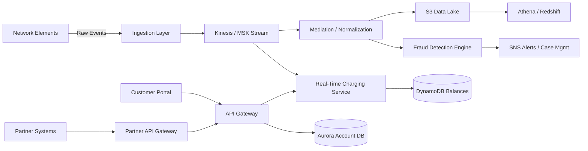
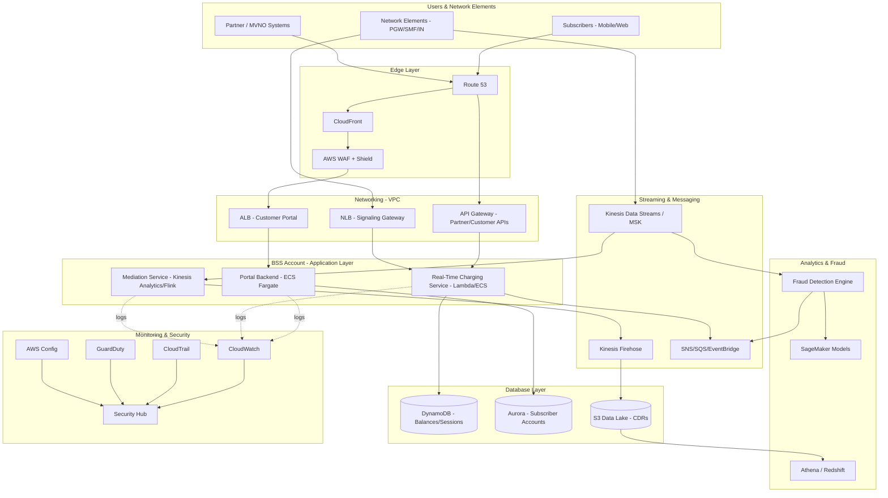
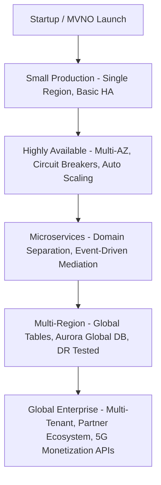

# Part IX – Industry-Specific Architectures

# Chapter 73: Telecommunications

---

# 1. Executive Summary

## The Business Problem

Telecommunications operators run some of the most demanding digital infrastructure on the planet.

A single Tier-1 carrier can process:

- Billions of Call Detail Records (CDRs) per day
- Millions of concurrent subscriber sessions
- Real-time billing events at sub-second latency
- Network telemetry from tens of thousands of cell sites
- Customer-facing portals with strict SLA obligations

Unlike a typical e-commerce or SaaS workload, telecom systems cannot simply "scale out and hope." They are bound by:

- Regulatory obligations (lawful intercept, data retention, emergency services)
- Extremely low tolerance for downtime (a billing outage can mean regulatory fines)
- Real-time and near-real-time processing requirements (charging, fraud detection)
- Massive, bursty, and geographically distributed traffic patterns

Traditional telecom infrastructure was built on physical Network Elements (NEs), proprietary hardware appliances, and monolithic OSS/BSS (Operations Support Systems / Business Support Systems) stacks.

These legacy systems are:

- Expensive to scale
- Slow to change (multi-month release cycles)
- Difficult to integrate with modern digital channels
- Poorly suited to 5G-era workloads (network slicing, edge compute, IoT at scale)

Cloud adoption in telecom is not a "nice to have." It's the mechanism by which operators reduce Capex, accelerate digital transformation, and support 5G Standalone (5G SA) architectures that assume cloud-native design from day one.

## Architecture Objective

This chapter defines a production-grade AWS reference architecture for telecommunications workloads, covering three converging domains:

1. **BSS (Business Support Systems)** — billing, charging, customer self-service, order management
2. **OSS (Operations Support Systems)** — network inventory, fault management, service assurance
3. **Network Function Virtualization / Cloud-Native Network Functions (VNF/CNF)** — where applicable, the boundary between telco core network workloads and AWS

Because "telecommunications" spans an enormous surface area (RAN, Core, Transport, OSS, BSS, Digital Services), this chapter focuses primarily on the **OSS/BSS digital layer and real-time event processing pipeline**, which is where the overwhelming majority of telecom-on-AWS production workloads live today. Where relevant, we note how this pattern extends toward Network Function hosting (AWS Outposts, Wavelength, Local Zones) without treating full RAN/Core virtualization as in-scope, since that is a specialized domain requiring dedicated 5G/vRAN architecture treatment.

## Why Organizations Adopt This Architecture

Operators adopt this pattern for several converging reasons:

- **Elastic capacity for bursty subscriber events** — promotions, new device launches, and outages create 10x–50x traffic spikes in minutes.
- **Real-time charging and fraud detection** — legacy batch billing cannot support 5G use cases like network slicing billed per session.
- **Digital-first customer experience** — subscribers expect self-service portals, instant top-ups, and real-time usage visibility, comparable to any modern SaaS product.
- **Regulatory and data residency requirements** — many jurisdictions require CDR retention, lawful intercept capability, and audit trails that must be provably tamper-evident.
- **Cost control at massive scale** — even a 5% Capex/Opex reduction across a national network is measured in tens of millions of dollars annually.
- **5G monetization** — network slicing, MEC (Multi-access Edge Compute), and IoT connectivity management require modern, API-driven, event-based architectures that legacy OSS/BSS stacks cannot deliver.

## Major Business Benefits

| Benefit | Description |
|---|---|
| Elastic scale | Absorb subscriber growth and traffic spikes without hardware procurement cycles |
| Faster time-to-market | New tariff plans, bundles, and digital products ship in days, not quarters |
| Lower total cost of ownership | Pay-as-you-go compute replaces over-provisioned appliances |
| Improved reliability | Multi-AZ and multi-Region patterns reduce customer-facing outages |
| Real-time insight | Streaming analytics enables fraud detection and network assurance in seconds, not hours |
| Regulatory compliance | Built-in audit trails, encryption, and data retention controls |
| Innovation velocity | API-first design enables partner integrations (MVNOs, IoT platforms, enterprise APIs) |

## Typical Enterprise Scenarios

This architecture pattern is commonly implemented for:

- **Real-time charging and billing platforms** — pre-paid balance management, session-based charging for data/voice/SMS
- **Customer self-service portals** — usage dashboards, bill payment, plan changes, device management
- **CDR (Call Detail Record) ingestion and mediation pipelines** — collecting, transforming, and routing usage records from network elements to billing and analytics systems
- **Fraud and revenue assurance platforms** — detecting SIM cloning, roaming fraud, and subscription abuse in near real time
- **IoT connectivity management platforms** — managing millions of SIM-enabled devices for enterprise customers
- **Network assurance and fault management dashboards** — aggregating alarms and performance data from network elements
- **API gateway / partner exposure layer** — exposing network capabilities (SMS, location, QoS) to third-party developers via TM Forum Open APIs

> **Note:** This chapter assumes the reader is building the **digital/IT layer** that surrounds the telecom network — not the RAN or 5G Core itself. AWS does support hosting Network Functions via Outposts, Wavelength, and specialized partner solutions (e.g., with Nokia, Ericsson, or open-source 5G cores), but that is a distinct architectural domain covered separately in specialized 5G/Edge chapters.

Enterprises adopting this pattern typically fall into one of three profiles:

- **Tier-1 national carriers** modernizing legacy OSS/BSS stacks incrementally, often using a strangler-fig migration pattern (see Chapter 84).
- **MVNOs (Mobile Virtual Network Operators)** building cloud-native BSS from day one, with no legacy debt.
- **Enterprise IoT/connectivity providers** who resell connectivity and need lightweight, API-first subscriber and billing management.

Each profile changes some architectural decisions (see Section 34, "When You Should Choose This Architecture"), but the core AWS building blocks remain consistent.

---

# 2. Business Requirements

## Business Drivers

- Reduce cost of legacy OSS/BSS licensing and hardware refresh cycles.
- Support real-time, usage-based billing to enable new 5G monetization models.
- Improve customer experience through digital self-service.
- Enable faster product launches (new tariffs, bundles, partner offers).
- Provide real-time fraud and revenue assurance to protect margin.
- Meet regulatory obligations for data retention and lawful intercept.

## Functional Requirements

- Ingest CDRs and event data from network elements (switches, gateways, IN platforms) at high throughput.
- Mediate, normalize, and enrich usage records before routing to billing and analytics.
- Perform real-time balance checks and charging for pre-paid subscribers.
- Provide subscriber-facing APIs and portals for account management.
- Expose partner APIs (TM Forum Open API aligned) for B2B2X use cases.
- Support batch and streaming analytics for network and business intelligence.
- Provide fraud detection with sub-second to few-second latency for high-risk events.

## Non-Functional Requirements

| Category | Requirement |
|---|---|
| Availability | 99.99%+ for charging and billing systems |
| Latency | Sub-100ms for real-time charging authorization |
| Throughput | Design for 50,000–500,000 events/sec sustained, bursting to 2M+/sec |
| Durability | 11 nines (S3 standard) for CDR archival |
| Compliance | Data retention (varies by country, often 1–7 years for CDRs), lawful intercept readiness |
| Security | Encryption at rest and in transit, strict IAM boundary between OSS and BSS domains |
| Auditability | Immutable audit trail for all billing-impacting transactions |

## Scalability Goals

- Horizontal scaling of ingestion and mediation layers to absorb traffic spikes (e.g., New Year's Eve SMS/call spikes historically hit 5–10x baseline).
- Independent scaling of read-heavy (customer portal, analytics) vs. write-heavy (charging, CDR ingestion) workloads.
- Support for onboarding new markets or MVNO tenants without re-architecture.

## Availability Requirements

- Charging and real-time balance systems: 99.99% (52 minutes/year downtime budget).
- Customer self-service portal: 99.9% (8.7 hours/year downtime budget) — lower criticality than charging.
- CDR mediation pipeline: must be **durable**, not necessarily always "available" in real time — brief processing delays are tolerable if no data is lost, but data loss is not acceptable.

## Latency Requirements

| Function | Target Latency |
|---|---|
| Real-time charging authorization | < 100ms p99 |
| Fraud scoring (high-risk transactions) | < 500ms |
| CDR mediation (near-real-time) | < 60 seconds end-to-end |
| Customer portal page load | < 2 seconds |
| Partner API response | < 300ms p95 |

## Compliance Requirements

Telecom compliance varies heavily by jurisdiction, but common obligations include:

- **CDR retention** — typically 1–7 years depending on country (e.g., EU data retention frameworks, US CALEA-adjacent obligations).
- **Lawful intercept readiness** — architecture must support isolated, auditable extraction paths for authorized law enforcement requests.
- **PCI-DSS** — if the platform processes card payments directly for bill payment.
- **Data residency** — many countries require subscriber PII and CDRs to remain within national borders; this heavily influences Region selection and cross-border data transfer controls.
- **GDPR or local equivalents** — for subscriber consent, right-to-erasure, and data minimization.

> **Warning:** Data residency requirements are frequently the single biggest constraint on this architecture. Before assuming a standard multi-Region AWS design, confirm with legal/compliance teams which subscriber data classes may leave the country and which must remain in-country (which may force use of local AWS Regions or, in some markets, hybrid on-premises retention).

## Security Expectations

- Strict separation between OSS (network-facing) and BSS (customer/billing-facing) domains — typically enforced via separate AWS accounts.
- Zero Trust network posture for east-west traffic between microservices.
- Encryption of subscriber PII at rest (KMS) and in transit (TLS 1.2+).
- Strong authentication for internal operator staff (IAM Identity Center + SSO) and external subscribers (Cognito or equivalent CIAM).

## Recovery Objectives

| Metric | Target |
|---|---|
| RPO (Recovery Point Objective) — Billing/Charging | 0 seconds (synchronous replication, no data loss tolerated) |
| RPO — CDR archive | < 5 minutes |
| RPO — Customer portal | < 15 minutes |
| RTO (Recovery Time Objective) — Charging | < 5 minutes (regional failover) |
| RTO — CDR mediation | < 15 minutes |
| RTO — Customer portal | < 30 minutes |

## SLAs

Typical enterprise telecom SLA commitments to internal stakeholders and regulators:

- 99.99% uptime for charging/billing (contractual, often tied to regulatory penalties).
- 99.9% uptime for digital channels.
- CDR delivery to billing systems within a defined mediation window (commonly 1–5 minutes).
- Fraud alert generation within seconds of a triggering event for high-severity fraud categories.

## Expected Workload

- Sustained event ingestion: 50,000–500,000 events/second (varies with subscriber base size).
- Peak bursts: 5–10x baseline during major events (network outages elsewhere driving roaming traffic, promotional campaigns, holidays).
- Subscriber base: ranges from low millions (regional operator) to 50M+ (national Tier-1 carrier).

## Expected Growth

- IoT connectivity growth is often the dominant driver of event volume growth (a single enterprise IoT customer can add millions of low-value, high-frequency events).
- 5G network slicing introduces new billable event types not present in 4G-era systems.
- Architecture must accommodate 3–5x volume growth over a 3-year horizon without re-architecture, only capacity/config changes.

---

# 3. Architecture Overview

## Overall Design Philosophy

This architecture follows an **event-driven, streaming-first design**. Telecom usage data is fundamentally a stream of events (call start/stop, data session start/stop, SMS sent/received, location update), not a batch of rows. Treating it as a stream from ingestion through to billing and analytics avoids the batch-processing latency that plagues legacy mediation systems.

Three architectural principles anchor this design:

1. **Decouple ingestion from processing.** Network elements should never talk directly to billing systems. A durable, replayable buffer (Kinesis/MSK) sits between them, so downstream failures don't cause data loss or backpressure onto the network.
2. **Isolate blast radius by domain.** OSS (network operations) and BSS (billing/customer) live in separate AWS accounts with tightly controlled cross-account access, so a BSS incident cannot cascade into network operations and vice versa.
3. **Design charging as a strongly consistent, low-latency path; design analytics as an eventually consistent, high-throughput path.** These have fundamentally different requirements, and the architecture must not force one system to serve both jobs.

## Core Components

- **Edge/Ingestion Layer** — API Gateway and Kinesis Data Streams / Amazon MSK to absorb network element and application-generated events.
- **Real-Time Charging Path** — Lambda or containerized microservices performing balance checks against DynamoDB (single-digit millisecond reads/writes) for pre-paid charging decisions.
- **Mediation Pipeline** — Kinesis Data Analytics / Managed Flink or Lambda-based transforms that normalize raw CDRs into a canonical format.
- **Batch/Analytics Path** — Firehose delivering enriched events into S3 (data lake), queried via Athena/Redshift for BI and revenue assurance.
- **Customer-Facing Portal** — Standard three-tier web architecture (CloudFront, ALB, ECS/EKS or Lambda, Aurora) for account self-service.
- **Partner API Layer** — API Gateway exposing TM Forum-aligned Open APIs to third parties, with usage-based throttling.
- **Fraud Detection** — Kinesis Data Analytics or Lambda-based streaming rules engine, optionally augmented with SageMaker models for anomaly scoring.
- **Security & Governance** — Multi-account structure (AWS Organizations), Config, GuardDuty, Security Hub, CloudTrail organization trail.

## How Components Interact



## High-Level Workflow

**Request lifecycle (customer-initiated, e.g., checking balance):**

1. Subscriber opens mobile app or web portal.
2. Request routed through CloudFront → API Gateway.
3. API Gateway authenticates via Cognito, invokes backend service.
4. Backend service reads current balance from DynamoDB.
5. Response returned to subscriber in under 200ms.

**Response lifecycle (network-initiated, e.g., data session charging):**

1. Network element (PGW/SMF equivalent, or an OSS mediation gateway) emits a session-start event.
2. Event lands in Kinesis/MSK stream.
3. Real-time charging service consumes event, checks and debits balance in DynamoDB.
4. Charging decision (allow/deny/throttle) returned to network element via a low-latency response channel (typically a synchronous API call pattern, not the stream itself, for the authorization decision).
5. Same event is also asynchronously routed to the mediation pipeline for CDR generation and archival.

**Data lifecycle:**

1. Raw event ingested into stream (retained 24–72 hours for replay capability).
2. Mediation pipeline normalizes/enriches, writes canonical CDR to S3 (data lake) via Firehose.
3. S3 lifecycle policies transition data through storage classes over time (Standard → IA → Glacier) to meet retention requirements cost-effectively.
4. Analytics and revenue assurance systems query the data lake via Athena or load subsets into Redshift for heavier BI workloads.
5. After the regulatory retention period expires, data is either deleted or further archived per legal requirements.

---

# 4. AWS Services Used

## EC2

**Purpose:** Hosts workloads that require full OS control, licensed OSS/BSS COTS software, or specialized network function software not suited to containers/serverless (e.g., some vendor mediation platforms, SS7/Diameter signaling gateways).

**Why selected:** Many telecom vendor products (Amdocs, Netcracker, CSG, Openet-derived charging engines) are only certified to run on VMs, not containers. EC2 provides that compatibility layer while still gaining cloud elasticity.

**Alternatives:** ECS/EKS (for cloud-native components), Outposts (for workloads requiring on-premises latency/locality).

**Limitations:** Requires more operational overhead (patching, AMI management) than serverless/managed alternatives.

**Pricing considerations:** Use Savings Plans for steady-state signaling gateways; Spot for stateless batch mediation workers where interruption is tolerable.

**Best practices:** Golden AMI pipeline (see Chapter 11), Auto Scaling Groups across 3 AZs minimum, no SSH — use SSM Session Manager.

## Application Load Balancer (ALB)

**Purpose:** Layer 7 load balancing for the customer portal and partner API backends running on EC2/ECS.

**Why selected:** Native integration with ECS/EKS target groups, WAF, and Cognito authentication at the load balancer level.

**Alternatives:** Network Load Balancer (for raw TCP/UDP signaling protocols like Diameter/SS7 gateways, which ALB cannot handle since those aren't HTTP).

**Limitations:** ALB is HTTP/HTTPS/gRPC only — signaling protocols need NLB or dedicated appliances.

**Best practices:** Enable access logs to S3, integrate AWS WAF, use host/path-based routing to consolidate services behind fewer ALBs.

## CloudFront

**Purpose:** CDN and edge layer for the customer portal, static assets, and as an entry point for partner APIs requiring global low latency.

**Why selected:** Reduces latency for globally distributed subscribers (relevant for MVNOs and carriers with international roaming customers), absorbs DDoS at the edge, integrates with Shield and WAF.

**Alternatives:** Global Accelerator (better suited for non-cacheable, TCP/UDP-based API traffic; often used alongside CloudFront rather than instead of it).

**Limitations:** Adds cache-invalidation complexity for highly dynamic, personalized responses (mitigated by using CloudFront primarily for static assets and API acceleration, not caching balance/account data).

**Pricing considerations:** Data transfer out is the dominant cost driver — monitor closely for markets with expensive regional edge pricing.

## Lambda

**Purpose:** Event-driven compute for stream processing (mediation transforms), lightweight charging logic, and API backends with spiky/unpredictable traffic.

**Why selected:** Scales instantly with Kinesis/SQS event source mappings, no idle cost during low-traffic periods (important for markets with strong diurnal traffic patterns).

**Alternatives:** ECS Fargate or EKS with Karpenter (preferred when sustained high-throughput processing makes Lambda's per-invocation model less cost-efficient, or when execution exceeds Lambda's 15-minute limit).

**Limitations:** 15-minute max execution, cold starts (mitigate with Provisioned Concurrency for charging-path functions), and less cost-efficient than containers at sustained very high throughput.

**Best practices:** Use for mediation transforms and burst-driven charging logic; move to containers once sustained throughput exceeds a few thousand invocations/sec continuously (cost crossover point varies — must be benchmarked per workload).

## S3

**Purpose:** The telecom data lake — canonical store for CDRs, xDRs (any Detail Record type), and archival data.

**Why selected:** 11 nines durability, native lifecycle policies for cost-effective long-term retention, and direct Athena/Redshift Spectrum query support without needing to load data elsewhere first.

**Alternatives:** None seriously competitive for this role at this scale and cost point within AWS.

**Limitations:** Not a transactional database — do not use for anything requiring row-level locking or strong read-after-write consistency guarantees beyond what S3 already provides (S3 today does provide strong read-after-write consistency, but it is still not a transactional row store).

**Pricing considerations:** Use S3 Intelligent-Tiering or explicit lifecycle rules to move aged CDRs from Standard → IA → Glacier Deep Archive, since regulatory retention periods (years) make storage class management a major cost lever.

## RDS

**Purpose:** Relational store for reference data — tariff plans, product catalogs, partner configuration — where full managed relational capability is needed but Aurora's extra scale isn't required.

**Why selected:** Simpler operational model than Aurora for smaller, less latency-sensitive datasets.

**Alternatives:** Aurora (for account/subscriber databases needing higher throughput and read replica scaling).

**Limitations:** Lower maximum throughput ceiling than Aurora; single-writer architecture.

## Aurora

**Purpose:** Subscriber account database, order management, and other BSS relational workloads requiring high read/write throughput with strong consistency.

**Why selected:** Aurora's storage-layer replication (6 copies across 3 AZs) provides better availability and faster failover (typically under 30 seconds) than standard RDS Multi-AZ, and Aurora Global Database supports cross-region DR with typical replication lag under 1 second.

**Alternatives:** RDS PostgreSQL/MySQL for smaller-scale reference data; DynamoDB for the balance/charging path itself (not account data).

**Limitations:** Higher cost than RDS at small scale; MySQL/PostgreSQL compatibility only (no other engines).

**Best practices:** Use Aurora Global Database for the account database if the operator serves multiple countries/regions and needs regional read locality plus DR.

## DynamoDB

**Purpose:** The real-time balance and session-state store for pre-paid charging — the single most latency-critical data store in the entire architecture.

**Why selected:** Single-digit millisecond p99 latency at effectively unlimited scale, with conditional writes providing the atomic balance-decrement semantics charging requires (avoiding race conditions where two concurrent sessions could both over-debit a balance).

**Alternatives:** ElastiCache for Redis (viable alternative, often used as a cache in front of DynamoDB, but DynamoDB is generally preferred as the system of record because of its durability guarantees, versus Redis being primarily in-memory).

**Limitations:** Cost can grow significantly at very high write throughput if not designed with appropriate partition key cardinality; complex query patterns beyond key-value access require careful data modeling (single-table design) up front.

**Pricing considerations:** Use on-demand capacity mode initially, transition to provisioned capacity with auto scaling once traffic patterns stabilize, since on-demand carries a premium per-request cost.

## SNS

**Purpose:** Fan-out notification for fraud alerts, operational alarms, and subscriber-facing notifications (e.g., low-balance alerts).

**Why selected:** Simple pub/sub fan-out to multiple subscribers (email, SMS via SNS, Lambda, SQS) without custom integration code.

**Alternatives:** EventBridge (preferred when routing logic based on event content/attributes is needed, rather than simple fan-out).

## SQS

**Purpose:** Buffering and decoupling between asynchronous processing stages — e.g., between fraud case creation and case management system ingestion.

**Why selected:** Guarantees at-least-once delivery, dead-letter queue support for poison-message handling, and simple integration with Lambda.

**Alternatives:** Kinesis (when strict ordering and replay/multiple-consumer fan-out is required — SQS standard queues do not guarantee order; FIFO queues do but at lower throughput).

## EventBridge

**Purpose:** Central event bus for routing business events (e.g., "subscriber plan changed," "fraud case opened") to the correct downstream consumers based on event content, without tight point-to-point coupling.

**Why selected:** Schema registry and content-based routing rules reduce integration complexity as the number of microservices grows — critical in telecom where dozens of OSS/BSS modules must react to overlapping events.

**Alternatives:** SNS (simpler fan-out, no content-based routing); Kafka/MSK (preferred at extremely high throughput or when strict, replayable, ordered log semantics are required across many consumer groups).

## IAM

**Purpose:** Access control boundary between OSS and BSS domains, between environments, and between human operators and automated systems.

**Why selected:** Native, deeply integrated across every AWS service; supports fine-grained resource-level policies essential for separating billing-impacting actions from read-only network monitoring actions.

**Best practices:** Separate roles per function (charging-service-role, mediation-role, portal-api-role), never share roles across domains, use permission boundaries for any role that can create other IAM entities.

## VPC

**Purpose:** Network isolation boundary; hosts private subnets for charging/billing workloads and, where applicable, connects to on-premises network elements via Direct Connect/VPN.

**Why selected:** Fundamental to enforcing the OSS/BSS separation and to controlling exposure of signaling-adjacent workloads to the public internet.

## Route 53

**Purpose:** DNS for customer portal, partner APIs, and internal service discovery; also used for latency-based or geo-routing when serving multiple countries/regions.

**Why selected:** Health-check-based failover supports the regional failover RTO targets defined in Section 2.

## CloudWatch

**Purpose:** Metrics, logs, dashboards, and alarms across every layer — from Lambda invocation errors to DynamoDB throttle events to custom business metrics like "charging authorization latency p99."

**Best practices:** Define SLO-aligned alarms (not just infrastructure alarms) — e.g., alarm on charging latency breaching 100ms, not just on CPU utilization.

## CloudTrail

**Purpose:** Immutable audit log of every API call across all accounts — critical for demonstrating compliance during regulatory audits and for lawful intercept process integrity.

**Best practices:** Organization-wide trail, log file validation enabled, delivered to a dedicated, access-restricted log-archive account.

## AWS Config

**Purpose:** Continuous compliance monitoring — e.g., detecting if an S3 bucket containing CDRs becomes accidentally public, or if encryption is disabled on a resource that requires it.

**Best practices:** Custom Config rules mapped directly to the operator's regulatory obligations (e.g., "CDR bucket must have encryption enabled and public access blocked").

## GuardDuty

**Purpose:** Threat detection across the account structure — detecting compromised credentials, unusual API call patterns, or cryptomining on EC2 instances.

**Why selected:** Managed, no infrastructure to run, uses ML models trained on AWS-wide threat intelligence.

## KMS

**Purpose:** Encryption key management for all subscriber PII, CDR data, and charging-related secrets.

**Best practices:** Separate CMKs (customer-managed keys) per domain (OSS vs. BSS vs. shared services) so that key policies can independently restrict access; enable automatic key rotation.

## Secrets Manager

**Purpose:** Storage and rotation of database credentials, third-party API keys (e.g., payment gateway credentials), and vendor system integration secrets.

**Why selected:** Automatic rotation reduces the operational and security risk of long-lived static credentials, which are a common audit finding in legacy telecom environments.

## Systems Manager

**Purpose:** Patch management, Session Manager (replacing SSH/bastion hosts), and Parameter Store for non-secret configuration values.

**Best practices:** Mandate Session Manager for all EC2 access; disable SSH key-based access entirely to reduce attack surface, which is a frequent finding in telecom security audits given the number of legacy EC2-hosted vendor applications.

---

# 5. Complete Architecture Diagram



---

# 6. Component-by-Component Explanation

## Ingestion Layer (Kinesis Data Streams / Amazon MSK)

**Purpose:** Durable, ordered, replayable buffer between network elements and downstream processing.

**Responsibilities:**
- Absorb bursty, high-volume event traffic without backpressure onto network elements.
- Preserve ordering per partition key (typically subscriber ID or session ID).
- Provide replay capability for downstream failure recovery.

**Inputs:** Raw usage events from network elements, mediation gateways, or application event producers.

**Outputs:** Ordered event records consumed by charging service, mediation pipeline, and fraud engine in parallel.

**Scaling:** Kinesis scales via shard count (on-demand mode auto-scales); MSK scales via broker count and partition count.

**High availability:** Both Kinesis and MSK replicate data across multiple AZs automatically.

**Failure handling:** Consumers use checkpointing (Kinesis Client Library or Kafka consumer offsets) to resume from last processed position after failure.

**Dependencies:** IAM roles for producer/consumer access, KMS for encryption at rest.

**Security:** Encryption at rest (KMS) and in transit (TLS); VPC endpoints to avoid public internet exposure for MSK.

**Monitoring:** Iterator age (Kinesis) or consumer lag (MSK) as the primary health metric — rising iterator age/lag indicates downstream processing can't keep pace.

## Real-Time Charging Service

**Purpose:** Authorize or deny network usage in real time based on subscriber balance and plan rules.

**Responsibilities:**
- Read current balance from DynamoDB.
- Apply rating rules (cost per MB/minute/SMS).
- Perform atomic conditional balance decrement.
- Return authorization decision within SLA (<100ms).

**Inputs:** Charging request events (from stream or direct synchronous API call from network element/gateway).

**Outputs:** Authorization decision (allow/deny/partial-allow with quota), balance-update event.

**Scaling:** Horizontal — Lambda concurrency scaling or ECS Fargate with target-tracking Auto Scaling on request count/CPU.

**High availability:** Multi-AZ deployment; DynamoDB global tables if cross-region charging is required for roaming scenarios.

**Failure handling:** Circuit breaker pattern (Chapter 83) to fail safe (typically fail-open for voice emergency calls per regulatory requirement, fail-closed for standard data sessions, per business policy) when DynamoDB is unreachable.

**Dependencies:** DynamoDB, Secrets Manager (if calling external rating engines), KMS.

**Security:** Least-privilege IAM role scoped only to the specific DynamoDB table and key patterns needed.

**Monitoring:** p50/p95/p99 latency, authorization decision rate, error rate, DynamoDB throttle events.

## Mediation Service

**Purpose:** Transform raw, vendor-specific event formats into a canonical CDR schema for downstream billing and analytics consumption.

**Responsibilities:**
- Parse and validate incoming raw events.
- Enrich with reference data (tariff plan, subscriber segment).
- Deduplicate events (network elements sometimes emit duplicate records during failover).
- Route normalized records to the data lake and billing systems.

**Scaling:** Kinesis Data Analytics/Managed Flink scales via parallelism configuration; Lambda-based approaches scale via concurrent execution limits.

**Failure handling:** Dead-letter routing for records that fail schema validation, with alerting for manual review rather than silent data loss.

**Monitoring:** Processing lag, DLQ depth, schema validation failure rate.

## Customer Portal Backend

**Purpose:** Serves subscriber-facing account management functionality (balance view, plan changes, bill payment).

**Scaling:** ECS Fargate with Application Auto Scaling based on ALB request count per target.

**High availability:** Minimum 2 AZs, target group health checks with automatic instance replacement.

**Dependencies:** Aurora (account data), Cognito (authentication), API Gateway (if exposing a public API alongside the direct portal backend).

## Fraud Detection Engine

**Purpose:** Score events in near-real-time for fraud indicators (SIM cloning signatures, roaming anomalies, velocity-based abuse).

**Responsibilities:** Apply rules-based checks (fast path) and ML-based anomaly scoring (SageMaker endpoint, slower path) in parallel; escalate high-confidence fraud to case management.

**Scaling:** Kinesis Data Analytics parallelism; SageMaker endpoint auto scaling for inference load.

**Monitoring:** False-positive rate (tracked via feedback loop from fraud analysts), detection latency, case volume trends.

---

# 7. End-to-End Request Flow

**Scenario: Subscriber initiates a data session, charging must authorize it in real time.**

1. Subscriber device attaches to network; network element (e.g., SMF-equivalent gateway) generates a session-start charging request.
2. Request sent via NLB (low-latency TCP path) to the Real-Time Charging Service.
3. Charging Service authenticates the request using a service-to-service IAM/mTLS mechanism.
4. Charging Service queries DynamoDB for the subscriber's current balance and active plan.
5. Rating logic calculates cost basis for the session (e.g., per-MB rate).
6. Conditional write attempts to reserve/decrement balance atomically.
7. If sufficient balance: authorization "Allow" returned to network element within SLA (<100ms).
8. If insufficient balance: authorization "Deny" or "Allow with reduced QoS" returned per plan rules.
9. Charging Service asynchronously emits a charging-event record to Kinesis for downstream mediation.
10. Mediation Service consumes the event, normalizes it into canonical CDR format.
11. Mediation Service enriches the record with tariff/plan metadata from a reference cache (ElastiCache or DynamoDB).
12. Normalized CDR is written to Kinesis Firehose.
13. Firehose batches and delivers CDRs to S3 data lake (partitioned by date/subscriber-segment for query efficiency).
14. In parallel, the same stream event is consumed by the Fraud Detection Engine.
15. Fraud engine applies rules-based checks; if anomalous, forwards to SageMaker endpoint for deeper scoring.
16. If fraud score exceeds threshold, an alert is published via SNS to the fraud case management system.
17. CloudWatch captures latency and error metrics at every stage (NLB, Charging Service, DynamoDB, Kinesis).
18. CloudTrail logs all API-level actions for audit purposes (e.g., changes to IAM policies, DynamoDB table configuration).
19. If DynamoDB is unreachable, the Charging Service circuit breaker trips and applies the pre-configured fail-safe policy.
20. End of session: a session-stop event repeats a similar flow, finalizing the CDR and releasing any reserved balance.

---

# 8. Deployment Flow

## Infrastructure Provisioning

All infrastructure is provisioned via Terraform, organized into reusable modules (networking, compute, data, security) consumed by environment-specific root configurations (dev/staging/prod), with state stored remotely per environment/account.

## Terraform Workflow

1. Developer creates a feature branch and modifies Terraform module code.
2. `terraform fmt` and `terraform validate` run locally and in CI.
3. `terraform plan` output posted as a PR comment for review.
4. Policy-as-code checks (Open Policy Agent / Sentinel-equivalent, or Checkov) validate against security baselines.
5. On merge to main, `terraform apply` runs via CI/CD pipeline against the target environment, gated by manual approval for production.

## CI/CD Deployment

- Application code deployed independently from infrastructure, using CodePipeline or GitHub Actions.
- Container images built, scanned (Inspector/Trivy), and pushed to ECR.
- ECS/EKS deployments use rolling updates for non-critical services and blue-green for the Charging Service given its criticality.

## Blue-Green Deployment

- Charging Service and Portal Backend use blue-green deployment via CodeDeploy (ECS) to allow instant rollback.
- New environment ("green") receives a small percentage of traffic first (canary-style), monitored against error-rate and latency alarms before full cutover.

## Rollback

- Automated rollback triggered by CloudWatch alarms tied to the deployment (elevated 5xx rate, latency regression) during the blue-green bake time.
- Database migrations use expand-contract pattern to remain compatible with both old and new application versions during rollback windows.

## Secrets

- All credentials sourced from Secrets Manager at runtime; never embedded in Terraform state or container images.
- CI/CD pipeline itself uses short-lived OIDC-federated roles rather than static AWS access keys.

## Configuration

- Environment-specific configuration stored in Systems Manager Parameter Store, referenced by ECS task definitions.

## Validation

- Post-deployment smoke tests validate charging authorization latency and portal login flow before marking a deployment as successful.
- Synthetic canary transactions (CloudWatch Synthetics) continuously validate charging-path health in production.

---

# 9. Network Topology

## VPC Design

Separate VPCs per account (BSS account, OSS account, shared-services account), connected via Transit Gateway where cross-domain communication is explicitly required and controlled.

## CIDR Planning

| VPC | CIDR Example | Purpose |
|---|---|---|
| BSS-Prod | 10.10.0.0/16 | Charging, billing, customer portal |
| OSS-Prod | 10.20.0.0/16 | Network monitoring, fault management |
| Shared-Services | 10.0.0.0/16 | CI/CD, logging, shared DNS |

> **Tip:** Plan CIDR ranges to never overlap across accounts, even ones that seem unlikely to ever peer — telecom operators frequently acquire MVNOs or merge networks, and non-overlapping CIDRs from day one avoid painful re-IP projects later.

## Public and Private Subnets

- Public subnets: only ALB/NLB and NAT Gateways.
- Private subnets: all application compute (ECS/Lambda-in-VPC/EC2) and data stores (Aurora, DynamoDB via VPC endpoint, MSK).

## NAT Gateway

- Deployed per-AZ (not a single shared NAT Gateway) to avoid cross-AZ data transfer charges and single-AZ failure risk.

## Internet Gateway

- Attached only to VPCs requiring direct inbound/outbound internet (typically just the BSS VPC hosting the public-facing portal/API).

## Transit Gateway

- Central hub connecting BSS, OSS, and Shared-Services VPCs, plus on-premises connectivity via Direct Connect where legacy network elements still reside on-premises.
- Route tables on Transit Gateway explicitly restrict OSS-to-BSS traffic to only the specific, audited integration paths required (e.g., fault data flowing one direction only).

## Route Tables

- Explicit route tables per subnet tier; no default "0.0.0.0/0 to everywhere" routes in private data subnets.

## Network ACLs

- Stateless NACLs as a defense-in-depth layer at the subnet boundary, supplementing (not replacing) security groups.

## Security Groups

- Security groups reference other security groups (not CIDR ranges) wherever possible, so that scaling out new instances automatically inherits correct access without manual IP management.

## PrivateLink

- Used for any SaaS/third-party integrations (e.g., a vendor-hosted fraud scoring API) to avoid traversing the public internet.

## Hybrid Connectivity

- Direct Connect (redundant, dual-DX-location) for on-premises network elements that remain outside AWS (common during multi-year migration programs), with VPN as a backup path.

---

# 10. Identity and Access

## IAM Roles

- Distinct roles per service (charging-service, mediation-service, portal-backend, fraud-engine), each scoped to only the resources that service touches.

## IAM Policies

- Resource-level policies specifying exact DynamoDB table ARNs, S3 bucket/prefix ARNs — never wildcard resource access for production billing-impacting roles.

## Resource Policies

- S3 bucket policies on the CDR data lake explicitly deny access from outside the OSS/BSS account structure, even if a role elsewhere in the organization has broad S3 permissions.

## STS

- Cross-account roles assumed via STS for the rare, explicitly audited cases where OSS needs read access to BSS-adjacent data (e.g., service quality correlation with billing disputes).

## Cross-Account Access

- Managed via AWS Organizations with a dedicated Security/Audit account holding read-only cross-account roles for compliance tooling (Security Hub, Config aggregator).

## Least Privilege

- Enforced via IAM Access Analyzer, which is run continuously to detect unused permissions and external access findings.

## Service Roles

- Separate execution roles per Lambda function, per ECS task definition — never a shared "do everything" execution role.

## Permission Boundaries

- Applied to any role capable of creating other IAM entities (e.g., a CI/CD deployment role), capping the maximum permissions that role's created resources could ever have.

---

# 11. Security Architecture

## Encryption

- KMS customer-managed keys, separate per domain (OSS/BSS), with key policies restricting usage to specific IAM roles.
- All data at rest (S3, DynamoDB, Aurora, MSK) encrypted with these CMKs.

## TLS

- TLS 1.2+ enforced on all ALB/API Gateway listeners; internal service-to-service traffic uses mTLS where a service mesh (App Mesh) is in use.

## WAF

- AWS WAF in front of CloudFront/ALB with managed rule groups (SQLi, XSS) plus custom rules for telecom-specific abuse patterns (e.g., rate-limiting excessive balance-check API calls, a common fraud reconnaissance pattern).

## Shield

- Shield Advanced for the customer-facing portal and partner API given telecom operators are frequent, high-value DDoS targets.

## Secrets Manager

- All database credentials, third-party API keys, and payment gateway secrets, with automatic rotation configured.

## Certificate Manager

- ACM-issued and auto-renewed TLS certificates for all public endpoints.

## GuardDuty

- Enabled across all accounts with findings aggregated into Security Hub in the Security/Audit account.

## Inspector

- Continuous vulnerability scanning of EC2 instances and container images in ECR.

## Security Hub

- Central aggregation point for GuardDuty, Config, Inspector findings, mapped against CIS AWS Foundations Benchmark and, where applicable, telecom-specific compliance frameworks.

## CloudTrail

- Organization trail capturing all API activity across every account, delivered to an immutable, access-restricted S3 bucket in the log-archive account with MFA-delete enabled.

## AWS Config

- Custom rules enforcing: encryption-at-rest mandatory, no public S3 buckets containing CDR data, security groups must not allow 0.0.0.0/0 on sensitive ports.

## Zero Trust

- No implicit trust between OSS and BSS domains; every cross-domain call is authenticated, authorized, and logged regardless of network location.

## Threat Model

Primary threat actors and vectors relevant to telecom BSS/OSS:

- **SIM cloning / subscription fraud** — mitigated via fraud detection engine and velocity-based rate limiting.
- **Insider threat (billing manipulation)** — mitigated via least-privilege IAM, mandatory approval workflows for balance adjustments, full audit trail.
- **DDoS against customer portal/partner API** — mitigated via Shield Advanced, WAF, CloudFront absorption.
- **Credential compromise of operator staff** — mitigated via IAM Identity Center MFA enforcement, conditional access policies.
- **Supply chain risk from vendor OSS/BSS software** — mitigated via Inspector scanning, network segmentation limiting vendor software's blast radius.

---

# 12. High Availability

## AZ Failures

- All compute (ECS, Lambda, EC2 ASGs) spans a minimum of 3 AZs; DynamoDB and Aurora are inherently multi-AZ by design.

## Instance Failures

- ASG health checks and ECS service scheduler automatically replace unhealthy instances/tasks; ALB health checks remove unhealthy targets from rotation within seconds.

## Regional Failures

- Charging path uses DynamoDB Global Tables for active-active multi-region balance data (with careful conflict resolution design for concurrent writes across regions, since DynamoDB Global Tables use last-writer-wins — a nuance that matters significantly for a balance ledger, and is typically addressed by routing a given subscriber's charging traffic to a single "home" region under normal operation, with failover only during regional outages).
- Aurora Global Database provides a secondary region with typical sub-1-second replication lag for the account database.

## Database Failures

- Aurora: automatic failover to a reader replica in a different AZ, typically completing in under 30 seconds.
- DynamoDB: fully managed, no customer-visible failover process required.

## Load Balancing

- ALB/NLB with cross-zone load balancing enabled, health checks tuned for fast failure detection (short interval, low unhealthy threshold) on the charging path specifically, given its strict latency SLA.

## Health Checks

- Layered health checks: ALB target health, ECS task health, and application-level deep health checks (verifying DynamoDB connectivity, not just process liveness).

## Failover

- Route 53 health-check-based failover routing for the customer portal between regions; charging path failover is handled at the DynamoDB Global Table / regional routing layer described above.

---

# 13. Disaster Recovery

## Backup Strategy

| Data Store | Backup Method | Frequency |
|---|---|---|
| Aurora | Automated snapshots + continuous backup (PITR) | Continuous, 35-day retention |
| DynamoDB | Point-in-time recovery | Continuous |
| S3 CDR data lake | Versioning + cross-region replication | Continuous |
| EC2 (vendor apps) | AMI snapshots via Data Lifecycle Manager | Daily |

## Snapshots

- Aurora and EC2 EBS snapshots automated via AWS Backup with defined retention policies aligned to regulatory data retention requirements.

## Cross-Region Replication

- S3 CRR enabled on the CDR data lake bucket to a secondary region, satisfying both DR and, in some cases, regulatory requirements for geographic data redundancy (subject to data residency constraints noted in Section 2).

## DR Strategy Selection

Given the differentiated criticality of components, this architecture uses a **mixed DR strategy**:

| Component | DR Pattern | Rationale |
|---|---|---|
| Charging/Balance (DynamoDB) | Active-Active (Global Tables) | Zero RPO tolerance |
| Account DB (Aurora) | Warm Standby (Global Database) | Near-zero RPO, fast promotion |
| Customer Portal | Pilot Light → Warm Standby | Cost-sensitive, tolerates minutes of RTO |
| CDR Data Lake | Multi-site (replicated, both regions can query) | Durability-critical, not latency-critical |
| Mediation Pipeline | Pilot Light | Can tolerate brief reprocessing delay via stream replay |

## RPO / RTO Summary

Restated from Section 2 for DR planning purposes:

- Charging: RPO 0 / RTO < 5 min
- Account DB: RPO < 1 sec (typical Aurora Global Database lag) / RTO < 5 min (managed planned failover) to low minutes for unplanned
- Portal: RPO < 15 min / RTO < 30 min
- CDR archive: RPO < 5 min / RTO < 15 min

> **Note:** DR strategy must be tested, not just documented. See Section 34 for common findings from real DR tests in telecom environments.

---

# 14. Scalability

## Horizontal Scaling

- Stateless services (charging, mediation, portal backend) scale horizontally via ECS Service Auto Scaling or Lambda concurrency, driven by request count, queue depth, or custom CloudWatch metrics (e.g., Kinesis iterator age).

## Vertical Scaling

- Reserved for stateful vendor appliances on EC2 where horizontal scaling isn't supported by the vendor's software architecture — a common constraint with legacy signaling gateways.

## Auto Scaling

- Target-tracking scaling policies on ECS services, tuned against the specific SLA-relevant metric (e.g., request latency for the portal, iterator age for mediation consumers).

## Serverless Scaling

- Lambda scales automatically; Provisioned Concurrency applied specifically to the charging-path functions to eliminate cold-start latency risk against the <100ms SLA.

## Database Scaling

- DynamoDB: on-demand or auto-scaled provisioned capacity; consider partition key design carefully to avoid hot partitions from high-traffic subscribers or promotional events.
- Aurora: read replicas added for read-heavy reporting queries, keeping the writer instance free for transactional account updates.

## Storage Scaling

- S3 scales inherently; the operational concern is query performance at scale, addressed via partitioning strategy (date/region/subscriber-segment) and file-size optimization (avoiding the "small files problem" through Firehose buffering configuration).

## Queue Scaling

- Kinesis shard count or MSK partition count scaled proactively ahead of known traffic events (product launches, holiday seasons) rather than purely reactively, since stream resharding has operational lead time.

---

# 15. Performance Optimization

## Caching

- ElastiCache (Redis) in front of reference data (tariff plans, subscriber segment lookups) used by the mediation and charging services, reducing repeated DynamoDB/Aurora reads for largely static data.

## Compression

- Firehose and S3 data lake objects stored in compressed columnar format (Parquet) rather than raw JSON/CSV, both reducing storage cost and dramatically improving Athena query performance and cost (Athena charges per byte scanned).

## CDN

- CloudFront for all static portal assets; API responses generally not cached given their personalized, real-time nature, except for genuinely static reference data (e.g., published tariff plan catalogs).

## Database Optimization

- DynamoDB single-table design minimizing the number of round trips needed per charging decision.
- Aurora read replicas isolate reporting/analytics queries from the transactional write path.

## Connection Pooling

- RDS Proxy / Aurora Proxy in front of Aurora to manage connection pooling for Lambda-based services, avoiding connection exhaustion under bursty concurrency.

## Concurrency

- Lambda reserved concurrency configured per function to prevent one noisy consumer from starving concurrency available to the latency-critical charging function.

## Async Processing

- Anything not on the critical charging-authorization path (CDR archival, fraud scoring, notifications) is processed asynchronously via the stream/queue layer, keeping the synchronous charging path as lean as possible.

---

# 16. Cost Optimization (FinOps)

## Estimated Monthly Cost by Deployment Size

> Figures are illustrative planning estimates based on typical usage patterns at the time of writing; actual costs must be validated with AWS Pricing Calculator and Cost Explorer for the specific Region and usage profile.

| Component | Small (500K subs, ~5K events/sec) | Medium (5M subs, ~50K events/sec) | Enterprise (30M+ subs, ~300K+ events/sec) |
|---|---|---|---|
| Kinesis/MSK | $2,000–4,000 | $15,000–30,000 | $80,000–150,000+ |
| DynamoDB (charging) | $3,000–6,000 | $25,000–50,000 | $150,000–300,000+ |
| Lambda/ECS compute | $2,500–5,000 | $20,000–40,000 | $120,000–250,000+ |
| Aurora | $1,500–3,000 | $8,000–15,000 | $40,000–80,000+ |
| S3 (data lake, w/ lifecycle) | $500–1,500 | $5,000–12,000 | $30,000–70,000+ |
| CloudFront/WAF/Shield | $500–1,000 | $3,000–6,000 | $15,000–30,000+ |
| Monitoring/Logging | $500–1,200 | $4,000–8,000 | $25,000–50,000+ |
| **Approximate Total** | **$10,000–22,000** | **$80,000–160,000** | **$460,000–930,000+** |

## Major Cost Drivers

- DynamoDB write throughput on the charging path (dominant cost driver at scale, since every billable event touches it).
- Data transfer, particularly cross-AZ and cross-region transfer if the architecture isn't carefully designed to keep chatty service-to-service calls within a single AZ where latency allows.
- Kinesis/MSK shard-hour or broker-hour cost, especially if over-provisioned "just in case" rather than scaled to actual measured throughput.
- Athena query cost, if the data lake isn't properly partitioned/compressed (unoptimized Athena queries can scan orders of magnitude more data than necessary).
- CloudWatch Logs ingestion and storage cost, particularly from verbose debug-level logging left enabled in production.

## Optimization Opportunities

- **Reserved Instances / Savings Plans** for steady-state EC2 workloads (legacy vendor appliances, always-on signaling gateways) — typically 30–50% savings versus on-demand for 1-year commitments.
- **Spot Instances** for the batch/analytics tier (e.g., EMR or batch Athena/Glue jobs) where interruption tolerance is acceptable.
- **S3 Lifecycle Policies** — CDR data transitions from Standard → Standard-IA (after 30 days) → Glacier Flexible Retrieval (after 90 days) → Glacier Deep Archive (after 1 year), aligned with regulatory retention and realistic access patterns (CDRs older than a few months are rarely queried outside of audits/legal holds).
- **Storage Classes** — Intelligent-Tiering as a lower-effort alternative to manual lifecycle rules where access patterns are unpredictable.
- **Rightsizing** — regular Compute Optimizer review of ECS/EC2 sizing; telecom mediation workloads in particular are frequently over-provisioned "to be safe" following a single past incident, without revisiting sizing afterward.
- **DynamoDB capacity mode review** — moving from on-demand to provisioned-with-auto-scaling once traffic patterns stabilize, typically a 30–40% cost reduction at steady, predictable volume.

## Cost Allocation and Tagging

| Tag Key | Example Value | Purpose |
|---|---|---|
| `domain` | `bss` / `oss` | Cost allocation between business units |
| `service` | `charging-service` | Per-microservice cost attribution |
| `environment` | `prod` / `staging` | Environment-level cost tracking |
| `cost-center` | `telco-digital-001` | Finance chargeback mapping |
| `data-classification` | `pii` / `cdr` / `public` | Compliance and cost correlation |

## Budgets and Cost Anomaly Detection

- AWS Budgets configured per domain (BSS/OSS) and per environment, with alert thresholds at 80%/100%/120% of forecast.
- Cost Anomaly Detection monitors the DynamoDB and Kinesis cost categories specifically, since these scale directly with subscriber traffic and are the most sensitive to unexpected spikes (fraud attacks, misconfigured retry loops in the charging service causing runaway write amplification).

---

# 17. AI-Assisted Operations

## Amazon Q

- Used by network operations and platform engineering teams for natural-language querying of CloudWatch logs and metrics during incident investigation, and for generating draft runbook documentation from historical incident tickets.

## Bedrock

- Used to build the fraud case summarization layer — taking a fraud analyst's raw case data (transaction history, flagged events) and generating a structured case summary, reducing analyst review time.
- Also used for customer service chatbot capability in the digital portal (e.g., answering "why was I charged X" using retrieval-augmented generation over billing FAQ content — never generating actual balance/billing figures itself, which must always come from the authoritative DynamoDB/Aurora source, not a generated response).

## AI Troubleshooting

- Amazon Q integrated with CloudWatch to help on-call engineers correlate a spike in charging latency with a specific recent deployment or a DynamoDB throttling event, significantly reducing mean-time-to-diagnosis during incidents.

## Log Analysis

- Bedrock-based summarization of high-volume mediation pipeline error logs, clustering similar errors together so an engineer sees "1,200 occurrences of schema validation failure X" instead of scrolling through 1,200 individual log lines.

## Incident Response

- AI-assisted runbook suggestion during PagerDuty/incident tooling integration, surfacing the most relevant historical runbook based on the alarm that fired.

## Cost Optimization

- AI-assisted analysis of Cost Explorer data to flag anomalous spend patterns and suggest likely root causes (e.g., "DynamoDB cost increase correlates with a new IoT partner's data volume").

## Capacity Planning

- Time-series forecasting (via SageMaker or Bedrock-assisted analysis of historical traffic data) to project Kinesis shard and DynamoDB capacity needs ahead of known seasonal events.

## Architecture Review

- Bedrock used to draft initial Well-Architected Framework review documentation, which is then validated and corrected by the architecture team — a starting point, not a substitute for human review.

## AI-Generated Terraform

- Used for scaffolding new, boilerplate Terraform modules (e.g., a new microservice's standard ECS service module) from an internal prompt template, always followed by mandatory human review and the standard CI/CD policy-as-code checks before merge.

## AI-Generated Documentation

- Used to draft initial architecture documentation and ADRs from design discussion notes, again with mandatory human review before publication, since AI-drafted compliance-relevant documentation must never be published without expert verification.

---

# 18. Terraform Implementation

> The following examples are illustrative, modular patterns. Production implementations should be adapted to organizational module standards, and secrets/values shown are placeholders for structure only — never commit real values.

## Providers and Backend

```hcl

# providers.tf

terraform {
  required_version = ">= 1.7.0"

  required_providers {
    aws = {
      source  = "hashicorp/aws"
      version = "~> 5.0"
    }
  }

  backend "s3" {
    bucket         = "telco-terraform-state-bss-prod"
    key            = "charging-service/terraform.tfstate"
    region         = "us-east-1"
    dynamodb_table = "terraform-state-lock-bss-prod"
    encrypt        = true
  }
}

provider "aws" {
  region = var.aws_region

  default_tags {
    tags = {
      domain      = "bss"
      managed-by  = "terraform"
      environment = var.environment
    }
  }
}

```

## Variables

```hcl

# variables.tf

variable "aws_region" {
  description = "Primary AWS region for BSS deployment"
  type        = string
  default     = "us-east-1"
}

variable "environment" {
  description = "Deployment environment (dev, staging, prod)"
  type        = string
}

variable "vpc_cidr" {
  description = "CIDR block for the BSS VPC"
  type        = string
  default     = "10.10.0.0/16"
}

variable "az_count" {
  description = "Number of Availability Zones to span"
  type        = number
  default     = 3
}

variable "charging_dynamodb_read_capacity" {
  description = "Provisioned read capacity for the charging balances table"
  type        = number
  default     = 4000
}

variable "charging_dynamodb_write_capacity" {
  description = "Provisioned write capacity for the charging balances table"
  type        = number
  default     = 4000
}

```

## Networking Module

```hcl

# modules/networking/main.tf

resource "aws_vpc" "bss_vpc" {
  cidr_block           = var.vpc_cidr
  enable_dns_support   = true
  enable_dns_hostnames = true

  tags = {
    Name = "bss-${var.environment}-vpc"
  }
}

resource "aws_subnet" "private" {
  count             = var.az_count
  vpc_id            = aws_vpc.bss_vpc.id
  cidr_block        = cidrsubnet(var.vpc_cidr, 4, count.index)
  availability_zone = data.aws_availability_zones.available.names[count.index]

  tags = {
    Name = "bss-${var.environment}-private-${count.index}"
    Tier = "private"
  }
}

resource "aws_subnet" "public" {
  count                   = var.az_count
  vpc_id                  = aws_vpc.bss_vpc.id
  cidr_block              = cidrsubnet(var.vpc_cidr, 4, count.index + var.az_count)
  availability_zone       = data.aws_availability_zones.available.names[count.index]
  map_public_ip_on_launch = false

  tags = {
    Name = "bss-${var.environment}-public-${count.index}"
    Tier = "public"
  }
}

data "aws_availability_zones" "available" {
  state = "available"
}

resource "aws_nat_gateway" "nat" {
  count         = var.az_count
  allocation_id = aws_eip.nat[count.index].id
  subnet_id     = aws_subnet.public[count.index].id

  tags = {
    Name = "bss-${var.environment}-nat-${count.index}"
  }
}

resource "aws_eip" "nat" {
  count  = var.az_count
  domain = "vpc"
}

```

## Charging Balances Table (DynamoDB)

```hcl

# modules/data/dynamodb.tf

resource "aws_dynamodb_table" "charging_balances" {
  name         = "charging-balances-${var.environment}"
  billing_mode = "PROVISIONED"
  hash_key     = "subscriber_id"

  read_capacity  = var.charging_dynamodb_read_capacity
  write_capacity = var.charging_dynamodb_write_capacity

  attribute {
    name = "subscriber_id"
    type = "S"
  }

  point_in_time_recovery {
    enabled = true
  }

  server_side_encryption {
    enabled     = true
    kms_key_arn = aws_kms_key.bss_data_key.arn
  }

  replica {
    region_name = "eu-west-1"
  }

  tags = {
    service = "charging-service"
  }
}

resource "aws_appautoscaling_target" "charging_read" {
  max_capacity       = var.charging_dynamodb_read_capacity * 3
  min_capacity       = var.charging_dynamodb_read_capacity
  resource_id        = "table/${aws_dynamodb_table.charging_balances.name}"
  scalable_dimension = "dynamodb:table:ReadCapacityUnits"
  service_namespace  = "dynamodb"
}

resource "aws_appautoscaling_policy" "charging_read_policy" {
  name               = "charging-read-autoscale-${var.environment}"
  policy_type        = "TargetTrackingScaling"
  resource_id        = aws_appautoscaling_target.charging_read.resource_id
  scalable_dimension = aws_appautoscaling_target.charging_read.scalable_dimension
  service_namespace  = aws_appautoscaling_target.charging_read.service_namespace

  target_tracking_scaling_policy_configuration {
    predefined_metric_specification {
      predefined_metric_type = "DynamoDBReadCapacityUtilization"
    }
    target_value = 70.0
  }
}

```

## IAM Role for Charging Service (Least Privilege Example)

```hcl

# modules/iam/charging_service_role.tf

data "aws_iam_policy_document" "charging_service_assume" {
  statement {
    actions = ["sts:AssumeRole"]
    principals {
      type        = "Service"
      identifiers = ["ecs-tasks.amazonaws.com"]
    }
  }
}

resource "aws_iam_role" "charging_service" {
  name               = "charging-service-role-${var.environment}"
  assume_role_policy = data.aws_iam_policy_document.charging_service_assume.json
}

data "aws_iam_policy_document" "charging_service_permissions" {
  statement {
    sid     = "DynamoDBBalanceAccess"
    effect  = "Allow"
    actions = [
      "dynamodb:GetItem",
      "dynamodb:UpdateItem",
      "dynamodb:ConditionCheckItem"
    ]
    resources = [aws_dynamodb_table.charging_balances.arn]
  }

  statement {
    sid     = "KMSDecrypt"
    effect  = "Allow"
    actions = ["kms:Decrypt", "kms:GenerateDataKey"]
    resources = [aws_kms_key.bss_data_key.arn]
  }

  statement {
    sid     = "KinesisPublish"
    effect  = "Allow"
    actions = ["kinesis:PutRecord", "kinesis:PutRecords"]
    resources = [aws_kinesis_stream.charging_events.arn]
  }
}

resource "aws_iam_role_policy" "charging_service_policy" {
  name   = "charging-service-policy-${var.environment}"
  role   = aws_iam_role.charging_service.id
  policy = data.aws_iam_policy_document.charging_service_permissions.json
}

```

## Outputs

```hcl

# outputs.tf

output "charging_balances_table_name" {
  value       = aws_dynamodb_table.charging_balances.name
  description = "Name of the charging balances DynamoDB table"
}

output "bss_vpc_id" {
  value       = aws_vpc.bss_vpc.id
  description = "VPC ID for the BSS environment"
}

output "charging_service_role_arn" {
  value       = aws_iam_role.charging_service.arn
  description = "IAM role ARN assumed by the charging service"
}

```

> **Best Practice:** Keep the DynamoDB balances table module separate from the mediation/analytics modules — they have different lifecycle, blast-radius, and change-approval requirements. Mixing them in a single Terraform state increases the risk of an unrelated analytics change accidentally impacting the charging path during `terraform apply`.

---

# 19. AWS CLI Examples

## Deployment Validation

```bash

# Verify DynamoDB table is active before deploying dependent services

aws dynamodb describe-table \
  --table-name charging-balances-prod \
  --query "Table.TableStatus"

# Check Kinesis stream shard count and status

aws kinesis describe-stream-summary \
  --stream-name charging-events-prod

```

## Monitoring

```bash

# Check charging service p99 latency over the last hour

aws cloudwatch get-metric-statistics \
  --namespace "Telco/Charging" \
  --metric-name AuthorizationLatency \
  --start-time $(date -u -d '-1 hour' +%Y-%m-%dT%H:%M:%S) \
  --end-time $(date -u +%Y-%m-%dT%H:%M:%S) \
  --period 300 \
  --statistics p99

# Check Kinesis consumer iterator age (mediation pipeline health)

aws cloudwatch get-metric-statistics \
  --namespace "AWS/Kinesis" \
  --metric-name GetRecords.IteratorAgeMilliseconds \
  --dimensions Name=StreamName,Value=charging-events-prod \
  --start-time $(date -u -d '-30 minutes' +%Y-%m-%dT%H:%M:%S) \
  --end-time $(date -u +%Y-%m-%dT%H:%M:%S) \
  --period 60 \
  --statistics Maximum

```

## Troubleshooting

```bash

# Check for DynamoDB throttling events

aws cloudwatch get-metric-statistics \
  --namespace "AWS/DynamoDB" \
  --metric-name ThrottledRequests \
  --dimensions Name=TableName,Value=charging-balances-prod \
  --start-time $(date -u -d '-1 hour' +%Y-%m-%dT%H:%M:%S) \
  --end-time $(date -u +%Y-%m-%dT%H:%M:%S) \
  --period 300 \
  --statistics Sum

# Inspect recent ECS service events for the charging service

aws ecs describe-services \
  --cluster bss-prod-cluster \
  --services charging-service \
  --query "services[0].events[0:10]"

# Query recent CloudTrail events for IAM policy changes (audit investigation)

aws cloudtrail lookup-events \
  --lookup-attributes AttributeKey=EventName,AttributeValue=PutRolePolicy \
  --max-results 20

```

## Cleanup

```bash

# Identify unattached EBS volumes (common cost leak from decommissioned EC2 vendor apps)

aws ec2 describe-volumes \
  --filters Name=status,Values=available \
  --query "Volumes[*].{ID:VolumeId,Size:Size,CreateTime:CreateTime}"

# Identify DynamoDB tables with provisioned capacity far exceeding consumed capacity

aws dynamodb describe-table \
  --table-name charging-balances-staging \
  --query "Table.{Read:ProvisionedThroughput.ReadCapacityUnits,Write:ProvisionedThroughput.WriteCapacityUnits}"

```

---

# 20. CI/CD Integration

## GitHub Actions Example (Terraform Plan on PR)

```yaml

name: terraform-plan
on:
  pull_request:
    paths:
      - 'infrastructure/**'

jobs:
  plan:
    runs-on: ubuntu-latest
    permissions:
      id-token: write
      contents: read
    steps:
      - uses: actions/checkout@v4

      - uses: aws-actions/configure-aws-credentials@v4
        with:
          role-to-assume: arn:aws:iam::123456789012:role/github-actions-terraform-plan
          aws-region: us-east-1

      - uses: hashicorp/setup-terraform@v3

      - name: Terraform Init
        run: terraform init
        working-directory: infrastructure/bss

      - name: Terraform Validate
        run: terraform validate
        working-directory: infrastructure/bss

      - name: Policy Scan
        run: checkov -d infrastructure/bss --compact

      - name: Terraform Plan
        run: terraform plan -out=tfplan
        working-directory: infrastructure/bss

```

## GitLab / Jenkins / CodePipeline

- **GitLab CI** — equivalent stage structure using GitLab's OIDC integration for AWS role assumption, with `terraform plan` output posted as a merge request note.
- **Jenkins** — pipeline using the AWS Credentials plugin or, preferably, a short-lived STS token retrieved via a dedicated Jenkins IAM role, avoiding long-lived static credentials in Jenkins credential store.
- **AWS CodePipeline** — native integration with CodeBuild for the plan/apply stages, with manual approval action gating production applies, and CloudWatch Events triggering the pipeline on merges to the main branch.

## Terraform Pipeline Stages

1. Format and validate.
2. Static security/policy scan (Checkov, tfsec, or Sentinel).
3. Plan (output reviewed by a human for production changes).
4. Manual approval gate for production.
5. Apply.
6. Post-apply smoke test (verify key resources are healthy).

## Security Scanning

- Container images scanned by Inspector/ECR scanning before deployment; builds fail on Critical/High CVEs without an approved exception.

## Policy as Code

- Custom policies enforcing telecom-specific guardrails, e.g.: "No DynamoDB table tagged `domain=bss` may be created without point-in-time recovery enabled" and "No S3 bucket tagged `data-classification=cdr` may be created without a lifecycle policy."

## Rollback

- Terraform: previous state and plan artifacts retained, enabling `terraform apply` of the prior known-good configuration.
- Application: blue-green deployment enables near-instant traffic shift back to the prior task set.

---

# 21. Monitoring

## CloudWatch

- Central metrics store for both infrastructure metrics (CPU, memory, DynamoDB consumed capacity) and custom business metrics (charging authorization latency, fraud alert count).

## Dashboards

- Dedicated dashboard per domain: Charging Health, Mediation Pipeline Health, Portal Health, Fraud Detection Health — each surfacing the specific SLO-relevant metrics for that domain rather than generic infrastructure metrics alone.

## Metrics

Key custom metrics to instrument:

| Metric | Why It Matters |
|---|---|
| `ChargingAuthorizationLatency` (p50/p95/p99) | Direct SLA measurement |
| `ChargingDenialRate` | Sudden spikes may indicate a bug, not just low balances |
| `MediationProcessingLag` | Detects mediation pipeline falling behind |
| `FraudAlertVolume` | Trend monitoring for both fraud campaigns and false-positive tuning |
| `DynamoDBThrottledRequests` | Early warning for capacity issues |

## Logs

- Structured (JSON) logging from all services, shipped to CloudWatch Logs, with correlation IDs propagated across the charging → mediation → fraud pipeline to enable end-to-end tracing of a single event.

## Tracing

- AWS X-Ray enabled across API Gateway, Lambda, and ECS services to visualize the full request path and pinpoint latency contributors within the charging authorization flow.

## X-Ray

- Particularly valuable for diagnosing the specific sub-100ms budget breakdown (e.g., "38ms in DynamoDB, 12ms in rating logic, 9ms in network") during SLA investigations.

## Alarms

- Alarms defined against SLO thresholds, not arbitrary infrastructure thresholds — e.g., alarm when `ChargingAuthorizationLatency p99 > 100ms for 3 consecutive periods`, not simply "CPU > 80%."

## Notifications

- CloudWatch Alarms route to SNS, which fans out to PagerDuty/Opsgenie for on-call paging and to a Slack/Teams channel for broader team visibility.

## SLIs / SLOs / Error Budgets

| Service | SLI | SLO | Error Budget (monthly) |
|---|---|---|---|
| Charging | Authorization latency < 100ms | 99.9% of requests | ~43 minutes of breach tolerance |
| Charging | Availability | 99.99% | ~4.3 minutes downtime |
| Portal | Availability | 99.9% | ~43 minutes downtime |
| Mediation | End-to-end lag < 60s | 99.5% of records | Tracked via lag percentile, not simple uptime |

---

# 22. Logging

## Centralized Logging

- All application and infrastructure logs aggregated to a dedicated logging account, separate from workload accounts, preventing a compromised workload account from tampering with its own audit trail.

## CloudWatch Logs

- Primary real-time log destination for operational troubleshooting, with log groups organized per service and environment, and metric filters extracting key error patterns into CloudWatch Metrics for alarming.

## S3

- Long-term log archival destination (CloudWatch Logs exported or directly via Firehose) for logs that must be retained for regulatory/audit purposes beyond CloudWatch Logs' typical retention window.

## Athena

- Used to query archived logs in S3 for historical investigations (e.g., "show me all charging denials for subscriber X over the past 90 days" during a billing dispute investigation).

## OpenSearch

- Used for full-text search and near-real-time log analysis/dashboarding across the mediation and fraud detection pipelines, where CloudWatch Logs Insights' query capability is insufficient for the analyst workflow required.

## Retention

- Retention periods explicitly mapped to each log type's regulatory requirement — CDR-adjacent logs retained per the jurisdiction's data retention mandate; general application debug logs retained for a much shorter, cost-driven period (e.g., 30–90 days).

## Audit Logging

- Every balance adjustment, plan change, and administrative action logged with actor identity, timestamp, before/after values, and justification reference (ticket number) — this audit trail is frequently the single most scrutinized artifact during a regulatory billing audit.

---

# 23. Operational Excellence

## Runbooks

- Documented, versioned runbooks for the top failure scenarios (Section 24), stored alongside code and kept current via a mandatory post-incident review process.

## Automation

- Automated remediation for well-understood, low-risk failure patterns (e.g., automatically restarting a stuck ECS task after N consecutive failed health checks) — reserved only for actions with no risk of masking a deeper problem.

## Patch Management

- Systems Manager Patch Manager for EC2-hosted vendor applications, with maintenance windows scheduled during confirmed low-traffic periods (telecom traffic has strong, predictable diurnal patterns making this straightforward to plan).

## Maintenance

- Database maintenance windows configured outside of peak charging hours; Aurora minor version upgrades tested in staging against production-representative load before production application.

## Incident Response

- Defined severity levels (Sev1: charging outage, Sev2: portal degradation, Sev3: non-customer-facing issue) with corresponding escalation paths and communication templates for regulatory notification where required.

## Change Management

- All production changes to the charging path require a documented change record, peer review, and a defined rollback plan before approval — reflecting the regulatory sensitivity of billing-impacting changes.

---

# 24. Failure Scenarios

| # | Scenario | Symptoms | Root Cause | Detection | Resolution | Prevention |
|---|---|---|---|---|---|---|
| 1 | DynamoDB throttling on balances table | Elevated charging latency, denial spikes | Under-provisioned capacity during traffic spike | CloudWatch ThrottledRequests alarm | Switch to on-demand mode temporarily or increase provisioned capacity | Auto scaling policies, pre-scale for known events |
| 2 | Kinesis consumer falling behind | Growing iterator age, delayed CDR availability | Downstream mediation Lambda under-provisioned | Iterator age CloudWatch alarm | Increase Lambda concurrency / Flink parallelism | Load testing before major traffic events |
| 3 | Aurora failover event | Brief write errors during failover | AZ failure or maintenance-triggered failover | RDS event notifications | Application-level retry logic handles transient failure | Connection pooling via RDS Proxy reduces impact |
| 4 | Poison message in mediation pipeline | DLQ depth increasing | Malformed CDR from a network element bug | DLQ depth alarm | Manual review, schema fix, reprocess from DLQ | Strict schema validation, vendor-side testing |
| 5 | Charging service circuit breaker tripped | All requests fail-closed | DynamoDB regional issue | Circuit breaker state metric | Automatic regional failover for charging traffic | Global Tables + tested failover runbook |
| 6 | Cost spike from runaway retry loop | Sudden DynamoDB write cost increase | Bug causing infinite retry on failed charging attempt | Cost Anomaly Detection alert | Deploy hotfix, add exponential backoff with max retries | Retry limits enforced in code review standards |
| 7 | Fraud engine false-positive storm | Legitimate subscribers blocked | Overly aggressive rule threshold after tuning change | Spike in customer complaints/support tickets | Roll back rule threshold change | Canary rule deployment with shadow-mode testing first |
| 8 | S3 data lake query cost spike | Athena bill unexpectedly high | Unpartitioned or uncompressed data introduced by a pipeline change | Cost Anomaly Detection | Fix partitioning, convert to Parquet | Enforce data format standards in mediation pipeline CI checks |
| 9 | Cross-account IAM misconfiguration | OSS account unable to access shared logging | Overly restrictive resource policy update | Access denied errors in CloudTrail | Correct resource policy, add automated test for cross-account access | Policy-as-code tests in CI for cross-account resource policies |
| 10 | NAT Gateway bottleneck | Intermittent connectivity for private subnet resources | Single NAT Gateway overwhelmed during traffic spike | VPC Flow Logs, NAT Gateway CloudWatch metrics | Deploy per-AZ NAT Gateways | Per-AZ NAT Gateway design from day one |
| 11 | Certificate expiration | TLS handshake failures on portal | ACM certificate not auto-renewed due to DNS validation record removal | Certificate expiration CloudWatch event | Restore DNS validation record, force renewal | Automated monitoring of ACM certificate status |
| 12 | Regional service event (AWS-side) | Multi-service degradation in primary region | AWS regional infrastructure issue | AWS Health Dashboard, internal alarms | Execute regional failover runbook | Regularly tested DR failover procedure |
| 13 | Vendor OSS software memory leak | Gradual EC2 instance degradation over days | Known vendor software defect | CloudWatch memory utilization trend | Scheduled instance recycling, vendor patch | Proactive recycling schedule until vendor fix is applied |
| 14 | Schema drift between mediation output and billing system input | Billing system rejecting records | Uncoordinated schema change in mediation pipeline | Billing system ingestion error rate | Rollback mediation deployment, coordinate schema versioning | Schema registry with backward-compatibility enforcement |
| 15 | Excessive cross-AZ data transfer cost | Higher-than-expected data transfer charges | Services in different AZs communicating chattily without AZ-awareness | Cost Explorer data transfer breakdown | Redesign for AZ-local communication where latency-sensitive | AZ-aware service discovery and deployment topology |
| 16 | Secrets Manager rotation failure | Database connection failures after rotation window | Rotation Lambda lacks network access to database (VPC misconfiguration) | Rotation failure CloudWatch event | Fix VPC/security group configuration for rotation Lambda | Test rotation function in staging before enabling in production |
| 17 | Partner API abuse | Elevated latency for all partner API consumers | One partner exceeding agreed rate limits | API Gateway usage plan throttle metrics | Enforce per-partner throttling, contact partner | Usage plans with per-key throttling from initial API launch |

---

# 25. Troubleshooting Guide

| Problem | Symptoms | Likely Cause | Diagnosis | AWS CLI Commands | Resolution |
|---|---|---|---|---|---|
| High charging latency | p99 latency alarm firing | DynamoDB throttling or cold Lambda starts | Check DynamoDB metrics, Lambda duration/cold start metrics | `aws cloudwatch get-metric-statistics --namespace AWS/DynamoDB --metric-name ThrottledRequests ...` | Increase capacity, enable Provisioned Concurrency |
| CDR delivery delay | Mediation lag alarm firing | Consumer under-scaled or downstream S3/Firehose issue | Check Kinesis iterator age, Firehose delivery errors | `aws firehose describe-delivery-stream --delivery-stream-name <name>` | Scale consumer, check Firehose buffering config |
| Portal 5xx errors | Elevated ALB 5xx count | ECS task crash loop, Aurora connection exhaustion | Check ECS service events, RDS Proxy connection metrics | `aws ecs describe-services --cluster bss-prod-cluster --services portal-backend` | Fix underlying task error, scale RDS Proxy |
| Fraud alerts not generating | No alerts despite known test transaction | Kinesis Analytics application stopped or SNS topic misconfigured | Check KDA application status, SNS delivery status | `aws kinesisanalyticsv2 describe-application --application-name <name>` | Restart application, verify SNS subscription |
| Unexpected cost spike | Budget alert triggered | Runaway process, misconfigured lifecycle policy, or traffic surge | Cost Explorer breakdown by service/tag | `aws ce get-cost-and-usage --time-period Start=...,End=... --granularity DAILY --metrics "UnblendedCost" --group-by Type=DIMENSION,Key=SERVICE` | Identify and remediate root cause per Section 24 |
| Cross-account access denied | OSS account cannot read shared logs | Resource policy or SCP change | Review CloudTrail for recent policy changes | `aws cloudtrail lookup-events --lookup-attributes AttributeKey=EventName,AttributeValue=PutBucketPolicy` | Roll back or correct the policy change |
| Certificate/TLS errors | Browser/API client TLS handshake failures | ACM certificate expired or invalid | Check ACM certificate status | `aws acm describe-certificate --certificate-arn <arn>` | Renew/fix DNS validation, redeploy if needed |

---

# 26. Best Practices

1. Treat all telecom usage data as an event stream from the very first ingestion point — never batch-load raw network events before processing.
2. Isolate OSS and BSS domains into separate AWS accounts from day one; retrofitting this separation later is a major, risky undertaking.
3. Use DynamoDB conditional writes for all balance-affecting operations to guarantee atomicity and prevent race-condition over-charging or under-charging.
4. Apply Provisioned Concurrency to any Lambda function on the charging authorization critical path.
5. Design charging-path failure handling explicitly as fail-open vs. fail-closed per regulatory and business policy — do not leave this as an accidental default behavior.
6. Partition and compress the CDR data lake (Parquet, partitioned by date and relevant dimension) from the first production deployment, not as a later optimization.
7. Enforce least-privilege IAM per microservice; never share a single execution role across multiple services.
8. Use AWS Organizations SCPs to enforce hard guardrails (e.g., deny public S3 bucket creation) at the organization level, not just account-level policy.
9. Implement circuit breakers on every external dependency in the charging path (Chapter 83).
10. Test DR failover procedures on a regular, scheduled cadence — not just after an incident forces the issue.
11. Instrument business-level SLIs (charging latency, denial rate) in addition to standard infrastructure metrics.
12. Use schema registries or strict versioning for any event format shared across more than one team/service.
13. Apply S3 lifecycle policies aligned explicitly to documented regulatory retention requirements, reviewed with legal/compliance annually.
14. Use Global Tables/Global Database only where genuinely required by RPO/RTO targets — they add real operational complexity and should not be a default choice for every data store.
15. Enforce mandatory code review and change approval specifically for any change touching balance calculation logic.
16. Use canary/shadow-mode deployment for fraud rule changes before full production enforcement.
17. Maintain a documented, current data flow diagram showing exactly where subscriber PII travels — critical for both security review and regulatory audit.
18. Rotate all secrets automatically via Secrets Manager; eliminate any remaining static credentials in vendor application configuration.
19. Use VPC endpoints for all AWS service access from private subnets to avoid unnecessary internet exposure and reduce NAT Gateway data processing costs.
20. Tag every resource with domain, service, environment, and cost-center from creation, enforced via Config rules, not just convention.
21. Separate read-heavy and write-heavy workloads onto different database instances/replicas rather than co-locating them.
22. Build synthetic canary transactions (CloudWatch Synthetics) for the charging path to detect degradation before real customer impact.
23. Avoid a single shared NAT Gateway; deploy per-AZ NAT Gateways for both resilience and cost reasons.
24. Use X-Ray tracing end-to-end across the charging authorization flow to make SLA-latency investigations tractable.
25. Require documented business justification and a rollback plan for every production change touching the charging or billing path.
26. Keep the mediation pipeline schema-tolerant (able to gracefully handle unexpected/extra fields) rather than strictly rejecting anything not perfectly matching the expected schema, to reduce fragility against upstream vendor changes.
27. Validate all Terraform changes with policy-as-code checks in CI, not just manual review.
28. Periodically run IAM Access Analyzer across all accounts to detect unused permissions and unintended external access.
29. Separate cost allocation tags by domain so Finance can attribute BSS vs. OSS spend accurately for internal chargeback.
30. Document and test the specific fail-open/fail-closed behavior for every category of charging failure (network timeout, DynamoDB error, rating engine error) individually — these often require different handling.
31. Build fraud detection as a parallel, non-blocking path to charging authorization — never let fraud scoring latency delay a legitimate charging decision.
32. Use AWS Backup centrally across the estate to standardize backup policy enforcement and reporting rather than per-service ad hoc backup configuration.

---

# 27. Anti-Patterns

1. **Sharing a single AWS account across OSS and BSS.** Dangerous because a security or operational incident in one domain can cascade into the other, and IAM policy complexity balloons trying to simulate account-level isolation within a single account. Correct approach: separate accounts under AWS Organizations from the outset.
2. **Using the stream itself as the synchronous authorization response channel.** Dangerous because streams are designed for asynchronous, ordered delivery, not low-latency request/response — this typically blows the <100ms charging SLA. Correct approach: use a direct synchronous API call pattern for authorization, with the stream used only for the asynchronous event/audit trail.
3. **Storing subscriber balances only in a relational database without atomic conditional updates.** Dangerous because concurrent sessions can race and cause over-debit or under-debit errors. Correct approach: DynamoDB conditional writes, or equivalent optimistic concurrency control if a relational store is used.
4. **Treating CDR data as disposable/overwritable.** Dangerous given regulatory retention requirements; accidental overwrite or premature deletion can create compliance exposure. Correct approach: S3 versioning, MFA-delete on the archival bucket, and Config rules preventing accidental public exposure or premature lifecycle deletion.
5. **Running fraud detection synchronously in the charging authorization path.** Dangerous because it couples fraud-scoring latency (which may involve ML inference) to the strict charging SLA. Correct approach: parallel, asynchronous fraud path that can flag/block subsequent sessions without delaying the current one.
6. **Over-provisioning Kinesis/MSK "just in case" without measuring actual throughput.** Dangerous to FinOps goals — this is one of the largest sources of avoidable telecom cloud spend. Correct approach: right-size based on measured shard/partition utilization, scaled proactively for known events only.
7. **Using wildcard IAM permissions for "convenience" during initial development, intending to tighten later.** Dangerous because "later" frequently never happens, and this becomes a major audit finding. Correct approach: least-privilege from day one, using IAM Access Analyzer to validate.
8. **Ignoring cross-AZ data transfer costs in service placement design.** Dangerous because chatty microservices architectures can generate substantial, easily avoidable cross-AZ transfer charges at telecom scale. Correct approach: AZ-aware deployment and service discovery for latency-sensitive, high-volume internal traffic.
9. **Skipping DR failover testing because "it's too risky to test in production."** Dangerous because an untested DR plan is not a real DR plan — failover mechanisms frequently fail silently until actually exercised. Correct approach: scheduled, controlled DR tests (including partial/regional failover drills) as a standing operational practice.
10. **Hardcoding rating/tariff logic directly into the charging service code.** Dangerous because it forces a full deployment cycle for every tariff change, defeating the agility goal of the entire migration. Correct approach: externalize rating rules into configuration/reference data consumed at runtime.
11. **Allowing direct network element-to-billing-system integration, bypassing the streaming buffer.** Dangerous because it reintroduces tight coupling and backpressure risk that the streaming architecture was specifically designed to eliminate. Correct approach: all usage events flow through the durable stream layer, no exceptions.
12. **Using a single shared DynamoDB table for both charging balances and unrelated application data "to save cost."** Dangerous because it couples unrelated workloads' scaling/throttling behavior and complicates least-privilege IAM scoping. Correct approach: dedicated tables per bounded context, even if it means somewhat higher baseline cost.
13. **Deploying fraud rule changes directly to full production enforcement without shadow-mode testing.** Dangerous because overly aggressive rules can block legitimate subscriber traffic at scale before anyone notices. Correct approach: shadow-mode (log-only) deployment first, validated against real traffic, before enforcement.
14. **Relying solely on infrastructure-level alarms (CPU, memory) without business-level SLO alarms.** Dangerous because infrastructure can look healthy while the actual customer-facing SLA (e.g., charging latency) is breached. Correct approach: instrument and alarm on SLO-aligned custom metrics directly.
15. **Storing long-lived static AWS credentials in CI/CD systems.** Dangerous — a frequent source of major cloud security incidents industry-wide. Correct approach: OIDC-federated, short-lived role assumption for all CI/CD AWS access.
16. **Assuming DynamoDB Global Tables alone solves multi-region billing consistency.** Dangerous because Global Tables' last-writer-wins conflict resolution can cause subtle balance inconsistencies under true concurrent multi-region writes. Correct approach: route a subscriber's active charging traffic to a single home region under normal operation, using Global Tables primarily for failover/DR rather than routine active-active writes to the same item from multiple regions.
17. **Neglecting to compress/partition the data lake, then discovering Athena costs are unexpectedly high.** Dangerous to both cost and query performance at telecom data volumes. Correct approach: enforce Parquet + partitioning as a mediation pipeline output standard, validated in CI.
18. **Granting broad cross-account access "temporarily" for a migration project and never revoking it.** Dangerous — a very common audit finding. Correct approach: time-bound access reviews with automated expiration/revocation reminders.
19. **Treating the customer portal and the charging service as having identical availability/criticality requirements.** Dangerous because it leads to over-engineering (and overspending) the portal or, worse, under-engineering the charging path by averaging requirements. Correct approach: differentiate SLA/DR strategy explicitly per component, as shown in Sections 2 and 13.
20. **Allowing verbose debug-level logging to remain enabled in production indefinitely.** Dangerous to both cost (CloudWatch Logs ingestion) and potentially security (accidental PII logging). Correct approach: environment-specific log level configuration with production defaulting to a higher threshold, reviewed periodically.

---

# 28. Alternatives

## Alternative 1: On-Premises / Colocation OSS-BSS Stack

- **Advantages:** Full control over hardware, potentially simpler compliance story for strict data residency jurisdictions, no dependency on public cloud availability.
- **Disadvantages:** High Capex, slow scaling (procurement lead times), difficult to support bursty/elastic 5G-era workloads.
- **Cost:** Higher total cost of ownership at scale due to over-provisioning for peak capacity that sits idle most of the time.
- **Operational complexity:** High — requires dedicated hardware operations teams.
- **Security:** Full control, but also full responsibility — no shared responsibility model benefit.
- **Performance:** Can be excellent for latency if colocated near network elements, but lacks elastic burst capacity.

## Alternative 2: Multi-Cloud OSS-BSS (AWS + Azure/GCP split by function)

- **Advantages:** Avoids single-vendor lock-in; can leverage best-of-breed services per cloud.
- **Disadvantages:** Substantially higher operational complexity — cross-cloud networking, identity federation, and consistent security posture become significant undertakings.
- **Cost:** Cross-cloud data transfer costs and duplicated tooling/expertise investment typically outweigh any per-service savings.
- **Operational complexity:** Very high — generally only justified by specific regulatory or M&A-driven requirements, not chosen proactively.
- **Security:** Harder to maintain consistent posture across two distinct security models.
- **Performance:** Cross-cloud latency can be a real constraint for the charging path specifically.

## Alternative 3: Kubernetes-Centric (EKS-first, minimal serverless)

- **Advantages:** Consistent operational model for teams with strong existing Kubernetes expertise; portable across clouds if multi-cloud is a future consideration.
- **Disadvantages:** Higher baseline operational overhead than the Lambda/managed-service-first approach described in this chapter, particularly for teams without deep Kubernetes experience.
- **Cost:** Can be cost-competitive at very high, sustained throughput but requires more careful capacity planning than serverless.
- **Operational complexity:** Higher — cluster upgrades, node management (even with Fargate/Karpenter reducing this significantly), and more complex CI/CD.
- **Security:** Requires disciplined pod security standards and network policy configuration; achievable but not "by default" the way managed services are.
- **Performance:** Comparable to the ECS/Lambda hybrid approach when properly tuned.

## Alternative 4: Vendor-Managed BSS SaaS Platform (e.g., a fully outsourced billing platform)

- **Advantages:** Fastest time-to-market, lowest internal operational burden, vendor owns scaling/reliability.
- **Disadvantages:** Significant vendor lock-in, limited customization for operator-specific tariff innovation, data residency/control concerns for subscriber PII held by a third party.
- **Cost:** Often lower upfront cost but can become expensive at very large subscriber scale due to per-subscriber licensing models.
- **Operational complexity:** Lowest of all alternatives — but at the cost of architectural control.
- **Security:** Dependent entirely on vendor's security posture; requires rigorous vendor risk assessment.
- **Performance:** Varies significantly by vendor; less control over latency optimization for charging-critical paths.

## Alternative 5: Hybrid — AWS Outposts for Network-Element-Adjacent Workloads, AWS Regions for BSS

- **Advantages:** Keeps latency-sensitive network-adjacent workloads physically close to network elements while gaining cloud-native BSS benefits in-Region.
- **Disadvantages:** Adds a third operational environment (Outposts) to manage alongside standard Region-based infrastructure.
- **Cost:** Outposts carries a premium versus standard Region pricing given the dedicated hardware model.
- **Operational complexity:** Moderate-to-high — requires expertise in both standard AWS operations and Outposts-specific operational patterns.
- **Security:** Comparable to standard AWS security model, extended to the on-premises Outposts rack with physical security now a shared operator responsibility.
- **Performance:** Excellent for genuinely latency-critical, network-adjacent workloads; unnecessary complexity if no such workload actually requires physical proximity.

---

# 29. Real Enterprise Case Study

## Company Profile

**"Meridian Mobile"** (illustrative composite profile), a mid-size national mobile operator serving approximately 8 million subscribers, with a legacy on-premises OSS/BSS stack built on a combination of a 15-year-old proprietary billing platform and a more recently deployed but still monolithic customer portal.

## Business Problem

Meridian faced three converging pressures:

- Its legacy billing platform vendor announced end-of-life for the current major version, forcing a migration decision within an 18-month window.
- Competitive pressure from an MVNO entrant offering real-time, transparent usage tracking that Meridian's batch-oriented legacy billing (4-hour CDR processing delay) could not match.
- Board-level pressure to reduce OSS/BSS-related Capex ahead of an upcoming 5G spectrum investment cycle.

## Architecture Decisions

Meridian adopted a phased strangler-fig migration (Chapter 84) rather than a "big bang" cutover, given the regulatory risk of any billing disruption:

- **Phase 1:** Build the new AWS-based real-time charging path (DynamoDB-based balances) for pre-paid subscribers only, running in parallel/shadow mode alongside the legacy system for 90 days, comparing outputs before cutover.
- **Phase 2:** Migrate CDR mediation to the Kinesis/Firehose/S3 pipeline described in this chapter, feeding both the new data lake and, during transition, the legacy billing system's expected input format.
- **Phase 3:** Migrate the customer-facing portal to the new ECS/Aurora-based architecture, decommissioning the legacy portal.
- **Phase 4:** Migrate post-paid billing (higher complexity due to more complex tariff/discount logic) last, once the team had operational confidence from Phases 1–3.

## Migration Challenges

- **Data reconciliation during shadow mode** revealed subtle rounding differences between the legacy rating engine and the new rating logic, requiring several iterations to achieve acceptable parity before cutover approval from the finance/audit team.
- **Network element integration** required building an adapter layer to translate the legacy network elements' proprietary CDR format into the canonical schema, since the network elements themselves were not being replaced in this phase.
- **Organizational change management** was underestimated — the billing operations team, accustomed to a batch/nightly process, required significant retraining and process redesign to operate a real-time system effectively.
- **Cross-account IAM design** took longer than planned, as the security team had not previously designed a multi-account structure at this level of granularity.

## Lessons Learned

- Shadow-mode parallel running, while adding calendar time to the project, was the single most valuable risk-mitigation step — it caught billing discrepancies before they reached a single real customer.
- Underestimating the organizational/process change required alongside the technical migration was the largest source of project delay, not the AWS architecture itself.
- Early, close collaboration between the architecture team and the finance/audit team on data retention and reconciliation requirements avoided rework that would otherwise have occurred late in the project.

## Results

- Real-time charging authorization latency reduced from the legacy system's multi-second batch-adjacent processing to a consistent sub-80ms p99.
- CDR-to-billing-availability window reduced from approximately 4 hours to under 60 seconds.
- Estimated 35% reduction in OSS/BSS infrastructure Opex within the first 12 months post-migration, driven primarily by eliminating over-provisioned legacy hardware and moving to consumption-based AWS pricing.
- Fraud detection latency improved from a next-day batch report to near-real-time alerting, contributing to a measurable reduction in roaming fraud losses.

---

# 30. Architecture Decision Record (ADR)

## ADR-073: Adopt Event-Driven, Multi-Account AWS Architecture for OSS/BSS Modernization

**Status:** Accepted

**Context:**

The organization's legacy OSS/BSS stack cannot meet emerging 5G-era real-time charging, digital self-service, and fraud detection requirements. The current batch-oriented, on-premises architecture also carries significant Capex and vendor lock-in risk given an approaching vendor end-of-life deadline.

**Decision:**

Adopt an event-driven architecture on AWS, using Kinesis/MSK as the durable event backbone, DynamoDB for real-time charging balances, Aurora for subscriber account data, and S3 as the canonical CDR data lake. Enforce strict domain separation between OSS and BSS via separate AWS accounts under AWS Organizations. Migrate incrementally using a strangler-fig pattern rather than a single cutover.

**Alternatives Considered:**

- Continue with on-premises stack, upgrading to the vendor's next major version (rejected: does not resolve elasticity, digital-first, or Capex concerns).
- Multi-cloud split architecture (rejected: operational complexity not justified by any specific regulatory driver in this case).
- Full outsourced SaaS BSS platform (rejected: unacceptable loss of tariff/rating customization control and subscriber data locality concerns for this operator's specific regulatory environment).

**Consequences:**

- Positive: elastic scale, faster feature velocity, reduced long-term Capex, improved real-time capability, stronger audit/compliance posture through native AWS governance tooling.
- Negative: requires significant new operational skill development (streaming systems, multi-account governance); introduces a multi-year, carefully sequenced migration program with inherent execution risk; ongoing AWS spend is consumption-based and requires disciplined FinOps practice to avoid cost surprises documented in Section 34.

**Risks:**

- Migration execution risk during the multi-year transition (mitigated via phased strangler-fig approach with shadow-mode validation).
- Skill gap risk in streaming architecture and multi-account governance (mitigated via targeted training and initial reliance on AWS Professional Services/partner expertise during Phase 1).
- Data residency risk if future regulatory changes restrict cross-border data flows beyond current assumptions (mitigated by designing the architecture to be Region-agnostic and data-residency-aware from the outset).

**Review Date:** 12 months from initial production deployment, and immediately upon any material change to data residency regulation in served markets.

---

# 31. Architecture Review Checklist

## Security

- [ ] OSS and BSS domains isolated into separate AWS accounts
- [ ] All subscriber PII encrypted at rest with domain-specific KMS CMKs
- [ ] TLS 1.2+ enforced on all public endpoints
- [ ] WAF and Shield Advanced enabled for internet-facing customer/partner endpoints
- [ ] No wildcard IAM resource permissions on billing-impacting roles
- [ ] Secrets Manager used for all credentials with rotation enabled
- [ ] GuardDuty and Security Hub enabled across all accounts

## Networking

- [ ] Non-overlapping CIDR ranges across all accounts/VPCs
- [ ] Per-AZ NAT Gateways deployed
- [ ] Transit Gateway route tables explicitly restrict cross-domain traffic
- [ ] VPC endpoints used for AWS service access from private subnets

## Operations

- [ ] Runbooks documented for all Section 24 failure scenarios
- [ ] DR failover tested on a defined, recurring schedule
- [ ] Change management process enforced specifically for charging/billing-path changes
- [ ] Centralized logging account separate from workload accounts

## Performance

- [ ] Charging authorization p99 latency validated against <100ms target under load testing
- [ ] Data lake output validated as partitioned and compressed (Parquet)
- [ ] Connection pooling (RDS Proxy) in place for Aurora access from serverless compute

## Scalability

- [ ] Auto scaling configured and tested for all stateless services
- [ ] Kinesis/MSK capacity plan validated against known peak-event traffic multipliers
- [ ] DynamoDB partition key design reviewed for hot-partition risk

## Reliability

- [ ] Circuit breakers implemented on all charging-path external dependencies
- [ ] Multi-AZ deployment validated for all compute and data tiers
- [ ] Fail-open/fail-closed behavior explicitly documented and tested per failure category

## Cost

- [ ] Tagging strategy enforced via Config rules for domain/service/cost-center attribution
- [ ] S3 lifecycle policies aligned with documented regulatory retention requirements
- [ ] Cost Anomaly Detection configured for charging-related cost categories
- [ ] Reserved Instances/Savings Plans evaluated for steady-state EC2 workloads

## Compliance

- [ ] Data residency requirements confirmed and mapped to Region/account design
- [ ] CDR retention periods validated against all served jurisdictions' legal requirements
- [ ] Lawful intercept extraction path documented and access-restricted
- [ ] Full audit trail available for all balance-adjustment and administrative actions

---

# 32. Summary

## Business Value

This architecture converts a traditionally rigid, batch-oriented, Capex-heavy telecom OSS/BSS estate into an elastic, real-time, consumption-priced platform capable of supporting 5G-era monetization models — network slicing, IoT connectivity billing, and instant digital self-service — while materially reducing infrastructure cost and improving fraud detection speed.

## Key Architecture Decisions

- Event-driven, streaming-first design decoupling ingestion from processing.
- Strict domain isolation between OSS and BSS via separate AWS accounts.
- DynamoDB as the system of record for real-time balances, chosen specifically for its atomic conditional-write guarantees and consistent low-latency performance at scale.
- Differentiated DR strategy per component rather than a one-size-fits-all approach, matching each component's actual RPO/RTO requirements.
- Phased, shadow-mode-validated migration rather than a single cutover, given the regulatory sensitivity of billing systems.

## Lessons Learned

- Organizational and process change management is typically the larger risk factor in telecom cloud migrations, not the underlying AWS architecture itself.
- Cost discipline (FinOps) must be built into the architecture and operating model from day one — telecom event volumes make unmanaged cost growth a near-certainty otherwise.
- DR plans must be actively tested, not just documented, to be trustworthy.

## When to Use This Architecture

- National or regional mobile/fixed operators modernizing legacy OSS/BSS with clear real-time charging, digital self-service, or 5G monetization requirements.
- MVNOs building cloud-native BSS from scratch with no legacy migration constraint.
- Enterprise IoT/connectivity providers requiring API-first, usage-based billing at scale.

## When Not to Use This Architecture

- Very small operators or resellers with modest subscriber counts and no real-time charging requirement, for whom a vendor-managed SaaS BSS platform (Alternative 4, Section 28) may deliver comparable value with dramatically lower implementation effort.
- Organizations in jurisdictions with data residency constraints that cannot currently be satisfied by available AWS Region locations, without first resolving that constraint (via local Region availability, hybrid on-premises retention, or regulatory clarification).

---

# 33. Further Reading

- AWS Well-Architected Framework — Telecommunications Lens (AWS official documentation)
- AWS Whitepaper: "Streaming Data Solutions on AWS"
- AWS Whitepaper: "Security Best Practices for Amazon DynamoDB"
- TM Forum Open API documentation, for partner API design alignment with industry-standard telecom interfaces
- AWS Documentation: Amazon Kinesis Data Streams Developer Guide
- AWS Documentation: Amazon MSK Developer Guide
- AWS Documentation: Aurora Global Database
- AWS Documentation: DynamoDB Global Tables
- Terraform Registry: AWS Provider documentation, for module reference patterns
- AWS Wavelength and Outposts documentation, for readers extending this architecture toward network-function-adjacent workloads
- Related chapters in this series: Chapter 26 (Event Driven Systems), Chapter 45 (DynamoDB), Chapter 83 (Circuit Breaker), Chapter 84 (Strangler Fig), Chapter 88 (Multi-Account Security), Chapter 97 (FinOps Architecture)

---

# 34. Architect's Corner

## Why This Architecture Exists

Experienced architects arrive at this design not from theory, but from watching legacy telecom OSS/BSS stacks fail under conditions they were never built for.

- Legacy billing platforms were designed around **predictable, batch-oriented voice and SMS usage patterns** from the 2G/3G era.
- 5G introduced **fundamentally different billable events** — network slice usage, edge compute session time, IoT micro-transactions — that batch systems simply cannot model economically or promptly.
- Simpler designs (a single monolithic billing database, direct network-element-to-billing integration) **eventually fail** because they can't absorb the traffic burstiness inherent to telecom (mass events, viral promotions, network outages elsewhere driving roaming spikes) without either over-provisioning massively or falling over.
- The specific enterprise requirement that drove this architecture's evolution industry-wide was **real-time pre-paid charging** — the moment operators needed to authorize or deny a session within milliseconds based on a live balance, batch architectures were structurally disqualified.

## When You SHOULD Choose This Architecture

| Factor | Fit Indicator |
|---|---|
| Organization type | National/regional carrier, MVNO, or IoT connectivity provider |
| Traffic profile | High-volume, bursty, real-time charging or usage tracking requirement |
| Engineering maturity | Team has or is willing to build streaming systems and multi-account governance expertise |
| Compliance requirements | Operating in jurisdictions with clear data residency rules that AWS Regions can satisfy |
| Budget | Willing to trade Capex for consumption-based Opex, with FinOps discipline in place |
| Growth expectations | Anticipates subscriber or IoT device growth, or 5G monetization expansion, over a 3-5 year horizon |

## When You Should NOT Choose This Architecture

- **Very small operators/resellers** with modest, predictable, low-volume usage — the operational overhead of a full streaming architecture may exceed its benefit; a vendor-managed SaaS BSS platform is often more appropriate.
- **Budget-constrained early-stage MVNOs** without dedicated platform engineering capacity — the multi-account governance and streaming operational model requires genuine ongoing investment, not a one-time setup.
- **Teams without prior distributed-systems operational maturity** — attempting this architecture without first building competence on a smaller event-driven system elsewhere in the organization frequently leads to prolonged, painful stabilization periods.
- **Markets with unresolved data residency constraints** that no available AWS Region can currently satisfy — this must be resolved before, not during, implementation.
- **Lower-cost alternatives worth considering:** a managed BSS SaaS platform for very small subscriber bases, or a simpler single-account architecture (with strong IAM boundaries rather than account boundaries) for organizations where the OSS/BSS separation risk is lower (e.g., a connectivity-only IoT provider with no legacy network operations to protect).

## Hidden Trade-offs

- **Operational complexity** is materially higher than a monolithic legacy system during the first 6-12 months, even though it becomes lower over the long term — this transition period is frequently underestimated in project planning.
- **Unexpected cloud costs** are common in the first few months, primarily from over-provisioned streaming capacity and unoptimized data lake storage/query patterns (Section 34, Cost Surprises, below).
- **Troubleshooting difficulty** increases initially because failures can now occur across many more independently-deployed services rather than within a single monolith — this is offset by better observability tooling, but only once that tooling is actually built out and adopted.
- **Deployment complexity** rises due to the number of independently versioned services and the need for coordinated schema management across them.
- **Vendor lock-in** exists at the AWS-service level (DynamoDB, Kinesis specifics) even though the overall architecture pattern is portable in concept — teams should be honest about this rather than assuming full cloud portability.
- **Learning curve** for teams unfamiliar with event-driven architecture, DynamoDB data modeling, and multi-account IAM governance is real and should be budgeted for explicitly in project timelines.
- **Security implications** shift from "protect one big system" to "protect many small systems and the boundaries between them" — this requires a genuine mindset shift in the security team's approach, not just new tooling.
- **Maintenance burden** shifts from infrequent, large legacy platform upgrades to more frequent, smaller service-level changes — net operational effort is often lower, but the pattern of work looks very different and requires different staffing/scheduling assumptions.

## Common Architecture Review Questions

1. Why DynamoDB for balances instead of a relational database with row-level locking?
2. Why not run the entire charging path serverless (Lambda-only) rather than a Lambda/ECS hybrid?
3. Why multiple Availability Zones, and has actual AZ-failure behavior been tested, not just assumed?
4. Why not Kubernetes (EKS) as the default compute platform instead of a mix of ECS and Lambda?
5. How are secrets managed for third-party rating engine or payment gateway integrations?
6. How is disaster recovery tested, and when was it last actually exercised end-to-end?
7. How is regulatory compliance (data retention, lawful intercept) demonstrated to an external auditor?
8. How is cost monitored and attributed across OSS vs. BSS domains?
9. Why is fraud detection asynchronous rather than blocking the charging authorization decision?
10. What is the explicit fail-open vs. fail-closed policy for each category of charging-path failure?
11. How is schema compatibility maintained across mediation pipeline changes without breaking downstream billing consumers?
12. What is the blast radius of a compromised IAM role in the BSS account, and has this been validated via IAM Access Analyzer?
13. Why separate AWS accounts for OSS and BSS rather than IAM-only separation within a single account?
14. How does the architecture handle a sudden 10x traffic spike (e.g., major promotional event), and has this been load-tested?
15. What is the data residency posture for subscriber PII, and which Regions/accounts hold which data classes?
16. How are Terraform changes to the charging path reviewed and approved before production application?
17. What is the rollback procedure if a charging service deployment introduces a latency regression?
18. How is the DynamoDB partition key designed to avoid hot-partition throttling from high-traffic subscribers?
19. What is the process for onboarding a new MVNO tenant or new market without requiring architectural rework?
20. How is the audit trail for balance adjustments protected against tampering, including by privileged operator staff?
21. What is the actual measured cost per subscriber per month, and how does it compare to the legacy system it replaces?
22. How is the fraud detection false-positive rate monitored and fed back into rule tuning?

## Production Pitfalls

1. **Problem:** DynamoDB table designed with subscriber ID as the sole partition key, causing hot partitions for high-traffic enterprise IoT customers with millions of devices under one account. **Business impact:** Charging delays and denials for a major enterprise customer. **Technical impact:** Throttling cascades affecting unrelated subscribers sharing the same underlying partition infrastructure. **Solution:** Redesign partition key strategy with appropriate sharding for known high-cardinality customers.
2. **Problem:** Fraud rules deployed directly to full enforcement without shadow-mode testing. **Business impact:** Legitimate high-value enterprise customers blocked, triggering escalated support cases. **Technical impact:** Emergency rollback required under pressure, increasing error risk. **Solution:** Mandatory shadow-mode period for all fraud rule changes before enforcement.
3. **Problem:** Debug-level logging left enabled in production, inadvertently logging subscriber phone numbers in plaintext. **Business impact:** Compliance/audit finding, potential regulatory exposure. **Technical impact:** Requires log purge and access review across CloudWatch Logs and any exported archives. **Solution:** Enforce log-level standards per environment and PII-scrubbing at the logging library level, validated in code review.
4. **Problem:** Kinesis shard count not scaled ahead of a known major promotional launch. **Business impact:** Delayed CDR availability affecting revenue recognition timing. **Technical impact:** Rising iterator age, consumer backlog requiring hours to drain. **Solution:** Proactive capacity planning tied to the marketing promotional calendar, not purely reactive auto-scaling.
5. **Problem:** Cross-account IAM role granted overly broad access "temporarily" during a migration and never revoked. **Business impact:** Audit finding, increased breach blast radius. **Technical impact:** Unused permission surfaces detected months later by IAM Access Analyzer. **Solution:** Time-bound access grants with automated expiration and mandatory review.
6. **Problem:** Aurora connections exhausted under bursty Lambda concurrency without RDS Proxy. **Business impact:** Portal outages during traffic spikes. **Technical impact:** Connection errors cascading across concurrent Lambda invocations. **Solution:** RDS Proxy deployed in front of Aurora for all serverless compute access.
7. **Problem:** S3 data lake left unpartitioned during initial rapid development, discovered only when Athena costs spiked. **Business impact:** Unbudgeted cost overrun. **Technical impact:** Slow, expensive analytics queries. **Solution:** Enforce partitioning/Parquet standards in the mediation pipeline CI checks from the outset.
8. **Problem:** Circuit breaker for the charging path not implemented, causing cascading failures when DynamoDB experienced a transient regional issue. **Business impact:** Full charging outage rather than a contained, brief degradation. **Technical impact:** Retry storms amplifying the original issue. **Solution:** Circuit breaker pattern with defined fail-open/fail-closed behavior implemented and tested before go-live.
9. **Problem:** Terraform state for charging-critical DynamoDB tables combined in the same state file as lower-risk analytics infrastructure. **Business impact:** Increased risk of accidental production impact from unrelated changes. **Technical impact:** A `terraform apply` for an analytics change inadvertently touched charging table configuration. **Solution:** Separate state files/modules by blast-radius domain.
10. **Problem:** DR failover never tested end-to-end before an actual regional AWS service event occurred. **Business impact:** Extended outage beyond the documented RTO target during a real incident. **Technical impact:** Discovered mid-incident that a manual step in the runbook was outdated. **Solution:** Scheduled, recurring DR failover tests treated as a mandatory operational practice, not optional.
11. **Problem:** Secrets Manager rotation Lambda deployed without correct VPC/security group access to the target database. **Business impact:** Brief authentication outage for a dependent service after rotation triggered. **Technical impact:** Rotation failure requiring manual credential intervention. **Solution:** Test rotation function fully in staging before enabling in production, including network path validation.
12. **Problem:** Reserved Instance/Savings Plan purchases made for EC2 instance types that were later replaced by newer generation instances during a modernization effort. **Business impact:** Wasted committed spend. **Technical impact:** Underutilized RI/Savings Plan coverage. **Solution:** Coordinate FinOps commitment purchases with the architecture roadmap, reviewing commitments before major instance-type migrations.
13. **Problem:** WAF rules tuned only against generic managed rule groups, missing telecom-specific abuse patterns (e.g., automated balance-check reconnaissance). **Business impact:** Undetected fraud reconnaissance activity. **Technical impact:** Elevated API load from bot traffic. **Solution:** Custom WAF rules developed specifically for telecom API abuse patterns, informed by fraud team input.
14. **Problem:** Schema change in the mediation pipeline deployed without coordinating with the downstream legacy billing system still in use during migration. **Business impact:** Billing system rejected a batch of records, delaying revenue recognition. **Technical impact:** Manual reprocessing required. **Solution:** Schema registry with enforced backward-compatibility checks in CI before mediation pipeline deployment.
15. **Problem:** Cost allocation tags applied inconsistently across resources created via different teams/tools. **Business impact:** Finance unable to accurately attribute spend for internal chargeback. **Technical impact:** Manual, error-prone cost reconciliation each month. **Solution:** Enforce tagging via AWS Config rules with automated non-compliance alerting, not manual convention alone.

## Lessons Learned

- **What usually causes delays:** Organizational/process change (retraining billing operations staff, updating finance reconciliation processes) consistently takes longer than the underlying technical build.
- **Why migrations fail:** Most commonly due to attempting a single "big bang" cutover rather than a phased, shadow-mode-validated approach for billing-critical systems.
- **Why monitoring is often insufficient:** Teams initially instrument only infrastructure metrics (CPU, memory) and miss business-level SLIs (charging latency, denial rate) until an SLA breach goes undetected until customer complaints surface it.
- **Why teams underestimate networking:** Multi-account, multi-VPC network design (CIDR planning, Transit Gateway route tables) is frequently treated as an afterthought relative to application architecture, then becomes a late-stage bottleneck requiring rework.
- **How IAM becomes overly complex:** Ad hoc role creation without a consistent naming/scoping convention from the start leads to permission sprawl that becomes very difficult to audit or simplify later.
- **How Terraform modules become difficult to maintain:** Combining unrelated infrastructure (charging-critical and general-purpose) into shared modules/state files creates tight coupling that makes safe, isolated changes increasingly difficult over time.

## Cost Surprises

- **Data transfer costs** — cross-AZ and cross-region transfer between chattily-designed microservices is consistently underestimated in initial cost projections.
- **CloudFront costs** — can spike unexpectedly during viral promotional events or DDoS attempts if not paired with appropriate WAF rate limiting.
- **NAT Gateway costs** — data processing charges (not just hourly charges) are frequently missed in initial estimates, particularly for high-volume outbound API calls to third-party fraud scoring services.
- **Logging costs** — CloudWatch Logs ingestion cost from verbose debug logging is one of the most common "surprise" line items in the first few months post-launch.
- **Cross-AZ charges** — chatty service-to-service calls not designed with AZ-awareness generate ongoing, compounding cost.
- **Idle resources** — over-provisioned Kinesis shards or MSK brokers sized for peak-forever rather than actual measured traffic.
- **Storage growth** — CDR data lake growth is often underestimated when new event types (IoT, 5G slicing) are added without revisiting the original storage cost model.
- **Monitoring costs** — X-Ray tracing and detailed custom metrics, while valuable, carry real incremental cost at telecom event volumes and should be applied selectively to the highest-value paths (charging) rather than uniformly everywhere.
- **Third-party licensing** — vendor OSS/BSS software still running on EC2 during migration often carries its own licensing cost model that must be tracked separately from AWS infrastructure cost.

## Security Blind Spots

- **IAM misconfigurations** — overly permissive roles created during initial development and never subsequently tightened.
- **Overly permissive roles** — a single shared execution role used across multiple Lambda functions "for simplicity," which then grants each function far more access than it actually needs.
- **Encryption gaps** — reference/configuration data stores (e.g., a smaller RDS instance holding tariff plans) sometimes overlooked in encryption-at-rest audits that focus primarily on the "obviously sensitive" subscriber PII stores.
- **Secret leakage** — vendor application configuration files on EC2 instances sometimes still contain embedded credentials from before Secrets Manager migration was completed.
- **Insufficient logging** — administrative actions on reference data (tariff plan changes) sometimes not logged with the same rigor as balance adjustments, despite having real billing impact.
- **Insufficient auditing** — cross-account access patterns not regularly reviewed, allowing permission drift to go undetected for extended periods.
- **Network exposure** — a signaling gateway or vendor appliance occasionally exposed with a security group rule broader than intended during initial troubleshooting, and never subsequently tightened.
- **Supply chain risks** — third-party vendor OSS/BSS software components not consistently scanned for vulnerabilities with the same rigor as internally-developed code.
- **Container security** — base images for ECS/EKS workloads not consistently kept current with security patches without an enforced, automated rebuild/redeploy pipeline.
- **API security** — partner API keys sometimes provisioned with broader scope than the specific partner integration actually requires, rather than scoped precisely per use case.

## Scaling Limits

- **DynamoDB** — default account-level table limits and per-partition throughput limits are commonly encountered as subscriber/IoT device counts grow; requires proactive partition key redesign well before hitting hard limits, not reactive firefighting.
- **Kinesis** — shard-level throughput limits (1MB/sec or 1,000 records/sec per shard for writes) are a common bottleneck requiring proactive resharding ahead of known traffic growth.
- **Lambda concurrency** — account-level concurrent execution limits can be reached during major traffic spikes if not proactively requested to be raised and reserved concurrency isn't allocated per critical function.
- **API Gateway** — account-level and per-API throttle limits should be reviewed against actual partner API growth projections, requesting limit increases proactively.
- **VPC** — IP address exhaustion within subnets sized too conservatively during initial design, particularly for large ECS/EKS deployments with high task/pod density.
- **Preparation approach:** maintain a standing quarterly review of AWS service quotas against actual and forecasted usage, requesting increases proactively rather than discovering limits during an incident.

## Evolution Path



- **Startup → Small Production:** Focus on getting basic real-time charging and portal functionality live in a single Region with straightforward Multi-AZ HA; avoid premature multi-region complexity.
- **Small Production → Highly Available:** Introduce circuit breakers, proper auto scaling policies, and SLO-based alarming as real traffic patterns emerge.
- **Highly Available → Microservices:** Split the monolith-adjacent early services into properly domain-separated microservices with the full event-driven mediation pipeline as data volumes and team size grow.
- **Microservices → Multi-Region:** Introduce Global Tables/Global Database and tested DR failover once genuine multi-region availability or data residency requirements emerge — not before, given the added complexity.
- **Multi-Region → Global Enterprise:** Build out full partner API ecosystem (TM Forum Open APIs), multi-tenant MVNO support, and 5G-era monetization capabilities (network slicing billing, edge compute session charging) as the platform matures into a true digital ecosystem play.

## Decision Matrix

| Criteria | This Architecture (AWS Event-Driven) | On-Prem/Colo | Multi-Cloud | Kubernetes-Centric | Vendor SaaS BSS |
|---|---|---|---|---|---|
| Cost | 4/5 | 2/5 | 2/5 | 3/5 | 4/5 (small scale) / 2/5 (large scale) |
| Complexity | 3/5 | 3/5 | 1/5 | 3/5 | 5/5 (lowest) |
| Performance | 5/5 | 4/5 | 3/5 | 4/5 | 3/5 |
| Reliability | 5/5 | 3/5 | 3/5 | 4/5 | 4/5 (vendor-dependent) |
| Scalability | 5/5 | 2/5 | 3/5 | 4/5 | 3/5 |
| Security | 4/5 | 4/5 | 3/5 | 4/5 | 3/5 (third-party dependent) |
| Operational effort | 3/5 | 2/5 | 1/5 | 3/5 | 5/5 (lowest) |
| Maintainability | 4/5 | 2/5 | 2/5 | 4/5 | 5/5 |
| Compliance | 4/5 | 5/5 | 3/5 | 4/5 | 3/5 |
| Time to Market | 3/5 | 1/5 | 2/5 | 3/5 | 5/5 |
| Developer Experience | 4/5 | 2/5 | 2/5 | 4/5 | 2/5 (limited customization) |
| **Overall Recommendation** | **Best fit for mid-to-large operators with real-time and 5G monetization requirements** | Best for extreme data-residency-constrained environments only | Rarely justified without a specific regulatory/M&A driver | Best for teams with existing strong Kubernetes expertise | Best for small operators/resellers prioritizing speed over customization |

*(Scores are illustrative, directional comparisons intended to support architecture discussion — not a substitute for a formal weighted evaluation against the specific organization's requirements.)*

## Final Recommendations from the Architect

- **Biggest success factor:** Executive and operational buy-in for a phased, shadow-mode-validated migration rather than pressure toward an unrealistic single-cutover timeline.
- **Biggest implementation risk:** Underestimating the organizational/process change management required in billing operations and finance teams, not the AWS technology itself.
- **First thing to build:** The real-time charging path in shadow mode, validated against the legacy system's output before any customer-facing cutover.
- **First thing to automate:** Terraform-based provisioning with policy-as-code guardrails, established before the team scales beyond a handful of engineers.
- **First thing to monitor:** Charging authorization latency (p99) and denial rate — the two metrics most directly tied to both customer experience and revenue integrity.
- **First security control to enable:** Multi-account separation between OSS and BSS with least-privilege IAM roles per microservice, established before any production data flows.
- **First FinOps recommendation:** Implement cost allocation tagging and Cost Anomaly Detection from the very first production deployment, not after the first unexpected bill.
- **First disaster recovery test:** A controlled, scheduled regional failover test of the charging path specifically, since it carries the strictest RPO/RTO requirements and the highest business impact if untested assumptions prove wrong.
- **Long-term maintenance advice:** Treat this architecture as a living system requiring continuous investment in schema governance, cost optimization, and security posture review — not a "build once, done" project. The operators who succeed long-term with this pattern are the ones who maintain a standing platform engineering function dedicated to it, rather than treating the initial migration as the finish line.
