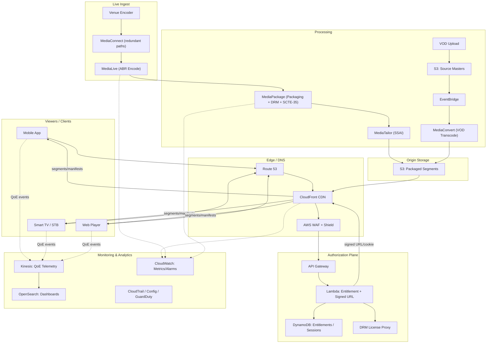

# Part IX – Industry-Specific Architectures

# Chapter 74: Media Streaming

---

## 1. Executive Summary

Media streaming is one of the most demanding workload categories in cloud architecture. It combines massive, bursty read traffic, strict latency budgets, global audience distribution, licensing and content-protection requirements, and a cost structure that is dominated by data transfer rather than compute. Getting the architecture wrong does not show up as a slow API response — it shows up as buffering wheels on millions of screens during a live sports final, or a leaked 4K master file before a title's release date.

**The business problem.** Media companies — broadcasters, OTT (over-the-top) platforms, sports leagues, corporate training providers, and social platforms with embedded video — need to deliver video (live and on-demand) to a global, device-diverse audience with:

- Sub-second to few-second glass-to-glass latency for live events (sports, news).
- High-quality adaptive playback across mobile, smart TV, set-top box, browser, and connected-car targets.
- Digital Rights Management (DRM) and geo-restriction to satisfy content licensing agreements.
- The ability to survive traffic spikes of 10x–50x baseline during marquee live events without pre-provisioning for peak year-round.
- Cost efficiency, because egress and transcoding are the two largest line items and scale linearly with audience size.

A naive architecture — a single origin server serving video files directly to viewers — collapses under these requirements almost immediately. It cannot absorb traffic spikes, it has no adaptive bitrate capability, it exposes the origin to every viewer (an operational and security liability), and it has no mechanism for content protection or regional licensing enforcement.

**Architecture objective.** The Media Streaming Reference Architecture in this chapter is built around four pillars:

1. **Ingest** — accept live contribution feeds (RTMP, SRT, RIST) or on-demand file uploads reliably, with encoder redundancy.
2. **Process** — transcode source content into adaptive bitrate (ABR) ladders (HLS/DASH), package for DRM, and generate thumbnails/previews.
3. **Distribute** — deliver packaged segments through a global CDN edge network with regional and device-aware routing, while keeping the origin nearly invisible to end users.
4. **Protect and Measure** — enforce DRM/token-based authorization, geo-blocking, and collect QoE (Quality of Experience) telemetry for both business analytics and real-time operational alerting.

**Why organizations adopt this architecture.** Building and operating in-house video infrastructure at global scale is extraordinarily capital- and expertise-intensive. AWS provides purpose-built managed services (MediaLive, MediaPackage, MediaConnect, MediaConvert, MediaTailor, CloudFront) precisely because generic compute/storage primitives are a poor fit for the domain-specific problems in video: keyframe alignment across renditions, segment packaging, DRM key rotation, ad insertion stitching, and encoder failover with sub-second cutover.

**Major business benefits:**

- **Time to market.** A team can launch a fully adaptive, DRM-protected, multi-region streaming service in weeks instead of building a transcoding farm and CDN integration from scratch.
- **Elasticity for live spikes.** MediaLive channels and MediaConvert jobs scale independently from viewer-facing infrastructure; CloudFront absorbs edge traffic without the origin ever seeing per-viewer load.
- **Monetization flexibility.** Server-side ad insertion (SSAI) via MediaTailor allows ad stitching that survives ad blockers, because ads are indistinguishable from content at the segment level.
- **Global reach with local compliance.** CloudFront's edge network combined with signed URLs/cookies and geo-restriction supports territory-based licensing without duplicating infrastructure per region.
- **Reduced operational burden.** Managed media services handle codec updates, packaging format changes (e.g., new CMAF profiles), and DRM provider integration, freeing engineering teams to focus on product.

**Typical enterprise scenarios:**

- A regional broadcaster launching a direct-to-consumer streaming app to complement linear TV.
- A sports league streaming live matches globally with strict latency requirements for betting/second-screen synchronization.
- A corporate learning platform delivering on-demand training video to hundreds of thousands of employees.
- A social platform adding native video upload and playback at scale.
- An enterprise events team live-streaming all-hands meetings and product launches to a global workforce.

Each scenario shares the same architectural backbone described in this chapter, differing primarily in scale, DRM strictness, and latency tolerance — live sports has the tightest latency and highest concurrency spikes; corporate training has looser latency requirements but strict access control (SSO-gated, internal-only content).

> **Note:** This chapter treats "media streaming" broadly — covering both **live** and **video-on-demand (VOD)** delivery — because in practice almost every production media platform needs both, and they share 80% of the same architecture (packaging, DRM, CDN, monitoring). Where the two diverge materially (ingest, latency budget, encoding profile), this is called out explicitly.

---

## 2. Business Requirements

### 2.1 Business Drivers

| Driver | Description |
|---|---|
| Subscriber growth | Platform must scale horizontally as subscriber/viewer base grows without re-architecture. |
| Content licensing compliance | Studios and rights holders require DRM, geo-fencing, and concurrent stream limits. |
| Advertising revenue | AVOD (ad-supported VOD) and live linear streams need reliable server-side ad insertion. |
| Viewer experience parity | Viewers expect Netflix/YouTube-level quality regardless of company size. |
| Cost control | Egress and transcoding costs must be predictable and optimized as the largest line items. |
| Global expansion | New territories must be addable without re-platforming. |

### 2.2 Functional Requirements

- Ingest live video via RTMP push or SRT/RIST contribution from remote venues.
- Accept VOD uploads from a content management system (CMS) or partner delivery (Aspera/S3 transfer).
- Transcode into an ABR ladder (e.g., 240p to 4K) in HLS and/or DASH with CMAF where possible.
- Package with DRM (Widevine, PlayReady, FairPlay) for premium content; token-based signed URLs for lower-tier content.
- Insert server-side ads (SSAI) for ad-supported tiers.
- Support live-to-VOD (automatically convert a completed live event into an on-demand asset).
- Provide catch-up/restart-TV capability (viewer can join a live stream from its start).
- Deliver thumbnails, trick-play (scrubbing preview) sprites, and closed captions/subtitles.
- Collect QoE metrics (rebuffering ratio, startup time, bitrate switches, error rate) client-side.

### 2.3 Non-Functional Requirements

| Category | Requirement |
|---|---|
| Scalability | Support 10x–50x viewer spikes during live events without manual intervention. |
| Availability | 99.95%–99.99% for playback path; encoder ingest requires redundant paths. |
| Latency | Live: 2–6 seconds glass-to-glass for standard OTT; sub-2-second for premium low-latency HLS/DASH (LL-HLS/LL-DASH). VOD: startup time under 2 seconds. |
| Compliance | Content licensing (territory restriction), accessibility (closed captioning, e.g., FCC/CVAA in the US, EN 301 549 in the EU), data privacy (GDPR/CCPA for viewer telemetry). |
| Security | DRM key protection, signed URL/cookie expiration, WAF on API and origin, encryption in transit and at rest. |
| RPO | VOD source assets: near-zero (S3 versioning + cross-region replication). Live streams: acceptable to lose in-flight segments during a regional failover (typically under 30 seconds of live buffer). |
| RTO | Live ingest failover: under 10 seconds (encoder redundancy). Playback path failover: near-zero due to CDN multi-origin design. |
| SLA | Typically 99.9% viewer-facing SLA is contractually offered; internal engineering target is higher to leave margin. |

### 2.4 Expected Workload and Growth

- Baseline: tens of thousands of concurrent viewers for a mid-size OTT platform.
- Peak (live sports/major event): 10x–50x baseline for 1–3 hours, several times a year.
- Growth: 30–100% year-over-year subscriber growth is common in early-stage OTT platforms; architecture must scale without re-platforming.

---

## 3. Architecture Overview

### 3.1 Overall Design and Philosophy

The architecture separates concerns into four independently scalable planes:

1. **Contribution/Ingest plane** — where content enters the system (live encoders, VOD uploads).
2. **Processing plane** — transcoding, packaging, and thumbnail/caption generation.
3. **Origin and Distribution plane** — object storage as origin, CDN as the delivery fabric.
4. **Control plane** — authentication/authorization, DRM license issuance, ad decisioning, and analytics.

This separation matters because each plane has a fundamentally different scaling profile. Ingest scales with the **number of concurrent live events**, which is small and predictable. Processing scales with **encoding job volume**, which is bursty but boundable via job queues. Distribution scales with **viewer count**, which is the least predictable and largest in magnitude — this is why CDN offload (not origin scaling) is the primary lever for viewer-facing scalability.

### 3.2 Core Components

| Component | Role |
|---|---|
| AWS Elemental MediaConnect | Reliable transport of live contribution feeds between venues, encoders, and AWS (SRT, Zixi, RIST). |
| AWS Elemental MediaLive | Live encoding — converts a live contribution feed into an ABR ladder in real time. |
| AWS Elemental MediaPackage | Live/VOD packaging — converts encoded output into HLS/DASH manifests, handles DRM encryption, ad marker insertion. |
| AWS Elemental MediaConvert | File-based (VOD) transcoding into ABR renditions. |
| AWS Elemental MediaTailor | Server-side ad insertion (SSAI) and personalization for both live and VOD. |
| Amazon S3 | Origin storage for VOD source files, packaged segments, thumbnails. |
| Amazon CloudFront | CDN edge distribution, signed URL/cookie enforcement, geo-restriction. |
| AWS WAF & Shield | Edge security for API endpoints and origin protection against DDoS/bot traffic. |
| Amazon API Gateway + Lambda | Playback authorization service, DRM license proxy, entitlement checks. |
| Amazon DynamoDB | Entitlement/session/concurrency-limit store, low-latency reads at edge-adjacent scale. |
| Amazon Kinesis Data Streams / Firehose | Client-side QoE telemetry ingestion. |
| Amazon OpenSearch Service | Real-time operational dashboards for QoE and CDN error rates. |
| AWS Elemental MediaLive Anywhere / on-prem encoders | For venues without direct AWS Direct Connect, feeding into MediaConnect. |

### 3.3 High-Level Workflow

**Live path:** Venue encoder → MediaConnect (redundant transport) → MediaLive (ABR encode) → MediaPackage (packaging + DRM + ad markers) → S3/CloudFront origin fetch → CloudFront edge → Player.

**VOD path:** Upload → S3 (source bucket) → EventBridge trigger → MediaConvert (ABR transcode) → S3 (packaged output) → CloudFront → Player.

**Authorization path (both):** Player requests playback → API Gateway/Lambda checks entitlement (DynamoDB) → issues signed CloudFront URL/cookie and DRM license token → Player fetches segments from CloudFront using signed credentials → DRM license server (managed or third-party, e.g., Widevine/PlayReady/FairPlay via a license proxy) issues content key.

**Data lifecycle:** Raw contribution feeds are ephemeral (not persisted beyond MediaLive's operational buffer unless explicitly recorded to S3). Packaged live segments are written to S3 with a short lifecycle (hours to days) before either being converted to a permanent VOD asset (live-to-VOD) or expiring. VOD source masters are retained indefinitely in S3 Glacier-tiered storage per rights agreements; packaged renditions follow an access-frequency-based lifecycle policy.

---

## 4. AWS Services Used

### 4.1 AWS Elemental MediaLive

**Purpose:** Real-time, live video encoding — ingests a live contribution stream and outputs an ABR ladder in the formats required by MediaPackage.

**Why selected:** Built specifically for 24/7 broadcast-grade live encoding with SMPTE 2022-7 style redundancy (dual input pipelines), which general-purpose EC2 + FFmpeg cannot match without significant custom engineering.

**Alternatives:** Self-managed FFmpeg/GStreamer on EC2 (full control, but you own encoder redundancy, monitoring, and codec updates); third-party cloud encoders (Wowza, Harmonic) — viable but adds a non-AWS vendor to the security/compliance boundary.

**Limitations:** Channel start-up time (tens of seconds) means channels are typically kept running for scheduled events rather than started on-demand per viewer session. Regional service availability is more limited than core services like EC2/S3.

**Pricing considerations:** Billed per channel-hour by output resolution tier; standard (redundant, dual-pipeline) channels cost roughly double single-pipeline channels but are required for any production live event.

**Best practices:** Always use `STANDARD` channel class (dual-pipeline) for anything customer-facing; use `SINGLE_PIPELINE` only for internal/test channels. Stop channels when not in use — billing is per running channel-hour.

### 4.2 AWS Elemental MediaPackage

**Purpose:** Just-in-time packaging of encoded live/VOD streams into HLS/DASH/CMAF, DRM encryption, and ad marker (SCTE-35) passthrough for SSAI.

**Why selected:** Decouples encoding format from delivery format — one MediaLive output can be packaged into multiple manifest formats (HLS for iOS, DASH for Android/web) without re-encoding.

**Alternatives:** Custom packaging with Shaka Packager on EC2/Fargate (more control, more operational burden); origin-side packaging is rarely worth the engineering cost compared to a managed packager.

**Limitations:** Adds a small amount of end-to-end latency versus direct-from-encoder delivery; DRM key rotation intervals affect segment boundary alignment and must be tuned per content type.

**Pricing considerations:** Billed on data egress from MediaPackage and per-DRM-encrypted-output — this is a real cost line for high-concurrency live events and should be modeled explicitly (see Section 16).

**Best practices:** Use MediaPackage's CDN authorization (origin access via CloudFront-specific headers) so the packaging endpoint is not reachable except via the CDN.

### 4.3 AWS Elemental MediaConvert

**Purpose:** File-based (batch) transcoding for VOD content into ABR renditions.

**Why selected:** Handles the codec/container complexity (H.264/H.265/AV1, HLS/DASH/CMAF, closed captions, audio normalization) as a managed job service with per-job scaling — no idle transcoding farm to maintain.

**Alternatives:** Elastic Transcoder (legacy, being phased out — do not use for new builds); self-managed FFmpeg on EC2 Spot fleets (cheaper at very high, steady volume but requires building job orchestration, retries, and codec expertise in-house).

**Limitations:** Job queue concurrency has account-level soft limits that must be raised for large VOD libraries or event-driven batch ingestion spikes.

**Pricing considerations:** Priced per minute of output, per resolution tier and feature (HDR, audio description, captions burn-in). A 4K HDR + multiple SDR renditions job is materially more expensive than SD-only output — a common FinOps lever is not over-provisioning the rendition ladder (see Section 16).

**Best practices:** Use job templates and queues to separate priority (e.g., a high-priority queue for breaking-news VOD clips vs. a standard queue for long-form back catalog).

### 4.4 AWS Elemental MediaConnect

**Purpose:** Reliable, secure transport of live video contribution feeds over the public internet or private links, with automatic failover between redundant paths.

**Why selected:** Standard RTMP push from a venue encoder directly to MediaLive has no path redundancy; MediaConnect flows can ingest via two diverse network paths and MediaLive can automatically fail over between them.

**Alternatives:** Direct RTMP/SRT ingestion into MediaLive without MediaConnect (simpler, but no path redundancy — acceptable only for lower-tier/internal live streams); Direct Connect dedicated circuits for the most latency/reliability-sensitive contribution (major sports venues).

**Limitations:** Adds a hop and modest cost; only justified when path redundancy or multi-destination distribution (e.g., feeding both a primary and DR region) is required.

**Pricing considerations:** Billed per flow-hour plus data transfer; for a small number of concurrent live events this is a minor cost relative to MediaLive/MediaPackage/CloudFront.

**Best practices:** Use MediaConnect to fan a single contribution feed out to multiple MediaLive channels in different regions for active-active live DR.

### 4.5 AWS Elemental MediaTailor

**Purpose:** Server-side ad insertion (SSAI) — stitches ads into the manifest server-side so they are indistinguishable from content, defeating client-side ad blockers, and supports per-viewer ad personalization.

**Why selected:** Client-side ad insertion (VAST/VPAID in-player) is trivially blocked and creates a visible "seam" at ad breaks; SSAI is now the industry-standard approach for AVOD monetization.

**Alternatives:** Third-party SSAI platforms (FreeWheel, Google Ad Manager DAI) — often used *in combination* with MediaTailor as the ad decision server, with MediaTailor doing the stitching.

**Limitations:** Requires SCTE-35 markers to be present in the source stream (inserted at MediaLive/MediaPackage) to know where ad breaks occur.

**Pricing considerations:** Billed per ad decisioning request and per minute of stitched output — model this against expected ad-break frequency and concurrency.

### 4.6 Amazon S3

**Purpose:** Origin storage for VOD masters, packaged ABR segments, thumbnails, captions, and archived live-to-VOD assets.

**Why selected:** Durable (11 nines), virtually unlimited scale, native integration as a CloudFront origin, and lifecycle policies for automated tiering.

**Alternatives:** EFS (not designed for this access pattern — object storage is the correct primitive for read-heavy, immutable media segments); third-party object storage (rarely justified given S3's CDN integration).

**Limitations:** S3 has no native concept of "hot" playback caching — that responsibility belongs to CloudFront; without CloudFront, direct S3 egress at streaming scale is both slow (no edge presence) and expensive.

**Pricing considerations:** Storage cost is secondary to egress cost in this workload; lifecycle transitions to S3 Infrequent Access/Glacier for cold VOD back-catalog content materially reduce storage spend (see Section 16).

**Best practices:** Separate buckets (or prefixes with distinct lifecycle policies) for: source masters, packaged renditions, thumbnails/captions, and live-ephemeral segments — each has a different retention and access pattern.

### 4.7 Amazon CloudFront

**Purpose:** Global CDN — the primary interface between the platform and viewers; absorbs essentially all viewer-facing read traffic so the origin never sees per-viewer load.

**Why selected:** Deep native integration with MediaPackage/S3 origins, signed URL/cookie support, Lambda@Edge/CloudFront Functions for edge logic (token validation, geo-redirect), and origin shield to further reduce origin load.

**Alternatives:** Third-party CDNs (Akamai, Fastly, Cloudflare) — many enterprise media platforms use a **multi-CDN** strategy for resilience and cost negotiation leverage (see Section 12 and 28); this chapter's reference architecture assumes CloudFront as primary but the pattern generalizes.

**Limitations:** Cache invalidation at global scale is not instantaneous; live manifest files (which change every few seconds) must use short TTLs, which is by design but must be tuned correctly to avoid stale-manifest playback failures.

**Pricing considerations:** Egress is the dominant cost driver of the entire platform at scale — CloudFront pricing tiers decrease with volume, and Reserved Capacity/committed-use discounts are available for predictable baseline traffic (see Section 16).

**Best practices:** Enable Origin Shield for VOD origins with a large back catalog to reduce origin fetch load; use separate cache behaviors (path patterns) for manifests (short TTL) vs. segments (long TTL, immutable).

### 4.8 Amazon API Gateway + AWS Lambda

**Purpose:** Playback authorization API — validates entitlement, issues signed CloudFront URLs/cookies, proxies DRM license requests, enforces concurrent-stream limits.

**Why selected:** Serverless scaling matches the read-heavy, short-lived, bursty nature of "can this viewer play this asset right now" requests without maintaining a fleet of always-on servers.

**Alternatives:** ALB + ECS/Fargate for the authorization service if request latency budgets are tighter than API Gateway/Lambda cold-start characteristics allow, or if the team already standardizes on containers.

**Limitations:** Lambda cold starts can add tail latency; provisioned concurrency mitigates this for latency-sensitive live authorization at the cost of paying for idle capacity.

**Pricing considerations:** Cost scales with request volume — for very high concurrent-viewer live events, this can become non-trivial; caching entitlement decisions briefly (with correct invalidation on plan changes) reduces load.

### 4.9 Amazon DynamoDB

**Purpose:** Low-latency store for viewer entitlements, active session tracking (concurrent stream limits), and DRM license issuance audit trail.

**Why selected:** Single-digit millisecond reads at any scale, with on-demand capacity mode absorbing live-event traffic spikes without capacity planning.

**Alternatives:** ElastiCache for Redis if session state needs to be extremely low latency and the team already operates Redis; Aurora if the entitlement model requires complex relational joins (less common for this access pattern).

**Limitations:** Not suited for complex ad hoc queries/reporting — export to a data warehouse (e.g., Redshift or Athena over S3) for analytics.

### 4.10 Amazon Kinesis Data Streams / Firehose

**Purpose:** Ingest client-side QoE telemetry (rebuffering events, bitrate switches, startup time, playback errors) at scale from millions of concurrent players.

**Why selected:** Handles extremely high-throughput, small-payload event ingestion with ordering guarantees per shard, feeding both real-time dashboards and long-term analytics storage.

**Alternatives:** Direct-to-CloudWatch Logs from client SDKs (simpler but does not scale cost-effectively at very high event volume, and lacks stream-processing flexibility); MSK (Kafka) if the organization already standardizes on Kafka.

### 4.11 Amazon OpenSearch Service

**Purpose:** Real-time operational dashboards for QoE metrics and CDN/origin error rates, enabling incident detection during live events.

**Why selected:** Near-real-time indexing and Kibana-style visualization is well-suited to time-series operational data during the exact window (a live event) when human operators need to detect problems within seconds, not minutes.

**Alternatives:** CloudWatch Logs Insights + Dashboards for a lower-operational-overhead option if dashboard sophistication requirements are modest; Amazon Managed Grafana as a visualization layer over CloudWatch/OpenSearch/Prometheus metrics.

### 4.12 IAM, KMS, WAF, Shield, Secrets Manager, CloudTrail, Config, GuardDuty

Covered in depth in Sections 10 and 11. Summary of role in this architecture:

- **IAM** — least-privilege roles for MediaLive/MediaConvert/MediaPackage service roles, CI/CD deploy roles, and cross-account access for multi-account media platform setups.
- **KMS** — encryption of S3 at rest, DRM content key encryption, Secrets Manager envelope encryption.
- **WAF** — protects the authorization API and any direct-to-origin paths from bot/credential-stuffing/DDoS traffic.
- **Shield Advanced** — recommended for any platform with predictable, high-value live events (a DDoS during a championship final is a business-critical event, not just an engineering incident).
- **Secrets Manager** — DRM provider credentials, third-party ad-decision-server API keys, database credentials.
- **CloudTrail / Config / GuardDuty** — audit trail and continuous compliance/threat detection across the account(s) hosting the platform.

---

## 5. Complete Architecture Diagram



> **Tip:** Keep the diagram's four planes (Ingest, Processing, Origin, Distribution/Auth) visible in every architecture review conversation. Most production incidents in media platforms can be triaged in seconds simply by asking "which plane is failing?"

---

## 6. Component-by-Component Explanation

### 6.1 MediaConnect

- **Purpose:** Reliable contribution transport with path diversity.
- **Responsibilities:** Receive SRT/RIST/Zixi flow from venue, forward to one or more MediaLive inputs, optionally fan out to multiple regions.
- **Inputs:** Venue encoder output over the public internet or Direct Connect.
- **Outputs:** One or more MediaLive channel inputs.
- **Scaling:** Per-flow; each live event is an independent flow, so scaling is "add a flow," not a shared-capacity concern.
- **High availability:** Configure source failover (two independent network paths from venue) and MediaLive Standard channel class consuming both.
- **Failure handling:** Automatic failover between primary/backup source within the flow; alarms on source health metrics.
- **Dependencies:** Venue-side encoder and network path; downstream MediaLive channel.
- **Security:** Flow encryption (AES-128/256) in transit; source allow-listing by IP/CIDR.
- **Monitoring:** CloudWatch metrics for source bitrate, packet loss, jitter.

### 6.2 MediaLive

- **Purpose:** Live ABR encoding.
- **Responsibilities:** Encode incoming contribution feed into a defined rendition ladder; insert SCTE-35 ad markers; output to MediaPackage.
- **Inputs:** MediaConnect flow or direct RTMP/SRT push.
- **Outputs:** HLS/DASH-ready elementary streams to MediaPackage input.
- **Scaling:** Vertical (choose channel class/resolution tier) — MediaLive channels are not horizontally auto-scaled per viewer since encoding cost is a function of source count, not viewer count.
- **High availability:** STANDARD (dual-pipeline) channel class runs two independent encoding pipelines across AZs; MediaPackage selects the healthy pipeline output.
- **Failure handling:** Automatic pipeline failover; alarms on input loss, output frame errors.
- **Dependencies:** Upstream MediaConnect/encoder; downstream MediaPackage.
- **Security:** IAM role scoped to only the required MediaPackage channel destinations.
- **Monitoring:** CloudWatch input/output metrics, active alarm on `InputVideoFrameRate` drops.

### 6.3 MediaPackage

- **Purpose:** Packaging, DRM encryption, ad marker passthrough.
- **Responsibilities:** Convert MediaLive output into HLS/DASH manifests and CMAF segments; encrypt with DRM keys; enforce CDN-only origin access.
- **Inputs:** MediaLive channel output(s).
- **Outputs:** Manifests/segments served through CloudFront.
- **Scaling:** Managed/serverless from the customer's perspective — scales with concurrent channels and egress volume.
- **High availability:** Endpoint redundancy across MediaLive pipeline inputs; multi-region packaging for DR-critical events.
- **Failure handling:** CloudFront can be configured with origin failover groups pointing at a secondary MediaPackage endpoint in a second region.
- **Dependencies:** MediaLive (live) or MediaConvert output structure (VOD-style packaging, less common — MediaConvert typically outputs packaged HLS/DASH directly for VOD).
- **Security:** CDN authorization headers so direct requests to the MediaPackage endpoint (bypassing CloudFront) are rejected.
- **Monitoring:** Origin request/egress metrics, DRM key rotation success/failure alarms.

### 6.4 MediaConvert

- **Purpose:** VOD batch transcoding.
- **Responsibilities:** Convert uploaded source masters into ABR renditions, captions, and thumbnails.
- **Inputs:** S3 source bucket object (triggered via EventBridge on `PutObject`).
- **Outputs:** S3 packaged-output bucket.
- **Scaling:** Job-queue based; increase queue concurrency for large batch backlogs (e.g., library migration).
- **High availability:** Managed service; jobs are retried via queue-level retry configuration and orchestration (Step Functions) on failure.
- **Failure handling:** Failed jobs trigger EventBridge failure events routed to a Step Functions retry/alerting workflow.
- **Dependencies:** Upstream S3 event; downstream S3 output bucket and CloudFront invalidation (rarely needed for new VOD objects since they are new cache keys).
- **Security:** IAM role scoped to specific source/output bucket prefixes only.
- **Monitoring:** Job completion/error rate, average job duration vs. SLA.

### 6.5 CloudFront

- **Purpose:** Global content delivery and access enforcement.
- **Responsibilities:** Cache and serve manifests/segments; validate signed URLs/cookies; enforce geo-restriction; route to origin failover group.
- **Inputs:** Viewer HTTP(S) requests.
- **Outputs:** Manifests/segments to viewer; cache-miss requests to origin (S3 or MediaPackage).
- **Scaling:** Automatic, global, effectively unbounded from the application team's perspective (subject to account service quotas which should be pre-raised before major events).
- **High availability:** Multi-origin failover groups; Origin Shield to protect origin during traffic surges.
- **Failure handling:** 5xx origin errors trigger failover to secondary origin per configured failover criteria.
- **Dependencies:** S3/MediaPackage origins; Lambda@Edge/CloudFront Functions for edge logic.
- **Security:** WAF Web ACL attached; signed URL/cookie validation; TLS termination with ACM certificates.
- **Monitoring:** Cache hit ratio, origin latency, 4xx/5xx error rate per distribution and per cache behavior.

### 6.6 Authorization Service (API Gateway + Lambda + DynamoDB)

- **Purpose:** Entitlement and playback token issuance.
- **Responsibilities:** Validate viewer session/subscription, enforce concurrent stream limits, issue signed CloudFront credentials and DRM license authorization.
- **Inputs:** Player "request to play" API call with viewer auth token.
- **Outputs:** Signed URL/cookie, DRM license server token.
- **Scaling:** Serverless auto-scaling; DynamoDB on-demand mode for spiky live-event authorization volume.
- **High availability:** Multi-AZ by default (Lambda, API Gateway, DynamoDB are regional multi-AZ services).
- **Failure handling:** Circuit breaker to a cached "last known good" entitlement decision if DynamoDB is degraded (fail open vs. fail closed is a deliberate product/security decision — see Section 24).
- **Dependencies:** Identity provider (Cognito or third-party IdP) for viewer authentication upstream of this service.
- **Security:** Short-lived signed URLs (minutes), least-privilege Lambda execution role, request validation at API Gateway.
- **Monitoring:** Authorization latency p99, error rate, concurrent-session-limit rejection rate (a leading indicator of account sharing/fraud).

---

## 7. End-to-End Request Flow

### 7.1 Live Playback Flow

1. Viewer opens the app; client authenticates against the identity provider and receives a session token.
2. Client requests the DNS resolution for the platform's playback domain via Route 53.
3. Client calls the Authorization API (via CloudFront in front of API Gateway) requesting to play a specific live channel.
4. Lambda validates the session token, checks entitlement and concurrent-stream count in DynamoDB.
5. Lambda issues a signed CloudFront URL/cookie (time-boxed) and a DRM license authorization token.
6. Client requests the live manifest from CloudFront using the signed credential.
7. CloudFront validates the signature/geo-restriction at the edge; on cache miss, fetches the manifest from the MediaPackage origin.
8. Client parses the manifest, selects an initial rendition, and requests DRM license from the license proxy using the authorization token.
9. DRM license server (proxied) validates the token and returns the content decryption key, bound to device/session constraints.
10. Client requests media segments from CloudFront (cache hits served from edge; misses pulled from MediaPackage/S3 origin).
11. Client decrypts and renders segments; ABR logic adjusts requested rendition based on measured throughput/buffer health.
12. Client periodically re-fetches the (short-TTL) manifest to discover new live segments and any SCTE-35 ad markers.
13. On ad markers, MediaTailor-stitched segments are requested identically to content segments (transparent to the player).
14. Client emits QoE telemetry (startup time, rebuffer events, bitrate switches) to the Kinesis ingestion endpoint asynchronously.
15. CloudWatch and OpenSearch dashboards update in near real time; alarms fire if error rate or rebuffering ratio crosses threshold.
16. On playback error (e.g., segment 403/404), client falls back to a lower rendition or retries against a secondary CDN if multi-CDN is configured.
17. On session end, client sends a stop event; DynamoDB concurrent-session count is decremented.

### 7.2 VOD Playback Flow (delta from live)

- Steps 1–6 identical.
- Manifest is static (long-lived, not the few-second live TTL) — CloudFront caches aggressively (hours to days) since VOD manifests do not change after publishing.
- No live DRM key rotation mid-playback (VOD content typically uses a single key or a small fixed key rotation schedule).
- No SCTE-35 ad markers unless the VOD asset is AVOD, in which case MediaTailor still performs SSAI against the static manifest.

---

## 8. Deployment Flow

### 8.1 Infrastructure Provisioning

- All infrastructure (MediaLive channel definitions, MediaPackage channels/endpoints, CloudFront distributions, S3 buckets, IAM roles, DynamoDB tables, Lambda functions) is defined in Terraform modules, versioned in a Git repository.
- Environment separation: `dev`, `staging`, `prod` as separate AWS accounts (see Section 9/10) with environment-specific `.tfvars`.

### 8.2 Terraform Workflow

1. Engineer opens a feature branch, modifies a Terraform module (e.g., adds a new MediaLive channel for a new live feed).
2. `terraform plan` runs in CI against a remote state backend (S3 + DynamoDB lock table).
3. Plan output is posted to the pull request for human review, alongside a policy-as-code scan (see Section 20).
4. On merge, CI runs `terraform apply` against the target environment using a scoped deploy role assumed via OIDC (no long-lived credentials in CI).

### 8.3 CI/CD for Application Code (Authorization Service, Player SDKs)

- Blue-green deployment for the Lambda-based authorization service using API Gateway stage aliases and Lambda versions/aliases — traffic is shifted gradually (e.g., 10% → 50% → 100%) with automated rollback on elevated error rate/latency alarms.
- Player SDK releases follow a staged rollout (percentage-based feature flag) independent of backend deployment.

### 8.4 Rollback

- Lambda alias rollback is a single API call reverting to the previous version — this is the fastest rollback path in the entire architecture and should be the default first response to an authorization-service incident.
- Terraform rollback is a `git revert` + re-apply of the prior known-good state; infrastructure changes are never rolled back by manual console edits.

### 8.5 Secrets and Configuration

- DRM provider credentials, third-party ad-decision-server keys, and database credentials are stored in Secrets Manager with automatic rotation where the provider supports it.
- Application configuration (feature flags, rendition ladder definitions) is stored in Parameter Store (Systems Manager) or AppConfig for controlled, audited rollout.

### 8.6 Validation

- Post-deploy synthetic canaries (CloudWatch Synthetics) play a test asset end-to-end (authorization → manifest → segment fetch → DRM license) every few minutes in each region, catching regressions before real viewers do.

---

## 9. Network Topology

### 9.1 VPC and CIDR

- A dedicated VPC per environment (e.g., `10.20.0.0/16` for prod) sized to accommodate the authorization service's Lambda ENIs (if VPC-attached for private DynamoDB/RDS access), any Fargate-based ad-decision or transcoding-adjacent services, and future growth.
- Most **media-processing services themselves (MediaLive, MediaPackage, MediaConvert, MediaConnect) are AWS-managed and do not live inside the customer VPC** — this is an important distinction from typical three-tier architectures. The VPC in this architecture primarily hosts the authorization/control-plane compute and any custom transcoding-adjacent workloads.

### 9.2 Subnets

| Subnet Type | Purpose |
|---|---|
| Public | NAT Gateway, ALB (if used for authorization service instead of API Gateway), bastion-less SSM access endpoints. |
| Private (App) | Lambda ENIs (if VPC-attached), Fargate tasks for any custom ad-decisioning/analytics workers. |
| Private (Data) | DynamoDB VPC endpoints, RDS/Aurora if used for billing/entitlement relational data. |

### 9.3 NAT Gateway / Internet Gateway

- Internet Gateway for public subnet egress (ALB, NAT).
- NAT Gateway (one per AZ for high availability) for private subnet outbound calls (e.g., Lambda calling a third-party DRM/ad-decision API over the internet).

> **Warning:** NAT Gateway data processing charges are a frequently underestimated cost in architectures where Lambda functions in private subnets make high-volume outbound calls (e.g., per-viewer ad-decision requests). Use VPC endpoints for AWS service calls (DynamoDB, S3, Kinesis) to avoid routing that traffic through NAT entirely.

### 9.4 Transit Gateway / Hybrid Connectivity

- For enterprises with multiple AWS accounts (media processing account, corporate IT account, on-prem broadcast facility), Transit Gateway centralizes routing between accounts and, combined with Direct Connect, provides low-latency, high-reliability paths from broadcast venues into MediaConnect.

### 9.5 Route Tables, NACLs, Security Groups

- Security Groups scoped tightly: authorization service Lambda security group allows outbound only to DynamoDB VPC endpoint, Secrets Manager VPC endpoint, and specific third-party DRM/ad-decision API CIDR ranges (or via NAT for SaaS endpoints without fixed IPs).
- NACLs used as a coarse defense-in-depth layer (e.g., explicit deny of known-bad CIDR ranges) but not relied upon as the primary control — Security Groups remain the primary enforcement point.

### 9.6 PrivateLink

- Interface VPC endpoints for DynamoDB, Secrets Manager, Kinesis, and CloudWatch Logs so control-plane compute never traverses the public internet for AWS API calls, reducing both cost (no NAT processing charges for this traffic) and attack surface.

---

## 10. Identity and Access

### 10.1 IAM Roles (Service Roles)

| Role | Scope |
|---|---|
| MediaLive service role | Permission to write to its assigned MediaPackage channel input only. |
| MediaConvert service role | Read from designated source bucket prefix; write to designated output bucket prefix only. |
| Lambda (authorization) execution role | Read/write to the specific DynamoDB entitlement table; read from Secrets Manager for DRM proxy credentials; `cloudfront:CreateSignedUrl`-equivalent key access (via a private key stored in Secrets Manager, not IAM). |
| CI/CD deploy role | Scoped per environment; assumed via OIDC federation from the CI provider, no static AWS keys stored in CI. |

### 10.2 Cross-Account Access

- A typical enterprise media platform separates **Media Processing**, **Security/Log Archive**, and **Corporate/Shared Services** into distinct AWS accounts under AWS Organizations.
- Cross-account roles (assumed via STS `AssumeRole`) allow the Security account's centralized GuardDuty/Security Hub to aggregate findings from the Media account without granting standing access.

### 10.3 Least Privilege and Permission Boundaries

- Permission boundaries applied to any role creatable by application teams (e.g., a "media-team-boundary" policy) prevent privilege escalation even if a team-created IAM role is over-scoped by mistake.
- Service Control Policies (SCPs) at the OU level deny actions like disabling CloudTrail, deleting the S3 origin bucket's versioning, or leaving the account outside approved regions.

---

## 11. Security Architecture

### 11.1 Encryption

- **In transit:** TLS 1.2+ enforced at CloudFront (viewer connections) and between all internal service calls; MediaConnect flow encryption (AES) for contribution feeds.
- **At rest:** S3 buckets encrypted with SSE-KMS using customer-managed keys (CMKs) so key usage is auditable via CloudTrail; DynamoDB encryption at rest with KMS.
- **Content protection (DRM):** Widevine (Android/Chrome), FairPlay (Apple), PlayReady (Windows/Xbox/some Smart TVs) license servers issue content keys bound to signed license requests; content itself is encrypted with AES-128 (HLS) or CENC (DASH/CMAF) using keys rotated per MediaPackage configuration.

### 11.2 WAF, Shield, Certificate Manager

- WAF Web ACL on the CloudFront distribution fronting the Authorization API: rate-based rules, known-bad-IP reputation lists, and geo-match rules aligned to licensing restrictions.
- Shield Advanced for platforms with predictable, high-visibility live events, including access to the DDoS Response Team (DRT) and cost protection for scaling-related charges incurred during an attack.
- ACM-issued and auto-renewed certificates for all CloudFront and ALB TLS endpoints.

### 11.3 GuardDuty, Inspector, Security Hub

- GuardDuty enabled account-wide (and delegated administrator at the Organization level) to detect anomalous API activity (e.g., unusual `CreateSignedUrl` key access patterns, credential compromise indicators).
- Inspector scans any container images used for custom transcoding-adjacent Fargate workloads for known vulnerabilities.
- Security Hub aggregates findings across GuardDuty, Config, and Inspector into a single compliance dashboard, mapped to CIS AWS Foundations Benchmark and any industry-specific frameworks (e.g., MPAA content security best practices for premium content).

### 11.4 Zero Trust Considerations

- No component trusts network location alone — the Authorization service validates every playback request cryptographically (signed token) regardless of whether the request appears to originate from a "trusted" network path.
- Service-to-service calls (e.g., Lambda to DRM proxy) use mutual TLS or signed requests (SigV4 for AWS-internal calls) rather than network-perimeter trust.

### 11.5 Threat Model and Mitigations

| Attack Vector | Mitigation |
|---|---|
| Content piracy (stream ripping/re-distribution) | DRM + forensic watermarking for premium content; short-lived signed URLs. |
| Credential stuffing against viewer accounts | WAF rate-based rules, CAPTCHA/challenge on the identity provider, anomaly detection on login patterns. |
| DDoS against live event | CloudFront absorbs volumetric attacks at the edge; Shield Advanced for layer 3/4; WAF for layer 7. |
| Account sharing beyond licensed concurrency | Concurrent-stream enforcement in DynamoDB with real-time session eviction. |
| Origin exposure (bypassing CDN) | MediaPackage CDN authorization headers; S3 bucket policy restricting access to CloudFront Origin Access Control (OAC) only. |
| DRM key compromise | KMS-backed key management, rotation schedules, and immediate re-keying playbooks. |

---

## 12. High Availability

### 12.1 AZ Failures

- MediaLive STANDARD channel class runs dual pipelines across two AZs; loss of one AZ's pipeline is invisible to viewers.
- Authorization service (Lambda, API Gateway, DynamoDB) is inherently multi-AZ.

### 12.2 Instance/Component Failures

- MediaConnect flow failover between primary/backup source paths.
- CloudFront origin failover groups switch to a secondary origin (e.g., a secondary-region MediaPackage endpoint) on 5xx thresholds.

### 12.3 Regional Failures

- For platforms where a live event's business criticality justifies the cost, MediaConnect fans the contribution feed to MediaLive/MediaPackage channels in two regions simultaneously (active-active live path), with CloudFront failing over between the two origins.
- For VOD, S3 Cross-Region Replication keeps source masters and packaged output available in a secondary region; CloudFront origin failover group provides the read-path failover.

### 12.4 Database Failures

- DynamoDB is inherently multi-AZ within a region; for multi-region entitlement consistency, DynamoDB Global Tables replicate entitlement data across regions for read-local, globally consistent-enough session data (eventual consistency is acceptable for entitlement checks given the short TTL of signed URLs).

### 12.5 Load Balancing and Health Checks

- Route 53 health checks against the Authorization API's synthetic canary endpoint drive automated DNS failover between regional API Gateway deployments if a full regional Authorization plane failure occurs.

---

## 13. Disaster Recovery

### 13.1 Backup Strategy

- VOD source masters: S3 versioning + Cross-Region Replication to a DR region bucket, with MFA delete protection on the primary bucket.
- Infrastructure-as-code (Terraform state and modules) is the "backup" for the control plane — a full environment can be redeployed from Terraform in a DR region.

### 13.2 DR Strategy Selection

| Strategy | Applicability in this architecture |
|---|---|
| Backup & Restore | Sufficient for back-catalog VOD content and non-time-critical corporate training platforms. RTO: hours. |
| Pilot Light | Terraform-defined DR region with core control-plane resources (DynamoDB Global Table replica, S3 replicated bucket, IAM/KMS) pre-provisioned but MediaLive/MediaPackage channels created on-demand during a declared DR event. RTO: tens of minutes. |
| Warm Standby | DR region runs a scaled-down but live Authorization plane and standby MediaLive/MediaPackage channels for the platform's highest-tier live events (e.g., championship broadcasts), ready to take full traffic within minutes. RTO: minutes. |
| Active-Active (Multi-Region) | Reserved for platforms where a live event's business value justifies double the live-path cost — typically only the single most business-critical live product (e.g., a marquee sports rights deal) runs this way, not the entire platform. RTO: seconds. |

### 13.3 RPO/RTO Summary

| Data/Component | RPO | RTO |
|---|---|---|
| VOD source masters | Near-zero (S3 CRR, near real time) | Minutes (S3 failover is essentially instant; playback path failover via CloudFront) |
| Entitlement data (DynamoDB) | Near-zero (Global Tables) | Seconds to minutes |
| Live in-progress event | Up to the live buffer window (~30–60 sec of segments) | Seconds (active-active) to minutes (warm standby) depending on tier |

> **Note:** Most media platforms do **not** need active-active live DR for their entire catalog. Segment the DR strategy by content tier — apply the most expensive strategy only to the events that justify it (see Section 28's cost/complexity trade-off discussion).

---

## 14. Scalability

### 14.1 Horizontal and Vertical Scaling

- **Viewer-facing (distribution) scaling is entirely horizontal and automatic** via CloudFront — there is no vertical scaling decision to make for the CDN layer.
- **Encoding (MediaLive) scaling is vertical per-channel** (choose resolution/bitrate tier) and horizontal per-event (one channel per concurrent live event) — it does not scale with viewer count.
- **Transcoding (MediaConvert) scaling is horizontal via job queue concurrency** — raise queue concurrency limits ahead of known batch-ingestion spikes (e.g., migrating a back catalog).

### 14.2 Auto Scaling / Serverless Scaling

- Authorization service (API Gateway + Lambda) scales automatically with request volume; DynamoDB on-demand capacity mode scales automatically with read/write volume — both are the correct choice for live-event traffic spikes, where pre-provisioned capacity planning is impractical.
- Provisioned Concurrency on the authorization Lambda should be pre-warmed ahead of a known scheduled live event start time to avoid cold-start latency exactly when viewer join-rate is highest.

### 14.3 Database and Storage Scaling

- DynamoDB on-demand mode absorbs the sharp join-rate spike at a live event's start without manual capacity planning.
- S3 has no meaningful scaling limit for this workload at any realistic media platform size; CloudFront Origin Shield reduces origin-side request concurrency during traffic surges.

### 14.4 Queue Scaling

- MediaConvert job queues and any SQS-based ad-decision or thumbnail-generation pipelines should have concurrency/visibility-timeout settings tuned to the expected batch size, with dead-letter queues for poison-pill jobs (e.g., a corrupted source file).

---

## 15. Performance Optimization

### 15.1 Caching

- Manifests: short TTL (2–6 seconds for live, matching segment duration) to balance freshness against origin load.
- Segments: long TTL (hours) since segments are immutable once published — this is the single highest-impact cache tuning decision in the entire architecture, because segment requests vastly outnumber manifest requests.
- Origin Shield adds a second caching tier in front of the origin, materially reducing origin fetch volume during traffic surges — strongly recommended for any platform with a large VOD back catalog or high-concurrency live events.

### 15.2 Compression and Codec Selection

- H.265/HEVC or AV1 renditions reduce bitrate 30–50% versus H.264 at equivalent quality, directly reducing CDN egress cost — but require broader device/player compatibility testing before making them the default rather than an additional (not sole) rendition option.
- Audio and caption tracks compressed and delivered as separate adaptive tracks (not muxed per-rendition) to avoid duplicating audio data across every video bitrate variant.

### 15.3 Database Optimization

- DynamoDB access patterns designed around single-digit-millisecond point reads (get entitlement by viewer+asset key) rather than scans; use Global Secondary Indexes deliberately, not as a default.

### 15.4 Async Processing and Concurrency

- QoE telemetry ingestion is fully asynchronous and decoupled from the playback critical path — a telemetry ingestion slowdown must never be allowed to affect playback authorization or segment delivery.
- Thumbnail/trick-play sprite generation runs as an async post-processing step after the primary ABR ladder is available, so publishing is not blocked waiting on non-critical assets.

---

## 16. Cost Optimization (FinOps)

### 16.1 Estimated Monthly Cost by Deployment Size

*(Illustrative estimates for architectural planning purposes — always validate with the AWS Pricing Calculator and current regional pricing for a specific deployment.)*

| Deployment Size | Concurrent Viewers (peak) | Approx. Monthly Cost Range | Primary Cost Drivers |
|---|---|---|---|
| Small (single regional live channel + modest VOD library) | ~1,000–5,000 | $8,000–$25,000 | CloudFront egress, MediaLive channel-hours |
| Medium (multiple live channels, growing VOD library, DRM) | ~10,000–50,000 | $60,000–$250,000 | CloudFront egress, MediaConvert volume, MediaPackage DRM output |
| Enterprise (national broadcaster / major sports rights) | 500,000+ | $1M–$5M+ | CloudFront egress at massive scale, MediaLive/MediaConnect redundant channels, multi-CDN contracts |

### 16.2 Major Cost Drivers

1. **CDN egress** — by far the largest line item at scale; scales linearly with (viewer count × bitrate × session duration).
2. **Transcoding (MediaConvert/MediaLive)** — scales with content volume and rendition ladder breadth, not viewer count.
3. **MediaPackage DRM-encrypted egress** — a distinct, often underestimated, per-GB charge on top of base packaging cost.
4. **Storage** — secondary cost, but a large back catalog without lifecycle policies accumulates unnecessarily.
5. **NAT Gateway data processing** — easy to overlook; mitigate with VPC endpoints (Section 9.3).

### 16.3 Optimization Opportunities

| Lever | Impact |
|---|---|
| CloudFront committed-use discounts / Reserved Capacity | Reduces effective per-GB egress cost for predictable baseline traffic. |
| Right-sized rendition ladder | Do not encode a 4K rendition if <5% of the audience can consume it — every unused rendition is pure encoding and storage waste. |
| S3 Lifecycle policies (Standard → Infrequent Access → Glacier) | Materially reduces storage cost for back-catalog VOD content rarely accessed after the first weeks post-release. |
| Codec modernization (H.265/AV1) | Reduces egress bytes per stream at equivalent quality, directly reducing the single largest cost line. |
| Origin Shield | Reduces origin-side requests, indirectly reducing MediaPackage/S3 request charges during traffic surges. |
| Reserved Instances/Savings Plans for any steady-state EC2/Fargate compute (e.g., custom ad-decision service) | Standard compute cost optimization, applicable wherever non-managed compute exists in the stack. |

### 16.4 Cost Allocation, Tagging, Budgets

- Tag all resources by `content-tier` (premium/standard), `business-unit`, and `event-id` (for live events) to attribute egress cost to specific rights deals or shows — critical for content licensing profitability analysis.
- AWS Budgets with alerts at 50/80/100% of forecast; Cost Anomaly Detection configured specifically on CloudFront and MediaConvert cost categories, since these are the services most prone to unexpected spikes (e.g., a mis-configured rendition ladder silently 3x-ing transcoding cost).

---

## 17. AI-Assisted Operations

### 17.1 Amazon Q and Bedrock in Media Operations

- **Amazon Q Developer** assists engineers in writing/reviewing Terraform for MediaLive/MediaPackage configurations, flagging common misconfigurations (e.g., missing dual-pipeline channel class for a production channel).
- **Amazon Bedrock**-based internal tools can summarize incident timelines from CloudWatch/OpenSearch logs during a live-event incident, giving the on-call engineer a natural-language summary ("rebuffering ratio spiked at 20:03 UTC correlated with an origin 5xx increase from MediaPackage endpoint B") faster than manually correlating dashboards.

### 17.2 AI for Log Analysis and Incident Response

- LLM-based log summarization over Kinesis/OpenSearch QoE data can surface anomalous patterns (e.g., a specific device model showing elevated DRM license failures) that would otherwise require a human to notice a subtle segment of the data.

### 17.3 AI for Cost Optimization and Capacity Planning

- Bedrock-based analysis of Cost and Usage Reports can identify underutilized renditions (encoded but rarely requested) as a candidate for rendition-ladder trimming, directly reducing MediaConvert/storage cost.

### 17.4 AI-Generated Terraform and Documentation

- AI-assisted generation of Terraform modules for new MediaLive channel definitions accelerates onboarding of new live event types, but **all AI-generated infrastructure code must go through the same policy-as-code and human review gates as human-written code** (see Section 20) — AI assistance changes authorship speed, not the review bar.

> **Warning:** Never allow AI-generated Terraform to apply directly to production without the standard plan-review-approve pipeline. Treat AI output as a draft from a junior engineer, not as pre-approved infrastructure.

---

## 18. Terraform Implementation

```hcl

############################################

# providers.tf

############################################

terraform {
  required_version = ">= 1.7.0"

  required_providers {
    aws = {
      source  = "hashicorp/aws"
      version = "~> 5.50"
    }
  }

  backend "s3" {
    bucket         = "acme-media-tfstate-prod"
    key            = "media-streaming/terraform.tfstate"
    region         = "us-east-1"
    dynamodb_table = "acme-media-tfstate-lock"
    encrypt        = true
  }
}

provider "aws" {
  region = var.aws_region

  default_tags {
    tags = {
      Project     = "media-streaming-platform"
      Environment = var.environment
      ManagedBy   = "terraform"
    }
  }
}

############################################

# variables.tf

############################################

variable "aws_region" {
  description = "Primary AWS region for the media platform"
  type        = string
  default     = "us-east-1"
}

variable "environment" {
  description = "Deployment environment (dev, staging, prod)"
  type        = string
}

variable "vod_source_bucket_name" {
  description = "S3 bucket name for VOD source masters"
  type        = string
}

variable "vod_output_bucket_name" {
  description = "S3 bucket name for packaged VOD renditions"
  type        = string
}

variable "entitlement_table_name" {
  description = "DynamoDB table name for viewer entitlements/sessions"
  type        = string
  default     = "media-entitlements"
}

############################################

# s3.tf  -- Origin storage

############################################

resource "aws_s3_bucket" "vod_source" {
  bucket = var.vod_source_bucket_name
}

resource "aws_s3_bucket_versioning" "vod_source" {
  bucket = aws_s3_bucket.vod_source.id
  versioning_configuration {
    status = "Enabled"
  }
}

resource "aws_s3_bucket_server_side_encryption_configuration" "vod_source" {
  bucket = aws_s3_bucket.vod_source.id
  rule {
    apply_server_side_encryption_by_default {
      sse_algorithm     = "aws:kms"
      kms_master_key_id = aws_kms_key.media.arn
    }
  }
}

resource "aws_s3_bucket_lifecycle_configuration" "vod_source" {
  bucket = aws_s3_bucket.vod_source.id

  rule {
    id     = "archive-cold-masters"
    status = "Enabled"

    transition {
      days          = 90
      storage_class = "STANDARD_IA"
    }

    transition {
      days          = 365
      storage_class = "GLACIER"
    }
  }
}

resource "aws_s3_bucket" "vod_output" {
  bucket = var.vod_output_bucket_name
}

resource "aws_s3_bucket_public_access_block" "vod_output" {
  bucket                  = aws_s3_bucket.vod_output.id
  block_public_acls       = true
  block_public_policy     = true
  ignore_public_acls      = true
  restrict_public_buckets = true
}

############################################

# kms.tf

############################################

resource "aws_kms_key" "media" {
  description             = "CMK for media platform S3/DynamoDB encryption"
  deletion_window_in_days = 30
  enable_key_rotation     = true
}

resource "aws_kms_alias" "media" {
  name          = "alias/media-platform-${var.environment}"
  target_key_id = aws_kms_key.media.key_id
}

############################################

# cloudfront.tf -- Distribution with OAC + failover

############################################

resource "aws_cloudfront_origin_access_control" "vod" {
  name                              = "media-vod-oac-${var.environment}"
  origin_access_control_origin_type = "s3"
  signing_behavior                  = "always"
  signing_protocol                  = "sigv4"
}

resource "aws_cloudfront_distribution" "media" {
  enabled         = true
  is_ipv6_enabled = true
  comment         = "Media streaming distribution (${var.environment})"
  price_class     = "PriceClass_All"

  origin {
    domain_name              = aws_s3_bucket.vod_output.bucket_regional_domain_name
    origin_id                = "vod-origin"
    origin_access_control_id = aws_cloudfront_origin_access_control.vod.id
  }

  default_cache_behavior {
    allowed_methods        = ["GET", "HEAD"]
    cached_methods          = ["GET", "HEAD"]
    target_origin_id        = "vod-origin"
    viewer_protocol_policy  = "redirect-to-https"
    compress                = true
    trusted_key_groups      = [aws_cloudfront_key_group.signing.id]

    forwarded_values {
      query_string = false
      cookies {
        forward = "none"
      }
    }

    min_ttl     = 0
    default_ttl = 86400   # segments: long TTL, immutable content
    max_ttl     = 604800
  }

  ordered_cache_behavior {
    path_pattern           = "*.m3u8"
    allowed_methods        = ["GET", "HEAD"]
    cached_methods          = ["GET", "HEAD"]
    target_origin_id        = "vod-origin"
    viewer_protocol_policy  = "redirect-to-https"
    compress                = true
    trusted_key_groups      = [aws_cloudfront_key_group.signing.id]

    forwarded_values {
      query_string = false
      cookies {
        forward = "none"
      }
    }

    min_ttl     = 0
    default_ttl = 4     # manifests: short TTL for live freshness
    max_ttl     = 6
  }

  restrictions {
    geo_restriction {
      restriction_type = "whitelist"
      locations        = var.licensed_territories
    }
  }

  viewer_certificate {
    acm_certificate_arn      = var.acm_certificate_arn
    ssl_support_method       = "sni-only"
    minimum_protocol_version = "TLSv1.2_2021"
  }

  web_acl_id = aws_wafv2_web_acl.media.arn
}

resource "aws_cloudfront_key_group" "signing" {
  name    = "media-signing-keys-${var.environment}"
  items   = [aws_cloudfront_public_key.signing.id]
  comment = "Key group for signed URL/cookie validation"
}

resource "aws_cloudfront_public_key" "signing" {
  name        = "media-signing-key-${var.environment}"
  encoded_key = file("${path.module}/keys/cloudfront_public_key.pem")
  comment     = "Public key for CloudFront signed URLs"
}

############################################

# dynamodb.tf -- Entitlement/session store

############################################

resource "aws_dynamodb_table" "entitlements" {
  name         = var.entitlement_table_name
  billing_mode = "PAY_PER_REQUEST"   # on-demand, absorbs live-event spikes
  hash_key     = "viewer_id"
  range_key    = "asset_id"

  attribute {
    name = "viewer_id"
    type = "S"
  }

  attribute {
    name = "asset_id"
    type = "S"
  }

  server_side_encryption {
    enabled     = true
    kms_key_arn = aws_kms_key.media.arn
  }

  point_in_time_recovery {
    enabled = true
  }
}

############################################

# lambda.tf -- Authorization service

############################################

resource "aws_iam_role" "authz_lambda" {
  name = "media-authz-lambda-${var.environment}"

  assume_role_policy = jsonencode({
    Version = "2012-10-17"
    Statement = [{
      Action    = "sts:AssumeRole"
      Effect    = "Allow"
      Principal = { Service = "lambda.amazonaws.com" }
    }]
  })
}

resource "aws_iam_role_policy" "authz_lambda" {
  name = "authz-lambda-policy"
  role = aws_iam_role.authz_lambda.id

  policy = jsonencode({
    Version = "2012-10-17"
    Statement = [
      {
        Effect   = "Allow"
        Action   = ["dynamodb:GetItem", "dynamodb:PutItem", "dynamodb:UpdateItem"]
        Resource = aws_dynamodb_table.entitlements.arn
      },
      {
        Effect   = "Allow"
        Action   = ["secretsmanager:GetSecretValue"]
        Resource = var.drm_proxy_secret_arn
      },
      {
        Effect   = "Allow"
        Action   = ["kms:Decrypt"]
        Resource = aws_kms_key.media.arn
      }
    ]
  })
}

resource "aws_lambda_function" "authz" {
  function_name = "media-authz-${var.environment}"
  role          = aws_iam_role.authz_lambda.arn
  handler       = "index.handler"
  runtime       = "nodejs20.x"
  timeout       = 5
  memory_size   = 512

  filename         = "${path.module}/build/authz.zip"
  source_code_hash = filebase64sha256("${path.module}/build/authz.zip")

  environment {
    variables = {
      ENTITLEMENT_TABLE = aws_dynamodb_table.entitlements.name
      DRM_SECRET_ARN    = var.drm_proxy_secret_arn
    }
  }
}

############################################

# outputs.tf

############################################

output "cloudfront_domain_name" {
  value = aws_cloudfront_distribution.media.domain_name
}

output "entitlement_table_name" {
  value = aws_dynamodb_table.entitlements.name
}

output "authz_lambda_arn" {
  value = aws_lambda_function.authz.arn
}

```

> **Best practice:** Split this into modules (`modules/origin-storage`, `modules/cdn`, `modules/authz-service`, `modules/live-ingest`) rather than one flat file, with a thin root module per environment wiring them together. This keeps the live-ingest module (which changes rarely, per live product) decoupled from the authz-service module (which deploys frequently).

---

## 19. AWS CLI Examples

```bash

# --- Deployment / Live Event Setup ---

# Start a MediaLive channel ahead of a scheduled live event

aws medialive start-channel --channel-id 1234567

# Check MediaLive channel state

aws medialive describe-channel --channel-id 1234567 \
  --query 'State'

# Create a MediaConvert job from a job settings JSON file

aws mediaconvert create-job \
  --endpoint-url https://abc123.mediaconvert.us-east-1.amazonaws.com \
  --cli-input-json file://job-settings.json

# --- Validation ---

# Verify CloudFront distribution deployment status

aws cloudfront get-distribution --id E1A2B3C4D5E6F7 \
  --query 'Distribution.Status'

# Verify a live manifest is reachable through CloudFront

curl -I https://media.example.com/live/channel1/index.m3u8

# --- Monitoring / Troubleshooting ---

# Get CloudFront 5xx error rate over the last hour

aws cloudwatch get-metric-statistics \
  --namespace AWS/CloudFront \
  --metric-name 5xxErrorRate \
  --dimensions Name=DistributionId,Value=E1A2B3C4D5E6F7 \
  --start-time $(date -u -d '1 hour ago' +%Y-%m-%dT%H:%M:%S) \
  --end-time $(date -u +%Y-%m-%dT%H:%M:%S) \
  --period 300 \
  --statistics Average

# Check MediaLive input loss alarms

aws cloudwatch describe-alarms \
  --alarm-name-prefix "MediaLive-InputLoss"

# Tail authorization Lambda logs during an incident

aws logs tail /aws/lambda/media-authz-prod --follow --since 15m

# --- Cleanup ---

# Stop a MediaLive channel after the live event ends (billing stops)

aws medialive stop-channel --channel-id 1234567

# Delete a completed MediaConvert job's temporary source (if applicable lifecycle rule missed it)

aws s3 rm s3://acme-media-vod-source-temp/uploads/old-file.mov

```

---

## 20. CI/CD Integration

### 20.1 Pipeline Overview


### 20.2 GitHub Actions Example

```yaml

name: media-platform-infra
on:
  pull_request:
    paths: ["infra/**"]
  push:
    branches: [main]
    paths: ["infra/**"]

permissions:
  id-token: write
  contents: read

jobs:
  plan:
    runs-on: ubuntu-latest
    steps:
      - uses: actions/checkout@v4
      - uses: hashicorp/setup-terraform@v3
      - name: Configure AWS credentials (OIDC)
        uses: aws-actions/configure-aws-credentials@v4
        with:
          role-to-assume: arn:aws:iam::111122223333:role/media-terraform-ci
          aws-region: us-east-1
      - name: Terraform fmt & validate
        run: |
          terraform -chdir=infra fmt -check
          terraform -chdir=infra init -backend=false
          terraform -chdir=infra validate
      - name: Policy-as-Code scan
        run: checkov -d infra --compact
      - name: Terraform Plan
        run: |
          terraform -chdir=infra init
          terraform -chdir=infra plan -out=tfplan
      - name: Post plan to PR
        uses: actions/github-script@v7
        with:
          script: |
            core.summary.addRaw('Terraform plan completed — see workflow logs').write()

  apply:
    needs: plan
    if: github.ref == 'refs/heads/main'
    runs-on: ubuntu-latest
    environment: production
    steps:
      - uses: actions/checkout@v4
      - uses: hashicorp/setup-terraform@v3
      - uses: aws-actions/configure-aws-credentials@v4
        with:
          role-to-assume: arn:aws:iam::111122223333:role/media-terraform-ci
          aws-region: us-east-1
      - run: |
          terraform -chdir=infra init
          terraform -chdir=infra apply -auto-approve

```

### 20.3 Rollback in Pipeline

- A failed synthetic canary post-apply automatically triggers a `terraform apply` of the previous known-good tagged commit via a separate rollback workflow, rather than requiring a fresh `plan/apply` cycle under incident pressure.

---

## 21. Monitoring

### 21.1 Key Metrics

| Metric | Source | Why it matters |
|---|---|---|
| Rebuffering ratio | Client QoE telemetry | Primary viewer-experience SLI; directly correlates with churn. |
| Startup time (time to first frame) | Client QoE telemetry | Viewer abandonment increases sharply past ~2 seconds. |
| CloudFront cache hit ratio | CloudFront metrics | Low hit ratio indicates a caching misconfiguration or content freshness problem, driving unnecessary origin load/cost. |
| Origin 5xx rate | CloudFront/MediaPackage metrics | Leading indicator of an origin-side incident before it becomes viewer-visible at scale. |
| MediaLive input loss | MediaLive metrics | Direct indicator of a contribution feed problem requiring immediate operator attention during a live event. |
| DRM license failure rate | Authorization service / DRM proxy logs | Spikes often indicate a specific device/OS version issue or a DRM provider outage. |
| Concurrent session rejection rate | DynamoDB / authz logs | Leading indicator of account-sharing fraud beyond licensed limits. |

### 21.2 Dashboards, Alarms, SLIs/SLOs

- A dedicated "Live Event War Room" CloudWatch/OpenSearch dashboard is stood up for every scheduled high-visibility live event, pre-configured with the metrics above at 10-second granularity.
- SLO example: "99% of playback sessions experience a rebuffering ratio below 0.5% over a rolling 30-day window." Error budget burn-rate alarms (fast burn over 1 hour, slow burn over 6 hours) page the on-call engineer before the monthly SLO is fully consumed.
- X-Ray tracing across the Authorization service (API Gateway → Lambda → DynamoDB → DRM proxy) to isolate latency contributors during p99 latency investigations.

---

## 22. Logging

### 22.1 Centralized Logging

- CloudFront access logs and MediaPackage/MediaLive operational logs are delivered to a centralized S3 bucket in the Log Archive account, partitioned by date for Athena querying.
- Application logs (Lambda, any Fargate workers) go to CloudWatch Logs with a subscription filter forwarding to the centralized logging pipeline.

### 22.2 Athena and OpenSearch

- Athena over partitioned CloudFront access logs in S3 supports ad hoc investigation (e.g., "which ASN generated the anomalous traffic spike at 20:03 UTC") without needing to pre-index everything into OpenSearch.
- OpenSearch holds the real-time operational window (last 24–72 hours) for live dashboards; Athena/S3 holds the long-term, cost-efficient archive for historical/compliance queries.

### 22.3 Retention and Audit Logging

- CloudTrail logs retained a minimum of one year (longer per compliance/contractual requirement) in the Log Archive account with S3 Object Lock (WORM) to satisfy audit integrity requirements.
- DRM license issuance events are logged with full audit detail (viewer, asset, device, timestamp, outcome) for both security investigation and rights-holder reporting obligations.

---

## 23. Operational Excellence

### 23.1 Runbooks

- Every alarm defined in Section 21 has a corresponding runbook entry with concrete diagnostic steps and the specific CLI commands from Section 19, not just a generic "investigate" instruction.

### 23.2 Automation

- Auto-remediation Lambda functions handle known-safe scenarios (e.g., automatically restarting a stalled MediaConvert job after a transient service error) without waiting for human intervention, reserving human on-call time for genuinely novel incidents.

### 23.3 Patch Management and Maintenance

- Managed media services (MediaLive/MediaPackage/MediaConvert/CloudFront) require no OS patching by the customer; patch management effort in this architecture concentrates entirely on any self-managed compute (custom ad-decision/analytics Fargate tasks) and on Lambda runtime version upgrades.

### 23.4 Incident Response and Change Management

- A live-event-specific change freeze window (e.g., no non-emergency infrastructure changes in the 4 hours before and during a marquee broadcast) is a standard, contractually-informed operational practice in media streaming, distinct from typical SaaS change management cadences.

---

## 24. Failure Scenarios

| # | Scenario | Symptoms | Root Cause | Detection | Resolution | Prevention |
|---|---|---|---|---|---|---|
| 1 | Venue encoder network path failure | Live stream freezes/drops mid-broadcast | Primary contribution network path lost | MediaConnect source health alarm | Automatic failover to backup path | Dual diverse network paths from venue (Section 6.1) |
| 2 | MediaLive pipeline failure | Brief glitch, no viewer-visible outage | Underlying AZ/hardware issue in one pipeline | CloudWatch pipeline health metric | Automatic pipeline failover (STANDARD class) | Always use STANDARD (dual-pipeline) channel class |
| 3 | CloudFront origin overload during traffic spike | Elevated origin latency/5xx | Origin Shield not enabled; cache TTL misconfigured | Origin 5xx rate alarm | Enable/scale Origin Shield; correct TTL | Pre-event load testing, Origin Shield always-on for high-traffic origins |
| 4 | DRM license server outage (third-party) | Playback fails to start for DRM-protected content | Upstream DRM provider incident | DRM license failure rate alarm | Fail over to backup DRM proxy region if configured; communicate to viewers | Multi-region DRM proxy, provider SLA review |
| 5 | Stale manifest served | Viewers see "video unavailable" briefly at live segment boundary | Manifest TTL misconfigured too long | Rebuffering/error spike correlated with manifest age | Correct CloudFront cache behavior TTL | Automated TTL configuration tests in CI |
| 6 | Account-sharing fraud spike | Concurrent-session rejections spike | Credential sharing beyond licensed limits | DynamoDB rejection-rate metric | Enforce session eviction, notify account holder | Proactive concurrency-limit enforcement design |
| 7 | MediaConvert job backlog during library migration | VOD publishing delayed | Queue concurrency limit reached | Job queue depth metric | Raise queue concurrency (service quota increase) | Pre-provision quota increase before known bulk migrations |
| 8 | Regional AWS service disruption | Playback degraded in affected region | AWS regional service event | Multi-region health checks / AWS Health Dashboard | Route 53 failover to DR region per Section 13 | Pre-tested DR runbook, regular DR drills |
| 9 | Origin S3 bucket policy misconfiguration | 403 errors on segment fetch after a deployment | Terraform change inadvertently altered bucket policy/OAC | CloudFront 4xx spike immediately post-deploy | Rollback via Terraform revert | Policy-as-code checks in CI (Section 20) |
| 10 | Ad decision server latency spike | Ad-supported streams show extended black/frozen frames at ad breaks | Third-party ad-decision API degraded | MediaTailor ad-fill-rate metric | Fall back to house/filler ads on decision timeout | Configure aggressive ad-decision timeout with filler fallback |
| 11 | Lambda cold starts during live-event join surge | Elevated p99 authorization latency at event start | No provisioned concurrency configured | Authorization latency p99 alarm | Enable Provisioned Concurrency ahead of event | Pre-warm provisioned concurrency before scheduled events |
| 12 | GuardDuty finding: anomalous signing-key access | Potential signed-URL key compromise | Credential leak or insider misuse | GuardDuty/Security Hub finding | Rotate CloudFront signing key pair immediately | Regular key rotation schedule, least-privilege access to key material |
| 13 | Cross-region replication lag | DR region VOD assets stale | High replication backlog under heavy upload volume | S3 replication metrics | Investigate/scale replication, temporarily widen RPO expectation | Monitor replication lag proactively, alert before RPO breach |
| 14 | Incorrect rendition ladder deployed | Excess buffering on low-bandwidth connections | Missing low-bitrate rendition in MediaConvert template | QoE rebuffering ratio spike on mobile/low-bandwidth segment | Redeploy corrected job template, reprocess affected assets | Template validation checklist before publishing |
| 15 | CDN cache poisoning via malformed query strings | Wrong content served to some viewers | Cache key configuration includes unnecessary query string parameters | Viewer reports / anomalous cache hit patterns | Correct CloudFront cache policy to exclude irrelevant query params | Cache key hygiene review during initial CDN configuration |

---

## 25. Troubleshooting Guide

| Problem | Symptoms | Likely Cause | Diagnosis | AWS CLI Commands | Resolution |
|---|---|---|---|---|---|
| Live stream won't start | Player shows "stream unavailable" | MediaLive channel not running | Check channel state | `aws medialive describe-channel --channel-id <id> --query State` | Start channel; verify input attached |
| High rebuffering during live event | Viewer complaints, QoE dashboard shows spike | Origin overload or CDN cache miss storm | Check origin latency/5xx | `aws cloudwatch get-metric-statistics --namespace AWS/CloudFront --metric-name OriginLatency ...` | Enable/scale Origin Shield, verify TTLs |
| DRM playback failure on specific devices | Errors isolated to one platform (e.g., all Android) | DRM key rotation misaligned with that DRM system's client tolerance | Check MediaPackage DRM logs, correlate by device type | `aws logs tail /aws/medialive/<channel> --follow` | Adjust key rotation interval per DRM system config |
| VOD asset not appearing after upload | Content missing from catalog | MediaConvert job failed or EventBridge trigger misconfigured | Check job status | `aws mediaconvert get-job --id <job-id> --endpoint-url <endpoint>` | Fix job settings, verify EventBridge rule targets correct queue |
| Authorization API elevated latency | Slow "play" button response | Lambda cold start or DynamoDB throttling | Check Lambda duration and DynamoDB throttle metrics | `aws cloudwatch get-metric-statistics --namespace AWS/Lambda --metric-name Duration ...` | Enable provisioned concurrency; confirm on-demand DynamoDB mode |
| Geo-restricted content accessible from wrong region | Compliance/licensing violation risk | CloudFront geo-restriction misconfigured | Review distribution config | `aws cloudfront get-distribution-config --id <dist-id>` | Correct `geo_restriction` locations list, redeploy |
| Sudden cost spike in MediaConvert | Unexpected bill increase | Overly broad rendition ladder or duplicate job triggering | Review Cost Explorer by service/job template | `aws ce get-cost-and-usage --time-period ... --granularity DAILY --metrics UnblendedCost --filter '{"Dimensions":{"Key":"SERVICE","Values":["AWS Elemental MediaConvert"]}}'` | Trim rendition ladder, fix duplicate-trigger EventBridge rule |
| Ad breaks not stitching correctly | Viewers see black frames or ad/content seam | Missing/misaligned SCTE-35 markers | Inspect MediaLive/MediaPackage ad marker config | `aws medialive describe-channel --channel-id <id>` | Correct SCTE-35 insertion configuration at encoder |

---

## 26. Best Practices

1. Always use MediaLive `STANDARD` (dual-pipeline) channel class for any customer-facing live event.
2. Never expose MediaPackage or S3 origins directly — enforce CDN-only access via CDN authorization headers and Origin Access Control.
3. Use short TTLs for live manifests and long TTLs for immutable segments — this single tuning decision has outsized cost and reliability impact.
4. Enable Origin Shield for any origin serving a large VOD back catalog or high-concurrency live traffic.
5. Pre-raise MediaLive/MediaConvert/CloudFront service quotas ahead of known major live events — do not discover a quota limit during the event.
6. Enforce concurrent-stream limits server-side (DynamoDB), never client-side only.
7. Use signed URLs/cookies with short expiration windows, not permanent public access, for any premium/licensed content.
8. Encrypt all data at rest with customer-managed KMS keys, not AWS-managed defaults, for full audit control.
9. Separate environments (dev/staging/prod) into distinct AWS accounts, not just distinct VPCs.
10. Store all infrastructure as Terraform code with remote state and locking — no manual console changes in production.
11. Assume CI/CD deploy roles via OIDC federation — never store static AWS credentials in CI systems.
12. Run policy-as-code scans (Checkov/OPA) on every Terraform plan before human review.
13. Right-size the ABR rendition ladder to actual audience device/bandwidth distribution — do not default to the maximum possible ladder.
14. Apply S3 lifecycle policies to transition cold VOD back-catalog content to Infrequent Access/Glacier tiers.
15. Tag all resources with content-tier, business-unit, and event-id for accurate cost attribution.
16. Configure AWS Budgets and Cost Anomaly Detection specifically on CloudFront and MediaConvert cost categories.
17. Enable provisioned concurrency on the authorization Lambda ahead of scheduled high-visibility live events.
18. Use DynamoDB on-demand capacity mode for entitlement/session tables to absorb live-event traffic spikes.
19. Implement Route 53 health-check-based failover for the authorization plane across regions.
20. Test disaster recovery runbooks on a regular schedule, not only during actual incidents.
21. Segment DR investment by content tier — reserve active-active multi-region live DR for only the highest-value events.
22. Use forensic watermarking for premium/high-value content to deter and trace piracy.
23. Log DRM license issuance events with full audit detail for both security and rights-holder reporting needs.
24. Use VPC endpoints for AWS service calls from private subnets to avoid unnecessary NAT Gateway processing charges.
25. Configure WAF rate-based rules and geo-match rules aligned to actual content licensing territories.
26. Enable Shield Advanced for platforms with predictable, high-visibility live events.
27. Build synthetic canaries that exercise the full playback path (authorization → manifest → segment → DRM license) post-deployment.
28. Prefer Lambda alias-based rollback for the authorization service as the fastest incident-response lever.
29. Decouple QoE telemetry ingestion from the playback critical path — a telemetry slowdown must never affect playback.
30. Review and trim unused MediaConvert output presets/renditions on a recurring cost-optimization cadence.
31. Establish a live-event change freeze window before and during marquee broadcasts.
32. Maintain a "Live Event War Room" dashboard preconfigured for every scheduled major live event.

---

## 27. Anti-Patterns

1. **Serving video directly from S3 without CloudFront.** No edge presence means high latency and unmanageable egress cost at any real scale; always place a CDN in front of the origin.
2. **Using a single-pipeline MediaLive channel for production live events.** Eliminates the built-in redundancy that makes managed live encoding worthwhile; always use STANDARD class for anything customer-facing.
3. **Long TTLs on live manifests.** Causes viewers to miss new segments or see stale playlists; live manifests must use short, segment-duration-aligned TTLs.
4. **Client-side-only concurrent stream enforcement.** Trivially bypassed; enforcement must live server-side in the entitlement store.
5. **Encoding every possible rendition "just in case."** Wastes transcoding and storage cost; rendition ladders should be data-driven from actual device/bandwidth telemetry.
6. **Storing DRM keys or provider credentials in application code or environment variables instead of Secrets Manager/KMS.** Creates an unnecessary credential-leak attack surface.
7. **Allowing direct public access to the MediaPackage or S3 origin.** Bypasses CDN-level access control and geo-restriction entirely, undermining the entire content-protection model.
8. **Treating QoE telemetry ingestion as synchronous with playback.** Couples a non-critical analytics path to the viewer-critical playback path, creating unnecessary failure correlation.
9. **No pre-event quota increase requests.** Discovering a MediaLive/CloudFront/MediaConvert service quota ceiling during a live broadcast is an entirely avoidable, self-inflicted incident.
10. **Skipping policy-as-code scanning on Terraform changes.** Allows security misconfigurations (e.g., public S3 buckets, overly permissive IAM) to reach production undetected.
11. **Using long-lived IAM user access keys for CI/CD instead of OIDC federation.** A significant and unnecessary standing credential-exposure risk.
12. **Applying the same DR strategy uniformly across all content tiers.** Wastes budget on active-active DR for low-value content while potentially under-protecting the highest-value live events.
13. **No forensic watermarking on premium content.** Removes the primary technical deterrent and tracing mechanism against piracy for high-value licensed content.
14. **Manual console changes in production instead of Terraform.** Creates configuration drift that is invisible to code review and breaks the "infrastructure as code" audit trail.
15. **Ignoring NAT Gateway data processing costs for VPC-attached Lambda functions.** A frequently underestimated but entirely preventable cost driver.
16. **No synthetic canary testing of the end-to-end playback path.** Means the first indication of a broken deployment is real viewer complaints, not automated detection.
17. **Overly broad IAM roles for MediaConvert/MediaLive service roles (e.g., full S3 access instead of scoped bucket/prefix access).** Expands blast radius unnecessarily if a service role is ever compromised or misused.
18. **No change freeze window around major live events.** Introduces avoidable deployment risk during the exact window when the business impact of any incident is highest.
19. **Relying solely on a single CDN provider for a platform with major global live events, with no multi-CDN or failover strategy evaluated.** Creates a single point of failure for the entire viewer-facing distribution layer.
20. **Not testing DR failover regularly.** An untested DR plan is not a real DR plan — regional or component failures will reveal gaps in an actual incident rather than in a controlled drill.

---

## 28. Alternatives

| Alternative | Advantages | Disadvantages | Cost | Operational Complexity | Security | Performance |
|---|---|---|---|---|---|---|
| **This architecture (AWS Elemental + CloudFront, single primary CDN)** | Deep AWS-native integration, managed live/VOD media services, fastest time to market | Some AWS lock-in for media-specific services | Moderate–high at scale, dominated by egress | Moderate | Strong (DRM, WAF, Shield, OAC) | Excellent for AWS-adjacent audiences |
| **Multi-CDN (CloudFront + Akamai/Fastly/Cloudflare) with a CDN-agnostic packaging layer** | Resilience against single-CDN outage, cost negotiation leverage, regional performance optimization | Significantly higher operational complexity (multi-CDN traffic steering, consistent signed-URL logic across providers) | Potentially lower egress cost at extreme scale via negotiated multi-vendor contracts, but higher integration cost | High | Comparable if implemented consistently across CDNs | Can outperform single-CDN in specific regions |
| **Self-managed FFmpeg/GStreamer on EC2/Spot fleets instead of MediaLive/MediaConvert** | Maximum encoding customization, potentially lower cost at very high, steady, predictable volume | Team must own encoder redundancy, codec updates, and failover engineering | Lower compute cost but higher engineering/operational cost | Very high | Depends entirely on in-house implementation quality | Comparable if well-engineered, but higher risk of subtle bugs |
| **Third-party end-to-end streaming platform (e.g., a fully hosted OTT SaaS)** | Fastest possible time to market, minimal in-house media engineering required | Least architectural control, potential vendor lock-in, limited customization for unique DRM/licensing needs | Often higher per-stream cost at scale; simpler pricing at small scale | Low | Depends on vendor's security posture, less direct control | Adequate for most use cases, may lag on cutting-edge low-latency features |
| **Kubernetes-based media pipeline (self-managed transcoding/packaging on EKS)** | Full control, portable across clouds, avoids AWS media-service lock-in | Team must build and maintain encoding/packaging pipeline logic that managed services provide out of the box | Compute cost potentially lower at scale; engineering cost significantly higher | Very high | Depends entirely on in-house implementation | Comparable if well-engineered; higher operational risk during live events |

---

## 29. Real Enterprise Case Study

**Company profile:** A mid-size regional sports broadcaster ("Company profile is illustrative") holding streaming rights to a regional professional sports league, transitioning from linear-only broadcast to a direct-to-consumer OTT app.

**Business problem:** The broadcaster needed to launch a subscription OTT app within six months, supporting live game streaming to 200,000+ concurrent viewers during marquee matchups, DRM-protected content per league licensing terms, and a growing on-demand library of past games and original programming — without building an in-house media engineering team from scratch.

**Architecture decisions:**

- Adopted MediaLive/MediaPackage/MediaConnect for live ingest and packaging rather than building a custom FFmpeg-based pipeline, given the six-month timeline and lack of in-house broadcast engineering staff.
- Chose CloudFront as primary CDN with a secondary CDN contracted specifically for the two highest-visibility playoff games each season, based on a cost/risk analysis showing single-CDN risk was acceptable for regular-season games but not for playoff broadcasts.
- Implemented Widevine and FairPlay DRM (covering the vast majority of the target device mix) rather than all three major DRM systems at launch, adding PlayReady in a subsequent phase once Smart TV/Xbox viewership data justified the investment.
- Built the authorization service on API Gateway + Lambda + DynamoDB rather than a container-based service, given the team's existing serverless expertise and the workload's naturally spiky, request-driven shape.

**Migration:** Existing linear-broadcast contribution feeds were routed through new MediaConnect flows in parallel with the existing broadcast chain (no disruption to linear operations), allowing the OTT pipeline to be validated against real live games for two months before public launch.

**Challenges:**

- Initial rendition ladder was over-provisioned (included a 4K rendition that under 2% of the launch device mix could use), identified and trimmed after the first month's cost review, reducing MediaConvert/storage spend materially.
- First playoff game revealed that provisioned concurrency had not been configured on the authorization Lambda, causing elevated p99 latency during the viewer join surge in the first five minutes of the broadcast — resolved before the next game by pre-warming provisioned concurrency ahead of kickoff.
- Early geo-restriction configuration was too coarse (country-level only), which did not satisfy a sub-national territorial licensing clause; the CloudFront geo-restriction and application-level entitlement logic were subsequently combined to enforce the finer-grained requirement.

**Lessons learned:**

- Data-driven rendition ladder decisions (based on actual launch device telemetry) should replace assumption-driven ladders as early as possible.
- Provisioned concurrency and any other "pre-warm ahead of a known event" configuration must be part of the standard live-event operational checklist, not a one-time setup step.
- Fine-grained territorial licensing requirements often exceed what CDN-level geo-restriction alone can enforce and require an application-layer entitlement check as well.

**Results:** The platform launched on schedule, sustained its largest single-game concurrency (over 300,000 concurrent viewers during a playoff broadcast) without customer-visible incident after the operational fixes above, and reduced per-stream delivery cost by approximately 20% within the first two quarters through rendition-ladder trimming and S3 lifecycle policy adoption on the growing VOD library.

---

## 30. Architecture Decision Record (ADR)

**Title:** Adopt AWS Elemental Media Services + CloudFront as the Media Streaming Platform Foundation

**Status:** Accepted

**Context:** The organization needs to launch a live and on-demand streaming platform within an aggressive timeline, without an existing in-house broadcast/media engineering team, while meeting DRM, geo-restriction, and high-availability requirements typical of licensed sports/media content.

**Decision:** Build the platform on AWS Elemental MediaConnect, MediaLive, MediaPackage, MediaConvert, and MediaTailor for ingest/processing/packaging/ad-insertion, with Amazon CloudFront as the primary CDN, a serverless (API Gateway + Lambda + DynamoDB) authorization plane, and Terraform-managed infrastructure across separate dev/staging/prod AWS accounts.

**Alternatives considered:**

- Self-managed FFmpeg/GStreamer encoding pipeline on EC2 — rejected due to timeline and lack of in-house broadcast engineering expertise required to build encoder redundancy and codec expertise from scratch.
- Fully outsourced third-party OTT SaaS platform — rejected due to insufficient architectural control over DRM provider choice and territorial licensing enforcement granularity required by the rights agreement.
- Kubernetes-based self-managed media pipeline — rejected as introducing unnecessary operational complexity relative to using managed AWS media services that directly address the domain's specific problems.

**Consequences:**

- Positive: Significantly faster time to market; reduced operational burden for codec/DRM/packaging-format maintenance; strong native integration between media services and core AWS security/networking primitives.
- Negative: Some degree of lock-in to AWS Elemental service APIs and pricing model for the media-specific portions of the stack; teams must build in-house expertise in AWS media service configuration nuances (channel classes, packaging endpoint configuration, DRM key rotation tuning) that differ from generic compute/storage operational knowledge.

**Risks:**

- Underestimating egress cost at scale if rendition ladders are not actively managed — mitigated by the cost optimization practices in Section 16.
- Single-CDN dependency risk for the highest-visibility live events — mitigated by the selective multi-CDN strategy for marquee broadcasts described in Section 29.

**Review date:** Scheduled for review 12 months post-launch, and immediately upon any material change in rights agreement DRM/territorial requirements or a greater than 3x increase in expected peak concurrency.

---

## 31. Architecture Review Checklist

**Security**
- [ ] All origins (S3, MediaPackage) restricted to CDN-only access via OAC/CDN authorization headers.
- [ ] DRM implemented for all premium/licensed content tiers; signed URLs/cookies used for all others.
- [ ] KMS customer-managed keys used for all at-rest encryption.
- [ ] WAF and Shield configured and tested ahead of any major live event.
- [ ] IAM roles scoped to least privilege for every media service.

**Networking**
- [ ] VPC endpoints in place for AWS service calls from private subnets.
- [ ] MediaConnect path redundancy configured for all production live feeds.
- [ ] CloudFront origin failover groups configured for critical origins.

**Operations**
- [ ] Runbooks exist for every alarm defined in the monitoring plan.
- [ ] Synthetic canaries validate the full playback path post-deployment.
- [ ] Change freeze windows defined around scheduled major live events.

**Performance**
- [ ] Cache TTLs correctly differentiated between manifests (short) and segments (long).
- [ ] Origin Shield enabled for high-traffic/large-catalog origins.
- [ ] Rendition ladder validated against actual audience device/bandwidth data.

**Scalability**
- [ ] DynamoDB on-demand mode (or validated provisioned capacity with headroom) for entitlement store.
- [ ] Provisioned concurrency configured ahead of known high-traffic events.
- [ ] Service quotas pre-raised ahead of known major events.

**Reliability**
- [ ] MediaLive STANDARD channel class used for all production live channels.
- [ ] DR strategy explicitly tiered by content business value.
- [ ] DR failover tested on a recurring schedule.

**Cost**
- [ ] Cost allocation tags applied consistently (content-tier, business-unit, event-id).
- [ ] S3 lifecycle policies applied to VOD back catalog.
- [ ] Budgets and Cost Anomaly Detection configured on CloudFront and MediaConvert.

**Compliance**
- [ ] Geo-restriction configuration validated against actual licensing territory requirements, including sub-national granularity where required.
- [ ] Closed captioning/accessibility requirements met for the target regulatory jurisdictions.
- [ ] Audit logging (CloudTrail, DRM license issuance logs) retained per compliance/contractual requirement.

---

## 32. Summary

This chapter presented a production-grade reference architecture for media streaming built around four independently scalable planes — ingest, processing, distribution, and authorization/control — using AWS Elemental media services and CloudFront as the delivery fabric.

**Business value:** Faster time to market than building in-house media infrastructure, elastic handling of the extreme traffic spikes characteristic of live events, and a content-protection model (DRM, signed URLs, geo-restriction) that satisfies typical content-licensing obligations.

**Key architecture decisions:** Separating scaling concerns by plane; using managed media services rather than self-built encoding/packaging pipelines; tiering DR investment by content business value rather than applying a single DR strategy uniformly; and enforcing entitlement/concurrency limits server-side.

**Lessons learned:** Rendition ladders and DR strategy should be data-driven and business-value-driven respectively, not defaulted to maximum coverage; pre-event operational readiness (quota increases, provisioned concurrency, change freezes) prevents a large share of otherwise-avoidable live-event incidents.

**When to use this architecture:** Any organization delivering live and/or on-demand video to a global or regional audience with licensing, DRM, or scale requirements that a simple static-file CDN setup cannot satisfy.

**When not to use this architecture:** Internal-only, small-audience video distribution (e.g., a small company's internal training videos with under a few hundred concurrent viewers and no DRM requirement) may not justify the operational complexity of the full media services stack — a simpler CloudFront + S3 + basic signed-URL setup, or even a third-party hosted video platform, may be more cost-effective (see Section 34 for a deeper discussion of this threshold).

---

## 33. Further Reading

- AWS Elemental MediaLive Documentation — official service guide for live channel configuration, input/output settings, and redundancy options.
- AWS Elemental MediaPackage Documentation — packaging, DRM, and CDN authorization configuration reference.
- AWS Elemental MediaConvert Documentation — job settings, output presets, and queue management reference.
- AWS Elemental MediaTailor Documentation — server-side ad insertion and personalization configuration reference.
- Amazon CloudFront Developer Guide — cache behaviors, signed URLs/cookies, Origin Access Control, and Origin Shield configuration.
- AWS Well-Architected Framework — Media & Entertainment Lens — industry-specific guidance extending the general Well-Architected pillars.
- AWS Whitepaper: "Best Practices for Live Streaming on AWS."
- Terraform Registry: `hashicorp/aws` provider documentation for `aws_media*`, `aws_cloudfront_*`, and `aws_dynamodb_table` resources.
- CMAF and MPEG-DASH industry specifications, for teams implementing custom packaging logic outside of MediaPackage.
- Other chapters in this series: Chapter 22 (CloudFront Edge Architecture), Chapter 48 (Streaming Analytics), Chapter 98 (Multi-Region Active-Active), and Chapter 95 (Disaster Recovery) for deeper treatment of patterns referenced but not fully expanded in this chapter.

---

# 34. Architect's Corner

## Why This Architecture Exists

Experienced architects converge on this design because generic web architecture patterns — an ALB in front of a fleet of app servers, a relational database, a CDN as an afterthought — simply do not model the actual cost and failure surface of video delivery correctly.

- In a typical web application, compute is the dominant cost and bottleneck. In media streaming, **egress bandwidth is the dominant cost**, and the architecture must be organized around minimizing and controlling that cost from day one.
- Live video has a **hard real-time constraint** that most web architectures never encounter: a request that arrives 3 seconds late is not merely "slow," it is a dropped frame the viewer will see as a freeze.
- **DRM and licensing are not bolt-on features** — they shape which services can even be candidates, because not every packaging/CDN combination correctly supports the content-key rotation and license-server integration patterns rights holders require.

Simpler designs (direct S3 hosting, client-side-only ad insertion, single-pipeline encoding) work fine for a demo or an internal pilot, and that is exactly why they get chosen early — and exactly why they fail once real traffic, real content-licensing obligations, or a first major live event arrives. The architecture in this chapter exists because each of its non-obvious pieces (dual-pipeline encoding, CDN-only origin access, tiered DR) was added in response to a specific, recurring production failure mode across the industry, not as speculative future-proofing.

## When You SHOULD Choose This Architecture

- Organizations with **licensed content** requiring DRM and territorial restriction — this is close to a hard requirement, not a nice-to-have, once a rights agreement is signed.
- Platforms expecting **meaningful concurrent viewership** (tens of thousands or more) or at least one **live event with unpredictable spike potential** (sports, breaking news, product launches).
- Teams with **at least modest DevOps/Terraform maturity** — this architecture assumes infrastructure-as-code discipline; teams without it will struggle more with the operational surface than with the media services themselves.
- Organizations with a **multi-year content investment horizon**, where the up-front integration cost of managed media services pays off over many releases/seasons rather than a single one-off event.
- Budget profiles where **six-figure-plus annual infrastructure spend** is already an acceptable cost of doing business (typical for a company monetizing content via subscription or advertising at meaningful scale).

## When You Should NOT Choose This Architecture

- **Small, internal-only audiences** (a few hundred concurrent viewers, no DRM requirement, e.g., internal corporate town halls) — a simpler CloudFront + S3 + basic signed URL setup, or a third-party hosted platform, is more cost-effective and has far lower operational overhead.
- **Teams without any DevOps/Terraform capability** — the operational surface of MediaLive/MediaPackage/MediaConvert configuration, CDN tuning, and DRM integration will overwhelm a team without infrastructure-as-code discipline; a managed OTT SaaS platform is the more honest choice in this situation.
- **Tight, one-time budget for a single event** rather than an ongoing content platform — the fixed integration/learning cost of this architecture is hard to justify for a single livestream; a simpler managed live-streaming SaaS product is usually more cost-effective for a one-off.
- **Very early-stage products still validating product-market fit** — the DRM/geo-restriction/multi-region DR sophistication in this chapter is premature optimization before there is a real audience or a signed content-licensing agreement requiring it.

## Hidden Trade-offs

- **Operational complexity** is front-loaded into the media-specific services (MediaLive channel classes, MediaPackage endpoint configuration, DRM key rotation tuning) that most general-purpose cloud engineers have never touched before — expect a real ramp-up period even for strong AWS generalists.
- **Unexpected cloud costs** concentrate in CDN egress and MediaPackage DRM-encrypted output — both scale with viewer count in ways that are easy to underestimate during initial cost modeling if the modeling used average, not peak, concurrency.
- **Troubleshooting difficulty** during a live incident is genuinely higher than typical web-app debugging because the failure can originate in any of four largely independent planes (venue encoder, AWS media services, CDN, client player) each with different tooling and, often, different teams responsible.
- **Deployment complexity** for the media-processing plane (MediaLive/MediaPackage channel changes) is inherently riskier to change frequently than typical stateless web service deployments — channel reconfiguration can itself cause a brief live-stream interruption if done carelessly.
- **Vendor lock-in** to AWS Elemental service APIs and configuration models is real; migrating to a different cloud's media services (or to self-managed FFmpeg) later is a substantial re-engineering effort, not a drop-in swap.
- **Learning curve** for DRM integration specifically (three separate DRM systems, each with its own license server integration quirks) is consistently underestimated in initial project timelines.
- **Security implications** of content protection failures are business-critical, not just technical — a DRM bypass or key leak can violate the underlying content-licensing agreement itself, not merely cause a security incident ticket.
- **Maintenance burden** includes an ongoing need to track evolving packaging format standards (e.g., low-latency HLS/DASH profile changes) as player ecosystems evolve, which is a continuous cost, not a one-time build.

## Common Architecture Review Questions

1. Why MediaLive/MediaPackage instead of a self-managed FFmpeg pipeline?
2. Why is DynamoDB the entitlement store instead of a relational database?
3. Why STANDARD (dual-pipeline) MediaLive channel class instead of single-pipeline for cost savings?
4. Why CloudFront as primary CDN instead of a different or multi-CDN approach for this specific platform?
5. How are DRM keys protected and rotated, and who has access to the DRM proxy credentials?
6. How is disaster recovery tested, and how frequently?
7. How is content-licensing territorial compliance demonstrated to auditors/rights holders?
8. How is cost monitored and attributed to specific content or live events?
9. What is the concurrent-stream enforcement mechanism, and can it be bypassed client-side?
10. How does the platform prevent direct-to-origin access bypassing the CDN?
11. What is the rollback plan if a live event deployment introduces a regression?
12. What service quotas have been pre-raised ahead of the next major scheduled live event, and when were they last validated?
13. How is the rendition ladder validated against actual audience device/bandwidth data, and how often is it reviewed?
14. What is the blast radius if the authorization Lambda's execution role is compromised?
15. How are third-party ad-decision-server outages handled without visibly broken ad breaks?
16. What is the plan if the primary DRM provider has an outage during a live event?
17. How is QoE telemetry kept from ever affecting the playback critical path?
18. What is the actual RTO/RPO for a full regional AWS failure during a live broadcast, and has it been tested end-to-end?
19. Why is Kubernetes not used for the media processing pipeline instead of managed AWS media services?
20. What is the change-freeze policy around scheduled major live events, and how is it enforced?
21. How is forensic watermarking implemented for the highest-value premium content, if at all?
22. What is the cost delta between the current architecture and a multi-CDN strategy, and under what conditions would that trade-off be revisited?

## Production Pitfalls

1. **Problem:** Rendition ladder over-provisioned (e.g., unnecessary 4K rendition). **Business impact:** Inflated transcoding/storage/egress cost with negligible viewer benefit. **Technical impact:** Wasted MediaConvert job time and CDN bandwidth. **Solution:** Data-driven ladder review against actual device telemetry within the first month of launch.
2. **Problem:** No provisioned concurrency ahead of a scheduled live event. **Business impact:** Viewer-visible slow app response exactly at peak audience join time. **Technical impact:** Elevated Lambda cold-start latency. **Solution:** Standard pre-event operational checklist item, tested in a dry run.
3. **Problem:** Direct public access accidentally left open on an S3 origin bucket. **Business impact:** Potential content leak/piracy exposure and licensing-agreement breach. **Technical impact:** Bypassed CDN access control entirely. **Solution:** Policy-as-code scanning in CI to catch public-bucket configuration before deployment.
4. **Problem:** Manifest TTL set too long for a live stream. **Business impact:** Viewer complaints of frozen/stale playback. **Technical impact:** Player stuck replaying old segments. **Solution:** Automated CI test asserting manifest cache-behavior TTL for live path patterns.
5. **Problem:** No quota pre-increase before a marquee event. **Business impact:** Public-facing outage during the platform's highest-visibility moment. **Technical impact:** Service quota ceiling reached under load. **Solution:** Standing quota-review process ahead of any known major event.
6. **Problem:** DRM key rotation interval misaligned with a specific DRM system's client tolerance. **Business impact:** Playback failures isolated to one device ecosystem, hard to diagnose without device-segmented monitoring. **Technical impact:** License renewal failures at rotation boundaries. **Solution:** Per-DRM-system rotation interval tuning and device-segmented QoE dashboards.
7. **Problem:** Single-CDN dependency for a business-critical marquee event with no fallback. **Business impact:** A CDN-provider incident becomes a full platform outage during the highest-value event. **Technical impact:** No failover path exists. **Solution:** Selective multi-CDN strategy for the highest-tier events only (cost-justified, not blanket).
8. **Problem:** Concurrent-session enforcement only implemented client-side. **Business impact:** Revenue leakage from account-sharing beyond licensed limits. **Technical impact:** Trivially bypassed by a modified client. **Solution:** Server-side enforcement in the entitlement store, as described in this chapter.
9. **Problem:** QoE telemetry ingestion coupled synchronously to the playback path. **Business impact:** A telemetry backend slowdown causes a viewer-visible playback issue, which should never happen. **Technical impact:** Unnecessary failure correlation between unrelated systems. **Solution:** Fully asynchronous, fire-and-forget telemetry emission from the client.
10. **Problem:** No change-freeze policy around live events. **Business impact:** A routine deployment causes an incident during the platform's most visible moment. **Technical impact:** Avoidable deployment-induced regression. **Solution:** Enforced change-freeze windows communicated and respected across all teams.
11. **Problem:** IAM roles for media services scoped too broadly (e.g., full S3 access instead of specific bucket/prefix). **Business impact:** Expanded blast radius in the event of a credential compromise, larger potential compliance exposure. **Technical impact:** Violates least privilege. **Solution:** Prefix-scoped IAM policies validated in code review.
12. **Problem:** No end-to-end synthetic canary testing post-deployment. **Business impact:** First indication of a broken deployment is real customer complaints rather than automated detection. **Technical impact:** Delayed incident detection and response. **Solution:** CloudWatch Synthetics canary exercising the full playback path on every deployment.
13. **Problem:** Geo-restriction configured only at the country level when the licensing agreement requires sub-national granularity. **Business impact:** Potential breach of the content-licensing agreement. **Technical impact:** CDN-level geo-restriction alone is insufficient. **Solution:** Combine CDN geo-restriction with application-layer entitlement checks for fine-grained territorial rules.
14. **Problem:** DR strategy applied uniformly (either everywhere active-active or nowhere at all) rather than tiered by content value. **Business impact:** Either overspending on low-value content DR or under-protecting the highest-value live events. **Technical impact:** Misallocated engineering and infrastructure investment. **Solution:** Explicit content-tier-based DR strategy as described in Section 13.
15. **Problem:** NAT Gateway data-processing charges from VPC-attached Lambda functions calling AWS services without VPC endpoints. **Business impact:** Unnecessary recurring cost with zero corresponding benefit. **Technical impact:** Traffic unnecessarily routed through NAT instead of a direct VPC endpoint path. **Solution:** Audit and add VPC endpoints for all AWS service calls from private subnets.

## Lessons Learned

- **Migrations are frequently delayed by DRM integration testing**, not by the core encoding/packaging pipeline — budget disproportionate schedule time for DRM provider integration and device-matrix testing.
- **Monitoring is often insufficient at launch** because teams initially instrument only infrastructure metrics (CPU, error rate) and neglect client-side QoE telemetry, which is the metric category that actually reflects viewer experience.
- **Teams consistently underestimate networking cost and complexity** — specifically NAT Gateway processing charges and the need for VPC endpoints — because these costs are invisible until the first real-scale monthly bill arrives.
- **IAM becomes overly complex** when teams create broad, shared service roles across multiple MediaLive/MediaConvert workloads instead of per-workload scoped roles from the start; retrofitting least privilege later is materially harder than establishing it initially.
- **Terraform modules become difficult to maintain** when live-ingest (rarely-changing, per-event) resources are mixed into the same module as the authorization service (frequently-changing, per-deploy) — module boundaries should follow deployment-frequency boundaries, not just resource-type boundaries.
- **Why migrations fail:** most commonly because the rendition ladder and DRM configuration were designed against assumptions rather than actual launch-audience device/bandwidth data, requiring a disruptive mid-project correction.

## Cost Surprises

- **Data transfer/egress** is almost always the single largest line item once real viewer volume arrives — model this explicitly and conservatively against peak (not average) concurrency during initial budgeting.
- **CloudFront costs** scale with both volume and geographic distribution (PriceClass selection matters) — a global PriceClass_All distribution costs more per GB in some regions than a more restricted price class, a trade-off worth revisiting once the actual audience geography is known.
- **NAT Gateway costs** accumulate silently from VPC-attached Lambda/Fargate workloads making AWS API calls without VPC endpoints.
- **Logging costs** (CloudWatch Logs ingestion/storage, especially verbose CloudFront access logs at scale) grow with viewer volume just like egress does, and are frequently left unbudgeted.
- **Cross-AZ data transfer charges** can appear in any self-managed compute components (e.g., a custom ad-decision Fargate service) that were not designed with AZ-affinity in mind.
- **Idle MediaLive channels** left running between events bill per channel-hour regardless of whether anyone is watching — a simple, high-value cost control is ensuring channels are stopped immediately after each event.
- **Storage growth** in the VOD back catalog compounds every release cycle if lifecycle policies are not applied from day one, not retrofitted later.
- **Monitoring/observability costs** (OpenSearch cluster sizing, Kinesis shard count) scale with telemetry event volume and are easy to over-provision "just in case" — right-size against actual measured QoE event throughput.
- **Third-party licensing** (DRM provider fees, ad-decision-server platform fees) are separate from AWS costs entirely and must be modeled alongside AWS spend for a true total-cost-of-ownership picture.

## Security Blind Spots

- **IAM misconfigurations:** overly broad service roles for MediaLive/MediaConvert granted full S3 access instead of scoped bucket/prefix access — a common and avoidable over-permissioning.
- **Overly permissive roles:** CI/CD deploy roles scoped to an entire AWS account instead of the specific resources the pipeline actually manages.
- **Encryption gaps:** forgetting to enable encryption at rest on newly added resources (e.g., a new DynamoDB table added without the standard KMS configuration from the Terraform module).
- **Secret leakage:** DRM provider credentials or ad-decision-server API keys accidentally committed to a repository instead of stored exclusively in Secrets Manager.
- **Insufficient logging:** DRM license issuance events not logged with full audit detail, leaving no forensic trail in a piracy investigation or rights-holder audit.
- **Insufficient auditing:** CloudTrail not enabled account-wide or not aggregated to a centralized Log Archive account, leaving gaps during a security investigation.
- **Network exposure:** an origin bucket or MediaPackage endpoint accidentally left reachable outside the CDN due to a Terraform misconfiguration.
- **Supply chain risks:** third-party player SDKs or ad-decision-server integrations introduced without a security review of their own data-handling practices.
- **Container security:** any custom Fargate-based components (ad-decisioning, analytics workers) running outdated base images without regular Inspector scanning.
- **API security:** the authorization API insufficiently rate-limited, enabling credential-stuffing or entitlement-enumeration attempts.

## Scaling Limits

- **MediaLive/MediaPackage channel and endpoint quotas** are commonly encountered soft limits during rapid growth in the number of concurrent live products (e.g., adding many regional live feeds) — request increases well ahead of a known expansion.
- **CloudFront distribution and cache-behavior limits** can be reached in platforms with highly granular per-content-type caching rules — consolidate cache behaviors where possible rather than creating one per asset type.
- **DynamoDB on-demand mode** has its own internal scaling ramp characteristics — an extremely sudden, unprecedented traffic spike (far beyond the platform's historical peak) can still experience brief throttling immediately following a scale-up event; pre-warming via a brief controlled traffic ramp ahead of a known unprecedented event is a valid mitigation.
- **Lambda concurrent execution limits** at the account level are a common hard-limit encounter for the authorization service during an extreme, unprecedented viewer surge — request a limit increase proactively for any anticipated record-breaking event.
- **Performance bottlenecks** most often appear at the origin-to-CDN boundary (origin fetch concurrency) during cache-miss storms — Origin Shield is the primary mitigation.
- **Operational bottlenecks** most often appear in on-call team bandwidth during a live incident spanning multiple planes (encoder, AWS services, CDN, client) — cross-training the on-call rotation across all four planes, rather than siloing expertise, materially reduces incident resolution time.

## Evolution Path

```

Startup (single live channel, small VOD library, no DRM)
        ↓  add DRM + signed URLs as content licensing requires it
Small Production (single-region, single CDN, basic monitoring)
        ↓  add MediaConnect redundancy, STANDARD MediaLive class, Origin Shield
Highly Available (dual-pipeline live, multi-AZ authorization plane, tiered caching)
        ↓  decompose authorization/ad-decision/analytics into independently deployable services
Microservices-Oriented Control Plane (independent CI/CD per service, provisioned concurrency tuning)
        ↓  add DynamoDB Global Tables, secondary-region MediaPackage endpoints for top-tier events
Multi-Region (warm standby or active-active for highest-value live events, cross-region VOD replication)
        ↓  add selective multi-CDN, forensic watermarking, global rights-territory entitlement logic
Global Enterprise (multi-CDN, full content-tier-based DR strategy, global compliance/licensing engine)

```

Each transition is driven by a specific business trigger — a new content-licensing agreement, a first major live event, entry into a new territory — not by a fixed timeline; architects should resist migrating to the next stage before its triggering business requirement actually exists.

## Decision Matrix

| Criteria | This Architecture (AWS Elemental + CloudFront) | Multi-CDN | Self-Managed FFmpeg | Third-Party OTT SaaS | Self-Managed on Kubernetes |
|---|---|---|---|---|---|
| Cost | 3/5 | 3/5 | 4/5 (at high steady volume) | 2/5 | 3/5 |
| Complexity | 3/5 (lower is simpler) | 2/5 | 2/5 | 5/5 (simplest) | 1/5 (most complex) |
| Performance | 4/5 | 5/5 | 3/5 | 3/5 | 3/5 |
| Reliability | 4/5 | 5/5 | 3/5 | 3/5 | 3/5 |
| Scalability | 5/5 | 5/5 | 3/5 | 4/5 | 3/5 |
| Security | 4/5 | 4/5 | 3/5 | 3/5 | 3/5 |
| Operational Effort | 3/5 (lower is easier) | 2/5 | 1/5 | 5/5 (easiest) | 1/5 (hardest) |
| Maintainability | 4/5 | 3/5 | 2/5 | 4/5 | 2/5 |
| Compliance | 4/5 | 4/5 | 3/5 (depends on in-house implementation) | 3/5 | 3/5 |
| Time to Market | 4/5 | 3/5 | 1/5 | 5/5 | 1/5 |
| Developer Experience | 4/5 | 3/5 | 2/5 | 5/5 | 2/5 |
| **Overall Recommendation** | **Recommended default for most licensed content platforms at meaningful scale** | Recommended only for the highest-tier events within a broader platform on this architecture | Only for teams with deep in-house broadcast engineering expertise and very high, steady volume | Recommended for early-stage or small-scale platforms without licensing complexity | Rarely justified unless avoiding AWS media-service lock-in is a hard organizational requirement |

*(Scores are illustrative, directional comparisons for architecture-selection discussions — not derived from a formal benchmark, and should be re-scored against a specific organization's actual constraints.)*

## Final Recommendations from the Architect

- **Biggest success factor:** Getting the rendition ladder and DR-tiering decisions right early, based on actual (not assumed) audience data and actual (not assumed) content business value — most of this chapter's cost and complexity trade-offs trace back to these two decisions.
- **Biggest implementation risk:** Underestimating DRM integration timeline and device-matrix testing effort — this is consistently where launch schedules slip.
- **First thing to build:** The authorization/entitlement service and its DynamoDB schema, since every other component (CDN signing, DRM license issuance, concurrency enforcement) depends on it being correct from day one.
- **First thing to automate:** Terraform-based environment provisioning with policy-as-code scanning, so security misconfigurations never reach production even under launch-timeline pressure.
- **First thing to monitor:** Client-side QoE telemetry (rebuffering ratio, startup time) — infrastructure metrics alone will not tell you what viewers are actually experiencing.
- **First security control to enable:** CDN-only origin access (Origin Access Control / MediaPackage CDN authorization) — this single control prevents the most common and most damaging origin-exposure mistake.
- **First FinOps recommendation:** Instrument cost allocation tagging (content-tier, business-unit, event-id) before launch, not after — retrofitting cost attribution onto an already-running platform is materially harder than establishing it from day one.
- **First disaster recovery test:** A full authorization-plane regional failover drill, since this is the fastest, lowest-risk DR test to run and validates the mechanism (Route 53 health-check failover) that every other DR tier depends on.
- **Long-term maintenance advice:** Treat the rendition ladder, DR tiering, and DRM configuration as living decisions requiring quarterly review against actual telemetry and actual content-licensing agreements — not as one-time launch decisions to be revisited only when something breaks.
