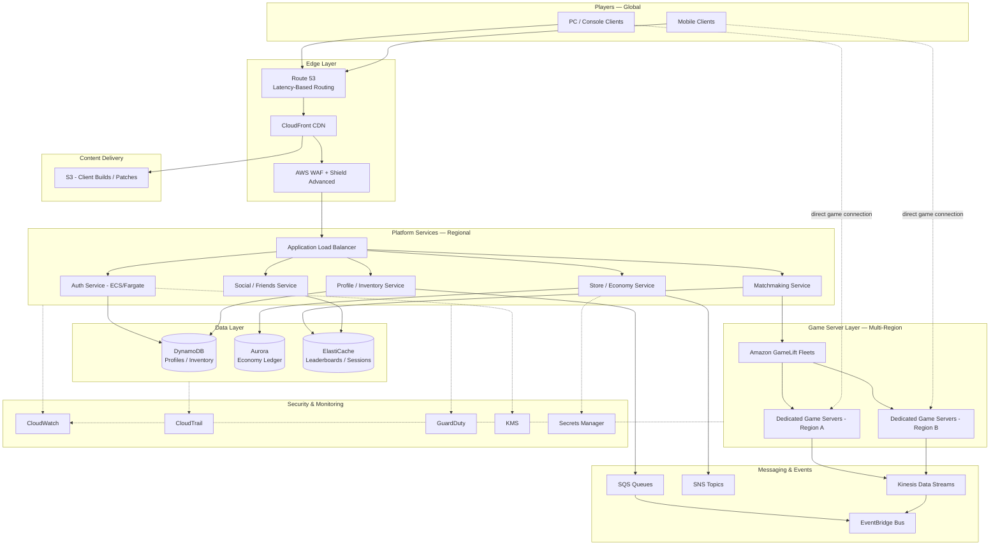

# Part IX – Industry-Specific Architectures

# Chapter 76 — Gaming

---

## 1. Executive Summary

Gaming workloads are among the most demanding systems an architect will ever design.

They combine:

- Real-time multiplayer state synchronization measured in milliseconds
- Massive, unpredictable traffic spikes tied to launches, patches, esports events, and viral moments
- A global player base that expects sub-50ms latency regardless of geography
- Economies built on microtransactions, entitlements, and virtual goods that must never be lost or duplicated
- Anti-cheat and fraud requirements that rival banking-grade security
- Live-service expectations: patches, seasons, events, and matchmaking that never stop

Unlike a typical e-commerce or SaaS system, a gaming platform is really several distinct systems wearing one brand name. There is the **real-time game server layer** (session-based, stateful, latency-sensitive), the **platform services layer** (authentication, profiles, inventory, matchmaking, leaderboards — mostly stateless and horizontally scalable), the **live-ops and analytics layer** (telemetry, A/B testing, economy tuning), and the **content delivery layer** (patches, DLC, assets, often multi-gigabyte). Each of these layers has a completely different scaling profile, failure mode, and cost structure, and treating them as one monolithic "backend" is the single most common reason gaming architectures collapse under real launch traffic.

### The Business Problem

Studios and publishers historically built game backends on-premises or in co-located data centers, sized for peak concurrent players (CCU) that might only be reached once a year — at launch, or during a major content drop. This produced two chronic failures:

1. **Under-provisioning** — servers fall over on launch day, the single most reputationally and financially damaging failure a live game can experience, because launch day is also the day marketing spend, press coverage, and community sentiment are at their highest leverage.
2. **Over-provisioning** — capacity sized for the worst case sits idle 350 days a year, and the capital tied up in idle hardware becomes a permanent tax on the studio's margin, felt most acutely by mid-size and independent studios operating on thin margins between titles.

Cloud-native architecture exists to break this trade-off. Instead of choosing between "safe but wasteful" and "cheap but risky," AWS lets a studio scale game server fleets, matchmaking queues, and platform APIs elastically, in near real time, against actual player demand — and shut it back down just as fast when the event ends.

### Architecture Objective

The objective of this chapter's reference architecture is to design a **global, live-service game backend** that:

- Supports session-based multiplayer game servers with predictable, low-jitter latency
- Scales platform services (auth, profile, inventory, matchmaking, social) independently of game server fleets
- Delivers patches and content globally without saturating origin infrastructure
- Protects the in-game economy and player data from fraud, cheating, and data loss
- Meets availability targets that keep a live game "up" during its most commercially critical hours
- Gives live-ops teams the telemetry pipeline needed to tune matchmaking, economy, and difficulty in near real time
- Keeps cost proportional to concurrent players, not proportional to provisioned capacity

### Why Organizations Adopt This Architecture

Enterprises and studios adopt this pattern for several converging reasons, each of which shows up repeatedly in real project retrospectives:

- **Launch risk mitigation.** A single bad launch can cost a studio its next funding round or its publisher relationship. Elastic architecture converts launch-day capacity planning from a guessing game into a scaling policy.
- **Live-service monetization.** Modern games are not shipped once — they are operated for years. Season passes, battle passes, and cosmetics require an economy backend that is always-on, audited, and horizontally scalable.
- **Global audience.** A title launched in North America today is played in Seoul, São Paulo, and Frankfurt within hours. Latency-sensitive multiplayer requires regional game server fleets, not a single-region deployment.
- **Cheating and fraud pressure.** Competitive titles attract cheating at a scale that requires server-authoritative game logic, anomaly detection, and rapid ban pipelines — none of which are afforded by peer-to-peer or client-authoritative designs.
- **Cost accountability.** Publishers increasingly demand FinOps-level cost transparency per title, per region, and per game mode, which is only achievable with tagged, metered cloud infrastructure.

### Major Business Benefits

| Benefit | Description |
|---|---|
| Elastic capacity | Game server fleets and matchmaking scale to launch-day CCU and back down without manual intervention |
| Global low latency | Regional fleets and CloudFront edge locations put compute and content close to players |
| Reduced launch risk | Auto Scaling and load testing replace static capacity guesses |
| Economy integrity | Idempotent, audited transaction pipelines prevent duplication exploits |
| Faster content velocity | CI/CD pipelines and CDN-based patch delivery shorten the time from build to player |
| Data-driven live-ops | Real-time telemetry pipelines feed matchmaking, economy, and anti-cheat models |
| Cost proportionality | Pay for CCU actually served, not worst-case capacity |

### Typical Enterprise Scenarios

This architecture pattern applies directly to:

- A AAA publisher launching a competitive multiplayer shooter with global matchmaking
- A mobile free-to-play studio operating a live-service title with seasonal content drops
- A mid-size studio migrating an on-premises dedicated server fleet to the cloud ahead of a sequel launch
- An esports platform operator running tournament infrastructure with strict latency SLAs
- A publisher consolidating multiple studios' backend platforms (auth, inventory, social) into a shared services layer

Across all of these scenarios, the architecture in this chapter is deliberately **modular**: not every studio needs every component on day one. A small studio may start with a fraction of this design — a single-region game server fleet and a managed database — and grow into the full multi-region, AI-augmented version described here as CCU, revenue, and team maturity increase. Section 34 covers this evolution path in detail.

> **Note:** This chapter assumes a **session-based, server-authoritative multiplayer game** as the primary workload, with platform services (auth, inventory, matchmaking, social, economy) as supporting systems, and a global CDN-based patch/content delivery pipeline. Single-player-only or turn-based casual games have a much simpler variant of this architecture, discussed briefly in Section 28 (Alternatives).

---

## 2. Business Requirements

### Business Drivers

- Support a global launch with unpredictable, spiky concurrent player counts
- Protect real-money and virtual-currency transactions from duplication and fraud
- Deliver patches and downloadable content (DLC) to millions of clients without origin overload
- Maintain competitive integrity through server-authoritative logic and anti-cheat telemetry
- Provide live-ops teams with near-real-time dashboards for matchmaking health, economy balance, and player sentiment
- Keep infrastructure cost proportional to active players, reported per title for publisher-level FinOps accountability

### Functional Requirements

- Player authentication and account linking (platform accounts, social login, cross-platform identity)
- Matchmaking that groups players by skill, region, and latency
- Dedicated game server sessions with join-in-progress and reconnection support
- Player profile, inventory, and progression storage
- In-game economy: currency, purchases, entitlements, trading (where applicable)
- Leaderboards and statistics
- Push notifications and social features (friends, parties, chat)
- Content delivery for game clients, patches, and DLC
- Telemetry ingestion for analytics, anti-cheat, and live-ops

### Non-Functional Requirements

| Category | Requirement |
|---|---|
| Scalability | Scale from thousands to millions of CCU within minutes |
| Availability | 99.95%+ for platform services; 99.9%+ for game server fleets during live hours |
| Latency | <50ms server tick round-trip for competitive titles; <150ms acceptable for casual/co-op |
| Durability | Zero tolerated loss of purchase/entitlement transactions |
| Security | PCI DSS scope isolation for payments; server-authoritative anti-cheat |
| Compliance | COPPA (where applicable), GDPR/CCPA for player data, regional data residency for some markets (e.g., China, South Korea) |
| Observability | Sub-minute visibility into CCU, matchmaking queue depth, and server fleet health |

### Scalability Goals

- Game server fleets must scale from a steady-state baseline to 10–50x baseline CCU within 15–30 minutes of a launch or event spike
- Matchmaking and platform APIs must scale independently of game server fleets, since a matchmaking backlog is often the true bottleneck, not compute
- Content delivery must absorb simultaneous multi-gigabyte patch downloads from millions of clients without materially increasing origin load

### Availability Requirements

- Platform services (auth, profile, store): 99.95% monthly uptime target
- Matchmaking service: 99.9%, with graceful degradation (queue rather than fail) under overload
- Game server fleets: 99.9% during scheduled live hours, with defined maintenance windows outside peak play times
- Payment/entitlement services: 99.99%, since downtime here directly blocks revenue and can cause double-charging risk if handled incorrectly

### Latency Requirements

| Game Type | Target Round-Trip Latency | Acceptable Degradation |
|---|---|---|
| Competitive FPS / fighting games | <50ms | Matchmaking should exclude players outside this bound |
| MOBA / battle royale | <80ms | Regional fleet placement is mandatory |
| Co-op / MMO | <150ms | Some latency compensation (interpolation) is tolerable |
| Turn-based / casual | <500ms | Standard HTTP API latency is sufficient |

### Compliance Requirements

- **PCI DSS** for any component that touches payment card data (typically isolated to a third-party payment processor plus a narrow tokenization boundary)
- **GDPR / CCPA** for player personal data, including right-to-erasure workflows
- **COPPA** for titles with a meaningful under-13 audience, restricting data collection and targeted advertising
- **Regional data residency** in markets such as South Korea, China, and parts of the EU, which may require regional account/data isolation rather than a purely global database

### Security Expectations

- All game logic that affects economy, ranking, or match outcome must be server-authoritative — the client is never trusted
- Anti-cheat telemetry pipelines must operate independently of the game server's real-time path so that detection does not add latency to gameplay
- Secrets (API keys, matchmaking tokens, third-party platform credentials) must never be embedded in game client binaries
- DDoS protection is a first-class requirement, not an afterthought, given that competitive gaming communities are a common source of targeted attacks against rivals during tournaments

### Recovery Objectives

| Metric | Platform Services | Game Server Fleet | Economy / Transaction Data |
|---|---|---|---|
| RPO | < 1 minute | Session loss acceptable; reconnect logic recovers state | 0 (zero data loss) |
| RTO | < 15 minutes | < 5 minutes (new sessions route to healthy fleet) | < 15 minutes |

### SLAs

- 99.95% monthly availability commitment to publishers for platform services, with defined maintenance windows excluded
- Support response and incident communication commitments during live-service hours, typically tiered by severity (Sev-1: player-facing outage; Sev-2: degraded matchmaking; Sev-3: non-blocking bug)

### Expected Workload and Growth

- Baseline: tens of thousands of daily active users (DAU) for a mid-size live-service title
- Peak: 10–50x baseline CCU during launch week, major content drops, or esports events
- Growth: successful live-service titles typically see CCU grow for 6–18 months post-launch before plateauing, followed by seasonal spikes tied to content calendar
- Content delivery volume scales with patch size and DAU; a 5GB patch to 2 million DAU is a 10PB delivery event, which must be absorbed by CDN, not origin

---

## 3. Architecture Overview

### Overall Design Philosophy

This architecture is built around a principle common to every mature live-service game studio: **separate the stateful, latency-sensitive real-time layer from the stateless, horizontally scalable platform layer.**

Game servers hold authoritative, in-memory session state and must be treated as semi-durable compute — they are not restarted casually, they are drained before termination, and they are placed close to players. Platform services (auth, matchmaking, inventory, economy) hold no session-specific real-time state and can scale like any web-scale API, using the same patterns covered elsewhere in this handbook (Chapters 7, 25, and 59).

Content delivery is treated as its own concern entirely, decoupled from both, because patch and asset delivery is dominated by bandwidth economics and cache-hit ratio, not by application logic.

### Core Components

1. **Edge and DNS layer** — Route 53 for global DNS and latency-based routing, CloudFront for content and API edge caching, AWS WAF and Shield for perimeter protection
2. **Platform services layer** — containerized or serverless APIs for auth, profile, matchmaking, inventory, economy, social, running on ECS/EKS or Lambda depending on team maturity
3. **Game server fleet layer** — Amazon GameLift-managed fleets of dedicated game servers, deployed across multiple regions close to player concentrations
4. **Data layer** — DynamoDB for player profile/inventory (single-digit millisecond, massively scalable key-value access), Aurora for relational data requiring strong transactional guarantees (economy ledgers, entitlements), ElastiCache for session and leaderboard caching
5. **Messaging and event layer** — SQS/SNS/EventBridge for asynchronous processing (purchase fulfillment, notifications, analytics fan-out)
6. **Content delivery layer** — S3 as origin, CloudFront as global CDN for client builds, patches, and DLC
7. **Telemetry and analytics layer** — Kinesis Data Streams ingesting real-time gameplay and economy events, processed for anti-cheat, live dashboards, and long-term analytics storage
8. **Security layer** — IAM, KMS, Secrets Manager, GuardDuty, Security Hub, CloudTrail, AWS Config
9. **Observability layer** — CloudWatch, X-Ray, centralized logging via OpenSearch

### How Components Interact — High-Level Workflow

A player's journey through this system touches nearly every layer described above, and understanding that journey end-to-end is the fastest way to understand why the architecture is shaped the way it is.

**Request lifecycle:** The client authenticates against the platform services layer, receives a session token, and requests matchmaking. The matchmaking service (built on GameLift FlexMatch or a custom queue-based matcher) places the player into a match and reserves a game server session from a regional GameLift fleet, returning a connection endpoint directly to the client.

**Response lifecycle:** The client connects directly to the assigned game server (bypassing platform APIs entirely for the real-time path, to avoid adding a hop of latency to every game tick). The game server authoritatively simulates the match and reports results back to platform services upon completion.

**Data lifecycle:** Match results trigger asynchronous events (via SQS/EventBridge) that update player statistics in DynamoDB, adjust economy ledgers in Aurora with full ACID guarantees, and stream raw telemetry into Kinesis for anti-cheat scoring and analytics. None of this post-match processing is on the critical path of gameplay, which is the key design decision that keeps game server latency low regardless of how complex the surrounding platform becomes.

> **Tip:** The architectural rule of thumb worth internalizing here: **anything that must happen within a game tick lives on the game server; everything else happens asynchronously afterward.** Violating this rule — for example, calling a synchronous inventory API from inside the game server's tick loop — is one of the most common root causes of mid-match latency spikes seen in production incident reviews.

---

## 4. AWS Services Used

### Amazon GameLift

**Purpose:** Fully managed service for deploying, scaling, and matchmaking dedicated game server fleets.

**Why selected:** GameLift removes the undifferentiated heavy lifting of fleet management — capacity scaling, health checking, session placement, and multi-region fleet orchestration — that studios previously built themselves on EC2. FlexMatch (its matchmaking component) provides skill-based, latency-aware matchmaking out of the box.

**Alternatives:** Self-managed EC2 Auto Scaling fleets with custom orchestration (more control, significantly more operational burden); Agones on EKS (open-source, Kubernetes-native, popular with studios already invested in Kubernetes); third-party multiplayer backends (PlayFab, etc.).

**Limitations:** GameLift fleets require game server binaries to integrate the GameLift Server SDK; it is optimized for session-based dedicated server models, not for peer-hosted or purely serverless game logic.

**Pricing considerations:** Billed per instance-hour for fleet capacity plus FlexMatch matchmaking ticket volume; cost is highly sensitive to fleet utilization, making Auto Scaling policies tuned to actual CCU essential to avoid paying for idle server slots.

**Best practices:** Use fleet-level Auto Scaling with target-tracking on "available game sessions"; use multi-region fleets with FlexMatch's latency policies rather than a single global fleet; use GameLift's spot fleet support for cost-insensitive game modes (e.g., casual matchmaking) while reserving on-demand fleets for ranked/competitive modes where interruption is unacceptable.

### Amazon EC2

**Purpose:** Underlying compute for GameLift fleets (GameLift provisions EC2 instances on the studio's behalf) and for any self-managed services that require persistent, specialized compute (e.g., custom voice chat servers).

**Why selected:** Predictable, dedicated compute performance for latency-sensitive workloads where container/serverless cold-start or noisy-neighbor variance is unacceptable.

**Alternatives:** ECS Fargate for platform services that don't need raw instance access; Lambda for event-driven, short-lived processing.

**Limitations:** Requires capacity planning and patching discipline; not the right choice for stateless platform APIs, where containers or serverless are more cost-efficient.

### Application Load Balancer (ALB)

**Purpose:** Layer 7 load balancing for platform service APIs (auth, store, social).

**Why selected:** Native integration with ECS/EKS target groups, WAF, and ACM-managed TLS certificates; supports path-based routing to split microservices behind a single domain.

**Alternatives:** Network Load Balancer (NLB) for the game server layer itself, since game traffic is typically UDP-based and latency-sensitive — ALB is not used for real-time game traffic, only for HTTP(S) platform APIs.

**Limitations:** No native UDP support, which is why the real-time game path bypasses ALB entirely and connects directly to GameLift-assigned server endpoints.

### Amazon CloudFront

**Purpose:** Global CDN for game client downloads, patches, DLC, and caching of platform API responses that are cacheable (e.g., public leaderboards, store catalogs).

**Why selected:** Reduces origin load by orders of magnitude during patch-day traffic spikes, and improves perceived performance for players on every continent.

**Alternatives:** Third-party CDNs (Akamai, Fastly) are common in gaming specifically for patch delivery, chosen sometimes for negotiated bandwidth pricing at extreme scale; many studios use CloudFront for platform API caching and a secondary CDN for the largest binary payloads as a cost-optimization and redundancy strategy.

**Limitations:** Cache invalidation at extreme scale needs planning; large binary patch delivery benefits from origin-shield configuration to protect S3 origin during initial cache population.

### AWS Lambda

**Purpose:** Event-driven processing for asynchronous, bursty workloads: purchase fulfillment, push notification dispatch, telemetry transformation, moderation webhooks.

**Why selected:** Scales instantly with event volume without capacity planning, and is billed only for actual invocation time — ideal for workloads that are idle most of the time but spike sharply around events (e.g., a content drop triggering millions of notification sends within minutes).

**Alternatives:** ECS/Fargate long-running workers for workloads with steady, predictable throughput where Lambda's per-invocation overhead is less efficient.

**Limitations:** 15-minute maximum execution duration; cold starts can matter for latency-sensitive synchronous paths (mitigated with provisioned concurrency where needed, though the asynchronous workloads in this architecture are largely insensitive to this).

### Amazon S3

**Purpose:** Origin storage for game client builds, patches, DLC, user-generated content (screenshots, replays), and long-term telemetry archives.

**Why selected:** Effectively unlimited durability and scale, tight integration with CloudFront as an origin, and lifecycle policies that automatically transition cold data (old patch versions, historical telemetry) to cheaper storage classes.

**Best practices:** Use S3 Transfer Acceleration for global upload of large build artifacts from distributed studio teams; use versioning on patch buckets to support instant rollback of a bad build.

### Amazon RDS / Aurora

**Purpose:** Relational storage for data requiring strong transactional (ACID) guarantees — primarily the in-game economy ledger, entitlements, and purchase records.

**Why selected:** Aurora specifically is selected over standard RDS for its higher throughput ceiling, faster failover (typically under 30 seconds), and read replica scaling, which matters when economy read traffic (checking balances, entitlement lookups) is orders of magnitude higher than write traffic.

**Alternatives:** DynamoDB with transactional writes can handle simpler entitlement models, but complex economy ledgers with multi-row transactional integrity (e.g., currency exchange, trading systems) are usually easier to reason about and audit in a relational model.

**Limitations:** Vertical scaling ceiling is higher than DynamoDB's practical horizontal ceiling; must be paired with connection pooling (RDS Proxy) to avoid connection exhaustion under bursty platform-service scaling.

### Amazon DynamoDB

**Purpose:** Primary store for player profiles, inventory, progression, and session metadata — the highest-volume, highest-concurrency data in the platform.

**Why selected:** Single-digit millisecond latency at any scale, with on-demand or auto-scaled provisioned capacity that matches the platform's CCU-driven load pattern; no operational database management burden during launch-week traffic spikes.

**Alternatives:** Aurora for data with complex relational query needs; ElastiCache for data that doesn't need durability at all (ephemeral leaderboard snapshots, matchmaking queue state).

**Limitations:** Query patterns must be designed around access patterns up front (single-table design); complex ad-hoc queries or joins are not DynamoDB's strength and are better served by streaming a copy into a data warehouse (see Chapter 49).

### Amazon SNS / SQS / EventBridge

**Purpose:** Asynchronous messaging backbone connecting match completion, purchases, and player actions to downstream consumers (stats updates, notifications, analytics, anti-cheat scoring).

**Why selected:** SQS decouples producers (game servers, platform APIs) from consumers so that a slow or failing downstream service (e.g., a notification provider outage) never blocks the real-time or transactional path. EventBridge is used where multiple, evolving sets of consumers need to subscribe to the same event types (a common live-ops pattern, since new features constantly need to react to "match completed" or "purchase made" events without modifying the producer).

**Limitations:** SQS standard queues are at-least-once delivery — consumers performing economy-affecting operations (granting currency, entitlements) must be idempotent, using a deduplication key, to prevent duplicate-processing exploits.

### Amazon Kinesis Data Streams

**Purpose:** High-throughput ingestion of real-time gameplay telemetry (player inputs, positions, hit events) for anti-cheat scoring and live analytics dashboards.

**Why selected:** Sustains the very high event rates generated by active multiplayer sessions (potentially tens of thousands of events per second during peak CCU) with ordered, replayable delivery to multiple consumers (anti-cheat model, real-time dashboard, long-term storage via Firehose to S3).

**Alternatives:** MSK (Managed Kafka) is common where studios already have Kafka-based tooling or need cross-region replication patterns Kinesis doesn't natively support.

### IAM, VPC, Route 53

Covered in depth in Chapters 15 and 89; in this architecture, IAM enforces strict separation between game-server roles (which must never have access to economy-ledger write permissions) and platform-service roles. VPC provides network isolation between the game server subnet, platform service subnet, and data subnet. Route 53 provides latency-based routing so players are directed to their nearest regional platform API endpoint and matchmaking region.

### CloudWatch, CloudTrail, AWS Config, GuardDuty, KMS, Secrets Manager, Systems Manager

These operate as described throughout this handbook's security and observability chapters (Chapters 90, 91, 93, 96), with gaming-specific emphasis on: CloudWatch custom metrics for CCU and matchmaking queue depth; GuardDuty tuned to detect credential-stuffing patterns against auth endpoints (a very common attack vector against game accounts, which hold resellable virtual currency); Secrets Manager rotating third-party platform (console) API credentials; Systems Manager for patch management across any self-managed EC2 fleets outside GameLift's managed scope.

---

## 5. Complete Architecture Diagram



> **Diagram note:** The dotted line from clients directly to game servers is intentional and critical — real-time gameplay traffic never traverses the ALB or platform services layer. Only session negotiation (matchmaking) goes through platform APIs; the actual game session connects client-to-server directly through the GameLift-assigned endpoint.

---

## 6. Component-by-Component Explanation

### Amazon GameLift Fleet

- **Purpose:** Hosts authoritative dedicated game server processes and manages session placement.
- **Responsibilities:** Allocate game sessions, track server health, scale fleet capacity, integrate with FlexMatch for latency-aware matchmaking.
- **Inputs:** Matchmaking requests, fleet scaling policies, server build artifacts.
- **Outputs:** Session connection info (IP/port or endpoint) returned to matched players.
- **Scaling:** Target-tracking Auto Scaling based on "percentage of available game sessions"; queue-based fallback across regions when a preferred region is saturated.
- **High availability:** Multi-region fleets with FlexMatch cross-region queues; unhealthy instances are automatically replaced.
- **Failure handling:** In-progress sessions on a failing instance are lost (session-based games generally cannot live-migrate mid-match); reconnection logic on the client re-enters matchmaking.
- **Dependencies:** VPC networking, IAM fleet role, S3-hosted server build.
- **Security:** Security groups restrict inbound traffic to the specific UDP/TCP port ranges GameLift assigns; no direct SSH access in production fleets — Systems Manager Session Manager is used for exceptional debugging access.
- **Monitoring:** CloudWatch metrics for `PercentAvailableGameSessions`, `ActiveInstances`, `QueueDepth`.

### Matchmaking Service (FlexMatch + custom rules)

- **Purpose:** Groups players into balanced matches based on skill rating, region, and latency.
- **Responsibilities:** Maintain matchmaking tickets, apply rule sets (skill range widening over wait time), request fleet placement.
- **Scaling:** Serverless by nature (FlexMatch is managed); custom rule evaluation logic runs on Lambda or Fargate depending on complexity.
- **Failure handling:** Widen matchmaking criteria progressively if no match is found within target time, rather than failing the request outright.
- **Monitoring:** Average time-to-match, ticket backlog depth, region-level match success rate.

### Auth Service

- **Purpose:** Authenticates players via platform credentials, social login, or first-party accounts; issues short-lived session tokens.
- **Scaling:** Stateless ECS/Fargate service behind ALB, scaling on request count and CPU.
- **High availability:** Multi-AZ deployment, minimum two tasks per AZ.
- **Failure handling:** Circuit breaker against upstream identity providers; cached token validation to survive brief IdP outages.
- **Security:** All credentials hashed/salted where first-party; OAuth tokens from third-party platforms never logged; rate limiting against credential-stuffing.

### Profile / Inventory Service

- **Purpose:** Manages player profile, progression, and inventory records stored in DynamoDB.
- **Scaling:** DynamoDB on-demand capacity or auto-scaled provisioned capacity aligned to CCU patterns.
- **Failure handling:** DynamoDB Global Tables for cross-region read availability where a title has region-independent progression.

### Store / Economy Service

- **Purpose:** Handles purchases, currency balances, and entitlement grants against Aurora.
- **Responsibilities:** Enforce idempotent transaction processing (every purchase carries a client-generated idempotency key), reconcile with third-party payment processors and platform stores (console/mobile storefronts).
- **Failure handling:** Any ambiguous transaction outcome (timeout mid-purchase) is resolved via reconciliation jobs against the payment processor's ledger, never by re-attempting the grant blindly.
- **Security:** PCI scope is minimized by never storing card data directly — tokenization is handled by the payment processor or platform storefront (Apple/Google/console billing APIs), with only tokens and entitlement records touching AWS infrastructure.

### Kinesis Telemetry Pipeline

- **Purpose:** Ingests raw gameplay events at high throughput for anti-cheat and analytics.
- **Scaling:** Shard count scales with peak concurrent session count; on-demand mode removes manual shard management for unpredictable launch-day volume.
- **Failure handling:** Consumer checkpointing ensures no event loss on consumer failure; events are retained long enough (24h+) to allow reprocessing after a downstream outage.

---

## 7. End-to-End Request Flow

1. Player launches the game client; DNS resolution via Route 53 returns the nearest regional platform endpoint using latency-based routing.
2. Client requests authentication through CloudFront → WAF → ALB → Auth Service.
3. Auth Service validates credentials against DynamoDB (or a linked third-party identity provider) and issues a short-lived session token.
4. Client requests matchmaking, submitting skill rating and region preference through the Matchmaking Service.
5. Matchmaking Service (FlexMatch) evaluates the player pool and forms a match, respecting latency constraints across candidate regions.
6. Matchmaking Service requests a game session from the appropriate regional GameLift fleet.
7. GameLift allocates a game server process (existing warm capacity or newly scaled instance) and returns connection details.
8. Matchmaking Service returns the server connection endpoint directly to each matched client.
9. Clients connect directly to the assigned dedicated game server — this connection bypasses the platform services layer entirely.
10. The game server authoritatively simulates gameplay, validating all client inputs server-side.
11. The game server streams raw gameplay telemetry to Kinesis Data Streams in near real time for anti-cheat scoring.
12. Anti-cheat consumers score incoming telemetry against behavioral models; confirmed violations trigger an EventBridge event.
13. On match completion, the game server reports final results to the Profile/Inventory Service via an internal API call.
14. The Profile Service writes updated statistics to DynamoDB and publishes a `MatchCompleted` event to EventBridge.
15. Downstream consumers (leaderboard updater, economy service, notification dispatcher) subscribe to `MatchCompleted` and process asynchronously.
16. The Economy Service, if the match granted currency or items, performs an idempotent, transactional write to Aurora.
17. CloudWatch captures latency, error rate, and throughput metrics at every hop; anomalies trigger alarms routed to the on-call rotation via SNS.
18. If the client needs a patch or content update, it requests manifest data through CloudFront, which serves from cache or falls back to the S3 origin (shielded by CloudFront Origin Shield to prevent thundering-herd origin load on patch day).
19. Errors at any platform-service hop return standardized error codes to the client, which applies client-side retry/backoff logic before falling back to a "servers busy" state rather than a hard failure.
20. All requests, regardless of outcome, are logged to CloudWatch Logs and, for security-relevant paths (auth, purchases), to CloudTrail for audit purposes.

---

## 8. Deployment Flow

### Infrastructure Provisioning

Infrastructure is provisioned via Terraform, organized into modules per layer (networking, platform services, GameLift fleets, data layer) so that a game server build update does not require re-planning the entire VPC, and vice versa.

### Terraform Workflow

1. Feature branch modifies a module (e.g., bump GameLift fleet desired capacity for an upcoming tournament).
2. CI pipeline runs `terraform fmt -check`, `terraform validate`, and `tflint`.
3. `terraform plan` output is posted to the pull request for human review — mandatory for any change touching production fleet sizing, IAM, or security groups.
4. On merge, `terraform apply` runs against a non-production environment first, followed by automated smoke tests.
5. Production apply requires a second manual approval gate, tied to a change ticket.

### CI/CD Deployment

- Platform services (containers) are built, scanned (image vulnerability scanning), and pushed to ECR; ECS/EKS deployments use rolling updates with health-check gating.
- Game server builds are uploaded to GameLift as new build versions; a **new fleet** is created from the new build alongside the existing fleet (blue-green at the fleet level), rather than in-place upgrading servers mid-session.

### Blue-Green Deployment (Game Server Fleets)

Game server fleets cannot be upgraded in place without disrupting active sessions, so the standard pattern is:

1. Deploy the new build to a new GameLift fleet, fully scaled and health-checked in isolation.
2. Shift matchmaking traffic to the new fleet via FlexMatch queue configuration, directing a small percentage of new matches first (canary).
3. Monitor error rates, crash telemetry, and player-reported issues for a defined bake period.
4. Shift 100% of new-match traffic to the new fleet once confidence is established.
5. Allow the old fleet to drain naturally as its in-progress sessions complete, then terminate it — never force-terminate a fleet with active sessions.

### Rollback

Rollback is simply reversing step 2–4 above: redirect the matchmaking queue back to the previous fleet, which remains running during the bake period specifically to make rollback a configuration change rather than a redeploy.

### Secrets and Configuration

Secrets Manager holds all third-party platform API keys, database credentials, and payment processor tokens, injected into ECS task definitions and Lambda environment variables at runtime — never baked into container images or game server builds.

### Validation

Every deployment is followed by automated synthetic checks: a scripted matchmaking-to-session-connect flow, a purchase-flow smoke test against a sandboxed payment processor, and a patch-download integrity check against CloudFront.

---

## 9. Network Topology

### VPC and CIDR Design

A dedicated VPC per region (e.g., `10.10.0.0/16` for the primary region, `10.20.0.0/16` for a secondary region) avoids CIDR overlap and simplifies future VPC peering or Transit Gateway attachment.

| Subnet Tier | Example CIDR | Purpose |
|---|---|---|
| Public | 10.10.0.0/22 | ALB, NAT Gateways |
| Platform Private | 10.10.4.0/22 | ECS/EKS platform services |
| Game Server Private | 10.10.8.0/21 | GameLift fleet instances |
| Data Private | 10.10.16.0/22 | Aurora, ElastiCache, DynamoDB VPC endpoints |

### Public and Private Subnets

- Public subnets host only the ALB and NAT Gateways — no application compute is ever placed in a public subnet.
- Platform private subnets host ECS/EKS tasks with outbound-only internet access via NAT for third-party API calls.
- Game server private subnets host GameLift fleet instances; GameLift manages the public-facing UDP/TCP ports required for direct client connections through its own security group configuration, scoped tightly to the assigned port ranges.
- Data private subnets have no internet route at all; access to AWS-managed services (DynamoDB, S3, Secrets Manager) is via VPC endpoints (Gateway endpoints for S3/DynamoDB, Interface endpoints for Secrets Manager, KMS, CloudWatch) to avoid any traffic transiting the public internet.

### NAT Gateway and Internet Gateway

One NAT Gateway per AZ (not one shared across AZs) to avoid cross-AZ data transfer charges and to prevent a single NAT Gateway from becoming a regional single point of failure.

### Transit Gateway

Used to connect the platform VPC with a shared services VPC (centralized logging, CI/CD runners, corporate VPN access) and, in multi-region deployments, to interconnect regional VPCs for internal service-to-service calls that must cross regions (e.g., a global leaderboard aggregation job).

### Route Tables, Network ACLs, Security Groups

- Route tables are subnet-tier-specific; game server subnets have no route to the data subnet's Aurora security group except through the platform service layer — game servers talk to the profile/economy service via internal API, never directly to the database, enforcing a clean trust boundary.
- Security groups are least-privilege and reference other security groups by ID rather than CIDR ranges, so that scaling the platform service fleet doesn't require security group updates.
- Network ACLs provide a coarse secondary control, primarily used to explicitly deny known-bad IP ranges at the subnet level as a defense-in-depth measure alongside WAF.

### PrivateLink

Used where the studio consumes a third-party SaaS anti-cheat or analytics platform that offers a PrivateLink endpoint, keeping that traffic off the public internet entirely.

### Hybrid Connectivity

Direct Connect is used where a studio's live-ops or QA teams operate from an on-premises studio network and require low-latency, high-bandwidth access to build artifacts and internal tooling — less common for pure player-facing traffic, more common for the studio's internal CI/CD and build pipeline connectivity.

---

## 10. Identity and Access

### IAM Roles and Policies

Distinct IAM roles are defined per component, following least privilege strictly:

- `gamelift-fleet-role` — permissions limited to writing telemetry to Kinesis and reading its own build artifact from S3; explicitly denied any Aurora or DynamoDB write access to economy tables.
- `platform-auth-role` — read/write to the player identity DynamoDB table only.
- `platform-economy-role` — read/write to Aurora economy schema only, via IAM-authenticated RDS Proxy connections rather than long-lived static database credentials.
- `cicd-deploy-role` — assumed only by the CI/CD pipeline via OIDC federation from the CI provider, scoped to specific resource ARNs per environment.

### Resource Policies

S3 bucket policies for patch/build content restrict write access to the CI/CD deploy role and read access to CloudFront's origin access control (OAC), with no public bucket access.

### STS and Cross-Account Access

Studios operating multiple titles under one publisher commonly use a multi-account structure (Chapter 88), with STS `AssumeRole` used for centralized security tooling (GuardDuty, Security Hub aggregation) to read findings across all title accounts from a central security account.

### Least Privilege in Practice

> **Warning:** The most common IAM mistake seen in gaming backends is granting the game server fleet role broad DynamoDB or Aurora access "to make development faster." This directly undermines the server-authoritative security model, because a compromised or reverse-engineered game server process could then directly manipulate player economy data. Game servers should only ever be able to call an internal, audited platform API — never touch the database directly.

### Permission Boundaries

Permission boundaries are applied to any role creation delegated to individual feature teams (e.g., a live-ops team provisioning their own Lambda functions for event-specific tooling), capping the maximum permissions any self-service role can be granted regardless of the policy attached.

---

## 11. Security Architecture

### Encryption

- All data at rest (S3, DynamoDB, Aurora, EBS) encrypted with KMS customer-managed keys, with separate keys per data classification tier (player PII vs. telemetry vs. build artifacts) to allow independent key rotation and access auditing.
- All data in transit uses TLS 1.2+ for platform APIs; game server UDP traffic where full encryption would add unacceptable latency uses lightweight, purpose-built protocol-level obfuscation/integrity checks rather than full TLS, a common and accepted trade-off in competitive real-time titles — sensitive data (auth, purchases) never travels over the game server's real-time channel.

### WAF and Shield

AWS WAF sits in front of all platform APIs with managed rule groups for SQL injection, known bad bots, and rate-based rules specifically tuned against credential-stuffing patterns on the auth endpoint. AWS Shield Advanced is applied to internet-facing resources given that gaming platforms, and especially esports and tournament infrastructure, are a well-documented target for both volumetric and application-layer DDoS attacks — often timed deliberately to coincide with competitive matches.

### Secrets Manager and Certificate Manager

All third-party credentials (payment processors, platform storefront APIs, anti-cheat vendor keys) live in Secrets Manager with automatic rotation where the provider supports it. ACM issues and auto-renews TLS certificates for all ALB and CloudFront endpoints.

### GuardDuty, Inspector, Security Hub

GuardDuty is enabled account-wide with additional protections for EKS and S3 where applicable; Inspector continuously scans container images and EC2/GameLift instances for known vulnerabilities; Security Hub aggregates findings across all accounts in the organization for a single compliance view.

### CloudTrail and AWS Config

CloudTrail logs all API activity, with particular attention to IAM changes and any manual access to production data stores — manual reads of the economy ledger outside of automated reconciliation jobs are treated as a security event requiring justification. AWS Config continuously evaluates whether security groups, S3 buckets, and IAM policies drift from approved baselines.

### Zero Trust Principles

No implicit trust is granted based on network location alone. Even internal service-to-service calls (platform API to database) are authenticated via IAM (RDS Proxy IAM auth, DynamoDB IAM policies) rather than relying solely on VPC network isolation as the security boundary.

### Threat Model and Attack Vectors

| Attack Vector | Mitigation |
|---|---|
| Credential stuffing against player accounts | WAF rate-based rules, GuardDuty anomaly detection, mandatory MFA for high-value accounts |
| DDoS against game server or matchmaking endpoints | Shield Advanced, GameLift's built-in DDoS protections, regional fleet isolation |
| Client-side memory manipulation / cheating | Server-authoritative simulation, never trust client-reported state |
| Economy exploitation via duplicate transaction requests | Idempotency keys, transactional Aurora writes, reconciliation jobs |
| Reverse-engineered API abuse (bots, farming) | API rate limiting, behavioral anomaly detection on telemetry pipeline |
| Insider threat / overprivileged access | Least-privilege IAM, mandatory audit logging on sensitive data access |

---

## 12. High Availability

### AZ Failures

Platform services run across a minimum of three AZs per region; ALB health checks remove unhealthy targets automatically. GameLift fleets are configured across multiple AZs within a region so an AZ failure only removes a fraction of fleet capacity, triggering Auto Scaling to replace it.

### Instance Failures

ECS/EKS automatically reschedules failed tasks; GameLift automatically replaces unhealthy game server instances and, where a build supports it, drains sessions gracefully before termination during planned maintenance.

### Regional Failures

Platform services support active-active or active-passive multi-region deployment depending on the title's data residency needs (Section 13 covers this in DR terms). Game server fleets are inherently regional — a regional failure simply means matchmaking routes new sessions to the next-nearest healthy region, at the cost of increased latency for affected players, which is an acceptable and communicated degradation rather than a hard outage.

### Database Failures

Aurora failover across AZs typically completes in under 30 seconds; RDS Proxy shields application connections from the brief failover window, retrying transparently. DynamoDB is inherently multi-AZ within a region with no failover action required by the operator.

### Load Balancing and Health Checks

ALB health checks are configured with aggressive-but-safe thresholds (e.g., 2 consecutive failures to mark unhealthy, 3 consecutive successes to mark healthy again) tuned specifically to avoid flapping during brief GC pauses in platform service runtimes.

### Failover

Route 53 health checks combined with latency-based routing allow automatic failover of platform API traffic away from an unhealthy region without manual DNS changes.

---

## 13. Disaster Recovery

### Backup Strategy

- Aurora: automated daily snapshots plus continuous backup (point-in-time recovery) retained per compliance requirements (typically 35 days).
- DynamoDB: point-in-time recovery enabled on all player-data tables; on-demand backups taken before any major schema migration.
- S3 build artifacts: versioning enabled, with lifecycle rules retaining the last N patch versions for instant rollback capability.

### Cross-Region Replication

Aurora Global Database replicates the economy ledger to a secondary region with typical replication lag under 1 second, supporting a fast-promotion DR strategy. DynamoDB Global Tables replicate player profile data where the title's design allows region-independent play.

### DR Strategy Selection

| Strategy | Applicability in This Architecture |
|---|---|
| Pilot Light | Secondary region holds warm database replicas and minimal platform service capacity, scaled up only during a declared DR event — cost-efficient choice for titles without a strict multi-region latency requirement |
| Warm Standby | Secondary region runs a reduced-capacity, fully functional copy of platform services, ready to absorb full traffic within minutes — appropriate for titles where RTO must be under 15 minutes |
| Multi-Site Active-Active | Used specifically for the game server layer, since regional fleets are naturally active-active by design already (players are routed to their nearest healthy region continuously, not only during failures) |

Most gaming platforms adopt a **hybrid model**: active-active for the game server fleet layer (because this is required anyway for latency reasons, not just DR), and warm standby for the platform services and data layer (because full active-active relational data replication across regions introduces conflict-resolution complexity that is rarely justified purely for DR purposes).

### RPO / RTO Summary

| Component | RPO | RTO |
|---|---|---|
| Economy ledger (Aurora Global DB) | < 1 second | < 5 minutes (promotion) |
| Player profile (DynamoDB Global Tables) | Near-zero (async replication lag) | < 5 minutes |
| Platform services | N/A (stateless) | < 15 minutes (warm standby scale-up) |
| Game server fleets | Session loss acceptable | < 5 minutes (reroute to healthy region) |

---

## 14. Scalability

### Horizontal Scaling

Platform services scale horizontally via ECS/EKS Auto Scaling on request count and CPU; GameLift fleets scale horizontally via target-tracking on available game session percentage.

### Vertical Scaling

Aurora instance classes are scaled vertically ahead of known major events (a scheduled tournament, a major content drop) based on load-test results, since vertical scaling of the primary writer is a more effective lever than adding read replicas for write-heavy economy bursts.

### Auto Scaling Policies

```hcl

resource "aws_appautoscaling_target" "platform_ecs" {
  max_capacity       = 200
  min_capacity       = 10
  resource_id        = "service/${var.cluster_name}/${var.service_name}"
  scalable_dimension = "ecs:service:DesiredCount"
  service_namespace  = "ecs"
}

resource "aws_appautoscaling_policy" "platform_ecs_scale" {
  name               = "${var.service_name}-target-tracking"
  policy_type        = "TargetTrackingScaling"
  resource_id        = aws_appautoscaling_target.platform_ecs.resource_id
  scalable_dimension = aws_appautoscaling_target.platform_ecs.scalable_dimension
  service_namespace  = aws_appautoscaling_target.platform_ecs.service_namespace

  target_tracking_scaling_policy_configuration {
    predefined_metric_specification {
      predefined_metric_type = "ECSServiceAverageCPUUtilization"
    }
    target_value       = 55
    scale_in_cooldown  = 120
    scale_out_cooldown = 30
  }
}

```

### Serverless Scaling

Lambda-based asynchronous consumers (notification dispatch, telemetry transformation) scale automatically with SQS queue depth via event source mapping concurrency settings, with reserved concurrency caps set on any function that writes to Aurora, to avoid overwhelming the database connection pool during a traffic spike.

### Database Scaling

Aurora read replicas scale out ahead of anticipated read-heavy events (leaderboard resets, season-end reporting); DynamoDB on-demand mode absorbs unpredictable launch-day spikes without pre-provisioning.

### Storage and Queue Scaling

S3 and CloudFront scale inherently without operator action; SQS scales to effectively unlimited throughput, with the operational limit typically being downstream consumer capacity rather than the queue itself.

---

## 15. Performance Optimization

### Caching

- CloudFront caches static content, patch manifests, and cacheable public API responses (store catalog, public leaderboards) with cache-control headers tuned per content type.
- ElastiCache (Redis) caches frequently-read, rarely-written data such as active leaderboard standings and matchmaking pool state, removing repetitive load from DynamoDB/Aurora.

### Compression

Patch and build assets are compressed and, where the client engine supports it, delta-patched (shipping only the binary diff between versions) to dramatically reduce CDN egress and player download time — a critical player-experience lever, since patch download friction is one of the top causes of launch-week churn.

### Database Optimization

Aurora read replicas absorb reporting and leaderboard-adjacent read traffic away from the transactional write path; RDS Proxy pools and multiplexes connections from bursty, horizontally-scaled platform service tasks, preventing connection-count exhaustion.

### Connection Pooling and Concurrency

Game servers maintain persistent, long-lived connections per session rather than reconnecting per tick; platform services use async I/O runtimes (non-blocking) so a single task can serve many concurrent player requests without one slow downstream call blocking others.

### Async Processing

Anything not required to return a response within the same request cycle — stat updates, achievement checks, notification sends — is pushed to SQS/EventBridge rather than processed synchronously, keeping player-facing API latency low and predictable even as the number of downstream integrations grows over the game's live-service lifetime.

---

## 16. Cost Optimization (FinOps)

### Estimated Monthly Cost by Deployment Size

| Deployment Size | Baseline CCU | Estimated Monthly AWS Spend | Primary Cost Drivers |
|---|---|---|---|
| Small (indie live-service) | 500–2,000 | $8,000 – $20,000 | GameLift fleet instance-hours, DynamoDB, CloudFront |
| Medium (mid-size studio title) | 10,000–50,000 | $60,000 – $180,000 | GameLift multi-region fleets, Aurora, Kinesis, CloudFront egress |
| Enterprise (AAA live-service, multi-region) | 200,000+ peak CCU | $500,000 – $2,000,000+ | Multi-region GameLift fleets at peak scale, Kinesis at high event volume, global CloudFront egress, Aurora Global Database |

> **Note:** These figures are directional estimates for architectural planning, not quotes. Actual cost is highly sensitive to fleet utilization efficiency, patch size/frequency, and CCU variance — a title with the same average CCU but higher peak-to-average ratio (typical of competitive titles with weekend spikes) will cost meaningfully more than one with flatter, more predictable traffic.

### Major Cost Drivers

- GameLift/EC2 instance-hours for game server fleets (the single largest line item for most titles, and the most directly controllable through Auto Scaling tuning)
- CloudFront/data transfer egress for patch and content delivery, especially around major launches or content drops
- Kinesis shard-hours and data ingestion for telemetry, scaling with CCU and event verbosity per player-second
- Aurora compute and storage for the economy ledger, particularly if verbose audit logging is retained at full fidelity indefinitely

### Optimization Opportunities

| Opportunity | Description |
|---|---|
| Spot fleets for non-competitive game modes | Casual/practice modes tolerant of occasional session interruption can run on GameLift Spot fleets at substantial savings |
| Reserved Instances / Savings Plans | Applied to the stable baseline capacity (platform services, minimum GameLift fleet floor), not peak capacity |
| S3 lifecycle policies | Transition old patch versions and cold telemetry archives to S3 Infrequent Access / Glacier after a defined retention window |
| Delta patching | Reduces CloudFront egress volume dramatically compared to full-build re-downloads |
| Right-sizing Aurora instances | Load-test-driven instance class selection rather than defaulting to oversized instances "to be safe" |
| Telemetry sampling | Sampling non-critical analytics telemetry (while retaining 100% of anti-cheat-relevant events) reduces Kinesis and downstream storage cost significantly |

### Reserved Instances, Savings Plans, and Spot

Compute Savings Plans are applied to the predictable floor of platform service and GameLift baseline capacity; the elastic portion above baseline is deliberately left on-demand (or Spot, where session interruption is tolerable) since committing to Savings Plans against launch-day peak capacity locks in cost for capacity that may only be needed a few days per year.

### Cost Allocation, Tagging, and Budgets

Every resource is tagged with `title`, `environment`, `region`, and `cost-center`, enabling per-title chargeback — essential for publishers operating multiple studios/titles under one AWS Organization. AWS Budgets alerts are configured per title with anomaly-aware thresholds, and Cost Anomaly Detection is tuned specifically to flag unusual CloudFront egress (a common early indicator of either a viral moment worth capitalizing on, or a misconfigured cache policy worth fixing immediately).

---

## 17. AI-Assisted Operations

### Amazon Q

Amazon Q Developer assists engineers in writing and reviewing GameLift SDK integration code, Terraform modules, and IAM policies, and Amazon Q in the console assists live-ops and SRE staff in querying CloudWatch logs and metrics using natural language during incident response — materially reducing mean-time-to-diagnosis when an on-call engineer unfamiliar with a specific service is first to respond to a launch-week incident.

### Bedrock

Amazon Bedrock-backed models are used for:

- **Anti-cheat pattern analysis:** summarizing and clustering flagged-player telemetry into human-reviewable case summaries, reducing manual review time for the trust & safety team.
- **Live-ops economy tuning:** analyzing purchase and engagement telemetry to surface early warning signs of economy imbalance (currency inflation, undesired reward-loop exploitation) for game designers to review before the issue affects retention broadly.
- **Player support triage:** classifying and summarizing incoming support tickets, routing billing disputes to a human specialist quickly given the zero-tolerance requirement around economy/payment issues.

### AI Troubleshooting and Log Analysis

Natural-language querying against centralized OpenSearch logs (via Amazon Q or a Bedrock-backed internal tool) allows on-call engineers to ask questions like "show me all 5xx errors from the matchmaking service in the last 30 minutes correlated with region" without needing to hand-write complex query DSL under incident pressure.

### AI-Generated Terraform and Documentation

AI-assisted generation of Terraform module boilerplate and architecture documentation is used as a starting draft, always subject to the same human review and `terraform plan` gating as any other change — AI assistance accelerates first-draft velocity but never bypasses the review process described in Section 8.

> **Warning:** AI-assisted anti-cheat and economy analysis should be treated as a decision-support tool for human trust & safety reviewers, not as an automatic ban/action trigger. Automated, unreviewed account actions based solely on a model's output introduce false-positive risk that directly damages paying-customer trust — a cost asymmetry that favors human-in-the-loop review for anything with account-level consequences.

---

## 18. Terraform Implementation

### Provider and Backend Configuration

```hcl

terraform {
  required_version = ">= 1.7.0"

  required_providers {
    aws = {
      source  = "hashicorp/aws"
      version = "~> 5.50"
    }
  }

  backend "s3" {
    bucket         = "acme-games-tfstate-prod"
    key            = "gaming-platform/us-east-1/terraform.tfstate"
    region         = "us-east-1"
    dynamodb_table = "acme-games-tfstate-lock"
    encrypt        = true
  }
}

provider "aws" {
  region = var.aws_region

  default_tags {
    tags = {
      Project     = "acme-title-01"
      Environment = var.environment
      ManagedBy   = "terraform"
    }
  }
}

```

### Variables

```hcl

variable "aws_region" {
  description = "Primary AWS region for this deployment"
  type        = string
}

variable "environment" {
  description = "Deployment environment (dev, staging, prod)"
  type        = string
}

variable "vpc_cidr" {
  description = "CIDR block for the gaming platform VPC"
  type        = string
  default     = "10.10.0.0/16"
}

variable "gamelift_fleet_min_size" {
  description = "Minimum GameLift fleet instance count"
  type        = number
  default     = 4
}

variable "gamelift_fleet_max_size" {
  description = "Maximum GameLift fleet instance count"
  type        = number
  default     = 100
}

```

### Networking Module (excerpt)

```hcl

module "vpc" {
  source = "./modules/networking"

  vpc_cidr             = var.vpc_cidr
  environment          = var.environment
  availability_zones    = ["us-east-1a", "us-east-1b", "us-east-1c"]
  public_subnet_cidrs   = ["10.10.0.0/22", "10.10.4.0/22", "10.10.8.0/22"]
  platform_subnet_cidrs = ["10.10.16.0/22", "10.10.20.0/22", "10.10.24.0/22"]
  gameserver_subnet_cidrs = ["10.10.32.0/21", "10.10.40.0/21", "10.10.48.0/21"]
  data_subnet_cidrs     = ["10.10.64.0/22", "10.10.68.0/22", "10.10.72.0/22"]
}

```

### GameLift Fleet Resource

```hcl

resource "aws_gamelift_build" "title_build" {
  name             = "acme-title-01-server-build"
  operating_system = "AMAZON_LINUX_2023"
  version          = var.build_version

  storage_location {
    bucket   = aws_s3_bucket.build_artifacts.bucket
    key      = "builds/${var.build_version}/server.zip"
    role_arn = aws_iam_role.gamelift_build_role.arn
  }
}

resource "aws_gamelift_fleet" "title_fleet" {
  name              = "acme-title-01-fleet-${var.environment}"
  build_id          = aws_gamelift_build.title_build.id
  ec2_instance_type = "c5.large"
  fleet_type        = "ON_DEMAND"

  ec2_inbound_permission {
    from_port = 7777
    to_port   = 8000
    ip_range  = "0.0.0.0/0"
    protocol  = "UDP"
  }

  runtime_configuration {
    server_process {
      launch_path              = "/local/game/GameServer"
      concurrent_executions    = 1
    }
    game_session_activation_timeout_seconds = 300
  }

  tags = {
    Component = "game-server-fleet"
  }
}

resource "aws_gamelift_alias" "title_alias" {
  name = "acme-title-01-alias-${var.environment}"

  routing_strategy {
    type     = "SIMPLE"
    fleet_id = aws_gamelift_fleet.title_fleet.id
  }
}

```

### IAM Role for GameLift Build Access

```hcl

resource "aws_iam_role" "gamelift_build_role" {
  name = "gamelift-build-access-${var.environment}"

  assume_role_policy = jsonencode({
    Version = "2012-10-17"
    Statement = [{
      Effect = "Allow"
      Principal = {
        Service = "gamelift.amazonaws.com"
      }
      Action = "sts:AssumeRole"
    }]
  })
}

resource "aws_iam_role_policy" "gamelift_build_access" {
  name = "s3-build-read-only"
  role = aws_iam_role.gamelift_build_role.id

  policy = jsonencode({
    Version = "2012-10-17"
    Statement = [{
      Effect   = "Allow"
      Action   = ["s3:GetObject"]
      Resource = "${aws_s3_bucket.build_artifacts.arn}/builds/*"
    }]
  })
}

```

### Outputs

```hcl

output "gamelift_alias_id" {
  description = "GameLift alias ID for matchmaking configuration"
  value       = aws_gamelift_alias.title_alias.id
}

output "platform_alb_dns" {
  description = "Platform services ALB DNS name"
  value       = module.platform_services.alb_dns_name
}

```

### Remote State Best Practices

- One state file per region per environment, never a single global state file, to limit blast radius and locking contention during concurrent deployments across regions.
- State bucket versioning and encryption enabled; DynamoDB table for state locking with point-in-time recovery enabled.
- Module structure separates `networking`, `platform-services`, `gamelift-fleet`, and `data-layer` so a GameLift build update's plan only touches the fleet module's resources.

---

## 19. AWS CLI Examples

### Deployment

```bash

# Upload a new game server build to GameLift

aws gamelift upload-build \
  --name "acme-title-01-build-v42" \
  --build-version "v42" \
  --build-root ./server-build \
  --operating-system AMAZON_LINUX_2023 \
  --region us-east-1

# Create a fleet from the new build

aws gamelift create-fleet \
  --name "acme-title-01-fleet-v42" \
  --build-id build-abc123 \
  --ec2-instance-type c5.large \
  --fleet-type ON_DEMAND \
  --runtime-configuration file://runtime-config.json

```

### Validation

```bash

# Check fleet status before shifting matchmaking traffic

aws gamelift describe-fleet-attributes --fleet-ids fleet-xyz789

# Confirm fleet capacity and utilization

aws gamelift describe-fleet-capacity --fleet-ids fleet-xyz789

```

### Monitoring

```bash

# Pull current CloudWatch metric for available game sessions

aws cloudwatch get-metric-statistics \
  --namespace AWS/GameLift \
  --metric-name PercentAvailableGameSessions \
  --dimensions Name=FleetId,Value=fleet-xyz789 \
  --start-time $(date -u -d '-1 hour' +%Y-%m-%dT%H:%M:%SZ) \
  --end-time $(date -u +%Y-%m-%dT%H:%M:%SZ) \
  --period 300 \
  --statistics Average

# Tail matchmaking service logs

aws logs tail /ecs/acme-title-01-matchmaking --follow

```

### Troubleshooting

```bash

# Inspect recent game session placements for failures

aws gamelift describe-game-session-placement --placement-id placement-123

# Check for throttling on the DynamoDB profile table

aws cloudwatch get-metric-statistics \
  --namespace AWS/DynamoDB \
  --metric-name ThrottledRequests \
  --dimensions Name=TableName,Value=PlayerProfiles \
  --start-time $(date -u -d '-30 minutes' +%Y-%m-%dT%H:%M:%SZ) \
  --end-time $(date -u +%Y-%m-%dT%H:%M:%SZ) \
  --period 60 \
  --statistics Sum

```

### Cleanup

```bash

# Drain and delete an old fleet after bake period completes

aws gamelift update-fleet-capacity --fleet-id fleet-old111 --desired-instances 0
aws gamelift delete-fleet --fleet-id fleet-old111

```

---

## 20. CI/CD Integration

### GitHub Actions Example (Platform Service Deploy)

```yaml

name: Deploy Platform Service
on:
  push:
    branches: [main]
    paths: ['services/auth/**']

jobs:
  build-and-deploy:
    runs-on: ubuntu-latest
    permissions:
      id-token: write
      contents: read
    steps:
      - uses: actions/checkout@v4

      - name: Configure AWS credentials via OIDC
        uses: aws-actions/configure-aws-credentials@v4
        with:
          role-to-assume: arn:aws:iam::123456789012:role/cicd-deploy-role
          aws-region: us-east-1

      - name: Build and push image
        run: |
          docker build -t $ECR_REPO:${{ github.sha }} services/auth
          docker push $ECR_REPO:${{ github.sha }}

      - name: Terraform plan
        run: terraform plan -out=tfplan

      - name: Manual approval gate
        uses: trstringer/manual-approval@v1
        if: github.ref == 'refs/heads/main'
        with:
          approvers: platform-leads

      - name: Terraform apply
        run: terraform apply -auto-approve tfplan

```

### GameLift Build Pipeline (Conceptual)

- GitLab CI stage builds the game server binary, packages it, and uploads to S3.
- A pipeline job invokes `aws gamelift upload-build` and creates a new fleet.
- A held/manual pipeline stage gates the FlexMatch queue reconfiguration that shifts traffic to the new fleet, requiring live-ops sign-off after canary bake.

### Security Scanning and Policy as Code

Container images are scanned (ECR native scanning or a third-party scanner) before deployment; `tfsec`/`checkov` run against every Terraform plan to catch overly permissive IAM policies or open security groups before merge; OPA/Sentinel policies enforce organization-wide guardrails (e.g., no public S3 buckets, mandatory encryption) as a hard gate rather than a warning.

### Rollback in CI/CD

Both platform service (ECS task definition revision) and game server fleet (alias routing) rollback are single-command operations — `aws ecs update-service --task-definition <previous-revision>` or reverting the GameLift alias routing strategy — deliberately kept simple enough to execute confidently under incident pressure.

---

## 21. Monitoring

### CloudWatch Dashboards

A dedicated live-ops dashboard surfaces, at minimum: current CCU by region, matchmaking queue depth and average wait time, GameLift fleet utilization percentage, platform API p50/p95/p99 latency, and error rates for auth/store endpoints.

### Metrics, Logs, Tracing

- Custom CloudWatch metrics published from game servers (active sessions, tick duration, player count per session) and from platform services (business-level metrics like purchases-per-minute, not just infrastructure metrics).
- AWS X-Ray traces platform API request paths end-to-end, essential for diagnosing which downstream dependency (DynamoDB, Aurora, a third-party payment call) is contributing latency during a degraded period.

### Alarms and Notifications

CloudWatch Alarms route to SNS, which fans out to PagerDuty/Opsgenie for on-call paging and to a live-ops Slack channel for visibility, with severity-tiered alarm thresholds (e.g., matchmaking wait time > 60s pages on-call; > 20s posts a warning to Slack).

### SLIs, SLOs, and Error Budgets

| SLI | SLO Target | Error Budget (Monthly) |
|---|---|---|
| Platform API availability | 99.95% | ~21.6 minutes |
| Matchmaking time-to-match (p95) | < 30 seconds | Tracked, not strictly budgeted |
| Game server session establishment success rate | 99.9% | ~43 minutes equivalent failure |

Error budget burn is used to gate risk during live-service operations — if the monthly error budget is significantly consumed, non-critical feature releases are paused in favor of stability work, a standard SRE practice (Chapter 96) applied directly to live-service game operations.

---

## 22. Logging

### Centralized Logging

All platform service logs, GameLift fleet server-process logs, and security-relevant audit events are shipped to a centralized OpenSearch cluster (or CloudWatch Logs Insights for smaller deployments), with a consistent structured JSON log format across all services to enable cross-service correlation by request ID.

### CloudWatch Logs and S3 Archival

CloudWatch Logs retains hot, queryable logs for 30 days by default; a subscription filter streams logs to S3 for long-term retention (compliance-driven retention periods, typically 1+ years for financial/economy-related logs) with Athena used for ad-hoc historical querying against the S3-archived logs without requiring a permanently running OpenSearch cluster sized for years of data.

### Audit Logging

Every economy-affecting transaction, every administrative action (manual currency grant, ban/unban, account modification), and every access to raw player PII is logged immutably to a dedicated, restricted-access audit log stream — separate from general application logs — with write-once semantics (S3 Object Lock) to satisfy compliance and internal trust & safety investigation requirements.

---

## 23. Operational Excellence

### Runbooks

Documented, tested runbooks exist for: launch-day capacity scaling, matchmaking queue backlog response, fleet rollback, and payment processor outage handling — each runbook is rehearsed via a game-day exercise ahead of any major launch or event.

### Automation

Routine operational tasks (fleet scaling for a scheduled event, patch promotion through environments) are automated via Terraform/CI pipelines rather than manual console actions, reducing the risk of human error during high-pressure live-service incidents.

### Patch Management

Self-managed EC2 instances outside GameLift's managed scope are patched via Systems Manager Patch Manager on a defined maintenance schedule; GameLift-managed instances are refreshed via new fleet deployment (Section 8) rather than in-place OS patching.

### Maintenance Windows

Scheduled maintenance windows are defined outside of the title's known peak play hours (informed by the CCU telemetry described in Section 21), communicated to players in advance through in-client messaging.

### Incident Response and Change Management

A defined severity matrix (Sev-1 through Sev-4) governs incident response urgency and communication cadence; all production changes, even automated ones, are traceable to a change record via CI/CD pipeline metadata, supporting post-incident review and compliance audits.

---

## 24. Failure Scenarios

| # | Scenario | Symptoms | Root Cause | Detection | Resolution | Prevention |
|---|---|---|---|---|---|---|
| 1 | GameLift fleet exhausts capacity at launch | Players stuck in matchmaking queue | Auto Scaling policy too conservative for launch-day spike | Queue depth alarm | Manually override desired capacity; adjust scaling policy | Pre-launch load testing at 2x expected peak |
| 2 | Aurora write throughput saturated | Purchase failures, transaction timeouts | Undersized instance class for economy write burst | RDS CPU/IOPS alarms | Scale instance class vertically; add read replicas for read offload | Load-test economy write path before major sales events |
| 3 | DynamoDB throttling on profile table | Slow player login, profile fetch errors | On-demand capacity burst limit exceeded | ThrottledRequests metric | Temporary provisioned capacity increase | Pre-warm table capacity ahead of known events |
| 4 | CloudFront origin overload on patch day | Slow/failed patch downloads | Cache miss storm on cold cache for new patch | Origin request count spike | Enable Origin Shield; pre-warm cache | Pre-stage patch content and warm CDN cache before release |
| 5 | Matchmaking queue backlog | Long wait times, players abandoning queue | Skill-range rules too narrow for current player pool | FlexMatch ticket age metric | Widen matchmaking rule set temporarily | Design progressive rule-widening from day one |
| 6 | Cross-region latency spike | Players routed to distant region report lag | Nearest region fleet at capacity | Latency-based routing metrics | Scale nearest-region fleet; add regional capacity | Multi-region capacity forecasting tied to marketing calendar |
| 7 | Duplicate purchase grants | Players receive item/currency twice | Non-idempotent consumer retried on transient failure | Economy ledger reconciliation job | Reverse duplicate grant; fix idempotency key handling | Idempotency keys enforced at design time, not retrofitted |
| 8 | Anti-cheat pipeline lag | Cheaters not banned in time, false positives spike | Kinesis consumer under-provisioned for peak event volume | Consumer iterator age metric | Scale consumer concurrency | Capacity-plan telemetry pipeline against peak CCU, not average |
| 9 | Credential stuffing attack on auth endpoint | Elevated failed login rate, account lockouts | Automated attack using leaked credential lists | WAF rate-based rule trigger, GuardDuty finding | Block offending IP ranges; force password reset for affected accounts | Rate limiting, MFA prompts on suspicious login patterns |
| 10 | Game server crash loop after bad build | New matches fail immediately post-deploy | Regression in new build not caught in canary | Elevated session-start failure rate on new fleet | Roll back matchmaking to previous fleet alias | Mandatory canary bake period before full traffic shift |
| 11 | NAT Gateway bottleneck | Intermittent third-party API call failures from platform services | NAT Gateway bandwidth/connection limit reached | VPC Flow Logs, NAT metrics | Add additional NAT Gateway per AZ | Provision one NAT Gateway per AZ from initial design |
| 12 | Payment processor outage | Purchases fail platform-wide | Third-party dependency down | Elevated 5xx from payment integration | Queue purchase intents for retry; communicate to players | Circuit breaker with graceful "try again later" UX |
| 13 | Secrets Manager rotation breaks service | Auth failures after scheduled credential rotation | Service didn't reload rotated secret correctly | Spike in DB connection auth failures | Restart affected tasks to force secret reload | Test rotation Lambda hooks in staging before production rollout |
| 14 | Regional failover latency degradation | Players in failed-over region report high ping | DR region physically farther from player base | Player latency telemetry | Communicate temporary degradation; expedite regional recovery | Pre-identify realistic latency impact per region pair in DR plan |
| 15 | Leaderboard cache staleness | Players see outdated rankings | ElastiCache write path failed silently | Cache-vs-source-of-truth reconciliation check | Force cache refresh; fix write-path error handling | Alerting on cache-write error rate, not just cache-read latency |

---

## 25. Troubleshooting Guide

| Problem | Symptoms | Likely Cause | Diagnosis | AWS CLI Commands | Resolution |
|---|---|---|---|---|---|
| Players stuck in matchmaking | Long/no match found | Fleet capacity exhausted or overly strict rules | Check fleet capacity and FlexMatch ticket status | `aws gamelift describe-fleet-capacity`, `aws gamelift describe-matchmaking` | Scale fleet or widen matchmaking rules |
| Match connect failures | Client can't reach game server | Security group/port misconfiguration | Check fleet inbound permissions | `aws gamelift describe-fleet-port-settings` | Correct port range in fleet configuration |
| Slow platform API responses | High p95/p99 latency | Downstream DB throttling or connection exhaustion | Check X-Ray trace, DB metrics | `aws cloudwatch get-metric-statistics --namespace AWS/RDS` | Scale DB, tune connection pool via RDS Proxy |
| Failed purchases | Store checkout errors | Payment processor outage or idempotency bug | Check economy service logs and processor status | `aws logs tail /ecs/economy-service --follow` | Failover to retry queue; contact processor if third-party outage |
| Patch download failures | Clients report incomplete/slow downloads | CDN cache miss storm or S3 origin throttling | Check CloudFront cache hit ratio | `aws cloudfront get-distribution` | Enable Origin Shield, pre-warm cache |
| Unexpected account lockouts | Spike in support tickets about login | Overly aggressive WAF rate-based rule | Check WAF sampled requests | `aws wafv2 get-sampled-requests` | Tune rate-based rule threshold |
| Economy ledger discrepancy | Player-reported currency mismatch | Duplicate event processing | Query audit log for transaction ID | `aws dynamodb query` / Athena query on audit S3 | Reconcile via idempotency key, reverse duplicate |
| Telemetry pipeline backlog | Anti-cheat detection delayed | Kinesis consumer under-scaled | Check iterator age metric | `aws cloudwatch get-metric-statistics --namespace AWS/Kinesis` | Increase consumer concurrency/shard count |

---

## 26. Best Practices

1. Treat game servers and platform services as architecturally separate systems with independent scaling policies.
2. Never allow game server processes direct write access to economy/entitlement data stores — route through an audited platform API.
3. Design matchmaking rule sets with progressive widening from day one, not as a post-launch fix.
4. Use idempotency keys on every transaction that grants currency, items, or entitlements.
5. Load-test at 2–3x expected launch CCU before any public launch or major content drop.
6. Deploy new game server builds as new fleets (blue-green), never in-place upgrades of a live fleet.
7. Always maintain a bake period and canary traffic shift before routing 100% of matches to a new build.
8. Provision one NAT Gateway per AZ, never a single shared NAT Gateway.
9. Use RDS Proxy in front of Aurora for any horizontally-scaled, bursty application tier.
10. Enable DynamoDB point-in-time recovery on all player-data tables before launch.
11. Use Aurora Global Database for the economy ledger if any multi-region DR requirement exists.
12. Sample non-critical telemetry to control Kinesis and downstream storage costs, but never sample anti-cheat-relevant events.
13. Pre-warm CloudFront cache ahead of scheduled patch releases.
14. Use delta patching wherever the game engine supports it to reduce CDN egress and player download friction.
15. Tag every resource with title, environment, and cost-center for accurate per-title FinOps reporting.
16. Apply Compute Savings Plans only to the predictable capacity floor, not peak/elastic capacity.
17. Rotate all third-party platform and payment credentials via Secrets Manager automatic rotation where supported.
18. Enforce MFA and rate limiting on authentication endpoints given the resale value of gaming accounts and virtual currency.
19. Separate audit logging (economy, admin actions) from general application logging, with immutable, write-once retention.
20. Use Route 53 latency-based routing combined with health checks for automatic regional platform failover.
21. Test DR failover (not just backup restoration) via scheduled game-day exercises, not only in tabletop form.
22. Keep game server real-time traffic entirely off the ALB/platform services path — direct client-to-server connection only.
23. Apply least-privilege IAM per component, referencing security groups by ID rather than broad CIDR ranges.
24. Use canary deployment for platform service releases, not just game server fleet releases.
25. Build a live-ops dashboard surfacing CCU, matchmaking wait time, and fleet utilization as first-class, always-visible metrics.
26. Treat AI-assisted anti-cheat/economy analysis as decision support, never as an automatic account-action trigger.
27. Validate every deployment with an automated synthetic matchmaking-to-connect flow, not just a health check endpoint.
28. Keep patch content pre-staged and cache-warmed before a scheduled release window, never released cold.
29. Design telemetry schemas up front with anti-cheat and analytics consumers both in mind, to avoid costly reprocessing later.
30. Review IAM, security group, and Terraform module changes touching production via mandatory human approval gates, even when CI is otherwise fully automated.

---

## 27. Anti-Patterns

1. **Client-authoritative game logic.** Trusting client-reported match outcomes or positions invites trivial cheating; server-authoritative simulation is non-negotiable for competitive titles.
2. **Single shared NAT Gateway across AZs.** Creates a hidden single point of failure and unnecessary cross-AZ data transfer charges.
3. **In-place game server fleet upgrades.** Disrupts active sessions and removes the safety net of an instant rollback path.
4. **Synchronous calls from the game server tick loop to platform APIs.** Introduces variable latency directly into gameplay; anything non-critical-path must be asynchronous.
5. **Storing payment card data directly.** Unnecessarily expands PCI DSS scope; use processor tokenization instead.
6. **One global database for a title requiring regional data residency.** Violates compliance requirements in markets like South Korea or parts of the EU.
7. **No idempotency key on purchase/grant transactions.** A single retried request can duplicate currency or items, directly damaging economy integrity.
8. **Over-permissioned game server IAM roles.** Undermines the entire server-authoritative security model if a server process is compromised.
9. **Sizing infrastructure for average CCU instead of peak.** Guarantees a launch-day or event-day outage.
10. **Committing Savings Plans against peak capacity.** Locks in cost for capacity needed only a few days a year.
11. **No canary/bake period for new game server builds.** A subtle regression reaches 100% of players before detection.
12. **Treating all telemetry as equally samplable.** Sampling anti-cheat-relevant events undermines detection accuracy to save a marginal storage cost.
13. **No pre-warmed CDN cache before a scheduled patch release.** Causes an avoidable origin overload "thundering herd" on release day.
14. **Manual, undocumented DR failover process.** Guarantees a slow, error-prone response during an actual regional incident.
15. **Ignoring matchmaking queue depth as an operational metric.** Queue backlog is often the true bottleneck, not raw compute capacity, and is invisible if only infrastructure metrics are monitored.
16. **Automated, unreviewed account bans from anti-cheat ML output.** False positives directly harm paying customers and erode trust.
17. **Skipping load testing of the economy/purchase path specifically.** General load tests often under-represent purchase-flow concurrency during a sale event.
18. **Logging PII or payment tokens in general application logs.** Creates unnecessary compliance exposure; sensitive data belongs only in restricted, audited log streams.
19. **No regional latency-based routing for global titles.** Forces distant players onto a single region, guaranteeing a poor experience and likely churn.
20. **Treating FinOps tagging as an afterthought.** Makes accurate per-title cost attribution impossible after the fact, undermining publisher-level cost accountability.

---

## 28. Alternatives

| Alternative | Advantages | Disadvantages | Cost | Operational Complexity | Security | Performance |
|---|---|---|---|---|---|---|
| **Self-managed EC2 fleets with custom orchestration** | Full control over scaling logic and instance lifecycle | Significant engineering investment to match GameLift's built-in capabilities | Similar compute cost, higher engineering cost | High | Requires building equivalent controls manually | Comparable if well-engineered |
| **Agones on Amazon EKS** | Kubernetes-native, popular with teams already standardized on K8s tooling | Requires Kubernetes and Agones operational expertise | Similar compute cost, EKS control plane cost added | Medium-High | Comparable, relies on team's K8s security maturity | Comparable |
| **Third-party backend-as-a-service (e.g., PlayFab)** | Faster initial time-to-market, less infrastructure to manage | Less architectural control, potential vendor lock-in, cost scales with usage in ways less transparent than raw AWS billing | Often higher per-CCU cost at scale | Low | Dependent on vendor's security posture | Generally strong, less tunable |
| **Peer-to-peer / client-hosted multiplayer** | No dedicated server infrastructure cost | Not viable for competitive or economy-driven titles due to trust and cheating concerns; poor for large player counts | Lowest infrastructure cost | Low | Weak — inherently client-authoritative | Highly variable, host-dependent |
| **Single-region deployment (no multi-region fleet)** | Simpler operations, lower initial cost | Poor latency for distant players, no regional DR posture | Lower | Low | Comparable | Poor for global audience |

This chapter's reference architecture is the right default for any live-service, competitive, or economy-driven title with a global or multi-region player base and a team with (or growing toward) dedicated platform engineering capacity. Smaller, single-region, non-competitive, or purely casual titles should start from the simplified variant discussed in Section 34's Evolution Path.

---

## 29. Real Enterprise Case Study

### Company Profile

**Northwind Interactive**, a mid-size independent studio (approximately 140 employees), developed a free-to-play, session-based competitive shooter targeting a global PC and console audience, with a live-service monetization model built around cosmetic items and a seasonal battle pass.

### Business Problem

Northwind's previous title had suffered a well-publicized launch-day outage on a co-located, statically-provisioned server fleet sized for a CCU forecast that proved roughly 4x too conservative. The resulting reputational damage delayed their next title's marketing momentum by several weeks and directly informed the architecture requirements for this new title.

### Architecture Decisions

Northwind adopted a phased approach:

- **Phase 1 (pre-launch, 6 months out):** Migrated their existing prototype game server to integrate the GameLift Server SDK, moved platform services (auth, profile, store) to ECS Fargate behind an ALB, and established a two-region deployment (US-East, EU-West) ahead of a planned global launch.
- **Phase 2 (2 months pre-launch):** Ran a series of load tests simulating 3x their most optimistic CCU forecast, uncovering an Aurora connection exhaustion issue during simulated purchase-flow bursts, resolved by introducing RDS Proxy.
- **Phase 3 (launch week):** Used Auto Scaling target-tracking on fleet capacity, with a manual override runbook rehearsed twice in game-day exercises, allowing the on-call team to pre-emptively scale ahead of a scheduled marketing push (a sponsored streamer event) rather than reactively during it.

### Migration Challenges

- Retrofitting idempotency keys into an existing purchase-flow codebase that had not originally been designed with duplicate-request handling in mind required a full audit of every currency/entitlement-granting code path.
- Coordinating a two-region GameLift FlexMatch configuration correctly, particularly getting latency-based rule sets tuned so EU players were not occasionally matched onto the US fleet, took two full iterations of load testing to get right.

### Results

- Launch-day peak CCU reached approximately 2.8x Northwind's original conservative forecast; Auto Scaling and the pre-emptive manual scaling runbook absorbed the load without a queue-time degradation beyond their internal SLO.
- Post-launch, per-title cost tagging allowed Northwind's finance team to report infrastructure cost per paying user for the first time, directly informing their next season's marketing spend decisions.
- The studio's next content drop (three months post-launch) used the established blue-green fleet deployment pattern with zero player-facing disruption, a marked contrast to their previous title's patch-day incidents.

### Lessons Learned

- Load testing the *purchase flow* specifically, not just general API throughput, surfaced a connection-pool issue that general load testing had missed entirely.
- Rehearsed, documented runbooks converted a marketing-driven traffic spike from an incident risk into a routine, pre-planned scaling event.
- Per-title cost tagging, while initially treated as a "nice to have," became one of the most valued deliverables by the studio's leadership post-launch.

---

## 30. Architecture Decision Record (ADR)

**ADR-076: Adopt Multi-Region GameLift Fleets with Decoupled Platform Services for Live-Service Multiplayer Title**

**Context:**
The studio requires a global, low-latency, live-service multiplayer backend capable of absorbing highly variable, event-driven CCU spikes without manual capacity re-planning, while protecting the in-game economy from duplication and fraud.

**Decision:**
Adopt Amazon GameLift for dedicated game server fleet management across two or more regions, decoupled from a separately-scaled platform services layer built on ECS Fargate, with DynamoDB for player profile data, Aurora for the transactional economy ledger, and CloudFront/S3 for global content delivery.

**Alternatives Considered:**
- Self-managed EC2 fleets with custom orchestration — rejected due to the engineering investment required to match GameLift's built-in scaling, health-checking, and matchmaking capabilities within the studio's timeline.
- Agones on EKS — rejected due to the team's limited existing Kubernetes operational experience relative to the launch timeline.
- Single-region deployment — rejected due to the title's explicit global-audience latency requirement.

**Consequences:**
- Positive: Reduced launch-day capacity risk, clean separation of scaling concerns, strong economy-integrity guarantees via idempotent transactional design.
- Negative: Introduces GameLift-specific SDK integration work and a learning curve for the team; multi-region FlexMatch configuration requires careful, tested latency-rule tuning.

**Risks:**
- Underestimating peak-to-average CCU ratio for a marketing-driven event remains possible even with Auto Scaling; mitigated by manual override runbooks and pre-emptive scaling for known events.
- Multi-region economy ledger consistency requires ongoing reconciliation-job maintenance as a permanent operational responsibility, not a one-time setup cost.

**Review Date:** This ADR should be revisited ahead of any major title sequel or platform expansion (e.g., adding a third region, or introducing player trading features that increase economy transaction complexity).

---

## 31. Architecture Review Checklist

**Security**
- [ ] Game server IAM roles explicitly denied economy/entitlement write access
- [ ] All third-party credentials in Secrets Manager with rotation enabled where supported
- [ ] WAF and Shield Advanced applied to all internet-facing platform endpoints
- [ ] Payment card data never stored directly; tokenization confirmed with processor

**Networking**
- [ ] One NAT Gateway per AZ
- [ ] Game server subnet has no direct route to data subnet
- [ ] VPC endpoints in place for S3, DynamoDB, Secrets Manager, KMS

**Operations**
- [ ] Blue-green fleet deployment process documented and rehearsed
- [ ] Runbooks exist and are tested for launch-day scaling and DR failover
- [ ] Rollback for both platform services and game server fleets is a single documented action

**Performance**
- [ ] Load testing completed at 2–3x expected peak CCU, including purchase-flow specifically
- [ ] CloudFront cache pre-warming plan exists for scheduled patch releases
- [ ] RDS Proxy in place for Aurora connection pooling

**Scalability**
- [ ] Auto Scaling policies tuned and validated against real load-test data, not defaults
- [ ] Matchmaking rule sets include progressive widening logic

**Reliability**
- [ ] Multi-AZ deployment confirmed for all platform service tiers
- [ ] Aurora Global Database or equivalent cross-region replication for economy ledger
- [ ] DynamoDB point-in-time recovery enabled on all player-data tables

**Cost**
- [ ] All resources tagged for per-title cost attribution
- [ ] Savings Plans applied only to baseline capacity, not elastic peak
- [ ] Telemetry sampling strategy defined and reviewed for cost/detection trade-off

**Compliance**
- [ ] GDPR/CCPA right-to-erasure workflow implemented and tested
- [ ] Regional data residency requirements identified and addressed per target market
- [ ] Audit logging separated and immutable for economy and admin actions

---

## 32. Summary

### Business Value

This architecture converts the two historically chronic failure modes of game infrastructure — launch-day outages from under-provisioning, and permanent capital waste from over-provisioning — into a single elastic, event-driven capacity model, while protecting the economic integrity that live-service monetization depends on.

### Key Architecture Decisions

- Strict separation between the stateful, latency-sensitive game server layer and the stateless, horizontally-scalable platform services layer
- Server-authoritative game logic as a non-negotiable security and competitive-integrity requirement
- Blue-green deployment at the fleet level for game servers, since in-place upgrades are not viable for session-based multiplayer
- Idempotent, transactionally-sound economy processing as the foundation of player trust in the game's economy

### Lessons Learned

Real enterprise deployments consistently show that the purchase/economy flow, matchmaking queue depth, and patch-day CDN behavior are the three areas most likely to be under-tested relative to general infrastructure load, and deserve dedicated, explicit load-testing and monitoring attention beyond generic capacity planning.

### When to Use This Architecture

Global or multi-region live-service titles, competitive or economy-driven games, and any studio anticipating significant, event-driven CCU variance (launches, tournaments, content drops) should adopt this pattern, ideally starting with a scoped subset and growing into the full design as described in Section 34's Evolution Path.

### When Not to Use This Architecture

Small-scale, single-region, non-competitive, or purely turn-based casual titles with modest and predictable CCU are usually better served by a simpler variant — a single-region platform services deployment without dedicated multi-region GameLift fleets — until growth and audience distribution justify the additional operational investment described here.

---

## 33. Further Reading

- AWS Well-Architected Framework — aws.amazon.com/architecture/well-architected
- Amazon GameLift Developer Guide — AWS documentation portal
- AWS Whitepaper: "Game Backend Reference Architectures"
- AWS Well-Architected Gaming Industry Lens
- Terraform AWS Provider Documentation — registry.terraform.io/providers/hashicorp/aws
- Amazon FlexMatch Developer Guide
- AWS Prescriptive Guidance: FinOps on AWS
- Open-source: Agones (agones.dev) for teams evaluating a Kubernetes-native alternative
- Related chapters in this handbook: Chapter 7 (Three-Tier Enterprise Architecture), Chapter 25 (REST APIs), Chapter 59 (SaaS Multi-Tenant), Chapter 90 (Secrets Management), Chapter 95 (Disaster Recovery), Chapter 97 (FinOps Architecture)

---

# 34. Architect's Corner

## Why This Architecture Exists

Experienced architects arrive at this design not from theory, but from repeated exposure to the same failure pattern: a studio ships a great game, and the game dies commercially on launch day because the infrastructure couldn't absorb the audience the marketing team successfully attracted.

Simpler designs — a monolithic backend on a fixed set of servers, or a single-region deployment — work fine in testing and in soft-launch, precisely because testing never reproduces the actual peak-to-average traffic ratio of a real public launch or viral event. They fail specifically at the moment the business needs them most.

The enterprise requirements that drove this architecture's evolution are almost always the same three, showing up in roughly this order as a studio matures: first, "we cannot afford another launch-day outage" (drives elastic game server capacity); second, "we cannot afford a duplicated-currency exploit becoming public" (drives idempotent, audited economy processing); third, "our publisher needs per-title cost accountability" (drives the FinOps tagging and reporting discipline).

## When You SHOULD Choose This Architecture

- Studios with 20+ engineers and at least one dedicated platform/infrastructure engineer, since the operational surface area (multi-region fleets, economy ledger reconciliation, matchmaking tuning) requires ongoing ownership.
- Titles targeting a global or at least multi-continent audience, where regional latency requirements make a single-region deployment a non-starter.
- Competitive or economy-driven titles (ranked multiplayer, battle passes, tradeable items), where server-authoritative logic and transactional integrity are not optional.
- Studios operating under a publisher relationship that requires per-title cost transparency and demonstrable DR/compliance posture.
- Teams expecting meaningful CCU growth over the title's live-service lifetime (6–18+ months), where the up-front investment in elastic architecture pays back across many content drops, not just launch day.

## When You Should NOT Choose This Architecture

- Very small studios (under 10–15 engineers) shipping a single-region, non-competitive, or turn-based casual title — the operational overhead of multi-region GameLift fleets and a full economy reconciliation pipeline will consume disproportionate engineering time relative to the title's actual scale needs.
- Titles with no real-money or tradeable virtual economy — much of the transactional-integrity investment in this design specifically exists to protect economy trust, and is over-engineering for a title without one.
- Budget-constrained early-stage prototypes still validating game design and fun-factor — infrastructure investment at this stage should be minimal and disposable, not production-grade.
- Teams without dedicated platform/DevOps ownership — this architecture assumes someone owns Terraform modules, IAM policy review, and incident runbooks as an ongoing responsibility, not a one-time setup task.

## Hidden Trade-offs

- **Operational complexity** grows non-linearly with each additional region — a second region roughly doubles matchmaking tuning complexity, not just infrastructure cost, because latency-rule interactions between regions must be tested, not assumed.
- **Unexpected cloud costs** most often come from CloudFront egress on patch day and Kinesis ingestion volume during peak CCU — both are usage-driven costs that don't show up meaningfully until the title has real traffic, making early cost estimates systematically optimistic.
- **Troubleshooting difficulty** increases because a single player-facing symptom (e.g., "can't find a match") can originate from matchmaking rules, fleet capacity, regional latency configuration, or a downstream platform service dependency — diagnosing which requires the dashboards described in Section 21 to be in place *before* the incident, not built during it.
- **Deployment complexity** for game server fleets specifically is higher than typical web service deployments, because sessions cannot be migrated mid-flight — every build release requires the bake-and-shift discipline in Section 8, which is easy to skip under launch-week time pressure and expensive when skipped.
- **Vendor lock-in** to GameLift's session/fleet model is real; migrating off GameLift later (e.g., to a self-managed Agones setup) requires re-architecting the fleet management and matchmaking integration layer, not just a configuration change.
- **Learning curve** for teams new to GameLift's SDK integration pattern (server process lifecycle callbacks, session activation) is nontrivial and should be budgeted as real engineering time in the project schedule, not treated as a footnote.
- **Security implications** of the direct client-to-game-server connection model mean the game server process itself becomes a more attractive attack target than a purely API-fronted service — hardening and monitoring that specific process matters more here than in a typical three-tier web application.
- **Maintenance burden** includes an ongoing responsibility for economy reconciliation job health, matchmaking rule tuning as the player skill distribution shifts over the title's lifetime, and periodic DR failover testing — none of which are "set and forget."

## Common Architecture Review Questions

1. Why GameLift instead of a self-managed EC2 or Kubernetes-based fleet?
2. Why is the game server layer not behind the same ALB as platform services?
3. Why multiple Availability Zones for the game server fleet specifically, given sessions can't migrate anyway?
4. Why Aurora instead of DynamoDB for the economy ledger?
5. Why not run the entire platform on Kubernetes (EKS) end to end for consistency?
6. How are secrets (payment processor keys, third-party platform credentials) managed and rotated?
7. How is disaster recovery for the economy ledger tested, and how often?
8. How is regional data residency compliance demonstrated for markets requiring it?
9. How is per-title cost monitored and reported to the publisher?
10. What happens to an in-progress match if the hosting AZ fails?
11. How is the matchmaking rule set validated to avoid excessive queue times at low CCU (off-peak) versus high CCU (peak)?
12. What is the process for rolling back a bad game server build post-launch?
13. How is duplicate/replayed transaction risk mitigated in the purchase flow?
14. What is the blast radius if the auth service degrades — can players already in a match continue playing?
15. How is anti-cheat telemetry kept off the real-time gameplay critical path?
16. What is the current error budget status for platform service availability, and how does it gate release decisions?
17. How are third-party platform storefront APIs (console/mobile billing) integrated without expanding PCI scope?
18. What is the tested RTO for a full regional failover of platform services?
19. How is IAM least privilege enforced and audited for the game server fleet role specifically?
20. What load-testing evidence exists that the architecture handles 2–3x the forecasted launch CCU?
21. How are AI-assisted anti-cheat findings reviewed before any account action is taken?

## Production Pitfalls

1. **Problem:** Sizing Auto Scaling policies off average CCU rather than peak-to-average ratio. **Business impact:** Launch-day queue backlog and player churn. **Technical impact:** Fleet scale-out lags real demand. **Solution:** Load-test explicitly for the expected peak-to-average ratio, not just absolute peak CCU.
2. **Problem:** No canary bake period for new game server builds. **Business impact:** A build regression reaches the entire player base before detection. **Technical impact:** Mass session failures or crashes. **Solution:** Enforce a mandatory canary traffic percentage and bake period in the deployment pipeline.
3. **Problem:** Retrofitting idempotency keys after a duplication exploit is discovered live. **Business impact:** Public trust damage and potential compensation cost. **Technical impact:** Emergency reconciliation across the entire economy ledger. **Solution:** Design idempotent transaction handling before the first purchase flow ships.
4. **Problem:** Treating Kinesis telemetry sampling as a pure cost lever without anti-cheat review. **Business impact:** Increased undetected cheating, damaging competitive integrity. **Technical impact:** Reduced anti-cheat model accuracy. **Solution:** Explicitly exclude anti-cheat-relevant event types from any sampling strategy.
5. **Problem:** Single NAT Gateway shared across AZs. **Business impact:** A single AZ issue can degrade outbound connectivity platform-wide. **Technical impact:** Hidden single point of failure. **Solution:** One NAT Gateway per AZ from initial design.
6. **Problem:** No pre-warmed CloudFront cache before a scheduled patch release. **Business impact:** Slow/failed patch downloads on release day, delaying player access to new content. **Technical impact:** Origin overload "thundering herd." **Solution:** Pre-stage and cache-warm content ahead of any scheduled release.
7. **Problem:** Overprivileged game server IAM role granted "temporarily" during development and never revoked. **Business impact:** Elevated breach impact if a server process is compromised. **Technical impact:** Direct economy data manipulation risk. **Solution:** Enforce least privilege via automated policy review in CI, not manual memory.
8. **Problem:** No load test specifically on the purchase/checkout flow. **Business impact:** Failed transactions during a sale event, direct revenue loss. **Technical impact:** Database connection exhaustion under checkout-specific concurrency patterns. **Solution:** Dedicated load test scenario simulating a sale-event purchase burst.
9. **Problem:** DR failover tested only via documentation review, never executed. **Business impact:** Extended outage during an actual regional incident because the untested runbook fails in practice. **Technical impact:** Unknown failure modes surface only during a real event. **Solution:** Scheduled, executed game-day DR exercises, not tabletop-only reviews.
10. **Problem:** Committing Reserved Instances/Savings Plans against launch-week peak capacity. **Business impact:** Locked-in cost for capacity needed only a few days a year. **Technical impact:** None directly, but blocks FinOps flexibility. **Solution:** Commit only against the stable baseline; leave elastic peak capacity on-demand or Spot.
11. **Problem:** Matchmaking rules with no progressive widening. **Business impact:** Off-peak players experience excessive queue times and churn. **Technical impact:** Queue backlog with no automatic mitigation. **Solution:** Build progressive skill/latency-range widening into the matchmaking rule set from day one.
12. **Problem:** Logging payment tokens or PII into general application logs. **Business impact:** Unnecessary compliance exposure and audit findings. **Technical impact:** Expanded, harder-to-secure log surface. **Solution:** Route sensitive data only into restricted, purpose-built audit log streams.
13. **Problem:** No regional latency-based DNS routing for a global title. **Business impact:** Distant-region players experience poor latency and churn disproportionately. **Technical impact:** Uneven regional load distribution. **Solution:** Route 53 latency-based routing tied to health checks from initial design.
14. **Problem:** Manual, undocumented rollback process for game server fleets. **Business impact:** Extended incident duration during a bad-build event. **Technical impact:** Error-prone manual steps under pressure. **Solution:** Single documented, rehearsed rollback command (alias routing revert).
15. **Problem:** Treating AI-based anti-cheat scoring as an automatic ban trigger. **Business impact:** False-positive bans of legitimate paying players, direct revenue and trust damage. **Technical impact:** No human review checkpoint. **Solution:** Human-in-the-loop review for all account-level enforcement actions.

## Lessons Learned

- Delays most often stem from underestimating GameLift SDK integration time and FlexMatch rule tuning iteration — both require real playtesting cycles, not just code review, to get right.
- Migrations from on-premises dedicated servers fail most often when the studio underestimates how much custom fleet-management tooling they built informally over the years, which needs an equivalent (or GameLift-native replacement) before cutover.
- Monitoring is frequently insufficient specifically around matchmaking queue depth and purchase-flow success rate — teams instrument infrastructure metrics thoroughly but under-instrument these two business-critical paths.
- Teams consistently underestimate networking design time, particularly around getting game server security group port ranges and cross-subnet routing correct on the first attempt, rather than through several rounds of connectivity troubleshooting.
- IAM becomes overly complex when roles are created ad hoc per feature rather than following a defined per-component role template from the start; retrofitting least privilege onto a sprawling set of roles later is significantly more work than defining the pattern early.
- Terraform modules become difficult to maintain when networking, fleet, and data-layer concerns are combined into a single monolithic module — splitting by layer (Section 18) from the outset avoids this.

## Cost Surprises

- **CloudFront costs** spike disproportionately on patch/content-drop days; studios that don't forecast this specifically are frequently surprised by a single-day cost line that dwarfs their monthly baseline.
- **NAT Gateway costs** accumulate from outbound third-party API calls (payment processors, platform storefronts) at a volume studios rarely model in advance; VPC endpoints reduce this where the destination is an AWS service, but third-party HTTPS calls still transit NAT.
- **Cross-AZ data transfer charges** appear when a single shared NAT Gateway or improperly zonal-aware service configuration causes traffic to cross AZ boundaries unnecessarily.
- **Logging costs** grow steadily and non-obviously as telemetry verbosity increases over a title's live-service lifetime, particularly if log retention periods are set generously "to be safe" without a periodic review.
- **Idle resources** — game server fleet floors set too high "just in case" outside of live hours — are a recurring, easily-overlooked cost, since the appeal of never running out of capacity often outweighs FinOps discipline unless actively governed.
- **Storage growth** in the economy audit log and long-term telemetry archive compounds over a multi-year live-service title's lifetime; lifecycle policies must be revisited periodically, not set once at launch.
- **Third-party licensing** for anti-cheat vendors, voice chat providers, or analytics platforms often scales with CCU or MAU in ways that are easy to underestimate during initial architecture cost modeling if not explicitly cross-checked against projected growth.

## Security Blind Spots

- IAM roles granted broad DynamoDB/Aurora access "temporarily" during a crunch period and never revoked afterward.
- Overly permissive security groups using broad CIDR ranges instead of security-group-to-security-group references, especially in fast-moving early development before production hardening.
- Encryption gaps on secondary/backup data stores (a snapshot copy, a reporting replica) that don't inherit the same KMS key policy rigor as the primary data store.
- Secret leakage into game client binaries — API keys or matchmaking tokens accidentally compiled into a shipped client, which is far harder to rotate/revoke than a server-side credential.
- Insufficient logging on manual administrative actions (support-tool currency grants, manual bans) that bypass the normal audited transaction pipeline entirely.
- Network exposure from a forgotten development/staging GameLift fleet left running with broader-than-necessary inbound rules.
- Supply chain risk from third-party SDKs (anti-cheat, analytics, ad monetization) embedded in the game client, which carry their own update and vulnerability lifecycle outside the studio's direct control.
- Container security gaps in platform service images that go unscanned because CI scanning was added for the main services but never extended to newer, smaller internal tooling services.
- API security blind spots on internal, "trusted" service-to-service endpoints that skip authentication because they're assumed to be reachable only from within the VPC — a weak assumption once any lateral movement occurs.

## Scaling Limits

- **GameLift fleet instance limits** and account-level service quotas are commonly encountered ahead of a major launch and should be raised via AWS Support well in advance (weeks, not days) of a known high-traffic event.
- **DynamoDB partition-level throughput limits** can bottleneck a poorly-designed access pattern (e.g., a single hot partition key for a global leaderboard) even when overall table capacity appears sufficient.
- **Aurora connection limits** are a frequent bottleneck for bursty, horizontally-scaled platform services without RDS Proxy in front of the database.
- **Kinesis shard limits** (records per second, per shard) require proactive shard count planning ahead of peak CCU events, since on-demand mode has its own scaling ceiling and ramp characteristics.
- **CloudFront and S3 request-rate limits**, while very high, can still be encountered during an extreme, simultaneous patch-download event without proper key-prefix distribution in S3.
- Preparing ahead of these limits means: requesting quota increases proactively based on forecasted (not current) load, load-testing at the actual limit boundary rather than assuming headroom, and building CloudWatch alarms on quota utilization percentage, not just raw metric values.

## Evolution Path

**Startup:** Single-region platform services on a small ECS cluster, a single GameLift fleet, DynamoDB for all data (economy included, if simple enough), manual deployment.

**Small Production:** Introduce Terraform-managed infrastructure, basic CI/CD, Aurora for economy data once transactional complexity grows, and a single well-monitored GameLift fleet with basic Auto Scaling.

**Highly Available:** Multi-AZ platform services, RDS Proxy introduced, canary/blue-green fleet deployment formalized, first DR runbook written and tested.

**Microservices:** Platform services decomposed from a single service into auth/profile/store/social as independently deployable services, each with its own scaling policy and on-call ownership.

**Multi-Region:** Second regional GameLift fleet and platform service deployment introduced, FlexMatch cross-region rules tuned, Aurora Global Database adopted for the economy ledger, Route 53 latency-based routing implemented.

**Global Enterprise:** Full architecture as described in this chapter — multi-region active-active game server fleets, warm-standby or active-active platform services depending on data residency needs, AI-assisted anti-cheat and live-ops tooling, mature per-title FinOps reporting, and regularly rehearsed DR and incident-response programs.

## Decision Matrix

| Criteria | This Architecture (GameLift + Decoupled Platform) | Self-Managed EC2 Fleet | Agones on EKS | Backend-as-a-Service (PlayFab-style) |
|---|---|---|---|---|
| Cost | Medium | Medium | Medium-High (EKS overhead) | Medium-High at scale |
| Complexity | Medium-High | High | High | Low |
| Performance | High | High (if well-engineered) | High | Medium-High |
| Reliability | High | Depends on engineering quality | High (if K8s expertise strong) | High (vendor-managed) |
| Scalability | High | Medium-High (manual tuning) | High | High |
| Security | High (with disciplined IAM) | Depends entirely on implementation | Depends on K8s security maturity | Depends on vendor |
| Operational Effort | Medium | High | High | Low |
| Maintainability | High (modular Terraform) | Medium | Medium | High (vendor-managed) |
| Compliance | High (full control) | High (full control) | High (full control) | Medium (vendor-dependent) |
| Time to Market | Medium | Slow | Slow | Fast |
| Developer Experience | Good (managed SDK) | Requires custom tooling | Good for K8s-native teams | Very good |
| **Overall Recommendation** | **Best fit for global, competitive, or economy-driven live-service titles with growing platform engineering capacity** | Best for teams needing maximum control and possessing deep infrastructure expertise | Best for teams already standardized on Kubernetes | Best for small teams prioritizing speed over architectural control |

## Final Recommendations from the Architect

- **Biggest success factor:** Getting the separation between the game server layer and platform services layer right from day one — retrofitting this separation later, once game servers have accumulated direct database dependencies, is far more painful than designing it correctly up front.
- **Biggest implementation risk:** Underestimating peak-to-average CCU ratio and discovering the gap only on launch day itself.
- **First thing to build:** A working, tested GameLift fleet with basic Auto Scaling and a single platform service (auth) — get the core session-establishment path working end to end before building out every platform feature.
- **First thing to automate:** The blue-green game server fleet deployment and rollback process, since this will be exercised under the most time pressure of any operational procedure in the system's lifetime.
- **First thing to monitor:** Matchmaking queue depth and time-to-match — this is the single metric most likely to be the true bottleneck during a launch or event, and the one most commonly under-instrumented relative to raw infrastructure metrics.
- **First security control to enable:** Least-privilege IAM on the game server fleet role, explicitly denying economy/entitlement write access, before any production traffic touches the system.
- **First FinOps recommendation:** Establish resource tagging (title, environment, cost-center) from the very first Terraform module, since retrofitting tagging across an already-sprawling resource set is a recurring, avoidable source of wasted effort.
- **First disaster recovery test:** Execute a full regional failover of platform services (not just a backup restoration) as a scheduled game-day exercise before the title's first major live event, not after.
- **Long-term maintenance advice:** Treat matchmaking rule tuning, economy reconciliation job health, and DR rehearsal as permanent, recurring operational responsibilities tied to specific named owners — not one-time setup tasks that get forgotten once the initial launch succeeds.
