# Part X – Modern Architecture Patterns

# Chapter 77: Microservices

---

## 1. Executive Summary

Every enterprise eventually confronts the same architectural inflection point: a single, shared codebase and a single, shared deployment pipeline become the primary constraint on how fast the organization can ship software. Not a lack of engineers, not a lack of ideas — the constraint becomes the coordination cost of changing, testing, and releasing one large system as a single unit. The Microservices architecture pattern is the industry's answer to that constraint: decompose a system along business-capability boundaries into a set of independently deployable, independently scalable services, each owning its own data, each exposing a well-defined API contract, and each capable of evolving on its own release cadence.

This chapter presents a complete, technology-informed reference architecture for microservices on AWS, built primarily around containerized compute (Amazon ECS on AWS Fargate as the default, with Amazon EKS discussed as an alternative for organizations with existing Kubernetes investment), fronted by an Application Load Balancer and, where a unified public API surface is required, Amazon API Gateway. Unlike Chapter 27, which focused specifically on Lambda-based serverless microservices, this chapter addresses the general microservices pattern — the decomposition principles, communication patterns, data-ownership rules, and operational disciplines that apply regardless of which specific compute substrate (Fargate, EKS, EC2, or Lambda) ultimately runs the code. Where compute-specific detail is needed for concreteness, this chapter uses ECS Fargate as its primary reference implementation, since it represents the most common enterprise default for container-based microservices that do not require Kubernetes-specific tooling.

**Business problem.** As an organization's product surface grows, a monolithic codebase increasingly means that unrelated teams block on each other's release schedules, a defect in one feature area can take down unrelated functionality, and the cost of understanding "the whole system" before making a change grows faster than the team can absorb. Enterprises adopt microservices specifically to restore each team's ability to design, build, test, deploy, and operate their portion of the system independently — without requiring permission, coordination, or a shared release train from every other team.

**Architecture objective.** The objective is not simply "many small services" — a poorly decomposed set of small services can be worse than a well-organized monolith. The objective is to decompose the system along genuine business-capability and data-ownership boundaries, such that each service can be changed, deployed, and scaled without a corresponding change in any other service, and such that the failure of one service degrades, rather than eliminates, overall system function.

**Why organizations adopt this architecture.**

- Engineering organizations that have grown past roughly 8–10 teams sharing one codebase experience compounding release coordination overhead that microservices decomposition directly addresses.
- Different business capabilities frequently have genuinely different scaling, latency, and technology requirements — a catalog-search service and a payment-processing service do not belong on the same scaling curve or necessarily the same data store.
- Fault isolation becomes a business requirement once a single system outage means simultaneous loss of every product capability rather than a contained, partial degradation.
- Independent technology choice per service (a different language runtime, a different database engine) becomes valuable once teams have genuinely different workload characteristics.
- Organizations pursuing acquisition-driven growth or multi-brand product portfolios need architectural boundaries that map cleanly onto organizational and ownership boundaries.

**Major business benefits.**

- **Independent release velocity.** Teams deploy on their own schedule, at their own pace, without a shared release train — this is consistently the single largest measured benefit organizations report after a successful microservices migration.
- **Fault isolation.** A defect or outage in one service degrades a specific capability rather than the entire platform, directly improving overall system availability as perceived by customers.
- **Targeted scaling.** Each service scales independently based on its own load profile, avoiding the cost of scaling an entire monolith to satisfy the demand of its busiest component.
- **Team autonomy and ownership clarity.** Clear service boundaries map to clear team ownership, reducing the ambiguity and cross-team negotiation that erodes velocity in a shared codebase.
- **Technology fit-for-purpose.** Teams select the data store, language, and scaling model appropriate to their specific service rather than inheriting a one-size-fits-all platform decision made years earlier.
- **Incremental modernization.** Legacy capabilities can be extracted one at a time (the Strangler Fig pattern, covered in Chapter 84) rather than requiring a risky, all-at-once rewrite.

**Typical enterprise scenarios.**

- A retail enterprise decomposing a monolithic e-commerce platform into catalog, cart, checkout, payment, fulfillment, and customer-account services, each independently owned and deployed by a dedicated team.
- A financial services firm separating account management, transaction processing, fraud detection, and regulatory reporting into independently compliant, independently auditable service boundaries.
- A SaaS company building a multi-product platform where each product line (analytics, billing, collaboration) is a set of services with its own release cadence, sharing only a common identity and platform layer.
- A healthcare technology company isolating PHI-handling services from non-PHI services at the architecture level, simplifying its compliance boundary and audit scope.
- An enterprise undergoing an acquisition, needing to integrate an acquired company's systems as a set of bounded services rather than a disruptive full-system merge.
- A media or logistics company with genuinely different scaling profiles across capabilities — a content-ingestion pipeline scaling with upload volume, a recommendation service scaling with active viewers — where a shared monolith would force uniform, and therefore wasteful, scaling.

This chapter assumes the reader has determined that the organizational and technical conditions for microservices decomposition are present — see Section 34.2 and 34.3 for a rigorous discussion of when that is, and is not, true — and focuses on how to design, secure, deploy, and operate a microservices platform that will hold up under real enterprise load, audit scrutiny, and years of team turnover and evolution.

---

## 2. Business Requirements

### 2.1 Business Drivers

- Restore independent release velocity for engineering teams currently blocked by a shared monolithic release train.
- Contain the blast radius of defects and outages to a single business capability rather than the entire platform.
- Enable differentiated scaling and technology choice per business capability.
- Support clear, auditable team ownership boundaries for security, compliance, and cost accountability.
- Enable incremental modernization of legacy capabilities without requiring a full-system rewrite.

### 2.2 Functional Requirements

| Requirement | Description |
|---|---|
| Service-to-service communication | Support both synchronous (REST/gRPC) and asynchronous (event-driven) communication patterns between services. |
| API contract management | Every service exposes a versioned, documented API contract (OpenAPI or equivalent) that can be validated in CI. |
| Service discovery | Services must locate one another dynamically without hardcoded network addresses. |
| Independent deployability | Each service must be deployable, testable, and rollback-able without requiring coordinated deployment of any other service. |
| Data ownership | Each service owns its data exclusively; no service directly queries another service's database. |
| Distributed transaction support | Multi-service business processes must be coordinated through choreography (events) or orchestration (Saga pattern, Chapter 80) rather than distributed two-phase-commit transactions. |

### 2.3 Non-Functional Requirements

**Scalability goals**

- Individual services must scale independently, from a handful of tasks to hundreds, based on their own load, without requiring changes to unrelated services.
- The platform must support at least 60 independently deployed services within a shared ECS cluster and VPC structure without requiring architectural rework.

**Availability requirements**

- Target availability: 99.95% for customer-facing services, 99.9% for internal platform services.
- No single Availability Zone or single task failure should cause a customer-visible outage for a healthy service.

**Latency requirements**

| Workload class | P50 target | P99 target |
|---|---|---|
| Customer-facing synchronous API | 80 ms | 350 ms |
| Internal service-to-service API | 30 ms | 150 ms |
| Asynchronous event processing | 1 s end-to-end | 15 s end-to-end |

**Compliance requirements**

- Data encrypted at rest (KMS) and in transit (TLS 1.2+) across every service boundary, including internal service-to-service traffic.
- Audit logging retained a minimum of one year, extended to seven years for regulated data domains.
- Services handling regulated data (PCI, PHI) are isolated into dedicated VPC subnets and dedicated IAM/task-role boundaries, with no shared compute with non-regulated services.

**Security expectations**

- Every service has its own IAM task role — no shared task roles across services.
- Service-to-service authentication uses mutual TLS or IAM SigV4 signing, never implicit network-location trust.
- Secrets are resolved at runtime from AWS Secrets Manager, never baked into container images or task definitions.

**Recovery objectives**

| Metric | Target |
|---|---|
| RPO (transactional data stores) | Point-in-time recovery to any second within 35 days |
| RPO (event-driven pipelines) | Near zero via durable queue/stream retention |
| RTO (single service failure) | Under 5 minutes via ECS task replacement and health-check-driven recovery |
| RTO (regional failure, tier-1 services) | Under 30 minutes via multi-region failover |

**SLAs**

- Platform SLA: 99.95% monthly availability for the ALB/API Gateway → service execution path for tier-1 services.
- Error budget: 0.05% of monthly requests may fail before triggering a mandatory reliability review.

**Expected workload**

- Baseline: 2,000 requests/second sustained across the service fleet.
- Peak: 12,000 requests/second during promotional or high-demand periods.
- Asynchronous throughput: up to 100,000 events/minute during peak batch and event-processing windows.

**Expected growth**

- 2.5x traffic growth over 24 months.
- Service catalog expected to grow from 25 initial services to 80+ services within 18 months as additional monolith capabilities are extracted.

---

## 3. Architecture Overview

### 3.1 Overall Design

The reference microservices architecture is organized into four layers:

1. **Edge and routing layer.** Amazon Route 53 for DNS, Amazon CloudFront for global edge caching and TLS termination, AWS WAF for request filtering, and an Application Load Balancer (ALB) as the primary internal routing fabric, with Amazon API Gateway used specifically where a managed, unified public API surface (rate limiting, API keys, usage plans) is required across services.
2. **Compute layer.** Amazon ECS on AWS Fargate as the default container runtime, organized as one ECS service per microservice, each with its own task definition, IAM task role, and Auto Scaling configuration. Amazon EKS is discussed in Section 28 as an alternative for organizations with existing Kubernetes standardization.
3. **Communication layer.** AWS Cloud Map for service discovery, AWS App Mesh or a lightweight sidecar pattern for service-to-service traffic management where advanced routing/observability is required, and Amazon EventBridge/SQS/SNS for asynchronous, event-driven integration between services.
4. **Data layer.** A database-per-service model using Amazon RDS/Aurora for services requiring relational semantics, Amazon DynamoDB for services requiring key-value/document access at scale, and Amazon S3 for object and document storage, each data store accessible only to its owning service's IAM task role.

### 3.2 Architecture Philosophy

- **Bounded contexts define service boundaries, not technical layers.** A service boundary is drawn around a cohesive business capability (order management, inventory, pricing) — never around a technical layer (a shared "database service" or a shared "validation service"), which reintroduces monolithic coupling under a distributed-systems disguise.
- **Database-per-service is non-negotiable.** No service reaches into another service's schema, table, or database instance directly, regardless of how convenient a shared query might seem — cross-service data needs are satisfied through the owning service's API or through published events.
- **Prefer asynchronous integration where the business process tolerates it.** Synchronous service-to-service calls create availability coupling — service A's uptime becomes bounded by service B's uptime for any synchronous call it depends on. Asynchronous, event-driven integration should be the default; synchronous calls are reserved for cases where an immediate response is a genuine business requirement.
- **Design for partial failure from day one.** Every synchronous service-to-service call must have an explicit timeout, retry policy, and fallback behavior (see Chapter 83, Circuit Breaker) — the assumption that a downstream dependency is always available is the single most common design flaw in early microservices implementations.
- **Infrastructure as code as the only path to production**, with a standardized, reusable Terraform module per service, identical in spirit to the pattern established in Chapter 27.

### 3.3 Core Components

| Component | Role |
|---|---|
| Amazon Route 53 | DNS resolution for public and internal service domains |
| Amazon CloudFront | Edge termination, caching, DDoS-absorbing edge layer |
| AWS WAF | Layer 7 filtering for public-facing endpoints |
| Application Load Balancer | Primary internal and external HTTP(S) routing fabric |
| Amazon API Gateway | Managed public API surface for external partner/customer-facing APIs |
| Amazon ECS on Fargate | Container orchestration and compute for each microservice |
| AWS Cloud Map | Service discovery registry for internal service-to-service calls |
| AWS App Mesh | Optional service mesh for advanced traffic management, mTLS, and observability |
| Amazon EventBridge | Asynchronous, content-routed event bus for cross-service integration |
| Amazon SQS | Point-to-point work queues with dead-letter queue support |
| Amazon SNS | Fan-out notification distribution |
| Amazon RDS / Aurora | Relational data store for services requiring SQL semantics |
| Amazon DynamoDB | Key-value/document data store for high-scale, low-latency services |
| Amazon S3 | Object storage for documents, media, and archival data |
| AWS Secrets Manager | Centralized secrets storage with automatic rotation |
| Amazon ECR | Container image registry with vulnerability scanning |
| Amazon CloudWatch | Metrics, logs, alarms, dashboards |
| AWS X-Ray | Distributed tracing across the service fleet |
| AWS IAM | Per-service task roles and execution roles |

### 3.4 How Components Interact

Synchronous request flow: a client resolves the public domain through Route 53, connects through CloudFront (TLS termination, WAF evaluation), and reaches either API Gateway (for external partner/customer APIs requiring usage plans and API keys) or the ALB directly (for first-party web/mobile clients). The router forwards the request to the target ECS service's registered targets based on path- or host-based routing rules; the ECS task processes the request, communicating with its owned data store and, where necessary, calling other internal services through Cloud Map-resolved internal ALB or App Mesh endpoints.

Asynchronous flow: a service publishes a domain event to EventBridge upon a state change (an order being created, a payment being authorized). Interested downstream services, having registered EventBridge rules matching that event type, receive the event directly or through an SQS queue buffer, process it, update their own owned data store, and optionally publish a further event, forming an event-driven choreography across the service fleet without any service holding direct, synchronous knowledge of its downstream consumers.

### 3.5 High-Level Workflow

1. A client or upstream system initiates a request or event.
2. The edge and routing layer authenticates, filters, and routes the request to the correct service.
3. The target ECS service processes the request using its own IAM task role and owned data store.
4. The service optionally calls other services synchronously (via Cloud Map/App Mesh) or publishes an event asynchronously (via EventBridge).
5. The service returns a synchronous response or the asynchronous chain continues through downstream event consumers.
6. Observability data (logs, metrics, distributed traces) is emitted continuously to CloudWatch and X-Ray throughout.

### 3.6 Request Lifecycle

DNS resolution → CloudFront edge processing → WAF evaluation → API Gateway/ALB routing and authentication → target ECS task selection (via target group health checks) → service business logic execution → data store interaction → optional downstream service call(s) → response serialization → response returned through the same path, with structured logs and X-Ray trace segments emitted at every hop.

### 3.7 Response Lifecycle

Each service constructs a structured response, propagating a correlation ID received on the inbound request through to every downstream call it makes, so a single customer-facing response can be traced end-to-end across every service involved in producing it, even when several of those services were called asynchronously as part of the originating transaction's event chain.

### 3.8 Data Lifecycle

Data is written exclusively to the owning service's data store. Cross-service data propagation happens through explicit event publication after a successful write (the transactional outbox pattern, Chapter 81, is the recommended implementation to guarantee the event is published if and only if the write succeeds), so downstream services build their own eventually-consistent, service-owned read models rather than depending on synchronous cross-service queries for every request.

---

## 4. AWS Services Used

### 4.1 Amazon ECS on AWS Fargate

**Purpose.** Provides the container orchestration and serverless compute layer for each microservice, without requiring the team to manage underlying EC2 instances.

**Why selected.** Fargate removes cluster-instance capacity planning and patching entirely, integrates natively with ALB, Cloud Map, and IAM task roles, and represents the lowest-operational-overhead path to running containerized microservices at enterprise scale for organizations that do not require Kubernetes-specific tooling.

**Alternatives.** Amazon EKS (preferred when the organization already standardizes on Kubernetes, needs multi-cloud portability, or requires advanced scheduling/operator ecosystem features); ECS on EC2 (preferred when specialized instance types, GPU access, or very high task density per host is required to optimize cost at extreme scale); AWS Lambda (preferred for the more granular, event-driven microservices pattern covered in Chapter 27, particularly for highly variable or bursty per-service traffic).

**Limitations.** No direct host-level access; Fargate task sizing is constrained to specific vCPU/memory combinations; slightly higher per-vCPU cost than self-managed EC2 at very high, sustained utilization.

**Pricing considerations.** Billed per vCPU and GB-memory-second while a task is running; Fargate Spot offers up to 70% savings for fault-tolerant, non-critical workloads (batch processing services, non-tier-1 background workers).

**Best practices.** Right-size task CPU/memory using CloudWatch Container Insights utilization data; use Fargate Spot for stateless, interruption-tolerant services; keep container images minimal (multi-stage builds, distroless base images) to reduce task startup time.

### 4.2 Application Load Balancer

**Purpose.** Provides Layer 7 HTTP(S) routing to ECS services, both for external client traffic and for internal service-to-service traffic where a simpler alternative to a full service mesh is sufficient.

**Why selected.** Native integration with ECS service target groups (including dynamic port mapping for Fargate tasks), path- and host-based routing rules supporting many services behind a shared ALB, and built-in health-check-driven traffic management.

**Alternatives.** Network Load Balancer (preferred for non-HTTP TCP/UDP workloads or extreme-throughput, ultra-low-latency requirements); AWS App Mesh (preferred when service-to-service traffic requires fine-grained retry/circuit-breaking policy and mutual TLS beyond what an ALB alone provides).

**Limitations.** Layer 7 only (no raw TCP passthrough for non-HTTP protocols); a shared ALB across many services requires careful listener-rule management to avoid an unwieldy, hard-to-audit rule set as the service count grows.

**Pricing considerations.** Billed per Load Balancer Capacity Unit (LCU), driven by new connections, active connections, processed bytes, and rule evaluations; consolidating many low-traffic internal services behind a small number of shared ALBs (rather than one ALB per service) is a meaningful cost optimization at scale.

**Best practices.** Use one shared internal ALB per bounded context or platform layer rather than one ALB per individual microservice, to control LCU cost and listener-rule sprawl; enable access logging to S3 for every ALB.

### 4.3 AWS Cloud Map

**Purpose.** Provides dynamic, DNS-based and API-based service discovery, allowing services to locate one another by logical name rather than a hardcoded IP address or load balancer DNS name.

**Why selected.** Native integration with ECS service registration/deregistration as tasks scale or are replaced, removing the need for a hand-rolled service registry.

**Alternatives.** A full service mesh (AWS App Mesh) when discovery needs to be paired with fine-grained traffic policy; a third-party service mesh (Istio, Linkerd) for organizations already standardized on one, typically in an EKS context.

**Limitations.** Cloud Map alone provides discovery but not traffic policy (retries, circuit breaking, mTLS) — those require pairing with App Mesh or equivalent sidecar tooling if required beyond what application-level libraries provide.

**Pricing considerations.** Charged per registered service instance and per API/DNS query; cost is generally negligible relative to compute and data-transfer costs at typical enterprise scale.

**Best practices.** Use Cloud Map's ECS-native integration for automatic instance registration; combine with health-check-aware DNS records so failed tasks are removed from discovery quickly.

### 4.4 AWS App Mesh

**Purpose.** Provides a service mesh layer for advanced service-to-service traffic management: fine-grained retries, timeouts, circuit breaking, weighted traffic shifting for canary releases, and mutual TLS between services.

**Why selected.** For enterprises with dozens of interdependent services, App Mesh centralizes traffic-policy configuration outside of individual service code, and provides consistent, mesh-wide observability (request success rate, latency percentiles) without requiring every team to implement this logic independently in their own service.

**Alternatives.** A shared internal ALB with health checks alone (sufficient for smaller service counts with simpler dependency graphs); a third-party mesh (Istio on EKS) for organizations with an existing Kubernetes-native mesh investment.

**Limitations.** Adds a sidecar proxy to every task, incurring additional resource overhead and a real operational learning curve; not justified for small service catalogs with simple, shallow dependency graphs.

**Pricing considerations.** No direct charge for App Mesh itself; cost is the incremental Fargate vCPU/memory consumed by the Envoy sidecar proxy in every task.

**Best practices.** Adopt App Mesh selectively — for the subset of services with complex dependency graphs or a genuine need for canary traffic shifting — rather than mesh-enabling every service by default, given the added operational and resource overhead.

### 4.5 Amazon EventBridge, SQS, and SNS

Covered in depth in Chapter 27, Sections 4.4–4.5; the same architectural role applies here — EventBridge as the primary cross-service, content-routed event bus, SQS for point-to-point buffered asynchronous work, and SNS for simple fan-out — with the key difference in this chapter being that the event producers and consumers are long-running ECS services rather than Lambda functions, meaning consumers typically poll SQS continuously via a worker process rather than being invoked per-message by the Lambda event source mapping.

### 4.6 Amazon RDS, Aurora, and DynamoDB

Covered in depth in Chapter 27, Section 4.3 (DynamoDB) and Chapter 43–45 (relational and DynamoDB architectures); this chapter applies the same database-per-service ownership principle, with the selection between Aurora and DynamoDB per service driven by each service's actual query patterns — relational, multi-row-transactional access favors Aurora; high-scale, access-pattern-driven, key-value access favors DynamoDB — never a platform-wide, one-size-fits-all database mandate.

### 4.7 Amazon ECR

**Purpose.** Provides the private container image registry for every microservice's build artifacts.

**Why selected.** Native IAM-based access control per repository, integrated vulnerability scanning (basic and enhanced, the latter backed by Amazon Inspector), and native integration with ECS task definitions.

**Alternatives.** A third-party registry (Docker Hub, GitHub Container Registry) — rarely justified for enterprise production workloads given ECR's tighter IAM and VPC-endpoint integration.

**Limitations.** Cross-region and cross-account image replication requires explicit configuration (ECR replication rules).

**Pricing considerations.** Storage billed per GB-month; enhanced scanning billed per image scanned — enable enhanced scanning selectively for production repositories rather than every ephemeral development repository.

**Best practices.** One repository per service, with immutable image tags (never `:latest` referenced from a task definition), and a lifecycle policy expiring untagged and old images automatically to control storage cost.

### 4.8 IAM, VPC, KMS, CloudWatch, X-Ray, Secrets Manager, WAF

These supporting services play the same architectural role described in Chapter 27, Sections 4.8–4.9 and 9–11: **IAM** provides per-service ECS task roles (analogous to per-function Lambda execution roles); **VPC** provides network isolation, with services placed in private subnets and reached only through the ALB; **KMS** provides encryption for data at rest across every data store and log group; **CloudWatch** and **X-Ray** provide metrics, logs, and distributed tracing across the service-to-service call graph; **Secrets Manager** centralizes credentials with runtime resolution, avoiding secrets baked into container images; **WAF** protects public-facing entry points from common web exploits and volumetric abuse.

---

## 5. Complete Architecture Diagram

```mermaid

flowchart TB
    subgraph Users["Users & Clients"]
        U1[Web / Mobile Clients]
        U2[Partner Systems]
    end

    subgraph DNS["DNS & Edge"]
        R53[Route 53]
        CF[CloudFront Distribution]
        WAF[AWS WAF]
    end

    subgraph API["API Layer"]
        APIGW[API Gateway - Partner APIs]
        ALB[Application Load Balancer]
    end

    subgraph Compute["Compute Layer - ECS Fargate Microservices"]
        S1[Order Service]
        S2[Inventory Service]
        S3[Pricing Service]
        S4[Payment Service]
        S5[Notification Service]
    end

    subgraph Discovery["Service Discovery & Mesh"]
        CM[AWS Cloud Map]
        MESH[AWS App Mesh - Envoy Sidecars]
    end

    subgraph Messaging["Messaging"]
        EB[EventBridge Bus]
        SQS1[SQS - Order Events Queue]
        SNS1[SNS - Notification Topic]
        DLQ[Dead Letter Queues]
    end

    subgraph Data["Data Layer"]
        AUR[(Aurora - Orders)]
        DDB1[(DynamoDB - Inventory)]
        AUR2[(Aurora - Pricing)]
        DDB2[(DynamoDB - Payments)]
        S3B[(S3 - Documents)]
    end

    subgraph Security["Security & Config"]
        SEC[Secrets Manager]
        KMS[AWS KMS]
        ECR[Amazon ECR]
        IAMR[Per-Service IAM Task Roles]
    end

    subgraph Network["Networking"]
        VPC[VPC - Private Subnets]
        VPCE[VPC Endpoints]
        NAT[NAT Gateway]
    end

    subgraph Monitoring["Monitoring & Security Ops"]
        CW[CloudWatch Container Insights]
        XRAY[X-Ray Tracing]
        CT[CloudTrail]
        GD[GuardDuty]
    end

    U1 --> R53
    U2 --> R53
    R53 --> CF
    CF --> WAF
    WAF --> ALB
    WAF --> APIGW
    ALB --> S1
    ALB --> S2
    ALB --> S3
    APIGW --> S1

    S1 <--> CM
    S2 <--> CM
    S3 <--> CM
    S1 -.mTLS.-> MESH
    S4 -.mTLS.-> MESH

    S1 --> AUR
    S2 --> DDB1
    S3 --> AUR2
    S4 --> DDB2

    S1 --> EB
    EB --> SQS1
    SQS1 --> S5
    EB --> SNS1
    SNS1 --> S5
    EB -.failed.-> DLQ

    S1 --> SEC
    S4 --> SEC
    AUR --> KMS
    DDB1 --> KMS
    S3B --> KMS

    S1 --> VPC
    S2 --> VPC
    VPC --> VPCE
    VPC --> NAT

    ECR --> S1
    ECR --> S2

    S1 -. logs/traces .-> CW
    S1 -. traces .-> XRAY
    ALB -. access logs .-> CW

    CT --> CW
    GD --> CW

```



**Diagram notes.**

- Each microservice owns its own data store — Order Service owns Aurora, Inventory Service owns DynamoDB — enforcing the database-per-service boundary described in Section 3.2.
- App Mesh (with mTLS) is applied selectively to services with complex traffic-policy requirements (Order and Payment services in this diagram), not universally, consistent with the guidance in Section 4.4.
- EventBridge is the primary cross-service asynchronous integration path; the Order Service does not have direct, synchronous knowledge of the Notification Service.
- Every service's ECS task runs in a private subnet with no direct internet exposure; all inbound traffic arrives through the ALB or API Gateway.

---

## 6. Component-by-Component Explanation

### 6.1 Application Load Balancer

- **Purpose.** Primary Layer 7 routing fabric distributing traffic to the correct ECS service based on path or host rules.
- **Responsibilities.** TLS termination (or pass-through to CloudFront-terminated TLS), health-check-driven target selection, path/host-based routing across many services sharing a listener.
- **Inputs.** HTTPS requests from CloudFront or internal clients.
- **Outputs.** Forwarded requests to healthy ECS task targets; access logs to S3.
- **Scaling.** Fully managed, scales automatically with traffic; LCU consumption should be monitored as a cost and capacity signal.
- **High availability.** Deployed across multiple AZs by default; requires at least two subnets in two AZs at creation.
- **Failure handling.** Automatically removes unhealthy targets based on configured health-check thresholds; returns 503 if no healthy targets remain for a rule.
- **Dependencies.** ECS service target groups, ACM certificate for TLS, WAF Web ACL association.
- **Security.** Security group restricting inbound traffic to CloudFront's managed prefix list where CloudFront fronts the ALB; WAF association for Layer 7 filtering.
- **Monitoring.** `TargetResponseTime`, `HTTPCode_Target_5XX_Count`, `UnHealthyHostCount`, `RequestCount`.

### 6.2 ECS Service (per microservice)

- **Purpose.** Runs and maintains the desired count of healthy Fargate tasks for a single microservice.
- **Responsibilities.** Task placement, health-check-driven task replacement, integration with the ALB target group and Cloud Map for service registration, rolling deployment orchestration.
- **Inputs.** Task definition (container image, CPU/memory, environment configuration, IAM task role); desired count and Auto Scaling policy.
- **Outputs.** Registered, healthy task IPs in the associated target group and Cloud Map namespace.
- **Scaling.** Application Auto Scaling based on target-tracking (CPU utilization, ALB request count per target, or a custom CloudWatch metric).
- **High availability.** Tasks are automatically spread across multiple AZs based on the service's configured subnet list and placement strategy.
- **Failure handling.** Unhealthy tasks (per ALB health check or ECS container health check) are automatically stopped and replaced to maintain the desired count.
- **Dependencies.** ECR repository for the container image, IAM task role and task execution role, Secrets Manager for runtime secret resolution, VPC subnets and security groups.
- **Security.** Dedicated task role scoped to only the AWS resources this specific service requires; task execution role scoped only to ECR pull and CloudWatch Logs write.
- **Monitoring.** `CPUUtilization`, `MemoryUtilization`, task count versus desired count, deployment status events.

### 6.3 AWS Cloud Map Namespace

- **Purpose.** Provides internal DNS/API-based service discovery for service-to-service calls.
- **Responsibilities.** Maintains an up-to-date registry of healthy task IP addresses per service, automatically updated as ECS scales tasks up or down.
- **Inputs.** ECS service registration events (task start/stop).
- **Outputs.** DNS records (`inventory-service.internal.example.local`) or API-based discovery responses resolvable by calling services.
- **Scaling.** Fully managed, scales automatically with the number of registered service instances.
- **High availability.** Multi-AZ by default within the Region.
- **Failure handling.** Deregisters unhealthy instances based on the associated health-check configuration, preventing traffic from being routed to failed tasks.
- **Dependencies.** ECS service integration, Route 53 (Cloud Map uses Route 53 as its DNS backend for DNS-based namespaces).
- **Security.** Private DNS namespace scoped to the VPC, not resolvable from outside the network.
- **Monitoring.** Instance registration/deregistration events via CloudTrail; discovery query volume via CloudWatch.

### 6.4 Amazon Aurora Cluster (per relational-data service)

- **Purpose.** Owned, isolated relational data store for a single microservice requiring SQL semantics and multi-row transactions.
- **Responsibilities.** Durable, ACID-compliant storage; automated backups; read-replica support for read-heavy access patterns.
- **Inputs.** SQL queries from the owning service's ECS tasks, authenticated via IAM database authentication or Secrets Manager-resolved credentials proxied through RDS Proxy.
- **Outputs.** Query results; binlog/replication stream for cross-region replicas where configured.
- **Scaling.** Aurora Serverless v2 for variable-load services; provisioned Aurora with read replicas for services with predictable, read-heavy load.
- **High availability.** Multi-AZ cluster with automatic failover to a reader instance.
- **Failure handling.** Automatic failover typically completes within 30 seconds; application-layer retry logic handles the brief connection interruption.
- **Dependencies.** RDS Proxy for connection pooling, KMS for encryption at rest, VPC private subnets.
- **Security.** Security group permitting inbound access only from the owning service's ECS task security group; IAM database authentication where supported.
- **Monitoring.** `DatabaseConnections`, `CPUUtilization`, replica lag, Performance Insights for query-level analysis.

### 6.5 EventBridge Custom Bus

Functionally identical to the component described in Chapter 27, Section 6.3; in this architecture, event producers and consumers are long-running ECS services rather than Lambda functions, meaning consumer services typically run a dedicated worker process polling an SQS queue target rather than being invoked per-event, and must therefore implement their own polling loop, batch-processing, and graceful-shutdown handling rather than relying on the Lambda service's managed event source mapping.

---

## 7. End-to-End Request Flow

**Synchronous request flow (e.g., "create order" API call):**

1. Client resolves `api.example.com` through Route 53, returning the CloudFront distribution's alias.
2. Request reaches the nearest CloudFront edge location; TLS is terminated using an ACM certificate.
3. CloudFront forwards the request to AWS WAF for Layer 7 evaluation against managed and custom rule groups.
4. WAF allows the request; CloudFront forwards it to the regional Application Load Balancer.
5. The ALB evaluates its listener rules and routes the request, based on path (`/orders/*`), to the Order Service's target group.
6. The ALB selects a healthy Order Service task based on target-group health-check status and forwards the request.
7. The Order Service task validates the incoming request body against its OpenAPI-defined schema.
8. The Order Service resolves the Pricing Service's internal address via Cloud Map and calls it synchronously over mTLS (via the App Mesh sidecar) to calculate the order total.
9. The Order Service writes the new order record to its owned Aurora database inside a transaction, using the transactional outbox pattern to stage an `OrderCreated` event in the same transaction as the order write.
10. A separate outbox-relay process (or Debezium-style CDC connector) publishes the staged `OrderCreated` event to the EventBridge custom bus after the transaction commits, guaranteeing the event is published if and only if the order was actually persisted.
11. The Order Service returns a structured 201 response with the created order resource.
12. The response flows back through the ALB, CloudFront, and to the client.
13. Structured logs, custom metrics, and an X-Ray trace segment covering the full call graph (ALB → Order Service → Pricing Service → Aurora → EventBridge) are emitted to CloudWatch throughout steps 5–11.
14. If any step fails, the Order Service returns an appropriate error status with a correlation ID, and the ALB's `HTTPCode_Target_5XX_Count` metric increments, feeding the configured CloudWatch Alarm.

**Asynchronous processing flow (e.g., "reserve inventory and send confirmation"):**

1. The `OrderCreated` event published in step 10 above is evaluated against EventBridge rules on the custom bus.
2. Matching rules route the event to two independent targets: an SQS queue feeding the Inventory Service's worker process, and an SQS queue feeding the Notification Service's worker process — demonstrating the fan-out, decoupled-consumer pattern central to this architecture.
3. The Inventory Service's long-running worker process, continuously polling its SQS queue, receives a batch of messages.
4. The worker checks an idempotency table (a dedicated table in its owned data store) keyed on the event's unique ID to avoid duplicate inventory reservation on redelivery.
5. On success, the worker reserves the requested inventory quantity in its owned DynamoDB table and deletes the processed SQS message.
6. On failure, the message becomes visible again after the visibility timeout and is retried up to the configured `maxReceiveCount`, after which it routes to the dead-letter queue.
7. A CloudWatch Alarm on `ApproximateNumberOfMessagesVisible` in the DLQ pages the on-call engineer if any messages land there, since silent inventory-reservation failure has direct customer and revenue impact.

---

## 8. Deployment Flow

### 8.1 Infrastructure Provisioning

All infrastructure — ECS services, task definitions, IAM roles, ALB listener rules, Cloud Map namespaces, EventBridge rules — is provisioned through modular Terraform, organized per microservice with a shared, reusable module analogous to the pattern established for Lambda in Chapter 27, Section 18.

### 8.2 Terraform Workflow

1. Developer modifies a microservice's Terraform configuration and application code in a feature branch.
2. A pull request triggers `terraform plan` in CI, posted as a PR comment for review alongside application-level test results.
3. A second reviewer approves the change after reviewing both the code and the infrastructure diff.
4. Merge to the main branch triggers a container image build, push to ECR, and `terraform apply` against staging.
5. Automated integration tests run against the staging environment.
6. A manual approval gate (or automated promotion based on staging metrics) triggers deployment to production.

### 8.3 CI/CD Deployment

- Build stage: run unit tests, static analysis, container image build (multi-stage Dockerfile), vulnerability scan (via ECR enhanced scanning or a CI-integrated scanner), and push to ECR with an immutable tag (the Git commit SHA, never `:latest`).
- Deploy stage: update the ECS task definition to reference the new image digest, then update the ECS service to trigger a new deployment.

### 8.4 Blue-Green Deployment

ECS supports blue-green deployment natively through integration with AWS CodeDeploy:

1. A new task definition revision referencing the updated container image is registered.
2. CodeDeploy provisions a parallel ("green") set of tasks alongside the existing ("blue") set, registered to a temporary target group.
3. Traffic is shifted from blue to green according to a configured deployment strategy (`Canary10Percent5Minutes`, `Linear10PercentEvery1Minute`, or an all-at-once cutover for lower-risk services).
4. CloudWatch Alarms monitoring the green environment's error rate and latency are evaluated during the bake period.
5. On success, the blue task set is terminated after a configured bake-and-terminate wait period, allowing a fast rollback window even after the traffic shift completes.
6. On alarm trigger, CodeDeploy automatically shifts traffic back to the blue task set and halts the deployment.

> **Tip.** Unlike Lambda's alias-based traffic shifting (Chapter 27, Section 8.4), ECS blue-green deployment provisions genuinely separate compute (a full parallel task set) rather than repointing an alias, meaning rollback restores traffic to already-running tasks rather than requiring new task startup — but also means the deployment temporarily runs at up to 2x the normal task count, which must be accounted for in capacity and cost planning.

### 8.5 Rollback

Within the bake-and-terminate window, rollback is an immediate traffic-shift operation back to the still-running blue task set. After that window closes and blue tasks have been terminated, rollback requires deploying the previous task definition revision as a new blue-green deployment — slower than the Lambda alias-rollback pattern, which is why the bake-and-terminate window should be sized generously for tier-1 services.

### 8.6 Secrets and Configuration

- Non-sensitive configuration is injected via ECS task definition environment variables, sourced from SSM Parameter Store references at task startup.
- Sensitive configuration (database credentials, third-party API keys) is injected via the task definition's `secrets` block, which resolves directly from Secrets Manager at task startup without requiring application code to call the Secrets Manager API itself.

### 8.7 Validation

- Post-deployment smoke tests call the green task set's temporary target group directly before it receives production traffic.
- Contract tests validate the deployed service's API and event schemas against registered consumer contracts, identical in principle to the practice established in Chapter 27, Section 8.7.

---

## 9. Network Topology

### 9.1 VPC and Subnet Layout

| Element | Configuration |
|---|---|
| VPC CIDR | 10.60.0.0/16 |
| Private subnet AZ-A (ECS tasks, Aurora) | 10.60.0.0/19 |
| Private subnet AZ-B | 10.60.32.0/19 |
| Private subnet AZ-C | 10.60.64.0/19 |
| Public subnet AZ-A (ALB, NAT) | 10.60.96.0/24 |
| Public subnet AZ-B (ALB, NAT) | 10.60.97.0/24 |
| Public subnet AZ-C (ALB, NAT) | 10.60.98.0/24 |

- **Private subnets** host all ECS Fargate task ENIs and Aurora cluster instances; no task or database ever receives a public IP address.
- **Public subnets** host the ALB (for internet-facing listeners) and NAT Gateways; one NAT Gateway per AZ for high availability and avoidance of cross-AZ data-transfer charges.
- **Internet Gateway** provides the path for the internet-facing ALB and for outbound NAT traffic; no ECS task has a direct route to the Internet Gateway.
- **Transit Gateway** connects the microservices VPC to shared-services VPCs (a centralized observability VPC, a shared CI/CD VPC) and to on-premises networks in a hub-and-spoke enterprise topology.
- **Route tables.** Private subnet route tables send `0.0.0.0/0` to the AZ-local NAT Gateway for genuine third-party internet egress; AWS service traffic is routed through VPC endpoints and never traverses NAT.
- **Network ACLs.** Subnet-level ACLs provide defense-in-depth, restricting private subnet ingress to expected VPC CIDR ranges.
- **Security groups.** Each ECS service has a dedicated security group; inbound rules permit traffic only from the ALB's security group (or from specific peer-service security groups for internal service-to-service calls), never from `0.0.0.0/0`.
- **PrivateLink / VPC endpoints.** Interface endpoints are configured for ECR (both `ecr.api` and `ecr.dkr`), Secrets Manager, CloudWatch Logs, and KMS; gateway endpoints are configured for S3 and DynamoDB — ensuring ECS tasks never require NAT Gateway egress for AWS API calls, which both reduces cost and removes a category of egress-dependent failure modes.
- **Hybrid connectivity.** On-premises systems connect via Direct Connect or Site-to-Site VPN terminating on the Transit Gateway, with routes propagated into the microservices VPC's private subnet route tables for the specific services that require on-premises access.

---

## 10. Identity and Access

### 10.1 IAM Roles

Each ECS service has two distinct IAM roles, a distinction that is a frequent source of confusion and misconfiguration: the **task execution role**, used by the ECS agent itself to pull the container image from ECR and write logs to CloudWatch, and the **task role**, assumed by the application code running inside the container to access AWS resources (DynamoDB, S3, EventBridge). These must never be conflated — granting application-level permissions on the execution role, or vice versa, breaks the least-privilege boundary this architecture depends on.

### 10.2 IAM Policies

```json

{
  "Version": "2012-10-17",
  "Statement": [
    {
      "Sid": "AuroraIAMAuth",
      "Effect": "Allow",
      "Action": "rds-db:connect",
      "Resource": "arn:aws:rds-db:us-east-1:111122223333:dbuser:cluster-ORDERSCLUSTER/orders_app_user"
    },
    {
      "Sid": "EventBridgePublish",
      "Effect": "Allow",
      "Action": "events:PutEvents",
      "Resource": "arn:aws:events:us-east-1:111122223333:event-bus/orders-domain-bus"
    },
    {
      "Sid": "SecretsManagerRead",
      "Effect": "Allow",
      "Action": "secretsmanager:GetSecretValue",
      "Resource": "arn:aws:secretsmanager:us-east-1:111122223333:secret:orders-service/*"
    },
    {
      "Sid": "XRayTracing",
      "Effect": "Allow",
      "Action": ["xray:PutTraceSegments", "xray:PutTelemetryRecords"],
      "Resource": "*"
    }
  ]
}

```

### 10.3 Resource Policies

Resource-based policies on the EventBridge bus, SQS queues, and, where applicable, S3 bucket policies for cross-service document access, provide a second, independent enforcement layer beyond the calling service's own IAM task-role policy — access is denied unless both the identity policy and the resource policy allow it.

### 10.4 STS and Cross-Account Access

For enterprises operating a multi-account structure, cross-account access uses STS `AssumeRole` with short-lived credentials. A service in a shared-services account reading from a business-unit account's resource assumes a narrowly scoped role in that account, with a trust policy restricting `sts:AssumeRole` to the specific calling task role's ARN.

### 10.5 Least Privilege

- Task-role policies are derived from IAM Access Analyzer's policy-generation feature based on the service's actual, observed CloudTrail access history over a representative period, then manually reviewed before being codified in Terraform.
- A policy-as-code check in CI fails the pipeline if a new wildcard resource or action is introduced into any task-role policy.

### 10.6 Service Roles

Supporting services acting on the account's behalf — CodeDeploy (for blue-green ECS deployments), CodePipeline, EventBridge Pipes — each have dedicated, narrowly scoped service roles, distinct from any individual microservice's task role.

### 10.7 Permission Boundaries

A permission boundary, provisioned via the standardized Terraform module, is attached to every ECS task role, capping the maximum privilege any individual service's policy can grant regardless of what a pull request requests — identical in intent to the Lambda pattern in Chapter 27, Section 10.7.

---

## 11. Security Architecture

### 11.1 Encryption

- **At rest.** Aurora storage, DynamoDB tables, S3 buckets, and CloudWatch Log groups are encrypted with customer-managed KMS keys, one key per business domain.
- **In transit.** TLS 1.2 minimum enforced client-to-CloudFront, CloudFront-to-ALB, and, where App Mesh is deployed, mutual TLS between service sidecars for internal service-to-service traffic — a meaningfully stronger internal-traffic security posture than relying on network location (VPC membership) alone.

### 11.2 AWS KMS

Each business domain has a dedicated customer-managed KMS key with a key policy scoped to the IAM task roles of services within that domain, with automatic annual key rotation enabled.

### 11.3 TLS and Certificate Manager

Public-facing domains use ACM-issued certificates on the CloudFront distribution and the internet-facing ALB, with automatic renewal; internal service-to-service mTLS certificates, where App Mesh is deployed, are issued and rotated automatically via AWS Certificate Manager Private CA.

### 11.4 AWS WAF and Shield

AWS WAF, attached to the CloudFront distribution and/or the internet-facing ALB, applies the AWS Managed Rules Core Rule Set plus rate-based rules; AWS Shield Standard provides baseline DDoS protection automatically, with Shield Advanced enabled for tier-1 public-facing services requiring guaranteed SLA-backed DDoS response.

### 11.5 Secrets Manager and Certificate Manager

Covered in Sections 4.8 and 11.3; secrets are injected into ECS tasks via the task definition's native `secrets` integration, never fetched by application code using long-lived, hardcoded credentials.

### 11.6 GuardDuty

Amazon GuardDuty's ECS Runtime Monitoring feature analyzes container-level runtime behavior (unexpected process execution, anomalous network connections) for indicators of compromise, complementing its VPC Flow Log-based network-layer detection.

### 11.7 Inspector

Amazon Inspector continuously scans ECR container images for known CVEs, both at push time and on an ongoing basis as new vulnerabilities are disclosed against previously scanned images — critical in a microservices architecture where dozens of independently built images each carry their own dependency tree.

### 11.8 Security Hub

Aggregates findings from GuardDuty, Inspector, IAM Access Analyzer, and AWS Config into a single normalized dashboard, giving the security team fleet-wide visibility across every microservice rather than per-service tooling silos.

### 11.9 CloudTrail

Every control-plane API call is logged to an organization-wide trail delivered to a centralized, access-restricted S3 bucket in a dedicated logging account, with log file integrity validation enabled.

### 11.10 AWS Config

Config rules continuously evaluate that every ECS task definition specifies non-root container users, that every ECR repository has scan-on-push enabled, and that no security group permits unrestricted ingress; non-compliant resources generate a Security Hub finding.

### 11.11 Zero Trust Principles Applied

- Internal service-to-service traffic is authenticated (mTLS via App Mesh, or IAM SigV4 signing for calls to AWS-managed services) rather than trusted implicitly by virtue of VPC membership.
- Every request is authorized independently at its point of entry, whether from an external client through the ALB or from another internal microservice.

### 11.12 Threat Model

| Attack vector | Mitigation |
|---|---|
| Injection attacks via API input | Input validation against OpenAPI schema at the service boundary; parameterized queries; WAF managed rule groups |
| Container image supply-chain compromise | Inspector continuous scanning, base-image pinning, SBOM generation per build, scan-on-push enforcement |
| Lateral movement via overly broad task-role permissions | Per-service task roles, permission boundaries, continuous least-privilege review |
| Secrets exposure via task definition or container logs | `secrets` block resolution at task startup rather than environment-variable plaintext; log scrubbing for sensitive fields |
| Service-to-service traffic interception inside the VPC | App Mesh mTLS for services carrying sensitive data, rather than relying on VPC network isolation alone |
| Denial of service / cost-based denial of wallet | WAF rate-based rules, ALB connection limits, ECS service Auto Scaling maximum-capacity ceilings, Cost Anomaly Detection |
| Compromised container escaping to the host | Fargate's per-task isolated micro-VM model eliminates shared-kernel container-escape risk present in some self-managed ECS-on-EC2 configurations |
| Event injection via a compromised producer | EventBridge resource policies restricting `PutEvents` to authorized task roles, schema validation on consumption |

---

## 12. High Availability

### 12.1 AZ Failures

ECS services are configured to spread tasks across at least two, and ideally three, Availability Zones via the service's subnet configuration and default `AZ_BALANCED_SPREAD` placement strategy; the ALB, Aurora (Multi-AZ), and DynamoDB are all natively multi-AZ with no additional customer configuration beyond correct subnet selection.

### 12.2 Instance/Task Failures

ECS continuously monitors task health via both the ALB target-group health check and the container-level health check defined in the task definition, automatically stopping and replacing any task that fails either check to maintain the service's desired count.

### 12.3 Regional Failures

Tier-1 services are deployed to a secondary Region using an active-passive or active-active pattern (Section 13), with Route 53 health-check-based DNS failover directing traffic away from an impaired Region.

### 12.4 Database Failures

- Aurora: automatic failover to a standby reader within typically under 30 seconds, combined with RDS Proxy and application-layer retry logic to absorb the brief connection interruption transparently.
- DynamoDB: no customer-facing failover process required.

### 12.5 Load Balancing

The ALB performs Layer 7 request distribution natively across all healthy tasks in a target group; no customer-managed load-balancing logic is required within the application.

### 12.6 Health Checks

Each ECS service defines both an ALB target-group HTTP health check (typically `/health`, validating the service can reach its own critical dependencies) and a container-level `HEALTHCHECK` in the task definition, ensuring both network-reachability and process-liveness are independently verified before a task is considered healthy.

### 12.7 Failover

For active-passive multi-region deployments, Route 53 failover routing shifts DNS resolution to the secondary Region's ALB/API Gateway endpoint when the primary Region's health check fails for a configured number of consecutive intervals, typically achieving failover within 1–3 minutes.

---

## 13. Disaster Recovery

### 13.1 Backup Strategy

| Data store | Backup mechanism | Retention |
|---|---|---|
| Aurora | Automated daily snapshots + continuous backup (point-in-time restore) | 35 days |
| DynamoDB | Point-in-time recovery + on-demand backups before major schema changes | 35 days continuous |
| S3 | Versioning + cross-region replication for tier-1 buckets | Per lifecycle policy |
| ECR | Cross-region replication rules for tier-1 service images | Indefinite (per lifecycle policy) |

### 13.2 Snapshots

Aurora automated daily snapshots are copied cross-region nightly via AWS Backup for tier-1 services, ensuring a restorable point exists even if the primary Region's data plane is lost entirely.

### 13.3 Cross-Region Replication

DynamoDB Global Tables provide near-real-time multi-active replication for tier-1 service tables. S3 Cross-Region Replication is enabled for buckets backing business-critical document workflows.

### 13.4 Pilot Light

For tier-2 services, infrastructure-as-code for the full stack (ECS services, ALB, Cloud Map namespace) is validated in the secondary Region but scaled to zero/minimal capacity; recovery involves a Terraform apply to scale up and a Route 53 cutover.

### 13.5 Warm Standby

For tier-1 services, the secondary Region runs the full ECS service fleet at reduced desired-task-count, continuously validated by synthetic canary traffic, ready to scale to full production capacity within minutes of a Route 53 failover.

### 13.6 Multi-Site / Active-Active

For the small set of services requiring true global low latency, both Regions serve production traffic simultaneously behind Route 53 latency-based routing, with DynamoDB Global Tables resolving concurrent write conflicts — acceptable only where the data model's conflict-resolution semantics are business-safe.

### 13.7 RPO and RTO by Tier

| Service tier | Strategy | RPO | RTO |
|---|---|---|---|
| Tier 1 | Warm standby / active-active | Near zero (Global Tables) / seconds (Aurora Global Database) | Under 15 minutes |
| Tier 2 | Pilot light | Under 15 minutes | Under 2 hours |
| Tier 3 | Backup and restore | Under 24 hours | Under 24 hours |

---

## 14. Scalability

### 14.1 Horizontal Scaling

Each ECS service scales horizontally by adjusting its running task count via Application Auto Scaling, independent of every other service — the core scalability benefit of this architecture versus a monolith, where the entire application must scale as one unit regardless of which specific code path is under load.

### 14.2 Vertical Scaling

Fargate task CPU/memory allocation can be increased for CPU- or memory-bound services; unlike Lambda, this requires a task definition update and new task deployment rather than a per-invocation configuration, making it a deliberate capacity-planning decision rather than a per-request lever.

### 14.3 Auto Scaling

Application Auto Scaling target-tracking policies scale each ECS service based on average CPU utilization, ALB request count per target, or a custom CloudWatch metric (queue depth, for worker services consuming from SQS) — the appropriate metric depends on whether the service is request-driven or queue-driven.

### 14.4 Serverless Scaling (Fargate Characteristics)

Fargate task launch time (typically 30–90 seconds depending on image size and task definition complexity) is materially slower than Lambda's near-instantaneous scaling, meaning Auto Scaling policies must be tuned with more conservative, earlier-triggering thresholds and a reasonable minimum task count to absorb traffic bursts while new tasks launch.

### 14.5 Database Scaling

Aurora Serverless v2 scales ACUs automatically for variable-load relational services; DynamoDB on-demand or auto-scaled provisioned capacity handles variable-load key-value services, following the same partition-key design discipline described in Chapter 27, Section 14.5.

### 14.6 Storage Scaling

S3 scales automatically; ECR storage scales automatically with lifecycle policies controlling long-term cost growth as the number of services and image versions increases.

### 14.7 Queue Scaling

SQS scales to near-unlimited throughput automatically; the practical scaling constraint for a worker-service consumer is the number of ECS tasks polling the queue, which should itself be Auto Scaled based on `ApproximateNumberOfMessagesVisible` to match consumer capacity to queue depth.

---

## 15. Performance Optimization

### 15.1 Caching

- **CloudFront** caches cacheable GET responses at the edge.
- **Amazon ElastiCache (Redis)** provides a shared cache for cross-service or cross-task data (session state, computed pricing tables), avoiding redundant database reads across many concurrently running tasks.
- **In-process caching** within each service for reference data that changes infrequently, refreshed on a TTL rather than queried per-request.

### 15.2 Compression

The ALB and CloudFront both support automatic response compression when the client sends an appropriate `Accept-Encoding` header, reducing transfer time for larger JSON payloads.

### 15.3 CDN

CloudFront serves as both the security boundary (Section 11.4) and a performance layer, maintaining persistent connections back to the ALB origin and reducing connection-setup latency for clients.

### 15.4 Database Optimization

Query performance is reviewed using Aurora Performance Insights and DynamoDB Contributor Insights; N+1 query patterns across service-to-service calls (a service calling another service once per item in a list, rather than batching) are specifically reviewed for during code review, since this anti-pattern is far more costly in a distributed system than in a monolith due to added network latency per call.

### 15.5 Connection Pooling

RDS Proxy pools database connections across all tasks of a given ECS service, preventing connection exhaustion as the service scales its task count under load — a materially more important control in this architecture than in Lambda, since ECS tasks are longer-lived and each maintains its own connection pool for its lifetime.

### 15.6 Concurrency

Each ECS task handles multiple concurrent requests using the application runtime's own concurrency model (a thread pool, an async event loop); task-level concurrency limits should be tuned so that a single task's resource consumption under load matches its allocated CPU/memory, avoiding either resource starvation or wasted headroom.

### 15.7 Async Processing

Work not requiring an immediate synchronous response is moved off the request path and processed by a dedicated worker-service consuming from SQS/EventBridge, keeping customer-facing API latency low and predictable, identical in principle to the pattern in Chapter 27, Section 15.7.

---

## 16. Cost Optimization (FinOps)

### 16.1 Estimated Monthly Costs by Deployment Size

> **Note.** Figures are directional estimates for planning purposes based on typical us-east-1 pricing at the time of writing; actual costs must be validated with AWS Pricing Calculator and Cost Explorer against real workload telemetry.

| Deployment size | Services | Fargate compute | ALB | Aurora/DynamoDB | Data transfer | Total estimate |
|---|---|---|---|---|---|---|
| Small (10 services) | 10 | $900 | $60 | $400 | $80 | ~$1,500/month |
| Medium (40 services) | 40 | $6,500 | $250 | $3,200 | $600 | ~$11,500/month |
| Enterprise (80+ services) | 80 | $22,000 | $700 | $9,000 | $2,200 | ~$35,000–$40,000/month |

### 16.2 Major Cost Drivers

- Fargate vCPU/memory-hours — the largest line item, driven directly by task count, task size, and how conservatively Auto Scaling minimums are set.
- Data transfer, particularly cross-AZ transfer between services calling each other frequently without AZ-aware routing awareness.
- ALB LCU consumption, particularly if the organization provisions one ALB per service rather than consolidating.
- Aurora/DynamoDB provisioned capacity that does not track actual utilization.
- NAT Gateway data-processing charges for any service still routing AWS API traffic through NAT instead of VPC endpoints.

### 16.3 Optimization Opportunities

- **Right-size Fargate task CPU/memory** using Container Insights utilization data rather than defaulting every task to a round-number size.
- **Use Fargate Spot** for stateless, interruption-tolerant worker services (background processing, batch jobs), typically 50–70% cheaper than standard Fargate.
- **Consolidate ALBs** by bounded context rather than provisioning one per microservice, reducing both LCU cost and operational listener-rule sprawl.
- **Set conservative but not excessive Auto Scaling minimums**, balancing cold-start-equivalent task-launch latency (Section 14.4) against the cost of over-provisioned idle capacity.
- **Use VPC endpoints universally** to eliminate unnecessary NAT Gateway data-processing charges for AWS API traffic.

### 16.4 Reserved Instances, Savings Plans, and Spot

**Compute Savings Plans** apply directly to Fargate compute spend and should be purchased once 2–3 months of stable baseline task-hour consumption is established across the service fleet; **Fargate Spot** should be adopted for every service whose workload profile tolerates interruption (most background workers, batch and ETL services), reserving standard Fargate for services requiring guaranteed task availability.

### 16.5 S3 Lifecycle and Storage Classes

Document and media assets follow the same lifecycle transition pattern described in Chapter 27, Section 16.5 (Standard → Standard-IA → Glacier Instant Retrieval → Glacier Deep Archive), configured via S3 Lifecycle rules.

### 16.6 Rightsizing

A quarterly FinOps review uses AWS Compute Optimizer's ECS/Fargate recommendations to identify over-provisioned task CPU/memory allocations, cross-referenced against Container Insights' actual utilization history.

### 16.7 Cost Allocation and Tagging

Every resource created by the standardized Terraform module is tagged with `service`, `team`, `environment`, and `cost-center`, enabling per-service cost attribution — essential given the architecture's intent of dozens to hundreds of independently owned services, each needing its own FinOps accountability.

### 16.8 Budgets and Cost Anomaly Detection

AWS Budgets alerts are configured per cost-center; AWS Cost Anomaly Detection is configured account-wide to catch the failure mode most specific to this architecture — an Auto Scaling policy misconfiguration or a runaway retry loop between two services causing unbounded task scale-out and a rapid cost spike.

> **Warning.** A misbehaving synchronous retry loop between two services — Service A retrying a failing call to Service B, which itself is retrying a failing call back to Service A under certain circular-dependency designs — can drive both services' Auto Scaling policies to their configured maximum simultaneously, producing both a severe availability incident and a significant, fast-accumulating cost spike. This is a strong argument for the circuit-breaker pattern described in Chapter 83 and for setting sane Auto Scaling maximum-capacity ceilings on every service as a hard backstop.

---

## 17. AI-Assisted Operations

### 17.1 Amazon Q Developer

Amazon Q Developer assists with Terraform module authoring, Dockerfile optimization suggestions (multi-stage build opportunities, base-image vulnerabilities), and inline code review comments flagging common microservices anti-patterns (synchronous call chains without timeouts, missing idempotency handling) before a pull request reaches human review.

### 17.2 Amazon Bedrock

Bedrock-backed internal tooling summarizes CloudWatch Logs Insights and X-Ray trace data into a human-readable incident timeline during an active incident, and drafts service-dependency documentation from the observed X-Ray service map, which a human engineer reviews and finalizes.

### 17.3 AI Troubleshooting

During an incident spanning multiple services, an AI-assisted workflow correlates error spikes across the service fleet by shared correlation ID, surfacing the likely root-cause service faster than manually scanning dozens of independent log groups — particularly valuable given this architecture's inherently distributed request/event chains.

### 17.4 Log Analysis

Bedrock-backed anomaly summarization flags unusual patterns in structured logs and metrics (a new unhandled exception class, a shift in the error-type distribution for a specific service) that static threshold alarms would not catch.

### 17.5 Incident Response

AI-generated incident summaries accelerate the first minutes of an incident by surfacing likely blast radius across the dependency graph; final root-cause determination and remediation remain human decisions, consistent with the enterprise's incident-command process.

### 17.6 Cost Optimization

Amazon Q's cost recommendations, cross-referenced with Compute Optimizer's Fargate recommendations, feed the monthly FinOps rightsizing review (Section 16.6) as an input, not an automated action.

### 17.7 Capacity Planning

Historical task-count and CPU-utilization trend data is summarized by Bedrock-backed tooling ahead of known high-traffic events, recommending Auto Scaling minimum/maximum adjustments, reviewed and approved by the platform team before being applied via a scheduled Terraform change.

### 17.8 Architecture Review

New microservice Terraform and Dockerfile submissions are evaluated by an Amazon Q-backed assistant checking conformance to this chapter's standards (per-service task roles, health-check configuration, resource tagging) before a human architect performs final review.

### 17.9 AI-Generated Terraform

AI-assisted Terraform scaffolding accelerates new-service onboarding from the standardized module template; every generated configuration passes through the same policy-as-code and human review gate as hand-written Terraform.

### 17.10 AI-Generated Documentation

Service-level runbooks and API documentation are drafted with AI assistance from the underlying Terraform, OpenAPI specifications, and observed X-Ray dependency graphs, then reviewed and approved by the owning team before publication.

---

## 18. Terraform Implementation

### 18.1 Providers and Backend

```hcl

# versions.tf

terraform {
  required_version = ">= 1.7.0"

  required_providers {
    aws = {
      source  = "hashicorp/aws"
      version = "~> 5.50"
    }
  }

  backend "s3" {
    bucket         = "example-corp-terraform-state"
    key            = "microservices/order-service/terraform.tfstate"
    region         = "us-east-1"
    dynamodb_table = "terraform-state-lock"
    encrypt        = true
  }
}

provider "aws" {
  region = var.aws_region

  default_tags {
    tags = {
      ManagedBy   = "terraform"
      Service     = var.service_name
      Environment = var.environment
      CostCenter  = var.cost_center
    }
  }
}

```

### 18.2 Variables

```hcl

# variables.tf

variable "service_name" {
  description = "Logical name of the microservice"
  type        = string
}

variable "environment" {
  type = string
}

variable "aws_region" {
  type    = string
  default = "us-east-1"
}

variable "cost_center" {
  type = string
}

variable "container_image" {
  description = "Full ECR image URI including immutable tag/digest"
  type        = string
}

variable "task_cpu" {
  description = "Fargate task vCPU units (256, 512, 1024, ...)"
  type        = number
  default     = 512
}

variable "task_memory" {
  description = "Fargate task memory in MB"
  type        = number
  default     = 1024
}

variable "desired_count" {
  type    = number
  default = 2
}

variable "min_capacity" {
  type    = number
  default = 2
}

variable "max_capacity" {
  type    = number
  default = 20
}

variable "vpc_id" {
  type = string
}

variable "private_subnet_ids" {
  type = list(string)
}

variable "alb_security_group_id" {
  type = string
}

```

### 18.3 Reusable ECS Microservice Module

```hcl

# modules/ecs-microservice/main.tf

data "aws_caller_identity" "current" {}

# ---------------------------------------------------------------------------

# KMS key for this service

# ---------------------------------------------------------------------------

resource "aws_kms_key" "service_key" {
  description             = "Encryption key for ${var.service_name} (${var.environment})"
  deletion_window_in_days = 30
  enable_key_rotation     = true
}

# ---------------------------------------------------------------------------

# CloudWatch Log Group

# ---------------------------------------------------------------------------

resource "aws_cloudwatch_log_group" "service_logs" {
  name              = "/ecs/${var.service_name}-${var.environment}"
  retention_in_days = var.environment == "prod" ? 365 : 30
  kms_key_id        = aws_kms_key.service_key.arn
}

# ---------------------------------------------------------------------------

# IAM — task execution role (ECS agent: pull image, write logs)

# ---------------------------------------------------------------------------

data "aws_iam_policy_document" "ecs_assume_role" {
  statement {
    actions = ["sts:AssumeRole"]
    principals {
      type        = "Service"
      identifiers = ["ecs-tasks.amazonaws.com"]
    }
  }
}

resource "aws_iam_role" "task_execution_role" {
  name               = "${var.service_name}-${var.environment}-exec-role"
  assume_role_policy = data.aws_iam_policy_document.ecs_assume_role.json
}

resource "aws_iam_role_policy_attachment" "execution_managed" {
  role       = aws_iam_role.task_execution_role.name
  policy_arn = "arn:aws:iam::aws:policy/service-role/AmazonECSTaskExecutionRolePolicy"
}

resource "aws_iam_role_policy" "execution_secrets_access" {
  name = "${var.service_name}-${var.environment}-secrets-read"
  role = aws_iam_role.task_execution_role.id
  policy = jsonencode({
    Version = "2012-10-17"
    Statement = [{
      Effect   = "Allow"
      Action   = "secretsmanager:GetSecretValue"
      Resource = "arn:aws:secretsmanager:${var.aws_region}:${data.aws_caller_identity.current.account_id}:secret:${var.service_name}/*"
    }]
  })
}

# ---------------------------------------------------------------------------

# IAM — task role (application-level AWS access), least privilege + boundary

# ---------------------------------------------------------------------------

resource "aws_iam_role" "task_role" {
  name                 = "${var.service_name}-${var.environment}-task-role"
  assume_role_policy   = data.aws_iam_policy_document.ecs_assume_role.json
  permissions_boundary = "arn:aws:iam::${data.aws_caller_identity.current.account_id}:policy/MicroservicePermissionBoundary"
}

resource "aws_iam_role_policy" "task_scoped_policy" {
  name = "${var.service_name}-${var.environment}-scoped-policy"
  role = aws_iam_role.task_role.id
  policy = jsonencode({
    Version = "2012-10-17"
    Statement = [
      {
        Sid      = "KMSDecrypt"
        Effect   = "Allow"
        Action   = ["kms:Decrypt", "kms:GenerateDataKey"]
        Resource = aws_kms_key.service_key.arn
      },
      {
        Sid      = "XRayTracing"
        Effect   = "Allow"
        Action   = ["xray:PutTraceSegments", "xray:PutTelemetryRecords"]
        Resource = "*"
      }
    ]
  })
}

# ---------------------------------------------------------------------------

# Security Group — inbound only from the ALB

# ---------------------------------------------------------------------------

resource "aws_security_group" "service_sg" {
  name_prefix = "${var.service_name}-${var.environment}-"
  vpc_id      = var.vpc_id

  ingress {
    from_port       = 8080
    to_port         = 8080
    protocol        = "tcp"
    security_groups = [var.alb_security_group_id]
  }

  egress {
    from_port   = 0
    to_port     = 0
    protocol    = "-1"
    cidr_blocks = ["0.0.0.0/0"]
  }
}

# ---------------------------------------------------------------------------

# ECS Task Definition

# ---------------------------------------------------------------------------

resource "aws_ecs_task_definition" "this" {
  family                   = "${var.service_name}-${var.environment}"
  requires_compatibilities = ["FARGATE"]
  network_mode             = "awsvpc"
  cpu                      = var.task_cpu
  memory                   = var.task_memory
  execution_role_arn       = aws_iam_role.task_execution_role.arn
  task_role_arn             = aws_iam_role.task_role.arn

  container_definitions = jsonencode([
    {
      name      = var.service_name
      image     = var.container_image
      essential = true
      user      = "1000:1000" # non-root, enforced by Config rule
      portMappings = [
        { containerPort = 8080, protocol = "tcp" }
      ]
      environment = [
        { name = "ENVIRONMENT", value = var.environment },
        { name = "SERVICE_NAME", value = var.service_name }
      ]
      secrets = [
        {
          name      = "DB_CREDENTIALS"
          valueFrom = "arn:aws:secretsmanager:${var.aws_region}:${data.aws_caller_identity.current.account_id}:secret:${var.service_name}/db-credentials"
        }
      ]
      healthCheck = {
        command     = ["CMD-SHELL", "curl -f http://localhost:8080/health || exit 1"]
        interval    = 30
        timeout     = 5
        retries     = 3
        startPeriod = 60
      }
      logConfiguration = {
        logDriver = "awslogs"
        options = {
          "awslogs-group"         = aws_cloudwatch_log_group.service_logs.name
          "awslogs-region"        = var.aws_region
          "awslogs-stream-prefix" = "ecs"
        }
      }
    }
  ])
}

# ---------------------------------------------------------------------------

# ECS Service

# ---------------------------------------------------------------------------

resource "aws_ecs_service" "this" {
  name            = "${var.service_name}-${var.environment}"
  cluster         = var.ecs_cluster_arn
  task_definition = aws_ecs_task_definition.this.arn
  desired_count   = var.desired_count
  launch_type     = "FARGATE"

  network_configuration {
    subnets          = var.private_subnet_ids
    security_groups  = [aws_security_group.service_sg.id]
    assign_public_ip = false
  }

  load_balancer {
    target_group_arn = aws_lb_target_group.this.arn
    container_name   = var.service_name
    container_port   = 8080
  }

  service_registries {
    registry_arn = aws_service_discovery_service.this.arn
  }

  deployment_controller {
    type = "CODE_DEPLOY"
  }

  lifecycle {
    ignore_changes = [task_definition, desired_count]
  }
}

# ---------------------------------------------------------------------------

# Service Discovery

# ---------------------------------------------------------------------------

resource "aws_service_discovery_service" "this" {
  name = var.service_name

  dns_config {
    namespace_id = var.cloud_map_namespace_id
    dns_records {
      type = "A"
      ttl  = 10
    }
  }

  health_check_custom_config {
    failure_threshold = 1
  }
}

# ---------------------------------------------------------------------------

# Auto Scaling

# ---------------------------------------------------------------------------

resource "aws_appautoscaling_target" "this" {
  max_capacity       = var.max_capacity
  min_capacity       = var.min_capacity
  resource_id        = "service/${var.ecs_cluster_name}/${aws_ecs_service.this.name}"
  scalable_dimension = "ecs:service:DesiredCount"
  service_namespace  = "ecs"
}

resource "aws_appautoscaling_policy" "cpu_target_tracking" {
  name               = "${var.service_name}-${var.environment}-cpu-scaling"
  policy_type        = "TargetTrackingScaling"
  resource_id        = aws_appautoscaling_target.this.resource_id
  scalable_dimension = aws_appautoscaling_target.this.scalable_dimension
  service_namespace  = aws_appautoscaling_target.this.service_namespace

  target_tracking_scaling_policy_configuration {
    predefined_metric_specification {
      predefined_metric_type = "ECSServiceAverageCPUUtilization"
    }
    target_value       = 60
    scale_in_cooldown  = 120
    scale_out_cooldown = 60
  }
}

# ---------------------------------------------------------------------------

# CloudWatch Alarms

# ---------------------------------------------------------------------------

resource "aws_cloudwatch_metric_alarm" "high_5xx" {
  alarm_name          = "${var.service_name}-${var.environment}-5xx-errors"
  comparison_operator = "GreaterThanThreshold"
  evaluation_periods   = 3
  metric_name         = "HTTPCode_Target_5XX_Count"
  namespace           = "AWS/ApplicationELB"
  period              = 60
  statistic           = "Sum"
  threshold           = 10
  dimensions = {
    TargetGroup  = aws_lb_target_group.this.arn_suffix
    LoadBalancer = var.alb_arn_suffix
  }
  alarm_actions = [var.alarm_sns_topic_arn]
}

```

### 18.4 Outputs

```hcl

# modules/ecs-microservice/outputs.tf

output "service_name" {
  value = aws_ecs_service.this.name
}

output "task_role_arn" {
  value = aws_iam_role.task_role.arn
}

output "target_group_arn" {
  value = aws_lb_target_group.this.arn
}

output "service_discovery_arn" {
  value = aws_service_discovery_service.this.arn
}

```

### 18.5 Remote State and Module Best Practices

- Each microservice has its own state file, mirroring the isolation pattern established in Chapter 27, Section 18.7, so that a Terraform apply for one service cannot be blocked by, or accidentally affect, another.
- Shared, cross-cutting resources — the ECS cluster itself, the VPC, the ALB and its base listener, the Cloud Map namespace, the permission boundary policy — live in a separate, platform-team-owned root module, referenced by microservice modules via remote state data sources or SSM Parameter Store-published values.
- The `lifecycle { ignore_changes = [task_definition, desired_count] }` block on the ECS service resource is deliberate: it prevents Terraform from fighting with CodeDeploy-driven blue-green deployments (Section 8.4), which update the task definition and manage task counts outside of the Terraform apply cycle during a deployment.

---

## 19. AWS CLI Examples

### 19.1 Deployment and Version Management

```bash

# Register a new task definition revision

aws ecs register-task-definition \
  --cli-input-json file://order-service-task-def.json

# Trigger a new deployment via CodeDeploy (blue-green)

aws deploy create-deployment \
  --application-name order-service-prod \
  --deployment-group-name order-service-prod-dg \
  --revision '{"revisionType":"AppSpecContent","appSpecContent":{"content":"..."}}'

# Force a new deployment of the current task definition (rolling restart)

aws ecs update-service \
  --cluster microservices-prod \
  --service order-service-prod \
  --force-new-deployment

```

### 19.2 Validation

```bash

# Check the current health of running tasks

aws ecs describe-services \
  --cluster microservices-prod \
  --services order-service-prod \
  --query 'services[0].{Running:runningCount,Desired:desiredCount,Status:status}'

# Verify target group health behind the ALB

aws elbv2 describe-target-health \
  --target-group-arn arn:aws:elasticloadbalancing:us-east-1:111122223333:targetgroup/order-service-prod/abc123

```

### 19.3 Monitoring

```bash

# Tail live logs for a service

aws logs tail /ecs/order-service-prod --follow --since 5m

# Query recent error-level entries with CloudWatch Logs Insights

aws logs start-query \
  --log-group-name /ecs/order-service-prod \
  --start-time $(date -d '30 minutes ago' +%s) \
  --end-time $(date +%s) \
  --query-string 'fields @timestamp, @message | filter level = "ERROR" | sort @timestamp desc | limit 50'

# Check current CPU/memory utilization

aws cloudwatch get-metric-statistics \
  --namespace ECS/ContainerInsights \
  --metric-name CpuUtilized \
  --dimensions Name=ServiceName,Value=order-service-prod Name=ClusterName,Value=microservices-prod \
  --start-time $(date -u -d '1 hour ago' +%Y-%m-%dT%H:%M:%S) \
  --end-time $(date -u +%Y-%m-%dT%H:%M:%S) \
  --period 300 --statistics Average

```

### 19.4 Troubleshooting

```bash

# Inspect why a task stopped

aws ecs describe-tasks \
  --cluster microservices-prod \
  --tasks arn:aws:ecs:us-east-1:111122223333:task/microservices-prod/abcd1234 \
  --query 'tasks[0].{StoppedReason:stoppedReason,Containers:containers[*].reason}'

# Retrieve recent X-Ray trace summaries showing faults

aws xray get-trace-summaries \
  --start-time $(date -d '15 minutes ago' +%s) \
  --end-time $(date +%s) \
  --filter-expression 'service("order-service-prod") { fault = true }'

# Inspect DLQ for failed asynchronous events

aws sqs receive-message \
  --queue-url https://sqs.us-east-1.amazonaws.com/111122223333/order-service-prod-dlq \
  --max-number-of-messages 10

```

### 19.5 Cleanup

```bash

# Deregister old task definition revisions beyond the last 10

aws ecs list-task-definitions \
  --family-prefix order-service-prod --status ACTIVE --sort ASC \
  --query 'taskDefinitionArns[:-10]' --output text | \
  xargs -n1 aws ecs deregister-task-definition --task-definition

# Remove untagged/expired images from ECR (handled primarily via lifecycle policy,

# but can be triggered manually for immediate cleanup)

aws ecr batch-delete-image \
  --repository-name order-service \
  --image-ids imageTag=untagged

```

---

## 20. CI/CD Integration

### 20.1 GitHub Actions

```yaml

name: deploy-microservice

on:
  push:
    branches: [main]
    paths:
      - 'services/order-service/**'

jobs:
  build-test-deploy:
    runs-on: ubuntu-latest
    permissions:
      id-token: write
      contents: read
    steps:
      - uses: actions/checkout@v4

      - name: Unit tests
        run: |
          cd services/order-service
          make test

      - name: IaC security scan
        run: |
          cd services/order-service/terraform
          docker run --rm -v "$(pwd):/src" aquasec/tfsec /src

      - name: Configure AWS credentials via OIDC
        uses: aws-actions/configure-aws-credentials@v4
        with:
          role-to-assume: arn:aws:iam::111122223333:role/github-actions-deploy
          aws-region: us-east-1

      - name: Build, scan, and push image
        run: |
          cd services/order-service
          docker build -t $ECR_REPO:$GITHUB_SHA .
          aws ecr get-login-password | docker login --username AWS --password-stdin $ECR_REGISTRY
          docker push $ECR_REPO:$GITHUB_SHA

      - name: Terraform apply (staging)
        run: |
          cd services/order-service/terraform
          terraform init
          terraform apply -auto-approve -var="container_image=$ECR_REPO:$GITHUB_SHA" -var="environment=staging"

      - name: Integration tests against staging
        run: make test-integration ENV=staging

      - name: Deploy to production via CodeDeploy blue-green
        if: success()
        run: |
          aws deploy create-deployment \
            --application-name order-service-prod \
            --deployment-group-name order-service-prod-dg \
            --revision "revisionType=AppSpecContent,appSpecContent={content=$(cat appspec.json)}"

```

### 20.2 GitLab CI

```yaml

stages: [test, scan, build, deploy]

test:
  stage: test
  script: [make test]

security-scan:
  stage: scan
  script:
    - checkov -d terraform/ --framework terraform
    - trivy image $ECR_REPO:$CI_COMMIT_SHA

build-push:
  stage: build
  script:
    - docker build -t $ECR_REPO:$CI_COMMIT_SHA .
    - docker push $ECR_REPO:$CI_COMMIT_SHA

deploy-prod:
  stage: deploy
  when: manual
  script:
    - aws deploy create-deployment --application-name order-service-prod ...
  environment:
    name: production

```

### 20.3 AWS CodePipeline (Native Alternative)

For enterprises standardizing on native AWS tooling, CodePipeline with CodeBuild for image build/scan and native CodeDeploy blue-green ECS deployment configurations provides an equivalent workflow without leaving the AWS ecosystem, directly leveraging the canary/linear traffic-shifting presets described in Section 8.4.

### 20.4 Terraform Pipeline Validation Gates

Identical in structure to Chapter 27, Section 20.4: syntax/formatting checks, `tfsec`/`checkov` security scanning, IAM least-privilege validation, `infracost` cost-impact review, and scheduled drift detection — applied consistently across both the Lambda and ECS microservices patterns to maintain a single, unified governance model regardless of which compute substrate a given service uses.

### 20.5 Policy as Code

OPA or IAM Access Analyzer custom policy checks run against every Terraform plan, enforcing organization-wide rules specific to this architecture: every ECS task must run as a non-root user, every task definition must define a container health check, every ECR repository must have scan-on-push enabled, and no security group may allow ingress from `0.0.0.0/0`.

### 20.6 Rollback in CI/CD

If post-deployment CloudWatch Alarms fire during the CodeDeploy bake period, the deployment automatically rolls back traffic to the blue task set (Section 8.5) and opens an incident ticket without requiring human intervention to halt the bad deployment.

---

## 21. Monitoring

### 21.1 CloudWatch and Container Insights

Container Insights provides ECS-specific metrics (per-task and per-service CPU/memory utilization, network I/O) beyond the standard ECS service metrics, essential for right-sizing task CPU/memory allocations (Section 16.3) and diagnosing resource-starvation-driven performance issues.

### 21.2 Dashboards

A standardized CloudWatch dashboard template, provisioned per microservice via Terraform, includes: request count and error rate, P50/P95/P99 latency, running versus desired task count, CPU/memory utilization versus allocated capacity, and DLQ depth for any asynchronous consumers — giving every team a consistent operational view.

### 21.3 Metrics

| Metric | Source | Alarm threshold guidance |
|---|---|---|
| `HTTPCode_Target_5XX_Count` | ALB | > 1% of requests over 5 minutes |
| `TargetResponseTime` (p99) | ALB | > SLA target |
| `RunningTaskCount` vs. `DesiredTaskCount` | ECS | Any sustained gap > 2 minutes |
| `CPUUtilization` / `MemoryUtilization` | ECS/Container Insights | > 80% sustained for 10 minutes |
| `UnHealthyHostCount` | ALB target group | > 0 sustained for 3 minutes |
| `ApproximateNumberOfMessagesVisible` | DLQ | > 0 |

### 21.4 Logs

Structured JSON logging (via a shared logging library across services) with a consistent schema including `correlation_id`, `service_name`, `level`, and `message`, enabling cross-service correlation during an incident that spans multiple microservices — identical discipline to Chapter 27, Section 21.4.

### 21.5 Tracing and X-Ray

AWS X-Ray active tracing (via the X-Ray daemon sidecar or the OpenTelemetry ADOT collector) is enabled on every ECS service, propagating trace context across ALB, service-to-service calls, and into EventBridge/SQS message attributes, giving a single request's full multi-service call graph as one trace in the X-Ray service map.

### 21.6 Alarms and Notifications

Tiered notification routing identical to Chapter 27, Section 21.7: tier-1 alarms page on-call via PagerDuty/Opsgenie integration; lower-tier alarms post to team Slack channels.

### 21.7 SLIs, SLOs, and Error Budgets

| SLI | SLO | Error budget (monthly) |
|---|---|---|
| Successful request rate (tier-1 API) | 99.95% | 21.9 minutes |
| P99 latency under 350ms | 99% of requests | 1% may exceed |
| Async event processing success rate | 99.9% | 0.1% may land in DLQ |

Error budget burn is tracked on a rolling 30-day window, with the same reliability-sprint policy described in Chapter 27, Section 21.8 applied when a service exhausts its budget.

---

## 22. Logging

### 22.1 Centralized Logging

CloudWatch Logs across every account subscribe to a centralized logging pipeline via subscription filter → Kinesis Data Firehose → S3, partitioned by service and date, identical in structure to Chapter 27, Section 22.1.

### 22.2 CloudWatch Logs

Live logs (30–90 days depending on environment) remain queryable via CloudWatch Logs Insights for fast incident response.

### 22.3 S3 and Athena

Older or compliance-retained logs are queried via Athena against the partitioned S3 archive using a Glue Data Catalog table, giving SQL-based access to years of historical log data at S3 storage cost.

### 22.4 OpenSearch

For tier-1 services requiring near-real-time full-text search and operational dashboards, logs are additionally streamed to Amazon OpenSearch Service, reserved for services where the additional cost is justified.

### 22.5 Retention

Retention periods mirror Chapter 27, Section 22.5: 30 days (non-prod), 90 days CloudWatch / 1 year S3 (prod application logs), 90 days / 3 years (ALB access logs), 90 days / 7 years Glacier (regulated audit logs).

### 22.6 Audit Logging

CloudTrail management and data-event logs are stored in a separate, tightly access-controlled S3 bucket with MFA-delete and Object Lock enabled, independent of the application observability pipeline.

---

## 23. Operational Excellence

### 23.1 Runbooks

Every microservice ships with a standardized runbook covering: on-call ownership identification, how to check DLQ status, how to trigger a CodeDeploy rollback, how to check ECS service and task health, and how to request a temporary Auto Scaling maximum-capacity increase — version-controlled alongside the service's Terraform code.

### 23.2 Automation

Routine operational tasks — DLQ triage and reprocessing, stale ECR image cleanup, orphaned task-definition-revision cleanup, unused ALB listener-rule identification — are automated via scheduled operational Lambda functions or ECS scheduled tasks rather than manual quarterly chores.

### 23.3 Patch Management

Fargate eliminates OS-level patch management for the underlying compute, but the team retains responsibility for base container image patching (rebuilding and redeploying images as new base-image security patches are released) and application-dependency patching, both tracked via Inspector findings on a rolling patch calendar with SLA-based remediation by severity.

### 23.4 Maintenance

Periodic maintenance includes IAM Access Analyzer unused-access review per service, database access-pattern review as features evolve, EventBridge schema registry hygiene, and ALB listener-rule audits as services are added or retired to prevent rule-set sprawl on shared ALBs.

### 23.5 Incident Response

This architecture's specific contribution to fast incident mitigation is the CodeDeploy blue-green rollback (Section 8.5) for a bad-deployment incident, and Auto Scaling maximum-capacity adjustment to throttle a misbehaving service without a full service disable, preserving partial availability during triage — the ECS equivalent of the Lambda reserved-concurrency mitigation in Chapter 27, Section 23.5.

### 23.6 Change Management

Every production change flows through the CI/CD pipeline in Section 20 with no path to production bypassing pull-request review, automated testing, and policy-as-code validation.

---

## 24. Failure Scenarios

| # | Scenario | Symptoms | Root cause | Detection | Resolution | Prevention |
|---|---|---|---|---|---|---|
| 1 | Task launch latency spike during a traffic burst | Elevated latency/errors during the first minutes of a sudden traffic increase | Fargate task launch time (30–90s) unable to keep pace with Auto Scaling triggering | ECS deployment events, `RunningTaskCount` lagging `DesiredCount` | Raise Auto Scaling minimum capacity ahead of known events; tune scaling policy to trigger earlier | Load testing with realistic burst patterns; pre-scaling for known high-traffic events |
| 2 | Synchronous retry loop between two services | Both services simultaneously scale to maximum capacity, cost and latency spike | Service A retries failing calls to B; B, under load, is slow to respond to A, triggering more retries | CloudWatch Alarms on both services' CPU/task count firing together | Apply circuit breaker (Chapter 83); manually cap Auto Scaling maximum as an emergency brake | Circuit breaker pattern mandatory for all synchronous inter-service calls; sane Auto Scaling ceilings |
| 3 | Aurora connection exhaustion under scale-out | `TooManyConnections` errors as ECS task count grows | No RDS Proxy; each new task opens its own connection pool | RDS Proxy/Aurora `DatabaseConnections` metric approaching max | Introduce or scale RDS Proxy; cap the service's max task count temporarily | RDS Proxy mandatory for any Aurora-backed service from initial design |
| 4 | DLQ silently accumulating messages | Customers report missing downstream effects days later | DLQ alarm missing or misconfigured threshold | Manual discovery during unrelated investigation | Reprocess DLQ after root-causing the original failure | Mandatory DLQ alarm as part of the standardized module |
| 5 | Cross-service event schema break | Consumer service throws deserialization errors after a producer deployment | Producer changed event `detail` schema without updating the Schema Registry or notifying consumers | Error spike in multiple consumer services correlated with a producer deployment | Roll back producer to previous task definition revision via CodeDeploy | Mandatory contract testing gate in CI (Section 8.7) |
| 6 | ALB listener-rule misconfiguration after adding a new service to a shared ALB | Requests intended for the new service route to an unrelated existing service | Overlapping or incorrectly prioritized path-based routing rules | Elevated error rate or unexpected responses reported by the new service's team | Correct rule priority and path pattern specificity | Automated listener-rule conflict detection in the Terraform module/CI |
| 7 | Task definition references a mutable `:latest` image tag | A routine task restart unexpectedly deploys different code than what was tested | Task definition was not pinned to an immutable digest/SHA tag | Unexpected behavior change correlated with a task restart, not a deployment | Redeploy with an explicitly pinned image digest | Policy-as-code check rejecting any task definition referencing `:latest` |
| 8 | Service mesh (App Mesh) sidecar misconfiguration | Service-to-service calls fail with mTLS handshake errors after a mesh-config change | Envoy sidecar configuration drift between services | X-Ray traces showing failures at the mesh layer rather than the application layer | Roll back the App Mesh virtual node/route configuration | Contract and mesh-configuration tests in the deployment pipeline before production rollout |
| 9 | NAT Gateway single-AZ failure | Services in one AZ lose internet egress for genuine third-party calls | Only one NAT Gateway deployed instead of one per AZ | VPC Flow Logs, timeout errors concentrated in one AZ | Deploy NAT Gateway per AZ per the architecture standard | Enforce one-NAT-Gateway-per-AZ as a mandatory Terraform default |
| 10 | Blue-green deployment cost spike from parallel task sets | Unexpectedly high Fargate cost during a deployment window | Bake-and-terminate window set too long for a high-task-count service, doubling running capacity for an extended period | Cost Anomaly Detection correlated with deployment timing | Shorten the bake window for well-understood, low-risk services | Tune bake-and-terminate duration per service tier, not a single platform-wide default |
| 11 | Idempotency failure in an asynchronous worker | Duplicate side effects (double inventory reservation) from at-least-once SQS delivery | Worker did not check an idempotency key before processing | Customer-reported duplicate effect, or reconciliation job discrepancy | Deploy an idempotency-key check; reconcile affected records | Idempotency check as a mandatory pattern for every asynchronous handler |
| 12 | Container running as root, escalating a minor vulnerability | A code-execution vulnerability in a dependency has outsized impact | Task definition did not enforce a non-root container user | GuardDuty ECS Runtime Monitoring finding | Patch the vulnerability; rebuild the image with a non-root user | AWS Config rule and policy-as-code check enforcing non-root containers |
| 13 | Cost surprise from per-service ALBs | FinOps flags unexpectedly high LCU cost | Each new service was given its own dedicated ALB rather than sharing one per bounded context | Monthly FinOps cost review | Consolidate underutilized ALBs where the listener-rule complexity allows | Default the standardized module to shared ALBs per bounded context, not one per service |
| 14 | Cross-AZ data transfer cost from unaware service placement | Higher-than-expected data transfer charges between two frequently-communicating services | Services placed without AZ-affinity awareness for high-volume internal calls | Cost Explorer data-transfer line-item review | Consider AZ-aware routing or co-location for the highest-volume service pairs where the cost justifies the added complexity | Include cross-AZ cost modeling in the initial service placement design review |
| 15 | ECR image scan blocking a legitimate emergency deployment | A critical hotfix is blocked in CI by a newly disclosed CVE in an unrelated dependency | Scan-on-push policy treats any critical/high finding as a hard release gate with no exception path | CI pipeline failure during an active incident | Use a documented, time-boxed, approval-gated exception process rather than disabling the scan | Define an emergency-deployment exception process in advance, not improvised during an incident |

---

## 25. Troubleshooting Guide

| Problem | Symptoms | Likely Cause | Diagnosis | AWS CLI Commands | Resolution |
|---|---|---|---|---|---|
| Service stuck below desired task count | `RunningCount` persistently less than `DesiredCount` | Task failing health check repeatedly, or insufficient Fargate capacity/quota | Check task stopped-reason and recent events | `aws ecs describe-services --cluster <c> --services <s>` | Fix the underlying health-check failure or request a Fargate quota increase |
| 503 from ALB | Clients receive Service Unavailable | No healthy targets in the target group | Check target health status | `aws elbv2 describe-target-health --target-group-arn <arn>` | Investigate and fix the failing health check; verify security group allows ALB-to-task traffic |
| High P99 latency for a specific service | Slow responses for one service, others normal | Resource starvation (CPU/memory near limit) or a slow downstream dependency | Compare Container Insights CPU/memory against X-Ray downstream-call durations | `aws cloudwatch get-metric-statistics --metric-name CpuUtilized ...` | Right-size task CPU/memory, or fix/replace the slow dependency |
| Messages stuck in SQS | Consumer service not processing messages | Worker process crashed or stopped polling | Check worker service task health and application logs | `aws ecs describe-services ...`, `aws logs tail ...` | Restart the worker service; investigate the crash root cause |
| Intermittent Aurora connection errors under load | Sporadic `TooManyConnections` | Missing or under-scaled RDS Proxy | Check RDS Proxy connection metrics | `aws rds describe-db-proxy-target-groups --db-proxy-name <name>` | Scale RDS Proxy connection pool settings appropriately |
| Deployment stuck in progress | CodeDeploy deployment does not complete | CloudWatch Alarm associated with the deployment is in ALARM state, blocking promotion | Check the deployment's associated alarm status | `aws deploy get-deployment --deployment-id <id>` | Investigate and resolve the alarm condition, or manually stop/roll back the deployment |
| IAM `AccessDenied` after adding a new integration | Service fails calling a newly added AWS resource | Task role policy not updated for the new dependency | Compare CloudTrail `AccessDenied` event against the current task role policy | `aws iam get-role-policy --role-name <role> --policy-name <policy>` | Add the least-privilege statement for the specific new action/resource |
| mTLS handshake failures between services | Service-to-service calls fail only for mesh-enabled services | App Mesh virtual node/certificate misconfiguration | Review Envoy sidecar logs and X-Ray mesh-layer trace segments | `aws appmesh describe-virtual-node --mesh-name <mesh> --virtual-node-name <node>` | Correct the virtual node configuration or certificate reference |
| Container fails to start | Task repeatedly stops shortly after starting | Missing environment variable/secret, or application crash on startup | Review task stopped-reason and container logs | `aws logs tail /ecs/<service> --since 10m` | Fix the missing configuration or the application-level startup error |
| Duplicate side effects from async processing | Same effect (e.g., inventory reserved twice) for one event | Non-idempotent handler combined with at-least-once delivery | Review idempotency-key table for the affected event ID | `aws dynamodb get-item --table-name idempotency-keys --key ...` | Implement or fix idempotency-key checking in the handler |

---

## 26. Best Practices

1. Draw service boundaries around business capabilities and data ownership, never around technical layers.
2. Enforce database-per-service ownership without exception — no service queries another service's data store directly.
3. Assign each ECS service its own dedicated task role, distinct from the shared task execution role, and never share task roles across services.
4. Attach a permission boundary to every task role to cap maximum possible privilege.
5. Default to asynchronous, event-driven integration between services; reserve synchronous calls for cases with a genuine immediate-response requirement.
6. Apply explicit timeouts, retries, and circuit breakers (Chapter 83) to every synchronous service-to-service call.
7. Use the transactional outbox pattern (Chapter 81) to guarantee reliable event publication alongside a local database transaction.
8. Use AWS Cloud Map for internal service discovery rather than hardcoded service addresses.
9. Adopt App Mesh selectively for services with genuinely complex traffic-policy or mTLS requirements, not as a default for every service.
10. Use immutable, digest-pinned container image tags in every task definition — never reference `:latest`.
11. Enforce non-root container users via both Dockerfile design and an AWS Config rule.
12. Enable ECR scan-on-push and Inspector continuous scanning for every repository.
13. Use RDS Proxy for every Aurora/RDS-backed service to prevent connection exhaustion as task count scales.
14. Right-size Fargate task CPU/memory using Container Insights utilization data rather than defaulting to round numbers.
15. Use Fargate Spot for stateless, interruption-tolerant background/worker services.
16. Consolidate services behind shared ALBs per bounded context rather than provisioning one ALB per service.
17. Configure both an ALB target-group health check and a container-level health check for every service.
18. Use CodeDeploy blue-green deployment with alarm-gated automated rollback for every production deployment.
19. Set Auto Scaling maximum-capacity ceilings on every service as a cost and blast-radius backstop.
20. Implement idempotency checks in every asynchronous worker to safely tolerate at-least-once delivery.
21. Register and validate event schemas in the EventBridge Schema Registry, with contract tests in CI.
22. Configure a dead-letter queue with an alarm for every asynchronous integration point.
23. Use structured JSON logging with a consistent correlation-ID schema across every service.
24. Enable AWS X-Ray active tracing on every service to maintain a complete, cross-service call graph.
25. Route AWS service traffic through VPC endpoints rather than NAT Gateway egress.
26. Use one NAT Gateway per Availability Zone for genuine third-party internet egress.
27. Enable point-in-time recovery on every production Aurora cluster and DynamoDB table.
28. Tag every resource with `service`, `team`, `environment`, and `cost-center` for FinOps chargeback accuracy.
29. Enable AWS Cost Anomaly Detection to catch runaway Auto Scaling or synchronous retry-loop cost spikes early.
30. Run policy-as-code checks against every Terraform plan before it is eligible for apply.
31. Maintain a standardized, reusable Terraform module for the ECS-service-plus-role-plus-alarms pattern to enforce consistency across the full service catalog.
32. Review and prune IAM task-role permissions on a scheduled, recurring basis, not only at initial creation.
33. Load-test the full multi-service call graph, including every downstream dependency, before any major traffic-driving event.

---

## 27. Anti-Patterns

1. **Drawing service boundaries around technical layers (a shared "validation service," a shared "utility service").** Dangerous because it reintroduces monolithic coupling — every consumer now depends synchronously on this shared service for basic operation. Correct approach: boundaries around business capability and data ownership only.
2. **A "distributed monolith" where every deployment still requires coordinating multiple services simultaneously.** Dangerous because it combines the operational cost of distributed systems with none of the independent-deployability benefit that justifies that cost. Correct approach: verify true independent deployability as an explicit architecture-review criterion, not an assumed byproduct of using multiple services.
3. **Sharing a database or schema across multiple services "just this once."** Dangerous because it silently recreates tight coupling that makes independent schema evolution and independent deployment impossible, and is very difficult to unwind once other services come to depend on the shortcut. Correct approach: database-per-service without exception; expose data through an API or event instead.
4. **Chains of synchronous service-to-service calls with no timeout or circuit breaker.** Dangerous because it creates cascading failure — an outage in a deeply nested downstream service takes down every service in the call chain above it. Correct approach: explicit timeouts, retries with backoff, and circuit breakers on every synchronous call.
5. **Treating EventBridge/SQS delivery as exactly-once.** Dangerous because both provide at-least-once delivery; a non-idempotent handler will eventually double-process an event. Correct approach: idempotency keys on every asynchronous handler.
6. **Sharing IAM task roles across multiple services.** Dangerous because it removes the primary blast-radius control this architecture depends on. Correct approach: one task role per service, scoped narrowly, with a permission boundary.
7. **Referencing `:latest` in a task definition.** Dangerous because a routine task restart can silently deploy different code than what was tested and approved. Correct approach: pin to an immutable digest or Git-SHA-based tag.
8. **Provisioning one dedicated ALB per microservice by default.** Dangerous because it inflates LCU cost and creates unnecessary operational sprawl at scale. Correct approach: shared ALBs per bounded context with careful listener-rule management.
9. **No circuit breaker between services with a bidirectional or near-circular dependency.** Dangerous because a slowdown in one service can trigger a retry storm that drives both services to their Auto Scaling maximum simultaneously, causing a severe availability and cost incident. Correct approach: circuit breaker pattern (Chapter 83) on every synchronous inter-service call.
10. **Skipping RDS Proxy for Aurora-backed services.** Dangerous because ECS's task-count Auto Scaling can open far more simultaneous database connections than Aurora can sustain, causing connection exhaustion under exactly the load conditions the service is trying to handle. Correct approach: RDS Proxy as a mandatory pattern for every relational-database-backed service.
11. **No contract testing between event producers and consumers.** Dangerous because a producer's schema change can silently break every downstream consumer with no CI-time warning. Correct approach: schema-registry-backed contract tests as a mandatory CI gate.
12. **Running containers as root.** Dangerous because it removes a meaningful defense-in-depth layer, giving any code-execution vulnerability outsized potential impact. Correct approach: enforce non-root container users via Dockerfile design and a policy-as-code check.
13. **Manual console changes to "quickly fix" a production ECS service.** Dangerous because it bypasses every CI/CD safety gate and creates state drift with Terraform. Correct approach: all changes flow through the pipeline, even emergency fixes, via an expedited but still-gated hotfix path.
14. **Ignoring Fargate's task-launch latency when setting Auto Scaling thresholds.** Dangerous because a scaling policy tuned for Lambda-like instant scale-up will lag badly behind a sudden traffic spike, causing customer-visible errors during the scale-out window. Correct approach: earlier-triggering thresholds and a realistic minimum task count sized to expected burst patterns.
15. **No load testing of the full multi-service call graph before launch.** Dangerous because individual service load tests miss cascading failure modes and downstream dependency bottlenecks that only appear under realistic, multi-service load. Correct approach: full call-graph load testing, including every real downstream dependency, before any major traffic-driving event.
16. **Treating App Mesh (or any service mesh) as a mandatory default for every service.** Dangerous because it adds real resource overhead and operational learning curve without benefit for services with simple, shallow dependency graphs. Correct approach: adopt selectively, based on genuine traffic-policy or mTLS requirements.
17. **No idempotency handling combined with retries on both the producer and consumer side of an asynchronous integration.** Dangerous because it compounds duplicate-processing risk. Correct approach: idempotency keys plus deliberate, bounded retry policy configuration on both sides.
18. **Skipping the transactional outbox pattern and instead publishing an event immediately after a database write in application code, outside the transaction.** Dangerous because a crash between the database commit and the event publish silently loses the event, with no automatic recovery. Correct approach: transactional outbox (Chapter 81) guaranteeing atomicity between the write and the event's eventual publication.
19. **No documented emergency-deployment exception process for security scan gates.** Dangerous because during an active incident, teams either wait dangerously long for a full scan cycle or bypass the security gate entirely in an ad hoc, unaudited way. Correct approach: a pre-defined, approval-gated, time-boxed exception process established before it is needed.
20. **Ignoring cross-AZ and inter-service data-transfer cost until a FinOps review flags it.** Dangerous because it represents ongoing, silently accumulating cost that could have been designed away from the start. Correct approach: include data-transfer cost modeling in the initial service-placement and dependency-design review.

---

## 28. Alternatives

### 28.1 Comparison Overview

| Alternative | Advantages | Disadvantages | Relative cost | Operational complexity | Security | Performance |
|---|---|---|---|---|---|---|
| **ECS on Fargate Microservices (this chapter)** | No cluster management, native AWS integration, strong per-service IAM isolation | Slower scale-out than Lambda, task-size granularity less flexible than Kubernetes | Moderate, favorable at sustained per-service traffic | Moderate | High (per-service task roles, network isolation) | Strong for sustained, moderate-to-high throughput |
| **Amazon EKS Microservices** | Kubernetes ecosystem, multi-cloud portability, rich operator/scheduling flexibility | Significant cluster operational overhead, steeper learning curve, requires dedicated platform expertise | Higher (control-plane and node costs regardless of traffic) | High | Good, requires disciplined Kubernetes-native security tooling | Strong, especially for complex scheduling or GPU needs |
| **Lambda Microservices (Chapter 27)** | Zero idle cost, fastest scale-out, smallest per-function blast radius | 15-minute execution limit, cold starts, less suited to long-running or stateful connections | Lowest at variable/bursty traffic, highest at very high sustained throughput | Low | High (per-function IAM) | Excellent for short, bursty workloads; weaker for long-lived connections |
| **EC2 Auto Scaling Group Microservices** | Full control over runtime, no execution-time limits, can optimize instance type per service | Full patch/AMI management burden, slower elasticity than Fargate or Lambda | Higher idle-cost floor, better at very high sustained steady-state throughput | High | Requires disciplined instance-level hardening | Strong for steady, high-throughput, specialized-hardware workloads |
| **Modular Monolith (single deployable, internally modularized)** | Simpler operations, no network latency between modules, easier local development and debugging | Poor fault isolation, coordinated deployment still required, harder independent team scaling | Lower initial cost, worse cost efficiency at large scale due to uniform scaling | Low | Weaker blast-radius isolation | Excellent for CPU-bound, tightly coupled logic; poor for independently-scaling components |
| **AWS App Runner** | Simplest possible container deployment experience, fully managed scaling and load balancing | Less configuration flexibility than raw ECS, fewer advanced networking/traffic-management options | Comparable to Fargate at low-to-moderate scale | Very low | Good, but less fine-grained control than a custom ECS/App Mesh setup | Good for straightforward, low-complexity services |

### 28.2 When Each Alternative Wins

- **Choose EKS** when the organization already operates Kubernetes at scale, needs multi-cloud portability, or has workloads with scheduling requirements (GPU, complex affinity rules) that outgrow ECS's simpler model.
- **Choose Lambda microservices (Chapter 27)** when per-service traffic is genuinely variable/bursty and execution durations are consistently short — the two architectures are frequently combined within the same organization, with each service independently choosing the compute substrate that fits its own traffic profile.
- **Choose EC2 Auto Scaling Groups** when a service needs specialized hardware, extremely predictable low-variance latency at very high sustained throughput, or kernel-level access Fargate does not provide.
- **Choose a modular monolith** for early-stage products, small teams, or a genuinely small number of tightly coupled capabilities where the coordination cost of a shared deployment is still lower than the operational cost of a distributed architecture — see Section 34.3 for a detailed discussion.
- **Choose AWS App Runner** for simple, low-complexity services (an internal tool, a small partner-facing API) where the full ECS/ALB/Cloud Map configuration surface is unnecessary operational overhead.

---

## 29. Real Enterprise Case Study

### 29.1 Company Profile

A mid-market logistics and fulfillment enterprise ("the company," a composite representative profile) operating a shipment-tracking and warehouse-management platform, with roughly 300 engineers across 18 product teams, processing approximately 5 million tracking events per day with significant regional traffic variance driven by e-commerce partner volume.

### 29.2 Business Problem

The company's platform had already been partially decomposed into services during an earlier initiative, but the decomposition followed technical layers rather than business capabilities — a shared "validation service," a shared "notification service," and a shared "data-access service" sat between every business-logic service and the database. Every meaningful feature change required coordinated deployment across three or four of these shared services, largely reproducing the monolith's coordination cost under a distributed-systems disguise, while also adding network latency and operational overhead the monolith never had.

### 29.3 Architecture Decisions

- The platform was re-decomposed around genuine business capabilities: shipment tracking, warehouse inventory, carrier integration, customer notification, and billing — each owning its data exclusively, following the principles in Section 3.2.
- The shared "data-access service" anti-pattern was eliminated entirely; each new service was given direct, exclusive ownership of its own Aurora or DynamoDB data store.
- EventBridge replaced the previous point-to-point synchronous calls to the shared notification service; the notification capability became a genuine consumer of domain events (`ShipmentStatusChanged`, `DeliveryException`) rather than a service every other team called directly.
- App Mesh was adopted selectively for the shipment-tracking and carrier-integration services, which had the platform's most complex synchronous dependency graph and a genuine need for weighted canary traffic shifting during carrier-integration API version migrations.
- RDS Proxy was introduced for every Aurora-backed service after the team identified connection exhaustion as a recurring incident root cause during the previous architecture's peak season.

### 29.4 Migration

- The re-decomposition used the strangler-fig pattern (Chapter 84): new shipment-tracking traffic was incrementally routed to the newly decomposed service via ALB weighted target groups, starting at 5% and increasing over 8 weeks as parity was validated.
- The shared "validation service" and "data-access service" were decommissioned only after every consuming service had been migrated to own its own validation logic and direct data access — attempting to decommission them earlier, on a fixed calendar date rather than migration-completion criteria, had caused a partial outage in an earlier, abandoned attempt at this same re-architecture.

### 29.5 Challenges

- Several teams initially recreated a milder version of the shared-service anti-pattern by building a new shared "orchestration service" to sequence calls across the newly independent services — this was caught in architecture review and redirected toward EventBridge-based choreography instead.
- The circuit-breaker pattern was not applied consistently in the first migration wave, and a slowdown in the carrier-integration service (caused by a third-party carrier API outage) cascaded into the shipment-tracking service before the gap was identified and closed.
- App Mesh's operational learning curve was underestimated; the platform team spent significantly more time than planned building internal documentation and tooling before development teams could self-serve mesh configuration changes confidently.

### 29.6 Lessons Learned

- Decomposition boundaries must be re-validated against actual, observed call patterns after a few months in production — the "shared orchestration service" anti-pattern re-emerged specifically because the original boundaries did not clearly account for who owned cross-service sequencing.
- Circuit breakers need to be a launch-blocking requirement for any synchronous inter-service dependency, not a follow-up hardening task, given how quickly a single slow downstream dependency can cascade in a fully decomposed architecture.
- Service mesh adoption should be scoped narrowly and paired with dedicated platform-team enablement investment before being offered as a self-service option to development teams.

### 29.7 Results

| Metric | Before (layered "microservices") | After (capability-based decomposition) |
|---|---|---|
| Average feature lead time (design to production) | 6–8 weeks (multi-service coordination required) | 1–2 weeks (independent per-service deployment) |
| Peak-season incident count (carrier-integration-related) | 4 major incidents in the prior peak season | 1 major incident, contained by circuit breakers in the following peak season |
| Cross-team deployment coordination meetings | Weekly, mandatory | Eliminated for the majority of feature work |
| P99 latency for shipment-tracking API | 620 ms (multiple synchronous shared-service hops) | 240 ms (direct data ownership, fewer synchronous hops) |

---

## 30. Architecture Decision Record (ADR)

**ADR-077: Re-Decompose Platform Services Around Business Capability, Not Technical Layers**

| Field | Content |
|---|---|
| Status | Accepted |
| Date | 2026-07-29 |
| Context | The existing service decomposition was organized around technical layers (shared validation, notification, and data-access services), reproducing monolithic coordination costs while adding distributed-systems operational overhead, and creating a single shared fault domain for unrelated business capabilities. |
| Decision | Re-decompose the platform around genuine business capabilities (shipment tracking, warehouse inventory, carrier integration, customer notification, billing), each with exclusive data ownership, integrated primarily through EventBridge-based asynchronous choreography, with App Mesh adopted selectively for services with complex synchronous dependency graphs. |
| Alternatives considered | (1) Continue incrementally patching the existing layered-service architecture without a fundamental boundary redesign; (2) migrate to Amazon EKS with a full service-mesh-by-default posture; (3) consolidate back into a modular monolith given the team's mixed experience with the first decomposition attempt. |
| Consequences | Positive: independent per-service deployability restored, feature lead time reduced by roughly 4x, peak-season incident count reduced. Negative: real migration cost and multi-quarter timeline; a recurring risk of teams recreating shared-service anti-patterns (observed and corrected during migration); ongoing operational investment required to sustain App Mesh adoption for the services using it. |
| Risks | Teams re-introducing shared orchestration/coordination services under a new name; inconsistent circuit-breaker adoption during the migration window; service-mesh operational learning curve slowing early adopter teams. |
| Review date | This ADR will be revisited 12 months after full migration completion, or sooner if a capability boundary is found to require a further split or merge based on observed team and traffic patterns. |

---

## 31. Architecture Review Checklist

**Security**
- [ ] Every ECS service has its own dedicated task role, distinct from the shared task execution role.
- [ ] A permission boundary is attached to every task role.
- [ ] No security group permits ingress from `0.0.0.0/0`.
- [ ] Containers run as a non-root user, enforced by both the Dockerfile and an AWS Config rule.
- [ ] ECR scan-on-push is enabled with a defined severity-based release gate.
- [ ] Secrets are resolved via the task definition's `secrets` block, never baked into the image or set as plaintext environment variables.

**Networking**
- [ ] ECS tasks run in private subnets with no public IP assignment.
- [ ] One NAT Gateway per Availability Zone is deployed.
- [ ] VPC endpoints are configured for ECR, Secrets Manager, CloudWatch Logs, S3, and DynamoDB.
- [ ] Security groups follow least-privilege ingress, scoped to the ALB or specific peer-service security groups only.

**Operations**
- [ ] Every asynchronous integration point has a configured dead-letter queue with an alarm.
- [ ] Blue-green deployment via CodeDeploy is configured with alarm-gated automated rollback.
- [ ] A standardized runbook exists, covering on-call ownership, DLQ triage, and rollback procedure.
- [ ] Container-level and ALB target-group health checks are both configured.

**Performance**
- [ ] Fargate task CPU/memory has been right-sized using Container Insights data.
- [ ] RDS Proxy is configured for every Aurora/RDS-backed service.
- [ ] Auto Scaling thresholds account for Fargate's task-launch latency, not tuned as if scaling were instantaneous.

**Scalability**
- [ ] Auto Scaling minimum and maximum capacity are both explicitly set and justified.
- [ ] Downstream dependency scaling limits have been validated under expected peak load.
- [ ] Circuit breakers are in place for every synchronous inter-service dependency.

**Reliability**
- [ ] The service's RTO/RPO targets are documented and match its assigned tier.
- [ ] DR strategy matches the service's tier per Section 13.
- [ ] Multi-AZ task placement has been validated, not merely assumed.

**Cost**
- [ ] Every resource is tagged with `service`, `team`, `environment`, and `cost-center`.
- [ ] ALBs are shared per bounded context rather than provisioned one-per-service by default.
- [ ] Cost Anomaly Detection is enabled and scoped to catch a runaway Auto Scaling or retry-loop cost spike.

**Compliance**
- [ ] Audit logging is enabled and routed to the centralized logging account.
- [ ] Data classification tags are applied; regulated-data services run in isolated subnets with dedicated task roles.
- [ ] Retention periods for regulated data match the applicable compliance requirement.

---

## 32. Summary

The Microservices architecture pattern gives enterprises a way to restore independent team velocity, contain failure blast radius, and align technology and scaling choices to the genuine needs of each business capability, at the cost of real, ongoing investment in distributed-systems operational discipline. Its success depends far more on the quality of the service-boundary decisions and the organizational discipline to maintain them than on any specific AWS service choice.

**Business value.** Independent release velocity restored across teams, fault isolation limiting the blast radius of any single service's defects or outages, and the ability to scale and evolve each business capability according to its own actual requirements rather than a shared, one-size-fits-all platform constraint.

**Key architecture decisions.** Service boundaries drawn around business capability and data ownership, never technical layers; database-per-service ownership without exception; event-first, asynchronous integration as the default, with synchronous calls reserved for genuine immediate-response needs and always protected by explicit timeouts and circuit breakers; and per-service IAM task roles bounded by a shared permission boundary as the primary security control.

**Lessons learned.** The most damaging anti-pattern is not "too many services" but poorly drawn boundaries — a layered decomposition that reproduces monolithic coordination costs under a distributed-systems disguise is worse than either a well-organized monolith or a well-decomposed set of services. Circuit breakers and idempotency handling must be launch-blocking requirements, not follow-up hardening tasks, given how quickly failure cascades in a fully decomposed architecture.

**When to use.** An organization with enough distinct business capabilities and engineering teams that a shared release train has become the binding constraint on velocity, willing to invest in the distributed-systems operational disciplines (distributed tracing, event schema governance, circuit breakers) this architecture requires.

**When not to use.** Early-stage products, small teams, or a small number of genuinely tightly coupled capabilities, where a well-organized modular monolith delivers most of the benefit at a fraction of the operational cost — see Section 34.3 for a detailed discussion of the specific conditions under which this architecture is premature.

---

## 33. Further Reading

- AWS Well-Architected Framework — Microservices on AWS Whitepaper
- AWS Documentation: Amazon ECS Best Practices Guide
- AWS Documentation: AWS App Mesh User Guide
- AWS Documentation: AWS Cloud Map Developer Guide
- Sam Newman, *Building Microservices* (O'Reilly) — foundational text on service-boundary design
- AWS Documentation: Amazon EventBridge Schema Registry
- AWS Documentation: Blue/Green Deployments with AWS CodeDeploy for Amazon ECS
- Terraform Registry: `terraform-aws-modules/ecs/aws`
- AWS Documentation: RDS Proxy User Guide
- Related chapters in this series: Chapter 27 (Lambda Microservices), Chapter 35 (ECS Fargate), Chapter 36 (Amazon EKS), Chapter 80 (Saga Pattern), Chapter 81 (Outbox Pattern), Chapter 83 (Circuit Breaker), Chapter 84 (Strangler Fig)

---

## 34. Architect's Corner

### 34.1 Why This Architecture Exists

- Experienced architects reach for microservices decomposition specifically when the organization's constraint has shifted from "can we build this" to "can we ship independently without blocking on each other" — this is an organizational-scaling architecture as much as a technical one.
- Simpler designs (a monolith, a modular monolith) fail predictably as the number of distinct business capabilities and owning teams grows: shared release trains, shared fault domains, and shared technology decisions all become increasingly expensive coordination taxes that eventually exceed the real cost of operating a distributed system.
- This architecture solves fault isolation and independent scaling exceptionally well; it does not, by itself, solve organizational alignment problems — a poorly aligned organization that decomposes its system into microservices typically ends up with a distributed system exhibiting the same coordination problems it had before, as the case study in Section 29 demonstrates.
- The enterprise requirements that most directly drove this architecture's evolution are the need for independent team release cadence at scale, fault isolation for revenue-critical capabilities, and differentiated technology/scaling choices across genuinely different workload types.

### 34.2 When You SHOULD Choose This Architecture

- **Typical organizations.** Enterprises with 8+ engineering teams each owning distinct business capabilities, or organizations undergoing rapid product-line expansion where a shared codebase has become a demonstrated bottleneck.
- **Company size.** Most clearly justified from roughly 100-person engineering organizations upward; smaller organizations rarely have enough genuinely independent business capabilities to justify the decomposition cost.
- **Traffic profile.** A strong fit when different capabilities have genuinely different scaling profiles — one service needs to scale with catalog size, another with concurrent users, another with transaction volume — such that a shared scaling model would be wasteful for at least some of them.
- **Engineering maturity.** Requires teams comfortable with distributed tracing, eventual consistency, and asynchronous integration patterns, or an organization willing to invest in building that maturity deliberately, not accidentally, as part of the migration.
- **Compliance requirements.** A strong fit when regulated and non-regulated data domains need clear architectural separation for audit-scope reasons — isolating PCI or PHI-handling services into their own boundary is materially easier in a decomposed architecture than carving out a compliance boundary within a monolith.
- **Budget considerations.** Justified when the cost of continued coordination overhead (delayed releases, blocked teams, shared-fault-domain incidents) demonstrably exceeds the real operational cost of running a distributed system — this should be measured, not assumed.
- **Growth expectations.** Particularly valuable for organizations expecting continued growth in the number of distinct business capabilities and owning teams, since the architecture's benefit compounds with organizational scale in a way a monolith's coordination cost does not.

### 34.3 When You Should NOT Choose This Architecture

- **Unnecessary complexity scenarios.** A single team, or a small number of tightly coupled teams, building a product with a small number of genuinely interdependent capabilities will very often find a well-organized modular monolith easier to build, test, deploy, and reason about.
- **Budget limitations.** The genuine additional operational cost — distributed tracing tooling, event schema governance, per-service infrastructure, cross-team API contract discipline — is a real, ongoing investment that smaller organizations may not be able to justify relative to the coordination cost they are currently experiencing.
- **Operational overhead.** Teams without existing investment in centralized logging, distributed tracing, and CI/CD standardization will find debugging a multi-service incident, and maintaining consistent security posture across dozens of services, genuinely harder than debugging and securing a monolith.
- **Team maturity limitations.** Organizations without a platform or DevOps function to own shared Terraform modules, IAM governance, and CI/CD standardization will struggle badly — this architecture depends on strong paved-road tooling, and without it, every team reinvents (and likely under-secures) its own version, as illustrated by the layered-decomposition anti-pattern in this chapter's case study.
- **Lower-cost alternatives.** For a small number of tightly coupled capabilities with a single small team, a well-built modular monolith, internally organized with clear module boundaries that could later be extracted if genuinely needed, is very often the lower total-cost-of-ownership choice — including the option value of deferring the distributed-systems investment until it is actually needed.

### 34.4 Hidden Trade-offs

- **Operational complexity.** Distributed tracing, cross-service incident correlation, and event schema governance are ongoing operational investments, not one-time setup costs, and the number of moving parts an on-call engineer must reason about during an incident is materially higher than in a monolith.
- **Unexpected cloud costs.** Per-service ALB proliferation, cross-AZ data transfer between chatty service pairs, and Auto Scaling misconfiguration during a synchronous retry loop (Section 16.8) are the most common sources of cost surprise specific to this architecture.
- **Troubleshooting difficulty.** A single customer-facing defect can now originate in any of a dozen or more independently deployed services; without disciplined X-Ray tracing and correlation IDs from day one, root-causing an incident becomes materially slower than in a monolith.
- **Deployment complexity.** While each individual service's deployment is conceptually simple, the aggregate number of independent pipelines at enterprise scale requires real investment in standardized, reusable CI/CD tooling to avoid inconsistent, under-governed per-team pipelines.
- **Vendor lock-in.** Heavy reliance on ECS-native service discovery, ALB integration, and App Mesh represents meaningful AWS-specific coupling; a future multi-cloud requirement would require significant re-architecture, and this is a genuine reason some organizations choose EKS instead despite its higher operational overhead.
- **Learning curve.** Event-driven integration design, the transactional outbox pattern, circuit breakers, and distributed-transaction coordination via the Saga pattern all have real learning curves for engineers coming from a monolithic, synchronous-call, single-database background.
- **Security implications.** The security model shifts from "secure the perimeter and the network" to "secure every individual IAM task role, every service-to-service trust boundary, and every event schema" — a meaningfully more labor-intensive security operating model in aggregate.
- **Maintenance burden.** A large service catalog means many independent sets of dependencies to patch, many Terraform states to keep current, and many IAM roles to periodically review — the maintenance burden does not disappear when a monolith is decomposed, it is redistributed and, without strong platform tooling, often multiplied.

### 34.5 Common Architecture Review Questions

1. Why was this specific set of service boundaries chosen — what business-capability or data-ownership rationale justifies each split?
2. Why ECS on Fargate rather than serverless (Lambda) or Kubernetes (EKS) for this specific service's workload profile?
3. Can you show that this service is genuinely independently deployable — has it actually been deployed without coordinating any other service's release?
4. How is each service's IAM task role scoped, and can you show the actual deployed policy, not just the intended design?
5. How are secrets managed, and can you confirm none are baked into container images or set as plaintext environment variables?
6. How is disaster recovery tested for this service, and when was the last documented DR test?
7. How is compliance with [applicable regulation] demonstrated for this data flow, end to end?
8. How is cost monitored and attributed for this specific service, and who owns the monthly cost review?
9. What happens if this service's Auto Scaling reaches its maximum capacity during a retry storm with a dependent service — what is the actual blast-radius ceiling?
10. Why multiple Availability Zones here, versus a lower-cost single-AZ deployment for this specific service's criticality tier?
11. What is the dead-letter queue strategy for this service's asynchronous integrations, and who is paged when a message lands there?
12. How does this service handle a downstream synchronous dependency becoming slow or unavailable — is a circuit breaker actually configured, or merely planned?
13. What is the rollback procedure, and has it actually been executed in a game-day exercise, not just documented?
14. How is event schema versioning handled between this service and its consumers?
15. What is the Auto Scaling minimum and maximum, and how were those numbers derived?
16. Does this service share a database, schema, or table with any other service — and if the answer is anything other than "no," why is that acceptable here?
17. How is idempotency guaranteed for this service's asynchronous handlers?
18. Who has direct network access to this service's tasks, bypassing the ALB, and is that access audited?
19. What is the data classification of the information this service processes, and does the encryption and network-isolation configuration match?
20. What would the cost and reliability impact be if traffic to this service grew significantly faster than forecast, and is there a tested plan for that scenario?

### 34.6 Production Pitfalls

1. **Problem: decomposing along technical layers instead of business capabilities.** Business impact: the promised independent-deployment benefit never materializes, while the organization pays the full operational cost of a distributed system. Technical impact: a shared "validation" or "data-access" service becomes a new, differently-shaped bottleneck. Solution: enforce capability-and-ownership-based boundaries as an explicit, reviewed architecture-review criterion, as illustrated in Section 29.
2. **Problem: no circuit breaker on a synchronous inter-service dependency.** Business impact: a slowdown in one service cascades into an outage across every service in its call chain. Technical impact: retry storms drive multiple services to Auto Scaling maximum simultaneously. Solution: circuit breakers as a launch-blocking requirement for every synchronous call, not a follow-up hardening task.
3. **Problem: sharing a database or schema between two services "temporarily."** Business impact: the temporary exception becomes permanent, and independent schema evolution and independent deployment become impossible for both services involved. Technical impact: a change in one service can silently break the other with no API-level warning. Solution: database-per-service enforced without exception, including for "temporary" cases.
4. **Problem: teams recreating a shared orchestration service to sequence calls across newly independent services.** Business impact: the coordination bottleneck the decomposition was meant to eliminate re-emerges in a new form. Technical impact: the new orchestration service becomes an undocumented, high-blast-radius single point of failure. Solution: use EventBridge-based choreography or an explicit Saga-pattern orchestrator (Chapter 80) with clear, reviewed ownership, not an ad hoc shared service.
5. **Problem: no idempotency handling in asynchronous workers.** Business impact: duplicate customer-facing side effects erode trust and, in the worst cases, cause financial discrepancies. Technical impact: hard-to-reproduce, intermittent defects that only appear under specific redelivery conditions. Solution: idempotency keys as a mandatory pattern for every asynchronous handler.
6. **Problem: ECR image tags left mutable (`:latest`) in task definitions.** Business impact: a routine task restart can silently deploy different, untested code. Technical impact: extremely difficult to debug, since the deployment event itself doesn't appear in the change history the team expects to check. Solution: enforce immutable, digest-pinned image references via policy-as-code.
7. **Problem: no RDS Proxy for an Aurora-backed service.** Business impact: a successful marketing campaign or traffic spike causes a customer-facing outage due to database connection exhaustion, not application logic. Technical impact: the team wrongly attributes the incident to application code when the actual bottleneck is the connection-pooling gap. Solution: RDS Proxy as a mandatory pattern for every relational-database-backed service.
8. **Problem: one dedicated ALB provisioned per microservice by default.** Business impact: unnecessarily high LCU cost at scale, discovered by finance rather than engineering. Technical impact: none functionally, but a governance and cost-hygiene failure. Solution: shared ALBs per bounded context as the standardized module default.
9. **Problem: Auto Scaling thresholds tuned as if Fargate scaled as fast as Lambda.** Business impact: customer-visible errors during the first minutes of a genuine traffic spike, while new tasks are still launching. Technical impact: a false assumption inherited from teams' prior experience with serverless compute. Solution: earlier-triggering scaling thresholds and a realistic minimum task count sized to expected burst patterns.
10. **Problem: no contract testing between event producers and consumers.** Business impact: a producer's schema change silently breaks downstream functionality, discovered by a customer complaint rather than CI. Technical impact: no compile-time or CI-time signal caught the breaking change. Solution: mandatory schema-registry-backed contract tests in CI.
11. **Problem: containers running as root.** Business impact: a routine dependency vulnerability has outsized potential impact if exploited. Technical impact: removes a meaningful defense-in-depth layer with no corresponding operational benefit. Solution: enforce non-root container users via Dockerfile design and a policy-as-code/Config-rule check.
12. **Problem: manual console changes made during an "emergency" that bypass Terraform.** Business impact: the next Terraform apply silently reverts the emergency fix, reintroducing the incident. Technical impact: state drift undermines confidence in infrastructure-as-code across the team. Solution: an expedited but still-gated hotfix pipeline, never a console bypass.
13. **Problem: App Mesh (or any service mesh) adopted platform-wide before the operational tooling and documentation to support it exist.** Business impact: development teams' velocity slows rather than improves, as teams struggle to self-serve mesh configuration changes. Technical impact: mesh misconfigurations become a new, unfamiliar source of production incidents. Solution: scope mesh adoption narrowly to services with genuine need, paired with dedicated platform-team enablement investment, as described in Section 29.5.
14. **Problem: IAM task-role permission reviews treated as a one-time setup task.** Business impact: privilege creep accumulates silently as each service evolves, widening the real attack surface over time. Technical impact: IAM Access Analyzer findings pile up unaddressed. Solution: scheduled, recurring least-privilege review as a standing operational task.
15. **Problem: no load testing of the full multi-service call graph before a major traffic-driving event.** Business impact: an outage during exactly the highest-value traffic window (a product launch, a peak sales period), caused by a downstream dependency bottleneck invisible to any single service's isolated load test. Solution: full call-graph load testing, including every real downstream dependency, as a mandatory pre-launch and pre-peak-season activity.

### 34.7 Lessons Learned

- **What usually causes delays.** Re-validating and correcting service boundaries after a few months of real production traffic and call patterns is consistently underestimated; the initial boundary design is rarely exactly right, and teams that budget no time for this correction cycle are the ones most likely to reproduce the layered-decomposition anti-pattern seen in this chapter's case study.
- **Why migrations fail.** Migrations most often fail not from a technical flaw in the target architecture, but from insufficient discipline in actually decommissioning the old coupling points (a shared service, a shared database) once the new boundary is in place — leaving both the old and new coupling mechanisms alive simultaneously is a common, costly failure mode.
- **Why monitoring is often insufficient.** Teams frequently instrument individual services thoroughly but under-instrument the cross-service call graph itself — without end-to-end distributed tracing from day one, a multi-service incident is diagnosed far more slowly than it needs to be.
- **Why teams underestimate networking.** ALB consolidation strategy, VPC endpoint configuration, and cross-AZ traffic patterns between frequently-communicating services are often treated as an afterthought, then become a source of unexpected cost and, in the ALB case, unnecessary operational sprawl.
- **How IAM becomes overly complex.** Without a strong, enforced module standard, every team writes task-role policies slightly differently, and within a year nobody can confidently audit the aggregate permission surface across the full service catalog.
- **How Terraform modules become difficult to maintain.** Modules that accumulate too many optional parameters to accommodate every team's edge case become as complex and fragile as the hand-written configurations they were meant to replace; disciplined module scope management is a continuous governance task, not a one-time design decision.

### 34.8 Cost Surprises

- **Data transfer costs.** Cross-AZ data transfer between frequently-communicating service pairs, particularly for high-volume synchronous call patterns, is a common and easily overlooked recurring cost.
- **CloudFront costs.** Origin-fetch data transfer for poorly-cached, highly dynamic API responses can be higher than teams expect without deliberate cache-control header tuning.
- **NAT Gateway costs.** Both the hourly charge and the per-GB data-processing charge for any service still routing AWS API traffic through NAT instead of VPC endpoints.
- **Logging costs.** CloudWatch Logs ingestion cost scales with log volume across dozens of services; verbose debug logging left on in production is a recurring, easily preventable cost surprise.
- **Cross-AZ charges.** Any service topology that does not account for AZ placement of frequently-communicating service pairs incurs avoidable cross-AZ transfer charges at scale.
- **Idle resources.** Auto Scaling minimums set generously for a launch event and never revisited afterward is one of the most common lingering-cost issues found in FinOps reviews of this architecture.
- **Storage growth.** Aurora, DynamoDB, and S3 storage costs grow quietly and linearly with business growth; without lifecycle policies and periodic archival review, storage becomes a larger cost line than initially modeled.
- **Monitoring costs.** X-Ray tracing, Container Insights, and OpenSearch (where used) costs scale with the number of services and traffic volume, and are easy to under-budget as the service catalog grows.
- **Third-party licensing.** Any third-party observability, security, or API management tooling layered on top of this architecture typically licenses per-seat or per-transaction, and needs re-evaluation as the service catalog and traffic scale.
- **Per-service ALB proliferation.** Specifically called out separately here because it is one of the most common and most avoidable cost surprises unique to ALB-fronted microservices architectures, arising from a natural but ultimately costly instinct to give every new service "its own" load balancer.

### 34.9 Security Blind Spots

- **IAM misconfigurations.** A task-role policy correctly scoped at creation but never revisited as a service's responsibilities grew is the most common blind spot, silently accumulating unused or overly broad permissions.
- **Overly permissive roles.** Copy-pasting an existing service's task-role policy as a starting point for a new service, without re-scoping resource ARNs, is a frequent source of unintended cross-service access.
- **Encryption gaps.** Teams often encrypt the primary data store correctly but overlook encryption on secondary artifacts — CloudWatch Log groups, SQS queues, SNS topics — that may transiently hold sensitive data.
- **Secret leakage.** Secrets accidentally logged in a debug statement, or committed to a repository before a pre-commit secret scanner was enforced, remain a persistent risk requiring both prevention (gitleaks in CI) and detection (Secrets Manager rotation limiting the exposure window).
- **Insufficient logging.** Services that catch and swallow exceptions without logging them create dangerous blind spots during multi-service incident investigation.
- **Insufficient auditing.** Data-event-level CloudTrail logging is frequently left disabled due to its additional cost, leaving a genuine audit gap for regulated workloads that require it.
- **Network exposure.** A security group inadvertently left open to `0.0.0.0/0`, often introduced during troubleshooting and never reverted, is a common and dangerous finding in security reviews of ECS-based architectures.
- **Supply chain risks.** Third-party dependencies pulled into container images without SBOM tracking or automated vulnerability scanning represent a growing risk surface as the service catalog grows.
- **Container security.** Running containers as root, or building from unpatched or unmaintained base images, are the two most common container-specific findings in security reviews of this architecture.
- **API security.** Internal, service-to-service API routes are sometimes left without the same authorization rigor as customer-facing routes, on the mistaken assumption that "internal" implies "trusted" — a direct violation of the Zero Trust principle in Section 11.11.

### 34.10 Scaling Limits

- **Commonly encountered quotas.** Default Fargate on-demand vCPU/memory quota per Region (frequently needing an increase for large service catalogs), ALB rules-per-listener limit (relevant when consolidating many services behind a shared ALB), ECS services-per-cluster soft limit, Aurora connection limits, DynamoDB item size (400 KB).
- **Soft limits.** Most ECS, Fargate, and ALB limits are soft and can be raised via a support case; these should be identified and pre-emptively raised well before a known high-traffic event or major service-catalog expansion.
- **Hard limits.** ALB target-group and listener-rule count ceilings can become a genuine architectural constraint on how many services can share a single ALB, requiring a deliberate ALB-consolidation strategy (Section 16.3) rather than an unlimited "just add another service" approach.
- **Performance bottlenecks.** Aurora connection limits and cross-service synchronous call-chain depth (adding cumulative latency at every hop) are the two most common performance bottlenecks encountered in production at scale.
- **Scaling bottlenecks.** Fargate's task-launch latency (Section 14.4) is the binding constraint during an extremely sudden, large traffic spike — addressed through conservative Auto Scaling minimums and earlier-triggering thresholds rather than relying purely on reactive scale-out.
- **Operational bottlenecks.** Beyond roughly 60–100 independently managed microservices, the platform team's ability to manually review every Terraform pull request and manage ALB listener-rule sprawl becomes the actual bottleneck, not any single AWS service quota — this is the point at which policy-as-code automation and disciplined ALB consolidation shift from "nice to have" to operationally necessary.
- **Preparation.** Establish a quarterly quota review against actual and forecasted growth, request increases proactively, and treat operational and governance scaling (not just AWS service quotas) as an equally real limit requiring its own capacity plan.

### 34.11 Evolution Path

```

Startup
  (single monolith, manual deploys, one environment)
     ↓
Small Production
  (monolith on Fargate/EC2, basic CI/CD, single-AZ acceptable risk)
     ↓
Highly Available
  (multi-AZ deployment, load balancing, automated deploys, basic monitoring)
     ↓
Microservices (this chapter's architecture)
  (capability-based decomposition, ECS Fargate + ALB + EventBridge,
   database-per-service, per-service IAM, standardized CI/CD,
   circuit breakers, distributed tracing)
     ↓
Multi-Region
  (DR strategy per tier, Aurora Global Database / DynamoDB Global Tables,
   Route 53 failover, cross-region replication, regional isolation testing)
     ↓
Global Enterprise
  (active-active multi-region for tier-1 services, dedicated
   platform engineering org, policy-as-code governance at scale,
   FinOps chargeback per service, formal architecture review board)

```

At each stage, the primary architectural change is a genuine shift in operating model, not merely "add more AWS services." Organizations that skip the "Highly Available" stage and attempt to jump directly from a fragile monolith to full microservices decomposition typically underestimate the observability, CI/CD, and boundary-design maturity required — this is the most common root cause of a failed or significantly delayed migration, and is exactly the failure mode the case study in Section 29 illustrates when the first decomposition attempt organized services around technical layers rather than business capabilities.

### 34.12 Decision Matrix

| Criteria | ECS Fargate Microservices | Lambda Microservices | EKS Microservices | EC2 ASG Microservices | Modular Monolith |
|---|---|---|---|---|---|
| Cost (variable/bursty traffic) | 3 | 5 | 2 | 2 | 3 |
| Cost (sustained high throughput) | 4 | 2 | 4 | 4 | 3 |
| Complexity (lower effort scores higher) | 3 | 4 | 2 | 3 | 4 |
| Performance (sustained, predictable) | 4 | 3 | 4 | 4 | 4 |
| Reliability | 4 | 4 | 4 | 3 | 3 |
| Scalability (burst) | 3 | 5 | 3 | 2 | 2 |
| Security (blast-radius isolation) | 4 | 5 | 3 | 3 | 2 |
| Operational effort (lower effort scores higher) | 3 | 4 | 2 | 2 | 3 |
| Maintainability (at 50+ services) | 4 | 4 | 3 | 2 | 1 |
| Compliance | 4 | 4 | 4 | 4 | 3 |
| Time to market | 4 | 5 | 2 | 2 | 4 |
| Developer experience | 4 | 4 | 3 | 3 | 4 |

*Scoring: 1 (weak fit) to 5 (strong fit), scored specifically for the enterprise, many-services, moderate-to-sustained-traffic profile this chapter addresses. Scores would shift for a genuinely bursty, short-execution-duration profile toward Lambda, or for a Kubernetes-standardized organization toward EKS.*

**Overall recommendation.** For an enterprise decomposing a growing catalog of business capabilities with sustained, moderate-to-high per-service traffic and a need for long-running connections or processes exceeding Lambda's execution-duration limit, ECS on Fargate offers the strongest combination of operational simplicity, cost predictability at scale, and native AWS integration. For genuinely bursty, short-duration workloads, Lambda (Chapter 27) frequently wins on both cost and time-to-market; the two are commonly combined within a single organization's service catalog based on each service's actual traffic profile.

### 34.13 Final Recommendations from the Architect

- **Biggest success factor.** Getting the service-boundary decisions right — organized around genuine business capability and data ownership, validated against real production call patterns after the first few months — matters more to this architecture's long-term success than any infrastructure or tooling decision.
- **Biggest implementation risk.** Teams unconsciously recreating shared-service coupling under a new name (a shared orchestration service, a shared data-access layer) while believing they have achieved genuine decomposition — this is the single most damaging and hardest-to-detect failure mode, as illustrated in Section 29.
- **First thing to build.** The reusable ECS-service-plus-task-role-plus-alarms Terraform module (Section 18.3), since every subsequent service depends on it and retrofitting consistency later is expensive.
- **First thing to automate.** The CI/CD pipeline with policy-as-code security gates (Section 20), so every team's first deployed service already meets the security and operational baseline without manual review.
- **First thing to monitor.** End-to-end distributed tracing (X-Ray) across the full service-to-service call graph, since diagnosing a multi-service incident without it is the most common source of extended outages in this architecture.
- **First security control to enable.** Per-service IAM task roles with an enforced permission boundary — the foundational control every other security practice in this chapter builds on.
- **First FinOps recommendation.** Enable AWS Cost Anomaly Detection before the first production service goes live, specifically to catch a runaway Auto Scaling event or a synchronous retry-loop cost spike before it becomes a significant unplanned expense.
- **First disaster recovery test.** A single-AZ failure simulation for the highest-tier service, run as a scheduled game day within the first quarter of production operation.
- **Long-term maintenance advice.** Treat service-boundary correctness as an ongoing architectural review activity, not a one-time design decision made before the first line of code was written — the boundaries that were right at launch are rarely still exactly right eighteen months later, and the organizations that build in a regular boundary-review cadence are the ones that avoid slowly drifting back into the coupling patterns this architecture was adopted to eliminate.

---

*End of Chapter 77.*
