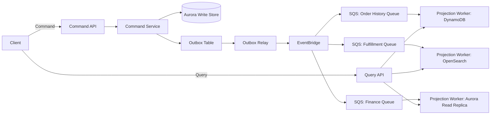
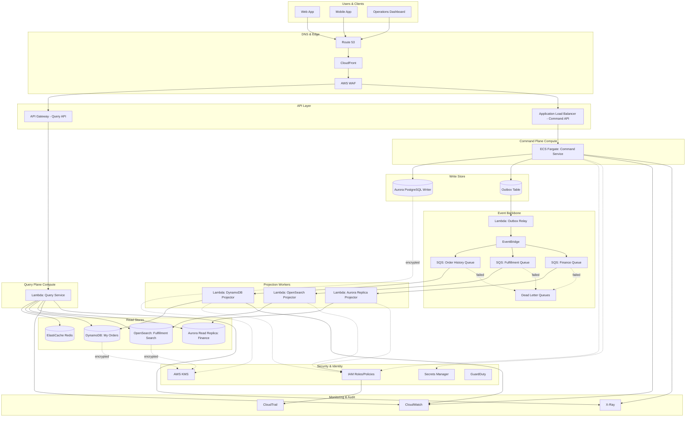

# Part X – Modern Architecture Patterns

# Chapter 78: CQRS (Command Query Responsibility Segregation)

*100 Production-Ready Cloud Architectures with AWS, Terraform, AI, Security, FinOps, and Enterprise Design Patterns*

---

## 1. Executive Summary

### The Business Problem

Most enterprise applications are built on a single data model that serves two very different masters at once: writes (commands) and reads (queries).

- A single relational table is normalized for transactional integrity, but the same table is then queried with complex joins, aggregations, and filters for reporting dashboards.
- As transaction volume grows, the write path (order placement, inventory updates, payment processing) competes for the same database connections, locks, and I/O bandwidth as the read path (catalog browsing, analytics, customer service lookups).
- Engineering teams respond by adding read replicas, caching layers, and denormalized views — but these are bolted onto an architecture that was never designed for the asymmetry between write and read workloads.
- Eventually, the team hits a wall: reporting queries slow down checkout, schema migrations require downtime because the same tables serve both purposes, and scaling one side of the workload forces scaling (and paying for) the other side too.

CQRS exists to resolve this structural mismatch. It is not a caching strategy or a database optimization — it is a re-architecture of how commands (state-changing operations) and queries (read-only operations) are modeled, processed, and stored.

### Architecture Objective

The objective of a CQRS architecture is to physically and logically separate the write model from the read model so that each can be:

- Designed independently, using the data structures and technologies best suited to its purpose.
- Scaled independently, since write throughput and read throughput rarely grow at the same rate.
- Deployed and evolved independently, so that a change to a reporting view does not require a migration on the transactional schema, and vice versa.
- Secured independently, applying different access control, encryption, and auditing rules to commands versus queries.

In an AWS context, this typically means:

- Commands are handled by a write-optimized service (often backed by Amazon Aurora, Amazon DynamoDB, or Amazon RDS) that enforces business rules and transactional consistency.
- State changes are published as events (via Amazon SNS, Amazon SQS, or Amazon EventBridge) rather than being queried directly by consumers.
- Read models are built as denormalized, query-optimized projections (in DynamoDB, OpenSearch, ElastiCache, or Aurora read replicas) that are updated asynchronously from those events.
- Query traffic is served entirely from the read models, never from the write database.

### Why Organizations Adopt CQRS

Organizations do not adopt CQRS because it is fashionable. They adopt it when specific, measurable pain points appear:

1. **Read/write ratio imbalance.** When reads outnumber writes by 10:1, 100:1, or more (common in e-commerce catalogs, content platforms, and financial reporting), a single shared model wastes capacity on the minority workload's constraints.
2. **Divergent query shapes.** When the same underlying data needs to be queried in fundamentally different shapes — a customer's order history, a warehouse's fulfillment queue, a finance team's revenue rollup — maintaining one normalized schema that serves all of them efficiently becomes impossible without extensive indexing that, in turn, slows down writes.
3. **Independent scaling requirements.** When write traffic is bursty (flash sales, batch imports) but reads must remain fast and available continuously, decoupling the two lets each scale on its own axis without over-provisioning the other.
4. **Domain complexity.** In systems following Domain-Driven Design (DDD), the write side enforces invariants and business rules (a command must validate stock before confirming an order), while the read side has no invariants to protect — it simply serves data. Conflating the two forces every read to go through the same validation and locking machinery as a write.
5. **Multi-channel consumption.** When the same data must be exposed to a web app, a mobile app, a partner API, and an internal analytics tool, each with different latency, format, and consistency requirements, a single query model becomes a bottleneck and a single point of contention for schema changes.
6. **Event-driven ecosystems.** Organizations that have already adopted event-driven architecture (Chapter 26) or Event Sourcing (Chapter 79) find CQRS a natural extension, since events are already the primary mechanism for propagating state changes.

### Major Business Benefits

- **Independent scalability** translates directly into cost efficiency: teams pay for read capacity and write capacity separately, rather than over-provisioning a single database tier to satisfy the more demanding of the two workloads.
- **Improved read latency**, because read models are purpose-built (denormalized, indexed, sometimes served from cache or OpenSearch) rather than computed on the fly from a normalized schema.
- **Improved write throughput**, because the write model no longer carries the indexing and view overhead required to serve diverse queries efficiently.
- **Faster feature delivery for reporting and analytics**, because new read models can be introduced without touching the write model or requiring downtime.
- **Better fault isolation.** A surge in read traffic (a marketing campaign driving catalog browsing) does not degrade the write path (checkout, payment). Conversely, a spike in write traffic (a flash sale) does not lock up reporting dashboards.
- **Natural fit for polyglot persistence.** Different read models can live in different databases chosen for their query characteristics (DynamoDB for key-value lookups, OpenSearch for full-text search, Aurora read replicas for relational reporting) without forcing the write side into a single, compromised schema.
- **Auditability and traceability**, especially when paired with an event log, since every state change is captured as a discrete, immutable command/event rather than an in-place row update.

### Typical Enterprise Scenarios

CQRS shows up repeatedly in the following enterprise contexts:

| Scenario | Write Side | Read Side |
|---|---|---|
| E-commerce order management | Order placement, payment capture, inventory decrement | Order history, order status tracking, fulfillment dashboards |
| Banking and financial services | Transaction posting, ledger entries | Account statements, balance inquiries, regulatory reporting |
| Insurance claims processing | Claim submission, adjudication decisions | Claims status portal, adjuster workload dashboards |
| SaaS multi-tenant platforms | Tenant configuration changes, entitlement updates | Tenant-facing dashboards, usage analytics |
| Healthcare systems | Clinical event recording, order entry | Patient chart views, care team dashboards |
| Logistics and supply chain | Shipment creation, status updates | Tracking portals, ETA prediction dashboards |
| Media and content platforms | Content publishing, moderation actions | Content feeds, search, recommendation surfaces |

> **Note:** CQRS is an architectural pattern, not a product. AWS does not sell "a CQRS service." It is realized by composing existing AWS primitives — compute, messaging, and multiple data stores — around a clear separation of command and query responsibilities. This chapter treats CQRS as a composition of well-understood AWS building blocks, each of which is explained the first time it appears.

This chapter builds a complete, production-grade CQRS reference architecture for a mid-to-large enterprise order management system, and walks through every architectural, operational, security, and financial dimension required to run it in production for years, not months.

---

## 2. Business Requirements

### Business Drivers

- Reduce checkout latency degradation during peak reporting/analytics load.
- Enable independent release cycles for reporting features versus transactional features.
- Support real-time order status visibility for customers and internal operations teams.
- Provide a foundation for future event-driven integrations (fulfillment partners, fraud detection, recommendation engines) without re-architecting the core transactional system.
- Reduce total cost of ownership by right-sizing read and write infrastructure independently.

### Functional Requirements

- The system must accept order commands (create order, cancel order, apply discount, update shipping address) and validate them against current business rules and inventory state.
- The system must publish a domain event for every accepted command (OrderCreated, OrderCancelled, OrderShipped, PaymentCaptured).
- The system must maintain at least two read models: a customer-facing "My Orders" view and an operations "Fulfillment Queue" view, each with different shape and access patterns.
- The system must support eventual consistency between the write model and read models, with a defined maximum staleness window.
- The system must expose command APIs and query APIs as separate endpoints with separate authentication/authorization scopes.

### Non-Functional Requirements

| Category | Requirement |
|---|---|
| Scalability | Support 5,000 orders/second at peak (flash sale), 50,000 read queries/second at peak |
| Availability | 99.95% for query path, 99.9% for command path |
| Latency | Command p99 < 300ms; Query p99 < 100ms |
| Compliance | PCI-DSS for payment data, SOC 2 Type II, regional data residency (GDPR where applicable) |
| Security | Encryption at rest and in transit, least-privilege IAM, full audit trail of all commands |
| RPO | 5 minutes for write store, 15 minutes for read stores (rebuildable from events) |
| RTO | 30 minutes for command path, 15 minutes for query path (multi-AZ failover) |
| SLA | 99.9% overall published SLA to business stakeholders, with internal targets set higher |

### Scalability Goals

- Write throughput must scale horizontally without requiring a maintenance window or schema lock.
- Read throughput must scale independently of write throughput, including the ability to add new read model projections without touching the command path.
- The messaging backbone (SNS/SQS/EventBridge) must absorb write bursts without back-pressuring the command API — queue depth, not synchronous processing, absorbs spikes.

### Availability Requirements

- No single Availability Zone failure should cause command or query unavailability.
- Read models must remain available (potentially serving slightly stale data) even during write-side incidents.
- Command path failures must fail safely — rejecting new commands rather than accepting them with unenforced invariants.

### Latency Requirements

- Query reads should be served in well under 100ms at p99 to support interactive customer-facing UIs.
- Commands can tolerate slightly higher latency (up to 300ms at p99) since they involve validation and durability guarantees, but must not exceed customer patience thresholds for checkout flows.

### Compliance Requirements

- Payment card data must never be stored in read models; only tokenized references are propagated through events.
- All command mutations must be logged immutably for audit purposes (CloudTrail plus application-level audit log).
- Data residency requirements may require read model replicas to be pinned to specific AWS Regions.

### Security Expectations

- Command APIs require stronger authentication (customer-authenticated sessions, service-to-service mTLS or SigV4) than read-only query APIs, which may serve cached or public data with lighter-weight authorization.
- Least-privilege IAM roles are enforced per Lambda function / ECS task, scoped to the specific table, queue, or topic each component needs.
- Secrets (database credentials, third-party API keys) are never hardcoded and are retrieved from AWS Secrets Manager at runtime.

### Recovery Objectives

- **RPO (Recovery Point Objective):** 5 minutes on the command-side database (via automated backups and point-in-time recovery); read models are considered rebuildable from the event stream, so their RPO is effectively "time to replay," not a backup-driven number.
- **RTO (Recovery Time Objective):** 30 minutes to restore command-path availability after a regional or AZ-level incident; 15 minutes to restore query-path availability by failing over to standby read replicas or rebuilding projections from a recent snapshot plus event replay.

### SLAs

- 99.9% published availability SLA for the overall system.
- Internal engineering targets of 99.95% for query paths (higher traffic, higher customer visibility) and 99.9% for command paths.

### Expected Workload and Growth

- Baseline: 500 orders/second sustained, 5,000 orders/second peak during promotional events.
- Read traffic baseline: 5,000 queries/second, peak 50,000 queries/second.
- Expected year-over-year growth: 40–60% in both read and write volume, driven by new market expansion.
- New read model types (recommendation feeds, analytics dashboards) expected to be added at a rate of 2–4 per year without requiring changes to the write model.

---

## 3. Architecture Overview

### Overall Design

The architecture separates the system into two independently deployable planes:

- **Command Plane (Write Side):** Accepts state-changing requests, validates business invariants, persists the authoritative state, and publishes domain events describing what happened.
- **Query Plane (Read Side):** Consumes those domain events asynchronously, transforms them into denormalized, query-optimized projections, and serves all read traffic from those projections.

The two planes never share a database. The query plane never writes back to the command plane's data store, and the command plane never serves ad-hoc analytical queries directly.

### Architecture Philosophy

- **Single source of truth on the write side.** The command plane's data store (Aurora PostgreSQL in this reference architecture) is the only place where business invariants are enforced and the only authoritative record of "what happened."
- **Events as the integration contract.** Rather than read models querying the write database directly (tight coupling), all propagation happens through published domain events. This makes it possible to add, remove, or rebuild read models without ever touching the write side.
- **Eventual consistency is an explicit, communicated trade-off**, not an accident. The UI and API contracts are designed around it (e.g., "Your order has been placed" is confirmed synchronously by the command path; "Your order now appears in your order history" may lag by hundreds of milliseconds to a few seconds).
- **Idempotency everywhere.** Because messaging systems provide at-least-once delivery, every event consumer (projection builder) must be idempotent — applying the same event twice must not corrupt the read model.
- **Polyglot persistence by design.** Each read model is stored in the technology best suited to its query pattern — DynamoDB for single-key lookups, OpenSearch for full-text/faceted search, Aurora read replicas for complex relational reporting.

### Core Components

1. **API Layer** — Amazon API Gateway plus Application Load Balancer, exposing separate command and query endpoints.
2. **Command Service** — Containerized service (Amazon ECS on Fargate) implementing business logic and invariant checks.
3. **Write Store** — Amazon Aurora PostgreSQL cluster, the authoritative transactional database.
4. **Event Backbone** — Amazon EventBridge (domain event routing) backed by Amazon SNS/SQS for durable fan-out to subscribers.
5. **Projection Workers** — AWS Lambda functions (or ECS tasks for higher-throughput projections) that consume events and update read models.
6. **Read Stores** — Amazon DynamoDB (customer-facing order lookups), Amazon OpenSearch Service (operations search/filter dashboards), Aurora read replica (finance reporting).
7. **Cache Layer** — Amazon ElastiCache (Redis) in front of the most latency-sensitive read paths.
8. **Observability Stack** — Amazon CloudWatch, AWS X-Ray, CloudTrail.
9. **Security Layer** — AWS WAF, AWS KMS, AWS Secrets Manager, IAM.

### How Components Interact

- Clients submit commands via the Command API, which routes to the Command Service.
- The Command Service validates the request, executes a transactional write against Aurora, and — within the same logical unit of work, using the Transactional Outbox pattern (Chapter 81) — writes a corresponding event record to an outbox table.
- A change-data-capture (CDC) process (or a scheduled outbox-relay Lambda) reads the outbox table and publishes events to EventBridge.
- EventBridge routes events to one or more SQS queues, each dedicated to a specific projection worker.
- Projection workers consume events, apply idempotent transformations, and update their respective read models.
- Clients query via the Query API, which reads exclusively from the appropriate read model (DynamoDB, OpenSearch, or Aurora read replica), optionally through the ElastiCache layer.

### High-Level Workflow



### Request Lifecycle (Command)

1. Client submits a command (e.g., "Create Order") to the Command API.
2. API Gateway authenticates and authorizes the request, then forwards it to the Command Service (ECS/Fargate).
3. The Command Service loads current state from Aurora, validates business invariants (inventory availability, pricing rules, fraud checks).
4. If valid, the Command Service performs a transactional write: it updates the authoritative tables and inserts an event record into the outbox table, in the same database transaction.
5. The Command Service returns a success response to the client synchronously — the client's confirmation does not wait for downstream projections.
6. Asynchronously, the outbox relay publishes the event to EventBridge for propagation to all interested projections.

### Response Lifecycle (Query)

1. Client submits a query (e.g., "Get My Orders") to the Query API.
2. API Gateway authenticates the request and routes it to the appropriate read-optimized Lambda or ECS service.
3. The service checks ElastiCache for a cached response; on a cache miss, it queries the relevant read model (DynamoDB for order lookups).
4. The response is returned to the client and, where appropriate, cached with a short TTL.

### Data Lifecycle

- **Write path:** Command → validation → transactional write → outbox event → EventBridge → SQS → projection update.
- **Read path:** Query → cache check → read model query → response.
- **Reconciliation:** A nightly batch job compares aggregate counts and checksums between the write store and each read model, alerting on drift beyond a defined threshold, and triggering a targeted rebuild of affected projections if necessary.

---

## 4. AWS Services Used

Each service below is introduced from first principles, then evaluated specifically in the context of this CQRS architecture.

### Amazon ECS on AWS Fargate (Command Service Compute)

**What it is:** Amazon ECS is a container orchestration service; Fargate is a serverless compute engine for ECS that removes the need to provision or manage EC2 instances.

- **Purpose:** Hosts the Command Service, which contains business logic, invariant validation, and transactional writes.
- **Why selected:** Command processing is typically CPU/memory-bound business logic with moderate, predictable concurrency; ECS/Fargate provides container-level isolation, fine-grained scaling, and no patching burden — a better fit than Lambda when commands involve longer-running transactions, connection pooling to Aurora, or complex validation pipelines that benefit from persistent, warm processes.
- **Alternatives:** AWS Lambda (simpler, cheaper at low volume, but connection pooling to relational databases is harder and cold starts affect p99 latency); Amazon EKS (more control, but far higher operational overhead — justified only if the organization already runs Kubernetes at scale elsewhere).
- **Limitations:** Requires task definition and cluster capacity management (even if serverless, Fargate has task launch latency); scaling is not instantaneous — Application Auto Scaling has a reaction lag of tens of seconds.
- **Pricing considerations:** Billed per vCPU/memory-second while tasks run; no charge for idle EC2 capacity (unlike Auto Scaling Groups). Fargate Spot can reduce cost by up to 70% for non-critical, interruption-tolerant projection workers, but is not recommended for the Command Service itself, which must remain highly available.
- **Best practices:** Right-size task CPU/memory based on load testing; use Service Auto Scaling on both request count and CPU utilization; deploy across a minimum of three AZs.

### AWS Lambda (Projection Workers, Outbox Relay)

**What it is:** A serverless, event-driven compute service that runs code in response to triggers without provisioning servers.

- **Purpose:** Consumes events from SQS and updates read model projections; also implements the outbox relay that publishes committed events to EventBridge.
- **Why selected:** Projection logic is typically short-lived, stateless, and highly parallelizable — an ideal Lambda workload. Lambda's native SQS integration provides automatic batching, retries, and dead-letter queue support.
- **Alternatives:** ECS tasks (preferred for projections with sustained, very high throughput where Lambda's per-invocation overhead becomes a cost or latency concern); Amazon Kinesis Data Analytics (for streaming aggregation projections).
- **Limitations:** 15-minute maximum execution duration; cold starts can affect latency-sensitive projections (mitigated with Provisioned Concurrency); concurrency limits must be managed to avoid overwhelming downstream read stores.
- **Pricing considerations:** Pay-per-invocation and per-GB-second; extremely cost-efficient at variable/bursty load, but can become more expensive than ECS at sustained, very high throughput.
- **Best practices:** Keep functions small and single-purpose (one function per projection type); use SQS batch size tuning to balance throughput and latency; enable Lambda Destinations or DLQs for failed events.

### Amazon Aurora PostgreSQL (Write Store)

**What it is:** A fully managed, MySQL/PostgreSQL-compatible relational database engine built for the cloud, offering higher throughput and built-in high availability compared to standard RDS.

- **Purpose:** The authoritative transactional store for the command side; enforces referential integrity, business invariants, and ACID transactions.
- **Why selected:** Commands require strong consistency and multi-row transactional guarantees (e.g., decrementing inventory and creating an order atomically) — a strength of relational databases that key-value stores do not natively provide. Aurora's storage layer replicates six ways across three AZs automatically.
- **Alternatives:** Amazon RDS for PostgreSQL (viable at lower scale, but lacks Aurora's storage-level replication and faster failover); Amazon DynamoDB (rejected for the write side here because complex multi-entity transactional invariants and ad hoc relational modeling of order/inventory/pricing rules are more naturally expressed relationally — DynamoDB transactions exist but are limited to 100 items and are more costly to model for this domain).
- **Limitations:** Vertical scaling of the writer instance has ceilings; write throughput is ultimately bound by a single writer endpoint (Aurora does not support multi-writer for PostgreSQL-compatible clusters in most configurations).
- **Pricing considerations:** Billed for instance hours, storage, I/O (unless using Aurora I/O-Optimized), and backup storage beyond the retention window.
- **Best practices:** Use Aurora I/O-Optimized for write-heavy, unpredictable workloads to avoid per-I/O billing surprises; enable Performance Insights; use RDS Proxy in front of Aurora to pool connections from bursty Fargate/Lambda callers.

### Amazon DynamoDB (Customer-Facing Read Model)

**What it is:** A fully managed, serverless key-value and document database with single-digit-millisecond latency at virtually any scale.

- **Purpose:** Serves the "My Orders" customer-facing read model, optimized for single-key lookups by customer ID and order ID.
- **Why selected:** The access pattern is simple and predictable (fetch orders by customer ID, fetch a single order by ID), which plays directly to DynamoDB's strengths; it scales horizontally without operational intervention and provides consistent low-latency reads.
- **Alternatives:** Aurora read replica (rejected as the primary customer-facing store because it requires SQL query optimization and connection management for a workload that is fundamentally key-based); ElastiCache alone (rejected as a system of record because it is not durable by default).
- **Limitations:** Not suited for complex ad hoc queries, joins, or full-text search (hence the separate OpenSearch projection for operations use cases); item size limited to 400 KB; Global Secondary Index eventual consistency must be accounted for.
- **Pricing considerations:** On-demand capacity mode is recommended for unpredictable projection update patterns; provisioned capacity with auto scaling can be more economical once traffic patterns stabilize.
- **Best practices:** Design partition keys to avoid hot partitions (e.g., customerId as partition key, orderId as sort key); use DynamoDB Streams if further downstream propagation is needed; enable point-in-time recovery.

### Amazon OpenSearch Service (Operations/Search Read Model)

**What it is:** A managed service for search and analytics, based on the OpenSearch (Elasticsearch-derived) engine.

- **Purpose:** Powers the operations "Fulfillment Queue" read model, supporting full-text search, faceted filtering, and near-real-time dashboards for warehouse and customer service teams.
- **Why selected:** Operations users need to filter and search orders by many attributes simultaneously (status, region, carrier, date range, free-text customer name) — a query shape DynamoDB and Aurora both handle poorly at scale, but which is OpenSearch's core strength.
- **Alternatives:** Amazon Aurora with extensive indexing (rejected — index proliferation for many ad hoc filters degrades write performance on the projection side and query performance is inferior to a purpose-built search engine); Amazon Athena over S3 (rejected for real-time operational use cases due to higher query latency, though it remains a good fit for historical analytics, covered in Chapter 46).
- **Limitations:** Operationally heavier to run than DynamoDB (shard management, index lifecycle policies); eventual consistency between projection writes and search availability (typically sub-second, but not instantaneous).
- **Pricing considerations:** Billed per instance-hour plus storage; use UltraWarm/cold storage tiers for older order data to control cost.
- **Best practices:** Use Index State Management (ISM) policies to roll over and age out old indices; dedicate master nodes for cluster stability at scale; avoid using OpenSearch as a system of record — it is a projection, rebuildable from events.

### Amazon EventBridge (Domain Event Router)

**What it is:** A serverless event bus that routes events between AWS services, SaaS applications, and custom applications based on rules.

- **Purpose:** Acts as the central nervous system of the CQRS architecture, routing domain events (OrderCreated, OrderCancelled, PaymentCaptured) from the command side to any number of interested projection consumers.
- **Why selected:** EventBridge's rule-based routing allows new consumers to subscribe to existing event types without modifying the publisher — critical for a CQRS system expected to grow new read models over time. Schema Registry support also enables contract governance between publishers and consumers.
- **Alternatives:** Amazon SNS (simpler, cheaper, but lacks EventBridge's content-based filtering and schema registry — suitable for simpler fan-out scenarios); Apache Kafka on Amazon MSK (justified only when very high-throughput, ordered, replayable streaming semantics are required across many consumers — higher operational overhead than EventBridge).
- **Limitations:** At extremely high throughput (hundreds of thousands of events/second sustained), Kafka-based solutions can be more cost-effective and offer stronger ordering guarantees; EventBridge does not guarantee strict ordering within an event type across partitions.
- **Pricing considerations:** Billed per million events published; a cost-effective choice at moderate-to-high event volumes typical of order management systems.
- **Best practices:** Define a versioned event schema per domain event type; use EventBridge Schema Registry to enforce contracts; route to SQS (not directly to Lambda) for durability and retry control.

### Amazon SQS (Durable Buffering per Consumer)

**What it is:** A fully managed message queuing service providing reliable, durable, at-least-once message delivery.

- **Purpose:** Provides a dedicated, durable buffer per projection consumer, decoupling event production rate from projection processing rate and absorbing bursts.
- **Why selected:** Without a queue between EventBridge and each Lambda/ECS projection worker, a burst of events (a flash sale) could overwhelm downstream read stores; SQS provides natural back-pressure and retry semantics, plus dead-letter queues for poison messages.
- **Alternatives:** Direct EventBridge-to-Lambda invocation (rejected — no back-pressure control, harder to reprocess failed events); Kinesis Data Streams (preferred only when strict ordering per partition key and replay-from-any-point semantics are required beyond what a DLQ-based retry model provides).
- **Limitations:** Standard queues do not guarantee strict ordering (FIFO queues do, at reduced throughput); message visibility timeout tuning is required to avoid duplicate processing under slow consumers.
- **Pricing considerations:** Charged per request; inexpensive relative to the reliability and decoupling benefits it provides.
- **Best practices:** One queue per projection consumer (never share a queue across multiple different projection types); configure DLQs with alerting; use long polling to reduce empty-receive costs.

### Amazon ElastiCache for Redis (Read-Path Acceleration)

**What it is:** A fully managed, in-memory data store and cache compatible with Redis.

- **Purpose:** Caches the hottest read queries (e.g., a customer repeatedly refreshing an order status page) to reduce load on DynamoDB/OpenSearch and shave query latency.
- **Why selected:** Sub-millisecond latency for cache hits meaningfully improves p99 query latency for the most frequently accessed data, at a fraction of the cost of scaling the underlying read stores for that traffic.
- **Alternatives:** DynamoDB Accelerator (DAX) (a strong alternative specifically for DynamoDB-fronted read paths; chosen over generic ElastiCache when all cached queries originate from DynamoDB); no cache (viable at lower query volume, but leaves latency and read-store cost on the table at scale).
- **Limitations:** Adds a cache-invalidation problem — stale cached data must be bounded by a short TTL or explicitly invalidated on relevant projection updates.
- **Pricing considerations:** Billed per node-hour; justified once cache hit rates exceed roughly 60–70% for hot keys, translating into meaningfully reduced downstream read-store costs.
- **Best practices:** Use short TTLs (seconds, not minutes) for order status data given its time-sensitivity; use cache-aside pattern rather than write-through to keep the cache logic simple and decoupled from projection writers.

### Amazon API Gateway and Application Load Balancer (API Layer)

**What it is:** API Gateway is a managed service for creating, publishing, and securing REST/HTTP APIs; ALB is a Layer 7 load balancer for distributing traffic across compute targets.

- **Purpose:** API Gateway fronts the Lambda-based Query API (fine-grained throttling, usage plans, request validation); ALB fronts the ECS-based Command Service (better suited to long-lived container targets and WebSocket/streaming use cases).
- **Why selected:** Using different entry points for command and query traffic reinforces the architectural separation at the network layer, allows independent throttling/rate-limiting policies, and lets each API evolve its authentication model independently (e.g., stricter mTLS for commands, standard OAuth2/JWT for queries).
- **Alternatives:** A single unified API Gateway for both paths (simpler initially, but blurs the architectural boundary and complicates independent scaling policies).
- **Limitations:** API Gateway has payload size and timeout limits (29 seconds for REST APIs) unsuitable for long-running commands — mitigated by making all commands asynchronous-acknowledgment patterns where needed.
- **Pricing considerations:** API Gateway is billed per request plus data transfer; ALB is billed per load balancer-hour plus LCU (Load Balancer Capacity Unit) usage.
- **Best practices:** Enable request validation and throttling at the API Gateway layer to protect downstream Lambdas; use ALB target group health checks tuned to the Command Service's actual readiness signal (including database connectivity).

### Amazon CloudFront (Edge Caching for Static/Semi-Static Read Data)

**What it is:** A global content delivery network (CDN) that caches content at edge locations close to end users.

- **Purpose:** Caches semi-static query responses (e.g., product catalog data referenced within order views) close to users, reducing latency and origin load.
- **Why selected:** For globally distributed customers, edge caching reduces round-trip latency far more effectively than origin-region-only optimizations.
- **Alternatives:** Origin-only serving (acceptable for single-region deployments with a geographically concentrated user base).
- **Limitations:** Not suitable for highly dynamic, per-user data (individual order status) without careful cache-key design and short TTLs; adds a layer of cache invalidation complexity.
- **Pricing considerations:** Billed per data transfer out and per request, varying by edge location; typically cost-effective given the latency and origin-offload benefits.
- **Best practices:** Use cache behaviors keyed to path patterns; avoid caching authenticated, per-user command responses.

### Amazon Route 53 (DNS)

**What it is:** A highly available, scalable Domain Name System (DNS) web service.

- **Purpose:** Resolves the public domain names for both the Command API and Query API endpoints, and supports health-check-based failover.
- **Why selected:** Native integration with health checks and latency-based routing supports multi-AZ and multi-region failover without third-party DNS tooling.
- **Alternatives:** Third-party DNS providers (viable, but lose tight integration with AWS health checks and Global Accelerator).
- **Limitations:** DNS TTL-based failover is not instantaneous; clients caching DNS responses may experience delayed failover.
- **Pricing considerations:** Billed per hosted zone and per query volume; a minor cost relative to the overall architecture.
- **Best practices:** Use low TTLs (60 seconds or less) on records expected to participate in failover; pair with Route 53 health checks against both the Command and Query API endpoints independently.

### AWS IAM (Identity and Access Management)

- **Purpose:** Enforces least-privilege access for every component — each Lambda function, ECS task, and human operator is granted only the permissions it needs.
- **Why selected:** It is the foundational AWS access-control mechanism and integrates natively with every other service in this architecture.
- **Alternatives:** None at the AWS primitive level; the discussion is about *how* IAM is structured (see Section 10), not whether it is used.
- **Limitations:** Policy sprawl and overly broad wildcard permissions are common failure modes without disciplined policy-as-code practices.
- **Best practices:** One IAM role per Lambda function/ECS task, scoped to exact resource ARNs; use permission boundaries for any role capable of creating other IAM entities.

### Amazon VPC (Networking Foundation)

- **Purpose:** Provides network isolation for Aurora, ElastiCache, and OpenSearch, none of which should be internet-reachable.
- **Why selected:** All stateful data services in this architecture sit in private subnets; only the API layer is internet-facing.
- **Best practices:** See Section 9 for full network topology detail.

### Amazon CloudWatch, AWS X-Ray, AWS CloudTrail (Observability and Audit)

- **Purpose:** CloudWatch provides metrics, logs, and alarms across every component; X-Ray provides distributed tracing across the command→event→projection pipeline; CloudTrail provides an immutable audit log of all AWS API calls (including who changed IAM policies, who accessed Secrets Manager, etc.).
- **Why selected:** A CQRS system's biggest operational risk is silent read-model drift; correlated tracing across the command and projection paths is essential to detect and diagnose staleness or missed events quickly (see Section 21).

### AWS KMS and AWS Secrets Manager (Encryption and Secrets)

- **Purpose:** KMS provides encryption keys for data at rest across Aurora, DynamoDB, OpenSearch, and S3; Secrets Manager stores and automatically rotates database credentials and third-party API keys.
- **Why selected:** Centralizing key management and secret rotation reduces the risk of credential leakage and satisfies PCI-DSS and SOC 2 encryption requirements.

### AWS Systems Manager (Operational Tooling)

- **Purpose:** Provides Parameter Store for non-secret configuration, Session Manager for auditable, bastion-less access to ECS/EC2 resources when needed, and Automation documents for standardized operational runbooks.

> **Note:** Services intentionally *not* used in this reference architecture include a single shared relational database for both reads and writes (defeats the purpose of CQRS), and a message broker without durable queuing per consumer (creates tight coupling and fragile fan-out).

---

## 5. Complete Architecture Diagram



> **Tip:** Notice that the diagram has exactly one arrow crossing from the write side to the messaging backbone (the outbox relay), and zero arrows from the query plane back into the write store. This single-direction data flow is the defining visual signature of a correctly implemented CQRS architecture. If you find yourself drawing an arrow from a read model back into the command database, that is a signal the boundary has been violated somewhere in the design.

---

## 6. Component-by-Component Explanation

### 6.1 Command Service (ECS Fargate)

- **Purpose:** Enforces business invariants and performs the authoritative write for every command.
- **Responsibilities:** Request validation, business rule enforcement (inventory checks, pricing rules, fraud screening hooks), transactional persistence, outbox event creation.
- **Inputs:** HTTP command requests from the Command API (JSON payloads: CreateOrder, CancelOrder, UpdateShippingAddress).
- **Outputs:** Synchronous HTTP response (accepted/rejected); asynchronous domain events via the outbox table.
- **Scaling:** ECS Service Auto Scaling on target tracking (CPU utilization and ALB request count per target); minimum 3 tasks across 3 AZs for baseline availability.
- **High availability:** Tasks spread across 3 AZs; ALB health checks remove unhealthy tasks; Aurora Multi-AZ writer failover handled transparently via the Aurora endpoint.
- **Failure handling:** Failed commands return explicit error codes (4xx for validation failures, 5xx for infrastructure failures); no partial writes — every command is wrapped in a single database transaction including the outbox insert.
- **Dependencies:** Aurora writer endpoint, Secrets Manager (DB credentials), RDS Proxy (connection pooling).
- **Security:** IAM task role scoped to Secrets Manager secret ARN and CloudWatch Logs only; no direct IAM access to DynamoDB/OpenSearch (command service never touches read models).
- **Monitoring:** CloudWatch custom metrics for command acceptance/rejection rates; X-Ray traces spanning API Gateway/ALB → ECS → Aurora.

### 6.2 Outbox Table and Outbox Relay

- **Purpose:** Guarantees that a state change and its corresponding event are never inconsistent (the classic dual-write problem) by writing both in a single transaction, then relaying asynchronously.
- **Responsibilities:** The outbox table stores unpublished events; the relay Lambda polls (or is CDC-triggered via Aurora's binlog/logical replication) and publishes to EventBridge, marking events as published.
- **Inputs:** Rows inserted by the Command Service within the same transaction as the business write.
- **Outputs:** Published events on EventBridge.
- **Scaling:** Relay Lambda scales with the rate of unpublished rows; polling interval tuned to balance latency versus cost.
- **Failure handling:** At-least-once publication — the relay retries until an event is confirmed published, and consumers must be idempotent to handle possible duplicate delivery.
- **Dependencies:** Aurora (source table), EventBridge (destination).
- **Security:** Relay Lambda's IAM role is scoped only to `events:PutEvents` on the specific event bus ARN and read access to the outbox table.

### 6.3 EventBridge and SQS Queues

- **Purpose:** Decouple event producers from event consumers, allowing new projections to be added without modifying the Command Service.
- **Responsibilities:** EventBridge routes events by type/content to the correct SQS queues; each SQS queue buffers events for exactly one projection consumer.
- **Scaling:** Fully managed and horizontally scalable by AWS; queue depth is the primary signal for downstream consumer scaling.
- **Failure handling:** Failed projection attempts return the message to the queue (subject to visibility timeout) up to a configured `maxReceiveCount`, after which the message moves to a dead-letter queue for manual or automated reprocessing.
- **Security:** Each queue has a resource policy restricting `sqs:SendMessage` to the EventBridge rule ARN and `sqs:ReceiveMessage` to the specific consumer's IAM role.

### 6.4 Projection Workers (Lambda)

- **Purpose:** Transform domain events into denormalized, query-optimized read model updates.
- **Responsibilities:** Deserialize and validate the event, apply idempotent upsert logic to the target read model, record processing checkpoints for reconciliation.
- **Inputs:** Batched messages from the dedicated SQS queue.
- **Outputs:** Writes to DynamoDB, OpenSearch, or Aurora read replica, depending on the projection.
- **Scaling:** Lambda concurrency scales automatically with SQS queue depth, bounded by a reserved concurrency limit to protect downstream read stores from being overwhelmed.
- **High availability:** Stateless functions deployed across all AZs in the Region by default (Lambda manages this transparently).
- **Failure handling:** Idempotency keys (event ID) checked before applying updates; malformed events routed to DLQ rather than retried indefinitely.
- **Dependencies:** SQS (source), target read store, CloudWatch Logs.
- **Security:** IAM role scoped to exactly one SQS queue (receive/delete) and exactly one target data store (write).
- **Monitoring:** CloudWatch metrics for processing latency, error rate, and DLQ message count; alarms on DLQ depth > 0.

### 6.5 Read Stores (DynamoDB, OpenSearch, Aurora Read Replica)

- **Purpose:** Serve all query traffic with access patterns optimized per consumer need.
- **Responsibilities:** DynamoDB serves single-key customer lookups; OpenSearch serves full-text/faceted operational search; Aurora read replica serves complex relational finance reporting queries.
- **Scaling:** DynamoDB scales via on-demand capacity or auto-scaled provisioned capacity; OpenSearch scales via additional data nodes; Aurora read replicas scale by adding additional reader instances (up to 15 per cluster).
- **High availability:** DynamoDB is inherently multi-AZ; OpenSearch configured with zone awareness across 3 AZs; Aurora read replicas distributed across AZs with automated failover promotion capability.
- **Failure handling:** Because all three are rebuildable from the event stream, a corrupted or lost read store is a recoverable incident (replay events from EventBridge Archive or a stored event log), not a data-loss incident.
- **Security:** Encrypted at rest via KMS; DynamoDB and OpenSearch accessed only via VPC endpoints / private subnets; no public accessibility.

### 6.6 Query Service (Lambda + API Gateway)

- **Purpose:** Serves all read requests exclusively from read models, never from the write store.
- **Responsibilities:** Cache-aside lookups against ElastiCache, fallback queries to the appropriate read store, response shaping per client (web, mobile, operations).
- **Scaling:** Scales automatically with API Gateway request volume; Provisioned Concurrency applied to the highest-traffic query functions to control p99 latency.
- **Failure handling:** On read-store unavailability, serves stale cached data (if available) rather than failing outright, with a clear "last updated" timestamp surfaced to the client.
- **Security:** IAM role scoped to read-only access on the specific read store tables/indices; no write permissions anywhere.
- **Monitoring:** CloudWatch metrics on cache hit ratio, query latency percentiles, and error rate by read model.

### 6.7 ElastiCache Redis

- **Purpose:** Reduces read latency and downstream load for the hottest queries.
- **Failure handling:** Cache-aside pattern means a cache node failure degrades performance (higher latency, more load on read stores) but does not cause an outage — the system fails toward correctness over speed.
- **Security:** Deployed in private subnets, encryption in transit and at rest enabled, auth token stored in Secrets Manager.

---

## 7. End-to-End Request Flow

### 7.1 Command Flow: "Place Order"

1. Client (web/mobile app) sends `POST /commands/orders` with an idempotency key header.
2. Route 53 resolves the domain to CloudFront, which forwards non-cacheable command traffic directly to the origin.
3. AWS WAF inspects the request against managed rule groups (SQL injection, common exploits) and rate-based rules.
4. Application Load Balancer routes the request to a healthy ECS Fargate task running the Command Service.
5. The Command Service authenticates the request (JWT validation) and checks the idempotency key against a short-lived idempotency store to reject duplicate submissions.
6. Business validation executes: inventory availability check, pricing validation, fraud screening call.
7. On success, a single database transaction executes against Aurora: insert order row, decrement inventory, insert an `OrderCreated` event row into the outbox table.
8. The transaction commits; the Command Service returns `201 Created` with the order ID to the client.
9. Asynchronously, the outbox relay Lambda detects the new outbox row and publishes an `OrderCreated` event to EventBridge.
10. EventBridge rules match the event type and route copies to the Order History, Fulfillment, and Finance SQS queues.
11. Each projection worker consumes its queue, applies an idempotent upsert to its respective read model.
12. CloudWatch and X-Ray record latency and trace spans at every hop; CloudTrail logs the underlying AWS API calls (e.g., `PutEvents`, `dynamodb:PutItem`).
13. If any projection worker fails, the message becomes visible again in its queue for retry; after the configured retry count is exhausted, it routes to that consumer's DLQ and triggers a CloudWatch alarm.

### 7.2 Query Flow: "Get My Orders"

1. Client sends `GET /queries/orders?customerId=...` to the Query API (API Gateway).
2. API Gateway validates the JWT and applies a usage-plan throttle.
3. The request routes to the Query Lambda, which first checks ElastiCache for a cached response keyed by customer ID.
4. On a cache miss, the Lambda queries DynamoDB directly by partition key (customerId).
5. The response is shaped into the client-facing schema and returned; the result is cached in ElastiCache with a short TTL (e.g., 5–10 seconds).
6. CloudWatch records cache hit/miss ratio and query latency; X-Ray traces the full path for correlation with any upstream command that may not yet be reflected (staleness diagnosis).

### 7.3 Error Handling Across the Flow

| Failure Point | Client-Visible Behavior | Internal Handling |
|---|---|---|
| WAF blocks request | 403 Forbidden | Logged to WAF logs, reviewed in Security Hub |
| Command validation fails | 400/422 with error detail | No database write occurs; request logged |
| Aurora writer unavailable | 503 Service Unavailable | ALB health check removes affected tasks; Aurora failover triggers automatically |
| Outbox relay delayed | No client-visible impact (command already acknowledged) | CloudWatch alarm on outbox backlog age |
| Projection worker failure | Read model temporarily stale | DLQ captures failed event; alarm triggers on-call; automated replay job available |
| Read store unavailable | Stale cached response served if available, else 503 | CloudWatch alarm; automatic failover to replica where applicable |

---

## 8. Deployment Flow

### Infrastructure Provisioning

- All infrastructure is defined in Terraform, organized into independently deployable modules: `network`, `write-store`, `messaging`, `command-service`, `projections`, `read-stores`, `query-service`, `security`, `observability`.
- Independent deployability is a first-class requirement: a change to a projection worker's Lambda code must be deployable without re-planning the Aurora module.

### Terraform Workflow

1. Developer opens a pull request modifying a module (e.g., adding a new projection).
2. CI pipeline runs `terraform fmt -check`, `terraform validate`, and `tflint`.
3. `terraform plan` runs against a locked remote state (S3 backend + DynamoDB state lock table) and posts the plan as a PR comment.
4. Policy-as-code checks (Open Policy Agent / Sentinel-style rules, or `checkov`) validate the plan against security guardrails (no public S3 buckets, no unencrypted data stores, no overly permissive IAM).
5. On approval and merge, `terraform apply` runs via the CI/CD pipeline against the target environment.

### CI/CD Deployment

- Application code (Command Service container image, Lambda projection code) is built, tested, and pushed independently of Terraform infrastructure changes.
- Container images are pushed to Amazon ECR, scanned for vulnerabilities (ECR image scanning / Amazon Inspector), and tagged with the Git commit SHA.
- Lambda deployment packages are versioned and published with aliases (`live`, `canary`) to support traffic shifting.

### Blue-Green Deployment

- The Command Service (ECS) uses AWS CodeDeploy's blue-green ECS deployment: a new task set is deployed alongside the existing one, ALB traffic is shifted gradually (e.g., 10% → 50% → 100%) while CloudWatch alarms monitor error rate and latency.
- If alarms trigger during the shift, CodeDeploy automatically rolls back traffic to the original task set.
- Projection Lambdas use weighted alias traffic shifting (e.g., 5% to the new version) combined with CloudWatch alarms on error rate before promoting to 100%.

### Rollback

- ECS: CodeDeploy retains the previous task set during the deployment window and can roll back instantly by shifting ALB weight back to 0% on the new task set.
- Lambda: Alias traffic is shifted back to the previous version; because Lambda versions are immutable, rollback is deterministic and fast.
- Aurora schema changes: All migrations are backward-compatible (expand/contract pattern) so that a code rollback never requires a corresponding destructive schema rollback.

### Secrets

- Database credentials, ElastiCache auth tokens, and third-party API keys are stored in Secrets Manager and referenced by ARN in ECS task definitions and Lambda environment configuration — never embedded in Terraform variables or container images.
- Secrets Manager automatic rotation is enabled for the Aurora master credentials on a 30-day cycle.

### Configuration

- Non-secret configuration (feature flags, queue URLs, table names) is stored in AWS Systems Manager Parameter Store, versioned, and referenced by parameter path per environment (`/cqrs/prod/queue-url/order-history`).

### Validation

- Post-deployment smoke tests run automatically: a synthetic command is submitted, and the pipeline verifies the corresponding event appears in each read model within the expected staleness window before marking the deployment successful.

---

## 9. Network Topology

### VPC and CIDR Design

- A dedicated VPC per environment (e.g., `10.20.0.0/16` for production) sized to accommodate future growth in subnets and IP consumption from Lambda ENIs.
- Three Availability Zones used for all subnet tiers to satisfy multi-AZ availability requirements.

| Subnet Tier | Purpose | Example CIDR |
|---|---|---|
| Public | ALB, NAT Gateways | 10.20.0.0/24, 10.20.1.0/24, 10.20.2.0/24 |
| Private – Application | ECS tasks, Lambda ENIs | 10.20.10.0/23, 10.20.12.0/23, 10.20.14.0/23 |
| Private – Data | Aurora, ElastiCache, OpenSearch | 10.20.20.0/23, 10.20.22.0/23, 10.20.24.0/23 |

### Public and Private Subnets

- Public subnets host only the ALB and NAT Gateways — no compute or data resources are ever placed in a public subnet.
- Application-tier private subnets host ECS tasks and Lambda functions (via VPC configuration), which reach the internet (for external API calls) only through NAT Gateways.
- Data-tier private subnets host Aurora, ElastiCache, and OpenSearch, with security groups permitting inbound traffic only from the application-tier subnets on their specific service ports.

### NAT Gateway and Internet Gateway

- One NAT Gateway per AZ (not a single shared NAT Gateway) to avoid a cross-AZ single point of failure and to avoid inter-AZ data transfer charges for outbound traffic.
- A single Internet Gateway attached to the VPC provides the path for public subnet resources (ALB) to be reachable from the internet.

### Transit Gateway

- Used when this VPC needs to communicate with other application VPCs (e.g., a shared fraud-detection service, a shared identity provider) or on-premises networks, avoiding a full mesh of VPC peering connections as the number of VPCs grows.
- Not required for a single, self-contained CQRS deployment, but included here because enterprise environments typically operate this workload within a broader multi-VPC landing zone (Chapter 99).

### Route Tables

- Public subnet route table: default route (`0.0.0.0/0`) to the Internet Gateway.
- Private application subnet route tables: default route to the AZ-local NAT Gateway.
- Private data subnet route tables: no default internet route; only routes to peered/Transit Gateway-attached networks if cross-VPC access is required (e.g., centralized monitoring VPC).

### Network ACLs and Security Groups

- Security groups are the primary access control mechanism, scoped tightly: the Aurora security group allows inbound TCP 5432 only from the ECS task security group and the projection Lambda security group.
- Network ACLs provide a secondary, stateless layer of defense at the subnet boundary, primarily used to explicitly deny known-bad CIDR ranges and enforce subnet-tier isolation as a defense-in-depth measure.

### PrivateLink / VPC Endpoints

- Interface VPC endpoints are provisioned for Secrets Manager, KMS, SQS, EventBridge, and CloudWatch Logs so that Lambda functions and ECS tasks never need to traverse the public internet (via NAT Gateway) to reach these AWS services — reducing both NAT Gateway cost and external attack surface.
- Gateway VPC endpoints are provisioned for S3 (used for Aurora backups, OpenSearch snapshots, and CloudTrail log delivery) at no additional data-processing cost.

### Hybrid Connectivity

- For enterprises requiring on-premises integration (e.g., a legacy ERP system that must consume order events), AWS Direct Connect or Site-to-Site VPN attached to the Transit Gateway provides private connectivity without exposing the event backbone to the public internet.

---

## 10. Identity and Access

### IAM Roles

Each compute component receives its own dedicated IAM role — roles are never shared across the Command Service, individual projection workers, and the Query Service, even though this means managing more roles.

| Component | Role Purpose | Key Permissions |
|---|---|---|
| Command Service task role | Write path execution | `rds-db:connect` (via RDS Proxy IAM auth), `secretsmanager:GetSecretValue` (scoped ARN) |
| Outbox relay Lambda role | Event publication | `events:PutEvents` (scoped to one event bus), read access to outbox table |
| DynamoDB projector role | Read model update | `dynamodb:PutItem`/`UpdateItem` scoped to one table, `sqs:ReceiveMessage`/`DeleteMessage` scoped to one queue |
| OpenSearch projector role | Read model update | `es:ESHttpPost`/`ESHttpPut` scoped to one domain, matching SQS permissions |
| Query Lambda role | Read-only serving | `dynamodb:GetQuery` (read-only), `es:ESHttpGet`, `elasticache` read access — no write permissions anywhere |

### IAM Policies

- Policies are written as least-privilege, resource-scoped JSON documents — never `Resource: "*"` for data-plane actions.
- Example projection worker policy fragment:

```json

{
  "Version": "2012-10-17",
  "Statement": [
    {
      "Sid": "ReceiveFromDedicatedQueue",
      "Effect": "Allow",
      "Action": ["sqs:ReceiveMessage", "sqs:DeleteMessage", "sqs:GetQueueAttributes"],
      "Resource": "arn:aws:sqs:us-east-1:111122223333:order-history-projection-queue"
    },
    {
      "Sid": "WriteToOrderHistoryTable",
      "Effect": "Allow",
      "Action": ["dynamodb:PutItem", "dynamodb:UpdateItem"],
      "Resource": "arn:aws:dynamodb:us-east-1:111122223333:table/order-history"
    }
  ]
}

```

### Resource Policies

- The SQS queue resource policy restricts `sqs:SendMessage` to the specific EventBridge rule ARN, preventing any other principal (including a misconfigured Lambda elsewhere in the account) from injecting messages into a projection queue.
- The EventBridge event bus resource policy restricts `events:PutEvents` to the outbox relay Lambda's role ARN only.

### STS and Cross-Account Access

- In multi-account setups (a dedicated "workload" account separate from a "shared services" or "security" account), cross-account roles are assumed via `sts:AssumeRole`, with external ID conditions where a third party is involved, and session duration capped to the minimum practical value (typically 1 hour for automated processes).

### Least Privilege in Practice

- Quarterly access reviews using IAM Access Analyzer identify unused permissions granted to each role and recommend policy tightening.
- IAM Access Analyzer is also used to detect any resource policy (S3, SQS, KMS) that grants access to an external principal unintentionally.

### Service Roles

- ECS task execution role (used by the ECS agent to pull images and write logs) is kept separate from the ECS task role (used by the application code itself) — a common point of confusion that, if conflated, over-grants permissions to application code.

### Permission Boundaries

- Any IAM role capable of creating other IAM roles (used only by the CI/CD deployment pipeline role) has a permission boundary attached, capping the maximum permissions any role it creates can ever have — preventing privilege escalation through infrastructure-as-code.

---

## 11. Security Architecture

### Encryption

- **At rest:** Aurora, DynamoDB, OpenSearch, ElastiCache, and S3 all use AWS KMS customer-managed keys (CMKs), not AWS-managed keys, to allow fine-grained key policies and centralized audit of key usage via CloudTrail.
- **In transit:** TLS 1.2+ enforced for all client-to-ALB, client-to-API Gateway, and internal service-to-service traffic (RDS Proxy to Aurora, Lambda to ElastiCache with in-transit encryption enabled).

### KMS Key Strategy

- Separate CMKs per data classification tier (write-store key, read-model key, secrets key) so that a key compromise or required key rotation in one domain does not require re-encrypting unrelated data.
- Key policies grant `kms:Decrypt` only to the specific IAM roles that require it — the projection workers' KMS grants, for example, are scoped only to the read-model CMK, never the write-store CMK.

### TLS and Certificate Manager

- AWS Certificate Manager (ACM) issues and auto-renews TLS certificates for ALB listeners and CloudFront distributions, eliminating manual certificate rotation as an operational burden and a common source of outages.

### WAF and Shield

- AWS WAF is attached to both CloudFront and the ALB, with managed rule groups (Core Rule Set, Known Bad Inputs, SQL Injection) plus custom rate-based rules to mitigate command-endpoint abuse (e.g., excessive order-cancellation attempts from a single IP).
- AWS Shield Standard provides baseline DDoS protection at no additional cost; AWS Shield Advanced is recommended for the Command API specifically, given its business-critical, revenue-generating nature, providing enhanced DDoS response support and cost protection for scaling charges incurred during an attack.

### Secrets Manager

- All database credentials and third-party API keys used by the Command Service and projection workers are retrieved at runtime from Secrets Manager, never baked into container images or Lambda deployment packages.

### GuardDuty, Inspector, Security Hub

- **GuardDuty** continuously monitors for anomalous API activity (e.g., unusual `PutEvents` volume, credential exfiltration patterns) across the account.
- **Inspector** scans ECR container images for known vulnerabilities on every push and continuously reassesses running ECS tasks against newly disclosed CVEs.
- **Security Hub** aggregates findings from GuardDuty, Inspector, Config, and Access Analyzer into a single dashboard, mapped against the AWS Foundational Security Best Practices standard.

### CloudTrail and AWS Config

- CloudTrail records every AWS API call (management and, where enabled, data events for S3 and DynamoDB) to an immutable, cross-account log archive bucket with MFA delete enabled.
- AWS Config continuously evaluates resource configuration against defined rules (e.g., "Aurora clusters must have encryption enabled," "no security group allows unrestricted inbound access") and flags drift.

### Zero Trust Considerations

- No implicit trust is granted based on network location alone: even within the private data-tier subnet, Aurora enforces IAM database authentication (via RDS Proxy) rather than relying solely on network-layer security group restrictions.
- Service-to-service calls between the Command Service and any internal fraud-detection service use mutual TLS (mTLS) where the call crosses a trust boundary (e.g., a different AWS account or team-owned service).

### Threat Model and Attack Vectors

| Attack Vector | Mitigation |
|---|---|
| Command API abuse (order flooding, inventory manipulation) | WAF rate-based rules, API Gateway/ALB request throttling, idempotency key enforcement |
| Read model poisoning via crafted events | Event schema validation at the projection worker boundary; EventBridge Schema Registry contract enforcement |
| Credential leakage in logs | Structured logging with automatic PII/secret redaction; Secrets Manager instead of environment variable secrets |
| Privilege escalation via IAM misconfiguration | Permission boundaries, IAM Access Analyzer, quarterly access reviews |
| Data exfiltration via public S3/SQS misconfiguration | AWS Config rules, GuardDuty S3 protection, resource policies scoped to specific principals |
| Replay of intercepted commands | Idempotency keys, short-lived JWTs, TLS everywhere |
| Insider threat (overly broad prod access) | Least-privilege IAM, Session Manager audit logging instead of shared SSH/bastion access |

---

## 12. High Availability

### AZ Failures

- Every stateful component in this architecture is deployed across a minimum of three Availability Zones: Aurora (writer plus multi-AZ standby-capable readers), OpenSearch (zone-aware shard allocation), ElastiCache (multi-AZ with automatic failover), and DynamoDB (inherently multi-AZ by design).
- ECS Fargate tasks are distributed evenly across three AZs via the service's placement configuration; the loss of one AZ leaves two-thirds of capacity serving traffic, which Auto Scaling then compensates for within its normal reaction window.
- Lambda functions are inherently multi-AZ when configured with VPC subnets in at least two AZs; AWS automatically load-balances invocations across available subnets.

### Instance Failures

- Aurora writer instance failure triggers automatic failover to a reader promoted to writer, typically completing within 30–60 seconds; RDS Proxy shields application connections from needing to be manually re-established, reducing perceived downtime to single-digit seconds in most cases.
- ECS task failures are detected by ALB health checks and the ECS service scheduler, which replaces failed tasks automatically to maintain the desired count.

### Regional Failures

- The reference architecture as described is single-region with multi-AZ resilience, which satisfies the stated 99.9%/99.95% SLAs.
- For organizations requiring regional failure tolerance, see Chapter 98 (Multi-Region Active-Active) — extending this CQRS architecture across regions primarily affects the write side (Aurora Global Database, discussed in Section 13) since read models can be independently replicated per region by re-subscribing regional projection workers to a cross-region-replicated event bus.

### Database Failures

- Aurora: automated backups, continuous transaction log backup to S3 supporting point-in-time recovery to any second within the retention window, and automatic storage-layer self-healing (Aurora replicates data six ways across three AZs at the storage layer, independent of compute instance health).
- DynamoDB: no single point of failure by design; point-in-time recovery enabled for the read model as a defense-in-depth measure even though the model is rebuildable from events.
- OpenSearch: dedicated master nodes (recommended at production scale) prevent data-node churn from destabilizing cluster state; zone-awareness ensures replica shards are never in the same AZ as their primary shard.

### Load Balancing and Health Checks

- ALB health checks against the Command Service hit a `/health` endpoint that verifies not just process liveness but actual database connectivity (a "deep" health check), ensuring traffic is never routed to a task that is up but cannot reach Aurora.
- API Gateway relies on Lambda's built-in availability; CloudWatch alarms on Lambda error rate and duration serve as the effective "health check" signal for the Query Service.

### Failover

- Aurora failover is automatic and requires no manual intervention under normal conditions; Route 53 health checks provide an additional layer of failover routing if an entire Region-level API endpoint becomes unreachable.
- ElastiCache Multi-AZ automatic failover promotes a replica to primary within seconds of a detected primary node failure, with client-side retry logic in the Query Service handling the brief reconnection window.

---

## 13. Disaster Recovery

### Backup Strategy

- Aurora: automated daily snapshots plus continuous transaction log backup, retained for 35 days (the maximum standard retention window), supplemented by manual snapshots before major schema migrations.
- DynamoDB: point-in-time recovery enabled (35-day continuous backup window) plus on-demand backups before major projection logic changes.
- OpenSearch: automated snapshots to S3 on a scheduled basis; because this store is a rebuildable projection, snapshot frequency is tuned for recovery speed rather than treated as the sole source of truth.

### Snapshots and Cross-Region Replication

- Aurora automated backups and snapshots are copied cross-region on a scheduled basis to a designated DR Region, satisfying regulatory requirements for geographic backup separation even in a single-region active deployment.
- EventBridge event archives are also replicated (via a cross-region event bus subscription) so that, in a full DR scenario, read models in the DR Region can be rebuilt from replayed events rather than solely from database snapshots.

### DR Strategy Selection

| Strategy | RTO | RPO | Cost | Applicability to This Architecture |
|---|---|---|---|---|
| Backup and Restore | Hours | Up to 24h | Lowest | Insufficient for the stated 30-minute RTO |
| Pilot Light | 10s of minutes | Minutes | Low-Medium | Viable for the write side: minimal Aurora standby cluster in DR region, scaled up on failover |
| Warm Standby | Minutes | Seconds-Minutes | Medium-High | **Selected approach** for this architecture's stated RTO/RPO |
| Multi-Site Active-Active | Near-zero | Near-zero | Highest | Reserved for the highest-tier enterprise deployments (Chapter 98) |

- This chapter's reference architecture uses a **Warm Standby** approach: a scaled-down Aurora replica and minimal read-model infrastructure are kept running in the DR Region, continuously receiving replicated data, and scaled up to full capacity only during an actual failover event — balancing cost against the 30-minute RTO requirement.

### RPO and RTO Summary

- **Write side RPO:** 5 minutes, driven by Aurora's continuous backup and cross-region replication lag.
- **Read side RPO:** Effectively "time to replay from the last known-good checkpoint," typically under 15 minutes given EventBridge Archive replay throughput.
- **Write side RTO:** 30 minutes, dominated by DNS failover propagation and Aurora Global Database promotion time (if using Aurora Global Database) or snapshot restore time (if using cross-region snapshot copies without Global Database).
- **Read side RTO:** 15 minutes, achieved by scaling up warm-standby read-model infrastructure and resuming event consumption from the last processed checkpoint.

> **Warning:** A common mistake is assuming read models "automatically" recover simply because they are rebuildable from events. In practice, rebuilding OpenSearch or DynamoDB projections from a full event history at scale can take hours, not minutes, if done naively. Production DR runbooks must rely on warm-standby infrastructure receiving continuous replication, not a cold full-replay-from-genesis strategy, to meet a 15-minute RTO.

---

## 14. Scalability

### Horizontal Scaling

- Command Service (ECS): scales horizontally by adding Fargate tasks; each task is stateless with respect to business logic (all state lives in Aurora), so scaling out introduces no coordination overhead.
- Projection workers (Lambda): scale horizontally and automatically with SQS queue depth, up to configured reserved concurrency limits per function.

### Vertical Scaling

- Aurora writer: vertical scaling (larger instance class) is the primary lever for increasing single-writer throughput, since Aurora PostgreSQL-compatible clusters have a single writer endpoint; this is the architecture's main scaling ceiling and is addressed via sharding strategies at extreme scale (see Section 16, Scaling Limits).

### Auto Scaling Configuration

- ECS Service Auto Scaling: target tracking on 60% average CPU utilization and ALB request count per target, with a minimum of 3 tasks and a maximum sized for documented peak (5,000 orders/second) plus headroom.
- Lambda reserved concurrency: capped per projection function to protect the corresponding downstream read store from being overwhelmed by a sudden burst larger than that store's write capacity can absorb.

### Serverless Scaling Characteristics

- EventBridge and SQS scale transparently with no configuration required, aside from standard account-level service quotas (which are tracked and pre-emptively raised via AWS Support before anticipated peak events).
- API Gateway scales automatically; the primary scaling control is the configured throttle limit, set below the point at which downstream systems would be overwhelmed.

### Database Scaling

- Aurora read scaling: additional reader instances added (up to 15) to handle any read traffic that must go against the write-store replica (finance reporting), independent of writer capacity.
- DynamoDB scaling: on-demand mode auto-scales instantaneously to traffic; provisioned mode with Application Auto Scaling is used once traffic patterns are predictable enough to be more cost-effective.
- OpenSearch scaling: additional data nodes added horizontally as index size and query concurrency grow; UltraWarm/cold tiers absorb older, less-frequently-queried order data without consuming expensive hot-tier storage.

### Storage Scaling

- Aurora storage auto-scales up to 128 TiB with no manual intervention.
- DynamoDB storage scales automatically and transparently.
- OpenSearch storage requires proactive capacity planning and Index State Management policies to age out or archive old indices to S3 before hot-tier storage becomes a bottleneck.

### Queue Scaling

- SQS scales natively to essentially unlimited throughput; the practical scaling constraint is downstream consumer concurrency (Lambda reserved concurrency, ECS task count for higher-throughput projection consumers), not the queue itself.

---

## 15. Performance Optimization

### Caching Strategy

- ElastiCache (Redis) cache-aside pattern in front of the highest-read-volume query paths (order status lookups), with TTLs tuned to the acceptable staleness window (typically 5–10 seconds for order status).
- CloudFront edge caching for semi-static reference data (product catalog metadata referenced within order views), reducing origin load and improving latency for globally distributed users.

### Compression

- API Gateway and ALB both support gzip/brotli response compression, reducing payload size for JSON responses, particularly beneficial for the mobile client on constrained network conditions.

### CDN

- CloudFront is scoped specifically to cacheable, non-personalized content; personalized order data is never cached at the CDN layer, avoiding the risk of serving one customer's order data to another.

### Database Query Optimization

- The write store (Aurora) is optimized for transactional integrity, not query flexibility — indexes are kept minimal, covering only the access patterns the Command Service itself requires (e.g., looking up current inventory by SKU), since broad indexing here would slow down writes without any read-side benefit (all read traffic is served by the projections, not Aurora directly, except for the finance reporting Aurora read replica).
- The Aurora read replica used for finance reporting carries additional indexes tailored to reporting query patterns, since it does not participate in write-path performance at all.

### Connection Pooling

- RDS Proxy sits in front of Aurora for both the Command Service and the Aurora-read-replica-backed projection worker, pooling and multiplexing connections from bursty, highly concurrent Fargate/Lambda callers, preventing Aurora's connection limit from becoming a bottleneck under load.

### Concurrency Management

- Lambda reserved and provisioned concurrency settings are tuned per function: provisioned concurrency for the customer-facing Query Lambda (to eliminate cold-start latency spikes affecting p99), reserved (but not provisioned) concurrency for less latency-sensitive projection workers.

### Asynchronous Processing

- The entire propagation path from command acceptance to read model consistency is asynchronous by design — this is the core performance lever of CQRS: the client-visible command latency reflects only the cost of the transactional write, not the cost of updating every downstream projection.

---

## 16. Cost Optimization (FinOps)

### Estimated Monthly Cost by Deployment Size

> **Note:** Figures below are directional planning estimates based on published on-demand pricing patterns as of this writing, for the us-east-1 Region. Actual costs vary by negotiated pricing, Reserved Instance/Savings Plan coverage, and real traffic patterns. Always validate with AWS Pricing Calculator and Cost Explorer for a specific workload.

| Component | Small (50 orders/sec avg) | Medium (500 orders/sec avg) | Enterprise (5,000 orders/sec peak) |
|---|---|---|---|
| Aurora (writer + 2 readers) | ~$1,200 | ~$4,500 | ~$18,000 |
| ECS Fargate (Command Service) | ~$400 | ~$2,200 | ~$9,000 |
| DynamoDB (on-demand) | ~$300 | ~$2,000 | ~$12,000 |
| OpenSearch cluster | ~$600 | ~$2,800 | ~$11,000 |
| Lambda (projections + query) | ~$250 | ~$1,500 | ~$7,000 |
| EventBridge + SQS | ~$150 | ~$900 | ~$4,500 |
| ElastiCache | ~$300 | ~$1,200 | ~$5,000 |
| CloudFront + WAF + Route 53 | ~$200 | ~$900 | ~$4,000 |
| CloudWatch + X-Ray + CloudTrail | ~$200 | ~$1,100 | ~$5,500 |
| NAT Gateway + data transfer | ~$250 | ~$1,300 | ~$6,000 |
| **Approximate Total** | **~$3,850/mo** | **~$18,400/mo** | **~$82,000/mo** |

### Major Cost Drivers

1. Aurora instance sizing and read replica count — typically the single largest line item.
2. OpenSearch cluster sizing, particularly hot-tier storage retention duration.
3. NAT Gateway data processing charges, especially if VPC endpoints are not used for AWS service traffic.
4. DynamoDB on-demand pricing at very high, sustained (not bursty) throughput, where provisioned capacity with auto scaling becomes more economical.
5. CloudWatch Logs ingestion and retention, particularly with verbose debug-level logging left enabled in production.

### Optimization Opportunities

- **Reserved Instances / Savings Plans:** Apply Compute Savings Plans to the predictable baseline of ECS Fargate and Lambda usage; apply Reserved Instances to the Aurora writer and baseline reader capacity (not to burst reader capacity, which should remain on-demand).
- **Spot for non-critical workloads:** Fargate Spot for any batch reconciliation jobs or non-latency-sensitive backfill/replay tooling (never for the Command Service itself).
- **S3 lifecycle policies:** Aurora and OpenSearch snapshot storage transitions to S3 Infrequent Access, then Glacier, on a defined schedule.
- **Storage classes:** OpenSearch UltraWarm and cold storage tiers for order data older than the typical operational query window (e.g., 90 days), dramatically reducing hot-tier node count requirements.
- **Rightsizing:** Regular review via AWS Compute Optimizer for ECS task CPU/memory allocation and Aurora instance class selection, since over-provisioned command-service tasks are a common source of silent waste.
- **VPC Endpoints:** Reduce NAT Gateway data processing costs by routing Secrets Manager, KMS, SQS, and EventBridge traffic through interface VPC endpoints instead of through NAT Gateways to public AWS service endpoints.

### Cost Allocation and Tagging

- Every resource is tagged with `Environment`, `CostCenter`, `Application=CQRS-OrderManagement`, and `Component` (command-plane / query-plane / messaging / shared), enabling cost allocation reports to distinguish command-plane spend from query-plane spend — a distinction that directly informs whether further investment should go toward write-side or read-side optimization.

### Budgets and Cost Anomaly Detection

- AWS Budgets alerts configured per component tag group, with escalating thresholds (80%, 100%, 120% of forecast).
- AWS Cost Anomaly Detection monitors the messaging and Lambda cost categories specifically, since a bug causing runaway event republishing (an infinite retry loop between a projection worker and its DLQ, for example) is a realistic and costly failure mode unique to event-driven architectures.

> **Tip:** The single most common FinOps mistake in CQRS architectures is under-provisioning DLQ alerting. A silent, looping failure in a projection worker can generate millions of billable Lambda invocations and SQS requests over a weekend without a single successful outcome. Alert on DLQ depth and Lambda error rate before optimizing anything else.

---

## 17. AI-Assisted Operations

### Amazon Q

- **Amazon Q Developer** assists engineers writing projection worker code by suggesting idempotent upsert patterns and flagging missing error handling around event deserialization directly in the IDE.
- **Amazon Q in the console** (or equivalent chat-based AWS assistant) is used by on-call engineers during incidents to quickly query "why did the DLQ depth spike for the fulfillment queue at 14:32 UTC," correlating CloudWatch Logs Insights queries and recent deployment events faster than manual log searching.

### Amazon Bedrock

- Bedrock-backed internal tools summarize CloudTrail and CloudWatch Logs data into human-readable incident timelines during postmortems, reducing the manual effort of reconstructing a sequence of events across the command → event → projection pipeline.
- A Bedrock-powered internal chatbot answers common architecture questions ("which read model should I use for a new customer loyalty dashboard?") by referencing an indexed architecture decision record (ADR) repository, reducing repeated tribal-knowledge questions to the platform team.

### AI-Assisted Troubleshooting and Log Analysis

- Anomaly detection models (built on CloudWatch Anomaly Detection, which uses machine learning under the hood) flag unusual patterns in command acceptance rate or projection processing latency that static thresholds would miss — for example, a gradual, multi-hour degradation in projection latency that never crosses a fixed alarm threshold but represents real, worsening drift.

### Incident Response

- AI-assisted runbook generation drafts a first-pass incident response plan based on the specific alarm that fired (e.g., "Aurora writer CPU > 90% for 10 minutes") by referencing the organization's runbook library, which the on-call engineer then validates and executes — reducing time-to-first-action during an incident.

### Cost Optimization and Capacity Planning

- AI-driven cost anomaly detection (built into AWS Cost Anomaly Detection) flags unexpected spend patterns without requiring manually defined static thresholds, which is particularly valuable for the highly variable Lambda and SQS cost categories in this architecture.
- Capacity planning models forecast Aurora and OpenSearch growth trends based on historical CloudWatch metrics, informing reserved capacity purchasing decisions ahead of anticipated peak events (e.g., a known promotional calendar).

### Architecture Review Assistance

- AI-assisted architecture review tools (referencing the AWS Well-Architected Tool combined with an LLM-based reviewer) can pre-screen a proposed Terraform change against common CQRS anti-patterns described in Section 27 before a human architecture review board session, focusing human review time on genuinely novel trade-offs.

### AI-Generated Terraform and Documentation

- AI coding assistants accelerate writing boilerplate Terraform for new projection workers (a new Lambda function, SQS queue, and IAM role following the established module pattern) but every AI-generated module still passes through the same `terraform plan` review, policy-as-code validation, and human architecture review as hand-written code — AI assistance changes authoring speed, not the governance process.
- AI-generated first-draft documentation for new read models is reviewed and edited by the owning team before publication to the internal architecture wiki, ensuring accuracy of domain-specific business rules that a general-purpose model cannot infer reliably.

---

## 18. Terraform Implementation

The following examples illustrate the modular structure described in Section 8. They are representative production-quality snippets, not a complete deployable repository — adapt variable defaults, naming conventions, and account-specific values to your organization's landing zone.

### 18.1 Repository Structure

```

cqrs-order-management/
├── modules/
│   ├── network/
│   ├── write-store/
│   ├── messaging/
│   ├── command-service/
│   ├── projections/
│   ├── read-stores/
│   ├── query-service/
│   └── security/
├── envs/
│   ├── prod/
│   │   ├── main.tf
│   │   ├── variables.tf
│   │   └── backend.tf
│   └── staging/
└── policies/
    └── opa/

```

### 18.2 Provider and Backend Configuration

```hcl

# envs/prod/backend.tf

terraform {
  required_version = ">= 1.7.0"

  required_providers {
    aws = {
      source  = "hashicorp/aws"
      version = "~> 5.50"
    }
  }

  backend "s3" {
    bucket         = "acme-terraform-state-prod"
    key            = "cqrs-order-management/terraform.tfstate"
    region         = "us-east-1"
    dynamodb_table = "terraform-state-lock"
    encrypt        = true
  }
}

provider "aws" {
  region = var.aws_region

  default_tags {
    tags = {
      Application = "CQRS-OrderManagement"
      Environment = var.environment
      ManagedBy   = "Terraform"
    }
  }
}

```

### 18.3 Variables

```hcl

# envs/prod/variables.tf

variable "aws_region" {
  description = "AWS region for the deployment"
  type        = string
  default     = "us-east-1"
}

variable "environment" {
  description = "Deployment environment name"
  type        = string
}

variable "vpc_cidr" {
  description = "CIDR block for the CQRS VPC"
  type        = string
  default     = "10.20.0.0/16"
}

variable "az_count" {
  description = "Number of Availability Zones to span"
  type        = number
  default     = 3
}

variable "command_service_desired_count" {
  description = "Baseline desired ECS task count for the Command Service"
  type        = number
  default     = 3
}

variable "aurora_min_capacity" {
  description = "Minimum Aurora Serverless v2 ACU capacity"
  type        = number
  default     = 2
}

variable "aurora_max_capacity" {
  description = "Maximum Aurora Serverless v2 ACU capacity"
  type        = number
  default     = 64
}

```

### 18.4 Networking Module (Excerpt)

```hcl

# modules/network/main.tf

resource "aws_vpc" "this" {
  cidr_block           = var.vpc_cidr
  enable_dns_support   = true
  enable_dns_hostnames = true

  tags = { Name = "${var.environment}-cqrs-vpc" }
}

resource "aws_subnet" "private_data" {
  count             = var.az_count
  vpc_id            = aws_vpc.this.id
  cidr_block        = cidrsubnet(var.vpc_cidr, 6, 20 + count.index)
  availability_zone = data.aws_availability_zones.available.names[count.index]

  tags = { Name = "${var.environment}-private-data-${count.index}" }
}

resource "aws_subnet" "private_app" {
  count             = var.az_count
  vpc_id            = aws_vpc.this.id
  cidr_block        = cidrsubnet(var.vpc_cidr, 6, 10 + count.index)
  availability_zone = data.aws_availability_zones.available.names[count.index]

  tags = { Name = "${var.environment}-private-app-${count.index}" }
}

resource "aws_nat_gateway" "per_az" {
  count         = var.az_count
  allocation_id = aws_eip.nat[count.index].id
  subnet_id     = aws_subnet.public[count.index].id

  tags = { Name = "${var.environment}-nat-${count.index}" }
}

# VPC Endpoints to avoid NAT Gateway costs for AWS service traffic

resource "aws_vpc_endpoint" "secrets_manager" {
  vpc_id              = aws_vpc.this.id
  service_name        = "com.amazonaws.${var.aws_region}.secretsmanager"
  vpc_endpoint_type   = "Interface"
  subnet_ids          = aws_subnet.private_app[*].id
  security_group_ids  = [aws_security_group.vpc_endpoints.id]
  private_dns_enabled = true
}

resource "aws_vpc_endpoint" "sqs" {
  vpc_id              = aws_vpc.this.id
  service_name        = "com.amazonaws.${var.aws_region}.sqs"
  vpc_endpoint_type   = "Interface"
  subnet_ids          = aws_subnet.private_app[*].id
  security_group_ids  = [aws_security_group.vpc_endpoints.id]
  private_dns_enabled = true
}

```

### 18.5 Write Store Module (Aurora, Excerpt)

```hcl

# modules/write-store/main.tf

resource "aws_rds_cluster" "write_store" {
  cluster_identifier     = "${var.environment}-cqrs-write-store"
  engine                 = "aurora-postgresql"
  engine_mode            = "provisioned"
  engine_version         = "15.4"
  database_name          = "orders"
  master_username        = "orders_admin"
  manage_master_user_password = true
  master_user_secret_kms_key_id = var.kms_key_arn

  db_subnet_group_name   = aws_db_subnet_group.write_store.name
  vpc_security_group_ids = [aws_security_group.aurora.id]

  storage_encrypted = true
  kms_key_id        = var.kms_key_arn

  backup_retention_period = 35
  preferred_backup_window = "03:00-04:00"

  serverlessv2_scaling_configuration {
    min_capacity = var.aurora_min_capacity
    max_capacity = var.aurora_max_capacity
  }

  deletion_protection = true

  tags = { Name = "${var.environment}-cqrs-write-store" }
}

resource "aws_rds_cluster_instance" "writer" {
  cluster_identifier = aws_rds_cluster.write_store.id
  instance_class      = "db.serverless"
  engine              = aws_rds_cluster.write_store.engine
  engine_version       = aws_rds_cluster.write_store.engine_version
}

resource "aws_rds_cluster_instance" "reader" {
  count               = 2
  cluster_identifier  = aws_rds_cluster.write_store.id
  instance_class       = "db.serverless"
  engine               = aws_rds_cluster.write_store.engine
  engine_version        = aws_rds_cluster.write_store.engine_version
}

resource "aws_db_proxy" "write_store_proxy" {
  name                   = "${var.environment}-cqrs-write-proxy"
  engine_family          = "POSTGRESQL"
  role_arn               = aws_iam_role.rds_proxy.arn
  vpc_subnet_ids         = var.private_data_subnet_ids
  require_tls            = true

  auth {
    auth_scheme = "SECRETS"
    secret_arn  = aws_rds_cluster.write_store.master_user_secret[0].secret_arn
    iam_auth    = "REQUIRED"
  }
}

# Outbox table created via migration tooling (Flyway/Liquibase),

# not Terraform — schema objects are application-owned, not infra-owned.

```

### 18.6 Messaging Module (EventBridge + SQS, Excerpt)

```hcl

# modules/messaging/main.tf

resource "aws_cloudwatch_event_bus" "domain_events" {
  name = "${var.environment}-cqrs-domain-events"
}

resource "aws_sqs_queue" "order_history_dlq" {
  name                      = "${var.environment}-order-history-dlq"
  message_retention_seconds = 1209600 # 14 days
  kms_master_key_id         = var.kms_key_arn
}

resource "aws_sqs_queue" "order_history" {
  name                       = "${var.environment}-order-history-projection"
  visibility_timeout_seconds = 60
  kms_master_key_id          = var.kms_key_arn

  redrive_policy = jsonencode({
    deadLetterTargetArn = aws_sqs_queue.order_history_dlq.arn
    maxReceiveCount      = 5
  })
}

resource "aws_sqs_queue_policy" "order_history_allow_eventbridge" {
  queue_url = aws_sqs_queue.order_history.id

  policy = jsonencode({
    Version = "2012-10-17"
    Statement = [{
      Sid       = "AllowEventBridgePublish"
      Effect    = "Allow"
      Principal = { Service = "events.amazonaws.com" }
      Action    = "sqs:SendMessage"
      Resource  = aws_sqs_queue.order_history.arn
      Condition = {
        ArnEquals = {
          "aws:SourceArn" = aws_cloudwatch_event_rule.order_created.arn
        }
      }
    }]
  })
}

resource "aws_cloudwatch_event_rule" "order_created" {
  name           = "${var.environment}-route-order-created"
  event_bus_name = aws_cloudwatch_event_bus.domain_events.name

  event_pattern = jsonencode({
    source      = ["cqrs.orders"]
    detail-type = ["OrderCreated", "OrderCancelled"]
  })
}

resource "aws_cloudwatch_event_target" "to_order_history_queue" {
  rule           = aws_cloudwatch_event_rule.order_created.name
  event_bus_name = aws_cloudwatch_event_bus.domain_events.name
  arn            = aws_sqs_queue.order_history.arn
}

```

### 18.7 Projection Worker Module (Lambda, Excerpt)

```hcl

# modules/projections/main.tf

resource "aws_lambda_function" "order_history_projector" {
  function_name = "${var.environment}-order-history-projector"
  role          = aws_iam_role.order_history_projector.arn
  handler       = "index.handler"
  runtime       = "nodejs20.x"
  timeout       = 30
  memory_size   = 256

  filename         = var.projector_package_path
  source_code_hash = filebase64sha256(var.projector_package_path)

  reserved_concurrent_executions = 50

  environment {
    variables = {
      TABLE_NAME = var.order_history_table_name
    }
  }

  vpc_config {
    subnet_ids         = var.private_app_subnet_ids
    security_group_ids = [var.lambda_security_group_id]
  }
}

resource "aws_lambda_event_source_mapping" "order_history_sqs" {
  event_source_arn                  = var.order_history_queue_arn
  function_name                     = aws_lambda_function.order_history_projector.arn
  batch_size                        = 10
  maximum_batching_window_in_seconds = 5
  function_response_types            = ["ReportBatchItemFailures"]
}

resource "aws_iam_role" "order_history_projector" {
  name = "${var.environment}-order-history-projector-role"

  assume_role_policy = jsonencode({
    Version = "2012-10-17"
    Statement = [{
      Action    = "sts:AssumeRole"
      Effect    = "Allow"
      Principal = { Service = "lambda.amazonaws.com" }
    }]
  })
}

resource "aws_iam_role_policy" "order_history_projector_policy" {
  name = "scoped-permissions"
  role = aws_iam_role.order_history_projector.id

  policy = jsonencode({
    Version = "2012-10-17"
    Statement = [
      {
        Effect   = "Allow"
        Action   = ["dynamodb:PutItem", "dynamodb:UpdateItem"]
        Resource = var.order_history_table_arn
      },
      {
        Effect   = "Allow"
        Action   = ["sqs:ReceiveMessage", "sqs:DeleteMessage", "sqs:GetQueueAttributes"]
        Resource = var.order_history_queue_arn
      }
    ]
  })
}

```

### 18.8 Outputs

```hcl

# envs/prod/outputs.tf

output "command_api_endpoint" {
  description = "Public endpoint for the Command API"
  value       = module.command_service.alb_dns_name
}

output "query_api_endpoint" {
  description = "Public endpoint for the Query API"
  value       = module.query_service.api_gateway_invoke_url
}

output "aurora_writer_endpoint" {
  description = "Aurora cluster writer endpoint"
  value       = module.write_store.writer_endpoint
  sensitive   = true
}

```

### 18.9 Terraform Best Practices Applied Here

- Remote state with S3 backend, encryption, and DynamoDB state locking to prevent concurrent-apply corruption.
- Modules scoped by architectural boundary (network, write-store, messaging, projections, read-stores) rather than by AWS service — this mirrors the CQRS separation of concerns directly in the infrastructure code.
- No hardcoded secrets anywhere; `manage_master_user_password = true` delegates Aurora credential generation and storage to Secrets Manager automatically.
- `deletion_protection = true` on the write store to prevent accidental destruction via `terraform destroy`.
- Every IAM role and policy is defined in the same module as the resource it serves, keeping permissions colocated with the resource they protect for easier review.

---

## 19. AWS CLI Examples

### Deployment and Validation

```bash

# Verify ECS service deployment status after a release

aws ecs describe-services \
  --cluster prod-cqrs-cluster \
  --services command-service \
  --query 'services[0].deployments'

# Check outbox backlog age (custom CloudWatch metric published by the relay)

aws cloudwatch get-metric-statistics \
  --namespace CQRS/Outbox \
  --metric-name OldestUnpublishedEventAgeSeconds \
  --start-time $(date -u -d '30 minutes ago' +%Y-%m-%dT%H:%M:%S) \
  --end-time $(date -u +%Y-%m-%dT%H:%M:%S) \
  --period 60 \
  --statistics Maximum

# Confirm EventBridge rule is correctly routing OrderCreated events

aws events test-event-pattern \
  --event-pattern '{"source":["cqrs.orders"],"detail-type":["OrderCreated"]}' \
  --event '{"source":"cqrs.orders","detail-type":"OrderCreated","detail":{}}'

```

### Monitoring

```bash

# Check SQS queue depth for a projection consumer

aws sqs get-queue-attributes \
  --queue-url https://sqs.us-east-1.amazonaws.com/111122223333/prod-order-history-projection \
  --attribute-names ApproximateNumberOfMessages ApproximateNumberOfMessagesNotVisible

# Check dead-letter queue depth across all projection DLQs

for q in order-history fulfillment finance; do
  echo "DLQ: $q"
  aws sqs get-queue-attributes \
    --queue-url "https://sqs.us-east-1.amazonaws.com/111122223333/prod-${q}-dlq" \
    --attribute-names ApproximateNumberOfMessages
done

# Tail Lambda projection worker logs in near real time

aws logs tail /aws/lambda/prod-order-history-projector --follow --since 10m

# Check Aurora writer CPU and connections

aws cloudwatch get-metric-statistics \
  --namespace AWS/RDS \
  --metric-name DatabaseConnections \
  --dimensions Name=DBClusterIdentifier,Value=prod-cqrs-write-store \
  --start-time $(date -u -d '1 hour ago' +%Y-%m-%dT%H:%M:%S) \
  --end-time $(date -u +%Y-%m-%dT%H:%M:%S) \
  --period 300 \
  --statistics Average Maximum

```

### Troubleshooting

```bash

# Identify recent failed projection invocations

aws lambda get-function --function-name prod-order-history-projector \
  --query 'Configuration.[LastUpdateStatus,State]'

# Retrieve a sample of messages currently sitting in a DLQ for inspection

aws sqs receive-message \
  --queue-url https://sqs.us-east-1.amazonaws.com/111122223333/prod-order-history-dlq \
  --max-number-of-messages 5 \
  --visibility-timeout 0

# Check for recent IAM policy changes (common root cause of sudden permission errors)

aws cloudtrail lookup-events \
  --lookup-attributes AttributeKey=EventName,AttributeValue=PutRolePolicy \
  --start-time $(date -u -d '24 hours ago' +%Y-%m-%dT%H:%M:%S)

# Verify Aurora cluster failover history

aws rds describe-events \
  --source-identifier prod-cqrs-write-store \
  --source-type db-cluster \
  --duration 1440

```

### Cleanup / Decommission

```bash

# Redrive DLQ messages back to the source queue after a fix is deployed

aws sqs start-message-move-task \
  --source-arn arn:aws:sqs:us-east-1:111122223333:prod-order-history-dlq \
  --destination-arn arn:aws:sqs:us-east-1:111122223333:prod-order-history-projection

# Purge a queue during a controlled test-environment reset (never run in production without explicit sign-off)

aws sqs purge-queue \
  --queue-url https://sqs.us-east-1.amazonaws.com/111122223333/staging-order-history-projection

```

> **Warning:** `purge-queue` is irreversible and destroys in-flight events. Restrict `sqs:PurgeQueue` IAM permission to break-glass roles only, never grant it to standard operator or CI/CD roles in production accounts.

---

## 20. CI/CD Integration

### GitHub Actions (Terraform Pipeline)

```yaml

name: terraform-plan-apply
on:
  pull_request:
    paths: ["envs/prod/**", "modules/**"]
  push:
    branches: [main]
    paths: ["envs/prod/**", "modules/**"]

jobs:
  plan:
    runs-on: ubuntu-latest
    steps:
      - uses: actions/checkout@v4
      - uses: hashicorp/setup-terraform@v3
        with:
          terraform_version: 1.7.5
      - run: terraform -chdir=envs/prod init
      - run: terraform -chdir=envs/prod fmt -check
      - run: terraform -chdir=envs/prod validate
      - name: Policy-as-code scan
        run: checkov -d envs/prod --framework terraform
      - run: terraform -chdir=envs/prod plan -out=tfplan
      - uses: actions/upload-artifact@v4
        with:
          name: tfplan
          path: envs/prod/tfplan

  apply:
    needs: plan
    if: github.ref == 'refs/heads/main'
    runs-on: ubuntu-latest
    environment: production
    steps:
      - uses: actions/checkout@v4
      - uses: hashicorp/setup-terraform@v3
      - uses: actions/download-artifact@v4
        with:
          name: tfplan
          path: envs/prod
      - run: terraform -chdir=envs/prod init
      - run: terraform -chdir=envs/prod apply -auto-approve tfplan

```

### Application Pipeline (Command Service, Blue-Green via CodeDeploy)

```yaml

name: command-service-deploy
on:
  push:
    branches: [main]
    paths: ["services/command-service/**"]

jobs:
  build-and-deploy:
    runs-on: ubuntu-latest
    steps:
      - uses: actions/checkout@v4
      - name: Build and push image
        run: |
          IMAGE_TAG=${GITHUB_SHA}
          docker build -t $ECR_REPO:$IMAGE_TAG services/command-service
          aws ecr get-login-password | docker login --username AWS --password-stdin $ECR_REPO
          docker push $ECR_REPO:$IMAGE_TAG
      - name: Vulnerability scan gate
        run: aws ecr wait image-scan-complete --repository-name command-service --image-id imageTag=${GITHUB_SHA}
      - name: Deploy via CodeDeploy blue-green
        run: |
          aws deploy create-deployment \
            --application-name prod-command-service \
            --deployment-group-name prod-command-service-dg \
            --revision revisionType=AppSpecContent,appSpecContent="{content=$(cat appspec.yaml)}"

```

### Policy as Code

- All Terraform plans are evaluated against a checked-in Open Policy Agent (or Checkov) rule set before apply, enforcing: no unencrypted data stores, no public S3 buckets, no security group rules allowing `0.0.0.0/0` on non-HTTP(S) ports, mandatory tagging.
- A failed policy check blocks merge — it is not a warning, it is a hard gate.

### Security Scanning

- Container images are scanned by Amazon ECR basic/enhanced scanning (Inspector-backed) on every push; a Critical or High severity finding blocks deployment.
- Dependency scanning (e.g., `npm audit` / `pip-audit` in the build pipeline) runs on every pull request for both the Command Service and Lambda projection code.

### Rollback in CI/CD

- Both the Terraform apply job and the application deploy job are gated behind CloudWatch alarm checks post-deployment (via a smoke-test job); a failed smoke test automatically triggers `aws deploy stop-deployment` with rollback enabled for the ECS blue-green deployment, and reverts the Lambda alias to the previous version.

---

## 21. Monitoring

### CloudWatch Dashboards

A production CQRS system requires dashboards structured around the architectural boundary, not just per-service metrics:

- **Command Plane Dashboard:** command acceptance rate, command rejection rate (by reason), Aurora writer CPU/connections/latency, ECS task count and health.
- **Event Backbone Dashboard:** outbox backlog age, EventBridge published event rate, per-queue depth, per-queue DLQ depth.
- **Query Plane Dashboard:** query latency (p50/p95/p99) per read model, cache hit ratio, read-store error rate.
- **Consistency Dashboard (unique to CQRS):** end-to-end staleness — time from command acceptance to read model reflecting that change, measured continuously via synthetic canary transactions.

### Key Metrics and Alarms

| Metric | Threshold | Severity |
|---|---|---|
| Outbox oldest unpublished event age | > 60 seconds | Critical |
| DLQ depth (any projection) | > 0 | High |
| Command API p99 latency | > 300ms sustained 5 min | High |
| Query API p99 latency | > 100ms sustained 5 min | Medium |
| End-to-end staleness (synthetic canary) | > 30 seconds | High |
| Aurora writer CPU | > 80% sustained 10 min | High |
| Aurora replica lag | > 5 seconds | Medium |
| ECS service running count < desired count | any | High |

### Distributed Tracing (X-Ray)

- X-Ray traces are propagated from the API Gateway/ALB entry point through ECS, into the outbox relay Lambda, through EventBridge (via trace header propagation in the event detail), into each projection worker.
- This end-to-end trace is the primary diagnostic tool for answering "why is this specific order not showing up in the operations dashboard yet" — a question that is otherwise extremely difficult to answer across five decoupled asynchronous hops.

### SLIs, SLOs, and Error Budgets

| SLI | SLO | Error Budget (30-day) |
|---|---|---|
| Command API availability | 99.9% | ~43 minutes |
| Query API availability | 99.95% | ~21 minutes |
| Command API p99 latency < 300ms | 99% of requests | 1% of requests may exceed |
| Read model staleness < 10 seconds | 99.5% of events | 0.5% of events may exceed |

- Error budget burn-rate alerts (fast burn over 1 hour, slow burn over 6 hours) are configured per SLO following the multi-window, multi-burn-rate alerting pattern, avoiding both alert fatigue from noisy short-window alerts and slow detection from single long-window alerts.

### Synthetic Canaries

- A scheduled CloudWatch Synthetics canary submits a real (clearly tagged, filtered out of business reporting) test order every 60 seconds and measures the time until that order is queryable in each read model, providing a continuous, objective measurement of end-to-end staleness rather than relying solely on internal component metrics.

---

## 22. Logging

### Centralized Logging

- All component logs (ECS tasks, Lambda functions, API Gateway access logs, ALB access logs) are shipped to CloudWatch Logs, then exported on a scheduled basis to a centralized S3 log archive bucket for long-term retention and cross-account security analysis.

### CloudWatch Logs

- Structured JSON logging is enforced across all components (Command Service, projection workers, Query Service) with a consistent schema including `correlationId` (propagated from the original command through every downstream event and projection update), `component`, `eventType`, and `latencyMs`.
- Log retention in CloudWatch Logs is set to 30 days for hot/searchable access; longer retention is handled via S3 export plus Athena querying.

### S3 and Athena for Long-Term Log Analysis

- Exported logs in S3 are queried via Amazon Athena for historical analysis (e.g., "how many orders experienced staleness greater than 30 seconds last quarter"), avoiding the cost of keeping years of logs in hot CloudWatch Logs storage.

### OpenSearch for Operational Log Search

- A subset of high-value operational logs (Command Service business validation failures, projection worker errors) is additionally streamed into the same OpenSearch cluster used for the Fulfillment read model (in a separate index), giving operations engineers a single search interface for both order data and related error logs during an incident.

### Retention

| Log Category | Hot Retention (CloudWatch) | Cold Retention (S3) |
|---|---|---|
| Application logs | 30 days | 1 year |
| Access logs (ALB/API Gateway) | 30 days | 1 year |
| CloudTrail (audit) | 90 days | 7 years (compliance) |
| VPC Flow Logs | 14 days | 1 year |

### Audit Logging

- Every command mutation is recorded in an application-level audit log (separate from CloudTrail, which audits AWS API calls, not business events) capturing who/what/when for every OrderCreated, OrderCancelled, and PaymentCaptured event — required both for customer service dispute resolution and for SOC 2 / PCI-DSS audit evidence.

---

## 23. Operational Excellence

### Runbooks

- A runbook exists for every alarm defined in Section 21, following a consistent format: symptom, likely cause, diagnostic steps, remediation steps, escalation path.
- Runbooks are stored as version-controlled Markdown alongside the infrastructure code, not in a disconnected wiki, so that runbook updates go through the same review process as the infrastructure changes they describe.

### Automation

- Routine remediation (e.g., redriving a DLQ after a known transient downstream outage has cleared) is automated via AWS Systems Manager Automation documents, invoked either manually by an on-call engineer or automatically by an EventBridge rule reacting to a specific, well-understood alarm pattern.

### Patch Management

- ECS Fargate removes the underlying host-patching burden entirely; container base images are rebuilt and redeployed on a weekly cadence (or immediately upon a Critical CVE disclosure) via the standard CI/CD pipeline rather than in-place patching.
- Aurora minor version upgrades are applied during defined maintenance windows with `apply_immediately = false` in Terraform, ensuring upgrades happen at a controlled, low-traffic time rather than at plan-apply time.

### Maintenance

- A recurring "read model health day" (monthly) reviews projection lag trends, DLQ incident history, and reconciliation job findings across all read models — a deliberate practice to catch slow architectural drift (a projection quietly falling behind over weeks) that per-incident firefighting does not surface.

### Incident Response Process

1. Alarm fires and pages on-call via the integrated CloudWatch → EventBridge → incident management tool pipeline.
2. On-call engineer follows the relevant runbook, using X-Ray traces and the correlation ID to isolate the affected component.
3. If the issue is isolated to a single projection, the affected read model can be marked degraded (surfaced to clients as "data may be delayed") without taking down the command path or other, unaffected read models — a direct operational benefit of CQRS's component isolation.
4. Post-incident, a blameless postmortem is written within 5 business days, including a corrected runbook or alarm threshold as a required output.

### Change Management

- All production changes flow through the CI/CD pipelines described in Sections 8 and 20; no manual console changes are permitted in production accounts (enforced via IAM policies restricting console write access to break-glass roles only, monitored by CloudTrail and Config).

---

## 24. Failure Scenarios

### 24.1 Aurora Writer Failover

- **Symptoms:** Command API returns transient 503s for a window of 10–60 seconds; ECS task logs show connection reset errors.
- **Root cause:** Underlying Aurora writer instance failure or planned maintenance failover.
- **Detection:** CloudWatch alarm on RDS `FailoverState` event; ALB 5xx rate alarm.
- **Resolution:** Automatic — Aurora promotes a reader to writer; RDS Proxy re-establishes connections transparently in most cases.
- **Prevention:** Ensure RDS Proxy is in front of Aurora for all callers; validate application-level retry logic handles transient connection errors with exponential backoff.

### 24.2 Outbox Relay Falls Behind

- **Symptoms:** Growing gap between command acceptance and event visibility in EventBridge; customers report "my order isn't showing up yet" beyond the normal staleness window.
- **Root cause:** Relay Lambda concurrency limit reached, or a spike in outbox insert rate beyond relay processing capacity.
- **Detection:** CloudWatch alarm on outbox oldest-unpublished-event age metric.
- **Resolution:** Increase relay Lambda concurrency/batch size; if using CDC-based relay, check replication slot lag on Aurora.
- **Prevention:** Load-test the relay path at documented peak order volume; auto-scale relay concurrency proactively ahead of known high-traffic events.

### 24.3 Projection Worker Poison Message Loop

- **Symptoms:** A specific projection's DLQ depth climbs steadily; Lambda error rate for that function spikes.
- **Root cause:** A malformed or unexpected event schema (e.g., a new event field the projector doesn't handle) causes repeated deserialization failures.
- **Detection:** DLQ depth alarm (threshold: any message > 0).
- **Resolution:** Deploy a projector fix; redrive DLQ messages back to the source queue once fixed.
- **Prevention:** Enforce EventBridge Schema Registry contracts; require projector code to handle unknown fields gracefully (forward-compatible deserialization) rather than failing on them.

### 24.4 Read Model Silent Drift

- **Symptoms:** No alarms fire, but customer service reports intermittent complaints about order status being wrong; reconciliation job later reveals discrepancy.
- **Root cause:** A subset of events were dropped or duplicated without triggering visible errors — commonly caused by a non-idempotent projector applying an event twice, or a brief period where a consumer's IAM permissions were revoked and requests silently failed without alerting.
- **Detection:** Nightly reconciliation job comparing write-store aggregate counts/checksums to read-model counts.
- **Resolution:** Targeted replay of the affected time window's events to rebuild the specific read model.
- **Prevention:** Make reconciliation continuous (hourly, not nightly) for high-value read models; alert on IAM `AccessDenied` errors in projector CloudWatch Logs immediately, not just on Lambda invocation failures.

### 24.5 EventBridge Rule Misconfiguration After Deployment

- **Symptoms:** A newly added event type is never routed to its intended queue; the new read model never receives any updates.
- **Root cause:** Terraform apply for the new EventBridge rule succeeded, but the event pattern JSON had a typo that never matches real events.
- **Detection:** Post-deployment smoke test (Section 8) fails to observe the expected event flow within the expected window.
- **Resolution:** Fix the event pattern and redeploy; backfill the missed window via event replay from EventBridge Archive.
- **Prevention:** Unit-test event pattern matching logic against sample events in CI before deployment, not only via manual `aws events test-event-pattern` runs.

### 24.6 DynamoDB Hot Partition

- **Symptoms:** Elevated `ThrottledRequests` on the order-history table for a specific high-volume customer (e.g., a large B2B account placing thousands of orders).
- **Root cause:** Partition key design (customerId) concentrates all of one customer's traffic on a single partition.
- **Detection:** CloudWatch alarm on DynamoDB throttled request count.
- **Resolution:** Switch affected table to on-demand capacity mode if not already; consider a composite/sharded key strategy for extreme outlier customers.
- **Prevention:** Load-test with realistic customer traffic distributions, including deliberately skewed "power user" scenarios, before production launch.

### 24.7 OpenSearch Cluster Yellow/Red Status

- **Symptoms:** Fulfillment dashboard search queries slow down or return partial results.
- **Root cause:** Unreplicated or unassigned shards, often following a data node failure or a disk-watermark breach.
- **Detection:** CloudWatch alarm on OpenSearch `ClusterStatus.red`/`yellow` metric.
- **Resolution:** Add capacity or free disk space; OpenSearch self-heals shard allocation once healthy nodes are available.
- **Prevention:** Configure Index State Management to roll over indices before disk watermarks are approached; maintain headroom above the documented growth trend.

### 24.8 ElastiCache Node Failure

- **Symptoms:** Brief spike in query latency and downstream read-store load.
- **Root cause:** Underlying cache node hardware failure or AZ disruption.
- **Detection:** CloudWatch alarm on ElastiCache `CurrConnections` drop / replication failover event.
- **Resolution:** Automatic Multi-AZ failover promotes a replica; no manual action typically required.
- **Prevention:** Ensure Query Service handles cache-unavailable gracefully (fall through to read store) rather than failing the request.

### 24.9 API Gateway Throttling During Traffic Spike

- **Symptoms:** Legitimate customer queries receive 429 Too Many Requests during a promotional event.
- **Root cause:** Configured usage-plan throttle limit set below actual legitimate peak demand.
- **Detection:** CloudWatch alarm on API Gateway 429 rate.
- **Resolution:** Temporarily raise throttle limits (with prior AWS service quota confirmation); post-event, analyze actual peak to reset sustainable limits.
- **Prevention:** Load-test to actual anticipated peak before major promotional events; pre-request quota increases from AWS Support.

### 24.10 Idempotency Key Collision / Bug

- **Symptoms:** Duplicate orders are rejected that should have succeeded (or, worse, duplicate orders are accepted that should have been deduplicated).
- **Root cause:** Idempotency key generation logic on the client, or the TTL/storage logic on the server, has a bug.
- **Detection:** Customer complaints; anomaly in order-creation rate versus checkout-initiation rate.
- **Resolution:** Hotfix the idempotency logic; reconcile any duplicate orders created during the affected window.
- **Prevention:** Dedicated automated test suite specifically for idempotency edge cases (retry with same key, retry with same key after TTL expiry, concurrent requests with the same key).

### 24.11 Secrets Manager Rotation Breaks Connectivity

- **Symptoms:** Command Service or a projector suddenly cannot authenticate to Aurora/ElastiCache after a scheduled secret rotation.
- **Root cause:** RDS Proxy or the application was not correctly configured to pick up rotated credentials, or a custom rotation Lambda has a bug.
- **Detection:** Spike in authentication failure errors immediately following the rotation window.
- **Resolution:** Roll back to the previous secret version if rotation is confirmed faulty; fix rotation Lambda logic.
- **Prevention:** Test secret rotation in staging on the same schedule as production; use RDS Proxy, which is designed to handle credential rotation transparently.

### 24.12 Deployment-Induced Regression in Projection Logic

- **Symptoms:** A new deployment of a projector introduces a subtle transformation bug (e.g., incorrect currency rounding) that passes tests but produces wrong data in production.
- **Root cause:** Insufficient test coverage for edge cases in event-to-read-model transformation logic.
- **Detection:** Reconciliation job or customer complaint; ideally caught by canary/smoke tests first.
- **Resolution:** Roll back the Lambda alias to the previous version; replay affected events through the corrected version to repair the read model.
- **Prevention:** Golden-file / snapshot testing of projector transformation logic against a comprehensive fixture set of real event shapes.

### 24.13 Cross-Region Replication Lag During DR Event

- **Symptoms:** Failover to the DR Region reveals the standby is missing several minutes of recent orders.
- **Root cause:** Cross-region Aurora replication or EventBridge cross-region event forwarding lag exceeded the assumed RPO at the moment of the actual failure.
- **Detection:** Only surfaces during an actual failover or a DR drill.
- **Resolution:** Accept the data loss within the documented RPO; manually reconcile any orders that can be recovered from client-side or partner-side records.
- **Prevention:** Regularly measure actual replication lag against the assumed RPO, and treat any sustained lag increase as an incident in its own right, not just a DR-drill footnote.

### 24.14 Terraform State Drift

- **Symptoms:** A subsequent `terraform plan` shows unexpected changes (e.g., a security group rule someone added manually during an incident) that were never merged through the code review process.
- **Root cause:** An emergency manual change made directly in the AWS console during an incident, bypassing the standard pipeline.
- **Detection:** Scheduled drift-detection job (`terraform plan` run on a schedule, alerting on any detected diff).
- **Resolution:** Codify the manual change properly through a pull request, or revert it if it was a temporary incident mitigation no longer needed.
- **Prevention:** Restrict console write access to break-glass roles with mandatory post-incident documentation requirements; run scheduled drift detection.

### 24.15 Command Service Memory Leak Under Sustained Load

- **Symptoms:** ECS tasks gradually consume more memory over hours until OOM-killed and restarted by the ECS scheduler, causing brief request failures during the restart cycle.
- **Root cause:** A connection pool or in-memory cache within the application code growing unbounded under sustained, varied request patterns not exercised in typical load tests.
- **Detection:** CloudWatch container memory utilization trending steadily upward over the task lifetime, correlated with periodic task restarts.
- **Resolution:** Roll back to the previous container image version; patch the leak.
- **Prevention:** Long-duration (soak) load tests (24+ hours), not just peak-burst load tests, as part of the pre-production validation process.

---

## 25. Troubleshooting Guide

| Problem | Symptoms | Likely Cause | Diagnosis | AWS CLI Commands | Resolution |
|---|---|---|---|---|---|
| Read model shows stale data | Order status not updated after confirmed command | Outbox relay lag or projector failure | Check outbox backlog age metric and DLQ depth | `aws sqs get-queue-attributes`, `aws cloudwatch get-metric-statistics` | Scale relay/projector; redrive DLQ after fix |
| Command API 5xx spike | Elevated error rate on ALB | Aurora writer unavailable or ECS task exhaustion | Check RDS events and ECS service health | `aws rds describe-events`, `aws ecs describe-services` | Wait for automatic failover; scale ECS if capacity-bound |
| Query API elevated latency | p99 latency above SLO | Cache miss storm or read-store throttling | Check ElastiCache hit ratio and DynamoDB/OpenSearch throttle metrics | `aws cloudwatch get-metric-statistics --metric-name ThrottledRequests` | Increase provisioned capacity or switch to on-demand |
| Duplicate orders appearing | Same order created twice | Idempotency key logic failure | Review Command Service logs for the correlation ID | `aws logs tail /aws/ecs/command-service` | Hotfix idempotency logic; manually merge/cancel duplicates |
| DLQ depth increasing | Projection not updating for specific event types | Schema mismatch or downstream store error | Inspect sample DLQ messages | `aws sqs receive-message --visibility-timeout 0` | Fix projector code; redrive after deployment |
| New read model never populates | Zero events flowing to new consumer | EventBridge rule pattern misconfigured | Test the rule pattern against sample events | `aws events test-event-pattern` | Correct pattern JSON; redeploy; backfill via replay |
| Unexpected AWS bill spike | Cost anomaly alert | Runaway retry loop or missing DLQ | Review Cost Explorer by tag/component | `aws ce get-cost-and-usage` | Identify and fix looping consumer; add/verify DLQ config |
| Aurora connections exhausted | Command Service errors under load | Missing/misconfigured RDS Proxy | Check active connection count vs. max_connections | `aws rds describe-db-clusters` | Route all callers through RDS Proxy; right-size pool |
| IAM AccessDenied errors after deploy | Specific projector suddenly failing all invocations | Policy regression in recent Terraform change | Review recent CloudTrail `PutRolePolicy` events | `aws cloudtrail lookup-events --lookup-attributes AttributeKey=EventName,AttributeValue=PutRolePolicy` | Revert or correct the IAM policy change |
| OpenSearch search returns partial results | Missing recent orders in search dashboard | Cluster yellow/red status or indexing lag | Check cluster health metric | `aws es describe-elasticsearch-domain` (or OpenSearch equivalent) | Add capacity; wait for shard reallocation |

---

## 26. Best Practices

1. Never allow the query plane to read from or write to the command plane's database, under any circumstance, including "just this once" reporting requests.
2. Treat every read model as disposable and rebuildable from the event stream — if a read model cannot be safely deleted and rebuilt, it has become a hidden source of truth, which defeats the purpose of CQRS.
3. Use the Transactional Outbox pattern (Chapter 81) to guarantee atomicity between a state change and its corresponding event — never perform a database write and a message publish as two independent operations.
4. Design every projection worker to be idempotent from day one; assume at-least-once delivery always, even if the messaging technology claims exactly-once semantics.
5. Give every projection consumer its own dedicated queue; never share a single queue across multiple, differently-purposed consumers.
6. Version domain event schemas explicitly and enforce backward compatibility (additive changes only) so that existing consumers never break when new fields are introduced.
7. Publish coarse-grained domain events (`OrderCreated`) rather than raw database row changes — events should express business intent, not database mechanics.
8. Keep the write model's schema minimal and focused purely on enforcing invariants; resist the temptation to add read-optimization indexes to the write store "just in case."
9. Measure and alert on end-to-end staleness continuously via synthetic canaries, not just on individual component health.
10. Set and communicate an explicit maximum staleness SLO for every read model; "eventually consistent" without a bound is not an operational commitment anyone can be held to.
11. Use RDS Proxy (or equivalent connection pooling) in front of any relational write or read store accessed by bursty serverless/container callers.
12. Apply least-privilege IAM per component — one role per Lambda function or ECS service, scoped to exact resource ARNs.
13. Never share a single IAM role across the command service and any projection worker.
14. Encrypt all data at rest with customer-managed KMS keys, segmented by data classification tier.
15. Enforce TLS everywhere, including internal service-to-service and cache traffic.
16. Build a nightly (or more frequent, for high-value read models) reconciliation job comparing write-store and read-model aggregate state.
17. Treat DLQ depth greater than zero as an actionable alert, always — a silent, unmonitored DLQ is the single most common cause of undetected data drift in CQRS systems.
18. Load-test the outbox relay and projection pipeline at documented peak order volume before any major promotional event, not just the Command API.
19. Perform blue-green or canary deployments for both the Command Service and projection Lambdas, with automated rollback tied to real error-rate/latency alarms.
20. Keep database schema migrations backward-compatible using an expand/contract pattern so that rollbacks never require destructive schema reversals.
21. Store all configuration (queue URLs, table names, feature flags) in Systems Manager Parameter Store, versioned per environment — never hardcode these values.
22. Store all secrets in Secrets Manager with automatic rotation enabled; never place credentials in environment variables checked into source control.
23. Use correlation IDs propagated from the original command through every downstream event and log line, enabling true end-to-end tracing across five or more decoupled hops.
24. Design idempotency keys into every command API from the start; retrofitting idempotency after a production incident is far more disruptive than building it in initially.
25. Choose the read-model technology based on the actual query access pattern of each consumer (key-value, full-text search, complex relational reporting) — do not force every read model into the same database technology for convenience.
26. Apply Index State Management/lifecycle policies to search and log indices to control storage cost growth over time.
27. Run scheduled Terraform drift detection to catch manual out-of-band changes before they compound into larger inconsistencies.
28. Tag every resource with component-level granularity (command-plane/query-plane/messaging) to enable accurate cost attribution between the write and read sides.
29. Document every architectural decision as an ADR (Section 30), especially the choice of read-model technology per consumer — future engineers will ask "why OpenSearch and not just DynamoDB here" repeatedly.
30. Run regular DR drills that include an actual failover and read-model rebuild timing measurement, not just a tabletop review of the runbook.
31. Avoid building custom event-sourcing machinery unless the domain genuinely benefits from a full event-sourced write model (see Chapter 79) — CQRS does not require Event Sourcing, and combining them prematurely adds substantial complexity.
32. Continuously review IAM Access Analyzer findings and prune unused permissions on a quarterly cadence.

---

## 27. Anti-Patterns

1. **Reading directly from the write database for "just one" reporting query.** Once one query bypasses the read models, more inevitably follow, and the write database ends up carrying read-optimization indexes that slow down writes — the exact problem CQRS was adopted to solve. Correct approach: build a proper projection, even for seemingly one-off reporting needs.
2. **Sharing a single database between command and query services with only application-level separation.** Without physical separation, read query load still contends with write transaction load for the same I/O and lock resources. Correct approach: separate data stores, connected only via asynchronous events.
3. **Treating a read model as authoritative and allowing writes to it.** This silently reintroduces a second source of truth and breaks the rebuildability guarantee that makes CQRS resilient. Correct approach: read models are strictly read-only; all mutations flow exclusively through the command path.
4. **Synchronous, blocking calls from the Command Service to update read models before returning a response to the client.** This reintroduces coupling between write and read availability/latency — exactly what CQRS is meant to eliminate — and means a slow or failing read store can block checkout. Correct approach: the command path returns as soon as the authoritative write and outbox insert are committed; projections update asynchronously.
5. **Publishing raw database change events instead of well-defined domain events.** Exposing internal table structure as the event contract creates brittle coupling between the write schema and every downstream consumer, and complicates schema evolution. Correct approach: publish intentional, versioned domain events that express business meaning.
6. **Non-idempotent projection logic.** Given at-least-once delivery guarantees from SQS/EventBridge, a non-idempotent projector will eventually double-apply an event (e.g., double-decrementing a display count), corrupting the read model. Correct approach: use the event ID as an idempotency check before applying any projection update.
7. **A single shared SQS queue feeding multiple, unrelated projection consumers.** One slow or failing consumer creates head-of-line blocking or unnecessary coupling for unrelated consumers, and DLQ triage becomes ambiguous (which consumer failed?). Correct approach: one dedicated queue per consumer.
8. **No dead-letter queue, or a DLQ with no alerting.** Failed events silently accumulate or are lost after max retries, causing invisible, slow-building data drift that is often discovered only through customer complaints. Correct approach: DLQ on every queue, with a mandatory alarm on depth > 0.
9. **Building full Event Sourcing (an immutable append-only event log as the sole write-side persistence) when a simple CRUD write model with outbox-published events would suffice.** This is a substantial complexity increase (see Chapter 79) that many teams adopt reflexively alongside CQRS without a domain need for full audit replay or temporal queries. Correct approach: start with a conventional transactional write store plus outbox pattern; adopt Event Sourcing only when the domain specifically requires it.
10. **No reconciliation process between write and read stores.** Without periodic verification, drift accumulates invisibly for weeks or months. Correct approach: scheduled reconciliation jobs comparing aggregate counts/checksums, with automated alerting on discrepancy beyond a defined threshold.
11. **Ignoring eventual consistency in the client UX design.** Showing a spinner that implies instant consistency, then displaying stale data moments later, erodes user trust. Correct approach: design UI flows around the known staleness window (e.g., optimistic UI updates on the client immediately after a successful command response, backed by eventual server-side consistency).
12. **Applying CQRS uniformly across an entire system regardless of actual read/write imbalance.** Introducing this pattern for a low-traffic internal admin tool with a 1:1 read/write ratio adds operational overhead with no corresponding benefit. Correct approach: apply CQRS selectively to the specific bounded contexts that actually exhibit the read/write asymmetry that justifies it.
13. **Overloading a single event type with excessive, growing detail to avoid publishing new event types.** This produces a bloated, unstable event contract as more consumers require more fields, all coupled to the same schema. Correct approach: publish focused, purpose-specific event types; add new event types rather than continuously widening existing ones.
14. **No schema versioning strategy for events.** A breaking change to an event's shape silently breaks every downstream consumer simultaneously. Correct approach: use EventBridge Schema Registry, additive-only changes, and explicit version fields for any genuinely breaking change.
15. **Testing only the command path in CI/CD smoke tests, never the full command-to-read-model round trip.** A broken EventBridge rule or projector can pass all Command Service tests while silently breaking every downstream read model. Correct approach: post-deployment smoke tests must verify the full asynchronous propagation path, not just the synchronous command response.
16. **Granting broad IAM permissions to projection workers "to keep things simple."** A compromised or buggy projector with write access to unrelated tables/indices dramatically increases blast radius. Correct approach: strict least-privilege, one role per consumer, scoped to exactly the resources it needs.
17. **Using the same Lambda function to handle multiple, unrelated event types and update multiple, unrelated read models.** This couples the deployment and failure blast radius of unrelated projections and makes debugging DLQ failures ambiguous. Correct approach: one function per projection responsibility.
18. **Neglecting to load-test the messaging and projection layer, testing only the Command API's raw throughput.** The command path may handle peak load fine while the projection layer falls hopelessly behind, producing unacceptable staleness during exactly the high-traffic events when read accuracy matters most (e.g., a flash sale). Correct approach: load-test the entire pipeline end to end, including projection catch-up time.
19. **Treating the outbox relay as a "fire and forget" component with no monitoring.** Silent relay failures mean commands succeed but no events are ever published, and no read model ever updates — with zero customer-visible error until support tickets accumulate. Correct approach: dedicated, high-priority alerting on outbox backlog age.
20. **Rebuilding read models by replaying the entire event history from the beginning for every incident, rather than maintaining periodic snapshots/checkpoints.** At scale, full replay from genesis can take hours, blowing past any reasonable RTO. Correct approach: maintain periodic read-model snapshots or checkpoints so replay only needs to cover a bounded recent window.

---

## 28. Alternatives

### 28.1 Single Shared Database with Read Replicas

- **Description:** One normalized relational schema serves both writes and reads; read traffic is offloaded to standard read replicas rather than purpose-built projections.
- **Advantages:** Much simpler to build and operate; no eventual consistency to reason about; single schema to maintain.
- **Disadvantages:** Read replicas still share the same schema shape as the write model, limiting how much query performance can improve for divergent access patterns; replica lag still introduces eventual consistency without the architectural benefits of purpose-built projections.
- **Cost:** Lower — fewer distinct data stores and less messaging infrastructure.
- **Operational complexity:** Lower — one technology to operate and monitor.
- **Security:** Simpler surface area (fewer distinct data stores to secure) but less granular access control between read and write concerns.
- **Performance:** Adequate for moderate read/write ratios; degrades as query diversity increases.
- **When to prefer over CQRS:** Read/write ratio under roughly 5:1, a small number of well-understood query shapes, and a team without the operational maturity to run multiple data stores and an event backbone.

### 28.2 Materialized Views (Single Database, No Separate Read Store)

- **Description:** Use the write database's native materialized view capability (e.g., PostgreSQL materialized views) to pre-compute denormalized read shapes within the same database, refreshed periodically or via triggers.
- **Advantages:** No separate infrastructure or messaging backbone required; simpler operational model than full CQRS; still gets some read-optimization benefit.
- **Disadvantages:** Materialized view refresh still consumes write-database resources, so the read/write resource contention problem is only partially solved, not eliminated; scaling ceiling is bound by the single database instance.
- **Cost:** Lower than full CQRS.
- **Operational complexity:** Lower than full CQRS, higher than a plain read replica approach.
- **When to prefer over CQRS:** Read/write contention is moderate and does not require independent scaling of read and write infrastructure across different technologies.

### 28.3 CDC-Based Read Replication (No Application-Level Outbox)

- **Description:** Instead of an application-managed outbox table, use native database Change Data Capture (e.g., AWS DMS, Aurora's binlog/logical replication) to stream row-level changes directly to downstream consumers, bypassing an explicit domain event abstraction.
- **Advantages:** Removes the need for application code to explicitly publish events; captures every change automatically.
- **Disadvantages:** Downstream consumers become coupled to the write-side database schema rather than a stable domain event contract, making schema evolution far more brittle; harder to express business-meaningful events (e.g., "order was cancelled due to fraud" versus a generic row update).
- **Cost:** Comparable to the outbox approach; CDC tooling itself has its own operational cost.
- **Operational complexity:** Higher schema-coupling risk despite lower initial application code complexity.
- **When to prefer over CQRS with an explicit outbox:** Rapid prototyping phases, or systems where the write schema is genuinely stable and unlikely to change independently of consumer needs.

### 28.4 Event Sourcing with CQRS

- **Description:** Combine CQRS with full Event Sourcing (Chapter 79) — the write side persists an immutable, append-only log of domain events as the sole source of truth, rather than mutable rows, and current state is derived by replaying events.
- **Advantages:** Complete audit history and temporal query capability ("what did this order look like at any point in time") come for free; naturally aligns with the event-driven propagation CQRS already requires.
- **Disadvantages:** Significant additional complexity — snapshotting strategies, event schema evolution across the entire history (not just recent events), and a steeper learning curve for the engineering team.
- **Cost:** Higher — more sophisticated storage and replay tooling required.
- **Operational complexity:** Considerably higher.
- **When to prefer over this chapter's CRUD-plus-outbox approach:** The business domain has an explicit, valuable requirement for full historical audit trails or temporal reconstruction (e.g., regulated financial ledgers) that a conventional write store with an audit log table cannot satisfy as naturally.

### 28.5 GraphQL Federation over a Single Data Layer

- **Description:** Rather than separating command and query data stores, use a GraphQL gateway to federate queries across multiple backend services, each still reading and writing its own single data store per service (a microservices decomposition rather than a CQRS decomposition).
- **Advantages:** Addresses multi-consumer query shape diversity at the API layer rather than the data layer; can be simpler when the underlying services are already well-decomposed by business capability rather than by read/write concern.
- **Disadvantages:** Does not solve the underlying read/write resource contention within any individual service that itself has a skewed read/write ratio; federation adds its own latency and operational complexity (schema stitching, gateway availability).
- **Cost:** Comparable to a standard microservices approach.
- **Operational complexity:** Comparable to microservices decomposition (Chapter 77) plus gateway management.
- **When to prefer over CQRS:** The primary pain point is aggregating data across many independently-owned services for client convenience, rather than resource contention within a single service's read and write paths.

### Comparison Summary

| Alternative | Cost | Complexity | Read Performance | Write Performance | Best Fit |
|---|---|---|---|---|---|
| CQRS (this chapter) | High | High | Excellent | Excellent | High read/write asymmetry, multiple divergent query shapes |
| Single DB + Read Replicas | Low | Low | Fair | Good | Moderate read/write ratio, simple query shapes |
| Materialized Views | Low-Medium | Low-Medium | Good | Fair | Moderate contention, single-database constraint acceptable |
| CDC-Based Replication | Medium | Medium (schema-coupled) | Good | Good | Rapid iteration, stable write schema |
| CQRS + Event Sourcing | Very High | Very High | Excellent | Good | Regulatory audit/temporal query requirements |
| GraphQL Federation | Medium | Medium-High | Good | Good | Multi-service aggregation, not single-service contention |

---

## 29. Real Enterprise Case Study

### Company Profile

- **Industry:** Mid-market e-commerce retailer (fictionalized composite, representative of common enterprise patterns), "Meridian Outfitters," operating across North America and Europe.
- **Scale:** ~2 million active customers, ~40,000 orders/day baseline, spiking to over 400,000 orders/day during seasonal promotional events.
- **Engineering organization:** ~120 engineers across 14 product teams, with a dedicated 6-person platform/infrastructure team.

### Business Problem

- Meridian's original architecture used a single Aurora PostgreSQL cluster serving both checkout transactions and every reporting/dashboard query used by customer service, warehouse operations, and finance.
- During the two largest promotional events of the year, checkout latency degraded severely — p99 latency rose from ~200ms baseline to over 4 seconds — directly correlated with concurrent load from customer service representatives and warehouse staff querying order status during the same window.
- Finance's month-end reporting queries occasionally triggered lock contention severe enough to cause brief checkout outages, requiring finance to run reports only during off-peak hours, delaying business decision-making.
- Schema migrations required coordinated downtime windows because the same tables served both transactional and reporting purposes, and reporting queries depended on specific column structures that made schema evolution risky.

### Architecture Decisions

- Meridian adopted the CQRS architecture described in this chapter, migrating incrementally by bounded context rather than as a single "big bang" rewrite.
- Order management was selected as the first bounded context for migration, given it was both the highest-traffic and most business-critical component experiencing the described contention.
- The team chose Aurora PostgreSQL Serverless v2 for the write store (to handle the significant baseline-to-peak scaling ratio between normal days and promotional events without manual capacity planning), DynamoDB for the customer-facing order history view, and OpenSearch for the operations fulfillment dashboard — directly mirroring this chapter's reference architecture.
- EventBridge was selected over a self-managed Kafka cluster specifically because the platform team of six engineers did not have the operational bandwidth to run and tune a Kafka cluster at production scale on top of everything else they owned.

### Migration Approach

1. The team first introduced the outbox pattern and event publishing alongside the existing monolithic database, without yet building any new read models — validating the event contract and publishing reliability in production with zero customer-facing risk.
2. The DynamoDB customer-facing read model was built and run in shadow mode (populated from events, but not yet serving live traffic) for six weeks, with a continuous reconciliation job comparing it against the legacy database.
3. Once reconciliation confirmed consistent accuracy, traffic was cut over to the new read model via a feature flag, initially for 5% of customers, ramping to 100% over three weeks.
4. The OpenSearch operations dashboard followed the same shadow-then-cutover pattern roughly two months later.
5. Only after both read models were fully cut over did the team remove the legacy reporting indexes and query paths from the original Aurora cluster, finally realizing the write-side performance improvement.

### Challenges

- The reconciliation job initially flagged a persistent ~0.3% discrepancy rate that took two weeks to root-cause: a subset of orders modified via a legacy internal admin tool bypassed the Command Service entirely and wrote directly to the database, never generating an outbox event. The fix required migrating that admin tool onto the new Command API before the discrepancy resolved.
- Early load testing under-represented the actual skew in customer order volume (a small number of large B2B accounts placed a disproportionate share of orders), initially causing DynamoDB partition throttling that was not caught until a subsequent, more realistic load test.
- The platform team underestimated the engineering time required to build comprehensive runbooks and train the on-call rotation on diagnosing failures across five asynchronous hops instead of a single database — this consumed roughly 30% more calendar time than the infrastructure build itself.

### Lessons Learned

- Migrating by bounded context, with a shadow-mode validation period before cutover, substantially reduced production risk compared to a big-bang rewrite, at the cost of a longer overall migration timeline (approximately 7 months for the order management context alone).
- Every write path into the domain — including internal admin tools and batch jobs — must go through the Command Service; any bypass silently breaks the event propagation guarantee and is extremely difficult to detect without rigorous reconciliation.
- Investing in synthetic canary-based staleness monitoring from day one (rather than adding it after an incident) would have caught the admin-tool bypass issue significantly faster than the reconciliation job alone.

### Results

- Checkout p99 latency during promotional events dropped from over 4 seconds to under 350ms, meeting the architecture's stated SLO.
- Finance reporting queries moved to a dedicated Aurora read replica with no further impact on checkout availability, and reports became available continuously rather than only in off-peak windows.
- New read-model features (a customer loyalty dashboard, a returns-tracking view) were subsequently delivered by individual product teams in weeks rather than months, since they no longer required coordinated schema changes against the shared transactional database.
- Infrastructure cost increased by approximately 35% compared to the original single-database architecture, which the business considered an acceptable trade-off given the elimination of promotional-event outages, which had previously carried a materially larger estimated revenue impact.

---

## 30. Architecture Decision Record (ADR)

### ADR-078: Adopt CQRS for Order Management Domain

**Status:** Accepted

**Context**

The order management domain currently serves both transactional (checkout, order mutation) and analytical/reporting (customer service, warehouse, finance) workloads from a single Aurora PostgreSQL cluster. This has produced measurable checkout latency degradation during high-traffic periods, schema evolution risk due to shared table structures, and an inability to scale read and write capacity independently. Business stakeholders require checkout p99 latency under 300ms even during peak promotional traffic, and require reporting/operational queries to be available continuously without impacting checkout.

**Decision**

Adopt a CQRS architecture for the order management bounded context: a single authoritative Aurora PostgreSQL write store enforcing business invariants, propagating state changes via the Transactional Outbox pattern to EventBridge, feeding purpose-built read models (DynamoDB for customer-facing lookups, OpenSearch for operational search, an Aurora read replica for finance reporting). Migration will proceed incrementally by bounded context, using a shadow-mode-then-cutover approach for each new read model.

**Alternatives Considered**

- Single database with additional read replicas (Section 28.1) — rejected as insufficient to resolve the divergent query shape problem driving reporting query slowness.
- Materialized views within the existing database (Section 28.2) — rejected because it does not solve independent scaling of read and write infrastructure, which is required to meet the stated peak-traffic latency SLO.
- Full Event Sourcing combined with CQRS (Section 28.4) — rejected as unnecessary additional complexity; the business has no current requirement for full temporal/audit replay beyond the existing audit log table.

**Consequences**

- *Positive:* Checkout latency isolated from reporting/operational query load; independent scaling of read and write infrastructure; faster delivery of new read-model features without coordinated schema migrations.
- *Negative:* Increased infrastructure cost (estimated 30–40% over the single-database baseline); increased operational complexity requiring updated on-call runbooks and training; introduction of eventual consistency requiring UX and API contract changes; all write paths (including internal admin tooling) must be migrated onto the Command Service to preserve the event propagation guarantee.

**Risks**

- Bypassed write paths (internal tools not migrated to the Command API) silently break read-model consistency — mitigated via a mandatory audit of all existing write paths before migration and continuous reconciliation monitoring post-migration.
- Underestimated on-call training and runbook investment — mitigated by allocating explicit calendar time for operational readiness, not just infrastructure build time, in the project plan.
- Read/write traffic skew (large accounts) not represented in initial load tests — mitigated by incorporating realistic customer traffic distribution profiles into load testing before each read-model cutover.

**Review Date**

This ADR will be reviewed 12 months after full production cutover, or immediately upon any material change to business SLA requirements, whichever comes first.

---

## 31. Architecture Review Checklist

### Security

- [ ] All data stores encrypted at rest with customer-managed KMS keys
- [ ] TLS enforced for all client and internal service-to-service traffic
- [ ] IAM roles scoped per component, no shared roles between command and query paths
- [ ] Secrets stored exclusively in Secrets Manager with rotation enabled
- [ ] WAF attached to all public-facing endpoints with appropriate managed rule groups
- [ ] GuardDuty, Security Hub, and Config enabled across the account

### Networking

- [ ] All stateful data services deployed in private subnets with no public accessibility
- [ ] NAT Gateway per AZ (not a single shared NAT Gateway)
- [ ] VPC endpoints configured for Secrets Manager, KMS, SQS, EventBridge to avoid unnecessary NAT traffic
- [ ] Security groups scoped to specific source security groups, not broad CIDR ranges

### Operations

- [ ] Runbooks exist for every defined alarm
- [ ] On-call rotation trained on tracing a request across the full command-to-read-model pipeline
- [ ] CI/CD pipeline includes automated smoke tests validating full end-to-end event propagation, not just command acceptance
- [ ] Rollback procedures validated for both ECS blue-green deployments and Lambda alias shifts

### Performance

- [ ] Command API p99 latency validated under documented peak load
- [ ] Query API p99 latency validated under documented peak load
- [ ] End-to-end staleness measured and validated against the defined SLO under peak load, not just baseline load

### Scalability

- [ ] Load testing includes realistic traffic skew (large accounts / hot keys), not only uniform synthetic distribution
- [ ] Auto Scaling policies validated to react within an acceptable window ahead of anticipated peak events
- [ ] Service quotas pre-emptively raised ahead of known high-traffic events

### Reliability

- [ ] Multi-AZ deployment validated for every stateful component
- [ ] DR strategy tested via an actual failover drill, not only a tabletop review
- [ ] DLQ alerting configured and tested (a deliberate poison message injected in a non-production environment to confirm alerting fires)
- [ ] Reconciliation job operating on a defined schedule with alerting on drift

### Cost

- [ ] Resources tagged for cost allocation by command-plane/query-plane/messaging component
- [ ] Budgets and Cost Anomaly Detection configured
- [ ] Reserved Instances/Savings Plans applied to predictable baseline capacity

### Compliance

- [ ] Application-level audit log captures every command mutation with who/what/when
- [ ] Data residency requirements mapped to specific read-model deployment regions where applicable
- [ ] CloudTrail retention meets the organization's regulatory requirement (commonly 7 years for financial audit trails)

---

## 32. Summary

### Business Value

- CQRS delivers its value by removing structural contention between transactional (write) and analytical/reporting (read) workloads, enabling each to scale, evolve, and fail independently.
- The pattern's business payoff is measured in avoided latency degradation during peak traffic, faster delivery of new reporting and dashboard capabilities, and reduced schema-migration risk on the transactional core of the system.

### Key Architecture Decisions

- A single authoritative write store (Aurora PostgreSQL) enforces business invariants; it is never queried directly by read-side consumers.
- The Transactional Outbox pattern guarantees atomicity between state changes and published domain events, avoiding the dual-write problem.
- Each read model is built in the data store technology best suited to its specific query pattern (DynamoDB, OpenSearch, Aurora read replica), rather than forcing all reads through a single technology.
- Every projection consumer has its own dedicated, monitored SQS queue with a dead-letter queue and alerting.
- Eventual consistency is an explicit, measured, and communicated architectural property — not an unmanaged side effect.

### Lessons Learned

- The hardest part of implementing CQRS successfully is rarely the infrastructure itself; it is ensuring every write path into the domain (including internal admin tools and batch jobs) goes through the Command Service, and building sufficient observability to detect silent read-model drift before customers do.
- Incremental, bounded-context-by-bounded-context migration with a shadow-mode validation period substantially reduces production risk compared to a full rewrite.

### When to Use

- Read/write ratio is significantly skewed (commonly 10:1 or higher).
- Multiple consumers require fundamentally different query shapes over the same underlying data.
- Read and write workloads need to scale independently to meet distinct latency/availability SLOs.
- The engineering organization has the operational maturity to run and monitor multiple data stores and an asynchronous messaging backbone.

### When Not to Use

- Read/write ratio is close to 1:1 and query shapes are simple and homogeneous.
- The team lacks the operational capacity to build and maintain reconciliation, monitoring, and multi-store operational tooling.
- The business cannot tolerate any eventual consistency window, and strict, immediate read-after-write consistency is a hard requirement across all consumers.
- The system is low-traffic enough that a single, well-indexed relational database with read replicas comfortably meets all latency and availability requirements.

---

## 33. Further Reading

- AWS Well-Architected Framework — https://aws.amazon.com/architecture/well-architected/
- AWS Whitepaper: "Implementing Microservices on AWS"
- AWS Prescriptive Guidance: CQRS pattern documentation on the AWS Prescriptive Guidance catalog
- Amazon EventBridge documentation and Schema Registry guide — AWS documentation site
- Amazon Aurora Serverless v2 documentation — AWS documentation site
- AWS Database Blog: articles on the Transactional Outbox pattern with Aurora and DMS/CDC
- Martin Fowler, "CQRS" (martinfowler.com) — foundational pattern explanation from a vendor-neutral perspective
- Greg Young's original CQRS talks and writings — historical context on the pattern's origins alongside Event Sourcing
- Terraform Registry: `hashicorp/aws` provider documentation
- Terraform documentation on remote state and the S3 backend
- Open Policy Agent documentation — policy-as-code for Terraform plan validation
- This series: Chapter 26 (Event Driven Systems), Chapter 77 (Microservices), Chapter 79 (Event Sourcing), Chapter 81 (Outbox Pattern), Chapter 98 (Multi-Region Active-Active), Chapter 99 (Reference Landing Zone)

---

# 34. Architect's Corner

## Why This Architecture Exists

- Experienced architects reach for CQRS not because it is elegant in the abstract, but because they have personally watched a single shared schema become the bottleneck that blocks every other improvement a team wants to make.
- The business problems it solves exceptionally well are specific: checkout latency contaminated by reporting load, schema changes that require cross-team coordination because "everyone touches the orders table," and the inability to give any single consumer (finance, warehouse, customer service) the query shape they actually need without degrading someone else's workload.
- Simpler designs — a single database with read replicas, materialized views — eventually fail not because they are poorly built, but because they were never designed to let read and write concerns evolve independently. Every additional index added to speed up a report is a tax paid on every future write, forever, until someone removes it.
- The enterprise requirements that most reliably drive teams toward CQRS are: a documented, contractual latency SLA on a revenue-generating write path (checkout, payment), combined with a genuine, growing diversity of read consumers who each need a different shape of the same underlying data.

## When You SHOULD Choose This Architecture

- **Typical organizations:** Mid-size to large enterprises with a dedicated platform/infrastructure team of at least 4–6 engineers who can own the messaging backbone and multiple data stores as shared infrastructure, not as a side project for a single product team.
- **Company size:** Generally organizations with 50+ engineers, where multiple product teams independently need different views of the same core domain data.
- **Traffic profile:** A meaningfully skewed read/write ratio (commonly 10:1 or higher), and/or bursty write traffic (flash sales, batch imports) that must not degrade steady-state read availability.
- **Engineering maturity:** Teams already comfortable with asynchronous, event-driven thinking, idempotent processing, and operating multiple data store technologies; teams new to distributed systems concepts should build this maturity on a smaller pattern first (Chapter 26, Event Driven Systems) before adopting full CQRS.
- **Compliance requirements:** Regulated industries (financial services, healthcare, insurance) that need clear separation between transactional systems of record and reporting/analytical access, with distinct audit trails for each.
- **Budget considerations:** Organizations able to absorb a 20–40% infrastructure cost increase over a single-database baseline in exchange for the availability and latency guarantees CQRS provides.
- **Growth expectations:** Organizations expecting continued growth in the number and diversity of read-side consumers (new dashboards, new partner integrations, new analytics use cases) over the coming 12–24 months, where the ability to add read models without touching the write side has compounding value.

## When You Should NOT Choose This Architecture

- **Unnecessary complexity scenarios:** A single, internal admin tool with a handful of users and a roughly 1:1 read/write ratio gains nothing from CQRS and pays the full operational tax for it.
- **Budget limitations:** Early-stage startups and small teams validating product-market fit should not spend their limited engineering capacity building and operating a multi-store, event-driven pipeline before they have a proven, sustained traffic pattern that justifies it.
- **Operational overhead:** Teams without dedicated platform engineering capacity will find the ongoing burden of monitoring five or more moving parts (write store, outbox relay, event bus, multiple projection workers, multiple read stores) exceeds what a lean team can sustainably own alongside feature development.
- **Team maturity limitations:** Teams unfamiliar with eventual consistency, idempotency, and distributed tracing will make correctness mistakes (non-idempotent projectors, missing reconciliation) that are individually subtle but collectively produce a system less trustworthy than the simpler one it replaced.
- **Lower-cost alternatives:** For most systems in the "read/write ratio under 5:1, few distinct query shapes" bucket, a well-indexed single database with read replicas (Section 28.1) or database-native materialized views (Section 28.2) deliver most of the benefit at a fraction of the operational cost.

## Hidden Trade-offs

- **Operational complexity:** The number of independently-monitored components roughly quintuples compared to a single-database architecture — this is not a one-time cost, it is an ongoing tax on every incident, every on-call rotation, and every new engineer's ramp-up time.
- **Unexpected cloud costs:** Beyond the baseline infrastructure estimate, teams consistently underestimate the cost of cross-AZ data transfer between the increased number of distributed components, and the cost of sufficiently verbose logging/tracing needed to debug a five-hop asynchronous pipeline.
- **Troubleshooting difficulty:** Diagnosing "why is this specific customer's order not showing up in the dashboard" now requires correlating logs and traces across a database transaction, an outbox relay, an event bus rule, an SQS queue, and a projection worker — a fundamentally harder debugging exercise than "look at the row in the table."
- **Deployment complexity:** Independent deployability of the command and query planes is a benefit in steady state, but it means a single logical feature (e.g., "add a new order attribute") often requires coordinated, sequenced deployment across the Command Service, the event schema, and every affected projection worker.
- **Vendor lock-in:** Heavy reliance on EventBridge, DynamoDB, and other AWS-specific managed services increases migration cost if the organization ever needs to move to another cloud provider — a trade-off most enterprises accept in exchange for reduced operational burden, but one that should be made consciously, not by default.
- **Learning curve:** Engineers new to the codebase need to understand not just "how the database is structured" but "how does an event get from a command to every read model, and what happens when one hop fails" — a meaningfully steeper onboarding curve.
- **Security implications:** More components means a larger IAM surface area to audit; least-privilege discipline must be maintained rigorously as new projections are added, or permission sprawl becomes a real risk over time.
- **Maintenance burden:** Every new read model is a new thing that can silently drift, requiring its own reconciliation logic, its own monitoring, and its own place in the DR runbook — the maintenance burden grows with the number of read models, not just with traffic volume.

## Common Architecture Review Questions

1. Why does the write side use a relational database instead of a fully serverless option end to end?
2. Why not serverless (Lambda) for the Command Service instead of ECS Fargate?
3. Why three read models instead of one generic, flexible read model serving all consumers?
4. Why EventBridge instead of a self-managed Kafka cluster, given Kafka's stronger ordering guarantees?
5. Why is a Transactional Outbox necessary instead of publishing events directly from application code after the database commit?
6. How are secrets managed, and how is credential rotation handled without breaking active connections?
7. How is disaster recovery tested, and how frequently?
8. How is compliance (PCI-DSS, SOC 2) demonstrated for both the write and read paths?
9. How is cost monitored and attributed between the command and query planes?
10. What is the maximum acceptable staleness window for each read model, and how is that enforced and measured in production, not just documented?
11. What happens to in-flight commands during an Aurora failover?
12. How do you guarantee no write path bypasses the outbox and silently breaks event propagation?
13. What is the blast radius if a single projection worker's IAM role is compromised?
14. How are duplicate events handled by each projection worker — walk through the idempotency mechanism concretely.
15. What is the process for adding a new read model without impacting existing production traffic?
16. How is schema evolution handled for domain events without breaking existing consumers?
17. What is the rollback plan if a projection worker deployment introduces a data-correctness bug, and how are already-corrupted read model records repaired?
18. Why not Kubernetes/EKS instead of ECS Fargate, given the organization's existing Kubernetes footprint elsewhere?
19. How does this architecture behave under a full regional outage, and what is the actual (not theoretical) measured RTO from the most recent DR drill?
20. What is the reconciliation process, how often does it run, and what has its historical false-positive/false-negative rate been?
21. How is cost attributed and reported separately for the command plane versus the query plane, and who owns each budget?
22. What is the on-call escalation path when an alert spans multiple teams (e.g., a Command Service bug causing downstream projection failures)?

## Production Pitfalls

1. **Problem:** An internal tool or batch job writes directly to the database, bypassing the Command Service. **Business impact:** Silent, unexplained data drift eroding trust in reporting dashboards. **Technical impact:** No outbox event generated, permanently missing from all read models until manually reconciled. **Solution:** Audit and migrate every write path onto the Command API before go-live; enforce via database-level permissions that only the Command Service's IAM/DB role can write to core tables.
2. **Problem:** DLQ alerting was configured but never tested. **Business impact:** A real production incident goes undetected for days. **Technical impact:** Messages accumulate silently in the DLQ. **Solution:** Periodically inject a deliberate test failure in a non-production environment to validate the full alert-to-page pipeline actually fires.
3. **Problem:** Reconciliation job runs but its findings are never triaged (alerts are muted or ignored after repeated false positives). **Business impact:** Genuine drift goes unaddressed. **Technical impact:** Alert fatigue from a noisy reconciliation job masking real issues. **Solution:** Tune reconciliation thresholds to a low false-positive rate, and treat any reconciliation alert as mandatory to triage within a defined SLA.
4. **Problem:** A projection worker is deployed with excessive IAM permissions "to save time" during initial build. **Business impact:** Increased blast radius in the event of a code or supply-chain compromise. **Technical impact:** A bug in one projector can corrupt unrelated read models. **Solution:** Enforce least-privilege IAM policy review as a mandatory gate in the PR process, not an afterthought.
5. **Problem:** Load testing only exercises the Command API, never the full pipeline through to read-model consistency. **Business impact:** Read models fall unacceptably behind during real peak traffic (e.g., a flash sale), even though the Command API itself performs fine. **Technical impact:** Undetected projection-layer bottleneck. **Solution:** Load-test the entire pipeline, including measuring end-to-end staleness under peak load.
6. **Problem:** Teams treat a read model as a de facto system of record because "it's always been accurate so far." **Business impact:** A single point of failure is reintroduced without anyone realizing it, undermining the disaster-recovery story. **Technical impact:** Application code elsewhere begins depending on the read model for writes or as a lookup for business logic decisions. **Solution:** Enforce via code review and architecture governance that read models are read-only, always, without exception.
7. **Problem:** Event schema changes are made without versioning, breaking existing consumers. **Business impact:** A downstream read model silently stops updating correctly after an unrelated team's deployment. **Technical impact:** Deserialization failures pile into a DLQ that may not be monitored by the team who made the breaking change. **Solution:** Enforce EventBridge Schema Registry validation in CI for any change to a published event's shape.
8. **Problem:** NAT Gateway costs balloon because AWS service traffic (Secrets Manager, SQS, EventBridge) is routed through NAT Gateways instead of VPC endpoints. **Business impact:** Unexpected, recurring infrastructure cost. **Technical impact:** None functionally, but wasteful. **Solution:** Provision interface VPC endpoints for all frequently-used AWS services accessed from private subnets.
9. **Problem:** A single shared IAM role is used across multiple Lambda projection functions "to reduce the number of roles to manage." **Business impact:** Harder to reason about and audit actual least-privilege posture; a compromise of one function's credentials grants access to unrelated read models. **Technical impact:** IAM policy sprawl within a single role becomes a superset of everything every function needs. **Solution:** One role per function, enforced as a Terraform module convention.
10. **Problem:** No automated smoke test validates the full command-to-read-model round trip post-deployment. **Business impact:** A broken EventBridge rule ships to production undetected until customers notice. **Technical impact:** Silent propagation failure. **Solution:** Mandatory post-deployment synthetic transaction test verifying read-model consistency within the expected staleness window.
11. **Problem:** Teams underestimate the calendar time required to build runbooks and train on-call staff on the new, more complex failure modes. **Business impact:** Slower incident response and higher mean-time-to-resolution in the months following go-live. **Technical impact:** On-call engineers unfamiliar with distributed tracing across five hops spend excessive time on basic diagnosis. **Solution:** Budget explicit project time for operational readiness, not just infrastructure build, and run incident-response game days before go-live.
12. **Problem:** ElastiCache TTLs are set too long relative to the business's actual staleness tolerance. **Business impact:** Customers see stale order status longer than the documented SLO. **Technical impact:** Cache-aside pattern serves outdated data past the intended window. **Solution:** Set TTLs explicitly based on the documented and communicated staleness SLO, and validate via the synthetic canary.
13. **Problem:** OpenSearch cluster sized for launch-day traffic is never revisited as data volume grows over subsequent years. **Business impact:** Gradual degradation of operations dashboard search performance. **Technical impact:** Disk watermark breaches and shard allocation issues emerge slowly, often first noticed during a traffic spike rather than proactively. **Solution:** Recurring capacity review tied to actual growth trends, with Index State Management policies to age out old data automatically.
14. **Problem:** The Command Service's idempotency store (tracking recently-processed idempotency keys) has too short a TTL. **Business impact:** A client retry after a slow response creates a duplicate order. **Technical impact:** Idempotency guarantee silently fails outside the TTL window. **Solution:** Set the idempotency key TTL comfortably longer than any realistic client retry window, and test this explicitly.
15. **Problem:** Terraform modules for projection workers are copy-pasted per new read model rather than reused, causing drift in IAM policy patterns, monitoring configuration, and DLQ setup over time. **Business impact:** Inconsistent operational posture across read models — some well-monitored, others not. **Technical impact:** Growing maintenance burden and inconsistent security posture. **Solution:** Invest early in a well-parameterized, reusable Terraform module for "a projection worker," and require new read models to use it rather than starting from scratch.

## Lessons Learned

- **What usually causes delays:** Underestimating the migration of existing write paths (internal tools, batch jobs, admin consoles) onto the new Command Service — this "long tail" of write paths is consistently larger and more scattered across the organization than initial discovery suggests.
- **Why migrations fail:** Migrations most often fail not due to the new architecture's technical shortcomings, but due to attempting a big-bang cutover instead of an incremental, bounded-context-by-bounded-context migration with a shadow-mode validation period.
- **Why monitoring is often insufficient:** Teams initially monitor each component in isolation (is the Lambda erroring? is the queue backed up?) but neglect the end-to-end, cross-component metric that actually matters to the business: total staleness from command to queryable read model.
- **Why teams underestimate networking:** The jump from "one database in one subnet" to "multiple data stores, an event bus, and several compute tiers each needing carefully scoped security groups and VPC endpoints" is consistently underestimated in initial project timelines.
- **How IAM becomes overly complex:** IAM complexity grows not from any single role being complicated, but from the sheer number of distinct roles required for correct least-privilege enforcement — without disciplined naming conventions and Terraform module reuse, this becomes unmanageable within a year.
- **How Terraform modules become difficult to maintain:** Modules that started as a single "projection worker" pattern often accumulate special-case conditional logic as each new read model has slightly different requirements, gradually becoming difficult to reason about; periodic refactoring of shared modules should be planned as ongoing work, not treated as done once written.

## Cost Surprises

- **Data transfer costs:** Cross-AZ data transfer between the increased number of distributed components (Lambda, SQS, EventBridge, multiple data stores each potentially in different subnets) is consistently underestimated in initial cost models.
- **CloudFront costs:** Teams sometimes cache more aggressively than intended at the edge in an attempt to reduce origin load, inadvertently increasing CloudFront request costs beyond the origin cost savings achieved.
- **NAT Gateway costs:** As discussed in Production Pitfalls above, failing to use VPC endpoints for AWS service traffic is one of the most common and easily avoidable cost surprises in this architecture.
- **Logging costs:** The verbosity of structured logging required to make cross-component tracing actually useful during an incident (correlation IDs, full request/response payloads at debug level) can generate substantial CloudWatch Logs ingestion costs if not paired with sensible log-level and sampling policies.
- **Cross-AZ charges:** Beyond data transfer, cross-AZ charges specifically for RDS Proxy connections and ElastiCache replication are a recurring, easy-to-overlook line item.
- **Idle resources:** Provisioned OpenSearch and Aurora reader capacity sized for peak traffic sits idle (and billed) during the majority of off-peak hours; Aurora Serverless v2 and DynamoDB on-demand mode mitigate this specifically where workload variability is high.
- **Storage growth:** OpenSearch and CloudWatch Logs storage both grow continuously without active lifecycle management, becoming a larger and larger recurring cost if Index State Management and log retention policies are not configured from day one.
- **Monitoring costs:** X-Ray tracing costs scale with request volume; teams that enable 100% trace sampling in production (rather than a statistically sufficient sampling rate) pay considerably more than necessary for equivalent diagnostic value.
- **Third-party licensing:** If any third-party observability or APM tool is layered on top of the native AWS tooling described in this chapter, its per-host or per-event pricing model should be evaluated carefully against the increased number of distributed components this architecture introduces.

## Security Blind Spots

- **IAM misconfigurations:** The most common blind spot is a projection worker's IAM role retaining broader permissions than needed after the read model's requirements changed — permissions are added readily during development but rarely pruned afterward.
- **Overly permissive roles:** A "temporary" wildcard resource permission added to unblock a development deadline that is never tightened before production launch.
- **Encryption gaps:** ElastiCache is sometimes deployed without encryption in transit enabled by default, since it is a less visible configuration than at-rest encryption on the primary data stores.
- **Secret leakage:** Structured logging that inadvertently includes full event payloads can leak sensitive data (customer PII, partial payment tokens) into CloudWatch Logs if redaction rules are not applied consistently across every component, including newly added projection workers.
- **Insufficient logging:** Query Service functions are sometimes under-logged relative to the Command Service, on the assumption that "reads are lower risk" — but this leaves a blind spot for detecting data exfiltration attempts via the read path.
- **Insufficient auditing:** Teams sometimes rely solely on CloudTrail (which audits AWS API calls) without a separate, business-level audit log of domain events, missing the "who changed what business data" view required for customer service disputes and compliance audits.
- **Network exposure:** A misconfigured security group rule opening a data-tier port more broadly than intended (e.g., to the entire VPC CIDR rather than a specific application-tier security group) is a recurring finding in security reviews of fast-moving CQRS implementations.
- **Supply chain risks:** Container images for the Command Service and dependency packages for Lambda projection workers both require continuous vulnerability scanning; a projection worker with an outdated dependency is just as much a supply-chain risk as the customer-facing Command Service, despite receiving less security review attention in practice.
- **Container security:** ECS task definitions occasionally run with more elevated Linux capabilities than required; enforcing least-privilege container configurations (non-root user, read-only root filesystem where possible) is frequently skipped under time pressure.
- **API security:** The Query API, being lower-stakes than the Command API in perception, sometimes receives weaker rate-limiting and input validation than the Command API — but a poorly rate-limited Query API is a viable vector for both cost-based denial of service and data scraping.

## Scaling Limits

- **AWS service quotas commonly encountered:** Lambda concurrent execution limits (default account-level quota, easily exhausted by a burst across many projection functions simultaneously); EventBridge PutEvents throughput quotas; DynamoDB partition-level throughput limits (3,000 RCU / 1,000 WCU per partition) becoming relevant for hot-key customers.
- **Soft limits:** Most of the quotas above are soft limits that AWS Support will raise upon request — but this requires lead time (typically several business days) and should be requested proactively ahead of known peak events, not discovered reactively during one.
- **Hard limits:** Aurora PostgreSQL-compatible clusters have a single writer endpoint — this is a hard architectural ceiling on write throughput that no quota increase resolves; extreme write scale requires application-level sharding across multiple Aurora clusters, a significantly more complex evolution (see Evolution Path below).
- **Performance bottlenecks:** RDS Proxy connection pool exhaustion under extreme concurrent Lambda/ECS caller counts is a frequently encountered bottleneck that requires explicit connection pool sizing review as traffic grows.
- **Scaling bottlenecks:** OpenSearch shard count and data-node count require proactive capacity planning; unlike DynamoDB and Lambda, OpenSearch does not scale itself automatically in response to load.
- **Operational bottlenecks:** The reconciliation job itself can become a bottleneck at extreme data volume if implemented as a single sequential batch job rather than a partitioned, parallelized process.
- **Preparing before reaching them:** Establish a quarterly service-quota review against actual and forecasted growth trends, and treat "we are within 70% of a hard AWS service quota" as an actionable finding requiring a remediation plan, not just a monitoring data point.

## Evolution Path

**Startup**
Single database, minimal read/write separation. Focus entirely on product-market fit; CQRS would be premature here.

↓

**Small Production**
Single database with a handful of read replicas for basic reporting offload; first signs of read/write contention appear but are manageable with indexing and caching.

↓

**Highly Available**
Multi-AZ single database, ElastiCache introduced for the hottest read paths, first dedicated read replica for a specific reporting use case (an early, informal precursor to full CQRS).

↓

**CQRS Introduction (This Chapter)**
Formal separation of command and query planes for the highest-contention bounded context (typically order/transaction management), using the outbox pattern, EventBridge, and purpose-built read models as described throughout this chapter.

↓

**Microservices**
CQRS pattern extended across multiple bounded contexts, each independently owned by a different team, each with its own command/query separation where justified — not every bounded context needs CQRS, only those exhibiting the read/write asymmetry that warrants it (see Chapter 77).

↓

**Multi-Region**
The write store evolves to Aurora Global Database or a regionally-sharded write architecture; read models are replicated per region with region-local projection workers subscribing to a cross-region event bus (see Chapter 98).

↓

**Global Enterprise**
Full active-active multi-region deployment, potentially combined with Event Sourcing for regulatory-grade audit requirements (Chapter 79), and a dedicated platform team providing CQRS infrastructure as an internal reusable capability (standardized Terraform modules, shared observability tooling) consumed by dozens of product teams across the organization.

## Decision Matrix

| Criteria | CQRS (This Chapter) | Single DB + Replicas | Materialized Views | CQRS + Event Sourcing |
|---|---|---|---|---|
| Cost | 3/5 | 5/5 | 4/5 | 2/5 |
| Complexity (lower is simpler) | 2/5 | 5/5 | 4/5 | 1/5 |
| Performance | 5/5 | 3/5 | 3/5 | 5/5 |
| Reliability | 4/5 | 3/5 | 3/5 | 4/5 |
| Scalability | 5/5 | 2/5 | 2/5 | 5/5 |
| Security (granularity of control) | 5/5 | 3/5 | 3/5 | 5/5 |
| Operational effort (lower is easier) | 2/5 | 5/5 | 4/5 | 1/5 |
| Maintainability | 4/5 | 3/5 | 3/5 | 3/5 |
| Compliance fit | 5/5 | 3/5 | 3/5 | 5/5 |
| Time to Market | 2/5 | 5/5 | 4/5 | 1/5 |
| Developer Experience (once mature) | 4/5 | 3/5 | 3/5 | 3/5 |

*Scale: 5 = strongest fit / best outcome for that criterion, 1 = weakest. "Complexity," "Operational effort," and "Time to Market" are scored so that a higher number reflects a more favorable (simpler/faster) outcome for readability.*

**Overall Recommendation:** Choose CQRS when the read/write asymmetry and independent-scaling requirements are real and measured, not assumed — the pattern's performance, scalability, security-granularity, and compliance advantages are substantial, but they are earned at a genuine, ongoing cost in operational effort and time-to-market that must be consciously accepted by the organization, not discovered after the fact.

## Final Recommendations from the Architect

- **Biggest success factor:** Getting every write path onto the Command Service before relying on any read model for real decisions — this single discipline determines whether reconciliation stays a routine health check or becomes a permanent firefighting exercise.
- **Biggest implementation risk:** Underestimating the "long tail" of existing write paths (admin tools, batch jobs, legacy integrations) that must be migrated before the architecture's consistency guarantees actually hold.
- **First thing to build:** The Command Service with the outbox pattern, running alongside the existing system with events published but no read models yet consuming them — this validates the hardest part (reliable event publication) with zero customer-facing risk.
- **First thing to automate:** The post-deployment smoke test validating full command-to-read-model propagation — build this before the second read model exists, not after the third incident reveals its absence.
- **First thing to monitor:** End-to-end staleness via a synthetic canary transaction — this single metric is the most direct proxy for whether the architecture is actually delivering its core promise.
- **First security control to enable:** Least-privilege IAM roles scoped per component from the very first Terraform module written — retrofitting least privilege onto an already-deployed system is far more disruptive than building it in from the start.
- **First FinOps recommendation:** Tag every resource by command-plane/query-plane/messaging component from day one, so that the cost conversation six months in is "here is exactly where the money goes" rather than an expensive forensic exercise.
- **First disaster recovery test:** A full, scheduled failover drill for the write store within the first 90 days of production launch — not a tabletop review, an actual failover with measured RTO against the documented target.
- **Long-term maintenance advice:** Treat the reusable Terraform modules for "a projection worker" and "a read model" as a product the platform team owns and improves continuously; the architecture's long-term maintainability depends far more on the consistency of how new read models are added than on any single infrastructure decision made at launch.
