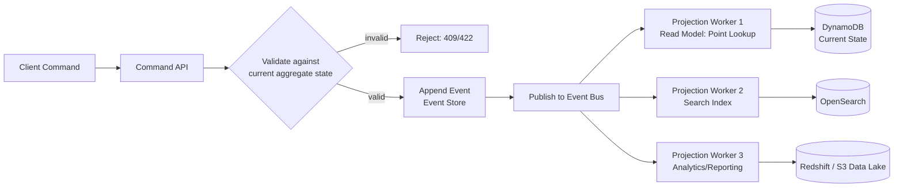
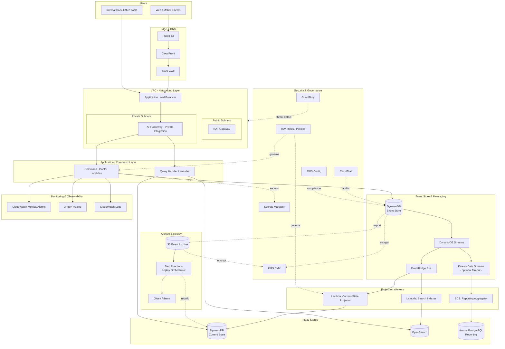

# Part X – Modern Architecture Patterns

# Chapter 79 — Event Sourcing

---

## 1. Executive Summary

Most enterprise systems store the *current state* of the world and throw away everything that led to it. A customer record shows a balance of $4,200. It does not show the seventeen debits and twelve credits that produced that number. It does not show that the balance was briefly negative eight minutes ago, that a fraud rule flagged the ninth transaction, or that the tenth transaction was later reversed by a support agent.

This is the central limitation that Event Sourcing addresses.

**Business problem.** Traditional CRUD-based systems (Create, Read, Update, Delete) persist the *latest snapshot* of an entity. Every `UPDATE` statement destroys history. For domains where history itself is the product — financial ledgers, insurance claims, order fulfillment, regulatory audit trails, clinical records, inventory movement — this is not a minor inconvenience. It is a structural defect. Enterprises repeatedly discover, usually during an audit, a fraud investigation, or a production incident, that they cannot answer the question "what actually happened, in what order, and why does the system currently believe X?" A relational table with `updated_at` columns and a handful of audit log entries is not a substitute for a complete, immutable, replayable history of every state transition.

- Auditors ask for point-in-time reconstruction of an account. CRUD systems cannot produce this without a parallel audit logging system that is frequently incomplete, inconsistent with the primary data, or simply bolted on after the fact.
- Support teams need to understand why an order is "stuck" in a state that should be impossible. Without an event history, engineers resort to reading application logs (if they still exist), guessing at ordering, and manually reconstructing timelines from scattered log lines across services.
- Regulators in banking, insurance, and healthcare increasingly require demonstrable, tamper-evident history of every material change to a customer's data. This is a compliance requirement, not an engineering preference, in jurisdictions governed by SOX, PCI-DSS, HIPAA, and various regional banking regulations.
- Product teams want to build new features — recommendation engines, fraud models, analytics dashboards — that depend on the *sequence* of user behavior, not merely the final state. A CRUD system that overwrites the previous value gives you no signal about the path taken.

**Architecture objective.** Event Sourcing changes the unit of persistence from "current state" to "sequence of immutable facts." Instead of storing `account.balance = 4200`, the system stores an ordered, append-only log of events: `AccountOpened`, `FundsDeposited(amount=500)`, `FundsWithdrawn(amount=120)`, `FundsDeposited(amount=3820)`, and so on. The current balance is *derived* by replaying these events, either on demand or via a maintained read-optimized projection. The event log becomes the single source of truth; every other representation of the data — a SQL table, a search index, a cache, a reporting warehouse — is a disposable, rebuildable projection of that log.

This is a profound architectural shift. It does not simply add an audit trail on top of an existing CRUD system. It inverts the relationship: the events are primary, and the "current state" tables that most engineers think of as the database are secondary artifacts that can be deleted and regenerated at will.

**Why organizations adopt this architecture.**

- They need a legally defensible, immutable record of every business-significant state change, and they need it to be a first-class part of the data model rather than an afterthought.
- They are building systems where "why did this happen" is asked as often as "what is the current value" — claims processing, trading systems, supply chain, healthcare records.
- They want to decouple write models from read models so that read-heavy reporting workloads do not compete with transactional write workloads (this typically pairs Event Sourcing with CQRS — see Chapter 78).
- They need to support multiple, divergent read representations of the same underlying data (a search index, a graph view, a time-series analytics view, a relational reporting view) without maintaining synchronization logic between them by hand.
- They are building event-driven, loosely coupled microservices architectures where the event log is also the integration mechanism between bounded contexts.
- They need temporal queries: "What was this customer's risk score on March 3rd?" is trivial with event sourcing (replay events up to that point) and often nearly impossible with a mutable CRUD table.

**Major business benefits.**

| Benefit | Business Impact |
|---|---|
| Complete audit trail by construction | Reduces audit preparation time from weeks to hours; removes the need for a separate, often-inconsistent audit logging subsystem |
| Time-travel / point-in-time reconstruction | Enables dispute resolution, regulatory response, and root-cause analysis without reconstructing state from logs |
| Natural integration backbone | Downstream systems (analytics, fraud detection, notifications) subscribe to the same event stream rather than requiring bespoke ETL jobs |
| Elimination of destructive updates | Removes an entire class of "we overwrote the wrong record" production incidents |
| Enables new product capabilities | Historical replay enables new ML models, new dashboards, and new projections without touching the write path |
| Debuggability | Production incidents can be root-caused by replaying the exact sequence of events that led to the failure state |

**Typical enterprise scenarios.**

- A core banking ledger where every debit and credit must be individually attributable, reversible only via compensating events (never a destructive update), and reconstructable for regulators on demand.
- An insurance claims platform where a claim moves through dozens of state transitions (filed, under review, additional documentation requested, approved, partially denied, paid, appealed) and the full history must be visible to adjusters, auditors, and customers.
- An e-commerce order management system where "what happened to my order" is one of the top three support tickets, and CQRS-backed event sourcing allows customer support tooling to render a complete timeline instantly.
- A supply chain / inventory system where physical goods movement (received, allocated, picked, shipped, returned) must be reconciled against a perpetual, replayable ledger to detect shrinkage and reconcile against physical counts.
- A healthcare system recording clinical observations, where regulatory requirements (HIPAA, and in many jurisdictions specific medical-records-retention law) mandate that historical clinical entries are never overwritten, only appended to and superseded.

**A note of caution up front**, expanded in Section 34: Event Sourcing is one of the highest-complexity architecture patterns in this book. It solves a real, specific class of problems exceptionally well and is frequently misapplied to systems that would be simpler, cheaper, and more maintainable as conventional CRUD applications with a well-designed audit log table. The remainder of this chapter builds a production-grade reference architecture on AWS, but the Architect's Corner (Section 34) is not optional reading — it is where the honest trade-off discussion lives.

---

## 2. Business Requirements

### 2.1 Business Drivers

- Regulatory obligation to retain a complete, tamper-evident history of state changes (financial services, healthcare, insurance).
- Need to support multiple independent read models (reporting, search, real-time dashboards, ML feature stores) from a single write path.
- Requirement for reliable event-driven integration across bounded contexts / microservices without brittle point-to-point synchronous calls.
- Desire to reduce Mean Time To Diagnose (MTTD) production issues by replaying the exact event sequence that produced an incorrect state.
- Business need to reconstruct historical state for disputes, audits, or "what would have happened if" analysis.

### 2.2 Functional Requirements

| Requirement | Description |
|---|---|
| Append-only event store | Events, once written, are never updated or deleted (except for legally mandated erasure — see GDPR note below) |
| Strict per-aggregate ordering | Events for a given aggregate (e.g., a specific account, order, or claim) must be strictly ordered |
| Optimistic concurrency control | Writers must detect and reject conflicting concurrent writes to the same aggregate |
| Snapshotting | Long-lived aggregates must support periodic snapshots to avoid replaying thousands of events on every read |
| Projections / read models | The system must materialize one or more read-optimized views from the event stream |
| Idempotent event consumers | Downstream consumers must tolerate at-least-once delivery without duplicating side effects |
| Schema evolution | Event schemas must evolve without breaking historical events already persisted |
| Replay capability | The system must support full or partial replay of the event stream to rebuild projections |

### 2.3 Non-Functional Requirements

**Scalability goals**

- Support tens of thousands of events per second at enterprise scale (varies significantly by domain — a claims system might sustain hundreds of events/sec, a trading system might require tens of thousands).
- Support millions of distinct aggregates (accounts, orders, claims) without degradation of per-aggregate read/replay latency.
- Independently scale the write path (event ingestion) and the read path (projections), a natural fit for CQRS.

**Availability requirements**

- The event store (system of record) typically targets 99.95%–99.99% availability for write operations, because a write outage stops the business process entirely (you cannot record that a payment happened).
- Read projections can tolerate slightly lower availability (99.9%) because they are rebuildable, and can often fail over to a stale-but-available replica.

**Latency requirements**

- Command processing (append event, validate business invariants) typically targets p99 < 100ms for interactive systems, higher (seconds) for batch/back-office processing.
- Projection lag (time between an event being appended and its effect being visible in a read model) is a first-class SLA in event-sourced systems and must be explicitly defined — commonly p99 < 1–5 seconds for near-real-time read models.

**Compliance requirements**

- SOX (financial reporting integrity), PCI-DSS (if payment card data touches the event payloads — strongly discouraged, tokenize instead), HIPAA (healthcare), GDPR / CCPA (right to erasure — a genuine architectural tension with immutability, addressed in Section 11).
- Immutable, cryptographically verifiable event ordering is often a specific ask from internal audit and external regulators; AWS QLDB (Quantum Ledger Database) exists specifically for this narrower use case and is discussed as an alternative in Section 28.

**Recovery objectives**

| Metric | Typical Target | Rationale |
|---|---|---|
| RPO (Recovery Point Objective) | Near zero (seconds) for the event store | Losing even one event breaks the "complete history" guarantee that is the entire point of the pattern |
| RTO (Recovery Time Objective) | Minutes for write path, tens of minutes for full projection rebuild | Projections can be rebuilt from the event log; the event log itself must recover fast |

**SLAs**

- Event durability: 99.999999999% (11 nines), matching S3/DynamoDB durability guarantees when used as the underlying store.
- Command API availability: 99.95% (multi-AZ), 99.99% (multi-region active-active, higher cost and complexity — see Section 13).

**Expected workload and growth**

- Event volume typically grows linearly with business transaction volume, not user count — a useful capacity-planning heuristic.
- Storage grows monotonically and *never shrinks* (events are never deleted in the general case), which has direct FinOps implications explored in Section 16.
- Plan explicit data lifecycle tiers (hot → warm → cold → archive) from day one; retrofitting this after 500 million events are sitting in a single hot table is expensive and disruptive.

---

## 3. Architecture Overview

### 3.1 Overall Design Philosophy

Event Sourcing is built on four architectural commitments:

1. **Events are facts, not commands.** An event describes something that has already happened (`FundsWithdrawn`), never something that should happen (`WithdrawFunds`). Commands are handled by the write side and, if accepted, *produce* events.
2. **The event log is append-only and immutable.** Nothing is ever updated or deleted from the canonical log (data-erasure requirements are handled via a documented exception process, not by violating the general rule).
3. **Current state is a derived, cached projection.** Any read model — a DynamoDB item representing "current order status," a row in a reporting warehouse, a search document in OpenSearch — can be deleted and regenerated by replaying the event log. If a read model cannot be safely deleted and rebuilt, it has accidentally become a second source of truth, which defeats the purpose of the pattern.
4. **Per-aggregate ordering with optimistic concurrency.** Each aggregate (account, order, claim) owns a strictly ordered event stream, and writers must supply the expected version number of the aggregate when appending, so that concurrent writers are forced to reconcile conflicts rather than silently overwrite each other.

### 3.2 Core Components

| Component | Role |
|---|---|
| Command API | Receives business commands, validates invariants against current aggregate state, and — if valid — appends new event(s) |
| Event Store | Durable, append-only, per-aggregate-ordered store of all events (DynamoDB, Aurora, or purpose-built) |
| Event Bus | Publishes newly committed events to downstream consumers (EventBridge, Kinesis, or SNS/SQS) |
| Projection Workers | Consume events and materialize read-optimized views (Lambda, ECS, or Kinesis Data Analytics) |
| Read Store(s) | One or more read-optimized databases per use case (DynamoDB for point lookups, OpenSearch for search, Aurora/Redshift for reporting) |
| Snapshot Store | Periodic materialized snapshots of aggregate state to bound replay cost |
| Replay / Rebuild Pipeline | Batch process (Step Functions + Lambda/Glue) capable of re-deriving any projection from the full event history |

### 3.3 High-Level Workflow



**Request lifecycle.** A client issues a command (e.g., `WithdrawFunds`). The Command API loads the aggregate's current state — either from the latest snapshot plus subsequent events, or from a cached current-state projection used purely for validation — checks business invariants (sufficient balance, account not frozen), and if valid, appends a new event with an expected version number for optimistic concurrency.

**Response lifecycle.** The API returns success once the event is durably committed to the event store — this is the linearizable, strongly consistent write. It does **not** wait for projections to update. This is the most important consistency trade-off in the entire pattern and is discussed at length in Section 6 and Section 34: **the write is strongly consistent; the read projections are eventually consistent.**

**Data lifecycle.** Events flow: Command API → Event Store (permanent) → Event Bus (transient, replay-buffered) → Projection Workers (transform) → Read Stores (disposable, rebuildable). Over time, hot events age into warm storage (S3 via DynamoDB export or Kinesis Firehose), and eventually into cold archival storage (S3 Glacier) for long-tail compliance retention, while remaining logically part of the same immutable stream.

---

## 4. AWS Services Used

> **Note:** Not every service below is mandatory for every implementation. This section presents the full toolkit and explains when each service is the right choice versus an alternative.

### 4.1 DynamoDB (Primary Event Store)

**Purpose.** DynamoDB is a fully managed, serverless NoSQL key-value and document database with single-digit-millisecond latency at virtually unlimited scale. In this architecture, it serves as the primary event store: each event is an item, partitioned by aggregate ID, sorted by event sequence number.

**Why selected.**
- Native support for **conditional writes** (`ConditionExpression`) maps directly onto optimistic concurrency control for aggregate versioning — this is the single most important reason DynamoDB is the default choice for event stores on AWS.
- Partition key = aggregate ID, sort key = event sequence number gives strictly ordered, efficiently queryable per-aggregate streams for free.
- DynamoDB Streams provides a built-in, ordered, exactly-once-per-shard change feed that can drive projection workers without a separate CDC (change data capture) pipeline.
- Scales horizontally with no operational ceiling relevant to nearly any enterprise event volume.

**Alternatives.** Aurora PostgreSQL with an `events` table and a `SELECT ... FOR UPDATE`-based append, or a purpose-built event store (EventStoreDB, Axon Server) self-hosted on EC2/EKS.

**Limitations.**
- 400 KB item size limit — large event payloads must be truncated (store a reference to S3 for large payloads, not the payload itself).
- No native cross-aggregate transactional guarantees beyond `TransactWriteItems` (limited to 100 items / 4 MB per transaction) — multi-aggregate sagas need the Saga pattern (Chapter 80), not a database transaction.
- Query flexibility is limited compared to SQL; ad hoc analytical queries over the raw event store are impractical — this is precisely why projections and a separate analytical store exist.

**Pricing considerations.** On-demand capacity mode is usually preferred for event stores with unpredictable or growing throughput; provisioned capacity with auto scaling is more cost-effective for steady, well-understood workloads. Storage cost is non-trivial at scale because data is never deleted — budget for continuous growth (see Section 16).

**Best practices.** Use a composite key of `AGGREGATE#<id>` (partition key) and a zero-padded, monotonically increasing sequence number (sort key). Enable Point-In-Time Recovery (PITR). Enable DynamoDB Streams with `NEW_AND_OLD_IMAGES`. Never perform destructive updates against event items — enforce this via IAM policy, not just convention (see Section 10).

### 4.2 DynamoDB Streams / Kinesis Data Streams (Change Feed)

**Purpose.** Captures every write to the event store, in order, and delivers it to downstream consumers.

**Why selected.** DynamoDB Streams is the natural default when DynamoDB is the event store — no additional infrastructure, ordered per-shard delivery, integrates directly with Lambda event source mappings. Kinesis Data Streams is preferred when consumers need longer retention (up to 365 days vs. 24 hours for DynamoDB Streams), fan-out to more than two consumers efficiently (Enhanced Fan-Out), or when the write path itself is Kinesis-native (e.g., high-throughput IoT-style event ingestion that doesn't originate from a DynamoDB write).

**Alternatives.** Amazon MSK (Managed Streaming for Kafka) — justified when the organization already operates Kafka expertise, needs exactly-once semantics across complex multi-consumer-group topologies, or requires cross-region replication patterns Kafka handles more maturely (MirrorMaker 2).

**Limitations.** DynamoDB Streams retains only 24 hours of data — a failed or newly added consumer that needs to reprocess older history must go back to the event store table itself, not the stream. Kinesis shard limits (1 MB/s or 1,000 records/s write per shard) require explicit shard-count planning.

**Pricing considerations.** DynamoDB Streams reads are billed per read request unit and are typically inexpensive relative to the table's own read/write costs. Kinesis is billed per shard-hour plus PUT payload units — over-provisioned shards are a common, avoidable cost surprise.

### 4.3 EventBridge (Event Bus / Routing)

**Purpose.** A serverless event bus for routing events to multiple, decoupled downstream targets based on content-based rules, without consumers needing to know about each other.

**Why selected.** EventBridge is the right layer for **cross-service, cross-team event distribution** — when the event needs to reach other bounded contexts (notifications service, fraud detection, analytics), not just internal projection workers of the same service. It provides schema registry integration, content filtering, and native integrations with 20+ AWS services as targets without custom glue code.

**Alternatives.** SNS/SQS fan-out is simpler and cheaper for a small, fixed number of known consumers within the same team/service boundary. Kinesis is preferred when consumers need to replay history or process in strict order across a partition.

**Limitations.** No inherent ordering guarantee across the bus (ordering is only guaranteed within a single DynamoDB Streams shard upstream, not preserved through EventBridge routing) — if strict cross-consumer ordering matters, route through Kinesis instead, or accept that EventBridge consumers must be designed to be order-tolerant.

**Best practices.** Use a dedicated custom event bus per bounded context, not the default bus, to keep IAM permissions and schema ownership clean. Register event schemas in the EventBridge Schema Registry and generate consumer-side bindings to prevent silent schema drift.

### 4.4 Lambda (Projection Workers, Command Handlers)

**Purpose.** Serverless compute for two roles in this architecture: (1) stateless command handlers behind API Gateway, and (2) event-driven projection workers triggered by DynamoDB Streams / Kinesis / EventBridge.

**Why selected.** Projection logic is typically small, stateless, bursty, and scales with event volume — an ideal Lambda workload. Event source mappings for DynamoDB Streams and Kinesis provide built-in checkpointing, batching, and retry/DLQ semantics without custom consumer-group management.

**Alternatives.** ECS Fargate or EKS-hosted consumers are preferred when projection logic requires long-running state, heavier compute (complex aggregation, ML feature computation), or when the team standardizes on containers for operational consistency across the platform.

**Limitations.** 15-minute maximum execution time, cold starts (mitigated with Provisioned Concurrency for latency-sensitive command handlers), and a per-invocation reasoning model that makes very high-throughput, low-latency stream processing sometimes cheaper on Kinesis Data Analytics / Managed Flink for extreme scale.

### 4.5 Aurora PostgreSQL (Read Models / Reporting Projections)

**Purpose.** A relational, read-optimized projection store for use cases that benefit from SQL joins, complex reporting queries, and strong relational integrity — typically the "reporting" and "back-office" projections rather than the primary transactional read path.

**Why selected.** Business analysts and back-office tooling expect SQL. Aurora provides this while offering better availability and read-scaling characteristics (up to 15 read replicas, Aurora Global Database for cross-region reads) than a traditional single-instance RDS deployment.

**Alternatives.** Redshift or a data lake (S3 + Athena/Glue) for large-scale historical analytics that don't need transactional consistency; DynamoDB for the primary low-latency point-lookup projection.

**Limitations.** Requires explicit schema migration discipline (Section 8); does not scale write throughput the way DynamoDB does, so it should never be the primary event store, only a projection target.

### 4.6 S3 (Event Archive, Snapshots, Data Lake Projections)

**Purpose.** Durable, low-cost object storage for (1) long-term archival of aged-out events, (2) aggregate snapshots, and (3) the analytical data-lake projection consumed by Athena/Glue/Redshift Spectrum.

**Why selected.** 11 nines of durability at a fraction of DynamoDB's per-GB cost for data that is rarely accessed but must be retained for compliance. S3 Lifecycle policies automate the hot → cold → archive transition without custom code.

**Best practices.** Partition archived events by aggregate type and date (`s3://event-archive/order-events/year=2026/month=07/day=30/`) to make Athena queries and lifecycle rules efficient.

### 4.7 OpenSearch Service (Search / Operational Read Models)

**Purpose.** Full-text and faceted search projections — e.g., customer support searching for "all orders for customer X mentioning 'damaged'" — that neither DynamoDB nor Aurora serve well.

**Why selected.** Purpose-built for search and near-real-time aggregation dashboards over event-derived documents.

**Limitations.** Another projection to keep in sync, another operational surface (JVM heap tuning, shard/replica planning) — do not introduce this unless there is a genuine search or log-analytics requirement.

### 4.8 Step Functions (Replay / Rebuild Orchestration)

**Purpose.** Orchestrates the multi-stage batch process of rebuilding a projection from the full event history: read event archive from S3 → transform → bulk-load into the target read store → validate row counts / checksums → cut over.

**Why selected.** Native retry, error handling, and visual execution history make replay operations — which are infrequent but high-stakes — auditable and debuggable, versus a hand-rolled script.

### 4.9 API Gateway

**Purpose.** Exposes the Command API and any synchronous Query API to clients, handling authentication, throttling, and request validation before Lambda.

**Alternatives.** ALB + ECS/EKS if the team already standardizes on containers for the command-handling layer, or if request/response latency requirements are tighter than API Gateway + Lambda cold-start characteristics typically allow.

### 4.10 IAM, KMS, Secrets Manager, CloudTrail, CloudWatch, Config, GuardDuty

Covered in depth in Sections 10, 11, 21, and 22. Their role in this architecture: IAM enforces that only the Command API's execution role can write to the event store (append-only, no update/delete permissions granted to any principal); KMS encrypts the event store and archive at rest with a customer-managed key subject to rotation and access logging; CloudTrail provides the AWS-API-level audit trail that complements (but does not replace) the business-level event log itself; CloudWatch and Config provide operational and compliance monitoring; GuardDuty detects anomalous access patterns against the account.

---

## 5. Complete Architecture Diagram



---

## 6. Component-by-Component Explanation

### 6.1 Command API (Lambda behind API Gateway)

**Purpose.** Accepts business commands, validates them against current business invariants, and translates valid commands into one or more events appended to the event store.

**Responsibilities.**
- Authenticate and authorize the caller (via Cognito or an internal IdP through API Gateway authorizers).
- Load the current aggregate state — via the latest snapshot + subsequent events, or via a lightweight validation-only projection — to check business rules (e.g., sufficient funds).
- Construct the event(s) with a strictly incrementing sequence number and append via a conditional write (`attribute_not_exists` on the target sequence number) to guarantee optimistic concurrency.
- Return a durable-write acknowledgment to the caller; **do not** block on downstream projection updates.

**Inputs.** Business command payload (e.g., `{command: "WithdrawFunds", accountId: "...", amount: 120.00}`), caller identity, idempotency key.

**Outputs.** HTTP 201/200 with the new event's sequence number on success; HTTP 409 on optimistic concurrency conflict (caller must retry with fresh state); HTTP 422 on business rule violation.

**Scaling.** Scales automatically with Lambda concurrency; the actual bottleneck is almost always DynamoDB write capacity or hot-partition behavior on a single high-traffic aggregate (see Section 24, Failure Scenario: hot aggregate).

**High availability.** Multi-AZ by default (Lambda + DynamoDB are inherently multi-AZ); no single-AZ dependency in this layer.

**Failure handling.** Conditional write failures (concurrency conflicts) must be surfaced to the caller as retryable errors, not silently retried server-side with stale data — retrying with stale data reintroduces the very race condition optimistic concurrency exists to prevent. Retries must reload state before reapplying the command.

**Dependencies.** DynamoDB (event store), Secrets Manager (any third-party API keys used in validation, e.g., a fraud-check service), CloudWatch (structured logging), X-Ray (tracing).

**Security.** Execution role restricted to `dynamodb:PutItem` and `dynamodb:Query` on the event table only — explicitly **denies** `UpdateItem` and `DeleteItem` at the IAM policy level, not merely by convention (see Section 10 for the exact policy).

**Monitoring.** Custom CloudWatch metrics: commands accepted, commands rejected by business rule, optimistic-concurrency conflicts (a leading indicator of hot-aggregate contention), p50/p99 latency.

### 6.2 Event Store (DynamoDB Table)

**Purpose.** The single source of truth. Every business fact that has ever occurred, in order, per aggregate.

**Responsibilities.** Durable, ordered, append-only storage; enforce uniqueness of (aggregate ID, sequence number) pairs via conditional writes; stream every write to downstream consumers.

**Inputs.** Event items from Command API writers only.

**Outputs.** DynamoDB Streams change feed; direct `Query` results for replay/read-your-writes scenarios.

**Scaling.** On-demand capacity mode scales automatically; provisioned mode with auto scaling is viable once traffic patterns stabilize and cost predictability becomes more valuable than elasticity.

**High availability.** Multi-AZ by design (DynamoDB replicates synchronously across 3 AZs within a region); Global Tables for multi-region (Section 12, 13).

**Failure handling.** Throttling (`ProvisionedThroughputExceededException` or on-demand burst limits) must be handled with exponential backoff in the writer; a poorly chosen partition key (e.g., partitioning only by aggregate *type* rather than aggregate *ID*) causes hot-partition throttling that looks like a database outage but is actually a schema design defect.

**Dependencies.** KMS (encryption at rest), IAM (access control).

**Security.** No principal other than the Command API's execution role and a narrowly scoped "event-archiver" role (`Query`, `Scan` — read-only) should have any permissions on this table. PITR enabled. Deletion protection enabled on the table itself.

### 6.3 Projection Workers (Lambda / ECS)

**Purpose.** Transform the immutable event stream into one or more mutable, query-optimized read models.

**Responsibilities.** Consume events in order (per partition/aggregate); apply idempotent transformation logic (the same event applied twice must not double-count); write to the target read store; track a durable "last processed sequence number" checkpoint per projection to support resumability after failure.

**Inputs.** DynamoDB Streams records / Kinesis records / EventBridge events.

**Outputs.** Writes to DynamoDB (current state), OpenSearch (search documents), or Aurora (reporting rows).

**Scaling.** Lambda event source mapping auto-scales consumers up to the shard/partition count of the upstream stream; ECS-based consumers scale via target-tracking on consumer-group lag (a CloudWatch custom metric).

**High availability.** Multiple concurrent projection types can fail independently without affecting the write path or each other — this isolation is one of the core benefits of CQRS-paired event sourcing.

**Failure handling.** Poison-pill events (malformed or triggering a permanent processing bug) must go to a Dead Letter Queue after N retries, with alerting — **never silently drop, and never block the entire stream indefinitely** on one bad event, which would stall every projection sharing that shard.

**Dependencies.** Upstream event bus/stream, target read store, DLQ (SQS).

**Monitoring.** Projection lag (age of oldest unprocessed event) is the single most important metric in this layer and should have an explicit alarm threshold tied to the read-model SLA defined in Section 2.

### 6.4 Snapshot Store

**Purpose.** Avoid the cost of replaying thousands of events to reconstruct an aggregate's current state for validation.

**Responsibilities.** Periodically (every N events or every T minutes for active aggregates) materialize and store `{aggregateId, version, state}`; on load, fetch the latest snapshot and replay only events after it.

**Failure handling.** A missing or corrupted snapshot must never be a hard failure — the system must always be able to fall back to full replay from sequence 0; snapshots are a performance optimization, never a correctness dependency.

### 6.5 Replay / Rebuild Pipeline (Step Functions)

**Purpose.** Rebuild any projection, in full, from the canonical event history — used after a projection bug is fixed, a new projection type is introduced, or disaster recovery requires reconstructing a read store from scratch.

**Responsibilities.** Read the full (or date-bounded) event archive from S3; replay in strict per-aggregate order; write to a **new**, parallel read-store table/index; validate record counts and checksums against expected totals; atomically cut traffic over (e.g., via a DynamoDB table alias pattern or an OpenSearch index alias swap) only after validation passes.

**Failure handling.** Must be safely re-runnable (idempotent) and must never write directly to the production read store that live traffic depends on — always build in the shadow, validate, then swap.

---

## 7. End-to-End Request Flow

1. **Client** submits a command, e.g., `POST /accounts/{id}/withdraw`, over HTTPS.
2. **Route 53** resolves the API's custom domain to CloudFront.
3. **CloudFront** terminates TLS at the edge, applies caching rules (commands are never cached; only GET query endpoints may be), and forwards to the origin.
4. **AWS WAF**, attached to CloudFront, inspects the request against managed rule groups (SQLi, request-rate-based rules) before it reaches the origin.
5. **Application Load Balancer / API Gateway** performs request validation (schema check) and invokes the authorizer (Cognito JWT validation or a Lambda authorizer).
6. **Command Handler Lambda** deserializes the request, loads the current aggregate state (latest snapshot + events since), and evaluates business invariants.
7. If invariants fail (e.g., insufficient funds), the handler returns **HTTP 422** with a structured error body immediately — no event is written.
8. If invariants pass, the handler issues a **conditional `PutItem`** to DynamoDB with `ConditionExpression = attribute_not_exists(SequenceNumber)`, targeting the next expected sequence number for that aggregate.
9. If the conditional write fails (**HTTP 409**, a concurrent writer beat this one to the sequence number), the handler reloads current state and either retries the command automatically (for safe, commutative operations only) or returns the conflict to the caller.
10. On successful write, **DynamoDB Streams** emits the new event record within single-digit seconds (typically sub-second).
11. The stream triggers the **current-state projection Lambda**, which idempotently applies the event to the DynamoDB read-model item (using the event's sequence number as an idempotency guard against duplicate delivery).
12. In parallel, the stream (or a fan-out via EventBridge) triggers the **search-index projection Lambda**, updating the corresponding OpenSearch document.
13. In parallel, events are also delivered to **Kinesis Data Streams** for the **reporting aggregator** (ECS-based consumer), which batches and writes to Aurora for back-office reporting.
14. **CloudWatch** captures structured logs and custom metrics at every stage (command accepted, event appended, projection lag) and **X-Ray** stitches the trace across API Gateway → Lambda → DynamoDB → Streams → projection Lambda for end-to-end latency visibility.
15. A subsequent **query request** (`GET /accounts/{id}`) is served directly from the **current-state DynamoDB projection**, not by replaying events on the read path — this is the entire point of maintaining a projection.
16. If the query is issued *immediately* after the write (read-your-own-writes requirement), the client-facing contract must explicitly document the eventual-consistency window, or the query API must optionally read from the event store directly (with replay) for that specific narrow case — a documented, deliberate exception, not an accident.
17. **Error handling:** any Lambda failure in the projection path retries per its event-source-mapping configuration (typically 2–3 retries with backoff) before landing in a per-projection **DLQ**, which triggers a CloudWatch Alarm and pages the on-call engineer.
18. **Logging:** every command, every event appended, and every projection update is logged with correlation IDs tying them back to the originating HTTP request, enabling full request-to-event-to-projection traceability during incident response.

---

## 8. Deployment Flow

### 8.1 Infrastructure Provisioning

All infrastructure is defined in Terraform (Section 18) and deployed through a CI/CD pipeline with mandatory plan review for anything touching the event store table (schema changes to an event store are exceptionally high-risk — see Section 27, Anti-Pattern: mutable event schema).

### 8.2 Terraform Workflow

1. Feature branch → `terraform plan` runs automatically in CI, output posted to the pull request.
2. Peer review required; any plan showing a **destroy/recreate** of the DynamoDB event table requires a second, senior approver and an explicit migration plan — this should almost never happen in a healthy event-sourced system.
3. Merge to main triggers `terraform apply` via a pipeline role with least-privilege permissions scoped to the specific resources this stack owns.
4. State stored in a versioned, encrypted S3 backend with DynamoDB state locking.

### 8.3 CI/CD Deployment (Application Code)

1. Unit tests (event application logic, business invariant checks) must pass with 100% coverage on aggregate command-handling logic — this is not a stylistic preference; a bug in event-application logic corrupts every downstream projection.
2. Integration tests run against a local DynamoDB (`dynamodb-local`) or an ephemeral test account table.
3. **Contract tests** validate that new event schema versions remain backward-compatible with all registered consumers (see Schema Evolution below).
4. Deploy command-handler Lambdas via blue-green (Lambda alias + weighted traffic shifting) — never in-place replacement for a system where a bad deploy could corrupt the event log.
5. Deploy projection-worker Lambdas independently from command handlers; a bad projection deploy should never be able to block or corrupt writes to the event store.

### 8.4 Blue-Green Deployment

- Command handlers: Lambda alias traffic shifting (10% → 50% → 100%) with CloudWatch alarms on error rate and business-rule-rejection rate as automatic rollback triggers.
- Projection rebuilds: always build the **new** projection in a shadow table/index, validate against the source event count, then swap via alias/pointer — never modify the live projection table schema in place.

### 8.5 Rollback

- Command-handler code rollback is a Lambda alias shift back to the previous version — fast, safe, does not touch data.
- **Event schema rollback is not generally possible** — once an event with a new schema version has been persisted, it exists forever. This is why schema evolution discipline (additive-only changes, versioned event types) matters more here than in almost any other architecture pattern in this book.

### 8.6 Secrets and Configuration

- All third-party credentials (fraud-check API keys, payment processor credentials) in Secrets Manager, retrieved at cold start and cached in memory, never in environment variables in plaintext.
- Environment-specific configuration (table names, stream ARNs) injected via Lambda environment variables populated from Terraform outputs / SSM Parameter Store, never hardcoded.

### 8.7 Validation

- Post-deploy smoke tests: submit a synthetic command, verify the event appears in the event store, verify the projection updates within the documented SLA window, verify a compensating "undo" path if applicable.
- Schema registry validation gate in CI: any new event schema must be registered in the EventBridge Schema Registry (or an internal schema registry backed by S3 + a JSON Schema/Avro validator) before deployment is permitted to proceed.

---

## 9. Network Topology

### 9.1 VPC and CIDR

A dedicated VPC per environment (e.g., `10.20.0.0/16` for production) sized generously to accommodate future subnet growth, with non-overlapping CIDRs across environments to support any future VPC peering or Transit Gateway attachment.

### 9.2 Subnets

| Subnet Type | Purpose | Example CIDR |
|---|---|---|
| Public | ALB (if used instead of API Gateway edge-optimized), NAT Gateways | 10.20.0.0/24, 10.20.1.0/24 |
| Private (App) | Lambda ENIs (VPC-attached functions), ECS tasks for reporting aggregators | 10.20.10.0/24, 10.20.11.0/24 |
| Private (Data) | RDS/Aurora, OpenSearch, MSK if used | 10.20.20.0/24, 10.20.21.0/24 |

### 9.3 NAT Gateway and Internet Gateway

- Internet Gateway attached for public subnet egress/ingress.
- NAT Gateway per AZ (not a single shared NAT Gateway) to avoid a cross-AZ single point of failure and cross-AZ data transfer charges for outbound traffic from private-subnet Lambdas/ECS tasks calling external APIs.

### 9.4 Transit Gateway

Relevant when this service must integrate with other bounded-context VPCs in a hub-and-spoke enterprise network (Chapter 17) — e.g., a shared fraud-detection service in a different VPC subscribing to this service's EventBridge bus via a VPC endpoint.

### 9.5 Route Tables, NACLs, Security Groups

- Private data subnets route only to other private subnets and to VPC endpoints — no default route to the Internet Gateway or NAT Gateway from the data tier.
- Security Groups follow least-privilege, service-to-service rules (e.g., "Lambda SG → Aurora SG on port 5432," not "0.0.0.0/0 → Aurora SG").
- NACLs provide a coarse-grained defense-in-depth layer at the subnet boundary, primarily to explicitly deny known-bad ranges and to segment the data tier from the app tier even if a security group is misconfigured.

### 9.6 PrivateLink / VPC Endpoints

- Gateway VPC endpoints for **S3** and **DynamoDB** (no NAT Gateway cost or Internet exposure for what is, in this architecture, the single most latency- and cost-sensitive traffic path).
- Interface VPC endpoints for **Kinesis**, **Secrets Manager**, **KMS**, **CloudWatch Logs**, and **EventBridge** to keep all traffic on the AWS private network backbone.

---

## 10. Identity and Access

### 10.1 IAM Roles — Least Privilege by Function

| Role | Permissions | Explicitly Denied |
|---|---|---|
| `event-writer-role` (Command Lambdas) | `dynamodb:PutItem`, `dynamodb:Query` on event table only | `dynamodb:UpdateItem`, `dynamodb:DeleteItem` on event table |
| `event-reader-role` (Projection Lambdas) | `dynamodb:GetRecords`, `dynamodb:DescribeStream` on the stream ARN; write access only to the *specific* projection's read store | Any write access to the event store table |
| `archive-role` (S3 export job) | `dynamodb:ExportTableToPointInTime`, `s3:PutObject` on archive bucket | `dynamodb:PutItem`/`UpdateItem`/`DeleteItem` on any table |
| `replay-role` (Step Functions rebuild) | `s3:GetObject` on archive bucket, write to shadow read-store tables only | Write access to the production event store or the live (non-shadow) read store |

### 10.2 Example IAM Policy — Event Store Writer (Append-Only Enforcement)

```json

{
  "Version": "2012-10-17",
  "Statement": [
    {
      "Sid": "AllowAppendOnly",
      "Effect": "Allow",
      "Action": [
        "dynamodb:PutItem",
        "dynamodb:Query"
      ],
      "Resource": "arn:aws:dynamodb:us-east-1:111122223333:table/OrderEvents"
    },
    {
      "Sid": "ExplicitlyDenyMutation",
      "Effect": "Deny",
      "Action": [
        "dynamodb:UpdateItem",
        "dynamodb:DeleteItem",
        "dynamodb:BatchWriteItem"
      ],
      "Resource": "arn:aws:dynamodb:us-east-1:111122223333:table/OrderEvents"
    }
  ]
}

```

> **Tip.** The explicit `Deny` statement is deliberate and non-negotiable. Relying only on the absence of an `Allow` is insufficient in practice — a future permission boundary change, a misapplied managed policy, or a well-meaning "just add DynamoDB full access for this debugging session" incident can silently reintroduce mutation capability. An explicit `Deny` cannot be overridden by any other identity-based policy attached to the same principal.

### 10.3 Cross-Account Access

In a multi-account landing zone (Chapter 99), the event bus is typically shared cross-account via an EventBridge resource policy permitting specific consumer accounts to create rules against this account's custom bus, combined with STS `AssumeRole` for any Lambda in a consumer account that needs to read from a shared archive bucket.

### 10.4 Permission Boundaries

Apply a permission boundary to all Lambda execution roles in this stack limiting maximum permissions to the specific DynamoDB tables, Kinesis streams, and EventBridge buses owned by this bounded context — this prevents privilege escalation even if a future IAM policy change is overly permissive by mistake.

---

## 11. Security Architecture

### 11.1 Encryption

- **At rest:** DynamoDB, S3, and Aurora all encrypted with a **customer-managed KMS key (CMK)**, not the AWS-managed default key, so that key rotation, access logging, and key-policy-based access restriction are under direct control of the security team.
- **In transit:** TLS 1.2+ enforced end-to-end — CloudFront to origin, API Gateway to Lambda (implicit), Lambda to DynamoDB/Aurora (AWS SDK enforces TLS by default; do not disable it).

### 11.2 WAF and Shield

AWS WAF attached to CloudFront with managed rule groups (Core Rule Set, Known Bad Inputs, SQL Injection) plus custom rate-based rules on the command endpoints specifically, since a command endpoint is where a replay or flooding attack could attempt to corrupt or overwhelm the event store. AWS Shield Standard is included by default; Shield Advanced is warranted if this system is customer-facing at material scale and DDoS financial impact justifies the cost.

### 11.3 Secrets Manager and Certificate Manager

All credentials in Secrets Manager with automatic rotation configured for any rotatable credential type (RDS/Aurora master credentials, for instance). ACM-issued certificates for all custom domains, with automatic renewal.

### 11.4 GuardDuty, Inspector, Security Hub

GuardDuty monitors for anomalous API activity against the event store account (e.g., an unusual volume of `Query` calls from an unfamiliar IAM principal — a strong signal of either a bug or an exfiltration attempt). Security Hub aggregates findings from GuardDuty, Config, and Inspector into a single compliance dashboard mapped against CIS AWS Foundations Benchmark and PCI-DSS where applicable.

### 11.5 CloudTrail and AWS Config

CloudTrail logs every AWS API call against the event store table and its IAM roles — this is the **infrastructure-level** audit trail and is a distinct, complementary control to the **business-level** event log itself. Auditors frequently want both: CloudTrail proves nobody used the AWS console or CLI to bypass the application and directly mutate data; the event log proves the business-level history of what happened.

AWS Config continuously evaluates whether the event store table has PITR enabled, deletion protection enabled, and encryption enabled, alerting on drift.

### 11.6 Zero Trust Considerations

No implicit trust between projection workers and the event store beyond the specific, scoped IAM role each worker assumes; no projection worker is ever granted write access to the canonical event store, structurally preventing a compromised or buggy projection from corrupting the source of truth.

### 11.7 GDPR / Right-to-Erasure Tension

This deserves explicit treatment because it is the most common real-world objection raised against event sourcing in EU-facing systems.

**The problem:** GDPR Article 17 grants a right to erasure. Event sourcing's core premise is immutability — the event log should never be edited or deleted. These two requirements are in direct, structural tension.

**Practical mitigations (none of them "clean"):**
- **Crypto-shredding.** Encrypt personally identifiable fields within each event using a per-subject encryption key stored separately (e.g., in a dedicated KMS-encrypted lookup table). "Erasure" becomes destroying that specific key, rendering the event's PII fields permanently unreadable while leaving the event's non-PII structure (and the fact that *some* event occurred) intact.
- **Referencing, not embedding, PII.** Store only a subject identifier in the event; store the actual PII in a separate, conventional (mutable, erasable) profile store. Erasure deletes the profile record; the event history remains, referencing an identifier that no longer resolves to personal data.
- **Tokenization at ingestion.** Replace PII with a reversible token at the point the event is created; the token vault (not the event store) is the erasable component.

**Attack vectors and mitigations** for this architecture specifically: an attacker gaining `Query` access to the event table can read the entire historical record of every business fact ever recorded for an aggregate — a far larger blast radius than a single row in a CRUD table. Mitigation: field-level encryption of sensitive attributes even independent of the GDPR concern above, and aggressive least-privilege scoping of any principal with read access to raw events (Section 10).

---

## 12. High Availability

### 12.1 AZ Failures

DynamoDB, Lambda, API Gateway, and S3 are inherently multi-AZ services with no customer configuration required beyond standard regional deployment. Aurora and OpenSearch require explicit multi-AZ configuration (Aurora: at least one reader in a second AZ with automated failover; OpenSearch: 3-AZ deployment with zone awareness enabled).

### 12.2 Instance / Task Failures

ECS-based projection consumers (if used) run across a minimum of 2 AZs with a target-tracking Auto Scaling policy on consumer lag; ALB health checks remove unhealthy tasks within the configured health-check interval.

### 12.3 Regional Failures

Addressed in Section 13 (Disaster Recovery) — this is materially more complex for an event-sourced system than for a stateless application because the *entire point* of the system is a strictly ordered log, and naive multi-region replication can silently violate ordering guarantees per aggregate.

### 12.4 Database Failures

DynamoDB failures at the table level are exceptionally rare given the service's architecture; the more common "failure" mode is throttling due to a hot partition (a single high-traffic aggregate, or a poorly chosen partition key), which manifests as elevated latency and 400-level errors, not a hard outage — and is a schema design issue, not an availability issue, addressed in Section 24.

### 12.5 Load Balancing, Health Checks, Failover

API Gateway and CloudFront provide managed, multi-AZ load balancing with no customer-managed load balancer required in a pure serverless deployment; if ALB fronts ECS-based components, standard target-group health checks apply (Chapter 6).

---

## 13. Disaster Recovery

### 13.1 Backup Strategy

- DynamoDB **Point-In-Time Recovery** (continuous, restorable to any second within the last 35 days) is the primary backup mechanism for the event store.
- **On-demand backups** at defined milestones (pre-major-migration, quarterly compliance snapshots) retained per the organization's regulatory retention schedule, stored with a separate, non-deletable retention policy (S3 Object Lock in compliance mode for exported archives).

### 13.2 Cross-Region Replication

DynamoDB **Global Tables** can replicate the event store across regions, but this requires explicit design care: Global Tables use **last-writer-wins** conflict resolution based on timestamp, which is only safe for an append-only event store if aggregate ownership is pinned to a single "home region" per aggregate (i.e., a given account's events are only ever written in one region at a time), avoiding the scenario where the same aggregate is concurrently written in two regions and silently reconciled in a way that violates strict per-aggregate ordering.

### 13.3 Pilot Light / Warm Standby / Multi-Site

| Strategy | RTO | RPO | Cost | When to Use |
|---|---|---|---|---|
| Backup & Restore | Hours | Up to 35 days (PITR) minus restore time | Lowest | Non-critical internal systems, generous RTO tolerance |
| Pilot Light | 30–60 min | Seconds (Global Tables) | Moderate | Most enterprise event-sourced systems — event store replicated, compute stood up on demand |
| Warm Standby | Minutes | Near-zero | High | Regulated financial systems with strict RTO SLAs |
| Multi-Site Active-Active | Seconds | Near-zero | Highest | Only when business-critical and the single-home-region-per-aggregate constraint is architecturally acceptable |

### 13.4 Active-Active Caveat

**Active-active for the event store specifically is materially harder than for a stateless web tier.** True multi-writer active-active event sourcing (the same aggregate accepting writes in two regions simultaneously) requires either a globally consistent sequencing mechanism (expensive, adds latency to every write) or accepting a documented, business-approved risk of conflict resolution that can reorder events relative to real-world causality. Most enterprises correctly choose single-home-region-per-aggregate with regional failover (pilot light / warm standby) rather than true multi-writer active-active, precisely because the ordering guarantee is the entire value proposition of the pattern, and true active-active puts it at risk.

---

## 14. Scalability

### 14.1 Horizontal Scaling

The write path scales horizontally by aggregate ID — DynamoDB automatically distributes partitions across storage nodes, so throughput scales with the number of distinct, well-distributed partition keys (aggregate IDs), not with any single aggregate's throughput ceiling.

### 14.2 Vertical Scaling (Aurora Read Projections)

Aurora reporting projections scale vertically (larger instance classes) and horizontally (up to 15 read replicas) independently of the write path — one of the direct benefits of separating writes (event store) from reads (projections).

### 14.3 Auto Scaling / Serverless Scaling

Lambda command handlers and projection workers scale automatically with load; the practical scaling constraint is almost always downstream (DynamoDB WCU/RCU, Kinesis shard count, Aurora connection pool exhaustion — see Section 15) rather than Lambda concurrency itself, though Lambda **reserved/provisioned concurrency** limits should be explicitly sized to avoid throttling during traffic spikes.

### 14.4 Database Scaling

DynamoDB on-demand mode auto-scales to handle up to double the previous peak traffic within 30 minutes by default — sustained, sudden spikes beyond that require either provisioned capacity with generous auto-scaling headroom or a pre-warming request to AWS Support ahead of a known major event (e.g., a product launch).

### 14.5 Storage Scaling

Event store storage grows monotonically; the FinOps-relevant scaling lever is the **lifecycle policy** that moves aged events from DynamoDB (expensive per-GB) to S3 (cheap per-GB) while preserving replay capability (Section 16).

### 14.6 Queue / Stream Scaling

Kinesis shard count must be explicitly planned and monitored (`IncomingRecords`, `WriteProvisionedThroughputExceeded` metrics) — unlike DynamoDB on-demand, Kinesis provisioned shards do not silently auto-scale unless Kinesis Auto Scaling (via Application Auto Scaling) is explicitly configured.

---

## 15. Performance Optimization

### 15.1 Caching

- Command handlers cache the latest snapshot for hot aggregates in a short-TTL in-memory cache (Lambda execution-context reuse) to avoid a full replay-from-snapshot round trip on every command for the same rapidly-transacting aggregate.
- Query APIs read exclusively from projections (never from the raw event store), which are themselves the "cache" in the CQRS sense.

### 15.2 Compression

Event payloads compressed (gzip) before storage when they exceed a size threshold, particularly relevant for events carrying larger structured payloads (e.g., a full claim document snapshot embedded in a `ClaimSubmitted` event) — balanced against DynamoDB's 400 KB item limit, which compression alone cannot always solve (large payloads belong in S3 with a reference, not compressed into the event item).

### 15.3 CDN

CloudFront caches only idempotent, cacheable GET query endpoints with short TTLs and cache-key variation by relevant query parameters; command endpoints are never cached.

### 15.4 Database Optimization

- DynamoDB: choose partition keys that distribute load evenly (aggregate ID, not aggregate type) — the single highest-leverage performance decision in this entire architecture.
- Aurora: index reporting projection tables specifically for the query patterns the back-office tools actually use, not generically; monitor `pg_stat_statements` for slow projection-write queries under batch load.

### 15.5 Connection Pooling

Lambda-to-Aurora connections use **RDS Proxy** to avoid exhausting Aurora's connection limit under Lambda's inherently bursty, high-concurrency invocation model — a near-mandatory component whenever Lambda talks directly to a relational database at any meaningful scale.

### 15.6 Concurrency and Async Processing

Projection updates are fundamentally asynchronous by design (this is the eventual-consistency trade-off discussed throughout this chapter); command handling remains synchronous only up to the point of durable event-store write, never further.

---

## 16. Cost Optimization (FinOps)

### 16.1 Estimated Monthly Cost by Deployment Size

> Figures are directional planning estimates (US East, list pricing, no committed discounts) intended for early sizing conversations, not a quote — always validate against the AWS Pricing Calculator for a specific workload.

| Component | Small (≈50 events/sec avg) | Medium (≈500 events/sec avg) | Enterprise (≈5,000 events/sec avg) |
|---|---|---|---|
| DynamoDB (event store, on-demand) | $300–$600 | $3,000–$6,000 | $30,000–$60,000 |
| DynamoDB Streams / Lambda invocations | $50–$150 | $500–$1,200 | $4,000–$9,000 |
| Kinesis (if used, shard-hours) | $150 (10 shards) | $750 (50 shards) | $3,000+ (200+ shards) |
| Aurora (reporting projection, r6g.large + replicas) | $400–$700 | $1,500–$2,800 | $8,000–$15,000 |
| OpenSearch (if used) | $300–$500 | $1,200–$2,500 | $6,000–$12,000 |
| S3 (archive, standard → IA → Glacier lifecycle) | $50–$150 | $300–$800 | $2,000–$5,000 |
| API Gateway / Lambda (command + query handlers) | $200–$400 | $1,500–$3,000 | $10,000–$20,000 |
| CloudWatch / X-Ray / logging | $100–$250 | $600–$1,200 | $3,000–$7,000 |
| **Approximate total** | **$1,550–$2,750/mo** | **$9,350–$18,300/mo** | **$66,000–$128,000/mo** |

### 16.2 Major Cost Drivers

- **DynamoDB storage growth is the single largest long-term cost driver specific to event sourcing** — unlike a CRUD table, this table never shrinks, and its growth is a direct function of *cumulative* business history, not current business volume.
- Lambda invocation cost from projection fan-out — every event typically triggers 2–4 downstream projection updates, multiplying effective invocation count relative to raw event volume.
- Aurora and OpenSearch idle capacity provisioned for peak but running at a fraction of that capacity most of the time.

### 16.3 Optimization Opportunities

| Opportunity | Mechanism | Typical Savings |
|---|---|---|
| DynamoDB → S3 lifecycle for aged events | Export aged partitions (e.g., >18 months old) via DynamoDB export-to-S3; delete from hot table only after archive is verified and only for aggregates confirmed fully closed/terminal | 40–70% of event-store storage cost |
| S3 Intelligent-Tiering / Glacier | Automatic tiering of the archive bucket by access pattern | 30–60% of archive storage cost |
| Aurora rightsizing | Regular review of actual CPU/connection utilization vs. provisioned instance class | 15–30% of Aurora spend |
| Reserved Capacity / Savings Plans | Compute Savings Plans covering Lambda and Fargate baseline usage; Reserved Instances for steady-state Aurora | 20–40% on covered compute |
| DynamoDB provisioned + auto-scaling (vs. on-demand) | Once traffic is predictable, provisioned mode with auto-scaling is materially cheaper than on-demand at sustained high volume | 20–40% of DynamoDB spend |
| Kinesis shard rightsizing | Regular review against `IncomingBytes`/`IncomingRecords` to avoid over-provisioned shards | 10–25% of Kinesis spend |

### 16.4 Cost Allocation, Tagging, Budgets

- Tag every resource with `bounded-context`, `environment`, `cost-center`, and `data-classification` at minimum, enforced via AWS Config's tag-compliance rules and Service Control Policies preventing untagged resource creation.
- AWS Budgets with alert thresholds at 50/80/100% of the monthly forecast, specifically scoped per bounded-context cost-center tag so that one team's event-volume growth doesn't obscure another team's cost anomaly.
- **Cost Anomaly Detection** configured against the DynamoDB and Lambda services specifically — event-sourced systems are unusually prone to silent cost growth (an accidental infinite retry loop in a projection worker reprocessing the same events repeatedly is a classic, expensive incident class — see Section 24).

---

## 17. AI-Assisted Operations

### 17.1 Amazon Q Developer

Used during development for generating boilerplate event-application logic (the repetitive "apply this event type to this aggregate state" switch/pattern-match code), and during operations for natural-language querying of CloudWatch Logs Insights ("show me all optimistic concurrency conflicts on account aggregates in the last hour") without hand-writing the query syntax.

### 17.2 Amazon Bedrock

- **Log analysis / anomaly triage:** A Bedrock-backed internal tool can summarize a burst of DLQ entries into a human-readable incident summary ("23 events failed processing in the OrderProjection consumer between 14:02–14:07 UTC, all sharing a null `shippingAddress` field introduced by a schema change in deploy #4471"), materially reducing MTTD during an incident.
- **Architecture review assistance:** Bedrock models, prompted with this chapter's Architecture Review Checklist (Section 31), can pre-screen a proposed event schema change or new projection design and flag likely review-board objections before the human review meeting, shortening review cycles.
- **AI-generated Terraform / documentation:** Used to draft initial Terraform modules or ADRs (Section 30) from a structured design brief, always followed by mandatory human review — particularly for anything touching the event store's IAM policy or encryption configuration, where an AI-generated false sense of correctness is a genuine operational risk (see Section 34, Security Blind Spots).

### 17.3 Capacity Planning

Historical event-volume time series (naturally available, since the system already stores its own complete event history) is a well-suited input to a Bedrock-assisted or SageMaker-based forecasting model for projecting DynamoDB capacity needs ahead of known seasonal or promotional spikes.

---

## 18. Terraform Implementation

```hcl

############################################

# providers.tf

############################################

terraform {
  required_version = ">= 1.7.0"

  required_providers {
    aws = {
      source  = "hashicorp/aws"
      version = "~> 5.50"
    }
  }

  backend "s3" {
    bucket         = "acme-tfstate-prod"
    key            = "event-sourcing/order-service/terraform.tfstate"
    region         = "us-east-1"
    dynamodb_table = "tf-state-lock"
    encrypt        = true
  }
}

provider "aws" {
  region = var.aws_region

  default_tags {
    tags = {
      BoundedContext = "order-service"
      Environment    = var.environment
      ManagedBy      = "terraform"
    }
  }
}

############################################

# variables.tf

############################################

variable "aws_region" {
  type    = string
  default = "us-east-1"
}

variable "environment" {
  type = string
}

variable "event_table_name" {
  type    = string
  default = "OrderEvents"
}

variable "enable_global_table_replica" {
  type    = bool
  default = false
}

############################################

# kms.tf

############################################

resource "aws_kms_key" "event_store_key" {
  description             = "CMK for order-service event store encryption"
  deletion_window_in_days = 30
  enable_key_rotation     = true
}

resource "aws_kms_alias" "event_store_key_alias" {
  name          = "alias/order-service-event-store"
  target_key_id = aws_kms_key.event_store_key.key_id
}

############################################

# dynamodb.tf  -- Event Store

############################################

resource "aws_dynamodb_table" "order_events" {
  name         = var.event_table_name
  billing_mode = "PAY_PER_REQUEST"          # On-demand: unpredictable/growing event volume
  hash_key     = "AggregateId"
  range_key    = "SequenceNumber"

  attribute {
    name = "AggregateId"
    type = "S"
  }

  attribute {
    name = "SequenceNumber"
    type = "N"
  }

  # GSI to support "all events of type X in a time range" queries

  # used by projection rebuild / analytics, never by the hot write path.

  attribute {
    name = "EventType"
    type = "S"
  }

  attribute {
    name = "OccurredAt"
    type = "S"
  }

  global_secondary_index {
    name            = "EventTypeIndex"
    hash_key        = "EventType"
    range_key       = "OccurredAt"
    projection_type = "ALL"
  }

  stream_enabled   = true
  stream_view_type = "NEW_AND_OLD_IMAGES"

  point_in_time_recovery {
    enabled = true
  }

  server_side_encryption {
    enabled     = true
    kms_key_arn = aws_kms_key.event_store_key.arn
  }

  deletion_protection_enabled = true

  dynamic "replica" {
    for_each = var.enable_global_table_replica ? ["us-west-2"] : []
    content {
      region_name = replica.value
    }
  }

  tags = {
    DataClassification = "confidential"
  }
}

############################################

# dynamodb.tf -- Current State Projection

############################################

resource "aws_dynamodb_table" "order_current_state" {
  name         = "OrderCurrentState"
  billing_mode = "PAY_PER_REQUEST"
  hash_key     = "OrderId"

  attribute {
    name = "OrderId"
    type = "S"
  }

  point_in_time_recovery {
    enabled = true
  }

  server_side_encryption {
    enabled     = true
    kms_key_arn = aws_kms_key.event_store_key.arn
  }
}

############################################

# iam.tf -- Command Handler (Event Writer)

############################################

data "aws_iam_policy_document" "event_writer_policy" {
  statement {
    sid     = "AllowAppendOnly"
    effect  = "Allow"
    actions = ["dynamodb:PutItem", "dynamodb:Query"]
    resources = [
      aws_dynamodb_table.order_events.arn,
      "${aws_dynamodb_table.order_events.arn}/index/*"
    ]
  }

  statement {
    sid       = "ExplicitlyDenyMutation"
    effect    = "Deny"
    actions   = ["dynamodb:UpdateItem", "dynamodb:DeleteItem", "dynamodb:BatchWriteItem"]
    resources = [aws_dynamodb_table.order_events.arn]
  }

  statement {
    sid       = "AllowKmsUsage"
    effect    = "Allow"
    actions   = ["kms:Decrypt", "kms:GenerateDataKey"]
    resources = [aws_kms_key.event_store_key.arn]
  }
}

resource "aws_iam_role" "command_handler_role" {
  name               = "order-service-command-handler-${var.environment}"
  assume_role_policy = data.aws_iam_policy_document.lambda_assume_role.json
}

data "aws_iam_policy_document" "lambda_assume_role" {
  statement {
    actions = ["sts:AssumeRole"]
    principals {
      type        = "Service"
      identifiers = ["lambda.amazonaws.com"]
    }
  }
}

resource "aws_iam_role_policy" "command_handler_policy" {
  name   = "event-writer-policy"
  role   = aws_iam_role.command_handler_role.id
  policy = data.aws_iam_policy_document.event_writer_policy.json
}

############################################

# lambda.tf -- Command Handler

############################################

resource "aws_lambda_function" "command_handler" {
  function_name = "order-service-command-handler-${var.environment}"
  role          = aws_iam_role.command_handler_role.arn
  runtime       = "nodejs20.x"
  handler       = "index.handler"
  filename      = "${path.module}/build/command-handler.zip"
  timeout       = 10
  memory_size   = 512

  environment {
    variables = {
      EVENT_TABLE_NAME = aws_dynamodb_table.order_events.name
    }
  }

  tracing_config {
    mode = "Active"   # X-Ray
  }
}

############################################

# lambda.tf -- Projection Worker (triggered by Streams)

############################################

resource "aws_lambda_event_source_mapping" "projection_trigger" {
  event_source_arn  = aws_dynamodb_table.order_events.stream_arn
  function_name     = aws_lambda_function.projection_worker.arn
  starting_position = "LATEST"
  batch_size        = 100
  maximum_retry_attempts = 3

  destination_config {
    on_failure {
      destination_arn = aws_sqs_queue.projection_dlq.arn
    }
  }
}

resource "aws_sqs_queue" "projection_dlq" {
  name                      = "order-projection-dlq-${var.environment}"
  message_retention_seconds = 1209600 # 14 days
  kms_master_key_id         = aws_kms_key.event_store_key.arn
}

############################################

# outputs.tf

############################################

output "event_table_name" {
  value = aws_dynamodb_table.order_events.name
}

output "event_table_stream_arn" {
  value = aws_dynamodb_table.order_events.stream_arn
}

output "current_state_table_name" {
  value = aws_dynamodb_table.order_current_state.name
}

```

> **Best practice.** Keep the event store table, its IAM policies, and its KMS key in a dedicated Terraform module with a stricter approval workflow than the rest of the stack. Projection tables and workers can live in faster-moving modules since they are, by design, disposable and rebuildable.

---

## 19. AWS CLI Examples

```bash

# Deploy: verify the event table exists with streams enabled

aws dynamodb describe-table \
  --table-name OrderEvents \
  --query "Table.{Status:TableStatus,Stream:StreamSpecification}"

# Validation: confirm PITR is enabled (required control)

aws dynamodb describe-continuous-backups \
  --table-name OrderEvents \
  --query "ContinuousBackupsDescription.PointInTimeRecoveryDescription.PointInTimeRecoveryStatus"

# Query the full event history for a single aggregate (ordered by sequence number)

aws dynamodb query \
  --table-name OrderEvents \
  --key-condition-expression "AggregateId = :id" \
  --expression-attribute-values '{":id": {"S": "ORDER#8842"}}' \
  --scan-index-forward true

# Monitoring: check projection consumer lag via the Streams iterator age metric

aws cloudwatch get-metric-statistics \
  --namespace AWS/Lambda \
  --metric-name IteratorAge \
  --dimensions Name=FunctionName,Value=order-service-projection-worker-prod \
  --start-time "$(date -u -d '-1 hour' +%Y-%m-%dT%H:%M:%S)" \
  --end-time "$(date -u +%Y-%m-%dT%H:%M:%S)" \
  --period 300 \
  --statistics Maximum

# Troubleshooting: inspect the projection Dead Letter Queue for poison-pill events

aws sqs receive-message \
  --queue-url https://sqs.us-east-1.amazonaws.com/111122223333/order-projection-dlq-prod \
  --max-number-of-messages 5

# Point-in-time export for archival lifecycle (event store -> S3)

aws dynamodb export-table-to-point-in-time \
  --table-arn arn:aws:dynamodb:us-east-1:111122223333:table/OrderEvents \
  --s3-bucket order-service-event-archive \
  --s3-prefix exports/$(date +%Y-%m-%d) \
  --export-format DYNAMODB_JSON

# Cleanup: remove a fully-processed shadow rebuild table after cutover validation

aws dynamodb delete-table --table-name OrderCurrentState-Rebuild-20260730

```

---

## 20. CI/CD Integration

### 20.1 GitHub Actions

```yaml

name: event-store-deploy
on:
  pull_request:
    paths: ["infra/event-sourcing/**"]

jobs:
  plan-review:
    runs-on: ubuntu-latest
    steps:
      - uses: actions/checkout@v4
      - uses: hashicorp/setup-terraform@v3
      - run: terraform init
      - run: terraform plan -out=tfplan
      - name: Fail if event store table is being replaced
        run: |
          terraform show -json tfplan | \
          jq -e '.resource_changes[] | select(.address | contains("aws_dynamodb_table.order_events")) | select(.change.actions[] == "delete")' \
          && { echo "::error::Event store table replacement detected — requires senior approval and migration plan"; exit 1; } || true

```

### 20.2 Policy as Code

Use **Open Policy Agent (OPA)** or **AWS CloudFormation Guard** rules in the pipeline to hard-fail any plan that would remove `deletion_protection_enabled`, disable `point_in_time_recovery`, or downgrade the KMS key from customer-managed to AWS-managed on the event store table — these controls should not depend on human reviewers remembering to check.

### 20.3 Security Scanning

`tfsec` / `checkov` static analysis against every Terraform plan; `git-secrets` or equivalent pre-commit scanning to prevent accidental credential commits, particularly relevant given how often local development against `dynamodb-local` involves copy-pasted AWS credentials.

### 20.4 AWS CodePipeline (Alternative)

For organizations standardized on native AWS CI/CD: CodeCommit/GitHub source → CodeBuild (test + `terraform plan`) → manual approval gate for event-store-touching changes → CodeBuild (`terraform apply`) → CodeBuild (post-deploy smoke test invoking a synthetic command and verifying projection propagation).

### 20.5 Rollback in Pipeline

Application code: automated rollback via Lambda alias shift if CloudWatch alarms (error rate, business-rule-rejection spike) fire within the bake-time window post-deploy. Infrastructure: rollback via `terraform apply` of the previous known-good state file — never a manual console change, which would immediately drift from the Terraform-managed source of truth.

---

## 21. Monitoring

### 21.1 CloudWatch Dashboards and Metrics

| Metric | Why It Matters |
|---|---|
| Commands accepted / rejected (business rule) | Distinguishes system errors from legitimate business rejections |
| Optimistic concurrency conflict rate | Leading indicator of hot-aggregate contention |
| Event append latency (p50/p99) | Core write-path health |
| **Projection lag (per projection type)** | The most important read-side SLA in the entire architecture |
| DLQ depth (per projection) | Poison-pill / persistent processing failure detection |
| DynamoDB consumed capacity vs. provisioned/on-demand burst | Cost and throttling early-warning |

### 21.2 X-Ray Tracing

End-to-end trace from API Gateway through the command handler, into DynamoDB, and — via trace-context propagation in the event payload metadata — through the projection worker, giving a single trace ID that spans the asynchronous boundary, which is otherwise the hardest part of this architecture to debug.

### 21.3 Alarms and Notifications

Alarm on projection lag exceeding the documented SLA (Section 2), routed to SNS → PagerDuty/Slack; alarm on DLQ depth > 0 sustained for more than 5 minutes; alarm on optimistic-concurrency-conflict rate exceeding a baseline threshold (indicates either a hot aggregate needing redesign, or a client retry-storm bug).

### 21.4 SLIs, SLOs, Error Budgets

| SLI | SLO | Error Budget Policy |
|---|---|---|
| Command API availability | 99.95% monthly | Feature freeze on command path if budget exhausted |
| Command p99 latency | < 150ms | Investigate before budget exhaustion, not after |
| Projection lag (current-state) | p99 < 2s | Alert at 50% of budget consumed |
| Projection lag (search index) | p99 < 10s | Alert at 50% of budget consumed |

---

## 22. Logging

### 22.1 Centralized Logging

All Lambda functions emit structured JSON logs (correlation ID, aggregate ID, event type, sequence number) to **CloudWatch Logs**, shipped via a subscription filter to a centralized logging account's **S3 + OpenSearch** pipeline for cross-service correlation.

### 22.2 Athena over Log/Event Archive

Athena queries directly against the S3 event archive (partitioned by event type and date, per Section 4.6) support ad hoc historical analysis ("how many `OrderCancelled` events occurred in Q2, broken down by cancellation reason") without needing to load the full history into a warm database.

### 22.3 Retention

- CloudWatch Logs: 30–90 days hot retention (cost-driven), then exported to S3 for long-term retention matching the business/compliance retention schedule for the event data itself.
- The event archive in S3 follows the **same retention schedule as the business record it represents** — for a financial ledger this may be 7+ years; this is a business/legal decision, not an engineering default, and must be explicitly documented (Section 30, ADR).

### 22.4 Audit Logging

CloudTrail data events enabled specifically on the event store DynamoDB table (data-plane logging is opt-in and cost-additive, but essential here) to capture every individual `Query`/`PutItem` call, not just management-plane API calls, for full auditability of who accessed what event data and when.

---

## 23. Operational Excellence

### 23.1 Runbooks

Maintain explicit, tested runbooks for: (1) rebuilding a projection from scratch, (2) responding to a DLQ backlog, (3) diagnosing a hot-aggregate throttling incident, (4) executing a documented data-erasure request against crypto-shredded PII (Section 11.7), and (5) regional failover.

### 23.2 Automation

Automate DLQ-depth-triggered replay (a Lambda that, on sustained DLQ depth, automatically drains and reprocesses non-poison messages after a fix has been deployed, with a human approval gate before mass reprocessing).

### 23.3 Patch Management

Lambda runtime and dependency patching via automated Dependabot/Renovate PRs with the same CI gate (unit + contract tests) as any other change; no manual patching of serverless compute.

### 23.4 Incident Response

Event sourcing's biggest operational advantage during incident response: the ability to **replay the exact sequence of events** that produced an incorrect state in a sandboxed environment to reproduce and root-cause a bug deterministically — a capability that does not exist in equivalent form for a mutable CRUD system.

### 23.5 Change Management

Any change to an event schema, the event store's IAM policy, or the KMS key configuration requires Architecture Review Board sign-off (Section 34) given the effectively permanent nature of mistakes in this layer.

---

## 24. Failure Scenarios

| # | Scenario | Symptoms | Root Cause | Detection | Resolution | Prevention |
|---|---|---|---|---|---|---|
| 1 | Hot aggregate throttling | Elevated p99 latency and 400-errors on one specific account/order | Partition key concentration — one aggregate receives disproportionate write volume | CloudWatch `ThrottledRequests` metric spikes correlated to specific partition key in access logs | Introduce a sub-sharding strategy for the specific hot aggregate type, or rate-limit at the application layer | Capacity-plan for known hot-aggregate patterns (e.g., a single high-volume merchant account) before launch |
| 2 | Poison-pill event stalls projection | Projection lag climbs unbounded for one projection type | A malformed or unexpected event schema variant crashes the consumer on every retry | DLQ depth alarm fires | Fix consumer to handle the schema variant defensively; drain DLQ after fix deploys | Contract testing (Section 8) catches schema drift before production |
| 3 | Runaway retry loop | Sudden, large, unexplained Lambda invocation cost spike | A projection worker bug causes it to reprocess the same batch indefinitely without checkpoint advancement | Cost Anomaly Detection alert; CloudWatch invocation count anomaly | Roll back the bad deploy; manually reset the event-source-mapping checkpoint if corrupted | Idempotency checks and checkpoint-advancement assertions in consumer code |
| 4 | Optimistic concurrency storm | High 409 rate from a single client | Client-side bug retries stale reads without refetching current state before retrying the command | Concurrency-conflict metric spike tied to one client/API key | Patch client to reload state before retry; rate-limit the offending client | Document and enforce the "reload before retry" contract in client SDKs |
| 5 | Event schema breaking change | Consumers begin failing to deserialize new events | A field was renamed or removed instead of added, breaking backward compatibility | Contract test failure (ideally caught pre-prod); consumer error rate spike (if it escapes) | Emergency schema-compatibility patch; consumer-side defensive parsing | Enforce additive-only schema evolution policy (Section 8, Section 27) |
| 6 | Projection/event store drift | Read model shows state inconsistent with the event log | A bug in projection logic double-applies or skips an event | Scheduled reconciliation job comparing projection checksum against replayed-from-source checksum | Full projection rebuild via Step Functions replay pipeline | Idempotent, checksum-validated projection logic from day one |
| 7 | Accidental event mutation attempt | IAM Deny triggers, or (if misconfigured) an event is silently altered | A well-meaning engineer or script attempts a manual data-fix `UpdateItem` | CloudTrail data-event log shows `UpdateItem` attempt; IAM Deny statement blocks it | If blocked: none needed, working as intended. If not blocked: immediate incident, and a compensating event must be appended, never a retroactive edit | Explicit IAM Deny (Section 10) makes this structurally impossible, not just against policy |
| 8 | GDPR erasure request against immutable log | Legal/compliance escalation | No pre-built mechanism for right-to-erasure was designed into the schema | Manual legal request triggers investigation | Execute crypto-shred / token-vault deletion runbook (Section 11.7, 23.1) | Design PII handling strategy before first PII-bearing event is ever written, not after |
| 9 | Cross-region ordering violation | Same aggregate shows conflicting histories in two regions | Global Tables last-writer-wins resolved two concurrent writes to the same aggregate from different regions | Reconciliation job detects sequence-number collision post-replication | Manual reconciliation with business/compliance involvement; likely requires a compensating event | Enforce single-home-region-per-aggregate write routing (Section 13) |
| 10 | Snapshot corruption | Command handler loads incorrect starting state, producing an incorrect validation decision | A bug in the snapshotting job wrote a snapshot at the wrong sequence number | Automated reconciliation comparing snapshot-derived state against full-replay state | Delete corrupted snapshot; fall back to full replay (must always be possible, Section 6.4) | Snapshot writes must never be treated as a correctness dependency, only a performance optimization |
| 11 | Large event payload rejected | `PutItem` fails with `ValidationException` (item too large) | An event payload exceeds the 400 KB DynamoDB item limit | CI/integration test catches during development; production failure otherwise | Move large payload content to S3 with a reference stored in the event | Enforce a payload-size linter in CI for all event schemas |
| 12 | DLQ silently ignored | Data quietly missing from a projection for weeks | No alarm was configured on DLQ depth for a newly added projection | Manual audit or customer complaint discovers the gap | Full projection rebuild after fixing root cause | DLQ alarm is a mandatory checklist item for any new projection (Section 31) |
| 13 | Multi-account cross-context event leakage | An event bus rule accidentally shares sensitive events with an unauthorized consumer account | Overly broad EventBridge resource policy or rule pattern | Security Hub / GuardDuty anomalous cross-account access finding | Tighten EventBridge resource policy and rule pattern immediately; audit historical delivery | Least-privilege EventBridge resource policies reviewed as part of every schema/rule change |
| 14 | Replay pipeline writes to live table | Production read-model corruption during a "test" rebuild | Step Functions rebuild job was misconfigured to target the live table instead of a shadow table | Immediate customer-facing data anomaly reports | Halt pipeline, restore live table from PITR, re-run rebuild correctly against a shadow table | Enforce IAM policy structurally preventing the replay role from writing to any non-shadow-tagged resource (Section 10) |
| 15 | Cost runaway from unbounded storage growth | DynamoDB bill grows steadily month over month with no corresponding business growth | No lifecycle/archival policy was ever implemented | Monthly cost review / Cost Anomaly Detection trend alert | Implement the archive-and-lifecycle pipeline retroactively (materially harder after the fact than from day one) | Design the hot → warm → cold lifecycle before launch, not as a later optimization project |

---

## 25. Troubleshooting Guide

| Problem | Symptoms | Likely Cause | Diagnosis | AWS CLI Commands | Resolution |
|---|---|---|---|---|---|
| Elevated command latency | p99 latency alarm firing | Hot partition or cold-start storm | Check per-partition consumed capacity; check Lambda cold-start metrics | `aws dynamodb describe-table`, `aws cloudwatch get-metric-statistics --metric-name Duration` | Rebalance partition key strategy or enable provisioned concurrency |
| Projection stale | Query API returns outdated state | Projection worker failing or stalled | Check `IteratorAge`, check DLQ depth | `aws cloudwatch get-metric-statistics --metric-name IteratorAge`, `aws sqs get-queue-attributes` | Fix consumer bug; drain DLQ; consider manual replay for affected aggregates |
| 409 spikes from a specific client | Client complains of "failed" writes | Client not reloading state before retry | Check concurrency-conflict metric segmented by API key/client ID | `aws cloudwatch get-metric-statistics --metric-name ConditionalCheckFailedRequests` | Patch client retry logic; document contract clearly in API docs |
| Unexpected DynamoDB cost spike | Monthly bill anomaly | Runaway retry loop or missing lifecycle policy | Review Lambda invocation counts vs. actual event volume; review table size growth trend | `aws ce get-cost-and-usage`, `aws dynamodb describe-table --query "Table.TableSizeBytes"` | Roll back bad deploy; implement/verify archive lifecycle policy |
| Schema deserialization errors downstream | Consumer error logs show parsing failures | Non-additive schema change deployed | Diff the new event schema against the registered schema version in the registry | `aws schemas describe-schema` | Deploy a compatibility-preserving schema fix; add contract test that would have caught it |
| Cross-region inconsistency | Same aggregate differs between regions | Global Tables conflict resolution triggered by dual-region writes | Compare `SequenceNumber` sequences for the aggregate across regional table replicas | `aws dynamodb query` (run against each regional endpoint) | Reconcile manually with a compensating event; enforce single-home-region routing going forward |
| Replay pipeline failure mid-run | Step Functions execution shows a failed state | Malformed archived event or a transient S3/DynamoDB throttling error | Review Step Functions execution history and the specific failed state's input | `aws stepfunctions describe-execution`, `aws stepfunctions get-execution-history` | Fix the specific malformed record or add backoff/retry to the throttled step; resume from last successful checkpoint |

---

## 26. Best Practices

1. Never allow any IAM principal `UpdateItem`/`DeleteItem` permissions on the canonical event store table — enforce with an explicit `Deny` statement, not just the absence of `Allow`.
2. Design partition keys around the aggregate, not the aggregate *type* — one partition per account/order/claim, never one partition for "all orders."
3. Treat snapshots as a pure performance optimization; the system must always be able to fall back to full replay from sequence zero.
4. Make every event schema change additive-only (new optional fields, new event types) — never rename or remove fields that historical events rely on.
5. Register every event schema in a schema registry (EventBridge Schema Registry or an internal equivalent) and enforce contract tests in CI against it.
6. Design projections to be idempotent — applying the same event twice must never double-count or duplicate a side effect.
7. Track a durable "last processed sequence number" checkpoint per projection so consumers resume correctly after any failure.
8. Alert on projection lag as a first-class SLI, not as an afterthought — it is the primary "is this system healthy" signal on the read side.
9. Build a Dead Letter Queue with alerting for every single projection consumer, with no exceptions, from day one.
10. Never let a replay/rebuild pipeline write directly to the production read store — always build in a shadow table/index, validate, then cut over.
11. Pin each aggregate to a single "home region" if using cross-region replication, to preserve strict per-aggregate ordering guarantees.
12. Store large payloads (documents, images, large structured blobs) in S3 with a reference in the event, never embedded directly in a DynamoDB event item.
13. Design the PII-handling and GDPR-erasure strategy (crypto-shredding or reference-not-embed) before the first PII-bearing event type is ever defined.
14. Enable DynamoDB Point-In-Time Recovery and deletion protection on the event store table unconditionally, in every environment including staging.
15. Use a customer-managed KMS key for the event store, never the AWS-managed default key, to retain control over rotation and access auditing.
16. Enforce a CI gate that fails any Terraform plan showing a destroy/recreate of the event store table.
17. Log every command's business-rule rejection (not just system errors) as a distinct, queryable metric — this is often the earliest signal of a client integration bug.
18. Treat optimistic-concurrency-conflict rate as a leading indicator of hot-aggregate design problems, not merely as noise to suppress.
19. Instrument end-to-end distributed tracing (X-Ray) that spans the asynchronous boundary from command to projection update, using correlation IDs propagated in event metadata.
20. Document and communicate the eventual-consistency window explicitly to API consumers — do not let "read-your-own-writes" be an undocumented assumption.
21. Implement a data lifecycle policy (hot DynamoDB → warm S3 → cold Glacier) before the event store reaches meaningful scale, not as a retrofit.
22. Separate the event-writer IAM role from the projection-reader IAM role from the archive-exporter IAM role — never a single shared "data access" role.
23. Run scheduled reconciliation jobs that compare projection checksums against a fresh replay-derived checksum to catch silent projection drift early.
24. Require Architecture Review Board sign-off for any change to event schemas, the event store's IAM policy, or its encryption configuration.
25. Version event types explicitly in the event payload (`eventType: "FundsWithdrawn", schemaVersion: 2`) rather than relying on implicit structural inference.
26. Build synthetic post-deploy smoke tests that submit a real command and verify propagation through every projection within the documented SLA.
27. Avoid embedding cross-aggregate business logic inside a single command handler — use the Saga pattern (Chapter 80) for anything spanning multiple aggregates.
28. Budget explicitly and continuously for the monotonic storage growth inherent to this pattern; treat it as a planned cost, not a surprise.
29. Test disaster recovery (regional failover, full projection rebuild) on a defined schedule, not only during an actual incident.
30. Educate every engineering team consuming the event bus that events are historical facts, never commands — a subtle but critical naming and modeling discipline (`OrderShipped`, never `ShipOrder`).
31. Prefer EventBridge for cross-team/cross-bounded-context distribution and Kinesis/DynamoDB Streams for tightly-coupled, ordering-sensitive internal projections.
32. Keep the event-store Terraform module under stricter review requirements than the rest of the stack, given the effectively irreversible nature of most mistakes there.

---

## 27. Anti-Patterns

1. **Mutable event schema fields.** Renaming or repurposing a field in an existing event type silently breaks every historical event and every consumer that has ever read it. *Correct approach:* additive-only schema evolution with explicit version numbers.
2. **Treating the event store as a general-purpose queryable database.** Ad hoc analytical queries against the raw event store are slow, expensive, and encourage tight coupling to internal storage structure. *Correct approach:* build a dedicated analytical projection.
3. **Sharing one IAM role across writers, readers, and archivers.** This eliminates the structural guarantee that only the command path can append events. *Correct approach:* narrowly scoped, function-specific IAM roles (Section 10).
4. **Skipping idempotency in projection consumers.** At-least-once delivery is the norm for nearly every AWS event/stream service; a non-idempotent consumer will eventually double-process an event and corrupt a read model. *Correct approach:* checkpoint-based or sequence-number-based idempotency guards.
5. **Using event sourcing for simple CRUD domains with no audit, replay, or multi-projection requirement.** This introduces substantial complexity for no corresponding business benefit. *Correct approach:* a conventional relational or NoSQL CRUD design with a well-designed audit-log table.
6. **Embedding large binary payloads directly in event items.** Hits DynamoDB's 400 KB item limit and bloats every downstream consumer that must process the full event. *Correct approach:* store a reference to S3, not the payload itself.
7. **No dead-letter handling on projection consumers.** A single malformed event can silently and permanently stall an entire projection with no operator visibility. *Correct approach:* mandatory DLQ + alarm for every consumer.
8. **Synchronous, blocking calls from the command handler to update read models before returning to the caller.** This defeats the entire purpose of decoupling writes from reads and reintroduces tight coupling and latency dependency between the write path and every projection. *Correct approach:* the command handler's responsibility ends at the durable event-store write.
9. **True multi-writer active-active across regions without a home-region-per-aggregate constraint.** Silently reorders or conflict-resolves events in a way that can violate real-world causality. *Correct approach:* pilot light / warm standby with single-home-region routing, unless a globally consistent sequencer is explicitly built and justified.
10. **No replay/rebuild capability actually tested end-to-end.** Teams frequently build the replay pipeline, run it once during initial development, and never exercise it again — until a real incident reveals it no longer works against the current schema. *Correct approach:* scheduled, automated replay-pipeline validation, not just at launch.
11. **Storing PII in events with no erasure strategy.** Creates an unresolved legal liability that surfaces only when the first GDPR/CCPA erasure request arrives. *Correct approach:* design crypto-shredding or reference-not-embed strategy before the first PII-bearing event.
12. **Treating snapshots as authoritative rather than derived.** If a snapshot is ever treated as something that cannot be safely deleted and regenerated, it has become an undocumented second source of truth. *Correct approach:* snapshots must always be provably reconstructable from the event log alone.
13. **Manual, ad hoc "data fix" scripts against the event store.** Even a well-intentioned support engineer manually patching a record via the AWS Console destroys the immutability guarantee that is the entire point of the pattern. *Correct approach:* compensating events only, IAM structurally enforced (Section 10).
14. **No explicit consistency-window documentation for API consumers.** Client teams build features assuming synchronous read-your-writes and encounter confusing, hard-to-reproduce bugs when the projection lag window is exceeded under load. *Correct approach:* document the eventual-consistency contract explicitly in API documentation.
15. **Ignoring hot-partition risk during initial schema design.** Choosing a coarse partition key (e.g., partitioning by tenant instead of by individual aggregate within a tenant) creates a scaling ceiling that is expensive to redesign after the fact. *Correct approach:* partition by aggregate ID from the start.
16. **Overusing EventBridge for high-throughput, strictly-ordered internal projections.** EventBridge does not guarantee cross-consumer ordering; using it where strict ordering matters produces subtle, hard-to-reproduce projection bugs. *Correct approach:* use Kinesis or DynamoDB Streams directly for ordering-sensitive internal consumers.
17. **No contract testing between event producers and consumers.** Schema drift is discovered in production instead of in CI. *Correct approach:* mandatory schema-registry-backed contract tests as a deployment gate.
18. **Building the event store schema around today's UI, not the actual business domain.** Produces event types that are really just "field changed" diffs rather than meaningful business facts, losing most of the pattern's value. *Correct approach:* model events as domain experts describe them (`OrderShipped`), not as database diffs (`OrderTableRow123Updated`).
19. **No cost lifecycle plan from day one.** Discovering 18 months post-launch that the event table has grown to multiple terabytes with no archival strategy turns a planned optimization into an urgent, higher-risk retrofit project. *Correct approach:* design the hot/warm/cold lifecycle before launch (Section 16).
20. **Allowing command handlers to read from a read-model projection (rather than the event store or a validated snapshot) to make authorization/business-rule decisions.** Because projections are eventually consistent, this can allow a command to be approved against stale state, reintroducing the exact race condition optimistic concurrency was meant to prevent. *Correct approach:* command validation reads from the event store (via snapshot + replay) or the current version number, never from a downstream, eventually-consistent projection.

---

## 28. Alternatives

| Alternative | Advantages | Disadvantages | Cost | Operational Complexity | Security | Performance |
|---|---|---|---|---|---|---|
| **Conventional CRUD + audit log table** | Simple, familiar, fast to build, cheaper to operate; well-understood by most engineering teams | Audit log is a bolt-on, frequently drifts from the primary table; no natural multi-projection or replay capability | Low | Low | Standard, well-understood patterns | Excellent for simple read/write patterns |
| **CQRS without full event sourcing** (separate read/write models, but write model is still a mutable "current state" table with a change-data-capture feed) | Gets most of the read/write scaling benefit without full immutability discipline; easier migration path from an existing CRUD system | Loses the complete-history and time-travel guarantees; CDC-derived history is often less reliable than an intentionally-modeled event | Low–Moderate | Moderate | Standard | Good |
| **AWS QLDB (Quantum Ledger Database)** | Purpose-built, cryptographically verifiable, immutable ledger with built-in history; less custom plumbing for the "provably tamper-evident" requirement specifically | Narrower query flexibility; smaller ecosystem; QLDB has had reduced roadmap investment relative to DynamoDB — validate current AWS guidance before committing | Moderate | Moderate | Excellent for the specific tamper-evidence use case | Good for ledger-style workloads, less general-purpose |
| **Self-hosted EventStoreDB / Axon Server on EC2 or EKS** | Purpose-built event-sourcing semantics (native aggregate versioning, built-in projections, subscription models) not requiring custom implementation on top of a general-purpose database | Full operational ownership (patching, scaling, HA configuration) versus a managed AWS service; smaller AWS-native ecosystem integration | Moderate–High (infrastructure + operational staff time) | High | Depends entirely on the team's operational discipline | Good, purpose-built for this exact workload |
| **Kafka (MSK) as the primary event log** | Extremely high throughput; mature ecosystem (Kafka Streams, ksqlDB) for stream processing; strong fit if the organization already runs Kafka elsewhere | Kafka topics are not inherently a per-aggregate-keyed, queryable "give me all events for aggregate X" store in the same direct way DynamoDB is; typically paired with a separate lookup/snapshot store | Moderate–High | High (cluster operations, even with MSK managing much of it) | Good, mature security model | Excellent at very high sustained throughput |

**When each alternative is the better choice:** conventional CRUD + audit log is correct for the large majority of enterprise systems that do not have a genuine multi-projection, replay, or provable-history requirement — see Section 34 for the honest decision criteria. QLDB deserves serious consideration when the *specific, narrow* requirement is cryptographic tamper-evidence for compliance/audit purposes rather than general-purpose event-driven architecture. Kafka/MSK is the right default when the organization already has Kafka operational expertise and the event log's primary role is high-throughput stream processing across many services, not a narrowly-scoped, per-aggregate-ordered write model.

---

## 29. Real Enterprise Case Study

**Company profile.** A mid-size regional insurance carrier ("Meridian Mutual," a composite representative profile), approximately 2,200 employees, processing roughly 40,000 active claims at any given time across auto, home, and umbrella policy lines.

**Business problem.** Meridian's legacy claims system stored claim status as a single mutable "current state" row per claim in an on-premises Oracle database. Support agents and adjusters routinely could not answer "why is this claim still in review" without manually cross-referencing three separate systems — the claims database, a separate document management system, and an email archive — a process that regularly took 30–45 minutes per inquiry and was a leading driver of customer complaints and adjuster overtime. A state regulatory audit additionally cited Meridian for an inability to reliably reconstruct the exact sequence and timing of claim-status changes for a sample of audited claims.

**Architecture decisions.**
- Adopted DynamoDB as the canonical event store for the claims bounded context, with events such as `ClaimFiled`, `DocumentationRequested`, `DocumentationReceived`, `AdjusterAssigned`, `ClaimApproved`, `ClaimPartiallyDenied`, `PaymentIssued`.
- Built three projections from day one: a DynamoDB "current claim status" projection for the customer-facing portal, an OpenSearch projection for adjuster search/triage, and an Aurora reporting projection for the regulatory-reporting and business-intelligence team.
- Chose EventBridge as the cross-bounded-context bus, since the fraud-detection team (a separate service, separate AWS account) needed to subscribe to a subset of claim events without being coupled to the claims team's internal Kinesis/DynamoDB Streams implementation.
- Implemented crypto-shredding for PII fields within claim events from day one, anticipating both GDPR-equivalent state privacy law obligations and the carrier's own data-retention policy.

**Migration.** A 14-month phased migration: legacy system remained authoritative for existing open claims at cutover; all *new* claims filed after go-live were created directly in the event-sourced system; existing open claims were migrated by synthesizing an initial `ClaimMigrated` event capturing legacy current-state, explicitly flagged as a migration-boundary event rather than a true historical reconstruction (an important, deliberate compromise — the full pre-migration history was not reconstructable from legacy audit logs, and the team made this limitation explicit rather than presenting synthesized history as complete).

**Challenges.**
- Underestimated the effort required for contract testing across the eight downstream teams that eventually consumed claim events — this became the single largest recurring source of pipeline friction in the first six months.
- A hot-partition incident three months post-launch, caused by a small number of very high-volume commercial-fleet policyholders whose claims generated disproportionate event volume against a single partition key; resolved by refining the partition key to include a claim-shard suffix for known high-volume policyholder cohorts.
- Initial underinvestment in projection-lag alerting led to a two-week period where the OpenSearch adjuster-search projection silently lagged by several hours before being caught by an adjuster complaint rather than an automated alert.

**Lessons learned.**
- Migration boundary events (rather than attempting full historical reconstruction from legacy audit logs) were the right call — attempting to fabricate a complete synthetic history from imperfect legacy data would have created a false sense of completeness that could have been worse than an honestly-scoped boundary.
- Projection lag alerting should have been a launch-blocking requirement, not a fast-follow.
- The cross-team contract-testing investment, while expensive up front, paid for itself within the first year by preventing at least three schema-drift incidents that contract tests caught in CI rather than in production.

**Results.** Average claim-status inquiry resolution time for support agents dropped from 30–45 minutes to under 3 minutes (direct read from the current-status projection with full history available on demand). The subsequent state regulatory audit cycle was completed with a documented, point-in-time reconstruction capability that materially reduced audit preparation time. Adjuster search query latency (OpenSearch projection) met its p99 < 5 second SLA in steady state after the initial lag-alerting gap was closed.

---

## 30. Architecture Decision Record (ADR)

**ADR-079: Adopt Event Sourcing with CQRS for the Claims Bounded Context**

**Status:** Accepted

**Context.** The claims bounded context requires a complete, auditable history of every state transition a claim undergoes, must support multiple independent read representations (customer portal, adjuster search, regulatory reporting), and is subject to state insurance regulatory requirements for demonstrable point-in-time reconstruction of claim history.

**Decision.** Adopt Event Sourcing as the write-model pattern for the claims aggregate, using DynamoDB as the canonical event store, DynamoDB Streams and EventBridge for internal and cross-context event distribution respectively, and independent, purpose-built read projections (DynamoDB, OpenSearch, Aurora) for each distinct read use case.

**Alternatives considered.**
- *Conventional CRUD with a bolt-on audit log table* — rejected because the regulatory point-in-time-reconstruction requirement and the multi-projection requirement (three genuinely distinct read use cases) are precisely the conditions under which event sourcing's added complexity is justified, per the decision framework in Section 34.
- *AWS QLDB* — considered for the specific cryptographic tamper-evidence angle, but rejected in favor of DynamoDB primarily due to the team's existing DynamoDB operational expertise and the need for richer, more flexible per-aggregate querying than QLDB's model conveniently supports.
- *Self-hosted EventStoreDB* — rejected due to the operational burden of self-managing a specialized database when the team has no existing operational expertise with it, and DynamoDB's managed nature was judged to outweigh EventStoreDB's more purpose-built event-sourcing primitives.

**Consequences.**
- *Positive:* Regulatory audit response time is materially reduced; new read projections can be added without touching the write path; production incident root-causing via replay is now possible where it previously was not.
- *Negative:* Materially higher initial engineering investment and ongoing operational complexity (schema governance, projection monitoring, replay-pipeline maintenance) than the previous CRUD system; the team must maintain new operational discipline (contract testing, DLQ monitoring, projection-lag SLAs) that did not previously exist.

**Risks.**
- Schema evolution mistakes are effectively permanent — mitigated via mandatory additive-only schema policy and CI-enforced contract testing.
- Team unfamiliarity with eventual consistency in read projections could produce client-integration bugs — mitigated via explicit documentation of the consistency-window contract and synthetic post-deploy validation.
- Long-term storage cost growth is unbounded without a lifecycle policy — mitigated via the hot/warm/cold archival design specified in Section 16, implemented from launch rather than retrofitted.

**Review date.** This ADR will be revisited 12 months post-launch, or immediately upon any of: (a) a hot-partition incident recurring after the initial mitigation, (b) a regulatory audit finding that the current architecture does not satisfy, or (c) sustained storage cost growth exceeding the FinOps forecast by more than 25%.

---

## 31. Architecture Review Checklist

**Security**
- [ ] Event store IAM policy explicitly denies `UpdateItem`/`DeleteItem`, not just omits `Allow`.
- [ ] Customer-managed KMS key used for event store, archive, and any relational projection at rest.
- [ ] PII-handling strategy (crypto-shredding or reference-not-embed) documented and implemented before first PII-bearing event.
- [ ] CloudTrail data-event logging enabled on the event store table.
- [ ] WAF attached to all public-facing command/query endpoints.

**Networking**
- [ ] Gateway VPC endpoints in place for S3 and DynamoDB traffic.
- [ ] Interface VPC endpoints in place for Kinesis, Secrets Manager, KMS, EventBridge as applicable.
- [ ] NAT Gateway deployed per-AZ, not shared.

**Operations**
- [ ] Dead Letter Queue with alarm configured for every projection consumer, with no exceptions.
- [ ] Replay/rebuild pipeline tested end-to-end within the last quarter.
- [ ] Runbooks exist and have been reviewed for: projection rebuild, DLQ backlog response, hot-partition mitigation, regional failover.

**Performance**
- [ ] Partition key strategy reviewed for hot-partition risk specific to this domain's known high-volume entities.
- [ ] Projection lag SLA explicitly defined and alarmed for every projection type.
- [ ] RDS Proxy in place for any Lambda-to-Aurora projection path.

**Scalability**
- [ ] On-demand vs. provisioned capacity mode decision documented with rationale.
- [ ] Kinesis shard count (if used) reviewed against actual and forecast throughput.

**Reliability**
- [ ] Point-In-Time Recovery and deletion protection enabled on the event store table.
- [ ] Cross-region replication strategy (if any) documented with explicit home-region-per-aggregate routing.
- [ ] Snapshot mechanism provably falls back to full replay if unavailable.

**Cost**
- [ ] Hot/warm/cold data lifecycle policy defined and implemented, not deferred.
- [ ] Cost Anomaly Detection configured against DynamoDB and Lambda for this bounded context.
- [ ] Resource tagging (bounded context, cost center, data classification) enforced via Config rules.

**Compliance**
- [ ] Retention schedule for the event archive explicitly documented and matched to the underlying business record's legal retention requirement.
- [ ] GDPR/CCPA erasure runbook tested at least once against a synthetic record.
- [ ] Architecture Review Board sign-off obtained for the event schema and IAM/KMS configuration.

---

## 32. Summary

Event Sourcing replaces "store the current state" with "store the complete, immutable history of facts, and derive every current state from it." This is a genuinely different way of modeling a domain, not a minor variation on CRUD.

**Business value.** Complete, regulator-ready audit trails by construction; the ability to support multiple independent read models from a single write path without hand-maintained synchronization logic; and a debugging capability — deterministic replay of the exact sequence that produced an incorrect state — that has no equivalent in mutable-state systems.

**Key architecture decisions.** DynamoDB as the append-only, per-aggregate-ordered event store with IAM-enforced immutability; DynamoDB Streams/Kinesis/EventBridge for internal and cross-context distribution respectively; independently scaled, disposable, rebuildable projections per read use case; explicit, tested replay/rebuild pipelines; and a deliberate, documented strategy for the one genuine structural tension this pattern has with modern privacy law — the right to erasure.

**Lessons learned** (echoed from Section 29 and Section 34): schema evolution discipline and contract testing are not optional hygiene, they are load-bearing; projection-lag alerting must be a launch requirement, not a fast-follow; and the storage-cost lifecycle must be designed before launch, because retrofitting it after the event store has grown to meaningful scale is materially harder and riskier.

**When to use.** Regulated, audit-heavy domains (finance, insurance, healthcare); systems genuinely requiring multiple independent read representations of the same write model; systems where the *sequence* and *timing* of state changes is itself business-critical information, not merely the final value.

**When not to use.** Simple CRUD domains with no multi-projection or replay requirement; teams without the operational maturity to maintain schema governance, contract testing, and projection monitoring discipline; systems where a conventional database with a well-designed audit-log table would satisfy every actual business requirement at a fraction of the engineering and operational cost. See Section 34 for the full, honest decision framework — it is the most important section in this chapter for anyone deciding whether to adopt this pattern at all.

---

## 33. Further Reading

- AWS Well-Architected Framework — https://aws.amazon.com/architecture/well-architected/
- AWS Prescriptive Guidance: Event-driven architecture patterns — search AWS documentation for the current guidance page, as URLs and content are periodically restructured.
- AWS DynamoDB Developer Guide — sections on Streams, Global Tables, and best practices for data modeling.
- AWS Whitepaper: "Change Data Capture for Amazon DynamoDB."
- Martin Fowler's writing on Event Sourcing and CQRS (foundational, vendor-neutral conceptual background).
- Terraform Registry — `hashicorp/aws` provider documentation for `aws_dynamodb_table`, `aws_lambda_event_source_mapping`, and `aws_kms_key` resources.
- EventStoreDB documentation, for teams evaluating a purpose-built event-sourcing database as an alternative to a general-purpose store.
- Related chapters in this book: Chapter 78 (CQRS), Chapter 80 (Saga Pattern), Chapter 81 (Outbox Pattern), Chapter 95 (Disaster Recovery), Chapter 97 (FinOps Architecture).

---

# 34. Architect's Corner

## Why This Architecture Exists

Experienced architects don't reach for event sourcing because it's fashionable. They reach for it when they've personally lived through the failure mode it fixes: a production incident where the only honest answer to "what happened to this record" was "we don't know, the previous value was overwritten."

- Simpler CRUD designs work fine until the business asks a question the schema was never built to answer — "reconstruct this account exactly as it stood at 11:47pm on March 3rd" is either trivial (event sourcing) or a multi-day forensic exercise against scattered logs (CRUD).
- The pattern exists because **history has business value that a snapshot destroys the moment it's overwritten.** Audit, compliance, dispute resolution, and root-cause analysis all consume history, not current state.
- Bolt-on audit tables — a common CRUD compromise — reliably drift from the primary table over time because they are a secondary concern maintained by convention, not a structural guarantee. Event sourcing makes the history the *primary* artifact, so it cannot drift from itself.
- The enterprise requirements that most reliably drive adoption: regulatory audit obligations, a genuine need for multiple independent read models of the same data, and a track record of expensive, slow production incidents caused by an inability to reconstruct "why does the system currently think this."

## When You SHOULD Choose This Architecture

- **Regulated domains** — banking, insurance, healthcare, or any system subject to SOX/HIPAA/PCI-style audit obligations where point-in-time reconstruction is a compliance requirement, not a nice-to-have.
- **Organizations with genuine multi-projection needs** — if you can name at least two materially different read models (search, reporting, real-time dashboard) that must stay in sync with the same write path, this pattern earns its complexity.
- **Engineering maturity: mid-to-senior teams with existing distributed-systems discipline.** Teams that already practice contract testing, understand eventual consistency, and have operational experience with async pipelines adopt this successfully. Teams new to distributed systems generally should not make event sourcing their first distributed-systems project.
- **Company size and traffic profile:** typically mid-size to large enterprises with meaningful transaction volume (hundreds to thousands of business events per hour or more) and dedicated platform/infrastructure teams — the fixed operational cost of this pattern needs enough transaction volume to be worth amortizing.
- **Budget:** organizations that can fund the incremental engineering time (typically 30–60% more initial development time than an equivalent CRUD system, based on common industry experience) and the ongoing operational surface (schema governance, projection monitoring).
- **Growth expectations:** systems expected to need new read representations over time (new dashboards, new integrations, new analytics) benefit disproportionately, since new projections are cheap to add once the pattern is in place.

## When You Should NOT Choose This Architecture

- **Simple CRUD domains** — a user-profile service, a product catalog, a settings store — where "what changed and why" is rarely asked and a conventional audit-log table would fully satisfy any actual compliance requirement.
- **Small teams without distributed-systems experience.** The operational surface (schema registries, DLQ monitoring, projection-lag SLAs, replay pipelines) is a genuine tax that a two-or-three-person team building an MVP usually cannot afford and does not need.
- **Tight budget and short timeline.** If the business case doesn't clearly require replay, multi-projection, or provable history, a conventional relational database with well-indexed tables and a documented audit-log table will ship faster, cost less to operate, and be easier to hire for.
- **Low engineering maturity.** If the team does not already practice automated testing, CI/CD discipline, and basic distributed-systems concepts (idempotency, eventual consistency), introducing event sourcing compounds existing gaps rather than solving them.
- **Lower-cost alternatives that satisfy the actual requirement:** a mutable table plus a well-designed, append-only `audit_log` table (foreign-keyed to the primary record, written in the same transaction) satisfies the majority of "we need history" requirements without any of event sourcing's operational overhead. This is, in practice, the correct choice for most systems that ask for "some kind of audit trail" without a genuine replay or multi-projection requirement.

## Hidden Trade-offs

- **Operational complexity** is front-loaded and permanent: schema governance, contract testing, DLQ monitoring, and replay-pipeline maintenance are not one-time setup costs, they are ongoing operational disciplines the team must sustain for the life of the system.
- **Unexpected cloud costs** compound over time specifically because the event store never shrinks — a cost model built around "current data volume" will be wrong within 12–18 months unless a lifecycle policy is designed from day one.
- **Troubleshooting difficulty** is bimodal: incidents that involve reconstructing history are *easier* than in a CRUD system (replay is a superpower), but incidents involving projection drift or asynchronous timing are *harder*, because the failure is distributed across a write path and N independently-lagging read paths rather than contained in a single transaction.
- **Deployment complexity** increases because command-handler deploys, projection-worker deploys, and schema-registry updates are three separate concerns with different blast radii and different rollback mechanics — teams that treat this as "just another microservice deploy" underestimate the coordination required.
- **Vendor lock-in**, specifically to DynamoDB's data-modeling idioms (single-table-ish partition/sort-key design, conditional writes, Streams semantics) is real; migrating a mature event-sourced system off DynamoDB to another store is a materially larger undertaking than migrating a conventional relational CRUD schema.
- **Learning curve** for new team members is steep relative to CRUD — expect a multi-month ramp-up for an engineer unfamiliar with the pattern before they are confident modifying command-handling or projection logic safely.
- **Security implications** are amplified, not just added to: a compromised read credential on the event store exposes the *entire history* of an aggregate, not just its current state — a meaningfully larger blast radius than the equivalent CRUD-table compromise.
- **Maintenance burden** includes an obligation most teams underestimate: someone must own the schema registry and the "is this change additive-only" review, indefinitely, as a first-class engineering responsibility, not an ad hoc courtesy.

## Common Architecture Review Questions

1. Why event sourcing instead of a conventional table with an audit-log table — what specific requirement does the audit-log approach fail to satisfy?
2. Why DynamoDB specifically, and not Aurora, Kafka/MSK, or a purpose-built event store like EventStoreDB?
3. Why multiple Availability Zones, and what is the actual measured impact of an AZ failure on write availability today?
4. Why not run this on Kubernetes/EKS instead of a serverless Lambda-based command/projection layer?
5. How are secrets (third-party API keys used in command validation) managed and rotated?
6. How is disaster recovery actually tested, and when was it last tested end-to-end rather than only reviewed on paper?
7. How is regulatory compliance (point-in-time reconstruction) demonstrated to an external auditor in practice, not just in theory?
8. How is cost monitored specifically for the unbounded storage-growth risk inherent to this pattern?
9. What is the documented eventual-consistency window for each projection, and how is it communicated to client teams?
10. What happens, concretely, when a GDPR/CCPA erasure request is received against this data model?
11. What is the process for evolving an event schema, and what CI gate actually prevents a breaking, non-additive change from being deployed?
12. Who has `Query`/read access to the raw event store, and is that access reviewed on a defined cadence?
13. What is the blast radius if a projection worker has a bug — can it ever corrupt the canonical event store?
14. How is a hot-partition scenario detected before it becomes a customer-facing incident?
15. What is the plan if the event store needs to scale beyond a single region's practical write throughput?
16. How does this system handle a cross-aggregate business process (e.g., a multi-step workflow spanning two different aggregate types)?
17. What is the actual, tested procedure for rebuilding a projection from scratch, and how long does it take at current data volume?
18. How is idempotency guaranteed in every projection consumer, and how was that guarantee validated (not just asserted)?
19. What is the current monthly cost trend for the event store specifically, and does it align with the original FinOps forecast?
20. What lower-complexity alternative was considered and rejected, and why — has that decision been revisited since initial adoption?

## Production Pitfalls

1. **Problem:** No lifecycle policy for aged events. **Business impact:** Steadily growing, unbudgeted cloud spend. **Technical impact:** DynamoDB table bloat, slower table-level operations, larger PITR/backup footprint. **Solution:** Implement hot/warm/cold archival from day one (Section 16).
2. **Problem:** Missing DLQ alerting on a newly added projection. **Business impact:** Silent data gaps discovered by customer complaint rather than monitoring. **Technical impact:** Projection drift accumulates undetected. **Solution:** Make DLQ + alarm a mandatory checklist item for any new consumer (Section 31).
3. **Problem:** Non-additive schema change slipped past review. **Business impact:** Downstream partner integrations break, damaging trust. **Technical impact:** Consumer deserialization failures, potential DLQ flood. **Solution:** CI-enforced schema-registry contract tests as a hard deployment gate.
4. **Problem:** Shared IAM role across write and read paths. **Business impact:** Increased regulatory/audit risk from a weaker access-control story. **Technical impact:** A bug or compromise in a read-path component can mutate the canonical event store. **Solution:** Function-specific, least-privilege IAM roles (Section 10), enforced with explicit Deny statements.
5. **Problem:** Hot-partition design flaw discovered post-launch. **Business impact:** Customer-facing latency for specific high-value accounts, often the largest customers. **Technical impact:** Throttling, elevated error rates concentrated on one partition key. **Solution:** Partition by aggregate ID with sub-sharding for known high-volume cohorts, validated in load testing before launch.
6. **Problem:** No tested replay pipeline. **Business impact:** A projection bug becomes an extended outage rather than a quick rebuild. **Technical impact:** Team discovers the rebuild pipeline is broken only when they urgently need it. **Solution:** Schedule quarterly replay-pipeline validation as a standing operational practice.
7. **Problem:** PII embedded directly in events with no erasure strategy. **Business impact:** Legal/compliance escalation on first erasure request; potential regulatory exposure. **Technical impact:** No mechanism exists to honor the request without violating the immutability guarantee. **Solution:** Crypto-shredding or reference-not-embed designed before the first PII-bearing event (Section 11.7).
8. **Problem:** Manual "data fix" performed directly against the event store. **Business impact:** Compromised audit integrity — the exact guarantee the system exists to provide. **Technical impact:** Silent, undetectable corruption if IAM doesn't structurally prevent it. **Solution:** Explicit IAM Deny on mutation actions; compensating-event-only correction process.
9. **Problem:** Undocumented eventual-consistency window. **Business impact:** Confusing, hard-to-reproduce client-facing bugs and support escalations. **Technical impact:** Client teams build features assuming synchronous read-your-writes. **Solution:** Explicit SLA documentation and, where genuinely required, a documented direct-read-from-event-store exception path.
10. **Problem:** Large payloads embedded in event items. **Business impact:** Failed transactions, degraded consumer performance. **Technical impact:** DynamoDB 400 KB item-size limit violations. **Solution:** S3-by-reference pattern for large payloads, enforced by a payload-size linter in CI.
11. **Problem:** Cross-region active-active writes without home-region routing. **Business impact:** Potential financial/regulatory exposure from silently reordered events. **Technical impact:** Global Tables' last-writer-wins conflict resolution can violate causal ordering. **Solution:** Single-home-region-per-aggregate write routing, enforced at the API-gateway or command-handler layer.
12. **Problem:** No cost anomaly detection scoped to this bounded context. **Business impact:** A runaway retry bug runs for days before finance notices the bill. **Technical impact:** Wasted compute, potential throttling of legitimate traffic. **Solution:** Cost Anomaly Detection configured per bounded-context cost-center tag (Section 16).
13. **Problem:** Snapshot treated as authoritative rather than derived. **Business impact:** A corrupted snapshot silently produces incorrect business-rule decisions. **Technical impact:** No fallback path exists to full replay. **Solution:** Structurally guarantee (and periodically test) that snapshots can always be safely deleted and regenerated.
14. **Problem:** Under-scoped Architecture Review Board involvement for schema changes. **Business impact:** Effectively-permanent mistakes ship without senior oversight. **Technical impact:** Breaking or poorly-modeled event types persist in the log forever. **Solution:** Mandatory ARB sign-off for any event-schema or event-store IAM/KMS change (Section 23.5, Section 30).
15. **Problem:** Team underestimates the ramp-up time for new engineers. **Business impact:** Slower feature velocity than a comparable CRUD team, often unbudgeted in project planning. **Technical impact:** New engineers make CRUD-style mistakes (attempting mutation, assuming synchronous reads) during onboarding. **Solution:** Structured onboarding documentation specific to this pattern, not generic engineering onboarding.

## Lessons Learned

- **What usually causes delays:** underestimating cross-team contract-testing effort when multiple bounded contexts consume the same event stream — this is consistently the single largest source of unplanned schedule slip in real event-sourcing rollouts.
- **Why migrations fail:** teams attempt to fully reconstruct historical state from imperfect legacy audit data instead of drawing an honest migration-boundary event and being transparent about the limitation — the case study in Section 29 illustrates the better path.
- **Why monitoring is often insufficient:** projection lag is treated as a "nice to have" dashboard metric rather than a launch-blocking SLA with a paging alarm, and the gap is discovered only through a customer or adjuster complaint.
- **Why teams underestimate networking:** VPC endpoint configuration for DynamoDB/S3/Kinesis is often an afterthought bolted on after a NAT Gateway cost surprise, rather than designed in from the start.
- **How IAM becomes overly complex:** teams start with clean, function-specific roles and gradually erode the boundaries under deadline pressure ("just add DynamoDB full access for this one debugging session") — the explicit Deny statement pattern (Section 10) is specifically designed to survive this kind of erosion.
- **How Terraform modules become difficult to maintain:** the event-store module and the projection modules are often built together initially and only later split apart under review-process pressure — splitting them from day one, with different approval rigor, avoids a painful later refactor.

## Cost Surprises

- **Data transfer costs:** cross-AZ data transfer for Lambda-to-Aurora and Lambda-to-OpenSearch traffic adds up unexpectedly at scale if VPC subnet/AZ placement isn't deliberately co-located with the compute generating the traffic.
- **CloudFront costs:** typically minor for this architecture since command endpoints aren't cached, but teams occasionally over-cache query endpoints in ways that produce stale-data incidents without meaningfully reducing cost, since query traffic volume is rarely CloudFront's dominant cost driver here.
- **NAT Gateway costs:** a very common surprise — Lambda functions calling third-party APIs (fraud checks, payment processors) from private subnets route through NAT Gateway, and per-GB NAT processing charges are frequently the single largest "unexplained" line item on a first FinOps review.
- **Logging costs:** CloudTrail data-event logging on the event store table (necessary for full audit) is billed per event and can become a meaningfully large line item at high event volume — budget for it explicitly rather than discovering it after enabling.
- **Cross-AZ charges:** DynamoDB itself doesn't bill for its internal cross-AZ replication, but application-tier cross-AZ calls (Lambda in AZ-a calling Aurora writer in AZ-b) do incur standard cross-AZ data transfer charges.
- **Idle resources:** Aurora and OpenSearch clusters provisioned for peak load but running well below that most of the time — a frequent target for the rightsizing review recommended in Section 16.
- **Storage growth:** the single most distinctive cost surprise of this specific pattern — unlike almost any other architecture in this book, this system's storage cost has no natural ceiling tied to "current" business size, only to cumulative history, unless a lifecycle policy actively manages it.
- **Monitoring costs:** the sheer number of custom CloudWatch metrics this pattern reasonably requires (per-projection lag, per-consumer DLQ depth, per-aggregate-type conflict rates) can itself become a non-trivial cost line relative to a simpler CRUD system's monitoring footprint.
- **Third-party licensing:** relevant primarily if the organization chooses a self-hosted purpose-built event store (EventStoreDB commercial licensing, for instance) rather than DynamoDB — factor this into the alternatives comparison in Section 28.

## Security Blind Spots

- **IAM misconfigurations:** the most common blind spot is an overly broad role granted "temporarily" during an incident and never revoked — explicit Deny statements (Section 10) are a structural defense against this specific failure mode.
- **Overly permissive roles:** a single shared "data-platform" role used across write, read, and archive functions is a recurring anti-pattern found during security reviews of real event-sourced systems.
- **Encryption gaps:** teams frequently encrypt the primary event store correctly but forget to apply the same customer-managed KMS key discipline to derived artifacts — the S3 archive bucket, the Aurora reporting projection, and CloudWatch Logs.
- **Secret leakage:** local development against `dynamodb-local` or a shared dev account frequently involves long-lived credentials pasted into shell history or `.env` files — enforce pre-commit secret scanning specifically because this pattern's local-development workflow tends to involve more manual AWS CLI interaction than a typical stateless web service.
- **Insufficient logging:** CloudTrail management-events-only logging (the default) misses the data-plane `Query`/`PutItem` calls that matter most for auditing who actually read historical event data — data-event logging must be explicitly enabled (Section 22.4).
- **Insufficient auditing:** access reviews for the "who can `Query` the raw event store" role list are often not on a defined recurring cadence, allowing access to accumulate silently over time.
- **Network exposure:** forgetting VPC endpoints for DynamoDB/S3 means traffic that should never leave the AWS private network transits a NAT Gateway, both a cost issue and a (modest but real) increased exposure surface.
- **Supply chain risks:** projection-worker Lambda dependencies (JSON schema validation libraries, event-deserialization libraries) deserve the same dependency-scanning rigor as any other production code, and are sometimes overlooked because they seem like "just plumbing."
- **Container security:** relevant only if ECS/EKS-based projection consumers are used — standard container image scanning and least-privilege task roles apply exactly as they would in any other containerized workload (Chapter 35, 36).
- **API security:** command endpoints are a genuinely higher-value target than typical CRUD endpoints, since a successful injection of a fraudulent event becomes a permanent part of the historical record — request validation and authorization at the API Gateway layer deserve correspondingly higher scrutiny.

## Scaling Limits

- **DynamoDB partition throughput:** a single partition key supports up to 1,000 write capacity units per second (on-demand) in practical terms — a genuinely hot single aggregate (a very high-volume merchant account, for instance) can approach this limit and requires an explicit sub-sharding design, not a "wait and see" approach.
- **DynamoDB item size:** the hard 400 KB limit is a frequently-hit soft wall in domains with large structured payloads (claims documentation, detailed transaction metadata) — plan the S3-by-reference pattern before this becomes a production incident, not after.
- **Kinesis shard limits:** 1 MB/s or 1,000 records/s per shard (whichever is reached first) — high-volume domains need proactive shard-count planning and monitoring, not reactive scaling after throttling begins.
- **Lambda concurrent execution limits:** account-level concurrency limits can be reached during a genuine traffic spike or, more commonly, during a runaway-retry incident (Section 24, Scenario 3) — request a limit increase proactively ahead of known high-volume events, not during one.
- **EventBridge rule and target limits:** per-account and per-bus limits on rules and targets are rarely hit in a single bounded context but become relevant in a large enterprise with many teams sharing a small number of central buses — this is a governance conversation as much as a technical one.
- **How to prepare:** load-test against realistic hot-aggregate scenarios before launch, not generic uniform-load tests; review AWS service quotas for every service in this architecture against a documented growth forecast at least annually; request limit increases proactively ahead of known scaling events (product launches, seasonal peaks) rather than reactively during them.

## Evolution Path

```

Startup (single-table CRUD, no event sourcing)
    ↓  — first real audit/compliance requirement emerges
Small Production Event Store
    (single DynamoDB event table, one projection, single region, single AZ-redundant)
    ↓  — read-load diversifies (support tooling, reporting, search all need different views)
Highly Available Multi-Projection
    (multiple independent projections, DLQ + lag alerting matured, PITR + deletion protection standard)
    ↓  — organization decomposes into genuine bounded contexts
Microservices / Cross-Context Event Bus
    (EventBridge introduced for cross-team distribution, schema registry becomes a governance function)
    ↓  — regulatory or latency requirements demand geographic distribution
Multi-Region
    (Global Tables with home-region-per-aggregate routing, or full pilot-light/warm-standby DR)
    ↓  — enterprise-wide platform maturity
Global Enterprise
    (centralized schema governance across dozens of bounded contexts, standardized replay tooling,
     FinOps-driven lifecycle automation as a shared platform capability, not a per-team reinvention)

```

Each stage requires a genuine architectural change, not just "more of the same": the jump from Small Production to Highly Available Multi-Projection requires real investment in projection-lag SLAs and DLQ discipline; the jump to Microservices requires a schema-registry governance function that didn't previously need to exist; the jump to Multi-Region requires an explicit, difficult decision about aggregate-ownership routing that cannot be deferred once made.

## Decision Matrix

| Criteria | Event Sourcing + CQRS | CRUD + Audit Log | QLDB | Self-Hosted EventStoreDB | Kafka/MSK-based |
|---|---|---|---|---|---|
| Cost | 2 | 4 | 3 | 2 | 2 |
| Complexity (lower score = simpler) | 2 | 5 | 3 | 2 | 2 |
| Performance | 4 | 4 | 3 | 4 | 5 |
| Reliability | 5 | 3 | 4 | 4 | 4 |
| Scalability | 5 | 3 | 3 | 4 | 5 |
| Security (audit/history guarantee) | 5 | 2 | 5 | 4 | 3 |
| Operational effort (lower score = less effort) | 2 | 5 | 3 | 2 | 2 |
| Maintainability | 3 | 4 | 3 | 3 | 3 |
| Compliance fit | 5 | 2 | 5 | 4 | 3 |
| Time to Market | 2 | 5 | 3 | 2 | 2 |
| Developer Experience | 3 | 5 | 3 | 3 | 3 |

*(Scale: 1 = poor, 5 = excellent. "Complexity" and "Operational effort" rows are inverted — a lower number there represents a simpler, lower-effort option.)*

**Overall recommendation:** choose Event Sourcing + CQRS when compliance fit, reliability, and scalability are the dominant decision criteria and the organization can absorb the corresponding cost, complexity, and time-to-market trade-off. Choose CRUD + Audit Log when time-to-market and developer experience dominate and the compliance/reliability bar can be met without full event sourcing — which, honestly assessed, is the majority of enterprise systems.

## Final Recommendations from the Architect

- **Biggest success factor:** disciplined, CI-enforced schema governance from the very first event type — every other operational practice in this chapter is recoverable if neglected early; non-additive schema drift generally is not.
- **Biggest implementation risk:** underestimating cross-team contract-testing effort and projection-lag operational maturity — both are consistently where real timelines slip.
- **First thing to build:** the event store table with its IAM policy (including the explicit Deny statement) and KMS encryption — get the append-only guarantee structurally correct before writing a single line of command-handling business logic.
- **First thing to automate:** the replay/rebuild pipeline — build it early, exercise it in a non-production environment repeatedly, so it is a trusted, tested tool by the time you actually need it under incident pressure.
- **First thing to monitor:** projection lag, per projection type, with a paging alarm tied to the documented SLA — this is the single metric most likely to be neglected and most likely to cause a customer-facing incident if it is.
- **First security control to enable:** the explicit IAM Deny on `UpdateItem`/`DeleteItem` against the event store, verified with an automated test that actually attempts (and expects to fail) a mutation call.
- **First FinOps recommendation:** design and implement the hot/warm/cold storage lifecycle policy before launch — this is dramatically cheaper and lower-risk than retrofitting it against a multi-terabyte production table eighteen months later.
- **First disaster recovery test:** a full projection rebuild from the event archive in a non-production environment, timed and documented, within the first month of production operation — not deferred to "sometime before the next audit."
- **Long-term maintenance advice:** treat the event schema registry as a permanent, staffed governance function, not a one-time setup task — the health of this entire architecture, years from now, depends more on schema discipline than on any individual infrastructure decision made at launch.
