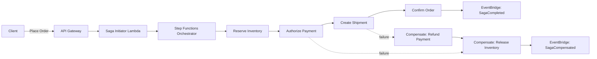
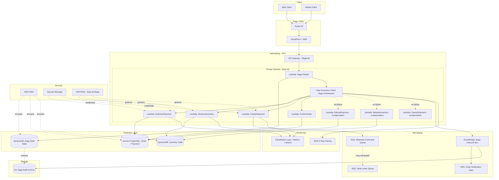

# Part X – Modern Architecture Patterns

# Chapter 80: Saga Pattern

---

# 1. Executive Summary

## The Business Problem

Distributed systems break a single business transaction into many independent service calls. This creates a fundamental problem that does not exist in monolithic applications.

- A monolith with one relational database can wrap an entire business operation (for example, "place an order") inside a single ACID transaction.
- If any step fails, the database engine rolls back everything automatically.
- A microservices architecture cannot do this. Order creation, inventory reservation, payment capture, and shipment scheduling typically live in separate services, each with its own database.
- There is no single database transaction that spans all of them.
- A two-phase commit (2PC) across services is theoretically possible but is almost never used in production AWS architectures because it requires long-lived locks, tight coupling between services, and a coordinator that becomes a single point of failure and a scalability bottleneck.

Organizations that decompose a monolith into microservices without solving this problem end up with one of two outcomes:

1. **Silent data inconsistency** — an order is created, payment fails, but inventory was already deducted. Nobody rolls it back. Customer support ends up fixing this manually, at scale, forever.
2. **Ad hoc compensation code scattered everywhere** — every team invents its own retry-and-cleanup logic, with no consistent pattern, no visibility, and no way to reason about the system's correctness during an incident.

The Saga pattern is the accepted, production-proven answer to this problem. It replaces a single atomic transaction with a **sequence of local transactions**, each of which updates data within a single service and then publishes an event or sends a command to trigger the next step. If a step fails, the saga executes a series of **compensating transactions** that semantically undo the work of the preceding steps.

## Architecture Objective

The objective of a Saga-based architecture is to provide **eventual, business-level consistency** across multiple independently deployable, independently scalable services, without:

- Distributed locks
- Long-held database transactions
- Tight synchronous coupling
- A central transaction coordinator that must stay available for the transaction to complete

Instead, the system accepts that data will be **temporarily inconsistent** while a saga is in flight, and guarantees that it will become consistent (either fully applied, or fully compensated) once the saga completes.

## Why Organizations Adopt This Architecture

- **Microservices decomposition demands it.** Once an order-processing monolith is split into Order, Inventory, Payment, and Shipping services, there is no other production-grade way to keep them consistent without introducing tight coupling.
- **Regulatory and financial correctness.** Payment processors, banks, and marketplaces cannot tolerate "charged but not fulfilled" or "fulfilled but not charged" states persisting indefinitely. Sagas provide an explicit, auditable compensation path.
- **Scale requirements.** 2PC coordinators do not scale horizontally well under high transaction volume because of the locking behavior across participants. Sagas, being choreography- or orchestration-driven and asynchronous, scale horizontally the same way the rest of the event-driven system does.
- **Resilience requirements.** Sagas are naturally resilient to partial failures. A service being down for five minutes does not block the entire platform; the saga simply retries or times out and compensates.
- **Team autonomy.** Sagas let each team own its service's local transaction and compensation logic independently, which is a core reason organizations move to microservices in the first place.

## Major Business Benefits

| Benefit | Description |
|---|---|
| Data consistency without tight coupling | Each service keeps full ownership of its own database while participating in a larger business transaction |
| Improved availability | No participant needs to hold a lock while waiting on another; failures in one service do not freeze the whole platform |
| Auditable business processes | Saga orchestrators (particularly AWS Step Functions-based ones) produce a full execution history, which is valuable for both debugging and compliance |
| Horizontal scalability | Both orchestration (Step Functions, Lambda) and choreography (EventBridge, SNS/SQS) scale natively with AWS managed services |
| Faster incident recovery | Compensating transactions are explicit code paths, tested and deployed like any other feature, rather than manual runbooks |
| Supports polyglot persistence | Order service can use Aurora, Inventory can use DynamoDB, Payment can use a third-party gateway — the saga pattern does not care what storage engine sits behind each participant |

## Typical Enterprise Scenarios

- **E-commerce order fulfillment**: reserve inventory → authorize payment → create shipment → send confirmation. If payment fails, release inventory reservation.
- **Travel booking**: reserve flight seat → reserve hotel room → charge card → issue itinerary. If hotel reservation fails, release the flight seat.
- **Banking and payments**: debit source account → credit destination account → post to general ledger → notify parties. If the credit fails, reverse the debit.
- **Insurance claims processing**: validate claim → reserve reserve funds → approve payout → notify policyholder → update actuarial systems.
- **Subscription and billing platforms**: provision resources → charge card → activate subscription → send welcome email. If the charge fails, deprovision resources.
- **Supply chain and logistics**: allocate warehouse stock → schedule carrier pickup → generate customs documentation → notify buyer.
- **Healthcare scheduling**: reserve provider slot → verify insurance eligibility → confirm appointment → send reminders. If eligibility check fails, release the provider slot.

Each of these scenarios shares the same underlying shape: a sequence of steps spanning multiple services or external systems, where partial completion must not be allowed to sit in an inconsistent state.

## Why Simpler Approaches Are Not Sufficient

Some teams try to avoid the Saga pattern by:

- **Making services synchronously call each other in a chain.** This creates tight coupling, cascading failures, and poor availability — if the last service in the chain is unavailable, none of the preceding writes can be trusted.
- **Using a shared database across services.** This defeats the purpose of microservices decomposition and re-introduces the coupling that led teams away from monoliths.
- **"Best effort" eventual consistency with no compensation logic.** This works until the first payment failure, at which point support teams begin manually reconciling inventory, revenue, and fulfillment data — an operational cost that compounds every month the system is in production.

The Saga pattern formalizes what mature engineering organizations eventually build anyway, but does so with an explicit, testable, observable structure instead of ad hoc glue code.


---

# 2. Business Requirements

## Business Drivers

- Eliminate manual reconciliation between order, payment, inventory, and fulfillment systems.
- Provide a consistent, auditable record of every multi-step business transaction.
- Support independent deployment and scaling of each participating service.
- Reduce the blast radius of a single service outage on the overall platform.
- Enable new business capabilities (partial fulfillment, split payments, multi-vendor marketplaces) that require coordinating multiple independent systems.

## Functional Requirements

- The system must execute a defined sequence of local transactions across multiple services to complete one logical business transaction.
- The system must support automatic compensation (rollback) of completed steps when a subsequent step fails.
- The system must expose the current state of any in-flight saga (for example: `PAYMENT_PENDING`, `INVENTORY_RESERVED`, `COMPLETED`, `COMPENSATING`, `FAILED`).
- The system must be idempotent at every step — retries of the same step must not double-charge, double-reserve, or double-ship.
- The system must support both **orchestration** (a central coordinator, implemented here with AWS Step Functions) and, where appropriate, **choreography** (event-driven, implemented here with Amazon EventBridge and SNS/SQS), and this chapter builds a hybrid reference architecture that uses orchestration as the primary pattern with an event-driven notification layer.
- The system must persist saga state durably so that in-flight transactions survive service restarts, deployments, and AWS regional maintenance events.
- The system must support timeouts on each step, with automatic compensation triggered on timeout.
- The system must produce a complete audit trail of every state transition for compliance and debugging.

## Non-Functional Requirements

| Category | Requirement |
|---|---|
| Scalability | Support at least 500 saga executions per second at peak, scaling to 5,000/sec during flash-sale or peak seasonal events |
| Availability | 99.95% for the orchestration control plane |
| Latency | P50 saga completion under 2 seconds for the happy path; P99 under 8 seconds |
| Compliance | PCI DSS (payment steps), SOC 2 Type II, and where applicable GDPR/CCPA for customer data steps |
| Security | All inter-service communication encrypted in transit; all persisted saga state encrypted at rest with AWS KMS |
| Recovery | RPO of near-zero for saga state; RTO under 15 minutes for the orchestration layer in a regional failover scenario |
| Auditability | Every saga execution retained and queryable for a minimum of 7 years for financial transactions |
| Observability | End-to-end tracing across every participant service for any given saga execution ID |

## Scalability Goals

- Linear horizontal scaling of saga throughput by adding Lambda concurrency and Step Functions Express Workflow capacity, without any change to application code.
- No single participant service should become a bottleneck for the entire saga throughput; each participant scales independently based on its own load.
- Support burst traffic (for example, Black Friday) at 10x normal peak without manual intervention, using AWS Auto Scaling and Lambda's inherent elasticity.

## Availability Requirements

- The orchestration control plane (Step Functions + Lambda) must be deployed across a minimum of three Availability Zones.
- No single AZ failure should cause in-flight sagas to be lost or to enter an inconsistent, unrecoverable state.
- Each downstream participant service must independently meet its own availability SLA (typically 99.9%–99.99% depending on criticality).

## Latency Requirements

- Synchronous customer-facing operations that trigger a saga (for example, "Place Order") must return an initial acknowledgment to the customer within 300ms, even though the saga itself may take several seconds to fully complete asynchronously.
- The saga's actual business completion (all steps done, or fully compensated) should complete within an SLA appropriate to the domain — typically under 10 seconds for e-commerce checkout, and under 60 seconds for more complex multi-party workflows like travel booking.

## Compliance Requirements

- PCI DSS Level 1 scope reduction: sensitive payment data must never transit through the orchestration state machine directly; instead, tokenized references are passed, with actual card data handled exclusively by a PCI-compliant payment gateway.
- SOX-relevant financial transactions require immutable audit logs of every saga step, including compensations.
- Data residency requirements may require region-specific saga orchestration deployments for customers in the EU or other regulated jurisdictions.

## Security Expectations

- Every participant service authenticates saga-originated requests using IAM roles or signed, short-lived tokens — never long-lived static credentials.
- Compensating transactions must be authorized with the same rigor as forward transactions; a compensation is still a state-changing operation and is a common target for abuse if under-secured.
- Saga state (including any embedded business data) must be encrypted at rest and in transit, and access to saga execution history must be scoped through least-privilege IAM policies.

## Recovery Objectives

| Metric | Target |
|---|---|
| RPO for saga state | Near-zero (Step Functions execution history and DynamoDB saga-state table both replicate synchronously within a Region across AZs) |
| RTO for orchestration layer | Under 15 minutes during a regional failover, assuming a warm-standby DR posture |
| RPO for participant databases | Depends on participant; typically under 5 minutes when using Aurora Global Database or DynamoDB Global Tables |

## SLAs

- 99.95% availability commitment for the saga orchestration control plane, measured monthly.
- 99.99% commitment for the payment participant service, given its criticality to revenue.
- Defined and published escalation and compensation SLAs — for example, a failed payment reservation must be compensated (funds released) within 60 seconds to avoid customer complaints about "frozen" funds.

## Expected Workload and Growth

- Initial production launch: approximately 50 sagas/second sustained, 300/second peak.
- Year one growth target: 200 sagas/second sustained, 2,000/second peak (10x growth during promotional events).
- Long-term (3-year horizon): multi-region active-active saga orchestration supporting global customer bases with regional data residency constraints.


---

# 3. Architecture Overview

## Overall Design

This chapter's reference architecture implements the Saga pattern using **orchestration as the primary coordination style**, backed by **AWS Step Functions**, with **choreography-style event notification** layered on top using **Amazon EventBridge** for cross-cutting concerns like analytics, fraud detection, and customer notifications that should not block the core saga.

This hybrid approach is deliberate:

- **Orchestration** gives the core business transaction (Order → Inventory → Payment → Shipping) a single, explicit, testable definition of the happy path and every compensation path. This is critical for auditability and for onboarding new engineers to understand "what actually happens when an order is placed."
- **Choreography** is layered on top for concerns that are inherently fan-out, best-effort, and should never be allowed to block or fail the core transaction — for example, sending a confirmation email, updating a recommendation engine, or feeding a fraud-detection pipeline.

## Architecture Philosophy

1. **Each participant service owns its own data.** Order service owns orders. Inventory service owns stock levels. Payment service owns payment records. No cross-service database access.
2. **Every step is a local transaction.** A step either fully commits within its own service's database, or it does not happen at all. There is no cross-service two-phase commit.
3. **Every forward step has a defined compensating action.** If Payment fails after Inventory has been reserved, the orchestrator invokes Inventory's `ReleaseReservation` compensation.
4. **All steps are idempotent.** Every participant operation accepts an idempotency key (the saga execution ID plus step name) and safely no-ops on retry.
5. **The orchestrator is the source of truth for saga state**, not any individual participant. Participants are stateless with respect to the overall saga; they only know about their own local transaction.
6. **Failures are expected, not exceptional.** The architecture is designed assuming that any participant call can fail, time out, or be delayed, and every path through the state machine accounts for this.

## Core Components

| Component | Role |
|---|---|
| API Gateway | Entry point for "Place Order" and other saga-triggering requests |
| Lambda (Saga Initiator) | Validates the incoming request and starts a new Step Functions execution |
| AWS Step Functions (Express Workflow) | The saga orchestrator; defines the sequence of steps and compensations |
| Lambda (Step Adapters) | One Lambda per participant interaction (ReserveInventory, ReleaseInventory, AuthorizePayment, RefundPayment, CreateShipment, CancelShipment) |
| DynamoDB (Saga State Table) | Durable record of saga execution state, idempotency keys, and audit history |
| Amazon EventBridge | Publishes saga lifecycle events (`OrderSagaStarted`, `OrderSagaCompleted`, `OrderSagaCompensated`) for downstream, non-blocking consumers |
| Amazon SQS | Buffers commands to participant services and provides retry/backoff and dead-letter handling |
| Amazon SNS | Fans out saga completion/failure notifications to customer notification and analytics systems |
| Aurora PostgreSQL / DynamoDB (per participant) | Each participant service's own local database |
| Amazon CloudWatch + AWS X-Ray | Observability across the full saga execution, correlated by saga execution ID |
| AWS KMS | Encryption of saga state and all data in transit/at rest |

## How Components Interact

1. A client calls the "Place Order" API, handled by API Gateway.
2. A lightweight Lambda validates the request and starts a new **Step Functions Express Workflow execution**, passing a unique `sagaId` (also used as the idempotency key root).
3. Step Functions executes each step in sequence: `ReserveInventory` → `AuthorizePayment` → `CreateShipment` → `ConfirmOrder`.
4. Each step invokes a dedicated Lambda adapter, which calls the relevant participant service (synchronously via API call, or asynchronously via SQS command message, depending on the step's latency profile).
5. Step Functions records every state transition in DynamoDB (via a Lambda that writes state) and in its own native execution history.
6. If any step fails (after configured retries are exhausted), Step Functions transitions into the **compensation path**, invoking compensating Lambdas in reverse order for every step that already succeeded.
7. On successful completion (or successful compensation), Step Functions publishes a terminal event to EventBridge.
8. EventBridge fans this event out to non-blocking consumers: notification service (email/SMS), analytics pipeline (Kinesis Data Firehose → S3 → Athena), and fraud detection.

## High-Level Workflow



## Request Lifecycle

1. Client submits an order request with idempotency header.
2. API Gateway performs request validation (schema, auth via Cognito/IAM authorizer) and forwards to the Saga Initiator Lambda.
3. Saga Initiator checks the DynamoDB saga table for an existing execution with the same idempotency key (protects against duplicate submissions from client retries).
4. If none exists, a new Step Functions execution starts, and `202 Accepted` with a `sagaId` is returned to the client immediately.
5. The client polls (or receives a webhook/WebSocket push) for saga completion status.

## Response Lifecycle

- Synchronous response to the client is intentionally decoupled from saga completion. The client receives an acknowledgment, not a final result, because the saga's total duration (network calls to Payment gateways, Shipping carriers, etc.) is not appropriate for a blocking HTTP response.
- Final saga outcome is delivered via one of: WebSocket push (API Gateway WebSocket API), polling a `GET /orders/{id}/status` endpoint backed by the DynamoDB saga table, or an asynchronous webhook to the client application.

## Data Lifecycle

- Saga execution records live in DynamoDB with a TTL-driven archival process: active/recent sagas (< 90 days) stay in the hot DynamoDB table; older records are exported nightly via DynamoDB Streams → Kinesis Data Firehose → S3 for long-term, low-cost audit retention, queryable via Athena.
- Participant-owned business data (the actual order, inventory, and payment records) lives permanently in each participant's own database, governed by that service's own data lifecycle policy — the saga orchestrator has no opinion on this.


---

# 4. AWS Services Used

## AWS Step Functions

**Purpose**: Orchestrates the sequence of saga steps and their compensations as an explicit, versioned state machine.

**Why selected**:
- Native support for retries, timeouts, and error catching per state, which maps directly onto saga semantics.
- Express Workflows support very high throughput (thousands of executions per second) at low per-execution cost, appropriate for high-volume sagas like order checkout.
- Standard Workflows provide exactly-once execution guarantees and execution histories retained for 90 days, appropriate for longer-running, lower-volume sagas like insurance claims processing.
- Visual execution history in the console dramatically reduces incident-response time compared to reconstructing a saga's path from scattered service logs.

**Alternatives**: Self-built orchestration using a Lambda-plus-DynamoDB state machine; open-source orchestrators (Temporal, Camunda) self-hosted on ECS/EKS; commercial workflow engines.

**Limitations**:
- Express Workflows are at-least-once, not exactly-once — every step's Lambda adapter must be idempotent.
- Standard Workflows have a maximum execution duration of one year but a much lower throughput ceiling than Express.
- Payload size per state transition is limited to 256KB, which means large payloads must be passed by reference (S3 key or DynamoDB key), not by value.

**Pricing considerations**: Express Workflows are billed per execution and per GB-second of duration, similar to Lambda; this is materially cheaper at high volume than Standard Workflows, which bill per state transition.

**Best practices**:
- Use Express Workflows for the high-volume, short-duration order checkout saga.
- Use Standard Workflows for longer-running sagas (multi-day approval workflows) where the built-in execution history and exactly-once semantics matter more than raw throughput.
- Keep state machine definitions in version control and deploy them via Terraform, never hand-edited in the console.

## AWS Lambda

**Purpose**: Implements every step adapter (ReserveInventory, AuthorizePayment, CreateShipment, and their compensations), plus the Saga Initiator function.

**Why selected**: Scales automatically with saga volume, integrates natively with Step Functions as a task type, and allows each step adapter to be deployed, versioned, and rolled back independently.

**Alternatives**: ECS Fargate tasks invoked via Step Functions' ECS integration (appropriate for steps with heavier compute or longer execution times); container-based microservices called via HTTP.

**Limitations**: 15-minute maximum execution duration (irrelevant for saga steps, which should be sub-second to low-second); cold starts can add latency on the first invocation after a scale-up event — mitigated with Provisioned Concurrency for the highest-volume steps.

**Best practices**: One Lambda function per step (not one giant Lambda handling all steps) for independent scaling, monitoring, and blast-radius containment. Use Lambda Powertools for structured logging and tracing correlation with the saga execution ID.

## Amazon DynamoDB

**Purpose**: Stores saga execution state, idempotency keys, and the audit trail of state transitions. Also used by participant services (e.g., Inventory) as their local transactional store.

**Why selected**: Single-digit millisecond latency at any scale, native TTL for archival, and DynamoDB Streams for downstream event propagation without any additional polling infrastructure.

**Alternatives**: Aurora PostgreSQL for participants that need complex relational queries or joins (e.g., Order service, which often needs rich reporting); self-managed Redis for pure idempotency-key caching (not recommended given DynamoDB's built-in conditional writes already solve this cleanly).

**Limitations**: No native multi-table transactions across separate participant databases (which is precisely why the Saga pattern exists in the first place); DynamoDB Transactions do provide atomicity **within** a single participant's table, which is used for the local transaction inside each step.

**Best practices**: Use conditional writes (`ConditionExpression`) keyed on the idempotency key to guarantee exactly-once effect for each step, even though Step Functions Express Workflows may invoke a step more than once.

## Amazon EventBridge

**Purpose**: Publishes saga lifecycle events for non-blocking, fan-out consumers (notifications, analytics, fraud detection).

**Why selected**: Native schema registry, content-based filtering per consumer, and no infrastructure to manage. Decouples the core orchestrated saga from an unbounded number of downstream interested parties.

**Alternatives**: Amazon SNS (simpler fan-out, no content filtering); Apache Kafka via MSK (appropriate if the organization already standardizes on Kafka for streaming and needs ordered, replayable event logs).

**Limitations**: At-least-once delivery, no ordering guarantee across different event types — downstream consumers must be idempotent and order-tolerant.

## Amazon SQS

**Purpose**: Buffers commands sent from the orchestrator to participant services, providing retry, backoff, and dead-letter queue handling independent of Step Functions' own retry logic.

**Why selected**: Decouples the orchestrator from participant service availability; if a participant service is temporarily overloaded, commands queue rather than fail outright. Native DLQ support surfaces poison messages for manual or automated remediation.

**Alternatives**: Direct synchronous Lambda-to-Lambda or Lambda-to-API calls for steps where sub-second responses are required and queuing latency is unacceptable (used for the ReserveInventory and AuthorizePayment steps in this reference architecture, where SQS is not used and direct invocation is preferred for latency reasons); SQS is used instead for the CreateShipment step, which tolerates a few seconds of asynchronous latency.

## Amazon SNS

**Purpose**: Fans out final saga outcome notifications (order confirmed, order cancelled) to multiple independent subscriber systems — email/SMS notification service, CRM, loyalty program.

**Why selected**: Simple pub/sub fan-out with no content filtering complexity needed for this use case, unlike EventBridge's richer routing which is reserved for the more complex internal event bus.

## Amazon API Gateway

**Purpose**: Public entry point for saga-triggering requests (`POST /orders`) and for saga status polling (`GET /orders/{id}`).

**Why selected**: Native request validation, throttling, and IAM/Cognito authorizer integration; regional endpoints minimize latency for the primary customer base.

**Alternatives**: Application Load Balancer with Lambda targets (lower cost at very high sustained throughput, less built-in request validation).

## Amazon Aurora PostgreSQL

**Purpose**: Local transactional database for the Order and Payment participant services, where relational integrity, joins, and complex reporting queries are required.

**Why selected**: Full ACID compliance for the **local** transaction within each service (this is distinct from and does not replace the saga's cross-service compensation logic), Multi-AZ durability, and read replicas for reporting workloads without impacting transactional latency.

## AWS KMS

**Purpose**: Encrypts saga state in DynamoDB, participant databases, and SQS/SNS messages at rest, and manages the customer-managed keys (CMKs) used for envelope encryption of sensitive payloads.

**Why selected**: Centralized key management, automatic key rotation, and fine-grained IAM-based access control per key, which is essential when the Payment participant's data must be encrypted under a stricter key policy than the Order participant's data.

## AWS Secrets Manager

**Purpose**: Stores credentials for external payment gateway integrations and any third-party carrier APIs invoked by the Shipping participant.

**Why selected**: Automatic rotation support and native Lambda integration avoids hardcoded credentials in any step adapter's environment variables.

## Amazon CloudWatch and AWS X-Ray

**Purpose**: Provides metrics, logs, and distributed tracing correlated by saga execution ID across every Lambda step adapter and Step Functions execution.

**Why selected**: Native Step Functions integration automatically emits X-Ray trace segments per state, and CloudWatch Logs Insights allows querying across all step-adapter Lambda logs by `sagaId` in a single query during incident response.

## IAM

**Purpose**: Enforces least-privilege access for every Lambda step adapter — for example, the `ReleaseInventoryReservation` compensation Lambda can only call the specific Inventory service API needed for that compensation, nothing else.

## Amazon Route 53 and CloudFront

**Purpose**: DNS resolution and edge caching/WAF protection for the public-facing API Gateway endpoint that triggers sagas.


---

# 5. Complete Architecture Diagram



**Layer notes:**

- The diagram intentionally separates the **orchestration layer** (Step Functions plus step-adapter Lambdas) from the **participant data layer** (Aurora, DynamoDB Inventory table), reinforcing that the orchestrator never writes directly to a participant's database — it always goes through that participant's own Lambda adapter, which enforces the participant's own business rules and local transaction boundary.
- The **compensation Lambdas** (`ReleaseInventory`, `RefundPayment`, `CancelShipment`) are drawn as first-class components, not afterthoughts, because in production they are exercised just as often as the forward path — every declined credit card, every out-of-stock race condition, and every carrier API timeout triggers them.
- `SQSDLQ` is deliberately shown, since a Dead Letter Queue is not optional in a saga architecture: a poison message on the shipment command queue must be visible and alertable, not silently dropped after retries.


---

# 6. Component-by-Component Explanation

## Saga Initiator (Lambda)

- **Purpose**: Entry point that validates an incoming request and starts a new saga execution.
- **Responsibilities**: Request schema validation, idempotency-key deduplication check against the DynamoDB saga table, starting the Step Functions execution, returning an immediate `202 Accepted` response with the `sagaId`.
- **Inputs**: HTTP request from API Gateway containing order details and a client-supplied idempotency key.
- **Outputs**: A new Step Functions execution ARN; an HTTP response to the client.
- **Scaling**: Scales automatically with Lambda concurrency; no state held in the function itself.
- **High availability**: Deployed across all AZs in the region automatically by the Lambda service; no configuration needed beyond VPC subnet placement if VPC access is required.
- **Failure handling**: If the DynamoDB dedup check finds an existing execution for the same idempotency key, returns the existing `sagaId` rather than starting a duplicate saga.
- **Dependencies**: DynamoDB saga table, Step Functions StartExecution API.
- **Security**: IAM role scoped to `states:StartExecution` on only the specific state machine ARN, and `dynamodb:GetItem`/`PutItem` on only the saga table.
- **Monitoring**: CloudWatch metric for duplicate-request rate (a leading indicator of client-side retry storms).

## Step Functions Orchestrator (Order Saga)

- **Purpose**: The authoritative definition of the saga's forward path and every compensation path.
- **Responsibilities**: Sequencing steps, applying per-step retry policies, catching errors and routing to compensation states, recording execution history.
- **Inputs**: The order payload and `sagaId` from the Saga Initiator.
- **Outputs**: A terminal state (`COMPLETED`, `COMPENSATED`, `FAILED`) and an event published to EventBridge.
- **Scaling**: Express Workflows scale to very high concurrent execution counts automatically; no capacity planning required.
- **High availability**: Fully managed, multi-AZ by default within the region.
- **Failure handling**: Each state has explicit `Retry` (exponential backoff, configurable max attempts) and `Catch` (routes to the appropriate compensation state) blocks.
- **Dependencies**: All step-adapter Lambdas, DynamoDB saga table (via a state-recording Lambda), EventBridge.
- **Security**: IAM role with `lambda:InvokeFunction` scoped only to the specific step-adapter function ARNs used by this state machine.
- **Monitoring**: Step Functions natively emits `ExecutionsFailed`, `ExecutionsTimedOut`, `ExecutionsSucceeded` CloudWatch metrics; alarms are configured on all three.

## ReserveInventory / ReleaseInventory (Lambda pair)

- **Purpose**: Forward step reserves stock for the order; compensation releases the reservation if a later step fails.
- **Responsibilities**: Conditional decrement of available stock (forward), conditional increment/restore of stock (compensation), both keyed on `sagaId` for idempotency.
- **Inputs**: SKU, quantity, `sagaId`.
- **Outputs**: Reservation confirmation or `InsufficientStockException`.
- **Scaling**: Scales with Lambda concurrency; DynamoDB table scales via on-demand capacity mode to absorb bursty reservation traffic.
- **High availability**: DynamoDB is inherently multi-AZ; Lambda is inherently multi-AZ.
- **Failure handling**: `InsufficientStockException` is a **business failure**, not a technical failure — it is caught immediately by Step Functions and routes straight to compensation without retry, since retrying will not produce more stock.
- **Dependencies**: DynamoDB Inventory table.
- **Security**: IAM role scoped to `dynamodb:UpdateItem` on only the Inventory table, with a condition expression enforced in code preventing negative stock.
- **Monitoring**: CloudWatch alarm on elevated `InsufficientStockException` rate, which is both an operational and a merchandising signal (popular SKU running low).

## AuthorizePayment / RefundPayment (Lambda pair)

- **Purpose**: Forward step places an authorization hold on the customer's payment method; compensation voids the authorization or issues a refund if capture already occurred.
- **Responsibilities**: Calls the external payment gateway (via a PCI-scoped adapter) with an idempotency key equal to `sagaId`, records the gateway's authorization ID in the local Payment participant database.
- **Inputs**: Payment token (never raw card data), amount, `sagaId`.
- **Outputs**: Authorization ID and status, or a `PaymentDeclinedException`.
- **Scaling**: Bound by the external payment gateway's own rate limits — this Lambda's reserved concurrency is deliberately capped to avoid overwhelming the gateway during traffic spikes.
- **High availability**: Multi-AZ Lambda; payment gateway's own SLA governs the external dependency's availability.
- **Failure handling**: `PaymentDeclinedException` (business failure) routes directly to compensation. A gateway timeout (technical failure) is retried up to 3 times with exponential backoff before being treated as a failure.
- **Dependencies**: External payment gateway API, Secrets Manager (gateway API credentials), Aurora (Payment participant's local database).
- **Security**: This is the highest-sensitivity component in the architecture; scoped IAM role, VPC-isolated subnet with no direct internet route (traffic egresses via a NAT Gateway with strict security-group and NACL rules), and full PCI DSS-scoped logging (with card data always masked).
- **Monitoring**: Real-time alarm on decline-rate spikes (fraud indicator) and on gateway latency degradation.

## CreateShipment / CancelShipment (Lambda pair, via SQS)

- **Purpose**: Forward step schedules a carrier pickup; compensation cancels it if a later step fails (rare, but possible if `ConfirmOrder` itself fails due to a downstream data issue).
- **Responsibilities**: Publishes a shipment-creation command to SQS (asynchronous, since carrier APIs can be slow and unreliable); a separate consumer Lambda processes the queue and calls the carrier API.
- **Inputs**: Shipping address, order contents, `sagaId`.
- **Outputs**: Carrier tracking number, or a `ShipmentCreationFailedException` after DLQ escalation.
- **Scaling**: SQS naturally buffers load spikes; the consumer Lambda's concurrency is tuned to match the carrier API's rate limits.
- **High availability**: SQS is inherently multi-AZ and highly durable; messages are retained even if the consumer Lambda is temporarily failing.
- **Failure handling**: Messages that fail processing 5 times move to the Dead Letter Queue, which triggers a CloudWatch alarm and a Step Functions `Wait`-and-`Retry` on the orchestrator side, with an eventual timeout that triggers compensation.
- **Dependencies**: SQS command queue, external carrier API, Secrets Manager (carrier API credentials).
- **Security**: IAM role scoped to `sqs:SendMessage`/`ReceiveMessage` on only the shipment queue.
- **Monitoring**: Queue depth and age-of-oldest-message alarms; these are leading indicators of carrier API degradation before it becomes a customer-visible saga failure.

## ConfirmOrder (Lambda)

- **Purpose**: Final forward step — marks the order as confirmed in the Order participant's database and is the point of no return for the saga (no compensation is defined beyond this step in the happy path; if it fails, the saga compensates everything before it).
- **Responsibilities**: Atomically transitions the order's local status to `CONFIRMED` within Aurora.
- **Dependencies**: Aurora (Order participant's local database).
- **Security**: IAM role scoped to invoke only the Order service's confirmation API.
- **Monitoring**: Success of this step is the primary business KPI tracked on the executive dashboard — "orders successfully confirmed per minute."

## Saga State Table (DynamoDB)

- **Purpose**: Durable, queryable record of every saga's current state and full transition history, independent of Step Functions' own execution history (which has retention and query limitations).
- **Responsibilities**: Supports idempotency-key lookups, powers the customer-facing "order status" polling endpoint, and feeds the nightly archival pipeline to S3.
- **Scaling**: On-demand capacity mode absorbs unpredictable saga volume without capacity planning.
- **High availability**: Native multi-AZ replication within the region; optionally extended to Global Tables for multi-region DR.
- **Security**: Encrypted at rest with a customer-managed KMS key; IAM policies scope read access per consuming service.


---

# 7. End-to-End Request Flow

The following describes the **happy path** followed by the **failure/compensation path** for a "Place Order" saga.

## Happy Path

1. **Client** submits `POST /orders` with order payload and an `Idempotency-Key` header.
2. **DNS (Route 53)** resolves the API domain to the CloudFront distribution.
3. **CloudFront + WAF** applies edge caching rules (none for this POST endpoint) and WAF rules (rate limiting, SQL injection/XSS pattern blocking) before forwarding to API Gateway.
4. **API Gateway** validates the request body against the configured JSON schema and authenticates the caller via a Cognito or IAM authorizer.
5. **Saga Initiator Lambda** checks DynamoDB for an existing saga with the same idempotency key. None found.
6. **Saga Initiator Lambda** starts a new **Step Functions Express Workflow execution**, writes an initial `PENDING` record to the DynamoDB saga table, and returns `202 Accepted` with `sagaId` to the client.
7. **Step Functions** enters the `ReserveInventory` state, invoking the `ReserveInventory` Lambda.
8. **ReserveInventory Lambda** performs a conditional `UpdateItem` on the DynamoDB Inventory table, decrementing available stock. Success.
9. **Step Functions** transitions to `AuthorizePayment`, invoking the `AuthorizePayment` Lambda.
10. **AuthorizePayment Lambda** calls the external payment gateway with the `sagaId` as the idempotency key. Gateway returns an authorization ID. The Lambda writes this to the Aurora Payment table.
11. **Step Functions** transitions to `CreateShipment`, invoking the `CreateShipment` Lambda, which publishes a command message to the SQS shipment queue and returns immediately (asynchronous fire-and-track pattern using a Step Functions callback token — `waitForTaskToken`).
12. A separate **Shipment Consumer Lambda** picks up the SQS message, calls the carrier API, receives a tracking number, and calls `SendTaskSuccess` back to Step Functions with the tracking number as the result payload.
13. **Step Functions** transitions to `ConfirmOrder`, invoking the `ConfirmOrder` Lambda, which updates the order status to `CONFIRMED` in Aurora.
14. **Step Functions** reaches the terminal `Succeeded` state and publishes an `OrderSagaCompleted` event to **EventBridge**.
15. **EventBridge** routes this event to: the **Notification Lambda** (sends confirmation email/SMS via SNS/SES), the **Analytics Firehose** (streams to S3 for BI dashboards), and the **Fraud Detection** pipeline (async post-hoc scoring).
16. A **state-recording Lambda**, triggered on every Step Functions state transition via CloudWatch Events, writes the final `COMPLETED` status and full history to the **DynamoDB saga table**.
17. The **client**, which has been polling `GET /orders/{sagaId}/status` (or subscribed via WebSocket), observes the `CONFIRMED` status and displays the order confirmation.
18. **CloudWatch** and **X-Ray** have recorded a complete trace of every step's latency, correlated by `sagaId`, viewable as a single trace timeline for this order.

## Failure / Compensation Path (Example: Payment Declined)

1–9. Identical to the happy path through the start of `AuthorizePayment`.

10. **AuthorizePayment Lambda** calls the external payment gateway, which returns a **decline** response. The Lambda raises a `PaymentDeclinedException`.
11. **Step Functions** catches this business exception (configured via a `Catch` block on the `AuthorizePayment` state) and transitions directly into the **compensation branch** — no retry is attempted, since a decline will not succeed on retry.
12. **Step Functions** invokes `ReleaseInventoryReservation` Lambda, which performs a conditional `UpdateItem` restoring the previously reserved stock, keyed by `sagaId` to guarantee it only reverses what this saga actually reserved.
13. **Step Functions** transitions to the terminal `CompensationSucceeded` state and publishes an `OrderSagaCompensated` event (including the failure reason, `PAYMENT_DECLINED`) to EventBridge.
14. **EventBridge** routes this to the Notification Lambda (sends a "payment failed, please update your payment method" message) and to the Fraud Detection pipeline (elevated decline rates are a fraud signal).
15. The **state-recording Lambda** writes the final `COMPENSATED` status and complete history (including which steps ran and which were compensated) to the DynamoDB saga table.
16. The **client**, polling for status, observes `PAYMENT_FAILED` and displays an appropriate error and retry prompt.

## Error Handling Summary Table

| Failure Point | Type | Retry Behavior | Compensation Trigger |
|---|---|---|---|
| Inventory reservation — insufficient stock | Business | No retry | Saga fails immediately, no compensation needed (nothing reserved yet) |
| Payment gateway timeout | Technical | 3 retries, exponential backoff | If retries exhausted, compensate ReserveInventory |
| Payment declined | Business | No retry | Compensate ReserveInventory |
| Shipment carrier API timeout | Technical | 5 retries via SQS redrive policy, then DLQ | If DLQ escalation exceeds SLA, compensate AuthorizePayment then ReserveInventory |
| ConfirmOrder database write failure | Technical | 3 retries | If exhausted, compensate CreateShipment, AuthorizePayment, ReserveInventory in reverse order |

---

# 8. Deployment Flow

## Infrastructure Provisioning

- All infrastructure (Step Functions state machine definitions, Lambda functions, DynamoDB tables, SQS queues, EventBridge rules, IAM roles) is provisioned via **Terraform**, never manually through the console.
- Each participant service (Order, Inventory, Payment, Shipping) has its own Terraform root module and its own state file, so teams can deploy independently — a core requirement for microservices autonomy.
- The saga orchestration layer (Step Functions definition and its directly-owned step-adapter Lambdas) has its own Terraform module, owned by the platform/integration team, versioned independently from any single participant.

## Terraform Workflow

1. Engineer opens a pull request modifying the Step Functions ASL definition or a step-adapter Lambda.
2. CI pipeline runs `terraform fmt -check`, `terraform validate`, and `tflint`.
3. CI runs `terraform plan` against a shared, ephemeral review environment and posts the plan output as a PR comment.
4. A peer reviewer approves, focusing specifically on: correctness of the new/modified compensation logic, IAM least-privilege scoping, and retry/timeout configuration.
5. On merge to `main`, CI runs `terraform apply` against the staging environment automatically.
6. Automated integration tests execute full saga scenarios (happy path and every documented failure/compensation path) against staging.
7. On passing tests, a manual approval gate triggers `terraform apply` against production.

## CI/CD Deployment

- **Lambda step adapters** are deployed using Lambda **versions and aliases**. The Step Functions state machine references the `live` alias, never `$LATEST`, so a new deployment does not affect in-flight saga executions still referencing the prior version's behavior mid-execution.
- **Step Functions state machine updates** are versioned as a new state machine definition; Step Functions does not support partial in-place edits of a running execution's logic — any executions already in flight when a new definition is published continue to run against the definition they started with.

## Blue-Green Deployment

- For the step-adapter Lambdas, a **linear or canary deployment** (via AWS CodeDeploy's Lambda deployment configurations, e.g., `Canary10Percent5Minutes`) shifts traffic gradually to the new version, automatically rolling back if CloudWatch alarms (error rate, duration) fire during the shift.
- For the Step Functions definition itself, "blue-green" means running the **new saga version alongside the old one**: new executions are started against the new definition, while existing in-flight executions complete against the version they started with. This is a natural consequence of Step Functions' execution model and requires no additional tooling.

## Rollback

- Lambda: revert the `live` alias to the previous version — this is a near-instant, zero-downtime rollback.
- Step Functions: redeploy the previous ASL definition via Terraform; because new executions always start fresh against the currently-published definition, rollback only affects new sagas going forward, never in-flight ones.
- DynamoDB schema changes (e.g., adding a new attribute to the saga state table) are always additive and backward-compatible; destructive schema changes are never deployed without a documented multi-step migration plan.

## Secrets

- Payment gateway and carrier API credentials are stored in **Secrets Manager**, referenced by ARN in each Lambda's environment configuration, and retrieved at cold-start with in-memory caching for the lifetime of the execution environment (never re-fetched on every invocation, to control API call volume and latency).
- Secrets rotation is automated via Secrets Manager's native rotation Lambdas for the payment gateway credential where the gateway supports rotation APIs.

## Configuration

- Non-secret configuration (retry counts, timeout values, feature flags for enabling/disabling specific compensation paths during incident response) is managed via **AWS AppConfig**, allowing configuration changes to be deployed and gradually rolled out without a full Lambda redeployment.

## Validation

- Pre-deployment: automated ASL (Amazon States Language) linting validates that every state with a possible failure mode has a corresponding `Catch` block routing to an appropriate compensation state — this is enforced as a custom CI check, not just relying on code review.
- Post-deployment: synthetic canary sagas (via CloudWatch Synthetics) run every 5 minutes in production, exercising both the happy path and a deliberately-triggered compensation path (e.g., using a test payment card configured to always decline), verifying the full compensation chain works end-to-end continuously, not just at deployment time.


---

# 9. Network Topology

## VPC Design

- A dedicated VPC hosts the saga orchestration layer's VPC-attached Lambdas (specifically the `AuthorizePayment` and `CreateShipment` adapters, which call external third-party APIs and therefore need controlled, auditable egress).
- Lambdas that only call other AWS services (DynamoDB, Step Functions, EventBridge) via AWS APIs do **not** need VPC attachment — attaching them unnecessarily only adds ENI cold-start latency and NAT Gateway cost with no security benefit, since these calls already traverse AWS's private network via IAM-authenticated API calls.

## CIDR Plan

| Subnet | CIDR | Purpose |
|---|---|---|
| VPC | 10.40.0.0/16 | Saga orchestration VPC |
| Private Subnet AZ-a | 10.40.1.0/24 | Payment/Shipping Lambda ENIs |
| Private Subnet AZ-b | 10.40.2.0/24 | Payment/Shipping Lambda ENIs |
| Private Subnet AZ-c | 10.40.3.0/24 | Payment/Shipping Lambda ENIs |
| Public Subnet AZ-a | 10.40.101.0/24 | NAT Gateway |
| Public Subnet AZ-b | 10.40.102.0/24 | NAT Gateway |
| Public Subnet AZ-c | 10.40.103.0/24 | NAT Gateway |

## Public and Private Subnets

- **Public subnets** host only NAT Gateways (one per AZ for high availability) — no compute resources are placed here.
- **Private subnets** host the VPC-attached Lambda ENIs. These Lambdas reach AWS services (DynamoDB, Secrets Manager, KMS) via **VPC endpoints (PrivateLink)**, and reach external payment/carrier APIs via the NAT Gateway.

## NAT Gateway

- One NAT Gateway per AZ to avoid a single AZ's NAT Gateway becoming a cross-AZ single point of failure for outbound calls to the payment gateway.
- NAT Gateway data-processing charges are actively monitored (see Section 16, Cost Optimization) since payment gateway calls, while small individually, are extremely high in volume.

## Internet Gateway

- Attached to the VPC to allow the NAT Gateways to route outbound traffic; no resource other than the NAT Gateways has a route to the Internet Gateway.

## Transit Gateway

- If the saga orchestration VPC needs to reach participant services hosted in **separate VPCs per team** (a common pattern in larger organizations where Inventory, Payment, and Shipping are each owned by different teams with their own AWS accounts), a **Transit Gateway** connects all participant VPCs, with route tables scoped so that the orchestration VPC can only reach the specific participant API endpoints it needs, not the participant's entire private network.

## Route Tables

- Private subnet route tables send `0.0.0.0/0` to the local NAT Gateway and send AWS service traffic (DynamoDB, S3, Secrets Manager, KMS) to their respective VPC Gateway/Interface Endpoints, never through the NAT Gateway — this both reduces cost and reduces the blast radius of a NAT Gateway outage.

## Network ACLs

- Stateless NACLs on the private subnets restrict inbound traffic to only the ephemeral port range from the VPC CIDR (Lambda-to-Lambda invocation does not need this, but is defense-in-depth for any misconfigured resource) and restrict outbound traffic to HTTPS (443) toward the payment gateway's published IP ranges and the VPC endpoint ENIs.

## Security Groups

| Security Group | Inbound | Outbound |
|---|---|---|
| `sg-payment-lambda` | None (Lambda does not accept inbound) | 443 to payment gateway IP allowlist; 443 to VPC endpoints |
| `sg-shipment-lambda` | None | 443 to carrier API allowlist; 443 to VPC endpoints |
| `sg-vpc-endpoints` | 443 from `sg-payment-lambda`, `sg-shipment-lambda` | N/A |

## PrivateLink

- Interface VPC Endpoints are provisioned for DynamoDB, Secrets Manager, KMS, and CloudWatch Logs, so that all AWS-service traffic from the VPC-attached Lambdas never traverses the public internet, even indirectly.
- If the Payment participant service is hosted by a separate internal team as a private API, an **Interface VPC Endpoint Service (PrivateLink)** is used to expose it to the orchestration VPC without VPC peering and without exposing it publicly.

## Hybrid Connectivity

- Not required for this reference architecture, since all participants are AWS-native. If an on-premises payment system or legacy mainframe participant must be integrated (common in banking sagas), a **Direct Connect** or **Site-to-Site VPN** connection extends the Transit Gateway to the on-premises network, with the same least-privilege route-table scoping principle applied.


---

# 10. Identity and Access

## IAM Roles

- **One IAM execution role per Lambda function**, never a shared role across multiple step adapters. This is a deliberate design decision: the `ReserveInventory` Lambda's role can never accidentally be reused by a future `AuthorizePayment`-adjacent function with broader permissions than it needs.
- The **Step Functions state machine's own IAM role** is scoped to `lambda:InvokeFunction` on the exact ARNs of its step-adapter Lambdas, `events:PutEvents` on the specific EventBridge bus, and nothing else.

## IAM Policies

Example least-privilege policy for the `ReleaseInventoryReservation` compensation Lambda:

```json

{
  "Version": "2012-10-17",
  "Statement": [
    {
      "Sid": "AllowInventoryTableUpdateOnly",
      "Effect": "Allow",
      "Action": [
        "dynamodb:UpdateItem",
        "dynamodb:GetItem"
      ],
      "Resource": "arn:aws:dynamodb:us-east-1:123456789012:table/InventoryReservations",
      "Condition": {
        "ForAllValues:StringEquals": {
          "dynamodb:Attributes": ["sku", "sagaId", "quantity", "status"]
        }
      }
    },
    {
      "Sid": "AllowKMSDecryptForInventoryTable",
      "Effect": "Allow",
      "Action": ["kms:Decrypt", "kms:GenerateDataKey"],
      "Resource": "arn:aws:kms:us-east-1:123456789012:key/inventory-table-cmk"
    }
  ]
}

```

## Resource Policies

- The DynamoDB saga state table has a resource-based policy (via VPC endpoint policy, since DynamoDB does not support classic resource policies directly) restricting access to only the specific VPC endpoint used by the orchestration layer's Lambdas, preventing any credential leaked outside that network boundary from being usable against the table.
- The Secrets Manager secrets holding payment gateway credentials have resource policies restricting `GetSecretValue` to only the specific `AuthorizePayment` and `RefundPayment` Lambda execution roles — no other function in the account, even with a broad IAM policy, can read this secret without an explicit resource-policy grant.

## STS

- Cross-account access (used when the Payment participant is owned by a separate AWS account, common in larger enterprises with an "app of apps" account structure) uses **STS AssumeRole** with an external ID and a maximum session duration of 15 minutes, scoped to exactly the API actions the orchestrator needs to invoke.

## Cross-Account Access

```json

{
  "Version": "2012-10-17",
  "Statement": [
    {
      "Effect": "Allow",
      "Principal": {
        "AWS": "arn:aws:iam::111111111111:role/saga-orchestrator-role"
      },
      "Action": "sts:AssumeRole",
      "Condition": {
        "StringEquals": {
          "sts:ExternalId": "saga-orchestration-2024"
        }
      }
    }
  ]
}

```

## Least Privilege

- Every IAM policy in this architecture is written to name specific resource ARNs, never wildcard `Resource: "*"`, with the sole exception of actions that AWS does not support resource-level scoping for (a small, explicitly-documented list, reviewed at every quarterly security audit).
- Permissions are added only when a specific step adapter demonstrably needs them in code, verified through IAM Access Analyzer's policy generation feature run against CloudTrail logs from staging environment load tests.

## Service Roles

- The Step Functions service role, the Lambda execution roles, and the EventBridge rule's target-invocation role are each distinct, following the principle that a compromised Lambda function should never be able to modify the Step Functions state machine definition itself.

## Permission Boundaries

- All step-adapter Lambda roles are created with a **permission boundary** that caps their maximum possible permissions regardless of any future policy misconfiguration, explicitly denying IAM, KMS key policy, and Organizations-level actions — this protects against privilege escalation even if a future engineer accidentally attaches an overly broad policy.


---

# 11. Security Architecture

## Encryption

- **At rest**: DynamoDB saga table, Aurora databases, SQS queues, and S3 audit archive are all encrypted with customer-managed KMS keys (CMKs), each service having its own dedicated key to limit blast radius if any single key is ever compromised or requires emergency rotation.
- **In transit**: TLS 1.2+ enforced on every API Gateway endpoint, every VPC endpoint, and every external payment/carrier API call. Lambda-to-Lambda invocation and Lambda-to-DynamoDB traffic is encrypted in transit by default via AWS's service infrastructure.

## KMS

- Dedicated CMKs: `saga-state-cmk`, `payment-data-cmk`, `inventory-data-cmk`, `audit-archive-cmk`.
- Automatic annual key rotation enabled on all CMKs.
- Key policies restrict `kms:Decrypt` to only the specific IAM roles of the Lambdas that legitimately need to read that data — the `CreateShipment` Lambda, for example, has no `kms:Decrypt` grant on `payment-data-cmk`.

## TLS

- API Gateway enforces a minimum TLS 1.2 policy; ACM-issued certificates are used for the custom domain, with automatic renewal.

## WAF

- AWS WAF is attached to the CloudFront distribution in front of API Gateway, with managed rule groups (Core Rule Set, Known Bad Inputs, SQL Injection) plus a custom rate-based rule limiting any single client IP to 100 order-creation requests per 5 minutes — high enough for legitimate retail bursts, low enough to blunt basic scripted abuse.

## Shield

- AWS Shield Standard is active by default on CloudFront; Shield Advanced is enabled for this workload given its direct revenue impact, providing DDoS cost protection and 24/7 access to the AWS DDoS Response Team during an active event.

## Secrets Manager

- As described in Section 10, all third-party credentials are stored here, never in Lambda environment variables in plaintext, never in Terraform state in plaintext (Terraform only stores the secret ARN, with the actual value injected at runtime).

## Certificate Manager

- ACM manages and auto-renews the TLS certificate for the public API domain and for any internal mTLS certificates used between the orchestration VPC and a partner-owned Payment service VPC, where mutual TLS is required by that partner's security policy.

## GuardDuty

- Enabled account-wide, with specific attention to findings related to the VPC hosting the Payment and Shipment Lambdas — anomalous API call patterns from these functions (which should have extremely predictable, narrow behavior) are high-confidence indicators of compromise.

## Inspector

- Amazon Inspector scans the Lambda function code (via its Lambda code-scanning capability) for known vulnerable dependencies on every deployment, blocking the CI/CD pipeline on any Critical or High severity finding.

## Security Hub

- Aggregates GuardDuty, Inspector, Config, and IAM Access Analyzer findings into a single dashboard, with custom insights tracking findings specifically tagged to the saga-orchestration resource group.

## CloudTrail

- Organization-wide CloudTrail is enabled with log file validation and delivery to a dedicated, access-restricted log-archive account, capturing every `AssumeRole`, `GetSecretValue`, and `UpdateItem` call against the payment-related resources for forensic reconstruction of any incident.

## AWS Config

- Config rules continuously verify that: every Lambda function has encryption enabled, no security group allows unrestricted inbound access, and every IAM role attached to a saga-related Lambda has no wildcard `Resource: "*"` statement (custom Config rule, implemented via a Lambda-backed rule).

## Zero Trust

- No component in this architecture trusts network location as a security boundary. Every call between components — Lambda to DynamoDB, Lambda to Secrets Manager, Step Functions to Lambda — is authenticated and authorized via IAM on every single request, independent of whether the call originates inside or outside the VPC.

## Threat Model

| Threat | Vector | Mitigation |
|---|---|---|
| Duplicate order submission causing double payment | Client-side retry without idempotency key reuse | Idempotency-key enforcement at Saga Initiator; conditional writes at every step adapter |
| Compensation abuse (attacker triggers refund without a corresponding valid charge) | Direct invocation of compensation Lambda bypassing the orchestrator | Compensation Lambdas are not exposed via any public API — invocable only by the Step Functions state machine's IAM role |
| Payment credential exfiltration | Compromised Lambda dependency | Least-privilege KMS key policy, Secrets Manager resource policy scoped to specific role, Inspector dependency scanning |
| Saga state tampering | Compromised IAM credentials with excessive DynamoDB permissions | Least-privilege IAM, attribute-level conditions on writes, CloudTrail alerting on unusual UpdateItem patterns |
| Replay of a captured EventBridge event to trigger duplicate downstream actions | Man-in-the-middle or compromised consumer | All EventBridge consumers are required to be idempotent based on the saga's terminal-state event ID |

## Attack Vectors and Mitigations

- **Injection via order payload**: mitigated by API Gateway request-schema validation plus WAF managed rules.
- **Privilege escalation via over-permissioned Lambda role**: mitigated by permission boundaries and quarterly IAM Access Analyzer reviews.
- **Denial of wallet (excessive Lambda invocation costs from an attacker triggering repeated saga starts)**: mitigated by WAF rate-based rules and API Gateway usage plans/throttling.


---

# 12. High Availability

## AZ Failures

- Step Functions, Lambda, DynamoDB, and SQS are all natively multi-AZ managed services — an AZ failure requires no manual intervention for these components.
- VPC-attached Lambdas (Payment, Shipment) have ENIs provisioned across three AZs; if one AZ becomes unavailable, Lambda automatically routes new invocations to ENIs in healthy AZs.
- Aurora is deployed with a Multi-AZ cluster (one writer, at least two reader replicas in different AZs), with automatic failover typically completing in under 30 seconds.

## Instance Failures

- There are no long-lived EC2 instances in this architecture's core saga path, which eliminates an entire category of instance-failure operational burden. Any auxiliary EC2/ECS resources (for example, a self-hosted Kafka cluster if chosen instead of EventBridge) would follow standard multi-AZ Auto Scaling Group practices.

## Regional Failures

- The architecture's DR posture (detailed fully in Section 13) is warm-standby: a secondary region has the full stack deployed and idle-scaled, with DynamoDB Global Tables and Aurora Global Database replicating data continuously.

## Database Failures

- Aurora: automatic failover to a reader replica on primary instance failure; RDS Proxy is used in front of Aurora for the Payment and Order participant services to pool connections and further mask failover events from the Lambda step adapters, avoiding the "connection storm" problem where thousands of concurrent Lambda executions all try to reconnect simultaneously after a failover.
- DynamoDB: no failover concept needed from the application's perspective — AWS manages multi-AZ replication and failover transparently.

## Load Balancing

- API Gateway handles load distribution to backend Lambdas natively; no additional load balancer is required for the core Lambda-based path.
- RDS Proxy provides connection-level load balancing across Aurora reader replicas for read-heavy participant queries (for example, an order-status read replica used by the customer-facing status polling endpoint, kept separate from the write path to avoid contending with saga-critical writes).

## Health Checks

- CloudWatch Synthetics canaries continuously exercise the full saga happy path and a deliberate compensation path every 5 minutes from multiple AWS regions, providing an external, black-box health signal independent of internal service metrics.
- Route 53 health checks monitor the API Gateway custom domain's `/health` endpoint, which itself performs a lightweight check of DynamoDB and Step Functions API reachability (not a full saga execution, to keep the health check itself cheap and fast).

## Failover

- Route 53 failover routing policy directs traffic to the secondary region's API Gateway endpoint if the primary region's health check fails for a sustained period (configured threshold: 3 consecutive failures across 3 different Route 53 health checker locations, to avoid a single transient network blip triggering an unnecessary regional failover).


---

# 13. Disaster Recovery

## Backup Strategy

- Aurora automated backups with a 35-day retention window, plus daily manual snapshots retained for 7 years for the Payment participant database to satisfy financial audit requirements.
- DynamoDB Point-in-Time Recovery (PITR) enabled on the saga state table and the Inventory table, allowing restoration to any second within the preceding 35 days.

## Snapshots

- Aurora snapshots are copied cross-region nightly to the DR region, encrypted with a region-specific KMS CMK (KMS keys are regional and cannot be directly shared cross-region, so the snapshot copy process re-encrypts under the destination region's key).

## Cross-Region Replication

- **DynamoDB Global Tables** replicate the saga state table and Inventory table to the DR region continuously, with typical replication lag under 1 second.
- **Aurora Global Database** replicates the Order and Payment databases to the DR region with typical lag under 1 second, using dedicated replication infrastructure that does not consume primary cluster capacity.
- **S3 Cross-Region Replication** replicates the saga audit archive bucket to the DR region for compliance continuity.

## DR Posture: Warm Standby

This architecture uses a **warm standby** DR strategy rather than pilot light or full active-active, as the right balance of cost and recovery time for this workload:

- The full application stack (Step Functions definitions, Lambda functions, API Gateway) is deployed in the DR region via the same Terraform modules, kept in sync with every production deployment.
- Lambda functions in the DR region are deployed but receive no traffic in steady state (zero cost beyond storage, since Lambda has no idle compute cost).
- Aurora Global Database's secondary cluster in the DR region is running (not stopped), sized identically to production, so that promotion to primary requires no capacity provisioning delay — only a database promotion operation (typically under 1 minute).
- DynamoDB Global Tables require no promotion step at all — the DR region's table is already fully readable and writable.

## Pilot Light (Not Used, But Compared)

- A pilot light approach (only data replication running in DR, compute stood up on-demand during a disaster) was evaluated and rejected for this workload because Aurora cluster provisioning time (10–15 minutes minimum) exceeds the RTO requirement of 15 minutes when combined with DNS propagation and validation time.

## Warm Standby (Selected)

- Selected because it meets the 15-minute RTO requirement with materially lower cost than full active-active, given that this workload's read/write pattern does not require true multi-region active-active low-latency writes (all customers are currently served from a single primary region under normal operations).

## Multi-Site / Active-Active (Future Evolution)

- Documented as the next evolution step (see Section "Evolution Path" in the Architect's Corner) for when the business expands to require true multi-region write availability, at which point DynamoDB Global Tables already support active-active natively, and Aurora would need to move to a multi-master pattern or a different data store for the Payment participant specifically, given Aurora Global Database's single-writer-region limitation.

## RPO

- DynamoDB and Aurora Global Database replication lag is typically under 1 second, giving an effective RPO of under 5 seconds for saga state and participant data under normal conditions; the formally committed RPO (accounting for replication lag spikes during regional degradation) is 5 minutes.

## RTO

- 15 minutes, encompassing: Route 53 health check failure detection (up to 90 seconds), Aurora Global Database promotion (under 1 minute), DNS propagation to clients (up to 5 minutes for clients with longer TTL caching), and validation of the DR region's synthetic canary sagas before fully cutting traffic over (remaining buffer).

## DR Testing

- A full regional failover is tested quarterly via a scheduled game day, executing real (not simulated) traffic cutover to the DR region for a defined window, with results reported to the architecture review board.


---

# 14. Scalability

## Horizontal Scaling

- Every core component (Lambda, Step Functions Express Workflows, DynamoDB on-demand, SQS, EventBridge) scales horizontally by design, with no server fleet to manage or pre-provision.
- Horizontal scaling is the default and preferred scaling model throughout this architecture; vertical scaling is only relevant for the Aurora cluster's instance class.

## Vertical Scaling

- Aurora writer instance class is scaled vertically (e.g., from `db.r6g.xlarge` to `db.r6g.2xlarge`) when write throughput on the Order or Payment participant database approaches CPU or IOPS ceilings, monitored via Performance Insights.
- Vertical scaling of Aurora is a rare, planned operation (typically ahead of known peak events like Black Friday), not a real-time auto-scaling mechanism, since it involves a brief failover.

## Auto Scaling

- **Lambda concurrency**: reserved concurrency is set as a floor for the payment-critical adapters (to guarantee capacity is never starved by an unrelated Lambda function's burst elsewhere in the account) and provisioned concurrency is used for the highest-volume steps (`ReserveInventory`, `AuthorizePayment`) to eliminate cold-start latency during peak traffic windows, scheduled via Application Auto Scaling to scale provisioned concurrency up ahead of known peak periods.
- **Aurora read replicas**: Aurora Auto Scaling adds/removes reader replicas based on average CPU utilization across existing readers, within a configured min/max bound (2–8 replicas).

## Serverless Scaling

- Step Functions Express Workflows have no configurable concurrency limit from the user's side (subject to account-level Service Quotas, which are proactively raised ahead of anticipated growth via AWS Support).
- EventBridge and SQS scale transparently with no configuration required, other than SQS's `MaximumConcurrency` setting on the Lambda event source mapping for the shipment consumer, tuned to match the downstream carrier API's sustainable rate.

## Database Scaling

- DynamoDB tables (saga state, Inventory) use **on-demand capacity mode**, chosen over provisioned capacity with auto-scaling because saga volume is highly bursty and unpredictable (flash sales, marketing campaigns) — on-demand eliminates the risk of throttling during an unanticipated spike, at a modest per-request cost premium that is well justified given the business criticality of never throttling an order-placement saga.
- Aurora scaling is handled via read replica auto-scaling (described above) plus Aurora Serverless v2 being evaluated for the lower-traffic Shipping participant's database, where load is spikier and less predictable than Order/Payment.

## Storage Scaling

- S3 (audit archive) requires no scaling configuration — it scales inherently to any volume.
- DynamoDB storage scales automatically and transparently with item count; no action required.

## Queue Scaling

- SQS scales to effectively unlimited throughput; the constraint in this architecture is deliberately placed on the **consumer side** (Lambda `MaximumConcurrency`) to protect the downstream carrier API from being overwhelmed, not on the queue itself.
- The Dead Letter Queue is monitored for depth, with an alarm-triggered runbook (and, for well-understood failure classes, an automated Lambda) that reprocesses DLQ messages after the root cause (e.g., a carrier API outage) is resolved.


---

# 15. Performance Optimization

## Caching

- The customer-facing "order status" polling endpoint uses a short-TTL (2 second) cache at API Gateway to absorb aggressive client-side polling without hammering DynamoDB, while keeping staleness imperceptible to users.
- Static reference data used by step adapters (e.g., carrier service-level codes, tax jurisdiction tables) is cached in Lambda execution environment memory across warm invocations, refreshed on a 5-minute interval, rather than queried on every saga step.

## Compression

- API Gateway responses are gzip-compressed by default for the order-status polling endpoint; request/response payload size is otherwise kept minimal by design, since saga step payloads deliberately pass references (IDs) rather than full objects wherever the receiving step doesn't strictly need the full object.

## CDN

- CloudFront sits in front of API Gateway primarily for WAF/Shield attachment and edge-level rate limiting; caching is disabled for the order-creation and status endpoints since this traffic is inherently dynamic and non-cacheable, but CloudFront still reduces TLS handshake latency for globally distributed clients via edge termination.

## Database Optimization

- The Payment participant's Aurora table is indexed on `(sagaId)` as a unique constraint to enforce the idempotency guarantee at the database level, not merely in application code — a defense-in-depth measure against any application-layer bug that might otherwise allow a duplicate charge.
- Aurora query plans for the hot-path `AuthorizePayment` write are reviewed quarterly via Performance Insights' Top SQL view to catch any regression introduced by ORM changes or schema migrations before it impacts saga latency.

## Connection Pooling

- **RDS Proxy** pools connections from the Payment and Order Lambda adapters to Aurora, which is essential given Lambda's concurrency model: without RDS Proxy, a burst of 2,000 concurrent saga executions would attempt 2,000 concurrent raw database connections, exceeding Aurora's connection limit and causing connection-storm failures.

## Concurrency

- Each step-adapter Lambda's reserved concurrency is explicitly capped based on the downstream dependency's known sustainable throughput (payment gateway rate limit, carrier API rate limit), converting what would otherwise be an unpredictable downstream failure into a predictable, gracefully-queued (via SQS, where applicable) backpressure mechanism.

## Async Processing

- The `CreateShipment` step deliberately uses the asynchronous SQS-plus-callback-token pattern rather than a synchronous Lambda invocation, because carrier APIs have historically shown P99 latencies exceeding 8 seconds during their own peak periods — holding a Step Functions Express Workflow execution (and its associated Lambda) synchronously for that long at high concurrency would be materially more expensive and would tie up Lambda concurrency slots needed by faster steps.


---

# 16. Cost Optimization (FinOps)

## Deployment Size Cost Estimates

Estimates below assume `us-east-1` pricing and a typical e-commerce checkout saga (4 forward steps, occasional compensation), monthly figures, order of magnitude accuracy suitable for budgeting.

### Small Deployment (50,000 sagas/month)

| Service | Estimated Monthly Cost |
|---|---|
| Step Functions (Express) | $15 |
| Lambda (7 functions, ~200,000 invocations) | $10 |
| DynamoDB (on-demand, saga state + inventory) | $25 |
| SQS | $2 |
| EventBridge | $5 |
| Aurora (1 writer, 1 reader, db.r6g.large) | $420 |
| NAT Gateway (3 AZ) | $100 |
| CloudWatch/X-Ray | $30 |
| **Total** | **~$607/month** |

### Medium Deployment (2,000,000 sagas/month)

| Service | Estimated Monthly Cost |
|---|---|
| Step Functions (Express) | $600 |
| Lambda | $350 |
| DynamoDB (on-demand) | $900 |
| SQS | $60 |
| EventBridge | $200 |
| Aurora (1 writer, 2 readers, db.r6g.xlarge) | $1,680 |
| NAT Gateway (data processing at volume) | $650 |
| CloudWatch/X-Ray | $250 |
| **Total** | **~$4,690/month** |

### Enterprise Deployment (50,000,000 sagas/month, multi-region warm standby)

| Service | Estimated Monthly Cost |
|---|---|
| Step Functions (Express) | $15,000 |
| Lambda | $8,500 |
| DynamoDB (on-demand + Global Tables replication) | $22,000 |
| SQS | $1,500 |
| EventBridge | $5,000 |
| Aurora Global Database (primary + DR, db.r6g.4xlarge fleet) | $28,000 |
| NAT Gateway | $9,000 |
| CloudWatch/X-Ray/Security tooling | $6,000 |
| **Total** | **~$95,000/month** |

## Major Cost Drivers

- **NAT Gateway data processing charges** are consistently underestimated — every single call to the external payment gateway and carrier API traverses the NAT Gateway, and at millions of sagas per month this becomes a significant, easily overlooked line item.
- **DynamoDB on-demand write costs** scale linearly with saga volume and step count; every state transition recorded is a write.
- **Aurora instance costs** are the single largest fixed cost at small-to-medium scale, since Aurora's minimum viable HA configuration (1 writer + 1 reader) has a real dollar floor regardless of actual traffic.

## Optimization Opportunities

- **VPC Endpoints reduce NAT Gateway load**: routing DynamoDB, Secrets Manager, and KMS traffic through Interface/Gateway VPC Endpoints instead of the NAT Gateway removes that traffic from NAT Gateway's metered data processing entirely.
- **DynamoDB on-demand vs. provisioned**: once saga volume becomes predictable (post initial launch, with 60+ days of traffic history), re-evaluate provisioned capacity with auto-scaling for the saga state table, which can reduce cost by 30–50% at steady, predictable volumes, while keeping on-demand mode for the Inventory table if its access pattern remains spikier.
- **Lambda right-sizing**: memory allocation for each step-adapter Lambda is tuned using AWS Lambda Power Tuning (an open-source tool), since over-provisioned memory is a common, silent cost leak across all seven step-adapter functions.

## Reserved Instances / Savings Plans

- Aurora Reserved Instances (1-year, no upfront) are purchased for the baseline writer and reader capacity once traffic patterns stabilize post-launch, typically yielding 30–40% savings over on-demand Aurora pricing.
- Compute Savings Plans are evaluated for any auxiliary EC2/Fargate resources (e.g., a self-hosted internal tooling dashboard), though the core saga path being fully serverless limits how much Savings Plan coverage is even applicable.

## Spot

- Not applicable to the core saga orchestration path, since Lambda and Step Functions Express Workflows have no Spot equivalent. If a batch reconciliation job (nightly comparison of saga outcomes against participant ledgers) is implemented on Fargate, Spot capacity is used there, since it is fully interruption-tolerant.

## S3 Lifecycle and Storage Classes

- The saga audit archive bucket transitions objects from S3 Standard to S3 Standard-IA after 30 days, and to S3 Glacier Deep Archive after 1 year, retaining 7-year compliance-mandated data at a small fraction of Standard storage cost.

## Rightsizing

- Quarterly review of Aurora instance CPU/memory utilization via Performance Insights; the Inventory DynamoDB table's on-demand billing is reviewed monthly against a provisioned-capacity cost projection to catch the crossover point where switching modes would save money.

## Cost Allocation and Tagging

| Tag Key | Example Value | Purpose |
|---|---|---|
| `cost-center` | `checkout-platform` | Chargeback to the owning business unit |
| `service` | `saga-orchestrator`, `payment-participant` | Per-service cost breakdown |
| `environment` | `production`, `staging` | Environment-level cost separation |
| `saga-name` | `order-fulfillment` | Distinguishes multiple sagas sharing shared infrastructure |

## Budgets and Cost Anomaly Detection

- AWS Budgets alerts the platform team at 80% and 100% of the monthly forecasted spend for the saga-orchestration cost-center tag group.
- AWS Cost Anomaly Detection is configured specifically on the DynamoDB and NAT Gateway services within this cost center, since these are the two components most likely to show anomalous cost growth from a subtle bug (for example, an infinite retry loop that was not supposed to reach the DLQ).


---

# 17. AI-Assisted Operations

## Amazon Q

- **Amazon Q Developer** is used during development to generate and review Step Functions ASL definitions, flagging missing `Catch` blocks on states that lack a corresponding compensation path — a class of bug that is otherwise easy to miss in code review since the "missing" logic is, by definition, absent from the diff.
- **Amazon Q in CloudWatch/console** is used operationally to accelerate root-cause analysis: an on-call engineer can ask "why did saga `sagaId=abc123` fail" and receive a synthesized summary across CloudWatch Logs, X-Ray traces, and Step Functions execution history rather than manually correlating logs across seven Lambda functions.

## Bedrock

- **Amazon Bedrock** (using a model such as Claude) powers an internal "saga triage assistant" that ingests a failed saga's full execution history and produces a plain-language summary for the on-call engineer and for customer support agents fielding the resulting customer inquiry — for example, translating `PaymentDeclinedException: gateway_code=51` into "the customer's card was declined for insufficient funds."
- Bedrock is also used to generate draft customer communications for compensated sagas ("Your order could not be completed because...") which are reviewed by the notification service before sending, never sent fully autonomously for customer-facing financial communications.

## AI Troubleshooting

- A Bedrock-backed tool is given read-only access to CloudWatch Logs Insights and X-Ray, and is used during incident response to correlate a spike in `AuthorizePayment` failures against recent deployments, recent payment-gateway status-page incidents, and recent traffic pattern changes, surfacing the most probable root cause as a starting hypothesis for the human responder — never as an automatic remediation action.

## Log Analysis

- CloudWatch Logs Insights queries, several of which are AI-assisted (drafted via Amazon Q from a natural-language description of what the engineer wants to find), are the primary tool for cross-Lambda saga debugging, using `sagaId` as the universal correlation key across every log group.

## Incident Response

- Bedrock-generated incident summaries are automatically posted to the incident's Slack channel at 15-minute intervals during an active Sev-1 involving saga failures, keeping stakeholders informed without requiring the on-call engineer to context-switch away from remediation to write status updates.

## Cost Optimization

- Bedrock is used to analyze month-over-month Cost Explorer data and produce a narrative FinOps report highlighting the largest cost deltas and their likely causes (e.g., "DynamoDB write costs increased 40% correlating with the launch of the new gift-wrapping saga step"), reviewed by the FinOps practitioner before being acted upon.

## Capacity Planning

- Historical saga volume data (from the DynamoDB saga state table's archived history in S3) is analyzed via a Bedrock-assisted forecasting workflow ahead of known peak events (Black Friday, regional holidays) to recommend provisioned-concurrency and Aurora instance-sizing adjustments in advance.

## Architecture Review

- New saga proposals (for example, a proposed "Subscription Renewal Saga") are run through an AI-assisted architecture review checklist (see Section 31) that flags common anti-patterns — missing idempotency keys, missing compensation for a given forward step, synchronous calls where async should be used — before the design reaches the human Architecture Review Board, reducing the number of review cycles needed.

## AI-Generated Terraform

- Boilerplate Terraform for a new step-adapter Lambda (execution role, log group, CloudWatch alarms, X-Ray configuration) is generated from an internal Amazon Q-powered scaffolding tool that encodes this chapter's security and observability standards as defaults, which engineers then customize for the specific step's business logic — this reduces the chance of a new step being deployed without the standard IAM least-privilege boilerplate.

## AI-Generated Documentation

- Step Functions ASL definitions are automatically summarized into human-readable runbook documentation (using Bedrock) on every deployment, keeping the "what does this saga actually do" documentation from drifting out of sync with the actual state machine definition, which is a common and costly problem in hand-maintained runbooks.


---

# 18. Terraform Implementation

## Providers and Backend

```hcl

# versions.tf

terraform {
  required_version = ">= 1.7.0"

  required_providers {
    aws = {
      source  = "hashicorp/aws"
      version = "~> 5.40"
    }
  }

  backend "s3" {
    bucket         = "acme-saga-orchestrator-tfstate"
    key            = "order-saga/terraform.tfstate"
    region         = "us-east-1"
    dynamodb_table = "terraform-locks"
    encrypt        = true
  }
}

provider "aws" {
  region = var.aws_region

  default_tags {
    tags = {
      Service     = "order-saga-orchestrator"
      ManagedBy   = "terraform"
      Environment = var.environment
      CostCenter  = "checkout-platform"
    }
  }
}

```

## Variables

```hcl

# variables.tf

variable "aws_region" {
  description = "AWS region for the saga orchestration deployment"
  type        = string
  default     = "us-east-1"
}

variable "environment" {
  description = "Deployment environment (staging, production)"
  type        = string
}

variable "saga_state_table_name" {
  description = "Name of the DynamoDB saga state table"
  type        = string
  default     = "order-saga-state"
}

variable "lambda_reserved_concurrency" {
  description = "Reserved concurrency per critical step-adapter Lambda"
  type        = number
  default     = 200
}

variable "kms_key_deletion_window" {
  description = "KMS key deletion window in days"
  type        = number
  default     = 30
}

```

## KMS Key

```hcl

# kms.tf

resource "aws_kms_key" "saga_state" {
  description             = "CMK for encrypting the saga state DynamoDB table"
  deletion_window_in_days = var.kms_key_deletion_window
  enable_key_rotation     = true
}

resource "aws_kms_alias" "saga_state" {
  name          = "alias/saga-state-cmk"
  target_key_id = aws_kms_key.saga_state.key_id
}

```

## DynamoDB Saga State Table

```hcl

# dynamodb.tf

resource "aws_dynamodb_table" "saga_state" {
  name         = var.saga_state_table_name
  billing_mode = "PAY_PER_REQUEST"
  hash_key     = "sagaId"

  attribute {
    name = "sagaId"
    type = "S"
  }

  attribute {
    name = "idempotencyKey"
    type = "S"
  }

  global_secondary_index {
    name            = "IdempotencyKeyIndex"
    hash_key        = "idempotencyKey"
    projection_type = "ALL"
  }

  ttl {
    attribute_name = "expiresAt"
    enabled        = true
  }

  point_in_time_recovery {
    enabled = true
  }

  server_side_encryption {
    enabled     = true
    kms_key_arn = aws_kms_key.saga_state.arn
  }

  stream_enabled   = true
  stream_view_type = "NEW_AND_OLD_IMAGES"

  tags = {
    Name = "order-saga-state"
  }
}

```

## Step-Adapter Lambda Module (example: ReserveInventory)

```hcl

# lambda_reserve_inventory.tf

resource "aws_iam_role" "reserve_inventory" {
  name = "reserve-inventory-lambda-role-${var.environment}"

  assume_role_policy = jsonencode({
    Version = "2012-10-17"
    Statement = [{
      Action    = "sts:AssumeRole"
      Effect    = "Allow"
      Principal = { Service = "lambda.amazonaws.com" }
    }]
  })

  permissions_boundary = aws_iam_policy.lambda_permission_boundary.arn
}

resource "aws_iam_role_policy" "reserve_inventory" {
  name = "reserve-inventory-policy"
  role = aws_iam_role.reserve_inventory.id

  policy = jsonencode({
    Version = "2012-10-17"
    Statement = [
      {
        Sid      = "InventoryTableAccess"
        Effect   = "Allow"
        Action   = ["dynamodb:UpdateItem", "dynamodb:GetItem"]
        Resource = aws_dynamodb_table.inventory.arn
      },
      {
        Sid      = "KMSAccess"
        Effect   = "Allow"
        Action   = ["kms:Decrypt", "kms:GenerateDataKey"]
        Resource = aws_kms_key.inventory_data.arn
      },
      {
        Sid      = "Logging"
        Effect   = "Allow"
        Action   = ["logs:CreateLogGroup", "logs:CreateLogStream", "logs:PutLogEvents"]
        Resource = "arn:aws:logs:${var.aws_region}:*:log-group:/aws/lambda/reserve-inventory-*"
      }
    ]
  })
}

resource "aws_lambda_function" "reserve_inventory" {
  function_name    = "reserve-inventory-${var.environment}"
  role             = aws_iam_role.reserve_inventory.arn
  handler          = "index.handler"
  runtime          = "nodejs20.x"
  filename         = data.archive_file.reserve_inventory.output_path
  source_code_hash = data.archive_file.reserve_inventory.output_base64sha256
  timeout          = 5
  memory_size      = 256

  reserved_concurrent_executions = var.lambda_reserved_concurrency

  environment {
    variables = {
      INVENTORY_TABLE_NAME = aws_dynamodb_table.inventory.name
    }
  }

  tracing_config {
    mode = "Active"
  }
}

resource "aws_lambda_alias" "reserve_inventory_live" {
  name             = "live"
  function_name    = aws_lambda_function.reserve_inventory.function_name
  function_version = aws_lambda_function.reserve_inventory.version
}

```

## Step Functions State Machine

```hcl

# step_functions.tf

resource "aws_iam_role" "saga_orchestrator" {
  name = "order-saga-orchestrator-role-${var.environment}"

  assume_role_policy = jsonencode({
    Version = "2012-10-17"
    Statement = [{
      Action    = "sts:AssumeRole"
      Effect    = "Allow"
      Principal = { Service = "states.amazonaws.com" }
    }]
  })
}

resource "aws_iam_role_policy" "saga_orchestrator" {
  name = "invoke-step-adapters"
  role = aws_iam_role.saga_orchestrator.id

  policy = jsonencode({
    Version = "2012-10-17"
    Statement = [
      {
        Sid    = "InvokeStepAdapters"
        Effect = "Allow"
        Action = "lambda:InvokeFunction"
        Resource = [
          aws_lambda_alias.reserve_inventory_live.arn,
          aws_lambda_alias.release_inventory_live.arn,
          aws_lambda_alias.authorize_payment_live.arn,
          aws_lambda_alias.refund_payment_live.arn,
          aws_lambda_alias.create_shipment_live.arn,
          aws_lambda_alias.cancel_shipment_live.arn,
          aws_lambda_alias.confirm_order_live.arn
        ]
      },
      {
        Sid      = "PublishSagaEvents"
        Effect   = "Allow"
        Action   = "events:PutEvents"
        Resource = aws_cloudwatch_event_bus.saga_lifecycle.arn
      }
    ]
  })
}

resource "aws_sfn_state_machine" "order_saga" {
  name     = "order-fulfillment-saga-${var.environment}"
  role_arn = aws_iam_role.saga_orchestrator.arn
  type     = "EXPRESS"

  logging_configuration {
    log_destination        = "${aws_cloudwatch_log_group.saga_logs.arn}:*"
    include_execution_data = true
    level                  = "ALL"
  }

  tracing_configuration {
    enabled = true
  }

  definition = templatefile("${path.module}/definitions/order_saga.asl.json", {
    reserve_inventory_arn = aws_lambda_alias.reserve_inventory_live.arn
    release_inventory_arn = aws_lambda_alias.release_inventory_live.arn
    authorize_payment_arn = aws_lambda_alias.authorize_payment_live.arn
    refund_payment_arn    = aws_lambda_alias.refund_payment_live.arn
    create_shipment_arn   = aws_lambda_alias.create_shipment_live.arn
    cancel_shipment_arn   = aws_lambda_alias.cancel_shipment_live.arn
    confirm_order_arn     = aws_lambda_alias.confirm_order_live.arn
    event_bus_name        = aws_cloudwatch_event_bus.saga_lifecycle.name
  })
}

```

## Amazon States Language Definition (excerpt)

```json

{
  "Comment": "Order Fulfillment Saga",
  "StartAt": "ReserveInventory",
  "States": {
    "ReserveInventory": {
      "Type": "Task",
      "Resource": "${reserve_inventory_arn}",
      "Retry": [
        {
          "ErrorEquals": ["Lambda.ServiceException", "Lambda.AWSLambdaException"],
          "IntervalSeconds": 1,
          "MaxAttempts": 3,
          "BackoffRate": 2.0
        }
      ],
      "Catch": [
        {
          "ErrorEquals": ["InsufficientStockException"],
          "Next": "SagaFailed"
        }
      ],
      "Next": "AuthorizePayment"
    },
    "AuthorizePayment": {
      "Type": "Task",
      "Resource": "${authorize_payment_arn}",
      "Retry": [
        {
          "ErrorEquals": ["PaymentGatewayTimeoutException"],
          "IntervalSeconds": 2,
          "MaxAttempts": 3,
          "BackoffRate": 2.0
        }
      ],
      "Catch": [
        {
          "ErrorEquals": ["PaymentDeclinedException", "States.ALL"],
          "Next": "CompensateReserveInventory"
        }
      ],
      "Next": "CreateShipment"
    },
    "CompensateReserveInventory": {
      "Type": "Task",
      "Resource": "${release_inventory_arn}",
      "Next": "SagaFailed"
    },
    "SagaFailed": {
      "Type": "Fail",
      "Error": "OrderSagaFailed"
    }
  }
}

```

## Outputs

```hcl

# outputs.tf

output "state_machine_arn" {
  value       = aws_sfn_state_machine.order_saga.arn
  description = "ARN of the order fulfillment saga state machine"
}

output "saga_state_table_name" {
  value       = aws_dynamodb_table.saga_state.name
  description = "Name of the DynamoDB saga state table"
}

```

## Remote State and Module Structure

```

modules/
  saga-orchestrator/
    versions.tf
    variables.tf
    kms.tf
    dynamodb.tf
    step_functions.tf
    outputs.tf
    definitions/
      order_saga.asl.json
  step-adapter-lambda/        # reusable module per step
    main.tf
    variables.tf
    outputs.tf
environments/
  staging/
    main.tf                   # calls modules with staging variables
  production/
    main.tf                   # calls modules with production variables

```

## Terraform Best Practices Applied

- Each step-adapter Lambda is defined via a **reusable module** (`step-adapter-lambda`) parameterized by function name, IAM policy JSON, and environment variables, rather than seven near-duplicate resource blocks.
- The ASL definition is kept as a separate templated JSON file (`order_saga.asl.json`), not inlined as a Terraform heredoc, so that it can be linted independently with ASL-specific tooling in CI.
- State is stored remotely in S3 with DynamoDB locking, and every environment has a fully separate state file to prevent a staging `terraform apply` from ever being able to affect production resources.


---

# 19. AWS CLI Examples

## Deployment

```bash

# Validate the ASL definition before deployment

aws stepfunctions validate-state-machine-definition \
  --definition file://definitions/order_saga.asl.json

# Deploy via Terraform (wraps the above validation in CI)

terraform apply -var-file=environments/production.tfvars

```

## Starting and Inspecting Executions

```bash

# Manually start a saga execution (used for testing, not production traffic)

aws stepfunctions start-execution \
  --state-machine-arn arn:aws:states:us-east-1:123456789012:stateMachine:order-fulfillment-saga-production \
  --name "manual-test-$(date +%s)" \
  --input file://test-payloads/happy-path-order.json

# List recent executions

aws stepfunctions list-executions \
  --state-machine-arn arn:aws:states:us-east-1:123456789012:stateMachine:order-fulfillment-saga-production \
  --status-filter FAILED \
  --max-results 20

# Describe a specific execution to inspect its full input/output/error

aws stepfunctions describe-execution \
  --execution-arn arn:aws:states:us-east-1:123456789012:execution:order-fulfillment-saga-production:abc123

# Retrieve the full execution history (every state transition)

aws stepfunctions get-execution-history \
  --execution-arn arn:aws:states:us-east-1:123456789012:execution:order-fulfillment-saga-production:abc123 \
  --reverse-order

```

## Validation

```bash

# Confirm the Lambda alias currently referenced by the state machine

aws lambda get-alias \
  --function-name reserve-inventory-production \
  --name live

# Confirm DynamoDB table encryption and PITR status

aws dynamodb describe-table \
  --table-name order-saga-state \
  --query 'Table.{SSE:SSEDescription,Status:TableStatus}'

aws dynamodb describe-continuous-backups \
  --table-name order-saga-state

```

## Monitoring

```bash

# Check Step Functions execution success/failure counts over the last hour

aws cloudwatch get-metric-statistics \
  --namespace AWS/States \
  --metric-name ExecutionsFailed \
  --dimensions Name=StateMachineArn,Value=arn:aws:states:us-east-1:123456789012:stateMachine:order-fulfillment-saga-production \
  --start-time $(date -u -d '1 hour ago' +%Y-%m-%dT%H:%M:%S) \
  --end-time $(date -u +%Y-%m-%dT%H:%M:%S) \
  --period 300 \
  --statistics Sum

# Check SQS dead-letter queue depth for the shipment command queue

aws sqs get-queue-attributes \
  --queue-url https://sqs.us-east-1.amazonaws.com/123456789012/shipment-command-dlq \
  --attribute-names ApproximateNumberOfMessages

```

## Troubleshooting

```bash

# Query CloudWatch Logs Insights across all step-adapter Lambdas for a given saga

aws logs start-query \
  --log-group-names "/aws/lambda/reserve-inventory-production" "/aws/lambda/authorize-payment-production" "/aws/lambda/create-shipment-production" \
  --start-time $(date -u -d '2 hours ago' +%s) \
  --end-time $(date -u +%s) \
  --query-string 'fields @timestamp, @message | filter @message like /sagaId=abc123/ | sort @timestamp asc'

# Redrive messages from the shipment DLQ back to the main queue after a root cause is fixed

aws sqs start-message-move-task \
  --source-arn arn:aws:sqs:us-east-1:123456789012:shipment-command-dlq \
  --destination-arn arn:aws:sqs:us-east-1:123456789012:shipment-command-queue

```

## Cleanup

```bash

# Stop a stuck long-running Standard Workflow execution (rare; Express Workflows self-terminate)

aws stepfunctions stop-execution \
  --execution-arn arn:aws:states:us-east-1:123456789012:execution:claims-approval-saga-production:xyz789 \
  --error "ManualIntervention" \
  --cause "Stuck execution requiring manual compensation review"

# Tear down a staging environment

terraform destroy -var-file=environments/staging.tfvars

```


---

# 20. CI/CD Integration

## GitHub Actions

```yaml

name: saga-orchestrator-deploy

on:
  pull_request:
    paths: ["modules/saga-orchestrator/**"]
  push:
    branches: [main]
    paths: ["modules/saga-orchestrator/**"]

jobs:
  validate:
    runs-on: ubuntu-latest
    steps:
      - uses: actions/checkout@v4
      - uses: hashicorp/setup-terraform@v3
      - run: terraform fmt -check -recursive
      - run: terraform init -backend=false
      - run: terraform validate
      - name: Validate ASL definition
        run: |
          aws stepfunctions validate-state-machine-definition \
            --definition file://modules/saga-orchestrator/definitions/order_saga.asl.json
      - name: Custom compensation-coverage lint
        run: python ci/check_compensation_coverage.py modules/saga-orchestrator/definitions/order_saga.asl.json

  plan:
    needs: validate
    runs-on: ubuntu-latest
    if: github.event_name == 'pull_request'
    steps:
      - uses: actions/checkout@v4
      - uses: hashicorp/setup-terraform@v3
      - run: terraform init
      - run: terraform plan -var-file=environments/staging.tfvars -out=plan.out
      - uses: actions/upload-artifact@v4
        with:
          name: tfplan
          path: plan.out

  apply-staging:
    needs: validate
    runs-on: ubuntu-latest
    if: github.ref == 'refs/heads/main'
    steps:
      - uses: actions/checkout@v4
      - uses: hashicorp/setup-terraform@v3
      - run: terraform init
      - run: terraform apply -auto-approve -var-file=environments/staging.tfvars
      - name: Run saga integration test suite
        run: npm run test:integration -- --env=staging

  apply-production:
    needs: apply-staging
    runs-on: ubuntu-latest
    if: github.ref == 'refs/heads/main'
    environment: production   # requires manual approval gate
    steps:
      - uses: actions/checkout@v4
      - uses: hashicorp/setup-terraform@v3
      - run: terraform init
      - run: terraform apply -auto-approve -var-file=environments/production.tfvars

```

## GitLab

```yaml

stages: [validate, plan, staging, production]

validate:
  stage: validate
  script:
    - terraform fmt -check -recursive
    - terraform init -backend=false
    - terraform validate
    - aws stepfunctions validate-state-machine-definition --definition file://definitions/order_saga.asl.json

plan:
  stage: plan
  script:
    - terraform init
    - terraform plan -var-file=environments/staging.tfvars
  only: [merge_requests]

deploy_staging:
  stage: staging
  script:
    - terraform init
    - terraform apply -auto-approve -var-file=environments/staging.tfvars
    - npm run test:integration -- --env=staging
  only: [main]

deploy_production:
  stage: production
  script:
    - terraform init
    - terraform apply -auto-approve -var-file=environments/production.tfvars
  only: [main]
  when: manual

```

## Jenkins

```groovy

pipeline {
    agent any
    stages {
        stage('Validate') {
            steps {
                sh 'terraform fmt -check -recursive'
                sh 'terraform init -backend=false'
                sh 'terraform validate'
                sh 'aws stepfunctions validate-state-machine-definition --definition file://definitions/order_saga.asl.json'
            }
        }
        stage('Plan Staging') {
            steps {
                sh 'terraform init'
                sh 'terraform plan -var-file=environments/staging.tfvars'
            }
        }
        stage('Apply Staging') {
            when { branch 'main' }
            steps {
                sh 'terraform apply -auto-approve -var-file=environments/staging.tfvars'
                sh 'npm run test:integration -- --env=staging'
            }
        }
        stage('Approve Production') {
            when { branch 'main' }
            steps {
                input message: 'Deploy order-fulfillment saga to production?'
            }
        }
        stage('Apply Production') {
            when { branch 'main' }
            steps {
                sh 'terraform apply -auto-approve -var-file=environments/production.tfvars'
            }
        }
    }
}

```

## AWS CodePipeline

- Source stage triggered by CodeCommit/GitHub webhook on the `modules/saga-orchestrator` path.
- Build stage runs `terraform validate`, ASL validation, and the compensation-coverage linter via CodeBuild.
- Deploy stage uses CodeBuild to run `terraform apply` against staging, followed by a CodePipeline manual approval action gating the production deploy stage.

## Terraform Pipeline Principles

- Every pipeline enforces `terraform plan` output review before any `apply` reaches production — no direct-to-production applies are permitted, enforced via branch protection and required pipeline stages, not merely by convention.
- Plan output is diffed specifically for IAM policy changes, which trigger a mandatory security-team review comment requirement in addition to the standard peer review.

## Validation Gates

- ASL structural validation (`validate-state-machine-definition`).
- Custom compensation-coverage lint: a Python script parses the ASL JSON and fails the build if any `Task` state lacks either a `Catch` block or an explicit code comment justifying why no compensation is needed for that specific state (some terminal states legitimately need none).
- Integration test suite exercising every documented failure/compensation scenario against the staging environment before any production deploy is permitted.

## Security Scanning

- `tfsec` and `checkov` run in the validate stage, specifically configured with custom rules flagging any IAM policy statement using `Resource: "*"` within the saga-orchestrator module directory.
- Amazon Inspector scans each Lambda deployment package for vulnerable dependencies as part of the build stage, blocking on Critical/High findings.

## Policy as Code

- Open Policy Agent (OPA) policies, evaluated against the `terraform plan` JSON output, enforce organizational guardrails: every DynamoDB table must have encryption and PITR enabled, every Lambda must have X-Ray tracing enabled, and no security group may allow unrestricted inbound access — these run as a required CI check, independent of human review.

## Rollback

- Lambda alias rollback (near-instant, described in Section 8) is the primary rollback mechanism for step-adapter regressions.
- A `terraform apply` of the previous Git-tagged release is the rollback mechanism for infrastructure-level regressions (IAM policy issues, DynamoDB configuration issues), executed through the same pipeline with the previous commit's plan reviewed and approved like any other change.


---

# 21. Monitoring

## CloudWatch

- Every step-adapter Lambda emits standard invocation, duration, error, and throttle metrics automatically; these are supplemented with **custom business metrics** (`InventoryReservationSucceeded`, `PaymentDeclined`, `ShipmentCreationFailed`) published via Embedded Metric Format (EMF) for near-zero-overhead custom metric emission.
- Step Functions emits `ExecutionsStarted`, `ExecutionsSucceeded`, `ExecutionsFailed`, `ExecutionsTimedOut`, and `ExecutionTime` natively per state machine.

## Dashboards

A single CloudWatch dashboard, "Order Saga Health," is the primary operational view, composed of:

- Saga throughput (executions started per minute) and success rate (%) as the top-line widgets.
- Per-step latency (P50/P90/P99) as a multi-line graph, making it immediately visible which step is the current bottleneck.
- Compensation rate (% of sagas that entered any compensation path), broken down by which step triggered the compensation.
- SQS shipment queue depth and DLQ depth.
- Aurora CPU/connections/replica lag for the Payment and Order participant databases.

## Metrics

| Metric | Source | Alarm Threshold |
|---|---|---|
| `ExecutionsFailed` | Step Functions | > 1% of executions over 5 minutes |
| `PaymentDeclineRate` | Custom (EMF) | > 15% over 10 minutes (fraud/gateway signal) |
| `ShipmentDLQDepth` | SQS | > 10 messages |
| `AuroraReplicaLag` | RDS | > 1000ms |
| `SagaP99Latency` | Custom (EMF) | > 8 seconds |
| `LambdaThrottles` (any step adapter) | Lambda | > 0 for 3 consecutive periods |

## Logs

- Structured JSON logging (via Lambda Powertools) on every step adapter, with a mandatory `sagaId` field on every log line, enabling instant cross-service correlation via CloudWatch Logs Insights.

## Tracing

- **AWS X-Ray** is enabled on the Step Functions state machine and on every Lambda function, producing a single, unified trace per saga execution that spans the orchestrator, every step adapter invocation, and every downstream AWS SDK call (DynamoDB, Aurora via RDS Proxy) — this is the single most valuable observability capability in the architecture for incident response, since it turns "reconstruct what happened across seven services" into "open one trace."

## X-Ray

- Custom X-Ray subsegments are added around the external payment gateway and carrier API calls specifically, since these third-party calls are the most common source of P99 latency and are otherwise opaque to standard AWS SDK instrumentation.

## Alarms

- Every alarm in the table above routes to a dedicated `saga-orchestrator-alerts` SNS topic, subscribed by both PagerDuty (for Sev-1/Sev-2 conditions like `ExecutionsFailed` and `ShipmentDLQDepth`) and a Slack channel (for lower-severity, awareness-level signals like elevated `PaymentDeclineRate`, which may just reflect a marketing campaign attracting price-sensitive, higher-decline-rate traffic rather than an incident).

## Notifications

- PagerDuty escalation policies route Sev-1 saga-orchestration alarms to the on-call platform engineer within 5 minutes, with automatic escalation to the secondary on-call if unacknowledged.

## SLIs

- **Availability SLI**: percentage of saga-initiation requests receiving a successful `202 Accepted` response.
- **Correctness SLI**: percentage of sagas that reach a terminal state (`COMPLETED` or `COMPENSATED`) without getting stuck in an intermediate state beyond the defined timeout.
- **Latency SLI**: percentage of sagas completing (forward or compensation) within the P99 8-second target.

## SLOs

| SLI | SLO Target | Error Budget (monthly) |
|---|---|---|
| Availability | 99.95% | 21.9 minutes |
| Correctness | 99.99% | 4.3 minutes-equivalent (measured as % of stuck sagas) |
| Latency (P99 < 8s) | 99.5% of executions | Tracked, not budget-gated |

## Error Budgets

- When the monthly error budget for Availability or Correctness is exhausted, the platform team enters a **feature freeze** on new saga-related deployments until the underlying reliability issue is root-caused and fixed — this policy is formally documented and enforced by the engineering leadership, not merely aspirational.


---

# 22. Logging

## Centralized Logging

- All Lambda step-adapter logs, Step Functions execution logs, and API Gateway access logs are shipped to a **centralized logging account**, separate from the application account, so that log integrity is preserved even if the application account is compromised.

## CloudWatch Logs

- Each Lambda function has its own log group with a 30-day retention (shorter, high-signal operational logs); the log group is subscribed to a Kinesis Data Firehose subscription filter that streams every log event to S3 for long-term retention, decoupling "fast operational access" (CloudWatch, 30 days) from "long-term compliance retention" (S3, 7 years).

## S3

- The long-term log archive bucket uses the same lifecycle transition strategy as the saga audit archive (Standard → Standard-IA at 30 days → Glacier Deep Archive at 1 year), with S3 Object Lock in compliance mode enabled for the Payment participant's logs specifically, preventing deletion or modification even by an account administrator, to satisfy financial audit immutability requirements.

## Athena

- Amazon Athena queries the S3 log archive directly (via a Glue Data Catalog crawler-maintained schema) for historical investigations that fall outside the 30-day CloudWatch retention window — for example, a chargeback dispute investigation for an order placed 4 months prior.

## OpenSearch

- Amazon OpenSearch Service ingests the most recent 14 days of logs (via the same Kinesis Data Firehose stream, dual-delivered to both S3 and OpenSearch) to power full-text search and the operational dashboards used during active incident response, where Athena's query latency (seconds to minutes) is too slow for real-time troubleshooting.

## Retention

| Log Category | Hot Storage (CloudWatch/OpenSearch) | Cold Storage (S3) |
|---|---|---|
| Step adapter application logs | 30 days | 7 years (Glacier Deep Archive after 1 year) |
| Step Functions execution logs | 90 days (native Step Functions retention) | 7 years |
| API Gateway access logs | 30 days | 3 years |
| CloudTrail management/data events | 90 days | 7 years |

## Audit Logging

- Every saga state transition is written both to the DynamoDB saga state table (for fast, structured querying by application code and support tooling) and to an **immutable audit log stream** in EventBridge → Kinesis Data Firehose → S3 with Object Lock, ensuring that even a bug or malicious actor with DynamoDB write access cannot rewrite saga history after the fact.


---

# 23. Operational Excellence

## Runbooks

- A dedicated runbook exists for every alarm defined in Section 21, following a consistent format: symptom, likely causes (ranked by frequency observed in production), diagnostic commands (copy-pasteable AWS CLI, from Section 19), and remediation steps.
- Runbooks are stored as versioned Markdown alongside the Terraform code, reviewed in the same pull-request process, so that a runbook change accompanying an architecture change is never forgotten.

## Automation

- The DLQ redrive process (Section 19) is automated for well-understood, transient failure classes (carrier API rate-limit errors) via a scheduled Lambda that checks the DLQ, confirms the root-cause condition has cleared (by calling the carrier's health endpoint), and redrives automatically — reserving human intervention for novel or ambiguous failure classes.

## Patch Management

- Lambda runtime versions are kept current via a scheduled monthly dependency-update pull request (generated by Dependabot/Renovate), tested against the full integration suite before merging — Lambda functions in this architecture have no OS-level patching burden, which is one of the operational benefits of the serverless approach.

## Maintenance

- Aurora minor version upgrades are applied during a defined monthly maintenance window, using Aurora's zero-downtime patching capability where available; major version upgrades are planned events, tested in staging first, and always preceded by a fresh Aurora snapshot.

## Incident Response

- A documented incident-command process assigns an Incident Commander for any Sev-1 saga-orchestration incident, whose first action per the runbook is always to check the "Order Saga Health" dashboard's compensation-rate widget — a spike in compensation rate (rather than a flatline in throughput) is the most common early indicator of a downstream participant issue (payment gateway or carrier degradation) versus an orchestration-layer bug.

## Change Management

- All production changes to the saga definition or any step adapter go through the CI/CD pipeline described in Section 20 — there is no "break glass" manual console-editing path for the state machine definition in production, even during an incident, because an unreviewed ASL edit is a leading cause of saga correctness bugs in postmortems across the industry.
- Emergency changes still go through the pipeline but with an expedited, single-approver review process, documented explicitly as the only sanctioned fast path.


---

# 24. Failure Scenarios

## 1. Payment Gateway Returns a Decline

- **Symptoms**: `AuthorizePayment` step fails; saga transitions to compensation.
- **Root cause**: Customer's card has insufficient funds, is expired, or fails the gateway's fraud check.
- **Detection**: Custom `PaymentDeclineRate` metric; individual saga status shows `PAYMENT_DECLINED`.
- **Resolution**: Automatic — `ReleaseInventoryReservation` compensation runs; customer is notified to retry with a different payment method.
- **Prevention**: Not preventable (customer-side condition); however, pre-authorization balance checks where the gateway supports them can reduce decline rate.

## 2. Payment Gateway Timeout

- **Symptoms**: `AuthorizePayment` step exceeds its configured timeout without a response.
- **Root cause**: Gateway-side degradation or network partition between the VPC and the gateway's endpoint.
- **Detection**: Elevated Lambda duration metric on `AuthorizePayment`; X-Ray trace shows the external call subsegment consuming the majority of execution time.
- **Resolution**: Step Functions retries per the configured backoff policy; if retries exhaust, compensates `ReserveInventory`.
- **Prevention**: Circuit-breaker pattern (see Chapter 83) wrapping the gateway call to fail fast once a degradation is detected, rather than allowing every concurrent saga to individually time out.

## 3. Duplicate Order Submission (Client Retry)

- **Symptoms**: Two saga executions appear for what the customer perceives as one order.
- **Root cause**: Client-side network retry without reusing the original idempotency key.
- **Detection**: `IdempotencyKeyIndex` GSI lookup in the Saga Initiator finds an existing, non-duplicate execution.
- **Resolution**: Saga Initiator returns the existing `sagaId` rather than starting a new execution — no customer or business impact if the idempotency check functions correctly.
- **Prevention**: Client SDKs are provided with idempotency-key generation and persistence built in, reducing the chance of application-level misuse.

## 4. Insufficient Inventory (Race Condition Under High Concurrency)

- **Symptoms**: `ReserveInventory` fails for an item that appeared to be in stock moments earlier on the product page.
- **Root cause**: Concurrent reservations from multiple simultaneous sagas exhausted stock between the page view and the reservation attempt.
- **Detection**: `InsufficientStockException` rate spike for a specific, popular SKU.
- **Resolution**: Saga fails immediately (no compensation needed, nothing was reserved); customer sees an out-of-stock message.
- **Prevention**: DynamoDB conditional writes ensure correctness under concurrency; product-page stock display can be made "eventually consistent aware" to reduce customer-visible surprise.

## 5. Carrier API Outage

- **Symptoms**: `CreateShipment` messages accumulate in the SQS queue and eventually the DLQ.
- **Root cause**: Third-party carrier API is down or severely degraded.
- **Detection**: SQS queue depth and DLQ depth alarms fire; carrier's own status page corroborates.
- **Resolution**: Sagas remain in a `SHIPMENT_PENDING` intermediate state until the carrier recovers, rather than compensating prematurely (business decision: payment has already succeeded, so unwinding it for a transient carrier issue is worse than a delayed shipment confirmation).
- **Prevention**: Multi-carrier failover — the `CreateShipment` adapter is designed to fall back to a secondary carrier if the primary is unavailable beyond a defined threshold.

## 6. Step Functions Execution Stuck in an Intermediate State

- **Symptoms**: A saga's status has not changed in an abnormally long time; the "stuck saga" alarm fires (a scheduled Lambda scans the saga state table for records older than the expected max duration still in a non-terminal state).
- **Root cause**: A step adapter Lambda threw an unhandled exception type not covered by any `Catch` block, or a downstream `waitForTaskToken` callback was never received (lost message, consumer crash).
- **Detection**: Scheduled "stuck saga scanner" Lambda; individual X-Ray trace shows no further activity after a specific state.
- **Resolution**: Manual intervention via a documented runbook — engineer inspects the execution history and either manually invokes the appropriate compensation Lambda or manually sends the missing task-success token.
- **Prevention**: Comprehensive `Catch` block coverage (enforced by the CI lint from Section 20); dead-letter monitoring on any queue involved in a callback pattern.

## 7. DynamoDB Throttling on the Saga State Table

- **Symptoms**: Elevated `ThrottledRequests` metric; step-recording Lambda retries increase.
- **Root cause**: An unexpected traffic spike exceeded on-demand mode's automatic scale-up rate (on-demand still has a brief ramp period for truly extreme, sudden spikes).
- **Detection**: CloudWatch `ThrottledRequests` alarm.
- **Resolution**: Application-level retry with backoff (already implemented in the step-recording Lambda) absorbs short throttling periods; sustained throttling triggers a manual request to AWS Support for a table-level burst capacity increase.
- **Prevention**: Pre-warming the table ahead of known traffic spikes (flash sales) by gradually ramping synthetic traffic before the event.

## 8. Compensation Itself Fails

- **Symptoms**: `ReleaseInventoryReservation` (or another compensation Lambda) throws an error while attempting to compensate.
- **Root cause**: The participant service being compensated is itself experiencing an outage.
- **Detection**: Step Functions `ExecutionsFailed` with the failure occurring inside a compensation state, distinguishable in the dashboard from a forward-path failure.
- **Resolution**: Step Functions retries the compensation step aggressively (higher max-attempts than forward steps, since a failed compensation leaves the system in an inconsistent state that must eventually be resolved); if retries exhaust, the saga enters a `COMPENSATION_FAILED` state that pages a human immediately, as this is the most operationally severe failure mode in the entire architecture.
- **Prevention**: Compensation Lambdas are held to a higher reliability bar than forward steps in code review, and their downstream dependencies (e.g., the Inventory table) are architected with higher availability guarantees specifically because compensation failure has no further automatic fallback.

## 9. Lambda Cold Start Latency Spike

- **Symptoms**: P99 latency on `AuthorizePayment` briefly spikes during a sudden traffic ramp.
- **Root cause**: Lambda scaling out to handle new concurrent executions incurs cold-start latency for the newly provisioned execution environments.
- **Detection**: CloudWatch Lambda `Duration` and `InitDuration` metrics correlate with a `ConcurrentExecutions` ramp.
- **Resolution**: No manual action typically needed; provisioned concurrency (already configured for this step, per Section 14) absorbs predictable ramps, though truly unpredictable spikes can still briefly exceed provisioned capacity.
- **Prevention**: Application Auto Scaling schedule for provisioned concurrency ahead of known traffic events; general reduction of Lambda package size/dependencies to reduce cold-start duration for the unprovisioned overflow capacity.

## 10. Aurora Failover During an In-Flight Saga

- **Symptoms**: A handful of sagas show elevated latency or a single retry on the `AuthorizePayment` or `ConfirmOrder` steps during an Aurora failover event.
- **Root cause**: Planned or unplanned Aurora writer failover causes a brief (typically under 30 second) connection interruption.
- **Detection**: RDS event notifications; correlated latency spike on the affected steps.
- **Resolution**: RDS Proxy transparently retries the underlying connection, and the step-level Lambda retry policy absorbs the remainder; no saga-level failure in the vast majority of cases.
- **Prevention**: RDS Proxy (already in place) is the primary mitigation; failover events are also scheduled during low-traffic windows where possible for planned maintenance.

## 11. EventBridge Rule Misconfiguration Drops Downstream Notifications

- **Symptoms**: Customers report not receiving order confirmation emails despite the saga completing successfully.
- **Root cause**: An EventBridge rule's event pattern was inadvertently narrowed in a recent deployment, no longer matching the `OrderSagaCompleted` event's actual schema.
- **Detection**: EventBridge `FailedInvocations` and, more subtly, a drop in Notification Lambda invocation count without a corresponding drop in saga completion count — this specific scenario is why the two metrics are graphed together on the dashboard, not just alarmed independently.
- **Resolution**: Roll back the EventBridge rule change; the underlying saga data is intact (EventBridge is not the source of truth), so a backfill Lambda can be run against the DynamoDB saga table's completed records within the affected window to resend missed notifications.
- **Prevention**: Contract testing on EventBridge event schemas in CI, validating that rule patterns still match a canonical sample event before deployment.

## 12. Secrets Manager Rotation Breaks Payment Gateway Authentication

- **Symptoms**: Sudden spike in `AuthorizePayment` failures immediately following a scheduled secret rotation.
- **Root cause**: The rotation Lambda updated the secret before the payment gateway's own systems had propagated the new credential, creating a brief window of mismatched credentials.
- **Detection**: Failure timestamp correlates precisely with the Secrets Manager rotation event in CloudTrail.
- **Resolution**: Secrets Manager's rotation supports a staged rollout (`AWSPENDING`/`AWSCURRENT`/`AWSPREVIOUS` version stages); the rotation Lambda is configured to verify successful authentication with the new credential before promoting it to `AWSCURRENT`, and can fall back to `AWSPREVIOUS` if verification fails.
- **Prevention**: Rotation testing against a gateway sandbox environment before any production rotation window; rotation scheduled during low-traffic periods.

## 13. Poison Message Loop on the Shipment Queue

- **Symptoms**: A specific message repeatedly fails processing and cycles through retries without ever succeeding or being sent to the DLQ.
- **Root cause**: A malformed message (missing required field) causes the consumer Lambda to throw an exception before the SQS visibility timeout resets, but a misconfigured redrive policy's `maxReceiveCount` was set too high.
- **Detection**: `ApproximateReceiveCount` on the specific message climbing unusually high, visible via `ReceiveMessage` inspection.
- **Resolution**: Correct the redrive policy's `maxReceiveCount`; manually move the specific poison message to the DLQ for inspection.
- **Prevention**: Strict message schema validation at the point of publishing (in `CreateShipment`) prevents malformed messages from ever entering the queue in the first place.

## 14. Regional Service Degradation (AWS-Side)

- **Symptoms**: Elevated error rates across multiple, seemingly unrelated AWS services simultaneously (Lambda, DynamoDB, Step Functions) in a single region.
- **Root cause**: An AWS regional service health event.
- **Detection**: AWS Health Dashboard/Personal Health Dashboard notification; correlated cross-service error spike.
- **Resolution**: Execute the documented DR failover runbook (Section 13) to the warm-standby region if the AWS Health Dashboard confirms a sustained regional issue and the business impact justifies the failover.
- **Prevention**: The warm-standby DR posture itself is the prevention/mitigation; there is no way to prevent an AWS regional event, only to architect for resilience to it.

## 15. Compensation Executed Against the Wrong Saga (Idempotency Key Collision)

- **Symptoms**: An audit review discovers a compensation that appears to have released inventory belonging to a different, unrelated order.
- **Root cause**: A bug generated a non-unique idempotency key (for example, a timestamp-only key without sufficient entropy, colliding under high concurrency).
- **Detection**: This class of bug is best caught before production via property-based testing that specifically hammers the idempotency-key generator with concurrent calls; in production, it would surface via the audit reconciliation job (Section 23) cross-checking saga outcomes against participant ledgers.
- **Resolution**: Emergency patch to the idempotency-key generator (UUID v4, not timestamp-derived); manual reconciliation of the affected orders identified by the audit.
- **Prevention**: Idempotency keys are generated using a cryptographically random UUID at the Saga Initiator, combined with the business idempotency key supplied by the client, never derived solely from a timestamp.

## 16. Notification Fan-Out Overwhelms the Analytics Pipeline

- **Symptoms**: Kinesis Data Firehose buffering delays and eventual `PutRecord` throttling during a flash sale.
- **Root cause**: EventBridge fan-out to the analytics consumer was not scaled to match the new peak saga-completion rate introduced by a marketing campaign.
- **Detection**: Firehose `ThrottledRecords` metric.
- **Resolution**: Increase Firehose buffering/batching thresholds and request a shard/throughput quota increase ahead of the next known campaign.
- **Prevention**: Capacity planning (Section 17, AI-assisted) explicitly includes the analytics fan-out path, not just the core transactional path, in pre-event load projections.

## 17. Terraform State Drift From a Manual Console Change

- **Symptoms**: A `terraform plan` unexpectedly shows a change to a resource nobody intentionally modified in code.
- **Root cause**: An engineer made an emergency manual change directly in the console during an incident (for example, temporarily raising a Lambda's reserved concurrency) and never reconciled it back into Terraform.
- **Detection**: Routine `terraform plan` (run nightly against production as a drift-detection job, even with no pending code change) surfaces the discrepancy.
- **Resolution**: Reconcile the manual change into the Terraform code (if it should be permanent) or revert it via `terraform apply` (if it was meant to be temporary).
- **Prevention**: The change-management policy from Section 23 explicitly prohibits console changes except in documented break-glass scenarios, each of which requires a same-day follow-up pull request.


---

# 25. Troubleshooting Guide

| Problem | Symptoms | Likely Cause | Diagnosis | AWS CLI Commands | Resolution |
|---|---|---|---|---|---|
| Sagas stuck in `PENDING` | No progression past initial state | Step Functions execution failed to start | Check Saga Initiator Lambda logs | `aws logs start-query --log-group-names /aws/lambda/saga-initiator-production ...` | Check IAM permissions for `states:StartExecution`; check Step Functions account concurrency limit |
| Elevated payment decline rate | `PaymentDeclineRate` alarm firing | Gateway-side issue or fraud rule tightening | Check gateway status page; compare decline reason codes | `aws cloudwatch get-metric-statistics --metric-name PaymentDeclineRate ...` | Contact gateway support; review fraud rule configuration if reason codes cluster on false positives |
| High shipment DLQ depth | DLQ alarm firing | Carrier API outage or malformed messages | Inspect DLQ message bodies | `aws sqs receive-message --queue-url .../shipment-command-dlq` | Redrive after root cause resolved; fix message producer if malformed |
| Slow saga completion (P99 above SLO) | Latency alarm firing | Cold starts, Aurora contention, or gateway latency | Review X-Ray trace segment breakdown | `aws xray get-trace-summaries --start-time ... --end-time ...` | Increase provisioned concurrency; scale Aurora; contact gateway support |
| Duplicate charges reported by customers | Support tickets citing double billing | Idempotency key not honored somewhere in the chain | Query saga state table for the customer's order; check for two distinct `sagaId` values | `aws dynamodb query --table-name order-saga-state --index-name IdempotencyKeyIndex ...` | Identify and patch the idempotency gap; manually refund duplicate charge |
| Inventory count drifting from actual warehouse count | Periodic reconciliation report shows mismatch | Compensation not always executing (see Failure Scenario 8) or a non-saga code path writing to Inventory directly | Cross-reference DynamoDB Streams history against saga completion records | `aws dynamodb query --table-name InventoryReservations ...` | Patch any non-saga write path; replay compensation for identified affected sagas |
| Step Functions throttling errors | `ExecutionThrottled` in execution history | Account-level Step Functions StartExecution rate limit reached | Check Service Quotas console/CLI | `aws service-quotas get-service-quota --service-code states --quota-code L-...` | Request quota increase via Support; implement client-side request shaping if organic traffic exceeds sane bounds |
| IAM `AccessDenied` on a step adapter | Lambda error logs show `AccessDeniedException` | Recent least-privilege policy change too restrictive, or new API call added without a corresponding policy update | Review CloudTrail for the specific denied action | `aws cloudtrail lookup-events --lookup-attributes AttributeKey=EventName,AttributeValue=UpdateItem` | Add the specific required permission via Terraform PR, never via console |
| Aurora connection exhaustion | `TooManyConnections` errors from Lambda | RDS Proxy not in front of a newly added participant Lambda, or pool size misconfigured | Check RDS Proxy target group metrics | `aws rds describe-db-proxy-target-groups --db-proxy-name saga-payment-proxy` | Route the offending Lambda through RDS Proxy; tune `MaxConnectionsPercent` |
| Compensation loop (compensation itself retrying indefinitely) | `COMPENSATION_FAILED` alarm | Downstream participant outage during compensation attempt | Check participant service health directly | `aws cloudwatch get-metric-statistics --namespace ... --metric-name Errors` | Page participant service owner; manual reconciliation if compensation cannot succeed within SLA |

---

# 26. Best Practices

1. Make every forward step idempotent using a stable idempotency key derived from `sagaId` plus step name, enforced at the database layer via conditional writes, not merely in application logic.
2. Define an explicit compensating action for every forward step before writing the forward step's code — design compensation first, not as an afterthought.
3. Never let the orchestrator write directly to a participant's database; always go through that participant's own Lambda/API boundary.
4. Use Step Functions Express Workflows for high-volume, short-duration sagas; use Standard Workflows for lower-volume, longer-running sagas needing exactly-once semantics and long execution history retention.
5. Keep saga payloads small; pass references (IDs) rather than full objects between steps whenever the receiving step does not need the full object.
6. Treat business failures (declined payment, insufficient stock) and technical failures (timeouts, throttling) differently — retry technical failures, never retry business failures.
7. Give every Lambda step adapter its own IAM role, scoped to only the specific resources and actions that step needs.
8. Never expose compensation Lambdas via any public API; they must be invocable only by the orchestrator's IAM role.
9. Correlate every log line, metric, and trace with the `sagaId`, from the very first line of code in every step adapter.
10. Alarm on compensation rate as a first-class business/operational metric, not just on raw failure counts.
11. Use RDS Proxy in front of any Aurora database accessed by Lambda-based step adapters to prevent connection exhaustion.
12. Deploy step-adapter Lambdas using versioned aliases, never referencing `$LATEST` from the state machine definition.
13. Validate ASL definitions in CI, and enforce a custom lint that every `Task` state has either a `Catch` block or an explicit documented exemption.
14. Use on-demand DynamoDB billing for unpredictable saga workloads; revisit provisioned capacity only once traffic patterns are well understood.
15. Isolate PCI-scoped payment logic into its own Lambda, its own subnet, and its own IAM boundary — never let payment credentials or card data flow through the general-purpose orchestration path.
16. Encrypt saga state, participant databases, and audit logs each under separate, dedicated KMS CMKs.
17. Build a "stuck saga scanner" that proactively detects sagas that have not progressed within an expected time window, rather than relying solely on customer complaints.
18. Test every documented compensation path in the integration test suite, not just the happy path — untested compensation logic is a latent production incident.
19. Run scheduled synthetic canary sagas in production continuously, including deliberately-triggered failure/compensation scenarios.
20. Keep the saga's terminal-state event schema (published to EventBridge) versioned and backward-compatible, since an unknown number of downstream consumers may depend on it.
21. Archive saga execution history to S3 with lifecycle transitions, rather than relying on Step Functions' own limited-retention native execution history for long-term audit needs.
22. Use warm-standby (or higher) DR posture for any saga involving revenue-critical or regulatory-critical transactions.
23. Apply permission boundaries to every Lambda execution role as defense-in-depth against future policy misconfiguration.
24. Prefer asynchronous, queue-based invocation (with callback tokens) for any step that calls a third-party API with unpredictable or historically poor latency.
25. Cap Lambda reserved concurrency for any step calling an external dependency at a level the dependency can sustainably handle, converting overload into graceful backpressure rather than cascading failure.
26. Never allow a manual console change to production saga infrastructure outside a documented, time-boxed break-glass process with mandatory same-day Terraform reconciliation.
27. Run a nightly reconciliation job comparing saga outcomes in the saga state table against each participant's own ledger, to catch silent correctness bugs before they compound.
28. Document, in the saga's runbook, exactly which compensation actions are irreversible (e.g., a refund that has already settled) versus reversible, since this materially changes incident-response urgency.
29. Version the Step Functions ASL definition in the same code review and deployment pipeline as its step-adapter Lambdas, never deployed independently or out of sync.
30. Treat compensation-path reliability as a higher engineering bar than forward-path reliability — a failed compensation leaves the system in an unrecoverable inconsistent state with no further automatic fallback.
31. Use AI-assisted tooling (Amazon Q, Bedrock) to catch missing compensation coverage and to accelerate incident triage, but never allow AI-generated remediation actions to execute autonomously against production financial systems.
32. Review the full set of external dependency timeouts (payment gateway, carrier API) quarterly against observed P99 latency, adjusting Step Functions state timeouts to match reality rather than leaving them at initial launch-day guesses.


---

# 27. Anti-Patterns

1. **Writing forward steps without designing compensations first.** Dangerous because it produces sagas that "work" in demos but have no defined path out of a partial-failure state in production. Correct approach: define the compensating action as part of the same design/code-review artifact as the forward step, before either is merged.
2. **Non-idempotent step adapters.** Dangerous because Step Functions Express Workflows are at-least-once, meaning any step can be invoked more than once for the same execution; without idempotency, this causes double charges or double reservations. Correct approach: conditional writes keyed on `sagaId` at the database layer.
3. **Using two-phase commit (2PC) across microservices instead of a saga.** Dangerous because 2PC requires holding locks across services for the duration of the transaction, destroying availability and creating a coordinator single point of failure. Correct approach: adopt the saga pattern's local-transaction-plus-compensation model.
4. **Sharing a single database across "independent" services to sidestep the saga problem.** Dangerous because it re-couples services that were supposed to be independently deployable, defeating the purpose of the microservices decomposition. Correct approach: each service strictly owns its own data store; use sagas for cross-service consistency.
5. **Letting the orchestrator call a participant's database directly instead of going through that participant's API.** Dangerous because it bypasses the participant's own business rules, validation, and encapsulation, and creates hidden coupling that breaks the moment the participant changes its schema. Correct approach: orchestrator only ever calls participant-owned Lambda/API interfaces.
6. **Treating a business failure (declined payment) the same as a technical failure (timeout) with automatic retries.** Dangerous because retrying a declined payment wastes gateway calls, can trigger fraud-system false positives, and delays the customer's actual next step (updating their payment method). Correct approach: business failures route immediately to compensation with no retry.
7. **No timeout on any given saga step.** Dangerous because a hung dependency (say, a carrier API that never responds and never errors) leaves the saga — and the customer — waiting indefinitely with no automatic resolution. Correct approach: every state has an explicit timeout, after which the state is treated as failed and routes to `Catch`.
8. **Exposing compensation actions via a public or loosely-secured API.** Dangerous because an attacker (or a buggy internal client) could trigger a refund or inventory release without a corresponding legitimate forward transaction, creating a direct fraud vector. Correct approach: compensation Lambdas are invocable only by the orchestrator's specific IAM role.
9. **Embedding sensitive payment data (raw card numbers) in the Step Functions execution input/output.** Dangerous because Step Functions execution history is logged and potentially long-retained, massively expanding PCI DSS scope. Correct approach: pass only tokenized references; raw card data is handled exclusively within the PCI-scoped payment gateway boundary.
10. **A single giant Lambda function handling every step of the saga via internal branching.** Dangerous because it destroys independent scalability, independent deployability, and blast-radius isolation between steps — a bug in the shipment logic can now break payment authorization. Correct approach: one Lambda per step, each independently deployable and scalable.
11. **No dead-letter queue on any asynchronous command queue.** Dangerous because a poison message either blocks the queue indefinitely or is silently dropped after exhausting redelivery attempts, with no visibility. Correct approach: every SQS queue used in the saga has a configured DLQ with an associated depth alarm.
12. **Ignoring compensation-path testing in the integration test suite.** Dangerous because compensation code, by definition, only runs during failure conditions — if it is never exercised in testing, the first time it runs may be in a live incident, precisely when reliability matters most. Correct approach: every documented failure/compensation scenario has a corresponding automated integration test executed in every deployment pipeline.
13. **Deploying a new Step Functions definition that silently changes behavior for in-flight executions.** Dangerous because Step Functions does not retroactively apply a new definition to already-running executions in a way most engineers expect, and assuming otherwise leads to confused incident response ("but I already fixed that bug!"). Correct approach: understand and document that in-flight executions run against the definition version active when they started; plan deployments accordingly.
14. **Treating saga state as ephemeral / not persisting it durably outside of Step Functions' own execution history.** Dangerous because Standard Workflow history is retained only 90 days and Express Workflow history retention is even more limited by default, insufficient for multi-year compliance/audit requirements. Correct approach: persist saga state and full history in DynamoDB (or an equivalent durable store) independent of Step Functions' native retention.
15. **Overly broad IAM policies "to save time" during initial development, planned to be tightened "later."** Dangerous because "later" routinely never happens, and broad policies on payment-adjacent Lambdas are a direct path to a severe security incident. Correct approach: least privilege from the first commit, enforced by CI policy checks, not just development-team discipline.
16. **No monitoring on compensation rate as a distinct metric from overall failure rate.** Dangerous because a rising compensation rate is often the earliest signal of a developing incident (gateway degradation, inventory data corruption) well before overall error rates or customer complaints spike. Correct approach: compensation rate is a first-class, alarmed metric on the primary operational dashboard.
17. **Synchronous, blocking calls chained across every participant service instead of using the saga pattern at all.** Dangerous because it reintroduces the tight coupling and cascading-failure risk that microservices decomposition was meant to eliminate, and provides none of the explicit compensation structure a saga gives. Correct approach: adopt orchestration or choreography-based sagas for any multi-service business transaction.
18. **No idempotency at the EventBridge/SNS consumer layer for saga lifecycle events.** Dangerous because at-least-once delivery means a consumer (e.g., the notification service) may receive the same `OrderSagaCompleted` event twice, potentially sending duplicate customer emails or duplicate downstream side effects. Correct approach: every EventBridge/SNS consumer deduplicates on the event's unique ID.
19. **Hardcoding retry counts and timeout values directly in Lambda code rather than externalized configuration.** Dangerous because tuning these values in response to observed production latency (a routine, expected operational activity) then requires a full code deployment rather than a fast configuration change. Correct approach: externalize via AWS AppConfig or equivalent, allowing rapid, audited configuration changes.
20. **No reconciliation job comparing saga outcomes against participant ledgers.** Dangerous because it means the organization has no independent verification that the saga pattern is actually maintaining consistency in production — bugs can silently accumulate financial or inventory drift for months before being noticed, typically by an external auditor or an angry customer. Correct approach: automated nightly reconciliation, alerting on any discrepancy above a defined threshold.


---

# 28. Alternatives

## Alternative 1: Two-Phase Commit (2PC)

- **Advantages**: True ACID atomicity across participants; conceptually simpler to reason about for small, tightly-coupled systems.
- **Disadvantages**: Requires holding locks across all participants for the duration of the transaction; coordinator is a single point of failure; does not scale horizontally under high concurrency; most modern distributed AWS-native services (DynamoDB, SQS) do not support participation in a 2PC protocol at all.
- **Cost**: Lower infrastructure cost at very small scale, but operationally expensive to build and maintain a reliable coordinator.
- **Operational complexity**: High — coordinator recovery logic, in-doubt transaction handling, and lock-timeout tuning are all non-trivial.
- **Security**: Comparable to sagas, though the long-lived locks create a larger window for lock-related denial-of-service risk.
- **Performance**: Poor under high concurrency due to lock contention; unsuitable for the throughput targets in Section 2.

## Alternative 2: Choreography-Only Saga (No Central Orchestrator)

- **Advantages**: No single orchestrator to manage or scale; each service reacts to events independently, which can feel more "natural" in a heavily event-driven organization.
- **Disadvantages**: The overall business process logic becomes implicit, scattered across every participant's event handlers — there is no single place to read "what happens when an order is placed," which significantly increases onboarding time and incident-response complexity as the number of steps grows beyond 3–4.
- **Cost**: Comparable to orchestration at the infrastructure level (EventBridge/SNS/SQS vs. Step Functions).
- **Operational complexity**: Lower per-service, but higher in aggregate for the whole business process, particularly for debugging "why didn't step 4 run."
- **Security**: Comparable.
- **Performance**: Comparable or slightly better for very simple 2–3 step sagas, but this reference architecture's 4+ step order-fulfillment saga is exactly the size where orchestration's explicit visibility outweighs choreography's per-service simplicity — hence this chapter's hybrid design.

## Alternative 3: Self-Built Orchestrator (Lambda + DynamoDB State Machine)

- **Advantages**: Full control over execution semantics; no dependency on Step Functions' specific feature set or pricing model.
- **Disadvantages**: Reimplements a large amount of undifferentiated engineering (retry logic, timeout handling, execution history, visual debugging tooling) that Step Functions provides natively and has hardened over years of AWS production usage across thousands of customers.
- **Cost**: Higher engineering cost to build and maintain; potentially lower direct AWS service cost at extreme scale, though rarely enough to offset the engineering investment.
- **Operational complexity**: Significantly higher — the team now owns the reliability of the orchestrator itself, not just the business logic on top of it.
- **Security**: Equivalent achievable security posture, but requires the team to correctly implement it themselves rather than inheriting AWS's IAM-integrated model.
- **Performance**: Can be tuned for a very specific workload, but rarely outperforms Step Functions Express Workflows for typical saga-shaped traffic without significant investment.

## Alternative 4: Temporal (Self-Hosted or Temporal Cloud)

- **Advantages**: Rich workflow-as-code programming model (write orchestration logic in the same language as the rest of the application, rather than a declarative JSON/ASL definition); strong support for very long-running, complex workflows with versioning.
- **Disadvantages**: Self-hosted Temporal requires operating a non-trivial stateful cluster (or paying for Temporal Cloud); introduces a non-AWS-native dependency into an otherwise AWS-native stack, with its own security and operational model to learn.
- **Cost**: Temporal Cloud pricing can be competitive at scale, but self-hosted Temporal has meaningful operational (EC2/EKS, database) cost and engineering overhead.
- **Operational complexity**: Higher for self-hosted; comparable to Step Functions for Temporal Cloud, but with a different (non-AWS) operational surface to integrate into existing AWS-centric monitoring and IAM.
- **Security**: Requires separate evaluation of Temporal's own security model rather than inheriting IAM directly.
- **Performance**: Generally excellent, particularly for very complex, long-running, or highly dynamic workflow logic that is awkward to express in ASL.

## Alternative 5: Apache Kafka-Based Event Sourcing with Saga Choreography

- **Advantages**: Full event log with replay capability; strong fit for organizations already standardized on Kafka (via Amazon MSK) for other streaming needs; supports very high throughput.
- **Disadvantages**: Requires operating and tuning a Kafka cluster (even MSK still requires partition, retention, and consumer-group tuning); choreography-style coordination inherits the "scattered business logic" downside discussed in Alternative 2.
- **Cost**: MSK cluster costs are a fixed baseline regardless of actual saga volume, unlike the pay-per-execution model of Step Functions/Lambda, making it less cost-efficient at low-to-medium, bursty saga volumes.
- **Operational complexity**: Higher — Kafka partition rebalancing, consumer lag monitoring, and broker capacity planning are additional operational surfaces beyond what this chapter's serverless architecture requires.
- **Security**: Comparable, with additional complexity in securing Kafka ACLs and inter-broker TLS.
- **Performance**: Excellent at very high sustained throughput; less clearly advantageous for this reference architecture's bursty, moderate-throughput e-commerce checkout profile.

## Comparison Summary

| Alternative | Cost at Medium Scale | Operational Complexity | Coupling | Best Fit |
|---|---|---|---|---|
| This chapter's Step Functions orchestration + EventBridge choreography hybrid | Low–Medium | Low (fully managed) | Low | Most AWS-native microservice sagas of moderate step count |
| Two-Phase Commit | Low (infra) / High (engineering) | High | High | Small, tightly-coupled systems only; generally not recommended for microservices |
| Choreography-only | Low–Medium | Medium (per-service low, aggregate high) | Low | Very simple sagas (2–3 steps) in event-driven-native organizations |
| Self-built orchestrator | Medium–High (engineering) | High | Low | Highly specialized requirements Step Functions genuinely cannot meet |
| Temporal | Medium (Cloud) / High (self-hosted) | Medium–High | Low | Complex, long-running, code-first workflow requirements |
| Kafka-based choreography | Medium–High (fixed cluster cost) | High | Low | Organizations already standardized on Kafka at high sustained throughput |

---

# 29. Real Enterprise Case Study

## Company Profile

**NorthPeak Retail Group** is a mid-market, multi-brand e-commerce retailer operating four distinct online storefronts, with approximately $650M in annual online revenue. The company was migrating from a 12-year-old monolithic .NET commerce platform to an AWS-native microservices architecture.

## Business Problem

- The legacy monolith wrapped order placement (inventory decrement, payment capture, shipment creation) in a single SQL Server transaction — simple, but the monolith could not scale independently for Black Friday traffic and had become a significant engineering bottleneck, with deployment lead times exceeding two weeks due to the risk of touching shared code.
- Initial microservices decomposition (Order, Inventory, Payment, Shipping as separate services with separate databases) was completed six months before this project, but consistency was maintained via ad hoc synchronous HTTP call chains with manual retry logic scattered across each service — resulting in 340 monthly support tickets related to "phantom" inventory holds and payment/fulfillment mismatches.

## Architecture Decisions

- Adopted the hybrid Step Functions orchestration plus EventBridge choreography architecture described in this chapter.
- Chose **Express Workflows** given order volume exceeding 400 orders/minute during peak, with **Standard Workflows** reserved for a separate, lower-volume "marketplace vendor payout" saga that runs on a longer timescale (up to 48 hours, pending vendor confirmation steps).
- Deliberately kept the Payment participant service in its own AWS account (separate from Order/Inventory/Shipping), connected via a cross-account IAM role assumed by the orchestrator, to satisfy the internal security team's requirement for PCI-scoped account isolation.

## Migration

- Migrated incrementally, storefront by storefront, starting with the smallest of the four brands to limit blast radius.
- Ran the new saga-based order-fulfillment flow in **shadow mode** for three weeks — real orders processed by the legacy synchronous chain as the system of record, while the new saga executed in parallel against a non-production-affecting clone of participant APIs, with outcomes automatically diffed nightly.
- Cut over each storefront only after shadow-mode diff results showed zero unexplained discrepancies for two consecutive weeks.

## Challenges

- **Idempotency retrofitting**: the existing Inventory service's decrement API was not originally idempotent; a two-sprint effort was required to add conditional-write idempotency support before it could safely serve as a saga participant.
- **Cross-account IAM complexity**: the Payment team's separate AWS account initially had overly conservative resource policies that rejected the orchestrator's `AssumeRole` calls during load testing; resolved through a joint working session between the platform and payment security teams, resulting in the resource-policy pattern shown in Section 10.
- **Carrier API reliability**: the legacy synchronous flow had silently tolerated carrier API failures by simply not creating a shipment record and relying on a nightly batch job to catch gaps; the saga architecture's explicit failure handling initially over-triggered compensations during a carrier API's normal (but previously invisible) error rate, requiring a tuning pass on retry counts and the introduction of the multi-carrier failover described in Failure Scenario 5.

## Lessons Learned

- Shadow-mode validation was, by a wide margin, the highest-value risk-mitigation investment in the entire migration — it caught the idempotency gap and several edge cases in tax-calculation ordering that code review alone had missed.
- The explicit compensation logic surfaced multiple pre-existing data-quality issues in the legacy system that had been silently tolerated for years, which required separate remediation before those specific paths could be safely automated.
- Underestimated the NAT Gateway cost impact of the Payment and Shipment steps' external API calls at the new, higher observed peak throughput; this was identified and corrected using the VPC endpoint optimization described in Section 16.

## Results

| Metric | Before | After |
|---|---|---|
| Monthly support tickets (inventory/payment/fulfillment mismatch) | 340 | 12 |
| Peak order-processing throughput | 180 orders/minute (monolith ceiling) | 850 orders/minute (tested, with headroom) |
| Deployment lead time for a single service change | 2+ weeks (shared monolith risk) | Same-day, independent per service |
| P99 order-confirmation latency | 6.2 seconds | 3.1 seconds |
| Engineering time spent on manual reconciliation | ~25 hours/week across support and engineering | ~2 hours/week (exception handling only) |

---

# 30. Architecture Decision Record (ADR)

## ADR-080: Adopt Saga Pattern (Step Functions Orchestration + EventBridge Choreography) for Multi-Service Order Fulfillment

**Status**: Accepted

**Date**: 2026-02-14

**Review Date**: 2027-02-14 (annual review, or sooner if any participant service undergoes a major architecture change)

### Context

The Order, Inventory, Payment, and Shipping services are independently deployed microservices, each owning its own database. No cross-service transaction mechanism currently exists other than ad hoc synchronous call chains with manual, inconsistent retry/rollback logic. This has produced measurable data-consistency incidents and a growing manual-reconciliation operational burden.

### Decision

Adopt the Saga pattern, implemented as a hybrid architecture: **AWS Step Functions** (Express Workflows) as the primary orchestrator for the core, business-critical order-fulfillment transaction, with **Amazon EventBridge** providing choreography-style, non-blocking fan-out for downstream, best-effort concerns (notifications, analytics, fraud detection).

### Alternatives Considered

- Two-phase commit across participant databases — rejected due to scalability and coupling concerns (see Section 28).
- Choreography-only saga — rejected as the primary pattern due to the order-fulfillment saga's step count (4+) making implicit, scattered event-handler logic difficult to reason about and debug; retained as a secondary pattern for genuinely best-effort, non-critical fan-out.
- Self-built orchestrator — rejected as an inefficient use of engineering effort relative to Step Functions' mature, IAM-integrated, visually-debuggable managed offering.
- Temporal — rejected for this specific use case due to the added operational surface of a non-AWS-native workflow engine, though flagged as a candidate for future, more complex long-running workflow requirements.

### Consequences

**Positive**:
- Explicit, testable, auditable compensation logic replaces ad hoc, inconsistent rollback code.
- Each participant service retains full autonomy over its own data and deployment cadence.
- Native AWS observability (X-Ray, CloudWatch, Step Functions execution history) dramatically reduces incident-response time.

**Negative**:
- Introduces a new architectural concept (sagas, compensation, eventual consistency) that the engineering organization must be trained on.
- Adds Step Functions and its associated Lambda step-adapter layer as new infrastructure to operate, monitor, and secure.
- Requires every participant API involved to be retrofitted for idempotency, which was a non-trivial, multi-sprint effort for at least one existing service.

### Risks

- **Compensation-path reliability risk**: a failed compensation has no further automatic fallback; mitigated via the elevated reliability bar and alerting described in Section 26/Best Practice 30.
- **Team learning-curve risk**: initial saga definitions may have gaps in `Catch` coverage; mitigated via the CI compensation-coverage linter (Section 20).
- **Vendor/service lock-in risk**: Step Functions ASL is AWS-proprietary; mitigated by the fact that the underlying saga *pattern* (not the ASL syntax specifically) is portable to any orchestration engine if a future migration is ever required, and business logic lives in ordinary Lambda code, not ASL.

### Review Date

Scheduled for 2027-02-14, or triggered early if: saga throughput exceeds 5x the current peak design target, a new participant service with materially different latency characteristics is added, or a Sev-1 incident's postmortem specifically recommends an architectural change to this pattern.


---

# 31. Architecture Review Checklist

## Security

- [ ] Every Lambda step adapter has its own dedicated IAM role with no wildcard resource permissions.
- [ ] Compensation Lambdas are not reachable via any public-facing API.
- [ ] Payment/card data is tokenized before entering the orchestration layer; no raw PAN data in Step Functions execution input/output.
- [ ] All data at rest (DynamoDB, Aurora, SQS, S3) is encrypted with customer-managed KMS keys.
- [ ] Secrets (gateway/carrier credentials) are stored in Secrets Manager, never in environment variables in plaintext.
- [ ] WAF and Shield are attached to the public-facing entry point.

## Networking

- [ ] VPC-attached Lambdas use Interface/Gateway VPC Endpoints for AWS-service traffic, minimizing NAT Gateway dependency.
- [ ] NAT Gateways are deployed per-AZ for redundancy.
- [ ] Security groups follow least privilege (no unrestricted inbound; outbound scoped to specific required destinations).
- [ ] Cross-account or cross-VPC participant access uses Transit Gateway or PrivateLink with scoped route tables, not broad VPC peering.

## Operations

- [ ] Every alarm defined has a corresponding, tested runbook.
- [ ] A "stuck saga scanner" is in place to detect sagas exceeding their expected completion window.
- [ ] Dead-letter queues are configured on every asynchronous command queue, with depth alarms.
- [ ] CI/CD pipeline enforces ASL validation and the compensation-coverage lint before any deployment.
- [ ] No manual console-editing path exists for production saga infrastructure outside a documented break-glass process.

## Performance

- [ ] Provisioned concurrency (or equivalent) is configured for the highest-volume, latency-sensitive step adapters.
- [ ] RDS Proxy is in place for any Lambda-based step adapter accessing Aurora.
- [ ] Step timeouts are set based on observed P99 dependency latency, not arbitrary defaults.
- [ ] Asynchronous, callback-token-based invocation is used for any step calling a historically slow or unreliable third-party API.

## Scalability

- [ ] DynamoDB tables use an appropriate capacity mode (on-demand for unpredictable load, provisioned/auto-scaling once patterns stabilize).
- [ ] Aurora read replica auto-scaling is configured with sensible min/max bounds.
- [ ] Lambda reserved concurrency for external-dependency-calling steps matches the dependency's sustainable throughput.
- [ ] Service Quotas for Step Functions StartExecution rate and Lambda concurrent executions are proactively reviewed ahead of known peak events.

## Reliability

- [ ] Every forward step has an explicit, tested compensating action (or a documented, reviewed exemption).
- [ ] Every step adapter is verified idempotent via automated tests that deliberately invoke it more than once with the same idempotency key.
- [ ] Compensation-path integration tests exist and run in every deployment pipeline, not only the happy-path tests.
- [ ] DR posture (warm standby or better) is deployed and tested via a scheduled game day.

## Cost

- [ ] Cost allocation tags are applied consistently across every resource in the saga-orchestration cost center.
- [ ] AWS Budgets and Cost Anomaly Detection are configured for the saga-orchestration resource group.
- [ ] NAT Gateway data-processing cost has been explicitly modeled against projected external API call volume.
- [ ] Reserved Instance/Savings Plan coverage has been evaluated for steady-state Aurora capacity.

## Compliance

- [ ] Audit log retention meets the applicable regulatory minimum (7 years for financial transactions in this reference architecture).
- [ ] PCI DSS scope has been explicitly reviewed and minimized (tokenization, network segmentation for the Payment participant).
- [ ] Data residency requirements (if applicable) are reflected in the regional deployment topology.
- [ ] The audit trail is demonstrably immutable (S3 Object Lock in compliance mode for regulated data categories).


---

# 32. Summary

## Business Value

- Replaces manual, error-prone reconciliation between independently owned services with explicit, automated, auditable compensation logic.
- Preserves the core benefit of microservices decomposition — independent deployability and scaling per service — while still delivering business-level data consistency.
- Directly reduces support burden and improves customer trust by eliminating "phantom" inconsistent states (charged-but-not-fulfilled, reserved-but-never-released).

## Key Architecture Decisions

- **Hybrid orchestration (Step Functions) plus choreography (EventBridge)**: orchestration for the core, auditable, multi-step business transaction; choreography for best-effort, non-blocking fan-out.
- **Idempotency enforced at the database layer**, not merely in application code, via conditional writes keyed on the saga execution ID.
- **Strict compensation-first design discipline**: every forward step's compensating action is designed and reviewed alongside the forward step itself, never as an afterthought.
- **Least-privilege, per-step IAM roles** and PCI-scoped isolation of the Payment participant, treating security as integral to the saga design rather than a layer applied afterward.

## Lessons Learned

- Compensation-path testing and monitoring deserve at least the same engineering rigor as the happy path — in production, compensation logic runs constantly (declined payments alone guarantee this) and a failure in compensation is the single most operationally severe failure mode in the entire architecture.
- Retrofitting idempotency into pre-existing participant APIs is frequently the single largest, most underestimated effort in adopting this pattern; plan for it explicitly rather than discovering it mid-migration.
- Shadow-mode validation against real production traffic, before fully cutting over, is disproportionately valuable relative to its implementation cost.

## When to Use This Architecture

- Any business transaction spanning two or more independently deployed services/databases where eventual, business-level consistency is acceptable and 2PC/shared-database approaches are undesirable or infeasible.
- Workloads with a clear, well-understood sequence of steps (even if that sequence includes conditional branches) and clear ownership boundaries between participant services.
- Organizations with the engineering maturity to build, test, and operate compensation logic with the same rigor as forward-path business logic.

## When Not to Use This Architecture

- A single team owning a single database where a native ACID transaction already solves the problem — introducing a saga here is pure, unnecessary complexity.
- Workloads requiring true strong consistency at every intermediate step (rare, but present in some financial settlement systems) — these may require a different consistency model entirely, potentially including a carefully-scoped distributed transaction or a redesign to avoid the cross-service boundary in the first place.
- Very early-stage products or teams without the operational maturity to build and maintain reliable compensation logic — a simpler synchronous approach with manual reconciliation may be the pragmatic starting point, with a saga adopted later as the system matures (see the Evolution Path in the Architect's Corner).


---

# 33. Further Reading

## AWS Documentation

- AWS Step Functions Developer Guide — state types, error handling, Express vs. Standard Workflows.
- Amazon EventBridge User Guide — event patterns, schema registry, cross-account event buses.
- Amazon DynamoDB Developer Guide — conditional writes, transactions, Global Tables.
- Amazon RDS Proxy User Guide — connection pooling for Lambda-based database access.

## AWS Whitepapers

- "Implementing Microservices on AWS" — AWS Whitepapers.
- "Building Serverless Applications with AWS" — AWS Whitepapers.
- "AWS Well-Architected Framework — Reliability Pillar" and "Cost Optimization Pillar."

## AWS Well-Architected Framework

- Reliability Pillar: design principles for withstanding component failure, directly applicable to compensation-path design.
- Operational Excellence Pillar: runbook and change-management guidance referenced throughout Sections 8, 20, and 23.
- Cost Optimization Pillar: guidance underpinning the FinOps analysis in Section 16.

## Relevant RFCs and Standards

- PCI DSS v4.0 — relevant to the Payment participant's network segmentation and data-handling requirements referenced in Sections 2 and 11.

## Terraform Documentation

- HashiCorp Terraform AWS Provider documentation — `aws_sfn_state_machine`, `aws_dynamodb_table`, `aws_lambda_alias` resources used throughout Section 18.
- Terraform Registry — official and community modules for Step Functions and Lambda deployment patterns.

## GitHub Repositories and Open-Source Tools

- `aws-samples/aws-stepfunctions-examples` — official AWS sample repository containing saga-pattern reference implementations.
- Lambda Powertools (for TypeScript, Python, and Java) — structured logging, tracing, and idempotency utilities referenced in Sections 6 and 21.
- Open Policy Agent (OPA) — policy-as-code tooling referenced in Section 20 for Terraform plan validation.

## Additional Chapters from This Series

- Chapter 27 — Lambda Microservices (foundational serverless patterns underpinning this chapter's step adapters).
- Chapter 77 — Microservices (the broader decomposition context that makes the Saga pattern necessary).
- Chapter 79 — Event Sourcing (a complementary pattern often combined with sagas for full auditability of state changes).
- Chapter 81 — Outbox Pattern (addresses the related problem of reliably publishing events alongside a local database transaction, frequently used inside a saga participant's own forward-step implementation).
- Chapter 83 — Circuit Breaker (referenced in Failure Scenario 2 as a complementary resilience pattern for the payment gateway integration).


---

# 34. Architect's Corner

## Why This Architecture Exists

- Experienced architects reach for the Saga pattern the moment they hit the wall that every microservices migration eventually hits: **you cannot wrap a multi-service business transaction in a database transaction anymore, and pretending otherwise produces silent data corruption.**
- Simpler designs — synchronous call chains with try/catch "rollback" code, or "we'll just be careful" discipline — fail predictably as team size and service count grow, because the compensation logic for a call chain that spans four teams' codebases has no single owner and no single place to review it.
- The specific enterprise requirements that drove this architecture's evolution: independent service scaling for peak retail events, independent deployment cadence per team, and a hard requirement (from finance and compliance) that every payment-adjacent state change be explicitly auditable, not inferred from scattered service logs after the fact.
- Sagas exist because eventual consistency, done explicitly and with compensation, is dramatically more reliable in production than "strong consistency" that is actually an illusion held together by hope and manual reconciliation.

## When You SHOULD Choose This Architecture

- **Typical organizations**: mid-market to enterprise companies that have already decomposed (or are actively decomposing) a monolith into 3+ independently owned services that must jointly participate in a single business transaction.
- **Company size**: generally 50+ engineers organized into multiple autonomous teams; below this size, the coordination overhead the pattern solves often doesn't yet exist in practice.
- **Traffic profile**: bursty, business-critical transactional workloads — e-commerce checkout, booking/reservation systems, financial transfers — where correctness under partial failure is a hard business requirement, not a nice-to-have.
- **Engineering maturity**: teams comfortable writing and testing compensation logic with the same rigor as forward-path logic, and an organization with the CI/CD discipline described in Section 20 (this pattern punishes "we'll fix it in prod" culture severely).
- **Compliance requirements**: any workload with an audit or regulatory requirement to demonstrate exactly what happened to a transaction and why, at every step.
- **Budget considerations**: the AWS-managed-service cost (Step Functions, Lambda, DynamoDB) is genuinely modest relative to the engineering cost of not solving this problem (support burden, manual reconciliation, customer trust erosion) — budget concerns should rarely be the blocker for adopting the pattern itself, though they legitimately inform Express vs. Standard Workflow and capacity-mode choices.
- **Growth expectations**: organizations expecting non-linear, campaign-driven traffic spikes (retail, ticketing) benefit disproportionately from the serverless scaling characteristics of this specific implementation.

## When You Should NOT Choose This Architecture

- **A single team, single database scenario.** If Order, Inventory, and Payment data all legitimately live in one database owned by one team, use a native database transaction. A saga here is pure incidental complexity with no corresponding benefit.
- **Budget-constrained early-stage startups pre-product-market-fit.** The engineering investment in compensation logic, idempotency retrofitting, and observability tooling is real, and is better spent on product validation until the business has proven it needs the reliability guarantees this pattern provides.
- **Teams without operational maturity for asynchronous, eventually-consistent systems.** If the team has never operated a system where "the data is correct, just not yet" is a normal, expected state, the learning curve during an incident can be steep and dangerous if not paired with training and strong runbooks.
- **Lower-cost alternatives exist and suffice.** For a genuinely simple 2-step process with low volume and low criticality (e.g., an internal admin tool triggering two downstream calls), a simple synchronous call with a manual "retry the failed step" admin UI may be entirely sufficient, and building a full saga is over-engineering.

## Hidden Trade-offs

- **Operational complexity**: the number of moving pieces (orchestrator, N step adapters, N compensation adapters, saga state store, event bus) is materially higher than a synchronous call chain, and every piece needs its own monitoring, alerting, and on-call familiarity.
- **Unexpected cloud costs**: NAT Gateway data-processing charges from high-volume external API calls (payment, carrier) are the most commonly underestimated cost in production, as detailed in Section 16.
- **Troubleshooting difficulty**: while X-Ray tracing significantly helps, engineers new to the pattern initially struggle to reason about "why is this saga stuck" versus a simple stack trace — this requires deliberate training, not just tooling.
- **Deployment complexity**: coordinating a change that spans the orchestrator's ASL definition and a step adapter's business logic requires careful sequencing (deploy the adapter first, in a backward-compatible way, before changing the orchestrator's expectations of it) — this discipline must be taught, it is not automatic.
- **Vendor lock-in**: Step Functions ASL is AWS-proprietary; while the underlying saga pattern concept is portable, the specific state machine definitions are not, and migrating off AWS would require rewriting this orchestration layer (though notably not the participant services' own business logic).
- **Learning curve**: engineers coming from monolith backgrounds need explicit training on eventual consistency, compensation design, and idempotency — this is not intuitive on first exposure and underestimating the ramp-up time is a common project-planning mistake.
- **Security implications**: the attack surface expands to include every step adapter's IAM role and every compensation Lambda, each of which needs its own least-privilege review — more components means more surface area to secure correctly.
- **Maintenance burden**: every new business rule change (a new tax jurisdiction, a new shipping option) potentially touches the orchestrator's ASL definition, at least one step adapter, and its corresponding compensation — three places to update and test instead of one, which is a real, ongoing engineering tax.


## Common Architecture Review Questions

1. Why a saga instead of a simpler synchronous call chain — what specific failure have we observed or are we protecting against?
2. Why Step Functions specifically, rather than a self-built orchestrator or a third-party workflow engine like Temporal?
3. Why orchestration for the core saga instead of pure choreography — won't that create a single point of coordination?
4. Why Express Workflows instead of Standard Workflows for this specific saga, given the differences in guarantees and retention?
5. Why is the Payment participant isolated in its own AWS account, and how is cross-account access secured?
6. How is idempotency guaranteed at each step, and how has this been tested under concurrent load?
7. What happens if a compensation itself fails — what is the actual, tested, human-executable fallback?
8. How is PCI DSS scope minimized, and can you show exactly which components fall inside versus outside PCI scope?
9. How is disaster recovery tested for this specific saga, not just for AWS infrastructure in general — when was the last successful failover game day?
10. What is the RPO/RTO for saga state specifically, versus for each participant's own database?
11. How is cost monitored and attributed for this saga's infrastructure, and what is the current cost per completed saga execution?
12. Why not Kubernetes/self-managed containers for the step adapters — what does serverless specifically buy us here?
13. How are secrets (payment gateway, carrier API credentials) managed and rotated, and has rotation been tested against production traffic?
14. What is the compensation rate in production today, and is it trending, and why?
15. How do you detect a "stuck" saga that never reaches a terminal state, and what is the time-to-detection SLA?
16. What is the blast radius if a single step adapter's IAM role is compromised — walk through exactly what an attacker could and could not do?
17. How is the ASL definition version-controlled and reviewed, and is there any path to modify it outside the standard pipeline?
18. How do you guarantee that in-flight sagas are not silently broken by a new deployment?
19. What load has this architecture actually been tested to, versus the traffic it is currently serving — where is the next bottleneck expected to appear?
20. How is compliance/audit evidence produced for a regulator asking "show me exactly what happened to transaction X" — can this be produced within the required timeframe?
21. What third-party dependencies (payment gateway, carrier APIs) does this saga's reliability ultimately depend on, and what is our contingency if one of them has an extended outage?
22. How does this architecture evolve if we need true multi-region active-active in the future — what would actually need to change?

## Production Pitfalls

1. **Problem**: Deploying a new step adapter version without updating the corresponding compensation adapter. **Business impact**: compensations silently fail to match the new forward-step behavior, leaving inconsistent state. **Technical impact**: `COMPENSATION_FAILED` incidents. **Solution**: pair forward and compensation adapters in the same deployment unit/pull request, enforced by code-review checklist and CI.
2. **Problem**: Underestimating NAT Gateway costs at scale. **Business impact**: unbudgeted cloud spend surprises finance. **Technical impact**: none directly, but signals architectural inefficiency. **Solution**: VPC endpoints for AWS-service traffic (Section 9), proactive cost modeling (Section 16).
3. **Problem**: No load testing of the compensation path specifically. **Business impact**: compensation logic fails under real production concurrency for the first time during an actual incident. **Technical impact**: cascading `COMPENSATION_FAILED` states during exactly the moment the system needs to be most reliable. **Solution**: load-test the compensation path explicitly, not just the happy path, as standard practice.
4. **Problem**: Treating the DynamoDB saga state table as an afterthought rather than a first-class, monitored data store. **Business impact**: audit and compliance requests cannot be reliably answered. **Technical impact**: throttling incidents during peak traffic caught late. **Solution**: apply the same monitoring, alerting, and capacity-review rigor to the saga state table as to any core participant database.
5. **Problem**: Payment credentials leaking into CloudWatch Logs via an overly verbose debug log statement. **Business impact**: potential PCI DSS violation, mandatory disclosure review. **Technical impact**: emergency credential rotation and log scrubbing. **Solution**: automated log-scanning (e.g., via a Macie or custom regex-based CI check) blocking deployment of any code that logs raw request/response bodies from the payment gateway integration.
6. **Problem**: Retry storms during a downstream outage — every in-flight saga retrying simultaneously, amplifying load on an already-struggling dependency. **Business impact**: extends and worsens an ongoing incident. **Technical impact**: cascading failure. **Solution**: jittered exponential backoff (not fixed-interval retry) and, for well-understood dependencies, a circuit breaker (Chapter 83) to fail fast rather than retry into a known outage.
7. **Problem**: A well-intentioned engineer manually invokes a compensation Lambda directly (bypassing the orchestrator) during an incident to "fix" a stuck saga, without updating the saga state table. **Business impact**: audit trail no longer matches reality. **Technical impact**: future automated reconciliation flags a false discrepancy. **Solution**: strict runbook requiring all manual interventions to also write a corresponding saga state table entry, and ideally, tooling that only allows manual compensation via a controlled admin function that does both atomically.
8. **Problem**: Assuming Step Functions Express Workflows are exactly-once and skipping idempotency work "to save time." **Business impact**: double charges or double reservations under retry conditions. **Technical impact**: data corruption requiring manual cleanup. **Solution**: idempotency is non-negotiable for every step adapter, enforced in code review as a hard gate, not a suggestion.
9. **Problem**: Alert fatigue from over-alarming on every technical retry, drowning out the signals that actually matter (compensation rate, DLQ depth, stuck sagas). **Business impact**: on-call engineers begin ignoring pages. **Technical impact**: a real incident is missed amid noise. **Solution**: alarm only on business-impacting thresholds (Section 21), with technical-level retries visible on dashboards but not paging.
10. **Problem**: A schema change to the saga's EventBridge terminal-state event breaks a downstream consumer that was never inventoried. **Business impact**: a business function silently stops working (e.g., loyalty points stop accruing) with no immediate alarm. **Technical impact**: delayed detection, difficult root-causing. **Solution**: maintain a registered-consumer list for every EventBridge event schema, and treat schema changes as a versioned, backward-compatible-by-default contract.
11. **Problem**: Under-provisioning Lambda reserved concurrency for a critical step, causing it to be starved by an unrelated, bursty Lambda function elsewhere in the same AWS account competing for the account-level concurrency pool. **Business impact**: checkout failures during an unrelated internal team's traffic spike. **Technical impact**: `TooManyRequestsException` throttling on the payment step. **Solution**: reserved concurrency floors on every business-critical step adapter (Section 14).
12. **Problem**: Treating the saga pattern as a substitute for good API design in participant services, resulting in "chatty," fine-grained steps that increase overall latency and failure surface unnecessarily. **Business impact**: slower checkout, worse customer experience. **Technical impact**: more steps means more possible failure/compensation combinations to test and reason about. **Solution**: design saga steps at the right business granularity (e.g., "authorize payment," not "validate card, then check fraud score, then authorize" as three separate saga steps if that decomposition adds no independent business value).
13. **Problem**: Assuming the DR region's warm-standby infrastructure is actually ready, without regularly testing failover. **Business impact**: extended outage during an actual regional event because the "warm standby" had configuration drift. **Technical impact**: failed or delayed DR cutover. **Solution**: quarterly, real-traffic DR game days (Section 13), not just a documented plan that has never been executed.
14. **Problem**: Compensation logic written to be "best effort" (fire-and-forget, no confirmation of success) rather than itself being reliably tracked to completion. **Business impact**: silent data drift over time, only caught by periodic reconciliation (if that even exists). **Technical impact**: no clean way to know which compensations actually succeeded. **Solution**: compensations are first-class saga steps with their own success/failure tracking and retry policy, never fire-and-forget.
15. **Problem**: Onboarding new engineers directly onto saga step-adapter code without foundational training on eventual consistency and compensation design principles. **Business impact**: subtly incorrect compensation logic shipped to production by well-meaning engineers unfamiliar with the pattern's failure modes. **Technical impact**: increased defect rate specifically in compensation paths, which are less exercised in normal testing. **Solution**: mandatory onboarding module and pair-programming on the first saga-related change for any engineer new to the pattern.


## Lessons Learned

- **What usually causes delays**: idempotency retrofitting of pre-existing participant APIs is consistently underestimated in project planning; it should be scoped and estimated as its own workstream, not assumed to be "already there" or trivial to add.
- **Why migrations fail**: migrations that attempt a "big bang" cutover, rather than the shadow-mode, incremental approach demonstrated in the case study (Section 29), consistently produce more incidents and longer stabilization periods.
- **Why monitoring is often insufficient**: teams frequently monitor technical health (Lambda errors, Step Functions failures) but neglect business-level health (compensation rate, decline rate trends) — both are needed, and the business-level signals are often the earlier warning.
- **Why teams underestimate networking**: NAT Gateway costs and VPC endpoint configuration are consistently an afterthought added after initial cost overruns are discovered, rather than designed in from the start.
- **How IAM becomes overly complex**: without discipline, IAM policies accumulate permissions over time as engineers add "just one more" action to unblock a deploy, rather than following the least-privilege-by-default, add-only-what-code-demonstrably-needs discipline described in Section 10 — periodic IAM Access Analyzer reviews are essential to prevent this drift.
- **How Terraform modules become difficult to maintain**: step-adapter Lambda resources copy-pasted seven times (once per step) rather than built as a reusable module (Section 18) become a maintenance burden the moment a security or observability standard needs to change across all of them simultaneously.

## Cost Surprises

- **Data transfer costs**: cross-AZ data transfer between Lambda ENIs and Aurora/DynamoDB, while individually small, compounds meaningfully at high saga volume and is easy to overlook in initial cost projections.
- **CloudFront costs**: generally minor for this architecture since caching is disabled for dynamic saga-triggering endpoints, but WAF rule evaluation costs at very high request volume are sometimes overlooked.
- **NAT Gateway costs**: as emphasized throughout this chapter, the single most consistently underestimated cost line item, driven by external payment gateway and carrier API call volume.
- **Logging costs**: verbose debug-level logging left enabled in production (rather than scoped back to INFO/WARN after initial launch stabilization) is a recurring, avoidable CloudWatch Logs cost surprise.
- **Cross-AZ charges**: RDS Proxy connections and Multi-AZ Aurora replication traffic contribute a modest but real cross-AZ cost component.
- **Idle resources**: the DR region's warm-standby Aurora cluster, sized to match production, is a deliberate and justified cost (not a "surprise"), but teams sometimes over-provision it beyond what's actually needed for the RTO target, worth periodically right-sizing.
- **Storage growth**: the saga audit archive and long-term log archive grow indefinitely without lifecycle policies; teams that forget to configure S3 lifecycle transitions (Section 16) see steadily climbing Standard-storage costs that a simple lifecycle rule would have prevented.
- **Monitoring costs**: X-Ray tracing and custom EMF metrics at very high saga volume are a real, scaling cost component, worth monitoring in Cost Explorer specifically, not assumed to be negligible indefinitely.
- **Third-party licensing**: payment gateway and carrier API per-transaction fees are technically outside AWS billing but are a major, saga-volume-correlated cost that should be modeled alongside AWS infrastructure cost in any FinOps review of this architecture, since they often dwarf the AWS-side cost.

## Security Blind Spots

- **IAM misconfigurations**: the most common blind spot is a step adapter's IAM role retaining a permission from an earlier iteration of its code that is no longer actually used — caught only by periodic Access Analyzer review, never by "it still works" testing.
- **Overly permissive roles**: developer convenience during initial build-out ("just give it DynamoDB full access, we'll scope it later") that never gets revisited.
- **Encryption gaps**: SQS queues are sometimes overlooked for encryption configuration since they feel like "just a queue," despite carrying business-sensitive shipment and order data.
- **Secret leakage**: verbose error logging that includes full exception objects can inadvertently log a Secrets Manager-retrieved credential if it appears anywhere in a stack trace or SDK error object — sanitize logging explicitly.
- **Insufficient logging**: conversely, under-logging the specific reason a compensation was triggered makes post-incident forensics far harder than necessary; log the business reason code, not just "compensation triggered."
- **Insufficient auditing**: teams sometimes rely solely on CloudTrail management events and skip enabling data events for the DynamoDB saga state table, missing granular record-level access auditing that compliance may specifically require.
- **Network exposure**: a misconfigured security group briefly allowing broader inbound access than intended during a rushed incident fix, and never reverted — this is why automated Config rules (Section 11) matter more than one-time manual review.
- **Supply chain risks**: unpinned or loosely-pinned Lambda dependency versions introduce risk of an unreviewed transitive dependency update shipping to production; Inspector scanning and dependency pinning mitigate this.
- **Container security**: not directly applicable to this Lambda-centric architecture, but relevant if a team chooses the ECS Fargate alternative for a specific step (heavier compute steps) — standard container image scanning and least-privilege task roles apply identically.
- **API security**: the public "Place Order" API Gateway endpoint is a common target for automated abuse (fake order attempts, card-testing fraud); WAF rate-based rules and the payment gateway's own fraud tooling are both necessary, neither alone is sufficient.

## Scaling Limits

- **Step Functions StartExecution rate**: account-level Service Quota; commonly encountered during unplanned flash-sale-scale traffic; request a proactive increase ahead of any known peak event rather than discovering the limit during the event itself.
- **Lambda concurrent executions**: account-level default quota (1,000 by default in many accounts, though newer accounts and increased-quota accounts vary) shared across the entire AWS account, not just this saga's functions — a noisy-neighbor risk if other workloads share the account; reserved concurrency floors (Section 14) are the direct mitigation.
- **DynamoDB on-demand burst capacity**: on-demand mode auto-scales, but has a documented behavior of needing to "learn" a new, much higher traffic pattern over a short ramp period; true instantaneous 10x spikes can briefly throttle before scaling catches up — pre-warming ahead of known events remains relevant even with on-demand mode.
- **Aurora max connections**: a hard ceiling based on instance class; RDS Proxy raises the effective ceiling from the application's perspective but the underlying Aurora instance limit still exists and is a genuine scaling bottleneck at extreme Lambda concurrency without vertical Aurora scaling.
- **SQS in-flight message limits**: 120,000 in-flight messages per standard queue is rarely hit in this architecture's shipment-queue use case, but is worth knowing if a future saga step has a much higher fan-out.
- **API Gateway throttling**: default account and per-API throttle limits need proactive review and increase requests ahead of major traffic events, distinct from the Step Functions and Lambda quotas.
- **Preparing before reaching limits**: the consistent theme across every limit above is that Service Quotas should be reviewed and proactively raised as part of peak-event capacity planning (Section 17's AI-assisted capacity planning workflow), not discovered reactively during an incident.


## Evolution Path

**Startup**

- Single service, single database, native ACID transactions. No saga needed yet.

↓

**Small Production**

- First split into 2–3 services under real production load; consistency initially maintained via synchronous call chains with basic manual retry — acceptable at low volume and low criticality, but the cracks (Section 1's "silent data inconsistency") begin to show.

↓

**Highly Available**

- Traffic and criticality grow enough that ad hoc consistency handling produces visible customer/support impact. This is the point at which this chapter's Saga pattern (Step Functions orchestration, per-step idempotency, explicit compensation) is adopted — typically the architecture described throughout this chapter.

↓

**Microservices**

- The saga pattern scales naturally as more participant services are added (loyalty points, fraud scoring, tax calculation as additional steps), with the orchestrator's ASL definition growing to reflect the fuller business process, still within a single AWS region.

↓

**Multi-Region**

- Warm-standby DR (Section 13) evolves toward active-active as global customer bases demand low-latency writes from multiple regions; DynamoDB Global Tables' native multi-region support extends naturally, while Aurora's single-writer-region limitation typically forces a re-evaluation of the Payment participant's data store or a move to a multi-region-capable alternative for that specific service.

↓

**Global Enterprise**

- Full active-active, multi-region saga orchestration with region-aware routing (keeping a customer's saga execution within their data-residency region), potentially multiple regional orchestrator deployments coordinated by a higher-level global event bus for cross-region reporting and reconciliation, and dedicated regional compliance boundaries for each major regulatory jurisdiction (GDPR in the EU, similar frameworks elsewhere).

## Decision Matrix

| Criteria | This Architecture (Step Functions + EventBridge) | 2PC | Choreography-Only | Self-Built Orchestrator | Temporal |
|---|---|---|---|---|---|
| Cost | 4/5 | 2/5 | 4/5 | 2/5 | 3/5 |
| Complexity (lower is better, shown inverted as ease) | 4/5 | 1/5 | 3/5 | 2/5 | 3/5 |
| Performance | 4/5 | 2/5 | 4/5 | 3/5 | 4/5 |
| Reliability | 5/5 | 2/5 | 3/5 | 3/5 | 5/5 |
| Scalability | 5/5 | 1/5 | 4/5 | 3/5 | 4/5 |
| Security | 5/5 | 3/5 | 4/5 | 3/5 | 4/5 |
| Operational Effort (lower is better, shown inverted as ease) | 4/5 | 2/5 | 3/5 | 2/5 | 3/5 |
| Maintainability | 4/5 | 2/5 | 3/5 | 2/5 | 4/5 |
| Compliance | 5/5 | 3/5 | 3/5 | 3/5 | 4/5 |
| Time to Market | 4/5 | 2/5 | 4/5 | 2/5 | 3/5 |
| Developer Experience | 4/5 | 2/5 | 3/5 | 3/5 | 5/5 |
| **Overall Recommendation** | **Recommended for most AWS-native, multi-step microservice sagas** | Not recommended for microservices | Recommended for very simple (2–3 step) sagas | Only when Step Functions genuinely cannot meet a specific requirement | Recommended for complex, long-running, code-first workflow needs |

## Final Recommendations from the Architect

- **Biggest success factor**: treating compensation logic as a first-class engineering deliverable, reviewed and tested with the same rigor as forward-path logic, from day one of the project — not bolted on after the happy path ships.
- **Biggest implementation risk**: underestimating the idempotency retrofitting effort for pre-existing participant APIs; scope this explicitly and early, and do not assume any existing service is idempotent until it has been verified.
- **First thing to build**: the DynamoDB saga state table and its idempotency-key indexing — this is the foundation every other component depends on, and retrofitting it after the orchestrator and step adapters already exist is significantly more painful than building it first.
- **First thing to automate**: the CI compensation-coverage lint (Section 20) — it catches the single most common and most dangerous class of bug (a forward step with no compensation) before it ever reaches a human reviewer's attention span.
- **First thing to monitor**: compensation rate, as a distinct, alarmed, dashboard-prominent metric — it is the earliest and most reliable signal that something in the broader system (not necessarily the saga itself) is degrading.
- **First security control to enable**: least-privilege, per-step IAM roles with no wildcard resource permissions, established as a hard CI gate from the very first Lambda deployed, since retrofitting least privilege onto an already-broad policy is organizationally much harder than starting narrow.
- **First FinOps recommendation**: model NAT Gateway data-processing cost against projected external API call volume before launch, not after the first surprising monthly bill — this is the most consistently underestimated cost line item across real deployments of this pattern.
- **First disaster recovery test**: a full, real-traffic regional failover game day within the first quarter of production operation, not a tabletop exercise alone — untested DR is not actually DR.
- **Long-term maintenance advice**: revisit the saga's ASL definition and its full set of compensation paths at least annually as an explicit architecture review agenda item (per the ADR's review date in Section 30), because business logic accretes over time (new tax rules, new fulfillment options, new fraud checks) and a saga definition that was clean and well-reasoned at launch can quietly become sprawling and under-tested if it is never revisited holistically — treat the saga definition itself as a living architectural asset requiring periodic stewardship, not a one-time deliverable.
