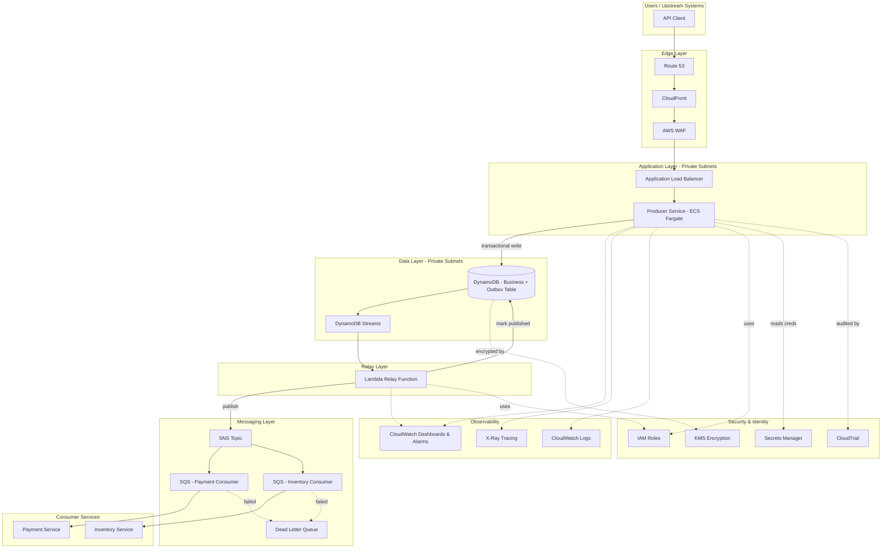

# Part X – Modern Architecture Patterns

# Chapter 81 — Outbox Pattern

---

# 1. Executive Summary

## 1.1 The Business Problem

Enterprise systems that combine a database write with a message publish face a structural reliability gap.

- A service updates a row in its own database (e.g., "Order created").
- The same service must notify other systems (e.g., "OrderCreated" event to SNS/SQS/EventBridge/Kafka).
- These are two separate network calls to two separate systems.
- There is no native transaction that spans a relational database and a message broker.

This gap is known in distributed systems literature as the **dual-write problem**. It shows up constantly in:

- E-commerce order processing (order saved, but payment event never published).
- Banking ledger updates (balance updated, but downstream fraud-detection event lost).
- Inventory management (stock decremented, but warehouse-sync event dropped).
- SaaS billing (subscription changed in the database, but billing-system webhook never fired).

If the database commit succeeds and the message publish fails (network blip, broker outage, throttling, service crash between the two calls), the system silently drifts out of sync. Conversely, if the message is published first and the database commit later fails or rolls back, downstream systems react to an event that never actually happened. Both failure modes are extremely difficult to detect in production because there is no error thrown, no stack trace, and no alarm — just quiet, cumulative data inconsistency that surfaces weeks later as a finance reconciliation discrepancy or a customer support ticket.

## 1.2 Architecture Objective

The Outbox Pattern eliminates the dual-write problem by making the message **part of the same local database transaction** as the business data change.

Core mechanics:

- The service writes the business row (e.g., `orders`) and an **outbox row** (e.g., `outbox_events`) in a single ACID transaction, in the same database.
- A separate, independent process — a **relay** — reads unpublished rows from the outbox table and publishes them to the message broker.
- Once publishing is confirmed, the relay marks the row as published (or deletes it).
- If the relay crashes mid-publish, it resumes from the last unpublished row on restart. Duplicate delivery is possible (at-least-once), but message *loss* is not.

The objective is not "publish a message." The objective is: **guarantee that a business state change and its corresponding event notification either both happen or neither happens**, without requiring a distributed transaction coordinator (2PC), which does not exist for most managed AWS messaging services and which does not scale well even where it does exist.

## 1.3 Why Organizations Adopt This Architecture

Organizations adopt the Outbox Pattern when they discover — usually the hard way — that "just publish after you commit" is not good enough for systems where correctness matters.

Typical triggers for adoption:

- A postmortem reveals a lost event caused a financial reconciliation mismatch.
- An audit or compliance review requires provable, gapless event trails (SOX, PCI-DSS, HIPAA).
- The organization migrates from a monolith to microservices and discovers that synchronous REST calls between services create tight coupling and cascading failures, so they move to asynchronous, event-driven communication instead.
- A CQRS or Event Sourcing initiative requires a reliable way to publish domain events out of a write-optimized store.
- A Saga-based distributed transaction implementation (see Chapter 80) requires guaranteed step-completion events to drive the saga forward.

## 1.4 Major Business Benefits

- **Data consistency across services.** Downstream systems can trust that if they receive an event, the corresponding state change is durably committed upstream — and if a state change was committed, the event *will* eventually arrive.
- **Reduced manual reconciliation effort.** Finance, operations, and support teams stop chasing "why didn't inventory update" tickets caused by silently dropped messages.
- **Improved auditability.** The outbox table is itself an append-only, timestamped ledger of every business event the service ever produced, which is valuable for compliance and debugging independent of the message broker's own retention window.
- **Decoupling without fragility.** Producers do not need the message broker to be available at the moment of the business transaction; the relay handles delivery asynchronously and can retry indefinitely.
- **Foundation for other patterns.** The Outbox Pattern is a prerequisite building block for reliable Saga orchestration, Event Sourcing projections, and CQRS read-model synchronization — patterns covered elsewhere in this Part.

## 1.5 Typical Enterprise Scenarios

| Scenario | Why Outbox Is Needed |
|---|---|
| Order Management System | Order creation must reliably trigger payment, inventory, and shipping events |
| Core Banking Ledger | Balance changes must reliably trigger fraud detection, notification, and reporting events |
| SaaS Billing Platform | Subscription state changes must reliably trigger invoicing and usage-metering events |
| Healthcare Records System | Patient record updates must reliably trigger HL7/FHIR downstream sync events, with an audit trail |
| Insurance Claims Processing | Claim status transitions must reliably drive a Saga across underwriting, payment, and fraud services |
| Retail Inventory | Stock adjustments must reliably propagate to warehouse, storefront, and analytics systems |

> **Note:** The Outbox Pattern is a *messaging reliability* pattern, not a performance or scaling pattern. It does not make your system faster; it makes your system **correct** under partial failure. Organizations that adopt it purely for perceived scalability benefits are usually solving the wrong problem — see Section 27 (Anti-Patterns) and Section 34 (Architect's Corner).

---

# 2. Business Requirements

## 2.1 Business Drivers

- Eliminate silent data loss between service writes and downstream event notifications.
- Provide an auditable, replayable record of every domain event produced by a service.
- Support eventual consistency across microservices without introducing distributed transactions.
- Enable reliable Saga step-completion signaling for long-running business processes.
- Reduce incident volume caused by "database says X, but downstream system says Y."

## 2.2 Functional Requirements

- Every state-changing business transaction that has downstream interested parties must produce exactly one outbox row per event, written atomically with the business data.
- The relay process must deliver every outbox row to the message broker at least once.
- The relay must preserve event ordering per aggregate (e.g., per `order_id`) where downstream consumers depend on ordering.
- Consumers must be able to detect and safely discard duplicate deliveries (idempotency).
- Outbox rows must carry enough metadata (event type, aggregate ID, schema version, timestamp, trace ID) for consumers to process and for operators to audit.

## 2.3 Non-Functional Requirements

| Category | Requirement |
|---|---|
| Scalability | Support 500–5,000 business transactions/second at enterprise scale, each producing 1–3 outbox events |
| Availability | Relay process must have no single point of failure; target 99.95%+ |
| Latency | End-to-end (commit → downstream delivery) target under 2 seconds at p99 for near-real-time use cases; batch use cases can tolerate seconds-to-minutes |
| Compliance | Full audit trail retained per regulatory requirement (7 years for financial records is common) |
| Security | Outbox rows containing PII must be encrypted at rest and access-controlled equivalently to the source business table |
| Recovery | No message loss under relay crash, broker outage, or database failover |
| SLA | 99.9% of events delivered within latency target; 100% eventually delivered (excluding data-retention expiry) |

## 2.4 Scalability Goals

- Outbox table write throughput must scale with the parent business table — it is written in the same transaction, so it inherits the parent table's scaling characteristics (see Section 14).
- Relay read/publish throughput must be independently scalable from the producer, since a backlog should never block business transactions from committing.

## 2.5 Availability Requirements

- The business transaction (order write + outbox write) must not depend on the message broker being reachable. This is the entire point of the pattern — outbox writes are local database writes, not network calls to the broker.
- The relay itself should run in at least two Availability Zones (if EC2/ECS-based) or as a managed, inherently multi-AZ service (Lambda + DynamoDB Streams, or Aurora + trigger-based CDC).

## 2.6 Latency Requirements

- Near-real-time domains (fraud detection, payment authorization): sub-second to low-single-digit-second relay latency.
- Standard domains (order fulfillment, inventory sync): 1–5 second relay latency is generally acceptable.
- Batch/reporting domains: minute-level latency is acceptable, and batching relay reads reduces cost.

## 2.7 Compliance Requirements

- SOX: immutable, timestamped record of financial state-change events.
- PCI-DSS: no raw cardholder data in outbox payloads; use tokenized references.
- HIPAA: outbox rows containing PHI must be encrypted at rest (KMS) and access-logged (CloudTrail).
- GDPR: outbox payloads containing personal data must support right-to-erasure workflows; avoid storing personal data directly in the outbox where a reference/pointer will do.

## 2.8 Recovery Objectives

| Metric | Target |
|---|---|
| RPO (Recovery Point Objective) | Zero — outbox rows are committed transactionally with business data; no acceptable data loss window |
| RTO (Recovery Time Objective) | Under 5 minutes for relay process recovery (auto-restart / failover); business writes are unaffected by relay downtime |

## 2.9 Expected Workload and Growth

- Initial: hundreds of transactions/second, single-region.
- 12–24 month growth: low thousands of transactions/second, potential multi-region expansion.
- Outbox table growth is bounded by retention/cleanup policy (Section 6.3), not by raw transaction volume, since published rows are archived or deleted on a schedule.

---

# 3. Architecture Overview

## 3.1 Overall Design

The Outbox Pattern architecture has three logical parts:

1. **Producer service** — the microservice that owns the business data and writes both the business row and the outbox row in one local transaction.
2. **Outbox table** — a table in the producer's own database, never shared or written to by other services.
3. **Relay (message relay / outbox poller)** — an independent process that reads unpublished outbox rows and publishes them to a broker, then marks them published.

The relay can be implemented two ways, and enterprise architectures typically pick one deliberately rather than defaulting:

- **Polling relay:** a scheduled process (Lambda on a timer, or an ECS task) periodically queries `WHERE published = false ORDER BY created_at`, publishes, and updates status. Simple, portable, but adds polling latency and database read load.
- **Change Data Capture (CDC) relay:** a stream-based process (DynamoDB Streams, Aurora/RDS with Debezium via MSK Connect, or DMS) reacts to inserts on the outbox table in near real time and publishes immediately. Lower latency, lower database load, but higher operational complexity.

This chapter documents both, with CDC as the primary recommended approach for AWS-native architectures using DynamoDB or Aurora, and polling as the recommended fallback for RDS engines without practical CDC tooling or for teams prioritizing operational simplicity over latency.

## 3.2 Architecture Philosophy

- **Single source of truth per transaction boundary.** The business table and the outbox table live in the same database and the same transaction. This is the non-negotiable core of the pattern — if the outbox write is not atomic with the business write, the pattern provides no guarantee at all.
- **At-least-once, not exactly-once, delivery.** The pattern guarantees delivery, not deduplication. Idempotent consumers are a required companion, not optional.
- **Relay is stateless and disposable.** The relay holds no state beyond "what has been published," which is itself stored in the outbox table (a `published_at` column or a separate cursor). Any relay instance can crash and be replaced without data loss.
- **Ordering is per-aggregate, not global.** Enterprise architects should explicitly decide whether cross-aggregate ordering matters (it usually doesn't) and design partition keys (SQS FIFO group ID, Kafka partition key, EventBridge ordering key where supported) around the aggregate ID, not a global sequence.

## 3.3 Core Components

| Component | Role |
|---|---|
| Producer service (compute) | Executes business logic, writes business + outbox rows transactionally |
| Database (RDS/Aurora/DynamoDB) | Hosts business table and outbox table with ACID or single-item transactional guarantees |
| Relay | Reads unpublished outbox rows, publishes to broker, marks as published |
| Message broker (SNS/SQS/EventBridge/MSK) | Delivers events to downstream consumers |
| Dead-letter queue (DLQ) | Captures events that fail repeated delivery attempts |
| Consumers | Downstream services that process events idempotently |
| Monitoring (CloudWatch) | Tracks outbox backlog depth, relay lag, publish failures |
| Cleanup/archival job | Removes or archives published outbox rows past retention |

## 3.4 How Components Interact (High-Level Workflow)

```mermaid

flowchart LR
    A[Client Request] --> B[Producer Service]
    B --> C{(DB Transaction)}
    C --> D[(Business Table)]
    C --> E[(Outbox Table)]
    E --> F[Relay Process]
    F --> G[Message Broker]
    G --> H[Consumer 1]
    G --> I[Consumer 2]
    G --> J[Consumer N]
    F --> K[(Outbox: mark published)]
    G -.failed delivery.-> L[Dead Letter Queue]

```

## 3.5 Request Lifecycle

1. Client sends request to producer service (e.g., "create order").
2. Producer opens a single database transaction.
3. Producer inserts/updates the business row.
4. Producer inserts a corresponding outbox row within the same transaction.
5. Transaction commits — both rows are durable together, or neither is.
6. Producer returns success to the client. **The client does not wait for the event to be delivered.**

## 3.6 Response Lifecycle

- The client-facing response is decoupled entirely from message delivery. This is intentional: it keeps the producer's response latency low and independent of broker health.
- If the transaction commit fails, the client receives an error and no outbox row exists — no inconsistency is possible.

## 3.7 Data Lifecycle

1. Outbox row created (`published = false`).
2. Relay picks it up (poll or CDC trigger).
3. Relay publishes to broker.
4. On broker acknowledgment, relay marks row `published = true` with a `published_at` timestamp.
5. A scheduled cleanup job archives or deletes published rows older than the retention window (commonly 7–30 days for operational debugging, longer if the outbox doubles as an audit log).
6. If publish fails, the row remains `published = false` and is retried on the next relay cycle, with exponential backoff tracked via an `attempt_count` column.

---

# 4. AWS Services Used

## 4.1 Compute

### EC2 / ECS Fargate (Producer Service Host)

- **Purpose:** Hosts the producer microservice that executes business logic and writes to the database.
- **Why selected:** ECS Fargate is preferred for new enterprise builds — no server patching burden, scales per-task, integrates natively with IAM task roles for least-privilege database and broker access.
- **Alternatives:** EKS (if the organization already standardizes on Kubernetes), EC2 Auto Scaling Groups (if long-running, stateful, or licensing-constrained workloads require it), Lambda (if the producer logic is itself event-driven and short-lived).
- **Limitations:** Fargate task startup latency (seconds) can matter for very bursty, latency-sensitive producers; EC2 gives more control but adds patching/AMI management overhead.
- **Pricing considerations:** Fargate is billed per vCPU/memory-second; for steady, predictable load, EC2 Reserved Instances or Savings Plans are often cheaper than Fargate on-demand.
- **Best practices:** Right-size task CPU/memory from CloudWatch Container Insights data; use Fargate Spot for non-critical batch relay workers.

### AWS Lambda (Relay Process)

- **Purpose:** Executes the relay logic — either on a schedule (polling relay) or triggered by DynamoDB Streams (CDC relay).
- **Why selected:** Lambda is the natural fit for the relay because the relay's workload is bursty, event-driven, and stateless — exactly Lambda's sweet spot. No idle compute cost between outbox writes.
- **Alternatives:** ECS Fargate scheduled task (better for very high-throughput relays needing longer-than-15-minute execution or persistent connections); self-managed Debezium on ECS/EKS (better for RDS/Aurora CDC where DynamoDB Streams isn't applicable).
- **Limitations:** 15-minute maximum execution time; cold starts can add latency for infrequently invoked relays; concurrent execution limits need monitoring under bursty backlogs.
- **Pricing considerations:** Pay-per-invocation and duration; for a CDC-triggered relay processing thousands of small batches, cost is typically a small fraction of a comparable always-on EC2/ECS relay.
- **Best practices:** Batch DynamoDB Stream records (up to the configured batch size) per invocation rather than one record per invocation; set a reasonable `ReportBatchItemFailures` configuration so a single bad record doesn't block the whole batch.

## 4.2 Database

### Amazon DynamoDB (Recommended for New Builds)

- **Purpose:** Hosts both the business table and the outbox table (or a single-table design combining both), with native, low-latency transactional writes.
- **Why selected:** `TransactWriteItems` provides atomic multi-item writes across the business item and the outbox item in a single API call — this is the cleanest native implementation of the Outbox Pattern on AWS, and DynamoDB Streams provides a built-in, ordered, exactly-once-per-shard CDC mechanism to drive the relay without any third-party CDC tooling.
- **Alternatives:** Aurora PostgreSQL/MySQL (better if the domain is inherently relational with complex joins/reporting needs); DynamoDB is preferred specifically when the access pattern is key-based and the team wants to avoid operating a CDC tool like Debezium.
- **Limitations:** `TransactWriteItems` is capped at 100 items and 4MB per transaction (sufficient for outbox use, since it's typically 2 items); DynamoDB is not ideal for complex ad hoc queries or reporting joins.
- **Pricing considerations:** On-demand capacity mode is recommended for unpredictable producer workloads; provisioned capacity with auto scaling is cheaper at steady, well-understood volume. DynamoDB Streams reads are billed separately but are inexpensive relative to table throughput costs.
- **Best practices:** Use a single-table design with the outbox items sharing the same partition key space pattern (e.g., `PK=ORDER#123`, `SK=OUTBOX#<ulid>`) so the transactional write touches one partition efficiently; enable point-in-time recovery (PITR).

### Amazon Aurora (PostgreSQL/MySQL Compatible)

- **Purpose:** Hosts the business and outbox tables for relational domains requiring complex queries, joins, or existing relational schemas.
- **Why selected:** Full ACID transactions across arbitrary numbers of tables via standard SQL `BEGIN/COMMIT`; mature ecosystem (ORMs, migration tools); Aurora's storage layer replicates across 3 AZs automatically.
- **Alternatives:** RDS for PostgreSQL/MySQL (cheaper at small scale, but lacks Aurora's storage auto-scaling and faster failover); DynamoDB (preferred for pure key-value access patterns at very high scale).
- **Limitations:** CDC on Aurora requires either logical replication (PostgreSQL) or binlog (MySQL) plus a CDC tool (Debezium via MSK Connect, or AWS DMS) — this adds real operational surface area compared to DynamoDB Streams.
- **Pricing considerations:** Aurora I/O-Optimized storage class is often cheaper than standard Aurora storage for write-heavy outbox workloads (outbox tables are insert-heavy); factor in Aurora Serverless v2 for spiky producer workloads to avoid paying for idle capacity.
- **Best practices:** Add a composite index on `(published, created_at)` on the outbox table to keep polling-relay queries fast as the table grows; partition or periodically archive published rows to keep the index small.

## 4.3 Messaging

### Amazon SNS

- **Purpose:** Fan-out event distribution to multiple downstream subscribers (SQS queues, Lambda, HTTPS endpoints).
- **Why selected:** Native pub/sub semantics matching the "many services care about this one event" shape typical of outbox-published domain events.
- **Alternatives:** EventBridge (preferred when consumers need content-based filtering across many event types, or when the architecture spans many AWS accounts); Kafka/MSK (preferred at very high throughput or when consumers need to replay/rewind an event log).
- **Limitations:** No built-in content filtering as rich as EventBridge's pattern matching (SNS filter policies are simpler); no long-term replay — SNS does not retain messages.
- **Pricing considerations:** Charged per request and per notification delivered; fan-out to many subscribers multiplies delivery cost — monitor for over-fanning.
- **Best practices:** Use SNS FIFO topics with a message group ID equal to the aggregate ID when per-aggregate ordering matters; combine with SQS FIFO subscriptions for guaranteed ordered, exactly-once-processing consumption.

### Amazon SQS

- **Purpose:** Durable, ordered (FIFO) or high-throughput (Standard) queue that decouples the relay's publish rate from each consumer's processing rate.
- **Why selected:** Provides built-in retry, visibility timeout, and DLQ support — essential for at-least-once delivery semantics that outbox consumers must handle.
- **Alternatives:** EventBridge (if routing logic is complex); direct Lambda-to-Lambda invocation (not recommended — no durability if the downstream Lambda is unavailable).
- **Limitations:** FIFO queues cap throughput at 3,000 messages/second with batching (300/sec without); Standard queues can deliver duplicates and out-of-order messages, which is fine if consumers are idempotent and order-agnostic.
- **Pricing considerations:** Charged per request; batching (`SendMessageBatch`, long polling) significantly reduces cost at scale.
- **Best practices:** Always attach a DLQ with a `maxReceiveCount` (commonly 3–5) so poison messages don't loop forever; alarm on DLQ depth > 0.

### Amazon EventBridge

- **Purpose:** Central event bus with content-based routing rules, ideal when many different consumers care about different subsets of outbox-published events, or when routing spans multiple AWS accounts/organizations.
- **Why selected:** Schema Registry integration and rule-based filtering reduce the amount of custom routing logic each consumer needs to write.
- **Alternatives:** SNS (simpler, cheaper at small consumer counts); Kafka/MSK (better for very high throughput streaming and replay).
- **Limitations:** At-least-once delivery like SNS/SQS — not exactly-once; event size limit (256KB) — large payloads should be replaced with a pointer to S3.
- **Pricing considerations:** Billed per event published and per rule invocation matched; costs scale with the number of matching rules per event, not just event volume.
- **Best practices:** Use a dedicated custom event bus per domain (not the default bus) to isolate blast radius and simplify IAM permissions.

### Amazon MSK (Managed Kafka)

- **Purpose:** High-throughput, replayable event log — appropriate when the outbox pattern feeds an Event Sourcing or streaming-analytics architecture (see Chapters 48 and 79) rather than simple pub/sub notification.
- **Why selected:** Consumers can replay from any offset, supporting new consumers joining later and needing full history, which SNS/SQS/EventBridge cannot provide.
- **Alternatives:** SNS/SQS/EventBridge for simpler, lower-volume, non-replay use cases; MSK Serverless to reduce operational burden versus self-managed broker sizing.
- **Limitations:** Higher operational complexity (partition planning, consumer group management, broker sizing) than fully managed pub/sub services.
- **Pricing considerations:** Broker-hour and storage costs for provisioned MSK; MSK Serverless bills per throughput, reducing cost for variable workloads at the expense of some latency predictability.
- **Best practices:** Use MSK Connect with a Debezium connector directly against Aurora/RDS as an alternative CDC relay implementation, bypassing the need for custom Lambda polling code entirely.

## 4.4 Security, Identity, and Supporting Services

| Service | Purpose in This Architecture |
|---|---|
| IAM | Least-privilege roles for producer (DB write only), relay (outbox read + broker publish only) |
| KMS | Encrypts outbox table at rest, especially where payloads contain PII/PHI |
| Secrets Manager | Stores database credentials for producer and relay, with automatic rotation |
| VPC | Isolates database and relay compute in private subnets |
| CloudWatch | Metrics/alarms on outbox backlog depth, relay error rate, DLQ depth |
| CloudTrail | Audit log of all API calls to the message broker and database control plane |
| AWS Config | Continuous compliance checks (e.g., outbox table encryption enabled) |
| Systems Manager | Parameter Store for relay configuration (batch size, polling interval) |

> **Tip:** Only include the AWS services your specific implementation actually uses. A DynamoDB-based outbox with Lambda/DynamoDB Streams/SNS does not need MSK, Aurora, or DMS — resist the temptation to add services "for completeness." Architectural minimalism is itself a best practice (see Section 26).

---

# 5. Complete Architecture Diagram



---

# 6. Component-by-Component Explanation

## 6.1 Producer Service

- **Purpose:** Owns business logic and is the only writer to the business table and outbox table.
- **Responsibilities:** Validate input, execute domain logic, write business row + outbox row atomically, return response to caller.
- **Inputs:** API requests (HTTP/gRPC) or internal service calls.
- **Outputs:** HTTP response to caller; outbox rows for the relay to consume.
- **Scaling:** Horizontal, via ECS Service Auto Scaling on CPU/request-count-per-target; stateless, so scaling out is safe.
- **High availability:** Deployed across a minimum of 2 (recommended 3) Availability Zones behind an ALB with health checks.
- **Failure handling:** If the database transaction fails, the request fails cleanly — no partial state, no orphaned outbox row.
- **Dependencies:** Database (hard dependency, synchronous); message broker (no dependency — this is the point of the pattern).
- **Security:** IAM task role scoped to `dynamodb:TransactWriteItems` (or equivalent RDS IAM auth) on specific tables only; no broker publish permissions needed on the producer.
- **Monitoring:** Request latency, error rate, transaction commit failures, via CloudWatch and X-Ray.

## 6.2 Outbox Table

- **Purpose:** Durable, transactional staging area for events awaiting delivery.
- **Responsibilities:** Store event payload, type, aggregate ID, status, timestamps, retry count.
- **Inputs:** Rows written exclusively by the producer, within the same transaction as the business write.
- **Outputs:** Rows read exclusively by the relay.
- **Scaling:** Inherits the parent database's scaling; for DynamoDB, on-demand mode absorbs bursty producer traffic automatically.
- **High availability:** Same HA characteristics as the underlying database (Multi-AZ RDS/Aurora, or DynamoDB's inherent multi-AZ replication).
- **Failure handling:** Rows that fail to publish remain `published = false` indefinitely until successfully relayed or manually intervened upon (after alarming).
- **Dependencies:** None beyond the database engine itself.
- **Security:** Same encryption and access controls as the business table it accompanies; access restricted to producer (write) and relay (read/update) roles only.
- **Monitoring:** Row count where `published = false` older than N minutes (backlog alarm); table throttling metrics.

### Example Outbox Row Schema

| Column | Type | Purpose |
|---|---|---|
| `event_id` | UUID/ULID | Unique event identifier, used for consumer-side deduplication |
| `aggregate_id` | String | ID of the business entity (e.g., `order_id`), used for ordering/partitioning |
| `event_type` | String | e.g., `OrderCreated`, `OrderCancelled` |
| `payload` | JSON | Event body (avoid large blobs — use S3 pointer if > 200KB) |
| `created_at` | Timestamp | When the business transaction committed |
| `published` | Boolean | Relay delivery status |
| `published_at` | Timestamp (nullable) | When the relay confirmed delivery |
| `attempt_count` | Integer | Retry tracking for backoff and DLQ escalation |
| `trace_id` | String | Distributed tracing correlation ID |

## 6.3 Relay Process

- **Purpose:** Bridge between the outbox table and the message broker.
- **Responsibilities:** Detect new/unpublished rows, publish to broker, mark as published, handle retries and backoff, escalate persistent failures.
- **Inputs:** DynamoDB Streams records (CDC mode) or scheduled query results (polling mode).
- **Outputs:** Messages published to SNS/SQS/EventBridge/MSK; status updates back to the outbox table.
- **Scaling:** Lambda scales concurrency automatically with stream shard count (CDC) or can run multiple scheduled invocations in parallel with row-level locking (polling).
- **High availability:** Lambda is inherently multi-AZ; no additional HA configuration required.
- **Failure handling:** On publish failure, the record is retried per Lambda's built-in retry behavior (CDC) or left `published = false` for the next poll cycle; after `attempt_count` exceeds threshold, route to a manual-review DLQ.
- **Dependencies:** Outbox table (read/write), message broker (write).
- **Security:** IAM role scoped to `dynamodb:GetRecords` on the specific stream ARN and `sns:Publish`/`sqs:SendMessage` on specific topic/queue ARNs only.
- **Monitoring:** Iterator age (CDC lag), invocation error rate, publish failure count, DLQ depth.

## 6.4 Cleanup / Archival Job

- **Purpose:** Prevent unbounded outbox table growth.
- **Responsibilities:** Periodically delete or archive rows where `published = true` and `published_at` is older than the retention window.
- **Inputs:** Scheduled EventBridge rule (e.g., daily).
- **Outputs:** Archived rows in S3 (if long-term audit retention is required) or deleted rows.
- **Scaling:** Batch job; scales with table size, run during low-traffic windows.
- **Dependencies:** Outbox table, optionally S3 for archival.
- **Security:** IAM role scoped to delete/export on the outbox table only.
- **Monitoring:** Job success/failure, rows archived/deleted count.

---

# 7. End-to-End Request Flow

1. **Client** sends `POST /orders` to create a new order.
2. **Route 53** resolves the API domain to CloudFront.
3. **CloudFront** forwards the request to the regional ALB (with AWS WAF inspecting for common web exploits at the edge).
4. **Application Load Balancer** routes the request to a healthy Producer Service task in a private subnet.
5. **Producer Service** validates the request payload and business rules.
6. **Producer Service** opens a DynamoDB `TransactWriteItems` call (or a SQL transaction on Aurora) containing:
   - Put/Update on the `orders` business item.
   - Put on the `outbox` item with `event_type = OrderCreated`.
7. **Database** commits the transaction atomically — both items persist together, or the entire call fails and neither persists.
8. **Producer Service** returns `201 Created` to the client — **the client's response does not wait for message delivery.**
9. **DynamoDB Streams** emits a change record for the new outbox item within roughly one second.
10. **Lambda Relay** is invoked with a batch of stream records.
11. **Lambda Relay** filters for outbox-item inserts, constructs the event payload, and calls `sns:Publish`.
12. **SNS Topic** fans the event out to subscribed SQS queues (one per interested downstream service).
13. **Lambda Relay** marks the outbox row `published = true` after confirmed SNS delivery.
14. **SQS Consumer** (e.g., Payment Service) polls its queue, receives the event, and processes it idempotently (checking `event_id` against a processed-events table before acting).
15. **Consumer** deletes the message from its queue on successful processing.
16. **On consumer failure:** SQS retries delivery up to `maxReceiveCount`, then routes the message to the **Dead Letter Queue** for manual investigation.
17. **CloudWatch** records latency, error, and backlog metrics at every stage; **X-Ray** traces the request from ALB through to SNS publish using the `trace_id` propagated in the outbox payload.
18. **CloudTrail** logs all control-plane API calls (e.g., IAM role assumption, KMS decrypt calls) for audit purposes.

> **Warning:** Step 8 is the crux of the entire pattern. If a producer is refactored later to "just call SNS directly for speed," the durability guarantee is silently destroyed. This should be enforced with a code review checklist item and, ideally, an architecture fitness test (Section 20) that fails the build if direct broker calls are introduced into producer code.

---

# 8. Deployment Flow

## 8.1 Infrastructure Provisioning

- All infrastructure (DynamoDB tables, Streams, Lambda functions, SNS/SQS resources, IAM roles, VPC networking) is provisioned via Terraform, never manually through the console, to guarantee reproducibility across environments (dev/staging/production) and AWS accounts.

## 8.2 Terraform Workflow

1. Developer writes/modifies `.tf` files in a feature branch.
2. `terraform fmt` and `terraform validate` run locally or in a pre-commit hook.
3. Pull request triggers CI: `terraform plan` output posted as a PR comment for review.
4. Reviewer approves; merge to main.
5. CI/CD pipeline runs `terraform apply` against the target environment using a dedicated deployment IAM role (never long-lived developer credentials).
6. Terraform state is stored remotely in S3 with DynamoDB state locking to prevent concurrent-apply corruption.

## 8.3 CI/CD Deployment (Application Code)

1. Application code merged to main triggers a container build (producer service) and a Lambda deployment package build (relay).
2. Images pushed to Amazon ECR; Lambda packages uploaded to S3.
3. Automated tests run: unit tests, integration tests against a local DynamoDB instance, and a dedicated "outbox atomicity test" that intentionally kills the process mid-transaction to confirm no partial writes occur.
4. On success, deployment proceeds to staging, then production, gated by manual approval for production.

## 8.4 Blue-Green Deployment

- ECS supports blue-green deployment natively via CodeDeploy: a new task set is stood up alongside the old one, traffic is shifted gradually (e.g., 10% → 100% over 15 minutes) while CloudWatch alarms monitor error rate.
- Lambda relay functions use **versioned aliases** with weighted traffic shifting (e.g., `$LATEST` gets 10% of stream-triggered invocations initially) to validate new relay logic before full cutover.

## 8.5 Rollback

- ECS/CodeDeploy: automatic rollback triggered if configured CloudWatch alarms breach threshold during the traffic shift.
- Lambda: alias weight reverted to 0% on the new version if error rate spikes; the previous version remains fully deployed and immediately active.
- Database schema changes to the outbox table follow expand-contract migration: new columns are additive and nullable first, backfilled, then made required in a later, separate deployment — never a single breaking migration.

## 8.6 Secrets

- Database credentials (for Aurora/RDS-based implementations) are stored in Secrets Manager with automatic rotation every 30–90 days; the producer service retrieves credentials at startup via IAM task role, never via hardcoded configuration.
- DynamoDB-based implementations avoid this entirely by using IAM authentication instead of static credentials.

## 8.7 Configuration

- Non-secret relay configuration (batch size, polling interval, retry thresholds) is stored in Systems Manager Parameter Store and read at Lambda cold start, allowing tuning without a code redeploy.

## 8.8 Validation

- Post-deployment smoke test: submit a synthetic transaction, confirm the outbox row is created, confirm the relay publishes it, confirm a test consumer receives it — an automated end-to-end canary, run every deployment and on a recurring schedule in production.

---

# 9. Network Topology

## 9.1 VPC and CIDR

- A dedicated VPC per environment (dev/staging/production), CIDR `10.0.0.0/16`, sized for future growth across multiple AZs and subnet tiers.

## 9.2 Subnet Layout

| Subnet Tier | AZ-a | AZ-b | AZ-c | Purpose |
|---|---|---|---|---|
| Public | 10.0.0.0/24 | 10.0.1.0/24 | 10.0.2.0/24 | ALB, NAT Gateways |
| Private (App) | 10.0.10.0/24 | 10.0.11.0/24 | 10.0.12.0/24 | Producer Service (ECS tasks) |
| Private (Data) | 10.0.20.0/24 | 10.0.21.0/24 | 10.0.22.0/24 | Aurora/RDS instances (DynamoDB is regional, not VPC-bound, but VPC endpoints are still used) |

## 9.3 NAT Gateway and Internet Gateway

- One NAT Gateway per AZ (not a single shared NAT Gateway) to avoid a cross-AZ single point of failure and cross-AZ data transfer charges for outbound traffic.
- Internet Gateway attached for public subnet resources (ALB) only; private subnets have no direct internet route.

## 9.4 Transit Gateway

- Used when the producer service in one account needs private connectivity to shared services (e.g., a centralized logging or security account) without VPC peering's N² complexity — relevant once the organization operates a multi-account landing zone (see Chapter 99).

## 9.5 Route Tables

- Public subnet route table: default route to Internet Gateway.
- Private app subnet route table: default route to the AZ-local NAT Gateway.
- Private data subnet route table: no internet route at all; only VPC-local and VPC-endpoint routes.

## 9.6 Network ACLs and Security Groups

- Security Groups (stateful, resource-level) are the primary control: ALB SG allows 443 from `0.0.0.0/0`; Producer Service SG allows traffic only from the ALB SG; Database SG allows traffic only from the Producer Service SG.
- Network ACLs (stateless, subnet-level) provide defense-in-depth, primarily used to explicitly deny known-bad ranges rather than as the primary access control mechanism.

## 9.7 PrivateLink / VPC Endpoints

- Gateway endpoints for DynamoDB and S3 (no cost, avoids NAT Gateway data processing charges for AWS-service traffic).
- Interface endpoints (PrivateLink) for SNS, SQS, Secrets Manager, and KMS so that the producer and relay never traverse the public internet to reach AWS APIs, even indirectly via NAT.

> **Tip:** Adding VPC interface endpoints for SNS/SQS/Secrets Manager/KMS is one of the highest-value, most frequently skipped network hardening steps in outbox architectures — it both improves security posture and reduces NAT Gateway data-processing cost, which is a common line item in Section 16's cost surprises.

## 9.8 Hybrid Connectivity

- If the enterprise has on-premises consumers that need to receive outbox-published events (e.g., a legacy mainframe integration), Direct Connect or Site-to-Site VPN terminates at the Transit Gateway, with the on-prem network reaching SQS/SNS through the same PrivateLink endpoints exposed to the VPC.

---

# 10. Identity and Access

## 10.1 IAM Roles

| Role | Attached To | Key Permissions |
|---|---|---|
| `producer-service-role` | ECS Task | `dynamodb:TransactWriteItems`, `dynamodb:GetItem` on specific table ARN only |
| `relay-lambda-role` | Lambda Function | `dynamodb:GetRecords`, `dynamodb:DescribeStream` on the specific stream ARN; `sns:Publish` on the specific topic ARN; `dynamodb:UpdateItem` on the outbox table |
| `cleanup-job-role` | Scheduled Lambda/ECS Task | `dynamodb:Query`, `dynamodb:DeleteItem`, `s3:PutObject` (for archival) |
| `deployment-role` | CI/CD Pipeline | Scoped Terraform apply permissions, distinct from any runtime role |

## 10.2 IAM Policy Example (Relay Role, Least Privilege)

```json

{
  "Version": "2012-10-17",
  "Statement": [
    {
      "Sid": "ReadOutboxStream",
      "Effect": "Allow",
      "Action": [
        "dynamodb:GetRecords",
        "dynamodb:GetShardIterator",
        "dynamodb:DescribeStream",
        "dynamodb:ListStreams"
      ],
      "Resource": "arn:aws:dynamodb:ap-south-1:111122223333:table/OrdersTable/stream/*"
    },
    {
      "Sid": "MarkOutboxPublished",
      "Effect": "Allow",
      "Action": ["dynamodb:UpdateItem"],
      "Resource": "arn:aws:dynamodb:ap-south-1:111122223333:table/OrdersTable",
      "Condition": {
        "ForAllValues:StringEquals": {
          "dynamodb:Attributes": ["published", "published_at", "attempt_count"]
        }
      }
    },
    {
      "Sid": "PublishEvents",
      "Effect": "Allow",
      "Action": ["sns:Publish"],
      "Resource": "arn:aws:sns:ap-south-1:111122223333:order-events-topic"
    }
  ]
}

```

## 10.3 Resource Policies

- The SNS topic policy explicitly allows only the relay Lambda's execution role to publish, and only specific consumer SQS queue ARNs to subscribe — preventing an unrelated service in the same account from accidentally (or maliciously) subscribing to sensitive business events.

## 10.4 STS and Cross-Account Access

- In multi-account landing zones, consumer accounts assume a cross-account role (via STS `AssumeRole`) scoped only to `sqs:ReceiveMessage`/`sqs:DeleteMessage` on their specific queue, never direct access to the producer's database or outbox table.

## 10.5 Least Privilege in Practice

- The producer role has **no** publish permission on any message broker — architecturally impossible for it to bypass the outbox and dual-write directly, which is a stronger guarantee than a code-review rule alone.
- The relay role has **no** write permission on the business table — it can only update the `published`/`published_at`/`attempt_count` attributes on outbox items, enforced via IAM condition keys where the database technology supports attribute-level conditions (DynamoDB) or via a separate database user with column-level grants (PostgreSQL).

## 10.6 Permission Boundaries

- A permission boundary is attached to all roles in this architecture capping maximum possible permissions (e.g., no `iam:*`, no `dynamodb:DeleteTable`), so that even a misconfigured policy addition during a future change cannot grant destructive or identity-escalating permissions.

---

# 11. Security Architecture

## 11.1 Encryption

- **At rest:** DynamoDB table encryption using a customer-managed KMS key (not the default AWS-owned key) for outbox tables containing PII/PHI, enabling key rotation control and CloudTrail-logged decrypt events.
- **In transit:** TLS 1.2+ enforced on all API calls (DynamoDB, SNS, SQS all use TLS by default); ALB configured with a modern TLS security policy and certificates from AWS Certificate Manager.

## 11.2 WAF and Shield

- AWS WAF attached to CloudFront/ALB with managed rule groups (SQL injection, known bad inputs) protecting the producer's public API endpoint — the outbox and relay internals are never internet-exposed, so WAF's role here is protecting the write path, not the messaging path.
- AWS Shield Standard (automatic, free) provides baseline DDoS protection; Shield Advanced is added if the producer API is a critical, high-visibility public endpoint (e.g., a consumer-facing banking API).

## 11.3 Secrets Manager and Certificate Manager

- Any relational database credentials are stored and rotated via Secrets Manager (Section 8.6).
- ACM issues and auto-renews TLS certificates for the ALB and CloudFront distribution.

## 11.4 GuardDuty, Inspector, Security Hub

- GuardDuty monitors for anomalous API activity (e.g., an unexpected principal attempting `dynamodb:Scan` on the outbox table, which would be unusual for the relay's normal `GetRecords`-based access pattern).
- Inspector scans the producer service's container images for known vulnerabilities before deployment.
- Security Hub aggregates findings from GuardDuty, Inspector, and Config into a single compliance dashboard, mapped against CIS AWS Foundations Benchmark.

## 11.5 CloudTrail and Config

- CloudTrail logs every control-plane call across all components, retained in a centralized, access-restricted logging account (see Chapter 88).
- AWS Config rules continuously verify: outbox table encryption is enabled, no security group allows unrestricted inbound access to the database subnet, and IAM roles have no wildcard resource permissions.

## 11.6 Zero Trust Considerations

- No component in this architecture implicitly trusts network location. The relay's IAM role, not its VPC placement, is what authorizes its DynamoDB Streams read access — even if network segmentation failed, IAM policy is the enforced boundary.
- mTLS between producer and any internal downstream service (outside of the async event path) is recommended for genuinely zero-trust environments (see Chapter 87).

## 11.7 Threat Model

| Threat | Vector | Mitigation |
|---|---|---|
| Direct dual-write bypass | Developer adds direct broker publish call in producer code | IAM denies producer broker publish permission entirely; architecture fitness test in CI |
| Outbox table read by unauthorized service | Overly broad IAM policy | Resource-scoped IAM policies, Config rule audit |
| Event payload tampering in transit | Network-level interception | TLS enforced end-to-end, VPC endpoints avoid public internet transit |
| PII exposure in event payload | Overly verbose event design | Payload minimization; use reference/pointer pattern for sensitive data |
| Relay privilege escalation | Overly broad Lambda execution role | Least-privilege IAM, permission boundary |
| Poison message DoS on consumer | Malformed or malicious event payload | Schema validation at publish time, DLQ isolation, consumer input validation |

---

# 12. High Availability

## 12.1 AZ Failures

- Producer Service: ECS tasks spread across 3 AZs; ALB automatically routes around an unhealthy AZ.
- Database: DynamoDB replicates synchronously across 3 AZs by design; Aurora maintains 6 copies of data across 3 AZs.
- Relay: Lambda is inherently multi-AZ with no configuration required.

## 12.2 Instance Failures

- ECS service scheduler automatically replaces failed tasks; ALB health checks remove unhealthy targets from rotation within seconds.

## 12.3 Regional Failures

- Addressed in Section 13 (Disaster Recovery) — this section covers single-region HA only, which is the default posture for most enterprise outbox implementations unless multi-region is an explicit requirement (see Chapter 98).

## 12.4 Database Failures

- DynamoDB: no failover action required from the application; AWS manages replica promotion transparently.
- Aurora: automatic failover to a reader replica in a different AZ, typically completing in under 30 seconds; the producer service's database driver should have retry logic with exponential backoff to ride out the failover window gracefully.

## 12.5 Load Balancing and Health Checks

- ALB target group health check on a dedicated `/health` endpoint that verifies database connectivity (not just process liveness), so a task that can't reach the database is correctly removed from rotation rather than continuing to receive and fail requests.

## 12.6 Failover

- Relay failover requires no manual action — a new Lambda invocation simply picks up where the last left off, since progress is tracked in the outbox table itself (or the DynamoDB Streams iterator position), not in relay memory.

---

# 13. Disaster Recovery

## 13.1 Backup Strategy

- DynamoDB: Point-in-Time Recovery (PITR) enabled, allowing restoration to any second within the last 35 days; on-demand backups taken before major schema changes.
- Aurora: automated daily snapshots retained per compliance requirement (commonly 7–35 days), plus continuous backup to S3 enabling point-in-time restore.

## 13.2 Cross-Region Replication

- DynamoDB Global Tables replicate the business and outbox tables to a secondary region with typical replication lag under 1 second, supporting a warm-standby or active-active DR posture.
- Aurora Global Database provides cross-region replication with typical lag under 1 second and a documented RTO under 1 minute for managed failover.

## 13.3 DR Strategy Selection

| Strategy | RTO | RPO | Cost | When to Use |
|---|---|---|---|---|
| Backup & Restore | Hours | Up to 24 hours | Lowest | Non-critical internal systems |
| Pilot Light | 10s of minutes | Minutes | Low-Medium | Standard enterprise systems, acceptable brief downtime |
| Warm Standby | Minutes | Seconds | Medium-High | Systems with SLA commitments (recommended default for outbox-based financial/order systems) |
| Multi-Site Active-Active | Near-zero | Near-zero | Highest | Mission-critical, globally distributed systems (Chapter 98) |

- For most enterprise outbox implementations, **Warm Standby** is the recommended default: DynamoDB Global Tables or Aurora Global Database keep a secondary region's database current; the relay and producer compute stack is deployed but scaled to minimal capacity in the secondary region, ready to scale up on failover.

## 13.4 RPO/RTO for This Architecture

| Component | RPO | RTO |
|---|---|---|
| Business + Outbox Data (DynamoDB Global Tables) | Under 1 second (typical replication lag) | Under 1 minute (Global Tables remain readable/writable in secondary region) |
| Relay Compute | N/A (stateless) | Minutes (scale-up time for standby Lambda/ECS capacity) |
| Message Broker (SNS/SQS regional) | N/A — in-flight messages during a regional failure may need replay from outbox `published=false` rows | Minutes (redeploy broker infrastructure via Terraform in secondary region if not already provisioned) |

> **Note:** Because the outbox table itself is the durable source of truth, a full regional failover can always **replay** unpublished (and even recently published, if idempotent) events from the outbox table once the relay resumes in the secondary region — this is a significant DR advantage the Outbox Pattern provides over architectures that publish directly without a durable staging table.

---

# 14. Scalability

## 14.1 Horizontal Scaling (Producer)

- ECS Service Auto Scaling on target-tracking policies (e.g., 60% average CPU, or ALB request count per target) adds/removes tasks within the configured min/max bounds.

## 14.2 Vertical Scaling

- Rarely needed for the producer given horizontal scaling is preferred; may apply to Aurora instance class sizing for CPU-bound query workloads unrelated to the outbox write path itself.

## 14.3 Database Scaling

- DynamoDB on-demand mode absorbs unpredictable spikes automatically, at a per-request cost premium over provisioned capacity; switch to provisioned with auto scaling once traffic patterns stabilize and cost optimization becomes a priority (see Section 16).
- Aurora Serverless v2 scales ACUs (Aurora Capacity Units) in fine-grained increments in response to load, avoiding both over-provisioning and connection-storm issues associated with traditional read-replica scaling.

## 14.4 Relay Scaling

- Lambda (CDC mode) scales concurrency automatically in proportion to DynamoDB Stream shard count; a hot partition producing a very high write rate may require increasing the table's shard count (indirectly, by ensuring good partition key cardinality) to increase parallelism.
- Polling-mode relays (Aurora/RDS) scale by increasing the number of parallel poller workers, each claiming a non-overlapping slice of unpublished rows via `SELECT ... FOR UPDATE SKIP LOCKED` (PostgreSQL) to avoid double-processing.

## 14.5 Queue Scaling

- SQS scales transparently with no configuration; FIFO queue throughput (3,000 msg/sec with batching) is the practical ceiling per message group — if a single aggregate ID (message group) becomes a hot spot, reconsider whether strict per-aggregate ordering is actually required for that event type.

## 14.6 Storage Scaling

- Outbox table storage growth is controlled by the cleanup/archival job (Section 6.4); without it, storage costs and query/scan performance degrade over time as the table accumulates historical published rows indefinitely.

---

# 15. Performance Optimization

## 15.1 Caching

- Not typically applicable to the write path itself (outbox writes must always hit the primary database for durability), but consumer-side read models built from consumed events are excellent caching candidates (see Chapter 78, CQRS).

## 15.2 Compression

- Large event payloads (rare, since payload minimization is a best practice) can be gzip-compressed before publishing to SNS/SQS to reduce cost and improve consumer download time; ensure consumers decompress correctly and this doesn't complicate schema evolution.

## 15.3 Database Optimization

- Index the outbox table specifically to support the relay's access pattern: `(published, created_at)` for polling relays; DynamoDB Streams require no additional indexing since it reads the change log directly.
- Keep outbox payloads small — large JSON blobs slow down both the transactional write and the relay's read/publish cycle; use S3 pointer references for payloads exceeding roughly 200KB.

## 15.4 Connection Pooling

- For Aurora-based implementations, use RDS Proxy in front of the relay's polling connections to avoid connection exhaustion under Lambda's concurrent-invocation scaling model, which can otherwise open far more database connections than a traditional always-on connection pool would.

## 15.5 Concurrency and Async Processing

- The entire pattern is fundamentally asynchronous by design between the producer's response and the relay's delivery — this is the primary performance benefit: producer p99 latency is bounded by the local database transaction only, never by broker or downstream consumer latency.

---

# 16. Cost Optimization (FinOps)

## 16.1 Estimated Monthly Cost by Deployment Size

*(ap-south-1 region, illustrative on-demand pricing; validate against current AWS Pricing Calculator for exact figures)*

| Component | Small (100 TPS) | Medium (1,000 TPS) | Enterprise (5,000 TPS) |
|---|---|---|---|
| ECS Fargate (Producer, 3 tasks avg) | $150 | $600 | $2,500 |
| DynamoDB (on-demand, business+outbox) | $200 | $1,800 | $8,500 |
| Lambda (Relay, CDC-triggered) | $20 | $150 | $600 |
| SNS + SQS | $30 | $250 | $1,100 |
| NAT Gateway (3 AZ) + VPC Endpoints | $100 | $130 | $180 |
| CloudWatch (Logs, Metrics, Alarms) | $50 | $300 | $1,200 |
| KMS, Secrets Manager | $10 | $15 | $25 |
| **Estimated Total** | **~$560/mo** | **~$3,245/mo** | **~$14,105/mo** |

## 16.2 Major Cost Drivers

- **DynamoDB write throughput** is typically the single largest cost line, since every business transaction now performs two writes (business item + outbox item) instead of one — a roughly 2x write-cost increase versus a naive non-outbox design, which is the direct cost of the durability guarantee and should be communicated explicitly to stakeholders during architecture approval.
- **CloudWatch Logs** at high verbosity (debug-level logging left enabled in production) is a frequent, avoidable cost surprise (see Section 34.8).
- **NAT Gateway data processing** if VPC endpoints (Section 9.7) are not used for AWS service traffic.

## 16.3 Optimization Opportunities

- Switch DynamoDB from on-demand to provisioned capacity with auto scaling once traffic patterns are well understood (typically 3–6 months post-launch) — often a 30–40% cost reduction at steady state.
- Use Lambda Reserved Concurrency judiciously to avoid runaway cost during backlog-processing bursts (e.g., after an extended broker outage causes a large replay).
- Set CloudWatch Logs retention explicitly (default is "never expire," which silently accumulates cost) — 30–90 days is typical for operational logs, with audit-relevant logs exported to cheaper S3 storage.

## 16.4 Reserved Instances, Savings Plans, and Spot

- Compute Savings Plans covering the producer service's baseline Fargate usage (1-year, no upfront) typically yield 15–20% savings over on-demand for predictable steady-state load.
- Fargate Spot is appropriate for the cleanup/archival batch job (Section 6.4), which is fault-tolerant and not latency-sensitive, but is **not** appropriate for the producer service itself given interruption risk on a customer-facing write path.

## 16.5 S3 Lifecycle and Storage Classes

- Archived outbox rows (Section 6.4) land in S3 Standard initially, transition to S3 Standard-IA after 30 days, and Glacier Deep Archive after 1 year if retained purely for compliance rather than active debugging.

## 16.6 Rightsizing

- Review ECS task CPU/memory allocation quarterly against Container Insights utilization data; over-provisioned producer tasks are a common, easily corrected cost surprise.

## 16.7 Cost Allocation, Tagging, and Budgets

- Mandatory tags: `environment`, `service`, `cost-center`, `data-classification` on every resource, enforced via AWS Config's required-tags rule.
- AWS Budgets alerts configured per environment with 80%/100%/120% thresholds notifying the owning team via SNS-to-Slack integration.
- Cost Anomaly Detection monitors the DynamoDB and Lambda cost categories specifically, since these scale directly with business transaction volume and are the most sensitive early indicators of either legitimate growth or a runaway retry loop.

---

# 17. AI-Assisted Operations

## 17.1 Amazon Q

- Amazon Q Developer assists engineers writing and reviewing the relay's Lambda code, particularly around correctly handling `ReportBatchItemFailures` for partial batch failures from DynamoDB Streams — a subtle area where incorrect implementation silently drops or infinitely retries records.
- Amazon Q Business can be pointed at the architecture's runbooks and this chapter's content to answer on-call engineer questions ("what does it mean if outbox backlog alarm fires?") during an incident without paging a senior architect.

## 17.2 Bedrock for Log Analysis and Incident Response

- A Bedrock-backed analysis tool can summarize a spike in relay error logs, correlate it against recent deployments (via CloudTrail events), and propose a likely root cause (e.g., "IAM policy for relay role was modified 4 minutes before errors began") — reducing mean time to diagnosis for on-call engineers unfamiliar with this specific service.

## 17.3 Cost Optimization and Capacity Planning

- Bedrock-based FinOps assistants can analyze Cost Explorer data alongside DynamoDB CloudWatch metrics to recommend the on-demand-to-provisioned capacity switch point (Section 16.3) based on actual observed traffic variability, rather than a generic rule of thumb.

## 17.4 Architecture Review

- AI-assisted architecture review tools (internal Bedrock-based review bots, or Amazon Q) can be configured to flag anti-patterns automatically during PR review — for example, detecting a new direct `sns:Publish` call added to producer service code, which violates the core outbox invariant (Section 27).

## 17.5 AI-Generated Terraform and Documentation

- AI code generation accelerates writing boilerplate Terraform modules (Section 18) for new outbox-pattern services, but **must** be reviewed against the organization's existing module library and security baseline rather than applied directly — AI-generated IAM policies in particular have a well-documented tendency toward over-permissioning that a human reviewer must catch.

> **Warning:** AI-assisted tooling accelerates implementation but does not replace the architectural discipline of the pattern itself. No AI tool can retroactively fix a producer service that was refactored to bypass the outbox table — that is a code review and CI enforcement problem, not an AI-operations problem.

---

# 18. Terraform Implementation

## 18.1 Providers and Backend

```hcl

# versions.tf

terraform {
  required_version = ">= 1.7.0"

  required_providers {
    aws = {
      source  = "hashicorp/aws"
      version = "~> 5.50"
    }
  }

  backend "s3" {
    bucket         = "acme-terraform-state-prod"
    key            = "outbox-pattern/orders-service/terraform.tfstate"
    region         = "ap-south-1"
    dynamodb_table = "terraform-state-locks"
    encrypt        = true
  }
}

provider "aws" {
  region = var.aws_region

  default_tags {
    tags = {
      Environment = var.environment
      Service     = "orders-outbox"
      ManagedBy   = "terraform"
      CostCenter  = var.cost_center
    }
  }
}

```

## 18.2 Variables

```hcl

# variables.tf

variable "aws_region" {
  description = "AWS region for deployment"
  type        = string
  default     = "ap-south-1"
}

variable "environment" {
  description = "Deployment environment (dev, staging, production)"
  type        = string
}

variable "cost_center" {
  description = "Cost allocation tag value"
  type        = string
}

variable "table_billing_mode" {
  description = "DynamoDB billing mode: PAY_PER_REQUEST or PROVISIONED"
  type        = string
  default     = "PAY_PER_REQUEST"
}

variable "relay_batch_size" {
  description = "Number of stream records per Lambda invocation batch"
  type        = number
  default     = 50
}

variable "outbox_retention_days" {
  description = "Days to retain published outbox rows before archival"
  type        = number
  default     = 30
}

```

## 18.3 DynamoDB Table with Streams (Business + Outbox, Single-Table Design)

```hcl

# dynamodb.tf

resource "aws_kms_key" "orders_table_key" {
  description             = "CMK for orders/outbox table encryption"
  deletion_window_in_days = 30
  enable_key_rotation     = true
}

resource "aws_dynamodb_table" "orders" {
  name         = "orders-${var.environment}"
  billing_mode = var.table_billing_mode
  hash_key     = "PK"
  range_key    = "SK"

  attribute {
    name = "PK"
    type = "S"
  }

  attribute {
    name = "SK"
    type = "S"
  }

  attribute {
    name = "GSI1PK"
    type = "S"
  }

  attribute {
    name = "GSI1SK"
    type = "S"
  }

  global_secondary_index {
    name            = "UnpublishedOutboxIndex"
    hash_key        = "GSI1PK"
    range_key       = "GSI1SK"
    projection_type = "ALL"
  }

  stream_enabled   = true
  stream_view_type = "NEW_AND_OLD_IMAGES"

  point_in_time_recovery {
    enabled = true
  }

  server_side_encryption {
    enabled     = true
    kms_key_arn = aws_kms_key.orders_table_key.arn
  }

  tags = {
    DataClassification = "confidential"
  }
}

```

> **Note:** The `UnpublishedOutboxIndex` GSI is included as a defensive fallback for reconciliation/backfill jobs (Section 25) even though the primary relay path uses DynamoDB Streams — never rely on a single delivery mechanism for something as important as guaranteed event delivery.

## 18.4 Lambda Relay Function

```hcl

# lambda_relay.tf

resource "aws_iam_role" "relay_lambda_role" {
  name = "outbox-relay-lambda-role-${var.environment}"

  assume_role_policy = jsonencode({
    Version = "2012-10-17"
    Statement = [{
      Action    = "sts:AssumeRole"
      Effect    = "Allow"
      Principal = { Service = "lambda.amazonaws.com" }
    }]
  })
}

resource "aws_iam_role_policy" "relay_lambda_policy" {
  name = "outbox-relay-policy"
  role = aws_iam_role.relay_lambda_role.id

  policy = jsonencode({
    Version = "2012-10-17"
    Statement = [
      {
        Sid    = "ReadStream"
        Effect = "Allow"
        Action = [
          "dynamodb:GetRecords",
          "dynamodb:GetShardIterator",
          "dynamodb:DescribeStream",
          "dynamodb:ListStreams"
        ]
        Resource = "${aws_dynamodb_table.orders.stream_arn}"
      },
      {
        Sid      = "MarkPublished"
        Effect   = "Allow"
        Action   = ["dynamodb:UpdateItem"]
        Resource = aws_dynamodb_table.orders.arn
      },
      {
        Sid      = "PublishEvents"
        Effect   = "Allow"
        Action   = ["sns:Publish"]
        Resource = aws_sns_topic.order_events.arn
      },
      {
        Sid    = "Logging"
        Effect = "Allow"
        Action = [
          "logs:CreateLogGroup",
          "logs:CreateLogStream",
          "logs:PutLogEvents"
        ]
        Resource = "arn:aws:logs:${var.aws_region}:*:*"
      }
    ]
  })
}

resource "aws_lambda_function" "outbox_relay" {
  function_name = "outbox-relay-${var.environment}"
  role          = aws_iam_role.relay_lambda_role.arn
  runtime       = "nodejs20.x"
  handler       = "index.handler"
  filename      = data.archive_file.relay_zip.output_path
  timeout       = 60
  memory_size   = 256

  environment {
    variables = {
      SNS_TOPIC_ARN = aws_sns_topic.order_events.arn
      LOG_LEVEL     = "info"
    }
  }
}

resource "aws_lambda_event_source_mapping" "outbox_stream_trigger" {
  event_source_arn                  = aws_dynamodb_table.orders.stream_arn
  function_name                     = aws_lambda_function.outbox_relay.arn
  starting_position                 = "LATEST"
  batch_size                        = var.relay_batch_size
  maximum_retry_attempts             = 5
  bisect_batch_on_function_error     = true
  function_response_types            = ["ReportBatchItemFailures"]
}

data "archive_file" "relay_zip" {
  type        = "zip"
  source_dir  = "${path.module}/src/relay"
  output_path = "${path.module}/build/relay.zip"
}

```

## 18.5 SNS Topic and SQS Consumer Queue

```hcl

# messaging.tf

resource "aws_sns_topic" "order_events" {
  name              = "order-events-${var.environment}"
  kms_master_key_id = aws_kms_key.orders_table_key.key_id
}

resource "aws_sqs_queue" "payment_consumer_dlq" {
  name                      = "payment-consumer-dlq-${var.environment}"
  message_retention_seconds = 1209600 # 14 days
}

resource "aws_sqs_queue" "payment_consumer" {
  name                       = "payment-consumer-${var.environment}"
  visibility_timeout_seconds = 30
  kms_master_key_id          = aws_kms_key.orders_table_key.key_id

  redrive_policy = jsonencode({
    deadLetterTargetArn = aws_sqs_queue.payment_consumer_dlq.arn
    maxReceiveCount      = 5
  })
}

resource "aws_sns_topic_subscription" "payment_sub" {
  topic_arn = aws_sns_topic.order_events.arn
  protocol  = "sqs"
  endpoint  = aws_sqs_queue.payment_consumer.arn
}

resource "aws_sqs_queue_policy" "payment_consumer_policy" {
  queue_url = aws_sqs_queue.payment_consumer.id

  policy = jsonencode({
    Version = "2012-10-17"
    Statement = [{
      Effect    = "Allow"
      Principal = { Service = "sns.amazonaws.com" }
      Action    = "sqs:SendMessage"
      Resource  = aws_sqs_queue.payment_consumer.arn
      Condition = {
        ArnEquals = { "aws:SourceArn" = aws_sns_topic.order_events.arn }
      }
    }]
  })
}

```

## 18.6 CloudWatch Alarms

```hcl

# monitoring.tf

resource "aws_cloudwatch_metric_alarm" "relay_iterator_age" {
  alarm_name          = "outbox-relay-iterator-age-high-${var.environment}"
  comparison_operator = "GreaterThanThreshold"
  evaluation_periods   = 3
  metric_name          = "IteratorAge"
  namespace            = "AWS/Lambda"
  period               = 60
  statistic            = "Maximum"
  threshold            = 60000 # 60 seconds, in ms
  alarm_description    = "Relay is falling behind the outbox stream"
  dimensions = {
    FunctionName = aws_lambda_function.outbox_relay.function_name
  }
  alarm_actions = [aws_sns_topic.ops_alerts.arn]
}

resource "aws_cloudwatch_metric_alarm" "dlq_depth" {
  alarm_name          = "payment-consumer-dlq-depth-${var.environment}"
  comparison_operator = "GreaterThanThreshold"
  evaluation_periods   = 1
  metric_name          = "ApproximateNumberOfMessagesVisible"
  namespace            = "AWS/SQS"
  period               = 300
  statistic            = "Maximum"
  threshold            = 0
  alarm_description    = "Messages present in DLQ require manual investigation"
  dimensions = {
    QueueName = aws_sqs_queue.payment_consumer_dlq.name
  }
  alarm_actions = [aws_sns_topic.ops_alerts.arn]
}

```

## 18.7 Outputs

```hcl

# outputs.tf

output "orders_table_name" {
  value = aws_dynamodb_table.orders.name
}

output "orders_table_stream_arn" {
  value = aws_dynamodb_table.orders.stream_arn
}

output "order_events_topic_arn" {
  value = aws_sns_topic.order_events.arn
}

output "relay_function_name" {
  value = aws_lambda_function.outbox_relay.function_name
}

```

## 18.8 Terraform Best Practices Applied

- Remote state with locking prevents concurrent applies from corrupting infrastructure state.
- Modules are parameterized by `environment` so dev/staging/production share identical code paths — configuration drift between environments is a leading cause of "worked in staging, failed in production" incidents.
- IAM policies are scoped to specific resource ARNs, never `Resource = "*"`.
- All sensitive resources (table, topic, queue) use customer-managed KMS keys rather than defaults, enabling centralized key rotation and access auditing.

---

# 19. AWS CLI Examples

## 19.1 Deployment Validation

```bash

# Confirm the DynamoDB table and stream are active

aws dynamodb describe-table \
  --table-name orders-production \
  --query 'Table.{Status:TableStatus,StreamArn:LatestStreamArn}'

# Confirm the Lambda event source mapping is enabled

aws lambda list-event-source-mappings \
  --function-name outbox-relay-production \
  --query 'EventSourceMappings[*].{State:State,BatchSize:BatchSize}'

```

## 19.2 Monitoring the Outbox Backlog

```bash

# Query unpublished outbox rows via the GSI fallback index

aws dynamodb query \
  --table-name orders-production \
  --index-name UnpublishedOutboxIndex \
  --key-condition-expression "GSI1PK = :pk" \
  --expression-attribute-values '{":pk":{"S":"OUTBOX#UNPUBLISHED"}}' \
  --select COUNT

```

## 19.3 Checking Relay Lag

```bash

# CloudWatch IteratorAge - a rising value indicates the relay is falling behind

aws cloudwatch get-metric-statistics \
  --namespace AWS/Lambda \
  --metric-name IteratorAge \
  --dimensions Name=FunctionName,Value=outbox-relay-production \
  --start-time $(date -u -d '1 hour ago' +%Y-%m-%dT%H:%M:%S) \
  --end-time $(date -u +%Y-%m-%dT%H:%M:%S) \
  --period 300 \
  --statistics Maximum

```

## 19.4 Inspecting the Dead Letter Queue

```bash

# Count messages sitting in the DLQ

aws sqs get-queue-attributes \
  --queue-url https://sqs.ap-south-1.amazonaws.com/111122223333/payment-consumer-dlq-production \
  --attribute-names ApproximateNumberOfMessages

# Peek at a DLQ message without deleting it

aws sqs receive-message \
  --queue-url https://sqs.ap-south-1.amazonaws.com/111122223333/payment-consumer-dlq-production \
  --max-number-of-messages 1 \
  --visibility-timeout 0

```

## 19.5 Manual Replay of a Failed Event

```bash

# Reset an outbox row to unpublished so the relay retries it

aws dynamodb update-item \
  --table-name orders-production \
  --key '{"PK":{"S":"ORDER#12345"},"SK":{"S":"OUTBOX#01HXYZ..."}}' \
  --update-expression "SET published = :false, attempt_count = :zero" \
  --expression-attribute-values '{":false":{"BOOL":false},":zero":{"N":"0"}}'

```

## 19.6 Troubleshooting Lambda Errors

```bash

# Tail relay logs in real time during an incident

aws logs tail /aws/lambda/outbox-relay-production --follow --since 10m

# Filter for publish failures specifically

aws logs filter-log-events \
  --log-group-name /aws/lambda/outbox-relay-production \
  --filter-pattern "PublishError" \
  --start-time $(date -d '1 hour ago' +%s000)

```

## 19.7 Cleanup Verification

```bash

# Confirm the archival job's most recent execution succeeded

aws lambda invoke \
  --function-name outbox-cleanup-production \
  --invocation-type DryRun \
  response.json

```

---

# 20. CI/CD Integration

## 20.1 GitHub Actions Pipeline

```yaml

name: outbox-service-deploy

on:
  push:
    branches: [main]

jobs:
  validate:
    runs-on: ubuntu-latest
    steps:
      - uses: actions/checkout@v4
      - name: Terraform Format Check
        run: terraform fmt -check -recursive
      - name: Terraform Validate
        run: terraform validate
      - name: Architecture Fitness Test - No Direct Broker Calls in Producer
        run: |
          if grep -r "sns:Publish\|sns.Publish(" services/producer/src; then
            echo "VIOLATION: Producer service must not publish directly to SNS. Use the outbox table."
            exit 1
          fi

  plan:
    needs: validate
    runs-on: ubuntu-latest
    steps:
      - uses: actions/checkout@v4
      - name: Terraform Plan
        run: terraform plan -out=tfplan
      - name: Post Plan to PR
        uses: actions/github-script@v7

        # posts terraform plan output as a PR comment for review

  security-scan:
    needs: validate
    runs-on: ubuntu-latest
    steps:
      - name: IAM Policy Least-Privilege Scan
        run: checkov -d . --check CKV_AWS_1,CKV_AWS_62 # example policy-as-code checks
      - name: Container Image Scan
        run: trivy image acme/orders-producer:${{ github.sha }}

  deploy-staging:
    needs: [plan, security-scan]
    runs-on: ubuntu-latest
    environment: staging
    steps:
      - name: Terraform Apply
        run: terraform apply -auto-approve tfplan
      - name: End-to-End Outbox Canary Test
        run: ./scripts/canary-test.sh --env staging

  deploy-production:
    needs: deploy-staging
    runs-on: ubuntu-latest
    environment: production # requires manual approval gate
    steps:
      - name: Terraform Apply
        run: terraform apply -auto-approve tfplan
      - name: End-to-End Outbox Canary Test
        run: ./scripts/canary-test.sh --env production

```

## 20.2 Policy as Code

- `checkov` or `tfsec` scans run in CI against every Terraform plan, specifically checking for wildcard IAM resources, unencrypted DynamoDB tables, and public SQS queue policies — findings block merge rather than being advisory-only.

## 20.3 Architecture Fitness Tests

- The `grep`-based check in Section 20.1 is a simple example; enterprise implementations typically use a proper static analysis rule (e.g., an ArchUnit-style test for Java/Kotlin services, or a custom ESLint rule for Node.js) that fails the build if producer service code imports the SNS/SQS SDK client at all — architecturally enforcing the "producer never talks to the broker directly" invariant from Section 3.2.

## 20.4 Rollback in CI/CD

- Failed canary tests in the `deploy-production` stage automatically trigger `terraform apply` of the previous known-good state and CodeDeploy traffic-shift rollback for the ECS service, without requiring manual intervention for the common failure cases.

---

# 21. Monitoring

## 21.1 CloudWatch Dashboards

A dedicated dashboard for this architecture displays, at minimum:

- Producer service: request rate, error rate, p50/p90/p99 latency.
- Outbox backlog: count of unpublished rows, oldest unpublished row age.
- Relay: invocation count, error rate, IteratorAge (CDC lag).
- Broker: SNS delivery failures, SQS queue depth per consumer, DLQ depth.

## 21.2 Key Metrics

| Metric | Source | Alarm Threshold (Example) |
|---|---|---|
| Producer 5xx error rate | ALB / CloudWatch | > 1% over 5 minutes |
| Outbox oldest unpublished row age | Custom metric (Lambda-published) | > 5 minutes |
| Relay IteratorAge | Lambda / CloudWatch | > 60 seconds |
| Relay invocation error rate | Lambda / CloudWatch | > 1% over 5 minutes |
| DLQ depth | SQS / CloudWatch | > 0 |
| DynamoDB throttled requests | DynamoDB / CloudWatch | > 0 sustained for 5 minutes |

## 21.3 Tracing (X-Ray)

- The `trace_id` written into each outbox row at creation time (Section 6.2) is propagated into the SNS message attributes at publish time, allowing X-Ray (or an OpenTelemetry-based equivalent) to stitch together a single trace spanning the original API request, the database transaction, the relay publish, and the consumer's processing — critical for diagnosing "where did this specific order's event go" support escalations.

## 21.4 SLIs, SLOs, and Error Budgets

| SLI | SLO |
|---|---|
| Producer API availability | 99.95% monthly |
| Event delivery latency (commit to consumer receipt) | 99% under 5 seconds |
| Event delivery completeness | 100% eventually delivered (excluding retention expiry) |

- An error budget policy ties SLO breaches to concrete engineering actions: if the delivery-latency SLO is breached for two consecutive weeks, new feature work on the producer service pauses in favor of relay performance investigation — a standard SRE practice applied specifically to this architecture's reliability guarantees.

---

# 22. Logging

## 22.1 Centralized Logging

- Producer and relay logs both ship to CloudWatch Logs, then to a centralized logging account via subscription filters, consistent with the organization's broader logging architecture (Chapter 96).

## 22.2 Structured Logging

- Both components emit structured JSON logs including `trace_id`, `event_id`, `aggregate_id`, and `event_type` on every relevant log line, enabling precise querying rather than regex-based log parsing during incidents.

## 22.3 Athena and OpenSearch

- Long-term log archives in S3 are queried via Athena for infrequent, ad hoc investigations (e.g., "how many `OrderCancelled` events were published last quarter").
- OpenSearch is used for near-real-time operational log search during active incidents where Athena's query latency is too slow for effective triage.

## 22.4 Retention

- Operational logs: 30–90 days in CloudWatch Logs, aligned with the organization's incident investigation window.
- Audit-relevant logs (anything touching financial or PHI data): exported to S3 with Object Lock enabled, retained per the compliance requirement identified in Section 2.7 (commonly 7 years for financial records).

## 22.5 Audit Logging

- The outbox table itself functions as a durable, queryable audit log of every domain event a service has ever produced, independent of and complementary to CloudTrail's API-level audit trail — this dual-layer auditability (business event log + API call log) is one of the pattern's underappreciated compliance benefits.

---

# 23. Operational Excellence

## 23.1 Runbooks

Each of the following has a documented, tested runbook:

- Outbox backlog alarm firing (Section 21.2).
- DLQ depth > 0.
- Relay Lambda error rate spike.
- Manual outbox row replay procedure (Section 19.5).

## 23.2 Automation

- Runbooks for the most common scenarios (backlog growing, DLQ non-empty) are automated as much as possible: an EventBridge rule triggers a Lambda that automatically retries DLQ messages up to a defined limit before paging a human.

## 23.3 Patch Management

- ECS task images are rebuilt weekly via a scheduled pipeline pulling the latest base image patches, rather than relying on manual, ad hoc rebuilds — reducing the window of exposure to known vulnerabilities in base images.

## 23.4 Maintenance

- Aurora/RDS maintenance windows are scheduled during documented low-traffic periods, with Multi-AZ failover tested as part of the maintenance window rather than assumed to work.

## 23.5 Incident Response

- The incident response process for this architecture specifically includes a step to check outbox backlog and DLQ depth early in triage, since these two metrics disambiguate "the producer is down" from "the producer is fine but downstream delivery is degraded" — a distinction that changes the entire response path.

## 23.6 Change Management

- Any change to producer service code touching the transaction boundary (business write + outbox write) requires a second reviewer explicitly signing off on the atomicity guarantee, in addition to normal code review — this is a deliberate, higher-bar review gate specific to this architecture's core invariant.

---

# 24. Failure Scenarios

## 24.1 Relay Lambda Crashes Mid-Batch

- **Symptoms:** IteratorAge climbs; some outbox rows in a batch marked published, others not.
- **Root Cause:** Uncaught exception during batch processing (e.g., a malformed record) killed the invocation.
- **Detection:** IteratorAge alarm (Section 21.2).
- **Resolution:** `ReportBatchItemFailures` (configured in Section 18.4) ensures only the failed record(s) are retried, not the entire batch — verify this configuration is active.
- **Prevention:** Wrap per-record processing in individual try/catch blocks; never let one malformed record fail an entire batch.

## 24.2 Broker Outage (SNS/SQS Regional Degradation)

- **Symptoms:** Relay publish calls fail repeatedly; outbox backlog grows.
- **Root Cause:** AWS service-level incident (rare but has occurred historically).
- **Detection:** Relay error rate alarm; outbox backlog age alarm.
- **Resolution:** Relay retries with exponential backoff automatically; once the broker recovers, backlog drains — no data loss occurs because rows remain `published = false`.
- **Prevention:** None possible at the application layer for an AWS-side outage; the pattern's entire value proposition is graceful, lossless degradation during exactly this scenario.

## 24.3 Database Throttling Under Load Spike

- **Symptoms:** Producer transaction writes begin failing with `ProvisionedThroughputExceededException` (provisioned mode) or elevated latency (on-demand mode approaching burst limits).
- **Root Cause:** Traffic spike exceeded provisioned capacity, or a hot partition key concentrated too much traffic on one partition.
- **Detection:** DynamoDB throttled-requests CloudWatch metric.
- **Resolution:** Switch to on-demand mode temporarily, or increase provisioned capacity; investigate partition key design if throttling is isolated to specific keys.
- **Prevention:** Load testing before major traffic events (e.g., a sale event for e-commerce); partition key design review during initial architecture (Section 4.2).

## 24.4 Outbox Table Grows Unbounded (Cleanup Job Failure)

- **Symptoms:** Rising DynamoDB storage cost; degraded scan/query performance on the outbox GSI.
- **Root Cause:** Cleanup/archival job (Section 6.4) silently failing without alerting.
- **Detection:** Missing "cleanup job success" metric over the expected schedule window.
- **Resolution:** Fix and re-run the cleanup job; backfill archival for the accumulated backlog.
- **Prevention:** Alarm explicitly on the *absence* of a success signal, not just on job failure — a job that stops running entirely produces no failure event to alarm on.

## 24.5 Duplicate Event Processing Causes Downstream Data Corruption

- **Symptoms:** A consumer service processes the same event twice, resulting in e.g. double-charging a customer.
- **Root Cause:** Consumer was not implemented idempotently, violating the pattern's explicit at-least-once contract (Section 3.2).
- **Detection:** Business-level anomaly (duplicate charge reports from customers/finance).
- **Resolution:** Implement idempotency keys in the consumer (checking `event_id` against a processed-events table before acting); reconcile affected records manually.
- **Prevention:** Consumer idempotency is a mandatory design requirement, not optional — this must be explicitly called out in the architecture review checklist (Section 31) for every new consumer onboarding to this event stream.

## 24.6 Direct Broker Publish Bypasses the Outbox

- **Symptoms:** An event appears in a downstream system with no corresponding outbox row.
- **Root Cause:** A developer added a direct `sns:Publish` call somewhere in producer logic, reintroducing the dual-write problem the entire pattern exists to prevent.
- **Detection:** Should be prevented entirely by IAM (producer role has no publish permission) and CI architecture fitness tests (Section 20.3); if detected in production, it indicates both controls failed.
- **Resolution:** Remove the direct call; audit for any resulting data inconsistency caused during the window it was live.
- **Prevention:** IAM least privilege + CI fitness test, defense in depth (never rely on code review alone).

## 24.7 Event Schema Change Breaks Existing Consumers

- **Symptoms:** A consumer begins throwing deserialization errors after a producer deployment.
- **Root Cause:** A breaking change to the event payload schema (renamed/removed field) was deployed without consumer coordination.
- **Detection:** Consumer error rate spike immediately following a producer deployment.
- **Resolution:** Roll back the producer change; coordinate a proper schema versioning strategy.
- **Prevention:** Enforce schema compatibility checking (e.g., via a Schema Registry, or EventBridge Schema Registry) in CI before allowing a producer deployment that changes event structure.

## 24.8 Relay Falls Permanently Behind Under Sustained High Load

- **Symptoms:** IteratorAge continuously grows and never recovers even after load subsides.
- **Root Cause:** Relay's Lambda concurrency is capped below what's needed to keep pace with the stream's shard count, or downstream SNS throttling is slowing individual invocations.
- **Detection:** IteratorAge trend analysis (not just threshold, but slope).
- **Resolution:** Increase Lambda reserved concurrency; investigate and resolve SNS/SQS throttling.
- **Prevention:** Load-test the relay path specifically, not just the producer path, before major traffic events.

## 24.9 Region-Wide AZ Imbalance After Partial Outage

- **Symptoms:** After an AZ recovers from a brief outage, ECS tasks are unevenly distributed, concentrating load in the remaining AZs longer than necessary.
- **Root Cause:** ECS scheduler did not automatically rebalance after the AZ recovered.
- **Detection:** Uneven CPU/latency metrics per AZ in Container Insights.
- **Resolution:** Manually trigger a service deployment to force task redistribution, or enable ECS's automatic rebalancing feature.
- **Prevention:** Regularly test AZ failure and recovery scenarios in a game-day exercise (Section 13).

## 24.10 KMS Key Access Revoked or Deleted Accidentally

- **Symptoms:** All reads/writes to the outbox table begin failing with encryption errors.
- **Root Cause:** A KMS key policy change or accidental key deletion (even with the 30-day deletion window, disabling has an immediate effect).
- **Detection:** Immediate, severe error rate spike across producer and relay.
- **Resolution:** Restore KMS key policy or cancel pending deletion within the window; this is a Sev-1 incident.
- **Prevention:** KMS key deletion protection via IAM policy requiring a break-glass approval process; Config rule alerting on any KMS key policy modification.

## 24.11 Consumer Team Deploys a Change That Silently Stops Consuming

- **Symptoms:** SQS queue depth grows for one consumer while others remain healthy.
- **Root Cause:** Consumer service crashed or was deployed with a bug that stops message polling, unrelated to the outbox/relay path itself.
- **Detection:** Per-queue depth alarm (Section 21.2), scoped per consumer.
- **Resolution:** Consumer team investigates and fixes their service; messages remain safely queued (up to the queue's retention period, default 4 days, extendable to 14) awaiting resumed processing.
- **Prevention:** Per-consumer ownership and on-call responsibility clearly documented; this is explicitly *not* a producer/relay-team incident, and the architecture's design correctly isolates the blast radius to the affected consumer only.

## 24.12 Large Event Payload Exceeds Broker Size Limits

- **Symptoms:** Relay publish calls fail for specific events with a payload-too-large error (SNS/SQS: 256KB limit).
- **Root Cause:** An event type's payload grew over time (e.g., an order with hundreds of line items) beyond the broker's message size limit.
- **Detection:** Relay error logs filtered for size-limit errors.
- **Resolution:** Implement the claim-check pattern — store the large payload in S3, publish only a pointer/reference in the event.
- **Prevention:** Payload size monitoring and alerting well before hitting the hard limit; payload minimization as a standing design principle (Section 15.3).

## 24.13 Relay Publishes Successfully but Fails to Mark the Row Published

- **Symptoms:** The same event is delivered to consumers multiple times across relay invocations, more frequently than expected.
- **Root Cause:** The relay's publish-then-update sequence is not atomic; a crash between the two steps causes redelivery on the next invocation.
- **Detection:** Consumer-side duplicate detection rate trending unusually high.
- **Resolution:** This is expected, bounded behavior under the pattern's at-least-once guarantee — the resolution is ensuring consumer idempotency (Section 24.5), not eliminating the redelivery.
- **Prevention:** Explicitly document and test for this scenario; do not attempt to "fix" it into exactly-once semantics, which is not achievable without a distributed transaction coordinator that most architectures should not introduce.

## 24.14 Cross-Region Global Table Replication Lag Spike

- **Symptoms:** Secondary region's outbox table is measurably behind primary during a DR readiness check.
- **Root Cause:** Elevated write volume or a transient network issue between regions.
- **Detection:** DynamoDB Global Tables replication latency CloudWatch metric.
- **Resolution:** Typically self-resolves; escalate to AWS Support if sustained beyond expected bounds.
- **Prevention:** Regular DR game days that specifically measure and validate replication lag under realistic load, not just under idle conditions.

## 24.15 Terraform State Drift After Manual Console Change

- **Symptoms:** `terraform plan` shows unexpected changes on a routine pipeline run.
- **Root Cause:** Someone made an emergency manual change via the AWS Console during an incident and never reconciled it back into Terraform.
- **Detection:** CI's `terraform plan` step surfaces drift automatically on every run.
- **Resolution:** Reconcile the manual change into Terraform code (import or codify), then apply cleanly.
- **Prevention:** Break-glass console access is logged and requires a mandatory follow-up ticket to codify any emergency change within 24 hours.

---

# 25. Troubleshooting Guide

| Problem | Symptoms | Likely Cause | Diagnosis | AWS CLI Commands | Resolution |
|---|---|---|---|---|---|
| Events not reaching consumers | Consumer receives nothing; producer reports success | Relay not triggering, or IAM permission issue | Check IteratorAge and Lambda error logs | `aws lambda list-event-source-mappings`, `aws logs tail` | Fix IAM policy or event source mapping state; redeploy relay |
| Outbox backlog growing | Backlog age alarm firing | Relay under-provisioned or broker throttled | Check IteratorAge trend, SNS/SQS throttle metrics | `aws cloudwatch get-metric-statistics` | Increase relay concurrency; investigate broker throttling |
| Duplicate events at consumer | Business logic executed twice for same event | Consumer not idempotent (expected at-least-once behavior) | Check `event_id` against consumer's processed-events log | N/A (application-level) | Implement idempotency key check in consumer |
| DLQ has messages | DLQ depth > 0 alarm | Consumer repeatedly failing to process specific message(s) | Inspect message content and consumer error logs | `aws sqs receive-message --visibility-timeout 0` | Fix consumer bug; manually redrive or discard poison messages |
| High producer latency | p99 latency alarm | Database throttling or connection pool exhaustion | Check DynamoDB/Aurora CloudWatch metrics | `aws dynamodb describe-table`, RDS Performance Insights | Scale database capacity; fix connection pooling config |
| Encryption errors on table access | All reads/writes failing | KMS key disabled, deleted, or policy changed | Check KMS key status and CloudTrail for recent policy changes | `aws kms describe-key`, `aws cloudtrail lookup-events` | Restore key policy or cancel deletion; Sev-1 escalation |
| Terraform plan shows unexpected drift | Unexpected resource changes in CI | Manual console change bypassing IaC | Review `terraform plan` diff in detail | `terraform plan -detailed-exitcode` | Codify the manual change or revert it via Terraform |
| Relay cold-start latency spikes | Occasional high-latency delivery | Lambda cold starts under low, infrequent invocation patterns | Check Lambda Duration metric distribution | `aws lambda get-function-configuration` | Consider provisioned concurrency for latency-sensitive relays |

---

# 26. Best Practices

1. The outbox write and the business write must be in the same local database transaction — no exceptions, no "eventually consistent" shortcuts.
2. Never grant the producer service IAM permission to publish directly to the message broker.
3. Enforce the "no direct broker calls in producer code" rule via an automated CI architecture fitness test, not just code review.
4. Design consumers to be idempotent from day one; treat "at-least-once delivery" as a hard requirement, not an edge case.
5. Use a stable, unique `event_id` (ULID/UUID) generated at outbox-write time for consumer-side deduplication.
6. Partition/order events per aggregate ID, not globally, unless a genuine cross-aggregate ordering requirement exists.
7. Minimize event payload size; use a claim-check (S3 pointer) pattern for anything approaching the broker's size limits.
8. Never put raw PII/PHI in event payloads when a reference/pointer will suffice; classify and encrypt what must be included.
9. Implement a cleanup/archival job for published outbox rows from day one — do not defer this "until it becomes a problem."
10. Alarm on the *absence* of expected activity (e.g., missing cleanup job success signal), not just on explicit failures.
11. Alarm on outbox backlog age and relay IteratorAge as primary reliability signals, not just on raw error counts.
12. Always attach a DLQ to every consumer queue with a sane `maxReceiveCount`.
13. Propagate a `trace_id` from the originating request through the outbox row, the published event, and into consumer logs for full-lifecycle tracing.
14. Use `ReportBatchItemFailures` on Lambda event source mappings so a single bad record doesn't block or duplicate an entire batch.
15. Prefer CDC-based relays (DynamoDB Streams, Debezium) over pure polling relays for lower latency and lower database load, when the database engine supports it well.
16. If polling, index the outbox table on `(published, created_at)` and use `SKIP LOCKED`-style patterns to support parallel poller workers safely.
17. Enable Point-in-Time Recovery (DynamoDB) or automated backups (Aurora) on the outbox table from day one.
18. Use customer-managed KMS keys, not default AWS-owned keys, for any outbox table containing regulated data.
19. Scope every IAM role in this architecture to the minimum resource ARNs and actions required — no wildcards.
20. Version event schemas explicitly and check compatibility in CI before allowing breaking producer changes to deploy.
21. Treat the outbox table itself as a durable audit log, and design retention/archival with compliance requirements in mind, not just operational debugging needs.
22. Run regular DR game days that specifically validate cross-region replication lag and relay resume behavior, not just database failover.
23. Load-test the relay path independently from the producer path — a producer that scales fine can still starve a relay that wasn't sized for the same throughput.
24. Right-size ECS/Lambda compute based on Container Insights / CloudWatch data quarterly, not once at initial launch.
25. Use VPC interface endpoints for SNS, SQS, Secrets Manager, and KMS to avoid unnecessary NAT Gateway cost and public internet exposure.
26. Set explicit CloudWatch Logs retention periods; never leave log groups on indefinite retention by accident.
27. Require a second reviewer specifically for any code change touching the transactional write boundary between business data and outbox data.
28. Document and automate the manual outbox-row-replay procedure before it's needed in a live incident, not during one.
29. Onboard every new consumer to this event stream through a documented checklist that explicitly confirms idempotency handling (Section 31).
30. Communicate the roughly 2x write-cost implication of the pattern explicitly to stakeholders during architecture approval — it is the direct, justified cost of the durability guarantee, not a hidden surprise to be discovered later.
31. Never treat the Outbox Pattern as a performance optimization — it exists purely for correctness and reliability under partial failure.
32. Test the "producer succeeds, relay is unavailable for an extended period" scenario explicitly, confirming zero data loss and correct backlog drain on recovery.

---

# 27. Anti-Patterns

1. **Publishing directly after commit ("dual write").** Defeats the entire purpose of the pattern; reintroduces the exact failure mode it exists to solve. Correct approach: outbox write in the same transaction, relay handles publishing.
2. **Treating the outbox table as a general-purpose message queue with complex query patterns.** The outbox is a short-lived staging table, not a queryable business data store; downstream services should never query it directly. Correct approach: consumers subscribe to the broker, never read the producer's outbox table.
3. **Skipping the cleanup/archival job "for now."** Leads to unbounded table growth, degraded performance, and rising cost. Correct approach: build cleanup in from day one (Best Practice #9).
4. **Assuming exactly-once delivery is achievable.** Leads to consumers built without idempotency, which then break in production under normal at-least-once redelivery. Correct approach: design for at-least-once from the start.
5. **Global, cross-aggregate strict ordering "just in case."** Creates unnecessary throughput bottlenecks (e.g., a single FIFO message group for all events) without a genuine business requirement. Correct approach: order per aggregate only, and only where genuinely required.
6. **Storing large blobs or full object graphs in the outbox payload.** Slows the transactional write, risks hitting broker size limits, increases cost. Correct approach: minimal payload plus reference pointers.
7. **Granting the relay's IAM role broad table access ("just DynamoDB full access, it's easier").** Violates least privilege, expands blast radius of a compromised or buggy relay. Correct approach: scope to specific stream ARN and specific attribute updates.
8. **No DLQ on consumer queues.** Poison messages retry forever, consuming resources and obscuring genuine backlog signals. Correct approach: DLQ with sane `maxReceiveCount` on every queue.
9. **Ignoring schema evolution entirely.** A single unplanned breaking change can silently break every downstream consumer simultaneously. Correct approach: schema registry and compatibility checks in CI.
10. **Using the pattern for read-heavy or performance-critical low-latency paths.** The pattern adds a write and asynchronous delivery hop; it is not a caching or performance pattern. Correct approach: use caching/CQRS read models (Chapter 78) for read-path performance.
11. **Building a custom polling relay when a native CDC mechanism (DynamoDB Streams) is available and sufficient.** Adds unnecessary latency and operational complexity. Correct approach: prefer CDC-based relays where the database engine supports it well.
12. **Manually managing relay state/offsets outside of the outbox table or stream checkpoint.** Introduces a second source of truth that can drift from the actual outbox state. Correct approach: rely on the outbox `published` flag and/or the stream's own checkpointing.
13. **No monitoring on backlog age, only on hard errors.** Misses the common "everything looks fine, but the relay is quietly falling behind" failure mode. Correct approach: explicit backlog-age and IteratorAge alarms.
14. **Treating consumer-side processing failures as a producer/relay incident.** Misdirects on-call effort and obscures true ownership. Correct approach: clear per-consumer ownership and alarming (Failure Scenario 24.11).
15. **Coupling the producer's response latency to broker/consumer availability by mistake (e.g., a synchronous "wait for ack" call added later for a "nice to have" feature).** Reintroduces the exact coupling the pattern was designed to remove. Correct approach: keep the client response strictly decoupled from delivery confirmation.
16. **One giant shared outbox table across many unrelated services/domains.** Creates tight coupling, contention, and unclear ownership boundaries. Correct approach: each service owns its own outbox table within its own database, consistent with microservices data ownership principles.
17. **No automated architecture fitness test enforcing the no-direct-publish rule.** Relies entirely on human code review discipline, which degrades over time as team membership changes. Correct approach: CI-enforced static analysis check (Section 20.3).
18. **Applying the pattern to every single service by default, regardless of whether downstream consistency actually matters.** Adds unnecessary write cost and operational complexity to services with no genuine cross-service consistency requirement. Correct approach: apply selectively where dual-write risk has real business consequences (see Section 34.2).
19. **Retrying failed publishes indefinitely with no backoff or escalation.** Can create a tight retry loop that amplifies load during an outage rather than gracefully backing off. Correct approach: exponential backoff with a defined escalation-to-DLQ threshold.
20. **No DR testing of the outbox/relay path specifically.** Database failover is tested, but the assumption that the relay correctly resumes and drains backlog post-failover is never actually validated. Correct approach: include relay resume behavior explicitly in DR game days.

---

# 28. Alternatives

## 28.1 Comparison Table

| Alternative | Advantages | Disadvantages | Cost | Operational Complexity | Security | Performance |
|---|---|---|---|---|---|---|
| **Outbox Pattern (this chapter)** | Guaranteed at-least-once delivery, no distributed transaction needed, auditable | ~2x write cost, requires idempotent consumers, requires a relay component | Medium | Medium | High (least-privilege friendly) | Good (async, decoupled) |
| **Two-Phase Commit (2PC) / Distributed Transactions** | True atomicity across database and broker | Most managed AWS messaging services don't support 2PC; poor scalability; blocking coordinator is a single point of failure | High (specialized infrastructure) | Very High | Medium (coordinator is a high-value target) | Poor (blocking, synchronous) |
| **Dual-Write with Best-Effort Retry (naive)** | Simplest to implement initially | Silent data loss under partial failure — the exact problem this chapter addresses | Low | Low | Medium | Good until it silently fails |
| **Change Data Capture Directly on Business Table (no outbox table)** | No extra write, uses existing CDC tooling | Leaks internal schema/implementation details to consumers; harder to evolve business schema independently of event contract | Medium | Medium-High (CDC tooling) | Medium (schema coupling risk) | Good |
| **Transactional Outbox via Kafka/Debezium (self-managed CDC)** | Mature ecosystem, strong replay/ordering guarantees, decoupled event contract | Highest operational overhead (Kafka cluster or MSK Connect management) | Medium-High | High | High | Excellent at scale |
| **Synchronous Service-to-Service Calls (no messaging at all)** | Simple, immediate consistency feedback to caller | Tight coupling, cascading failures, caller blocked on downstream availability | Low | Low | Medium | Poor under downstream degradation |

## 28.2 When Each Alternative Makes Sense

- **2PC/Distributed Transactions:** rarely justified on AWS given limited managed-service support; occasionally relevant in tightly controlled, single-vendor middleware environments outside typical cloud-native architectures.
- **Naive dual-write:** acceptable only for genuinely non-critical, best-effort notifications where occasional loss has no meaningful business impact (e.g., a "nice to have" analytics ping, not an order or payment event).
- **Direct CDC on business table:** viable for simple domains where the business table schema is already a reasonable public contract and the team accepts the coupling risk; the outbox table's main advantage here is decoupling the *event contract* from the *internal schema*, which direct CDC gives up.
- **Debezium/Kafka-based outbox:** the right choice once the organization needs event replay, very high throughput, or is already standardized on Kafka/MSK for other reasons (Chapters 48, 79).
- **Synchronous calls:** appropriate for read-path queries needing an immediate answer, never for the kind of downstream notification use case this pattern addresses.

---

# 29. Real Enterprise Case Study

## 29.1 Company Profile

A mid-size online retail company ("the Company") operating across South Asia, processing roughly 40,000 orders per day at baseline, with 5–8x spikes during major sales events. The Company's platform is a microservices architecture on AWS: an Order Service, Payment Service, Inventory Service, and Notification Service, previously communicating via a mix of synchronous REST calls and best-effort SNS notifications.

## 29.2 Business Problem

During a major seasonal sale, the Order Service experienced a brief period of elevated latency on its SNS publish calls (unrelated AWS-side throttling during peak regional traffic). Roughly 1,200 orders were successfully committed to the Order Service's database, but their corresponding "OrderCreated" SNS notifications failed silently — the application code logged the failure but did not fail the request, since the team had (reasonably, at the time) decided that a notification failure shouldn't block order creation.

The result: 1,200 orders existed in the system with no inventory decrement and no payment capture triggered. This surfaced three days later as a finance reconciliation discrepancy and a wave of customer complaints about orders that were "confirmed" but never shipped.

## 29.3 Architecture Decisions

The post-incident review concluded that the root cause was structural, not a code bug — the dual-write problem was inherent to the "commit then publish" design, and no amount of additional error handling around the existing publish call would fully close the gap (a crash between commit and publish, even with perfect error handling, is unrecoverable without a durable staging record).

The team adopted the Outbox Pattern for the Order Service specifically:

- Migrated the Order Service's database from a single-table RDS PostgreSQL instance to Aurora PostgreSQL with an added `outbox_events` table.
- Implemented a Debezium-based CDC relay via MSK Connect, given the team's existing Kafka/MSK investment for analytics streaming.
- Enforced consumer idempotency in the Payment and Inventory Services via a processed-events tracking table keyed on `event_id`.
- Added the backlog-age and CDC-lag CloudWatch alarms described in Section 21.

## 29.4 Migration

- Migration was executed in three phases over six weeks: (1) add the outbox table and dual-publish both the old direct-SNS path and the new outbox-relay path in parallel, with consumers still reading only from the old path; (2) validate the new path's completeness and latency against the old path in production for two weeks; (3) cut consumers over to the new path and remove the old direct-publish code entirely.
- The parallel-run phase was deliberately conservative, reflecting the team's (correct) prioritization of not repeating the original incident during the migration itself.

## 29.5 Challenges

- Debezium/MSK Connect required meaningfully more operational investment than the team initially budgeted — connector configuration, offset management, and monitoring added roughly three weeks to the original timeline.
- Retrofitting idempotency into the existing Payment and Inventory consumers required schema changes (a new processed-events table in each) and careful testing to avoid introducing new bugs during the retrofit.

## 29.6 Lessons Learned

- "Log and continue" error handling around a publish call is not a mitigation for the dual-write problem — it only changes *when* the resulting inconsistency is discovered, not whether it occurs.
- The parallel-run migration strategy, while slower, was the correct call given the original incident's severity — an enterprise architecture review board should generally favor this over a hard cutover for reliability-critical migrations.
- Consumer idempotency retrofitting is often the more time-consuming part of adopting this pattern, not the outbox/relay infrastructure itself — this should be budgeted for explicitly in migration planning.

## 29.7 Results

- Zero silent order-loss incidents in the eighteen months following the migration, including through two subsequent major sale events with similar traffic spikes.
- Finance reconciliation discrepancies attributable to messaging gaps dropped to zero; the outbox table's audit trail also reduced manual reconciliation investigation time significantly, since support and finance teams could query "was this event actually published" directly rather than cross-referencing multiple systems' logs.

---

# 30. Architecture Decision Record (ADR)

**ADR-081: Adopt the Transactional Outbox Pattern for Order Service Event Publishing**

| Field | Content |
|---|---|
| **Status** | Accepted |
| **Date** | 2026-01-15 |
| **Context** | The Order Service publishes domain events (`OrderCreated`, `OrderCancelled`, etc.) consumed by Payment, Inventory, and Notification Services. The current "commit, then publish" implementation has a known dual-write gap: a broker-publish failure after a successful database commit results in silent, undetected data loss between the Order Service and its consumers. |
| **Decision** | Implement the Transactional Outbox Pattern: write business and outbox rows atomically in a single database transaction; use a CDC-based relay to publish outbox rows to the existing SNS/SQS messaging infrastructure; require idempotent processing in all consumers. |
| **Alternatives Considered** | (1) Best-effort retry around the existing direct-publish call — rejected, does not close the gap for a crash between commit and publish. (2) Two-phase commit across database and broker — rejected, unsupported by target managed messaging services and poor scalability. (3) Direct CDC on the business table without a dedicated outbox table — rejected, couples the event contract to internal schema, complicating future schema evolution. |
| **Consequences** | Positive: eliminates the dual-write gap; provides an auditable event log; decouples producer availability from broker availability. Negative: approximately doubles write cost on the Order Service's primary table; requires all consumers to implement idempotent processing; introduces a new relay component requiring its own monitoring and on-call ownership. |
| **Risks** | Migration requires careful parallel-run validation to avoid introducing new gaps during cutover (see Section 29.4). Consumer idempotency retrofitting carries its own regression risk and should be tested independently of the outbox/relay migration itself. |
| **Review Date** | 2027-01-15 (12 months) — reassess relay technology choice (CDC vs. polling), cost impact at then-current scale, and whether additional services should adopt the same pattern. |

---

# 31. Architecture Review Checklist

## 31.1 Security

- [ ] Producer IAM role has no publish permission on any message broker.
- [ ] Relay IAM role is scoped to specific stream/topic/queue ARNs, no wildcards.
- [ ] Outbox table encrypted at rest with a customer-managed KMS key (if containing PII/PHI/financial data).
- [ ] TLS enforced on all inter-component communication.
- [ ] SNS/SQS resource policies restrict publish/subscribe to explicitly named principals.
- [ ] No raw PII/PHI in event payloads without an explicit, justified exception.

## 31.2 Networking

- [ ] Database and compute reside in private subnets with no direct internet route.
- [ ] VPC interface endpoints configured for SNS, SQS, Secrets Manager, KMS.
- [ ] Security groups scoped to specific source security groups, not open CIDR ranges, for internal traffic.

## 31.3 Operations

- [ ] Runbooks exist and are tested for: backlog alarm, DLQ depth alarm, relay error spike.
- [ ] Manual outbox-row-replay procedure documented and tested.
- [ ] On-call ownership clearly defined for producer, relay, and each consumer separately.
- [ ] Architecture fitness test in CI blocks direct broker-publish calls in producer code.

## 31.4 Performance

- [ ] Relay path load-tested independently from producer path.
- [ ] Outbox payload size monitored, well under broker size limits.
- [ ] Database indexes support the relay's access pattern efficiently at expected table size.

## 31.5 Scalability

- [ ] Database capacity mode (on-demand vs. provisioned) matches actual traffic predictability.
- [ ] Relay concurrency scales sufficiently to keep IteratorAge/backlog age within SLO under peak load.
- [ ] Cleanup/archival job scales with table growth and runs on an appropriate schedule.

## 31.6 Reliability

- [ ] Zero-data-loss scenario explicitly tested: producer succeeds, relay unavailable for an extended period, backlog drains correctly on recovery.
- [ ] Every consumer implements documented, tested idempotency handling.
- [ ] DLQ configured on every consumer queue with appropriate `maxReceiveCount`.
- [ ] Cross-region DR tested including relay resume behavior, not just database failover.

## 31.7 Cost

- [ ] Roughly 2x write-cost impact communicated to and accepted by stakeholders.
- [ ] CloudWatch Logs retention explicitly set (not left indefinite).
- [ ] Cost allocation tags applied to all resources.
- [ ] Budget alerts configured for this service's cost category.

## 31.8 Compliance

- [ ] Outbox table retention/archival policy aligned with applicable regulatory retention requirements.
- [ ] Audit trail (outbox table + CloudTrail) sufficient to demonstrate event-processing completeness during an audit.
- [ ] Data classification tags applied; encryption verified for any regulated data category.

---

# 32. Summary

## 32.1 Business Value

The Outbox Pattern converts an invisible, structural reliability gap — the dual-write problem — into a solved, monitorable, auditable engineering concern. It does this without requiring distributed transaction coordination, by relying on a guarantee every relational and key-value database on AWS already provides natively: atomic single-database transactions.

## 32.2 Key Architecture Decisions

- The outbox write must be atomic with the business write, in the same local database transaction — this is the pattern's only non-negotiable requirement.
- Delivery is at-least-once by design; consumer idempotency is a mandatory companion, not an optional enhancement.
- The relay is a stateless, disposable, independently scalable component, implemented via CDC where the database engine supports it well, or via indexed polling otherwise.

## 32.3 Lessons Learned

- The pattern's roughly 2x write-cost implication should be explicitly communicated and accepted during architecture approval, not discovered later as a cost surprise.
- Consumer idempotency retrofitting is frequently the most time-consuming part of adopting this pattern in an existing system, and should be budgeted accordingly.
- Monitoring backlog age and relay lag — not just hard error counts — is essential to catching the pattern's most common real-world failure mode: quietly falling behind rather than failing loudly.

## 32.4 When to Use

- Any service whose state changes must reliably and correctly trigger downstream events, where silent event loss has real business, financial, or compliance consequences.
- Systems adopting Saga orchestration, Event Sourcing, or CQRS, where the outbox pattern is a foundational reliability building block for those patterns.

## 32.5 When Not to Use

- Low-stakes, best-effort notifications where occasional loss is genuinely acceptable.
- Purely synchronous, immediate-consistency-required interactions, which this pattern does not address at all.
- Teams without the operational maturity to own an additional relay component and enforce consumer idempotency discipline — in that case, a simpler (even if less reliable) design may be the appropriate near-term trade-off, with a clear plan to adopt the outbox pattern as the team matures.

---

# 33. Further Reading

- AWS Well-Architected Framework — Reliability Pillar: https://docs.aws.amazon.com/wellarchitected/latest/reliability-pillar/welcome.html
- AWS Prescriptive Guidance — Transactional Outbox Pattern: https://docs.aws.amazon.com/prescriptive-guidance/latest/cloud-design-patterns/transactional-outbox.html
- Amazon DynamoDB Developer Guide — Transactions: https://docs.aws.amazon.com/amazondynamodb/latest/developerguide/transaction-apis.html
- Amazon DynamoDB Streams Developer Guide: https://docs.aws.amazon.com/amazondynamodb/latest/developerguide/Streams.html
- AWS Database Blog — various posts on Debezium with MSK Connect for change data capture
- Terraform AWS Provider Documentation: https://registry.terraform.io/providers/hashicorp/aws/latest/docs
- AWS Well-Architected Framework — Cost Optimization Pillar: https://docs.aws.amazon.com/wellarchitected/latest/cost-optimization-pillar/welcome.html
- Related chapters in this book: Chapter 77 (Microservices), Chapter 78 (CQRS), Chapter 79 (Event Sourcing), Chapter 80 (Saga Pattern), Chapter 88 (Multi-Account Security), Chapter 96 (Observability Platform), Chapter 98 (Multi-Region Active-Active)

---

# 34. Architect's Corner

## 34.1 Why This Architecture Exists

Experienced architects reach for the Outbox Pattern after encountering — or reviewing a postmortem for — the dual-write problem in production, not as a theoretical best practice adopted upfront.

- The pattern exists specifically because no mainstream managed AWS messaging service supports a two-phase commit protocol with relational or NoSQL databases; without it, "commit then publish" is architecturally guaranteed to have a failure window, however small.
- Simpler designs (direct publish after commit) fail specifically at scale and under partial failure — they work fine in demos, staging environments, and low-traffic production, which is exactly why the gap so often goes unnoticed until a real incident under real load.
- Enterprise requirements that most directly drive adoption: financial reconciliation accuracy, regulatory audit trails, and the operational cost of manually investigating "why didn't X happen downstream" tickets at scale.

## 34.2 When You SHOULD Choose This Architecture

- **Organizations:** Any organization where a downstream service's failure to receive an event has measurable financial, compliance, or customer-trust impact — not just "would be nice to know."
- **Company size:** Applicable from mid-size (dozens of engineers, multiple services) upward; small teams with a single monolith often don't yet have a genuine cross-service dual-write problem to solve.
- **Traffic profile:** Any transactional write volume where manual reconciliation of even a small percentage of lost events becomes operationally expensive.
- **Engineering maturity:** Requires a team capable of enforcing consumer idempotency discipline and operating an additional relay component — this is a real prerequisite, not a formality.
- **Compliance requirements:** Strongly indicated wherever SOX, PCI-DSS, HIPAA, or similar audit-trail requirements apply to the events in question.
- **Budget considerations:** Teams should budget for the roughly 2x write-cost increase and the relay's operational cost explicitly, not treat it as negligible.
- **Growth expectations:** Particularly valuable ahead of anticipated traffic growth or a planned monolith-to-microservices decomposition, where the dual-write problem will otherwise emerge organically and painfully.

## 34.3 When You Should NOT Choose This Architecture

- A single-service monolith with no cross-service event publishing need at all — there is no dual-write problem to solve.
- Genuinely best-effort, low-stakes notifications (e.g., an internal analytics ping) where occasional loss has no real consequence — the added cost and complexity isn't justified.
- Teams without the capacity to retrofit or build idempotent consumers — adopting the pattern without this piece delivers false confidence, since duplicate delivery will still occur and cause bugs.
- Very early-stage startups still validating product-market fit, where engineering time is better spent elsewhere and a simpler (even if less reliable) design is an acceptable, explicit trade-off.
- Situations where a lower-cost alternative — most commonly, simply making the existing direct-publish call synchronous and part of the client-facing request/response cycle with proper error surfacing to the caller — adequately meets the actual consistency requirement without needing asynchronous eventual consistency at all.

## 34.4 Hidden Trade-offs

- **Operational complexity:** A new component (the relay) now has its own on-call surface, its own failure modes (Section 24), and its own deployment pipeline — this is real, ongoing operational burden, not a one-time setup cost.
- **Unexpected cloud costs:** The roughly 2x write-cost increase on the primary table is often underestimated during initial cost modeling; see Section 34.8.
- **Troubleshooting difficulty:** Diagnosing "why didn't this specific event arrive" now spans producer logs, the outbox table, relay logs, and broker/consumer logs — genuinely harder to trace without disciplined use of `trace_id` propagation (Section 21.3).
- **Deployment complexity:** Producer and relay must generally be deployed and versioned with awareness of each other's schema expectations (event payload format), adding coordination overhead absent in a simpler design.
- **Vendor lock-in:** DynamoDB Streams and SNS/SQS-specific relay implementations are AWS-specific; a Kafka/Debezium-based implementation is more portable across clouds at the cost of higher operational complexity.
- **Learning curve:** New engineers joining the team need to understand at-least-once semantics and idempotency deeply — this is a genuine, non-trivial conceptual learning curve, not just new tooling to learn.
- **Security implications:** An additional component (the relay) means an additional IAM role and an additional attack surface to secure correctly, even though its scope should be narrow.
- **Maintenance burden:** Schema evolution of the event payload format now requires coordinated versioning across producer and every consumer, indefinitely, for the life of the service.

## 34.5 Common Architecture Review Questions

1. Why is the outbox write guaranteed to be atomic with the business write — walk me through the exact transaction boundary.
2. What happens if the relay crashes mid-publish — does any event get lost, duplicated, or both?
3. How does each consumer handle duplicate delivery — show me the idempotency implementation, not just a description of it.
4. Why DynamoDB/Aurora for this table, and why not a simpler relational database without CDC support?
5. Why a CDC-based relay instead of polling, or vice versa — what's the latency and cost trade-off you evaluated?
6. How is the outbox table's growth bounded — walk me through the cleanup/archival job and its failure alarming.
7. What IAM permissions does the producer service have on the message broker, and can you prove it's zero?
8. How is this enforced in CI, not just in code review — show me the architecture fitness test.
9. What is the actual measured cost delta versus the previous non-outbox design, and was it approved by the budget owner?
10. How is PII/PHI handled in the event payload — is anything sensitive included directly, and why?
11. What is the disaster recovery plan for this specific component, and has relay resume behavior actually been tested post-failover?
12. How do you detect "relay is quietly falling behind" versus "relay is fully broken" — show me the specific alarms.
13. What is the maximum acceptable backlog age before this becomes a customer-facing incident, and who is paged?
14. How is event schema versioning handled, and what stops a breaking change from reaching production undetected?
15. What is the DLQ redrive process, and who owns triaging DLQ messages for each consumer?
16. How does this architecture behave during a full regional failover — specifically, what happens to in-flight, unpublished events?
17. Why not use Kafka/MSK for this instead of SNS/SQS, given the organization's other streaming investments?
18. What's the blast radius if the relay's IAM role were compromised — what could an attacker actually do with it?
19. How is compliance/audit evidence produced from this architecture when a regulator or internal auditor asks for it?
20. What is the plan for onboarding a new consumer to this event stream — is there a documented, enforced checklist?
21. Has this specific relay path been load-tested independently, or only the producer's synchronous write path?
22. What is the rollback plan if this migration (from direct-publish to outbox) causes an unexpected issue in production?

## 34.6 Production Pitfalls

1. **Problem:** Producer team adds a "quick" direct SNS publish call for a new event type, bypassing the outbox. **Business impact:** silent data loss under partial failure, exactly the original problem recurring. **Technical impact:** breaks the architectural invariant entirely for that event type. **Solution:** CI-enforced fitness test (Section 20.3) catches this before merge.
2. **Problem:** Consumer team assumes exactly-once delivery and doesn't implement idempotency. **Business impact:** duplicate charges, duplicate inventory decrements. **Technical impact:** data corruption requiring manual reconciliation. **Solution:** mandatory idempotency checklist item at consumer onboarding (Section 31).
3. **Problem:** Outbox cleanup job silently stops running. **Business impact:** rising, unbudgeted storage cost discovered months later. **Technical impact:** degraded query/scan performance on the outbox index. **Solution:** alarm on absence of success signal, not just failure.
4. **Problem:** Event payloads grow over time without size monitoring. **Business impact:** specific high-value transactions (e.g., large multi-item orders) start silently failing to publish. **Technical impact:** relay errors specific to certain records, hard to reproduce in testing with typical-size test data. **Solution:** payload size monitoring and the claim-check pattern before hitting hard limits.
5. **Problem:** IAM role for the relay is scoped too broadly ("just give it DynamoDB access, we'll tighten later"). **Business impact:** increased blast radius in a security incident. **Technical impact:** fails least-privilege audit requirements. **Solution:** scope correctly from the initial implementation; "tighten later" reliably doesn't happen without forcing function.
6. **Problem:** No load testing of the relay path specifically. **Business impact:** during a major traffic event, backlog grows unbounded and customer-visible delivery delays occur. **Technical impact:** relay concurrency or broker throttling limits hit for the first time in production. **Solution:** dedicated relay-path load testing ahead of known high-traffic events.
7. **Problem:** Schema changes to event payloads deployed without consumer coordination. **Business impact:** downstream service outage or silent misprocessing. **Technical impact:** consumer deserialization failures immediately following a producer deploy. **Solution:** schema compatibility checks in CI, cross-team change coordination process.
8. **Problem:** Cost impact of the pattern not communicated upfront. **Business impact:** budget owner surprised by a meaningfully higher AWS bill post-migration. **Technical impact:** none directly, but creates organizational friction and distrust in future architecture proposals. **Solution:** explicit cost modeling and stakeholder sign-off during ADR approval (Section 30).
9. **Problem:** DR game days test database failover but never test relay resume behavior. **Business impact:** an actual regional failure reveals the relay doesn't correctly resume in the secondary region, discovered during a real incident rather than a drill. **Technical impact:** extended, unplanned backlog drain time during an actual DR event. **Solution:** include relay-specific validation explicitly in every DR game day.
10. **Problem:** Trace ID not propagated from the original request through to consumer logs. **Business impact:** support escalations for "where is my order's event" take hours instead of minutes to investigate. **Technical impact:** engineers manually correlating timestamps across systems instead of following a single trace. **Solution:** enforce `trace_id` propagation as a required field at every stage (Section 21.3).
11. **Problem:** Multiple unrelated domains share a single outbox table "to keep things simple." **Business impact:** an incident in one domain's event volume (e.g., a retry storm) degrades an unrelated domain's delivery latency. **Technical impact:** violates service data-ownership boundaries, complicates capacity planning. **Solution:** one outbox table per service/domain, consistent with microservices principles.
12. **Problem:** Manual outbox-row-replay procedure is undocumented until the first time it's needed. **Business impact:** extended incident resolution time during a live outage. **Technical impact:** ad hoc, error-prone manual DynamoDB/SQL commands run under pressure. **Solution:** document and test the replay runbook in advance (Best Practice #28).
13. **Problem:** Team treats the outbox pattern as a blanket "best practice" applied to every service regardless of need. **Business impact:** unnecessary cost and complexity across services with no genuine dual-write risk. **Technical impact:** engineering time spent maintaining relay infrastructure with no corresponding reliability benefit. **Solution:** apply selectively per Section 34.2/34.3 criteria, not universally.
14. **Problem:** KMS key policy modified without change control, breaking table access. **Business impact:** full service outage. **Technical impact:** Sev-1 incident requiring emergency key policy restoration. **Solution:** Config rule alerting on KMS key policy changes, break-glass approval process for key modifications.
15. **Problem:** New engineers unfamiliar with at-least-once semantics "fix" perceived duplicate delivery by adding fragile, incorrect deduplication logic in the relay itself rather than in consumers. **Business impact:** introduces new bugs, potentially reintroduces message loss if the "fix" incorrectly marks a row as published before confirmed delivery. **Technical impact:** violates the pattern's correct design (deduplication belongs in consumers, not the relay). **Solution:** clear documentation and onboarding material explaining why deduplication is a consumer responsibility (Section 34.4 learning curve).

## 34.7 Lessons Learned

- **What usually causes delays:** underestimating consumer idempotency retrofitting effort, not the outbox/relay infrastructure itself — this was the single largest source of schedule slippage in the case study (Section 29.5).
- **Why migrations fail:** attempting a hard cutover instead of a parallel-run validation period; skipping the "prove the new path is at least as complete as the old path before removing the old path" step.
- **Why monitoring is often insufficient:** teams alarm on hard errors but not on backlog age or relay lag, missing the pattern's most common real-world failure mode — quietly falling behind rather than failing loudly.
- **Why teams underestimate networking:** VPC interface endpoints for SNS/SQS/Secrets Manager/KMS are frequently skipped at initial build time and added later only after a NAT Gateway cost review flags the gap.
- **How IAM becomes overly complex:** incremental, ad hoc permission additions during incident response ("just add this permission to unblock the fix") that are never subsequently reviewed and tightened.
- **How Terraform modules become difficult to maintain:** environment-specific conditional logic accumulating inside a single module instead of being handled cleanly through variables and consistent module composition across environments.

## 34.8 Cost Surprises

- **The roughly 2x write cost** on the primary table is the single most common budget surprise — every business transaction now performs two writes instead of one, and this should be modeled explicitly before approval, not discovered on the first monthly bill.
- **NAT Gateway data processing costs** when VPC interface endpoints are skipped — traffic to SNS/SQS/Secrets Manager/KMS routing through NAT instead of PrivateLink adds a per-GB charge that compounds at scale.
- **CloudWatch Logs costs** when debug-level logging is left enabled in production, particularly on a high-throughput relay function logging every batch in verbose detail.
- **Cross-AZ data transfer charges** if NAT Gateways are consolidated to a single AZ rather than one per AZ, forcing cross-AZ traffic for a meaningful portion of outbound calls.
- **DynamoDB Global Tables replication costs** for multi-region DR readiness, often underestimated relative to single-region on-demand costs during initial budgeting.
- **Idle relay concurrency** if Lambda reserved concurrency is set conservatively high "to be safe" without actual load-based justification.
- **Storage growth** from a delayed or failed cleanup job, compounding silently until a cost anomaly alert (if configured) or a routine cost review catches it.
- **Third-party licensing**, where applicable — e.g., a commercial Debezium support contract or CDC tooling license, if the organization opts for that relay approach.

## 34.9 Security Blind Spots

- **IAM misconfigurations:** the relay role occasionally ends up with broader DynamoDB access than needed (e.g., `dynamodb:*` instead of the specific scoped actions in Section 10.2) during rushed initial implementation, and is rarely revisited.
- **Overly permissive roles:** a "temporary" broad permission granted during an incident that becomes permanent because no follow-up ticket enforced tightening it.
- **Encryption gaps:** teams sometimes encrypt the business table but forget to explicitly configure encryption on the outbox table or the SNS topic/SQS queue carrying the same sensitive data.
- **Secret leakage:** database credentials accidentally logged in relay debug output during a troubleshooting session, if structured logging isn't carefully scoped to exclude credential fields.
- **Insufficient logging:** relay logs that capture success/failure counts but not enough per-event detail (event_id, aggregate_id) to actually investigate a specific missing-event report.
- **Insufficient auditing:** CloudTrail enabled at the account level but not specifically monitored for KMS key policy changes or IAM policy modifications affecting this architecture's roles.
- **Network exposure:** an outbox table or relay accidentally left reachable from a broader network segment than intended during a VPC redesign, not caught until a periodic security review.
- **Supply chain risks:** third-party CDC connector plugins (for Debezium-based relays) not kept current with security patches.
- **Container security:** producer service container images not scanned regularly, accumulating known vulnerabilities in base images over time.
- **API security:** the producer's public-facing API endpoint under-protected relative to its criticality, since architecture reviews sometimes focus disproportionately on the "interesting" new relay component and underweight the existing, familiar API layer.

## 34.10 Scaling Limits

- **DynamoDB Streams shard limits:** stream throughput is bound by the underlying table's partition count; a table with low partition key cardinality limits relay parallelism regardless of Lambda concurrency configuration — commonly encountered soft limit worth planning around at initial schema design.
- **Lambda concurrent execution limits:** default account-level concurrency limits can throttle the relay during a genuine traffic spike if not proactively raised via a service quota increase request ahead of known high-traffic events.
- **SQS FIFO throughput per message group:** 300 msg/sec without batching, 3,000 with batching — a hot aggregate ID (e.g., one extremely high-volume customer account) can become a bottleneck if per-aggregate ordering is enforced.
- **SNS message size limit (256KB):** a hard limit requiring the claim-check pattern for any event type at risk of growing past it.
- **Aurora connection limits:** relevant for polling-relay implementations, particularly when Lambda's automatic scaling opens far more concurrent database connections than a traditional connection-pooled application would — RDS Proxy is the standard mitigation.
- **How to prepare:** request relevant service quota increases well ahead of known high-traffic events (not during them), and load-test specifically against the shard/partition/connection limits most likely to bind for the chosen implementation.

## 34.11 Evolution Path

```

Startup (single service, direct publish, no outbox)
    ↓  [dual-write incident or compliance requirement emerges]
Small Production (outbox pattern adopted for one critical service)
    ↓  [traffic grows, more services need reliable events]
Highly Available (outbox pattern standardized as a shared pattern/module across services)
    ↓  [monolith decomposition accelerates]
Microservices (each service owns its own outbox table and relay, per Anti-Pattern #16 guidance)
    ↓  [global customer base, regional latency/compliance requirements]
Multi-Region (DynamoDB Global Tables or Aurora Global Database, cross-region relay resume tested)
    ↓  [enterprise scale, many domains, high governance maturity]
Global Enterprise (centralized schema registry, standardized outbox Terraform module across hundreds of services, org-wide idempotency and DLQ governance standards)

```

At each stage, the core transactional-write invariant (Section 3.2) stays constant — what evolves is the relay's implementation sophistication, the surrounding governance tooling, and the operational maturity required to run it safely at increasing scale.

## 34.12 Decision Matrix

| Criteria | Outbox Pattern | Naive Dual-Write | 2PC | Direct CDC (No Outbox) | Kafka/Debezium Outbox |
|---|---|---|---|---|---|
| Cost | Medium | Low | High | Medium | Medium-High |
| Complexity | Medium | Low | Very High | Medium | High |
| Performance | Good | Good (until failure) | Poor | Good | Excellent |
| Reliability | High | Low | High (if it works) | Medium | High |
| Scalability | High | High | Low | High | Very High |
| Security | High | Medium | Medium | Medium | High |
| Operational Effort | Medium | Low | Very High | Medium-High | High |
| Maintainability | High | Low | Low | Medium | Medium |
| Compliance Fit | High | Low | High | Medium | High |
| Time to Market | Medium | Fast | Slow | Medium | Slow |
| Developer Experience | Good (once idiomatic) | Simple but risky | Poor | Good | Steep learning curve |
| **Overall Recommendation** | **Recommended default for reliability-critical event publishing** | Acceptable only for non-critical notifications | Generally not recommended on AWS | Viable for simple, low-coupling-risk domains | Recommended when replay/high-throughput streaming is already a requirement |

## 34.13 Final Recommendations from the Architect

- **Biggest success factor:** treating consumer idempotency as a first-class, mandatory requirement from day one — not an afterthought bolted on after the first duplicate-delivery bug in production.
- **Biggest implementation risk:** allowing a direct broker-publish call to creep back into producer code over time without an automated, CI-enforced guardrail against it.
- **First thing to build:** the outbox table and the atomic write transaction itself — get this exactly right before building anything downstream of it.
- **First thing to automate:** the CI architecture fitness test blocking direct broker-publish calls in producer code (Section 20.3).
- **First thing to monitor:** outbox backlog age and relay lag (IteratorAge), since these are the earliest, most reliable signals of the pattern's most common real-world failure mode.
- **First security control to enable:** least-privilege IAM scoping for both producer (no publish permission) and relay (scoped stream/topic ARNs only) — get this right at initial implementation, not as a later hardening pass.
- **First FinOps recommendation:** model and communicate the roughly 2x write-cost impact explicitly during architecture approval, before the first production bill arrives.
- **First disaster recovery test:** validate that the relay correctly resumes and drains backlog after a simulated database failover, not just that the database itself fails over correctly.
- **Long-term maintenance advice:** revisit this ADR (Section 30) on its stated review date, specifically reassessing relay technology choice and cost at then-current scale — this pattern's implementation details (CDC vs. polling, SNS/SQS vs. Kafka) should evolve deliberately as the organization's scale and requirements change, even though the core transactional-write invariant never should.
