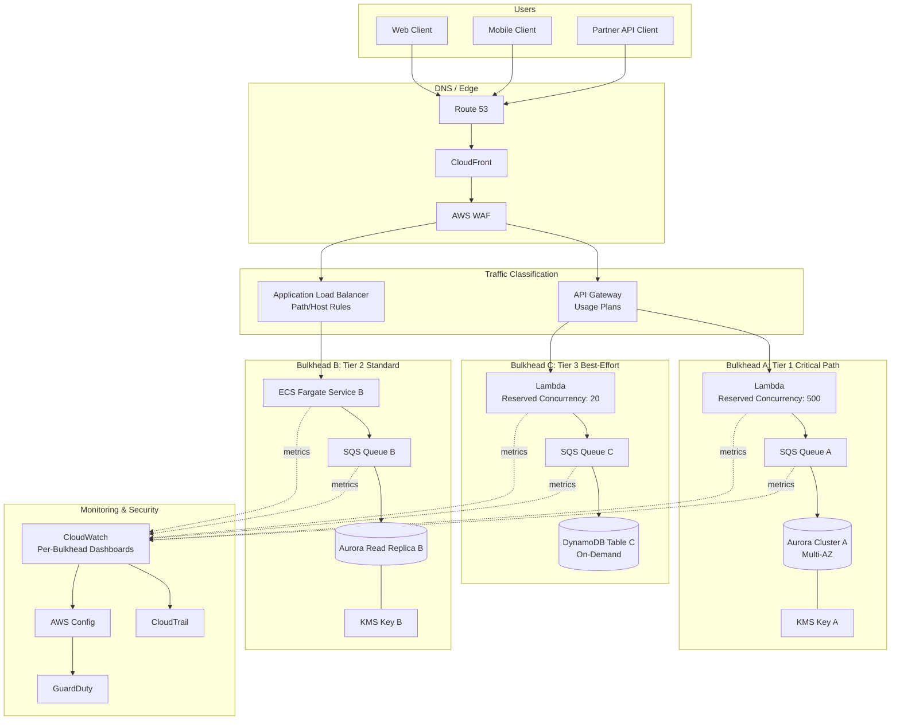

# Part X – Modern Architecture Patterns

# Chapter 82: Bulkhead Architecture

---

## 1. Executive Summary

### The Business Problem

Enterprise systems fail in predictable ways. A single overloaded dependency — a slow database, a misbehaving downstream API, a saturated thread pool — rarely stays contained. In most systems built without isolation boundaries, that failure propagates outward until it consumes the entire platform.

This is the resource-exhaustion cascade, and it is one of the most common causes of full-platform outages in production AWS environments.

A few realistic examples:

- An e-commerce checkout service calls a third-party tax calculation API. That API slows down during a regional outage. Every checkout request now blocks waiting on a response. Within minutes, every thread in the application's connection pool is occupied waiting on the slow tax API — and the same pool is shared with the product catalog and cart services. Customers can no longer even browse products, even though catalog and cart have nothing to do with tax calculation.
- A reporting service runs a long analytical query against a shared Aurora cluster. That query consumes so much I/O capacity that transactional order-processing queries on the same cluster start timing out.
- A single noisy tenant in a multi-tenant SaaS platform issues a burst of expensive requests. Because all tenants share the same Lambda concurrency pool, other tenants are throttled even though they generated zero additional load.

In every one of these cases, the root cause is the same: **shared resource pools with no isolation boundary**. One failure or one noisy consumer degrades the entire system rather than being contained to the component that caused it.

### The Architecture Objective

The Bulkhead pattern borrows its name and its core idea from ship design. A ship's hull is divided into watertight compartments. If one compartment is breached and floods, the bulkheads prevent water from spreading to the rest of the vessel. The ship stays afloat, even if damaged.

Applied to software architecture, a bulkhead is a deliberately introduced isolation boundary that:

- Partitions shared resources (thread pools, connection pools, compute capacity, database capacity, concurrency limits) into isolated segments.
- Ensures that the failure or saturation of one segment cannot consume the capacity allocated to another.
- Converts a system-wide outage into a partial, contained degradation.

Bulkheads can be applied at multiple levels of an AWS architecture:

- **Compute-level bulkheads** — separate Auto Scaling Groups, ECS services, or Lambda functions per critical dependency or per tenant tier.
- **Connection-level bulkheads** — separate connection pools per downstream dependency, so a slow dependency cannot starve connections needed by a healthy one.
- **Queue-level bulkheads** — separate SQS queues per workload class, so a backlog in one workload does not delay another.
- **Database-level bulkheads** — separate read replicas, separate Aurora clusters, or separate DynamoDB tables/capacity per workload.
- **Account-level bulkheads** — the most extreme form of isolation, using separate AWS accounts per business unit, tenant tier, or workload category so that a runaway process in one account cannot affect billing, quota, or blast radius in another.

### Why Organizations Adopt Bulkhead Architecture

Organizations typically introduce bulkheads after experiencing (or narrowly avoiding) a cascading failure. The decision is almost always reactive rather than proactive, because bulkheads add operational complexity that is difficult to justify before an incident has demonstrated the risk.

Common triggers:

- A postmortem reveals that an unrelated, low-priority dependency caused a full outage of a revenue-critical path.
- A multi-tenant platform experiences "noisy neighbor" complaints from enterprise customers whose SLAs were violated because of another tenant's load.
- A compliance or regulatory requirement mandates demonstrable workload isolation (common in banking, healthcare, and government).
- Rapid growth in the number of downstream integrations increases the statistical likelihood that at least one dependency is degraded at any given time.

### Major Business Benefits

- **Reduced blast radius.** A degraded or failed dependency affects only the capacity allocated to it, not the whole platform.
- **Improved availability of critical paths.** Revenue-critical workflows (checkout, authentication, payment) can be isolated from lower-priority workflows (reporting, recommendations, analytics).
- **Predictable multi-tenant behavior.** Noisy tenants cannot degrade the experience of well-behaved tenants.
- **Better incident response.** When something fails, the isolation boundary itself tells operators where to look, shortening mean time to detection (MTTD) and mean time to resolution (MTTR).
- **Supports compliance and contractual SLAs.** Demonstrable isolation is often a hard requirement in regulated industries and in enterprise B2B contracts with tenant-level SLAs.

### Typical Enterprise Scenarios

- A payments platform isolates the fraud-scoring dependency from the core transaction-processing path so that a slow fraud vendor cannot block payment settlement.
- A SaaS analytics company gives its top-tier "Enterprise" customers a dedicated compute and connection pool, separate from the shared pool used by free-tier customers.
- An insurance claims platform separates the document-processing pipeline (which depends on a slow third-party OCR service) from the claims-status API (which needs to remain fast and available at all times).
- A logistics company partitions its order-processing Lambda concurrency by region, so a regional carrier API outage in one geography does not throttle order processing in unaffected geographies.

Bulkhead architecture is rarely the *first* pattern an organization adopts. It is typically introduced after a Circuit Breaker pattern (Chapter 83) has already been implemented and the organization discovers that circuit breakers alone do not prevent resource exhaustion — a circuit breaker stops calling a failing dependency, but if all requests still compete for the same connection pool before the breaker trips, the damage is already done. Bulkheads and circuit breakers are complementary, not substitutes for one another, and mature architectures use both together.

---

## 2. Business Requirements

### Business Drivers

- Contain the blast radius of dependency failures to protect revenue-critical workflows.
- Guarantee tenant-level or workload-level SLA compliance in multi-tenant platforms.
- Meet regulatory requirements for workload isolation (e.g., PCI-DSS segmentation, HIPAA workload separation).
- Reduce the frequency and severity of full-platform incidents.
- Enable independent capacity planning and cost attribution per workload.

### Functional Requirements

- Requests to different workload classes (critical vs. non-critical, tenant A vs. tenant B) must be served through independent execution paths.
- Failure or saturation in one isolation boundary must not reduce available capacity in another.
- The system must expose per-boundary metrics (queue depth, connection pool utilization, error rate) so that operators can identify which bulkhead is under stress.
- Requests must be routable to the correct bulkhead based on tenant ID, workload type, or priority tier.

### Non-Functional Requirements

| Requirement | Target |
|---|---|
| Availability (critical path) | 99.95% – 99.99% |
| Availability (non-critical path) | 99.9% |
| Latency (critical path, p99) | < 300 ms |
| Latency (non-critical path, p99) | < 2 s |
| Isolation guarantee | No single dependency failure may consume more than its allocated capacity share |
| Auditability | All isolation boundaries must be independently observable and independently auditable |

### Scalability Goals

- Each bulkhead must scale independently based on its own load profile.
- Adding a new bulkhead (new tenant tier, new dependency, new workload class) must not require redesigning existing bulkheads.

### Availability Requirements

- Critical-path bulkheads should be designed to Multi-AZ standards at minimum, and Multi-Region for the highest-tier workloads.
- Non-critical bulkheads may use lower-cost, lower-availability configurations (e.g., single-AZ, Spot capacity) since their failure is explicitly tolerated by design.

### Latency Requirements

- Latency budgets must be defined per bulkhead, not globally. A reporting bulkhead may tolerate multi-second latency; a checkout bulkhead may not tolerate more than a few hundred milliseconds.

### Compliance Requirements

- PCI-DSS: cardholder-data-processing workloads must be logically and, in many cases, physically segmented from other workloads.
- HIPAA: PHI-processing workloads should be isolated from non-PHI workloads to reduce audit scope.
- SOC 2: isolation boundaries must be demonstrable to auditors through architecture diagrams, IAM boundaries, and monitoring evidence.

### Security Expectations

- Each bulkhead should have its own IAM role, scoped to only the resources it needs.
- Cross-bulkhead access should be explicitly denied by default (deny-by-default security groups, network ACLs, and IAM policies).

### Recovery Objectives

| Bulkhead Tier | RPO | RTO |
|---|---|---|
| Critical (Tier 1) | Near-zero (< 1 minute, via Multi-AZ replication) | < 5 minutes |
| Standard (Tier 2) | < 15 minutes | < 30 minutes |
| Best-effort (Tier 3) | < 1 hour | < 4 hours |

### SLAs

- Tier 1 (critical-path) bulkheads: contractual 99.95%+ uptime, financial penalties for breach.
- Tier 2 bulkheads: 99.9% uptime, internal SLO tracking.
- Tier 3 bulkheads: best-effort, no formal SLA.

### Expected Workload

- Mixed workload profile: high-frequency, low-latency transactional traffic alongside lower-frequency, higher-latency batch or analytical traffic.
- Multi-tenant traffic with highly uneven per-tenant load distribution (the classic "whale tenant" problem).

### Expected Growth

- Number of isolated workload classes typically grows over time as new dependencies and new tenant tiers are introduced. The architecture must support adding bulkheads without redesign — this is a key architectural fitness function to validate during review.

---

## 3. Architecture Overview

### Overall Design

A Bulkhead architecture on AWS is not a single service — it is a **structural discipline applied across compute, networking, data, and messaging layers**. The core idea is to identify the shared resources that could become contention points, and deliberately partition them so that no single workload can exhaust a resource pool needed by another.

There are four common implementation levels, often combined:

1. **Thread/connection-pool bulkheads** — inside a single application process, separate connection pools per downstream dependency (e.g., using a library like resilience4j's bulkhead module, or a custom semaphore-based pattern).
2. **Compute bulkheads** — separate Auto Scaling Groups, ECS services, or Lambda functions/reserved concurrency per workload class.
3. **Data bulkheads** — separate database instances, read replicas, DynamoDB tables, or provisioned capacity per workload class.
4. **Account/VPC bulkheads** — separate AWS accounts or VPCs per business unit or tenant tier, providing the strongest isolation (including billing and quota isolation) at the cost of the highest operational overhead.

### Architecture Philosophy

The guiding principle is: **isolate by failure domain, not by convenience**. Bulkheads should be drawn around the boundaries where an independent failure is plausible — not arbitrarily by team ownership or by service name. A common mistake is bulkheading by microservice boundary alone, without considering that two "different" microservices may still share an underlying database connection pool or Lambda concurrency limit, silently defeating the isolation.

### Core Components

- **Traffic classifier / router** — determines which bulkhead a request belongs to (by tenant ID, workload type, API path, or priority header). Typically implemented at the API Gateway or Application Load Balancer layer.
- **Isolated compute pools** — per-bulkhead ECS services, Lambda functions with reserved concurrency, or Auto Scaling Groups.
- **Isolated data stores** — per-bulkhead RDS/Aurora clusters, read replicas, or DynamoDB tables/capacity.
- **Isolated messaging** — per-bulkhead SQS queues and EventBridge event buses, preventing one workload's backlog from delaying another's.
- **Independent monitoring** — per-bulkhead CloudWatch dashboards, alarms, and SLOs.
- **Admission control** — rate limiting and queue depth limits per bulkhead to prevent a single bulkhead from exceeding its allocated share even under extreme load.

### How Components Interact

1. A request arrives at the edge (CloudFront, API Gateway, or ALB).
2. The traffic classifier inspects the request (tenant ID, path, header) and routes it to the correct bulkhead.
3. Each bulkhead processes requests using its own dedicated compute, connection pool, and (where applicable) dedicated data store.
4. If a bulkhead becomes saturated, admission control rejects or queues excess requests **within that bulkhead only** — other bulkheads continue operating normally.
5. Monitoring systems track each bulkhead independently, alerting operators to the specific isolated segment under stress.

### High-Level Workflow

```

Client Request
   → Edge / DNS / CDN
   → Traffic Classification (tenant/workload)
   → Bulkhead Router
   → [Bulkhead A: Critical]   [Bulkhead B: Standard]   [Bulkhead C: Best-Effort]
        Compute A                 Compute B                  Compute C
        Data Store A              Data Store B                Data Store C
        Queue A                   Queue B                     Queue C
   → Response assembled within originating bulkhead
   → Returned to client

```

### Request Lifecycle

1. Request enters through Route 53 → CloudFront → ALB/API Gateway.
2. Classification logic (Lambda authorizer, API Gateway usage plan, or ALB listener rule) assigns the request to a bulkhead.
3. Request is processed exclusively using that bulkhead's compute, database connections, and downstream integrations.
4. If the bulkhead's admission control limits are exceeded, the request is throttled or queued — never allowed to "borrow" capacity from another bulkhead.

### Response Lifecycle

- Responses are constructed within the same bulkhead that processed the request.
- Errors specific to one bulkhead (e.g., a downstream timeout) are surfaced with bulkhead-scoped error codes so client applications and dashboards can distinguish "Tier 1 degraded" from "Tier 3 degraded."

### Data Lifecycle

- Data belonging to a given workload class stays within its designated data store.
- Cross-bulkhead data access (e.g., a shared customer master record) is handled through well-defined, rate-limited, and independently monitored integration points — never through direct shared-connection access, which would silently reintroduce the coupling the bulkhead was designed to remove.

---

## 4. AWS Services Used

> **Note:** Not every AWS service below is required in every Bulkhead implementation. Select services based on the specific isolation boundaries identified during architecture review (Section 31).

### Amazon EC2 / Auto Scaling Groups

- **Purpose:** Provides dedicated, independently scaled compute capacity per bulkhead when workloads require long-running processes, specialized runtimes, or licensing constraints that are not well suited to serverless.
- **Why selected:** Auto Scaling Groups can be defined per workload class, each with its own scaling policies, instance types, and capacity limits — providing a straightforward compute-level bulkhead.
- **Alternatives:** ECS Fargate (less operational overhead, faster scaling), Lambda (for event-driven or bursty workloads).
- **Limitations:** Slower scale-out than Fargate or Lambda; requires patch management and AMI lifecycle management per bulkhead, multiplying operational overhead by the number of bulkheads.
- **Pricing considerations:** Each isolated ASG needs its own baseline capacity, which increases idle cost compared to a shared pool. This is the direct, quantifiable cost of isolation and should be explicitly budgeted.
- **Best practices:** Use separate launch templates per bulkhead so that instance-level configuration drift cannot silently merge the isolation boundaries.

### Application Load Balancer (ALB)

- **Purpose:** Performs the traffic classification and routing that assigns requests to the correct bulkhead, typically using host-based or path-based routing rules, or header-based rules for tenant tiering.
- **Why selected:** Native integration with target groups allows a single ALB to route to multiple isolated target groups (one per bulkhead) without needing a separate load balancer per bulkhead — reducing cost while preserving compute-level isolation.
- **Alternatives:** API Gateway (better fit for serverless/Lambda-based bulkheads, supports usage plans for tenant-level throttling natively); Network Load Balancer (only when isolating at the TCP/UDP layer).
- **Limitations:** ALB routing rules can become complex to manage as the number of bulkheads grows; rule limits per ALB apply (default quota, increasable via Service Quotas).
- **Pricing considerations:** Billed on LCU (Load Balancer Capacity Units); consolidating multiple bulkheads behind one ALB is more cost-efficient than one ALB per bulkhead, provided routing-rule complexity remains manageable.
- **Best practices:** Use separate target groups per bulkhead, with independent health checks, so an unhealthy bulkhead does not affect ALB routing decisions for other bulkheads.

### Amazon API Gateway

- **Purpose:** Provides per-tenant or per-workload throttling via usage plans and API keys — a native mechanism for implementing bulkheads for serverless architectures.
- **Why selected:** Usage plans allow explicit requests-per-second and burst limits per API key (per tenant), which is one of the simplest ways to implement a bulkhead without building custom admission-control logic.
- **Alternatives:** Custom rate limiting in application code (more flexible, more effort); AWS WAF rate-based rules (coarser-grained, IP-based rather than tenant-based).
- **Limitations:** Usage plans throttle at the API Gateway layer only — they do not, by themselves, guarantee isolation of downstream compute or database capacity. Must be combined with Lambda reserved concurrency or dedicated backend resources for full-stack isolation.
- **Pricing considerations:** Charged per request plus data transfer; no additional charge for usage plans themselves.
- **Best practices:** Pair usage plans with Lambda reserved concurrency per tenant tier to extend the isolation boundary from the API layer through to compute.

### AWS Lambda

- **Purpose:** Executes bulkhead-isolated compute using **reserved concurrency**, which caps (and guarantees) the number of concurrent executions available to a specific function — directly implementing a compute-level bulkhead.
- **Why selected:** Reserved concurrency is a first-class, built-in bulkhead mechanism. Setting a reserved concurrency limit on a critical function guarantees it always has capacity available, and setting a limit on a lower-priority function prevents it from consuming the account-wide concurrency pool during a burst.
- **Alternatives:** ECS Fargate tasks with dedicated service-level scaling (better for long-running or non-event-driven workloads).
- **Limitations:** Account-level concurrency quota is shared across all functions unless reserved concurrency is explicitly configured; without explicit reservation, a burst in one function can throttle every other function in the account (the exact failure mode bulkheads are meant to prevent).
- **Pricing considerations:** No extra charge for reserved concurrency itself, but reserving concurrency for a low-traffic bulkhead "locks up" capacity that cannot be used elsewhere, which is a direct trade-off between isolation and utilization efficiency.
- **Best practices:** Explicitly set reserved concurrency on every business-critical function; use provisioned concurrency additionally for latency-sensitive Tier 1 bulkheads to avoid cold starts.

### Amazon RDS / Aurora

- **Purpose:** Provides isolated relational data stores per bulkhead — either separate clusters entirely, or separate reader endpoints/read replicas dedicated to specific workload classes (e.g., a dedicated reporting replica, isolated from the primary transactional write path).
- **Why selected:** Aurora's ability to add read replicas that can be dedicated to specific query classes (with associated endpoints) is a common, cost-effective way to bulkhead read-heavy reporting workloads away from transactional workloads without duplicating the entire database.
- **Alternatives:** Fully separate Aurora clusters per bulkhead (stronger isolation, higher cost); DynamoDB with per-workload provisioned capacity (better for workloads that can tolerate NoSQL data modeling).
- **Limitations:** Read replicas still share the underlying storage layer in Aurora, meaning extremely heavy write-side I/O contention can still affect replica read latency — replica-level bulkheading has limits and does not achieve full isolation in all failure scenarios.
- **Pricing considerations:** Each additional replica or cluster increases both compute and storage cost; the incremental cost of true isolation should be modeled explicitly during FinOps review (Section 16).
- **Best practices:** Route reporting/analytics traffic through a dedicated reader endpoint; monitor replica lag independently per bulkhead.

### Amazon DynamoDB

- **Purpose:** Supports per-table or per-workload provisioned/on-demand capacity, allowing tenant-tier or workload-class isolation without operating separate database clusters.
- **Why selected:** DynamoDB On-Demand mode auto-scales per table independently, meaning a burst in one table's traffic does not exhaust another table's throughput — a natural data-level bulkhead when data can be modeled per-tenant or per-workload.
- **Alternatives:** Aurora (better fit for complex relational queries); DynamoDB with reserved/provisioned capacity per table for predictable-cost isolation.
- **Limitations:** Requires careful data modeling; retrofitting bulkhead isolation onto an existing single-table design can require significant schema and access-pattern rework.
- **Pricing considerations:** On-Demand capacity is more expensive per-request than provisioned capacity but removes the need to plan capacity per bulkhead in advance.
- **Best practices:** Use separate tables per major tenant tier when compliance or noisy-neighbor concerns require guaranteed throughput isolation; use on-demand billing for unpredictable workloads.

### Amazon SQS

- **Purpose:** Provides per-workload message queues so that a backlog in one workload's queue does not delay processing of another workload's messages.
- **Why selected:** SQS is the simplest, most direct implementation of a bulkhead at the messaging layer — separate queues naturally isolate backlogs, and consumers can be scaled independently per queue.
- **Alternatives:** Kinesis Data Streams (when strict ordering and replay are required, at the cost of more complex consumer scaling); EventBridge (for pub/sub fan-out rather than point-to-point queuing).
- **Limitations:** Requires consumers (Lambda, ECS) to also be scaled/isolated per queue; a shared consumer pool reading from multiple queues silently reintroduces the coupling.
- **Pricing considerations:** Charged per request; minimal incremental cost for additional queues, making SQS one of the cheapest bulkhead mechanisms available.
- **Best practices:** Pair one dedicated queue with one dedicated consumer function (with its own reserved concurrency) per bulkhead to preserve isolation end-to-end.

### Amazon EventBridge

- **Purpose:** Routes events to isolated downstream consumers/rules per workload class, supporting bulkhead isolation in event-driven architectures.
- **Why selected:** Rule-based routing to separate targets naturally partitions event processing without requiring producers to know about the isolation boundary.
- **Alternatives:** SNS + SQS fan-out (simpler for basic pub/sub, less rule-matching flexibility).
- **Limitations:** EventBridge has account-level throughput quotas; extremely high-throughput bulkheads may need Kinesis instead.
- **Pricing considerations:** Charged per event published; custom bus usage adds minor additional cost, but enables per-bulkhead isolation of event buses, which is valuable for regulatory segmentation (e.g., a dedicated bus for PCI-scoped events).
- **Best practices:** Use a dedicated custom event bus per major bulkhead when compliance scope reduction is a driver.

### AWS IAM

- **Purpose:** Enforces access boundaries between bulkheads — ensuring that the compute and credentials of one bulkhead cannot access the resources of another, even if application logic contains a bug.
- **Why selected:** IAM is the last line of defense for isolation; even a well-designed bulkhead is not truly isolated if all compute shares a single overly broad IAM role.
- **Alternatives:** None — IAM (or, for account-level isolation, AWS Organizations SCPs) is foundational and not substitutable.
- **Limitations:** Overly complex role structures across many bulkheads increase management overhead and risk of misconfiguration; requires disciplined permission boundary usage (Section 10).
- **Pricing considerations:** No direct cost.
- **Best practices:** One IAM role per bulkhead, scoped only to the resources that bulkhead owns; use permission boundaries to prevent privilege escalation across bulkhead roles.

### Amazon VPC

- **Purpose:** Provides network-level isolation, especially important for the strongest form of bulkhead (per-tenant-tier or per-business-unit VPCs), and for regulatory segmentation.
- **Why selected:** Security groups and NACLs enforce deny-by-default communication between bulkheads at the network layer, which is important when compliance requires demonstrable, auditable network segmentation (not just logical/IAM segmentation).
- **Alternatives:** A single VPC with strict security groups is sufficient for most non-regulated bulkhead implementations; multi-account/multi-VPC is reserved for the highest isolation tier.
- **Limitations:** Multi-VPC architectures require Transit Gateway or PrivateLink for necessary cross-bulkhead communication, adding networking complexity (Section 9).
- **Pricing considerations:** Transit Gateway attachment and data-processing charges apply per VPC; NAT Gateway costs multiply if each bulkhead VPC requires its own NAT Gateway for outbound internet access.
- **Best practices:** Default-deny security groups between bulkhead subnets; only allow explicit, documented cross-bulkhead flows.

### Amazon CloudWatch

- **Purpose:** Provides independent metrics, dashboards, and alarms per bulkhead, which is essential — a shared dashboard that aggregates all bulkheads together defeats the operational purpose of isolation by hiding which specific bulkhead is degraded.
- **Why selected:** Native integration with every AWS service used in the bulkhead (Lambda concurrency metrics, SQS queue depth, RDS connections, ALB target group health) allows building one dashboard per bulkhead with minimal custom tooling.
- **Alternatives:** Third-party observability platforms (Datadog, New Relic) for organizations with multi-cloud observability requirements.
- **Limitations:** Cross-bulkhead correlation (e.g., "is Bulkhead B's slowdown caused by Bulkhead A's saturation?") requires additional dashboard design; CloudWatch does not do this automatically.
- **Pricing considerations:** Costs scale with the number of custom metrics, dashboards, and alarms — a direct, linear cost of adding more bulkheads that should be included in FinOps modeling.
- **Best practices:** One dashboard per bulkhead, plus one "system overview" dashboard showing the health of all bulkheads at a glance.

### AWS CloudTrail / AWS Config

- **Purpose:** Provide auditable evidence that isolation boundaries are being maintained over time — critical for compliance-driven bulkhead implementations (PCI-DSS, HIPAA).
- **Why selected:** Config rules can continuously validate that bulkhead IAM roles have not drifted toward overly broad permissions, and that security groups have not been modified to allow unintended cross-bulkhead traffic.
- **Alternatives:** Manual periodic audits (higher risk, lower assurance, not acceptable for most regulated workloads).
- **Limitations:** Requires custom Config rules to validate bulkhead-specific isolation invariants; out-of-the-box managed rules do not cover this use case directly.
- **Pricing considerations:** Charged per configuration item recorded and per rule evaluation; modest cost relative to the compliance value provided.
- **Best practices:** Write custom Config rules that alert if a bulkhead's security group or IAM role changes outside of the Terraform-managed pipeline.

### AWS KMS / Secrets Manager

- **Purpose:** Provides per-bulkhead encryption keys and secrets, ensuring that a compromised credential in one bulkhead cannot be used to decrypt data or access secrets belonging to another.
- **Why selected:** Using a dedicated KMS key per bulkhead (rather than a shared account-default key) means a key-level IAM policy can enforce that only that bulkhead's role can decrypt its data, adding a cryptographic isolation layer on top of IAM.
- **Alternatives:** Shared KMS key with resource-level IAM conditions (lower cost, slightly weaker isolation guarantee).
- **Limitations:** KMS key policies must be carefully maintained per bulkhead; key management overhead scales with the number of bulkheads.
- **Pricing considerations:** $1/month per KMS key plus request charges; a negligible cost relative to the isolation benefit for Tier 1 bulkheads.
- **Best practices:** Dedicated KMS key per Tier 1 bulkhead at minimum; shared keys acceptable for Tier 3 (best-effort) bulkheads where isolation requirements are lower.

---

## 5. Complete Architecture Diagram



> **Design Note:** Each bulkhead subgraph is intentionally self-contained — compute, queue, data store, and encryption key. The only shared components are the edge layer (DNS/CDN/WAF, which are stateless and non-blocking) and the monitoring layer (which is deliberately designed to aggregate visibility without creating a resource dependency between bulkheads).

---

## 6. Component-by-Component Explanation

### Traffic Classifier (API Gateway Usage Plans / ALB Listener Rules)

- **Purpose:** Determine which bulkhead a request belongs to before any shared processing occurs.
- **Responsibilities:** Inspect tenant ID, API key, host header, or path; apply per-bulkhead rate limits at the earliest possible point.
- **Inputs:** HTTP request with tenant/workload identifying information.
- **Outputs:** Routed request to the correct bulkhead's compute target, or a 429 Too Many Requests response if the bulkhead's limit is already exceeded.
- **Scaling:** API Gateway and ALB scale automatically and are not typically a bulkhead bottleneck themselves.
- **High availability:** Both services are inherently Multi-AZ and regionally resilient by default.
- **Failure handling:** If classification logic fails (e.g., a missing tenant header), requests should default to the lowest-priority bulkhead rather than the highest, to avoid a misconfigured client silently consuming Tier 1 capacity.
- **Dependencies:** None upstream; this is the entry point.
- **Security:** WAF rules and API Gateway resource policies should sit in front of this layer.
- **Monitoring:** Track 4XX/429 rates per usage plan to detect when a specific tenant is hitting its bulkhead limit.

### Isolated Compute (Lambda Reserved Concurrency / ECS Service / ASG)

- **Purpose:** Execute business logic using only the capacity allocated to its bulkhead.
- **Responsibilities:** Process requests, call downstream dependencies scoped to this bulkhead, write to this bulkhead's data store.
- **Inputs:** Classified requests from the routing layer, or messages from this bulkhead's dedicated queue.
- **Outputs:** Responses to the caller, or events/messages to downstream systems.
- **Scaling:** Configured independently per bulkhead — reserved concurrency for Lambda, desired count and scaling policy for ECS, min/max/desired for ASG.
- **High availability:** Tier 1 bulkheads should span at least two (ideally three) Availability Zones; Tier 3 bulkheads may run single-AZ to reduce cost, accepting the associated risk.
- **Failure handling:** Errors within one bulkhead's compute must not throw unhandled exceptions that could affect a shared process — this is why serverless (Lambda) is often preferred, since each invocation is isolated by the platform itself.
- **Dependencies:** This bulkhead's queue, data store, and any downstream integrations exclusively assigned to it.
- **Security:** Dedicated IAM execution role scoped only to this bulkhead's resources.
- **Monitoring:** Concurrency utilization, error rate, duration (p50/p95/p99), throttle count.

### Isolated Queue (SQS)

- **Purpose:** Decouple request ingestion from processing and absorb bursts without allowing backlog in one workload to delay another.
- **Responsibilities:** Buffer messages for this bulkhead only; enforce visibility timeout and retry/backoff policy specific to this workload's characteristics.
- **Inputs:** Messages published by this bulkhead's producers.
- **Outputs:** Messages consumed exclusively by this bulkhead's compute.
- **Scaling:** SQS scales transparently; the constraint is on the consumer side (reserved concurrency / ECS scaling policy).
- **High availability:** SQS is inherently Multi-AZ and regionally redundant.
- **Failure handling:** Dead-letter queue (DLQ) per bulkhead to capture poison messages without blocking the main queue.
- **Dependencies:** None (fully managed).
- **Security:** Queue policy restricts publish/consume permissions to this bulkhead's IAM roles only.
- **Monitoring:** ApproximateNumberOfMessagesVisible, ApproximateAgeOfOldestMessage — the two most important early-warning signals of bulkhead saturation.

### Isolated Data Store (Aurora Cluster/Replica or DynamoDB Table)

- **Purpose:** Persist and serve data exclusively for this bulkhead's workload.
- **Responsibilities:** Enforce this bulkhead's durability, backup, and encryption requirements independently of other bulkheads.
- **Inputs:** Writes/reads from this bulkhead's compute only.
- **Outputs:** Query results, replication data (if cross-region DR is configured for this tier).
- **Scaling:** Aurora Serverless v2 or DynamoDB On-Demand for variable workloads; provisioned capacity for predictable, high-priority workloads where guaranteed throughput matters more than cost efficiency.
- **High availability:** Multi-AZ for Tier 1 and Tier 2; single-AZ acceptable for Tier 3 given its best-effort SLA.
- **Failure handling:** Automated failover (Aurora) or on-demand capacity absorption (DynamoDB); alarms trigger independently per bulkhead's data store.
- **Dependencies:** KMS key for this bulkhead, VPC subnet group for this bulkhead.
- **Security:** Dedicated KMS key (Tier 1/2), database credentials in Secrets Manager scoped to this bulkhead's IAM role only.
- **Monitoring:** CPU utilization, connection count (vs. max_connections), replica lag, throttled requests (DynamoDB).

### Monitoring Layer (CloudWatch, CloudTrail, Config, GuardDuty)

- **Purpose:** Provide independent visibility into each bulkhead's health while also providing a system-wide view for incident commanders.
- **Responsibilities:** Alert on bulkhead-specific thresholds; maintain audit evidence of isolation boundary integrity.
- **Inputs:** Metrics, logs, and API call events from all bulkheads.
- **Outputs:** Alarms, dashboards, compliance evidence.
- **Scaling:** Scales automatically with the number of bulkheads and metrics.
- **High availability:** Regionally resilient by default (CloudWatch, CloudTrail).
- **Failure handling:** Monitoring must never share a failure domain with the workloads it monitors — this is why CloudWatch/CloudTrail (fully managed, decoupled services) are preferred over self-hosted monitoring inside the same compute pool as the application.
- **Dependencies:** None (fully managed).
- **Security:** Read-only cross-account roles for centralized security/observability accounts, per AWS multi-account best practice.
- **Monitoring:** Meta-monitoring — alarm on alarm-delivery failures themselves (e.g., SNS delivery failures) so the monitoring bulkhead's own health is also tracked.

---

## 7. End-to-End Request Flow

1. **Client** sends an HTTPS request to the platform's public endpoint.
2. **Route 53** resolves the domain to the nearest **CloudFront** edge location.
3. **CloudFront** forwards the request to the regional entry point (API Gateway or ALB) if not served from cache.
4. **AWS WAF**, attached to CloudFront or the entry point, evaluates the request against rate-based and managed rule sets, blocking malicious traffic before it reaches any bulkhead.
5. **Traffic classification** occurs: API Gateway checks the API key against its usage plan (tenant tier), or ALB evaluates host/path-based listener rules.
6. The request is routed to the target group or Lambda function associated with the identified bulkhead.
7. **Admission control** at the bulkhead boundary checks current utilization (Lambda reserved concurrency headroom, ECS service capacity, queue depth). If the bulkhead is at capacity, the request is throttled (HTTP 429) or queued, depending on the bulkhead's design — but never allowed to spill into another bulkhead's capacity.
8. The bulkhead's **compute layer** processes the request, applying business logic scoped entirely within that bulkhead.
9. If asynchronous processing is required, the compute layer publishes a message to this **bulkhead's dedicated SQS queue**.
10. A **dedicated consumer** (its own Lambda function or ECS service, with its own reserved concurrency/scaling policy) processes the queued message.
11. The compute layer reads from or writes to this **bulkhead's dedicated data store** (Aurora cluster/replica or DynamoDB table), using credentials scoped to this bulkhead only.
12. **Caching** (if applicable) is checked/updated using a bulkhead-scoped cache key namespace, preventing cache pollution across bulkheads sharing a single ElastiCache cluster (a common cost-saving compromise for Tier 2/3 bulkheads).
13. **Logging** is written to this bulkhead's CloudWatch Log Group, tagged with the bulkhead identifier for downstream filtering.
14. **Monitoring** metrics are emitted per bulkhead (invocation count, duration, error count, queue depth).
15. If an error occurs at any step, **error handling** logic returns a bulkhead-scoped error response and, where applicable, publishes to this bulkhead's dead-letter queue — the error is never silently escalated to consume another bulkhead's error-handling or retry budget.
16. The response is returned through the same path (compute → API Gateway/ALB → CloudFront → client).
17. **CloudWatch Alarms** evaluate whether this bulkhead's error rate, latency, or queue depth has breached its independently configured threshold, triggering notification only for the affected bulkhead.

---

## 8. Deployment Flow

### Infrastructure Provisioning

Each bulkhead should be defined as an independent, parameterized Terraform module so that adding a new bulkhead is a matter of instantiating the module with new variables — not writing new infrastructure code from scratch.

### Terraform Workflow

1. `terraform init` — initialize providers and remote state backend (S3 + DynamoDB lock table).
2. `terraform plan -var-file=bulkhead-tier1.tfvars` — plan changes for a specific bulkhead.
3. Peer review of the plan output, focusing specifically on any changes to IAM policies, security groups, or KMS key policies (the isolation-critical resources).
4. `terraform apply` — applied through CI/CD, never manually in production.
5. Post-apply validation — automated checks confirm the new/changed bulkhead's resources do not have overlapping IAM permissions with other bulkheads (see Section 20).

### CI/CD Deployment

- Each bulkhead has its own deployment pipeline stage, allowing Tier 1 (critical) bulkheads to have stricter approval gates than Tier 3 (best-effort) bulkheads.
- Pipelines should never deploy changes to multiple bulkheads in a single, combined apply when avoidable — this preserves the ability to roll back one bulkhead without affecting others.

### Blue-Green Deployment

- For Tier 1 compute (Lambda), use weighted alias traffic shifting; for ECS, use CodeDeploy blue-green deployments with automated rollback on CloudWatch alarm breach.
- Because each bulkhead is isolated, blue-green deployments can be tested and validated on one bulkhead without any risk of impacting others — a direct operational benefit of the pattern.

### Rollback

- Rollback is scoped to the affected bulkhead's compute and configuration only.
- Database schema changes (if any) should be backward-compatible within each bulkhead's own migration versioning, avoiding cross-bulkhead migration coordination.

### Secrets

- Each bulkhead retrieves its own database credentials and API keys from Secrets Manager, scoped by IAM to that bulkhead's execution role only.

### Configuration

- Bulkhead-specific configuration (reserved concurrency values, rate limits, tier classification) is stored in Systems Manager Parameter Store under a per-bulkhead path hierarchy (e.g., `/bulkhead/tier1/concurrency`), enabling clean IAM scoping by path prefix.

### Validation

- Post-deployment smoke tests run independently per bulkhead.
- A synthetic canary (CloudWatch Synthetics) per bulkhead continuously validates that the bulkhead is reachable and within its latency SLO, independent of other bulkheads' health.

---

## 9. Network Topology

### VPC Design

For most organizations, a **single VPC with strict subnet and security group segmentation** is sufficient for Tier 2/3 bulkheads, reserving full VPC-per-bulkhead isolation for Tier 1 or regulatory-scoped workloads.

### CIDR Planning

| Bulkhead | CIDR Block | Notes |
|---|---|---|
| Shared/Edge | 10.0.0.0/24 | ALB, NAT Gateway, bastion/SSM endpoints |
| Bulkhead A (Tier 1) | 10.0.16.0/22 | Dedicated subnets, dedicated NAT |
| Bulkhead B (Tier 2) | 10.0.32.0/22 | Dedicated subnets, shared NAT acceptable |
| Bulkhead C (Tier 3) | 10.0.48.0/22 | Dedicated subnets, shared NAT |

### Public and Private Subnets

- Public subnets host only the ALB/NAT Gateway.
- Each bulkhead has its own private application subnet and private data subnet, across a minimum of two Availability Zones for Tier 1/2.

### NAT Gateway

- Tier 1 bulkheads should use a **dedicated NAT Gateway** so that outbound traffic saturation from another bulkhead cannot exhaust available NAT bandwidth/connections for the critical path.
- Tier 2/3 bulkheads may share a NAT Gateway to control cost, accepting a documented risk trade-off (see Section 16, Cost Surprises).

### Internet Gateway

- Single IGW per VPC, shared across bulkheads — this is a regional, highly scalable resource and not a realistic bulkhead concern.

### Transit Gateway

- Used when bulkheads span multiple VPCs or accounts, to enable controlled, explicitly-defined cross-bulkhead routes (e.g., a shared customer-master lookup service) without full mesh peering.

### Route Tables

- One route table per bulkhead's private subnet, explicitly listing only the routes that bulkhead requires — no default "allow all internal" route table shared across bulkheads.

### Network ACLs

- Stateless NACLs at the subnet level provide a second, independent layer of enforcement beyond security groups, useful for demonstrating defense-in-depth to auditors.

### Security Groups

- Deny-by-default; each bulkhead's compute security group only allows inbound traffic from its own ALB target group / API Gateway VPC link, and only allows outbound traffic to its own data store's security group.

### PrivateLink

- Used when a shared internal service (e.g., a fraud-scoring API used by multiple bulkheads) must be exposed without allowing full network-level access between bulkhead VPCs — PrivateLink exposes only the specific service endpoint, preserving isolation everywhere else.

### Hybrid Connectivity

- If on-premises connectivity is required (Direct Connect/VPN), route only the specific bulkhead's subnets that legitimately need hybrid access — do not extend on-premises routes to all bulkheads by default.

---

## 10. Identity and Access

### IAM Roles

- One execution role per bulkhead's compute (Lambda execution role, ECS task role).
- One deployment role per bulkhead used only by CI/CD, separate from the runtime execution role.

### IAM Policies

- Scoped using resource ARNs specific to that bulkhead (e.g., `arn:aws:dynamodb:*:*:table/tenant-tier1-*`), never wildcard resource policies spanning bulkheads.

### Resource Policies

- SQS queue policies and KMS key policies explicitly enumerate which bulkhead role may access them, rather than relying solely on IAM identity-based policies — defense in depth against a misconfigured identity policy.

### STS

- Cross-bulkhead access (when legitimately required, e.g., a shared reporting function that reads from multiple bulkheads' data with reduced permissions) should use STS AssumeRole with a narrowly scoped, time-limited session rather than a permanently provisioned broad role.

### Cross-Account Access

- For account-level bulkheads, cross-account roles should be scoped to read-only, specific-resource access, and should require external ID conditions to prevent confused-deputy issues.

### Least Privilege

- Each bulkhead role should be reviewed quarterly using IAM Access Analyzer to identify unused permissions — a bulkhead's isolation guarantee is only as strong as its most permissive unused grant.

### Service Roles

- Separate service-linked roles per bulkhead where the service supports it (e.g., separate Auto Scaling service roles is not typically needed, but separate CodeDeploy application/deployment group IAM roles per bulkhead is recommended).

### Permission Boundaries

- Apply a permission boundary to every bulkhead's execution role capping its maximum possible permissions, even if the identity policy is later broadened by mistake — this is the single most effective control against "bulkhead drift," where isolation quietly erodes over time as teams add permissions under deadline pressure.

---

## 11. Security Architecture

### Encryption

- Data at rest: dedicated KMS key per Tier 1/2 bulkhead; encryption enforced via bucket/table policies that deny unencrypted writes.
- Data in transit: TLS 1.2+ enforced at ALB/API Gateway listener level and at RDS/Aurora connection level (`rds.force_ssl=1`).

### KMS

- Key policies scoped so only the owning bulkhead's IAM role can call `kms:Decrypt`; other bulkheads are explicitly denied, even if they somehow gained a data-plane IAM permission.

### TLS / Certificate Manager

- ACM-issued certificates per public endpoint, auto-renewed; private certificate authority (ACM Private CA) if internal mTLS between bulkhead components is required for the highest-assurance environments.

### WAF

- Rate-based rules configured **per bulkhead's URL path or host**, so a volumetric attack targeting one workload's endpoint triggers WAF blocking without needing a platform-wide, coarser rule that might also throttle legitimate traffic to unrelated bulkheads.

### Shield

- AWS Shield Standard is automatic; Shield Advanced is recommended for Tier 1 bulkheads serving public, revenue-critical endpoints, given its DDoS cost protection and access to the Shield Response Team.

### Secrets Manager

- Per-bulkhead secrets with automatic rotation configured independently — a compromised or expiring credential in one bulkhead should never require an emergency rotation across bulkheads that don't share it.

### GuardDuty

- Single GuardDuty detector per account (or delegated administrator account across the organization) is sufficient; findings should be tagged/filtered by bulkhead using resource tags for triage routing.

### Inspector

- Continuous vulnerability scanning of EC2/ECR images used by each bulkhead's compute; findings routed to the owning bulkhead's team via tag-based notification routing.

### Security Hub

- Aggregates findings across all bulkheads into a single pane of glass for the security team, while individual findings remain attributable to a specific bulkhead through resource tagging — this reconciles the "independent visibility per bulkhead" requirement with the "single security operations view" requirement.

### CloudTrail

- Organization-wide trail with a dedicated, immutable S3 destination in a separate log-archive account; CloudTrail Insights enabled to detect unusual API activity patterns per bulkhead's IAM roles.

### AWS Config

- Custom Config rules validating: no security group in a Tier 1 bulkhead subnet allows 0.0.0.0/0 ingress; no IAM role in a bulkhead has been attached to a policy outside its approved permission boundary.

### Zero Trust

- No implicit trust between bulkheads based on network location alone; every cross-bulkhead call (where they legitimately exist) must be authenticated (SigV4 or mTLS) and authorized independently, exactly as if it were crossing an organizational boundary — because from a blast-radius perspective, it effectively is one.

### Threat Model

- Primary threat: a compromised or buggy component in one bulkhead attempting to access another bulkhead's data or exhaust its capacity.
- Secondary threat: a misconfiguration (over-permissive IAM policy, shared security group) silently erasing the isolation boundary without any application-level bug being involved at all.

### Attack Vectors

- Lateral movement via an over-permissioned shared IAM role.
- Resource exhaustion via a shared, un-partitioned connection pool that was assumed to be isolated but was not (a common audit finding).
- Cache poisoning across bulkheads sharing a single ElastiCache cluster without proper key namespacing.

### Mitigations

- Enforce permission boundaries, dedicated KMS keys, and Config rules as described above.
- Regularly run "bulkhead breach" game days (Section 24) to validate isolation actually holds under simulated failure, rather than assuming the architecture diagram matches production reality.

---

## 12. High Availability

### AZ Failures

- Each Tier 1/2 bulkhead's compute and data store span at least two AZs; an AZ failure removes capacity proportionally but does not take the bulkhead fully offline.

### Instance Failures

- ASG health checks and ECS service scheduler automatically replace failed instances/tasks within a bulkhead without needing to coordinate with other bulkheads.

### Regional Failures

- Tier 1 bulkheads may implement active-passive or active-active multi-region failover (Section 13); lower tiers typically accept regional downtime given their best-effort SLA.

### Database Failures

- Aurora automated failover to a replica in a different AZ, scoped entirely within that bulkhead's cluster; a Tier 3 bulkhead's DynamoDB table failure mode is inherently handled by DynamoDB's multi-AZ replication with no manual failover needed.

### Load Balancing

- Separate target groups per bulkhead behind a shared ALB (or dedicated ALBs for the highest-tier bulkheads) ensure health-check failures in one bulkhead's targets do not affect routing decisions for another's.

### Health Checks

- Bulkhead-specific health check endpoints (e.g., `/health/tier1`) that validate that bulkhead's specific downstream dependencies — a shared, generic `/health` endpoint that checks all dependencies undermines the isolation the pattern is meant to provide.

### Failover

- Failover procedures, runbooks, and automation are defined and tested per bulkhead tier, matching each tier's specific RTO/RPO commitments.

---

## 13. Disaster Recovery

### Backup Strategy

- Automated snapshots per bulkhead's data store, retained according to that bulkhead's compliance and RPO requirements (Tier 1 typically requires point-in-time recovery enabled; Tier 3 may use daily snapshots only).

### Snapshots

- Aurora/RDS automated backups and manual snapshots before major schema changes, tagged by bulkhead for clear ownership during recovery operations.

### Cross-Region Replication

- Tier 1 bulkheads: Aurora Global Database or DynamoDB Global Tables for sub-second cross-region replication lag, supporting active-active or fast active-passive failover.
- Tier 2/3: cross-region snapshot copy on a scheduled basis is typically sufficient.

### Pilot Light

- Appropriate for Tier 2 bulkheads: minimal standby infrastructure (data replicated, compute definitions ready but scaled to zero) in a secondary region, scaled up only during a declared disaster.

### Warm Standby

- Appropriate for Tier 1 bulkheads with strict RTO: a scaled-down but running copy of the bulkhead's compute in a secondary region, capable of being scaled to full capacity within minutes.

### Multi-Site / Active-Active

- Reserved for the most critical Tier 1 bulkheads (e.g., authentication, payment processing) where even a multi-minute RTO is unacceptable; requires careful conflict-resolution design for write-write scenarios across regions.

### RPO / RTO Mapping

| Bulkhead Tier | DR Strategy | RPO | RTO |
|---|---|---|---|
| Tier 1 | Active-Active or Warm Standby | Near-zero | < 5 min |
| Tier 2 | Pilot Light | < 15 min | < 30 min |
| Tier 3 | Backup & Restore | < 1 hour | < 4 hours |

---

## 14. Scalability

### Horizontal Scaling

- Each bulkhead's ASG/ECS service scales independently based on its own CloudWatch metrics (CPU, request count per target, custom queue-depth metric).

### Vertical Scaling

- Aurora instance class upsizing is performed per bulkhead's cluster independently — a Tier 1 bulkhead's database can be resized to a larger instance class without any change to Tier 2/3 clusters.

### Auto Scaling

- Target-tracking scaling policies configured with bulkhead-specific thresholds; a Tier 1 bulkhead may scale earlier and more aggressively (lower target utilization) to preserve latency headroom, while a Tier 3 bulkhead may scale later to optimize cost.

### Serverless Scaling

- Lambda reserved concurrency is itself both a scalability *and* an isolation mechanism — it defines the maximum scale a bulkhead can reach while simultaneously guaranteeing that scale is always available to it.

### Database Scaling

- Aurora Serverless v2 for bulkheads with variable, hard-to-predict load; DynamoDB On-Demand for the same reason in NoSQL workloads.

### Storage Scaling

- S3 (used for artifacts, exports, or object storage per bulkhead) scales natively and is rarely a bulkhead concern by itself, though request-rate partitioning (via key prefix design) should still be considered for extremely high-throughput bulkheads.

### Queue Scaling

- SQS scales transparently; the practical constraint is consumer-side concurrency, which must be scaled in lockstep with queue depth via CloudWatch-driven scaling policies.

---

## 15. Performance Optimization

### Caching

- Use bulkhead-namespaced cache keys (e.g., `tier1:customer:123`) even on a shared ElastiCache cluster, to prevent one bulkhead's cache eviction pressure from degrading another's hit rate; dedicated cache clusters are preferred for Tier 1.

### Compression

- Enable response compression at CloudFront/API Gateway for all bulkheads uniformly — this is a shared, stateless optimization with no isolation implications.

### CDN

- CloudFront cache behaviors can be configured per path/bulkhead, allowing different TTLs and origin request policies matched to each bulkhead's data volatility.

### Database Optimization

- Query optimization, indexing, and connection pool sizing are tuned per bulkhead's specific access patterns rather than using one-size-fits-all settings across a shared cluster.

### Connection Pooling

- Use RDS Proxy per bulkhead (or per bulkhead's database) to prevent connection exhaustion in one bulkhead from affecting another's available connections — this is one of the most important and most frequently overlooked bulkhead mechanisms, since a shared RDS Proxy defeats the entire purpose.

### Concurrency

- Reserved concurrency (Lambda) and task count limits (ECS) directly bound each bulkhead's maximum concurrent work, which is the core lever for both performance tuning and isolation enforcement.

### Async Processing

- Move non-latency-critical work (Tier 2/3) to asynchronous, queue-based processing so that request-response latency budgets are only applied where truly necessary (Tier 1).

---

## 16. Cost Optimization (FinOps)

### Deployment Size Estimates

| Component | Small (1 Tier-1 bulkhead only) | Medium (3 bulkheads) | Enterprise (6+ bulkheads, multi-region Tier 1) |
|---|---|---|---|
| Compute (Lambda/ECS/EC2) | ~$300–600/mo | ~$1,500–3,500/mo | ~$8,000–20,000+/mo |
| Database (Aurora/DynamoDB) | ~$400–800/mo | ~$1,800–4,000/mo | ~$10,000–30,000+/mo |
| Networking (NAT, TGW, data transfer) | ~$150–300/mo | ~$800–1,800/mo | ~$4,000–10,000+/mo |
| Monitoring & Security (CloudWatch, GuardDuty, Config) | ~$100–200/mo | ~$500–1,000/mo | ~$2,500–6,000+/mo |
| **Total (approximate)** | **~$950–1,900/mo** | **~$4,600–10,300/mo** | **~$24,500–66,000+/mo** |

> **Note:** These figures are illustrative planning ranges, not quotes. Actual cost depends heavily on request volume, data volume, chosen instance sizes, and region. Always validate with the AWS Pricing Calculator against your specific workload profile.

### Major Cost Drivers

- Idle baseline capacity per bulkhead (the direct cost of isolation — capacity that would otherwise be shared and better-utilized).
- Duplicate NAT Gateways per bulkhead VPC.
- Per-bulkhead KMS keys, dedicated RDS Proxy instances, and dedicated CloudWatch dashboards/alarms — individually small, but additive across many bulkheads.
- Data transfer between bulkhead VPCs if cross-bulkhead calls are frequent (via Transit Gateway or PrivateLink data-processing charges).

### Optimization Opportunities

- **Reserved Instances / Savings Plans:** Apply Compute Savings Plans across all bulkheads' EC2/Fargate usage collectively — Savings Plans are account-level commitments and do not require sacrificing bulkhead isolation to benefit from committed-use discounts.
- **Spot:** Appropriate for Tier 3 (best-effort) bulkhead compute, where interruption is an acceptable trade-off for significant cost reduction.
- **S3 Lifecycle / Storage Classes:** Apply lifecycle policies per bulkhead's data retention requirements — Tier 1 audit logs may need Standard storage for 90 days before transitioning to Glacier; Tier 3 logs may transition to Infrequent Access after 30 days.
- **Rightsizing:** Review each bulkhead's compute sizing quarterly using Compute Optimizer — because bulkheads are isolated, rightsizing one does not risk impacting another, making this a lower-risk optimization exercise than in shared-pool architectures.
- **Cost Allocation Tags:** Tag every resource with a `bulkhead` and `tier` tag; this is the single most important FinOps enabler for this pattern, as it allows Cost Explorer to show exactly what each isolation boundary costs — directly informing the "is this bulkhead worth its dedicated cost?" business conversation.
- **Budgets:** Set an AWS Budget per bulkhead so that a runaway cost in a Tier 3 bulkhead cannot silently consume Tier 1's allocated financial headroom before anyone notices — the financial equivalent of the pattern's original purpose.
- **Cost Anomaly Detection:** Configure per-bulkhead cost monitors (via cost allocation tags) so anomaly alerts are actionable and attributable to a specific team/bulkhead owner.

> **Tip:** Present the FinOps case for bulkheads explicitly as "the cost of isolation" during architecture review — leadership approval is much easier when the incremental cost of each bulkhead is quantified and tied directly to the incident or SLA risk it mitigates, rather than presented as an abstract architectural best practice.

---

## 17. AI-Assisted Operations

### Amazon Q

- Amazon Q Developer can review Terraform bulkhead modules for common misconfigurations (e.g., overly broad IAM policies, missing permission boundaries) as part of a pre-merge CI check, catching isolation-eroding changes before they reach production.
- Amazon Q in CloudWatch can be used to ask natural-language questions like "which bulkhead has the highest error rate in the last hour," accelerating incident triage by translating operator questions directly into the appropriate per-bulkhead CloudWatch Logs Insights query.

### Bedrock

- Amazon Bedrock-based tooling can be used to build an internal chat assistant that ingests each bulkhead's runbook and recent CloudWatch alarms, helping on-call engineers quickly determine whether an alert is isolated to one bulkhead or indicates a broader, shared-layer issue (e.g., WAF or DNS).

### AI Troubleshooting

- Use AI-assisted log analysis to correlate a spike in Bulkhead B's latency with a deployment event or a specific downstream dependency's error signature, reducing manual log-diving time during incidents.

### Log Analysis

- Bedrock or Amazon Q can summarize CloudWatch Logs Insights query results per bulkhead into a plain-language incident summary for status page updates, ensuring customer communication accurately reflects which specific tier/tenant segment is affected.

### Incident Response

- AI-assisted runbook generation can propose the likely affected bulkhead and suggested remediation steps based on the alarm that fired, cross-referenced against the architecture's known isolation boundaries.

### Cost Optimization

- AI-driven cost anomaly explanations (via Cost Anomaly Detection's root-cause analysis, optionally combined with a Bedrock summarization layer) can quickly attribute an unexpected cost spike to a specific bulkhead's resource tag.

### Capacity Planning

- Historical CloudWatch metrics per bulkhead can be fed into a forecasting workflow (via SageMaker or a Bedrock-based analysis) to recommend reserved concurrency or Savings Plan adjustments per bulkhead ahead of anticipated growth.

### Architecture Review

- AI-assisted review of proposed Terraform changes can flag when a change appears to introduce a new cross-bulkhead dependency (e.g., a new IAM policy statement referencing another bulkhead's resource ARN), prompting explicit architecture review before merge.

### AI-Generated Terraform

- Use AI code generation to scaffold a new bulkhead module from an existing, approved template — significantly reducing the time to onboard a new tenant tier or workload class, while still requiring human review focused specifically on the isolation-critical sections (IAM, security groups, KMS).

### AI-Generated Documentation

- Auto-generate up-to-date architecture documentation and diagrams from the Terraform state per bulkhead, reducing the common problem of documentation drifting out of sync with the actual isolation boundaries in production.

> **Warning:** AI-generated Terraform and documentation must always be reviewed by a human architect before being applied to production, particularly for IAM, security group, and KMS key policy changes — these are precisely the resources where a subtle AI-introduced error would silently erode the isolation the entire pattern depends on.

---

## 18. Terraform Implementation

The following example demonstrates a reusable Terraform module for provisioning a single bulkhead, followed by root-module usage instantiating three bulkheads of different tiers.

### Providers

```hcl

# providers.tf

terraform {
  required_version = ">= 1.7.0"

  required_providers {
    aws = {
      source  = "hashicorp/aws"
      version = "~> 5.50"
    }
  }

  backend "s3" {
    bucket         = "acme-terraform-state-prod"
    key            = "bulkhead/terraform.tfstate"
    region         = "us-east-1"
    dynamodb_table = "acme-terraform-locks"
    encrypt        = true
  }
}

provider "aws" {
  region = var.aws_region

  default_tags {
    tags = {
      ManagedBy = "Terraform"
      Pattern   = "Bulkhead"
    }
  }
}

```

### Variables (Root Module)

```hcl

# variables.tf

variable "aws_region" {
  description = "Primary AWS region for the deployment"
  type        = string
  default     = "us-east-1"
}

variable "vpc_id" {
  description = "VPC ID shared across bulkheads (subnets are still per-bulkhead)"
  type        = string
}

```

### Reusable Bulkhead Module

```hcl

# modules/bulkhead/variables.tf

variable "bulkhead_name" {
  description = "Unique identifier for this bulkhead, e.g. tier1-critical"
  type        = string
}

variable "tier" {
  description = "Isolation tier: tier1, tier2, or tier3"
  type        = string
  validation {
    condition     = contains(["tier1", "tier2", "tier3"], var.tier)
    error_message = "tier must be one of: tier1, tier2, tier3."
  }
}

variable "reserved_concurrency" {
  description = "Lambda reserved concurrency dedicated to this bulkhead"
  type        = number
}

variable "private_subnet_ids" {
  description = "Dedicated private subnet IDs for this bulkhead"
  type        = list(string)
}

variable "lambda_zip_path" {
  description = "Path to the packaged Lambda deployment artifact"
  type        = string
}

```

```hcl

# modules/bulkhead/main.tf

# --- Dedicated KMS key per bulkhead (Tier 1 / Tier 2 only) ---

resource "aws_kms_key" "bulkhead" {
  count                   = var.tier != "tier3" ? 1 : 0
  description             = "KMS key for bulkhead ${var.bulkhead_name}"
  deletion_window_in_days = 30
  enable_key_rotation     = true
}

resource "aws_kms_alias" "bulkhead" {
  count         = var.tier != "tier3" ? 1 : 0
  name          = "alias/bulkhead-${var.bulkhead_name}"
  target_key_id = aws_kms_key.bulkhead[0].key_id
}

# --- Dedicated SQS queue + DLQ per bulkhead ---

resource "aws_sqs_queue" "dlq" {
  name                      = "${var.bulkhead_name}-dlq"
  message_retention_seconds = 1209600 # 14 days
}

resource "aws_sqs_queue" "main" {
  name                       = "${var.bulkhead_name}-queue"
  visibility_timeout_seconds = 60
  redrive_policy = jsonencode({
    deadLetterTargetArn = aws_sqs_queue.dlq.arn
    maxReceiveCount      = 5
  })
}

# --- Dedicated IAM role scoped only to this bulkhead's resources ---

data "aws_iam_policy_document" "assume" {
  statement {
    actions = ["sts:AssumeRole"]
    principals {
      type        = "Service"
      identifiers = ["lambda.amazonaws.com"]
    }
  }
}

resource "aws_iam_role" "execution" {
  name               = "${var.bulkhead_name}-execution-role"
  assume_role_policy = data.aws_iam_policy_document.assume.json

  permissions_boundary = aws_iam_policy.boundary.arn
}

# Permission boundary caps the maximum possible permissions

# even if the identity policy below is later broadened by mistake.

resource "aws_iam_policy" "boundary" {
  name = "${var.bulkhead_name}-permission-boundary"

  policy = jsonencode({
    Version = "2012-10-17"
    Statement = [
      {
        Effect   = "Allow"
        Action   = ["sqs:*"]
        Resource = [aws_sqs_queue.main.arn, aws_sqs_queue.dlq.arn]
      },
      {
        Effect   = "Allow"
        Action   = ["logs:CreateLogGroup", "logs:CreateLogStream", "logs:PutLogEvents"]
        Resource = "arn:aws:logs:*:*:log-group:/aws/lambda/${var.bulkhead_name}-*"
      },
      {
        Effect   = "Allow"
        Action   = ["kms:Decrypt", "kms:GenerateDataKey"]
        Resource = var.tier != "tier3" ? [aws_kms_key.bulkhead[0].arn] : ["*"]
        Condition = var.tier == "tier3" ? { StringEquals = { "aws:ResourceTag/Bulkhead" = var.bulkhead_name } } : null
      }
    ]
  })
}

resource "aws_iam_role_policy" "execution_inline" {
  name   = "${var.bulkhead_name}-execution-policy"
  role   = aws_iam_role.execution.id
  policy = aws_iam_policy.boundary.policy
}

# --- Lambda function with reserved concurrency (the core bulkhead control) ---

resource "aws_lambda_function" "bulkhead" {
  function_name = "${var.bulkhead_name}-processor"
  role          = aws_iam_role.execution.arn
  handler       = "index.handler"
  runtime       = "nodejs20.x"
  filename      = var.lambda_zip_path
  timeout       = 30
  memory_size   = 512

  reserved_concurrent_executions = var.reserved_concurrency

  environment {
    variables = {
      BULKHEAD_NAME = var.bulkhead_name
      TIER          = var.tier
      QUEUE_URL     = aws_sqs_queue.main.id
    }
  }

  vpc_config {
    subnet_ids         = var.private_subnet_ids
    security_group_ids = [aws_security_group.bulkhead.id]
  }

  tags = {
    Bulkhead = var.bulkhead_name
    Tier     = var.tier
  }
}

resource "aws_lambda_event_source_mapping" "sqs_trigger" {
  event_source_arn = aws_sqs_queue.main.arn
  function_name    = aws_lambda_function.bulkhead.arn
  batch_size       = 10
}

# --- Dedicated, deny-by-default security group ---

resource "aws_security_group" "bulkhead" {
  name        = "${var.bulkhead_name}-sg"
  description = "Isolated security group for bulkhead ${var.bulkhead_name}"
  vpc_id      = data.aws_subnet.selected.vpc_id

  egress {
    description = "Allow outbound only to this bulkhead's own data store SG (added separately)"
    from_port   = 0
    to_port     = 0
    protocol    = "-1"
    cidr_blocks = ["0.0.0.0/0"] # Replace with SG-to-SG rule referencing the data store SG in production
  }

  tags = {
    Bulkhead = var.bulkhead_name
    Tier     = var.tier
  }
}

data "aws_subnet" "selected" {
  id = var.private_subnet_ids[0]
}

# --- Per-bulkhead CloudWatch alarm (queue depth) ---

resource "aws_cloudwatch_metric_alarm" "queue_depth" {
  alarm_name          = "${var.bulkhead_name}-queue-depth-high"
  comparison_operator = "GreaterThanThreshold"
  evaluation_periods  = 3
  metric_name         = "ApproximateNumberOfMessagesVisible"
  namespace           = "AWS/SQS"
  period              = 60
  statistic           = "Average"
  threshold           = var.tier == "tier1" ? 100 : 1000
  alarm_description   = "Queue depth for bulkhead ${var.bulkhead_name} exceeds threshold"

  dimensions = {
    QueueName = aws_sqs_queue.main.name
  }
}

```

```hcl

# modules/bulkhead/outputs.tf

output "lambda_function_arn" {
  value = aws_lambda_function.bulkhead.arn
}

output "queue_url" {
  value = aws_sqs_queue.main.id
}

output "execution_role_arn" {
  value = aws_iam_role.execution.arn
}

output "kms_key_arn" {
  value = var.tier != "tier3" ? aws_kms_key.bulkhead[0].arn : null
}

```

### Root Module Usage — Instantiating Multiple Bulkheads

```hcl

# main.tf

module "bulkhead_tier1_checkout" {
  source               = "./modules/bulkhead"
  bulkhead_name        = "tier1-checkout"
  tier                 = "tier1"
  reserved_concurrency = 500
  private_subnet_ids   = ["subnet-0aaa1111", "subnet-0aaa2222"]
  lambda_zip_path      = "./artifacts/checkout.zip"
}

module "bulkhead_tier2_standard" {
  source               = "./modules/bulkhead"
  bulkhead_name        = "tier2-standard"
  tier                 = "tier2"
  reserved_concurrency = 150
  private_subnet_ids   = ["subnet-0bbb1111", "subnet-0bbb2222"]
  lambda_zip_path      = "./artifacts/standard.zip"
}

module "bulkhead_tier3_bestEffort" {
  source               = "./modules/bulkhead"
  bulkhead_name        = "tier3-reporting"
  tier                 = "tier3"
  reserved_concurrency = 20
  private_subnet_ids   = ["subnet-0ccc1111", "subnet-0ccc2222"]
  lambda_zip_path      = "./artifacts/reporting.zip"
}

```

### Remote State and Best Practices

- Use a single remote state file per environment (dev/stage/prod), with each bulkhead as a distinct module block — this preserves the ability to `terraform plan -target=module.bulkhead_tier1_checkout` for isolated changes while still detecting cross-bulkhead drift in a single `terraform plan` run.
- Never hardcode account IDs or ARNs; always reference via `data` sources or variables to keep modules portable across accounts (important for account-level bulkhead isolation).
- Run `terraform validate` and a policy-as-code check (Section 20) on every pull request, specifically scanning for IAM policy statements that reference another bulkhead's resource ARNs — this is the single highest-value automated check for this pattern.

---

## 19. AWS CLI Examples

### Deployment / Validation

```bash

# Confirm reserved concurrency is correctly applied to a Tier 1 function

aws lambda get-function-concurrency \
  --function-name tier1-checkout-processor

# List all Lambda functions and their reserved concurrency, to audit bulkhead configuration drift

aws lambda list-functions \
  --query "Functions[].{Name:FunctionName,Reserved:ReservedConcurrentExecutions}" \
  --output table

```

### Monitoring

```bash

# Check queue depth for a specific bulkhead

aws sqs get-queue-attributes \
  --queue-url https://sqs.us-east-1.amazonaws.com/123456789012/tier1-checkout-queue \
  --attribute-names ApproximateNumberOfMessagesVisible ApproximateAgeOfOldestMessage

# Pull recent CloudWatch alarm state for a bulkhead

aws cloudwatch describe-alarms \
  --alarm-name-prefix tier1-checkout \
  --state-value ALARM

```

### Troubleshooting

```bash

# Identify Lambda throttles for a specific bulkhead over the last hour

aws cloudwatch get-metric-statistics \
  --namespace AWS/Lambda \
  --metric-name Throttles \
  --dimensions Name=FunctionName,Value=tier1-checkout-processor \
  --start-time "$(date -u -d '1 hour ago' +%Y-%m-%dT%H:%M:%S)" \
  --end-time "$(date -u +%Y-%m-%dT%H:%M:%S)" \
  --period 60 \
  --statistics Sum

# Verify RDS Proxy connection utilization per bulkhead

aws rds describe-db-proxy-target-groups \
  --db-proxy-name tier1-checkout-proxy

```

### Cleanup

```bash

# Remove a decommissioned bulkhead's dead-letter queue after confirming it is empty

aws sqs get-queue-attributes \
  --queue-url https://sqs.us-east-1.amazonaws.com/123456789012/tier3-reporting-dlq \
  --attribute-names ApproximateNumberOfMessagesVisible

aws sqs delete-queue \
  --queue-url https://sqs.us-east-1.amazonaws.com/123456789012/tier3-reporting-dlq

```

> **Warning:** Never delete a bulkhead's queue or Lambda function directly via CLI in production. Always remove the corresponding Terraform module block and apply through the CI/CD pipeline, so state and infrastructure remain synchronized.

---

## 20. CI/CD Integration

### GitHub Actions Example

```yaml

name: bulkhead-terraform-pipeline

on:
  pull_request:
    paths:
      - 'modules/bulkhead/**'
      - 'main.tf'

jobs:
  validate:
    runs-on: ubuntu-latest
    steps:
      - uses: actions/checkout@v4

      - uses: hashicorp/setup-terraform@v3
        with:
          terraform_version: 1.7.5

      - name: Terraform Format Check
        run: terraform fmt -check -recursive

      - name: Terraform Init
        run: terraform init -backend=false

      - name: Terraform Validate
        run: terraform validate

      - name: Isolation Boundary Check (custom script)
        run: |

          # Fails the build if any IAM policy references a resource ARN

          # belonging to a different bulkhead than the one being modified.

          python3 scripts/check_bulkhead_isolation.py

      - name: Checkov Policy-as-Code Scan
        uses: bridgecrewio/checkov-action@v12
        with:
          directory: .
          framework: terraform

  plan:
    needs: validate
    runs-on: ubuntu-latest
    steps:
      - uses: actions/checkout@v4
      - uses: hashicorp/setup-terraform@v3
      - name: Terraform Plan
        run: terraform plan -out=tfplan
      - name: Upload Plan Artifact
        uses: actions/upload-artifact@v4
        with:
          name: tfplan
          path: tfplan

```

### GitLab / Jenkins / AWS CodePipeline

- The same three-stage structure (validate → policy scan → plan/apply) applies regardless of platform. AWS CodePipeline implementations typically use CodeBuild for the validate/scan stages and a manual approval action before the apply stage for Tier 1 bulkheads specifically, while Tier 2/3 bulkheads may auto-apply on merge to reduce operational overhead.

### Validation and Security Scanning

- **tflint** for Terraform-specific linting.
- **Checkov** or **tfsec** for policy-as-code scanning, with custom policies specifically checking for cross-bulkhead IAM resource references, missing permission boundaries, and missing KMS encryption on Tier 1/2 resources.

### Policy as Code

```yaml

# Example custom Checkov policy (Python) — conceptual outline

# Fails if an IAM policy statement's Resource references a bulkhead

# tag/name pattern different from the resource's own bulkhead tag.

```

### Rollback

- CI/CD pipelines should retain the last five successfully applied Terraform plans per bulkhead, allowing `terraform apply` of a previous known-good plan file as an emergency rollback path, independent of other bulkheads' current state.

---

## 21. Monitoring

### CloudWatch

- One namespace/dashboard per bulkhead is the foundational monitoring decision for this pattern — aggregating all bulkheads onto a single dashboard by default defeats the operational visibility the pattern is meant to provide.

### Dashboards

- Per-bulkhead dashboard widgets: invocation count, error rate, p50/p95/p99 duration, concurrent executions vs. reserved concurrency limit, queue depth, DLQ message count, database connection count vs. max.
- One "fleet overview" dashboard aggregating a single health indicator (green/yellow/red) per bulkhead for incident commanders.

### Metrics

- Custom metric: `BulkheadSaturationPercent` = (current concurrency / reserved concurrency) × 100, emitted per bulkhead — this is the single most useful custom metric for this architecture, as it directly measures how close each isolation boundary is to its own limit.

### Logs

- Structured JSON logging with a mandatory `bulkhead` field on every log line, enabling CloudWatch Logs Insights queries scoped to a single bulkhead even when logs are aggregated into a shared log group for cost reasons.

### Tracing / X-Ray

- Enable X-Ray tracing per bulkhead's compute; use annotations for `bulkhead` and `tier` so trace analysis can be filtered and service maps can visually confirm that no unexpected cross-bulkhead call paths exist in production.

### Alarms

- Alarm thresholds set per bulkhead tier, not uniformly — a Tier 1 bulkhead's error-rate alarm might fire at 1% error rate, while a Tier 3 bulkhead's alarm might not fire until 10%, reflecting each tier's differing SLA.

### Notifications

- Route Tier 1 bulkhead alarms to a PagerDuty/high-urgency on-call rotation; route Tier 3 alarms to a lower-urgency Slack channel — the notification routing itself should reflect the isolation and priority the architecture establishes.

### SLIs / SLOs / Error Budgets

- Define independent SLIs (e.g., availability, latency) and SLOs per bulkhead tier, with independent error budgets — a Tier 3 bulkhead burning its error budget should never trigger a Tier 1 incident response process.

---

## 22. Logging

### Centralized Logging

- All bulkheads ship logs to a centralized log-archive account for long-term retention and compliance, while retaining bulkhead-tagged fields so the centralization does not eliminate per-bulkhead attribution.

### CloudWatch Logs

- Per-bulkhead log groups (`/bulkhead/tier1-checkout/lambda`) with retention policies matched to that bulkhead's compliance requirement (e.g., 1 year for PCI-scoped Tier 1, 30 days for Tier 3).

### S3 / Athena

- Export logs to S3 (via CloudWatch Logs subscription or direct Firehose delivery) partitioned by bulkhead and date, enabling cost-efficient Athena queries scoped to a single bulkhead's historical data.

### OpenSearch

- For real-time log search and dashboards across all bulkheads, index logs into OpenSearch with a `bulkhead` field as a filterable facet, supporting both aggregate and isolated-bulkhead investigation views.

### Retention

- Retention periods set per bulkhead's compliance tier — do not apply a single blanket retention policy across bulkheads with differing regulatory scope, as this either over-retains low-value Tier 3 data (increasing cost) or under-retains Tier 1 compliance-required data (creating audit risk).

### Audit Logging

- CloudTrail data events enabled specifically for Tier 1 bulkhead's S3 buckets and DynamoDB tables (data events are not enabled by default and incur additional cost, so scope them to where compliance actually requires them).

---

## 23. Operational Excellence

### Runbooks

- One runbook per bulkhead, covering: how to identify saturation, how to safely increase reserved concurrency/capacity temporarily, and how to distinguish "this bulkhead is degraded" from "this bulkhead's downstream dependency is degraded" (the latter should trigger circuit-breaker logic, not a bulkhead capacity increase).

### Automation

- Automate routine capacity adjustments (e.g., temporary reserved concurrency increase during a known traffic event) via a pre-approved, peer-reviewed Terraform variable change through the standard CI/CD pipeline — never via manual console changes, which break infrastructure-as-code parity and are a leading cause of untracked isolation drift.

### Patch Management

- Patch cadence can differ per bulkhead tier; Tier 1 may require more frequent, tightly scheduled maintenance windows with change-advisory-board approval, while Tier 3 can follow a standard monthly patch cycle.

### Maintenance

- Maintenance windows scheduled independently per bulkhead where infrastructure requires it (e.g., Aurora minor version upgrades) — this is one of the clearest operational benefits of the pattern, as Tier 1 maintenance no longer needs to be coordinated with Tier 3's schedule.

### Incident Response

- Incident severity classification should incorporate which bulkhead(s) are affected — an incident isolated to Tier 3 is, by design, a lower severity than the same technical failure occurring in Tier 1.

### Change Management

- Changes to shared/edge-layer components (WAF rules, Route 53, CloudFront) require broader review since they affect all bulkheads; changes scoped to a single bulkhead's module can follow an expedited, bulkhead-owner-approved review process.

---

## 24. Failure Scenarios

1. **Symptom:** Tier 1 checkout latency spikes; Tier 2/3 unaffected.
   **Root cause:** Downstream tax-calculation API degraded.
   **Detection:** Tier 1 bulkhead's p99 latency alarm fires; X-Ray trace shows time concentrated in the external API call segment.
   **Resolution:** Circuit breaker (Chapter 83) trips for the tax API specifically; fallback to cached/default tax rate.
   **Prevention:** Ensure the tax API call uses its own connection pool/timeout, separate from other outbound calls within the same bulkhead.

2. **Symptom:** Tier 1 bulkhead throttling (HTTP 429) under normal traffic.
   **Root cause:** Reserved concurrency set too low relative to actual sustained demand.
   **Detection:** `Throttles` metric on the Lambda function rises alongside normal (not anomalous) invocation count.
   **Resolution:** Increase reserved concurrency via reviewed Terraform change.
   **Prevention:** Establish a capacity-planning review cadence tied to traffic growth trends, not just reactive incident response.

3. **Symptom:** A single tenant's requests are throttled while all others are unaffected.
   **Root cause:** Tenant exceeded its API Gateway usage plan limit — working as designed.
   **Detection:** Usage-plan-specific 429 rate visible in per-tenant CloudWatch metrics.
   **Resolution:** Confirm with the tenant whether increased limits are contractually warranted; adjust usage plan if so.
   **Prevention:** Proactive tenant-level capacity alerting before the hard limit is reached.

4. **Symptom:** Tier 2 bulkhead's database connections exhausted.
   **Root cause:** RDS Proxy was inadvertently shared with Tier 3 during a cost-optimization change, reintroducing coupling.
   **Detection:** Config rule alert flags the modified RDS Proxy target group configuration.
   **Resolution:** Revert to dedicated RDS Proxy per bulkhead.
   **Prevention:** Treat RDS Proxy assignment as an isolation-critical resource requiring the same review rigor as IAM changes.

5. **Symptom:** Cross-bulkhead data leakage discovered during audit.
   **Root cause:** A shared KMS key was used for two bulkheads that were supposed to have cryptographic isolation.
   **Detection:** AWS Config custom rule comparing KMS key ARN per resource against expected per-bulkhead mapping.
   **Resolution:** Re-encrypt affected data under the correct dedicated key; rotate credentials.
   **Prevention:** Enforce KMS key assignment via the reusable Terraform module (Section 18), removing the possibility of manual misassignment.

6. **Symptom:** Full-platform Route 53/CloudFront outage despite bulkheads being individually healthy.
   **Root cause:** Shared edge layer failure — a reminder that bulkheads do not protect against failures in genuinely shared, foundational infrastructure.
   **Detection:** All bulkhead health checks fail simultaneously despite individually healthy backend metrics.
   **Resolution:** Failover to secondary CDN/DNS configuration if pre-provisioned; otherwise, standard AWS service-health incident response.
   **Prevention:** Recognize and document which layers are intentionally shared (and therefore represent a residual, accepted risk) versus which are bulkheaded.

7. **Symptom:** Tier 3 reporting bulkhead's DynamoDB table throttled.
   **Root cause:** Unexpectedly large analytical query burst.
   **Detection:** `ThrottledRequests` metric rises on the Tier 3 table only.
   **Resolution:** On-Demand mode absorbs burst automatically after brief throttling; if provisioned capacity, temporarily raise capacity.
   **Prevention:** Use On-Demand billing mode for bulkheads with unpredictable analytical query patterns.

8. **Symptom:** Deployment to Tier 2 bulkhead inadvertently affects Tier 1.
   **Root cause:** A shared Terraform module variable was modified in a way that cascaded to both bulkhead instantiations.
   **Detection:** `terraform plan` output shows unexpected changes to Tier 1 resources during a Tier 2-scoped pull request.
   **Resolution:** Reject the plan; scope the module change more narrowly.
   **Prevention:** Structure Terraform modules so tier-specific values are always passed as explicit variables, never inherited from shared defaults that silently apply across bulkheads.

9. **Symptom:** Alarm fatigue — on-call engineers begin ignoring Tier 3 alarms.
   **Root cause:** Tier 3 alarm thresholds were copied from Tier 1 without adjustment, causing frequent, low-severity noise.
   **Detection:** Alarm history shows high-frequency, low-impact firing with no corresponding customer-facing incidents.
   **Resolution:** Recalibrate Tier 3 thresholds to reflect its best-effort SLA.
   **Prevention:** Set alarm thresholds explicitly per tier during initial bulkhead onboarding, not by copy-pasting Tier 1 configuration.

10. **Symptom:** Cost overrun traced to Tier 3 bulkhead.
    **Root cause:** Spot Instance interruptions caused excessive retries, each retry incurring its own compute cost.
    **Detection:** Cost Anomaly Detection flags a spike tagged to the Tier 3 bulkhead.
    **Resolution:** Add exponential backoff and a maximum retry cap to the Tier 3 consumer logic.
    **Prevention:** Include retry-storm protection as a standard requirement for any bulkhead using Spot capacity.

11. **Symptom:** Security finding — Tier 1 bulkhead's security group allows 0.0.0.0/0 ingress.
    **Root cause:** A manual console change made during an emergency incident was never reverted.
    **Detection:** AWS Config custom rule (Section 11) flags the drift from the Terraform-defined state.
    **Resolution:** Revert via Terraform apply; investigate why the manual change bypassed change management.
    **Prevention:** Enforce that emergency changes are always followed by a same-day Terraform reconciliation ticket.

12. **Symptom:** Tier 1 bulkhead's cross-region failover does not actually reduce downtime during a DR test.
    **Root cause:** DNS TTL was set too high, delaying client failover even after the secondary region was healthy.
    **Detection:** DR game day measures actual client-observed failover time against the documented RTO and finds a gap.
    **Resolution:** Lower Route 53 record TTL for Tier 1 endpoints; consider Route 53 Application Recovery Controller for faster, more deterministic failover.
    **Prevention:** Include DNS propagation time explicitly in RTO testing, not just infrastructure readiness time.

13. **Symptom:** New bulkhead onboarding takes several weeks instead of days.
    **Root cause:** The Terraform bulkhead module was not actually reusable — significant copy-paste and manual adjustment required per new bulkhead.
    **Detection:** Retrospective after onboarding a new tenant tier reveals excessive manual Terraform authoring time.
    **Resolution:** Refactor the module to fully parameterize tier-specific values (Section 18 pattern).
    **Prevention:** Treat "can a new bulkhead be added by only changing variables" as an explicit architectural fitness function, tested periodically.

14. **Symptom:** Compliance audit cannot confirm PCI-scoped bulkhead isolation.
    **Root cause:** Isolation was implemented in application logic and IAM, but never documented or evidenced through Config rules or network diagrams suitable for audit.
    **Detection:** Auditor requests evidence that cannot be readily produced.
    **Resolution:** Generate evidence packages from AWS Config conformance packs and CloudTrail history.
    **Prevention:** Build compliance evidence generation into the standard operating model from the start, not as a one-time audit-response exercise.

15. **Symptom:** Tier 1 bulkhead cannot scale fast enough during a flash-sale traffic surge.
    **Root cause:** Provisioned concurrency was not pre-warmed ahead of the known event.
    **Detection:** Cold-start latency spikes correlate precisely with the surge's onset.
    **Resolution:** Temporarily increase provisioned concurrency ahead of the known event via a scheduled Terraform-managed change.
    **Prevention:** Maintain a calendar of known high-traffic events and a corresponding pre-scaling runbook per Tier 1 bulkhead.

---

## 25. Troubleshooting Guide

| Problem | Symptoms | Likely Cause | Diagnosis | AWS CLI Commands | Resolution |
|---|---|---|---|---|---|
| Bulkhead throttling | HTTP 429s from one bulkhead only | Reserved concurrency or usage plan limit reached | Compare invocation count vs. reserved concurrency | `aws lambda get-function-concurrency` | Increase concurrency via Terraform if sustained demand justifies it |
| Queue backlog growing | Rising `ApproximateAgeOfOldestMessage` | Consumer under-scaled or downstream dependency slow | Check consumer concurrency and downstream latency | `aws sqs get-queue-attributes` | Scale consumer concurrency; check circuit breaker state |
| Cross-bulkhead access detected | Config rule alert | IAM policy drift or manual change | Review IAM policy diff vs. Terraform state | `aws iam get-role-policy` | Revert via Terraform; investigate change source |
| Database connection exhaustion | Connection errors in one bulkhead | Missing dedicated RDS Proxy | Check RDS Proxy target group assignment | `aws rds describe-db-proxy-target-groups` | Provision dedicated RDS Proxy per bulkhead |
| Cost spike in one bulkhead | Cost Anomaly Detection alert tagged to bulkhead | Retry storm, Spot interruptions, or unexpected traffic | Review Cost Explorer filtered by bulkhead tag | `aws ce get-cost-and-usage` | Add retry backoff/cap; review Spot usage |
| Alarm noise from one tier | High alarm frequency, low real impact | Thresholds copied from a different tier | Compare alarm threshold vs. tier SLO | `aws cloudwatch describe-alarms` | Recalibrate thresholds per tier |
| DR failover slower than RTO | Actual failover time exceeds documented RTO in game day | High DNS TTL or missing pre-warmed standby | Time each failover stage during test | `aws route53 get-hosted-zone` | Lower TTL; consider Route 53 ARC |
| Security group drift | Unexpected 0.0.0.0/0 ingress rule | Manual emergency change not reverted | Diff current SG rules vs. Terraform state | `aws ec2 describe-security-groups` | Revert via Terraform apply |

---

## 26. Best Practices

1. Define bulkhead boundaries around actual failure domains, not arbitrary team or service ownership lines.
2. Always pair reserved concurrency (Lambda) with dedicated downstream connection pools — concurrency limits alone do not guarantee isolation if the database connection pool is still shared.
3. Use dedicated RDS Proxy instances per Tier 1/2 bulkhead; never share one across bulkheads that need isolation guarantees.
4. Tag every resource with `bulkhead` and `tier` from day one — retrofitting tagging later is significantly more costly.
5. Apply IAM permission boundaries to every bulkhead execution role, without exception.
6. Use dedicated KMS keys for Tier 1/2 bulkheads; shared keys are acceptable only for Tier 3.
7. Build one CloudWatch dashboard per bulkhead plus one fleet-overview dashboard — never rely solely on an aggregated view.
8. Set alarm thresholds independently per tier, matched to that tier's SLO — never copy Tier 1 thresholds onto lower tiers.
9. Route Tier 1 alarms to high-urgency on-call; route lower-tier alarms to lower-urgency channels.
10. Structure Terraform as a single reusable module parameterized per bulkhead, not copy-pasted per bulkhead.
11. Include an automated isolation-boundary check (IAM cross-reference scan) in every CI/CD pipeline run.
12. Use AWS Config custom rules to continuously validate that isolation boundaries have not drifted.
13. Default unclassified/misconfigured traffic to the lowest-priority bulkhead, never the highest.
14. Use separate dead-letter queues per bulkhead, never a shared DLQ.
15. Enforce deny-by-default security groups between bulkheads, with explicit, documented exceptions only.
16. Use PrivateLink for legitimate shared internal services rather than opening broad network access between bulkhead VPCs.
17. Set AWS Budgets per bulkhead so cost overruns in one tier cannot silently consume another tier's financial headroom.
18. Run regular "bulkhead breach" game days to validate isolation holds under simulated failure, not just under design review.
19. Use On-Demand DynamoDB or Aurora Serverless v2 for bulkheads with unpredictable load patterns.
20. Reserve Spot capacity for Tier 3 (best-effort) compute only, never for Tier 1 critical paths.
21. Apply Compute Savings Plans at the account level to benefit from committed-use discounts without sacrificing per-bulkhead isolation.
22. Document which layers (DNS, CDN, WAF) are intentionally shared and represent an accepted residual risk outside the bulkhead boundary.
23. Test DR failover time end-to-end, including DNS propagation, not just infrastructure readiness.
24. Use X-Ray annotations for `bulkhead` and `tier` to validate no unexpected cross-bulkhead call paths exist in production traces.
25. Review IAM Access Analyzer findings per bulkhead role quarterly to remove unused permissions.
26. Avoid sharing ElastiCache clusters across Tier 1 and lower-tier bulkheads; use namespaced keys at minimum, dedicated clusters where possible.
27. Require peer review specifically focused on IAM/security-group/KMS diffs for any pull request touching bulkhead modules.
28. Maintain a capacity-planning cadence tied to traffic growth trends rather than relying solely on reactive incident-driven capacity changes.
29. Use scheduled, pre-approved Terraform changes (not manual console changes) for temporary capacity increases ahead of known high-traffic events.
30. Treat "can a new bulkhead be onboarded by only changing variables" as a recurring architecture fitness test.
31. Generate compliance evidence (Config conformance packs, CloudTrail history) continuously, not only in response to an audit request.
32. Combine bulkheads with circuit breakers (Chapter 83) — bulkheads limit blast radius, circuit breakers stop calling a known-failing dependency; neither alone is sufficient.

---

## 27. Anti-Patterns

1. **Bulkheading by service name only, while sharing the underlying database connection pool.** Dangerous because the isolation is illusory — a connection-pool exhaustion event still cascades across "isolated" services. Correct approach: audit every shared resource layer (connections, threads, caches), not just compute.
2. **Setting Lambda reserved concurrency without first establishing a baseline of actual production traffic.** Dangerous because an arbitrarily chosen limit can throttle legitimate traffic during normal operation. Correct approach: baseline traffic for at least one full business cycle before setting limits.
3. **Sharing a single RDS Proxy across bulkheads "to save cost."** Dangerous because it directly reintroduces the exact coupling the pattern exists to prevent. Correct approach: budget dedicated proxies for any bulkhead with a genuine isolation requirement.
4. **Copying Tier 1 alarm thresholds onto Tier 2/3 bulkheads.** Dangerous because it causes alarm fatigue, leading on-call staff to ignore alerts that might otherwise matter. Correct approach: calibrate thresholds to each tier's actual SLO.
5. **Defaulting misclassified traffic to the highest-priority bulkhead "to be safe."** Dangerous because a client bug (e.g., a missing tenant header) can then consume Tier 1 capacity meant for legitimate critical traffic. Correct approach: default unclassified traffic to the lowest tier.
6. **Using a single, broad IAM role across all bulkheads for "simplicity."** Dangerous because it eliminates the last line of defense against cross-bulkhead access, even if network and application-level isolation are correctly implemented elsewhere. Correct approach: one scoped role per bulkhead, always.
7. **Building bulkhead isolation only in application code, with no IAM/network enforcement.** Dangerous because a single application bug can silently defeat the entire isolation guarantee. Correct approach: enforce isolation at multiple layers (IAM, network, application) so that no single bug is sufficient to breach it.
8. **Treating account-level bulkheads (separate AWS accounts) as the default starting point for every workload.** Dangerous because it introduces very high operational overhead (billing, cross-account IAM, networking) that is unjustified for lower-risk workloads. Correct approach: match the isolation mechanism's cost to the actual risk being mitigated — not every bulkhead needs its own AWS account.
9. **Never testing the isolation boundary under actual failure conditions.** Dangerous because architecture diagrams frequently drift from production reality, and an untested "isolation" may not hold when it matters. Correct approach: run regular game days that deliberately saturate one bulkhead and confirm others remain unaffected.
10. **Sharing a single ElastiCache cluster across bulkheads without key namespacing.** Dangerous because cache eviction pressure from one bulkhead's workload can degrade another's hit rate, silently reducing performance without any explicit error. Correct approach: namespace cache keys at minimum; use dedicated clusters for Tier 1.
11. **Allowing manual console changes to bulkhead security groups or IAM roles "just this once" during an incident.** Dangerous because these changes are rarely reverted promptly, leading to long-lived, undocumented isolation drift. Correct approach: require same-day Terraform reconciliation for any emergency manual change.
12. **Building a single shared CloudWatch dashboard aggregating all bulkheads by default.** Dangerous because it hides which specific bulkhead is degraded during an incident, slowing detection and response. Correct approach: dedicated dashboard per bulkhead plus one high-level fleet-overview dashboard.
13. **Ignoring DNS TTL and propagation time when calculating DR RTO.** Dangerous because infrastructure can be "ready" in a secondary region while clients are still routed to the failed primary due to cached DNS records. Correct approach: include DNS propagation explicitly in RTO testing.
14. **Onboarding new bulkheads by copy-pasting existing Terraform code rather than using a parameterized module.** Dangerous because it multiplies maintenance burden and increases the likelihood of subtle, drifted misconfiguration between "identical" bulkheads over time. Correct approach: invest in a genuinely reusable module early.
15. **Applying uniform Spot Instance usage across all tiers, including Tier 1.** Dangerous because Spot interruptions in a critical-path bulkhead directly threaten the availability SLA it exists to protect. Correct approach: reserve Spot for Tier 3 best-effort workloads only.
16. **Assuming bulkheads alone prevent cascading failure without circuit breakers.** Dangerous because a bulkhead limits how much capacity a failing dependency can consume, but does not stop the bulkhead's compute from continuing to call (and wait on) a known-failing dependency, wasting the capacity that is available. Correct approach: implement circuit breakers within each bulkhead in addition to the isolation boundary itself.
17. **Setting all bulkheads' compliance log retention to the same period for "consistency."** Dangerous because it either over-retains low-value data (unnecessary cost) or under-retains data subject to genuine regulatory requirements (audit risk). Correct approach: set retention per bulkhead's actual compliance obligation.
18. **Failing to tag resources by bulkhead from the start of the project.** Dangerous because it makes FinOps attribution, security review, and incident triage significantly harder to retrofit once the environment has grown. Correct approach: enforce tagging via Terraform variables and Config rules from day one.
19. **Allowing a "temporary" cross-bulkhead IAM permission granted during an incident to become permanent.** Dangerous because these grants are rarely tracked and represent a classic, slow erosion of the isolation boundary over time. Correct approach: time-bound emergency permissions using IAM Permissions Boundaries or scheduled removal via Terraform.
20. **Measuring success only by architecture diagram review, without validating actual production isolation through monitoring and game days.** Dangerous because a diagram represents intent, not verified behavior. Correct approach: treat isolation as a continuously monitored and periodically tested property of the system, not a one-time design decision.

---

## 28. Alternatives

### Alternative 1: Circuit Breaker Only (No Bulkhead)

- **Advantages:** Simpler to implement; lower infrastructure cost; addresses the specific failure mode of "stop calling a failing dependency."
- **Disadvantages:** Does not prevent resource exhaustion that occurs before the circuit trips; does not address noisy-neighbor multi-tenant problems.
- **Cost:** Lower — no dedicated per-workload infrastructure required.
- **Operational complexity:** Lower.
- **Security:** Does not provide the additional IAM/network isolation benefits of a bulkhead.
- **Performance:** Comparable for single-dependency-failure scenarios; worse for multi-tenant noisy-neighbor scenarios.

### Alternative 2: Rate Limiting Only (No Structural Isolation)

- **Advantages:** Very simple to implement (API Gateway usage plans or WAF rate rules); low cost.
- **Disadvantages:** Limits request rate but does not guarantee dedicated capacity — a rate-limited tenant can still be starved if the shared underlying compute pool is saturated by traffic within its allowed rate from other sources.
- **Cost:** Lowest of all alternatives.
- **Operational complexity:** Lowest.
- **Security:** No additional isolation benefit.
- **Performance:** Acceptable for low-stakes workloads; insufficient for regulated or contractually-guaranteed SLA workloads.

### Alternative 3: Full Multi-Account Isolation (Strongest Form of Bulkhead)

- **Advantages:** Strongest possible isolation — separate billing, separate service quotas, separate blast radius even for account-level AWS service issues.
- **Disadvantages:** Highest operational overhead — cross-account networking, IAM, CI/CD, and monitoring all become significantly more complex.
- **Cost:** Highest — duplicate foundational infrastructure (NAT, logging, monitoring) per account.
- **Operational complexity:** Highest.
- **Security:** Strongest.
- **Performance:** Comparable to single-account bulkheads, with added cross-account network latency for any legitimate shared calls.

### Alternative 4: Kubernetes Namespace-Based Isolation (ResourceQuotas/LimitRanges)

- **Advantages:** Familiar to teams already standardized on EKS; namespace-level ResourceQuotas provide a comparable compute-level bulkhead within a shared cluster.
- **Disadvantages:** Requires strong Kubernetes operational maturity; noisy-neighbor risk still exists at the node/control-plane level unless combined with dedicated node groups.
- **Cost:** Potentially lower than fully separate AWS-native compute per bulkhead, if cluster utilization is high.
- **Operational complexity:** High — requires Kubernetes expertise in addition to AWS-native operational skills.
- **Security:** Comparable, if combined with network policies and IRSA (IAM Roles for Service Accounts) scoped per namespace.
- **Performance:** Comparable, contingent on proper node-level isolation (e.g., dedicated node groups or taints/tolerations per bulkhead).

### Alternative 5: Vertical Scaling of a Single Shared Pool (No Isolation)

- **Advantages:** Simplest possible architecture; lowest initial engineering effort.
- **Disadvantages:** Does not solve the underlying problem at all — a sufficiently large shared pool reduces the *frequency* of resource exhaustion but does not eliminate the *possibility*, and provides no isolation guarantee for compliance or contractual SLA purposes.
- **Cost:** Can become very high at scale, since "just make the shared pool bigger" is a blunt, non-targeted way to buy headroom.
- **Operational complexity:** Lowest.
- **Security:** No isolation benefit.
- **Performance:** Degrades unpredictably under correlated failure or traffic spikes, precisely the scenario bulkheads are designed to prevent.

---

## 29. Real Enterprise Case Study

### Company Profile

**Northbridge Freight & Logistics** is a mid-size, multi-region logistics company (fictional composite based on common industry patterns) operating an order-management and carrier-integration platform used by both its internal operations teams and external enterprise shipping customers. The platform integrates with more than a dozen third-party carrier APIs across multiple geographies.

### Business Problem

Northbridge's order-processing platform originally ran as a single monolithic application backed by one Aurora cluster and a single shared Lambda-based integration layer calling all carrier APIs through a common connection pool. During a regional carrier outage in Southeast Asia, that carrier's API began responding extremely slowly rather than failing outright. Within eleven minutes, the shared connection pool was fully occupied waiting on the degraded carrier, and order processing for **all regions**, including North America and Europe, ground to a halt. The resulting outage lasted just under two hours and affected several enterprise customers with contractual uptime SLAs, triggering financial penalties.

### Architecture Decisions

Following the incident postmortem, Northbridge's architecture team adopted a Bulkhead pattern with the following isolation boundaries:

- **Per-region bulkheads:** North America, Europe, and Asia-Pacific order-processing paths were isolated into separate Lambda functions, each with its own reserved concurrency, its own SQS queue, and its own dedicated RDS Proxy connecting to region-specific Aurora read replicas.
- **Per-carrier connection isolation:** Within each regional bulkhead, outbound calls to each carrier API were further isolated using per-carrier connection pools and circuit breakers, so a single degraded carrier could not exhaust the regional bulkhead's overall capacity.
- **Tenant-tier bulkheads:** Enterprise customers with contractual SLAs were moved to a dedicated Tier 1 processing path with higher reserved concurrency and a dedicated Aurora cluster (rather than a shared replica), while standard customers remained on a Tier 2 shared-replica path.

### Migration

The migration was executed incrementally over four months:

1. **Month 1:** Introduced per-carrier circuit breakers within the existing monolith, without full bulkhead isolation, as an immediate mitigation.
2. **Month 2:** Extracted the North America order-processing path into its own bulkhead (compute, queue, dedicated RDS Proxy) as a pilot, validating the pattern before wider rollout.
3. **Month 3:** Extracted Europe and Asia-Pacific bulkheads, following the validated pattern from the North America pilot.
4. **Month 4:** Migrated Enterprise-tier customers to a dedicated Tier 1 data store and higher reserved concurrency allocation.

### Challenges

- Retrofitting per-region data partitioning onto an existing Aurora schema required a multi-week data migration effort, since orders were not originally partitioned by region in a way that made per-region replica routing straightforward.
- Engineering teams initially underestimated the number of shared connection pools embedded deep within legacy integration code, requiring several additional weeks of code audit beyond the original migration estimate.
- Cost increased by approximately 35% due to duplicated NAT Gateways, dedicated RDS Proxies, and dedicated Aurora clusters for the Tier 1 tenant path — a cost increase that required explicit executive sign-off, justified against the financial penalty exposure from the original incident.

### Lessons Learned

- The single biggest cause of the original incident was not a lack of circuit breakers (which existed for some, but not all, carrier integrations) but the shared connection pool underneath them — reinforcing that bulkheads and circuit breakers address different failure modes and are both necessary.
- Migrating incrementally, region by region, allowed the team to validate the pattern and refine the reusable Terraform module before committing to a full rollout, significantly reducing risk compared to a "big bang" migration.
- FinOps buy-in was significantly easier once the incremental infrastructure cost was directly compared against the financial SLA penalty from the original incident, making the isolation cost a straightforward risk-adjusted business decision rather than a purely technical one.

### Results

- No subsequent regional carrier degradation event has caused a cross-region outage in the eighteen months since the migration completed.
- Enterprise-tier customer SLA compliance improved from 99.5% to 99.97% over the same period.
- Mean time to detection for region-specific incidents improved significantly, since per-region dashboards and alarms immediately identified the affected bulkhead rather than requiring cross-team investigation across a shared monolithic system.

---

## 30. Architecture Decision Record (ADR)

**ADR-082: Adopt Bulkhead Isolation for Order-Processing Platform**

**Status:** Accepted

**Context:**
The order-processing platform experienced a cross-region outage caused by resource exhaustion in a shared connection pool, triggered by a single degraded third-party carrier integration. Contractual SLA penalties resulted. The architecture must prevent a single dependency's or region's failure from affecting unrelated workloads.

**Decision:**
Adopt a Bulkhead architecture, partitioning compute (Lambda reserved concurrency), data (dedicated RDS Proxy/Aurora replicas), and messaging (dedicated SQS queues) by region and by tenant tier. Combine with per-dependency circuit breakers within each bulkhead.

**Alternatives Considered:**
- Circuit breakers alone (rejected — does not prevent resource exhaustion prior to circuit trip).
- Full multi-account isolation per region (rejected for this use case — operational overhead judged disproportionate to the risk being mitigated, given existing single-account compliance posture was already acceptable).
- Vertical scaling of the shared connection pool (rejected — does not address the underlying coupling, only delays the point of failure).

**Consequences:**
- Positive: Contained blast radius; improved SLA compliance; clearer incident attribution; independent scaling and maintenance per bulkhead.
- Negative: Approximately 35% increase in infrastructure cost; increased Terraform module complexity; requires disciplined tagging and IAM review to prevent isolation drift over time.

**Risks:**
- Isolation could erode over time through undisciplined changes (shared resources reintroduced under cost or time pressure). Mitigated via automated Config rules and CI/CD isolation-boundary checks.
- Underestimating hidden shared dependencies during migration (mitigated via thorough code audit prior to each regional cutover).

**Review Date:** 12 months from acceptance, or immediately following any incident where isolation did not perform as expected.

---

## 31. Architecture Review Checklist

### Security

- [ ] Each bulkhead has its own IAM execution role with a permission boundary applied.
- [ ] Dedicated KMS keys are used for Tier 1/2 bulkheads.
- [ ] Security groups are deny-by-default between bulkheads, with documented exceptions only.
- [ ] Secrets are scoped per bulkhead in Secrets Manager.

### Networking

- [ ] Each bulkhead has dedicated subnets (minimum two AZs for Tier 1/2).
- [ ] Tier 1 bulkheads use a dedicated NAT Gateway.
- [ ] Cross-bulkhead traffic (if any) flows only through explicitly reviewed PrivateLink/Transit Gateway routes.

### Operations

- [ ] Each bulkhead has its own runbook.
- [ ] Maintenance windows are scheduled independently per bulkhead where feasible.
- [ ] Emergency manual changes require same-day Terraform reconciliation.

### Performance

- [ ] Reserved concurrency/capacity is based on measured baseline traffic, not guesswork.
- [ ] Dedicated RDS Proxy is used for any bulkhead requiring true connection-level isolation.
- [ ] Caching is namespaced or dedicated per bulkhead.

### Scalability

- [ ] Each bulkhead scales independently via its own scaling policy or serverless concurrency setting.
- [ ] The Terraform module supports onboarding a new bulkhead via variables only.

### Reliability

- [ ] DR strategy and RTO/RPO are explicitly defined per bulkhead tier.
- [ ] Game days have validated isolation holds under simulated saturation.
- [ ] Circuit breakers are implemented within each bulkhead for its specific downstream dependencies.

### Cost

- [ ] All resources are tagged by `bulkhead` and `tier`.
- [ ] AWS Budgets are configured per bulkhead.
- [ ] The incremental cost of isolation has been explicitly quantified and approved.

### Compliance

- [ ] Log retention per bulkhead matches its actual regulatory requirement.
- [ ] Config conformance packs provide continuous evidence of isolation boundary integrity.
- [ ] CloudTrail data events are enabled where compliance scope requires them.

---

## 32. Summary

### Business Value

Bulkhead architecture converts unpredictable, system-wide outages into contained, attributable, tier-appropriate degradations. It directly protects revenue-critical workflows and contractual SLAs from the failure of lower-priority dependencies, and provides the demonstrable isolation many regulated industries require.

### Key Architecture Decisions

- Partition compute, data, and messaging by failure domain — not by convenience or team ownership.
- Enforce isolation at multiple layers (IAM, network, application) rather than relying on any single layer alone.
- Match the cost and operational overhead of isolation to the actual business risk being mitigated — not every workload needs the strongest (account-level) form of bulkhead.

### Lessons Learned

- Bulkheads and circuit breakers solve different problems and should be implemented together.
- Isolation that is not continuously monitored and periodically tested tends to erode over time.
- The financial case for bulkheads is strongest when the incremental cost of isolation is compared directly against the quantified risk (SLA penalties, compliance exposure) it mitigates.

### When to Use

- Multi-tenant platforms with noisy-neighbor risk or tenant-level SLA commitments.
- Systems with multiple third-party dependencies of varying reliability.
- Regulated workloads requiring demonstrable isolation (PCI-DSS, HIPAA).
- Platforms that have already experienced (or want to proactively prevent) a cascading, cross-workload outage.

### When Not to Use

- Early-stage systems with a single, low-risk dependency profile and no regulatory isolation requirement — the added cost and complexity are unlikely to be justified yet.
- Teams without the operational maturity to maintain multiple isolated Terraform modules, IAM boundaries, and monitoring dashboards without introducing configuration drift.
- Workloads where a shared, well-monitored, appropriately-sized resource pool combined with circuit breakers already meets business and compliance requirements.

---

## 33. Further Reading

- AWS Well-Architected Framework — Reliability Pillar, particularly the sections on workload isolation and fault isolation boundaries.
- AWS Whitepaper: "Building Resilient, Scalable Applications" — foundational reference on fault isolation zones.
- Amazon Builders' Library: "Avoiding fallback in distributed systems" and "Timeouts, retries, and backoff with jitter" — directly relevant to the circuit-breaker complement to this pattern (see Chapter 83).
- AWS Documentation: Lambda reserved and provisioned concurrency configuration.
- AWS Documentation: Amazon RDS Proxy connection management.
- Terraform Registry and HashiCorp documentation on module design best practices for reusable, parameterized infrastructure.
- Related chapters in this handbook: Chapter 83 (Circuit Breaker), Chapter 59 (SaaS Multi-Tenant), Chapter 88 (Multi-Account Security), Chapter 95 (Disaster Recovery), Chapter 97 (FinOps Architecture).

---

# 34. Architect's Corner

## Why This Architecture Exists

Experienced architects reach for bulkheads after they've personally sat in an incident review where the root-cause slide reads: *"a low-priority, non-critical dependency took down the entire platform."* That sentence, once experienced, changes how an architect designs forever.

Simpler designs — a single shared connection pool, a single Lambda concurrency budget, a single database cluster — work fine under the assumption that failures are rare and independent. Production reality violates that assumption constantly: dependencies fail in correlated bursts (a regional cloud provider issue, a shared upstream vendor outage), and shared resource pools turn independent failures into platform-wide ones.

The business requirements that most reliably drive adoption of this pattern are: **multi-tenant SLA commitments**, **regulatory segmentation requirements**, and **a documented history of at least one cascading incident**. Very few organizations adopt bulkheads purely speculatively — the operational cost is real, and it is usually justified only once the risk has already materialized once.

## When You SHOULD Choose This Architecture

- **Organizations:** Mid-size to large enterprises with multiple integrated third-party dependencies, or SaaS platforms with tenant-level SLA commitments.
- **Company size:** Typically 50+ engineers, where multiple teams own different workflows sharing common infrastructure — the coordination cost of a shared, unpartitioned resource pool becomes untenable at this scale.
- **Traffic profile:** Mixed-criticality traffic (some flows revenue-critical, others best-effort), or highly uneven per-tenant load distribution.
- **Engineering maturity:** Requires teams comfortable with infrastructure-as-code discipline, since bulkhead isolation degrades quickly without automated enforcement.
- **Compliance requirements:** PCI-DSS, HIPAA, or contractual enterprise SLAs that explicitly require demonstrable isolation.
- **Budget considerations:** Must be able to absorb a meaningful (often 20–40%) increase in infrastructure cost relative to a fully shared architecture.
- **Growth expectations:** Anticipated growth in the number of integrated dependencies or tenant tiers, where the number of potential failure sources is expected to keep increasing.

## When You Should NOT Choose This Architecture

- Early-stage startups with a small number of dependencies and no regulatory isolation requirement — the operational overhead of maintaining multiple isolated stacks will slow product velocity disproportionately to the risk it mitigates.
- Teams without dedicated platform/infrastructure engineering capacity to maintain per-bulkhead Terraform modules, IAM boundaries, and monitoring — under-resourced bulkhead implementations tend to drift and silently lose their isolation guarantees within months.
- Budget-constrained environments where a well-implemented circuit breaker and reasonably-sized shared pool already meets the actual (not hypothetical) reliability requirement.
- Situations where the "failure" being protected against has never actually occurred and is not plausible given the dependency's track record — bulkheading a dependency with a multi-year record of 99.99%+ reliability is often premature optimization.

## Hidden Trade-offs

- **Operational complexity:** Every additional bulkhead multiplies the number of things that must be monitored, patched, and reviewed independently. This is the single most underestimated cost of the pattern.
- **Unexpected cloud costs:** Idle baseline capacity, duplicated NAT Gateways, and dedicated RDS Proxies add up quickly and are easy to underestimate during initial planning.
- **Troubleshooting difficulty:** Paradoxically, while bulkheads make it *easier* to identify which segment is affected, they make it *harder* to reason about genuinely cross-cutting issues (a shared edge-layer failure, an account-level service quota) since engineers become accustomed to thinking in per-bulkhead terms.
- **Deployment complexity:** More pipelines, more approval gates, more coordination when a change genuinely needs to span multiple bulkheads (rare, but it happens, e.g., a shared authentication schema change).
- **Vendor lock-in:** Heavy reliance on AWS-native mechanisms (Lambda reserved concurrency, RDS Proxy, KMS key policies) makes a future multi-cloud migration significantly more involved.
- **Learning curve:** New engineers must understand not just the application logic but which bulkhead they are working within and why — this requires deliberate onboarding investment.
- **Security implications:** More IAM roles, more KMS keys, more security groups — each one is a place where a misconfiguration can occur; the isolation only holds if all of them are correct simultaneously.
- **Maintenance burden:** Terraform module changes must be tested against every bulkhead instantiation, not just one, to avoid subtle divergence over time.

## Common Architecture Review Questions

1. Why does this specific workload need its own bulkhead rather than sharing an existing one?
2. What is the actual, quantified cost of the isolation being proposed, compared to the risk it mitigates?
3. Why this database engine/isolation mechanism, and not a fully serverless alternative?
4. Why multiple Availability Zones for this specific tier, and is that consistent with its stated RTO/RPO?
5. Why not Kubernetes namespace-based isolation instead of separate AWS-native compute?
6. How are secrets managed and rotated per bulkhead?
7. How is disaster recovery tested for each bulkhead tier, and how recently?
8. How is compliance scope demonstrated to auditors for this specific bulkhead?
9. How is cost monitored and attributed per bulkhead, and who owns the budget?
10. What happens to a request that cannot be classified into any bulkhead?
11. What is the process for adding a new bulkhead, and how long does it take?
12. How do we know the isolation boundary still holds today, versus when it was originally designed?
13. What specifically is shared across all bulkheads (DNS, CDN, WAF), and what is the accepted residual risk from that sharing?
14. How are IAM permissions for each bulkhead reviewed, and how often?
15. What is the blast radius if this specific bulkhead's KMS key were compromised?
16. How does an engineer distinguish a bulkhead-capacity problem from a downstream-dependency problem during an incident?
17. What is the rollback plan if a change to the shared Terraform module breaks multiple bulkheads simultaneously?
18. How are alarm thresholds validated against each tier's actual SLO, rather than copied from another tier?
19. What is the plan for decommissioning a bulkhead that is no longer needed, and how is its data safely retired?
20. Has this isolation boundary been tested under simulated failure (a game day), or only reviewed on paper?

## Production Pitfalls

1. **Problem:** Reserved concurrency set without a traffic baseline. **Business impact:** Legitimate customer traffic throttled. **Technical impact:** 429 errors during normal peak periods. **Solution:** Baseline actual traffic for a full business cycle before setting limits.
2. **Problem:** Shared RDS Proxy across bulkheads. **Business impact:** Isolation guarantee silently voided, exposing the business to the exact incident risk the pattern was meant to prevent. **Technical impact:** Connection exhaustion cascades across "isolated" bulkheads. **Solution:** Dedicated proxy per bulkhead requiring true isolation.
3. **Problem:** Copy-pasted Terraform per bulkhead instead of a parameterized module. **Business impact:** Slower time-to-market for new tenant tiers or workloads. **Technical impact:** Configuration drift between "identical" bulkheads. **Solution:** Invest in a genuinely reusable module early.
4. **Problem:** Alarm thresholds copied from Tier 1 onto lower tiers. **Business impact:** Alert fatigue leads to missed real incidents. **Technical impact:** On-call teams begin ignoring alarms. **Solution:** Calibrate thresholds per tier's actual SLO.
5. **Problem:** Manual emergency security group changes never reverted. **Business impact:** Compliance and audit risk. **Technical impact:** Undocumented, long-lived isolation drift. **Solution:** Mandatory same-day Terraform reconciliation after any emergency change.
6. **Problem:** No dedicated dashboard per bulkhead. **Business impact:** Slower incident detection and customer communication. **Technical impact:** Increased MTTD/MTTR. **Solution:** One dashboard per bulkhead plus a fleet overview.
7. **Problem:** DR RTO testing ignores DNS propagation time. **Business impact:** Actual customer-facing downtime exceeds the documented, contractually-communicated RTO. **Technical impact:** Failover appears successful in infrastructure terms but is not observed by clients promptly. **Solution:** Include DNS TTL/propagation explicitly in RTO test measurement.
8. **Problem:** Uniform log retention across all bulkhead tiers. **Business impact:** Either unnecessary storage cost or under-retention creating audit risk. **Technical impact:** N/A (cost/compliance issue). **Solution:** Set retention per bulkhead's actual regulatory requirement.
9. **Problem:** No tagging strategy for bulkhead/tier from project inception. **Business impact:** FinOps attribution and security review become significantly harder to retrofit. **Technical impact:** Cost Explorer and Config rules cannot reliably scope to a bulkhead. **Solution:** Enforce tagging via Terraform variables from day one.
10. **Problem:** Spot Instances used for Tier 1 compute. **Business impact:** SLA breaches from Spot interruptions in a critical path. **Technical impact:** Unpredictable capacity loss. **Solution:** Reserve Spot exclusively for Tier 3 best-effort workloads.
11. **Problem:** No circuit breaker within a bulkhead's own downstream calls. **Business impact:** A bulkhead's dedicated capacity is fully consumed waiting on a known-failing dependency, even though the bulkhead itself is "isolated." **Technical impact:** The bulkhead saturates despite correct isolation design. **Solution:** Implement circuit breakers per dependency within every bulkhead.
12. **Problem:** Temporary cross-bulkhead IAM permissions granted during an incident become permanent. **Business impact:** Slow erosion of the isolation guarantee, discovered only during a later audit or breach. **Technical impact:** Undocumented lateral access paths. **Solution:** Time-bound emergency grants; track and remove them explicitly.
13. **Problem:** No game-day testing of the isolation boundary. **Business impact:** False confidence in an isolation guarantee that may not hold in practice. **Technical impact:** Discovery of gaps only during a real incident. **Solution:** Schedule regular simulated-saturation game days.
14. **Problem:** Retrofitting per-region or per-tenant data partitioning onto an existing, un-partitioned schema. **Business impact:** Migration timelines significantly exceed initial estimates. **Technical impact:** Complex, multi-week data migration effort. **Solution:** Plan for partition-friendly data modeling from the earliest stages of a system that may eventually need bulkheads.
15. **Problem:** Underestimating the number of hidden shared connection pools inside legacy integration code. **Business impact:** Delayed migration timelines and incomplete isolation post-migration. **Technical impact:** "Isolated" bulkheads that still share an overlooked resource. **Solution:** Conduct a thorough code audit specifically targeting shared connection/thread pools before migration begins.

## Lessons Learned

- Migrations that proceed incrementally (one bulkhead at a time, validated before the next) consistently outperform "big bang" cutovers in both timeline predictability and risk.
- Migrations frequently underestimate the number of legacy shared resource pools buried in integration code — budget explicit audit time for this before committing to a migration schedule.
- Monitoring is often insufficient not because metrics are missing, but because they are aggregated at the wrong level (platform-wide instead of per-bulkhead), hiding exactly the signal the architecture was built to surface.
- Teams consistently underestimate networking costs and complexity — dedicated NAT Gateways, Transit Gateway attachments, and PrivateLink endpoints add up quickly across multiple bulkheads.
- IAM becomes overly complex when permission boundaries are treated as optional rather than mandatory from the start — retrofitting boundaries onto already-broad roles is far more disruptive than establishing them upfront.
- Terraform modules become difficult to maintain when tier-specific logic is embedded as conditionals inside a single monolithic module rather than cleanly parameterized — invest in clean variable design from the first bulkhead, not the third.

## Cost Surprises

- **Data transfer costs** between bulkhead VPCs, especially when Transit Gateway is used for legitimate cross-bulkhead calls, are frequently underestimated during initial planning.
- **CloudFront costs** remain shared and are rarely a bulkhead-specific surprise, but WAF rule evaluation costs scale with the number of per-bulkhead rate-based rules added.
- **NAT Gateway costs** multiply directly with the number of bulkheads that require dedicated NAT Gateways (Tier 1), both in hourly charges and per-GB data-processing charges.
- **Logging costs** scale with the number of per-bulkhead log groups, dashboards, and custom metrics — individually small, additive at scale.
- **Cross-AZ charges** apply to any bulkhead's compute-to-database traffic that crosses AZ boundaries, which is unavoidable for genuinely Multi-AZ Tier 1 bulkheads but should be modeled explicitly rather than discovered after the first bill.
- **Idle resources** are the single largest and most consistent cost surprise: dedicated baseline capacity per bulkhead is, by definition, capacity that sits idle more often than a shared pool would.
- **Storage growth** in per-bulkhead databases and log archives compounds over time and should be reviewed against lifecycle policies regularly, not set once and forgotten.
- **Monitoring costs** scale linearly with the number of bulkheads' dashboards, alarms, and custom metrics — a cost that is easy to underestimate when only the compute/database cost is modeled during initial FinOps review.
- **Third-party licensing** costs (if any per-bulkhead software licensing is per-instance or per-node) can multiply unexpectedly when duplicated across multiple isolated compute pools.

## Security Blind Spots

- **IAM misconfigurations:** The most common blind spot is a bulkhead role that was originally scoped correctly but broadened over time through incremental, individually-reasonable-seeming permission additions.
- **Overly permissive roles:** Wildcard resource ARNs (`Resource: "*"`) added "temporarily" during debugging that are never narrowed afterward.
- **Encryption gaps:** Tier 3 bulkheads sharing a default account KMS key, when a genuine (even if lower-priority) data sensitivity requirement would have warranted a dedicated key.
- **Secret leakage:** Shared Secrets Manager secrets across bulkheads that were assumed to be isolated, often introduced during rapid initial development before per-bulkhead scoping was fully implemented.
- **Insufficient logging:** CloudTrail data events not enabled for the specific S3 buckets or DynamoDB tables that actually require them for compliance, while being enabled unnecessarily (and expensively) elsewhere.
- **Insufficient auditing:** No recurring, automated check that IAM permissions still match the originally designed isolation boundary — audits performed only reactively, in response to an incident or external audit request.
- **Network exposure:** A security group rule allowing 0.0.0.0/0 ingress added during an emergency and never reverted, silently exposing a bulkhead that was believed to be network-isolated.
- **Supply chain risks:** Shared base container images or Lambda layers across bulkheads meaning a single compromised dependency affects every bulkhead simultaneously, undermining the isolation the pattern was meant to provide.
- **Container security:** Shared ECR repositories without per-bulkhead image scanning policies, allowing a vulnerable image to be deployed to a Tier 1 bulkhead without the same scrutiny applied elsewhere.
- **API security:** Usage-plan-based tenant isolation at API Gateway without corresponding backend authorization checks, meaning a compromised API key could, in principle, be used to craft requests attempting to access another tenant's data if backend authorization does not independently verify tenant ownership.

## Scaling Limits

- **Lambda concurrent execution quota** (account-level, soft limit, increasable via Service Quotas) is the most commonly encountered limit — the sum of all bulkheads' reserved concurrency values cannot exceed the account's total available concurrency, which becomes a real planning constraint as the number of bulkheads grows.
- **API Gateway usage plan limits** are soft limits and generally increasable, but should be monitored proactively rather than discovered during a traffic surge.
- **RDS Proxy maximum connections** per proxy is a hard architectural constraint requiring careful per-bulkhead capacity planning, particularly for Tier 1 bulkheads with high concurrent connection needs.
- **Aurora max_connections** (dependent on instance class) is a hard limit per cluster; undersized Tier 1 instance classes are a common bottleneck discovered only under peak load.
- **VPC route table entry limits** and **security group rule limits** are soft limits that can become a genuine constraint as the number of bulkheads (and corresponding routes/rules) grows into the dozens.
- **Transit Gateway attachment limits** (soft, increasable) become relevant for organizations with many bulkhead VPCs requiring controlled cross-bulkhead connectivity.
- **CloudWatch custom metrics and alarms per account** are soft limits that scale directly with the number of bulkheads and should be tracked as part of the same capacity-planning process applied to compute and data.
- **Preparation:** Request quota increases proactively based on projected bulkhead growth, not reactively after a quota-related failure; include quota headroom review as a standing item in quarterly architecture review.

## Evolution Path

**Startup** → A single shared compute pool and database, no bulkheads, relying on basic error handling.

**Small Production** → Introduction of a circuit breaker for the single riskiest third-party dependency, still on shared infrastructure.

**Highly Available** → Multi-AZ deployment of the shared infrastructure; first formal SLOs defined, but still no structural isolation between workload classes.

**Microservices** → Workloads split into independently deployable services; the natural point at which teams first consider — and often first neglect — whether shared resource pools (databases, connection pools) still couple these "independent" services together.

**Bulkhead Introduction** → Following an incident (or a proactive risk assessment), critical-path workloads are isolated into dedicated compute, queue, and data-store bulkheads, typically starting with the single highest-risk workload or tenant tier before expanding.

**Multi-Region** → Bulkheads are extended per-region, requiring dedicated regional data replication strategies (Aurora Global Database, DynamoDB Global Tables) and per-region DR runbooks.

**Global Enterprise** → Bulkheads may extend to full multi-account isolation for the highest-risk or most heavily regulated workloads, with organization-wide Service Control Policies enforcing isolation boundaries at the AWS Organizations level, and centralized (but bulkhead-attributed) security and cost observability across all accounts.

## Decision Matrix

| Criteria | Bulkhead | Circuit Breaker Only | Rate Limiting Only | Multi-Account Isolation | Shared Pool + Vertical Scaling |
|---|---|---|---|---|---|
| Cost | Medium-High | Low | Low | Highest | Medium |
| Complexity | High | Low | Low | Highest | Low |
| Performance (under partial failure) | High | Medium | Medium | High | Low |
| Reliability | High | Medium | Low-Medium | Highest | Low |
| Scalability | High | Medium | Medium | High | Medium |
| Security | High | Low-Medium | Low | Highest | Low |
| Operational Effort | High | Low | Low | Highest | Low |
| Maintainability | Medium (with good modules) | High | High | Low-Medium | High |
| Compliance Fit | High | Low | Low | Highest | Low |
| Time to Market (initial) | Slower | Fastest | Fastest | Slowest | Fast |
| Developer Experience | Medium | High | High | Lower (cross-account friction) | High |
| **Overall Recommendation** | **Best for regulated, multi-tenant, or multi-dependency critical systems** | Good first step, insufficient alone | Only for low-stakes workloads | Best for the highest-risk workloads only | Acceptable only for very early-stage systems |

## Final Recommendations from the Architect

- **Biggest success factor:** Treating isolation as a continuously enforced, automatically validated property of the system — not a one-time design decision captured only in an architecture diagram.
- **Biggest implementation risk:** Hidden, legacy shared resource pools (especially database connections) that quietly undermine an otherwise well-designed compute-level bulkhead.
- **First thing to build:** The reusable, parameterized Terraform bulkhead module — get this right once, and every subsequent bulkhead becomes dramatically cheaper to onboard.
- **First thing to automate:** The CI/CD isolation-boundary check that flags any IAM policy or security group change that would introduce cross-bulkhead access.
- **First thing to monitor:** Per-bulkhead concurrency/connection saturation percentage — this single metric is the earliest, most reliable warning sign that a bulkhead is approaching its limit.
- **First security control to enable:** IAM permission boundaries on every bulkhead's execution role, without exception, from the very first bulkhead deployed.
- **First FinOps recommendation:** Tag every resource by `bulkhead` and `tier` before deploying a single additional bulkhead — retrofitting tagging later is always more expensive than doing it first.
- **First disaster recovery test:** A simulated saturation game day on the highest-priority (Tier 1) bulkhead, explicitly measuring whether lower-tier bulkheads remain genuinely unaffected — this is the single test that validates whether the pattern is actually working, not just well-documented.
- **Long-term maintenance advice:** Schedule a recurring (at minimum semi-annual) architecture review specifically focused on isolation-boundary drift — permissions broadened, security groups loosened, connection pools quietly shared — because bulkhead isolation degrades silently and gradually far more often than it fails suddenly and visibly.
