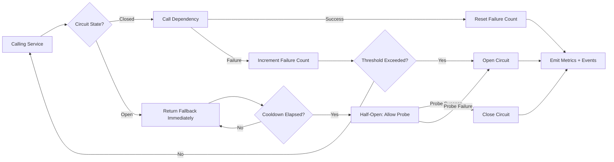
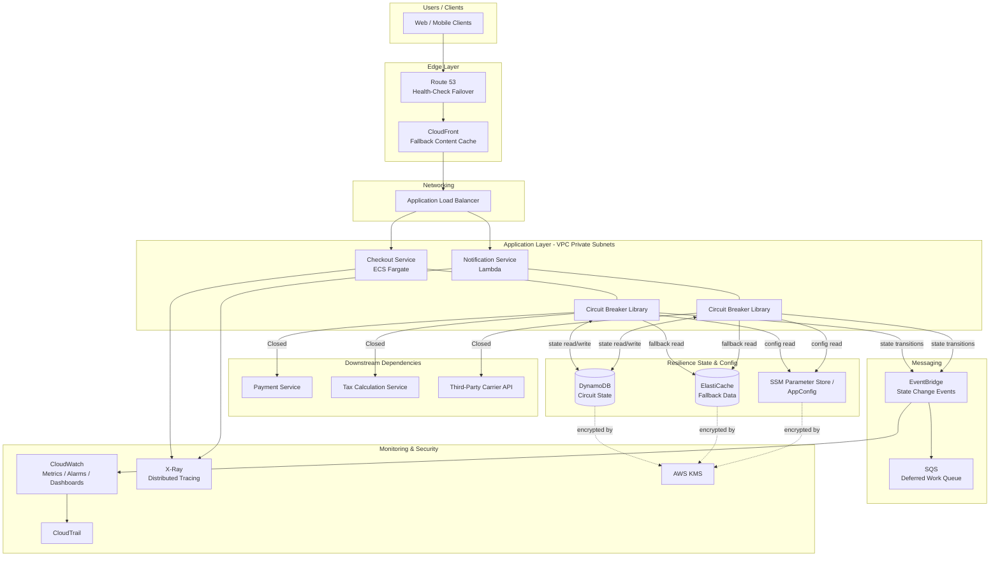

# Part X – Modern Architecture Patterns

# Chapter 83 — Circuit Breaker

---

# 1. Executive Summary

## The Business Problem

Enterprise systems are built from many moving parts.

- A checkout service calls a payment service.
- A payment service calls a fraud-detection service.
- A fraud-detection service calls a third-party credit bureau API.

Each of these dependencies works most of the time.

But "most of the time" is not good enough at enterprise scale.

- A downstream dependency will eventually slow down.
- A downstream dependency will eventually become unavailable.
- A downstream dependency will eventually return errors under load.

Without protection, a single failing dependency can cascade upward.

- Threads pile up waiting on slow responses.
- Connection pools exhaust.
- Upstream services time out waiting on the upstream service that is waiting on the failing service.
- The failure spreads across the entire request graph.

This is called a **cascading failure**.

Cascading failures are the single most common cause of major, multi-hour outages in distributed systems.

They are rarely caused by one service being completely down.

They are usually caused by one service being *partially* degraded — slow, flaky, or intermittently erroring — while everything upstream keeps calling it as if nothing is wrong.

## The Architecture Objective

The Circuit Breaker pattern exists to solve exactly this problem.

- It detects when a downstream dependency is unhealthy.
- It stops sending requests to that dependency once a failure threshold is crossed.
- It fails fast instead of waiting on timeouts.
- It periodically tests whether the dependency has recovered.
- It resumes normal traffic once the dependency is healthy again.

The pattern borrows its name and its state machine directly from electrical engineering.

- A physical circuit breaker in a building trips when current exceeds a safe threshold.
- It stops the flow of electricity to prevent fire or equipment damage.
- Someone (or something) later resets it once the fault is cleared.

A software circuit breaker does the same thing for request traffic.

- It "trips" (opens) when error rates or latency cross a threshold.
- It stops the flow of requests to prevent resource exhaustion.
- It automatically probes the dependency and "resets" (closes) once health is restored.

## Why Organizations Adopt This Architecture

Organizations adopt circuit breakers when they have moved past a single-service architecture into a world with **service-to-service dependencies** — whether that is microservices, service-oriented architecture, or simply a monolith calling multiple external APIs.

Common triggers for adoption include:

- A postmortem following a cascading outage caused by one degraded dependency.
- A dependency on a third-party API with inconsistent reliability (payment gateways, credit bureaus, SMS providers, geocoding services).
- A move toward microservices, where the number of network calls per business transaction increases sharply.
- Regulatory or contractual SLA commitments that require documented resilience mechanisms.
- Rapid growth in traffic that exposes previously "good enough" retry-and-hope error handling.

## Major Business Benefits

| Benefit | Description |
|---|---|
| Reduced blast radius | A single failing dependency degrades gracefully instead of taking down the whole platform. |
| Faster failure detection | Fail-fast behavior surfaces problems in milliseconds instead of after 30-second timeouts. |
| Improved user experience | Users see a fallback response (cached data, degraded feature, friendly error) instead of a frozen spinner. |
| Reduced resource exhaustion | Threads, connections, and compute are not wasted waiting on a dependency that is not going to respond. |
| Faster recovery | Automated half-open probing means dependencies recover without manual intervention. |
| Operational visibility | Circuit state (closed/open/half-open) becomes a first-class signal for dashboards and alerting. |
| Contractual resilience evidence | Many enterprise SLAs and vendor risk assessments now explicitly ask for circuit breaker or equivalent bulkhead evidence. |

## Typical Enterprise Scenarios

**Scenario 1 — E-commerce checkout.**
A checkout service depends on inventory, pricing, tax calculation, and payment services. If the tax calculation service becomes slow, a circuit breaker prevents checkout threads from blocking, allowing the platform to fall back to a cached tax table or queue the order for later confirmation instead of losing the entire checkout flow.

**Scenario 2 — Financial services aggregation.**
A banking dashboard aggregates balances from multiple backend systems (core banking, credit card processor, investment platform). If the investment platform API degrades, the dashboard should still render checking and savings balances instead of showing a blank page.

**Scenario 3 — Third-party API dependency.**
A logistics company calls an external carrier API for real-time shipment tracking. Carrier APIs are notoriously unreliable during peak shipping seasons. A circuit breaker prevents the carrier's instability from propagating into the logistics company's own order-management system.

**Scenario 4 — Internal microservices mesh.**
A recommendation service calls a user-profile service, a catalog service, and a machine learning inference service. Any one of these being slow should not cause the recommendation service itself to become unresponsive to its own callers.

This chapter builds a **production-grade, AWS-native Circuit Breaker reference architecture** applicable across all of these scenarios, implemented primarily at the application layer (Lambda and ECS Fargate services), reinforced by AWS-managed resilience primitives (ALB health checks, Route 53 health checks, retry/backoff policies, and Step Functions error handling), and fully instrumented with CloudWatch, X-Ray, and EventBridge for observability and automated response.

---

# 2. Business Requirements

## Business Drivers

- Prevent cascading failures across a growing microservices estate.
- Protect revenue-critical transaction flows (checkout, payments, account access) from degraded dependencies.
- Meet enterprise SLA commitments (typically 99.9%–99.99% availability) despite unreliable third-party integrations.
- Reduce Mean Time To Detect (MTTD) and Mean Time To Recover (MTTR) for dependency-related incidents.
- Provide graceful degradation instead of full outages, preserving customer trust.

## Functional Requirements

- Every outbound call to a dependency must be wrapped by a circuit breaker.
- The circuit breaker must support three states: Closed, Open, Half-Open.
- The system must expose a fallback response when the circuit is Open.
- The system must automatically attempt recovery (probe requests) after a configurable cooldown period.
- Circuit state transitions must be logged and emitted as metrics/events.
- Per-dependency configuration (thresholds, timeouts, fallback behavior) must be independently tunable.
- Operators must be able to manually force a circuit Open (kill switch) during planned dependency maintenance.

## Non-Functional Requirements

| Category | Requirement |
|---|---|
| Scalability | Must operate correctly across thousands of concurrent Lambda invocations / ECS tasks without shared-state contention becoming a bottleneck. |
| Availability | The resilience layer itself must not become a single point of failure. |
| Latency | Fail-fast decisions (circuit Open) must resolve in under 5 ms of added latency. |
| Compliance | Audit trail of circuit state changes must be retained for a minimum of 1 year for regulated workloads (PCI-DSS, SOX). |
| Security | Circuit breaker configuration and state store must be encrypted at rest and in transit. |
| Observability | Circuit state must be visible on real-time dashboards with sub-minute lag. |

## Scalability Goals

- Support 10,000+ requests per second at peak across all protected dependencies.
- Support hundreds of independently configured circuit breakers (one per downstream dependency, per environment).
- Support horizontal scaling of compute without requiring circuit state to be recalculated per instance from scratch.

## Availability Requirements

- Core transaction services: 99.95% availability target.
- Circuit breaker decision path: must not itself introduce more than 0.01% additional unavailability.
- Fallback paths (cached data, degraded mode) must achieve 99.99% availability, since they are the safety net when primary dependencies fail.

## Latency Requirements

| Path | Target (p99) |
|---|---|
| Closed circuit, dependency healthy | Native dependency latency + < 5 ms overhead |
| Open circuit, fail-fast | < 10 ms |
| Half-open probe | Native dependency latency + < 5 ms overhead |

## Compliance Requirements

- PCI-DSS for payment-adjacent flows (audit logging of failures and fallbacks that touch cardholder data flows, without logging the data itself).
- SOX for financial reporting systems (change control on circuit breaker configuration).
- Industry-specific requirements (HIPAA, GDPR) where circuit breaker fallback paths may serve cached data — cached data retention and encryption must follow the same compliance rules as the source data.

## Security Expectations

- No sensitive data logged in circuit breaker state transition events.
- Circuit breaker configuration changes must be authenticated and authorized (IAM), with all changes auditable via CloudTrail.
- Fallback data sources (caches) must enforce the same access controls as primary data sources.

## Recovery Objectives

| Metric | Target |
|---|---|
| RPO (state store) | Near-zero — circuit state is ephemeral/derivable, not a system of record. |
| RTO (circuit breaker layer) | < 1 minute, since it typically runs inside the same compute as the calling service. |
| RTO (dependency, from the calling service's perspective) | Automatic re-test every 30–60 seconds while Open. |

## SLAs

- Internal SLA: 99.95% for services fronted by circuit breakers.
- External vendor SLA monitoring: circuit breaker trip frequency becomes an input into vendor scorecards and contract renegotiation.

## Expected Workload

- Baseline: 500–2,000 requests/second across protected service-to-service calls.
- Peak (seasonal/promotional events): 10x baseline for e-commerce; 3–5x baseline for financial services.

## Expected Growth

- 2–3x growth in number of downstream dependencies over 24 months as microservices decomposition continues.
- Circuit breaker configuration must be manageable as code (Terraform-driven parameter store entries) to keep pace with this growth without manual toil.

---

# 3. Architecture Overview

## Overall Design

The reference architecture places a circuit breaker **directly inside every service-to-service call path**, implemented as a library/middleware layer inside the calling service's runtime (Lambda function or ECS Fargate task), backed by a lightweight shared state store for cross-instance coordination, and reinforced by AWS-managed network-level resilience controls.

There are two complementary layers:

1. **Application-layer circuit breakers** — the primary mechanism. Implemented in application code (a resilience library) wrapping every outbound HTTP/gRPC/SDK call to a dependency.
2. **Infrastructure-layer resilience controls** — ALB health checks, target group deregistration, Route 53 health-check-based failover, and Step Functions retry/catch blocks. These provide a second line of defense and handle failures the application layer cannot see (e.g., an entire AZ becoming unreachable).

## Architecture Philosophy

- **Fail fast, fail cheap.** A rejected request that returns in 5 ms is far better than a request that hangs for 30 seconds before timing out.
- **Isolate failure domains.** Each dependency gets its own circuit breaker instance — a failure in the tax-calculation dependency must never affect the circuit breaker guarding the inventory dependency (this is the Bulkhead pattern working alongside Circuit Breaker; see Chapter 82).
- **Prefer graceful degradation over binary failure.** Every circuit breaker should have a defined fallback: cached data, a default value, a queued-for-later-processing path, or, at minimum, a clear and fast error.
- **State should be cheap and eventually consistent.** Circuit breaker state (open/closed/half-open, rolling error counts) does not need strong consistency across instances. Approximate, eventually-consistent state shared via a fast store (DynamoDB with DAX, or ElastiCache) is sufficient and far more scalable than a strongly consistent coordinator.
- **Make state observable.** Every state transition emits a CloudWatch metric and an EventBridge event, so state changes are visible without querying application logs.

## Core Components

| Component | Role |
|---|---|
| Resilience library (in-process) | Implements the Closed/Open/Half-Open state machine per dependency, per calling service instance. |
| Shared state store (DynamoDB) | Optional cross-instance state sharing for coordinated circuit decisions in high-fan-out services. |
| Configuration store (SSM Parameter Store / AppConfig) | Holds per-dependency thresholds, timeouts, and fallback behavior, hot-reloadable without redeployment. |
| Metrics pipeline (CloudWatch Embedded Metric Format) | Emits circuit state, error rate, and latency metrics at high cardinality without custom metrics cost explosion. |
| Event bus (EventBridge) | Publishes circuit state transition events for downstream automation (alerting, auto-remediation, incident creation). |
| Fallback data layer (ElastiCache / DynamoDB) | Serves cached/degraded responses when a circuit is Open. |
| Compute layer (Lambda / ECS Fargate) | Hosts the calling services that embed the resilience library. |
| Observability layer (CloudWatch Dashboards, X-Ray) | Visualizes circuit health and traces the impact of open circuits through the request graph. |

## How Components Interact

1. A calling service (e.g., checkout service) needs to invoke a dependency (e.g., tax-calculation service).
2. The call is wrapped by the resilience library's circuit breaker for that specific dependency.
3. The circuit breaker checks its current state (Closed, Open, or Half-Open) — either from local in-memory state or from the shared DynamoDB state table, depending on configuration.
4. If Closed, the call proceeds normally; the outcome (success/failure/latency) updates the rolling window used for threshold evaluation.
5. If Open, the call is short-circuited immediately; a fallback response is returned; no network call is made to the dependency.
6. If Half-Open, a limited number of probe requests are allowed through to test dependency health.
7. State transitions are emitted to CloudWatch (metrics) and EventBridge (events) in real time.
8. Dashboards and alarms consume these signals; EventBridge rules can trigger automated remediation (e.g., notifying the on-call engineer, scaling a dependency, or triggering a runbook via Systems Manager Automation).

## High-Level Workflow



## Request Lifecycle

1. Request enters the calling service (via ALB, API Gateway, or internal invocation).
2. Business logic determines it needs data from a downstream dependency.
3. The call is routed through the circuit breaker wrapper.
4. Circuit breaker evaluates state and either forwards the call or short-circuits it.
5. Response (real or fallback) is returned to the business logic.
6. Business logic completes and returns a response to the original caller.

## Response Lifecycle

- A **real response** flows back unmodified, but is tagged internally (via X-Ray annotation) as "circuit: closed" for tracing purposes.
- A **fallback response** is explicitly marked (in both the trace and, optionally, a response header for internal callers) as degraded, so downstream consumers and dashboards can distinguish real data from fallback data.

## Data Lifecycle

- **Live data**: flows through the circuit breaker on every Closed-state call; not persisted by the circuit breaker itself.
- **Circuit state data**: short-lived, TTL'd in DynamoDB (or held in-memory with periodic sync), typically expiring within minutes of the circuit returning to a stable Closed state.
- **Fallback/cached data**: persisted in ElastiCache or DynamoDB with a defined TTL matching business tolerance for staleness (seconds to hours depending on the data type).
- **Audit/event data**: circuit state transitions are persisted in CloudWatch Logs and, for regulated workloads, archived to S3 with lifecycle policies for long-term retention.

---

# 4. AWS Services Used

## Compute

### AWS Lambda

**Purpose.** Hosts lightweight, event-driven services that make outbound calls to dependencies — ideal for services with spiky, unpredictable traffic where circuit breaker state benefits from a shared external store since each invocation may run in a fresh execution environment.

**Why selected.** Zero infrastructure management, automatic scaling, and pay-per-invocation pricing make it a strong fit for the many small, single-purpose services typically found wrapping third-party API calls.

**Alternatives.** ECS Fargate (better for long-lived, high-throughput services with local in-memory circuit state), EC2 (rarely justified today for this pattern unless there is an existing EC2 fleet).

**Limitations.** Cold starts add latency variance; execution environments are ephemeral, so in-memory circuit state does not persist reliably across invocations, making an external state store (DynamoDB) close to mandatory for accurate circuit tracking at scale.

**Pricing considerations.** Pay-per-request and per-GB-second; additional DynamoDB read/write costs for shared state must be budgeted, though these are typically a small fraction of total Lambda cost.

**Best practices.** Keep circuit breaker state lookups fast (single-digit millisecond DynamoDB reads with DAX if needed); avoid re-implementing circuit logic per function — use a shared internal library layer.

### Amazon ECS on AWS Fargate

**Purpose.** Hosts longer-lived containerized services (checkout, payment orchestration, aggregation services) where in-memory circuit breaker state can persist for the life of the task and be periodically reconciled with a shared store.

**Why selected.** Serverless container operations, predictable performance for sustained traffic, and straightforward integration with Application Load Balancer health checks.

**Alternatives.** Amazon EKS (justified only when the organization already runs Kubernetes at scale and needs Kubernetes-native resilience tooling such as Istio circuit breaking); EC2 with Auto Scaling Groups (more operational overhead, rarely preferred for new builds).

**Limitations.** Task-level in-memory state is not shared across tasks by default; without a shared store, different tasks may reach different circuit decisions for the same dependency, which is acceptable for many use cases but must be a conscious design choice.

**Pricing considerations.** Billed per vCPU/memory-second; right-sizing tasks matters since resilience library overhead is negligible but under-provisioned tasks can themselves become a source of false-positive circuit trips.

**Best practices.** Run resilience library as a shared internal package across all services; centralize configuration via SSM Parameter Store rather than baking thresholds into container images.

## Networking and Edge

### Application Load Balancer (ALB)

**Purpose.** Distributes traffic to healthy ECS Fargate tasks and performs connection-level health checks, providing an infrastructure-level complement to application-level circuit breaking.

**Why selected.** Native integration with ECS, target group health checks, and support for weighted routing useful during Half-Open canary-style probing at the infrastructure level.

**Alternatives.** Network Load Balancer (used when raw TCP/UDP performance is prioritized over HTTP-aware routing — not typically preferred here since HTTP-level health signals are valuable for circuit breaking).

**Limitations.** ALB health checks operate at a coarser granularity (task health) than application-level circuit breakers (per-dependency health); it cannot know that a specific downstream dependency is failing, only that a task itself is unhealthy.

**Pricing considerations.** Billed on Load Balancer Capacity Units (LCUs); generally a minor cost relative to compute.

**Best practices.** Configure aggressive but not overly sensitive health check intervals (10–15 seconds) to avoid false-positive deregistration during transient load spikes.

### Amazon CloudFront

**Purpose.** Serves cached fallback content at the edge for read-heavy scenarios (e.g., product catalog data) when origin services report open circuits.

**Why selected.** Reduces load on origin services during degraded states and improves fallback response latency for globally distributed users.

**Alternatives.** Direct-from-origin serving (acceptable for low-traffic internal services, not recommended for customer-facing high-traffic paths).

**Limitations.** Cache invalidation adds operational complexity; not suitable for highly dynamic, per-user fallback data.

**Pricing considerations.** Data transfer and request-based pricing; generally cost-effective given the reduction in origin load.

**Best practices.** Use short TTLs (seconds to low minutes) for fallback content that must stay reasonably fresh; use Cache-Control headers set explicitly by the origin rather than relying on defaults.

### Route 53

**Purpose.** DNS-level health-check-based failover for entire regional endpoints, complementing circuit breakers with a macro-level failure response.

**Why selected.** Enables automatic failover to a secondary region or a static fallback page when an entire service becomes unreachable, beyond what an in-process circuit breaker can address.

**Alternatives.** Global Accelerator (preferred when sub-second failover and anycast routing matter more than DNS-based failover, which is subject to DNS TTL propagation delays).

**Limitations.** DNS caching by clients and resolvers introduces failover delay measured in the TTL of the record (typically 30–60 seconds even with low TTLs).

**Pricing considerations.** Low cost per hosted zone and per health check; negligible relative to overall architecture cost.

**Best practices.** Use low TTLs (30–60 seconds) on records protected by health checks; combine with Global Accelerator for latency-sensitive failover scenarios.

## Messaging and Events

### Amazon EventBridge

**Purpose.** Publishes circuit breaker state transition events (Closed → Open, Open → Half-Open, Half-Open → Closed) for consumption by alerting, auto-remediation, and audit pipelines.

**Why selected.** Decouples the resilience library from specific downstream consumers of state-change events; supports content-based filtering so different teams can subscribe only to the dependencies they own.

**Alternatives.** Amazon SNS (simpler pub/sub, less filtering capability); direct CloudWatch Alarms only (loses the rich event payload and audit trail EventBridge provides).

**Limitations.** At-least-once delivery means consumers must be idempotent; event ordering across a busy bus is not guaranteed, so absolute ordering-sensitive remediation logic should use sequence numbers embedded in the event payload.

**Pricing considerations.** Billed per event published/matched; typically a very small cost relative to the value delivered for state-change volumes in this pattern.

**Best practices.** Use a dedicated custom event bus for resilience events (rather than the default bus) to simplify access control and avoid noisy-neighbor rule evaluation overhead.

### Amazon SQS

**Purpose.** Buffers requests that would otherwise fail when a circuit is Open, enabling deferred/asynchronous processing instead of outright rejection for tolerant workflows (e.g., "we will email your receipt once payment confirmation is available").

**Why selected.** Durable, low-cost buffering with native dead-letter queue support for messages that ultimately cannot be processed even after circuit recovery.

**Alternatives.** Kinesis Data Streams (justified only when strict ordering and replay-by-multiple-consumers are required — usually unnecessary for this pattern).

**Limitations.** Introduces eventual consistency into the fallback path; not appropriate for use cases requiring synchronous confirmation.

**Pricing considerations.** Low per-request cost; standard queues are typically sufficient, FIFO only when strict per-key ordering of deferred work matters.

**Best practices.** Set a dead-letter queue with alerting after a bounded number of retries; monitor queue depth as a leading indicator of sustained dependency degradation.

## Databases and Caching

### Amazon DynamoDB

**Purpose.** Shared, low-latency circuit breaker state store used to coordinate state across many Lambda invocations or ECS tasks; also used to persist fallback data for use during Open-circuit periods.

**Why selected.** Single-digit-millisecond reads/writes, on-demand or provisioned capacity to match unpredictable resilience-layer traffic, and native TTL support for automatically expiring stale circuit state and cached fallback records.

**Alternatives.** Amazon ElastiCache for Redis/Valkey (lower latency still, in-memory, better suited for extremely high request-rate circuit state checks; trades away DynamoDB's fully managed durability and simpler operational model).

**Limitations.** Even single-digit-millisecond latency adds overhead compared to purely in-memory local state; hot-key throttling is possible if a very small number of dependency keys receive extremely high read/write concurrency (mitigated with DAX or adaptive capacity).

**Pricing considerations.** On-demand pricing is well suited to variable resilience-layer traffic; provisioned capacity with auto scaling is more cost-effective at sustained high volume.

**Best practices.** Use TTL attributes to auto-expire circuit state records; use DynamoDB Accelerator (DAX) in front of the table if read latency becomes a bottleneck at extreme scale.

### Amazon ElastiCache (Redis/Valkey)

**Purpose.** Sub-millisecond shared circuit breaker state and fallback data cache for services requiring the lowest possible overhead on every call.

**Why selected.** In-memory performance is the best fit when circuit state must be checked on every single request at very high request rates (tens of thousands per second).

**Alternatives.** DynamoDB (preferred when operational simplicity and native serverless integration outweigh the marginal latency difference); local in-process state only (preferred for the lowest-latency, lowest-cost option when cross-instance coordination is not required).

**Limitations.** Requires VPC networking and cluster management considerations; data is not durable by default in the same way as DynamoDB, which is acceptable for ephemeral circuit state but must be a conscious choice.

**Pricing considerations.** Billed per node-hour; sizing should be driven by connection count and working-set size, not by throughput alone at this data volume.

**Best practices.** Use cluster mode for horizontal scalability; use short key TTLs matching circuit breaker cooldown windows.

## Identity, Security, and Configuration

### AWS Systems Manager Parameter Store / AWS AppConfig

**Purpose.** Centralized, versioned configuration store for per-dependency circuit breaker thresholds (failure rate, request volume threshold, cooldown duration, timeout).

**Why selected.** AppConfig specifically supports gradual, monitored configuration rollout with automatic rollback if error rates spike after a configuration change — directly relevant to safely tuning circuit breaker thresholds in production.

**Alternatives.** Parameter Store alone (simpler, sufficient for smaller estates without the need for gradual rollout); hardcoded configuration (strongly discouraged — removes the ability to tune thresholds without a deployment).

**Limitations.** AppConfig introduces a small amount of additional architectural complexity (deployment strategies, extensions) that may be unnecessary for smaller organizations.

**Pricing considerations.** Parameter Store standard parameters are free; AppConfig has a small per-configuration-request cost, mitigated by client-side caching.

**Best practices.** Cache configuration in-process with a short refresh interval (30–60 seconds) rather than fetching on every request.

### AWS KMS

**Purpose.** Encrypts circuit breaker state data, fallback cache data, and configuration parameters at rest.

**Why selected.** Native integration with DynamoDB, ElastiCache, Parameter Store, and CloudWatch Logs; supports customer-managed keys for regulated workloads requiring key rotation control and access auditing.

**Alternatives.** AWS-managed keys (simpler, sufficient for non-regulated workloads; customer-managed keys required for stricter compliance regimes).

**Limitations.** Customer-managed keys add operational overhead (rotation policy, key access review) that must be budgeted for.

**Pricing considerations.** Per-key monthly fee plus per-request charges; negligible relative to overall architecture spend.

**Best practices.** Use a dedicated KMS key per environment (dev/staging/production) to simplify blast-radius containment on key compromise.

### AWS IAM

**Purpose.** Grants least-privilege access for services to read/write circuit breaker state, read configuration, and publish events.

**Why selected.** Native to every AWS service touched by this architecture; supports fine-grained resource-level policies scoped to specific DynamoDB tables, Parameter Store paths, and EventBridge buses.

**Alternatives.** None credible within AWS — IAM is the standard identity and access layer.

**Limitations.** Policy sprawl across many services requires disciplined naming conventions and periodic access review (see Section 10).

**Best practices.** Scope circuit breaker library IAM roles to only the specific DynamoDB table and Parameter Store path prefix relevant to that service — never grant account-wide DynamoDB or SSM access.

## Observability

### Amazon CloudWatch

**Purpose.** Central metrics, logs, dashboards, and alarms for circuit state, error rates, latency, and fallback invocation counts.

**Why selected.** Native, low-latency integration with Lambda and ECS; supports Embedded Metric Format for high-cardinality, low-cost custom metrics (one metric stream per dependency, per environment).

**Alternatives.** Third-party observability platforms (Datadog, New Relic) — often used in addition to, not instead of, CloudWatch, particularly for cross-cloud or unified dashboards; not a replacement for the native alarm-to-EventBridge-to-remediation pipeline described here.

**Limitations.** Custom metric cardinality can become costly if circuit state is tracked per-instance rather than per-dependency-aggregate; dashboard query performance degrades with excessive metric math complexity.

**Pricing considerations.** Custom metrics, log ingestion, and dashboard costs scale with cardinality and retention; EMF-based metrics from logs are more cost-effective than PutMetricData API calls at high volume.

**Best practices.** Aggregate circuit state metrics by dependency name, not by individual compute instance ID, to keep cardinality and cost manageable.

### AWS X-Ray

**Purpose.** Distributed tracing that shows exactly where in the request graph a circuit is open and a fallback was served, critical for diagnosing multi-hop cascading issues.

**Why selected.** Native SDK integration with Lambda and ECS; annotations allow marking a trace segment as "circuit: open, fallback: served" for fast root-cause identification.

**Alternatives.** OpenTelemetry with a third-party backend (increasingly common; AWS Distro for OpenTelemetry (ADOT) can export to X-Ray or other backends, giving flexibility without vendor lock-in).

**Limitations.** Sampling reduces trace completeness at high volume; requires deliberate annotation strategy to make circuit state visible in traces rather than only in metrics.

**Pricing considerations.** Billed per trace recorded and retrieved; sampling rules should be tuned to capture a representative sample of Open-circuit events specifically, since these are the traces of highest diagnostic value.

**Best practices.** Force 100% trace sampling on requests where the circuit breaker short-circuits, since these are rare and high-value events, while using standard sampling rates for normal Closed-circuit traffic.

### CloudTrail and AWS Config

**Purpose.** Audit trail for configuration changes to circuit breaker thresholds and IAM permissions; compliance evidence for change control requirements.

**Why selected.** Required baseline for any regulated enterprise workload; AWS Config rules can detect and alert on out-of-policy configuration drift (e.g., a threshold changed outside of the approved CI/CD pipeline).

**Limitations.** Neither service provides real-time blocking of non-compliant changes on its own — must be paired with Service Control Policies or IAM permission boundaries for preventive control.

**Pricing considerations.** CloudTrail management events are free; Config rule evaluations incur a small per-evaluation charge.

**Best practices.** Create a dedicated AWS Config rule that flags any direct (non-pipeline) modification to circuit breaker configuration parameters.

---

# 5. Complete Architecture Diagram



---

# 6. Component-by-Component Explanation

## Resilience Library (Circuit Breaker State Machine)

**Purpose.** Encapsulates the Closed/Open/Half-Open state machine and enforces short-circuiting logic on every outbound call to a protected dependency.

**Responsibilities.**

- Track rolling success/failure counts and latency per dependency.
- Evaluate configured thresholds against the rolling window.
- Transition state and emit events on transition.
- Route to fallback logic when Open.
- Allow a controlled number of probe requests when Half-Open.

**Inputs.** Outbound call parameters, per-dependency configuration, current circuit state.

**Outputs.** Real dependency response, fallback response, state transition events, metrics.

**Scaling.** Runs in-process with the calling service; scales automatically with the calling service's own compute scaling (Lambda concurrency, ECS task count).

**High availability.** No single point of failure — each compute instance runs its own copy of the library; shared state store failure degrades to local-only decisioning rather than causing an outage (fail-open or fail-closed behavior is explicitly configurable per dependency, see Section 24).

**Failure handling.** If the shared state store is unreachable, the library falls back to local in-memory state and logs a warning; it never blocks the calling service's own request path waiting on state store availability.

**Dependencies.** DynamoDB or ElastiCache (optional, for shared state), SSM Parameter Store / AppConfig (configuration), CloudWatch (metrics), EventBridge (events).

**Security.** Runs with the calling service's IAM role; no independent credentials.

**Monitoring.** Emits circuit state, trip count, fallback invocation count, and probe outcome metrics per dependency.

## Shared State Store (DynamoDB)

**Purpose.** Provides cross-instance visibility into circuit state so that, for example, 50 concurrent Lambda invocations agree on whether the payment service circuit is currently Open.

**Responsibilities.** Store current state, rolling failure counts, and last-transition timestamp per dependency key.

**Inputs.** State updates from every calling instance.

**Outputs.** Current state reads for decisioning.

**Scaling.** On-demand capacity mode absorbs unpredictable spikes in state read/write volume without manual capacity planning.

**High availability.** Multi-AZ by default; optionally global tables for multi-region deployments.

**Failure handling.** Calling services degrade to local state on read/write failure rather than blocking.

**Dependencies.** KMS for encryption.

**Security.** Table-level IAM policy scoped per calling service; encryption at rest via KMS.

**Monitoring.** Throttling, latency, and error metrics via CloudWatch.

## Configuration Store (SSM Parameter Store / AppConfig)

**Purpose.** Centralizes tunable thresholds so operators can adjust circuit sensitivity without a code deployment.

**Responsibilities.** Store per-dependency: failure rate threshold, minimum request volume before evaluation, cooldown duration, half-open probe count, timeout value.

**Inputs.** Configuration changes via CI/CD pipeline or, in emergencies, via a controlled runbook.

**Outputs.** Configuration values consumed by the resilience library at startup and on periodic refresh.

**Scaling.** Read-heavy, cached client-side; scales trivially.

**High availability.** Regional service with high native availability; client-side caching provides resilience to transient unavailability.

**Failure handling.** Library falls back to last-known-good cached configuration, or safe defaults, if the configuration store is unreachable.

**Dependencies.** KMS for encrypted parameters.

**Security.** IAM-scoped read access per service; write access restricted to CI/CD pipeline roles only.

**Monitoring.** Configuration change events tracked via CloudTrail.

## Fallback Data Layer (ElastiCache / DynamoDB)

**Purpose.** Serves the actual fallback payload (last-known-good data, default values) when a circuit is Open.

**Responsibilities.** Store periodically refreshed snapshots of dependency data suitable for degraded-mode serving.

**Inputs.** Successful dependency responses written back opportunistically during Closed-state operation.

**Outputs.** Fallback payloads served during Open-state operation.

**Scaling.** Sized to working-set of frequently accessed fallback data, not full dataset size.

**High availability.** Multi-AZ replication group (ElastiCache) or on-demand DynamoDB with multi-AZ durability.

**Failure handling.** If fallback data is unavailable, the library serves a static, hardcoded minimal-viable default (e.g., "0% tax, verify at checkout") rather than an error, when business rules allow.

**Dependencies.** KMS for encryption.

**Security.** Same data classification and access control as the source-of-truth data it caches.

**Monitoring.** Cache hit/miss ratio, staleness age of served fallback data.

## Event Bus (EventBridge)

**Purpose.** Publishes every circuit state transition as a structured event for consumption by alerting and automation.

**Responsibilities.** Reliable, filtered delivery of state-change events to multiple independent consumers.

**Inputs.** State transition events from the resilience library.

**Outputs.** Filtered event delivery to SQS, Lambda targets, and CloudWatch.

**Scaling.** Serverless, scales automatically with event volume.

**High availability.** Fully managed, multi-AZ by design.

**Failure handling.** Failed target invocations retried with configurable retry policy and dead-letter queue.

**Dependencies.** None beyond IAM for publish permissions.

**Security.** Resource-based policy restricts which services may publish to the resilience event bus.

**Monitoring.** FailedInvocations and ThrottledRules metrics.

## Compute Layer (Lambda / ECS Fargate)

Already covered in Section 4; from a component-interaction perspective, these are the "hosts" for the resilience library and the actual business logic that decides what a fallback response should contain.

## Observability Layer (CloudWatch, X-Ray)

**Purpose.** Makes circuit health visible in real time and traceable through the full request graph.

**Responsibilities.** Aggregate metrics, render dashboards, evaluate alarms, capture and visualize distributed traces.

**Scaling / HA / Failure handling.** Fully managed AWS services; no customer-managed scaling required.

**Security.** IAM-scoped read/write; log data encrypted at rest.

**Monitoring.** Self-monitoring via CloudWatch's own service health dashboards.

---

# 7. End-to-End Request Flow

The following walks through a concrete example: a customer completing checkout, where the checkout service calls a tax-calculation dependency protected by a circuit breaker.

1. **Client** submits checkout request from browser/mobile app.
2. **DNS (Route 53)** resolves the application domain to the CloudFront distribution / ALB, using health-check-based routing to avoid an unhealthy region if multi-region is deployed.
3. **CloudFront** forwards the dynamic checkout request to the origin (ALB) — static/fallback content may be served directly from cache for read-only endpoints.
4. **Load Balancer (ALB)** routes the request to a healthy ECS Fargate task running the checkout service, based on target group health checks.
5. **Application (Checkout Service)** begins processing the order and needs a tax calculation.
6. The call to the tax-calculation dependency is wrapped by the **circuit breaker**.
7. Circuit breaker checks current state:
   - **If Closed:** proceeds to step 8.
   - **If Open:** skips to step 12 immediately (fail-fast).
   - **If Half-Open:** proceeds to step 8 only if this request is selected as one of the limited probe requests; otherwise treated as Open.
8. **Database / Downstream call**: the tax-calculation service is called over HTTPS within the VPC (or to an external API via a NAT Gateway if third-party).
9. **Caching**: on a successful response, the result is optionally written to the fallback cache (ElastiCache) for future degraded-mode use, and the circuit breaker's success counter is updated.
10. **Logging**: the outcome (success, latency) is logged in structured JSON to CloudWatch Logs with the dependency name and circuit state at time of call.
11. **Monitoring**: latency and outcome are emitted as EMF metrics, aggregated by CloudWatch into per-dependency dashboards.
12. **Error handling / Fallback path** (entered directly from step 7 if Open, or from a failed call in step 8):
    - The circuit breaker increments the failure counter (if from a live failed call) or skips the call entirely (if already Open).
    - A fallback response is retrieved from the fallback cache, or a safe default value is used per business rules.
    - The response is tagged as "degraded" for downstream visibility.
    - If the failure threshold is newly crossed, the circuit transitions to Open, and a state-change event is published to EventBridge.
13. **Response construction**: checkout service completes order processing using either the real or fallback tax value, and constructs the response.
14. **Response returned** through ALB → CloudFront → Route 53 resolution path back to the client.
15. **Async follow-up (if applicable)**: if the business rule requires eventual reconciliation (e.g., "recalculate tax once the service recovers and adjust invoice if needed"), a message is placed on an SQS queue for later processing once the circuit closes again.

---

# 8. Deployment Flow

## Infrastructure Provisioning

- All infrastructure (DynamoDB tables, ElastiCache clusters, SSM parameters, EventBridge buses, IAM roles, ECS services, Lambda functions) is provisioned via Terraform, never manually through the console, in line with the organization's infrastructure-as-code standard.
- Environments (dev, staging, production) are deployed from the same Terraform modules with environment-specific variable files, ensuring circuit breaker configuration and infrastructure topology stay consistent across the promotion pipeline.

## Terraform Workflow

1. Developer opens a pull request modifying Terraform code (e.g., adding a new circuit breaker configuration parameter for a newly integrated dependency).
2. CI pipeline runs `terraform fmt -check`, `terraform validate`, and a policy-as-code scan (e.g., Checkov or OPA/Conftest) against the plan.
3. `terraform plan` output is posted as a PR comment for human review.
4. On merge to main, `terraform apply` runs against staging automatically; production apply requires a manual approval gate.

## CI/CD Deployment

- Application code (the resilience library and the services embedding it) is built, tested (including unit tests specifically for the circuit breaker state machine — see Section 20 for CI/CD detail), and deployed via the same pipeline that deploys the rest of the service.
- Circuit breaker threshold configuration is deployed via AppConfig deployment strategies, allowing gradual rollout (e.g., 10% of instances for 10 minutes, then 100%) with automatic rollback if CloudWatch alarms fire during the rollout.

## Blue-Green Deployment

- ECS services use blue-green deployment via AWS CodeDeploy, shifting traffic gradually from the old task set to the new one.
- Circuit breaker state in DynamoDB is shared across both the old and new task sets during the transition, ensuring circuit decisions remain consistent even as traffic shifts between deployment versions.

## Rollback

- Application rollback follows standard blue-green reversal (CodeDeploy redirects traffic back to the previous task set).
- Configuration rollback (threshold changes) is handled automatically by AppConfig if a monitored CloudWatch alarm (e.g., a sudden spike in circuit trips correlated with the deployment) fires during the deployment window.

## Secrets

- No dependency credentials are hardcoded; all third-party API keys are stored in Secrets Manager and retrieved at runtime by the calling service, never by the resilience library itself (which has no need to know credentials — it only wraps the call).

## Configuration

- Circuit breaker thresholds are environment-specific (production thresholds are typically more conservative — lower failure tolerance — than staging, where engineers may intentionally want to test breaker behavior under injected failures).

## Validation

- Post-deployment smoke tests specifically exercise the circuit breaker: a synthetic canary intentionally calls a known-bad endpoint to confirm the circuit opens as expected and that the fallback response is served correctly, before the deployment is marked successful.

---

# 9. Network Topology

## VPC

- A dedicated VPC per environment, following the organization's standard landing zone pattern (see Chapter 99).
- CIDR block sized to accommodate current and projected service count: `10.20.0.0/16` for production, non-overlapping ranges for staging and dev to support VPC peering or Transit Gateway attachment if cross-environment connectivity is ever required for controlled testing.

## Public Subnets

- Host the Application Load Balancer and NAT Gateways only.
- No application compute runs in public subnets.

## Private Subnets

- Host ECS Fargate tasks, Lambda functions (via VPC configuration when they need to reach ElastiCache or internal-only dependencies), DynamoDB via VPC endpoint, and ElastiCache nodes.
- Split across a minimum of three Availability Zones for production workloads.

## NAT Gateway

- One NAT Gateway per AZ (not a single shared NAT Gateway) to avoid a cross-AZ single point of failure and to avoid inter-AZ data transfer charges on egress traffic to third-party dependencies.

## Internet Gateway

- Attached to the VPC for public subnet internet connectivity (ALB ingress, NAT Gateway egress path).

## Transit Gateway

- Used when the circuit breaker architecture must reach dependencies hosted in other VPCs or other AWS accounts within the organization (common in a multi-account landing zone where the payment service and checkout service live in separate accounts for blast-radius isolation).

## Route Tables

- Private subnet route tables direct internet-bound traffic through the AZ-local NAT Gateway.
- VPC endpoint routes (DynamoDB, S3, Secrets Manager, SSM) keep traffic to these AWS services off the public internet entirely, reducing both latency and NAT Gateway data processing costs.

## Network ACLs

- Baseline stateless NACLs at the subnet level as a defense-in-depth layer, permitting only expected ports (443 for HTTPS, ephemeral return traffic).

## Security Groups

- Circuit-breaker-protected services' security groups explicitly allow outbound HTTPS (443) only to the specific security groups or prefix lists of their known dependencies — not unrestricted outbound, which would defeat some of the network-level containment value of the bulkhead/circuit-breaker combination.

## PrivateLink

- Used for reaching AWS-managed dependencies (DynamoDB, SSM, Secrets Manager, EventBridge) via VPC endpoints, and optionally for reaching internal partner services exposed via VPC endpoint services, avoiding public internet exposure for internal-to-internal traffic.

## Hybrid Connectivity

- For enterprises with on-premises dependencies (e.g., a legacy mainframe-based inventory system), Direct Connect or Site-to-Site VPN provides the network path; the circuit breaker pattern is equally, if not more, valuable here given the typically higher latency variance of on-premises dependencies.

---

# 10. Identity and Access

## IAM Roles

| Role | Purpose |
|---|---|
| `checkout-service-task-role` | ECS task role for the checkout service; scoped to its own DynamoDB circuit-state table partition, its own SSM parameter path, and EventBridge publish permission. |
| `circuit-breaker-config-pipeline-role` | Used exclusively by CI/CD to write circuit breaker configuration to SSM/AppConfig. |
| `resilience-dashboard-reader-role` | Read-only role for SRE/on-call engineers to view circuit state dashboards and CloudWatch data without write access to any underlying resource. |

## IAM Policies

- Policies are written per-service, scoped to specific resource ARNs (specific DynamoDB table, specific SSM parameter path prefix such as `/circuit-breaker/checkout-service/*`), never wildcarded across all resources of a type.

## Resource Policies

- The resilience EventBridge bus carries a resource policy restricting `PutEvents` to the specific list of service task roles authorized to publish circuit state events, preventing an unrelated compromised service from injecting misleading state-change events.

## STS

- Cross-account access (e.g., a checkout service in the "workloads" account reading configuration published from a central "platform" account) uses STS `AssumeRole` with a tightly scoped trust policy, never long-lived cross-account credentials.

## Cross-Account Access

- In multi-account landing zones, the shared circuit-state DynamoDB table (if centralized rather than per-account) is accessed via a resource policy plus STS role assumption, with CloudTrail logging every cross-account read/write for audit purposes.

## Least Privilege

- No service role is granted `dynamodb:*`; only `GetItem`, `PutItem`, `UpdateItem` on the specific circuit-state table, scoped further by a leading-key condition where the DynamoDB table is shared across services (partition key prefixed by service name, IAM condition restricting access to items with that service's prefix).

## Service Roles

- Lambda execution roles and ECS task roles are the two primary service role types in this architecture; each is provisioned per-service (not shared across multiple services) to keep blast radius contained if any single role's credentials are compromised.

## Permission Boundaries

- All service roles have a permission boundary applied at the account level preventing privilege escalation — a compromised or misconfigured service role can never grant itself broader permissions than the boundary allows, regardless of what its identity-based policy says.

---

# 11. Security Architecture

## Encryption

- All data at rest (DynamoDB, ElastiCache, SSM SecureString parameters, CloudWatch Logs) encrypted using AWS KMS customer-managed keys in production; AWS-managed keys acceptable in lower environments.
- All data in transit uses TLS 1.2 or higher, enforced via ALB listener policies and application-level HTTPS-only outbound calls.

## KMS

- Dedicated KMS keys per data classification tier: one key for circuit-state data (low sensitivity), a separate key for fallback cache data if that data includes any PII (higher sensitivity, stricter key policy and access logging).

## TLS

- ALB terminates TLS using an ACM-issued certificate; internal service-to-service calls within the VPC also use TLS (via service mesh or direct HTTPS) to satisfy zero-trust internal traffic requirements.

## WAF

- AWS WAF attached to the ALB / CloudFront distribution to filter malicious traffic before it ever reaches the circuit-breaker-protected services, reducing the chance that a volumetric attack itself becomes the trigger that trips circuits under illegitimate load.

## Shield

- AWS Shield Standard (automatic, free) provides baseline DDoS protection; Shield Advanced considered for public-facing, revenue-critical endpoints (e.g., the checkout flow) given the direct business impact of a DDoS-induced cascading circuit trip event.

## Secrets Manager

- Stores credentials for any third-party dependency the circuit breaker protects (API keys for carrier APIs, payment gateway credentials), with automatic rotation configured where the third party supports it.

## Certificate Manager

- Issues and auto-renews TLS certificates for all ALB listeners and CloudFront distributions in this architecture.

## GuardDuty

- Monitors for anomalous API activity against the DynamoDB circuit-state table and SSM configuration parameters (e.g., unusual read volume from an unexpected principal), which could indicate reconnaissance or an attempt to manipulate circuit behavior maliciously.

## Inspector

- Scans ECS container images (the resilience library and its dependencies) for known vulnerabilities as part of the CI/CD pipeline, before deployment.

## Security Hub

- Aggregates findings from GuardDuty, Inspector, and Config across the architecture into a single compliance and security posture view.

## CloudTrail

- Logs every API call that modifies circuit breaker configuration, IAM roles, or the underlying infrastructure, providing the audit trail required for SOX and PCI-DSS change control evidence.

## AWS Config

- Continuously evaluates whether DynamoDB tables, SSM parameters, and IAM roles in this architecture remain compliant with organizational baselines (encryption enabled, no public access, least-privilege policies).

## Zero Trust

- No implicit trust between services purely because they reside in the same VPC; every service-to-service call is authenticated (mutual TLS or signed requests via IAM SigV4 for AWS-native calls) and authorized independently of network location.

## Threat Model

| Threat | Description |
|---|---|
| Circuit state manipulation | An attacker with write access to the state store forces circuits open (denial of service) or closed (removing protection during a real outage). |
| Configuration tampering | Unauthorized modification of thresholds to make circuits either overly sensitive (nuisance trips, denial of service) or insensitive (removes protection). |
| Fallback data poisoning | An attacker corrupts cached fallback data so that degraded-mode responses serve incorrect or malicious content. |
| Third-party dependency compromise | A compromised third-party API returns malicious payloads that are cached as "successful" responses and later served as fallback data. |

## Attack Vectors and Mitigations

| Attack Vector | Mitigation |
|---|---|
| Compromised service role writes malicious circuit state | Least-privilege IAM policies scoped to specific table partitions; GuardDuty anomaly detection. |
| Unauthorized configuration change | CI/CD-only write access to configuration; AWS Config rule detecting out-of-band changes; CloudTrail alerting. |
| DDoS-induced mass circuit trip | WAF rate limiting, Shield Advanced, and per-source-IP throttling before requests reach circuit-protected services. |
| Fallback cache poisoning | Validate and sanitize dependency responses before caching them as fallback data; never cache raw third-party responses without schema validation. |

---

# 12. High Availability

## AZ Failures

- ECS Fargate tasks and Lambda functions are distributed across a minimum of three AZs; ALB health checks automatically stop routing to tasks in an impaired AZ.
- DynamoDB and ElastiCache (cluster mode) replicate across AZs, so circuit state and fallback data remain available if a single AZ fails.

## Instance Failures

- ECS service scheduler automatically replaces failed tasks; Lambda has no "instance" concept to fail in the traditional sense, though execution environment issues are handled transparently by the platform.
- The circuit breaker's local-state-fallback design (Section 24) means an individual instance failure never causes an inconsistent circuit decision to persist — the replacement instance simply reads current shared state (or starts fresh with safe defaults) on startup.

## Regional Failures

- For tier-1, revenue-critical services, a warm-standby deployment in a secondary region (see Chapter 98) allows Route 53 health-check failover to redirect traffic if the primary region becomes unavailable.
- Circuit breaker configuration (SSM parameters) is replicated to the secondary region via Terraform applied to both regions from the same source of truth.

## Database Failures

- DynamoDB circuit-state table failures (extremely rare given AWS's managed durability) are handled by the resilience library's fail-open-to-local-state design — the service continues operating on locally observed state rather than blocking on a state-store outage.

## Load Balancing

- ALB distributes load across all healthy targets in all AZs; target group health checks operate independently of, and in addition to, application-level circuit breaker state.

## Health Checks

- ALB target group health checks validate that the service process itself is healthy (a lightweight `/health` endpoint that does NOT call downstream dependencies — this is a deliberate and important distinction, covered further in Section 27 anti-patterns).
- Circuit breaker state is exposed via a separate `/health/dependencies` diagnostic endpoint used by dashboards and synthetic monitors, not by the ALB itself.

## Failover

- Application-level: circuit breaker fallback logic (immediate, sub-10ms).
- Infrastructure-level: ALB target deregistration and re-routing (seconds).
- Regional-level: Route 53 health-check-based DNS failover (30–90 seconds depending on TTL and health check interval).

---

# 13. Disaster Recovery

## Backup Strategy

- Circuit state data is intentionally NOT backed up in the traditional sense — it is ephemeral, derivable operational state, not a system of record. Losing it simply means circuits start Closed and re-learn dependency health within seconds.
- Fallback cache data (ElastiCache) is similarly not backed up; it is repopulated from live traffic during normal operation.
- Configuration data (SSM/AppConfig parameters) IS backed up implicitly via Terraform state and version control — the true source of truth for configuration is the Git repository, not the runtime parameter store.

## Snapshots

- DynamoDB point-in-time recovery (PITR) is enabled for the circuit-state table primarily for operational forensics after an incident (e.g., "what was the circuit state at 14:32 when the outage began?"), not for restore-to-production purposes.

## Cross-Region Replication

- DynamoDB Global Tables replicate circuit-state and configuration data to the secondary region for multi-region active-active or warm-standby deployments.
- ElastiCache Global Datastore replicates fallback cache data cross-region for the same purpose, where the business case justifies the added cost.

## Pilot Light

- For less-critical services fronted by circuit breakers, a pilot-light DR posture is sufficient: infrastructure exists in the secondary region (via Terraform, deployable within minutes) but is not actively running until needed.

## Warm Standby

- For revenue-critical services (checkout, payments), a warm-standby posture keeps a scaled-down but running deployment in the secondary region at all times, ready to absorb full traffic within the RTO window after Route 53 failover.

## Multi-Site / Active-Active

- The highest-tier services may run active-active across two or more regions, with circuit breakers in each region operating independently against regional dependency endpoints, and Global Accelerator or Route 53 latency-based routing directing users to the nearest healthy region.

## Active-Passive

- The more common posture for this pattern: active in the primary region, passive (warm standby) in the secondary, given that most circuit-breaker-protected dependencies are themselves single-region, making full active-active less valuable unless the dependencies are also multi-region.

## RPO / RTO Summary

| Component | RPO | RTO |
|---|---|---|
| Circuit state | Not applicable (ephemeral, self-healing) | < 30 seconds to re-establish healthy state after failover |
| Fallback cache | Not applicable (repopulated from live traffic) | < 1 minute to reach useful cache hit rate |
| Configuration | Near-zero (source of truth is Git/Terraform) | < 5 minutes to reapply via pipeline |
| Overall service | Varies by tier (see Chapter 95 for detailed RPO/RTO by tier) | 1–15 minutes depending on warm-standby vs. pilot-light posture |

---

# 14. Scalability

## Horizontal Scaling

- ECS Fargate services scale out via Application Auto Scaling based on CPU/memory utilization and, notably, on a custom CloudWatch metric tracking circuit-breaker-induced fallback invocation rate — a sustained spike in fallback usage can itself indicate the calling service needs more capacity to handle retry/probe overhead gracefully.
- Lambda scales automatically per invocation, bounded by reserved/provisioned concurrency settings to protect downstream dependencies from being overwhelmed by a burst of retries once a circuit closes (see Section 24, thundering herd anti-pattern).

## Vertical Scaling

- ECS task CPU/memory sizing is tuned based on profiling; the resilience library itself adds negligible CPU/memory overhead (typically well under 5% of task resources) when correctly implemented with efficient local caching of configuration.

## Auto Scaling

- Target tracking scaling policies on ECS services, tied to both standard utilization metrics and the custom "fallback rate" metric described above.

## Serverless Scaling

- Lambda's native scaling handles burst traffic; DynamoDB on-demand capacity scales automatically with the resulting burst in circuit-state read/write volume.

## Database Scaling

- DynamoDB on-demand mode or auto-scaled provisioned capacity for the circuit-state table; ElastiCache cluster mode allows horizontal shard scaling for the fallback cache as working-set size grows.

## Storage Scaling

- S3 storage for archived audit logs (circuit state transition history) scales automatically with no operational intervention; lifecycle policies transition older data to lower-cost storage classes.

## Queue Scaling

- SQS scales automatically with no configuration; consumers (Lambda or ECS workers processing deferred work) scale based on queue depth via target tracking scaling.

---

# 15. Performance Optimization

## Caching

- Configuration is cached client-side (in the resilience library) with a 30–60 second refresh interval, avoiding a round trip to SSM/AppConfig on every request.
- Fallback data is cached in ElastiCache with TTLs matched to business staleness tolerance.

## Compression

- Response payloads (including fallback responses) are compressed (gzip/Brotli) at the ALB/CloudFront layer to reduce latency for large catalog or pricing payloads served in degraded mode.

## CDN

- CloudFront caches read-heavy fallback content (e.g., a cached product catalog snapshot) at edge locations, reducing both latency and load on origin services during a degraded-state event, when origin load is often already elevated due to retry pressure.

## Database Optimization

- DynamoDB circuit-state table uses a simple, single-digit-attribute item schema (dependency key, state, failure count, last transition timestamp) to keep read/write latency minimal — this table is deliberately NOT used for anything beyond circuit state to avoid query complexity creeping in over time.

## Connection Pooling

- ECS Fargate services maintain persistent, pooled HTTP connections to frequently called dependencies, avoiding TCP/TLS handshake overhead on every call — critical because a slow handshake can itself be misattributed as dependency latency, contributing to false-positive circuit trips.

## Concurrency

- Half-Open state probe requests are strictly limited (typically 1–5 concurrent probes) to avoid immediately overwhelming a recovering dependency with the full production traffic volume.

## Async Processing

- Where business rules tolerate it, non-critical calls (e.g., analytics event forwarding, non-blocking notifications) are moved off the synchronous request path entirely via SQS/EventBridge, reducing the surface area that needs circuit breaker protection in the first place — the best-protected call is often the one that doesn't need to be synchronous at all.

---

# 16. Cost Optimization (FinOps)

## Estimated Monthly Cost by Deployment Size

| Component | Small (dev/low-traffic) | Medium (production, moderate traffic) | Enterprise (high-traffic, multi-region) |
|---|---|---|---|
| ECS Fargate (calling services) | $150 | $1,200 | $6,000+ |
| Lambda (event-driven services) | $20 | $250 | $1,500 |
| DynamoDB (circuit state) | $10 | $80 | $400 |
| ElastiCache (fallback cache) | $0 (skip, use DynamoDB only) | $150 | $900 (cluster mode, multi-AZ) |
| EventBridge | $2 | $15 | $80 |
| SQS | $2 | $20 | $100 |
| CloudWatch (metrics, logs, dashboards) | $30 | $200 | $1,200 |
| X-Ray | $5 | $60 | $350 |
| ALB | $25 | $150 | $600 (multiple, multi-region) |
| NAT Gateway | $65 (1 AZ) | $200 (3 AZ) | $600 (3 AZ x 2 regions) |
| KMS | $5 | $15 | $60 |
| **Estimated Total** | **~$315/month** | **~$2,340/month** | **~$11,790/month** |

> **Note.** These figures cover only the resilience-layer infrastructure directly attributable to the Circuit Breaker pattern (state store, config store, event bus, and associated observability). They do not include the cost of the business logic compute itself beyond the incremental overhead the resilience layer adds, nor the cost of the downstream dependencies being protected.

## Major Cost Drivers

- CloudWatch custom metrics and log ingestion typically become the single largest resilience-layer cost line at scale if per-instance (rather than per-dependency-aggregate) metrics are emitted — this is the most common FinOps mistake in circuit breaker implementations.
- NAT Gateway data processing charges for calls to external third-party dependencies, which can be significant for high-volume carrier/payment API integrations.
- ElastiCache node costs if over-provisioned relative to actual working-set size.

## Optimization Opportunities

- Aggregate CloudWatch metrics by dependency, not by instance ID — this single change frequently reduces custom metric costs by 80-95% at scale.
- Use DynamoDB on-demand for circuit state rather than always-on provisioned capacity in lower environments, matching cost to actual (often bursty and low) usage.
- Use VPC endpoints for DynamoDB, SSM, and Secrets Manager to eliminate NAT Gateway data processing charges for AWS-native traffic — NAT Gateway costs should be attributable almost entirely to genuine third-party/internet-bound calls.

## Reserved Instances / Savings Plans

- Compute Savings Plans applied to steady-state ECS Fargate and Lambda baseline usage, typically yielding 20–30% savings on predictable baseline load while leaving burst capacity on-demand.

## Spot

- Not typically applicable to the resilience layer itself (state stores and event buses are serverless), but relevant to any batch reconciliation workers processing the deferred-work SQS queue, where Spot-based Fargate capacity providers can reduce cost for fault-tolerant, retriable background processing.

## S3 Lifecycle / Storage Classes

- Archived circuit state transition audit logs transition from S3 Standard to S3 Infrequent Access after 30 days, then to S3 Glacier Instant Retrieval after 90 days, aligning cost with the actual (low) access frequency of historical audit data while meeting the 1-year retention compliance requirement from Section 2.

## Rightsizing

- Periodic review (quarterly) of ECS task CPU/memory allocation against actual utilization, informed by the fact that the resilience library's own overhead is minimal and should not be used to justify over-provisioning.

## Cost Allocation and Tagging

| Tag Key | Purpose |
|---|---|
| `cost-center` | Maps resilience-layer spend to the owning business unit. |
| `service-name` | Attributes DynamoDB/ElastiCache/CloudWatch spend to the specific calling service. |
| `environment` | Separates dev/staging/production spend for budget tracking. |
| `pattern` | Tagged `circuit-breaker` to allow FinOps to isolate total resilience-layer spend across the estate. |

## Budgets and Cost Anomaly Detection

- AWS Budgets alert configured per environment with thresholds at 80% and 100% of forecasted monthly resilience-layer spend.
- Cost Anomaly Detection monitors the CloudWatch and NAT Gateway cost categories specifically, since these are the most likely to spike unexpectedly if a misconfigured circuit breaker causes excessive retry/probe traffic or excessive per-instance metric emission.

---

# 17. AI-Assisted Operations

## Amazon Q

- Amazon Q Developer assists engineers writing and reviewing the resilience library's state machine logic, flagging common circuit breaker implementation mistakes (e.g., missing jitter on retry backoff, unbounded half-open probe concurrency) during code review.
- Amazon Q in the console assists on-call engineers investigating a circuit-open incident by summarizing recent CloudWatch alarm history and correlating it with recent deployment events.

## Bedrock

- A Bedrock-powered internal chat assistant, grounded via Retrieval-Augmented Generation (RAG — see Chapter 52) over the organization's runbooks, can answer on-call questions like "what does an open circuit on the tax-calculation dependency mean and what should I do?" during an active incident, reducing MTTR for less-experienced on-call engineers.

## AI Troubleshooting

- During an incident, an LLM-based triage assistant ingests recent CloudWatch Logs Insights query results and X-Ray trace summaries to propose a likely root cause (e.g., "the tax-calculation dependency's p99 latency increased 8x starting at 14:02, correlating with a deployment on that service") before a human engineer even opens a dashboard.

## Log Analysis

- CloudWatch Logs Insights combined with a Bedrock summarization step condenses thousands of circuit breaker state transition log lines during a major incident into a concise natural-language timeline for the postmortem document.

## Incident Response

- EventBridge rules matching circuit "Open" transitions on tier-1 dependencies can trigger a Bedrock-generated draft incident summary, automatically posted to the incident Slack channel to accelerate the initial response.

## Cost Optimization

- Bedrock-assisted analysis of CloudWatch metric cardinality can proactively flag services emitting per-instance rather than per-dependency-aggregate metrics, directly supporting the FinOps optimization described in Section 16.

## Capacity Planning

- Historical circuit trip frequency and fallback invocation rate data, analyzed with Amazon Q in QuickSight, help capacity planners identify which dependencies are chronically under-provisioned relative to calling service demand, informing conversations with the owning teams (or third-party vendors) about capacity upgrades.

## Architecture Review

- Amazon Q can review Terraform plans for new circuit-breaker-protected service integrations against the organization's established resilience patterns, flagging deviations (e.g., a new service missing a fallback data source, or missing the dedicated event bus subscription for its state transitions).

## AI-Generated Terraform

- Amazon Q Developer accelerates the creation of the boilerplate Terraform (DynamoDB table, SSM parameter tree, EventBridge rule) required to onboard a new dependency onto the standard circuit breaker pattern, using the existing module as the reference pattern.

## AI-Generated Documentation

- Runbook drafts for new circuit-breaker-protected dependencies are AI-generated from the Terraform and application configuration, then reviewed and refined by the owning engineering team before publication.

---

# 18. Terraform Implementation

The following Terraform implements the core resilience-layer infrastructure: the circuit-state DynamoDB table, the configuration parameters, the dedicated EventBridge bus, and supporting IAM.

```hcl

# ---------------------------------------------------------------------------

# providers.tf

# ---------------------------------------------------------------------------

terraform {
  required_version = ">= 1.7.0"

  required_providers {
    aws = {
      source  = "hashicorp/aws"
      version = "~> 5.50"
    }
  }

  backend "s3" {
    bucket         = "acme-terraform-state-prod"
    key            = "circuit-breaker/checkout-service/terraform.tfstate"
    region         = "us-east-1"
    dynamodb_table = "terraform-state-locks"
    encrypt        = true
  }
}

provider "aws" {
  region = var.aws_region

  default_tags {
    tags = {
      Environment = var.environment
      Pattern     = "circuit-breaker"
      Service     = var.service_name
      ManagedBy   = "terraform"
    }
  }
}

```

```hcl

# ---------------------------------------------------------------------------

# variables.tf

# ---------------------------------------------------------------------------

variable "aws_region" {
  description = "AWS region for deployment"
  type        = string
  default     = "us-east-1"
}

variable "environment" {
  description = "Deployment environment (dev, staging, production)"
  type        = string
}

variable "service_name" {
  description = "Name of the calling service (e.g., checkout-service)"
  type        = string
}

variable "dependencies" {
  description = "Map of downstream dependencies this service protects with circuit breakers"
  type = map(object({
    failure_rate_threshold      = number # percentage, e.g., 50
    minimum_request_volume      = number # min requests in rolling window before evaluation
    rolling_window_seconds      = number
    cooldown_seconds            = number
    half_open_probe_count       = number
    request_timeout_ms          = number
  }))
}

variable "kms_key_arn" {
  description = "KMS key ARN used for encrypting resilience-layer data at rest"
  type        = string
}

```

```hcl

# ---------------------------------------------------------------------------

# dynamodb.tf - Circuit breaker shared state table

# ---------------------------------------------------------------------------

resource "aws_dynamodb_table" "circuit_state" {
  name         = "${var.service_name}-circuit-state-${var.environment}"
  billing_mode = "PAY_PER_REQUEST"
  hash_key     = "dependency_key"

  attribute {
    name = "dependency_key"
    type = "S"
  }

  ttl {
    attribute_name = "expires_at"
    enabled        = true
  }

  point_in_time_recovery {
    enabled = true
  }

  server_side_encryption {
    enabled     = true
    kms_key_arn = var.kms_key_arn
  }

  tags = {
    Component = "circuit-breaker-state"
  }
}

```

```hcl

# ---------------------------------------------------------------------------

# ssm.tf - Per-dependency configuration parameters

# ---------------------------------------------------------------------------

resource "aws_ssm_parameter" "circuit_breaker_config" {
  for_each = var.dependencies

  name = "/circuit-breaker/${var.service_name}/${each.key}/config"
  type = "SecureString"
  key_id = var.kms_key_arn

  value = jsonencode({
    failureRateThreshold  = each.value.failure_rate_threshold
    minimumRequestVolume  = each.value.minimum_request_volume
    rollingWindowSeconds  = each.value.rolling_window_seconds
    cooldownSeconds       = each.value.cooldown_seconds
    halfOpenProbeCount    = each.value.half_open_probe_count
    requestTimeoutMs      = each.value.request_timeout_ms
  })

  tags = {
    Component  = "circuit-breaker-config"
    Dependency = each.key
  }
}

```

```hcl

# ---------------------------------------------------------------------------

# eventbridge.tf - Dedicated resilience event bus and alerting rule

# ---------------------------------------------------------------------------

resource "aws_cloudwatch_event_bus" "resilience_events" {
  name = "resilience-events-${var.environment}"
}

resource "aws_cloudwatch_event_rule" "circuit_opened" {
  name           = "${var.service_name}-circuit-opened-${var.environment}"
  event_bus_name = aws_cloudwatch_event_bus.resilience_events.name

  event_pattern = jsonencode({
    source      = ["custom.circuitbreaker"]
    detail-type = ["Circuit State Transition"]
    detail = {
      service_name = [var.service_name]
      new_state    = ["OPEN"]
    }
  })
}

resource "aws_cloudwatch_event_target" "circuit_opened_to_sns" {
  rule           = aws_cloudwatch_event_rule.circuit_opened.name
  event_bus_name = aws_cloudwatch_event_bus.resilience_events.name
  arn            = aws_sns_topic.circuit_breaker_alerts.arn
}

resource "aws_sns_topic" "circuit_breaker_alerts" {
  name              = "${var.service_name}-circuit-breaker-alerts-${var.environment}"
  kms_master_key_id = var.kms_key_arn
}

```

```hcl

# ---------------------------------------------------------------------------

# iam.tf - Least-privilege task role permissions for the resilience library

# ---------------------------------------------------------------------------

data "aws_iam_policy_document" "circuit_breaker_permissions" {
  statement {
    sid    = "CircuitStateReadWrite"
    effect = "Allow"
    actions = [
      "dynamodb:GetItem",
      "dynamodb:PutItem",
      "dynamodb:UpdateItem",
    ]
    resources = [aws_dynamodb_table.circuit_state.arn]
  }

  statement {
    sid    = "ConfigRead"
    effect = "Allow"
    actions = [
      "ssm:GetParameter",
      "ssm:GetParametersByPath",
    ]
    resources = [
      "arn:aws:ssm:${var.aws_region}:*:parameter/circuit-breaker/${var.service_name}/*"
    ]
  }

  statement {
    sid    = "EventPublish"
    effect = "Allow"
    actions = ["events:PutEvents"]
    resources = [aws_cloudwatch_event_bus.resilience_events.arn]
  }

  statement {
    sid    = "KmsDecrypt"
    effect = "Allow"
    actions = ["kms:Decrypt", "kms:GenerateDataKey"]
    resources = [var.kms_key_arn]
  }
}

resource "aws_iam_policy" "circuit_breaker_permissions" {
  name   = "${var.service_name}-circuit-breaker-permissions-${var.environment}"
  policy = data.aws_iam_policy_document.circuit_breaker_permissions.json
}

```

```hcl

# ---------------------------------------------------------------------------

# outputs.tf

# ---------------------------------------------------------------------------

output "circuit_state_table_name" {
  value = aws_dynamodb_table.circuit_state.name
}

output "resilience_event_bus_arn" {
  value = aws_cloudwatch_event_bus.resilience_events.arn
}

output "circuit_breaker_iam_policy_arn" {
  value = aws_iam_policy.circuit_breaker_permissions.arn
}

```

**Remote state and module best practices.**

- State stored in S3 with DynamoDB locking, one state file per service per environment, keeping blast radius of any single `terraform apply` limited to a single service.
- The circuit breaker infrastructure is packaged as a **reusable module** (`modules/circuit-breaker`) consumed by every service's own Terraform root module, with the `dependencies` map variable being the primary per-service customization point — this is what allows the pattern to scale to hundreds of dependencies across the estate without duplicated infrastructure code.

---

# 19. AWS CLI Examples

## Deployment

```bash

# Apply circuit breaker infrastructure for a service

terraform apply -var-file="environments/production.tfvars" \
  -target=module.circuit_breaker

# Verify the DynamoDB table was created correctly

aws dynamodb describe-table \
  --table-name checkout-service-circuit-state-production \
  --query "Table.{Status:TableStatus,Billing:BillingModeSummary.BillingMode}"

```

## Validation

```bash

# Confirm current circuit breaker configuration for a dependency

aws ssm get-parameter \
  --name "/circuit-breaker/checkout-service/tax-calculation-service/config" \
  --with-decryption \
  --query "Parameter.Value" --output text | jq .

# Confirm the resilience event bus rule is active

aws events describe-rule \
  --name checkout-service-circuit-opened-production \
  --event-bus-name resilience-events-production

```

## Monitoring

```bash

# Query current circuit state for a specific dependency

aws dynamodb get-item \
  --table-name checkout-service-circuit-state-production \
  --key '{"dependency_key": {"S": "tax-calculation-service"}}'

# Retrieve recent circuit state transition events from CloudWatch Logs

aws logs start-query \
  --log-group-name /ecs/checkout-service \
  --start-time $(date -d '1 hour ago' +%s) \
  --end-time $(date +%s) \
  --query-string 'fields @timestamp, dependency, old_state, new_state | filter event = "circuit_state_transition" | sort @timestamp desc | limit 50'

```

## Troubleshooting

```bash

# Check for DynamoDB throttling on the circuit-state table

aws cloudwatch get-metric-statistics \
  --namespace AWS/DynamoDB \
  --metric-name ThrottledRequests \
  --dimensions Name=TableName,Value=checkout-service-circuit-state-production \
  --start-time $(date -u -d '1 hour ago' +%Y-%m-%dT%H:%M:%S) \
  --end-time $(date -u +%Y-%m-%dT%H:%M:%S) \
  --period 300 --statistics Sum

# Manually force a circuit OPEN for planned dependency maintenance (kill switch)

aws dynamodb update-item \
  --table-name checkout-service-circuit-state-production \
  --key '{"dependency_key": {"S": "tax-calculation-service"}}' \
  --update-expression "SET #s = :open, forced = :true" \
  --expression-attribute-names '{"#s": "state"}' \
  --expression-attribute-values '{":open": {"S": "OPEN"}, ":true": {"BOOL": true}}'

```

## Cleanup

```bash

# Remove a decommissioned dependency's configuration

aws ssm delete-parameter \
  --name "/circuit-breaker/checkout-service/legacy-tax-service/config"

# Destroy resilience infrastructure for a fully retired service (staging only, guarded)

terraform destroy -var-file="environments/staging.tfvars" \
  -target=module.circuit_breaker

```

---

# 20. CI/CD Integration

## GitHub Actions

```yaml

name: circuit-breaker-config-deploy

on:
  pull_request:
    paths:
      - "terraform/circuit-breaker/**"
  push:
    branches: [main]
    paths:
      - "terraform/circuit-breaker/**"

jobs:
  validate:
    runs-on: ubuntu-latest
    steps:
      - uses: actions/checkout@v4
      - uses: hashicorp/setup-terraform@v3
      - run: terraform -chdir=terraform/circuit-breaker fmt -check
      - run: terraform -chdir=terraform/circuit-breaker init -backend=false
      - run: terraform -chdir=terraform/circuit-breaker validate
      - name: Policy-as-code scan
        run: checkov -d terraform/circuit-breaker --compact

  unit-tests:
    runs-on: ubuntu-latest
    steps:
      - uses: actions/checkout@v4
      - name: Run resilience library unit tests
        run: |
          npm ci
          npm test -- --testPathPattern=circuitBreaker

  plan-and-apply-staging:
    needs: [validate, unit-tests]
    if: github.ref == 'refs/heads/main'
    runs-on: ubuntu-latest
    steps:
      - uses: actions/checkout@v4
      - uses: hashicorp/setup-terraform@v3
      - run: terraform -chdir=terraform/circuit-breaker init
      - run: terraform -chdir=terraform/circuit-breaker plan -var-file=environments/staging.tfvars -out=tfplan
      - run: terraform -chdir=terraform/circuit-breaker apply -auto-approve tfplan
      - name: Synthetic canary - verify circuit opens on injected failure
        run: ./scripts/canary-circuit-breaker-test.sh staging

  apply-production:
    needs: [plan-and-apply-staging]
    if: github.ref == 'refs/heads/main'
    runs-on: ubuntu-latest
    environment: production-approval
    steps:
      - uses: actions/checkout@v4
      - uses: hashicorp/setup-terraform@v3
      - run: terraform -chdir=terraform/circuit-breaker init
      - run: terraform -chdir=terraform/circuit-breaker plan -var-file=environments/production.tfvars -out=tfplan
      - run: terraform -chdir=terraform/circuit-breaker apply -auto-approve tfplan

```

## GitLab

- Equivalent pipeline structure using GitLab CI stages (`validate`, `test`, `plan`, `apply-staging`, `apply-production`), with production `apply` gated behind a manual pipeline job and protected environment.

## Jenkins

- A declarative pipeline with equivalent stages, using the Terraform and AWS CLI Jenkins plugins; production apply stage requires an `input` step for manual approval, consistent with the GitHub Actions and GitLab patterns above.

## AWS CodePipeline

- An alternative fully AWS-native pipeline: CodeCommit/GitHub source stage → CodeBuild (validate, test, plan) → manual approval action → CodeBuild (apply), with pipeline execution history itself serving as part of the change-control audit trail alongside CloudTrail.

## Terraform Pipeline

- Every pipeline enforces the same sequence: format check → validate → policy scan → plan (posted for review) → apply, with `staging` always applied automatically on merge and `production` always gated behind explicit human approval.

## Validation

- The synthetic canary step (`canary-circuit-breaker-test.sh`) is a mandatory gate: it calls a deliberately-failing test endpoint enough times to trip the circuit, confirms the circuit transitions to Open within the expected time window, confirms the correct fallback response is served, and confirms the circuit transitions back to Closed after the cooldown period — before allowing the pipeline to proceed to production.

## Security Scanning

- Checkov (or equivalent) policy-as-code scanning runs on every Terraform change, with hard-fail rules for: unencrypted DynamoDB tables, overly permissive IAM policies (wildcard resources), and public-accessible resources.

## Policy as Code

- Custom OPA/Conftest policies enforce organization-specific standards beyond generic security scanning — for example, a rule requiring every new `circuit-breaker` module invocation to define a `minimum_request_volume` above a sane floor, preventing accidental over-sensitive circuit configuration.

## Rollback

- Terraform rollback is achieved by reverting the merged commit and re-running the pipeline; AppConfig-managed threshold configuration additionally supports automatic rollback mid-deployment if monitored alarms fire, independent of the Terraform/Git-based rollback path.

---

# 21. Monitoring

## CloudWatch

- Central home for all circuit-breaker-related metrics, dashboards, and alarms in this architecture.

## Dashboards

A dedicated CloudWatch dashboard per service, and a rolled-up estate-wide dashboard, both showing:

- Circuit state (Closed/Open/Half-Open) per dependency, as a color-coded time series.
- Fallback invocation rate per dependency.
- Dependency call latency (p50/p95/p99) per dependency.
- Error rate per dependency.

## Metrics

| Metric Name | Description |
|---|---|
| `CircuitState` | Numeric encoding of state (0=Closed, 1=Half-Open, 2=Open), dimensioned by dependency name. |
| `CircuitTripCount` | Count of Closed→Open transitions in the period. |
| `FallbackInvocations` | Count of requests served via fallback logic. |
| `DependencyLatency` | Latency of actual (non-short-circuited) dependency calls. |
| `HalfOpenProbeOutcome` | Success/failure count of Half-Open probe requests. |

## Logs

- Structured JSON logs for every state transition, every fallback invocation, and every probe outcome, shipped to CloudWatch Logs with a consistent schema across all services for cross-service Logs Insights querying.

## Tracing

- X-Ray traces annotated with `circuit.state` and `circuit.fallback_served` on every segment involving a protected dependency call, enabling engineers to visually identify exactly which hop in a multi-service trace triggered a fallback.

## X-Ray

- Service map view highlights edges with elevated fault rates, giving an at-a-glance view of which dependency relationships are currently degraded across the entire service graph — not just the one service an engineer happens to be looking at.

## Alarms

| Alarm | Condition | Action |
|---|---|---|
| Circuit Opened (tier-1 dependency) | `CircuitState = 2` for any tier-1 dependency | Page on-call via SNS/PagerDuty integration. |
| Sustained Fallback Rate | `FallbackInvocations` > threshold for 5+ minutes | Notify service-owning team Slack channel. |
| DynamoDB Throttling | `ThrottledRequests` > 0 | Notify platform team; consider capacity mode review. |
| Half-Open Probe Failures | 3+ consecutive probe failures | Escalate — indicates dependency has not actually recovered. |

## Notifications

- SNS topics fan out alarm notifications to PagerDuty (for paging), Slack (for team visibility), and an audit Lambda that records every alert into a centralized incident-tracking system.

## SLIs / SLOs / Error Budgets

| SLI | SLO Target | Error Budget (30-day) |
|---|---|---|
| Checkout service availability (including fallback-served requests as "available") | 99.95% | ~21.6 minutes |
| Checkout service availability (real data only, fallback excluded) | 99.5% | ~3.6 hours |
| Circuit breaker fail-fast latency | p99 < 10ms | N/A (latency SLO, not availability) |

> **Note.** Distinguishing "available via fallback" from "available with real data" in SLO tracking is essential — a service that is technically "up" but silently serving stale fallback data 20% of the time has a data-quality problem that a naive uptime SLO will completely hide.

---

# 22. Logging

## Centralized Logging

- All services ship logs to CloudWatch Logs using a consistent log group naming convention (`/ecs/{service-name}` or `/aws/lambda/{function-name}`), with circuit breaker events tagged with a consistent `event: circuit_state_transition` or `event: fallback_invoked` field for cross-service querying.

## CloudWatch Logs

- Retention set per environment: 30 days for dev, 90 days for staging, 400 days for production (aligning with the 1-year compliance requirement from Section 2, with the remainder of the retention period covered by the S3 archive).

## S3

- Logs older than the CloudWatch retention window are exported to S3 via a subscription filter and Kinesis Firehose, retained per the lifecycle policy described in Section 16.

## Athena

- S3-archived logs are queryable via Athena for historical incident analysis and compliance audits (e.g., "show every circuit-open event on payment-adjacent dependencies in the last 12 months" for a PCI-DSS assessment).

## OpenSearch

- For estates with high log query interactivity needs (frequent ad-hoc debugging across many services), logs are additionally streamed to Amazon OpenSearch Service for full-text search and near-real-time dashboarding, complementing rather than replacing CloudWatch Logs Insights.

## Retention

- See CloudWatch Logs and S3 subsections above; retention policy is enforced via Terraform-managed S3 lifecycle rules and CloudWatch Logs retention settings, never manually configured, to guarantee consistent compliance posture across the estate.

## Audit Logging

- Every circuit breaker configuration change (via CI/CD) and every manual state override (the "kill switch" described in Section 19) is logged with the initiating IAM principal, timestamp, and justification (a required field in the manual override runbook), satisfying change-control audit requirements.

---

# 23. Operational Excellence

## Runbooks

Each protected dependency has a standard runbook covering:

- What does it mean when this circuit opens (business impact).
- What fallback behavior is served, and its known limitations.
- Manual override procedure (forcing Open during planned dependency maintenance).
- Escalation path if the circuit remains Open beyond an expected recovery window.

## Automation

- EventBridge rules trigger Systems Manager Automation runbooks for well-understood remediation scenarios (e.g., automatically scaling a downstream dependency's own compute if the trip correlates with a load-related failure signature, where the owning team has pre-approved such automated action).

## Patch Management

- Resilience library versions are centrally managed as a shared internal package; patching a vulnerability or behavior bug in the library requires updating the shared dependency version and redeploying consuming services through the standard CI/CD pipeline — never patching individual services' copies independently.

## Maintenance

- Planned dependency maintenance windows use the manual circuit-open override (Section 19) proactively, rather than relying on the circuit breaker to detect the planned outage reactively — this avoids unnecessary alarm noise and probe traffic against a dependency known to be intentionally unavailable.

## Incident Response

- Circuit-open events on tier-1 dependencies automatically create a tracked incident record (via the EventBridge → automation integration) with initial context pre-populated (recent deployment history, recent alarm history, relevant runbook link), reducing the time-to-first-action for on-call engineers.

## Change Management

- All circuit breaker threshold changes go through the standard CI/CD change process (Section 20); emergency manual overrides are permitted but require post-hoc review within 24 hours and are automatically flagged for follow-up in the next architecture review.

---

# 24. Failure Scenarios

| # | Scenario | Symptoms | Root Cause | Detection | Resolution | Prevention |
|---|---|---|---|---|---|---|
| 1 | Downstream dependency total outage | 100% failure rate on calls to the dependency | Dependency's own infrastructure failure | Circuit trips almost immediately; `CircuitTripCount` alarm fires | Circuit opens automatically; fallback served; no manual action needed unless fallback data is stale | None needed beyond standard architecture — this is exactly the scenario the pattern is designed for |
| 2 | Downstream dependency intermittent slowness | Elevated p99 latency, sporadic timeouts | Dependency resource contention or its own downstream issue | Latency metric alarm; rising `HalfOpenProbeOutcome` failure rate | Circuit trips on latency-based threshold (if configured); fail-fast prevents thread exhaustion | Ensure latency, not just error rate, is included in the threshold evaluation |
| 3 | Thundering herd on circuit close | Spike in traffic to a just-recovered dependency causes it to fail again immediately | All instances simultaneously detect Half-Open eligibility and flood the dependency | Repeated Open→Half-Open→Open oscillation visible in dashboards | Reduce half-open probe concurrency; add jitter to cooldown timers across instances | Configure a strict, low probe count and randomized jitter on cooldown expiry per instance |
| 4 | Shared state store unavailable | Circuit decisions become inconsistent across instances | DynamoDB regional issue or throttling | DynamoDB error rate/throttling alarms | Library falls back to local in-memory state automatically | Design for graceful local-state degradation from day one (never block on state store availability) |
| 5 | Configuration store unavailable | Services continue using stale (last-known-good) thresholds | SSM/AppConfig transient unavailability | Configuration fetch error logs | No immediate action; services continue operating on cached config | Always cache configuration client-side with a sane default fallback |
| 6 | False-positive trip during deployment | Circuit opens briefly during a routine blue-green deployment | New task set briefly reports elevated errors during warm-up (cold caches, JIT warm-up) | Trip correlates exactly with deployment timestamp | Circuit self-heals once new tasks warm up; confirm via dashboard | Exclude the warm-up window from strict threshold evaluation, or pre-warm new tasks before shifting traffic |
| 7 | Fallback data staleness causes business error | Users see outdated pricing/tax/inventory data during an extended Open period | Extended dependency outage exceeds fallback data's staleness tolerance | Business/data-quality monitoring (not purely a circuit breaker metric) | Escalate to manual intervention (e.g., temporarily disable the affected feature entirely rather than serve stale data) | Define explicit maximum staleness tolerance per data type; auto-escalate beyond that threshold |
| 8 | Circuit never opens despite real dependency failure | Users experience timeouts, but no circuit trip recorded | Misconfigured threshold (minimum request volume too high for actual traffic) | Absence of expected alarm despite user-reported issues | Correct the threshold configuration | Load-test threshold configuration against realistic traffic volume before production rollout |
| 9 | Overly sensitive circuit trips on minor blips | Circuit opens on a brief, self-resolving transient error spike | Threshold too aggressive for the dependency's normal error variance | Frequent, short-lived Open states in dashboard | Tune threshold based on observed historical baseline error rate | Establish dependency error-rate baselines before setting thresholds; avoid copy-pasting thresholds across dissimilar dependencies |
| 10 | Cascading trip across multiple dependent circuits | One circuit's fallback logic itself calls another dependency that also fails | Fallback path was not itself resilience-tested | Multiple simultaneous circuit-open events in a short window | Circuit breaker wraps the fallback call too; degrade further (static default) if fallback also fails | Treat fallback logic calls with the same resilience discipline as primary calls |
| 11 | Manual override left in place after maintenance | Circuit remains forcibly Open long after planned maintenance ended | Runbook step to clear the override was missed | Sustained `forced=true` flag visible in state table; prolonged fallback serving | Clear the manual override | Automation to expire manual overrides after a defined maximum duration unless explicitly renewed |
| 12 | Metrics cardinality explosion | CloudWatch costs spike unexpectedly | Metrics emitted per-instance instead of per-dependency-aggregate | Cost Anomaly Detection alert | Refactor metric emission to aggregate by dependency | Code review checklist item specifically for metric dimension design |
| 13 | Circuit breaker library bug causes false Closed state | Circuit reports Closed while dependency is clearly failing | Software defect in state machine implementation | Discrepancy between error logs and circuit state metric | Hotfix and redeploy the shared resilience library | Comprehensive unit and chaos testing of the state machine (Section 20) before any library release |
| 14 | Region-wide AWS service degradation affecting the state store | Circuit-state DynamoDB table experiences elevated latency across the region | AWS regional service event | AWS Health Dashboard notification; elevated DynamoDB latency metrics | Local-state fallback keeps services functional with degraded cross-instance coordination | Multi-region warm standby for the highest tier services (Section 13) |
| 15 | Third-party dependency silently changes its error response format | Circuit breaker fails to correctly classify certain responses as failures | Vendor API change not communicated in advance | Discrepancy between user-reported errors and circuit metrics | Update response classification logic; contact vendor about the change | Contract-test third-party API response schemas as part of CI, alerting on unexpected schema drift |

---

# 25. Troubleshooting Guide

| Problem | Symptoms | Likely Cause | Diagnosis | AWS CLI Commands | Resolution |
|---|---|---|---|---|---|
| Circuit stuck Open | Fallback served continuously well past expected cooldown | Half-open probes repeatedly failing, or manual override left active | Check `forced` flag and recent probe outcomes | `aws dynamodb get-item --table-name <table> --key '{"dependency_key":{"S":"<dep>"}}'` | Clear manual override if present; investigate why probes keep failing (dependency may genuinely still be down) |
| Circuit never trips | Errors visible in logs but circuit metric shows Closed | Threshold misconfiguration or metric emission bug | Compare error log volume against `minimum_request_volume` config | `aws ssm get-parameter --name /circuit-breaker/<svc>/<dep>/config --with-decryption` | Adjust threshold configuration; verify metric emission code path |
| Elevated latency even when circuit is Open | Fail-fast path is not actually fast | Fallback logic itself performs a slow operation (e.g., uncached DB read) | Trace fallback code path in X-Ray | `aws xray get-trace-summaries --start-time ... --end-time ... --filter-expression 'annotation.circuit_state = "OPEN"'` | Ensure fallback path uses only pre-cached or in-memory data, never a fresh slow call |
| DynamoDB throttling on state table | Elevated `ThrottledRequests` metric | On-demand table exceeding burst capacity, or a hot single-key access pattern | Check per-key access pattern | `aws cloudwatch get-metric-statistics --namespace AWS/DynamoDB --metric-name ThrottledRequests ...` | Verify on-demand mode is enabled; consider DAX if a single dependency key is extremely hot |
| Inconsistent circuit state across instances | Some instances serve fallback while others call the dependency for the same request type | Shared state store read/write failures causing instances to diverge to local state | Check state store error logs across instances | `aws logs filter-log-events --log-group-name /ecs/<service> --filter-pattern "state_store_error"` | Investigate and resolve state store connectivity; this divergence is an accepted degraded mode, not a hard failure |
| Configuration changes not taking effect | New thresholds deployed via pipeline but old behavior persists | Client-side configuration cache not refreshed, or deployment did not reach all running instances | Check config cache refresh timestamp in service logs | `aws ssm get-parameter-history --name /circuit-breaker/<svc>/<dep>/config` | Confirm refresh interval; force a rolling restart if immediate effect is required |
| Excessive CloudWatch costs from this pattern | Unexpected billing increase attributed to CloudWatch | Per-instance metric emission instead of per-dependency aggregation | Review metric dimensions in use | `aws cloudwatch list-metrics --namespace CircuitBreaker` | Refactor metric emission code to aggregate by dependency name only |
| Fallback data appears very stale | Users report clearly outdated information during degraded mode | Extended Open period exceeds cache refresh cadence | Check last-write timestamp on fallback cache entries | `aws dynamodb get-item --table-name <fallback-cache-table> --key '{"cache_key":{"S":"<key>"}}'` | Escalate per the staleness-tolerance runbook; consider disabling the affected feature if data is business-critical |

---

# 26. Best Practices

1. Wrap every outbound call to an external or cross-service dependency in a circuit breaker — no exceptions for "small" or "rarely called" dependencies.
2. Configure a minimum request volume threshold so circuits do not trip on statistically meaningless small sample sizes.
3. Include both error rate AND latency in trip evaluation criteria, not error rate alone.
4. Always define an explicit fallback behavior before deploying a new circuit breaker — never leave it as an unhandled exception.
5. Design fallback logic to be at least as resilient as the primary path; never let a fallback call itself become an unprotected single point of failure.
6. Use jitter on cooldown timers to avoid synchronized thundering-herd recovery attempts across many instances.
7. Strictly limit half-open probe concurrency (typically 1–5 requests) to avoid overwhelming a recovering dependency.
8. Cache configuration client-side; never make circuit breaker decisioning depend on a synchronous call to the configuration store.
9. Design the resilience library to fail open to local state, never to block the calling service, if the shared state store is unavailable.
10. Emit circuit state metrics aggregated by dependency name, never by individual compute instance ID.
11. Force 100% X-Ray trace sampling on circuit-open events specifically, given their rarity and diagnostic value.
12. Tag every fallback-served response internally so downstream consumers and dashboards can distinguish real from degraded data.
13. Establish per-dependency error-rate baselines from real production data before setting thresholds — never copy-paste thresholds across dissimilar dependencies.
14. Treat the health check endpoint used by the load balancer as separate from the dependency-health diagnostic endpoint used by dashboards; the ALB health check must never itself call downstream dependencies.
15. Provide a manual override ("kill switch") for planned maintenance windows, with an enforced maximum duration and automatic expiry.
16. Require a documented, reviewed justification for every manual override action.
17. Version the resilience library as a shared internal package; never allow individual services to fork or duplicate the state machine implementation.
18. Include circuit breaker behavior in unit tests — specifically test threshold-crossing, half-open transition, and cooldown expiry logic.
19. Include a synthetic canary test in the CI/CD pipeline that deliberately trips a test circuit and validates correct behavior end-to-end.
20. Encrypt circuit state and fallback cache data at rest using KMS, matching the data classification of the underlying data being protected.
21. Scope IAM permissions for the resilience library to the specific DynamoDB table partition and SSM parameter path prefix relevant to that service only.
22. Never log sensitive payload data in circuit breaker state transition events — log metadata (dependency name, latency, outcome) only.
23. Use AppConfig deployment strategies for threshold changes in production, enabling gradual rollout with automatic rollback on alarm.
24. Distinguish "available via fallback" from "available with real data" in SLO tracking, and monitor both separately.
25. Define explicit maximum staleness tolerance for every fallback data source, with automated escalation if exceeded.
26. Validate and sanitize dependency responses before caching them as fallback data, to avoid caching and later replaying malformed or malicious payloads.
27. Move non-critical calls off the synchronous request path via async messaging wherever business rules allow, reducing the surface area requiring circuit breaker protection.
28. Document a per-dependency runbook covering business impact, fallback behavior, override procedure, and escalation path.
29. Review circuit breaker configuration quarterly against observed production behavior, adjusting thresholds as dependency characteristics evolve.
30. Include circuit trip frequency and duration as an explicit input into third-party vendor SLA scorecards and contract renewal discussions.
31. Test circuit breaker behavior under chaos engineering exercises (fault injection) in staging on a recurring schedule, not only at initial implementation.
32. Ensure multi-region deployments replicate configuration consistently from a single source of truth, never manually configured per region.

---

# 27. Anti-Patterns

1. **No fallback defined.** Trip logic exists, but there is no fallback behavior — the "protection" simply converts a slow failure into a fast one without actually improving the user experience. *Correct approach:* always define a graceful fallback before deploying a breaker.
2. **Health check endpoint calling downstream dependencies.** The load balancer's `/health` endpoint transitively calls a database or third-party API, so a downstream failure incorrectly deregisters a perfectly healthy compute instance. *Correct approach:* keep liveness health checks local-only; expose dependency health separately.
3. **Per-instance metric emission.** Circuit state metrics dimensioned by instance ID rather than dependency name, causing metric cardinality (and cost) to explode as the fleet scales. *Correct approach:* aggregate by dependency name only.
4. **Global, undifferentiated thresholds.** The exact same failure-rate threshold applied to every dependency regardless of its actual baseline reliability characteristics. *Correct approach:* set thresholds per dependency based on observed historical behavior.
5. **No jitter on retry/cooldown timers.** Every instance recovers and retries at exactly the same moment, causing a thundering herd against a just-recovered dependency. *Correct approach:* add randomized jitter.
6. **Unbounded half-open probing.** All instances simultaneously send full production traffic the moment the cooldown expires, immediately re-tripping the circuit. *Correct approach:* strictly limit concurrent probe requests.
7. **Blocking on the shared state store.** The calling service's request path blocks waiting for a DynamoDB read/write before it can even evaluate circuit state, turning a state-store hiccup into an outage of the very services the pattern was meant to protect. *Correct approach:* always design for local-state fallback.
8. **Serving indefinitely stale fallback data.** No staleness check on cached fallback data, so users may receive data that is hours or days old with no visibility into how stale it is. *Correct approach:* define and enforce maximum staleness tolerance.
9. **Logging sensitive payloads in state transition events.** Full request/response bodies (potentially containing PII or cardholder data) logged alongside circuit state transitions. *Correct approach:* log only metadata.
10. **Treating circuit breaker as a replacement for retries, timeouts, and bulkheads.** Deploying only a circuit breaker while ignoring the complementary patterns (timeouts, retries with backoff, bulkhead isolation) that must work together for true resilience. *Correct approach:* implement circuit breaker as one layer of a complete resilience strategy (see Chapter 82 for bulkhead).
11. **Copy-pasted circuit breaker code per service.** Each team implements its own slightly different version of the state machine, leading to inconsistent behavior and duplicated bugs. *Correct approach:* maintain a single, shared, versioned internal library.
12. **No unit tests for the state machine itself.** Threshold-crossing, half-open transition, and cooldown logic are never explicitly tested, so regressions are only caught in production. *Correct approach:* comprehensive state machine unit tests as a release gate.
13. **Manual overrides left in place indefinitely.** A circuit forced Open for planned maintenance is never cleared once maintenance ends. *Correct approach:* enforce automatic override expiry.
14. **No observability into circuit state.** The pattern is implemented purely in code with no metrics or dashboards, so operators have no visibility into whether it is working, or even whether a circuit is currently open, without reading application logs line by line. *Correct approach:* first-class metrics, events, and dashboards for every circuit.
15. **Wrapping only external third-party calls, ignoring internal service-to-service calls.** Internal dependencies are assumed to be reliable simply because they are internal, leaving the architecture exposed to internal cascading failures — historically the more common cause of major outages. *Correct approach:* wrap all cross-service calls, internal and external alike.
16. **Fallback logic that is itself unprotected.** The fallback path makes its own unprotected downstream call, which can fail and cascade exactly like the primary path it was meant to protect against. *Correct approach:* apply the same resilience discipline to fallback logic.
17. **Ignoring latency in trip evaluation.** Only counting hard errors, not slow responses, as failures — allowing a severely degraded-but-technically-successful dependency to continue receiving full traffic and exhausting caller resources. *Correct approach:* include latency thresholds in trip criteria.
18. **Testing circuit breakers only in a lab environment, never in production-like conditions.** Chaos testing is performed once during initial build and never repeated as the dependency landscape evolves. *Correct approach:* recurring chaos engineering exercises.
19. **Configuration hardcoded in application code.** Thresholds baked directly into source code, requiring a full deployment cycle to make even minor tuning adjustments. *Correct approach:* externalize configuration to SSM/AppConfig.
20. **No distinction between "available via fallback" and "fully available."** SLO/uptime dashboards report a service as 100% available purely because fallback responses were served, masking a real and potentially significant data-quality degradation from leadership and customers. *Correct approach:* track and report these as distinct SLIs.

---

# 28. Alternatives

## Alternative 1 — Retry with Exponential Backoff Only (No Circuit Breaker)

**Advantages.** Simpler to implement; no additional state store required; sufficient for very low-traffic services with few dependencies.

**Disadvantages.** Does not prevent resource exhaustion during sustained outages; retries can actually worsen an already-struggling dependency's load; no fail-fast behavior.

**Cost.** Lower — no additional infrastructure.

**Operational complexity.** Lower initial complexity, but higher incident frequency and severity over time.

**Security.** Comparable.

**Performance.** Worse under sustained failure — no fail-fast path.

## Alternative 2 — Service Mesh–Based Circuit Breaking (Istio / App Mesh / Linkerd)

**Advantages.** Circuit breaking implemented transparently at the infrastructure layer, no application code changes required; consistent behavior across all services in the mesh regardless of language.

**Disadvantages.** Requires adopting and operating a full service mesh, which is a significant investment in operational complexity, particularly for organizations not already running Kubernetes/EKS at scale; less fine-grained control over fallback response content compared to application-level implementation.

**Cost.** Higher — mesh control plane and sidecar proxy overhead.

**Operational complexity.** Higher — requires mesh expertise on the team.

**Security.** Strong — often includes mutual TLS by default as part of the mesh.

**Performance.** Slightly higher per-hop latency due to sidecar proxy interception, generally sub-millisecond but non-zero.

## Alternative 3 — API Gateway–Level Throttling and Circuit Breaking

**Advantages.** Centralizes protection at the edge, ahead of application code; simpler to configure for straightforward request-rate-based protection.

**Disadvantages.** Coarser granularity — typically cannot make circuit decisions based on the actual downstream dependency's health, only on the gateway's own view of the upstream service; less suited to protecting internal service-to-service calls that never pass through the gateway.

**Cost.** Comparable to or lower than application-level implementation.

**Operational complexity.** Lower for edge protection, but does not solve internal service-to-service cascading failure risk.

**Security.** Comparable.

**Performance.** Good for edge-layer protection; not applicable to internal call graphs.

## Alternative 4 — Bulkhead Pattern Only (No Circuit Breaker)

**Advantages.** Isolates resource pools (thread pools, connection pools) per dependency, limiting the blast radius of a slow dependency without needing a full state machine.

**Disadvantages.** Does not provide fail-fast behavior or automated recovery testing; a bulkhead can still fill up and reject requests, just without the graceful, monitored state transitions a circuit breaker provides.

**Cost.** Lower — no additional state store.

**Operational complexity.** Lower.

**Security.** Comparable.

**Performance.** Better than no protection at all, but strictly less capable than combining bulkhead with circuit breaker (the recommended approach — see Chapter 82).

## Alternative 5 — Fully Managed Third-Party Resilience Platform (e.g., a commercial API management / resilience SaaS)

**Advantages.** Turnkey circuit breaking, retries, and rate limiting with a polished UI, requiring minimal in-house engineering investment.

**Disadvantages.** Vendor lock-in; ongoing licensing cost; less control over exact state machine behavior and fallback logic; potential latency overhead from routing through a third-party control plane.

**Cost.** Often higher at scale due to per-request or per-seat licensing.

**Operational complexity.** Lower initial complexity, higher long-term dependency risk.

**Security.** Requires careful vendor risk assessment, particularly for regulated workloads.

**Performance.** Varies significantly by vendor; must be benchmarked against the in-house AWS-native approach for the specific workload.

## Comparison Summary

| Alternative | Cost | Complexity | Fail-Fast | Auto-Recovery | Internal + External Coverage |
|---|---|---|---|---|---|
| Application-level Circuit Breaker (this chapter) | Medium | Medium | Yes | Yes | Yes |
| Retry-only | Low | Low | No | No | Partial |
| Service Mesh | High | High | Yes | Yes | Yes (mesh-covered services only) |
| API Gateway–level | Low-Medium | Low | Yes (edge only) | Partial | Edge only |
| Bulkhead-only | Low | Low | No | No | Partial |
| Third-party SaaS | High (licensing) | Low (initial) | Yes | Yes | Depends on vendor coverage |

---

# 29. Real Enterprise Case Study

## Company Profile

**Northbridge Retail Group** is a mid-to-large e-commerce enterprise operating across North America, processing roughly 40,000 orders per day on a typical weekday, scaling to over 300,000 orders per day during peak promotional events. The platform is built on a microservices architecture running primarily on ECS Fargate, with roughly 45 internal services and 12 third-party integrations (payment processors, tax calculation, fraud detection, shipping carriers, SMS notifications).

## Business Problem

Over an 18-month period, Northbridge experienced four major checkout outages, each lasting between 25 and 90 minutes, each traced back to the same underlying pattern: a single downstream dependency (in three of the four cases, the third-party tax-calculation API; in the fourth, an internal fraud-detection service) became slow — not fully down, but slow — and the checkout service's synchronous, unprotected calls to it caused thread pool exhaustion across the entire checkout fleet within minutes. The postmortems consistently identified the same root cause category, and the fourth incident — occurring during Black Friday weekend — resulted in an estimated $2.1M in lost revenue during the outage window, triggering an executive-sponsored resilience initiative.

## Architecture Decisions

- Adopted the AWS-native Circuit Breaker reference architecture described in this chapter, implemented as a shared internal Node.js/TypeScript resilience library consumed by all 45 services.
- Prioritized rollout to the 12 highest-risk dependencies first (all third-party integrations plus the fraud-detection service), based on historical incident data.
- Chose DynamoDB (rather than ElastiCache) for the shared state store, prioritizing operational simplicity and the team's existing DynamoDB expertise over marginal latency gains, given the sub-10ms fail-fast latency requirement was still comfortably achievable.
- Defined explicit fallback behavior for every protected dependency in collaboration with product management — for tax calculation, a cached regional tax-rate table with a 4-hour staleness tolerance and automatic order flagging for manual tax reconciliation if the circuit remained open past that window.

## Migration

- Phase 1 (4 weeks): built and unit-tested the shared resilience library, including the chaos-testing canary suite.
- Phase 2 (6 weeks): rolled out to the 12 highest-risk dependencies in staging, running in "shadow mode" (circuit decisions logged but not yet enforced) for two weeks to validate threshold configuration against real traffic patterns before enforcing fail-fast behavior.
- Phase 3 (8 weeks): production rollout via AppConfig gradual deployment, dependency by dependency, with a mandatory 48-hour observation period between each rollout.
- Phase 4 (ongoing): extended coverage to the remaining internal service-to-service call graph over the following two quarters.

## Challenges

- Initial threshold configuration for the tax-calculation dependency was set too conservatively (too sensitive), causing several nuisance trips during normal traffic variance in the first two weeks of production rollout — resolved by extending the shadow-mode observation period for subsequent dependencies from one week to two.
- Defining an acceptable fallback for the fraud-detection service proved organizationally difficult — product, risk, and engineering initially disagreed on whether "allow the order through with a flag for manual review" was an acceptable fallback versus "reject the order." This was ultimately resolved by risk leadership, who approved the flag-for-review approach with a defined maximum daily volume cap.
- Cross-team coordination for the shared library's IAM permission model took longer than expected, since Northbridge's account structure had multiple AWS accounts per business domain, requiring the cross-account IAM patterns described in Section 10.

## Lessons Learned

- Shadow mode (log-only, non-enforcing) before full enforcement was the single highest-value practice adopted, catching threshold misconfiguration before it caused user-facing impact.
- Fallback behavior design required as much organizational alignment work as the technical implementation itself — engineering could not make these decisions in isolation from product and risk stakeholders.
- The synthetic canary test in CI/CD caught two resilience-library regressions before they reached production during the following year, validating the investment in that specific safeguard.

## Results

- Zero checkout-service cascading outages in the 14 months following full rollout, compared to four in the preceding 18 months.
- Fallback invocation rate on the tax-calculation dependency averaged 0.3% of requests, confirming the circuit was neither overly sensitive nor missing genuine degradation events.
- During a subsequent Black Friday weekend, the tax-calculation API experienced a documented 40-minute degradation; the circuit breaker correctly opened, fallback tax rates were served, and checkout completion rate remained within 2% of baseline for the duration — a direct contrast to the prior year's $2.1M-impact incident under nearly identical upstream conditions.

---

# 30. Architecture Decision Record (ADR)

**ADR-083: Adopt Application-Level Circuit Breaker Pattern for Cross-Service Dependency Calls**

**Status.** Accepted

**Context.**
The platform's growing microservices footprint has introduced multiple documented incidents of cascading failure originating from a single degraded downstream dependency. Existing error handling (basic try/catch with simple retry) does not prevent resource exhaustion under sustained partial degradation, nor does it provide automated recovery detection or operational visibility into dependency health at the application layer.

**Decision.**
Adopt an application-level Circuit Breaker pattern, implemented as a shared internal resilience library, wrapping every cross-service and third-party dependency call. Circuit state will be coordinated across compute instances via a DynamoDB shared state store, with graceful degradation to local in-memory state if the shared store is unavailable. Configuration will be externalized to SSM Parameter Store / AppConfig for runtime tunability without redeployment. State transitions will be published to a dedicated EventBridge bus for observability and automated remediation.

**Alternatives Considered.**
Service mesh–based circuit breaking (rejected for this phase due to the operational overhead of adopting a full mesh across an estate not yet standardized on Kubernetes); retry-only error handling (rejected as insufficient — does not address resource exhaustion or provide fail-fast behavior); third-party resilience SaaS (rejected due to cost at scale and desire to retain full control over fallback logic for business-critical flows).

**Consequences.**

- *Positive:* Significant reduction in cascading failure risk; improved observability into dependency health; faster incident detection and recovery; foundation for future chaos engineering practices.
- *Negative:* Additional infrastructure to operate (DynamoDB table, EventBridge bus, configuration store) per service; requires organizational effort to define fallback behavior for every dependency, which is as much a product decision as a technical one; introduces a new class of configuration (thresholds) that must be actively tuned and reviewed, not "set and forget."

**Risks.**

- Misconfigured thresholds could cause nuisance trips (over-sensitive) or missed protection (under-sensitive) — mitigated via mandatory shadow-mode validation before enforcement, per the case study in Section 29.
- Shared library becomes a single point of failure for correctness across all services — mitigated via comprehensive unit testing and staged rollout of library version updates.

**Review Date.** 12 months from adoption, or immediately following any cascading-failure incident that this pattern was expected to prevent.

---

# 31. Architecture Review Checklist

## Security

- [ ] Circuit state and fallback cache data encrypted at rest via KMS.
- [ ] IAM roles scoped to least privilege, resource-level restrictions applied (no wildcard resources).
- [ ] No sensitive payload data present in circuit breaker log/event output.
- [ ] Manual override actions require authenticated, audited justification.

## Networking

- [ ] Outbound security group rules scoped to known dependency endpoints, not unrestricted egress.
- [ ] VPC endpoints used for AWS-native dependency calls (DynamoDB, SSM, Secrets Manager) to avoid unnecessary NAT Gateway traffic.
- [ ] TLS enforced on all dependency calls, internal and external.

## Operations

- [ ] Runbook exists for every tier-1 protected dependency.
- [ ] Manual override mechanism has an enforced maximum duration.
- [ ] Synthetic canary test validates circuit behavior in CI/CD before production deployment.

## Performance

- [ ] Fail-fast path measured and confirmed under 10ms p99.
- [ ] Half-open probe concurrency strictly bounded.
- [ ] Configuration cached client-side, not fetched synchronously per request.

## Scalability

- [ ] Shared state store capacity mode (on-demand or auto-scaled provisioned) matches expected traffic burstiness.
- [ ] Metrics aggregated by dependency, not by instance, to avoid cardinality-driven cost or performance issues at scale.

## Reliability

- [ ] Library degrades gracefully to local state if shared state store is unavailable.
- [ ] Fallback logic is itself resilience-tested, not an unprotected secondary dependency.
- [ ] Latency, not only error rate, included in trip evaluation criteria.

## Cost

- [ ] Estimated monthly resilience-layer cost reviewed against the FinOps benchmarks in Section 16.
- [ ] Tagging in place for cost allocation by service and pattern.
- [ ] Budget alert and anomaly detection configured for this workload.

## Compliance

- [ ] Audit logging of configuration changes and manual overrides meets the retention requirement defined in Section 2.
- [ ] Fallback data handling meets the same compliance classification as the source-of-truth data it represents.

---

# 32. Summary

## Business Value

The Circuit Breaker pattern converts unpredictable, cascading dependency failures into predictable, contained, and observable degraded-mode operation. It directly protects revenue-critical transaction flows, reduces incident frequency and duration, and provides the audit trail and operational visibility increasingly expected by enterprise risk and compliance functions.

## Key Architecture Decisions

- Application-level implementation via a shared internal resilience library, chosen over service-mesh or gateway-level alternatives for fine-grained control over fallback behavior and applicability to both internal and external dependencies.
- DynamoDB-backed shared state, with mandatory graceful degradation to local state, ensuring the resilience layer never itself becomes a point of failure.
- Externalized, gradually-rollable configuration via SSM/AppConfig, enabling safe production tuning without redeployment.
- First-class observability (CloudWatch, X-Ray, EventBridge) treating circuit state as a primary operational signal, not an incidental log line.

## Lessons Learned

- Fallback behavior design is as much an organizational and product decision as a technical one, and should never be delegated to engineering alone.
- Shadow-mode validation before enforcement is disproportionately valuable relative to its implementation cost.
- Distinguishing "available via fallback" from "fully available" in SLO reporting prevents a false sense of security about system health.

## When to Use

- Any architecture with meaningful cross-service or third-party dependency calls on a synchronous critical path.
- Organizations that have experienced, or wish to proactively prevent, cascading failure incidents.
- Systems with defined, achievable fallback behavior for degraded-mode operation.

## When Not to Use

- Extremely simple, single-service applications with no meaningful external dependencies.
- Calls where no sensible fallback behavior exists and immediate, clear failure is genuinely the correct and only acceptable business outcome (though even here, fail-fast timeout discipline remains valuable independent of full circuit breaker state tracking).
- Very early-stage systems where the operational overhead of configuring and tuning per-dependency thresholds would meaningfully slow time-to-market without a corresponding reliability requirement (see Architect's Corner, Section 34, for a fuller treatment of this trade-off).

---

# 33. Further Reading

- AWS Well-Architected Framework — Reliability Pillar: https://docs.aws.amazon.com/wellarchitected/latest/reliability-pillar/welcome.html
- AWS Whitepaper — Implementing Microservices on AWS: https://docs.aws.amazon.com/whitepapers/latest/microservices-on-aws/microservices-on-aws.html
- AWS Builders' Library — Timeouts, Retries, and Backoff with Jitter: https://aws.amazon.com/builders-library/timeouts-retries-and-backoff-with-jitter/
- AWS Builders' Library — Avoiding Fallback in Distributed Systems: https://aws.amazon.com/builders-library/avoiding-fallback-in-distributed-systems/
- AWS Builders' Library — Avoiding Insurmountable Queue Backlogs: https://aws.amazon.com/builders-library/avoiding-insurmountable-queue-backlogs/
- AWS Documentation — Amazon DynamoDB On-Demand Capacity: https://docs.aws.amazon.com/amazondynamodb/latest/developerguide/on-demand-capacity-mode.html
- AWS Documentation — AWS AppConfig Deployment Strategies: https://docs.aws.amazon.com/appconfig/latest/userguide/appconfig-creating-deployment-strategy.html
- AWS Documentation — Amazon EventBridge: https://docs.aws.amazon.com/eventbridge/latest/userguide/what-is-amazon-eventbridge.html
- Terraform Registry — AWS Provider Documentation: https://registry.terraform.io/providers/hashicorp/aws/latest/docs
- Michael T. Nygard, *Release It! Design and Deploy Production-Ready Software* — the original popularization of the Circuit Breaker pattern in software architecture.
- Related chapters in this series: Chapter 80 (Saga Pattern), Chapter 82 (Bulkhead), Chapter 84 (Strangler Fig), Chapter 95 (Disaster Recovery), Chapter 96 (Observability Platform).

---

# 34. Architect's Corner

## Why This Architecture Exists

Experienced architects reach for the Circuit Breaker pattern not because it is elegant in theory, but because they have personally lived through the alternative.

- Almost every senior architect has a story about a single slow dependency taking down an entire platform.
- The failure mode is rarely "the dependency is completely down" — that case is actually easy to handle. It is almost always "the dependency is slow and inconsistent," which is far more dangerous because retry logic and connection pools keep trying, keep waiting, and keep consuming resources.
- Simpler designs — bare try/catch, naive retries — work fine at low scale and low dependency count. They fail predictably once a system crosses a threshold of roughly a dozen or more meaningful cross-service calls, because the probability that at least one dependency is degraded at any given moment approaches certainty at that scale.
- The requirements that drove this pattern's evolution were rarely written down in advance. They were written in postmortems, after the fact, by teams who wished they had built this protection sooner.

## When You SHOULD Choose This Architecture

- **Typical organizations:** mid-size to large enterprises with 10+ microservices or meaningful third-party integrations on critical paths.
- **Company size:** generally becomes justified once an engineering organization exceeds roughly 20–30 engineers across multiple service-owning teams, at which point no single team has full visibility into the entire call graph.
- **Traffic profile:** any system with a synchronous, user-facing critical path (checkout, login, account access) that depends on more than one external call.
- **Engineering maturity:** teams that already practice infrastructure-as-code and have basic CI/CD discipline — the pattern's value is significantly reduced without the ability to safely and quickly tune configuration in production.
- **Compliance requirements:** any regulated industry (financial services, healthcare, insurance) where resilience posture is now commonly a component of vendor risk assessments and internal audit requirements.
- **Budget considerations:** the pattern's infrastructure cost (Section 16) is modest relative to the cost of even a single major cascading outage — the business case is usually straightforward once framed against incident history.
- **Growth expectations:** organizations expecting to add dependencies over time should adopt this pattern early, since retrofitting it across dozens of existing unprotected call sites is significantly more effort than building it in from the start.

## When You Should NOT Choose This Architecture

- A single-service application with no meaningful external dependencies — there is nothing to protect against.
- Very early-stage startups still validating product-market fit, where engineering velocity matters more than resilience polish, and where the team is small enough to informally track dependency health.
- Situations where a lower-cost alternative is genuinely sufficient: simple timeout-and-fail-fast logic without full state machine tracking may be adequate for low-stakes, non-critical-path internal tools.
- Teams without the operational maturity to actually respond to circuit-open alerts — deploying the pattern without the organizational readiness to act on its signals produces dashboards nobody looks at, not actual resilience.
- Budget-constrained environments where the marginal infrastructure cost, however modest, cannot be justified against a business that has never experienced a cascading failure incident and has no regulatory driver requiring this level of resilience engineering.

## Hidden Trade-offs

- **Operational complexity:** every new dependency now requires a threshold configuration decision, not just a code change — this is a genuine, recurring operational cost, not a one-time setup cost.
- **Unexpected cloud costs:** the most common surprise is CloudWatch metric cardinality cost from per-instance metric emission (see Anti-Pattern #3) — this alone has caused multi-thousand-dollar monthly cost surprises in real deployments.
- **Troubleshooting difficulty:** an open circuit can mask the true underlying dependency issue from users while still requiring the on-call engineer to dig into why it opened — the pattern shifts, but does not eliminate, the troubleshooting burden.
- **Deployment complexity:** rolling out threshold changes safely requires the AppConfig gradual-deployment discipline described in Section 8 — skipping this step and pushing configuration changes directly reintroduces the very risk the pattern is meant to reduce.
- **Vendor lock-in:** the reference implementation described here leans on several AWS-native services (DynamoDB, EventBridge, AppConfig); a multi-cloud strategy would need to either abstract these behind an interface or accept AWS-specific tooling for this layer.
- **Learning curve:** engineers new to the pattern frequently misunderstand Half-Open state behavior, leading to either overly aggressive or overly timid probe configuration in their first implementation.
- **Security implications:** the shared state store and configuration store become new resources requiring their own IAM, encryption, and audit posture — a new piece of security surface area, however small.
- **Maintenance burden:** the shared resilience library requires an owning team and a version-upgrade process across dozens of consuming services — this ongoing ownership cost is frequently underestimated at initial adoption.

## Common Architecture Review Questions

1. Why is DynamoDB the chosen shared state store rather than ElastiCache?
2. What happens to circuit decisioning if the shared state store becomes unavailable?
3. Why is a shared library preferred over each team implementing its own circuit breaker?
4. How are per-dependency thresholds determined, and who owns that decision?
5. What is the fallback behavior for each protected dependency, and who approved it from a product/business perspective?
6. How is fallback data kept from becoming stale beyond acceptable business tolerance?
7. Why not simply increase timeout values instead of implementing a full circuit breaker?
8. How does this pattern interact with existing retry logic — is there a risk of retry-storms compounding circuit trip behavior?
9. How are configuration changes deployed, and what is the rollback mechanism if a threshold change causes unexpected behavior?
10. Who has IAM permission to force a manual circuit override, and how is that access audited?
11. How is this pattern tested before production deployment — is there a chaos engineering or fault-injection practice?
12. What is the expected additional latency overhead of the circuit breaker on the happy path?
13. How is circuit state visualized operationally, and who is alerted when a tier-1 dependency circuit opens?
14. How does this pattern behave during a blue-green deployment — is there a risk of false-positive trips during instance warm-up?
15. What is the cost impact of the additional infrastructure, and how is it tagged and tracked?
16. How does this architecture behave during a full AWS regional event affecting the shared state store?
17. Is fallback data subject to the same data classification and compliance requirements as the source-of-truth data?
18. How is the resilience library versioned and rolled out across dozens of consuming services without introducing inconsistency?
19. What is the SLO distinction between "available via fallback" and "fully available with real data," and how is that communicated to stakeholders?
20. How frequently are thresholds reviewed against actual production dependency behavior, and by whom?

## Production Pitfalls

1. **Problem:** No fallback defined for a newly onboarded dependency. **Business impact:** users see raw errors during dependency degradation. **Technical impact:** circuit trips correctly but provides no user-facing benefit. **Solution:** mandate fallback definition as a blocking requirement in the onboarding checklist, not an optional follow-up.
2. **Problem:** Health check endpoint transitively calls a downstream dependency. **Business impact:** healthy instances deregistered during an unrelated dependency outage, reducing capacity exactly when it's needed most. **Technical impact:** ALB target pool shrinks unnecessarily. **Solution:** enforce a strict separation between liveness and dependency-health endpoints.
3. **Problem:** Per-instance metric emission. **Business impact:** unplanned cost overrun. **Technical impact:** CloudWatch dashboard query performance degrades under high cardinality. **Solution:** code review gate specifically checking metric dimension design.
4. **Problem:** Manual override left active after maintenance concludes. **Business impact:** users continue receiving degraded/fallback experience unnecessarily. **Technical impact:** masks any subsequent real issue with the dependency, since the circuit is already forced open. **Solution:** enforced automatic override expiry.
5. **Problem:** Thundering herd on circuit close. **Business impact:** a barely-recovered dependency is immediately re-broken, extending the incident. **Technical impact:** oscillating Open/Half-Open/Closed state, confusing on-call response. **Solution:** strict probe concurrency limits with jitter.
6. **Problem:** Threshold copy-pasted across dissimilar dependencies. **Business impact:** either nuisance trips (lost revenue from unnecessary fallback serving) or missed protection (the original problem this pattern was meant to solve). **Technical impact:** wasted engineering time investigating false-positive alerts. **Solution:** baseline-driven, per-dependency threshold tuning.
7. **Problem:** Sensitive data logged in transition events. **Business impact:** compliance violation risk (PCI-DSS, GDPR). **Technical impact:** requires costly log scrubbing and incident disclosure assessment if discovered. **Solution:** strict logging schema review as part of library design, enforced in code review.
8. **Problem:** No SLO distinction between fallback-served and fully-available. **Business impact:** leadership believes the system is healthier than it actually is; data-quality issues go unnoticed. **Technical impact:** delayed detection of extended degraded-mode operation. **Solution:** separate SLI tracking as described in Section 21.
9. **Problem:** Fallback logic itself makes an unprotected call. **Business impact:** the "safety net" fails at the exact moment it is needed most. **Technical impact:** cascading trips across multiple circuits simultaneously. **Solution:** apply resilience discipline to fallback paths, not just primary paths.
10. **Problem:** Configuration hardcoded rather than externalized. **Business impact:** slow response to a dependency's changing reliability characteristics, prolonging incidents. **Technical impact:** every threshold tweak requires a full deployment cycle. **Solution:** externalize to SSM/AppConfig from day one.
11. **Problem:** No chaos testing after initial implementation. **Business impact:** false confidence in resilience posture that erodes silently as the dependency landscape evolves. **Technical impact:** the first real test of the circuit breaker becomes an actual production incident. **Solution:** recurring, scheduled chaos engineering exercises.
12. **Problem:** Shared library forked per team "for flexibility." **Business impact:** inconsistent resilience behavior across the platform, confusing incident response. **Technical impact:** bugs fixed in one fork persist in others. **Solution:** strict single-source-of-truth library governance.
13. **Problem:** Cross-account IAM misconfigured for shared state access in a multi-account landing zone. **Business impact:** delayed rollout, engineering time lost to access troubleshooting. **Technical impact:** circuit breaker cannot function correctly across account boundaries until resolved. **Solution:** design the IAM cross-account pattern (Section 10) before, not during, multi-account rollout.
14. **Problem:** No maximum staleness enforcement on fallback data. **Business impact:** customers receive materially incorrect information (pricing, tax, inventory) during extended outages. **Technical impact:** downstream reconciliation burden once the dependency recovers. **Solution:** explicit staleness thresholds with automated escalation.
15. **Problem:** Circuit breaker deployed without corresponding on-call training. **Business impact:** alerts fire but are not acted upon effectively, delaying real incident response. **Technical impact:** dashboards exist but are unused. **Solution:** pair every rollout with on-call runbook training, not just infrastructure deployment.

## Lessons Learned

- **What usually causes delays:** organizational alignment on fallback behavior, not the technical implementation itself — budget calendar time for these cross-functional conversations.
- **Why migrations fail:** attempting a "big bang" rollout across all dependencies simultaneously rather than the phased, risk-prioritized approach described in the case study (Section 29).
- **Why monitoring is often insufficient:** teams build the circuit breaker but forget to build the dashboards and alerts that make its behavior actionable — the pattern's value is fully realized only with equally invested observability.
- **Why teams underestimate networking:** outbound security group rules are often left overly permissive "to get it working," quietly undermining the network-level containment value the pattern is meant to reinforce.
- **How IAM becomes overly complex:** without early standardization on the least-privilege pattern in Section 10, teams tend to grant broader DynamoDB/SSM access "just in case," which accumulates into a genuine audit burden over time.
- **How Terraform modules become difficult to maintain:** resist the temptation to add every possible configuration knob to the shared module upfront — start with the essential variables (Section 18) and extend deliberately as genuine new requirements emerge.

## Cost Surprises

- **Unexpected AWS charges:** CloudWatch custom metrics remain the most common and largest surprise, specifically from per-instance metric emission.
- **Data transfer costs:** cross-AZ data transfer for shared state store reads/writes can add up at very high request volumes if the state store is not accessed via a VPC endpoint local to each AZ's compute.
- **CloudFront costs:** generally modest for this pattern, but can grow if fallback content caching is misconfigured with excessively short TTLs causing high origin-fetch frequency.
- **NAT Gateway costs:** the most under-estimated cost line for services with high-volume third-party API integrations — every retry and every probe request that transits the NAT Gateway is billed.
- **Logging costs:** structured JSON logging of every state transition and fallback invocation, at scale, can meaningfully add to CloudWatch Logs ingestion costs if not paired with sensible log level configuration in steady-state (Closed) operation.
- **Cross-AZ charges:** relevant primarily for the shared state store and any service mesh sidecar traffic, if adopted.
- **Idle resources:** ElastiCache nodes provisioned for peak fallback cache load but running mostly idle in steady state — right-size or consider DynamoDB-only for lower-traffic services.
- **Storage growth:** archived audit logs in S3 grow linearly and predictably; ensure lifecycle policies are actually applied, not just configured and forgotten.
- **Monitoring costs:** X-Ray trace retrieval costs can grow if engineers habitually query full trace history rather than using Logs Insights for bulk analysis and reserving X-Ray for targeted deep-dives.
- **Third-party licensing:** relevant only if Alternative 5 (commercial resilience SaaS) is chosen instead of or alongside the AWS-native approach.

## Security Blind Spots

- **IAM misconfigurations:** overly broad `dynamodb:*` grants instead of the specific action list in Section 18's example policy.
- **Overly permissive roles:** a single shared IAM role used across multiple unrelated services "for convenience," defeating the blast-radius containment least-privilege is meant to provide.
- **Encryption gaps:** fallback cache data occasionally overlooked in encryption-at-rest reviews because it is perceived as "just a cache," despite potentially containing the same sensitive data as its source.
- **Secret leakage:** third-party API credentials for protected dependencies accidentally logged in circuit breaker debug-level logging during initial implementation and troubleshooting — a recurring pattern worth explicitly testing for.
- **Insufficient logging:** teams sometimes disable verbose circuit breaker logging in production to save cost, removing exactly the diagnostic data needed during an incident.
- **Insufficient auditing:** manual override actions not consistently logged with a justification field, undermining the audit trail's usefulness during compliance review.
- **Network exposure:** overly permissive outbound security group rules, as noted above.
- **Supply chain risks:** the shared resilience library itself, if it depends on third-party open-source packages, should be included in the organization's software composition analysis (SCA) scanning — a vulnerability in the library affects every consuming service simultaneously.
- **Container security:** ECS container images for services embedding the resilience library must be scanned (Inspector) with the same rigor as any other production image — the resilience layer does not exempt the service from standard container security practices.
- **API security:** the diagnostic `/health/dependencies` endpoint exposing circuit state must itself be access-controlled — it can reveal sensitive information about internal architecture and dependency relationships to an unauthenticated caller if left open.

## Scaling Limits

- **DynamoDB on-demand burst capacity:** while generally generous, extremely spiky circuit-state write patterns (e.g., every instance in a 500-task fleet writing simultaneously during a mass state transition) can occasionally hit throttling; DAX or a brief local-state-only grace period mitigates this.
- **EventBridge PutEvents throughput:** default account-level quotas are generally sufficient, but very high-frequency state oscillation (an anti-pattern in itself, per Section 27) can approach default limits and should trigger investigation into why oscillation is occurring rather than simply requesting a quota increase.
- **SSM Parameter Store request rate:** default throughput limits are rarely a genuine bottleneck given client-side caching, but teams that skip caching (an anti-pattern) can encounter them.
- **Performance bottlenecks:** the most common real-world bottleneck is not the resilience layer itself but connection pool exhaustion in the calling service if connection pooling (Section 15) is not properly configured alongside the circuit breaker.
- **Operational bottlenecks:** the human review capacity for manual override requests and threshold change approvals can become a bottleneck at very high dependency counts — consider tiered approval processes (self-service for non-critical dependencies, full review for tier-1).
- **Preparation:** load-test the shared state store's capacity mode against projected peak traffic before major planned events (e.g., Black Friday), as demonstrated in the case study.

## Evolution Path

**Startup** → single service, no circuit breaker needed; basic timeout discipline sufficient.

↓

**Small production** → first external dependency introduced (e.g., a payment gateway); basic try/catch retry logic, no formal circuit breaker yet, but timeout and basic backoff introduced.

↓

**Highly Available** → multiple dependencies, first cascading-failure incident occurs; formal circuit breaker pattern adopted for the highest-risk dependency, likely as a bespoke implementation rather than a shared library.

↓

**Microservices** → dependency count grows significantly; bespoke per-service implementations become inconsistent and hard to maintain; organization invests in the shared internal resilience library described in this chapter, with centralized configuration and observability.

↓

**Multi-region** → shared state store extended via DynamoDB Global Tables; configuration replicated consistently across regions; circuit breaker behavior must account for region-local dependency endpoints versus shared cross-region dependencies.

↓

**Global Enterprise** → circuit breaker trip data becomes a first-class input into vendor management, FinOps, and enterprise risk reporting; the pattern is no longer purely a technical control but an organizational governance signal, informing SLA negotiations and architecture review board decisions across the entire estate.

## Decision Matrix

| Criteria | Circuit Breaker (this chapter) | Retry-Only | Service Mesh | API Gateway–Level | Bulkhead-Only |
|---|---|---|---|---|---|
| Cost | 3/5 | 5/5 | 2/5 | 4/5 | 4/5 |
| Complexity (lower is simpler) | 3/5 | 5/5 | 2/5 | 4/5 | 4/5 |
| Performance | 4/5 | 2/5 | 4/5 | 3/5 | 3/5 |
| Reliability | 5/5 | 2/5 | 5/5 | 3/5 | 3/5 |
| Scalability | 4/5 | 3/5 | 4/5 | 3/5 | 3/5 |
| Security | 4/5 | 3/5 | 5/5 | 4/5 | 3/5 |
| Operational Effort | 3/5 | 4/5 | 2/5 | 4/5 | 4/5 |
| Maintainability | 4/5 | 3/5 | 3/5 | 3/5 | 3/5 |
| Compliance Fit | 4/5 | 2/5 | 4/5 | 3/5 | 3/5 |
| Time to Market | 3/5 | 5/5 | 2/5 | 4/5 | 4/5 |
| Developer Experience | 4/5 | 3/5 | 3/5 | 3/5 | 3/5 |
| **Overall Recommendation** | **Recommended for most microservices/dependency-heavy platforms** | Only for very simple, low-dependency systems | Recommended if already Kubernetes-native at scale | Good complement, not a substitute, for internal call graphs | Best combined with, not instead of, Circuit Breaker |

## Final Recommendations from the Architect

- **Biggest success factor:** organizational alignment on fallback behavior, achieved before implementation begins, not negotiated reactively during an incident.
- **Biggest implementation risk:** rolling out to all dependencies simultaneously instead of the phased, risk-prioritized, shadow-mode-first approach demonstrated in the case study.
- **First thing to build:** the shared resilience library with its core state machine and comprehensive unit tests — get this right once, centrally, rather than iterating on it independently across many services.
- **First thing to automate:** the CI/CD synthetic canary test that validates circuit behavior end-to-end before every production deployment.
- **First thing to monitor:** circuit state and fallback invocation rate per tier-1 dependency, visualized on a dashboard the whole engineering organization can access.
- **First security control to enable:** least-privilege IAM scoping for the shared state store and configuration store, before the first service goes live with this pattern.
- **First FinOps recommendation:** aggregate all circuit breaker metrics by dependency name, never by instance, from the very first deployment — retrofitting this after cardinality costs have already grown is far more painful than doing it correctly from day one.
- **First disaster recovery test:** deliberately simulate shared state store unavailability in staging and confirm graceful degradation to local state, before the first real DynamoDB regional event tests it for you in production.
- **Long-term maintenance advice:** treat the shared resilience library as a product with its own roadmap and owning team, not a one-time infrastructure project — the dependency landscape it protects will keep growing, and the library must evolve deliberately alongside it.
