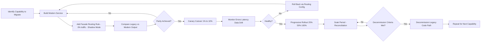
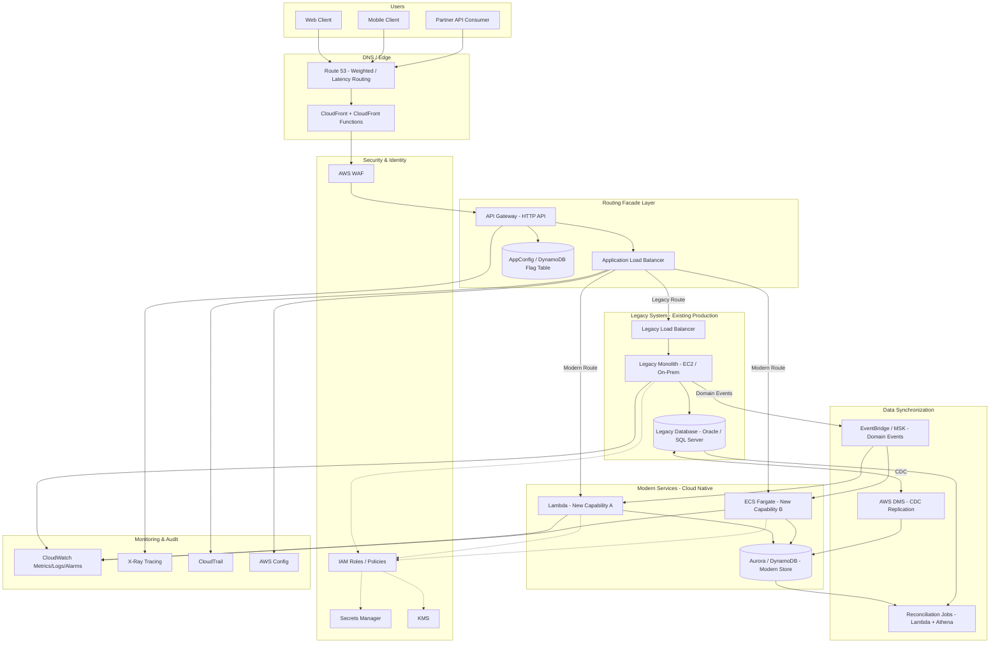

# Part X – Modern Architecture Patterns

# Chapter 84 — Strangler Fig

---

## 1. Executive Summary

Enterprises rarely get to build systems from a blank slate. Far more often, an architect is handed a twelve-year-old monolith, a database schema nobody fully understands, a deployment process that requires a change-advisory-board meeting, and a mandate: "modernize this, but do not break production." The Strangler Fig pattern exists precisely for this situation.

The pattern takes its name from the strangler fig tree, which germinates in the branches of a host tree, sends roots down to the ground, and gradually envelops and replaces the host — while the host continues to stand and function throughout the process. Martin Fowler popularized the term in software architecture to describe an incremental migration strategy: new functionality is built around the edges of a legacy system, traffic is progressively redirected to the new implementation, and the legacy system is decommissioned piece by piece, only after each piece has been proven equivalent or superior in production.

This is fundamentally different from a "big bang" rewrite. A big bang rewrite freezes the legacy system's feature set, invests months or years building a replacement in parallel, and then attempts a single cutover. Big bang rewrites are one of the most reliable ways to destroy a multi-year engineering budget. The business keeps changing requirements while the rewrite is underway, the legacy system keeps needing bug fixes and compliance patches, and the "final cutover" becomes a high-stakes, high-blast-radius event that is delayed repeatedly because it is never quite ready. Industry experience — and a substantial body of post-mortems — shows that big bang rewrites fail far more often than they succeed, particularly once a codebase crosses a certain size and organizational surface area.

**Business Problem**

Most legacy modernization problems boil down to a small number of business drivers:

- The legacy platform cannot scale to handle current or projected transaction volume.
- The technology stack is out of vendor support, creating security and compliance exposure.
- Engineering velocity has collapsed because the codebase is tightly coupled and poorly tested, so every change risks regression.
- Talent that understands the legacy stack (COBOL, old Java EE, classic ASP, monolithic Rails, mainframe) is retiring or leaving, and hiring replacements is difficult and expensive.
- The organization wants to adopt cloud-native operating models — elastic scaling, infrastructure as code, CI/CD, observability — but the legacy platform architecturally prevents this.
- Regulatory or customer-facing SLAs (uptime, latency, data residency) can no longer be met by the existing platform.

**Architecture Objective**

The objective of a Strangler Fig migration is to shift traffic from a legacy system to a new system, incrementally, by domain or capability, using a routing layer that can direct any given request to either the legacy or the new implementation. Each migrated capability is validated independently in production, under real traffic, before its legacy equivalent is removed. The legacy system continues to serve the capabilities that have not yet been migrated, so the business never experiences an all-or-nothing cutover event.

**Why Organizations Adopt This Architecture**

Organizations choose the Strangler Fig approach because it converts an unbounded, high-risk modernization program into a sequence of small, independently reversible steps. Each step:

- Delivers incremental business value (a migrated capability is immediately better — faster, cheaper to operate, easier to extend).
- Can be rolled back in minutes by adjusting routing rules, rather than requiring a multi-week emergency rollback of an entire platform.
- Produces production evidence (real traffic, real error rates, real latency data) that informs the next migration step, rather than relying on the assumptions baked into a big-bang project plan made a year earlier.
- Allows the organization to reallocate engineers gradually rather than needing a fully staffed "rewrite team" for years.

**Major Business Benefits**

1. **Risk reduction.** No single deployment event can bring down the entire platform. Blast radius is bounded to the capability being migrated.
2. **Continuous delivery of value.** Stakeholders see tangible improvements (faster checkout, faster search, lower latency) throughout the migration rather than waiting years for a "big reveal."
3. **Funding sustainability.** Finance and executive sponsors can fund modernization incrementally, tied to measurable outcomes per migrated capability, rather than approving one enormous multi-year budget line with uncertain ROI.
4. **Operational learning.** Teams build cloud-native operational maturity (IaC, CI/CD, observability, incident response) on smaller components first, before those practices are load-bearing for the entire business.
5. **Talent retention and onboarding.** New engineers can be productive on the modernized, well-tested components while a smaller group maintains legacy code, rather than requiring every new hire to learn the entire legacy system before contributing.
6. **Compliance continuity.** Because the legacy system keeps running until each capability is proven, existing compliance certifications, audit trails and controls are never invalidated by a single disruptive cutover.

**Typical Enterprise Scenarios**

- A bank strangling a mainframe-based core banking ledger, migrating account inquiry, then payments, then loan origination, over a multi-year program, while the mainframe continues to process the remaining COBOL batch jobs.
- A retailer strangling a monolithic Java EE e-commerce platform, extracting the product catalog and search first (highest read volume, lowest risk), then checkout, then order management.
- An insurance carrier strangling a decades-old policy administration system, extracting quoting and rating into a new microservice while claims processing remains on the legacy system until it, too, is migrated.
- A telecom operator strangling a customer billing platform, migrating usage-based rating to a new event-driven architecture while invoice generation and dunning remain on the legacy system.
- A healthcare provider strangling a patient scheduling system built on an unsupported framework, migrating scheduling APIs behind a facade while keeping the underlying legacy database as the system of record until data migration is complete.

**Why This Chapter Matters**

The Strangler Fig pattern is not a single AWS service or a single Terraform module — it is a routing and governance discipline that spans networking (Route 53, ALB, API Gateway), compute (ECS, EKS, Lambda), data (dual writes, change data capture, eventual consistency), and organizational process (feature flags, canary analysis, rollback criteria). This chapter treats the pattern as a complete production reference: the routing facade, the data synchronization strategy, the decommissioning criteria, the security model, the cost profile, and the operational practices that make an enterprise migration succeed rather than stall indefinitely in a half-migrated state — which is the single most common failure mode observed in real programs.

---

## 2. Business Requirements

### 2.1 Business Drivers

- Reduce time-to-market for new features currently blocked by legacy architecture.
- Reduce total cost of ownership (mainframe MIPS charges, unsupported middleware licensing, specialized legacy staffing).
- Meet a regulatory deadline (e.g., PCI-DSS re-certification, data residency requirements) that the legacy platform cannot satisfy.
- Improve customer-facing performance (page load time, checkout latency, API response time).
- Enable elastic scaling for seasonal or unpredictable demand (retail peak events, insurance catastrophe response, tax season).

### 2.2 Functional Requirements

| Requirement | Description |
|---|---|
| Request routing | Any inbound request must be routable to legacy or modern implementation based on configurable rules (path, header, tenant, percentage). |
| Feature parity | Migrated capability must match or exceed legacy functional behavior before legacy path is retired. |
| Data consistency | Reads and writes must remain consistent (or acceptably eventually consistent) across legacy and modern data stores during transition. |
| Rollback | Any migrated capability must be revertible to legacy implementation without a code deployment. |
| Observability | Both legacy and modern paths must be observable side-by-side to compare correctness and performance. |
| Audit trail | All routing decisions and cutover events must be logged for compliance and post-incident review. |

### 2.3 Non-Functional Requirements

| Category | Target (typical enterprise) |
|---|---|
| Availability | 99.95%–99.99% for customer-facing capability during migration |
| Latency (p99) | No regression greater than 10% versus legacy baseline during transition |
| Scalability | Modern path must handle at least 3x legacy peak throughput headroom |
| Security | No reduction in security posture at any point of the migration |
| Compliance | Continuous compliance (PCI-DSS, HIPAA, SOC 2, GDPR as applicable) throughout, not just at the end state |
| Auditability | Full request-level tracing across the routing facade for at least 1 year (or regulatory minimum) |

### 2.4 Scalability Goals

- Modern components must scale independently of the legacy system's fixed capacity ceiling.
- The routing/facade layer itself must never become the bottleneck; it must scale horizontally ahead of both legacy and modern backends.
- Data synchronization mechanisms (CDC, dual-write, event streams) must scale with write volume without introducing unbounded replication lag.

### 2.5 Availability Requirements

- The facade/routing layer is the new single point of dependency for the entire migrated surface — it must be designed for multi-AZ, ideally multi-region, availability exceeding both the legacy and modern systems it fronts.
- Legacy system availability commitments must be preserved unchanged for any capability not yet migrated.

### 2.6 Latency Requirements

- Added routing hop (facade) should add single-digit milliseconds at p50 and no more than 15–25 ms at p99 for synchronous request paths.
- Asynchronous data synchronization (CDC/events) latency budget is typically defined separately (seconds, not milliseconds) and must be explicitly documented per migrated capability so downstream consumers understand consistency guarantees.

### 2.7 Compliance Requirements

- PCI-DSS: cardholder data environment (CDE) boundary must be explicitly re-drawn as capabilities move; the facade often becomes a segmentation point requiring its own assessment scope.
- HIPAA: any dual-write of PHI to a new data store requires updated Business Associate Agreements (BAA) coverage and encryption-at-rest/in-transit validation for the new store.
- SOC 2 / ISO 27001: change management evidence must be updated to reflect the new routing and decommissioning controls.
- GDPR/data residency: if the modern system runs in different AWS Regions than the legacy system, data residency and cross-border transfer requirements must be re-evaluated per migrated capability.

### 2.8 Security Expectations

- Zero regression in authentication/authorization strength between legacy and modern implementations.
- Secrets used by both legacy and modern components must be centrally managed, rotated, and never duplicated in plaintext configuration.
- The facade must not become a common attack surface that weakens the isolation the legacy system previously had (e.g., an overly permissive API Gateway resource policy exposing legacy internals).

### 2.9 Recovery Objectives

| Metric | Legacy-only capability | Migrated (dual-run) capability | Fully modern capability |
|---|---|---|---|
| RPO | Per legacy DR plan (often 15 min–4 hr for mainframe/batch systems) | Determined by the stricter of the two systems' RPO during dual-run | Cloud-native target, typically < 1 min with continuous backups/replication |
| RTO | Per legacy DR plan (often hours) | Bounded by facade routing failover, typically minutes | Minutes, via multi-AZ/multi-Region failover |

### 2.10 SLAs

- Customer-facing SLA commitments (e.g., 99.9% monthly uptime, sub-500ms p95 API latency) must be maintained continuously; the migration is invisible to the SLA, not an exception to it.
- Internal SLAs for the platform/migration team typically include: maximum time a capability may remain in "dual-run" state before a decommission decision is required (commonly 90–180 days), to prevent indefinite parallel maintenance cost.

### 2.11 Expected Workload

- Baseline: current legacy peak transactions per second (TPS), typically established via 12 months of production metrics.
- Growth: business-forecasted growth rate (commonly 15%–40% YoY for growing digital businesses) must be validated against the modern architecture's headroom, not just the legacy baseline.

### 2.12 Expected Growth

- New capability development should occur exclusively on the modern platform once the facade exists — this is a key non-technical requirement: engineering leadership must commit to a "no new legacy code" policy, or the strangler program never actually shrinks the legacy footprint.

---

## 3. Architecture Overview

### 3.1 Overall Design

The Strangler Fig architecture introduces a **routing facade** in front of the legacy system. Initially, 100% of traffic passes through the facade to the legacy system unchanged — this first step (sometimes called the "interception" phase) proves the facade is transparent and low-risk before any migration logic is added.

From that point forward, migration proceeds capability-by-capability:

1. A new implementation of a capability (e.g., "product search") is built as an independent, cloud-native service.
2. The facade is configured with a routing rule for that capability's request pattern (path prefix, API operation, header, or tenant ID).
3. Traffic is shifted gradually — canary percentage, then cohort-based, then full — from legacy to modern.
4. Data required by the modern service is synchronized from the legacy system of record (via CDC, dual-write, or event publishing) until the modern service can become the system of record itself.
5. Once the modern implementation is proven equivalent (correctness, performance, error rates) under full production load for an agreed soak period, the legacy code path for that capability is formally decommissioned.
6. The process repeats for the next capability until the legacy system is either fully retired or reduced to a small, well-understood residual footprint (common for mainframe batch/settlement processes that are deliberately migrated last, or never, if the cost/benefit does not justify it).

### 3.2 Architecture Philosophy

- **Reversibility over speed.** Every step must be cheaply reversible. Routing-based reversal (a config change) is preferred over code-based reversal (a redeploy).
- **Evidence over estimation.** Migration proceeds based on production evidence (real error rates, real latency, real reconciliation results) rather than architect intuition or a project plan's assumed schedule.
- **Bounded blast radius.** Each migration step is scoped so that a failure affects one capability, one tenant cohort, or one traffic percentage — never the whole platform.
- **No new legacy code.** New features are built exclusively on the target architecture; the legacy system is frozen except for defect fixes and compliance patches.
- **Explicit decommissioning criteria.** Every migrated capability has a written, objective definition of "done" (e.g., 30 days at 100% modern traffic, zero data reconciliation discrepancies, error rate parity) — without this, dual-running becomes permanent, which is the most common real-world failure of strangler programs.

### 3.3 Core Components

| Component | Role |
|---|---|
| Routing Facade | Intercepts all inbound traffic; decides legacy vs. modern per request |
| Legacy System | The existing production system; continues serving non-migrated capabilities |
| Modern Services | New cloud-native implementations of migrated capabilities |
| Data Synchronization Layer | Keeps legacy and modern data consistent during dual-run (CDC, dual-write, event bus) |
| Feature Flag / Traffic Control Service | Fine-grained control of routing percentages and cohorts, independent of deployment |
| Observability Platform | Side-by-side comparison of legacy vs. modern correctness and performance (shadow traffic, diffing) |
| Reconciliation Jobs | Batch/near-real-time comparison of legacy and modern data stores to detect drift |
| Decommissioning Pipeline | Automation and governance process for safely removing legacy code paths |

### 3.4 How Components Interact

The routing facade sits at the network edge of the migrated surface (this can be a global edge like CloudFront + Route 53 weighted routing, an API Gateway layer, or an Application Load Balancer with listener rules — the correct choice depends on protocol and granularity needed, discussed in Section 4). The facade consults a traffic-control decision (a feature flag service, a routing table in DynamoDB, or ALB rule weights) for every request, then forwards to either the legacy backend or the modern backend.

For synchronous request paths, this is a straightforward reverse-proxy decision. For data, the harder problem, three patterns are used depending on requirements:

1. **Dual-write**: application code (or the facade layer) writes to both legacy and modern data stores synchronously. Simple to reason about but introduces the risk of partial failure (write succeeds in one store, fails in the other) unless implemented with the Outbox Pattern (Chapter 81) for reliability.
2. **Change Data Capture (CDC)**: a tool (AWS DMS, Debezium on MSK Connect) streams changes from the legacy database's transaction log to the modern data store asynchronously. Lower coupling, but introduces replication lag that must be within an agreed budget.
3. **Event-driven synchronization**: the legacy system (or a thin adapter) publishes domain events to EventBridge or SNS/SQS whenever state changes; both legacy and modern consumers react to these events. This is the target end-state pattern and is preferred when the legacy system can be instrumented to emit events without excessive invasive change.

### 3.5 High-Level Workflow



### 3.6 Request Lifecycle

1. Client sends request to the public domain (e.g., `api.enterprise.com`).
2. Route 53 resolves to the facade layer (CloudFront/API Gateway/ALB).
3. The facade evaluates routing rules (path, header, tenant, percentage) against the current traffic-control configuration.
4. The request is forwarded to either the legacy backend (via VPC Link or existing integration) or a modern backend (Lambda, ECS/Fargate service, EKS service).
5. The backend processes the request, potentially reading from either the legacy database or the modern data store, depending on which is currently the system of record for that data domain.
6. The response returns through the facade to the client, with routing metadata (which path served the request) attached to logs/traces for observability — never exposed to the end client.

### 3.7 Response Lifecycle

- Response time and status code are recorded per route (legacy/modern) with identical metric dimensions so dashboards can directly compare the two paths.
- For shadow-mode migrations, the modern service's response is computed but discarded (or diffed asynchronously) while the legacy response is what's actually returned to the client — this allows correctness testing under real production traffic with zero customer-facing risk.

### 3.8 Data Lifecycle

- During dual-run, data written by legacy transactions must reach the modern store within the agreed replication lag budget; data written via the modern path (once it starts accepting writes for a capability) must be reflected back to legacy if any non-migrated capability still depends on reading that data from the legacy store.
- Reconciliation jobs run on a schedule (typically every few minutes for high-value data like financial transactions, hourly/daily for lower-risk data) and alert on any discrepancy exceeding a defined threshold.
- Once a capability's legacy code path is decommissioned, the modern data store formally becomes the system of record, and any remaining legacy reads of that domain must be redirected (via a compatibility view, API, or CDC in the reverse direction) rather than reading from a store that is no longer authoritative.

---

## 4. AWS Services Used

> **Note:** Not every AWS service listed applies to every strangler migration. Select services based on the legacy system's protocol surface (HTTP APIs vs. SOAP vs. TCP/mainframe screens) and the target modern architecture (serverless vs. containers).

### 4.1 Application Load Balancer (ALB)

- **Purpose**: Layer 7 routing based on path, host header, or query string — ideal for a strangler facade fronting HTTP(S) services.
- **Why selected**: Native weighted target groups allow percentage-based canary routing between legacy and modern target groups without additional infrastructure.
- **Alternatives**: API Gateway (better for API-first, per-operation routing, request/response transformation, and usage-plan/API-key based rollout); NGINX/Envoy self-managed (more routing flexibility, but adds operational burden the strangler pattern is trying to reduce).
- **Limitations**: ALB routing rules are coarser than API Gateway's per-method mapping; ALB does not natively do request/response body transformation.
- **Pricing considerations**: Charged per Load Balancer Capacity Unit (LCU-hour); generally the most cost-effective L7 routing option at high throughput.
- **Best practices**: Use weighted target groups for percentage-based cutover; use listener rule priority carefully — more specific path rules must have lower priority numbers (higher precedence) than catch-all rules.

### 4.2 Amazon API Gateway

- **Purpose**: Managed API front door with per-route integration, throttling, usage plans, and request/response transformation — well suited when the strangler facade must route at the level of individual API operations rather than whole paths.
- **Why selected**: Enables canary release stages natively (a built-in percentage-based canary deployment feature), integrates with Lambda authorizers for consistent auth across legacy and modern backends, and provides request validation independent of either backend.
- **Alternatives**: ALB (cheaper at very high, simple-routing volume); AWS AppSync (if the modern target is GraphQL-based).
- **Limitations**: REST API Gateway has a 29-second integration timeout; payload size limits (10 MB); added per-request cost can be material at very high transaction volumes.
- **Pricing considerations**: Charged per million API calls plus data transfer; HTTP APIs (API Gateway v2) are materially cheaper than REST APIs (v1) for simple proxy use cases.
- **Best practices**: Use HTTP APIs for pure proxy/strangler use cases to reduce cost; use REST APIs only when needing request validation, API keys, or usage plans not yet available in HTTP APIs.

### 4.3 Amazon CloudFront

- **Purpose**: Global edge distribution and, via CloudFront Functions/Lambda@Edge, request-level routing decisions closest to the user — useful when the strangler migration spans multiple AWS Regions or needs to reduce latency for globally distributed users.
- **Why selected**: Enables geographic or edge-based routing rules (e.g., route EU traffic to a modern EU-region service while other regions still hit a legacy US data center via Direct Connect) and provides a caching layer that can offload read-heavy legacy endpoints during migration.
- **Alternatives**: Global Accelerator (better for non-HTTP or when a static anycast IP is required); Route 53 weighted/latency routing alone (simpler, but no caching or edge compute).
- **Limitations**: Cache invalidation adds operational complexity; Lambda@Edge has stricter resource and language constraints than CloudFront Functions.
- **Best practices**: Use CloudFront Functions (lightweight, sub-millisecond) for simple header/path-based routing decisions; reserve Lambda@Edge for cases needing more compute (e.g., calling a feature-flag service).

### 4.4 AWS Lambda

- **Purpose**: Serverless compute for modern microservices being extracted from the monolith, and for lightweight facade logic (routing decision functions, transformation adapters).
- **Why selected**: Zero idle cost fits well for capabilities with spiky or low initial traffic during early migration phases; scales automatically without capacity planning.
- **Alternatives**: ECS Fargate/EKS (better for long-running, high-throughput, or stateful services, or where cold-start latency is unacceptable).
- **Limitations**: 15-minute maximum execution time; cold starts can affect p99 latency for latency-sensitive migrated capabilities; VPC-attached Lambdas add ENI cold-start considerations (mitigated by Hyperplane ENIs in current Lambda networking).
- **Best practices**: Use Lambda for the initial migrated version of a capability to minimize infrastructure investment before traffic patterns are proven; graduate to ECS/EKS if sustained throughput justifies dedicated compute.

### 4.5 Amazon ECS (Fargate) / Amazon EKS

- **Purpose**: Container orchestration for modern services requiring more control, longer execution times, or higher sustained throughput than Lambda comfortably provides.
- **Why selected**: ECS Fargate removes server management while supporting long-lived connections (useful for services that must maintain a connection pool to the legacy database during dual-run); EKS is preferred when the organization already has Kubernetes operational maturity or needs portability.
- **Alternatives**: Lambda (lower operational overhead for smaller services); EC2 Auto Scaling Groups (only where container adoption is not yet feasible).
- **Limitations**: More operational surface than Lambda (task definitions, service scaling policies, cluster capacity management); EKS in particular has a steeper learning curve.
- **Best practices**: Use Fargate for the majority of strangler migrations to avoid adding EC2 fleet management on top of an already complex migration program; use EKS only if the organization has existing platform engineering investment in Kubernetes.

### 4.6 Amazon RDS / Aurora

- **Purpose**: Relational data store for the modern system of record, especially when the legacy system is itself relational (Oracle, SQL Server, DB2) and schema/data semantics translate naturally.
- **Why selected**: Aurora provides up to 15 read replicas, storage auto-scaling, and (for MySQL-compatible Aurora) low-latency read replicas that support the read-heavy access patterns common in early-migrated capabilities like catalog or search.
- **Alternatives**: DynamoDB (if the migrated capability benefits from a key-value/single-table design and does not require complex joins); self-managed database on EC2 (only if a required engine/version is not available as a managed offering).
- **Limitations**: Schema migrations still require careful online DDL practice; Aurora Global Database adds replication lag (typically sub-second to low single-digit seconds) that must be accounted for in cross-region strangler designs.
- **Pricing considerations**: Aurora pricing includes compute (per-second, or Aurora Serverless v2 ACUs), storage, and I/O; Aurora Serverless v2 is well suited to the unpredictable, ramping traffic pattern typical of a migrated capability's early life.
- **Best practices**: Use AWS DMS to perform initial full load plus ongoing CDC replication from the legacy database into Aurora during dual-run.

### 4.7 Amazon DynamoDB

- **Purpose**: Serverless NoSQL store for migrated capabilities with high-scale, simple-access-pattern data (session state, shopping carts, feature flags, event logs, idempotency tracking for dual-write reliability).
- **Why selected**: Virtually unlimited horizontal scalability with single-digit millisecond latency; DynamoDB Streams provide a natural mechanism for propagating changes to other systems (a building block for the Outbox Pattern used to make dual-writes reliable).
- **Alternatives**: Aurora (when relational integrity/joins are required); ElastiCache (for pure caching, not source-of-truth data).
- **Limitations**: No native joins; requires access-pattern-driven schema design up front, which can be a significant redesign effort versus the legacy relational model.
- **Best practices**: Use DynamoDB for the traffic-control/feature-flag table itself (extremely low latency reads for routing decisions on every request) even when the migrated business data remains relational.

### 4.8 AWS Database Migration Service (DMS)

- **Purpose**: The primary mechanism for legacy-to-modern data synchronization: full load plus ongoing CDC replication from source engines (Oracle, SQL Server, PostgreSQL, MySQL, and via DMS "homogeneous"/"heterogeneous" support, many others) into RDS/Aurora, S3, Kinesis, or Kafka/MSK.
- **Why selected**: Purpose-built for exactly the dual-run data synchronization problem central to strangler migrations; supports schema conversion (via AWS Schema Conversion Tool) for heterogeneous migrations (e.g., Oracle to Aurora PostgreSQL).
- **Alternatives**: Debezium on MSK Connect (preferred when the target architecture is already event-driven/Kafka-centric and finer-grained control over the CDC connector is needed); custom application-level dual-write (only for simple, low-volume cases; not recommended as a primary strategy due to consistency risk).
- **Limitations**: Replication lag must be monitored continuously; certain legacy sources (mainframe DB2, non-standard proprietary databases) may require specialized/partner connectors rather than native DMS support.
- **Best practices**: Always validate initial full-load row counts and checksums before enabling ongoing replication; use DMS Data Validation task settings to continuously compare source and target.

### 4.9 Amazon MSK (Managed Streaming for Apache Kafka) / Amazon EventBridge / Amazon SNS / Amazon SQS

- **Purpose**: Event backbone for the target-state event-driven synchronization pattern, and for decoupling modern services from each other as they are extracted.
- **Why selected**: EventBridge provides schema registry and content-based routing suited to broad, evolving event taxonomies across many migrated domains; SNS/SQS provide simple, reliable pub/sub and queuing for more contained integrations; MSK is preferred when very high throughput, strict ordering per partition key, and long retention (event replay for new consumers, including future migrated services) are required.
- **Alternatives**: Direct synchronous service-to-service calls (avoid — this recreates tight coupling, the exact problem the migration is trying to remove).
- **Limitations**: MSK requires more operational investment (broker sizing, partition planning) than EventBridge/SNS/SQS; EventBridge has payload size limits (256 KB) requiring a claim-check pattern (pointer to S3) for large events.
- **Best practices**: Standardize on one event backbone early in the program rather than letting each migrated capability choose its own — inconsistency here becomes a major integration tax later.

### 4.10 AWS AppConfig / Feature Flags

- **Purpose**: Externalized, dynamically-updatable configuration for routing percentages and cohort rules, without requiring a deployment to change traffic split.
- **Why selected**: AWS AppConfig provides validated, gradually-deployed configuration changes with built-in rollback (via CloudWatch alarm integration) — directly matching the strangler pattern's canary/rollback requirement.
- **Alternatives**: A custom DynamoDB-backed flag table read by the facade (simpler, fully custom, more engineering effort); third-party flag platforms (LaunchDarkly, Split) — often preferred by organizations wanting richer targeting UX and are common in real strangler programs, evaluated per organizational preference.
- **Limitations**: AppConfig deployment strategies add a small propagation delay (agent polling interval) unless using the AppConfig Lambda extension for low-latency fetch.
- **Best practices**: Treat flag changes with the same change-management rigor as code deployments — an errant 100% flag flip is as dangerous as a bad deployment.

### 4.11 IAM

- **Purpose**: Access control for every component in the migration — facade, modern services, data synchronization jobs, and CI/CD pipelines.
- **Why selected**: Central, auditable, least-privilege access model integrated with every AWS service in the architecture.
- **Best practices**: Give each migrated service its own IAM role (never share a broad role across legacy and modern components); use permission boundaries for any role used by automated decommissioning pipelines given the destructive nature of that action.

### 4.12 Amazon VPC

- **Purpose**: Network isolation boundary; typically the legacy system already lives in an existing VPC (on-prem via Direct Connect/VPN, or already-migrated to EC2), and modern services are placed in a new or peered VPC.
- **Why selected**: VPC Peering or Transit Gateway allows the facade and modern services to reach the legacy database/APIs securely during the (often lengthy) dual-run period.
- **Best practices**: Use PrivateLink where the legacy system exposes services to be consumed by modern components across account boundaries, to avoid broad VPC peering and its associated route table sprawl.

### 4.13 Route 53

- **Purpose**: DNS-level routing, useful for coarse-grained strangler cutovers (e.g., redirecting an entire subdomain such as `search.enterprise.com` to a new modern stack) and for weighted/latency-based routing across Regions.
- **Best practices**: Keep TTLs low (60 seconds or less) during active migration phases to allow fast rollback via DNS if needed, then raise TTLs once a capability's cutover is stable.

### 4.14 CloudWatch, CloudTrail, AWS Config, GuardDuty

- **Purpose**: The observability and compliance backbone that makes side-by-side legacy/modern comparison and decommissioning governance possible.
- **CloudWatch**: metrics/logs/alarms for both legacy and modern paths on identical dashboards; CloudWatch Synthetics for canary testing both endpoints continuously.
- **CloudTrail**: immutable audit log of every routing configuration change (who changed the traffic split and when) — essential evidence for both incident review and compliance audit.
- **AWS Config**: continuously validates that facade and modern infrastructure configuration (e.g., ALB listener rules, security groups) matches approved baselines, flagging drift introduced by the frequent config changes a strangler migration requires.
- **GuardDuty**: threat detection across the expanded (temporarily larger) attack surface created by running legacy and modern systems simultaneously.

### 4.15 KMS, Secrets Manager, Certificate Manager

- **Purpose**: Encryption key management, credential storage, and TLS certificate management shared consistently across legacy and modern components.
- **Best practices**: Migrate secrets out of legacy configuration files into Secrets Manager as an early, low-risk first step of any strangler program — this alone often meaningfully improves security posture before any functional migration begins.

### 4.16 Systems Manager (SSM)

- **Purpose**: Patch management and secure operational access (Session Manager) for any legacy components still running on EC2, avoiding the need for bastion hosts or broadly opened SSH/RDP during the transition period.

---

## 5. Complete Architecture Diagram



---

## 6. Component-by-Component Explanation

### 6.1 Routing Facade (API Gateway + ALB)

- **Purpose**: Single entry point that decides, per request, which implementation serves the customer.
- **Responsibilities**: Enforce authentication consistently; apply routing rules; log routing decisions; enforce rate limiting/throttling uniformly regardless of backend.
- **Inputs**: HTTP(S) requests from CloudFront/clients; routing configuration from AppConfig/DynamoDB.
- **Outputs**: Proxied requests to legacy or modern backend; structured logs tagged with route decision.
- **Scaling**: ALB and API Gateway scale automatically and are not typically the bottleneck; monitor concurrent connection counts and target group health regardless.
- **High availability**: Deployed across a minimum of 3 Availability Zones; API Gateway is regionally redundant by default.
- **Failure handling**: On backend timeout, return a defined fallback (cached response, graceful error) rather than a raw 5xx; circuit breaker pattern (Chapter 83) recommended in front of both legacy and modern targets.
- **Dependencies**: Traffic-control flag store; downstream target groups/integrations.
- **Security**: WAF attached at CloudFront/API Gateway; mutual TLS for partner API consumers where required.
- **Monitoring**: Per-route (legacy/modern) latency, error rate, and volume metrics on shared dashboards.

### 6.2 Legacy System

- **Purpose**: Continues serving all non-migrated capability and remains the system of record until explicitly decommissioned per capability.
- **Responsibilities**: Unchanged business logic execution; must additionally expose (or be adapted to expose) a CDC-readable transaction log or emit domain events for synchronization.
- **Scaling**: Typically fixed/limited — this is usually a primary migration driver, not something to invest further in.
- **Failure handling**: Existing legacy DR/HA posture is preserved unchanged; the facade must not assume the legacy system's reliability characteristics have improved.
- **Dependencies**: Legacy database; any legacy middleware (ESB, MQ) still in use.
- **Security**: No regression — if the legacy system runs in a less-segmented network, the facade must not create a new bridge that weakens its existing isolation.

### 6.3 Modern Services

- **Purpose**: Cloud-native implementation of each migrated capability.
- **Responsibilities**: Full business logic ownership for the capability once cut over; own their data store (or read from a synchronized replica until fully authoritative).
- **Scaling**: Auto Scaling (Lambda concurrency, ECS service Auto Scaling based on CPU/memory/custom CloudWatch metric such as queue depth).
- **High availability**: Multi-AZ Fargate tasks or Lambda's inherent multi-AZ execution; Aurora Multi-AZ for the data tier.
- **Failure handling**: Health checks feeding target group deregistration; retries with exponential backoff and jitter for downstream calls; dead-letter queues for async processing failures.
- **Dependencies**: Modern data store; event bus; shared identity/auth service.
- **Security**: Per-service IAM role scoped to only the resources it needs (least privilege); secrets sourced from Secrets Manager, never environment-variable-embedded plaintext.
- **Monitoring**: Distributed tracing (X-Ray) correlated across facade → modern service → data store.

### 6.4 Data Synchronization Layer (DMS / Event Bus)

- **Purpose**: Keep legacy and modern data consistent during the dual-run period.
- **Responsibilities**: Full-load initial migration; ongoing CDC replication; schema/type mapping; conflict detection.
- **Scaling**: DMS replication instance sized to source change volume; MSK partition count sized to peak event throughput with headroom.
- **Failure handling**: Replication task alarms on lag exceeding threshold; automatic task restart policies; alerting to on-call for manual intervention beyond auto-recovery thresholds.
- **Dependencies**: Network connectivity (VPN/Direct Connect/PrivateLink) to the legacy database's binary/transaction log.
- **Security**: Replication traffic encrypted in transit (TLS); replication instance in a private subnet with security groups scoped only to the specific legacy DB port.
- **Monitoring**: `CDCLatencySource`/`CDCLatencyTarget` CloudWatch metrics for DMS; custom reconciliation-discrepancy metric.

### 6.5 Reconciliation Jobs

- **Purpose**: Independent verification that legacy and modern data stores agree, beyond what CDC lag metrics alone can show (e.g., catching silent transformation bugs).
- **Responsibilities**: Row-count and checksum comparison; business-rule-level comparison (e.g., account balances match) for high-value domains.
- **Scaling**: Batch jobs (Lambda + Athena over exported data, or Glue for larger volumes) run on a schedule appropriate to data criticality.
- **Failure handling**: Any discrepancy above threshold pages the migration team before further traffic shifting proceeds — this gate is what prevents "silent data drift," the most damaging strangler failure mode.

### 6.6 Feature Flag / Traffic Control Service

- **Purpose**: Decouple "what percentage of traffic goes where" from code deployment.
- **Responsibilities**: Store and serve routing rules with strict read latency SLA (this is on the critical path of every request); provide an audit trail of every change.
- **High availability**: DynamoDB with global tables (if multi-region) or on-demand capacity; AppConfig with a caching Lambda extension to avoid a network call per request.
- **Security**: Write access to flag changes restricted to a small, audited group; every change requires CloudTrail-logged authorization.

---

## 7. End-to-End Request Flow

1. **Client** issues an HTTPS request to `api.enterprise.com/orders/12345`.
2. **Route 53** resolves the domain, potentially applying latency-based routing if the facade is deployed multi-region.
3. **CloudFront** receives the request at the nearest edge location; a CloudFront Function inspects the path/header for any edge-level routing shortcuts (e.g., static asset caching bypass for API paths).
4. **AWS WAF**, attached to CloudFront or API Gateway, evaluates the request against managed and custom rule sets (SQLi, rate-based rules) before forwarding.
5. **API Gateway** receives the request, executes a Lambda authorizer (or JWT authorizer) to validate the caller's identity/claims.
6. **API Gateway** queries the **traffic-control flag store** (via a lightweight Lambda integration or a cached AppConfig value) to determine whether the "orders" capability is routed to legacy or modern for this request (based on cohort: tenant ID, percentage bucket, or explicit allow-list).
7. If routed to **legacy**: the request is forwarded via VPC Link to the legacy load balancer, which forwards to the legacy application tier, which queries the **legacy database**.
8. If routed to **modern**: the request is forwarded to the ECS Fargate service (or Lambda) implementing the "orders" capability, which queries **Aurora/DynamoDB** — the modern data store, kept in sync from legacy via DMS CDC if the modern store is not yet fully authoritative.
9. The backend (legacy or modern) constructs a response. Both paths are required to produce a **response schema-compatible** with the original API contract during the dual-run period, so client applications require no changes regardless of which backend served the request.
10. **Caching**: for cacheable, read-heavy capabilities (e.g., product catalog), CloudFront or API Gateway caching may serve the response directly for subsequent identical requests without invoking either backend.
11. **Logging**: the facade emits a structured log line containing request ID, routed backend (legacy/modern), latency, and status code, published to CloudWatch Logs.
12. **Tracing**: AWS X-Ray captures the full trace, including the facade hop, the routed backend, and any downstream database/event calls, enabling side-by-side latency comparison between legacy and modern paths for the same logical operation.
13. **Monitoring**: CloudWatch alarms evaluate error rate and latency per route in real time; a breach on the modern route (during a canary phase) triggers an automatic rollback of the traffic-control percentage back to legacy (see Section 8).
14. **Error handling**: if the routed backend times out or returns 5xx, the facade returns a standardized error response to the client and, for modern-route failures during canary, decrements the canary percentage automatically rather than requiring manual intervention.
15. **Response** is returned to the client through CloudFront, with no observable difference in contract regardless of which backend actually processed the request.

---

## 8. Deployment Flow

### 8.1 Infrastructure Provisioning

All facade, modern service, and synchronization infrastructure is provisioned via Terraform (Section 18), stored in a version-controlled repository, with state in a remote backend (S3 + DynamoDB lock table). The legacy system's infrastructure is typically **not** re-platformed as part of this program (that would be a separate, distinct migration) — Terraform here manages only the new components and any minimal legacy-side changes required to enable connectivity (e.g., opening a security group rule for the DMS replication instance).

### 8.2 Terraform Workflow

1. Engineer opens a pull request modifying a Terraform module (e.g., adding a new target group for a newly migrated capability).
2. CI pipeline runs `terraform fmt -check`, `terraform validate`, and a policy-as-code scan (Open Policy Agent / Checkov).
3. `terraform plan` output is posted as a PR comment for human review.
4. On merge, `terraform apply` runs via CI/CD with an approval gate for any change touching production routing resources.

### 8.3 CI/CD Deployment (Modern Services)

- Standard containerized or Lambda deployment pipeline (build → test → security scan → deploy to staging → smoke test → deploy to production).
- Production deployment of a modern service does **not** by itself change traffic routing — traffic-control changes are a separate, explicitly gated action, decoupling "deploy new code" from "expose new code to production traffic." This separation is one of the most important disciplines in a successful strangler program.

### 8.4 Blue-Green Deployment

- Applied at the modern-service level (new task definition revision deployed alongside old, traffic shifted via ECS/CodeDeploy linear or canary configuration) independently of the legacy/modern strangler routing decision — these are two distinct, stacked deployment mechanisms.

### 8.5 Rollback

- **Routing rollback** (primary mechanism): revert the traffic-control flag/ALB weight to 100% legacy — takes effect in seconds, no redeploy required.
- **Code rollback** (secondary mechanism): standard CodeDeploy/ECS rollback to the prior task definition, used only if the modern service itself has a defect independent of the routing decision.

### 8.6 Secrets

- All database credentials, API keys, and third-party tokens are stored in Secrets Manager with automatic rotation configured; neither legacy adapters nor modern services embed credentials in code or environment files.

### 8.7 Configuration

- Non-secret configuration (feature flag defaults, timeout values, retry policies) managed via AppConfig or Parameter Store, versioned alongside code but deployable independently.

### 8.8 Validation

- Post-deployment smoke tests hit both the legacy and modern routes explicitly (bypassing the normal percentage-based router via a test header) to confirm both remain healthy before any traffic-control change is made.

---

## 9. Network Topology

### 9.1 VPC and CIDR

- Modern services are typically placed in a new VPC (e.g., `10.20.0.0/16`) to avoid CIDR collisions with the legacy environment's existing VPC or on-premises network (commonly `10.0.0.0/8` internal ranges in large enterprises — always confirm against the existing IP address management (IPAM) plan before allocating).

### 9.2 Public and Private Subnets

- Public subnets: host only the ALB/NAT Gateway; no application or database resources.
- Private subnets: host ECS/Fargate tasks, Lambda ENIs (if VPC-attached), Aurora instances, and the DMS replication instance.

### 9.3 NAT Gateway / Internet Gateway

- NAT Gateway (one per AZ for availability, accepting the added cost) provides outbound internet access for private-subnet resources needing it (e.g., calling a third-party API); Internet Gateway serves only the public-subnet ALB.

### 9.4 Transit Gateway / Hybrid Connectivity

- If the legacy system is on-premises, a Transit Gateway attached to a Direct Connect (or Site-to-Site VPN as backup) connects the modern VPC to the on-premises network, enabling DMS and modern-service-to-legacy-API connectivity without exposing the legacy system to the public internet.
- If the legacy system already runs in a separate AWS account/VPC, Transit Gateway (or VPC Peering for simpler two-VPC cases) connects the two.

### 9.5 Route Tables

- Private subnet route tables direct legacy-bound traffic through the Transit Gateway/peering attachment; internet-bound traffic through the NAT Gateway.

### 9.6 Network ACLs and Security Groups

- Security groups are the primary control: the DMS replication instance's security group allows outbound only to the specific legacy database port/CIDR; the legacy database's security group (or on-prem firewall rule) allows inbound only from the DMS replication instance's ENI/CIDR — never a broad "allow VPC CIDR" rule.
- Network ACLs provide a secondary, stateless layer, primarily to block known-bad CIDR ranges at the subnet boundary.

### 9.7 PrivateLink

- Where the legacy system exposes internal APIs consumed by modern services across an account boundary, an Interface VPC Endpoint (PrivateLink) is preferred over VPC peering — it avoids exposing the entire legacy VPC's route table and limits access to a single named service.

---

## 10. Identity and Access

### 10.1 IAM Roles and Policies

- Each modern service (per capability, not per "the migration" broadly) has a dedicated IAM role scoped to exactly the resources it touches (its Aurora cluster or DynamoDB table, its specific S3 prefix, its specific SQS queue).
- The DMS replication task role is scoped only to the specific source/target endpoints it replicates, never a blanket `dms:*` or `rds:*` permission.

### 10.2 Resource Policies

- API Gateway resource policies restrict which VPCs/accounts may invoke private APIs where the facade is not meant to be fully public (e.g., internal-only migrated capabilities).

### 10.3 STS and Cross-Account Access

- If legacy and modern systems live in separate AWS accounts (a common and often desirable isolation choice, keeping the legacy account's blast radius separate from the new modern-services account), cross-account roles assumed via STS (`sts:AssumeRole`) connect the facade/synchronization layer to each account, rather than long-lived cross-account credentials.

### 10.4 Least Privilege

- The decommissioning pipeline's IAM role (which will eventually delete legacy infrastructure/target groups) should require a permission boundary and, ideally, a manual approval step (e.g., via a CodePipeline manual approval action) rather than being fully automated end-to-end — the cost of an accidental legacy deletion during dual-run is asymmetrically high.

### 10.5 Service Roles

- ECS task execution roles (pulling images, writing logs) are kept separate from ECS task roles (application runtime permissions) per AWS best practice, limiting the blast radius of a compromised container.

### 10.6 Permission Boundaries

- Applied to any role that CI/CD pipelines assume to provision infrastructure, capping the maximum permissions even if the underlying Terraform module is later modified to request broader access — a defense-in-depth control against both mistakes and supply-chain compromise of the pipeline.

---

## 11. Security Architecture

### 11.1 Encryption

- **At rest**: KMS customer-managed keys (CMKs) for Aurora/DynamoDB, S3 (reconciliation exports), and DMS replication instance storage; use separate CMKs per data domain (not one shared account-wide key) to allow granular key-policy control and audit.
- **In transit**: TLS 1.2+ enforced at the ALB/API Gateway listener, between the facade and both legacy and modern backends, and for DMS replication connections to the legacy database.

### 11.2 WAF and Shield

- AWS WAF attached to CloudFront/API Gateway with managed rule groups (Core Rule Set, SQL injection, known bad inputs) plus custom rules specific to the legacy API's known quirks (e.g., blocking unusually large payloads the legacy system was never designed to reject gracefully).
- AWS Shield Standard is automatic; Shield Advanced is warranted if the migrated capability is a high-profile customer-facing surface with DDoS risk exceeding the organization's risk tolerance under Standard alone.

### 11.3 Secrets Manager and Certificate Manager

- Certificate Manager issues and auto-renews the TLS certificate for the facade domain; Secrets Manager stores legacy database credentials used by DMS and any modern-service adapter calling legacy APIs directly.

### 11.4 GuardDuty, Inspector, Security Hub

- GuardDuty monitors for anomalous API calls (e.g., an unexpected `iam:CreateAccessKey` in the modern-services account) and unusual network traffic patterns that could indicate the temporarily larger attack surface (two systems running in parallel) is being probed.
- Inspector scans modern-service container images and Lambda deployment packages for known vulnerabilities as part of the CI/CD pipeline, gating deployment on critical findings.
- Security Hub aggregates findings across both the legacy-adjacent and modern accounts into a single compliance view, essential when auditors ask "what is your current security posture" mid-migration rather than only at project completion.

### 11.5 CloudTrail and AWS Config

- CloudTrail is enabled in all accounts involved (legacy-adjacent and modern), with logs delivered to a centralized, access-restricted log archive account — critical for reconstructing exactly what routing/config change caused an incident.
- AWS Config rules validate that no security group associated with the DMS replication instance or legacy connectivity path is ever opened beyond its documented CIDR/port scope.

### 11.6 Zero Trust Considerations

- The facade should not implicitly trust "internal" network position as a substitute for authentication — every request, whether ultimately routed to legacy or modern, is authenticated and authorized at the facade, and the legacy backend's historically weaker internal trust model is not allowed to become the effective security boundary for the whole migrated surface.

### 11.7 Threat Model and Attack Vectors

| Threat | Mitigation |
|---|---|
| Facade misconfiguration exposes legacy internal API publicly | API Gateway resource policies; private integration via VPC Link; WAF |
| Traffic-control flag store compromised, routing all traffic to attacker-controlled endpoint | Restrict write access to flag store; CloudTrail alerting on any flag change; require approval workflow |
| DMS replication credentials leaked, exposing legacy database | Secrets Manager rotation; least-privilege DB user scoped to CDC-required permissions only (not full DBA rights) |
| Data drift between legacy and modern exploited (e.g., double-spend during dual-write window) | Idempotency keys; outbox pattern; reconciliation jobs with tight thresholds for financial data |
| Modern service over-permissioned IAM role exploited via a code vulnerability | Least-privilege per-service roles; Inspector scanning; Security Hub aggregation |

---

## 12. High Availability

### 12.1 AZ Failures

- Facade (ALB/API Gateway), modern compute (ECS/Lambda across 3 AZs), and Aurora (Multi-AZ) all tolerate single-AZ failure without manual intervention.
- The legacy system's own AZ resilience is unchanged by this migration — if the legacy system is single-AZ, that risk persists for non-migrated capabilities until they, too, are migrated or the legacy environment is separately hardened.

### 12.2 Instance/Task Failures

- ECS service scheduler replaces failed tasks automatically; ALB health checks deregister unhealthy targets within the configured threshold (commonly 2–3 consecutive failed checks).

### 12.3 Regional Failures

- Full regional failover is typically out of scope for the initial strangler phases (added in later maturity, see Chapter 98, Multi-Region Active-Active) — document this explicitly so stakeholders do not assume regional DR exists before it is actually built.

### 12.4 Database Failures

- Aurora Multi-AZ automatic failover (typically under 60 seconds); DynamoDB is inherently multi-AZ with no failover action required.
- Legacy database failure handling remains governed by the legacy system's existing DR runbook.

### 12.5 Load Balancing and Health Checks

- Separate health check paths for legacy and modern target groups (each backend should expose its own `/health` endpoint reflecting its actual dependencies, e.g., the modern service's health check should verify Aurora connectivity, not just process liveness).

### 12.6 Failover

- Traffic-control rollback (Section 8.5) doubles as the primary "failover" mechanism specific to this architecture: if the modern path degrades, failing back to the proven legacy path is preferred over attempting automated infrastructure failover within the modern stack alone.

---

## 13. Disaster Recovery

### 13.1 Backup Strategy

- Aurora automated backups (continuous, point-in-time recovery) plus daily manual snapshots retained per compliance requirement (commonly 35 days minimum, longer for regulated industries).
- DynamoDB point-in-time recovery (PITR) enabled for all tables backing migrated capabilities.

### 13.2 Cross-Region Replication

- S3 buckets used for reconciliation exports and event archival replicated cross-region (S3 CRR) where regulatory retention requires geographic redundancy independent of the primary region's availability.

### 13.3 DR Strategy Selection

| Strategy | Applicability to Strangler Migration |
|---|---|
| Pilot Light | Suitable for the modern components early in migration, when traffic volume is still low and full warm-standby cost is not yet justified |
| Warm Standby | Recommended once a migrated capability carries meaningful production traffic — minimal capacity kept running in a secondary region, scaled up on failover |
| Multi-Site Active-Active | Reserved for capabilities with the strictest availability requirements (commonly reached only in later program phases, per Chapter 98) |
| Active-Passive | Common default for the facade + modern services during the migration program itself, given the legacy system typically already has its own separate, unchanged DR posture |

### 13.4 RPO/RTO by Phase

| Phase | RPO Target | RTO Target |
|---|---|---|
| Shadow mode (0% live traffic to modern) | N/A (no modern writes) | N/A |
| Canary (1–25%) | Aligned to legacy RPO (rollback is instant) | Minutes (routing rollback) |
| Majority (50–99%) | < 5 minutes (Aurora PITR / DynamoDB PITR) | < 15 minutes |
| Fully cut over, legacy decommissioned | < 1 minute (continuous backup) | < 10 minutes (Multi-AZ failover) |

---

## 14. Scalability

### 14.1 Horizontal and Vertical Scaling

- Modern services scale horizontally by default (ECS service Auto Scaling on CPU/memory/custom metrics; Lambda concurrency scaling automatically); vertical scaling (larger Fargate task size, larger Aurora instance class) is used to address per-request resource constraints rather than throughput.

### 14.2 Auto Scaling Policies

- Target-tracking scaling policies (e.g., maintain 60% average CPU utilization) are preferred over step scaling for the steady, gradually-increasing traffic pattern typical of a capability being incrementally cut over.

### 14.3 Serverless Scaling

- Lambda reserved concurrency should be set per migrated function to prevent a single runaway capability from starving Lambda concurrency available to other, unrelated functions in the same account during the migration period.

### 14.4 Database Scaling

- Aurora read replicas absorb read-heavy migrated capabilities (catalog, search) without impacting write capacity needed by capabilities still in dual-write mode.
- DynamoDB on-demand capacity mode is recommended during migration given traffic patterns are, by definition, still changing unpredictably as cutover percentages shift.

### 14.5 Queue Scaling

- SQS/Kafka consumer scaling (ECS service Auto Scaling on `ApproximateNumberOfMessagesVisible` for SQS, or consumer lag for MSK) ensures the event-driven synchronization layer keeps pace with legacy write volume as more capabilities are migrated and event volume grows.

---

## 15. Performance Optimization

### 15.1 Caching

- CloudFront/API Gateway caching for read-heavy, infrequently-changing migrated capabilities (product catalog, static reference data) reduces load on **both** legacy and modern backends during the comparison/canary phase, improving the fairness of side-by-side latency measurement.

### 15.2 Compression

- Enable gzip/Brotli compression at CloudFront/API Gateway for both legacy and modern responses uniformly, so performance comparisons are not skewed by one path having compression enabled and the other not.

### 15.3 Database Optimization

- Modern service query patterns should be validated against production-representative data volume (using a full-load DMS copy) before cutover — a common failure is discovering N+1 query patterns or missing indexes only after 100% of production traffic has shifted.

### 15.4 Connection Pooling

- Use RDS Proxy (or Aurora's built-in connection management) in front of Aurora for Lambda-based modern services, since Lambda's connection-per-invocation model can otherwise exhaust database connection limits far more easily than the legacy system's traditional connection-pooled application server.

### 15.5 Concurrency and Async Processing

- Long-running legacy operations (e.g., batch report generation) being migrated should be re-architected as asynchronous (API returns immediately with a job ID; result delivered via polling or a callback/event) rather than preserving a legacy synchronous, long-blocking call pattern into the new serverless/Lambda world where it fits poorly against the 29-second API Gateway integration timeout.

---

## 16. Cost Optimization (FinOps)

### 16.1 Estimated Monthly Cost by Deployment Size

> Figures are illustrative, US East (N. Virginia) pricing assumptions, and will vary by actual configuration, negotiated discounts, and Reserved/Savings Plan coverage. Always validate with the AWS Pricing Calculator for the specific configuration.

| Component | Small (≈1M req/mo) | Medium (≈50M req/mo) | Enterprise (≈1B+ req/mo) |
|---|---|---|---|
| API Gateway (HTTP API) | ~$1–5 | ~$50–150 | ~$1,000–3,000 |
| ALB | ~$20–30 | ~$150–300 | ~$1,500–3,000 |
| Lambda (modern capability) | ~$5–20 | ~$300–800 | ~$5,000–15,000 |
| ECS Fargate (modern capability) | ~$50–100 | ~$800–2,000 | ~$10,000–30,000 |
| Aurora (modern data store) | ~$150–300 | ~$1,500–3,000 | ~$15,000–40,000 |
| DMS replication instance(s) | ~$150–250 | ~$400–800 | ~$1,500–4,000 |
| CloudWatch/X-Ray/logging | ~$30–60 | ~$300–700 | ~$3,000–8,000 |
| Data transfer (facade ↔ legacy, cross-AZ/region) | ~$20–50 | ~$500–1,500 | ~$5,000–20,000 |
| **Estimated total (incremental, migration-related)** | **~$430–815** | **~$4,000–9,250** | **~$42,000–123,000** |

> **Note**: These figures represent the *incremental* modern-stack cost added during dual-run. Legacy system operating cost continues in parallel and is not reduced until capabilities are fully decommissioned — total organizational spend temporarily **increases** during active migration, a FinOps reality that must be communicated to finance stakeholders up front to avoid a mid-program "why are we paying for two systems" credibility problem.

### 16.2 Major Cost Drivers

- DMS replication instance sizing (often over-provisioned "to be safe," a common early-stage waste).
- Cross-AZ and cross-region data transfer between the facade, modern services, and the legacy system if it sits in a different AZ/VPC/on-premises location than the modern stack.
- Duplicate logging/observability cost from running both legacy and modern paths' telemetry simultaneously.
- NAT Gateway data processing charges for modern services calling out to legacy APIs across a peered/Transit Gateway connection.

### 16.3 Optimization Opportunities

- **Reserved Instances/Savings Plans**: apply Compute Savings Plans to steady-state ECS Fargate/Lambda spend once a migrated capability's traffic pattern stabilizes post-cutover (avoid committing during the volatile canary phase, when the actual steady-state resource need is still unknown).
- **Spot**: use Fargate Spot for non-critical batch reconciliation jobs, never for the customer-facing request path itself.
- **S3 lifecycle policies**: transition reconciliation export data and archived events to S3 Infrequent Access after 30 days, Glacier Deep Archive after 180 days, aligned to compliance retention minimums.
- **Rightsizing**: use Compute Optimizer recommendations on ECS/Lambda memory allocation after the first 30 days of real production canary traffic, rather than guessing at initial sizing.
- **Cost allocation tagging**: tag every resource with `migration-capability` and `migration-phase` tags so finance can track the cost curve of each capability's migration independently and make decommission-timing decisions partly on cost-crossover data.
- **Budgets and Cost Anomaly Detection**: set a budget per migration-capability cost-allocation tag, and enable Cost Anomaly Detection scoped to the modern-services account, since a runaway Lambda retry loop or an oversized DMS instance is a common, expensive mistake in early migration phases.

---

## 17. AI-Assisted Operations

### 17.1 Amazon Q (Developer/Business)

- Amazon Q Developer can accelerate legacy code comprehension — summarizing unfamiliar legacy modules, generating candidate unit tests for legacy functions before refactoring them into the modern service, and drafting the modern service's initial implementation scaffold from a description of the legacy behavior it must replicate.
- Amazon Q in the console assists with troubleshooting facade/routing misconfigurations by explaining CloudWatch alarm context and suggesting likely root causes based on recent AWS Config/CloudTrail changes.

### 17.2 Amazon Bedrock

- Bedrock-based tooling can be used to build an internal "legacy behavior diffing assistant": given paired legacy and modern response payloads captured during shadow-mode testing, a model can flag likely-meaningful discrepancies (not just field-level diffs) and cluster them by probable root cause, substantially reducing the manual review burden of parity validation across thousands of shadow requests.

### 17.3 AI Troubleshooting and Log Analysis

- Natural-language querying over CloudWatch Logs Insights (via Q or a Bedrock-backed internal tool) helps on-call engineers quickly answer questions like "which requests routed to modern in the last hour had latency above 800ms and what do their traces have in common" without hand-writing Logs Insights queries under incident pressure.

### 17.4 Incident Response

- AI-assisted runbook generation drafts an initial incident timeline from CloudTrail/CloudWatch data, which the human incident commander verifies and refines — this speeds post-incident review without removing human judgment from the loop, which remains essential given the high stakes of rollback decisions.

### 17.5 Cost Optimization and Capacity Planning

- AI-generated cost anomaly root-cause summaries (correlating a Cost Anomaly Detection alert with recent deployment/config changes) shorten the FinOps investigation cycle materially versus manual Cost Explorer digging.

### 17.6 Architecture Review

- Amazon Q can review Terraform plans against the AWS Well-Architected Framework and flag common strangler-specific anti-patterns (e.g., a security group rule too broad for the DMS instance) before a human architecture review board meeting, making that review more efficient rather than replacing it.

### 17.7 AI-Generated Terraform and Documentation

- AI-assisted generation of Terraform modules and architecture documentation is a productivity accelerator, but every generated module and every generated compliance/audit document must be reviewed and approved by a qualified human engineer before use in the production migration program — this is treated as a hard control, not an optional best practice, given the regulatory and financial stakes typical of strangler migrations.

---

## 18. Terraform Implementation

```hcl

###############################################

# providers.tf

###############################################

terraform {
  required_version = ">= 1.7.0"

  required_providers {
    aws = {
      source  = "hashicorp/aws"
      version = "~> 5.50"
    }
  }

  backend "s3" {
    bucket         = "enterprise-strangler-tfstate"
    key            = "strangler-fig/orders-capability/terraform.tfstate"
    region         = "us-east-1"
    dynamodb_table = "terraform-locks"
    encrypt        = true
  }
}

provider "aws" {
  region = var.aws_region

  default_tags {
    tags = {
      Project           = "strangler-fig-migration"
      MigrationCapability = var.capability_name
      MigrationPhase    = var.migration_phase
      ManagedBy         = "terraform"
    }
  }
}

###############################################

# variables.tf

###############################################

variable "aws_region" {
  description = "Primary AWS region for the modern services stack"
  type        = string
  default     = "us-east-1"
}

variable "capability_name" {
  description = "Name of the business capability being migrated (e.g., orders, catalog, search)"
  type        = string
}

variable "migration_phase" {
  description = "Current phase: shadow, canary, majority, cutover, decommissioned"
  type        = string
  default     = "shadow"
}

variable "vpc_cidr" {
  description = "CIDR block for the modern services VPC"
  type        = string
  default     = "10.20.0.0/16"
}

variable "legacy_target_group_arn" {
  description = "Existing target group ARN for the legacy backend"
  type        = string
}

variable "modern_traffic_weight" {
  description = "Percentage (0-100) of traffic routed to the modern target group"
  type        = number
  default     = 0

  validation {
    condition     = var.modern_traffic_weight >= 0 && var.modern_traffic_weight <= 100
    error_message = "modern_traffic_weight must be between 0 and 100."
  }
}

###############################################

# networking.tf

###############################################

resource "aws_vpc" "modern" {
  cidr_block           = var.vpc_cidr
  enable_dns_support   = true
  enable_dns_hostnames = true

  tags = {
    Name = "${var.capability_name}-modern-vpc"
  }
}

resource "aws_subnet" "private" {
  count             = 3
  vpc_id            = aws_vpc.modern.id
  cidr_block        = cidrsubnet(var.vpc_cidr, 4, count.index)
  availability_zone = data.aws_availability_zones.available.names[count.index]

  tags = {
    Name = "${var.capability_name}-private-${count.index}"
    Tier = "private"
  }
}

resource "aws_subnet" "public" {
  count                   = 3
  vpc_id                  = aws_vpc.modern.id
  cidr_block              = cidrsubnet(var.vpc_cidr, 4, count.index + 8)
  availability_zone       = data.aws_availability_zones.available.names[count.index]
  map_public_ip_on_launch = false

  tags = {
    Name = "${var.capability_name}-public-${count.index}"
    Tier = "public"
  }
}

data "aws_availability_zones" "available" {
  state = "available"
}

###############################################

# alb.tf - Strangler Facade Routing

###############################################

resource "aws_lb" "facade" {
  name               = "${var.capability_name}-facade-alb"
  internal           = false
  load_balancer_type = "application"
  security_groups    = [aws_security_group.facade.id]
  subnets            = aws_subnet.public[*].id

  enable_deletion_protection = true

  tags = {
    Name = "${var.capability_name}-facade-alb"
  }
}

resource "aws_lb_target_group" "modern" {
  name        = "${var.capability_name}-modern-tg"
  port        = 8080
  protocol    = "HTTP"
  vpc_id      = aws_vpc.modern.id
  target_type = "ip"

  health_check {
    path                = "/health"
    healthy_threshold   = 3
    unhealthy_threshold = 3
    interval            = 15
    timeout             = 5
    matcher             = "200"
  }
}

# Weighted routing between legacy and modern target groups.

# modern_traffic_weight drives the canary percentage without

# requiring any application deployment.

resource "aws_lb_listener_rule" "capability_routing" {
  listener_arn = aws_lb_listener.https.arn
  priority     = 100

  action {
    type = "forward"

    forward {
      target_group {
        arn    = var.legacy_target_group_arn
        weight = 100 - var.modern_traffic_weight
      }

      target_group {
        arn    = aws_lb_target_group.modern.arn
        weight = var.modern_traffic_weight
      }

      stickiness {
        enabled  = true
        duration = 60
      }
    }
  }

  condition {
    path_pattern {
      values = ["/api/${var.capability_name}/*"]
    }
  }
}

resource "aws_lb_listener" "https" {
  load_balancer_arn = aws_lb.facade.arn
  port              = 443
  protocol          = "HTTPS"
  ssl_policy        = "ELBSecurityPolicy-TLS13-1-2-2021-06"
  certificate_arn   = var.acm_certificate_arn

  default_action {
    type = "forward"
    target_group_arn = var.legacy_target_group_arn
  }
}

variable "acm_certificate_arn" {
  description = "ACM certificate ARN for the facade domain"
  type        = string
}

resource "aws_security_group" "facade" {
  name_prefix = "${var.capability_name}-facade-"
  vpc_id      = aws_vpc.modern.id

  ingress {
    from_port   = 443
    to_port     = 443
    protocol    = "tcp"
    cidr_blocks = ["0.0.0.0/0"]
  }

  egress {
    from_port   = 0
    to_port     = 0
    protocol    = "-1"
    cidr_blocks = ["0.0.0.0/0"]
  }
}

###############################################

# ecs.tf - Modern Service (Fargate)

###############################################

resource "aws_ecs_cluster" "modern" {
  name = "${var.capability_name}-modern-cluster"

  setting {
    name  = "containerInsights"
    value = "enabled"
  }
}

resource "aws_ecs_task_definition" "modern" {
  family                   = "${var.capability_name}-modern-task"
  requires_compatibilities = ["FARGATE"]
  network_mode             = "awsvpc"
  cpu                      = 512
  memory                   = 1024
  execution_role_arn       = aws_iam_role.ecs_execution.arn
  task_role_arn            = aws_iam_role.ecs_task.arn

  container_definitions = jsonencode([
    {
      name  = "${var.capability_name}-app"
      image = var.container_image
      portMappings = [
        { containerPort = 8080, protocol = "tcp" }
      ]
      logConfiguration = {
        logDriver = "awslogs"
        options = {
          "awslogs-group"         = aws_cloudwatch_log_group.modern.name
          "awslogs-region"        = var.aws_region
          "awslogs-stream-prefix" = var.capability_name
        }
      }
      secrets = [
        {
          name      = "DB_PASSWORD"
          valueFrom = var.db_secret_arn
        }
      ]
    }
  ])
}

variable "container_image" {
  description = "Container image URI for the modern service"
  type        = string
}

variable "db_secret_arn" {
  description = "Secrets Manager ARN for the modern data store credentials"
  type        = string
}

resource "aws_cloudwatch_log_group" "modern" {
  name              = "/ecs/${var.capability_name}-modern"
  retention_in_days = 90
  kms_key_id        = var.log_kms_key_arn
}

variable "log_kms_key_arn" {
  description = "KMS key ARN for CloudWatch Logs encryption"
  type        = string
}

resource "aws_ecs_service" "modern" {
  name            = "${var.capability_name}-modern-svc"
  cluster         = aws_ecs_cluster.modern.id
  task_definition = aws_ecs_task_definition.modern.arn
  desired_count   = 3
  launch_type     = "FARGATE"

  network_configuration {
    subnets         = aws_subnet.private[*].id
    security_groups = [aws_security_group.modern_service.id]
  }

  load_balancer {
    target_group_arn = aws_lb_target_group.modern.arn
    container_name   = "${var.capability_name}-app"
    container_port   = 8080
  }

  deployment_circuit_breaker {
    enable   = true
    rollback = true
  }
}

resource "aws_security_group" "modern_service" {
  name_prefix = "${var.capability_name}-modern-svc-"
  vpc_id      = aws_vpc.modern.id

  ingress {
    from_port       = 8080
    to_port         = 8080
    protocol        = "tcp"
    security_groups = [aws_security_group.facade.id]
  }

  egress {
    from_port   = 0
    to_port     = 0
    protocol    = "-1"
    cidr_blocks = ["0.0.0.0/0"]
  }
}

resource "aws_appautoscaling_target" "ecs_target" {
  max_capacity       = 12
  min_capacity        = 3
  resource_id         = "service/${aws_ecs_cluster.modern.name}/${aws_ecs_service.modern.name}"
  scalable_dimension  = "ecs:service:DesiredCount"
  service_namespace   = "ecs"
}

resource "aws_appautoscaling_policy" "ecs_cpu" {
  name               = "${var.capability_name}-cpu-target-tracking"
  policy_type        = "TargetTrackingScaling"
  resource_id        = aws_appautoscaling_target.ecs_target.resource_id
  scalable_dimension = aws_appautoscaling_target.ecs_target.scalable_dimension
  service_namespace  = aws_appautoscaling_target.ecs_target.service_namespace

  target_tracking_scaling_policy_configuration {
    predefined_metric_specification {
      predefined_metric_type = "ECSServiceAverageCPUUtilization"
    }
    target_value       = 60
    scale_in_cooldown  = 300
    scale_out_cooldown = 60
  }
}

###############################################

# iam.tf

###############################################

resource "aws_iam_role" "ecs_execution" {
  name = "${var.capability_name}-ecs-execution-role"

  assume_role_policy = jsonencode({
    Version = "2012-10-17"
    Statement = [{
      Action    = "sts:AssumeRole"
      Effect    = "Allow"
      Principal = { Service = "ecs-tasks.amazonaws.com" }
    }]
  })
}

resource "aws_iam_role_policy_attachment" "ecs_execution_managed" {
  role       = aws_iam_role.ecs_execution.name
  policy_arn = "arn:aws:iam::aws:policy/service-role/AmazonECSTaskExecutionRolePolicy"
}

resource "aws_iam_role" "ecs_task" {
  name = "${var.capability_name}-ecs-task-role"

  assume_role_policy = jsonencode({
    Version = "2012-10-17"
    Statement = [{
      Action    = "sts:AssumeRole"
      Effect    = "Allow"
      Principal = { Service = "ecs-tasks.amazonaws.com" }
    }]
  })

  permissions_boundary = var.permissions_boundary_arn
}

variable "permissions_boundary_arn" {
  description = "Permissions boundary applied to all migration-related IAM roles"
  type        = string
}

resource "aws_iam_role_policy" "ecs_task_least_privilege" {
  name = "${var.capability_name}-least-privilege"
  role = aws_iam_role.ecs_task.id

  policy = jsonencode({
    Version = "2012-10-17"
    Statement = [
      {
        Effect   = "Allow"
        Action   = ["secretsmanager:GetSecretValue"]
        Resource = [var.db_secret_arn]
      },
      {
        Effect   = "Allow"
        Action   = ["dynamodb:GetItem", "dynamodb:Query"]
        Resource = [var.traffic_flag_table_arn]
      }
    ]
  })
}

variable "traffic_flag_table_arn" {
  description = "DynamoDB table ARN storing per-capability traffic routing flags"
  type        = string
}

###############################################

# outputs.tf

###############################################

output "facade_alb_dns_name" {
  value       = aws_lb.facade.dns_name
  description = "DNS name of the strangler facade ALB"
}

output "modern_target_group_arn" {
  value       = aws_lb_target_group.modern.arn
  description = "ARN of the modern service target group"
}

output "ecs_cluster_name" {
  value = aws_ecs_cluster.modern.name
}

```

> **Terraform Best Practices Applied Above**

> - Remote state with locking (S3 + DynamoDB) to prevent concurrent, conflicting applies during an active migration where multiple engineers are adjusting routing weights.

> - `modern_traffic_weight` as a first-class variable, validated at plan time, so canary percentage changes are code-reviewed and version-controlled rather than made via ad hoc console clicks.

> - Deployment circuit breaker enabled on the ECS service, providing automatic rollback of a bad task definition independent of the strangler routing rollback.

> - Least-privilege, per-capability IAM roles with a mandatory permissions boundary variable.

---

## 19. AWS CLI Examples

```bash

# Deployment: check current ECS service status for the modern capability

aws ecs describe-services \
  --cluster orders-modern-cluster \
  --services orders-modern-svc \
  --query 'services[0].{status:status,running:runningCount,desired:desiredCount}'

# Validation: confirm target group health for both legacy and modern targets

aws elbv2 describe-target-health \
  --target-group-arn arn:aws:elasticloadbalancing:us-east-1:111122223333:targetgroup/orders-modern-tg/abc123

# Monitoring: pull p99 latency for the modern route over the last hour

aws cloudwatch get-metric-statistics \
  --namespace AWS/ApplicationELB \
  --metric-name TargetResponseTime \
  --dimensions Name=TargetGroup,Value=targetgroup/orders-modern-tg/abc123 \
  --start-time "$(date -u -d '1 hour ago' +%Y-%m-%dT%H:%M:%S)" \
  --end-time "$(date -u +%Y-%m-%dT%H:%M:%S)" \
  --period 300 \
  --statistics p99

# Troubleshooting: inspect DMS replication task lag

aws dms describe-replication-tasks \
  --filters Name=replication-task-id,Values=orders-cdc-task \
  --query 'ReplicationTasks[0].ReplicationTaskStats.{Lag:FullLoadProgressPercent}'

# Troubleshooting: tail recent errors from the modern service log group

aws logs filter-log-events \
  --log-group-name /ecs/orders-modern \
  --filter-pattern "ERROR" \
  --start-time "$(date -d '30 minutes ago' +%s000)"

# Rollback: shift traffic weight back to 100% legacy immediately

aws elbv2 modify-rule \
  --rule-arn arn:aws:elasticloadbalancing:us-east-1:111122223333:listener-rule/app/orders-facade-alb/xyz \
  --actions '[{"Type":"forward","ForwardConfig":{"TargetGroups":[{"TargetGroupArn":"LEGACY_TG_ARN","Weight":100},{"TargetGroupArn":"MODERN_TG_ARN","Weight":0}]}}]'

# Cleanup: after decommissioning, deregister and delete the legacy target group

aws elbv2 delete-target-group \
  --target-group-arn arn:aws:elasticloadbalancing:us-east-1:111122223333:targetgroup/orders-legacy-tg/def456

```

---

## 20. CI/CD Integration

### 20.1 GitHub Actions Example (Terraform Plan/Apply Gate)

```yaml

name: strangler-fig-terraform

on:
  pull_request:
    paths: ["infra/**"]
  push:
    branches: [main]
    paths: ["infra/**"]

jobs:
  plan:
    runs-on: ubuntu-latest
    steps:
      - uses: actions/checkout@v4
      - uses: hashicorp/setup-terraform@v3
      - run: terraform -chdir=infra fmt -check
      - run: terraform -chdir=infra init
      - run: terraform -chdir=infra validate
      - name: Policy as Code Scan
        run: checkov -d infra --framework terraform
      - run: terraform -chdir=infra plan -out=tfplan
      - name: Post plan to PR
        if: github.event_name == 'pull_request'
        run: gh pr comment ${{ github.event.pull_request.number }} --body-file tfplan.txt

  apply:
    needs: plan
    if: github.ref == 'refs/heads/main'
    runs-on: ubuntu-latest
    environment: production-approval
    steps:
      - uses: actions/checkout@v4
      - uses: hashicorp/setup-terraform@v3
      - run: terraform -chdir=infra init
      - run: terraform -chdir=infra apply -auto-approve tfplan

```

### 20.2 Rollback Automation Tied to CloudWatch Alarms

- CloudWatch composite alarm (error rate + latency on the modern target group) triggers an EventBridge rule invoking a Lambda function that calls `elbv2:ModifyRule` to reduce `modern_traffic_weight` back toward zero automatically, with a notification to the on-call channel via SNS — this converts manual rollback into an automated, sub-minute safety net for canary phases.

### 20.3 Security Scanning and Policy as Code

- Checkov/tfsec scan every Terraform plan for common strangler-specific misconfigurations (overly broad security group on the DMS instance, missing encryption on the modern data store, public target group where private was intended).

---

## 21. Monitoring

### 21.1 CloudWatch Dashboards

- A single "Strangler Migration — Orders Capability" dashboard displaying, side-by-side: request volume, error rate, and p50/p95/p99 latency for legacy and modern routes, plus current traffic-control weight and DMS replication lag — giving the migration team and stakeholders one screen that answers "is it safe to increase the canary percentage right now."

### 21.2 Metrics, Logs, Tracing

- X-Ray service map visually distinguishes legacy vs. modern nodes, making it immediately apparent during an incident which path is implicated.

### 21.3 Alarms and Notifications

- Alarm thresholds are defined relative to the **legacy baseline**, not arbitrary absolute numbers — e.g., "modern p99 latency > 1.5x legacy p99 latency for 5 consecutive minutes," which correctly accounts for capabilities where legacy itself is already somewhat slow.

### 21.4 SLIs, SLOs, Error Budgets

| SLI | SLO Target | Error Budget Policy |
|---|---|---|
| Modern route availability | 99.95% monthly | Halt canary percentage increase if budget consumed > 50% mid-month |
| Modern route p99 latency | ≤ legacy p99 × 1.1 | Automatic rollback trigger if breached for 5+ minutes |
| Data reconciliation discrepancy rate | < 0.01% of records | Block decommissioning decision if breached |

---

## 22. Logging

- **Centralized logging**: all facade, modern-service, and DMS logs shipped to a centralized CloudWatch Logs account (or OpenSearch cluster for advanced full-text/correlation search), tagged with `migration-capability` and `route-decision` (legacy/modern) fields.
- **S3 + Athena**: long-term log archive to S3 with Athena queries for retrospective analysis (e.g., "what percentage of requests over the last 90 days for this capability hit the modern path, by day") used to build the decommissioning evidence package.
- **Retention**: align to the stricter of internal policy or regulatory minimum (commonly 1 year for general operational logs, 7 years for certain financial/audit logs — confirm with compliance/legal for the specific industry).
- **Audit logging**: every traffic-control flag change is logged with actor identity, timestamp, before/after value, and linked change-ticket ID — this audit trail is frequently requested verbatim by internal audit and external regulators during a migration program review.

---

## 23. Operational Excellence

- **Runbooks**: a specific, tested runbook exists for "roll back capability X to 100% legacy" that any on-call engineer (not just the original migration author) can execute under incident pressure.
- **Automation**: routine reconciliation report generation, canary percentage stepping (e.g., automatically advance from 10% → 25% after 24 hours of clean metrics, pending human approval gate) are automated to reduce manual toil and human error during long-running migrations.
- **Patch management**: Systems Manager Patch Manager applied to any remaining EC2-based legacy components to maintain security posture without requiring a full application redeploy.
- **Change management**: every traffic-control weight change above a defined magnitude (e.g., any jump greater than 25 percentage points) requires a change ticket and a second approver, reflecting the outsized blast radius of large routing jumps.
- **Incident response**: migration-specific incident response playbook explicitly includes "which capability, which percentage, which direction to roll back" as the first triage question, before deeper root-cause investigation begins.

---

## 24. Failure Scenarios

| # | Scenario | Symptoms | Root Cause | Detection | Resolution | Prevention |
|---|---|---|---|---|---|---|
| 1 | DMS replication task stalls | Growing CDC lag metric; modern reads become stale | Network connectivity interruption to legacy DB, or replication instance under-sized | CloudWatch `CDCLatencyTarget` alarm | Restart replication task; resize instance | Right-size DMS instance from day one based on legacy change volume; enable Multi-AZ DMS |
| 2 | Silent data transformation bug | Reconciliation job reports growing discrepancy count | Schema conversion tool mis-mapped a data type (e.g., decimal precision truncation) | Scheduled reconciliation job | Halt further traffic increase; fix mapping; backfill affected records | Mandatory reconciliation job before every canary percentage increase |
| 3 | Traffic-control flag store outage | Facade cannot determine routing; requests fail or default incorrectly | DynamoDB throttling due to undersized on-demand burst capacity | CloudWatch throttling metric; elevated 5xx | Fail open to a safe default (legacy) rather than fail closed | Design facade to default to legacy on flag-store read failure |
| 4 | Modern service memory leak under sustained canary traffic | Gradually increasing latency, eventual OOM task kills | Unbounded in-memory cache in new service code | ECS Container Insights memory metric trend | Roll back traffic weight; patch service; redeploy | Load test modern service at full legacy peak volume before any canary exposure |
| 5 | Dual-write partial failure | Order created in modern store but not reflected in legacy (or vice versa) | Dual-write without transactional/outbox guarantee | Reconciliation discrepancy; customer complaint | Manual reconciliation; implement Outbox Pattern | Never dual-write directly; always use Outbox/CDC pattern (Chapter 81) |
| 6 | Facade routing rule misconfiguration | All traffic unexpectedly routed 100% to modern before validation complete | Manual console change bypassing Terraform-managed weight | CloudTrail alert on out-of-band `ModifyRule` call | Immediate rollback via CLI/Terraform apply | Lock down console write access; enforce IaC-only changes via SCP |
| 7 | Legacy database connection exhaustion | Legacy system errors increase even though legacy traffic percentage unchanged | DMS full-load task consuming excessive legacy DB connections during business hours | Legacy DB connection count monitoring | Schedule full-load during off-peak window; throttle DMS parallel load threads | Always run initial full load during a maintenance window, not live business hours |
| 8 | Modern service cold-start latency spike (Lambda) | p99 latency spikes correlate with low-traffic periods | Insufficient provisioned concurrency for the traffic pattern | X-Ray trace showing Init Duration | Enable/increase provisioned concurrency | Load-test cold-start behavior before canary; consider ECS if unacceptable |
| 9 | Certificate expiration on facade | Sudden TLS handshake failures for all migrated traffic | Manually-managed certificate not renewed | CloudWatch Certificate Manager expiration alarm | Renew immediately via ACM | Use ACM auto-renewal exclusively; alarm 30 days before expiry |
| 10 | Cross-account IAM role assumption failure | Modern service in separate account cannot reach legacy resource | Trust policy misconfigured after an account restructuring | CloudTrail `AccessDenied` events | Correct trust policy; redeploy | Include cross-account IAM tests in CI pipeline |
| 11 | Event bus message backlog | Consumer lag grows; modern data becomes increasingly stale | Downstream consumer scaling policy misconfigured after a deployment | MSK/SQS consumer lag metric | Scale consumers manually; fix Auto Scaling policy | Alarm on consumer lag before it becomes customer-visible |
| 12 | Reconciliation job cost overrun | Unexpected Athena/Glue cost spike | Reconciliation query scanning full table instead of partitioned/incremental data | Cost Anomaly Detection alert | Optimize query to use partition pruning | Partition reconciliation exports by date from the start |
| 13 | Security group drift reopens legacy DB port broadly | AWS Config non-compliant resource finding | Manual emergency change during a prior incident not reverted | AWS Config continuous evaluation | Immediately restrict security group per baseline | Automate config remediation via Config Remediation Actions |
| 14 | Canary rollback loop (flapping) | Traffic weight oscillates repeatedly between rollback automation and manual re-increase | Alarm threshold too sensitive relative to genuine noise in modern service metrics | Repeated CloudTrail `ModifyRule` events in short window | Tune alarm thresholds/evaluation periods; pause automation temporarily | Set alarm evaluation periods wide enough to avoid noise-driven flapping |
| 15 | Decommissioning removed a still-needed legacy dependency | Non-migrated capability breaks after decommissioning an "unrelated" legacy component | Incomplete dependency mapping before decommission | Post-decommission smoke test failure; customer-reported error | Restore from IaC/backup; re-map dependencies before retrying | Maintain and review a legacy dependency graph before every decommission action |

---

## 25. Troubleshooting Guide

| Problem | Symptoms | Likely Cause | Diagnosis | AWS CLI Commands | Resolution |
|---|---|---|---|---|---|
| Elevated 5xx on modern route | Error rate spike on modern target group only | Modern service dependency (DB/cache) unavailable | Check ECS task health and target group health | `aws ecs describe-services`, `aws elbv2 describe-target-health` | Roll back traffic weight; investigate dependency |
| Growing replication lag | CDC lag metric trending upward | Replication instance under-provisioned or network congestion | Review DMS task stats and instance CPU/network metrics | `aws dms describe-replication-tasks` | Resize replication instance; verify network path |
| Reconciliation discrepancies | Non-zero discrepancy count in scheduled report | Schema mapping error or timing/eventual-consistency artifact | Compare specific discrepant records manually | `aws s3 cp` (export), Athena query | Fix mapping logic; re-run backfill for affected range |
| Flag store latency spike | Facade p99 latency increases uniformly across routes | DynamoDB throttling on flag table | Check DynamoDB throttle metrics | `aws dynamodb describe-table`, CloudWatch `ThrottledRequests` | Switch to on-demand capacity or increase provisioned RCU/WCU |
| Unexpected cost spike | Budget alert triggered | Oversized DMS instance, runaway Lambda retries, or missing S3 lifecycle policy | Cost Explorer / Cost Anomaly Detection drill-down | `aws ce get-cost-and-usage` | Rightsize resources; add lifecycle policy; fix retry configuration |
| Certificate/TLS errors | Client TLS handshake failures | Expired or misconfigured ACM certificate | Check ACM certificate status | `aws acm describe-certificate` | Renew/redeploy certificate; confirm DNS validation records |

---

## 26. Best Practices

1. Always start with a **shadow/transparent facade phase** at 0% modern traffic before any functional migration logic is added, to prove the facade itself is safe.
2. Never allow a routing weight change to bypass Terraform/version control — enforce IaC-only changes via Service Control Policies.
3. Define **explicit, written decommissioning criteria** for every migrated capability before starting its migration, not after.
4. Prefer **CDC or event-driven synchronization** over application-level dual-write wherever the legacy system's transaction log is accessible.
5. Use the **Outbox Pattern** (Chapter 81) if dual-write is unavoidable, to guarantee atomicity between the legacy write and the event/CDC publication.
6. Run **reconciliation jobs before every canary percentage increase**, not just on a fixed schedule.
7. Set alarm thresholds **relative to the legacy baseline**, not to arbitrary absolute numbers.
8. Give every migrated capability its **own IAM role, own target group, own dashboards** — avoid shared "migration" infrastructure that blurs blast radius boundaries.
9. Enforce a **"no new legacy code" policy** organizationally — without it, the legacy surface area does not shrink even as new code is written elsewhere.
10. Keep DNS TTLs low during active migration phases and raise them only once a cutover is stable.
11. Load-test the modern service at **full legacy peak volume** before any canary exposure, using production-representative data volumes from a DMS full-load copy.
12. Separate **"deploy new code"** from **"expose new code to traffic"** as two distinct, independently-gated actions.
13. Require a second approver for any traffic-control change exceeding a defined percentage-point threshold.
14. Tag every resource with `migration-capability` and `migration-phase` for cost, security, and operational traceability.
15. Maintain a **legacy dependency graph** and review it before every decommissioning action.
16. Use RDS Proxy in front of Aurora for Lambda-based modern services to avoid connection exhaustion.
17. Prefer HTTP APIs (API Gateway v2) over REST APIs (v1) for pure proxy strangler use cases, for lower cost.
18. Encrypt DMS replication traffic in transit and scope its security group to the single specific legacy DB port/CIDR.
19. Store all legacy and modern credentials in Secrets Manager with automatic rotation from day one of the program.
20. Build a single **side-by-side dashboard** per capability so stakeholders can self-serve migration health status.
21. Automate rollback via CloudWatch alarm → EventBridge → Lambda, in addition to manual rollback runbooks.
22. Run the initial DMS full load during an off-peak maintenance window to avoid legacy database connection exhaustion.
23. Use target-tracking Auto Scaling policies rather than step scaling for the gradually-ramping traffic typical of migrated capabilities.
24. Validate response schema compatibility between legacy and modern paths so client applications require zero changes during dual-run.
25. Treat feature-flag/routing changes with the same change-management rigor as code deployments.
26. Isolate legacy and modern-services infrastructure into separate AWS accounts where organizationally feasible, for blast-radius isolation.
27. Apply a permissions boundary to any IAM role used by decommissioning automation, given its destructive potential.
28. Use Compute Optimizer recommendations only after 30 days of real canary traffic data, not at initial launch.
29. Communicate the temporary cost increase (running two systems in parallel) to finance stakeholders explicitly and early.
30. Document explicitly which capabilities the program does **not** intend to migrate (if any), so scope does not silently expand or stall indefinitely.

---

## 27. Anti-Patterns

1. **Big-bang cutover disguised as "strangler."** Calling a project "strangler fig" while actually building the entire replacement in isolation and doing one large cutover defeats the pattern's core risk-reduction purpose.
2. **No decommissioning criteria.** Migrating a capability to "mostly done" and never formally retiring the legacy path — the single most common real-world failure, leaving the organization paying for and maintaining two systems indefinitely.
3. **Dual-write without an outbox/transactional guarantee.** Leads to silent, hard-to-detect data divergence, often surfacing only as a customer-facing incident months later.
4. **Sharing one IAM role across legacy and modern components.** Removes the blast-radius isolation the pattern is meant to provide.
5. **Making routing changes via console clicks instead of IaC.** Untracked, unreviewed, and impossible to audit reliably after an incident.
6. **Setting alarm thresholds as absolute numbers unrelated to the legacy baseline.** Produces both false alarms (if legacy is already slow) and missed regressions (if legacy is unusually fast).
7. **Skipping the shadow-mode phase.** Jumping straight to a live traffic canary without first validating correctness against real traffic under zero customer risk.
8. **Under-sizing the DMS replication instance "to save cost."** Leads to chronic replication lag that undermines the entire data-consistency strategy.
9. **Running the initial full load during business hours.** Frequently causes legacy database connection exhaustion and a self-inflicted incident.
10. **Treating the facade as a permanent architecture rather than a transitional one.** Failing to plan its own eventual simplification once migration completes, leaving unnecessary long-term operational complexity.
11. **No reconciliation job, relying solely on replication-lag metrics.** Lag metrics do not catch silent transformation/mapping bugs; only independent data comparison does.
12. **Migrating the highest-risk, most complex capability first "to get it over with."** Strangler programs succeed by building organizational and technical confidence on lower-risk capabilities first.
13. **Allowing new feature development to continue on the legacy system after the facade exists.** Guarantees the legacy footprint never shrinks relative to new demand.
14. **No explicit rollback runbook, relying on the original engineer's memory.** Fails exactly when that engineer is unavailable during an incident.
15. **Ignoring cross-account/cross-VPC network cost and latency implications.** A common source of unexpected NAT Gateway and data transfer cost overruns.
16. **Treating feature-flag changes as "just config, no review needed."** A 100% flag flip has the same blast radius as a bad code deployment and deserves equivalent scrutiny.
17. **Building a bespoke, undocumented flag/routing system instead of using AppConfig or an established feature-flag platform.** Increases onboarding cost for new team members and audit difficulty.
18. **No cost-allocation tagging strategy from the start.** Makes it impossible later to answer "what does this migration actually cost us" — a question finance will ask.
19. **Decommissioning a legacy component without first mapping its full dependency graph.** Frequently breaks an unrelated, still-active capability that depended on a shared legacy resource.
20. **Assuming the modern system's data model can be a 1:1 copy of the legacy schema.** Usually leads to carrying forward legacy design debt (over-normalization, unused columns) into the new system unnecessarily.

---

## 28. Alternatives

| Alternative | Advantages | Disadvantages | Cost | Operational Complexity | Security | Performance |
|---|---|---|---|---|---|---|
| **Big-Bang Rewrite** | Simpler mental model; no facade/dual-run infrastructure | High risk of failure; long time-to-value; requirement drift during build | Often higher total cost due to project overruns | Lower during build, extremely high at cutover | Single point-in-time security review, not continuous | Unknown until cutover; hard to validate incrementally |
| **Parallel Run (full duplicate for extended period, then hard cutover)** | Simpler than granular capability-by-capability routing | Requires running 100% of both systems at 100% traffic for a long period, doubling cost longer than necessary | Higher sustained dual-run cost | Moderate | Similar to strangler but less granular rollback | Similar overall, less fine-grained comparison |
| **Branch by Abstraction (in-place, no separate facade)** | No new infrastructure component (routing is in application code) | Couples routing logic into the legacy codebase itself, adding technical debt to the system being replaced | Lower infrastructure cost | Lower infra, higher application code complexity | Same trust boundary as legacy (no new attack surface, but no new isolation either) | No added network hop, but no independent scaling |
| **Feature-Flag-Only Rollout (no legacy system, greenfield feature flags for new modern-only features)** | Simplest for teams building entirely new products, no legacy involved | Not applicable to actual legacy migration scenarios | Low | Low | Standard | Standard |
| **Full Lift-and-Shift (rehost legacy on EC2, no functional rewrite)** | Fast, low functional risk, addresses data-center-exit or EOL-hardware drivers quickly | Does not address underlying architectural/scalability/technical-debt problems at all | Lower short-term cost, but does not reduce long-term legacy maintenance cost | Low | Same posture as before, just on new infrastructure | No architectural improvement |

**When Strangler Fig is preferred over these alternatives**: whenever the legacy system is business-critical, cannot tolerate an extended full outage risk, and the organization needs to demonstrate incremental value and learning throughout a multi-year modernization effort — which describes the overwhelming majority of large enterprise legacy modernization programs.

---

## 29. Real Enterprise Case Study

**Company Profile**: A mid-size regional insurance carrier (~2,400 employees, ~$1.8B annual premium volume) operating a 20-year-old policy administration and quoting system built on a monolithic Java EE application backed by an Oracle database, hosted in a company-owned data center.

**Business Problem**: The quoting engine could not support the growth in digital-first, direct-to-consumer quote volume; a quote that should return in under 2 seconds was taking 8–12 seconds under peak load, driving abandonment. The Java EE application server vendor had announced end-of-extended-support within 18 months, and the three engineers who understood the quoting rules engine best were within five years of retirement.

**Architecture Decisions**:
- The organization selected the Strangler Fig pattern specifically because a full core-system rewrite had been attempted once before, five years earlier, and was abandoned after 14 months with nothing shipped to production — a direct, first-hand lesson in why big-bang approaches fail at this scale.
- An Application Load Balancer-based facade was placed in front of the existing on-premises quoting endpoint via a new AWS Direct Connect connection, initially at 0% modern traffic (transparent pass-through phase) for six weeks to validate the facade added no meaningful latency or defects.
- AWS DMS was configured for ongoing CDC replication of the policy/rating tables from Oracle into an Aurora PostgreSQL cluster, with the AWS Schema Conversion Tool handling the initial schema translation.
- The quoting capability was rebuilt as an ECS Fargate service, with the legacy rules engine's business logic reverse-engineered with the assistance of Amazon Q Developer summarizing undocumented legacy rule modules, substantially accelerating the requirements-extraction phase that had consumed most of the previously failed rewrite's timeline.
- Canary rollout proceeded over four months: 1% → 5% → 15% → 40% → 75% → 100%, with a mandatory 2-week soak and clean reconciliation report required before each step.

**Migration Challenges**:
- Initial DMS full-load attempts during business hours caused legacy database connection pool exhaustion, briefly degrading the production legacy system itself — corrected by rescheduling full-load operations to a weekend maintenance window.
- A subtle rating-rule discrepancy (a rounding difference in a multi-state tax calculation affecting less than 0.3% of quotes) was caught by the reconciliation job at the 15% traffic stage, preventing it from reaching a much larger customer population; the rollout was paused for eleven days while the discrepancy was root-caused and fixed.
- Legal and compliance required an updated segmentation assessment of the PCI-DSS cardholder data environment boundary once the facade began handling premium-payment-adjacent quote data, adding roughly six weeks to the originally planned schedule.

**Lessons Learned**:
- The reconciliation-gate discipline (refusing to advance canary percentage without a clean reconciliation report) was, in the organization's own retrospective, the single most valuable control in the entire program — it caught the tax-rounding defect that would otherwise have caused a material, publicly visible incident.
- Underestimating the compliance re-assessment timeline was the most significant schedule miss; the organization's revised planning guidance for subsequent capabilities now budgets compliance review time explicitly into the migration plan from the outset.

**Results**:
- Quote response time improved from 8–12 seconds to under 900 milliseconds at p99 under equivalent peak load.
- The quoting capability was fully cut over and its legacy code path formally decommissioned after seven months, versus the prior attempt's 14 months with zero production delivery.
- The organization is, as of this writing, applying the same pattern and much of the same Terraform module structure to its second capability (policy issuance), with an internally estimated 30–40% reduction in time-to-first-canary due to reusable facade and reconciliation infrastructure from the quoting migration.

---

## 30. Architecture Decision Record (ADR)

**Title**: ADR-084: Adopt Strangler Fig Pattern for Quoting Capability Modernization

**Status**: Accepted

**Context**: The legacy quoting engine cannot meet current performance and scalability requirements, runs on soon-to-be-unsupported middleware, and depends on a shrinking pool of specialized engineering knowledge. A prior full-rewrite attempt failed to deliver after 14 months. The organization requires an approach that delivers incremental, low-risk value while preserving the ability to fully roll back at any point.

**Decision**: Adopt the Strangler Fig pattern. Introduce an ALB-based routing facade in front of the legacy quoting endpoint. Migrate the quoting capability first, using AWS DMS for data synchronization and ECS Fargate for the modern implementation. Require explicit, objective decommissioning criteria (30-day soak at 100% modern traffic, zero unresolved reconciliation discrepancies, error-rate parity) before removing any legacy code path.

**Alternatives Considered**:
- Big-bang rewrite — rejected due to prior failed attempt and unacceptable business risk profile.
- Lift-and-shift of the legacy application to EC2 — rejected as it would not address the underlying performance or maintainability problems driving the initiative.
- Branch by abstraction within the legacy codebase — rejected due to the legacy codebase's poor testability and the desire to avoid adding further complexity to code being retired.

**Consequences**:
- Positive: bounded blast radius, continuous production evidence, ability to fund incrementally, reusable facade/reconciliation infrastructure for subsequent capabilities.
- Negative: temporary increase in total operating cost (running legacy and modern in parallel); added architectural complexity of the facade and synchronization layer during the transition period; requires sustained organizational discipline (no new legacy code, enforced decommissioning criteria) to avoid an indefinite half-migrated state.

**Risks**:
- Data reconciliation discrepancies undetected before a canary increase (mitigated by mandatory reconciliation gates).
- Compliance re-assessment scope underestimated (mitigated by budgeting explicit compliance review time per capability going forward).
- Organizational drift back to legacy development if the "no new legacy code" policy is not enforced by engineering leadership.

**Review Date**: This ADR will be reviewed at the completion of the quoting capability decommissioning, and again before initiating the next capability's migration, to incorporate lessons learned.

---

## 31. Architecture Review Checklist

**Security**
- [ ] Facade authentication/authorization applied uniformly regardless of legacy/modern routing.
- [ ] DMS replication credentials scoped to least-privilege CDC-only permissions.
- [ ] All data encrypted at rest (KMS) and in transit (TLS 1.2+).
- [ ] WAF attached with managed and custom rule sets appropriate to the legacy API's known behavior.
- [ ] Security groups scoped to specific ports/CIDRs, never broad VPC-wide rules.

**Networking**
- [ ] VPC CIDR validated against existing enterprise IPAM plan to avoid collisions.
- [ ] Connectivity to legacy system uses PrivateLink/Transit Gateway/Direct Connect, not public internet.
- [ ] DNS TTLs set appropriately low during active migration phases.

**Operations**
- [ ] Rollback runbook exists, tested, and accessible to all on-call engineers.
- [ ] Automated rollback (alarm → EventBridge → Lambda) configured for canary phases.
- [ ] All routing changes made exclusively via IaC/CI pipeline, never console.

**Performance**
- [ ] Modern service load-tested at full legacy peak volume before any live traffic exposure.
- [ ] Connection pooling (RDS Proxy) configured for Lambda-based modern services.
- [ ] Alarm thresholds set relative to legacy baseline, not absolute values.

**Scalability**
- [ ] Auto Scaling policies configured and target-tracking based.
- [ ] Database read replicas or on-demand capacity mode appropriate to migration-phase traffic volatility.

**Reliability**
- [ ] Multi-AZ deployment for facade, modern compute, and modern data store.
- [ ] Health checks reflect actual backend dependencies, not just process liveness.
- [ ] Reconciliation job scheduled and alarm-integrated.

**Cost**
- [ ] Cost-allocation tags (`migration-capability`, `migration-phase`) applied to all resources.
- [ ] Budget and Cost Anomaly Detection configured per capability.
- [ ] Explicit decommissioning criteria defined to bound the dual-run cost period.

**Compliance**
- [ ] Segmentation/scope re-assessment completed for any regulated data domain affected by the facade.
- [ ] Audit trail (CloudTrail) covers all routing configuration changes.
- [ ] Data residency/retention requirements validated for the modern data store's region and configuration.

---

## 32. Summary

The Strangler Fig pattern converts legacy modernization from a high-risk, all-or-nothing bet into a sequence of small, reversible, evidence-driven steps. Its business value lies not in any single AWS service but in the discipline it enforces: a routing facade that makes legacy-vs-modern a runtime decision rather than a deployment event; data synchronization that keeps both systems consistent during transition; and explicit, objective decommissioning criteria that prevent the migration from stalling indefinitely in a costly half-finished state.

Key architecture decisions covered in this chapter — ALB/API Gateway-based routing facades, DMS/event-driven data synchronization, reconciliation-gated canary progression, and IaC-only routing changes — form a repeatable template that, as the case study illustrates, becomes materially faster to apply to each subsequent migrated capability once the first is complete.

**When to use**: business-critical legacy systems that cannot tolerate extended outage risk, where incremental value delivery and continuous rollback capability are organizational requirements, and where a prior big-bang attempt has failed or is judged too risky.

**When not to use**: greenfield systems with no legacy counterpart; legacy systems small enough in scope and risk that a well-tested, short-duration full replacement is genuinely lower-risk than building and maintaining transitional facade/synchronization infrastructure; or organizations unable or unwilling to commit to the "no new legacy code" discipline the pattern requires to actually shrink the legacy footprint over time.

---

## 33. Further Reading

- AWS Well-Architected Framework — Reliability, Security, and Cost Optimization pillars (AWS documentation)
- AWS Whitepaper: "Migrating to AWS: Best Practices and Strategies"
- AWS Database Migration Service documentation and AWS Schema Conversion Tool user guide
- AWS Prescriptive Guidance: application modernization and strangler fig pattern implementation guides
- Terraform documentation: `aws_lb_listener_rule` weighted forward actions, remote state and locking
- AWS AppConfig documentation: feature flag deployment strategies and rollback
- Chapter 81 (Outbox Pattern) and Chapter 83 (Circuit Breaker) in this handbook, both directly complementary to a production Strangler Fig implementation
- Chapter 98 (Multi-Region Active-Active) for organizations planning to extend a strangler-migrated capability to full regional resilience

---

# 34. Architect's Corner

## Why This Architecture Exists

Experienced architects reach for the Strangler Fig pattern because they have, in most cases, personally lived through at least one failed big-bang rewrite. The pattern exists because:

- Business requirements do not freeze for the duration of a rewrite; a multi-year rewrite is chasing a moving target the entire time.
- Legacy systems accumulate undocumented business logic (tax rules, regional exceptions, historical data quirks) that is only fully discoverable by observing real production behavior — which a strangler migration does continuously, and a big-bang rewrite does only at the very end, when it's most expensive to discover a gap.
- Executive sponsors need to see value and de-risk investment continuously, not just at a single, distant "go-live" date.
- Simpler designs (a direct cutover, or an in-application feature flag without a true routing facade) eventually fail once the migrated surface area grows past a handful of endpoints, because rollback and blast-radius containment become unmanageable without a dedicated routing layer.

## When You SHOULD Choose This Architecture

- **Organizations**: mid-size to large enterprises with a business-critical legacy system that cannot tolerate an extended outage.
- **Company size**: typically 500+ employees, or smaller companies with outsized transaction risk (e.g., a fintech processing payments) relative to headcount.
- **Traffic profile**: meaningful, continuous production traffic where a full outage or major regression has real revenue or compliance consequences.
- **Engineering maturity**: teams with (or willing to build) IaC discipline, CI/CD, and observability practices — the pattern amplifies existing operational maturity rather than creating it from nothing.
- **Compliance requirements**: regulated industries needing continuous compliance evidence throughout a migration, not just a before/after snapshot.
- **Budget**: organizations able to fund incremental delivery over multiple budget cycles, rather than requiring one large upfront capital commitment.
- **Growth expectations**: businesses expecting continued growth in the capability being migrated, where the modern architecture's scalability is itself a near-term business requirement.

## When You Should NOT Choose This Architecture

- A small application with low traffic and low business risk, where a well-planned, short-duration full replacement (with a maintenance window) is genuinely simpler and cheaper than building facade and synchronization infrastructure.
- A team with no IaC/CI/CD maturity and no near-term plan to build it — the pattern's safety guarantees depend on disciplined, reviewable, automatable routing changes; without that discipline, the facade itself becomes a new source of uncontrolled risk.
- A legacy system slated for full decommissioning in the near term for business reasons unrelated to technology (e.g., a product line being sold or shut down) — investing in a facade and phased migration for a system that will simply be turned off is wasted effort.
- An organization unwilling to commit to "no new legacy code" — without this discipline, the legacy footprint does not shrink even as the modern system grows, and the program cost never crosses over to net savings.

## Hidden Trade-offs

- **Operational complexity**: for the duration of the migration, the team operates and monitors *two* production systems plus a synchronization layer — genuinely more operational surface area than either system alone, and this must be staffed for, not treated as a temporary inconvenience to be absorbed within existing headcount.
- **Unexpected cloud costs**: as detailed in Section 16, total spend typically *increases* before it decreases; if this is not explicitly communicated to finance, it becomes a credibility problem mid-program.
- **Troubleshooting difficulty**: an incident during dual-run requires determining not just what failed, but *which path* (legacy or modern) served the affected requests and whether data has diverged — a genuinely harder diagnostic problem than either system alone presents.
- **Deployment complexity**: two independent deployment mechanisms (code deployment and traffic-routing change) must be coordinated without being conflated, which is a discipline many teams initially get wrong.
- **Vendor lock-in**: heavy reliance on AWS-specific routing (ALB weighted target groups, API Gateway canary stages) and DMS is a reasonable trade-off for most enterprises but should be an explicit, acknowledged decision rather than an accident.
- **Learning curve**: engineers accustomed to simple, single-system deployments need real ramp-up time to internalize canary/reconciliation-gated release discipline.
- **Security implications**: the temporarily expanded attack surface (two systems, a synchronization layer, cross-account/cross-VPC connectivity) must be actively monitored, not assumed to inherit the security posture of either system alone.
- **Maintenance burden**: the facade and synchronization infrastructure themselves require ongoing maintenance (DMS engine version upgrades, ALB rule cleanup) that persists for the full duration of the program, sometimes multiple years for large legacy estates.

## Common Architecture Review Questions

1. Why this database (Aurora vs. DynamoDB) for the modern data store, and does it match the migrated capability's actual access patterns?
2. Why not serverless (Lambda) instead of containers (ECS/Fargate) for this specific capability, given its execution-time and connection-pooling characteristics?
3. Why multiple Availability Zones for the facade and modern services, given the legacy system's own AZ posture?
4. Why not Kubernetes (EKS), given the organization's existing container platform investment (or lack thereof)?
5. How are secrets managed across legacy and modern components, and is there any remaining plaintext credential exposure?
6. How is disaster recovery tested for the modern components, and how often?
7. How is continuous compliance demonstrated during the dual-run period, not just at project completion?
8. How is cost monitored and attributed per migrated capability?
9. What is the explicit, written decommissioning criteria for this specific capability?
10. What happens if the reconciliation job detects a discrepancy at 75% traffic — what is the rollback SLA?
11. Who has write access to the traffic-control flag store, and is every change audited?
12. What is the blast radius if the facade itself fails — does the legacy system remain reachable directly as a last-resort fallback?
13. How is data residency handled if the modern data store's region differs from the legacy system's jurisdiction?
14. What is the plan for the facade and synchronization infrastructure once migration completes — is it decommissioned, or does it become permanent?
15. How was the modern service's performance validated against actual production peak volume, not synthetic test data?
16. What is the cross-account/cross-VPC network cost and latency impact, and has it been modeled?
17. Is there a legacy dependency graph confirming this decommissioning action does not break an unrelated, still-active capability?
18. How does the organization prevent new feature development from continuing on the legacy system after the facade exists?
19. What is the incident response runbook specific to a canary-phase failure, and has it been tested via a game day?
20. What is the governance process (approver count, change ticket requirement) for a traffic-control weight change of a given magnitude?

## Production Pitfalls

1. **Problem**: Running the DMS full load during business hours. **Business impact**: legacy production degradation/outage. **Technical impact**: connection pool exhaustion. **Solution**: schedule full loads during maintenance windows only.
2. **Problem**: No reconciliation gate before canary increases. **Business impact**: customer-facing financial/data errors at scale. **Technical impact**: silent data drift undetected until much larger blast radius. **Solution**: mandatory reconciliation pass before every percentage increase.
3. **Problem**: Shared IAM role across legacy adapter and modern service. **Business impact**: compliance finding; larger breach blast radius. **Technical impact**: impossible to reason about least privilege. **Solution**: per-service, per-capability IAM roles.
4. **Problem**: Console-based routing changes. **Business impact**: unauditable, unreviewed production changes. **Technical impact**: configuration drift from IaC state. **Solution**: enforce IaC-only changes via SCP.
5. **Problem**: No decommissioning criteria defined up front. **Business impact**: indefinite dual-running cost. **Technical impact**: legacy system never actually shrinks. **Solution**: define and document criteria before starting migration of each capability.
6. **Problem**: Under-sized DMS replication instance. **Business impact**: stale modern data affecting customer-facing decisions. **Technical impact**: chronic CDC lag. **Solution**: size based on measured legacy change volume, monitor continuously.
7. **Problem**: Alarm thresholds set as absolute values. **Business impact**: missed regressions or alarm fatigue. **Technical impact**: false positives/negatives in rollback automation. **Solution**: set thresholds relative to legacy baseline.
8. **Problem**: No load testing at full legacy peak volume before canary. **Business impact**: customer-facing outage during peak season. **Technical impact**: undiscovered N+1 queries/missing indexes. **Solution**: mandatory load test using production-representative data volume.
9. **Problem**: Dual-write without transactional guarantee. **Business impact**: financial reconciliation errors, potential regulatory exposure. **Technical impact**: partial failure states. **Solution**: Outbox Pattern or CDC instead of naive dual-write.
10. **Problem**: Ignoring compliance re-assessment timeline. **Business impact**: schedule slippage, potential audit finding. **Technical impact**: N/A (process gap). **Solution**: budget compliance review time explicitly into every capability's migration plan.
11. **Problem**: No cost-allocation tagging. **Business impact**: inability to answer finance's cost questions, erodes program credibility. **Technical impact**: N/A. **Solution**: enforce tagging policy via AWS Config/SCP from day one.
12. **Problem**: Decommissioning without a dependency graph. **Business impact**: unrelated capability outage. **Technical impact**: cascading failure from shared legacy resource removal. **Solution**: maintain and review dependency graph before every decommission.
13. **Problem**: Allowing new features to continue on legacy after the facade exists. **Business impact**: modernization program never reaches completion; legacy footprint grows, not shrinks. **Technical impact**: N/A (organizational). **Solution**: engineering leadership enforces "no new legacy code" policy.
14. **Problem**: Facade treated as a permanent fixture with no sunset plan. **Business impact**: unnecessary long-term operational cost/complexity. **Technical impact**: accumulating routing-rule technical debt. **Solution**: plan facade simplification/removal once migration completes.
15. **Problem**: No tested rollback runbook. **Business impact**: extended incident duration under pressure. **Technical impact**: ad hoc, error-prone manual rollback during an active incident. **Solution**: written, tested runbook accessible to the full on-call rotation.

## Lessons Learned

- Migrations are almost always delayed by **compliance/security re-assessment scope**, not by the engineering work itself — budget this explicitly.
- Migrations fail most often not from technical defects but from **organizational failure to enforce decommissioning discipline**, leaving programs permanently "80% done."
- Monitoring is frequently **insufficient at launch** because teams instrument the modern path thoroughly but forget to bring the legacy path's metrics into the same dashboards for fair comparison.
- Teams consistently **underestimate networking work** — VPC peering/Transit Gateway/Direct Connect provisioning and security group review routinely take longer than the application code changes themselves.
- **IAM becomes overly complex** when roles are added ad hoc per incident rather than designed per-capability from the start; periodic IAM review/cleanup should be scheduled, not left until an audit forces it.
- **Terraform modules become difficult to maintain** when each migrated capability's infrastructure is copy-pasted rather than built as a genuinely reusable module from the first capability onward — invest in the reusable module early, even if it feels like over-engineering for capability one.

## Cost Surprises

- **Data transfer** between the facade/modern services and an on-premises or cross-VPC legacy system is consistently underestimated, especially for high-volume read-heavy capabilities like catalog/search.
- **CloudFront** costs rise faster than expected once caching is added for previously uncached legacy responses, though this is usually a net-positive trade against reduced backend load.
- **NAT Gateway** data processing charges accumulate quickly for modern services making frequent outbound calls to legacy APIs across a Transit Gateway/VPN path.
- **Logging costs** roughly double during dual-run since both legacy and modern paths are fully instrumented simultaneously; set retention and filtering policies deliberately rather than logging everything at full verbosity indefinitely.
- **Cross-AZ charges** for Aurora read replicas and Multi-AZ ECS tasks are frequently absent from initial cost estimates.
- **Idle resources**: DMS replication instances and modern compute provisioned "ahead of need" for a capability whose migration timeline slips generate ongoing cost with no offsetting business value.
- **Storage growth**: reconciliation export data and event archives grow continuously; without lifecycle policies, this becomes a slow, easy-to-miss cost creep.
- **Monitoring costs**: X-Ray tracing and CloudWatch Logs Insights query costs scale with the volume of side-by-side comparison analysis; budget for this analytical overhead, not just the baseline telemetry cost.
- **Third-party licensing**: if a commercial feature-flag platform is used instead of AppConfig, per-seat or per-MAU licensing costs should be modeled against the build-vs-buy decision explicitly.

## Security Blind Spots

- **IAM misconfigurations**: overly broad roles granted "temporarily" during an incident and never subsequently tightened.
- **Overly permissive roles**: a common pattern is granting the DMS task a full `rds:*`/`dms:*` policy "to make it work faster," rather than the narrower CDC-specific permission set actually required.
- **Encryption gaps**: reconciliation export data in S3 sometimes overlooked for KMS encryption enforcement, since it is perceived as "just temporary analytical data."
- **Secret leakage**: legacy adapter code occasionally still contains embedded credentials copied from the original legacy configuration, rather than being refactored to call Secrets Manager.
- **Insufficient logging**: routing/flag-store changes not consistently captured in CloudTrail if made through a custom internal tool rather than native AWS APIs.
- **Insufficient auditing**: reconciliation discrepancies resolved informally (a Slack message) rather than through a tracked, auditable ticketing process — a gap auditors will flag.
- **Network exposure**: a VPC peering connection provisioned broadly (entire CIDR) rather than scoped via PrivateLink to only the specific legacy service needed.
- **Supply chain risks**: DMS/SCT and any third-party migration tooling should be kept current and reviewed for CVEs like any other production dependency.
- **Container security**: modern-service container images not scanned (Inspector) as rigorously as the legacy system's already-hardened, long-lived infrastructure.
- **API security**: the facade sometimes inherits the legacy API's weaker input validation by design (to preserve compatibility), without compensating validation added at the facade layer itself.

## Scaling Limits

- **DynamoDB** (flag store, session/cart data): watch for hot-partition throttling if the routing decision key is not well-distributed (e.g., avoid a single global "capability" partition key for very high request volume; use a composite key).
- **API Gateway**: default account-level throttle limits (requests per second) should be reviewed and, if needed, a limit increase requested well before a canary reaches majority traffic percentage.
- **ALB**: listener rule count limits (default quotas) can become a constraint in programs migrating many capabilities behind a single facade — plan rule consolidation or multiple listeners proactively.
- **Aurora**: connection limits are commonly the first bottleneck encountered when Lambda-based modern services scale without RDS Proxy in front.
- **DMS**: a single replication instance has practical throughput ceilings; very high change-volume legacy systems may require multiple parallel replication tasks partitioned by table/schema.
- **MSK/EventBridge**: partition count (MSK) or event bus rule count/payload size (EventBridge) should be planned ahead of the eventual full-scale event volume once most capabilities are event-driven, not just the first migrated capability's volume.
- **Preparation**: request relevant service quota increases (API Gateway, ALB rules, DMS instance limits) as part of the migration program's initial planning phase, not reactively when a limit is hit in production.

## Evolution Path

```

Startup (single legacy system, no facade)
        │
        ▼
Small Production Strangler (facade + 1 migrated capability, dual-run)
        │  — introduces routing facade, DMS/event sync, reconciliation jobs
        ▼
Highly Available Strangler (facade + multiple migrated capabilities, Multi-AZ)
        │  — per-capability IAM, dashboards, automated rollback
        ▼
Microservices (majority of capabilities migrated, event-driven integration between them)
        │  — legacy footprint reduced to residual batch/settlement processes
        ▼
Multi-Region (modern platform extended to multi-region active-active for critical capabilities)
        │  — Chapter 98 patterns applied to fully-migrated capabilities
        ▼
Global Enterprise (legacy system fully decommissioned or reduced to a small, intentionally-retained residual system; facade itself simplified/removed)

```

## Decision Matrix

| Criteria | Strangler Fig | Big-Bang Rewrite | Lift-and-Shift | Parallel Run (full duplicate) |
|---|---|---|---|---|
| Cost (near-term) | Medium-High (dual-run) | Medium (concentrated) | Low | High |
| Complexity | High | Medium | Low | High |
| Performance | High (post-migration, per-capability) | Unknown until cutover | Unchanged | High (post-cutover) |
| Reliability | High (bounded blast radius) | Low (single cutover risk) | Unchanged | Medium |
| Scalability | High | High (if delivered) | Unchanged | High |
| Security | High (continuous review) | Medium (point-in-time review) | Unchanged | High |
| Operational Effort | High (two systems + sync layer) | Low during build, spikes at cutover | Low | Very High |
| Maintainability | High (long-term) | High (if delivered) | Low (unchanged) | High |
| Compliance | High (continuous evidence) | Medium (gap during build) | Unchanged | High |
| Time to Market (first value) | Fast (weeks, per capability) | Slow (months to years) | Fast | Slow |
| Developer Experience | Improves incrementally | Poor until rewrite ships | Unchanged | Confusing (two systems) |
| **Overall Recommendation** | **Preferred for business-critical legacy modernization** | Only for small, low-risk systems | Only when architecture change is not the actual goal | Rarely justified vs. incremental strangler |

## Final Recommendations from the Architect

- **Biggest success factor**: organizational commitment to explicit decommissioning criteria and a "no new legacy code" policy — the technical pattern is well understood; the discipline to actually retire legacy code is what separates successful programs from permanently half-migrated ones.
- **Biggest implementation risk**: silent data drift between legacy and modern stores going undetected until it reaches a large percentage of production traffic — build the reconciliation gate before building the second migrated capability, not as an afterthought.
- **First thing to build**: the transparent, 0%-traffic facade — prove it is safe before it carries any migration logic.
- **First thing to automate**: rollback (alarm-triggered traffic weight reduction) — this is the safety net every subsequent step depends on.
- **First thing to monitor**: side-by-side legacy-vs-modern latency and error rate on one shared dashboard, before the first canary percentage is ever set above zero.
- **First security control to enable**: move all legacy and modern credentials into Secrets Manager with rotation — a low-risk, high-value first step that improves posture before any functional migration risk is taken.
- **First FinOps recommendation**: apply cost-allocation tags per capability from the very first Terraform apply, so the cost-crossover point (when running two systems costs more than the value delivered) is visible and decision-ready, not discovered after the fact.
- **First disaster recovery test**: a full rollback game day — deliberately trigger the automated rollback path in a lower environment (or a controlled production drill) before relying on it during a real incident.
- **Long-term maintenance advice**: treat the facade and synchronization infrastructure as *temporary, purpose-built scaffolding* with its own planned decommissioning — the goal of a Strangler Fig migration is not to run a facade forever, but to eventually remove it once the modern architecture stands fully on its own.
