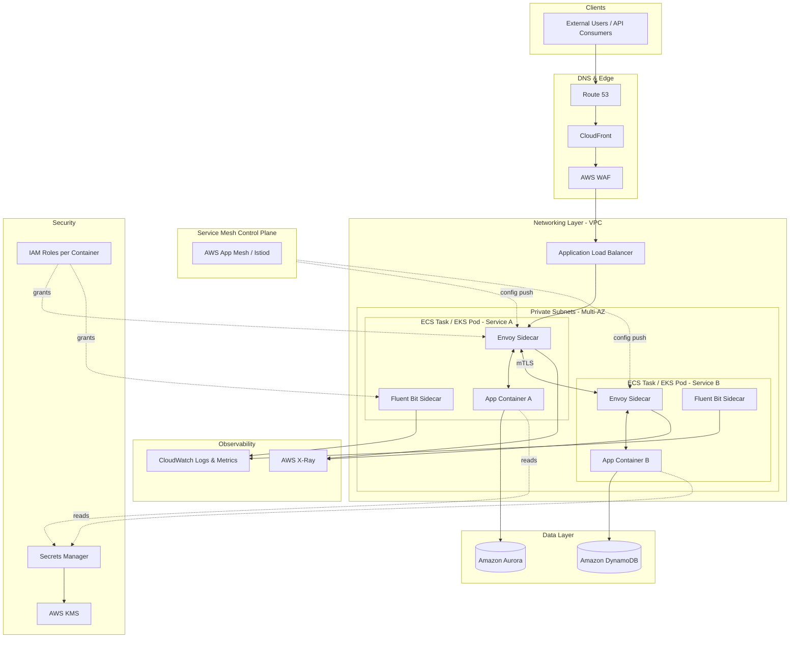

# Part X – Modern Architecture Patterns

# Chapter 85 — Sidecar Pattern

---

## 1. Executive Summary

The sidecar pattern is one of the most quietly influential architecture patterns in modern distributed systems. It does not solve a business problem directly — no product manager ever asks for "a sidecar." Instead, it solves an *engineering* problem that, left unresolved, eventually becomes a business problem: how do you attach cross-cutting operational capabilities (networking, security, observability, configuration) to a service **without** rewriting that service in every language your organization uses.

**The core idea**

- A sidecar is a second container or process deployed alongside a primary application container, inside the same scheduling unit (an ECS task, an EKS pod, or an EC2 instance running two co-located processes).
- The sidecar shares the network namespace, and often the storage volume, of the primary container.
- It intercepts, augments, or offloads behavior that would otherwise have to be implemented inside the application itself.
- The primary container remains focused on business logic. The sidecar owns everything else: mTLS termination, retries, circuit breaking, log shipping, metrics scraping, secret injection, or protocol translation.

**Why organizations adopt this architecture**

Large enterprises rarely have one microservices stack. They have five, built over a decade, in Java, Go, Python, Node.js, and a legacy .NET monolith that nobody wants to touch. Each of these stacks needs the same operational primitives:

- Mutual TLS between services.
- Consistent retry and timeout policies.
- Distributed tracing propagation.
- Centralized authentication and authorization enforcement.
- Uniform metrics and log formats for the SRE team.

Without a sidecar, each of these capabilities must be implemented as a language-specific library, embedded into every service, in every language, and kept in version lock-step across hundreds of repositories. This is the point where platform teams historically failed: a library upgrade for a CVE fix in the Go tracing client does not help the Python team, and the Python team's on-call rotation does not have bandwidth to re-validate a library update that has nothing to do with their business logic.

The sidecar pattern breaks this coupling. The platform team ships **one artifact** — a container image — that is injected next to every workload, regardless of the language the workload is written in. A security patch to the sidecar image is a redeploy, not a company-wide dependency upgrade campaign across forty repositories.

**Architecture objective**

The objective of adopting the sidecar pattern is to achieve a clean separation between:

1. **Business logic** — code that generates revenue or serves customers directly.
2. **Platform logic** — code that makes the business logic observable, secure, resilient, and network-addressable.

This separation is what enables a platform engineering team to exist as a distinct function from application engineering teams. Without it, "platform" work is scattered across every application repository, and there is no single team that can be held accountable for cross-cutting reliability or security posture.

**Major business benefits**

- **Reduced engineering duplication.** Cross-cutting logic is written once, in one language, and reused everywhere.
- **Faster security patching.** A vulnerability in a TLS library, an auth library, or a tracing agent is fixed by rolling out a new sidecar image — not by touching every application's dependency tree.
- **Polyglot support without polyglot platform teams.** A platform team of ten engineers can support a company running Java, Go, Python, and Node.js services without needing deep expertise in all four ecosystems.
- **Consistent governance.** Compliance and security teams get a single, auditable enforcement point for encryption in transit, access control, and traffic logging, rather than trusting each application team to have implemented it correctly.
- **Independent lifecycle.** Sidecars can be upgraded, rolled back, or reconfigured without redeploying the application binary, which shortens the blast radius of platform changes and de-risks emergency patches.

**Typical enterprise scenarios**

- A regulated financial services company enforcing mTLS and audit logging between every service, because a PCI-DSS or SOC 2 auditor requires proof of encryption in transit that cannot rely on "the developers said they configured it."
- A retail company running a service mesh (Envoy-based, via AWS App Mesh or a self-managed Istio control plane on EKS) to get uniform retries, timeouts, and canary traffic shifting across three hundred microservices.
- A healthcare company injecting a log-shipping and PHI-redaction sidecar next to every service so that no individual application team can accidentally ship unredacted patient data to a shared log store.
- A media company using a sidecar to terminate TLS and handle service discovery for a legacy monolith that cannot be quickly rewritten to speak the modern service mesh's mTLS dialect.
- Any platform team using Envoy, Fluent Bit, or the CloudWatch, X-Ray, or Datadog agents as sidecars inside ECS tasks or EKS pods for metrics and log collection — this is the single most common production use of the sidecar pattern on AWS today, more common in practice than full service mesh adoption.

**Why simpler designs eventually fail**

Organizations that skip the sidecar pattern typically start with an in-process library approach — every service imports a shared "platform SDK." This works acceptably at ten services. At one hundred services, across four languages, six teams stop upgrading the SDK because the upgrade risk to their own release cadence outweighs the benefit, and the platform team loses the ability to guarantee any cross-cutting property across the fleet. The sidecar pattern is the architectural response to that failure mode: move the cross-cutting concern out of the language-specific library and into a language-agnostic, independently deployable process.

This chapter treats the sidecar pattern primarily through its most common AWS-native manifestations: sidecars in Amazon ECS task definitions, sidecars in Amazon EKS pod specifications, and the service mesh data plane (AWS App Mesh Envoy proxies, or a self-managed Istio/Linkerd data plane on EKS) as the most sophisticated and complete expression of the pattern. It also covers the "utility sidecar" use case — log shippers, metric agents, and config-reloaders — which is the version of this pattern nearly every AWS shop is already running, whether or not they call it a sidecar.

---

## 2. Business Requirements

### 2.1 Business Drivers

- Need for consistent security posture (encryption in transit, authentication) across a polyglot service fleet.
- Need for centralized observability without asking every application team to instrument code identically.
- Regulatory requirement to prove encryption in transit and auditable access control between internal services (common in banking, healthcare, insurance).
- Desire to decouple platform team release cadence from application team release cadence.
- Need to support legacy applications that cannot be easily modified, by attaching modern capabilities externally.

### 2.2 Functional Requirements

- Every application container must have TLS termination, service discovery, and traffic routing available without embedding a library in the application code.
- Logs, metrics, and traces must be collected in a standard format regardless of the application's implementation language.
- Secrets must be injected into the application's runtime environment without the application needing direct IAM permissions to Secrets Manager or Parameter Store.
- Configuration changes (feature flags, routing rules, rate limits) must be applied without redeploying the application container.

### 2.3 Non-Functional Requirements

| Requirement | Target | Notes |
|---|---|---|
| Added request latency from sidecar hop | < 2–5 ms p99 | Local loopback network call, not a network-hop across hosts |
| Sidecar container restart independence | Yes | Sidecar failure must not silently corrupt application state |
| CPU/memory overhead per pod/task | 5–15% of the application's allocation | Varies significantly by sidecar type (Envoy is heavier than Fluent Bit) |
| Version skew tolerance | Sidecar and app version independent | Sidecar upgrades must not require application code changes |

### 2.4 Scalability Goals

- Sidecar resource requests must scale linearly with the number of application replicas — this is a defining characteristic of the pattern: **one sidecar per application instance**, not a shared, centralized proxy.
- The platform must support horizontal scaling to thousands of pods/tasks, each running an identical sidecar configuration, without a central bottleneck (this is why the pattern favors decentralized/distributed data planes such as Envoy, versus a single shared reverse proxy).

### 2.5 Availability Requirements

- Sidecar crash-looping must not take down the application container if avoidable (achieved via separate container health checks, not a shared process).
- Target composite availability of 99.95%–99.99% for the application+sidecar unit, consistent with standard multi-AZ EKS/ECS designs.

### 2.6 Latency Requirements

- p99 added latency budget from sidecar interception (mTLS handshake reuse, proxy hop) should not exceed 5–10 ms for latency-sensitive APIs (payments, real-time bidding). This is a common review-board objection to Envoy-based meshes and must be benchmarked, not assumed.

### 2.7 Compliance Requirements

- PCI-DSS: encryption in transit between all cardholder-data-environment services, enforced by mTLS sidecar, with proof of certificate rotation.
- HIPAA: audit logging of every access to PHI-bearing services, enforced by the sidecar's access log, independent of application-level logging (defense in depth: you do not want compliance depending solely on developers remembering to log).
- SOC 2: change management and access control evidence for all network policy changes applied via the mesh control plane.

### 2.8 Security Expectations

- No plaintext service-to-service traffic inside the VPC for regulated workloads.
- No application code should hold long-lived credentials; the sidecar (or an adjacent init container) fetches short-lived credentials from IAM Roles Anywhere, IRSA (IAM Roles for Service Accounts), or Secrets Manager.

### 2.9 Recovery Objectives

| Metric | Target | Applies To |
|---|---|---|
| RPO | Not directly applicable — sidecars are stateless | Sidecar containers hold no durable state |
| RTO | < 2 minutes | Time to reschedule pod/task with sidecar on a healthy node/AZ |

### 2.10 SLAs

- Internal platform SLA: sidecar image published within 24 hours of a critical CVE disclosure; automated rollout to all namespaces/clusters within 5 business days via the CI/CD pipeline described in Section 20.

### 2.11 Expected Workload and Growth

- Typical adoption path: starts with 10–20 services running a log-shipping sidecar, grows to include a full service mesh across 100+ services within 18–24 months as the platform team matures.
- Expect sidecar count to equal or exceed application container count 1:1 (and sometimes 1:2 or 1:3, when multiple sidecars — proxy, log shipper, metrics agent — are attached to a single pod).

---

## 3. Architecture Overview

### 3.1 Overall Design

The sidecar pattern is built on three architectural primitives that must all be present for the pattern to be correctly implemented:

1. **Shared network namespace.** The application container and the sidecar container share the same network stack (in Kubernetes, this is the pod's network namespace; in ECS, this is the task's network namespace under `awsvpc` mode). This means the sidecar can listen on `localhost` and intercept traffic the application sends or receives, with no additional network hop across hosts.
2. **Shared lifecycle boundary, independent process boundary.** The application and sidecar are scheduled, scaled, and terminated together as a unit — but they are separate processes, in separate containers, with separate resource limits, separate images, and separate restart semantics.
3. **Optional shared storage.** Some sidecar patterns (log shipping, TLS certificate hot-reload) require a shared ephemeral volume so the application can write files that the sidecar reads, without either process needing network access to the other's filesystem.

### 3.2 Architecture Philosophy

The philosophy is **composition over inheritance** at the infrastructure level. Rather than an application "inheriting" platform capabilities by importing a library (tight coupling, language-specific, versioned together), the application "composes" with a sidecar at deploy time (loose coupling, language-agnostic, versioned independently).

This philosophy trades a small amount of runtime overhead (an extra process, a small amount of CPU/memory, a small amount of added latency for intercepted calls) for a large reduction in organizational coupling. This is a classic "pay in machines, save in humans" trade — appropriate when engineering time is the more expensive and more constrained resource, which is true in essentially every enterprise at scale.

### 3.3 Core Components

| Component | Role |
|---|---|
| Application container | Runs business logic; unaware (or minimally aware) of the sidecar's existence |
| Sidecar container(s) | Runs cross-cutting platform logic: proxy, log shipper, metrics agent, config sync, secret fetcher |
| Init container (optional) | Runs once before the app/sidecar start, e.g., to fetch initial TLS certs or set `iptables` rules for traffic interception |
| Control plane (for service mesh sidecars) | Centrally manages configuration pushed to every sidecar (e.g., App Mesh control plane, Istio's `istiod`) |
| Shared volume (optional) | `emptyDir` (Kubernetes) or bind mount (ECS) for passing files between containers without network calls |

### 3.4 How Components Interact

For a **proxy sidecar** (the most architecturally significant case — e.g., Envoy in AWS App Mesh or Istio):

1. Traffic destined for the application is redirected (via `iptables` rules set by an init container, or via explicit port configuration) to the sidecar proxy's inbound listener first.
2. The sidecar terminates TLS, checks mTLS client certificates, applies any inbound rate-limiting or authorization policy, and forwards the plaintext request to the application container over `localhost`.
3. When the application makes an outbound call to another service, that outbound traffic is also redirected to the sidecar's outbound listener.
4. The sidecar looks up the destination service in its locally cached service-discovery data (pushed from the control plane), selects an endpoint (applying load balancing, circuit breaking, and retry policy), establishes mTLS to the destination's sidecar, and forwards the request.
5. The destination's sidecar performs the inbound steps again for the receiving application.

For a **log-shipping sidecar** (the simplest and most common case):

1. The application writes logs to stdout/stderr or to a file on a shared volume.
2. The sidecar (Fluent Bit, CloudWatch agent) tails the log source and ships it to CloudWatch Logs, an OpenSearch cluster, or S3, applying any redaction or enrichment rules configured centrally.

### 3.5 High-Level Workflow / Request Lifecycle / Response Lifecycle / Data Lifecycle

**Request lifecycle:** Client → sidecar (mTLS termination, authZ check) → app (business logic) → sidecar (outbound call to dependency) → dependency's sidecar → dependency's app.

**Response lifecycle:** Reverse of the above; the sidecar on the response path can apply retry-on-failure logic transparently to the application (e.g., a 503 from the dependency triggers a sidecar-level retry, invisible to the calling application code).

**Data lifecycle (for log/metric sidecars):** Application emits data locally (stdout, a Unix socket, or a local file) → sidecar batches and buffers → sidecar ships to the durable destination (CloudWatch, S3, Managed Prometheus) → sidecar handles backpressure and local buffering during destination unavailability, so the application is never blocked by observability infrastructure being down.

---

## 4. AWS Services Used

> **Note:** Not every service below appears in every sidecar deployment. This section lists the services relevant to a sidecar architecture running on ECS and/or EKS with a service mesh and/or utility sidecars. Skip services irrelevant to your specific implementation.

### 4.1 Amazon ECS

- **Purpose:** Container orchestration for running application + sidecar containers as a single task definition, using `awsvpc` networking mode so all containers in the task share one ENI and network namespace.
- **Why selected:** Native AWS integration, no control-plane management overhead, first-class support for multiple containers per task (making it a natural fit for the sidecar pattern without needing a separate mesh product).
- **Alternatives:** Amazon EKS (more flexibility, higher operational overhead), AWS App Runner (does not support the sidecar pattern — single container only, ruling it out for this architecture).
- **Limitations:** Task definitions have a maximum container count (10 by default, soft limit, can be raised); all containers in a task scale together (you cannot scale the sidecar independently of the app within one task).
- **Pricing considerations:** Sidecar CPU/memory is billed identically to application CPU/memory under Fargate — a 128 CPU unit / 256 MB sidecar is a real, metered cost multiplied across every task, and this adds up meaningfully at fleet scale (see Section 16).
- **Best practices:** Set explicit CPU/memory reservations on sidecar containers so they cannot starve the application container under load; use `dependsOn` with `healthy` condition so the application container waits for the sidecar to be ready (critical for proxy sidecars — the app must not start accepting traffic before the proxy can intercept it).

### 4.2 Amazon EKS

- **Purpose:** Kubernetes control plane for running pods with multiple containers (the pod itself is the native "sidecar unit" in Kubernetes — this is not a bolted-on feature, it is core to the pod specification).
- **Why selected:** Native Kubernetes sidecar container support (stable since Kubernetes 1.28 as a first-class `restartPolicy: Always` sidecar type within `initContainers`), broad ecosystem support for Istio, Linkerd, and Envoy-based meshes.
- **Alternatives:** Amazon ECS (simpler, less flexible), self-managed Kubernetes on EC2 (more control, much higher operational burden — rarely justified given EKS exists).
- **Limitations:** Requires genuine Kubernetes operational expertise (RBAC, CNI plugins, admission controllers for sidecar injection); sidecar injection via mutating webhooks (used by Istio) adds a failure mode where a broken webhook can block all new pod scheduling cluster-wide.
- **Pricing considerations:** EKS control plane hourly charge, plus EC2/Fargate compute for both app and sidecar containers; Fargate on EKS bills each pod's total resource request, again including the sidecar's share.
- **Best practices:** Use native Kubernetes sidecar containers (`restartPolicy: Always` init containers, GA since Kubernetes 1.29) instead of racing app/sidecar startup manually; set `PodDisruptionBudget` accounting for sidecar startup time during node drains.

### 4.3 AWS App Mesh

- **Purpose:** Managed service mesh control plane that configures Envoy sidecar proxies injected into ECS tasks or EKS pods, providing traffic routing, retries, timeouts, circuit breaking, and TLS.
- **Why selected:** Fully managed control plane (no `istiod` to operate yourself), deep integration with ECS (a scenario where Istio has historically had weaker support), IAM-based access control for mesh configuration changes.
- **Alternatives:** Self-managed Istio on EKS (more features, much larger operational surface, larger community and ecosystem), Linkerd (lighter-weight data plane, smaller feature set, lower resource overhead — often preferred when App Mesh's feature set is more than needed), no mesh at all with only application-level libraries (higher engineering coupling, discussed in Section 28).
- **Limitations:** **AWS announced End of Support for AWS App Mesh** (new customer onboarding closed, existing customers should plan migration) — as of this writing this is a critical, must-verify-current-status item; do not select App Mesh for new production architectures without confirming its current support status via AWS's official announcements page, since this materially affects the "why selected" justification above. For any new build, verify current status before committing, and default to self-managed Istio/Linkerd on EKS, or Amazon ECS Service Connect for simpler service-to-service needs, if App Mesh's support window has closed.
- **Pricing considerations:** No separate charge for App Mesh itself historically (charged only for the underlying compute of the Envoy sidecars); confirm current pricing given the service status.
- **Best practices:** If already on App Mesh, plan a migration path now; if starting new, evaluate Amazon ECS Service Connect (for simpler ECS-only service discovery and basic resiliency) or a self-managed Istio/Linkerd control plane on EKS.

### 4.4 Amazon ECS Service Connect

- **Purpose:** A lighter-weight, ECS-native alternative to a full service mesh, providing service discovery, basic traffic metrics, and a simple sidecar (a lightweight Envoy proxy managed transparently by ECS) without the operational complexity of a full mesh control plane.
- **Why selected:** For teams that need service discovery and basic observability but do not need mTLS, fine-grained traffic shifting, or circuit breaking, this is a far simpler starting point than App Mesh or Istio.
- **Alternatives:** AWS Cloud Map (service discovery only, no proxy/sidecar involved), full service mesh (App Mesh/Istio) for advanced traffic management needs.
- **Limitations:** Fewer traffic management features than a full mesh (limited retry/circuit-breaking configuration compared to Envoy configured directly via App Mesh or Istio).
- **Best practices:** Use as the default starting point for ECS-based sidecar/mesh needs before reaching for a heavier mesh product.

### 4.5 Amazon CloudWatch (Logs, Agent, Container Insights)

- **Purpose:** Destination and/or agent for the log-shipping and metrics-collection sidecar use case — the single most common sidecar deployment on AWS in practice.
- **Why selected:** Native integration, IAM-based access control, no separate infrastructure to operate for the log/metrics backend.
- **Alternatives:** Self-managed Fluent Bit sidecar shipping to OpenSearch or a third-party SIEM (Splunk, Datadog) for teams with existing tooling investments; Amazon Managed Service for Prometheus for metrics specifically.
- **Limitations:** CloudWatch Logs costs scale with ingestion volume and retention — a poorly configured sidecar that ships debug-level logs from every service can produce a surprisingly large bill (see Section 16, "Cost Surprises").
- **Best practices:** Use Fluent Bit (not the legacy CloudWatch Logs agent) as the log-shipping sidecar image for ECS/EKS; configure log level filtering and sampling at the sidecar, not just at the application, so a misconfigured application cannot single-handedly blow the logging budget.

### 4.6 AWS X-Ray

- **Purpose:** Distributed tracing backend; the X-Ray daemon is a textbook utility sidecar — deployed once per task/pod, receiving trace segments over UDP on `localhost` from the application's X-Ray SDK, and batching them to the X-Ray API.
- **Why selected:** Native AWS integration, works well alongside App Mesh/Envoy tracing headers for end-to-end distributed trace propagation.
- **Alternatives:** AWS Distro for OpenTelemetry (ADOT) Collector as a sidecar, exporting to X-Ray, Amazon Managed Service for Prometheus, or a third-party backend (more vendor-neutral, increasingly the recommended default over the classic X-Ray daemon).
- **Limitations:** X-Ray sampling rules need central configuration to avoid either under-sampling (losing visibility) or over-sampling (unnecessary cost and volume).
- **Best practices:** Prefer the ADOT Collector sidecar over the legacy X-Ray daemon for new builds, since it supports multiple backends and the OpenTelemetry standard, reducing future migration risk.

### 4.7 IAM (Roles, IRSA, IAM Roles Anywhere)

- **Purpose:** Grants the sidecar (not the application) the specific permissions it needs — e.g., permission to write to a CloudWatch Logs group, or to read a specific Secrets Manager secret — without the application container ever holding those credentials directly.
- **Why selected:** This is the mechanism that makes the sidecar pattern secure by default: the principle of least privilege is enforced at the container level, not just the task/pod level, when using per-container IAM roles (ECS) or IRSA (EKS, binding a Kubernetes ServiceAccount to an IAM role via OIDC federation).
- **Alternatives:** A single shared task/pod-level IAM role for both app and sidecar (simpler, but violates least privilege — a compromised application container inherits the sidecar's permissions and vice versa).
- **Limitations:** IRSA requires an EKS OIDC provider to be configured; multi-container-scoped IAM roles are more complex to reason about during audits (more roles to track).
- **Best practices:** Give the sidecar its own IAM role scoped only to what it needs (e.g., `logs:PutLogEvents` on a specific log group ARN); never let the application container's task role include permissions the application itself does not need just because the sidecar needs them.

### 4.8 AWS Secrets Manager / AWS Systems Manager Parameter Store

- **Purpose:** Source of truth for credentials and configuration that a sidecar (or an init container acting as a sidecar-adjacent helper) fetches at startup and injects into a shared volume or environment, so the application never calls the Secrets Manager API directly.
- **Why selected:** Centralizes secret rotation and access auditing; removes the need for every application in every language to implement its own Secrets Manager SDK integration.
- **Alternatives:** HashiCorp Vault with the Vault Agent sidecar (common in multi-cloud or highly regulated environments that already standardize on Vault); Kubernetes External Secrets Operator (syncs secrets into native Kubernetes Secret objects, a different but related pattern).
- **Limitations:** Secrets Manager API calls incur cost per 10,000 API calls and per secret per month; a sidecar polling too aggressively for rotation can add unnecessary cost.
- **Best practices:** Use an init container (not a long-running sidecar) for one-time secret fetch at startup where rotation-in-place is not required; use a long-running sidecar only when the secret must be refreshed without a pod/task restart (e.g., short-lived database credentials).

### 4.9 Amazon VPC

- **Purpose:** Underlying network the sidecar's `awsvpc` (ECS) or pod networking (EKS with the Amazon VPC CNI) attaches to; determines the IP addressing, security group, and routing context the sidecar operates within.
- **Why selected:** No alternative — this is the default and required networking layer for both ECS and EKS on AWS.
- **Limitations:** ENI/IP address exhaustion is a real constraint at scale when every pod (with its sidecars) consumes an IP from the VPC CNI's pool; this is a common scaling limit discussed in Section 21 of this handbook's networking chapters and again in Section 14 here.
- **Best practices:** Plan subnet CIDR sizing assuming pod density will be higher than expected once sidecars are added — a sidecar does not consume an additional IP under `awsvpc`/pod networking (it shares the task/pod's single IP), but it does mean each task/pod needs enough ENI capacity for the aggregate bandwidth of app + sidecar traffic.

### 4.10 Amazon CloudWatch, AWS X-Ray (Monitoring — see also Section 21)

Covered above; also relevant here as the backbone of the sidecar health-monitoring story: sidecar container health checks feed into CloudWatch Container Insights dashboards used to detect sidecar-specific failure modes (e.g., proxy sidecar OOMKilled due to connection buildup under load).

---

## 5. Complete Architecture Diagram



**Diagram notes:**

- Each task/pod contains one application container and two sidecars (Envoy for traffic management, Fluent Bit for log shipping) — a realistic production configuration, not a simplification.
- The mesh control plane pushes configuration to every Envoy sidecar independently; it is not in the request path (a common misconception that leads to unnecessary control-plane-as-bottleneck fear during architecture reviews — address this explicitly in Section 30, the ADR).
- IAM grants are shown per-container, reflecting the least-privilege best practice from Section 4.7.

---

## 6. Component-by-Component Explanation

### 6.1 Application Container

- **Purpose:** Executes business logic only.
- **Responsibilities:** Handle business requests, read/write to databases, emit logs to stdout/stderr, optionally emit trace spans via an SDK.
- **Inputs:** HTTP/gRPC requests (received via `localhost` from the sidecar proxy, not directly from the network).
- **Outputs:** HTTP/gRPC responses; log lines to stdout; optional trace spans to a `localhost` UDP/HTTP endpoint the tracing sidecar exposes.
- **Scaling:** Scales via ECS Service Auto Scaling or Kubernetes HPA based on application-level metrics (CPU, memory, or custom metrics like queue depth).
- **High availability:** Multi-AZ task/pod placement; the application container's HA characteristics are independent of the sidecar's — this must be validated (see Section 24, Failure Scenario "Sidecar crash takes down healthy application").
- **Failure handling:** Should implement graceful shutdown (SIGTERM handling) that allows in-flight requests to drain even if the sidecar proxy is mid-restart.
- **Dependencies:** Depends on the sidecar being *ready* before it can safely accept traffic if traffic interception is enforced at the network layer (iptables redirect) — this is why container startup ordering matters (Section 4.1, `dependsOn: healthy`).
- **Security:** Should not hold direct network-level credentials for cross-cutting concerns (TLS certs, tracing API keys) — these belong to the sidecar.
- **Monitoring:** Application-level custom metrics via CloudWatch embedded metric format or StatsD to a metrics sidecar.

### 6.2 Proxy Sidecar (Envoy)

- **Purpose:** Intercepts all inbound and outbound network traffic for the application container.
- **Responsibilities:** mTLS termination/origination, service discovery resolution, load balancing across endpoints, retries, timeouts, circuit breaking, request-level authorization (via an external authz filter, e.g., calling an OPA sidecar or an internal policy service).
- **Inputs:** Raw inbound network traffic (redirected via iptables or explicit port binding); outbound calls from the application container.
- **Outputs:** Proxied plaintext traffic to the app container; mTLS-encrypted traffic to peer sidecars; access logs and metrics to the observability sidecar/backend.
- **Scaling:** Scales 1:1 with the application container — this is definitional to the sidecar pattern, unlike a shared reverse proxy which scales independently.
- **High availability:** No independent HA design needed beyond the application's own HA — if the pod/task is rescheduled, the sidecar is rescheduled with it.
- **Failure handling:** Envoy sidecar crash should be configured with `restartPolicy: Always` (native Kubernetes sidecar) so it restarts without terminating the whole pod; readiness probes must ensure the app is marked "not ready" if the proxy is down, to avoid routing traffic to an app that cannot reach its dependencies.
- **Dependencies:** Depends on the mesh control plane for configuration; must have a sane default/fail-safe configuration (fail open vs. fail closed is a critical, business-specific decision — see Section 24).
- **Security:** Holds the mTLS certificate/private key for the workload identity; this should be short-lived and auto-rotated via the mesh control plane's certificate authority (e.g., via AWS Certificate Manager Private CA, or Istio's built-in CA).
- **Monitoring:** Envoy exposes detailed request/response metrics (latency histograms, error rates, upstream/downstream connection pool stats) — this is frequently the *primary* source of service-level metrics in a mesh-based architecture, more granular than what applications self-report.

### 6.3 Log-Shipping Sidecar (Fluent Bit)

- **Purpose:** Collects logs written by the application and ships them to a centralized destination.
- **Responsibilities:** Tail stdout/stderr or a shared log file; parse, filter, redact, and enrich log lines; buffer during destination outages; ship to CloudWatch Logs, S3, or OpenSearch.
- **Inputs:** Application log output (via the container runtime's log driver, or a shared volume).
- **Outputs:** Structured log records to CloudWatch Logs / OpenSearch / S3.
- **Scaling:** 1:1 with the application container.
- **High availability:** Local buffering (in-memory or on a shared ephemeral volume) to tolerate transient CloudWatch API unavailability without dropping logs, up to a configured buffer limit.
- **Failure handling:** A crashed log sidecar must not block or crash the application; logs generated during the outage window are lost unless buffered on a persistent (not ephemeral) volume — a real trade-off to document explicitly for compliance-sensitive log streams.
- **Dependencies:** IAM permissions to `logs:PutLogEvents` scoped to a specific log group.
- **Security:** Should apply PII/PHI redaction rules before shipping, especially for regulated workloads — this is a legitimate, common use of a sidecar as a policy enforcement point independent of application-level logging discipline.
- **Monitoring:** Self-monitoring via its own CloudWatch metrics (bytes shipped, errors, buffer utilization).

### 6.4 Tracing Sidecar (ADOT Collector / X-Ray Daemon)

- **Purpose:** Receives trace spans emitted locally by the application's instrumentation library and forwards them to the tracing backend.
- **Responsibilities:** Batch spans, sample according to centrally configured sampling rules, forward to X-Ray or an OpenTelemetry-compatible backend.
- **Inputs:** UDP or gRPC trace spans from the application SDK on `localhost`.
- **Outputs:** Batched trace data to X-Ray API or OTLP endpoint.
- **Scaling:** 1:1 with application container.
- **Dependencies:** IAM permission for `xray:PutTraceSegments` (or equivalent for the chosen backend).
- **Monitoring:** Self-reports span-drop rate, useful to detect misconfigured sampling.

### 6.5 Init Container (Traffic Interception Setup)

- **Purpose:** Runs once before the app and sidecar start, to configure `iptables` rules that transparently redirect traffic through the proxy sidecar (used by Istio's `istio-init`, and similar patterns for self-managed Envoy deployments).
- **Responsibilities:** Set NAT rules so all outbound traffic from the application's network namespace is redirected to the proxy's outbound listener port, and all inbound traffic is redirected to the proxy's inbound listener port.
- **Failure handling:** Must run with `NET_ADMIN` capability; a failure here should fail pod startup entirely (fail closed) rather than let traffic bypass the proxy unnoticed — a very important security control to get right, and a common audit question (see Section 34).

---

## 7. End-to-End Request Flow

1. **Client** issues an HTTPS request to the public API endpoint.
2. **Route 53** resolves the domain to the CloudFront distribution.
3. **CloudFront** serves cached content if applicable, or forwards the request to the origin (an internet-facing ALB).
4. **AWS WAF**, attached to CloudFront or the ALB, inspects the request against managed and custom rule sets (SQLi, XSS, rate-based rules).
5. **Application Load Balancer** performs TLS termination at the edge (public-facing) and routes the request to a healthy target — an ECS task or EKS pod IP, on the port exposed by the proxy sidecar, not the application container directly.
6. **Proxy sidecar (inbound listener)** receives the request first. It validates the mTLS client certificate if this is an internal call, or simply accepts the ALB's plaintext forward (common at the edge, where ALB-to-target traffic is inside the VPC and mTLS may only be enforced service-to-service, not edge-to-service — document this boundary explicitly in your threat model, Section 11).
7. **Proxy sidecar** applies any configured request-level policy: rate limiting, authorization check (possibly calling an external policy service), and request/response logging.
8. **Proxy sidecar** forwards the plaintext request to the **application container** over `localhost`.
9. **Application container** processes the business logic, which may include:
   a. A read/write to **Amazon Aurora** or **DynamoDB**.
   b. An outbound call to a dependent internal service.
10. For an outbound call to a dependency, the application's outbound traffic is intercepted by its **own proxy sidecar (outbound listener)**, which resolves the destination service via the mesh control plane's service discovery data, selects a healthy endpoint, and establishes an mTLS connection to the destination's **inbound proxy sidecar**.
11. The destination's proxy sidecar decrypts, authorizes, and forwards to its application container, repeating steps 6–9 for that service.
12. The response follows the reverse path: application → local proxy sidecar → mTLS back to the caller's proxy sidecar → application.
13. Throughout, the **log-shipping sidecar** on each task/pod tails the application's and (optionally) the proxy's access logs and ships them asynchronously to **CloudWatch Logs**.
14. The **tracing sidecar** on each task/pod collects trace spans (propagated via standard headers like `traceparent` or X-Ray's `X-Amzn-Trace-Id`, which the proxy sidecar also participates in propagating) and ships them to **AWS X-Ray**, building a complete distributed trace across every hop above.
15. **CloudWatch Alarms**, configured on both application-level and sidecar-level metrics (e.g., Envoy's upstream error rate, Fluent Bit's buffer utilization), notify the on-call engineer via **Amazon SNS** if thresholds are breached.
16. **Error handling:** If the destination service is unavailable, the caller's proxy sidecar applies the configured retry policy (bounded retries with backoff) and, if retries are exhausted, opens its circuit breaker for that destination — all without any code change or awareness in the calling application.

---

## 8. Deployment Flow

### 8.1 Infrastructure Provisioning

Infrastructure (VPC, ECS cluster or EKS cluster, ALB, IAM roles, App Mesh/Istio control plane resources) is provisioned via Terraform, described in full in Section 18.

### 8.2 Terraform Workflow

1. `terraform plan` against a dedicated state file per environment (dev/staging/prod), using remote state in S3 with DynamoDB locking (or S3-native locking, now supported without DynamoDB for newer Terraform versions — verify your Terraform version's supported locking mechanism).
2. Peer review of the plan output in a pull request, with a policy-as-code check (Section 20) validating IAM least-privilege and encryption settings before merge.
3. `terraform apply` executed by the CI/CD pipeline, never from a local workstation in production.

### 8.3 CI/CD Deployment (Application + Sidecar)

The application and sidecar images are typically built and versioned **independently**, in separate pipelines:

- **Application pipeline:** builds and pushes the application container image; on merge to main, triggers a new ECS task definition revision or Kubernetes deployment rollout, referencing the **current approved sidecar image tag** (pinned, not `:latest`).
- **Sidecar/platform pipeline:** builds and pushes the sidecar image (Envoy with a custom bootstrap config, or Fluent Bit with a custom parser config); on a new sidecar release, the platform team triggers a coordinated rollout across all consuming services' task definitions/deployments — typically via a controlled, staged rollout (canary namespace first, then fleet-wide) rather than a big-bang change.

### 8.4 Blue-Green Deployment

- ECS supports blue-green deployments natively via CodeDeploy integration; a new task set (app + sidecar together, as a unit) is stood up alongside the old one, health-checked, and traffic is shifted at the ALB target group level.
- On EKS, blue-green is typically implemented via a service mesh traffic-shifting rule (weighted routing between two deployment versions) — this is, notably, a capability the mesh's sidecar proxies provide natively, and is one of the strongest justifications for adopting a mesh in the first place (see Section 28, Alternatives).

### 8.5 Rollback

- Rollback reverts to the previous task definition revision (ECS) or Deployment revision (Kubernetes), which includes both the app and sidecar image references as they were pinned at that revision — this is why **pinning sidecar image versions per app deployment**, rather than always pulling the sidecar's `latest` tag, is essential for reliable rollback (a very common production pitfall, covered in Section 34).

### 8.6 Secrets

- Handled per Section 4.8: fetched by an init container or long-running sidecar at startup, never baked into the image or passed as plaintext environment variables in the task/pod definition.

### 8.7 Configuration

- Mesh routing configuration (retries, timeouts, traffic splits) is managed centrally via the control plane (App Mesh API / Istio CRDs) and version-controlled as code (Terraform for App Mesh resources, or GitOps-managed YAML for Istio `VirtualService`/`DestinationRule` objects).

### 8.8 Validation

- Post-deploy smoke tests validate that the proxy sidecar is correctly intercepting traffic (checking Envoy's admin endpoint `/stats` or `/clusters` for expected upstream cluster health) before marking the deployment successful.

---

## 9. Network Topology

### 9.1 VPC and CIDR

- A `/16` VPC CIDR (e.g., `10.0.0.0/16`) is typical for enterprise workloads, subdivided into `/20` or `/22` subnets per AZ per tier (public, private-app, private-data).
- **Sidecar-specific consideration:** since each ECS task (`awsvpc` mode) or EKS pod consumes one IP address from the subnet regardless of how many containers (app + sidecars) it runs, IP address planning should be based on **task/pod count**, not container count — a common point of confusion during capacity planning.

### 9.2 Public and Private Subnets

- Public subnets host the ALB and NAT Gateways only.
- Private subnets host all ECS tasks / EKS pods (application + sidecar units) — no application or sidecar container should ever run in a public subnet.

### 9.3 NAT Gateway and Internet Gateway

- NAT Gateways in each AZ's public subnet allow private-subnet workloads (and their sidecars, e.g., a log-shipping sidecar calling the CloudWatch Logs public API endpoint, if VPC endpoints are not used) outbound internet access.
- **Cost note:** NAT Gateway data processing charges apply to all sidecar-originated traffic too (e.g., a log sidecar shipping high log volume through a NAT Gateway instead of a VPC endpoint is a common, avoidable cost surprise — see Section 16).

### 9.4 Transit Gateway

- Used when the mesh spans multiple VPCs or accounts (common in a multi-account landing zone, Chapter 99) — the mesh's mTLS sidecars still function correctly across a Transit Gateway, since mTLS operates above the network layer, but latency and Transit Gateway data processing costs must be accounted for in cross-VPC service-to-service calls.

### 9.5 Route Tables, Network ACLs, Security Groups

- Security groups should be scoped at the task/pod level (ECS `awsvpc` and EKS with the VPC CNI both support this), allowing security group rules to reflect the actual service identity — but note that with mTLS enforced by the sidecar, security groups become a **secondary**, defense-in-depth control, not the primary access control mechanism (the primary control is the mesh's mTLS + authorization policy).

### 9.6 VPC Endpoints (Interface and Gateway)

- Interface endpoints for CloudWatch Logs, Secrets Manager, X-Ray, and ECR should be provisioned so that sidecar traffic to these AWS services stays on the AWS network backbone, avoiding NAT Gateway costs and reducing latency — this is a frequently missed optimization specifically because sidecar-generated traffic (logs, traces, secret fetches) is often overlooked when VPC endpoints are planned only for "application" traffic.

### 9.7 PrivateLink

- If the mesh needs to reach a SaaS observability backend (e.g., Datadog) privately, AWS PrivateLink endpoints (where the vendor supports them) avoid sending sidecar-shipped telemetry over the public internet.

---

## 10. Identity and Access

### 10.1 IAM Roles (Per-Container Granularity)

- **ECS:** Task definitions support both a **Task Role** (used by the application code, if it needs any AWS API access at all) and, since ECS added per-container IAM roles in some configurations, or more commonly, a single Task Role scoped to the union of what app and sidecar need, with the sidecar's specific permissions clearly separated in the policy document even if attached to one role for simplicity. Where the platform requires strict separation, run the sidecar's AWS API calls through a distinct credential source (e.g., a dedicated Task Role used only by the sidecar container, if the orchestration model supports assigning different roles per container — verify current ECS capabilities, as this has evolved).
- **EKS:** IRSA (IAM Roles for Service Accounts) allows the sidecar container to assume a *different* IAM role than the application container, by using separate Kubernetes ServiceAccounts for each container's pod-projected token — this is the cleaner, more auditable mechanism on EKS and is the recommended approach for new builds.

### 10.2 IAM Policies (Least Privilege Example for a Log Sidecar)

```json

{
  "Version": "2012-10-17",
  "Statement": [
    {
      "Sid": "AllowLogShippingOnly",
      "Effect": "Allow",
      "Action": [
        "logs:PutLogEvents",
        "logs:CreateLogStream"
      ],
      "Resource": "arn:aws:logs:us-east-1:111122223333:log-group:/ecs/payments-service:*"
    }
  ]
}

```

- Note this policy grants nothing beyond writing to one specific log group — it cannot read logs, cannot write to other services' log groups, and has no other AWS permissions.

### 10.3 Resource Policies

- Secrets Manager resource policies can restrict which IAM principal (the sidecar's specific role) may retrieve a given secret, adding a second layer of access control beyond the IAM identity policy.

### 10.4 STS and Cross-Account Access

- In a multi-account landing zone (Chapter 99), a sidecar in a workload account may need to assume a role in a shared services account (e.g., to write to a centralized logging account's log destination) — this is done via `sts:AssumeRole`, with the trust policy scoped to the specific sidecar's IAM role ARN, not a broad account-level trust.

### 10.5 Least Privilege

- The single most important identity principle for this architecture: **the sidecar and the application should never share the same IAM permissions unless they genuinely need the same access.** This is the most commonly violated best practice in real deployments (Section 34, Security Blind Spots) — teams under time pressure attach one broad role to the whole task/pod "to make it work," and never revisit it.

### 10.6 Permission Boundaries

- Apply a permission boundary to all sidecar-assumable roles restricting them to a pre-approved set of actions (e.g., only `logs:*`, `xray:*`, `secretsmanager:GetSecretValue` on specific ARN patterns), preventing a compromised sidecar image (supply-chain risk, Section 34) from being used to escalate privileges even if its attached policy is accidentally over-permissioned.

---

## 11. Security Architecture

### 11.1 Encryption

- **In transit, service-to-service:** mTLS provided by the proxy sidecar; certificates issued by a private CA (AWS Certificate Manager Private CA, or the mesh's built-in CA) with short lifetimes (hours, not months) and automatic rotation managed by the mesh control plane — the application never touches these certificates directly.
- **In transit, edge:** TLS 1.2+ terminated at the ALB/CloudFront using AWS Certificate Manager public certificates.
- **At rest:** Application data encrypted via KMS (RDS/Aurora encryption, DynamoDB encryption, S3 SSE-KMS); sidecar-shipped logs in CloudWatch Logs are encrypted at rest by default and can be configured with a customer-managed KMS key for additional control over key rotation and access auditing.

### 11.2 KMS

- Customer-managed KMS keys should be used (not AWS-managed keys) for any log group or secret that a compliance framework requires demonstrable key-access-audit-trail for — CloudTrail logs every `kms:Decrypt` call, which is often the actual compliance evidence an auditor wants to see.

### 11.3 TLS / WAF / Shield

- AWS WAF at the edge protects against common web exploits before traffic ever reaches the mesh; AWS Shield Standard (automatic) or Shield Advanced (subscribed) protects against volumetric DDoS at the edge — these are edge protections and are **not** a substitute for the sidecar's internal mTLS/authorization enforcement; both layers are needed (defense in depth).

### 11.4 Secrets Manager and Certificate Manager

- Already covered in Sections 4.8 and 11.1 respectively.

### 11.5 GuardDuty, Inspector, Security Hub

- **GuardDuty** monitors for anomalous network behavior (e.g., a compromised sidecar container attempting unusual outbound connections — a real detection use case, since sidecars have network-level visibility into all app traffic, making them an attractive supply-chain attack target).
- **Inspector** scans sidecar container images (Envoy, Fluent Bit, ADOT Collector) for known CVEs as part of the CI/CD pipeline, before the image is published to the internal ECR repository consumed by application deployments.
- **Security Hub** aggregates findings from GuardDuty, Inspector, and Config into a single compliance dashboard, useful for demonstrating continuous monitoring to auditors.

### 11.6 CloudTrail and AWS Config

- CloudTrail logs every IAM role assumption and API call made by sidecar containers, providing the audit trail required for compliance evidence discussed in Section 2.7.
- AWS Config rules can continuously validate that no ECS task definition or Kubernetes pod spec has drifted to disable mTLS enforcement or to use an unapproved (unpatched) sidecar image tag.

### 11.7 Zero Trust

- The sidecar pattern is one of the primary architectural mechanisms for implementing zero trust networking on AWS: every service-to-service call is authenticated (mTLS) and authorized (policy check) regardless of network location, rather than relying on network perimeter (security groups/VPC boundaries) as the sole trust boundary. See Chapter 87 for the full zero trust reference architecture, which builds directly on this pattern.

### 11.8 Threat Model / Attack Vectors / Mitigations

| Attack Vector | Description | Mitigation |
|---|---|---|
| Compromised application container | Attacker gains code execution in the app container | Sidecar's mTLS/authZ policy still restricts what the compromised app can reach (least-privilege network policy, not just application logic) |
| Compromised sidecar image (supply chain) | A malicious or vulnerable sidecar image is deployed | Image signing (Notary/Cosign), Inspector scanning in CI/CD, permission boundaries on the sidecar's IAM role |
| iptables bypass | Application attempts to bypass the proxy by binding directly to an external port | Enforce via egress security group rules and, where supported, Kubernetes NetworkPolicy denying direct egress except through the proxy's redirected path |
| Certificate theft | Attacker exfiltrates the sidecar's mTLS private key | Short certificate lifetimes (hours) drastically limit the exploitation window; certificates never touch persistent storage |
| Control plane compromise | Attacker gains access to the mesh control plane | Strict IAM/RBAC on control plane API access; control plane changes go through the same CI/CD policy-as-code gate as infrastructure changes |

---

## 12. High Availability

### 12.1 AZ Failures

- ECS services and EKS deployments should be spread across a minimum of three AZs; since the sidecar is part of the same task/pod, it is automatically distributed alongside the application — no separate HA design is needed for the sidecar itself.

### 12.2 Instance/Node Failures

- ECS capacity providers (Fargate, or EC2 with managed scaling) and EKS managed node groups automatically reschedule failed tasks/pods, including their sidecars, onto healthy infrastructure.

### 12.3 Regional Failures

- Addressed at a higher architectural level (Chapter 98, Multi-Region Active-Active); the sidecar pattern itself is region-local and does not directly provide cross-region failover, though the mesh's service discovery can be extended to route to a secondary region's endpoints if configured for cross-region service discovery (an advanced, less common configuration).

### 12.4 Database Failures

- Independent of the sidecar pattern — handled via Aurora Multi-AZ/Global Database or DynamoDB Global Tables, as covered in the relevant data platform chapters (43–50).

### 12.5 Load Balancing

- The proxy sidecar itself performs client-side load balancing across the destination service's healthy endpoints (using the mesh's locally cached, continuously updated endpoint list) — this is, in many designs, a **replacement** for a traditional internal load balancer for service-to-service traffic, reducing both cost and an additional network hop. (External-facing traffic still uses the ALB.)

### 12.6 Health Checks

- Three layers of health check should exist: (1) the application's own `/healthz` endpoint, (2) the proxy sidecar's outbound health checking of upstream services (used for its own load-balancing decisions), and (3) the container orchestrator's (ECS/Kubernetes) container-level health check on both the app and the sidecar containers independently — a task/pod should only be marked healthy if **both** the app and any traffic-intercepting sidecar report healthy.

### 12.7 Failover

- Proxy sidecar circuit breaking automatically fails over away from an unhealthy destination endpoint within milliseconds, without waiting for the orchestrator's slower health-check-driven deregistration — this fast, client-side failover is one of the most valuable production benefits of the proxy sidecar pattern.

---

## 13. Disaster Recovery

### 13.1 Backup Strategy

- Sidecar containers hold no durable state and require no backup strategy themselves; DR planning for this architecture is driven entirely by the data layer (Aurora snapshots and cross-region replication, DynamoDB point-in-time recovery and Global Tables) and by infrastructure-as-code (Terraform state and modules, which can redeploy the entire mesh configuration into a new region/account from scratch).

### 13.2 Snapshots / Cross-Region Replication

- Application data: standard Aurora/DynamoDB cross-region strategies (see Chapters 44–45).
- Mesh configuration: since it is defined as code (Terraform/GitOps), "backup" is effectively the Git repository itself plus the CI/CD pipeline's ability to redeploy it into a new region.

### 13.3 Pilot Light / Warm Standby / Multi-Site

- For a pilot-light DR strategy, the mesh control plane and a minimal set of sidecar-equipped tasks/pods can be pre-provisioned in the DR region at low capacity, scaled up during a failover event via the same CI/CD pipeline used for normal deployments.
- Warm standby requires the DR region's mesh to have current service-discovery data synchronized — if using a control plane like Istio with a multi-cluster mesh configuration, this can be kept continuously synchronized; if using App Mesh, verify current multi-region support given the service status noted in Section 4.3.

### 13.4 RPO / RTO for This Architecture

| Component | RPO | RTO |
|---|---|---|
| Application + sidecar compute | N/A (stateless, redeployed from IaC) | Minutes (time to redeploy task definitions/Deployments in DR region) |
| Mesh configuration | N/A (defined as code) | Minutes (Terraform/GitOps redeploy) |
| Application data (Aurora/DynamoDB) | Per data-tier DR strategy (Chapters 44–45) | Per data-tier DR strategy |

---

## 14. Scalability

### 14.1 Horizontal Scaling

- Adding application replicas automatically adds a proportional number of sidecar instances (1:1) — there is no separate scaling decision to make for the sidecar itself, which is one of the pattern's operational simplifications compared to a shared proxy tier that would need its own scaling policy.

### 14.2 Vertical Scaling

- Sidecar CPU/memory limits should be reviewed as application traffic grows — Envoy's memory usage scales with the number of open connections and the size of its locally cached service discovery data (cluster count), which can grow significantly in meshes with hundreds of services; this is a real, observed scaling limit (Section 34, Scaling Limits) requiring periodic sidecar resource limit reviews, not a "set once" configuration.

### 14.3 Auto Scaling

- ECS Service Auto Scaling / Kubernetes HPA scale the number of task/pod replicas (and therefore sidecars) based on application-level metrics; ensure the sidecar's resource **requests** (not just limits) are included in capacity planning calculations, since under-provisioning the sidecar's CPU request can cause it to be throttled under the orchestrator's CPU-sharing model even when the node has "enough" total CPU.

### 14.4 Serverless Scaling

- On Fargate, scaling is per-task and billed per-task, meaning sidecar resource allocation is a direct, linear cost driver at scale (see Section 16) — this is different from EC2-backed ECS/EKS, where sidecar overhead is partially absorbed by existing node capacity headroom until that headroom is exhausted.

### 14.5 Database / Storage / Queue Scaling

- Not directly affected by the sidecar pattern; scaling of Aurora, DynamoDB, SQS, etc. follows their own standard scaling characteristics (see the relevant chapters).

### 14.6 Common Scaling Bottleneck: IP Address Exhaustion

- As covered in Section 9.1, every task/pod (app + all its sidecars, combined) consumes one IP from the VPC CNI's subnet pool. At high pod density (hundreds of pods per node with EKS and the default VPC CNI), subnets sized for "application count" rather than "pod count including sidecar-bearing pods" can exhaust available IPs faster than expected. Mitigations: use larger subnet CIDRs, enable the VPC CNI's "prefix delegation" mode to allocate IP prefixes rather than individual IPs per ENI, or adopt an overlay CNI plugin (trading some AWS-native integration for IP efficiency).

---

## 15. Performance Optimization

### 15.1 Caching

- Application-level response caching is unaffected by the sidecar; however, the proxy sidecar itself can be configured to cache DNS/service-discovery lookups locally, reducing control-plane query load and reducing per-request latency.

### 15.2 Compression

- The proxy sidecar can apply gzip/brotli compression to responses transparently, removing this responsibility from every application team's codebase — a legitimate, common use of the sidecar to standardize a cross-cutting performance concern.

### 15.3 CDN

- CloudFront handles compression and caching for public, cacheable content; this is upstream of the sidecar architecture entirely and unaffected by it.

### 15.4 Database Optimization / Connection Pooling

- Some sidecar deployments include a **database proxy sidecar** (e.g., a local PgBouncer or Amazon RDS Proxy client-side helper) to pool database connections at the pod/task level, reducing the total connection count against the database compared to each application replica opening its own pool — useful for high-replica-count services hitting Aurora/PostgreSQL, which has hard connection limits.

### 15.5 Concurrency and Async Processing

- The proxy sidecar's own concurrency model (Envoy is event-loop based, non-blocking) is largely transparent to the application, but its worker thread count and connection pool sizing should be tuned to match the application's expected concurrent request volume — an undersized proxy sidecar configuration is a real, observed source of added tail latency under load (test this explicitly under load before production launch).

---

## 16. Cost Optimization (FinOps)

### 16.1 Deployment Size Cost Estimates (Illustrative — Validate Against Current Pricing)

| Deployment Size | Services | Sidecars per Service | Approx. Monthly Compute Overhead from Sidecars (Fargate, us-east-1) |
|---|---|---|---|
| Small | 10 services, 2 replicas each (20 tasks) | 2 (proxy + log shipper), 0.25 vCPU / 256 MB combined | ~$150–$300/month |
| Medium | 50 services, 3 replicas each (150 tasks) | 2, same sizing | ~$1,100–$2,300/month |
| Enterprise | 300 services, 5 replicas each (1,500 tasks) | 3 (proxy + log shipper + tracing), 0.35 vCPU / 384 MB combined | ~$12,000–$25,000/month |

> **Note:** These figures are illustrative order-of-magnitude estimates for Fargate compute overhead only, based on typical sidecar resource reservations; they exclude data transfer, CloudWatch ingestion, and control plane costs. Always validate against current AWS Fargate pricing for your specific region before presenting figures to stakeholders.

### 16.2 Major Cost Drivers

- **Compute overhead** — every sidecar container is billed identically to an application container; at 1,500 tasks with 3 sidecars each, that is 4,500 additional billed containers.
- **CloudWatch Logs ingestion and storage** — the log-shipping sidecar's output volume, especially if debug-level logging is inadvertently left enabled in production.
- **NAT Gateway data processing** — if VPC endpoints are not used for CloudWatch/X-Ray/Secrets Manager/ECR traffic (Section 9.6), all of this sidecar-generated traffic transits the NAT Gateway at a per-GB cost.
- **Cross-AZ data transfer** — mTLS traffic between sidecars in different AZs (common, since services are spread across AZs for HA) incurs AWS's inter-AZ data transfer charge, which is easy to overlook when estimating mesh costs, since it did not exist as a cost line item before the mesh made all this internal chatter visible and metered.
- **X-Ray / tracing ingestion** — priced per trace, and over-sampling (tracing 100% of requests when 5–10% would provide adequate visibility) is a very common, easily fixed cost driver.

### 16.3 Optimization Opportunities

- **Reserved Instances / Savings Plans** apply to the underlying EC2/Fargate compute, including sidecar resource consumption — Compute Savings Plans are typically the better fit here (not tied to specific instance families), since sidecar sizing may change independently of application instance type choices.
- **Spot** for non-latency-critical, stateless services running the sidecar pattern (batch processing services, for example) can meaningfully reduce total compute cost, including the sidecar's share.
- **S3 lifecycle policies and storage class transitions** for logs shipped to S3 (via the log sidecar) rather than kept indefinitely in CloudWatch Logs' more expensive storage tier.
- **Rightsizing sidecar resource reservations** — many teams copy a sidecar's CPU/memory reservation from a vendor example or a different team's config without re-benchmarking for their own traffic profile; a periodic rightsizing review (using Container Insights data) commonly finds 20–40% of allocated sidecar resources going unused.
- **Sampling rate tuning** for tracing to reduce X-Ray ingestion cost without meaningfully reducing operational visibility.

### 16.4 Cost Allocation and Tagging

- Tag both application and sidecar containers/tasks with the same cost allocation tags (`Service`, `Team`, `Environment`, `CostCenter`) so that FinOps reporting attributes sidecar overhead to the owning team's budget rather than lumping it into an undifferentiated "platform" cost bucket that obscures true per-service cost.

### 16.5 Budgets and Cost Anomaly Detection

- AWS Budgets alerts scoped per environment/service; AWS Cost Anomaly Detection configured against the Fargate/EC2 and CloudWatch Logs cost categories specifically, since a misbehaving sidecar (e.g., a log sidecar stuck in a retry loop shipping duplicate data) is a realistic, previously-observed anomaly pattern that this tool is well suited to catch quickly.

---

## 17. AI-Assisted Operations

### 17.1 Amazon Q (Developer / Amazon Q in various AWS surfaces)

- Can be used to review Terraform modules provisioning sidecar-related infrastructure (task definitions, IAM policies) for common misconfigurations, and to explain unfamiliar Envoy or Fluent Bit configuration syntax to engineers who are new to the mesh but need to safely modify a routing rule.
- Useful for drafting first-pass runbook documentation from an incident's CloudWatch Logs Insights query history.

### 17.2 Amazon Bedrock

- Can power a custom internal chat assistant, grounded (via Retrieval-Augmented Generation, see Chapter 52) on the platform team's internal documentation, that on-call engineers query during an incident ("why would the payments service proxy sidecar be reporting upstream connection failures to the inventory service?") — genuinely useful when the platform's mesh configuration and past incident history is large enough that no single engineer holds it all in their head.
- Should never be the sole source of truth for a security- or compliance-relevant decision; always require a human review of AI-suggested configuration changes before they are applied.

### 17.3 AI Troubleshooting / Log Analysis

- Bedrock or Amazon Q can summarize a burst of Envoy access log anomalies (e.g., a sudden spike in 503s) faster than a human scanning raw CloudWatch Logs Insights output, especially at 3 a.m. — but the summary should link back to the underlying log lines for verification, never be trusted as ground truth without that traceability.

### 17.4 Incident Response / Capacity Planning / Architecture Review

- AI tools are useful for drafting an incident timeline post-mortem from CloudWatch/X-Ray data, and for suggesting capacity headroom based on historical Container Insights trends — but capacity decisions with real cost or reliability consequences should always have a human sign-off, consistent with the "human in the loop" principle expected in most enterprise AI governance frameworks.

### 17.5 AI-Generated Terraform and Documentation

- AI-assisted Terraform generation for sidecar container definitions (task definitions, IAM policies) can accelerate first drafts significantly, but every generated IAM policy must be reviewed against least-privilege principles (Section 10) before merge — a generated policy that "works" by being overly permissive is a common and dangerous failure mode of ungoverned AI-assisted infrastructure authoring.

---

## 18. Terraform Implementation

> The following example provisions an ECS Fargate task definition with an application container and two sidecars (Envoy proxy and Fluent Bit log shipper), along with the supporting IAM roles. This is illustrative and should be adapted to your module structure, naming conventions, and current provider versions.

### 18.1 Providers and Variables

```hcl

# versions.tf

terraform {
  required_version = ">= 1.7.0"

  required_providers {
    aws = {
      source  = "hashicorp/aws"
      version = "~> 5.50"
    }
  }

  backend "s3" {
    bucket         = "acme-terraform-state-prod"
    key            = "sidecar-pattern/payments-service/terraform.tfstate"
    region         = "us-east-1"
    dynamodb_table = "terraform-locks"
    encrypt        = true
  }
}

provider "aws" {
  region = var.aws_region

  default_tags {
    tags = {
      Service     = var.service_name
      Team        = var.owning_team
      Environment = var.environment
      ManagedBy   = "terraform"
    }
  }
}

```

```hcl

# variables.tf

variable "aws_region" {
  description = "AWS region for deployment"
  type        = string
  default     = "us-east-1"
}

variable "service_name" {
  description = "Logical name of the application service"
  type        = string
}

variable "owning_team" {
  description = "Team responsible for this service, used for cost allocation"
  type        = string
}

variable "environment" {
  description = "Deployment environment (dev, staging, prod)"
  type        = string
}

variable "app_image" {
  description = "Fully qualified ECR image URI for the application container"
  type        = string
}

variable "proxy_sidecar_image" {
  description = "Fully qualified ECR image URI for the Envoy proxy sidecar (pinned tag, not latest)"
  type        = string
}

variable "log_sidecar_image" {
  description = "Fully qualified ECR image URI for the Fluent Bit log-shipping sidecar (pinned tag, not latest)"
  type        = string
}

variable "vpc_id" {
  description = "VPC ID for the ECS service"
  type        = string
}

variable "private_subnet_ids" {
  description = "Private subnet IDs for task placement"
  type        = list(string)
}

```

### 18.2 IAM Roles (Least Privilege, Separated by Container Purpose)

```hcl

# iam.tf

# Execution role: used by ECS agent to pull images and write bootstrap logs.

data "aws_iam_policy_document" "ecs_assume" {
  statement {
    effect  = "Allow"
    actions = ["sts:AssumeRole"]
    principals {
      type        = "Service"
      identifiers = ["ecs-tasks.amazonaws.com"]
    }
  }
}

resource "aws_iam_role" "execution_role" {
  name               = "${var.service_name}-execution-role"
  assume_role_policy = data.aws_iam_policy_document.ecs_assume.json
}

resource "aws_iam_role_policy_attachment" "execution_role_policy" {
  role       = aws_iam_role.execution_role.name
  policy_arn = "arn:aws:iam::aws:policy/service-role/AmazonECSTaskExecutionRolePolicy"
}

# Task role: used by the application container. Scoped only to what the

# APPLICATION needs — no logging or tracing permissions here.

resource "aws_iam_role" "app_task_role" {
  name               = "${var.service_name}-app-task-role"
  assume_role_policy = data.aws_iam_policy_document.ecs_assume.json
}

resource "aws_iam_role_policy" "app_task_policy" {
  name = "${var.service_name}-app-permissions"
  role = aws_iam_role.app_task_role.id

  policy = jsonencode({
    Version = "2012-10-17"
    Statement = [
      {
        Sid      = "AppDynamoDBAccess"
        Effect   = "Allow"
        Action   = ["dynamodb:GetItem", "dynamodb:PutItem", "dynamodb:Query"]
        Resource = "arn:aws:dynamodb:${var.aws_region}:*:table/${var.service_name}-*"
      }
    ]
  })
}

# Log sidecar role: scoped ONLY to writing to this service's log group.

resource "aws_iam_role" "log_sidecar_role" {
  name               = "${var.service_name}-log-sidecar-role"
  assume_role_policy = data.aws_iam_policy_document.ecs_assume.json
}

resource "aws_iam_role_policy" "log_sidecar_policy" {
  name = "${var.service_name}-log-sidecar-permissions"
  role = aws_iam_role.log_sidecar_role.id

  policy = jsonencode({
    Version = "2012-10-17"
    Statement = [
      {
        Sid      = "LogShippingOnly"
        Effect   = "Allow"
        Action   = ["logs:PutLogEvents", "logs:CreateLogStream", "logs:DescribeLogStreams"]
        Resource = "${aws_cloudwatch_log_group.service_logs.arn}:*"
      }
    ]
  })
}

```

> **Note on per-container IAM granularity:** ECS task definitions apply a single Task Role to all containers within the task by default. To achieve true per-container least privilege as shown conceptually above, teams either (a) accept a single, carefully unioned Task Role documented per-container in comments, or (b) use container-level credential injection patterns, or (c) move to EKS with IRSA, which supports genuinely distinct IAM roles per container via separate ServiceAccounts. Confirm current ECS capabilities before assuming per-container role separation is natively available in your target ECS configuration.

### 18.3 CloudWatch Log Group

```hcl

# logging.tf

resource "aws_kms_key" "log_encryption" {
  description             = "CMK for ${var.service_name} log group encryption"
  deletion_window_in_days = 30
  enable_key_rotation     = true
}

resource "aws_cloudwatch_log_group" "service_logs" {
  name              = "/ecs/${var.service_name}"
  retention_in_days = 90
  kms_key_id        = aws_kms_key.log_encryption.arn
}

```

### 18.4 ECS Task Definition (Application + Two Sidecars)

```hcl

# ecs_task.tf

resource "aws_ecs_task_definition" "service" {
  family                   = var.service_name
  requires_compatibilities = ["FARGATE"]
  network_mode             = "awsvpc"
  cpu                      = "1024"   # 1 vCPU total across all containers
  memory                   = "2048"   # 2 GB total across all containers
  execution_role_arn       = aws_iam_role.execution_role.arn
  task_role_arn            = aws_iam_role.app_task_role.arn

  container_definitions = jsonencode([
    {
      name      = "app"
      image     = var.app_image
      essential = true
      cpu       = 640
      memory    = 1408
      portMappings = [
        { containerPort = 8080, protocol = "tcp" }
      ]
      dependsOn = [
        {
          containerName = "envoy-proxy"
          condition     = "HEALTHY"
        }
      ]
      logConfiguration = {
        logDriver = "awslogs"
        options = {
          "awslogs-group"         = aws_cloudwatch_log_group.service_logs.name
          "awslogs-region"        = var.aws_region
          "awslogs-stream-prefix" = "app"
        }
      }
    },
    {
      name      = "envoy-proxy"
      image     = var.proxy_sidecar_image
      essential = true
      cpu       = 256
      memory    = 384
      portMappings = [
        { containerPort = 9901, protocol = "tcp" }  # Envoy admin interface
      ]
      healthCheck = {
        command     = ["CMD-SHELL", "curl -f http://localhost:9901/ready || exit 1"]
        interval    = 15
        timeout     = 5
        retries     = 3
        startPeriod = 10
      }
      environment = [
        { name = "ENVOY_LOG_LEVEL", value = "warning" }
      ]
    },
    {
      name      = "fluent-bit"
      image     = var.log_sidecar_image
      essential = false   # Sidecar failure should not take down the app or proxy
      cpu       = 128
      memory    = 256
      taskRoleArn = aws_iam_role.log_sidecar_role.arn  # Illustrative; see note above on per-container role support
    }
  ])
}

resource "aws_ecs_service" "service" {
  name            = var.service_name
  cluster         = data.aws_ecs_cluster.main.id
  task_definition = aws_ecs_task_definition.service.arn
  desired_count   = 3
  launch_type     = "FARGATE"

  deployment_minimum_healthy_percent = 100
  deployment_maximum_percent         = 200

  network_configuration {
    subnets          = var.private_subnet_ids
    security_groups  = [aws_security_group.service_sg.id]
    assign_public_ip = false
  }
}

data "aws_ecs_cluster" "main" {
  cluster_name = "acme-prod-cluster"
}

```

### 18.5 Security Group

```hcl

# security_group.tf

resource "aws_security_group" "service_sg" {
  name_prefix = "${var.service_name}-sg-"
  vpc_id      = var.vpc_id

  ingress {
    description     = "Inbound from ALB on app port"
    from_port       = 8080
    to_port         = 8080
    protocol        = "tcp"
    security_groups = [var.alb_security_group_id]
  }

  egress {
    description = "Allow all outbound (mTLS enforced at application layer by Envoy)"
    from_port   = 0
    to_port     = 0
    protocol    = "-1"
    cidr_blocks = ["0.0.0.0/0"]
  }

  lifecycle {
    create_before_destroy = true
  }
}

variable "alb_security_group_id" {
  description = "Security group ID of the ALB allowed to reach this service"
  type        = string
}

```

### 18.6 Outputs

```hcl

# outputs.tf

output "task_definition_arn" {
  value       = aws_ecs_task_definition.service.arn
  description = "ARN of the deployed task definition, for use in CI/CD rollback references"
}

output "log_group_name" {
  value       = aws_cloudwatch_log_group.service_logs.name
  description = "CloudWatch Logs group name for this service"
}

```

### 18.7 Best Practices Applied in This Module

- Remote state with locking, encrypted state file.
- Least-privilege IAM policies scoped to specific ARNs, not wildcards.
- Sidecar images referenced by pinned tag variables, never `:latest`.
- `essential = false` on the log sidecar so its failure does not crash the whole task — a deliberate, documented trade-off (log loss risk during sidecar failure, accepted for availability).
- `dependsOn` with a `HEALTHY` condition ensuring the application does not start before the proxy sidecar can intercept its traffic.
- Customer-managed KMS key with rotation enabled for log encryption.

---

## 19. AWS CLI Examples

### 19.1 Deployment

```bash

# Register a new task definition revision from a rendered JSON file

aws ecs register-task-definition \
  --cli-input-json file://task-definition.json \
  --region us-east-1

# Update the service to use the new revision, respecting deployment configuration

aws ecs update-service \
  --cluster acme-prod-cluster \
  --service payments-service \
  --task-definition payments-service:42 \
  --region us-east-1

```

### 19.2 Validation

```bash

# Confirm the service has stabilized on the new task definition

aws ecs wait services-stable \
  --cluster acme-prod-cluster \
  --services payments-service \
  --region us-east-1

# Describe running tasks to confirm all three containers (app, proxy, log shipper) are running

aws ecs describe-tasks \
  --cluster acme-prod-cluster \
  --tasks $(aws ecs list-tasks --cluster acme-prod-cluster --service-name payments-service --query 'taskArns[0]' --output text) \
  --query 'tasks[0].containers[*].{Name:name,Status:lastStatus,Health:healthStatus}' \
  --output table

```

### 19.3 Monitoring

```bash

# Tail recent log events from the application container's log stream

aws logs tail /ecs/payments-service --since 15m --filter-pattern "ERROR" --region us-east-1

# Check CloudWatch alarm state for the proxy sidecar's upstream error rate

aws cloudwatch describe-alarms \
  --alarm-names "payments-service-envoy-upstream-5xx" \
  --query 'MetricAlarms[0].StateValue' \
  --output text

```

### 19.4 Troubleshooting

```bash

# Exec into the running task's proxy sidecar container to inspect Envoy's live cluster state

aws ecs execute-command \
  --cluster acme-prod-cluster \
  --task <task-id> \
  --container envoy-proxy \
  --interactive \
  --command "/bin/sh"

# Inside the container:

# curl -s http://localhost:9901/clusters | grep inventory-service

# Retrieve the exact task definition used by a currently-running task, for rollback/diff comparison

aws ecs describe-task-definition \
  --task-definition payments-service:41 \
  --query 'taskDefinition.containerDefinitions[*].{Name:name,Image:image}'

```

### 19.5 Cleanup

```bash

# Deregister an old, no-longer-referenced task definition revision

aws ecs deregister-task-definition \
  --task-definition payments-service:38 \
  --region us-east-1

# Delete an orphaned CloudWatch log group after confirming retention/export requirements are satisfied

aws logs delete-log-group --log-group-name /ecs/deprecated-service --region us-east-1

```

---

## 20. CI/CD Integration

### 20.1 GitHub Actions Example (Application Pipeline Referencing a Pinned Sidecar Image)

```yaml

name: deploy-payments-service

on:
  push:
    branches: [main]

jobs:
  build-and-deploy:
    runs-on: ubuntu-latest
    permissions:
      id-token: write   # Required for OIDC federation to AWS, avoiding long-lived keys
      contents: read
    steps:
      - uses: actions/checkout@v4

      - name: Configure AWS credentials via OIDC
        uses: aws-actions/configure-aws-credentials@v4
        with:
          role-to-assume: arn:aws:iam::111122223333:role/github-actions-deploy-payments
          aws-region: us-east-1

      - name: Build and push application image
        run: |
          docker build -t $ECR_REPO:$GITHUB_SHA .
          docker push $ECR_REPO:$GITHUB_SHA
        env:
          ECR_REPO: 111122223333.dkr.ecr.us-east-1.amazonaws.com/payments-service

      - name: Render task definition with pinned sidecar images
        run: |

          # PROXY_SIDECAR_IMAGE and LOG_SIDECAR_IMAGE are pinned versions

          # approved by the platform team, stored as repository variables —

          # never resolved dynamically to "latest" at deploy time.

          envsubst < task-definition.template.json > task-definition.json
        env:
          APP_IMAGE: 111122223333.dkr.ecr.us-east-1.amazonaws.com/payments-service:${{ github.sha }}
          PROXY_SIDECAR_IMAGE: ${{ vars.APPROVED_ENVOY_SIDECAR_IMAGE }}
          LOG_SIDECAR_IMAGE: ${{ vars.APPROVED_FLUENTBIT_SIDECAR_IMAGE }}

      - name: Terraform plan and apply (policy-gated)
        run: |
          terraform init
          terraform plan -out=tfplan

          # Policy-as-code check (e.g., Open Policy Agent / Conftest) runs here

          conftest test tfplan.json --policy policies/
          terraform apply tfplan

```

### 20.2 Sidecar/Platform Pipeline (Separate Repository, Separate Cadence)

```yaml

name: publish-approved-envoy-sidecar

on:
  push:
    tags: ['envoy-sidecar-v*']

jobs:
  build-scan-publish:
    runs-on: ubuntu-latest
    steps:
      - uses: actions/checkout@v4

      - name: Build sidecar image
        run: docker build -t envoy-sidecar:${{ github.ref_name }} -f Dockerfile.envoy .

      - name: Scan image for CVEs (Amazon Inspector or Trivy)
        run: trivy image --exit-code 1 --severity CRITICAL,HIGH envoy-sidecar:${{ github.ref_name }}

      - name: Push to ECR and update the platform's "approved sidecar version" record
        run: |
          docker push 111122223333.dkr.ecr.us-east-1.amazonaws.com/envoy-sidecar:${{ github.ref_name }}

          # Updates a central config (e.g., an SSM Parameter or a values file in a

          # platform repo) that application pipelines reference for their

          # APPROVED_ENVOY_SIDECAR_IMAGE variable, enabling a staged, tracked rollout.

```

### 20.3 Policy as Code and Rollback

- Conftest/OPA policies should enforce: no `latest` tags in any container image reference, mandatory `essential: false` for non-critical sidecars, mandatory KMS encryption on any new log group, mandatory least-privilege IAM policy structure (no `Resource: "*"` in newly added statements without an explicit documented exception).
- Rollback is a `terraform apply` of the previous state, or an `aws ecs update-service --task-definition <previous-revision>` — both trivial specifically because the sidecar image reference was pinned at deploy time (Section 8.5).

---

## 21. Monitoring

### 21.1 CloudWatch Dashboards, Metrics, Logs

- Build a dashboard per service showing, side by side: application-level custom metrics, Envoy sidecar metrics (request rate, error rate, latency percentiles, upstream connection pool health), and log-sidecar health metrics (shipping lag, buffer utilization) — presenting all three together is what makes sidecar-related incidents (e.g., "the app is fine but the proxy is dropping connections") quickly diagnosable rather than mysterious.

### 21.2 Tracing / X-Ray

- End-to-end traces should show every hop, including the proxy-to-proxy segments, not just application-to-application — this requires the proxy sidecar to be configured to propagate and participate in trace context (a configuration step that is easy to skip and, when skipped, produces traces with confusing, unexplained latency gaps between services).

### 21.3 Alarms and Notifications

- Alarm on both application-level SLIs (error rate, latency) and sidecar-level SLIs (Envoy upstream error rate specifically, which can indicate a dependency problem before it manifests as an application-level symptom) — routed to the on-call team via Amazon SNS/PagerDuty integration.

### 21.4 SLIs, SLOs, Error Budgets

| SLI | SLO Target | Measured By |
|---|---|---|
| Request success rate (app-facing) | 99.9% over rolling 30 days | Envoy access log status codes, aggregated in CloudWatch Metrics |
| p99 latency (including sidecar hop) | < 250 ms | X-Ray trace segment duration, end-to-end |
| Sidecar container availability | 99.95% | ECS/EKS container health check uptime |

- Error budgets should explicitly account for sidecar-attributable errors separately from application-attributable errors in post-incident review, so that recurring sidecar-layer issues (e.g., misconfigured retry storms) are tracked and prioritized distinctly from application bugs.

---

## 22. Logging

### 22.1 Centralized Logging

- All application and Envoy access logs are shipped by the Fluent Bit sidecar to a centralized CloudWatch Logs destination (or cross-account centralized logging account, per the multi-account landing zone pattern in Chapter 99), rather than each service team choosing its own logging destination.

### 22.2 CloudWatch Logs / S3 / Athena / OpenSearch

- High-volume services may export CloudWatch Logs to S3 via a subscription filter for long-term, lower-cost retention, queryable later with Athena — a common, cost-effective pattern once CloudWatch Logs' higher per-GB storage cost becomes material at scale (see Section 16).
- OpenSearch is used where full-text search and near-real-time log dashboards (Kibana-style) are required by the SRE team beyond what CloudWatch Logs Insights conveniently provides.

### 22.3 Retention

- Retention periods should be set explicitly per log group (never left at "never expire" by default), balancing compliance-driven minimum retention requirements (e.g., PCI-DSS's one-year minimum for certain audit logs) against cost.

### 22.4 Audit Logging

- The proxy sidecar's access log is, in many regulated architectures, the authoritative audit trail for service-to-service access — independent of and more trustworthy than application-level logging, because it cannot be bypassed or altered by application code (a genuinely important compliance property, and a strong justification point in the ADR, Section 30).

---

## 23. Operational Excellence

### 23.1 Runbooks

- Maintain a runbook specifically for "sidecar-attributable incident" scenarios (proxy crash-loop, log sidecar buffer overflow, certificate expiry) separate from standard application incident runbooks, since the diagnostic steps and remediation owners (platform team vs. application team) differ.

### 23.2 Automation

- Automate sidecar image version rollout as its own pipeline (Section 20.2), decoupled from application release cadence, with automated canary validation (deploy to one namespace/cluster first, monitor error rates for a fixed bake time, then proceed).

### 23.3 Patch Management

- Sidecar images should be rebuilt and re-scanned on a fixed cadence (e.g., weekly base image refresh) regardless of whether an application-visible feature changed, specifically to pick up upstream OS and library security patches — this is a platform team responsibility that must have its own SLA (Section 2.10) independent of any single application team's priorities.

### 23.4 Maintenance and Change Management

- Any change to the mesh control plane's global configuration (default retry policy, default timeout) should go through the same change advisory process as a database schema migration, since a bad global default can degrade every service in the mesh simultaneously — this blast radius is a defining risk of the pattern and must be explicitly governed (see Section 24 for a specific failure scenario).

### 23.5 Incident Response

- Include sidecar-specific metrics and logs in the standard incident response dashboard template so that "is this a sidecar problem or an application problem" is answerable within the first few minutes of triage, not discovered accidentally forty minutes into an incident.

---

## 24. Failure Scenarios

1. **Sidecar container OOMKilled under load.**
   - *Symptoms:* Intermittent connection resets on the application; ECS/Kubernetes events show the proxy container restarting repeatedly.
   - *Root cause:* Envoy's memory usage grew beyond its configured limit due to a spike in concurrent connections or an unusually large service-discovery cluster count.
   - *Detection:* Container Insights memory utilization alarm on the sidecar container specifically (not just the task/pod aggregate).
   - *Resolution:* Increase the sidecar's memory limit; investigate whether connection pool settings need tuning.
   - *Prevention:* Load-test with realistic peak connection counts before production launch; alert on sidecar memory utilization trending upward over time, not just on OOM events after the fact.
2. **Proxy sidecar not ready before application starts accepting traffic.**
   - *Symptoms:* A burst of connection-refused errors immediately after a new deployment.
   - *Root cause:* Missing or misconfigured `dependsOn`/readiness gating between app and proxy sidecar containers.
   - *Detection:* Deployment-correlated error rate spikes visible in the first 30 seconds of every rollout.
   - *Resolution:* Add `dependsOn: HEALTHY` (ECS) or use native Kubernetes sidecar containers with proper readiness probes.
   - *Prevention:* Include this specific check ("does the app wait for the proxy?") in the platform team's mandatory pre-production checklist (Section 31).
3. **Mesh control plane pushes a bad global retry policy.**
   - *Symptoms:* Widespread, simultaneous latency increase across many unrelated services.
   - *Root cause:* A change to the default retry budget or timeout at the control plane level, deployed without canary validation.
   - *Detection:* A sudden, mesh-wide (not single-service) latency/error signature in the aggregate dashboard.
   - *Resolution:* Roll back the control plane configuration change immediately; this is why control plane changes must be version-controlled and revertible as fast as an application rollback.
   - *Prevention:* Canary control-plane configuration changes to a single non-critical namespace first, with an automated bake period, before fleet-wide rollout (Section 23.4).
4. **Certificate expiry due to a stalled rotation process.**
   - *Symptoms:* mTLS handshake failures between two specific services, appearing suddenly.
   - *Root cause:* The mesh's certificate authority or rotation automation failed silently for a subset of workloads.
   - *Detection:* Proactive alerting on certificate expiry countdown (e.g., alert at 7 days, 1 day before expiry) — reactive detection (waiting for the handshake failure) is too late.
   - *Resolution:* Manually trigger certificate reissuance for affected workloads.
   - *Prevention:* Automated certificate expiry monitoring as a first-class, mandatory alarm for any mTLS-enforcing mesh deployment.
5. **Log-shipping sidecar buffer overflow during a downstream CloudWatch outage.**
   - *Symptoms:* Gaps in application logs during and shortly after a regional CloudWatch Logs service disruption.
   - *Root cause:* The sidecar's local buffer (bounded, to avoid unbounded memory growth) filled and began dropping log lines once the CloudWatch API became unavailable.
   - *Detection:* Sidecar's own "dropped records" self-reported metric.
   - *Resolution:* No log recovery possible for the dropped window unless a persistent (not ephemeral) local buffer was configured; document this as an accepted risk or invest in persistent buffering for compliance-critical log streams.
   - *Prevention:* Explicitly decide, per log stream, whether log loss during an extended AWS service disruption is an acceptable risk (most operational logs) or not (audit logs, in which case invest in local disk-backed buffering).
6. **Application bypasses the sidecar entirely via direct socket binding.**
   - *Symptoms:* Traffic observed in VPC Flow Logs that does not appear in the mesh's own telemetry.
   - *Root cause:* A misconfigured (or malicious) application process opens an outbound connection on a port not covered by the iptables redirect rules, bypassing mTLS enforcement entirely.
   - *Detection:* Correlate VPC Flow Logs against mesh-reported traffic volume; a persistent gap indicates bypass traffic.
   - *Resolution:* Tighten iptables/NetworkPolicy rules to deny all traffic not routed through the proxy, rather than relying on the redirect rules alone (fail closed, not fail open).
   - *Prevention:* Regular automated audits comparing VPC Flow Logs traffic to mesh telemetry as a security control, not just a networking sanity check.
7. **Sidecar image supply-chain compromise.**
   - *Symptoms:* GuardDuty finding for anomalous outbound connections originating from a proxy sidecar container.
   - *Root cause:* A compromised base image or a malicious dependency introduced into the sidecar's build pipeline.
   - *Detection:* GuardDuty Runtime Monitoring / Inspector findings; anomalous DNS query patterns from the sidecar.
   - *Resolution:* Immediately roll back to the last known-good, signed sidecar image version across the fleet.
   - *Prevention:* Image signing and verification (Cosign/Notary) enforced at deploy time; Inspector scanning gated in CI/CD (Section 20.2); permission boundaries limiting blast radius even if compromised (Section 10.6).
8. **Version skew between application's expected sidecar API and the deployed sidecar version.**
   - *Symptoms:* Application fails to start, or intermittently fails specific calls, after what should have been a routine sidecar upgrade.
   - *Root cause:* A breaking change in the sidecar's local API contract (e.g., a changed local metrics endpoint format, or a changed local port) that the application implicitly depended on.
   - *Detection:* Canary deployment of the new sidecar version to a small percentage of traffic before fleet-wide rollout (Section 23.2) should catch this before full production impact.
   - *Resolution:* Roll back the sidecar version; add an explicit compatibility contract test to the sidecar's own CI pipeline.
   - *Prevention:* Treat the sidecar's local-facing interface (ports, environment variable contract, local API responses) as a versioned, documented contract — not an implementation detail that can change freely.
9. **Excessive resource contention between app and sidecar on the same host (EC2-backed ECS/EKS, not Fargate).**
   - *Symptoms:* Application latency degrades under load even though the application's own CPU utilization looks acceptable.
   - *Root cause:* The sidecar and application compete for the same host's CPU/network resources without adequate cgroup-level isolation or resource requests/limits.
   - *Detection:* Container-level (not just task/pod-level) CPU throttling metrics in Container Insights.
   - *Resolution:* Set explicit CPU requests (not just limits) for both containers so the scheduler reserves adequate capacity for each.
   - *Prevention:* Always set both requests and limits for sidecar containers, never rely on "whatever is left over."
10. **Mesh telemetry data volume overwhelms the observability pipeline.**
    - *Symptoms:* CloudWatch Logs Insights queries become slow; log ingestion costs spike unexpectedly.
    - *Root cause:* Fleet-wide sidecar log verbosity was increased (e.g., a debug-level Envoy log setting) and never reverted after a troubleshooting session.
    - *Detection:* Cost Anomaly Detection alert on the CloudWatch Logs cost category (Section 16.5).
    - *Resolution:* Revert log verbosity to the approved production default across the fleet.
    - *Prevention:* Treat sidecar log level as a governed, reviewed configuration setting, not a "temporary" change that any engineer can leave in place indefinitely.
11. **DNS/service-discovery cache staleness after a rapid scaling event.**
    - *Symptoms:* A newly scaled-up destination service receives no traffic for a noticeable period, or a scaled-down instance continues receiving traffic briefly after termination.
    - *Root cause:* The proxy sidecar's local service-discovery cache has a refresh interval that lags behind the actual endpoint change.
    - *Detection:* Compare Envoy's `/clusters` endpoint state against the actual current ECS/Kubernetes endpoint list during a scaling event.
    - *Resolution:* Tune the control plane's endpoint propagation interval; ensure graceful shutdown (deregistration delay) on the application side compensates for propagation lag.
    - *Prevention:* Always pair fast autoscaling policies with an explicit review of the mesh's endpoint propagation latency — a mismatch here is a common, easily overlooked source of brief 5xx spikes during scale events.
12. **Sidecar consuming disproportionate share of a Fargate task's fixed CPU/memory allocation.**
    - *Symptoms:* Application performance regresses after a routine sidecar image upgrade, with no application-side code change.
    - *Root cause:* The new sidecar version has a higher baseline resource footprint, silently reducing the effective resources available to the application container within the same fixed total task size.
    - *Detection:* Compare per-container (not just task-level) resource utilization before and after a sidecar version bump.
    - *Resolution:* Increase the total task size to accommodate the new sidecar footprint, or optimize the sidecar's configuration to reduce its footprint.
    - *Prevention:* Include per-container resource utilization comparison as a mandatory step of the sidecar release validation process (Section 23.2).
13. **Circuit breaker configuration too aggressive, causing false-positive service unavailability.**
    - *Symptoms:* A dependency is marked unavailable by the proxy sidecar's circuit breaker despite being healthy, causing unnecessary failovers or errors.
    - *Root cause:* Circuit breaker thresholds (error rate, consecutive failures) were copied from a different service's profile without adjustment for this service's actual traffic characteristics (e.g., a naturally bursty service tripping a threshold tuned for smooth traffic).
    - *Detection:* Correlate circuit-open events in the proxy's metrics against the actual health of the destination service (application-level health check) — a mismatch indicates miscalibration.
    - *Resolution:* Retune circuit breaker thresholds for this specific service's traffic profile.
    - *Prevention:* Treat circuit breaker configuration as a per-service tuning exercise, not a one-size-fits-all mesh default, especially for services with naturally bursty or spiky traffic patterns.
14. **Secrets sidecar/init container fails silently, application starts with stale or missing credentials.**
    - *Symptoms:* Application authentication failures against a database or downstream API, despite no apparent configuration change.
    - *Root cause:* The init container responsible for fetching secrets from Secrets Manager failed (e.g., due to a transient IAM or network issue) but the orchestrator did not treat this as a fatal startup condition.
    - *Detection:* Explicit health check validating that required secret files/environment variables are actually populated before the application is marked ready.
    - *Resolution:* Fail the pod/task startup entirely if the secrets-fetching init container does not succeed — fail closed, not fail open, for credential-fetching failures specifically.
    - *Prevention:* Never mark a secrets-fetching init container as non-essential; this is a case where "essential = false" (used correctly elsewhere, e.g., the log sidecar) would be a serious mistake.
15. **Cross-AZ mTLS traffic causing unexpected inter-AZ data transfer cost spike.**
    - *Symptoms:* A cost anomaly alert on inter-AZ data transfer charges following a service mesh rollout.
    - *Root cause:* Prior to the mesh, service-to-service calls might have been load-balanced with AZ-affinity in mind (or simply weren't fully metered/visible); the mesh's client-side load balancing distributes calls across all healthy endpoints regardless of AZ, increasing cross-AZ chatter.
    - *Detection:* Cost Anomaly Detection on the EC2-Other (data transfer) cost category, correlated with mesh rollout timing.
    - *Resolution:* Configure the mesh's load balancing policy to prefer same-AZ endpoints when available (a supported Envoy/Istio locality-aware load balancing feature), falling back to cross-AZ only when necessary.
    - *Prevention:* Explicitly evaluate and configure locality-aware load balancing as part of the initial mesh rollout plan, not as a reactive fix after a cost surprise.

---

## 25. Troubleshooting Guide

| Problem | Symptoms | Likely Cause | Diagnosis | AWS CLI Commands | Resolution |
|---|---|---|---|---|---|
| Application unreachable after deploy | Connection refused / timeouts immediately post-deploy | Proxy sidecar not ready before app starts | Check container startup order/health status | `aws ecs describe-tasks --cluster <c> --tasks <t> --query 'tasks[0].containers'` | Add `dependsOn: HEALTHY` between app and proxy containers |
| Intermittent 503s between two specific services | Errors only on calls to one dependency | Circuit breaker tripped, or destination unhealthy | Check Envoy `/clusters` state; compare to destination's own health check | `aws ecs execute-command ... --command "curl localhost:9901/clusters"` | Investigate destination health; retune circuit breaker if false positive |
| Logs missing for a time window | Gap in CloudWatch Logs for a specific period | Log sidecar buffer overflow during CloudWatch outage, or sidecar crash | Check log sidecar's self-reported dropped-record metric | `aws logs tail /ecs/<service> --since <window>` | Accept documented risk, or add persistent buffering for critical log streams |
| Unexpected cost spike in Fargate bill | Monthly Fargate cost higher than forecast | Sidecar resource over-provisioning, or task count growth | Compare Container Insights per-container CPU/memory utilization to reserved amounts | `aws ce get-cost-and-usage --time-period ... --filter '{"Dimensions":{"Key":"SERVICE","Values":["Amazon Elastic Container Service"]}}'` | Rightsize sidecar CPU/memory reservations |
| mTLS handshake failures between two services | Sudden connection failures, cert-related error strings in Envoy logs | Certificate expired or rotation failed | Check certificate expiry via mesh CA / ACM PCA console or CLI | `aws acm-pca get-certificate --certificate-authority-arn <arn> --certificate-arn <arn>` | Manually trigger reissuance; fix rotation automation |
| Application permission denied calling AWS API | AccessDenied errors in application logs | Application task role missing a permission the sidecar has, or vice versa (role scoping confusion) | Review IAM policy attached to the task role vs. what each container actually needs | `aws iam get-role-policy --role-name <role> --policy-name <policy>` | Correct least-privilege scoping per container purpose |
| High tail latency (p99) after mesh adoption | p99 latency regression, p50 unaffected | Undersized proxy sidecar CPU/connection pool settings | Load test with realistic concurrency; inspect Envoy connection pool exhaustion metrics | `aws ecs describe-tasks ... --query 'tasks[0].containers[?name==`envoy-proxy`]'` | Increase sidecar CPU allocation; tune connection pool sizing |
| Traffic bypassing the mesh entirely | Mesh telemetry undercounts actual traffic volume vs. VPC Flow Logs | iptables/NetworkPolicy misconfiguration or application-level bypass | Compare VPC Flow Logs volume to mesh-reported request counts | Query VPC Flow Logs via Athena; compare to CloudWatch mesh metrics | Enforce fail-closed network policy denying non-proxied egress |

---

## 26. Best Practices

1. Give every sidecar container its own, minimally scoped IAM role or credential path — never share the application's task role by default.
2. Pin sidecar image versions explicitly per deployment; never reference `:latest` in a task definition or Kubernetes manifest.
3. Set `essential: false` for genuinely non-critical sidecars (log shippers) but `essential: true` (or equivalent fail-closed behavior) for security-critical sidecars (secrets fetchers, traffic-intercepting proxies).
4. Use `dependsOn`/readiness gating so the application never accepts traffic before its traffic-intercepting proxy sidecar is ready.
5. Set explicit CPU and memory **requests**, not just limits, on every sidecar container.
6. Treat the sidecar's local-facing interface (ports, environment variables, local API) as a versioned contract, with compatibility tests in the sidecar's own CI pipeline.
7. Separate the sidecar/platform team's release pipeline from the application team's release pipeline, coordinated through a documented, staged rollout process.
8. Canary any mesh control-plane configuration change (global retry/timeout defaults) before fleet-wide rollout.
9. Use short-lived, auto-rotated mTLS certificates (hours, not months) issued by a private CA.
10. Enforce fail-closed network policy so traffic cannot bypass the proxy sidecar even if the redirect configuration is misapplied.
11. Configure locality-aware (same-AZ-preferred) load balancing in the mesh to control inter-AZ data transfer costs.
12. Tag application and sidecar containers/tasks with identical cost-allocation tags for accurate per-service FinOps reporting.
13. Use VPC interface endpoints for CloudWatch Logs, X-Ray, Secrets Manager, and ECR to avoid unnecessary NAT Gateway costs from sidecar-generated traffic.
14. Scan every sidecar image for CVEs in CI/CD before publishing to the internal registry; treat this with the same rigor as application image scanning.
15. Sign sidecar images (Cosign/Notary) and verify signatures at deploy time to mitigate supply-chain risk.
16. Set a fixed refresh/rebuild cadence for sidecar base images (e.g., weekly) independent of feature changes, specifically for OS-level security patching.
17. Monitor sidecar-specific metrics (Envoy upstream error rate, Fluent Bit buffer utilization) as first-class SLIs, not just application-level metrics.
18. Alert proactively on mTLS certificate expiry countdown (7 days, 1 day), not reactively on handshake failure.
19. Explicitly decide and document, per log stream, whether log loss during an extended sidecar/backend outage is an acceptable risk.
20. Include per-container resource utilization comparison as a mandatory step before and after every sidecar version upgrade.
21. Tune circuit breaker and retry policy per service based on that service's actual traffic profile, not a copied default.
22. Use native Kubernetes sidecar containers (`restartPolicy: Always` init containers) rather than manually racing container startup order, where the platform version supports it.
23. Propagate distributed tracing context through the proxy sidecar so end-to-end traces include proxy-to-proxy hops, not just app-to-app.
24. Apply permission boundaries to sidecar-assumable IAM roles to cap blast radius even if the attached policy is accidentally over-permissioned.
25. Set explicit CloudWatch Logs retention periods per log group; never leave retention at "never expire" by default.
26. Regularly reconcile VPC Flow Logs traffic volume against mesh-reported traffic volume as a security control against bypass.
27. Include a dedicated "sidecar-attributable incident" runbook distinct from application-level incident runbooks.
28. Rightsize sidecar CPU/memory reservations on a recurring FinOps review cadence using Container Insights data, not a one-time initial guess.
29. Require human review of any AI-generated IAM policy or Terraform module touching sidecar or mesh configuration before merge.
30. Document the edge-to-service vs. service-to-service encryption boundary explicitly in the threat model (e.g., ALB-to-proxy may be plaintext inside the VPC while proxy-to-proxy is mTLS) so this is a deliberate decision, not an unexamined assumption.
31. Plan subnet CIDR sizing based on task/pod count (including sidecar-bearing pods), not application container count alone.
32. Use Compute Savings Plans (not instance-family-specific Reserved Instances) to cover sidecar compute overhead, since sidecar sizing may evolve independently of application instance choices.

---

## 27. Anti-Patterns

1. **Sharing one IAM role across app and all sidecars "to keep it simple."** *Why dangerous:* violates least privilege; a compromised app container inherits sidecar permissions and vice versa. *Correct approach:* separate, minimally scoped roles per container purpose.
2. **Referencing `:latest` for sidecar images in production task definitions.** *Why dangerous:* makes rollback non-deterministic — a rollback of the application may silently pull a different (newer, unvalidated) sidecar version than was actually running at the previous good state. *Correct approach:* pin exact, tested image tags.
3. **Treating the proxy sidecar as "invisible infrastructure" with no dedicated monitoring.** *Why dangerous:* sidecar-layer failures (circuit breaking, connection pool exhaustion) manifest as application symptoms, leading to wasted triage time chasing application bugs that do not exist. *Correct approach:* first-class sidecar metrics and alarms.
4. **Copying circuit breaker/retry configuration from another team's service without retuning.** *Why dangerous:* thresholds tuned for one traffic profile produce false positives (or false negatives) on a different traffic profile. *Correct approach:* tune per service based on actual observed traffic characteristics.
5. **Allowing global mesh control-plane configuration changes to deploy without canary validation.** *Why dangerous:* a single bad change can degrade every service in the mesh simultaneously — the blast radius of the entire fleet, in one change. *Correct approach:* staged, canaried control-plane rollout, same rigor as any other production change.
6. **Not setting resource requests (only limits) on sidecar containers.** *Why dangerous:* under contention, the scheduler may not guarantee the sidecar's minimum needed resources, leading to throttling and latency spikes that are hard to attribute. *Correct approach:* always set explicit requests.
7. **Marking a secrets-fetching init container as non-essential/best-effort.** *Why dangerous:* application may start with missing or stale credentials, causing silent authentication failures rather than an obvious, fail-fast startup error. *Correct approach:* fail closed — the pod/task should not start if secret fetching fails.
8. **Assuming mTLS enforcement makes VPC-level security groups unnecessary.** *Why dangerous:* removes a defense-in-depth layer; if the mesh's authorization policy is misconfigured, security groups are the only remaining control. *Correct approach:* keep both layers active — mesh mTLS/authZ as primary, security groups as secondary.
9. **Debug-level sidecar logging left enabled in production "just in case."** *Why dangerous:* drives unnecessary CloudWatch Logs ingestion cost and can leak sensitive data into logs unintentionally. *Correct approach:* production default log level reviewed and enforced as a governed setting.
10. **100% trace sampling "for maximum visibility."** *Why dangerous:* unnecessary X-Ray ingestion cost at scale, with diminishing operational value beyond a well-chosen sampling rate. *Correct approach:* tune sampling to the minimum rate that provides adequate operational visibility (often 5–10%, higher during active incident investigation).
11. **No IP address capacity planning for pod/task density increases from sidecar adoption.** *Why dangerous:* subnet IP exhaustion causes new pod/task scheduling failures at the worst possible time — during a scale-up event. *Correct approach:* size subnets and enable prefix delegation ahead of density growth, not reactively.
12. **Ignoring inter-AZ data transfer cost impact when adopting a mesh.** *Why dangerous:* client-side load balancing without locality awareness can meaningfully increase cross-AZ traffic and cost versus the pre-mesh baseline. *Correct approach:* configure locality-aware load balancing from the start.
13. **No compatibility contract testing between application and sidecar versions.** *Why dangerous:* a "routine" sidecar upgrade can silently break an application that implicitly depended on sidecar-specific behavior. *Correct approach:* treat the sidecar's local interface as a versioned API with its own test suite.
14. **Applying application-level SLOs only, with no sidecar-level SLOs.** *Why dangerous:* recurring sidecar-layer issues (retry storms, circuit breaker misconfiguration) go untracked and unprioritized because they are not visible in the metrics the team actually reviews. *Correct approach:* define and track sidecar-specific SLIs alongside application SLIs.
15. **No image signing or CVE scanning gate specifically for sidecar images.** *Why dangerous:* sidecars have deep network-level visibility into all application traffic, making them a high-value supply-chain attack target; skipping scanning here is a disproportionately risky gap relative to its perceived "just infrastructure" status. *Correct approach:* apply the same or greater scanning rigor to sidecar images as to application images.
16. **Running the sidecar pattern without a genuine platform team to own it.** *Why dangerous:* without clear ownership, sidecar upgrades stall indefinitely (nobody's job), security patches lag, and the pattern's core benefit — decoupling platform concerns from application teams — is never realized. *Correct approach:* explicit platform team ownership with its own SLA (Section 2.10).
17. **Adopting a full service mesh (App Mesh/Istio) purely for log shipping and basic metrics.** *Why dangerous:* massive operational overhead for a need that a simple Fluent Bit/CloudWatch agent sidecar (no control plane, no mTLS complexity) would satisfy at a fraction of the cost and complexity. *Correct approach:* match the sidecar's sophistication to the actual requirement (Section 28, Alternatives).
18. **No rollback plan tested for sidecar-specific failures (only application rollback tested).** *Why dangerous:* teams discover during a real incident that rolling back the application does not roll back a bad sidecar configuration change, because these were never tested as independent rollback paths. *Correct approach:* test and document rollback procedures for sidecar/mesh configuration separately from application rollback.
19. **Using the sidecar pattern to route around, rather than fix, a legacy application's poor security posture (e.g., "just put mTLS on it via a sidecar" instead of also fixing known application-level vulnerabilities).** *Why dangerous:* creates a false sense of security; the sidecar secures the network path but does not fix application-layer vulnerabilities (injection flaws, broken authZ within the app itself). *Correct approach:* use the sidecar as one layer of defense in depth, not a substitute for application-level security work.
20. **No FinOps tagging distinction between application and sidecar cost, leading to inaccurate per-team cost attribution.** *Why dangerous:* the platform team absorbs an ever-growing, opaque "infrastructure cost" that no individual application team feels responsible for, undermining incentive alignment for sidecar rightsizing. *Correct approach:* tag consistently and report sidecar cost as part of each service's own cost, not a separate platform line item.

---

## 28. Alternatives

### 28.1 Comparison Table

| Alternative | Advantages | Disadvantages | Relative Cost | Operational Complexity | Security | Performance |
|---|---|---|---|---|---|---|
| **Sidecar pattern (this chapter)** | Language-agnostic cross-cutting concerns; independent platform team release cadence; strong per-service mTLS/authZ | Extra resource overhead per instance; added operational surface (control plane, image lifecycle) | Medium–High (linear compute overhead per replica) | Medium–High | High (per-hop mTLS, fail-closed network policy achievable) | Small added latency per hop (single-digit ms typically) |
| **In-process shared library** | No extra runtime process; minimal added latency; simpler mental model for a single-language shop | Requires re-implementing/porting the library per language; tight coupling between library version and application release cadence; upgrade lag across teams | Low (no extra compute) | Low initially, grows painfully at scale/polyglot | Medium (depends entirely on every team implementing it correctly) | Best (no extra network hop) |
| **Centralized shared proxy/gateway (not per-instance)** | Single place to manage, lower total instance count than 1:1 sidecar | Single point of failure/bottleneck; loses per-instance locality (extra network hop across the fleet); harder to scale linearly with app traffic | Medium (fewer instances, but each must be larger/more resilient) | Medium | Medium (a compromised gateway has broad blast radius) | Worse (extra network hop to a shared tier, no localhost speed) |
| **Ambient mesh / node-level proxy (no per-pod sidecar)** | Lower resource overhead than 1:1 sidecar (proxy shared per node, not per pod); newer approach gaining traction (e.g., Istio Ambient Mode) | Newer, less mature ecosystem; weaker workload-level isolation than a true per-instance sidecar; still evolving AWS-specific integration patterns | Medium (lower than full sidecar, higher than no mesh) | Medium | Medium–High (isolation slightly weaker than per-pod sidecar, still stronger than shared gateway) | Better than shared gateway, comparable to sidecar for many workloads |
| **No cross-cutting abstraction (each app handles it independently)** | Zero platform overhead; maximum application team autonomy | No consistency guarantee across the fleet; every security/compliance requirement must be independently re-verified per application; highest long-term engineering duplication cost | Low (initially) | Low initially, very high in aggregate audit/verification effort at scale | Low (inconsistent, unverifiable enforcement across teams) | Best (no intermediary at all) |

### 28.2 Discussion

- The **in-process library** alternative remains a reasonable choice for a genuinely single-language, small-team organization — the sidecar pattern's core justification (polyglot support, decoupled release cadence) does not apply until the organization has multiple languages or multiple independently-releasing teams.
- The **centralized shared proxy** alternative was common before service mesh sidecars matured, and is still appropriate for a small number of well-known, coarse-grained integration points (e.g., a single API gateway at the edge, which this handbook covers separately in Chapter 86) — but it does not scale well as the primary mechanism for internal service-to-service traffic at high service counts, due to the added network hop and shared-fate blast radius.
- **Ambient mesh** approaches are a genuinely emerging alternative worth evaluating for new builds, trading a small amount of workload-level isolation for meaningfully lower resource overhead — appropriate to consider especially for very large fleets where the per-pod sidecar's aggregate resource cost (Section 16) is a dominant cost driver. This is an area to validate against the current maturity of AWS-specific tooling and support at the time of implementation, since it is evolving faster than most patterns in this handbook.
- **No abstraction at all** is not a credible choice for any organization with genuine security/compliance requirements around service-to-service encryption and access control — the audit and verification cost, at scale, exceeds the sidecar pattern's operational overhead many times over.

---

## 29. Real Enterprise Case Study

**Company Profile:** A composite, realistic profile representative of a mid-size financial services company — a payments processor with approximately 220 microservices across four languages (Java, Go, Python, and a legacy PHP monolith handling merchant onboarding), serving both a consumer-facing mobile app and a B2B merchant API, subject to PCI-DSS Level 1 requirements.

**Business Problem:** The company's security team, ahead of an upcoming PCI-DSS assessment, needed to demonstrate that all service-to-service traffic within the cardholder data environment was encrypted in transit, with auditable proof of certificate rotation and access logging — a requirement the existing architecture (a mix of application-level TLS libraries, inconsistently applied) could not reliably satisfy. Separately, the platform engineering team had been spending an estimated 30% of its capacity re-validating and coordinating library upgrades (for tracing, retries, and auth) across the four language stacks whenever a shared dependency needed a security patch.

**Architecture Decisions:**

- Adopted Amazon EKS as the primary compute platform (migrating gradually off a mix of standalone EC2 instances and an older ECS deployment), specifically to take advantage of native Kubernetes sidecar container support and the broader Istio ecosystem's maturity relative to AWS App Mesh at the time of the decision (App Mesh's support status was explicitly evaluated and found to be a risk given the pending end-of-support signal, Section 4.3 — reinforcing the decision to standardize on self-managed Istio instead).
- Deployed Istio as the service mesh control plane, with Envoy sidecars injected via a mutating admission webhook into every namespace handling cardholder data.
- Deployed Fluent Bit as a second sidecar for centralized, redacted log shipping to a dedicated, cross-account centralized logging account, satisfying the audit logging requirement independent of each application team's own logging discipline.
- Retained the legacy PHP monolith without modification, placing an Envoy sidecar in front of it as an "ambassador" pattern variant — allowing the monolith to participate in mTLS enforcement without any code change, which was the single fastest win in the entire migration.

**Migration:**

- Started with a single, low-risk internal reporting service as the pilot, running the sidecar pattern in parallel with the existing architecture for six weeks before cutting over.
- Expanded to the merchant API's Go-based services next (the largest, most homogeneous group), validating circuit breaker and retry configuration under real production load before expanding further.
- Migrated the legacy PHP monolith last, using the ambassador-sidecar approach specifically because rewriting it was out of scope for this project.
- Total migration took approximately 14 months for full fleet coverage.

**Challenges:**

- An early control-plane configuration change (a global default timeout adjustment) was rolled out fleet-wide without adequate canary validation and caused a 45-minute, mesh-wide latency incident — directly informing the mandatory canary-before-fleet-wide-rollout policy now documented in this chapter (Section 23.4, and Failure Scenario 3, Section 24).
- Underestimated inter-AZ data transfer cost impact during the first two months post-mesh-adoption for the highest-traffic services, prompting the locality-aware load balancing configuration change described in Failure Scenario 15.
- IP address exhaustion in one heavily-used subnet during a rapid autoscaling event during a seasonal traffic peak, resolved by enabling VPC CNI prefix delegation ahead of the following year's peak season.

**Lessons Learned:**

- Canary the control plane, not just the applications — this was the single most consequential lesson from the migration.
- The legacy monolith's ambassador-sidecar deployment delivered disproportionate compliance value for the effort invested, compared to the more homogeneous Go services, which were technically easier but delivered comparatively less new capability (they already had reasonably good TLS practices before the mesh).
- FinOps tagging needed to be corrected twice before sidecar cost was accurately attributed per service team — get this right at the start, not after the first cost review cycle.

**Results:**

- Passed the PCI-DSS assessment with the mesh's mTLS enforcement and access logging cited as key evidence for the encryption-in-transit and audit logging requirements.
- Platform team's dependency-upgrade-coordination overhead was reduced from an estimated 30% of capacity to under 10%, reallocated toward further platform capability investment.
- Post-migration incident data showed measurably faster failover from unhealthy service instances (client-side circuit breaking) compared to the prior architecture's reliance on slower, health-check-driven load balancer deregistration.

---

## 30. Architecture Decision Record (ADR)

**Title:** Adopt the Sidecar Pattern (Service Mesh + Utility Sidecars) for Cross-Cutting Service Concerns

**Status:** Accepted

**Context:**

The organization operates a polyglot microservices fleet with regulatory requirements for encryption in transit and auditable access logging between services. The current approach — language-specific libraries for TLS, retries, and tracing — has produced inconsistent enforcement across teams and a growing platform team coordination burden for cross-language dependency upgrades.

**Decision:**

Adopt the sidecar pattern as the standard mechanism for cross-cutting concerns (traffic management, mTLS, observability, log shipping) across all services in the fleet. Specifically: deploy a proxy sidecar (Envoy, via a self-managed Istio control plane on EKS, or Amazon ECS Service Connect for simpler ECS-based services) and a log-shipping sidecar (Fluent Bit) alongside every application container.

**Alternatives Considered:**

- In-process shared libraries per language — rejected due to unsustainable multi-language maintenance burden at current and projected service count.
- Centralized shared reverse proxy/gateway for internal service-to-service traffic — rejected due to added network hop latency and shared-fate blast radius risk at scale.
- AWS App Mesh as the control plane — evaluated and rejected due to its support status (Section 4.3); self-managed Istio selected instead, accepting the higher operational burden as a deliberate trade-off given the maturity and community support of the Istio ecosystem.

**Consequences:**

- *Positive:* Consistent mTLS enforcement and audit logging across the fleet, satisfying regulatory requirements; reduced platform team coordination overhead for cross-cutting dependency upgrades; faster, client-side failover from unhealthy service instances.
- *Negative:* Added per-instance resource overhead (compute cost, Section 16); added operational surface (control plane operation, sidecar image lifecycle management); added latency per request hop, requiring explicit performance budget validation for latency-sensitive services; new failure modes requiring dedicated runbooks and monitoring (Section 24).

**Risks:**

- Self-managed Istio control plane requires genuine in-house Kubernetes/mesh expertise; mitigated via a dedicated platform team with an explicit on-call rotation and training investment.
- Global control-plane configuration changes carry fleet-wide blast radius; mitigated via mandatory canary rollout policy (Section 23.4).
- Sidecar image supply-chain risk given the proxy's deep network visibility; mitigated via image signing, CVE scanning gates, and IAM permission boundaries (Sections 10.6, 11.5, 20.2).

**Review Date:** This ADR should be revisited annually, or immediately upon any material change to AWS App Mesh's support status, any major version upgrade of the chosen mesh control plane, or any significant shift in the organization's service count or language diversity that changes the pattern's cost/benefit calculus.

---

## 31. Architecture Review Checklist

**Security**
- [ ] Every sidecar has its own minimally scoped IAM role/credential path, distinct from the application container.
- [ ] mTLS certificates are short-lived and auto-rotated; certificate expiry is proactively monitored.
- [ ] Network policy enforces fail-closed behavior against traffic bypassing the proxy sidecar.
- [ ] Sidecar images are signed and scanned for CVEs in CI/CD before publication.
- [ ] Permission boundaries are applied to all sidecar-assumable IAM roles.

**Networking**
- [ ] Subnet CIDR sizing accounts for task/pod density including sidecar-bearing pods.
- [ ] VPC interface endpoints are provisioned for CloudWatch Logs, X-Ray, Secrets Manager, and ECR.
- [ ] Locality-aware (same-AZ-preferred) load balancing is configured to control inter-AZ data transfer cost.

**Operations**
- [ ] Sidecar image versions are pinned explicitly per deployment; no `:latest` references.
- [ ] A canary/staged rollout process exists for both sidecar image upgrades and mesh control-plane configuration changes.
- [ ] Dedicated runbooks exist for sidecar-specific failure scenarios, distinct from application incident runbooks.
- [ ] Rollback has been tested for both application and sidecar/mesh configuration changes independently.

**Performance**
- [ ] Added latency from the proxy sidecar hop has been load-tested and validated against the service's latency budget.
- [ ] Sidecar CPU/memory requests (not just limits) are explicitly set and validated under realistic load.
- [ ] Circuit breaker and retry configuration has been tuned per service, not copied from a default template.

**Scalability**
- [ ] IP address capacity (including prefix delegation, if needed) has been validated for projected pod/task density growth.
- [ ] Sidecar resource footprint has been reviewed against current traffic volume on a recurring cadence, not just at initial launch.

**Reliability**
- [ ] Health checks validate both the application container and any traffic-intercepting sidecar independently.
- [ ] `dependsOn`/readiness gating ensures the application does not accept traffic before its proxy sidecar is ready.
- [ ] Non-critical sidecars are marked `essential: false`; security-critical sidecars (secrets fetchers) are fail-closed.

**Cost**
- [ ] Application and sidecar containers/tasks share consistent cost-allocation tags for accurate per-service FinOps reporting.
- [ ] Trace sampling rates and log verbosity levels are reviewed against actual operational need, not left at maximally verbose defaults.
- [ ] Cost Anomaly Detection is configured against Fargate/EC2 compute and CloudWatch Logs cost categories.

**Compliance**
- [ ] The encryption boundary (edge-to-service vs. service-to-service) is explicitly documented in the threat model.
- [ ] Audit logging via the proxy sidecar's access log is independently verified as sufficient evidence for applicable compliance frameworks (PCI-DSS, HIPAA, SOC 2, as relevant).
- [ ] CloudWatch Logs retention periods are explicitly configured per log group to satisfy minimum regulatory retention requirements.

---

## 32. Summary

**Business value:** The sidecar pattern converts cross-cutting operational concerns — encryption in transit, observability, secret injection, traffic resilience — from a per-language, per-team engineering burden into a centrally owned, independently deployable platform capability. Its clearest, most defensible business value shows up in regulated environments needing auditable, provable encryption and access logging between services, and in genuinely polyglot organizations where a shared library approach has already begun to fail under multi-language maintenance load.

**Key architecture decisions:** Choose the lightest sidecar approach that satisfies the actual requirement — a log/metrics-only sidecar for organizations that do not yet need mTLS and traffic management, a full service mesh only once genuine multi-service traffic management, mTLS, and fine-grained authorization are required. Separate the sidecar/platform release pipeline from the application release pipeline. Scope IAM permissions per container, not per task/pod as a whole.

**Lessons learned:** The pattern's biggest operational risk is not the per-instance overhead (predictable and manageable with proper FinOps discipline) but the blast radius of centralized control-plane configuration changes, which must be governed with the same rigor as any other fleet-wide production change.

**When to use:** Multi-language service fleets; regulatory requirements for provable encryption in transit and access auditing; organizations with a dedicated platform engineering function able to own the sidecar image lifecycle and mesh control plane; legacy applications needing modern network-level capabilities without a rewrite.

**When not to use:** Small, single-language teams without cross-cutting consistency or compliance pressure, where an in-process library remains simpler and cheaper; organizations without the operational maturity or dedicated team to own a service mesh control plane safely; extremely latency-sensitive services where even single-digit-millisecond added latency is unacceptable and cannot be engineered around.

---

## 33. Further Reading

- AWS Well-Architected Framework — the five (now six, including Sustainability) pillars this chapter's recommendations map to throughout.
- AWS documentation for Amazon ECS task definitions and container dependencies.
- AWS documentation for Amazon EKS and native Kubernetes sidecar containers.
- AWS documentation for Amazon ECS Service Connect, and current AWS App Mesh support status (verify before any new build, per Section 4.3).
- Kubernetes documentation on sidecar containers (`restartPolicy: Always` init containers).
- Istio and Envoy project documentation, for teams choosing a self-managed mesh control plane.
- Terraform Registry documentation for the `hashicorp/aws` provider, ECS and EKS resources.
- AWS FinOps Foundation resources on cost allocation tagging and Savings Plans strategy.
- Other chapters in this handbook: Chapter 77 (Microservices), Chapter 83 (Circuit Breaker), Chapter 86 (API Gateway Pattern), Chapter 87 (Zero Trust), Chapter 97 (FinOps Architecture), Chapter 99 (Reference Landing Zone).

---

## 34. Architect's Corner

### Why This Architecture Exists

Experienced architects reach for the sidecar pattern the moment they observe a specific organizational symptom: **the same cross-cutting capability is being built, and built inconsistently, in more than one language.** This is rarely visible on day one. It becomes visible the first time a security team asks "prove that all internal service traffic is encrypted" and the honest answer is "it depends which team you ask."

- Simpler designs — in-process libraries — fail not because the idea is wrong, but because they assume a level of cross-team coordination discipline that large organizations structurally do not sustain over time. Every team is optimizing for its own roadmap; a shared library's upgrade is, to any individual team, someone else's priority.
- The requirements that actually drove this architecture's evolution industry-wide were: multi-language microservices adoption outpacing platform teams' ability to support every language equally well, and increasing regulatory pressure for provable, not just asserted, network-level security controls.
- The sidecar pattern is, at its core, a bet that **infrastructure-level enforcement is more reliable than developer discipline** — and that bet is almost always correct at sufficient organizational scale, even though it is not always correct at small scale (see below).

### When You SHOULD Choose This Architecture

- Organizations running **three or more languages** in production microservices, where a shared library approach has already shown maintenance strain (missed upgrades, inconsistent versions across teams).
- Organizations subject to **regulatory frameworks requiring auditable encryption in transit** (PCI-DSS, HIPAA, FedRAMP) that need evidence independent of developer self-attestation.
- Organizations with **50+ microservices** and a dedicated (or soon-to-be-dedicated) platform engineering function that can own the sidecar image lifecycle as a first-class product, not a side project.
- Organizations with **sufficient budget** to absorb a real, linear compute cost increase (Section 16) — this is not a "free" architectural upgrade, and treating it as one is a common planning mistake.
- Organizations expecting **continued service count growth** — the pattern's value compounds as service count grows; it is a worse investment for an organization that expects to stay at ten services indefinitely.

### When You Should NOT Choose This Architecture

- Small engineering organizations (under roughly 15–20 services, single or dual language) where an in-process library remains genuinely simpler, cheaper, and easier to reason about.
- Organizations without a dedicated platform team willing to own mesh control-plane operation as an ongoing responsibility — a service mesh without a genuine owner decays quickly (unpatched sidecar images, stale certificates, uncanaried config changes).
- Extremely latency-sensitive workloads (sub-millisecond budgets, high-frequency trading-adjacent systems) where even the small added latency of a proxy hop is unacceptable and cannot be engineered around with locality/tuning.
- Organizations with severe budget constraints where the linear per-instance compute overhead (Section 16) is simply not affordable relative to the compliance/consistency benefit being sought — in these cases, a narrower, cheaper solution (a single shared internal gateway for the few endpoints that truly need governance) may be the pragmatic interim choice.

### Hidden Trade-offs

- **Operational complexity** is front-loaded: most of the pain shows up in the first 6–12 months of adopting a full service mesh, as the platform team learns the control plane's failure modes the hard way (see the case study's 45-minute incident, Section 29).
- **Unexpected cloud costs** consistently surprise teams in two specific places: inter-AZ data transfer once client-side load balancing removes AZ affinity, and CloudWatch Logs ingestion once every service's sidecar starts shipping access logs at a verbosity nobody explicitly chose.
- **Troubleshooting difficulty** genuinely increases initially — a new failure mode class (proxy-layer issues masquerading as application issues) exists that did not exist before, and it takes real incident experience for an on-call rotation to develop intuition for "is this the app or the sidecar."
- **Vendor lock-in** is a real but often overstated concern: Envoy-based meshes (App Mesh, Istio) use broadly portable configuration concepts, but AWS-specific integrations (IRSA, ALB integration patterns) do create some migration friction if moving to another cloud.
- **Learning curve** for engineers new to the mesh is non-trivial — expect a multi-week ramp-up for a mid-level engineer to become comfortable safely modifying mesh routing configuration.
- **Maintenance burden** for sidecar image patching is ongoing and perpetual, not a one-time setup cost — budget real, continuing platform team capacity for it (Section 2.10's SLA exists precisely because this work has no natural stopping point).

### Common Architecture Review Questions

1. Why a service mesh instead of an in-process library — what specifically failed with the library approach?
2. Why Envoy/Istio specifically, and not a lighter-weight alternative like Linkerd, given our actual feature needs?
3. What is the added p99 latency from the proxy hop, measured under realistic load, not estimated?
4. How is the mesh control plane itself secured — who can push configuration changes, and how is that access audited?
5. What happens if the control plane becomes unavailable — do existing sidecars continue operating with their last-known-good configuration (fail static), or does traffic break?
6. How are mTLS certificates issued, rotated, and revoked — and what is the blast radius if the certificate authority is compromised?
7. What is the fail-open vs. fail-closed behavior if a sidecar crashes — does the application become unreachable, or does traffic silently bypass the proxy?
8. How do we prevent an application from bypassing the sidecar entirely (direct socket binding), and how do we detect it if it happens?
9. What is the per-service, per-month compute cost of the sidecar overhead at current and projected scale?
10. How is sidecar image security patching governed — what is the SLA from CVE disclosure to fleet-wide remediation?
11. Why per-container IAM role separation instead of a single shared task/pod role — what specific risk does this mitigate?
12. How is this pattern tested for disaster recovery — can the entire mesh configuration be redeployed from scratch in a new region/account?
13. What is the rollback procedure if a sidecar version upgrade introduces a regression — is it independently testable from an application rollback?
14. How do we canary a global control-plane configuration change before it reaches 100% of the fleet?
15. What is our locality-aware load balancing configuration, and have we validated its impact on inter-AZ cost?
16. How does distributed tracing propagate correctly through proxy-to-proxy hops, and have we validated end-to-end trace completeness?
17. What compliance evidence does the proxy's access log provide, and has our compliance/audit team validated it as sufficient?
18. What is our sidecar resource rightsizing review cadence, and who owns it?
19. Why EKS and a self-managed mesh instead of ECS with Service Connect, given our actual traffic management requirements?
20. What is our plan if the chosen mesh product's support status changes (as happened with AWS App Mesh) — how portable is our current configuration to an alternative?

### Production Pitfalls

1. **Sharing a single IAM role across app and sidecars.** *Business impact:* audit findings, compliance failures. *Technical impact:* privilege escalation risk on compromise. *Solution:* per-container least privilege (Section 10).
2. **Unpinned sidecar image tags.** *Business impact:* unpredictable production behavior after "no-op" deploys. *Technical impact:* non-deterministic rollback. *Solution:* pin exact versions.
3. **No canary for control-plane config changes.** *Business impact:* fleet-wide outage, customer-facing impact. *Technical impact:* simultaneous degradation across unrelated services. *Solution:* staged rollout, mandatory bake time.
4. **Debug-level sidecar logging left on in production.** *Business impact:* unplanned, material cost overrun. *Technical impact:* logging pipeline slowdown, potential sensitive data exposure. *Solution:* governed log level defaults.
5. **No sidecar-specific monitoring.** *Business impact:* extended incident resolution time, customer-facing SLA breaches. *Technical impact:* wasted triage effort. *Solution:* first-class sidecar SLIs.
6. **Certificate rotation automation failure going undetected.** *Business impact:* unplanned service outage, compliance evidence gap. *Technical impact:* mTLS handshake failures. *Solution:* proactive expiry alerting.
7. **Copy-pasted circuit breaker thresholds.** *Business impact:* unnecessary customer-facing errors from false-positive circuit opens. *Technical impact:* service instability under normal, bursty traffic. *Solution:* per-service tuning.
8. **No fail-closed enforcement against proxy bypass.** *Business impact:* undetected compliance violation (unencrypted traffic). *Technical impact:* security control silently ineffective. *Solution:* NetworkPolicy/iptables enforcement, periodic Flow Logs reconciliation.
9. **Sidecar image supply chain left unscanned.** *Business impact:* potential large-scale data breach given the sidecar's network visibility. *Technical impact:* undetected compromise. *Solution:* mandatory image scanning and signing.
10. **No IP capacity planning for pod/task density.** *Business impact:* failed deployments during peak demand (worst possible timing). *Technical impact:* scheduling failures. *Solution:* proactive subnet sizing, prefix delegation.
11. **Ignoring inter-AZ cost impact of mesh-based load balancing.** *Business impact:* unbudgeted cost overrun discovered late. *Technical impact:* none directly, purely a cost issue. *Solution:* locality-aware load balancing from day one.
12. **Secrets-fetching init container marked non-essential.** *Business impact:* silent authentication failures, potential customer-facing outage. *Technical impact:* application runs with stale/missing credentials. *Solution:* fail-closed startup behavior.
13. **No compatibility testing between app and sidecar versions.** *Business impact:* unplanned outage from a "routine" platform upgrade. *Technical impact:* silent breaking change in local API contract. *Solution:* versioned contract tests.
14. **FinOps tagging inconsistency between app and sidecar resources.** *Business impact:* inaccurate cost attribution undermines team accountability for rightsizing. *Technical impact:* none directly. *Solution:* consistent tagging enforced via policy as code.
15. **Adopting a full mesh when a simple utility sidecar would suffice.** *Business impact:* unnecessary operational cost and risk for the actual business need. *Technical impact:* excess complexity with no corresponding benefit. *Solution:* match sidecar sophistication to actual requirement (Section 28).

### Lessons Learned

- **What usually causes delays:** underestimating the control-plane learning curve — teams budget time for deploying sidecars but not for the weeks of hands-on experience needed to safely operate the control plane under real incident pressure.
- **Why migrations fail:** attempting a big-bang, fleet-wide mesh rollout instead of a staged, service-by-service migration with genuine bake time between phases (the case study's phased approach, Section 29, reflects the pattern that succeeds).
- **Why monitoring is often insufficient:** teams instrument the application layer thoroughly but treat the sidecar as invisible infrastructure, leaving a genuine blind spot exactly where a new class of failure now lives.
- **Why teams underestimate networking:** IP address capacity and inter-AZ cost are both "boring" concerns that get skipped during initial design and then surface, expensively, months into production operation.
- **How IAM becomes overly complex:** without an early, deliberate per-container role-scoping convention, IAM policies accrete permissions over time as engineers grant "whatever makes the error go away," and by the time anyone tries to clean it up, nobody remembers why each permission was added.
- **How Terraform modules become difficult to maintain:** sidecar-related Terraform (task definitions, IAM policies, mesh resources) tends to be copy-pasted per service rather than genuinely modularized, leading to configuration drift across services that should be identical — invest in a shared, versioned module early.

### Cost Surprises

- **Data transfer costs** — inter-AZ mTLS chatter once client-side load balancing removes prior AZ-affinity behavior; this is the single most commonly underestimated cost line item in mesh adoptions.
- **CloudFront costs** — not directly sidecar-related, but often reviewed in the same FinOps cycle; ensure sidecar-adjacent cost analysis does not get lost in a broader CDN cost conversation.
- **NAT Gateway costs** — sidecar traffic to CloudWatch/X-Ray/Secrets Manager/ECR routed through NAT instead of VPC endpoints, a purely additive and avoidable cost.
- **Logging costs** — CloudWatch Logs ingestion volume from access logs and debug-level sidecar logging, frequently the largest single new cost category introduced by mesh adoption.
- **Cross-AZ charges** — see data transfer above; worth calling out twice because it is genuinely the most common surprise.
- **Idle resources** — over-provisioned sidecar CPU/memory reservations that were never rightsized after initial (conservative) launch estimates.
- **Storage growth** — long-retention CloudWatch Logs groups for compliance-driven audit logs, growing linearly and indefinitely without a lifecycle/export-to-S3 strategy.
- **Monitoring costs** — additional Container Insights and X-Ray ingestion costs, particularly at high trace sampling rates.
- **Third-party licensing** — relevant if using a commercial mesh product or observability backend (e.g., Datadog agents as sidecars) with per-host or per-container licensing.

### Security Blind Spots

- **IAM misconfigurations** — overly broad task/pod-level roles shared between app and sidecar, the single most common finding in real security reviews of this pattern.
- **Overly permissive roles** — permission boundaries skipped "to save time," removing a meaningful defense-in-depth layer against sidecar compromise.
- **Encryption gaps** — assuming mTLS covers the entire path when, in reality, edge-to-proxy (ALB-to-task) traffic inside the VPC may remain plaintext by default — a boundary that must be explicitly reviewed, not assumed.
- **Secret leakage** — secrets fetched by an init container and written to a shared ephemeral volume that is not properly access-restricted from other containers in the same pod/task that do not need them.
- **Insufficient logging** — relying solely on application-level logging for audit evidence, missing the stronger, tamper-resistant evidence the proxy sidecar's access log can independently provide.
- **Insufficient auditing** — no periodic reconciliation between VPC Flow Logs and mesh-reported traffic to detect bypass.
- **Network exposure** — missing fail-closed NetworkPolicy/iptables enforcement, leaving a theoretical bypass path unmitigated.
- **Supply chain risks** — sidecar images treated as lower-risk than application images, when their network-level visibility actually makes them a higher-value attack target.
- **Container security** — sidecar containers running with unnecessarily broad Linux capabilities (e.g., `NET_ADMIN` retained beyond the init container that actually needs it).
- **API security** — the mesh control plane's own API left with overly broad access, allowing any platform engineer (rather than a scoped, reviewed set) to push fleet-wide configuration changes.

### Scaling Limits

- **Commonly encountered AWS service quotas:** VPC CNI IP addresses per subnet/ENI (soft limit, mitigated by prefix delegation); ECS task definition container count (soft limit, default 10, raisable); Fargate task-level CPU/memory maximums, constraining how large a single task (app + multiple sidecars) can grow before requiring EC2-backed compute instead.
- **Performance bottlenecks:** Envoy's memory footprint scaling with total cluster (service) count in very large meshes (several hundred services) — a genuine, observed operational limit requiring periodic sidecar resource limit review, not a one-time sizing decision.
- **Scaling bottlenecks:** mesh control-plane push latency to thousands of sidecars during rapid, large-scale deployment events — validate this at your actual expected fleet size, since control-plane propagation performance does not scale linearly without deliberate tuning (e.g., namespace-scoped configuration to limit each sidecar's required cluster knowledge).
- **Operational bottlenecks:** the platform team's own capacity to review and approve sidecar image upgrades and mesh configuration changes becomes the actual bottleneck long before AWS-level infrastructure limits are reached, at most enterprise scales — plan platform team staffing accordingly.
- **How to prepare:** load-test at 2–3x expected peak service count and traffic volume before committing to a mesh-wide production rollout; budget explicit platform team capacity for control-plane operational overhead, not just initial setup.

### Evolution Path

**Startup** → single or few services, no cross-cutting consistency need; in-process libraries or no abstraction at all.

**Small production** → first regulatory or multi-language pressure appears; adopt a simple utility sidecar (log shipping) as the first, lowest-risk step, without a full mesh.

**Highly Available** → multi-AZ, multiple replicas per service; sidecar resource planning and health-check gating (Section 12) become necessary as replica count grows.

**Microservices** → service count crosses roughly 30–50; cross-cutting consistency needs (retries, timeouts, mTLS) begin to justify a full service mesh; ECS Service Connect or a first Istio/App-Mesh-alternative pilot begins here.

**Multi-region** → mesh configuration and control plane operation must be replicated or federated across regions; DR planning (Section 13) becomes a genuine, tested requirement rather than a theoretical one.

**Global Enterprise** → hundreds of services, dedicated platform team, mesh control-plane operation treated as a first-class internal product with its own roadmap, on-call rotation, and SLA — the full architecture described in this chapter, operating at the scale where its benefits most clearly outweigh its costs.

### Decision Matrix

| Criteria | Sidecar Pattern (Full Mesh) | Utility Sidecar Only (No Mesh) | In-Process Library | Centralized Gateway |
|---|---|---|---|---|
| Cost | 2/5 | 4/5 | 5/5 | 3/5 |
| Complexity | 2/5 | 4/5 | 4/5 | 3/5 |
| Performance | 4/5 | 5/5 | 5/5 | 3/5 |
| Reliability | 5/5 | 3/5 | 3/5 | 3/5 |
| Scalability | 5/5 | 4/5 | 3/5 | 2/5 |
| Security | 5/5 | 3/5 | 2/5 | 3/5 |
| Operational effort | 2/5 | 4/5 | 3/5 | 3/5 |
| Maintainability | 4/5 | 4/5 | 2/5 | 3/5 |
| Compliance | 5/5 | 3/5 | 2/5 | 3/5 |
| Time to Market | 2/5 | 4/5 | 4/5 | 3/5 |
| Developer Experience | 4/5 | 4/5 | 3/5 | 3/5 |
| **Overall Recommendation** | Best for large, regulated, polyglot fleets | Best default starting point for most teams | Best for small, single-language teams | Best for a small number of coarse-grained edge integration points only |

*(Scores are relative, illustrative comparisons intended to support architecture discussion, not precise, universally applicable measurements — validate against your organization's specific constraints.)*

### Final Recommendations from the Architect

- **Biggest success factor:** a genuinely dedicated platform team that treats the sidecar/mesh as an owned internal product, not a one-time infrastructure project.
- **Biggest implementation risk:** an uncanaried, fleet-wide control-plane configuration change — this is the failure mode most likely to produce a severe, multi-service incident.
- **First thing to build:** the log-shipping utility sidecar, on the least critical service first — the lowest-risk, highest-immediate-value starting point, before attempting any mTLS/traffic-management capability.
- **First thing to automate:** the sidecar image build-scan-publish pipeline (Section 20.2), independent of any single application team's release cadence.
- **First thing to monitor:** sidecar container health and resource utilization as distinct metrics from the application container's, from day one — do not wait for an incident to discover this gap exists.
- **First security control to enable:** per-container least-privilege IAM roles (Section 10) — retrofitting this after a shared-role convention has taken hold across dozens of services is far more painful than establishing it from the start.
- **First FinOps recommendation:** consistent cost-allocation tagging across app and sidecar resources, established before the first monthly cost review, not after.
- **First disaster recovery test:** validate that the entire mesh configuration (control plane resources, routing rules, certificates) can be redeployed from Terraform/GitOps into a fresh cluster/account with no manual intervention — do this before you need it in an actual DR event.
- **Long-term maintenance advice:** budget real, ongoing platform team capacity for sidecar image patching and mesh control-plane operation as a permanent line item, not a project with an end date — this pattern's value depends entirely on it being actively maintained, and it degrades quickly the moment nobody owns it.
