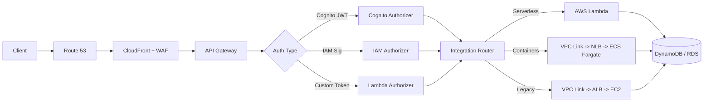
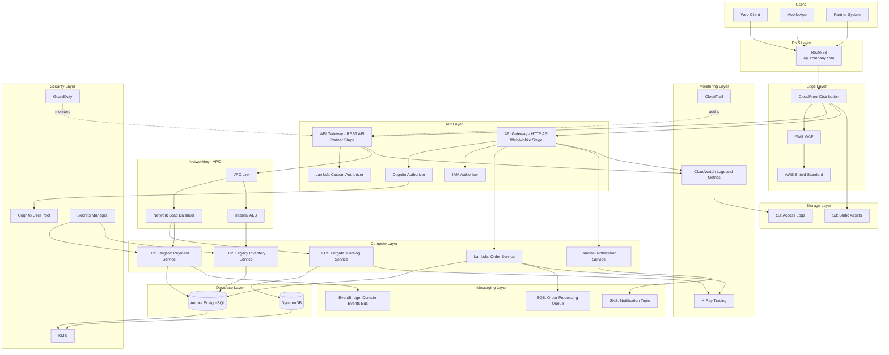

# Part X – Modern Architecture Patterns

# Chapter 86 — API Gateway Pattern

---

## 1. Executive Summary

Every enterprise that exposes digital capabilities — whether to mobile apps, partner systems, internal microservices, or public developers — eventually confronts the same architectural question: how do you present a single, secure, well-governed entry point to a backend that is, in reality, dozens or hundreds of independently deployed services?

The **API Gateway Pattern** answers this question by inserting a dedicated, centrally managed layer between clients and backend services. This layer terminates client connections, enforces authentication and authorization, applies traffic policies, transforms requests and responses, and routes calls to the correct downstream service — all without the client ever needing to know how the backend is actually decomposed.

This chapter treats the API Gateway Pattern as implemented on AWS using **Amazon API Gateway** (REST and HTTP APIs), backed by **AWS Lambda**, containerized services on **ECS/EKS**, and traditional EC2-based backends, secured with **IAM**, **Cognito**, **WAF**, and **KMS**, and operated with **CloudWatch**, **X-Ray**, and **CloudTrail**.

### 1.1 The Business Problem

Organizations rarely start with an API Gateway. They start with a monolith, or a handful of services, each exposing its own endpoint directly to clients. This works for a while. Then several things happen simultaneously as the organization grows:

- The number of backend services multiplies — from 3 to 30 to 300 — and clients can no longer reasonably track where each capability lives.
- Different teams implement authentication differently — some use API keys, some use JWTs, some use nothing at all — creating an inconsistent and insecure client experience.
- Mobile clients need different response shapes than web clients, but backend teams don't want to maintain multiple response formats inside their services.
- Rate limiting, throttling, and abuse protection are implemented inconsistently, or not at all, per service, leaving the organization exposed to both malicious traffic and accidental self-inflicted overload.
- Partner integrations require API keys, usage plans, and billing metering that individual microservices were never designed to provide.
- Security teams cannot audit access consistently because there is no single point where every external request can be logged, inspected, and correlated.
- Backend teams cannot evolve their internal service boundaries (splitting a service, renaming an endpoint, changing a data model) without breaking every client that talks to them directly.

Each of these problems is solvable in isolation. But solving them repeatedly, once per service, is expensive, inconsistent, and creates enormous long-term technical debt. The API Gateway Pattern solves them once, centrally, and lets every backend service inherit the solution for free.

### 1.2 Architecture Objective

The objective of this architecture is to provide a **single, secure, observable, and governable entry point** for all external and internal API traffic, with the following explicit goals:

- **Decouple clients from backend topology.** Clients call a stable, versioned API surface. Backend services can be added, removed, split, merged, or rewritten without clients noticing.
- **Centralize cross-cutting concerns.** Authentication, authorization, rate limiting, request validation, logging, and monitoring are implemented once, at the gateway, rather than duplicated per service.
- **Enable protocol and payload translation.** The gateway can accept REST, WebSocket, or HTTP traffic from clients and translate it into whatever protocol backend services expect (HTTP, Lambda invocation, VPC Link to private services).
- **Provide fine-grained traffic control.** Usage plans, throttling, and quotas allow the organization to protect backend capacity and monetize API access where appropriate.
- **Support multiple consumer types from one platform.** Public developers, mobile applications, single-page applications, partner systems, and internal services can all be served through appropriately scoped gateway configurations.
- **Reduce backend team burden.** Application teams focus on business logic; the platform team owns authentication, throttling, and edge security centrally.

### 1.3 Why Organizations Adopt This Architecture

In production practice, the decision to adopt an API Gateway is rarely driven by a single factor. It is usually the convergence of several pressures:

1. **Microservices decomposition.** As monoliths are broken apart (see Chapter 77 and Chapter 84 on the Strangler Fig pattern), the number of independently deployable services grows. Without a gateway, every service becomes a separate integration point for every client — an unmanageable N×M problem.
2. **Mobile-first and multi-channel product strategy.** Mobile apps have different latency, payload size, and battery constraints than web clients. A gateway allows request/response shaping per channel without forking backend logic.
3. **Security and compliance mandates.** Regulated industries (finance, healthcare, government — see Part IX) require centralized authentication, comprehensive audit trails, and demonstrable access control. A gateway is the natural enforcement point for these requirements.
4. **Partner and developer ecosystems.** Organizations that expose APIs to external partners or the public need API keys, usage plans, developer portals, and billing metering — capabilities that individual backend services should not have to implement themselves.
5. **DevOps and platform engineering maturity.** As organizations invest in platform engineering (Chapter 40), the API Gateway becomes part of the "golden path" — a managed capability that application teams consume rather than build.
6. **Cost and operational governance.** FinOps practitioners push for centralized visibility into API usage per consumer, per service, and per environment. A gateway with proper tagging and logging is the natural point to gather this data.

### 1.4 Major Business Benefits

| Benefit | Description | Primary Beneficiary |
|---|---|---|
| Reduced integration complexity | Clients integrate once against a stable contract | Client development teams |
| Centralized security enforcement | Auth, WAF, and throttling applied uniformly | Security and compliance teams |
| Faster backend evolution | Services can change internally without breaking contracts | Backend engineering teams |
| Consistent observability | All traffic flows through one instrumented layer | SRE and operations teams |
| API monetization capability | Usage plans and API keys enable partner billing | Product and business teams |
| Reduced duplicate engineering effort | Cross-cutting concerns built once | Engineering leadership |
| Improved incident containment | Throttling and circuit-breaking limit blast radius | Operations and reliability teams |
| Regulatory audit readiness | Single point of access logging | Compliance and legal teams |

### 1.5 Typical Enterprise Scenarios

This pattern recurs across a wide range of real-world situations. The following scenarios are representative of what production API Gateway deployments actually look like:

- A retail company exposes a public product catalog API to third-party marketplace integrations, secured with API keys and usage plans, while its internal mobile app uses a separate, higher-throughput stage of the same gateway secured with Cognito-issued JWTs.
- A bank builds an internal API Gateway layer in front of 40+ microservices running on ECS Fargate, using IAM authorization for service-to-service calls and OAuth 2.0 client-credentials flows for partner integrations, with every request logged to a SIEM for regulatory audit.
- A healthcare SaaS provider fronts a mix of Lambda functions and legacy EC2-based services with API Gateway, applying request validation schemas to reject malformed PHI payloads before they ever reach application code, reducing compliance risk.
- A media company uses API Gateway's WebSocket support to power real-time notifications for a streaming platform, while REST endpoints behind the same gateway serve catalog and account management APIs.
- A logistics company exposes a partner-facing API Gateway with per-partner usage plans, tiered rate limits, and API key rotation policies to support hundreds of third-party shipping integrations without any custom-built rate limiting code in its backend services.

In every one of these scenarios, the API Gateway is not simply a reverse proxy. It is a policy enforcement point, a traffic shaping layer, an observability chokepoint, and — increasingly — a business capability that product and platform teams actively manage as a first-class product in its own right.

### 1.6 What This Chapter Covers

This chapter provides a complete, production-grade reference for implementing the API Gateway Pattern on AWS. It covers architecture, AWS service selection and trade-offs, network and identity design, security architecture, high availability and disaster recovery, scalability and performance, cost modeling, Terraform implementation, CI/CD integration, monitoring and logging, operational runbooks, common failure scenarios, anti-patterns, and a full "Architect's Corner" section distilling field experience from real enterprise deployments.

The chapter assumes no prior chapters have been read. Every AWS service is introduced before it is used.

---

## 2. Business Requirements

Before selecting AWS services or drawing diagrams, an architect must translate the business problem into concrete, testable requirements. This section documents the requirements that shape every subsequent design decision in this chapter.

### 2.1 Business Drivers

- Provide a single, versioned API surface for internal and external consumers.
- Reduce time-to-market for new client integrations from weeks to days.
- Enable partner monetization through metered API access.
- Meet regulatory requirements for access logging and data protection.
- Reduce duplicated engineering effort spent on authentication and throttling across teams.
- Support a multi-channel product strategy (web, mobile, partner, internal services).

### 2.2 Functional Requirements

| ID | Requirement |
|---|---|
| FR-01 | The gateway must support REST-style resource-based APIs. |
| FR-02 | The gateway must support WebSocket connections for real-time features. |
| FR-03 | The gateway must authenticate requests using OAuth 2.0 / OIDC-issued JWTs. |
| FR-04 | The gateway must support API-key-based access for partner integrations. |
| FR-05 | The gateway must validate request payloads against a schema before forwarding to backend services. |
| FR-06 | The gateway must route requests to Lambda, containerized services (via VPC Link/NLB), and HTTP endpoints. |
| FR-07 | The gateway must support request/response transformation (mapping templates). |
| FR-08 | The gateway must support usage plans with per-client throttling and quotas. |
| FR-09 | The gateway must support custom domain names with managed TLS certificates. |
| FR-10 | The gateway must support staged deployments (dev, staging, production) with independent configuration. |

### 2.3 Non-Functional Requirements

**Scalability goals**

- Support burst traffic up to 10,000 requests per second per Region without manual intervention.
- Scale linearly with no architectural bottleneck up to the AWS account's service quotas.
- Support horizontal growth in the number of backend services without gateway redesign.

**Availability requirements**

- 99.95% monthly availability for the API Gateway edge layer.
- No single Availability Zone failure should cause a customer-visible outage.
- Planned maintenance windows must not require full-service downtime.

**Latency requirements**

- P50 gateway-added latency (excluding backend processing time) under 10 ms for HTTP APIs.
- P99 gateway-added latency under 50 ms.
- End-to-end P99 latency (gateway + backend) under 300 ms for synchronous transactional APIs.

**Compliance requirements**

- All access must be logged with sufficient detail to support a 12-month audit trail (PCI-DSS, HIPAA, or SOC 2 depending on industry).
- Data in transit must use TLS 1.2 or higher.
- API keys and client secrets must never be logged in plaintext.

**Security expectations**

- All public-facing stages must be protected by AWS WAF.
- Authorization decisions must default-deny; explicit allow rules only.
- Backend services must not be directly reachable from the public internet; only the gateway (via VPC Link or private integration) may reach them.

**Recovery objectives**

| Metric | Target |
|---|---|
| Recovery Point Objective (RPO) | Near-zero for configuration (Infrastructure as Code is the source of truth) |
| Recovery Time Objective (RTO) | Under 30 minutes for full Regional failover of the API layer |

**SLAs**

- Internal SLA: 99.95% monthly uptime, measured at the gateway edge.
- External partner SLA (where contractually offered): 99.9% monthly uptime with defined maintenance windows.

**Expected workload**

- Initial production launch: 200–500 requests per second sustained, 2,000 RPS peak.
- Mixed traffic profile: 70% read-heavy GET requests, 30% write/transactional requests.

**Expected growth**

- 3x growth in request volume within 12 months as additional backend services are onboarded.
- Expansion from a single Region to two Regions within 18–24 months to support DR and international latency requirements.

> **Note:** Non-functional requirements should always be captured in writing and reviewed with stakeholders before architecture selection. Skipping this step is the single most common reason enterprise API Gateway deployments require costly rework six months after launch.

---

## 3. Architecture Overview

### 3.1 Overall Design

The architecture centers on **Amazon API Gateway** acting as the single entry point for all client traffic. Behind the gateway sit heterogeneous backend compute targets — AWS Lambda functions for event-driven and lightweight logic, containerized microservices on ECS Fargate reachable through a VPC Link and Network Load Balancer, and in some cases legacy EC2-based services fronted by an internal Application Load Balancer.

In front of the gateway sits **Amazon CloudFront**, providing edge caching, DDoS-resistant termination, and a single custom domain across Regions. **AWS WAF** is attached to the CloudFront distribution (and optionally directly to the gateway) to filter malicious traffic before it consumes backend capacity.

Authentication is handled through **Amazon Cognito** (for end-user identity) and **IAM** (for service-to-service and internal calls), with **Lambda authorizers** used for custom or third-party token validation logic that Cognito or IAM cannot natively express.

### 3.2 Architecture Philosophy

Three design principles govern every decision in this chapter:

1. **The gateway owns the contract; backend services own the implementation.** Clients never call backend services directly. This means backend teams are free to refactor internals as long as the gateway-facing contract is honored.
2. **Cross-cutting concerns live at the edge, not in application code.** Authentication, throttling, request validation, and logging are gateway responsibilities. Application code should assume it is receiving pre-validated, pre-authenticated, well-formed requests.
3. **Everything is defined as code.** Gateway resources, stages, usage plans, and authorizers are managed exclusively through Terraform (Section 18) and deployed through CI/CD (Section 20). Manual console changes are treated as configuration drift and are actively alerted on.

### 3.3 Core Components

| Component | Role |
|---|---|
| Route 53 | DNS resolution for the public API domain |
| CloudFront | Global edge termination, caching, DDoS absorption |
| AWS WAF | Layer 7 filtering (SQLi, XSS, rate-based rules, bot control) |
| Amazon API Gateway (HTTP/REST API) | Request routing, auth enforcement, throttling, transformation |
| Cognito User Pools | End-user authentication (OIDC/OAuth 2.0) |
| Lambda Authorizer | Custom token validation for non-Cognito identity providers |
| AWS Lambda | Serverless backend compute for lightweight/event-driven endpoints |
| VPC Link + Network Load Balancer | Private connectivity into VPC-hosted services |
| ECS Fargate | Containerized backend microservices |
| Amazon RDS / DynamoDB | Persistent data stores behind backend services |
| Amazon SQS / SNS / EventBridge | Asynchronous processing and decoupling for long-running operations |
| CloudWatch | Metrics, logs, alarms, dashboards |
| AWS X-Ray | Distributed tracing across gateway and backend |
| CloudTrail | API-level audit logging for AWS control-plane actions |
| KMS | Encryption of data at rest and for secrets |
| Secrets Manager | Storage and rotation of backend credentials and API keys |

### 3.4 How Components Interact

- Clients resolve the API's custom domain through Route 53, which points to a CloudFront distribution.
- CloudFront terminates TLS, applies edge caching for cacheable GET responses, and forwards requests to the appropriate API Gateway stage (or directly to origin if caching is bypassed).
- AWS WAF, attached to CloudFront, inspects every request against managed and custom rule groups before it reaches the gateway.
- API Gateway authenticates the request using a Cognito authorizer (for end-user traffic), an IAM authorizer (for internal/service traffic), or a Lambda authorizer (for partner traffic using custom tokens or mTLS-derived claims).
- API Gateway validates the request body against a JSON Schema model, applies request/response transformation if configured, and checks the caller's usage plan for throttling and quota limits.
- The validated request is routed to its backend integration: a direct Lambda invocation, a private HTTP integration through a VPC Link to an internal NLB fronting ECS Fargate tasks, or an HTTP proxy integration to a legacy EC2-based service behind an internal ALB.
- The backend service processes the request, reading or writing to RDS, DynamoDB, or triggering asynchronous work through SQS/SNS/EventBridge for long-running operations.
- The response flows back through the gateway (with optional response transformation), through CloudFront (cached if applicable), back to the client.
- Every step emits structured logs to CloudWatch and trace segments to X-Ray, correlated by a request ID that is propagated end-to-end.

### 3.5 High-Level Workflow



### 3.6 Request Lifecycle

1. Client sends HTTPS request to the public API domain.
2. DNS resolves to CloudFront.
3. WAF evaluates the request against rule groups; malicious requests are blocked with a 403.
4. CloudFront checks its cache; on a miss, forwards to API Gateway.
5. API Gateway executes the configured authorizer.
6. On successful authorization, API Gateway validates the request against the configured model schema.
7. API Gateway checks the usage plan associated with the caller's API key or identity for throttling/quota compliance.
8. The request is transformed (if a mapping template is configured) and forwarded to the backend integration.
9. The backend processes the request and returns a response.
10. API Gateway applies any response transformation and returns the response to CloudFront.
11. CloudFront caches the response if cache headers permit, then returns it to the client.

### 3.7 Response Lifecycle

- Successful responses (2xx) are logged with latency and integration status.
- Client errors (4xx) — including throttling (429) and auth failures (401/403) — are logged and, in aggregate, feed CloudWatch alarms that detect abuse patterns.
- Server errors (5xx) trigger CloudWatch alarms and, depending on severity, PagerDuty/SNS-based on-call notification.
- Cacheable responses include explicit `Cache-Control` headers set by backend services; the gateway and CloudFront respect these headers rather than applying blanket caching policies.

### 3.8 Data Lifecycle

- Transactional data written through the API is persisted synchronously to RDS or DynamoDB as part of the request/response cycle for operations requiring strong consistency.
- Long-running or non-critical-path operations (email notifications, analytics events, downstream integrations) are decoupled through SQS or EventBridge, so the API response is not blocked on their completion.
- Access logs are streamed to CloudWatch Logs, then exported to S3 for long-term retention and queried through Athena for compliance reporting (Section 22).
- Sensitive data (PII, credentials) is encrypted at rest using KMS-managed keys and never appears in plaintext in access logs, per the logging redaction rules configured in the access log format (Section 11).

---

## 4. AWS Services Used

This section explains every AWS service used in this architecture: its purpose, why it was selected, alternatives considered, limitations, pricing considerations, and best practices. Only services relevant to the API Gateway Pattern are included.

### 4.1 Amazon API Gateway

**Purpose.** Amazon API Gateway is a fully managed service for creating, publishing, securing, and monitoring APIs at any scale. It is the core component of this architecture — the actual "gateway" in the API Gateway Pattern.

**Why selected.** API Gateway is chosen over a self-managed reverse proxy (such as NGINX or Kong on EC2) because it eliminates operational overhead: patching, scaling, and high availability are handled by AWS. It natively integrates with IAM, Cognito, Lambda, and VPC Links, which removes significant custom integration code that would otherwise be required.

**HTTP APIs vs. REST APIs.** API Gateway offers two API types, and the choice materially affects cost, feature set, and latency:

| Feature | HTTP API | REST API |
|---|---|---|
| Latency overhead | Lower (~10–20% less) | Higher |
| Cost | ~70% cheaper per million requests | Higher |
| Request validation (JSON Schema) | No | Yes |
| Usage plans / API keys | No | Yes |
| Request/response transformation (mapping templates) | Limited | Full |
| WAF integration | Not directly (via CloudFront) | Directly supported |
| Private integrations (VPC Link) | Yes (VPC Link v2, NLB or ALB) | Yes (VPC Link v1, NLB only) |
| Native OIDC/OAuth2 JWT authorizer | Yes, built-in | No (requires Lambda authorizer) |

**Architectural implication:** many production systems use **both** — HTTP APIs for high-volume, low-latency internal and mobile traffic, and REST APIs for partner-facing endpoints that require usage plans, API keys, and strict request validation. This chapter's reference architecture uses REST APIs for the public partner surface and HTTP APIs for internal/mobile traffic, unified behind a single CloudFront distribution with path-based routing.

**Alternatives.** Kong, Apigee, NGINX Plus, self-hosted Envoy-based gateways, AWS App Mesh (for east-west traffic rather than north-south). These are viable when an organization needs multi-cloud portability or a feature not available in API Gateway (such as GraphQL federation), but they introduce operational burden that API Gateway removes.

**Limitations.** Maximum 29-second integration timeout (10 seconds for HTTP APIs by default, configurable up to 29s); 10 MB maximum payload size; regional throttling account quotas (default 10,000 RPS steady-state, adjustable via support request); no native GraphQL support (AWS AppSync is used for GraphQL workloads instead).

**Pricing considerations.** Billed per million API calls, plus data transfer out. HTTP APIs are significantly cheaper than REST APIs at scale. Caching (REST APIs only) incurs an hourly charge regardless of usage, so it should only be enabled when the cache hit ratio justifies the fixed cost.

**Best practices.** Use HTTP APIs by default; reserve REST APIs for cases genuinely requiring usage plans, API keys, or request validation models. Always deploy through stages with stage variables for environment-specific configuration. Never expose the default `execute-api` endpoint to end users — always use a custom domain.

### 4.2 AWS Lambda

**Purpose.** Serverless compute used for lightweight, event-driven, or bursty backend logic invoked directly by API Gateway.

**Why selected.** Lambda eliminates server management for endpoints with unpredictable or spiky traffic, and it scales automatically to match gateway throughput without pre-provisioning capacity.

**Alternatives.** ECS Fargate (better for long-running or CPU/memory-intensive workloads), EKS (for organizations standardized on Kubernetes), EC2 (for legacy or highly specialized runtime requirements).

**Limitations.** 15-minute maximum execution duration; cold-start latency (mitigated with Provisioned Concurrency for latency-sensitive endpoints); 10 GB memory ceiling; ephemeral storage limits (up to 10 GB `/tmp`).

**Pricing considerations.** Pay-per-invocation and per-GB-second of compute. Cost-effective for spiky or low-to-moderate steady-state traffic; can become more expensive than containers at very high, constant throughput — model both options at expected scale (Section 16).

**Best practices.** Keep functions small and single-purpose; use Provisioned Concurrency for user-facing synchronous endpoints with strict latency SLAs; externalize configuration to Parameter Store/Secrets Manager rather than environment variables for sensitive values.

### 4.3 Amazon ECS (Fargate)

**Purpose.** Runs containerized backend microservices that require longer execution times, persistent connections, or more predictable performance than Lambda provides.

**Why selected.** Fargate removes the need to manage EC2 instances while still supporting long-running processes, custom runtimes, and larger dependency footprints than Lambda comfortably supports.

**Alternatives.** EKS (more control, more operational complexity, appropriate when Kubernetes is an organizational standard — see Chapter 36), Lambda (for shorter, more event-driven logic), EC2 with Auto Scaling Groups (for specialized workloads or licensing constraints).

**Limitations.** Higher baseline cost than Lambda for very low, bursty traffic; slower scale-out reaction time than Lambda (though still typically under a minute with properly configured Auto Scaling).

**Pricing considerations.** Billed per vCPU/memory-second while tasks run. Reserve capacity through Compute Savings Plans for steady-state workloads.

**Best practices.** Always front Fargate services with an internal Network Load Balancer when integrating via API Gateway VPC Link; use Fargate Spot for non-critical, interruption-tolerant workloads to reduce cost.

### 4.4 Amazon Cognito

**Purpose.** Managed identity provider issuing OAuth 2.0/OIDC tokens (JWTs) for end-user authentication.

**Why selected.** Removes the need to build and maintain a custom authentication service; integrates natively with API Gateway's JWT authorizer (HTTP APIs) and can be used with a Lambda authorizer for REST APIs.

**Alternatives.** Auth0, Okta, Azure AD B2C (appropriate when the organization already standardizes on a third-party IdP or needs enterprise federation not natively supported by Cognito), a custom-built OIDC provider (rarely justified given the operational and security burden).

**Limitations.** Customization of hosted UI is limited compared to dedicated CIAM platforms; MFA and advanced security features (adaptive authentication) require Cognito's more expensive tiers.

**Pricing considerations.** Free tier for a monthly active user threshold, then billed per MAU; advanced security features add per-MAU cost.

**Best practices.** Use Cognito User Pools for end-user identity and Cognito Identity Pools only when temporary AWS credentials are genuinely required (e.g., direct S3 uploads from a mobile client); rotate app client secrets; enforce MFA for administrative and high-privilege user pools.

### 4.5 Amazon S3

**Purpose.** Object storage used for static assets referenced by APIs, exported access logs, Terraform state backend (with DynamoDB locking), and Lambda deployment artifacts.

**Why selected.** Effectively unlimited durability (11 nines) and scalability at low cost, with native lifecycle management for log retention tiers.

**Alternatives.** EFS (for shared POSIX file access — not applicable to this pattern), third-party object storage (rarely justified inside AWS-native architectures).

**Limitations.** Not a database; eventual consistency edge cases for certain cross-region replication scenarios; no native query capability without Athena/S3 Select.

**Pricing considerations.** Storage cost scales with volume; use S3 Lifecycle policies to transition access logs to Infrequent Access and Glacier tiers (Section 16).

**Best practices.** Enable versioning and default encryption (SSE-KMS) on all buckets holding logs or Terraform state; block public access account-wide unless a bucket is explicitly and deliberately public (e.g., static asset hosting behind CloudFront).

### 4.6 Amazon RDS / Aurora

**Purpose.** Relational data store for backend services requiring strong consistency and relational integrity (order records, account data, financial transactions).

**Why selected.** Aurora is generally preferred over standard RDS for production API backends due to its higher throughput, faster failover (typically under 30 seconds), and up to 15 read replicas for read-scaling.

**Alternatives.** DynamoDB (for high-throughput, key-value/document access patterns without complex relational queries), self-managed database on EC2 (rarely justified given the operational burden of patching, backup, and failover management).

**Limitations.** Vertical scaling ceiling per writer instance; cross-region replication (Aurora Global Database) introduces replication lag that must be accounted for in read-after-write consistency requirements.

**Pricing considerations.** Instance-hour billing plus storage and I/O; Aurora Serverless v2 is cost-effective for variable or intermittent workloads that don't justify a permanently provisioned cluster.

**Best practices.** Place database instances in private subnets only; enforce encryption at rest with KMS; use IAM database authentication where supported to avoid long-lived database passwords.

### 4.7 Amazon DynamoDB

**Purpose.** Serverless NoSQL store used for high-throughput, low-latency access patterns — session data, idempotency keys, rate-limiting counters, and denormalized read models for API responses.

**Why selected.** Single-digit millisecond latency at any scale, with no capacity management required when using on-demand mode.

**Alternatives.** Aurora/RDS (for relational access patterns), ElastiCache (for pure caching without durability requirements).

**Limitations.** Query patterns must be designed around access patterns at table-design time; complex multi-entity joins are not natively supported and require application-side composition or secondary indexes.

**Pricing considerations.** On-demand mode is best for unpredictable traffic; provisioned capacity with auto-scaling is more cost-effective for steady, predictable workloads.

**Best practices.** Use DynamoDB for idempotency token storage on POST/PUT endpoints to enforce exactly-once semantics at the API layer; enable point-in-time recovery for production tables.

### 4.8 Amazon SNS, SQS, and EventBridge

**Purpose.** Asynchronous messaging and event routing used to decouple long-running or non-critical-path work from the synchronous API request/response cycle.

**Why selected.** SQS provides durable, at-least-once queuing for point-to-point work distribution; SNS provides pub/sub fan-out; EventBridge provides schema-aware, rule-based event routing across many producers and consumers, including third-party SaaS event sources.

**Alternatives.** Kafka (MSK) — justified when extremely high-throughput, ordered, replayable event streams are required across many long-lived consumers; otherwise SQS/SNS/EventBridge is simpler to operate.

**Limitations.** SQS standard queues provide at-least-once (not exactly-once) delivery and best-effort ordering; FIFO queues trade throughput for strict ordering and exactly-once processing.

**Pricing considerations.** Priced per request/notification; typically a small fraction of total architecture cost unless message volume is extremely high.

**Best practices.** Always configure a Dead Letter Queue (DLQ) for SQS queues and Lambda event source mappings; use EventBridge schema registry to formally version event contracts between teams.

### 4.9 IAM

**Purpose.** Identity and Access Management — controls which principals (users, roles, services) can perform which actions on which AWS resources, and is also used as an authentication mechanism for service-to-service API Gateway calls (SigV4).

**Why selected.** IAM is the only mechanism for granting AWS-native, credential-based access to API Gateway from other AWS services and internal systems without issuing separate application-level tokens.

**Limitations.** Not suitable for external, non-AWS end-user authentication (use Cognito or a third-party IdP instead); policy complexity grows quickly in large organizations without disciplined role and permission-boundary conventions (see Section 26 for hidden trade-offs).

**Best practices.** Apply least privilege via scoped resource-level policies; use permission boundaries for delegated role creation; never attach `AdministratorAccess` to a service role.

### 4.10 Amazon VPC

**Purpose.** Provides the isolated private network in which backend compute (ECS Fargate, EC2, RDS) runs, shielded from direct internet exposure.

**Why selected.** All backend services in this architecture are placed in private subnets; the VPC is the foundational network boundary that makes this possible while still allowing controlled ingress via VPC Link.

**Best practices.** Use a dedicated VPC per environment (dev/staging/production) or per business unit depending on organizational segmentation strategy; avoid overly large CIDR ranges that complicate peering and Transit Gateway routing later.

### 4.11 Route 53

**Purpose.** DNS management for the API's public custom domain and health-check-based failover routing between Regions.

**Why selected.** Native integration with ACM certificates, CloudFront, and API Gateway custom domains; supports latency-based and failover routing policies required for multi-region DR (Section 13).

**Best practices.** Use health checks tied to a dedicated `/health` endpoint on the API for failover routing decisions, not the root API path.

### 4.12 CloudWatch, CloudTrail, AWS Config, GuardDuty, KMS, Secrets Manager, Systems Manager

These services are covered in depth in Sections 11, 21, and 22 (Security, Monitoring, Logging). In summary:

- **CloudWatch** — metrics, logs, dashboards, and alarms for the gateway and all backend integrations.
- **CloudTrail** — audit log of AWS API-level control-plane actions (who changed gateway configuration, when).
- **AWS Config** — continuous compliance evaluation of gateway and related resource configuration against organizational rules.
- **GuardDuty** — threat detection across the account, including anomalous API call patterns.
- **KMS** — encryption key management for data at rest (S3, RDS, DynamoDB, Secrets Manager).
- **Secrets Manager** — storage and automatic rotation of backend database credentials and third-party API keys used by backend services.
- **Systems Manager (Parameter Store & Session Manager)** — configuration storage and bastion-less access to EC2/ECS resources for troubleshooting, avoiding the need for SSH bastion hosts (see Chapter 10).

---

## 5. Complete Architecture Diagram



> **Tip:** This diagram intentionally shows a *heterogeneous* backend (Lambda + ECS Fargate + legacy EC2) because production API Gateway deployments almost never front a single, uniform compute type. Expect and design for this heterogeneity from day one rather than assuming a "pure serverless" or "pure containers" backend.

---

## 6. Component-by-Component Explanation

### 6.1 Amazon CloudFront

- **Purpose.** Global edge network providing TLS termination close to the user, response caching, and a single stable domain across Regions.
- **Responsibilities.** Cache cacheable GET responses; forward cache misses to API Gateway origins; enforce HTTPS; attach WAF for edge filtering.
- **Inputs.** Client HTTPS requests.
- **Outputs.** Cached or origin-forwarded responses.
- **Scaling.** Automatic and global; no capacity planning required.
- **High availability.** Inherently multi-Region by design; a single distribution serves all edge locations.
- **Failure handling.** On origin failure, CloudFront can be configured with an origin failover group pointing to a secondary Regional API Gateway deployment.
- **Dependencies.** ACM certificate (must be in `us-east-1` for CloudFront), WAF Web ACL, API Gateway origin(s).
- **Security.** Origin Access Control-style origin verification (custom header/secret) to ensure API Gateway only accepts traffic that has passed through CloudFront.
- **Monitoring.** CloudFront metrics (requests, error rate, cache hit ratio) published to CloudWatch; real-time logs optionally streamed to Kinesis for detailed analysis.

### 6.2 AWS WAF

- **Purpose.** Layer 7 firewall inspecting HTTP(S) requests against managed and custom rules before they reach the gateway.
- **Responsibilities.** Block SQL injection, XSS, known bad IPs, and enforce rate-based rules per source IP.
- **Inputs.** Raw HTTP requests from CloudFront.
- **Outputs.** Allow/block/count decisions, logged to CloudWatch/S3.
- **Scaling.** Fully managed; scales with CloudFront automatically.
- **Failure handling.** Fail-open vs. fail-closed behavior is explicitly configured per rule; default action should be "block" for unmatched malicious signatures and "allow" for legitimate unmatched traffic.
- **Security.** Should include AWS Managed Rule Groups (Core Rule Set, Known Bad Inputs, IP Reputation List) plus custom rate-based rules per API key/client.
- **Monitoring.** WAF sampled requests and metrics reviewed in CloudWatch; alerts configured for spikes in blocked request rate (potential attack in progress).

### 6.3 Amazon API Gateway (Gateway Layer)

- **Purpose.** Central request router, authentication enforcement point, and traffic policy engine.
- **Responsibilities.** Terminate client connections, authenticate/authorize, validate payload schema, apply throttling/usage plans, transform requests/responses, route to backend integrations.
- **Inputs.** HTTPS requests from CloudFront (or directly, in non-CloudFront-fronted internal deployments).
- **Outputs.** Routed requests to Lambda/VPC Link integrations; structured access logs to CloudWatch.
- **Scaling.** Fully managed; scales automatically up to account-level throttling quotas (default 10,000 RPS, adjustable).
- **High availability.** Regional service backed by multiple AZs automatically; no customer-managed redundancy required within a Region.
- **Failure handling.** Per-route throttling isolates a misbehaving integration from starving capacity for other routes; integration timeouts return 504 to the client rather than hanging indefinitely.
- **Dependencies.** Cognito/IAM/Lambda authorizer, backend integrations, ACM certificate for custom domain.
- **Security.** Resource policies restrict which source VPCs/accounts may invoke private APIs; execute-api default endpoint disabled in production.
- **Monitoring.** `4XXError`, `5XXError`, `Latency`, `IntegrationLatency`, `Count` metrics per stage/route; X-Ray tracing enabled for end-to-end visibility.

### 6.4 Cognito User Pool / Authorizers

- **Purpose.** Issue and validate identity tokens for end users; provide the trust boundary for "who is calling."
- **Responsibilities.** User registration/login, MFA enforcement, JWT issuance (ID token, access token), token refresh.
- **Scaling.** Fully managed; scales to millions of users.
- **Failure handling.** Token validation failures return 401; expired refresh tokens force re-authentication rather than silent failure.
- **Security.** App client secrets rotated periodically; advanced security features (compromised credential detection) enabled for production user pools.
- **Monitoring.** Cognito emits authentication success/failure metrics; failed login spikes are alerted as potential credential-stuffing attempts.

### 6.5 AWS Lambda (Backend Integration)

- **Purpose.** Executes business logic for lightweight or event-driven API routes.
- **Responsibilities.** Process the validated request, interact with data stores, return a structured response.
- **Scaling.** Automatic, per-invocation concurrency scaling (subject to account/Region concurrency limits).
- **High availability.** Multi-AZ by default within a Region; no customer configuration required.
- **Failure handling.** Errors are surfaced as 5xx to the gateway; Dead Letter Queues configured for asynchronous invocation failures.
- **Dependencies.** IAM execution role, VPC configuration (if accessing private resources), downstream data stores.
- **Security.** Execution role scoped to only the specific table/queue/secret the function needs — never a wildcard resource policy.
- **Monitoring.** Duration, Errors, Throttles, ConcurrentExecutions metrics; X-Ray subsegments for downstream calls.

### 6.6 VPC Link + Network Load Balancer + ECS Fargate

- **Purpose.** Provides private, low-latency connectivity from API Gateway into VPC-hosted containerized services without exposing them to the public internet.
- **Responsibilities.** NLB performs Layer 4 load balancing across Fargate tasks; VPC Link tunnels API Gateway traffic into the VPC.
- **Scaling.** ECS Service Auto Scaling adjusts task count based on CPU/memory/custom CloudWatch metrics (e.g., queue depth); NLB scales automatically.
- **High availability.** Fargate tasks distributed across multiple AZs; NLB is inherently multi-AZ.
- **Failure handling.** ECS health checks deregister unhealthy tasks; NLB stops routing to failed targets within seconds.
- **Dependencies.** ECS task execution role, Fargate task definition, private subnets, security groups.
- **Security.** Security groups restrict NLB-to-task traffic to only the required port; tasks have no public IP.
- **Monitoring.** ECS service metrics (CPU/memory utilization, running task count), NLB target health metrics.

### 6.7 Aurora / RDS and DynamoDB

- **Purpose.** Persistent storage for transactional (Aurora) and high-throughput key-value (DynamoDB) data.
- **Responsibilities.** Durable storage, transactional consistency, read scaling via replicas.
- **Scaling.** Aurora scales storage automatically up to 128 TB; DynamoDB on-demand scales throughput automatically.
- **High availability.** Aurora Multi-AZ with automated failover (typically under 30 seconds); DynamoDB is inherently multi-AZ within a Region.
- **Failure handling.** Aurora automated failover promotes a replica; application retry logic with exponential backoff handles the brief failover window.
- **Dependencies.** KMS for encryption, Secrets Manager for credential rotation, VPC private subnets.
- **Security.** No public accessibility; IAM database authentication where supported; encryption at rest and in transit enforced.
- **Monitoring.** CloudWatch database metrics (CPU, connections, replica lag, throttled requests for DynamoDB).

### 6.8 SQS / SNS / EventBridge

- **Purpose.** Decouple synchronous API responses from longer-running or fan-out processing.
- **Responsibilities.** Durable message buffering (SQS), pub/sub fan-out (SNS), rule-based event routing (EventBridge).
- **Scaling.** Fully managed, scales automatically to sustained and burst throughput.
- **Failure handling.** DLQs capture messages that fail processing after configured retry attempts, preventing silent data loss.
- **Security.** Queue/topic access policies scoped to specific producer/consumer roles; encryption at rest via KMS.
- **Monitoring.** ApproximateNumberOfMessagesVisible, age of oldest message, DLQ message count — all alarmed for anomalies.

---

## 7. End-to-End Request Flow

The following is a numbered, step-by-step trace of a single synchronous API request — a mobile client placing an order — through every layer of the architecture.

1. **Client initiates request.** The mobile app sends `POST https://api.company.com/v1/orders` with a Cognito-issued JWT in the `Authorization` header.
2. **DNS resolution.** Route 53 resolves `api.company.com` to the CloudFront distribution's domain.
3. **TLS termination at CloudFront.** CloudFront terminates TLS using an ACM certificate; the connection to the client is now decrypted at the edge.
4. **WAF evaluation.** AWS WAF, attached to the CloudFront distribution, evaluates the request against managed rule groups and rate-based rules. A clean request passes through.
5. **Cache check.** CloudFront checks its cache for this exact request signature. Because this is a `POST` (non-cacheable) request, CloudFront forwards it directly to the origin (API Gateway) without caching.
6. **Origin request signing.** CloudFront adds a shared-secret header known only to CloudFront and API Gateway, allowing a resource policy on the API to reject any request that did not originate from CloudFront.
7. **API Gateway receives the request** on the HTTP API stage mapped to `/v1/*`.
8. **Authorizer execution.** API Gateway's JWT authorizer validates the Cognito access token's signature, expiration, issuer, and audience claims. On success, claims (user ID, scopes) are attached to the request context.
9. **Request validation.** The gateway validates the JSON request body against the registered `OrderRequest` schema (required fields: `items`, `shippingAddressId`; type constraints enforced). Malformed requests are rejected with a `400` before reaching any backend compute.
10. **Throttling and quota check.** The gateway checks the usage plan associated with the caller (in this case, an internal mobile-tier plan) to confirm the request is within the allowed rate and daily quota.
11. **Integration routing.** The gateway routes the request to its configured Lambda integration for `POST /v1/orders`.
12. **Lambda invocation.** API Gateway synchronously invokes the `order-service` Lambda function, passing the validated payload and authorizer context (including the authenticated user ID).
13. **Business logic execution.** The Lambda function validates business rules (inventory availability, pricing), begins a transaction against Aurora to persist the order record, and generates an idempotency key stored in DynamoDB to guard against duplicate submissions on client retry.
14. **Database write.** The order is written to Aurora PostgreSQL within a transaction; on commit, the function receives the generated order ID.
15. **Asynchronous fan-out.** The function publishes an `OrderPlaced` event to EventBridge, decoupling downstream processing (payment capture, warehouse notification, customer email) from the synchronous response path.
16. **Response construction.** The Lambda function returns a `201 Created` response with the order ID and status in the response body.
17. **Response transformation.** API Gateway applies any configured response headers (e.g., `Cache-Control: no-store` for transactional responses) before returning to CloudFront.
18. **CloudFront passthrough.** Because the response is non-cacheable, CloudFront passes it directly back to the client without caching.
19. **Client receives response.** The mobile app receives the `201` response and updates its UI to reflect the successful order.
20. **Logging and tracing.** Throughout steps 3–18, CloudWatch access logs are written at the CloudFront, WAF, and API Gateway layers; an X-Ray trace correlates the entire request lifecycle, including the Lambda invocation and its downstream Aurora and EventBridge calls, under a single trace ID.
21. **Error handling (alternate path).** Had step 13 failed (e.g., inventory unavailable), the Lambda function would return a structured `409 Conflict` response with an error code the mobile client can map to a user-facing message, rather than allowing an unhandled exception to produce an opaque `500`.
22. **Monitoring feedback loop.** CloudWatch alarms continuously evaluate the `5XXError` rate and `IntegrationLatency` for the `POST /v1/orders` route; a sustained anomaly triggers an SNS notification to the on-call engineering channel.

---

## 8. Deployment Flow

### 8.1 Infrastructure Provisioning

- All gateway resources, authorizers, backend integrations, and supporting infrastructure (VPC, IAM roles, databases) are provisioned exclusively through Terraform.
- No manual console changes are permitted in production; AWS Config rules detect and alert on configuration drift.
- Environments (dev, staging, production) are provisioned from the same Terraform modules with environment-specific variable files, guaranteeing parity between environments.

### 8.2 Terraform Workflow

1. Developer opens a pull request modifying a Terraform module or environment configuration.
2. CI pipeline runs `terraform fmt -check`, `terraform validate`, and `tflint`.
3. CI pipeline runs `terraform plan` against the target environment and posts the plan output as a PR comment for review.
4. A second engineer reviews the plan output alongside the code diff and approves.
5. On merge to the environment branch (or via manual approval gate), CI runs `terraform apply` using a locked remote state backend (S3 + DynamoDB lock table).
6. Post-apply, an automated smoke test suite validates the newly deployed API surface before the pipeline marks the deployment successful.

### 8.3 CI/CD Deployment

- Backend Lambda code and container images are built, tested, and pushed independently of infrastructure changes, using separate pipelines per service.
- API Gateway stage deployments are decoupled from resource creation: a new `deployment` resource is created and promoted to a stage only after backend integration health checks pass.
- Canary deployments (Section 8.4) are used for gateway stage promotion to limit blast radius.

### 8.4 Blue-Green Deployment

- API Gateway natively supports canary release deployments at the stage level: a percentage of traffic (e.g., 10%) is routed to the new deployment while the majority continues to the stable deployment.
- Metrics (error rate, latency) for the canary are compared against the baseline for a defined bake period (typically 15–30 minutes) before promoting to 100%.
- For backend services on ECS Fargate, blue-green deployment is handled through AWS CodeDeploy, which shifts NLB target group weight gradually and can automatically roll back based on CloudWatch alarms.

### 8.5 Rollback

- If canary metrics breach defined thresholds, the pipeline automatically shifts 100% of traffic back to the stable deployment and pages the on-call engineer.
- Because gateway configuration is Terraform-managed, infrastructure-level rollback is a `git revert` followed by `terraform apply`, guaranteeing the rollback is itself auditable and repeatable.
- Database schema changes follow an expand-contract migration pattern so that rollback of application code does not require a simultaneous destructive schema rollback.

### 8.6 Secrets

- Backend service credentials (database passwords, third-party API keys) are stored in Secrets Manager, never in Terraform variables, environment files, or source control.
- Lambda functions and ECS tasks retrieve secrets at runtime via IAM-scoped access to specific secret ARNs.
- Secrets Manager automatic rotation is enabled for database credentials, coordinated with the RDS/Aurora rotation Lambda.

### 8.7 Configuration

- Non-sensitive configuration (feature flags, rate limit values, integration endpoints) is stored in Systems Manager Parameter Store, versioned and environment-scoped.
- API Gateway stage variables reference Parameter Store paths where dynamic runtime configuration is needed without redeployment.

### 8.8 Validation

- Automated post-deployment smoke tests exercise the top 10 highest-traffic API routes against the newly promoted stage.
- Contract tests (using a tool such as Pact or a custom JSON Schema validation suite) verify that the deployed API still honors published consumer contracts before full promotion.
- A synthetic canary (CloudWatch Synthetics) continuously exercises critical user journeys against the production API and alerts independently of real user traffic.

---

## 9. Network Topology

### 9.1 VPC Design

- A dedicated VPC per environment, sized to avoid future CIDR conflicts with Transit Gateway-connected VPCs (e.g., `10.10.0.0/16` for production, `10.20.0.0/16` for staging).
- Subnets are split across a minimum of three Availability Zones for production workloads.

### 9.2 CIDR Allocation Example

| Subnet Type | AZ-a | AZ-b | AZ-c |
|---|---|---|---|
| Public | 10.10.0.0/24 | 10.10.1.0/24 | 10.10.2.0/24 |
| Private (App) | 10.10.10.0/23 | 10.10.12.0/23 | 10.10.14.0/23 |
| Private (Data) | 10.10.20.0/24 | 10.10.21.0/24 | 10.10.22.0/24 |

### 9.3 Public Subnets

- House only the NAT Gateways and, if used, internet-facing load balancers for legacy services that cannot yet be migrated behind API Gateway.
- No application compute or databases are ever placed in public subnets.

### 9.4 Private Subnets

- **App tier** — ECS Fargate tasks, EC2-based legacy services, internal NLB/ALB targets. Outbound internet access (for pulling container images, calling third-party APIs) is routed through NAT Gateways.
- **Data tier** — Aurora/RDS instances, ElastiCache clusters. No route to the internet at all; access is restricted to the app tier's security group only.

### 9.5 NAT Gateway

- One NAT Gateway per AZ (not a single shared NAT Gateway) to avoid a cross-AZ single point of failure and to avoid inter-AZ data transfer charges for outbound traffic.
- NAT Gateway cost is a common and frequently underestimated line item — see Section 16.5 and Section 34's Cost Surprises subsection.

### 9.6 Internet Gateway

- Attached to the VPC to provide the public subnets' route to the internet; no private subnet route table references the Internet Gateway directly.

### 9.7 Transit Gateway

- Used when the API Gateway's backend services need to reach shared services (a central logging VPC, a shared data lake VPC, or on-premises systems) across multiple VPCs without a full mesh of VPC peering connections.
- Recommended once the organization exceeds roughly 4–5 VPCs requiring interconnection (see Chapter 17 for a dedicated Transit Gateway architecture).

### 9.8 Route Tables

- Separate route tables per subnet tier (public, private-app, private-data) to enforce that data-tier subnets have no default route to 0.0.0.0/0.

### 9.9 Network ACLs

- Used as a coarse, stateless defense-in-depth layer at the subnet boundary — for example, explicitly denying all inbound traffic to data-tier subnets except from the app-tier CIDR range on the database port.
- Security Groups remain the primary, fine-grained access control mechanism; NACLs are a secondary safety net, not the primary control.

### 9.10 Security Groups

| Security Group | Inbound | Outbound |
|---|---|---|
| `sg-nlb` | 443 from API Gateway VPC Link ENIs | To `sg-ecs-tasks` on container port |
| `sg-ecs-tasks` | Container port from `sg-nlb` only | To `sg-aurora` on 5432; to internet via NAT for image pulls |
| `sg-aurora` | 5432 from `sg-ecs-tasks` and `sg-lambda` only | None required |
| `sg-lambda` | None (Lambda does not receive inbound) | To `sg-aurora` on 5432; HTTPS to AWS service endpoints |

### 9.11 PrivateLink

- VPC endpoints (Interface and Gateway type) are used so that Lambda functions and ECS tasks in private subnets can reach AWS services (S3, DynamoDB, Secrets Manager, KMS, SQS) without traversing the NAT Gateway or the public internet, reducing both cost and attack surface.

### 9.12 Hybrid Connectivity

- For enterprises with on-premises systems (legacy inventory or ERP systems) that backend services must call, Direct Connect or Site-to-Site VPN terminates into the Transit Gateway, with routes propagated only to the specific private subnets that require on-premises access.

---

## 10. Identity and Access

### 10.1 IAM Roles

- **API Gateway CloudWatch role** — grants API Gateway permission to write execution and access logs.
- **Lambda execution roles** — one per function, scoped to the exact resources (specific table ARN, specific queue ARN) that function needs.
- **ECS task role** — scoped to the specific resources the container needs at runtime (distinct from the ECS task *execution* role, which only needs ECR pull and CloudWatch Logs permissions).
- **CI/CD deployment role** — assumed by the pipeline to run `terraform apply`; scoped to only the resource types this architecture manages, with explicit deny statements on unrelated high-risk actions (e.g., IAM user creation).

### 10.2 IAM Policies

- Written as least-privilege, resource-scoped JSON policies — never `"Resource": "*"` in production for data-plane actions.
- Example: a Lambda function processing orders should have `dynamodb:GetItem`, `dynamodb:PutItem` scoped to the specific `Orders` table ARN, not `dynamodb:*` on all tables.

### 10.3 Resource Policies

- API Gateway resource policies restrict which VPC endpoints, AWS accounts, or source IPs may invoke a private API — used to enforce that partner-facing REST APIs are only reachable via CloudFront, not directly via the `execute-api` endpoint.

### 10.4 STS (Security Token Service)

- Used for temporary credential issuance in cross-account scenarios (e.g., a shared platform account's CI/CD pipeline assuming a deployment role in each application account).
- Cognito Identity Pools also use STS internally to vend temporary AWS credentials to authenticated mobile users needing direct, limited AWS access (e.g., direct S3 upload).

### 10.5 Cross-Account Access

- In a multi-account landing zone (see Chapter 99), the API Gateway and its backend typically live in a dedicated workload account, while shared logging and security tooling live in separate accounts.
- Cross-account log delivery (CloudWatch Logs to a central logging account) and cross-account CI/CD deployment roles are the two most common cross-account access patterns in this architecture.

### 10.6 Least Privilege

- Every role in this architecture is scoped to the minimum set of actions and resources required for its function, reviewed quarterly through IAM Access Analyzer's unused-permission findings.

### 10.7 Service Roles

- Distinct service roles are maintained per backend service (never a single shared "app role" reused across all Lambda functions or ECS services), so that a compromise or misconfiguration in one service cannot laterally access another service's data.

### 10.8 Permission Boundaries

- Applied to any IAM role that application teams are permitted to create themselves (e.g., through a self-service Terraform module), capping the maximum permissions that role can ever be granted regardless of the policy attached to it — a critical guardrail in platform engineering models where central teams do not review every application-level IAM change individually.

---

## 11. Security Architecture

### 11.1 Encryption

- **In transit.** TLS 1.2+ enforced at CloudFront, API Gateway, and all internal load balancers; internal service-to-service traffic within the VPC is also encrypted using TLS where the backend framework supports it (mTLS between ECS tasks and databases where feasible).
- **At rest.** All S3 buckets, RDS/Aurora instances, DynamoDB tables, and SQS queues use SSE-KMS encryption with customer-managed KMS keys (not AWS-managed keys) to retain key rotation and access-policy control.

### 11.2 KMS

- Separate KMS keys per data classification tier (e.g., one key for PII-bearing tables, a separate key for non-sensitive operational data) so that key access policies can be scoped independently and key compromise blast radius is contained.

### 11.3 TLS / Certificate Manager

- ACM issues and auto-renews certificates for the CloudFront distribution (must be requested in `us-east-1`) and for the API Gateway custom domain (requested in the API's deployment Region).

### 11.4 AWS WAF

- Managed rule groups: Core Rule Set, Known Bad Inputs, Amazon IP Reputation List, Anonymous IP List (blocks known VPN/Tor exit nodes for APIs where that is a legitimate policy).
- Custom rate-based rule: block/throttle any single IP exceeding a defined request threshold within a 5-minute window.
- Custom rule: block requests missing required headers or presenting malformed `Authorization` headers before they reach the gateway's authorizer, reducing authorizer invocation cost and load.

### 11.5 AWS Shield

- Shield Standard is automatically active on CloudFront and protects against common network and transport layer DDoS attacks at no additional cost.
- Shield Advanced is adopted for public-facing partner APIs with contractual uptime commitments, providing DDoS cost protection and access to the AWS DDoS Response Team.

### 11.6 Secrets Manager

- All backend database credentials and third-party API keys are stored in Secrets Manager with automatic rotation enabled; application code never contains hardcoded credentials.

### 11.7 GuardDuty

- Enabled account-wide, including GuardDuty's S3 Protection and Malware Protection features; findings related to anomalous API-calling patterns (e.g., credential exfiltration attempts) are routed to Security Hub.

### 11.8 Inspector

- Continuously scans ECS container images (in ECR) and any EC2-based legacy backend instances for known vulnerabilities (CVEs), integrated into the CI/CD pipeline as a deployment gate.

### 11.9 Security Hub

- Aggregates findings from GuardDuty, Inspector, AWS Config, and IAM Access Analyzer into a single dashboard, scored against the AWS Foundational Security Best Practices standard and, where applicable, industry-specific standards (PCI-DSS, CIS AWS Foundations Benchmark).

### 11.10 CloudTrail

- Enabled organization-wide with log file validation and delivery to a centralized, access-restricted logging account's S3 bucket, providing an immutable record of every control-plane API call made against the gateway and its supporting infrastructure.

### 11.11 AWS Config

- Rules continuously evaluate API Gateway configuration (e.g., "API Gateway stages must have logging enabled," "API Gateway must not have public access without WAF attached") and alert on drift from the approved baseline.

### 11.12 Zero Trust Principles

- No implicit trust is granted based on network location alone — every request, including internal service-to-service calls within the VPC, is authenticated (via IAM SigV4 or mTLS) rather than relying solely on security group membership as a trust boundary.
- The API Gateway itself is the primary policy enforcement point in this Zero Trust model; backend services perform a secondary authorization check on the propagated identity context rather than blindly trusting that "if the request reached me, it's authorized."

### 11.13 Threat Model

| Threat | Attack Vector | Mitigation |
|---|---|---|
| Credential stuffing | Repeated login attempts against Cognito | Cognito advanced security features, WAF rate-based rules |
| API abuse / scraping | High-volume automated requests | Usage plans, WAF bot control, per-key throttling |
| Injection attacks | Malicious payloads in request body/query params | WAF managed rules, API Gateway request validation |
| Token replay | Stolen JWT reused outside expected context | Short token TTLs, refresh token rotation, optional DPoP/mTLS binding |
| Data exfiltration via over-permissioned role | Compromised Lambda/ECS credentials | Least-privilege IAM, VPC endpoint restrictions, GuardDuty |
| DDoS | Volumetric or protocol-level flood | Shield Standard/Advanced, CloudFront absorption, WAF rate limiting |
| Insider misconfiguration | Manual console change bypassing IaC review | AWS Config drift detection, SCPs restricting console write access in production |
| Man-in-the-middle | TLS downgrade or certificate spoofing | TLS 1.2+ enforcement, HSTS headers, certificate pinning on mobile clients |

---

## 12. High Availability

### 12.1 AZ Failures

- API Gateway, Lambda, DynamoDB, NLB, and Aurora are all inherently multi-AZ services within a Region; the loss of a single AZ does not require manual intervention.
- ECS Fargate services are configured with tasks spread across a minimum of three AZs, and the ECS scheduler automatically reschedules tasks from a failed AZ onto healthy AZs.

### 12.2 Instance Failures

- Individual Fargate task failures are detected by ECS health checks and NLB target health checks within seconds; the scheduler launches replacement tasks automatically.
- Legacy EC2-based services use Auto Scaling Groups with health-check-based replacement and are targeted for eventual migration to Fargate or Lambda.

### 12.3 Regional Failures

- The primary DR strategy (Section 13) provides a warm-standby API Gateway deployment in a secondary Region, with Route 53 health-check-based failover.

### 12.4 Database Failures

- Aurora Multi-AZ automated failover promotes a reader replica to writer within approximately 30 seconds; application-level retry logic with exponential backoff absorbs this brief window.
- DynamoDB requires no failover action — it is inherently resilient to AZ failure by design.

### 12.5 Load Balancing

- CloudFront load-balances globally across edge locations; the NLB load-balances across Fargate tasks within the VPC; API Gateway itself requires no customer-managed load balancing.

### 12.6 Health Checks

- ECS container health checks, NLB target group health checks, and a dedicated `/health` API route (bypassing authentication) used by Route 53 health checks for Regional failover decisions.

### 12.7 Failover

- Automated for AZ-level and instance-level failures (no human intervention required).
- Regional failover via Route 53 failover routing is automated for detection but requires a documented runbook (Section 23) for confirming data consistency post-failover, particularly for Aurora Global Database's replication lag.

---

## 13. Disaster Recovery

### 13.1 Backup Strategy

- Aurora automated backups with a 35-day retention window, plus manual snapshots before major schema migrations.
- DynamoDB point-in-time recovery enabled on all production tables.
- Terraform state and all IaC definitions are the authoritative backup of the entire gateway and infrastructure configuration — infrastructure can be fully reconstructed from source control.

### 13.2 Snapshots

- Automated daily Aurora snapshots copied cross-Region to the DR Region on a scheduled basis using AWS Backup, with lifecycle policies transitioning older snapshots to cold storage.

### 13.3 Cross-Region Replication

- Aurora Global Database provides sub-second-to-low-second replication lag to a secondary Region reader cluster, promotable to a writer during a Regional failover.
- S3 Cross-Region Replication for access logs and static assets ensures the secondary Region has the data needed to operate independently.

### 13.4 DR Strategy Selection

| Strategy | RTO | RPO | Cost | Applicability |
|---|---|---|---|---|
| Backup & Restore | Hours | Up to 24h | Lowest | Non-critical internal APIs |
| Pilot Light | 10–30 min | Minutes | Low-Medium | Most internal/partner APIs (used in this chapter's reference) |
| Warm Standby | Minutes | Seconds | Medium-High | Customer-facing APIs with strict SLAs |
| Multi-Site Active-Active | Near-zero | Near-zero | Highest | Global, mission-critical public APIs (see Chapter 98) |

This chapter's reference architecture uses a **Pilot Light to Warm Standby** hybrid: the secondary Region runs a fully deployed but minimally scaled API Gateway, Lambda, and ECS Fargate stack, with Aurora Global Database continuously replicating, ready to scale up and receive Route 53 failover traffic within the 30-minute RTO target defined in Section 2.

### 13.5 Active-Passive vs Active-Active

- This architecture defaults to **Active-Passive**: all production traffic is served from the primary Region under normal operation, with the secondary Region on standby.
- Organizations with global, latency-sensitive, or extremely high-availability requirements evolve toward **Active-Active** (Chapter 98), which requires solving cross-Region data consistency and conflict resolution — a substantially higher engineering investment that should not be undertaken until Active-Passive DR is proven reliable through regular testing.

### 13.6 RPO / RTO Summary

| Metric | Target | Mechanism |
|---|---|---|
| RPO | Under 5 minutes | Aurora Global Database replication lag |
| RTO | Under 30 minutes | Route 53 failover + secondary Region scale-up runbook |

> **Warning:** A DR plan that has never been tested is not a DR plan — it is a hypothesis. Section 23 and Section 34 both emphasize scheduled, mandatory DR failover drills; this is one of the most consistently skipped practices in real enterprise environments and one of the most consistently regretted omissions during an actual incident.

---

## 14. Scalability

### 14.1 Horizontal Scaling

- Fargate service Auto Scaling adds/removes tasks based on target-tracking policies (CPU utilization, request count per target, or a custom CloudWatch metric such as SQS queue depth).
- API Gateway and CloudFront scale horizontally by design; no customer action is required.

### 14.2 Vertical Scaling

- Aurora writer instance class can be scaled vertically (e.g., `db.r6g.xlarge` to `db.r6g.2xlarge`) for workloads that are CPU/memory-bound rather than throughput-bound; this requires a brief failover and should be scheduled during low-traffic windows.

### 14.3 Auto Scaling (Containers)

```text

Target Tracking Policy: ECS Service "catalog-service"
Metric: ECSServiceAverageCPUUtilization
Target Value: 60%
Scale-out cooldown: 60s
Scale-in cooldown: 300s
Min tasks: 3 (one per AZ minimum)
Max tasks: 60

```

- Scale-out cooldown is kept short to react quickly to traffic spikes; scale-in cooldown is kept longer to avoid flapping during transient dips.

### 14.4 Serverless Scaling (Lambda)

- Lambda scales concurrency automatically per function up to the account's Regional concurrency limit (default 1,000, adjustable via support request).
- Reserved concurrency is set on critical functions to guarantee they are never starved of capacity by a burst on an unrelated, lower-priority function sharing the same account limit.
- Provisioned Concurrency is applied to latency-sensitive, user-facing endpoints to eliminate cold-start latency during traffic ramp-up.

### 14.5 Database Scaling

- Aurora read replicas (up to 15) added to absorb read-heavy traffic, with the application's data access layer routing read queries to a reader endpoint and writes to the writer endpoint.
- DynamoDB on-demand mode scales throughput automatically with no pre-provisioning; provisioned mode with auto-scaling is used once traffic patterns are predictable enough to benefit from reserved capacity pricing.

### 14.6 Storage Scaling

- S3 scales storage capacity transparently with no customer action; performance at very high request rates benefits from key-prefix randomization to avoid partition hot-spotting on extremely high-throughput buckets.

### 14.7 Queue Scaling

- SQS scales throughput automatically; for FIFO queues requiring high throughput, message group IDs are distributed across a sufficient cardinality to use High Throughput FIFO mode effectively rather than serializing all messages through a single group.

---

## 15. Performance Optimization

### 15.1 Caching

- **CloudFront** caches cacheable GET responses at the edge based on `Cache-Control` headers set by backend services; this is the single highest-leverage performance optimization for read-heavy public APIs.
- **API Gateway REST API caching** (per-stage) is used selectively for backend integrations that are expensive to compute but tolerate slightly stale data (e.g., product catalog listings), not for transactional or personalized responses.
- **DAX (DynamoDB Accelerator)** is introduced for read-heavy DynamoDB access patterns requiring microsecond latency beyond what DynamoDB alone provides.

### 15.2 Compression

- CloudFront and API Gateway both support automatic gzip/Brotli compression of responses above a minimum size threshold, reducing payload size and client-perceived latency, particularly beneficial for mobile clients on constrained networks.

### 15.3 CDN

- CloudFront serves as both the CDN for static assets and the entry point for API traffic, allowing a single custom domain and TLS certificate to serve both, simplifying client configuration and certificate management.

### 15.4 Database Optimization

- Read replicas for read-scaling; appropriate indexing reviewed against actual query patterns (using `EXPLAIN ANALYZE` in Aurora PostgreSQL) rather than speculative indexing.
- DynamoDB access patterns designed around Single Table Design principles where appropriate, minimizing the number of round trips required per API request.

### 15.5 Connection Pooling

- **RDS Proxy** is placed in front of Aurora for Lambda-based backends specifically because Lambda's per-invocation connection model can otherwise exhaust the database's maximum connection limit under high concurrency — this is one of the most common production incidents in serverless-to-relational-database architectures.
- ECS Fargate-based services maintain their own long-lived connection pools (e.g., PgBouncer sidecar or application-level pool) since they do not suffer from Lambda's per-invocation connection churn.

### 15.6 Concurrency

- Lambda Reserved and Provisioned Concurrency settings are tuned per function based on observed traffic patterns and criticality, not left at account-wide defaults.

### 15.7 Async Processing

- Any operation not required for the synchronous API response (email dispatch, analytics event recording, third-party webhook delivery) is offloaded to SQS/EventBridge, keeping the P99 response latency of the synchronous path low and predictable.

---

## 16. Cost Optimization (FinOps)

### 16.1 Deployment Size Estimates

The following estimates assume a US East (N. Virginia) Region deployment, USD pricing at time of writing, and are intended as directional planning figures — always validate against the current AWS Pricing Calculator before committing to a budget.

**Small deployment** (startup / single product, ~5M requests/month)

| Line Item | Estimated Monthly Cost |
|---|---|
| API Gateway (HTTP API, 5M requests) | ~$5 |
| Lambda (5M invocations, 256MB, 200ms avg) | ~$20 |
| CloudFront (500GB transfer, 5M requests) | ~$45 |
| WAF (1 Web ACL, 5 rules, 5M requests) | ~$15 |
| Aurora Serverless v2 (0.5–2 ACU avg) | ~$90 |
| DynamoDB (on-demand, light usage) | ~$10 |
| NAT Gateway (2 AZ, low traffic) | ~$65 |
| CloudWatch Logs/Metrics | ~$20 |
| **Estimated Total** | **~$270/month** |

**Medium deployment** (growth-stage product, ~100M requests/month)

| Line Item | Estimated Monthly Cost |
|---|---|
| API Gateway (mixed REST/HTTP, 100M requests) | ~$150 |
| Lambda (60M invocations) | ~$180 |
| ECS Fargate (10 tasks avg, 0.5 vCPU/1GB) | ~$350 |
| CloudFront (5TB transfer) | ~$425 |
| WAF | ~$40 |
| Aurora (2x r6g.large, Multi-AZ) | ~$700 |
| DynamoDB (provisioned + auto-scaling) | ~$150 |
| NAT Gateway (3 AZ, moderate traffic) | ~$300 |
| CloudWatch + X-Ray | ~$150 |
| Secrets Manager, KMS, misc | ~$50 |
| **Estimated Total** | **~$2,495/month** |

**Enterprise deployment** (multi-team, multi-region, ~2B requests/month)

| Line Item | Estimated Monthly Cost |
|---|---|
| API Gateway (2B requests, mixed types) | ~$2,800 |
| Lambda (800M invocations) | ~$2,200 |
| ECS Fargate (150 tasks avg across services) | ~$5,200 |
| CloudFront (80TB transfer) | ~$5,600 |
| WAF (multiple Web ACLs, Bot Control) | ~$1,200 |
| Aurora (Multi-Region Global Database, multiple clusters) | ~$9,000 |
| DynamoDB (high throughput, Global Tables) | ~$3,500 |
| NAT Gateway (multi-Region, multi-AZ) | ~$1,800 |
| CloudWatch, X-Ray, centralized logging | ~$3,000 |
| GuardDuty, Security Hub, Config, Inspector | ~$1,500 |
| Secrets Manager, KMS (many keys, rotations) | ~$400 |
| **Estimated Total** | **~$36,200/month** |

> **Note:** These figures are illustrative planning estimates, not quotes. Actual cost is highly sensitive to payload size, cache hit ratio, Region selection, Reserved/Savings Plan coverage, and data transfer patterns. Always build a workload-specific model using the AWS Pricing Calculator and validate against actual Cost Explorer data after the first 30 days of production traffic.

### 16.2 Major Cost Drivers

Ranked by typical share of total spend in production API Gateway architectures:

1. Database compute and storage (Aurora/DynamoDB) — typically the single largest line item.
2. CloudFront data transfer out — scales directly with response payload size and traffic volume.
3. ECS Fargate compute — significant for container-heavy backends; often underestimated relative to Lambda-equivalent workloads.
4. NAT Gateway — frequently the most *surprising* cost driver (see Section 34.8); billed both per-hour and per-GB processed.
5. API Gateway request charges — usually modest unless REST APIs are used at very high volume where HTTP APIs would have been more cost-effective.
6. CloudWatch Logs ingestion and storage — grows silently and is rarely reviewed until it becomes a noticeable line item.

### 16.3 Optimization Opportunities

- Migrate high-volume, simple routes from REST APIs to HTTP APIs where usage plans/API keys are not required — typically a 60–70% reduction in per-request gateway cost.
- Increase CloudFront cache hit ratio through proper `Cache-Control` header discipline on cacheable GET endpoints — every cache hit avoids a full round trip to the gateway and backend.
- Right-size Lambda memory allocation using AWS Lambda Power Tuning rather than guessing; over-provisioned memory is one of the most common sources of avoidable Lambda spend.
- Consolidate NAT Gateway usage via VPC Endpoints (Gateway endpoints for S3/DynamoDB are free; Interface endpoints for other services reduce NAT-routed traffic and associated per-GB charges).

### 16.4 Reserved Instances / Savings Plans

- **Compute Savings Plans** applied to Fargate and Lambda for steady-state, predictable baseline usage (typically 1-year, No Upfront, for maximum flexibility while still capturing 15–20% savings).
- **Aurora Reserved Instances** for the baseline writer/reader fleet size known to be needed year-round, with on-demand capacity absorbing only genuine peak/burst load.

### 16.5 Spot

- Fargate Spot is used for non-critical, interruption-tolerant background processing (e.g., batch report generation triggered asynchronously from the API), never for synchronous, customer-facing request-handling tasks.

### 16.6 S3 Lifecycle and Storage Classes

| Data Type | Initial Class | Lifecycle Transition |
|---|---|---|
| Access logs (0–30 days) | S3 Standard | — |
| Access logs (30–90 days) | S3 Standard-IA | After 30 days |
| Access logs (90+ days, compliance retention) | S3 Glacier Deep Archive | After 90 days |
| Static assets | S3 Standard | Intelligent-Tiering enabled |

### 16.7 Rightsizing

- Quarterly review of Fargate task CPU/memory utilization against actual usage (via Compute Optimizer) to eliminate over-provisioned task definitions.
- Aurora instance class reviewed against actual CPU/connection utilization; downsizing is common after the first 90 days of production data collection, once real traffic patterns replace launch-time guesses.

### 16.8 Cost Allocation and Tagging

| Tag Key | Purpose | Example Value |
|---|---|---|
| `Environment` | Separate cost by environment | `production` |
| `Team` | Attribute cost to owning team | `checkout-platform` |
| `Service` | Attribute cost to specific backend service | `order-service` |
| `CostCenter` | Finance chargeback mapping | `CC-4821` |

- A tagging policy is enforced via AWS Config/SCP such that resources missing required tags either fail deployment or are flagged for remediation within 24 hours.

### 16.9 Budgets and Cost Anomaly Detection

- AWS Budgets configured per environment and per team, with alert thresholds at 80% and 100% of forecasted monthly spend.
- Cost Anomaly Detection monitors the API Gateway, Lambda, and data transfer cost categories specifically, since these are the categories most sensitive to unexpected traffic spikes, misconfigured retry loops, or a runaway recursive Lambda invocation.

---

## 17. AI-Assisted Operations

### 17.1 Amazon Q

- **Amazon Q Developer** is used within the IDE and CI pipeline to assist with Terraform module authoring, IAM policy generation, and code review suggestions for Lambda/ECS backend services — with all AI-generated code subject to the same PR review and security scanning as human-authored code.
- **Amazon Q in the console** assists operators during incident response by answering natural-language questions about current resource configuration (e.g., "which Lambda functions have reserved concurrency below 10") without requiring a manually written CLI query.

### 17.2 Amazon Bedrock

- Bedrock-hosted foundation models are used to build internal tooling that summarizes CloudWatch Logs Insights query results into human-readable incident summaries, accelerating triage during high-severity events.
- Where the API Gateway architecture itself fronts an AI product feature (e.g., a customer-facing chatbot), Bedrock is invoked from a backend Lambda/ECS service — the AI model is a backend integration detail, not a gateway-layer concern, and should not be conflated with AI-assisted *operations* of the gateway itself.

### 17.3 AI-Assisted Log Analysis

- CloudWatch Logs Insights queries, generated or refined with Amazon Q's natural-language-to-query capability, reduce the time required for on-call engineers to isolate a root cause during an incident from many minutes of manual query-writing to a guided, conversational process.

### 17.4 AI-Assisted Incident Response

- AI-generated incident summaries (drawing from CloudWatch alarms, X-Ray traces, and recent deployment history) are attached automatically to incident tickets as a first-pass triage aid — always reviewed and confirmed by a human responder, never acted upon autonomously for production-impacting remediation.

### 17.5 AI-Assisted Cost Optimization

- Amazon Q and AWS Cost Explorer's anomaly detection surface natural-language cost-driver explanations (e.g., "Lambda spend increased 40% this week, driven primarily by increased invocation count in `order-service`"), reducing the manual effort required for monthly FinOps review.

### 17.6 AI-Assisted Capacity Planning

- Historical CloudWatch metrics are fed into forecasting tools (including Bedrock-based custom forecasting pipelines) to project Fargate task count and Aurora capacity needs ahead of known seasonal traffic events (e.g., a retail Black Friday event), informing pre-scaling decisions rather than relying solely on reactive auto-scaling.

### 17.7 AI-Assisted Architecture Review

- Amazon Q can review a submitted Terraform plan against AWS Well-Architected best practices and flag common anti-patterns (e.g., a security group with an overly broad CIDR range) as an automated first pass before human architecture review — this accelerates but does not replace the human Architecture Review Board process described in Section 34.

### 17.8 AI-Generated Terraform

- AI-assisted Terraform generation is permitted for scaffolding new modules following established organizational patterns, but every AI-generated resource must pass the same `tflint`, `checkov`/`tfsec` security scanning, and human peer review as manually written code — AI assistance accelerates authoring, it does not change the governance model.

### 17.9 AI-Generated Documentation

- API documentation (OpenAPI/Swagger descriptions, changelogs) is drafted with AI assistance from the actual deployed API Gateway schema and Terraform definitions, then reviewed by the owning engineering team before publishing to the developer portal, ensuring documentation reflects the *actual* deployed contract rather than an aspirational one.

> **Warning:** AI assistance in this architecture is confined to *acceleration of human-reviewed workflows* — code authoring, documentation drafting, and triage summarization. No AI system in this reference architecture is granted autonomous write access to production infrastructure, IAM policy, or customer-facing API behavior. This boundary is a deliberate governance decision, not a current technical limitation.

---

## 18. Terraform Implementation

The following examples illustrate a modular, production-oriented Terraform structure for this architecture. Directory layout:

```text

infrastructure/
├── modules/
│   ├── api-gateway-http/
│   ├── api-gateway-rest/
│   ├── lambda-function/
│   ├── ecs-service/
│   ├── vpc-link/
│   └── cognito-user-pool/
├── environments/
│   ├── dev/
│   ├── staging/
│   └── production/
└── backend.tf

```

### 18.1 Providers and Backend

```hcl

# backend.tf

terraform {
  required_version = ">= 1.7.0"

  required_providers {
    aws = {
      source  = "hashicorp/aws"
      version = "~> 5.40"
    }
  }

  backend "s3" {
    bucket         = "company-terraform-state-prod"
    key            = "api-gateway-pattern/production/terraform.tfstate"
    region         = "us-east-1"
    dynamodb_table = "terraform-state-lock"
    encrypt        = true
  }
}

provider "aws" {
  region = var.aws_region

  default_tags {
    tags = {
      ManagedBy   = "terraform"
      Environment = var.environment
      Project     = "api-gateway-pattern"
    }
  }
}

```

### 18.2 Variables

```hcl

# environments/production/variables.tf

variable "aws_region" {
  description = "Primary AWS Region for this environment"
  type        = string
  default     = "us-east-1"
}

variable "environment" {
  description = "Environment name (dev, staging, production)"
  type        = string
}

variable "vpc_cidr" {
  description = "CIDR block for the environment VPC"
  type        = string
  default     = "10.10.0.0/16"
}

variable "availability_zones" {
  description = "List of AZs to deploy across"
  type        = list(string)
  default     = ["us-east-1a", "us-east-1b", "us-east-1c"]
}

variable "domain_name" {
  description = "Custom domain for the public API"
  type        = string
  default     = "api.company.com"
}

variable "throttle_burst_limit" {
  description = "Default API Gateway burst limit"
  type        = number
  default     = 500
}

variable "throttle_rate_limit" {
  description = "Default API Gateway steady-state rate limit"
  type        = number
  default     = 200
}

```

### 18.3 Networking Module (excerpt)

```hcl

# modules/networking/main.tf

resource "aws_vpc" "this" {
  cidr_block           = var.vpc_cidr
  enable_dns_support   = true
  enable_dns_hostnames = true

  tags = { Name = "${var.environment}-vpc" }
}

resource "aws_subnet" "private_app" {
  for_each          = var.private_app_subnet_cidrs
  vpc_id            = aws_vpc.this.id
  cidr_block        = each.value
  availability_zone = each.key

  tags = { Name = "${var.environment}-private-app-${each.key}" }
}

resource "aws_subnet" "private_data" {
  for_each          = var.private_data_subnet_cidrs
  vpc_id            = aws_vpc.this.id
  cidr_block        = each.value
  availability_zone = each.key

  tags = { Name = "${var.environment}-private-data-${each.key}" }
}

resource "aws_nat_gateway" "this" {
  for_each      = var.public_subnet_cidrs
  allocation_id = aws_eip.nat[each.key].id
  subnet_id     = aws_subnet.public[each.key].id

  tags = { Name = "${var.environment}-nat-${each.key}" }
}

# VPC Endpoints to avoid unnecessary NAT-routed traffic

resource "aws_vpc_endpoint" "s3" {
  vpc_id            = aws_vpc.this.id
  service_name      = "com.amazonaws.${var.aws_region}.s3"
  vpc_endpoint_type = "Gateway"
  route_table_ids   = [for rt in aws_route_table.private_app : rt.id]
}

resource "aws_vpc_endpoint" "secretsmanager" {
  vpc_id              = aws_vpc.this.id
  service_name        = "com.amazonaws.${var.aws_region}.secretsmanager"
  vpc_endpoint_type   = "Interface"
  subnet_ids          = [for s in aws_subnet.private_app : s.id]
  security_group_ids  = [aws_security_group.vpc_endpoints.id]
  private_dns_enabled = true
}

```

### 18.4 HTTP API Gateway Module

```hcl

# modules/api-gateway-http/main.tf

resource "aws_apigatewayv2_api" "this" {
  name          = "${var.environment}-http-api"
  protocol_type = "HTTP"

  cors_configuration {
    allow_origins = var.allowed_origins
    allow_methods = ["GET", "POST", "PUT", "DELETE", "OPTIONS"]
    allow_headers = ["Authorization", "Content-Type"]
    max_age       = 300
  }
}

resource "aws_apigatewayv2_authorizer" "cognito" {
  api_id           = aws_apigatewayv2_api.this.id
  authorizer_type  = "JWT"
  identity_sources = ["$request.header.Authorization"]
  name             = "${var.environment}-cognito-authorizer"

  jwt_configuration {
    audience = [var.cognito_app_client_id]
    issuer   = "https://cognito-idp.${var.aws_region}.amazonaws.com/${var.cognito_user_pool_id}"
  }
}

resource "aws_apigatewayv2_integration" "order_service" {
  api_id                 = aws_apigatewayv2_api.this.id
  integration_type       = "AWS_PROXY"
  integration_uri        = var.order_service_lambda_arn
  payload_format_version = "2.0"
  timeout_milliseconds   = 10000
}

resource "aws_apigatewayv2_route" "create_order" {
  api_id             = aws_apigatewayv2_api.this.id
  route_key          = "POST /v1/orders"
  target             = "integrations/${aws_apigatewayv2_integration.order_service.id}"
  authorization_type = "JWT"
  authorizer_id      = aws_apigatewayv2_authorizer.cognito.id
}

resource "aws_apigatewayv2_stage" "production" {
  api_id      = aws_apigatewayv2_api.this.id
  name        = var.environment
  auto_deploy = true

  default_route_settings {
    throttling_burst_limit = var.throttle_burst_limit
    throttling_rate_limit  = var.throttle_rate_limit
  }

  access_log_settings {
    destination_arn = aws_cloudwatch_log_group.api_access_logs.arn
    format = jsonencode({
      requestId       = "$context.requestId"
      ip              = "$context.identity.sourceIp"
      requestTime     = "$context.requestTime"
      httpMethod      = "$context.httpMethod"
      routeKey        = "$context.routeKey"
      status          = "$context.status"
      integrationLatency = "$context.integrationLatency"
      responseLatency = "$context.responseLatency"
      userId          = "$context.authorizer.claims.sub"
    })
  }

  lifecycle {
    prevent_destroy = true
  }
}

```

### 18.5 REST API Gateway with Usage Plans (Partner Tier)

```hcl

# modules/api-gateway-rest/usage_plan.tf

resource "aws_api_gateway_usage_plan" "partner_standard" {
  name = "${var.environment}-partner-standard"

  api_stages {
    api_id = aws_api_gateway_rest_api.this.id
    stage  = aws_api_gateway_stage.production.stage_name
  }

  throttle_settings {
    burst_limit = 100
    rate_limit  = 50
  }

  quota_settings {
    limit  = 100000
    period = "DAY"
  }
}

resource "aws_api_gateway_api_key" "partner_acme" {
  name = "${var.environment}-partner-acme-corp"
}

resource "aws_api_gateway_usage_plan_key" "partner_acme" {
  key_id        = aws_api_gateway_api_key.partner_acme.id
  key_type      = "API_KEY"
  usage_plan_id = aws_api_gateway_usage_plan.partner_standard.id
}

resource "aws_api_gateway_request_validator" "body_validator" {
  name                        = "${var.environment}-body-validator"
  rest_api_id                 = aws_api_gateway_rest_api.this.id
  validate_request_body       = true
  validate_request_parameters = true
}

```

### 18.6 VPC Link to Fargate

```hcl

# modules/vpc-link/main.tf

resource "aws_apigatewayv2_vpc_link" "this" {
  name               = "${var.environment}-vpc-link"
  security_group_ids = [aws_security_group.vpc_link.id]
  subnet_ids         = var.private_app_subnet_ids
}

resource "aws_lb" "internal_nlb" {
  name               = "${var.environment}-internal-nlb"
  internal           = true
  load_balancer_type = "network"
  subnets            = var.private_app_subnet_ids
}

resource "aws_apigatewayv2_integration" "catalog_service" {
  api_id             = var.http_api_id
  integration_type   = "HTTP_PROXY"
  integration_uri    = aws_lb_listener.catalog.arn
  integration_method = "ANY"
  connection_type    = "VPC_LINK"
  connection_id      = aws_apigatewayv2_vpc_link.this.id
}

```

### 18.7 IAM Role Example (Least Privilege)

```hcl

# modules/lambda-function/iam.tf

resource "aws_iam_role" "order_service_execution" {
  name = "${var.environment}-order-service-execution"

  assume_role_policy = jsonencode({
    Version = "2012-10-17"
    Statement = [{
      Action    = "sts:AssumeRole"
      Effect    = "Allow"
      Principal = { Service = "lambda.amazonaws.com" }
    }]
  })

  permissions_boundary = var.lambda_permissions_boundary_arn
}

resource "aws_iam_role_policy" "order_service_data_access" {
  name = "data-access"
  role = aws_iam_role.order_service_execution.id

  policy = jsonencode({
    Version = "2012-10-17"
    Statement = [
      {
        Effect   = "Allow"
        Action   = ["dynamodb:GetItem", "dynamodb:PutItem", "dynamodb:UpdateItem"]
        Resource = var.idempotency_table_arn
      },
      {
        Effect   = "Allow"
        Action   = ["secretsmanager:GetSecretValue"]
        Resource = var.aurora_credentials_secret_arn
      },
      {
        Effect   = "Allow"
        Action   = ["events:PutEvents"]
        Resource = var.event_bus_arn
      }
    ]
  })
}

```

### 18.8 Outputs

```hcl

# environments/production/outputs.tf

output "api_gateway_http_endpoint" {
  description = "Invoke URL for the HTTP API stage"
  value       = aws_apigatewayv2_stage.production.invoke_url
}

output "api_gateway_rest_id" {
  description = "REST API ID for the partner-facing API"
  value       = aws_api_gateway_rest_api.this.id
}

output "cloudfront_distribution_domain" {
  description = "CloudFront distribution domain for the public API"
  value       = aws_cloudfront_distribution.api.domain_name
}

```

### 18.9 Remote State and Best Practices

- Remote state is stored in a dedicated, access-restricted S3 bucket with versioning and SSE-KMS enabled, with a DynamoDB table providing state locking to prevent concurrent, conflicting applies.
- State is separated per environment (never a shared state file across dev/staging/production) to prevent an accidental `apply` against the wrong environment.
- `terraform plan` output is always reviewed by a second engineer before `apply` in staging and production; this review gate is enforced structurally in the CI pipeline, not left to individual discipline.
- Modules are versioned (via Git tags or a private Terraform registry) so that environments can intentionally pin to a known-good module version rather than always consuming the module's latest, potentially unreleased changes.

---

## 19. AWS CLI Examples

### 19.1 Deployment and Validation

```bash

# List all HTTP APIs in the account

aws apigatewayv2 get-apis --query "Items[*].{Name:Name,Id:ApiId}"

# Get the current deployed stage configuration

aws apigatewayv2 get-stage --api-id abc123xyz --stage-name production

# Trigger a manual deployment for a REST API (rarely needed with auto_deploy, useful for hotfixes)

aws apigateway create-deployment \
  --rest-api-id abc123xyz \
  --stage-name production \
  --description "Hotfix: correct request validation on /v1/orders"

# Validate a custom domain's certificate status

aws apigatewayv2 get-domain-name --domain-name api.company.com

```

### 19.2 Monitoring

```bash

# Retrieve recent 5XX errors for a specific route via CloudWatch Logs Insights

aws logs start-query \
  --log-group-name "/aws/apigateway/production-access-logs" \
  --start-time $(date -d '-1 hour' +%s) \
  --end-time $(date +%s) \
  --query-string 'fields @timestamp, status, routeKey, integrationLatency | filter status >= 500 | sort @timestamp desc | limit 50'

# Check current throttling metrics for a usage plan's API key

aws apigateway get-usage \
  --usage-plan-id up-abc123 \
  --key-id key-def456 \
  --start-date 2026-07-25 \
  --end-date 2026-08-01

```

### 19.3 Troubleshooting

```bash

# Inspect a Lambda function's recent errors

aws logs filter-log-events \
  --log-group-name "/aws/lambda/production-order-service" \
  --filter-pattern "ERROR" \
  --start-time $(date -d '-30 minutes' +%s000)

# Check ECS service health and running task count

aws ecs describe-services \
  --cluster production-cluster \
  --services catalog-service \
  --query "services[0].{Running:runningCount,Desired:desiredCount,Status:status}"

# Check NLB target health for the VPC Link integration

aws elbv2 describe-target-health \
  --target-group-arn arn:aws:elasticloadbalancing:us-east-1:123456789012:targetgroup/catalog-tg/abc123

# Verify a Cognito authorizer's configuration

aws apigatewayv2 get-authorizer --api-id abc123xyz --authorizer-id auth789

```

### 19.4 Cleanup

```bash

# Remove an unused API key (after confirming zero usage over a defined window)

aws apigateway delete-api-key --api-key key-unused123

# Delete a stale deployment (retain only the last N for rollback capability)

aws apigateway get-deployments --rest-api-id abc123xyz --query "items[?createdDate<'2026-05-01']"
aws apigateway delete-deployment --rest-api-id abc123xyz --deployment-id dep-old456

```

> **Tip:** Never run destructive CLI commands (`delete-*`, `update-stage` with breaking changes) directly against production. All production changes should flow through the Terraform/CI pipeline described in Section 8; CLI commands in production are for read-only diagnosis only, with rare, explicitly authorized exceptions during active incident response.

---

## 20. CI/CD Integration

### 20.1 GitHub Actions Example

```yaml

name: terraform-production-deploy

on:
  push:
    branches: [main]
    paths:
      - 'infrastructure/environments/production/**'
      - 'infrastructure/modules/**'

jobs:
  plan:
    runs-on: ubuntu-latest
    steps:
      - uses: actions/checkout@v4
      - uses: hashicorp/setup-terraform@v3
        with:
          terraform_version: "1.7.5"

      - name: Terraform Init
        run: terraform init
        working-directory: infrastructure/environments/production

      - name: Terraform Validate
        run: terraform validate
        working-directory: infrastructure/environments/production

      - name: Security Scan (tfsec)
        uses: aquasecurity/tfsec-action@v1.0.3
        with:
          working_directory: infrastructure/environments/production

      - name: Terraform Plan
        run: terraform plan -out=tfplan
        working-directory: infrastructure/environments/production

  apply:
    needs: plan
    runs-on: ubuntu-latest
    environment: production  # requires manual approval gate configured in GitHub
    steps:
      - name: Terraform Apply
        run: terraform apply -auto-approve tfplan
        working-directory: infrastructure/environments/production

      - name: Post-Deploy Smoke Test
        run: ./scripts/smoke-test.sh production

```

### 20.2 GitLab CI Equivalent (Summary)

- `validate` stage runs `terraform fmt -check`, `terraform validate`, and `tfsec`.
- `plan` stage runs `terraform plan`, saving the plan artifact and posting it as a merge request comment via a custom script.
- `apply` stage is manually triggered (`when: manual`) and restricted to protected branches with required approvals.

### 20.3 Jenkins (Summary)

- A declarative pipeline with stages mirroring the GitHub Actions example above; credentials (AWS role ARN for `sts:AssumeRole`) are injected via Jenkins Credentials Binding, never hardcoded in the Jenkinsfile.

### 20.4 AWS CodePipeline (Summary)

- Source stage triggered by CodeCommit/GitHub webhook.
- Build stage runs Terraform plan/validate in CodeBuild with a least-privilege service role.
- Manual approval action gates the apply stage for production.
- Deploy stage runs `terraform apply`, followed by a CodeBuild-based smoke test stage.

### 20.5 Terraform Pipeline Validation Gates

| Gate | Tool | Failure Action |
|---|---|---|
| Formatting | `terraform fmt -check` | Block merge |
| Syntax/type validation | `terraform validate` | Block merge |
| Linting | `tflint` | Block merge |
| Security scanning | `tfsec` / `checkov` | Block merge on High/Critical findings |
| Policy as Code | Open Policy Agent / Sentinel | Block apply on policy violation (e.g., "no public S3 buckets") |
| Cost estimation | Infracost | Warn on PR if projected monthly cost increases beyond threshold |
| Plan review | Human approval | Block apply without sign-off |

### 20.6 Policy as Code Example (OPA/Rego)

```rego

package terraform.apigateway

deny[msg] {
  resource := input.resource_changes[_]
  resource.type == "aws_apigatewayv2_stage"
  not resource.change.after.access_log_settings
  msg := sprintf("Stage '%s' must have access logging enabled", [resource.address])
}

deny[msg] {
  resource := input.resource_changes[_]
  resource.type == "aws_security_group_rule"
  resource.change.after.cidr_blocks[_] == "0.0.0.0/0"
  resource.change.after.type == "ingress"
  msg := sprintf("Security group rule '%s' must not allow unrestricted ingress", [resource.address])
}

```

### 20.7 Rollback in CI/CD

- Rollback is executed as a standard Git revert of the offending commit, followed by the same reviewed `plan` → `apply` pipeline used for forward changes — there is no separate, undocumented "rollback path" that bypasses review, because an unreviewed rollback is itself a common source of secondary incidents.

---

## 21. Monitoring

### 21.1 CloudWatch

- Central metrics store for API Gateway (`Count`, `4XXError`, `5XXError`, `Latency`, `IntegrationLatency`), Lambda (`Duration`, `Errors`, `Throttles`), ECS (`CPUUtilization`, `MemoryUtilization`), and Aurora/DynamoDB (`CPUUtilization`, `ReadThrottleEvents`, `ConsumedReadCapacityUnits`).

### 21.2 Dashboards

- A tiered dashboard structure: an **executive dashboard** showing overall API availability and request volume; a **service-owner dashboard** per backend team showing their specific routes' latency and error budget consumption; an **on-call dashboard** optimized for fast incident triage, surfacing the highest-signal metrics first (5xx rate, latency P99, throttle count).

### 21.3 Metrics

| Metric | Layer | Alarm Threshold (example) |
|---|---|---|
| `5XXError` rate | API Gateway | > 1% over 5 minutes |
| `4XXError` (specifically 429) rate | API Gateway | > 5% over 5 minutes (possible client misbehavior or undersized quota) |
| `Latency` P99 | API Gateway | > 500ms over 5 minutes |
| `Errors` | Lambda | > 1% of invocations over 5 minutes |
| `Throttles` | Lambda | > 0 sustained over 5 minutes |
| `ConcurrentExecutions` | Lambda | > 80% of account limit |
| `CPUUtilization` | ECS Service | > 80% for 10 minutes |
| `TargetResponseTime` | NLB | > 200ms P99 |
| `ReplicaLag` | Aurora | > 1000ms |

### 21.4 Logs

- API Gateway access logs and execution logs delivered to dedicated CloudWatch Log Groups per stage, with structured JSON formatting (Section 18.4) enabling efficient Logs Insights querying.

### 21.5 Tracing (X-Ray)

- X-Ray tracing enabled on every API Gateway stage and every Lambda function, with the trace ID propagated through EventBridge/SQS message attributes so asynchronous downstream processing remains part of the same logical trace.
- Service Map view in X-Ray is the primary tool used during incident response to visually identify which specific downstream dependency (a particular Lambda function, the NLB, or Aurora) is the source of elevated latency or errors.

### 21.6 Alarms and Notifications

- CloudWatch Alarms route to SNS topics, which fan out to PagerDuty (for paging on-call) and a Slack channel (for team-wide visibility), with severity-based routing so that a P1 (customer-impacting outage) pages immediately while a P3 (elevated but non-critical error rate) posts to Slack for business-hours triage.

### 21.7 SLIs, SLOs, and Error Budgets

| SLI | SLO | Error Budget (monthly) |
|---|---|---|
| Availability (non-5xx responses / total) | 99.95% | ~21.9 minutes of budget |
| Latency (P99 under 300ms) | 99% of requests | 1% of requests may exceed |
| Successful auth rate | 99.9% | Excludes legitimate 401s for expired tokens |

- Error budget burn rate is tracked on the on-call dashboard; a burn rate indicating the monthly budget will be exhausted within 24 hours at the current rate triggers an automatic escalation regardless of absolute error count, following the multi-window, multi-burn-rate alerting approach.

---

## 22. Logging

### 22.1 Centralized Logging

- All CloudWatch Log Groups across every account (workload accounts and the shared logging account) are subscribed to a centralized log aggregation pipeline using CloudWatch Logs subscription filters feeding into a dedicated logging account's Kinesis Data Firehose, which delivers to S3 for long-term storage and to OpenSearch for near-real-time search.

### 22.2 CloudWatch Logs

- Retention policy set explicitly per log group (never left at "Never Expire" by default) — typically 30 days in CloudWatch for fast query access, with the full retention period satisfied by the S3 archive tier.

### 22.3 S3 Archive

- Access logs land in S3 partitioned by date (`year=2026/month=08/day=01/`) to support efficient Athena querying and lifecycle transitions (Section 16.6).

### 22.4 Athena

- Ad hoc compliance and security investigation queries (e.g., "show all requests from a specific IP range in the last 90 days") are run directly against the S3-archived access logs via Athena, avoiding the need to keep 90+ days of logs "hot" in CloudWatch at higher cost.

### 22.5 OpenSearch

- Powers the near-real-time full-text search and Kibana-style dashboarding used by the security team for anomaly hunting and by SRE teams for cross-service log correlation during incidents that CloudWatch Logs Insights alone cannot efficiently answer.

### 22.6 Retention

| Log Type | CloudWatch Retention | S3 Retention | Rationale |
|---|---|---|---|
| API Gateway access logs | 30 days | 7 years (Glacier after 90 days) | Compliance audit trail |
| Application (Lambda/ECS) logs | 14 days | 1 year | Operational troubleshooting window |
| WAF logs | 30 days | 2 years | Security incident investigation |
| CloudTrail | N/A (delivered direct to S3) | 7 years (indefinite for management events) | Regulatory/audit requirement |

### 22.7 Audit Logging

- Every authenticated request's user identity (from the Cognito/IAM authorizer context) is included in the access log record, enabling a definitive answer to "who accessed what, when" — a requirement in every regulated industry scenario covered in Part IX.
- Audit logs are write-once (S3 Object Lock in compliance mode for the compliance retention tier) to satisfy non-repudiation requirements in financial and healthcare deployments.

---

## 23. Operational Excellence

### 23.1 Runbooks

- A documented, version-controlled runbook exists for every alarm defined in Section 21.6 — no alarm is created without a corresponding runbook entry describing likely causes and first diagnostic steps, preventing "alert fatigue from undiagnosable pages."
- Runbooks are stored alongside the Terraform code in the same repository, so infrastructure changes and their operational documentation stay in sync.

### 23.2 Automation

- Routine remediation (e.g., restarting a stuck ECS deployment, rotating a credential ahead of expiry) is automated via Lambda-based auto-remediation triggered by EventBridge rules on specific CloudWatch alarm state changes, reserving human on-call time for genuinely novel problems.

### 23.3 Patch Management

- Container base images are rebuilt and redeployed on a weekly cadence (or immediately upon a Critical CVE disclosure via Inspector) rather than relying on long-lived, manually patched images.
- Legacy EC2-based backend components use Systems Manager Patch Manager with a defined maintenance window and automatic patch compliance reporting.

### 23.4 Maintenance

- Aurora minor version upgrades and other maintenance operations are scheduled during defined low-traffic maintenance windows, communicated in advance to internal consumers and, where contractually required, to partner API consumers.

### 23.5 Incident Response

- A defined incident severity matrix (P1–P4) with corresponding response time SLAs, escalation paths, and communication templates.
- Post-incident reviews (blameless retrospectives) are mandatory for every P1/P2 incident, producing tracked action items rather than informal verbal commitments.

### 23.6 Change Management

- All production changes flow through the CI/CD pipeline described in Section 20; emergency changes follow an expedited but still auditable path (a documented emergency-change process requiring post-hoc review within 24 hours, never a silent bypass of the pipeline).

### 23.7 Disaster Recovery Testing (Game Days)

- A scheduled, quarterly "Game Day" exercise simulates a full Regional failover, validating that the Section 13 DR runbook is accurate, that the secondary Region scales up within the RTO target, and that the team executing the runbook is not solely dependent on individuals who happen to be on-call that particular quarter.

---

## 24. Failure Scenarios

### 24.1 Lambda Cold Start Spike Under Sudden Traffic Burst

- **Symptoms.** P99 latency spikes sharply for a few minutes following a sudden increase in traffic, then recovers.
- **Root cause.** Concurrency scaling faster than warm execution environments are available, particularly for functions in a VPC (which historically had higher cold-start overhead due to ENI attachment, largely mitigated by Hyperplane ENIs but still non-zero).
- **Detection.** X-Ray trace segments show elevated `Init Duration`; CloudWatch `Duration` metric shows a bimodal distribution.
- **Resolution.** Increase Provisioned Concurrency temporarily if the burst is predictable (e.g., a scheduled marketing campaign); otherwise, allow auto-recovery within minutes.
- **Prevention.** Configure Provisioned Concurrency with Application Auto Scaling based on a schedule for known traffic patterns; keep VPC-attached function dependencies minimal.

### 24.2 Database Connection Exhaustion from Lambda

- **Symptoms.** Intermittent `500` errors with database timeout messages during traffic spikes; Aurora `DatabaseConnections` metric near its maximum.
- **Root cause.** Each Lambda concurrent execution opens its own database connection; at high concurrency this exceeds Aurora's connection limit.
- **Detection.** Aurora `DatabaseConnections` CloudWatch metric correlated with Lambda `ConcurrentExecutions`.
- **Resolution.** Deploy RDS Proxy in front of Aurora for Lambda-originated connections; RDS Proxy multiplexes many Lambda connections onto a smaller pool of actual database connections.
- **Prevention.** Never connect Lambda directly to Aurora at production scale without RDS Proxy (Section 15.5).

### 24.3 API Gateway Account-Level Throttling

- **Symptoms.** Sudden, widespread `429` responses across multiple unrelated routes.
- **Root cause.** Aggregate account-level request rate across all APIs in the Region exceeded the default account throttle quota (10,000 RPS).
- **Detection.** CloudWatch `ThrottleCount` metric at the account level (not just per-API).
- **Resolution.** File an AWS Support quota increase request; in the interim, shed non-critical traffic via WAF rate limiting.
- **Prevention.** Monitor account-level quota utilization proactively and request increases well ahead of projected growth (Section 14).

### 24.4 Misconfigured CORS Blocking Legitimate Web Clients

- **Symptoms.** Web application reports failed API calls with browser console CORS errors; mobile clients unaffected.
- **Root cause.** `allow_origins` in the API Gateway CORS configuration does not include a newly launched frontend domain.
- **Detection.** Browser network tab shows a preflight `OPTIONS` request failure; CloudWatch access logs show the actual request never reached the gateway route.
- **Resolution.** Update the Terraform-managed CORS configuration to include the new origin and redeploy.
- **Prevention.** Treat CORS origin lists as part of the reviewed Terraform configuration, updated in the same PR that introduces a new frontend deployment.

### 24.5 Cognito Token Expiry Causing Cascading 401s

- **Symptoms.** A spike in `401` responses correlated with a specific time-of-day pattern.
- **Root cause.** Client application does not properly implement refresh token rotation, causing access tokens to expire mid-session without silent renewal.
- **Detection.** CloudWatch Logs Insights query filtering for `401` status grouped by hour shows a repeating pattern aligned with the access token TTL.
- **Resolution.** Fix client-side token refresh logic; as a stopgap, temporarily extend access token TTL (with security team sign-off, as this trades off security posture).
- **Prevention.** Load-test client token refresh behavior explicitly as part of pre-launch QA, not just happy-path authentication.

### 24.6 Fargate Task OOM-Kill Under Load

- **Symptoms.** ECS service shows tasks cycling (stopping and restarting) under sustained high traffic; elevated `5XXError` during the cycling period.
- **Root cause.** Task memory limit set too low for actual peak memory usage under production load, not caught during pre-production load testing at lower scale.
- **Detection.** ECS `StoppedReason` shows `OutOfMemoryError`; CloudWatch Container Insights shows memory utilization approaching 100% before each restart.
- **Resolution.** Increase task memory allocation; redeploy.
- **Prevention.** Load test at expected peak-plus-margin scale before production launch; set CloudWatch alarms on memory utilization at 80% as an early warning before OOM-kill occurs.

### 24.7 NAT Gateway Bandwidth Saturation

- **Symptoms.** Elevated latency and intermittent connection failures specifically for outbound calls from backend services (e.g., calls to third-party APIs), while inbound API traffic is unaffected.
- **Root cause.** A single NAT Gateway's bandwidth limit (up to 100 Gbps burst, but with per-flow limits) is saturated by an unexpectedly high-volume outbound integration (e.g., a batch job calling a third-party API at high concurrency from the same subnet).
- **Detection.** VPC Flow Logs and NAT Gateway CloudWatch metrics (`BytesOutToDestination`, `PacketDropCount`).
- **Resolution.** Move the high-volume batch workload to a dedicated NAT Gateway or VPC endpoint path; throttle the offending job's concurrency.
- **Prevention.** Architect high-volume batch/background workloads on separate subnets/NAT Gateways from latency-sensitive synchronous API traffic.

### 24.8 Stale CloudFront Cache Serving Outdated Data

- **Symptoms.** Users report seeing outdated product/catalog information after a confirmed backend update.
- **Root cause.** Backend response did not include appropriate cache invalidation headers, or a CloudFront cache invalidation was not triggered after a data change that should bypass normal TTL.
- **Detection.** Comparing CloudFront cache hit/miss headers (`X-Cache`) on a direct request against known-updated data.
- **Resolution.** Issue a targeted CloudFront invalidation for the affected path.
- **Prevention.** Use cache-busting query parameters or shorter TTLs for frequently changing resources; automate invalidation as part of the content-update pipeline rather than relying on manual triggering.

### 24.9 Recursive/Retry Storm from a Misconfigured Client

- **Symptoms.** Sudden, sustained spike in request volume from a single API key/client, disproportionate to normal usage, driving up both Lambda invocation cost and backend load.
- **Root cause.** A partner's client-side retry logic retries on `429` without exponential backoff, amplifying the very throttling condition it is reacting to.
- **Detection.** WAF/API Gateway metrics show requests concentrated from a single API key; Cost Anomaly Detection flags unexpected Lambda invocation cost increase.
- **Resolution.** Temporarily reduce the offending client's usage plan quota; contact the partner to fix retry logic.
- **Prevention.** Publish and contractually require exponential-backoff retry guidance in partner API documentation; consider a stricter per-key circuit breaker for repeat offenders.

### 24.10 Aurora Failover Causing Brief Write Errors

- **Symptoms.** A burst of write-path `500` errors lasting roughly 15–30 seconds, self-resolving.
- **Root cause.** Aurora writer failover (planned maintenance or unplanned AZ issue) causes the writer endpoint to briefly become unavailable during promotion.
- **Detection.** RDS Events subscription notification for a failover event correlated with the error spike.
- **Resolution.** No manual action needed if application retry logic is correctly implemented; verify retry logic if the error window is longer than expected.
- **Prevention.** Implement exponential-backoff retry specifically for the database connection layer in every backend service; test failover behavior explicitly in staging (Section 23.7).

### 24.11 IAM Role Trust Policy Drift Breaking CI/CD

- **Symptoms.** CI/CD pipeline suddenly fails to assume its deployment role with an `AccessDenied` error, blocking all deployments.
- **Root cause.** An unrelated security hardening change tightened the role's trust policy condition (e.g., an OIDC subject claim restriction) without accounting for a recent CI runner configuration change.
- **Detection.** CloudTrail `AssumeRoleWithWebIdentity` denied events.
- **Resolution.** Correct the trust policy condition to match the actual CI runner's OIDC claims; redeploy.
- **Prevention.** Treat IAM trust policy changes with the same PR review rigor as any other production change, including a pre-merge validation step that assumes the role in a non-production context before merging.

### 24.12 WAF False Positive Blocking Legitimate Traffic

- **Symptoms.** A specific legitimate partner's requests are consistently rejected with `403` at the WAF layer.
- **Root cause.** A managed rule group (e.g., SQL injection detection) triggers a false positive on a legitimate request payload containing characters that resemble an injection pattern (common with certain address or free-text fields).
- **Detection.** WAF sampled request logs show the specific rule ID that matched.
- **Resolution.** Add a scoped exception (label-based rule override) for the specific route/field rather than disabling the managed rule group entirely.
- **Prevention.** Run new WAF rule groups in "Count" mode against production traffic for a bake-in period before switching to "Block" mode.

### 24.13 Idempotency Key Collision Causing Duplicate Order Rejection

- **Symptoms.** Legitimate distinct orders from the same user are occasionally rejected as duplicates.
- **Root cause.** Idempotency key generation logic derives the key from insufficiently unique input (e.g., user ID + timestamp truncated to the second), causing rare but real collisions under high-frequency legitimate requests.
- **Detection.** Application logs correlating rejected requests with distinct request payloads sharing the same idempotency key.
- **Resolution.** Regenerate idempotency keys using a client-generated UUID passed explicitly in the request, rather than server-derived heuristics.
- **Prevention.** Follow the idempotency key design guidance of requiring an explicit client-supplied UUID header for all financially significant write operations.

### 24.14 Secrets Manager Rotation Breaking Active Connections

- **Symptoms.** A brief spike in database authentication failures immediately following a scheduled secret rotation.
- **Root cause.** Backend service caches the database credential in memory beyond the rotation window and does not re-fetch until an existing connection fails.
- **Detection.** Timing correlation between Secrets Manager rotation CloudTrail events and application authentication error logs.
- **Resolution.** Ensure application/connection-pool logic re-fetches credentials from Secrets Manager on authentication failure rather than only at startup.
- **Prevention.** Use RDS Proxy, which handles credential rotation transparently for connections it manages, removing this class of failure from application code entirely.

### 24.15 Cross-Region DR Failover Data Consistency Gap

- **Symptoms.** After a Regional failover drill, a small number of recently written records present in the primary Region are missing in the secondary Region's promoted database.
- **Root cause.** Aurora Global Database's asynchronous replication has inherent, typically sub-second-to-low-second lag; any writes not yet replicated at the moment of failover are lost from the failed-over Region's perspective.
- **Detection.** Reconciliation report comparing the last known write timestamp in the primary Region against the promoted secondary's most recent record.
- **Resolution.** For the drill, document the gap size observed and confirm it is within the accepted RPO target (Section 13.6); for a real event, reconcile any lost writes from durable upstream sources (e.g., replaying SQS/EventBridge events that are still retained).
- **Prevention.** Design write-side idempotency (Section 24.13) so that any reconciliation replay after failover does not create duplicate records.

### 24.16 Log Volume Cost Spike from Verbose Debug Logging Left Enabled

- **Symptoms.** A significant, unexplained increase in CloudWatch Logs cost noticed during monthly FinOps review.
- **Root cause.** A debug-level logging flag enabled during a recent incident investigation was never disabled afterward.
- **Detection.** Cost Anomaly Detection flags the CloudWatch Logs cost category; CloudWatch Logs ingestion metrics per log group show a specific service's volume far exceeding its historical baseline.
- **Resolution.** Disable debug logging; consider adding a TTL/expiry to any manually enabled debug flag going forward.
- **Prevention.** Debug logging changes go through the same configuration-as-code process as any other change, including an automatic expiry/reminder mechanism.

---

## 25. Troubleshooting Guide

| Problem | Symptoms | Likely Cause | Diagnosis | AWS CLI Commands | Resolution |
|---|---|---|---|---|---|
| High 5xx rate | Elevated `5XXError` metric | Backend integration failure | Check X-Ray Service Map, Lambda/ECS logs | `aws logs filter-log-events --log-group-name /aws/lambda/<fn> --filter-pattern ERROR` | Fix backend defect; scale integration if capacity-related |
| High 4xx rate | Elevated `4XXError` metric | Client sending malformed/unauthorized requests | Review access logs for status breakdown | `aws logs start-query` with `filter status >= 400` | Client-side fix; confirm request validation model is correct |
| Sudden 429 spike | Throttling responses | Usage plan quota/rate exceeded, or account-level throttle | Check usage plan metrics; check account throttle metric | `aws apigateway get-usage --usage-plan-id ...` | Raise quota, request quota increase, or throttle abusive client |
| Elevated latency | P99 latency above SLO | Cold starts, DB contention, downstream dependency slowness | X-Ray trace breakdown by segment | `aws xray get-trace-summaries --time-range-type TimeRangeByStartTime` | Provisioned Concurrency, RDS Proxy, or scale downstream dependency |
| Auth failures | 401 responses | Expired/invalid token, misconfigured authorizer | Decode JWT, check authorizer config | `aws apigatewayv2 get-authorizer --api-id ... --authorizer-id ...` | Fix client token refresh; correct authorizer audience/issuer config |
| CORS errors | Browser console errors, preflight failures | Origin not in allow-list | Inspect CORS config in Terraform/console | `aws apigatewayv2 get-api --api-id ...` | Add origin to CORS configuration, redeploy |
| Deployment stuck | Stage not reflecting new integration | Auto-deploy disabled or pipeline failure | Check stage `auto_deploy` and CI pipeline logs | `aws apigatewayv2 get-stage --api-id ... --stage-name ...` | Trigger manual deployment or fix pipeline |
| ECS tasks not starting | Desired count not met | Insufficient subnet IPs, image pull failure, IAM issue | `describe-services`, `describe-tasks` stopped reason | `aws ecs describe-tasks --cluster ... --tasks ...` | Fix subnet capacity, ECR permissions, or task role |
| Certificate errors | TLS handshake failures on custom domain | ACM certificate not validated or wrong Region | Check ACM certificate status | `aws acm describe-certificate --certificate-arn ...` | Complete DNS validation; ensure cert is in correct Region (us-east-1 for CloudFront) |
| Database connection errors | Backend 500s referencing DB timeout | Connection pool exhaustion | Check Aurora `DatabaseConnections` metric | `aws rds describe-db-instances` | Deploy/scale RDS Proxy; review connection pool sizing |

---

## 26. Best Practices

1. Default to HTTP APIs; use REST APIs only when usage plans, API keys, or request validation models are genuinely required.
2. Never expose the default `execute-api` endpoint in production; always use a custom domain fronted by CloudFront.
3. Enforce a resource policy or shared-secret header ensuring API Gateway only accepts traffic that passed through CloudFront/WAF.
4. Apply least-privilege IAM to every Lambda execution role and ECS task role — never wildcard resources.
5. Enable access logging with a structured JSON format on every stage, in every environment, from day one.
6. Enable X-Ray tracing on all gateway stages and Lambda functions to support fast incident triage.
7. Deploy RDS Proxy in front of Aurora for any Lambda-based backend integration.
8. Configure Dead Letter Queues on every SQS queue and Lambda asynchronous event source mapping.
9. Use request validation models (JSON Schema) on REST APIs to reject malformed payloads before they reach application code.
10. Version APIs explicitly in the path (`/v1/`, `/v2/`) and maintain backward compatibility within a version.
11. Treat all gateway and infrastructure configuration as code; disallow manual console changes in production via SCP and Config drift detection.
12. Use canary/blue-green deployment for both gateway stage promotion and backend service releases.
13. Set explicit CloudWatch alarms for both technical metrics (error rate, latency) and business metrics (order completion rate) where feasible.
14. Apply usage plans and per-client throttling to every partner-facing API key, sized to actual contracted usage, not arbitrary defaults.
15. Rotate Secrets Manager-stored credentials automatically; never hardcode credentials in code or environment variables.
16. Use VPC Endpoints for AWS service access from private subnets to reduce NAT Gateway cost and internet exposure.
17. Separate public, private-app, and private-data subnet tiers with route tables that structurally prevent data-tier internet access.
18. Enforce mandatory resource tagging (Environment, Team, Service, CostCenter) via policy, not convention.
19. Run new WAF managed rule groups in Count mode before switching to Block mode to avoid false-positive outages.
20. Design idempotency into every write endpoint using a client-supplied UUID, not server-derived heuristics.
21. Test DR failover quarterly through scheduled Game Day exercises, not only on paper.
22. Right-size Lambda memory using empirical power-tuning rather than default or guessed values.
23. Keep Lambda functions single-purpose and small; avoid "fat" functions handling multiple unrelated routes.
24. Use Provisioned Concurrency selectively, only for latency-sensitive, user-facing synchronous routes.
25. Prefer asynchronous processing (SQS/EventBridge) for any work not required for the synchronous API response.
26. Maintain separate Terraform state per environment; never share state files across dev/staging/production.
27. Require a second-engineer review of every Terraform plan before production apply.
28. Maintain a documented runbook for every CloudWatch alarm before that alarm is enabled in production.
29. Review IAM Access Analyzer unused-permission findings on a recurring (at minimum quarterly) cadence.
30. Publish and version an OpenAPI specification for every public/partner-facing API, generated from the actual deployed configuration.
31. Set explicit CloudWatch Logs retention on every log group; never leave retention at "Never Expire" by default.
32. Load test at expected peak-plus-margin traffic before every major product launch or seasonal event.

---

## 27. Anti-Patterns

1. **Exposing backend services directly to the internet "temporarily."** Temporary exceptions become permanent; every backend service must be reachable only through the gateway from day one.
2. **Sharing a single IAM role across all Lambda functions.** Eliminates the least-privilege boundary between services; a compromise in one function grants access to all.
3. **Using REST APIs everywhere "because that's what we've always used."** Needlessly increases cost and latency for routes that don't need usage plans or request validation.
4. **Skipping request validation and relying entirely on application-code validation.** Pushes cost and risk downstream to backend compute that could have been avoided at the edge.
5. **Hardcoding database credentials in Lambda environment variables.** Creates a durable, plaintext-adjacent secret that is difficult to rotate and easy to leak via logs or console access.
6. **No Dead Letter Queue on asynchronous processing.** Silently loses failed messages with no visibility until a customer complains.
7. **A single, shared NAT Gateway across all AZs.** Creates an availability single point of failure and inter-AZ data transfer charges.
8. **Manually editing API Gateway configuration in the console "just this once."** Immediately creates drift from Terraform state and an untracked, unreviewed production change.
9. **No throttling/usage plan on partner-facing API keys.** A single misbehaving partner can degrade service for all other consumers.
10. **Caching personalized or transactional responses at CloudFront/API Gateway.** Leaks one user's data to another; only cache genuinely shared, non-personalized responses.
11. **Treating DR as "we have backups" without a tested failover runbook.** Backups alone do not guarantee a bounded RTO; the runbook and its rehearsal are what deliver the RTO.
12. **Ignoring cold starts for latency-critical synchronous endpoints.** Leads to intermittent, hard-to-reproduce customer complaints that erode trust in the platform.
13. **Connecting Lambda directly to Aurora at scale without RDS Proxy.** Reliably causes connection exhaustion under moderate-to-high concurrency.
14. **No mandatory tagging enforcement.** Makes cost allocation and security incident scoping (Section 34) nearly impossible after the fact.
15. **Enabling debug-level logging in production "temporarily" without an expiry.** Produces uncontrolled cost growth and potential sensitive-data exposure in logs.
16. **Using long-lived, broad-scope API keys for internal service-to-service calls instead of IAM SigV4.** Increases blast radius of a leaked credential and removes AWS-native audit trail.
17. **No load testing before major launches.** Discovers scaling bottlenecks in production during the highest-visibility, highest-cost moment possible.
18. **Building custom rate-limiting logic in application code instead of using gateway-native usage plans and WAF.** Duplicates functionality the platform already provides, inconsistently, per team.
19. **Ignoring account-level service quotas until they are hit in production.** Turns a proactive, plannable request into a reactive, urgent outage.
20. **Deploying without a rollback plan for the specific change being made.** Converts a routine deployment into an extended incident when something goes wrong.

---

## 28. Alternatives

| Alternative | Advantages | Disadvantages | Cost | Operational Complexity | Security | Performance |
|---|---|---|---|---|---|---|
| **Self-managed NGINX/Kong on EC2** | Full control, multi-cloud portable, extensive plugin ecosystem | Customer owns patching, scaling, HA | Higher (compute + ops labor) | High | Customer-managed, requires diligence | Comparable, but requires manual tuning |
| **AWS App Mesh / Service Mesh** | Excellent for east-west (service-to-service) traffic; fine-grained traffic control | Not designed as a north-south public API gateway; steep learning curve | Moderate | High | Strong (mTLS by default) | Excellent for internal traffic |
| **AWS AppSync (GraphQL)** | Native GraphQL, built-in resolvers, real-time subscriptions | Not suited for REST-style partner APIs or simple CRUD without over-engineering | Comparable to API Gateway | Moderate | Comparable | Excellent for client-driven queries |
| **Third-party SaaS gateway (Apigee, Kong Konnect)** | Rich developer portal, advanced monetization, multi-cloud | Additional vendor cost and contract; less native AWS integration | Higher (SaaS licensing) | Moderate | Vendor-dependent | Comparable, added network hop possible |
| **Direct ALB with no API Gateway layer** | Simpler, lower latency, lower cost for very simple internal-only services | Loses centralized auth, throttling, usage plans, transformation | Lowest | Lowest | Weaker (must build cross-cutting concerns per service) | Slightly lower latency (fewer hops) |

**When each alternative is genuinely justified:**

- Choose **self-managed NGINX/Kong** only when multi-cloud portability is a hard organizational requirement and the team has the operational maturity to run it reliably.
- Choose **App Mesh** as a complement to, not a replacement for, API Gateway — it solves east-west, not north-south, traffic.
- Choose **AppSync** when the actual client access pattern is naturally graph-shaped and client-driven, not when GraphQL is adopted for its own sake.
- Choose a **third-party SaaS gateway** when a rich, white-labeled developer portal and cross-cloud API monetization are core product requirements that outweigh the added vendor cost and integration complexity.
- Choose a **direct ALB with no gateway** only for simple, internal-only, single-team services with no partner exposure and no near-term plan to add authentication complexity — and revisit this decision the moment a second client type or external consumer appears.

---

## 29. Real Enterprise Case Study

### 29.1 Company Profile

**MeridianCart** is a mid-sized (fictional, representative) e-commerce retailer with approximately 1,200 employees, operating primarily in North America with growing partner-marketplace integrations across Europe. Prior to this project, MeridianCart operated a monolithic Rails application handling catalog, checkout, and account management, deployed on a fleet of EC2 instances behind a single ALB.

### 29.2 Business Problem

- Partner marketplace integrations required direct database access grants — a security and scalability liability flagged by an external audit.
- Mobile app development was blocked waiting for backend teams to build mobile-specific response formats inside the monolith.
- A single misbehaving partner integration had, twice in the prior year, degraded checkout performance for all customers because there was no per-partner throttling.
- The security team could not produce a reliable audit trail of partner API access for a PCI-DSS assessment.

### 29.3 Architecture Decisions

- Adopted the API Gateway Pattern described in this chapter: REST API for partner-facing endpoints (usage plans, API keys), HTTP API for the new mobile app (Cognito JWT auth).
- Began strangling the monolith (Chapter 84) incrementally: the catalog service was extracted first to ECS Fargate, followed by a new, purpose-built order service on Lambda, while checkout payment processing remained on the monolith temporarily behind the gateway via VPC Link to the existing ALB.
- Deployed WAF and Shield Standard on a new CloudFront distribution in front of the gateway, closing the direct-database-access pattern entirely — all partner access now flows exclusively through authenticated, throttled API routes.

### 29.4 Migration

- Migration was executed over four phases across nine months: (1) stand up the gateway in front of the existing monolith with no behavior change, establishing the new entry point; (2) extract the catalog service; (3) extract the order service; (4) migrate partner integrations from direct database credentials to API-key-based gateway access, with a 60-day dual-running deprecation window for the old access method.
- Each phase was validated with contract tests and a canary rollout before full cutover, following the deployment flow described in Section 8.

### 29.5 Challenges

- The initial NAT Gateway configuration used a single shared gateway per environment, which caused a brief availability incident during the catalog service extraction when an AZ issue coincided with a traffic spike — resolved by moving to one NAT Gateway per AZ (see Section 24.7 and Section 9.5).
- Partner communication and coordination for the API-key migration took longer than planned, as several partners had hardcoded database connection strings deep in their own legacy systems, requiring extended dual-running support.
- Early Lambda-to-Aurora connections without RDS Proxy caused a connection exhaustion incident during a flash-sale traffic spike (Section 24.2), resolved by introducing RDS Proxy before the next major sale event.

### 29.6 Lessons Learned

- Extracting services behind a stable gateway contract allowed backend re-architecture to proceed without renegotiating client contracts mid-migration — validating the core value proposition of the pattern.
- Partner migration timelines are consistently underestimated; the technical work was the easy part, partner coordination was the long pole.
- Load testing new integrations at flash-sale-equivalent scale before, not after, launch would have avoided the RDS Proxy incident entirely.

### 29.7 Results

| Metric | Before | After (12 months) |
|---|---|---|
| Partner API audit trail completeness | Partial (database access logs only) | 100% (full gateway access logs) |
| Checkout availability during partner traffic spikes | Degraded twice in prior year | No degradation observed |
| Time to onboard a new partner integration | 4–6 weeks | 3–5 days |
| Mobile app release cadence | Blocked on backend team availability | Independent, weekly releases |
| PCI-DSS audit finding related to partner data access | Open finding | Closed |

---

## 30. Architecture Decision Record (ADR)

```markdown

# ADR-086: Adopt Centralized API Gateway Pattern for External and Internal API Traffic

## Status

Accepted

## Context

Backend services are directly exposed to multiple client types (partners, mobile,
web) with inconsistent authentication, no centralized throttling, and no unified
audit trail. This creates security risk, operational fragility (a single partner
can degrade service for all consumers), and blocks independent backend evolution.

## Decision

Adopt Amazon API Gateway (HTTP API for internal/mobile traffic, REST API for
partner-facing traffic requiring usage plans and API keys) as the single entry
point for all external and cross-team internal API traffic, fronted by CloudFront
and AWS WAF, with Cognito for end-user auth and IAM for service-to-service auth.

## Alternatives Considered

1. Self-managed NGINX/Kong on EC2 — rejected due to operational overhead
   inconsistent with current platform team staffing.
2. Direct service-to-service exposure with per-service auth — rejected as the
   status quo that created the problems motivating this ADR.
3. Third-party SaaS API gateway (Apigee) — rejected due to added vendor cost
   and weaker native AWS IAM/Lambda integration for the current use case.

## Consequences

### Positive

- Centralized, consistent authentication and throttling across all APIs.
- Backend services can evolve independently behind a stable contract.
- Full, centralized audit trail satisfying PCI-DSS requirements.

### Negative

- Additional operational component (the gateway layer itself) to monitor and
  version.
- Migration of existing direct-access partner integrations requires a
  coordinated, multi-week dual-running deprecation period.
- Slight additional latency per request (typically under 20ms) compared to
  direct backend access.

## Risks

- Partner migration timeline risk (mitigated with a defined dual-running window
  and proactive partner communication, starting 90 days before cutover).
- Lambda-to-database connection scaling risk under high concurrency (mitigated
  with mandatory RDS Proxy adoption, see Section 15.5 and Section 24.2).

## Review Date

This decision will be reviewed 12 months after full production adoption, or
sooner if a Regional failover event, a major security incident, or a sustained
account-level throttling event occurs.

```

---

## 31. Architecture Review Checklist

### Security

- [ ] All public-facing stages protected by AWS WAF with managed and custom rule groups.
- [ ] TLS 1.2+ enforced at every layer; no plaintext HTTP endpoints.
- [ ] Backend services unreachable directly from the internet; only reachable via gateway/VPC Link.
- [ ] IAM roles scoped to least privilege with no wildcard resource policies in production.
- [ ] Secrets stored exclusively in Secrets Manager with rotation enabled.
- [ ] GuardDuty and Security Hub enabled account-wide.

### Networking

- [ ] Private subnets used for all application and data-tier resources.
- [ ] NAT Gateway deployed per AZ, not shared across AZs.
- [ ] VPC Endpoints used for AWS service access from private subnets.
- [ ] Security groups scoped to specific ports/sources, no broad CIDR ingress on data-tier resources.

### Operations

- [ ] Every CloudWatch alarm has a documented, linked runbook.
- [ ] CI/CD pipeline enforces plan review before production apply.
- [ ] DR failover has been tested within the last quarter.
- [ ] Rollback procedure documented and tested for the specific change type being deployed.

### Performance

- [ ] Load testing completed at expected peak-plus-margin traffic before launch.
- [ ] Caching strategy defined and validated for all cacheable GET routes.
- [ ] RDS Proxy deployed for any Lambda-to-relational-database integration.
- [ ] Lambda memory right-sized using empirical power tuning, not defaults.

### Scalability

- [ ] Auto Scaling policies defined and tested for ECS services under realistic load.
- [ ] Account-level service quotas reviewed against projected growth (Section 14).
- [ ] Database scaling strategy (read replicas, on-demand capacity) matches projected growth.

### Reliability

- [ ] Multi-AZ deployment confirmed for all stateful components.
- [ ] Dead Letter Queues configured on all asynchronous processing paths.
- [ ] Health checks configured and validated for Route 53 failover routing.

### Cost

- [ ] Mandatory tagging policy enforced and validated via AWS Config.
- [ ] Budgets and Cost Anomaly Detection configured for this workload.
- [ ] Reserved capacity/Savings Plans evaluated for steady-state baseline usage.

### Compliance

- [ ] Access logging enabled and retained per the applicable regulatory requirement (Section 22.6).
- [ ] Audit trail (CloudTrail, access logs) demonstrated to satisfy the relevant compliance framework.
- [ ] Data classification and corresponding encryption/KMS key strategy documented.

---

## 32. Summary

### Business Value

The API Gateway Pattern converts a fragmented, inconsistently secured, difficult-to-audit collection of directly exposed backend services into a single, governable, observable API surface. It centralizes authentication, throttling, and logging — capabilities that would otherwise be built, and built inconsistently, once per backend team — while allowing those same backend teams to evolve their internal implementation freely behind a stable contract.

### Key Architecture Decisions

- Use HTTP APIs by default; reserve REST APIs for routes genuinely requiring usage plans, API keys, or request validation models.
- Front the gateway with CloudFront and WAF for global edge termination, caching, and Layer 7 protection.
- Authenticate end users via Cognito, service-to-service calls via IAM, and third-party/partner tokens via a Lambda authorizer.
- Reach VPC-hosted backend compute (ECS Fargate, legacy EC2) exclusively through a VPC Link and internal load balancer — never expose these directly.
- Treat every gateway and infrastructure resource as Terraform-managed, CI/CD-deployed, and reviewed — never manually configured in production.

### Lessons Learned

- Partner and client migration coordination is consistently the longest pole in adopting this pattern, not the technical implementation itself.
- Database connection management (RDS Proxy) and NAT Gateway redundancy are the two most common early production incidents in this architecture, and both are fully preventable with the practices in Sections 15 and 9.
- DR plans that are not regularly rehearsed provide false confidence; the Game Day practice in Section 23.7 is not optional for any workload with a genuine RTO/RPO commitment.

### When to Use

- Multiple client types (web, mobile, partner) need to consume backend capabilities with consistent authentication and traffic policy.
- The organization is decomposing a monolith into microservices and needs a stable client-facing contract during that transition.
- Partner API monetization, usage-based billing, or per-partner rate limiting is a business requirement.
- Regulatory or compliance requirements mandate centralized, comprehensive API access logging.

### When Not to Use

- A single, simple, internal-only service with no plans for external exposure or additional client types — a direct ALB may be sufficient and lower-complexity (Section 28).
- Extremely early-stage products where the operational overhead of managing a gateway layer outweighs its benefits at current scale — though this should be revisited as soon as a second client type or external partner appears (Section 34).
- Workloads that are naturally graph-shaped and client-query-driven, where AppSync's GraphQL model is a better fit than a REST/HTTP gateway.

---

## 33. Further Reading

- AWS Well-Architected Framework — https://aws.amazon.com/architecture/well-architected/
- Amazon API Gateway Developer Guide — https://docs.aws.amazon.com/apigateway/
- AWS Whitepaper: "Implementing Microservices on AWS"
- AWS Whitepaper: "Security Overview of Amazon API Gateway"
- AWS Prescriptive Guidance: API Gateway private integration patterns
- Terraform AWS Provider Documentation (`aws_apigatewayv2_*`, `aws_api_gateway_*` resources) — https://registry.terraform.io/providers/hashicorp/aws/latest/docs
- RFC 6749 — The OAuth 2.0 Authorization Framework
- RFC 7519 — JSON Web Token (JWT)
- OpenAPI Specification — https://spec.openapis.org/
- GitHub: `aws-samples` organization — reference implementations for API Gateway with Lambda, ECS, and VPC Link integrations
- Related chapters in this book: Chapter 77 (Microservices), Chapter 84 (Strangler Fig), Chapter 87 (Zero Trust), Chapter 90 (Secrets Management), Chapter 95 (Disaster Recovery), Chapter 97 (FinOps Architecture), Chapter 98 (Multi-Region Active-Active)

---

## 34. Architect's Corner

### Why This Architecture Exists

- Experienced architects don't choose the API Gateway Pattern because it's fashionable — they choose it because they've personally cleaned up the mess that results from *not* having one.
- The pattern exists because every organization that scales past a handful of backend services independently reinvents authentication, throttling, and logging — badly, inconsistently, and usually under incident pressure rather than deliberate design.
- Simpler designs (direct client-to-service calls) fail not because they're wrong at small scale, but because they don't degrade gracefully — the N×M integration problem, the inconsistent auth problem, and the "one partner takes down checkout for everyone" problem all appear suddenly, at scale, usually during a peak traffic event rather than a quiet Tuesday.
- The requirements that drove this architecture's evolution industry-wide were: microservices decomposition outpacing client coordination capacity, mobile-first product strategy requiring channel-specific response shaping, and regulatory pressure demanding a single, complete audit trail of external access.

### When You SHOULD Choose This Architecture

- **Organization size.** Typically once an engineering organization exceeds roughly 20–30 engineers split across more than 3–4 independently deployable services.
- **Traffic profile.** Any product serving more than one client type (web + mobile + partner) benefits immediately, regardless of raw traffic volume.
- **Engineering maturity.** Teams with at least basic CI/CD and Infrastructure-as-Code discipline; the pattern's value depends on configuration being reviewable and version-controlled, not manually managed.
- **Compliance requirements.** Any organization in a regulated industry (Part IX) needing a demonstrable, centralized access audit trail should adopt this pattern before, not after, the first compliance audit.
- **Budget considerations.** The pattern's incremental AWS cost is modest relative to the engineering time saved by not rebuilding auth/throttling per service — the ROI case is usually strong even for mid-size budgets.
- **Growth expectations.** Any organization expecting to double its number of backend services or add a new client channel within 12–18 months should adopt the pattern proactively rather than reactively.

### When You Should NOT Choose This Architecture

- A single-service, single-client-type product with no near-term plans for partner exposure or a second client channel — the gateway adds an operational layer with no corresponding benefit yet.
- Very early-stage startups still validating product-market fit, where engineering time is better spent on product iteration than on platform investment that may be discarded if the product pivots.
- Teams with no CI/CD or IaC discipline yet — introducing a centrally managed gateway on top of manually managed infrastructure compounds operational risk rather than reducing it; fix the foundational practice first.
- Situations where a lower-cost, lower-complexity alternative (a direct ALB, Section 28) genuinely meets current requirements and the team has explicitly planned to revisit the decision at a defined trigger point (e.g., "when we add our second client type").

### Hidden Trade-offs

- **Operational complexity.** The gateway becomes a new critical-path component that must itself be monitored, versioned, and understood by every on-call engineer — it does not eliminate operational surface area, it relocates and concentrates it.
- **Unexpected cloud costs.** NAT Gateway, CloudFront data transfer, and CloudWatch Logs ingestion are the three most consistently underestimated cost line items (Section 34.8).
- **Troubleshooting difficulty.** A request now traverses CloudFront, WAF, the gateway, an authorizer, a VPC Link, and a backend service before reaching application code — diagnosing "why did this specific request fail" requires distributed tracing discipline (X-Ray) that many teams underinvest in until their first difficult incident.
- **Deployment complexity.** Coordinating gateway route changes with backend integration changes requires careful sequencing (the integration must exist before the route referencing it is deployed) — a subtlety that trips up teams new to this pattern.
- **Vendor lock-in.** Amazon API Gateway's authorizer model, VPC Link implementation, and usage plan mechanics are AWS-specific; migrating to another cloud later requires meaningful rework, not a lift-and-shift.
- **Learning curve.** Engineers accustomed to calling a service directly need to internalize a new mental model where the gateway, not the backend service, owns the client-facing contract.
- **Security implications.** Centralizing authentication at the gateway is a net security improvement, but it also means the gateway's authorizer configuration is now a single, high-value target — a misconfiguration here has organization-wide blast radius, unlike a single service's auth bug.
- **Maintenance burden.** Usage plans, API keys, and authorizer configurations require ongoing lifecycle management (key rotation, quota review, deprecated route cleanup) that someone must own as an explicit, recurring responsibility — not an afterthought.

### Common Architecture Review Questions

1. Why Amazon API Gateway over a self-managed gateway (Kong, NGINX)? What operational capacity do we have to run the alternative?
2. Why REST API for partner traffic and HTTP API for internal traffic — why not standardize on one type?
3. Why Cognito for end-user auth instead of a third-party IdP we may already have a contract with?
4. How are backend services prevented from being reachable outside the gateway?
5. How are secrets (database credentials, partner API keys) managed and rotated?
6. What is the blast radius of a compromised gateway authorizer, and how is that risk mitigated?
7. How is disaster recovery tested, and when was it last tested?
8. What is the RTO/RPO for this architecture, and how was it validated (not just estimated)?
9. How is compliance (PCI-DSS, HIPAA, SOC 2, as applicable) demonstrated through this architecture's logging and access control?
10. How is cost monitored and attributed per team/service, and what triggers a cost anomaly investigation?
11. Why multiple Availability Zones — what specifically fails without them, and what is the cost delta?
12. Why not Kubernetes/EKS for the backend compute layer instead of a mix of Lambda and Fargate?
13. What happens to in-flight requests during a gateway stage deployment or canary rollout?
14. How are breaking API changes prevented from reaching existing clients without a version bump?
15. What is the process for onboarding a new partner API key, and how is its throttle/quota determined?
16. How is the account-level API Gateway throttling quota monitored relative to projected growth?
17. What is the incident response process if a specific partner's traffic is degrading service for other consumers?
18. How is PII handled in access logs, and what redaction is applied before logs reach long-term storage?
19. What is the plan for migrating remaining directly exposed legacy services behind the gateway, and on what timeline?
20. Who owns the gateway as a platform capability, and what is their on-call/support model for application teams consuming it?

### Production Pitfalls

1. **Problem:** Deploying without RDS Proxy for Lambda-to-Aurora integrations. **Business impact:** Checkout/transaction failures during traffic peaks. **Technical impact:** Connection exhaustion, cascading 500s. **Solution:** Mandate RDS Proxy in the architecture review checklist before any Lambda-to-relational-database integration ships.
2. **Problem:** Shared NAT Gateway across AZs. **Business impact:** Full outage from a single AZ NAT failure combined with traffic spike. **Technical impact:** Outbound connectivity loss for all AZs' backend services simultaneously. **Solution:** One NAT Gateway per AZ, enforced via Terraform module default.
3. **Problem:** No throttling on partner API keys. **Business impact:** One partner degrades service for all customers. **Technical impact:** Backend capacity exhaustion. **Solution:** Usage plans mandatory for every issued API key, sized to contracted volume plus reasonable burst headroom.
4. **Problem:** Manual console changes to gateway configuration during incidents. **Business impact:** Untracked production changes complicate post-incident review and future audits. **Technical impact:** Configuration drift from Terraform state, risk of the change being silently reverted on next `apply`. **Solution:** All changes, including emergency ones, flow through the documented emergency-change process (Section 23.6).
5. **Problem:** No Dead Letter Queue on async processing. **Business impact:** Silent data loss (e.g., a failed order-confirmation email) discovered only via customer complaint. **Technical impact:** No visibility into processing failures. **Solution:** DLQ mandatory on every SQS queue and Lambda event source mapping, with an alarm on DLQ message count > 0.
6. **Problem:** Debug logging left enabled after incident resolution. **Business impact:** Unexpected, recurring CloudWatch Logs cost. **Technical impact:** Potential sensitive-data exposure in verbose logs. **Solution:** Time-boxed debug flags with automatic expiry, enforced structurally rather than by reminder.
7. **Problem:** Overly broad IAM roles shared across multiple Lambda functions. **Business impact:** Increased blast radius of any single function's compromise. **Technical impact:** Difficult to reason about actual least-privilege boundary. **Solution:** One execution role per function, scoped narrowly, reviewed via IAM Access Analyzer.
8. **Problem:** No load testing before major launches/sales events. **Business impact:** Outage or severe degradation during the highest-revenue, highest-visibility traffic window. **Technical impact:** Undiscovered scaling bottlenecks (connection limits, concurrency caps) surface in production. **Solution:** Mandatory load test at peak-plus-margin scale before any major launch, as a release gate.
9. **Problem:** Caching personalized responses at the CDN/gateway layer. **Business impact:** Serious data privacy incident (one user's data served to another). **Technical impact:** Cache poisoning risk. **Solution:** Explicit `Cache-Control: no-store` on all personalized/transactional routes, enforced via code review checklist and automated response-header linting in CI.
10. **Problem:** No DR failover testing (backups exist but are untested). **Business impact:** RTO commitment cannot actually be met during a real Regional event, discovered only during the event itself. **Technical impact:** Runbook inaccuracies compound recovery time. **Solution:** Mandatory quarterly Game Day exercises (Section 23.7).
11. **Problem:** Idempotency keys derived from weak, server-side heuristics. **Business impact:** Legitimate customer orders incorrectly rejected as duplicates. **Technical impact:** Rare but real key collisions under load. **Solution:** Require client-supplied UUID idempotency keys for all financially significant writes.
12. **Problem:** No mandatory resource tagging. **Business impact:** FinOps cannot attribute cost to the responsible team, delaying accountability and optimization. **Technical impact:** Security incident scoping (which team owns this resource) is slowed during active investigations. **Solution:** Tag enforcement via AWS Config/SCP, blocking deployment of untagged resources.
13. **Problem:** New WAF managed rule groups switched directly to Block mode without a Count-mode bake-in period. **Business impact:** Legitimate partner or customer traffic blocked, causing a self-inflicted outage. **Technical impact:** False positives from generic managed rules against legitimate but unusual payloads. **Solution:** Mandatory Count-mode observation period before any new WAF rule group blocks traffic.
14. **Problem:** No documented runbook for a newly created CloudWatch alarm. **Business impact:** Slower incident response, alert fatigue from pages the on-call engineer doesn't know how to act on. **Technical impact:** Inconsistent triage quality across on-call rotations. **Solution:** No alarm ships without a linked runbook, enforced as a PR review checklist item.
15. **Problem:** Treating the gateway migration as "flip a switch" rather than a phased, dual-running partner migration. **Business impact:** Partner relationship strain, missed migration deadlines, extended technical debt from maintaining two access paths longer than planned. **Technical impact:** Increased operational surface area during the dual-running period. **Solution:** Plan partner migration timelines with significant buffer and proactive communication starting 90+ days ahead, as demonstrated in the Section 29 case study.

### Lessons Learned

- **What usually causes delays.** Partner and cross-team coordination, not the technical build — budget real calendar time for this, not just engineering sprint capacity.
- **Why migrations fail.** Teams underestimate the "long tail" of legacy integrations with hardcoded assumptions (direct database access, undocumented dependencies) that only surface once migration is underway.
- **Why monitoring is often insufficient at first.** Teams instrument the gateway layer well but neglect end-to-end tracing through asynchronous paths (SQS/EventBridge), losing visibility exactly where debugging is hardest.
- **Why teams underestimate networking.** NAT Gateway architecture, VPC Endpoint coverage, and subnet CIDR planning are treated as "solved on day one" and revisited only after an incident forces the issue — plan these deliberately up front (Section 9).
- **How IAM becomes overly complex.** Ad hoc, per-incident permission grants accumulate without periodic review, producing sprawling, rarely-audited policies — quarterly Access Analyzer review is the single most effective countermeasure.
- **How Terraform modules become difficult to maintain.** Modules grow organically without clear input/output contracts or versioning discipline; invest early in module versioning (Section 18.9) and resist the urge to make every module infinitely configurable.

### Cost Surprises

- **NAT Gateway** is consistently the most surprising line item for teams new to this pattern — both its hourly charge per AZ and its per-GB data processing charge accumulate quickly for chatty backend-to-third-party-API traffic.
- **CloudFront data transfer** scales directly with response payload size; teams that don't optimize response payloads (unnecessary fields, uncompressed responses) pay for it directly and often don't notice until a monthly bill review.
- **Cross-AZ data transfer charges** between backend services and databases in different AZs are easy to overlook in cost modeling but add up meaningfully at high request volume.
- **CloudWatch Logs ingestion and storage** grows silently, especially with verbose logging left on longer than intended (Section 24.16) — review log volume trends monthly, not only when a Cost Anomaly Detection alert fires.
- **Idle resources** — over-provisioned Fargate tasks or Aurora instances sized for a launch-day traffic estimate that never materialized — are a common, easily corrected source of ongoing waste; quarterly rightsizing review (Section 16.7) catches this.
- **Storage growth** for access logs retained at the compliance tier (Section 22.6) compounds over years; lifecycle policies to Glacier are essential, not optional, for long-retention compliance logs.
- **Monitoring costs** (X-Ray traces, detailed CloudWatch metrics, Container Insights) add up at high request volume; sample tracing rates appropriately for very high-throughput routes rather than tracing 100% of requests indefinitely.
- **Third-party licensing** — where a third-party WAF rule set, API management add-on, or observability tool is layered on top of the AWS-native stack — is often budgeted at initial contract value without accounting for usage-based cost growth as traffic scales.

### Security Blind Spots

- **IAM misconfigurations.** Overly permissive roles created "temporarily" during initial development and never tightened before production launch — the single most common finding in real-world security reviews of this architecture.
- **Overly permissive roles.** Wildcard resource ARNs (`Resource: "*"`) used to unblock development quickly, then never revisited.
- **Encryption gaps.** Data stores created without explicit SSE-KMS configuration, silently falling back to weaker or no encryption depending on the service default.
- **Secret leakage.** Credentials accidentally logged in application debug output, or committed to source control in a `.env` file that was meant to be gitignored.
- **Insufficient logging.** Access logs enabled at the gateway but not extended through to backend service logs, leaving a gap in the ability to correlate a specific external request with its internal processing.
- **Insufficient auditing.** CloudTrail enabled for management events but not configured to capture data events on sensitive S3 buckets or DynamoDB tables holding regulated data.
- **Network exposure.** A backend service's security group inadvertently left open to a broader CIDR range than intended during a debugging session, and never reverted.
- **Supply chain risks.** Third-party npm/pip dependencies in Lambda functions or container images not scanned for known vulnerabilities before deployment.
- **Container security.** Base images not rebuilt regularly, accumulating unpatched CVEs over time (Section 23.3).
- **API security.** Insufficient request validation allowing oversized payloads or unexpected field types to reach application code, increasing the attack surface for injection or resource-exhaustion attacks.

### Scaling Limits

- **API Gateway account-level throttle quota** (default 10,000 RPS, adjustable) — the most commonly encountered soft limit; request increases proactively based on Section 14's growth projections, not reactively during an incident.
- **Lambda concurrent execution limit** (default 1,000 per Region, adjustable) — shared across all functions in the account unless reserved concurrency is explicitly allocated; a burst in one function can starve another without reserved concurrency boundaries.
- **Aurora maximum connections** — a hard limit tied to instance class; the primary reason RDS Proxy is mandatory for Lambda-based integrations (Section 15.5).
- **VPC IP address exhaustion** — Fargate tasks and Lambda ENIs consume private IP addresses from the subnet CIDR; undersized private subnets are a real, recurring scaling bottleneck as service count and task count grow — size subnets with significant headroom from day one.
- **NAT Gateway bandwidth** — per-flow bandwidth limits can bottleneck a single high-throughput outbound integration even when aggregate NAT Gateway capacity appears healthy (Section 24.7).
- **CloudWatch Logs ingestion rate limits** — extremely high-volume logging can hit per-account ingestion throttling, another argument for disciplined log-level management rather than verbose-by-default logging.
- **How to prepare.** Track actual utilization against every soft limit above on a recurring dashboard, and request increases when utilization crosses 60–70% of the current limit — not when it's already causing customer impact.

### Evolution Path

```text

Startup
  (Single service, direct client access, no gateway)
    ↓  [Second client type or first partner integration appears]
Small Production
  (API Gateway introduced, single Region, HTTP API only, Lambda backend)
    ↓  [Multiple backend teams, need for usage plans/API keys]
Highly Available
  (Multi-AZ backend, RDS Proxy, WAF, Shield Standard, structured logging)
    ↓  [Monolith decomposition begins]
Microservices
  (VPC Link to ECS Fargate, per-service IAM roles, EventBridge for decoupling,
   REST API for partner tier alongside HTTP API for internal tier)
    ↓  [Global customer base, strict RTO/RPO commitments]
Multi-Region
  (Aurora Global Database, Route 53 failover, warm-standby secondary Region,
   quarterly DR Game Days)
    ↓  [Enterprise scale, multiple business units, formal governance]
Global Enterprise
  (Multi-account landing zone, centralized platform team owning the gateway
   as a product, Active-Active multi-Region for critical paths, full FinOps
   and compliance tooling integrated into the deployment pipeline)

```

At each stage, the architectural change is driven by a specific, observable trigger — a second client type, a partner integration, a compliance audit, a global customer base — not by a fixed timeline. Architects should map the organization's actual current triggers against this path rather than assuming every stage must be built in advance of need.

### Decision Matrix

| Criteria | API Gateway Pattern (this chapter) | Direct ALB, No Gateway | Self-Managed Kong/NGINX | AppSync (GraphQL) | Third-Party SaaS Gateway |
|---|---|---|---|---|---|
| Cost | Medium | Low | Medium-High (ops labor) | Medium | High (licensing) |
| Complexity | Medium | Low | High | Medium | Medium |
| Performance | High | Highest | High (with tuning) | High | Medium-High |
| Reliability | High (AWS-managed HA) | High | Depends on ops maturity | High | High |
| Scalability | High | Medium | Medium (manual scaling) | High | High |
| Security | High (centralized enforcement) | Low (per-service, inconsistent) | High (if operated well) | High | High |
| Operational Effort | Medium | Low | High | Medium | Low-Medium |
| Maintainability | High (IaC-managed) | Medium | Medium | High | Medium |
| Compliance | High (centralized audit trail) | Low | Medium | Medium-High | High |
| Time to Market | Medium | Fast (initially) | Slow | Medium | Fast |
| Developer Experience | High | Low (fragmented per service) | Medium | High (for graph-shaped APIs) | High |
| **Overall Recommendation** | **Best fit for multi-client, multi-service, compliance-driven organizations** | Only for simple, single-client, internal-only services | Only with multi-cloud requirement and strong ops team | Best fit when access pattern is naturally graph-shaped | Best fit when a rich developer portal and cross-cloud monetization outweigh added cost |

### Final Recommendations from the Architect

- **Biggest success factor.** Treating the gateway as a genuine platform product with a clear owning team, not an afterthought bolted onto whichever team happened to build it first.
- **Biggest implementation risk.** Underestimating partner/client migration coordination time — the technology is rarely the bottleneck; organizational coordination is.
- **First thing to build.** The HTTP API stage fronting your highest-traffic, lowest-risk internal service, to validate the pattern end-to-end (auth, logging, deployment pipeline) before extending it to partner-facing or compliance-sensitive routes.
- **First thing to automate.** The Terraform/CI deployment pipeline (Section 8 and Section 20) — get this right before onboarding a second backend team, or you'll be retrofitting governance onto an already-sprawling, manually managed configuration.
- **First thing to monitor.** End-to-end request latency and error rate at the gateway layer, correlated via X-Ray trace ID through to backend service logs — this single capability pays for itself the first time it cuts incident triage time from hours to minutes.
- **First security control to enable.** AWS WAF with managed rule groups in Count mode, transitioning to Block mode after a bake-in period — cheap, fast to deploy, and immediately reduces attack surface.
- **First FinOps recommendation.** Mandatory resource tagging enforced structurally from the very first Terraform module, not retrofitted later — retrofitting tagging across an existing estate is far more expensive than enforcing it from day one.
- **First disaster recovery test.** A tabletop walkthrough of the documented failover runbook within the first 30 days of production launch, followed by a full live Game Day exercise within the first quarter — don't wait for a "calmer" moment that never arrives.
- **Long-term maintenance advice.** Schedule recurring (at minimum quarterly) reviews of IAM permissions, WAF rule effectiveness, usage plan sizing against actual partner volume, and cost allocation accuracy — this architecture degrades gracefully under normal operation but accumulates quiet technical and security debt without deliberate, scheduled maintenance discipline.
