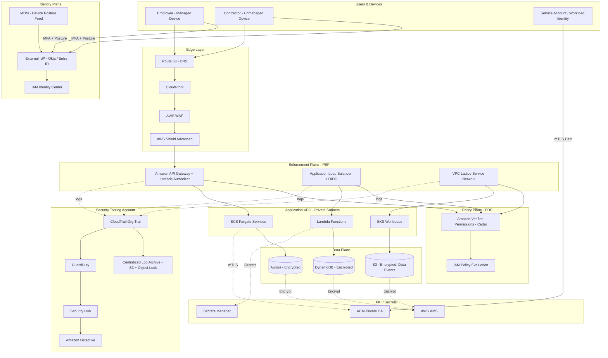

# Chapter 87 — Zero Trust

*Part XI – Security Reference Architectures*

---

# 1 Executive Summary

## The Business Problem

Enterprise networks were built on a flawed assumption for three decades: everything inside the corporate perimeter is trustworthy, and everything outside is not.

- This model, often called the "castle-and-moat" model, protected the network edge with firewalls, VPNs, and DMZs.
- Once a user, device, or workload was inside the network, it was implicitly trusted and could often reach far more than it needed.
- Attackers who bypassed the perimeter — through phishing, stolen credentials, compromised third-party software, or a single unpatched VPN appliance — gained broad lateral access.

Several forces have made this model obsolete:

- **Cloud adoption.** Workloads now live in AWS accounts, SaaS platforms, and on-premises data centers simultaneously. There is no single perimeter to defend.
- **Remote and hybrid work.** Employees connect from home networks, coffee shops, and personal devices. The "trusted internal network" barely exists anymore.
- **Third-party and partner access.** Contractors, vendors, and partner organizations need access to specific systems, not the entire network.
- **Supply chain attacks.** Compromised software updates demonstrate that trusted software can become an attack vector from inside the perimeter.
- **Ransomware and lateral movement.** Modern ransomware operators spend days or weeks moving laterally after initial compromise, using the very trust the perimeter model grants them.

Zero Trust is an architectural response to this reality. It replaces implicit trust based on network location with explicit, continuously verified trust based on identity, device posture, and context — evaluated on every single request, not once at the network boundary.

## Architecture Objective

- Never trust, always verify — every request, from every user, device, and workload, is authenticated and authorized regardless of network location.
- Enforce least-privilege access — access grants are scoped to the minimum resources and actions required, and only for as long as needed.
- Assume breach — design controls as though an attacker is already inside the network, so that a single compromised credential or host cannot lead to widespread lateral movement.
- Make security decisions dynamic and contextual — incorporate device health, user behavior, location, and risk signals into every access decision, not just a static username and password.
- Provide continuous visibility — log, monitor, and analyze every access decision so that anomalies are detected quickly.

On AWS, this translates into a concrete architecture built from identity providers, policy engines, micro-segmented networking, encrypted service-to-service communication, and pervasive logging — not a single product, but a composition of AWS-native and third-party controls working together.

## Why Organizations Adopt This Architecture

**Regulatory and compliance pressure.**

- Frameworks such as NIST SP 800-207 (the primary US federal reference for Zero Trust Architecture) are increasingly referenced in audits.
- US federal agencies have been mandated (via OMB M-22-09) to implement Zero Trust strategies, and this expectation increasingly flows down to contractors and partners.
- Industry frameworks like PCI DSS 4.0, HIPAA Security Rule updates, and FedRAMP High baselines increasingly expect segmentation and continuous verification rather than perimeter-only controls.

**Reduction of breach blast radius.**

- When a credential or workload is compromised, Zero Trust segmentation limits what that compromise can reach.
- This directly reduces the cost and duration of incident response, and materially changes the outcome of ransomware events.

**Modern workforce and workload distribution.**

- With workers, contractors, and workloads spread across clouds, SaaS, and on-premises systems, a single network perimeter can no longer be meaningfully defined or defended.
- Zero Trust decouples "where you are" from "what you can access."

**M&A and organizational complexity.**

- Enterprises that grow through acquisition inherit disparate networks, identity systems, and trust models.
- Zero Trust provides a consistent access model that can be layered across heterogeneous environments without requiring full network re-architecture on day one.

**Cyber insurance requirements.**

- Insurers increasingly require evidence of MFA everywhere, segmentation, and privileged access management as a condition of coverage or reduced premiums.

## Major Business Benefits

| Benefit | Description |
|---|---|
| Reduced breach impact | Lateral movement is constrained by segmentation and per-request authorization, shrinking the blast radius of any single compromise |
| Improved auditability | Every access decision is logged with identity, device, and context, simplifying compliance evidence gathering |
| Workforce flexibility | Employees, contractors, and partners can be granted precise access regardless of physical location or network |
| Faster secure onboarding | New employees, contractors, and acquired business units can be granted scoped access without VPN concentrator redesigns |
| Reduced VPN dependency | Application-layer access via identity-aware proxies reduces reliance on flat, high-privilege network VPNs |
| Improved incident response | Rich identity and device context in logs accelerates detection and root-cause analysis |
| Lower long-term operational cost | Centralized policy engines reduce the sprawl of firewall rules, VPN configurations, and per-application ACLs over time |

## Typical Enterprise Scenarios

- A financial services firm needs to grant contractors from three different consulting firms scoped, time-boxed access to specific internal applications without issuing VPN credentials or placing them on the corporate network.
- A healthcare provider must ensure that only compliant, encrypted, MDM-enrolled devices can access systems containing protected health information (PHI), regardless of whether access originates from a hospital network or a clinician's home.
- A SaaS company operating in regulated industries needs to demonstrate to auditors that internal engineers cannot access production customer data without an approved, logged, and time-limited justification.
- A retail enterprise with hundreds of stores needs to segment point-of-sale networks so that a compromised store network cannot reach corporate financial systems or other stores.
- A global enterprise going through M&A needs a consistent access model across newly acquired subsidiaries that have their own AWS accounts, identity providers, and network topologies.

This chapter builds a complete, production-ready Zero Trust reference architecture on AWS: identity-centric, continuously verified, micro-segmented, and instrumented for full observability — mapped explicitly to NIST SP 800-207 pillars (Identity, Devices, Networks, Applications and Workloads, Data) throughout.

---

# 2 Business Requirements

## Business Drivers

- Reduce the blast radius of credential theft and insider threats.
- Meet regulatory obligations (NIST 800-207, PCI DSS 4.0, HIPAA, SOC 2, FedRAMP).
- Enable secure remote and hybrid work without a flat corporate VPN.
- Support secure, time-boxed third-party and contractor access.
- Provide continuous, auditable evidence of access decisions for compliance and cyber insurance.

## Functional Requirements

- Every human user must authenticate with phishing-resistant multi-factor authentication (MFA) before accessing any protected resource.
- Every device must report a health/posture signal (patch level, disk encryption, EDR status) before being granted access.
- Every workload-to-workload call must be mutually authenticated (mTLS) and authorized by policy, not merely by network reachability.
- Access decisions must incorporate identity, device posture, resource sensitivity, and contextual risk (location, time, anomaly score).
- All access must be logged centrally with enough detail to reconstruct "who accessed what, from where, using what device, and why" for any given request.
- Access grants must default to least privilege and expire automatically unless renewed.

## Non-Functional Requirements

| Category | Requirement |
|---|---|
| Scalability | Support 50,000+ identities (employees, contractors, service accounts) and 10,000+ workloads across 50+ AWS accounts |
| Availability | Policy decision points must achieve 99.95%+ availability; a policy engine outage must not silently fail open |
| Latency | Authorization decisions must add no more than 20–50 ms to the request path for internal services |
| Compliance | Must map cleanly to NIST SP 800-207, PCI DSS 4.0, HIPAA, SOC 2 Type II, and (where applicable) FedRAMP Moderate/High |
| Auditability | 100% of access decisions logged, immutable, and retained per regulatory schedule (typically 1–7 years) |
| Recoverability | Policy engine and identity provider configuration must be recoverable within RTO/RPO targets below |

## Scalability Goals

- Identity plane must scale horizontally to support acquisitions and workforce growth without architectural rework.
- Policy evaluation must scale independently of the number of protected applications — adding application #500 should not degrade latency for application #1.
- Network segmentation must scale to thousands of workloads without an explosion of manually managed security group rules.

## Availability Requirements

- Identity Provider (IdP): 99.99% (SSO becomes the front door to everything; an outage blocks the entire enterprise).
- Policy Decision Point (PDP) / policy engine: 99.95%, deployed multi-AZ, with a well-defined fail-closed (deny by default) behavior on outage — never fail open.
- Policy Enforcement Points (PEPs) — API Gateway, ALB with OIDC, service mesh sidecars: 99.95%, matching the availability of the applications they front.

## Latency Requirements

- Human-to-application authentication (SSO login): under 2 seconds end-to-end including MFA challenge.
- Per-request authorization checks for internal service-to-service calls: under 10 ms at p99 for cached policy decisions, under 50 ms for cold evaluations.
- Device posture check refresh: near-real-time (under 5 minutes) so that a device that becomes non-compliant loses access promptly.

## Compliance Requirements

- NIST SP 800-207 Zero Trust Architecture tenets.
- PCI DSS 4.0 Requirement 1 (network segmentation) and Requirement 8 (strong authentication).
- HIPAA Security Rule technical safeguards (access control, audit controls, transmission security).
- SOC 2 Type II — Security and Confidentiality trust criteria.
- FedRAMP Moderate/High control families: AC (Access Control), IA (Identification and Authentication), SC (System and Communications Protection), AU (Audit and Accountability).

## Security Expectations

- No standing administrative access; all privileged access is just-in-time and time-boxed.
- All secrets stored in a managed secrets service, never in code, configuration files, or environment variables checked into source control.
- All data encrypted in transit (TLS 1.2+/mTLS) and at rest (KMS-backed encryption).
- Continuous device compliance verification, not a one-time check at enrollment.

## Recovery Objectives

| System | RPO | RTO |
|---|---|---|
| Identity Provider configuration (users, groups, policies) | 15 minutes | 1 hour |
| Policy engine rule sets | 15 minutes | 30 minutes |
| Certificate Authority / PKI root and intermediate material | Near zero (offline root, HSM-backed) | 4 hours (intermediate reissue) |
| Audit log store | Near zero (streamed, multi-region replicated) | 15 minutes |

## SLAs

- 99.95% availability for the access path to production applications (identity + policy + enforcement combined).
- Security incident detection and initial triage within 15 minutes of a high-severity GuardDuty/Security Hub finding.
- Access revocation (e.g., terminated employee, compromised device) propagated across all enforcement points within 5 minutes.

## Expected Workload

- 50,000 authentication events/day at steady state, bursting to 5x during business-hours peaks.
- 10 million+ authorization decisions/day across service-to-service and user-to-service traffic.
- 500 GB–2 TB/day of access and audit log volume at enterprise scale.

## Expected Growth

- Identity volume growing 20–30% year-over-year through hiring and M&A.
- Workload count growing faster than headcount as microservices proliferate (often 3–5x the growth rate of applications-per-team).
- Multi-cloud and SaaS integration expanding the number of Policy Enforcement Points that must be federated under the same policy model.


---

# 3 Architecture Overview

## Overall Design

The reference architecture is organized around the five pillars defined by NIST SP 800-207 and CISA's Zero Trust Maturity Model:

1. **Identity** — every human and non-human identity is verified via a centralized identity provider with phishing-resistant MFA.
2. **Devices** — every device is enrolled, inventoried, and continuously assessed for compliance before being trusted.
3. **Networks** — the network is treated as inherently hostile; segmentation and encrypted transport replace implicit trust.
4. **Applications and Workloads** — every application enforces authorization at the application layer, not just at the network edge; every workload-to-workload call is mutually authenticated.
5. **Data** — data is classified, encrypted, and access-controlled independent of where it is stored or which network it traverses.

A sixth cross-cutting pillar — **Visibility and Analytics** — ties the other five together with continuous logging, behavioral analytics, and automated response.

## Architecture Philosophy

- **Policy Decision Point / Policy Enforcement Point (PDP/PEP) separation.** Authorization logic is centralized in a small number of policy engines (PDPs); enforcement happens at many distributed points (PEPs) — API Gateway, ALB, service mesh sidecars, and application middleware.
- **Deny by default.** Every resource is unreachable until an explicit policy grants access. There is no implicit trust based on VPC membership or subnet placement.
- **Continuous evaluation, not one-time authentication.** Sessions are re-evaluated against current device posture, risk score, and policy — not trusted indefinitely after a single login.
- **Identity is the new perimeter.** Network location is treated as one signal among many, not as the primary basis for trust.
- **Everything is logged.** Every access decision — allow or deny — is emitted as a structured event for detection, audit, and forensic reconstruction.

## Core Components

| Component | Role |
|---|---|
| Identity Provider (IdP) | AWS IAM Identity Center federated with an external IdP (e.g., Okta, Azure AD/Entra ID, Ping) as the source of truth for human identities |
| Policy Decision Point (PDP) | Amazon Verified Permissions (Cedar policy engine) plus AWS IAM policy evaluation for AWS resource access |
| Policy Enforcement Points (PEP) | Application Load Balancer with OIDC auth, Amazon API Gateway with Lambda authorizers, AWS App Mesh / VPC Lattice for service-to-service enforcement |
| Device Trust | MDM integration (e.g., Jamf, Intune) feeding device posture into the IdP's conditional access engine |
| Network Segmentation | VPC Lattice, security groups as micro-perimeters, PrivateLink, and Network Firewall for east-west inspection |
| Secrets and Certificates | AWS Secrets Manager, AWS Certificate Manager Private CA for mTLS certificate issuance |
| Visibility | CloudTrail, VPC Flow Logs, GuardDuty, Security Hub, Amazon Detective, centralized in a security-tooling account |

## How Components Interact

- A user authenticates to the IdP with phishing-resistant MFA (FIDO2/WebAuthn security key or platform authenticator).
- The IdP evaluates conditional access rules, incorporating device posture pulled from the MDM.
- On success, the IdP issues a short-lived token (SAML assertion or OIDC token) scoped to the requested application.
- The Policy Enforcement Point in front of the application (ALB with OIDC, or API Gateway authorizer) validates the token and calls the Policy Decision Point to authorize the specific action requested.
- The PDP evaluates a Cedar policy (via Amazon Verified Permissions) that considers the user's attributes, the resource's attributes, and contextual data (device posture, risk score, time of day).
- If authorized, the request proceeds to the application; if the application needs to call another internal service, that call is itself mutually authenticated via mTLS and re-authorized at the receiving service's PEP.
- Every step — IdP authentication, PDP decision, PEP enforcement — emits a log event to the centralized logging pipeline.

## High-Level Workflow

1. Identity verification (human or workload).
2. Device/workload posture assessment.
3. Policy evaluation incorporating identity, device, resource sensitivity, and context.
4. Enforcement at the nearest possible point to the resource.
5. Continuous re-evaluation for the duration of the session.
6. Logging and analytics for every decision.

## Request Lifecycle

1. Client (user or service) initiates a request.
2. DNS resolves to the nearest edge or regional entry point.
3. TLS termination occurs at the PEP (ALB/API Gateway), never deeper in the network without re-encryption.
4. The PEP extracts and validates the identity token.
5. The PEP calls the PDP for an authorization decision, using cached decisions where policy allows.
6. On approval, the PEP forwards the request over an internally encrypted (mTLS) channel to the target service.
7. The target service may make additional east-west calls, each independently authenticated and authorized.

## Response Lifecycle

1. The application processes the request and returns a response.
2. The response traverses back through the same encrypted channels.
3. Response payloads containing sensitive data are subject to data classification tagging and, where required, field-level masking.
4. Access and response metadata (not payload content) are logged for audit purposes.

## Data Lifecycle

1. Data is classified at creation or ingestion (public, internal, confidential, restricted).
2. Classification determines encryption requirements, allowed storage locations, and which policies govern access.
3. Data at rest is encrypted using AWS KMS customer-managed keys, with key policies scoped per data classification tier.
4. Data in transit is encrypted end-to-end (TLS externally, mTLS internally) with no unencrypted hop.
5. Data access is logged at the object/record level where feasible (e.g., S3 Data Events, RDS Activity Streams, DynamoDB Streams for change tracking).

---

# 4 AWS Services Used

## AWS IAM Identity Center

- **Purpose:** central point for federating human identities from an external IdP into AWS, and for managing permission sets across multiple AWS accounts.
- **Why selected:** native AWS integration, supports SAML 2.0 and SCIM provisioning, integrates cleanly with AWS Organizations for multi-account permission assignment.
- **Alternatives:** direct IAM users (strongly discouraged at enterprise scale), third-party IdP-native AWS federation without Identity Center (loses centralized permission set management).
- **Limitations:** primarily oriented around human access to AWS accounts; workload identity still requires IAM roles and, for external workloads, IAM Roles Anywhere or OIDC federation.
- **Pricing considerations:** no direct charge for IAM Identity Center itself; costs arise from the underlying identity provider and any AWS resources it grants access to.
- **Best practices:** enforce MFA at the Identity Center level, use permission sets mapped to least-privilege job functions, enable SCIM auto-provisioning/de-provisioning from the HR system of record.

## Amazon Verified Permissions

- **Purpose:** externalized, fine-grained authorization service using the Cedar policy language; acts as the primary Policy Decision Point for application-level authorization.
- **Why selected:** purpose-built for exactly this pattern — separating authorization logic from application code, with policies that are testable, versionable, and auditable.
- **Alternatives:** Open Policy Agent (OPA) self-hosted, custom authorization microservices, in-application role checks (anti-pattern at scale).
- **Limitations:** newer service; teams need to learn Cedar; not a drop-in replacement for IAM policy evaluation on AWS resources themselves.
- **Pricing considerations:** charged per authorization request; cost scales with request volume, so caching decisions where safe is important.
- **Best practices:** keep policies in version control, run policy unit tests in CI, separate policy stores per environment (dev/staging/prod).

## Amazon VPC Lattice

- **Purpose:** application-layer networking service that provides service-to-service connectivity, authentication, and authorization across VPCs and accounts without complex peering or transit gateway routing for every path.
- **Why selected:** natively integrates IAM-based authorization into service-to-service calls, supports fine-grained routing and access control at the service level, reducing reliance on flat network reachability.
- **Alternatives:** AWS App Mesh (more focused on container service mesh with Envoy), full mesh VPC peering with security groups only, third-party service mesh (Istio, Linkerd).
- **Limitations:** relatively new; not all AWS compute types are supported equally; still requires underlying VPC network design.
- **Pricing considerations:** charged per service network hour and per GB processed.
- **Best practices:** use VPC Lattice auth policies as the primary east-west PEP for service-to-service traffic; combine with security groups for defense in depth.

## AWS Certificate Manager Private Certificate Authority (ACM PCA)

- **Purpose:** issues and manages private certificates for mutual TLS (mTLS) between workloads.
- **Why selected:** integrates with ACM for automatic certificate renewal, supports short-lived certificates suitable for workload identity, avoids operating a self-managed CA and HSM.
- **Alternatives:** self-hosted CA (HashiCorp Vault PKI, OpenSSL-based), third-party PKI-as-a-service.
- **Limitations:** cost per certificate issued can add up at very high workload counts; root CA key management still requires careful design.
- **Pricing considerations:** monthly charge per CA plus per-certificate issuance fees; short-lived certificate mode is priced differently and generally cheaper for high-rotation use cases.
- **Best practices:** keep the root CA offline or in a separate, tightly restricted account; use short-lived leaf certificates (hours to days) for workload identity rather than long-lived certs.

## AWS Secrets Manager

- **Purpose:** centralized storage, rotation, and access control for secrets (database credentials, API keys, service account tokens).
- **Why selected:** automatic rotation integrations with RDS and other services, fine-grained IAM-based access control, full audit trail via CloudTrail.
- **Alternatives:** AWS Systems Manager Parameter Store (SecureString) for lower-cost, lower-rotation-frequency secrets; HashiCorp Vault for multi-cloud secret management.
- **Limitations:** per-secret and per-API-call pricing can become significant at very high scale; rotation Lambda functions add operational complexity.
- **Pricing considerations:** charged per secret per month plus API call charges; consolidate related secrets carefully to avoid unnecessary secret sprawl.
- **Best practices:** never allow application code to read secrets directly without going through an IAM role scoped to that specific secret; enable automatic rotation wherever the target system supports it.

## Amazon GuardDuty

- **Purpose:** continuous threat detection using machine learning and threat intelligence feeds across CloudTrail, VPC Flow Logs, DNS logs, EKS audit logs, and S3 data events.
- **Why selected:** fully managed, no infrastructure to maintain, deep native integration with the rest of the AWS security stack, essential for the "assume breach" and continuous monitoring tenets of Zero Trust.
- **Alternatives:** third-party SIEM/XDR with custom detection rules, self-managed IDS/IPS.
- **Limitations:** detection is probabilistic, not a substitute for preventive controls; tuning is required to reduce false positives at scale.
- **Pricing considerations:** charged based on volume of analyzed logs and events; can become a significant line item at high VPC Flow Log and CloudTrail volumes.
- **Best practices:** enable GuardDuty organization-wide via AWS Organizations, route findings into Security Hub for centralized triage, integrate with EventBridge for automated response.

## AWS Security Hub

- **Purpose:** aggregates findings from GuardDuty, Inspector, Macie, IAM Access Analyzer, and third-party tools into a single dashboard, and evaluates accounts against security standards (AWS Foundational Security Best Practices, CIS AWS Foundations Benchmark, NIST 800-53).
- **Why selected:** provides the single-pane-of-glass compliance and posture view that Zero Trust's "continuous visibility" pillar requires.
- **Alternatives:** third-party CSPM tools (Wiz, Orca, Prisma Cloud) for deeper multi-cloud posture management.
- **Limitations:** native standards checks are useful but not a substitute for custom organizational policy checks.
- **Pricing considerations:** charged per finding ingested and per security check performed; costs scale with account and resource count.
- **Best practices:** enable across all accounts via AWS Organizations delegated administrator, route high-severity findings to a ticketing/SOAR pipeline automatically.

## AWS IAM Access Analyzer

- **Purpose:** identifies resources shared with external principals and validates IAM policies against least-privilege and security best practices before deployment.
- **Why selected:** catches unintended public or cross-account access — a common way Zero Trust boundaries are accidentally violated.
- **Alternatives:** manual policy review, third-party IAM posture tools.
- **Limitations:** analyzes policy grants, not runtime behavior; does not replace runtime authorization enforcement.
- **Pricing considerations:** external access analysis is free; unused access analysis and custom policy checks have associated charges.
- **Best practices:** run Access Analyzer policy validation in CI/CD before any IAM policy is deployed; enable unused access analysis to find and prune over-permissioned roles.

## AWS KMS

- **Purpose:** encryption key management for data at rest across nearly every AWS storage and database service.
- **Why selected:** deeply integrated, supports customer-managed keys with fine-grained key policies, provides an audit trail of every key usage via CloudTrail.
- **Alternatives:** AWS CloudHSM for workloads requiring dedicated single-tenant HSMs (e.g., specific compliance mandates).
- **Limitations:** key policy complexity can grow quickly in multi-account environments; cross-account key sharing needs careful design.
- **Pricing considerations:** monthly charge per customer-managed key plus per-API-call charges; consolidating keys per data classification tier (rather than per resource) helps control cost.
- **Best practices:** use separate KMS keys per data classification tier and per environment; never use the AWS-managed default key for sensitive or regulated data.

## Amazon API Gateway

- **Purpose:** serves as a Policy Enforcement Point for API-based access, validating JWTs, applying request-level authorization, throttling, and WAF integration.
- **Why selected:** native Lambda authorizer support enables calling out to Amazon Verified Permissions or a custom PDP per request; integrates with WAF and Shield for edge protection.
- **Alternatives:** self-managed API gateway (Kong, Envoy-based), ALB with Lambda target for simpler cases.
- **Limitations:** REST API and HTTP API have different feature sets; cold-start latency on Lambda authorizers must be managed.
- **Pricing considerations:** charged per million API calls plus data transfer; caching authorizer results reduces both cost and latency.
- **Best practices:** cache authorizer decisions for short TTLs (30–300 seconds) to balance responsiveness with cost; always pair with AWS WAF.

## AWS WAF and AWS Shield

- **Purpose:** edge-layer protection against common web exploits (WAF) and DDoS attacks (Shield).
- **Why selected:** these are complementary, not competing, with Zero Trust's identity-centric controls — Zero Trust assumes an authenticated attacker might still probe for application vulnerabilities, and WAF/Shield provide the outer layer of defense.
- **Alternatives:** third-party WAF (Cloudflare, Akamai) for organizations with multi-cloud edge strategies.
- **Limitations:** WAF rules require tuning to avoid false positives; Shield Standard is automatic but Shield Advanced (for larger, business-critical workloads) is a paid tier.
- **Pricing considerations:** WAF charged per web ACL, per rule, and per request; Shield Advanced has a significant fixed monthly cost, justified for internet-facing, business-critical applications.
- **Best practices:** deploy AWS Managed Rule groups as a baseline, layer custom rules for application-specific logic, enable Shield Advanced for any application with material DDoS risk.

## Amazon CloudWatch, AWS CloudTrail, and Amazon Detective

- **Purpose:** CloudWatch for metrics/logs/alarms, CloudTrail for API-level audit logging of every AWS control-plane action, Detective for visualizing and investigating the relationships between findings during incident response.
- **Why selected:** together they provide the "continuous visibility and analytics" pillar — the connective tissue that makes Zero Trust auditable and investigable rather than just theoretically sound.
- **Alternatives:** third-party SIEM (Splunk, Sumo Logic, Elastic) fed by CloudTrail/VPC Flow Log exports for organizations with existing SIEM investment.
- **Limitations:** CloudTrail does not capture data-plane events by default (must enable data events separately for S3, Lambda, DynamoDB); log volume and retention costs grow quickly at scale.
- **Pricing considerations:** CloudTrail management events are free for the first copy; data events and long-term log storage (S3 + Glacier) are the primary cost drivers; CloudWatch Logs ingestion and storage charged per GB.
- **Best practices:** enable CloudTrail organization trails covering all accounts, enable S3 Object Lock on the log bucket for tamper-evidence, forward high-value logs to a dedicated security-tooling account with restricted write access.


---

# 5 Complete Architecture Diagram



**Diagram notes:**

- Every arrow crossing a trust boundary passes through a Policy Enforcement Point — there is no direct path from a user or device into the application VPC or data plane.
- The Policy Plane (Amazon Verified Permissions + IAM policy evaluation) is consulted by every enforcement point; it is not embedded redundantly inside each application.
- The Security Tooling account is logically and organizationally separate, with restrictive IAM policies preventing any workload account from modifying or deleting logs.

---

# 6 Component-by-Component Explanation

## External Identity Provider (Okta / Entra ID / Ping)

- **Purpose:** system of record for human identity; source of truth for user attributes, group membership, and MFA enrollment.
- **Responsibilities:** authenticate users, enforce phishing-resistant MFA, evaluate conditional access rules (device posture, network, risk score), issue SAML/OIDC tokens.
- **Inputs:** username/password or passkey, MFA challenge response, device posture signal from MDM integration.
- **Outputs:** SAML assertion or OIDC ID token/access token scoped to the target application.
- **Scaling:** SaaS-delivered, scales elastically; enterprise plans support tens of thousands of users without capacity planning by the customer.
- **High availability:** provider-managed multi-region redundancy; verify the vendor's published SLA (typically 99.99%) and negotiate contractual RTO/RPO for a provider-side outage.
- **Failure handling:** define a documented break-glass procedure using out-of-band, tightly controlled emergency access accounts stored in a physical safe or offline vault — never a routine access path.
- **Dependencies:** MDM for device posture, HR system of record for SCIM provisioning.
- **Security:** enforce FIDO2/WebAuthn as the primary MFA factor; disable SMS-based MFA for privileged roles.
- **Monitoring:** export authentication logs to the centralized SIEM/log archive in near-real-time.

## AWS IAM Identity Center

- **Purpose:** bridges the external IdP into AWS Organizations, managing permission sets across all member accounts from a single place.
- **Responsibilities:** SAML federation with the external IdP, SCIM-based user/group provisioning, assignment of least-privilege permission sets per account.
- **Inputs:** SAML assertions from the external IdP, SCIM provisioning events.
- **Outputs:** temporary AWS credentials scoped to a specific permission set and account.
- **Scaling:** managed service; scales with AWS Organizations account count without additional configuration.
- **High availability:** regional AWS-managed service; deploy the Identity Center management account in a well-monitored home region.
- **Failure handling:** loss of Identity Center blocks human console/CLI access to AWS accounts — mitigate with a documented, tightly restricted break-glass IAM user per account, monitored continuously.
- **Dependencies:** AWS Organizations, external IdP.
- **Security:** enforce MFA at the Identity Center session level in addition to the upstream IdP; set short session durations for privileged permission sets.
- **Monitoring:** CloudTrail records every permission set assignment and every federated login.

## Amazon Verified Permissions (PDP)

- **Purpose:** central authorization engine evaluating Cedar policies for application-level access decisions.
- **Responsibilities:** evaluate "is principal X allowed to perform action Y on resource Z, given context C" for every protected application request.
- **Inputs:** principal (user or workload identity), action, resource, and context attributes (device posture, risk score, time).
- **Outputs:** Allow/Deny decision, optionally with policy evaluation trace for auditing.
- **Scaling:** serverless, scales automatically with request volume; design for caching to control both latency and cost.
- **High availability:** regional managed service; deploy policy stores per environment and consider multi-region read replicas of policy definitions for latency-sensitive global applications.
- **Failure handling:** PEPs must fail closed — if the PDP is unreachable, deny the request rather than allow it. This must be explicitly implemented and tested, not assumed.
- **Dependencies:** upstream identity token validation, resource metadata (often pulled from a resource catalog or tagging system).
- **Security:** policy store access itself is IAM-controlled; treat policy changes like code — pull request review, CI validation, staged rollout.
- **Monitoring:** every decision emits a log record; alert on spikes in Deny decisions (possible misconfiguration or attack) and on PDP latency degradation.

## Policy Enforcement Points (API Gateway, ALB with OIDC, VPC Lattice)

- **Purpose:** the actual chokepoints where policy is enforced — no request reaches a protected resource without passing through one of these.
- **Responsibilities:** terminate TLS, validate identity tokens, call the PDP, enforce the decision, and forward (or reject) the request.
- **Inputs:** raw client requests (HTTP, gRPC).
- **Outputs:** either a proxied request to the backend or a rejection (401/403).
- **Scaling:** API Gateway and ALB scale automatically; VPC Lattice service networks scale with the number of associated services.
- **High availability:** deployed across multiple Availability Zones by default for ALB and VPC Lattice; API Gateway is a regional, multi-AZ managed service.
- **Failure handling:** configure health checks so that a PEP outage removes the affected path from rotation rather than silently allowing unauthenticated traffic through a bypass route.
- **Dependencies:** PDP availability, identity token issuer public keys (JWKS) for signature validation.
- **Security:** enforce TLS 1.2 minimum, rotate signing keys per the IdP's published rotation schedule, apply AWS WAF on internet-facing PEPs.
- **Monitoring:** access logs shipped to the centralized log archive; alarm on authorization failure rate anomalies.

## Micro-Segmented Application VPC (ECS Fargate / Lambda / EKS)

- **Purpose:** hosts application workloads in private subnets with no direct internet exposure and no implicit trust between services.
- **Responsibilities:** execute business logic, enforce mTLS for east-west calls, validate workload identity on every inbound request.
- **Inputs:** authorized requests forwarded from PEPs, or authenticated east-west calls from peer services.
- **Outputs:** application responses, outbound calls to data stores and other services (each independently authorized).
- **Scaling:** ECS Fargate and Lambda scale automatically with demand; EKS scales via Cluster Autoscaler/Karpenter.
- **High availability:** multi-AZ task/pod placement, health-check-driven replacement of unhealthy instances.
- **Failure handling:** circuit breakers and retries with backoff for downstream dependency failures; graceful degradation rather than fail-open access.
- **Dependencies:** ACM Private CA for workload certificates, Secrets Manager for credentials, KMS for data encryption.
- **Security:** security groups scoped to specific service-to-service pairs (not broad CIDR ranges), no long-lived static credentials on compute.
- **Monitoring:** container/function-level logs and traces (X-Ray) correlated with the identity of the caller.

## Data Plane (Aurora, DynamoDB, S3)

- **Purpose:** stores application and business data with encryption and access control independent of network location.
- **Responsibilities:** enforce encryption at rest via KMS, expose fine-grained access controls (IAM policies, resource policies, database-level permissions).
- **Inputs:** authorized read/write operations from application services.
- **Outputs:** query results, change events (e.g., DynamoDB Streams) for downstream processing and auditing.
- **Scaling:** Aurora read replicas and Aurora Serverless v2 for variable load; DynamoDB on-demand or auto-scaled provisioned capacity; S3 scales inherently.
- **High availability:** Aurora Multi-AZ with automated failover; DynamoDB is multi-AZ by default; S3 is designed for 99.999999999% durability.
- **Failure handling:** automated failover for Aurora; DynamoDB and S3 require no manual failover action under normal AWS-managed failure scenarios.
- **Dependencies:** KMS for encryption keys, IAM for access policy, VPC endpoints for private connectivity without traversing the public internet.
- **Security:** enable RDS/Aurora Activity Streams and S3 Data Events for record-level and object-level audit trails; use VPC endpoints (Gateway/Interface) so data plane traffic never leaves the AWS network.
- **Monitoring:** CloudWatch metrics for performance, CloudTrail data events for access auditing, Macie for sensitive data discovery in S3.

## Security Tooling Account (CloudTrail, GuardDuty, Security Hub, Detective)

- **Purpose:** provides organization-wide, tamper-resistant visibility into every access decision and every AWS API call.
- **Responsibilities:** aggregate logs and findings from all member accounts, run continuous threat detection, provide investigation tooling.
- **Inputs:** CloudTrail events, VPC Flow Logs, GuardDuty findings, Config compliance events, application-level access logs.
- **Outputs:** consolidated dashboards, automated alerts, forensic investigation graphs.
- **Scaling:** log ingestion pipelines (Kinesis Data Firehose, S3) scale with organizational log volume.
- **High availability:** logging pipeline designed with redundant delivery streams; log archive replicated cross-region.
- **Failure handling:** if a delivery pipeline fails, buffer and retry rather than silently drop events; alert immediately on any gap in log continuity.
- **Dependencies:** AWS Organizations delegated administrator configuration for GuardDuty/Security Hub, restrictive bucket policies on the log archive.
- **Security:** the security tooling account has no workload-account write access to logs after delivery (write-once via Object Lock); access to this account is among the most tightly restricted in the organization.
- **Monitoring:** monitors everything else; its own health is monitored via a separate, minimal secondary alerting path (e.g., a dead-man's-switch alarm).


---

# 7 End-to-End Request Flow

The following walks through a concrete scenario: an employee on a corporate-managed laptop accesses an internal claims-processing application that reads from Aurora and writes audit events to DynamoDB.

1. **Client initiates request.** The employee opens the internal application URL in a browser on a corporate-managed, MDM-enrolled laptop.
2. **DNS resolution.** Route 53 resolves the application's private hosted zone record to the CloudFront distribution (for internet-path access) or directly to an internal ALB (for access via a private access path).
3. **Edge inspection.** CloudFront forwards the request through AWS WAF, which evaluates managed and custom rules (rate limiting, known bad signatures, geo-restrictions).
4. **Authentication redirect.** The PEP (ALB with OIDC action, or API Gateway) detects no valid session and redirects the browser to the external IdP's authentication endpoint.
5. **MFA challenge.** The user authenticates with a FIDO2 security key or platform passkey. The IdP simultaneously queries the MDM integration for the device's current compliance state (disk encryption on, OS patch level current, EDR agent healthy).
6. **Conditional access evaluation.** The IdP evaluates conditional access policy: is this user, on this device, from this network location, at this time, permitted to reach this application? If the device is non-compliant, access is denied or stepped up to a restricted-access profile.
7. **Token issuance.** On success, the IdP issues a signed OIDC ID token and access token, redirecting the browser back to the PEP with an authorization code.
8. **Token exchange and validation.** The PEP exchanges the code for tokens and validates the token signature against the IdP's published JWKS, checking issuer, audience, and expiry.
9. **Authorization request to PDP.** The PEP calls Amazon Verified Permissions with the principal (user ID and attributes), the requested action (e.g., `ViewClaim`), the resource (a specific claim record or claim type), and context (device posture score, time of day).
10. **Policy evaluation.** Amazon Verified Permissions evaluates the applicable Cedar policies and returns Allow or Deny, optionally with a decision trace.
11. **Enforcement.** On Allow, the PEP forwards the request to the application running on ECS Fargate over an internal, mTLS-encrypted connection. On Deny, the PEP returns HTTP 403 and logs the denial.
12. **Application-layer processing.** The application service validates the forwarded identity context (it does not re-trust the network — it verifies the signed assertion passed by the PEP) and processes the request.
13. **Database access.** The application queries Aurora using an IAM database authentication token (short-lived, no static database password) scoped to a role with row-level or column-level restrictions appropriate to the user's claims-adjuster role.
14. **Caching (where applicable).** Frequently accessed, non-sensitive reference data (e.g., claim-status enum values) is served from an in-memory cache (Amazon ElastiCache) to reduce database load; sensitive record-level data is never cached at the edge.
15. **Audit event write.** The application writes an audit record to DynamoDB capturing the user identity, action, resource, decision, and timestamp.
16. **Logging.** The PEP, PDP, and application each emit structured log events, shipped via CloudWatch Logs/Kinesis Data Firehose to the centralized log archive in the security tooling account.
17. **Monitoring.** CloudWatch alarms evaluate authorization failure rates and latency percentiles in near-real-time; GuardDuty and Security Hub continuously analyze the underlying CloudTrail and VPC Flow Log data for anomalies.
18. **Error handling.** If any step fails (token validation failure, PDP timeout, database connectivity issue), the system fails closed: the user sees a generic error, no partial data is returned, and the failure is logged with enough detail for the security team to distinguish a technical fault from a potential attack.
19. **Response delivery.** On success, the application returns the claim data to the PEP, which forwards it to the browser over TLS.
20. **Session continuity.** Subsequent requests within the session reuse the validated token until its short expiry (typically 15–60 minutes for sensitive applications), after which silent re-authentication and a fresh conditional access evaluation occur.

---

# 8 Deployment Flow

## Infrastructure Provisioning

- All Zero Trust infrastructure — identity federation configuration, policy stores, network segmentation, PKI — is defined as code and provisioned through Terraform, never through manual console changes in production.
- Infrastructure is organized into layered Terraform modules: identity/federation, networking/segmentation, policy (Cedar policy stores), PKI/secrets, and per-application enforcement configuration.
- Each AWS account (workload, security tooling, network, identity) has its own Terraform state, isolated via remote state backends with strict IAM access controls.

## Terraform Workflow

1. Engineers author changes in a feature branch, including any Cedar policy changes.
2. `terraform plan` runs automatically in CI, alongside Cedar policy unit tests and IAM Access Analyzer policy validation.
3. A peer reviewer — for policy plane changes, ideally someone from the security team — approves the pull request.
4. On merge, `terraform apply` runs through a CI/CD pipeline with a scoped, time-limited IAM role (no long-lived deployment credentials).
5. State changes are recorded, and a summary of the diff is posted to a security-visible audit channel.

## CI/CD Deployment

- Application deployments are decoupled from policy deployments — an application code change does not require a policy change, and vice versa, reducing blast radius per pipeline run.
- Pipelines use OIDC federation from the CI/CD provider (e.g., GitHub Actions) into a scoped IAM role, eliminating static AWS credentials in CI.

## Blue-Green Deployment

- New application versions are deployed alongside the current version behind the same PEP; the PEP's policy enforcement is identical for both versions, so a deployment never accidentally weakens authorization.
- Traffic is shifted incrementally (e.g., 5% → 25% → 100%) with automated rollback triggers based on authorization error rate and application error rate.

## Rollback

- Terraform state and Cedar policy versions are both tagged per release, enabling a coordinated rollback of infrastructure and policy together if a deployment introduces an authorization regression.
- Rollback of PEP configuration is treated as a security-relevant change and logged with the same rigor as a forward deployment.

## Secrets

- Deployment pipelines never embed secrets in code or environment files; they retrieve short-lived credentials at runtime from Secrets Manager using the pipeline's scoped IAM role.
- Database credentials, third-party API keys, and workload certificates are rotated automatically on a defined schedule (typically 30–90 days for secrets, hours to days for mTLS certificates).

## Configuration

- Application configuration (feature flags, non-sensitive settings) is separated from secrets and managed via Systems Manager Parameter Store.
- Environment-specific configuration is namespaced per account/environment to prevent cross-environment leakage.

## Validation

- Post-deployment smoke tests verify that: unauthenticated requests are rejected, requests with valid-but-insufficient permissions are denied, and requests with correct permissions succeed — a minimal but mandatory "deny/allow" regression suite run on every deployment.
- Policy changes are additionally validated against a library of known-bad policy patterns (e.g., overly broad wildcard grants) before being allowed to merge.

---

# 9 Network Topology

## VPC Design

- Each business domain or application tier is deployed into its own VPC (or, at minimum, its own set of subnets with independent route tables and security groups) to enforce segmentation at the network layer as a defense-in-depth complement to identity-based controls.
- A dedicated **Network Account** hosts shared networking infrastructure: Transit Gateway, centralized egress, and Network Firewall.

## CIDR

- Non-overlapping CIDR ranges are allocated per account/VPC from a centralized IP address management (IPAM) plan to support future Transit Gateway or VPC Lattice interconnection without renumbering.
- Example allocation: `10.0.0.0/16` for Network account, `10.16.0.0/16`–`10.31.0.0/16` reserved per business unit/environment block.

## Public and Private Subnets

- Public subnets host only the minimum required internet-facing resources: ALB/CloudFront origins and NAT Gateways.
- Private subnets host all application compute (ECS/EKS/Lambda-in-VPC) and data stores; nothing in a private subnet has a public IP or a route to the internet gateway.

## NAT Gateway

- Outbound internet access from private subnets (e.g., for pulling container images or OS patches) is routed through NAT Gateways, deployed per-AZ for resilience, with flow logs enabled for visibility into all outbound connections.

## Internet Gateway

- Present only in the public subnet route tables; private subnet route tables never reference the Internet Gateway directly.

## Transit Gateway

- Used for centralized inter-VPC routing where VPC Lattice's application-layer model is not applicable (e.g., legacy or non-HTTP workloads).
- Transit Gateway route tables are segmented per business domain, so that, for example, the retail-store network segment cannot route to the corporate-finance segment even at the network layer — a network-layer backstop behind the identity-layer controls.

## Route Tables

- Explicit, minimal route tables per subnet; no `0.0.0.0/0` routes in private application or data subnets except through the NAT Gateway for outbound-only traffic.

## Network ACLs

- Used as a coarse, stateless secondary control at the subnet boundary — primarily to block known-bad ranges and enforce subnet-tier isolation (e.g., data subnets reject inbound traffic from anything other than the application subnet CIDR).

## Security Groups

- The primary network-layer enforcement mechanism, scoped per service rather than per subnet: a service's security group allows inbound traffic only from the specific security group(s) of its authorized callers, not from a CIDR range.
- This "security-group-to-security-group" referencing pattern is a foundational Zero Trust networking practice on AWS — it ties network reachability to workload identity rather than IP address.

## AWS PrivateLink

- Used for consuming and exposing services (including SaaS and cross-account internal services) without traversing the public internet or requiring VPC peering, keeping east-west traffic within the AWS backbone and reducing exposed attack surface.

## Hybrid Connectivity

- For organizations with on-premises data centers, AWS Direct Connect (paired with a Site-to-Site VPN as backup) extends the segmentation model, with the same identity-aware PEPs (e.g., ALB with OIDC) fronting any on-premises-facing application rather than relying on the VPN tunnel itself as an implicit trust boundary.

---

# 10 Identity and Access

## IAM Roles

- Every workload uses an IAM role, never a long-lived IAM user access key; roles are scoped to a single application or function, not shared across services.
- Human access to the AWS console and CLI is exclusively through IAM Identity Center permission sets, which assume short-lived roles.

## IAM Policies

- Written to the principle of least privilege: explicit `Resource` ARNs rather than wildcards wherever feasible, explicit `Condition` blocks (e.g., `aws:SourceIp`, `aws:MultiFactorAuthPresent`, `aws:PrincipalTag`) layered on top of action/resource scoping.
- Policies are version-controlled, peer-reviewed, and validated by IAM Access Analyzer in CI before deployment.

## Resource Policies

- S3 bucket policies, KMS key policies, and Secrets Manager resource policies enforce access restrictions independent of the calling principal's own IAM policy — a defense-in-depth pairing sometimes called "two-key" access control.
- Cross-account resource policies always specify explicit account and role ARNs; wildcard principals (`"Principal": "*"`) are prohibited outside of genuinely public resources, and flagged automatically by Access Analyzer.

## STS

- AWS Security Token Service issues short-lived (typically 1-hour, extendable per role configuration) temporary credentials for every role assumption — both human (via Identity Center) and workload (via IAM roles for compute, or IAM Roles Anywhere for on-premises/hybrid workloads).
- Session duration is minimized per role sensitivity: administrative roles are capped at 15–60 minutes; standard application roles may use the default maximum.

## Cross-Account Access

- Cross-account access always goes through an assumed role with an external ID (for third-party access) or a scoped trust policy (for internal cross-account access), never through shared credentials.
- A dedicated "hub" account pattern is used for centralized services (logging, shared tooling) that other accounts assume roles into, rather than granting broad cross-account trust from every workload account.

## Least Privilege

- Enforced structurally, not just aspirationally: new roles start with zero permissions and are granted specific actions as justified by application requirements, validated against IAM Access Analyzer's unused-access findings on a recurring (e.g., quarterly) basis to prune drift.

## Service Roles

- AWS service-linked roles (e.g., for GuardDuty, Config) are used as provided by AWS rather than recreated manually, since they are scoped by AWS to the minimum permissions the service requires.

## Permission Boundaries

- Applied to any IAM role or user that has the ability to create other IAM roles (e.g., CI/CD deployment roles), capping the maximum permissions that can ever be granted even if the underlying policy is later broadened — a critical control against privilege escalation via infrastructure-as-code pipelines.


---

# 11 Security Architecture

## Encryption

- **At rest:** every data store — Aurora, DynamoDB, S3, EBS, EFS — is encrypted using AWS KMS customer-managed keys, scoped per data classification tier.
- **In transit:** TLS 1.2+ for all external traffic; mTLS for all internal service-to-service traffic, with certificates issued and rotated by ACM Private CA.

## KMS

- Customer-managed keys are used instead of AWS-managed keys for any data subject to regulatory scope, because customer-managed keys support custom key policies, detailed CloudTrail logging of every `Decrypt`/`Encrypt` call, and the ability to disable or schedule deletion independently of the AWS-managed key lifecycle.
- Key policies explicitly enumerate which roles may use which keys for which operations (`kms:Decrypt` vs `kms:Encrypt` vs `kms:GenerateDataKey`), rather than granting broad `kms:*`.

## TLS

- TLS termination happens at the PEP; internal hops re-encrypt with mTLS rather than passing plaintext internally, closing the "trusted internal network" gap that undermines many perimeter-only architectures.

## WAF

- Deployed on every internet-facing PEP (CloudFront, API Gateway, ALB), using AWS Managed Rule groups (Core Rule Set, Known Bad Inputs, SQL Injection) plus custom rules tuned to the specific application's traffic patterns.

## Shield

- Shield Standard is automatic on all AWS resources; Shield Advanced is enabled for any internet-facing PEP serving business-critical applications, providing enhanced DDoS detection, cost protection, and access to the AWS DDoS Response Team.

## Secrets Manager

- All database credentials, third-party API keys, and inter-service shared secrets are stored exclusively in Secrets Manager, retrieved at runtime via IAM role, never embedded in container images, environment variables committed to source control, or configuration files.

## Certificate Manager

- Public-facing TLS certificates for CloudFront/ALB are issued and auto-renewed via public ACM; internal workload mTLS certificates are issued via ACM Private CA with short lifetimes (hours to a few days) to minimize the impact of a leaked certificate.

## GuardDuty

- Continuously analyzes CloudTrail, VPC Flow Logs, DNS query logs, EKS audit logs, and S3 data events for indicators of compromise: credential exfiltration, cryptomining, command-and-control communication, and anomalous API call patterns consistent with reconnaissance or lateral movement.

## Inspector

- Continuously scans EC2 instances, container images in ECR, and Lambda functions for known software vulnerabilities (CVEs), feeding findings into Security Hub for prioritized remediation.

## Security Hub

- Aggregates GuardDuty, Inspector, Macie, IAM Access Analyzer, and Config findings; evaluates every account against the AWS Foundational Security Best Practices and CIS AWS Foundations Benchmark standards continuously, producing a compliance score used in the FinOps/security governance dashboard.

## CloudTrail

- Organization-wide trail capturing management events across every account by default, with data events (S3 object-level, Lambda invocation-level) enabled selectively for resources handling sensitive data classifications.

## AWS Config

- Continuously evaluates resource configuration against defined rules (e.g., "no security group allows unrestricted SSH," "all S3 buckets must have encryption enabled," "no IAM policy grants full admin"), auto-remediating low-risk violations and alerting on higher-risk ones.

## Zero Trust — Threat Model

The primary threats this architecture is designed to mitigate:

| Threat | Mitigation |
|---|---|
| Stolen user credentials | Phishing-resistant MFA (FIDO2), conditional access requiring device compliance |
| Compromised device | Continuous device posture checks; non-compliant devices lose access within minutes |
| Lateral movement after initial compromise | Micro-segmentation via security groups and VPC Lattice auth policies; no flat network trust |
| Compromised third-party/supply chain component | Workload identity and mTLS mean a compromised component still cannot reach resources it wasn't explicitly authorized for |
| Insider threat / excessive standing access | Least privilege by default, just-in-time privileged access, comprehensive audit logging |
| Data exfiltration | Egress filtering via Network Firewall, DLP via Macie, S3 data event logging |
| Policy engine compromise or outage | Fail-closed enforcement design, multi-AZ PDP deployment, continuous PDP health monitoring |

## Attack Vectors and Mitigations

- **Phishing → credential theft:** mitigated by FIDO2/WebAuthn MFA, which is resistant to credential replay and real-time phishing proxy attacks (unlike SMS or TOTP codes).
- **Token theft/replay:** mitigated by short token lifetimes, audience/issuer validation at every PEP, and binding tokens to device context where the IdP supports it.
- **Privilege escalation via IaC pipeline:** mitigated by permission boundaries on deployment roles and mandatory policy review for any IAM or Cedar policy change.
- **East-west lateral movement:** mitigated by security-group-to-security-group referencing, VPC Lattice auth policies, and mTLS mutual authentication — an attacker who lands on one compute instance cannot reach unrelated services by IP alone.
- **Policy engine (PDP) denial-of-service:** mitigated by PEP-level caching of recent decisions and fail-closed behavior, ensuring an unreachable PDP degrades availability rather than security.

---

# 12 High Availability

## AZ Failures

- All compute (ECS, EKS, Lambda) and PEPs (ALB, API Gateway) are deployed across a minimum of three Availability Zones; the loss of any single AZ removes at most one-third of capacity, automatically rebalanced by the underlying AWS-managed load balancing.

## Instance Failures

- ECS/EKS health checks replace unhealthy tasks/pods automatically; Lambda has no instance-level failure mode to manage directly.

## Regional Failures

- For business-critical applications, the architecture supports an active-passive or active-active multi-region deployment, with IAM Identity Center and the external IdP already being inherently multi-region (SaaS-delivered), and Amazon Verified Permissions policy stores replicated via Terraform-managed identical policy definitions per region.

## Database Failures

- Aurora Multi-AZ with automated failover (typically under 30 seconds); DynamoDB global tables for multi-region active-active data replication where required.

## Load Balancing

- ALB and API Gateway distribute traffic across healthy targets automatically; VPC Lattice performs similar health-aware routing for service-to-service traffic.

## Health Checks

- Layered health checks: infrastructure-level (ALB target health), application-level (`/healthz` endpoints verifying database connectivity), and identity-plane-level (synthetic canary logins verifying the IdP → PEP → PDP chain end-to-end every few minutes).

## Failover

- Failover procedures are automated wherever technically possible (Aurora, DynamoDB, ALB) and are tested on a recurring schedule (quarterly, at minimum) via AWS Fault Injection Simulator game days that specifically include PDP and IdP failure scenarios, not just infrastructure failures.

---

# 13 Disaster Recovery

## Backup Strategy

- Aurora automated backups with point-in-time recovery (35-day retention) plus periodic manual snapshots retained per compliance schedule.
- DynamoDB point-in-time recovery enabled on all tables containing production data.
- Terraform state, Cedar policy definitions, and IAM policy definitions are themselves backed up implicitly by being stored in version control with tagged releases — infrastructure-as-code is a disaster recovery asset, not just a deployment tool.

## Snapshots

- Automated daily snapshots of Aurora and EBS volumes, copied cross-region for critical workloads, encrypted with the same KMS key policy rigor as the source data.

## Cross-Region Replication

- S3 Cross-Region Replication for the centralized log archive, ensuring audit evidence survives a regional disaster.
- DynamoDB Global Tables for identity/session-adjacent data requiring multi-region availability.

## Pilot Light

- For lower-tier applications, a pilot light DR strategy keeps minimal infrastructure (VPC, security groups, PEP configuration) warm in a secondary region, with compute and full capacity provisioned only during an actual failover.

## Warm Standby

- For Tier 1 business-critical applications, a scaled-down but fully functional replica runs continuously in a secondary region, including its own PEP and connection to a regional Amazon Verified Permissions policy store, ready to absorb full traffic within minutes.

## Multi-Site / Active-Active

- For the highest-tier applications (e.g., customer-facing authentication-adjacent services), an active-active deployment across two or more regions is used, with Route 53 health-check-based failover routing and DynamoDB Global Tables or Aurora Global Database for data layer continuity.

## RPO / RTO by Tier

| Tier | RPO | RTO | Strategy |
|---|---|---|---|
| Tier 1 (customer-facing, revenue-critical) | Near zero | Under 15 minutes | Active-active multi-region |
| Tier 2 (internal business-critical) | 15 minutes | 1–2 hours | Warm standby |
| Tier 3 (internal, non-critical) | 1–4 hours | 4–24 hours | Pilot light |

---

# 14 Scalability

## Horizontal Scaling

- ECS Fargate and EKS workloads scale horizontally via target-tracking Auto Scaling policies (CPU, memory, request count per target); this is the default scaling model for the vast majority of application services in this architecture.

## Vertical Scaling

- Reserved for stateful components where horizontal scaling is impractical (e.g., a specific batch-processing task requiring high single-instance memory) — used sparingly, since it doesn't align well with the elastic, ephemeral compute model Zero Trust workload identity favors.

## Auto Scaling

- Scaling policies are tuned per service based on observed traffic patterns; PEPs (ALB, API Gateway) scale transparently as managed services and require no manual capacity planning.

## Serverless Scaling

- Lambda-based components scale to thousands of concurrent executions automatically; reserved concurrency is set on functions that call rate-limited downstream dependencies (e.g., the PDP or a legacy database) to prevent overwhelming them during traffic spikes.

## Database Scaling

- Aurora read replicas absorb read-heavy workloads; Aurora Serverless v2 is used for workloads with highly variable or unpredictable traffic; DynamoDB on-demand capacity mode is used for services with spiky, hard-to-predict access patterns.

## Storage Scaling

- S3 scales inherently without capacity planning; EFS is used for shared file storage requirements and scales elastically with usage.

## Queue Scaling

- SQS and EventBridge decouple producers from consumers, allowing the policy evaluation and audit-logging pipelines to absorb traffic bursts without back-pressuring the synchronous request path.

---

# 15 Performance Optimization

## Caching

- PEP-level authorization decision caching (short TTL, 30–300 seconds) significantly reduces PDP call volume and latency for repeated requests from the same principal to the same resource type.
- Application-level caching (ElastiCache for Redis) for non-sensitive, frequently accessed reference data — never for record-level sensitive data subject to per-request authorization.

## Compression

- Gzip/Brotli compression enabled at CloudFront and API Gateway for response payloads, reducing latency and data transfer cost without affecting the security model.

## CDN

- CloudFront serves static assets and cacheable API responses at the edge, reducing load on origin PEPs while WAF rules are still evaluated at the edge before any cache lookup.

## Database Optimization

- Read replicas for read-heavy paths, connection pooling (RDS Proxy) to avoid connection exhaustion from bursty Lambda invocations, and query-level indexing reviews as part of the standard performance review cadence.

## Connection Pooling

- RDS Proxy is used in front of Aurora for all Lambda-based and high-concurrency ECS-based services, both for performance (connection reuse) and for security (centralized IAM authentication to the database rather than per-service credential management).

## Concurrency

- Lambda reserved and provisioned concurrency tuned per function based on latency sensitivity; provisioned concurrency is used for the PEP's authorizer functions specifically to eliminate cold-start latency from the authorization path.

## Async Processing

- Non-latency-sensitive operations (e.g., audit log enrichment, notification delivery) are offloaded to SQS/EventBridge-driven asynchronous processing, keeping the synchronous request path focused solely on authentication, authorization, and core business logic.

---

# 16 Cost Optimization (FinOps)

## Estimated Monthly Cost — Small Deployment

*(≈5,000 identities, 20 applications, single region)*

| Component | Estimated Monthly Cost (USD) |
|---|---|
| IAM Identity Center | $0 (no direct charge) |
| External IdP (SaaS, per-user) | $15,000–$25,000 |
| Amazon Verified Permissions | $500–$1,500 |
| API Gateway / ALB (PEPs) | $800–$2,000 |
| VPC Lattice | $300–$800 |
| ACM Private CA | $400 (CA) + issuance fees |
| Secrets Manager | $200–$500 |
| GuardDuty | $500–$1,500 |
| Security Hub | $300–$800 |
| CloudTrail + log storage | $500–$1,200 |
| KMS | $100–$300 |
| **Total (excluding IdP licensing)** | **≈ $3,600–$9,000/month** |

## Estimated Monthly Cost — Medium Deployment

*(≈25,000 identities, 150 applications, two regions)*

| Component | Estimated Monthly Cost (USD) |
|---|---|
| Amazon Verified Permissions | $3,000–$8,000 |
| API Gateway / ALB (PEPs) | $5,000–$12,000 |
| VPC Lattice | $2,000–$5,000 |
| ACM Private CA + issuance | $2,000–$4,000 |
| Secrets Manager | $1,500–$3,000 |
| GuardDuty | $3,000–$8,000 |
| Security Hub | $1,500–$4,000 |
| CloudTrail + log storage (multi-region) | $3,000–$7,000 |
| KMS | $800–$2,000 |
| **Total (excluding IdP licensing)** | **≈ $22,000–$53,000/month** |

## Estimated Monthly Cost — Enterprise Deployment

*(≈100,000+ identities, 1,000+ applications, global multi-region)*

| Component | Estimated Monthly Cost (USD) |
|---|---|
| Amazon Verified Permissions | $15,000–$40,000 |
| API Gateway / ALB (PEPs) | $25,000–$60,000 |
| VPC Lattice | $10,000–$25,000 |
| ACM Private CA + issuance | $8,000–$15,000 |
| Secrets Manager | $6,000–$12,000 |
| GuardDuty | $15,000–$35,000 |
| Security Hub + Detective | $8,000–$18,000 |
| CloudTrail + log storage (global) | $15,000–$35,000 |
| KMS | $3,000–$8,000 |
| **Total (excluding IdP licensing)** | **≈ $105,000–$248,000/month** |

## Major Cost Drivers

- Authorization request volume against Amazon Verified Permissions — uncached, per-request PDP calls at high scale are the single largest controllable cost.
- Log ingestion and long-term retention — CloudTrail data events and VPC Flow Logs at high volume, especially when retained for multi-year compliance windows.
- Certificate issuance volume — short-lived mTLS certificates issued at high frequency (e.g., hourly rotation across thousands of workloads) increase ACM Private CA issuance charges.
- External IdP per-seat licensing — often the largest single line item, and one this AWS-focused architecture does not directly control.

## Optimization Opportunities

- Cache PDP decisions aggressively at the PEP for read-heavy, low-sensitivity resource types; reserve uncached, per-request evaluation for high-sensitivity actions.
- Tier log retention: hot storage (CloudWatch Logs / S3 Standard) for 30–90 days, transition to S3 Glacier for the remainder of the compliance retention window.
- Right-size certificate rotation frequency per workload risk tier rather than applying the shortest lifetime uniformly.
- Consolidate KMS keys per data classification tier rather than per individual resource, reducing per-key monthly charges without weakening the access control model (key policies still enforce least privilege).

## Reserved Instances / Savings Plans

- Compute Savings Plans applied to steady-state ECS Fargate and EC2-backed EKS node group baseline capacity, covering the predictable floor of Zero Trust control-plane and application workloads.

## Spot

- Spot capacity used for non-production policy testing environments and for stateless, interruption-tolerant background processing (e.g., log enrichment workers) — never for the PDP/PEP production control path itself.

## S3 Lifecycle and Storage Classes

- Log archive buckets use lifecycle policies transitioning objects to S3 Glacier Instant Retrieval after 90 days and S3 Glacier Deep Archive after 1 year, aligned to the compliance retention schedule defined in Section 2.

## Rightsizing

- Quarterly rightsizing reviews using AWS Compute Optimizer recommendations for EC2/EKS node groups; Fargate task CPU/memory allocations reviewed against actual utilization metrics from CloudWatch Container Insights.

## Cost Allocation and Tagging

- Every resource is tagged with `CostCenter`, `DataClassification`, `Environment`, and `Owner`; these tags double as inputs to Cedar policy attribute-based access control, unifying the FinOps and security tagging taxonomies rather than maintaining two parallel systems.

## Budgets and Cost Anomaly Detection

- AWS Budgets configured per business unit with alert thresholds at 80% and 100% of forecast; AWS Cost Anomaly Detection monitors the Zero Trust control-plane services specifically, since a sudden spike in PDP or GuardDuty cost can itself be a signal of an ongoing incident (e.g., an attacker triggering large volumes of authorization attempts).

---

# 17 AI-Assisted Operations

## Amazon Q

- Amazon Q Developer assists engineers in writing and reviewing Cedar policies, IAM policies, and Terraform modules, flagging overly permissive grants and suggesting least-privilege alternatives during code review.
- Amazon Q Business provides security and operations teams with natural-language query access to Security Hub findings, CloudTrail history, and internal runbooks, reducing mean-time-to-context during an investigation.

## Bedrock

- Amazon Bedrock-based models are used to build custom anomaly-summarization tools: given a batch of GuardDuty findings and VPC Flow Log excerpts, the model produces a human-readable incident summary and suggested next investigative steps, which a human analyst then validates — the model assists triage, it does not make autonomous containment decisions.

## AI Troubleshooting

- AI-assisted log correlation helps analysts quickly answer "show me every resource this identity touched in the last 24 hours" by summarizing CloudTrail and Detective data into a narrative timeline.

## Log Analysis

- Bedrock-based classifiers pre-triage Security Hub findings by likely severity and business impact, reducing analyst fatigue from low-value alerts and helping prioritize the queue during high-volume periods.

## Incident Response

- AI-generated draft incident summaries and communication templates accelerate the early stages of incident response; all AI-generated content is reviewed and approved by a human incident commander before being acted upon or externally communicated.

## Cost Optimization

- AI-assisted analysis of Cost Explorer and Cost Anomaly Detection data helps identify unusual PDP or logging cost patterns that may indicate either inefficient caching or an active security event generating abnormal authorization volume.

## Capacity Planning

- Forecasting models (built on historical CloudWatch metrics) project identity and workload growth against the scalability goals in Section 2, informing when to re-evaluate PDP caching strategy or log retention tiering.

## Architecture Review

- Amazon Q Developer can review proposed Terraform changes against the organization's documented Zero Trust architecture patterns, flagging deviations (e.g., a new security group rule using a CIDR range instead of a security-group reference) before merge.

## AI-Generated Terraform

- AI-assisted generation of boilerplate Terraform for new application onboarding (VPC Lattice service association, PEP configuration, Cedar policy skeleton) accelerates onboarding, with all generated code passing through the same CI validation and human review pipeline as manually written code — AI assistance does not bypass the review gate.

## AI-Generated Documentation

- Amazon Q Business generates and keeps runbook documentation current by summarizing recent architecture and policy changes from the Terraform change history, reducing the common failure mode where documentation drifts from the deployed reality.


---

# 18 Terraform Implementation

## Provider and Backend Configuration

```hcl

# providers.tf

terraform {
  required_version = ">= 1.7.0"

  required_providers {
    aws = {
      source  = "hashicorp/aws"
      version = "~> 5.50"
    }
  }

  backend "s3" {
    bucket         = "acme-corp-tfstate-security-tooling"
    key            = "zero-trust/identity-plane/terraform.tfstate"
    region         = "us-east-1"
    dynamodb_table = "acme-corp-tf-locks"
    encrypt        = true
    kms_key_id     = "alias/tfstate-key"
  }
}

provider "aws" {
  region = var.aws_region

  default_tags {
    tags = {
      Project         = "zero-trust-architecture"
      ManagedBy       = "terraform"
      Environment     = var.environment
      DataClassification = "restricted"
    }
  }
}

```

## Variables

```hcl

# variables.tf

variable "aws_region" {
  description = "Primary AWS region for the identity and policy plane"
  type        = string
  default     = "us-east-1"
}

variable "environment" {
  description = "Deployment environment: dev, staging, prod"
  type        = string
}

variable "external_idp_metadata_url" {
  description = "SAML metadata URL published by the external identity provider"
  type        = string
}

variable "policy_store_name" {
  description = "Name for the Amazon Verified Permissions policy store"
  type        = string
  default     = "zero-trust-policy-store"
}

variable "vpc_cidr" {
  description = "CIDR block for the application VPC"
  type        = string
}

variable "az_count" {
  description = "Number of Availability Zones to span"
  type        = number
  default     = 3
}

```

## Networking — Micro-Segmented VPC

```hcl

# networking.tf

module "vpc" {
  source  = "terraform-aws-modules/vpc/aws"
  version = "~> 5.8"

  name = "zero-trust-app-vpc-${var.environment}"
  cidr = var.vpc_cidr

  azs             = slice(data.aws_availability_zones.available.names, 0, var.az_count)
  private_subnets = [for i in range(var.az_count) : cidrsubnet(var.vpc_cidr, 4, i)]
  public_subnets  = [for i in range(var.az_count) : cidrsubnet(var.vpc_cidr, 4, i + var.az_count)]
  database_subnets = [for i in range(var.az_count) : cidrsubnet(var.vpc_cidr, 4, i + (2 * var.az_count))]

  enable_nat_gateway     = true
  single_nat_gateway     = false   # one NAT per AZ for resilience
  enable_dns_hostnames   = true
  enable_flow_log        = true
  flow_log_destination_type = "cloud-watch-logs"
  flow_log_max_aggregation_interval = 60

  tags = {
    Tier = "application"
  }
}

# Security group for the application tier - references, never CIDR

resource "aws_security_group" "app_tier" {
  name_prefix = "app-tier-sg-"
  description = "Zero Trust app tier - allows only PEP-originated traffic"
  vpc_id      = module.vpc.vpc_id

  ingress {
    description     = "Inbound from PEP only"
    from_port       = 443
    to_port         = 443
    protocol        = "tcp"
    security_groups = [aws_security_group.pep_tier.id]
  }

  egress {
    description     = "Outbound to data tier only"
    from_port       = 5432
    to_port         = 5432
    protocol        = "tcp"
    security_groups = [aws_security_group.data_tier.id]
  }

  lifecycle {
    create_before_destroy = true
  }
}

resource "aws_security_group" "data_tier" {
  name_prefix = "data-tier-sg-"
  description = "Zero Trust data tier - allows only app-tier-originated traffic"
  vpc_id      = module.vpc.vpc_id

  ingress {
    description     = "Inbound from app tier only"
    from_port       = 5432
    to_port         = 5432
    protocol        = "tcp"
    security_groups = [aws_security_group.app_tier.id]
  }

  egress {
    from_port   = 0
    to_port     = 0
    protocol    = "-1"
    cidr_blocks = []  # no default outbound; data tier does not initiate connections
  }
}

resource "aws_security_group" "pep_tier" {
  name_prefix = "pep-tier-sg-"
  description = "Zero Trust PEP tier (ALB) - internet facing, WAF protected"
  vpc_id      = module.vpc.vpc_id

  ingress {
    description = "HTTPS from internet, via WAF/CloudFront"
    from_port   = 443
    to_port     = 443
    protocol    = "tcp"
    cidr_blocks = ["0.0.0.0/0"]
  }

  egress {
    description     = "To application tier only"
    from_port       = 443
    to_port         = 443
    protocol        = "tcp"
    security_groups = [aws_security_group.app_tier.id]
  }
}

data "aws_availability_zones" "available" {
  state = "available"
}

```

## Identity Federation — IAM Identity Center

```hcl

# identity.tf

resource "aws_ssoadmin_permission_set" "app_read_only" {
  name             = "ZeroTrust-AppReadOnly"
  description      = "Least-privilege read-only access for claims application viewers"
  instance_arn     = data.aws_ssoadmin_instance.this.arns[0]
  session_duration = "PT1H"
}

resource "aws_ssoadmin_permission_set_inline_policy" "app_read_only_policy" {
  instance_arn       = data.aws_ssoadmin_instance.this.arns[0]
  permission_set_arn = aws_ssoadmin_permission_set.app_read_only.arn

  inline_policy = jsonencode({
    Version = "2012-10-17"
    Statement = [
      {
        Sid      = "ReadOnlyClaimsAccess"
        Effect   = "Allow"
        Action   = [
          "dynamodb:GetItem",
          "dynamodb:Query"
        ]
        Resource = "arn:aws:dynamodb:*:*:table/claims-audit-${var.environment}"
        Condition = {
          Bool = {
            "aws:MultiFactorAuthPresent" = "true"
          }
        }
      }
    ]
  })
}

data "aws_ssoadmin_instance" "this" {}

```

## Amazon Verified Permissions — Policy Store

```hcl

# policy_plane.tf

resource "aws_verifiedpermissions_policy_store" "zero_trust" {
  description = "Zero Trust PDP for claims-processing application suite"

  validation_settings {
    mode = "STRICT"
  }
}

resource "aws_verifiedpermissions_schema" "claims_schema" {
  policy_store_id = aws_verifiedpermissions_policy_store.zero_trust.policy_store_id

  definition {
    value = file("${path.module}/cedar/claims_schema.json")
  }
}

resource "aws_verifiedpermissions_policy" "claims_adjuster_view" {
  policy_store_id = aws_verifiedpermissions_policy_store.zero_trust.policy_store_id

  definition {
    static {
      description = "Allow claims adjusters to view claims assigned to their region"
      statement   = file("${path.module}/cedar/claims_adjuster_view.cedar")
    }
  }
}

```

Example Cedar policy referenced above (`cedar/claims_adjuster_view.cedar`):

```

permit (
    principal in Role::"ClaimsAdjuster",
    action == Action::"ViewClaim",
    resource
)
when {
    resource.region == principal.assignedRegion &&
    context.device.compliant == true &&
    context.mfa.satisfied == true
};

```

## ACM Private CA for Workload mTLS

```hcl

# pki.tf

resource "aws_acmpca_certificate_authority" "workload_ca" {
  type                            = "SUBORDINATE"
  key_algorithm                   = "RSA_2048"
  signing_algorithm               = "SHA256WITHRSA"
  usage_mode                      = "SHORT_LIVED_CERTIFICATE"

  certificate_authority_configuration {
    key_algorithm     = "RSA_2048"
    signing_algorithm = "SHA256WITHRSA"

    subject {
      common_name  = "Zero Trust Workload Intermediate CA"
      organization = "Acme Corp"
    }
  }

  permanent_deletion_time_in_days = 30
}

```

## Secrets Manager — Rotating Database Credential

```hcl

# secrets.tf

resource "aws_secretsmanager_secret" "claims_db_credential" {
  name                    = "zero-trust/claims-db/${var.environment}"
  kms_key_id              = aws_kms_key.secrets_key.arn
  recovery_window_in_days = 7
}

resource "aws_secretsmanager_secret_rotation" "claims_db_rotation" {
  secret_id           = aws_secretsmanager_secret.claims_db_credential.id
  rotation_lambda_arn = aws_lambda_function.rds_rotation.arn

  rotation_rules {
    automatically_after_days = 30
  }
}

resource "aws_kms_key" "secrets_key" {
  description             = "Zero Trust - secrets encryption key"
  enable_key_rotation     = true
  deletion_window_in_days = 30
}

```

## Outputs

```hcl

# outputs.tf

output "policy_store_id" {
  description = "Amazon Verified Permissions policy store ID for downstream PEP configuration"
  value       = aws_verifiedpermissions_policy_store.zero_trust.policy_store_id
}

output "app_vpc_id" {
  value = module.vpc.vpc_id
}

output "workload_ca_arn" {
  value = aws_acmpca_certificate_authority.workload_ca.arn
}

```

## Best Practices Applied Above

- Remote state stored in a dedicated security-tooling account bucket, encrypted with a customer-managed KMS key, with DynamoDB-based state locking.
- Security groups reference other security groups instead of CIDR ranges wherever traffic originates from known AWS-managed compute.
- Cedar policy definitions are stored as separate files under version control, enabling policy-specific diffs and review independent of infrastructure changes.
- Permission sets use explicit `Condition` blocks (`aws:MultiFactorAuthPresent`) rather than relying on MFA enforcement happening only upstream.
- All resources carry the `default_tags` block, keeping cost-allocation and data-classification tagging consistent without per-resource repetition.


---

# 19 AWS CLI Examples

## Deployment Validation

```bash

# Validate Terraform plan before apply

terraform plan -out=tfplan -var-file="prod.tfvars"

# Validate IAM policies for least-privilege violations before deployment

aws accessanalyzer validate-policy \
  --policy-document file://policies/claims-app-role-policy.json \
  --policy-type IDENTITY_POLICY

```

## Verifying Identity Center Configuration

```bash

# List all permission sets assigned in the organization

aws sso-admin list-permission-sets \
  --instance-arn arn:aws:sso:::instance/ssoins-xxxxxxxxxxxx

# Confirm MFA is enforced for a given permission set assignment

aws sso-admin describe-permission-set \
  --instance-arn arn:aws:sso:::instance/ssoins-xxxxxxxxxxxx \
  --permission-set-arn arn:aws:sso:::permissionSet/ssoins-xxxxxxxxxxxx/ps-xxxxxxxxxxxx

```

## Testing Amazon Verified Permissions Decisions

```bash

# Simulate an authorization decision without making a live request

aws verifiedpermissions is-authorized \
  --policy-store-id ps-a1b2c3d4e5 \
  --principal '{"entityType":"Role","entityId":"ClaimsAdjuster"}' \
  --action '{"actionType":"Action","actionId":"ViewClaim"}' \
  --resource '{"entityType":"Claim","entityId":"claim-98213"}' \
  --context '{"contextMap":{"device":{"record":{"compliant":{"boolean":true}}}}}'

```

## Monitoring Authorization Failures

```bash

# Query CloudWatch Logs Insights for authorization denials in the last hour

aws logs start-query \
  --log-group-name "/zero-trust/pep-access-logs" \
  --start-time $(date -u -d '1 hour ago' +%s) \
  --end-time $(date -u +%s) \
  --query-string 'fields @timestamp, principal, action, resource, decision

    | filter decision = "Deny"

    | stats count() by principal, action

    | sort count() desc'

```

## GuardDuty and Security Hub Triage

```bash

# List high and critical severity GuardDuty findings from the last 24 hours

aws guardduty list-findings \
  --detector-id 8fXXXXXXXXXXXXXXXXXXXXXXXXXXX \
  --finding-criteria '{"Criterion":{"severity":{"Gte":7}}}'

# Get aggregated Security Hub findings by compliance status

aws securityhub get-findings \
  --filters '{"ComplianceStatus":[{"Value":"FAILED","Comparison":"EQUALS"}]}' \
  --max-results 50

```

## Certificate Rotation Verification

```bash

# List certificates issued by the workload private CA in the last 24 hours

aws acm-pca list-certificate-authorities \
  --query 'CertificateAuthorities[?Status==`ACTIVE`]'

aws acm export-certificate \
  --certificate-arn arn:aws:acm:us-east-1:123456789012:certificate/xxxxxxxx \
  --passphrase fileb://passphrase.txt

```

## Secrets Rotation Validation

```bash

# Confirm a secret's most recent rotation succeeded

aws secretsmanager describe-secret \
  --secret-id zero-trust/claims-db/prod \
  --query '{LastRotated:LastRotatedDate,NextRotation:NextRotationDate,RotationEnabled:RotationEnabled}'

```

## Cleanup / Decommissioning

```bash

# Safely deregister a decommissioned service from VPC Lattice

aws vpc-lattice delete-service \
  --service-identifier svc-0123456789abcdef0

# Schedule deletion of an unused customer-managed KMS key (after confirming no active grants)

aws kms list-grants --key-id alias/decommissioned-app-key
aws kms schedule-key-deletion --key-id alias/decommissioned-app-key --pending-window-in-days 30

```

---

# 20 CI/CD Integration

## GitHub Actions

- OIDC federation from GitHub Actions directly into a scoped AWS IAM role, eliminating long-lived AWS access keys stored as GitHub secrets.
- Separate workflows for infrastructure (Terraform), policy (Cedar), and application code, each with independently scoped deployment roles.

```yaml

# .github/workflows/deploy-policy.yml

name: Deploy Zero Trust Policies
on:
  pull_request:
    paths:
      - 'cedar/**'
  push:
    branches: [main]
    paths:
      - 'cedar/**'

permissions:
  id-token: write
  contents: read

jobs:
  validate-and-deploy:
    runs-on: ubuntu-latest
    steps:
      - uses: actions/checkout@v4

      - name: Configure AWS credentials via OIDC
        uses: aws-actions/configure-aws-credentials@v4
        with:
          role-to-assume: arn:aws:iam::123456789012:role/gha-zero-trust-policy-deploy
          aws-region: us-east-1

      - name: Run Cedar policy unit tests
        run: cedar-policy-cli test --policies cedar/ --tests cedar-tests/

      - name: Terraform plan
        run: terraform plan -out=tfplan

      - name: Manual approval gate
        if: github.ref == 'refs/heads/main'
        uses: trstringer/manual-approval@v1
        with:
          approvers: security-team-leads

      - name: Terraform apply
        if: github.ref == 'refs/heads/main'
        run: terraform apply -auto-approve tfplan

```

## GitLab / Jenkins / AWS CodePipeline

- The same OIDC-federated, plan-review-apply pattern is used regardless of CI/CD platform; the platform is an implementation detail, the control pattern (no static credentials, mandatory review gate for policy plane changes, automated policy testing) is the constant.
- AWS CodePipeline is preferred for organizations standardized on AWS-native tooling, using CodeBuild with an IAM role restricted to the specific Terraform state and policy store resources it manages.

## Terraform Pipeline

- Every pipeline run produces a `terraform plan` artifact that is stored and attached to the pull request for reviewer visibility before any `apply` is permitted.

## Validation

- IAM Access Analyzer policy validation and Cedar policy unit tests both run as required, blocking CI checks — a pull request cannot merge if either fails.

## Security Scanning

- Static analysis (`tfsec`, `checkov`) runs on every Terraform change, specifically checking for security-group CIDR usage where a security-group reference should be used, unencrypted resources, and overly permissive IAM statements.

## Policy as Code

- Cedar policies and IAM policies are both treated as first-class code artifacts: version-controlled, unit-tested, peer-reviewed, and deployed through the same pipeline discipline as application code — never edited directly in the AWS console for production environments.

## Rollback

- Each policy deployment is tagged with the Git commit SHA; rollback is a matter of redeploying the previous tagged policy version through the same pipeline, preserving the full audit trail of both the original deployment and the rollback.

---

# 21 Monitoring

## CloudWatch

- Custom metric namespaces track authorization decisions (`ZeroTrust/Authorization/AllowCount`, `ZeroTrust/Authorization/DenyCount`), PDP latency percentiles, and device-posture-failure rates.

## Dashboards

- A dedicated Zero Trust operations dashboard surfaces: authentication success/failure rate, authorization allow/deny rate by application, PDP p50/p95/p99 latency, device compliance rate, and certificate issuance/expiry status — reviewed daily by the security operations team.

## Metrics

- Key metrics tracked continuously: MFA challenge success rate, conditional access denial rate, average session duration, PDP decision latency, PEP error rate (4xx/5xx), and mTLS handshake failure rate.

## Logs

- Structured JSON logs from every PEP and the PDP, correlated by a shared `trace_id` propagated through the request chain, enabling full request reconstruction across identity, policy, and application layers.

## Tracing

- AWS X-Ray traces the full request path from PEP through application to data store, with the authenticated principal ID attached as trace metadata (not the raw token) for correlation without exposing credentials in trace data.

## Alarms

- CloudWatch Alarms configured on: sudden spikes in authorization Deny rate (possible attack or misconfiguration), PDP latency exceeding SLA thresholds, device compliance rate dropping below a defined floor, and any gap in expected log delivery (a potential logging pipeline failure or tampering attempt).

## Notifications

- High-severity alarms route to a PagerDuty/Opsgenie on-call rotation via SNS; lower-severity anomalies route to a security team Slack/Teams channel for triage during business hours.

## SLIs / SLOs / Error Budgets

| SLI | SLO | Error Budget (30-day) |
|---|---|---|
| Authentication success rate (excluding intentional denials) | 99.9% | 43 minutes |
| PDP decision latency (p99) | Under 50 ms | N/A (latency SLO) |
| PEP availability | 99.95% | 21.6 minutes |
| Log delivery completeness | 99.99% | 4.3 minutes |

---

# 22 Logging

## Centralized Logging

- All logs — identity, policy, network, application — are shipped to a dedicated security-tooling account log archive, isolated from every workload account's write access after initial delivery.

## CloudWatch Logs

- Used as the near-real-time ingestion point for application and PEP logs, with metric filters driving the alarms described in Section 21, before being exported to S3 for long-term retention.

## S3

- The long-term log archive, with S3 Object Lock in compliance mode enabled to make logs immutable for the duration of the regulatory retention period, preventing even an account administrator from deleting evidence.

## Athena

- Amazon Athena queries the S3-archived logs directly using SQL, enabling ad hoc forensic investigation (e.g., "show every authorization decision for this principal across the last 90 days") without standing up a separate analytics cluster.

## OpenSearch

- Amazon OpenSearch Service powers the near-real-time security operations dashboard and full-text search across recent logs, complementing Athena's cost-effective long-term query capability.

## Retention

- Hot tier (CloudWatch Logs / OpenSearch): 30–90 days for active investigation and dashboarding.
- Warm tier (S3 Standard-IA): 90 days–1 year.
- Cold tier (S3 Glacier / Deep Archive): remainder of the regulatory retention period (typically 1–7 years depending on data classification and applicable regulation).

## Audit Logging

- Every access decision — allow and deny — is logged with principal identity, resource, action, decision, policy evaluated, device posture snapshot, and timestamp, satisfying the audit trail requirements of PCI DSS 4.0, HIPAA, and SOC 2 simultaneously with a single logging design.

---

# 23 Operational Excellence

## Runbooks

- Documented, version-controlled runbooks for: onboarding a new application to the Zero Trust control plane, revoking access for a terminated employee within the 5-minute SLA, rotating a compromised workload certificate, and responding to a PDP availability incident.

## Automation

- Automated de-provisioning triggered by SCIM events from the HR system of record propagates through IAM Identity Center to revoke all federated access within minutes of an employee's termination being recorded.

## Patch Management

- AWS Systems Manager Patch Manager applies OS patches to any remaining EC2-based compute on a defined maintenance schedule; container-based workloads are patched via base image rebuilds triggered by Inspector vulnerability findings.

## Maintenance

- Scheduled maintenance windows for PDP policy store schema changes are communicated in advance and validated in a staging policy store before production promotion.

## Incident Response

- A documented incident response plan specifically for Zero Trust control-plane incidents (IdP outage, PDP outage, certificate authority compromise) exists alongside the general security incident response plan, since these have unique blast-radius characteristics — a PDP outage, handled incorrectly, could affect every application simultaneously.

## Change Management

- All production changes to identity federation configuration, Cedar policies, and IAM policies require a documented change ticket, peer review, and — for policy-plane changes — explicit security team sign-off, tracked end-to-end from request through deployment.


---

# 24 Failure Scenarios

**1. Identity Provider outage**
- *Symptoms:* users cannot authenticate; all new sessions fail; existing sessions continue until token expiry.
- *Root cause:* upstream SaaS IdP regional outage or misconfiguration.
- *Detection:* synthetic canary login failures, spike in authentication error metrics.
- *Resolution:* activate documented break-glass access for critical operations only; monitor IdP status page; wait for provider recovery or failover to secondary IdP region if configured.
- *Prevention:* negotiate multi-region SLA with IdP vendor; keep break-glass procedures tested and current.

**2. Policy Decision Point (PDP) latency degradation**
- *Symptoms:* application response times increase; PEP timeouts trigger fail-closed denials.
- *Root cause:* Amazon Verified Permissions regional performance issue, or a poorly written Cedar policy with expensive evaluation logic.
- *Detection:* CloudWatch alarm on PDP p99 latency exceeding threshold.
- *Resolution:* enable/extend PEP-level decision caching temporarily; review recently deployed policies for inefficiency; escalate to AWS Support if service-side.
- *Prevention:* load-test policy changes before production deployment; monitor policy evaluation cost/complexity in CI.

**3. Certificate expiry on internal mTLS**
- *Symptoms:* service-to-service calls fail with TLS handshake errors.
- *Root cause:* ACM Private CA automatic renewal failed silently, or a manually issued certificate was not rotated.
- *Detection:* CloudWatch alarm on certificate expiry window (e.g., 7 days out); mTLS handshake failure rate spike.
- *Resolution:* manually trigger certificate reissuance; restart affected service tasks to pick up renewed certificate.
- *Prevention:* automate renewal validation checks; alert well before expiry, not at expiry.

**4. Over-permissive security group merged into production**
- *Symptoms:* IAM Access Analyzer or Config flags unexpected broad access; potential unauthorized lateral movement observed in VPC Flow Logs.
- *Root cause:* code review gap allowed a CIDR-based rule instead of a security-group reference.
- *Detection:* AWS Config rule violation, Access Analyzer finding.
- *Resolution:* revert the offending Terraform change immediately; audit any traffic that occurred during the exposure window.
- *Prevention:* enforce `tfsec`/`checkov` policy-as-code checks as a hard CI gate, not just an advisory warning.

**5. Device posture feed integration failure**
- *Symptoms:* MDM-compliant devices are incorrectly denied access, or non-compliant devices are incorrectly granted access.
- *Root cause:* broken API integration between MDM and the IdP's conditional access engine.
- *Detection:* spike in conditional access denials or a drop in device-posture-based denials that should be occurring.
- *Resolution:* fail closed (deny) while the integration is repaired if posture data cannot be verified; do not default to "assume compliant."
- *Prevention:* monitor the MDM-to-IdP integration heartbeat independently of the broader authentication path.

**6. Secrets Manager rotation Lambda failure**
- *Symptoms:* database connections begin failing after a scheduled rotation window.
- *Root cause:* rotation Lambda function error (e.g., IAM permission drift, network connectivity issue to the database from the Lambda's VPC configuration).
- *Detection:* CloudWatch Logs error in the rotation Lambda; Secrets Manager rotation failure event.
- *Resolution:* manually complete or roll back the rotation using Secrets Manager's staged versioning (AWSCURRENT/AWSPENDING); fix the Lambda's IAM or network configuration.
- *Prevention:* test rotation Lambdas in staging on every change; alert on rotation failure immediately rather than discovering it via application errors.

**7. KMS key policy misconfiguration blocking legitimate access**
- *Symptoms:* application suddenly cannot decrypt data; `AccessDeniedException` on `kms:Decrypt`.
- *Root cause:* a key policy update removed a principal that was still in active use.
- *Detection:* application error logs; CloudTrail `Decrypt` API call failures.
- *Resolution:* revert the key policy change; validate against a checklist of all principals requiring access before any key policy update.
- *Prevention:* require IAM Access Analyzer's "unused access" and policy simulation checks before any KMS key policy change ships.

**8. GuardDuty finding fatigue leading to missed real incident**
- *Symptoms:* a genuine high-severity finding is missed among a high volume of low-value alerts.
- *Root cause:* insufficient tuning of GuardDuty suppression rules and Security Hub triage workflow.
- *Detection:* retrospective review after an incident reveals the finding existed but was not actioned.
- *Resolution:* immediate incident response; retrospective tuning of alert thresholds and suppression rules.
- *Prevention:* recurring (monthly) alert-quality review; AI-assisted triage (Section 17) to prioritize the queue.

**9. VPC Lattice service network misconfiguration**
- *Symptoms:* legitimate service-to-service calls unexpectedly denied.
- *Root cause:* an auth policy update on the service network was too restrictive, or a service association was removed.
- *Detection:* application-level dependency call failures; VPC Lattice access logs showing Deny decisions.
- *Resolution:* review and correct the auth policy; re-associate the affected service.
- *Prevention:* stage VPC Lattice policy changes in a non-production service network first.

**10. Terraform state lock contention during incident response**
- *Symptoms:* an emergency Terraform change (e.g., revoking access during an active incident) is blocked by a stale state lock.
- *Root cause:* a previous pipeline run crashed without releasing the DynamoDB state lock.
- *Detection:* `terraform apply` fails with a lock error during a time-sensitive change.
- *Resolution:* use `terraform force-unlock` after verifying no concurrent operation is genuinely in progress.
- *Prevention:* configure pipeline timeouts and automatic lock cleanup on job failure.

**11. Aurora failover causing brief write unavailability**
- *Symptoms:* application write errors for 10–30 seconds during an Aurora Multi-AZ failover.
- *Root cause:* underlying AZ or instance health event triggering automated failover.
- *Detection:* CloudWatch RDS failover event, application error spike correlated with the same timeframe.
- *Resolution:* application-level retry logic with backoff handles this transparently in well-designed services; no manual action typically required.
- *Prevention:* ensure all database clients use RDS Proxy or implement connection retry logic; test failover behavior in game days.

**12. Log delivery pipeline gap**
- *Symptoms:* a period of missing logs in the centralized archive.
- *Root cause:* Kinesis Data Firehose delivery stream throttling or an IAM permission change breaking the delivery role.
- *Detection:* automated log-continuity monitoring (a "dead-man's switch" alarm expecting continuous log flow) fires.
- *Resolution:* fix the delivery role or throttling configuration; document the gap for audit purposes, since this itself is a compliance-relevant event.
- *Prevention:* monitor log delivery continuity as a first-class SLI, not an afterthought.

**13. Break-glass account misuse**
- *Symptoms:* break-glass emergency access account used outside of a declared incident.
- *Root cause:* process failure or, in a worst case, insider misuse of emergency credentials.
- *Detection:* automated alert on any break-glass account authentication event (these should be exceedingly rare and always alert-worthy).
- *Resolution:* immediate investigation of the specific access; rotate break-glass credentials after every use regardless of legitimacy.
- *Prevention:* require dual-control (two-person) procedures for break-glass activation where feasible.

**14. Cross-account trust policy drift**
- *Symptoms:* an unexpected external account gains the ability to assume a role.
- *Root cause:* a trust policy was broadened during troubleshooting and never reverted.
- *Detection:* IAM Access Analyzer external access finding.
- *Resolution:* immediately restrict the trust policy to the intended principals; audit CloudTrail for any activity from the unintended principal during the exposure window.
- *Prevention:* treat trust policy changes with the same review rigor as any other IAM policy change; never leave "temporary" broadenings undocumented.

**15. WAF rule false positive blocking legitimate traffic**
- *Symptoms:* legitimate users receive 403 errors from CloudFront/WAF.
- *Root cause:* an overly aggressive managed or custom WAF rule matches legitimate request patterns (e.g., a rule tuned for SQL injection flags legitimate search queries containing SQL-like keywords).
- *Detection:* spike in WAF-blocked request metrics correlated with user-reported access issues.
- *Resolution:* add a scoped exception rule or adjust rule sensitivity for the specific pattern; do not disable the entire rule group.
- *Prevention:* run new WAF rules in Count mode before switching to Block mode, reviewing matched traffic first.

---

# 25 Troubleshooting Guide

| Problem | Symptoms | Likely Cause | Diagnosis | AWS CLI Commands | Resolution |
|---|---|---|---|---|---|
| Users cannot log in | Authentication redirect loop or error page | IdP misconfiguration or token signature mismatch | Check IdP logs; verify JWKS endpoint reachability from PEP | `aws logs start-query --log-group-name /zero-trust/pep-access-logs ...` | Correct SAML/OIDC metadata configuration; verify clock skew between IdP and PEP |
| All requests denied for a specific application | 403 responses across the board for one app, others unaffected | Cedar policy regression for that application's resource type | Review recent policy deployments to that policy store | `aws verifiedpermissions is-authorized ...` (simulate the failing request) | Roll back the specific Cedar policy version |
| High authorization latency | PDP p99 latency alarm firing | Uncached, high-volume calls to Verified Permissions | Review CloudWatch PDP latency metrics and cache hit ratio | `aws cloudwatch get-metric-statistics --namespace ZeroTrust/PDP ...` | Increase PEP-level caching TTL for low-sensitivity resource types |
| Service-to-service call fails with TLS error | mTLS handshake failure in application logs | Expired or misissued workload certificate | Inspect certificate expiry and chain | `aws acm export-certificate --certificate-arn ...` | Reissue certificate; verify ACM Private CA renewal automation |
| Device incorrectly marked non-compliant | Legitimate managed devices denied access | MDM-to-IdP posture feed integration issue | Check MDM integration logs and last successful sync timestamp | N/A (vendor-specific MDM API) | Restore MDM integration; manually clear stale posture cache if applicable |
| Unexpected cross-account access finding | IAM Access Analyzer flags external principal | Trust policy drift from a prior manual change | Review the specific role's trust policy history in CloudTrail | `aws iam get-role --role-name <role> --query 'Role.AssumeRolePolicyDocument'` | Restrict trust policy to intended principals only |
| Log gap in security dashboard | Missing logs for a specific time window | Delivery pipeline throttling or IAM permission break | Check Kinesis Data Firehose delivery metrics and error logs | `aws firehose describe-delivery-stream --delivery-stream-name <name>` | Fix delivery role permissions; investigate throttling limits |
| Database connection failures after rotation | Application errors coincide with scheduled rotation window | Rotation Lambda failure | Check Secrets Manager rotation status and Lambda logs | `aws secretsmanager describe-secret --secret-id <secret>` | Manually complete/roll back rotation; fix Lambda configuration |
| Sudden spike in Deny decisions | Elevated deny rate alarm | Either a genuine attack/probing attempt or a policy regression | Correlate deny events by principal — many distinct principals vs. one principal hammering the system | `aws logs start-query ... | filter decision = "Deny" | stats count() by principal` | If attack pattern: investigate and consider temporary rate limiting; if policy regression: roll back |
| KMS decrypt failures | `AccessDeniedException` on `kms:Decrypt` | Key policy no longer includes the calling principal | Review key policy and recent changes | `aws kms get-key-policy --key-id <key-id> --policy-name default` | Revert or correct the key policy |

---

# 26 Best Practices

1. Enforce phishing-resistant MFA (FIDO2/WebAuthn) for all human access, especially privileged roles — disable SMS-based MFA as an allowed factor for anything sensitive.
2. Treat network location as one signal among many, never as the sole basis for trust.
3. Design every Policy Enforcement Point to fail closed — an unreachable Policy Decision Point must result in denial, never implicit allow.
4. Use security-group-to-security-group references instead of CIDR ranges for internal traffic wherever the source is known AWS-managed compute.
5. Issue short-lived credentials everywhere — STS temporary credentials for humans and workloads, short-lived mTLS certificates for service identity.
6. Never store long-lived static credentials in code, configuration files, or environment variables.
7. Version-control and unit-test Cedar and IAM policies exactly like application code.
8. Separate the Policy Decision Point from Policy Enforcement Points — centralize decision logic, distribute enforcement.
9. Classify data at creation and let classification drive encryption, storage location, and access policy automatically.
10. Use customer-managed KMS keys, scoped per data classification tier, rather than the AWS-managed default key for regulated data.
11. Enable CloudTrail data events selectively for resources handling sensitive data, not just management events.
12. Make log storage immutable using S3 Object Lock in compliance mode for the full regulatory retention period.
13. Monitor log delivery continuity as a first-class SLI — a silent gap in logging is itself a security event.
14. Require continuous device posture verification, not a one-time check at initial enrollment.
15. Automate de-provisioning from the HR system of record through SCIM, with access revocation propagating across all systems within minutes.
16. Apply permission boundaries to any role capable of creating other IAM roles, to prevent privilege escalation via infrastructure pipelines.
17. Run IAM Access Analyzer policy validation as a mandatory CI gate, not an advisory check.
18. Use OIDC federation for CI/CD pipelines into AWS — eliminate static AWS access keys stored as pipeline secrets.
19. Test break-glass emergency access procedures on a recurring schedule, and alert on every use of a break-glass account.
20. Cap privileged role session durations (15–60 minutes) more aggressively than standard application role sessions.
21. Cache PDP authorization decisions at the PEP for low-sensitivity resource types, but never cache decisions for high-sensitivity actions without careful risk review.
22. Deploy WAF managed rule groups as a baseline on every internet-facing PEP, and layer custom rules for application-specific patterns.
23. Run new WAF rules in Count mode before switching to Block mode to avoid false-positive outages.
24. Enable Shield Advanced for any internet-facing PEP fronting a business-critical, revenue-generating application.
25. Route high-severity GuardDuty and Security Hub findings into an automated triage and ticketing pipeline, not a dashboard nobody watches.
26. Tag every resource with data classification and cost-center metadata, and reuse those same tags as Cedar policy attributes to unify security and FinOps taxonomies.
27. Test disaster recovery failover procedures for the identity and policy plane specifically, not just for application infrastructure.
28. Use RDS Proxy in front of relational databases for both performance (connection pooling) and security (centralized IAM database authentication).
29. Perform quarterly unused-access reviews using IAM Access Analyzer to prune permission drift before it accumulates.
30. Decouple policy plane deployments from application deployments so that a routine application release never inadvertently changes authorization behavior.
31. Build synthetic canary logins that exercise the full IdP → PEP → PDP chain end-to-end, catching control-plane issues before users report them.
32. Document and rehearse the specific incident response plan for control-plane failures (IdP outage, PDP outage, CA compromise) separately from general incident response.

---

# 27 Anti-Patterns

1. **Trusting the VPC as the security boundary.** Placing a resource in a "private" subnet is not equivalent to authorizing access to it — network placement and authorization must be independent controls.
2. **Using CIDR-based security group rules for internal service traffic.** This re-introduces implicit trust based on network position; use security-group references instead.
3. **Long session lifetimes for privileged roles "for convenience."** A stolen long-lived session token for a privileged role dramatically expands the blast radius of a single credential theft.
4. **Failing open when the PDP is unreachable.** This inverts the entire Zero Trust model — an availability problem becomes a security bypass.
5. **Embedding secrets in container images or environment variables.** Even with encryption at rest for the image registry, this makes secrets far more likely to leak via logs, debugging tools, or image inspection.
6. **Treating MFA as a one-time login event rather than continuous risk evaluation.** A session authenticated hours ago on a device that has since become non-compliant should not retain the same trust level.
7. **Using SMS-based MFA for privileged access.** SMS is vulnerable to SIM-swapping and interception; it does not meet a genuine phishing-resistant bar.
8. **Granting wildcard IAM permissions "temporarily" during troubleshooting and forgetting to revert.** This is one of the most common sources of long-lived privilege escalation found during audits.
9. **Skipping Cedar/IAM policy unit tests because "it's just a small change."** Small policy changes are exactly the ones most likely to introduce subtle authorization regressions that go unnoticed until exploited.
10. **Centralizing all logs but never actually reviewing or alerting on them.** Log collection without active monitoring and alerting provides forensic value after a breach but no preventive value.
11. **Treating device posture as a static, one-time enrollment check.** Devices drift out of compliance (disabled disk encryption, disabled EDR, missed patches); posture must be continuously re-evaluated.
12. **Building a single monolithic IAM role shared across many unrelated services.** This defeats least privilege and makes blast-radius containment impossible when any one service is compromised.
13. **Manually editing IAM or Cedar policies directly in the console for production.** This bypasses code review, testing, and the audit trail that infrastructure-as-code provides.
14. **Ignoring workload identity in favor of network-only segmentation.** Segmentation without workload-level mutual authentication still allows a compromised host within an "authorized" segment to impersonate any other workload on that segment.
15. **Over-relying on a single identity provider without a tested break-glass path.** An IdP outage without a break-glass procedure can lock an entire organization out of its own AWS accounts.
16. **Applying Zero Trust only to human users and ignoring service-to-service (workload) identity.** The majority of internal traffic in a modern enterprise is service-to-service; leaving it network-trust-only leaves the largest attack surface unaddressed.
17. **Treating Zero Trust as a one-time project rather than an ongoing operating model.** Policies, device fleets, and application inventories change continuously; a Zero Trust architecture that isn't continuously maintained decays back toward implicit trust.
18. **Allowing exceptions to accumulate without expiry.** A "temporary" broad access grant for a specific incident that is never revoked becomes permanent technical debt and a standing security risk.
19. **Not testing the actual deny path.** Teams often test that authorized users can access resources, but rarely test that unauthorized users are actually denied — both must be part of the standard deployment validation suite.
20. **Assuming compliance frameworks are satisfied by tooling alone.** Deploying GuardDuty, Security Hub, and Verified Permissions does not automatically satisfy PCI DSS or HIPAA — the policies, evidence, and operational processes around those tools must be deliberately designed to map to specific controls.

---

# 28 Alternatives

## Alternative 1: Traditional Perimeter/VPN-Based Network Security

- **Advantages:** simpler to understand and implement initially; lower upfront tooling investment; well-understood by legacy network teams.
- **Disadvantages:** implicit trust once inside the perimeter; VPN concentrators are a single high-value target; poor fit for distributed, multi-cloud, remote-work realities.
- **Cost:** lower initial tooling cost, but higher long-term incident cost due to larger breach blast radius.
- **Operational complexity:** lower initially, but grows unmanageable as firewall rule sprawl accumulates over years.
- **Security:** significantly weaker against lateral movement and insider threats.
- **Performance:** VPN concentrators can become a bottleneck and single point of failure for remote access at scale.

## Alternative 2: Self-Hosted Service Mesh (Istio/Linkerd) with Open Policy Agent

- **Advantages:** vendor-neutral, portable across clouds, deep community ecosystem, highly flexible policy language (Rego).
- **Disadvantages:** significant operational overhead to run and upgrade the mesh control plane; steeper learning curve than managed AWS services; the organization owns availability and scaling of the PDP itself.
- **Cost:** no direct licensing cost, but materially higher engineering/operational cost to run reliably at scale.
- **Operational complexity:** high — requires dedicated platform engineering investment.
- **Security:** can be equally strong if operated well, but the burden of correctly configuring and patching the mesh falls entirely on the organization.
- **Performance:** comparable to managed alternatives when properly tuned, but requires more expertise to achieve.

## Alternative 3: Third-Party Zero Trust Network Access (ZTNA) Platform (e.g., Zscaler, Cloudflare Access, Palo Alto Prisma Access)

- **Advantages:** fast time-to-value, strong out-of-the-box device posture integrations, mature multi-cloud and SaaS application support, dedicated vendor support.
- **Disadvantages:** additional vendor cost layered on top of AWS-native spend; less deep integration with AWS-native IAM/Cedar-based fine-grained authorization; potential vendor lock-in for policy definitions.
- **Cost:** significant per-user licensing cost, often comparable to or exceeding the AWS-native control-plane cost estimated in Section 16.
- **Operational complexity:** lower for network-layer ZTNA use cases; still requires AWS-native controls for fine-grained, resource-level authorization within AWS itself.
- **Security:** strong, particularly for east-west network access control and SaaS application access; often used as a complement to, not a full replacement for, the AWS-native architecture in this chapter.
- **Performance:** dependent on the vendor's global point-of-presence footprint; can add latency for AWS-to-AWS internal traffic compared to native VPC Lattice.

## Alternative 4: HashiCorp Vault + Consul for Secrets and Service Identity

- **Advantages:** strong multi-cloud secret management and service identity capabilities, mature dynamic secrets model, widely adopted in platform engineering organizations.
- **Disadvantages:** operational burden of running highly available Vault clusters; requires deep operational expertise; less native integration with AWS IAM than Secrets Manager/ACM Private CA.
- **Cost:** licensing cost for HashiCorp Cloud Platform or self-hosted operational cost; can be lower than AWS-native at very large secret volumes, but requires dedicated platform team investment.
- **Operational complexity:** high for self-hosted deployments; moderate for the managed HashiCorp Cloud Platform offering.
- **Security:** strong dynamic secrets model; requires careful unseal-key and root-token management to avoid introducing a new single point of catastrophic compromise.
- **Performance:** generally strong, though added network hops to a centralized Vault cluster (versus AWS-native, regionally distributed Secrets Manager) can add latency for globally distributed workloads.

## Alternative 5: Minimal Identity-Aware Proxy Pattern (e.g., a single ALB with OIDC, no dedicated PDP)

- **Advantages:** much simpler to build and operate; suitable for smaller organizations or a small number of applications; lower cost.
- **Disadvantages:** authorization logic ends up embedded in each application rather than centralized, leading to policy drift and inconsistency across applications as the organization scales; harder to audit centrally; harder to achieve fine-grained, attribute-based access control.
- **Cost:** substantially lower at small scale.
- **Operational complexity:** low at small scale, but does not scale gracefully — each new application re-implements its own authorization logic.
- **Security:** adequate for coarse-grained access control; weaker for fine-grained, resource-level authorization and centralized auditability at enterprise scale.
- **Performance:** comparable or better at small scale due to fewer network hops; the advantage erodes as the organization needs consistent policy across hundreds of applications.

## Comparison Summary

| Criterion | This Architecture (AWS-Native) | Perimeter/VPN | Self-Hosted Mesh + OPA | Third-Party ZTNA | Vault + Consul | Minimal IdP-Aware Proxy |
|---|---|---|---|---|---|---|
| Initial cost | Medium | Low | Medium | High | Medium-High | Low |
| Long-term cost | Medium | High (incident risk) | Medium | High | Medium | Low (small scale only) |
| Operational complexity | Medium | Low (growing) | High | Medium | High | Low |
| Security posture at scale | Strong | Weak | Strong (if well-run) | Strong | Strong (if well-run) | Weak at scale |
| Multi-cloud portability | Low | Medium | High | High | High | Low |
| Native AWS integration | Very High | Low | Medium | Medium | Low | High |

---

# 29 Real Enterprise Case Study

## Company Profile

- **Industry:** regional multi-state banking and financial services group.
- **Size:** approximately 12,000 employees, 200+ branch locations, 40 AWS accounts under a single AWS Organization.
- **Regulatory context:** subject to FFIEC guidance, PCI DSS 4.0, SOX, and state-level financial privacy regulations.

## Business Problem

- The bank had grown through six acquisitions over eight years, each bringing its own network, Active Directory forest, and VPN infrastructure.
- Contractors and third-party auditors required broad VPN access to reach narrowly scoped systems, because the network had no finer-grained access model.
- A red-team exercise demonstrated that a single phished branch-employee credential could reach core banking systems through flat internal network trust — a finding that triggered board-level attention.
- Cyber insurance renewal required demonstrable MFA-everywhere and segmentation evidence, with a premium increase threatened absent improvement.

## Architecture Decisions

- Consolidated identity onto a single external IdP (Entra ID) federated through AWS IAM Identity Center, replacing five legacy Active Directory forests with a phased migration.
- Adopted Amazon Verified Permissions as the central PDP for the 60 highest-risk internal applications first, prioritized by data sensitivity and regulatory exposure.
- Replaced flat branch VPN access with application-specific PEPs (ALB with OIDC) for internal applications, and VPC Lattice for internal service-to-service segmentation within the core banking AWS accounts.
- Implemented mandatory FIDO2 security keys for all privileged and remote-access accounts within the first six months, with a phased rollout to the broader workforce over 18 months.
- Established a dedicated security-tooling account with organization-wide CloudTrail, GuardDuty, and Security Hub, replacing five inconsistent per-acquisition logging setups.

## Migration Approach

- Applications were migrated in priority waves based on data classification: Wave 1 (core banking, payments) in the first two quarters; Wave 2 (customer-facing digital banking) in quarters three and four; Wave 3 (internal corporate applications) over the following year.
- A parallel-run period was used for each wave: the legacy VPN path remained available but heavily monitored, while the new Zero Trust path was validated in production with a controlled user cohort before full cutover.
- Contractor and third-party auditor access was migrated first within each wave, since it represented the highest-risk, least-monitored access pattern and delivered the fastest risk reduction.

## Challenges

- Legacy mainframe-adjacent systems in the core banking environment could not natively support modern OIDC/SAML federation, requiring a purpose-built protocol translation gateway as an interim PEP.
- Branch employees initially resisted FIDO2 hardware key rollout due to unfamiliarity; a dedicated change-management and training program was required alongside the technical rollout.
- Cedar policy authoring required upskilling the existing security engineering team, addressed through a combination of AWS training engagements and an internal policy review guild that reviewed every policy change for the first year.
- Reconciling five different data classification schemes from acquired entities into a single taxonomy took longer than initially planned, delaying full attribute-based policy rollout for lower-priority applications.

## Lessons Learned

- Starting with the highest-risk applications and access patterns (contractor and third-party access) delivered measurable risk reduction quickly, building organizational confidence and budget support for the multi-year program.
- The parallel-run migration pattern, while operationally more expensive in the short term, avoided a high-risk "big bang" cutover for systems where downtime was financially and reputationally unacceptable.
- Underestimating the data classification reconciliation effort was the single largest source of schedule slip — this should have been sequenced earlier, in parallel with identity consolidation rather than after it.
- Executive sponsorship tied to the cyber insurance renewal deadline was a significant forcing function that kept the multi-year program funded and prioritized.

## Results

- Contractor and third-party access moved from broad VPN-based network access to scoped, time-boxed, application-specific access within the first two quarters, closing the specific gap identified by the red-team exercise.
- MFA phishing-resistance coverage reached 100% for privileged accounts within six months and 95% organization-wide within 18 months.
- The subsequent year's cyber insurance renewal premium increase was avoided, and coverage terms improved based on demonstrated segmentation and MFA evidence.
- A follow-up red-team exercise 14 months after the initial finding was unable to achieve lateral movement from a simulated phished branch-employee credential to core banking systems.

---

# 30 Architecture Decision Record (ADR)

**ADR-087: Adopt AWS-Native Zero Trust Architecture for Enterprise Access Control**

**Status:** Accepted

**Context**

- The organization's existing perimeter/VPN-based access model provides implicit trust once a user or device is inside the network, creating unacceptable lateral movement risk demonstrated by internal red-team findings.
- Regulatory and cyber insurance requirements increasingly expect demonstrable segmentation, continuous verification, and comprehensive audit evidence that a perimeter-only model cannot provide.
- The organization is predominantly AWS-native, with the majority of workloads already running in AWS accounts under AWS Organizations.

**Decision**

- Adopt an AWS-native Zero Trust architecture centered on IAM Identity Center federated with an external IdP, Amazon Verified Permissions as the central Policy Decision Point, and identity-aware Policy Enforcement Points (API Gateway, ALB with OIDC, VPC Lattice) fronting every application and internal service.
- Enforce phishing-resistant MFA for all human access and mutual TLS with short-lived certificates for all workload-to-workload communication.
- Centralize logging, threat detection, and compliance posture monitoring in a dedicated security-tooling account.

**Alternatives Considered**

- Third-party ZTNA platform: rejected as the primary architecture due to additional licensing cost and weaker native integration with AWS IAM/Cedar fine-grained authorization, though retained as a complementary option for SaaS application access.
- Self-hosted service mesh with Open Policy Agent: rejected due to the operational burden of running and scaling the control plane in-house, given the organization's existing AWS-native platform investment.
- Continue incremental hardening of the existing perimeter/VPN model: rejected as insufficient to address the demonstrated lateral movement risk and to meet forward-looking regulatory and insurance requirements.

**Consequences**

- Positive: significantly reduced lateral movement risk; centralized, auditable access decisions; improved compliance posture; reduced long-term VPN infrastructure operational burden.
- Negative: multi-year migration effort with associated cost and organizational change management; requires upskilling security engineering staff in Cedar policy authoring; introduces new critical-path dependencies (IdP, PDP) that must themselves be designed for high availability.

**Risks**

- Policy Decision Point becoming a single point of failure if not deployed and monitored with the same rigor as the applications it protects — mitigated by the fail-closed design and multi-AZ deployment described in Sections 6 and 12.
- Migration fatigue and incomplete rollout leaving some applications on legacy access patterns indefinitely — mitigated by an executive-sponsored, wave-based migration plan with clear completion criteria per wave.

**Review Date**

- This ADR will be reviewed 12 months after initial adoption, and subsequently on an annual cadence or upon any material regulatory change affecting access control requirements.

---

# 31 Architecture Review Checklist

**Security**

- [ ] Phishing-resistant MFA enforced for all human access, especially privileged roles.
- [ ] No long-lived static credentials in code, configuration, or environment variables.
- [ ] All data encrypted at rest with customer-managed KMS keys scoped per data classification.
- [ ] All internal service-to-service traffic uses mutual TLS with short-lived certificates.
- [ ] Every Policy Enforcement Point fails closed on PDP unavailability.

**Networking**

- [ ] Security groups reference other security groups rather than CIDR ranges for internal traffic.
- [ ] No private subnet has a direct route to an Internet Gateway.
- [ ] VPC Flow Logs enabled on every VPC.
- [ ] Network segmentation aligns with data classification and business domain boundaries.

**Operations**

- [ ] Break-glass emergency access procedures documented, tested, and alert on every use.
- [ ] Automated de-provisioning tied to the HR system of record via SCIM.
- [ ] Runbooks exist for IdP outage, PDP outage, and certificate authority incidents.
- [ ] Disaster recovery failover tested for the identity and policy plane, not just application infrastructure.

**Performance**

- [ ] PDP decision latency meets the defined SLO (Section 21) under expected peak load.
- [ ] PEP-level caching strategy documented and appropriately scoped by resource sensitivity.
- [ ] Load testing performed on any new Cedar policy before production deployment.

**Scalability**

- [ ] Identity plane scales without architectural rework to at least 2x current identity volume.
- [ ] Policy evaluation architecture scales independently of the number of protected applications.

**Reliability**

- [ ] PDP and PEPs deployed across a minimum of three Availability Zones.
- [ ] Automated failover configured and tested for the database layer.
- [ ] Health checks cover infrastructure, application, and identity-plane layers.

**Cost**

- [ ] Resource tagging in place for cost allocation by business unit and data classification.
- [ ] Log retention tiering configured to balance compliance requirements against storage cost.
- [ ] Budgets and Cost Anomaly Detection configured for control-plane services specifically.

**Compliance**

- [ ] Architecture explicitly mapped to applicable frameworks (NIST 800-207, PCI DSS 4.0, HIPAA, SOC 2, FedRAMP as applicable).
- [ ] Audit logging captures principal, action, resource, decision, and context for every access decision.
- [ ] Log archive is immutable (S3 Object Lock) for the required regulatory retention period.

---

# 32 Summary

## Business Value

- Zero Trust materially reduces the blast radius of credential theft, insider threats, and third-party compromise by replacing implicit network-based trust with continuously verified, identity-centric access control.
- It enables secure, flexible remote and hybrid work, streamlined contractor and partner access, and a defensible compliance posture against increasingly stringent regulatory and cyber-insurance expectations.

## Key Architecture Decisions

- Centralize authorization logic in a Policy Decision Point (Amazon Verified Permissions) and distribute enforcement across many Policy Enforcement Points, rather than embedding inconsistent authorization logic in every application.
- Treat network location as one contextual signal among many, never as the sole basis for trust; enforce security-group-to-security-group segmentation as a network-layer complement, not a replacement, for identity-layer controls.
- Design every enforcement point to fail closed, ensuring that availability problems in the control plane never silently become security bypasses.
- Instrument every access decision — allow and deny — with comprehensive, immutable logging to satisfy both operational and regulatory audit needs from a single logging design.

## Lessons Learned

- Migration is a multi-year organizational effort, not a single infrastructure deployment; sequencing by risk (starting with contractor and third-party access, and the highest data-sensitivity applications) delivers early, measurable risk reduction.
- Data classification reconciliation is frequently underestimated and should be sequenced early, in parallel with identity consolidation.
- Executive sponsorship, often tied to a concrete forcing function (a red-team finding, an insurance renewal, a regulatory deadline), is a critical success factor for sustaining a multi-year Zero Trust program.

## When to Use

- Organizations with distributed workforces, significant third-party/contractor access requirements, regulatory obligations around access control and audit evidence, or a demonstrated need to reduce lateral movement risk following an incident or red-team finding.
- Organizations already substantially AWS-native, where the native integration of IAM Identity Center, Amazon Verified Permissions, and VPC Lattice provides strong leverage without introducing a heavy additional third-party control plane.

## When Not to Use

- Very small organizations with a handful of applications and no regulatory pressure, where a minimal identity-aware proxy pattern (Alternative 5, Section 28) may deliver adequate security at a fraction of the operational complexity.
- Organizations without the engineering maturity or budget to sustain a centralized policy engineering discipline (Cedar/IAM policy authoring, testing, and review) — attempting this architecture without that investment risks an inconsistently enforced, false sense of security.

---

# 33 Further Reading

- NIST Special Publication 800-207, *Zero Trust Architecture* — the foundational reference framework this chapter's design maps to throughout.
- AWS Well-Architected Framework, Security Pillar — general AWS security design principles underpinning this architecture.
- AWS Whitepaper: *Building a Zero Trust Architecture on AWS*.
- AWS documentation: Amazon Verified Permissions and the Cedar policy language specification.
- AWS documentation: Amazon VPC Lattice — service networking and authorization.
- AWS documentation: AWS IAM Identity Center — multi-account permission management.
- CISA Zero Trust Maturity Model — a complementary maturity framework for phased adoption planning.
- OMB Memorandum M-22-09 — federal Zero Trust strategy, useful context for organizations serving public-sector customers.
- Terraform Registry: `terraform-aws-modules/vpc/aws` and AWS provider documentation for the resources used in Section 18.
- PCI Security Standards Council: PCI DSS v4.0 — Requirements 1 and 8, directly relevant to the segmentation and authentication controls in this chapter.
- Related chapters in this handbook: Chapter 88 (Multi-Account Security), Chapter 89 (IAM Identity Center), Chapter 90 (Secrets Management), Chapter 91 (Encryption), Chapter 93 (Threat Detection), Chapter 94 (Compliance).


---

# 34 Architect's Corner

## Why This Architecture Exists

- Experienced architects arrive at this design not from theory, but from watching the same failure repeat across dozens of environments: a single phished credential or unpatched VPN appliance gives an attacker the keys to everything reachable from "inside."
- Simpler perimeter-based designs work fine for years — until they don't. The failure mode isn't gradual degradation; it's a sudden, catastrophic lateral-movement event during an active breach, at the worst possible time to be re-architecting.
- The business problems that drove this architecture's evolution: remote work eliminating the meaningful network perimeter, third-party access sprawl outpacing any manually maintained firewall ruleset, and regulators/insurers shifting from "do you have a firewall" to "can you prove least privilege and continuous verification."
- Zero Trust exists because identity turned out to be a more durable, more precisely controllable boundary than network topology ever was.

## When You SHOULD Choose This Architecture

- Mid-size to large enterprises (typically 1,000+ employees, though the threshold is really about complexity, not headcount) with multiple business units, acquisitions, or a substantial contractor/partner ecosystem.
- Organizations with regulatory exposure — financial services, healthcare, government contractors, or any organization pursuing SOC 2, FedRAMP, or PCI DSS 4.0 attestation.
- Organizations with engineering maturity sufficient to own policy-as-code (Cedar/IAM), CI/CD-gated infrastructure changes, and dedicated security engineering capacity.
- Organizations already substantially AWS-native, where the marginal cost of adopting AWS-native Zero Trust services is low relative to the value already extracted from the AWS platform.
- Organizations with high growth expectations (through hiring or M&A) that need an access model that scales without linear growth in firewall rules and VPN configuration.

## When You Should NOT Choose This Architecture

- Small organizations (a handful of applications, under a few hundred employees) with no regulatory pressure — the operational overhead of a dedicated PDP, policy engineering discipline, and multi-account security tooling is disproportionate to the risk being managed.
- Organizations without budget or headcount for a dedicated platform/security engineering function — this architecture requires ongoing care, not a one-time deployment.
- Teams with low infrastructure-as-code maturity who are still managing production changes manually — introducing Cedar policy-as-code on top of an undisciplined change process will produce inconsistent enforcement, not better security.
- Situations where a lower-cost alternative (a single ALB with OIDC, or a third-party ZTNA platform with fast time-to-value) meets the actual risk profile — architecture should match risk, not aspiration.

## Hidden Trade-offs

- **Operational complexity:** the Policy Decision Point becomes a new critical-path dependency for every application — teams that haven't operated a centralized control plane before consistently underestimate the on-call burden this introduces.
- **Unexpected cloud costs:** PDP request volume, certificate issuance frequency, and log retention costs compound quietly; teams are frequently surprised by the CloudTrail data-event and cross-AZ data transfer line items specifically.
- **Troubleshooting difficulty:** a request now traverses IdP, PEP, PDP, and mTLS-authenticated service hops — debugging "why was this denied" requires correlated tracing across all four layers, which is a materially different skill set than debugging a flat network.
- **Deployment complexity:** policy changes and infrastructure changes must be sequenced carefully; a naive "deploy everything together" pipeline creates unnecessarily large blast radius per release.
- **Vendor lock-in:** Cedar policies and Amazon Verified Permissions integration are AWS-specific; an organization anticipating a multi-cloud future should weigh this against OPA-based alternatives up front, not after two years of policy authoring.
- **Learning curve:** Cedar is a new language for most security engineers; budget real training time, not just documentation links.
- **Security implications:** centralizing authorization in a PDP also centralizes risk — a PDP compromise or severe misconfiguration has organization-wide blast radius, which is precisely why the fail-closed design and PDP-specific monitoring in Sections 6, 12, and 21 are not optional extras.
- **Maintenance burden:** policies decay just like code — unused grants accumulate, and without the quarterly Access Analyzer reviews described in Section 26, the "least privilege" property this architecture promises quietly erodes.

## Common Architecture Review Questions

1. Why Amazon Verified Permissions instead of a self-hosted Open Policy Agent deployment?
2. Why VPC Lattice for east-west traffic instead of a full service mesh (Istio/App Mesh)?
3. How does the system behave if the Policy Decision Point becomes unavailable — does it fail open or fail closed, and how was that tested?
4. Why three Availability Zones instead of two for the PEP and PDP tiers?
5. How are secrets rotated, and what happens to in-flight requests during a rotation?
6. How is workload identity established for compute types that don't natively support IAM roles (e.g., on-premises or third-party-hosted components)?
7. How is disaster recovery tested for the identity and policy plane specifically, not just for application infrastructure?
8. How is compliance with PCI DSS 4.0 / HIPAA / SOC 2 demonstrated to an external auditor from this architecture's logging output?
9. How is cost monitored and attributed, given that PDP request volume is a variable, usage-driven cost?
10. Why not use native AWS security groups alone instead of introducing an application-layer PDP?
11. What is the process for onboarding a new application to this control plane, and how long does it take?
12. How are break-glass emergency access accounts protected, and how often are they tested?
13. What is the blast radius of a single compromised workload certificate, and how quickly can it be revoked?
14. How does the architecture handle legacy applications that cannot support modern OIDC/SAML federation?
15. What is the latency impact of adding a PDP call to every request, and how was that budget validated under load?
16. How are Cedar policies tested before production deployment, and what does the review process look like?
17. How is device posture verified continuously, not just at initial login?
18. What happens during an M&A integration — how does a newly acquired entity's identity system get federated into this model?
19. How is data classification determined and kept current as data and applications evolve?
20. What is the plan if the external identity provider itself suffers a security incident?

## Production Pitfalls

1. **Problem:** PDP caching TTL set too long for a highly sensitive resource type. **Business impact:** a revoked access grant remains effective for the cache duration. **Technical impact:** stale authorization decisions. **Solution:** tier caching TTLs explicitly by data classification, with near-zero caching for the highest-sensitivity resources.
2. **Problem:** Break-glass credentials never rotated after emergency use. **Business impact:** a credential used during a high-stress incident becomes a standing risk. **Technical impact:** an unrotated, known-used credential persists in the environment. **Solution:** automate mandatory rotation immediately following any break-glass activation.
3. **Problem:** Cedar policy schema not kept in sync with actual application resource models. **Business impact:** authorization decisions silently diverge from intended business rules. **Technical impact:** policy validation passes but doesn't reflect real resource attributes. **Solution:** generate the Cedar schema from the application's actual data model where feasible, and test against real resource samples.
4. **Problem:** Security group rules using CIDR ranges "just this once" during a deadline crunch. **Business impact:** silently reintroduces network-based implicit trust. **Technical impact:** widens the segmentation gap the architecture exists to close. **Solution:** hard CI gate rejecting CIDR-based internal security group rules, no manual override path.
5. **Problem:** Log retention configured for cost savings without checking regulatory minimums. **Business impact:** audit failure during a compliance review. **Technical impact:** logs deleted before the required retention period. **Solution:** tie retention configuration directly to the compliance mapping in Section 2, reviewed by legal/compliance before any change.
6. **Problem:** MFA enforcement applied inconsistently across permission sets. **Business impact:** privileged access achievable without strong authentication in overlooked paths. **Technical impact:** a gap in the `Condition` blocks of some IAM policies. **Solution:** centralize MFA enforcement at the Identity Center session level as a baseline, not solely per-policy.
7. **Problem:** Certificate rotation automation untested until the first real expiry event. **Business impact:** unplanned service-to-service outage. **Technical impact:** mTLS handshake failures across multiple services simultaneously. **Solution:** include certificate rotation in routine game days, not just as a theoretical automation.
8. **Problem:** Alert fatigue from an untuned GuardDuty/Security Hub configuration. **Business impact:** a genuine incident missed among noise. **Technical impact:** analyst attention misallocated. **Solution:** recurring alert-quality tuning reviews, AI-assisted triage prioritization as described in Section 17.
9. **Problem:** Terraform state for the policy plane and application infrastructure mixed into a single state file. **Business impact:** unrelated changes risk unintended blast radius. **Technical impact:** a single `terraform apply` can touch both policy and infrastructure simultaneously. **Solution:** separate state files per layer, as designed in Section 8.
10. **Problem:** Data classification tags applied once at resource creation and never revisited. **Business impact:** data whose sensitivity has increased (e.g., newly regulated data) remains under-protected. **Technical impact:** policy and encryption controls don't reflect current risk. **Solution:** periodic data classification review tied to a defined governance cadence, not a one-time exercise.
11. **Problem:** Permission boundaries omitted from CI/CD deployment roles. **Business impact:** a compromised pipeline could escalate privileges. **Technical impact:** deployment role can create IAM roles with unbounded permissions. **Solution:** apply permission boundaries to every role capable of creating other IAM roles, without exception.
12. **Problem:** Synthetic canary logins test only the happy path, never the deny path. **Business impact:** false confidence that the system is enforcing authorization correctly. **Technical impact:** a broken deny path (e.g., fail-open bug) goes undetected. **Solution:** include both allow and deny assertions in every canary test suite.
13. **Problem:** Contractors granted permanent access "to save re-provisioning effort" rather than time-boxed grants. **Business impact:** access outlives the business relationship. **Technical impact:** standing access with no automatic expiry. **Solution:** enforce time-boxed access grants for all non-employee identities as a structural default, not a manual reminder.
14. **Problem:** Cross-account trust policies broadened during troubleshooting and left in place. **Business impact:** unintended external access persists indefinitely. **Technical impact:** IAM Access Analyzer finding goes unactioned. **Solution:** treat every Access Analyzer external-access finding as a mandatory-response item with a defined SLA.
15. **Problem:** VPC Lattice or PDP policy changes tested only in isolation, not under representative production load. **Business impact:** a policy that behaves correctly functionally but degrades latency under load causes a production incident. **Technical impact:** PDP latency SLO breach. **Solution:** include load testing as a standard gate for any policy change affecting a high-traffic resource type.

## Lessons Learned

- Migrations typically get delayed by underestimated legacy application integration work — the 20% of applications that don't natively support modern federation protocols routinely consume more effort than the other 80% combined.
- Migrations fail (or stall indefinitely) most often due to insufficient executive sponsorship once the initial forcing function (an incident, an audit finding) fades from organizational memory — sustained sponsorship matters more than initial approval.
- Monitoring is often insufficient not because tools weren't deployed, but because nobody owns the ongoing tuning of alert thresholds and suppression rules — monitoring is a program, not a one-time configuration task.
- Teams consistently underestimate networking effort, specifically the work of reconciling overlapping CIDR ranges across acquired entities and legacy environments before Transit Gateway or VPC Lattice interconnection is even possible.
- IAM becomes overly complex when least-privilege policies are authored per-engineer, ad hoc, rather than through a small number of reviewed, reusable permission set templates — complexity compounds fastest when there's no shared pattern library.
- Terraform modules for the policy plane become difficult to maintain when policy logic and infrastructure logic are interleaved in the same module — keeping Cedar policy files separate from infrastructure Terraform, as shown in Section 18, pays off substantially by year two.

## Cost Surprises

- CloudTrail data events for high-volume S3 or DynamoDB access patterns are frequently the single largest unplanned line item — teams often enable them broadly "to be safe" without first estimating volume.
- Cross-AZ data transfer charges accumulate quietly when service-to-service traffic patterns aren't AZ-aware; this is easy to overlook until a monthly bill review.
- NAT Gateway costs scale with outbound data volume from private subnets, and container image pulls from public registries are a common, underestimated contributor.
- CloudFront and WAF costs scale with request volume in ways that are hard to predict before launch, particularly for applications with unpredictable public-facing traffic patterns.
- Certificate issuance costs from ACM Private CA scale directly with rotation frequency — teams that set aggressive rotation schedules uniformly across all workloads, rather than risk-tiered, often find this a bigger line item than expected.
- Logging costs (ingestion plus long-term storage) grow faster than headcount or application count, since both authentication and authorization events multiply with automation and service-to-service traffic, not just human activity.
- Third-party licensing (the external IdP specifically) is very often the largest total cost component of the entire architecture, and is frequently under-communicated during initial budget approval because it's negotiated separately from the AWS infrastructure cost.

## Security Blind Spots

- IAM misconfigurations most commonly take the form of "temporary" broad grants during incident response that are never reverted — build automated expiry into any emergency access grant from the start.
- Overly permissive roles accumulate through convenience during development and are rarely pruned without a structured, recurring Access Analyzer review process.
- Encryption gaps typically appear at the edges of the architecture — a new data store or cache added by a development team outside the standard Terraform module library, without the customer-managed KMS key policy applied by default.
- Secret leakage most often occurs through logging — an application accidentally logs a full request payload including an authorization header or database connection string; log scrubbing/redaction needs to be a deliberate control, not an assumption.
- Insufficient logging is often a data-event gap specifically — teams enable CloudTrail management events by default and forget that data events (the actual object/record-level access) require separate, explicit enablement.
- Network exposure blind spots commonly appear in secondary/parallel environments (a forgotten staging VPC, a proof-of-concept account) that never received the same segmentation rigor as production.
- Supply chain risk is frequently underestimated for internal tooling and CI/CD dependencies — a compromised third-party GitHub Action or Terraform module is functionally equivalent to an insider threat with pipeline-level privileges.
- Container security gaps commonly appear when base images aren't rebuilt promptly after a CVE is disclosed — Inspector findings that sit unactioned for weeks are a very common audit finding.
- API security blind spots often exist at internal, non-public-facing APIs that teams assume are protected "because they're internal" — every API, internal or external, needs the same PEP/PDP enforcement described in this chapter.

## Scaling Limits

- Amazon Verified Permissions and API Gateway both have published account-level request-rate quotas; at very high enterprise scale, request the relevant service quota increases well ahead of projected growth rather than discovering the limit during a traffic spike.
- IAM has a soft limit on the number of roles and policies per account; multi-account architecture (as designed throughout this chapter) is itself a scaling strategy that keeps any single account's IAM footprint manageable.
- ACM Private CA has throughput limits on certificate issuance rate; very high-frequency certificate rotation across tens of thousands of workloads may require issuance rate planning and potentially multiple subordinate CAs.
- CloudTrail and VPC Flow Log ingestion volume can approach Kinesis Data Firehose delivery stream throughput limits at the highest enterprise scale, requiring stream sharding or multiple parallel delivery streams.
- Security group rule count per security group and per ENI has hard AWS limits; extremely fine-grained per-service segmentation at very high service counts may require VPC Lattice's service-level authorization model instead of security-group proliferation.
- Operational bottlenecks appear less in AWS service limits and more in human review capacity — a security team that hasn't scaled its policy review throughput alongside application onboarding becomes the actual constraint on how quickly new applications can adopt the control plane.

## Evolution Path

**Startup** → a single AWS account, a handful of applications, authentication via a lightweight IdP-native integration, no dedicated PDP.

**Small production** → introduction of IAM Identity Center for AWS console access, basic security groups, first move away from IAM users toward roles.

**Highly Available** → multi-AZ deployment of core application infrastructure, introduction of centralized logging (CloudTrail, GuardDuty), first formal least-privilege IAM policy review process.

**Microservices** → service-to-service traffic grows substantially; flat network trust between services becomes the dominant risk; VPC Lattice or a service mesh, plus workload mTLS, is introduced.

**Multi-region** → identity and policy plane must themselves become multi-region resilient; disaster recovery testing expands explicitly to cover the control plane, not just application infrastructure.

**Global Enterprise** → full architecture as described in this chapter: centralized PDP (Amazon Verified Permissions), organization-wide security tooling account, multi-account AWS Organizations structure, dedicated policy engineering function, and continuous compliance mapping to multiple regulatory frameworks simultaneously.

## Decision Matrix

| Criteria | This Architecture | Perimeter/VPN | Third-Party ZTNA | Minimal IdP Proxy |
|---|---|---|---|---|
| Cost | 3/5 | 4/5 (low upfront) | 2/5 | 5/5 |
| Complexity | 3/5 (moderate-high) | 4/5 (low initially) | 3/5 | 5/5 (low) |
| Performance | 4/5 | 3/5 | 4/5 | 4/5 |
| Reliability | 4/5 | 3/5 | 4/5 | 3/5 |
| Scalability | 5/5 | 2/5 | 4/5 | 2/5 |
| Security | 5/5 | 2/5 | 4/5 | 3/5 |
| Operational effort | 3/5 | 4/5 (low, until it isn't) | 4/5 | 5/5 |
| Maintainability | 4/5 | 2/5 | 4/5 | 3/5 |
| Compliance fit | 5/5 | 2/5 | 4/5 | 2/5 |
| Time to market | 3/5 | 4/5 | 4/5 | 5/5 |
| Developer experience | 4/5 | 3/5 | 4/5 | 4/5 |
| **Overall recommendation** | **Best for regulated, distributed enterprises** | Adequate only for small, low-risk environments | Strong complement or alternative for SaaS-heavy orgs | Best for small-scale, low-regulation contexts |

## Final Recommendations from the Architect

- **Biggest success factor:** sustained executive sponsorship that survives past the initial forcing incident — this is what separates organizations that finish the multi-year migration from those that stall at 40% coverage.
- **Biggest implementation risk:** treating the Policy Decision Point as "just another microservice" instead of the organization-critical control-plane dependency it actually is — under-invest in its availability design and every application behind it inherits that fragility.
- **First thing to build:** the identity federation and IAM Identity Center foundation — everything else in this architecture depends on it being solid first.
- **First thing to automate:** de-provisioning on termination via SCIM — this closes the single most common and most dangerous standing-access gap fastest.
- **First thing to monitor:** authentication and authorization failure rates, correlated by principal — this single dashboard catches both attacks and self-inflicted policy regressions.
- **First security control to enable:** phishing-resistant MFA for all privileged accounts — the highest risk-reduction-per-effort control in this entire chapter.
- **First FinOps recommendation:** instrument PDP request volume and log ingestion cost from day one, before either becomes a surprise line item during the first monthly cost review.
- **First disaster recovery test:** simulate a Policy Decision Point outage specifically, and confirm the fail-closed behavior actually holds under load — don't assume it; test it.
- **Long-term maintenance advice:** budget a permanent, dedicated policy engineering capacity, not a project team that disbands after initial rollout — Zero Trust is an operating model, not a deliverable, and it decays the moment nobody owns its upkeep.
