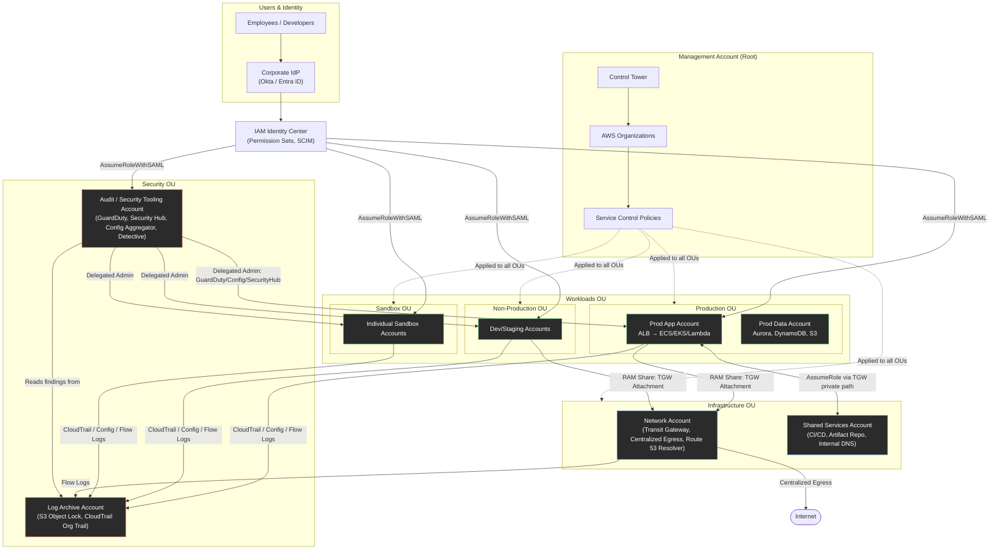

# Chapter 88 — Multi-Account Security

**Part XI – Security Reference Architectures**

---

## 1. Executive Summary

### The Business Problem

Enterprises that begin their cloud journey with a single AWS account almost always regret it within 18–24 months. The pattern is predictable:

- Development, staging, and production workloads share the same account, IAM policies, and service quotas.
- A misconfigured security group in a test environment can expose a production database subnet.
- Billing is a single undifferentiated number — nobody can answer "what does the fraud-detection team cost us?"
- A single compromised IAM credential can pivot laterally into every workload the company runs.
- Compliance auditors cannot produce a clean scope boundary for PCI-DSS, HIPAA, or SOC 2, because "production" and "everything else" are not architecturally separated.
- Service quota exhaustion in one team's workload (e.g., Lambda concurrency, EC2 limits) throttles unrelated teams.

Multi-Account Security is the architectural response to this problem. It is not a single AWS service — it is a **governance and isolation pattern** built from AWS Organizations, Control Tower, Service Control Policies (SCPs), centralized logging, IAM Identity Center, and a set of dedicated security and shared-services accounts.

### Architecture Objective

The objective of a Multi-Account Security architecture is to establish **hard isolation boundaries** between workloads, environments, and business units, while still enabling:

- Centralized security visibility across every account.
- Centralized, tamper-resistant audit logging.
- Delegated administration so security teams do not become a bottleneck for developers.
- Consistent guardrails (SCPs, AWS Config rules) applied automatically to every new account.
- A single, federated identity plane so employees never create long-lived IAM users.

The account itself becomes the primary security boundary in AWS — stronger than a VPC boundary, stronger than an IAM policy boundary, because it is enforced at the control-plane level by AWS's own account isolation model. Two resources in two different AWS accounts cannot interact unless an explicit trust relationship (cross-account IAM role, resource policy, RAM share, or VPC peering/Transit Gateway attachment) is established. This "deny by default at the account boundary" property is why regulated enterprises standardize on it.

### Why Organizations Adopt This Architecture

- **Blast radius containment.** A compromised credential, a leaked secret, or a misconfigured resource in one account cannot silently reach resources in another account.
- **Regulatory scoping.** PCI-DSS, HIPAA, FedRAMP, and SOC 2 audits become dramatically simpler when the cardholder-data environment, or the environment holding protected health information, lives in its own account with its own SCPs and its own audit trail.
- **Billing clarity.** Cost and usage reports become attributable per account, per business unit, per environment, which is foundational for FinOps chargeback/showback models (see Chapter 97).
- **Independent blast-radius-scoped service quotas.** EC2, Lambda, and API Gateway quotas are per-account (and per-region). Isolating a noisy or high-scale workload into its own account prevents it from starving other teams.
- **Autonomous team velocity.** Application teams can be granted account-level administrator access within their own account, with guardrails enforced centrally, instead of waiting on a central platform team to approve every IAM change.
- **Mergers, acquisitions, and divestitures.** Business units can be onboarded or spun off cleanly when they already live in dedicated accounts under a single AWS Organization.

### Major Business Benefits

| Benefit | Description |
|---|---|
| Reduced breach impact | Lateral movement is blocked at the account boundary by default |
| Regulatory audit simplification | Compliance scope maps directly to account boundaries |
| Cost transparency | Every dollar is attributable to an account, tag, and cost center |
| Faster developer velocity | Teams get autonomy inside guardrails instead of waiting on tickets |
| Centralized detective controls | GuardDuty, Security Hub, and CloudTrail aggregate to one place |
| Simplified incident response | Responders can isolate/quarantine a single account without affecting others |
| Consistent baseline | Control Tower / Account Factory enforces the same guardrails on every new account |

### Typical Enterprise Scenarios

- A bank separating its core-banking production environment, its card-payments (PCI) environment, its data science sandbox, and its corporate IT systems into four (or more) distinct OUs (Organizational Units), each with different SCPs.
- A SaaS company giving every engineering team its own sandbox account (for experimentation) plus shared, centrally-managed production and staging accounts.
- A healthcare provider isolating any account that touches PHI into a dedicated OU governed by HIPAA-specific SCPs, with its own KMS keys and its own CloudTrail retention policy.
- A large enterprise undergoing an acquisition, onboarding the acquired company's AWS accounts into the parent AWS Organization via invitation, then re-parenting them into the correct OU without re-architecting workloads.
- A retailer isolating its e-commerce production account from its internal analytics account, so a data-analyst's overly broad S3 read permission can never touch the payment-processing account.

This chapter treats Multi-Account Security as the **foundational control plane** upon which every other architecture in this book is deployed. Chapters 89 (IAM Identity Center), 90 (Secrets Management), 91 (Encryption), 92 (SOC Operations), 93 (Threat Detection), and 99 (Reference Landing Zone) all assume the multi-account structure described here already exists.

---

## 2. Business Requirements

### Business Drivers

- Regulatory compliance (PCI-DSS, HIPAA, SOC 2, ISO 27001, FedRAMP).
- Board-level and cyber-insurance requirements for demonstrable blast-radius containment.
- M&A activity requiring clean account-level separation of newly acquired business units.
- Internal audit findings from a prior single-account incident.
- FinOps mandate for per-team cost attribution.

### Functional Requirements

- Every new AWS account must be provisioned with a consistent security baseline within minutes, not weeks.
- Every human identity must authenticate through a single federated identity provider — no IAM users with long-lived access keys for humans.
- Every account's CloudTrail, Config, and GuardDuty findings must flow to a centralized, immutable logging account.
- Cross-account access for break-glass emergency scenarios must exist but be tightly audited.
- Application teams must be able to self-service new accounts through an approved workflow (Account Factory / Service Catalog), without filing a ticket to a central team for routine provisioning.

### Non-Functional Requirements

- **Scalability.** The architecture must support growth from a handful of accounts to 500+ accounts without a redesign.
- **Availability.** Centralized logging and identity services must not become a single point of failure that blocks application deployments if temporarily unavailable.
- **Latency.** Cross-account role assumption (STS AssumeRole) must add negligible latency (typically under 200 ms) to automated workflows.
- **Auditability.** Every privileged action, in every account, must be attributable to a specific human or automated principal, with immutable evidence retained for a minimum of one year (commonly 3–7 years for regulated industries).

### Compliance Requirements

- PCI-DSS: requires network segmentation and access logging for the cardholder-data environment — naturally mapped to a dedicated OU/account.
- HIPAA: requires audit controls and access management for ePHI — mapped to a dedicated account with a signed AWS Business Associate Addendum (BAA) covering only in-scope services.
- SOC 2: requires demonstrable least-privilege access and change-management evidence — satisfied by SCP guardrails plus CloudTrail plus Config conformance packs.
- Data residency regulations (GDPR, data localization laws) may require entire OUs restricted to specific AWS Regions via SCP `aws:RequestedRegion` conditions.

### Security Expectations

- No standing human access to production data; access is just-in-time, time-boxed, and logged.
- Root user credentials for every account are secured (hardware MFA, rarely used, monitored by GuardDuty and EventBridge alerting on any root activity).
- All SCPs default-deny high-risk actions (disabling CloudTrail, deleting Config recorders, leaving the Organization) at every account except the management account.

### Recovery Objectives

| Metric | Target (typical enterprise) |
|---|---|
| RPO for centralized log archive | Near zero (S3 versioning + cross-region replication) |
| RTO for identity plane (IAM Identity Center) | Under 1 hour, given AWS-managed service SLA |
| RTO for a single compromised/quarantined account | Under 4 hours to isolate, under 24–72 hours to fully remediate and restore |
| RPO for account configuration (Control Tower baselines) | Zero — baselines are re-applied automatically via drift detection |

### SLAs

- Centralized security tooling (Security Hub, GuardDuty) alerting SLA: critical findings triaged within 15 minutes during business hours, 1 hour off-hours, per most enterprise SOC runbooks.
- Account provisioning SLA via Account Factory: typically 20–40 minutes fully automated, versus days/weeks for manual account setup.

### Expected Workload and Growth

- Initial landing zone: 5–10 foundational accounts (Management, Log Archive, Audit/Security Tooling, Shared Services, Network, and one production/non-production pair per major workload).
- Growth pattern: most enterprises land between 50 and 300 accounts within three years as teams, environments, and business units are onboarded — Control Tower and Account Factory are specifically designed for this growth curve.

---

## 3. Architecture Overview

### Overall Design

A Multi-Account Security architecture is organized as a **hierarchy** rooted in a single AWS Organization:

- **Management Account (root):** Owns the AWS Organization, consolidated billing, and Service Control Policies. It runs no workloads. Access to it is the most tightly restricted of any account in the estate.
- **Security OU:**
  - **Log Archive Account:** The single destination for all CloudTrail, Config, VPC Flow Logs, and application logs across every account. Write-once from the perspective of workload accounts; nothing can delete from it except a small, break-glass-audited security role.
  - **Audit / Security Tooling Account:** Runs GuardDuty (as the delegated administrator), Security Hub aggregation, Detective, and Macie. Has read-only cross-account access into every other account for investigation.
- **Infrastructure OU:**
  - **Network Account:** Owns the Transit Gateway, centralized egress (NAT/firewall), and Route 53 Resolver rules shared with every spoke account via AWS RAM.
  - **Shared Services Account:** Runs internal tooling — CI/CD orchestration, artifact repositories, internal DNS.
- **Workloads OU (nested per business unit or environment):**
  - **Production OU:** Contains one account per production workload/team. SCPs here are the most restrictive.
  - **Non-Production OU:** Contains dev/staging/QA accounts, with looser (but still guard-railed) SCPs.
  - **Sandbox OU:** Individual developer sandbox accounts with automatic budget-based guardrails and nightly resource cleanup.

### Architecture Philosophy

- **Accounts are the unit of isolation, not VPCs or IAM policies.** A VPC boundary can be crossed by a misconfigured peering connection; an account boundary cannot be crossed without an explicit trust policy.
- **Guardrails over gatekeeping.** SCPs prevent entire categories of dangerous actions (e.g., disabling GuardDuty) so that within those rails, teams can be granted broad, fast-moving permissions.
- **Centralize what must be centralized; delegate everything else.** Logging, identity, and network egress are centralized because fragmenting them destroys visibility and increases cost. Day-to-day IAM and resource management is delegated to workload account owners.
- **Everything is codified.** Account creation, SCP attachment, and baseline security controls are deployed through Infrastructure-as-Code (Terraform / Control Tower Account Factory for Terraform — AFT) — never through manual console clicks.

### Core Components

| Component | Role |
|---|---|
| AWS Organizations | Hierarchical grouping of accounts; enforcement point for SCPs |
| AWS Control Tower | Automated landing zone setup, guardrails, Account Factory |
| Service Control Policies | Preventive, org-wide permission boundaries |
| IAM Identity Center (successor to AWS SSO) | Centralized human identity federation |
| AWS RAM (Resource Access Manager) | Cross-account sharing of Transit Gateway, subnets, etc. |
| CloudTrail Organization Trail | Immutable, centralized API audit log |
| AWS Config + Conformance Packs | Continuous compliance evaluation |
| GuardDuty (delegated admin) | Threat detection aggregated across all accounts |
| Security Hub (delegated admin) | Centralized findings aggregation and standards scoring |

### How Components Interact — High-Level Workflow

1. A new workload team requests an account through the internal Service Catalog / Account Factory portal.
2. Control Tower provisions the account inside the correct OU, applying baseline SCPs, enrolling it in the Organization CloudTrail, and configuring GuardDuty/Config delegation automatically.
3. IAM Identity Center permission sets are assigned to the team, mapped to their identity-provider group (e.g., Okta/Entra ID group `team-payments-admins`).
4. The team deploys workloads using Terraform, authenticating via IAM Identity Center federated roles — never static access keys.
5. All API activity is streamed to the Log Archive account in near real time.
6. GuardDuty and Security Hub continuously evaluate the account; findings surface in the Audit account's central dashboard.
7. SCPs prevent the team from disabling any of the above, regardless of how much IAM privilege they hold inside their own account.

### Request / Response / Data Lifecycle (Control-Plane View)

- **Request lifecycle:** A developer's `terraform apply` triggers an STS `AssumeRoleWithSAML`/`AssumeRoleWithWebIdentity` call against IAM Identity Center, receives short-lived credentials (typically 1 hour), and issues AWS API calls scoped to the permission set granted.
- **Response lifecycle:** Every API call response is logged by CloudTrail in the local account and simultaneously delivered to the Organization Trail's S3 bucket in the Log Archive account.
- **Data lifecycle:** Log data lands in S3 (Log Archive account) → is indexed for query via Athena or OpenSearch → ages into S3 Glacier Deep Archive per a lifecycle policy aligned to the compliance retention requirement (often 7 years for financial services).

---

## 4. AWS Services Used

### AWS Organizations

- **Purpose:** The root container that groups accounts into Organizational Units and is the enforcement point for Service Control Policies and consolidated billing.
- **Why selected:** It is the only AWS-native mechanism to enforce org-wide preventive controls (SCPs) and centralize billing; there is no viable substitute within AWS.
- **Alternatives:** None within AWS. Some enterprises historically used separate, unlinked accounts with manual billing consolidation — this does not scale and offers no SCP enforcement.
- **Limitations:** 
  - SCPs are *not* a substitute for IAM — they only set the maximum available permissions; an explicit IAM `Allow` is still required.
  - A maximum of five levels of OU nesting is supported.
  - SCP document size limits (up to 5,120 characters per policy, with a per-entity attached-policy limit) require careful policy design at scale.
- **Pricing:** AWS Organizations itself is free. Costs arise from the services enabled within member accounts (Config, GuardDuty, CloudTrail data events, etc.).
- **Best practices:** Keep the management account workload-free; enable "delegated administrator" for GuardDuty/Security Hub/Config to a dedicated Audit account rather than operating from the management account.

### AWS Control Tower

- **Purpose:** Automates landing zone setup — creates the multi-account baseline (Log Archive, Audit accounts), applies mandatory and strongly recommended guardrails, and provides Account Factory for self-service provisioning.
- **Why selected:** Manually replicating what Control Tower automates (baseline OUs, CloudTrail org trail, Config aggregator, SCP guardrails, Account Factory) takes months of engineering effort and is error-prone.
- **Alternatives:** A fully custom Terraform-built landing zone (see Chapter 99) gives more flexibility but more maintenance burden; Control Tower with **Account Factory for Terraform (AFT)** is the common middle ground used by most enterprises in 2025–2026.
- **Limitations:** Control Tower is opinionated — some guardrails cannot be removed without leaving governed status; it currently supports a defined set of home regions and has a maximum accounts-per-organization practical ceiling in the low thousands.
- **Pricing:** Control Tower itself has no additional charge; you pay for the underlying services it provisions (Config, CloudTrail, S3, GuardDuty).
- **Best practices:** Use AFT to codify account customization instead of manual per-account console changes, so every account remains reproducible and driftable-detectable.

### Service Control Policies (SCPs) / Resource Control Policies (RCPs)

- **Purpose:** Preventive guardrails that define the maximum permissions available in an account, regardless of what IAM policies grant within it.
- **Why selected:** IAM policies alone cannot prevent an account administrator from, say, disabling CloudTrail in their own account. SCPs, applied at the OU level, are outside the workload account administrator's control.
- **Alternatives:** IAM permission boundaries can achieve similar per-principal restriction but must be applied to every principal individually and can be bypassed by an account admin creating a new principal without the boundary. RCPs (Resource Control Policies, GA in 2024) complement SCPs by restricting resource-based policies (e.g., preventing an S3 bucket policy from granting external-account access).
- **Limitations:** SCPs do not apply to the management account; a full-access SCP misconfiguration can lock an entire OU out of AWS.
- **Best practices:** Always test new SCPs in a sandbox OU before attaching to Production; use `Deny` with narrowly scoped conditions rather than broad `Deny *`.

### IAM Identity Center

- **Purpose:** Centralized workforce identity — federates with an external IdP (Okta, Entra ID, Google Workspace) via SAML/SCIM and issues short-lived, permission-set-scoped credentials into any account in the Organization.
- **Why selected:** Eliminates IAM users with static access keys for humans; a single place to provision/deprovision access for the entire estate; native integration with Control Tower/Organizations.
- **Alternatives:** Custom SAML federation directly to each account's IAM Identity Provider — this predates Identity Center and is now considered legacy; third-party PAM tools layered on top for just-in-time elevation.
- **Limitations:** Permission sets currently max out at a defined number per account (soft limit, raise via Service Quotas); session duration is capped at 12 hours.
- **Pricing:** No additional charge for the service itself.
- **Best practices:** Map permission sets to IdP groups, not individual users; use Attribute-Based Access Control (ABAC) with session tags for fine-grained, scalable permission scoping. Covered in depth in Chapter 89.

### AWS CloudTrail (Organization Trail)

- **Purpose:** Immutable API audit log capturing every control-plane (and optionally data-plane) call across every account in the Organization, delivered centrally.
- **Why selected:** A per-account trail can be disabled by that account's administrator; an Organization Trail, created from the management account, cannot be disabled or deleted by member account administrators.
- **Alternatives:** Per-account trails (weaker; more fragile); third-party SIEM ingestion directly from each account (still needs CloudTrail as the source).
- **Limitations:** Data-event logging (S3 object-level, Lambda invocations) has meaningful per-event cost at scale and must be scoped deliberately.
- **Best practices:** Deliver to a Log Archive account S3 bucket with Object Lock (WORM) enabled, cross-region replication for durability, and lifecycle transition to Glacier Deep Archive for long-term retention.

### AWS Config (Organization Aggregator + Conformance Packs)

- **Purpose:** Continuously records resource configuration and evaluates it against rules (e.g., "S3 buckets must not be public") across the entire Organization.
- **Why selected:** Provides continuous compliance evidence, not point-in-time; Conformance Packs bundle dozens of rules mapped directly to a compliance framework (PCI-DSS, NIST 800-53, HIPAA).
- **Alternatives:** Third-party CSPM tools (Wiz, Prisma Cloud) — often layered on top for cross-cloud coverage, but AWS Config remains the native source of ground-truth configuration history.
- **Limitations:** Per-configuration-item and per-rule-evaluation pricing can grow substantially in large, high-churn accounts.
- **Best practices:** Delegate administration to the Audit account; use the multi-account, multi-region aggregator view rather than per-account dashboards.

### Amazon GuardDuty

- **Purpose:** Managed threat detection using VPC Flow Logs, DNS logs, CloudTrail management/data events, and EKS audit logs, enriched with threat intelligence.
- **Why selected:** No infrastructure to run, continuously updated threat intel, native Organization-wide delegated administration so every new account is auto-enrolled.
- **Alternatives:** Self-managed IDS/IPS (Suricata, Zeek) on VPC traffic mirrors — far higher operational burden; third-party CNAPP platforms often consume GuardDuty findings rather than replace them.
- **Limitations:** False-positive tuning is required in the first 30–60 days of any new account; extended threat detection for EKS/RDS/Lambda are separate protection plans with separate cost.
- **Pricing:** Charged per GB of logs analyzed and per protection plan enabled — can be a top-3 cost surprise (see Section 34, Cost Surprises) if S3 Protection or Malware Protection is enabled org-wide without volume estimation.
- **Best practices:** Enable via delegated administrator in the Audit account; auto-enable for all new accounts; suppress known-benign findings with suppression rules rather than disabling detectors.

### AWS Security Hub

- **Purpose:** Aggregates findings from GuardDuty, Config, Inspector, Macie, IAM Access Analyzer, and third-party tools into a single, scored view, mapped against standards (CIS AWS Foundations, PCI-DSS, NIST 800-53).
- **Why selected:** Gives a single pane of glass for the security team instead of ten separate consoles; produces a compliance score usable in audit evidence.
- **Alternatives:** A custom EventBridge + OpenSearch pipeline aggregating raw findings — more flexible, considerably more engineering effort.
- **Limitations:** Finding ingestion has per-finding pricing at scale; standards-based scoring updates on a fixed interval, not real time.
- **Best practices:** Enable cross-Region aggregation; route CRITICAL/HIGH findings to EventBridge → SNS/ticketing automatically rather than relying on manual dashboard review.

### AWS Key Management Service (KMS)

- **Purpose:** Managed encryption key service; every account's data at rest (S3, EBS, RDS) should be encrypted with a KMS Customer Managed Key (CMK), not the default AWS-managed key, when access needs to be tightly scoped.
- **Why selected:** Per-account or per-workload CMKs allow key policies to enforce that only specific roles, in specific accounts, can decrypt — an additional layer of isolation on top of IAM and SCPs.
- **Alternatives:** AWS-owned/AWS-managed keys are simpler but offer no cross-account access control granularity and cannot be centrally audited via key policy.
- **Limitations:** Cross-account KMS key usage requires both a key policy grant and an IAM policy grant — a common source of "access denied" troubleshooting (see Section 25).
- **Pricing:** Nominal monthly per-key charge plus per-API-call charge; can accumulate at scale with hundreds of workload-specific keys.
- **Best practices:** One CMK per workload/data-classification tier per account, never a single organization-wide shared key for regulated data; grant cross-account access via key policy `Principal` referencing specific role ARNs, not entire account roots.

### AWS Secrets Manager / Systems Manager Parameter Store

- **Purpose:** Managed storage and automated rotation for credentials, API keys, and configuration.
- **Why selected:** Removes hardcoded secrets from Terraform state and application code; native rotation Lambda integration for RDS/Redshift/DocumentDB credentials.
- **Alternatives:** HashiCorp Vault (self-managed or HCP) — chosen by enterprises needing multi-cloud secret management or dynamic secrets beyond AWS's native rotation integrations. Parameter Store (Standard tier) is a lower-cost alternative for non-secret configuration and less-sensitive secrets.
- **Limitations:** Per-secret and per-API-call pricing in Secrets Manager can be a real cost line at thousands of secrets; Parameter Store Standard tier has a throughput ceiling.
- **Best practices:** Never share a single secret across accounts; use resource policies to allow cross-account read only where explicitly required (e.g., a shared-services CI/CD account reading a deployment credential). Full detail in Chapter 90.

### AWS Systems Manager (Session Manager)

- **Purpose:** Provides shell access to EC2 instances and auditable command execution without SSH keys, bastion hosts, or open inbound ports.
- **Why selected:** Eliminates a historically high-risk network exposure (public SSH/RDP) and logs every session to CloudWatch Logs / S3 for audit.
- **Alternatives:** Traditional bastion hosts — higher operational and patching burden, larger attack surface.
- **Limitations:** Requires the SSM Agent and appropriate IAM role on the instance; doesn't natively cover container exec sessions (use `ecs execute-command` / `eks exec` equivalents).
- **Best practices:** Disable SSH/RDP security group ingress entirely in production accounts via SCP-enforced Config rules.


---

## 5. Complete Architecture Diagram



**Diagram notes:**

- Solid arrows represent explicit trust relationships (IAM role assumption, RAM shares).
- Dotted arrows represent policy enforcement (SCP) rather than data flow.
- The Log Archive account only ever *receives* data — no workload account can read or delete from it except the tightly scoped Audit account investigation role.
- Every arrow crossing an account boundary corresponds to an explicit, auditable trust policy — there are no implicit trust relationships between accounts in this design.

---

## 6. Component-by-Component Explanation

### Management (Root) Account

- **Purpose:** Owns the AWS Organization, consolidated billing, and root-level SCPs.
- **Responsibilities:** Creating/inviting member accounts, attaching SCPs to OUs, owning the Control Tower landing zone configuration.
- **Inputs:** Terraform/AFT account-vending requests; Control Tower Account Factory portal submissions.
- **Outputs:** New member accounts provisioned into the correct OU.
- **Scaling:** Not a compute resource — "scaling" here means supporting growth to hundreds/thousands of member accounts, which Organizations natively supports.
- **High availability:** AWS-managed control plane; no customer-managed HA concerns.
- **Failure handling:** Loss of management-account root credentials is a severe incident — mitigated with hardware MFA, no day-to-day use, and a documented root-credential break-glass procedure stored in a physical safe or enterprise PAM vault.
- **Dependencies:** None (root of the hierarchy).
- **Security:** Root user MFA mandatory; no IAM users created here for daily use; CloudTrail specifically monitors root-account activity with immediate alerting.
- **Monitoring:** EventBridge rule matching `userIdentity.type = "Root"` in CloudTrail events, routed to a PagerDuty/Slack alert regardless of time of day.

### Log Archive Account

- **Purpose:** Sole, centralized, immutable destination for audit and observability logs from every account.
- **Responsibilities:** Receiving CloudTrail, Config, VPC Flow Logs, and (optionally) application logs via cross-account delivery.
- **Inputs:** S3 `PutObject` calls from every member account's CloudTrail/Config/Flow Logs delivery mechanism.
- **Outputs:** Queryable log data (via Athena) for the Audit account and for incident responders.
- **Scaling:** S3 scales natively; no capacity planning required beyond cost/lifecycle management.
- **High availability:** S3 durability (11 nines) plus optional cross-region replication for regional-outage resilience.
- **Failure handling:** If log delivery from a member account fails (e.g., misconfigured bucket policy), Config rules and CloudWatch alarms detect the gap; this account itself has no "failure" mode beyond an AWS regional S3 outage.
- **Dependencies:** Every workload account depends on this account being reachable and correctly permissioned; this account depends on nothing else.
- **Security:** S3 Object Lock (WORM) in Compliance mode for CloudTrail logs; bucket policy explicitly denies `s3:DeleteObject` for all principals except a single break-glass role requiring dual-approval.
- **Monitoring:** CloudWatch alarm on delivery gaps (no new CloudTrail objects from a given account in > 15 minutes triggers investigation).

### Audit / Security Tooling Account

- **Purpose:** Delegated administrator for GuardDuty, Security Hub, Config, IAM Access Analyzer, and Detective; the security team's operating console.
- **Responsibilities:** Aggregating findings, running cross-account investigations, maintaining Config conformance packs.
- **Inputs:** Findings streamed from every account (via delegated administration, not manual per-account configuration).
- **Outputs:** Aggregated dashboards, EventBridge-routed alerts to the SOC (Chapter 92), compliance reports.
- **Scaling:** GuardDuty/Security Hub scale automatically with account count; the human/SOC capacity to triage findings is the real scaling constraint (mitigated with automation and SOAR playbooks — Chapter 93).
- **High availability:** Managed AWS services; no customer HA design required.
- **Failure handling:** If delegated administration breaks for a specific account (e.g., account left the Organization), automated Config rules detect and alert on "unmonitored account" drift.
- **Dependencies:** Depends on every member account correctly enabling the security services (enforced by Control Tower/SCP, not optional).
- **Security:** Cross-account investigation roles are read-only except for a narrowly scoped incident-response role usable only during a declared incident (time-boxed via IAM Identity Center permission-set session duration).
- **Monitoring:** Security Hub's own compliance score, tracked over time as a KPI.

### Network Account

- **Purpose:** Owns the Transit Gateway hub, centralized egress (NAT Gateways or a network-virtual-appliance firewall fleet), and shared Route 53 Resolver rules.
- **Responsibilities:** Accepting TGW attachment requests from workload accounts (via AWS RAM), enforcing centralized egress filtering (e.g., AWS Network Firewall for outbound domain allow-listing).
- **Inputs:** RAM share acceptances from workload accounts; routing table updates.
- **Outputs:** Connectivity between spoke VPCs and to the internet.
- **Scaling:** Transit Gateway supports thousands of VPC attachments; NAT Gateway bandwidth (up to 100 Gbps per gateway) is provisioned per AZ and monitored for saturation.
- **High availability:** NAT Gateways deployed per-AZ (never a single NAT for multiple AZs); TGW is inherently multi-AZ.
- **Failure handling:** AZ failure — traffic reroutes to the NAT Gateway/TGW attachment in a healthy AZ automatically, provided route tables are correctly configured per-AZ.
- **Dependencies:** Workload accounts depend on this account for egress and inter-VPC routing.
- **Security:** Centralized egress allows a single point of outbound traffic inspection/allow-listing — critical for data-exfiltration prevention (see Section 11).
- **Monitoring:** VPC Flow Logs, TGW Flow Logs, NAT Gateway CloudWatch metrics (`ErrorPortAllocation`, `BytesOutToDestination`) alarmed for saturation.

### Shared Services Account

- **Purpose:** Hosts tooling used across every workload account — CI/CD orchestrators, internal artifact repositories, internal DNS zones.
- **Responsibilities:** Providing deployment pipelines that assume cross-account roles into workload accounts to deploy infrastructure/application changes.
- **Inputs:** Git pushes / merge events triggering pipeline runs.
- **Outputs:** Deployed infrastructure/application changes in target accounts.
- **Scaling:** Scales with CI/CD runner concurrency; typically autoscaled (e.g., self-hosted GitHub Actions runners on Fargate).
- **High availability:** Deploy pipelines are not typically in the request-serving critical path, so brief unavailability affects deployment velocity, not production traffic.
- **Failure handling:** Pipeline failures roll back automatically (see Section 8, Deployment Flow).
- **Dependencies:** Depends on Network account for connectivity to private resources in workload accounts; depends on IAM Identity Center or dedicated CI/CD IAM roles for cross-account deployment permissions.
- **Security:** Deployment roles in workload accounts trust only this account's specific CI/CD role ARN — never a wildcard trust policy.
- **Monitoring:** Pipeline success/failure rate, deployment frequency, and lead-time-for-changes are tracked as DORA metrics.

### Production Workload Accounts

- **Purpose:** Run customer-facing production workloads in full isolation from every other environment.
- **Responsibilities:** Serving traffic, storing production data, maintaining its own high-availability posture (Section 12).
- **Inputs:** Deployment artifacts from Shared Services CI/CD; end-user traffic via the application's own edge (CloudFront/ALB).
- **Outputs:** Application responses; logs and metrics to Log Archive/Audit accounts.
- **Scaling:** Independent of every other account's scaling — a traffic spike in this account cannot exhaust another team's Lambda concurrency or EC2 limits.
- **High availability:** Multi-AZ by design (Section 12); the account boundary does not by itself provide HA — that is achieved by the workload architecture within the account (see other chapters, e.g., Chapter 6, Chapter 98).
- **Failure handling:** Application-level failure handling as described in the relevant workload-pattern chapters; account-level "failure" (e.g., service quota exhaustion) is mitigated by per-account quota monitoring and proactive quota increase requests.
- **Dependencies:** Network account (connectivity), Shared Services (deployment), Log Archive/Audit (observability), IAM Identity Center (human access).
- **Security:** The most restrictive SCPs in the estate apply here — e.g., denying any IAM principal from creating internet-facing resources outside pre-approved subnets, denying region use outside approved regions, denying disabling of GuardDuty/Config.
- **Monitoring:** Full observability stack per Chapter 96 (Observability Platform), plus account-specific budgets and Cost Anomaly Detection.

### Non-Production and Sandbox Accounts

- **Purpose:** Give engineers a safe space to build and experiment without risk to production data or customer traffic.
- **Responsibilities:** Mirroring production configuration closely enough to be a valid pre-production testbed (staging), or providing unrestricted experimentation space (sandbox).
- **Scaling / HA:** Typically single-AZ or reduced-redundancy to control cost; explicitly *not* held to the same HA bar as production.
- **Failure handling:** Failures here are expected and low-stakes by design; automated nightly teardown of ephemeral sandbox resources controls cost.
- **Dependencies:** Same shared dependencies as production accounts, but with looser SCPs (e.g., broader region allowance for testing, but still no ability to disable core security services).
- **Security:** Budget-based automatic guardrails (e.g., an SCP or Lambda-driven automation that quarantines a sandbox account exceeding its daily budget by disabling further resource creation).
- **Monitoring:** Cost and budget alarms are the primary monitoring signal in sandbox accounts, more so than security findings (though GuardDuty/Config still run everywhere).

---

## 7. End-to-End Request Flow

The following describes a developer deploying a change and an end user's request being served, illustrating how the multi-account boundaries participate in both flows.

**A. Developer deployment flow**

1. Developer authenticates to the corporate IdP (Okta/Entra ID) with MFA.
2. IdP issues a SAML assertion; developer selects the target AWS account/role combination inside the IAM Identity Center portal.
3. IAM Identity Center calls STS `AssumeRoleWithSAML`, returning short-lived credentials scoped to the assigned permission set (e.g., `DeveloperAccess` in the Staging account).
4. Developer pushes code; CI/CD pipeline in the Shared Services account is triggered.
5. Pipeline assumes a dedicated `DeploymentRole` in the target workload account (trust policy scoped to the Shared Services account's specific pipeline role ARN).
6. Terraform plan/apply executes against the target account, provisioning/updating infrastructure.
7. CloudTrail in the target account logs every API call made during the deployment.
8. CloudTrail Organization Trail simultaneously delivers a copy of those events to the Log Archive account.
9. Config evaluates the new/changed resources against Conformance Pack rules within minutes.
10. Any non-compliant resource (e.g., an unencrypted EBS volume) generates a Security Hub finding, routed via EventBridge to the SOC's alerting channel.
11. If the deployment fails a validation gate (policy-as-code check, e.g., OPA/Conftest against the Terraform plan), the pipeline halts before `apply` — see Section 8.

**B. End-user request flow (production workload account)**

1. Client resolves DNS via Route 53 (hosted in the workload account or a centralized DNS account, depending on design).
2. Request reaches CloudFront (edge) or directly the Application Load Balancer if no CDN tier is used.
3. AWS WAF, attached to CloudFront/ALB, evaluates the request against managed and custom rule groups.
4. ALB routes to the target group (ECS/EKS/EC2/Lambda) within the production account's private subnets.
5. Application logic executes; queries the database tier (RDS/Aurora/DynamoDB) within the same account's private data subnets.
6. Application writes structured logs to CloudWatch Logs; VPC Flow Logs capture network-level metadata.
7. Both are delivered to the Log Archive account via a subscription filter / Kinesis Data Firehose cross-account delivery stream.
8. Response returns to the client through the same path (ALB → CloudFront → client).
9. GuardDuty analyzes the VPC Flow Logs and DNS logs asynchronously for anomalous behavior (e.g., a compromised instance beaconing to a known command-and-control domain), independent of the request path — detection is out-of-band, not in-line, so latency is unaffected.
10. Error handling: 5xx responses trigger ALB target-group health-check failures, feeding Auto Scaling replacement of unhealthy targets, and CloudWatch Alarms notify on-call via the account-local SNS topic, which also forwards to the centralized incident-management tool.

---

## 8. Deployment Flow

### Infrastructure Provisioning Philosophy

- **Every account and every guardrail is provisioned through code** — Control Tower Account Factory for Terraform (AFT), or a fully custom Terraform landing zone module, never manual console account creation.
- Terraform state for org-level resources (SCPs, OU structure) lives in a dedicated state bucket in the Management or a dedicated "Terraform state" account, with state locking via DynamoDB.
- Per-workload-account Terraform state is isolated per account (separate state files/backends), reinforcing the same isolation principle at the IaC layer.

### Terraform Workflow

1. Engineer opens a pull request modifying a Terraform module (e.g., adding a new S3 bucket in a workload account).
2. CI runs `terraform fmt -check`, `terraform validate`, `tflint`, and a policy-as-code scan (`tfsec`/`checkov`/OPA) against the plan.
3. `terraform plan` output is posted to the pull request for human review.
4. On merge to the main branch, a pipeline job assumes the target account's deployment role and runs `terraform apply`.
5. State is locked during apply (DynamoDB lock table) to prevent concurrent modification.

### CI/CD Deployment Pattern

- Shared Services account hosts the orchestrator (e.g., GitHub Actions self-hosted runners, GitLab CI runners, or AWS CodePipeline).
- Each target account has a dedicated `DeploymentRole` with a trust policy scoped to the specific pipeline IAM role in Shared Services — never a broad `Principal: "*"` or account-root trust.
- Pipeline stages are environment-gated: Dev auto-deploys on merge; Staging requires a passing integration-test suite; Production requires a manual approval gate plus a change-management ticket reference.

### Blue-Green Deployment

- For production application deployments (independent of the account-level infrastructure changes described above), a blue-green pattern is used at the compute layer: a new target group/task set is stood up alongside the existing one, traffic is shifted via weighted ALB target groups or CodeDeploy traffic-shifting, and the old version is terminated only after a bake period with no elevated error rate.
- This is described in depth in Chapter 13 (Blue-Green Infrastructure); Multi-Account Security's role here is ensuring the deployment pipeline executing this shift has narrowly scoped, auditable cross-account permissions.

### Rollback

- Terraform: `terraform apply` of the previous known-good state (stored in version control) via the same pipeline and the same cross-account role — rollback is not a manually privileged, out-of-band action.
- Application: automated rollback triggered by CloudWatch Alarm breaching an error-rate/latency SLO threshold during the bake window (CodeDeploy `AutoRollbackConfiguration`).

### Secrets in the Deployment Pipeline

- The CI/CD pipeline never stores long-lived AWS credentials. It authenticates via OIDC federation (e.g., GitHub Actions OIDC provider trusted by the target account's `DeploymentRole`) or assumes a role using its own EC2/Fargate task IAM role — eliminating static secrets entirely.
- Application secrets (database passwords, third-party API keys) are injected at runtime from Secrets Manager, never embedded in Terraform variables or CI/CD pipeline environment variables in plaintext.

### Configuration and Validation

- Environment-specific configuration lives in per-account Parameter Store hierarchies (e.g., `/prod/app/db-host`), never hardcoded.
- Post-deployment validation: automated smoke tests hit a health-check endpoint before the pipeline marks the deployment successful; failing validation triggers automatic rollback.

---

## 9. Network Topology

### VPC Design Pattern

- Each workload account owns one (or a small number of) VPCs, sized to that workload's needs — not a single shared VPC across teams.
- Standard pattern: one VPC per account per environment, with public, private-application, and private-data subnet tiers replicated across a minimum of two, typically three, Availability Zones.

### CIDR Allocation

- A centralized IP Address Manager (Amazon VPC IPAM), run from the Network account, allocates non-overlapping CIDR blocks to every workload account's VPC — critical because overlapping CIDRs make Transit Gateway routing between accounts impossible.
- Typical allocation: a `/16` supernet per Region reserved for the company, subdivided into `/20` or `/21` blocks per workload account/VPC, leaving room for growth.

### Subnet Tiers

| Tier | Purpose | Internet Route |
|---|---|---|
| Public | ALB, NAT Gateway, bastion (if used) | Internet Gateway |
| Private-Application | ECS/EKS/EC2/Lambda ENIs | NAT Gateway (via route table) |
| Private-Data | RDS, Aurora, ElastiCache, DynamoDB VPC endpoints | No internet route; VPC endpoints only |

### NAT Gateway and Internet Gateway

- Internet Gateway attached only to VPCs that need direct inbound/outbound internet reachability (typically only the Network account's egress VPC, or workload VPCs with public ALBs).
- NAT Gateway deployed per-AZ within the Network account's centralized egress VPC (centralized NAT pattern) or per-workload-account (distributed NAT pattern) — the centralized pattern is preferred at scale because it enables a single point of egress traffic inspection and materially reduces total NAT Gateway cost (see Section 34, Cost Surprises).

### Transit Gateway

- Hub-and-spoke connectivity model: every workload VPC attaches to the central Transit Gateway in the Network account via an AWS RAM-shared TGW.
- TGW route tables segment traffic — e.g., a "production" TGW route table that only allows routes between production workload VPCs and the centralized egress VPC, explicitly excluding routes to non-production VPCs, enforcing environment isolation even at the network layer, not just the account/IAM layer.

### Route Tables

- Each subnet tier has its own route table; private-data subnets have no default route to 0.0.0.0/0 at all — enforced by design and validated by an AWS Config rule that flags any route table associated with a data subnet containing an internet-bound default route.

### Network ACLs and Security Groups

- Security Groups are the primary, stateful control (allow-only, deny-implicit) — used extensively for east-west segmentation between application and data tiers.
- Network ACLs are used sparingly as a coarse, stateless secondary control (e.g., an explicit deny of known-bad CIDR ranges), since security groups alone satisfy most requirements and NACL rule-ordering complexity is a common source of outages if over-used.

### PrivateLink

- Used for two purposes: (1) exposing an internal service in one account to specific other accounts without traversing the Transit Gateway or requiring full VPC peering, and (2) private, non-internet-routed access to AWS service APIs (S3, Secrets Manager, KMS, STS) via VPC Interface/Gateway Endpoints — critical in accounts where SCPs deny internet egress entirely.

### Hybrid Connectivity

- For enterprises with on-premises data centers, AWS Direct Connect (Chapter 24) terminates in the Network account and is shared to workload accounts via the same Transit Gateway used for inter-VPC routing, so on-premises resources reach cloud workloads through the identical centrally-inspected path as inter-account traffic.


---

## 10. Identity and Access

### IAM Roles vs. IAM Users

- In a mature Multi-Account Security architecture, **IAM users are essentially eliminated** for human access. Humans authenticate via IAM Identity Center, which issues temporary role credentials.
- IAM users may still exist for a narrow set of service accounts that cannot use IAM roles (legacy on-premises applications) — these are exceptions requiring documented justification and mandatory access-key rotation automation.

### IAM Policies

- **Identity-based policies** attached to roles define what that role can do.
- **Resource-based policies** (S3 bucket policies, KMS key policies, SQS queue policies) define who — including principals from *other* accounts — can access that specific resource. This is the primary mechanism for legitimate, deliberate cross-account access.
- The **effective permission** for any API call is the intersection of: SCP (ceiling) ∩ Resource-based policy (if applicable) ∩ Identity-based policy (grant) ∩ Permission boundary (if applied) ∩ absence of an explicit `Deny` anywhere in the evaluation.

### STS (Security Token Service) and Cross-Account Access

- Cross-account access is always achieved via `sts:AssumeRole`: Account A's role has a trust policy naming Account B's specific role ARN as a trusted principal; Account B's role has an IAM policy granting `sts:AssumeRole` on Account A's role ARN.
- External ID is used when a third party (e.g., a SaaS monitoring vendor) needs cross-account access, to prevent the "confused deputy" problem.
- Session duration is scoped as short as operationally practical — 1 hour for automated pipelines, up to 12 hours (the STS maximum) only for specific human workflows requiring longer sessions.

### Least Privilege

- Start every new role from `AWSDenyAll`/no permissions and add specific actions as justified — never start from `AdministratorAccess` and narrow later (in practice, this rarely happens once broad access is granted).
- IAM Access Analyzer generates least-privilege policy suggestions based on actual CloudTrail usage over a lookback period — used routinely (monthly) to trim over-permissioned roles.

### Service Roles

- Every compute resource (EC2 instance profile, ECS task role, Lambda execution role, EKS IAM Role for Service Accounts / IRSA) is granted its own dedicated role, scoped to only the AWS API calls that specific service needs — never a shared "application role" reused across multiple services.

### Permission Boundaries

- Applied to roles that workload teams themselves create (e.g., in a self-service sandbox account), to cap what those teams can grant themselves even with `iam:CreateRole`/`iam:PutRolePolicy` permissions — preventing privilege escalation via self-authored IAM policies.

### Cross-Account Access Patterns Summary

| Pattern | Use Case | Mechanism |
|---|---|---|
| Break-glass incident response | Security team investigates a compromised account | Time-boxed IAM Identity Center permission set, requires ticket reference |
| CI/CD deployment | Shared Services pipeline deploys to workload accounts | Dedicated `DeploymentRole` trusted to the CI/CD role ARN only |
| Centralized logging | Every account writes to Log Archive | S3 bucket policy + KMS key policy granting `PutObject`/`Encrypt` to the Organization |
| Delegated security administration | Audit account manages GuardDuty/Config org-wide | AWS Organizations delegated administrator feature (not a manual role) |
| Shared network resources | Workload VPCs attach to central TGW | AWS RAM resource share |
| Third-party SaaS integration | Monitoring/CSPM vendor reads findings | Cross-account role with mandatory External ID |

---

## 11. Security Architecture

### Encryption

- **At rest:** Every S3 bucket, EBS volume, RDS/Aurora instance, and DynamoDB table encrypted with a customer-managed KMS key scoped per workload/classification tier; SCPs enforce this via a Config rule + auto-remediation (or a preventive SCP denying `s3:CreateBucket` without an encryption configuration where supported).
- **In transit:** TLS 1.2+ enforced on every ALB listener and API Gateway stage; internal service-to-service traffic within a service mesh (Chapter 37) uses mTLS.

### KMS Key Strategy

- One CMK per workload per data-classification tier per account — never a single Organization-wide key for regulated data, because a single shared key's key policy becomes an unmanageable sprawl of cross-account grants and a single point of blast-radius failure.
- Key policies explicitly enumerate the specific role ARNs (not entire accounts) permitted to `Decrypt`/`GenerateDataKey`.

### AWS WAF and Shield

- WAF attached to CloudFront and/or ALB in every internet-facing workload account, using AWS Managed Rule Groups (Core Rule Set, SQLi, Known Bad Inputs) plus custom rules for application-specific abuse patterns (rate-based rules on login endpoints).
- Shield Standard is automatic and free for all CloudFront/Route 53/ALB resources; Shield Advanced is enabled selectively on accounts serving business-critical, internet-facing traffic where DDoS financial protection and 24/7 DRT (DDoS Response Team) access is warranted.

### Secrets Manager and Certificate Manager

- All application secrets in Secrets Manager with automatic rotation configured for database credentials.
- AWS Certificate Manager issues and auto-renews TLS certificates for every public endpoint — eliminating manual certificate expiry incidents, a historically common cause of production outages.

### GuardDuty, Inspector, Security Hub

- GuardDuty: continuous threat detection (Section 4) across every account via delegated administration.
- Inspector: continuous vulnerability scanning of EC2 (via SSM Agent), ECR container images, and Lambda functions — findings flow into Security Hub alongside GuardDuty findings.
- Security Hub: the aggregation and standards-scoring layer described in Section 4.

### CloudTrail and Config

- Already described in Section 4 — the audit and compliance backbone of the entire architecture.

### Zero Trust Alignment

- Multi-Account Security is a foundational building block of Zero Trust (Chapter 87), but is not itself sufficient — Zero Trust additionally requires per-request identity verification (not just perimeter/network trust) at the application layer, device posture checks, and continuous authorization rather than one-time login trust. The account boundary provides the *macro* segmentation; Zero Trust provides the *micro* segmentation on top of it.

### Threat Model

| Threat | Attack Vector | Mitigation |
|---|---|---|
| Compromised developer laptop | Credential theft, phishing | MFA-enforced IAM Identity Center login, short session duration, device posture checks at IdP layer |
| Over-permissioned IAM role | Privilege escalation within an account | Permission boundaries, IAM Access Analyzer, quarterly access reviews |
| Data exfiltration via S3 | Public bucket, overly broad bucket policy | SCP denying public bucket creation, Config rule auto-remediation, Macie for sensitive-data discovery |
| Lateral movement across accounts | Overly broad cross-account trust policy | Trust policies scoped to specific role ARNs with External ID where third parties are involved |
| Root account compromise | Weak root credentials, no MFA | Hardware MFA mandatory, root activity alerting, root credentials never used operationally |
| Supply-chain compromise | Malicious dependency in CI/CD pipeline | SBOM scanning, dependency pinning, signed artifacts, least-privilege pipeline roles |
| Insider threat | Legitimate credentials misused | CloudTrail + Detective behavioral analysis, just-in-time access, segregation of duties via SCPs |
| Disabled logging to hide activity | Attacker with account-admin access disables CloudTrail | SCP explicitly denies `cloudtrail:StopLogging`/`cloudtrail:DeleteTrail` for the Organization Trail at every OU except Management |

---

## 12. High Availability

### Availability Zone Failures

- Every workload account's VPC spans a minimum of two, typically three, AZs; Auto Scaling Groups, ECS services, and EKS node groups are configured with balanced AZ distribution.
- An AZ failure is transparent to end users when ALB health checks route traffic away from the failed AZ's targets automatically.

### Instance Failures

- Auto Scaling Group health checks (EC2 status checks plus ALB target-group health checks) replace unhealthy instances automatically without human intervention.

### Regional Failures

- The account-isolation model does not itself provide regional failover — that is a workload-architecture decision (Chapter 98, Multi-Region Active-Active). What multi-account security *does* provide is that a regional failover strategy can be implemented per-workload-account without affecting other accounts' regional posture; not every account needs the same DR tier.

### Database Failures

- RDS/Aurora Multi-AZ deployments provide automatic failover (typically under 60–120 seconds) to a standby in a different AZ, within the same account.
- DynamoDB is inherently multi-AZ within a Region with no customer-managed failover action required.

### Load Balancing and Health Checks

- ALB health checks configured per target group with tuned thresholds (e.g., 2 consecutive failures to mark unhealthy, 5 consecutive successes to mark healthy again) to balance fast failure detection against false-positive flapping.

### Failover at the Account/Organization Layer

- IAM Identity Center and AWS Organizations are themselves managed, highly available AWS global/regional services; there is no customer-managed HA burden here, but a documented dependency: if IAM Identity Center is degraded, break-glass IAM roles with pre-provisioned, MFA-protected credentials in a sealed vault provide emergency access.

---

## 13. Disaster Recovery

### Backup Strategy

- Every production account has automated backups configured via AWS Backup, centrally managed with an Organization-wide Backup policy applied via Control Tower, ensuring no workload team can accidentally disable backups.
- Backup vaults use Vault Lock (WORM) for ransomware-resilient, immutable backups.

### Snapshots

- RDS/Aurora automated snapshots (daily, with point-in-time recovery via transaction logs) plus manual pre-deployment snapshots before risky schema migrations.
- EBS snapshots via AWS Backup lifecycle policies, copied cross-region for accounts in the Production OU.

### Cross-Region Replication

- Log Archive account's S3 bucket replicates cross-region for log durability independent of a single Region's availability.
- Production data stores selectively replicate cross-region based on the workload's specific RPO/RTO requirement (not a blanket policy — replication cost is non-trivial at scale).

### DR Strategy Selection by Account Tier

| Account Tier | DR Strategy | Typical RPO | Typical RTO |
|---|---|---|---|
| Production (Tier 1, revenue-critical) | Warm Standby or Active-Active (Chapter 98) | Seconds to minutes | Minutes |
| Production (Tier 2) | Pilot Light | Minutes to hours | Hours |
| Non-Production | Backup/Restore only | Hours to 24h | Hours to a day |
| Sandbox | None (recreate from IaC) | N/A | N/A |

### RPO / RTO by Account Function

- **Log Archive account:** RPO near-zero (S3 versioning + replication); RTO effectively zero, since S3 itself doesn't "fail over" in the traditional sense.
- **Identity plane (IAM Identity Center):** Depends on AWS service SLA; enterprises maintain a documented break-glass procedure as a compensating control for the rare case of regional identity-service degradation.
- **Workload accounts:** RPO/RTO set per business criticality, per the table above, and tested via scheduled DR game days (Section 34, Evolution Path / Lessons Learned).

---

## 14. Scalability

### Account-Level Scalability

- The architecture explicitly scales by adding accounts, not by growing a single account's resource footprint indefinitely — this is the core scalability property that distinguishes Multi-Account Security from a single-account design.
- AWS Organizations, Control Tower, and IAM Identity Center are all designed and tested by AWS for estates of hundreds to low thousands of accounts.

### Horizontal and Vertical Scaling (Within an Account)

- Standard workload-level scaling patterns apply within each account independently: Auto Scaling Groups (horizontal), instance-type right-sizing (vertical), and serverless auto-scaling (Lambda concurrency, Fargate task count) — covered in depth in the relevant compute-pattern chapters (5–14, 25–34, 35–42).

### Database, Storage, and Queue Scaling

- Each workload account manages its own database/storage/queue scaling independently — an important isolation property: a queue backlog in one team's account cannot exhaust another account's SQS quota, because SQS quotas are enforced per-account.

### Organizational Scaling Considerations

- **SCP count and size limits** become a real design constraint past a few hundred accounts — mitigated by consolidating policies at higher OU levels rather than duplicating near-identical SCPs per account.
- **Account Factory throughput** — Control Tower account provisioning is sequential per request; at very high account-creation velocity (e.g., one sandbox account per new hire), enterprises build an asynchronous request queue in front of Account Factory rather than expecting synchronous provisioning.

---

## 15. Performance Optimization

### Caching

- CloudFront at the edge for static/cacheable content in every internet-facing production account, reducing origin load and improving global latency.
- ElastiCache (Redis/Memcached) within each workload account's private-application subnet for session state and hot-path data — never shared across accounts, preserving isolation.

### Compression and CDN

- Gzip/Brotli compression enabled at CloudFront and at the application/ALB layer; CloudFront's global edge network reduces the latency impact of centralized network egress (Section 9) for end-user-facing traffic, since CDN responses are served from edge locations rather than traversing back to the centralized egress VPC for every request.

### Database Optimization

- Connection pooling via RDS Proxy (for RDS/Aurora) to avoid connection exhaustion from highly concurrent, short-lived Lambda invocations — a common bottleneck in serverless-heavy production accounts.
- Read replicas within the same account for read-heavy workloads, scaled independently from the write primary.

### Concurrency and Async Processing

- SQS/EventBridge-mediated asynchronous processing decouples request-serving latency from downstream processing time; this pattern is unaffected by the multi-account boundary as long as cross-account event delivery (EventBridge cross-account event bus targets, or SQS cross-account queue policies) is deliberately configured.

### Latency Consideration Specific to Multi-Account Design

- Cross-account STS role assumption adds a small, generally negligible latency (well under 200 ms) to automated workflows — not typically a production request-path concern, since production request serving does not itself perform STS calls; it's a deployment/operational-tooling consideration only.
- Centralized network egress (NAT/firewall in the Network account) can add a modest latency/throughput consideration for very high-egress-volume workloads — mitigated by provisioning sufficient NAT Gateway capacity per AZ and monitoring `ErrorPortAllocation` metrics for saturation.


---

## 16. Cost Optimization (FinOps)

> **Note:** Figures below are illustrative planning estimates for a mid-size enterprise landing zone in a single primary Region (e.g., us-east-1), excluding workload-specific compute/database costs, which are covered per-architecture in their respective chapters. Actual costs vary by Region, data volume, and account count.

### Illustrative Monthly Cost by Deployment Size

| Deployment Size | Account Count | Est. Monthly Governance/Security Cost* | Primary Drivers |
|---|---|---|---|
| Small | 5–15 | $800 – $2,500 | CloudTrail data events, GuardDuty, Config rule evaluations |
| Medium | 15–75 | $3,000 – $12,000 | Config + GuardDuty scale linearly with accounts; NAT Gateway data processing |
| Enterprise | 75–500+ | $15,000 – $80,000+ | GuardDuty Malware/S3 Protection at scale, cross-region log replication, Security Hub findings volume |

*Governance/security cost only — excludes compute, database, and application-tier costs, which typically dwarf these figures at enterprise scale.

### Major Cost Drivers

- **AWS Config:** Per-configuration-item recording and per-rule evaluation, multiplied across every account — the single most underestimated line item when Config is enabled Organization-wide without first auditing high-churn resource types.
- **GuardDuty:** Priced per GB of CloudTrail/VPC Flow/DNS logs analyzed; optional protection plans (S3 Protection, EKS Protection, Malware Protection, RDS Protection) each add separate volume-based charges.
- **NAT Gateway:** Both an hourly charge per gateway and a per-GB data-processing charge — centralized egress at high data volumes can become a significant line item; often cheaper at scale to route large, predictable data flows through VPC endpoints (no NAT processing charge) instead of the NAT path.
- **CloudTrail data events:** Management events are free; S3 object-level and Lambda invocation-level data events are charged per event and can spike unexpectedly if enabled broadly without a clear justification per bucket/function.
- **Cross-region replication:** Both the replication data-transfer charge and the duplicated storage charge in the destination Region.

### Optimization Opportunities

- **Reserved Instances / Savings Plans:** Applied at the workload-account compute layer, but purchased centrally in the Management account and shared across the Organization via consolidated billing's RI/Savings Plan sharing — avoiding the fragmentation that would occur if each account purchased independently.
- **Spot Instances:** For non-production and fault-tolerant production workloads (e.g., batch processing) — the isolated-account model makes it easy to apply a Spot-first policy at the OU level for Sandbox/Non-Production without risk to Production.
- **S3 Lifecycle and Storage Classes:** Log Archive account transitions CloudTrail/Config logs from S3 Standard → Infrequent Access → Glacier Deep Archive on a schedule aligned to actual query frequency (most log queries happen within 30 days) and the compliance retention requirement.
- **Rightsizing:** AWS Compute Optimizer, run per account, surfaces over-provisioned EC2/EBS/Lambda — reviewed monthly as part of the FinOps cadence.
- **Cost Allocation and Tagging:** Mandatory tagging (`cost-center`, `environment`, `owner`) enforced via an SCP-adjacent mechanism (AWS Config's `required-tags` rule with auto-remediation, or a preventive tag-policy) — this is what makes per-account, per-team chargeback/showback possible in the first place; the account boundary already gives a coarse cost allocation for free, tagging refines it within an account.
- **Budgets and Cost Anomaly Detection:** Every account gets a default AWS Budget (via Account Factory customization) at creation time, alerting the account owner and the FinOps team at defined thresholds (e.g., 80%/100%/120% of forecast); Cost Anomaly Detection catches unexpected spend spikes (e.g., a runaway Lambda recursive invocation) faster than a monthly budget review would.

### FinOps Alignment Note

The account boundary is, in effect, a **free, non-negotiable cost-allocation dimension** — every dollar spent is already attributable to an account before any tagging strategy is even implemented. This is one of the most underappreciated FinOps benefits of Multi-Account Security and is explored further in Chapter 97.

---

## 17. AI-Assisted Operations

### Amazon Q (Developer / Business)

- **Amazon Q Developer** assists engineers writing Terraform for account/SCP changes, suggesting IAM policy least-privilege refinements, and explaining GuardDuty/Security Hub findings in natural language during triage — reducing the time a junior SOC analyst needs to understand an unfamiliar finding type.
- **Amazon Q Business** can be connected (with tightly scoped, read-only cross-account access) to internal runbooks and AWS documentation, allowing the security team to query "what does this SCP deny?" or "which accounts are missing the required Config conformance pack?" conversationally.

### Amazon Bedrock

- Used to build a custom internal assistant that ingests Security Hub findings, CloudTrail anomalies, and Cost Anomaly Detection alerts, and produces a prioritized daily summary for the SOC — particularly valuable at the 75+ account scale where raw finding volume exceeds what a human can triage unaided.

### AI-Assisted Threat Detection and Log Analysis

- GuardDuty and Detective already apply AWS-managed ML models to flag anomalous behavior; a Bedrock-based layer on top can correlate findings *across* GuardDuty, Config, and CloudTrail that would otherwise require a human analyst to manually cross-reference three separate consoles.

### AI-Assisted Incident Response

- A Bedrock-powered playbook generator can draft a first-pass incident timeline from raw CloudTrail events during an active investigation, which a human responder then verifies — this shortens the "gather the facts" phase of incident response, not the judgment/decision phase, which remains human-owned.

### AI-Assisted Cost Optimization and Capacity Planning

- Amazon Q surfaces Compute Optimizer and Cost Anomaly Detection findings in natural language during account reviews; useful for translating raw utilization metrics into a rightsizing recommendation a non-specialist account owner can act on.

### AI-Assisted Architecture Review

- Amazon Q can review a proposed Terraform plan against the Well-Architected Framework and flag likely gaps (e.g., "this S3 bucket has no lifecycle policy" or "this SCP change would deny GuardDuty from functioning") before a human reviewer even opens the pull request — a useful first-pass filter, not a replacement for the human Architecture Review Board (Section 31).

### AI-Generated Terraform and Documentation

- AI-assisted Terraform generation is useful for scaffolding new account customizations (AFT account-request repos) quickly, but every AI-generated module still goes through the same policy-as-code scanning, human peer review, and staged rollout as human-written code — AI-generated code is never granted an implicit trust exemption from the standard deployment pipeline described in Section 8.

> **Caution:** AI assistants used for security operations should themselves operate under least-privilege, read-mostly IAM roles. Granting a chat-based AI assistant broad write access across the Organization to "move faster" reintroduces exactly the blast-radius risk this entire architecture exists to prevent.


---

## 18. Terraform Implementation

> The examples below illustrate the core patterns — organization structure, SCP attachment, and cross-account role trust. They are modular and intended to be adapted, not copy-pasted verbatim into production without adjusting account IDs, ARNs, and organizational identifiers to your environment.

### Providers and Backend

```hcl

# versions.tf

terraform {
  required_version = ">= 1.7.0"

  required_providers {
    aws = {
      source  = "hashicorp/aws"
      version = "~> 5.0"
    }
  }

  backend "s3" {
    bucket         = "acme-terraform-state-mgmt"
    key            = "landing-zone/organizations/terraform.tfstate"
    region         = "us-east-1"
    dynamodb_table = "acme-terraform-locks"
    encrypt        = true
  }
}

provider "aws" {
  region = "us-east-1"

  # Management-account credentials assumed via IAM Identity Center

  # or a dedicated CI/CD OIDC role — never static access keys.

}

```

### Variables

```hcl

# variables.tf

variable "organization_root_id" {
  description = "Root ID of the AWS Organization"
  type        = string
}

variable "environment_ous" {
  description = "Map of OU names to their parent OU key"
  type = map(object({
    parent = string
  }))
  default = {
    "Security"       = { parent = "root" }
    "Infrastructure" = { parent = "root" }
    "Workloads"      = { parent = "root" }
    "Production"     = { parent = "Workloads" }
    "NonProduction"  = { parent = "Workloads" }
    "Sandbox"        = { parent = "Workloads" }
  }
}

variable "log_archive_account_id" {
  description = "Account ID of the centralized Log Archive account"
  type        = string
}

```

### Organizational Unit Structure

```hcl

# ous.tf

resource "aws_organizations_organizational_unit" "top_level" {
  for_each  = { for k, v in var.environment_ous : k => v if v.parent == "root" }
  name      = each.key
  parent_id = var.organization_root_id
}

resource "aws_organizations_organizational_unit" "nested" {
  for_each  = { for k, v in var.environment_ous : k => v if v.parent != "root" }
  name      = each.key
  parent_id = aws_organizations_organizational_unit.top_level[each.value.parent].id
}

```

### Service Control Policy — Deny Disabling of Security Services

```hcl

# scp_deny_security_tamper.tf

data "aws_iam_policy_document" "deny_security_tamper" {
  statement {
    sid       = "DenyDisableCloudTrail"
    effect    = "Deny"
    actions   = [
      "cloudtrail:StopLogging",
      "cloudtrail:DeleteTrail",
      "cloudtrail:UpdateTrail",
    ]
    resources = ["*"]
    condition {
      test     = "StringNotEquals"
      variable = "aws:PrincipalArn"
      values   = ["arn:aws:iam::*:role/OrganizationAccountAccessRole"]
    }
  }

  statement {
    sid     = "DenyDisableConfig"
    effect  = "Deny"
    actions = [
      "config:DeleteConfigurationRecorder",
      "config:StopConfigurationRecorder",
      "config:DeleteDeliveryChannel",
    ]
    resources = ["*"]
  }

  statement {
    sid     = "DenyDisableGuardDuty"
    effect  = "Deny"
    actions = [
      "guardduty:DeleteDetector",
      "guardduty:DisassociateFromMasterAccount",
      "guardduty:UpdateDetector",
    ]
    resources = ["*"]
  }

  statement {
    sid       = "DenyLeaveOrganization"
    effect    = "Deny"
    actions   = ["organizations:LeaveOrganization"]
    resources = ["*"]
  }
}

resource "aws_organizations_policy" "deny_security_tamper" {
  name        = "deny-security-tamper"
  description = "Prevents disabling core detective/audit controls in any member account"
  type        = "SERVICE_CONTROL_POLICY"
  content     = data.aws_iam_policy_document.deny_security_tamper.json
}

resource "aws_organizations_policy_attachment" "attach_to_workloads" {
  policy_id = aws_organizations_policy.deny_security_tamper.id
  target_id = aws_organizations_organizational_unit.top_level["Workloads"].id
}

```

### Service Control Policy — Region Restriction

```hcl

# scp_region_restriction.tf

data "aws_iam_policy_document" "deny_non_approved_regions" {
  statement {
    sid       = "DenyNonApprovedRegions"
    effect    = "Deny"
    not_actions = [
      "iam:*", "organizations:*", "route53:*", "cloudfront:*",
      "waf:*", "wafv2:*", "support:*", "sts:*", "budgets:*",
    ]
    resources = ["*"]
    condition {
      test     = "StringNotEquals"
      variable = "aws:RequestedRegion"
      values   = ["us-east-1", "us-west-2"]
    }
  }
}

resource "aws_organizations_policy" "region_restriction" {
  name    = "deny-non-approved-regions"
  type    = "SERVICE_CONTROL_POLICY"
  content = data.aws_iam_policy_document.deny_non_approved_regions.json
}

```

### Cross-Account Deployment Role (Workload Account Side)

```hcl

# deployment_role.tf — deployed INTO each workload account

variable "shared_services_account_id" {
  type = string
}

variable "cicd_pipeline_role_arn" {
  description = "ARN of the specific CI/CD role in Shared Services allowed to assume this role"
  type        = string
}

data "aws_iam_policy_document" "deployment_role_trust" {
  statement {
    effect  = "Allow"
    actions = ["sts:AssumeRole"]

    principals {
      type        = "AWS"
      identifiers = [var.cicd_pipeline_role_arn]
    }

    condition {
      test     = "StringEquals"
      variable = "sts:ExternalId"
      values   = ["acme-cicd-2026"]
    }
  }
}

resource "aws_iam_role" "deployment_role" {
  name               = "DeploymentRole"
  assume_role_policy = data.aws_iam_policy_document.deployment_role_trust.json
  max_session_duration = 3600
}

resource "aws_iam_role_policy_attachment" "deployment_role_policy" {
  role       = aws_iam_role.deployment_role.name
  policy_arn = "arn:aws:iam::aws:policy/PowerUserAccess" # scope down further per workload
}

```

### Centralized Log Archive Bucket with Object Lock

```hcl

# log_archive_bucket.tf — deployed in the Log Archive account

resource "aws_s3_bucket" "log_archive" {
  bucket              = "acme-org-log-archive"
  object_lock_enabled = true
}

resource "aws_s3_bucket_versioning" "log_archive" {
  bucket = aws_s3_bucket.log_archive.id
  versioning_configuration {
    status = "Enabled"
  }
}

resource "aws_s3_bucket_object_lock_configuration" "log_archive" {
  bucket = aws_s3_bucket.log_archive.id
  rule {
    default_retention {
      mode = "COMPLIANCE"
      days = 2555 # 7 years
    }
  }
}

resource "aws_s3_bucket_lifecycle_configuration" "log_archive" {
  bucket = aws_s3_bucket.log_archive.id
  rule {
    id     = "transition-to-glacier"
    status = "Enabled"

    transition {
      days          = 90
      storage_class = "STANDARD_IA"
    }
    transition {
      days          = 365
      storage_class = "DEEP_ARCHIVE"
    }
  }
}

data "aws_iam_policy_document" "log_archive_bucket_policy" {
  statement {
    sid    = "AllowOrganizationCloudTrailWrite"
    effect = "Allow"
    principals {
      type        = "Service"
      identifiers = ["cloudtrail.amazonaws.com"]
    }
    actions   = ["s3:PutObject"]
    resources = ["${aws_s3_bucket.log_archive.arn}/AWSLogs/*"]
    condition {
      test     = "StringEquals"
      variable = "aws:PrincipalOrgID"
      values   = [var.organization_id]
    }
  }

  statement {
    sid       = "DenyDeleteExceptBreakGlass"
    effect    = "Deny"
    actions   = ["s3:DeleteObject", "s3:DeleteObjectVersion"]
    resources = ["${aws_s3_bucket.log_archive.arn}/*"]
    principals {
      type        = "AWS"
      identifiers = ["*"]
    }
    condition {
      test     = "StringNotEquals"
      variable = "aws:PrincipalArn"
      values   = [var.break_glass_role_arn]
    }
  }
}

```

### Outputs

```hcl

# outputs.tf

output "log_archive_bucket_arn" {
  value = aws_s3_bucket.log_archive.arn
}

output "deploy_role_arn" {
  value = aws_iam_role.deployment_role.arn
}

```

### Best Practices for This Terraform Layer

- Keep org-management Terraform (OUs, SCPs) in a **separate repository and state file** from workload-account Terraform — the blast radius of a mistaken `apply` should never span both.
- Require a second human approver on any pull request touching `scp_*.tf` files — enforced via a CODEOWNERS rule, not just convention.
- Use `terraform plan` output posted automatically to the pull request, and require it to be reviewed by a security-team member for any SCP or IAM trust-policy change.


---

## 19. AWS CLI Examples

### Deployment / Account Management

```bash

# List all accounts in the Organization

aws organizations list-accounts \
  --query 'Accounts[].{Id:Id,Name:Name,Status:Status}' \
  --output table

# Create a new account via Organizations (typically done via Account Factory instead)

aws organizations create-account \
  --email "aws-payments-prod@acme.com" \
  --account-name "payments-prod"

# Move an account into the Production OU

aws organizations move-account \
  --account-id 123456789012 \
  --source-parent-id ou-root-xxxx \
  --destination-parent-id ou-prod-yyyy

# List SCPs attached to an OU

aws organizations list-policies-for-target \
  --target-id ou-prod-yyyy \
  --filter SERVICE_CONTROL_POLICY

```

### Validation

```bash

# Verify an account is enrolled in the Organization CloudTrail

aws cloudtrail get-trail-status \
  --name arn:aws:cloudtrail:us-east-1:111111111111:trail/org-trail

# Verify GuardDuty delegated administration status for an account

aws guardduty list-members \
  --detector-id $(aws guardduty list-detectors --query 'DetectorIds[0]' --output text) \
  --query 'Members[?AccountId==`123456789012`]'

# Check Config recorder status

aws configservice describe-configuration-recorder-status \
  --configuration-recorder-name default

```

### Monitoring / Investigation

```bash

# Query CloudTrail for all root-user activity in the last 24 hours

aws cloudtrail lookup-events \
  --lookup-attributes AttributeKey=Username,AttributeValue=Root \
  --start-time "$(date -u -d '24 hours ago' +%Y-%m-%dT%H:%M:%SZ)"

# List high/critical Security Hub findings across the Organization

aws securityhub get-findings \
  --filters '{"SeverityLabel":[{"Value":"CRITICAL","Comparison":"EQUALS"},{"Value":"HIGH","Comparison":"EQUALS"}],"RecordState":[{"Value":"ACTIVE","Comparison":"EQUALS"}]}' \
  --query 'Findings[].{Title:Title,Account:AwsAccountId,Severity:Severity.Label}' \
  --output table

# Assume a cross-account investigation role (break-glass, time-boxed)

aws sts assume-role \
  --role-arn arn:aws:iam::123456789012:role/SecurityInvestigationRole \
  --role-session-name "incident-2026-08-01-jsmith" \
  --duration-seconds 3600 \
  --external-id "acme-secops-2026"

```

### Troubleshooting

```bash

# Simulate an IAM policy evaluation to debug an access-denied error

aws iam simulate-principal-policy \
  --policy-source-arn arn:aws:iam::123456789012:role/DeveloperAccess \
  --action-names s3:PutObject \
  --resource-arns arn:aws:s3:::acme-prod-data-bucket/*

# Check which SCP is denying an action (requires manual cross-reference —

# no single API returns "the SCP that denied this call"; use CloudTrail

# errorCode AccessDenied + errorMessage, which names the offending SCP ID)

aws cloudtrail lookup-events \
  --lookup-attributes AttributeKey=EventName,AttributeValue=PutObject \
  --query 'Events[?contains(CloudTrailEvent, `AccessDenied`)]'

# Check Config compliance for a specific rule across the Organization aggregator

aws configservice get-aggregate-compliance-details-by-config-rule \
  --configuration-aggregator-name org-aggregator \
  --config-rule-name s3-bucket-public-read-prohibited \
  --account-id 123456789012 \
  --aws-region us-east-1

```

### Cleanup

```bash

# Detach and delete an obsolete SCP

aws organizations detach-policy \
  --policy-id p-examplepolicyid \
  --target-id ou-sandbox-zzzz

aws organizations delete-policy \
  --policy-id p-examplepolicyid

# Suspend (do not delete) an account being decommissioned —

# member accounts cannot be programmatically deleted by API;

# closure is a distinct, deliberate, auditable action

aws organizations close-account \
  --account-id 123456789012

```

---

## 20. CI/CD Integration

### GitHub Actions (OIDC federation, no static credentials)

```yaml

name: terraform-deploy-workload-account

on:
  push:
    branches: [main]

permissions:
  id-token: write   # required for OIDC
  contents: read

jobs:
  deploy:
    runs-on: ubuntu-latest
    steps:
      - uses: actions/checkout@v4

      - name: Configure AWS credentials via OIDC
        uses: aws-actions/configure-aws-credentials@v4
        with:
          role-to-assume: arn:aws:iam::222222222222:role/DeploymentRole
          role-session-name: github-actions-deploy
          aws-region: us-east-1

      - name: Terraform Init
        run: terraform init

      - name: Policy-as-Code Scan
        run: |
          terraform plan -out=tfplan
          terraform show -json tfplan > tfplan.json
          checkov -f tfplan.json --compact

      - name: Terraform Apply (main branch only, after manual approval gate)
        if: github.ref == 'refs/heads/main'
        run: terraform apply -auto-approve tfplan

```

### GitLab CI

```yaml

stages: [validate, plan, apply]

validate:
  stage: validate
  script:
    - terraform fmt -check
    - terraform validate
    - tflint

plan:
  stage: plan
  script:
    - terraform plan -out=tfplan
    - tfsec .
  artifacts:
    paths: [tfplan]

apply:
  stage: apply
  script:
    - terraform apply -auto-approve tfplan
  when: manual
  only: [main]

```

### Jenkins (declarative pipeline, cross-account role assumption)

```groovy

pipeline {
  agent any
  stages {
    stage('Assume Role') {
      steps {
        sh '''
          CREDS=$(aws sts assume-role \
            --role-arn arn:aws:iam::222222222222:role/DeploymentRole \
            --role-session-name jenkins-deploy)
          export AWS_ACCESS_KEY_ID=$(echo $CREDS | jq -r .Credentials.AccessKeyId)
          export AWS_SECRET_ACCESS_KEY=$(echo $CREDS | jq -r .Credentials.SecretAccessKey)
          export AWS_SESSION_TOKEN=$(echo $CREDS | jq -r .Credentials.SessionToken)
        '''
      }
    }
    stage('Plan') {
      steps { sh 'terraform plan -out=tfplan' }
    }
    stage('Approval') {
      steps { input message: 'Apply to production?' }
    }
    stage('Apply') {
      steps { sh 'terraform apply -auto-approve tfplan' }
    }
  }
}

```

### AWS CodePipeline

- Native alternative when the enterprise standardizes fully on AWS-native tooling: CodePipeline (Shared Services account) → CodeBuild stage assumes the target account's `DeploymentRole` via the CodeBuild project's own service role trust chain → deploys via Terraform or CloudFormation.
- Cross-account CodePipeline deployment additionally requires a shared, cross-account-accessible KMS key for the pipeline's artifact S3 bucket — a common first-time setup pitfall (see Section 25).

### Policy as Code

- `checkov`, `tfsec`, or Open Policy Agent (OPA)/Conftest scans run in every pipeline before `apply`, checking both generic security best practices and organization-specific custom rules (e.g., "every S3 bucket must have a `cost-center` tag").
- A failed policy-as-code check **blocks the merge/apply** — it is a hard gate, not an advisory warning, for any rule tagged `severity: high` or above.

### Rollback in CI/CD

- Automatic: CodeDeploy/ALB-based automated rollback on CloudWatch Alarm breach during a bake window (Section 8).
- Manual: `terraform apply` of the last known-good commit through the identical pipeline and identical cross-account role — never a manual, out-of-band console change, which would itself violate the SCP-enforced principle that all production changes are auditable and reproducible.


---

## 21. Monitoring

### CloudWatch

- Every workload account maintains its own CloudWatch namespace; a centralized CloudWatch cross-account observability setup (via CloudWatch's native cross-account dashboard/Observability Access Manager) allows the Audit/SOC account to view metrics from every account without needing to log into each one individually.

### Dashboards

- **Per-account dashboards:** Application-specific metrics owned by the workload team.
- **Organization-wide security dashboard:** Hosted in the Audit account via CloudWatch Observability Access Manager, aggregating GuardDuty finding counts, Config compliance percentage, and root-activity alerts across every account on one screen.

### Metrics, Logs, and Tracing

- Standard RED/USE metrics (Rate, Errors, Duration / Utilization, Saturation, Errors) at the application layer, plus account-specific control-plane metrics: SCP-denial count (derived from CloudTrail `errorCode: AccessDenied`), cross-account role assumption count, and Config compliance score trend.
- AWS X-Ray enabled per-workload for distributed tracing across service boundaries within an account; cross-account tracing (e.g., a request touching a Shared Services API) uses X-Ray's cross-account observability feature, which requires an explicit trust relationship, consistent with every other cross-account integration in this architecture.

### Alarms and Notifications

- Critical security alarms (root activity, SCP tamper attempt, GuardDuty CRITICAL finding, Config conformance-pack failure on a Production account) route through EventBridge to a dedicated high-priority SNS topic in the Audit account, fanned out to PagerDuty/Opsgenie and a Slack/Teams channel monitored 24/7.
- Application-level alarms remain owned and routed by the individual workload account's on-call rotation — the SOC does not receive every application alarm, only security- and compliance-relevant ones, to avoid alert fatigue diluting the signal that matters most to the security team.

### SLIs, SLOs, and Error Budgets

- Applied per-workload at the application layer (see Chapter 96, Observability Platform, for full treatment).
- At the governance layer, a useful SLO is **"100% of accounts pass the mandatory Config conformance pack"** — tracked as a compliance error budget; any account falling out of compliance consumes budget and triggers a remediation SLA (e.g., 24 hours for CRITICAL, 5 business days for MEDIUM).

---

## 22. Logging

### Centralized Logging Design

- Every account's CloudTrail (via the Organization Trail), Config history, and VPC Flow Logs deliver to the Log Archive account automatically — no per-account opt-in, no ability for a workload account admin to redirect or suppress delivery (enforced by the Organization Trail being created and owned from the Management account, outside member-account control).

### CloudWatch Logs

- Application logs remain in the originating account's CloudWatch Logs by default for low-latency operational access by the owning team, with a subscription filter streaming a copy (or the full stream, for regulated workloads) to the Log Archive account via Kinesis Data Firehose for long-term, centralized retention.

### S3 and Athena

- All centralized logs land in S3 in the Log Archive account, partitioned by account ID, Region, and date, enabling efficient Athena queries (e.g., "show me every `s3:PutBucketPolicy` call across the entire Organization in the last 7 days") without needing to query each account individually.

### OpenSearch

- For real-time, high-cardinality security log search (SOC use case), a subset of logs (GuardDuty findings, high-severity CloudTrail events, WAF logs) is also streamed into an OpenSearch domain in the Audit account, giving analysts sub-second search versus Athena's batch-query latency — Athena remains the system of record for compliance/audit queries; OpenSearch is the operational, real-time triage tool.

### Retention

| Log Type | Hot Retention (fast query) | Cold Retention (compliance) |
|---|---|---|
| CloudTrail (Organization Trail) | 90 days (Athena/S3 Standard) | 7 years (Glacier Deep Archive) — adjust per regulatory requirement |
| VPC Flow Logs | 30 days | 1–3 years, per compliance scope |
| Config history | 90 days | 7 years (aligned with CloudTrail) |
| GuardDuty findings | 90 days (Security Hub) | Exported to S3, same retention as CloudTrail |
| Application logs | 30–90 days (CloudWatch Logs, owning account) | Per application data-classification policy |

### Audit Logging

- "Who can read the audit logs" is itself a privileged, tightly scoped permission — Log Archive bucket access is granted only to the Audit account's investigation role and to specific compliance/audit personas via IAM Identity Center permission sets with mandatory session logging of *their own* access to the logs (audit logging the auditors, a frequently overlooked but commonly audited control in SOC 2 Type II engagements).

---

## 23. Operational Excellence

### Runbooks

- Every recurring operational scenario (new account provisioning, SCP change request, break-glass access grant, account suspension/closure) has a documented, version-controlled runbook stored alongside the Terraform code that implements it — not in a separate wiki that drifts out of sync with reality.

### Automation

- Account provisioning: fully automated via Account Factory/AFT — zero manual console steps from request to a governed, guard-railed account.
- Drift detection: Control Tower's built-in drift detection (plus AWS Config) continuously verifies that guardrails haven't been manually altered outside of Terraform; drifted accounts are flagged and re-baselined automatically or via an alerted manual workflow, depending on the severity of the drift.

### Patch Management

- AWS Systems Manager Patch Manager, centrally orchestrated with a maintenance-window schedule per OU (Production patched during a defined low-traffic window with canary-then-fleet rollout; Non-Production patched immediately/continuously) — patch compliance reporting rolls up to the Audit account's Config aggregator.

### Maintenance

- Scheduled maintenance windows are declared per account and communicated via the centralized status-page/notification mechanism; SCPs are not typically relaxed during maintenance — the guardrails remain in force at all times, including during incident response, by design.

### Incident Response

- Full detail in Chapter 92 (SOC Operations) and Chapter 93 (Threat Detection); this chapter's contribution is the account-isolation boundary that makes **account quarantine** a viable, fast incident-response action: an SCP can be attached to a single compromised account's OU (or moved into an emergency "Quarantine OU" with an explicit-deny-all SCP) within minutes, fully isolating it without affecting any other account.

### Change Management

- Every SCP, IAM trust policy, and network-topology change goes through the same pull-request-plus-approval workflow as application code (Section 8) — there is no separate, less-rigorous "infrastructure change" process; this consistency is itself an auditable control frequently requested by compliance frameworks.


---

## 24. Failure Scenarios

**1. Root account credentials compromised**
- *Symptoms:* Unexpected root-user API activity in CloudTrail; unfamiliar IAM changes.
- *Root cause:* Weak/reused root password, no MFA, or phishing.
- *Detection:* EventBridge rule on `userIdentity.type = Root` triggers immediate alert.
- *Resolution:* Rotate root credentials, revoke all active sessions, review every action taken during the compromise window.
- *Prevention:* Hardware MFA mandatory, root credentials never used operationally, alerting on any root activity regardless of action taken.

**2. Overly permissive SCP accidentally applied to Production OU**
- *Symptoms:* Sudden inability for legitimate roles to perform routine actions; developer tickets spike.
- *Root cause:* A newly attached SCP's `NotAction`/condition logic was broader than intended.
- *Detection:* CI/CD pipeline failures and a spike in `AccessDenied` CloudTrail events immediately following an SCP deployment.
- *Resolution:* Roll back the SCP via the same Terraform pipeline that deployed it (Section 8).
- *Prevention:* Mandatory SCP testing in a Sandbox OU before Production attachment; second-approver requirement on SCP pull requests.

**3. Cross-account trust policy misconfigured with wildcard principal**
- *Symptoms:* Security Hub / IAM Access Analyzer flags an externally-assumable role.
- *Root cause:* A trust policy written with `"Principal": "*"` instead of a specific account/role ARN, often copy-pasted from documentation.
- *Detection:* IAM Access Analyzer's external-access findings, run continuously.
- *Resolution:* Immediately narrow the trust policy to the specific intended principal; audit CloudTrail for any unauthorized assumption during the exposure window.
- *Prevention:* Policy-as-code rule specifically forbidding wildcard principals in trust policies, enforced in the CI/CD pipeline.

**4. Log Archive account log-delivery gap**
- *Symptoms:* No new CloudTrail/Config objects arriving from a specific member account for an extended period.
- *Root cause:* A member account's bucket policy or KMS key policy was manually modified, breaking delivery permissions.
- *Detection:* CloudWatch alarm on delivery-gap duration exceeding a threshold (e.g., 15 minutes).
- *Resolution:* Restore the bucket/KMS key policy to the Terraform-managed baseline; verify no gap in coverage was exploited.
- *Prevention:* Config rule specifically monitoring the Log Archive bucket policy and KMS key policy for drift from baseline, with auto-remediation.

**5. GuardDuty delegated administration silently broken for a newly created account**
- *Symptoms:* A new account exists but produces zero GuardDuty findings even after weeks of activity.
- *Root cause:* Account Factory customization step for auto-enrolling GuardDuty failed silently, or the account was created outside the standard Account Factory workflow.
- *Detection:* A weekly automated Config rule / Lambda check comparing the list of Organization member accounts against the list of GuardDuty member accounts, alerting on any discrepancy.
- *Resolution:* Manually enroll the account into GuardDuty delegated administration; investigate the account's activity history for the unmonitored window using CloudTrail (which was still being collected independently).
- *Prevention:* Treat "account exists but is unmonitored" as a Config rule / continuous check, not a manual quarterly audit item.

**6. NAT Gateway saturation causing intermittent connectivity failures**
- *Symptoms:* Intermittent outbound connection failures from a high-throughput workload account.
- *Root cause:* NAT Gateway port allocation exhaustion (`ErrorPortAllocation` metric) due to many concurrent connections to a small number of destination IPs.
- *Detection:* CloudWatch alarm on `ErrorPortAllocation` > 0.
- *Resolution:* Distribute connections across additional NAT Gateways per AZ, or route the specific high-volume destination through a VPC endpoint (bypassing NAT entirely) if it's an AWS service.
- *Prevention:* Proactive `ErrorPortAllocation` monitoring and capacity planning before launching known high-connection-count workloads.

**7. Terraform state lock contention during a critical production incident**
- *Symptoms:* An urgent `terraform apply` (e.g., an emergency SCP rollback) hangs waiting for a DynamoDB state lock held by a stale/crashed pipeline run.
- *Root cause:* A previous pipeline run crashed without releasing the lock.
- *Detection:* `terraform apply` error explicitly naming the lock ID and holder.
- *Resolution:* `terraform force-unlock` after verifying (via the lock metadata) that the holding process is genuinely dead, not merely slow.
- *Prevention:* Pipeline timeouts that force-release locks on crash, and alerting on any lock held longer than the expected maximum apply duration.

**8. Sandbox account budget guardrail failing to trigger**
- *Symptoms:* A sandbox account accrues significantly more spend than its budget threshold without the automated quarantine action firing.
- *Root cause:* The Lambda function backing the budget-triggered quarantine automation had an unhandled exception (e.g., an API throttle) that silently failed.
- *Detection:* Cost Anomaly Detection catches the spend spike independently of the (broken) primary automation.
- *Resolution:* Manually quarantine the account (SCP deny-all or move to Quarantine OU); fix and add error-handling/DLQ to the automation Lambda.
- *Prevention:* Automation functions that enforce guardrails must themselves have monitoring/alerting on their own failure — "guardrail automation health" is itself a monitored SLI.

**9. Multi-account KMS cross-account decrypt failures blocking a data pipeline**
- *Symptoms:* A Lambda function in Account B cannot decrypt an S3 object encrypted with a CMK owned by Account A, despite an apparently correct IAM policy.
- *Root cause:* The KMS key policy in Account A was not updated to grant the specific role in Account B — IAM policy alone is insufficient for cross-account KMS access; the key policy must also explicitly allow it.
- *Detection:* CloudTrail `kms:Decrypt` `AccessDenied` events.
- *Resolution:* Update the KMS key policy to include the specific cross-account role ARN.
- *Prevention:* A standard Terraform module for cross-account KMS grants used consistently, rather than each team ad hoc writing key policies.

**10. IAM Identity Center permission set limit reached**
- *Symptoms:* Unable to create a new permission set or assign an existing one to an additional account during rapid account growth.
- *Root cause:* Default soft quota for permission sets or account assignments reached.
- *Detection:* API error explicitly stating a quota has been exceeded.
- *Resolution:* Request a Service Quota increase via Support.
- *Prevention:* Track IAM Identity Center quota consumption as part of the same capacity-planning process used for compute/network quotas.

**11. Account left orphaned outside the Organization after a failed acquisition-onboarding step**
- *Symptoms:* An account intended for a business unit onboarding is not receiving Organization-wide SCPs or centralized logging.
- *Root cause:* The Organization invitation was sent but never accepted, or was accepted into the wrong OU.
- *Detection:* The same "unmonitored account" check described in Scenario 5 also catches accounts that are simply outside the Organization or in the wrong OU (compare actual OU membership against the expected inventory).
- *Resolution:* Complete the invitation acceptance and move the account to the correct OU.
- *Prevention:* Treat account onboarding as a tracked, checklist-driven workflow (Section 25/31) with an explicit "verify OU placement and guardrail application" step, not considered complete merely because the invitation was sent.

**12. Regional service quota exhaustion in a single high-growth production account**
- *Symptoms:* New EC2 instances or Lambda concurrent executions fail to launch during a traffic spike.
- *Root cause:* Default per-account, per-region service quota was not proactively raised ahead of known growth.
- *Detection:* CloudWatch Service Quotas usage alarms (available for many, though not all, quota types) or explicit API throttling/limit errors.
- *Resolution:* Emergency Service Quota increase request (AWS Support can often expedite for production-impacting issues).
- *Prevention:* Quarterly quota review against forecasted growth per account, particularly for accounts flagged as high-growth in the FinOps/capacity-planning process.

**13. Config conformance pack drift undetected for weeks**
- *Symptoms:* An audit discovers a Production account has been non-compliant with a mandatory rule (e.g., unencrypted EBS volumes) for an extended period.
- *Root cause:* The Config rule evaluation was passing on existing resources at the time the rule was added, but new non-compliant resources created afterward were not proactively alerted, only visible on-dashboard.
- *Detection:* Should have been the Security Hub → EventBridge → SOC alert pipeline; the gap indicates that pipeline itself was not correctly wired for this specific rule/severity.
- *Resolution:* Remediate the non-compliant resources; audit why the alert pipeline didn't fire.
- *Prevention:* Periodically test the alerting pipeline itself by deliberately introducing a known-non-compliant test resource in a controlled account and confirming the alert fires end-to-end (an "alert fire drill," analogous to a DR game day).

**14. Break-glass access used without a corresponding incident ticket**
- *Symptoms:* Audit review finds a break-glass role assumption with no matching incident record.
- *Root cause:* An engineer used the emergency access path for a non-emergency convenience reason ("it was faster than requesting normal access").
- *Detection:* Periodic (or automated) reconciliation of break-glass assumption events (CloudTrail) against the incident-management system's ticket log.
- *Resolution:* This is a process/people finding, not a technical one — addressed via a conversation with the individual and reinforcement of the policy, plus a corrective action if a pattern emerges.
- *Prevention:* Automated reconciliation, run weekly, rather than relying on manual quarterly audit sampling to catch this.

**15. Duplicate/overlapping CIDR blocks discovered when connecting two previously separate AWS estates (post-acquisition)**
- *Symptoms:* Transit Gateway route propagation fails, or routes silently prefer the wrong VPC, after attempting to connect an acquired company's AWS accounts.
- *Root cause:* The acquired company's VPCs were never provisioned under a centralized IPAM and happen to use the same RFC 1918 ranges as the parent company's estate.
- *Detection:* TGW attachment/route-table validation during the connectivity design phase (should be caught before production cutover, via a dedicated network-integration project phase).
- *Resolution:* Re-IP the overlapping VPCs (disruptive, requires a planned maintenance window) or use a NAT/overlay solution as an interim measure.
- *Prevention:* Any M&A due-diligence process for AWS estates should include a CIDR-overlap check as a standard early step, before any connectivity work begins.


---

## 25. Troubleshooting Guide

| Problem | Symptoms | Likely Cause | Diagnosis | AWS CLI Commands | Resolution |
|---|---|---|---|---|---|
| `AccessDenied` on an action the IAM policy clearly allows | API call denied despite an `Allow` in the identity policy | An SCP at a higher OU level is denying the action | Check CloudTrail `errorMessage` field, which typically names the specific SCP evaluation that caused the deny | `aws cloudtrail lookup-events --lookup-attributes AttributeKey=EventName,AttributeValue=<Action>` | Review and adjust the relevant SCP; never loosen it beyond what's justified |
| Cross-account `AssumeRole` fails | `AccessDenied` calling `sts:AssumeRole` | Trust policy on the target role doesn't include the calling principal, or `ExternalId` mismatch | `aws iam get-role --role-name <role>` and compare `AssumeRolePolicyDocument` | `aws sts assume-role --role-arn ... --external-id ...` (test call) | Correct the trust policy's `Principal`/condition block |
| Cross-account S3 access denied despite correct bucket policy | `AccessDenied` reading/writing an object | The object owner (if written by a different account) still owns it under the legacy ACL model, or the KMS key policy wasn't updated | `aws s3api get-bucket-policy`, `aws s3api get-object-acl` | `aws s3api put-bucket-policy`, update KMS key policy | Enable Bucket owner enforced (disables ACLs); update KMS key policy for cross-account grants |
| New account not appearing in Security Hub aggregation | Missing findings for a known-active account | Delegated administration wasn't extended to the new account, or it's outside the aggregation Region set | `aws securityhub list-members` | `aws securityhub list-members --detector-id ...` | Re-run Account Factory customization step, or manually invite via delegated admin |
| Terraform apply fails with a state lock error | `Error: Error acquiring the state lock` | A previous run crashed without releasing the DynamoDB lock | `aws dynamodb get-item --table-name acme-terraform-locks --key ...` | `terraform force-unlock <LOCK_ID>` (after confirming no other run is genuinely active) | Force-unlock, then re-run apply |
| GuardDuty findings not routing to SOC alerting | Findings visible in Security Hub console but no Slack/PagerDuty alert | EventBridge rule pattern doesn't match the finding's actual JSON structure, or the rule was scoped to the wrong finding type | `aws events list-rules`, `aws events test-event-pattern` | `aws events put-rule`, update pattern | Correct the EventBridge rule's event pattern; add a synthetic test finding to confirm end-to-end |
| NAT Gateway throttling outbound connections | Intermittent connection timeouts from private subnet resources | `ErrorPortAllocation` saturation | CloudWatch metrics for the specific NAT Gateway | `aws cloudwatch get-metric-statistics --namespace AWS/NATGateway --metric-name ErrorPortAllocation ...` | Add NAT Gateway capacity, or move high-volume AWS-service traffic to a VPC endpoint |
| CI/CD pipeline cannot assume the target account's deployment role | `AccessDenied` during pipeline run | OIDC provider trust condition (e.g., `token.actions.githubusercontent.com:sub`) doesn't match the actual repository/branch | Review the role's trust policy conditions against the actual OIDC token claims | `aws iam get-role --role-name DeploymentRole` | Correct the `sub`/`aud` condition values in the trust policy |
| Config rule shows "INSUFFICIENT_DATA" across many resources | Compliance dashboard shows gaps rather than PASS/FAIL | The Config recorder isn't capturing the relevant resource type, or IAM permissions for the Config service role are insufficient | `aws configservice describe-configuration-recorders` | `aws configservice put-configuration-recorder` | Add the missing resource type to the recording group, or fix the Config service role's permissions |
| Account budget alert never fires despite overspend | No alert received even though spend clearly exceeded the threshold | Budget action/notification subscriber (SNS topic/email) misconfigured, or the budget itself wasn't actually attached at account creation (Account Factory customization gap) | `aws budgets describe-budgets --account-id <id>` | `aws budgets create-notification` | Correct the notification subscriber list; audit Account Factory template for the missing default-budget step |

---

## 26. Best Practices

1. Treat the AWS account as the primary security boundary — design for account-per-workload/environment, not shared accounts with IAM-only separation.
2. Keep the Management (root) account free of workloads and minimize the number of people with any access to it.
3. Enforce hardware MFA on every account's root user, and alert immediately on any root-user activity.
4. Eliminate IAM users with static access keys for humans; federate exclusively through IAM Identity Center.
5. Use delegated administration (not the management account) for GuardDuty, Security Hub, Config, and IAM Access Analyzer, pointed at a dedicated Audit account.
6. Enable the Organization CloudTrail from the management account so no member-account administrator can disable or redirect it.
7. Store all centralized logs in an S3 bucket with Object Lock (WORM) enabled and cross-region replication for durability.
8. Apply SCPs to OUs, not individual accounts, to keep policy management scalable as account count grows.
9. Test every new or modified SCP in a Sandbox OU before attaching it to Production.
10. Require a second approver on any pull request modifying SCPs or cross-account trust policies.
11. Scope every cross-account trust policy to a specific role ARN — never a wildcard principal or bare account root.
12. Use External IDs for any cross-account role trusted by a third party (SaaS vendors, auditors).
13. Provision every new account through a codified Account Factory workflow — never manual console account creation.
14. Assign IAM Identity Center permission sets to IdP groups, not individual users, for scalable access management.
15. Use time-boxed, ticket-linked break-glass access for emergency production access rather than standing elevated permissions.
16. Reconcile break-glass usage against the incident-management system on a recurring (ideally automated) basis.
17. Centralize network egress through a dedicated Network account for consistent outbound traffic inspection.
18. Allocate VPC CIDR blocks through a centralized IPAM to prevent overlapping ranges across accounts.
19. Encrypt every data store with a customer-managed KMS key scoped per workload, not a single Organization-wide shared key.
20. Grant cross-account KMS access via both the key policy and the IAM policy — remember both are required.
21. Enforce mandatory resource tagging (cost-center, environment, owner) via Config rules with auto-remediation or a preventive tag policy.
22. Attach a default AWS Budget to every account at creation time, not as an afterthought.
23. Run AWS Compute Optimizer and IAM Access Analyzer on a recurring (monthly) cadence, not one-time at launch.
24. Route CRITICAL/HIGH Security Hub findings to an automated alerting pipeline — do not rely on manual dashboard review.
25. Build a "guardrail automation health" monitor — alert when the automation that enforces guardrails itself fails.
26. Maintain an automated inventory reconciliation check comparing Organization member accounts against monitored/enrolled accounts in GuardDuty/Config/Security Hub.
27. Treat all infrastructure changes (SCPs, IAM, network) through the identical CI/CD pull-request workflow used for application code.
28. Never grant AI coding/operations assistants broad, standing write access across the Organization — scope them to least privilege like any other principal.
29. Run periodic DR/incident-response game days that specifically exercise account quarantine and break-glass procedures, not just application-layer failover.
30. Document and version-control every runbook alongside the Terraform code that implements the corresponding automation.
31. Restrict approved Regions per OU via SCP `aws:RequestedRegion` conditions, exempting only the small set of genuinely global services.
32. Disable SSH/RDP inbound access entirely in favor of Systems Manager Session Manager, enforced via Config rule.
33. Review and right-size SCP scope regularly — overly broad SCPs accumulated over time are as risky as overly broad IAM policies.
34. Use AWS RAM to share Transit Gateway, subnets, and other network resources rather than duplicating infrastructure per account.

---

## 27. Anti-Patterns

1. **Running production workloads in the Management (root) account.** Couples the highest-privilege account in the estate to day-to-day operational risk; if compromised, the blast radius is the entire Organization. *Correct approach:* keep the Management account workload-free.
2. **Long-lived IAM user access keys for human developers.** Static credentials are the single most common initial-access vector in cloud breaches. *Correct approach:* federate via IAM Identity Center with short-lived, MFA-backed credentials.
3. **A single shared KMS key for all workloads across all accounts.** Creates an unmanageable key-policy sprawl and a single point of blast-radius failure. *Correct approach:* one CMK per workload per classification tier per account.
4. **Wildcard principals (`"Principal": "*"`) in cross-account trust policies.** Effectively grants access to any AWS account in the world. *Correct approach:* always name the specific account/role ARN, and add an External ID for third-party trust.
5. **Attaching SCPs directly to Production without prior Sandbox testing.** A single overly broad `Deny` can lock an entire OU out of critical operations, including incident response. *Correct approach:* mandatory staged rollout through Sandbox → Non-Production → Production.
6. **Manually creating AWS accounts through the console instead of Account Factory.** Produces inconsistent, undocumented, drift-prone accounts that don't inherit standard guardrails. *Correct approach:* every account originates from the codified Account Factory workflow.
7. **Disabling GuardDuty/Config in "noisy" accounts to reduce alert volume.** Removes visibility precisely where risk may be highest (e.g., a sandbox with broad experimentation permissions). *Correct approach:* tune with suppression rules, not wholesale disablement.
8. **Storing centralized logs without Object Lock/WORM protection.** An attacker with sufficient privilege can delete evidence of their own activity. *Correct approach:* S3 Object Lock in Compliance mode for the Log Archive bucket.
9. **Granting `AdministratorAccess` broadly "to move faster," intending to narrow later.** In practice, permissions are rarely narrowed once granted; this becomes permanent over-permissioning. *Correct approach:* start from least privilege and expand only with specific justification.
10. **Treating SCPs as a substitute for IAM policies.** SCPs only set a ceiling; they grant nothing. Relying on SCPs alone leaves accounts with no actual permissions defined, or conversely assuming an SCP "protects" a resource when the actual IAM policy is still overly permissive within that ceiling. *Correct approach:* design IAM policies for least privilege independently of, and in addition to, SCPs.
11. **A single NAT Gateway shared across multiple Availability Zones.** Creates an AZ-level single point of failure and cross-AZ data-transfer charges. *Correct approach:* one NAT Gateway per AZ, with route tables scoped per AZ.
12. **Skipping CIDR planning via centralized IPAM.** Leads to overlapping ranges that block future Transit Gateway connectivity or M&A integration. *Correct approach:* centralized IPAM allocation from day one, even with a small number of accounts.
13. **Break-glass roles with standing (non-expiring) elevated access "for convenience."** Defeats the purpose of just-in-time access and is a common audit finding. *Correct approach:* time-boxed sessions, ticket-linked, reconciled regularly.
14. **CI/CD pipelines holding long-lived AWS access keys as repository secrets.** A leaked repository secret grants standing, hard-to-revoke account access. *Correct approach:* OIDC federation or task-role-based authentication with short-lived credentials.
15. **No automated reconciliation between the Organization's account list and the security tooling's monitored-account list.** New accounts silently go unmonitored until a manual audit catches the gap, sometimes months later. *Correct approach:* automated, continuous reconciliation, alerting on any discrepancy within hours.
16. **Applying identical SCPs to Production and Sandbox OUs.** Either over-restricts experimentation (slowing developer velocity) or under-restricts production (increasing risk) — one size does not fit both. *Correct approach:* tiered SCP strictness per OU, matched to the risk profile of that environment.
17. **Ignoring Config/GuardDuty cost until the first large invoice.** Enabling every protection plan and data-event type Organization-wide without volume estimation leads to unpleasant cost surprises. *Correct approach:* pilot in a subset of accounts, measure actual volume, then extrapolate cost before Organization-wide rollout.
18. **Manual, undocumented exceptions to SCPs for "special" accounts.** Untracked exceptions accumulate and undermine the entire guardrail model's auditability. *Correct approach:* any exception is itself codified, documented, and time-boxed with a review date.
19. **No DR/incident-response testing of the account-quarantine procedure itself.** Teams assume account isolation "will just work" during a real incident without having rehearsed it. *Correct approach:* include account quarantine in regular DR/incident-response game days.
20. **Treating Multi-Account Security as a one-time project rather than an ongoing operating model.** Landing zones drift, new compliance requirements emerge, and account count grows — a "set it and forget it" mentality leads to a landing zone that no longer reflects the organization's actual risk posture within 12–18 months. *Correct approach:* a dedicated, ongoing platform/security team owns continuous evolution of the landing zone, not a one-time initiative that's considered "done."


## 28. Alternatives

### Alternative 1: Single Account with IAM-Only Separation

- **Advantages:** Simplest possible setup; no cross-account complexity; fastest initial time-to-first-deployment.
- **Disadvantages:** No hard isolation — a single compromised credential or misconfiguration can reach every workload; billing is undifferentiated; service quotas are shared across all teams.
- **Cost:** Lowest governance overhead cost, but highest breach-impact risk cost.
- **Operational complexity:** Low initially, but grows unmanageably as IAM policies attempt to simulate account-level isolation through condition logic.
- **Security:** Weakest of all alternatives compared here — not recommended for any organization beyond a small prototype or single-developer project.
- **Performance:** No inherent difference; performance is a workload-architecture concern, not an account-topology concern.

### Alternative 2: Multi-Account without Control Tower (Fully Custom Landing Zone)

- **Advantages:** Maximum flexibility; no opinionated guardrails that must be worked around; full control over every aspect of account provisioning.
- **Disadvantages:** Significant upfront and ongoing engineering investment to build and maintain what Control Tower provides out of the box; higher risk of gaps (e.g., forgetting to enroll a new account in centralized logging).
- **Cost:** Higher engineering labor cost; potentially lower AWS service cost if guardrails are scoped more minimally than Control Tower's defaults.
- **Operational complexity:** Highest — the organization owns 100% of the landing zone's correctness and evolution.
- **Security:** Can match or exceed Control Tower's baseline if built correctly, but the burden of "correctly" is substantial and easy to under-invest in.
- **Performance:** No inherent difference.
- **When chosen:** Large, sophisticated platform engineering organizations (often at the 500+ account scale) that have outgrown Control Tower's opinionated model, covered further in Chapter 99.

### Alternative 3: Multi-Account with Control Tower + Account Factory for Terraform (this chapter's primary recommendation)

- **Advantages:** Balances AWS-managed automation with Infrastructure-as-Code flexibility; fastest path to a compliant, auditable baseline; strong AWS support and continuous feature investment.
- **Disadvantages:** Some opinionated defaults must be worked within; a learning curve for teams unfamiliar with Control Tower's specific model.
- **Cost:** Moderate — pay for underlying services, no direct Control Tower charge.
- **Operational complexity:** Moderate, well-documented, widely adopted pattern with strong community/AWS support.
- **Security:** Strong, AWS-validated baseline, continuously updated by AWS as new guardrails are released.
- **Performance:** No inherent difference.
- **When chosen:** The majority of enterprises in the 10–500 account range; the default recommendation absent a specific reason to choose otherwise.

### Alternative 4: Single AWS Account with Kubernetes Namespace-Based Isolation

- **Advantages:** Lower AWS-account-management overhead; familiar to teams already standardized on Kubernetes multi-tenancy patterns.
- **Disadvantages:** Namespace isolation is fundamentally weaker than account isolation — shared control-plane, shared node pools (unless dedicated node pools per namespace, which erodes much of the cost benefit), and a single compromised cluster-admin credential affects every tenant.
- **Cost:** Potentially lower infrastructure cost due to shared cluster overhead, but this savings is generally not worth the security trade-off for regulated workloads.
- **Operational complexity:** Lower AWS-account operational overhead, but higher Kubernetes RBAC/network-policy complexity to approximate account-level isolation, which is difficult to achieve completely.
- **Security:** Materially weaker isolation guarantee than account-level separation; not recommended as a substitute for account isolation for regulated or high-blast-radius workloads, though it can be a reasonable *complement* within a single workload account for services that don't warrant their own account.
- **Performance:** Can be better for very chatty inter-service communication (no cross-account network hop), a genuine trade-off worth weighing for latency-sensitive microservice meshes.

### Alternative 5: Multi-Cloud, Multi-Tenant Isolation via a Third-Party CSPM/PAM Platform

- **Advantages:** Consistent isolation and access model across AWS, Azure, and GCP simultaneously; useful for genuinely multi-cloud enterprises.
- **Disadvantages:** Adds a third-party control plane and additional licensing cost on top of native AWS controls; native AWS features (SCPs, Control Tower, delegated administration) still needed underneath for AWS-specific enforcement — this alternative augments rather than replaces the architecture described in this chapter.
- **Cost:** Additional licensing cost, potentially significant at enterprise scale.
- **Operational complexity:** An additional platform to operate and keep in sync with native AWS Organization state.
- **Security:** Can add valuable cross-cloud consistency and unified reporting, but is not a substitute for AWS-native account/SCP isolation for AWS-specific workloads.
- **Performance:** No inherent difference for AWS workloads; adds a layer of indirection for policy evaluation in some implementations.
- **When chosen:** True multi-cloud enterprises where a single pane of glass across providers materially reduces operational risk of inconsistent policy enforcement.

### Comparison Summary

| Alternative | Isolation Strength | Setup Speed | Ongoing Ops Burden | Recommended For |
|---|---|---|---|---|
| Single account, IAM-only | Weak | Fastest | Low initially, grows unmanageable | Prototypes only |
| Custom landing zone (no Control Tower) | Strong (if built well) | Slowest | High | Very large, mature platform teams |
| Control Tower + AFT (this chapter) | Strong | Fast | Moderate | Most enterprises |
| Single account, K8s namespaces | Moderate-weak | Fast | Moderate (K8s-specific) | Latency-sensitive, low-blast-radius microservices |
| Third-party multi-cloud CSPM/PAM | Strong (cross-cloud) | Moderate | Additional platform to run | True multi-cloud enterprises |

---

## 29. Real Enterprise Case Study

### Company Profile

- **Industry:** Mid-market digital banking platform ("Northbridge Financial," a composite, illustrative profile representative of common patterns in the sector)
- **Size:** ~1,200 employees, ~180 engineers
- **Starting point:** A single AWS account, in production for four years, hosting the core banking application, an internal analytics platform, and several dozen developer sandboxes — all in one account.

### Business Problem

- An internal security audit ahead of a SOC 2 Type II engagement found that a data analyst's overly broad S3 read permission, originally granted for a one-off reporting task and never revoked, technically had read access to a bucket containing tokenized cardholder transaction metadata.
- No exploitation occurred, but the finding made clear that the single-account model offered no structural barrier preventing it — only the analyst's own restraint.
- The board, informed by the cyber-insurance underwriter's renewal questionnaire, mandated a demonstrable blast-radius containment architecture within two quarters.

### Architecture Decisions

- Adopted AWS Control Tower with Account Factory for Terraform as the landing zone foundation.
- Established the OU structure described in Section 3: Security, Infrastructure, and Workloads (further split into Production, Non-Production, Sandbox).
- Migrated the core banking application into a dedicated Production OU account with the strictest SCP set in the estate, including a hard region restriction and a deny on any resource creation outside an approved subnet tier.
- Isolated the cardholder-data-adjacent analytics workload into its own account under a "Regulated-Data" sub-OU with additional Config conformance packs mapped specifically to PCI-DSS.
- Converted all ~40 developer sandboxes from shared-account IAM roles into individual, budget-guardrailed sandbox accounts.
- Replaced all IAM users with IAM Identity Center federation to the existing Okta identity provider.

### Migration Approach

- **Phase 1 (Month 1–2):** Stand up the landing zone (Management, Log Archive, Audit, Network accounts) alongside the existing single account, with no workload migration yet — establishing centralized logging and detection first, so the migration itself would be observable.
- **Phase 2 (Month 2–3):** Migrate developer sandboxes first (lowest risk, fastest feedback loop on the Account Factory process).
- **Phase 3 (Month 3–5):** Migrate the analytics/regulated-data workload, given its direct relevance to the original audit finding.
- **Phase 4 (Month 5–7):** Migrate the core banking production workload last, using a blue-green cutover (new production account stood up in parallel, traffic shifted via DNS weighting after full validation).

### Challenges

- **Underestimated IAM policy translation effort:** Many IAM policies in the legacy single account implicitly relied on being able to reference resources across what would become separate accounts; each had to be rewritten as either an intra-account policy or an explicit, justified cross-account trust relationship.
- **NAT Gateway cost spike during Phase 2:** Initially deployed distributed NAT (per-sandbox-account) rather than centralized egress, causing a cost spike that was corrected by moving to the centralized Network-account NAT pattern described in Section 9.
- **Cutover coordination for the core banking migration:** Required a carefully scheduled low-traffic-window cutover with a documented rollback plan (revert DNS weighting to the legacy account) that was, in the event, not needed but was essential for stakeholder confidence in approving the change window.

### Lessons Learned

- Standing up centralized logging and detection *before* any workload migration was the single highest-value sequencing decision — it meant the migration itself, and any issues during it, were fully observable from day one.
- Migrating the lowest-risk workloads (sandboxes) first built organizational confidence and surfaced Account Factory process issues cheaply, before they could affect the production migration.
- IAM policy translation was the most labor-intensive phase and should be budgeted for accordingly in any future estimate — it is rarely a simple lift-and-shift.

### Results

- SOC 2 Type II engagement completed successfully, with the auditor specifically noting the account-level segmentation of regulated data as a strong compensating control.
- Cyber-insurance premium renewal reflected a reduced risk rating following the architecture change.
- Developer-reported sandbox provisioning time dropped from an average of 3–5 business days (manual IAM role request process) to under 30 minutes (self-service Account Factory).
- Per-team cost attribution, previously impossible, became available immediately upon account separation, enabling the FinOps program described in Chapter 97.

---

## 30. Architecture Decision Record (ADR)

**ADR-088: Adopt AWS Organizations Multi-Account Structure with Control Tower for Enterprise Landing Zone**

**Status:** Accepted

**Context**

The organization currently operates production, non-production, and experimental workloads within a small number of AWS accounts with insufficient isolation between them. This creates unmanaged blast-radius risk, complicates regulatory compliance scoping, and prevents accurate per-team cost attribution. A structural, account-level isolation model is required.

**Decision**

Adopt an AWS Organizations-based multi-account structure, provisioned and governed through AWS Control Tower and Account Factory for Terraform, organized into Security, Infrastructure, and Workloads OUs as described in Section 3 of this chapter. All human access will be federated through IAM Identity Center; all centralized logging will flow to a dedicated Log Archive account with Object Lock enabled; GuardDuty, Security Hub, Config, and IAM Access Analyzer will operate via delegated administration from a dedicated Audit account.

**Alternatives Considered**

- Single account with IAM-only separation (rejected: insufficient isolation for regulatory and blast-radius requirements).
- Fully custom landing zone without Control Tower (rejected at current scale: engineering investment not justified below several hundred accounts; may be revisited per Chapter 99 as the estate matures).
- Kubernetes namespace-based isolation within a single account (rejected as a primary isolation mechanism; may be used as a complementary pattern within individual workload accounts).

**Consequences**

- *Positive:* Structural blast-radius containment; simplified compliance scoping; accurate cost attribution; faster, self-service account provisioning; centralized, tamper-resistant audit logging.
- *Negative:* Increased initial migration effort (IAM policy translation, network re-architecture); ongoing operational ownership of the landing zone as a living system, not a one-time project; some loss of flexibility due to Control Tower's opinionated guardrails.

**Risks**

- Migration of the core production workload carries cutover risk, mitigated by a blue-green migration approach with a documented rollback plan.
- SCP misconfiguration during rollout could disrupt legitimate operations, mitigated by mandatory Sandbox-OU testing before Production attachment.
- Underestimating IAM policy translation effort could extend the migration timeline, mitigated by dedicating a specific migration-engineering workstream with realistic time allocation based on Section 29's case study experience.

**Review Date**

This ADR should be revisited within 18 months of adoption, or immediately upon reaching an account count where Control Tower's practical scaling ceiling becomes a concern (see Section 14), or upon a material change in regulatory scope.

---

## 31. Architecture Review Checklist

### Security

- [ ] Root user MFA enabled and hardware-key-based on every account, including the Management account.
- [ ] No IAM users with static access keys exist for human access; all human access is federated via IAM Identity Center.
- [ ] Every cross-account trust policy names a specific role ARN, never a wildcard principal.
- [ ] Every data store is encrypted with a customer-managed KMS key, not the AWS-managed default key, where cross-account or fine-grained access control is required.
- [ ] GuardDuty, Security Hub, Config, and IAM Access Analyzer are enabled and delegated-administered from the Audit account for every account in the Organization.
- [ ] SCPs explicitly deny disabling of CloudTrail, Config, and GuardDuty in every OU except Management.

### Networking

- [ ] VPC CIDR blocks are allocated through a centralized IPAM with no overlaps across accounts.
- [ ] NAT Gateways are deployed per-AZ, not shared across AZs.
- [ ] Private-data subnets have no default route to the internet.
- [ ] Centralized egress through the Network account is used for outbound traffic inspection where required by policy.
- [ ] PrivateLink/VPC endpoints are used for AWS service access from accounts with restricted internet egress.

### Operations

- [ ] Account provisioning is fully automated via Account Factory — no manual console account creation.
- [ ] Every account has automated backups configured via a centrally applied AWS Backup policy.
- [ ] Runbooks exist and are version-controlled for account provisioning, SCP changes, and break-glass access.
- [ ] Drift detection is enabled and alerting on any manual, out-of-band change to guardrails.

### Performance

- [ ] Caching (CloudFront/ElastiCache) is appropriately applied per workload account without cross-account dependency in the request-serving path.
- [ ] Database connection pooling (e.g., RDS Proxy) is used where high-concurrency serverless compute connects to relational databases.
- [ ] NAT Gateway capacity is monitored and provisioned ahead of known high-throughput workload launches.

### Scalability

- [ ] SCP count and size per OU are within documented AWS limits, with headroom for growth.
- [ ] Service quotas are reviewed quarterly against forecasted growth per production account.
- [ ] IAM Identity Center permission set and assignment quotas are tracked as part of capacity planning.

### Reliability

- [ ] Every production workload spans a minimum of two, typically three, Availability Zones.
- [ ] RDS/Aurora Multi-AZ (or equivalent) is enabled for production data stores.
- [ ] DR strategy and RPO/RTO targets are explicitly documented and tested per account tier (Section 13).

### Cost

- [ ] Every account has a default AWS Budget configured at creation time.
- [ ] Mandatory tagging is enforced via Config rule or preventive tag policy.
- [ ] Cost Anomaly Detection is enabled Organization-wide.
- [ ] GuardDuty protection plans and Config rule scope have been volume-estimated before Organization-wide enablement.

### Compliance

- [ ] Config conformance packs mapped to the applicable regulatory framework (PCI-DSS, HIPAA, SOC 2, etc.) are attached to every in-scope account.
- [ ] Log retention meets or exceeds the applicable regulatory minimum, with immutability (Object Lock) enabled.
- [ ] Break-glass access usage is reconciled against the incident-management ticket log on a recurring basis.
- [ ] The Architecture Review Board has explicitly signed off on the OU structure and SCP baseline for any new regulated workload before go-live.

---

## 32. Summary

### Business Value

Multi-Account Security converts AWS's account boundary — the strongest isolation primitive the platform offers — into the organization's primary defense against lateral movement, the primary mechanism for regulatory scoping, and the primary dimension for cost attribution. It does this without requiring every workload team to become security experts; guardrails are centrally defined and automatically applied, freeing teams to move quickly within a bounded, audited space.

### Key Architecture Decisions

- The account, not the VPC or the IAM policy, is the primary isolation boundary.
- Logging, identity, and network egress are centralized; day-to-day resource management is delegated.
- Every account originates from a codified, repeatable Account Factory workflow — never manual provisioning.
- SCPs enforce non-negotiable guardrails; IAM policies grant specific, least-privilege permissions within those guardrails.

### Lessons Learned (Recap)

- Sequence the rollout: centralized logging and detection first, lowest-risk workloads next, highest-risk/production workloads last.
- Budget realistic time for IAM policy translation during any single-account-to-multi-account migration — it is consistently underestimated.
- Guardrail automation itself needs monitoring; a guardrail that silently fails to enforce is as dangerous as no guardrail at all.

### When to Use This Architecture

- Any organization operating regulated workloads (financial, healthcare, government).
- Any organization with more than a handful of engineering teams needing genuine operational autonomy without unbounded risk.
- Any organization anticipating M&A activity, where clean account-level boundaries materially simplify future integration or divestiture.
- Any organization needing accurate, defensible per-team or per-business-unit cost attribution.

### When Not to Use This Architecture

- A single-developer prototype or proof-of-concept with no regulatory exposure and no near-term plan for team growth — the governance overhead is not justified at that scale (though even here, starting with a minimal two-account split — one production, one everything-else — costs little and eases future growth).
- An organization with no dedicated platform/security capacity to own the landing zone as an ongoing operating model; standing up the structure without the operational commitment to maintain it leads to drift and a false sense of security.

---

## 33. Further Reading

### AWS Documentation

- AWS Organizations User Guide
- AWS Control Tower User Guide
- IAM Identity Center User Guide
- Service Control Policies reference documentation

### AWS Whitepapers

- "Organizing Your AWS Environment Using Multiple Accounts"
- "AWS Security Reference Architecture (AWS SRA)"
- "AWS Multi-Account Strategy for Regulated Workloads"

### AWS Well-Architected Framework

- Security Pillar — particularly the "Identity and Access Management" and "Detection" sections
- The AWS Well-Architected Tool's custom lens capability, used by many enterprises to build an internal Multi-Account Security review lens matching Section 31's checklist

### Terraform Documentation

- Terraform AWS Provider — `aws_organizations_*` resources
- HashiCorp's "Recommended Patterns for Multi-Account AWS with Terraform"

### GitHub Repositories

- `aws-ia/terraform-aws-control_tower_account_factory` — the official Account Factory for Terraform module
- `aws-samples` organization repositories tagged with landing-zone and multi-account reference implementations

### Open-Source Tools

- `checkov`, `tfsec` — policy-as-code scanning for Terraform
- Open Policy Agent (OPA) / Conftest — custom policy-as-code enforcement
- Steampipe — SQL-based querying across AWS Organization accounts, useful for the reconciliation checks described in Section 24/27

### Additional Chapters in This Series

- Chapter 87 — Zero Trust (the identity- and request-level complement to this chapter's account-level segmentation)
- Chapter 89 — IAM Identity Center (deep dive on permission sets, ABAC, and SCIM provisioning)
- Chapter 90 — Secrets Management
- Chapter 92 — SOC Operations
- Chapter 93 — Threat Detection
- Chapter 97 — FinOps Architecture
- Chapter 99 — Reference Landing Zone (the fully custom, Control-Tower-free alternative for very large estates)

---

## 34. Architect's Corner

### Why This Architecture Exists

- Experienced architects don't reach for Multi-Account Security because AWS documentation recommends it — they reach for it because they've personally cleaned up after the alternative.
- Nearly every principal-level architect has a version of the same story: a single-account estate where a "temporary" broad permission, granted for a one-off task, was never revoked, and years later showed up as an audit finding or, worse, an incident.
- Simpler designs (single account, IAM-only separation) don't fail because they're badly built — they fail because they don't scale with organizational trust. Trust between teams, trust in who reviewed what change, trust that a permission granted eight months ago is still appropriate — all of it erodes as headcount and account activity grow, and IAM policy complexity cannot substitute for a hard boundary.
- The specific enterprise requirements that drove this architecture's evolution: PCI-DSS's explicit segmentation requirements for cardholder data; the realization, industry-wide, that a majority of cloud breaches trace back to identity/credential compromise rather than a novel technical exploit — meaning the account boundary, which blocks lateral movement even after a credential is compromised, has outsized defensive value; and the sheer administrative unworkability of per-team cost attribution without account-level separation.

### When You SHOULD Choose This Architecture

- **Typical organizations:** Any organization past the "two founders and a laptop" stage — specifically, once there are two or more engineering teams whose workloads shouldn't be able to affect each other.
- **Company size:** From roughly 20–30 engineers upward; smaller teams can often defer full landing-zone investment but should still start with a minimal Production/Non-Production account split.
- **Traffic profile:** Any organization serving real customer traffic in production, where an incident has real business consequences.
- **Engineering maturity:** Organizations with at least a nascent platform/DevOps function capable of owning Infrastructure-as-Code — this architecture assumes codified account provisioning, not console clicking.
- **Compliance requirements:** Any exposure to PCI-DSS, HIPAA, SOC 2, FedRAMP, or equivalent — the architecture essentially pays for itself in reduced audit scope and audit preparation time alone.
- **Budget considerations:** The AWS-service cost of the guardrail layer itself (Config, GuardDuty, centralized logging) is usually a small fraction of overall cloud spend at any meaningful scale — budget concerns are more often about the *migration engineering effort*, not the ongoing AWS bill.
- **Growth expectations:** Any organization expecting to double engineering headcount, add business units, or pursue M&A activity within 2–3 years should adopt this architecture well ahead of that growth, since retrofitting it onto an established single-account estate (as in Section 29's case study) is materially more expensive than building it in from the start.

### When You Should NOT Choose This Architecture

- **Unnecessary complexity scenarios:** A single-developer side project, an internal proof-of-concept never intended to reach production, or a workload with zero regulatory exposure and no near-term plan for team growth.
- **Budget limitations:** Extremely early-stage startups pre-product-market-fit, where engineering time spent on landing-zone infrastructure directly trades off against time spent finding product-market fit — a pragmatic, minimal two-account split (prod / everything-else) is usually the right compromise here, not zero segmentation and not the full landing zone described in this chapter.
- **Operational overhead concerns:** Organizations without any dedicated platform or security function to own this as an ongoing operating model — standing up Control Tower and then having nobody maintain it is worse than not adopting it, because it creates a false sense of governance.
- **Team maturity limitations:** Teams unfamiliar with Infrastructure-as-Code entirely; introducing both IaC discipline and multi-account complexity simultaneously is a lot of simultaneous change — sequencing (IaC first, multi-account second) is often more successful.
- **Lower-cost alternatives:** For a genuinely single-workload, single-team internal tool with no compliance exposure, a well-governed single account with strict IAM policies and tagging may be entirely sufficient, and the marginal security benefit of full account isolation may not justify the setup and maintenance cost.

### Hidden Trade-offs

- **Operational complexity:** Every new "how do I..." question now has an "...and which account?" follow-up. Runbooks, on-call documentation, and even casual Slack troubleshooting all get longer.
- **Unexpected cloud costs:** Config and GuardDuty costs scale roughly linearly with account count and activity — an estate that grows from 10 to 100 accounts without anyone revisiting the original cost assumptions can produce an uncomfortable finance conversation.
- **Troubleshooting difficulty:** "Why is this API call denied?" now has more possible answers — SCP, resource policy, identity policy, permission boundary, or a KMS key policy — each requiring a different diagnostic approach (Section 25).
- **Deployment complexity:** Cross-account deployment pipelines are more moving parts than a single-account deploy script; OIDC trust configuration, in particular, is a common source of first-time setup friction.
- **Vendor lock-in:** Control Tower's specific guardrail model is AWS-specific; an organization later pursuing a genuine multi-cloud strategy will need to either replicate the model per-cloud or adopt a cross-cloud governance layer (Alternative 5, Section 28).
- **Learning curve:** New engineers need to understand not just AWS services but the organization's specific OU structure, SCP boundaries, and cross-account access patterns before they're fully productive — onboarding documentation investment is real and ongoing.
- **Security implications:** Paradoxically, a well-implemented multi-account structure can create a false sense of security if the guardrail-automation-health monitoring described in Section 26 isn't itself built and maintained — "we have Control Tower" is not the same as "our guardrails are actually enforcing correctly today."
- **Maintenance burden:** SCPs, Config conformance packs, and the OU structure itself need periodic review as the business and regulatory landscape changes — this is genuinely ongoing work, not a one-time setup task, as emphasized in Anti-Pattern 20.


### Common Architecture Review Questions

1. Why does this workload need its own account rather than living in an existing one?
2. What SCPs are attached to the OU this account will live in, and have they been tested in Sandbox first?
3. How is human access to this account provisioned, and is it federated through IAM Identity Center rather than IAM users?
4. What is the cross-account trust relationship for any role that can be assumed from outside this account, and is it scoped to a specific role ARN?
5. Where does this account's CloudTrail, Config, and Flow Log data get delivered, and has delivery been verified end-to-end?
6. Is GuardDuty, Security Hub, Config, and IAM Access Analyzer enabled via delegated administration for this account?
7. Why this database engine, and does its backup/DR configuration meet the account's declared RPO/RTO tier?
8. Why not a fully serverless architecture for this workload, if applicable — what specifically drove the compute choice?
9. Why multiple Availability Zones, and has failover actually been tested, not just configured?
10. Why not Kubernetes/EKS for this workload, if applicable — what operational trade-off drove the decision either way?
11. How are secrets managed for this workload, and is automatic rotation configured where applicable?
12. How is disaster recovery tested for this account, and when was the last test conducted?
13. How is regulatory compliance demonstrated for this account specifically, if it's in a regulated OU?
14. How is cost monitored for this account, and is a budget with alerting configured?
15. What data classification applies to the data stored in this account, and does the KMS key strategy match that classification?
16. Who has break-glass access to this account, and how is that access reconciled against actual incident tickets?
17. What is the blast radius if this account's primary IAM role were fully compromised — has that scenario been walked through explicitly?
18. Does this account's network topology route through the centralized egress point, or does it have independent internet access that bypasses inspection?
19. What is the plan if this account needs to be quarantined during an active incident — has that specific procedure been tested for this account?
20. Is this account's OU placement still correct given its current (not originally intended) workload — has scope crept since the account was created?

### Production Pitfalls

1. **Problem:** SCP written and tested against a hypothetical scenario, not against the actual current IAM policies in the target OU. *Business impact:* Production outage when legitimate, previously-working API calls start failing. *Technical impact:* Emergency SCP rollback under time pressure. *Solution:* Test SCPs against a replica of actual production IAM policies in the Sandbox OU, not synthetic test cases alone.
2. **Problem:** Break-glass role granted broader permissions than actually needed "just in case," during initial design. *Business impact:* A compromised break-glass credential (even if rarely used) has outsized blast radius. *Technical impact:* Difficult to reason about the true security posture of the estate. *Solution:* Scope break-glass roles to the minimum needed for common incident-response actions, with a documented, rare escalation path for anything broader.
3. **Problem:** Centralized logging bucket policy updated manually during a "quick fix," bypassing Terraform. *Business impact:* Undetected logging gap during exactly the kind of manual, out-of-band change that itself warrants scrutiny. *Technical impact:* State drift between Terraform and reality. *Solution:* Config rule specifically monitoring this bucket policy for drift, with automated alerting.
4. **Problem:** New account created outside Account Factory "just this once" to meet a deadline. *Business impact:* An unmonitored, non-compliant account exists in the estate, often for months before discovery. *Technical impact:* Reconciliation gap (Section 24, Scenario 5/11). *Solution:* Make Account Factory genuinely the fastest path (Section 29's 30-minute provisioning result), removing the incentive to bypass it.
5. **Problem:** Cross-account KMS access granted via IAM policy only, forgetting the key policy also needs updating. *Business impact:* Data pipeline failure discovered in production, not in testing. *Technical impact:* Confusing "access denied" troubleshooting (Section 24, Scenario 9). *Solution:* Standard Terraform module for cross-account KMS grants (Section 18) used consistently.
6. **Problem:** SOC alert fatigue from routing every Config non-compliance finding, regardless of severity, to the same high-priority channel as CRITICAL GuardDuty findings. *Business impact:* Analysts start ignoring the channel, including genuine critical findings. *Technical impact:* Missed real incidents buried in noise. *Solution:* Severity-based routing, with only CRITICAL/HIGH going to the 24/7 channel (Section 21).
7. **Problem:** Sandbox account budget guardrail automation has no monitoring on its own health. *Business impact:* Silent, uncontrolled sandbox spend (Section 24, Scenario 8). *Technical impact:* Guardrail-automation-health blind spot. *Solution:* Monitor the automation itself, not just its intended outcome.
8. **Problem:** Terraform state for org-level SCPs and workload-account resources kept in the same state file/repository. *Business impact:* A mistaken `apply` targeting workload resources can accidentally include SCP changes, or vice versa. *Technical impact:* Blast radius of any single Terraform mistake is larger than necessary. *Solution:* Strict separation of org-management and workload Terraform (Section 18, Best Practices).
9. **Problem:** IAM policy translation during a single-account-to-multi-account migration underestimated in the project timeline. *Business impact:* Migration deadline slips, undermining stakeholder confidence. *Technical impact:* Rushed policy rewrites introduce new over-permissioning. *Solution:* Budget this phase realistically based on documented case-study experience (Section 29).
10. **Problem:** NAT Gateway deployed per-account (distributed) rather than centralized, without a deliberate cost-vs-isolation trade-off decision. *Business impact:* Unplanned cost increase discovered at the monthly bill review. *Technical impact:* No centralized egress-traffic inspection point. *Solution:* Deliberately choose centralized vs. distributed NAT per Section 9's guidance, not by default/oversight.
11. **Problem:** A single, Organization-wide shared KMS key used for convenience across multiple workloads. *Business impact:* A key-policy misconfiguration or compromise affects every workload using that key simultaneously. *Technical impact:* Unmanageable key-policy sprawl over time. *Solution:* One CMK per workload per classification tier (Anti-Pattern 3).
12. **Problem:** Region-restriction SCP written without accounting for genuinely global services (IAM, Route 53, CloudFront), causing those services to break. *Business impact:* Unexpected breakage in seemingly unrelated global functionality. *Technical impact:* Emergency SCP patch. *Solution:* Explicitly exempt the documented list of global services in any region-restriction SCP (Section 18 Terraform example).
13. **Problem:** Config conformance pack added to an OU, but existing (pre-dating the rule) non-compliant resources aren't proactively remediated, only newly created ones are prevented going forward. *Business impact:* A false sense of full compliance when legacy non-compliant resources remain. *Technical impact:* Audit finding when the gap is eventually discovered (Section 24, Scenario 13). *Solution:* Run a remediation sweep against existing resources whenever a new conformance pack rule is added, not just prevent new violations.
14. **Problem:** Assuming Control Tower's default guardrails are sufficient for a specific regulated workload without mapping them explicitly against the applicable framework's actual control list. *Business impact:* Audit gap discovered during the actual compliance engagement, not before. *Technical impact:* Scramble to add missing controls under audit-timeline pressure. *Solution:* Explicit control mapping exercise (framework requirement → specific AWS Config rule/SCP) before, not during, an audit.
15. **Problem:** Treating the initial landing-zone rollout as a project with an end date, after which the team disbands. *Business impact:* No ownership for evolving guardrails as the business and regulatory landscape changes. *Technical impact:* Drift accumulates undetected over 12–18 months (Anti-Pattern 20). *Solution:* Establish an ongoing platform/security team with explicit, permanent ownership of the landing zone from day one.


### Lessons Learned

- **What usually causes delays:** IAM policy translation effort during migration is consistently underestimated — teams plan for the account-provisioning mechanics but not for the labor-intensive work of rewriting policies that implicitly assumed single-account resource visibility.
- **Why migrations fail:** Not usually a technical failure of the landing zone itself, but a sequencing failure — attempting to migrate the highest-risk, highest-complexity production workload first, before the organization has built confidence and process maturity on lower-risk workloads.
- **Why monitoring is often insufficient:** Teams monitor the workloads but forget to monitor the guardrails themselves — a budget-enforcement Lambda, an SCP, or a logging pipeline can silently fail, and without explicit "is the guardrail actually working" monitoring, that failure goes undetected until an audit or incident surfaces it.
- **Why teams underestimate networking:** CIDR planning and centralized egress design feel like they can be deferred or handled ad hoc early on, but retrofitting IPAM discipline onto dozens of already-provisioned VPCs with overlapping ranges is dramatically more expensive than planning it from account one.
- **How IAM becomes overly complex:** Incremental, well-intentioned exceptions — "just this one broader permission for this one urgent task" — accumulate over months and years into policies nobody fully understands or is willing to narrow, for fear of breaking something unknown.
- **How Terraform modules become difficult to maintain:** Org-level and workload-level Terraform mixed together in one large, tightly coupled codebase; the fix is the same discipline recommended in Section 18 — clean separation of concerns between the landing-zone/org layer and individual workload layers, each with its own state, its own review process, and its own blast radius.

### Cost Surprises

- **Data transfer costs:** Cross-AZ data transfer within centralized egress patterns, and cross-account data transfer for shared services, both accrue charges that are easy to overlook in initial cost modeling.
- **CloudFront costs:** Generally cost-effective at scale, but a misconfigured cache policy causing high origin-fetch rates can erode the expected savings.
- **NAT Gateway costs:** Both the hourly per-gateway charge and the per-GB data-processing charge; the single most common "how did our bill grow this much" conversation in a newly centralized-egress landing zone, addressed via VPC endpoints for AWS-service traffic (Section 16).
- **Logging costs:** CloudTrail data events (S3 object-level, Lambda invocation-level) and Config's per-configuration-item pricing both scale with account count and resource churn — a cost surprise specifically when Organization-wide rollout happens before volume estimation (Anti-Pattern 17).
- **Cross-AZ charges:** Any inter-AZ traffic (e.g., an application tier in one AZ calling a database in another) incurs data-transfer charges that are easy to miss in a per-account cost review, since they don't show up as a distinctly labeled line item without detailed cost-allocation tagging.
- **Idle resources:** Sandbox and Non-Production accounts, in particular, accumulate idle NAT Gateways, unattached EBS volumes, and idle RDS instances left running after a project ends — Compute Optimizer and scheduled resource cleanup automation (Section 22) address this.
- **Storage growth:** Log Archive account storage grows continuously and, absent a lifecycle policy tuned to actual query patterns and compliance retention requirements, can become a larger-than-expected long-term cost.
- **Monitoring costs:** GuardDuty protection plans (S3 Protection, Malware Protection especially) and Security Hub's per-finding-ingestion pricing both scale with account count and activity — the single most commonly cited "we didn't expect this" line item among architects who've rolled out Multi-Account Security at scale.
- **Third-party licensing:** Any third-party CSPM/PAM/SIEM layered on top (Alternative 5) typically prices per-account or per-asset, meaning licensing cost scales with exactly the account growth this architecture is designed to enable — a cost dynamic worth modeling explicitly before Organization-wide third-party tool rollout.

### Security Blind Spots

- **IAM misconfigurations:** The most common blind spot remains an overly broad trust policy or identity policy that technically satisfies "it works" without satisfying least privilege — regular IAM Access Analyzer review is the primary detective control here.
- **Overly permissive roles:** Roles originally scoped tightly that accrete additional permissions over time as new features are added, without ever being re-reviewed for necessity.
- **Encryption gaps:** Resources created outside the standard Terraform modules (a manual console action during an emergency, for instance) that don't inherit the standard KMS encryption configuration.
- **Secret leakage:** Secrets accidentally committed to version control, or logged in plaintext by an application's debug logging — mitigated by pre-commit secret-scanning hooks and Secrets Manager rotation (limiting the window of usefulness of a leaked credential).
- **Insufficient logging:** Data-event logging (S3 object-level, Lambda invocation-level) scoped too narrowly to actually support a forensic investigation, discovered only after an incident when the needed log data doesn't exist.
- **Insufficient auditing:** Assuming Config/CloudTrail existing is the same as someone actually reviewing the findings/events they produce — detection without triage capacity is not meaningfully different from no detection.
- **Network exposure:** A workload account's SCP correctly restricts IAM actions but a security group or NACL misconfiguration still exposes a resource directly to the internet, bypassing the intended architecture entirely — network-layer controls need their own independent review, not just IAM-layer review.
- **Supply chain risks:** A compromised or malicious third-party Terraform module or CI/CD action introduced into the deployment pipeline, which — given the pipeline's cross-account deployment role — could have Organization-wide reach if not itself scoped tightly.
- **Container security:** Base images with known vulnerabilities deployed without Inspector-based scanning gates in the CI/CD pipeline.
- **API security:** Internal, account-to-account APIs (Shared Services endpoints, for instance) that assume "it's internal, so it's trusted" without their own independent authentication/authorization, relying entirely on network-layer trust — a fragile assumption if network segmentation is ever bypassed.

### Scaling Limits

- **AWS Organizations OU nesting:** A maximum of five levels of OU depth — plan the OU hierarchy (Section 3) to fit within this comfortably; deeply nested, overly granular OU structures are a common early design mistake that later requires a disruptive restructuring.
- **SCP size and count:** Per-policy character limits and per-target attached-policy count limits become a real constraint past a few hundred accounts with many fine-grained SCPs — mitigated by consolidating logically related deny statements into fewer, broader policies rather than proliferating narrow, single-purpose SCPs.
- **IAM Identity Center permission sets and assignments:** Soft quotas that are comfortably sufficient for most estates but should be tracked as account count and team count grow, with proactive Service Quota increase requests rather than discovering the limit during an urgent access request.
- **Per-account service quotas (EC2, Lambda concurrency, API Gateway):** Isolated per account by design — a benefit for blast-radius containment, but it means quota management now needs to happen per-account rather than once, and a fast-growing production account can hit a default quota unexpectedly during a traffic spike if quotas weren't proactively raised ahead of known growth (Section 24, Scenario 12).
- **Transit Gateway attachments and route-table entries:** Scales to thousands of attachments but very large estates (many hundreds of VPCs) benefit from a segmented, multi-TGW design rather than a single flat TGW, to keep route-table complexity manageable.
- **How to prepare before reaching them:** Track account count, SCP count/size, and per-account service quota headroom as explicit, recurring capacity-planning metrics — not something rediscovered reactively when a limit is actually hit.

### Evolution Path

**Startup** → A single AWS account, minimal or no formal IAM structure, rapid iteration prioritized over governance.

↓

**Small Production** → A basic two-account split (Production / Non-Production), IAM Identity Center introduced for federated access, first CloudTrail and GuardDuty enablement.

↓

**Highly Available** → Multi-AZ production architecture within the Production account (Chapter 6), automated backups, first documented DR plan, first SOC 2 or equivalent compliance engagement driving initial account segmentation.

↓

**Microservices** → Individual workload accounts per major service/team as the engineering organization grows past a handful of teams, Shared Services account introduced for centralized CI/CD and internal tooling, Network account introduced for centralized egress as VPC count grows.

↓

**Multi-Region** → Full landing zone with Control Tower/AFT adopted, Log Archive and Audit accounts formally separated from Shared Services, regional DR/active-active patterns (Chapter 98) layered onto the multi-account foundation for Tier 1 production workloads.

↓

**Global Enterprise** → Account count in the hundreds, dedicated platform/security teams owning the landing zone as a permanent operating model, potential graduation to a fully custom landing zone (Chapter 99) if Control Tower's opinionated model becomes a genuine constraint, multi-cloud governance layer (Alternative 5) if the enterprise has expanded beyond AWS alone.

- Each stage's architectural change is driven by a specific, concrete trigger — team count crossing a threshold, a compliance engagement, a security incident, or a scaling limit actually being approached — rather than adopted preemptively "because the book said so." Over-engineering the landing zone far ahead of actual organizational need is its own anti-pattern, mirroring Anti-Pattern 20 in the opposite direction.

### Decision Matrix

| Criteria | Single Account (IAM-only) | Custom Landing Zone | Control Tower + AFT | K8s Namespace Isolation | Multi-Cloud CSPM/PAM |
|---|---|---|---|---|---|
| Cost | 5 | 2 | 4 | 4 | 2 |
| Complexity (lower = simpler) | 5 | 1 | 3 | 3 | 2 |
| Performance | 4 | 4 | 4 | 5 | 4 |
| Reliability | 2 | 5 | 5 | 3 | 4 |
| Scalability | 1 | 5 | 4 | 3 | 4 |
| Security | 1 | 5 | 5 | 2 | 4 |
| Operational Effort (lower = less effort) | 5 | 1 | 3 | 3 | 2 |
| Maintainability | 2 | 3 | 4 | 3 | 3 |
| Compliance | 1 | 5 | 5 | 2 | 4 |
| Time to Market | 5 | 1 | 4 | 4 | 3 |
| Developer Experience | 3 | 3 | 4 | 4 | 3 |
| **Overall Recommendation** | Prototype only | Very large, mature platforms | **Default for most enterprises** | Complement, not primary | True multi-cloud only |

*(Scale: 1 = weakest/worst on this criterion, 5 = strongest/best on this criterion, scored relative to the other options in this table.)*

### Final Recommendations from the Architect

- **Biggest success factor:** Organizational commitment to treat the landing zone as a permanent operating model with a permanent owning team — not a one-time project. Every failure mode in this chapter traces back, eventually, to this commitment being absent.
- **Biggest implementation risk:** Underestimating IAM policy translation effort during migration from an existing single-account estate — budget for it explicitly and generously.
- **First thing to build:** The Log Archive account and Organization CloudTrail — establish visibility before anything else moves, so the rest of the buildout is itself observable.
- **First thing to automate:** Account provisioning via Account Factory — manual account creation, even "just this once," reintroduces exactly the inconsistency this architecture exists to eliminate.
- **First thing to monitor:** Root-user activity across every account, and the health of the guardrail-automation itself (Config recorder status, GuardDuty delegated-admin enrollment) — not just the workloads running inside the accounts.
- **First security control to enable:** Hardware MFA on every root user, without exception, before any workload migration begins.
- **First FinOps recommendation:** Attach a default budget with alerting to every account at creation time — free to implement, immediately valuable, and prevents the single most common early cost surprise (an idle or runaway sandbox account).
- **First disaster recovery test:** A tabletop exercise of the account-quarantine procedure specifically — not a full workload DR failover test, which is more resource-intensive to run — because account quarantine is the security-specific capability this entire architecture is built to enable, and it should be verified to actually work before it's needed in a real incident.
- **Long-term maintenance advice:** Schedule a recurring (at minimum, semi-annual) landing-zone review that explicitly revisits the OU structure, SCP scope, and cost assumptions against the organization's current — not original — size, workload mix, and regulatory posture. The landing zone that was correctly designed for a 20-account estate is not automatically still correct at 200 accounts; treat that review as non-negotiable, calendared work, not something that happens only in response to an incident or audit finding.

---

*End of Chapter 88 — Multi-Account Security*
