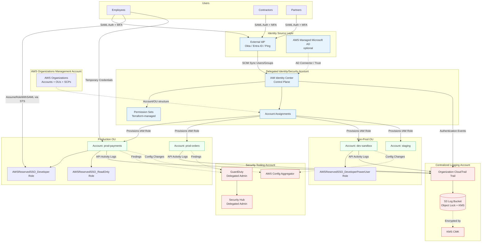

# Part XI – Security Reference Architectures

# Chapter 89 — IAM Identity Center

*A Production Reference Architecture for Centralized Workforce Identity, Federated Access, and Permission Governance Across the AWS Organization*

---

# 1. Executive Summary

## The Business Problem

Enterprises running workloads across multiple AWS accounts face a structural identity problem that has nothing to do with compute, storage, or networking.

- Every AWS account has its own IAM user namespace.
- Workforce identities (employees, contractors, partners) do not naturally map to that per-account model.
- As an organization grows past a handful of accounts, IAM users become unmanageable.
- Security teams lose visibility into who has access to what, across which accounts.
- Offboarding an employee becomes a manual, error-prone, multi-account exercise.

This is not a hypothetical problem. It is the single most common finding in enterprise cloud security assessments:

- Long-lived IAM access keys tied to individual humans.
- Shared root credentials for "emergency access."
- Departed employees retaining valid IAM users in forgotten sandbox accounts.
- No single place to answer the question "who can do what, everywhere, right now?"

Organizations that start with a single AWS account rarely feel this pain. The pain begins at the inflection point where the number of AWS accounts exceeds the number of people who can reasonably track access to each of them by memory. In practice, that inflection point arrives earlier than most engineering leaders expect — often around 5 to 10 accounts.

## The Architecture Objective

AWS IAM Identity Center (formerly AWS Single Sign-On) solves this by inverting the identity model.

- Instead of provisioning an IAM user in every account a person needs, the organization provisions the person once, centrally.
- Access to individual accounts is granted through **Permission Sets** — reusable, versioned templates of IAM permissions — assigned to users or groups against specific accounts.
- Authentication happens once, against a single identity source, and that authentication is federated into every account through short-lived STS credentials.
- The identity source can be IAM Identity Center's built-in directory, or it can be federated from an external Identity Provider (IdP) such as Okta, Microsoft Entra ID (Azure AD), Ping Identity, JumpCloud, or an on-premises Active Directory via AWS Directory Service / AD Connector.

The architectural objective is straightforward to state and non-trivial to implement correctly:

> **One identity, many accounts, no long-lived credentials, full auditability, and centrally governed least privilege — enforced consistently across the entire AWS Organization.**

## Why Organizations Adopt This Architecture

- **Regulatory pressure.** SOC 2, ISO 27001, PCI-DSS, HIPAA, and FedRAMP all require demonstrable access governance and timely deprovisioning. IAM Identity Center makes both auditable from a single console.
- **Multi-account growth.** AWS Organizations best practice pushes workloads into dedicated accounts per environment, team, or workload boundary. Without centralized identity, this multiplies the identity management burden linearly with account count.
- **Mergers and acquisitions.** Federating an acquired company's identity provider into IAM Identity Center is dramatically simpler than migrating or duplicating IAM users across dozens of newly inherited accounts.
- **Workforce turnover.** Disabling a single user in the identity source revokes access across every AWS account instantly, rather than requiring a checklist that touches every account individually.
- **Break-glass and emergency access.** A well-designed Identity Center deployment replaces shared root credentials with time-boxed, logged, permission-set-based emergency access.
- **Developer experience.** Engineers get a single sign-on portal listing every account and role they can assume, with one set of corporate credentials and, ideally, hardware-backed MFA.

## Major Business Benefits

| Benefit | Description |
|---|---|
| Reduced credential sprawl | Eliminates the need for per-account IAM users and long-lived access keys for human access. |
| Faster offboarding | Access revocation is a single action in the identity source, not a per-account cleanup task. |
| Centralized audit trail | CloudTrail records federated sessions with a consistent principal identity, correlated back to the human user. |
| Consistent least privilege | Permission Sets are defined once and assigned consistently, avoiding permission drift between accounts. |
| Lower operational overhead | Account access provisioning becomes a group membership change instead of an IAM policy authoring exercise. |
| Compliance evidence | Access reviews, attestations, and deprovisioning timelines are demonstrable from one system of record. |
| Improved incident response | Security teams can immediately determine every account a compromised identity had access to. |

## Typical Enterprise Scenarios

- A financial services company with 40 AWS accounts (one per product line per environment) federating Okta as the identity source, with permission sets mapped to job functions (Read Only, Developer, Data Engineer, Security Auditor, Break Glass Admin).
- A healthcare SaaS provider using IAM Identity Center to enforce HIPAA-aligned least privilege, with permission boundaries preventing any permission set from disabling CloudTrail or modifying KMS key policies.
- A newly formed platform engineering team standardizing account vending through AWS Control Tower, where every new account automatically inherits IAM Identity Center permission set assignments through account baseline automation.
- An enterprise undergoing an acquisition, federating the acquired company's Entra ID tenant as an additional identity source during a transition period, before eventual consolidation.
- A regulated enterprise implementing time-bound, approval-gated elevated access using IAM Identity Center in combination with a third-party Privileged Access Management (PAM) tool or AWS-native permission set session duration limits.

## What This Chapter Covers

This chapter treats IAM Identity Center as a **reference architecture**, not merely a feature walkthrough. It covers:

- How IAM Identity Center fits into an AWS Organizations structure, including its relationship to the Organizations management account and the delegated administrator pattern.
- Identity source design — when to use the built-in directory versus external IdP federation via SAML 2.0 and SCIM.
- Permission Set design patterns that scale to hundreds of accounts without becoming unmanageable.
- The full request lifecycle: how a user authentication event becomes a set of short-lived AWS credentials in a target account.
- Security architecture, including encryption, session duration governance, and integration with GuardDuty and Security Hub for anomaly detection on federated sessions.
- Terraform automation for permission sets, account assignments, and identity source configuration.
- Real production failure modes, troubleshooting workflows, and an enterprise case study.

Organizations that treat identity as an afterthought inevitably rebuild it later, under worse conditions — usually during an audit finding, a security incident, or a chaotic acquisition integration. IAM Identity Center, deployed correctly from the start, is one of the highest-leverage architectural investments an AWS Organization can make, because nearly every other security control (network segmentation, data encryption, workload isolation) assumes that "who has access" is already a solved problem.

# 2. Business Requirements

## Business Drivers

- Centralize workforce access governance across an AWS Organization with dozens to hundreds of accounts.
- Eliminate long-lived IAM access keys tied to human identities.
- Provide a single sign-on experience across AWS accounts, custom SAML applications, and (optionally) AWS-managed applications.
- Demonstrate access governance controls for audit and compliance purposes.
- Support rapid, low-friction onboarding and immediate, complete offboarding.

## Functional Requirements

- Federate an external identity source (Okta, Entra ID, Ping, Google Workspace, or on-premises Active Directory) as the system of record for workforce identity.
- Automatically synchronize users and groups from the identity source using SCIM (System for Cross-domain Identity Management).
- Define reusable Permission Sets representing job functions (for example: ReadOnlyAuditor, DeveloperPowerUser, DataEngineer, NetworkAdmin, SecurityBreakGlass).
- Assign Permission Sets to groups against specific AWS accounts or Organizational Units (OUs).
- Provide a user-facing access portal listing every account/role combination a user can assume.
- Support command-line access via the AWS CLI `aws sso login` flow, issuing short-lived STS credentials.
- Integrate with CloudTrail for full audit logging of authentication and session activity.

## Non-Functional Requirements

| Category | Requirement |
|---|---|
| Availability | IAM Identity Center must be available whenever any federated account requires human access; target 99.9%+ effective availability (AWS-managed control plane). |
| Latency | Authentication and role-assumption flow should complete in under 3 seconds end-to-end under normal conditions. |
| Scalability | Must support growth from tens to hundreds of AWS accounts and thousands of users without redesign. |
| Auditability | Every authentication event and every permission set assignment change must be logged and retained per compliance policy (typically 1–7 years depending on regulatory regime). |
| Security | No standing long-lived credentials for human access; MFA enforced for all users; session duration bounded and configurable per permission set. |
| Consistency | Permission sets must apply identically regardless of which account they are assigned to, with account-specific customization handled through parameterization, not per-account duplication. |

## Scalability Goals

- Support at least 500 AWS accounts under a single AWS Organization without a redesign of the identity architecture.
- Support tens of thousands of users when federated from a large enterprise directory.
- Support hundreds of distinct Permission Sets without administrative overhead becoming unmanageable — achieved through naming conventions, tagging, and Infrastructure as Code rather than console-driven management.

## Availability Requirements

- IAM Identity Center is a regional, AWS-managed service; the control plane availability SLA is inherited from the underlying AWS service commitments.
- The identity source federation path (for example, the customer's Okta tenant) becomes a **new availability dependency** for AWS account access — this must be explicitly called out to stakeholders, since an IdP outage now means no human can assume a role in any AWS account through SSO.
- Break-glass access paths must not depend on the external IdP being available.

## Latency Requirements

- SSO portal login: sub-second to a few seconds, dominated by IdP round-trip time (SAML assertion generation) rather than AWS-side processing.
- CLI `aws sso login` device authorization flow: typically completes in under 10 seconds including the browser-based approval step.
- STS credential issuance after successful authentication: near-instant (sub-100ms typically).

## Compliance Requirements

- SOC 2 Type II: demonstrable access provisioning/deprovisioning controls, periodic access reviews.
- ISO 27001 Annex A.9 (Access Control): least privilege, formal access review process, unique user identification.
- PCI-DSS Requirement 7 and 8: restrict access by business need-to-know, unique ID per user, MFA for all non-console administrative access.
- HIPAA Security Rule §164.312(a): unique user identification, automatic logoff (session duration limits), audit controls.
- FedRAMP (where applicable): AC-2 (Account Management), AC-6 (Least Privilege), AU-2 (Audit Events).

## Security Expectations

- MFA enforced at the identity source level (preferred) and/or within IAM Identity Center itself.
- No IAM users created for individual human access in member accounts (enforced via Service Control Policies).
- Permission Sets follow least privilege; broad administrative permission sets are restricted to a small, explicitly justified population and require a shorter session duration.
- All permission set and assignment changes are made through Infrastructure as Code with peer review, not manual console changes.

## Recovery Objectives

| Metric | Target | Notes |
|---|---|---|
| RPO (Identity Center configuration) | Near-zero | Permission sets and assignments are managed as code in version control; the "backup" is the Git repository plus Terraform state. |
| RTO (loss of IdP federation) | < 30 minutes | Break-glass IAM Identity Center native users or emergency IAM roles outside the SSO path provide continuity. |
| RTO (accidental permission set misconfiguration) | < 15 minutes | Revert via Terraform apply from last known-good state. |

## SLAs

- Internal SLA: access requests (new permission set assignment) fulfilled within one business day via automated pull-request-based workflow.
- Internal SLA: offboarding access revocation completed within 15 minutes of HR system deactivation event (achieved via SCIM sync from the HR-integrated identity source).

## Expected Workload

- Authentication volume: proportional to daily active engineering and operations staff; for a 2,000-person technical organization, expect 1,500–3,000 SSO authentications per business day, with bursts at shift start times.
- Permission set assignment changes: typically low volume (tens per week) in steady state, higher during onboarding waves or reorganizations.

## Expected Growth

- Account count growth is typically the dominant scaling factor, not user count — as an organization adopts an account-per-workload or account-per-environment model, account count can grow 3–5x over two years.
- Design permission sets and assignment automation assuming 3–5 year account growth from day one; retrofitting naming conventions and tagging strategies across hundreds of existing permission sets is expensive.

# 3. Architecture Overview

## Overall Design

IAM Identity Center is deployed once per AWS Organization, in the Organization's chosen **Identity Center home Region**. It is enabled either in the **management account** or, following AWS best practice, delegated to a dedicated **security/identity member account** so that day-to-day identity administration does not require management account access.

The architecture has four structural layers:

1. **Identity Source Layer** — where human identity actually lives (external IdP, or the IAM Identity Center built-in directory).
2. **Identity Center Control Plane** — the AWS-managed service that stores Permission Sets, account assignments, and brokers authentication.
3. **Federation/STS Layer** — the mechanism by which an authenticated session is converted into short-lived AWS credentials scoped to a specific account and permission set, via an AWS-managed IAM role deployed automatically into each target account.
4. **Target AWS Accounts** — the member accounts across the AWS Organization where the federated role actually exercises permissions.

## Architecture Philosophy

- **Identity is centralized; authorization is delegated but templated.** The identity source is the single source of truth for "who is this person." Permission Sets are the single source of truth for "what can a Developer do." Account assignment is the mapping between the two, scoped per account or OU.
- **No standing credentials.** Every session is short-lived, generated fresh at assumption time via STS, and expires automatically.
- **Infrastructure as Code first.** Permission sets, assignments, and identity source configuration are defined in Terraform, not clicked into existence in the console, so that changes are reviewable, versioned, and reproducible.
- **Least privilege by default, elevated access by exception.** Baseline permission sets are narrow; broader access requires a distinct, monitored, time-bound permission set.

## Core Components

| Component | Role |
|---|---|
| Identity Source | System of record for users and groups (external IdP via SAML/SCIM, AD via Directory Service, or built-in directory). |
| IAM Identity Center | AWS-managed control plane: stores permission sets, manages account assignments, brokers SSO. |
| Permission Sets | Named, reusable IAM policy templates (managed + inline + permission boundary) provisioned as IAM roles into target accounts. |
| Account Assignments | The mapping of (user or group) × (permission set) × (AWS account). |
| AWS-managed IAM Roles | Automatically created in each target account when a permission set is assigned; named `AWSReservedSSO_<PermissionSetName>_<hash>`. |
| STS | Issues short-lived session credentials when a user assumes a role through Identity Center. |
| AWS Organizations | Provides the account structure and OUs that Identity Center assignments target. |
| CloudTrail | Records authentication events (in the Identity Center home region) and subsequent API activity in target accounts under the federated role identity. |

## How Components Interact

- The identity source pushes user and group data into IAM Identity Center via SCIM (near real-time provisioning/deprovisioning), or Identity Center reads directly from AWS Managed Microsoft AD.
- An administrator (via Terraform) defines a Permission Set describing a set of IAM permissions.
- The administrator (via Terraform) creates an Account Assignment linking a group to a Permission Set in a target account.
- IAM Identity Center provisions an IAM role in the target account corresponding to that Permission Set, with a trust policy allowing the Identity Center service to assume it via SAML federation.
- When a user authenticates, they see every account/permission-set combination their group memberships entitle them to in the access portal.
- Selecting an account/role triggers a SAML-based federation exchange, ultimately calling `sts:AssumeRoleWithSAML` (abstracted by the Identity Center console/CLI experience) to produce temporary credentials scoped to that account and role.

## High-Level Workflow

1. User authenticates against the identity source (external IdP or built-in directory), completing MFA.
2. IAM Identity Center receives the authentication assertion and evaluates the user's group memberships.
3. The access portal renders all account/permission-set combinations available to the user.
4. User selects an account and role.
5. Identity Center brokers a federated session, producing temporary AWS credentials scoped to the AWS-managed IAM role in the target account.
6. User (or CLI/SDK session) operates within the target account using those temporary credentials, subject to the permission set's policy.
7. Credentials expire automatically at the configured session duration; the user must re-authenticate (subject to identity source session policy) to obtain new credentials.

## Request Lifecycle

- **Inbound:** Browser or CLI initiates authentication → redirected to identity source (if external IdP) → MFA challenge → SAML assertion returned to Identity Center.
- **Processing:** Identity Center validates the assertion, resolves group memberships, computes the entitled account/permission-set list.
- **Federation:** On role selection, Identity Center performs the AssumeRoleWithSAML-equivalent exchange with STS in the target account.
- **Outbound:** Temporary credentials (access key, secret key, session token) are returned to the browser (console session) or CLI (local credential cache).

## Response Lifecycle

- Console sessions receive a signed, time-limited console URL.
- CLI sessions cache credentials locally (`~/.aws/sso/cache` and the profile-resolved credential file) and automatically refresh via `aws sso login` re-authentication when expired, without requiring password re-entry within the identity source's own session validity window.

## Data Lifecycle

- **User/group data**: originates in the identity source, synchronized into Identity Center via SCIM; deleted from Identity Center within minutes of deprovisioning at the source.
- **Permission Set definitions**: stored in Identity Center, version-controlled as Terraform, changes propagate to all assigned accounts automatically on apply.
- **Session/audit data**: authentication events logged in CloudTrail (Identity Center home region); subsequent in-account API calls logged in CloudTrail per target account, correlated by the federated role session name (which by default includes the user's identity source username).

# 4. AWS Services Used

## AWS IAM Identity Center

- **Purpose**: Central control plane for workforce SSO, permission set management, and account assignment across an AWS Organization.
- **Why selected**: It is the AWS-native, no-additional-cost mechanism for multi-account federated access, tightly integrated with AWS Organizations and STS.
- **Alternatives**: Directly federating an external IdP into each account's IAM identity provider (SAML) without Identity Center; third-party PAM/CIAM platforms (e.g., Okta's own AWS multi-account plugin patterns). These alternatives lose the centralized permission-set-to-account-assignment model and require significantly more per-account configuration.
- **Limitations**: Single home Region per Organization (cannot be multi-Region active-active); changing the identity source type (e.g., built-in directory to external IdP) is a disruptive migration; a hard limit exists on the number of permission sets and assignments per Organization (soft limits, but large enterprises must plan around them).
- **Pricing considerations**: No additional charge for IAM Identity Center itself; costs arise indirectly (CloudTrail storage, any AWS Managed Microsoft AD deployment if used as the identity source).
- **Best practices**: Delegate administration to a dedicated account, not the management account; manage permission sets and assignments as code.

## AWS Organizations

- **Purpose**: Provides the multi-account structure, OUs, and Service Control Policies that IAM Identity Center assignments target and that guardrail permission sets.
- **Why selected**: Required prerequisite for IAM Identity Center's multi-account features; without Organizations, Identity Center can only manage a single account.
- **Alternatives**: None viable for multi-account governance at AWS-native level.
- **Limitations**: Account limits (soft, raisable); OU nesting depth limits.
- **Pricing considerations**: No charge for AWS Organizations itself.
- **Best practices**: Use OUs to group accounts by environment/function so permission set assignments can target OUs rather than individual accounts.

## AWS Directory Service (AWS Managed Microsoft AD) — *if used as identity source*

- **Purpose**: Managed Active Directory that can serve as the IAM Identity Center identity source, or bridge to an on-premises AD via trust relationship.
- **Why selected**: Organizations with existing on-premises AD investments often prefer AD trust federation over migrating fully to a cloud IdP.
- **Alternatives**: External SAML/SCIM IdP (Okta, Entra ID); IAM Identity Center's built-in directory.
- **Limitations**: Requires VPC deployment, subnet planning, and ongoing patching/monitoring responsibility (though AWS manages the underlying infrastructure).
- **Pricing considerations**: Hourly charge based on edition (Standard/Enterprise) and instance size class.
- **Best practices**: Deploy across two AZs minimum for HA; use AD Connector instead of full Managed AD if only proxying to existing on-premises AD without needing a new directory.

## IAM (Identity and Access Management)

- **Purpose**: Underlying permissions engine; Permission Sets are provisioned as IAM roles with attached policies in each target account.
- **Why selected**: Native, free, and universally enforced across every AWS service.
- **Alternatives**: None — IAM is the only mechanism for AWS API authorization.
- **Limitations**: Policy size limits (2048/6144/10240 characters depending on policy type); role trust policy complexity at scale.
- **Best practices**: Prefer AWS managed policies for permission sets where they map cleanly to job functions; use customer managed policies for organization-specific overrides; use permission boundaries to cap maximum achievable privilege.

## AWS CloudTrail

- **Purpose**: Captures authentication events in the Identity Center home Region and all subsequent API activity in target accounts under the federated session identity.
- **Why selected**: Only AWS-native mechanism providing an immutable, queryable audit trail correlating human identity to API actions.
- **Alternatives**: Third-party SIEM ingestion (still sourced from CloudTrail).
- **Limitations**: Management events logged by default; data events require explicit configuration and incur cost at scale.
- **Best practices**: Enable an Organization-wide CloudTrail trail, delivered to a centralized, access-restricted logging account S3 bucket with Object Lock.

## AWS Key Management Service (KMS)

- **Purpose**: Encrypts CloudTrail logs and any Identity Center-related data at rest where customer-managed encryption is required.
- **Why selected**: AWS-native, integrates natively with CloudTrail and S3.
- **Limitations**: Key policy complexity across accounts if using a centralized key shared across the Organization.
- **Best practices**: Use a dedicated CMK per logging account, with a key policy scoped to the CloudTrail service principal and designated log-reader roles only.

## Amazon GuardDuty / AWS Security Hub

- **Purpose**: Detect anomalous authentication and API behavior tied to federated Identity Center sessions (e.g., impossible travel, credential exfiltration patterns, unusual API call sequences).
- **Why selected**: Native threat detection that consumes CloudTrail and VPC Flow Logs without additional agent deployment.
- **Limitations**: Detection is probabilistic/heuristic; requires tuning to avoid alert fatigue.
- **Best practices**: Enable Organization-wide GuardDuty with a delegated administrator account; route findings to Security Hub for centralized triage.

## AWS Config

- **Purpose**: Tracks configuration changes to IAM roles and policies created by Identity Center permission sets, and can enforce compliance rules (e.g., detecting permission sets with wildcard admin access outside an approved list).
- **Why selected**: Native drift detection across the Organization.
- **Best practices**: Enable Organization-wide aggregator; write custom Config rules for permission set guardrails.

## AWS Secrets Manager — *not directly used for human access, but relevant adjacency*

- **Purpose**: While IAM Identity Center eliminates the need for long-lived human IAM credentials, workloads (non-human identities) still need secrets management; this is explicitly out of scope for Identity Center and is addressed in Chapter 90 (Secrets Management).
- **Note included here for completeness**: architects frequently conflate "we solved human access" with "we solved all access" — machine-to-machine and third-party API credentials remain a separate concern.

# 5. Complete Architecture Diagram



**Diagram notes:**

- The **Identity Source Layer** is external to AWS in most enterprise deployments; only its SAML/SCIM interface touches AWS.
- IAM Identity Center is deployed in a **delegated administrator account**, not the Organizations management account, per AWS security best practice.
- Every target account receives **AWS-managed IAM roles** (`AWSReservedSSO_*`) automatically — these are never hand-authored in individual accounts.
- Logging and security tooling accounts are separate from both the identity account and the workload accounts, following the classic "four eyes" separation-of-duties pattern used across AWS landing zone designs.

# 6. Component-by-Component Explanation

## 6.1 Identity Source (External IdP)

- **Purpose**: System of record for human identity — usernames, group memberships, employment status.
- **Responsibilities**: Authenticate users, enforce MFA, push user/group changes to Identity Center via SCIM, issue SAML assertions on login.
- **Inputs**: HR system feed (joiners/movers/leavers), corporate directory group structure.
- **Outputs**: SAML assertions to Identity Center; SCIM provisioning/deprovisioning events.
- **Scaling**: Scales independently of AWS; typically already sized for the entire enterprise identity footprint, not just AWS.
- **High availability**: Outside AWS's control; the customer's IdP SLA becomes a hard dependency for SSO-based AWS access.
- **Failure handling**: If the IdP is unavailable, SSO-based access is unavailable; break-glass paths must not depend on it.
- **Dependencies**: HR system integration for accurate group membership; corporate MFA infrastructure.
- **Security**: MFA enforcement, conditional access policies (e.g., geo-restriction, device trust) ideally enforced here, since Identity Center inherits whatever the IdP asserts.
- **Monitoring**: IdP-side login anomaly detection (impossible travel, brute force) is a required complement to AWS-side monitoring.

## 6.2 IAM Identity Center Control Plane

- **Purpose**: Central directory cache, permission set store, and SSO broker.
- **Responsibilities**: Maintain synchronized user/group data; store permission set definitions; maintain account assignment mappings; provision/deprovision AWS-managed IAM roles in target accounts; issue federated sessions.
- **Inputs**: SCIM events from identity source; Terraform-driven API calls for permission sets and assignments.
- **Outputs**: Provisioned IAM roles in member accounts; SAML-federated STS sessions; CloudTrail authentication events.
- **Scaling**: Fully AWS-managed; scales transparently with account and user growth within documented service quotas.
- **High availability**: Regional AWS-managed service; no customer-managed infrastructure to scale or patch.
- **Failure handling**: Regional service disruption impacts the entire Organization's SSO access; there is no customer-side failover — this is accepted as a shared responsibility trade-off given AWS's operational track record, but should be explicitly documented in the DR plan.
- **Dependencies**: AWS Organizations must be enabled; a home Region must be selected and does not change without a full reconfiguration.
- **Security**: Access to Identity Center administration itself must be tightly restricted (see Section 10).
- **Monitoring**: CloudTrail events for `sso-directory`, `sso`, and `sso-admin` event sources.

## 6.3 Permission Sets

- **Purpose**: Reusable, named templates of IAM permissions representing a job function or access level.
- **Responsibilities**: Define the AWS managed policies, customer managed policies, inline policy, and optional permission boundary that constitute a role's privilege; define session duration.
- **Inputs**: Terraform configuration authored and peer-reviewed by the platform/security team.
- **Outputs**: Provisioned IAM roles in every account the permission set is assigned to.
- **Scaling**: Design for account-count multiplication — one permission set assigned to 200 accounts results in 200 provisioned IAM roles, each independently, automatically kept in sync.
- **High availability**: N/A (configuration object, not runtime infrastructure).
- **Failure handling**: A misconfigured permission set (e.g., accidentally broad policy) propagates to every assigned account on the next provisioning sync — this is why peer review and staged rollout matter.
- **Dependencies**: Underlying IAM managed/customer managed policies must exist and be valid.
- **Security**: Permission boundaries should be attached to any permission set capable of creating IAM roles, to prevent privilege escalation.
- **Monitoring**: AWS Config rule tracking permission set changes; CloudTrail `CreatePermissionSet` / `UpdatePermissionSet` / `PutInlinePolicyToPermissionSet` events.

## 6.4 Account Assignments

- **Purpose**: The explicit mapping of (group) × (permission set) × (account).
- **Responsibilities**: Determine what appears in a user's access portal; trigger IAM role provisioning in the target account.
- **Inputs**: Terraform configuration, typically generated from a source-of-truth mapping (e.g., a YAML file mapping teams to accounts and roles).
- **Outputs**: Entitlement visible in the SSO portal; provisioned role in the target account.
- **Scaling**: Assign to groups, never to individual users, to keep assignment count tractable at scale.
- **Failure handling**: Removing an assignment does not retroactively revoke already-issued temporary credentials (they expire naturally per session duration) — this is a critical operational nuance for incident response.
- **Security**: Assignments to OUs (rather than only individual accounts) reduce the operational burden of applying baseline access to newly vended accounts.
- **Monitoring**: CloudTrail `CreateAccountAssignment` / `DeleteAccountAssignment` events; periodic access review reports.

## 6.5 AWS-Managed IAM Roles in Target Accounts

- **Purpose**: The actual runtime IAM principal a federated user assumes.
- **Responsibilities**: Enforce the permission set's policy within the target account.
- **Inputs**: STS AssumeRoleWithSAML-equivalent request from Identity Center.
- **Outputs**: Temporary security credentials.
- **Scaling**: One role per (permission set × account) combination, managed entirely by Identity Center — administrators must not hand-edit these roles.
- **High availability**: Standard IAM/STS availability (extremely high, AWS-managed).
- **Failure handling**: If a role is manually deleted or modified outside Identity Center, the next sync reconciles it — but this can cause transient access failures and should trigger a Config/CloudTrail alert.
- **Security**: Trust policy scoped to the Identity Center service and SAML provider only; no other principal should be able to assume these roles.
- **Monitoring**: CloudTrail `AssumeRoleWithSAML` and subsequent API calls under the assumed role session.

## 6.6 STS (Security Token Service)

- **Purpose**: Issues the actual short-lived credentials.
- **Responsibilities**: Validate the SAML assertion/federation request, issue access key, secret key, and session token scoped to the target role and duration.
- **Scaling**: Fully AWS-managed, effectively unlimited scale.
- **Security**: Session duration is bounded by the permission set configuration (15 minutes to 12 hours); shorter durations for higher-privilege permission sets are a core control.
- **Monitoring**: CloudTrail records the `AssumeRoleWithSAML` call and the resulting session's `sourceIdentity` / principal ID, enabling correlation between IAM actions and the original human identity.

# 7. End-to-End Request Flow

The following walks through a concrete example: a developer named Priya needs to check CloudWatch logs in the `prod-orders` account.

1. **Client**: Priya opens the corporate SSO portal URL (`https://d-xxxxxxxxxx.awsapps.com/start`) in her browser.
2. **DNS**: The browser resolves the AWS-managed `awsapps.com` domain (or a custom domain if configured via a CNAME/vanity URL).
3. **Redirect to IdP**: Identity Center redirects Priya to the corporate IdP (Okta) login page, since Okta is configured as the external identity source.
4. **Authentication**: Priya authenticates with her corporate credentials and completes a push-based MFA challenge on her registered device.
5. **SAML Assertion**: Okta issues a signed SAML assertion back to Identity Center, asserting Priya's identity and group memberships (e.g., `eng-orders-team`).
6. **Portal Rendering**: Identity Center resolves Priya's group memberships against configured account assignments and renders the portal: she sees `prod-orders / ReadOnlyOps`, `staging-orders / DeveloperPowerUser`, and `dev-sandbox / DeveloperPowerUser`.
7. **Role Selection**: Priya clicks `prod-orders / ReadOnlyOps`.
8. **Federation Exchange**: Identity Center performs the federation handshake with STS in the `prod-orders` account, requesting temporary credentials for the `AWSReservedSSO_ReadOnlyOps_<hash>` role.
9. **Session Issuance**: STS issues temporary credentials with a 1-hour session duration (as configured on the `ReadOnlyOps` permission set) and a session name derived from Priya's identity source username.
10. **Console Access**: Identity Center generates a signed federated console sign-in URL; Priya's browser is redirected into the AWS Management Console for `prod-orders`, already authenticated as the `ReadOnlyOps` role.
11. **CloudWatch Access**: Priya navigates to CloudWatch Logs Insights and queries the `prod-orders` application log group.
12. **Permission Enforcement**: IAM evaluates each API call (`logs:StartQuery`, `logs:GetQueryResults`) against the `ReadOnlyOps` permission set policy attached to the assumed role; all calls succeed because the policy grants `logs:Get*`, `logs:Describe*`, `logs:StartQuery`, `logs:StopQuery` but denies write/delete actions.
13. **Logging**: Every API call is recorded in the `prod-orders` account's CloudTrail trail (replicated to the centralized logging account) with the principal ID showing the assumed role and Priya's session name.
14. **Monitoring**: GuardDuty continuously evaluates the session's API call pattern for anomalies (e.g., unusual data access volume, unfamiliar source IP/geolocation).
15. **Error Handling**: If Priya attempts an action outside her permission set (for example, `logs:DeleteLogGroup`), IAM returns an `AccessDenied` error; this denial is also logged in CloudTrail and can trigger a Security Hub finding if it matches a suspicious pattern (e.g., repeated denied privilege escalation attempts).
16. **Session Expiry**: One hour after issuance, Priya's temporary credentials expire. Any further console interaction requires the browser session to still be valid at the Identity Center layer (subject to the portal session duration, separately configurable and typically 8–12 hours) or a fresh authentication if that has also expired.
17. **CLI Equivalent**: If Priya instead uses the CLI, she runs `aws sso login --profile prod-orders-readonly`, which opens a browser for the same authentication flow, then caches short-lived credentials locally, automatically used by subsequent `aws` CLI commands under that profile.

# 8. Deployment Flow

## Infrastructure Provisioning

- IAM Identity Center itself is enabled once per Organization — typically a one-time, semi-manual bootstrap step (enabling the service and choosing the home Region cannot easily be automated end-to-end since it is an Organization-level, one-time action).
- After bootstrap, **all ongoing configuration** (identity source federation details, permission sets, account assignments) is managed via Terraform using the `aws_ssoadmin_*` and `aws_identitystore_*` resource families.

## Terraform Workflow

1. Platform team defines permission sets and assignments in a dedicated `identity-center` Terraform repository.
2. Changes are submitted via pull request; CI runs `terraform plan` and posts the diff for review.
3. Security team reviews any change touching high-privilege permission sets (enforced via CODEOWNERS on specific file paths).
4. On merge to `main`, CI runs `terraform apply` using a dedicated CI/CD role with least-privilege access to the `sso` and `identitystore` IAM actions only.
5. Terraform state is stored remotely (S3 + DynamoDB lock table) in the delegated identity/security account.

## CI/CD Deployment

- Use a dedicated pipeline (GitHub Actions, GitLab CI, or AWS CodePipeline) separate from application deployment pipelines.
- Pipeline identity assumes a role via OIDC federation (GitHub Actions OIDC provider or GitLab equivalent) — no long-lived AWS access keys stored in CI secrets.

## Blue-Green Deployment (applied to permission sets)

- Permission set changes are not "blue-green" in the traditional compute sense, but a similar staged-rollout discipline applies:
  - Create a new permission set version in a **non-production account first** (or a sandbox OU).
  - Validate the new policy grants exactly the intended actions using IAM Access Analyzer policy validation and, where feasible, a scoped integration test.
  - Roll out to production account assignments only after validation.

## Rollback

- Because permission sets are Terraform-managed, rollback is a `git revert` followed by `terraform apply`, which restores the prior policy version across every assigned account automatically.
- Identity Center retains a change history for permission sets, but Terraform state remains the authoritative source of truth — do not rely on manual console reversion.

## Secrets

- No secrets are required for the Identity Center-to-IdP SAML trust beyond the exchanged metadata (IdP certificate, entity ID, SSO URL) and, for SCIM, a bearer token generated by Identity Center and stored in the IdP's application configuration (e.g., Okta's IAM Identity Center app secret store) — never in source control.
- Terraform CI/CD credentials use short-lived OIDC-federated roles, not stored secrets, wherever the CI platform supports it.

## Configuration

- Identity source metadata (SAML certificate, SSO/SLO URLs) is configured once during initial federation setup and rotated per the IdP's certificate expiration schedule (typically annually) — this must be tracked as an operational calendar item, since an expired SAML certificate silently breaks all SSO logins.

## Validation

- After any permission set change, run automated validation: enumerate the resulting IAM policy via `aws sso-admin describe-permission-set` and diff against the expected policy document as part of CI.
- Periodically run IAM Access Analyzer's policy validation checks against all permission set policies to catch overly permissive statements before they reach production.

# 9. Network Topology

IAM Identity Center's control plane is a regional AWS-managed service and, for the SAML/SSO federation path, does not require VPC connectivity. Network topology considerations in this architecture concern two distinct areas: (1) the identity source, if self-hosted, and (2) the accounts users federate into.

## VPC (only relevant if using AWS Managed Microsoft AD or AD Connector)

- Deploy AWS Managed Microsoft AD (or AD Connector) into a dedicated VPC within the identity/security account.
- Minimum two subnets across two Availability Zones, as required by the Directory Service HA model.

## CIDR

- Use a small, non-overlapping CIDR block for the identity VPC (for example, `/24`), since it hosts only directory infrastructure, not application workloads.

## Public Subnets

- Not required for the directory VPC itself; AD Connector and Managed AD operate entirely within private subnets.

## Private Subnets

- Directory controllers/connectors are deployed in private subnets with no direct internet route.

## NAT Gateway

- Required only if the directory needs outbound connectivity (e.g., for Windows patching in a self-managed AD scenario, not applicable to AWS Managed Microsoft AD, which AWS patches).

## Internet Gateway

- Not required for the identity VPC in the standard external-SAML-IdP pattern, since authentication traffic flows through the public SSO portal endpoint, not through the customer VPC.

## Transit Gateway

- Required if on-premises AD must be reachable for a hybrid trust relationship — the identity VPC attaches to the Transit Gateway, which in turn connects to on-premises via Direct Connect or Site-to-Site VPN.

## Route Tables

- Identity VPC route tables route on-premises-bound traffic through the Transit Gateway attachment; no default route to an Internet Gateway is needed in the pure external-IdP pattern.

## Network ACLs

- Restrict identity VPC subnet NACLs to only the LDAP/Kerberos/DNS ports required for AD replication and trust (TCP/UDP 88, 389, 445, 464, 636, 3268-3269 as applicable), sourced only from on-premises CIDR ranges via the Transit Gateway.

## Security Groups

- Directory controller security groups permit only AD-required protocols from known internal CIDR ranges — never `0.0.0.0/0`.

## PrivateLink

- Not applicable to the core Identity Center SSO flow (it is accessed over the public AWS-managed `awsapps.com` endpoint by design, since it is a workforce-facing portal). Some organizations restrict portal access at the network layer using IdP-side conditional access (corporate network / VPN requirement) rather than AWS PrivateLink.

## Hybrid Connectivity

- For enterprises federating on-premises Active Directory, hybrid connectivity (Direct Connect or Site-to-Site VPN via Transit Gateway) is required between the identity VPC and on-premises domain controllers, sized for authentication and replication traffic (typically low bandwidth, but latency-sensitive).

# 10. Identity and Access

## IAM Roles

- Every Permission Set materializes as an AWS-managed IAM role (`AWSReservedSSO_<PermissionSetName>_<hash>`) in each assigned account.
- These roles must never be manually edited in the target account — all changes flow through Identity Center/Terraform.

## IAM Policies

- Permission Sets support three policy attachment types:
  - **AWS managed policies** — for common job functions (e.g., `ReadOnlyAccess`, `PowerUserAccess`, `AdministratorAccess`).
  - **Customer managed policies** — for organization-specific permissions, defined once and referenced by name/ARN, expected to exist identically (by name) in every target account (Identity Center provisions a matching customer managed policy per account when using this attachment type).
  - **Inline policy** — a policy document unique to the permission set, useful for narrow, purpose-specific grants that don't warrant a standalone managed policy.

## Resource Policies

- Certain AWS resources (S3 bucket policies, KMS key policies) may separately reference specific `AWSReservedSSO_*` role ARNs or, preferably, reference the permission set's role by a stable naming/tag convention, since the trailing hash in the role name is not fully predictable in advance — a common production pitfall (see Section 24).

## STS

- All temporary credential issuance flows through STS; Identity Center abstracts the underlying `AssumeRoleWithSAML` call.
- Session duration is configured per permission set (`session_duration` attribute), from 15 minutes up to 12 hours.

## Cross-Account Access

- IAM Identity Center is inherently a cross-account access mechanism — the entire point of the architecture is federating a single identity across many accounts without per-account IAM users.
- For workload-to-workload cross-account access (not human access), continue to use standard IAM role trust policies independent of Identity Center.

## Least Privilege

- Design permission sets around job function, not individual request — a `DataEngineerReadWrite` permission set serves the whole data engineering team, rather than one-off permission sets per person.
- Avoid attaching `AdministratorAccess` as a default; reserve it for a small, explicitly justified `BreakGlassAdmin` permission set with short session duration and mandatory approval workflow.

## Service Roles

- Distinguish clearly between Identity Center-provisioned human-access roles and application/service IAM roles — they are architecturally and operationally separate; conflating them is a common source of confusion during audits.

## Permission Boundaries

- Attach a permission boundary to any permission set capable of IAM actions (`iam:CreateRole`, `iam:AttachRolePolicy`, etc.) to prevent privilege escalation — a developer with IAM role creation rights must not be able to create a role with broader permissions than their own boundary allows.
- Example boundary pattern: `DeveloperPermissionBoundary` denies any IAM action targeting resources tagged `Environment=Production` unless the caller is in the `SecurityAdmin` permission set.

# 11. Security Architecture

## Encryption

- Data in transit: all SAML assertions, SCIM traffic, and SSO portal sessions use TLS 1.2+.
- Data at rest: CloudTrail logs encrypted with a customer-managed KMS key; Identity Center's internal directory cache is encrypted by AWS using AWS-owned keys (not customer-configurable, as it is a fully managed control plane).

## KMS

- Use a dedicated CMK for the centralized CloudTrail log bucket, with a key policy restricting `kms:Decrypt` to designated log-reader roles and the CloudTrail service principal only.

## TLS

- Enforced by default on all Identity Center endpoints; no customer configuration required, but organizations should verify their IdP-side SAML endpoint also enforces modern TLS versions and cipher suites.

## WAF

- Not directly applicable to the Identity Center portal itself (AWS-managed endpoint); relevant instead to any custom-built internal access-request web application built on top of this architecture (e.g., a self-service permission set request portal).

## Shield

- AWS Shield Standard automatically protects the underlying AWS-managed Identity Center endpoints; no customer action required.

## Secrets Manager

- Used to store the SCIM bearer token on the IdP side where the IdP application configuration supports referencing a secret manager rather than pasting the token directly (varies by IdP capability).

## Certificate Manager

- Relevant if a custom vanity domain is configured for the SSO portal (e.g., `sso.company.com`), requiring an ACM certificate for the custom domain's TLS termination.

## GuardDuty

- Monitors CloudTrail activity across all member accounts for anomalies tied to federated sessions — unusual API call volume, calls from unexpected geographies, or credential-related findings.

## Inspector

- Not directly applicable to Identity Center itself; relevant to workloads accessed via federated sessions, out of scope for this chapter.

## Security Hub

- Aggregates GuardDuty findings and Config rule violations related to IAM Identity Center-provisioned roles into a single triage view, with the AWS Foundational Security Best Practices standard providing IAM-related controls out of the box.

## CloudTrail

- The single most important security data source for this architecture — every authentication event and every subsequent API call under a federated session is recorded here.

## AWS Config

- Custom Config rules can detect: permission sets with `AdministratorAccess` outside an approved allowlist, permission sets missing a permission boundary, or account assignments granting broad permission sets to overly large groups.

## Zero Trust

- IAM Identity Center is a foundational building block for a Zero Trust architecture (see Chapter 87) — it provides the strong, centrally governed identity assertion that a Zero Trust Policy Decision Point (such as Amazon Verified Permissions) can build authorization decisions on top of.
- On its own, Identity Center provides **strong authentication and coarse-grained authorization** (account/role-level); fine-grained, attribute-based authorization requires additional tooling layered on top.

## Threat Model

| Threat | Description |
|---|---|
| Compromised IdP credentials | Attacker obtains valid corporate credentials and MFA bypass, gaining the full entitlement set of the victim user. |
| Over-privileged permission sets | A permission set grants broader access than the job function requires, expanding blast radius of any single compromised identity. |
| Stale account assignments | A user retains access to accounts no longer relevant to their role because assignments were never cleaned up. |
| SCIM sync failure | Deprovisioning at the identity source fails to propagate to Identity Center, leaving a terminated employee with residual access. |
| Session hijacking | Stolen temporary credentials (e.g., from a compromised developer laptop's local credential cache) used before expiry. |
| Break-glass misuse | Emergency admin access used outside legitimate emergencies, without adequate approval/logging controls. |

## Attack Vectors

- Phishing targeting the IdP login page to harvest credentials and MFA tokens (real-time relay/adversary-in-the-middle attacks).
- Local credential file theft on developer workstations (`~/.aws/sso/cache`) if endpoint security is weak.
- Social engineering targeting help desk to reset MFA on a privileged account.
- Insider threat leveraging legitimately assigned but excessive permission sets.

## Mitigations

- Enforce phishing-resistant MFA (FIDO2/WebAuthn hardware keys) at the identity source for high-privilege permission sets.
- Bound session duration aggressively for privileged permission sets (15–60 minutes) to limit the window of credential theft usefulness.
- Implement automated, scheduled access reviews cross-referencing account assignments against active HR employment status.
- Require dual approval and time-bound activation for break-glass permission sets, with automatic Security Hub alerting on any use.
- Endpoint security (disk encryption, EDR) as a baseline control for any workstation capable of caching Identity Center CLI credentials.

# 12. High Availability

## AZ Failures

- IAM Identity Center's control plane is a regional, AWS-managed, multi-AZ service by design; customers do not configure or manage AZ redundancy for it.
- If a self-hosted identity source component (AD Connector/Managed AD) is used, it must explicitly be deployed across two AZs — this is a customer responsibility, unlike the Identity Center control plane itself.

## Instance Failures

- Not applicable to Identity Center itself (no customer-managed instances).
- For Managed Microsoft AD, AWS automatically monitors and replaces unhealthy domain controllers.

## Regional Failures

- IAM Identity Center operates from a single home Region; a full regional outage in that Region disables SSO-based access Organization-wide.
- This is a deliberate architectural trade-off in the service design — mitigate with a documented break-glass path (IAM Identity Center native break-glass users, or, in extreme cases, emergency IAM users with strict controls, MFA, and immediate post-incident rotation) that does not depend on the Identity Center home Region.

## Database Failures

- N/A — no customer-managed database in this architecture; the Identity Center directory store is fully AWS-managed.

## Load Balancing

- N/A at the customer level — AWS manages all load balancing for the Identity Center service endpoints.

## Health Checks

- Customers should monitor identity source availability (IdP status page, internal AD health checks) as the practical dependency that determines whether SSO functions end-to-end.

## Failover

- Document and periodically test a break-glass failover procedure: a small set of emergency-access IAM users or roles, outside the Identity Center SSO path, with hardware MFA, used only when SSO-based access is unavailable, and immediately audited/rotated after use.

# 13. Disaster Recovery

## Backup Strategy

- Permission sets and account assignments have no traditional "backup" — their authoritative source of truth is the Terraform codebase in version control.
- Restoring from a Git commit and re-applying Terraform is functionally equivalent to a configuration restore.

## Snapshots

- Not applicable to Identity Center's control plane.
- If using Managed Microsoft AD, AWS automatically takes daily snapshots retained for a rolling window, restorable on request via AWS Support.

## Cross-Region Replication

- Not supported natively — Identity Center is single-Region by design; there is no multi-Region active-active mode.

## Pilot Light / Warm Standby / Multi-Site / Active-Active / Active-Passive

- These classic DR patterns do not map cleanly onto Identity Center itself, since it cannot be deployed redundantly across Regions.
- The practical DR pattern is **break-glass access continuity**, not Identity Center redundancy:
  - Maintain a minimal set of emergency IAM users/roles per critical account, independent of Identity Center, stored securely (hardware token + sealed credential process), used only when Identity Center is unavailable.
  - Maintain the Terraform codebase and state in a location independently accessible even if the identity/security account itself is impaired (e.g., replicated state backend).

## RPO

- Effectively zero for configuration (Git-backed); not applicable to session data (sessions are ephemeral by design).

## RTO

- Break-glass access: target under 30 minutes to invoke documented emergency procedures.
- Full Identity Center service restoration: dependent on AWS's regional recovery, outside customer control; track via AWS Health Dashboard.

# 14. Scalability

## Horizontal Scaling

- Identity Center scales transparently with account count and user count within AWS service quotas; no customer-managed horizontal scaling exists.

## Vertical Scaling

- Not applicable — no customer-managed compute.

## Auto Scaling

- Not applicable to the control plane; relevant only to any self-hosted identity infrastructure components (rare in this architecture).

## Serverless Scaling

- The entire Identity Center service is effectively "serverless" from the customer's perspective — no capacity planning required for the control plane itself.

## Database Scaling

- N/A — fully managed.

## Storage Scaling

- N/A for Identity Center itself; CloudTrail log storage in S3 scales automatically and should be governed by lifecycle policies (see Section 22).

## Queue Scaling

- Not applicable to this architecture.

## Practical Scaling Considerations

- The real scaling concern in this architecture is **administrative**, not infrastructural:
  - Permission set count growth as the organization adds job functions.
  - Account assignment count growth as account count multiplies.
  - Both must be managed through naming conventions, tagging, and code generation (e.g., generating Terraform account assignments from a structured YAML mapping) rather than manual authorship, or the configuration becomes unmaintainable well before any AWS service quota is reached.

# 15. Performance Optimization

## Caching

- CLI credentials are cached locally after `aws sso login`, avoiding repeated authentication for the duration of the session — reducing latency for subsequent CLI calls to near-zero authentication overhead.

## Compression

- Not applicable to this architecture's control-plane traffic (small payloads: SAML assertions, SCIM JSON).

## CDN

- Not applicable — the SSO portal is served from AWS-managed infrastructure, not customer-configurable CDN.

## Database Optimization

- Not applicable.

## Connection Pooling

- Not applicable to the control plane; relevant only within target workloads accessed after federation, out of scope here.

## Concurrency

- Identity Center handles concurrent authentication requests transparently; no customer tuning available or required.

## Async Processing

- SCIM provisioning/deprovisioning is asynchronous by nature (near real-time, typically propagating within seconds to a few minutes) — architects should not assume instantaneous propagation when designing time-sensitive offboarding SLAs; validate actual propagation latency against the specific IdP in use.

## Practical Performance Considerations

- The dominant latency factor in the end-to-end flow is almost always the identity source's own authentication and MFA challenge time, not anything AWS-side.
- CLI-based workflows benefit significantly from longer-lived portal sessions (within security policy) since they reduce how often engineers must re-authenticate through the browser during a workday.

# 16. Cost Optimization (FinOps)

## Cost Estimate by Deployment Size

| Deployment Size | Accounts | Users | Estimated Monthly AWS Cost | Primary Cost Drivers |
|---|---|---|---|---|
| Small | 5–15 | 50–200 | $50–$300 | CloudTrail storage, minimal Config/GuardDuty spend |
| Medium | 15–75 | 200–2,000 | $500–$3,000 | CloudTrail across many accounts, GuardDuty per-account findings volume, Config rule evaluations |
| Enterprise | 75–500+ | 2,000–50,000+ | $5,000–$40,000+ | Org-wide CloudTrail data events (if enabled), GuardDuty at scale, Config aggregator, potential Managed Microsoft AD instance costs |

> **Note**: IAM Identity Center itself has **no direct service charge**. Costs in this architecture are almost entirely attributable to the supporting security/logging services (CloudTrail, GuardDuty, Config), not to Identity Center directly. This is frequently misunderstood — see Cost Surprises in the Architect's Corner.

## Major Cost Drivers

- CloudTrail data event logging (if enabled beyond default management events) across every member account.
- S3 storage growth for the centralized log bucket, especially with long compliance-driven retention periods.
- GuardDuty findings volume, priced per analyzed event/log volume, scales with account count and workload activity.
- AWS Managed Microsoft AD hourly charges, if used as the identity source (Standard vs. Enterprise edition pricing differs materially).

## Optimization Opportunities

- Enable CloudTrail **management events only** by default; enable data events selectively only for accounts/resources where they provide genuine investigative value.
- Apply S3 Lifecycle policies to transition CloudTrail logs to S3 Glacier Instant Retrieval or Glacier Deep Archive after the active-investigation window (typically 90 days), retaining compliance-mandated duration in cheaper storage tiers.
- Use a single Organization-wide CloudTrail trail rather than per-account trails, avoiding duplicate log delivery costs and administrative overhead.

## Reserved Instances / Savings Plans / Spot

- Not applicable to Identity Center or its typical supporting services in this architecture (no EC2/compute component in the core identity path).

## S3 Lifecycle / Storage Classes

- Recommended lifecycle for the centralized CloudTrail bucket:
  - 0–90 days: S3 Standard (active investigation window).
  - 91–365 days: S3 Glacier Instant Retrieval.
  - 366 days–compliance retention limit: S3 Glacier Deep Archive.

## Rightsizing

- For AWS Managed Microsoft AD, select the smallest edition/size that satisfies directory object count and replication requirements — Enterprise edition is materially more expensive than Standard and often unnecessary below several thousand directory objects.

## Cost Allocation / Tagging

- Tag the centralized logging and identity accounts distinctly in cost allocation reports so identity/security spend is visible as its own cost center, not blended into general "shared services" spend.

## Budgets

- Set AWS Budgets alerts on the logging account (primary cost driver in this architecture) with thresholds at 80%/100%/120% of expected monthly spend.

## Cost Anomaly Detection

- Enable AWS Cost Anomaly Detection scoped to the logging and security tooling accounts, since a sudden spike (e.g., an accidentally enabled CloudTrail data event configuration across all S3 buckets Organization-wide) can silently produce a large, unexpected bill.

# 17. AI-Assisted Operations

## Amazon Q

- Amazon Q Developer can assist administrators in authoring and reviewing Terraform for permission sets, flagging overly broad `Resource: "*"` statements or missing permission boundaries during code review.
- Amazon Q Business, connected to the organization's internal documentation, can answer employee questions like "which account should I request access to for the orders service" — reducing help-desk load for access requests, provided access-request documentation is well maintained.

## Bedrock

- Custom applications built on Amazon Bedrock can analyze CloudTrail logs from federated sessions to summarize a user's activity in natural language for access review purposes, e.g., generating a plain-English summary of "what did this permission set actually get used for in the last quarter" to support periodic access recertification.

## AI Troubleshooting

- LLM-assisted analysis of CloudTrail `AccessDenied` events can help administrators quickly identify the specific missing IAM action in a permission set policy, translating a dense error message into a proposed policy diff.

## Log Analysis

- Bedrock or Amazon Q can be pointed at CloudTrail logs in the centralized logging account (via Athena queries) to detect unusual access patterns in natural language summaries for non-technical compliance stakeholders.

## Incident Response

- During a suspected credential compromise, an AI assistant can rapidly enumerate every account/permission-set combination a specific identity source username had access to, accelerating the blast-radius assessment that would otherwise require manually cross-referencing account assignments.

## Cost Optimization

- AI-assisted FinOps tooling can correlate CloudTrail data event volume with actual investigative usage, recommending which accounts can safely disable data events to reduce cost.

## Capacity Planning

- Not a significant concern for Identity Center itself given its fully managed nature; more relevant for forecasting CloudTrail/GuardDuty cost growth as account count scales, which AI-assisted trend analysis can support.

## Architecture Review

- Amazon Q can be used during architecture review board sessions to check a proposed permission set against organizational policy documents (e.g., "does this permission set violate our least-privilege standard") when configured with the relevant policy documents as context.

## AI-Generated Terraform

- AI code generation is useful for producing the initial boilerplate of a new permission set module, but every generated policy **must** be reviewed by a human against least-privilege principles before merge — AI-generated IAM policies have a well-documented tendency toward overly broad `Resource: "*"` grants unless explicitly constrained.

## AI-Generated Documentation

- Auto-generate human-readable permission set documentation (e.g., "what can a DeveloperPowerUser actually do") from the Terraform policy definitions, keeping documentation in sync with the actual enforced policy rather than a manually maintained, frequently stale wiki page.

# 18. Terraform Implementation

## Providers and Backend

```hcl

# versions.tf

terraform {
  required_version = ">= 1.7.0"

  required_providers {
    aws = {
      source  = "hashicorp/aws"
      version = "~> 5.50"
    }
  }

  backend "s3" {
    bucket         = "acme-identity-terraform-state"
    key            = "identity-center/terraform.tfstate"
    region         = "us-east-1"
    dynamodb_table = "acme-identity-terraform-locks"
    encrypt        = true
  }
}

provider "aws" {
  region  = "us-east-1"
  profile = "identity-center-admin"

  default_tags {
    tags = {
      ManagedBy   = "terraform"
      Repository  = "identity-center"
      Environment = "shared-identity"
    }
  }
}

```

## Variables

```hcl

# variables.tf

variable "sso_instance_arn" {
  description = "ARN of the IAM Identity Center instance"
  type        = string
}

variable "identity_store_id" {
  description = "Identity Store ID associated with the SSO instance"
  type        = string
}

variable "account_ids" {
  description = "Map of logical account names to AWS account IDs"
  type        = map(string)
}

```

## Data Sources

```hcl

# data.tf

data "aws_ssoadmin_instances" "this" {}

locals {
  sso_instance_arn  = tolist(data.aws_ssoadmin_instances.this.arns)[0]
  identity_store_id = tolist(data.aws_ssoadmin_instances.this.identity_store_ids)[0]
}

```

## Permission Boundary Policy (Customer Managed)

```hcl

# iam_boundaries.tf

resource "aws_iam_policy" "developer_boundary" {
  provider    = aws.member_account_baseline   # applied via account baseline automation
  name        = "DeveloperPermissionBoundary"
  description = "Maximum permissions any Developer permission set role can grant"

  policy = jsonencode({
    Version = "2012-10-17"
    Statement = [
      {
        Sid      = "DenyIAMPrivilegeEscalation"
        Effect   = "Deny"
        Action   = [
          "iam:CreateUser",
          "iam:CreateAccessKey",
          "iam:UpdateAssumeRolePolicy",
          "iam:AttachUserPolicy",
          "iam:PutUserPolicy"
        ]
        Resource = "*"
      },
      {
        Sid      = "DenyOrganizationsActions"
        Effect   = "Deny"
        Action   = "organizations:*"
        Resource = "*"
      },
      {
        Sid      = "DenyDisablingSecurityServices"
        Effect   = "Deny"
        Action = [
          "cloudtrail:StopLogging",
          "cloudtrail:DeleteTrail",
          "guardduty:DeleteDetector",
          "config:StopConfigurationRecorder"
        ]
        Resource = "*"
      }
    ]
  })
}

```

## Permission Set: Read-Only Auditor

```hcl

# permission_sets_readonly.tf

resource "aws_ssoadmin_permission_set" "readonly_auditor" {
  name             = "ReadOnlyAuditor"
  description      = "Broad read-only access for security/compliance auditors"
  instance_arn     = local.sso_instance_arn
  session_duration = "PT4H"   # 4 hours

  tags = {
    JobFunction = "Auditor"
    Sensitivity = "Low"
  }
}

resource "aws_ssoadmin_managed_policy_attachment" "readonly_auditor_policy" {
  instance_arn       = local.sso_instance_arn
  permission_set_arn = aws_ssoadmin_permission_set.readonly_auditor.arn
  managed_policy_arn = "arn:aws:iam::aws:policy/ReadOnlyAccess"
}

resource "aws_ssoadmin_managed_policy_attachment" "readonly_auditor_security" {
  instance_arn       = local.sso_instance_arn
  permission_set_arn = aws_ssoadmin_permission_set.readonly_auditor.arn
  managed_policy_arn = "arn:aws:iam::aws:policy/SecurityAudit"
}

```

## Permission Set: Developer Power User

```hcl

resource "aws_ssoadmin_permission_set" "developer_power_user" {
  name             = "DeveloperPowerUser"
  description      = "Broad developer access excluding IAM and Organizations, for non-prod accounts"
  instance_arn     = local.sso_instance_arn
  session_duration = "PT8H"

  tags = {
    JobFunction = "Developer"
    Sensitivity = "Medium"
  }
}

resource "aws_ssoadmin_managed_policy_attachment" "dev_power_user_policy" {
  instance_arn       = local.sso_instance_arn
  permission_set_arn = aws_ssoadmin_permission_set.developer_power_user.arn
  managed_policy_arn = "arn:aws:iam::aws:policy/PowerUserAccess"
}

resource "aws_ssoadmin_permissions_boundary_attachment" "dev_power_user_boundary" {
  instance_arn       = local.sso_instance_arn
  permission_set_arn = aws_ssoadmin_permission_set.developer_power_user.arn

  permissions_boundary {
    customer_managed_policy_reference {
      name = "DeveloperPermissionBoundary"
      path = "/"
    }
  }
}

```

## Permission Set: Break-Glass Administrator

```hcl

resource "aws_ssoadmin_permission_set" "break_glass_admin" {
  name             = "BreakGlassAdmin"
  description      = "Emergency full administrative access. Use requires incident ticket + approval."
  instance_arn     = local.sso_instance_arn
  session_duration = "PT1H"   # deliberately short

  tags = {
    JobFunction = "Emergency"
    Sensitivity = "Critical"
  }
}

resource "aws_ssoadmin_managed_policy_attachment" "break_glass_admin_policy" {
  instance_arn       = local.sso_instance_arn
  permission_set_arn = aws_ssoadmin_permission_set.break_glass_admin.arn
  managed_policy_arn = "arn:aws:iam::aws:policy/AdministratorAccess"
}

```

## Account Assignments

```hcl

# assignments.tf

resource "aws_identitystore_group" "eng_orders_team" {
  identity_store_id = local.identity_store_id
  display_name       = "eng-orders-team"
  description        = "Engineering team owning the Orders service"
}

resource "aws_ssoadmin_account_assignment" "orders_dev_readonly_prod" {
  instance_arn       = local.sso_instance_arn
  permission_set_arn = aws_ssoadmin_permission_set.readonly_auditor.arn

  principal_id   = aws_identitystore_group.eng_orders_team.group_id
  principal_type = "GROUP"

  target_id   = var.account_ids["prod-orders"]
  target_type = "AWS_ACCOUNT"
}

resource "aws_ssoadmin_account_assignment" "orders_dev_poweruser_staging" {
  instance_arn       = local.sso_instance_arn
  permission_set_arn = aws_ssoadmin_permission_set.developer_power_user.arn

  principal_id   = aws_identitystore_group.eng_orders_team.group_id
  principal_type = "GROUP"

  target_id   = var.account_ids["staging-orders"]
  target_type = "AWS_ACCOUNT"
}

```

## Generating Assignments from a Source-of-Truth Mapping

To avoid hand-authoring hundreds of assignment blocks as account count grows, generate them from structured data:

```hcl

# assignments_generated.tf

locals {
  team_account_map = yamldecode(file("${path.module}/team_access_map.yaml"))

  # Flatten into a list of {group, permission_set, account} tuples

  flattened_assignments = flatten([
    for team, cfg in local.team_account_map : [
      for account_name in cfg.accounts : {
        team            = team
        permission_set  = cfg.permission_set
        account_name    = account_name
      }
    ]
  ])
}

resource "aws_ssoadmin_account_assignment" "generated" {
  for_each = { for a in local.flattened_assignments :
    "${a.team}-${a.permission_set}-${a.account_name}" => a
  }

  instance_arn       = local.sso_instance_arn
  permission_set_arn = local.permission_set_arns[each.value.permission_set]

  principal_id   = local.group_ids[each.value.team]
  principal_type = "GROUP"

  target_id   = var.account_ids[each.value.account_name]
  target_type = "AWS_ACCOUNT"
}

```

```yaml

# team_access_map.yaml

eng-orders-team:
  permission_set: DeveloperPowerUser
  accounts:
    - dev-sandbox
    - staging-orders

security-team:
  permission_set: ReadOnlyAuditor
  accounts:
    - prod-orders
    - prod-payments
    - staging-orders
    - dev-sandbox

```

## Outputs

```hcl

# outputs.tf

output "permission_set_arns" {
  description = "Map of permission set names to ARNs, for cross-referencing"
  value = {
    ReadOnlyAuditor      = aws_ssoadmin_permission_set.readonly_auditor.arn
    DeveloperPowerUser   = aws_ssoadmin_permission_set.developer_power_user.arn
    BreakGlassAdmin      = aws_ssoadmin_permission_set.break_glass_admin.arn
  }
}

```

## Remote State and Module Best Practices

- Store all Identity Center Terraform in a **dedicated repository**, separate from application infrastructure repositories, with restrictive CODEOWNERS on the entire repo (not just sensitive files) given the organization-wide blast radius of any change.
- Version the module; pin consumers to specific tagged releases when other repositories need to reference permission set ARNs as data sources.
- Use `terraform plan` output as a mandatory PR check artifact, and require a security team approval specifically for any diff touching `BreakGlassAdmin` or any permission set with `AdministratorAccess`.

# 19. AWS CLI Examples

## Deployment / Configuration

```bash

# List the IAM Identity Center instance ARN and Identity Store ID

aws sso-admin list-instances

# List all permission sets in the instance

aws sso-admin list-permission-sets \
  --instance-arn arn:aws:sso:::instance/ssoins-xxxxxxxxxxxxxxxx

# Describe a specific permission set

aws sso-admin describe-permission-set \
  --instance-arn arn:aws:sso:::instance/ssoins-xxxxxxxxxxxxxxxx \
  --permission-set-arn arn:aws:sso:::permissionSet/ssoins-xxxxxxxxxxxxxxxx/ps-xxxxxxxxxxxxxxxx

# List managed policies attached to a permission set

aws sso-admin list-managed-policies-in-permission-set \
  --instance-arn arn:aws:sso:::instance/ssoins-xxxxxxxxxxxxxxxx \
  --permission-set-arn arn:aws:sso:::permissionSet/ssoins-xxxxxxxxxxxxxxxx/ps-xxxxxxxxxxxxxxxx

```

## User / CLI Login Flow

```bash

# Configure a named SSO profile (one-time, interactive)

aws configure sso --profile prod-orders-readonly

# Authenticate (opens browser for SAML/MFA flow)

aws sso login --profile prod-orders-readonly

# Verify the resulting identity

aws sts get-caller-identity --profile prod-orders-readonly

# Log out (clears cached credentials for this profile)

aws sso logout --profile prod-orders-readonly

```

## Validation

```bash

# List all account assignments for a given permission set

aws sso-admin list-account-assignments \
  --instance-arn arn:aws:sso:::instance/ssoins-xxxxxxxxxxxxxxxx \
  --account-id 111122223333 \
  --permission-set-arn arn:aws:sso:::permissionSet/ssoins-xxxxxxxxxxxxxxxx/ps-xxxxxxxxxxxxxxxx

# List every account a specific group is assigned to

aws sso-admin list-account-assignments-for-principal \
  --instance-arn arn:aws:sso:::instance/ssoins-xxxxxxxxxxxxxxxx \
  --principal-id <group-id> \
  --principal-type GROUP

# Check for a permission set provisioning drift/status

aws sso-admin list-permission-set-provisioning-status \
  --instance-arn arn:aws:sso:::instance/ssoins-xxxxxxxxxxxxxxxx

```

## Monitoring / Troubleshooting

```bash

# Query CloudTrail for recent SSO authentication events

aws cloudtrail lookup-events \
  --lookup-attributes AttributeKey=EventSource,AttributeValue=sso.amazonaws.com \
  --start-time "$(date -u -d '24 hours ago' +%Y-%m-%dT%H:%M:%SZ)" \
  --max-results 20

# Query for AssumeRoleWithSAML events tied to Identity Center

aws cloudtrail lookup-events \
  --lookup-attributes AttributeKey=EventName,AttributeValue=AssumeRoleWithSAML \
  --start-time "$(date -u -d '24 hours ago' +%Y-%m-%dT%H:%M:%SZ)"

# Find AccessDenied events for a specific user's federated session

aws cloudtrail lookup-events \
  --lookup-attributes AttributeKey=Username,AttributeValue=priya.shah@acme.com \
  --start-time "$(date -u -d '7 days ago' +%Y-%m-%dT%H:%M:%SZ)" \

  | jq '.Events[] | select(.CloudTrailEvent | contains("AccessDenied"))'

# Re-provision a permission set to all assigned accounts after a policy change

aws sso-admin provision-permission-set \
  --instance-arn arn:aws:sso:::instance/ssoins-xxxxxxxxxxxxxxxx \
  --permission-set-arn arn:aws:sso:::permissionSet/ssoins-xxxxxxxxxxxxxxxx/ps-xxxxxxxxxxxxxxxx \
  --target-type ALL_PROVISIONED_ACCOUNTS

```

## Cleanup

```bash

# Delete an account assignment

aws sso-admin delete-account-assignment \
  --instance-arn arn:aws:sso:::instance/ssoins-xxxxxxxxxxxxxxxx \
  --target-id 111122223333 \
  --target-type AWS_ACCOUNT \
  --permission-set-arn arn:aws:sso:::permissionSet/ssoins-xxxxxxxxxxxxxxxx/ps-xxxxxxxxxxxxxxxx \
  --principal-id <group-id> \
  --principal-type GROUP

# Delete a permission set (must have zero remaining account assignments)

aws sso-admin delete-permission-set \
  --instance-arn arn:aws:sso:::instance/ssoins-xxxxxxxxxxxxxxxx \
  --permission-set-arn arn:aws:sso:::permissionSet/ssoins-xxxxxxxxxxxxxxxx/ps-xxxxxxxxxxxxxxxx

```

# 20. CI/CD Integration

## GitHub Actions

```yaml

# .github/workflows/identity-center.yml

name: identity-center-terraform

on:
  pull_request:
    paths: ["identity-center/**"]
  push:
    branches: [main]
    paths: ["identity-center/**"]

permissions:
  id-token: write   # required for OIDC federation
  contents: read
  pull-requests: write

jobs:
  plan:
    if: github.event_name == 'pull_request'
    runs-on: ubuntu-latest
    steps:
      - uses: actions/checkout@v4

      - uses: aws-actions/configure-aws-credentials@v4
        with:
          role-to-assume: arn:aws:iam::444455556666:role/gha-identity-center-plan
          aws-region: us-east-1

      - uses: hashicorp/setup-terraform@v3
        with:
          terraform_version: 1.7.5

      - name: Terraform Init
        working-directory: identity-center
        run: terraform init

      - name: Terraform Plan
        working-directory: identity-center
        run: terraform plan -no-color -out=tfplan | tee plan_output.txt

      - name: Post Plan to PR
        uses: actions/github-script@v7
        with:
          script: |
            const fs = require('fs');
            const plan = fs.readFileSync('identity-center/plan_output.txt', 'utf8');
            github.rest.issues.createComment({
              issue_number: context.issue.number,
              owner: context.repo.owner,
              repo: context.repo.repo,
              body: "```\n" + plan.slice(0, 60000) + "\n```"
            });

  apply:
    if: github.event_name == 'push' && github.ref == 'refs/heads/main'
    runs-on: ubuntu-latest
    environment: identity-center-production   # requires manual approval gate
    steps:
      - uses: actions/checkout@v4

      - uses: aws-actions/configure-aws-credentials@v4
        with:
          role-to-assume: arn:aws:iam::444455556666:role/gha-identity-center-apply
          aws-region: us-east-1

      - uses: hashicorp/setup-terraform@v3
        with:
          terraform_version: 1.7.5

      - name: Terraform Init
        working-directory: identity-center
        run: terraform init

      - name: Terraform Apply
        working-directory: identity-center
        run: terraform apply -auto-approve

```

## GitLab CI

```yaml

stages:
  - validate
  - plan
  - apply

variables:
  TF_ROOT: identity-center

validate:
  stage: validate
  script:
    - cd $TF_ROOT && terraform init -backend=false && terraform validate

plan:
  stage: plan
  script:
    - cd $TF_ROOT && terraform init && terraform plan -out=tfplan
  rules:
    - if: '$CI_PIPELINE_SOURCE == "merge_request_event"'

apply:
  stage: apply
  script:
    - cd $TF_ROOT && terraform init && terraform apply -auto-approve tfplan
  rules:
    - if: '$CI_COMMIT_BRANCH == "main"'
  when: manual   # explicit human trigger for identity changes

```

## AWS CodePipeline

- For organizations standardized on native AWS tooling: CodePipeline stage sequence of Source (CodeCommit/GitHub) → Build (CodeBuild running `terraform plan`, artifact stored for review) → Manual Approval → Deploy (CodeBuild running `terraform apply`).
- CodeBuild service role scoped narrowly to `sso:*`, `identitystore:*`, `iam:GetPolicy`, `iam:CreatePolicy` actions only — never a broad administrative build role.

## Terraform Pipeline Discipline

- **Never** allow `terraform apply` to run automatically on every merge to `main` without a manual approval gate for this specific repository, given its Organization-wide blast radius — this is one exception to typical GitOps auto-apply patterns.

## Validation

- Run `terraform validate` and `tflint` on every PR.
- Run a custom policy-as-code check (see below) rejecting any permission set attaching `AdministratorAccess` without an explicit `Sensitivity = "Critical"` tag and a corresponding entry in an approved break-glass registry file.

## Security Scanning

- Run `checkov` or `tfsec` against the Terraform plan output to catch overly permissive inline policy statements before apply.

## Policy as Code

```rego

# opa/deny_admin_without_tag.rego

package terraform.identity_center

deny[msg] {
  resource := input.resource_changes[_]
  resource.type == "aws_ssoadmin_managed_policy_attachment"
  contains(resource.change.after.managed_policy_arn, "AdministratorAccess")

  permission_set := input.resource_changes[_]
  permission_set.type == "aws_ssoadmin_permission_set"
  permission_set.change.after.tags.Sensitivity != "Critical"

  msg := sprintf("Permission set attaching AdministratorAccess must be tagged Sensitivity=Critical: %s", [resource.address])
}

```

## Rollback

- `git revert <commit>` followed by pipeline re-run through the standard plan/approve/apply flow — never a manual console rollback, which would immediately diverge from Terraform state and cause drift on the next apply.

# 21. Monitoring

## CloudWatch

- Identity Center authentication events land in CloudTrail, not directly in CloudWatch Metrics, but can be routed to CloudWatch Logs via a CloudTrail-to-CloudWatch Logs subscription for real-time alerting via Metric Filters.

## Dashboards

- Build a centralized CloudWatch dashboard (or QuickSight dashboard sourced from Athena-queried CloudTrail logs) tracking: daily active SSO users, failed authentication count, `AccessDenied` count by account, break-glass permission set usage count.

## Metrics

| Metric | Source | Purpose |
|---|---|---|
| SSO authentication success/failure count | CloudTrail via Metric Filter | Detect brute force or IdP integration issues |
| AssumeRoleWithSAML count by permission set | CloudTrail | Track which permission sets see actual usage (informs cleanup) |
| AccessDenied count by account/role | CloudTrail | Detect over-restrictive or misconfigured permission sets, or probing behavior |
| Break-glass permission set invocation count | CloudTrail | Immediate security escalation trigger — should be near-zero in steady state |
| Time from SCIM deprovisioning event to account access revocation | Custom, derived | Validates offboarding SLA |

## Logs

- CloudTrail is the canonical log source; supplementary IdP-side logs (Okta System Log, Entra ID sign-in logs) provide pre-AWS authentication context (failed MFA attempts, conditional access denials) not visible in CloudTrail.

## Tracing

- Not directly applicable (no distributed request tracing concept for the identity control plane); relevant only within downstream workloads accessed after federation.

## X-Ray

- Not applicable to this architecture's identity layer.

## Alarms

- CloudWatch Alarm on Metric Filter for `BreakGlassAdmin` permission set `AssumeRoleWithSAML` events → immediate PagerDuty/Slack notification to the security on-call rotation.
- Alarm on a spike in `AccessDenied` events from a single principal within a short window → potential probing or misconfigured automation.
- Alarm on SCIM sync failures reported by the identity source's own monitoring (external to AWS, but must be wired into the same incident response process).

## Notifications

- Route CloudWatch Alarms through SNS to the security team's incident channel; route Security Hub findings related to IAM Identity Center roles through the same channel for a single pane of glass.

## SLIs / SLOs / Error Budgets

| SLI | SLO Target |
|---|---|
| Time from offboarding event to full AWS access revocation | 95% within 15 minutes |
| SSO portal authentication success rate (excluding legitimate denials) | 99.5% |
| Break-glass access unauthorized-use incidents | Zero tolerated per quarter |

# 22. Logging

## Centralized Logging

- Deploy a single, Organization-wide CloudTrail trail, created in the management account (or via a delegated administrator) with `is_organization_trail = true`, delivering to a centralized logging account S3 bucket.
- This ensures authentication events and every downstream in-account API call are captured consistently, regardless of which account a federated session operates in.

## CloudWatch Logs

- Optionally stream CloudTrail to CloudWatch Logs in the logging account for real-time Metric Filter-based alerting, in addition to the S3 long-term archive.

## S3

- The S3 log bucket must have: versioning enabled, S3 Object Lock in Compliance mode (for regulatory-mandated immutability), server-side encryption with a customer-managed KMS key, and a bucket policy denying any principal other than the CloudTrail service and designated log-reader roles.

## Athena

- Set up an Athena table over the CloudTrail S3 bucket (using the standard CloudTrail Athena partition projection) to enable ad hoc SQL querying of authentication and API activity for investigations and access reviews.

```sql

-- Example: find all AssumeRoleWithSAML events for a given user in the last 30 days
SELECT eventtime, useridentity.arn, sourceipaddress, awsregion
FROM cloudtrail_logs
WHERE eventname = 'AssumeRoleWithSAML'
  AND eventtime >= date_format(current_date - interval '30' day, '%Y-%m-%dT%H:%i:%sZ')
  AND useridentity.username LIKE '%priya.shah%'
ORDER BY eventtime DESC;

```

## OpenSearch

- For organizations requiring near-real-time full-text search and dashboarding beyond CloudWatch/Athena capabilities, stream CloudTrail via Kinesis Data Firehose into an OpenSearch domain, powering a SOC-facing dashboard.

## Retention

- Align S3 lifecycle and Object Lock retention periods to the strictest applicable compliance requirement (e.g., 7 years for certain financial services regulations); document the retention policy explicitly in the ADR (Section 30) since it directly affects storage cost projections.

## Audit Logging

- Beyond CloudTrail, maintain a change log of permission set and account assignment modifications derived from the Terraform CI/CD pipeline's own execution history (who merged what PR, when) — this provides the "who approved this change" context that raw CloudTrail API logs alone do not capture (CloudTrail shows the CI/CD role made the change, not which human approved the PR).

# 23. Operational Excellence

## Runbooks

- **New Team Onboarding**: create/confirm identity source group → add mapping entry to `team_access_map.yaml` → PR → review → merge → verify portal entitlement for a test user.
- **Employee Offboarding**: HR system marks termination → identity source deactivates user → SCIM propagates deactivation to Identity Center within minutes → verify via `list-account-assignments-for-principal` that no active sessions remain assumable (existing sessions still expire naturally at their bound duration — this is a documented, accepted latency, not a gap, provided session durations are kept short for sensitive permission sets).
- **Break-Glass Invocation**: incident declared → on-call security lead approves via documented emergency process → break-glass permission set assumed → CloudWatch Alarm fires automatically → post-incident review mandatory within 24 hours → credentials/session reviewed for legitimacy.

## Automation

- Automate group creation/sync from the identity source rather than manually creating `aws_identitystore_group` resources for every team, where the IdP supports SCIM group push (preferred) — reduces the two systems drifting out of sync.
- Automate a weekly report (Lambda + Athena query) listing all account assignments granting `AdministratorAccess` or `BreakGlassAdmin`, delivered to the security team for review.

## Patch Management

- Not applicable to the Identity Center control plane (fully managed).
- If AWS Managed Microsoft AD is in use, AWS handles patching of the underlying directory infrastructure automatically.

## Maintenance

- Maintain the SAML certificate rotation calendar as a recurring operational task — expiration is the single most common cause of an organization-wide SSO outage in production Identity Center deployments.

## Incident Response

- Extend the standard incident response runbook with an Identity Center-specific playbook: "how to determine every account a specific compromised identity could access" and "how to immediately revoke a specific user's ability to authenticate" (deactivate at the identity source, which propagates via SCIM, and additionally disable the user directly within Identity Center for immediate effect if SCIM propagation latency is a concern during an active incident).

## Change Management

- All permission set and account assignment changes go through the standard PR review process described in Section 8/20; changes affecting `BreakGlassAdmin` or any `AdministratorAccess`-equivalent permission set require documented security team sign-off, tracked outside of Git (e.g., a change ticket reference in the PR description) for audit purposes.

# 24. Failure Scenarios

| # | Failure | Symptoms | Root Cause | Detection | Resolution | Prevention |
|---|---|---|---|---|---|---|
| 1 | SAML certificate expiration | All users suddenly cannot log in via SSO portal | IdP-side SAML signing certificate expired and was not rotated in Identity Center's trust configuration | Sudden spike in authentication failures across all users simultaneously | Update the SAML metadata/certificate in Identity Center's identity source configuration | Calendar reminder 30 days before expiration; automate metadata refresh where the IdP supports a metadata URL rather than a static uploaded certificate |
| 2 | SCIM sync failure | Terminated employees retain AWS access; new hires don't appear in groups | SCIM provisioning connector misconfigured or IdP-side SCIM app disabled/rate-limited | Periodic reconciliation report comparing HR system active employees to Identity Center users | Re-enable/repair SCIM connector; manually reconcile the gap window | Monitor SCIM sync job health via IdP-side alerting; alert on sync failures immediately, not via periodic report only |
| 3 | Permission set provisioning stuck | New/updated permission set not reflected in target account's IAM role | Provisioning job failed silently for a subset of accounts (e.g., account suspended, SCP blocking role creation) | `list-permission-set-provisioning-status` shows `FAILED` status | Investigate account-specific SCP/Config restrictions; re-run `provision-permission-set` | Include provisioning status check as an automated post-apply CI step |
| 4 | Orphaned account assignment | User retains access to an account after leaving the owning team | Assignment removal step forgotten during team reassignment | Quarterly access review flags assignment with no clear owner/justification | Remove the stale assignment via Terraform | Enforce assignment expiration/review process; tie assignments to team membership systems where possible |
| 5 | Overly broad permission set reaches production | Developer able to perform actions beyond intended scope | Permission set copy-pasted from `DeveloperPowerUser` without appropriately narrowing for a more sensitive account | Config rule/Security Hub finding on unexpectedly broad IAM policy | Correct permission set policy, re-provision, audit any actions taken under excess privilege | Mandatory security review on any new permission set targeting a production account |
| 6 | Break-glass misuse | Admin-level actions performed outside a declared incident | Break-glass permission set assumed without following approval process | CloudWatch Alarm on `BreakGlassAdmin` assumption fires; no corresponding incident ticket found | Immediate security review; revoke assignment; disciplinary/process review | Require just-in-time approval workflow before break-glass assignment is even usable, not just after-the-fact alerting |
| 7 | Region-wide Identity Center outage | No users Organization-wide can authenticate via SSO | AWS regional service disruption in the Identity Center home Region | AWS Health Dashboard notification; simultaneous authentication failures across all IdPs/users | Invoke documented break-glass access procedure for critical accounts until service restored | Maintain and periodically test break-glass procedures independent of Identity Center |
| 8 | Manual IAM role edit in target account | Role behaves inconsistently with the defined permission set; drift detected | Administrator manually modified an `AWSReservedSSO_*` role directly in a member account, bypassing Identity Center | AWS Config drift detection; next Identity Center re-provisioning silently overwrites the manual change | Re-provision the permission set to restore intended state; investigate why manual access was used | Restrict IAM write permissions on `AWSReservedSSO_*` roles via SCP; enforce "no manual IAM changes" policy |
| 9 | Group membership explosion | A permission set is unintentionally granted to far more users than intended | Nested group misconfiguration at the identity source (a broad group accidentally added as a member of a narrower, privileged group) | Periodic entitlement review shows unexpectedly large principal count for a sensitive permission set | Correct group nesting at the identity source; audit any actions taken by unintended members | Avoid deeply nested group structures for privileged assignments; prefer flat, purpose-built groups for sensitive permission sets |
| 10 | Session duration too long for compromised credential | Extended attacker dwell time after a credential compromise | Permission set configured with a 12-hour session duration inappropriate for its privilege level | Post-incident review identifies the extended usable window as a contributing factor | Reduce session duration for the affected permission set immediately | Set session duration inversely proportional to permission set sensitivity from the outset |
| 11 | Resource policy referencing a stale role ARN | Federated users suddenly denied access to a specific S3 bucket/KMS key despite correct permission set policy | The `AWSReservedSSO_*` role's trailing hash changed after the permission set was deleted and recreated (rather than updated) | `AccessDenied` errors referencing a resource-based policy, not an identity-based policy | Update the resource policy to reference the new role ARN, or better, use a tag-based condition instead of a hardcoded ARN | Never delete and recreate permission sets that are referenced by resource policies; update in place, and prefer tag-based conditions over hardcoded role ARNs in resource policies |
| 12 | Cross-account Terraform apply race condition | Concurrent CI pipeline runs cause a `ConflictException` or inconsistent assignment state | Two PRs merged and applied nearly simultaneously without state locking properly serializing them | Terraform apply failure with a conflict error | Re-run the failed apply after the first completes; investigate whether DynamoDB state locking is functioning correctly | Ensure the S3 backend's DynamoDB lock table is correctly configured, and pipeline concurrency is limited to one apply job at a time for this repository |
| 13 | Identity source group deleted accidentally | All account assignments tied to that group instantly lose their principal reference | HR/IT accidentally deleted or renamed a group at the identity source | SCIM propagates the deletion; Identity Center account assignment becomes orphaned; users report sudden loss of access | Recreate the group with correct membership at the identity source; verify SCIM re-sync restores the assignment linkage | Restrict group deletion permissions at the identity source to a small, trained administrative population |
| 14 | MFA fatigue / push bombing leads to compromise | Legitimate-looking SSO authentication from an unfamiliar location | Attacker with valid credentials sends repeated MFA push prompts until the user accepts one out of habit or annoyance | GuardDuty/IdP anomaly detection flags unusual login location immediately following a burst of MFA prompts | Force session termination, reset credentials and MFA enrollment, review all actions taken during the session | Enforce number-matching or phishing-resistant MFA (FIDO2) instead of simple push-approval for privileged permission sets |
| 15 | Permission set exceeds inline policy size limit | Terraform apply fails when adding a new inline statement to an existing permission set | Inline policy document approaching the 10,240 character IAM policy size limit after incremental additions over time | `terraform apply` error referencing policy size limit | Refactor the inline policy into a customer managed policy attachment, which has a separate, larger effective limit budget | Periodically audit permission set policy sizes; prefer customer managed policies over large inline policies from the start for permission sets expected to grow |

# 25. Troubleshooting Guide

| Problem | Symptoms | Likely Cause | Diagnosis | AWS CLI Commands | Resolution |
|---|---|---|---|---|---|
| User cannot see expected account in portal | Account/permission-set combination missing from SSO portal | Group membership not synced, or assignment not yet provisioned | Check group membership at identity source; check assignment exists in Identity Center | `aws sso-admin list-account-assignments-for-principal --principal-id <id> --principal-type GROUP` | Correct group membership or create missing assignment via Terraform |
| `AccessDenied` on an action the user believes should be allowed | API call fails despite selecting the expected role | Permission set policy doesn't actually grant the action, or a permission boundary/SCP is restricting it | Decode the CloudTrail `errorMessage` field; check SCPs at the OU level | `aws cloudtrail lookup-events --lookup-attributes AttributeKey=EventName,AttributeValue=<Action>` | Update permission set policy, or clarify that an SCP intentionally restricts this action |
| SSO login redirect loop | Browser repeatedly redirects between IdP and AWS without completing login | SAML clock skew, or IdP entity ID/ACS URL misconfiguration | Compare IdP SAML metadata against Identity Center's expected ACS URL and entity ID | N/A (IdP-side + Identity Center console inspection) | Correct SAML configuration on the IdP side; verify system clocks are NTP-synchronized |
| CLI `aws sso login` hangs or fails | Browser opens but never completes, or CLI times out | Local firewall/proxy blocking the callback, or expired local SSO cache in a corrupted state | Clear `~/.aws/sso/cache`; retry with verbose logging | `aws sso login --profile <name> --debug` | Clear cache directory and retry; check corporate proxy allowlist for `*.awsapps.com` |
| Permission set changes not appearing in target account | IAM role in target account still reflects old policy | Provisioning not triggered/completed after a policy update | Check provisioning status | `aws sso-admin list-permission-set-provisioning-status --instance-arn <arn>` | Manually trigger `provision-permission-set` targeting `ALL_PROVISIONED_ACCOUNTS` |
| New account (via Control Tower) doesn't have expected baseline access | Newly vended account missing standard permission set assignments | OU-level assignment automation didn't run, or account landed in the wrong OU | Verify account's OU placement in AWS Organizations; check whether OU-level assignments exist | `aws organizations list-parents --child-id <account-id>` | Move account to correct OU, or add explicit account-level assignment as an interim fix |
| Offboarded user still shows active session | User able to continue using a console session after termination | Existing temporary credentials not yet expired (expected behavior, not a bug, given bounded session duration) | Check session duration configured on the relevant permission set | `aws sso-admin describe-permission-set --instance-arn <arn> --permission-set-arn <arn>` | Confirm this is within the accepted session duration window; if unacceptable, shorten session duration for sensitive permission sets |
| Terraform plan shows unexpected diff on every run | `terraform plan` never reaches a clean "no changes" state for a permission set | Manual console change (drift) or an externally-provisioned dependency (e.g., customer managed policy) not fully modeled in Terraform | Compare live `describe-permission-set` output against Terraform state | `aws sso-admin describe-permission-set ...` vs `terraform state show <resource>` | Import the drifted resource into Terraform state, or revert the manual change |

# 26. Best Practices

1. Delegate IAM Identity Center administration to a dedicated security/identity account, never leave day-to-day administration in the AWS Organizations management account.
2. Federate an external, enterprise-grade IdP as the identity source rather than relying on the built-in directory for any organization beyond a small startup.
3. Enforce MFA at the identity source, ideally phishing-resistant (FIDO2/WebAuthn) for any permission set above baseline read-only.
4. Manage all permission sets and account assignments as code (Terraform), never through manual console clicks.
5. Assign permission sets to groups, never directly to individual users.
6. Design permission sets around job function, not individual employee requests.
7. Attach permission boundaries to every permission set capable of IAM write actions.
8. Keep session duration inversely proportional to permission set privilege level.
9. Maintain a small, explicitly justified `BreakGlassAdmin` permission set with short session duration, dual-approval invocation, and mandatory post-use review.
10. Assign at the OU level wherever possible, so newly vended accounts automatically inherit baseline access.
11. Never hand-edit an `AWSReservedSSO_*` role directly in a member account.
12. Prefer AWS managed policies for standard job functions; reserve customer managed/inline policies for organization-specific needs.
13. Establish a SAML certificate rotation calendar and treat it as a critical operational task.
14. Enable Organization-wide CloudTrail with logs delivered to a centralized, access-restricted logging account.
15. Correlate CloudTrail events back to human identity using the federated session name, and preserve that mapping in your log analysis tooling.
16. Run scheduled, automated access reviews cross-referencing account assignments against active employment status.
17. Alert immediately (not just report periodically) on any break-glass permission set invocation.
18. Avoid deeply nested identity source groups for privileged permission set assignments; prefer flat, purpose-built groups.
19. Require security team review for any change touching a permission set with `AdministratorAccess` or equivalent broad privilege.
20. Use tag-based conditions in resource policies rather than hardcoded `AWSReservedSSO_*` role ARNs, since the trailing hash can change if a permission set is deleted and recreated.
21. Test the break-glass access procedure at least quarterly, independent of Identity Center availability.
22. Generate account assignments from a structured source-of-truth mapping (YAML/JSON) rather than hand-authoring hundreds of Terraform blocks.
23. Version and pin the Identity Center Terraform module/repository for any downstream consumers referencing permission set ARNs.
24. Document the intended scope of every permission set in its `description` field — this becomes the de facto audit documentation.
25. Periodically review and remove unused permission sets and stale account assignments (quarterly minimum).
26. Separate the Identity Center Terraform repository from application infrastructure repositories, with stricter CODEOWNERS.
27. Validate permission set policies with IAM Access Analyzer before merging any change.
28. Avoid granting `PowerUserAccess` or broader by default; start narrower and expand only on demonstrated need.
29. Track SCIM sync health as a first-class operational metric, not an afterthought.
30. Educate engineering teams on the difference between "no access shown in portal" (a legitimate assignment gap) versus "access denied after selecting a role" (a permission set policy gap) to reduce misdirected support tickets.
31. Maintain a clear escalation path and named owner for Identity Center administration — this system is too central to leave without an accountable owner.
32. Explicitly document the single-Region nature of Identity Center and the resulting regional dependency in the organization's DR plan.

# 27. Anti-Patterns

1. **Creating IAM users for human access in member accounts.** Defeats the entire purpose of centralized identity; reintroduces long-lived credential risk. Correct approach: all human access flows exclusively through Identity Center permission sets.
2. **Managing permission sets through the console instead of Terraform.** Produces undocumented, unreviewed, unreproducible configuration. Correct approach: Infrastructure as Code with peer review for every change.
3. **Assigning permission sets to individual users.** Creates an unmanageable one-off assignment sprawl as headcount grows. Correct approach: always assign to groups.
4. **Reusing `AdministratorAccess` as the default developer permission set.** Grossly violates least privilege and expands blast radius unnecessarily. Correct approach: scoped `PowerUserAccess` or narrower, purpose-built policies.
5. **Never rotating the SAML signing certificate proactively.** Guarantees an eventual organization-wide SSO outage on expiration day. Correct approach: calendar-driven rotation well before expiry.
6. **Leaving Identity Center administration in the Organizations management account.** Increases blast radius of any compromise or misconfiguration in the account with the most inherent privilege in the entire Organization. Correct approach: delegate administration to a dedicated account.
7. **Hand-editing `AWSReservedSSO_*` roles in target accounts.** Creates drift that is silently overwritten on the next provisioning cycle, causing confusing, intermittent access issues. Correct approach: all changes through the permission set definition.
8. **Hardcoding `AWSReservedSSO_*` role ARNs in resource-based policies.** Breaks silently if the permission set is ever deleted and recreated (new trailing hash). Correct approach: tag-based conditions or stable naming conventions where supported.
9. **No session duration differentiation across permission sets.** Treats a read-only auditor role the same as a full administrator role in terms of credential exposure window. Correct approach: shorter sessions for higher-privilege permission sets.
10. **Break-glass access without approval workflow or alerting.** Turns an emergency-only mechanism into a de facto standing admin backdoor. Correct approach: dual approval, automatic alerting, mandatory post-use review.
11. **Ignoring SCIM sync failures.** Silently breaks the offboarding guarantee the entire architecture is built to provide. Correct approach: active monitoring and alerting on sync job health, not periodic manual checks alone.
12. **Deeply nested identity source groups for privileged access.** Makes it nearly impossible to answer "who actually has this permission set" without recursive group expansion. Correct approach: flat, purpose-built groups for sensitive assignments.
13. **No periodic access review process.** Access accumulates indefinitely as people change roles; nobody proactively removes stale assignments. Correct approach: scheduled, automated quarterly reviews.
14. **Treating Identity Center as solving all identity problems, including machine-to-machine access.** Leads to gaps in workload identity governance, which remains a separate concern (see Chapter 90). Correct approach: explicit, separate architecture for non-human identities.
15. **One giant permission set covering every possible action a broad team might ever need.** Produces an unauditable, overly broad grant used as a catch-all. Correct approach: multiple narrower, purpose-specific permission sets.
16. **No tagging/naming convention on permission sets at scale.** Makes governance and cost/usage attribution impossible once dozens of permission sets exist. Correct approach: consistent tagging (JobFunction, Sensitivity) from the start.
17. **Applying identical permission sets across dev, staging, and production without differentiation.** Grants production-equivalent privilege in lower environments unnecessarily, and vice versa constrains legitimate dev experimentation. Correct approach: environment-aware permission set design, even if the underlying policy differs only slightly.
18. **No automated testing/validation of permission set policy changes before merge.** Relies entirely on manual review to catch dangerous overly broad grants. Correct approach: automated policy validation (Access Analyzer, OPA/Rego checks) in CI.
19. **Building a custom in-house SSO broker instead of adopting Identity Center.** Reinvents a well-solved problem with significant ongoing maintenance burden and likely weaker security posture. Correct approach: adopt the AWS-native service unless a documented, specific limitation genuinely requires otherwise.
20. **Assuming Identity Center provides fine-grained, attribute-based authorization out of the box.** It provides account/role-level coarse authorization only; assuming otherwise leaves a gap for use cases requiring per-resource, per-attribute decisions. Correct approach: layer a dedicated policy decision point (e.g., Amazon Verified Permissions) on top where fine-grained authorization is genuinely required.

# 28. Alternatives

## Alternative 1: Per-Account IAM Users (No Federation)

- **Advantages**: Simplest possible mental model for a single account; no external IdP dependency.
- **Disadvantages**: Does not scale past a handful of accounts; long-lived credentials; manual per-account offboarding.
- **Cost**: Lowest direct AWS cost, but highest hidden operational/security cost at scale.
- **Operational complexity**: Explodes linearly with account count.
- **Security**: Weakest option; long-lived credentials are the primary attack surface this entire chapter exists to eliminate.
- **Performance**: No federation latency, marginally faster login, but irrelevant given the security trade-off.

## Alternative 2: Direct SAML Federation per Account (No Identity Center)

- **Advantages**: Uses native IAM SAML identity providers without requiring AWS Organizations or Identity Center.
- **Disadvantages**: No centralized permission set management; each account's SAML IdP and IAM roles configured and maintained independently; no unified access portal.
- **Cost**: No direct service cost, similar to Identity Center.
- **Operational complexity**: High — effectively rebuilding what Identity Center already provides, per account.
- **Security**: Comparable encryption/authentication strength, but far weaker centralized governance and audit consistency.
- **Performance**: Comparable authentication latency.

## Alternative 3: Third-Party PAM/CIAM Platform (e.g., CyberArk, Okta ASA/Advanced Server Access)

- **Advantages**: Richer just-in-time privileged access workflows, session recording, broader multi-cloud support beyond AWS.
- **Disadvantages**: Additional licensing cost; another system to integrate and maintain; potentially redundant with Identity Center's native capabilities for AWS-only environments.
- **Cost**: Meaningful per-user licensing cost on top of AWS-native options.
- **Operational complexity**: Higher — an additional platform with its own upgrade/patch/integration lifecycle.
- **Security**: Can exceed Identity Center's native capabilities for session recording and just-in-time elevation, valuable for highly regulated environments.
- **Performance**: Comparable, sometimes with added latency from the additional broker layer.

## Alternative 4: AWS IAM Roles Anywhere (for non-human/hybrid workload identity, not human SSO)

- **Advantages**: Solves a genuinely different problem — on-premises/hybrid workload identity using X.509 certificates rather than human SSO.
- **Disadvantages**: Not a substitute for human workforce access governance; different use case entirely.
- **Cost**: No direct service charge; certificate infrastructure (private CA) cost applies.
- **Operational complexity**: Moderate, centered on certificate lifecycle management.
- **Security**: Strong for its intended workload-identity use case; irrelevant comparison for human SSO.
- **Performance**: N/A for human access comparison.

## Alternative 5: Building a Custom Internal SSO Broker

- **Advantages**: Maximum customization for highly unusual organizational requirements.
- **Disadvantages**: Significant engineering investment to build and, more importantly, to maintain securely over time; reinvents a mature, well-tested AWS-native capability.
- **Cost**: High engineering cost, ongoing maintenance burden, opportunity cost.
- **Operational complexity**: Highest of all alternatives.
- **Security**: Highest risk — custom-built identity brokering code is a common source of critical vulnerabilities when not built by an organization with deep security engineering specialization.
- **Performance**: Entirely dependent on implementation quality; no inherent advantage over the AWS-managed service.

## Comparison Summary

| Alternative | Cost | Complexity | Security | Centralized Governance | Recommended For |
|---|---|---|---|---|---|
| IAM Identity Center (this chapter) | Low | Low-Medium | High | Yes | Nearly all multi-account AWS Organizations |
| Per-account IAM users | Lowest direct | Explodes at scale | Low | No | Single-account or very small deployments only |
| Direct SAML per account | Low | High at scale | Medium | No | Legacy environments pre-dating Identity Center |
| Third-party PAM/CIAM | High (licensing) | Medium-High | Very High | Partial (own console) | Highly regulated, multi-cloud enterprises needing session recording/JIT elevation |
| IAM Roles Anywhere | Low-Medium | Medium | High (different use case) | N/A (workload identity) | Hybrid/on-prem workload identity, not human SSO |
| Custom-built broker | Very High | Highest | Variable, often lower | Fully custom | Rarely justified; only extreme edge cases |

# 29. Real Enterprise Case Study

## Company Profile

**Northbridge Financial Group** is a mid-sized financial services company (approximately 3,200 employees, 1,100 of whom are engineering, data, and operations staff with some level of AWS access) offering payments processing and lending products across North America. Northbridge operates under PCI-DSS, SOC 2 Type II, and state-level financial services examination requirements.

## Business Problem

- Northbridge grew from 6 AWS accounts to 68 accounts over three years following an account-per-product-per-environment strategy.
- IAM users existed independently in nearly every account; a security assessment found 340 active IAM users with console access, 89 of which belonged to employees who had left the company in the prior 18 months.
- No consistent way to answer "what can this person access" without manually checking dozens of accounts.
- A SOC 2 audit finding specifically cited inadequate access deprovisioning controls as a material weakness requiring remediation within 90 days.

## Architecture Decisions

- Adopted IAM Identity Center as the mandatory access path for all human AWS access, enforced via Service Control Policies denying IAM user console/API access for any principal not explicitly exempted (a small, documented break-glass exception list).
- Federated Okta as the identity source, since Okta was already Northbridge's enterprise IdP for all other SaaS applications, with SCIM provisioning enabled for near-real-time deprovisioning.
- Delegated Identity Center administration to a new `identity-security` account, separate from the Organizations management account.
- Designed 14 permission sets mapped to job functions: `ReadOnlyAuditor`, `DeveloperPowerUser` (non-prod only), `ProdSupportEngineer` (scoped read + limited operational actions, no data-plane write access to payment processing resources), `DataEngineer`, `SecurityAdmin`, `NetworkAdmin`, `BreakGlassAdmin`, and several narrower service-team-specific sets.
- Session duration set to 1 hour for `BreakGlassAdmin` and `SecurityAdmin`, 4 hours for `ProdSupportEngineer`, and 8 hours for non-production developer access.
- Implemented the generated-assignment Terraform pattern (Section 18) driven by a `team_access_map.yaml` maintained collaboratively by engineering managers and the security team.

## Migration

- Phase 1 (Weeks 1–3): Stood up Identity Center, federated Okta, migrated the 12 accounts with the highest audit sensitivity (payments processing, customer PII storage) first.
- Phase 2 (Weeks 4–8): Migrated remaining 56 accounts in batches of roughly 10 per week, with each batch preceded by a permission set validation pass against the outgoing IAM users' actual historical CloudTrail activity, to avoid under-provisioning legitimate access.
- Phase 3 (Weeks 9–10): Enforced the SCP denying IAM user console access Organization-wide, after a two-week grace period during which affected users received automated reminders to switch to SSO-based access.
- Phase 4 (Ongoing): Deprecated and removed all legacy IAM users following a documented 30-day monitoring window confirming zero remaining dependency.

## Challenges

- Several legacy CI/CD systems had been using long-lived IAM user access keys for what was nominally "human" access (shared team credentials for manual deployment triggers) — these required separate remediation as machine identities, revealing a scope boundary the initial project plan hadn't fully anticipated.
- Okta SCIM group push initially had a five-minute propagation delay under peak load, which the security team had to explicitly document as an accepted, monitored latency rather than a defect, after initial concern that it violated the "immediate" deprovisioning expectation.
- Engineering teams initially resisted the reduced session duration on `ProdSupportEngineer`, citing workflow disruption; resolved by tuning the duration to 4 hours (from an initial 1-hour proposal) after data showed most legitimate support sessions completed within that window.

## Lessons Learned

- Historical CloudTrail analysis of existing IAM user activity, performed **before** designing permission sets, was the single most valuable input — it prevented both under-provisioning (which would have caused a chaotic migration) and over-provisioning (which would have simply recreated the original problem under a new mechanism.
- The SCP enforcement phase should never be rushed; the two-week grace period caught several undocumented automation dependencies that would otherwise have caused a production incident.
- Naming and tagging conventions decided at the very start (Section 26, item 24) paid for themselves repeatedly during the SOC 2 remediation audit, since auditors could review permission set descriptions directly rather than requiring extensive interview-based documentation.

## Results

| Metric | Before | After |
|---|---|---|
| Active IAM users with console access | 340 | 12 (documented break-glass exceptions only) |
| Average time to revoke access after termination | 3–5 business days (manual, per-account) | Under 10 minutes (SCIM-driven) |
| SOC 2 access control finding | Material weakness | Remediated, closed within 90-day window |
| Permission sets in use | N/A (per-account custom policies, undocumented) | 14, fully documented and Terraform-managed |
| Audit evidence preparation time (quarterly access review) | ~3 weeks of manual account-by-account review | 2 days (automated report from Identity Center + CloudTrail) |

# 30. Architecture Decision Record (ADR)

## ADR-089: Adopt IAM Identity Center as the Sole Human Access Path Across the AWS Organization

**Status**: Accepted

**Context**

Northbridge Financial Group's AWS footprint grew to 68 accounts with inconsistent, per-account IAM user management. A SOC 2 audit finding required demonstrable, timely access deprovisioning controls within 90 days. Existing tooling provided no centralized way to determine or govern workforce access across accounts.

**Decision**

Adopt AWS IAM Identity Center, federated with the organization's existing Okta tenant via SAML 2.0 and SCIM 2.0, as the exclusive path for human access to AWS accounts. Enforce this via Service Control Policy denying IAM user console/API access Organization-wide, with a small, explicitly documented break-glass exception list. Manage all permission sets and account assignments as Terraform code in a dedicated, restricted repository.

**Alternatives Considered**

- Continue per-account IAM users with improved manual processes — rejected as insufficiently scalable and unable to meet the 90-day audit remediation deadline with confidence.
- Third-party PAM platform (CyberArk) — rejected due to significant additional licensing cost and implementation timeline exceeding the audit remediation window, though noted as a potential future enhancement for just-in-time elevation workflows.
- Direct per-account SAML federation without Identity Center — rejected due to lack of centralized permission set governance, which was the core problem being solved.

**Consequences**

- *Positive*: Centralized, auditable access governance; dramatically faster offboarding; consistent least-privilege enforcement; single source of truth for access reviews.
- *Negative*: New hard dependency on Okta availability for AWS console/CLI access; Identity Center's single-Region architecture introduces a documented regional dependency requiring a break-glass mitigation; initial migration required meaningful cross-team coordination effort (10-week program).
- *Neutral*: Machine-to-machine and CI/CD identity governance identified as a related but distinct workstream, addressed separately (see Chapter 90).

**Risks**

- Okta outage blocks all SSO-based AWS access — mitigated by documented, tested break-glass procedure.
- Misconfigured permission set propagates broadly across many accounts simultaneously — mitigated by mandatory peer review and staged non-production validation before any production account assignment.
- SCIM propagation latency creates a brief window between identity source deactivation and full Identity Center reflection — accepted as within SLA (target: under 15 minutes; observed: under 5 minutes in production).

**Review Date**

This ADR will be reviewed 12 months from acceptance, or immediately upon any Identity Center service architecture change (e.g., introduction of multi-Region support) or any material change to the organization's identity source vendor.

# 31. Architecture Review Checklist

## Security

- [ ] MFA enforced at the identity source for all users, phishing-resistant for privileged permission sets.
- [ ] No IAM users provisioned for individual human access outside a documented, minimal break-glass exception list.
- [ ] Permission boundaries attached to every permission set capable of IAM write actions.
- [ ] Session duration scaled inversely to permission set privilege level.
- [ ] Break-glass permission set requires approval workflow and triggers automatic alerting on use.

## Networking

- [ ] If self-hosted identity infrastructure (AD Connector/Managed AD) is used, deployed across a minimum of two Availability Zones.
- [ ] Hybrid connectivity (Direct Connect/VPN) sized appropriately if on-premises AD trust is required.
- [ ] No unnecessary public exposure of identity infrastructure components.

## Operations

- [ ] All permission sets and account assignments managed as Terraform code with PR review.
- [ ] SAML certificate rotation calendar established and owned.
- [ ] SCIM sync health actively monitored, not just periodically checked.
- [ ] Break-glass procedure documented and tested at least quarterly.
- [ ] Clear, accountable owner assigned for Identity Center administration.

## Performance

- [ ] Session duration tuned to balance security and workflow disruption based on actual usage data.
- [ ] Portal session duration configured to minimize unnecessary re-authentication friction within security policy limits.

## Scalability

- [ ] Account assignments generated from a structured source-of-truth mapping, not hand-authored per account.
- [ ] Naming and tagging conventions established for permission sets before proliferation begins.
- [ ] OU-level assignments used for baseline access to minimize per-account configuration as account count grows.

## Reliability

- [ ] Break-glass access path documented and independent of Identity Center/IdP availability.
- [ ] Regional dependency of Identity Center explicitly documented in the organization's DR plan.
- [ ] Provisioning status validated automatically after permission set changes.

## Cost

- [ ] CloudTrail data events enabled selectively, not blanket-enabled Organization-wide without justification.
- [ ] S3 lifecycle policies applied to the centralized log bucket.
- [ ] Cost Anomaly Detection enabled on the logging/security tooling account.

## Compliance

- [ ] Access review process scheduled and evidenced (quarterly minimum for regulated environments).
- [ ] Retention period for CloudTrail logs aligned to the strictest applicable regulatory requirement.
- [ ] Every permission set has a documented description sufficient to serve as audit evidence.
- [ ] Offboarding SLA (identity source deactivation to access revocation) measured and evidenced.

# 32. Summary

## Business Value

IAM Identity Center converts identity governance from a linear, per-account operational burden into a centralized, auditable, and automatable control. For any AWS Organization beyond a handful of accounts, it is the foundational layer on which nearly every other security and compliance control depends — network segmentation and encryption are meaningless controls if "who can access what" remains an unanswerable question.

## Key Architecture Decisions

- Federate an external, enterprise-grade IdP rather than relying on the built-in directory for any organization of meaningful size.
- Delegate administration to a dedicated account, separate from the Organizations management account.
- Manage permission sets and account assignments exclusively as code, with peer review proportional to privilege level.
- Design permission sets around job function, assigned to groups, never to individuals.
- Bound session duration inversely to privilege, and treat break-glass access as a monitored, alerting-triggered exception path, not a convenience.

## Lessons Learned

- Historical activity analysis before permission set design prevents both under- and over-provisioning during migration.
- SAML certificate expiration is the most common cause of an organization-wide SSO outage — treat rotation as a critical, calendared operational task.
- The hardest part of this architecture is rarely the AWS configuration itself; it is the organizational discipline of keeping account assignments current as teams and headcount change.

## When to Use

- Any AWS Organization with more than a handful of accounts.
- Any organization subject to access governance compliance requirements (SOC 2, PCI-DSS, HIPAA, ISO 27001, FedRAMP).
- Any organization with an existing enterprise IdP it wishes to extend into AWS account access.

## When Not to Use

- A single-account, small-team deployment where the operational overhead of federation setup exceeds the governance benefit — though even here, adopting Identity Center early avoids a more painful migration later.
- Organizations requiring multi-cloud privileged access management with rich session recording and just-in-time elevation beyond what Identity Center natively provides — these may layer a third-party PAM platform on top of, not instead of, Identity Center.

# 33. Further Reading

## AWS Documentation

- AWS IAM Identity Center User Guide
- AWS IAM Identity Center API Reference (`sso-admin`, `identitystore`, `sso-oidc`)
- AWS Organizations User Guide
- AWS Directory Service Administration Guide

## AWS Whitepapers

- "Security Pillar — AWS Well-Architected Framework"
- "Establishing Your Cloud Foundation on AWS" (Landing Zone / Control Tower guidance)
- "Identity Federation for AWS"

## AWS Well-Architected Framework

- Security Pillar — Identity and Access Management best practice area
- Operational Excellence Pillar — organizing for operational success

## Relevant RFCs / Standards

- SAML 2.0 Core Specification (OASIS)
- SCIM 2.0 (RFC 7642, RFC 7643, RFC 7644)
- FIDO2/WebAuthn specification (for phishing-resistant MFA design)

## Terraform Documentation

- `hashicorp/aws` provider — `aws_ssoadmin_*` and `aws_identitystore_*` resource documentation
- Terraform S3 backend and DynamoDB state locking documentation

## GitHub Repositories / Open-Source Tools

- `aws-samples` organization — Identity Center / Control Tower account vending reference implementations
- Open Policy Agent (OPA) / Rego — for policy-as-code enforcement in CI pipelines
- `tfsec` / `checkov` — Terraform security scanning tools referenced in Section 20

## Additional Chapters from This Series

- Chapter 87 — Zero Trust (builds directly on this chapter's identity foundation)
- Chapter 88 — Multi-Account Security
- Chapter 90 — Secrets Management (covers non-human/machine identity, explicitly out of scope here)
- Chapter 99 — Reference Landing Zone (covers account vending automation that integrates with OU-level Identity Center assignments)

---

# 34. Architect's Corner

## Why This Architecture Exists

- Experienced architects choose IAM Identity Center because the alternative — per-account IAM users — does not fail gracefully. It fails silently, accumulating risk invisibly until an audit, an incident, or an acquisition forces a reckoning.
- Simpler designs (per-account IAM users, ad hoc SAML federation) work fine at 3 accounts. They become genuinely dangerous at 30, because nobody can hold the full access map in their head anymore, and no tooling exists to answer the question authoritatively.
- The enterprise requirement that most directly drove this architecture's necessity is **deprovisioning speed** — every regulatory framework that touches access control eventually asks "how quickly can you prove someone's access was revoked," and per-account IAM users cannot answer that question well at scale.
- A second, quieter driver is **acquisition integration**. Federating an acquired company's IdP is a days-to-weeks exercise with Identity Center; reconciling per-account IAM users across two companies' AWS footprints is a months-long, error-prone slog.

## When You SHOULD Choose This Architecture

- Any organization operating more than roughly 5–10 AWS accounts under a single Organization.
- Organizations with an existing enterprise IdP (Okta, Entra ID, Ping) they want to extend into AWS.
- Organizations subject to formal access governance audit requirements — this architecture is close to a prerequisite for passing a SOC 2 or PCI-DSS access control review cleanly.
- Organizations with a dedicated platform/security engineering function capable of owning Terraform-managed identity infrastructure — this is not a "set it up once and forget it" system; it needs an owner.
- Organizations anticipating growth in account count, team count, or headcount over the next 2–3 years, where the migration cost only increases with delay.

## When You Should NOT Choose This Architecture

- A single-account solo-developer or very small startup context, where the entire "access map" is one or two people and the operational overhead of IdP federation setup exceeds any realistic governance benefit — though the advice here is nuanced: even small startups planning to raise institutional funding should stand this up early, because investors' due diligence and eventual SOC 2 requirements arrive faster than founders expect.
- Organizations without any budget or staffing for an owning team — Identity Center is low-maintenance relative to alternatives, but "low" is not "zero," and an unowned identity system decays into exactly the chaos it was meant to prevent.
- Teams whose operational maturity cannot yet support Infrastructure-as-Code discipline for something this sensitive — a console-managed Identity Center deployment, absent the code-review discipline this chapter assumes, recreates much of the original governance problem under a new UI.

## Hidden Trade-offs

- **Operational complexity**: the AWS-side configuration is genuinely simple; the organizational discipline required to keep account assignments accurate as teams reorganize is the real, ongoing cost, and it is easy to underestimate during initial planning.
- **Unexpected cloud costs**: Identity Center itself is free, but the observability stack built around it (CloudTrail data events, GuardDuty, Config) is not, and teams that treat "enable everything" as the default security posture are frequently surprised by the resulting bill.
- **Troubleshooting difficulty**: because credentials are short-lived and generated at request time, troubleshooting "why did this user's access stop working" requires correlating identity source state, SCIM sync timing, permission set provisioning status, and CloudTrail — a wider diagnostic surface than a static IAM user ever presented.
- **Deployment complexity**: initial IdP federation setup (SAML metadata exchange, SCIM bearer token configuration, ACS URL matching) is fiddly and error-prone on the first attempt; budget real time for it, not "an afternoon."
- **Vendor lock-in**: moderate — the permission set and account assignment model is AWS-specific, though the underlying identity source relationship (Okta, Entra ID) remains portable, limiting true lock-in primarily to the AWS side of the mapping.
- **Learning curve**: engineers accustomed to static IAM users initially find the "credentials expire and I have to re-authenticate" model mildly disruptive; this settles within a few weeks but should be anticipated in change management planning.
- **Security implications**: centralizing identity also centralizes risk — a compromise of the identity source or Identity Center administration itself has Organization-wide blast radius, which is precisely why administrative access to Identity Center must be treated as one of the most sensitive privileges in the entire environment.
- **Maintenance burden**: SAML certificate rotation, permission set hygiene, and access review cadence are recurring obligations that do not run themselves — this system requires an active, not passive, owner.

## Common Architecture Review Questions

1. Why IAM Identity Center instead of per-account IAM users?
2. Why federate an external IdP rather than use the built-in directory?
3. How is deprovisioning speed measured and guaranteed?
4. Where is Identity Center administration delegated, and why not the management account?
5. How are permission sets reviewed before reaching production accounts?
6. What is the session duration policy, and how was it determined per permission set?
7. How is break-glass access approved, logged, and reviewed?
8. What happens if the Identity Center home Region experiences an outage?
9. How are SCPs used to prevent bypassing Identity Center via IAM users?
10. How are permission boundaries applied to prevent privilege escalation?
11. How is drift between Terraform state and actual provisioned IAM roles detected?
12. What is the process for onboarding a newly acquired company's identity source?
13. How are resource-based policies kept in sync with permission set role identity, given the ARN hash issue?
14. What is the quarterly access review process, and who owns it?
15. How is CloudTrail log integrity protected (Object Lock, restricted access)?
16. What is the retention policy for authentication and access logs, and does it meet regulatory requirements?
17. How does this architecture map to the AWS Well-Architected Security Pillar?
18. What third-party dependency risk does the chosen IdP introduce, and how is it mitigated?
19. How is MFA enforced, and is it phishing-resistant for privileged roles?
20. What is the plan if AWS introduces multi-Region support for Identity Center — does the architecture need to change?
21. How are non-human/machine identities governed, given this architecture explicitly excludes them?
22. What is the cost trajectory of the supporting observability stack as account count grows?

## Production Pitfalls

1. **SAML certificate allowed to expire.** Business impact: complete SSO outage Organization-wide. Technical impact: no user can authenticate until manually corrected. Solution: calendared rotation with a 30-day advance reminder.
2. **Break-glass permission set used routinely instead of only in emergencies.** Business impact: audit finding, erosion of the control's meaning. Technical impact: broad standing privilege exposure. Solution: approval workflow + automatic alerting on every invocation.
3. **Permission sets copy-pasted without narrowing for more sensitive accounts.** Business impact: excess privilege in production. Technical impact: expanded blast radius on compromise. Solution: mandatory security review for any permission set targeting production.
4. **No process for removing stale account assignments after team reassignment.** Business impact: audit finding on excessive/unjustified access. Technical impact: unnecessary attack surface. Solution: quarterly access review tied to team membership systems.
5. **Manual console changes to Identity Center bypassing Terraform.** Business impact: undocumented, unreviewed configuration. Technical impact: state drift, unpredictable reconciliation behavior. Solution: enforce IaC-only change process via restricted console permissions.
6. **SCIM sync silently failing without alerting.** Business impact: offboarding SLA breach, audit finding. Technical impact: terminated employees retain access. Solution: active monitoring of SCIM job health, not periodic manual spot checks.
7. **Session duration uniformly long across all permission sets regardless of privilege.** Business impact: extended incident exposure window. Technical impact: larger blast radius per compromised credential. Solution: tiered session duration by sensitivity.
8. **Resource policies hardcoding `AWSReservedSSO_*` ARNs.** Business impact: unexpected access outages after permission set recreation. Technical impact: confusing, hard-to-diagnose `AccessDenied` errors. Solution: tag-based conditions instead of hardcoded ARNs.
9. **No differentiation between production and non-production permission sets.** Business impact: excess production privilege or overly restrictive development experience. Technical impact: either risk exposure or developer friction. Solution: environment-aware permission set design.
10. **Identity Center administration privilege granted too broadly.** Business impact: expanded insider threat / compromise blast radius across the entire Organization. Technical impact: a compromised administrator account is effectively an Organization-wide compromise. Solution: minimal, named, MFA-hardened administrative population.
11. **Historical access analysis skipped during migration from legacy IAM users.** Business impact: migration chaos, either broken workflows or recreated over-provisioning. Technical impact: support ticket surge during cutover. Solution: CloudTrail-informed permission set design before migration.
12. **No testing of the break-glass procedure.** Business impact: procedure fails exactly when needed most, during a genuine outage. Technical impact: extended downtime during Identity Center/IdP unavailability. Solution: quarterly break-glass drills.
13. **Group nesting allows unintended principals into privileged groups.** Business impact: unauthorized access, audit finding. Technical impact: hard-to-trace entitlement grants. Solution: flat group structures for sensitive permission sets.
14. **Assuming Identity Center handles fine-grained, per-resource authorization.** Business impact: gap between assumed and actual authorization granularity, potentially leaving genuinely sensitive per-record access ungoverned. Technical impact: teams build ad hoc, inconsistent in-application authorization to fill the gap. Solution: explicitly layer a dedicated fine-grained authorization service where genuinely required.
15. **No accountable owner for the identity architecture after initial rollout.** Business impact: gradual decay back toward the original ungoverned state. Technical impact: permission set sprawl, stale assignments, missed certificate rotations. Solution: named, resourced ownership as an ongoing operational function, not a one-time project.

## Lessons Learned

- Migrations most often get delayed not by the AWS-side technical work, but by the organizational effort of mapping existing, undocumented access to intended permission sets — budget significantly more time for discovery than for implementation.
- Migrations fail (or stall indefinitely) most often when the SCP enforcement phase is rushed before undocumented automation dependencies (shared CI credentials, forgotten scripts) are fully surfaced.
- Monitoring is often insufficient specifically around SCIM sync health — teams monitor Identity Center and CloudTrail closely but overlook the IdP-side provisioning job as a distinct, monitorable dependency.
- Teams consistently underestimate the initial SAML/SCIM federation setup effort, treating it as a quick configuration task rather than the fiddly, first-time integration exercise it actually is.
- IAM becomes overly complex when permission sets are designed reactively, one-off request at a time, rather than proactively around a small, well-documented set of job functions from the start.
- Terraform modules for identity configuration become difficult to maintain when account assignments are hand-authored rather than generated from a structured source-of-truth mapping — this single design choice is the difference between a maintainable system at 100 accounts and an unmaintainable one.

## Cost Surprises

- Enabling CloudTrail data events Organization-wide "just to be safe" without scoping produces a materially larger bill than most teams expect, particularly for accounts with high S3/Lambda invocation volume.
- GuardDuty cost scales with analyzed log volume, which itself scales with account count and workload activity — teams that add accounts freely without revisiting the security tooling budget are regularly surprised at the compounding effect.
- Cross-AZ data transfer charges are not a direct factor for Identity Center itself but frequently appear in the same cost review conversation for the broader identity/security account's supporting infrastructure (e.g., a self-hosted AD deployment).
- Log storage growth is easy to underestimate over multi-year compliance retention windows without proactive lifecycle policies — a bucket that looked cheap in year one can become a meaningful line item by year three without tiering to cheaper storage classes.
- Idle AWS Managed Microsoft AD instances, provisioned "just in case" during initial architecture exploration and never decommissioned after the team settled on external SAML federation instead, are a surprisingly common source of ongoing, forgotten spend.
- Monitoring/SIEM third-party licensing (if CloudTrail is forwarded to an external SIEM) often scales by ingested log volume, and identity-related log volume from a large Organization-wide CloudTrail trail can be a meaningfully larger contributor than teams initially model.

## Security Blind Spots

- IAM misconfigurations most commonly manifest as permission sets that were narrowed for one account but never re-verified after being copied to a new, more sensitive account.
- Overly permissive roles frequently originate from an initial "let's just get access working" phase during a rushed migration, that is never revisited once things "work."
- Encryption gaps most often appear in improperly configured centralized log bucket policies, not in the Identity Center service itself, which enforces TLS by default.
- Secret leakage risk in this architecture centers on the SCIM bearer token — treat it with the same handling discipline as any other credential, never pasted into chat messages, tickets, or non-secret-manager configuration.
- Insufficient logging is rare for CloudTrail itself but common in the *correlation* layer — many organizations capture the logs but never build the tooling to actually answer "what did this identity do across every account" efficiently during an incident.
- Insufficient auditing typically shows up as a missing paper trail for *why* a specific permission set change was made, since CloudTrail records the CI/CD role's action, not the human approver — pair Terraform/CI history with CloudTrail for complete evidence.
- Network exposure is generally low risk for the core SSO flow (AWS-managed public endpoint by design) but becomes relevant if self-hosted directory infrastructure is inadvertently exposed to overly broad security group rules.
- Supply chain risk applies to the Terraform provider and any custom automation tooling built around Identity Center's API — pin provider versions and review dependency updates for a system this sensitive.
- Container security and API security are generally out of scope for the Identity Center layer itself, but a common blind spot is assuming Identity Center's authentication assertion is sufficient authorization context for downstream APIs, without independently validating claims at the API layer.

## Scaling Limits

- Permission set count and account assignment count both have documented AWS service quotas; large enterprises (200+ accounts, dozens of permission sets) should review current quota documentation and request increases proactively rather than discovering the limit during an urgent onboarding.
- Inline policy size (10,240 characters) is a common soft bottleneck as permission sets accumulate statements over time — plan to migrate to customer managed policy attachments before hitting this ceiling.
- SCIM provisioning throughput has practical rate limits on both the IdP and Identity Center sides; very large bulk group membership changes (e.g., a major reorganization affecting thousands of users at once) should be paced rather than pushed as a single bulk operation.
- The practical operational bottleneck at scale is rarely an AWS service quota — it is the human review capacity for permission set and account assignment changes as change volume grows with account and headcount growth; plan for this by investing in automation (Section 17) and clear delegation of review authority for lower-risk changes.
- Prepare before reaching these limits by monitoring quota utilization via AWS Service Quotas, and by periodically consolidating and cleaning up unused permission sets before proliferation becomes a genuine constraint.

## Evolution Path

**Startup** → A handful of AWS accounts, IAM Identity Center enabled early with the built-in directory or a lightweight IdP, a small number of broad permission sets (`Admin`, `ReadOnly`).

↓

**Small Production** → External IdP federation established as headcount grows past a handful of engineers; first job-function-specific permission sets introduced (`Developer`, `ReadOnly`, `Admin`).

↓

**Highly Available** → Account count grows to isolate environments and workloads; OU structure introduced; permission sets differentiated by environment sensitivity; Terraform management adopted for identity configuration.

↓

**Microservices** → Team-specific accounts and permission sets proliferate; source-of-truth-generated assignments become necessary to manage growing complexity; break-glass and access review processes formalized.

↓

**Multi-Region** *(workloads, not Identity Center itself)* → Identity architecture remains single-Region (Identity Center's home Region), but the organization must explicitly document this as a deliberate, accepted constraint even as workloads themselves expand multi-Region.

↓

**Global Enterprise** → Full governance maturity: automated access reviews, integration with HR systems for identity lifecycle, potential layering of third-party PAM for just-in-time elevation, mature break-glass tooling, and Identity Center treated as critical, actively owned infrastructure with its own SLAs and on-call ownership.

## Decision Matrix

| Criteria | IAM Identity Center | Per-Account IAM Users | Direct SAML per Account | Third-Party PAM | Custom Broker |
|---|---|---|---|---|---|
| Cost | 9/10 | 10/10 (direct only) | 8/10 | 5/10 | 3/10 |
| Complexity (lower is better, scored inverse) | 8/10 | 3/10 | 4/10 | 6/10 | 2/10 |
| Performance | 8/10 | 9/10 | 8/10 | 7/10 | Variable |
| Reliability | 8/10 | 7/10 | 7/10 | 8/10 | Variable |
| Scalability | 9/10 | 2/10 | 4/10 | 8/10 | Variable |
| Security | 9/10 | 3/10 | 6/10 | 9/10 | Variable |
| Operational Effort (lower is better, scored inverse) | 8/10 | 2/10 | 4/10 | 6/10 | 2/10 |
| Maintainability | 8/10 | 3/10 | 4/10 | 7/10 | 3/10 |
| Compliance | 9/10 | 3/10 | 5/10 | 9/10 | Variable |
| Time to Market | 7/10 | 8/10 | 6/10 | 5/10 | 2/10 |
| Developer Experience | 8/10 | 5/10 | 6/10 | 6/10 | Variable |
| **Overall Recommendation** | **Recommended for nearly all multi-account Organizations** | Small/single-account only | Legacy/transitional only | Regulated enterprises needing JIT/session recording | Rarely justified |

## Final Recommendations from the Architect

- **Biggest success factor**: organizational discipline — this architecture succeeds or fails based on whether account assignments and permission sets are kept current, not on any AWS configuration detail.
- **Biggest implementation risk**: rushing the SCP enforcement phase before fully surfacing undocumented automation dependencies on legacy IAM users.
- **First thing to build**: the delegated identity/security account and the Terraform repository structure, before touching any permission set content.
- **First thing to automate**: SCIM provisioning/deprovisioning from the identity source — this is the control that most directly satisfies audit requirements.
- **First thing to monitor**: break-glass permission set invocation, with alerting wired before the permission set is even usable.
- **First security control to enable**: MFA at the identity source, ideally phishing-resistant, before any account migration begins.
- **First FinOps recommendation**: scope CloudTrail data events deliberately rather than enabling them broadly by default; this single decision has the largest impact on ongoing cost.
- **First disaster recovery test**: exercise the break-glass access procedure in a controlled drill before it is ever needed in a genuine incident.
- **Long-term maintenance advice**: treat Identity Center administration as a named, resourced, ongoing operational function with its own review cadence — not a project that concludes at go-live. Organizations that do this well never end up back in an audit finding; organizations that treat it as "done" after initial rollout inevitably do.
