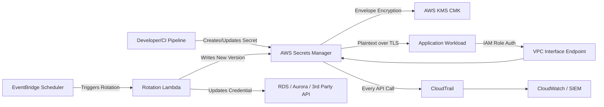
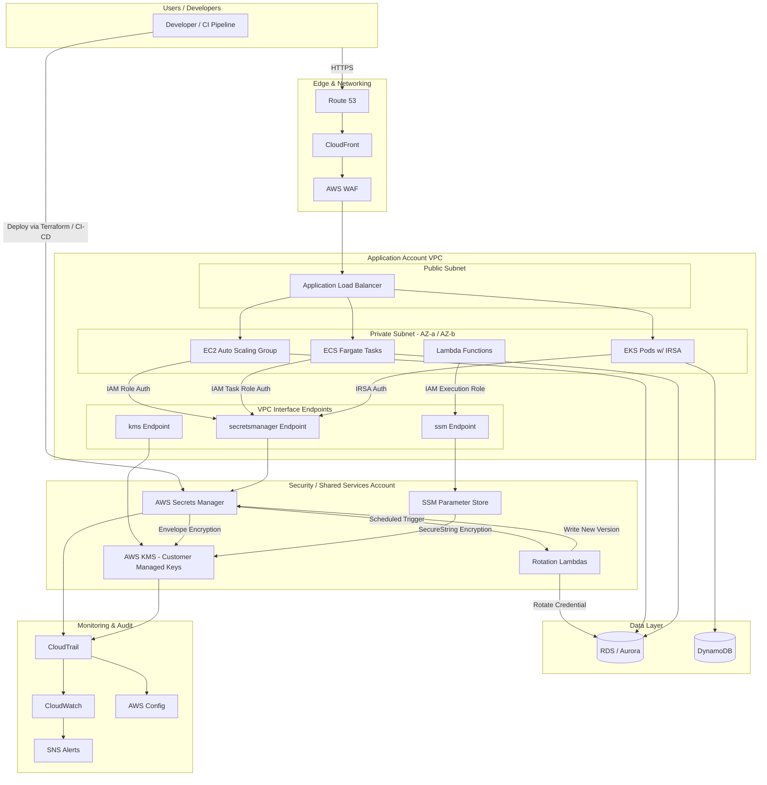

# Part XI – Security Reference Architectures

# Chapter 90: Secrets Management

---

# 1. Executive Summary

Every production system depends on secrets: database passwords, API keys, TLS private keys, OAuth client secrets, third-party service tokens, SSH keys, and service account credentials. How an organization manages these secrets is one of the clearest signals of its operational and security maturity.

**The business problem**

- Applications historically stored credentials in configuration files, environment variables, source code, or CI/CD pipeline variables.
- These approaches scatter secrets across dozens of systems with no central visibility.
- Once a secret is committed to a Git repository, it is effectively permanent — even after deletion, it exists in commit history and in every fork or clone.
- Manual rotation is expensive, error-prone, and frequently skipped, leaving credentials valid for years.
- Breach investigations routinely trace root cause to a leaked static credential rather than a sophisticated exploit.
- Compliance frameworks (PCI-DSS, HIPAA, SOC 2, FedRAMP, ISO 27001) explicitly require controlled access, encryption at rest, and periodic rotation of credentials — none of which is achievable with ad hoc secret storage.

**The architecture objective**

A secrets management architecture centralizes the storage, access control, auditing, encryption, and rotation of sensitive values. It replaces "secrets baked into artifacts" with "secrets retrieved at runtime from an authenticated, audited, encrypted source of truth."

The objective is not simply to hide secrets — it is to:

1. Eliminate static, long-lived credentials wherever possible.
2. Make every secret access attributable to an identity and logged.
3. Automate rotation so that a leaked credential has a short blast-radius window.
4. Enforce least-privilege access down to the level of an individual secret.
5. Provide a consistent retrieval pattern across EC2, ECS, EKS, Lambda, and on-premises workloads.
6. Support multi-account and multi-region enterprise structures without duplicating operational effort.

**Why organizations adopt this architecture**

- Security audits and penetration tests consistently flag hardcoded credentials as high-severity findings.
- Regulatory examiners increasingly ask for rotation evidence, not just rotation policy documents.
- Incident response teams need to know, within minutes, which secrets were potentially exposed and who accessed them.
- Engineering teams want a single, standard way to retrieve secrets regardless of the compute platform they use, reducing onboarding friction.
- FinOps and platform teams want secret sprawl (hundreds of parameter store entries, dozens of KMS keys) brought under governance instead of growing unmanaged.

**Major business benefits**

| Benefit | Description |
|---|---|
| Reduced breach impact | Short-lived, rotated secrets minimize the value of a leaked credential |
| Audit readiness | Every access is logged in CloudTrail, satisfying SOC 2 / PCI-DSS / HIPAA evidence requirements |
| Operational efficiency | Automated rotation removes manual, error-prone credential updates |
| Developer productivity | Standardized SDK/API calls replace ad hoc `.env` file management |
| Centralized governance | Security teams get a single pane of glass for secret inventory and access policy |
| Reduced blast radius | Fine-grained IAM policies mean compromised workloads can only read the secrets they need |

**Typical enterprise scenarios**

- A three-tier web application needs database credentials without embedding them in AMIs or container images.
- A microservices platform on EKS needs per-service, per-namespace secret isolation.
- A CI/CD pipeline needs short-lived deployment credentials instead of a permanent IAM user access key.
- A regulated financial services company must prove that database passwords rotate every 30–90 days with no manual intervention.
- A SaaS platform must isolate each tenant's third-party API keys (Stripe, Twilio, SendGrid) with strict per-tenant access boundaries.
- A hybrid enterprise needs to extend AWS-native secrets management to on-premises servers via Systems Manager.

This chapter builds a complete, production-grade secrets management reference architecture centered on **AWS Secrets Manager**, complemented by **AWS Systems Manager Parameter Store**, **AWS KMS**, **IAM**, and integration patterns for EC2, ECS, EKS, and Lambda. It covers rotation automation, cross-account sharing, disaster recovery, cost optimization, and the operational pitfalls that experienced architects have learned the hard way.

> **Note:** This architecture is a *supporting* / *cross-cutting* architecture. It rarely stands alone — it is consumed by nearly every other architecture in this book (three-tier web apps, serverless systems, container platforms, data platforms). Treat this chapter as the secrets "control plane" that every compute pattern in prior chapters plugs into.

---

# 2. Business Requirements

## 2.1 Business Drivers

- Eliminate hardcoded credentials in source code and container images.
- Satisfy compliance mandates requiring encrypted storage and periodic rotation of credentials.
- Provide developers with a self-service, low-friction way to consume secrets.
- Reduce mean-time-to-rotate (MTTR) after a suspected credential compromise from days to minutes.
- Centralize secret governance across a multi-account AWS Organization.

## 2.2 Functional Requirements

- Store arbitrary key-value and JSON-structured secrets (DB credentials, API keys, certificates).
- Retrieve secrets programmatically from EC2, ECS, EKS, Lambda, and on-premises servers.
- Support automatic rotation for RDS, Aurora, DocumentDB, and Redshift natively.
- Support custom rotation via Lambda for third-party secrets (API keys, SaaS credentials).
- Support versioning, so applications can roll back to a previous secret value if rotation fails.
- Support tagging for cost allocation and access-control-by-tag (ABAC).
- Support cross-account secret sharing via resource policies for shared-services architectures.
- Support replication to secondary regions for disaster recovery.

## 2.3 Non-Functional Requirements

| Category | Requirement |
|---|---|
| Scalability | Support tens of thousands of secrets across hundreds of AWS accounts |
| Availability | 99.95%+ read availability; no single point of failure |
| Latency | Secret retrieval under 100ms p99 for cached clients; under 300ms uncached |
| Security | Encryption at rest (KMS), encryption in transit (TLS 1.2+), least-privilege IAM |
| Compliance | Support PCI-DSS, HIPAA, SOC 2, FedRAMP Moderate/High controls |
| Auditability | 100% of secret access logged with identity, timestamp, and source IP |

## 2.4 Scalability Goals

- Design must scale from a single application (10s of secrets) to an enterprise landing zone (10,000+ secrets across 200+ accounts).
- Rotation Lambdas must scale independently per secret without cross-secret contention.

## 2.5 Availability Requirements

- Secrets Manager and Parameter Store are both regional, multi-AZ managed services with an AWS-published SLA of 99.9% (Secrets Manager) — architect client-side caching to tolerate brief regional API disruptions.
- Design for **graceful degradation**: cached secrets should continue to serve the application even if the Secrets Manager API is briefly unavailable.

## 2.6 Latency Requirements

- Cold retrieval (first fetch): under 300 ms.
- Cached retrieval (subsequent fetches via client-side caching library): under 5 ms (in-process cache, no network call).

## 2.7 Compliance Requirements

- PCI-DSS Requirement 3 & 8: protect stored cardholder-adjacent credentials, enforce unique IDs and rotation.
- HIPAA Security Rule: encryption of ePHI-adjacent credentials, access logging.
- SOC 2 CC6.1 / CC6.6: logical access controls and encryption.
- FedRAMP: requires customer-managed KMS keys (CMKs), not AWS-managed keys, for certain secret classes.

## 2.8 Security Expectations

- No secret ever stored in plaintext in source control, AMIs, container images, or CI/CD logs.
- No IAM principal should have `secretsmanager:*` on `*` — access scoped to specific secret ARNs or tag-based conditions.
- All secrets encrypted with customer-managed KMS keys (CMKs) for auditability of key usage, not the default AWS-managed key, in regulated environments.

## 2.9 Recovery Objectives

| Objective | Target |
|---|---|
| RPO (Recovery Point Objective) | Near-zero — Secrets Manager replicates synchronously across AZs; use cross-region replication for regional DR |
| RTO (Recovery Time Objective) | Under 15 minutes for regional failover using pre-configured multi-region replicas |

## 2.10 SLAs

- Internal SLA: 99.95% secret retrieval success rate measured at the client SDK layer (including cache hits).
- AWS Secrets Manager service SLA: 99.9% monthly uptime percentage (per AWS service commitment).

## 2.11 Expected Workload

- Typical enterprise: 500–5,000 secrets, 50,000–5,000,000 `GetSecretValue` API calls per day depending on caching strategy.
- Rotation events: hundreds to low thousands per month depending on rotation frequency (30/60/90-day cycles).

## 2.12 Expected Growth

- Secret count grows roughly linearly with microservice count and third-party integration count.
- Plan IAM and tagging strategy for 10x growth in secret count within 24 months — retrofitting tagging conventions onto thousands of existing secrets is a costly, disruptive project.

---

# 3. Architecture Overview

## 3.1 Overall Design

The architecture is built around a **centralized secrets control plane** (AWS Secrets Manager) with **KMS-backed envelope encryption**, **IAM-scoped access**, and **automated rotation**, consumed by heterogeneous compute platforms through a **standardized client-side caching pattern**.

Design goals, in priority order:

1. **No secret ever leaves AWS in plaintext outside of an authenticated, encrypted API call.**
2. **Every retrieval is attributable** to a specific IAM role/identity and logged in CloudTrail.
3. **Rotation is automatic**, not a human-triggered ritual.
4. **Access is least-privilege**, scoped per secret or per tag, never account-wide.
5. **Retrieval is fast and resilient**, using client-side caching so the Secrets Manager API is not a hard runtime dependency for every request.

## 3.2 Architecture Philosophy

Secrets management should be treated as **infrastructure, not application logic**. Application code should never contain rotation logic, encryption logic, or hardcoded fallback credentials. Instead:

- The **platform team** owns the Secrets Manager, KMS, and IAM configuration.
- The **application team** consumes secrets through a thin SDK call or a sidecar/init-container pattern.
- The **security team** owns audit review of CloudTrail logs and access policy approval.

This separation of concerns is what allows the architecture to scale across hundreds of engineering teams without every team reinventing secret handling.

## 3.3 Core Components

| Component | Role |
|---|---|
| AWS Secrets Manager | Primary store for dynamic, rotatable secrets (DB credentials, API keys) |
| AWS Systems Manager Parameter Store | Store for lower-sensitivity configuration and simple static values |
| AWS KMS | Encryption key management — envelope encryption for all secrets |
| IAM | Identity, roles, and fine-grained resource policies controlling secret access |
| Lambda (Rotation Functions) | Custom rotation logic for non-native (third-party) secrets |
| CloudTrail | Immutable audit log of every secret access and management API call |
| CloudWatch | Metrics and alarms on rotation failures, throttling, and unusual access patterns |
| VPC Endpoints (Interface) | Private connectivity to Secrets Manager / SSM without traversing the public internet |
| EventBridge | Triggers for rotation scheduling, rotation failure notifications, and automation workflows |
| AWS Config | Continuous compliance checks (e.g., "no secret without rotation enabled") |

## 3.4 How Components Interact

1. An application workload (EC2, ECS task, EKS pod, or Lambda function) assumes an IAM role.
2. The workload calls `GetSecretValue` (or uses a caching client library) against Secrets Manager, over a VPC interface endpoint.
3. IAM evaluates the request against the role's policy and the secret's resource policy.
4. Secrets Manager decrypts the secret using the associated KMS CMK (requires `kms:Decrypt` permission on the role).
5. The plaintext secret is returned over TLS and used in-memory only — never written to disk.
6. CloudTrail logs the `GetSecretValue` call with caller identity, source IP, and secret ARN.
7. On a rotation schedule, EventBridge triggers the rotation Lambda, which creates a new credential version, updates the target system (e.g., RDS), tests it, and marks it `AWSCURRENT`.

## 3.5 High-Level Workflow



## 3.6 Request Lifecycle

1. Application starts up and assumes its IAM execution role.
2. On first need for a credential, the application's secrets client checks its **local in-memory cache**.
3. Cache miss → call `GetSecretValue` via VPC endpoint.
4. Secret is cached in-memory with a TTL (commonly 5–60 minutes, or "cache until rotation" using the AWS Secrets Manager caching libraries).
5. Application uses the plaintext value (e.g., opens DB connection) and discards it from any long-lived variable once the connection pool is established.

## 3.7 Response Lifecycle

1. Secrets Manager validates IAM permissions and secret existence.
2. KMS decrypts the secret's data key, and Secrets Manager decrypts the payload.
3. Response returned as JSON (structured secret) or plaintext string.
4. Response never persisted to disk by AWS — it is the client's responsibility not to log or persist it either.

## 3.8 Data Lifecycle

1. **Creation** — a secret is created via Terraform, console, or API, immediately encrypted with a CMK.
2. **Versioning** — every update creates a new version; `AWSCURRENT`, `AWSPENDING`, and `AWSPREVIOUS` staging labels track rotation state.
3. **Rotation** — scheduled Lambda rotates the value, testing it before promoting `AWSPENDING` to `AWSCURRENT`.
4. **Access** — consumed by workloads via API calls, always encrypted in transit.
5. **Deletion** — secrets are soft-deleted with a mandatory recovery window (7–30 days) before permanent deletion, preventing accidental data loss.

---

# 4. AWS Services Used

## 4.1 AWS Secrets Manager

**Purpose:** Centralized storage, encryption, versioning, and automated rotation of dynamic secrets such as database credentials, API keys, and OAuth tokens.

**Why selected:**
- Native rotation integration with RDS, Aurora, DocumentDB, and Redshift with zero custom code.
- Fine-grained resource policies enable cross-account sharing without duplicating secrets.
- Built-in versioning with staging labels makes rotation safe and reversible.

**Alternatives:**
- **SSM Parameter Store (SecureString):** cheaper, but no native rotation, no resource-based policies for cross-account sharing (until relatively recent RAM-based sharing), weaker built-in rotation ecosystem.
- **HashiCorp Vault:** more powerful dynamic secrets engine and multi-cloud support, but adds significant operational overhead (you must run and secure Vault itself) — often over-engineering for AWS-only shops.
- **Third-party (CyberArk, Doppler, 1Password Secrets Automation):** viable for multi-cloud enterprises with existing investment, but adds a non-native dependency and additional licensing cost.

**Limitations:**
- Regional service — cross-region access requires replication.
- API request costs and per-secret monthly storage cost can add up at scale (thousands of secrets).
- 64 KB maximum secret size.
- Rotation Lambdas must be written and maintained for non-native (third-party) secrets.

**Pricing considerations:**
- $0.40 per secret per month (per region).
- $0.05 per 10,000 API calls.
- At 5,000 secrets with heavy uncached polling, costs can unexpectedly exceed $2,000/month — client-side caching is essential (see Section 16, Cost Surprises).

**Best practices:**
- Always enable rotation for any secret representing a live credential.
- Use resource policies, not IAM alone, for cross-account access.
- Tag every secret with `Environment`, `Owner`, `Application`, and `DataClassification`.

## 4.2 AWS Systems Manager Parameter Store

**Purpose:** Store configuration values and lower-sensitivity secrets (feature flags, non-rotating API keys, simple credentials) as plain `String`, `StringList`, or encrypted `SecureString` parameters.

**Why selected:** Free tier for standard parameters makes it ideal for high-volume, low-sensitivity configuration that doesn't need rotation.

**Alternatives:** Secrets Manager (for anything requiring rotation or cross-account sharing); AppConfig (for feature flags with deployment safety).

**Limitations:** No native rotation; advanced parameters have throughput limits (40 transactions/second, standard tier is lower); 8 KB size limit for standard parameters (4 KB for standard tier `SecureString`, up to 8 KB advanced).

**Pricing considerations:** Standard parameters are free; advanced parameters cost $0.05/parameter/month plus API charges above the free tier.

**Best practices:** Use for config, not for secrets requiring rotation. Use hierarchical naming (`/app/env/component/key`) for IAM path-based policies.

## 4.3 AWS KMS (Key Management Service)

**Purpose:** Manages the customer master keys (CMKs) used for envelope encryption of all Secrets Manager and Parameter Store `SecureString` values.

**Why selected:** Native integration, FIPS 140-2 validated HSMs, fine-grained key policies, and full CloudTrail auditability of every `Decrypt`/`Encrypt` call.

**Alternatives:** CloudHSM (for FIPS 140-2 Level 3 / customer-controlled HSM requirements — higher cost, higher operational burden); external key stores via KMS External Key Store (XKS) for extreme sovereignty requirements.

**Limitations:** API call costs at extreme scale; symmetric CMK request quota (default 5,500–30,000 requests/second depending on region, can be raised).

**Pricing considerations:** $1/month per CMK; $0.03 per 10,000 requests. Using one CMK per application (rather than one CMK per secret) is the standard cost-effective pattern.

**Best practices:** Use customer-managed CMKs (not the AWS-managed `aws/secretsmanager` key) whenever you need a distinct audit trail, custom key policy, or cross-account key grants. Rotate CMKs annually (AWS supports automatic annual rotation for symmetric CMKs).

## 4.4 IAM (Identity and Access Management)

**Purpose:** Controls which principals (roles, users, federated identities) may create, read, update, rotate, or delete secrets.

**Why selected:** Only mechanism for enforcing least privilege at the AWS API level; integrates with resource policies on Secrets Manager for cross-account access.

**Alternatives:** None within AWS — IAM is foundational and mandatory.

**Limitations:** Policy complexity grows with secret count; wildcard policies are a common and dangerous anti-pattern (see Section 27).

**Best practices:** Scope `secretsmanager:GetSecretValue` to specific ARNs or tag-based conditions; never grant `secretsmanager:*` broadly; use permission boundaries for developer roles.

## 4.5 VPC (and Interface Endpoints)

**Purpose:** Provides private network connectivity from compute resources to Secrets Manager and SSM without traversing the public internet.

**Why selected:** Interface VPC endpoints (AWS PrivateLink) keep all secret retrieval traffic on the AWS backbone, reducing exposure and often required by compliance frameworks that prohibit public internet paths for credential retrieval.

**Alternatives:** NAT Gateway + public API endpoint (works, but traffic exits the VPC's private boundary and incurs NAT data processing charges).

**Limitations:** Interface endpoints incur hourly and per-GB charges; must be deployed per AZ for high availability.

**Best practices:** Deploy interface endpoints for `secretsmanager`, `ssm`, and `kms` in every private subnet's AZ; attach endpoint policies restricting which secrets/keys are reachable per VPC.

## 4.6 Lambda (Rotation Functions)

**Purpose:** Executes custom rotation logic for secrets that are not natively supported by Secrets Manager (third-party API keys, custom application credentials).

**Why selected:** Serverless, pay-per-invocation, and AWS provides open-source rotation function templates for common patterns (single-user, alternating-user, multi-user).

**Alternatives:** Step Functions for complex multi-step rotation workflows; container-based rotation via ECS Fargate tasks for rotation logic requiring long execution times (>15 min Lambda limit).

**Limitations:** 15-minute maximum execution time; must implement all four rotation steps (`createSecret`, `setSecret`, `testSecret`, `finishSecret`) correctly or rotation can leave a secret in an inconsistent state.

**Best practices:** Always implement the `testSecret` step to validate the new credential actually works before promoting it; alarm on rotation failures via CloudWatch.

## 4.7 CloudTrail

**Purpose:** Immutable audit log of every management and data-plane API call against Secrets Manager, KMS, and IAM.

**Why selected:** Mandatory for compliance evidence — "who accessed which secret and when" is the single most common audit question.

**Best practices:** Enable data events for Secrets Manager (`GetSecretValue` is a data event and is NOT logged by default in CloudTrail — this must be explicitly enabled); route logs to a centralized, immutable S3 bucket in a dedicated log-archive account.

## 4.8 CloudWatch

**Purpose:** Metrics, dashboards, and alarms for rotation failures, throttling, and anomalous access volume.

**Best practices:** Alarm on `RotationFailed` events immediately (page on-call); build a dashboard showing secrets nearing rotation-overdue thresholds.

## 4.9 AWS Config

**Purpose:** Continuous compliance evaluation — e.g., "flag any secret without rotation enabled" or "flag any secret encrypted with the default AWS-managed key instead of a CMK."

**Best practices:** Use the managed rule `secretsmanager-rotation-enabled-check` and `secretsmanager-scheduled-rotation-success-check`.

## 4.10 EventBridge

**Purpose:** Schedules rotation windows and routes rotation failure/success events to notification and automation targets (SNS, Slack via Chatbot, ticketing systems).

---

# 5. Complete Architecture Diagram



---

# 6. Component-by-Component Explanation

### AWS Secrets Manager

- **Purpose:** System of record for all rotatable, dynamic secrets.
- **Responsibilities:** Store, encrypt, version, rotate, and serve secrets via API; enforce resource policies for cross-account access.
- **Inputs:** Secret creation/update calls from Terraform/CI-CD; rotation triggers from EventBridge.
- **Outputs:** Plaintext secret values returned to authorized callers over TLS.
- **Scaling:** Fully managed, scales transparently; watch API request quotas at extreme volume.
- **High availability:** Multi-AZ within a region by default; add cross-region replicas for DR.
- **Failure handling:** If rotation fails, the previous version (`AWSPREVIOUS`) remains valid and usable — applications are never locked out by a failed rotation, provided `testSecret` gates promotion.
- **Dependencies:** KMS for encryption; IAM for access control; Lambda for custom rotation.
- **Security:** All access requires IAM authorization; resource policies add a second authorization layer for cross-account scenarios.
- **Monitoring:** CloudWatch metrics on rotation success/failure; CloudTrail on every access.

### AWS KMS (Customer-Managed Keys)

- **Purpose:** Root of trust for all encryption operations.
- **Responsibilities:** Generate and protect data encryption keys; enforce key policies; log every cryptographic operation.
- **Scaling:** Request quotas apply per key per region; request a quota increase before large migrations.
- **High availability:** Keys are regionally redundant across AZs automatically; multi-region keys available for DR replication of encrypted data without re-encryption.
- **Failure handling:** If a CMK is disabled or its policy is misconfigured, all dependent secrets become immediately unreadable — this is why key policy changes require a strict change-management process.
- **Security:** Key policies should follow least privilege; enable key rotation (automatic annual rotation for symmetric CMKs).

### Rotation Lambda

- **Purpose:** Executes the four-step AWS rotation lifecycle (`createSecret`, `setSecret`, `testSecret`, `finishSecret`).
- **Responsibilities:** Generate a new credential, apply it to the target system, verify it works, then promote it.
- **Scaling:** One invocation per rotation event; scales horizontally with number of secrets rotating concurrently.
- **Failure handling:** If `testSecret` fails, `finishSecret` is never called and `AWSCURRENT` remains on the old, working credential — this fail-safe design is critical and must not be bypassed by custom rotation code.
- **Security:** The rotation Lambda's execution role needs `secretsmanager:*Secret*` on the specific secret and network/database access to the target system — scope tightly.

### VPC Interface Endpoints

- **Purpose:** Private, AWS-backbone-only path to Secrets Manager, SSM, and KMS APIs.
- **High availability:** Deploy one endpoint ENI per AZ used by compute resources.
- **Security:** Attach endpoint policies restricting reachable resources; combine with private DNS so no code changes are required to route through the endpoint.

### IAM Roles (per workload)

- **Purpose:** Scoped identity for each compute workload (EC2 instance profile, ECS task role, EKS IRSA role, Lambda execution role).
- **Responsibilities:** Authorize exactly the secrets a given workload needs — nothing more.
- **Security:** Use condition keys (`secretsmanager:ResourceTag/Application`) to scale least-privilege without maintaining thousands of individual ARN-based statements.

---

# 7. End-to-End Request Flow

1. **Client** sends an HTTPS request to the application (e.g., `POST /checkout`).
2. **DNS (Route 53)** resolves the application domain to CloudFront.
3. **CloudFront** forwards the request to the origin ALB after edge caching/WAF checks.
4. **WAF** evaluates the request against managed and custom rule groups; blocks malicious payloads.
5. **ALB** routes the request to a healthy target (EC2/ECS/EKS).
6. **Application** checks its **in-memory secrets cache** for the database credential.
7. **Cache miss (first request since startup or TTL expiry):** application calls `GetSecretValue` on Secrets Manager via the **VPC interface endpoint**.
8. **IAM** evaluates the calling role's policy and the secret's resource policy.
9. **KMS** decrypts the data key; Secrets Manager decrypts and returns the plaintext secret over TLS.
10. **Application** caches the secret in memory (never on disk) with an appropriate TTL.
11. **Application** opens a **database connection** using the retrieved credential.
12. **Database (RDS/Aurora)** authenticates the connection and returns data.
13. **Application** builds the HTTP response and returns it through ALB → CloudFront → client.
14. **Logging:** the `GetSecretValue` call is recorded in **CloudTrail**; application logs are sent to **CloudWatch Logs** (with the secret value explicitly excluded/redacted from any log statement).
15. **Monitoring:** CloudWatch alarms watch for elevated `4xx`/`5xx` rates on the secret API calls (e.g., `AccessDeniedException` spikes indicating a misconfigured role or a compromised credential probing for secrets).
16. **Error handling:** if `GetSecretValue` fails (throttling, network blip), the client SDK retries with exponential backoff; if all retries fail, the application serves from its last successfully cached value (if within an acceptable staleness window) or fails the health check, prompting the load balancer to route around the unhealthy instance.

---

# 8. Deployment Flow

## 8.1 Infrastructure Provisioning

Secrets Manager resources, KMS keys, IAM roles, and VPC endpoints are provisioned via Terraform as part of the platform team's shared infrastructure repository — never manually via console in production accounts.

## 8.2 Terraform Workflow

1. Developer/platform engineer opens a pull request modifying a `.tf` file (e.g., adding a new secret placeholder or rotation schedule).
2. CI pipeline runs `terraform fmt -check`, `terraform validate`, and a policy-as-code scan (e.g., `tfsec`, `checkov`, or OPA/Conftest).
3. `terraform plan` output is posted as a PR comment for human review.
4. On merge, `terraform apply` runs in the CI/CD pipeline using a short-lived, OIDC-federated IAM role (no long-lived AWS credentials in CI).

> **Warning:** Terraform must never set the **actual secret value** in the `.tf` file itself. Use `aws_secretsmanager_secret` (metadata) plus `aws_secretsmanager_secret_version` populated via a secure out-of-band mechanism (e.g., initial value set manually once, then immediately rotated) or via `ignore_changes = [secret_string]` so Terraform doesn't manage the live rotating value and doesn't store it in state.

## 8.3 CI/CD Deployment

- CI/CD pipelines retrieve **deployment-time** secrets (e.g., a signing key) via a short-lived OIDC-federated role — never stored as static CI/CD pipeline variables.
- Build artifacts (container images, AMIs) must **never** contain secrets baked in at build time.

## 8.4 Blue-Green Deployment

- New application versions are deployed to a parallel (green) environment.
- The green environment retrieves the **same** secrets as blue via the same IAM role/resource-tag pattern — no secret duplication needed.
- Traffic is shifted gradually (ALB weighted target groups or Route 53 weighted routing); if the green environment shows elevated `AccessDeniedException` rates on secret calls, that's an immediate rollback signal indicating an IAM misconfiguration.

## 8.5 Rollback

- Application rollback: revert to the previous task definition/AMI — no secret changes needed since secrets are decoupled from deployment artifacts.
- Secret rollback: Secrets Manager retains the previous version under the `AWSPREVIOUS` label; `UpdateSecretVersionStage` can restore it if a rotation introduced a bad credential.

## 8.6 Secrets in the Deployment Pipeline

- Never pass secrets as plaintext environment variables in CI/CD YAML files.
- Use native CI/CD OIDC-to-AWS-IAM federation (GitHub Actions `aws-actions/configure-aws-credentials` with OIDC, GitLab CI `id_tokens`) to assume a scoped deployment role at runtime.

## 8.7 Configuration Validation

- Post-deployment smoke test: application health check endpoint verifies it can successfully retrieve and use its required secrets (without exposing the value) before being marked healthy by the load balancer.

---

# 9. Network Topology

## 9.1 VPC and CIDR Design

| Item | Example |
|---|---|
| VPC CIDR | `10.20.0.0/16` |
| Public Subnet AZ-a | `10.20.0.0/24` |
| Public Subnet AZ-b | `10.20.1.0/24` |
| Private App Subnet AZ-a | `10.20.10.0/24` |
| Private App Subnet AZ-b | `10.20.11.0/24` |
| Private Data Subnet AZ-a | `10.20.20.0/24` |
| Private Data Subnet AZ-b | `10.20.21.0/24` |

## 9.2 Public Subnets

- Host only the ALB and NAT Gateways.
- No compute workload that touches secrets should live in a public subnet.

## 9.3 Private Subnets

- Host EC2/ECS/EKS compute and the RDS/Aurora database.
- All secret retrieval traffic stays within this private boundary via VPC interface endpoints.

## 9.4 NAT Gateway

- Used only for outbound internet access needed by workloads for non-AWS API calls (e.g., calling a third-party SaaS API whose secret was just retrieved).
- Secrets Manager/KMS/SSM traffic should **not** need to traverse NAT if interface endpoints are correctly configured and private DNS is enabled.

## 9.5 Internet Gateway

- Attached only to the VPC for public subnet resources (ALB, bastion alternatives).

## 9.6 Transit Gateway

- Used in multi-VPC/multi-account topologies so that a shared-services account hosting centralized Secrets Manager resources (if using a hub-and-spoke secrets pattern) can be reached privately from spoke VPCs — though in most designs, each account has its own Secrets Manager and cross-account access uses **resource policies**, not network routing, since Secrets Manager is a regional AWS service reachable via its own endpoint in each VPC.

## 9.7 Route Tables

- Private subnet route tables send `0.0.0.0/0` to the NAT Gateway (for non-AWS traffic) and use VPC endpoint routing (automatic via private DNS) for AWS API traffic.

## 9.8 Network ACLs

- Stateless, subnet-level; used as a coarse defense-in-depth layer (e.g., explicitly deny known-bad CIDR ranges) — not the primary control (Security Groups and IAM are primary).

## 9.9 Security Groups

- Interface endpoint security group: allow inbound HTTPS (443) only from the application security group(s).
- Application security group: allow outbound HTTPS (443) to the endpoint security group and to the database security group on its port.

## 9.10 PrivateLink

- The Secrets Manager, SSM, and KMS **interface endpoints are AWS PrivateLink endpoints** — this is the core mechanism keeping secret retrieval traffic off the public internet.

## 9.11 Hybrid Connectivity

- On-premises servers reach Secrets Manager via Direct Connect or Site-to-Site VPN into the VPC, then through the same interface endpoints, using IAM Roles Anywhere or SSM hybrid activation for credential-free authentication from non-AWS compute.

---

# 10. Identity and Access

## 10.1 IAM Roles

- One execution role per workload type (per microservice, not one shared "app-role" for all services) — this is the single most important control limiting blast radius.

## 10.2 IAM Policies — Example (Least Privilege)

```json

{
  "Version": "2012-10-17",
  "Statement": [
    {
      "Sid": "AllowReadSpecificSecret",
      "Effect": "Allow",
      "Action": [
        "secretsmanager:GetSecretValue",
        "secretsmanager:DescribeSecret"
      ],
      "Resource": "arn:aws:secretsmanager:us-east-1:111122223333:secret:prod/checkout-service/db-credentials-*"
    },
    {
      "Sid": "AllowKMSDecryptForThisSecret",
      "Effect": "Allow",
      "Action": "kms:Decrypt",
      "Resource": "arn:aws:kms:us-east-1:111122223333:key/abcd1234-ef56-7890-abcd-1234567890ab",
      "Condition": {
        "StringEquals": {
          "kms:ViaService": "secretsmanager.us-east-1.amazonaws.com"
        }
      }
    }
  ]
}

```

> **Tip:** Suffixing the secret ARN with `-*` accounts for the random 6-character suffix Secrets Manager appends to every secret ARN.

## 10.3 Resource Policies (for cross-account sharing)

```json

{
  "Version": "2012-10-17",
  "Statement": [
    {
      "Sid": "AllowConsumerAccountReadOnly",
      "Effect": "Allow",
      "Principal": {
        "AWS": "arn:aws:iam::444455556666:role/checkout-service-role"
      },
      "Action": "secretsmanager:GetSecretValue",
      "Resource": "*"
    }
  ]
}

```

## 10.4 STS (Security Token Service)

- Every workload identity (EC2 instance profile, ECS task role, EKS IRSA, Lambda execution role) is ultimately a set of temporary credentials issued by STS — no long-lived IAM user access keys should be used for any workload that consumes secrets.

## 10.5 Cross-Account Access

- Preferred pattern: **resource policy on the secret** in the owning account, granting a specific role ARN in the consuming account — avoids duplicating the secret and keeps a single source of truth.
- Alternative pattern: **AWS Resource Access Manager (RAM)** sharing for broader, org-wide sharing scenarios.

## 10.6 Least Privilege

- Scope by exact ARN where secret count is manageable; scope by resource tag condition (`secretsmanager:ResourceTag/Application`) where secret count is large and per-team ownership is tag-driven.

## 10.7 Service Roles

- Rotation Lambda execution role needs: `secretsmanager:GetSecretValue`, `secretsmanager:PutSecretValue`, `secretsmanager:UpdateSecretVersionStage`, `secretsmanager:DescribeSecret` on the target secret, plus network access (VPC-attached Lambda) to reach the target database.

## 10.8 Permission Boundaries

- Apply a permission boundary to all developer-assumable roles capping maximum possible `secretsmanager:*` and `kms:*` actions, preventing privilege escalation even if a developer's role policy is misconfigured too broadly.

---

# 11. Security Architecture

## 11.1 Encryption

- **At rest:** every secret is encrypted using envelope encryption with a KMS CMK. Use one CMK per application/environment boundary (not one global key) so key policies and audit trails map cleanly to ownership.
- **In transit:** all API calls to Secrets Manager, SSM, and KMS use TLS 1.2+; enforce via `aws:SecureTransport` condition in bucket/resource policies where applicable.

## 11.2 KMS Key Policy Example

```json

{
  "Version": "2012-10-17",
  "Statement": [
    {
      "Sid": "EnableRootAccountAdmin",
      "Effect": "Allow",
      "Principal": { "AWS": "arn:aws:iam::111122223333:root" },
      "Action": "kms:*",
      "Resource": "*"
    },
    {
      "Sid": "AllowSecretsManagerUse",
      "Effect": "Allow",
      "Principal": { "AWS": "arn:aws:iam::111122223333:role/checkout-service-role" },
      "Action": ["kms:Decrypt", "kms:DescribeKey"],
      "Resource": "*",
      "Condition": {
        "StringEquals": { "kms:ViaService": "secretsmanager.us-east-1.amazonaws.com" }
      }
    }
  ]
}

```

## 11.3 TLS / Certificate Manager

- TLS certificates for ALB/CloudFront are issued and rotated by AWS Certificate Manager (ACM) — a complementary but distinct secret class from application credentials; private keys never leave ACM.

## 11.4 WAF and Shield

- WAF protects the application layer from injection attacks that could otherwise be used to trick an application into leaking a decrypted secret through an error message or log.
- Shield Standard (default) / Shield Advanced (for high-value targets) protect against volumetric DDoS that could be used as cover for a credential-stuffing attack.

## 11.5 Certificate Manager / Secrets Manager Boundary

- Use ACM for TLS certificates; use Secrets Manager for everything else (DB creds, API keys). Do not store TLS private keys manually in Secrets Manager unless integrating with a non-AWS-terminated TLS endpoint.

## 11.6 GuardDuty

- Detects anomalous API behavior, including unusual `GetSecretValue` call patterns from an unfamiliar IP/geolocation, or a compromised IAM credential being used to enumerate secrets.

## 11.7 Inspector

- Scans EC2/ECS/Lambda workloads for known vulnerabilities that could be exploited to gain code execution and subsequently abuse a workload's IAM role to exfiltrate secrets.

## 11.8 Security Hub

- Aggregates findings from GuardDuty, Inspector, Config, and Secrets Manager-specific checks into a single compliance dashboard, mapped to standards like CIS AWS Foundations Benchmark and PCI-DSS.

## 11.9 CloudTrail

- **Critical configuration point:** `GetSecretValue` is classified as a **data event** and is **not logged by default**. You must explicitly enable data event logging for Secrets Manager in your CloudTrail trail configuration, or you will have zero visibility into who is reading which secrets.

## 11.10 AWS Config

- Managed rules: `secretsmanager-rotation-enabled-check`, `secretsmanager-using-cmk` (custom rule), `secretsmanager-scheduled-rotation-success-check`.

## 11.11 Zero Trust Principles Applied

- No implicit trust based on network location (VPC membership alone is not sufficient — IAM authorization is still required for every call).
- Every request is authenticated (SigV4) and authorized (IAM) independently.
- Short-lived credentials (STS) everywhere; no static long-lived AWS access keys for workloads.

## 11.12 Threat Model

| Attack Vector | Mitigation |
|---|---|
| Secret committed to Git | Pre-commit hooks + secret-scanning (GitHub Advanced Security, TruffleHog) in CI |
| Overly permissive IAM role | Least-privilege policies, permission boundaries, periodic access analyzer review |
| Compromised workload (RCE) | Network segmentation, WAF, Inspector scanning, short secret TTL/rotation limiting blast radius |
| Insider threat | CloudTrail logging + Security Hub alerting on anomalous access patterns |
| Rotation Lambda compromise | Scope rotation Lambda IAM role tightly; code-review rotation function changes |
| KMS key policy misconfiguration | Change management + Config rule alerting on key policy drift |
| Secrets Manager API throttling/DoS | Client-side caching reduces call volume; request quota increases pre-approved for peak events |

---

# 12. High Availability

## 12.1 AZ Failures

- Secrets Manager is inherently multi-AZ; no customer action required for intra-region AZ resilience.
- VPC interface endpoints must be deployed in **every AZ** used by compute — a single-AZ endpoint creates a hidden single point of failure.

## 12.2 Instance Failures

- Application instances cache secrets in memory; a replacement instance (via Auto Scaling) simply fetches fresh from Secrets Manager on boot — no special handling needed.

## 12.3 Regional Failures

- Requires **cross-region replication** of secrets (native Secrets Manager feature) to a standby region, combined with a broader multi-region DR strategy for compute and data (see Chapter 95, Disaster Recovery, and Chapter 98, Multi-Region Active-Active).

## 12.4 Database Failures

- Rotation Lambdas that update RDS credentials must be designed to handle Multi-AZ failover gracefully — test rotation against a failover event, not just steady-state.

## 12.5 Load Balancing / Health Checks

- Application health check endpoints should verify secret retrieval succeeds as part of "deep" health checks (not just TCP-level) so unhealthy instances (e.g., ones with a stale/broken credential) are removed from rotation automatically.

## 12.6 Failover

- For cross-region failover, applications in the DR region read from the **regional replica** of the secret — Secrets Manager keeps replicas in sync automatically after the initial replication is configured.

---

# 13. Disaster Recovery

## 13.1 Backup Strategy

- Secrets Manager retains version history automatically (`AWSCURRENT`, `AWSPENDING`, `AWSPREVIOUS`) — this serves as a built-in rollback mechanism, not a full backup replacement.
- For full DR, use **native cross-region replication**, which AWS Secrets Manager supports out of the box (`aws secretsmanager replicate-secret-to-regions`).

## 13.2 Cross-Region Replication

- Configure a **primary region** and one or more **replica regions**; updates to the primary propagate automatically; replicas are read-only until promoted.

## 13.3 Pilot Light / Warm Standby / Multi-Site

| Strategy | Secrets Manager Role |
|---|---|
| Pilot Light | Replicate only critical secrets to standby region; scale up on failover |
| Warm Standby | Replicate all secrets continuously; standby compute is running at reduced capacity |
| Multi-Site Active-Active | Full replication to all active regions; applications in every region read from their local replica for minimal latency |

## 13.4 RPO / RTO for Secrets

| Metric | Target | Mechanism |
|---|---|---|
| RPO | Near-zero (seconds) | Native asynchronous cross-region replication |
| RTO | Under 15 minutes | Applications in the DR region already point at the local replica ARN; no manual secret migration needed at failover time |

> **Note:** Replica secrets have a **different ARN** than the primary. Applications must be designed to resolve the correct regional ARN dynamically (e.g., via environment variable set per region, or the AWS SDK's region-aware secret resolution) rather than hardcoding a single-region ARN.

---

# 14. Scalability

## 14.1 Horizontal Scaling (Compute)

- Adding more EC2/ECS/EKS instances does not require any secrets-related re-architecture — each new instance simply assumes the same IAM role and retrieves the same secret via the API, benefiting from Secrets Manager's transparent backend scaling.

## 14.2 Vertical Scaling

- Not applicable to Secrets Manager itself (fully managed); applies to the database or compute consuming the secret.

## 14.3 Auto Scaling

- No special Secrets Manager configuration needed — new instances in an Auto Scaling Group inherit the launch template's IAM instance profile and can immediately retrieve secrets on boot.

## 14.4 Serverless Scaling

- Lambda functions scale to thousands of concurrent executions; each cold start triggers a `GetSecretValue` call unless using **Lambda execution environment caching** (reusing the secret across warm invocations) — critical to avoid Secrets Manager throttling at high Lambda concurrency.

## 14.5 Database Scaling

- Read replicas and Aurora Serverless scaling are unaffected by secrets architecture; rotation Lambdas should target the writer endpoint for credential updates.

## 14.6 Storage Scaling

- Secrets Manager storage scales automatically; monitor secret **count** growth for cost governance (Section 16), not storage size (max 64 KB/secret is rarely a real constraint).

## 14.7 Queue-Based Scaling (SQS-fed workers)

- Worker fleets consuming from SQS should retrieve secrets once per worker process lifecycle (with periodic refresh), not once per message processed, to avoid excessive API call volume at high message throughput.

---

# 15. Performance Optimization

## 15.1 Caching (Client-Side) — The Single Most Important Optimization

AWS provides official **client-side caching libraries** (`aws-secretsmanager-caching-java`, `-python`, `-.net`, and a **Secrets Manager Agent** — a local HTTP proxy/cache for any language) that:

- Cache the secret in-process after first retrieval.
- Automatically refresh the cache on a configurable TTL (default 1 hour) or when a rotation event changes the version.
- Reduce `GetSecretValue` API call volume by orders of magnitude, cutting both cost and latency.

```python

from aws_secretsmanager_caching import SecretCache, SecretCacheConfig
import boto3

client = boto3.client("secretsmanager")
cache_config = SecretCacheConfig(secret_refresh_interval=3600)  # 1 hour
cache = SecretCache(config=cache_config, client=client)

# First call: hits the API. Subsequent calls within TTL: served from memory.

db_secret = cache.get_secret_string("prod/checkout-service/db-credentials")

```

## 15.2 Compression

- Not typically applicable to secrets payloads (small JSON blobs); not a meaningful optimization lever here.

## 15.3 CDN

- Not applicable — secrets must never be cached at the CDN edge layer; ensure no secret-bearing API is ever fronted by CloudFront with caching enabled.

## 15.4 Database Connection Pooling

- Once a credential is retrieved, use it to establish a **connection pool** (e.g., RDS Proxy, PgBouncer, or application-level pooling) rather than opening a new connection per request — this is the biggest performance lever for the *consuming* application, and also reduces load on the rotation process since RDS Proxy can absorb credential rotation transparently without dropping active connections.

## 15.5 Concurrency

- Client-side caching libraries are thread-safe; ensure the cache instance is a **singleton** per application process, not re-instantiated per request (a common performance bug).

## 15.6 Async Processing

- For batch/worker systems, retrieve the secret once at worker startup and refresh asynchronously in the background rather than blocking the hot path on every job.

---

# 16. Cost Optimization (FinOps)

## 16.1 Estimated Monthly Costs

| Deployment Size | Secrets Count | API Calls/Month (uncached) | API Calls/Month (cached) | Secrets Manager Cost (uncached) | Secrets Manager Cost (cached) |
|---|---|---|---|---|---|
| Small | 25 | 500,000 | 20,000 | ~$12.50 | ~$10.10 |
| Medium | 250 | 10,000,000 | 500,000 | ~$150 | ~$102.50 |
| Enterprise | 3,000 | 200,000,000 | 5,000,000 | ~$2,200 | ~$1,225 |

*(Storage: $0.40/secret/month. API: $0.05 per 10,000 calls. KMS: ~$1/CMK/month + $0.03/10,000 requests — costs shown are Secrets Manager storage + API only, illustrative.)*

## 16.2 Major Cost Drivers

- **Secret count** (linear $0.40/secret/month storage cost) — sprawl is the #1 driver.
- **Uncached `GetSecretValue` call volume** — the #2 driver, and the one most within engineering's control.
- **KMS request volume** — usually secondary but non-trivial at very high API call rates since every `GetSecretValue` triggers a `kms:Decrypt`.
- **VPC interface endpoints** — hourly charge per AZ per endpoint (small, but adds up across dozens of accounts/VPCs).

## 16.3 Optimization Opportunities

- Enforce client-side caching as a **mandatory platform library** — this alone typically cuts API costs by 90%+.
- Consolidate related config values into a single JSON secret rather than one secret per key/value pair (reduces per-secret storage cost, though weigh against blast-radius of a single larger secret).
- Move **non-sensitive** configuration to free-tier SSM Parameter Store standard parameters instead of Secrets Manager.
- Delete unused/orphaned secrets — run quarterly access-log audits (via CloudTrail Lake or Athena queries) to find secrets with zero `GetSecretValue` calls in 90+ days.

## 16.4 Reserved Instances / Savings Plans / Spot

- Not directly applicable to Secrets Manager (serverless, request-based pricing) — these levers apply to the **compute** consuming secrets (EC2/ECS/EKS), covered in the relevant compute chapters.

## 16.5 S3 Lifecycle / Storage Classes

- Applies to **CloudTrail log storage**, not to Secrets Manager itself — transition audit logs older than 90 days to S3 Glacier Instant Retrieval for cost-efficient long-term compliance retention.

## 16.6 Rightsizing

- "Rightsizing" for secrets means periodically pruning unused secrets and consolidating over-fragmented ones — treat this as a recurring FinOps + security hygiene exercise.

## 16.7 Cost Allocation and Tagging

```

Required tags on every secret:
  Environment: prod | staging | dev
  Owner: team-checkout
  Application: checkout-service
  DataClassification: confidential | restricted
  CostCenter: CC-4471

```

- Use AWS Cost Explorer with cost allocation tags to attribute Secrets Manager spend per team, driving accountability for secret sprawl.

## 16.8 Budgets and Cost Anomaly Detection

- Set an AWS Budget alert per account for Secrets Manager + KMS combined spend.
- Enable **Cost Anomaly Detection** monitors on the Secrets Manager service — a sudden spike almost always indicates a caching regression (a code change accidentally bypassed the cache) rather than legitimate growth.

---

# 17. AI-Assisted Operations

## 17.1 Amazon Q (Developer / Q for AWS)

- Use Amazon Q to generate and review IAM policies for secrets access, catching overly broad `Resource: "*"` statements before they reach production.
- Amazon Q can explain a CloudTrail event trail in natural language during an incident ("show me every principal that accessed `prod/checkout-service/db-credentials` in the last 24 hours").

## 17.2 Amazon Bedrock

- Build an internal chat assistant (using a Bedrock foundation model) that developers query for "how do I retrieve a secret in my Lambda function" — reducing platform team support burden.
- Use Bedrock to summarize rotation failure Lambda logs into a human-readable incident summary automatically posted to an on-call channel.

## 17.3 AI Troubleshooting

- Feed CloudWatch Logs Insights query results for rotation failures into a Bedrock model to get a first-pass root cause hypothesis before a human engineer engages — this shortens MTTR for rotation incidents.

## 17.4 Log Analysis

- Use Bedrock or Amazon Q to analyze CloudTrail data events for anomalous `GetSecretValue` access patterns (unusual source IP, unusual time-of-day, unusual principal) that GuardDuty's built-in models might not flag.

## 17.5 Incident Response

- AI-assisted runbook generation: given a detected leaked credential, generate a step-by-step containment plan (disable the compromised IAM role, force-rotate the affected secret, invalidate active sessions) tailored to the specific secret and its dependents.

## 17.6 Cost Optimization

- Use Bedrock to analyze Cost Explorer data and flag secrets with high API call volume relative to peer secrets — likely caching misconfigurations.

## 17.7 Capacity Planning

- Forecast secret count and API call growth using historical CloudWatch metrics fed into a Bedrock-based forecasting prompt to proactively request KMS/Secrets Manager quota increases before hitting limits.

## 17.8 Architecture Review

- Use Amazon Q to review Terraform plans for secrets-related resources against the AWS Well-Architected Security Pillar before merge.

## 17.9 AI-Generated Terraform

- AI-generated Terraform for secrets infrastructure **must always be human-reviewed** — a common AI-generated anti-pattern is writing the actual secret value into the `.tf` file or Terraform state instead of managing only the secret's metadata.

## 17.10 AI-Generated Documentation

- Use AI to auto-generate and keep current a "secrets inventory" runbook page (which secrets exist, which team owns each, rotation schedule) by querying the Secrets Manager API and formatting the output — far more reliable than manually maintained wiki pages that go stale.

---

# 18. Terraform Implementation

## 18.1 Providers and Backend

```hcl

# versions.tf

terraform {
  required_version = ">= 1.7.0"

  required_providers {
    aws = {
      source  = "hashicorp/aws"
      version = "~> 5.50"
    }
  }

  backend "s3" {
    bucket         = "acme-corp-terraform-state-prod"
    key            = "secrets-management/terraform.tfstate"
    region         = "us-east-1"
    dynamodb_table = "terraform-state-lock"
    encrypt        = true
  }
}

provider "aws" {
  region = var.aws_region

  default_tags {
    tags = {
      ManagedBy   = "Terraform"
      Environment = var.environment
      Module      = "secrets-management"
    }
  }
}

```

## 18.2 Variables

```hcl

# variables.tf

variable "aws_region" {
  description = "Primary AWS region"
  type        = string
  default     = "us-east-1"
}

variable "environment" {
  description = "Deployment environment"
  type        = string
  validation {
    condition     = contains(["dev", "staging", "prod"], var.environment)
    error_message = "Environment must be dev, staging, or prod."
  }
}

variable "application_name" {
  description = "Application/service that owns this secret"
  type        = string
}

variable "rotation_days" {
  description = "Automatic rotation interval in days"
  type        = number
  default     = 30
}

variable "replica_region" {
  description = "Secondary region for cross-region secret replication (DR)"
  type        = string
  default     = "us-west-2"
}

variable "consumer_role_arns" {
  description = "IAM role ARNs from consumer accounts allowed to read this secret"
  type        = list(string)
  default     = []
}

```

## 18.3 KMS Customer-Managed Key Module

```hcl

# kms.tf

resource "aws_kms_key" "secrets_cmk" {
  description             = "CMK for ${var.application_name} secrets (${var.environment})"
  deletion_window_in_days = 30
  enable_key_rotation     = true

  policy = jsonencode({
    Version = "2012-10-17"
    Statement = [
      {
        Sid       = "EnableRootAccountFullAccess"
        Effect    = "Allow"
        Principal = { AWS = "arn:aws:iam::${data.aws_caller_identity.current.account_id}:root" }
        Action    = "kms:*"
        Resource  = "*"
      },
      {
        Sid    = "AllowApplicationRoleDecrypt"
        Effect = "Allow"
        Principal = {
          AWS = aws_iam_role.application_role.arn
        }
        Action   = ["kms:Decrypt", "kms:DescribeKey"]
        Resource = "*"
        Condition = {
          StringEquals = {
            "kms:ViaService" = "secretsmanager.${var.aws_region}.amazonaws.com"
          }
        }
      },
      {
        Sid    = "AllowRotationLambdaFullSecretsAccess"
        Effect = "Allow"
        Principal = {
          AWS = aws_iam_role.rotation_lambda_role.arn
        }
        Action   = ["kms:Decrypt", "kms:GenerateDataKey"]
        Resource = "*"
        Condition = {
          StringEquals = {
            "kms:ViaService" = "secretsmanager.${var.aws_region}.amazonaws.com"
          }
        }
      }
    ]
  })
}

resource "aws_kms_alias" "secrets_cmk_alias" {
  name          = "alias/${var.application_name}-${var.environment}-secrets"
  target_key_id = aws_kms_key.secrets_cmk.key_id
}

data "aws_caller_identity" "current" {}

```

## 18.4 Secrets Manager Secret (Metadata Only — No Hardcoded Value)

```hcl

# secrets.tf

resource "aws_secretsmanager_secret" "db_credentials" {
  name        = "${var.environment}/${var.application_name}/db-credentials"
  description = "RDS master credentials for ${var.application_name}"
  kms_key_id  = aws_kms_key.secrets_cmk.arn

  tags = {
    Owner              = var.application_name
    DataClassification = "confidential"
  }

  # Terraform manages the secret's metadata & rotation config only.

  # The live secret VALUE is written once out-of-band (e.g., via CI job

  # calling `aws secretsmanager put-secret-value`) and thereafter

  # managed entirely by the rotation Lambda — never re-applied by Terraform.

  lifecycle {
    ignore_changes = [

      # Prevents Terraform drift detection from ever touching the live value.

    ]
  }
}

resource "aws_secretsmanager_secret_rotation" "db_credentials_rotation" {
  secret_id           = aws_secretsmanager_secret.db_credentials.id
  rotation_lambda_arn = aws_lambda_function.rds_rotation.arn

  rotation_rules {
    automatically_after_days = var.rotation_days
  }
}

resource "aws_secretsmanager_secret_policy" "cross_account_read" {
  count      = length(var.consumer_role_arns) > 0 ? 1 : 0
  secret_arn = aws_secretsmanager_secret.db_credentials.arn

  policy = jsonencode({
    Version = "2012-10-17"
    Statement = [
      {
        Sid       = "AllowConsumerAccountsReadOnly"
        Effect    = "Allow"
        Principal = { AWS = var.consumer_role_arns }
        Action    = "secretsmanager:GetSecretValue"
        Resource  = "*"
      }
    ]
  })
}

# Cross-region replication for Disaster Recovery

resource "aws_secretsmanager_secret" "db_credentials_replica_config" {
  name       = aws_secretsmanager_secret.db_credentials.name
  kms_key_id = aws_kms_key.secrets_cmk.arn

  replica {
    region     = var.replica_region
    kms_key_id = aws_kms_key.secrets_cmk.arn
  }
}

```

## 18.5 IAM Roles and Policies

```hcl

# iam.tf

resource "aws_iam_role" "application_role" {
  name = "${var.application_name}-${var.environment}-app-role"

  assume_role_policy = jsonencode({
    Version = "2012-10-17"
    Statement = [{
      Effect    = "Allow"
      Principal = { Service = "ecs-tasks.amazonaws.com" }
      Action    = "sts:AssumeRole"
    }]
  })

  permissions_boundary = aws_iam_policy.developer_permission_boundary.arn
}

resource "aws_iam_role_policy" "application_secrets_read" {
  name = "read-app-secrets"
  role = aws_iam_role.application_role.id

  policy = jsonencode({
    Version = "2012-10-17"
    Statement = [{
      Sid      = "ReadOwnSecretsOnly"
      Effect   = "Allow"
      Action   = ["secretsmanager:GetSecretValue", "secretsmanager:DescribeSecret"]
      Resource = aws_secretsmanager_secret.db_credentials.arn
    }]
  })
}

resource "aws_iam_policy" "developer_permission_boundary" {
  name        = "${var.application_name}-permission-boundary"
  description = "Caps maximum permissions grantable to application roles"

  policy = jsonencode({
    Version = "2012-10-17"
    Statement = [
      {
        Effect   = "Allow"
        Action   = ["secretsmanager:GetSecretValue", "secretsmanager:DescribeSecret"]
        Resource = "arn:aws:secretsmanager:*:*:secret:${var.environment}/${var.application_name}/*"
      },
      {
        Effect   = "Allow"
        Action   = ["kms:Decrypt", "kms:DescribeKey"]
        Resource = "*"
        Condition = {
          StringEquals = { "kms:ViaService" = "secretsmanager.${var.aws_region}.amazonaws.com" }
        }
      }
    ]
  })
}

resource "aws_iam_role" "rotation_lambda_role" {
  name = "${var.application_name}-${var.environment}-rotation-role"

  assume_role_policy = jsonencode({
    Version = "2012-10-17"
    Statement = [{
      Effect    = "Allow"
      Principal = { Service = "lambda.amazonaws.com" }
      Action    = "sts:AssumeRole"
    }]
  })
}

resource "aws_iam_role_policy_attachment" "rotation_lambda_vpc_access" {
  role       = aws_iam_role.rotation_lambda_role.name
  policy_arn = "arn:aws:iam::aws:policy/service-role/AWSLambdaVPCAccessExecutionRole"
}

resource "aws_iam_role_policy" "rotation_lambda_secrets_policy" {
  name = "rotation-secrets-policy"
  role = aws_iam_role.rotation_lambda_role.id

  policy = jsonencode({
    Version = "2012-10-17"
    Statement = [{
      Effect = "Allow"
      Action = [
        "secretsmanager:GetSecretValue",
        "secretsmanager:PutSecretValue",
        "secretsmanager:UpdateSecretVersionStage",
        "secretsmanager:DescribeSecret",
        "secretsmanager:GetRandomPassword"
      ]
      Resource = aws_secretsmanager_secret.db_credentials.arn
    }]
  })
}

```

## 18.6 VPC Interface Endpoints

```hcl

# vpc_endpoints.tf

resource "aws_security_group" "secrets_endpoint_sg" {
  name_prefix = "secrets-endpoint-"
  vpc_id      = var.vpc_id

  ingress {
    description     = "HTTPS from application subnets"
    from_port       = 443
    to_port         = 443
    protocol        = "tcp"
    security_groups = [var.application_security_group_id]
  }

  egress {
    from_port   = 0
    to_port     = 0
    protocol    = "-1"
    cidr_blocks = ["0.0.0.0/0"]
  }
}

resource "aws_vpc_endpoint" "secretsmanager" {
  vpc_id              = var.vpc_id
  service_name        = "com.amazonaws.${var.aws_region}.secretsmanager"
  vpc_endpoint_type    = "Interface"
  subnet_ids          = var.private_subnet_ids
  security_group_ids  = [aws_security_group.secrets_endpoint_sg.id]
  private_dns_enabled = true
}

resource "aws_vpc_endpoint" "kms" {
  vpc_id              = var.vpc_id
  service_name        = "com.amazonaws.${var.aws_region}.kms"
  vpc_endpoint_type    = "Interface"
  subnet_ids          = var.private_subnet_ids
  security_group_ids  = [aws_security_group.secrets_endpoint_sg.id]
  private_dns_enabled = true
}

```

## 18.7 Outputs

```hcl

# outputs.tf

output "db_credentials_secret_arn" {
  description = "ARN of the database credentials secret"
  value       = aws_secretsmanager_secret.db_credentials.arn
}

output "secrets_cmk_arn" {
  description = "ARN of the customer-managed KMS key protecting secrets"
  value       = aws_kms_key.secrets_cmk.arn
}

output "application_role_arn" {
  description = "IAM role ARN assumed by the application to read secrets"
  value       = aws_iam_role.application_role.arn
}

```

## 18.8 Remote State Best Practices

- State bucket must have versioning enabled and be encrypted with its own CMK — protecting Terraform state is itself a secrets-adjacent concern, since resource IDs and (if misused) accidental secret values could leak into state.
- Use a DynamoDB table for state locking to prevent concurrent applies from corrupting shared secrets infrastructure.
- Never store the literal secret value in a `.tf` file or allow it to be written into `terraform.tfstate` — this is the single most common Terraform-related secrets mistake (see Section 27, Anti-Patterns).

---

# 19. AWS CLI Examples

## 19.1 Deployment

```bash

# Create a secret with an initial value (only used for bootstrap; rotation takes over afterward)

aws secretsmanager create-secret \
  --name prod/checkout-service/db-credentials \
  --description "RDS master credentials for checkout-service" \
  --kms-key-id alias/checkout-service-prod-secrets \
  --secret-string '{"username":"app_user","password":"CHANGE_ME_ON_FIRST_ROTATION"}'

# Enable rotation

aws secretsmanager rotate-secret \
  --secret-id prod/checkout-service/db-credentials \
  --rotation-lambda-arn arn:aws:lambda:us-east-1:111122223333:function:rds-rotation-checkout \
  --rotation-rules AutomaticallyAfterDays=30

```

## 19.2 Validation

```bash

# Verify a secret exists and view its rotation configuration

aws secretsmanager describe-secret \
  --secret-id prod/checkout-service/db-credentials

# Retrieve the current value (use sparingly, only for break-glass debugging)

aws secretsmanager get-secret-value \
  --secret-id prod/checkout-service/db-credentials \
  --version-stage AWSCURRENT

```

## 19.3 Monitoring

```bash

# List secrets that have never rotated successfully or are overdue

aws secretsmanager list-secrets \
  --filters Key=tag-key,Values=Owner \
  --query "SecretList[?RotationEnabled==\`true\` && RotationRules.AutomaticallyAfterDays!=null]"

# Check the rotation history via CloudTrail (data events must be enabled)

aws cloudtrail lookup-events \
  --lookup-attributes AttributeKey=EventName,AttributeValue=RotateSecret \
  --start-time "$(date -d '7 days ago' --iso-8601=seconds)"

```

## 19.4 Troubleshooting

```bash

# Check current rotation status and any last-rotation error

aws secretsmanager describe-secret \
  --secret-id prod/checkout-service/db-credentials \
  --query "{LastRotatedDate:LastRotatedDate,LastAccessedDate:LastAccessedDate,RotationEnabled:RotationEnabled}"

# Inspect a specific version's staging labels (useful when a rotation is stuck)

aws secretsmanager list-secret-version-ids \
  --secret-id prod/checkout-service/db-credentials \
  --include-deprecated

# Manually roll back to the previous good version if a rotation left a bad AWSCURRENT

aws secretsmanager update-secret-version-stage \
  --secret-id prod/checkout-service/db-credentials \
  --version-stage AWSCURRENT \
  --move-to-version-id <PREVIOUS_VERSION_ID> \
  --remove-from-version-id <CURRENT_BAD_VERSION_ID>

```

## 19.5 Cleanup

```bash

# Soft-delete with a 30-day recovery window (never force-delete in production without approval)

aws secretsmanager delete-secret \
  --secret-id staging/deprecated-service/api-key \
  --recovery-window-in-days 30

# Restore a soft-deleted secret within the recovery window

aws secretsmanager restore-secret \
  --secret-id staging/deprecated-service/api-key

```

---

# 20. CI/CD Integration

## 20.1 GitHub Actions (OIDC Federation — No Static AWS Keys)

```yaml

name: Deploy Application
on:
  push:
    branches: [main]

permissions:
  id-token: write   # required for OIDC
  contents: read

jobs:
  deploy:
    runs-on: ubuntu-latest
    steps:
      - uses: actions/checkout@v4

      - name: Configure AWS credentials via OIDC
        uses: aws-actions/configure-aws-credentials@v4
        with:
          role-to-assume: arn:aws:iam::111122223333:role/github-actions-deploy-role
          aws-region: us-east-1

      - name: Terraform Plan (Secrets Infra)
        run: |
          terraform init
          terraform plan -out=tfplan

      - name: Security Scan (tfsec)
        run: tfsec . --minimum-severity HIGH

      - name: Terraform Apply
        if: github.ref == 'refs/heads/main'
        run: terraform apply -auto-approve tfplan

```

## 20.2 GitLab CI

```yaml

deploy:
  stage: deploy
  id_tokens:
    AWS_ID_TOKEN:
      aud: sts.amazonaws.com
  script:
    - export AWS_ROLE_ARN=arn:aws:iam::111122223333:role/gitlab-ci-deploy-role
    - aws sts assume-role-with-web-identity --role-arn $AWS_ROLE_ARN --role-session-name gitlab-ci --web-identity-token $AWS_ID_TOKEN
    - terraform apply -auto-approve

```

## 20.3 Jenkins

- Use the Jenkins AWS credentials plugin configured for IAM Role assumption (via instance profile if Jenkins runs on EC2, or OIDC if Jenkins runs elsewhere) — never a static access key stored in Jenkins credentials store for production deployment roles.

## 20.4 AWS CodePipeline

- Use a **CodeBuild** IAM service role scoped to exactly the Secrets Manager/KMS/IAM actions needed for the Terraform apply step — CodePipeline's built-in IAM integration avoids the OIDC federation step needed for external CI tools.

## 20.5 Terraform Pipeline Validation

```bash

terraform fmt -check -recursive
terraform validate
tfsec . --minimum-severity HIGH
checkov -d . --framework terraform

```

## 20.6 Policy as Code

```rego

# opa/no_wildcard_secrets_policy.rego

package terraform.secrets

deny[msg] {
  resource := input.resource_changes[_]
  resource.type == "aws_iam_role_policy"
  statement := resource.change.after.policy
  contains(statement, "\"Resource\": \"*\"")
  contains(statement, "secretsmanager:")
  msg := sprintf("IAM policy %v grants wildcard access to Secrets Manager - violates least privilege", [resource.address])
}

```

## 20.7 Rollback

- Terraform-managed secret **metadata** (rotation config, KMS key, IAM policy) rolls back via `git revert` + re-apply.
- The **live secret value** rolls back via `update-secret-version-stage` (Section 19.4) — this is an operational action, not a Terraform action.

---

# 21. Monitoring

## 21.1 CloudWatch Metrics and Dashboards

| Metric | Source | Alarm Threshold |
|---|---|---|
| Rotation failures | `AWS/SecretsManager` custom via EventBridge → CloudWatch | Any failure → page on-call |
| `GetSecretValue` throttling (`ThrottlingException`) | CloudTrail → CloudWatch Logs Insights | >1% of calls in 5 min |
| `AccessDeniedException` spikes | CloudTrail → CloudWatch Logs Insights | >10 in 5 min (possible probing) |
| KMS `Decrypt` error rate | CloudWatch KMS metrics | >0.1% error rate |
| Secrets overdue for rotation | Custom Lambda scanning `DescribeSecret` | Any secret >2x rotation interval |

## 21.2 Logs

- CloudTrail data events for Secrets Manager and KMS routed to a centralized CloudWatch Logs group in the log-archive account.

## 21.3 Tracing (X-Ray)

- Instrument the secret-retrieval call within application X-Ray traces to distinguish "slow because of Secrets Manager API latency" from "slow because of downstream database" during performance investigations.

## 21.4 Alarms and Notifications

```hcl

resource "aws_cloudwatch_metric_alarm" "rotation_failure" {
  alarm_name          = "${var.application_name}-secret-rotation-failed"
  comparison_operator = "GreaterThanThreshold"
  evaluation_periods  = 1
  metric_name         = "RotationFailed"
  namespace           = "Custom/SecretsManager"
  period              = 300
  statistic           = "Sum"
  threshold           = 0
  alarm_actions       = [aws_sns_topic.security_alerts.arn]
}

```

## 21.5 SLIs / SLOs / Error Budgets

| SLI | SLO | Error Budget (monthly) |
|---|---|---|
| Secret retrieval success rate | 99.95% | 21.6 minutes of failed retrievals |
| Rotation success rate | 99.5% (allowing for occasional transient DB failover conflicts) | ~3.6 rotation failures per 720 rotations |

---

# 22. Logging

## 22.1 Centralized Logging

- All CloudTrail logs (including Secrets Manager and KMS data events) delivered to a dedicated **log-archive account**, with cross-account write-only access from all member accounts — no member account can modify or delete its own audit trail.

## 22.2 CloudWatch Logs

- Application logs must **never** contain secret values — enforce via log-scrubbing middleware and code review checklist item; treat any secret appearing in logs as a security incident requiring rotation.

## 22.3 S3 + Athena

- Long-term CloudTrail log storage in S3 (Glacier Instant Retrieval after 90 days) queried via Athena for compliance reporting and ad hoc forensic investigation ("show all `GetSecretValue` calls for secret X in the last 12 months").

## 22.4 OpenSearch

- Near-real-time CloudTrail log ingestion into OpenSearch for SOC dashboards and alerting when sub-minute detection latency is required (see Chapter 92, SOC Operations).

## 22.5 Retention

| Log Type | Retention |
|---|---|
| CloudTrail (S3, log-archive account) | 7 years (typical financial services requirement) |
| CloudWatch Logs (hot tier) | 90 days, then export to S3 |
| Application logs | 30–90 days depending on compliance framework |

## 22.6 Audit Logging

- Quarterly access review: export all `GetSecretValue` callers per secret and confirm each caller is a currently valid, expected workload — decommissioned services' lingering IAM roles are a common finding.

---

# 23. Operational Excellence

## 23.1 Runbooks

- **Suspected credential leak runbook:** disable IAM role → force-rotate secret → invalidate active DB sessions → review CloudTrail for the leak window → notify affected teams.
- **Rotation failure runbook:** check rotation Lambda CloudWatch Logs → verify target system (RDS) reachability from the Lambda's VPC → manually re-trigger rotation → escalate if `testSecret` step fails repeatedly.

## 23.2 Automation

- Automate quarterly IAM access review generation (list all roles with `secretsmanager:GetSecretValue` permission per secret) as a scheduled Lambda producing a report for security team sign-off.

## 23.3 Patch Management

- Rotation Lambda runtimes (Python/Node.js) must be kept current — deprecated runtime versions are a common Config/Security Hub finding; automate runtime version bumps via a scheduled dependency-update pipeline.

## 23.4 Maintenance

- Annual review of all KMS key policies and Secrets Manager resource policies to remove access grants for decommissioned accounts/roles ("access policy garbage collection").

## 23.5 Incident Response

- Secrets-related incidents should trigger the organization's standard incident response process, with a specific playbook branch for "credential compromise" (see Chapter 92/93 for full SOC integration).

## 23.6 Change Management

- Any change to a KMS key policy, Secrets Manager resource policy, or cross-account sharing configuration requires a peer-reviewed pull request and, for production, a second approver — these are among the highest-blast-radius configuration changes in the entire platform.

---

# 24. Failure Scenarios

| # | Scenario | Symptoms | Root Cause | Detection | Resolution | Prevention |
|---|---|---|---|---|---|---|
| 1 | Rotation Lambda fails mid-rotation | App still works (old credential valid), rotation alarm fires | Target DB unreachable from Lambda's VPC (SG misconfiguration) | CloudWatch alarm on `RotationFailed` | Fix SG rule; manually re-trigger `rotate-secret` | Test rotation Lambda network path in every environment before go-live |
| 2 | Application caches secret indefinitely, misses rotation | New DB password rejected after rotation, app throws auth errors | Client cache TTL set too long or cache never refreshes on rotation event | Elevated DB auth failure rate | Restart app instances to force cache refresh; fix TTL config | Use official caching library with rotation-aware refresh, not a custom cache |
| 3 | IAM role over-permissioned, compromised workload reads unrelated secrets | Security Hub finding; unusual `GetSecretValue` pattern in CloudTrail | Wildcard `Resource: "*"` in IAM policy | GuardDuty / CloudTrail anomaly | Scope IAM policy immediately; rotate all secrets that role could access | Enforce least-privilege policy templates + Access Analyzer in CI |
| 4 | Secret accidentally committed to Git | Automated secret scanner alert | Developer pasted a value directly into code for local testing | GitHub secret scanning / TruffleHog CI job | Force-rotate the secret immediately; scrub Git history | Pre-commit hooks blocking secret patterns; never allow plaintext secrets locally |
| 5 | KMS key policy accidentally revokes application access | 100% of `GetSecretValue` calls fail with `AccessDeniedException` | Unreviewed key policy change removed the application role's grant | CloudWatch alarm on `AccessDeniedException` spike | Revert key policy via Terraform; redeploy | Require peer review + plan output review for all KMS policy changes |
| 6 | Cross-region replica out of sync during regional failover | DR region app can't retrieve current secret | Replication lag or replication never configured for a newer secret | DR drill / regional outage | Manually promote replica or wait for sync; escalate to AWS Support if stuck | Include secrets replication check in every DR drill runbook |
| 7 | Rotation Lambda has a bug that always fails `testSecret` | Secret never progresses past `AWSPENDING`, repeated rotation attempts pile up | Faulty test logic (e.g., testing against wrong endpoint) | CloudWatch alarm; `list-secret-version-ids` shows stuck `AWSPENDING` | Fix and redeploy Lambda; manually clean up stuck pending version | Unit test all four rotation Lambda steps against a staging DB before prod deploy |
| 8 | Secrets Manager API throttling under load spike | Elevated latency, some requests fail with `ThrottlingException` | No client-side caching; every request hits the API directly | CloudWatch Logs Insights query on `ThrottlingException` | Deploy caching library; request quota increase as stopgap | Mandate caching library as part of platform onboarding checklist |
| 9 | Developer manually edits a secret via console, bypassing Terraform | Terraform plan shows unexpected diff / drift | Emergency manual change during an incident, never reconciled | `terraform plan` in CI shows drift | Reconcile Terraform state or codify the manual change | Restrict console write access to secrets in prod; enforce IaC-only changes |
| 10 | RDS Proxy misconfigured, drops connections during rotation | Brief spike in DB connection errors during rotation window | RDS Proxy not used, or configured incorrectly, so app holds stale connections through credential change | Application error logs correlate with rotation timestamp | Deploy/reconfigure RDS Proxy for transparent credential handling | Always pair rotation with RDS Proxy or connection-pool credential refresh logic |
| 11 | Secret deleted accidentally without recovery window | Application immediately fails all secret retrieval | `delete-secret` called with `--force-delete-without-recovery` | Immediate application outage | Restore from the 7–30 day recovery window if within it; otherwise recreate from backup/known value | Prohibit force-delete via SCP; always use recovery window |
| 12 | Multi-account sharing breaks after consumer account role is renamed | Consumer app suddenly gets `AccessDeniedException` | Resource policy references the old role ARN, which no longer exists | Consumer team reports outage | Update resource policy with new role ARN | Use role name patterns / SCPs to prevent unreviewed role renames on shared-secret consumers |
| 13 | Lambda rotation function times out on a large multi-user rotation | Rotation fails intermittently under load | Rotation logic exceeds Lambda's 15-minute limit for complex multi-step credential updates | CloudWatch Lambda duration metrics near timeout threshold | Refactor into Step Functions state machine for longer-running rotation workflows | Benchmark rotation duration in staging under realistic conditions before prod |
| 14 | Secret used by multiple unrelated services, rotation breaks one silently | One dependent service fails after rotation while others succeed | Secret was shared across services instead of one secret per consumer | Service-specific error logs after rotation window | Split into per-service secrets; update rotation Lambda to update all consumers, or migrate to per-service secrets | Enforce one secret per consuming application from the start |
| 15 | VPC interface endpoint deployed in only one AZ | Intermittent failures when instances in the other AZ can't resolve the endpoint | Endpoint subnet configuration omitted a second AZ | Elevated latency/timeouts from specific AZ's instances | Add endpoint ENI in missing AZ | Always deploy interface endpoints across every AZ used by compute in Terraform module defaults |

---

# 25. Troubleshooting Guide

| Problem | Symptoms | Likely Cause | Diagnosis | AWS CLI Commands | Resolution |
|---|---|---|---|---|---|
| App can't retrieve secret | `AccessDeniedException` | IAM policy missing/scoped wrong | Check role policy vs. secret ARN | `aws iam simulate-principal-policy --policy-source-arn <role-arn> --action-names secretsmanager:GetSecretValue --resource-arns <secret-arn>` | Update IAM policy to include correct ARN |
| App gets stale credential after rotation | DB auth failures post-rotation | Cache TTL too long / no rotation-aware refresh | Check cache config, compare `LastRotatedDate` to app restart time | `aws secretsmanager describe-secret --secret-id <id>` | Use official caching SDK with shorter TTL; restart affected instances |
| Rotation stuck in `AWSPENDING` | Repeated rotation attempts, alarm firing | `testSecret` step failing | Check rotation Lambda logs | `aws logs tail /aws/lambda/<rotation-fn> --follow` | Fix rotation Lambda logic; manually clean up pending version |
| Cross-account access denied | Consumer role gets `AccessDeniedException` on shared secret | Resource policy missing or ARN mismatch | Compare resource policy principal to actual role ARN | `aws secretsmanager get-resource-policy --secret-id <id>` | Update resource policy with correct principal ARN |
| Throttling errors under load | `ThrottlingException` in logs | No client-side caching deployed | Review call volume via CloudTrail/CloudWatch | `aws cloudtrail lookup-events --lookup-attributes AttributeKey=EventName,AttributeValue=GetSecretValue` | Deploy caching library; request quota increase |
| Secret value appears in application logs | Security finding / audit flag | Missing log-scrubbing, developer logged secret during debugging | Search log aggregator for known secret patterns | N/A (log search tool specific) | Force-rotate the exposed secret immediately; add log scrubbing middleware |
| KMS decrypt failures | `AccessDeniedException` on `kms:Decrypt` | Key policy doesn't grant the calling role | Review key policy | `aws kms get-key-policy --key-id <key-id> --policy-name default` | Update key policy to include the role with `kms:ViaService` condition |
| Secret not replicating to DR region | DR app can't find secret ARN | Replication never configured, or lag | Check replication status | `aws secretsmanager describe-secret --secret-id <id> --query "ReplicationStatus"` | Configure/re-trigger replication via Terraform |

---

# 26. Best Practices

1. Never hardcode secrets in source code, container images, or AMIs.
2. Use AWS Secrets Manager for anything requiring rotation; use SSM Parameter Store for non-sensitive configuration.
3. Enable automatic rotation on every secret representing a live, reusable credential.
4. Use customer-managed KMS keys (CMKs), not the default AWS-managed key, for any regulated workload.
5. Scope IAM policies to specific secret ARNs or resource-tag conditions — never `Resource: "*"`.
6. Enable CloudTrail data events for Secrets Manager and KMS explicitly — they are not on by default.
7. Deploy VPC interface endpoints for `secretsmanager`, `kms`, and `ssm` in every AZ used by compute.
8. Use official AWS client-side caching libraries in every application to reduce cost and latency.
9. Never allow Terraform to manage or store the live secret value — manage metadata only.
10. Use one IAM role per workload/microservice — never a shared "god role."
11. Apply permission boundaries to all developer-assumable roles.
12. Tag every secret with `Owner`, `Environment`, `Application`, and `DataClassification`.
13. Use resource policies (not IAM alone) for cross-account secret sharing.
14. Always implement and rely on the `testSecret` step in custom rotation Lambdas.
15. Use RDS Proxy (or equivalent connection pooling) to make rotation transparent to active connections.
16. Configure cross-region replication for any secret supporting a Tier-1 (mission-critical) application.
17. Use a 7–30 day recovery window on delete; prohibit force-delete via Service Control Policies.
18. Run quarterly access reviews correlating IAM policies against actual `GetSecretValue` callers in CloudTrail.
19. Alert immediately (page on-call) on any rotation failure — do not let it wait for the next business day.
20. Use pre-commit hooks and CI secret-scanning (e.g., TruffleHog, GitHub Advanced Security) to catch leaked secrets before merge.
21. Rotate CMKs annually via automatic KMS key rotation.
22. Treat any secret value appearing in application logs as a security incident requiring immediate rotation.
23. Use short-lived, OIDC-federated credentials in CI/CD pipelines — never static IAM user access keys.
24. Isolate rotation Lambda execution roles tightly, scoped to only the specific secret and target system they manage.
25. Prefer one secret per consuming application over sharing a single secret across multiple unrelated services.
26. Use AWS Config managed rules to continuously verify rotation is enabled and CMKs are in use.
27. Document a "suspected leak" runbook and rehearse it — don't write it for the first time during an actual incident.
28. Use Secrets Manager's JSON secret structure to group related fields (username/password/host/port) into a single logical secret rather than fragmenting unnecessarily.
29. Avoid retrieving secrets inside hot request-handling loops — retrieve once at startup/connection-pool-init and cache.
30. Include a "can this workload retrieve its required secrets" check as part of deep health checks, not just TCP-level checks.
31. Never grant `secretsmanager:*` or `kms:*` broadly to any human IAM user in a production account — require role assumption with MFA for break-glass access.
32. Review and prune orphaned secrets quarterly to control cost and reduce attack surface.

---

# 27. Anti-Patterns

1. **Hardcoding secrets in `.tf` files.** Terraform state is often less protected than expected; a secret value in state is effectively a secret value in plaintext on disk somewhere. Manage metadata only, set the value out-of-band.
2. **Using `Resource: "*"` in any `secretsmanager:*` IAM policy.** This grants blast-radius access to every secret in the account for any workload compromise. Always scope to specific ARNs or tags.
3. **One shared "god" IAM role for all workloads.** Defeats the entire purpose of least privilege; a single compromised service exposes every other service's secrets.
4. **Sharing one secret across many unrelated microservices.** Rotation becomes a coordination nightmare, and a leak in one service exposes credentials used by others.
5. **Disabling or never enabling CloudTrail data events for Secrets Manager.** Without this, "who accessed this secret" is unanswerable during an incident — a critical audit gap.
6. **Retrieving a secret on every single request instead of caching.** Drives unnecessary cost, adds latency, and risks throttling under load.
7. **Force-deleting secrets without a recovery window.** A single fat-fingered `delete-secret --force-delete-without-recovery` can cause an unrecoverable production outage.
8. **Logging secret values "just for debugging" in non-production.** Non-prod environments are frequently less monitored and are a common source of leaked credentials that later apply to shared upstream systems.
9. **Using the default AWS-managed KMS key for regulated secrets.** Limits key policy customization and audit granularity required by frameworks like FedRAMP.
10. **Skipping the `testSecret` step in custom rotation Lambdas ("it'll probably work").** This is the single most common cause of rotation-induced outages — a bad new credential gets promoted to `AWSCURRENT` without verification.
11. **Manually rotating secrets via console "when someone remembers."** Manual rotation is unreliable and unauditable at scale; always automate.
12. **Embedding secrets in container images at build time.** Any registry access or image layer inspection exposes the credential permanently, even after rotation.
13. **Committing a `.env` file with real values to a private repo "since it's private anyway."** Private repos are compromised too, and access permissions change over time; treat this the same as a public leak.
14. **Ignoring Terraform drift on secrets infrastructure.** Manual out-of-band changes (console edits during an incident) that are never reconciled lead to configuration surprises during the next `terraform apply`.
15. **Granting IAM users (not roles) direct, standing access to production secrets.** Long-lived user credentials are a much larger, harder-to-rotate attack surface than temporary STS-based role sessions.
16. **Not testing DR replica secrets during failover drills.** Teams discover mid-incident that the replica ARN was never wired into the DR application configuration.
17. **Treating Parameter Store `SecureString` as equivalent to Secrets Manager for anything requiring rotation.** Parameter Store has no native rotation ecosystem — it is not a drop-in replacement for dynamic, rotatable credentials.
18. **Using overly broad KMS key policies ("any role in the account can decrypt").** Defeats the purpose of a dedicated CMK; scope key policies as tightly as IAM policies.
19. **No alerting on rotation failures.** A silently failed rotation can leave a credential unrotated far past its intended interval, quietly eroding the security posture without anyone noticing.
20. **Assuming VPC membership alone is sufficient security ("it's internal, so it's fine").** IAM authorization is still mandatory for every API call regardless of network location — Zero Trust applies even inside the VPC.

---

# 28. Alternatives

| Alternative | Advantages | Disadvantages | Cost | Operational Complexity | Security | Performance |
|---|---|---|---|---|---|---|
| **AWS Secrets Manager** (this chapter) | Native rotation, resource policies, deep AWS integration | Regional service, per-secret cost at scale | Moderate ($0.40/secret/mo + API) | Low (fully managed) | Strong (KMS, IAM, CloudTrail native) | Excellent with caching |
| **SSM Parameter Store (SecureString)** | Free tier for standard params, simpler mental model | No native rotation, weaker cross-account sharing | Low (mostly free) | Low | Good (KMS-backed) | Excellent |
| **HashiCorp Vault (self-managed or HCP Vault)** | Multi-cloud, dynamic secrets engines for many backends, powerful policy language | Must operate/secure Vault itself (or pay HCP), steeper learning curve | Higher (compute + licensing/HCP fees) | High (self-managed) / Moderate (HCP) | Strong, but adds a new trust boundary to secure | Good, adds a network hop |
| **CyberArk Conjur / Enterprise PAM** | Enterprise PAM feature set, strong for privileged human access use cases | Expensive licensing, heavier for pure application-secret use cases | High | High | Very strong for privileged access | Good |
| **Kubernetes Secrets (native, unencrypted-at-rest by default)** | Simple, built into K8s | Base64-encoded, not encrypted by default (unless etcd encryption + KMS provider configured), no native rotation | Low | Low (but often mismanaged) | Weak by default, requires hardening | Excellent (local to cluster) |
| **Doppler / 1Password Secrets Automation (SaaS)** | Great developer experience, multi-cloud | Adds a third-party SaaS dependency and trust boundary outside AWS | Moderate (per-seat/usage licensing) | Low | Good, but data leaves AWS's trust boundary | Good |

**When to prefer Secrets Manager over the alternatives:** AWS-native workloads with a need for native RDS/Aurora rotation, straightforward cross-account sharing within an AWS Organization, and full CloudTrail auditability without operating additional infrastructure.

**When to prefer Vault:** genuine multi-cloud environments, need for dynamic secrets against a wide variety of non-AWS backends (databases, PKI, SSH CA), or existing organizational Vault investment.

**When to prefer Parameter Store alone:** small applications, low secret count, no rotation requirement, tight cost sensitivity.

---

# 29. Real Enterprise Case Study

**Company profile:** A mid-size (2,400 employee) regional financial services company ("Meridian Financial Group," a composite representative profile) running a loan-origination platform on AWS, subject to SOC 2 Type II and state financial-services examination requirements.

**Business problem:**
- The platform had grown from a single monolith to 40+ microservices over four years.
- Database credentials were stored in environment variables set via CI/CD pipeline variables and had not been rotated in over 18 months for several production databases.
- A SOC 2 audit finding cited "no evidence of credential rotation" as a material control gap, with a remediation deadline of 90 days.
- Engineering had no centralized inventory of how many distinct credentials existed across environments — an internal survey found approximately 340 database/API credentials scattered across CI/CD variables, `.env` files in S3 "backup" buckets, and a legacy internal wiki.

**Architecture decisions:**
- Adopted AWS Secrets Manager as the system of record for all dynamic credentials, with SSM Parameter Store retained only for non-sensitive feature flags.
- Standardized on one customer-managed KMS key per application team (not per secret, to control KMS cost, and not one global key, to preserve audit granularity).
- Migrated to the official AWS client-side caching library across all services (a mix of Java Spring Boot and Python Flask applications) as a mandatory platform library, published internally with a standard onboarding guide.
- Implemented native RDS rotation for all 22 RDS/Aurora databases; built custom rotation Lambdas (using the AWS rotation Lambda template) for 14 third-party API credentials (payment processor, credit bureau API, document e-signature vendor).
- Deployed RDS Proxy in front of the three highest-connection-volume databases to make rotation transparent to active application connections.
- Enforced IAM permission boundaries and one-role-per-microservice as a hard platform requirement enforced by a custom Config rule.

**Migration approach:**
- Phase 1 (weeks 1–3): inventory every existing credential via a company-wide grep-based Git history scan, CI/CD variable export, and manual interviews with each service owner.
- Phase 2 (weeks 4–8): migrate all 22 database credentials to Secrets Manager with native rotation, starting with lowest-risk staging environments.
- Phase 3 (weeks 9–12): migrate the 14 third-party API credentials, building and testing custom rotation Lambdas in a sandbox account against vendor sandbox APIs first.
- Phase 4 (weeks 10–14, overlapping): roll out the client-side caching library across all 40+ services, coordinated with each team's normal deployment cadence to avoid a risky "big bang" cutover.
- Phase 5 (week 14–16): decommission legacy `.env` file storage in S3, force-rotate every migrated credential one final time to invalidate any potentially-exposed old values, and produce the audit evidence package.

**Challenges:**
- Two third-party vendors (the credit bureau API and the e-signature vendor) did not support programmatic credential rotation on their end — Meridian had to negotiate a manual quarterly rotation process with the vendor's account team and encode this as a semi-automated Lambda that opens a ticket rather than fully rotating.
- The initial RDS rotation Lambda deployment caused a brief production incident when a security group rule was missed, blocking the rotation Lambda's VPC access to one database — caught within 8 minutes via the rotation-failure alarm, with zero customer impact since the old credential remained valid.
- Developer pushback on the one-role-per-microservice requirement due to perceived IAM policy management overhead — resolved by providing a Terraform module that generates the role/policy pair from three input variables, reducing per-service boilerplate to under 10 lines of code.

**Lessons learned:**
- The inventory phase took longer than any other phase — organizations consistently underestimate how many secrets exist outside the "obvious" locations (backup buckets, old wiki pages, forgotten CI/CD variables).
- Rotation Lambda testing against a true staging replica (not a mocked database) caught two bugs that would have caused production rotation failures.
- Vendor-side rotation limitations are common and must be identified early — not every third-party credential can be fully automated, and the architecture must accommodate a "semi-automated with human approval" rotation path for those cases.

**Results:**
- 100% of internal database credentials now rotate automatically every 30 days.
- SOC 2 finding closed within the 90-day remediation window, with CloudTrail-based evidence satisfying the auditor.
- Secrets Manager API cost after caching library rollout: approximately $340/month across the full secret inventory — well within FinOps budget expectations.
- Mean time to rotate a suspected-compromised credential dropped from an estimated 2–3 days (manual process) to under 15 minutes (automated force-rotation runbook).

---

# 30. Architecture Decision Record (ADR)

**ADR-090: Adopt AWS Secrets Manager as the Centralized Secrets Management Platform**

**Status:** Accepted

**Context**

The organization's credentials are currently scattered across CI/CD pipeline variables, `.env` files, and undocumented locations, with no centralized rotation, access logging, or governance. This creates compliance risk (SOC 2/PCI-DSS findings), operational risk (stale, unrotated credentials), and incident response difficulty (no way to answer "who accessed this credential and when").

**Decision**

Adopt AWS Secrets Manager as the system of record for all dynamic, rotatable secrets, backed by customer-managed KMS keys, with IAM least-privilege access, VPC interface endpoint connectivity, and mandatory client-side caching in all consuming applications. Retain SSM Parameter Store for non-sensitive configuration only.

**Alternatives Considered**

1. **HashiCorp Vault (self-managed):** rejected as primary platform due to the operational burden of running and securing Vault itself for an AWS-only workload; may be revisited if the organization becomes genuinely multi-cloud.
2. **Continue with CI/CD pipeline variables + manual rotation:** rejected — does not meet compliance rotation-evidence requirements and has already produced a SOC 2 finding.
3. **SSM Parameter Store as the sole secrets store:** rejected as the primary platform due to lack of native rotation, though retained as a complement for non-sensitive config.

**Consequences**

*Positive:*
- Full audit trail of every secret access via CloudTrail.
- Automated rotation eliminates the compliance finding and reduces credential-leak blast radius.
- Standardized retrieval pattern reduces onboarding time for new services.

*Negative:*
- Introduces per-secret and per-API-call cost that must be governed via tagging and caching (mitigated by mandatory caching library).
- Requires investment in custom rotation Lambdas for third-party (non-native) credentials.
- Adds a new operational dependency (Secrets Manager API availability) — mitigated by client-side caching to tolerate brief API disruptions.

**Risks**

- Rotation Lambda bugs could cause application outages if the `testSecret` gate is bypassed or improperly implemented — mitigated by mandatory staging-environment testing before production rotation Lambda deployment.
- Over time, secret sprawl could recur without governance — mitigated by mandatory tagging and quarterly access/inventory reviews.

**Review Date**

This ADR will be reviewed 12 months from adoption, or immediately upon any Secrets Manager service-level change announced by AWS that materially affects pricing or rotation behavior.

---

# 31. Architecture Review Checklist

## Security

- [ ] All secrets encrypted with a customer-managed KMS key (not the default AWS-managed key) for regulated workloads
- [ ] No IAM policy grants `secretsmanager:*` on `Resource: "*"`
- [ ] CloudTrail data events enabled for Secrets Manager and KMS
- [ ] Rotation enabled on every secret representing a live, reusable credential
- [ ] Force-delete without recovery window is blocked via SCP

## Networking

- [ ] VPC interface endpoints for `secretsmanager`, `kms`, and `ssm` deployed in every AZ used by compute
- [ ] Endpoint security groups restrict inbound access to application security groups only
- [ ] No secret retrieval traffic traverses the public internet

## Operations

- [ ] Runbook exists and has been rehearsed for "suspected credential leak"
- [ ] Rotation failure alarms page on-call immediately
- [ ] Terraform manages secret metadata only — no live value ever in `.tf` files or state

## Performance

- [ ] Official AWS client-side caching library deployed in every consuming application
- [ ] No secret retrieval occurs inside a hot per-request code path
- [ ] RDS Proxy (or equivalent) used to make rotation transparent to active connections

## Scalability

- [ ] IAM policies use tag-based conditions where secret count is large, to avoid unmanageable per-ARN policy sprawl
- [ ] KMS request quotas reviewed against projected peak call volume

## Reliability

- [ ] Cross-region replication configured for Tier-1 application secrets
- [ ] DR drills include validation that the standby region's application correctly resolves the replica secret ARN

## Cost

- [ ] Every secret tagged with `Owner`, `Environment`, `Application`, `DataClassification`, `CostCenter`
- [ ] Cost Anomaly Detection enabled on Secrets Manager spend
- [ ] Quarterly review process exists to identify and delete orphaned secrets

## Compliance

- [ ] Audit evidence (CloudTrail-based rotation and access logs) mapped to the specific compliance framework requirement it satisfies
- [ ] Data classification tagging aligned with the organization's data governance policy

---

# 32. Summary

## Business Value

Centralized secrets management converts a diffuse, high-risk operational liability — credentials scattered across code, config files, and CI/CD variables — into a governed, audited, automatically rotated control plane. This directly reduces breach blast radius, satisfies compliance rotation and audit-logging requirements, and reduces the ongoing engineering toil of manual credential management.

## Key Architecture Decisions

- AWS Secrets Manager as the system of record for dynamic, rotatable secrets, complemented by SSM Parameter Store for non-sensitive configuration.
- Customer-managed KMS keys scoped per application/team for audit granularity without unmanageable key sprawl.
- Mandatory client-side caching as the single highest-leverage cost and performance optimization.
- IAM least privilege enforced via one-role-per-workload, permission boundaries, and tag-based conditions at scale.
- Native rotation for RDS/Aurora; custom Lambda rotation (following the four-step lifecycle) for third-party credentials.

## Lessons Learned

- Secret inventory discovery is almost always the longest phase of a migration — assume more scattered credentials exist than any team believes.
- Rotation must be tested against realistic staging infrastructure, not mocked systems, before production deployment.
- Vendor-side rotation limitations for third-party APIs require a semi-automated fallback pattern, not a hard assumption of full automation everywhere.

## When to Use This Architecture

- Any production AWS workload storing database credentials, API keys, or other sensitive runtime configuration.
- Organizations subject to compliance frameworks requiring credential rotation evidence and access audit trails.
- Multi-account AWS Organizations needing consistent, governed cross-account secret sharing.

## When Not to Use This Architecture

- A single-developer side project with no compliance requirement may reasonably start with SSM Parameter Store alone and adopt full Secrets Manager rotation later, given the marginal cost/complexity is not yet justified.
- Genuinely multi-cloud organizations with heavy non-AWS secret backends may find HashiCorp Vault a better long-term investment despite the added operational overhead.

---

# 33. Further Reading

- AWS Secrets Manager User Guide — official documentation on rotation, resource policies, and replication.
- AWS Systems Manager Parameter Store documentation.
- AWS KMS Developer Guide, including key policy reference and envelope encryption concepts.
- AWS Well-Architected Framework — Security Pillar whitepaper.
- AWS Prescriptive Guidance: "Secrets management best practices."
- AWS open-source rotation Lambda templates (`SecretsManagerRDSMySQLRotationSingleUser` and related blueprints in the AWS Serverless Application Repository).
- Terraform AWS Provider documentation for `aws_secretsmanager_secret`, `aws_secretsmanager_secret_rotation`, and `aws_kms_key` resources.
- CIS AWS Foundations Benchmark — relevant controls on key management and credential rotation.
- NIST SP 800-57 — Recommendation for Key Management (general cryptographic key management principles applicable to KMS CMK strategy).
- Related chapters in this handbook: Chapter 87 (Zero Trust), Chapter 88 (Multi-Account Security), Chapter 89 (IAM Identity Center), Chapter 91 (Encryption), Chapter 95 (Disaster Recovery), Chapter 97 (FinOps Architecture).

---

# 34. Architect's Corner

## Why This Architecture Exists

Experienced architects converge on centralized secrets management not because it is elegant, but because every alternative fails predictably at scale.

- Environment variables and `.env` files work fine for a five-person startup and become unmanageable liabilities the moment a company crosses roughly 15–20 microservices or faces its first compliance audit.
- Manual rotation "works" until the person who remembers to do it changes teams, and then it silently stops happening — this is not a hypothetical; it is the single most common finding in real SOC 2 and PCI-DSS audits.
- The business problems this architecture solves exceptionally well are: **attributable access** ("who read this secret"), **bounded blast radius** ("what could this leaked credential actually reach"), and **provable rotation** ("prove this password changed in the last 90 days").
- Simpler designs (shared `.env` files, wiki-documented credentials) fail because they have no enforcement mechanism — they rely entirely on human discipline, which does not scale past a handful of engineers.
- The enterprise requirements that drove this architecture's evolution: SOC 2/PCI-DSS audit findings, incident response teams needing fast, confident answers during a breach, and platform teams needing a way to onboard the 50th microservice without inventing new secret-handling conventions each time.

## When You SHOULD Choose This Architecture

- **Typical organizations:** any company with more than a handful of production services, any company subject to a compliance framework (SOC 2, PCI-DSS, HIPAA, FedRAMP), or any company that has already had — or wants to avoid — a credential-related audit finding or incident.
- **Company size:** meaningfully valuable starting at roughly 10–15 engineers / 5+ production services; becomes non-negotiable well before 50 services.
- **Traffic profile:** any production traffic level — this is a governance and security decision, not a scale decision, though the caching architecture becomes more important as request volume grows.
- **Engineering maturity:** teams comfortable with Infrastructure as Code (Terraform) and basic IAM concepts will onboard smoothly; teams with no IaC practice will need to build that muscle concurrently.
- **Compliance requirements:** essentially mandatory once any formal compliance framework applies.
- **Budget considerations:** the monthly cost (typically hundreds to low thousands of dollars even at enterprise scale, with caching) is almost always justified purely by avoided audit remediation cost and incident response cost.
- **Growth expectations:** any organization expecting to grow past its current service count should adopt this early — retrofitting is always more expensive than building it in from the start.

## When You Should NOT Choose This Architecture

- A solo developer prototype or internal hackathon project with zero compliance exposure and a lifespan measured in weeks — SSM Parameter Store standard tier or even a well-secured local `.env` (never committed) is proportionate.
- A team with fewer than 5 secrets total and no near-term growth plan may reasonably defer the full rotation-automation investment, though centralized storage with encryption is still worth adopting immediately regardless of scale.
- Extremely latency-sensitive, air-gapped, or fully offline systems where any dependency on a network-reachable API (even cached) is architecturally unacceptable — these need a different, often hardware-based, secrets pattern.

## Hidden Trade-offs

- **Operational complexity:** rotation Lambdas are real software that must be tested, versioned, and maintained — they are not "set and forget," especially for third-party credentials with quirky APIs.
- **Unexpected cloud costs:** uncached secret retrieval at high request volume is the most common cost surprise (see Section 16 and Cost Surprises below).
- **Troubleshooting difficulty:** a stuck rotation (`AWSPENDING` never promoted) is confusing for engineers unfamiliar with the staging-label model — this requires specific onboarding/training, not just documentation.
- **Deployment complexity:** the four-step rotation Lambda lifecycle has real edge cases (partial failures, idempotency) that are easy to get subtly wrong on the first implementation.
- **Vendor lock-in:** deep integration with Secrets Manager's rotation model and IAM is AWS-specific; a future multi-cloud pivot would require rework, though the underlying discipline (centralize, rotate, audit) transfers conceptually.
- **Learning curve:** engineers new to AWS IAM often struggle initially with resource policies vs. identity policies for cross-account sharing — budget real ramp-up time.
- **Security implications:** a misconfigured KMS key policy or resource policy can either lock out legitimate access (availability incident) or over-grant access (security incident) — both directions of failure are real and have happened in practice.
- **Maintenance burden:** as secret count grows into the thousands, tagging discipline and quarterly access reviews become genuine recurring work, not a one-time setup cost.

## Common Architecture Review Questions

1. Why AWS Secrets Manager instead of HashiCorp Vault?
2. Why not just use SSM Parameter Store for everything to save cost?
3. Why a customer-managed KMS key instead of the AWS-managed default key?
4. How are secrets rotated for services with no native AWS rotation support?
5. How is cross-account access to a shared secret controlled and audited?
6. What happens to active database connections during a credential rotation?
7. How do you prevent Terraform from ever storing a live secret value in state?
8. What is the blast radius if a single EC2 instance is compromised?
9. How is "who accessed this secret" answered during an incident, and how quickly?
10. What is the RTO/RPO for secrets during a full regional failure?
11. How do you prevent secret sprawl as the organization scales to hundreds of services?
12. What is the process when a rotation Lambda fails — does the application go down?
13. How are secrets scoped for a multi-tenant SaaS platform with per-tenant credentials?
14. How is this architecture tested — are rotation Lambdas covered by automated tests?
15. What is the cost impact of secret retrieval at current and projected traffic volume?
16. How do you prevent a secret from ever appearing in application logs?
17. What is the recovery process if a secret is accidentally deleted?
18. How are permission boundaries enforced to prevent IAM privilege escalation?
19. How does this integrate with the organization's existing SIEM/SOC tooling?
20. What is the plan if AWS Secrets Manager experiences a regional service disruption?
21. How is compliance evidence (rotation history, access logs) generated for an audit without manual effort?
22. Why one KMS key per application/team rather than one global key or one key per secret?

## Production Pitfalls

1. **Problem:** Wildcard IAM policy on `secretsmanager:GetSecretValue`. **Business impact:** a single compromised service can read every secret in the account. **Technical impact:** massively expanded incident scope during any breach investigation. **Solution:** enforce ARN- or tag-scoped policies via policy-as-code CI checks.
2. **Problem:** No client-side caching deployed. **Business impact:** unexpected five-figure monthly cost spike. **Technical impact:** API throttling under load, elevated latency. **Solution:** mandate the official caching library as a platform onboarding requirement.
3. **Problem:** Rotation Lambda skips the `testSecret` validation step. **Business impact:** production outage from a bad credential being promoted. **Technical impact:** application-wide authentication failures. **Solution:** code review checklist item specifically requiring `testSecret` implementation and staging validation.
4. **Problem:** CloudTrail data events not enabled for Secrets Manager. **Business impact:** compliance audit failure, inability to answer "who accessed this." **Technical impact:** blind spot during incident response. **Solution:** enable via Terraform as a mandatory trail configuration, verified by Config rule.
5. **Problem:** Secret committed to a "private" Git repository. **Business impact:** regulatory disclosure risk if the repo is later exposed or the org is breached. **Technical impact:** permanent exposure in Git history even after removal. **Solution:** pre-commit secret scanning + CI-level secret-scanning gate.
6. **Problem:** Single shared secret across multiple microservices. **Business impact:** a compromise in one service exposes credentials used elsewhere; rotation coordination becomes a cross-team project. **Technical impact:** rotation risk multiplies with each dependent consumer. **Solution:** enforce one secret per consuming application as a platform standard.
7. **Problem:** Force-delete used instead of the standard recovery window. **Business impact:** potential unrecoverable production outage. **Technical impact:** immediate application failure with no rollback path. **Solution:** block via Service Control Policy at the AWS Organization level.
8. **Problem:** KMS key policy change deployed without peer review. **Business impact:** potential full application outage (over-restrictive) or security incident (over-permissive). **Technical impact:** either total access loss or unintended broad access. **Solution:** mandatory two-approver review for any KMS key policy or Secrets Manager resource policy change.
9. **Problem:** Rotation Lambda not tested against a realistic staging replica. **Business impact:** production rotation failure discovered live rather than in staging. **Technical impact:** on-call paged for an avoidable incident. **Solution:** require successful staging rotation as a pre-production deployment gate.
10. **Problem:** Secrets Manager treated as equivalent to a general-purpose config store. **Business impact:** unnecessary cost from storing high-volume, low-sensitivity config as paid secrets. **Technical impact:** secret count sprawl complicates governance. **Solution:** route non-sensitive config to SSM Parameter Store instead.
11. **Problem:** No alerting configured on rotation failure. **Business impact:** a credential silently goes unrotated for months, undermining a compliance control the organization believes is functioning. **Technical impact:** delayed discovery during the next audit or incident. **Solution:** page on-call immediately on any `RotationFailed` event.
12. **Problem:** VPC interface endpoints deployed in only one AZ. **Business impact:** intermittent, hard-to-diagnose failures for instances in the uncovered AZ. **Technical impact:** availability gap not caught until an AZ-specific traffic pattern surfaces it. **Solution:** always deploy endpoints across every AZ as a Terraform module default, not an afterthought.
13. **Problem:** IAM users with standing production secret access instead of role-based STS sessions. **Business impact:** long-lived credential exposure risk far exceeding the risk of the secrets themselves. **Technical impact:** access is harder to revoke and rotate than a role session. **Solution:** eliminate IAM user-based access to production secrets entirely; require role assumption with MFA.
14. **Problem:** DR replica secret never validated during failover drills. **Business impact:** DR failover fails or is significantly delayed exactly when it matters most. **Technical impact:** application in the standby region cannot resolve or use its secret. **Solution:** include secret replica validation as an explicit, non-skippable step in every DR drill runbook.
15. **Problem:** No tagging discipline enforced on secret creation. **Business impact:** untraceable cost allocation and stalled incident response ("who owns this secret?"). **Technical impact:** quarterly access reviews become significantly harder and slower. **Solution:** enforce required tags via a Config rule or Terraform module validation at creation time.

## Lessons Learned

- **What usually causes delays:** the secret inventory/discovery phase is consistently underestimated — organizations find far more scattered credentials than expected, often in backup buckets, old CI systems, and abandoned wiki pages.
- **Why migrations fail:** teams attempt a "big bang" cutover instead of a phased, per-environment, per-service migration — phased migration with staging-first validation dramatically reduces risk.
- **Why monitoring is often insufficient:** teams alert on rotation *failure* but forget to alert on rotation *never being configured in the first place* — Config rules catching missing rotation are just as important as failure alarms.
- **Why teams underestimate networking:** VPC interface endpoint AZ coverage and security group rules are a common source of "works in one environment, fails in another" bugs during initial rollout.
- **How IAM becomes overly complex:** ad hoc, per-incident policy additions accumulate over time into unreadable, overly broad policies — periodic policy consolidation and Access Analyzer review is necessary maintenance, not optional cleanup.
- **How Terraform modules become difficult to maintain:** teams that let Terraform manage live secret values (instead of metadata only) end up with fragile, drift-prone modules that fight the rotation Lambda for control of the secret's value.

## Cost Surprises

- **Unexpected AWS charges:** the most common surprise is a sudden Secrets Manager API cost spike traced to a code deployment that accidentally bypassed the caching layer (e.g., a new service that didn't adopt the shared caching library).
- **Data transfer costs:** minimal for Secrets Manager itself (small payloads), but VPC interface endpoint hourly and per-GB charges across dozens of accounts/VPCs add up and are frequently overlooked in initial cost estimates.
- **CloudFront costs:** not directly relevant to secrets, but teams sometimes mistakenly proxy secret-serving APIs through CloudFront — this must never be cached at the edge and adds no value here.
- **NAT Gateway costs:** avoided for Secrets Manager/KMS/SSM traffic specifically when interface endpoints are correctly configured — a common "hidden win" once endpoints replace NAT-routed API calls.
- **Logging costs:** CloudTrail data event logging for high-volume `GetSecretValue` calls (before caching is deployed) can meaningfully inflate CloudWatch Logs ingestion costs — another reason caching matters beyond just Secrets Manager API cost.
- **Cross-AZ charges:** not a direct Secrets Manager cost driver, but the database connections established using retrieved credentials can incur cross-AZ data transfer charges if application and database AZ placement isn't considered.
- **Idle resources:** orphaned secrets from decommissioned services continue to accrue the $0.40/month storage charge indefinitely unless proactively cleaned up.
- **Storage growth:** secret count grows with microservice count — budget for this growth explicitly in FinOps forecasts rather than treating it as a fixed line item.
- **Monitoring costs:** CloudWatch alarms and dashboards for rotation health are inexpensive individually but add up across hundreds of secrets if not consolidated into shared, parameterized alarm templates.
- **Third-party licensing:** not applicable to native AWS Secrets Manager, but relevant if the organization also operates a parallel Vault or CyberArk deployment for specific use cases — track this as a separate cost line, not conflated with AWS spend.

## Security Blind Spots

- **IAM misconfigurations:** the most common blind spot is a policy that was scoped correctly at creation but became overly broad through incremental "just add this resource too" edits over time.
- **Overly permissive roles:** shared roles across multiple services (rather than one role per service) are the single largest structural security blind spot in most real-world Secrets Manager deployments.
- **Encryption gaps:** teams sometimes assume all Parameter Store parameters are encrypted — `String` type parameters are **not** encrypted, only `SecureString` is; this is a frequent, dangerous misunderstanding.
- **Secret leakage:** Git history (even after a file is deleted) and CI/CD build logs (which sometimes echo environment variables during debugging) are under-scrutinized leakage vectors.
- **Insufficient logging:** CloudTrail data events for Secrets Manager being off by default is the most impactful blind spot in this entire chapter — many organizations discover this only after needing the logs during an actual incident.
- **Insufficient auditing:** quarterly access reviews are frequently skipped once initial compliance certification is achieved — this is a recurring control, not a one-time project deliverable.
- **Network exposure:** relying on NAT Gateway + public Secrets Manager endpoint instead of PrivateLink interface endpoints unnecessarily exposes traffic patterns (though still encrypted) to a less controlled network path.
- **Supply chain risks:** a compromised third-party dependency in the application could exfiltrate a decrypted secret from process memory — defense here relies on short secret lifetimes (rotation) and runtime security tooling (Inspector, GuardDuty Runtime Monitoring), not Secrets Manager alone.
- **Container security:** container images with excessive filesystem write access could allow a compromised process to persist an exfiltrated secret to disk — enforce read-only root filesystems on ECS/EKS workloads handling secrets.
- **API security:** rotation Lambdas that call third-party vendor APIs must themselves be protected against SSRF and injection if any part of the rotation logic incorporates external input.

## Scaling Limits

- **Commonly encountered service quotas:** default Secrets Manager and KMS request-per-second quotas can be reached during high-concurrency Lambda cold-start storms if caching is not deployed — request a quota increase proactively before large-scale serverless rollouts.
- **Soft limits:** most Secrets Manager and KMS quotas are soft and raisable via AWS Support — treat quota increases as a planned pre-launch task for high-traffic events (e.g., Black Friday), not a reactive fire drill.
- **Hard limits:** the 64 KB maximum secret size is effectively hard — architectures needing to store larger structured data (e.g., a full certificate bundle) should store the bulk data in S3 (encrypted) and keep only a reference/small credential in Secrets Manager.
- **Performance bottlenecks:** uncached, synchronous secret retrieval on the request hot path is the dominant real-world performance bottleneck — always resolved by caching plus connection pooling.
- **Scaling bottlenecks:** IAM policy management itself becomes the bottleneck at very large secret counts (thousands) if per-ARN policies are used instead of tag-based conditions — plan the tagging strategy before the secret count grows unmanageable.
- **Operational bottlenecks:** the platform team's capacity to review and approve KMS/resource-policy changes can become a bottleneck at high change velocity — invest in self-service Terraform modules with pre-approved guardrails to reduce manual review load.
- **How to prepare before reaching them:** monitor quota utilization via CloudWatch Service Quotas integration, forecast growth quarterly, and request increases well ahead of projected need.

## Evolution Path

**Startup** → single application, secrets stored in SSM Parameter Store `SecureString` or a minimal Secrets Manager footprint, no formal rotation.

**↓**

**Small production** → adoption of AWS Secrets Manager for database credentials, manual or basic scheduled rotation, single AWS account.

**↓**

**Highly Available** → multi-AZ resilience already inherent to Secrets Manager; introduction of client-side caching as request volume grows; RDS Proxy adopted to make rotation transparent.

**↓**

**Microservices** → one secret and one IAM role per service becomes mandatory; tag-based access policies replace per-ARN policies; custom rotation Lambdas built for third-party API credentials.

**↓**

**Multi-region** → cross-region secret replication configured for Tier-1 services; DR drills formally validate replica secret resolution; regional failover runbooks updated to reference region-aware secret ARNs.

**↓**

**Global Enterprise** → full multi-account AWS Organization with hub-and-spoke or per-account Secrets Manager plus resource-policy-based cross-account sharing; centralized security team governance via Config, Security Hub, and quarterly access reviews across hundreds of accounts; FinOps-driven secret inventory pruning as a standing operational process.

## Decision Matrix

| Criteria | AWS Secrets Manager | SSM Parameter Store Only | HashiCorp Vault (self-managed) | CyberArk Conjur |
|---|---|---|---|---|
| Cost | 7/10 | 9/10 | 5/10 | 3/10 |
| Complexity (lower is simpler) | 8/10 (simple) | 9/10 (simplest) | 4/10 (complex) | 4/10 (complex) |
| Performance (with caching) | 9/10 | 9/10 | 7/10 | 7/10 |
| Reliability | 9/10 | 9/10 | 7/10 (depends on self-managed HA) | 8/10 |
| Scalability | 9/10 | 7/10 | 8/10 | 8/10 |
| Security | 9/10 | 7/10 (no native rotation) | 9/10 | 9/10 |
| Operational Effort | 9/10 (low effort) | 9/10 (low effort) | 4/10 (high effort) | 5/10 |
| Maintainability | 8/10 | 8/10 | 5/10 | 6/10 |
| Compliance Fit | 9/10 | 6/10 | 8/10 | 9/10 |
| Time to Market | 9/10 | 9/10 | 5/10 | 5/10 |
| Developer Experience | 8/10 | 8/10 | 6/10 | 6/10 |
| **Overall Recommendation** | **Best default for AWS-native workloads** | Good for non-sensitive config only | Best for genuine multi-cloud | Best for enterprise PAM-heavy orgs |

## Final Recommendations from the Architect

- **Biggest success factor:** organization-wide adoption of client-side caching as a mandatory platform library — this single decision determines whether the architecture is cost-effective and performant at scale.
- **Biggest implementation risk:** a rotation Lambda that skips or mis-implements the `testSecret` validation step, which converts what should be a zero-downtime credential rotation into a production outage.
- **First thing to build:** the Terraform module for secret + KMS key + IAM role, parameterized so any team can self-service a new, correctly-configured secret in minutes.
- **First thing to automate:** native RDS/Aurora rotation — it requires the least custom code and delivers the fastest compliance win.
- **First thing to monitor:** rotation failure alarms, paging on-call immediately — this is the leading indicator that prevents "silently unrotated for a year" from ever happening again.
- **First security control to enable:** CloudTrail data events for Secrets Manager — without this, every other control is unauditable.
- **First FinOps recommendation:** tag every secret from day one with `Owner`, `Environment`, `Application`, and `CostCenter` — retrofitting tags onto thousands of existing secrets later is far more expensive than doing it at creation time.
- **First disaster recovery test:** validate that the standby region's application can successfully resolve and use its replica secret ARN — do this before the first real regional incident, not during one.
- **Long-term maintenance advice:** treat quarterly access reviews and secret inventory pruning as a permanent, budgeted operational line item, not a one-time migration project — secret sprawl and access drift will recur indefinitely without ongoing governance.
