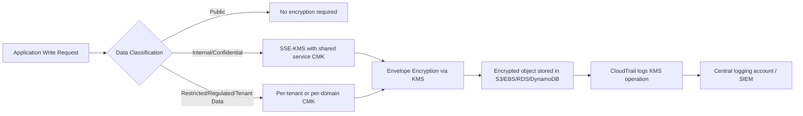
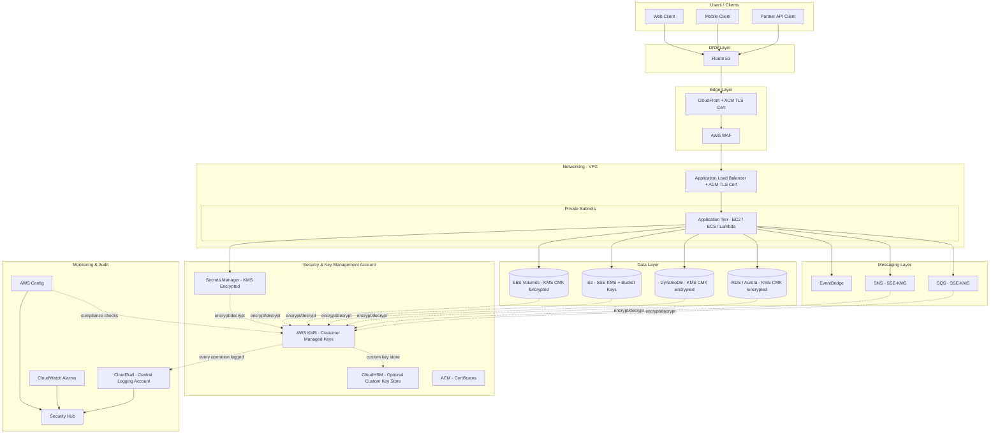
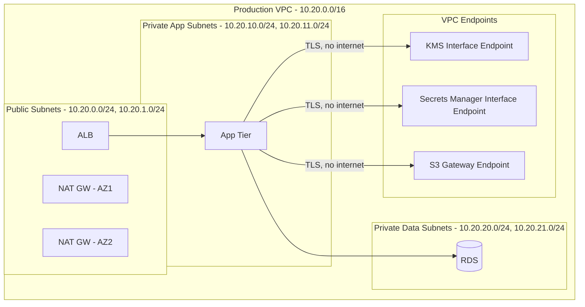

# Part XI – Security Reference Architectures

# Chapter 91: Encryption

*The AWS Reference Architecture Handbook — 100 Production-Ready Cloud Architectures with AWS, Terraform, AI, Security, FinOps, and Enterprise Design Patterns*

---

# 1. Executive Summary

## 1.1 The Business Problem

Every enterprise that stores, processes, or transmits data on AWS eventually confronts the same question from auditors, regulators, customers, and its own security team: **"Is this data encrypted, and can you prove it?"**

This question sounds simple. In production, it is not.

- Data exists in many states simultaneously — at rest on disk, in transit across networks, in memory during processing, and in backups sitting in a completely different AWS account or region.
- Different AWS services encrypt data differently by default, use different key hierarchies, and expose different levels of control over key rotation, key access, and key destruction.
- Compliance frameworks (PCI-DSS, HIPAA, SOC 2, FedRAMP, GDPR, ISO 27001) do not simply require "encryption" — they require specific key management practices, specific audit trails, and in some cases customer-controlled keys with documented separation of duties.
- Encryption without a coherent **key management architecture** becomes an operational liability: keys get shared across environments, rotation is skipped because it breaks production, and nobody can answer "who can decrypt this data" with confidence.

Organizations that treat encryption as a checkbox — "enable encryption at rest, done" — discover during their first serious security audit, customer security questionnaire, or breach investigation that the checkbox told them nothing about **who actually holds the keys**, **how those keys are rotated**, **what happens when a key is compromised**, or **how encryption boundaries map to tenant or business-unit boundaries**.

## 1.2 Architecture Objective

This chapter defines a **production-grade encryption architecture** for AWS environments that:

- Establishes a consistent encryption-at-rest strategy across compute, storage, database, messaging, and backup services using **AWS Key Management Service (KMS)** as the central control point.
- Establishes a consistent encryption-in-transit strategy using **TLS everywhere**, including service-to-service traffic inside the VPC, not only edge traffic.
- Defines a **key hierarchy** — separating AWS-managed keys, customer-managed keys (CMKs), and where required, customer-provided key material or external key stores — mapped to data sensitivity tiers.
- Provides a **multi-account key strategy** so that key administration, key usage, and data ownership can be cleanly separated for audit and blast-radius reasons.
- Defines **key rotation, key deletion, and key compromise response** procedures that are operationally realistic, not theoretical.
- Maps every design decision to specific compliance obligations (PCI-DSS Requirement 3 and 4, HIPAA §164.312(a)(2)(iv) and (e)(2)(ii), GDPR Article 32) so security and compliance teams can trace control to requirement.

This is not a chapter about "turning on encryption." It is a chapter about designing an encryption **system** that survives key rotation events, cross-account data sharing, regulator audits, and the eventual, inevitable day someone asks "can we prove nobody outside the finance team could ever have decrypted this file."

## 1.3 Why Organizations Adopt This Architecture

Enterprises converge on a centralized KMS-based encryption architecture for a consistent set of reasons:

- **Regulatory mandate.** PCI-DSS, HIPAA, FedRAMP, and most state privacy laws either require encryption of sensitive data at rest and in transit, or make it a near-mandatory compensating control for other requirements (e.g., reducing PCI scope).
- **Contractual mandate.** Enterprise customers, particularly in financial services and healthcare, routinely require vendors to demonstrate encryption with customer-managed keys, key rotation evidence, and access logging as part of vendor security assessments.
- **Breach liability reduction.** Under most breach notification laws, data that was encrypted with a properly managed key that was not itself compromised may qualify for **safe harbor** — meaning a stolen encrypted disk snapshot does not trigger the same notification and liability obligations as stolen plaintext data.
- **Multi-tenant isolation.** SaaS providers use per-tenant KMS keys to provide cryptographic tenant isolation — an additional, provable layer of separation beyond IAM and network controls.
- **Internal separation of duties.** Large enterprises separate "who can access the data" (application teams, via IAM) from "who can access the encryption keys" (security team, via KMS key policies), so that a compromised application role alone cannot exfiltrate readable data without also compromising key administration.
- **M&A and data portability.** Centralized, well-documented key management makes it dramatically easier to prove data handling practices during acquisition due diligence, and to cleanly separate or migrate data during divestiture.

## 1.4 Major Business Benefits

| Benefit | Description |
|---|---|
| Regulatory compliance | Satisfies encryption-at-rest and in-transit clauses across PCI-DSS, HIPAA, GDPR, SOC 2, FedRAMP |
| Reduced breach liability | Properly managed encryption can trigger safe-harbor provisions in breach notification law |
| Auditable key governance | CloudTrail-backed logging of every key usage event supports forensic investigation and audit evidence |
| Tenant/business-unit isolation | Per-tenant or per-BU CMKs provide cryptographic separation beyond IAM alone |
| Faster security questionnaires | A documented key hierarchy and rotation policy answers 80% of enterprise vendor security questionnaires directly |
| Reduced blast radius | Compromise of a single CMK's usage does not expose data encrypted under other CMKs |
| Clean offboarding / data destruction | Crypto-shredding (destroying the CMK) provides a fast, provable way to render data permanently unreadable |

## 1.5 Typical Enterprise Scenarios

This architecture applies directly to:

- A **SaaS platform** that must prove per-tenant data isolation to enterprise customers, including the ability to destroy a single tenant's data cryptographically without touching other tenants' storage.
- A **healthcare platform** subject to HIPAA that must encrypt PHI at rest and in transit, log every decrypt operation, and demonstrate key rotation to auditors annually.
- A **financial services platform** subject to PCI-DSS that must isolate cardholder data environment (CDE) encryption keys from all other application keys, with strict key policies limiting which roles can perform cryptographic operations.
- A **multi-account AWS Organization** that centralizes key administration in a dedicated Security/Key Management account while allowing workload accounts to *use* keys via cross-account key policies, without ever granting those accounts key administration rights.
- A **global enterprise** replicating data across regions that must reconcile "encrypt with regional keys" against "maintain global key governance," since KMS keys are regional resources.

Organizations that skip this design work typically end up retrofitting it after a failed audit, a customer-mandated security review, or — worse — an incident where overly broad key policies allowed a compromised role to decrypt data far outside its intended scope. Building the key hierarchy correctly from the start is materially cheaper than retrofitting it onto live production data.

---

# 2. Business Requirements

## 2.1 Business Drivers

- Regulatory compliance obligations (PCI-DSS, HIPAA, GDPR, SOC 2 Type II, FedRAMP Moderate/High as applicable).
- Enterprise customer security requirements enforced through vendor security questionnaires and contractual data protection addenda.
- Internal risk management policy requiring encryption of all data classified "Confidential" or higher.
- Cyber insurance underwriting requirements — many policies now require documented encryption and key management practices as a condition of coverage.
- Competitive differentiation — "customer-managed encryption keys" is frequently a paid enterprise-tier feature in B2B SaaS.

## 2.2 Functional Requirements

- All data at rest must be encrypted using AWS KMS-backed keys (AWS-managed or customer-managed, per data classification tier).
- All data in transit must use TLS 1.2 or higher, both at the edge and for internal service-to-service communication.
- Encryption keys must be managed centrally with role-based administrative separation between key administrators and key users.
- Key usage (encrypt/decrypt/generate-data-key operations) must be logged and retained for a minimum audit period (commonly 1–7 years depending on regulation).
- The architecture must support per-tenant or per-workload key isolation for multi-tenant systems.
- The architecture must support key rotation without application downtime.
- The architecture must support emergency key disablement (compromise response) without requiring code deployment.

## 2.3 Non-Functional Requirements

| Requirement | Target |
|---|---|
| Availability of KMS-dependent operations | 99.99% (matches KMS SLA) |
| Latency added by KMS calls (cached data key reuse) | < 5 ms p99 for envelope-encrypted operations using cached data keys |
| Latency added by direct KMS API call (uncached) | 20–50 ms typical, regionally dependent |
| Key rotation frequency (AWS-managed keys) | Automatic, annual, no customer action |
| Key rotation frequency (customer-managed keys) | Automatic annual rotation enabled, or manual rotation per compliance policy (commonly 90–365 days) |
| Audit log retention | Minimum 1 year hot, 7 years archived (PCI-DSS baseline; HIPAA and internal policy may extend this) |
| RPO for key material | 0 — KMS keys are regionally redundant and never require backup by the customer |
| RTO for key-related incident response | < 1 hour to disable a compromised key via key policy or grant revocation |

## 2.4 Scalability Goals

- Support thousands of customer-managed keys across a multi-tenant SaaS estate without breaching the default **10,000 CMKs per account per region** KMS quota (a quota that can be raised via support request, but must be planned for).
- Support high-throughput encryption workloads using **envelope encryption** and **data key caching** to stay well under the **KMS API request-per-second quotas** (which vary by API operation and region, typically 5,500–10,000+ RPS for symmetric `GenerateDataKey`/`Decrypt` in most regions, but shared across all callers in the account/region).
- Support growth from a single-region deployment to multi-region active-active without redesigning the key hierarchy — regional keys with a documented replication/parity strategy, not a single global key.

## 2.5 Availability Requirements

- KMS itself is a regional, highly available managed service with a published 99.99% availability SLA; the architecture should not introduce single points of failure *around* KMS (e.g., do not cache credentials or data keys in a single AZ-bound cache with no fallback).
- Applications must implement retry with exponential backoff for `ThrottlingException` on KMS calls, since KMS enforces account/region-level request quotas shared across all callers.

## 2.6 Latency Requirements

- Interactive, customer-facing transactions (e.g., checkout, login) should not incur a direct KMS API call on every request; use envelope encryption with local data-key caching (AWS Encryption SDK's caching CMM) to keep added latency under 5 ms.
- Batch and asynchronous workloads (ETL, backup encryption) can tolerate direct KMS calls per object without caching, since latency budgets are looser.

## 2.7 Compliance Requirements

| Framework | Relevant Encryption Requirement |
|---|---|
| PCI-DSS v4.0 | Req. 3: protect stored cardholder data with strong cryptography; Req. 4: encrypt cardholder data transmission over open, public networks |
| HIPAA Security Rule | §164.312(a)(2)(iv) encryption/decryption (addressable but expected in practice); §164.312(e)(2)(ii) encryption in transit |
| GDPR | Art. 32 — "pseudonymisation and encryption of personal data" as an appropriate technical measure |
| SOC 2 | CC6.1, CC6.7 — logical access and data transmission/encryption controls |
| FedRAMP | Encryption at rest and in transit using FIPS 140-2/140-3 validated cryptographic modules (relevant to KMS's use of FIPS-validated HSMs in GovCloud and standard partitions) |

## 2.8 Security Expectations

- Least-privilege key policies: separate IAM principals for key **administration** (policy edits, key rotation configuration, key deletion scheduling) versus key **usage** (encrypt/decrypt within application roles).
- No application should be granted `kms:*`; grants should be scoped to specific actions (`kms:Decrypt`, `kms:GenerateDataKey`) and, where feasible, restricted with `kms:ViaService` and encryption context conditions.
- All CMK deletions must go through the mandatory 7–30 day waiting period (AWS enforces a minimum; organizations typically standardize on 30 days) with a required approval step, since key deletion is irreversible and destroys all data encrypted under that key.

## 2.9 Recovery Objectives

**Recovery Point Objective (RPO):** 0 for key material itself — AWS KMS keys never need to be "recovered" from backup since AWS manages redundancy of the underlying key material across multiple facilities within a region. RPO for *encrypted data* is governed by the storage service's own backup/replication design, not by KMS.

**Recovery Time Objective (RTO):**
- Key compromise response (disable key, revoke grants): target under 1 hour.
- Full regional KMS unavailability (rare, historically): mitigated by multi-region key strategy for genuinely multi-region-active workloads; single-region workloads accept KMS's regional SLA as their floor.

## 2.10 SLAs

- Internal SLA: key administration change requests (new CMK provisioning, policy change) processed within 1 business day via Infrastructure-as-Code pull request, not manual console changes.
- Internal SLA: key compromise incident response initiated within 15 minutes of detection, key disabled within 1 hour.

## 2.11 Expected Workload and Growth

- Initial: single AWS account, single region, fewer than 50 CMKs mapped to service/data-classification boundaries.
- 12–24 months: multi-account (workload accounts + centralized Security account), multi-tenant CMK model if SaaS, hundreds to low-thousands of CMKs.
- 24+ months: multi-region, requiring a documented strategy for regional key parity, replicated encrypted data, and cross-region audit log aggregation.

---

# 3. Architecture Overview

## 3.1 Overall Design Philosophy

The architecture is built on three principles that experienced security architects converge on independently:

1. **Envelope encryption everywhere, not direct KMS encryption of bulk data.** KMS `Encrypt`/`Decrypt` API calls are limited to messages up to 4 KB. All real-world data encryption in AWS therefore uses **envelope encryption**: KMS generates and protects a **data key**, and that data key (not KMS itself) encrypts the actual payload locally, using AES-256-GCM in almost all AWS-native service integrations (S3, EBS, RDS, DynamoDB, etc.).
2. **Separation of key administration from key usage.** The IAM principal that can change a key policy, enable/disable a key, or schedule key deletion must never be the same principal an application assumes at runtime. This separation is what makes the architecture auditable and resistant to a single compromised application credential escalating into full data exposure.
3. **Key hierarchy mapped to data classification, not to convenience.** Keys are provisioned per data-sensitivity tier and, where multi-tenancy exists, per tenant — not one shared "app key" for the entire platform. This is more operationally demanding but is what actually satisfies enterprise customers and regulators asking "can you cryptographically prove isolation."

## 3.2 Core Components

| Component | Role |
|---|---|
| AWS KMS | Central key management service; holds and protects root key material, performs cryptographic operations, enforces key policies |
| CloudHSM (optional) | Dedicated, single-tenant HSM cluster for organizations requiring direct control of FIPS 140-2 Level 3 validated hardware, or as a custom key store backing KMS |
| AWS Certificate Manager (ACM) | Issues and manages TLS certificates for in-transit encryption at the edge (ALB, CloudFront, API Gateway) |
| Secrets Manager | Stores database credentials and application secrets, itself encrypted under a KMS key, with automatic rotation |
| S3 | Encrypts objects at rest using SSE-KMS or SSE-S3; supports bucket-level default encryption enforcement |
| EBS | Encrypts volumes at rest using KMS-backed keys; supports account-level "always encrypt new volumes" enforcement |
| RDS / Aurora | Encrypts storage, automated backups, snapshots, and read replicas using a KMS key selected at creation time (cannot be changed in place) |
| DynamoDB | Encrypts tables at rest using AWS-owned, AWS-managed, or customer-managed KMS keys |
| CloudTrail | Logs every KMS API call (`Decrypt`, `GenerateDataKey`, `Encrypt`, key policy changes) for audit and forensic purposes |
| AWS Config | Continuously evaluates encryption configuration compliance (e.g., "are all EBS volumes encrypted") |
| IAM | Defines the principals permitted to administer or use keys, enforced jointly with KMS key policies |
| AWS Encryption SDK | Client-side library implementing envelope encryption with data-key caching for application-level encryption outside of native AWS service integrations |

## 3.3 How Components Interact

- Applications never handle raw KMS root key material. They call `kms:GenerateDataKey` to receive a plaintext data key (used immediately, then discarded from memory) and its KMS-encrypted counterpart (stored alongside the ciphertext).
- To decrypt, the application sends the encrypted data key back to KMS via `kms:Decrypt`; KMS validates the caller's IAM permissions and the key policy, then returns the plaintext data key, which the application uses locally to decrypt the payload.
- AWS-native services (S3, EBS, RDS, DynamoDB) perform this envelope-encryption dance internally and transparently — the customer only selects which KMS key to use and observes the results via CloudTrail.
- Every cryptographic operation against a customer-managed key generates a CloudTrail event, forwarded to a centralized logging account for tamper-resistant retention and SIEM ingestion.

## 3.4 High-Level Workflow



## 3.5 Request Lifecycle (Write Path)

1. Application determines data classification tier for the payload being written.
2. Application (or the AWS service on its behalf) requests a data key from the appropriate KMS CMK.
3. KMS validates the caller's IAM policy and the CMK's key policy (both must allow the action — this is the default-deny, dual-authorization model unique to KMS key policies).
4. KMS returns a plaintext data key and its ciphertext blob.
5. The plaintext data key encrypts the payload locally (AES-256-GCM).
6. The plaintext data key is discarded from memory; only the ciphertext blob is persisted alongside the encrypted payload.
7. CloudTrail records the `GenerateDataKey` call, including the calling principal, source IP, and CMK ARN.

## 3.6 Response Lifecycle (Read Path)

1. Application retrieves the encrypted payload and its associated encrypted data key.
2. Application calls `kms:Decrypt` with the encrypted data key.
3. KMS validates IAM and key policy permissions, decrypts the data key, and returns it in plaintext.
4. Application decrypts the payload locally using the plaintext data key, then discards the key from memory.
5. CloudTrail records the `Decrypt` call.

## 3.7 Data Lifecycle

- **Creation:** Data is classified at write time; classification determines which CMK tier encrypts it.
- **Active use:** Data is decrypted on demand via envelope encryption; plaintext exists only transiently in application memory.
- **Backup:** Snapshots and backups inherit encryption from the source resource's CMK (RDS snapshots, EBS snapshots) or are separately configured to use a backup-specific CMK for cross-account backup vaults (AWS Backup).
- **Cross-region replication:** Replicated data (S3 CRR, RDS cross-region read replicas, DynamoDB Global Tables) must be re-encrypted under a **regional** destination CMK, since KMS keys do not natively replicate across regions (multi-Region keys are an exception, discussed in Section 11).
- **Deletion / crypto-shredding:** When a tenant or dataset must be permanently destroyed, scheduling deletion of its dedicated CMK renders all data encrypted under that key permanently unreadable, even if the underlying storage is not immediately deleted — a controlled, auditable, and fast method of enforcing "right to erasure" obligations.

---

# 4. AWS Services Used

## 4.1 AWS Key Management Service (KMS)

**Purpose:** Central service for creating, managing, and using cryptographic keys. Every encryption decision in this chapter routes through KMS.

**Why selected:** KMS is the native, deeply integrated key management service across virtually every AWS data service (S3, EBS, RDS, DynamoDB, Redshift, EFS, Kinesis, SQS, SNS, Lambda environment variables, Secrets Manager, and more). Choosing KMS avoids building custom integration code for each service and inherits AWS's audit logging, IAM integration, and FIPS 140-2 validated (and, in relevant regions, FIPS 140-3) hardware security module backing.

**Alternatives:**
- **AWS CloudHSM** — dedicated single-tenant HSM cluster; chosen when an organization requires direct control of HSM appliances, needs cryptographic algorithms not supported by KMS, or has a compliance requirement for exclusive physical/logical HSM tenancy.
- **Third-party key management (HashiCorp Vault, Thales CipherTrust)** — chosen for multi-cloud consistency, but loses the deep native AWS service integration KMS provides, requiring custom encryption code for every service touchpoint.
- **External Key Store (XKS)** — KMS feature allowing key material to be held entirely outside AWS, in the customer's own HSM infrastructure, for regulatory regimes that mandate the cloud provider never possess key material.

**Limitations:**
- Symmetric CMK `Encrypt`/`Decrypt` operations are limited to 4 KB of data — hence the mandatory use of envelope encryption for anything larger.
- KMS keys are strictly regional resources (with the exception of multi-Region keys, which are independent key resources kept in cryptographic sync, not a single global key).
- Default request quotas are shared across *all* callers in an account/region for a given API action; a noisy application can throttle an unrelated one unless request quotas are actively monitored and, if needed, increased.
- Key deletion requires a mandatory waiting period (7–30 days) — by design, to prevent accidental irreversible data loss, but this must be factored into any "immediate hard delete" compliance workflow.

**Pricing considerations:** $1/month per customer-managed key (AWS-managed keys are free), plus per-API-request charges beyond the free tier (20,000 requests/month free, then priced per 10,000 requests). At scale — thousands of CMKs for a multi-tenant SaaS platform — the per-key monthly charge becomes a real budget line item and should be modeled explicitly (see Section 16).

**Best practices:**
- Use customer-managed keys (not AWS-managed keys) for anything requiring custom key policies, rotation control, cross-account sharing, or deletion control.
- Enable automatic annual key rotation for symmetric CMKs unless a shorter compliance-mandated rotation period requires manual rotation via key aliasing.
- Use key policies as the primary access control mechanism, layered with IAM — never rely on IAM policies alone, since a CMK's key policy is the resource-based policy that ultimately governs access.
- Use `kms:ViaService` and `kms:EncryptionContext` conditions to scope key usage to specific services and specific data contexts.

## 4.2 AWS CloudHSM

**Purpose:** Dedicated, single-tenant hardware security modules for organizations requiring direct HSM control or as a KMS custom key store backend.

**Why selected:** Chosen only when regulatory or contractual obligations require single-tenant HSM hardware (as opposed to KMS's multi-tenant HSM fleet, which is still FIPS validated but shared infrastructure), or when cryptographic operations unsupported by KMS (certain asymmetric algorithms, specific PKI use cases) are required.

**Alternatives:** KMS (simpler, managed, sufficient for the overwhelming majority of enterprise workloads); third-party HSM-as-a-service.

**Limitations:** Significantly higher cost (hourly HSM instance charges, minimum cluster of 2 for HA), higher operational burden (customer manages HSM cluster patching, backup, and quorum), no free tier.

**Pricing considerations:** Roughly $1.60–$1.80/hour per HSM instance depending on region, with a minimum recommended 2-node cluster for availability — this is a five-figure annual cost floor, appropriate only when genuinely required.

**Best practices:** Use CloudHSM as a KMS custom key store when the goal is "KMS convenience with CloudHSM-level control," rather than using CloudHSM directly for application integration, unless the application specifically requires PKCS#11, JCE, or CNG interfaces.

## 4.3 AWS Certificate Manager (ACM)

**Purpose:** Provisions and auto-renews TLS/SSL certificates for encryption in transit at the AWS-managed edge (ALB, NLB, CloudFront, API Gateway).

**Why selected:** Free public certificates, automatic renewal (removing the single most common cause of production TLS outages — expired certificates), and native integration with load balancers and CloudFront without manual certificate installation.

**Alternatives:** Third-party CA-issued certificates manually uploaded to IAM/ACM (chosen for extended validation certificates, specific CA requirements, or certificates needed outside AWS-integrated services); AWS Private CA for internal service-to-service certificates.

**Limitations:** ACM public certificates cannot be exported for use outside their attached AWS resource (by design, to prevent private key exposure); certificates for use on EC2-hosted web servers not behind a load balancer need AWS Private CA or manual certificate management instead.

**Best practices:** Always use DNS validation (via Route 53) rather than email validation, for renewal automation reliability; monitor certificate expiration via AWS Config managed rules regardless, as a defense-in-depth check on the automation itself.

## 4.4 AWS Secrets Manager

**Purpose:** Stores and automatically rotates database credentials, API keys, and other secrets, itself encrypted at rest using a KMS key.

**Why selected:** Native automatic rotation for RDS/Aurora/DocumentDB/Redshift credentials without custom Lambda rotation code for the common cases; every secret is a KMS-encrypted resource, so secrets themselves inherit this chapter's key hierarchy.

**Alternatives:** AWS Systems Manager Parameter Store (SecureString) — lower cost, no built-in rotation, appropriate for configuration values rather than credentials requiring rotation; HashiCorp Vault — chosen for multi-cloud secret management consistency.

**Limitations:** Per-secret monthly charge plus per-API-call charge, which adds up in high-secret-count microservice architectures if not paired with caching (AWS provides a Secrets Manager caching client library specifically to mitigate this).

**Pricing considerations:** ~$0.40/secret/month plus $0.05 per 10,000 API calls — caching is not optional at scale, it is a cost control measure.

## 4.5 Amazon S3

**Purpose:** Object storage; supports SSE-S3 (AWS-owned keys), SSE-KMS (KMS-backed keys), and SSE-C (customer-provided keys) encryption at rest.

**Why selected:** Default encryption can be enforced at the bucket level, and since January 2023, **SSE-S3 encryption is applied automatically to all new objects by default** with no configuration required — but production architectures should explicitly configure SSE-KMS for any bucket holding regulated or sensitive data, to gain audit logging and key-policy-based access control that SSE-S3 does not provide.

**Alternatives:** SSE-C — customer supplies and manages the encryption key entirely outside AWS; chosen only when organizational policy mandates AWS never store the key at all, at the cost of losing KMS's audit trail and rotation.

**Limitations:** SSE-KMS incurs a KMS API call (and associated cost and marginal latency) per object GET/PUT unless S3 Bucket Keys are enabled, which reduces KMS request volume by using a time-limited bucket-level data key rather than calling KMS per object.

**Best practices:** Enable **S3 Bucket Keys** for any high-throughput SSE-KMS bucket to reduce KMS costs by up to 99% for read-heavy workloads; enforce bucket policies that deny `PutObject` requests lacking the correct `x-amz-server-side-encryption` header, as defense in depth against default encryption misconfiguration.

## 4.6 Amazon EBS

**Purpose:** Block storage for EC2; supports encryption at rest via KMS-backed keys, applied transparently to the volume, its snapshots, and any volumes created from those snapshots.

**Why selected:** Account-level "Always encrypt new EBS volumes" setting provides a strong default that prevents unencrypted volume creation across an entire account/region, closing a historically common audit finding.

**Limitations:** Encryption status cannot be changed on an existing volume in place — an encrypted copy must be created (snapshot → copy with encryption enabled → new volume), which has operational implications for migrating legacy unencrypted volumes.

**Best practices:** Enable the account-level default encryption setting in every region in use; use a customer-managed CMK rather than the AWS-managed `aws/ebs` key for any volume requiring custom key policy or cross-account snapshot sharing.

## 4.7 Amazon RDS / Aurora

**Purpose:** Managed relational databases; encryption is applied to storage, automated backups, snapshots, and read replicas.

**Why selected:** Encryption is configured once at instance/cluster creation and is inherited consistently across backups and replicas without additional configuration.

**Limitations:** **Encryption cannot be enabled on an existing unencrypted RDS instance** — the only path is snapshot → copy snapshot with encryption enabled → restore to a new encrypted instance, which requires a migration window and connection string cutover. This is one of the most common RDS encryption pitfalls in enterprise environments with legacy unencrypted databases.

**Best practices:** Always enable encryption at creation time, with no exceptions, since retrofitting is a migration project rather than a configuration change; use a customer-managed CMK when cross-account snapshot sharing or custom key policies are required, since AWS-managed keys cannot be shared across accounts.

## 4.8 Amazon DynamoDB

**Purpose:** Managed NoSQL database; encryption at rest is enabled by default for all tables using AWS-owned keys, with the option to upgrade to AWS-managed or customer-managed KMS keys.

**Why selected:** No performance or availability trade-off from enabling KMS-backed encryption (AWS's own benchmarking and enterprise production experience both show negligible latency impact), making CMK-backed encryption a low-cost upgrade for tables holding sensitive or multi-tenant data.

**Limitations:** Switching a table's KMS key requires a table-level update and CloudTrail-logged re-encryption process, not an instantaneous change; using a customer-managed key rather than AWS-managed adds per-request KMS charges at very high table throughput, which should be modeled for high-TPS tables.

## 4.9 AWS CloudTrail

**Purpose:** Logs every KMS API call, forming the audit trail that proves who used which key, when, and from where.

**Why selected:** This is the control that converts "we have encryption" into "we can prove exactly who decrypted what and when" — the artifact auditors and incident responders actually need.

**Best practices:** Enable an **organization-wide CloudTrail** delivering to a centralized, access-restricted logging account with S3 Object Lock enabled (write-once-read-many) to guarantee log integrity even against a compromised administrative account elsewhere in the organization.

## 4.10 AWS Config

**Purpose:** Continuously evaluates resource configuration against encryption compliance rules (e.g., `s3-bucket-server-side-encryption-enabled`, `encrypted-volumes`, `rds-storage-encrypted`).

**Why selected:** Converts encryption policy from a point-in-time audit exercise into continuous, automated compliance monitoring with drift detection and optional auto-remediation via Systems Manager Automation documents.

## 4.11 IAM

**Purpose:** Defines which principals may administer or use KMS keys; works jointly with KMS key policies in a dual-authorization model (both IAM identity-based policy AND the KMS key's resource-based policy must permit an action).

**Best practices:** Never grant `kms:*` to application roles; use dedicated key administrator roles distinct from key user roles; use permission boundaries to prevent privilege escalation into key administration from application-tier roles.

---

# 5. Complete Architecture Diagram



**Diagram notes:**

- The Security/Key Management account is logically and, in production, typically physically (separate AWS account) isolated from workload accounts. Workload accounts are granted cross-account key *usage* via key policy grants, never key *administration*.
- Every dotted line into KMS represents an API call that is logged to CloudTrail — this is the audit backbone referenced throughout the chapter.
- CloudHSM appears as optional — most organizations do not need it; it is included to show where it fits when required (custom key store backing KMS).

---

# 6. Component-by-Component Explanation

## 6.1 AWS KMS Customer Managed Keys (CMKs)

- **Purpose:** Root of the key hierarchy; protects data keys used for envelope encryption across all data services.
- **Responsibilities:** Enforce key policy access control, perform `GenerateDataKey`/`Decrypt`/`Encrypt`/`ReEncrypt` operations, manage automatic annual rotation, log every operation to CloudTrail.
- **Inputs:** API calls from IAM principals (applications, AWS services acting on their behalf) requesting cryptographic operations.
- **Outputs:** Encrypted/plaintext data keys, ciphertext blobs, key metadata.
- **Scaling:** Regional service; scales to the account/region API quota; multiple CMKs distribute load across independent quota buckets implicitly through key-specific usage patterns, though the account-level throttle for a given API action is still shared.
- **High availability:** Fully managed, multi-facility redundant within the region; no customer-managed HA configuration required.
- **Failure handling:** `ThrottlingException` requires client-side exponential backoff; a disabled or scheduled-for-deletion key returns `KMSInvalidStateException` / `DisabledException`, which applications must treat as a hard failure requiring incident response, not a retryable error.
- **Dependencies:** IAM (identity-based policy evaluation), CloudTrail (audit logging), optionally CloudHSM (custom key store).
- **Security:** Key policy is the primary access boundary; grants provide temporary, revocable, fine-grained delegated access (e.g., to an AWS service performing an operation on the caller's behalf).
- **Monitoring:** CloudTrail event volume per key, CloudWatch metrics for throttling, AWS Config rule evaluation of key rotation status.

## 6.2 Secrets Manager

- **Purpose:** Encrypted storage and automatic rotation of database credentials and application secrets.
- **Responsibilities:** Store secret values encrypted under a designated KMS CMK, execute rotation Lambda functions on schedule, version secret values (`AWSCURRENT`/`AWSPENDING`/`AWSPREVIOUS`).
- **Scaling:** Use client-side caching (`aws-secretsmanager-caching` library) to avoid per-request API calls at scale.
- **High availability:** Regional service, multi-AZ backed.
- **Failure handling:** Failed rotation Lambda executions must alert (CloudWatch Alarm on `RotationFailed`), since a stuck rotation can leave a secret in an inconsistent `AWSPENDING` state.
- **Security:** Resource policies control cross-account secret access; secrets should use dedicated CMKs distinct from general application data CMKs to limit blast radius.

## 6.3 S3 with SSE-KMS

- **Purpose:** Encrypts objects at rest with audit-logged, key-policy-controlled access.
- **Responsibilities:** Enforce bucket default encryption, apply S3 Bucket Keys to reduce KMS call volume, integrate with S3 Object Lock for immutable, encrypted audit log storage.
- **Scaling:** Effectively unlimited; KMS request volume is the real constraint at extreme scale, mitigated by Bucket Keys.
- **Failure handling:** `PutObject` calls fail if the caller lacks `kms:GenerateDataKey` permission on the target CMK — a common cause of "access denied" errors that are actually KMS permission issues, not S3 permission issues, and must be diagnosed accordingly.

## 6.4 RDS / Aurora with KMS Encryption

- **Purpose:** Encrypts database storage, automated backups, and read replicas transparently.
- **Responsibilities:** Encrypt/decrypt storage I/O transparently to the database engine (no application code changes required); propagate encryption to snapshots and replicas automatically.
- **Failure handling:** If a CMK is disabled or its key policy is changed to deny the RDS service role, the database instance becomes unavailable — RDS cannot start/access encrypted storage without KMS access, making key policy changes on database CMKs a high-risk, change-controlled operation.

## 6.5 CloudTrail (Central Audit)

- **Purpose:** Immutable record of every KMS operation, forming the evidentiary backbone for compliance audits and incident investigation.
- **Responsibilities:** Capture management events (key policy changes, key creation/deletion/rotation) and data events (encrypt/decrypt operations, if configured) and deliver them to a centralized, access-restricted account.
- **Security:** Trail should write to an S3 bucket with Object Lock (compliance mode) in a separate logging account, so that even a compromised administrator in a workload account cannot alter or delete the audit trail.


---

# 7. End-to-End Request Flow

The following trace follows an authenticated write request (e.g., "upload a customer document") through every encryption boundary.

1. **Client** initiates an HTTPS request to `app.example.com`. TLS 1.2+ handshake begins immediately at the connection layer, before any application logic executes.
2. **DNS (Route 53)** resolves `app.example.com` to the CloudFront distribution.
3. **CloudFront** terminates the client TLS connection using an ACM-issued certificate; CloudFront re-establishes a second TLS connection to the origin (ALB), meaning traffic is never plaintext, including between CloudFront and the origin.
4. **AWS WAF**, attached to CloudFront, inspects the request for injection attacks and rate-limit violations before it reaches the origin.
5. **Application Load Balancer** terminates the second TLS leg using its own ACM certificate, then forwards the request over the private VPC network to application tier targets (this internal hop should also be TLS-encrypted in regulated environments — see Section 11.3).
6. **Application tier (ECS/EC2/Lambda)** authenticates the request (e.g., validates a JWT), determines the data classification of the payload, and selects the appropriate KMS CMK alias based on classification (e.g., `alias/app-restricted-tenant-482`).
7. **Application** calls `kms:GenerateDataKey` against the selected CMK. IAM evaluates the application's execution role policy; KMS evaluates the CMK's key policy. Both must permit the action.
8. **KMS** returns a plaintext data key and its KMS-encrypted ciphertext blob. This call is logged to **CloudTrail** with the calling role, source IP, and CMK ARN.
9. **Application** encrypts the payload locally using the plaintext data key (AES-256-GCM), immediately discards the plaintext key from memory, and writes the encrypted payload plus the encrypted data key blob to **S3** (if using client-side envelope encryption) — or, more commonly for native integrations, simply calls `s3:PutObject` with `x-amz-server-side-encryption: aws:kms` and lets S3 perform the envelope encryption internally against the specified CMK.
10. **S3** persists the encrypted object; **CloudTrail** logs both the S3 data event and the underlying KMS `GenerateDataKey` call S3 made on the application's behalf.
11. **Application** writes a corresponding metadata record to **RDS/Aurora**, which is itself encrypted at the storage layer under its own CMK — no additional application code is required for this layer.
12. **Application** publishes an event to **SNS/SQS** (SSE-KMS enabled) to trigger downstream asynchronous processing.
13. **CloudWatch** captures application-level metrics and logs (log group encrypted under a CMK); any KMS `ThrottlingException` or `AccessDeniedException` triggers a **CloudWatch Alarm**.
14. **Error handling:** If the KMS call in step 7 fails (throttling, disabled key, denied policy), the application returns a controlled 5xx error, logs the failure with correlation ID, and — for `AccessDeniedException` specifically — triggers a security alert, since this can indicate either a misconfiguration or an active permission-boundary probing attempt.
15. **Response path:** On subsequent read, the reverse of steps 6–9 occurs: application retrieves the encrypted data key alongside the ciphertext, calls `kms:Decrypt`, receives the plaintext data key, decrypts the payload locally, discards the key, and returns plaintext data to the client over the still-TLS-encrypted connection back through ALB → CloudFront → client.

---

# 8. Deployment Flow

## 8.1 Infrastructure Provisioning Philosophy

- All KMS keys, key policies, aliases, and grants are provisioned exclusively through Terraform (or equivalent IaC) — **never through the console** in production. This is not stylistic preference; it is the only way to guarantee key policy changes go through code review, and to have a reliable, versioned record of every access boundary ever granted on a key.
- Key policy changes are treated with the same change-control rigor as production database schema changes — a peer-reviewed pull request, a named approver, and a documented rollback plan (which, for KMS, is usually "revert the Terraform key policy resource," since the key resource itself is rarely destroyed).

## 8.2 Terraform Workflow

1. Engineer opens a pull request modifying the relevant `kms_key` / `kms_alias` / `kms_grant` Terraform resources in the shared security module.
2. CI pipeline runs `terraform plan`, posts the plan diff as a PR comment, and runs a policy-as-code check (e.g., Open Policy Agent / Sentinel / Checkov) that specifically flags overly permissive key policies (e.g., a `Principal: "*"` statement without a matching restrictive `Condition`).
3. A designated security team approver (distinct from the requesting engineer) reviews and approves.
4. On merge, CI pipeline runs `terraform apply` against the Security/Key Management account using a dedicated deployment role scoped only to KMS resource actions.
5. Post-apply, an automated smoke test performs a test `kms:Encrypt`/`kms:Decrypt` round trip using a designated test IAM role to confirm the new policy behaves as intended before workload traffic depends on it.

## 8.3 CI/CD Deployment for Key-Dependent Applications

- Application deployments that introduce a new CMK dependency (e.g., a new microservice requiring its own tenant-scoped key) should provision the CMK **before** the application deployment that references it, as a separate, earlier pipeline stage — never as a side effect of application deployment, to keep the audit trail of "who created this key and why" clean and separate from application release history.

## 8.4 Blue-Green Deployment Considerations

- Blue-green deployments do not typically require any KMS-specific handling **as long as both environments share the same CMK** and both execution roles are granted equivalent key policy permissions before cutover.
- The common failure mode: a new "green" environment is deployed with a new IAM role that was never added to the CMK's key policy or was never granted via `kms:GrantId`, causing decrypt failures that only appear in the new environment — this must be included explicitly in blue-green deployment pre-flight checks.

## 8.5 Rollback

- Rolling back an application version never requires rolling back a CMK — CMKs are additive, versionless resources from the application's perspective (rotation creates new backing key material transparently under the same key ID/alias).
- The one true KMS rollback scenario is a **key policy rollback**, handled via standard Terraform state revert, and is why key policy changes must go through the same IaC pipeline as everything else — an un-tracked console change cannot be reliably rolled back.

## 8.6 Secrets and Configuration in the Pipeline

- CI/CD pipelines themselves must never have standing decrypt access to production CMKs beyond what is required to provision infrastructure; runtime application secrets are retrieved by the *application's* runtime role from Secrets Manager, not injected by the deployment pipeline.

## 8.7 Validation

- Every environment promotion (dev → staging → production) includes an automated check: enumerate all KMS-encrypted resources (via AWS Config aggregator) and assert none use a `TODO`/placeholder key alias, and that production resources use production-tier CMKs, not shared lower-environment keys — a surprisingly common misconfiguration where a staging CMK alias is accidentally left in a production Terraform variable file.


---

# 9. Network Topology

While encryption at rest is the focus of key management, encryption **in transit** depends on the underlying network topology being correctly designed. This section covers the topology as it relates to where TLS termination and re-encryption boundaries sit.

- **VPC:** A dedicated VPC per environment (dev/staging/prod), CIDR sized to accommodate multi-AZ subnet allocation (e.g., `10.20.0.0/16` for production, with room for future peering without CIDR overlap).
- **Public subnets:** Host only internet-facing load balancers and NAT gateways — never application compute or databases.
- **Private subnets:** Host application compute (EC2/ECS/EKS nodes, Lambda ENIs) and all data stores (RDS, ElastiCache), with no direct route to the Internet Gateway.
- **NAT Gateway:** Provides outbound-only internet access for private subnet resources (e.g., calling external APIs); one per AZ for high availability, avoiding a single-AZ NAT dependency that would violate the architecture's own HA goals.
- **Internet Gateway:** Attached at the VPC level, routable only from public subnets.
- **Transit Gateway:** Used in multi-VPC/multi-account topologies to route traffic between the Security/Key Management account (which typically has no application workloads, only KMS/Secrets Manager/ACM administration) and workload accounts, without requiring full VPC peering mesh.
- **Route Tables:** Explicit, minimal routes per subnet tier; private subnet route tables have no `0.0.0.0/0 → igw` route.
- **Network ACLs:** Stateless, coarse-grained subnet-level filtering as defense-in-depth behind security groups.
- **Security Groups:** Stateful, resource-level filtering — e.g., the RDS security group allows inbound TLS-only traffic (port 5432/3306 over the database engine's TLS-enforced listener) exclusively from the application tier security group, never from `0.0.0.0/0`.
- **PrivateLink (VPC Endpoints):** **Critical for this architecture.** KMS, Secrets Manager, S3, and Secrets Manager should all be reachable via **VPC interface/gateway endpoints**, so that KMS API calls from private-subnet application compute never traverse the public internet (even though they would be TLS-encrypted regardless — PrivateLink additionally keeps the traffic off the public AWS network path entirely and allows tighter security group and endpoint-policy control over exactly which KMS keys/actions are reachable from a given VPC).
- **Hybrid connectivity:** For enterprises with on-premises workloads needing KMS access (e.g., an on-prem backup process encrypting data destined for AWS), Direct Connect or Site-to-Site VPN combined with a KMS VPC endpoint avoids exposing KMS calls to the public internet even from outside AWS.



---

# 10. Identity and Access

## 10.1 IAM Roles

- **Key Administrator role** (`SecurityKMSAdmins`): permitted to modify key policies, enable/disable keys, schedule/cancel key deletion, configure rotation. Assumed only by the security team via SSO with MFA, never by application deployment pipelines.
- **Key User role(s)** (`AppServiceRole-<service>`): permitted only `kms:Decrypt`, `kms:GenerateDataKey`, `kms:DescribeKey` on specifically enumerated CMK ARNs — never a wildcard `*` resource.
- **Break-glass role** (`SecurityIncidentResponder`): permitted emergency key disablement, used only during an active incident, requiring MFA and generating a mandatory CloudTrail-alerted event on every assumption.

## 10.2 IAM Policies (example — application key user policy)

```json

{
  "Version": "2012-10-17",
  "Statement": [
    {
      "Sid": "AllowDataKeyUsage",
      "Effect": "Allow",
      "Action": [
        "kms:Decrypt",
        "kms:GenerateDataKey"
      ],
      "Resource": "arn:aws:kms:us-east-1:222222222222:key/1234abcd-12ab-34cd-56ef-1234567890ab",
      "Condition": {
        "StringEquals": {
          "kms:ViaService": "s3.us-east-1.amazonaws.com"
        }
      }
    }
  ]
}

```

## 10.3 Resource Policies (KMS Key Policy)

The key policy is the **resource-based policy** attached directly to the CMK and is mandatory (unlike most AWS resource policies, a KMS key with no usable key policy statement is effectively unusable by anyone but the root account). A production key policy separates administrators from users explicitly:

```json

{
  "Version": "2012-10-17",
  "Id": "key-policy-app-restricted",
  "Statement": [
    {
      "Sid": "EnableRootAccountFullAccess",
      "Effect": "Allow",
      "Principal": { "AWS": "arn:aws:iam::222222222222:root" },
      "Action": "kms:*",
      "Resource": "*"
    },
    {
      "Sid": "AllowKeyAdministration",
      "Effect": "Allow",
      "Principal": { "AWS": "arn:aws:iam::222222222222:role/SecurityKMSAdmins" },
      "Action": [
        "kms:Create*", "kms:Describe*", "kms:Enable*", "kms:List*",
        "kms:Put*", "kms:Update*", "kms:Revoke*", "kms:Disable*",
        "kms:Get*", "kms:Delete*", "kms:TagResource", "kms:UntagResource",
        "kms:ScheduleKeyDeletion", "kms:CancelKeyDeletion"
      ],
      "Resource": "*"
    },
    {
      "Sid": "AllowKeyUsageByApplicationRole",
      "Effect": "Allow",
      "Principal": { "AWS": "arn:aws:iam::222222222222:role/AppServiceRole-documents" },
      "Action": [ "kms:Decrypt", "kms:GenerateDataKey", "kms:DescribeKey" ],
      "Resource": "*",
      "Condition": {
        "StringEquals": { "kms:EncryptionContext:app": "documents-service" }
      }
    },
    {
      "Sid": "AllowCloudTrailLogging",
      "Effect": "Allow",
      "Principal": { "Service": "cloudtrail.amazonaws.com" },
      "Action": [ "kms:GenerateDataKey*", "kms:DescribeKey" ],
      "Resource": "*"
    }
  ]
}

```

## 10.4 STS and Cross-Account Access

- Workload accounts assume no role *into* the Security account for routine key usage — instead, the CMK's key policy directly names the workload account's application role ARN as a principal, which is the standard, lower-friction cross-account KMS pattern.
- Cross-account **key administration** (rare, only for federated security teams) uses `sts:AssumeRole` into a scoped `SecurityKMSAdmins` role with an external ID and MFA condition.

## 10.5 Least Privilege

- No role — including break-glass — is ever granted `kms:*` combined with `Resource: "*"` as a standing policy; break-glass elevated access is time-boxed via a temporary policy attachment removed automatically after a fixed window (e.g., 4 hours) using an automated Lambda-based expiry.

## 10.6 Service Roles

- AWS service-linked roles (e.g., the RDS or S3 service principal referenced in a key policy) are scoped with `kms:ViaService` conditions so the service can only use the key when acting specifically through that service's API path, not as a general-purpose decrypt credential.

## 10.7 Permission Boundaries

- All application IAM roles are created with a permission boundary policy that explicitly denies `kms:PutKeyPolicy`, `kms:ScheduleKeyDeletion`, `kms:DisableKey`, and `kms:CreateGrant` with elevated grant permissions — even if a future, over-broad IAM policy attachment mistakenly grants these actions, the permission boundary blocks them, providing defense-in-depth against IAM policy misconfiguration during rapid application development.


---

# 11. Security Architecture

## 11.1 Encryption at Rest — Key Hierarchy

| Tier | Data Classification | Key Strategy | Rotation |
|---|---|---|---|
| 0 | Public | No encryption required (still recommended for defense-in-depth) | N/A |
| 1 | Internal | AWS-managed keys (`aws/s3`, `aws/ebs`, etc.) | Automatic, AWS-controlled |
| 2 | Confidential | Shared customer-managed CMK per service/domain | Automatic annual |
| 3 | Restricted / Regulated (PCI CDE, PHI) | Dedicated CMK per data domain, strict key policy, `EncryptionContext` enforced | Automatic annual, or manual per compliance mandate (e.g., 90 days) |
| 4 | Tenant-Isolated (multi-tenant SaaS) | Dedicated CMK per tenant | Automatic annual, crypto-shred on offboarding |

## 11.2 KMS Deep Dive

- **Symmetric CMKs** (AES-256-GCM) are the default and correct choice for the overwhelming majority of data-at-rest use cases — used transparently by S3, EBS, RDS, DynamoDB, and others.
- **Asymmetric CMKs** (RSA, ECC) are used specifically for scenarios requiring the public key to be distributed outside AWS (e.g., a partner encrypting data with your public key before it ever reaches AWS) or for digital signature use cases — not a substitute for symmetric envelope encryption of bulk data.
- **Multi-Region keys** create a primary key and one or more cryptographically-related replica keys in other regions, sharing the same key material and key ID — appropriate for applications performing client-side encryption that needs to decrypt the same ciphertext in multiple regions (e.g., DynamoDB Global Tables client-side encryption, cross-region disaster recovery of encrypted client-side data). Native AWS service-managed encryption (S3, EBS, RDS) generally still requires per-region CMKs configured at the resource level even when multi-Region keys are used, so this is not a universal "make everything multi-region" switch.
- **Grants** provide temporary, revocable, narrowly-scoped delegated permissions — used heavily by AWS services internally (e.g., an EC2 launch creates a grant on the fly for the EBS encryption operation) and available to application architectures needing fine-grained, short-lived cross-role delegation without modifying the key policy itself.

## 11.3 Encryption in Transit

- **Edge:** TLS 1.2 minimum (TLS 1.3 preferred where client compatibility allows) at CloudFront and ALB, enforced via a modern ACM-managed security policy (e.g., `ELBSecurityPolicy-TLS13-1-2-2021-06`), with older cipher suites (TLS 1.0/1.1, RC4, 3DES) explicitly disabled.
- **Internal (service-to-service):** ALB-to-application-target traffic, and application-to-database traffic, should also be TLS-encrypted in regulated environments — RDS supports enforcing `rds.force_ssl` at the parameter group level; internal service mesh traffic (if using App Mesh, Istio, or similar) should enforce mutual TLS (mTLS) between services.
- **Database connections:** Enforce TLS on the database listener itself (not just "TLS available") via engine-specific parameters, and distribute the RDS CA bundle to application connection configs with certificate validation enabled — a commonly skipped step that otherwise silently allows TLS downgrade to plaintext.

## 11.4 WAF and Shield

- **AWS WAF**, attached to CloudFront/ALB, is not itself an encryption control, but is included here because it inspects the decrypted request (post-TLS-termination) for injection attacks that could otherwise be used to exfiltrate or manipulate encrypted-at-rest data through application logic flaws — encryption at rest does not protect against an application vulnerability that legitimately decrypts and returns data to an attacker.
- **AWS Shield Standard** (automatic, free) and **Shield Advanced** (paid, for DDoS cost protection and 24/7 DRT access) protect availability of the TLS-terminating edge itself.

## 11.5 Secrets Manager and Certificate Manager

- Secrets Manager secrets are themselves KMS-encrypted; use a dedicated `alias/secrets-manager-<env>` CMK distinct from application data CMKs so that a compromised data-encryption key's blast radius does not automatically extend to database credentials.
- ACM-managed certificates handle private key material entirely within AWS-managed infrastructure — private keys for ACM public certificates are never exportable, which is a security benefit (no private key material to leak) but means ACM cannot be used where the private key itself must be portable to non-AWS-integrated services.

## 11.6 GuardDuty, Inspector, Security Hub

- **GuardDuty** includes specific finding types relevant to key management (e.g., anomalous KMS API call patterns from unusual geographies, or a compromised credential attempting unusual `Decrypt` volume) — enable GuardDuty in every account and aggregate findings to the Security account.
- **Inspector** scans EC2/ECR/Lambda for vulnerabilities that could lead to credential theft and subsequent unauthorized KMS usage — relevant as an upstream control protecting the IAM roles that hold KMS permissions.
- **Security Hub** aggregates CloudTrail-derived findings, Config rule compliance, and GuardDuty findings into a single encryption-posture dashboard, mapped to the CIS AWS Foundations Benchmark and PCI-DSS standards it natively supports.

## 11.7 CloudTrail and AWS Config (Recap in Security Context)

- CloudTrail data events for KMS should be enabled selectively (not blanket "log everything," which is costly at high API volume) — prioritize logging `Decrypt`, `GenerateDataKey`, and all key policy/administration actions, since these are the events with genuine security and audit value.
- AWS Config rules: `cmk-backing-key-rotation-enabled`, `s3-bucket-server-side-encryption-enabled`, `rds-storage-encrypted`, `encrypted-volumes`, `dynamodb-table-encrypted-kms` — deployed as an AWS Config Conformance Pack across the organization for continuous compliance evaluation.

## 11.8 Zero Trust Alignment

- This architecture supports Zero Trust principles by ensuring that possession of network access or even a valid application session does **not** imply data access — every decrypt operation is independently authorized against IAM and KMS key policy at the moment of use, not granted implicitly by network location or a broad standing role.

## 11.9 Threat Model

| Attack Vector | Mitigation |
|---|---|
| Compromised application IAM role | Key policy scoped `EncryptionContext` and `kms:ViaService` conditions limit usable blast radius even if the role is fully compromised |
| Overly permissive key policy (`Principal: "*"`) | Policy-as-code CI checks block merge; AWS Config rule flags public/overly-permissive key policies |
| Stolen EBS snapshot / RDS snapshot | Encrypted snapshots are useless without KMS decrypt access, which requires IAM credentials the attacker does not possess purely from snapshot theft |
| Insider threat (DBA with data access) | Key administration/user separation means a DBA with data-plane access does not automatically have key-policy-modification rights |
| TLS downgrade / MITM | Modern ACM TLS policies disable weak protocols/ciphers; HSTS enforced at CloudFront |
| Key material exfiltration | Not possible via API — KMS never exposes CMK key material in plaintext outside the HSM boundary, by design, for any key type other than customer-imported key material scenarios |
| Compromised CI/CD pipeline | Pipeline deployment role scoped to KMS resource *management*, not KMS *usage*; cannot decrypt production data even with full pipeline compromise |

---

# 12. High Availability

## 12.1 AZ Failures

KMS is a regional service that internally spans multiple Availability Zones; an AZ failure does not require any customer action for KMS availability. Application-tier HA (multi-AZ ALB targets, multi-AZ RDS) is what determines whether the *application* remains available — KMS itself is not the constraining factor.

## 12.2 Instance Failures

Individual EC2/ECS task failures have no bearing on KMS; a replacement instance/task assumes the same IAM role and immediately has the same key access, with no key-related warm-up or re-provisioning required.

## 12.3 Regional Failures

A full regional KMS outage (historically extremely rare) would affect all KMS-dependent operations in that region. Organizations with genuine multi-region active-active requirements provision equivalent CMKs (or multi-Region key replicas) in each active region so that a regional failover does not also require an emergency key-provisioning event during an already-stressful incident.

## 12.4 Database Failures

RDS Multi-AZ failover to a standby replica preserves encryption transparently — the standby was encrypted under the same CMK from creation, requiring no re-encryption or key re-provisioning during failover.

## 12.5 Load Balancing and Health Checks

ALB health checks are unaffected by encryption configuration; however, health check endpoints must be reachable over the enforced TLS listener — a common HA pitfall is configuring a health check against an HTTP listener while application traffic is forced to HTTPS-only, causing health checks to pass while real user connections fail TLS negotiation for unrelated reasons.

## 12.6 Failover

For multi-region failover of client-side encrypted data (e.g., DynamoDB Global Tables), Multi-Region KMS keys ensure the failover region can decrypt data written and encrypted in the primary region without any manual key export/import step.

---

# 13. Disaster Recovery

## 13.1 Backup Strategy

- RDS/Aurora automated backups and manual snapshots inherit the source database's CMK automatically.
- EBS snapshots inherit the source volume's CMK; snapshots shared cross-account require the target account be added to the CMK's key policy explicitly (snapshot sharing alone is insufficient — the receiving account also needs `kms:Decrypt`/`kms:CreateGrant` on the CMK).
- AWS Backup vaults use a dedicated backup-specific CMK, isolated from source-resource CMKs, so that backup-vault access does not trivially imply production-data-encryption access, and vice versa.

## 13.2 Cross-Region Replication

- S3 Cross-Region Replication (CRR) of SSE-KMS-encrypted objects requires explicit configuration to re-encrypt under a **destination-region CMK** (KMS keys do not span regions except via multi-Region key replicas) — replication rules must specify the destination bucket's KMS key ARN.
- RDS cross-region read replicas of an encrypted source database require a destination-region CMK, specified at replica creation.

## 13.3 Pilot Light / Warm Standby / Multi-Site

| DR Pattern | Key Management Implication |
|---|---|
| Pilot Light | Destination-region CMKs pre-provisioned but idle; activated (resources scaled up) only during failover |
| Warm Standby | Destination-region CMKs actively used by a running, smaller-scale standby environment continuously |
| Multi-Site Active-Active | Multi-Region KMS keys (where client-side encryption is used) or per-region CMKs with equivalent key policies kept in sync via IaC across regions |

## 13.4 RPO / RTO for Encrypted Data

- RPO for encrypted data matches the underlying storage service's replication RPO (e.g., RDS cross-region replica lag, S3 CRR replication time) — KMS itself introduces no additional RPO consideration since key material requires no backup/restore.
- RTO must include the (typically sub-second, but non-zero and worth explicitly testing) time to confirm destination-region KMS key access is correctly provisioned and IAM roles in the DR region can successfully decrypt — a step frequently omitted from DR runbooks and only discovered to be broken during an actual failover.


---

# 14. Scalability

## 14.1 Horizontal Scaling

Adding application instances/tasks scales KMS usage linearly with request volume; since KMS quotas are shared per account/region/API-action (not per-key), horizontal scaling of a single high-throughput service can approach shared quota limits and must be planned for proactively (request quota increases before, not during, a scaling event).

## 14.2 Vertical Scaling

Not directly relevant to KMS; relevant to the compute performing local envelope-encryption cryptographic operations (AES-NI hardware acceleration on modern EC2 instance types makes local encrypt/decrypt of the payload effectively free relative to the KMS network round trip).

## 14.3 Auto Scaling and Data Key Caching

The single most important scalability technique in this architecture is **data key caching** via the AWS Encryption SDK's caching cryptographic materials manager (caching CMM): a data key is generated once via KMS and reused locally (subject to a configured message count and time-to-live limit) for many subsequent encrypt operations, reducing KMS API call volume by orders of magnitude for high-throughput write-heavy services.

## 14.4 Serverless Scaling

Lambda functions performing envelope encryption should initialize the KMS client and any data-key cache **outside** the handler function (in the execution environment's initialization code) so that warm invocations reuse the cached data key rather than calling KMS on every single invocation.

## 14.5 Database Scaling

Read replica addition, Aurora Auto Scaling, and DynamoDB on-demand capacity scaling all operate independently of KMS — encryption is a storage-layer, not compute-layer, concern for these services, and adding capacity introduces no additional key-provisioning step.

## 14.6 Storage Scaling

S3 and EBS scale storage volume without any KMS interaction change; S3 Bucket Keys specifically decouple KMS request volume from object count/volume growth, keeping cost and quota usage roughly flat even as stored data grows substantially.

## 14.7 Queue Scaling

SQS/SNS SSE-KMS encrypted queues/topics scale message throughput independently of KMS request quotas up to very high volumes because SQS internally uses a data-key-caching strategy of its own — but extremely high-throughput queues should still be monitored for KMS-related throttling, particularly during traffic spikes.

---

# 15. Performance Optimization

## 15.1 Caching

- **Data key caching** (Section 14.3) is the primary performance lever for client-side envelope encryption.
- **S3 Bucket Keys** reduce per-object KMS calls to a shared, time-limited bucket-level key, cutting KMS request costs and latency contribution dramatically for read-heavy buckets.
- **Secrets Manager client-side caching** avoids per-request secret retrieval latency and API cost.

## 15.2 Compression

Compress payloads **before** encryption, never after — encrypted ciphertext is high-entropy and does not compress meaningfully, so compression must happen on the plaintext prior to the encrypt operation to realize any storage or transfer benefit.

## 15.3 CDN

CloudFront caching of encrypted-at-rest S3 origin content is unaffected by the origin's server-side encryption — CloudFront receives and caches the decrypted plaintext response body from S3 (S3 decrypts on the way out to an authorized caller), then re-serves it to end users over its own TLS-encrypted edge connections; ensure cache behaviors do not inadvertently cache responses containing sensitive decrypted data longer than appropriate for the data's classification.

## 15.4 Database Optimization

For RDS, encryption at rest has negligible measurable performance impact on modern instance types (AWS's own published benchmarking and broad production experience both confirm this); teams should not treat "will encryption slow down my database" as a real design concern — the real cost is the one-time migration effort for previously unencrypted instances (Section 4.7).

## 15.5 Connection Pooling

TLS handshake overhead for database connections is amortized by connection pooling (RDS Proxy, PgBouncer, application-level pools) — without pooling, per-request TLS handshakes to the database can become a measurable latency contributor at high request rates.

## 15.6 Concurrency and Async Processing

High-concurrency Lambda functions sharing a single cached data key (per execution environment) scale cleanly; be aware that each cold-start execution environment initializes its own cache, so a burst of cold starts (e.g., after a deployment) will produce a corresponding burst of `GenerateDataKey` calls — a known, plannable KMS load pattern after deployments.

---

# 16. Cost Optimization (FinOps)

## 16.1 Cost Estimation by Deployment Size

| Deployment Size | CMK Count | Monthly KMS Key Cost | Est. Monthly KMS API Cost | Notes |
|---|---|---|---|---|
| Small (single app, single tenant) | 5–10 | $5–10 | $5–20 (with caching/Bucket Keys) | Minimal API volume with caching enabled |
| Medium (multi-service, shared tenancy) | 50–150 | $50–150 | $100–500 | Multiple services, moderate API volume |
| Enterprise (multi-tenant SaaS, hundreds of tenants) | 1,000–5,000+ | $1,000–5,000+ | $2,000–15,000+ | Per-tenant CMKs dominate the key-count line item; API cost controlled via Bucket Keys and data key caching |

*(Figures are illustrative planning estimates based on 2025–2026 published AWS KMS pricing structure — $1/CMK/month, tiered per-10,000-request API pricing beyond the free tier — and should be validated against current AWS pricing and actual measured request volume before being used for budget commitments.)*

## 16.2 Major Cost Drivers

- **Per-CMK monthly charge** — the dominant cost driver in high-CMK-count multi-tenant architectures; this is precisely why the key hierarchy decision (Section 11.1) must weigh tenant isolation benefits against this real, linearly-scaling cost.
- **KMS API request volume** — dominated by uncached `Decrypt`/`GenerateDataKey` calls; the single highest-leverage cost optimization is enabling caching (data key caching, S3 Bucket Keys, Secrets Manager caching) wherever request patterns allow it.
- **CloudTrail data event logging** for high-volume KMS usage, if data events are enabled broadly rather than selectively.
- **Cross-region data transfer** for multi-region replication of encrypted data (a networking cost, not a KMS cost per se, but frequently discovered alongside encryption architecture work).

## 16.3 Optimization Opportunities

- Enable **S3 Bucket Keys** on every SSE-KMS bucket with meaningful GET volume — often the single largest KMS cost reduction available with a one-line configuration change.
- Consolidate CMKs by **data-classification tier** rather than by microservice, where per-tenant isolation is not a genuine business requirement — over-segmentation of keys by team/service boundary (rather than by actual isolation requirement) is a common, avoidable cost driver.
- Use **AWS-managed keys** (free) for Tier 1 "Internal" classification data where custom key policy control provides no compliance or business benefit — do not default every resource to a paid CMK "for consistency" without a reason.
- Right-size CloudTrail data event scope to the specific event types with genuine audit value (Section 11.7) rather than logging all KMS data events universally.

## 16.4 Reserved Instances, Savings Plans, Spot

Not directly applicable to KMS (a fully serverless, request-priced service with no reservable capacity), but relevant to the compute performing envelope encryption — Savings Plans/Reserved Instances for steady-state application compute reduce the overall cost envelope this architecture sits within.

## 16.5 S3 Lifecycle and Storage Classes

Encrypted objects transition through S3 storage classes (Standard → Infrequent Access → Glacier) exactly as unencrypted objects would — encryption has no bearing on lifecycle policy eligibility, and lifecycle transitions do not require re-encryption or additional KMS calls beyond the object's original encryption.

## 16.6 Rightsizing, Tagging, Budgets, Cost Anomaly Detection

- Tag every CMK with `Environment`, `DataClassification`, and `Owner` tags — this is what makes the per-CMK monthly cost line attributable in Cost Explorer / Cost and Usage Reports, which is otherwise an undifferentiated "Key Management Service" line item.
- Configure **AWS Budgets** with an alert threshold on the KMS service cost category, since a runaway uncached decrypt loop in application code (a real, recurring production incident pattern) can spike KMS API costs sharply and rapidly.
- Enable **Cost Anomaly Detection** scoped to the KMS service to catch this same failure mode automatically, without waiting for a monthly bill review.


---

# 17. AI-Assisted Operations

## 17.1 Amazon Q

Amazon Q Developer can be used to review Terraform KMS key policy diffs during pull requests, flagging overly permissive `Principal`/`Action` combinations and suggesting `Condition` blocks (e.g., `kms:ViaService`, `kms:EncryptionContext`) consistent with the least-privilege pattern established in Section 10.3 — used as an assistive reviewer, not a replacement for the required human security approver.

## 17.2 Bedrock

Bedrock-based internal tooling can be used to generate natural-language summaries of CloudTrail KMS event volume for security team weekly reviews (e.g., "summarize anomalous `Decrypt` call patterns this week"), reducing manual log review time — output should always be treated as a triage aid pointing analysts toward raw CloudTrail evidence, not as the audit record itself.

## 17.3 AI Troubleshooting and Log Analysis

Generative AI assistants are useful for translating opaque KMS error codes (`KMSInvalidStateException`, `NotFoundException`, `InvalidCiphertextException`) into likely root causes during incident response, cross-referenced against the specific CloudTrail event — this materially speeds up on-call triage for engineers unfamiliar with the nuances of KMS error semantics.

## 17.4 Incident Response

AI-assisted runbook generation can draft the initial incident timeline from CloudTrail events during a suspected key compromise, which a human responder then validates — critically, the decision to disable a key or revoke a grant remains a human, MFA-gated action, never an AI-automated one, given the irreversible operational impact of a wrongly disabled production CMK.

## 17.5 Cost Optimization and Capacity Planning

AI-assisted Cost Explorer analysis can identify which specific CMKs or services are driving KMS API cost growth month-over-month and suggest caching opportunities, feeding directly into the FinOps optimization work in Section 16.

## 17.6 Architecture Review

AI tooling can pre-screen a proposed architecture's Terraform against the key hierarchy standards in Section 11.1 before it reaches a human Architecture Review Board meeting (Section 34), reducing the number of review cycles spent on avoidable policy pattern violations.

## 17.7 AI-Generated Terraform and Documentation

AI-generated Terraform for new CMK provisioning should always be treated as a first draft requiring the same policy-as-code and human review gates as any other change (Section 8.2) — AI-generated key policies have been observed in practice to default to overly broad `Resource: "*"` statements unless explicitly prompted otherwise, so review rigor must not be relaxed simply because the code was AI-authored.

---

# 18. Terraform Implementation

## 18.1 Providers and Backend

```hcl

terraform {
  required_version = ">= 1.7.0"

  required_providers {
    aws = {
      source  = "hashicorp/aws"
      version = "~> 5.50"
    }
  }

  backend "s3" {
    bucket         = "acme-terraform-state-security"
    key            = "kms/production/terraform.tfstate"
    region         = "us-east-1"
    dynamodb_table = "terraform-state-lock"
    encrypt        = true
    kms_key_id     = "alias/terraform-state-key"
  }
}

provider "aws" {
  region = var.aws_region

  default_tags {
    tags = {
      ManagedBy   = "Terraform"
      Environment = var.environment
      Module      = "kms-key-management"
    }
  }
}

```

## 18.2 Variables

```hcl

variable "environment" {
  description = "Deployment environment (dev, staging, production)"
  type        = string
}

variable "aws_region" {
  description = "AWS region for KMS key deployment"
  type        = string
  default     = "us-east-1"
}

variable "key_admin_role_arn" {
  description = "IAM role ARN permitted to administer this key"
  type        = string
}

variable "key_user_role_arns" {
  description = "List of IAM role ARNs permitted to use this key for encrypt/decrypt"
  type        = list(string)
}

variable "data_classification" {
  description = "Data classification tier this key protects"
  type        = string
  validation {
    condition     = contains(["internal", "confidential", "restricted", "tenant-isolated"], var.data_classification)
    error_message = "data_classification must be one of: internal, confidential, restricted, tenant-isolated."
  }
}

variable "enable_key_rotation" {
  description = "Enable automatic annual key rotation"
  type        = bool
  default     = true
}

variable "deletion_window_in_days" {
  description = "Waiting period before key deletion is finalized"
  type        = number
  default     = 30
}

```

## 18.3 Networking — KMS VPC Interface Endpoint Module

```hcl

resource "aws_vpc_endpoint" "kms" {
  vpc_id              = var.vpc_id
  service_name        = "com.amazonaws.${var.aws_region}.kms"
  vpc_endpoint_type    = "Interface"
  subnet_ids           = var.private_subnet_ids
  security_group_ids   = [aws_security_group.kms_endpoint.id]
  private_dns_enabled  = true

  tags = {
    Name = "${var.environment}-kms-vpc-endpoint"
  }
}

resource "aws_security_group" "kms_endpoint" {
  name        = "${var.environment}-kms-endpoint-sg"
  description = "Allow HTTPS from private application subnets to KMS VPC endpoint"
  vpc_id      = var.vpc_id

  ingress {
    description = "HTTPS from app tier"
    from_port   = 443
    to_port     = 443
    protocol    = "tcp"
    cidr_blocks = var.app_subnet_cidrs
  }

  egress {
    from_port   = 0
    to_port     = 0
    protocol    = "-1"
    cidr_blocks = ["0.0.0.0/0"]
  }

  tags = {
    Name = "${var.environment}-kms-endpoint-sg"
  }
}

```

## 18.4 Compute — Application Role with Scoped KMS Permissions

```hcl

resource "aws_iam_role" "app_service_role" {
  name = "${var.environment}-AppServiceRole-documents"

  assume_role_policy = jsonencode({
    Version = "2012-10-17"
    Statement = [{
      Effect    = "Allow"
      Principal = { Service = "ecs-tasks.amazonaws.com" }
      Action    = "sts:AssumeRole"
    }]
  })

  permissions_boundary = var.app_permission_boundary_arn
}

resource "aws_iam_role_policy" "app_kms_usage" {
  name = "kms-data-key-usage"
  role = aws_iam_role.app_service_role.id

  policy = jsonencode({
    Version = "2012-10-17"
    Statement = [{
      Sid    = "AllowDataKeyUsage"
      Effect = "Allow"
      Action = ["kms:Decrypt", "kms:GenerateDataKey", "kms:DescribeKey"]
      Resource = aws_kms_key.data_key.arn
      Condition = {
        StringEquals = {
          "kms:EncryptionContext:app" = "documents-service"
        }
      }
    }]
  })
}

```

## 18.5 IAM — Key Administrator Role

```hcl

resource "aws_iam_role" "security_kms_admins" {
  name = "SecurityKMSAdmins"

  assume_role_policy = jsonencode({
    Version = "2012-10-17"
    Statement = [{
      Effect = "Allow"
      Principal = { AWS = var.security_team_sso_role_arn }
      Action = "sts:AssumeRole"
      Condition = {
        Bool = { "aws:MultiFactorAuthPresent" = "true" }
      }
    }]
  })
}

```

## 18.6 The Customer-Managed Key Resource

```hcl

resource "aws_kms_key" "data_key" {
  description              = "CMK for ${var.data_classification} tier data - ${var.environment}"
  deletion_window_in_days  = var.deletion_window_in_days
  enable_key_rotation      = var.enable_key_rotation
  customer_master_key_spec = "SYMMETRIC_DEFAULT"
  key_usage                = "ENCRYPT_DECRYPT"

  policy = data.aws_iam_policy_document.kms_key_policy.json

  tags = {
    DataClassification = var.data_classification
    Environment         = var.environment
  }
}

resource "aws_kms_alias" "data_key_alias" {
  name          = "alias/${var.environment}-${var.data_classification}-data-key"
  target_key_id = aws_kms_key.data_key.key_id
}

data "aws_iam_policy_document" "kms_key_policy" {
  statement {
    sid       = "EnableRootAccountFullAccess"
    effect    = "Allow"
    actions   = ["kms:*"]
    resources = ["*"]
    principals {
      type        = "AWS"
      identifiers = ["arn:aws:iam::${data.aws_caller_identity.current.account_id}:root"]
    }
  }

  statement {
    sid    = "AllowKeyAdministration"
    effect = "Allow"
    actions = [
      "kms:Create*", "kms:Describe*", "kms:Enable*", "kms:List*",
      "kms:Put*", "kms:Update*", "kms:Revoke*", "kms:Disable*",
      "kms:Get*", "kms:Delete*", "kms:ScheduleKeyDeletion", "kms:CancelKeyDeletion"
    ]
    resources = ["*"]
    principals {
      type        = "AWS"
      identifiers = [var.key_admin_role_arn]
    }
  }

  statement {
    sid       = "AllowKeyUsageByApplicationRoles"
    effect    = "Allow"
    actions   = ["kms:Decrypt", "kms:GenerateDataKey", "kms:DescribeKey"]
    resources = ["*"]
    principals {
      type        = "AWS"
      identifiers = var.key_user_role_arns
    }
  }
}

data "aws_caller_identity" "current" {}

```

## 18.7 Outputs

```hcl

output "kms_key_arn" {
  description = "ARN of the created customer-managed KMS key"
  value       = aws_kms_key.data_key.arn
}

output "kms_key_alias" {
  description = "Alias of the created customer-managed KMS key"
  value       = aws_kms_alias.data_key_alias.name
}

output "kms_key_id" {
  description = "Key ID of the created customer-managed KMS key"
  value       = aws_kms_key.data_key.key_id
}

```

## 18.8 Remote State and Module Best Practices

- Store this module's state in a dedicated, restricted-access S3 backend in the Security account (as shown in 18.1), never co-located with general application infrastructure state.
- Publish the key-provisioning module to an internal Terraform module registry so application teams consume a versioned, security-reviewed module rather than writing raw `aws_kms_key` resources themselves — this is the practical mechanism that makes the key hierarchy standard (Section 11.1) enforceable at scale rather than aspirational.


---

# 19. AWS CLI Examples

## 19.1 Deployment / Provisioning

```bash

# Create a customer-managed KMS key with a key policy from file

aws kms create-key \
  --description "CMK for restricted tier data - production" \
  --policy file://key-policy-restricted.json \
  --tags TagKey=DataClassification,TagValue=restricted TagKey=Environment,TagValue=production

# Create an alias pointing to the new key

aws kms create-alias \
  --alias-name alias/production-restricted-data-key \
  --target-key-id 1234abcd-12ab-34cd-56ef-1234567890ab

# Enable automatic annual rotation

aws kms enable-key-rotation --key-id alias/production-restricted-data-key

```

## 19.2 Validation

```bash

# Confirm rotation status

aws kms get-key-rotation-status --key-id alias/production-restricted-data-key

# Review the current key policy

aws kms get-key-policy \
  --key-id alias/production-restricted-data-key \
  --policy-name default

# List all grants on a key (verify no unexpected delegated access)

aws kms list-grants --key-id alias/production-restricted-data-key

# Verify an S3 bucket's default encryption configuration

aws s3api get-bucket-encryption --bucket acme-restricted-documents

# Verify an RDS instance is encrypted

aws rds describe-db-instances \
  --db-instance-identifier acme-prod-db \
  --query 'DBInstances[0].StorageEncrypted'

```

## 19.3 Monitoring

```bash

# Look up recent Decrypt calls against a specific key via CloudTrail

aws cloudtrail lookup-events \
  --lookup-attributes AttributeKey=EventName,AttributeValue=Decrypt \
  --start-time "$(date -u -d '24 hours ago' +%Y-%m-%dT%H:%M:%SZ)" \
  --max-results 50

# Check current KMS request quota usage via CloudWatch metric

aws cloudwatch get-metric-statistics \
  --namespace AWS/KMS \
  --metric-name SecondsSinceLastRotation \
  --dimensions Name=KeyId,Value=1234abcd-12ab-34cd-56ef-1234567890ab \
  --start-time "$(date -u -d '7 days ago' +%Y-%m-%dT%H:%M:%SZ)" \
  --end-time "$(date -u +%Y-%m-%dT%H:%M:%SZ)" \
  --period 86400 \
  --statistics Maximum

```

## 19.4 Troubleshooting

```bash

# Test whether the calling identity can perform Decrypt against a key (dry validation via simulate-principal-policy)

aws iam simulate-principal-policy \
  --policy-source-arn arn:aws:iam::222222222222:role/AppServiceRole-documents \
  --action-names kms:Decrypt \
  --resource-arns arn:aws:kms:us-east-1:222222222222:key/1234abcd-12ab-34cd-56ef-1234567890ab

# Describe key state (catches disabled / pending-deletion keys causing app errors)

aws kms describe-key --key-id alias/production-restricted-data-key \
  --query 'KeyMetadata.[KeyState,Enabled,DeletionDate]'

# Check for recent AccessDenied events against KMS in CloudTrail

aws cloudtrail lookup-events \
  --lookup-attributes AttributeKey=EventSource,AttributeValue=kms.amazonaws.com \
  --start-time "$(date -u -d '2 hours ago' +%Y-%m-%dT%H:%M:%SZ)" \
  --query 'Events[?contains(CloudTrailEvent, `AccessDenied`)]'

```

## 19.5 Cleanup

```bash

# Cancel key deletion within the waiting period (recovery)

aws kms cancel-key-deletion --key-id alias/staging-old-service-key

# Schedule key deletion (irreversible after the waiting window elapses)

aws kms schedule-key-deletion \
  --key-id alias/staging-old-service-key \
  --pending-window-in-days 30

# Remove an unused alias without deleting the underlying key

aws kms delete-alias --alias-name alias/deprecated-service-key

```

---

# 20. CI/CD Integration

## 20.1 GitHub Actions

```yaml

name: kms-terraform-plan-apply
on:
  pull_request:
    paths: ["modules/kms/**"]
  push:
    branches: [main]
    paths: ["modules/kms/**"]

jobs:
  terraform-plan:
    runs-on: ubuntu-latest
    permissions:
      id-token: write
      contents: read
      pull-requests: write
    steps:
      - uses: actions/checkout@v4
      - uses: aws-actions/configure-aws-credentials@v4
        with:
          role-to-assume: arn:aws:iam::222222222222:role/GitHubActions-KMSDeploy
          aws-region: us-east-1
      - uses: hashicorp/setup-terraform@v3
      - run: terraform init
        working-directory: modules/kms
      - run: terraform plan -out=tfplan
        working-directory: modules/kms
      - name: Policy-as-code scan
        run: checkov -d modules/kms --check CKV_AWS_7,CKV_AWS_33
      - name: Comment plan on PR
        if: github.event_name == 'pull_request'
        uses: actions/github-script@v7
        with:
          script: |
            github.rest.issues.createComment({
              issue_number: context.issue.number,
              owner: context.repo.owner,
              repo: context.repo.repo,
              body: "Terraform plan and policy scan completed - review required from @security-team"
            })

  terraform-apply:
    needs: terraform-plan
    if: github.ref == 'refs/heads/main'
    runs-on: ubuntu-latest
    environment: production-kms-approval
    steps:
      - uses: actions/checkout@v4
      - uses: aws-actions/configure-aws-credentials@v4
        with:
          role-to-assume: arn:aws:iam::222222222222:role/GitHubActions-KMSDeploy
          aws-region: us-east-1
      - uses: hashicorp/setup-terraform@v3
      - run: terraform init
        working-directory: modules/kms
      - run: terraform apply -auto-approve
        working-directory: modules/kms

```

*Note the `environment: production-kms-approval` gate — this maps to a GitHub Environment configured with required reviewers (the security team), enforcing the human-approval requirement described in Section 8.2 directly in the pipeline, not merely as a documented process.*

## 20.2 GitLab / Jenkins / AWS CodePipeline

- **GitLab CI:** Equivalent structure using `rules:` for path-based triggering and GitLab's built-in "required approvals" merge request setting mapped to the security team group, with a separate protected `production` environment for the apply stage.
- **Jenkins:** Use the Pipeline `input` step to implement the manual approval gate before the `terraform apply` stage, restricted via Jenkins role-based authorization to the security team group.
- **AWS CodePipeline:** Use a manual approval action (SNS-notified to the security team) between the CodeBuild `plan` stage and the CodeBuild `apply` stage; CodeBuild service roles are scoped identically to the GitHub Actions IAM role shown above.

## 20.3 Terraform Pipeline Validation and Policy as Code

- `checkov`, `tfsec`, or AWS's own Config custom rules (evaluated post-deployment) should specifically check: no `Principal: "*"` without a compensating `Condition`, `enable_key_rotation = true` present, `deletion_window_in_days` within organizational policy bounds, and every CMK carries the mandatory `DataClassification` tag.

## 20.4 Rollback in the Pipeline

- A failed `terraform apply` on a key policy change should trigger an automated pipeline notification to the security team channel with the plan diff attached, and the pipeline should **not** auto-retry a failed KMS policy apply, since a partial policy state combined with a blind retry risks producing an unintended intermediate access configuration.


---

# 21. Monitoring

## 21.1 CloudWatch

- Track `ThrottlingException` rate on KMS calls per service via custom application metrics (AWS does not expose a direct per-caller CloudWatch metric for this; it must be emitted from application-side SDK error handling).
- Track Secrets Manager `RotationFailed` events as a CloudWatch Alarm with immediate paging, since a failed rotation can leave credentials in an inconsistent state affecting database connectivity.

## 21.2 Dashboards

A dedicated "Encryption Posture" CloudWatch dashboard should surface: CMK count by classification tier, key rotation compliance percentage (from Config), KMS API error rate by type, and TLS certificate expiration countdown (from ACM) — a single pane of glass for the security team's daily review.

## 21.3 Metrics, Logs, Tracing

- **Metrics:** KMS request volume and error rate, per key where cost/quota attribution matters.
- **Logs:** CloudTrail (KMS operations), VPC Flow Logs (confirming traffic to the KMS VPC endpoint rather than the public KMS endpoint, validating the PrivateLink design from Section 9).
- **Tracing:** X-Ray segments around KMS calls in latency-sensitive request paths, to distinguish "slow because of KMS round trip" from "slow because of application logic" during performance investigations.

## 21.4 X-Ray

Instrument the AWS SDK client with X-Ray to capture KMS call latency as a distinct subsegment in the request trace — this is the fastest way to confirm whether data-key caching (Section 15.1) is actually functioning as intended in production, since a caching misconfiguration typically manifests as an unexpectedly high per-request KMS subsegment count.

## 21.5 Alarms and Notifications

| Alarm | Condition | Action |
|---|---|---|
| KMS key disabled unexpectedly | `DisableKey` CloudTrail event outside change window | Page security on-call immediately |
| Key policy modified | `PutKeyPolicy` CloudTrail event | Notify security team Slack channel for review |
| Key scheduled for deletion | `ScheduleKeyDeletion` CloudTrail event | Page security on-call immediately (should require prior change ticket) |
| Elevated Decrypt failure rate | Application-emitted `AccessDeniedException` rate above baseline | Page on-call application team |
| Certificate expiring within 14 days | ACM expiration approaching despite auto-renewal | Notify platform team (defense-in-depth against renewal automation failure) |

## 21.6 SLIs, SLOs, Error Budgets

- **SLI:** Percentage of encryption operations completing without a KMS-related error.
- **SLO:** 99.95% success rate for KMS-dependent operations over a rolling 30-day window.
- **Error budget:** Consumed error budget from KMS throttling specifically should trigger a request-quota-increase review, not just incident response — a recurring throttling pattern is a capacity planning signal, not solely an operational incident.

---

# 22. Logging

## 22.1 Centralized Logging

All CloudTrail logs, VPC Flow Logs, and application logs referencing encryption operations are delivered to a centralized logging account, distinct from both the Security/Key Management account and workload accounts — this three-way separation (workload / key management / logging) is the pattern most enterprise auditors expect and is directly reusable evidence for SOC 2 and PCI-DSS audits.

## 22.2 CloudWatch Logs

Application log groups themselves should be encrypted with a KMS CMK (`aws logs associate-kms-key`), since application logs can inadvertently contain sensitive request metadata even when payload bodies are properly redacted.

## 22.3 S3 (Log Archive)

CloudTrail logs are delivered to S3 with **Object Lock in Compliance mode** and a retention period matching the longest applicable regulatory requirement (commonly 7 years for financial services) — Compliance mode specifically prevents deletion even by the account root user for the configured retention period, which is the strongest available guarantee of audit trail integrity.

## 22.4 Athena

Athena queries against the CloudTrail S3 log archive (via a Glue Data Catalog table) provide the practical query interface for audit and incident response — e.g., "show every principal that called `kms:Decrypt` against the PCI CDE CMK in the last 90 days" is answered as a SQL query against Athena rather than a manual CloudTrail console search.

## 22.5 OpenSearch

For organizations requiring near-real-time SIEM correlation (rather than the batch-oriented Athena pattern), CloudTrail and application logs stream into OpenSearch via Kinesis Data Firehose, feeding dashboards and alerting rules used by the security operations team (see also Chapter 92, SOC Operations).

## 22.6 Retention

| Log Type | Hot Retention | Archive Retention |
|---|---|---|
| CloudTrail (KMS events) | 1 year in OpenSearch/CloudWatch | 7 years in S3 Glacier Deep Archive with Object Lock |
| VPC Flow Logs | 90 days | 1 year |
| Application logs | 30–90 days | Per data classification, up to 7 years for regulated data audit trails |

## 22.7 Audit Logging

- Every key policy change, every key state change (enable/disable/schedule-deletion), and every cross-account grant creation must be independently alertable events, not merely retrievable from a log archive on request — the audit logging design in this section exists specifically to answer "what happened" quickly during an active incident, not only to satisfy a retrospective compliance audit.


---

# 23. Operational Excellence

## 23.1 Runbooks

Maintain documented, tested runbooks for: new CMK provisioning request, key compromise response, key deletion approval workflow, DR failover key validation, and TLS certificate emergency reissuance — each runbook should include exact CLI commands (Section 19) and named escalation contacts, not just prose descriptions.

## 23.2 Automation

- Automated Config remediation (via Systems Manager Automation documents) for common drift: an S3 bucket created without default encryption is automatically remediated by applying the standard bucket encryption configuration and simultaneously alerting the creating team, rather than silently auto-fixing without visibility.

## 23.3 Patch Management

Not directly applicable to the fully-managed KMS service; applicable to CloudHSM instances where deployed (Section 4.2), which require customer-managed OS/firmware patching per the shared responsibility model for that specific service.

## 23.4 Maintenance

Annual review of every CMK's key policy against current least-privilege standards, removing stale principal references (departed team's IAM role never cleaned up from a key policy is a common, low-severity-but-real audit finding) as a standing quarterly security team task.

## 23.5 Incident Response

Key compromise response follows a defined sequence: (1) disable the key via `kms:DisableKey` (data becomes immediately unreadable, application impact is expected and accepted), (2) review CloudTrail for the compromised principal's full KMS activity history, (3) revoke any active grants, (4) rotate the compromised IAM credential, (5) re-enable the key only after the compromised principal's access has been fully revoked and reviewed, (6) conduct post-incident review to determine if data was actually decrypted by the unauthorized party during the exposure window.

## 23.6 Change Management

All key policy and key configuration changes go through the same change advisory process as production database schema changes, given the equivalent (or greater) blast radius of an incorrect key policy change.

---

# 24. Failure Scenarios

| # | Scenario | Symptoms | Root Cause | Detection | Resolution | Prevention |
|---|---|---|---|---|---|---|
| 1 | Application cannot decrypt data after deployment | `AccessDeniedException` on `kms:Decrypt` | New IAM role not added to key policy | CloudTrail `AccessDenied` events, application error logs | Add role ARN to key policy via Terraform PR | Blue-green pre-flight check (Section 8.4) |
| 2 | RDS instance fails to start | Instance stuck in `starting` or `storage-full` unrelated error masking real cause | CMK disabled or key policy denies RDS service principal | RDS event log referencing KMS access failure | Re-enable key or restore key policy RDS service statement | Change control on database CMK policy edits |
| 3 | Sudden KMS cost spike | Unexpected AWS bill increase in KMS line item | Uncached decrypt loop introduced in application code | Cost Anomaly Detection alert | Deploy hotfix enabling data key caching | Code review checklist requiring caching for high-frequency decrypt paths |
| 4 | Key accidentally scheduled for deletion | `ScheduleKeyDeletion` alarm fires | Manual console action bypassing IaC process | CloudTrail alarm (Section 21.5) | `kms:CancelKeyDeletion` within the waiting window | Console access to KMS restricted to read-only for all but emergency break-glass |
| 5 | Cross-account snapshot restore fails | `AccessDenied` restoring shared EBS/RDS snapshot in target account | Target account not added to source CMK's key policy | Restore operation error message | Add target account principal to key policy, re-share snapshot | Standard snapshot-sharing runbook includes key policy step explicitly |
| 6 | TLS handshake failures after certificate renewal | Client connection errors post-renewal window | ACM renewal validation record removed from Route 53 | ACM certificate status alarm | Restore DNS validation CNAME record | Route 53 record protected from deletion via resource policy / tagging convention |
| 7 | Throttling during traffic spike | Elevated 5xx rate correlated with marketing campaign traffic | KMS account/region request quota exceeded | CloudWatch KMS throttling alarm | Request quota increase, verify caching is active | Pre-event load testing against KMS quota headroom |
| 8 | Secrets Manager rotation stuck | Application database connection failures | Rotation Lambda failed mid-execution, secret left in `AWSPENDING` | `RotationFailed` CloudWatch alarm | Manually complete or roll back rotation via Secrets Manager API | Rotation Lambda error handling and alerting reviewed pre-production |
| 9 | Multi-region failover cannot decrypt | DR region application errors on read | Destination-region CMK never provisioned or key policy out of sync | DR test failure (should be caught in scheduled DR test, not live failover) | Provision/align destination-region CMK and policy | DR runbook explicitly tests decrypt operation, not just infrastructure standup |
| 10 | Compromised IAM credential used for mass decrypt | Anomalous `Decrypt` volume from single principal | Leaked access key or over-permissioned CI/CD credential | GuardDuty anomaly finding, CloudTrail volume spike | Disable key, revoke credential, incident response process (Section 23.5) | Credential rotation policy, no long-lived access keys, permission boundaries |
| 11 | S3 bucket created without encryption | Config non-compliant resource | Developer bypassed the standard Terraform module | AWS Config rule evaluation | Apply default encryption via automated remediation | Enforce via SCP requiring `x-amz-server-side-encryption` header on PutObject |
| 12 | Key policy locks out all administrators | No principal can modify the key policy | Erroneous key policy edit removed the root account statement | Immediate — any subsequent administrative action fails | Open AWS Support case; in most cases the account root user statement, if fully removed, requires AWS Support intervention | Terraform module template always includes mandatory root account statement (Section 18.6), policy-as-code check blocks its removal |
| 13 | Duplicate CMKs created for the same purpose | Cost/audit confusion, unclear which key is authoritative | Two teams independently provisioned keys instead of using the shared module | Quarterly key policy review (Section 23.4) | Consolidate to the canonical key, re-encrypt data, deprecate the duplicate | Mandatory shared Terraform module usage (Section 18.8) |
| 14 | Grant not revoked after temporary access | Stale elevated access persists longer than intended | Break-glass access grant lacked automated expiry | Quarterly grant audit (`kms:ListGrants`) | Manually revoke via `kms:RevokeGrant` | Automated grant expiry Lambda (Section 10.5) |
| 15 | Cross-region replication silently unencrypted mismatch | Replicated object exists but under wrong/default key | Replication rule missing explicit destination KMS key ARN | Config rule comparing source/destination encryption configuration | Correct replication rule configuration, re-replicate affected objects | Replication configuration template mandates explicit destination CMK |

---

# 25. Troubleshooting Guide

| Problem | Symptoms | Likely Cause | Diagnosis | AWS CLI Commands | Resolution |
|---|---|---|---|---|---|
| `AccessDeniedException` on Decrypt | Application 500 errors on read path | IAM policy or key policy missing required statement | Compare caller identity against both policies | `aws iam simulate-principal-policy`, `aws kms get-key-policy` | Add missing statement via Terraform, apply through pipeline |
| `KMSInvalidStateException` | Intermittent decrypt failures | Key is disabled or pending deletion | Check key state | `aws kms describe-key --key-id <id> --query 'KeyMetadata.KeyState'` | Re-enable key (`aws kms enable-key`) or cancel pending deletion |
| `ThrottlingException` | Elevated latency and error rate under load | Account/region KMS request quota exceeded | Check CloudWatch KMS metrics and application error logs for throttling volume | `aws service-quotas get-service-quota --service-code kms --quota-code <code>` | Enable caching; request quota increase via Service Quotas console/API |
| `InvalidCiphertextException` | Decrypt fails on specific objects only | Ciphertext corrupted, or encrypted under a different (possibly deleted) key | Confirm which CMK originally encrypted the object via object metadata | `aws s3api head-object --bucket <b> --key <k>` (check `SSEKMSKeyId`) | Restore from backup if key/data mismatch is unrecoverable; investigate storage integrity |
| RDS instance won't start post key policy change | Instance stuck, KMS-related event in RDS event log | Key policy no longer grants the RDS service principal required actions | Review key policy for `rds.amazonaws.com` service principal statement | `aws rds describe-events --source-identifier <id>` | Restore correct service-principal statement in key policy |
| High KMS bill | Unexpected cost in Cost Explorer | Uncached high-frequency decrypt calls | Review CloudTrail event volume per key/caller | `aws cloudtrail lookup-events --lookup-attributes AttributeKey=EventName,AttributeValue=Decrypt` | Implement data key caching / Bucket Keys |
| TLS certificate expired | Client connection errors, browser warnings | ACM auto-renewal failed (commonly DNS validation record removed) | Check certificate status and validation records | `aws acm describe-certificate --certificate-arn <arn>` | Restore DNS validation record; manually request renewal if needed |
| Cross-account snapshot restore denied | `AccessDenied` in target account | Target account principal missing from source CMK key policy | Compare target account ID against key policy principals | `aws kms get-key-policy --key-id <id> --policy-name default` | Add target account to key policy, re-attempt restore |

---

# 26. Best Practices

1. Use envelope encryption for all bulk data; never call `kms:Encrypt` directly against payloads larger than 4 KB.
2. Separate key administration IAM roles from key usage IAM roles, without exception.
3. Never grant `kms:*` to an application execution role.
4. Use `kms:ViaService` conditions to scope key usage to the specific AWS service integration point.
5. Use `kms:EncryptionContext` conditions to bind key usage to a specific application/data context, preventing cross-context misuse of a shared key.
6. Enable automatic annual key rotation on every customer-managed key unless a compliance-mandated shorter rotation cycle requires manual rotation via aliasing.
7. Tag every CMK with `DataClassification`, `Environment`, and `Owner` for cost attribution and audit clarity.
8. Provision all CMKs through a shared, security-reviewed Terraform module — never ad hoc per-team resource definitions.
9. Enable S3 Bucket Keys on every SSE-KMS bucket with meaningful read volume.
10. Enable data key caching (AWS Encryption SDK caching CMM) for any high-throughput client-side encryption path.
11. Use VPC interface endpoints (PrivateLink) for KMS, Secrets Manager, and S3 so encryption-related API traffic never traverses the public internet from private subnets.
12. Enforce TLS 1.2 minimum, TLS 1.3 preferred, at every AWS-managed TLS termination point (ALB, CloudFront, API Gateway).
13. Enforce TLS on database connections (`rds.force_ssl`), not merely make it available.
14. Never enable encryption retroactively as an afterthought on RDS — always enable at instance creation; plan migration explicitly for legacy unencrypted instances.
15. Enable the account-level "always encrypt new EBS volumes" default in every region.
16. Route all KMS key policy and configuration changes through IaC and mandatory security team review — never through direct console changes in production.
17. Implement policy-as-code checks (Checkov, tfsec, OPA) in CI specifically targeting overly permissive key policy patterns.
18. Use dedicated CMKs per data-sensitivity tier at minimum; use per-tenant CMKs for multi-tenant SaaS platforms requiring cryptographic isolation.
19. Use a dedicated CMK for Secrets Manager, distinct from application data CMKs.
20. Enable CloudTrail data events selectively for high-value KMS operations (`Decrypt`, `GenerateDataKey`, key administration actions) rather than blanket logging that generates excessive cost with limited marginal audit value.
21. Deliver CloudTrail logs to a centralized, access-restricted logging account with S3 Object Lock in Compliance mode.
22. Alert immediately on `DisableKey`, `ScheduleKeyDeletion`, and `PutKeyPolicy` CloudTrail events.
23. Configure AWS Config conformance packs to continuously monitor encryption compliance across all accounts.
24. Conduct quarterly key policy reviews to remove stale principal references.
25. Conduct quarterly grant audits (`kms:ListGrants`) to catch un-revoked temporary access.
26. Test DR failover's actual decrypt capability in the destination region as part of every scheduled DR exercise, not just infrastructure standup.
27. Use permission boundaries on application IAM roles to block key administration actions as defense-in-depth against IAM policy misconfiguration.
28. Never allow CI/CD deployment pipelines standing decrypt access to production data — scope pipeline roles to infrastructure management only.
29. Compress plaintext before encryption, never attempt to compress ciphertext.
30. Model KMS API cost explicitly during architecture design for high-throughput or high-CMK-count systems, not only after the first unexpectedly large bill.
31. Use multi-Region KMS keys specifically for client-side encrypted data requiring decrypt capability across regions, not as a default for all keys.
32. Require MFA for any role capable of key administration or break-glass elevated access.
33. Automate expiry of any temporary/break-glass elevated KMS access grants.

---

# 27. Anti-Patterns

1. **Single shared CMK for the entire platform.** Eliminates blast-radius isolation entirely; a single compromised role can decrypt everything. Use tiered/per-domain keys instead.
2. **Granting `kms:*` to application roles "to avoid permission errors during development."** This routinely survives into production unnoticed. Scope explicitly from day one.
3. **Direct `kms:Encrypt` calls on large payloads.** Fails outright past 4 KB and signals a fundamental misunderstanding of envelope encryption; always use `GenerateDataKey` plus local encryption.
4. **Manual console key policy edits in production.** Untracked, unreviewed, and unable to be reliably rolled back; always route through IaC.
5. **Reusing a lower-environment (dev/staging) CMK alias in a production Terraform variable file.** A surprisingly common copy-paste error that silently weakens production isolation; validate environment-specific key aliases in CI.
6. **Treating KMS key rotation as sufficient DR/backup for key material.** Rotation is a security control, not a backup mechanism — KMS never requires customer-managed backup, and treating rotation as a backup strategy reflects a fundamental misunderstanding of the service.
7. **Enabling blanket CloudTrail data event logging for all KMS operations without cost/value analysis.** Generates excessive log volume and cost without proportional audit value; scope to the operations that matter.
8. **No caching on high-frequency decrypt paths.** Produces both unnecessary cost and unnecessary latency; always implement data key caching for hot paths.
9. **Sharing snapshots cross-account without updating the source CMK's key policy.** The snapshot share succeeds but the restore fails, producing a confusing, hard-to-diagnose late-stage failure.
10. **Disabling a key without first checking `kms:ListGrants` and dependent resource impact.** Can cause unplanned, cascading production outages across every resource depending on that key.
11. **Using SSE-C (customer-provided keys) purely for convenience rather than a genuine organizational mandate.** Discards KMS's audit trail, rotation, and access control entirely for no compensating benefit.
12. **No permission boundary on application IAM roles.** Removes a critical defense-in-depth layer against future IAM policy over-permissioning as the application evolves.
13. **Provisioning CloudHSM "because it sounds more secure" without a genuine single-tenant HSM requirement.** Materially higher cost and operational burden with no meaningful security benefit over KMS for the overwhelming majority of use cases.
14. **Storing plaintext data keys in application logs during debugging.** A serious, avoidable security incident; ensure logging frameworks never serialize key material, even in debug/verbose modes.
15. **No automated expiry on break-glass elevated access grants.** Temporary access becomes permanent access through simple neglect; automate revocation.
16. **Ignoring KMS request quotas until a production incident forces the issue.** Request quota increases take time to process; plan proactively based on expected peak load, not reactively during an outage.
17. **Encrypting already-compressed or already-encrypted data expecting additional compression benefit downstream.** Wastes compute cycles for no storage benefit; compress before encrypting, never after.
18. **No DR test of actual decrypt capability, only infrastructure standup.** DR runbooks that stop at "instances are running" without confirming "the application can actually decrypt data in the failover region" fail exactly when needed most.
19. **Per-microservice CMK proliferation without a genuine isolation requirement.** Drives unnecessary KMS cost and operational overhead; consolidate by data classification tier unless tenant/service isolation is a real business or compliance requirement.
20. **Treating TLS at the edge as sufficient without enforcing internal service-to-service and database connection TLS.** Leaves internal VPC traffic — which is not automatically encrypted merely because it is "internal" — exposed to any internal network-level compromise.

---

# 28. Alternatives

| Alternative | Advantages | Disadvantages | Cost | Operational Complexity | Security | Performance |
|---|---|---|---|---|---|---|
| **AWS KMS (this chapter's baseline)** | Deep native service integration, fully managed, FIPS 140-2 validated multi-tenant HSM backing | Regional resource, 4 KB direct encrypt limit, shared request quotas | Low ($1/CMK/month + per-request) | Low | High | High (with caching) |
| **AWS CloudHSM** | Single-tenant HSM, broader cryptographic algorithm support, direct PKCS#11/JCE/CNG access | Customer manages cluster patching/backup, no native service auto-integration | High (hourly instance cost, min. 2-node cluster) | High | Very High | High, but with customer-managed availability burden |
| **KMS External Key Store (XKS)** | Key material never resident in AWS at all, satisfies strictest sovereignty requirements | Availability now depends on the external key manager's own uptime and latency; added integration complexity | Medium–High (external HSM/key manager licensing) | High | Very High (for sovereignty-specific requirements) | Lower (added network hop to external key manager) |
| **Third-party KMS (HashiCorp Vault / Thales CipherTrust) across multi-cloud** | Consistent key management experience across AWS/Azure/GCP | Loses native AWS service integration; every service touchpoint requires custom integration code | Medium–High (licensing + infrastructure) | High | High (mature products) | Variable, dependent on integration quality |
| **Client-side encryption only, no service-native encryption** | Maximum control, provider-agnostic ciphertext | Forfeits AWS-native features (S3 lifecycle previews, some query-in-place services), all key/version management is custom-built | Low (KMS cost only) but high engineering cost | Very High | High if implemented correctly, but high correctness risk | Depends entirely on implementation quality |

---

# 29. Real Enterprise Case Study

**Company Profile:** A mid-market healthcare technology company ("MedFlow," a composite representative profile) providing a SaaS platform to approximately 200 clinic customers, processing protected health information (PHI) subject to HIPAA.

**Business Problem:** MedFlow's original architecture used a single AWS-managed S3 encryption key (SSE-S3) across all customer data, with no per-tenant isolation and no customer-managed key audit trail. During a routine enterprise customer security review (a 400-hospital health system evaluating MedFlow as a vendor), the customer's security team specifically asked: "Can you cryptographically prove our data is isolated from other tenants, and can you provide decrypt-event audit logs for our data specifically?" MedFlow could not answer either question, and the deal stalled.

**Architecture Decisions:**
- Migrated from shared SSE-S3 to per-tenant customer-managed KMS keys (Tier 4 in this chapter's key hierarchy), provisioned automatically via the Terraform module pattern (Section 18) whenever a new clinic customer was onboarded.
- Separated key administration into a dedicated Security account, distinct from the existing single-account architecture, following the pattern in Section 3 and Section 10.
- Enabled S3 Bucket Keys and data key caching to control the KMS cost increase that per-tenant keys would otherwise introduce.
- Implemented CloudTrail-backed, per-tenant decrypt audit logs queryable via Athena, directly answering the customer security team's second question.

**Migration:** Existing data was migrated tenant-by-tenant: new per-tenant CMK provisioned, objects re-encrypted via a copy operation specifying the new CMK, verified via checksum comparison, old shared-key references retired once the migration for that tenant was confirmed complete. The migration ran over 14 weeks, processing customers in batches prioritized by contract renewal date and deal pipeline urgency.

**Challenges:**
- KMS API cost during the re-encryption migration itself spiked temporarily (bulk `GenerateDataKey`/`Decrypt`/re-`PutObject` operations across the full existing data set) — mitigated by throttling the migration batch rate and monitoring against the account's KMS request quota headroom in real time.
- Several legacy RDS instances were discovered to be unencrypted entirely (Section 4.7's retrofit limitation) and required a full snapshot-copy-restore migration with an application connection-string cutover window, coordinated during low-traffic maintenance windows per clinic customer.
- Initial per-tenant CMK count (200+) approached default account KMS quotas faster than anticipated once staging and development environment mirroring was accounted for; a proactive quota increase request was filed mid-project rather than during an incident, avoiding a hard blocker.

**Lessons Learned:**
- The unencrypted legacy RDS instances were a bigger and more time-consuming problem than the S3 re-encryption work, despite receiving less initial planning attention — a pattern the team explicitly flagged for future architecture reviews to check first, not last.
- Per-tenant key cost, once Bucket Keys and caching were enabled, was far lower than the pre-migration cost estimate had assumed, because the estimate had not accounted for caching's effect on request volume.

**Results:**
- The stalled enterprise deal closed within one quarter of the migration's completion, directly citing the new per-tenant audit log capability in the customer's final security sign-off.
- MedFlow subsequently used the same architecture and audit log capability as a standard, reusable answer to every enterprise customer security questionnaire going forward, reducing average security-review cycle time materially.

---

# 30. Architecture Decision Record (ADR)

**ADR-091: Adopt Per-Data-Classification-Tier Customer-Managed KMS Keys with Centralized Key Administration**

**Status:** Accepted

**Context:**
The platform requires a consistent, auditable encryption architecture across all data services, satisfying PCI-DSS/HIPAA/SOC 2 obligations and enterprise customer security requirements, while remaining operationally sustainable for the platform engineering team to administer.

**Decision:**
Adopt AWS KMS customer-managed keys as the central key management mechanism, organized into a four-tier hierarchy (Internal / Confidential / Restricted / Tenant-Isolated) as defined in Section 11.1, with key administration centralized in a dedicated Security account separate from workload accounts, and all key provisioning executed exclusively through a shared, security-reviewed Terraform module.

**Alternatives Considered:**
- AWS CloudHSM as the primary mechanism — rejected as disproportionate cost/complexity absent a genuine single-tenant HSM requirement.
- A single shared CMK platform-wide — rejected for failing to provide tenant/blast-radius isolation required by enterprise customers and multi-tenant compliance posture.
- Third-party multi-cloud KMS — rejected given the platform is AWS-only for the foreseeable roadmap horizon; the multi-cloud consistency benefit does not offset the loss of native service integration.

**Consequences:**
- *Positive:* Auditable, provably isolated encryption posture; directly answers common enterprise security questionnaire requirements; supports crypto-shredding for tenant offboarding/right-to-erasure obligations.
- *Negative:* Higher CMK count (and associated monthly cost) than a simpler shared-key design; requires disciplined IaC and change-control process adherence, which carries genuine organizational process overhead, not merely technical implementation cost.

**Risks:**
- Risk of CMK proliferation beyond the intended tier structure if the shared Terraform module is bypassed — mitigated by policy-as-code CI checks and quarterly key policy review.
- Risk of KMS request quota exhaustion at scale — mitigated by proactive quota monitoring and caching adoption.

**Review Date:** This ADR should be formally revisited within 12 months of adoption, or immediately upon any of: entry into a new regulatory jurisdiction, a material multi-region expansion, or a security incident involving KMS-managed data.

---

# 31. Architecture Review Checklist

**Security**
- [ ] Key administration and key usage IAM roles are fully separated
- [ ] No key policy statement grants `Principal: "*"` without a compensating restrictive `Condition`
- [ ] `kms:EncryptionContext` and `kms:ViaService` conditions applied where applicable
- [ ] MFA required for key administration and break-glass roles
- [ ] Permission boundaries applied to all application IAM roles

**Networking**
- [ ] KMS, Secrets Manager, and S3 VPC interface/gateway endpoints deployed in every VPC with private-subnet workloads
- [ ] TLS enforced (not merely available) at every service-to-service and database connection boundary
- [ ] Modern TLS security policy (TLS 1.2 minimum, weak ciphers disabled) applied at every edge termination point

**Operations**
- [ ] All CMKs provisioned via the shared, reviewed Terraform module
- [ ] No production key policy has ever been edited directly via console (verified via CloudTrail)
- [ ] Documented, tested runbooks exist for key compromise response and key deletion approval

**Performance**
- [ ] Data key caching implemented for high-frequency client-side encryption paths
- [ ] S3 Bucket Keys enabled on all high-read-volume SSE-KMS buckets
- [ ] KMS-related latency instrumented via X-Ray in latency-sensitive request paths

**Scalability**
- [ ] KMS request quota headroom validated against projected peak load
- [ ] CMK count growth trajectory modeled against the 10,000-CMK default account quota for multi-tenant designs

**Reliability**
- [ ] Multi-region designs include destination-region CMK provisioning validated by actual DR decrypt tests
- [ ] RDS/Aurora Multi-AZ standbys confirmed to inherit source encryption correctly

**Cost**
- [ ] CMKs tagged with `DataClassification`, `Environment`, `Owner` for cost attribution
- [ ] AWS Budgets and Cost Anomaly Detection configured on the KMS cost category
- [ ] CMK consolidation reviewed to avoid unnecessary per-microservice key proliferation

**Compliance**
- [ ] Key hierarchy explicitly mapped to applicable regulatory frameworks (PCI-DSS, HIPAA, GDPR, SOC 2)
- [ ] CloudTrail logs retained per the longest applicable regulatory retention requirement, with S3 Object Lock enabled
- [ ] Quarterly key policy and grant audits scheduled and documented


---

# 32. Summary

## 32.1 Business Value

- A properly designed encryption architecture converts "we encrypt our data" from an unverifiable claim into a provable, auditable posture — the specific artifact that closes enterprise deals, passes regulatory audits, and reduces breach notification liability.
- The key hierarchy approach (Section 11.1) allows the organization to right-size encryption investment to actual data sensitivity, rather than either under-protecting regulated data or over-engineering trivial internal data.

## 32.2 Key Architecture Decisions

- Envelope encryption via KMS, not direct encryption, for all bulk data.
- Strict separation of key administration from key usage IAM roles.
- A four-tier key hierarchy mapped explicitly to data classification, not to team or service boundaries.
- Centralized key administration in a dedicated Security account, with cross-account key usage granted via key policy, not standing cross-account roles.
- All key provisioning and policy changes routed exclusively through reviewed IaC.

## 32.3 Lessons Learned

- Legacy unencrypted resources (particularly RDS instances, which cannot be encrypted in place) are consistently the most underestimated part of any encryption retrofit project.
- Data key caching is not an optional performance tweak — at scale, it is the single highest-leverage lever for both cost and latency.
- The audit trail (CloudTrail + centralized logging) is frequently what actually closes enterprise deals and satisfies auditors — not the encryption itself, which enterprise customers largely assume is present, but the *proof* of who could access it and when.

## 32.4 When to Use This Architecture

- Any production system handling regulated data (PHI, cardholder data, PII under GDPR/CCPA) at any organizational scale.
- Any multi-tenant SaaS platform where customers require provable tenant data isolation.
- Any organization pursuing SOC 2, HIPAA, PCI-DSS, or FedRAMP compliance.

## 32.5 When NOT to Use This Architecture (Full Complexity)

- Early-stage startups with no regulated data and no enterprise customer security requirements yet — AWS-managed keys and default service encryption are a reasonable, lower-overhead starting point until genuine tenant isolation or compliance requirements materialize (see Section 34 for the detailed evolution path).
- Internal tooling and non-production environments processing no sensitive data — applying the full tiered CMK architecture here is often disproportionate operational overhead for negligible risk reduction.

---

# 33. Further Reading

- AWS Key Management Service Developer Guide — https://docs.aws.amazon.com/kms/
- AWS Key Management Service Best Practices Whitepaper — https://docs.aws.amazon.com/whitepapers/latest/kms-best-practices/
- AWS Well-Architected Framework, Security Pillar — https://docs.aws.amazon.com/wellarchitected/latest/security-pillar/
- AWS Encryption SDK Developer Guide (envelope encryption, data key caching) — https://docs.aws.amazon.com/encryption-sdk/
- PCI Security Standards Council, PCI-DSS v4.0 — https://www.pcisecuritystandards.org/
- NIST SP 800-57, Recommendation for Key Management — https://csrc.nist.gov/publications/detail/sp/800-57-part-1/rev-5/final
- HashiCorp Terraform AWS Provider Documentation, `aws_kms_key` resource — https://registry.terraform.io/providers/hashicorp/aws/latest/docs/resources/kms_key
- AWS CloudHSM User Guide — https://docs.aws.amazon.com/cloudhsm/
- Related chapters in this Handbook: Chapter 90 (Secrets Management), Chapter 88 (Multi-Account Security), Chapter 92 (SOC Operations), Chapter 94 (Compliance)


---

# 34. Architect's Corner

## 34.1 Why This Architecture Exists

- Experienced architects converge on a tiered, KMS-centric encryption design because the alternative — encryption bolted on inconsistently, service by service, with no coherent key hierarchy — is the pattern that fails audits, not the pattern that fails technically.
- Simpler designs (a single shared AWS-managed key, "encryption is on, that's enough") work fine technically for years, right up until an enterprise customer's security team, a regulator, or an incident investigator asks a question the design cannot answer: "prove nobody outside this team could decrypt this specific tenant's data."
- The specific enterprise requirements that drove this architecture's evolution industry-wide: multi-tenant SaaS customers demanding cryptographic isolation proof, PCI-DSS's explicit key management sub-requirements (not just "encrypt," but rotation, access restriction, and documented key custodian roles), and breach notification safe-harbor provisions that only apply when encryption key management can itself be shown to be sound.

## 34.2 When You SHOULD Choose This Architecture

- Organizations with any regulated data footprint (healthcare, financial services, government contracting) regardless of company size — compliance obligations do not scale down for small teams.
- B2B SaaS companies selling into enterprise accounts, where per-tenant key isolation becomes a deal-closing requirement once the customer base includes any organization with a mature security function.
- Engineering organizations with at least a nascent platform/security engineering function capable of maintaining a shared Terraform module and reviewing key policy pull requests — this architecture assumes *someone* owns key governance as an ongoing responsibility, not a one-time setup task.
- Companies anticipating SOC 2, HIPAA, or PCI-DSS audits within the next 12–18 months, where retrofitting later is measurably more expensive than building correctly from the outset.

## 34.3 When You Should NOT Choose This Architecture

- Pre-product-market-fit startups with no regulated data and no enterprise sales motion — full per-tier, per-tenant CMK governance is premature operational overhead; AWS default/managed-key encryption is a legitimate, honest starting point.
- Teams without dedicated platform/security ownership — a tiered key hierarchy with strict change control degrades quickly into unmanaged sprawl if nobody owns the quarterly review process described in Section 23.4.
- Internal, non-customer-facing tooling with no sensitive data — apply lightweight default encryption here, and reserve the full architecture's operational cost for systems that actually carry the corresponding risk.
- Budget-constrained teams where the marginal cost of per-tenant CMKs (Section 16.1) is not yet justified by actual enterprise deal requirements — this is a legitimate, defensible reason to defer, not a corner being cut.

## 34.4 Hidden Trade-offs

- **Operational complexity:** every new microservice or tenant onboarding now includes a key-provisioning step; teams unfamiliar with the shared Terraform module workflow experience real onboarding friction in the first few months.
- **Unexpected cloud costs:** per-CMK monthly charges are trivial individually but compound quickly at multi-tenant scale if key consolidation discipline (Section 16.3) is not actively maintained.
- **Troubleshooting difficulty:** KMS-related failures manifest as opaque, generic-looking errors (a stuck RDS instance, a vague S3 `AccessDenied`) that engineers unfamiliar with the key hierarchy frequently misdiagnose as an unrelated infrastructure problem, extending incident resolution time.
- **Deployment complexity:** the mandatory human-approval gate on key policy changes (Section 8.2, 20.1) is a deliberate friction point — it is correct friction, but it does mean key-policy changes cannot be part of a fully unattended CD pipeline, which some engineering teams initially resist.
- **Vendor lock-in:** this architecture is deeply AWS-native by design (that is precisely its performance and integration advantage); a future multi-cloud strategy would require deliberate re-architecture, not a simple lift-and-shift of the key management layer.
- **Learning curve:** envelope encryption, grants, key policies versus IAM policies, and encryption context are all concepts most application engineers have not internalized; budget real onboarding/training time, not just documentation links.
- **Security implications of the model itself:** because key policy is a resource-based policy that can independently grant access regardless of IAM, a misconfigured key policy can inadvertently grant broader access than the IAM side alone would suggest — this dual-authorization model is a security strength when understood, and a security risk when it is not.
- **Maintenance burden:** quarterly key policy reviews, grant audits, and rotation compliance checks are recurring, real work — they do not happen automatically simply because the architecture is well designed at inception.

## 34.5 Common Architecture Review Questions

1. Why customer-managed KMS keys instead of AWS-managed keys for this data tier?
2. Why per-tenant keys instead of a shared application key — what is the specific isolation requirement driving this cost?
3. How is key administration separated from key usage, concretely, in IAM?
4. What happens to application availability if this specific CMK is disabled — has that failure mode been tested?
5. How is key rotation validated, not merely configured?
6. How is disaster recovery tested for the actual decrypt operation, not just infrastructure standup, in the failover region?
7. What is the process, with named approvers, for provisioning a new CMK?
8. What is the process, with named approvers, for scheduling a CMK for deletion?
9. How long is the CloudTrail audit trail for this key retained, and where, and is it tamper-resistant?
10. Who can modify this key's policy, and how is that access itself audited?
11. Is MFA required for key administration actions?
12. What is the blast radius if this specific application's IAM role is fully compromised — what data, specifically, becomes exposed?
13. How is TLS enforced (not merely available) on the database connection for this workload?
14. Are VPC endpoints used for KMS/Secrets Manager, or does traffic traverse the public AWS network path?
15. What is the current KMS request quota headroom relative to projected peak load for this system?
16. How is cost attributed per tenant/team for the CMKs this system provisions?
17. Is data key caching implemented for this system's high-frequency encryption paths — what is the measured KMS call reduction?
18. How is a compromised secret (in Secrets Manager) rotated, and has that rotation process been tested end-to-end, including failure handling?
19. What compliance framework(s) specifically require this design element, and is that mapping documented?
20. What is the plan if this architecture needs to support a second AWS region within the next 12 months?
21. Has this key hierarchy been reviewed against the CIS AWS Foundations Benchmark and the organization's own internal security standard?
22. What is the crypto-shredding process for tenant offboarding, and has it been tested against an actual right-to-erasure request?

## 34.6 Production Pitfalls

1. **Legacy unencrypted RDS instances discovered late in migration planning.** *Business impact:* delays compliance certification timelines. *Technical impact:* requires a full snapshot-copy-restore migration with a connection-string cutover window. *Solution:* audit encryption status of every existing data store before committing to a compliance certification date.
2. **New IAM role never added to a CMK's key policy after a service refactor.** *Business impact:* production outage on deployment day. *Technical impact:* `AccessDeniedException` at the worst possible time. *Solution:* mandatory blue-green pre-flight check validating key policy coverage for all new roles.
3. **Console-based emergency key policy edit during an incident, bypassing IaC.** *Business impact:* untracked, unreviewed production change; complicates post-incident audit. *Technical impact:* Terraform state drift requiring manual reconciliation. *Solution:* break-glass process that still writes through IaC, even under time pressure, via an expedited-review pipeline path rather than a console bypass.
4. **Uncached decrypt calls in a hot request path, discovered only via the monthly AWS bill.** *Business impact:* unplanned cost overrun. *Technical impact:* elevated request latency and KMS quota consumption. *Solution:* code review checklist item requiring caching justification for any new high-frequency decrypt call.
5. **Per-microservice CMK proliferation with no genuine isolation requirement.** *Business impact:* unnecessary, compounding monthly cost. *Technical impact:* operational overhead reviewing dozens of near-identical key policies. *Solution:* consolidate to data-classification-tier keys unless a documented isolation requirement exists.
6. **DR runbook tested infrastructure standup but never the actual decrypt operation in the failover region.** *Business impact:* failed customer-facing failover during a genuine regional event, discovered at the worst possible time. *Technical impact:* application errors despite "successful" infrastructure failover. *Solution:* DR test scripts must include an explicit decrypt-and-verify step against representative data.
7. **Stale IAM role references left in a key policy after a team's service was decommissioned.** *Business impact:* audit finding, unnecessary access surface. *Technical impact:* none immediately, but represents unmanaged risk. *Solution:* quarterly key policy review cross-referenced against active IAM roles.
8. **Cross-account snapshot share completed without updating the source CMK's key policy.** *Business impact:* delayed disaster recovery or environment cloning effort. *Technical impact:* confusing `AccessDenied` failure that looks like a snapshot-sharing bug rather than a key policy gap. *Solution:* standard runbook for snapshot sharing explicitly includes the key policy update step.
9. **Break-glass elevated access grant never revoked after the incident concluded.** *Business impact:* prolonged unnecessary access exposure. *Technical impact:* fails least-privilege audit. *Solution:* automated grant expiry, not manual revocation reliance.
10. **Secrets Manager rotation Lambda fails silently with no alerting configured.** *Business impact:* database connectivity outage discovered by customers before the team. *Technical impact:* secret stuck in `AWSPENDING` state. *Solution:* mandatory `RotationFailed` CloudWatch alarm as part of every Secrets Manager rotation setup.
11. **TLS enabled at the edge but not enforced on internal database connections.** *Business impact:* fails a thorough security audit despite "encryption in transit" being claimed as complete. *Technical impact:* internal traffic exposed to any internal network compromise. *Solution:* explicitly enforce, not merely permit, TLS at every hop, verified via `rds.force_ssl` and connection audit.
12. **Development team bypasses the shared KMS Terraform module for "a quick fix."** *Business impact:* inconsistent, unreviewed key policy pattern entering production. *Technical impact:* future audits flag the non-standard resource. *Solution:* CI policy-as-code check that flags any raw `aws_kms_key` resource outside the approved module.
13. **KMS request quota exhausted during an unplanned traffic spike (e.g., viral marketing event).** *Business impact:* customer-facing errors during peak business opportunity. *Technical impact:* `ThrottlingException` cascading into application failures. *Solution:* proactive quota headroom monitoring and pre-event load testing for known high-traffic events.
14. **A single engineer holds sole knowledge of the key compromise incident response runbook.** *Business impact:* slow incident response if that engineer is unavailable during an actual incident. *Technical impact:* none directly, but a critical process bus-factor risk. *Solution:* runbook documented, tested, and cross-trained across the on-call rotation.
15. **Compliance mapping (which control satisfies which regulatory requirement) exists only in an architect's head, not in written documentation.** *Business impact:* slow, painful audit preparation every cycle. *Technical impact:* none directly, but represents unmanaged institutional risk. *Solution:* maintain the compliance mapping (Section 2.7) as a living, reviewed document, not tribal knowledge.

## 34.7 Lessons Learned

- **What usually causes delays:** discovering legacy unencrypted resources partway through a compliance certification timeline, consistently underestimated in initial project planning.
- **Why migrations fail:** teams attempt to migrate encryption architecture and application features simultaneously; successful migrations isolate the encryption re-platforming as its own workstream with its own testing and rollback plan.
- **Why monitoring is often insufficient:** teams monitor "is encryption enabled" (a static configuration check) but not "who is actually decrypting what, how often, and is that pattern normal" — the dynamic, behavioral monitoring is what actually catches incidents.
- **Why teams underestimate networking:** VPC endpoint configuration for KMS/Secrets Manager is frequently treated as optional polish rather than a genuine security control, and is skipped under deadline pressure, then retrofitted later at higher cost.
- **How IAM becomes overly complex:** incremental, uncoordinated policy additions over time, each individually reasonable, accumulate into a policy set no single person fully understands — the quarterly review discipline (Section 23.4) exists specifically to counteract this entropy.
- **How Terraform modules become difficult to maintain:** a shared KMS module that accumulates too many conditional parameters trying to serve every team's slightly different request becomes fragile; keep the module opinionated and narrow, with clearly documented, limited escape hatches for genuine edge cases.

## 34.8 Cost Surprises

- **Per-tenant CMK monthly charges** compound faster than initial estimates once staging/development environment key mirroring is included in the count — model the full non-production footprint, not just production.
- **Uncached decrypt loops** introduced by a single code change can spike KMS API costs within days, sometimes discovered only at monthly billing review rather than in near-real-time — Cost Anomaly Detection (Section 16.6) closes this gap.
- **CloudTrail data event logging costs** scale with API call volume; blanket logging of every KMS data event across a high-throughput system is a frequently underestimated line item.
- **Cross-region data transfer** for multi-region encrypted data replication is a networking cost commonly discovered alongside, and sometimes mistakenly attributed to, encryption architecture work.
- **Secrets Manager per-API-call costs** at high request volume, absent client-side caching, is a smaller but real and avoidable cost surprise in microservice-heavy architectures.

## 34.9 Security Blind Spots

- **IAM misconfigurations:** overly broad `Resource: "*"` grants on `kms:Decrypt` combined with a similarly broad key policy — the dual-authorization model means *both* sides must be correctly scoped, and teams frequently secure only one.
- **Encryption gaps:** legacy resources predating the organization's encryption standard, never retrofitted because no incident ever forced the issue — until an audit does.
- **Secret leakage:** database credentials or API keys hardcoded during initial development and never migrated to Secrets Manager, surviving in source control history even after later "cleanup."
- **Insufficient logging:** CloudTrail enabled account-wide but never actually reviewed or alerted on — logging without monitoring provides forensic evidence after the fact, not the proactive detection this chapter's design assumes.
- **Network exposure:** KMS API calls traversing the public AWS network path from resources that could have used a VPC endpoint, a low-severity but real deviation from the intended architecture.
- **Supply chain risks:** third-party dependencies with their own KMS/Secrets Manager access requirements, granted broader permissions than genuinely needed "to get the integration working."
- **API security:** internal service-to-service APIs that assume network-location trust rather than independently validating the caller, undermining the Zero Trust alignment claimed in Section 11.8.

## 34.10 Scaling Limits

- **Default CMK quota:** 10,000 customer-managed keys per account per region — a real, planning-relevant limit for large multi-tenant SaaS platforms, requestable for increase but requiring lead time.
- **KMS API request quotas:** shared per account/region per API action (commonly several thousand requests per second for symmetric operations, varying by region and subject to change — always confirm current published values), and shared across *all* callers, meaning one team's traffic spike can throttle an unrelated team's calls.
- **Performance bottlenecks:** uncached decrypt calls at high concurrency are the dominant bottleneck in practice, not KMS's own processing latency.
- **Operational bottlenecks:** the human review gate on key policy changes (a deliberate design choice) becomes a throughput bottleneck if the security team reviewing pull requests does not scale staffing alongside the number of workload teams — plan for this organizational scaling need, not only the technical one.
- **Preparation:** monitor quota utilization trends monthly, request increases proactively at 70% utilization rather than reactively at 100%, and build caching into the architecture from the start rather than retrofitting under quota pressure.

## 34.11 Evolution Path

**Startup** → single AWS-managed key per service, no formal key hierarchy, encryption enabled but undifferentiated.

↓

**Small Production** → first customer-managed CMKs introduced for genuinely regulated data only; key administration still informally handled by whoever set up the AWS account.

↓

**Highly Available** → formal key hierarchy introduced (Section 11.1's four tiers); dedicated Security account established; Terraform module for key provisioning created; quarterly review process begins.

↓

**Microservices** → per-service or per-domain CMKs proliferate; caching and Bucket Keys become mandatory to control cost and request volume; policy-as-code CI checks introduced to maintain consistency at scale.

↓

**Multi-Region** → destination-region CMKs provisioned and kept in policy parity via IaC; Multi-Region KMS keys adopted for client-side encrypted, cross-region-readable data; DR runbooks extended to test actual decrypt capability in the failover region.

↓

**Global Enterprise** → per-tenant key isolation for multi-tenant SaaS at full scale; dedicated key governance function (not just "the security team's side project"); formal compliance mapping maintained as living documentation; External Key Store or CloudHSM evaluated for specific sovereignty or single-tenant HSM requirements as individual enterprise contracts require them.

## 34.12 Decision Matrix

| Criteria | AWS KMS (Tiered CMKs) | CloudHSM | XKS | Third-Party Multi-Cloud KMS | Client-Side Only |
|---|---|---|---|---|---|
| Cost | 4 | 2 | 2 | 2 | 4 |
| Complexity (lower is better, scored inverted here — higher = simpler) | 4 | 2 | 2 | 2 | 1 |
| Performance | 5 | 4 | 3 | 3 | 3 |
| Reliability | 5 | 4 | 3 | 4 | 3 |
| Scalability | 4 | 3 | 3 | 3 | 3 |
| Security | 4 | 5 | 5 | 4 | 3 |
| Operational Effort (higher = less effort) | 4 | 2 | 2 | 2 | 1 |
| Maintainability | 4 | 3 | 3 | 3 | 2 |
| Compliance | 4 | 5 | 5 | 4 | 3 |
| Time to Market | 5 | 2 | 2 | 3 | 2 |
| Developer Experience | 4 | 2 | 2 | 3 | 2 |
| **Overall Recommendation** | **Best default choice for the large majority of enterprise AWS workloads** | Only when single-tenant HSM is a genuine, documented requirement | Only for strict data sovereignty mandates | Only for genuine, committed multi-cloud strategies | Rarely justified as the sole mechanism; useful as a supplementary layer |

*(Scores are 1–5, illustrative and relative, intended to structure a review board discussion rather than serve as a precise, universally applicable ranking — actual scoring should reflect the specific organization's regulatory, budget, and team-maturity context.)*

## 34.13 Final Recommendations from the Architect

- **Biggest success factor:** organizational discipline around the shared Terraform module and mandatory review gate — the technical design in this chapter fails without the process discipline to keep it consistent over time.
- **Biggest implementation risk:** discovering legacy unencrypted resources (particularly RDS) late in a compliance timeline; audit this first, before any other work begins.
- **First thing to build:** the shared KMS Terraform module (Section 18) and the four-tier key hierarchy standard, before provisioning a single production CMK.
- **First thing to automate:** CloudTrail alerting on `DisableKey`, `ScheduleKeyDeletion`, and `PutKeyPolicy` events — this is cheap to implement and catches the highest-severity failure modes immediately.
- **First thing to monitor:** KMS `AccessDeniedException` and `ThrottlingException` rates per service, correlated against deployment events.
- **First security control to enable:** separation of key administration from key usage IAM roles — this single control underlies nearly every other protection in this chapter.
- **First FinOps recommendation:** enable S3 Bucket Keys and data key caching before provisioning per-tenant CMKs at scale — get the cost-per-operation right before multiplying the key count.
- **First disaster recovery test:** confirm actual decrypt capability (not just resource existence) in the failover region, using representative encrypted test data, before the architecture is considered DR-ready.
- **Long-term maintenance advice:** treat quarterly key policy and grant review as a permanent, staffed responsibility, not a one-time setup task — the architecture's security properties depend entirely on this review continuing indefinitely, and the single most common way this architecture degrades in practice is simply that nobody keeps doing the quarterly review after the first year.
