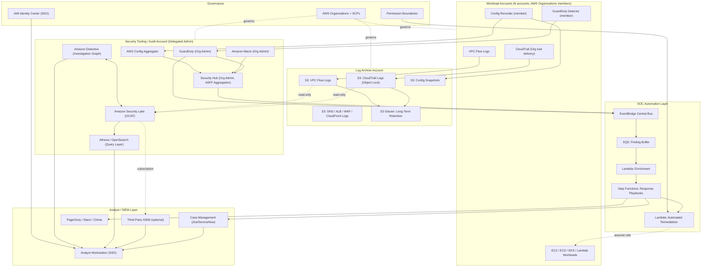
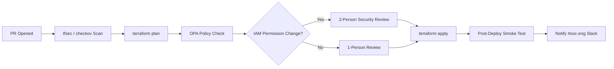

# Part XI – Security Reference Architectures

# Chapter 92 — SOC Operations

*A Cloud-Native Security Operations Center Architecture on AWS*

---

# 1. Executive Summary

## The Business Problem

Every enterprise operating meaningful workloads on AWS eventually hits the same wall.

- Security tooling is scattered across dozens of AWS accounts.
- GuardDuty findings pile up in one console, CloudTrail logs sit in another account, and WAF logs live somewhere else entirely.
- Nobody has a single, real-time view of "what is happening to us right now."
- When an incident does happen, the first two hours are spent just finding the logs, not analyzing them.

This is not a tooling problem. It is an **architecture problem**.

A Security Operations Center (SOC) is not a room full of monitors — that is the pop-culture image. In a cloud-native enterprise, a SOC is:

- A set of AWS accounts, pipelines, and data stores purpose-built for detection, investigation, and response.
- A standardized way for security signal (logs, findings, alerts, telemetry) to flow from every workload account into a small number of security accounts.
- A set of automated and human-driven workflows that take that signal and turn it into contained incidents.

Organizations that skip this step do not fail immediately. They fail during their first real incident, when:

- Nobody knows which of 40 accounts contains the compromised resource.
- CloudTrail retention expired three weeks before anyone needed it.
- The only person who understands the IAM structure is on vacation.
- Analysts are triaging in five different consoles simultaneously.

## Architecture Objective

The objective of a SOC Operations architecture is to make three things true, at all times, across an arbitrarily large AWS Organization:

1. **Every security-relevant signal is centralized.** GuardDuty findings, CloudTrail events, VPC Flow Logs, Config changes, WAF logs, EKS audit logs, and application security events all land in a small number of purpose-built security accounts, not scattered across workload accounts.
2. **Detection-to-response time is minimized through automation.** High-confidence findings should be enriched, triaged, and — where safe — auto-remediated within seconds, not hours.
3. **Human analysts operate from a single pane of glass.** When automation is not enough, a human analyst should be able to pivot from "alert" to "full context" (identity, network path, resource history, related findings) without switching between a dozen tools.

## Why Organizations Adopt This Architecture

There are five recurring triggers that push an organization from ad-hoc security monitoring toward a formal SOC architecture:

1. **Account sprawl.** Once an organization crosses roughly 15–20 AWS accounts, manual per-account review becomes operationally impossible.
2. **A near-miss or real incident.** Nothing motivates SOC investment like a credential leak, a cryptomining incident in a forgotten sandbox account, or a near-breach that was only caught by luck.
3. **Compliance mandates.** PCI-DSS, HIPAA, SOC 2, FedRAMP, and ISO 27001 all require continuous monitoring, log retention, and demonstrable incident response capability. Auditors ask for evidence, not intentions.
4. **Cyber insurance requirements.** Insurers increasingly require named SOC capability, MTTD/MTTR metrics, and tested incident response runbooks as a condition of coverage.
5. **M&A and multi-business-unit consolidation.** When a company acquires another company's AWS footprint, security visibility has to be re-established quickly across accounts that were never designed together.

## Major Business Benefits

- **Reduced Mean Time to Detect (MTTD).** Centralized, automated correlation catches things a human reviewing individual consoles would miss for days.
- **Reduced Mean Time to Respond (MTTR).** Automated containment (isolating an instance, revoking a credential, quarantining an S3 bucket) happens in seconds instead of waiting for a human to notice, investigate, and act.
- **Audit and compliance evidence generation becomes continuous rather than a quarterly fire drill.** Immutable, centrally retained logs satisfy auditor sampling requests without a scramble.
- **Reduced blast radius during incidents.** Because accounts are already segmented and instrumented, a compromise in one workload account does not automatically become a full-organization compromise.
- **Lower analyst burnout.** Automated enrichment and correlation reduce the volume of low-value alerts analysts have to manually triage, directly addressing a top driver of SOC analyst attrition.

## Typical Enterprise Scenarios

- A financial services company running 60+ AWS accounts across trading, retail banking, and internal tooling business units, subject to PCI-DSS and SOX.
- A healthcare SaaS company with a HIPAA-regulated production environment and a fast-growing set of customer-facing microservices, needing 24/7 detection coverage without a 24/7 in-house team (via a managed SOC augmentation model).
- A retail enterprise with seasonal traffic spikes (Black Friday) that needs security monitoring to scale automatically with infrastructure, without becoming an alert-fatigue nightmare during peak season.
- A multi-national manufacturing company converging IT and OT (operational technology) security monitoring after several ransomware incidents in the sector.
- A government contractor building toward FedRAMP Moderate/High authorization, requiring documented continuous monitoring (ConMon) architecture as part of the ATO package.

In every one of these scenarios, the underlying architecture is nearly identical. What differs is scale, compliance mapping, and the specific automated response playbooks — not the core design.

---

# 2. Business Requirements

## Business Drivers

- Reduce financial and reputational risk from undetected compromise.
- Meet regulatory and contractual security monitoring obligations.
- Provide auditable evidence of continuous security monitoring.
- Enable rapid, consistent incident response regardless of which team or engineer is on call.
- Support secure scaling of the AWS footprint without proportional growth in security headcount.

## Functional Requirements

| Requirement | Description |
|---|---|
| Centralized finding aggregation | All GuardDuty, Security Hub, Inspector, Macie, and Config findings visible from a single security account |
| Centralized log retention | CloudTrail, VPC Flow Logs, DNS logs, application logs retained centrally, immutable, and queryable |
| Automated enrichment | Findings automatically enriched with identity, asset, and network context before reaching an analyst |
| Automated containment | High-confidence, low-risk findings trigger automatic containment actions (isolate instance, disable key, quarantine object) |
| Case management | Analysts can create, assign, escalate, and close investigations with a full audit trail |
| Alerting and paging | Critical findings page on-call staff via a dedicated notification channel with SLA tracking |
| Threat intelligence integration | Findings are cross-referenced against threat intel feeds (IP reputation, known malicious domains, IOC feeds) |
| Cross-account remediation | Security account can execute remediation actions in member accounts via assumed roles, without standing access |
| Reporting | Scheduled and ad-hoc compliance and executive reporting from centralized data |

## Non-Functional Requirements

- **Scalability:** Architecture must support ingestion growth from tens of accounts to hundreds without redesign.
- **Availability:** Detection and alerting pipeline should target 99.9% availability; loss of the SOC pipeline itself is a security event.
- **Latency:** High-severity findings should reach an analyst or automated responder within 60 seconds of the underlying AWS service generating them.
- **Compliance:** Must support PCI-DSS 10.x (logging and monitoring), HIPAA §164.312(b) (audit controls), SOC 2 CC7.x (monitoring), and ISO 27001 A.12.4.
- **Security:** The SOC's own infrastructure must be held to the highest security bar in the organization — it is the highest-value target in the environment.
- **Recovery objectives:**
  - **RPO for security log data: near-zero.** Losing security telemetry is functionally equivalent to losing an eyewitness.
  - **RTO for detection pipeline: under 15 minutes** for full pipeline restoration after a regional or component failure.
- **SLAs:**
  - Critical severity finding acknowledged within 15 minutes, 24/7.
  - High severity finding acknowledged within 1 hour during business hours, 4 hours off-hours (unless 24/7 SOC staffing exists).
  - Medium/low severity findings triaged within 24–72 hours.

## Expected Workload and Growth

- Initial deployment: 20–50 AWS accounts, ~500K–2M security events/day.
- Steady-state enterprise: 100–500 accounts, 10M–100M+ events/day.
- Growth driver: new accounts under AWS Organizations are automatically onboarded into the SOC architecture via Control Tower / Account Factory customizations — no manual security team involvement required for baseline coverage.

---

# 3. Architecture Overview

## Overall Design Philosophy

The SOC architecture is built on one non-negotiable principle: **security data and security tooling live in dedicated, tightly controlled AWS accounts, separate from workload accounts.**

This mirrors the AWS multi-account strategy recommended by AWS Control Tower and the AWS Security Reference Architecture (AWS-SRA). Three account types matter most for this chapter:

1. **Log Archive account** — the write-once destination for all raw logs (CloudTrail, VPC Flow Logs, Config snapshots, S3 access logs). No human has standing write access. Even security engineers only get read access.
2. **Security Tooling / Audit account** — where GuardDuty, Security Hub, Detective, Macie, and Inspector are administered as delegated administrator services, aggregating findings from every member account in the AWS Organization.
3. **SOC Response account (or workload within Security Tooling)** — hosts the automation layer: EventBridge rules, Step Functions playbooks, Lambda remediation functions, and the case management / SOAR-style integration layer.

Member (workload) accounts remain "thin" from a security-tooling perspective: they run GuardDuty detectors and CloudTrail as member resources, but forward everything to the central accounts. No security data is meant to be reviewed *in* a workload account during normal operations.

## Core Components

- **Detection layer:** GuardDuty (threat detection), Security Hub (posture + findings aggregation), Macie (sensitive data discovery), Inspector (vulnerability management), Config (configuration drift/compliance), IAM Access Analyzer.
- **Telemetry layer:** CloudTrail (API activity), VPC Flow Logs (network activity), Route 53 Resolver query logs (DNS activity), ALB/CloudFront/WAF logs (edge activity), EKS/ECS audit and container runtime logs.
- **Aggregation layer:** Centralized S3 buckets in the Log Archive account, Security Lake (AWS's OCSF-normalized security data lake service) as the canonical normalized store, Amazon Athena/OpenSearch for query.
- **Correlation and automation layer:** EventBridge as the central nervous system routing findings, Step Functions for orchestrated response playbooks, Lambda for enrichment and remediation, Amazon Detective for graph-based investigation.
- **Human interface layer:** Security Hub console and/or a third-party SIEM (Splunk, Sumo Logic, Elastic) fed via Security Lake/Kinesis Firehose, a ticketing/case system (Jira Service Management, ServiceNow SecOps, or PagerDuty), Slack/Teams/Chime for real-time collaboration.
- **Governance layer:** Service Control Policies (SCPs) preventing member accounts from disabling security services, AWS Organizations delegated administration, IAM permission boundaries constraining what the SOC automation itself can do.

## How Components Interact — High-Level Workflow

1. A workload account generates a security-relevant event (an API call, a network flow, a GuardDuty detector firing).
2. Raw logs stream continuously to the Log Archive account (CloudTrail → S3, VPC Flow Logs → S3, DNS logs → S3).
3. GuardDuty (running as an Organization-wide delegated service) analyzes telemetry and produces a finding in the Security Tooling account.
4. Security Hub aggregates the finding alongside findings from Inspector, Macie, Config, and any third-party integrations, normalizing them to the AWS Security Finding Format (ASFF).
5. An EventBridge rule matches the finding pattern and triggers a Step Functions state machine.
6. The state machine enriches the finding (who is this IAM principal, what account, what resource tags, is this IP known-malicious), decides on automated response eligibility, and either:
   - Executes an automated containment action via a cross-account IAM role, or
   - Creates a case in the case management system and pages the on-call analyst.
7. The analyst investigates using Detective (for graph-based entity relationship analysis) and Athena/Security Lake (for raw log query), takes manual remediation action if needed, and closes the case.
8. All actions — automated and manual — are themselves logged back into the same pipeline, creating a full audit trail of the response itself.

## Request, Response, and Data Lifecycle

- **Request lifecycle (detection):** raw telemetry → detector analysis → finding generation → normalization → routing.
- **Response lifecycle (action):** finding → enrichment → decision (auto vs. human) → action execution → verification → case closure.
- **Data lifecycle (retention):** raw logs land in Log Archive S3 with Object Lock (write-once-read-many) → lifecycle transitions to Glacier for cost-managed long-term retention → normalized OCSF data in Security Lake retained per compliance schedule → aggregated metrics retained indefinitely in CloudWatch/QuickSight dashboards for trend analysis.

---

# 4. AWS Services Used

## Amazon GuardDuty

**Purpose:** Continuous, ML- and threat-intel-driven threat detection across AWS accounts, analyzing CloudTrail management/data events, VPC Flow Logs, DNS logs, EKS audit logs, RDS login activity, S3 data events, and Lambda network activity — without requiring the customer to deploy or manage any agents.

**Why selected:**

- Zero infrastructure to manage; it's a fully managed detector service.
- Native Organization-wide delegated administration — a single GuardDuty administrator account sees findings from every member account automatically.
- Broad detection surface: reconnaissance, credential compromise, cryptomining, malware (via GuardDuty Malware Protection), S3 exfiltration, EKS runtime threats.

**Alternatives:** Third-party CSPM/CNAPP tools (Wiz, Palo Alto Prisma Cloud, CrowdStrike Falcon Cloud Security), open-source options like Falco for runtime detection. These can supplement but rarely fully replace GuardDuty for AWS-native coverage because of GuardDuty's direct integration with AWS control-plane telemetry.

**Limitations:**

- Detection is signature/ML-based; highly novel attack techniques may not trigger a finding immediately.
- Malware Protection for EC2/S3 has separate pricing and must be explicitly enabled.
- Cannot inspect encrypted payload content — it works on metadata and flow patterns, not deep packet inspection.

**Pricing considerations:** Priced per GB of CloudTrail events, VPC Flow Log data, and DNS query volume analyzed, plus separate line items for S3 Protection, EKS Protection, RDS Protection, Lambda Protection, and Malware Protection. Costs scale with account count and traffic volume — budget for this explicitly (see Section 16).

**Best practices:**

- Enable GuardDuty at the AWS Organizations level with delegated administration; do not enable it account-by-account manually.
- Enable all protection plans (S3, EKS, RDS, Lambda, Malware Protection) unless there's a specific cost-driven reason not to.
- Route findings to Security Hub and EventBridge immediately; do not rely on manually checking the GuardDuty console.

## AWS Security Hub

**Purpose:** Aggregates, normalizes (to ASFF/OCSF), and correlates findings from GuardDuty, Inspector, Macie, Config, IAM Access Analyzer, and third-party tools into a single dashboard and event stream. Also runs continuous configuration checks against standards like CIS AWS Foundations Benchmark, PCI-DSS, NIST 800-53, and AWS Foundational Security Best Practices (FSBP).

**Why selected:** It's the natural aggregation point that turns "twelve different services with twelve different consoles" into one normalized event stream that EventBridge, a SIEM, or a human can consume consistently.

**Alternatives:** A third-party SIEM (Splunk Enterprise Security, Microsoft Sentinel, Elastic Security) can serve as the aggregation layer instead, ingesting directly from Security Lake or Kinesis Firehose. Many enterprises use both: Security Hub for AWS-native posture and compliance checks, and a SIEM for cross-cloud/cross-tool correlation.

**Limitations:** Security Hub's own correlation and case management capability is comparatively basic; most serious SOCs pair it with Detective and/or a SIEM rather than treating the Security Hub console as the analyst's primary workspace.

**Pricing considerations:** Charged per finding ingested and per security check performed, per Region, per account. Multi-Region, multi-account deployments require deliberate cost governance.

**Best practices:** Enable Security Hub centrally via delegated administration, enable cross-Region aggregation to one home Region, and treat it as the finding router, not the finding archive.

## Amazon Detective

**Purpose:** Automatically builds a graph model of resource, IAM principal, and network behavior over time from CloudTrail, VPC Flow Logs, and GuardDuty findings, enabling analysts to pivot visually from "this finding" to "everything this principal/resource has done in the last 12 months."

**Why selected:** Investigation is the single biggest time sink in SOC operations. Detective removes the need to hand-write Athena queries for basic "who/what/when" investigation questions.

**Alternatives:** Manual CloudTrail/Athena queries, or a SIEM's built-in investigation graphing (e.g., Splunk's Investigation Timeline). Detective is typically cheaper and faster to stand up for AWS-native investigation than building equivalent capability in a general-purpose SIEM.

**Limitations:** Twelve-month data retention window; does not replace long-term log archival requirements for compliance.

**Pricing considerations:** Priced per GB of data ingested (CloudTrail, VPC Flow Logs, GuardDuty findings, EKS audit logs). Scales with account/traffic volume similarly to GuardDuty.

## Amazon Macie

**Purpose:** ML-powered discovery and classification of sensitive data (PII, PHI, financial data, credentials) in S3, with automatic sensitivity scoring.

**Why selected:** Data exfiltration is one of the highest-impact incident categories; Macie tells the SOC *what* is at risk in a given bucket before an incident happens, and flags anomalous access to sensitive buckets during one.

**Alternatives:** Third-party DSPM (Data Security Posture Management) tools (Wiz, BigID, Varonis) offer broader multi-cloud/data-store coverage. Macie is the natural first step for S3-centric AWS environments.

**Limitations:** S3-focused; does not natively cover RDS, DynamoDB, or Redshift content inspection.

**Pricing considerations:** Priced per GB scanned and per S3 bucket evaluated; enable selectively on buckets known or suspected to contain sensitive data rather than blanket-enabling on every bucket in very large environments, to control cost.

## AWS Config

**Purpose:** Continuous recording of resource configuration state and change history; evaluates resources against Config Rules (including AWS Security Hub's compliance standards) to detect drift from secure baselines.

**Why selected:** Detection services tell you *something bad happened*; Config tells you *the environment drifted into an insecure state*, which is often the precondition for the incident. It's also the audit trail auditors ask for directly ("show me every change to this security group in the last 90 days").

**Alternatives:** Terraform Cloud/Enterprise drift detection, or third-party CSPM tools. Config remains the AWS-native system of record and is required for Security Hub's compliance standard checks to function.

**Limitations:** Rule evaluation has some latency (not instantaneous); very large multi-account, multi-Region deployments incur significant recorder and rule evaluation cost.

## AWS CloudTrail

**Purpose:** Records every API call made against AWS accounts — management events (control plane) and, optionally, data events (S3 object access, Lambda invocations).

**Why selected:** It is the foundational audit log for AWS — nearly every detection and investigation capability in this architecture (GuardDuty, Detective, Config, Security Hub) is built on top of CloudTrail data.

**Best practices:** Enable an Organization trail (one trail, applied to every account automatically) writing to the centralized Log Archive account, enable log file validation (cryptographic integrity checking), and enable data events selectively on sensitive S3 buckets and Lambda functions rather than universally (cost control).

## Amazon Security Lake

**Purpose:** A managed, OCSF-normalized (Open Cybersecurity Schema Framework) security data lake that centralizes log and event data from AWS services, on-premises sources, and third-party security tools into a single, queryable, S3-backed store.

**Why selected:** Before Security Lake, every SOC had to build custom ETL to normalize GuardDuty findings, CloudTrail logs, VPC Flow Logs, and third-party data into a common schema for SIEM ingestion. Security Lake does this natively and makes the resulting data directly queryable via Athena/Redshift, or subscribable by a third-party SIEM.

**Alternatives:** Custom Kinesis Firehose + Lambda transformation pipelines into a self-managed S3 data lake; more flexible but significantly more engineering effort to build and maintain.

**Limitations:** OCSF coverage of third-party sources depends on vendor support; not every security tool has a native Security Lake integration yet.

## Amazon Athena / Amazon OpenSearch Service

**Purpose:** Athena provides serverless SQL query over S3-resident log data (including Security Lake's OCSF tables) for ad-hoc investigation and scheduled reporting. OpenSearch Service provides low-latency full-text search and dashboarding for high-frequency interactive analyst queries.

**Why selected:** Athena is ideal for the "query terabytes of historical logs occasionally" pattern typical of investigations and compliance reporting. OpenSearch is ideal for the "analysts are actively hunting and need sub-second query response" pattern during active incidents.

**Trade-off:** Running both means paying for two query engines; many mid-sized SOCs start Athena-only and add OpenSearch only once analyst query latency becomes a proven bottleneck.

## Amazon EventBridge

**Purpose:** The central event bus routing Security Hub findings, GuardDuty findings, Config compliance changes, and custom application security events to Step Functions, Lambda, SNS, and third-party targets (via EventBridge API destinations or partner integrations like PagerDuty/Slack).

**Why selected:** Native, serverless, pay-per-event routing with pattern matching, eliminating the need for polling-based integration between security services and the automation layer.

## AWS Step Functions

**Purpose:** Orchestrates multi-step automated response playbooks (enrich → decide → contain → notify → verify) with built-in retry, error handling, and human-approval wait states.

**Why selected:** Response playbooks are inherently stateful, multi-step processes with branching logic and the occasional need for human-in-the-loop approval. Step Functions models this far more maintainably than a single large Lambda function or a chain of loosely coupled functions.

**Alternatives:** AWS Systems Manager Automation documents (simpler, good for single-step remediation), a third-party SOAR platform (Palo Alto XSOAR, Splunk SOAR) if the organization already has one and wants AWS to be a data source/action target rather than the orchestrator.

## AWS Lambda

**Purpose:** Executes enrichment logic (identity lookup, threat-intel cross-referencing, resource tag lookup) and remediation actions (revoke session, isolate instance, disable key, quarantine object) as discrete, testable functions invoked by Step Functions or EventBridge directly.

**Best practices:** Each Lambda function should do one thing (single responsibility), use least-privilege execution roles scoped to exactly the API calls it needs, and log every action taken back into CloudWatch Logs and the case management system for auditability.

## Amazon SNS / Amazon SQS

**Purpose:** SNS fans out critical alerts to multiple subscribers (PagerDuty, Slack via Chatbot, email) simultaneously. SQS buffers high-volume finding streams between EventBridge and Lambda consumers to smooth bursts and prevent throttling during large-scale events (e.g., an Organization-wide credential leak generating thousands of simultaneous findings).

## AWS IAM, IAM Access Analyzer, and AWS STS

**Purpose:** IAM Access Analyzer continuously identifies resources shared outside the AWS Organization/account boundary (public S3 buckets, cross-account IAM roles, KMS key policies) — a critical proactive detection capability. STS underlies every cross-account remediation action, issuing short-lived credentials for the SOC automation to assume a role in a member account rather than holding standing credentials.

## AWS KMS and AWS Secrets Manager

**Purpose:** KMS encrypts all security data at rest (Log Archive S3, Security Lake, Detective, OpenSearch) with customer-managed keys, and provides envelope encryption for Step Functions payloads containing sensitive investigation data. Secrets Manager stores API keys/tokens for third-party integrations (SIEM connectors, PagerDuty, Slack, threat intel feeds) with automatic rotation.

## AWS Systems Manager (Automation, Session Manager)

**Purpose:** Systems Manager Automation documents execute host-level remediation (isolate an EC2 instance's security group, collect forensic memory/disk snapshots) without requiring SSH access. Session Manager provides audited, keyless shell access for analysts who need to manually inspect a compromised host, with every keystroke logged to CloudWatch Logs / S3.

## Amazon CloudWatch

**Purpose:** Hosts dashboards for SOC operational metrics (finding volume, MTTD, MTTR, automation success rate), alarms on pipeline health (EventBridge rule failures, Lambda errors, Step Functions execution failures), and centralizes application/infrastructure logs that feed correlation logic alongside AWS-native security telemetry.

---

# 5. Complete Architecture Diagram



---

# 6. Component-by-Component Explanation

## Log Archive Account

**Purpose:** The immutable system of record for all raw security telemetry across the AWS Organization.

**Responsibilities:** Receive CloudTrail, VPC Flow Log, Config, and edge-service (WAF/ALB/CloudFront) log delivery from every member account; enforce write-once retention via S3 Object Lock in Compliance mode; apply lifecycle policies to transition older data to Glacier.

**Inputs:** Log delivery streams from every account in the Organization, configured automatically at account-vending time via Control Tower / Account Factory.

**Outputs:** Read-only cross-account access grants to the Security Tooling account (for Security Lake ingestion) and to designated analyst roles (for direct investigation, break-glass only).

**Scaling:** S3 scales natively; the only practical constraint is cost and, at extreme volume, S3 request-rate partitioning, addressed via key-prefix design (account-id/region/date partitioning).

**High availability:** S3 Standard is multi-AZ by design; enable Cross-Region Replication to a second Region for the Log Archive bucket to protect against a full-Region event affecting log durability.

**Failure handling:** CloudTrail and Config log delivery failures generate their own CloudWatch alarms — a failure to log is itself treated as a security event, not a background operational nuisance.

**Dependencies:** AWS Organizations trail delegation, KMS keys shared (not delegated write access) with member accounts for encryption.

**Security:** No IAM principal — including root — should have delete permissions on the log buckets during their retention window; enforce via bucket policy plus Object Lock plus SCP denying `s3:DeleteObject`/`s3:PutBucketPolicy` changes to this account's log buckets from anyone but a tightly scoped break-glass role.

**Monitoring:** CloudWatch alarms on log delivery gaps, S3 bucket policy changes (should be zero after initial setup), and unusual access patterns to the archive account itself.

## Security Tooling / Audit Account

**Purpose:** Hosts the delegated-administrator instances of GuardDuty, Security Hub, Macie, Detective, and the Config aggregator; the analytical brain of the SOC.

**Responsibilities:** Aggregate findings and configuration state from every member account; run compliance standard evaluations; provide the query surface (Security Lake, Athena, Detective) analysts use for investigation.

**Scaling:** These are AWS-managed services; scaling is handled by AWS, though cost scales linearly-ish with event/data volume and must be actively governed (see Section 16).

**High availability:** Delegated administration inherently spans all Regions where enabled; for Regional resilience, designate a home Region for aggregation and ensure Security Hub cross-Region aggregation is enabled so a single Regional outage doesn't blind the SOC to findings generated elsewhere.

**Dependencies:** AWS Organizations, delegated administrator registration for each service (a one-time per-service Organizations API call), IAM Identity Center for analyst access.

**Security:** This account is the second-highest-value target in the environment after the Organizations management account itself. Apply the same "few humans, no standing access, everything through SSO + short-lived roles" discipline used for the management account.

## SOC Automation Layer (EventBridge / Step Functions / Lambda)

**Purpose:** Converts findings into action — either fully automated containment or a well-formed, enriched case for a human analyst.

**Responsibilities:** Pattern-match incoming findings, enrich with context, apply decision logic (auto-remediate vs. escalate), execute containment via cross-account roles, notify stakeholders, log every action.

**Inputs:** EventBridge events from Security Hub, GuardDuty, Config, and custom application-emitted security events.

**Outputs:** Remediation API calls into member accounts, case creation in the case management system, notifications to Slack/PagerDuty.

**Scaling:** SQS buffering in front of Lambda absorbs burst traffic (e.g., an Organization-wide event causing thousands of simultaneous findings) so the automation layer degrades gracefully rather than throttling and dropping events.

**Failure handling:** Step Functions built-in retry/catch blocks handle transient API failures; a dead-letter queue captures events that exhaust retries for manual review, ensuring no finding is silently dropped.

**Security:** The automation layer's cross-account remediation role is the single most powerful credential in the entire architecture — it can act in *every* member account. It must be scoped with a tight permission boundary, restricted to an explicit allow-list of remediation actions (e.g., `ec2:ModifyInstanceAttribute` to change a security group, `iam:UpdateAccessKey` to deactivate a key — never `iam:*` or `*:*`), and every invocation must be logged with full input/output to CloudTrail and the case management system.

## Analyst / SIEM Layer

**Purpose:** The human interface — where an analyst who receives a page pivots into full investigation context and executes judgment calls automation shouldn't make alone (e.g., "is this actually the CFO traveling, or an account takeover?").

**Responsibilities:** Present correlated, enriched findings; support pivoting from finding → identity → resource → historical behavior; track case status/SLA; provide a durable record of investigation decisions for audit and post-incident review.

**Dependencies:** IAM Identity Center for federated, MFA-enforced analyst access; read access into Security Lake/Athena/Detective; write access into the case management system.

**Security:** Analyst access should be read-only into security data by default, with any remediation action itself going through the same audited automation layer (a human clicking "isolate this instance" in a case management tool should invoke the same Lambda function and produce the same audit trail as a fully automated response) rather than analysts holding direct console access to production accounts.

---

# 7. End-to-End Request Flow

This section traces a concrete example: **an IAM access key is used from an anomalous geographic location and immediately attempts `s3:GetObject` against a bucket tagged `Confidential`.**

1. **Client/Attacker action.** A leaked IAM access key is used from an IP address in a country with no legitimate business presence for the organization.
2. **CloudTrail** records the `GetObject` API call as a data event (data events must be explicitly enabled on sensitive buckets for this to be visible) and streams it to the Organization trail, landing in the Log Archive account within minutes.
3. **GuardDuty**, analyzing the same CloudTrail stream in near real time, correlates the anomalous source IP against its threat intelligence and behavioral baselines and generates a finding: `UnauthorizedAccess:IAMUser/MaliciousIPCaller.Custom` (or similar), with severity High.
4. **Security Hub** ingests the GuardDuty finding, normalizes it to ASFF, and enriches it with any relevant compliance standard context (e.g., this bucket is in scope for PCI-DSS).
5. **EventBridge** matches a rule on `Security Hub Findings - Imported` with severity ≥ High and routes the event to the SOC automation SQS queue.
6. **Lambda (enrichment)**, triggered from the queue, looks up: which IAM principal owns this key, what account it belongs to, whether that principal has MFA, what the bucket's sensitivity tag is (cross-referencing Macie's prior classification), and whether the source IP appears on any threat intel feed.
7. **Step Functions** evaluates the enrichment output against playbook logic: source IP is confirmed malicious by threat intel AND bucket is tagged Confidential AND principal has no recent legitimate travel context → **auto-remediation eligible.**
8. **Lambda (remediation)** assumes a cross-account role in the affected workload account and deactivates the IAM access key (`iam:UpdateAccessKey` → `Inactive`), and applies an S3 bucket policy condition temporarily denying the source IP range.
9. **Case management** creates a P1 case pre-populated with all enrichment data; **SNS/PagerDuty** pages the on-call analyst; **Slack** posts a summary to the SOC channel.
10. **Analyst** opens **Detective**, reviews the graph of this principal's activity over the preceding 12 months, confirms no other suspicious activity, and checks **Athena/Security Lake** for any other API calls from the same source IP across the entire Organization (in case this is part of a broader credential-stuffing campaign).
11. **Error handling:** if the remediation Lambda fails (e.g., the target account's role trust policy was recently and legitimately modified, breaking the assume-role chain), Step Functions catches the failure, escalates immediately to a P1 human-required case rather than silently failing, and alerts the SOC automation on-call engineer separately from the security analyst on-call.
12. **Verification:** a follow-up Step Functions state confirms the key is now Inactive and the bucket policy change is applied, closing the automated portion of the response and logging total time-to-containment (target: under 5 minutes from finding to containment for this class of event).
13. **Analyst closes the case** with a documented root cause (e.g., key was committed to a public GitHub repository) and triggers a secondary playbook: scanning the organization for any other credentials belonging to the same developer, and a mandatory credential rotation reminder.
14. **Reporting:** the full incident timeline, MTTD, and MTTR are captured automatically for the monthly SOC metrics report and the annual compliance audit evidence package.

---

# 8. Deployment Flow

## Infrastructure Provisioning

- The entire SOC architecture — accounts, delegated administration registrations, S3 buckets, EventBridge rules, Step Functions state machines, Lambda functions — is provisioned via Terraform, never manually through the console.
- New workload accounts are vended through **AWS Control Tower Account Factory (or Account Factory for Terraform / AFT)**, which automatically applies the baseline security configuration (GuardDuty enablement, CloudTrail, Config recorder, log delivery to Log Archive) at account creation, with zero manual security team involvement.

## Terraform Workflow

1. Security team submits a pull request to the SOC infrastructure repository (e.g., adding a new EventBridge rule for a new finding type).
2. CI pipeline runs `terraform plan`, static analysis (`tfsec`, `checkov`), and policy-as-code validation (Open Policy Agent / Sentinel) confirming the change doesn't violate guardrails (e.g., cannot widen the remediation Lambda's IAM permissions beyond the approved allow-list without a second security architect approval).
3. Two-person review required for any change touching the automation layer's IAM permissions (this is a deliberate control, not a bureaucratic accident — it is the single highest-leverage account in the architecture).
4. `terraform apply` executes via CI/CD service role, never via a human's local credentials.

## CI/CD Deployment



## Blue-Green Deployment for Automation Logic

- Step Functions state machines support versioning; new playbook logic is deployed as a new state machine version and tested against replayed historical findings (a "shadow mode" run) before being promoted to handle live traffic.
- Lambda functions use versioned aliases (`$LATEST`, `prod`) with weighted traffic shifting, allowing a new remediation function version to handle 10% of traffic before full cutover.

## Rollback

- Terraform state is versioned in S3 with DynamoDB locking; rollback is a `terraform apply` of the previous known-good commit.
- Step Functions and Lambda rollbacks are near-instant via alias repointing — critical, because a bug in the remediation layer could otherwise cause incorrect containment actions across the entire Organization.

## Secrets and Configuration

- Third-party integration secrets (SIEM API tokens, PagerDuty integration keys, threat intel feed API keys) are stored in Secrets Manager with automatic rotation where the provider supports it, and referenced by Lambda via environment variable resolution at invocation time — never hardcoded.
- Environment-specific configuration (severity thresholds, auto-remediation eligibility rules) is stored in Systems Manager Parameter Store as versioned parameters, allowing playbook tuning without a full redeploy.

## Validation

- Every deployment runs an automated validation suite that injects synthetic GuardDuty/Security Hub findings (via the `sample-findings` API) into a non-production copy of the pipeline and confirms expected routing, enrichment, and (where applicable) remediation occur correctly before the change is considered safe to promote.

---

# 9. Network Topology

## VPC and CIDR Strategy

- The Security Tooling account typically requires only a minimal VPC footprint (most services used — GuardDuty, Security Hub, Detective, Macie — are serverless/regional and do not require VPC placement).
- Where VPC-resident resources are needed (e.g., self-managed OpenSearch, or Lambda functions requiring access to on-premises threat intel feeds via Direct Connect), use a small dedicated VPC, e.g., `10.99.0.0/24`, sized deliberately small to signal "this is not a workload VPC."

## Public and Private Subnets

- No public subnets are required in the Security Tooling account under normal design — there is no reason for anything in this account to be internet-facing.
- If a third-party SIEM connector or threat intel feed requires outbound internet access, route it through a **private subnet with a NAT Gateway**, never a public subnet with a public IP on the resource itself.

## NAT Gateway / Internet Gateway

- A single NAT Gateway (or NAT Gateway per-AZ for HA, if outbound availability is critical to the detection pipeline) provides controlled, logged, egress-only internet access for threat intel feed lookups and SIEM connector traffic.

## Transit Gateway

- In organizations with hub-and-spoke networking (see Chapter 17), the Security Tooling account's VPC attaches to the central Transit Gateway **only if** cross-account private connectivity is genuinely required (e.g., pulling logs from an on-premises SIEM over Direct Connect). Many SOC architectures need zero private network connectivity to workload accounts at all, because all interaction happens via IAM API calls (CloudTrail-logged, not network-routed) rather than direct network access.

## Route Tables, NACLs, Security Groups

- Security groups on any VPC-resident SOC resource should be as close to zero-inbound as architecturally possible; outbound should be restricted to specific destination CIDRs/prefix lists for known threat intel and SIEM endpoints rather than `0.0.0.0/0`.
- NACLs provide a secondary, stateless layer of defense at the subnet boundary, primarily useful for explicitly denying known-bad CIDR ranges organization-wide.

## PrivateLink

- If a third-party SaaS SIEM or SOAR platform offers an AWS PrivateLink endpoint (many do), prefer it over public internet connectivity for log export — this keeps sensitive security telemetry off the public internet path entirely and simplifies the network security argument to auditors.

## Hybrid Connectivity

- For organizations with an on-premises SOC or hybrid detection tooling (common in regulated industries maintaining a legacy on-prem SIEM during a multi-year cloud migration), Direct Connect or Site-to-Site VPN links the Security Tooling VPC to on-premises, with strict routing to prevent workload account traffic from ever transiting through the Security Tooling account's network path.

---

# 10. Identity and Access

## IAM Roles and the "No Standing Access" Principle

The SOC architecture is one of the few places in an AWS environment where the temptation to grant broad standing access is highest ("the security team needs to see everything") and where the consequences of doing so are worst (that same broad access becomes the top target for an attacker).

- **Analyst roles** are federated through IAM Identity Center, MFA-enforced, and scoped to **read-only** access to security data (Security Hub, Detective, Security Lake/Athena, GuardDuty findings) in the Security Tooling account. No analyst role has standing write/remediation access anywhere.
- **Remediation roles**, used exclusively by the automation layer (never assumed interactively by a human), exist in each member account, trusted only by the specific automation IAM role in the Security Tooling account, and scoped to an explicit allow-list of remediation API calls.
- **Break-glass roles** provide emergency elevated access (e.g., direct console access to a compromised production account during an active incident too complex for the standard playbooks), require a second-person approval workflow to activate (e.g., via AWS IAM Identity Center's approval workflows or a PIM-style tool), auto-expire after a short window (1–4 hours), and generate an automatic, unsuppressable alert to security leadership the moment they are used.

## IAM Policies — Example: Remediation Role Permission Boundary

```json

{
  "Version": "2012-10-17",
  "Statement": [
    {
      "Sid": "AllowedRemediationActionsOnly",
      "Effect": "Allow",
      "Action": [
        "ec2:ModifyInstanceAttribute",
        "ec2:RevokeSecurityGroupIngress",
        "ec2:AuthorizeSecurityGroupEgress",
        "iam:UpdateAccessKey",
        "iam:PutUserPolicy",
        "s3:PutBucketPolicy",
        "s3:PutPublicAccessBlock"
      ],
      "Resource": "*",
      "Condition": {
        "StringEquals": {
          "aws:PrincipalTag/SOCAutomation": "true"
        }
      }
    },
    {
      "Sid": "DenyEverythingElseExplicitly",
      "Effect": "Deny",
      "NotAction": [
        "ec2:ModifyInstanceAttribute",
        "ec2:RevokeSecurityGroupIngress",
        "ec2:AuthorizeSecurityGroupEgress",
        "iam:UpdateAccessKey",
        "iam:PutUserPolicy",
        "s3:PutBucketPolicy",
        "s3:PutPublicAccessBlock",
        "sts:GetCallerIdentity"
      ],
      "Resource": "*"
    }
  ]
}

```

> **Note:** this is used as a **permission boundary**, layered under the role's identity-based policy — belt-and-suspenders so a future well-intentioned but overly broad policy change to the role itself still cannot exceed this ceiling without a separate, deliberate boundary change.

## Resource Policies and Cross-Account Trust

- The remediation role's trust policy in each member account explicitly names the Security Tooling account's automation role ARN — never a wildcard principal, and never the root of the Security Tooling account.
- An `sts:ExternalId` condition is included on the trust policy as defense-in-depth against confused-deputy scenarios.

## STS and Cross-Account Access

- All cross-account access uses `sts:AssumeRole` with a maximum session duration of 15–60 minutes for remediation actions — long enough to complete a playbook, short enough that a leaked session credential has minimal value.
- Analyst break-glass sessions likewise use time-bounded STS sessions rather than long-lived IAM users.

## Least Privilege in Practice

- Every new remediation capability added to a playbook requires an explicit IAM permission addition through the two-person-reviewed Terraform process (Section 8) — permissions are never granted speculatively "in case we need it later."

## Service Roles

- GuardDuty, Security Hub, Macie, and Config each use AWS-managed service-linked roles; these should not be modified, and any drift from the AWS-managed baseline is itself a Config rule violation worth alerting on.

## Permission Boundaries

- Applied to every human-assumable role in the Security Tooling account, capping maximum possible permissions even if a role's identity policy is later misconfigured — a critical control given how attractive this account is as a target.

---

# 11. Security Architecture

## Encryption

- **At rest:** every S3 bucket in the Log Archive and Security Tooling accounts uses SSE-KMS with customer-managed keys (CMKs), not SSE-S3, so key usage and key policy changes are independently auditable via CloudTrail.
- **In transit:** all service-to-service communication uses TLS 1.2+; VPC endpoints (Gateway for S3/DynamoDB, Interface for other services) keep AWS API traffic off the public internet where the automation layer needs to call AWS APIs.
- **KMS key policy:** the CMK used for Log Archive encryption grants decrypt permission narrowly — to the specific services and roles that need it (GuardDuty/Security Lake for read, log-delivery service principals for write) — with key usage logged and alarmed on for any principal not on the expected list.

## WAF and Shield

- While WAF/Shield primarily protect internet-facing workloads (covered in depth in Chapter 22), their logs are a critical **input** to this SOC architecture: WAF logs stream to the Log Archive account and are correlated by GuardDuty and custom EventBridge rules against application-layer attack patterns (SQLi/XSS attempt bursts, credential-stuffing patterns against login endpoints).

## Secrets Manager and Certificate Manager

- Secrets Manager secures all third-party integration credentials (Section 8); ACM manages TLS certificates for any internally-hosted SOC web interfaces (e.g., a self-hosted case management UI), with automatic renewal removing a historically common cause of monitoring gaps (an expired cert silently breaking a SIEM forwarder).

## GuardDuty, Inspector, Security Hub

Covered in depth in Section 4; together they form the detection and posture-assessment core of this architecture. Inspector specifically continuously scans EC2, ECR container images, and Lambda functions for known vulnerabilities (CVEs), feeding findings into the same Security Hub aggregation and EventBridge automation pipeline as GuardDuty threat findings — a vulnerability finding on an internet-facing instance can trigger an automated priority escalation playbook distinct from the standard patch-cadence process.

## CloudTrail and AWS Config

The immutable audit trail (Section 4/9) underlying essentially every other capability in this chapter.

## Zero Trust Considerations

- The SOC architecture itself should be designed under Zero Trust principles (full treatment in Chapter 87): every cross-account action is explicitly authorized and time-bounded (no implicit trust from network location), every human access is continuously verified via SSO+MFA rather than session-and-forget, and the automation layer's remediation role is treated as a high-value identity requiring its own dedicated monitoring — including alerting if the *automation role itself* is ever used outside of expected Step Functions execution patterns (a strong signal the automation credentials have themselves been compromised).

## Threat Model

Primary threats this architecture is explicitly designed to detect and contain:

| Threat | Primary Detection Mechanism | Primary Response |
|---|---|---|
| Leaked/stolen IAM credentials | GuardDuty anomalous API/geolocation findings | Auto-deactivate key, force MFA re-auth |
| Cryptomining in compromised/forgotten accounts | GuardDuty `CryptoCurrency` findings, unusual EC2 spend | Auto-isolate instance, stop instance |
| S3 data exfiltration | GuardDuty S3 Protection findings + Macie sensitivity context | Auto-block source IP, alert immediately |
| Privilege escalation attempts | GuardDuty + Access Analyzer + Config IAM change rules | Auto-revert policy change (where safe), escalate |
| Malicious insider activity | Detective behavioral graph + anomaly correlation | Human-required escalation, no auto-remediation |
| Ransomware / mass encryption | GuardDuty Malware Protection + abnormal S3/EBS write patterns | Auto-isolate, snapshot preservation, human escalation |
| Supply chain compromise (malicious package/AMI) | Inspector CVE/malware scanning, image provenance checks | Block deployment pipeline, quarantine image |

## Attack Vectors and Mitigations

- **Attacker targets the SOC pipeline itself to blind detection** (disabling GuardDuty, deleting CloudTrail): mitigated by SCPs at the Organization root explicitly denying `guardduty:DeleteDetector`, `cloudtrail:StopLogging`, `cloudtrail:DeleteTrail`, and similar actions for every account except a tightly controlled break-glass principal — enforced organization-wide regardless of what IAM policy a compromised account's admin role might otherwise allow.
- **Attacker targets the automation layer's remediation role** for lateral movement: mitigated by the explicit allow-list permission boundary (Section 10) that makes the role useless for anything beyond its narrow remediation purpose even if fully compromised.
- **Attacker floods the pipeline with noise to bury a real signal ("alert fatigue attack")**: mitigated by severity-based routing, automated correlation/deduplication in Security Hub, and SQS-buffered, rate-aware processing that prevents a flood from causing dropped events.

---

# 12. High Availability

## AZ Failures

- All SOC compute (Lambda, Step Functions) is inherently multi-AZ by AWS's serverless design; no customer action required beyond standard VPC subnet placement across multiple AZs for any VPC-resident resource.

## Instance Failures

- Largely not applicable — this architecture is deliberately serverless-first specifically to avoid instance-level HA concerns in the critical detection/response path. Any self-managed component (e.g., a self-hosted OpenSearch cluster) should run across a minimum of 3 AZs with dedicated master nodes.

## Regional Failures

- Security Hub cross-Region aggregation (Section 6) ensures findings generated in any Region reach the home-Region dashboard even if that originating Region has issues.
- Log Archive S3 Cross-Region Replication provides log durability if the primary Region is fully unavailable.
- For organizations requiring true active detection capability during a full Regional outage of the primary Security Tooling Region, a warm-standby Security Tooling account presence in a second Region (GuardDuty/Security Hub enabled, but not the primary aggregation point) can be activated via runbook.

## Database Failures

- Security Lake and Athena are serverless over S3 — no traditional database failure mode. If a self-managed OpenSearch cluster is used, standard multi-AZ, dedicated-master, and automated snapshot practices apply (see Chapter 6/43 for general database HA patterns, which apply directly here).

## Load Balancing and Health Checks

- Not a primary concern for the core detection pipeline (serverless, event-driven, no persistent request/response load balancing need). If a self-hosted analyst-facing web UI exists, standard ALB multi-AZ health-check patterns apply.

## Failover

- The most important "failover" concept in this architecture is **pipeline health monitoring, not compute failover**: CloudWatch alarms on EventBridge rule invocation failures, Step Functions execution failure rate, and Lambda error rate feed directly into the same paging system used for security findings — because a broken SOC pipeline is, functionally, an active security incident (loss of detection capability).

---

# 13. Disaster Recovery

## Backup Strategy

- Log Archive S3 data: versioned, Object Locked, and cross-Region replicated — this is both the primary backup mechanism and the primary evidentiary record.
- Terraform state and playbook source code: standard version-control-based DR (GitHub/CodeCommit with branch protection), not a traditional "backup," since the architecture is fully defined as code and can be redeployed from source.
- Security Lake / Detective data: AWS-managed durability; supplement with periodic export of critical investigation graphs/cases to the Log Archive account for long-term retention beyond service-native retention windows (e.g., Detective's 12-month limit).

## Snapshots and Cross-Region Replication

- S3 CRR from Log Archive (primary Region) to a designated DR Region, encrypted with a Region-specific CMK, with replication metrics alarmed to catch silent replication failures.

## DR Strategy Selection: Pilot Light for the SOC

Given the nature of this workload (detection/response capability, not customer-facing transactional service), a **Pilot Light** DR strategy is typically the right cost/complexity trade-off:

- Core detection services (GuardDuty, Security Hub) are inherently Regional-redundant when enabled in multiple Regions — this is "pilot light" by default, at low incremental cost, since these are managed services rather than infrastructure the customer must run.
- The automation layer (EventBridge/Step Functions/Lambda) is redeployed from Terraform into the DR Region on activation, taking minutes, not hours, given full infrastructure-as-code coverage.
- Full **Warm Standby** (automation layer live-running in both Regions simultaneously) is justified only for organizations with regulatory requirements demanding continuous detection capability with near-zero RTO (e.g., certain FedRAMP High or DoD environments).

## RPO / RTO for This Architecture

| Component | RPO | RTO |
|---|---|---|
| Raw security logs (Log Archive) | Near-zero (CRR) | N/A (durable regardless of compute failure) |
| Detection findings pipeline | N/A (event-driven, no "data loss" concept for live findings) | 15 minutes (Terraform redeploy to DR Region) |
| Investigation graph (Detective) | 12-month rolling window, AWS-managed | AWS-managed service availability SLA |
| Case management history | Near-zero (typically a SaaS tool with its own DR) | Vendor-dependent SLA |

---

# 14. Scalability

## Horizontal Scaling

- Every core component (GuardDuty, Security Hub, EventBridge, Lambda, Step Functions, S3, Security Lake) scales horizontally and automatically with AWS-managed infrastructure — the architecture's scaling story is fundamentally about **cost governance**, not capacity planning, because there is no server fleet to size.

## Serverless Scaling Considerations

- **Lambda concurrency limits:** set reserved concurrency on enrichment/remediation functions deliberately — not to prevent scaling, but to prevent a flood of findings from one runaway detection scenario consuming all account-level Lambda concurrency and starving unrelated critical functions. Pair with SQS buffering (Section 6) so bursts queue rather than throttle-and-drop.
- **Step Functions Standard vs. Express workflows:** use Express workflows for high-volume, short-duration enrichment steps (cost-optimized for high throughput), and Standard workflows for longer-running, human-approval-involving containment playbooks (which benefit from Standard's execution history and exactly-once semantics).

## Database/Storage Scaling

- S3 scales natively; the practical scaling lever is **key/prefix design** for Athena/Security Lake query performance — partition by account-id, Region, and date to keep scan volumes (and Athena cost) bounded as data grows into the petabyte range.

## Queue Scaling

- SQS scales automatically; the operational lever is **DLQ (dead-letter queue) monitoring** — a growing DLQ is the earliest reliable signal that some class of finding is failing to process, before it becomes a visible detection gap.

## Scaling with Account Growth

- Because onboarding is automated via Control Tower/Account Factory (Section 8), scaling from 20 to 500 accounts requires zero manual security engineering work for baseline coverage — this is the single most important scalability property of the architecture, and the reason ad-hoc, manually-configured-per-account security monitoring fails at scale where this design does not.

---

# 15. Performance Optimization

## Reducing Detection Latency

- Prefer EventBridge direct routing over polling-based integrations everywhere possible — polling (e.g., a Lambda on a schedule checking Security Hub for new findings) adds minutes of latency; event-driven routing adds seconds.
- Use Security Hub's native Finding Aggregation rather than building custom cross-Region polling logic.

## Query Performance (Athena / Security Lake)

- Partition Security Lake tables by date/account/Region (default OCSF partitioning) and always filter Athena queries on partition keys first — an unpartitioned scan across a year of Organization-wide CloudTrail data is both slow and expensive.
- Use Athena workgroups with per-team query result location and cost controls to prevent one analyst's exploratory query from consuming disproportionate scan budget.

## Compression

- Security Lake stores data in Parquet by default (columnar, compressed) — a significant performance and cost advantage over raw JSON CloudTrail logs for analytical queries; where custom log pipelines are built outside Security Lake, converting to Parquet via Glue/Firehose transformation is a high-value optimization.

## Caching

- Enrichment Lambda functions cache frequently-looked-up, slow-changing context (IAM principal metadata, resource tags, account ownership mapping) in a lightweight DynamoDB table with a short TTL, avoiding repeated cross-account IAM/Resource Groups API calls for every finding — meaningfully reducing both latency and API throttling risk during high-volume events.

## Concurrency and Async Processing

- The enrichment → decision → remediation pipeline is fully asynchronous by design (SQS/EventBridge/Step Functions), ensuring that a slow downstream integration (e.g., a rate-limited threat intel API) delays only that specific finding's processing, not the entire pipeline's throughput.

---

# 16. Cost Optimization (FinOps)

## Illustrative Cost Estimates

> **Note:** actual costs vary significantly by account count, log volume, and Region. These are illustrative starting points for budgeting conversations, not quotes.

| Deployment Size | Accounts | Approx. Monthly Cost | Primary Cost Drivers |
|---|---|---|---|
| Small | 10–25 | $3,000 – $8,000 | GuardDuty, CloudTrail data events, Security Hub |
| Medium | 25–100 | $10,000 – $35,000 | + Macie, Detective, Security Lake storage/query |
| Enterprise | 100–500+ | $40,000 – $150,000+ | + high-volume VPC Flow Logs, OpenSearch, third-party SIEM ingestion |

## Major Cost Drivers

- **GuardDuty:** scales with CloudTrail event volume, VPC Flow Log volume, and DNS query volume analyzed — the single largest line item in most deployments once account count grows.
- **CloudTrail data events:** enabling S3/Lambda data events on every bucket/function organization-wide (rather than selectively on sensitive resources) is the most common unplanned cost overrun in this architecture.
- **VPC Flow Logs volume:** at scale, flow log ingestion and storage cost can rival GuardDuty itself; aggregation-window tuning (1 minute vs. 10 minute) directly trades cost against detection granularity.
- **Security Lake storage and query:** grows with retention period and account count; Athena query cost scales with data scanned per query (mitigated by partitioning, Section 15).
- **OpenSearch (if used):** instance-hour cost for the cluster is continuous regardless of query volume — a fixed cost that should be justified by genuine interactive analyst query volume, not adopted by default.
- **Third-party SIEM licensing:** often priced per GB ingested/day; can dwarf AWS-native costs if all raw log volume (rather than curated, high-value findings) is forwarded.

## Optimization Opportunities

- Enable CloudTrail data events **selectively**, driven by Macie sensitivity classification and business criticality tagging, not blanket-enabled across every bucket and function.
- Tune VPC Flow Log aggregation interval per-VPC based on actual detection value versus cost — most internal-only, low-risk VPCs do not need 1-minute granularity.
- Forward to a third-party SIEM only Security Hub findings and Security Lake summary/OCSF data, not raw, unfiltered CloudTrail — let AWS-native tools (GuardDuty, Security Hub) do the initial high-volume analysis cheaply, and reserve SIEM licensing cost for the already-distilled, high-value signal.
- Use S3 Intelligent-Tiering or explicit lifecycle rules (Standard → Glacier Instant Retrieval → Glacier Deep Archive) on the Log Archive bucket, tuned to actual investigation/audit access patterns (most log data is never re-read after 90 days but must be retained for compliance).

## Reserved Capacity and Savings Plans

- Largely not applicable to the core serverless/managed-service components of this architecture (no EC2/RDS to reserve). If a self-managed OpenSearch cluster is used, standard Reserved Instance / Savings Plan guidance applies (see Chapter 96).

## Cost Allocation and Tagging

- Every SOC resource is tagged `CostCenter: Security`, `Environment: SOCProd`, enabling clean separation in Cost Explorer between "security tooling cost" and workload cost — critical for demonstrating security investment ROI to finance and leadership.

## Budgets and Cost Anomaly Detection

- AWS Budgets alerts configured on the Security Tooling and Log Archive accounts specifically, with a materially tighter anomaly threshold than typical workload accounts — an unexpected cost spike in the SOC's own accounts (e.g., a runaway Athena query, or an attacker triggering a flood of GuardDuty-billable events as a resource-exhaustion side effect) is itself a signal worth immediate investigation, not just a finance concern.

---

# 17. AI-Assisted Operations

## Amazon Q (Security / Developer)

- **Amazon Q in Security Hub / GuardDuty** context: assists analysts by summarizing a finding in natural language, suggesting likely root cause, and proposing remediation steps — meaningfully reducing the time a junior analyst needs to reach the same triage conclusion a senior analyst would reach from raw finding data alone.
- **Amazon Q Developer** assists the security engineering team writing and reviewing the Terraform/Lambda code that makes up the automation layer itself, including flagging overly permissive IAM policy drafts before they reach the two-person review gate (Section 8).

## Amazon Bedrock for Log Analysis and Triage

- A Bedrock-backed Lambda function (using a foundation model such as Anthropic's Claude via Bedrock) can be inserted into the enrichment stage to produce a plain-language incident summary from raw, multi-source enrichment data (IAM context + network context + threat intel + historical Detective graph excerpt) — turning what would otherwise be five separate data points an analyst must mentally correlate into a single readable paragraph at the top of the case.
- **Guardrail requirement:** any AI-generated summary used in an incident case is clearly labeled as AI-generated and is **advisory only** — it must never be the sole basis for an automated containment decision without deterministic, rule-based confirmation, given the well-understood risk of model hallucination in a high-stakes security decision context.

## AI-Assisted Incident Response

- Bedrock-backed playbook suggestion: given a novel finding type not covered by an existing Step Functions playbook, an AI-assisted step can propose a candidate playbook (in a structured, reviewable format) based on similar historical incidents in Detective, which a human security engineer reviews and formalizes into an actual, deterministic Step Functions definition — AI accelerates playbook *authoring*, but the playbook that actually executes in production remains deterministic, tested, code-reviewed automation.

## AI for Cost Optimization and Capacity Planning

- Amazon Q in Cost Explorer / Bedrock-driven cost anomaly analysis can correlate a SOC cost spike with the specific finding volume or query pattern that caused it, accelerating the FinOps investigation described in Section 16 from a manual Cost Explorer deep-dive to a guided, conversational analysis.

## AI-Generated Terraform and Documentation

- AI coding assistants meaningfully accelerate writing the (substantial) boilerplate Terraform required for this architecture — provider configuration, IAM policy documents, EventBridge rule patterns — but every AI-generated IAM policy or SCP must go through the same static analysis and two-person review pipeline (Section 8) as human-written policy, with zero exception, precisely because overly permissive AI-generated IAM policy is a well-documented failure mode.
- AI-assisted documentation generation (runbook drafts, case post-mortems) is a strong fit — summarizing a completed incident's Step Functions execution history and case management notes into a readable post-incident report draft, which a human analyst reviews and finalizes.

---

# 18. Terraform Implementation

## Provider and Backend Configuration

```hcl

# versions.tf

terraform {
  required_version = ">= 1.7.0"

  required_providers {
    aws = {
      source  = "hashicorp/aws"
      version = "~> 5.0"
    }
  }

  backend "s3" {
    bucket         = "org-terraform-state-security-tooling"
    key            = "soc-operations/terraform.tfstate"
    region         = "us-east-1"
    dynamodb_table = "terraform-state-locks"
    encrypt        = true
    kms_key_id     = "alias/terraform-state-key"
  }
}

provider "aws" {
  region = var.home_region
  default_tags {
    tags = {
      CostCenter  = "Security"
      Environment = "SOCProd"
      ManagedBy   = "Terraform"
    }
  }
}

```

## Variables

```hcl

# variables.tf

variable "home_region" {
  description = "Primary Region for Security Hub / GuardDuty aggregation"
  type        = string
  default     = "us-east-1"
}

variable "log_archive_account_id" {
  description = "AWS Account ID of the centralized Log Archive account"
  type        = string
}

variable "security_tooling_account_id" {
  description = "AWS Account ID of the Security Tooling / Audit account"
  type        = string
}

variable "organization_id" {
  description = "AWS Organizations Org ID, used to scope bucket/key policies"
  type        = string
}

variable "critical_severity_threshold" {
  description = "Minimum Security Hub severity label that triggers paging"
  type        = string
  default     = "HIGH"
}

```

## Log Archive Bucket (Object Lock, KMS, Lifecycle)

```hcl

# log_archive.tf

resource "aws_kms_key" "log_archive" {
  description             = "CMK for Log Archive bucket encryption"
  deletion_window_in_days = 30
  enable_key_rotation     = true
}

resource "aws_s3_bucket" "log_archive" {
  bucket              = "org-log-archive-${var.log_archive_account_id}"
  object_lock_enabled = true
}

resource "aws_s3_bucket_versioning" "log_archive" {
  bucket = aws_s3_bucket.log_archive.id
  versioning_configuration {
    status = "Enabled"
  }
}

resource "aws_s3_bucket_object_lock_configuration" "log_archive" {
  bucket = aws_s3_bucket.log_archive.id

  rule {
    default_retention {
      mode = "COMPLIANCE"
      days = 2555 # 7 years, adjust to compliance requirement
    }
  }
}

resource "aws_s3_bucket_server_side_encryption_configuration" "log_archive" {
  bucket = aws_s3_bucket.log_archive.id

  rule {
    apply_server_side_encryption_by_default {
      sse_algorithm     = "aws:kms"
      kms_master_key_id = aws_kms_key.log_archive.arn
    }
    bucket_key_enabled = true
  }
}

resource "aws_s3_bucket_lifecycle_configuration" "log_archive" {
  bucket = aws_s3_bucket.log_archive.id

  rule {
    id     = "transition-to-glacier"
    status = "Enabled"

    transition {
      days          = 90
      storage_class = "GLACIER_IR"
    }

    transition {
      days          = 365
      storage_class = "DEEP_ARCHIVE"
    }
  }
}

resource "aws_s3_bucket_policy" "log_archive" {
  bucket = aws_s3_bucket.log_archive.id
  policy = data.aws_iam_policy_document.log_archive.json
}

data "aws_iam_policy_document" "log_archive" {
  statement {
    sid    = "AllowOrgCloudTrailWrite"
    effect = "Allow"
    principals {
      type        = "Service"
      identifiers = ["cloudtrail.amazonaws.com"]
    }
    actions   = ["s3:PutObject"]
    resources = ["${aws_s3_bucket.log_archive.arn}/AWSLogs/*"]
    condition {
      test     = "StringEquals"
      variable = "aws:PrincipalOrgID"
      values   = [var.organization_id]
    }
  }

  statement {
    sid    = "DenyDeleteExceptBreakGlass"
    effect = "Deny"
    principals {
      type        = "AWS"
      identifiers = ["*"]
    }
    actions   = ["s3:DeleteObject", "s3:DeleteObjectVersion", "s3:DeleteBucket"]
    resources = [
      aws_s3_bucket.log_archive.arn,
      "${aws_s3_bucket.log_archive.arn}/*"
    ]
    condition {
      test     = "StringNotLike"
      variable = "aws:PrincipalArn"
      values   = ["arn:aws:iam::${var.log_archive_account_id}:role/BreakGlass-*"]
    }
  }
}

```

## GuardDuty and Security Hub Organization Configuration

```hcl

# detection_services.tf

resource "aws_guardduty_organization_admin_account" "this" {
  admin_account_id = var.security_tooling_account_id
}

resource "aws_guardduty_detector" "this" {
  enable                       = true
  finding_publishing_frequency = "FIFTEEN_MINUTES"

  datasources {
    s3_logs {
      enable = true
    }
    kubernetes {
      audit_logs {
        enable = true
      }
    }
    malware_protection {
      scan_ec2_instance_with_findings {
        ebs_volumes {
          enable = true
        }
      }
    }
  }
}

resource "aws_securityhub_organization_admin_account" "this" {
  admin_account_id = var.security_tooling_account_id
}

resource "aws_securityhub_account" "this" {
  enable_default_standards = false
}

resource "aws_securityhub_standards_subscription" "cis" {
  standards_arn = "arn:aws:securityhub:${var.home_region}::standards/cis-aws-foundations-benchmark/v/1.4.0"
}

resource "aws_securityhub_standards_subscription" "fsbp" {
  standards_arn = "arn:aws:securityhub:${var.home_region}::standards/aws-foundational-security-best-practices/v/1.0.0"
}

resource "aws_securityhub_finding_aggregator" "this" {
  linking_mode = "ALL_REGIONS"
}

```

## EventBridge Rule and Step Functions Playbook Trigger

```hcl

# automation.tf

resource "aws_cloudwatch_event_rule" "high_severity_findings" {
  name        = "soc-high-severity-findings"
  description = "Routes High/Critical Security Hub findings into the SOC automation pipeline"

  event_pattern = jsonencode({
    source      = ["aws.securityhub"]
    detail-type = ["Security Hub Findings - Imported"]
    detail = {
      findings = {
        Severity = {
          Label = ["HIGH", "CRITICAL"]
        }
        RecordState = ["ACTIVE"]
      }
    }
  })
}

resource "aws_cloudwatch_event_target" "to_sqs_buffer" {
  rule      = aws_cloudwatch_event_rule.high_severity_findings.name
  target_id = "soc-finding-buffer"
  arn       = aws_sqs_queue.finding_buffer.arn
}

resource "aws_sqs_queue" "finding_buffer" {
  name                       = "soc-finding-buffer"
  visibility_timeout_seconds = 120
  kms_master_key_id          = aws_kms_key.log_archive.arn

  redrive_policy = jsonencode({
    deadLetterTargetArn = aws_sqs_queue.finding_dlq.arn
    maxReceiveCount      = 3
  })
}

resource "aws_sqs_queue" "finding_dlq" {
  name              = "soc-finding-dlq"
  kms_master_key_id = aws_kms_key.log_archive.arn
}

resource "aws_cloudwatch_metric_alarm" "dlq_depth" {
  alarm_name          = "soc-finding-dlq-depth"
  comparison_operator = "GreaterThanThreshold"
  evaluation_periods  = 1
  metric_name         = "ApproximateNumberOfMessagesVisible"
  namespace           = "AWS/SQS"
  period              = 300
  statistic           = "Maximum"
  threshold           = 0
  dimensions = {
    QueueName = aws_sqs_queue.finding_dlq.name
  }
  alarm_actions = [aws_sns_topic.soc_pipeline_alerts.arn]
}

resource "aws_sfn_state_machine" "response_playbook" {
  name     = "soc-response-playbook"
  role_arn = aws_iam_role.step_functions_execution.arn

  definition = jsonencode({
    Comment = "Enrich, decide, and respond to a high-severity finding"
    StartAt = "Enrich"
    States = {
      Enrich = {
        Type     = "Task"
        Resource = aws_lambda_function.enrichment.arn
        Next     = "IsAutoRemediationEligible"
        Retry = [{
          ErrorEquals     = ["Lambda.ServiceException", "Lambda.TooManyRequestsException"]
          IntervalSeconds = 2
          MaxAttempts     = 3
          BackoffRate     = 2.0
        }]
      }
      IsAutoRemediationEligible = {
        Type = "Choice"
        Choices = [{
          Variable      = "$.autoRemediationEligible"
          BooleanEquals = true
          Next          = "Remediate"
        }]
        Default = "CreateCase"
      }
      Remediate = {
        Type     = "Task"
        Resource = aws_lambda_function.remediation.arn
        Next     = "CreateCase"
        Catch = [{
          ErrorEquals = ["States.ALL"]
          Next        = "EscalateRemediationFailure"
        }]
      }
      EscalateRemediationFailure = {
        Type     = "Task"
        Resource = aws_sns_topic.soc_pipeline_alerts.arn
        End      = true
      }
      CreateCase = {
        Type     = "Task"
        Resource = aws_lambda_function.case_management.arn
        Next     = "NotifyOnCall"
      }
      NotifyOnCall = {
        Type     = "Task"
        Resource = aws_sns_topic.critical_findings.arn
        End      = true
      }
    }
  })
}

```

## Outputs

```hcl

# outputs.tf

output "log_archive_bucket_arn" {
  value = aws_s3_bucket.log_archive.arn
}

output "response_playbook_state_machine_arn" {
  value = aws_sfn_state_machine.response_playbook.arn
}

output "finding_dlq_url" {
  value = aws_sqs_queue.finding_dlq.id
}

```

## Best Practices Applied Above

- Remote state with encryption and locking (S3 + DynamoDB).
- Explicit `Deny` statements alongside `Allow` for defense-in-depth on the Log Archive bucket policy.
- Object Lock in Compliance mode for genuine immutability (not even the account root can delete before the retention period expires).
- Dead-letter queue plus a zero-threshold alarm — any DLQ message at all is treated as an event worth immediate attention.
- Step Functions `Catch` blocks ensure remediation failures escalate rather than silently vanish.

---

# 19. AWS CLI Examples

## Deployment / Validation

```bash

# Confirm GuardDuty delegated administrator is correctly registered

aws guardduty list-organization-admin-accounts

# Confirm Security Hub is aggregating findings from all Regions

aws securityhub list-finding-aggregators

# Verify the Organization CloudTrail trail is logging and validated

aws cloudtrail get-trail-status --name org-management-trail

```

## Monitoring

```bash

# Pull the last 24 hours of High/Critical Security Hub findings

aws securityhub get-findings \
  --filters '{"SeverityLabel":[{"Value":"HIGH","Comparison":"EQUALS"},{"Value":"CRITICAL","Comparison":"EQUALS"}],"RecordState":[{"Value":"ACTIVE","Comparison":"EQUALS"}]}' \
  --max-results 50

# Check current SQS finding buffer depth (early warning signal)

aws sqs get-queue-attributes \
  --queue-url https://sqs.us-east-1.amazonaws.com/123456789012/soc-finding-buffer \
  --attribute-names ApproximateNumberOfMessages ApproximateNumberOfMessagesNotVisible

# List recent Step Functions executions and their status

aws stepfunctions list-executions \
  --state-machine-arn arn:aws:states:us-east-1:123456789012:stateMachine:soc-response-playbook \
  --status-filter FAILED \
  --max-results 20

```

## Troubleshooting

```bash

# Inspect a specific finding in full detail (replace with actual finding ARN)

aws securityhub get-findings \
  --filters '{"Id":[{"Value":"arn:aws:securityhub:us-east-1:123456789012:finding/abc123","Comparison":"EQUALS"}]}'

# Review the execution history of a failed Step Functions run

aws stepfunctions get-execution-history \
  --execution-arn arn:aws:states:us-east-1:123456789012:execution:soc-response-playbook:abc123 \
  --reverse-order

# Check whether a remediation cross-account role trust policy is intact

aws iam get-role --role-name SOC-Remediation-Role --query 'Role.AssumeRolePolicyDocument'

# Test cross-account assume-role manually (break-glass validation)

aws sts assume-role \
  --role-arn arn:aws:iam::222222222222:role/SOC-Remediation-Role \
  --role-session-name manual-validation-test

```

## Cleanup / Decommissioning a Test Playbook

```bash

# Disable (not delete) a Step Functions state machine before removing via Terraform

aws stepfunctions update-state-machine \
  --state-machine-arn arn:aws:states:us-east-1:123456789012:stateMachine:soc-test-playbook \
  --tracing-configuration enabled=false

# Purge a test SQS queue before decommission

aws sqs purge-queue --queue-url https://sqs.us-east-1.amazonaws.com/123456789012/soc-test-queue

```

---

# 20. CI/CD Integration

## GitHub Actions Example

```yaml

name: soc-infrastructure-deploy

on:
  pull_request:
    paths: ["soc-operations/**"]
  push:
    branches: [main]
    paths: ["soc-operations/**"]

jobs:
  validate:
    runs-on: ubuntu-latest
    steps:
      - uses: actions/checkout@v4
      - uses: hashicorp/setup-terraform@v3
      - name: Terraform Init
        run: terraform init
        working-directory: soc-operations
      - name: Terraform Validate
        run: terraform validate
        working-directory: soc-operations
      - name: tfsec Scan
        uses: aquasecurity/tfsec-action@v1.0.3
        with:
          working_directory: soc-operations
      - name: checkov Scan
        uses: bridgecrewio/checkov-action@master
        with:
          directory: soc-operations
      - name: OPA Policy Check
        run: opa eval --input soc-operations/plan.json --data policy/ "data.soc.deny"
      - name: Terraform Plan
        run: terraform plan -out=tfplan
        working-directory: soc-operations

  iam-change-gate:
    needs: validate
    if: contains(github.event.pull_request.labels.*.name, 'iam-change')
    runs-on: ubuntu-latest
    steps:
      - name: Require Two Approvals
        uses: reviewpad/action@main
        with:
          min_approvals: 2

  apply:
    needs: [validate]
    if: github.ref == 'refs/heads/main'
    runs-on: ubuntu-latest
    steps:
      - uses: actions/checkout@v4
      - uses: hashicorp/setup-terraform@v3
      - name: Terraform Apply
        run: terraform apply -auto-approve tfplan
        working-directory: soc-operations
      - name: Post-Deploy Smoke Test
        run: ./scripts/inject-sample-finding.sh && ./scripts/verify-pipeline.sh
      - name: Notify Slack
        uses: slackapi/slack-github-action@v1
        with:
          channel-id: "soc-eng"
          slack-message: "SOC infrastructure deployed: ${{ github.sha }}"

```

## Security Scanning and Policy as Code

- **tfsec / checkov:** catch common IaC misconfigurations (public S3 buckets, overly permissive security groups, missing encryption) before merge.
- **OPA (Open Policy Agent):** enforces organization-specific rules that generic scanners don't know about — e.g., "no IAM policy in this repository may contain `Action: "*"`," or "the remediation role's permission boundary may only be modified via a PR labeled `iam-change` with two approvals."

## Rollback in CI/CD

- Every `apply` is tied to a specific, immutable commit SHA; rollback is `git revert` + re-run the pipeline, never a manual console change — preserving the audit trail property that the SOC architecture demands of *itself*, not just of the workloads it monitors.

---

# 21. Monitoring

## CloudWatch Dashboards

A dedicated **SOC Operations Dashboard** tracks, at minimum:

- Finding volume by severity, over time, by account.
- SQS finding buffer depth and DLQ depth.
- Step Functions execution success/failure rate.
- Lambda error rate and duration (p50/p95/p99) for enrichment and remediation functions.
- Time-to-containment for auto-remediated findings.
- Time-to-acknowledgment for human-escalated cases.

## Metrics, Alarms, Notifications

| Metric | Alarm Threshold | Action |
|---|---|---|
| DLQ message count | > 0 | Page SOC automation on-call |
| Step Functions failure rate | > 5% over 15 min | Page SOC automation on-call |
| CloudTrail log delivery gap | Any gap > 15 min | Page security leadership (P1) |
| GuardDuty detector disabled event | Any occurrence | Immediate page + auto-revert attempt |
| Critical finding unacknowledged | > 15 min | Escalate to secondary on-call |

## Tracing (X-Ray)

- AWS X-Ray tracing enabled on the enrichment and remediation Lambda functions and the Step Functions state machine, allowing an engineer to visualize exactly where latency accumulates in a slow response — critical for meeting the sub-5-minute containment SLA under real production load, not just in testing.

## SLIs, SLOs, and Error Budgets

| SLI | SLO |
|---|---|
| Critical finding time-to-page | 95% under 60 seconds |
| Auto-remediation-eligible finding time-to-containment | 95% under 5 minutes |
| Pipeline availability (EventBridge → Step Functions → notification path) | 99.9% monthly |

- An **error budget** approach applies here just as it would to a customer-facing service: if the pipeline availability SLO is at risk of being breached in a given month, new automation feature work pauses in favor of reliability work — the SOC pipeline's own reliability is treated with the same rigor as the production services it protects.

---

# 22. Logging

## Centralized Logging Design

- All SOC pipeline component logs (Lambda, Step Functions execution history, EventBridge rule invocation metrics) flow to CloudWatch Logs in the Security Tooling account, with a subscription filter forwarding to the same Security Lake / S3 Log Archive destination used for raw AWS security telemetry — the SOC's own operational logs are treated as security-relevant data, not merely operational debugging output.

## Retention

| Log Type | Retention |
|---|---|
| CloudTrail (raw, Log Archive S3) | 7 years (Compliance mode Object Lock) |
| VPC Flow Logs (raw, Log Archive S3) | 1–3 years depending on compliance scope |
| Security Lake (OCSF normalized) | Configurable per source; typically 1 year hot, archived beyond |
| CloudWatch Logs (pipeline operational) | 90 days in CloudWatch, archived to S3 beyond |
| Detective behavior graph | 12 months (service-native limit) |

## Audit Logging of the SOC Itself

- Every analyst action taken through the case management system, every automated remediation action, and every access to the Log Archive account (even read-only) is itself logged and retained under the same 7-year Compliance-mode policy — auditors frequently ask not just "how do you detect incidents" but "how do you know your SOC staff didn't misuse their access," and this closes that loop.

## Query Layer

- Athena over Security Lake for scheduled compliance reporting and low-frequency deep investigation.
- OpenSearch (where deployed) for interactive, high-frequency analyst hunting during active incidents, fed via Kinesis Firehose from the same EventBridge stream.

---

# 23. Operational Excellence

## Runbooks

Every playbook category has a corresponding human-readable runbook (stored alongside the Step Functions definition in the same repository) covering:

- What the automated playbook does, step by step, in plain language.
- What conditions cause escalation to a human instead of full automation.
- What manual steps an analyst takes if the automation fails entirely (the "automation is down" fallback procedure).

## Automation and Patch Management

- The SOC's own infrastructure (any self-managed component, such as an OpenSearch cluster) follows the same automated patch cadence enforced on workload accounts via Systems Manager Patch Manager — the SOC does not get an exemption from the patching policy it enforces on everyone else.

## Incident Response Process

1. Detection (automated or analyst-observed).
2. Triage and severity classification.
3. Containment (automated where eligible, manual otherwise).
4. Eradication (root cause removal — e.g., patch the vulnerability, rotate all affected credentials).
5. Recovery (restore affected resources to known-good state).
6. Post-incident review (blameless retrospective, documented lessons learned, runbook/playbook updates).

## Change Management

- Changes to detection thresholds, auto-remediation eligibility criteria, and IAM permissions all flow through the CI/CD pipeline described in Sections 8 and 20 — there is no "quick console change" path for production SOC infrastructure, deliberately, because uncontrolled changes to detection logic are themselves a security risk (an attacker who gains console access could otherwise quietly disable detection for their specific technique).

---

# 24. Failure Scenarios

| # | Scenario | Symptoms | Root Cause | Detection | Resolution | Prevention |
|---|---|---|---|---|---|---|
| 1 | CloudTrail delivery stops in one account | Log Archive gap for that account | S3 bucket policy drift, or trail disabled | CloudWatch alarm on delivery gap | Restore trail config via Terraform, backfill if possible | SCP denying `cloudtrail:StopLogging` |
| 2 | GuardDuty detector disabled in member account | No findings from that account | Manual console action or compromised admin credentials | Config rule + EventBridge on `guardduty:DeleteDetector`/`UpdateDetector` | Auto-revert via Lambda, page security leadership | SCP denying detector disable outside break-glass role |
| 3 | Remediation Lambda IAM role trust broken | Step Functions `Catch` triggers on every remediation | Well-intentioned but incorrect Terraform change to trust policy | Step Functions execution failure alarm | Roll back Terraform to last known-good commit | Two-person review on any IAM change (Section 8) |
| 4 | SQS finding buffer growing unbounded | Rising queue depth metric | Downstream Lambda throttled or erroring | CloudWatch alarm on queue depth trend | Increase reserved concurrency, fix root Lambda error | Load-test pipeline against simulated finding storms |
| 5 | Athena queries timing out on large scans | Analyst investigation delayed during active incident | Missing partition pruning in query | Query execution time metrics | Rewrite query with explicit partition filters | Enforce Athena workgroup query governance/templates |
| 6 | False-positive auto-remediation isolates a legitimate production instance | Customer-facing outage correlated with a SOC action | Overly broad auto-remediation eligibility rule | Correlate Step Functions execution log with incident timing | Immediate manual reversal, tighten eligibility criteria | Shadow-mode testing of new playbook logic before promotion (Section 8) |
| 7 | Security Hub finding volume spikes 100x | Dashboard and paging flooded | Misconfigured Config rule causing false-positive storm, or genuine Org-wide event | Finding volume anomaly alarm | Identify and suppress the noisy rule/source, or scale response if genuine | Rate-limiting/deduplication logic in enrichment stage |
| 8 | Cross-Region Security Hub aggregation silently stops | Findings from secondary Regions missing from dashboard | Aggregator misconfiguration after a Terraform change | Periodic synthetic finding injection test per Region | Reapply aggregator config via Terraform | Automated per-Region synthetic finding canary |
| 9 | KMS key for Log Archive bucket accidentally scheduled for deletion | Pending log writes begin failing | Human error during a cleanup effort | CloudWatch alarm on `kms:ScheduleKeyDeletion` event | Cancel key deletion within the 7-30 day window | SCP denying `kms:ScheduleKeyDeletion` on this specific key |
| 10 | Third-party SIEM connector token expires | SIEM stops receiving new data, analysts unaware | Secrets Manager rotation not actually wired to the SIEM connector | Data-gap alarm on SIEM ingestion side (requires SIEM-side monitoring) | Manually rotate and reconnect | Automated rotation with connector re-auth built in |
| 11 | Break-glass role used outside an approved incident | Unexpected elevated access event | Compromised analyst credentials, or policy violation | Automatic, unsuppressable alert on any break-glass assumption | Immediate credential revocation, incident declared | MFA + approval workflow required to activate break-glass |
| 12 | Detective graph missing expected historical context | Investigation stalls, analyst can't find prior related activity | Detective only ingesting from a subset of accounts due to onboarding gap | Periodic account coverage audit | Enable Detective on the missing account(s) | Coverage check baked into account-vending automation |
| 13 | Macie fails to classify a newly created sensitive bucket | Exfiltration from that bucket not correctly prioritized | New bucket not yet scanned, or excluded by classification job scope | Scheduled coverage audit comparing S3 inventory to Macie job scope | Add bucket to Macie classification job | Auto-enroll new buckets via tag-based Macie job triggers |
| 14 | Step Functions state machine hits execution history size limit on a long-running case | Execution stalls or errors on very complex investigations | Overly monolithic state machine design | Step Functions execution error alarm | Redesign to use nested/child state machines | Design playbooks with bounded state count from the start |
| 15 | Lambda cold-start latency spikes during a genuine mass incident | Slower-than-SLO time-to-containment during the exact moment it matters most | Reserved concurrency not pre-provisioned for burst scenarios | Duration/latency metrics during incident review | Enable Provisioned Concurrency on critical remediation functions | Load-test and pre-provision for realistic incident-scale bursts |

---

# 25. Troubleshooting Guide

| Problem | Symptoms | Likely Cause | Diagnosis | AWS CLI Commands | Resolution |
|---|---|---|---|---|---|
| No findings appearing from a specific account | Silent account, zero findings for days | GuardDuty not enabled, or account not a member | Check organization member status | `aws guardduty list-members --detector-id <id>` | Re-invite/associate account, verify Control Tower baseline applied |
| Analyst cannot query Security Lake via Athena | Query fails with permission error | IAM role missing Lake Formation grant | Check Lake Formation permissions | `aws lakeformation list-permissions` | Grant `SELECT` via Lake Formation to analyst role |
| Remediation action not executing | Step Functions succeeds but no change observed in target account | Cross-account role trust misconfigured, or action silently no-op'd | Review execution history detail | `aws stepfunctions get-execution-history --execution-arn <arn>` | Fix trust policy, add explicit success verification step to playbook |
| PagerDuty/Slack notification not received | Case created but no page sent | SNS subscription not confirmed, or endpoint misconfigured | Check subscription status | `aws sns list-subscriptions-by-topic --topic-arn <arn>` | Re-confirm subscription, verify webhook endpoint |
| High Athena cost this month | Budget alarm triggered | Unpartitioned or overly broad query pattern | Review CloudTrail for `athena:StartQueryExecution` calls and scanned bytes | `aws athena get-query-execution --query-execution-id <id>` | Rewrite queries with partition filters, enforce workgroup data scan limits |
| Config rule shows account as non-compliant unexpectedly | Compliance dashboard shows red | Legitimate infrastructure change not reflected in rule logic, or genuine drift | Review Config timeline for the resource | `aws configservice get-resource-config-history --resource-type <type> --resource-id <id>` | Update rule logic if false positive, or remediate drift if genuine |
| GuardDuty finding severity seems miscategorized | Analyst disagrees with automated severity | Expected — ML/heuristic severity is a starting point, not ground truth | Cross-reference with Detective graph and manual context | `aws guardduty get-findings --detector-id <id> --finding-ids <id>` | Analyst manually adjusts case priority; consider custom suppression/severity rule if pattern recurs |

---

# 26. Best Practices

1. Centralize all security logging into a dedicated Log Archive account with Object Lock before onboarding any workload account.
2. Enable GuardDuty, Security Hub, Macie, Config, and IAM Access Analyzer via AWS Organizations delegated administration — never per-account manual enablement.
3. Automate baseline security tooling enrollment into the account-vending pipeline (Control Tower / Account Factory) so new accounts inherit coverage automatically.
4. Treat the Security Tooling account with the same access rigor as the Organizations management account.
5. Grant analysts read-only access by default; route all remediation through the audited automation layer, even for "manual" actions.
6. Scope the automation layer's cross-account remediation role to an explicit allow-list of actions — never a wildcard.
7. Apply IAM permission boundaries on every human-assumable role in the Security Tooling account.
8. Require two-person review for any change to IAM permissions in the SOC's own infrastructure.
9. Use SCPs at the Organization root to prevent any account from disabling GuardDuty, stopping CloudTrail, or deleting Config recorders.
10. Buffer findings through SQS ahead of Lambda consumers to absorb burst load gracefully.
11. Implement dead-letter queues with zero-threshold alarms on every asynchronous processing stage.
12. Enable Security Hub cross-Region finding aggregation to a single home Region.
13. Use Amazon Detective for investigation graphing rather than hand-writing repetitive CloudTrail/Athena queries for common "who did what" questions.
14. Classify S3 data sensitivity with Macie before an incident happens, not during one.
15. Enable CloudTrail data events selectively on sensitive resources, not blanket-enabled everywhere, for cost control.
16. Partition Security Lake/Athena tables by account, Region, and date; always filter on partition keys.
17. Use S3 lifecycle policies to transition Log Archive data to Glacier tiers aligned with actual investigation access patterns.
18. Shadow-test new automated remediation playbooks against replayed historical findings before promoting to live traffic.
19. Time-bound every cross-account STS session to the minimum duration the playbook actually needs.
20. Require MFA and an approval workflow for any break-glass access activation, with automatic, unsuppressable alerting on use.
21. Tag every SOC resource with a dedicated cost center for FinOps visibility distinct from workload spend.
22. Set AWS Budgets anomaly detection specifically on the Security Tooling and Log Archive accounts with tight thresholds.
23. Treat pipeline availability (EventBridge → Step Functions → notification) with the same SLO/error-budget discipline as a customer-facing service.
24. Log every analyst action in the case management system and every automated action in Step Functions execution history — the SOC's own actions must be as auditable as the events it investigates.
25. Run quarterly tabletop exercises and at least one full incident response game day per year exercising both automated and manual paths.
26. Version and code-review every Step Functions state machine and Lambda function change through the same CI/CD pipeline used for any other production infrastructure.
27. Use AI-assisted (Bedrock/Amazon Q) enrichment and summarization as advisory input only — never as the sole basis for an automated containment decision.
28. Maintain a written runbook for every automated playbook, including the manual fallback procedure if automation is unavailable.
29. Periodically audit account coverage (GuardDuty, Config, Detective, Macie) against the full AWS Organizations account list to catch onboarding gaps.
30. Conduct blameless post-incident reviews after every significant incident and feed lessons learned back into playbook and runbook updates.
31. Encrypt all security data at rest with customer-managed KMS keys, not AWS-managed default keys, for independent auditability of key usage.
32. Prefer PrivateLink over public internet connectivity for any third-party SIEM/SOAR integration that supports it.

---

# 27. Anti-Patterns

1. **Enabling security services account-by-account manually.** Guarantees coverage gaps as the organization scales; always use Organization-wide delegated administration.
2. **Granting analysts standing write/remediation access "for convenience."** Turns the analyst workstation into the highest-value credential in the environment; route all action through audited automation.
3. **Blanket-enabling CloudTrail data events on every S3 bucket and Lambda function.** Produces enormous, mostly low-value cost with marginal detection benefit; scope to sensitive/critical resources.
4. **Treating Security Hub console as the primary analyst workspace for complex investigations.** Its correlation capability is comparatively basic; pair with Detective and/or a proper SIEM.
5. **Skipping SCP guardrails that prevent security service tampering.** A compromised account admin can otherwise blind detection for that account entirely.
6. **Granting the remediation automation role wildcard IAM permissions "to keep it flexible."** Converts the single most powerful identity in the architecture into an existential risk if the role is ever compromised.
7. **No dead-letter queue or DLQ alarm on the finding processing pipeline.** Findings can silently vanish during a burst or a downstream error with zero visibility.
8. **Promoting new auto-remediation playbook logic straight to production without shadow testing.** A single overly broad eligibility rule can cause an automated outage of legitimate production infrastructure.
9. **Storing raw, unpartitioned logs and querying them directly with Athena at scale.** Produces slow, expensive queries that discourage analysts from actually investigating thoroughly.
10. **Forwarding all raw CloudTrail/VPC Flow Log volume to a per-GB-priced third-party SIEM.** Multiplies licensing cost dramatically; forward curated, high-value findings instead.
11. **No two-person review requirement on IAM changes within the SOC's own infrastructure.** A single mistaken or malicious change can silently disable or corrupt detection capability.
12. **Treating break-glass access as a convenience path rather than an emergency-only, heavily monitored mechanism.** Erodes the entire "no standing access" security model if used routinely.
13. **No cross-Region Security Hub aggregation.** Creates blind spots for findings generated in Regions other than the primary console Region.
14. **Building custom log normalization pipelines from scratch instead of using Security Lake.** Significant, often duplicated engineering effort better spent on detection/response logic than on OCSF schema mapping.
15. **No automated coverage auditing of new accounts.** Accounts silently created outside the standard vending process (e.g., via a shadow-IT process) end up with zero security tooling coverage.
16. **Relying solely on AI-generated summaries for triage decisions without deterministic verification.** Introduces hallucination risk into high-stakes containment decisions.
17. **No tabletop exercises or game days.** The first real test of an incident response process should never be an actual incident.
18. **Ignoring the SOC pipeline's own availability/reliability as an operational concern.** A silently broken detection pipeline is functionally equivalent to having no SOC at all, and is far more dangerous than an obviously broken one because it creates false confidence.
19. **Using AWS-managed default KMS keys for security data encryption.** Loses the independent auditability of key policy/usage that customer-managed keys provide.
20. **Under-scoping Macie to "we'll get to it later."** Means the SOC cannot answer "what sensitive data was actually exposed" during the exact moment that question matters most — an active exfiltration incident.

---

# 28. Alternatives

## Alternative 1: Fully Managed Third-Party MDR (Managed Detection and Response)

- **Advantages:** No internal SOC build-out required; 24/7 coverage from day one; vendor brings mature playbooks and threat intelligence.
- **Disadvantages:** Less architectural control; response speed depends on vendor SLA and their familiarity with your specific environment; ongoing recurring cost that scales with coverage, not a one-time build.
- **Cost:** Often lower upfront, higher steady-state recurring cost than a well-optimized in-house architecture at meaningful scale.
- **Operational complexity:** Low for the customer; the complexity is absorbed by the vendor.
- **Security:** Requires granting a third party broad visibility (and sometimes remediation access) into the environment — a trust and vendor-risk-management consideration in its own right.
- **Performance:** Detection quality is strong; response speed can lag an in-house team with deep environment-specific automation.

## Alternative 2: Full Third-Party SIEM/SOAR as Primary (Splunk Enterprise Security / Sentinel / XSOAR)

- **Advantages:** Mature cross-cloud/cross-tool correlation, established analyst workflows, large ecosystem of pre-built content.
- **Disadvantages:** Significant licensing cost (often per-GB ingested), requires dedicated platform engineering expertise distinct from AWS expertise.
- **Cost:** Typically the highest total cost of the alternatives at meaningful log volume.
- **Operational complexity:** High — running a SIEM/SOAR platform well is its own specialized discipline.
- **Security:** Strong, mature capability, assuming the platform itself is well-operated.
- **Performance:** Very strong for cross-environment (multi-cloud, on-prem) correlation; AWS-native architecture is stronger for AWS-specific automation latency.

## Alternative 3: Minimal — GuardDuty + Security Hub Only, No Automation Layer

- **Advantages:** Fast to stand up, low engineering investment, low ongoing maintenance.
- **Disadvantages:** All response is manual; does not scale past a small number of accounts before alert fatigue overwhelms the team; no consistent MTTR.
- **Cost:** Lowest of all alternatives.
- **Operational complexity:** Low, but shifts the burden entirely onto (increasingly overwhelmed) human analysts.
- **Security:** Meaningfully weaker — detection without fast, consistent response leaves a wide window for damage.
- **Performance:** MTTD may be acceptable; MTTR is inherently poor and inconsistent.

## Alternative 4: Self-Built, Fully Custom Detection Pipeline (No GuardDuty/Security Hub)

- **Advantages:** Maximum flexibility; no dependency on AWS-managed detection service pricing/roadmap.
- **Disadvantages:** Enormous engineering investment to reach parity with GuardDuty's ML-driven detection; ongoing maintenance burden as AWS services and attack techniques evolve.
- **Cost:** High engineering cost, potentially lower direct AWS service cost, but almost never a net win once engineering time is properly accounted for.
- **Operational complexity:** Very high.
- **Security:** Detection quality entirely dependent on internal team's ongoing investment — typically lags AWS-native detection given AWS's scale advantage in threat intelligence.

## Alternative 5: Hybrid — AWS-Native Detection (This Architecture) Feeding a Lightweight External SIEM for Cross-Cloud Correlation Only

- **Advantages:** Combines AWS-native detection quality and cost efficiency with cross-cloud visibility where the organization has meaningful non-AWS footprint (Azure, GCP, on-prem).
- **Disadvantages:** Two systems to operate and keep in sync; requires clear ownership boundaries between "AWS-native automation handles AWS," "SIEM handles cross-environment correlation."
- **Cost:** Moderate — SIEM licensing scoped to curated findings rather than raw volume keeps this manageable (Section 16).
- **Operational complexity:** Moderate.
- **Security:** Strong — this is, in practice, the most common pattern among mature enterprises with meaningful multi-cloud footprint, and the pattern this chapter's architecture is designed to plug cleanly into.

| Alternative | Cost | Complexity | Detection Quality | Response Speed | Best Fit |
|---|---|---|---|---|---|
| This Architecture (AWS-Native) | Moderate | Moderate | High (AWS-specific) | Very Fast | AWS-primary enterprises |
| Managed MDR | Moderate–High (recurring) | Low | High | Moderate | Teams without 24/7 staffing |
| Full SIEM/SOAR | High | High | High (cross-env) | Fast | Large, multi-cloud enterprises |
| Minimal (GuardDuty/Security Hub only) | Low | Low | Moderate | Slow | Small, early-stage environments |
| Fully Custom | Very High (engineering) | Very High | Variable | Variable | Rare — specialized/unusual requirements only |

---

# 29. Real Enterprise Case Study

## Company Profile

**Meridian Health Systems** — a mid-sized healthcare SaaS company (fictionalized composite, representative of common patterns) operating a HIPAA-regulated patient engagement platform, with approximately 45 AWS accounts spanning production, staging, and per-customer isolated environments for its largest enterprise clients.

## Business Problem

Meridian's security function had grown organically: two security engineers manually reviewed the GuardDuty console in each of 45 accounts on a rotating basis, roughly weekly. A near-miss — a developer's leaked IAM key used briefly by an external actor to enumerate S3 buckets before being noticed three days later during a routine review — triggered an executive mandate: build a real SOC capability within two quarters, ahead of an upcoming SOC 2 Type II audit and a HIPAA security risk assessment.

## Architecture Decisions

- Adopted the centralized Log Archive / Security Tooling account model described in this chapter, migrating from per-account manual review to Organization-wide delegated administration for GuardDuty, Security Hub, Macie, and Config within the first six weeks.
- Prioritized automated containment for the two finding categories responsible for their near-miss and for the majority of industry-reported healthcare incidents: leaked credentials and anomalous S3 access to PHI-tagged buckets.
- Deliberately deferred building a full third-party SIEM integration in phase one, judging (correctly, in this case) that AWS-native tooling alone would close 80% of their exposure at a fraction of the cost and time.
- Used Macie to classify PHI-containing S3 buckets across all 45 accounts as the very first workstream — recognizing that automated response rules needed this classification to distinguish "high-priority PHI bucket access" from "routine access to a public marketing asset bucket."

## Migration

- Weeks 1–2: Stood up Log Archive and Security Tooling accounts via Control Tower; enabled Organization trail.
- Weeks 3–6: Enabled GuardDuty, Security Hub, Config, Macie via delegated administration across all 45 accounts; ran Macie classification jobs.
- Weeks 7–10: Built and shadow-tested the credential-leak and PHI-access auto-remediation playbooks described in Section 7.
- Weeks 11–12: Promoted playbooks to live traffic at reduced auto-remediation confidence thresholds (biased toward human escalation initially), tightening thresholds over the following month as false-positive rate data accumulated.
- Weeks 13–16: Stood up case management integration (Jira Service Management) and PagerDuty on-call rotation; ran first tabletop exercise.

## Challenges

- Initial auto-remediation thresholds were too aggressive, causing one legitimate developer's key (used from a new but legitimate office location during a temporary relocation) to be auto-deactivated — a valuable early lesson that reinforced the shadow-testing and phased-confidence-threshold approach for all subsequent playbooks.
- Cross-account remediation role trust policies required more iteration than expected across the 45 accounts, several of which had drifted from the standard Control Tower baseline due to pre-existing manual configuration — an unplanned but valuable side effect was that this process itself surfaced and remediated significant configuration drift across the estate.
- Macie classification job cost was initially higher than budgeted because it was blanket-enabled across all buckets before the team narrowed scope to buckets with a reasonable prior likelihood of containing PHI, informed by bucket naming conventions and application architecture documentation.

## Lessons Learned

- Starting with AWS-native tooling before committing to expensive third-party SIEM licensing was the right sequencing — it let the team learn what signal actually mattered before paying to ingest everything.
- The single highest-value early investment was Macie-driven data classification — it made every subsequent automated response decision meaningfully smarter than severity alone would have allowed.
- Phased auto-remediation confidence thresholds (start conservative, tighten based on real false-positive data) prevented the kind of automation-caused outage that erodes organizational trust in the entire SOC investment.

## Results

- MTTD for credential-related findings improved from a multi-day manual review cadence to under 2 minutes.
- MTTR for the two highest-priority automated playbook categories improved to under 5 minutes for auto-remediation-eligible findings.
- The SOC 2 Type II audit and HIPAA risk assessment both cited the centralized, automated, immutably-logged architecture as a specific strength, with zero logging-related findings — a direct contrast to the prior year's assessment.
- Security engineering headcount remained at two engineers despite the account count growing from 45 to 68 over the following year, made possible directly by the automated account-onboarding coverage property described in Section 14.

---

# 30. Architecture Decision Record (ADR)

**ADR-092: Adopt Centralized, Multi-Account SOC Architecture with Automated Response**

**Status:** Accepted

**Context:**

The organization's AWS footprint has grown past the point where manual, per-account security review is operationally sustainable. A recent near-miss incident demonstrated a multi-day detection gap. Upcoming compliance obligations (SOC 2, HIPAA) require demonstrable continuous monitoring and documented incident response capability.

**Decision:**

Adopt a centralized SOC architecture consisting of dedicated Log Archive and Security Tooling accounts, AWS Organizations delegated administration for GuardDuty/Security Hub/Macie/Config, an EventBridge/Step Functions/Lambda automation layer for enrichment and response, and Amazon Detective/Security Lake for investigation, as described in this chapter.

**Alternatives Considered:**

- Fully managed third-party MDR service (rejected for phase one: higher recurring cost, less architectural control, deferred as a potential future augmentation).
- Full third-party SIEM/SOAR as primary platform (rejected for phase one: cost and operational complexity disproportionate to current multi-cloud footprint, which is AWS-only today).
- Continue manual per-account review with additional headcount (rejected: does not scale, does not close the demonstrated detection latency gap, does not meet compliance evidence requirements).

**Consequences:**

- *Positive:* Significantly reduced MTTD/MTTR; automated compliance evidence generation; security headcount decoupled from account growth; clear audit trail for both incidents and the SOC's own operations.
- *Negative:* Meaningful upfront engineering investment (estimated 12–16 weeks for initial build per the case study in Section 29); introduces a new highest-value target (the Security Tooling account) requiring commensurate access discipline; ongoing AWS service cost that scales with telemetry volume, requiring active FinOps governance.

**Risks:**

- Auto-remediation false positives causing legitimate service disruption — mitigated via shadow testing and phased confidence thresholds (Section 8, Section 29).
- Compromise of the automation layer's cross-account remediation role — mitigated via explicit allow-list permission boundaries and continuous monitoring of the role's own usage patterns (Section 11).
- Cost overrun from unscoped data event/log ingestion — mitigated via the selective-enablement and partitioning practices in Section 16.

**Review Date:** 12 months from acceptance, or immediately following any Sev-1 security incident, whichever is sooner.

---

# 31. Architecture Review Checklist

## Security

- [ ] GuardDuty, Security Hub, Macie, Config, IAM Access Analyzer enabled via Organization delegated administration across all accounts.
- [ ] SCPs prevent any account from disabling security services or stopping CloudTrail.
- [ ] All security data encrypted at rest with customer-managed KMS keys.
- [ ] Remediation automation role scoped to an explicit action allow-list with a permission boundary.
- [ ] Break-glass access requires MFA, approval workflow, and generates unsuppressable alerting.

## Networking

- [ ] No public subnets in the Security Tooling account.
- [ ] Any outbound connectivity (threat intel, SIEM connectors) routed through private subnets with NAT or PrivateLink.
- [ ] Security groups default-deny inbound with explicit, minimal outbound rules.

## Operations

- [ ] Runbooks exist for every automated playbook, including manual fallback procedures.
- [ ] Dead-letter queues with zero-threshold alarms on every asynchronous processing stage.
- [ ] SOC pipeline availability tracked with the same SLO/error-budget discipline as customer-facing services.
- [ ] Quarterly tabletop exercises and at least one annual full incident response game day scheduled.

## Performance

- [ ] Security Lake/Athena tables partitioned by account, Region, and date.
- [ ] Enrichment Lambda functions cache slow-changing context to reduce latency and API throttling risk.
- [ ] Provisioned Concurrency evaluated for critical remediation functions to handle burst scenarios.

## Scalability

- [ ] New account onboarding into SOC coverage fully automated via Control Tower/Account Factory.
- [ ] SQS buffering in place ahead of all high-volume Lambda consumers.
- [ ] Cost model validated against realistic account growth projections (Section 16).

## Reliability

- [ ] Security Hub cross-Region finding aggregation enabled.
- [ ] Log Archive bucket has Cross-Region Replication for durability.
- [ ] DR strategy (Pilot Light or Warm Standby per Section 13) documented and tested.

## Cost

- [ ] CloudTrail data events scoped selectively, not blanket-enabled.
- [ ] AWS Budgets anomaly detection configured on Security Tooling and Log Archive accounts.
- [ ] Third-party SIEM ingestion (if any) scoped to curated findings, not raw log volume.

## Compliance

- [ ] Log retention periods mapped explicitly to applicable regulatory requirements (PCI-DSS, HIPAA, SOC 2, etc.).
- [ ] Audit trail exists for the SOC's own actions (analyst and automated), not just monitored workload activity.
- [ ] Compliance standard checks (CIS, FSBP, PCI-DSS) enabled in Security Hub and reviewed on a defined cadence.

---

# 32. Summary

## Business Value

This architecture converts security monitoring from a manual, per-account, inherently-lagging activity into a centralized, largely automated capability that scales with the organization's AWS footprint rather than with its security headcount. The direct business outcomes are measurable: reduced MTTD/MTTR, continuous rather than quarterly-scramble compliance evidence, and a defensible answer to the board-level question "how would we know if we were breached, and how fast could we contain it."

## Key Architecture Decisions

- Separate, dedicated Log Archive and Security Tooling accounts, never mixed with workload accounts.
- Organization-wide delegated administration for every core detection service, never per-account manual enablement.
- An automation layer (EventBridge/Step Functions/Lambda) that treats "human analyst" as one possible response path, not the only one.
- Investigation tooling (Detective, Security Lake/Athena) built to eliminate the single biggest SOC time sink: manually reconstructing context that should already be available.

## Lessons Learned

- Sequencing matters: AWS-native detection and data classification (Macie) before expensive third-party SIEM licensing.
- Automated remediation must be earned through shadow testing and phased confidence thresholds, not deployed at full trust on day one.
- The SOC's own infrastructure requires the same access discipline, change control, and reliability engineering rigor as the highest-value production system it protects — because that is precisely what it has become.

## When to Use

- Organizations with 15+ AWS accounts, meaningful regulated or sensitive data, and either an existing compliance mandate or credible plans for one.
- Organizations that have experienced (or want to get ahead of) the "detection gap" failure mode described throughout this chapter.

## When Not to Use

- Very small, single-account environments with minimal sensitive data and no near-term compliance driver — the full centralized multi-account model is premature; start with GuardDuty + Security Hub in a single account and revisit this architecture as the account count grows.
- Organizations already committed to a mature, well-operated third-party MDR or SIEM/SOAR platform that already meets their detection/response requirements — this architecture's AWS-native components remain valuable as data sources feeding that platform, but building a parallel, redundant automation layer may not be the highest-value next investment.

---

# 33. Further Reading

- AWS Well-Architected Framework — Security Pillar
- AWS Security Reference Architecture (AWS-SRA)
- AWS Whitepaper: "Security Incident Response Guide"
- AWS Documentation: Amazon GuardDuty User Guide
- AWS Documentation: AWS Security Hub User Guide
- AWS Documentation: Amazon Detective User Guide
- AWS Documentation: Amazon Security Lake User Guide
- AWS Documentation: AWS Control Tower and Account Factory for Terraform (AFT)
- NIST SP 800-61 Rev. 2 — Computer Security Incident Handling Guide
- Open Cybersecurity Schema Framework (OCSF) specification and GitHub repository
- Terraform Registry: `hashicorp/aws` provider documentation
- Related chapters in this book: Chapter 87 (Zero Trust), Chapter 88 (Multi-Account Security), Chapter 89 (IAM Identity Center), Chapter 90 (Secrets Management), Chapter 91 (Encryption), Chapter 93 (Threat Detection), Chapter 94 (Compliance), Chapter 95 (Disaster Recovery), Chapter 96 (Observability Platform), Chapter 99 (Reference Landing Zone)

---

# 34. Architect's Corner

## Why This Architecture Exists

Experienced architects converge on this design because it is the direct answer to a failure mode nearly every one of them has personally lived through: the incident that took days to even *notice*, not because the data wasn't there, but because the data was scattered across accounts nobody was systematically watching.

- Simpler designs — per-account manual GuardDuty review, ad-hoc Slack alerts, a spreadsheet tracking "which accounts have CloudTrail enabled" — work fine at 3–5 accounts and fail predictably and specifically once account count, team size, and attacker sophistication all grow simultaneously.
- The specific enterprise requirement that drove this architecture's evolution industry-wide was the shift from "prevent everything" (impossible) to "detect and contain fast" (achievable, measurable, auditable) as the realistic security posture goal — this architecture is the infrastructure that goal requires.
- It exists because compliance frameworks stopped accepting "we have GuardDuty turned on" as sufficient evidence and started asking "show me your MTTD, show me your MTTR, show me a tested incident response runbook" — questions this architecture is specifically built to answer with real data, not assertions.

## When You SHOULD Choose This Architecture

- **Typical organizations:** Mid-size to large enterprises with 15+ AWS accounts, or smaller organizations in regulated industries (healthcare, finance, government) where compliance timelines force early investment.
- **Company size:** Any size with dedicated (even if small — one or two person) security engineering capability; this is not a solo-founder-startup architecture.
- **Traffic profile:** Any — the architecture's value is orthogonal to customer-facing traffic volume; it's driven by account count and data sensitivity, not request volume.
- **Engineering maturity:** Requires a team comfortable with Terraform, Step Functions, and IAM policy design at a reasonably sophisticated level; this is not a first infrastructure-as-code project.
- **Compliance requirements:** Strongly indicated for any organization with PCI-DSS, HIPAA, SOC 2, ISO 27001, or FedRAMP obligations, current or near-term.
- **Budget considerations:** Requires both an upfront engineering investment (12–16 weeks, per the case study) and an ongoing operational AWS cost that scales with telemetry volume — budget for both, not just the build.
- **Growth expectations:** Especially valuable for organizations expecting account count growth (new products, acquisitions, business unit expansion), given the automated onboarding property.

## When You Should NOT Choose This Architecture

- A single-account or very-small-account-count startup with no regulated data — GuardDuty + Security Hub in one account, checked periodically, is proportionate; the full multi-account model is premature engineering investment.
- A team with no dedicated security engineering capacity at all — this architecture requires ongoing care and feeding (playbook tuning, cost governance, coverage auditing); without a clear owner, it degrades into an expensive, unmonitored system that provides false confidence.
- An organization already fully committed to and satisfied with a managed MDR service that meets their detection/response requirements at acceptable cost — building a parallel, partially redundant automation layer may not be the best use of engineering time.
- Extremely budget-constrained environments where the ongoing AWS telemetry cost (Section 16) is genuinely not affordable — a lighter-weight subset (GuardDuty + Security Hub, manual response, no automation layer) is a legitimate interim step.

## Hidden Trade-offs

- **Operational complexity:** The automation layer, once built, becomes production infrastructure in its own right — it needs on-call coverage, its own monitoring, and its own incident response process for when *it* breaks.
- **Unexpected cloud costs:** GuardDuty and CloudTrail data event costs scale in ways that are genuinely hard to estimate precisely in advance; budget with a healthy margin and monitor closely in the first 60–90 days post-launch.
- **Troubleshooting difficulty:** Debugging why a specific finding *didn't* trigger the expected automated response requires tracing through EventBridge pattern matching, Step Functions execution history, and Lambda logs — genuinely more complex to troubleshoot than a simple synchronous system, and worth investing in good tracing/observability from day one, not as an afterthought.
- **Deployment complexity:** The two-person-review requirement on IAM changes, while correct, does slow down iteration speed on the automation layer compared to a less-controlled environment — a deliberate and worthwhile trade-off, but a real one.
- **Vendor lock-in:** Deep integration with GuardDuty/Security Hub/Detective's specific finding formats and APIs creates real switching cost if the organization later wants to move primary detection to a different platform — mitigated somewhat by Security Lake's OCSF normalization, which is a genuinely portable format.
- **Learning curve:** Step Functions state machine design, ASFF/OCSF finding formats, and multi-account IAM trust relationships are a real learning curve for engineers without prior exposure — budget ramp-up time honestly.
- **Security implications:** This architecture concentrates enormous power (cross-account remediation capability) into a small number of roles; getting that concentration wrong is a bigger risk than not having the architecture at all.
- **Maintenance burden:** Playbooks need ongoing tuning as the environment evolves — a playbook tuned for today's account structure will drift out of accuracy as new services and account types are added, and needs an owner who revisits it regularly, not a "build once, forget forever" mentality.

## Common Architecture Review Questions

1. Why is CloudTrail data event logging not enabled on every S3 bucket and Lambda function organization-wide?
2. What specifically prevents the automation layer's remediation role from being used for anything beyond its intended allow-list, if fully compromised?
3. Why does the analyst role have read-only access rather than direct remediation capability — doesn't that slow down response during a genuine crisis?
4. How was the auto-remediation confidence threshold determined, and what is the observed false-positive rate?
5. What happens if the Security Tooling account itself is compromised?
6. How is the Log Archive bucket protected against deletion by a compromised account with otherwise-broad IAM permissions?
7. Why Step Functions rather than a simpler chain of Lambda functions for playbook orchestration?
8. How is cross-Region coverage ensured — what happens if the primary Region has an outage?
9. What is the actual measured MTTD and MTTR, and how do they compare to the stated SLOs?
10. How are new AWS accounts automatically onboarded into SOC coverage, and how is that verified?
11. What is the process for adding a new automated remediation playbook, and who approves it?
12. How does this architecture interact with (or replace) our existing/planned third-party SIEM investment?
13. What is the actual monthly AWS cost breakdown, and how does it scale with projected account growth?
14. How is break-glass access controlled, and how often has it been used in the past 12 months?
15. What is the retention period for each log type, and how does it map to our specific compliance obligations?
16. How was this architecture's design validated — has a tabletop exercise or game day actually been run?
17. What is the disaster recovery plan if the primary Region hosting the Security Tooling account becomes unavailable?
18. How is sensitive data (PHI, PCI data, PII) specifically prioritized in detection and response logic, versus treated the same as any other data?
19. Who owns ongoing playbook tuning and coverage auditing, and what is the review cadence?
20. What independent audit or penetration testing has been performed against the SOC's own infrastructure, given its outsized privilege?

## Production Pitfalls

1. **Problem:** Auto-remediation deployed without shadow testing. **Business impact:** Legitimate production outage. **Technical impact:** Loss of trust in automation, manual rollback required. **Solution:** Mandatory shadow-mode validation against historical findings before any playbook promotion.
2. **Problem:** CloudTrail data events blanket-enabled everywhere. **Business impact:** Unplanned, significant cost overrun. **Technical impact:** None directly, but crowds out budget for higher-value coverage. **Solution:** Scope data events to sensitive/critical resources via tagging-driven automation.
3. **Problem:** Remediation role granted broader permissions than the current playbook set requires "for future flexibility." **Business impact:** Dramatically increased blast radius if the role is ever compromised. **Technical impact:** Fails least-privilege audit. **Solution:** Grant permissions only as specific playbooks require them, through the reviewed CI/CD process.
4. **Problem:** No coverage audit process for new accounts. **Business impact:** Compliance gap, potential undetected incident in an unmonitored account. **Technical impact:** Silent blind spot. **Solution:** Automated coverage reconciliation comparing AWS Organizations account list against enabled security services.
5. **Problem:** Break-glass access used routinely for convenience rather than genuine emergencies. **Business impact:** Erodes the least-privilege security model the whole architecture depends on. **Technical impact:** Normalizes standing elevated access. **Solution:** Strict approval workflow, automatic alerting, and periodic review of break-glass usage logs.
6. **Problem:** No DLQ monitoring. **Business impact:** Findings silently dropped during a burst, potential undetected incident. **Technical impact:** Invisible processing failure. **Solution:** Zero-threshold DLQ depth alarm on every queue.
7. **Problem:** Security Hub cross-Region aggregation not configured. **Business impact:** Blind spot for findings in non-primary Regions. **Technical impact:** Incomplete dashboard. **Solution:** Enable finding aggregation explicitly and verify via synthetic per-Region findings.
8. **Problem:** Macie left disabled or unscoped "to save cost." **Business impact:** Cannot answer "what sensitive data was exposed" during an active incident. **Technical impact:** Missing critical enrichment context. **Solution:** Scope Macie deliberately to likely-sensitive buckets rather than disabling entirely.
9. **Problem:** IAM changes to the automation layer deployed without two-person review. **Business impact:** Potential for a single mistaken or malicious change to compromise the entire architecture's integrity. **Technical impact:** Loss of separation-of-duties control. **Solution:** Enforce mandatory dual review in CI/CD, no exceptions.
10. **Problem:** No tabletop exercises conducted before go-live. **Business impact:** First real test is an actual incident, with unknown gaps discovered under pressure. **Technical impact:** Runbook gaps, unclear ownership during response. **Solution:** Schedule and conduct exercises before declaring the SOC "operational," and quarterly thereafter.
11. **Problem:** Log Archive bucket lacks Object Lock / immutability. **Business impact:** Auditor and legal evidentiary concerns; logs could theoretically be altered post-incident. **Technical impact:** Weakens forensic integrity. **Solution:** Object Lock in Compliance mode from initial deployment, not retrofitted later.
12. **Problem:** Athena queries unpartitioned at scale. **Business impact:** Slow investigations during active incidents, high query cost. **Technical impact:** Poor analyst experience discourages thorough investigation. **Solution:** Enforce partition-key filtering via workgroup query templates/governance.
13. **Problem:** Third-party SIEM ingesting all raw log volume rather than curated findings. **Business impact:** Licensing cost dramatically exceeds budget. **Technical impact:** None directly. **Solution:** Forward curated Security Hub findings and Security Lake summaries, not raw CloudTrail/VPC Flow Log firehose.
14. **Problem:** AI-generated incident summaries treated as authoritative rather than advisory. **Business impact:** Risk of an incorrect containment decision based on a hallucinated detail. **Technical impact:** Undermines deterministic decision-making. **Solution:** Clearly label AI output as advisory; require deterministic rule confirmation for any automated action.
15. **Problem:** No defined ownership for ongoing playbook tuning after initial launch. **Business impact:** Playbooks drift out of accuracy as the environment evolves, false-positive/negative rates creep upward unnoticed. **Technical impact:** Gradually eroding automation trustworthiness. **Solution:** Assign explicit, named ownership and a recurring review cadence (quarterly minimum) for every production playbook.

## Lessons Learned

- **What usually causes delays:** Underestimating the time needed to reconcile drifted IAM trust relationships and account configurations across an existing (not greenfield) multi-account estate — greenfield deployments via Control Tower from day one are meaningfully faster than retrofitting an organically-grown account structure.
- **Why migrations fail:** Attempting to build the full automation layer, full playbook set, and full SIEM integration simultaneously in one big-bang launch, rather than phasing (detection first, then automation for the highest-value finding categories, then broadening) as the case study in Section 29 demonstrates.
- **Why monitoring is often insufficient:** Teams monitor whether findings are being *generated* but forget to monitor whether the *pipeline itself* is healthy — a broken EventBridge rule or a throttled Lambda function fails silently unless explicitly alarmed.
- **Why teams underestimate networking:** Because the core services are largely serverless and Region-scoped, teams sometimes assume "no VPC, no networking work" — but any third-party integration requiring outbound connectivity still needs deliberate, reviewed network design.
- **How IAM becomes overly complex:** Through incremental, unreviewed permission additions ("just add this one more action so the playbook works") rather than deliberate, allow-list-driven design from the start — the two-person review gate exists specifically to counteract this natural drift.
- **How Terraform modules become difficult to maintain:** When Step Functions state machine JSON is embedded directly and monolithically in Terraform `jsonencode()` blocks without modularization — larger deployments benefit from templating state machine definitions separately and testing them independently of the Terraform apply cycle.

## Cost Surprises

- **GuardDuty cost scaling with CloudTrail/VPC Flow Log/DNS volume** is the most common first surprise — teams budget for "GuardDuty" as a flat line item and are surprised when a traffic-heavy quarter meaningfully increases the bill.
- **CloudTrail data event costs** from well-intentioned but overly broad enablement are the second most common surprise, and the most directly controllable (Section 16, Section 27).
- **Cross-AZ data transfer charges** are usually minimal for this specific architecture (mostly serverless, Regional services) but can appear unexpectedly if a self-managed OpenSearch cluster is added without deliberate AZ-aware traffic design.
- **Logging costs (CloudWatch Logs ingestion and storage)** from verbose Lambda/Step Functions execution logging can accumulate meaningfully at high finding volume; apply log retention policies and consider log level tuning (verbose only during active troubleshooting, not permanently).
- **NAT Gateway costs**, if a private subnet with NAT is provisioned for third-party connectivity, are a small but recurring fixed + data-processing cost that's easy to forget was provisioned for a single integration.
- **Idle resources**: a self-managed OpenSearch cluster provisioned "for future scale" but under-utilized is a recurring, fully avoidable fixed cost — provision only once genuine interactive query volume justifies it.
- **Storage growth**: Log Archive storage grows monotonically by design (that's the point) — without active lifecycle management to Glacier tiers, storage cost creeps upward every single month indefinitely.
- **Monitoring costs**: CloudWatch dashboard, alarm, and custom metric costs are individually small but can accumulate across dozens of playbooks and metrics — periodically review for genuinely unused dashboards/alarms.
- **Third-party licensing**: SIEM/SOAR licensing renewal negotiations are a recurring, easy-to-overlook budget cycle event — track contract renewal dates alongside the technical architecture.

## Security Blind Spots

- **IAM misconfigurations:** the single most common blind spot is a remediation role trust policy that's *slightly* broader than intended (e.g., a wildcard where a specific ARN was meant) — catch via automated IAM policy linting in CI, not manual review alone.
- **Overly permissive roles:** any role with `iam:*` or unscoped `*:*` anywhere in this architecture is a finding in itself; automated policy scanning should treat this as a blocking CI failure, not a warning.
- **Encryption gaps:** a newly created S3 bucket in a workload account without default encryption enforced organization-wide (via SCP or Config auto-remediation) can slip through if the SCP baseline isn't comprehensive.
- **Secret leakage:** developer-committed credentials remain one of the top real-world incident triggers (as in the case study, Section 29) — pair this architecture's detection capability with proactive secret-scanning in CI/CD (e.g., pre-commit hooks, GitHub secret scanning) as a complementary, preventive control.
- **Insufficient logging:** data events disabled on a genuinely sensitive bucket because of cost concerns, without a compensating control, leaves a real gap — resolve via risk-based scoping (Section 16), not blanket disablement.
- **Insufficient auditing:** forgetting to audit the SOC's *own* access patterns (Section 22) is itself a blind spot — insider risk within the security team is a real, if uncomfortable, threat category.
- **Network exposure:** a security group or NACL change in a workload account that widens exposure is caught by GuardDuty/Config, but only if those services are actually enabled and not drifted — periodic coverage audits matter here too.
- **Supply chain risks:** malicious or compromised third-party Lambda layers, Terraform modules, or CI/CD actions used to build the SOC's own automation layer are a genuine, sometimes overlooked risk vector — apply the same supply-chain scrutiny to the SOC's own tooling as to production application dependencies.
- **Container security:** if EKS/ECS workloads are in scope, ensure GuardDuty EKS Protection and, where applicable, runtime threat detection (e.g., GuardDuty Runtime Monitoring or a third-party tool like Falco) are genuinely enabled, not just assumed to be covered by base GuardDuty.
- **API security:** findings related to API Gateway abuse (credential stuffing, scraping) require WAF log integration into this pipeline specifically — don't assume GuardDuty alone covers application-layer API abuse patterns.

## Scaling Limits

- **GuardDuty/Security Hub finding volume**: no hard AWS-imposed ceiling, but very high finding volume without adequate correlation/deduplication logic degrades analyst experience and can push cost meaningfully upward — invest in enrichment-stage deduplication before volume becomes unmanageable.
- **Lambda concurrent execution limits**: default account-level concurrency limits can be exhausted during a genuine Organization-wide event; request limit increases proactively for the Security Tooling account well before they're needed under duress, and use reserved concurrency to protect critical functions.
- **Step Functions execution history size**: Standard workflows have a practical state-count/history ceiling for extremely long-running, complex investigations — mitigate via nested/child state machines for genuinely complex playbooks rather than one enormous monolithic definition.
- **Athena concurrent query limits and per-query scan limits**: default service quotas can throttle analyst investigation during a high-activity incident when many analysts are querying simultaneously — request quota increases ahead of anticipated scale, not reactively during an incident.
- **AWS Organizations account limits**: default account count limits are a soft quota, raisable via support request — plan ahead if rapid account growth (e.g., an announced acquisition) is anticipated, since limit increases are not instantaneous.
- **Preparing before reaching limits**: treat AWS service quota review as a standing quarterly agenda item for the SOC engineering owner, not a reactive scramble triggered by a throttling error during a live incident.

## Evolution Path

**Startup** → Single account, GuardDuty + Security Hub enabled manually, no dedicated Log Archive account, manual console review.

↓ *(Trigger: account count exceeds ~10–15, or first compliance requirement appears)*

**Small Production** → Dedicated Log Archive account established, Organization trail enabled, GuardDuty/Security Hub delegated administration adopted, still largely manual response.

↓ *(Trigger: near-miss incident, or MTTR becomes an audit finding)*

**Highly Available** → Full architecture as described in this chapter: automation layer, Detective, Macie, Security Lake, tested DR strategy for the SOC pipeline itself.

↓ *(Trigger: microservices/container adoption expands the telemetry surface)*

**Microservices** → EKS/ECS-specific detection (GuardDuty Runtime Monitoring, container image scanning via Inspector) integrated into the same automation pipeline; application-layer security telemetry (WAF, API Gateway) more deeply correlated.

↓ *(Trigger: multi-region expansion for latency/resilience)*

**Multi-Region** → Warm-standby Security Tooling presence in a second Region; cross-Region Security Hub aggregation becomes operationally critical rather than a nice-to-have; DR testing cadence increases.

↓ *(Trigger: multi-cloud adoption, or acquisition bringing non-AWS infrastructure)*

**Global Enterprise** → This architecture becomes one data source (via Security Lake's OCSF normalization) feeding a broader cross-cloud SIEM/SOAR platform (Alternative 5, Section 28); AWS-native automation continues handling AWS-specific low-latency containment, while cross-environment correlation and case management move to the enterprise-wide platform.

## Decision Matrix

| Criteria | This Architecture | Managed MDR | Full SIEM/SOAR | Minimal (GD+SH only) |
|---|---|---|---|---|
| Cost | 3/5 | 3/5 | 2/5 | 5/5 |
| Complexity | 3/5 (moderate) | 5/5 (low complexity for customer) | 2/5 (high) | 5/5 (low) |
| Performance (response speed) | 5/5 | 3/5 | 4/5 | 2/5 |
| Reliability | 4/5 | 3/5 (vendor-dependent) | 4/5 | 2/5 |
| Scalability | 5/5 | 4/5 | 4/5 | 1/5 |
| Security | 5/5 | 3/5 (third-party access risk) | 5/5 | 2/5 |
| Operational Effort | 3/5 (moderate, owned in-house) | 5/5 (low, outsourced) | 2/5 (high) | 4/5 (low, but low value too) |
| Maintainability | 4/5 | 5/5 | 3/5 | 4/5 |
| Compliance Fit | 5/5 | 4/5 | 5/5 | 2/5 |
| Time to Market | 3/5 (12–16 weeks) | 5/5 (fast) | 2/5 (slow) | 5/5 (fast) |
| Developer/Analyst Experience | 4/5 | 3/5 | 5/5 (mature tooling) | 2/5 |
| **Overall Recommendation** | **Strong fit for AWS-primary enterprises with compliance drivers** | Good fit absent 24/7 in-house staffing | Best for large, multi-cloud enterprises | Only appropriate as an early/interim stage |

## Final Recommendations from the Architect

- **Biggest success factor:** Getting Macie-driven data classification right early — every downstream automated decision is only as good as the context it has about what actually matters in the environment.
- **Biggest implementation risk:** Deploying auto-remediation without shadow testing and phased confidence thresholds; this is the single most common cause of self-inflicted production incidents in real SOC builds.
- **First thing to build:** The Log Archive account with Object Lock, before anything else — every other capability depends on this foundation existing and being trustworthy.
- **First thing to automate:** Organization-wide delegated administration enablement for GuardDuty and Security Hub via the account-vending pipeline, so coverage never lags account creation again.
- **First thing to monitor:** The SOC pipeline's own health (DLQ depth, Step Functions failure rate) — you cannot afford to discover your detection capability is broken only when you need it.
- **First security control to enable:** SCPs preventing any account from disabling GuardDuty or stopping CloudTrail — this closes the single most dangerous gap (an attacker blinding detection) before anything else is built.
- **First FinOps recommendation:** Scope CloudTrail data events deliberately from day one; retrofitting scope after blanket-enabling everywhere is a much more painful conversation with finance than getting it right at the start.
- **First disaster recovery test:** Simulate a full Regional outage of the Security Tooling account's home Region within the first 90 days of production operation — not a tabletop exercise, an actual failover drill.
- **Long-term maintenance advice:** Assign explicit, named ownership for quarterly playbook review and account coverage auditing from day one. An architecture this capable, left untended, degrades quietly and dangerously into exactly the false confidence it was built to eliminate.
