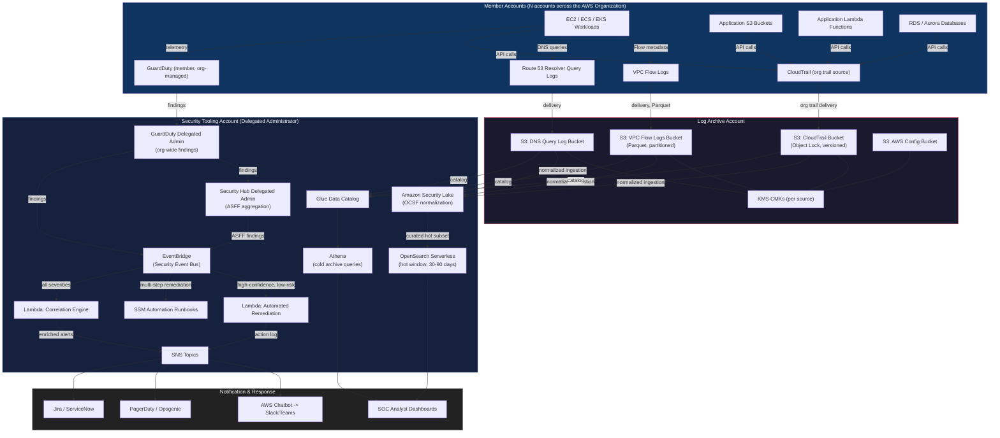

# Part XI – Security Reference Architectures

# Chapter 93 — Threat Detection

---

## 1. Executive Summary

Enterprises operating in AWS at scale face a structural problem: the number of security-relevant signals produced by cloud infrastructure grows far faster than the number of people available to review them. A single mid-sized AWS Organization with 40–60 accounts can generate tens of millions of CloudTrail events, VPC Flow Logs, DNS query logs, and application logs per day. Buried inside that volume are the handful of events that actually matter — a compromised IAM credential being used from an unfamiliar ASN, an EC2 instance suddenly communicating with a cryptomining pool, an S3 bucket being enumerated by an external principal, or a Lambda function attempting to escalate privileges through a misconfigured trust policy.

This chapter defines a production-grade **Threat Detection Architecture** — a reference design for continuously collecting, normalizing, correlating, and acting on security telemetry across single or multi-account AWS environments. Unlike a generic "turn on GuardDuty" recommendation, this architecture treats threat detection as a full data platform problem: ingestion, normalization, enrichment, correlation, alerting, automated response, and long-term forensic retention, all under strict cost, latency, and compliance constraints.

**Business problem.** Security teams in mid-to-large enterprises are typically outnumbered by the infrastructure they must protect by a factor of hundreds or thousands to one. A single Security Operations Center (SOC) analyst cannot manually review CloudTrail for 200 accounts. Detection must be automated, and automation must be architected — not bolted on as an afterthought once an incident has already occurred. Organizations that delay building a dedicated threat detection architecture typically discover the gap during an actual incident, when the absence of centralized logging, retained VPC Flow Logs, or a documented detection-to-response pipeline turns a contained event into a multi-week forensic exercise with regulatory exposure.

**Architecture objective.** The objective of this architecture is to reduce **Mean Time to Detect (MTTD)** and **Mean Time to Respond (MTTR)** for security events across an AWS estate, while producing an audit-quality, immutable record suitable for forensic investigation and regulatory reporting. The design must scale horizontally as accounts and workloads are added, must not depend on any single account's availability, and must degrade gracefully — losing detection fidelity before it loses raw log retention.

**Why organizations adopt this architecture.**

- Regulatory frameworks (PCI DSS, HIPAA, SOC 2, ISO 27001, FedRAMP) explicitly require continuous monitoring and documented incident detection capability. Auditors ask for evidence, not intentions.
- Cyber insurance underwriters increasingly require documented detection and response capability as a condition of coverage or as a rate-reduction factor.
- Multi-account AWS Organizations (the AWS-recommended pattern since 2019) fragment visibility by design — each account is its own security boundary, which is good for blast-radius containment but bad for a SOC trying to see the whole estate at once. A dedicated architecture is the only way to reunify that visibility without violating the account isolation that made it valuable in the first place.
- Attackers increasingly target cloud control planes directly (stolen access keys, over-permissioned roles, public S3 buckets) rather than application-layer vulnerabilities. Traditional network-perimeter security tooling has no visibility into IAM-based attacks; only cloud-native detection does.
- The cost of a *missed* detection is asymmetric and enormous: a single undetected credential compromise can result in cryptomining charges in the hundreds of thousands of dollars, data exfiltration, or ransomware deployment against backups. The cost of the detection architecture itself, by comparison, is a rounding error on the overall cloud bill for most enterprises.

**Major business benefits.**

- Centralized, queryable visibility across every account, region, and workload in the organization from a single security-tooling account.
- Reduction in detection latency from days/weeks (manual log review, or worse, third-party notification) to minutes.
- Automated containment of common attack patterns (compromised credentials, public bucket exposure, malicious EC2 behavior) without waiting for human intervention, which matters because attacker dwell time is often measured in minutes for automated attacks like credential-stuffing bots and cryptomining worms.
- A single, defensible, immutable audit trail that satisfies compliance evidence requirements without additional tooling.
- Cost control layered directly into the same telemetry pipeline — the same VPC Flow Logs and CloudTrail data that feed threat detection also feed cost anomaly correlation, since unexpected compute usage is frequently the first visible symptom of compromise.

**Typical enterprise scenarios.**

- A financial services company operating 80+ AWS accounts under AWS Organizations needs a single security account that aggregates GuardDuty findings, CloudTrail, and VPC Flow Logs from every member account, with automated remediation for the top 10 most common misconfiguration classes, and quarterly evidence exports for SOC 2 audits.
- A healthcare SaaS provider processing PHI needs continuous threat detection across a smaller but higher-sensitivity account set, with sub-15-minute alerting SLAs for anything touching PHI-storing resources, and a documented, testable incident response runbook tied directly to automated containment actions.
- A retail company with seasonal traffic spikes needs threat detection that scales elastically with infrastructure — the architecture must not become a bottleneck or a source of false positives during Black Friday-scale autoscaling events, and must distinguish between legitimate traffic surges and DDoS/credential-stuffing patterns.
- A software company that has just completed a security incident post-mortem and been told by its board, its cyber insurer, or a customer's security questionnaire that it needs "24/7 detection and response capability" and has 90 days to demonstrate it.

This architecture is designed to serve all four scenarios from the same core pattern, scaled up or down by account count, retention duration, and the aggressiveness of automated response.

---

## 2. Business Requirements

### 2.1 Business Drivers

| Driver | Description |
|---|---|
| Regulatory compliance | PCI DSS Req. 10 & 11, HIPAA Security Rule §164.312(b), SOC 2 CC7.2, ISO 27001 A.12.4, all require continuous monitoring and logging of security-relevant events. |
| Cyber insurance | Underwriters increasingly require MDR/SOC capability, log retention ≥ 1 year, and documented IR plans as binding conditions. |
| Board/customer trust | Enterprise customers now routinely include security questionnaires (SIG, CAIQ) in procurement that ask for specific detection capability evidence. |
| Incident cost avoidance | Average fully-loaded cost of a cloud security incident (containment, forensics, notification, remediation) is materially higher than the annualized cost of a detection architecture for organizations above a certain scale. |
| Operational maturity | Multi-account AWS Organizations fragment visibility; without a centralizing architecture, the security team cannot answer "what happened across our estate" for any given time window. |

### 2.2 Functional Requirements

- Ingest CloudTrail (management and data events), VPC Flow Logs, Route 53 Resolver query logs, GuardDuty findings, AWS Config configuration changes, S3 access logs, and ALB/CloudFront access logs from every account in the AWS Organization.
- Normalize heterogeneous log formats into a common schema for correlation (Open Cybersecurity Schema Framework — OCSF — is the emerging AWS-native standard, used by Security Lake).
- Correlate findings across data sources — e.g., a GuardDuty "credential exfiltration" finding correlated against CloudTrail API calls from the same principal in the following 10 minutes.
- Generate prioritized, deduplicated alerts routed to the correct on-call rotation based on severity and affected account/workload.
- Support automated response playbooks for well-understood attack patterns (isolate instance, revoke credentials, quarantine bucket, disable IAM key).
- Preserve raw, unmodified log data in immutable, tamper-evident storage for forensic and compliance purposes, independent of the detection pipeline's own availability.
- Provide a query interface (SQL-based) for ad hoc threat hunting across historical data.
- Provide dashboards for SOC analyst triage and for compliance/audit reporting.

### 2.3 Non-Functional Requirements

| Category | Requirement |
|---|---|
| Scalability | Must ingest from 1 account or 500+ accounts without redesign; horizontal scaling only. |
| Availability | Detection pipeline target 99.9%; log ingestion (the audit trail itself) target 99.99%, since a gap in the record is often worse than a gap in real-time alerting. |
| Latency | GuardDuty/CloudTrail-based alerts should reach the SOC within 5–15 minutes of the underlying event; VPC Flow Log-based correlation within 15–30 minutes (Flow Logs are inherently batch-delivered, typically every 5–10 minutes). |
| Durability | Raw log data: 99.999999999% (S3 standard durability), with Object Lock in compliance mode for regulated workloads. |
| Compliance | Must satisfy PCI DSS 10.x logging requirements, HIPAA audit control requirements, and SOC 2 CC7 monitoring criteria out of the box. |
| Security | Log data must be encrypted at rest (KMS) and in transit (TLS 1.2+); access to raw security logs restricted to a small, audited set of principals; cross-account log delivery must use resource policies, not shared credentials. |
| Recovery | RPO for the log archive: near-zero (S3 cross-region replication); RTO for the detection *pipeline* (not the archive): under 4 hours, since the archive itself is durable independent of pipeline health. |

### 2.4 Scalability Goals

- Linear cost and performance scaling with account count — adding account #201 should not require re-architecting for accounts #1–200.
- Support ingestion volume growth from gigabytes/day (small estate) to multiple terabytes/day (large enterprise) using the same core pipeline, differing only in provisioned capacity (Kinesis shard count, OpenSearch/OpenSearch Serverless capacity, Athena/S3 partitioning strategy).

### 2.5 Availability Requirements

- The security tooling account and its core services (Security Hub, GuardDuty delegated administrator, centralized S3 log buckets) must not have a single-account dependency on any workload account. If a workload account is fully compromised or deleted, the historical audit trail in the security account must remain intact.
- Detection Lambda functions and correlation logic should be deployed across at least two Availability Zones where the underlying service requires AZ placement (e.g., any VPC-attached Lambda, RDS/OpenSearch nodes).

### 2.6 Latency Requirements

- Real-time/near-real-time path (GuardDuty → EventBridge → SNS/Lambda): target under 2 minutes from finding generation to notification.
- Batch/correlation path (Flow Logs, Athena-based hunting queries): minutes to low tens of minutes is acceptable; this path optimizes for completeness and cost, not speed.

### 2.7 Compliance Requirements

- PCI DSS: 12-month online retention (or equivalent), daily log review requirement satisfiable via automated correlation rather than manual review, per PCI DSS guidance on compensating controls.
- HIPAA: 6-year retention of audit logs touching PHI-adjacent systems is a common (though not universally mandated) enterprise policy baseline.
- SOC 2: Evidence of continuous monitoring controls operating effectively over the audit period, typically demonstrated via exported dashboards, alert tickets, and remediation records.

### 2.8 Security Expectations

- Least-privilege IAM throughout; no wildcard resource permissions in any Lambda execution role used for automated response.
- All automated remediation actions logged, reversible where feasible, and subject to a documented approval workflow for higher-impact actions (e.g., account suspension) versus fully automated for lower-impact, high-confidence actions (e.g., revoking a single exposed access key).
- Security tooling account itself hardened to the same or higher standard as the workloads it protects — it is, after all, the most attractive target in the entire organization for an attacker who understands the architecture.

### 2.9 Recovery Objectives

| Component | RPO | RTO |
|---|---|---|
| Raw log archive (S3) | Near-zero (versioned, replicated) | N/A — durable independent of pipeline |
| GuardDuty findings | N/A (regenerated from source data if reprocessed) | 1 hour (re-enable delegated admin) |
| Correlation/detection pipeline (Lambda, EventBridge rules) | N/A (stateless, IaC-defined) | 4 hours (redeploy via Terraform) |
| SIEM/OpenSearch indices | 24 hours (daily snapshot) | 8 hours (restore from snapshot) |
| Dashboards/reporting | N/A (regenerated from underlying data) | 4 hours |

### 2.10 SLAs

- Critical severity alerts (active exfiltration, ransomware indicators, root account compromise): page on-call within 5 minutes of finding generation, 24/7/365.
- High severity: notify within 15 minutes during business hours, 30 minutes off-hours.
- Medium/Low severity: aggregated into daily digest, triaged within 1 business day.

### 2.11 Expected Workload and Growth

- Baseline enterprise estate: 50 accounts, ~500 GB/day combined log volume (CloudTrail + Flow Logs + DNS + GuardDuty findings), growing 20–40% year over year as workloads and account count grow.
- Peak burst: during active incident investigation, ad hoc Athena query volume against the archive can spike 5–10x baseline for the duration of the investigation; the architecture must not throttle or fail under this burst, since that is precisely when the data is most needed.

---

## 3. Architecture Overview

### 3.1 Overall Design

This architecture follows the AWS-recommended **delegated administrator** multi-account security model: a dedicated **Security Tooling account** (sometimes called the "Security" or "Audit" account in AWS Control Tower / Landing Zone terminology) is designated as the GuardDuty, Security Hub, and (optionally) Amazon Security Lake delegated administrator for the entire AWS Organization. A separate **Log Archive account** — logically distinct from the tooling account, even though they are sometimes collapsed into one in smaller organizations — holds the actual immutable log data.

Separating the *tooling* account (where detection logic runs, where analysts have query access) from the *archive* account (where raw immutable logs live, with far fewer principals having any access at all) is a deliberate defense-in-depth decision. If the tooling account is compromised — for example, through a vulnerability in a custom Lambda-based detection function — the attacker still cannot alter or delete the underlying evidence in the archive account, because the archive account's bucket policies do not grant the tooling account delete or modify permissions, only write (append) and read.

### 3.2 Architecture Philosophy

Four principles govern every design decision in this chapter:

1. **Collect everything centrally, decide what matters later.** Storage in S3 is cheap; the absence of a log during a forensic investigation is not recoverable at any price. The architecture over-collects relative to what any single detection rule currently uses, because today's noise is tomorrow's detection signal once a new attack technique becomes known.
2. **Detection logic must be decoupled from collection.** GuardDuty, Security Hub custom insights, and custom correlation Lambdas are all *consumers* of the central log stream, not the source of truth. This means a mistake in a detection rule, or a temporary disabling of GuardDuty for cost reasons, never results in permanent data loss — only a temporary detection gap that can be backfilled by reprocessing archived logs.
3. **Automate the response to known-bad patterns; escalate the unknown to humans.** Full automation of every possible response is neither safe nor achievable. The architecture automates a deliberately small, high-confidence set of remediations (revoke a leaked key, isolate an instance exhibiting C2 beacon behavior, block a known-malicious IP at the WAF) and routes everything else to a human-in-the-loop workflow.
4. **Assume the security account will itself be targeted.** Every control applied to production workload accounts — MFA enforcement, least-privilege IAM, encrypted storage, restrictive network access — is applied with equal or greater rigor to the security tooling and archive accounts.

### 3.3 Core Components

- **Source accounts (all member accounts in the AWS Organization):** generate CloudTrail, VPC Flow Logs, Route 53 Resolver logs, S3 access logs, ALB/CloudFront logs, and GuardDuty findings.
- **Log Archive account:** centralized, versioned, Object-Locked S3 buckets receiving log data via CloudTrail organization trails, Flow Log delivery, and S3 cross-account replication.
- **Security Tooling account:** GuardDuty delegated administrator, Security Hub delegated administrator, Amazon Security Lake (optional but recommended for OCSF normalization), EventBridge rules for real-time routing, Lambda-based correlation and auto-remediation functions, OpenSearch (or OpenSearch Serverless) for SIEM-style search, Athena + Glue for ad hoc querying of the S3 archive.
- **Notification/response layer:** SNS topics, AWS Chatbot (Slack/Teams integration), PagerDuty/Opsgenie integration via SNS→Lambda, Systems Manager Automation documents for remediation actions.
- **Case management:** Security Hub findings act as the system of record for individual findings; a ticketing integration (Jira, ServiceNow via EventBridge) tracks investigation and remediation lifecycle.

### 3.4 How Components Interact — High-Level Workflow

1. Every member account emits telemetry (API calls, network flows, DNS queries) continuously.
2. GuardDuty (running in every account, centrally managed from the delegated administrator) analyzes this telemetry using AWS-managed threat intelligence and machine learning models, generating findings.
3. Findings flow to Security Hub in the delegated administrator account, which normalizes them into the AWS Security Finding Format (ASFF).
4. Raw logs simultaneously flow to the Log Archive account's S3 buckets, independent of GuardDuty's processing.
5. EventBridge rules in the Security Tooling account match on finding severity and type, triggering one of three paths: (a) automated remediation via Lambda/Systems Management Automation for high-confidence low-risk actions, (b) SNS notification to the SOC for human triage, or (c) both — automated containment plus human notification, for anything above a defined severity threshold.
6. Analysts use Athena against the S3 archive, or OpenSearch/Security Lake for interactive queries, to investigate and threat-hunt beyond what automated rules already caught.

### 3.5 Request / Response / Data Lifecycle

**Data lifecycle (this architecture is data-pipeline-centric, not request/response-centric like a typical application):**

- **Generation:** CloudTrail/VPC Flow Logs/GuardDuty findings generated continuously in every account.
- **Collection:** Delivered to centralized S3 buckets (Log Archive account) within minutes (CloudTrail near-real-time delivery, Flow Logs every 5–10 minutes depending on aggregation interval configured).
- **Normalization:** Optionally transformed into OCSF via Security Lake, or queried directly against native schemas via Glue/Athena.
- **Correlation/Detection:** GuardDuty ML models plus custom EventBridge/Lambda correlation rules process the stream in near-real-time; batch correlation (Athena scheduled queries) runs on a 15–60 minute cadence for patterns that require windowed analysis across data sources.
- **Alerting:** Findings above threshold routed to SNS → PagerDuty/Slack; all findings land in Security Hub regardless of severity for a complete record.
- **Response:** Automated (Lambda/SSM Automation) for defined playbooks; manual for everything else, tracked via ticketing integration.
- **Retention/Archival:** S3 lifecycle policies transition data through storage classes (Standard → Standard-IA → Glacier) as it ages, with Object Lock preventing deletion for the compliance-mandated minimum retention period.

## 4. AWS Services Used

> **Note:** Only services relevant to a threat detection architecture are covered here. Each entry explains purpose, why it was selected over alternatives, limitations, pricing considerations, and best practices.

### 4.1 Amazon GuardDuty

**Purpose.** GuardDuty is a managed threat detection service that continuously analyzes CloudTrail management/data events, VPC Flow Logs, DNS query logs, EKS audit logs, S3 data events, RDS login activity, Lambda network activity, and EBS volume data, using AWS threat intelligence feeds and machine learning to identify malicious or anomalous behavior — without the customer having to deploy any agents or manage any infrastructure.

**Why selected.** It is the only detection service in the AWS portfolio that requires zero infrastructure, updates its detection models automatically as new attack techniques are identified by AWS threat intelligence, and integrates natively with Security Hub, EventBridge, and Organizations delegated administration. For 90% of common cloud attack patterns — credential compromise, reconnaissance, cryptomining, C2 communication — GuardDuty provides day-one coverage that would otherwise require months of custom detection engineering.

**Alternatives.** Third-party CSPM/CNAPP tools (Wiz, Orca, Lacework, CrowdStrike Cloud Security) provide overlapping and sometimes broader detection, often with cross-cloud support if the organization is multi-cloud. Custom detection built entirely on CloudTrail + Athena + custom rules is possible but takes significant engineering investment to reach parity with GuardDuty's ML-based anomaly detection, and requires ongoing threat intelligence feed maintenance.

**Limitations.** GuardDuty detects based on AWS-owned threat intelligence and behavioral models; it does not understand application-specific business logic (e.g., "this API should never be called more than 10 times per minute by a single tenant" requires custom detection). Malware Protection for EC2/EBS and S3 requires explicit enablement and has its own separate pricing dimension. Detection latency for some finding types can be 5–15 minutes, not instantaneous.

**Pricing considerations.** Priced per GB of CloudTrail events analyzed, per VPC Flow Log/DNS query volume analyzed, and separately for S3 Protection (per S3 event volume), EKS Protection, Malware Protection, RDS Protection, and Lambda Protection. Cost scales with account count and API/network activity volume — a chatty, high-traffic account can materially increase spend versus a quiet one. Enable protection plans incrementally and monitor the GuardDuty usage cost dashboard rather than turning on every plan across every account on day one.

**Best practices.** Enable GuardDuty organization-wide via the delegated administrator so newly created accounts are automatically protected. Enable all relevant protection plans (S3, EKS, Malware, RDS, Lambda) based on actual workload composition rather than blanket-enabling. Suppress known-benign finding types per account (e.g., a security-testing account that intentionally triggers reconnaissance findings) rather than disabling GuardDuty entirely for that account.

### 4.2 AWS Security Hub

**Purpose.** Security Hub aggregates findings from GuardDuty, Inspector, IAM Access Analyzer, Macie, AWS Config rules, and third-party tools into a single normalized format (AWS Security Finding Format, ASFF), and evaluates the environment against compliance standards (CIS AWS Foundations Benchmark, PCI DSS, NIST 800-53, AWS Foundational Security Best Practices).

**Why selected.** It is the natural aggregation point sitting above GuardDuty — without it, each security service produces findings in its own account and format, and the SOC has to build custom tooling to unify them. Security Hub's cross-account, cross-region aggregation (via a designated aggregation region) gives a single pane of glass without additional infrastructure.

**Alternatives.** A custom-built findings database (DynamoDB + Lambda normalization) offers more flexibility but duplicates functionality Security Hub provides out of the box. Third-party SIEMs (Splunk, Sumo Logic, Datadog Cloud SIEM) can also serve as the aggregation layer, often replacing or supplementing Security Hub for organizations that already have SIEM investment elsewhere.

**Limitations.** ASFF normalization is good but not perfect — some finding-type-specific detail is flattened during normalization, occasionally requiring analysts to pivot back to the originating service's console for full context. Compliance standard checks run on a schedule (not real-time), so a misconfiguration can exist for up to several hours before Security Hub's own compliance check flags it — this is a detection *gap* that the GuardDuty/EventBridge real-time path is designed to cover for actual malicious activity, versus Security Hub's compliance checks which are more about configuration drift.

**Pricing considerations.** Priced per finding ingested and per compliance check evaluated, per account, per region. Cost grows with account count and the number of compliance standards enabled — enabling all four major standards across 200 accounts is materially more expensive than enabling one. Consolidated control findings (Security Hub's newer unified control model) reduce redundant per-standard billing versus the legacy per-standard model.

**Best practices.** Enable cross-region aggregation to a single region so multi-region workloads don't fragment visibility. Use Security Hub custom actions to trigger EventBridge-based automated response directly from the console during manual triage. Suppress or auto-archive findings for accepted-risk items rather than leaving them open indefinitely, which erodes analyst trust in the finding queue.

### 4.3 Amazon Security Lake

**Purpose.** Security Lake automatically centralizes security log and event data from AWS services, on-premises, and third-party sources into a purpose-built S3-based data lake, normalized to the Open Cybersecurity Schema Framework (OCSF), with AWS Lake Formation-managed access control for downstream analytics tools.

**Why selected.** Prior to Security Lake, building an OCSF-normalized data lake required significant custom ETL. Security Lake automates ingestion, partitioning, normalization, and storage-tiering, and is the AWS-native answer to "we want our own SIEM-agnostic data lake we control" without hand-rolling the pipeline. It is optional in smaller architectures where Athena directly against native-format S3 logs is sufficient, but becomes valuable once the organization needs to feed multiple downstream tools (a SIEM, a data science notebook, a compliance reporting tool) from one normalized source.

**Alternatives.** Direct-to-S3 logging with Glue crawlers and Athena, without OCSF normalization, is simpler and cheaper for organizations with a single downstream consumer. Third-party SIEM ingestion pipelines (Splunk Data Manager, Cribl) can perform similar normalization outside AWS.

**Limitations.** Adds a transformation/storage cost on top of the raw log storage cost. Not all AWS services support Security Lake as a native source yet, so custom sources still require manual OCSF mapping. It is a relatively newer service, so third-party tool support for consuming Security Lake data directly (versus consuming raw S3 logs) varies by vendor.

**Pricing considerations.** Charged based on the volume of data ingested and normalized. For very large estates, this can be a meaningful additive cost over raw S3 storage alone — model it explicitly rather than assuming it is "free because it's just S3."

**Best practices.** Adopt Security Lake when there are 2+ downstream consumers of normalized security data (e.g., both an internal Athena-based hunting workflow and a third-party SIEM). For single-consumer, cost-sensitive environments, direct S3 + Glue + Athena without Security Lake is a legitimate simpler alternative covered later in this chapter's Alternatives section.

### 4.4 AWS CloudTrail

**Purpose.** CloudTrail records every API call made against AWS services — the control-plane "who did what, when, from where" record that is the foundation of virtually all cloud forensics and compliance evidence.

**Why selected.** There is no substitute; CloudTrail is the only source of control-plane audit data in AWS. An organization trail, created once at the AWS Organizations management account level, automatically captures activity from every current and future member account, which is essential for the "protect newly created accounts by default" requirement.

**Alternatives.** None for control-plane API activity — this is foundational, not optional. The only real decision is trail scope (management events only, versus management + data events) and whether to use a single organization trail versus per-account trails (organization trail is strongly preferred for consistency and to prevent a compromised account's administrator from disabling their own trail).

**Limitations.** Data events (S3 object-level access, Lambda invocations) are billed separately and can be very high volume for busy resources — enabling data events on every S3 bucket and every Lambda function in a large estate without a documented business need can produce a substantial and sometimes surprising bill.

**Pricing considerations.** Management events: first copy free per account/region under most circumstances via the organization trail; data events billed per event delivered. Selectively enable data events on high-value resources (buckets holding regulated data, functions handling authentication) rather than blanket-enabling across the estate.

**Best practices.** One organization trail, delivered to the Log Archive account's S3 bucket, log file validation enabled (SHA-256 digest chaining for tamper evidence), multi-region enabled, and a service control policy (SCP) in place preventing member accounts from disabling or modifying the organization trail.

### 4.5 Amazon VPC Flow Logs

**Purpose.** Records IP traffic metadata (source/destination IP, port, protocol, byte/packet counts, accept/reject) for network interfaces in a VPC — the network-layer equivalent of CloudTrail's control-plane record.

**Why selected.** Essential for detecting network-based attack patterns GuardDuty's own analysis might not independently surface with full context — lateral movement between subnets, unexpected egress to unusual destinations, port scanning, and for supporting manual forensic reconstruction of "what did this compromised instance talk to."

**Alternatives.** Traffic Mirroring provides full packet capture (not just metadata) for deep packet inspection but at significantly higher cost and complexity; reserved for specific high-value workloads or active-incident deep-dive rather than blanket deployment.

**Limitations.** Flow Logs are metadata only — no payload visibility. Delivery is near-real-time but batched (typically 1-minute or 10-minute aggregation intervals), so exact packet-level timing reconstruction isn't possible from Flow Logs alone.

**Pricing considerations.** Charged based on log volume delivered to the destination (S3 or CloudWatch Logs); S3 destination is materially cheaper than CloudWatch Logs for high-volume, long-retention use cases, which is why this architecture uses S3 as the primary destination and CloudWatch Logs only where near-real-time metric-filter-based alerting on Flow Logs is specifically needed.

**Best practices.** Enable at the VPC level (not per-subnet or per-ENI) for complete coverage with the fewest configuration objects to maintain. Deliver to S3 in Parquet format via the newer Flow Logs S3 integration for materially cheaper and faster Athena querying versus raw text format.

### 4.6 Amazon Route 53 Resolver Query Logs

**Purpose.** Captures DNS queries made by resources inside a VPC, which is one of the highest-signal, lowest-cost detection sources available — malware C2 communication, data exfiltration via DNS tunneling, and connections to known-malicious domains are all visible at the DNS layer before (and sometimes even without) an actual TCP connection completing.

**Why selected.** GuardDuty itself consumes Route 53 Resolver query logs as one of its primary inputs for DNS-based threat intelligence matching, but the raw logs are also independently valuable for custom detection rules and forensic reconstruction — was a compromised host attempting to resolve `*.onion` gateways, dynamic DNS providers commonly abused by malware, or newly-registered domains associated with phishing infrastructure.

**Alternatives.** Third-party DNS filtering/monitoring services (Cisco Umbrella, Infoblox) provide similar or broader visibility but require additional agents or DNS forwarding configuration outside AWS-native tooling.

**Limitations.** Only captures queries that actually transit the VPC's Route 53 Resolver; instances configured to use a different DNS resolver, or malware that performs DNS-over-HTTPS directly to a hardcoded resolver, bypass this visibility entirely — a known blind spot that should be documented in the organization's threat model.

**Pricing considerations.** Priced per DNS query logged; generally a small fraction of overall log-volume cost relative to Flow Logs or CloudTrail data events, making it one of the highest-value-per-dollar detection sources in this architecture.

**Best practices.** Enable a Resolver query logging configuration at the VPC level, associated with every VPC in every account via StackSets or a Landing Zone customization, delivered to the same centralized S3 archive as other log sources.

### 4.7 AWS Lambda

**Purpose.** Serverless compute used throughout this architecture for event-driven correlation logic, automated remediation actions (revoking keys, isolating instances, quarantining buckets), and format transformation between log sources and downstream consumers.

**Why selected.** The detection and response workload is inherently event-driven and bursty — a security event might trigger zero Lambda invocations for hours and then a burst of dozens within a minute during an active incident. Lambda's scale-to-zero and automatic concurrency scaling matches this workload shape far better than provisioned compute, and its native EventBridge integration removes the need for a separate message-polling layer.

**Alternatives.** ECS Fargate tasks triggered by EventBridge are viable for remediation logic requiring longer execution time than Lambda's maximum (15 minutes) or larger dependency footprints; Step Functions orchestrate multi-step remediation workflows that exceed a single function's reasonable complexity.

**Limitations.** 15-minute maximum execution time constrains very long-running forensic collection tasks (e.g., full memory capture from a compromised instance) — those should be handed off to Systems Manager Automation runbooks or Step Functions state machines rather than a single Lambda invocation.

**Pricing considerations.** Priced per invocation and per GB-second of compute; detection/response Lambda cost is typically a very small fraction of total architecture cost compared to log storage and OpenSearch/Security Lake, but should still be monitored, especially for any function accidentally triggered on every single log delivery event rather than filtered/batched appropriately.

**Best practices.** Keep remediation Lambda functions single-purpose and idempotent (safe to invoke twice for the same event without double-executing a harmful side effect); use least-privilege, resource-scoped IAM execution roles per function rather than one broad "security-automation-role" shared across all remediation logic.

### 4.8 Amazon EventBridge

**Purpose.** The central event bus routing GuardDuty findings, Security Hub findings, Config compliance changes, and custom application events to the appropriate downstream consumer (Lambda, SNS, Step Functions) based on pattern-matching rules.

**Why selected.** Native integration with virtually every AWS security service means findings can be routed without any polling infrastructure. Rule-based pattern matching (e.g., "severity >= 7 AND finding type contains 'CredentialAccess'") allows fine-grained routing logic without embedding that logic in every individual Lambda function.

**Alternatives.** SQS-based polling architectures are viable but reintroduce polling latency and additional infrastructure to manage; EventBridge's native push model is a better fit for this latency-sensitive use case.

**Limitations.** Rule pattern matching, while powerful, has a learning curve and a maximum rule complexity; extremely complex multi-condition correlation logic is often better expressed in a Lambda function that receives a broader event and applies custom logic than in an increasingly baroque EventBridge rule pattern.

**Pricing considerations.** Priced per event published; at high finding volume across a large organization this is a real but generally modest line item relative to storage and compute costs.

**Best practices.** Use a dedicated EventBridge bus for security events (separate from the account's default application event bus) to keep security routing rules isolated, auditable, and protected by their own resource policy restricting who can publish to it.

### 4.9 Amazon S3

**Purpose.** The durable, immutable storage layer underlying the entire architecture — every log source ultimately lands in S3, whether directly (CloudTrail, Flow Logs) or via Security Lake's managed pipeline.

**Why selected.** 99.999999999% durability, native Object Lock support for WORM (write-once-read-many) compliance retention, native cross-region replication, and the cheapest per-GB storage of any AWS service capable of this durability profile make S3 the only realistic choice for a multi-year, multi-terabyte security archive.

**Alternatives.** None credible at this scale and cost point; EBS/EFS are wrong tool entirely (block/file storage, not built for this access pattern), and any non-AWS storage introduces unacceptable data-transfer cost and latency for a service that must ingest continuously from every AWS account in the organization.

**Limitations.** Query performance against raw S3 data depends entirely on partitioning strategy and file format — poorly partitioned, uncompressed JSON/text logs make Athena queries slow and expensive; this is a design detail this architecture deliberately gets right from day one (see Section 22, Logging).

**Pricing considerations.** Storage class strategy is the single largest cost lever in this entire architecture — see Section 16, Cost Optimization, for a detailed lifecycle policy.

**Best practices.** Separate bucket per log source and per purpose (raw logs, Athena query results, Security Lake managed storage); Object Lock in compliance mode on the raw log buckets for the minimum required retention period; bucket policies restricting write access to only the specific delivery service principals, and restricting delete/overwrite entirely except via lifecycle expiration.

### 4.10 Amazon OpenSearch Service / OpenSearch Serverless

**Purpose.** Provides the interactive, low-latency, full-text and structured search capability that Athena (built for large batch scans, not sub-second interactive search) is not optimized for — this is the "SIEM search bar" experience analysts expect during active triage.

**Why selected.** Native integration with Security Lake and CloudWatch Logs subscription filters makes it straightforward to route a curated, high-value subset of security data (not necessarily *all* raw logs — that stays in S3/Athena for cost reasons) into OpenSearch for interactive analyst use.

**Alternatives.** A third-party SIEM (Splunk, Elastic Cloud, Sumo Logic) is a very common alternative or complement, particularly in organizations with existing SIEM investment and trained analysts; OpenSearch Serverless reduces the operational overhead of self-managing an OpenSearch cluster's scaling and patching.

**Limitations.** Cost scales with both data volume indexed and retention duration — indexing *everything* forever in OpenSearch is prohibitively expensive at enterprise log volumes; this architecture indexes a rolling, shorter-retention hot window (e.g., 30–90 days) and relies on S3/Athena for the cold, long-term archive.

**Pricing considerations.** OpenSearch Serverless bills for OCU (OpenSearch Compute Unit) consumption for both indexing and search, plus storage; provisioned OpenSearch clusters bill for instance-hours plus EBS storage. Serverless is generally preferable for unpredictable, spiky security-investigation query patterns.

**Best practices.** Index only a curated hot window; use index lifecycle management to roll older indices to cheaper storage tiers or delete them once the S3/Athena cold path is confirmed to hold the full record; restrict OpenSearch dashboard access via IAM/SAML federation matching the organization's existing identity provider.

### 4.11 Amazon Athena + AWS Glue

**Purpose.** Serverless SQL query engine (Athena) plus schema/catalog management (Glue Data Catalog, Glue Crawlers) providing cost-efficient, pay-per-query access to the full historical S3 log archive for threat hunting, compliance reporting, and incident investigation beyond the hot OpenSearch window.

**Why selected.** No infrastructure to provision or manage, scales automatically to scan terabytes of historical data for an ad hoc hunting query, and costs nothing when not actively being queried — a strong fit for the "occasionally need to search years of historical data" access pattern that dominates forensic and compliance use cases, as opposed to the "constantly search the last 30 days" pattern OpenSearch serves.

**Alternatives.** Redshift Spectrum offers similar S3-query capability with tighter integration if the organization already operates a Redshift data warehouse for other purposes; generally unnecessary complexity to introduce solely for security log querying.

**Limitations.** Query latency for very large scans (multi-terabyte, poorly partitioned) can be tens of seconds to minutes — acceptable for investigation, not for real-time alerting, which is why this architecture uses Athena for the batch/hunting path and EventBridge/GuardDuty for the real-time path.

**Pricing considerations.** Billed per TB of data scanned; proper partitioning (by account, region, date) and columnar formats (Parquet) can reduce scan volume, and therefore cost, by 90%+ compared to querying raw uncompressed JSON.

**Best practices.** Partition all Glue tables by year/month/day (and account ID for very large multi-account estates) at minimum; convert high-volume log sources to Parquet via a scheduled Glue ETL job or use the native Parquet delivery options now available for Flow Logs and Security Lake.

### 4.12 AWS Key Management Service (KMS)

**Purpose.** Provides the encryption keys used to protect log data at rest across every S3 bucket, OpenSearch domain, and any Lambda environment variables containing sensitive configuration in this architecture.

**Why selected.** Customer-managed KMS keys (CMKs) provide auditable, revocable, per-service or per-purpose encryption with fine-grained key policies — critical for a security architecture where "who can decrypt the audit log" is itself a security-relevant access control decision, not just a compliance checkbox.

**Alternatives.** SSE-S3 (AWS-managed keys) is simpler but provides no ability to restrict decrypt access independently of S3 bucket policy, and no CloudTrail-visible audit trail of key usage — insufficient for a security architecture that needs to prove exactly who accessed the raw audit log and when.

**Limitations.** KMS API call volume can become a cost and even a throttling concern at very high log-delivery volume if every single object write triggers a new encrypt call rather than using bucket keys (S3 Bucket Keys reduce KMS API call volume significantly by using a bucket-level data key).

**Pricing considerations.** Per-key monthly fee plus per-API-call cost; enabling S3 Bucket Keys on high-volume log buckets is a straightforward, high-value cost optimization that materially reduces KMS request charges without any security tradeoff.

**Best practices.** Separate CMKs per log source/purpose (CloudTrail key, Flow Logs key, Security Lake key) so key policies and access can be scoped precisely; enable S3 Bucket Keys; restrict key administrators and key users to distinct, small IAM principal sets, separate from the broader security team's general access.

### 4.13 AWS Systems Manager (Automation, Session Manager)

**Purpose.** Systems Manager Automation documents (runbooks) orchestrate multi-step remediation actions (isolate an instance by replacing its security group, snapshot a volume for forensics, then terminate); Session Manager provides auditable, agent-based shell access to instances for forensic investigation without requiring SSH keys or open inbound ports.

**Why selected.** Automation documents are natively invokable from EventBridge rules and Security Hub custom actions, and every execution is itself logged to CloudTrail, giving a built-in audit trail of exactly what automated remediation action was taken, when, and by what triggering finding.

**Alternatives.** Custom Lambda functions can perform the same remediation actions directly; Automation documents are preferred when the remediation is a well-defined, reusable, multi-step sequence that benefits from SSM's built-in retry, approval-gate, and execution-history features rather than being reimplemented as bespoke Lambda code.

**Limitations.** Requires the SSM Agent to be present and healthy on the target instance for instance-level remediation actions — a compromised instance with a disabled or killed SSM Agent cannot be remediated via this path, which is why network-layer isolation (security group replacement) is preferred as the first containment action, since it works even if the agent itself is unresponsive.

**Pricing considerations.** Automation execution itself is free; costs are limited to the underlying resources the runbook interacts with (e.g., EBS snapshot storage for forensic volume captures).

**Best practices.** Pre-build and test a small library of Automation documents for the organization's top remediation scenarios (isolate instance, revoke IAM key, quarantine S3 bucket, disable IAM user) well before an actual incident, with approval gates configured appropriately per action's risk/reversibility profile.

### 4.14 IAM (including IAM Access Analyzer)

**Purpose.** Governs all access within the architecture itself, and IAM Access Analyzer specifically identifies resources (S3 buckets, IAM roles, KMS keys, Lambda functions) shared with external principals — a common precursor to, or symptom of, data exposure.

**Why selected.** No detection architecture is credible if its own IAM posture is weak; Access Analyzer's continuous analysis of resource policies for unintended external access is a foundational, low-cost, high-value detection source that directly complements GuardDuty's behavioral detection with a configuration-based detection layer.

**Alternatives.** Manual periodic access review is the fallback but does not scale and misses drift between review cycles; Access Analyzer's continuous, event-driven analysis closes that gap at effectively no incremental cost.

**Limitations.** Access Analyzer identifies *external* access; it does not by itself flag *internal* over-permissioning (an over-broad role granted to another account within the same organization) — that requires Access Analyzer's separate unused-access and internal-access-analysis features, or third-party IAM posture tooling.

**Pricing considerations.** External access analysis is free; unused access analysis and custom policy checks have per-check pricing at higher usage tiers.

**Best practices.** Enable an organization-wide Access Analyzer in the delegated administrator account covering every member account; route Access Analyzer findings through the same Security Hub/EventBridge pipeline as GuardDuty findings rather than treating it as a separate, siloed tool.

### 4.15 Amazon CloudWatch (Logs, Alarms, Dashboards)

**Purpose.** Used selectively in this architecture for near-real-time metric-filter-based alerting on specific high-value log patterns (e.g., root account usage, IAM policy changes) and for operational dashboards showing pipeline health (ingestion lag, Lambda error rates, EventBridge rule match volume).

**Why selected.** Metric filters against CloudWatch Logs provide sub-minute alerting for a small set of extremely high-priority, low-volume events (root login, CloudTrail being disabled) where even the 2–5 minute GuardDuty/EventBridge path is too slow — these are the handful of events an enterprise wants to know about essentially instantly.

**Alternatives.** Routing the same signal through GuardDuty/Security Hub is also possible for the events GuardDuty specifically detects (e.g., "root credential usage" is itself a GuardDuty finding type), making CloudWatch Logs metric filters most valuable as a targeted supplement for events not covered by GuardDuty at all, such as a specific SCP being detached.

**Limitations.** CloudWatch Logs is materially more expensive per GB than S3 for the same data at scale, which is why this architecture uses it only for a narrow, high-value subset of log data rather than as the primary log destination.

**Pricing considerations.** Ingestion and storage both billed per GB; keep CloudWatch Logs retention short (e.g., 30 days) for anything also durably stored in S3, since CloudWatch Logs is not intended to be the long-term archive in this design.

**Best practices.** Use CloudWatch Logs subscription filters to fan out a targeted subset of high-value events to both a metric-filter alarm and, if needed, to OpenSearch for interactive search, while the full-fidelity record remains in S3.

### 4.16 Amazon Macie

**Purpose.** Uses machine learning to discover and classify sensitive data (PII, financial data, credentials accidentally committed to object storage) within S3 buckets across the organization, and flags buckets with concerning sensitivity/exposure combinations (e.g., a bucket containing detected PII that is also publicly accessible).

**Why selected.** Threat detection is incomplete without understanding *what* is at risk, not just *whether* something anomalous happened; Macie closes the gap between "this bucket was accessed by an unusual principal" (a GuardDuty-style finding) and "this bucket contains regulated data" (a Macie finding), and the combination of the two is far higher-signal than either alone.

**Alternatives.** Custom data classification via Lambda + regex/ML models is possible but a substantial engineering investment to approach Macie's out-of-box classifier accuracy across common sensitive data types.

**Limitations.** Full-bucket sensitive data discovery jobs can be a meaningful cost driver at large scale (billed per GB scanned) — this architecture recommends scheduled, sampled discovery jobs rather than continuous full-bucket scanning of every bucket in the organization.

**Pricing considerations.** Separate pricing dimensions for the automated sensitive data discovery (bucket inventory/classification) versus targeted, job-based deep scanning; budget deep scanning selectively for buckets already flagged as higher-risk by automated discovery.

**Best practices.** Enable Macie's automated discovery organization-wide for baseline bucket sensitivity classification; use targeted, budgeted classification jobs for high-value buckets rather than exhaustively deep-scanning the entire estate on a recurring schedule.

## 5. Complete Architecture Diagram



**Diagram notes.**

- The Log Archive account has **no outbound remediation capability whatsoever** — it is a write-mostly, read-restricted sink. This is deliberate: even a full compromise of the Security Tooling account's Lambda execution roles cannot be used to alter or delete the archived evidence, because the archive account's bucket policies simply do not grant those permissions to the tooling account's principals.
- GuardDuty findings flow through Security Hub for normalization before reaching EventBridge, ensuring every downstream consumer (Lambda correlation, SNS notification, ticketing) works against one consistent finding format regardless of originating detection source.
- Two parallel query paths exist by design: OpenSearch for fast, interactive, recent-data search during active triage, and Athena for slower, cheaper, complete-history queries during formal investigation or compliance reporting. Neither is a substitute for the other.

---

## 6. Component-by-Component Explanation

### 6.1 GuardDuty (Delegated Administrator Model)

- **Purpose:** Continuous, ML-based threat detection across every member account without per-account agent deployment.
- **Responsibilities:** Analyze CloudTrail, Flow Logs, DNS logs, S3 data events, EKS audit logs, RDS login activity; generate findings with severity scores.
- **Inputs:** Native telemetry from every enabled account; AWS threat intelligence feeds (updated automatically, no customer action required).
- **Outputs:** Findings delivered to Security Hub and, in parallel, directly to EventBridge in the delegated administrator account.
- **Scaling:** Fully managed; scales automatically with account count and telemetry volume — no capacity planning required from the customer.
- **High availability:** Regional service; findings are generated per-region. Multi-region member accounts require GuardDuty enabled in every region they operate in, with a designated aggregation region in Security Hub to unify the view.
- **Failure handling:** If GuardDuty is disabled in a member account (accidentally or maliciously), a Config rule and a scheduled Lambda check should detect and alert on that state change within minutes — this is itself a security-relevant event.
- **Dependencies:** Requires CloudTrail, VPC Flow Logs (implicitly, GuardDuty has its own internal collection and does not require the customer to separately enable Flow Logs for GuardDuty's own analysis, though this architecture enables them independently anyway for archival and custom correlation purposes), and DNS logs to be logically available at the account level.
- **Security:** Delegated administrator relationship established via AWS Organizations; member accounts cannot disable protection assigned centrally if an SCP restricts the relevant GuardDuty API actions to the delegated admin only.
- **Monitoring:** GuardDuty's own operational health (coverage percentage per account, any account with disabled or degraded data sources) should itself be monitored and alerted on — a blind spot in coverage is itself a finding-worthy condition.

### 6.2 Security Hub (Aggregation and Compliance)

- **Purpose:** Single normalized findings repository and continuous compliance posture evaluation.
- **Responsibilities:** ASFF normalization, cross-region aggregation, compliance standard scoring (CIS, PCI DSS, NIST 800-53, AFSBP), custom insights, custom actions.
- **Inputs:** GuardDuty findings, Config rule evaluations, Inspector findings, Macie findings, IAM Access Analyzer findings, third-party integrations.
- **Outputs:** Normalized findings queryable via console/API, EventBridge events on finding creation/update, compliance score dashboards.
- **Scaling:** Managed service; no customer-managed scaling required, though finding *volume* should be actively managed (auto-archiving resolved/accepted-risk findings) to keep the active queue usable.
- **High availability:** Aggregation region concept unifies multi-region findings into one queryable location; the aggregation region itself should be chosen deliberately (typically the organization's primary operating region) and documented.
- **Failure handling:** If Security Hub aggregation fails or lags, GuardDuty's direct-to-EventBridge path (bypassing Security Hub) remains available as a fallback for the highest-severity, most time-sensitive findings.
- **Dependencies:** GuardDuty, Config, and other finding-source services must be enabled for Security Hub to have anything to aggregate.
- **Security:** Cross-account aggregation relies on the same delegated administrator trust model as GuardDuty; access to Security Hub findings should be scoped via IAM to the SOC team and relevant account owners only.
- **Monitoring:** Track finding volume trends, mean time to resolution per severity tier, and compliance score trend over time as operational KPIs.

### 6.3 Amazon Security Lake

- **Purpose:** OCSF-normalized, centrally managed data lake for security telemetry, feeding both native AWS analytics (Athena, OpenSearch) and third-party SIEM tools via subscriber access.
- **Responsibilities:** Automated ingestion, normalization, partitioning, and storage-tiering of subscribed log sources.
- **Inputs:** CloudTrail, VPC Flow Logs, Route 53 Resolver logs, Security Hub findings, and custom sources mapped to OCSF.
- **Outputs:** OCSF-formatted Parquet data in a Lake Formation-governed S3 bucket, queryable directly or via subscriber (push/pull) access grants to third-party tools.
- **Scaling:** Managed; scales with ingested volume, billed accordingly.
- **High availability:** Regional; multi-region deployments require Security Lake enabled per region with a designated rollup region for unified querying, analogous to Security Hub's aggregation region.
- **Failure handling:** Because raw source logs also land independently in the Log Archive account's own S3 buckets, a Security Lake normalization failure does not cause data loss — only a temporary gap in the normalized/OCSF view, recoverable by reprocessing.
- **Dependencies:** Source services (CloudTrail, Flow Logs) must already be enabled; Lake Formation permissions model must be configured for any downstream subscriber.
- **Security:** Lake Formation fine-grained access control governs exactly which subscribers can read which OCSF event classes — critical for scoping a third-party SIEM's access to only what it needs, not the entire lake.
- **Monitoring:** Ingestion lag per source, normalization failure rate, subscriber query volume/cost.

### 6.4 EventBridge (Security Event Bus)

- **Purpose:** Central, pattern-matched routing of security findings to the appropriate automated or human-facing response path.
- **Responsibilities:** Rule evaluation against incoming findings; fan-out to multiple targets per matched rule.
- **Inputs:** GuardDuty findings, Security Hub findings, Config compliance change events, custom application-published security events.
- **Outputs:** Invocations of Lambda (correlation, remediation), SNS (notification), Step Functions (multi-step workflows), SSM Automation (remediation runbooks).
- **Scaling:** Fully managed, effectively unlimited for this workload's volume profile.
- **High availability:** Regional service; a dedicated custom event bus (not the default bus) isolates security routing from application event traffic and allows an independent resource policy.
- **Failure handling:** Failed target invocations are retried per EventBridge's built-in retry policy, with a dead-letter queue (SQS) configured on every rule target to capture and alert on invocations that exhaust retries — an unremediated finding due to a downstream Lambda failure must never fail silently.
- **Dependencies:** None beyond the publishing services and configured targets.
- **Security:** Resource policy on the security event bus restricts which accounts/principals may publish to it, preventing a compromised low-privilege account from injecting spoofed "all clear" or noise events designed to bury a real finding.
- **Monitoring:** Rule match/invocation counts, target error rates, DLQ depth (should be at or near zero in steady state).

### 6.5 Lambda: Correlation Engine

- **Purpose:** Applies cross-source correlation logic that a single finding source (GuardDuty alone, for example) cannot express — e.g., "a GuardDuty credential-exfiltration finding, correlated against CloudTrail showing the same access key used from two geographically implausible locations within 10 minutes, correlated against Flow Logs showing large outbound data transfer from the associated instance."
- **Responsibilities:** Query recent CloudTrail/Flow Log data (via Athena or a pre-indexed OpenSearch window) for corroborating or contradicting evidence; assign a composite confidence score; enrich the finding with additional context before forwarding to notification/response.
- **Inputs:** EventBridge-triggered finding events; on-demand queries against OpenSearch/Athena for the surrounding time window.
- **Outputs:** Enriched, scored alert published to SNS; optionally re-published back to Security Hub as a custom finding for audit-trail continuity.
- **Scaling:** Concurrency scales automatically with finding volume; provisioned concurrency should be considered only if cold-start latency becomes operationally significant during high-finding-volume incidents.
- **High availability:** Stateless, deployed via IaC, inherently redeployable in any region/account without state migration concerns.
- **Failure handling:** On correlation failure (e.g., the enrichment query times out), the function must fail *open* to notification — a finding that could not be enriched must still reach the SOC as an un-enriched alert, never be silently dropped.
- **Dependencies:** OpenSearch/Athena availability for enrichment queries; SNS for output.
- **Security:** Least-privilege execution role scoped to read-only access on the specific OpenSearch indices/Athena tables it queries; no write/delete permissions anywhere.
- **Monitoring:** Invocation error rate, enrichment query latency, correlation match rate (how often cross-source corroboration is actually found, as a data point for tuning detection confidence thresholds over time).

### 6.6 Lambda: Automated Remediation

- **Purpose:** Executes a deliberately small, well-tested library of high-confidence, low-risk automated containment actions.
- **Responsibilities:** Revoke a specific IAM access key confirmed leaked; attach a deny-all security group to an instance exhibiting confirmed C2 beacon behavior; add a bucket policy statement blocking public access on a bucket flagged as unintentionally public.
- **Inputs:** EventBridge events matching pre-approved, narrowly-scoped rule patterns (only specific finding types at specific severity/confidence levels trigger this path).
- **Outputs:** The remediation action itself (an AWS API call), plus a mandatory audit log entry and SNS notification confirming what was done, to whom/what resource, and why (which finding triggered it).
- **Scaling:** Same as correlation engine; low typical volume relative to correlation invocations, since this path is intentionally narrow.
- **High availability:** Stateless, IaC-deployed.
- **Failure handling:** Any remediation failure must alert the SOC immediately and with high priority — a failed automated containment attempt against an active threat is itself a critical operational event, not something to quietly retry and forget.
- **Dependencies:** Target resource must be reachable and the execution role must have precisely (and only) the permissions needed for its specific remediation actions.
- **Security:** This is the highest-risk component in the entire architecture from a "what if this is itself compromised or buggy" standpoint — every remediation action is scoped to a specific, narrow IAM policy (e.g., permission to modify security groups only on instances tagged with a specific environment tag, never account-wide `ec2:*`), and every action is logged and reversible where feasible.
- **Monitoring:** Every single invocation and its outcome should be visible on the SOC dashboard, not just failures — automated actions taken on the organization's behalf must be fully auditable and reviewable in aggregate, not just individually logged.

### 6.7 OpenSearch Serverless (Hot Search Layer)

- **Purpose:** Interactive, sub-second search across a rolling recent window of security data for active SOC triage and investigation.
- **Responsibilities:** Index a curated subset of Security Lake/CloudWatch Logs data; serve analyst dashboard queries.
- **Inputs:** Curated event stream from Security Lake subscriber access or CloudWatch Logs subscription filters.
- **Outputs:** Query results to SOC dashboards (OpenSearch Dashboards or a third-party frontend).
- **Scaling:** Serverless OCU-based auto-scaling; no cluster sizing decisions required.
- **High availability:** Managed multi-AZ by default for the Serverless offering.
- **Failure handling:** A hot-layer outage degrades interactive search speed but does not cause data loss, since the underlying data remains durably in S3/Security Lake independent of the OpenSearch index.
- **Dependencies:** Security Lake or CloudWatch Logs as upstream data source.
- **Security:** Access restricted via IAM/SAML federation matching the organization's SSO provider; index-level access control if different analyst teams should see different data subsets.
- **Monitoring:** Indexing lag, query latency, OCU consumption trend for cost forecasting.

### 6.8 Athena + Glue (Cold Archive Query Layer)

- **Purpose:** Cost-efficient SQL access to the complete historical log archive for formal investigations, compliance evidence generation, and long-range threat hunting beyond the OpenSearch hot window.
- **Responsibilities:** Maintain an up-to-date Glue Data Catalog schema/partition structure; execute ad hoc and scheduled SQL queries against S3.
- **Inputs:** Partitioned Parquet/JSON data in the Log Archive account's S3 buckets (cross-account access granted via bucket policy, not credential sharing).
- **Outputs:** Query results to S3 (a dedicated results bucket) and to analyst tooling (console, BI tools via ODBC/JDBC).
- **Scaling:** Fully serverless; scan performance depends on partition pruning effectiveness, not manual capacity planning.
- **High availability:** Managed service; no customer HA configuration required.
- **Failure handling:** N/A at the service level; query failures are typically schema/partition issues resolved by Glue Crawler re-runs or manual DDL correction.
- **Dependencies:** Glue Data Catalog must accurately reflect the current partition structure — a Glue Crawler scheduled to run on ingestion of new data (or a partition-projection configuration avoiding crawler dependency entirely) is required.
- **Security:** Cross-account IAM role (assumed by Security Tooling account principals) with read-only access to the Log Archive bucket, scoped via bucket policy and the role's own permission boundary.
- **Monitoring:** Query cost (data scanned) trend, query failure rate, Glue Crawler run success.

### 6.9 SNS + Notification Fan-Out

- **Purpose:** Reliable delivery of alerts to the humans and systems that need to act on them.
- **Responsibilities:** Fan-out a single published alert to multiple subscribers (Chatbot/Slack, PagerDuty, ticketing system) simultaneously.
- **Inputs:** Published messages from correlation/remediation Lambdas.
- **Outputs:** Delivered notifications to each subscribed endpoint.
- **Scaling:** Fully managed.
- **High availability:** Managed multi-AZ.
- **Failure handling:** Per-subscription retry policies; a dedicated dead-letter queue captures any notification that fails delivery after retries, which is itself monitored so that "an alert never reached anyone" is a detectable and alertable condition rather than a silent failure.
- **Dependencies:** Downstream integrations (Chatbot app installation, PagerDuty integration key) must be correctly configured and periodically tested.
- **Security:** Topic access policy restricted to the specific publishing Lambda roles; no broad account-wide publish permission.
- **Monitoring:** Delivery success rate per subscription, DLQ depth.

---

## 7. End-to-End Request Flow

The following describes the step-by-step flow for a representative scenario: **an IAM access key belonging to an application service account is stolen and used from an unfamiliar geographic location to enumerate S3 buckets.**

1. **Client (attacker):** Uses the stolen access key to call `ListBuckets` and `GetObject` against several S3 buckets from an IP address outside the organization's normal operating geographies.
2. **CloudTrail:** Records each API call — `ListBuckets`, `GetObject` — with the source IP, access key ID, user agent, and timestamp, as management/data events depending on the specific bucket's data event configuration.
3. **CloudTrail delivery:** Events are delivered to the organization trail within minutes and written to the Log Archive account's S3 bucket, encrypted with the dedicated CloudTrail KMS key.
4. **GuardDuty analysis:** In parallel with (and independent of) archival delivery, GuardDuty's own internal analysis of the same underlying telemetry identifies the anomalous access pattern — unfamiliar principal geography, unusual API call sequence for this service account's normal baseline — and generates a finding such as `UnauthorizedAccess:IAMUser/InstanceCredentialExfiltration` or `Discovery:S3/MaliciousIPCaller`, with an assigned severity score.
5. **Security Hub ingestion:** The finding is normalized to ASFF and appears in the delegated administrator account's Security Hub findings queue within roughly 1–2 minutes of GuardDuty generating it.
6. **EventBridge routing:** A rule matching this finding type and severity threshold fires, invoking both the Correlation Engine Lambda and, because this finding type is on the pre-approved automated-response list, the Automated Remediation Lambda in parallel.
7. **Correlation Engine:** Queries the OpenSearch hot window for the same access key ID across the prior 60 minutes, confirming the anomalous geography is a sustained pattern (not a single false-positive edge case like a legitimate VPN egress change), and checks Flow Logs for any associated data transfer volume from resources the access key's role has permission to reach.
8. **Automated Remediation:** Because "revoke a specific IAM access key with high-confidence compromise indicators" is on the pre-approved automated action list, the Remediation Lambda calls `iam:UpdateAccessKey` to immediately deactivate the compromised key, and separately calls `iam:AttachUserPolicy` to attach an explicit deny-all policy to the associated IAM user as a secondary containment layer.
9. **Audit logging:** The remediation action itself is written to CloudTrail (as any AWS API call is), and a structured remediation record is published to SNS documenting the triggering finding ID, the action taken, and the timestamp.
10. **Notification:** SNS fans out to AWS Chatbot (posting to the SOC's Slack channel with finding details and the remediation action already taken) and to PagerDuty (paging the on-call security engineer given the severity level), and creates a ticket in the ticketing system for formal incident tracking.
11. **Analyst triage:** The on-call engineer reviews the Slack notification and OpenSearch dashboard, confirms the automated containment was appropriate, and begins the broader investigation — was this specific key the only compromised credential, does the affected service account's role have any other exposure, does any data appear to have actually been exfiltrated based on Flow Log byte counts for the `GetObject` calls in question.
12. **Extended investigation (Athena):** If the investigation needs to look beyond the OpenSearch hot window's retention (for example, to establish whether this access key showed any earlier anomalous activity going back 6 months), the analyst runs a scoped Athena query against the full historical CloudTrail archive in the Log Archive account.
13. **Case closure and evidence retention:** Once the investigation concludes, the Security Hub finding is updated with a workflow status and disposition (e.g., "resolved — key revoked, no data exfiltration confirmed, root cause: key committed to a public repository"), and the ticket, Security Hub finding, and underlying raw logs together constitute the complete, retained evidentiary record for any subsequent audit or compliance review.
14. **Error handling — remediation failure path:** If step 8's `UpdateAccessKey` call had failed (e.g., due to an unexpected permission boundary conflict), the Remediation Lambda's failure handling immediately escalates to a critical-priority page rather than silently retrying, since a *failed* attempt to contain an active credential compromise is itself a critical event requiring immediate human intervention.
15. **Error handling — correlation query timeout:** If step 7's OpenSearch enrichment query had timed out, the Correlation Engine fails open — the original, un-enriched GuardDuty finding still reaches the SOC via the notification path, just without the additional corroborating context, ensuring a tooling hiccup never results in a suppressed alert.

## 8. Deployment Flow

### 8.1 Infrastructure Provisioning Philosophy

Every component of this architecture — GuardDuty delegated administrator configuration, Security Hub standards, S3 buckets, KMS keys, EventBridge rules, Lambda functions, IAM roles — is provisioned exclusively through Infrastructure as Code (Terraform in this chapter's examples). A security detection architecture that is partially or wholly click-ops configured is itself a finding waiting to happen: undocumented drift, inconsistent application across accounts, and no reliable way to prove to an auditor exactly what configuration was in effect at a given point in time.

> **Warning:** Never manually enable GuardDuty, Security Hub, or modify their configuration directly in the console for any account that is managed via this Terraform codebase. Manual changes will be silently reverted on the next `terraform apply`, or worse, will cause a `terraform plan` to propose destructive changes that were never intended. Treat the security tooling account with the same change-control discipline as production application infrastructure — arguably more, since it is the control plane for detecting compromise of everything else.

### 8.2 Terraform Workflow

- **Repository structure:** A dedicated repository (or a clearly separated directory within a monorepo) for security architecture Terraform, with state stored in a dedicated S3 backend bucket (in the Security Tooling account, not the Log Archive account, to keep state access separate from evidence access) with DynamoDB state locking.
- **Module boundaries:** Separate modules for (a) organization-wide GuardDuty/Security Hub enablement, (b) Log Archive account S3 buckets and KMS keys, (c) Security Tooling account EventBridge/Lambda/OpenSearch resources, (d) per-account StackSets for Flow Logs/Resolver query logging enablement across every member account.
- **Environment separation:** A staging AWS Organization (or at minimum, a small set of non-production accounts) should mirror the production security architecture for testing detection rule changes and remediation Lambda updates before they run against production findings with real remediation authority.
- **Apply sequencing:** Log Archive account resources (buckets, KMS keys, bucket policies) must be applied before Security Tooling account resources that reference them via cross-account bucket policy — this dependency should be explicit in Terraform (via `depends_on` or remote state data sources), not assumed based on apply order.

### 8.3 CI/CD Deployment

- **Pipeline stages:** `terraform validate` → `tflint`/`checkov` (policy-as-code security scanning of the Terraform itself) → `terraform plan` (posted as a PR comment for human review) → manual approval gate → `terraform apply`.
- **Approval requirements:** Any change to IAM policies attached to the Automated Remediation Lambda's execution role, or any change to EventBridge rules that route to that Lambda, requires two-person approval given the elevated blast radius of a mistake in this specific code path.
- **Secrets:** No hardcoded credentials anywhere in the Terraform codebase; PagerDuty integration keys, Slack webhook URLs, and similar values are stored in AWS Secrets Manager and referenced via data sources, never committed to version control even in encrypted form within the repo itself.

### 8.4 Blue-Green Deployment for Detection Logic

Unlike stateless application deployments, blue-green deployment of *detection logic* has a specific nuance: a new version of the Correlation Engine Lambda should run in **shadow mode** — receiving the same EventBridge events as the production version, producing its own enrichment output to a separate, non-alerting log stream — for a defined validation period (commonly 1–2 weeks) before being promoted to the version that actually drives SOC notifications and automated remediation. This prevents a change that increases false positives (alert fatigue) or, worse, decreases true-positive detection (a silent coverage gap) from reaching production without validation against real traffic.

### 8.5 Rollback

- Lambda function versions and aliases (not just the `$LATEST` pointer) are used for every detection/remediation function, so a rollback is an alias repoint, not a redeploy — critical for minimizing time-to-recovery if a bad deployment breaks automated remediation.
- Terraform state for EventBridge rules includes the previous rule pattern in version control, so a rule change that unexpectedly stops matching (or starts over-matching) can be reverted via a standard `git revert` + `terraform apply` within minutes.

### 8.6 Configuration Validation

- A dedicated "detection self-test" pipeline periodically (e.g., nightly) generates synthetic, clearly-labeled test findings (using GuardDuty's built-in sample finding generation capability) in a non-production account, and validates that the full pipeline — EventBridge routing, correlation enrichment, SNS notification delivery — successfully processes them end-to-end within the target latency SLA. A detection pipeline that silently stops working is far more dangerous than one that was never built, because it creates false confidence.

---

## 9. Network Topology

### 9.1 VPC Design for the Security Tooling Account

The Security Tooling account's VPC exists primarily to host VPC-attached resources (OpenSearch Serverless collections with VPC endpoints, any Lambda functions requiring VPC access to reach internal resources). Because this architecture is predominantly serverless and event-driven, the VPC footprint here is intentionally minimal compared to a typical application VPC.

| Element | Configuration |
|---|---|
| CIDR | `10.100.0.0/16` (example — should not overlap with any workload account CIDR if Transit Gateway peering is used for any component) |
| Private subnets | 3 subnets, one per AZ, `/24` each, hosting VPC-attached Lambda ENIs and OpenSearch Serverless VPC endpoints |
| Public subnets | None required in most designs — this account has no need for internet-facing ingress; any egress needed (e.g., for threat intelligence feed updates in custom detection logic) should route through a NAT Gateway or, preferably, VPC endpoints for AWS services to avoid public internet egress entirely |
| VPC Endpoints | Interface endpoints for S3, KMS, Secrets Manager, SNS, EventBridge, and CloudWatch Logs — ensuring all traffic between this account's compute and other AWS services stays on the AWS network backbone rather than transiting the public internet |
| NAT Gateway | Optional, single NAT Gateway (not one per AZ) if any component genuinely requires internet egress (e.g., pulling an external threat intelligence feed not available via an AWS-native mechanism); minimize this dependency wherever possible |

### 9.2 Public and Private Subnets

Unlike a typical three-tier application architecture, this design has no public-facing load balancer or user-facing ingress at all — analysts access dashboards via IAM/SSO-federated console access or a private-network-only OpenSearch Dashboards endpoint, never via a public internet-facing endpoint. This significantly reduces the attack surface of the security tooling itself, consistent with the principle that the security account must be hardened beyond the standard applied to workload accounts.

### 9.3 Internet Gateway / NAT Gateway

As noted above, an Internet Gateway is generally *not* required in the Security Tooling account's VPC. If a NAT Gateway is used for a specific egress need, it should be the minimum footprint necessary (single AZ acceptable for this account, since the resources depending on it are not customer-facing production workloads, and a brief NAT Gateway outage during an AZ event delays a threat-intel feed refresh, not an active detection or response capability).

### 9.4 Transit Gateway / Hybrid Connectivity

For organizations with an existing Transit Gateway-based network architecture (see Chapter 17), the Security Tooling account's VPC typically does **not** need to be attached to the organization's Transit Gateway at all, since this architecture's cross-account communication (Log Archive bucket access, member account log delivery) happens over AWS's control-plane APIs and S3, not through routed VPC-to-VPC network paths. The exception is if the organization deploys network-based intrusion detection appliances (e.g., a third-party IDS/IPS requiring VPC Traffic Mirroring targets) that need to receive mirrored traffic from workload VPCs — that specific use case does require Transit Gateway attachment and is covered as an extension pattern in Section 28 (Alternatives).

### 9.5 Route Tables, Network ACLs, Security Groups

| Layer | Configuration Principle |
|---|---|
| Route tables | Private subnet route tables route only to VPC endpoints and, if present, the single NAT Gateway — no direct Internet Gateway route. |
| Network ACLs | Default-deny inbound at the NACL layer for the private subnets, with explicit allow rules scoped to the specific ports/protocols VPC-attached Lambda and OpenSearch Serverless require. |
| Security groups | One security group per logical function (Lambda-to-OpenSearch, Lambda-to-VPC-endpoint), each scoped to the minimum required port/protocol and referencing the peer security group by ID rather than by CIDR range wherever possible. |

### 9.6 PrivateLink

VPC endpoints (a form of PrivateLink) are used extensively in this design specifically to avoid any component of the detection/response pipeline depending on public internet reachability for its core AWS-service interactions — S3, KMS, SNS, EventBridge, Secrets Manager, and CloudWatch Logs should all be reached via interface or gateway endpoints from the Security Tooling account's VPC-attached resources.

### 9.7 Hybrid Connectivity (If Applicable)

Organizations with on-premises log sources (on-prem firewalls, on-prem Active Directory audit logs) that should feed into the same centralized detection pipeline typically forward those logs via a Direct Connect or VPN-connected on-premises log forwarder into a Kinesis Data Firehose or Security Lake custom source ingestion point in the Security Tooling account, rather than requiring on-premises systems to have any direct network path into the account's core VPC — the ingestion boundary should be a well-defined API/streaming endpoint, not open network connectivity.

---

## 10. Identity and Access

### 10.1 IAM Roles

| Role | Purpose | Key Scoping Principle |
|---|---|---|
| `SecurityHub-DelegatedAdmin-Role` | Cross-account role assumed by AWS Organizations to manage Security Hub across the org | AWS-managed, minimally customized |
| `GuardDuty-DelegatedAdmin-Role` | Same pattern for GuardDuty | AWS-managed |
| `CorrelationLambda-ExecutionRole` | Execution role for the Correlation Engine Lambda | Read-only on specific OpenSearch indices/Athena tables/workgroup; no write, no delete, no IAM permissions of any kind |
| `RemediationLambda-ExecutionRole` | Execution role for the Automated Remediation Lambda | Narrowly scoped per remediation action type — e.g., `iam:UpdateAccessKey` restricted via condition key to keys tagged with a specific automation-eligible tag, never account-wide |
| `AthenaCrossAccountQuery-Role` | Assumed by Security Tooling account analysts/Lambda to query the Log Archive account's S3 data | Read-only `s3:GetObject`/`s3:ListBucket` on specific prefixes, no `s3:DeleteObject` or `s3:PutObject` |
| `SOC-Analyst-Role` | Federated (SSO) role for human analysts | Read access to Security Hub, GuardDuty, OpenSearch dashboards, Athena query execution; no write access to remediation infrastructure |
| `SOC-Lead-Role` | Elevated federated role for senior analysts/incident commanders | Additional permission to manually trigger SSM Automation runbooks for actions not on the fully-automated list, and to modify Security Hub finding workflow status |

### 10.2 IAM Policies (Example — Remediation Lambda, Access Key Revocation Action)

```json

{
  "Version": "2012-10-17",
  "Statement": [
    {
      "Sid": "RevokeCompromisedAccessKeyOnly",
      "Effect": "Allow",
      "Action": [
        "iam:UpdateAccessKey",
        "iam:GetAccessKeyLastUsed"
      ],
      "Resource": "arn:aws:iam::*:user/automation-eligible/*",
      "Condition": {
        "StringEquals": {
          "aws:RequestedRegion": "us-east-1"
        }
      }
    },
    {
      "Sid": "PublishRemediationAuditRecord",
      "Effect": "Allow",
      "Action": "sns:Publish",
      "Resource": "arn:aws:sns:us-east-1:111122223333:security-remediation-audit"
    },
    {
      "Sid": "DenyAllOtherIAMActions",
      "Effect": "Deny",
      "NotAction": [
        "iam:UpdateAccessKey",
        "iam:GetAccessKeyLastUsed"
      ],
      "Resource": "*",
      "Condition": {
        "StringEquals": {
          "aws:PrincipalArn": "arn:aws:iam::111122223333:role/RemediationLambda-ExecutionRole"
        }
      }
    }
  ]
}

```

> **Note:** The `automation-eligible/*` path-based resource restriction is a deliberate design choice — only IAM users explicitly provisioned under this IAM path (typically machine/service accounts, never human users) are eligible for fully automated key revocation. Human user access keys, if they exist at all in a well-governed organization, are routed to the human-approval remediation path instead, since the business impact of automatically locking out a human user is different in kind from locking out a service account.

### 10.3 Resource Policies

- **Log Archive S3 bucket policy:** Grants `s3:PutObject` to the specific AWS service principals delivering logs (`cloudtrail.amazonaws.com`, `delivery.logs.amazonaws.com` for Flow Logs) scoped by `aws:SourceArn` condition to the organization's trail/Flow Log configuration specifically, and grants `s3:GetObject`/`s3:ListBucket` (read-only) to the Security Tooling account's cross-account query role — no other account or principal has any access.
- **KMS key policy:** Separate key policies per CMK, granting `kms:Decrypt` only to the specific roles that legitimately need to read that log source's data, and `kms:GenerateDataKey` only to the specific delivery service principal for that source.
- **EventBridge bus resource policy:** Restricts `events:PutEvents` on the security event bus to the specific account/service principals expected to publish (GuardDuty, Security Hub, and specific application accounts explicitly onboarded for custom security event publishing) — this prevents any account in the organization from being able to publish arbitrary events onto the security bus.

### 10.4 STS and Cross-Account Access

All cross-account access in this architecture — Security Tooling account reading Log Archive account S3 data, member accounts' GuardDuty being managed by the delegated administrator — flows through AWS STS `AssumeRole` with explicit trust policies, never through shared long-lived credentials or access keys copied between accounts. Every assumed-role session is itself visible in CloudTrail, providing an audit trail of cross-account access that a shared-credential model would not provide.

### 10.5 Least Privilege in Practice

The single most common IAM mistake in threat detection architectures built under time pressure (frequently, ironically, in the aftermath of an actual incident, when the organization is trying to stand up detection quickly) is granting the remediation Lambda's execution role something like `iam:*` or `ec2:*` "temporarily, to get it working," which then never gets tightened. This architecture's approach — resource-scoped, condition-scoped, action-scoped policies from day one, validated in the staging organization before production deployment — exists specifically to prevent that failure mode, because the remediation Lambda's execution role is, by design, one of the most powerful and most attractive targets in the entire organization for an attacker who has already gained a foothold.

### 10.6 Permission Boundaries

A permission boundary is attached to every IAM role created within the Security Tooling account's automation scope (Lambda execution roles, SSM Automation service roles), capping the maximum permissions any of these roles could ever be granted even if a future Terraform change mistakenly widens the role's own policy. This is a defense-in-depth control specifically against configuration drift or human error in the IaC codebase itself, not just against runtime compromise.

---

## 11. Security Architecture

### 11.1 Encryption

- **At rest:** Every S3 bucket in this architecture uses SSE-KMS with customer-managed keys, S3 Bucket Keys enabled for cost efficiency, and bucket policies denying any `PutObject` request that does not specify SSE-KMS encryption (preventing accidental unencrypted writes).
- **In transit:** Bucket policies additionally deny any request not using TLS (`aws:SecureTransport: false` condition denied), and all service-to-service communication within the architecture uses AWS's TLS-by-default API endpoints.
- **OpenSearch:** Encryption at rest enabled (mandatory for OpenSearch Serverless, configurable but strongly recommended for provisioned domains), and fine-grained access control with TLS-enforced node-to-node and client-to-node communication.

### 11.2 KMS

Covered in detail in Section 4.12. The specific security-architecture-relevant point here: **key policies, not just IAM policies, gate access to the encrypted log data.** Even a principal with a broad IAM policy granting `s3:GetObject` on the log bucket cannot actually read the data without also being granted `kms:Decrypt` in the key policy — this dual-control model (S3 bucket policy AND KMS key policy must both permit access) is a deliberate, defense-in-depth design choice specifically for the highest-sensitivity data in the entire architecture.

### 11.3 TLS / Certificate Manager

Any customer-facing interface in this architecture (an OpenSearch Dashboards custom domain, an internal SOC web application front-end if one is built) uses AWS Certificate Manager-issued certificates with automatic renewal, TLS 1.2 minimum enforced, and modern cipher suites only.

### 11.4 WAF and Shield

Because this architecture's components are predominantly internal, non-internet-facing services (Lambda, EventBridge, S3, OpenSearch accessed via VPC endpoint or federated console access), WAF and Shield have limited direct applicability *within* this specific architecture. They remain highly relevant, however, as detection *sources* — WAF logs and Shield Advanced DDoS event notifications are valuable inputs into this same centralized log archive and correlation pipeline for organizations that do operate internet-facing workloads elsewhere in the estate (see Chapter 22, CloudFront Edge Architecture, for the ingestion pattern).

### 11.5 Secrets Manager

Any credential this architecture's automation needs beyond native AWS IAM roles — a PagerDuty integration key, a Slack webhook URL, a third-party threat intelligence feed API key — is stored in Secrets Manager with automatic rotation configured wherever the downstream system supports it, and referenced by ARN in Lambda environment configuration rather than embedded as a plaintext environment variable.

### 11.6 GuardDuty, Inspector, Security Hub (Recap in Security Context)

These three services together form the core detection triad of this architecture: GuardDuty for behavioral/ML-based threat detection, Inspector for vulnerability (CVE) and network-reachability assessment of EC2/ECR/Lambda workloads, and Security Hub as the aggregation and compliance-scoring layer above both. A common gap in less mature implementations is enabling GuardDuty but not Inspector, resulting in strong detection of active exploitation but no visibility into the underlying vulnerabilities that made exploitation possible in the first place — both are necessary, and neither is a substitute for the other.

### 11.7 CloudTrail and AWS Config (Recap in Security Context)

CloudTrail answers "what API calls happened." AWS Config answers "what did the configuration of this resource look like at any point in time, and did it drift from the approved baseline." Both are necessary for complete forensic reconstruction — CloudTrail alone cannot tell you that a security group's rules changed via a means other than a logged API call would be nearly impossible (in practice, virtually everything in AWS is API-driven, so this gap is small but not zero for certain legacy or edge-case scenarios), while Config's periodic and event-driven configuration snapshots provide independent corroboration and a queryable configuration history.

### 11.8 Zero Trust Principles Applied

- No implicit trust between accounts — every cross-account interaction is explicitly granted via IAM role trust policy and resource policy, never assumed based on organizational membership alone.
- No implicit trust between the detection pipeline and its own outputs — the Correlation Engine's enrichment does not automatically escalate its own confidence without corroborating evidence from an independent data source.
- Continuous verification — Access Analyzer, Config rules, and GuardDuty itself continuously re-evaluate the environment's actual state rather than relying on a point-in-time architecture review to remain valid indefinitely.

### 11.9 Threat Model

| Threat Actor / Vector | Primary Detection Mechanism | Primary Mitigation |
|---|---|---|
| External attacker using a stolen/leaked IAM access key | GuardDuty (`UnauthorizedAccess:*`, `CredentialAccess:*` finding types), CloudTrail geographic/velocity anomaly correlation | Automated key revocation, MFA enforcement on human users, short-lived credentials (STS) preferred over long-lived keys for machine identities where feasible |
| Compromised EC2 instance participating in C2/cryptomining | GuardDuty (`CryptoCurrency:*`, `Backdoor:*` finding types), Flow Log/DNS anomaly correlation | Automated network isolation (security group replacement), instance forensic snapshot before termination |
| Insider threat — over-permissioned or malicious internal user | IAM Access Analyzer, CloudTrail unusual-API-sequence detection, Config drift on IAM policy changes | Least-privilege IAM review cadence, mandatory approval workflow for high-impact manual actions, segregation of duties between who can modify detection rules and who can modify remediation permissions |
| Publicly exposed S3 bucket containing sensitive data | Macie sensitive-data classification combined with Access Analyzer public-access finding | Automated remediation (attach S3 Block Public Access at the bucket level), Config rule preventive guardrail (SCP preventing public bucket ACLs organization-wide) |
| Supply chain compromise (malicious package in a Lambda deployment or container image) | Inspector (container/Lambda vulnerability and embedded-package scanning), GuardDuty Malware Protection | Image scanning gate in CI/CD pipeline (Chapter 20), Inspector continuous rescanning of deployed artifacts |
| Attack against the security tooling account itself | Same detection stack applied to the Security Tooling and Log Archive accounts as to workload accounts, plus additional monitoring specifically for changes to GuardDuty/Security Hub/CloudTrail configuration organization-wide | SCP preventing member accounts (including the security accounts themselves) from disabling the organization trail or the delegated administrator relationships |

### 11.10 Attack Vectors and Mitigations — Additional Detail

- **Attack vector: EventBridge rule tampering to suppress alerts.** A sufficiently privileged attacker inside the Security Tooling account could attempt to modify or delete an EventBridge rule to prevent findings from reaching notification. **Mitigation:** Config rules specifically monitoring the security event bus's rule configuration for drift, with any unauthorized change itself generating a critical-severity alert routed through a path independent of the bus being tampered with (e.g., a separate CloudWatch Logs metric filter on CloudTrail `DeleteRule`/`DisableRule` API calls against the security bus, alerting via a completely separate SNS topic).
- **Attack vector: Log Archive bucket deletion or policy modification.** **Mitigation:** S3 Object Lock in compliance mode makes object deletion impossible even for the bucket owner during the retention period; an SCP at the AWS Organizations level additionally prevents the `s3:PutBucketPolicy`, `s3:PutBucketAcl`, and `s3:DeleteBucket` actions against the Log Archive account's designated log buckets, enforced independent of any IAM permission the account's own administrators might otherwise have.
- **Attack vector: Disabling GuardDuty or the organization CloudTrail trail.** **Mitigation:** An SCP restricting `guardduty:DisassociateFromMasterAccount`, `guardduty:DeleteDetector`, `cloudtrail:StopLogging`, and `cloudtrail:DeleteTrail` to only the AWS Organizations management account (which itself should have no day-to-day human logins, per Landing Zone best practice), combined with a scheduled Config rule verifying GuardDuty/CloudTrail remain enabled in every account and alerting on any account found non-compliant.

## 12. High Availability

### 12.1 AZ Failures

Most of this architecture's compute (Lambda, EventBridge, SNS, S3) is inherently multi-AZ by virtue of being a regional, AWS-managed service with no customer-visible AZ placement decision. The components requiring explicit multi-AZ consideration are VPC-attached Lambda functions (ENIs placed across the 3 private subnets defined in Section 9.1) and any provisioned (non-Serverless) OpenSearch domain, which should be configured with a minimum of 3 data nodes spread across 3 AZs with zone awareness enabled.

### 12.2 Instance Failures

This architecture has no long-running EC2 instances in its own critical path (it is deliberately serverless-first for exactly this reason — nothing to patch, nothing to fail as a single long-lived instance). The only instance-adjacent consideration is any Bastion or forensic-analysis workstation the SOC uses for deep investigation, which should itself be treated as ephemeral (spun up via Systems Manager, torn down after use) rather than a persistent, individually-maintained instance.

### 12.3 Regional Failures

- **Detection pipeline:** If the primary region hosting the Security Tooling account's EventBridge/Lambda/OpenSearch resources experiences a regional outage, GuardDuty and Security Hub findings in *other* regions continue to be generated locally (GuardDuty and Security Hub are both regional services) but the cross-region aggregation and centralized correlation/remediation pipeline is degraded until the primary region recovers. A secondary, warm-standby EventBridge/Lambda deployment in a second region, subscribed to the same organization-wide findings via Security Hub's cross-region aggregation configuration, provides a fallback notification path (though not necessarily automated remediation, which most organizations accept operating in the primary region only, given the added complexity of active-active remediation authority).
- **Log Archive:** The Log Archive account's S3 buckets use Cross-Region Replication (CRR) to a second region, so the durable evidentiary record survives a full regional outage or even a full regional data-center-level disaster, independent of whether the detection pipeline itself is degraded during that event.

### 12.4 Database Failures

If OpenSearch (provisioned, non-Serverless) is used instead of OpenSearch Serverless, standard multi-AZ, multi-node configuration with automated snapshots to S3 (in a separate bucket from the raw log archive) provides recovery from node-level failure; a full domain rebuild from the latest snapshot is the fallback for catastrophic domain failure, accepting the RPO/RTO defined in Section 2.9.

### 12.5 Load Balancing and Health Checks

Not directly applicable in the traditional sense (no ALB/NLB fronting user traffic in this architecture), but the equivalent concept applies to EventBridge rule health: the "detection self-test" pipeline described in Section 8.6 functions as a continuous health check for the entire pipeline, and its failure to observe a synthetic test finding complete its round-trip within the expected latency window is itself alertable — effectively a health check for a system with no traditional load balancer to health-check against.

### 12.6 Failover

Failover in this architecture is primarily about the *data path* (Log Archive replication) rather than the *compute path* (which is stateless and quickly redeployable via Terraform in a secondary region if needed). The organization's incident response plan should explicitly document the manual/semi-automated steps to promote the secondary-region EventBridge/Lambda deployment to primary status in the event of an extended primary-region outage, tested at least annually as part of the disaster recovery testing program described in Section 13.

---

## 13. Disaster Recovery

### 13.1 Backup Strategy

| Data Class | Backup Mechanism | Frequency | Retention |
|---|---|---|---|
| Raw log archive (CloudTrail, Flow Logs, DNS logs) | S3 versioning + Cross-Region Replication | Continuous (near-real-time replication) | Per compliance requirement (Section 2.7), enforced via Object Lock |
| OpenSearch indices (hot window) | Automated snapshots to S3 | Daily | 35 days of snapshots, sufficient to rebuild the hot window even after an extended outage |
| Terraform state | S3 versioning + DynamoDB lock table point-in-time recovery | Continuous | Indefinite (state history is small and valuable for audit) |
| Security Hub findings | Not independently backed up — regenerable from underlying GuardDuty/Config/source data if reprocessed; the source data (in S3) is the authoritative backup | N/A | N/A |

### 13.2 Cross-Region Replication

The Log Archive account's primary log buckets replicate to a secondary region using S3 CRR with a dedicated replication IAM role scoped only to the specific source/destination bucket pair, and the destination bucket in the secondary region has its own independent Object Lock configuration — replication does not weaken the immutability guarantee, it duplicates it.

### 13.3 DR Strategy Selection: Pilot Light

This architecture uses a **Pilot Light** DR strategy for the detection/response compute layer (not Warm Standby or Active-Active), and this deserves explicit justification given the chapter's general preference for well-justified trade-offs:

- The *data* (raw logs) uses continuous replication (effectively Active-Active durability, since both regions independently and durably hold the data).
- The *compute* (EventBridge rules, Lambda functions, OpenSearch domain) is defined entirely in Terraform and can be deployed to the secondary region within the 4-hour RTO target (Section 2.9) by running `terraform apply` against the secondary-region workspace — there is no meaningful benefit to running this stateless, cheap-to-redeploy compute layer active-active in both regions simultaneously, and doing so would roughly double the OpenSearch/Lambda cost for a capability (regional failover) that is tested and exercised only rarely.
- This is a deliberate cost/complexity trade-off: Warm Standby (constantly running secondary-region compute at reduced capacity) or Active-Active would reduce RTO further, but for a detection pipeline (as opposed to a customer-facing production application), a few hours of degraded cross-region correlation during an exceedingly rare full regional outage — while individual-region GuardDuty/Security Hub findings continue to be generated locally throughout — is an acceptable trade-off for most organizations. Organizations in the highest-compliance tiers (e.g., systemically important financial institutions) may justify Warm Standby instead; this is documented as an explicit scaling option in Section 17 (Evolution Path).

### 13.4 RPO / RTO Summary (Restated in DR Context)

| Component | RPO | RTO | Strategy |
|---|---|---|---|
| Raw log archive | Near-zero | N/A (durable independent of any pipeline) | Multi-region replication, Object Lock |
| Detection/response compute | N/A (stateless) | 4 hours | Pilot Light — Terraform redeploy to secondary region |
| OpenSearch hot window | 24 hours | 8 hours | Daily snapshot restore |

### 13.5 DR Testing

A full DR exercise — simulating loss of the primary region and executing the documented failover runbook to stand up the secondary-region detection pipeline — should be conducted at minimum annually, with results (actual RTO achieved versus target) documented as part of the compliance evidence package described in Section 2.7. A DR plan that has never been tested should not be treated as a DR plan; it should be treated as an untested hypothesis.

---

## 14. Scalability

### 14.1 Horizontal Scaling

Every core component of this architecture scales horizontally by design: GuardDuty and Security Hub scale with account/finding count with no customer action, Lambda scales concurrency automatically with EventBridge invocation volume, and S3 has no meaningful scaling ceiling relevant to this workload. The primary scaling *decisions* the customer does need to make are around OpenSearch (OCU baseline for Serverless, or node count for provisioned) and Athena/Glue partitioning strategy as data volume grows.

### 14.2 Account-Count Scaling

Adding a new AWS account to the organization should require **zero manual security-architecture configuration** in a mature implementation of this pattern — GuardDuty auto-enrolls new accounts via the organization-wide auto-enable setting, the organization CloudTrail trail automatically covers the new account, and Flow Logs/Resolver query logging enablement is delivered via an AWS Organizations StackSet targeting the entire organizational unit, which automatically deploys to newly created accounts as they join. This "new account, zero-touch coverage" property is one of the most important scalability characteristics of the entire architecture — it is the difference between security coverage that keeps pace with organizational growth and coverage that silently falls behind as the account count grows and nobody remembers to manually configure the newest one.

### 14.3 Database Scaling

Not directly applicable to the core pipeline (no relational database in the critical path), but if a supplementary case-management or metadata store (e.g., DynamoDB tracking remediation action history for reporting) is added, DynamoDB on-demand capacity mode is the appropriate default given the highly variable, incident-driven write pattern this data exhibits.

### 14.4 Storage Scaling

S3 requires no scaling configuration; the relevant scaling *decision* is the lifecycle policy governing storage class transitions as data ages (Section 16), which directly trades off query performance/cost against storage cost.

### 14.5 Queue/Event Scaling

EventBridge and SNS both scale automatically; the customer-managed scaling lever is Lambda reserved/provisioned concurrency, which should be monitored and adjusted only if sustained throttling is observed during genuine high-finding-volume periods (e.g., an active, ongoing incident generating a burst of correlated findings) — provisioning for a rare burst at the cost of paying for provisioned concurrency continuously is rarely justified given Lambda's fast default cold-start characteristics for this workload's function sizes.

---

## 15. Performance Optimization

### 15.1 Caching

Not a primary concern for this architecture's core detection path (each finding is processed once, not repeatedly queried), but the OpenSearch hot-window layer functions as an effective "cache" for the highest-value recent data, avoiding the need to hit the much larger, slower-to-query S3/Athena cold archive for the queries analysts run most frequently during active triage.

### 15.2 Compression

All log data delivered to S3 is stored compressed (gzip for JSON-format logs, native Parquet compression — typically Snappy — for Parquet-format logs), which both reduces storage cost and, more importantly for the query-performance goal of this section, reduces the volume Athena must scan per query, directly reducing both query latency and query cost.

### 15.3 File Format and Partitioning (the Single Biggest Performance Lever)

> **Tip:** If a threat-hunting Athena query against the CloudTrail archive is taking minutes instead of seconds, the near-universal root cause is missing or ineffective partition pruning — the query is scanning far more data than it needs to. Fixing the Glue table's partition structure (or the query's `WHERE` clause to actually leverage existing partitions) is almost always a bigger win than any cluster-sizing or instance-type change would be for a comparable serverless system.

- Partition every Glue table by `year`, `month`, `day` at minimum; for very large multi-account estates, also partition by `account_id`, since the overwhelming majority of investigative queries scope to a specific account and time range.
- Convert text/JSON log sources to Parquet via a scheduled Glue ETL job (or use native Parquet delivery where available, as with the newer VPC Flow Logs S3 Parquet integration) — this alone commonly reduces Athena scan volume, and therefore cost and latency, by 80–95% compared to querying raw gzip-compressed JSON.
- Use partition projection (Athena's virtual partitioning feature) rather than relying on a Glue Crawler to discover new partitions, eliminating both crawler cost and, more importantly, the latency gap between new data landing in S3 and it becoming queryable (crawler-based discovery typically runs on a schedule, e.g., hourly, introducing exactly that latency gap; partition projection makes new partitions queryable immediately based on a defined naming convention).

### 15.4 Database Optimization

Not applicable in the traditional RDBMS-tuning sense; the equivalent optimization surface here is OpenSearch index design — appropriate shard count for the actual data volume (over-sharding a small hot window wastes overhead, under-sharding a large one creates hot-node bottlenecks), and index lifecycle policies that roll data to progressively cheaper OpenSearch storage tiers (or out of OpenSearch entirely, back to S3/Athena-only) as it ages out of the "actively investigated" window.

### 15.5 Connection Pooling / Concurrency

Lambda functions performing enrichment queries against OpenSearch should reuse HTTP connections/clients across invocations by initializing the client outside the handler function body (a well-known Lambda performance pattern), avoiding the overhead of establishing a new TLS connection to OpenSearch on every single invocation, which matters meaningfully at the invocation volumes a large-account-count organization's finding stream can generate.

### 15.6 Async Processing

The entire pipeline is asynchronous and event-driven by design (EventBridge → Lambda, with no synchronous request/response coupling between finding generation and remediation/notification), which is precisely what allows the correlation and remediation stages to take the time they need (querying OpenSearch, calling remediation APIs) without introducing backpressure on the upstream finding-generation services (GuardDuty, Security Hub), which continue generating findings at their own pace regardless of downstream processing speed.

---

## 16. Cost Optimization (FinOps)

### 16.1 Estimated Monthly Cost — Small Deployment

*(Representative estimate: 10 accounts, ~20 GB/day combined log volume, 30-day OpenSearch hot window)*

| Cost Driver | Estimated Monthly Cost (USD) |
|---|---|
| GuardDuty (all protection plans, 10 accounts) | $150 – $400 |
| Security Hub (findings + compliance checks) | $50 – $150 |
| CloudTrail data events (selective enablement) | $50 – $150 |
| S3 storage (log archive, Standard + IA tiering) | $30 – $80 |
| S3 request/PUT costs (high object count from log delivery) | $20 – $50 |
| KMS (keys + API calls, with Bucket Keys enabled) | $10 – $25 |
| OpenSearch Serverless (small, 30-day hot window) | $300 – $600 |
| Lambda (correlation + remediation invocations) | $5 – $20 |
| Athena (ad hoc query volume) | $10 – $40 |
| EventBridge, SNS, misc. | $5 – $15 |
| **Estimated Total** | **~$630 – $1,530 / month** |

### 16.2 Estimated Monthly Cost — Medium Deployment

*(Representative estimate: 50 accounts, ~500 GB/day combined log volume, 60-day OpenSearch hot window)*

| Cost Driver | Estimated Monthly Cost (USD) |
|---|---|
| GuardDuty (all protection plans, 50 accounts) | $2,000 – $6,000 |
| Security Hub | $500 – $1,500 |
| CloudTrail data events | $500 – $2,000 |
| S3 storage (with lifecycle tiering) | $400 – $900 |
| S3 request costs | $200 – $500 |
| KMS | $50 – $120 |
| OpenSearch Serverless | $2,500 – $5,000 |
| Security Lake (normalization + storage) | $800 – $2,000 |
| Lambda | $50 – $150 |
| Athena | $150 – $500 |
| EventBridge, SNS, misc. | $50 – $150 |
| **Estimated Total** | **~$7,200 – $18,800 / month** |

### 16.3 Estimated Monthly Cost — Enterprise Deployment

*(Representative estimate: 200+ accounts, multi-TB/day combined log volume, 90-day OpenSearch hot window, multi-region DR)*

| Cost Driver | Estimated Monthly Cost (USD) |
|---|---|
| GuardDuty (all protection plans, 200+ accounts) | $10,000 – $30,000+ |
| Security Hub | $2,000 – $6,000 |
| CloudTrail data events | $3,000 – $10,000 |
| S3 storage (with lifecycle tiering, cross-region replication) | $2,000 – $6,000 |
| S3 request costs | $1,000 – $3,000 |
| KMS | $200 – $500 |
| OpenSearch Serverless (or provisioned equivalent) | $10,000 – $25,000 |
| Security Lake | $4,000 – $12,000 |
| Lambda | $200 – $800 |
| Athena | $800 – $3,000 |
| Secondary-region Pilot Light standby | $500 – $2,000 |
| EventBridge, SNS, misc. | $200 – $600 |
| **Estimated Total** | **~$33,900 – $99,900+ / month** |

> **Note:** These figures are illustrative estimates for architectural planning purposes, not quotes. Actual cost depends heavily on API call volume per account (a small number of extremely "chatty" accounts, such as those running high-frequency Lambda-based microservices with verbose logging, can dominate the bill regardless of overall account count), data event enablement scope, and OpenSearch retention window length. Always validate against the AWS Pricing Calculator and, ideally, a phased rollout (pilot accounts first) with real cost observation before committing to organization-wide enablement of every protection plan.

### 16.4 Major Cost Drivers (Ranked)

1. **OpenSearch (hot window retention length)** — by far the most sensitive cost lever to a single configuration decision; extending the hot window from 30 to 90 days can roughly triple this line item.
2. **GuardDuty protection plan scope** — enabling every protection plan (S3, EKS, Malware, RDS, Lambda) across every account versus selectively enabling based on actual workload composition.
3. **CloudTrail data events** — blanket-enabling data events on every S3 bucket and Lambda function versus selectively enabling on high-value resources.
4. **S3 request costs (PUT volume)** — high-frequency, small-object log delivery (e.g., Flow Logs at a 1-minute aggregation interval instead of 10-minute) generates significantly more S3 PUT requests, which is a real and sometimes underestimated cost line at scale.

### 16.5 Optimization Opportunities

- **Reserved Instances / Savings Plans:** Not directly applicable to this predominantly serverless architecture; if a provisioned (non-Serverless) OpenSearch domain is used instead, OpenSearch Reserved Instances offer meaningful savings (typically 30-40%+) for the always-on baseline capacity.
- **Spot:** Not applicable — no fault-tolerant batch compute in this architecture's critical path that would benefit from Spot pricing.
- **S3 lifecycle / storage classes:** The single highest-leverage FinOps action available in this entire architecture (detailed in 16.6 below).
- **Rightsizing:** Right-size OpenSearch Serverless minimum OCU capacity based on actual observed query and indexing load rather than a conservative overestimate carried over from initial deployment; revisit quarterly.
- **Cost allocation and tagging:** Tag every resource in this architecture with a consistent `CostCenter: Security` and `Environment: SecurityTooling` tag set, enabling clean separation of security-tooling spend from application spend in Cost Explorer and any chargeback model.
- **Budgets and Cost Anomaly Detection:** Configure an AWS Budget with alert thresholds on the Security Tooling and Log Archive accounts specifically, and enable Cost Anomaly Detection scoped to these accounts — ironically, an unexpected cost spike in the *security* account itself is a strong signal worth investigating (it can indicate a runaway Lambda loop, a misconfigured EventBridge rule causing repeated re-processing, or, in rare cases, an actual compromise of the tooling account generating unexpected activity).

### 16.6 S3 Lifecycle Policy (Recommended Default)

| Age | Storage Class | Rationale |
|---|---|---|
| 0–30 days | S3 Standard | Actively queried via Athena/OpenSearch during this window for recent investigations |
| 31–90 days | S3 Standard-IA | Query frequency drops sharply after 30 days; IA retains millisecond retrieval for the occasional query at ~45% lower storage cost |
| 91–365 days | S3 Glacier Instant Retrieval | Rare access, but when accessed (e.g., a compliance audit spanning the prior 12 months) needs to be available without a restore delay |
| 366 days – retention minimum | S3 Glacier Deep Archive | Compliance-driven retention with an expectation that retrieval, if ever needed, can tolerate a 12-hour restore delay |
| Retention minimum reached | Expire (subject to Object Lock retention period having elapsed) | Only after the compliance-mandated minimum retention period has fully elapsed, and only if no active legal hold applies |

### 16.7 Cost Anomaly Detection as a Security Signal

This is a specific and underappreciated design point worth calling out on its own: because this architecture's log volume directly reflects account activity volume, a sudden, unexplained spike in CloudTrail or Flow Log delivery volume from a specific account is *itself* a detection signal — it often indicates either a runaway/looping process (an operational issue) or an attacker running high-volume reconnaissance/exfiltration activity (a security issue) — and should be routed through the same EventBridge/correlation pipeline as any other finding source, not treated as a purely financial concern handled by a separate FinOps team in isolation.

---

## 17. AI-Assisted Operations

### 17.1 Amazon Q (Developer / Business)

Amazon Q Developer can assist SOC analysts and security engineers with natural-language querying against Security Hub findings and CloudTrail data ("show me all IAM policy changes made by this principal in the last 7 days"), accelerating triage for analysts who are not deeply fluent in Athena SQL or the specific finding-type taxonomy GuardDuty uses. This does not replace the need for analysts to understand the underlying data model — it lowers the barrier to a first-pass query, which the analyst should still validate against the raw data before treating as authoritative during a formal investigation.

### 17.2 Amazon Bedrock for Finding Summarization and Triage Assistance

A common, high-value pattern: a Bedrock-backed Lambda function (added as an additional EventBridge target alongside the Correlation Engine) generates a concise, plain-language summary of a complex finding — condensing the finding's technical detail, the correlated CloudTrail/Flow Log evidence gathered by the Correlation Engine, and any relevant prior findings for the same principal/resource into a 3-4 sentence analyst-facing summary attached to the Slack/ticketing notification. This measurably reduces the time an analyst spends reading raw JSON before understanding what actually happened, which matters directly for the MTTR goal stated in Section 1.

> **Warning:** Any AI-generated summary used in an alert or investigation record should be clearly labeled as AI-generated and should never be the sole basis for an automated remediation decision — it is a triage accelerant for human analysts, not an independent detection or decision-making authority. The underlying raw finding and correlated evidence must always remain the authoritative record, with the AI summary as a convenience layer on top.

### 17.3 AI-Assisted Log Analysis and Anomaly Explanation

Beyond summarization, an LLM-based analysis step can be used to generate a plain-language hypothesis for *why* a particular pattern was flagged — e.g., translating "this IAM principal's API call sequence entropy score deviated 4.2 standard deviations from its 30-day baseline" into "this service account, which normally only calls `s3:GetObject`, made 40 `iam:*` calls in the last 10 minutes, which is highly unusual for this specific principal's historical behavior" — making GuardDuty's underlying ML-driven anomaly detections more interpretable and actionable for analysts without a deep ML background.

### 17.4 Incident Response Acceleration

During an active incident, a Bedrock-backed assistant with read-only access to the OpenSearch hot window and Athena can accelerate the analyst's investigative loop by drafting candidate follow-up queries based on the current finding context ("would you like me to check whether this access key was used from any other IP addresses in the last 24 hours?"), reducing the time between "I have a hypothesis" and "I have the query result confirming or refuting it," while leaving the analyst firmly in control of which queries actually execute against production data.

### 17.5 Capacity Planning and Architecture Review

Amazon Q Business (or a similar internal knowledge-base-backed assistant, indexed against this chapter's architecture documentation, the organization's specific Terraform codebase, and historical incident post-mortems) can assist architecture review boards and on-call engineers by answering questions like "what was the documented rationale for using Pilot Light instead of Warm Standby for DR in this architecture" directly from the organization's own institutional knowledge, reducing dependency on any single individual's memory of decisions made months or years earlier.

### 17.6 AI-Generated Terraform (With Mandatory Human Review)

AI coding assistants (Amazon Q Developer, Claude via the API, or IDE-integrated equivalents) can accelerate writing new Terraform for this architecture — a new EventBridge rule pattern, a new remediation Lambda for an additional attack pattern — but given the elevated blast radius of mistakes in this specific codebase (Section 8.3's two-person approval requirement), AI-generated Terraform changes to IAM policies or remediation logic should be treated as a first draft requiring the same rigorous human review as any other contributor's first draft, never merged based on the fact that it was AI-generated and "looks reasonable."

### 17.7 AI-Generated Documentation

This chapter itself demonstrates the pattern: AI-assisted drafting of architecture documentation, runbooks, and ADRs, reviewed and refined by a human architect, produces higher-quality, more consistently structured documentation faster than either a purely manual process or fully unreviewed AI output — the review step is what makes AI-assisted documentation trustworthy enough to serve as the actual operational reference during a 3 AM incident, and should never be skipped for expedience.

## 18. Terraform Implementation

### 18.1 Provider and Backend Configuration

```hcl

# versions.tf

terraform {
  required_version = ">= 1.7.0"

  required_providers {
    aws = {
      source  = "hashicorp/aws"
      version = "~> 5.40"
    }
  }

  backend "s3" {
    bucket         = "org-security-tfstate-111122223333"
    key            = "threat-detection/terraform.tfstate"
    region         = "us-east-1"
    dynamodb_table = "org-security-tfstate-lock"
    encrypt        = true
  }
}

provider "aws" {
  region = var.primary_region
  default_tags {
    tags = {
      Project     = "ThreatDetectionArchitecture"
      ManagedBy   = "Terraform"
      CostCenter  = "Security"
      Environment = var.environment
    }
  }
}

```

### 18.2 Variables

```hcl

# variables.tf

variable "primary_region" {
  description = "Primary AWS region for the security tooling deployment"
  type        = string
  default     = "us-east-1"
}

variable "dr_region" {
  description = "Secondary (Pilot Light) region for detection pipeline failover"
  type        = string
  default     = "us-west-2"
}

variable "organization_id" {
  description = "AWS Organizations ID, used to scope bucket/key policies to org member accounts"
  type        = string
}

variable "log_archive_account_id" {
  description = "Account ID of the dedicated Log Archive account"
  type        = string
}

variable "security_tooling_account_id" {
  description = "Account ID of the Security Tooling (delegated administrator) account"
  type        = string
}

variable "log_retention_days" {
  description = "Minimum retention period enforced via S3 Object Lock, in days"
  type        = number
  default     = 2190 # ~6 years, aligned to HIPAA-adjacent enterprise baseline
}

variable "environment" {
  description = "Deployment environment identifier"
  type        = string
  default     = "production"
}

variable "notification_topic_subscribers" {
  description = "Map of subscription protocol to endpoint for the security alert SNS topic"
  type        = map(string)
  default     = {}
}

```

### 18.3 Log Archive Account — S3 Bucket with Object Lock

```hcl

# log_archive/s3.tf

resource "aws_kms_key" "cloudtrail_archive" {
  description             = "CMK for CloudTrail log archive encryption"
  deletion_window_in_days = 30
  enable_key_rotation     = true

  policy = data.aws_iam_policy_document.cloudtrail_kms_policy.json
}

resource "aws_kms_alias" "cloudtrail_archive" {
  name          = "alias/security/cloudtrail-archive"
  target_key_id = aws_kms_key.cloudtrail_archive.key_id
}

resource "aws_s3_bucket" "cloudtrail_archive" {
  bucket              = "org-cloudtrail-archive-${var.log_archive_account_id}"
  object_lock_enabled = true
}

resource "aws_s3_bucket_versioning" "cloudtrail_archive" {
  bucket = aws_s3_bucket.cloudtrail_archive.id
  versioning_configuration {
    status = "Enabled"
  }
}

resource "aws_s3_bucket_object_lock_configuration" "cloudtrail_archive" {
  bucket = aws_s3_bucket.cloudtrail_archive.id

  rule {
    default_retention {
      mode = "COMPLIANCE"
      days = var.log_retention_days
    }
  }

  depends_on = [aws_s3_bucket_versioning.cloudtrail_archive]
}

resource "aws_s3_bucket_server_side_encryption_configuration" "cloudtrail_archive" {
  bucket = aws_s3_bucket.cloudtrail_archive.id

  rule {
    apply_server_side_encryption_by_default {
      sse_algorithm     = "aws:kms"
      kms_master_key_id = aws_kms_key.cloudtrail_archive.arn
    }
    bucket_key_enabled = true
  }
}

resource "aws_s3_bucket_public_access_block" "cloudtrail_archive" {
  bucket                  = aws_s3_bucket.cloudtrail_archive.id
  block_public_acls       = true
  block_public_policy     = true
  ignore_public_acls      = true
  restrict_public_buckets = true
}

resource "aws_s3_bucket_lifecycle_configuration" "cloudtrail_archive" {
  bucket = aws_s3_bucket.cloudtrail_archive.id

  rule {
    id     = "tiered-retention"
    status = "Enabled"

    transition {
      days          = 30
      storage_class = "STANDARD_IA"
    }

    transition {
      days          = 90
      storage_class = "GLACIER_IR"
    }

    transition {
      days          = 366
      storage_class = "DEEP_ARCHIVE"
    }
  }
}

resource "aws_s3_bucket_policy" "cloudtrail_archive" {
  bucket = aws_s3_bucket.cloudtrail_archive.id
  policy = data.aws_iam_policy_document.cloudtrail_bucket_policy.json
}

data "aws_iam_policy_document" "cloudtrail_bucket_policy" {

  # Allow the organization trail to deliver logs

  statement {
    sid    = "AWSCloudTrailWrite"
    effect = "Allow"

    principals {
      type        = "Service"
      identifiers = ["cloudtrail.amazonaws.com"]
    }

    actions   = ["s3:PutObject"]
    resources = ["${aws_s3_bucket.cloudtrail_archive.arn}/AWSLogs/${var.organization_id}/*"]

    condition {
      test     = "StringEquals"
      variable = "s3:x-amz-acl"
      values   = ["bucket-owner-full-control"]
    }
  }

  statement {
    sid    = "AWSCloudTrailBucketPermissionsCheck"
    effect = "Allow"

    principals {
      type        = "Service"
      identifiers = ["cloudtrail.amazonaws.com"]
    }

    actions   = ["s3:GetBucketAcl"]
    resources = [aws_s3_bucket.cloudtrail_archive.arn]
  }

  # Read-only cross-account access for the Security Tooling account's query role

  statement {
    sid    = "SecurityToolingReadOnly"
    effect = "Allow"

    principals {
      type        = "AWS"
      identifiers = ["arn:aws:iam::${var.security_tooling_account_id}:role/AthenaCrossAccountQuery-Role"]
    }

    actions   = ["s3:GetObject", "s3:ListBucket"]
    resources = [
      aws_s3_bucket.cloudtrail_archive.arn,
      "${aws_s3_bucket.cloudtrail_archive.arn}/*",
    ]
  }

  # Deny any non-TLS request

  statement {
    sid    = "DenyInsecureTransport"
    effect = "Deny"

    principals {
      type        = "*"
      identifiers = ["*"]
    }

    actions   = ["s3:*"]
    resources = [
      aws_s3_bucket.cloudtrail_archive.arn,
      "${aws_s3_bucket.cloudtrail_archive.arn}/*",
    ]

    condition {
      test     = "Bool"
      variable = "aws:SecureTransport"
      values   = ["false"]
    }
  }

  # Deny unencrypted uploads

  statement {
    sid    = "DenyUnencryptedUploads"
    effect = "Deny"

    principals {
      type        = "*"
      identifiers = ["*"]
    }

    actions   = ["s3:PutObject"]
    resources = ["${aws_s3_bucket.cloudtrail_archive.arn}/*"]

    condition {
      test     = "StringNotEquals"
      variable = "s3:x-amz-server-side-encryption"
      values   = ["aws:kms"]
    }
  }
}

```

### 18.4 Organization CloudTrail

```hcl

# log_archive/cloudtrail.tf

resource "aws_cloudtrail" "organization_trail" {
  name                          = "org-management-trail"
  s3_bucket_name                = aws_s3_bucket.cloudtrail_archive.id
  is_organization_trail         = true
  is_multi_region_trail         = true
  enable_log_file_validation    = true
  kms_key_id                    = aws_kms_key.cloudtrail_archive.arn
  include_global_service_events = true

  event_selector {
    read_write_type           = "All"
    include_management_events = true
  }

  depends_on = [aws_s3_bucket_policy.cloudtrail_archive]
}

```

### 18.5 GuardDuty Delegated Administrator + Organization Auto-Enable

```hcl

# security_tooling/guardduty.tf

resource "aws_guardduty_detector" "primary" {
  enable                       = true
  finding_publishing_frequency = "FIFTEEN_MINUTES"
}

resource "aws_guardduty_organization_admin_account" "delegated" {
  admin_account_id = var.security_tooling_account_id
}

resource "aws_guardduty_organization_configuration" "auto_enable" {
  detector_id                     = aws_guardduty_detector.primary.id
  auto_enable_organization_members = "ALL"

  datasources {
    s3_logs {
      auto_enable = true
    }
    kubernetes {
      audit_logs {
        auto_enable = true
      }
    }
    malware_protection {
      scan_ec2_instance_with_findings {
        ebs_volumes {
          auto_enable = true
        }
      }
    }
  }
}

```

### 18.6 EventBridge Security Bus and Rules

```hcl

# security_tooling/eventbridge.tf

resource "aws_cloudwatch_event_bus" "security" {
  name = "security-findings-bus"
}

resource "aws_cloudwatch_event_bus_policy" "security_publish" {
  event_bus_name = aws_cloudwatch_event_bus.security.name

  policy = jsonencode({
    Version = "2012-10-17"
    Statement = [{
      Sid       = "AllowOrgAccountsToPublish"
      Effect    = "Allow"
      Principal = "*"
      Action    = "events:PutEvents"
      Resource  = aws_cloudwatch_event_bus.security.arn
      Condition = {
        StringEquals = {
          "aws:PrincipalOrgID" = var.organization_id
        }
      }
    }]
  })
}

resource "aws_cloudwatch_event_rule" "high_severity_findings" {
  name           = "route-high-severity-findings"
  event_bus_name = aws_cloudwatch_event_bus.security.name

  event_pattern = jsonencode({
    source      = ["aws.securityhub"]
    detail-type = ["Security Hub Findings - Imported"]
    detail = {
      findings = {
        Severity = {
          Label = ["HIGH", "CRITICAL"]
        }
        RecordState = ["ACTIVE"]
      }
    }
  })
}

resource "aws_cloudwatch_event_target" "correlation_lambda" {
  rule           = aws_cloudwatch_event_rule.high_severity_findings.name
  event_bus_name = aws_cloudwatch_event_bus.security.name
  arn            = aws_lambda_function.correlation_engine.arn

  dead_letter_config {
    arn = aws_sqs_queue.eventbridge_dlq.arn
  }

  retry_policy {
    maximum_retry_attempts       = 3
    maximum_event_age_in_seconds = 900
  }
}

resource "aws_cloudwatch_event_rule" "auto_remediation_eligible" {
  name           = "route-auto-remediation-eligible"
  event_bus_name = aws_cloudwatch_event_bus.security.name

  event_pattern = jsonencode({
    source      = ["aws.securityhub"]
    detail-type = ["Security Hub Findings - Imported"]
    detail = {
      findings = {
        Types = [{
          prefix = "TTPs/Initial Access"
        }, {
          prefix = "TTPs/Command and Control"
        }]
        Severity = {
          Label = ["HIGH", "CRITICAL"]
        }
      }
    }
  })
}

resource "aws_cloudwatch_event_target" "remediation_lambda" {
  rule           = aws_cloudwatch_event_rule.auto_remediation_eligible.name
  event_bus_name = aws_cloudwatch_event_bus.security.name
  arn            = aws_lambda_function.auto_remediation.arn

  dead_letter_config {
    arn = aws_sqs_queue.eventbridge_dlq.arn
  }
}

resource "aws_sqs_queue" "eventbridge_dlq" {
  name                      = "security-eventbridge-dlq"
  message_retention_seconds = 1209600 # 14 days
  kms_master_key_id         = "alias/aws/sqs"
}

```

### 18.7 Remediation Lambda (IAM + Function Definition)

```hcl

# security_tooling/remediation_lambda.tf

resource "aws_iam_role" "remediation_lambda" {
  name = "RemediationLambda-ExecutionRole"

  assume_role_policy = jsonencode({
    Version = "2012-10-17"
    Statement = [{
      Effect    = "Allow"
      Principal = { Service = "lambda.amazonaws.com" }
      Action    = "sts:AssumeRole"
    }]
  })

  permissions_boundary = aws_iam_policy.automation_permission_boundary.arn
}

resource "aws_iam_policy" "automation_permission_boundary" {
  name   = "SecurityAutomationPermissionBoundary"
  policy = data.aws_iam_policy_document.automation_boundary.json
}

data "aws_iam_policy_document" "automation_boundary" {
  statement {
    sid    = "MaxPermittedActions"
    effect = "Allow"
    actions = [
      "iam:UpdateAccessKey",
      "iam:GetAccessKeyLastUsed",
      "ec2:AuthorizeSecurityGroupEgress",
      "ec2:RevokeSecurityGroupEgress",
      "ec2:ModifyInstanceAttribute",
      "ec2:CreateSnapshot",
      "s3:PutBucketPublicAccessBlock",
      "sns:Publish",
      "logs:CreateLogGroup",
      "logs:CreateLogStream",
      "logs:PutLogEvents",
    ]
    resources = ["*"]
  }
}

resource "aws_lambda_function" "auto_remediation" {
  function_name = "security-auto-remediation"
  role          = aws_iam_role.remediation_lambda.arn
  runtime       = "python3.12"
  handler       = "handler.main"
  timeout       = 60
  memory_size   = 256

  filename         = data.archive_file.remediation_package.output_path
  source_code_hash = data.archive_file.remediation_package.output_base64sha256

  environment {
    variables = {
      AUDIT_SNS_TOPIC_ARN = aws_sns_topic.remediation_audit.arn
      AUTOMATION_TAG_KEY  = "automation-eligible"
    }
  }

  tracing_config {
    mode = "Active"
  }
}

data "archive_file" "remediation_package" {
  type        = "zip"
  source_dir  = "${path.module}/lambda_src/remediation"
  output_path = "${path.module}/build/remediation.zip"
}

```

### 18.8 Outputs

```hcl

# outputs.tf

output "security_event_bus_arn" {
  description = "ARN of the central security findings EventBridge bus"
  value       = aws_cloudwatch_event_bus.security.arn
}

output "cloudtrail_archive_bucket" {
  description = "Name of the Log Archive account's CloudTrail S3 bucket"
  value       = aws_s3_bucket.cloudtrail_archive.id
}

output "remediation_lambda_arn" {
  description = "ARN of the automated remediation Lambda function"
  value       = aws_lambda_function.auto_remediation.arn
}

```

> **Best practice:** Every module in this codebase pins the AWS provider to a `~>` minor-version constraint (never an unconstrained `>=` with no upper bound), and every apply runs through `checkov` or an equivalent policy-as-code scanner in CI before a human ever sees the plan output, catching common misconfigurations (unencrypted bucket, missing public access block, overly permissive IAM) before they reach production.

---

## 19. AWS CLI Examples

### 19.1 Deployment / Verification

```bash

# Verify GuardDuty is enabled and check its status across the delegated admin account

aws guardduty list-detectors --region us-east-1

aws guardduty get-detector \
  --detector-id $(aws guardduty list-detectors --query 'DetectorIds[0]' --output text) \
  --region us-east-1

# Confirm organization-wide auto-enable is configured

aws guardduty describe-organization-configuration \
  --detector-id $(aws guardduty list-detectors --query 'DetectorIds[0]' --output text)

# List member accounts and their GuardDuty relationship status

aws guardduty list-members \
  --detector-id $(aws guardduty list-detectors --query 'DetectorIds[0]' --output text) \
  --query 'Members[?RelationshipStatus!=`Enabled`]'

```

### 19.2 Validation — CloudTrail

```bash

# Confirm the organization trail is logging and multi-region

aws cloudtrail describe-trails --trail-name-list org-management-trail

aws cloudtrail get-trail-status --name org-management-trail

# Validate log file integrity for a specific time window (tamper evidence check)

aws cloudtrail validate-logs \
  --trail-arn arn:aws:cloudtrail:us-east-1:111122223333:trail/org-management-trail \
  --start-time 2026-08-01T00:00:00Z \
  --end-time 2026-08-06T00:00:00Z

```

### 19.3 Monitoring — Security Hub Findings

```bash

# Pull all active CRITICAL findings from the last 24 hours

aws securityhub get-findings \
  --filters '{
    "SeverityLabel": [{"Value": "CRITICAL", "Comparison": "EQUALS"}],
    "RecordState": [{"Value": "ACTIVE", "Comparison": "EQUALS"}],
    "CreatedAt": [{"Start": "2026-08-05T00:00:00Z", "End": "2026-08-06T00:00:00Z"}]
  }' \
  --max-results 50

# Get the current compliance score for the CIS AWS Foundations Benchmark standard

aws securityhub get-enabled-standards

aws securityhub describe-standards-controls \
  --standards-subscription-arn <standards-subscription-arn> \
  --query 'Controls[?ComplianceStatus==`FAILED`]'

```

### 19.4 Troubleshooting — Verify Log Delivery Health

```bash

# Confirm the most recent CloudTrail object landed in the archive bucket

aws s3api list-objects-v2 \
  --bucket org-cloudtrail-archive-111122223333 \
  --prefix "AWSLogs/o-exampleorgid/111122223333/CloudTrail/us-east-1/2026/08/06/" \
  --query 'sort_by(Contents, &LastModified)[-1]'

# Check for any recent EventBridge rule invocation failures via the DLQ

aws sqs get-queue-attributes \
  --queue-url https://sqs.us-east-1.amazonaws.com/111122223333/security-eventbridge-dlq \
  --attribute-names ApproximateNumberOfMessages

# Inspect the remediation Lambda's recent error rate

aws cloudwatch get-metric-statistics \
  --namespace AWS/Lambda \
  --metric-name Errors \
  --dimensions Name=FunctionName,Value=security-auto-remediation \
  --start-time 2026-08-05T00:00:00Z \
  --end-time 2026-08-06T00:00:00Z \
  --period 3600 \
  --statistics Sum

```

### 19.5 Ad Hoc Threat Hunting via Athena

```bash

# Start a query against the CloudTrail archive for a specific access key's activity

aws athena start-query-execution \
  --query-string "
    SELECT eventtime, eventname, sourceipaddress, useragent
    FROM cloudtrail_logs
    WHERE useridentity.accesskeyid = 'AKIAEXAMPLE12345678'
      AND year = '2026' AND month = '08'
    ORDER BY eventtime DESC
    LIMIT 200;
  " \
  --query-execution-context Database=security_logs \
  --result-configuration OutputLocation=s3://org-athena-query-results-111122223333/

# Retrieve results once execution completes

aws athena get-query-results --query-execution-id <execution-id>

```

### 19.6 Remediation / Response

```bash

# Manually deactivate a compromised access key (the same action the automation performs)

aws iam update-access-key \
  --access-key-id AKIAEXAMPLE12345678 \
  --status Inactive \
  --user-name svc-app-payments

# Manually isolate an EC2 instance by replacing its security group

aws ec2 modify-instance-attribute \
  --instance-id i-0abcd1234efgh5678 \
  --groups sg-0isolation0000000

# Trigger a documented SSM Automation runbook for full instance forensic isolation

aws ssm start-automation-execution \
  --document-name "Custom-IsolateAndSnapshotInstance" \
  --parameters "InstanceId=i-0abcd1234efgh5678"

```

### 19.7 Cleanup / Decommissioning

```bash

# Remove a member account from GuardDuty management (e.g., account being decommissioned)

aws guardduty disassociate-members \
  --detector-id <detector-id> \
  --account-ids 444455556666

# Confirm no active legal hold before allowing lifecycle expiration of archived objects

aws s3api get-object-legal-hold \
  --bucket org-cloudtrail-archive-111122223333 \
  --key "AWSLogs/o-exampleorgid/444455556666/CloudTrail/us-east-1/2020/01/01/example.json.gz"

```

---

## 20. CI/CD Integration

### 20.1 GitHub Actions — Terraform Pipeline

```yaml

name: security-architecture-terraform

on:
  pull_request:
    paths: ["infra/security/**"]
  push:
    branches: [main]
    paths: ["infra/security/**"]

jobs:
  validate:
    runs-on: ubuntu-latest
    steps:
      - uses: actions/checkout@v4

      - uses: hashicorp/setup-terraform@v3
        with:
          terraform_version: "1.7.5"

      - name: Terraform Format Check
        run: terraform fmt -check -recursive infra/security/

      - name: Terraform Init
        run: terraform init
        working-directory: infra/security/

      - name: Terraform Validate
        run: terraform validate
        working-directory: infra/security/

      - name: Policy-as-Code Scan (Checkov)
        uses: bridgecrewio/checkov-action@master
        with:
          directory: infra/security/
          framework: terraform
          soft_fail: false

      - name: Terraform Plan
        run: terraform plan -out=tfplan
        working-directory: infra/security/

      - name: Post Plan to PR
        uses: actions/github-script@v7
        with:
          script: |
            github.rest.issues.createComment({
              issue_number: context.issue.number,
              owner: context.repo.owner,
              repo: context.repo.repo,
              body: "Terraform plan generated — review required before merge. See workflow logs for full plan output."
            })

  apply:
    needs: validate
    if: github.ref == 'refs/heads/main'
    runs-on: ubuntu-latest
    environment: security-production  # requires 2 manual approvals configured on this GitHub Environment
    steps:
      - uses: actions/checkout@v4
      - uses: hashicorp/setup-terraform@v3
        with:
          terraform_version: "1.7.5"
      - run: terraform init
        working-directory: infra/security/
      - run: terraform apply -auto-approve tfplan
        working-directory: infra/security/

```

### 20.2 Policy as Code

Every plan is evaluated against a Checkov policy set specifically tuned for this architecture's high-sensitivity resources — custom checks (in addition to Checkov's built-in AWS ruleset) enforce that any IAM policy resource touching the `RemediationLambda-ExecutionRole` never contains a wildcard `Resource: "*"` for any mutating action, and that every S3 bucket in the `log_archive` module has Object Lock enabled — failing the pipeline outright (not just warning) if either condition is violated.

### 20.3 Security Scanning

- **Static analysis:** `tflint` with the AWS ruleset plugin catches provider-specific misconfigurations (e.g., a KMS key without rotation enabled) before `terraform plan` even runs.
- **Secret scanning:** `gitleaks` runs on every commit to catch any accidentally-committed credential, webhook URL, or API key before it reaches version control history (which is difficult to fully scrub after the fact).
- **Drift detection:** A scheduled (nightly) `terraform plan` run against the production state, with any detected drift (a resource changed outside of Terraform) posted as a high-priority alert to the SOC — for this specific codebase, configuration drift is itself treated as a security-relevant event, not merely an operational hygiene issue.

### 20.4 Rollback in CI/CD

A failed `apply` in the production environment triggers an automatic Slack notification to the security engineering channel and blocks any further pipeline runs against that environment until a human explicitly acknowledges and either fixes forward or reverts the offending commit — there is no automatic rollback of a partially-applied Terraform change, since automatically reverting infrastructure state changes carries its own risk of compounding the original problem; a human decision point here is intentional.

---

## 21. Monitoring

### 21.1 CloudWatch Dashboards

A dedicated "Threat Detection Pipeline Health" CloudWatch dashboard (distinct from any dashboard showing the *findings themselves*, which live in Security Hub/OpenSearch) tracks the operational health of the pipeline itself:

| Widget | Metric |
|---|---|
| Ingestion lag | Time between log generation timestamp and S3 object delivery timestamp, sampled per log source |
| EventBridge rule match rate | Invocation count per rule, trended over time to catch a rule that silently stops matching |
| Lambda error rate | Correlation and Remediation Lambda error percentage, alarmed at >1% over a 5-minute window |
| DLQ depth | SQS dead-letter queue message count for EventBridge targets — alarm at >0, since any DLQ message represents a finding that did not reach its intended destination |
| GuardDuty coverage | Percentage of organization member accounts with GuardDuty actively enabled and healthy |
| Athena query cost trend | Daily data-scanned volume, to catch partition-pruning regressions early |

### 21.2 Metrics and Alarms

```hcl

resource "aws_cloudwatch_metric_alarm" "remediation_lambda_errors" {
  alarm_name          = "security-remediation-lambda-error-rate"
  comparison_operator = "GreaterThanThreshold"
  evaluation_periods   = 1
  metric_name         = "Errors"
  namespace           = "AWS/Lambda"
  period              = 300
  statistic           = "Sum"
  threshold           = 0
  alarm_description   = "Any error in the automated remediation Lambda requires immediate SOC attention"
  dimensions = {
    FunctionName = aws_lambda_function.auto_remediation.function_name
  }
  alarm_actions = [aws_sns_topic.critical_pipeline_alerts.arn]
  treat_missing_data = "notBreaching"
}

resource "aws_cloudwatch_metric_alarm" "eventbridge_dlq_depth" {
  alarm_name          = "security-eventbridge-dlq-nonzero"
  comparison_operator = "GreaterThanThreshold"
  evaluation_periods   = 1
  metric_name         = "ApproximateNumberOfMessagesVisible"
  namespace           = "AWS/SQS"
  period              = 300
  statistic           = "Maximum"
  threshold           = 0
  alarm_description   = "A message in the DLQ means a security finding failed to reach its processing target"
  dimensions = {
    QueueName = aws_sqs_queue.eventbridge_dlq.name
  }
  alarm_actions = [aws_sns_topic.critical_pipeline_alerts.arn]
}

```

### 21.3 Tracing — AWS X-Ray

X-Ray tracing is enabled on both the Correlation and Remediation Lambda functions, providing an end-to-end trace from EventBridge invocation through any downstream OpenSearch/Athena enrichment query to the final SNS publish — invaluable when diagnosing why a specific finding took longer than expected to reach notification, since it pinpoints exactly which stage (enrichment query latency versus Lambda cold start versus SNS delivery) contributed the delay.

### 21.4 SLIs, SLOs, and Error Budgets

| SLI | SLO | Error Budget (monthly) |
|---|---|---|
| Critical-severity finding-to-notification latency | 95% of findings notified within 5 minutes | 5% (~36 findings, at a representative volume of ~720 critical findings/month) may exceed the target before triggering a formal review of the pipeline |
| Pipeline availability (EventBridge rule successfully invokes target) | 99.9% | ~43 minutes of degraded routing per month |
| Log delivery completeness (no gaps in the archive) | 99.99% | ~4.3 minutes of missing coverage per month — treated with particular seriousness given this metric's direct compliance relevance |

A sustained SLO breach (error budget exhausted before month-end) triggers a mandatory pipeline reliability review before any new detection rules or remediation actions are added to production — consistent with standard SRE error-budget-policy practice, prioritizing pipeline reliability work over new feature work when the budget is spent.

---

## 22. Logging

### 22.1 Centralized Logging Architecture (Recap and Consolidation)

This entire chapter is, in a real sense, about centralized logging — Section 22 here focuses specifically on the *logging of the logging pipeline itself* (meta-observability) and the operational practices around the log data's lifecycle, which have not been fully covered elsewhere.

### 22.2 CloudWatch Logs (Selective Use)

As established in Section 4.15, CloudWatch Logs is used selectively, not as the primary archive. Lambda function logs (execution logs for the Correlation and Remediation functions) do land in CloudWatch Logs by default — these are *operational* logs about the pipeline's own behavior, distinct from the *security* logs the pipeline processes, and are retained for 30 days (sufficient for operational debugging) rather than the multi-year retention applied to the security log archive itself.

### 22.3 S3 as the System of Record

Reiterating the architecture's core design principle from Section 3.2: S3 (in the Log Archive account) is the authoritative, long-term system of record for all security-relevant log data. Every other component in this architecture — OpenSearch's hot window, Athena's query layer, Security Lake's normalized view — is a *derived* view of this underlying S3 data, not an independent source of truth. This has a specific, practical implication for incident response: if any derived view is found to be inconsistent with the raw S3 data during an investigation, the raw S3 data is authoritative, and the derived view's discrepancy is itself worth investigating as a potential pipeline bug.

### 22.4 Athena for Ad Hoc Query Access

Covered in depth in Sections 4.11, 15.3, and 19.5.

### 22.5 OpenSearch for Interactive Search

Covered in depth in Sections 4.10 and 6.7.

### 22.6 Retention Policy Summary

| Log Source | Hot (OpenSearch) | Warm (S3 Standard/IA) | Cold (S3 Glacier) | Total Retention |
|---|---|---|---|---|
| CloudTrail | 30–90 days | 90 days – 1 year | 1 – 6 years | 6 years (compliance baseline) |
| VPC Flow Logs | 14–30 days | 90 days | 1 – 3 years | 3 years |
| Route 53 Resolver query logs | 14–30 days | 90 days | 1 – 3 years | 3 years |
| GuardDuty / Security Hub findings | N/A (native service retention, typically 90 days) | Exported to S3 for long-term retention beyond native service limits | 1 – 6 years | 6 years (matches CloudTrail baseline for consistency) |
| AWS Config configuration history | N/A | Native Config timeline (indefinite by default) | Exported to S3 for cost-efficient long-term storage | Indefinite / per compliance requirement |

### 22.7 Audit Logging of the Audit System

Access to the Log Archive account's S3 buckets is itself logged — S3 server access logging (or, more precisely, the same CloudTrail data-event mechanism applied to the archive bucket's own `GetObject`/`ListBucket` calls) creates a second-order audit trail answering "who has been reading the audit log, and when." This is reviewed periodically as part of the operational excellence practices in Section 23, since unusual read access patterns against the archive itself (e.g., a bulk download of years of historical CloudTrail data by a principal outside the normal SOC analyst set) is a meaningful signal in its own right.

## 23. Operational Excellence

### 23.1 Runbooks

A minimum viable runbook library for this architecture includes, at a minimum:

- **Credential compromise response** — steps from initial GuardDuty/CloudTrail finding through key revocation, blast-radius assessment (what did this credential have access to), and root-cause determination (how was it leaked).
- **Compute compromise response** — instance isolation, forensic snapshot capture, memory/disk analysis handoff, and safe termination/rebuild.
- **Public data exposure response** — bucket/resource lockdown, exposure-window determination (how long was it public, via CloudTrail history), and Macie-driven sensitivity assessment of what was actually exposed.
- **Detection pipeline outage response** — steps to diagnose and restore the pipeline itself if the self-test described in Section 8.6 fails, including the manual fallback procedures (direct GuardDuty/Security Hub console review) to maintain some detection capability while the automated pipeline is restored.
- **False positive tuning** — the documented, reviewed process for suppressing a specific finding type/resource combination in GuardDuty or Security Hub, requiring sign-off from a second team member to prevent silent over-suppression eroding detection coverage over time.

### 23.2 Automation

Beyond the remediation automation already covered in depth, operational automation in this architecture includes: automatic Glue partition management (via partition projection, removing manual crawler scheduling), automatic Security Hub finding auto-archival for findings matching pre-approved accepted-risk criteria (documented and reviewed quarterly, not silently accumulating undocumented suppression rules), and automatic quarterly compliance evidence export (a scheduled job producing a standardized PDF/CSV package of Security Hub compliance scores, GuardDuty coverage percentage, and key SLO attainment metrics for the audit team).

### 23.3 Patch Management

This architecture's own compute surface requiring patch management is minimal (Lambda runtimes, managed by AWS for the underlying execution environment, with the customer responsible only for keeping the function's own runtime version — e.g., Python 3.12 — current as AWS deprecates older runtimes on a published schedule). A quarterly dependency review of any third-party Python/Node packages used within the Lambda functions (via `pip-audit` or `npm audit` in the CI pipeline) closes the supply-chain-risk gap for the architecture's own code.

### 23.4 Maintenance

- Quarterly review of GuardDuty finding-type suppression rules (Section 23.1) to confirm each remains justified.
- Quarterly review of the automated remediation action list (Section 6.6) to confirm the "high-confidence, low-risk" classification for each action remains accurate as the environment evolves — an action that was low-risk when the estate was 20 accounts may need re-evaluation at 200 accounts.
- Semi-annual IAM access review for every human role with access to the Security Tooling or Log Archive accounts, removing access for anyone who has changed roles or left the security team.
- Annual full DR exercise (Section 13.5).

### 23.5 Change Management

Every change to detection rules, remediation logic, or IAM policy within this architecture flows through the CI/CD pipeline described in Section 20, with the two-person-approval requirement (Section 8.3) specifically for the highest-blast-radius changes. Emergency changes (e.g., urgently suppressing a finding type causing an active false-positive storm during a legitimate but unusual business event) have a documented break-glass process — a time-boxed, logged, single-approver emergency change — that is retroactively reviewed by a second team member within 24 hours, never left as a permanent unreviewed exception.

### 23.6 Incident Response Integration

This architecture is the detection and initial-containment layer of a broader incident response program (full IR process, forensics, legal/regulatory notification, and post-incident review are organizational processes beyond this chapter's architectural scope) — but the architecture is specifically designed so that every automated action it takes produces the evidentiary trail (Section 22.7, Security Hub finding disposition, remediation audit SNS records) that the broader IR process depends on for accurate post-incident reconstruction and any required regulatory notification timeline documentation.

---

## 24. Failure Scenarios

### 24.1 GuardDuty Silently Disabled in a Member Account

- **Symptoms:** No GuardDuty findings from a specific account for an unusually long period, despite the account having active workloads.
- **Root cause:** An account administrator (intentionally or accidentally) disabled GuardDuty locally, or the delegated administrator relationship was broken for that account.
- **Detection:** Scheduled Config rule / Lambda check comparing the list of active organization accounts against the list of accounts with a healthy GuardDuty detector, alerting on any mismatch.
- **Resolution:** Re-associate the account with the delegated administrator, or re-enable the detector; investigate why/how it was disabled given the SCP intended to prevent this.
- **Prevention:** SCP restricting GuardDuty disable actions to the AWS Organizations management account only (Section 11.10).

### 24.2 CloudTrail Log Delivery Gap

- **Symptoms:** A noticeable gap in the timestamp sequence of delivered CloudTrail objects in the archive bucket.
- **Root cause:** Transient CloudTrail service delivery delay (rare but possible), or a bucket policy change that inadvertently blocked delivery.
- **Detection:** Ingestion-lag CloudWatch alarm (Section 21.1) crossing threshold.
- **Resolution:** Review recent bucket policy changes (via Config history); if the bucket policy is confirmed intact, this is typically a transient AWS-side delay that self-resolves, monitored to confirm delivery resumes and backfills.
- **Prevention:** Drift detection (Section 20.3) on the bucket policy Terraform resource; alerting on any manual bucket policy modification.

### 24.3 EventBridge Rule Pattern Mismatch After a Finding Schema Change

- **Symptoms:** A drop in Correlation Lambda invocation volume despite steady or increasing Security Hub finding volume.
- **Root cause:** AWS occasionally evolves the ASFF finding schema; an EventBridge rule pattern written against a specific nested field structure can silently stop matching if that structure changes.
- **Detection:** Rule match-rate trending dashboard (Section 21.1) catching the divergence between finding volume and rule invocation volume.
- **Resolution:** Update the rule pattern to match the current schema; add a regression test (Section 8.6's synthetic finding test) covering this specific pattern going forward.
- **Prevention:** Subscribe to AWS's Security Hub release notes; run the synthetic self-test against every rule, not just the pipeline as a whole, so a single rule's silent failure is caught even if other rules continue functioning normally.

### 24.4 Remediation Lambda Permission Denied

- **Symptoms:** Remediation Lambda invoked successfully (visible in logs) but the underlying AWS API call fails with an `AccessDenied` error.
- **Root cause:** A permission boundary or IAM policy change (intentional tightening, or an unintended side effect of an unrelated change) removed a permission the function actually needs.
- **Detection:** The mandatory error-rate alarm (Section 21.2) on the Remediation Lambda, set to alarm on any error at all.
- **Resolution:** Immediate manual remediation (Section 19.6) as a stopgap while the IAM policy issue is diagnosed and fixed via the standard change-management pipeline.
- **Prevention:** IAM policy changes affecting this role require the two-person approval and staging-environment validation described in Sections 8.3/18.7.

### 24.5 OpenSearch Hot Window Indexing Backlog

- **Symptoms:** Growing lag between event generation and event queryability in OpenSearch dashboards.
- **Root cause:** Indexing throughput (OCU allocation for OpenSearch Serverless, or node capacity for provisioned) insufficient for a sustained spike in log volume (e.g., during a large-scale legitimate event like a major product launch generating high API call volume, or an actual attack generating high volume).
- **Detection:** Indexing-lag metric on the pipeline health dashboard.
- **Resolution:** Increase OCU capacity (Serverless auto-scales but has a maximum bound that may need raising) or provisioned node count.
- **Prevention:** Set OCU maximum capacity with headroom above typical peak, and alert (not just silently throttle) when approaching that ceiling.

### 24.6 Athena Query Cost Spike from Partition Pruning Regression

- **Symptoms:** A sudden, unexplained increase in Athena cost.
- **Root cause:** A change to the Glue table schema, or a new class of query written without a partition-scoping `WHERE` clause, causing full-table scans.
- **Detection:** Cost Anomaly Detection (Section 16.5) scoped to the Athena service in the Security Tooling account.
- **Resolution:** Identify the offending query pattern via Athena's query history; add partition-scoping guidance/documentation, or a query template, for analysts.
- **Prevention:** Athena workgroup-level per-query data scan limits, preventing any single runaway query from scanning the entire multi-terabyte archive unintentionally.

### 24.7 Cross-Region Replication Lag During a Regional Degradation

- **Symptoms:** S3 CRR replication metrics show increasing lag between primary and secondary region object counts.
- **Root cause:** Partial regional service degradation (not a full outage) slowing replication throughput.
- **Detection:** S3 Replication Time Control (RTC) metrics and associated CloudWatch alarms.
- **Resolution:** Typically self-resolves as the regional degradation clears; if sustained, escalate to AWS Support given the compliance relevance of replication currency.
- **Prevention:** S3 Replication Time Control (a specific S3 feature providing a 15-minute replication SLA with associated metrics and alarming) for the highest-compliance-sensitivity log buckets.

### 24.8 False Positive Storm from a Legitimate but Unusual Business Event

- **Symptoms:** A sudden large spike in GuardDuty/Security Hub findings, overwhelming the SOC's triage capacity.
- **Root cause:** A legitimate event that resembles attack patterns — e.g., a large, geographically distributed penetration test, a major cloud migration involving unusual API call volume, or a new region's data center coming online with associated new IP ranges triggering geo-anomaly detections.
- **Detection:** Finding-volume anomaly on the operational dashboard itself.
- **Resolution:** The documented break-glass suppression process (Section 23.5) for time-boxed, reviewed suppression of the specific noisy finding type, with automatic re-enablement after the defined window.
- **Prevention:** A pre-notification process for planned activities likely to trigger this pattern (e.g., notifying the SOC in advance of a scheduled penetration test window) so a suppression rule can be pre-staged rather than reactively created mid-storm.

### 24.9 Compromised Service Account with Automation-Eligible Tag Incorrectly Applied

- **Symptoms:** Automated remediation fires against what turns out to be a human user's credential (an IAM user incorrectly tagged as `automation-eligible`), causing unintended account lockout.
- **Root cause:** Tagging/provisioning process error placing a human-associated IAM user under the automation-eligible path.
- **Detection:** User complaint / help-desk ticket correlated against the remediation audit SNS record (Section 6.6).
- **Resolution:** Immediate manual re-activation of the affected key/user after confirming legitimacy; correct the tagging.
- **Prevention:** A periodic automated audit (Config rule or scheduled Lambda) cross-referencing the `automation-eligible` tag against IAM Identity Center/directory data to flag any tagged IAM user that appears to correspond to a human identity rather than a service account.

### 24.10 KMS Key Policy Drift Blocking Legitimate Decrypt Access

- **Symptoms:** SOC analysts unable to query archived log data via Athena; access denied at the decrypt stage.
- **Root cause:** An unreviewed manual change to the KMS key policy (in violation of the IaC-only change process) removed or narrowed the analyst role's decrypt permission.
- **Detection:** Drift detection (Section 20.3) on the KMS key policy Terraform resource.
- **Resolution:** Revert via Terraform to the last known-good policy state.
- **Prevention:** As with the S3 bucket policy, treat any out-of-band KMS key policy change as a high-priority security event in its own right, not merely an access-control inconvenience.

### 24.11 SNS Notification Delivery Failure to PagerDuty

- **Symptoms:** A critical finding generated and correctly routed through EventBridge and Lambda, but no page received by the on-call engineer.
- **Root cause:** An expired or rotated PagerDuty integration key stored in Secrets Manager was not updated after PagerDuty-side rotation.
- **Detection:** SNS delivery failure metrics and the associated DLQ (Section 6.9).
- **Resolution:** Update the Secrets Manager secret with the current integration key; manually notify the on-call engineer through a fallback channel for the missed alert.
- **Prevention:** The synthetic self-test (Section 8.6) should specifically validate end-to-end delivery to PagerDuty, not just to SNS, catching this class of failure proactively rather than during an actual incident.

### 24.12 Multi-Account StackSet Deployment Failure for Flow Logs Enablement

- **Symptoms:** A newly created account in the organization does not have VPC Flow Logs enabled despite the StackSet targeting the entire organizational unit.
- **Root cause:** A service-managed StackSet deployment failure for that specific account, often due to a service-linked role not yet being available in a brand-new account at the time of StackSet execution.
- **Detection:** The same "zero-touch coverage" verification check described in Section 14.2, run on a schedule and comparing account inventory against confirmed Flow Log enablement status.
- **Resolution:** Re-trigger the StackSet operation for the specific failed account instance.
- **Prevention:** A slight delay (e.g., triggering the StackSet deployment via an EventBridge rule on account creation with a short delay, rather than immediately) to allow new-account service-linked role provisioning to complete first.

### 24.13 Security Lake Normalization Failure for a Custom Source

- **Symptoms:** A custom (non-native) log source configured as a Security Lake custom source stops appearing in OCSF-normalized query results.
- **Root cause:** A schema mismatch introduced by an upstream change to the custom source's log format, breaking the custom OCSF mapping.
- **Detection:** Security Lake ingestion/normalization failure metrics.
- **Resolution:** Update the custom source's OCSF mapping configuration to match the new upstream format.
- **Prevention:** Version the custom source's log format contractually with the owning team, with a change-notification process before any format change ships.

### 24.14 Object Lock Preventing Legitimate Legal-Hold Release

- **Symptoms:** Data that should be eligible for deletion after the retention period elapses remains undeleted, or conversely, a legal hold that should still be active is found to have lapsed.
- **Root cause:** Legal hold management is a manual process (applying/removing `s3:PutObjectLegalHold`) not fully integrated into the automated lifecycle policy, creating a gap between the retention-period-based automation and case-specific legal hold requirements.
- **Detection:** Periodic reconciliation between the legal/compliance team's active litigation hold list and the actual S3 legal hold status of associated objects.
- **Resolution:** Manual correction of the legal hold status per the legal team's current, authoritative record.
- **Prevention:** A documented, owned process (legal/compliance team, not the security engineering team) for applying and releasing legal holds, integrated with — but deliberately kept separate in authority from — the retention-period automation, since these are different governance concerns that should not be silently merged into one automated system.

### 24.15 Cost Anomaly Masking an Actual Security Incident

- **Symptoms:** A large cost spike in a workload account is initially triaged purely as a FinOps issue (e.g., "someone left a large instance running") and closed, when it was actually attacker-driven cryptomining.
- **Root cause:** Organizational silo between the FinOps team (who see the cost anomaly first) and the security team (who would recognize the pattern as attack-consistent), without a shared triage process.
- **Detection:** Cost Anomaly Detection findings routed through the same EventBridge security bus as other findings (Section 16.7), ensuring the security team sees the same signal the FinOps team sees, in context.
- **Resolution:** Joint FinOps/security triage process for any cost anomaly above a defined threshold, checking for correlated GuardDuty findings before closing the anomaly as "expected/approved" spend.
- **Prevention:** The architectural integration described in Section 16.7 exists specifically to prevent this failure mode by design, rather than relying on inter-team communication discipline alone.

---

## 25. Troubleshooting Guide

| Problem | Symptoms | Likely Cause | Diagnosis | AWS CLI Commands | Resolution |
|---|---|---|---|---|---|
| No findings from a specific account | Account present in Organizations but absent from GuardDuty/Security Hub finding stream | Delegated admin relationship broken, or GuardDuty locally disabled | Check member status | `aws guardduty list-members --detector-id <id>` | Re-invite/re-associate the account; investigate SCP effectiveness |
| Alerts not reaching Slack/PagerDuty | Findings visible in Security Hub console, no notification received | SNS subscription misconfigured, expired integration key, or Chatbot app disconnected | Check SNS delivery status and DLQ | `aws sns get-topic-attributes --topic-arn <arn>`; check DLQ depth | Update Secrets Manager credential; re-subscribe endpoint |
| Automated remediation not firing | High-confidence finding generated, no remediation action taken | EventBridge rule pattern mismatch, or Lambda permission error | Check rule match count and Lambda error logs | `aws cloudwatch get-metric-statistics --namespace AWS/Events ...`; `aws logs tail /aws/lambda/security-auto-remediation` | Fix rule pattern or IAM policy per Section 24.3/24.4 |
| Athena queries slow/expensive | Query taking minutes, high data-scanned volume | Missing partition pruning | Check query execution plan / data scanned metric | `aws athena get-query-execution --query-execution-id <id>` | Add partition filter to `WHERE` clause; verify partition projection config |
| OpenSearch dashboard shows stale data | Query results missing recent events | Indexing lag or subscription filter misconfiguration | Check indexing lag metric | N/A (OpenSearch-specific API/console) | Scale OCU capacity; verify Security Lake subscriber configuration |
| Compliance report shows unexpected FAILED controls | Security Hub compliance score dropped | Genuine new misconfiguration, or a control definition update by AWS | Review specific failed control detail | `aws securityhub describe-standards-controls --standards-subscription-arn <arn>` | Remediate the underlying resource, or document accepted risk with sign-off |
| Log archive bucket access denied for analyst | Analyst cannot query via Athena | KMS key policy or S3 bucket policy drift | Compare live policy against Terraform state | `aws kms get-key-policy --key-id <id> --policy-name default`; `terraform plan` | Revert via Terraform per Section 24.10 |
| Duplicate/near-duplicate alerts for the same incident | SOC receives multiple pages for what is clearly one underlying event | Missing deduplication logic in Correlation Lambda, or multiple detection sources firing independently without correlation | Review Correlation Lambda logic and recent finding volume for the affected resource | `aws securityhub get-findings --filters '{"ResourceId":[{"Value":"<resource-id>","Comparison":"EQUALS"}]}'` | Add/tune deduplication window logic in the Correlation Engine |
| New account missing Flow Logs / Resolver query logging | Account created recently, log source absent from archive | StackSet deployment failure for new account | Check StackSet operation status | `aws cloudformation list-stack-instances --stack-set-name <name> --query 'Summaries[?Status==\`OUTDATED\`]'` | Re-trigger StackSet instance deployment per Section 24.12 |
| Cross-region DR failover produces incomplete findings view | Secondary-region dashboard missing some organization accounts' findings | Security Hub cross-region aggregation not configured for the secondary/rollup region | Check aggregation configuration | `aws securityhub get-finding-aggregator` | Configure/verify the Finding Aggregator's linked regions |

---

## 26. Best Practices

1. Enable GuardDuty and Security Hub organization-wide via delegated administrator with auto-enable for new accounts — never rely on manual per-account enablement.
2. Use a single organization CloudTrail trail, never per-account trails, to guarantee consistent coverage and prevent local disablement.
3. Separate the Log Archive account from the Security Tooling account so a tooling-account compromise cannot alter or delete evidence.
4. Enable S3 Object Lock in compliance mode on every log archive bucket, set to the organization's actual compliance-mandated minimum retention.
5. Encrypt every log bucket with a customer-managed KMS key, with S3 Bucket Keys enabled to control API cost.
6. Deny unencrypted and non-TLS requests at the S3 bucket policy level, not just via default encryption settings, to prevent policy drift from silently weakening the control.
7. Use SCPs at the AWS Organizations level to prevent any account (including administrators of that account) from disabling GuardDuty, CloudTrail, or modifying the Log Archive bucket policy.
8. Keep the automated remediation action list deliberately small and high-confidence; route everything else to human triage.
9. Scope every remediation Lambda's IAM permissions with resource-level and condition-key restrictions, never broad wildcard actions.
10. Apply IAM permission boundaries to every automation-related role as a defense-in-depth cap independent of the role's own policy.
11. Tag machine/service-account IAM identities distinctly from human identities, and route automated remediation only to the machine-identity path.
12. Fail open on enrichment/correlation failures — an un-enriched alert must still reach the SOC rather than being silently dropped.
13. Fail loud on remediation failures — treat a failed containment attempt as a critical-priority event in its own right.
14. Partition every Glue table by date (and account ID for large estates); use Parquet, not raw JSON, for anything queried via Athena at volume.
15. Use partition projection over Glue Crawlers where possible to eliminate discovery latency and crawler cost.
16. Maintain two distinct query paths — a fast, short-retention interactive layer (OpenSearch) and a slower, complete-history, cost-efficient layer (Athena/S3) — rather than trying to serve both access patterns from one system.
17. Route Cost Anomaly Detection findings through the same detection pipeline as security findings; unexplained cost spikes are a legitimate security signal.
18. Build a synthetic end-to-end self-test that runs on a schedule and validates the full detection-to-notification pipeline, not just individual component health.
19. Require two-person approval for changes to remediation Lambda IAM policies and EventBridge rules driving automated actions.
20. Run every Terraform change through policy-as-code scanning (Checkov/tflint) before human review, not as a substitute for human review.
21. Run scheduled drift detection against production Terraform state, treating unexpected drift in security-critical resources as a security event.
22. Version Lambda functions and use aliases so rollback is a fast repoint operation, not a redeploy.
23. Validate detection logic changes in shadow mode against real production event volume before promoting to production alerting/remediation authority.
24. Apply the same or higher security rigor to the Security Tooling and Log Archive accounts as to any workload account — assume they will be targeted specifically because of what they protect.
25. Use cross-region S3 replication for the log archive independent of whether the detection compute layer is deployed active-active or pilot-light.
26. Test the documented DR failover runbook at least annually and record actual RTO achieved against the target.
27. Review and re-justify GuardDuty/Security Hub finding suppression rules on a fixed cadence (quarterly recommended); never let suppressions accumulate silently.
28. Maintain a documented break-glass process for emergency, time-boxed suppression during legitimate high-noise events, with mandatory retroactive review.
29. Log and periodically review access to the log archive itself — who has been reading the audit trail is a meaningful security question in its own right.
30. Label AI-generated finding summaries clearly and never let them be the sole basis for an automated remediation decision.
31. Reconcile automated retention-period-based deletion with manual legal-hold processes explicitly; do not assume one automated system correctly handles both governance concerns.
32. Build a small, well-tested library of Systems Manager Automation runbooks for the organization's top remediation scenarios before they are needed in an actual incident, not during one.

---

## 27. Anti-Patterns

1. **Enabling GuardDuty per-account manually instead of organization-wide delegated administration.** Guaranteed to produce coverage gaps as new accounts are created and someone forgets to enable it; always use organization auto-enable.
2. **Using per-account CloudTrail trails instead of a single organization trail.** Allows a compromised or malicious account administrator to disable logging for just their own account without organization-wide visibility catching it promptly.
3. **Storing the Log Archive and Security Tooling resources in the same account.** Collapses the defense-in-depth boundary that protects evidence from a tooling-layer compromise; acceptable only as a documented, explicit trade-off for very small organizations, never a default.
4. **Granting the remediation Lambda's execution role broad wildcard permissions "temporarily."** This is the single most common and most dangerous shortcut taken under time pressure; it almost never gets tightened later and represents the largest blast-radius risk in the entire architecture if that function or its trigger logic is ever compromised or buggy.
5. **Enabling every GuardDuty protection plan and every CloudTrail data event across every account without a documented business justification.** Produces a large, often surprising bill with limited corresponding detection value in low-risk accounts; enable selectively based on actual workload sensitivity.
6. **Treating Security Hub compliance score as a real-time security signal.** Compliance checks run on a schedule and reflect configuration drift, not active malicious behavior; conflating the two leads to false confidence ("our compliance score is 98%, we're secure") that ignores what GuardDuty's behavioral detection is actually for.
7. **Indexing the entire multi-year log archive into OpenSearch "to be safe."** Produces enormous, unnecessary cost for data that is queried extremely rarely; use the tiered hot/cold architecture instead.
8. **Querying Athena against raw, unpartitioned, uncompressed JSON logs.** Produces slow, expensive queries that erode analyst trust in the tooling and discourage the very threat-hunting behavior the architecture exists to enable.
9. **Silently suppressing noisy finding types without a review process or expiration.** Suppression rules accumulate invisibly over time, and eventually the organization discovers — usually during an actual incident — that a real detection was suppressed months earlier for reasons no one remembers or can find documented anywhere.
10. **Building fully automated remediation for high-impact, low-reversibility actions (e.g., automatic account suspension, automatic production database isolation).** The business impact of a false positive triggering this kind of action can exceed the impact of the security event it was meant to contain; reserve full automation for genuinely low-risk, easily reversible actions.
11. **Manually configuring resources in the Security Tooling or Log Archive account console "just this once."** Manual changes to IaC-managed security infrastructure are the single most common source of the drift-related failure scenarios described in Section 24; there should be no "just this once" exception for this specific account pair.
12. **Skipping the shadow-mode validation period for new detection logic.** A change that increases false positives or, worse, silently reduces true-positive detection reaches production immediately, either burning out the SOC with noise or creating an undetected coverage gap with no validation step to catch it first.
13. **Treating the DR plan as complete once documented, without ever testing it.** An untested DR runbook reliably fails in ways that were not anticipated on paper; the annual test requirement exists because paper plans and operational reality diverge in practice.
14. **Allowing the FinOps and security teams to triage cost anomalies in separate, disconnected workflows.** As shown in failure scenario 24.15, this specific silo has directly caused real-world organizations to close out what was actually an active cryptomining incident as a routine cost issue.
15. **Using long-lived IAM access keys for service accounts where short-lived STS credentials are feasible instead.** Every long-lived key is a standing credential-compromise risk that the entire "automated key revocation" remediation path exists specifically to react to after the fact; reducing the number of long-lived keys in the first place is a stronger control than any reactive detection.
16. **Assuming Route 53 Resolver query logging captures all DNS traffic.** Instances using a non-default DNS resolver, or malware performing DoH directly, bypass this visibility entirely; document this as a known blind spot rather than assuming complete coverage.
17. **Building custom detection logic to replicate what GuardDuty already provides, instead of extending GuardDuty's output with custom correlation.** A common over-engineering trap — reinventing well-tested, continuously-updated AWS-managed detection logic rather than building the genuinely differentiated correlation and response layer on top of it.
18. **Failing to distinguish, in IAM tagging, between human and machine identities eligible for automated remediation.** As shown in failure scenario 24.9, this directly causes accidental human user lockouts that erode organizational trust in the automation and can prompt an overcorrection toward disabling automation entirely.
19. **Leaving Athena workgroups without a per-query data-scan limit.** A single mistyped or overly broad ad hoc query during an active incident investigation — precisely the moment query volume and urgency are both highest — can produce a very large, unexpected cost with no guardrail in place.
20. **Treating this architecture as "done" after initial deployment rather than as a continuously maintained capability.** Detection coverage, suppression rule justification, remediation action risk classification, and DR readiness all degrade over time without the ongoing operational excellence practices in Section 23; a detection architecture with no maintenance cadence quietly becomes stale and less effective every quarter it goes unreviewed.

## 28. Alternatives

### 28.1 Alternative 1 — Third-Party CNAPP/CSPM Platform (Wiz, Orca, Lacework, CrowdStrike)

**Description.** Rather than building the correlation, aggregation, and dashboard layer natively on Security Hub/OpenSearch/Athena as this chapter describes, an organization deploys a commercial Cloud-Native Application Protection Platform that ingests AWS telemetry (often agentlessly, via API/snapshot scanning rather than the log-streaming model this chapter uses) and provides its own unified detection, prioritization, and remediation-guidance UI.

| Dimension | Assessment |
|---|---|
| Advantages | Faster time-to-value (days, not months); cross-cloud support out of the box if the organization is multi-cloud; often stronger risk-prioritization/graph-based attack-path analysis than native AWS tooling alone; dedicated vendor support and threat research team. |
| Disadvantages | Significant recurring license cost, often scaling with resource count in ways that become expensive at large scale; introduces a third-party dependency with access to sensitive security telemetry; less deep integration with AWS-native automated remediation (Systems Manager, IAM) without additional custom integration work. |
| Cost | Generally higher total cost of ownership than the native architecture at large account-count scale, though potentially lower initial engineering investment. |
| Operational complexity | Lower initial complexity (vendor-managed platform); ongoing complexity shifts to vendor relationship management, license negotiation, and data-sharing governance. |
| Security | Adds an external party with broad read (and sometimes write) access to the AWS estate — requires its own vendor security review and, for the most sensitive organizations, may be a compliance/contractual obstacle. |
| Performance | Often excellent for interactive dashboard use; snapshot-based (non-streaming) architectures in some CNAPP products introduce detection latency the native GuardDuty/EventBridge real-time path in this chapter does not have. |
| **When to prefer this alternative** | Multi-cloud organizations where AWS-native tooling's single-cloud focus is a genuine limitation; organizations prioritizing speed-to-capability over long-term cost optimization or maximum architectural control. |

### 28.2 Alternative 2 — Splunk (or Similar Enterprise SIEM) as the Central Aggregation Layer

**Description.** AWS-native log sources (CloudTrail, Flow Logs, GuardDuty findings) are forwarded to a self-managed or Splunk Cloud-hosted SIEM instead of, or in addition to, Security Hub/OpenSearch, with Splunk serving as the primary analyst-facing search and correlation platform.

| Dimension | Assessment |
|---|---|
| Advantages | Extremely mature correlation-rule ecosystem and analyst tooling; often already in place at large enterprises with existing on-premises SIEM investment and trained staff; strong cross-environment (cloud + on-prem) correlation in hybrid organizations. |
| Disadvantages | Data egress/ingestion licensing cost at cloud log volumes can be very high relative to native AWS storage/query costs; introduces data-transfer latency and cost moving log volume out of AWS. |
| Cost | Licensing (often volume-based) frequently becomes the dominant cost line at enterprise log volume, often exceeding the equivalent native-AWS architecture's total cost once volume is high. |
| Operational complexity | High if self-hosted (index management, scaling, patching); moderate if using Splunk Cloud. |
| Security | Mature, well-understood security model; data leaves the AWS account boundary, which is itself a consideration for the most regulated workloads. |
| Performance | Excellent interactive search performance at the cost described above. |
| **When to prefer this alternative** | Organizations with substantial existing Splunk investment, trained analyst staff, and hybrid (cloud + on-prem) environments where unified cross-environment correlation outweighs the incremental cost versus AWS-native tooling. |

### 28.3 Alternative 3 — Minimal Native Stack (GuardDuty + Security Hub Only, No Custom Correlation/Automation Layer)

**Description.** A significantly simplified version of this chapter's architecture: GuardDuty and Security Hub enabled organization-wide as described, findings routed directly to a single SNS topic for human notification, with no custom EventBridge correlation logic, no automated remediation Lambda, and no Security Lake/OpenSearch hot-search layer — analysts work directly against the Security Hub console and native S3/CloudTrail data via basic Athena queries as needed.

| Dimension | Assessment |
|---|---|
| Advantages | Dramatically lower engineering investment and ongoing maintenance burden; lower cost (no OpenSearch, no Security Lake); much faster initial deployment. |
| Disadvantages | No automated containment — every finding, regardless of confidence, requires human response, extending MTTR for common, well-understood attack patterns; no cross-source correlation, increasing analyst investigation time per finding; no interactive hot-search layer, making ad hoc investigation slower. |
| Cost | Substantially lower — often 40-60% less than the full architecture at comparable account scale, since OpenSearch and Security Lake are frequently the largest cost lines in the full design. |
| Operational complexity | Much lower — a small security team can maintain this without dedicated detection-engineering capacity. |
| Security | Materially weaker containment speed for common attack patterns; acceptable only where the organization's risk tolerance and compliance requirements do not demand rapid automated response. |
| Performance | Adequate for smaller estates (fewer than 20-30 accounts, lower finding volume) where manual triage load remains manageable. |
| **When to prefer this alternative** | Small-to-mid-size organizations, early-stage companies building initial security capability, or any organization for which the full architecture's cost and complexity are not yet justified by its risk profile — this is explicitly the natural starting point on the Evolution Path described in the Architect's Corner (Section 34). |

### 28.4 Alternative 4 — Managed Detection and Response (MDR) Service

**Description.** Rather than building and staffing an internal SOC/detection-engineering function at all, the organization contracts with a third-party MDR provider who ingests AWS telemetry (typically via the organization enabling GuardDuty/CloudTrail and granting the MDR provider cross-account read access or forwarding logs to the provider's platform) and provides 24/7 human-monitored detection and response as a service.

| Dimension | Assessment |
|---|---|
| Advantages | Immediate 24/7 human SOC coverage without hiring/staffing an internal team; provider brings cross-customer threat intelligence and pattern recognition; predictable subscription cost model. |
| Disadvantages | Less architectural control and customization; response speed depends on the provider's own SLAs and processes, not the organization's own automation; ongoing recurring cost that scales with account/endpoint count. |
| Cost | Subscription-based, often more cost-predictable but not necessarily cheaper than an internal team at large scale; can be significantly cheaper than building an internal 24/7 SOC from scratch for small-to-mid organizations. |
| Operational complexity | Lowest of all alternatives from the customer's internal operational burden perspective. |
| Security | Depends heavily on provider quality and the specific scope of access granted; requires its own vendor risk assessment. |
| Performance | Provider-SLA-dependent; can be excellent or mediocre depending on the specific vendor and contracted tier. |
| **When to prefer this alternative** | Organizations without the budget or intent to build an internal 24/7 SOC function, but with a genuine 24/7 detection/response requirement (regulatory, contractual, or risk-driven) — very commonly paired *with* elements of this chapter's native architecture (the organization still owns GuardDuty/CloudTrail/log archive, with the MDR provider consuming that data rather than requiring an entirely separate parallel logging setup). |

### 28.5 Alternative 5 — Fully Custom-Built Detection Platform (No GuardDuty/Security Hub)

**Description.** An organization builds its own ML-based anomaly detection directly against raw CloudTrail/Flow Log data (via Athena/Spark/SageMaker), bypassing GuardDuty and Security Hub entirely, typically motivated by a desire for fully custom detection logic tuned to the organization's specific environment and threat model, or in rare cases, a strict no-third-party-ML-model compliance requirement.

| Dimension | Assessment |
|---|---|
| Advantages | Complete control over detection logic, no dependency on AWS's finding-type taxonomy or detection model update cadence; can be tuned precisely to organization-specific normal behavior baselines with no generic-model false-positive noise. |
| Disadvantages | Enormous ongoing engineering investment to build and continuously maintain detection models with anywhere near GuardDuty's breadth of coverage and threat-intelligence currency; the organization bears full responsibility for keeping pace with the evolving attacker technique landscape rather than benefiting from AWS's continuous, cross-customer model updates. |
| Cost | Very high — sustained data science and detection-engineering headcount investment, typically only justifiable for organizations with unusually specific detection requirements GuardDuty genuinely cannot meet. |
| Operational complexity | Highest of all alternatives by a wide margin. |
| Security | Detection quality entirely dependent on the internal team's ongoing investment and expertise; a strong team can exceed GuardDuty for specific, well-understood internal threat patterns, but will almost certainly lag GuardDuty's breadth for the long tail of generic cloud attack techniques. |
| Performance | Highly variable, entirely dependent on the specific implementation. |
| **When to prefer this alternative** | Rare — typically only organizations with extremely specific, well-resourced security engineering functions and detection requirements genuinely not met by GuardDuty's model (e.g., detection logic tightly coupled to proprietary business-application behavior that no generic cloud threat detection service could reasonably understand); in virtually all cases, this chapter recommends layering custom correlation *on top of* GuardDuty (as the core architecture does) rather than replacing it entirely. |

---

## 29. Real Enterprise Case Study

### 29.1 Company Profile

**Meridian Health Systems** (a fictionalized composite representative of a common enterprise profile) is a mid-sized healthcare technology company operating a patient-engagement SaaS platform used by roughly 400 hospital and clinic customers. The company operates 62 AWS accounts under a single AWS Organization, structured per a standard Landing Zone pattern (separate accounts per environment per product line, plus shared services, log archive, and security tooling accounts). The company processes PHI and is subject to HIPAA, and several of its largest customers require SOC 2 Type II reports as a condition of the ongoing vendor relationship.

### 29.2 Business Problem

Eighteen months prior to the engagement described here, Meridian experienced a security incident in which a developer's long-lived IAM access key, accidentally committed to a public GitHub repository, was discovered and used by an external actor to enumerate and access several non-production S3 buckets. No PHI was ultimately confirmed exposed (the affected buckets held only synthetic test data), but the incident took **11 days** from initial compromise to detection — discovered not by any internal monitoring, but by a routine external security research notification — and a further 6 days to fully scope and remediate, given the absence of centralized logging that made answering "what else did this key access" unexpectedly difficult.

The resulting board-level review concluded that the absence of a dedicated, centralized threat detection capability was the primary root cause of the extended detection and investigation timeline, and mandated a security architecture overhaul with an explicit target: **sub-15-minute detection and automated initial containment for credential-compromise scenarios**, to be demonstrated within two fiscal quarters.

### 29.3 Architecture Decisions

Meridian's security engineering team (3 engineers, augmented by an external AWS Solutions Architecture consulting engagement for the initial build) implemented substantially the architecture described in this chapter, with the following organization-specific decisions:

- **Delegated administrator model** adopted immediately, consolidating what had previously been ad hoc, inconsistent per-account CloudTrail configuration into a single organization trail.
- **OpenSearch Serverless** selected over provisioned OpenSearch specifically to avoid the operational burden of cluster management given the small security engineering team size — a deliberate trade-off accepting somewhat higher steady-state cost in exchange for near-zero operational overhead.
- **60-day OpenSearch hot window**, judged sufficient for the vast majority of investigations based on the team's own historical incident review, with the full multi-year archive in S3/Athena for the rare longer-range investigation.
- **Automated remediation scope deliberately narrow at launch:** only automated IAM access key revocation for keys tagged `automation-eligible` (service accounts only), with all other finding types routed to human triage — explicitly following this chapter's recommendation to start narrow and expand the automated action list only as confidence and operational maturity grow.
- **6-year CloudTrail retention** in S3 Object Lock compliance mode, aligned with the organization's HIPAA-adjacent enterprise retention policy baseline established by legal/compliance, not a generic industry default.

### 29.4 Migration

The migration from Meridian's prior ad hoc, per-account logging configuration to the centralized architecture was executed in three phases over approximately 14 weeks:

1. **Weeks 1–4:** Log Archive account build-out (S3 buckets, KMS keys, organization CloudTrail trail, Flow Log/Resolver query log StackSet deployment across all 62 accounts).
2. **Weeks 5–9:** Security Tooling account build-out (GuardDuty/Security Hub delegated administrator enablement, EventBridge routing, Correlation Lambda development and shadow-mode validation, OpenSearch Serverless deployment).
3. **Weeks 10–14:** Automated remediation development and staged rollout (shadow mode first, then live for the narrow key-revocation use case only), SOC analyst training on the new OpenSearch/Athena tooling, and the first full synthetic self-test/DR exercise.

### 29.5 Challenges

- **Data event cost surprise:** An early decision to enable CloudTrail S3 data events on every bucket across all 62 accounts produced an unexpectedly large first-month bill, driven by a small number of high-traffic application buckets performing very high `GetObject` volume. Resolution: selectively enabled data events only on buckets confirmed to hold regulated data or handle authentication-adjacent workflows, reducing this cost line by roughly 70% with no material reduction in the organization's actual detection coverage for its highest-risk resources.
- **StackSet deployment failures on new accounts:** During the migration, several newly-provisioned accounts (created for a new product line mid-migration) experienced the StackSet deployment timing failure described in failure scenario 24.12, requiring the delayed-trigger fix documented in that scenario's prevention guidance.
- **Analyst adoption friction:** The security team's existing analysts, accustomed to ad hoc CloudTrail console review, needed dedicated training time to become proficient with Athena SQL and OpenSearch Dashboards; this was underestimated in the initial project timeline and added roughly two weeks to full operational readiness beyond the original plan.

### 29.6 Lessons Learned

- Starting with a deliberately narrow automated remediation scope (only service-account key revocation) and expanding gradually, rather than attempting to automate broadly at launch, was validated as the right call — it allowed the team to build operational trust in the automation incrementally, with each expansion backed by several months of shadow-mode validation data.
- The synthetic self-test pipeline, initially treated as a "nice to have" and nearly deprioritized under schedule pressure, proved to be one of the highest-value investments in the entire build — it caught two of the EventBridge rule pattern issues described in failure scenario 24.3 during pre-production testing, before they could have caused a real detection gap.
- The cost surprise around CloudTrail data events reinforced a lesson applicable well beyond this one architecture: enable data-plane logging selectively and deliberately, based on documented data sensitivity, not blanket-enabled by default "to be thorough."

### 29.7 Results

Following full deployment and a subsequent 6-month operational period:

- A synthetic credential-compromise self-test (and, separately, one genuine low-severity incident involving a misconfigured CI/CD pipeline credential with overly broad permissions) both demonstrated detection-to-notification latency **under 4 minutes**, and automated key revocation completing **under 90 seconds** from finding generation for the automation-eligible scenario — well within the board-mandated 15-minute target.
- The subsequent SOC 2 Type II audit cycle cited the centralized logging and automated monitoring capability as a specific strength, with no findings related to logging/monitoring controls, compared to the prior cycle's noted gap in this area.
- Total architecture cost settled at approximately $9,200/month at steady state — within the "medium deployment" range estimated in Section 16.2, consistent with Meridian's 62-account, moderate-log-volume profile.

---

## 30. Architecture Decision Record (ADR)

```markdown

# ADR-093: Centralized Multi-Account Threat Detection Architecture

## Status

Accepted

## Context

The organization operates N AWS accounts under AWS Organizations with no
centralized security telemetry aggregation, no automated detection-to-response
capability, and no unified evidentiary log archive. This creates unacceptable
detection latency, fragmented forensic capability, and unmet compliance
evidence requirements (SOC 2 CC7.2, and/or HIPAA/PCI DSS as applicable).

## Decision

Implement a delegated-administrator GuardDuty/Security Hub architecture with
a dedicated Log Archive account (separate from the Security Tooling account),
EventBridge-based correlation and routing, a narrowly-scoped automated
remediation Lambda library, a tiered OpenSearch (hot)/Athena+S3 (cold) query
layer, and an S3 Object Lock-protected immutable log archive with tiered
lifecycle storage, as described in Chapter 93 of this handbook.

## Alternatives Considered

1. Third-party CNAPP platform (Wiz/Orca/Lacework) — rejected as primary
   solution due to recurring license cost at scale and reduced depth of
   AWS-native remediation integration; may be revisited as a supplementary
   tool for attack-path graph analysis.
2. Splunk-based SIEM aggregation — rejected due to ingestion/licensing cost
   at current and projected log volume; no existing organizational Splunk
   investment to leverage.
3. Minimal native stack (GuardDuty + Security Hub only, no custom
   correlation/automation) — rejected as insufficient given the board-level
   mandate for automated containment and sub-15-minute response; documented
   as the appropriate architecture for account counts below ~20-30 accounts,
   which the organization has already exceeded.
4. Managed Detection and Response (MDR) service — rejected as primary
   solution due to desired architectural control and integration depth;
   may be revisited as a 24/7 human-monitoring supplement to the native
   architecture rather than a replacement for it.
5. Fully custom-built detection platform (bypassing GuardDuty) — rejected
   due to prohibitive ongoing engineering investment relative to team size
   and the absence of detection requirements GuardDuty's model cannot meet.

## Consequences

### Positive

- Detection-to-notification latency reduced from a previous unmeasured
  (effectively unbounded, given no centralized monitoring existed) baseline
  to a target and demonstrated sub-15-minute SLA.
- Single, defensible, immutable audit trail satisfying compliance evidence
  requirements without additional tooling investment.
- Automated containment for high-confidence, low-risk finding types reduces
  analyst toil and mean time to containment for the most common attack
  patterns.

### Negative

- Introduces new recurring cloud cost (estimated per Section 16 of the
  handbook) that must be budgeted and monitored on an ongoing basis.
- Introduces new operational maintenance burden (quarterly suppression
  review, annual DR testing, semi-annual access review) requiring dedicated,
  ongoing security engineering capacity, not a one-time build.
- The Security Tooling and Log Archive accounts become high-value targets
  in their own right, requiring commensurately rigorous hardening and
  ongoing attention.

## Risks

- Automated remediation, if misconfigured or over-scoped, could cause
  unintended business disruption (e.g., legitimate credential lockout);
  mitigated via the narrow initial scope and shadow-mode validation process
  documented in Section 8.4.
- Cost growth is closely tied to account count and API call volume growth,
  which should be forecast and reviewed at the same cadence as the
  organization's broader cloud cost planning process.

## Review Date

This ADR should be formally revisited within 12 months of acceptance, or
immediately upon any of the following triggers: account count growth
exceeding 50% since last review, a material change in applicable compliance
requirements, or any incident revealing a gap in the architecture's
detection or response coverage.

```

---

## 31. Architecture Review Checklist

### Security

- [ ] GuardDuty enabled organization-wide via delegated administrator with auto-enable for new accounts
- [ ] Security Hub enabled organization-wide with appropriate compliance standards selected
- [ ] Organization CloudTrail trail enabled, multi-region, log file validation on
- [ ] All log archive S3 buckets use Object Lock in compliance mode
- [ ] All log archive S3 buckets encrypted with customer-managed KMS keys, non-TLS and unencrypted-upload requests explicitly denied
- [ ] SCPs prevent disabling GuardDuty/CloudTrail or modifying Log Archive bucket policies from any account other than the designated management account
- [ ] Remediation Lambda IAM roles scoped to specific resources/conditions, never account-wide wildcard actions
- [ ] Permission boundaries applied to all automation-related IAM roles
- [ ] Human vs. machine IAM identity distinction enforced for automated remediation eligibility

### Networking

- [ ] Security Tooling account VPC uses private subnets only, with VPC endpoints for all required AWS services
- [ ] No public-facing ingress into the Security Tooling account
- [ ] Cross-account access uses STS AssumeRole exclusively, never shared credentials

### Operations

- [ ] Synthetic end-to-end self-test pipeline in place and passing on schedule
- [ ] Runbook library covers, at minimum, credential compromise, compute compromise, and public data exposure scenarios
- [ ] Break-glass suppression process documented with mandatory retroactive review
- [ ] Drift detection running on a schedule against all security-critical Terraform-managed resources

### Performance

- [ ] Glue tables partitioned by date (and account ID for large estates)
- [ ] High-volume log sources stored in Parquet, not raw JSON
- [ ] OpenSearch hot window sized appropriately for actual analyst query patterns, not indexing the full archive

### Scalability

- [ ] New account onboarding requires zero manual security-architecture configuration (verified via the zero-touch coverage check)
- [ ] Athena workgroup per-query data-scan limits configured to prevent runaway query cost

### Reliability

- [ ] Cross-region S3 replication configured for the log archive
- [ ] Pilot Light (or higher) DR strategy documented and tested at least annually
- [ ] DLQ configured on every EventBridge rule target, with alarming on any non-zero depth

### Cost

- [ ] S3 lifecycle policy configured with appropriate storage class transitions
- [ ] Cost Anomaly Detection enabled and routed through the same pipeline as security findings
- [ ] CloudTrail data events enabled selectively, based on documented data sensitivity, not blanket-enabled

### Compliance

- [ ] Retention periods aligned to the organization's actual applicable regulatory requirements (not a generic default)
- [ ] Quarterly compliance evidence export process in place and tested
- [ ] Legal hold process documented and reconciled against automated retention-based deletion on a defined cadence

---

## 32. Summary

### Business Value

This architecture converts threat detection from an ad hoc, reactive, individually-dependent capability into a systematic, automated, continuously-improving platform capability. The direct business value is measurable in reduced Mean Time to Detect and Mean Time to Respond, reduced compliance audit friction, and — most concretely — reduced financial exposure to the class of incidents (credential compromise, cryptomining, data exposure) that this architecture specifically targets for automated, rapid containment.

### Key Architecture Decisions

The defining decisions of this chapter's design are: (1) strict separation between the Log Archive and Security Tooling accounts, protecting evidence integrity even under a tooling-layer compromise; (2) decoupling collection from detection, so raw data is never lost even if detection logic has a temporary gap or bug; (3) a deliberately narrow, high-confidence automated remediation scope that expands gradually as operational trust is established; and (4) a two-tier query architecture (hot OpenSearch, cold Athena/S3) matching cost to actual access patterns rather than over-provisioning uniform infrastructure for all data regardless of age or query frequency.

### Lessons Learned (Chapter-Level)

Organizations that build this architecture well treat it as a continuously operated capability, not a one-time infrastructure project — the operational excellence practices in Section 23 (quarterly suppression review, annual DR testing, ongoing remediation-scope reassessment) are not optional add-ons but core to the architecture remaining effective as the organization's account count, workload composition, and threat landscape evolve.

### When to Use This Architecture

Organizations operating 20 or more AWS accounts under AWS Organizations, subject to any meaningful compliance framework requiring continuous monitoring evidence, or with a documented business/board/insurance requirement for demonstrable detection and response capability, are strong candidates for this full architecture.

### When Not to Use This Architecture

Very small AWS estates (fewer than roughly 10-20 accounts, limited compliance scope, no dedicated security engineering capacity) are generally better served by the minimal native stack described in Section 28.3, with a clear, documented evolution path toward the full architecture as the organization grows — see the Evolution Path in Section 34 for the specific staged progression.

---

## 33. Further Reading

- **AWS Well-Architected Framework — Security Pillar:** the foundational design-principle reference underlying every recommendation in this chapter's Security Architecture section.
- **AWS Prescriptive Guidance — Security Reference Architecture (AWS SRA):** the official AWS reference for multi-account security tooling design, which this chapter's account-separation model closely follows.
- **AWS Whitepaper — Logging in AWS:** detailed guidance on the specific configuration options for CloudTrail, VPC Flow Logs, and Route 53 Resolver query logging referenced throughout Sections 4 and 22.
- **AWS Whitepaper — Security Incident Response Guide:** organizational-process guidance complementing this chapter's architectural (technical) focus, particularly relevant to Section 23.6's incident response integration.
- **Open Cybersecurity Schema Framework (OCSF) documentation:** the normalization schema underlying Amazon Security Lake, referenced in Section 4.3.
- **MITRE ATT&CK for Cloud:** a widely-used framework for mapping specific detection and finding types (including GuardDuty's own finding-type taxonomy) to known adversary tactics and techniques, useful for validating detection coverage completeness against a recognized industry framework.
- **Terraform AWS Provider Documentation:** the authoritative reference for every resource type used in Section 18's implementation examples.
- **AWS GuardDuty documentation — Finding Types:** the definitive, continuously-updated reference for the full GuardDuty finding taxonomy referenced throughout this chapter.
- **AWS Security Hub documentation — AWS Security Finding Format (ASFF):** the schema reference underlying the EventBridge rule pattern examples in Section 18.6.
- **Chapter 87 (Zero Trust), Chapter 88 (Multi-Account Security), Chapter 89 (IAM Identity Center), Chapter 90 (Secrets Management), Chapter 91 (Encryption), and Chapter 92 (SOC Operations) of this handbook:** directly complementary chapters within Part XI — this chapter assumes familiarity with the multi-account foundation established in Chapter 88 specifically, though it remains self-contained for readers encountering it independently.
- **Chapter 95 (Disaster Recovery) and Chapter 97 (FinOps Architecture) of this handbook:** provide deeper treatment of the DR and cost-optimization patterns this chapter applies specifically to the threat detection use case.

## 34. Architect's Corner

### Why This Architecture Exists

I have reviewed a lot of AWS environments where "threat detection" meant a single administrator occasionally clicking into the GuardDuty console after reading about a breach at a peer company. That is not a detection capability — it is a hope. Experienced architects push organizations toward this fuller architecture for a specific reason: cloud environments generate security-relevant signal continuously and at a volume no human can review manually, and the gap between "signal exists somewhere in an account" and "the right person acted on it in time" is where every serious cloud incident I have personally been called into actually happened.

Simpler designs — a single GuardDuty detector per account, reviewed occasionally, with no centralized archive — fail in a very specific and very common way: they work fine until the organization crosses somewhere around 15-25 accounts, at which point no single person can hold the full picture in their head anymore, and the first real incident reveals that nobody had been looking at three-quarters of the estate at all. The evolution toward centralized, automated detection isn't AWS marketing; it is what every organization I have watched cross that account-count threshold has been forced to build, usually under much worse circumstances (mid-incident) than a planned architecture project.

The specific enterprise requirements that drove this architecture's shape, in my experience, are almost always some combination of: a multi-account AWS Organizations structure fragmenting visibility by design, a compliance framework with an explicit continuous-monitoring requirement, and — the one that actually gets budget approved fastest — a board or cyber-insurance conversation following either an actual incident or a peer company's publicized one.

### When You SHOULD Choose This Architecture

- Organizations with 20+ AWS accounts under AWS Organizations, where manual per-account review has already become impractical or will within the next planning cycle.
- Any organization processing regulated data (PHI, PCI cardholder data, financial records) subject to a compliance framework with an explicit continuous-monitoring or logging requirement.
- Organizations that have already experienced a security incident, or a near-miss, that exposed a detection or logging gap — this is, unfortunately, the most common trigger I see in practice.
- Organizations with cyber insurance policies that specify detection/response capability as a condition of coverage or a rate factor.
- Companies selling into enterprise customers whose procurement security questionnaires ask specific, detailed questions about detection and monitoring capability.
- Engineering organizations with at least a small dedicated security or platform engineering function (even 1-2 people) able to own the ongoing operational practices this architecture requires — this is not a "deploy once and forget" system.

### When You Should NOT Choose This Architecture

- Very small AWS estates — a single account or a handful of accounts, minimal regulated data, no specific compliance driver. The full architecture's OpenSearch and Security Lake costs alone will look disproportionate relative to the actual estate size, and the minimal native stack (Section 28.3) genuinely is the right answer here, not a compromise.
- Organizations with no dedicated engineering capacity to own the ongoing maintenance burden. I have seen this architecture built beautifully by an external consultant and then left completely unmaintained for a year — suppression rules never reviewed, DR never tested, remediation Lambda IAM roles quietly drifted out of sync with the actual environment. An unmaintained detection architecture is worse than an honestly minimal one, because it creates false confidence.
- Budget-constrained early-stage startups where the immediate priority is genuinely product-market fit, not compliance posture — provided leadership understands and accepts the risk trade-off explicitly, rather than simply not thinking about it.
- Organizations already deeply invested in, and satisfied with, a third-party MDR or CNAPP relationship that meets their actual requirements — building a parallel native architecture in this case is often redundant effort better spent elsewhere.

### Hidden Trade-offs

- **Operational complexity is front-loaded in the build but back-loaded in the pain.** The Terraform, the IAM policies, the EventBridge rules — all of that is finite, visible work with a clear end date. The quarterly suppression reviews, the IAM drift, the "wait, why did we suppress this finding type eight months ago and who approved that" conversations — that ongoing burden is the part organizations consistently underestimate when scoping the initial project.
- **Unexpected cloud costs show up in places nobody budgeted for.** Not GuardDuty itself, usually — that's predictable. It's CloudTrail data events on a bucket someone forgot was extremely high-traffic, or an Athena query pattern that regressed on partition pruning and nobody noticed for two months because nobody was watching that specific cost line.
- **Troubleshooting difficulty scales with the number of moving parts, not linearly with the value delivered.** A missing alert can be caused by an EventBridge rule pattern mismatch, an SNS subscription issue, a Secrets Manager credential rotation nobody updated, or an IAM permission change three layers removed from the actual symptom. Debugging "why didn't we get paged" in this architecture is a genuinely different skill than debugging application code, and it takes real time to build that muscle on the team.
- **Deployment complexity for detection *logic* changes specifically** — the shadow-mode validation requirement (Section 8.4) is the right call, but it does mean a new detection rule takes weeks, not hours, to reach full production authority. Teams under pressure to "just get this new detection live now" will be tempted to skip this, and that is exactly the moment a bad rule reaches production with real remediation authority.
- **Vendor lock-in is real but overstated relative to the alternative.** Yes, this architecture leans heavily on GuardDuty, Security Hub, and Security Lake's specific data models. But the underlying raw data — CloudTrail, Flow Logs — is portable; you are not locked into AWS's detection *models*, only into a convenient starting point you could migrate off of with real but bounded effort.
- **The learning curve for analysts moving from console-based, single-account review to Athena/OpenSearch-based, multi-account investigation is genuinely steep**, and I have seen this specifically underestimated in project timelines (as in the case study's own account of this exact issue).

### Common Architecture Review Questions

1. Why GuardDuty instead of a third-party detection platform, and what specific gap would a third-party platform close that GuardDuty does not?
2. Why is the Log Archive account separate from the Security Tooling account — what specific attack does this separation prevent?
3. What is the blast radius if the Remediation Lambda's execution role were fully compromised, and how is that blast radius bounded?
4. How is the automated remediation action list reviewed and by whom, and what is the process for adding a new action to that list?
5. What happens if GuardDuty is disabled — intentionally or maliciously — in a member account, and how quickly would we know?
6. Why is CloudTrail delivered as an organization trail rather than per-account trails?
7. How do we prove, to an auditor, that the log archive has not been tampered with?
8. What is the actual tested RTO for the detection pipeline following a full regional outage, and when was it last tested?
9. How is cost monitored specifically for this architecture, separate from the broader cloud cost dashboard?
10. What is the process when a new AWS account is created — does it require any manual security configuration step, and if so, what happens if that step is skipped?
11. How do we distinguish a genuine security finding from noise generated by a legitimate but unusual business event (e.g., a penetration test)?
12. What data does OpenSearch actually retain versus what only exists in the cold S3/Athena archive, and how would an analyst know which layer to query for a given investigation?
13. Who has read access to the raw log archive, and how is that access itself audited?
14. What is the actual demonstrated (not theoretical) detection-to-notification latency for our highest-severity finding types?
15. How does this architecture handle a compromised credential belonging to a human user versus a service account differently, and why?
16. What is our exposure if a KMS key protecting the log archive were accidentally deleted or its policy misconfigured?
17. How is this architecture's own compliance posture (the Security Tooling and Log Archive accounts themselves) assessed — do we apply the same standards to our security tooling as to production workloads?
18. What third parties, if any, have access to this data, and under what contractual and technical controls?
19. How would we detect if this detection architecture itself stopped working correctly — what is the "who watches the watchers" mechanism?
20. What is the actual cost trajectory as we add accounts, and at what account count does the current architecture's OpenSearch/Athena split need to be re-evaluated?
21. Why not Kubernetes/self-hosted alternatives for the correlation and remediation compute layer, given the organization already runs EKS elsewhere?
22. How are secrets (PagerDuty keys, webhook URLs) managed and rotated within this architecture specifically?

### Production Pitfalls

1. **Problem:** Enabling every GuardDuty protection plan and CloudTrail data event across every account on day one. **Business impact:** Surprising first-month bill that undermines stakeholder confidence in the whole initiative. **Technical impact:** None directly, but often triggers a reactive, poorly-planned scope reduction under budget pressure. **Solution:** Phased, workload-sensitivity-driven enablement per Section 16.4.
2. **Problem:** Remediation Lambda execution role granted broad permissions "to get it working" during initial build. **Business impact:** Massive, often invisible, increase in the organization's own blast-radius risk. **Technical impact:** A bug or compromise in this one function becomes catastrophic rather than contained. **Solution:** Resource- and condition-scoped IAM from the first commit, enforced by policy-as-code scanning in CI.
3. **Problem:** No shadow-mode validation for new detection rules. **Business impact:** Alert fatigue erodes SOC trust in the system, or worse, a coverage gap goes undetected. **Technical impact:** Production incidents from untested rule logic. **Solution:** Mandatory shadow-mode period per Section 8.4, enforced as a pipeline gate, not a guideline.
4. **Problem:** Suppression rules created reactively during a noise event and never revisited. **Business impact:** Real detections silently suppressed months later, discovered only during an actual incident post-mortem. **Technical impact:** Silent, undocumented coverage gaps. **Solution:** Quarterly suppression review with sign-off, per Section 23.4.
5. **Problem:** DR runbook written but never tested. **Business impact:** False confidence reported up to leadership and auditors. **Technical impact:** Actual failover during a real regional event takes far longer than the documented RTO, or fails outright. **Solution:** Mandatory annual DR exercise with documented actual-versus-target RTO.
6. **Problem:** No distinction between human and machine IAM identities for automated remediation eligibility. **Business impact:** Accidental lockout of a human employee, damaging trust in the automation program broadly. **Technical impact:** Helpdesk escalation, potential production access disruption if the locked-out user held operational responsibilities. **Solution:** Explicit tagging and periodic reconciliation per Section 24.9's prevention guidance.
7. **Problem:** Athena queries against unpartitioned raw JSON. **Business impact:** Analyst frustration and avoidance of the tooling — the worst outcome, because it means the expensive investment goes unused. **Technical impact:** Slow, expensive queries. **Solution:** Parquet + partition projection from initial deployment, not a later optimization pass.
8. **Problem:** FinOps and security teams triaging cost anomalies in separate silos. **Business impact:** As shown in the case study's near-miss and in failure scenario 24.15, an active security incident can be closed out as a routine cost issue. **Technical impact:** Extended attacker dwell time. **Solution:** Route Cost Anomaly Detection through the same pipeline per Section 16.7.
9. **Problem:** Manual console changes to IaC-managed security infrastructure "just this once." **Business impact:** Erodes the reliability guarantee the entire architecture depends on. **Technical impact:** Drift-related failures across nearly every category in Section 24. **Solution:** Strict IaC-only change discipline, enforced by drift detection alerting treated as a security event.
10. **Problem:** No synthetic end-to-end self-test. **Business impact:** A silently broken pipeline provides false assurance for an unknown period until an actual incident (or, worse, an auditor) reveals the gap. **Technical impact:** Any of Section 24's failure scenarios going undetected indefinitely. **Solution:** Scheduled synthetic test per Section 8.6, treated as a first-class deliverable, not an afterthought.
11. **Problem:** Underestimating analyst training time for the new tooling. **Business impact:** Extended timeline to full operational readiness, as directly experienced in the case study. **Technical impact:** None directly, but slower adoption reduces the architecture's realized value during the gap. **Solution:** Budget explicit training time in the project plan, not just infrastructure build time.
12. **Problem:** Legal hold management left entirely manual with no reconciliation process against automated retention. **Business impact:** Risk of premature deletion of data under active litigation hold, or unnecessary indefinite retention of data that should have expired. **Technical impact:** Compliance/legal exposure. **Solution:** Documented, owned reconciliation process per Section 24.14.
13. **Problem:** New AWS accounts missing security telemetry coverage due to StackSet deployment timing issues. **Business impact:** Silent coverage gaps for newly onboarded workloads, often the least-hardened and highest-risk accounts in the estate. **Technical impact:** As described in failure scenario 24.12. **Solution:** Delayed-trigger StackSet deployment and the zero-touch coverage verification check.
14. **Problem:** Treating Security Hub's compliance score as a proxy for actual security posture. **Business impact:** False confidence reported to leadership ("we're 95% compliant, we're secure") that ignores active threat detection entirely. **Technical impact:** None directly, but a dangerous framing mismatch. **Solution:** Explicit organizational education distinguishing compliance-score (configuration posture) from GuardDuty-driven behavioral detection.
15. **Problem:** Indexing the entire historical archive into OpenSearch "to be thorough." **Business impact:** Dramatically inflated cost with limited corresponding value, since the vast majority of that indexed data is never queried. **Technical impact:** None directly beyond cost. **Solution:** Deliberate hot/cold tiering per Section 15.4/22.6, sized to actual analyst query patterns.

### Lessons Learned

- **What usually causes delays:** Underestimating the analyst-training and process-change component of the project, not the infrastructure build itself. The Terraform is genuinely the easy part.
- **Why migrations fail:** Attempting a "big bang" cutover from the old, fragmented logging approach to the new centralized one without a phased validation period — shadow-mode validation isn't just for detection rules, it applies to the entire migration itself; run old and new in parallel before decommissioning anything.
- **Why monitoring is often insufficient:** Teams monitor the *findings* (is GuardDuty generating alerts) but forget to monitor the *pipeline* (is the pipeline itself healthy) — the synthetic self-test exists specifically because "no alerts" is dangerously ambiguous between "nothing bad is happening" and "something bad is happening and we're not seeing it."
- **Why teams underestimate networking:** Even though this architecture is predominantly serverless, the VPC endpoint configuration for the handful of VPC-attached resources (OpenSearch, VPC-attached Lambda) is often an afterthought, leading to unexpected NAT Gateway cost or connectivity failures discovered late in testing.
- **How IAM becomes overly complex:** Starting with broad "get it working" permissions and never circling back to tighten them, as described repeatedly above — the discipline has to be front-loaded, because tightening IAM permissions on a system already in production, with real dependencies, is politically and operationally much harder than starting narrow.
- **How Terraform modules become difficult to maintain:** Mixing concerns — putting Log Archive account resources and Security Tooling account resources in the same module, or embedding remediation logic's IAM policy inline in a module meant for general-purpose EventBridge routing — makes the codebase progressively harder to review safely as it grows; the module boundaries in Section 8.2 exist specifically to keep the highest-blast-radius code (remediation IAM) isolated and easy to scrutinize in isolation.

### Cost Surprises

- **Data transfer costs:** Generally minor for this architecture specifically (most traffic stays within AWS's backbone via VPC endpoints and native service integrations), but worth explicitly verifying rather than assuming — any custom integration forwarding data to an external SIEM or MDR provider does incur real egress cost at scale.
- **CloudFront costs:** Not directly relevant to this architecture's own infrastructure, but if CloudFront access logs are one of the log sources being centrally archived (common for organizations also running Chapter 22's edge architecture), the log volume from a high-traffic CloudFront distribution can be substantial and should be included in capacity planning.
- **NAT Gateway costs:** Should be minimal or zero in this architecture given the VPC endpoint strategy in Section 9 — if NAT Gateway cost is showing up as a meaningful line item, it is worth specifically investigating which component is bypassing the VPC endpoints and routing through NAT unnecessarily.
- **Logging costs:** The single most consistently underestimated cost category, specifically around CloudTrail data events and CloudWatch Logs retention on non-security-critical operational logs left at excessive retention by default.
- **Cross-AZ charges:** Minimal in this predominantly serverless design; more relevant if a provisioned (non-Serverless) OpenSearch cluster is chosen, where cross-AZ replication traffic between data nodes is a real, if usually modest, cost line.
- **Idle resources:** Watch specifically for an OpenSearch Serverless minimum OCU capacity set conservatively high "to be safe" during initial deployment and never revisited downward once actual usage patterns are understood.
- **Storage growth:** Log volume grows with both account count and workload activity — model growth explicitly (Section 2.11) rather than assuming a static baseline; the lifecycle policy in Section 16.6 is what keeps this growth's cost impact bounded.
- **Monitoring costs:** CloudWatch Logs and CloudWatch Alarms costs are typically small relative to the rest of the architecture, but the operational dashboards themselves (Section 21.1) should be reviewed periodically to ensure they still reflect genuinely useful metrics rather than accumulating unused widgets over time.
- **Third-party licensing:** Relevant specifically if any of the Section 28 alternatives (or a hybrid — e.g., adding an MDR provider on top of this native architecture) are layered in; model this separately and explicitly rather than folding it into the "AWS cost" mental model, since it is typically negotiated and billed very differently.

### Security Blind Spots

- **IAM misconfigurations:** The most common blind spot remains the remediation Lambda's own permissions drifting wider than intended over time through incremental, individually-reasonable-seeming changes — each change small, the cumulative effect significant. Periodic IAM policy review specifically for this role, not just at initial build, is essential.
- **Overly permissive roles:** Extends beyond the remediation Lambda to the cross-account Athena query role — a "read-only" role that is scoped to `s3:GetObject` with a `Resource: "*"` (rather than scoped to the specific archive bucket ARN) technically satisfies "read-only" while being far broader than intended.
- **Encryption gaps:** Watch specifically for a new log source added to the architecture later (e.g., onboarding a new custom Security Lake source) that is not correctly wired to enforce the same encryption-at-rest and deny-unencrypted-upload bucket policy conditions applied to the original sources — new additions are where encryption gaps most commonly creep in.
- **Secret leakage:** The PagerDuty integration key, Slack webhook URL, and any third-party API keys are exactly the kind of low-visibility secret that ends up hardcoded in a Lambda environment variable during a rushed initial build and never migrated to Secrets Manager afterward — worth an explicit audit pass.
- **Insufficient logging:** Ironically common within the security architecture's own accounts — teams build extensive logging for the workload accounts they're protecting and then apply less rigor to logging access to the Security Tooling and Log Archive accounts themselves (Section 22.7 exists specifically to close this gap).
- **Insufficient auditing:** Suppression rules and accepted-risk findings, if not periodically re-justified (Section 23.4), function as a slow, silent erosion of actual detection coverage that no dashboard will surface on its own — it requires an active, scheduled human review process.
- **Network exposure:** Minimal by design given this architecture's largely non-internet-facing footprint, but any exception (a custom analyst-facing web application front-end, for instance) deserves the same WAF/Shield scrutiny as any other internet-facing asset in the organization.
- **Supply chain risks:** Third-party Python/Node dependencies within the Correlation and Remediation Lambda functions are a real, if often overlooked, attack surface for an architecture whose entire purpose is detecting compromise — a compromised dependency in the remediation function specifically would be a uniquely damaging place for a supply-chain attack to land.
- **Container security:** Not directly applicable to this predominantly Lambda-based architecture, though relevant if any component (e.g., a self-hosted correlation service) is containerized — standard image-scanning practices from Chapter 20 apply.
- **API security:** The EventBridge security bus's resource policy (Section 10.3) is the primary API-security control in this architecture — verify it specifically during any review, since a bus that accepts publish events too broadly undermines the trustworthiness of every downstream detection decision.

### Scaling Limits

- **GuardDuty/Security Hub finding API rate limits:** Rarely a practical constraint at typical enterprise scale, but worth being aware of the documented service quotas if the organization operates an unusually large number of accounts (500+) or an unusually high finding-generation rate; request a quota increase proactively rather than discovering the limit during an actual high-volume incident.
- **EventBridge rule limits per event bus:** A soft limit that can become relevant as custom correlation logic grows increasingly granular over time (many narrow rules instead of fewer, broader ones); consolidate rule patterns periodically rather than letting rule count grow unbounded.
- **Lambda concurrent execution limits:** The account-level concurrent execution limit is a genuine consideration during a high-volume incident generating a burst of correlated findings; reserved concurrency on the Remediation Lambda specifically ensures it is never starved of execution capacity by a burst of Correlation Engine invocations competing for the same account-level pool.
- **Athena query concurrency limits:** Can become a bottleneck during an active, multi-analyst incident investigation where several people are running large historical queries simultaneously; workgroup-level concurrency settings should be reviewed against the actual analyst team size.
- **OpenSearch Serverless maximum OCU ceiling:** A hard scaling limit worth knowing in advance rather than discovering during a genuine high-volume event — request the ceiling raised proactively if the organization's growth trajectory suggests it will be approached.
- **S3 request rate limits:** Effectively a non-issue for this workload's volume profile given S3's per-prefix scaling characteristics, but worth confirming the log delivery prefix structure spreads request load appropriately rather than concentrating all writes under a single low-cardinality prefix.
- **Performance bottleneck — Athena scan volume growth:** As the historical archive grows year over year, even well-partitioned queries scanning multi-year ranges will take proportionally longer; this is expected and should be factored into analyst expectations for genuinely long-range historical investigations, distinct from routine recent-data queries.
- **Preparing before reaching limits:** The consistent theme across all of the above is the same: request quota increases and review scaling ceilings as part of the same quarterly operational review cadence used for suppression rules and remediation scope, not reactively during an incident when a limit is unexpectedly hit.

### Evolution Path

**Startup** → A single AWS account, GuardDuty enabled directly, findings reviewed manually via the console when someone remembers to check. No dedicated architecture needed yet; this is appropriate for the stage.

↓

**Small Production** → Multiple accounts under AWS Organizations, organization-wide GuardDuty/Security Hub via delegated administrator (Section 28.3's minimal native stack), findings routed to a single SNS topic for human notification, no custom correlation or automation yet.

↓

**Highly Available (this chapter's core architecture)** → Centralized Log Archive account, EventBridge-based routing, custom correlation logic, a narrow automated remediation scope, tiered OpenSearch/Athena query layer, full DR and compliance evidence processes — the architecture described throughout this chapter.

↓

**Microservices-Adjacent Maturity** → Expanded automated remediation scope covering a broader set of well-validated finding types, deeper integration with the organization's broader incident response and ticketing tooling, custom detection logic layered on top of GuardDuty for organization-specific business-logic anomalies GuardDuty's generic model cannot see.

↓

**Multi-Region** → Warm Standby (rather than Pilot Light) DR strategy for the detection compute layer if RTO requirements tighten, Security Hub/Security Lake rollup-region configuration matured for genuinely global, always-on multi-region operation, regional data residency requirements incorporated into the archive's replication topology.

↓

**Global Enterprise** → Potential hybrid layering of a third-party MDR relationship or CNAPP platform on top of the native architecture for 24/7 human-monitored coverage and cross-cloud visibility (for organizations that have grown multi-cloud), dedicated detection-engineering team (distinct from general security engineering) owning continuous detection-logic development, and formal integration with enterprise-wide GRC (Governance, Risk, and Compliance) tooling for board-level reporting.

Each stage's architectural change is driven by a specific, concrete pain point experienced at the prior stage — not by an aspirational "best practice" checklist — and organizations should resist skipping ahead to a maturity stage their actual account count, team size, and risk profile do not yet justify, per the "When You Should NOT Choose This Architecture" guidance above.

### Decision Matrix

| Criteria | This Architecture (Native, Full) | Minimal Native Stack | Third-Party CNAPP | Splunk SIEM | MDR Service |
|---|---|---|---|---|---|
| Cost | Medium-High | Low | High | Very High | Medium (subscription) |
| Complexity | High | Low | Medium | High | Low |
| Performance (detection latency) | Excellent | Good | Good-Excellent | Excellent | Provider-dependent |
| Reliability | Excellent (with DR tested) | Good | Good | Good | Provider-SLA-dependent |
| Scalability | Excellent | Fair (manual review doesn't scale) | Excellent | Good | Excellent |
| Security | Excellent (with disciplined IAM) | Good | Good | Good | Provider-dependent |
| Operational effort | High | Low | Low-Medium | High (if self-hosted) | Very Low |
| Maintainability | Medium (requires discipline) | High | High (vendor-managed) | Medium | High (vendor-managed) |
| Compliance fit | Excellent | Fair | Good | Excellent | Good |
| Time to Market | Medium (weeks-months) | Fast (days-weeks) | Fast (days-weeks) | Medium-Slow | Fast (days-weeks) |
| Developer/Analyst Experience | Good (after training investment) | Fair | Excellent | Excellent | Good |
| **Overall Recommendation** | **Best for 20+ account, compliance-driven enterprises with dedicated security engineering capacity** | Best for small estates or as a starting point | Best for multi-cloud or speed-prioritized organizations | Best with existing Splunk investment | Best without internal 24/7 SOC capacity |

### Final Recommendations from the Architect

**Biggest success factor:** Organizational commitment to the ongoing operational practices, not just the initial build. This architecture's value compounds over time if maintained and decays if treated as a one-time project — plan and budget for the maintenance cadence from day one, not as an afterthought once the initial build is "done."

**Biggest implementation risk:** Over-scoping the automated remediation action list too early, before the team has built operational trust and validation data through shadow mode. Start narrower than feels necessary; you can always expand — walking back an overly broad automated action after it has caused an unintended business disruption is much harder, both technically and politically.

**First thing to build:** The Log Archive account and organization CloudTrail trail. Everything else in this architecture is valuable but recoverable if delayed; a gap in the foundational audit trail during the early build period is not recoverable — you cannot retroactively generate CloudTrail history for a period where the trail did not exist.

**First thing to automate:** The synthetic end-to-end self-test pipeline (Section 8.6), built and validated before the first custom detection rule goes to production. It is the single highest-leverage piece of automation in this entire architecture because it validates that everything else you build afterward is actually working.

**First thing to monitor:** Ingestion lag and DLQ depth (Section 21.1) — these two metrics, more than any finding-specific dashboard, tell you whether the pipeline itself is healthy, which is the precondition for trusting anything else the architecture reports.

**First security control to enable:** GuardDuty organization-wide via delegated administrator with auto-enable — the single highest-value, lowest-effort control in this entire chapter, deployable in an afternoon with immediate detection value, even before any of the surrounding architecture exists.

**First FinOps recommendation:** Do not blanket-enable CloudTrail data events or every GuardDuty protection plan across every account on day one. Enable selectively, based on documented workload sensitivity, and expand deliberately — this single discipline prevents the most common and most avoidable cost surprise this architecture produces.

**First disaster recovery test:** Within 90 days of initial production deployment, run a tabletop exercise (not necessarily a full live failover yet) walking through the documented DR runbook step by step with the actual team who would execute it during a real event — this surfaces gaps in the documentation itself far faster and more cheaply than waiting for the first full annual live test.

**Long-term maintenance advice:** Put the quarterly and annual operational review cadence (suppression rules, remediation scope, IAM access review, DR test) on the same calendar and ownership structure as any other recurring compliance obligation the organization already tracks — do not leave it as an informal, easily-deprioritized "when we get to it" task, because the moment it becomes optional, it will be the first thing dropped under any subsequent deadline pressure, and this architecture's entire value proposition depends on it not being dropped.
