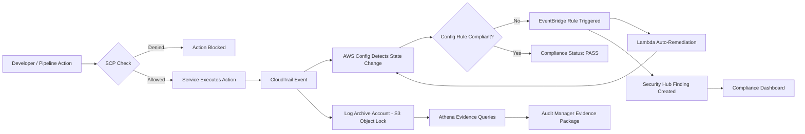
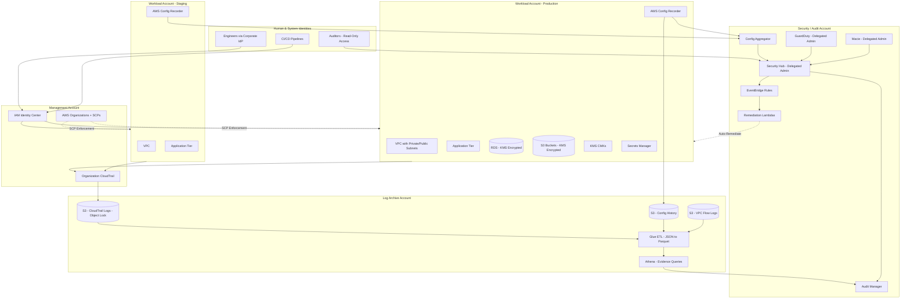
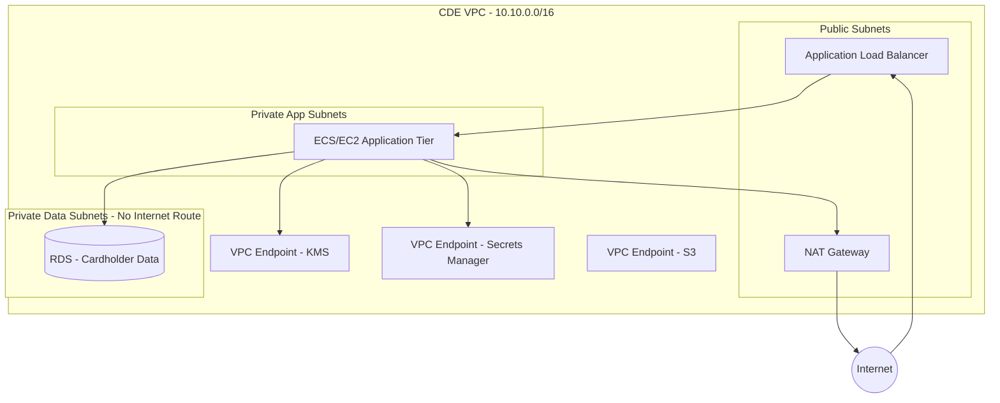

# Part XI – Security Reference Architectures

# Chapter 94: Compliance

---

## 1. Executive Summary

Regulated enterprises do not fail compliance audits because their engineers don't understand encryption or access control. They fail because compliance was treated as a checklist bolted onto infrastructure after the fact, rather than as an architectural property designed in from day one.

This chapter presents a **Compliance Reference Architecture** — a pattern for building AWS environments that can continuously prove adherence to frameworks such as PCI-DSS, HIPAA, SOC 2, ISO 27001, FedRAMP, GDPR, and industry-specific mandates (e.g., GLBA for financial services, NIST 800-53 for government workloads). The architecture treats compliance not as a static document review exercise, but as a living system of controls, evidence collection, and continuous validation.

**The business problem this solves:**

- Enterprises operating in regulated industries (finance, healthcare, government, insurance, critical infrastructure) must demonstrate — not merely claim — that specific technical and administrative controls are enforced at all times.
- Manual compliance processes (quarterly spreadsheet reviews, screenshot-based evidence, tribal-knowledge runbooks) do not scale past a handful of accounts and collapse entirely in multi-account, multi-region AWS organizations.
- Auditors increasingly expect **continuous compliance evidence**, not point-in-time snapshots gathered the week before an audit.
- A single uncontrolled resource — an S3 bucket made public, an unencrypted RDS instance, an IAM user with a static key that never rotates — can trigger a reportable breach, regulatory fines, loss of certification, or contract termination with enterprise customers who require SOC 2 attestation as a condition of doing business.

**Architecture objective:**

Build an AWS environment where compliance controls are:

1. **Codified** — expressed as Infrastructure as Code (Terraform, AWS Config Rules, Service Control Policies) rather than as human-readable policy documents alone.
2. **Preventive where possible** — using Service Control Policies (SCPs), permission boundaries, and IAM policies to make non-compliant actions impossible, not merely detectable.
3. **Detective where prevention is impractical** — using AWS Config, GuardDuty, Security Hub, and CloudTrail to continuously monitor for drift and violations.
4. **Auditable on demand** — able to produce evidence packages for an auditor within hours, not weeks.
5. **Automatically remediated** — where safe, self-healing via EventBridge-triggered Lambda remediation functions.

**Why organizations adopt this architecture:**

- **Regulatory mandate.** Organizations processing cardholder data (PCI-DSS), protected health information (HIPAA), or personal data of EU residents (GDPR) are legally required to implement specific technical safeguards.
- **Customer requirements.** B2B SaaS companies selling into enterprise accounts are frequently required to produce a SOC 2 Type II report before a deal closes. Sales cycles stall — sometimes permanently — without one.
- **Risk reduction.** Compliance frameworks, while imperfect proxies, correlate strongly with reduced breach likelihood and reduced blast radius when a breach does occur.
- **Insurability.** Cyber insurance underwriters increasingly require evidence of specific controls (MFA enforcement, encryption at rest, logging retention) before issuing or renewing policies.
- **M&A and fundraising.** Due diligence processes for acquisitions and later-stage funding rounds routinely include a security and compliance review. Gaps here can reduce valuation or kill deals.

**Major business benefits:**

| Benefit | Description |
|---|---|
| Reduced audit cost and duration | Automated evidence collection cuts audit prep from weeks to days |
| Faster enterprise sales cycles | Pre-built SOC 2 / ISO 27001 posture removes a common sales blocker |
| Lower breach probability | Preventive controls reduce the attack surface materially |
| Reduced blast radius | Segmentation and least privilege limit the damage of any single compromise |
| Regulatory fine avoidance | Continuous compliance avoids the "known gap, unremediated" finding pattern that regulators penalize most heavily |
| Engineering velocity | Codified guardrails let teams self-serve within safe boundaries instead of waiting on manual security review for every change |

**Typical enterprise scenarios:**

- A fintech company processing payments must maintain PCI-DSS Level 1 compliance while shipping product weekly.
- A healthcare SaaS vendor storing PHI must satisfy HIPAA's Security Rule while operating across dozens of AWS accounts for different provider customers.
- A B2B SaaS company must produce a clean SOC 2 Type II report annually to retain enterprise logo customers.
- A government contractor must meet FedRAMP Moderate or High baselines to sell into federal agencies.
- A multinational company must simultaneously satisfy GDPR (EU), CCPA (California), and sector-specific regulations across the jurisdictions it operates in.

This chapter builds the reference architecture that supports all of these scenarios, using a common control plane that maps to multiple frameworks simultaneously — because in practice, most enterprises must comply with more than one framework at once, and re-implementing controls per framework is both wasteful and error-prone.

---

## 2. Business Requirements

### Business Drivers

- Maintain active certification/attestation status (SOC 2 Type II, ISO 27001, PCI-DSS AOC, HIPAA attestation, FedRAMP ATO).
- Avoid regulatory fines and enforcement actions.
- Unblock enterprise sales that require proof of compliance before contract signature.
- Reduce time and cost of annual/quarterly audits.
- Maintain cyber insurance eligibility and reduce premiums.

### Functional Requirements

- Every resource creation event must be logged, attributed to an identity, and immutable.
- All data classified as sensitive (PII, PHI, PCI cardholder data) must be encrypted at rest and in transit.
- Access to production systems must require MFA and be time-bounded (no standing access where avoidable).
- Configuration drift from an approved baseline must be detected within a defined SLA (typically under 24 hours, often under 1 hour for critical controls).
- Evidence of control operation (not just control existence) must be collectible on demand for any rolling 12-month period.
- Data subject rights requests (GDPR Article 15–22) must be technically fulfillable — export, deletion, rectification.

### Non-Functional Requirements

| Requirement | Target |
|---|---|
| Log retention | Minimum 1 year hot, 7 years cold (varies by framework — PCI-DSS requires 1 year minimum with 3 months immediately available; HIPAA commonly interpreted as 6 years) |
| Config rule evaluation latency | Under 1 hour for periodic rules, near-real-time for configuration-change-triggered rules |
| Evidence retrieval time | Under 4 hours for any control, any historical period within retention window |
| Encryption coverage | 100% of data stores holding regulated data |
| MFA enforcement | 100% of human IAM principals with console or API access |
| Availability of security tooling | 99.9% (Security Hub, GuardDuty, Config must themselves not have blind-spot windows) |

### Scalability Goals

- Support 5 to 500+ AWS accounts under a single AWS Organization without re-architecting the compliance control plane.
- Support multi-region deployment where certain regulated data must remain in-region (data residency).

### Availability Requirements

- The compliance monitoring plane (Config, Security Hub, GuardDuty, CloudTrail aggregation) targets 99.9% availability — a monitoring outage is itself a compliance gap that must be logged and remediated.
- Application-tier availability requirements are workload-specific and are addressed in Chapter 6 (Highly Available Multi-AZ) and Chapter 95 (Disaster Recovery); this chapter focuses on the compliance control plane, which wraps around whatever application architecture is in place.

### Latency Requirements

- Compliance controls must not introduce meaningful latency into the application request path. Preventive controls (SCPs, IAM policies) are evaluated at the API-call level and add negligible latency. Detective controls operate out-of-band and have zero request-path impact by design.

### Compliance Requirements Addressed

- **PCI-DSS v4.0** — cardholder data environment (CDE) segmentation, encryption, access control, logging, vulnerability management.
- **HIPAA Security Rule** — administrative, physical, and technical safeguards for electronic PHI (ePHI).
- **SOC 2 Type II** — Trust Services Criteria: Security, Availability, Processing Integrity, Confidentiality, Privacy.
- **ISO/IEC 27001** — Information Security Management System (ISMS) with Annex A controls.
- **GDPR** — lawful basis, data minimization, breach notification (72-hour rule), data subject rights.
- **FedRAMP Moderate/High** — NIST 800-53 control families for federal cloud workloads.

### Security Expectations

- Least privilege by default; no principal should hold broader permissions than its function requires.
- Defense in depth — no single control failure should result in a breach.
- Assume breach posture — detection and response capability, not just prevention.

### Recovery Objectives

| Metric | Target (compliance control plane) |
|---|---|
| RPO (audit log data) | Near-zero — CloudTrail and Config history must not have gaps |
| RTO (compliance tooling) | Under 1 hour to restore monitoring coverage after an incident |

### SLAs

- Internal SLA: critical Security Hub findings (CRITICAL/HIGH severity) triaged within 4 business hours, remediated or risk-accepted within 5 business days.
- External SLA (where contractual): breach notification to affected customers within regulatory windows (e.g., 72 hours under GDPR, "without unreasonable delay" under HIPAA, typically interpreted as 60 days maximum).

### Expected Workload and Growth

- Config rule evaluations scale linearly with resource count; budget for tens of thousands of evaluations per day in a mid-size enterprise (500–2,000 resources per account, 10–50 accounts).
- CloudTrail event volume scales with API call volume — a moderately active organization generates millions of events per month across all accounts, requiring cost-aware log storage tiering (see Section 16).

---

## 3. Architecture Overview

### Overall Design

The Compliance Reference Architecture is not a single application stack — it is a **control plane that wraps every workload account** in an AWS Organization. It is built on four pillars:

1. **Preventive Guardrails** — Service Control Policies (SCPs) and permission boundaries that make non-compliant actions structurally impossible (e.g., "no IAM user may be created without an attached permission boundary," "no S3 bucket may disable default encryption").
2. **Detective Controls** — AWS Config, Security Hub, GuardDuty, Macie, and CloudTrail continuously evaluate the actual state of every account against the required baseline.
3. **Automated Remediation** — EventBridge rules trigger Lambda functions that either auto-remediate low-risk drift (e.g., re-enabling S3 default encryption) or open a ticket/page an engineer for higher-risk drift.
4. **Evidence & Reporting Layer** — Config history, Security Hub findings, and CloudTrail logs are aggregated into a centralized Audit Account and made queryable via Athena, with pre-built reports mapped to each compliance framework's control catalog.

### Architecture Philosophy

> **Compliance controls belong in the platform, not in application code.**

Application teams should not need to remember to enable encryption, tag resources, or configure logging correctly — the platform (Landing Zone / AWS Organization structure) should make the compliant path the *only* path, or at minimum, the path of least resistance.

This mirrors the **Well-Architected Framework's Security Pillar** principle of applying security at all layers, and the **Operational Excellence Pillar** principle of performing operations as code.

### Core Components

| Component | Role |
|---|---|
| AWS Organizations | Multi-account structure with SCPs applied at OU level |
| AWS Control Tower | Automates Landing Zone setup, guardrails, account vending |
| Security/Audit Account | Centralized log aggregation, Config aggregator, Security Hub delegated admin |
| Log Archive Account | Immutable, append-only storage for CloudTrail, Config, VPC Flow Logs, ALB logs |
| AWS Config | Continuous resource configuration recording and rule evaluation |
| AWS Security Hub | Aggregates findings from Config, GuardDuty, Macie, Inspector into a single pane mapped to compliance standards |
| Amazon GuardDuty | Threat detection (compromised credentials, malicious API calls, anomalous behavior) |
| Amazon Macie | Sensitive data discovery and classification in S3 |
| AWS CloudTrail (Organization Trail) | Immutable API audit log across all member accounts |
| AWS KMS | Centralized encryption key management with key policies enforcing separation of duties |
| AWS Secrets Manager | Credential storage with automatic rotation |
| IAM Identity Center | Centralized human identity federation, eliminating long-lived IAM user credentials |
| EventBridge + Lambda | Automated remediation and alerting pipeline |
| Athena + S3 | Queryable evidence lake for audit reporting |
| AWS Audit Manager | Framework-mapped evidence collection (PCI-DSS, HIPAA, SOC 2 prebuilt frameworks) |

### How Components Interact

The Organization Management Account delegates administration of Security Hub, GuardDuty, Macie, and Config to a dedicated **Security/Audit Account**. This account never runs workloads — its sole purpose is aggregation, analysis, and evidence production. Every member account streams its CloudTrail, Config, and VPC Flow Log data into a separate **Log Archive Account** with S3 Object Lock enabled (write-once-read-many), ensuring logs cannot be tampered with even by an account administrator, including a compromised root user in a workload account.

### High-Level Workflow

1. A developer or automated pipeline attempts an action in a workload account (e.g., create an S3 bucket).
2. **SCP evaluation** occurs first, at the AWS Organizations layer — if the action violates a guardrail (e.g., disabling encryption), it is denied before it reaches the service.
3. If allowed, the action executes and is immediately captured by **CloudTrail**.
4. **AWS Config** detects the resulting configuration state change and evaluates it against relevant Config Rules.
5. If non-compliant, **EventBridge** captures the Config compliance change event and triggers a **Lambda remediation function** or opens a finding in **Security Hub**.
6. **Security Hub** aggregates the finding, maps it to the relevant compliance framework control (e.g., PCI-DSS Requirement 3.4, HIPAA §164.312(a)(2)(iv)), and surfaces it on a compliance dashboard.
7. On a recurring schedule, **AWS Audit Manager** collects evidence artifacts (Config snapshots, IAM policy documents, Security Hub findings) and assembles them into a framework-specific evidence folder for auditor review.

### Request/Response/Data Lifecycle (Control Plane Perspective)

- **Request lifecycle**: API call → IAM/SCP authorization check → service action → CloudTrail event emission.
- **Response lifecycle**: Config detects state change → rule evaluation → compliance status update → EventBridge event → remediation or alert.
- **Data lifecycle**: Log/evidence data → written to Log Archive (Object Lock, immutable) → lifecycle-transitioned to cheaper storage tiers over time → retained per framework-mandated retention period → queryable via Athena throughout its life.



---

## 4. AWS Services Used

### AWS Organizations

**Purpose:** Provides the multi-account hierarchy and the enforcement point for Service Control Policies.

**Why selected:** SCPs are the only AWS-native mechanism that can create a true, non-bypassable guardrail — even an account's root user cannot exceed an SCP boundary. This is a foundational requirement for any serious compliance posture; IAM policies alone are insufficient because they can be modified by anyone with `iam:PutRolePolicy` permissions within the account.

**Alternatives:** Multi-account management without Organizations (manual, does not scale, no SCP enforcement) — not viable for compliance at scale.

**Limitations:** SCPs are deny/allow-list filters on IAM, not policies themselves — they do not grant any permissions. Maximum SCP size (5,120 characters/document, up to 5 per target with default quotas, though these can increase) requires careful policy design.

**Pricing considerations:** Organizations itself is free; costs come from the services enabled within it.

**Best practices:** Use OU-based SCP inheritance rather than per-account SCPs to keep policy management scalable. Reserve a dedicated "Security OU" for the Log Archive and Security/Audit accounts with the most restrictive SCPs of all (deny all mutating actions except from automation roles).

---

### AWS Control Tower

**Purpose:** Automates the setup of a multi-account Landing Zone, including default OUs, guardrails (a curated set of SCPs and Config rules), and account provisioning via Account Factory.

**Why selected:** Building the equivalent manually (via Terraform + StackSets) is achievable but reinvents a well-tested wheel. Control Tower guardrails map directly to common compliance requirements out of the box (e.g., "Disallow public read access to S3 buckets" guardrail satisfies multiple frameworks simultaneously).

**Alternatives:** Custom Landing Zone built entirely in Terraform (more flexible, more maintenance burden — appropriate for organizations with highly non-standard requirements or those who need multi-cloud consistency via Terraform-only tooling).

**Limitations:** Control Tower has opinions about account structure that can conflict with pre-existing environments; retrofitting Control Tower onto a large, already-sprawling AWS Organization is a significant migration project, not a toggle switch.

**Pricing considerations:** Control Tower itself is free; you pay for the underlying Config, CloudTrail, and S3 usage it provisions.

**Best practices:** Adopt Control Tower early (greenfield) rather than retrofitting late. Use Account Factory for Terraform (AFT) to combine Control Tower's guardrails with GitOps-driven account customization.

---

### AWS Config

**Purpose:** Continuously records resource configuration state and evaluates it against Config Rules (managed or custom) to determine compliance.

**Why selected:** Config is the backbone of detective compliance controls on AWS — it is the only service that maintains a full configuration history timeline per resource, which is exactly what auditors request ("show me this security group's configuration on March 3rd").

**Alternatives:** Custom polling via Lambda + SDK calls (expensive to build and maintain, loses the built-in configuration history/timeline feature). Third-party CSPM tools (Wiz, Orca, Prisma Cloud) — often used *alongside* Config for enhanced UX and cross-cloud coverage, but rarely as a full replacement since Config's history is the authoritative AWS-native source auditors recognize.

**Limitations:** Config rule evaluation is not always real-time (periodic rules run on a schedule, e.g., every 24 hours by default, though this is configurable down to more frequent intervals for critical rules); high resource-count accounts incur non-trivial per-configuration-item cost.

**Pricing considerations:** Charged per configuration item recorded and per rule evaluation. In large organizations this becomes a meaningful line item — see Section 16.

**Best practices:** Use a **Config Aggregator** in the Security/Audit account to get a single-pane view across every account and region. Prefer AWS Managed Config Rules where they exist before writing custom rules (Lambda-backed), since managed rules require zero maintenance.

---

### AWS Security Hub

**Purpose:** Aggregates findings from Config, GuardDuty, Macie, Inspector, IAM Access Analyzer, and third-party tools into a single view, and maps them automatically to compliance standards (PCI-DSS, CIS AWS Foundations Benchmark, NIST 800-53, AWS Foundational Security Best Practices).

**Why selected:** Without Security Hub, an organization must manually cross-reference dozens of Config rule failures against each compliance framework's control numbering — an enormous, error-prone manual effort. Security Hub's standard-mapping does this automatically and gives a real-time compliance score per standard.

**Alternatives:** Manual spreadsheet mapping (not viable at scale). Third-party GRC platforms (Vanta, Drata, Secureframe) — increasingly popular for SOC 2/ISO 27001 specifically because they add HR/vendor-management evidence collection that Security Hub does not cover; frequently used **in addition to** Security Hub rather than instead of it.

**Limitations:** Security Hub's standard mappings are opinionated and don't cover 100% of every framework's requirements (administrative/procedural controls are out of scope — Security Hub only covers technical controls it can observe).

**Pricing considerations:** Charged per finding ingested and per security check performed; costs scale with account/resource count.

**Best practices:** Enable Security Hub with delegated administration from the Security/Audit account. Enable the specific standards relevant to your regulatory obligations (don't enable all standards blindly — CIS AWS Foundations Benchmark plus your specific framework, e.g., PCI-DSS, is usually sufficient and reduces noise).

---

### Amazon GuardDuty

**Purpose:** Machine-learning-based threat detection analyzing CloudTrail, VPC Flow Logs, DNS logs, and (with extensions) EKS audit logs, RDS login activity, and S3 data events for malicious or anomalous behavior.

**Why selected:** Compliance frameworks universally require "intrusion detection" or equivalent capability (PCI-DSS Requirement 11.5, HIPAA §164.308(a)(1)(ii)(D)). GuardDuty is the AWS-native answer that requires no agent deployment and no log pipeline to build.

**Alternatives:** Third-party IDS/IPS (Suricata, Zeek deployed on EC2) — more customizable, significantly higher operational burden. Self-built anomaly detection on CloudTrail — not recommended; reinvents a mature managed service poorly.

**Limitations:** GuardDuty detects known threat patterns and statistical anomalies; it is not a substitute for a full SIEM correlation engine if your SOC has more sophisticated detection engineering needs.

**Pricing considerations:** Charged per GB of log data analyzed (CloudTrail events, VPC Flow Logs, DNS logs) plus per-feature add-ons (S3 Protection, EKS Protection, RDS Protection, Malware Protection).

**Best practices:** Enable organization-wide with delegated admin so every new account is automatically covered — a common audit finding is "GuardDuty not enabled in all accounts," which this pattern eliminates structurally.

---

### Amazon Macie

**Purpose:** Uses machine learning and pattern matching to discover and classify sensitive data (PII, PCI cardholder data, credentials) stored in S3.

**Why selected:** PCI-DSS, HIPAA, and GDPR all require organizations to *know where their regulated data lives*. Macie automates discovery, which is otherwise a manual, incomplete, and quickly stale exercise in any organization with more than a handful of S3 buckets.

**Alternatives:** Manual data mapping exercises (point-in-time only, goes stale immediately). Third-party DSPM tools (BigID, Varonis) — offer broader coverage across non-S3 data stores; often paired with Macie for S3-specific depth at lower cost.

**Limitations:** Macie's native coverage is S3-only; it does not natively scan RDS, DynamoDB, or EFS content (those require export-to-S3 or third-party tooling).

**Pricing considerations:** Charged per GB scanned for sensitive data discovery jobs, plus a smaller per-object fee for automated discovery.

**Best practices:** Run automated discovery continuously on buckets known to hold regulated data; run full sensitive-data discovery jobs on a scheduled cadence (not continuously, to manage cost) across the full S3 estate to catch data classification drift (e.g., a developer accidentally writing PII to an unclassified bucket).

---

### AWS CloudTrail (Organization Trail)

**Purpose:** Immutable, chronological log of every API call made across every account in the Organization.

**Why selected:** CloudTrail is the single most-requested audit artifact across every framework in this chapter — "who did what, when, from where." An Organization Trail (as opposed to per-account trails) guarantees no new account can be created without automatically inheriting logging — closing the classic "new account, forgot to enable logging" gap.

**Alternatives:** Per-account trails manually configured (operationally fragile, easy to miss an account). Third-party log shippers reading from CloudTrail S3 delivery — used for SIEM ingestion but built on top of, not instead of, CloudTrail itself.

**Limitations:** CloudTrail does not capture data-plane events (e.g., individual S3 GetObject calls) by default — that requires explicitly enabling **data events**, which significantly increases log volume and cost.

**Pricing considerations:** Management events are free for the first copy; data events and insight events are charged per event. High-volume S3 data event logging on large buckets can become a significant cost driver — apply selectively.

**Best practices:** Enable the Organization Trail from the Management Account, deliver logs to the Log Archive account, enable log file validation (SHA-256 digest chaining) to cryptographically prove logs have not been tampered with — a specific ask in most audits.

---

### AWS KMS

**Purpose:** Centralized management of encryption keys used to encrypt data at rest across S3, EBS, RDS, DynamoDB, Secrets Manager, and more.

**Why selected:** Every framework in this chapter mandates encryption at rest for regulated data. KMS provides auditable key usage (every `Decrypt`/`GenerateDataKey` call is logged to CloudTrail), key rotation, and fine-grained key policies that enforce separation of duties (e.g., the team that can *use* a key for encryption is not necessarily the team that can *administer* the key).

**Alternatives:** AWS-managed default encryption keys (`aws/s3`, etc.) — simpler but offer no auditability of individual key usage and no ability to restrict which principals can decrypt, which most frameworks' access-control requirements effectively rule out for regulated data.

**Limitations:** KMS API calls have a request-per-second quota that can become a bottleneck for extremely high-throughput encrypt/decrypt workloads (mitigated via data key caching).

**Pricing considerations:** Monthly charge per Customer Managed Key (CMK) plus per-API-call charges; costs are predictable and rarely a major budget line unless key count and call volume are very high.

**Best practices:** Use Customer Managed Keys (CMKs), not AWS-managed keys, for any data store holding regulated data — CMKs enable key policies, rotation control, and CloudTrail-visible usage auditing that AWS-managed keys do not fully expose. Separate key administrator and key user IAM roles.

---

### AWS Secrets Manager

**Purpose:** Secure storage and automatic rotation of database credentials, API keys, and other secrets.

**Why selected:** Frameworks universally prohibit hardcoded or long-lived static credentials. Secrets Manager's native rotation integration with RDS, Redshift, and DocumentDB eliminates the single most common audit finding around credential management.

**Alternatives:** AWS Systems Manager Parameter Store (SecureString) — cheaper, viable for secrets that don't need automatic rotation; lacks native rotation Lambda integration. HashiCorp Vault (self-hosted or HCP) — preferred in multi-cloud organizations already standardized on Vault, at the cost of additional operational overhead.

**Limitations:** Per-secret monthly cost can add up in environments with thousands of secrets (e.g., per-tenant database credentials in a SaaS platform) — evaluate Parameter Store for lower-sensitivity secrets that don't require rotation.

**Pricing considerations:** Charged per secret per month plus per-API-call; budget accordingly for secret sprawl in multi-tenant architectures.

**Best practices:** Enforce rotation on every secret with a maximum age policy detected via Config Rule (`secretsmanager-rotation-enabled-check` and custom rules for rotation *recency*, not just rotation *enablement*).

---

### IAM Identity Center (formerly AWS SSO)

**Purpose:** Centralized human identity federation from a corporate identity provider (Okta, Azure AD, Google Workspace) into AWS, eliminating the need for long-lived IAM users.

**Why selected:** "No standing long-lived credentials for human access" is a near-universal audit expectation. Identity Center issues short-lived, federated credentials and centralizes access reviews (who has access to which account/role) in one place — critical for the periodic access review evidence every framework requires.

**Alternatives:** Per-account IAM users (explicitly an anti-pattern — see Section 27). Custom SAML federation built manually (achievable but reinvents Identity Center's account/permission-set management UX poorly).

**Limitations:** Requires an upstream identity provider for full SSO value; without one, Identity Center's own built-in directory is usable but less ideal than syncing from an authoritative corporate directory (HR-driven joiner/mover/leaver processes matter for access review integrity).

**Pricing considerations:** Free.

**Best practices:** Map permission sets to least-privilege job functions, not broad "PowerUser"-style access. Enforce MFA at the Identity Center level for all users.

---

### EventBridge + Lambda (Remediation Pipeline)

**Purpose:** Detects Config compliance-change events and Security Hub finding events, then triggers automated remediation or alerting.

**Why selected:** Detective-only controls (finding a problem, but requiring a human to fix it) create a window of non-compliance that can last days or weeks in practice. Automated remediation for well-understood, low-risk drift (e.g., re-enabling S3 Block Public Access) closes that window to minutes.

**Alternatives:** AWS Config's built-in **Automatic Remediation** feature (using SSM Automation documents) — simpler for common cases and requires no custom Lambda code; EventBridge + Lambda is preferred when remediation logic is organization-specific or needs to integrate with ticketing/paging systems.

**Limitations:** Auto-remediation carries risk if misapplied — a remediation Lambda that deletes a resource believed to be non-compliant, when the resource was intentionally configured that way for a documented exception, causes an outage. Always pair with an exception/suppression mechanism.

**Best practices:** Auto-remediate only well-understood, reversible, low-blast-radius findings. Route higher-risk findings to human review via ticketing (Jira/ServiceNow integration) rather than automated action.

---

### Athena + S3 (Evidence Lake)

**Purpose:** SQL-queryable access to CloudTrail, Config, and VPC Flow Log history stored in the Log Archive account, used to answer auditor questions and generate evidence reports.

**Why selected:** Auditors frequently ask ad hoc questions ("show me every IAM policy change in Q2") that are impractical to answer by browsing the console. Athena over partitioned, columnar (Parquet) log data answers these in seconds at low cost.

**Alternatives:** OpenSearch (better for interactive dashboards and full-text search, higher operational cost for large retention windows). Third-party SIEM (Splunk, Datadog) — commonly used for real-time operational security monitoring, often *alongside* an Athena evidence lake used specifically for cost-efficient long-term audit queries.

**Best practices:** Convert raw JSON CloudTrail/Config logs to partitioned Parquet via a scheduled Glue job to reduce Athena query cost and latency dramatically (10–100x cost reduction is typical).

---

### AWS Audit Manager

**Purpose:** Pre-built and custom frameworks (PCI-DSS, HIPAA, SOC 2, ISO 27001, NIST 800-53, GDPR) that automatically collect evidence from Config, Security Hub, CloudTrail, and manual uploads, mapped to each framework's specific control numbering.

**Why selected:** Eliminates the manual, repetitive work of mapping raw AWS evidence to a specific compliance framework's control list every audit cycle. Assessments can run continuously, producing an always-current evidence folder rather than a frantic pre-audit scramble.

**Alternatives:** Manual evidence collection (default state for organizations not using Audit Manager — high labor cost, error-prone, does not scale). Third-party GRC platforms (Vanta, Drata) — often preferred for SOC 2 specifically due to superior UX and built-in vendor/HR evidence collection outside AWS's scope; frequently used alongside Audit Manager, pulling AWS evidence from it via API.

**Limitations:** Audit Manager's evidence is technical/AWS-scoped only — administrative controls (background checks, security awareness training completion, vendor risk assessments) must be tracked elsewhere and combined into the final audit package.

**Pricing considerations:** Charged per assessment per month based on resources assessed; a worthwhile investment relative to the labor cost it displaces.

**Best practices:** Run a continuous, always-on assessment per active framework rather than spinning one up right before an audit — continuous evidence is exactly what auditors trust most and what frameworks like SOC 2 Type II (which assesses control operation *over a period*, not a point in time) fundamentally require.


---

## 5. Complete Architecture Diagram



**Layer summary:**

| Layer | Components | Compliance Role |
|---|---|---|
| Identity | IAM Identity Center, corporate IdP federation | Enforces MFA, eliminates standing credentials |
| Governance | AWS Organizations, SCPs, Control Tower guardrails | Preventive controls |
| Detection | Config, Security Hub, GuardDuty, Macie | Detective controls |
| Response | EventBridge, Lambda remediation | Corrective controls |
| Evidence | Log Archive account, Athena, Audit Manager | Evidence and audit readiness |
| Workload | VPC, compute, KMS-encrypted data stores | The regulated environment itself |

---

## 6. Component-by-Component Explanation

### AWS Organizations / SCP Layer

- **Purpose:** Structural enforcement boundary that no in-account principal, including root, can override.
- **Responsibilities:** Deny categories of dangerous actions org-wide (disabling CloudTrail, deleting Config recorders, leaving the Organization, disabling GuardDuty, creating IAM users without permission boundaries).
- **Inputs:** SCP JSON documents attached at OU or account level.
- **Outputs:** Allow/Deny decision evaluated before every API call in member accounts.
- **Scaling:** Scales to hundreds of accounts via OU-based inheritance; no per-account maintenance required once OU structure is set.
- **High availability:** Fully managed, multi-region by design (Organizations is a global service with a home region for management).
- **Failure handling:** SCP evaluation failure defaults to implicit deny in the affected action, never to implicit allow — fail-closed by design.
- **Dependencies:** None (foundational layer).
- **Security:** SCP modification itself is restricted to the Management Account, ideally via a break-glass process with additional approval gates.
- **Monitoring:** CloudTrail logs every SCP modification event; alert on any change to compliance-critical SCPs.

### Security/Audit Account

- **Purpose:** Single pane of glass for detective controls, isolated from workload accounts to prevent a workload compromise from disabling monitoring of itself.
- **Responsibilities:** Delegated administration of Security Hub, GuardDuty, Macie; hosts the Config Aggregator and Audit Manager assessments.
- **Inputs:** Findings and configuration data streamed from every member account.
- **Outputs:** Compliance dashboards, findings feed, remediation triggers.
- **Scaling:** Delegated admin model scales automatically as new accounts join the Organization (auto-enrollment via Organizations integration).
- **High availability:** Relies on underlying service SLAs (Security Hub, GuardDuty, Config are all regionally resilient managed services).
- **Failure handling:** If aggregation breaks for an account, Security Hub surfaces a "coverage gap" finding — this gap is itself tracked as a compliance issue.
- **Dependencies:** Organizations delegated admin registration, cross-account IAM roles.
- **Security:** No workloads run here; access restricted to security team roles only, MFA-enforced, session-bounded via Identity Center.
- **Monitoring:** Self-monitoring — GuardDuty and Config are enabled on this account too, watching the watchers.

### Log Archive Account

- **Purpose:** Immutable, tamper-evident storage for all audit-relevant logs across the Organization.
- **Responsibilities:** Receive CloudTrail, Config, VPC Flow Log, and application log deliveries; enforce retention via S3 Object Lock and lifecycle policies.
- **Inputs:** Log delivery from every account's CloudTrail/Config/Flow Log configuration.
- **Outputs:** Queryable log data (via Athena) and raw evidence artifacts for auditors.
- **Scaling:** S3 scales natively; the main scaling concern is cost management via storage class tiering (see Section 16).
- **High availability:** S3 provides 99.99% availability SLA and eleven nines durability by design.
- **Failure handling:** Cross-region replication of the Log Archive bucket protects against regional failure or accidental deletion (combined with Object Lock, deletion is not even possible during the retention period).
- **Dependencies:** Bucket policies granting `PutObject` from every account's CloudTrail/Config service principal.
- **Security:** Bucket policy denies all `DeleteObject`/`DeleteBucket` actions; Object Lock in Compliance mode prevents even the account root from deleting logs before retention expiry.
- **Monitoring:** Alert if expected log delivery from any account stops (a missing delivery is itself a finding).

### Workload Accounts

- **Purpose:** Where actual application infrastructure runs, wrapped by the guardrails above.
- **Responsibilities:** Run compliant infrastructure (KMS-encrypted data stores, private subnets for regulated data, Secrets Manager for credentials).
- **Scaling:** Each workload account inherits SCPs and Config rules automatically upon creation via Account Factory — no manual compliance setup required per account.
- **High availability / DR:** Workload-specific; addressed by the application architecture chapters, wrapped by this chapter's controls.
- **Dependencies:** Identity Center for access, KMS for encryption, Secrets Manager for credentials, Config recorder streaming to the aggregator.
- **Security:** Least-privilege IAM roles with permission boundaries; no IAM users with static keys (enforced by SCP).
- **Monitoring:** Config Rules evaluate every resource continuously; GuardDuty monitors VPC Flow Logs and CloudTrail for threats.

---

## 7. End-to-End Compliance Evaluation Flow

1. **Engineer or pipeline** authenticates via IAM Identity Center using corporate IdP credentials with MFA.
2. **Identity Center** issues short-lived, federated credentials scoped to a specific permission set (e.g., `DeveloperReadWrite`) in a specific account.
3. **Engineer attempts an action** — e.g., `aws s3api create-bucket` without specifying default encryption.
4. **AWS Organizations SCP** evaluates the request. If an SCP mandates `s3:PutBucketPolicy` conditions requiring encryption, and the request doesn't meet them, the request is **denied at the API layer** — the bucket is never created non-compliant.
5. If the action is allowed (e.g., the bucket is created correctly, or the SCP doesn't cover this specific scenario), the **service executes** the action.
6. **CloudTrail** captures the API call as a management event, including caller identity, source IP, timestamp, and request/response parameters.
7. **CloudTrail delivers** the event to the Log Archive account's S3 bucket within minutes (typically under 15 minutes).
8. **AWS Config's Configuration Recorder** detects the new/changed resource and records a **Configuration Item (CI)** capturing the resource's full state.
9. **Config Rules** (managed or custom) evaluate the CI — e.g., `s3-bucket-server-side-encryption-enabled`.
10. If **non-compliant**, Config emits a compliance change event to **EventBridge**.
11. **EventBridge rule** matches the event pattern (specific rule name + NON_COMPLIANT status) and invokes a target — either a **remediation Lambda** or an SNS topic notifying the security team.
12. **Remediation Lambda** (for well-understood cases) calls the AWS API to correct the configuration (e.g., `PutBucketEncryption`), and logs the remediation action itself to CloudTrail — creating an audit trail of the fix.
13. **Config re-evaluates** the resource (triggered by the remediation's own configuration change) and updates compliance status to **COMPLIANT**.
14. **Security Hub** ingests the Config finding, maps it to relevant framework controls (e.g., PCI-DSS 3.4.1, CIS 2.1.1), and updates the organization's compliance score for that standard.
15. **Athena queries** against the Log Archive can reconstruct this entire timeline — the original non-compliant action, the detection, and the remediation — as evidence for an auditor asking "how do you handle configuration drift?"
16. **Audit Manager** periodically snapshots this evidence into the active assessment's evidence folder, associated with the relevant control.

**Error handling considerations:**

- If CloudTrail delivery to S3 is delayed or fails, CloudWatch Alarms on `CloudTrail` service health and S3 delivery metrics alert the security team — a logging gap is treated as a P1 incident, not a minor operational issue.
- If a remediation Lambda fails (e.g., insufficient permissions after a policy change), the failure itself generates a CloudWatch Alarm and a Security Hub finding, ensuring remediation failures don't fail silently.

---

## 8. Deployment Flow

### Infrastructure Provisioning

The entire compliance control plane — Organizations structure, SCPs, Config rules, Security Hub standards, CloudTrail, KMS keys, Log Archive bucket policies — is provisioned via **Terraform**, never via manual console clicks. This is itself an auditable-control requirement: "how do you ensure your security controls aren't accidentally modified?" is answered by "they're defined in version control, deployed through a reviewed pipeline, and drift-detected continuously."

### Terraform Workflow

1. Security engineer proposes a change to an SCP or Config rule via a pull request.
2. CI pipeline runs `terraform plan`, posts the diff to the PR for review.
3. A second security engineer (separation of duties) reviews and approves.
4. Merge triggers `terraform apply` via a dedicated CI/CD role with narrowly scoped permissions (not a human's personal credentials).
5. Post-apply, an automated drift-detection job (`terraform plan` on a schedule) confirms the deployed state matches the version-controlled definition.

### CI/CD Deployment

- Application deployments in workload accounts go through pipelines that themselves run under IAM roles subject to the same SCPs as human users — no bypass lane for automation.
- Pipeline roles are scoped per-environment (a staging deployment role cannot deploy to production).

### Blue-Green Deployment (for the remediation Lambda functions specifically)

- Remediation Lambdas are versioned and deployed with weighted alias shifting — a new remediation function version receives a small percentage of invocations first, with CloudWatch Alarms on error rate gating full rollout, since a buggy remediation function could itself cause outages.

### Rollback

- `terraform apply` failures trigger automatic state inspection; SCP changes in particular are rolled back immediately on any CI test failure (a broken SCP can lock an entire account out of critical operations).

### Secrets

- Terraform itself never handles plaintext secrets — cross-account role ARNs and configuration values are the only "secrets" in this layer, and even those are non-sensitive by design (ARNs are not credentials).

### Configuration

- Environment-specific values (account IDs, OU IDs, notification topic ARNs) are managed via Terraform workspaces / `tfvars` per environment, reviewed the same as code.

### Validation

- `terraform validate`, `tflint`, and policy-as-code checks (Open Policy Agent / Sentinel / Checkov) run in CI before any plan is even generated, catching common misconfigurations (e.g., an SCP that would lock out the deployment role itself) before they reach `apply`.

---

## 9. Network Topology

Compliance frameworks (particularly PCI-DSS) place heavy emphasis on network segmentation — isolating regulated data environments from general corporate/application traffic.

### VPC Design

- Each workload account hosting regulated data has a dedicated VPC — no shared VPC spanning regulated and non-regulated workloads for PCI-DSS Cardholder Data Environment (CDE) scoping purposes.
- **CIDR:** `10.x.0.0/16` per account, sized to avoid overlap across accounts to enable future VPC peering or Transit Gateway attachment without renumbering.

### Subnet Layout

| Subnet Type | Purpose | Internet Access |
|---|---|---|
| Public subnets | ALB, NAT Gateway only | Direct via IGW |
| Private application subnets | EC2/ECS/Lambda (VPC-attached) application tier | Outbound only via NAT Gateway |
| Private data subnets | RDS, ElastiCache, regulated data stores | No internet route at all |
| PCI-scoped subnets (if applicable) | CDE-specific resources, further isolated with dedicated NACLs | No internet route; access only via PrivateLink/VPN |

### NAT Gateway / Internet Gateway

- NAT Gateway deployed per-AZ (not a single shared NAT) to avoid a cross-AZ single point of failure and to keep data transfer costs predictable and traceable per AZ.
- Internet Gateway attached only to VPCs that genuinely require public ingress (e.g., a public-facing ALB); data-only accounts holding regulated data with no public interface have no IGW at all — the strongest network-layer compliance statement possible ("this environment cannot be reached from the internet, full stop").

### Transit Gateway

- Used to interconnect workload VPCs with shared services (centralized logging endpoints, centralized DNS, centralized proxy for outbound internet access from otherwise-isolated PCI subnets).
- Transit Gateway route tables enforce segmentation — the CDE route table only propagates routes to/from the specific shared-services VPC required, not a flat any-to-any mesh.

### Route Tables

- Private data subnets have route tables with **no default route to 0.0.0.0/0** at all — traffic cannot leave the subnet to the internet under any circumstance, which is verified continuously via a custom Config rule.

### Network ACLs

- Stateless NACLs applied at the CDE subnet boundary as a second layer of defense behind security groups, explicitly denying traffic to/from any CIDR not on an documented allow-list.

### Security Groups

- Security groups follow least-privilege source referencing (security-group-to-security-group references, not broad CIDR ranges) — e.g., the RDS security group allows inbound 5432 only from the application tier's security group, never from `0.0.0.0/0` or even the full VPC CIDR.

### PrivateLink

- VPC endpoints (Interface and Gateway) for S3, KMS, Secrets Manager, and other AWS services used from the isolated data subnets, ensuring API calls to these services never traverse the public internet — required to keep entire subnets with "no internet route" fully functional while remaining audit-defensible.

### Hybrid Connectivity

- Where on-premises connectivity is required (e.g., a bank's core banking system integration), Direct Connect with a dedicated VIF into the CDE VPC, never a shared VIF spanning regulated and non-regulated traffic.



---

## 10. Identity and Access

### IAM Roles

- All human access is role-based via IAM Identity Center permission sets — zero standing IAM users for engineers.
- All service-to-service access uses IAM roles with trust policies scoped to specific services/accounts, never shared credentials.

### IAM Policies

- Written following least privilege: explicit action lists, not wildcards, scoped with resource ARNs and condition keys (e.g., `aws:SourceIp`, `aws:MultiFactorAuthPresent`, `aws:PrincipalOrgID`).
- Every policy attached to a role carrying access to regulated data requires `aws:MultiFactorAuthPresent: true` as a condition for any mutating action.

### Resource Policies

- S3 bucket policies, KMS key policies, and Secrets Manager resource policies enforce `aws:PrincipalOrgID` conditions, ensuring even a leaked credential from *outside* the Organization cannot access resources — defense in depth beyond IAM alone.

### STS

- Federated sessions via Identity Center are short-lived (default 1 hour, configurable up to 12 hours max) — eliminating long-lived credential exposure risk.
- Cross-account roles (e.g., the Security/Audit account's read access into workload accounts) use `sts:AssumeRole` with external ID conditions where applicable and session duration capped appropriately per role sensitivity.

### Cross-Account Access

- The Security/Audit account assumes a narrowly scoped, read-only `SecurityAudit`-managed-policy role into every member account — sufficient for Config/Security Hub aggregation, insufficient to modify workload resources.
- Break-glass emergency access (e.g., an incident requiring write access into a workload account) uses a separate, heavily logged, time-bounded role requiring dual approval, never the standard audit role.

### Least Privilege

- Enforced structurally via **Permission Boundaries** — every IAM role created in a workload account must have a permission boundary attached (enforced by SCP), capping the maximum possible permissions regardless of what the role's own policy grants, preventing privilege escalation via role/policy misconfiguration.

### Service Roles

- Service-linked roles and application execution roles are scoped per-workload, per-environment; a Lambda function's execution role can only access the specific S3 prefix, KMS key, and Secrets Manager secret it needs — never account-wide wildcard access.

### Permission Boundaries

```json

{
  "Version": "2012-10-17",
  "Statement": [
    {
      "Sid": "DenyOutsideBoundary",
      "Effect": "Deny",
      "NotAction": [
        "s3:GetObject",
        "s3:PutObject",
        "secretsmanager:GetSecretValue",
        "kms:Decrypt",
        "kms:GenerateDataKey",
        "logs:*",
        "cloudwatch:*"
      ],
      "Resource": "*"
    },
    {
      "Sid": "DenyIfNoMFA",
      "Effect": "Deny",
      "Action": "*",
      "Resource": "*",
      "Condition": {
        "BoolIfExists": {
          "aws:MultiFactorAuthPresent": "false"
        },
        "StringEquals": {
          "aws:PrincipalTag/HumanUser": "true"
        }
      }
    }
  ]
}

```

---

## 11. Security Architecture

### Encryption

- **At rest:** All S3 buckets, RDS/Aurora instances, DynamoDB tables, EBS volumes, and Secrets Manager secrets use KMS Customer Managed Keys — enforced via SCP denying resource creation without an encryption parameter, and detected via Config Rules for anything that slips through.
- **In transit:** TLS 1.2 minimum (TLS 1.3 preferred) enforced on all ALB listeners, API Gateway endpoints, and RDS connection parameters (`rds.force_ssl=1`); enforced via Config Rule `alb-http-to-https-redirection-check` and equivalent custom rules.

### KMS

- Separate CMKs per data classification tier (e.g., one key for PCI cardholder data, one for general application data) — this allows differentiated key policies, rotation schedules, and — critically — the ability to cryptographically "shred" a specific data category by disabling its key without affecting unrelated data.
- Automatic annual key rotation enabled on every CMK.

### TLS / Certificate Manager

- AWS Certificate Manager (ACM) issues and auto-renews TLS certificates for all public endpoints — eliminating expired-certificate incidents, which are both an availability and a compliance concern (encrypted transit is a continuous control, not a point-in-time one).

### WAF

- AWS WAF attached to every public ALB/CloudFront distribution fronting regulated workloads, with managed rule groups (Core Rule Set, SQL injection, known bad inputs) plus custom rules for rate limiting and geographic restrictions where required by data residency rules.

### Shield

- AWS Shield Standard (automatic, free) provides baseline DDoS protection; Shield Advanced is adopted for internet-facing CDE endpoints where availability is itself a contractual SLA (PCI-DSS Requirement 6.4 references protecting against common attacks including DoS).

### Secrets Manager

- Database credentials rotate automatically on a 30- or 90-day cycle (framework-dependent); application code retrieves credentials at runtime via the Secrets Manager SDK, never from environment variables or configuration files.

### GuardDuty / Inspector / Security Hub

- **GuardDuty:** Continuous threat detection across CloudTrail, VPC Flow Logs, DNS logs; S3 Protection and Malware Protection enabled for buckets holding regulated data.
- **Inspector:** Continuous vulnerability scanning of EC2 instances, ECR container images, and Lambda functions — required by PCI-DSS Requirement 11.3 (vulnerability scanning) and generally expected by SOC 2/ISO 27001 as evidence of a vulnerability management program.
- **Security Hub:** Central aggregation and compliance scoring as described in Section 4.

### CloudTrail / Config

- As detailed in Sections 3–4; the backbone of the "who did what, was it compliant" evidence chain.

### Zero Trust

- No implicit trust based on network location alone — every request (even from "inside" the VPC) is authenticated and authorized at the identity layer (IAM roles, service-to-service mTLS where applicable via App Mesh/service mesh in container architectures).
- VPC Endpoints + Private DNS ensure AWS API traffic never needs a public route even for "trusted" internal services.

### Threat Model

| Threat | Attack Vector | Mitigation |
|---|---|---|
| Compromised developer credentials | Phishing, credential stuffing | MFA enforcement, short-lived STS sessions, GuardDuty anomaly detection |
| Insider threat / privilege misuse | Malicious or careless authorized user | Least privilege, permission boundaries, CloudTrail + Security Hub alerting on sensitive actions |
| Data exfiltration via S3 | Misconfigured public bucket | SCP-level Block Public Access enforcement, Macie continuous scanning, Config rule detection |
| Lateral movement post-compromise | Overly permissive security groups / IAM roles | Network segmentation, security-group-to-security-group referencing, permission boundaries |
| Supply chain compromise | Malicious dependency in CI/CD pipeline | Inspector container/Lambda scanning, artifact signing, dependency scanning in pipeline |
| Log tampering to hide an attack | Attacker with elevated access altering logs | S3 Object Lock (Compliance mode) on Log Archive, CloudTrail log file validation |

---

## 12. High Availability

### AZ Failures

- Compliance tooling itself (Config, Security Hub, GuardDuty) is a regional, AZ-resilient managed service — no customer action required for AZ-level HA of the control plane.
- Workload resources supporting regulated data follow standard Multi-AZ patterns (see Chapter 6) — this chapter assumes that baseline and layers compliance controls atop it.

### Instance Failures

- Remediation Lambda functions are inherently resilient to instance-level failure (serverless, no persistent instances to fail).

### Regional Failures

- CloudTrail, Config, and Security Hub are regional services — a full regional outage affects monitoring coverage for that region specifically. Multi-region deployment of the compliance control plane (Config Aggregator spanning regions, CloudTrail multi-region trail) ensures a regional outage in a workload region doesn't create a *total* blind spot, though it does reduce coverage for that region during the outage — an explicitly documented and monitored condition.

### Database Failures

- Addressed by the underlying data architecture chapters (RDS Multi-AZ, Aurora); this chapter's concern is ensuring database failover events themselves are logged (RDS events → EventBridge → CloudTrail) and that failover doesn't create an encryption or access-control gap (the standby/replica inherits the same KMS key and IAM configuration by design in properly configured Multi-AZ RDS).

### Load Balancing / Health Checks / Failover

- Standard ALB health check patterns apply to workload availability; from a compliance perspective, the requirement is that failover events are logged and that WAF/Shield protections apply equally to both the primary and any failover target.

---

## 13. Disaster Recovery

### Backup Strategy

- Automated, encrypted backups (RDS automated backups + snapshots, DynamoDB point-in-time recovery, S3 versioning) for all regulated data stores, with backup encryption using the same or a dedicated backup-specific CMK.
- AWS Backup used as the centralized backup orchestration and compliance-reporting layer across services — its **Backup Audit Manager** feature specifically maps to compliance requirements around backup frequency, retention, and encryption.

### Snapshots

- RDS/EBS snapshots are encrypted by default (inherited from source volume encryption) and are cross-region copied for regulated production data to satisfy geographic redundancy requirements without violating data residency rules (copies stay within approved regions/jurisdictions).

### Cross-Region Replication

- Log Archive bucket replicates to a second region (within the same legal jurisdiction where data residency rules apply, e.g., EU-to-EU only for GDPR-scoped data) to protect audit evidence against single-region loss.

### Pilot Light / Warm Standby / Multi-Site

- The compliance control plane itself follows a **warm standby** pattern in a secondary region: Config Aggregator, Security Hub, and GuardDuty delegated administration are enabled in a secondary region so monitoring coverage can be activated quickly if the primary region's control plane is impaired — though the primary workload DR strategy (pilot light, warm standby, or active-active) is workload-specific and covered in Chapter 95.

### RPO / RTO for Compliance Evidence Specifically

| Asset | RPO | RTO |
|---|---|---|
| CloudTrail logs | Near-zero (near-real-time delivery + cross-region replication) | N/A — logs are immutable once written |
| Config history | Near-zero | Under 1 hour to restore aggregation view |
| Security Hub findings | Under 15 minutes | Under 1 hour |
| Audit Manager evidence | Daily snapshot cadence acceptable | Under 4 hours to reconstruct from underlying Config/CloudTrail data if needed |

---

## 14. Scalability

### Horizontal Scaling

- The compliance control plane scales horizontally by design — adding a new AWS account automatically enrolls it into Config Aggregator, Security Hub, and GuardDuty via Organizations auto-enrollment, requiring zero manual per-account setup once the delegated-admin/auto-enable configuration is in place.

### Vertical Scaling

- Not generally applicable to the managed services in this architecture (Config, Security Hub, GuardDuty auto-scale internally); the exception is remediation Lambda memory/timeout tuning for computationally heavier remediation logic.

### Auto Scaling (Remediation Pipeline)

- Lambda concurrency scales automatically with EventBridge event volume; reserved concurrency limits are set on remediation functions that call rate-limited downstream APIs (e.g., KMS) to avoid throttling cascades during a mass-remediation event (such as after a bulk misconfiguration is discovered across hundreds of resources).

### Database Scaling

- N/A directly to the compliance control plane; Athena/Glue scale automatically with query and data volume (serverless, pay-per-query/per-DPU-hour).

### Storage Scaling

- S3 in the Log Archive account scales without limit; the operational concern is cost management (Section 16), not capacity.

### Queue Scaling

- EventBridge scales automatically; for very high event volumes, an SQS buffer between EventBridge and remediation Lambdas is introduced to smooth bursts and provide a dead-letter queue for failed remediation attempts, ensuring no compliance event is silently dropped under load.

---

## 15. Performance Optimization

### Caching

- Athena query results are cached (native result reuse) for repeated auditor queries against the same evidence window, reducing both cost and latency for common "show me X for period Y" requests.

### Compression

- CloudTrail/Config/VPC Flow Log data is converted from raw JSON/gzip to columnar **Parquet** format via scheduled Glue ETL jobs — typically reducing both storage footprint and Athena scan cost by 80–90%+.

### CDN

- Not directly applicable to the compliance control plane; the compliance dashboard (if built as a custom internal tool atop Security Hub/Config data) can use CloudFront for low-latency access for globally distributed security teams.

### Database Optimization

- N/A to the control plane directly; Athena table partitioning by account ID, region, and date is the primary "database optimization" applied here, dramatically reducing scan volume for targeted evidence queries.

### Connection Pooling / Concurrency

- Remediation Lambdas reuse SDK clients across invocations (initialized outside the handler) to avoid unnecessary connection setup overhead and reduce cold-start-adjacent latency during bulk remediation events.

### Async Processing

- The entire detection-to-remediation pipeline is fully asynchronous and event-driven by design (Config → EventBridge → Lambda) — there is no synchronous, request-blocking compliance check in the application request path, satisfying the non-functional requirement that compliance controls not add application latency.

---

## 16. Cost Optimization (FinOps)

### Estimated Monthly Cost by Deployment Size

| Cost Driver | Small (5 accounts, ~2,000 resources) | Medium (25 accounts, ~15,000 resources) | Enterprise (150 accounts, ~150,000 resources) |
|---|---|---|---|
| AWS Config (recording + rule evaluations) | ~$150–300 | ~$1,500–3,000 | ~$15,000–30,000 |
| Security Hub (findings ingestion) | ~$50–100 | ~$500–1,000 | ~$5,000–10,000 |
| GuardDuty | ~$100–250 | ~$1,000–2,500 | ~$10,000–25,000 |
| Macie (selective scanning) | ~$50–150 | ~$500–1,500 | ~$5,000–15,000 |
| CloudTrail (data events on select buckets) | ~$50–100 | ~$500–1,000 | ~$3,000–8,000 |
| S3 Log Archive storage (with lifecycle tiering) | ~$50–150 | ~$500–1,500 | ~$4,000–10,000 |
| Athena / Glue ETL | ~$20–50 | ~$200–500 | ~$1,500–4,000 |
| Audit Manager | ~$50–100 | ~$300–700 | ~$2,000–5,000 |
| **Estimated Total** | **~$470–1,200/mo** | **~$5,000–11,700/mo** | **~$45,500–107,000/mo** |

> **Note:** These figures are illustrative planning estimates, not quotes. Actual cost depends heavily on resource count, API call volume, S3 data event logging scope, and region count. Always validate with AWS Pricing Calculator and Cost Explorer against your specific footprint.

### Major Cost Drivers

- **AWS Config rule evaluations** scale with (resource count × rule count × evaluation frequency) — the single largest lever for cost control in large organizations.
- **CloudTrail data events** (S3 object-level, Lambda invocation-level logging) can dwarf management event costs if enabled broadly rather than selectively.
- **GuardDuty** costs scale with VPC Flow Log and DNS log volume — high-traffic VPCs are the primary driver.

### Optimization Opportunities

| Technique | Savings Mechanism |
|---|---|
| Scope Config to relevant resource types only (not "record all") | Reduces configuration item volume directly |
| Enable CloudTrail data events selectively (only regulated-data buckets) | Avoids logging every S3 GetObject org-wide |
| Parquet conversion of log data | 80–90%+ reduction in Athena scan cost |
| S3 Intelligent-Tiering / lifecycle to Glacier for logs beyond hot-query window | Reduces storage cost for long-tail retention |
| Consolidate Config Aggregator queries rather than per-account API polling | Reduces redundant API call cost and Config read charges |
| Right-size Macie scan frequency (scheduled jobs vs. continuous) | Avoids scanning unchanged data repeatedly |

### Reserved Instances / Savings Plans / Spot

- Largely inapplicable to this control-plane architecture, which is predominantly serverless/managed-service based. Where EC2 is used elsewhere in the broader environment (e.g., self-managed SIEM components), Compute Savings Plans apply normally.

### S3 Lifecycle / Storage Classes

| Age of Log Data | Storage Class | Rationale |
|---|---|---|
| 0–90 days | S3 Standard | Frequent auditor/investigation queries |
| 90 days–1 year | S3 Standard-IA | Occasional queries, cost-optimized |
| 1–7 years | S3 Glacier Flexible Retrieval | Rare access, long-term regulatory retention (e.g., HIPAA 6-year, some financial regs 7-year) |
| Beyond mandated retention | Delete (per documented retention policy) | Avoid indefinite retention liability under GDPR data minimization principle |

### Rightsizing / Cost Allocation / Tagging

- Every account and resource is tagged with `CostCenter`, `Environment`, `DataClassification`, and `ComplianceScope` — the last two tags double as both FinOps allocation keys and compliance-scoping evidence (e.g., proving which resources are in the PCI-DSS CDE for scope-reduction purposes, which itself reduces audit cost).

### Budgets / Cost Anomaly Detection

- AWS Budgets configured per account with alerts at 80%/100%/120% thresholds; AWS Cost Anomaly Detection monitors the Security/Audit and Log Archive accounts specifically, since an unexpected spike here often indicates a misconfiguration (e.g., CloudTrail data events accidentally enabled account-wide) rather than legitimate growth.

---

## 17. AI-Assisted Operations

### Amazon Q (Developer / Business)

- **Amazon Q Developer** assists engineers in writing compliant Terraform and IAM policies by suggesting least-privilege policy statements and flagging overly permissive wildcard actions during code authoring — shifting compliance left into the IDE rather than catching it only at deployment-time Config evaluation.
- **Amazon Q in Security Hub / Q for compliance dashboards** can summarize a large batch of findings in natural language for a compliance manager who does not need line-by-line technical detail — e.g., "Summarize the CRITICAL findings from the last 7 days affecting the PCI-DSS CDE."

### Bedrock

- Amazon Bedrock (using a foundation model of choice) is used to build a **natural-language evidence query interface** atop the Athena evidence lake — a compliance analyst can ask "Show me all IAM policy changes affecting production RDS access in Q2" and receive a generated Athena query plus a plain-language summary of results, dramatically reducing the SQL expertise required to interrogate the evidence lake during an audit.

### AI Troubleshooting / Log Analysis

- Bedrock-backed log analysis can cluster and summarize GuardDuty findings and CloudTrail anomalies, helping a security analyst triage a high-volume finding queue faster — particularly valuable during an active incident when finding volume spikes.

### Incident Response

- AI-assisted runbook generation: given a Security Hub finding type, a Bedrock-backed assistant can draft an initial incident response checklist tailored to the specific finding and affected resource, which a human analyst then reviews and executes — accelerating response without removing human judgment from containment/eradication decisions.

### Cost Optimization / Capacity Planning

- AI-assisted analysis of Config/CloudTrail volume trends to forecast Config and CloudTrail cost growth ahead of quarterly budget reviews.

### Architecture Review / AI-Generated Terraform & Documentation

- Amazon Q Developer accelerates writing new Config custom rules and Terraform SCP modules from a plain-language control description (e.g., "write a Config rule that flags any RDS instance without deletion protection enabled"), with the generated code always subject to the same human review and CI validation pipeline as any other change — AI acceleration does not bypass the change-control process itself, which auditors specifically look for.

> **Important governance note:** Any AI-generated compliance control (Terraform, Config rule, IAM policy) must go through the same peer review and testing pipeline as human-authored code. Auditors evaluate the *process*, not the *authorship tool* — but an AI-generated SCP that is merged without review is exactly the kind of process gap that turns into a finding.

---

## 18. Terraform Implementation

### Provider Configuration

```hcl

terraform {
  required_version = ">= 1.7.0"

  required_providers {
    aws = {
      source  = "hashicorp/aws"
      version = "~> 5.50"
    }
  }

  backend "s3" {
    bucket         = "org-terraform-state-security"
    key            = "compliance-control-plane/terraform.tfstate"
    region         = "us-east-1"
    dynamodb_table = "terraform-state-lock"
    encrypt        = true
    kms_key_id     = "alias/terraform-state-key"
  }
}

provider "aws" {
  region = var.home_region

  default_tags {
    tags = {
      ManagedBy         = "Terraform"
      Module            = "compliance-control-plane"
      ComplianceScope   = "org-wide"
    }
  }
}

```

### Variables

```hcl

variable "home_region" {
  description = "Primary AWS region for the Organization's compliance control plane"
  type        = string
  default     = "us-east-1"
}

variable "security_account_id" {
  description = "Account ID of the delegated Security/Audit account"
  type        = string
}

variable "log_archive_account_id" {
  description = "Account ID of the Log Archive account"
  type        = string
}

variable "organization_id" {
  description = "AWS Organizations ID, used in resource policy conditions"
  type        = string
}

variable "compliance_frameworks" {
  description = "List of compliance frameworks to enable in Security Hub and Audit Manager"
  type        = list(string)
  default     = ["PCI-DSS-v4", "HIPAA", "SOC2", "CIS-AWS-Foundations-v3"]
}

variable "log_retention_years" {
  description = "Retention period in years for audit log data"
  type        = number
  default     = 7
}

```

### Service Control Policy Module

```hcl

resource "aws_organizations_policy" "deny_disable_security_services" {
  name        = "deny-disable-security-services"
  description = "Prevent disabling of CloudTrail, Config, GuardDuty, or Security Hub in any member account"
  type        = "SERVICE_CONTROL_POLICY"

  content = jsonencode({
    Version = "2012-10-17"
    Statement = [
      {
        Sid    = "DenyCloudTrailTampering"
        Effect = "Deny"
        Action = [
          "cloudtrail:StopLogging",
          "cloudtrail:DeleteTrail",
          "cloudtrail:UpdateTrail"
        ]
        Resource = "*"
        Condition = {
          StringNotEquals = {
            "aws:PrincipalArn" = "arn:aws:iam::${var.security_account_id}:role/OrgAutomationRole"
          }
        }
      },
      {
        Sid    = "DenyConfigTampering"
        Effect = "Deny"
        Action = [
          "config:DeleteConfigurationRecorder",
          "config:StopConfigurationRecorder",
          "config:DeleteDeliveryChannel"
        ]
        Resource = "*"
      },
      {
        Sid    = "DenyGuardDutyDisable"
        Effect = "Deny"
        Action = [
          "guardduty:DeleteDetector",
          "guardduty:DisassociateFromMasterAccount",
          "guardduty:UpdateDetector"
        ]
        Resource = "*"
        Condition = {
          StringNotEquals = {
            "aws:PrincipalArn" = "arn:aws:iam::${var.security_account_id}:role/OrgAutomationRole"
          }
        }
      }
    ]
  })
}

resource "aws_organizations_policy_attachment" "attach_to_workload_ou" {
  policy_id = aws_organizations_policy.deny_disable_security_services.id
  target_id = var.workload_ou_id
}

```

### AWS Config Rules Module

```hcl

resource "aws_config_config_rule" "s3_encryption_enabled" {
  name = "s3-bucket-server-side-encryption-enabled"

  source {
    owner             = "AWS"
    source_identifier = "S3_BUCKET_SERVER_SIDE_ENCRYPTION_ENABLED"
  }

  depends_on = [aws_config_configuration_recorder.recorder]
}

resource "aws_config_config_rule" "rds_encryption_enabled" {
  name = "rds-storage-encrypted"

  source {
    owner             = "AWS"
    source_identifier = "RDS_STORAGE_ENCRYPTED"
  }

  depends_on = [aws_config_configuration_recorder.recorder]
}

resource "aws_config_config_rule" "iam_mfa_enabled" {
  name = "iam-user-mfa-enabled"

  source {
    owner             = "AWS"
    source_identifier = "IAM_USER_MFA_ENABLED"
  }

  depends_on = [aws_config_configuration_recorder.recorder]
}

# Custom rule example: secret rotation must have occurred within 90 days

resource "aws_config_config_rule" "secrets_rotation_recency" {
  name = "custom-secrets-rotated-within-90-days"

  source {
    owner             = "CUSTOM_LAMBDA"
    source_identifier = aws_lambda_function.check_secret_rotation.arn

    source_detail {
      message_type = "ScheduledNotification"
    }
  }

  maximum_execution_frequency = "TwentyFour_Hours"

  depends_on = [aws_lambda_permission.config_invoke]
}

```

### Remediation Lambda + EventBridge

```hcl

resource "aws_lambda_function" "remediate_s3_encryption" {
  function_name = "remediate-s3-default-encryption"
  runtime       = "python3.12"
  handler       = "handler.lambda_handler"
  role          = aws_iam_role.remediation_lambda_role.arn
  filename      = "${path.module}/artifacts/remediate_s3_encryption.zip"
  timeout       = 30
  memory_size   = 128

  environment {
    variables = {
      DEFAULT_KMS_KEY_ARN = var.default_s3_kms_key_arn
    }
  }
}

resource "aws_cloudwatch_event_rule" "s3_encryption_noncompliant" {
  name        = "s3-encryption-noncompliant"
  description = "Triggers when Config detects an S3 bucket without default encryption"

  event_pattern = jsonencode({
    source      = ["aws.config"]
    detail-type = ["Config Rules Compliance Change"]
    detail = {
      configRuleName  = ["s3-bucket-server-side-encryption-enabled"]
      newEvaluationResult = {
        complianceType = ["NON_COMPLIANT"]
      }
    }
  })
}

resource "aws_cloudwatch_event_target" "trigger_remediation" {
  rule      = aws_cloudwatch_event_rule.s3_encryption_noncompliant.name
  target_id = "remediate-s3-encryption"
  arn       = aws_lambda_function.remediate_s3_encryption.arn
}

resource "aws_lambda_permission" "allow_eventbridge" {
  statement_id  = "AllowEventBridgeInvoke"
  action        = "lambda:InvokeFunction"
  function_name = aws_lambda_function.remediate_s3_encryption.function_name
  principal     = "events.amazonaws.com"
  source_arn    = aws_cloudwatch_event_rule.s3_encryption_noncompliant.arn
}

```

### IAM — Permission Boundary Enforcement

```hcl

resource "aws_iam_policy" "mandatory_permission_boundary" {
  name        = "mandatory-permission-boundary"
  description = "Applied to every IAM role created in workload accounts"
  policy      = file("${path.module}/policies/permission-boundary.json")
}

# SCP enforcing the boundary must be attached

resource "aws_organizations_policy" "require_permission_boundary" {
  name = "require-iam-permission-boundary"
  type = "SERVICE_CONTROL_POLICY"

  content = jsonencode({
    Version = "2012-10-17"
    Statement = [
      {
        Sid       = "DenyRoleCreationWithoutBoundary"
        Effect    = "Deny"
        Action    = "iam:CreateRole"
        Resource  = "*"
        Condition = {
          StringNotEquals = {
            "iam:PermissionsBoundary" = aws_iam_policy.mandatory_permission_boundary.arn
          }
        }
      }
    ]
  })
}

```

### Outputs

```hcl

output "config_aggregator_arn" {
  description = "ARN of the organization-wide Config Aggregator"
  value       = aws_config_configuration_aggregator.org_aggregator.arn
}

output "log_archive_bucket_name" {
  description = "Name of the immutable Log Archive S3 bucket"
  value       = aws_s3_bucket.log_archive.id
}

output "security_hub_enabled_standards" {
  description = "Compliance standards currently enabled in Security Hub"
  value       = var.compliance_frameworks
}

```

### Remote State & Best Practices

- State stored in a dedicated, KMS-encrypted S3 bucket in the Security/Audit account with DynamoDB state locking — never local state for anything touching SCPs or security-critical resources.
- Modules organized by concern (`modules/scp`, `modules/config-rules`, `modules/remediation`, `modules/log-archive`) so a PCI-specific rule set can be composed independently from a HIPAA-specific rule set while sharing common primitives.
- `terraform plan` output is a required, human-reviewed artifact attached to every pull request touching this codebase — itself retained as change-management evidence for audits.

---

## 19. AWS CLI Examples

### Deployment / Setup

```bash

# Enable AWS Config recorder in a workload account

aws configservice put-configuration-recorder \
  --configuration-recorder name=default,roleARN=arn:aws:iam::123456789012:role/config-role \
  --recording-group allSupported=true,includeGlobalResourceTypes=true

aws configservice start-configuration-recorder \
  --configuration-recorder-name default

# Create an organization-wide CloudTrail trail

aws cloudtrail create-trail \
  --name org-trail \
  --s3-bucket-name log-archive-cloudtrail-bucket \
  --is-organization-trail \
  --is-multi-region-trail \
  --enable-log-file-validation

aws cloudtrail start-logging --name org-trail

# Enable Security Hub with a specific standard

aws securityhub enable-security-hub \
  --enable-default-standards

aws securityhub batch-enable-standards \
  --standards-subscription-requests \
  StandardsArn=arn:aws:securityhub:us-east-1::standards/pci-dss/v/4.0.1

```

### Validation

```bash

# Check compliance status of a specific Config rule across the org

aws configservice get-compliance-details-by-config-rule \
  --config-rule-name s3-bucket-server-side-encryption-enabled \
  --compliance-types NON_COMPLIANT

# List all Security Hub findings above HIGH severity, filtered by compliance standard

aws securityhub get-findings \
  --filters '{
    "SeverityLabel": [{"Value": "HIGH", "Comparison": "EQUALS"}],
    "ComplianceStatus": [{"Value": "FAILED", "Comparison": "EQUALS"}]
  }' \
  --max-results 50

# Verify GuardDuty is enabled in every account via the aggregator

aws guardduty list-detectors --region us-east-1

```

### Monitoring

```bash

# Check the overall compliance score for a specific standard

aws securityhub get-enabled-standards

aws securityhub describe-standards-controls \
  --standards-subscription-arn arn:aws:securityhub:us-east-1:123456789012:subscription/pci-dss/v/4.0.1

# Pull recent CloudTrail events for a specific IAM principal (investigation)

aws cloudtrail lookup-events \
  --lookup-attributes AttributeKey=Username,AttributeValue=jane.doe@company.com \
  --start-time 2026-07-01T00:00:00Z \
  --end-time 2026-08-01T00:00:00Z

```

### Troubleshooting

```bash

# Confirm Config delivery channel is actually delivering (common silent-failure point)

aws configservice describe-delivery-channel-status

# Check for accounts missing from GuardDuty organization coverage

aws guardduty list-members --detector-id <detector-id> \
  --query 'Members[?RelationshipStatus!=`Enabled`]'

# Find S3 buckets without default encryption org-wide (via Config aggregator)

aws configservice select-aggregate-resource-config \
  --configuration-aggregator-name org-aggregator \
  --expression "SELECT resourceId, resourceName WHERE resourceType = 'AWS::S3::Bucket' AND supplementaryConfiguration.ServerSideEncryptionConfiguration IS NULL"

```

### Cleanup / Decommissioning (with compliance guardrails intact)

```bash

# Safely disable a Config rule (requires break-glass approval role)

aws configservice delete-config-rule --config-rule-name deprecated-rule-name

# Remove a member account from Security Hub (e.g., account decommission)

aws securityhub disassociate-members --account-ids 123456789099
aws securityhub delete-members --account-ids 123456789099

```

---

## 20. CI/CD Integration

### GitHub Actions — Terraform Compliance Pipeline

```yaml

name: compliance-control-plane-ci

on:
  pull_request:
    paths:
      - 'compliance-control-plane/**'

jobs:
  validate:
    runs-on: ubuntu-latest
    steps:
      - uses: actions/checkout@v4

      - uses: hashicorp/setup-terraform@v3
        with:
          terraform_version: 1.7.5

      - name: Terraform Format Check
        run: terraform fmt -check -recursive

      - name: Terraform Init
        run: terraform init -backend=false

      - name: Terraform Validate
        run: terraform validate

      - name: Checkov Policy-as-Code Scan
        uses: bridgecrewio/checkov-action@master
        with:
          directory: compliance-control-plane/
          framework: terraform
          soft_fail: false

      - name: Assume CI Read-Only Plan Role
        uses: aws-actions/configure-aws-credentials@v4
        with:
          role-to-assume: arn:aws:iam::${{ secrets.SECURITY_ACCOUNT_ID }}:role/terraform-plan-role
          aws-region: us-east-1

      - name: Terraform Plan
        run: terraform plan -out=tfplan

      - name: Post Plan to PR
        uses: actions/github-script@v7
        with:
          script: |
            // Posts plan output as a PR comment for security team review

  apply:
    needs: validate
    if: github.ref == 'refs/heads/main'
    runs-on: ubuntu-latest
    environment: production-security  # requires manual approval gate
    steps:
      - uses: actions/checkout@v4
      - uses: hashicorp/setup-terraform@v3
      - name: Assume CI Apply Role
        uses: aws-actions/configure-aws-credentials@v4
        with:
          role-to-assume: arn:aws:iam::${{ secrets.SECURITY_ACCOUNT_ID }}:role/terraform-apply-role
          aws-region: us-east-1
      - name: Terraform Apply
        run: terraform apply -auto-approve tfplan

```

### Policy as Code / Security Scanning

- **Checkov** and **tfsec** run on every pull request touching SCP, Config Rule, or IAM policy Terraform, blocking merge on any HIGH/CRITICAL finding (e.g., an overly permissive wildcard in a new IAM policy).
- **Open Policy Agent (OPA)** custom policies validate organization-specific rules that generic scanners don't know about — e.g., "every new Config rule module must include a corresponding remediation Lambda or an explicit `manual_remediation = true` flag with a documented justification."

### Rollback

- A failed `apply` step halts the pipeline and pages the on-call security engineer; SCP-specific changes carry an additional automated post-apply smoke test (attempt a known-benign action that should still succeed) to catch a self-lockout scenario immediately rather than discovering it when the next legitimate deployment fails.

### GitLab / Jenkins / CodePipeline Notes

- The same validate → plan → approve → apply → verify pattern applies regardless of CI platform; the compliance-relevant requirement is **separation of duties between plan-approval and apply-execution identities**, and an **immutable audit trail of every pipeline run** (itself fed into the evidence lake via the CI platform's own audit log export, e.g., GitHub Audit Log streaming to S3).

---

## 21. Monitoring

### CloudWatch Dashboards

- A dedicated **Compliance Operations Dashboard** in the Security/Audit account surfaces: Security Hub compliance score per standard, count of CRITICAL/HIGH findings by age, Config rule non-compliance count by rule, and remediation Lambda success/failure rates.

### Metrics

| Metric | Source | Alert Threshold |
|---|---|---|
| Security Hub compliance score (per standard) | Security Hub | Alert on >2% week-over-week drop |
| Non-compliant resource count | Config Aggregator | Alert on any CRITICAL-tagged rule going non-compliant |
| Remediation Lambda error rate | CloudWatch/Lambda | Alert on >5% error rate over 15 min |
| CloudTrail log delivery latency | CloudTrail metrics | Alert if delivery exceeds 20 minutes |
| GuardDuty finding severity 8.0+ | GuardDuty/EventBridge | Immediate page (P1) |

### Logs

- All remediation Lambda execution logs stream to CloudWatch Logs with a subscription filter forwarding to the centralized Log Archive account for long-term retention alongside CloudTrail/Config data.

### Tracing (X-Ray)

- AWS X-Ray is enabled on remediation Lambdas to trace the full detection-to-remediation latency chain — valuable both operationally and as evidence answering "how quickly do you remediate configuration drift?"

### Alarms / Notifications

- CloudWatch Alarms route to SNS topics split by severity: `compliance-critical-alerts` (pages on-call via PagerDuty/Opsgenie integration) and `compliance-informational` (feeds a Slack channel for lower-urgency findings).

### SLIs / SLOs / Error Budgets

| SLI | SLO | Error Budget Interpretation |
|---|---|---|
| % of CRITICAL findings triaged within 4 hours | 99% | Exceeding budget triggers a retrospective on triage process |
| % of accounts with full Security Hub/GuardDuty/Config coverage | 100% | Any gap is a P1, zero error budget by design |
| Auto-remediation success rate for covered rule types | 95% | Failures below budget trigger remediation logic review |

---

## 22. Logging

### Centralized Logging

- Every account's CloudTrail, VPC Flow Logs, Config snapshots, ALB access logs, and (where applicable) RDS/Aurora audit logs are centralized into the Log Archive account — no account is permitted to retain its logs locally as the sole copy (SCP-enforced delivery configuration prevents disabling cross-account delivery).

### CloudWatch Logs

- Used as the first-hop destination for application and Lambda logs within each account before centralized export; log groups holding regulated-workload logs use KMS encryption and have retention policies matching the framework's minimum (never "Never Expire" by default, which conflicts with GDPR data minimization for logs containing personal data, and never too short for e.g. PCI-DSS's minimum retention).

### S3 (Long-Term Archive)

- The canonical long-term store, with Object Lock and lifecycle tiering as described in Section 16.

### Athena

- The query interface for all long-term log data, as described in Sections 4 and 15.

### OpenSearch

- Used optionally for real-time, interactive security operations dashboards (SOC use case) where sub-second search latency on recent (e.g., 30–90 day) log data materially improves incident response time — typically deployed alongside, not instead of, the Athena-based long-term evidence lake, since OpenSearch's cost profile makes multi-year retention impractical.

### Retention

| Log Type | Minimum Retention (illustrative — verify against your specific framework version) |
|---|---|
| CloudTrail | 1 year (PCI-DSS); many organizations standardize on 3–7 years across all frameworks for simplicity |
| Config history | Matches CloudTrail retention for consistency |
| VPC Flow Logs | 1 year typical minimum for regulated environments |
| Application audit logs (PHI/PCI access) | 6 years (common HIPAA interpretation) / 7 years (common financial services standard) |

### Audit Logging

- Access to the Log Archive account itself is the most heavily audited access path in the entire architecture — every read/list/get action against the archive is logged via S3 Server Access Logging in addition to CloudTrail data events, because "who looked at the audit logs" is itself a question auditors ask.

---

## 23. Operational Excellence

### Runbooks

- A documented runbook exists for every CRITICAL/HIGH Security Hub finding type, covering triage steps, containment actions, and escalation path — stored in version control (not a wiki that drifts from reality) and linked directly from the finding via Security Hub custom actions where feasible.

### Automation

- Routine, low-risk drift is auto-remediated (Section 3, 7); everything else routes to a human with full context (finding details, affected resource, relevant runbook link) pre-attached to the ticket.

### Patch Management

- AWS Systems Manager Patch Manager enforces patch baselines across EC2 fleets in regulated accounts, with patch compliance itself tracked as a Config-monitored, Security-Hub-visible control (mapping to PCI-DSS Requirement 6.3, "identify and address vulnerabilities").

### Maintenance

- Scheduled maintenance windows for Config rule updates, SCP changes, and remediation Lambda deployments follow the same change-control pipeline as any production change — no "quick console fix" exception, since that exception is exactly what audit findings target.

### Incident Response

- A formal Incident Response Plan (a *procedural*, not purely technical, control) defines roles, communication protocols, and regulatory notification timelines (72-hour GDPR breach notification, state-specific breach notification laws, contractual customer notification SLAs). This architecture provides the technical detection and evidence-gathering capability the IR plan depends on.

### Change Management

- Every change to a compliance-relevant control (SCP, Config rule, IAM policy, KMS key policy) requires: a documented business justification, peer review, and a linked ticket — the three elements every framework's change-management control (e.g., PCI-DSS Requirement 6.5, SOC 2 CC8.1) expects evidence of.

---

## 24. Failure Scenarios

**1. CloudTrail logging silently stops in a member account**
- *Symptoms:* Gap in CloudTrail event history; Config change events stop correlating with an identifiable actor.
- *Root cause:* An account administrator (or attacker) called `StopLogging`, or the delivery S3 bucket policy was modified, blocking delivery.
- *Detection:* CloudWatch Alarm on the `CloudTrail` `IsLogging` metric absence; SCP should prevent this outright, so its occurrence also indicates an SCP gap.
- *Resolution:* Restart logging immediately via the OrgAutomationRole; investigate how the stop call succeeded despite the SCP.
- *Prevention:* Ensure SCP denial covers `cloudtrail:StopLogging` with no exception beyond the automation role; add a dedicated Config rule (`cloudtrail-enabled`) with immediate EventBridge alerting, not just periodic evaluation.

**2. Config Recorder stops recording due to IAM role permission drift**
- *Symptoms:* Configuration items stop appearing for a specific account; Config Aggregator shows a coverage gap.
- *Root cause:* The Config service role's permissions were narrowed by an unrelated IAM cleanup effort.
- *Detection:* `describe-configuration-recorder-status` shows `recording: false`; dashboard alert on aggregator coverage gap.
- *Resolution:* Restore the Config service role's required permissions via the managed policy `AWS_ConfigRole`.
- *Prevention:* Tag the Config service role as protected/immutable via SCP; exclude it from any automated IAM cleanup tooling.

**3. S3 bucket made public due to a misconfigured bucket policy in a deployment script**
- *Symptoms:* Macie or Config (`s3-bucket-public-read-prohibited`) flags the bucket; potential data exposure.
- *Root cause:* A deployment script applied an overly permissive bucket policy intended for a different (non-sensitive) bucket.
- *Detection:* Near-real-time Config rule evaluation on bucket policy changes; GuardDuty S3 Protection may also flag anomalous access patterns.
- *Resolution:* Auto-remediation Lambda reverts the bucket policy and enables Block Public Access; security team investigates whether any external access occurred during the exposure window via S3 access logs.
- *Prevention:* Org-wide S3 Block Public Access enabled at the account level via `PutPublicAccessBlock` enforced by SCP, making the misconfiguration impossible regardless of bucket policy content.

**4. KMS key accidentally scheduled for deletion**
- *Symptoms:* Applications relying on the key begin failing decrypt operations; 7–30 day deletion window countdown begins.
- *Root cause:* An engineer with excessive KMS permissions ran `ScheduleKeyDeletion` believing the key was unused.
- *Detection:* CloudTrail event immediately visible; Config rule `kms-cmk-not-scheduled-for-deletion` (custom) fires.
- *Resolution:* `CancelKeyDeletion` within the grace window; this is precisely why AWS enforces a mandatory waiting period before permanent deletion.
- *Prevention:* Restrict `kms:ScheduleKeyDeletion` to a small break-glass role requiring dual approval; tag production CMKs to exclude them from any bulk cleanup automation.

**5. IAM user created with long-lived access keys, bypassing Identity Center**
- *Symptoms:* Static credentials appear in CloudTrail `sts:GetCallerIdentity` events over an extended period (a hallmark of long-lived key usage vs. short-lived STS sessions).
- *Root cause:* A legacy process or an engineer unaware of policy created an IAM user directly.
- *Detection:* Config rule `iam-user-no-policies-check` combined with a custom rule detecting IAM user creation events entirely.
- *Resolution:* Deactivate/delete the access key, migrate the use case to a role-based pattern.
- *Prevention:* SCP denying `iam:CreateUser` entirely in workload OUs except via a documented, reviewed exception process.

**6. Regulated data (PII) written to an unclassified S3 bucket**
- *Symptoms:* Macie sensitive-data discovery job flags unexpected findings in a bucket not tagged `DataClassification: Regulated`.
- *Root cause:* Application bug or developer error wrote customer PII to a general-purpose logging bucket.
- *Detection:* Macie automated discovery and scheduled classification jobs.
- *Resolution:* Quarantine the bucket, assess exposure scope, apply appropriate encryption/access controls retroactively, evaluate breach notification obligations.
- *Prevention:* Data classification enforced at the schema/pipeline level (structured logging that strips PII before it reaches general logs); Macie continuous monitoring as the safety net, not the primary control.

**7. GuardDuty finding ignored due to alert fatigue**
- *Symptoms:* A genuine compromise indicator (e.g., API calls from an unusual geography) sits unactioned for days.
- *Root cause:* High volume of low-severity findings desensitizes the team to the finding stream.
- *Detection:* Retrospective review after a related incident, or a periodic finding-age audit.
- *Resolution:* Immediate investigation and containment; post-incident review of triage SLAs.
- *Prevention:* Tune GuardDuty suppression rules for known-benign patterns (e.g., expected VPN egress IPs); enforce strict SLA-based escalation so findings can't silently age out.

**8. Terraform state drift causes an SCP to be unintentionally weakened**
- *Symptoms:* An action previously blocked by SCP now succeeds.
- *Root cause:* A manual console change to an SCP bypassed Terraform, and a subsequent `apply` didn't fully reconcile due to a partial state refresh.
- *Detection:* Scheduled drift-detection `terraform plan` job in CI shows unexpected diff.
- *Resolution:* Re-apply the version-controlled SCP definition; investigate who made the manual change and why (should be functionally impossible given IAM restrictions on console SCP edits).
- *Prevention:* Restrict SCP edit permissions in the console to the CI/CD role only; humans should have zero console write access to Organizations policies.

**9. Remediation Lambda deletes a resource that had a legitimate documented exception**
- *Symptoms:* An intentionally-configured resource (e.g., a public S3 bucket hosting static marketing assets, correctly reviewed and approved) gets "remediated" and breaks.
- *Root cause:* The remediation logic didn't check for an exception/suppression tag before acting.
- *Detection:* Application/business team reports an outage; post-incident review traces it to the remediation Lambda.
- *Resolution:* Restore the resource's intended configuration; add the missing exception check.
- *Prevention:* Every remediation Lambda must check for a `ComplianceException` tag (with expiry date and approver) before acting, and log a skip event to Security Hub rather than silently ignoring exempted resources.

**10. Cross-account role trust policy too permissive, allowing lateral movement**
- *Symptoms:* IAM Access Analyzer flags a role trust policy allowing assumption from any account, not just the intended Security/Audit account.
- *Root cause:* A wildcard (`"AWS": "*"`) was used during initial setup and never tightened.
- *Detection:* IAM Access Analyzer external access findings; periodic access review.
- *Resolution:* Restrict the trust policy to the specific account ID and add an `aws:PrincipalOrgID` condition as defense in depth.
- *Prevention:* Config rule specifically checking cross-account trust policies for overly broad principals across all roles org-wide.

**11. Log Archive bucket approaches Object Lock retention limits without documented review**
- *Symptoms:* Storage cost grows unexpectedly; retained data exceeds the framework's actual mandated retention period.
- *Root cause:* No process existed to review and apply appropriate deletion once retention periods lapsed (over-retention conflicts with GDPR data minimization for logs containing personal data).
- *Detection:* Storage growth cost anomaly + periodic retention policy audit.
- *Resolution:* Apply corrected lifecycle rules; document a formal data retention schedule per data/log type.
- *Prevention:* Retention periods defined as Terraform variables tied explicitly to the relevant framework citation, reviewed annually as part of the compliance program, not left to default "keep forever."

**12. Multi-region blind spot after a new region is enabled for workloads**
- *Symptoms:* A new region is used for a workload but GuardDuty/Config/Security Hub were never enabled there.
- *Root cause:* Regional service enablement isn't automatically inherited the way account enrollment is — each service must be explicitly enabled per-region.
- *Detection:* Periodic "enabled regions" audit against "regions in active use" (derived from Cost Explorer / resource inventory).
- *Resolution:* Enable the full monitoring stack in the new region immediately.
- *Prevention:* A region-enablement checklist gates any new region's use for production workloads; ideally automated via a Config aggregator alert on resources appearing in unmonitored regions.

**13. Secrets Manager rotation Lambda fails silently after a database schema change**
- *Symptoms:* Rotation "succeeds" per CloudWatch but the new credential doesn't actually work, or rotation stops occurring altogether.
- *Root cause:* A database-side change (e.g., a renamed rotation user) broke the rotation Lambda's assumptions.
- *Detection:* Custom Config rule checking rotation *recency* (not just rotation *enabled* status) catches credentials that haven't actually rotated within the policy window.
- *Resolution:* Fix the rotation Lambda, force an immediate rotation, verify application connectivity.
- *Prevention:* Synthetic monitoring that periodically verifies a rotated secret is actually usable, not just that the rotation function returned success.

**14. Access review evidence incomplete because a system wasn't included in the review scope**
- *Symptoms:* Auditor asks for access review evidence covering a specific application; the access review process didn't cover it because it predates the current IAM Identity Center rollout.
- *Root cause:* Incomplete inventory of all systems requiring periodic access review.
- *Detection:* Only discovered during the audit itself — the worst time.
- *Resolution:* Perform an emergency access review for the gap system; document the gap and remediation as part of the audit response.
- *Prevention:* Maintain a living systems inventory (itself a common compliance requirement, e.g., SOC 2 CC6.1) that is the authoritative source of "everything that needs periodic access review," reviewed quarterly.

**15. A compliant architecture becomes non-compliant purely through AWS service updates**
- *Symptoms:* A previously-passing Config managed rule starts failing after AWS updates the rule's underlying logic or default parameters.
- *Root cause:* AWS periodically updates managed rule logic to reflect evolving best practices; this can shift the compliance boundary without any change on the customer's side.
- *Detection:* Sudden appearance of new findings with no corresponding change event in CloudTrail for the affected resources.
- *Resolution:* Evaluate whether the new standard is genuinely a gap requiring remediation, or a rule change requiring a documented risk acceptance.
- *Prevention:* Subscribe to AWS Config and Security Hub release notes; review rule/standard changelogs as part of a regular cadence, not just reactively.

---

## 25. Troubleshooting Guide

| Problem | Symptoms | Likely Cause | Diagnosis | AWS CLI Commands | Resolution |
|---|---|---|---|---|---|
| Config shows "no data" for an account | Aggregator dashboard blank for one account | Recorder stopped or delivery channel broken | Check recorder + delivery channel status | `aws configservice describe-configuration-recorder-status` | Restart recorder, fix delivery channel S3 permissions |
| Security Hub finding count suddenly spikes | Hundreds of new findings overnight | New standard enabled, or a broad misconfiguration deployed | Filter findings by `CreatedAt` and `GeneratorId` | `aws securityhub get-findings --filters '{"CreatedAt":[{"DateRange":{"Value":1,"Unit":"DAYS"}}]}'` | Triage by root generator; if a bad deploy, roll back; if new standard, review baseline |
| CloudTrail events missing for a time window | Gap in `lookup-events` results | Delivery delay or logging stopped | Check `IsLogging` and S3 delivery metrics | `aws cloudtrail get-trail-status --name org-trail` | Restart logging; investigate stop event |
| Remediation Lambda not firing | Non-compliant resources stay non-compliant | EventBridge rule pattern mismatch or Lambda permission issue | Check EventBridge rule matches, Lambda invocation logs | `aws events test-event-pattern --event-pattern file://pattern.json --event file://event.json` | Fix event pattern or Lambda resource policy |
| KMS decrypt failures across an application | 5xx errors referencing `AccessDeniedException` on Decrypt | Key policy or IAM policy changed, key rotated to a version the role can't use | Review key policy and recent CloudTrail `PutKeyPolicy`/`ScheduleKeyDeletion` events | `aws kms get-key-policy --key-id <id> --policy-name default` | Restore correct key policy; verify IAM role has `kms:Decrypt` grant |
| Athena query on evidence lake times out or is very slow | Query exceeds console timeout | Querying raw JSON instead of partitioned Parquet, or missing partition projection | Check table `SERDE` and partition count | `aws athena get-table-metadata --catalog-name AwsDataCatalog --database-name evidence_lake --table-name cloudtrail_logs` | Run/repair Glue ETL job to Parquet; add partition projection |
| Audit Manager assessment shows stale evidence | Evidence timestamps older than expected collection interval | Assessment data source integration broken (e.g., Config/Security Hub delegation revoked) | Check Audit Manager data source health | `aws auditmanager get-assessment --assessment-id <id>` | Re-establish delegated admin relationship; manually trigger evidence collection |
| SCP change locks out a legitimate deployment role | Terraform apply fails with `AccessDenied` after unrelated SCP change | New SCP statement inadvertently too broad | Compare before/after SCP JSON | `aws organizations describe-policy --policy-id <id>` | Roll back to previous SCP version via Terraform; add explicit allow exception for the deployment role |
| GuardDuty coverage gap for new account | New account missing from `list-members` as `Enabled` | Auto-enable not configured, or invitation not accepted | Check GuardDuty organization configuration | `aws guardduty describe-organization-configuration --detector-id <id>` | Enable auto-enroll for new accounts org-wide |

---

## 26. Best Practices

1. Treat compliance controls as code — version-controlled, peer-reviewed, CI/CD-deployed — never manual console configuration.
2. Prefer preventive controls (SCPs, permission boundaries) over detective-only controls wherever the action space is well-understood.
3. Enable AWS Organizations, Control Tower, and delegated administration from day one — retrofitting later is materially harder.
4. Use a dedicated, workload-free Security/Audit account and a dedicated, workload-free Log Archive account.
5. Enable S3 Object Lock (Compliance mode) on the Log Archive bucket to guarantee log immutability, including against root.
6. Use Customer Managed KMS Keys, not AWS-managed keys, for every data store holding regulated data.
7. Enforce MFA for every human IAM principal via Identity Center; never rely on optional/self-service MFA enrollment.
8. Eliminate long-lived IAM user access keys entirely for human access; use federated, short-lived STS sessions.
9. Apply permission boundaries to every IAM role, enforced structurally via SCP, not by convention.
10. Map every technical control to the specific framework clause it satisfies (traceability matters more to auditors than raw control count).
11. Automate low-risk remediation, but always check for a documented exception tag before acting.
12. Route higher-risk findings to human review with full context pre-attached — never silent auto-remediation for high-blast-radius actions.
13. Convert raw log data to partitioned Parquet for cost-efficient long-term querying.
14. Tag every resource with `DataClassification` and `ComplianceScope` to enable automated scoping and cost allocation simultaneously.
15. Run Security Hub with only the standards relevant to your actual obligations — standard sprawl creates noise that erodes triage discipline.
16. Treat a monitoring/logging outage as a P1 incident, not a background nuisance — the absence of evidence is itself a finding.
17. Separate the identity that can *approve* a Terraform plan from the identity that *executes* the apply (separation of duties).
18. Run continuous Audit Manager assessments rather than point-in-time evidence gathering before each audit.
19. Maintain a living systems inventory as the single source of truth for access review and evidence scope.
20. Test disaster recovery of the compliance control plane itself, not just of application workloads.
21. Apply org-wide S3 Block Public Access at the account level, not per-bucket, to eliminate an entire class of misconfiguration.
22. Use security-group-to-security-group references instead of broad CIDR ranges wherever possible.
23. Isolate regulated-data network segments with no default route to the internet at all, verified continuously via Config.
24. Rotate secrets automatically and verify rotation *recency*, not merely rotation *enablement*.
25. Use VPC Endpoints for AWS service access from isolated subnets to avoid unnecessary public internet exposure.
26. Require dual approval for any break-glass access path into the Security/Audit or Log Archive accounts.
27. Review and tighten GuardDuty suppression rules regularly to prevent alert fatigue from masking real threats.
28. Document a formal, framework-cited data retention schedule — avoid indefinite "keep forever" log retention.
29. Subscribe to AWS Config/Security Hub release notes to catch managed-rule logic changes proactively.
30. Include AI-generated Terraform/IAM policy changes in the exact same review pipeline as human-authored changes — never bypass review because "AI wrote it."
31. Perform quarterly tabletop exercises simulating an auditor's evidence request to validate retrieval time SLAs.
32. Keep the compliance control plane's own Terraform codebase modular per framework to avoid one framework's rule changes destabilizing another's.

---

## 27. Anti-Patterns

1. **Manually clicking through the console to "fix" a Config finding.** Why dangerous: the fix isn't version-controlled, isn't peer-reviewed, and will silently regress the next time Terraform runs. Correct approach: fix the underlying Terraform/module definition and redeploy.
2. **Creating IAM users with long-lived access keys "just for now."** Why dangerous: "just for now" keys are the single most common finding in real audits and the most common initial access vector in real breaches. Correct approach: federated access via Identity Center exclusively.
3. **Enabling Security Hub with every available standard "to be safe."** Why dangerous: creates overwhelming noise, erodes triage discipline, and makes genuine CRITICAL findings harder to spot. Correct approach: enable only the standards mapped to actual regulatory obligations.
4. **Treating a passed SOC 2 Type II audit as a permanent state.** Why dangerous: SOC 2 Type II assesses control operation over a period — a single subsequent misconfiguration can create a real gap even with a clean historical report. Correct approach: continuous monitoring and control operation, not a project that ends at report delivery.
5. **Auto-remediating every Config finding without exception handling.** Why dangerous: breaks legitimately-configured exceptions and erodes trust in the remediation system, leading teams to disable it. Correct approach: exception-tag-aware remediation logic with human review for high-blast-radius actions.
6. **Storing Terraform state locally or in an unencrypted, unlocked backend.** Why dangerous: state files often contain sensitive values and represent a single point of both integrity failure (concurrent modification) and confidentiality failure. Correct approach: encrypted S3 backend with DynamoDB locking, restricted access.
7. **Using AWS-managed KMS keys for regulated data "because it's simpler."** Why dangerous: forfeits granular key policy control, rotation control, and detailed usage auditing that most frameworks effectively require for regulated data. Correct approach: Customer Managed Keys per data classification tier.
8. **Granting the CI/CD pipeline role account-administrator-equivalent permissions "to avoid permission issues."** Why dangerous: turns the pipeline into the single highest-value target in the environment — compromise the pipeline, compromise everything. Correct approach: narrowly scoped, task-specific pipeline roles, reviewed the same as any other IAM role.
9. **Skipping SCP testing in a sandbox/staging OU before applying to production OUs.** Why dangerous: a broad or malformed SCP can lock out legitimate operations organization-wide in seconds. Correct approach: always roll out SCP changes to a sandbox OU first, verify no unintended denials, then promote.
10. **Treating VPC Flow Logs as "nice to have" and leaving them disabled to save cost.** Why dangerous: removes a foundational data source for both GuardDuty threat detection and forensic investigation — the cost savings are dwarfed by the investigative capability lost. Correct approach: enable Flow Logs on every VPC handling regulated traffic; manage cost via retention tiering, not by disabling collection.
11. **Assuming a third-party GRC platform (Vanta/Drata/etc.) replaces the need for AWS-native controls.** Why dangerous: GRC platforms largely *read* AWS configuration state to generate evidence; they do not enforce preventive controls themselves. Correct approach: use GRC platforms as an evidence/reporting layer atop genuine AWS-native preventive and detective controls, not as a substitute for them.
12. **Applying identical Config rule sets to every account regardless of actual data sensitivity.** Why dangerous: over-applies costly, noisy rules to accounts with no regulated data, and can under-apply critical rules if a "one-size-fits-all" baseline is set too low for the highest-sensitivity accounts. Correct approach: tiered rule sets mapped to each account's `DataClassification`/`ComplianceScope` tags.
13. **Leaving break-glass emergency access roles permanently active rather than provisioned on-demand.** Why dangerous: a permanently active, high-privilege role is a standing target regardless of how rarely it's used. Correct approach: just-in-time provisioning (e.g., via IAM Identity Center temporary elevation workflows) with mandatory post-use review.
14. **Not testing the disaster recovery of the logging/monitoring pipeline itself.** Why dangerous: teams routinely test application DR but forget that a regional outage in the Security/Audit account creates its own blind-spot incident. Correct approach: include the compliance control plane explicitly in DR test scope and runbooks.
15. **Writing custom Config rules for controls that already have an AWS Managed Rule.** Why dangerous: duplicated maintenance burden, and custom Lambda-backed rules can drift from AWS's continuously updated best-practice logic. Correct approach: always check for an existing managed rule before writing custom Lambda logic.
16. **Relying solely on periodic (e.g., 24-hour) Config rule evaluation for high-risk controls.** Why dangerous: a public S3 bucket sitting exposed for up to 24 hours before detection is an unacceptable window for regulated data. Correct approach: use configuration-change-triggered evaluation (near-real-time) for high-risk rules, reserving periodic evaluation for lower-risk, resource-intensive checks.
17. **Allowing developers direct console access to the Log Archive account "to debug something quickly."** Why dangerous: undermines the entire premise of an immutable, tamper-evident evidence chain if broad read/write access is casually granted. Correct approach: narrowly scoped, logged, time-bounded read access only, provisioned through the same access request process as any other sensitive system.
18. **Treating compliance frameworks as independent silos with separately built controls.** Why dangerous: massively duplicates engineering effort and creates drift between frameworks that should logically share the same underlying technical control (e.g., "encryption at rest" satisfies PCI-DSS, HIPAA, and SOC 2 simultaneously). Correct approach: build a common control catalog mapped to multiple frameworks, as this chapter's architecture does via Security Hub/Audit Manager.
19. **Ignoring the cost impact of CloudTrail data events until the bill arrives.** Why dangerous: enabling S3/Lambda data events account-wide, unscoped, can produce a surprising five- or six-figure monthly bill increase. Correct approach: scope data event logging deliberately to regulated-data resources, monitored via Cost Anomaly Detection.
20. **Documenting controls in a wiki that is never updated alongside actual infrastructure changes.** Why dangerous: auditors specifically probe for documentation/reality mismatches, and a stale wiki is worse than no documentation because it actively misleads. Correct approach: generate control documentation from the Terraform codebase and live Config/Security Hub state wherever possible, minimizing hand-maintained documents that can drift.

---

## 28. Alternatives

### Alternative 1: Third-Party CSPM/GRC Platform as Primary Control Plane (Wiz, Prisma Cloud, Vanta, Drata)

- **Advantages:** Superior cross-cloud UX, faster time-to-value for SOC 2/ISO 27001 evidence collection, built-in vendor/HR/procedural evidence collection outside AWS's native scope, often better multi-cloud consistency for organizations not AWS-exclusive.
- **Disadvantages:** Adds a recurring SaaS licensing cost on top of AWS-native tooling; typically still relies on read access to AWS-native data (Config, CloudTrail) underneath, so it augments rather than replaces the architecture in this chapter; less granular preventive control than SCPs.
- **Cost:** Meaningful additional SaaS spend, often scaling with employee/account count; can be cost-competitive for smaller organizations that would otherwise need to build significant tooling themselves.
- **Operational complexity:** Lower initial complexity (faster setup), but introduces a second system of record that must stay reconciled with AWS-native findings.
- **Security:** Depends on the vendor's own security posture and the scope of access granted — introduces a third-party with broad read access to your environment.
- **Performance:** No request-path impact, similar to the native architecture.
- **Recommendation:** Excellent complement, weaker as a sole replacement for AWS-native preventive controls (SCPs) which most GRC platforms do not provide.

### Alternative 2: Manual/Spreadsheet-Driven Compliance Process

- **Advantages:** Zero additional AWS tooling cost; simplest to understand for a very small, early-stage organization with minimal regulated data.
- **Disadvantages:** Does not scale past a handful of accounts/resources; evidence is point-in-time and quickly stale; extremely high labor cost per audit cycle; high risk of undetected drift between audits.
- **Cost:** Low direct tooling cost, very high hidden labor cost.
- **Operational complexity:** Low tooling complexity, high process fragility.
- **Security:** Materially weaker — no continuous detection, no preventive guardrails.
- **Performance:** N/A.
- **Recommendation:** Only appropriate pre-revenue or pre-regulated-data-handling; must be replaced before handling real regulated data or pursuing any formal certification.

### Alternative 3: Single-Account, Tag-Based Segmentation (No Multi-Account Organization)

- **Advantages:** Simpler initial setup; avoids multi-account operational overhead (cross-account networking, shared services duplication).
- **Disadvantages:** SCPs cannot be applied within a single account (they are an Organizations-level construct across accounts) — this eliminates the strongest preventive control layer entirely; blast radius of any single compromise or misconfiguration is the entire environment; PCI-DSS scope reduction becomes far harder to demonstrate without hard account boundaries.
- **Cost:** Lower initial setup cost; potentially higher long-term risk cost.
- **Operational complexity:** Lower initially, but compliance-relevant IAM policy complexity grows to compensate for the missing SCP layer, often exceeding multi-account overhead eventually.
- **Security:** Materially weaker segmentation and blast-radius containment.
- **Performance:** No difference.
- **Recommendation:** Not recommended for any organization with genuine regulatory obligations around cardholder data, PHI, or similarly sensitive data; acceptable only for very early-stage, low-regulatory-scope environments.

### Alternative 4: Self-Hosted, Open-Source Compliance Tooling (e.g., Custom OPA/Rego Policies + Self-Built Dashboards, No AWS Config/Security Hub)

- **Advantages:** No AWS Config/Security Hub per-evaluation cost; maximum customization; avoids AWS-managed-rule logic changes affecting compliance status unexpectedly.
- **Disadvantages:** Significant engineering investment to build and maintain configuration history, evaluation scheduling, and finding aggregation that Config/Security Hub provide out of the box; loses the auditor-recognized credibility of AWS-native evidence sources; ongoing maintenance burden falls entirely on the internal team.
- **Cost:** Potentially lower direct AWS service cost, materially higher engineering labor cost.
- **Operational complexity:** High — effectively rebuilding a managed service.
- **Security:** Depends entirely on the quality of the custom build; higher risk of gaps versus a mature managed service.
- **Performance:** Comparable if well-built.
- **Recommendation:** Rarely justified; appropriate only for organizations with very unusual requirements Config/Security Hub genuinely cannot meet, and with the engineering capacity to own the resulting system long-term.

### Alternative 5: Multi-Cloud Compliance Platform (Cloud-Agnostic CSPM Spanning AWS, Azure, GCP)

- **Advantages:** Single pane of glass for organizations genuinely running regulated workloads across multiple cloud providers; consistent policy language (often Rego/OPA-based) across clouds.
- **Disadvantages:** Typically less deep on AWS-specific preventive controls than native SCPs; adds another vendor relationship and cost layer; AWS-native evidence (Config history, CloudTrail digest validation) is still usually the most auditor-trusted source and must still be wired in underneath.
- **Cost:** Meaningful additional licensing cost, potentially offset by reduced duplicate tooling per cloud.
- **Operational complexity:** Lower for genuinely multi-cloud organizations; unnecessary complexity for AWS-only environments.
- **Security:** Comparable if well-implemented, contingent on proper AWS-native control wiring underneath.
- **Performance:** No request-path impact.
- **Recommendation:** Appropriate specifically for multi-cloud regulated organizations; overkill for AWS-only environments, where this chapter's native architecture is more cost-effective and deeper on AWS-specific preventive controls.

### Alternative Comparison Summary

| Alternative | Cost | Complexity | Preventive Control Depth | Auditor Trust | Best Fit |
|---|---|---|---|---|---|
| This chapter's AWS-native architecture | Medium | Medium-High | High (SCPs) | High | AWS-primary regulated enterprises |
| Third-party GRC/CSPM (augmenting) | Medium-High | Medium | Medium (detection-focused) | High (with AWS evidence underneath) | Orgs wanting faster SOC 2 UX |
| Manual/spreadsheet | Low direct, high hidden | Low tooling / High process risk | None | Low | Pre-regulated-data startups only |
| Single-account, tag-based | Low | Low initially | Low (no SCPs) | Low-Medium | Very early stage only |
| Self-hosted OSS tooling | Variable | High | Variable | Low-Medium | Unusual requirements + strong eng capacity |
| Multi-cloud CSPM | High | Medium | Medium | High (with native evidence) | True multi-cloud regulated orgs |

---

## 29. Real Enterprise Case Study

### Company Profile

**Meridian Health Analytics** (illustrative composite case) is a mid-market healthcare SaaS company providing population health analytics to hospital systems. At the start of this engagement, the company had 40 AWS accounts sprawled across three business units, no AWS Organizations structure, and had recently lost a large enterprise deal after failing to produce a SOC 2 Type II report during due diligence. As a healthcare vendor with access to PHI under Business Associate Agreements, HIPAA compliance was also a hard legal requirement, not merely a sales nicety.

### Business Problem

- No centralized visibility into the 40-account estate; several "shadow" accounts created by individual engineering teams outside any governance process.
- IAM users with static access keys were the norm; the security team could not produce a reliable answer to "who has access to production PHI data" during an internal audit.
- CloudTrail was enabled inconsistently — roughly 60% of accounts had it configured, and none had log file validation enabled.
- No encryption-at-rest enforcement; an internal scan found 12 S3 buckets and 4 RDS instances without encryption, several containing PHI.
- The lost enterprise deal made the business case for investment undeniable at the executive level.

### Architecture Decisions

- Adopted AWS Control Tower to establish a proper Landing Zone, consolidating the 40 accounts under a single AWS Organization with Security, Log Archive, and Shared Services OUs.
- Migrated all human access to IAM Identity Center federated from the company's existing Okta instance, with a 90-day sunset plan for all existing IAM users.
- Implemented the SCP guardrail set described in this chapter, phased in gradually: audit mode (log-only via Config, no enforcement) for 30 days, then enforcement mode.
- Enabled organization-wide CloudTrail, Config, GuardDuty, Macie, and Security Hub with HIPAA-relevant standards and CIS AWS Foundations Benchmark.
- Adopted AWS Audit Manager with the SOC 2 prebuilt framework, running continuously from month one rather than starting evidence collection just before the audit.
- Built the Athena evidence lake and Parquet ETL pipeline to support both internal investigations and eventual auditor evidence requests.

### Migration

- Account consolidation and Control Tower enrollment took approximately 10 weeks, executed in three waves grouped by business unit to limit blast radius of any migration issue.
- SCP audit-mode rollout surfaced roughly 200 distinct actions across the estate that would have been blocked under the target enforcement policy — each was triaged: legitimate use case (policy adjusted), or genuine risk (developer process changed), before flipping to enforcement.
- IAM user sunset required coordinated work with each engineering team to migrate CI/CD pipeline authentication to OIDC-federated roles (GitHub Actions OIDC provider) rather than long-lived keys.

### Challenges

- Several legacy applications had hardcoded assumptions about long-lived IAM credentials that required non-trivial refactoring, extending the IAM user sunset timeline from a planned 90 days to roughly 150 days for the last stragglers.
- Initial SCP audit-mode findings revealed that one business unit had a data pipeline routinely writing to S3 buckets outside the approved encryption baseline — this became the single highest-priority remediation item, completed within two weeks given the PHI exposure risk.
- Cost visibility was initially poor — the first month's Config and CloudTrail data-event bill was roughly 3x the initial estimate due to a business unit with unusually high API call volume; data event scoping was subsequently tightened to only PHI-relevant buckets.

### Lessons Learned

- Running SCPs in audit-before-enforce mode was essential — a direct jump to enforcement would very likely have broken production systems in ways that would have undermined organizational trust in the entire initiative.
- Starting Audit Manager evidence collection continuously, months before the actual audit, meant the eventual SOC 2 Type II audit fieldwork took a little over two weeks rather than the six-plus weeks the company's prior (failed) informal attempt had consumed.
- The IAM user sunset was consistently the longest-pole item — organizations should expect legacy credential migration to be the schedule-driving constraint, not the AWS-native tooling setup itself.

### Results

- Achieved a clean SOC 2 Type II report within the fiscal year following the architecture rollout, directly re-opening the previously lost sales opportunity and closing it successfully in the following quarter.
- HIPAA Security Rule technical safeguard gaps identified in the pre-engagement internal audit were fully remediated, with continuous Config-based monitoring preventing regression.
- Reduced quarterly internal compliance review labor by an estimated 60%+ due to automated evidence collection replacing manual screenshot-based processes.
- Established a repeatable account-vending process (Control Tower Account Factory) ensuring every new account inherits the full compliance baseline automatically — eliminating the "shadow account" problem at its root.

---

## 30. Architecture Decision Record (ADR)

**ADR-094: Adopt Multi-Account AWS-Native Compliance Control Plane**

**Status:** Accepted

**Context:**

The organization operates in a regulated industry requiring demonstrable, continuous compliance with one or more of PCI-DSS, HIPAA, SOC 2, and/or ISO 27001. Existing infrastructure lacks centralized governance, consistent encryption enforcement, and reliable audit logging. Manual compliance processes do not scale with the current or projected account/resource count and create unacceptable audit preparation cost and regulatory risk.

**Decision:**

Adopt a multi-account AWS Organization structure (via Control Tower) with a dedicated Security/Audit account and Log Archive account. Enforce preventive controls via Service Control Policies and permission boundaries. Deploy detective controls via AWS Config, Security Hub, GuardDuty, and Macie with organization-wide delegated administration. Automate low-risk remediation via EventBridge and Lambda. Build a queryable evidence lake via S3, Glue, and Athena, orchestrated for framework-specific reporting via AWS Audit Manager. Manage all of the above as Terraform-defined infrastructure through a peer-reviewed CI/CD pipeline.

**Alternatives Considered:**

1. Third-party GRC/CSPM platform as the primary control plane — rejected as a sole solution due to weaker native preventive control capability (no SCP equivalent); retained as a potential complementary evidence-presentation layer.
2. Single-account, tag-based segmentation — rejected due to inability to apply SCPs and materially weaker blast-radius containment for a regulated workload.
3. Continued manual/spreadsheet-driven process — rejected as non-scalable and directly responsible for prior audit failures and lost sales opportunities.

**Consequences:**

*Positive:*
- Preventive controls structurally eliminate entire classes of misconfiguration.
- Continuous evidence collection reduces audit preparation time and cost materially.
- Centralized visibility supports faster incident response and access reviews.
- New accounts automatically inherit the full compliance baseline, eliminating governance gaps at account creation time.

*Negative:*
- Significant upfront migration effort, particularly IAM user sunset and legacy credential refactoring.
- Ongoing AWS service cost (Config, Security Hub, GuardDuty, Macie) that scales with resource count and must be actively managed.
- Requires sustained organizational commitment to the change-control discipline this architecture depends on — a team that routinely bypasses the CI/CD pipeline for "quick fixes" will erode the model's value over time.

**Risks:**

- SCP misconfiguration causing unintended lockout — mitigated via audit-before-enforce rollout and sandbox OU testing.
- Auto-remediation acting on legitimately-configured exceptions — mitigated via exception-tag-aware remediation logic.
- Cost overrun from unscoped data event logging — mitigated via deliberate scoping and Cost Anomaly Detection.

**Review Date:** Annually, or immediately upon any material regulatory framework change (e.g., PCI-DSS major version update) or significant architectural change (new region, new business unit acquisition bringing additional accounts into scope).

---

## 31. Architecture Review Checklist

### Security

- [ ] MFA enforced for 100% of human IAM principals
- [ ] No IAM users with long-lived access keys for human access
- [ ] Customer Managed KMS Keys used for all regulated data stores
- [ ] TLS 1.2+ enforced on all public-facing endpoints
- [ ] WAF deployed on all internet-facing ALBs/CloudFront distributions fronting regulated workloads
- [ ] GuardDuty, Macie, Security Hub enabled organization-wide with no coverage gaps
- [ ] Permission boundaries enforced structurally via SCP on all IAM roles

### Networking

- [ ] Regulated-data subnets have no default route to the internet
- [ ] Security groups reference other security groups, not broad CIDR ranges, where feasible
- [ ] VPC Flow Logs enabled on every VPC handling regulated traffic
- [ ] VPC Endpoints used for AWS API access from isolated subnets

### Operations

- [ ] All compliance-relevant infrastructure defined in Terraform, deployed via reviewed CI/CD pipeline
- [ ] Change management process documented and evidenced for every SCP/Config rule/IAM policy change
- [ ] Runbooks exist and are current for every CRITICAL/HIGH finding type
- [ ] Disaster recovery of the compliance control plane itself tested, not just application workloads

### Performance

- [ ] Compliance controls introduce zero synchronous request-path latency
- [ ] Evidence lake queries optimized via Parquet conversion and partitioning

### Scalability

- [ ] New account onboarding automatically inherits full compliance baseline with zero manual steps
- [ ] Config/Security Hub coverage confirmed in every actively-used region, not just the home region

### Reliability

- [ ] Log delivery monitored with alerting on any gap
- [ ] Remediation Lambda error rates monitored with alerting
- [ ] Cross-region resilience considered for the Log Archive and Security/Audit control plane

### Cost

- [ ] CloudTrail data events scoped deliberately, not enabled broadly by default
- [ ] S3 lifecycle policies applied to log data matching actual retention requirements
- [ ] Budgets and Cost Anomaly Detection configured for the Security/Audit and Log Archive accounts

### Compliance

- [ ] Every enabled Security Hub standard maps to an actual regulatory or contractual obligation
- [ ] Evidence retrieval time tested against the SLA (target: under 4 hours for any control, any period in the retention window)
- [ ] Data retention schedule documented per log/data type with framework citations
- [ ] Continuous Audit Manager assessment running for every active framework, not point-in-time only

---

## 32. Summary

### Business Value

This architecture converts compliance from a recurring, labor-intensive fire drill into a continuously operating property of the platform itself. The business value is concrete and measurable: faster enterprise sales cycles unblocked by ready compliance evidence, materially reduced audit preparation cost and duration, lower breach probability through structural preventive controls, and reduced regulatory and reputational risk.

### Key Architecture Decisions

- Preventive controls (SCPs, permission boundaries) take priority over detective-only controls wherever the action space is well-defined.
- A dedicated, workload-free Security/Audit account and Log Archive account isolate the compliance control plane from the workloads it monitors.
- Every control maps explicitly to specific framework clauses, enabling one technical implementation to satisfy multiple regulatory frameworks simultaneously.
- Infrastructure-as-code and CI/CD-gated deployment apply to the compliance control plane itself, not just application workloads.

### Lessons Learned

- Migration of legacy long-lived credentials is consistently the longest-pole item in real-world rollouts, not the AWS-native tooling configuration.
- Audit-before-enforce rollout of SCPs is essential to avoid breaking production systems and eroding organizational trust in the initiative.
- Continuous evidence collection (via Audit Manager, started early) dramatically reduces actual audit fieldwork duration compared to point-in-time evidence scrambles.

### When to Use This Architecture

- Any organization handling regulated data (PHI, PCI cardholder data, personal data under GDPR/CCPA) at meaningful scale.
- Organizations pursuing or maintaining SOC 2, ISO 27001, PCI-DSS, HIPAA, or FedRAMP certification/attestation.
- Organizations with more than a handful of AWS accounts where manual governance has already begun to break down.

### When NOT to Use This Architecture

- Very early-stage startups with no regulated data and no near-term compliance obligation — the operational overhead is not yet justified; a lighter single-account baseline with a clear future migration path is more appropriate (see Section 34, Evolution Path).
- Organizations with a single, small AWS account and no realistic multi-account growth trajectory — some elements (Organizations, delegated admin) provide diminishing returns at very small scale, though core practices like MFA enforcement and encryption remain non-negotiable regardless of scale.

---

## 33. Further Reading

- **AWS Well-Architected Framework — Security Pillar:** the foundational design principles this chapter's controls implement in detail.
- **AWS Well-Architected Framework — Reliability and Operational Excellence Pillars:** relevant to the control plane's own availability and change-management design.
- **AWS Prescriptive Guidance — Landing Zone and Multi-Account Strategy whitepapers:** deeper detail on Organizations/Control Tower design decisions referenced in Sections 3 and 9.
- **AWS Security Reference Architecture (AWS SRA):** AWS's own reference design for exactly this class of problem; this chapter's architecture aligns closely with and can be cross-referenced against it.
- **PCI Security Standards Council — PCI-DSS v4.0 documentation:** authoritative source for current cardholder data environment requirements referenced throughout Sections 2, 9, and 11.
- **HHS.gov — HIPAA Security Rule guidance:** authoritative source for ePHI technical safeguard requirements referenced throughout this chapter.
- **AICPA — SOC 2 Trust Services Criteria:** authoritative source for the criteria referenced in Sections 2, 23, and 29.
- **NIST SP 800-53:** control catalog underlying FedRAMP baselines, useful for organizations extending this architecture toward federal workloads.
- **Terraform Registry — AWS Provider Documentation:** reference for every resource type used in Section 18's Terraform examples.
- **AWS Config Managed Rules List (AWS documentation):** the authoritative, continuously updated catalog of managed rules referenced in Sections 4 and 18 — always check before writing custom Lambda-backed rules.
- **AWS Audit Manager Prebuilt Frameworks (AWS documentation):** reference for the specific control mappings used in Sections 4 and 30.
- **Related chapters in this Handbook:** Chapter 87 (Zero Trust), Chapter 88 (Multi-Account Security), Chapter 89 (IAM Identity Center), Chapter 90 (Secrets Management), Chapter 91 (Encryption), Chapter 92 (SOC Operations), Chapter 93 (Threat Detection), and Chapter 95 (Disaster Recovery) — each expands on a specific layer this chapter references at a summary level.

---

# 34. Architect's Corner

## Why This Architecture Exists

Experienced architects converge on this design not because AWS documentation recommends it, but because they've personally sat in the room when a manual compliance process collapsed under its own weight.

- Simpler designs — a single account, IAM policies alone, ad hoc logging — work fine for the first dozen resources. They fail predictably once an organization crosses roughly 50–100 resources or a handful of engineering teams, because human review can no longer keep pace with the rate of change.
- The specific business problems this architecture solves exceptionally well: proving a negative ("we have never had an unencrypted regulated data store") continuously rather than periodically, and containing blast radius so that one team's mistake doesn't become the whole company's breach.
- Enterprise requirements that drove this architecture's evolution: SOC 2 Type II's explicit requirement to assess controls *over a period*, not at a point in time, is arguably the single biggest driver — it structurally requires continuous, automated evidence, which point-in-time manual reviews cannot produce credibly.

## When You SHOULD Choose This Architecture

- **Typical organizations:** Series B+ startups through large enterprises, any organization handling PHI, PCI cardholder data, or personal data at meaningful volume.
- **Company size:** Roughly 30+ engineers or 10+ AWS accounts is where the manual alternative starts genuinely breaking down; larger organizations need this architecture regardless of engineering headcount purely due to account/resource sprawl.
- **Traffic profile:** Not primarily traffic-driven — this is a governance architecture, so the trigger is data sensitivity and account count, not request volume.
- **Engineering maturity:** Requires a team comfortable with Infrastructure as Code and CI/CD discipline; an organization still deploying via console clicks will struggle to operate this model successfully.
- **Compliance requirements:** Any live or near-term SOC 2, ISO 27001, PCI-DSS, HIPAA, or FedRAMP obligation.
- **Budget considerations:** Requires budget for both AWS service costs (Section 16) and the initial migration engineering effort (Section 29's case study took roughly 6 months end-to-end for a 40-account estate).
- **Growth expectations:** Especially valuable for organizations expecting to add accounts, business units, or regions — the Account Factory pattern pays for itself specifically at that growth inflection point.

## When You Should NOT Choose This Architecture

- A pre-seed or seed-stage startup with a single AWS account, no regulated data, and no near-term compliance obligation — the operational overhead (Organizations, Control Tower, delegated administration) is disproportionate to the actual risk being managed.
- Teams without any Infrastructure-as-Code discipline yet — attempting to bolt this architecture onto a console-driven operational culture will produce constant drift and frustration; build IaC discipline first.
- Organizations with hard, near-term budget constraints that cannot absorb the Section 16 cost profile — a lighter-weight baseline (Section 34's Evolution Path, Stage 2) is more appropriate, with a documented plan to mature into this full architecture as revenue and regulatory obligations grow.
- Lower-cost alternative for early-stage teams: single-account AWS Config with a curated managed-rule set, S3 Block Public Access at the account level, and IAM Identity Center for human access — captures a meaningful fraction of the risk reduction at a fraction of the operational cost.

## Hidden Trade-offs

- **Operational complexity:** Every new AWS service enabled (Config, Security Hub, GuardDuty, Macie) is another system with its own failure modes, quotas, and update cadence that the security team must actively own — this is not "set and forget" tooling.
- **Unexpected cloud costs:** CloudTrail data events and Macie full-account scans are the two most common surprise cost drivers; both require deliberate scoping, not default enablement.
- **Troubleshooting difficulty:** A denied action can originate from an SCP, a permission boundary, or an IAM policy — diagnosing which layer is responsible requires familiarity with the full evaluation chain and is genuinely harder to debug than a single-layer IAM setup.
- **Deployment complexity:** SCP changes carry real lockout risk; the audit-before-enforce discipline described in Section 29 is not optional friction — skip it and expect an incident.
- **Vendor lock-in:** Heavy reliance on AWS-native services (Config, Security Hub, Organizations SCPs) means this specific implementation does not port cleanly to a multi-cloud strategy; organizations anticipating multi-cloud growth should weight Alternative 5 (Section 28) more heavily from the start.
- **Learning curve:** Engineers need working familiarity with IAM policy evaluation logic, SCP inheritance, and Config rule semantics — this is a genuine skill investment for a team new to AWS governance.
- **Security implications:** Centralizing so much control and visibility into the Security/Audit account makes it the single highest-value target in the environment — it must be defended more rigorously than any workload account, not treated as "just another account."
- **Maintenance burden:** AWS managed rules and Security Hub standards update periodically (Section 24, Failure Scenario 15) — someone must own tracking these changes; it is not a fire-and-forget deployment.

## Common Architecture Review Questions

1. Why is AWS Config preferred over a fully custom polling solution?
2. Why enforce controls via SCP rather than IAM policy alone?
3. Why a dedicated Log Archive account rather than storing logs in the Security/Audit account directly?
4. How is disaster recovery of the compliance control plane itself tested?
5. How is compliance demonstrated to an external auditor within a reasonable evidence-retrieval SLA?
6. Why Customer Managed KMS Keys instead of AWS-managed keys?
7. How are secrets rotated, and how is rotation *recency* (not just enablement) verified?
8. Why is auto-remediation limited to specific, well-understood finding types rather than applied universally?
9. How does the architecture prevent a compromised workload account from disabling its own monitoring?
10. Why federated IAM Identity Center access instead of per-account IAM users?
11. How is the blast radius of a single compromised credential contained?
12. Why are permission boundaries enforced structurally via SCP rather than by policy convention alone?
13. How does the architecture handle a legitimate, documented exception to a standard control (e.g., an intentionally public asset bucket)?
14. What is the actual cost model, and how is cost anomaly detected before it becomes a budget surprise?
15. How does this architecture scale from 10 accounts to 200 accounts without a redesign?
16. Why is data event logging (S3/Lambda-level) scoped selectively rather than enabled organization-wide?
17. How is the evidence lake secured against tampering, and how is that tamper-resistance itself proven to an auditor?
18. What is the process when an AWS managed Config rule's underlying logic changes and creates new findings with no corresponding infrastructure change?
19. How are break-glass emergency access paths logged, time-bounded, and reviewed after use?
20. How does the architecture map a single technical control to multiple compliance frameworks simultaneously, and how is that mapping kept current as frameworks update?
21. What is the rollback plan if a newly deployed SCP unintentionally blocks a critical production operation?
22. How is data residency (e.g., GDPR) enforced at the architecture level, not just documented as a policy?

## Production Pitfalls

1. **Problem:** SCP deployed directly to production OU without sandbox testing. **Business impact:** Organization-wide operational outage. **Technical impact:** Legitimate API calls denied across every account under the affected OU. **Solution:** Mandatory sandbox OU rollout with automated smoke tests before production promotion.
2. **Problem:** CloudTrail data events enabled organization-wide without scoping. **Business impact:** Unbudgeted five- or six-figure monthly cost spike. **Technical impact:** None functionally, but triggers emergency cost-reduction scrambling. **Solution:** Scope data events deliberately to regulated-data resources; monitor via Cost Anomaly Detection from day one.
3. **Problem:** Remediation Lambda lacks exception-tag awareness. **Business impact:** Legitimate, reviewed configurations get "fixed" into breakage, causing application outages. **Technical impact:** Erodes trust in the automated remediation system, leading teams to request it be disabled. **Solution:** Every remediation function checks for an exception tag before acting.
4. **Problem:** IAM user access key migration timeline underestimated. **Business impact:** Compliance rollout schedule slips by months, delaying certification and associated sales. **Technical impact:** Legacy application refactoring required to support federated/short-lived credentials. **Solution:** Treat credential migration as the schedule-driving critical path from the project's outset, not an afterthought.
5. **Problem:** Security/Audit account granted broad, standing access from too many roles. **Business impact:** Elevates the single highest-value target's attack surface unnecessarily. **Technical impact:** Increases the blast radius of any credential compromise touching that account. **Solution:** Narrowly scoped, time-bounded, dual-approved access only.
6. **Problem:** Config recorder excluded from a critical resource type by an overly narrow "recording group" configuration. **Business impact:** Blind spot for an entire category of regulated resources, discovered only during an audit. **Technical impact:** Missing configuration history for that resource type org-wide. **Solution:** Use `allSupported=true` recording configuration and rely on rule scoping, not recorder scoping, to manage cost/noise.
7. **Problem:** GuardDuty suppression rules configured too broadly to reduce alert fatigue. **Business impact:** Genuine threat indicators suppressed alongside benign noise. **Technical impact:** Delayed detection of an actual compromise. **Solution:** Narrow, well-documented suppression rules reviewed quarterly, never blanket suppression by finding type alone.
8. **Problem:** Log Archive retention set to indefinite "keep forever." **Business impact:** Conflicts with GDPR data minimization principle for logs containing EU personal data; unnecessary storage cost growth. **Technical impact:** No functional issue until a data subject deletion request or a data minimization audit surfaces the gap. **Solution:** Framework-cited retention schedule with automated lifecycle deletion.
9. **Problem:** New AWS region used for production before compliance tooling enabled there. **Business impact:** Unmonitored regulated workload, undiscovered until a periodic audit. **Technical impact:** No GuardDuty/Config/Security Hub coverage for an entire region's worth of resources. **Solution:** Region-enablement checklist gating any new region's production use.
10. **Problem:** Terraform state for the compliance control plane stored without locking. **Business impact:** Concurrent modification corrupts state, risking an inconsistent or partially-applied SCP/Config rule set. **Technical impact:** Difficult-to-diagnose drift between intended and actual configuration. **Solution:** DynamoDB state locking, mandatory for any compliance-critical Terraform codebase.
11. **Problem:** Access review process doesn't cover a legacy system predating the Identity Center rollout. **Business impact:** Audit finding discovered mid-audit, the worst possible timing. **Technical impact:** Incomplete access review evidence for a system handling regulated data. **Solution:** Maintain a living systems inventory as the authoritative access-review scope, reviewed quarterly.
12. **Problem:** Break-glass access role left permanently active rather than provisioned on-demand. **Business impact:** Standing high-privilege target regardless of actual usage frequency. **Technical impact:** Elevated risk profile with no corresponding operational benefit. **Solution:** Just-in-time provisioning with mandatory post-use review.
13. **Problem:** Secrets Manager rotation configured but never verified for actual functional success (only "rotation completed" status checked). **Business impact:** Application outage when a stale credential is finally rejected by the database. **Technical impact:** Silent rotation failure undetected for weeks or months. **Solution:** Synthetic monitoring verifying rotated secrets are genuinely usable, not just that the rotation Lambda returned success.
14. **Problem:** Multiple compliance frameworks implemented as entirely separate, duplicated control sets. **Business impact:** Multiplied engineering and audit-prep effort, and drift between frameworks that logically share the same control. **Technical impact:** Inconsistent enforcement of what should be a single technical control (e.g., encryption at rest) across frameworks. **Solution:** Common control catalog mapped to multiple frameworks via Security Hub/Audit Manager, as described in Section 3.
15. **Problem:** AI-generated Terraform/IAM policy merged without the standard peer review process, on the assumption that AI-generated code is inherently safer or doesn't need review. **Business impact:** Introduces the exact same class of misconfiguration risk as unreviewed human-authored code, now potentially at higher volume. **Technical impact:** Overly permissive policy statements or logically incorrect SCP conditions reaching production. **Solution:** Identical review and CI/CD gating regardless of authorship tool, as emphasized in Section 17.

## Lessons Learned

- **What usually causes delays:** Legacy credential and application refactoring, consistently, across nearly every real-world rollout — not the AWS-native tooling configuration itself, which is comparatively fast to deploy.
- **Why migrations fail:** Most commonly because SCP enforcement was flipped on without an audit-mode observation period, breaking production and destroying organizational trust in the initiative before it could prove its value.
- **Why monitoring is often insufficient:** Teams frequently enable Config and Security Hub but neglect to verify actual coverage completeness (every account, every active region) — a false sense of security is worse than an acknowledged gap.
- **Why teams underestimate networking:** Retrofitting network segmentation (isolated subnets with no internet route) onto an already-running, internet-dependent application is significantly harder than designing it in from the start; expect meaningful application-layer rework if this is done late.
- **How IAM becomes overly complex:** Ad hoc, per-request policy additions without a permission boundary ceiling accumulate into unreviewable policy sprawl; the boundary isn't just a security control, it's what keeps IAM policy complexity bounded over time.
- **How Terraform modules become difficult to maintain:** Mixing framework-specific rules (e.g., PCI-only requirements) into a single monolithic module makes it impossible to evolve one framework's ruleset without risking regression in another — module boundaries should mirror framework boundaries where they diverge.

## Cost Surprises

- **Data transfer costs:** Cross-AZ NAT Gateway traffic within regulated-data-processing pipelines can be a meaningfully underestimated line item, particularly for architectures with high inter-service chatter.
- **CloudFront costs:** Generally minor for the control plane itself; relevant primarily if a custom compliance dashboard is built and served via CloudFront.
- **NAT Gateway costs:** Per-AZ NAT Gateway deployment (recommended for HA) multiplies both the hourly and per-GB processing charges versus a single shared NAT — a deliberate, justified trade-off, but one that should be sized into the budget explicitly.
- **Logging costs:** The single most common surprise, driven overwhelmingly by unscoped CloudTrail data events (Section 4, Section 16).
- **Cross-AZ charges:** Relevant for any chatty microservice architecture within the regulated workload itself, compounding with the NAT Gateway cost above.
- **Idle resources:** Config continues charging for configuration items on idle/unused resources — regular resource inventory hygiene (deleting genuinely unused resources) has a direct compliance-tooling cost benefit, not just a general cost benefit.
- **Storage growth:** Log Archive storage grows monotonically without active lifecycle management; the tiering strategy in Section 16 is not optional at any meaningful scale.
- **Monitoring costs:** GuardDuty and Macie both scale with data volume processed, not just resource count — a single high-traffic VPC or a single very large S3 bucket can dominate the bill.
- **Third-party licensing:** If a GRC platform (Alternative 1, Section 28) is layered on top, its licensing typically scales with headcount or account count and should be budgeted as a distinct, recurring line item, not folded into "AWS costs."

## Security Blind Spots

- **IAM misconfigurations:** Overly broad `NotAction` statements in permission boundaries are a common, subtle mistake — they can inadvertently grant more than intended if not exhaustively enumerated and reviewed.
- **Overly permissive roles:** Cross-account trust policies using wildcard principals (`"AWS": "*"`) are a recurring finding even in otherwise mature environments — always verify with IAM Access Analyzer.
- **Encryption gaps:** Default (non-CMK) encryption settings that appear "encrypted" in the console but don't provide the auditability and access-control granularity regulated data actually requires.
- **Secret leakage:** Secrets embedded in Lambda environment variables (visible to anyone with `lambda:GetFunctionConfiguration` permission) instead of retrieved at runtime from Secrets Manager — a subtle but real difference in exposure.
- **Insufficient logging:** Data-plane events (individual object-level access) disabled by default, silently omitting exactly the granularity many investigations later need.
- **Insufficient auditing:** Access to the Log Archive account itself under-monitored — "who read the audit logs" is a question every architecture in this chapter should be able to answer.
- **Network exposure:** A single security group rule referencing `0.0.0.0/0` on a non-standard port, added "temporarily" for debugging and never removed — a perennial, mundane, and highly common real-world finding.
- **Supply chain risks:** Unreviewed third-party Terraform modules or Lambda layer dependencies introduced into the compliance control plane itself — the control plane's own supply chain deserves the same scrutiny as the workloads it monitors.
- **Container security:** For containerized workloads within regulated accounts, unscanned base images and missing Inspector ECR scanning coverage are common gaps outside this chapter's core scope but adjacent to it.
- **API security:** Missing WAF rate-limiting or input validation on API Gateway/ALB endpoints handling regulated data submission (e.g., a patient intake form) — encryption in transit alone does not address input validation risk.

## Scaling Limits

- **Config rule evaluation quotas and Config aggregator source limits** are the most commonly encountered soft limits at true enterprise scale (150+ accounts) — request quota increases proactively as account count grows, don't wait for a throttling incident.
- **SCP document size (5,120 characters per policy) and per-target attachment count** can become a real constraint with highly granular policies — mitigate by consolidating related statements and using OU-level inheritance rather than dozens of narrow, per-account SCPs.
- **CloudTrail event delivery and API rate limits** during a bulk remediation event (e.g., correcting hundreds of resources simultaneously after discovering a systemic misconfiguration) can cause throttling cascades — stagger bulk remediation with backoff, as noted in Section 14.
- **Athena query concurrency limits** can bottleneck simultaneous auditor and internal investigation queries during an active audit — plan workgroup-level concurrency limits deliberately during high-demand periods.
- **Performance bottleneck:** Macie full-account sensitive-data discovery jobs on very large S3 estates can take substantial time to complete — schedule strategically, not as an on-demand, time-critical dependency.
- **Operational bottleneck:** Human review capacity for Security Hub findings does not scale linearly with account growth without investment in triage automation (AI-assisted summarization, as discussed in Section 17) — plan for this investment before finding backlog becomes unmanageable.
- **Preparation before reaching limits:** Establish a quarterly quota-review cadence covering Config, CloudTrail, GuardDuty, and IAM/Organizations service quotas against actual and projected growth, requesting increases well ahead of need rather than reactively.

## Evolution Path

**Startup** → Single AWS account, IAM Identity Center for human access from day one (even at this stage — retrofitting later is the hardest migration in this chapter), S3 Block Public Access enabled account-wide, basic AWS Config with a curated managed-rule set.

**↓**

**Small Production** → CloudTrail enabled with log file validation, Security Hub with CIS AWS Foundations Benchmark, GuardDuty enabled, KMS CMKs adopted for any data classified as sensitive, first formal data classification exercise.

**↓**

**Highly Available / Regulated** → Migration to AWS Organizations and Control Tower, separation into Security/Audit and Log Archive accounts, SCP guardrails introduced (audit mode first), full framework-specific Security Hub standards and Audit Manager assessments activated.

**↓**

**Microservices / Multi-Team** → Account Factory-driven account vending so every new team/service gets a fully compliant account baseline automatically; permission boundaries and cross-account access patterns formalized; evidence lake (Athena/Glue/Parquet) built out for query performance at growing log volume.

**↓**

**Multi-Region** → Compliance control plane extended per-region (GuardDuty, Config, Security Hub enabled in every active region); data residency requirements formally mapped to specific regional account/OU boundaries; cross-region Log Archive replication implemented.

**↓**

**Global Enterprise** → Multi-framework control catalog fully mature and mapped across PCI-DSS, HIPAA, SOC 2, ISO 27001, and region-specific regulations simultaneously; AI-assisted finding triage and natural-language evidence querying (Section 17) operationalized at scale to keep human review capacity ahead of finding volume; continuous, always-on external attestation posture across multiple simultaneous audits per year.

## Decision Matrix

| Criteria | This Architecture (AWS-Native Multi-Account) | Third-Party GRC/CSPM Overlay | Single-Account Tag-Based | Manual/Spreadsheet |
|---|---|---|---|---|
| Cost | Medium | Medium-High | Low | Low (direct) / High (hidden) |
| Complexity | Medium-High | Medium | Low | Low |
| Performance | No impact | No impact | No impact | No impact |
| Reliability | High | High (dependent on vendor) | Medium | Low |
| Scalability | High | High | Low | Very Low |
| Security | High (preventive + detective) | Medium (mostly detective) | Medium | Low |
| Operational Effort | Medium-High | Medium | Low | Very High (manual) |
| Maintainability | High (IaC-driven) | Medium | Medium | Low |
| Compliance Readiness | High | High | Low-Medium | Low |
| Time to Market (initial setup) | Medium | Fast | Fast | Fast (illusory — fails later) |
| Developer Experience | Good once mature; steep initial learning curve | Good (polished UX) | Simple but limiting | Poor (manual burden) |
| **Overall Recommendation** | **Best fit for regulated, growing AWS-primary organizations** | Strong complement, weak sole replacement | Early-stage only | Not viable beyond earliest stage |

## Final Recommendations from the Architect

- **Biggest success factor:** Organizational commitment to the IaC/CI/CD discipline this architecture depends on — the technology is the easy part; sustaining the process is what actually determines long-term success.
- **Biggest implementation risk:** Flipping SCP enforcement on without an audit-mode observation period — this single mistake has caused more real-world production incidents in compliance rollouts than any other factor discussed in this chapter.
- **First thing to build:** The multi-account Landing Zone (Organizations + Control Tower) with Security/Audit and Log Archive account separation — everything else in this chapter depends on this foundation existing first.
- **First thing to automate:** Organization-wide CloudTrail and Config enablement via Organization Trail and Control Tower guardrails — manual per-account setup is where coverage gaps are born.
- **First thing to monitor:** Coverage completeness itself (every account, every active region, every one of GuardDuty/Config/Security Hub/CloudTrail enabled) — before worrying about individual findings, confirm there are no blind spots in the first place.
- **First security control to enable:** MFA enforcement via IAM Identity Center for all human access — the single highest-leverage control against the most common real-world initial access vector.
- **First FinOps recommendation:** Scope CloudTrail data events deliberately from day one rather than enabling them broadly and discovering the cost later — this is the most common and most avoidable cost surprise in this entire architecture.
- **First disaster recovery test:** Simulate a regional outage affecting the Security/Audit account specifically, and verify the organization can still detect and respond to a security event during that window — most teams test application DR extensively and never test this.
- **Long-term maintenance advice:** Treat the compliance control plane's own Terraform codebase with the same rigor as any production system — assign clear ownership, review AWS service/rule changelogs on a regular cadence, and revisit the framework-to-control mapping annually as both your regulatory obligations and AWS's managed rule catalog evolve. Compliance architecture is not a project with an end date; it is an operating capability that requires the same ongoing investment as any other production system this organization depends on.
