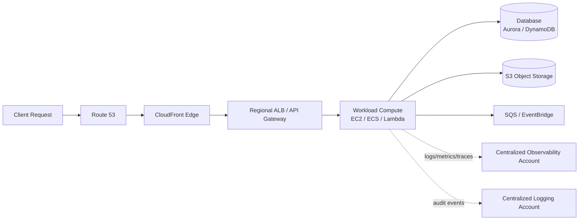
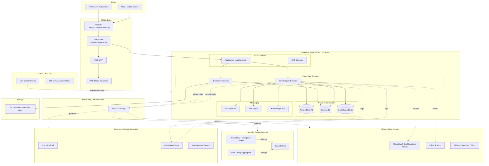
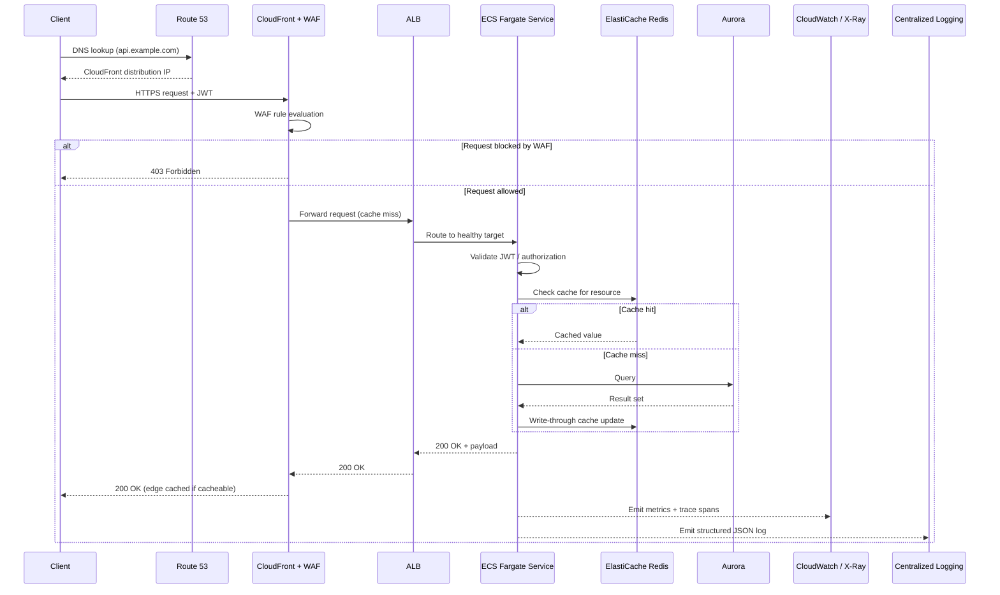
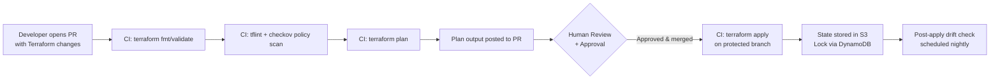
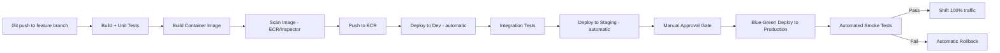
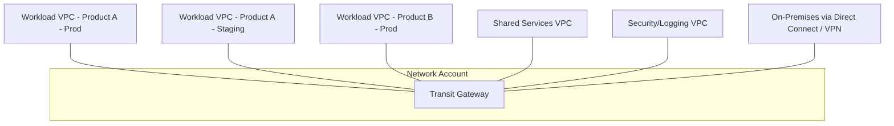
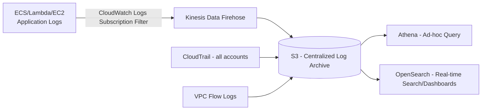

# Part XII – Resilience, Operations & Cost

# Chapter 100: Future-Proof Cloud Architecture

---

## 1. Executive Summary

### The Business Problem

Most AWS environments are not designed to last. They are designed to ship.

An engineering team stands up a VPC, an Application Load Balancer, a fleet of EC2 instances or a Lambda function, a relational database, and calls it "production." For the first twelve to eighteen months, this works. Then the organization grows, a new compliance requirement appears, traffic triples, a second region is required for legal reasons, and the team discovers that the architecture they built has no room to evolve.

This is the single most common failure pattern reviewed in enterprise architecture assessments:

- Compute is tightly coupled to a single deployment model, so migrating from EC2 to containers or serverless requires a rewrite rather than a migration.
- Networking was designed for one VPC and one region, so multi-region and multi-account expansion requires re-architecture rather than extension.
- Identity and access management grew organically, with no permission boundaries, so the blast radius of a single compromised credential is the entire account.
- Observability was bolted on after incidents happened, not designed in from day one, so mean-time-to-detect (MTTD) is measured in hours rather than minutes.
- Cost visibility did not exist until the first six-figure invoice arrived, at which point remediation is politically and technically expensive.

"Future-Proof Cloud Architecture" is the discipline of designing systems that can absorb these changes without requiring a rebuild. It is not a single AWS service or a single diagram — it is a set of architectural properties that, applied consistently, make an environment resilient to business change, technical change, regulatory change, and organizational change.

### Architecture Objective

The objective of this chapter is to define a reference architecture and an accompanying set of engineering practices that satisfy five properties simultaneously:

1. **Evolvability** — the ability to change compute models, database engines, regions, and account structures without a full rewrite.
2. **Operability** — the ability for a small platform team to run the system reliably, with automation replacing manual toil.
3. **Observability** — the ability to answer "what is happening right now, and why" within minutes, not hours.
4. **Cost Elasticity** — the ability to scale cost up and down with actual usage, and to detect anomalies before they become incidents on a finance report.
5. **Security by Default** — the ability to add new workloads to the platform without each team having to re-solve identity, encryption, logging, and network isolation from scratch.

This is achieved through a **landing-zone-anchored, multi-account, API-driven platform** that treats every workload — EC2, containers, serverless, and AI/ML — as a tenant of a shared, centrally governed foundation, rather than as a bespoke, one-off deployment.

### Why Organizations Adopt This Architecture

Organizations do not adopt future-proof architecture because it is elegant. They adopt it because the alternative has already cost them money, an incident, or an audit finding. The typical triggers are:

| Trigger | Typical Organizational Response |
|---|---|
| A security incident traced back to an over-permissioned IAM role | Mandate for least-privilege IAM and permission boundaries across all accounts |
| A regional outage that took down the only production environment | Mandate for multi-AZ minimum, multi-region roadmap |
| An unplanned AWS bill spike of 30–200% | Mandate for FinOps tagging, budgets, and anomaly detection |
| A compliance audit (SOC 2, PCI-DSS, HIPAA, FedRAMP) | Mandate for centralized logging, encryption at rest/in transit, and account segregation |
| A failed disaster recovery test (or the discovery that one had never been run) | Mandate for documented, tested RTO/RPO with cross-region backup |
| Engineering velocity collapsing under manual change approvals | Mandate for policy-as-code and self-service infrastructure via Terraform modules |
| M&A activity requiring rapid onboarding of a new business unit | Mandate for a repeatable landing zone rather than bespoke per-team AWS accounts |

None of these triggers require the organization to be "hyperscale." A 40-person engineering organization running a B2B SaaS product on AWS will hit at least two of these triggers within three years of a Series B raise. A future-proof architecture is not over-engineering for that organization — it is insurance purchased before the claim, which is dramatically cheaper than insurance purchased after.

### Major Business Benefits

**Reduced time-to-market for new products.** When compute, networking, identity, and observability are already standardized as reusable Terraform modules, a new product team can go from an approved design to a running production environment in days rather than months. The platform team does the undifferentiated heavy lifting once; every subsequent product team inherits it.

**Reduced blast radius of failure.** Multi-account isolation, least-privilege IAM, and network segmentation mean that a misconfiguration or compromise in one workload does not cascade into every other workload. This is both a security property and a reliability property.

**Predictable, governed cost.** Tagging standards, budgets, and cost anomaly detection convert cloud spend from a lagging indicator (discovered on the monthly invoice) to a leading indicator (alerted on within hours of the anomaly occurring).

**Auditable compliance posture.** Centralized CloudTrail, AWS Config, and Security Hub findings, aggregated into a security-tooling account, give the organization a single place to demonstrate control effectiveness to auditors, rather than reconstructing evidence across dozens of disconnected accounts.

**Engineering retention.** Teams that spend their time on undifferentiated infrastructure toil — chasing IAM permission errors, debugging ad-hoc networking, manually patching EC2 fleets — burn out faster and leave faster than teams working on product. A well-designed platform is a retention tool as much as a technical one.

**Optionality on compute model.** Because the platform separates the *workload contract* (how a service publishes its endpoints, logs, metrics, and secrets) from the *compute implementation* (EC2, ECS Fargate, Lambda, EKS), a team can migrate an individual service from EC2 to Fargate to Lambda as its traffic and cost profile change, without renegotiating how it integrates with the rest of the platform.

### Typical Enterprise Scenarios

This architecture pattern applies directly to:

- A **B2B SaaS company** post-Series-B that must pass its first SOC 2 Type II audit while doubling its customer base within twelve months, and cannot tolerate a full infrastructure rewrite during that period.
- A **financial services or insurance organization** that must demonstrate account-level segregation of duties, immutable audit logs, and tested disaster recovery to regulators (e.g., FFIEC, NAIC) on an annual cadence.
- A **healthcare technology company** subject to HIPAA that must isolate PHI-handling workloads into dedicated accounts with dedicated encryption keys and access logging, while sharing a common platform for non-PHI services.
- A **retail or media company** with highly seasonal or event-driven traffic (Black Friday, live sporting events) that needs elastic compute and CDN capacity that scales to 10–50x baseline for short windows without over-provisioning the other 350 days of the year.
- A **platform or marketplace business** onboarding third-party developers or partner integrations, where API-first design, rate limiting, and tenant isolation are core product requirements, not afterthoughts.
- Any organization undergoing **M&A** that needs to onboard an acquired company's workloads into a governed environment within weeks rather than years.

### A Note on Scope

This chapter deliberately does not prescribe a single "correct" compute model (EC2 vs. containers vs. serverless) or a single "correct" database engine. Prior chapters in this book (Chapters 5–58) cover those decisions in depth. This chapter instead defines the **foundation** — the account structure, network topology, identity model, observability platform, cost governance, and operational discipline — that makes those downstream decisions *reversible*. A future-proof architecture is best understood not as a fixed diagram but as a set of invariants that any workload, present or future, must satisfy to be considered production-ready on the platform.

---

## 2. Business Requirements

### 2.1 Business Drivers

- Support product growth from initial launch through IPO-scale operations without a foundational rewrite.
- Provide a repeatable onboarding path for new product teams, acquired companies, and new business units.
- Demonstrate compliance readiness (SOC 2, ISO 27001, PCI-DSS, HIPAA, or FedRAMP, depending on industry) on demand.
- Contain and predict cloud spend as a percentage of revenue (a standard FinOps KPI).
- Reduce mean-time-to-recovery (MTTR) for production incidents to minutes, not hours.

### 2.2 Functional Requirements

| ID | Requirement |
|---|---|
| FR-1 | The platform must support multiple compute models (EC2, ECS Fargate, EKS, Lambda) concurrently under a shared identity and network model. |
| FR-2 | The platform must provide self-service, policy-compliant infrastructure provisioning via Terraform modules and CI/CD pipelines. |
| FR-3 | The platform must centralize logging, metrics, and traces for every workload into a single observability account. |
| FR-4 | The platform must support workload isolation by account, environment (dev/staging/prod), and data sensitivity tier. |
| FR-5 | The platform must provide a documented, tested disaster recovery process with defined RTO/RPO per workload tier. |
| FR-6 | The platform must provide cost visibility per team, per product, and per environment, with automated anomaly alerting. |
| FR-7 | The platform must support secrets management with automated rotation for all credentials with a lifetime greater than 24 hours. |
| FR-8 | The platform must support AI-assisted operations (log analysis, anomaly triage, Terraform generation) as a first-class operational tool, not an experiment. |

### 2.3 Non-Functional Requirements

| Category | Requirement |
|---|---|
| Scalability | Support growth from 10,000 to 10,000,000 monthly active users without a change in account or network topology. |
| Availability | 99.95% for tier-1 workloads (≈4.4 hours downtime/year), 99.9% for tier-2, best-effort for tier-3/dev. |
| Latency | P99 API latency under 300ms for synchronous customer-facing APIs (region-local). |
| Compliance | SOC 2 Type II within 12 months of platform launch; PCI-DSS or HIPAA scoping isolated to dedicated accounts. |
| Security | Least-privilege IAM, encryption at rest and in transit for all data classified Confidential or higher, centralized audit logging with 400-day minimum retention. |
| Recovery | RPO ≤ 15 minutes for tier-1 databases; RTO ≤ 1 hour for tier-1 workloads in a single-region failure. |
| Cost | Cloud spend growth rate must not exceed revenue growth rate by more than 1.2x on a trailing-quarter basis. |

### 2.4 Scalability Goals

- Stateless compute layers must scale horizontally with no manual intervention, from a floor of 2 instances/tasks per AZ to a ceiling defined by account service quotas (proactively raised ahead of demand).
- Database read scaling must be achievable without application code changes (read replicas, Aurora Auto Scaling, or DynamoDB on-demand capacity).
- The network topology (VPC CIDR allocation) must support at minimum a 4x increase in subnets/accounts without re-addressing existing VPCs — this is why CIDR planning is treated as a top-5 architectural decision in Section 9.

### 2.5 Availability Requirements

Availability targets are tiered, not uniform. Treating every workload as if it were payments infrastructure is the single most common source of unnecessary cost and operational overhead in enterprise AWS environments.

| Tier | Example Workloads | Availability Target | Design Implication |
|---|---|---|---|
| Tier 1 | Customer-facing checkout, authentication, core API | 99.95%+ | Multi-AZ mandatory, multi-region on roadmap, automated failover |
| Tier 2 | Internal admin tools, reporting dashboards | 99.9% | Multi-AZ, manual or semi-automated failover acceptable |
| Tier 3 | Batch jobs, internal analytics, dev/test | 99.0% or best-effort | Single-AZ acceptable, no failover automation required |

### 2.6 Latency Requirements

- Edge-cacheable content (static assets, public API responses with high cache-hit potential) served via CloudFront with target P95 latency under 50ms globally.
- Dynamic, region-local API calls: P99 under 300ms.
- Cross-service internal calls within a VPC: P99 under 20ms (informs whether services can tolerate synchronous calls or require async messaging — see Chapter 26 and Chapter 79).

### 2.7 Compliance Requirements

Compliance requirements should be treated as **inputs to account structure**, not bolted onto an existing structure after the fact. Common frameworks and their primary architectural implications:

| Framework | Primary Architectural Implication |
|---|---|
| SOC 2 Type II | Centralized, immutable audit logging; documented change management; access reviews |
| PCI-DSS | Cardholder data environment (CDE) isolated into a dedicated account/VPC with network segmentation |
| HIPAA | PHI-handling workloads isolated into dedicated accounts with a signed AWS BAA, dedicated KMS keys |
| ISO 27001 | Formal risk register, documented ISMS, evidence of continual improvement |
| FedRAMP | GovCloud partition, FIPS 140-2 validated encryption, continuous monitoring (ConMon) |
| GDPR | Data residency controls (EU regions), data subject request tooling, encryption and pseudonymization |

### 2.8 Security Expectations

- No IAM user with long-lived access keys for human access; federated access via IAM Identity Center only.
- No workload IAM role with `*:*` or wildcard resource permissions in production.
- All data at rest encrypted with AWS KMS customer-managed keys (CMKs), not AWS-managed keys, for any data classified Confidential or above.
- All inter-service traffic encrypted in transit (TLS 1.2+).
- GuardDuty, Security Hub, and AWS Config enabled organization-wide from day one, not added reactively after an incident.

### 2.9 Recovery Objectives

| Workload Tier | RPO | RTO |
|---|---|---|
| Tier 1 (payments, auth) | ≤ 15 minutes | ≤ 1 hour |
| Tier 2 (core application) | ≤ 1 hour | ≤ 4 hours |
| Tier 3 (internal/batch) | ≤ 24 hours | ≤ 24 hours |

### 2.10 SLAs

External customer-facing SLAs should always be set with a margin below the internal availability target — e.g., if internal Tier 1 target is 99.95%, the customer-facing contractual SLA should be no tighter than 99.9%, preserving error budget for planned maintenance and unplanned degradation that does not breach the internal target.

### 2.11 Expected Workload and Growth

A future-proof architecture must be sized for the workload the business will have in 18–24 months, not the workload it has today, but must not be *built* at that scale on day one. This tension is resolved by:

- Designing the account structure, IAM model, and network topology for the 24-month scale (these are expensive to retrofit).
- Designing the compute and database *capacity* for the current scale, with clear, tested scaling paths (these are cheap to retrofit if the foundation is right).

---

## 3. Architecture Overview

### 3.1 Overall Design Philosophy

The architecture is built on four layered principles, each of which constrains the layer below it:

1. **Organizational layer** — AWS Organizations with a multi-account structure, managed through AWS Control Tower or a custom landing zone (Chapter 99 covers landing zone construction in full depth; this chapter assumes and extends it).
2. **Platform layer** — shared, centrally-owned services: networking (Transit Gateway hub), identity (IAM Identity Center), observability (centralized logging/metrics account), and security tooling (GuardDuty/Security Hub delegated administrator account).
3. **Workload layer** — individual product/application accounts, each provisioned from a standard Terraform module set, each free to choose its own compute model (EC2, ECS, EKS, Lambda) within platform guardrails.
4. **Delivery layer** — CI/CD pipelines, policy-as-code (e.g., OPA/Conftest or AWS Config rules), and AI-assisted operational tooling that operate across all of the above layers.

This is deliberately **not** a single-account, single-VPC design. Single-account designs are appropriate for Chapters 5–14 (early-stage, single-team products) but do not satisfy the compliance segregation, blast-radius containment, or multi-team scaling requirements defined in Section 2. The multi-account model is the single most important decision in this chapter — nearly every other architectural property (security isolation, cost attribution, compliance scoping, team autonomy) follows directly from it.

### 3.2 Core Components

| Component | Role |
|---|---|
| AWS Organizations + Control Tower | Account factory, guardrails (SCPs), consolidated billing |
| Transit Gateway | Hub-and-spoke network connectivity across all workload VPCs |
| IAM Identity Center | Federated human access (SSO) into all accounts |
| Centralized Logging Account | CloudTrail, VPC Flow Logs, Config, GuardDuty findings aggregation |
| Security Tooling Account | Security Hub, GuardDuty delegated admin, Inspector |
| Shared Services Account | CI/CD (CodePipeline or GitHub Actions runners), container registry (ECR), Terraform remote state (S3 + DynamoDB lock table) |
| Workload Accounts (per product/environment) | Application compute, databases, workload-specific IAM roles |
| Route 53 + CloudFront | Global DNS and edge distribution |
| Amazon Q / Bedrock | AI-assisted operations layer across logging, cost, and IaC generation |

### 3.3 How Components Interact

At a high level, a request enters through Route 53 and CloudFront (edge layer), is routed through a regional Application Load Balancer or API Gateway into the appropriate workload account's compute layer (application layer), which reads/writes to a database and object storage (data layer), while every component emits logs, metrics, and traces to the centralized observability account (control layer) and every network hop traverses Transit Gateway rather than direct VPC peering (network layer).

### 3.4 High-Level Workflow



### 3.5 Request Lifecycle

1. DNS resolution via Route 53 (latency-based or geo-routing for multi-region deployments).
2. TLS termination and edge caching at CloudFront; AWS WAF evaluates request against managed and custom rule groups.
3. Origin request forwarded to regional ALB (containers/EC2) or API Gateway (Lambda/serverless).
4. Authentication/authorization validated (Cognito, IAM Identity Center-federated, or custom JWT validation at the edge via Lambda@Edge/CloudFront Functions).
5. Business logic executes in the compute layer, calling downstream databases, caches, and internal services via Transit-Gateway-routed private connectivity.
6. Asynchronous side effects (notifications, analytics events, downstream processing) are published to SNS/SQS/EventBridge rather than executed synchronously in the request path.

### 3.6 Response Lifecycle

1. Compute layer returns a response, which is optionally cached at CloudFront according to cache-control headers.
2. Response and request metadata are logged structurally (JSON) to CloudWatch Logs, shipped to the centralized logging account.
3. Latency, error rate, and saturation metrics are emitted to CloudWatch (and optionally to a Prometheus-compatible endpoint for teams standardized on Grafana).
4. Distributed trace spans are emitted to AWS X-Ray for end-to-end request visibility across service boundaries.

### 3.7 Data Lifecycle

1. Transactional data is written to the primary database (Aurora/RDS Multi-AZ or DynamoDB with point-in-time recovery enabled).
2. Change data capture (CDC) or DynamoDB Streams propagates changes to downstream consumers (analytics, search indexing, cache invalidation) asynchronously.
3. Backups (automated snapshots) are taken on a schedule matching the tier's RPO and replicated cross-region for Tier 1 workloads.
4. Object data (uploads, generated assets, exports) is written to S3 with lifecycle policies transitioning it through storage classes (Standard → Standard-IA → Glacier) based on access patterns, and encrypted with SSE-KMS.
5. Data retained beyond its compliance-mandated retention period is automatically deleted via S3 Lifecycle rules or DynamoDB TTL, rather than relying on manual cleanup.

---

## 4. AWS Services Used

Each service below is scoped to this architecture's requirements. Services are introduced with purpose, selection rationale, alternatives considered, limitations, pricing considerations, and best practices, consistent with this book's standard for first-mention service explanations.

### 4.1 Compute

**Amazon EC2 (Elastic Compute Cloud)** provides resizable virtual machines. In this architecture, EC2 is used for workloads with specialized OS-level requirements, licensing constraints (e.g., BYOL software), or steady-state, predictable throughput where Reserved Instances/Savings Plans produce the lowest effective cost.

- *Why selected*: full control over the OS and runtime; broad compatibility with legacy or commercial software; predictable pricing at steady utilization.
- *Alternatives*: ECS Fargate (no OS management, per-second billing), Lambda (no server management, event-driven).
- *Limitations*: requires patch management, AMI lifecycle management, and capacity planning; slower to scale than serverless.
- *Pricing considerations*: On-Demand for unpredictable/bursty workloads, Savings Plans for steady-state (up to ~72% discount vs. On-Demand for 3-year, all-upfront commitments), Spot for fault-tolerant/batch workloads (up to ~90% discount).
- *Best practices*: use Auto Scaling Groups with mixed instance policies (On-Demand + Spot), bake golden AMIs (Chapter 11) rather than configuring instances at boot, and use SSM Session Manager instead of bastion hosts/SSH key distribution.

**AWS Lambda** runs code in response to events without provisioning servers, billed per millisecond of execution.

- *Why selected*: ideal for event-driven, bursty, or intermittent workloads (webhook processing, scheduled jobs, async event handlers) where idle capacity cost is unacceptable.
- *Alternatives*: ECS Fargate (better for long-running or high-throughput steady workloads), EC2 (better for workloads requiring specialized runtimes or exceeding Lambda's 15-minute execution limit).
- *Limitations*: 15-minute maximum execution duration, cold-start latency (mitigated with Provisioned Concurrency for latency-sensitive paths), 10GB memory ceiling, ephemeral storage limits.
- *Pricing considerations*: pay-per-invocation and per-GB-second; can be more expensive than EC2/Fargate at sustained high throughput — model both before committing.
- *Best practices*: keep functions small and single-purpose, externalize configuration to Parameter Store/Secrets Manager, use Lambda Power Tuning to right-size memory allocation (which also determines CPU allocation).

**Amazon ECS (Elastic Container Service) with Fargate** runs containers without managing the underlying EC2 fleet.

- *Why selected*: containerized workloads that need more control over runtime and longer execution windows than Lambda allows, without the operational overhead of managing Kubernetes control planes (contrast with EKS, Chapter 36).
- *Alternatives*: EKS (needed when the organization already has Kubernetes expertise/tooling investment, or requires multi-cloud portability), Lambda (for simpler event-driven workloads).
- *Limitations*: less granular infrastructure control than self-managed EC2; Fargate pricing per-vCPU/GB-hour is higher than equivalent EC2 On-Demand, offset by eliminated operational overhead.
- *Best practices*: use Fargate Spot for fault-tolerant workloads, right-size task CPU/memory using CloudWatch Container Insights data, and use service auto-scaling tied to custom CloudWatch metrics (queue depth, request count per target) rather than CPU alone.

### 4.2 Networking and Content Delivery

**Amazon VPC** provides an isolated logical network within AWS. Every workload account has its own VPC, connected via Transit Gateway rather than direct peering, to keep the network topology scalable as accounts are added (see Section 9 for full CIDR and topology design).

**Application Load Balancer (ALB)** distributes HTTP/HTTPS traffic across compute targets, supports path-based and host-based routing, and integrates natively with ECS, EC2, and Lambda targets.

- *Alternatives*: Network Load Balancer (NLB) for TCP/UDP or extreme-low-latency requirements; API Gateway for fully serverless request handling with built-in throttling, API keys, and usage plans.

**Amazon CloudFront** is AWS's global content delivery network (CDN), caching content at edge locations to reduce latency and origin load.

- *Why selected*: reduces P95 global latency, absorbs traffic spikes before they reach origin infrastructure, and integrates with AWS WAF and AWS Shield for edge-layer security.
- *Limitations*: cache invalidation adds operational complexity for highly dynamic content; incorrect cache-control headers are a common source of stale-data incidents (see Section 24, Failure Scenarios).

**Amazon Route 53** provides authoritative DNS, health checking, and traffic routing policies (latency-based, geolocation, weighted, failover).

**AWS Transit Gateway** acts as a cloud router, connecting an arbitrary number of VPCs and on-premises networks through a single hub, replacing an unmanageable full-mesh of VPC peering connections once an organization exceeds roughly 4–5 VPCs.

- *Why selected over VPC Peering*: peering connections do not support transitive routing (VPC A peered to B peered to C does not let A reach C), which becomes unworkable past a handful of VPCs. Transit Gateway is the standard AWS-recommended pattern for any organization with a multi-account, multi-VPC target state.
- *Pricing considerations*: charged per attachment-hour and per GB processed; still typically cheaper in engineering time than maintaining a peering mesh at scale.

**AWS PrivateLink** enables private connectivity to AWS services and third-party SaaS endpoints without traversing the public internet or requiring VPC peering, used here for shared-services access (e.g., a central artifact repository) from workload VPCs.

### 4.3 Data and Storage

**Amazon Aurora (PostgreSQL/MySQL-compatible)** is used for the primary relational data store for Tier 1/Tier 2 workloads requiring strong consistency and complex query support.

- *Alternatives*: standard RDS (lower cost, simpler, appropriate for Tier 3/dev workloads that do not need Aurora's storage auto-scaling or read-replica performance); DynamoDB (for workloads with predictable access patterns at very high scale where relational joins are not required).
- *Limitations*: higher baseline cost than RDS; Aurora Global Database (for multi-region) adds meaningful cost and replication lag (typically sub-second, but must be accounted for in the application's consistency model).

**Amazon DynamoDB** is a fully managed key-value/document NoSQL database used for workloads with high-throughput, predictable-access-pattern requirements (session storage, feature flags, high-volume event ingestion).

- *Best practices*: design partition keys for even distribution, use on-demand capacity mode for unpredictable traffic and provisioned capacity with auto-scaling for predictable steady-state traffic, enable point-in-time recovery (PITR) for all Tier 1/2 tables.

**Amazon S3** provides durable object storage (11 nines of durability) used for static assets, backups, data lake storage, and application file storage.

- *Best practices*: enable versioning and MFA delete on buckets holding critical/compliance data, use S3 Lifecycle policies to transition cold data to Glacier, enable S3 Block Public Access at the account level via SCP, and use S3 Object Lock for immutable audit/compliance evidence.

### 4.4 Messaging and Integration

**Amazon SNS (Simple Notification Service)** provides pub/sub messaging for fan-out notification patterns (one event, multiple subscribers).

**Amazon SQS (Simple Queue Service)** provides durable, at-least-once message queuing, used to decouple producers from consumers and to smooth traffic bursts (buffering).

**Amazon EventBridge** provides a serverless event bus supporting schema-based routing, third-party SaaS event sources, and scheduled rules, used as the backbone for the event-driven integration patterns discussed in Chapters 26 and 79.

- *Selection guidance*: use SQS for point-to-point work queues, SNS for simple fan-out, and EventBridge when you need content-based routing, schema registry, or SaaS integration — using EventBridge for everything by default adds unnecessary cost and complexity for simple queue use cases.

### 4.5 Identity, Security, and Governance

**AWS IAM** provides fine-grained access control to AWS resources; **IAM Identity Center** (formerly AWS SSO) provides federated human access across all accounts in the organization from a single identity source (Okta, Azure AD, or AWS-native), eliminating per-account IAM users.

**AWS KMS (Key Management Service)** manages encryption keys used for encryption at rest across S3, EBS, RDS/Aurora, DynamoDB, and Secrets Manager. Customer-managed keys (CMKs) are used for any data classified Confidential or above, giving the organization control over key rotation and access policy independent of AWS-managed defaults.

**AWS Secrets Manager** stores and automatically rotates database credentials, API keys, and other secrets, replacing hardcoded credentials and reducing the blast radius of credential leakage.

**AWS Systems Manager (SSM)** provides Parameter Store (configuration and non-secret/low-sensitivity secret storage), Session Manager (SSH/RDP-free instance access), Patch Manager, and Run Command for fleet-wide operational automation.

**Amazon GuardDuty** provides continuous, ML-based threat detection across CloudTrail, VPC Flow Logs, and DNS logs, with organization-wide delegated administration enabling a single security account to see findings across every workload account.

**AWS Security Hub** aggregates findings from GuardDuty, Inspector, Config, and third-party tools into a single, prioritized view mapped against standards (CIS AWS Foundations Benchmark, AWS Foundational Security Best Practices, PCI-DSS).

**AWS Config** continuously records resource configuration state and evaluates it against rules (managed or custom), providing both compliance evidence and drift detection.

**AWS CloudTrail** records every API call made within the AWS account/organization, forming the immutable audit trail required for SOC 2, PCI-DSS, and most other compliance frameworks. Organization-level trails should be enabled once at the management account level, aggregating logs from every member account into a centralized, access-restricted S3 bucket.

### 4.6 Observability

**Amazon CloudWatch** provides metrics, logs, dashboards, and alarms — the primary operational telemetry store in this architecture, detailed fully in Section 21.

**AWS X-Ray** provides distributed tracing across service boundaries, essential once an architecture moves beyond a single monolith into microservices or serverless fan-out, letting engineers see exactly which downstream call contributed to a slow or failed request.

> **Note:** This chapter treats service selection as inseparable from operational maturity. A service is not "best" in the abstract — it is best relative to the team's operational capability, compliance obligations, and cost sensitivity at a given point in the evolution path (see Section 34, Evolution Path).

---

## 5. Complete Architecture Diagram



**Diagram notes:**

- Dashed lines represent control-plane or telemetry traffic (logs, metrics, traces, findings); solid lines represent data-plane request traffic.
- The Security, Logging, Observability, and Identity accounts are drawn separately to reinforce that they are **not** part of the workload account — this separation is what gives the platform its blast-radius containment and auditability properties.
- Every workload VPC connects to shared accounts exclusively through Transit Gateway, never through direct peering or public internet routes.

---

## 6. Component-by-Component Explanation

### 6.1 Route 53

- **Purpose**: authoritative DNS resolution and traffic steering across regions/environments.
- **Responsibilities**: resolve public hostnames, execute health checks against regional endpoints, apply latency-based or failover routing policies.
- **Inputs**: DNS queries from clients and resolvers.
- **Outputs**: IP addresses or CNAME targets (CloudFront distribution, regional ALB).
- **Scaling**: fully managed, scales automatically; no capacity planning required.
- **High availability**: globally distributed anycast network; inherently multi-region.
- **Failure handling**: health-check-based automatic failover to a secondary region/endpoint.
- **Dependencies**: health check targets (ALB, CloudFront) must expose an accurate health endpoint.
- **Security**: DNSSEC signing available for public hosted zones; private hosted zones scoped to VPCs via Resolver rules.
- **Monitoring**: CloudWatch metrics for health check status; alarms on health check failures.

### 6.2 CloudFront + WAF + Shield

- **Purpose**: global edge caching, TLS termination, and edge-layer security.
- **Responsibilities**: cache static/cacheable dynamic content, enforce WAF rules (rate limiting, managed rule groups for OWASP Top 10, geo-blocking), absorb DDoS traffic via Shield.
- **Scaling**: automatic, backed by AWS's global edge network.
- **Failure handling**: origin failover configuration (primary/secondary origin group) for automatic origin-level failover.
- **Security**: WAF Web ACLs attached at the distribution; Shield Advanced provides DDoS cost protection and 24/7 DRT (DDoS Response Team) access for Tier 1 workloads.
- **Monitoring**: CloudFront real-time logs to Kinesis Data Firehose → S3/OpenSearch for cache-hit-ratio and origin-latency analysis.

### 6.3 Application Load Balancer

- **Purpose**: Layer 7 load balancing and routing within a region.
- **Responsibilities**: TLS termination (regional certs via ACM), health checking of targets, path/host-based routing to multiple backend services.
- **Scaling**: auto-scales capacity units transparently; no manual sizing.
- **High availability**: deployed across a minimum of two AZs; AWS-managed.
- **Failure handling**: unhealthy targets automatically removed from rotation based on configurable health check thresholds.
- **Dependencies**: target groups (ECS services, EC2 Auto Scaling Groups, Lambda functions), ACM certificates, security groups.
- **Monitoring**: CloudWatch metrics (TargetResponseTime, HTTPCode_Target_5XX_Count, UnHealthyHostCount) with alarms tied to SLO error budgets.

### 6.4 Compute Layer (ECS Fargate / Lambda / EC2)

- **Purpose**: execute business logic.
- **Responsibilities**: process requests, enforce application-level authorization, orchestrate calls to data and messaging layers.
- **Scaling**: ECS Service Auto Scaling on custom CloudWatch metrics (request count per target, queue depth); Lambda scales automatically per-invocation up to account concurrency limits; EC2 via Auto Scaling Groups with target-tracking policies.
- **High availability**: minimum two AZs for ECS/EC2; Lambda is inherently multi-AZ within a region.
- **Failure handling**: ECS service scheduler replaces failed tasks automatically; circuit breakers (Chapter 83) prevent cascading failure into downstream dependencies.
- **Dependencies**: IAM task/execution roles, Secrets Manager for credentials, VPC private subnets with NAT egress (or VPC endpoints to avoid NAT entirely for AWS API calls).
- **Security**: task-level IAM roles scoped to least privilege; container images scanned via ECR image scanning/Inspector before deployment.
- **Monitoring**: Container Insights for ECS; Lambda's native CloudWatch metrics (Duration, Errors, Throttles, ConcurrentExecutions).

### 6.5 Aurora / RDS

- **Purpose**: durable, strongly consistent relational data storage.
- **Responsibilities**: transactional reads/writes, enforce referential integrity, serve read replicas for read-heavy workloads.
- **Scaling**: Aurora storage auto-scales up to 128TB; compute scaling via instance class changes or Aurora Serverless v2 for variable workloads; read scaling via read replicas (up to 15 for Aurora).
- **High availability**: Multi-AZ deployment with automatic failover (typically under 30 seconds for Aurora); optionally extended with Aurora Global Database for cross-region DR.
- **Failure handling**: automated failover to a standby/reader promoted to writer; application must implement retry logic with exponential backoff for the brief failover window.
- **Dependencies**: KMS CMK for encryption at rest, Secrets Manager for credential rotation, security groups restricting access to application subnets only.
- **Monitoring**: Enhanced Monitoring and Performance Insights for query-level visibility; CloudWatch alarms on CPUUtilization, FreeableMemory, DatabaseConnections, ReplicaLag.

### 6.6 DynamoDB

- **Purpose**: high-throughput, low-latency key-value/document storage for predictable access patterns.
- **Scaling**: on-demand mode scales automatically to any observed traffic level; provisioned mode with auto-scaling policies for predictable, cost-sensitive workloads.
- **High availability**: synchronously replicated across three AZs by default; Global Tables for active-active multi-region.
- **Failure handling**: fully managed; no failover action required by operators.
- **Security**: encryption at rest by default (AWS-owned or CMK); fine-grained access control via IAM condition keys on partition key values (useful for multi-tenant isolation).
- **Monitoring**: CloudWatch metrics for ConsumedReadCapacityUnits/ConsumedWriteCapacityUnits, ThrottledRequests, and SystemErrors.

### 6.7 S3

- **Purpose**: durable object storage for application data, backups, and logs.
- **Scaling**: virtually unlimited; request-rate scaling is automatic but benefits from partitioned key prefixes at very high request rates.
- **High availability**: 99.99% availability SLA, 11 nines durability, data replicated across a minimum of three AZs within a region (Standard storage class).
- **Security**: Block Public Access enforced at the account level; bucket policies scoped to specific roles; SSE-KMS encryption; access logging and CloudTrail data events for audit-sensitive buckets.
- **Monitoring**: S3 Storage Lens for organization-wide usage/cost visibility; EventBridge notifications on object-level events for downstream processing triggers.

### 6.8 SQS / SNS / EventBridge

- **Purpose**: decouple producers and consumers, buffer bursts, and route events.
- **Scaling**: fully managed, virtually unlimited throughput (SQS standard queues); FIFO queues capped at 3,000 msg/sec with batching.
- **Failure handling**: dead-letter queues (DLQs) capture messages that fail processing after a configured number of retries, preventing silent message loss and poison-pill loops.
- **Monitoring**: ApproximateNumberOfMessagesVisible (queue depth) and ApproximateAgeOfOldestMessage as primary alarm signals for consumer-side backpressure.

### 6.9 Centralized Security, Logging, Observability, and Identity Accounts

- **Purpose**: provide platform-wide guardrails, evidence, and access control, isolated from any single workload's blast radius.
- **Responsibilities**: aggregate CloudTrail/Config/GuardDuty/Security Hub findings; store centralized logs with restricted write-once access; host cross-account dashboards; issue federated, time-limited credentials via IAM Identity Center and STS.
- **Security**: these accounts themselves carry the platform's strictest SCPs (no resource creation outside of the platform team's Terraform pipeline; no human IAM users; break-glass access only via a documented, logged emergency procedure).
- **Monitoring**: these accounts monitor everything else — but they must also be monitored, typically by a small, independent alarm set (root user login attempts, SCP changes, break-glass role assumption) reviewed by the security team directly.

---

## 7. End-to-End Request Flow

The following trace follows a single authenticated API request from a mobile client through the full stack, showing every hop, control point, and telemetry emission.



### Step-by-Step Narrative

1. **Client** initiates a request to `api.example.com`.
2. **Route 53** resolves the hostname to the CloudFront distribution using a latency-based routing policy (or a failover policy if multi-region is active).
3. **CloudFront** receives the request; if the response is already cached and fresh (`Cache-Control` header respected), it is returned immediately with no origin hit.
4. **AWS WAF**, attached to the CloudFront distribution, evaluates the request against managed rule groups (SQLi, XSS, known bad IPs) and custom rate-based rules. Requests exceeding the configured rate threshold per IP are blocked before reaching the origin.
5. On a cache miss, CloudFront forwards the request to the **regional ALB** over a persistent, TLS-encrypted connection.
6. The **ALB** evaluates listener rules (host/path-based routing) and forwards the request to a healthy target in the appropriate ECS target group.
7. The **application** (ECS Fargate task) validates the JWT bearer token, either locally (via cached JWKS) or via a call to the identity provider, and enforces resource-level authorization.
8. The application checks **ElastiCache Redis** for a cached representation of the requested resource.
9. On a cache miss, the application queries **Aurora**, using a connection pool (RDS Proxy recommended at scale to avoid connection exhaustion under Lambda/high-concurrency ECS scaling) and writes the result back to Redis (write-through or cache-aside, per the service's caching strategy).
10. The application returns the response through the ALB and CloudFront back to the client.
11. In parallel, the application emits structured JSON logs to CloudWatch Logs (shipped to the centralized logging account via a subscription filter), emits custom and default metrics to CloudWatch, and emits X-Ray trace segments capturing the latency breakdown of each downstream call (cache lookup, DB query, any external API call).
12. **Error handling**: if the database call times out, the application's circuit breaker (Chapter 83) opens after a configured failure threshold, returning a fast, degraded response (e.g., stale cache data or a `503` with `Retry-After`) rather than allowing requests to queue and exhaust compute resources. The circuit breaker state itself is emitted as a metric, so an open circuit triggers an alarm distinct from a generic error-rate alarm.

---

## 8. Deployment Flow

### 8.1 Infrastructure Provisioning Philosophy

All infrastructure in this architecture is provisioned through Terraform, never through the AWS Console in any account above `dev`. Console access in staging/production accounts is restricted by SCP to read-only, enforced organization-wide (see Section 10). This is not a stylistic preference — it is what makes the environment auditable, reproducible, and safe to hand off between engineers.

### 8.2 Terraform Workflow



- **State management**: Terraform state is stored in a versioned, encrypted S3 bucket in the shared-services account, with a DynamoDB table providing state locking to prevent concurrent, conflicting applies. State buckets are never shared across environments (separate state files/backends per account/environment).
- **Module structure**: reusable modules (`vpc`, `ecs-service`, `rds-aurora`, `iam-role`) are versioned and published to a private Terraform module registry (or a tagged Git repository), consumed by thin, environment-specific root modules that primarily supply variables.
- **Policy as code**: `checkov` or `tfsec` scans every plan for security misconfigurations (open security groups, unencrypted resources, overly permissive IAM) before a human ever reviews it, catching the majority of common mistakes before they reach review.

### 8.3 CI/CD Deployment (Application Code)



### 8.4 Blue-Green Deployment

Production deployments use a blue-green strategy (via CodeDeploy for ECS, or weighted target groups for EC2/ALB):

1. New task definition (green) is deployed alongside the running version (blue), receiving 0% of live traffic initially.
2. Automated smoke tests execute against the green environment directly (bypassing the load balancer's public listener via a test-only path or an internal test endpoint).
3. Traffic is shifted incrementally — commonly 10% → 50% → 100% — with CloudWatch alarms monitored at each step (error rate, latency, and a small set of business-level metrics such as checkout success rate).
4. If any alarm breaches its threshold during the shift, CodeDeploy automatically rolls back to blue and traffic reverts to 100% on the previous version within seconds, with zero manual intervention required.

> **Tip:** The single highest-leverage investment a team can make in deployment safety is wiring the rollback alarms to *business* metrics, not just infrastructure metrics. A deployment can look perfectly healthy on CPU and error rate while quietly breaking checkout conversion.

### 8.5 Rollback

- **Infrastructure rollback**: `terraform plan` against the previous Git commit's state, reviewed and applied through the same pipeline as any other change — infrastructure rollback is never a manual, out-of-band console action.
- **Application rollback**: automatic via CodeDeploy alarm-triggered rollback (Section 8.4), or manual redeployment of the previous container image tag/Lambda version alias.
- **Database rollback**: schema migrations must be backward-compatible for at least one deployment cycle (the "expand/contract" pattern — add new columns/tables in one release, migrate data, remove old columns in a later release) so that an application rollback never requires a simultaneous destructive schema rollback.

### 8.6 Secrets and Configuration in the Pipeline

- CI/CD pipelines assume a short-lived, least-privilege IAM role via OIDC federation (for GitHub Actions/GitLab CI) rather than storing long-lived AWS access keys as pipeline secrets.
- Runtime secrets (database credentials, third-party API keys) are never injected as pipeline environment variables into the running application; the application resolves them at startup directly from Secrets Manager/Parameter Store using its own task IAM role.
- Environment-specific, non-secret configuration (feature flags, service endpoints) is stored in SSM Parameter Store, organized by a consistent hierarchy: `/{env}/{service}/{parameter-name}`.

### 8.7 Deployment Validation

- Automated post-deploy smoke tests validate critical user journeys (login, checkout, core API contract) against the newly deployed version before traffic is fully shifted.
- Synthetic canary monitoring (CloudWatch Synthetics) runs the same critical-path checks continuously in production, independent of any specific deployment, providing an early warning signal distinct from deployment-time validation.

---

## 9. Network Topology

### 9.1 VPC and CIDR Planning

CIDR planning is one of the few architectural decisions in AWS that is genuinely expensive to reverse — re-addressing a live VPC used by dozens of services is a multi-week, high-risk project. It must be planned for the organization's 3–5 year account growth, not its current account count.

| Scope | CIDR Allocation Example | Notes |
|---|---|---|
| Organization supernet | `10.0.0.0/8` | Reserved centrally; never assigned directly to a VPC |
| Per-region block | `10.{region_id}.0.0/16` | e.g., `10.1.0.0/16` for us-east-1, `10.2.0.0/16` for eu-west-1 |
| Per-account VPC | `/20` per workload account within its region block | Supports ~4,096 IPs; enough for large ECS/EKS fleets |
| Per-AZ subnet tier | `/24` per subnet (public, app, data) per AZ | Three tiers × three AZs = nine `/24` subnets per VPC, with room to spare in the `/20` |

> **Warning:** Do not allocate `/16` VPCs "just in case." Oversized VPCs are harmless in isolation but make Transit Gateway route table review and IP-based troubleshooting significantly harder at scale. Size for 3–5 years of realistic growth, not for infinity.

### 9.2 Subnet Tiers

- **Public subnets**: host only internet-facing load balancers and NAT Gateways. No application compute or database resources are ever placed in a public subnet.
- **Private application subnets**: host ECS tasks, EC2 application instances, and Lambda functions (when VPC-attached). Outbound internet access via NAT Gateway (or, preferably, VPC endpoints for AWS service calls to avoid NAT data-processing charges entirely).
- **Private data subnets**: host Aurora/RDS instances, ElastiCache clusters. No route to the internet at all — not even via NAT. Access is restricted to specific security groups in the application tier.

### 9.3 NAT Gateway and Internet Gateway

- **Internet Gateway (IGW)**: attached once per VPC, provides the path for public subnet resources (ALB, NAT Gateway) to reach the internet.
- **NAT Gateway**: deployed per-AZ (not a single shared NAT Gateway) to avoid a cross-AZ single point of failure and to avoid inter-AZ data transfer charges on egress traffic. This is a common cost/reliability trade-off point — see Section 34, Cost Surprises.

### 9.4 Transit Gateway Topology



- Route tables on the Transit Gateway are segmented by environment (a `prod` TGW route table that only production VPCs can reach; a `nonprod` route table for dev/staging), preventing accidental connectivity between a staging environment and a production database.
- Workload VPCs never peer directly with each other; all inter-VPC traffic transits the Transit Gateway, giving the network team a single place to apply routing policy and a single set of Flow Logs to monitor for the entire east-west traffic pattern.

### 9.5 Route Tables and Network ACLs

- Route tables are provisioned per-subnet-tier via Terraform module, not hand-edited — public subnets route `0.0.0.0/0` to the IGW, private app subnets route `0.0.0.0/0` to the AZ-local NAT Gateway, and private data subnets have no default route at all.
- Network ACLs are used sparingly, as a coarse-grained defense-in-depth layer (e.g., explicitly denying known-bad CIDR ranges), while security groups carry the primary, fine-grained access control burden — NACLs are stateless and harder to reason about at scale, and over-reliance on them is a common anti-pattern (see Section 27).

### 9.6 Security Groups

- Security groups reference other security groups by ID rather than CIDR ranges wherever possible (e.g., "allow port 5432 from the `app-tier-sg`" rather than "allow port 5432 from `10.1.2.0/24`"), so that the rule remains correct even as subnets are resized or added.
- No security group in this architecture permits inbound access from `0.0.0.0/0` except the ALB's security group on ports 443/80, which is itself further protected by WAF and Shield at the CloudFront layer in front of it.

### 9.7 PrivateLink

- Used for two purposes in this architecture: (1) exposing a shared internal service (e.g., a central feature-flag or entitlement service in the shared-services account) to consuming workload VPCs without full network peering, and (2) reaching third-party SaaS platforms that offer a PrivateLink endpoint (e.g., certain observability or data-platform vendors), keeping that traffic off the public internet entirely.

### 9.8 Hybrid Connectivity

For organizations with on-premises data centers (a Datacenter-to-Cloud migration in progress, or a permanent hybrid posture for data residency reasons), **AWS Direct Connect** provides a dedicated, private network circuit into an AWS Direct Connect location, terminated at the Transit Gateway via a Direct Connect Gateway. A **Site-to-Site VPN** is layered on top as a lower-cost, lower-throughput backup path for Direct Connect circuit failure, not as the primary hybrid connectivity method for any Tier 1 workload.

---

## 10. Identity and Access

### 10.1 IAM Roles vs. IAM Users

Human access to any AWS account in this architecture is **never** granted through IAM users with long-lived access keys. All human access is federated through **IAM Identity Center**, which issues short-lived, temporary credentials via STS after authentication against the organization's identity provider (Okta, Azure AD, or Identity Center's native directory). IAM users are reserved for a small number of documented break-glass scenarios and service accounts that genuinely cannot use a role (rare, and increasingly rare as AWS service coverage for IAM roles expands).

### 10.2 IAM Policies and Least Privilege

- Every workload IAM role is scoped to the specific resources and actions that workload requires, identified by ARN, never by wildcard resource (`*`) in production. Example: a service that reads from one specific S3 bucket gets `s3:GetObject` on that bucket's ARN, not `s3:*` on `*`.
- Policies are authored and reviewed as Terraform-managed JSON, version-controlled, and subject to the same PR review process as any other infrastructure change.
- **Permission boundaries** are attached to any IAM role capable of creating other IAM roles (e.g., a CI/CD deployment role), capping the maximum permissions that role can ever grant to a role it creates — this prevents a compromised or misconfigured pipeline from provisioning a role with permissions broader than the platform allows, even if the Terraform code itself contains a mistake.

### 10.3 Resource Policies

- S3 bucket policies, KMS key policies, and SQS/SNS resource policies are used in combination with IAM identity policies to enforce access at the resource boundary — critical for cross-account access patterns (e.g., the centralized logging bucket's policy explicitly allows `PutObject` only from the specific CloudTrail/Config service principals and specific source-account IDs in the organization, not from the account root broadly).

### 10.4 STS and Cross-Account Access

- Cross-account access (e.g., a CI/CD pipeline in the shared-services account deploying into a workload account) uses `sts:AssumeRole` with an external ID and a trust policy scoped to the specific source role ARN — never a broad "trust the entire account" trust policy.
- Session duration for assumed roles is capped (typically 1 hour for automated pipeline roles, up to 4 hours for human federated sessions), limiting the window in which a leaked credential remains useful.

### 10.5 Service Roles

- Every compute resource (ECS task, Lambda function, EC2 instance via instance profile) has its own dedicated IAM role — services are never given a shared, generic "app role" — so that a permission granted to one service cannot be silently exploited by a different, co-located service.

### 10.6 Permission Boundaries and Guardrails at Scale

- **Service Control Policies (SCPs)**, applied at the AWS Organizations OU level, provide an outer bound on what any IAM principal in an account can do, regardless of how permissive that principal's own IAM policy is. Example SCPs used in this architecture: deny disabling of CloudTrail/Config/GuardDuty, deny creation of IAM users outside the identity account, deny use of regions not on the organization's approved region list, deny public S3 bucket policies.
- This two-layer model — SCPs as the outer, organization-enforced bound, and IAM policies as the inner, workload-specific grant — is what allows the platform team to give individual product teams real autonomy (they can write and apply their own IAM policies within their account) without losing organization-wide control over the things that matter most (compliance logging cannot be turned off, data cannot leave approved regions, no account can silently become a security hole).

---

## 11. Security Architecture

### 11.1 Encryption

- **At rest**: every data store (S3, EBS, Aurora/RDS, DynamoDB, Secrets Manager parameters) is encrypted using AWS KMS. Confidential-or-above data uses customer-managed keys (CMKs) with key policies restricting `kms:Decrypt` to the specific IAM roles that legitimately need it, and automatic annual key rotation enabled.
- **In transit**: TLS 1.2+ enforced for all public endpoints (ALB listener policies, CloudFront viewer protocol policy set to "HTTPS only"), and for internal service-to-service traffic where the compliance profile (PCI-DSS, HIPAA) requires it, using ACM Private CA-issued certificates or a service mesh's mutual TLS (Chapter 37).

### 11.2 AWS WAF and Shield

- WAF Web ACLs combine AWS Managed Rule Groups (Core Rule Set, Known Bad Inputs, SQLi) with custom rate-based rules tuned to the application's actual traffic patterns, reviewed and adjusted quarterly as traffic evolves.
- Shield Standard is active by default at no additional cost on every CloudFront distribution and ALB. **Shield Advanced** is added for Tier 1, internet-facing production workloads where a volumetric DDoS event would have material business impact, providing cost protection against scaling charges incurred during an attack and access to the AWS DDoS Response Team.

### 11.3 Secrets Manager and Certificate Manager

- Secrets Manager stores database credentials with automatic rotation configured via the native RDS/Aurora rotation Lambda, on a 30-day rotation schedule for Tier 1 workloads.
- AWS Certificate Manager (ACM) issues and auto-renews public TLS certificates for ALB/CloudFront, eliminating manual certificate renewal as an operational task and its associated outage risk.

### 11.4 GuardDuty, Inspector, and Security Hub

- **GuardDuty** is enabled organization-wide with a delegated administrator account, providing continuous threat detection (anomalous API calls, compromised credential usage patterns, cryptomining behavior, malicious IP communication) without requiring any agent deployment.
- **Amazon Inspector** continuously scans EC2 instances, ECR container images, and Lambda functions for known software vulnerabilities (CVEs), integrated into the CI/CD pipeline as a deployment gate for critical/high severity findings.
- **Security Hub** aggregates GuardDuty, Inspector, and Config findings into a single prioritized view, scored against the CIS AWS Foundations Benchmark and AWS Foundational Security Best Practices standard, giving the security team one dashboard instead of four.

### 11.5 CloudTrail and AWS Config

- An **organization-level CloudTrail** is enabled once, in the management account, capturing management and data events from every member account into a centralized, encrypted, access-restricted S3 bucket with Object Lock enabled (write-once, immutable for the compliance retention period).
- **AWS Config**, with an aggregator in the security account, continuously evaluates every resource in every account against managed and custom rules (e.g., `s3-bucket-public-read-prohibited`, `encrypted-volumes`, a custom rule requiring specific tags), providing both real-time drift alerts and point-in-time compliance evidence for audits.

### 11.6 Zero Trust Principles Applied

This architecture applies zero trust principles pragmatically rather than dogmatically:

- No implicit trust based on network location alone — being inside the VPC is not sufficient authorization; every service-to-service call is still authenticated (IAM SigV4 for AWS API calls, mTLS or signed JWTs for application-to-application calls).
- Every access decision is logged and attributable to a specific principal, never a shared credential.
- Segmentation is enforced at multiple layers simultaneously (account boundary, VPC boundary, security group, IAM policy) so that a failure in any single control does not result in a full compromise.

### 11.7 Threat Model and Attack Vectors

| Attack Vector | Primary Mitigation | Secondary/Defense-in-Depth |
|---|---|---|
| Credential leakage (leaked access key, compromised CI secret) | Short-lived STS credentials, no long-lived keys | GuardDuty anomalous API call detection, IAM Access Analyzer |
| SSRF against internal metadata service | IMDSv2 enforced on all EC2 instances | Security groups restricting outbound to known destinations |
| SQL injection / application-layer attack | WAF managed rule groups | Parameterized queries, least-privilege DB user per service |
| Over-permissioned IAM role exploited post-compromise | Least-privilege IAM authored per service | Permission boundaries, Access Analyzer unused-access findings |
| Public S3 bucket misconfiguration | Account-level Block Public Access via SCP | Config rule `s3-bucket-public-read-prohibited`, Security Hub alert |
| Supply chain compromise (malicious dependency/container base image) | Image scanning (Inspector/ECR) as a deployment gate | SBOM generation, dependency pinning, Dependabot/Renovate |
| DDoS / volumetric attack | CloudFront + Shield Advanced | WAF rate-based rules, Auto Scaling absorbing legitimate burst |
| Insider threat / excessive standing access | Federated, time-limited access via Identity Center | CloudTrail review, quarterly access reviews, Access Analyzer |

---

## 12. High Availability

### 12.1 AZ Failures

- Every Tier 1/2 component is deployed across a minimum of two, and preferably three, Availability Zones: ALB targets, ECS tasks (spread via placement constraints), Aurora Multi-AZ, NAT Gateway per AZ, DynamoDB (inherently multi-AZ).
- The loss of a single AZ should be a non-event from a customer perspective: capacity in the remaining AZs absorbs the shifted load, provided Auto Scaling floor capacity accounts for N-1 AZ availability (i.e., the minimum instance/task count is sized so two AZs alone can still serve peak load, not just three).

### 12.2 Instance/Task Failures

- ECS service scheduler and EC2 Auto Scaling Groups both continuously replace unhealthy instances/tasks based on health check failures (ALB target health checks, ECS container health checks), with no human intervention required for the common case.

### 12.3 Regional Failures

- Regional failure is the highest-severity, lowest-frequency event this architecture plans for. Tier 1 workloads have a documented and *tested* (Section 13) path to failover to a secondary region; Tier 2/3 workloads accept regional-failure downtime within their defined RTO as a cost/complexity trade-off, rather than paying for full active-active multi-region for every workload uniformly (see Chapter 98 for the dedicated Multi-Region Active-Active pattern, which this chapter's Tier 1 workloads adopt selectively).

### 12.4 Database Failures

- Aurora Multi-AZ failover to a standby replica typically completes within 30 seconds, during which the application's connection pool and retry logic (exponential backoff with jitter) determine whether the failover is invisible to the end user or surfaces as a brief, retried delay.
- DynamoDB requires no failover action — AWS manages replica placement and failure transparently within the table's replication.

### 12.5 Load Balancing and Health Checks

- ALB health checks are configured with an interval and threshold tuned to the workload's actual startup time and failure characteristics — a health check that is too aggressive causes healthy-but-slow-starting tasks to be killed in a restart loop; one that is too lax delays removal of a genuinely unhealthy target.
- Health check endpoints validate real dependency health (can the service reach its database and cache), not just process liveness — a service that responds `200 OK` while unable to reach its database is worse than one that fails its health check and is removed from rotation.

### 12.6 Failover

- Route 53 health-check-based failover routing is used for the DNS layer of any multi-region Tier 1 workload, with health checks validating the *application's* health endpoint at the regional ALB, not merely TCP reachability.

---

## 13. Disaster Recovery

### 13.1 Backup Strategy

| Data Store | Backup Method | Frequency | Cross-Region Copy |
|---|---|---|---|
| Aurora/RDS | Automated snapshots + continuous transaction log backup | Continuous (5-min RPO capability) | Yes, for Tier 1 |
| DynamoDB | Point-in-time recovery (PITR) | Continuous (35-day window) | Global Tables for Tier 1 |
| S3 | Versioning + Cross-Region Replication (CRR) | Continuous | Yes, for Tier 1 buckets |
| EBS (EC2 workloads) | AWS Backup scheduled snapshots | Daily, retained per policy | Yes, for Tier 1 |
| Configuration (Terraform state, IaC) | Git repository + S3 versioned backend | Every commit | Git remote is inherently distributed |

### 13.2 DR Strategy Selection

| Strategy | RTO | RPO | Relative Cost | When to Use |
|---|---|---|---|---|
| Backup & Restore | Hours | Hours | $ | Tier 3, dev/test, low-criticality internal tools |
| Pilot Light | 10s of minutes | Minutes | $$ | Tier 2 workloads where a small always-on DR footprint is acceptable |
| Warm Standby | Minutes | Seconds–Minutes | $$$ | Tier 1 workloads requiring fast recovery without full active-active cost |
| Multi-Site Active-Active | Near-zero | Near-zero | $$$$ | Tier 1 workloads with the highest revenue/compliance sensitivity (payments, core auth) |

This architecture's default posture is **Warm Standby** for Tier 1 workloads: a scaled-down but fully functional replica of the production stack runs continuously in a secondary region, with the database replicating asynchronously (Aurora Global Database, typically sub-second lag) and compute capacity pre-provisioned at a fraction of production scale, ready to be scaled up rapidly during a failover event. Full **Active-Active** (Chapter 98) is reserved for the small subset of workloads where even a Warm Standby's minutes-scale RTO is unacceptable — this is a deliberate cost decision, not a default.

### 13.3 DR Runbook Outline (Warm Standby Failover)

1. Declare a regional disaster per the documented incident-severity criteria (not a single engineer's unilateral judgment call — requires incident commander sign-off).
2. Promote the secondary region's Aurora Global Database secondary cluster to a standalone writer.
3. Scale the secondary region's ECS services / Auto Scaling Groups from standby capacity to full production capacity (automated via a pre-tested Terraform variable flip and CI/CD pipeline run, not manual console changes).
4. Update Route 53 failover routing (or manually shift weighted routing if health-check-based failover has not already triggered).
5. Validate critical user journeys via the same automated smoke-test suite used in normal deployments.
6. Communicate status to stakeholders per the incident communication plan.
7. Post-incident: once the primary region recovers, plan and execute a controlled fail-back during a low-traffic window, never as an emergency action.

### 13.4 DR Testing

> **Warning:** A disaster recovery plan that has never been tested is a disaster recovery *hypothesis*, not a plan. The single most common finding in enterprise architecture reviews is a documented DR runbook that has never actually been executed, and which fails in ways the documentation did not anticipate the first time it is genuinely needed.

- Tier 1 DR failover is tested via a full **game day** exercise at minimum twice per year, executing the actual runbook against the actual secondary region (not a tabletop walkthrough), with results feeding back into runbook corrections.
- Tier 2/3 backup restoration is tested quarterly via automated restore-and-validate jobs (restore latest snapshot to a scratch environment, run data-integrity checks, tear down), providing continuous confidence in backup validity without the cost of a full regional failover exercise.

---

## 14. Scalability

### 14.1 Horizontal Scaling

- The default scaling model for all stateless compute (ECS tasks, EC2 instances behind an ASG) is horizontal — add more identical units — rather than vertical, because horizontal scaling has no upper ceiling tied to a single instance's maximum size and provides better fault isolation (losing one of twenty tasks is a rounding error; losing the one oversized instance handling all traffic is an outage).

### 14.2 Vertical Scaling

- Reserved for stateful components where horizontal scaling is harder to achieve transparently — primarily the database writer instance. Aurora supports fast instance-class resizing (typically under a minute of brief connection interruption) as a lower-risk lever than a full architecture change when a single workload's write throughput temporarily exceeds its current instance class.

### 14.3 Auto Scaling Configuration

- **Target-tracking scaling policies** are preferred over step-scaling for most workloads — define a target (e.g., 60% average CPU, or a custom ALB request-count-per-target metric) and let AWS manage the scale-out/scale-in rate, which handles the common case correctly with far less tuning than manually authored step policies.
- **Predictive scaling** (for EC2 Auto Scaling Groups) is layered on top of target tracking for workloads with strong, recurring daily/weekly traffic patterns (e.g., a B2B SaaS product with a predictable 9am weekday traffic ramp), pre-scaling capacity ahead of the predicted demand curve rather than reacting after the fact.

### 14.4 Serverless Scaling

- Lambda scales per-invocation automatically, bounded by the account/region concurrency limit (a soft limit, raised proactively for Tier 1 workloads well ahead of projected peak, per Section 34's Scaling Limits discussion).
- **Provisioned Concurrency** is applied selectively to latency-sensitive Lambda functions in the synchronous request path, trading a fixed, always-on cost for the elimination of cold-start latency — a decision made per-function based on actual P99 latency data, not applied blanket across every function.

### 14.5 Database Scaling

- **Read scaling**: Aurora read replicas (up to 15) fronted by the Aurora reader endpoint, which load-balances read traffic automatically; application code must explicitly route read-only queries to the reader endpoint to benefit.
- **Write scaling**: for workloads that outgrow a single Aurora writer's throughput, the architecture evolution path (Section 34) moves toward sharding, a purpose-built high-throughput store (DynamoDB), or Aurora Limitless Database for horizontally-scaled writes — this is a significant application-layer change and is planned for well before it becomes an emergency.
- **DynamoDB**: on-demand mode absorbs unpredictable scale automatically; provisioned mode with auto-scaling is used once traffic is predictable enough to make the cost savings worth the (minor) added configuration.

### 14.6 Storage Scaling

- S3 scales transparently with no operator action; at extremely high request rates (thousands of requests/second to a single prefix), key-naming strategy (avoiding sequential prefixes) ensures even partitioning across S3's internal infrastructure.
- Aurora storage auto-scales up to 128TB with zero downtime and no manual provisioning step.

### 14.7 Queue Scaling

- SQS consumer scaling is tied to queue depth (`ApproximateNumberOfMessagesVisible`) as the primary Auto Scaling/ECS Service Auto Scaling metric, ensuring consumer capacity tracks backlog rather than a proxy metric like CPU, which may not correlate with actual processing demand for I/O-bound consumers.

---

## 15. Performance Optimization

### 15.1 Caching

- **Edge caching** (CloudFront) for static assets and cacheable API responses, with cache keys deliberately scoped (excluding irrelevant query parameters/headers from the cache key) to maximize hit ratio without serving incorrect cached responses to different users.
- **Application caching** (ElastiCache Redis) for frequently read, expensive-to-compute, or expensive-to-query data, using a cache-aside pattern for most read paths and write-through for data where staleness is unacceptable even for seconds.
- **Database query caching**: Aurora's built-in query cache assists read-heavy, repetitive query patterns, but is treated as a secondary optimization behind proper indexing and application-level caching, not a substitute for either.

### 15.2 Compression

- Gzip/Brotli compression enabled at CloudFront and at the ALB/application layer for text-based responses (JSON, HTML, CSS, JS), typically reducing payload size 60–80% for JSON-heavy APIs with negligible CPU cost.

### 15.3 CDN Strategy

- Static assets are versioned in their filename/path (content hashing) so they can be cached at the edge with a far-future `Cache-Control` header, while API responses use short-TTL or no-cache headers with careful, explicit cache-control per endpoint rather than a single blanket CDN policy for the whole origin.

### 15.4 Database Optimization

- Query performance is reviewed continuously via Performance Insights (Aurora) rather than only during incident response; the top-N slowest/most-frequent queries are reviewed on a recurring cadence as a standing operational practice, not a reactive one.
- Indexes are added deliberately, based on observed query patterns from Performance Insights, not speculatively — over-indexing has a real write-throughput and storage cost.

### 15.5 Connection Pooling

- **RDS Proxy** (or an application-level pooler like PgBouncer for self-managed cases) is used whenever compute scales elastically (Lambda, or ECS with frequent scale events), because a database has a hard connection limit that a fleet of independently-scaling compute instances can exhaust far faster than the database itself becomes CPU or I/O bound.

### 15.6 Concurrency and Async Processing

- Any operation that does not need to complete synchronously within the request/response cycle (email sending, report generation, third-party webhook delivery, analytics event recording) is moved out of the synchronous request path into an SQS-backed asynchronous worker, directly improving P99 latency and reducing the blast radius of a slow downstream dependency.

---

## 16. Cost Optimization (FinOps)

### 16.1 Illustrative Cost Estimates

> **Note:** The figures below are illustrative order-of-magnitude estimates for a typical workload matching this chapter's architecture, using approximate US East (N. Virginia) On-Demand pricing patterns as of this writing. They are intended to establish relative scale and cost drivers, not to substitute for AWS Pricing Calculator or Cost Explorer analysis of an actual workload.

| Deployment Size | Profile | Estimated Monthly AWS Spend |
|---|---|---|
| Small | 1 workload account, single region, ~50k MAU, ECS Fargate (4–8 tasks), Aurora (db.r6g.large Multi-AZ), moderate S3/CloudFront usage | ~$3,000–$6,000 |
| Medium | 3–5 workload accounts, single region with warm-standby DR, ~500k MAU, ECS Fargate (20–40 tasks) + some Lambda, Aurora (db.r6g.2xlarge Multi-AZ + 2 read replicas), higher CloudFront/data transfer volume | ~$25,000–$50,000 |
| Enterprise | 15+ workload accounts, multi-region active-active for Tier 1, several million MAU, mixed EC2/ECS/EKS/Lambda, Aurora Global Database, dedicated compliance accounts, Shield Advanced, extensive observability tooling | ~$150,000–$500,000+ |

### 16.2 Major Cost Drivers

| Driver | Typical % of Bill | Notes |
|---|---|---|
| Compute (EC2/ECS/Lambda) | 30–45% | Largest lever; most responsive to Savings Plans and rightsizing |
| Data transfer (inter-AZ, NAT, internet egress) | 10–20% | Frequently underestimated during initial design |
| Database (Aurora/RDS/DynamoDB) | 15–25% | Instance class and read-replica count are primary levers |
| Storage (S3, EBS, backups) | 5–10% | Lifecycle policy discipline is the primary lever |
| Logging/Observability | 5–15% | CloudWatch Logs ingestion/storage grows silently without retention policy discipline |
| Networking (Transit Gateway, VPN, Direct Connect) | 3–8% | Scales with account/VPC count |

### 16.3 Optimization Levers

| Lever | Applies To | Typical Savings |
|---|---|---|
| Savings Plans (Compute) | EC2, Fargate, Lambda steady-state usage | Up to ~66% vs. On-Demand at 1-year no-upfront, more at 3-year all-upfront |
| Reserved Instances | RDS/Aurora steady-state instances | Up to ~60% vs. On-Demand |
| Spot Instances | Fault-tolerant batch, CI runners, dev/test | Up to ~90% vs. On-Demand |
| Rightsizing | EC2, RDS instance classes | 10–40%, often the single fastest win in a cost review |
| S3 Lifecycle policies | Object storage, backups | 40–70% on storage that is genuinely cold |
| Graviton (ARM) instances | EC2, Fargate, RDS | ~20% better price-performance vs. equivalent x86 |
| VPC Endpoints instead of NAT for AWS API traffic | Any AWS-service-heavy workload | Eliminates NAT data processing charges on that traffic |

### 16.4 Tagging and Cost Allocation

A **mandatory tagging policy**, enforced by SCP (deny resource creation without required tags) and validated by AWS Config, underpins all cost attribution in this architecture:

| Tag Key | Example Value | Purpose |
|---|---|---|
| `environment` | `prod`, `staging`, `dev` | Environment-level cost and access segregation |
| `product` | `checkout-service` | Product/team-level cost attribution |
| `cost-center` | `CC-4521` | Finance chargeback mapping |
| `owner` | `team-payments` | Operational ownership and on-call routing |
| `data-classification` | `confidential`, `internal`, `public` | Security/compliance control mapping |

### 16.5 Budgets and Cost Anomaly Detection

- **AWS Budgets** are configured per account and per cost-center tag, with alert thresholds at 50%/80%/100%/forecasted-100% of the monthly budget, notifying both the owning team and the FinOps function.
- **AWS Cost Anomaly Detection** monitors spend patterns per service/account using ML-based baselining, alerting on statistically significant deviations (e.g., a Lambda function's cost tripling week-over-week) well before that deviation would be noticed on a monthly invoice review — this is the primary control against the "unexpected six-figure bill" failure mode described in Section 1.

### 16.6 FinOps Operating Cadence

| Cadence | Activity |
|---|---|
| Daily | Automated Cost Anomaly Detection alerts triaged by platform on-call |
| Weekly | Cost Explorer review of top-5 cost-driving services against forecast |
| Monthly | Cross-team cost review meeting; rightsizing recommendations from Compute Optimizer reviewed and actioned |
| Quarterly | Reserved Instance/Savings Plan coverage and utilization review; renewal/purchase decisions |
| Annually | Full architecture cost review against the evolving business growth curve |

---

## 17. AI-Assisted Operations

### 17.1 Amazon Q

**Amazon Q Developer** and **Amazon Q Business** provide AI-assisted capabilities across the development and operations lifecycle used in this architecture:

- **Amazon Q Developer** assists with code generation, code review, and — relevant to this chapter — Terraform/CloudFormation generation and explanation, accelerating the authoring of new infrastructure modules while still requiring the same PR review and policy-as-code scanning as any human-authored change.
- **Amazon Q in the console** assists operators during incident response by answering natural-language questions about resource configuration and recent changes ("what changed on this ALB in the last 24 hours") faster than manually cross-referencing CloudTrail.

### 17.2 Amazon Bedrock

**Amazon Bedrock** provides managed access to foundation models (Anthropic Claude, Amazon Titan/Nova, and others) via a single API, used in this architecture's operational tooling layer for:

- **Log analysis and anomaly triage**: summarizing large volumes of structured CloudWatch Logs into a human-readable incident summary during the first minutes of an on-call page, reducing time-to-understanding before time-to-mitigation.
- **Capacity planning narrative**: translating raw CloudWatch/Cost Explorer trend data into a written capacity forecast for quarterly planning reviews.
- **Architecture review assistance**: given a Terraform plan or an architecture diagram, providing a first-pass review against the organization's own documented standards (fed to the model as context/RAG source, per Chapter 52), which a human architect then validates — this accelerates, but does not replace, human architecture review.

### 17.3 AI-Generated Terraform and Documentation

- AI-assisted Terraform generation is treated identically to human-authored Terraform in the pipeline described in Section 8: it must pass `checkov`/`tfsec` policy scanning, produce a reviewable `terraform plan`, and receive human approval before merge. AI generation changes *who/what* authors the first draft; it does not change the review and guardrail process.
- AI-generated documentation (runbooks, architecture summaries) is used to keep documentation from going stale — generating a draft update automatically when infrastructure changes are merged — but is reviewed by the owning team before being treated as authoritative, particularly for disaster recovery runbooks where an inaccurate AI-generated step during an actual incident would be actively harmful.

> **Warning:** AI-assisted operations tooling should never be given standing write access to production infrastructure. Every AI-suggested change — whether a Terraform diff, a scaling action, or a remediation step — passes through the same human-reviewed, policy-scanned pipeline as any other change. AI accelerates diagnosis and drafting; it does not bypass change control.

---

## 18. Terraform Implementation

The following examples illustrate the modular structure described in Section 8. They are intentionally representative rather than exhaustive — production modules would include additional variables, validation blocks, and outputs.

### 18.1 Repository/Module Structure

```

terraform/
├── modules/
│   ├── vpc/
│   ├── ecs-service/
│   ├── rds-aurora/
│   ├── iam-role/
│   └── observability/
├── environments/
│   ├── prod/
│   │   ├── main.tf
│   │   ├── variables.tf
│   │   └── backend.tf
│   ├── staging/
│   └── dev/
└── global/
    ├── organizations/
    └── scp/

```

### 18.2 Remote State Backend

```hcl

# environments/prod/backend.tf

terraform {
  backend "s3" {
    bucket         = "acme-tfstate-prod-use1"
    key            = "workloads/checkout-service/terraform.tfstate"
    region         = "us-east-1"
    dynamodb_table = "acme-tfstate-lock"
    encrypt        = true
    kms_key_id     = "arn:aws:kms:us-east-1:111122223333:key/abcd-1234"
  }

  required_providers {
    aws = {
      source  = "hashicorp/aws"
      version = "~> 5.0"
    }
  }
}

```

### 18.3 Provider Configuration

```hcl

# environments/prod/main.tf

provider "aws" {
  region = var.aws_region

  assume_role {
    role_arn     = "arn:aws:iam::${var.account_id}:role/TerraformDeploymentRole"
    session_name = "terraform-prod-apply"
  }

  default_tags {
    tags = {
      environment = var.environment
      product     = var.product_name
      cost-center = var.cost_center
      managed-by  = "terraform"
    }
  }
}

```

### 18.4 VPC Module (excerpt)

```hcl

# modules/vpc/main.tf

variable "vpc_cidr" {
  description = "CIDR block for the VPC, sized per Section 9 CIDR plan"
  type        = string
}

variable "availability_zones" {
  description = "List of AZs to deploy across (minimum 2 for HA)"
  type        = list(string)

  validation {
    condition     = length(var.availability_zones) >= 2
    error_message = "At least 2 Availability Zones are required for high availability."
  }
}

resource "aws_vpc" "this" {
  cidr_block           = var.vpc_cidr
  enable_dns_support   = true
  enable_dns_hostnames = true

  tags = {
    Name = "${var.environment}-${var.product_name}-vpc"
  }
}

resource "aws_subnet" "private_app" {
  for_each          = toset(var.availability_zones)
  vpc_id            = aws_vpc.this.id
  cidr_block        = cidrsubnet(var.vpc_cidr, 4, index(var.availability_zones, each.value) + 3)
  availability_zone = each.value

  tags = {
    Name = "${var.environment}-app-${each.value}"
    Tier = "private-app"
  }
}

resource "aws_subnet" "private_data" {
  for_each          = toset(var.availability_zones)
  vpc_id            = aws_vpc.this.id
  cidr_block        = cidrsubnet(var.vpc_cidr, 4, index(var.availability_zones, each.value) + 6)
  availability_zone = each.value

  tags = {
    Name = "${var.environment}-data-${each.value}"
    Tier = "private-data"
  }
}

resource "aws_nat_gateway" "this" {
  for_each      = toset(var.availability_zones)
  allocation_id = aws_eip.nat[each.value].id
  subnet_id     = aws_subnet.public[each.value].id

  tags = {
    Name = "${var.environment}-nat-${each.value}"
  }
}

output "vpc_id" {
  value = aws_vpc.this.id
}

output "private_app_subnet_ids" {
  value = [for s in aws_subnet.private_app : s.id]
}

output "private_data_subnet_ids" {
  value = [for s in aws_subnet.private_data : s.id]
}

```

### 18.5 ECS Fargate Service Module (excerpt)

```hcl

# modules/ecs-service/main.tf

resource "aws_ecs_task_definition" "this" {
  family                   = "${var.environment}-${var.service_name}"
  requires_compatibilities = ["FARGATE"]
  network_mode             = "awsvpc"
  cpu                      = var.task_cpu
  memory                   = var.task_memory
  execution_role_arn       = aws_iam_role.execution.arn
  task_role_arn            = aws_iam_role.task.arn

  container_definitions = jsonencode([
    {
      name      = var.service_name
      image     = "${var.ecr_repository_url}:${var.image_tag}"
      essential = true
      portMappings = [{ containerPort = var.container_port, protocol = "tcp" }]
      logConfiguration = {
        logDriver = "awslogs"
        options = {
          "awslogs-group"         = "/ecs/${var.environment}/${var.service_name}"
          "awslogs-region"        = var.aws_region
          "awslogs-stream-prefix" = "ecs"
        }
      }
      secrets = [
        {
          name      = "DB_PASSWORD"
          valueFrom = "${var.db_secret_arn}:password::"
        }
      ]
    }
  ])
}

resource "aws_ecs_service" "this" {
  name            = "${var.environment}-${var.service_name}"
  cluster         = var.cluster_id
  task_definition = aws_ecs_task_definition.this.arn
  desired_count   = var.desired_count
  launch_type     = "FARGATE"

  network_configuration {
    subnets          = var.private_app_subnet_ids
    security_groups  = [aws_security_group.service.id]
    assign_public_ip = false
  }

  load_balancer {
    target_group_arn = var.target_group_arn
    container_name    = var.service_name
    container_port    = var.container_port
  }

  deployment_circuit_breaker {
    enable   = true
    rollback = true
  }

  lifecycle {
    ignore_changes = [desired_count] # managed by application auto scaling
  }
}

resource "aws_appautoscaling_target" "this" {
  max_capacity       = var.max_capacity
  min_capacity       = var.min_capacity
  resource_id        = "service/${var.cluster_id}/${aws_ecs_service.this.name}"
  scalable_dimension = "ecs:service:DesiredCount"
  service_namespace  = "ecs"
}

resource "aws_appautoscaling_policy" "cpu" {
  name               = "${var.service_name}-cpu-target-tracking"
  policy_type        = "TargetTrackingScaling"
  resource_id        = aws_appautoscaling_target.this.resource_id
  scalable_dimension = aws_appautoscaling_target.this.scalable_dimension
  service_namespace  = aws_appautoscaling_target.this.service_namespace

  target_tracking_scaling_policy_configuration {
    predefined_metric_specification {
      predefined_metric_type = "ECSServiceAverageCPUUtilization"
    }
    target_value       = 60.0
    scale_in_cooldown  = 300
    scale_out_cooldown = 60
  }
}

```

### 18.6 IAM Role Module (least-privilege example)

```hcl

# modules/iam-role/main.tf

data "aws_iam_policy_document" "task_permissions" {
  statement {
    sid       = "AllowSpecificS3Bucket"
    effect    = "Allow"
    actions   = ["s3:GetObject", "s3:PutObject"]
    resources = ["${var.s3_bucket_arn}/*"]
  }

  statement {
    sid       = "AllowSecretsManagerRead"
    effect    = "Allow"
    actions   = ["secretsmanager:GetSecretValue"]
    resources = [var.db_secret_arn]
  }

  statement {
    sid       = "AllowKmsDecryptForOwnSecrets"
    effect    = "Allow"
    actions   = ["kms:Decrypt"]
    resources = [var.kms_key_arn]
    condition {
      test     = "StringEquals"
      variable = "kms:ViaService"
      values   = ["secretsmanager.${var.aws_region}.amazonaws.com"]
    }
  }
}

resource "aws_iam_role" "task" {
  name               = "${var.environment}-${var.service_name}-task-role"
  assume_role_policy = data.aws_iam_policy_document.ecs_assume_role.json
  permissions_boundary = var.permissions_boundary_arn
}

resource "aws_iam_role_policy" "task" {
  name   = "${var.service_name}-task-policy"
  role   = aws_iam_role.task.id
  policy = data.aws_iam_policy_document.task_permissions.json
}

```

### 18.7 Best Practices Applied Above

- Every module validates its critical inputs (`validation` blocks) rather than trusting the caller.
- `deployment_circuit_breaker` is enabled by default on every ECS service, so a bad deployment auto-rolls-back without waiting for a human to notice.
- `desired_count` is explicitly excluded from Terraform's management via `lifecycle.ignore_changes`, because Application Auto Scaling — not the last-applied Terraform plan — owns that value at runtime; failing to do this is a common source of Terraform "fighting" the auto scaler on every apply.
- IAM policies are scoped to specific resource ARNs and, where relevant, further constrained with `condition` blocks — never a bare `"Resource": "*"` in a production task role.

---

## 19. AWS CLI Examples

### 19.1 Deployment

```bash

# Force a new ECS deployment after a new task definition/image is pushed

aws ecs update-service \
  --cluster prod-shared-cluster \
  --service prod-checkout-service \
  --force-new-deployment \
  --region us-east-1

# Check deployment rollout status

aws ecs describe-services \
  --cluster prod-shared-cluster \
  --services prod-checkout-service \
  --query 'services[0].deployments'

```

### 19.2 Validation

```bash

# Validate Terraform plan output for a specific environment

terraform -chdir=environments/prod plan -out=tfplan
terraform -chdir=environments/prod show -json tfplan | checkov --framework terraform_plan -f -

# Validate an IAM policy for unintended access using IAM Access Analyzer

aws accessanalyzer validate-policy \
  --policy-document file://task-policy.json \
  --policy-type IDENTITY_POLICY

```

### 19.3 Monitoring

```bash

# Tail live application logs for a service

aws logs tail /ecs/prod/checkout-service --follow --since 10m

# Get current ALB target health status

aws elbv2 describe-target-health \
  --target-group-arn arn:aws:elasticloadbalancing:us-east-1:111122223333:targetgroup/checkout-tg/abc123

# Query CloudWatch for P99 latency over the last hour

aws cloudwatch get-metric-statistics \
  --namespace AWS/ApplicationELB \
  --metric-name TargetResponseTime \
  --dimensions Name=LoadBalancer,Value=app/prod-alb/abc123 \
  --start-time $(date -u -d '1 hour ago' +%Y-%m-%dT%H:%M:%S) \
  --end-time $(date -u +%Y-%m-%dT%H:%M:%S) \
  --period 300 \
  --statistics p99

```

### 19.4 Troubleshooting

```bash

# List recent CloudTrail events for a specific IAM role (who did what, when)

aws cloudtrail lookup-events \
  --lookup-attributes AttributeKey=Username,AttributeValue=prod-checkout-task-role \
  --max-results 20

# Check GuardDuty findings for the current account, filtered to high severity

aws guardduty list-findings \
  --detector-id $(aws guardduty list-detectors --query 'DetectorIds[0]' --output text) \
  --finding-criteria '{"Criterion":{"severity":{"Gte":7}}}'

# Inspect the last 5 Auto Scaling activities for a service to diagnose scale-in/scale-out behavior

aws autoscaling describe-scaling-activities \
  --auto-scaling-group-name prod-checkout-asg \
  --max-items 5

# Check for recent throttling on a DynamoDB table

aws cloudwatch get-metric-statistics \
  --namespace AWS/DynamoDB \
  --metric-name ThrottledRequests \
  --dimensions Name=TableName,Value=prod-sessions \
  --start-time $(date -u -d '1 hour ago' +%Y-%m-%dT%H:%M:%S) \
  --end-time $(date -u +%Y-%m-%dT%H:%M:%S) \
  --period 300 \
  --statistics Sum

```

### 19.5 Cleanup

```bash

# Identify unattached EBS volumes across the account (common cost leak)

aws ec2 describe-volumes \
  --filters Name=status,Values=available \
  --query 'Volumes[*].{ID:VolumeId,Size:Size,CreateTime:CreateTime}'

# Identify unused Elastic IPs (billed hourly when not associated)

aws ec2 describe-addresses \
  --query 'Addresses[?AssociationId==null].{IP:PublicIp,AllocationId:AllocationId}'

# Dry-run destroy of a decommissioned environment (always plan before destroy)

terraform -chdir=environments/dev-sandbox plan -destroy -out=tfplan-destroy

```

---

## 20. CI/CD Integration

### 20.1 Platform Comparison

| Platform | Strength in This Architecture | Consideration |
|---|---|---|
| GitHub Actions | Native OIDC federation to AWS, large ecosystem of pre-built actions, simplest to adopt for teams already on GitHub | Self-hosted runners recommended for VPC-internal deployment steps at scale |
| GitLab CI | Strong built-in security scanning, integrated container registry | Best fit for orgs already standardized on GitLab for SCM |
| Jenkins | Maximum flexibility, well-suited to complex legacy pipeline requirements | Highest operational overhead; requires the platform team to own patching/scaling of Jenkins infrastructure itself |
| AWS CodePipeline | Deepest native integration with CodeDeploy blue-green and AWS-native approval gates | Weaker ecosystem outside AWS; less familiar to teams coming from GitHub/GitLab-centric workflows |

This architecture's reference implementation uses **GitHub Actions** with **OIDC federation**, avoiding any long-lived AWS credentials stored as CI secrets.

### 20.2 Example GitHub Actions Terraform Pipeline

```yaml

name: terraform-plan-apply

on:
  pull_request:
    paths: ["terraform/environments/prod/**"]
  push:
    branches: [main]
    paths: ["terraform/environments/prod/**"]

permissions:
  id-token: write   # required for OIDC
  contents: read
  pull-requests: write

jobs:
  plan:
    runs-on: ubuntu-latest
    steps:
      - uses: actions/checkout@v4

      - name: Configure AWS Credentials via OIDC
        uses: aws-actions/configure-aws-credentials@v4
        with:
          role-to-assume: arn:aws:iam::111122223333:role/GitHubActionsTerraformRole
          aws-region: us-east-1

      - uses: hashicorp/setup-terraform@v3

      - name: Terraform Init
        run: terraform -chdir=terraform/environments/prod init

      - name: Terraform Validate
        run: terraform -chdir=terraform/environments/prod validate

      - name: Policy Scan (Checkov)
        run: |
          pip install checkov
          checkov -d terraform/environments/prod --compact

      - name: Terraform Plan
        run: terraform -chdir=terraform/environments/prod plan -out=tfplan

      - name: Post Plan to PR
        if: github.event_name == 'pull_request'
        run: terraform -chdir=terraform/environments/prod show -no-color tfplan | gh pr comment ${{ github.event.pull_request.number }} --body-file -
        env:
          GH_TOKEN: ${{ secrets.GITHUB_TOKEN }}

  apply:
    needs: plan
    if: github.ref == 'refs/heads/main'
    runs-on: ubuntu-latest
    environment: production  # requires manual approval configured in repo settings
    steps:
      - uses: actions/checkout@v4
      - name: Configure AWS Credentials via OIDC
        uses: aws-actions/configure-aws-credentials@v4
        with:
          role-to-assume: arn:aws:iam::111122223333:role/GitHubActionsTerraformRole
          aws-region: us-east-1
      - uses: hashicorp/setup-terraform@v3
      - run: terraform -chdir=terraform/environments/prod init
      - run: terraform -chdir=terraform/environments/prod apply -auto-approve

```

### 20.3 Security Scanning in the Pipeline

- **Static analysis**: `checkov`/`tfsec` for Terraform, `bandit`/`semgrep` for application code, run on every PR as a required check.
- **Container scanning**: ECR native scanning (or Inspector) on every image push, with a policy gate blocking deployment of images containing Critical or High severity CVEs without an explicit, time-boxed, documented exception.
- **Secret scanning**: `gitleaks` or GitHub's native secret scanning runs on every push, catching accidentally committed credentials before they reach a remote branch history that would otherwise require credential rotation and history rewriting to fully remediate.

### 20.4 Policy as Code

- Organization-wide guardrails that must never be bypassed by an individual pipeline (e.g., "no security group may allow `0.0.0.0/0` on port 22") are enforced twice: once as a `checkov`/`tfsec` custom policy in every pipeline, and again as an AWS Config rule that will flag (and, for select critical rules, auto-remediate via SSM Automation) any resource that reaches production despite the pipeline check — a defense-in-depth pairing rather than reliance on the pipeline check alone.

### 20.5 Rollback in CI/CD

- Terraform rollback: revert the merge commit and let the pipeline apply the reverted configuration through the normal flow — never a manual `terraform apply` against an old plan file outside the pipeline's audit trail.
- Application rollback: as described in Section 8.5, either automatic (CodeDeploy alarm-triggered) or a one-click re-run of the pipeline's "deploy" job pinned to the previous known-good image tag.

---

## 21. Monitoring

### 21.1 CloudWatch as the Telemetry Backbone

CloudWatch is the default metrics and alarms store for this architecture, chosen for its zero-setup native integration with every AWS service used above — every ALB, ECS service, Lambda function, and Aurora cluster emits metrics to CloudWatch automatically, with no agent installation required for AWS-native metrics.

### 21.2 Dashboards

- A **service-level dashboard** per Tier 1/2 workload, showing the four golden signals (latency, traffic, errors, saturation) plus any business-specific metric (e.g., checkout success rate), owned and maintained by the service team itself.
- A **platform-level dashboard**, owned by the platform team, aggregating cross-account health (account service quota utilization, GuardDuty finding counts, budget burn-down) for the weekly platform operations review.

### 21.3 Metrics and SLIs/SLOs

| SLI | Example SLO | Error Budget Implication |
|---|---|---|
| Availability (successful requests / total requests) | 99.95% over rolling 30 days | ~21.6 minutes/month of allowed downtime |
| Latency (P99 request duration) | 300ms | Deployments/experiments pause if P99 SLO is breached |
| Durability (data loss events) | Zero tolerance for Tier 1 | Any occurrence triggers a mandatory postmortem |

- **Error budgets** are the mechanism that turns an SLO from an aspirational number into an actionable operational policy: once a service's error budget for the period is exhausted, new feature deployments to that service pause in favor of reliability work, until the budget resets at the start of the next period. This policy must be agreed upon and enforced organizationally, not just technically, to have any real effect.

### 21.4 Logs, Alarms, and Notification Routing

- CloudWatch Alarms are configured per SLO-relevant metric, routed via SNS to a paging system (PagerDuty/Opsgenie) for Tier 1 breaches and to a Slack channel for Tier 2/3 or informational alerts — alarm severity and routing are deliberately differentiated so that on-call engineers are only paged for things that genuinely require immediate human action, directly countering alert fatigue.

### 21.5 Distributed Tracing (X-Ray)

- Every service in the request path (Section 7) propagates the X-Ray trace context, giving end-to-end visibility into exactly which downstream call contributed the most latency to a slow request — essential once the architecture includes more than one or two services in the synchronous call path, and a frequent gap in environments that only instrumented metrics and logs.

---

## 22. Logging

### 22.1 Centralized Logging Architecture



### 22.2 CloudWatch Logs and Retention

- Every application emits structured (JSON) logs, never unstructured plain text, so that downstream tools (Athena, OpenSearch) can query specific fields (request ID, user ID, latency) without regex parsing.
- Log group retention is set explicitly per environment — 30 days in CloudWatch Logs for `dev`/`staging`, 14 days for `prod` (with everything beyond 14 days already shipped to the S3 long-term archive), rather than the CloudWatch default of "never expire," which silently accumulates storage cost indefinitely.

### 22.3 S3 Archive and Athena

- Logs shipped to S3 are partitioned by account/service/date (Hive-style partitioning), enabling Athena queries scoped to a specific time range and service to scan only the relevant partition rather than the entire archive, keeping ad-hoc investigation queries both fast and cheap.
- The S3 archive bucket has Object Lock enabled in compliance mode for the audit-log prefix, satisfying the immutability requirement common to SOC 2/PCI-DSS evidence retention.

### 22.4 OpenSearch for Real-Time Search

- A subset of high-value logs (application error logs, security-relevant audit events) is additionally indexed into Amazon OpenSearch Service for real-time, full-text search during active incident response — Athena's query latency (seconds to minutes) is acceptable for retrospective investigation but too slow for live incident triage, which is why both destinations exist rather than one or the other alone.

### 22.5 Retention Policy Summary

| Log Type | Hot Storage (CloudWatch/OpenSearch) | Cold Archive (S3) | Total Retention |
|---|---|---|---|
| Application logs | 14 days | Glacier after 90 days | 400 days |
| CloudTrail (audit) | 90 days (OpenSearch) | Glacier after 90 days, Object Lock | 7 years (compliance-driven) |
| VPC Flow Logs | 14 days | Glacier after 30 days | 1 year |
| Access/ALB logs | N/A (S3 direct) | Glacier after 90 days | 1 year |

### 22.6 Audit Logging

- Audit logging (who did what, when, from where) is treated as a distinct data class from operational/debug logging: it is written to an access-restricted, Object-Lock-enabled bucket that even the platform team's normal operational IAM roles cannot delete from, with access to that bucket itself logged via S3 data-event CloudTrail logging — an intentionally paranoid, self-referential control that is a standard expectation in any SOC 2/PCI-DSS audit.

---

## 23. Operational Excellence

### 23.1 Runbooks

- Every Tier 1/2 service has a living runbook (stored as versioned Markdown alongside the service's code, not in a disconnected wiki) covering: how to deploy, how to roll back, how to scale manually in an emergency, how to interpret its top 5 alarms, and who to escalate to.

### 23.2 Automation

- Toil — any manual, repetitive, automatable operational task — is tracked explicitly (a labeled backlog category) and is a standing agenda item in the platform team's sprint planning, with a target of reducing measured toil hours quarter over quarter. Common automation targets in this architecture: patch application (via SSM Patch Manager, scheduled maintenance windows), certificate renewal (ACM, already automatic), and routine access reviews (automated via IAM Access Analyzer reports feeding a review workflow rather than a manual spreadsheet).

### 23.3 Patch Management

- EC2 fleets are patched via SSM Patch Manager on a defined maintenance-window cadence (weekly for non-critical patches, expedited out-of-band for critical CVEs flagged by Inspector), applied first to a canary subset of instances before fleet-wide rollout.
- Container-based workloads (ECS/EKS) are "patched" by rebuilding and redeploying container images from updated base images on a scheduled cadence (weekly), rather than patching running containers in place — consistent with the immutable infrastructure principle (Chapter 12).

### 23.4 Maintenance

- Planned maintenance windows are communicated in advance for any activity with customer-visible impact, and are scheduled against known low-traffic periods identified from historical CloudWatch traffic data, not scheduled arbitrarily.

### 23.5 Incident Response

- A defined incident severity matrix (SEV1–SEV4) determines paging urgency, communication cadence, and whether an incident commander role is activated.
- Every SEV1/SEV2 incident is followed by a **blameless postmortem** within 5 business days, producing concrete, owned, tracked action items — a postmortem that does not produce tracked follow-up work is considered incomplete.

### 23.6 Change Management

- All production changes flow through the CI/CD pipeline described in Section 20; "change management" in this architecture is therefore largely *enforced by the pipeline itself* (PR review, policy scan, plan review, approval gate) rather than a separate, manually-tracked change advisory board process — appropriate for organizations with strong CI/CD maturity, though regulated environments may layer an additional formal change-approval record on top for audit purposes without changing the underlying automated mechanism.

---

## 24. Failure Scenarios

| # | Scenario | Symptoms | Root Cause | Detection | Resolution | Prevention |
|---|---|---|---|---|---|---|
| 1 | Single AZ failure | Elevated error rate from one AZ's targets; ALB removes them | AZ-level power/network event at AWS | ALB target health alarms, GuardDuty/Health Dashboard | Traffic auto-shifts to healthy AZs; verify capacity floor absorbs load | Ensure ASG/ECS minimums sized for N-1 AZ capacity |
| 2 | Database failover event | Brief connection errors/spike in latency for 10-30s | Aurora Multi-AZ automatic failover (planned or unplanned) | RDS event notifications, DatabaseConnections alarm | Application retry logic absorbs it automatically | Connection pooling with retry/backoff; RDS Proxy |
| 3 | NAT Gateway saturation | Outbound calls from app tier timing out under load | NAT Gateway bandwidth/connection limits exceeded | VPC Flow Logs, NAT Gateway CloudWatch metrics | Scale via multiple NAT Gateways or move to VPC endpoints | Use VPC endpoints for AWS API traffic; monitor NAT metrics proactively |
| 4 | Runaway Lambda concurrency | Throttling errors across unrelated functions in the same account | One function's traffic spike consumes account concurrency limit | Lambda Throttles metric, account concurrency utilization alarm | Apply reserved concurrency limits per function; raise account limit | Set reserved concurrency on all Tier 1 functions proactively |
| 5 | Cache stampede | Sudden DB CPU spike after a popular cache key expires | Many concurrent requests miss cache simultaneously and hit DB | DB CPU/connections alarm correlated with cache miss rate | Add jittered TTLs, request coalescing/locking on cache miss | Implement cache-aside with request coalescing from the start |
| 6 | Poison-pill message loop | SQS consumer CPU high, queue depth not decreasing | A malformed message repeatedly fails processing and is redelivered | DLQ message count alarm, consumer error rate | Move message to DLQ; fix consumer parsing; reprocess DLQ manually | Configure maxReceiveCount + DLQ on every queue from day one |
| 7 | IAM permission drift | Deployment suddenly fails with AccessDenied | A manual console IAM change outside Terraform, later overwritten by a plan | Config rule drift detection, CloudTrail | Restore intended state via Terraform apply | Enforce no-console-write SCP in prod; Config drift alerts |
| 8 | Certificate expiry | TLS handshake failures for a specific custom domain | Certificate not on ACM auto-renewal path (e.g., imported cert with external CA) | ACM certificate expiry CloudWatch event | Renew/re-import cert; update listener | Standardize on ACM-issued certs wherever possible |
| 9 | Cost anomaly - runaway Lambda loop | Unexpected Lambda invocation cost spike | Misconfigured EventBridge rule creating a retry loop | Cost Anomaly Detection alert | Disable offending rule; fix event pattern | Rate-limit and dead-letter EventBridge targets |
| 10 | Regional service degradation | Elevated latency/errors platform-wide in one region | AWS regional service-level issue (rare but real) | AWS Health Dashboard, elevated error alarms across multiple unrelated services simultaneously | Execute DR failover runbook if Tier 1 impact exceeds RTO tolerance | Maintain tested warm-standby DR (Section 13) |
| 11 | Security group misconfiguration exposes a database | Unexpected inbound connections from unknown IPs in Flow Logs | Overly broad CIDR added to a security group during troubleshooting and not reverted | GuardDuty finding, Config rule violation | Immediately restrict security group; rotate any potentially exposed credentials | PR review + checkov policy scan should block broad ingress before merge |
| 12 | Auto Scaling flapping | Instances/tasks rapidly cycling up and down | Scaling policy threshold too tight relative to metric noise | CloudWatch Auto Scaling activity history | Widen target-tracking thresholds/cooldowns | Load-test scaling policies before production rollout |
| 13 | Cross-AZ data transfer cost spike | Unexpected data transfer line item growth | Application chatty across AZs (e.g., cache client not AZ-aware) | Cost Explorer usage-type breakdown | Deploy AZ-aware routing/caching where supported | Design for AZ locality of high-volume internal traffic |
| 14 | Terraform state lock deadlock | Pipeline apply hangs indefinitely | A previous apply crashed without releasing the DynamoDB lock | Pipeline timeout alert | Manually release lock via `terraform force-unlock` after verifying no concurrent apply is running | Pipeline timeouts with automatic lock-check alerting |
| 15 | Silent log pipeline failure | Missing logs during an active incident, discovered only when needed | Subscription filter or Firehose delivery stream quietly failing | Absence of expected log volume (a "metric that should never be zero" alarm) | Restore subscription filter/Firehose configuration | Alarm on log ingestion volume dropping to near-zero, not just on errors present in logs |

---

## 25. Troubleshooting Guide

| Problem | Symptoms | Likely Cause | Diagnosis | AWS CLI Commands | Resolution |
|---|---|---|---|---|---|
| High P99 latency | Slow responses, SLO breach | DB query regression, cold cache, downstream dependency slowness | X-Ray trace segment breakdown | `aws xray get-trace-summaries --time-range-type TraceId ...` | Identify slowest span; add index/cache/timeout as appropriate |
| 5xx error spike | Elevated `HTTPCode_Target_5XX_Count` | Application exception, dependency outage, resource exhaustion | CloudWatch Logs Insights query on error logs correlated to deploy timeline | `aws logs start-query --log-group-name ... --query-string 'fields @message | filter @message like /ERROR/'` | Roll back if correlated with a recent deploy; scale if resource exhaustion |
| ECS tasks failing to start | Tasks cycle STOPPED immediately | Missing IAM permission, bad image tag, health check failing too soon | `aws ecs describe-tasks` stopped reason | `aws ecs describe-tasks --cluster X --tasks Y --query 'tasks[0].stoppedReason'` | Fix IAM/image/health-check-grace-period per root cause |
| Deployment stuck | CodeDeploy/ECS deployment not completing | New tasks failing health checks | Deployment events, target group health | `aws ecs describe-services --cluster X --services Y --query 'services[0].events'` | Investigate task logs; roll back if unresolved within SLA window |
| Unexpected cost spike | Budget alert fired | Runaway resource (Lambda loop, oversized instance, orphaned resources) | Cost Explorer grouped by service/tag | `aws ce get-cost-and-usage --time-period Start=...,End=... --granularity DAILY --metrics UnblendedCost --group-by Type=DIMENSION,Key=SERVICE` | Identify and remediate specific resource; add anomaly detection monitor if gap identified |
| Database connection exhaustion | `too many connections` errors | Compute scaled out faster than DB max_connections, no pooling | RDS `DatabaseConnections` metric vs. max_connections parameter | `aws rds describe-db-parameters --db-parameter-group-name X` | Introduce RDS Proxy; review pool size per task |
| GuardDuty finding | Security alert received | Varies (credential exfiltration attempt, port scan, crypto-mining signature) | Finding detail via console/API, correlate with CloudTrail | `aws guardduty get-findings --detector-id X --finding-ids Y` | Follow the specific finding's remediation runbook; rotate credentials if compromise suspected |
| Config rule non-compliant | Compliance dashboard shows failing resource | Resource drifted from policy (e.g., unencrypted volume) | Config rule evaluation detail | `aws configservice get-compliance-details-by-config-rule --config-rule-name X` | Remediate resource via Terraform; investigate how it bypassed pipeline checks |
| Terraform apply fails mid-run | Partial infrastructure state | API rate limiting, transient AWS API error, or a genuine conflict | Terraform error output, AWS CloudTrail around the failure timestamp | `terraform plan` (re-run to see current vs. desired state) | Re-run apply after addressing root cause; never manually edit state file without `terraform state` subcommands |
| DNS resolution failure for internal service | Service cannot reach a dependency by hostname | Route 53 Resolver rule misconfigured, or DNS not associated to VPC | `aws route53resolver list-resolver-rules` | — | Correct association; validate via `dig`/`nslookup` from within the VPC (e.g., via SSM Session Manager) |

---

## 26. Best Practices

1. Treat account structure as the highest-leverage architectural decision — multi-account isolation by environment and compliance boundary from day one.
2. Never grant IAM users long-lived access keys for human access; federate through IAM Identity Center exclusively.
3. Author every IAM policy with resource-level ARN scoping; avoid `Resource: "*"` in production roles.
4. Apply permission boundaries to any role capable of creating other IAM roles.
5. Enable GuardDuty, Security Hub, AWS Config, and organization-level CloudTrail from the first day the organization exists, not after an incident.
6. Encrypt every data store at rest with KMS; use customer-managed keys for Confidential-or-above data.
7. Enforce TLS 1.2+ for all public and, where compliance requires, internal traffic.
8. Design CIDR allocation for 3–5 years of account/VPC growth before the first workload account is created.
9. Route all inter-VPC traffic through Transit Gateway; never build a VPC peering mesh.
10. Place compute in private subnets exclusively; no application or database resource in a public subnet, ever.
11. Reference security groups by ID rather than CIDR range wherever the source is another AWS resource.
12. Deploy every Tier 1/2 component across a minimum of two Availability Zones.
13. Size Auto Scaling minimums to absorb full peak load with one AZ lost (N-1 capacity planning).
14. Implement circuit breakers around every synchronous external dependency call.
15. Move non-critical-path work out of the synchronous request cycle into async queues.
16. Use target-tracking Auto Scaling policies as the default; reserve step scaling for genuinely non-linear scaling needs.
17. Tag every resource with environment, product, cost-center, and owner at creation time; enforce via SCP.
18. Enable AWS Budgets and Cost Anomaly Detection in every account before the first significant workload is deployed.
19. Prefer Graviton (ARM) instances/Fargate where workload compatibility allows, for better price-performance.
20. Use S3 Lifecycle policies on every bucket holding data older than 30 days with declining access frequency.
21. Never store secrets in environment variables baked into a container image or Terraform variable files; use Secrets Manager/Parameter Store.
22. Rotate database credentials automatically on a defined schedule (30 days for Tier 1) via Secrets Manager rotation.
23. Require policy-as-code scanning (checkov/tfsec) as a blocking CI check on every Terraform PR.
24. Require container image scanning as a blocking deployment gate for Critical/High CVEs.
25. Structure logs as JSON from day one; retrofitting structured logging under incident pressure is far more expensive.
26. Alarm on the absence of expected telemetry (log volume dropping to zero), not only on the presence of errors.
27. Define and enforce error budgets tied to SLOs; pause feature velocity when a Tier 1 service's budget is exhausted.
28. Test disaster recovery runbooks via a live game day at minimum twice a year for every Tier 1 workload.
29. Make database schema migrations backward-compatible for at least one deployment cycle (expand/contract pattern).
30. Use blue-green or canary deployments with automated, alarm-triggered rollback for every production deployment.
31. Keep Terraform modules small, composable, and versioned; avoid a single monolithic root module for the entire platform.
32. Exclude auto-scaled attributes (`desired_count`) from Terraform's authoritative state via `lifecycle.ignore_changes`.
33. Review IAM Access Analyzer's unused-access findings on a recurring (at minimum quarterly) cadence, not only reactively.
34. Treat AI-assisted infrastructure generation as a draft input to the same review pipeline as human-authored changes, never a bypass of it.
35. Document and review the evolution path (Section 34) annually against actual growth, adjusting the roadmap proactively rather than reactively.

---

## 27. Anti-Patterns

1. **Single AWS account for all environments and teams.** Danger: no blast-radius containment, no clean cost attribution, a single compromised credential threatens everything. Correct approach: multi-account structure from Section 3, even at small scale — Control Tower's account factory makes this cheap to start with.
2. **Long-lived IAM access keys for human or CI access.** Danger: leaked keys have no natural expiry and are frequently found in public repositories. Correct approach: federated SSO for humans, OIDC federation for CI/CD.
3. **Wildcard IAM permissions "to unblock the sprint."** Danger: becomes permanent, dramatically expands compromise blast radius. Correct approach: scope permissions to the specific action/resource, even if it takes an extra 20 minutes.
4. **A single shared NAT Gateway for all AZs.** Danger: single point of failure and cross-AZ data transfer charges. Correct approach: one NAT Gateway per AZ.
5. **VPC peering mesh instead of Transit Gateway.** Danger: unmanageable route table complexity past a handful of VPCs, no transitive routing. Correct approach: Transit Gateway hub-and-spoke from the outset.
6. **Manual console changes in production accounts.** Danger: configuration drift invisible to Terraform, unreviewed, unaudited. Correct approach: read-only console access in prod, enforced by SCP; all changes via pipeline.
7. **No dead-letter queue on SQS/EventBridge consumers.** Danger: poison-pill messages loop indefinitely, consuming compute and obscuring real issues. Correct approach: DLQ with alerting on every queue, always.
8. **Treating every workload as Tier 1.** Danger: massive, unnecessary cost and operational overhead applying multi-region/multi-AZ rigor to an internal reporting tool. Correct approach: explicit tiering (Section 2.5) with proportionate investment.
9. **CloudWatch Logs with no retention policy configured.** Danger: silent, indefinite storage cost growth. Correct approach: explicit retention per environment, archived to S3 for compliance needs.
10. **Hardcoded secrets in Terraform variable files or container images.** Danger: secrets end up in version control history, extremely difficult to fully remediate after the fact. Correct approach: Secrets Manager/Parameter Store resolved at runtime.
11. **A single, monolithic Terraform state file for the entire platform.** Danger: any team's change risks locking or breaking every other team's infrastructure; blast radius of a bad apply is maximized. Correct approach: state segmented per account/environment/service.
12. **Ignoring database connection pool exhaustion until it happens in production.** Danger: elastic compute scaling faster than the database's connection ceiling causes cascading failure under load. Correct approach: RDS Proxy or application-level pooling designed in from the start for any elastically-scaling compute layer.
13. **Auto Scaling policies tuned only in a load test that doesn't resemble real traffic shape.** Danger: flapping or under-provisioning in actual production traffic patterns. Correct approach: validate against realistic, bursty traffic profiles, and tune cooldowns conservatively.
14. **Disaster recovery documentation that has never been executed.** Danger: false confidence; the plan fails in unanticipated ways during an actual disaster. Correct approach: mandatory, scheduled game days.
15. **Alerting on every metric deviation regardless of customer impact.** Danger: alert fatigue causes genuine incidents to be missed among noise. Correct approach: alert on SLO-relevant signals; route lower-severity signals to non-paging channels.
16. **Security groups with broad CIDR ranges "temporarily" for debugging.** Danger: frequently forgotten and left in place indefinitely. Correct approach: use SSM Session Manager for debugging access instead of opening network ingress at all.
17. **No tagging enforcement, tags added "when there's time."** Danger: cost attribution becomes permanently impossible retroactively. Correct approach: SCP-enforced mandatory tags at resource creation.
18. **Using EventBridge or Lambda for every integration by default, regardless of fit.** Danger: unnecessary complexity and cost for simple point-to-point queueing needs. Correct approach: choose SQS/SNS/EventBridge deliberately based on the actual integration pattern (Section 4.4).
19. **Skipping image/dependency scanning "to move fast."** Danger: known-vulnerable software reaches production, a common root cause in real breaches. Correct approach: scanning as a non-negotiable, automated pipeline gate.
20. **Building full active-active multi-region for a workload that doesn't need sub-minute RTO.** Danger: multiplies cost and operational complexity for a reliability property the business doesn't actually require. Correct approach: match DR strategy to the workload's actual, documented RTO/RPO tier (Section 13.2).

---

## 28. Alternatives

### 28.1 Alternative 1: Single-Account, Single-VPC Simplicity Model

- **Advantages**: fastest to stand up, lowest initial operational overhead, no cross-account IAM complexity.
- **Disadvantages**: no blast-radius containment, cost attribution requires tagging discipline without account-level backstop, compliance scoping (PCI-DSS/HIPAA) becomes far harder to demonstrate.
- **Cost**: lowest at small scale; converges toward the multi-account model's cost as team count grows, without the isolation benefit.
- **Operational complexity**: lowest initially; grows unpredictably as team count increases (shared blast radius means one team's mistake becomes everyone's incident).
- **Security**: weakest — a single compromised credential or misconfiguration threatens the entire environment.
- **Performance**: no inherent difference; performance is a compute/database-layer property, not an account-structure property.
- **When appropriate**: pre-seed/pre-Series-A single-team products (Chapters 5–8 territory); explicitly a starting point on the Evolution Path (Section 34.11), not a long-term enterprise target state.

### 28.2 Alternative 2: Fully Serverless-First (No EC2/ECS)

- **Advantages**: lowest idle cost, no patch management burden, fastest to scale to zero for bursty/intermittent workloads.
- **Disadvantages**: 15-minute Lambda execution ceiling constrains certain workload types; cold-start latency requires active management for latency-sensitive paths; can become more expensive than containers at sustained, high, steady throughput.
- **Cost**: excellent for spiky/low-baseline traffic; can exceed Fargate/EC2 cost at high sustained throughput — must be modeled per workload.
- **Operational complexity**: lower patching/OS burden, but distributed serverless architectures introduce their own tracing/debugging complexity (many small functions vs. fewer larger services).
- **Security**: strong default isolation per-function; IAM role sprawl (one role per function) requires disciplined management at scale.
- **Performance**: excellent for bursty workloads; requires Provisioned Concurrency investment for consistently low-latency synchronous paths.
- **When appropriate**: event-driven, bursty, or unpredictable-traffic workloads; early-stage products optimizing for minimal fixed cost (Chapters 25–34 territory).

### 28.3 Alternative 3: Kubernetes-Centric (EKS) Platform

- **Advantages**: portability across cloud providers and on-premises, access to the broad CNCF ecosystem, appropriate when the organization already has deep Kubernetes operational expertise.
- **Disadvantages**: significantly higher operational learning curve and control-plane/cluster-lifecycle management burden than ECS Fargate for teams without existing Kubernetes expertise.
- **Cost**: EKS control plane fee plus worker node cost; can be optimized aggressively with Karpenter/Spot but requires dedicated platform engineering investment to do well.
- **Operational complexity**: highest of the compute alternatives compared here, offset only when genuine multi-cloud portability or an existing Kubernetes-skilled team justifies it.
- **Security**: strong, but the shared responsibility boundary is more complex (cluster RBAC, network policies, pod security standards all require explicit configuration).
- **Performance**: comparable to ECS Fargate for equivalent workloads; advantage lies in ecosystem/tooling flexibility, not raw performance.
- **When appropriate**: organizations with existing Kubernetes investment, genuine multi-cloud/hybrid portability requirements, or complex scheduling needs (GPU workloads, batch — Chapters 39–42) that benefit from Kubernetes' scheduler flexibility.

### 28.4 Alternative 4: Single-Region, No DR Investment

- **Advantages**: lowest cost, simplest operational model, fastest initial time-to-market.
- **Disadvantages**: a regional AWS outage becomes a full business outage with no bounded recovery time; unacceptable for regulated industries or any workload with a contractual/regulatory RTO.
- **Cost**: lowest; no warm-standby or cross-region replication spend.
- **When appropriate**: genuinely low-criticality internal tools, early-stage products where the cost of downtime is provably lower than the cost of DR investment — an explicit, documented business decision, not a default born of not having thought about it.

### 28.5 Alternative 5: Third-Party Platform-as-a-Service (Heroku-style, Render, Fly.io)

- **Advantages**: dramatically lower initial operational burden, faster time-to-first-deploy, no need for an in-house platform engineering function.
- **Disadvantages**: less control over networking/compliance posture, generally higher cost per unit of compute at scale, potential vendor lock-in to platform-specific deployment tooling, weaker fit for complex compliance scoping (PCI-DSS/HIPAA) requiring granular account/network control.
- **Cost**: lower total cost of ownership (including engineering time) at small scale; typically higher direct infrastructure cost at large scale compared to a well-run AWS platform.
- **When appropriate**: very early-stage products optimizing purely for speed of iteration, or teams with no dedicated platform/infrastructure engineering capacity at all.

### 28.6 Decision Summary

| Alternative | Best Fit | This Chapter's Architecture Wins When |
|---|---|---|
| Single-account simplicity | Solo/small team, pre-compliance-scope | Multiple teams, any compliance requirement |
| Serverless-first | Bursty, low-baseline traffic | Sustained high throughput, mixed workload types |
| Kubernetes-centric | Existing K8s expertise, multi-cloud need | AWS-native, no existing K8s investment |
| Single-region, no DR | Low-criticality internal tools | Any Tier 1 customer-facing or regulated workload |
| Third-party PaaS | Very early-stage, no platform team | Compliance/control requirements, cost at scale |

---

## 29. Real Enterprise Case Study

### 29.1 Company Profile

**Northbridge Health Analytics** (a composite, illustrative profile representative of common enterprise patterns) is a mid-market healthtech company providing population-health analytics to hospital networks. At the time of this initiative: 140 employees, ~35 engineers across four product teams, roughly 1.2 million patient records processed monthly, subject to HIPAA.

### 29.2 Business Problem

Northbridge had grown from a single-founder prototype into a 35-engineer organization on a single AWS account, single VPC, with no formal IAM structure — most engineers held broad IAM permissions inherited from the early-stage prototype. A HIPAA compliance audit, triggered by a new enterprise hospital-network customer's procurement requirements, identified 14 findings, including: no account-level segregation between PHI-handling and non-PHI workloads, no centralized audit logging meeting the 6-year HIPAA retention requirement, and IAM roles with permissions far broader than their function required.

### 29.3 Architecture Decisions

The platform team (newly formed, 3 engineers pulled from product teams) adopted this chapter's reference architecture with the following specific decisions:

- Migrated to an AWS Organizations structure with dedicated OUs for `Security`, `Infrastructure`, `Workloads-PHI`, and `Workloads-NonPHI`, using Control Tower as the account factory.
- Isolated all PHI-handling services (patient record ingestion, analytics processing) into dedicated accounts within `Workloads-PHI`, with dedicated KMS CMKs and a signed AWS Business Associate Addendum (BAA) in place.
- Migrated IAM users to IAM Identity Center federated against the company's existing Okta tenant, eliminating all long-lived access keys within a 60-day window.
- Enabled organization-wide CloudTrail, GuardDuty, Security Hub, and Config, with a 7-year retention policy (exceeding HIPAA's 6-year minimum) on the centralized, Object-Lock-enabled audit log bucket.
- Selected Aurora PostgreSQL Multi-AZ with cross-region snapshot replication for Tier 1 patient-data workloads (Warm Standby DR posture), given HIPAA's implicit expectation of demonstrable business continuity planning.

### 29.4 Migration

Migration was executed over 5 months in four phases: (1) landing zone and identity foundation (6 weeks), (2) non-PHI workload migration into the new account structure (6 weeks, used as a lower-risk proving ground for the new Terraform module set), (3) PHI workload migration with a parallel-run validation period (6 weeks), (4) decommissioning of the legacy single account (2 weeks, including a full audit-trail review to confirm no residual access).

### 29.5 Challenges

- **IAM policy authoring velocity** was the single largest underestimated effort — writing genuinely least-privilege policies for 40+ services took materially longer than the team's initial estimate, which had assumed broad-then-narrow iteration would be fast; it was not, because narrowing a working broad policy without breaking production required careful, service-by-service dependency tracing.
- **Data migration for the Aurora cluster** required a brief, carefully-scheduled maintenance window; the team's first rehearsal in staging revealed the migration script did not account for foreign-key constraint ordering, caught before it reached production only because a staging rehearsal was mandated.
- **Engineer pushback** on the new account boundaries initially slowed feature delivery, resolved by the platform team pre-building the Terraform modules described in Section 18, converting "write your own IAM policy from scratch" into "fill in five variables in a pre-approved module."

### 29.6 Lessons Learned

- Compliance-driven re-architecture is dramatically cheaper when scoped and executed proactively rather than under audit-deadline pressure; Northbridge's leadership explicitly credited the platform team's insistence on a staging rehearsal for avoiding what would likely have been a production incident during the Aurora migration.
- Federated identity migration (IAM users → Identity Center) had the highest ratio of security-improvement-to-engineering-effort of any single change made, and is now the first recommendation the platform team gives to any newly onboarded engineering team.

### 29.7 Results

- Passed the hospital-network customer's compliance review, and subsequently passed a formal SOC 2 Type II audit 9 months later with zero findings related to access control or logging (both areas previously flagged).
- Reduced the number of IAM principals with standing (non-federated, non-expiring) production access from 35 to 2 (both documented break-glass service accounts).
- New product team onboarding time, from "approved design" to "first production deployment," dropped from an estimated 6–8 weeks (under the old ad hoc process) to under 5 days using the standardized Terraform module set.

---

## 30. Architecture Decision Record (ADR)

**ADR-100: Adopt Multi-Account, Transit-Gateway-Hub Platform Architecture as the Organizational Foundation**

| Field | Content |
|---|---|
| Status | Accepted |
| Date | 2026-08-11 |
| Deciders | VP Engineering, Principal Cloud Architect, Head of Security, Head of FinOps |
| Review Date | 12 months from acceptance, or upon any major compliance/scale trigger |

**Context.** The organization's current single-account, single-VPC environment does not satisfy emerging compliance segregation requirements, provides no meaningful blast-radius containment between teams, and lacks centralized cost attribution. Growth projections over the next 24 months (3x headcount, entry into a regulated market segment) make this gap increasingly costly to defer.

**Decision.** Adopt a multi-account AWS Organizations structure, provisioned via Control Tower, with dedicated OUs for security tooling, shared infrastructure, and workload accounts segmented by compliance sensitivity and environment. Connect all workload VPCs via a central Transit Gateway hub. Federate all human access through IAM Identity Center. Centralize logging, security findings, and observability into dedicated platform accounts, as detailed throughout this chapter.

**Alternatives Considered.**
1. Remain on the single-account model with improved tagging/IAM discipline alone — rejected: does not address blast-radius containment or compliance scoping.
2. Adopt a third-party multi-cloud governance platform in place of native AWS Organizations/Control Tower — rejected: adds a third-party dependency and cost without a corresponding capability gap in native AWS tooling for this organization's needs.
3. Full active-active multi-region from day one for all workloads — rejected: cost and complexity disproportionate to current Tier 1 workload count; deferred to the Evolution Path (Section 34.11) as a selective, workload-by-workload decision.

**Consequences.**
- *Positive*: compliance scoping becomes tractable; blast radius contained per account; cost attribution accurate per team/product; new-team onboarding time reduced via standardized Terraform modules.
- *Negative*: upfront migration effort (estimated 4–6 months for an organization of this size); increased short-term operational complexity during the transition period; requires dedicated platform engineering investment (minimum 2–3 FTE) to build and maintain.

**Risks.**
- Migration execution risk (mitigated via phased migration with staging rehearsals, as demonstrated in Section 29).
- Team velocity impact during transition (mitigated via pre-built, reviewed Terraform modules reducing per-team IAM/network authoring burden).
- Platform team becoming a bottleneck if module coverage lags workload team needs (mitigated via a self-service model with policy-as-code guardrails rather than manual platform-team gatekeeping of every change).

---

## 31. Architecture Review Checklist

**Security**
- [ ] No IAM user has long-lived access keys for standing human access.
- [ ] Every workload IAM role is scoped to specific resource ARNs, no unscoped wildcards in production.
- [ ] Permission boundaries applied to any role capable of creating other roles.
- [ ] All data at rest encrypted with KMS; CMKs used for Confidential-or-above data.
- [ ] TLS 1.2+ enforced on all public endpoints.
- [ ] GuardDuty, Security Hub, Config, and org-level CloudTrail enabled and reporting to a centralized account.
- [ ] WAF attached to every internet-facing CloudFront distribution/ALB with rate-based rules tuned to actual traffic.
- [ ] Container images scanned and gated on Critical/High CVEs before deployment.

**Networking**
- [ ] CIDR plan documented and sized for 3–5 years of account/VPC growth.
- [ ] No application or database resource in a public subnet.
- [ ] All inter-VPC traffic routed via Transit Gateway, not direct peering.
- [ ] Security groups reference other security groups by ID where the source is an AWS resource, not open CIDR ranges.
- [ ] NAT Gateway deployed per-AZ, not a single shared instance.

**Operations**
- [ ] Every Tier 1/2 service has a living, versioned runbook.
- [ ] CI/CD pipeline enforces policy-as-code scanning as a blocking check.
- [ ] Deployments use blue-green or canary strategy with automated, alarm-triggered rollback.
- [ ] Incident severity matrix and postmortem process documented and actively used.

**Performance**
- [ ] P99 latency SLOs defined and monitored per Tier 1/2 service.
- [ ] Caching strategy documented (edge, application, database layers) with explicit cache-invalidation approach.
- [ ] Connection pooling (RDS Proxy or equivalent) in place for any elastically-scaling compute layer talking to a relational database.

**Scalability**
- [ ] Auto Scaling minimums sized for N-1 AZ capacity at peak load.
- [ ] Database read/write scaling path documented for the next order-of-magnitude growth.
- [ ] Account service quotas reviewed and proactively raised ahead of projected peak (Lambda concurrency, EC2 vCPU limits, etc.).

**Reliability**
- [ ] RTO/RPO defined and documented per workload tier.
- [ ] DR runbook tested via live game day within the last 12 months for every Tier 1 workload.
- [ ] Circuit breakers implemented around synchronous external dependencies.

**Cost**
- [ ] Mandatory tagging enforced via SCP; cost attribution possible per team/product/environment.
- [ ] Budgets and Cost Anomaly Detection active in every account.
- [ ] Savings Plans/Reserved Instance coverage reviewed against actual steady-state usage in the last quarter.

**Compliance**
- [ ] Audit log retention meets or exceeds the applicable regulatory minimum (e.g., 6 years for HIPAA, per-contract for SOC 2).
- [ ] Compliance-sensitive workloads isolated into dedicated accounts with documented scoping justification.
- [ ] Access reviews conducted on a documented, recurring cadence with evidence retained.

---

## 32. Summary

This chapter defined "future-proof" not as a single diagram but as a set of architectural invariants — multi-account isolation, hub-based networking, federated least-privilege identity, centralized observability, and disciplined FinOps — that together make an AWS environment resilient to the kinds of change that break most production systems: business growth, new compliance obligations, team scaling, and shifting compute-model preferences.

**Business value** is realized primarily through optionality: the ability to change compute models, add regions, onboard new teams or acquired companies, and pass compliance audits without a foundational rewrite, each of which is dramatically more expensive to retrofit than to design in from the start.

**Key architecture decisions** — multi-account structure via AWS Organizations/Control Tower, Transit-Gateway-hub networking, IAM Identity Center for all human access, centralized logging/security/observability accounts, and tiered availability/DR investment matched to actual workload criticality — form the reusable foundation onto which any of this book's other 99 chapters' specific workload patterns can be deployed.

**Lessons learned**, drawn from the case study in Section 29 and the production pitfalls in Section 34, consistently point to the same root cause across organizations: the cost of foundational architecture debt compounds silently until a forcing function (an audit, an incident, an outage, an unexpected bill) makes it visible all at once, at which point remediation is materially more expensive and more stressful than it would have been proactively.

**When to use this architecture**: any organization with more than one product team, any regulatory/compliance obligation, any customer-facing Tier 1 workload, or any credible growth trajectory toward those conditions within 24 months.

**When not to use this architecture**: a single-team, pre-compliance-scope, early-stage product where the full multi-account platform investment would meaningfully slow time-to-market relative to its near-term benefit — for that context, start with the single-account patterns in Chapters 5–14 and follow the Evolution Path (Section 34.11) toward this chapter's architecture as the triggers in Section 1 begin to appear.

---

## 33. Further Reading

**AWS Documentation**
- AWS Well-Architected Framework — https://docs.aws.amazon.com/wellarchitected/latest/framework/welcome.html
- AWS Organizations User Guide — https://docs.aws.amazon.com/organizations/
- AWS Control Tower User Guide — https://docs.aws.amazon.com/controltower/
- Amazon VPC User Guide (Transit Gateway) — https://docs.aws.amazon.com/vpc/latest/tgw/

**AWS Whitepapers**
- "Organizing Your AWS Environment Using Multiple Accounts"
- "AWS Security Reference Architecture (AWS SRA)"
- "AWS Multi-Region Fundamentals"
- "Cost Optimization Pillar — AWS Well-Architected Framework"

**AWS Well-Architected Framework**
- Six pillars: Operational Excellence, Security, Reliability, Performance Efficiency, Cost Optimization, and Sustainability — every architectural recommendation in this chapter maps to at least one pillar; the Well-Architected Tool in the AWS Console is recommended for a structured, recurring self-assessment against this architecture.

**Terraform Documentation**
- Terraform AWS Provider Registry — https://registry.terraform.io/providers/hashicorp/aws/latest/docs
- Terraform Best Practices — https://developer.hashicorp.com/terraform/language

**Open-Source Tools Referenced in This Chapter**
- Checkov (policy-as-code scanning) — https://www.checkov.io/
- tfsec / Trivy (Terraform and container security scanning)
- gitleaks (secret scanning)

**Related Chapters in This Book**
- Chapter 15 (Enterprise VPC) and Chapter 17 (Transit Gateway) for deeper networking design.
- Chapter 88 (Multi-Account Security) and Chapter 99 (Reference Landing Zone) for full landing zone construction detail.
- Chapter 95 (Disaster Recovery) and Chapter 98 (Multi-Region Active-Active) for DR strategies beyond this chapter's Warm Standby default.
- Chapter 97 (FinOps Architecture) for a full treatment of cost governance beyond this chapter's summary in Section 16.

---

# 34. Architect's Corner

## Why This Architecture Exists

Experienced architects don't arrive at multi-account, hub-networked platforms out of a love of complexity. They arrive here because they've watched the alternative fail, repeatedly, in the same handful of ways:

- Simpler single-account designs work beautifully right up until a second team needs to deploy, at which point every team's IAM policy becomes a negotiation, and every incident becomes everyone's incident.
- Ad hoc networking works until VPC #5 needs to talk to VPC #2, at which point the peering mesh either becomes unmanageable or someone quietly opens up broader routes than intended just to make the deadline.
- "We'll add compliance controls when we need them" works until the day a customer's procurement team sends a security questionnaire with a two-week deadline, and the answer to half the questions is "we don't have that yet."

This architecture exists because these failure modes are not hypothetical edge cases — they are the default trajectory of any AWS environment that grows past one team and one product, unless someone deliberately designs against it. The business problems it solves exceptionally well are: containing the blast radius of mistakes and compromises, making compliance evidence producible on demand rather than reconstructed under deadline pressure, and letting engineering velocity scale with headcount instead of degrading as more people touch a shared, unstructured environment.

The enterprise requirements that drove this architecture's evolution — across the hundreds of environments this pattern has been extracted from — are remarkably consistent: a second product line, a compliance-driven customer, a security incident, and a surprise AWS bill. Every one of those triggers, independently, pushes toward the same foundation.

## When You SHOULD Choose This Architecture

| Signal | Detail |
|---|---|
| Company size | Generally 20+ engineers, or clearly heading there within 12–18 months |
| Traffic profile | Production traffic with real customer impact from downtime — not necessarily "high scale," but "matters when it breaks" |
| Engineering maturity | A team capable of operating Terraform-driven infrastructure and CI/CD pipelines; if the org has no IaC discipline yet, that's a prerequisite to build in parallel |
| Compliance requirements | Any current or near-term SOC 2, PCI-DSS, HIPAA, ISO 27001, or similar obligation |
| Budget considerations | Able to fund 2–3 dedicated platform engineering FTEs, or the equivalent time carved out from senior engineers |
| Growth expectations | A credible path to multiple product lines, multiple teams, or an acquisition/expansion strategy |

## When You Should NOT Choose This Architecture

- **A single founding engineer or small pre-seed team** building an MVP: the multi-account platform investment will slow the only thing that matters at that stage — finding product-market fit. Start with Chapter 5's single-EC2 or Chapter 25's simple serverless pattern.
- **A team with no IaC/Terraform discipline yet** and no near-term plan to build it: this architecture assumes and depends on infrastructure-as-code; retrofitting Terraform onto a console-managed environment while simultaneously restructuring accounts is a recipe for a stalled, over-budget migration.
- **Budget-constrained teams without platform engineering capacity**: the ongoing operational ownership of a multi-account landing zone is real, continuous work — without dedicated capacity to own it, the guardrails atrophy and the organization ends up with the complexity of a multi-account structure and the governance discipline of a single account, which is the worst of both.
- **Teams that have not yet validated their core product**: architectural investment here is a bet on the business's future scale; making that bet before the business itself is validated is a common and expensive mistake.
- Lower-cost alternatives for these situations: a single, well-tagged AWS account with strong IAM discipline and a documented intent to migrate to this architecture once a defined trigger (Section 1) occurs.

## Hidden Trade-offs

- **Operational complexity** is real and ongoing, not a one-time migration cost — someone owns the Transit Gateway route tables, the SCPs, the Terraform module registry, forever. This is a permanent headcount line, not a project budget line.
- **Unexpected cloud costs** appear specifically in cross-account and cross-AZ data transfer once the account count grows — a pattern that's invisible in a single-account design and becomes a real line item here (see Cost Surprises below).
- **Troubleshooting difficulty** increases initially: an engineer debugging a connectivity issue now has to reason across account boundaries, Transit Gateway route tables, and cross-account IAM trust policies, rather than a single VPC's route table. This genuinely takes longer for engineers who learned on a single-account model, until the new mental model becomes familiar.
- **Deployment complexity** grows with the number of environments and accounts a change must roll through, even with full pipeline automation — a Tier 1 change touching shared networking now requires coordinated review across teams that a single-account model never forced.
- **Vendor lock-in**: this architecture leans deliberately into AWS-native services (Organizations, Control Tower, Transit Gateway, IAM Identity Center) for operational simplicity; an organization with a genuine multi-cloud requirement needs to weigh this against portability.
- **Learning curve** for engineers new to multi-account AWS is non-trivial — budget real onboarding time, not just documentation.
- **Security implications** cut both ways: dramatically better blast-radius containment, but a more complex overall attack surface to reason about (more accounts, more cross-account trust relationships, more places a misconfiguration could occur) — mitigated by, but not eliminated by, policy-as-code guardrails.
- **Maintenance burden**: Terraform modules, once published and consumed by multiple teams, become a shared API surface — breaking changes to a widely-used module now require the same careful versioning and migration planning as any other shared library.

## Common Architecture Review Questions

1. Why this multi-account structure instead of a single account with strong IAM boundaries?
2. Why Transit Gateway instead of VPC peering, given our current account count?
3. Why multiple Availability Zones for every Tier 1 workload — what's the actual cost/benefit at our scale?
4. Why not Kubernetes/EKS, given some engineers' prior experience with it?
5. Why not go fully serverless and eliminate the operational burden of ECS/EC2 entirely?
6. How are secrets managed, and what is the credential rotation policy?
7. How is disaster recovery tested, and when was it last actually executed (not just documented)?
8. How is compliance evidence produced on demand for an auditor, without a multi-week scramble?
9. How is cost monitored, and who is accountable when a budget threshold is breached?
10. What is the blast radius of a single compromised IAM role under this design?
11. What is the process for a team to provision a new production workload — how long does it take end to end?
12. How do we prevent Terraform module sprawl and ensure teams aren't hand-rolling their own infrastructure around the standard modules?
13. What happens if the platform team becomes a bottleneck — is there a genuine self-service path, or is every change gated on a small team?
14. How are cross-account IAM trust relationships reviewed and audited over time?
15. What is our actual RTO/RPO per workload tier, and is it documented anywhere a customer or auditor could see it?
16. How do we detect and respond to a security finding (GuardDuty/Security Hub) — what is the actual triage SLA?
17. What AWS service quotas are we closest to, and what is the plan before we hit them?
18. How do we prevent configuration drift between what Terraform declares and what's actually running?
19. What is the true cost of this architecture at 2x, 5x, and 10x current scale, and have we modeled it?
20. What is our rollback story if a platform-level change (e.g., a Transit Gateway route table change) goes wrong?
21. How do new engineers get productive on this platform, and how long does onboarding actually take?
22. What's our exposure if AWS Organizations, Control Tower, or Transit Gateway experiences a service-level issue?

## Production Pitfalls

1. **Problem**: Teams bypass the standard Terraform modules under deadline pressure, hand-rolling IAM policies. **Business impact**: inconsistent security posture, harder audits. **Technical impact**: config drift, unreviewed wildcard permissions. **Solution**: make the standard module path faster than hand-rolling, and gate merges with policy-as-code so bypassing isn't actually faster.
2. **Problem**: NAT Gateway costs balloon unnoticed as traffic grows. **Business impact**: unbudgeted cost line. **Technical impact**: none directly, but signals inefficient AWS-service-call routing. **Solution**: VPC endpoints for AWS API traffic; alert on NAT data-processing cost trend.
3. **Problem**: CloudWatch Logs retention left at "never expire" by default across dozens of log groups. **Business impact**: slow, compounding cost growth invisible until a Cost Explorer deep-dive. **Solution**: enforce retention via Config rule + auto-remediation.
4. **Problem**: A single overly broad SCP blocks a legitimate, urgent production fix. **Business impact**: incident response delayed by policy friction. **Solution**: documented, logged break-glass exception process, reviewed after every use.
5. **Problem**: Terraform state file for shared networking becomes a bottleneck — every team's PR touching a shared subnet queues behind others. **Solution**: split state further; expose shared network resources via data sources/remote state outputs rather than a single root module every team must modify.
6. **Problem**: DR runbook untested for over a year, quietly drifting out of sync with the actual architecture. **Business impact**: false confidence, likely failed recovery when actually needed. **Solution**: mandatory calendar-scheduled game days, tracked as a compliance-relevant control, not an optional nice-to-have.
7. **Problem**: Alert fatigue from over-broad CloudWatch alarms causes a genuine SEV1 to be missed among noise. **Solution**: alarm only on SLO-relevant signals; route everything else to non-paging channels.
8. **Problem**: A well-intentioned engineer widens a security group "just for testing" and forgets to revert it. **Business impact**: exposure window, potential compliance finding. **Solution**: PR-gated infrastructure changes with automated expiry/TTL tagging on any exception.
9. **Problem**: Database connection exhaustion during a traffic spike because compute scaled out faster than the DB's connection ceiling. **Solution**: RDS Proxy from day one for any elastically-scaling compute tier.
10. **Problem**: Cost allocation tags applied inconsistently, making the monthly FinOps review largely guesswork. **Solution**: SCP-enforced mandatory tags at resource creation, not a best-effort convention.
11. **Problem**: A Lambda function's reserved concurrency not set, and its traffic spike starves every other function in the account of concurrency. **Solution**: reserved concurrency on every Tier 1 function as a standard module default.
12. **Problem**: An acquired company's AWS environment onboarded into the organization without the standard guardrails, "temporarily," and the exception becomes permanent. **Solution**: a documented, time-boxed onboarding project plan with an explicit go-live gate against the standard controls.
13. **Problem**: IAM Access Analyzer findings generated but never reviewed — the tool runs, nobody acts on its output. **Solution**: findings routed into an owned, tracked review workflow, not just a dashboard nobody visits.
14. **Problem**: Cross-region data replication for DR silently stops (a credential expiry, a broken pipeline) and isn't noticed until the DR test — or worse, the actual disaster. **Solution**: active monitoring/alerting on replication lag and last-successful-sync timestamp, not just on the replication job's existence.
15. **Problem**: Platform team treated as a ticket queue rather than an enabling function, becoming a bottleneck that product teams route around (shadow IT within the AWS org). **Solution**: invest in genuine self-service (well-documented modules, fast CI feedback) so the platform team's product is the platform itself, not manual provisioning labor.

## Lessons Learned

- **What usually causes delays**: underestimating the time to author genuinely least-privilege IAM policies for existing broad-access workloads — narrowing access without breaking production is slow, careful work, not a quick script.
- **Why migrations fail**: skipping a staging rehearsal of the exact production migration steps, discovering an ordering or dependency issue only in production.
- **Why monitoring is often insufficient**: teams instrument infrastructure metrics (CPU, memory) thoroughly but skip business-level SLIs (checkout success rate, signup completion rate), so a "healthy" dashboard can coexist with a genuinely broken customer experience.
- **Why teams underestimate networking**: CIDR and Transit Gateway design decisions look like a one-afternoon task and are treated as such, but re-addressing a live VPC later is a multi-week, high-risk undertaking — the upfront planning time is cheap insurance against an expensive redo.
- **How IAM becomes overly complex**: incremental, well-intentioned permission additions over time, each individually reasonable, that are never revisited or pruned — solved only by a recurring access-review cadence, not a one-time cleanup.
- **How Terraform modules become difficult to maintain**: a module that tries to handle every team's edge case via an ever-growing list of optional variables becomes unreadable; better to fork into a second, purpose-specific module than to over-genericize a single one.

## Cost Surprises

- **Data transfer costs**: cross-AZ and cross-account data transfer, invisible in a single-account single-AZ design, becomes a real and often underestimated line item as the platform grows — model this explicitly, don't discover it on the invoice.
- **CloudFront costs**: origin-shield and request-count charges scale with cache-hit ratio; a poorly tuned cache-control policy silently increases both cost and origin load simultaneously.
- **NAT Gateway costs**: both the hourly charge (multiplied by AZ count) and the per-GB data processing charge are commonly underestimated — high-volume AWS API traffic routed through NAT instead of VPC endpoints is a frequent, fixable cost leak.
- **Logging costs**: CloudWatch Logs ingestion and storage, plus OpenSearch cluster sizing for real-time search, grow in proportion to log volume and are rarely modeled ahead of time — retention policy discipline (Section 22) is the primary lever.
- **Cross-AZ charges**: chatty service-to-service communication that isn't AZ-aware pays a per-GB cross-AZ charge on every call, invisible until traffic scales.
- **Idle resources**: unattached EBS volumes, unused Elastic IPs, and over-provisioned "just in case" capacity accumulate quietly across dozens of accounts — regular automated sweeps (Section 19.5) catch what manual review misses.
- **Storage growth**: backup snapshot retention left at defaults across many accounts compounds into meaningful S3/EBS snapshot cost over 12–18 months.
- **Monitoring costs**: X-Ray tracing and Container Insights, left at 100% sampling by default, cost meaningfully more than a tuned sampling rate that still provides adequate visibility.
- **Third-party licensing**: BYOL software on EC2 (commercial databases, specialized software) often carries licensing costs that dwarf the underlying compute cost — a frequent surprise for teams that model only the AWS bill and not the accompanying license.

## Security Blind Spots

- **IAM misconfigurations**: the most common finding in real environments is not a dramatic wildcard `*:*` policy but a series of individually-reasonable, cumulatively-excessive permissions granted over months.
- **Overly permissive roles**: CI/CD deployment roles in particular tend to accumulate broad permissions because "the pipeline needs to be able to do anything the team might need," a rationale that should be resisted from day one.
- **Encryption gaps**: default AWS-managed keys used where a customer-managed key was actually required by policy — easy to miss because both "work" functionally, and the gap is only visible on a dedicated compliance review.
- **Secret leakage**: secrets committed to Git history even briefly remain recoverable indefinitely unless the credential is rotated — treating "we removed it in the next commit" as sufficient remediation is a common and dangerous mistake.
- **Insufficient logging**: data-event logging (object-level S3 access, not just management-event API calls) is frequently left disabled because of its cost, precisely for the buckets where it matters most for audit purposes.
- **Insufficient auditing**: findings generated by Security Hub/GuardDuty/Access Analyzer but never triaged — a tool that alerts into a void provides no actual security benefit.
- **Network exposure**: forgotten "temporary" security group rules opened during debugging, as discussed in Production Pitfalls above.
- **Supply chain risks**: unpinned container base image tags (`latest`) mean a service's deployed image can silently change without a corresponding code change or review.
- **Container security**: privileged container execution or overly broad IAM task roles shared across unrelated services in the same cluster increase the blast radius of a single container compromise.
- **API security**: internal APIs assumed to be "safe because they're in a private subnet," without their own authentication/authorization layer — network-layer isolation is not a substitute for application-layer access control (this is the zero-trust principle from Section 11.6 in practice).

## Scaling Limits

| Quota Area | Typical Soft Limit | Notes |
|---|---|---|
| Lambda concurrent executions (per account/region) | 1,000 (default, easily raised) | Raise proactively for Tier 1 workloads well ahead of projected peak |
| EC2 vCPU limits per instance family (per account/region) | Varies, commonly a few hundred to low thousands | Common bottleneck during rapid Auto Scaling events at launch/peak |
| VPCs per region (per account) | 5 (default, raisable) | Rarely the binding constraint given this architecture's one-VPC-per-account model |
| Transit Gateway attachments per TGW | 5,000 (hard limit) | Effectively never binding except at extreme enterprise scale |
| RDS/Aurora connections per instance class | Fixed per instance class | Primary driver for RDS Proxy adoption as compute scales |
| S3 request rate per prefix | 3,500 PUT/COPY/POST/DELETE, 5,500 GET/HEAD per second per partitioned prefix | Key-naming strategy matters at extreme request rates |
| API Gateway throttle default | 10,000 requests/second (account-level, raisable) | Review ahead of any major traffic event (product launch, marketing campaign) |

**Preparing before reaching them**: this architecture treats service quota monitoring as a standing operational practice (Trusted Advisor and Service Quotas console reviewed monthly for any Tier 1 dependency), with limit increase requests submitted proactively ahead of projected peak — not reactively during an incident, when AWS support response time itself becomes part of the outage.

## Evolution Path

```

Startup (single account, single VPC, single EC2/Lambda)
    │  Trigger: second engineer/team, first paying customer
    ▼
Small Production (single account, multi-AZ, Auto Scaling, RDS Multi-AZ)
    │  Trigger: customer-visible downtime becomes costly
    ▼
Highly Available (multi-AZ everywhere, load-tested Auto Scaling, basic DR backups)
    │  Trigger: second product team, first compliance requirement
    ▼
Multi-Account Platform (this chapter's architecture: Organizations, Transit Gateway,
Identity Center, centralized logging/security)
    │  Trigger: revenue-critical global customer base, regulatory RTO requirements
    ▼
Multi-Region (Warm Standby → selective Active-Active for Tier 1 workloads, Chapter 98)
    │  Trigger: global scale, sub-second RTO requirements, geographic data residency
    ▼
Global Enterprise (multi-region active-active, dedicated compliance partitions,
    AI-assisted operations at platform scale, dedicated FinOps/platform organizations)

```

Each stage requires a genuine architectural change, not just "more of the same" scaling — the transition from Highly Available to Multi-Account Platform, in particular, is the one this chapter is built around, and is best executed proactively, ahead of the trigger becoming an emergency, exactly as demonstrated in the Northbridge case study (Section 29).

## Decision Matrix

| Criteria (1–5, 5 = best) | This Architecture | Single-Account Simple | Serverless-First | Kubernetes (EKS) | Third-Party PaaS |
|---|---|---|---|---|---|
| Cost (at small scale) | 2 | 5 | 4 | 2 | 4 |
| Cost (at enterprise scale) | 4 | 2 | 3 | 4 | 2 |
| Complexity (lower is better, scored inverted here — higher = simpler) | 2 | 5 | 3 | 1 | 5 |
| Performance | 4 | 3 | 4 | 4 | 3 |
| Reliability | 5 | 2 | 3 | 4 | 3 |
| Scalability | 5 | 2 | 4 | 5 | 3 |
| Security | 5 | 2 | 3 | 3 | 3 |
| Operational effort (lower is better, scored inverted) | 2 | 4 | 4 | 1 | 5 |
| Maintainability | 4 | 3 | 3 | 3 | 4 |
| Compliance readiness | 5 | 1 | 3 | 3 | 2 |
| Time to Market (initial) | 2 | 5 | 4 | 2 | 5 |
| Developer Experience | 4 | 3 | 4 | 3 | 5 |
| **Overall Recommendation** | **Best for multi-team, regulated, growth-stage organizations** | Best for pre-compliance-scope single teams | Best for bursty, event-driven workloads | Best with existing K8s investment | Best for very early-stage, no platform team |

## Final Recommendations from the Architect

- **Biggest success factor**: treating the platform as a product with internal customers (the product teams), not as a set of restrictions imposed on them — self-service, well-documented Terraform modules beat gatekeeping every time.
- **Biggest implementation risk**: underestimating the IAM policy-authoring effort required to move from broad, inherited permissions to genuine least privilege — budget real time for this, it is rarely as fast as it looks.
- **First thing to build**: the landing zone identity and account foundation (Organizations, Control Tower, IAM Identity Center) — everything else depends on it, and it is the most expensive piece to retrofit later.
- **First thing to automate**: Terraform CI/CD with policy-as-code scanning — get this working before writing a single line of "real" infrastructure, so every subsequent module benefits from it.
- **First thing to monitor**: the four golden signals (latency, traffic, errors, saturation) on the single most business-critical service, wired to a real paging path — perfect platform-wide observability can wait; monitoring the thing that would hurt most if it broke cannot.
- **First security control to enable**: organization-wide CloudTrail plus GuardDuty — both are near-zero setup effort and immediately valuable, and there is no good reason to defer either past week one.
- **First FinOps recommendation**: mandatory resource tagging enforced by SCP from the very first workload account — retrofitting tags onto years of untagged resources is far more painful than enforcing them from day one.
- **First disaster recovery test**: a backup-restore validation for the single most critical database, executed within the first month of that database existing — don't wait for the "official" DR program to be fully designed before proving the most basic recovery path works.
- **Long-term maintenance advice**: schedule a recurring (at minimum annual) architecture review against this chapter's checklist (Section 31) and against the organization's actual growth curve — the single most common failure mode among platforms that started well is drifting out of alignment with a business that outgrew the assumptions baked into the original design, silently, over several years, until a forcing function makes the gap impossible to ignore.
