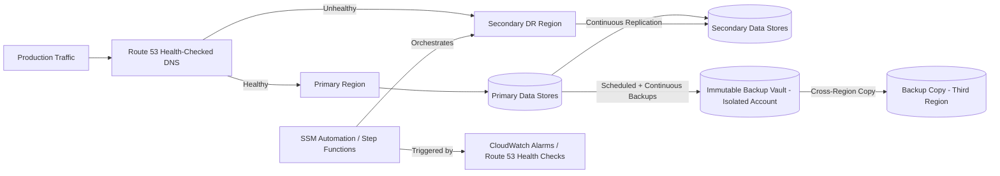
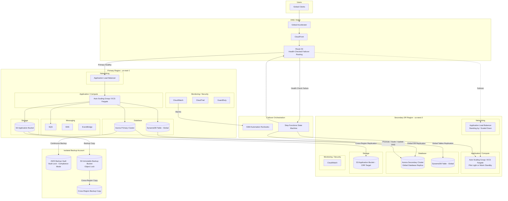

# Chapter 95 — Disaster Recovery

*Part XII – Resilience, Operations & Cost*

---

# 1. Executive Summary

## 1.1 The Business Problem

Every production system eventually fails. Not "might fail" — *will* fail. The only questions that matter to a business are: how much data can you afford to lose, and how long can you afford to be down?

Most organizations discover the answer to these questions the hard way — during an actual outage, when a senior executive asks "how long until we're back up?" and nobody in the room has a confident answer. Disaster Recovery (DR) architecture exists to make sure that conversation happens *before* the outage, not during it.

A disaster, in the AWS operational sense, is not limited to hurricanes and earthquakes. The realistic list of "disasters" that DR architecture must defend against includes:

- An Availability Zone (AZ) losing power or network connectivity.
- An entire AWS Region becoming unavailable or degraded.
- A botched deployment that corrupts application state.
- A database misconfiguration or accidental `DROP TABLE` in production.
- A ransomware event that encrypts production data and its backups.
- A compromised IAM credential used to delete resources.
- A cascading failure triggered by a dependency (DNS, certificate expiry, third-party API).
- Human error during a routine maintenance window.

Notice that only two of these eight scenarios are "infrastructure" failures in the traditional sense. The majority are operational or security failures. This matters enormously for architecture design: a DR strategy that only protects against AZ or Region loss, and ignores data corruption, logical deletion, or ransomware, is an incomplete DR strategy — and it is the single most common gap found during enterprise DR audits.

## 1.2 Architecture Objective

The objective of this chapter is to design a Disaster Recovery reference architecture that:

- Defines and defends specific, board-approved Recovery Time Objective (RTO) and Recovery Point Objective (RPO) targets.
- Provides a tiered set of DR strategies — Backup & Restore, Pilot Light, Warm Standby, and Multi-Site Active-Active — mapped to different business-criticality tiers, because not every workload deserves (or can justify) the same investment.
- Treats DR as a continuously *tested* capability, not a static document. A DR plan that has never been executed is a hypothesis, not a capability.
- Protects against logical failures (data corruption, ransomware, accidental deletion) in addition to infrastructure failures (AZ/Region loss).
- Automates failover and failback wherever the business case supports the added complexity, while being explicit about where manual decision points remain intentional.
- Quantifies the cost of each DR tier so that FinOps and business stakeholders can make an informed investment decision rather than architects unilaterally over-engineering (or under-engineering) resilience.

## 1.3 Why Organizations Adopt This Architecture

There are five recurring forces that push an organization from "we have backups" to "we have a tested Disaster Recovery architecture":

**Regulatory and contractual pressure.** Financial services, healthcare, insurance, and government workloads are frequently bound by explicit regulatory RTO/RPO requirements (e.g., FFIEC guidance for banking, HIPAA contingency planning requirements for healthcare). Enterprise customers increasingly write DR requirements directly into vendor contracts and demand evidence of DR testing during security questionnaires and audits.

**A near-miss or an actual incident.** It is extremely common for serious DR investment to begin only after an organization experiences a costly outage, a near-miss during a regional AWS event, or a competitor's well-publicized outage. Incident postmortems are one of the most powerful forces in getting DR funded.

**Revenue-per-minute-of-downtime economics.** Once a business quantifies the cost of downtime in dollars per minute, DR investment decisions become straightforward return-on-investment calculations rather than abstract engineering discussions.

**Cyber-insurance requirements.** Cyber-insurance underwriters increasingly require documented, tested backup and recovery capability — including *immutable* and *air-gapped* backups resistant to ransomware — as a condition of coverage or as a factor in premium pricing.

**M&A and IPO due diligence.** Acquirers and public-market investors scrutinize operational resilience. A company preparing for acquisition or IPO is frequently required to formalize and evidence its DR posture.

## 1.4 Major Business Benefits

| Benefit | Description |
|---|---|
| Reduced financial exposure | Directly reduces expected revenue loss, SLA penalty exposure, and reputational damage from extended outages. |
| Regulatory compliance | Satisfies contingency-planning requirements under frameworks such as HIPAA, PCI DSS, SOC 2, FFIEC, and ISO 22301. |
| Customer trust and retention | Enterprise buyers increasingly require documented DR capability as a precondition of purchase. |
| Operational maturity | Forces documentation of dependencies, data flows, and ownership that pays dividends far beyond DR itself. |
| Ransomware resilience | Immutable, air-gapped backups provide a recovery path independent of the production environment's compromise. |
| M&A readiness | A tested, documented DR program is a due-diligence asset, not a liability, during acquisition or investment events. |
| Insurance cost reduction | Demonstrable DR maturity is increasingly a factor in cyber-insurance underwriting and premiums. |

## 1.5 Typical Enterprise Scenarios

**Scenario A — Regional Financial Services Platform.** A regional bank runs core transaction processing on Aurora PostgreSQL with strict RPO ≤ 5 minutes and RTO ≤ 30 minutes mandated by its regulator. The bank adopts a Warm Standby strategy: a continuously running, minimally-scaled replica environment in a second Region, with Aurora Global Database providing sub-second cross-region replication and a documented, quarterly-tested failover runbook.

**Scenario B — E-Commerce Platform During Peak Season.** A retailer cannot tolerate downtime during its highest-revenue weeks. It adopts a Multi-Site Active-Active architecture across two Regions, with Route 53 weighted/latency routing distributing traffic continuously to both, DynamoDB Global Tables for session and cart data, and S3 Cross-Region Replication for product media. Both Regions serve production traffic at all times, so "failover" is really just traffic reweighting.

**Scenario C — Internal Analytics Platform.** A mid-size SaaS company runs an internal BI/reporting platform that is important but not revenue-critical. Its RTO/RPO tolerance is measured in hours, not minutes. It adopts a Backup & Restore strategy: automated, cross-region, immutable backups with a documented (but not pre-provisioned) restoration runbook, accepting a longer recovery window in exchange for dramatically lower ongoing cost.

**Scenario D — Healthcare Records System.** A healthcare SaaS vendor subject to HIPAA contingency-planning requirements adopts a Pilot Light strategy: core data stores are continuously replicated to a secondary Region, but compute is only provisioned and scaled up during an actual declared disaster, balancing regulatory-mandated recoverability against cost.

## 1.6 What This Chapter Covers

This chapter builds a complete, production-grade Disaster Recovery reference architecture. It is intentionally structured around *tiers of DR investment* rather than a single fixed design, because the correct DR architecture is always a function of business criticality, budget, and regulatory obligation — never a one-size-fits-all decision. Where earlier chapters in this Handbook (particularly Chapter 6 – Highly Available Multi-AZ Web Application, Chapter 44 – Aurora Global Database, and Chapter 98 – Multi-Region Active-Active) addressed *availability within a Region* or a single specific data-tier pattern, this chapter addresses *recoverability across Regions and across failure classes*, including logical and security failures that Multi-AZ HA does not protect against at all.

---

# 2. Business Requirements

## 2.1 Business Drivers

- Minimize revenue loss during infrastructure or application-level outages.
- Satisfy regulatory contingency-planning obligations (HIPAA, FFIEC, PCI DSS, SOC 2, ISO 22301, GDPR Article 32 availability/resilience requirements).
- Provide contractually committed SLAs to enterprise customers.
- Maintain business continuity in the event of a regional AWS service disruption.
- Provide a recovery path independent of production compromise, specifically to defend against ransomware and destructive insider or external attacks.
- Support M&A, IPO, and cyber-insurance due-diligence requirements with evidence of tested recovery capability.

## 2.2 Functional Requirements

- The system must support point-in-time recovery of transactional data to any point within the defined retention window.
- The system must support full-environment recovery (compute, network, data, configuration) in a secondary AWS Region.
- The system must support recovery from a *validated, known-good* backup, distinct from the live replication stream, to protect against replicated corruption.
- The system must provide a documented, repeatable, and *tested* failover procedure — automated where justified, manual with clear runbooks where not.
- The system must provide a documented and tested failback procedure to return to the primary Region once it is restored.
- The system must support partial recovery (a single service or data store) as well as full-environment recovery.

## 2.3 Non-Functional Requirements

| Requirement Category | Detail |
|---|---|
| Scalability | Recovery environment must be able to absorb full production load within the defined RTO, whether pre-scaled (Warm Standby/Active-Active) or scaled on-demand (Pilot Light). |
| Availability | Primary environment target: 99.95%–99.99% depending on tier. DR architecture itself must not become a new single point of failure. |
| Latency | Recovery environment, once active, must meet the same latency SLAs as production — a "successful" failover to an unusably slow environment is not a successful failover. |
| Compliance | Backup encryption at rest and in transit, immutability where mandated, retention periods aligned to regulatory minimums, audit logging of all backup/restore/failover actions. |
| Security | DR environment must maintain equivalent security posture to production — DR environments are frequently the weakest link because they are provisioned once and neglected. |
| Testability | DR procedures must be executable on a defined cadence (this chapter recommends quarterly at minimum for Tier 1 workloads) without requiring true production impact. |

## 2.4 Recovery Objectives by Business Tier

This is the single most important table in the chapter. Every workload should be explicitly assigned to one of these tiers — and that assignment should be a *business* decision, ratified by stakeholders who own the revenue and compliance risk, not an architecture decision made unilaterally by engineering.

| Tier | Example Workload | RPO Target | RTO Target | DR Strategy | Relative Cost Multiplier |
|---|---|---|---|---|---|
| Tier 0 — Mission Critical | Core payments/trading engine | Seconds (near-zero) | < 5 minutes | Multi-Site Active-Active | 2.0x–3.0x of single-region cost |
| Tier 1 — Business Critical | Core transaction processing, primary customer-facing app | < 5–15 minutes | < 30–60 minutes | Warm Standby | 1.4x–1.8x |
| Tier 2 — Important | Secondary customer-facing services, partner APIs | < 1 hour | < 4 hours | Pilot Light | 1.1x–1.3x |
| Tier 3 — Standard | Internal tools, batch/reporting systems | < 24 hours | < 24–48 hours | Backup & Restore | 1.02x–1.1x |
| Tier 4 — Low Priority | Dev/test environments, non-production sandboxes | Best effort | Best effort | Backup only, no DR site | ~1.0x |

> **Note:** RPO and RTO are *targets*, not guarantees. An architecture designed for a 5-minute RTO can still miss that target if the failover runbook has never been tested, if IAM permissions for the failover automation have drifted, or if DNS TTLs were left at a default that is longer than the RTO itself. This chapter treats *testing* as a first-class requirement precisely because untested RTO/RPO numbers are, in practice, fiction.

## 2.5 SLAs

- External customer-facing SLA commitments should always include a documented, generous safety margin above the internal RTO/RPO target — never publish an SLA equal to your best-case internal target.
- SLA credits/penalties should be modeled against realistic failure frequency (based on AWS's published Regional service history and the organization's own incident history), not against a zero-failure assumption.
- Compliance-driven RTO/RPO requirements (e.g., a regulator-mandated 4-hour RTO) should be treated as a hard floor, not a target to approach — build in margin.

## 2.6 Expected Workload and Growth

DR architecture must be re-evaluated whenever:

- Production traffic grows beyond ~150% of the capacity the DR environment was last validated against.
- A new data store, message queue, or dependency is introduced into the production architecture (a new dependency introduces a new single point of failure unless it is also replicated).
- The organization enters a new regulatory jurisdiction with different data-residency or availability requirements.
- A merger or acquisition introduces a second, differently-architected production environment that must be reconciled into a single DR strategy.

---

# 3. Architecture Overview

## 3.1 Overall Design Philosophy

This chapter's reference architecture is built around four DR strategy tiers, each of which trades cost for recovery speed:

```

Cost/Complexity  ────────────────────────────────────▶
Backup & Restore → Pilot Light → Warm Standby → Multi-Site Active-Active
RTO: Hours       → RTO: 10s of min → RTO: Minutes → RTO: Near-zero
RPO: Hours       → RPO: Minutes    → RPO: Minutes → RPO: Near-zero
◀──────────────────────────────────────────────── Recovery Speed

```

The core design principle is: **do not pay for recovery speed the business does not need, and do not accept recovery speed the business cannot survive.** Most organizations get this wrong in both directions simultaneously — over-investing in DR for low-criticality internal tools while under-investing in DR for the one system that actually generates revenue.

A secondary, equally important design principle: **the DR environment must be provisioned exclusively through Infrastructure as Code, never through manual console configuration.** A DR Region that was configured by hand, once, three years ago, and never touched since, is not a DR Region — it is a liability that will fail silently the moment it is actually needed.

## 3.2 Core Components

- **Primary Region:** Full production environment — compute, database, storage, networking, security controls.
- **Secondary (DR) Region:** A recovery environment sized and provisioned according to the chosen DR tier (idle/minimal for Pilot Light, continuously running at reduced scale for Warm Standby, full production scale for Active-Active).
- **Cross-Region Data Replication Layer:** Aurora Global Database, DynamoDB Global Tables, S3 Cross-Region Replication (CRR), or application-level replication, depending on data store.
- **Immutable Backup Layer:** S3 with Object Lock (compliance or governance mode) and cross-account, cross-region replication — deliberately isolated from the primary account's blast radius to survive a compromised-credential scenario.
- **DNS and Traffic Management Layer:** Route 53 with health checks and failover/weighted/latency routing policies, optionally fronted by AWS Global Accelerator for faster failover at the network layer.
- **Infrastructure as Code Layer:** Terraform modules capable of provisioning the full DR environment from scratch in an unaffected Region, with remote state stored redundantly.
- **Orchestration and Automation Layer:** AWS Systems Manager Automation runbooks, Lambda-based failover orchestration, and Step Functions state machines for multi-step, auditable failover sequences.
- **Monitoring, Alerting, and Chaos-Testing Layer:** CloudWatch, Route 53 health checks, and scheduled AWS Fault Injection Service (FIS) experiments that regularly and safely validate failover actually works.

## 3.3 How Components Interact — High-Level Workflow



## 3.4 Request Lifecycle (Steady State)

1. Client resolves DNS via Route 53.
2. Route 53 health checks confirm the primary Region endpoint is healthy and routes the request there.
3. Request is served by the primary Region's full production stack.
4. Application writes are persisted to the primary data store.
5. Primary data store asynchronously (or synchronously, for Tier 0) replicates to the secondary Region.

## 3.5 Request Lifecycle (During Declared Disaster)

1. Monitoring detects sustained failure of the primary Region (via CloudWatch composite alarms and/or Route 53 health check failures).
2. A human decision-maker (or, for Tier 0 workloads with pre-approved automated failover, an automated trigger) declares a disaster.
3. Failover orchestration (SSM Automation/Step Functions) executes the documented runbook: promote the secondary data store, scale up secondary compute if Pilot Light/Warm Standby, update Route 53 records.
4. DNS propagates (bounded by pre-configured low TTLs); traffic begins routing to the secondary Region.
5. Secondary Region serves production traffic.
6. Post-incident: once the primary Region is confirmed healthy, a separate, equally deliberate **failback** procedure is executed — never rushed, and never symmetric to failover (failback carries its own distinct risks, primarily around data reconciliation of writes that occurred in the secondary Region during the incident).

## 3.6 Data Lifecycle

- **Hot path:** production writes → primary data store → continuous cross-region replication → secondary data store (replication lag is the practical floor of your RPO).
- **Cold path:** scheduled/continuous backups → immutable, versioned, access-restricted backup vault in a logically and organizationally separate AWS account → cross-region copy of the backup itself (protecting against the backup vault's own Region being unavailable).
- **Audit path:** every backup creation, restore, and failover action is logged to CloudTrail and retained in a manner that survives account compromise (organization-level CloudTrail with a dedicated, restricted-access log archive account).

---

# 4. AWS Services Used

For each service below: purpose, why selected, alternatives considered, limitations, pricing considerations, and best practices — scoped specifically to their role in a DR architecture (not a general-purpose treatment, which is covered in Chapter 2).

## 4.1 Amazon Aurora (Global Database)

**Purpose:** Primary relational data store with built-in cross-region replication designed specifically for DR, offering typical replication lag under 1 second and RTO in the range of 1 minute for managed cross-region failover.

**Why selected:** Aurora Global Database is purpose-built for the Warm Standby and Active-Active tiers. Unlike logical/statement-based replication, it replicates at the storage layer, which is both faster and avoids the risk of replication breaking due to non-deterministic SQL.

**Alternatives:**
- **RDS Cross-Region Read Replica:** Simpler, cheaper, but higher replication lag (typically several seconds to minutes) and a manual, slower promotion process. Appropriate for Tier 2/3 workloads.
- **Self-managed PostgreSQL/MySQL with logical replication:** Full control, but the operational burden of managing replication health, failover, and monitoring is substantial and rarely justified versus a managed option.
- **DynamoDB Global Tables:** Appropriate when the data model fits key-value/document access patterns; not a substitute for relational workloads with complex transactional requirements.

**Limitations:**
- Cross-region write latency if using Aurora Global Database's write-forwarding feature (adds round-trip latency; use with care for latency-sensitive write paths).
- Managed planned failover typically completes in about a minute, but *unplanned* failover — when the primary Region is completely unreachable — can take longer and requires the secondary cluster to be manually or automatically promoted.
- Maximum of five secondary Regions per Global Database (rarely a real-world constraint, but worth knowing).

**Pricing considerations:** Aurora Global Database charges for the secondary cluster's compute and storage (even if idle/minimally scaled) plus cross-region data transfer for replication. This is the primary cost driver of the Warm Standby tier — budget for it explicitly rather than treating it as a rounding error.

**Best practices:**
- Right-size the secondary cluster's instance class independently from the primary; it does not need to match production scale for Warm Standby (Pilot Light can run it at the smallest viable instance class and scale up only during failover, accepting a longer RTO in exchange for lower steady-state cost).
- Enable Aurora Backtrack (MySQL-compatible edition) for fast logical-error recovery without a full restore — useful specifically for the "accidental DROP TABLE" class of disaster that cross-region replication does *not* protect against (it will faithfully replicate the mistake).
- Always pair Global Database replication with independent, immutable snapshots — replication protects against infrastructure failure, not logical failure.

## 4.2 Amazon DynamoDB (Global Tables)

**Purpose:** Multi-region, multi-active NoSQL replication for session state, shopping carts, feature flags, and other data well-suited to eventual consistency across Regions.

**Why selected:** Global Tables provide fully managed, multi-active (not just active-passive) replication — every Region can accept writes, with conflict resolution via last-writer-wins. This makes it a natural fit for the Multi-Site Active-Active tier.

**Alternatives:** Self-managed replication (essentially never justified given the maturity of Global Tables); single-region DynamoDB with cross-region backup only (appropriate for Tier 3 workloads where near-zero RPO is not required).

**Limitations:** Last-writer-wins conflict resolution is not appropriate for all data models — data with strict ordering or financial-transaction semantics needs additional application-layer conflict handling or should not use multi-active writes at all.

**Pricing considerations:** Pay for write capacity in every Region that replicates the write, plus inter-region data transfer. A table replicated to three Regions roughly triples write-related cost.

**Best practices:** Use Global Tables for session/state data specifically because it tolerates eventual consistency well; keep strictly consistent, transactional data in Aurora Global Database instead, and don't force-fit DynamoDB Global Tables onto data models that need strong cross-region consistency.

## 4.3 Amazon S3 (with Cross-Region Replication and Object Lock)

**Purpose:** Durable storage for backups, application assets, and the immutable backup vault itself.

**Why selected:** S3's 11 nines of durability, native cross-region replication, and Object Lock (WORM — Write Once Read Many) functionality make it the foundation of the immutable-backup layer that defends specifically against ransomware and malicious/accidental deletion.

**Alternatives:** EFS with backup (appropriate for file-based workloads, not object storage); third-party backup vendors (viable but add cost and integration complexity versus native S3 Object Lock, which most compliance frameworks accept directly).

**Limitations:** Object Lock must be enabled at bucket creation time — it cannot be retrofitted onto an existing bucket, so this must be a day-one architecture decision, not an afterthought.

**Pricing considerations:** Storage cost scales with retention period and versioning; Glacier/Deep Archive storage classes dramatically reduce cost for long-retention backup copies that are rarely accessed. Cross-region replication incurs both storage cost in the destination Region and data transfer cost.

**Best practices:**
- Use S3 Object Lock in **Compliance mode** for regulatory-mandated backups (cannot be deleted or shortened by anyone, including the AWS account root user, until the retention period expires) and **Governance mode** for internal-policy backups where an exceptional, audited override capability is desired.
- Replicate the backup bucket to a *separate AWS account* (a dedicated backup/archive account under AWS Organizations), not merely a separate bucket in the same account — this is the single most important control against a compromised-credential or ransomware scenario, since an attacker with access to the production account cannot reach the isolated backup account.

## 4.4 AWS Backup

**Purpose:** Centralized, policy-driven backup orchestration across EBS, RDS, Aurora, DynamoDB, EFS, and other supported services.

**Why selected:** Provides a single pane of glass for backup policy, cross-region copy, cross-account copy, and — critically — **AWS Backup Vault Lock**, which applies the same WORM immutability guarantee to backup vaults that S3 Object Lock applies to buckets.

**Alternatives:** Per-service native backup features (e.g., RDS automated snapshots) configured independently — functional, but loses the centralized policy management, audit trail, and cross-account copy orchestration that AWS Backup provides.

**Limitations:** Not all AWS services are supported; some services (e.g., certain DynamoDB configurations, custom EC2 application state) still require service-specific or application-level backup handling.

**Pricing considerations:** Charged per GB of backup storage and per GB of restore, with warm/cold storage tiering affecting cost significantly for long-retention data.

**Best practices:** Apply AWS Backup Vault Lock in Compliance mode to the vault holding Tier 0/Tier 1 workload backups; use tag-based backup policies so that new resources are automatically protected without requiring manual backup configuration per resource.

## 4.5 Amazon Route 53

**Purpose:** DNS-based traffic routing and health-check-driven automated failover between Regions.

**Why selected:** Native integration with health checks, low TTL support, and multiple routing policies (failover, weighted, latency-based, geoproximity) make it the standard control point for both Warm Standby failover and Active-Active traffic distribution.

**Alternatives:** AWS Global Accelerator (operates at the network/anycast layer rather than DNS, giving faster failover — typically tens of seconds versus DNS TTL-bound propagation — and is frequently used *in combination with* Route 53 rather than as a replacement); third-party DNS/traffic-management providers (viable but add an external dependency to the failover path itself, which is a meaningful risk for a DR-critical control).

**Limitations:** DNS failover is bounded by TTL and, more importantly, by DNS resolver caching behavior outside AWS's control — some clients and corporate resolvers ignore low TTLs. This is why Tier 0 architectures should pair Route 53 with Global Accelerator rather than relying on DNS failover alone.

**Pricing considerations:** Health checks and hosted zone queries are inexpensive relative to the business risk they mitigate; this is one of the highest-ROI line items in the entire DR budget.

**Best practices:** Set TTLs deliberately low (60 seconds or less) on records that participate in failover, well before an incident — changing TTL *during* an incident does not help, because the old, longer TTL is still cached by resolvers.

## 4.6 AWS Systems Manager (Automation) and AWS Step Functions

**Purpose:** Orchestrate the multi-step failover and failback sequence (promote database, update DNS, scale compute, validate health) as a single, auditable, repeatable automation rather than a manual checklist executed under pressure.

**Why selected:** Both provide execution history, built-in retry/rollback semantics, and integration with IAM for least-privilege execution roles — essential for a process that must be both fast and auditable during a high-stress incident.

**Alternatives:** Manual runbooks executed by an on-call engineer (acceptable for Tier 3/4 workloads; unacceptable for Tier 0/1, where the time cost and error rate of manual execution under pressure directly threatens the RTO target); custom Lambda orchestration without Step Functions (viable but loses built-in state visualization and retry semantics).

**Best practices:** Every failover automation should have a corresponding, equally well-tested **failback** automation — organizations reliably invest in failover automation and neglect failback, then perform failback manually and inconsistently months after the original incident.

## 4.7 Amazon CloudWatch and AWS Fault Injection Service (FIS)

**Purpose:** CloudWatch provides the health and composite alarms that detect a disaster condition; FIS provides controlled, scheduled chaos experiments (e.g., simulating AZ or dependency failure) that validate the DR architecture actually works, rather than trusting the architecture diagram.

**Why selected:** A DR architecture that has not been exercised under FIS-driven controlled failure injection is, in practical terms, unverified. FIS specifically allows safe, scoped, production-representative failure simulation with built-in stop conditions.

**Best practices:** Schedule FIS experiments and full DR failover drills on a recurring cadence (this chapter recommends quarterly for Tier 0/1, semi-annually for Tier 2, annually for Tier 3) and track mean-time-to-detect and mean-time-to-recover from each drill as a first-class operational metric, not a one-time compliance checkbox.

## 4.8 AWS Key Management Service (KMS) and IAM

**Purpose:** Encrypt all backup and replicated data at rest; enforce least-privilege access to both the production and DR environments and, critically, to the backup vault itself.

**Why selected:** DR data is frequently *more* sensitive from a security perspective than production data, because it represents a long-lived, aggregated copy of everything — it deserves at least the same level of access control as production, and in practice should have *stricter* controls given its role as the last line of defense.

**Best practices:** Use separate, dedicated KMS keys for backup data (not the same key used for production, so that key compromise or accidental deletion in production does not cascade to backups); apply IAM permission boundaries and, where regulatory requirements demand it, a documented "break-glass" procedure with mandatory dual-approval for backup-vault deletion actions.


# 5. Complete Architecture Diagram



**Diagram notes:**

- The **Isolated Backup Account** is deliberately drawn as a separate trust boundary from both the primary and secondary Regions — this is not a stylistic choice, it reflects the actual account-isolation architecture required to survive a compromised-credential or ransomware scenario in the production account.
- The dotted line from Route 53 to the secondary ALB represents the failover path, which is inactive during steady-state operation for Pilot Light and Warm Standby tiers (solid/active for Active-Active).
- Step Functions is shown as the orchestrator specifically because it provides visual execution history — during a real incident, being able to see exactly which step of the failover sequence has completed is operationally invaluable.

---

# 6. Component-by-Component Explanation

## 6.1 Route 53 Health-Checked DNS

- **Purpose:** Continuously evaluate the health of the primary Region endpoint and automatically redirect DNS resolution to the secondary Region when the primary fails health checks.
- **Responsibilities:** Execute health checks against a dedicated, lightweight health endpoint (not the full application — a health endpoint should check only the minimum dependencies needed to confirm the Region can serve traffic, to avoid false negatives from non-critical dependency flakiness).
- **Inputs:** Health check results from endpoints in both Regions.
- **Outputs:** DNS resolution directing clients to the currently healthy Region.
- **Scaling:** Fully managed; no scaling action required.
- **High availability:** Route 53 itself runs across a globally distributed anycast network with no single point of failure.
- **Failure handling:** Health checks can be configured with CloudWatch alarms as an additional signal source, and with multiple independent health-checker locations to avoid a single network-path false positive triggering an unnecessary failover.
- **Dependencies:** Health check target endpoints; CloudWatch (optional alarm-based health checks).
- **Security:** Health check endpoints should not expose sensitive information and should be protected from being used as a DDoS amplification or information-disclosure vector.
- **Monitoring:** CloudWatch metrics for health check status per Region; alarm on sustained failure, not single-check failure, to avoid flapping.

## 6.2 Aurora Global Database (Primary and Secondary Clusters)

- **Purpose:** Provide the relational data tier with sub-second cross-region replication and a fast, managed promotion path for the secondary cluster during failover.
- **Responsibilities:** Primary cluster accepts all writes during steady state; secondary cluster maintains a continuously replicated, read-only copy and can be promoted to accept writes during failover.
- **Scaling:** Secondary cluster instance class can be provisioned smaller than primary (Pilot Light/Warm Standby) and resized during failover, or matched to primary at all times (Active-Active read scaling / Tier 0).
- **High availability:** Each cluster is itself Multi-AZ within its Region; Global Database adds the cross-region layer on top.
- **Failure handling:** Managed planned failover (for testing and Region evacuation) completes in about a minute; unplanned failover (primary Region unreachable) requires explicit promotion of the secondary cluster, which becomes a new, independent, writable cluster.
- **Dependencies:** VPC networking, KMS for encryption, IAM for access control, Secrets Manager for credential rotation.
- **Security:** Encryption at rest via KMS, encryption in transit via TLS, network isolation via private subnets and security groups, credential management via Secrets Manager with automatic rotation.
- **Monitoring:** Replication lag (`AuroraGlobalDBReplicationLag` metric) is the single most important DR-specific metric for this component — it directly determines your realistic RPO.

## 6.3 DynamoDB Global Tables

- **Purpose:** Multi-active replication for session, cart, and state data that must remain available for both reads and writes in multiple Regions simultaneously.
- **Failure handling:** Because every Region can accept writes, DynamoDB Global Tables tolerate a full Region failure without requiring any promotion step — the surviving Region(s) simply continue accepting writes, which is precisely why this component underpins the Active-Active tier.
- **Monitoring:** Replication latency metrics per Region pair; monitor for sustained divergence, which can indicate a replication issue requiring investigation before it silently violates RPO expectations.

## 6.4 S3 Cross-Region Replication and Immutable Backup Vault

- **Purpose:** Replicate application assets for availability, and separately maintain a WORM-protected backup copy for ransomware/deletion resilience.
- **Responsibilities:** CRR handles availability (fast access to assets from the secondary Region); the isolated backup vault handles recoverability (a copy that cannot be altered or deleted by a compromised production identity).
- **Security:** The isolated backup account should have no direct network path from the production VPCs, and cross-account replication roles should be scoped to `s3:ReplicateObject` and nothing broader.

## 6.5 SSM Automation / Step Functions Failover Orchestration

- **Purpose:** Execute the documented failover runbook as code: validate primary Region failure, promote secondary database, scale secondary compute, update DNS, run post-failover validation checks, and notify stakeholders.
- **Failure handling:** Each step should have explicit success criteria and automatic rollback or halt-and-alert behavior if a step fails — an orchestration that blindly proceeds through a failed step is worse than a manual process, because it creates false confidence.
- **Security:** The IAM role executing the failover automation should be scoped precisely to the actions required (database promotion, Route 53 record updates, Auto Scaling Group updates) and should itself be monitored — this role is a high-value target and should require MFA or be invocable only through a controlled automation path, never assumable interactively in normal operation.

## 6.6 CloudWatch, GuardDuty, and CloudTrail (Cross-Region Monitoring and Audit)

- **Purpose:** Detect the disaster condition (CloudWatch composite alarms), detect security-driven disasters specifically (GuardDuty threat detection), and provide an immutable audit trail of every action taken during the incident (CloudTrail, aggregated to an isolated logging account).
- **Best practice:** CloudTrail logs should be delivered to an S3 bucket in the same isolated account as the backup vault, with Object Lock enabled — an attacker who can delete CloudTrail logs can also hide the evidence of how they compromised the environment in the first place.

---

# 7. End-to-End Request Flow

## 7.1 Steady-State Flow

1. **Client** initiates a DNS lookup for the application domain.
2. **Route 53** evaluates current health check status and returns the IP/endpoint of the currently healthy Region — under normal operation, this is the primary Region.
3. **CloudFront** (if used) serves cached content directly from edge locations; cache misses are forwarded to the origin.
4. **Application Load Balancer** in the primary Region receives the request and distributes it across healthy compute targets.
5. **Application tier** (ECS Fargate/EC2 Auto Scaling Group) processes the request.
6. **Database read/write** occurs against the primary Aurora cluster; DynamoDB reads/writes occur against the local-Region table replica.
7. **Caching layer** (if present — e.g., ElastiCache) is checked before falling through to the database for read-heavy paths.
8. **Logging:** Application logs stream to CloudWatch Logs; access logs stream to S3.
9. **Monitoring:** Request-level metrics (latency, error rate, throughput) are emitted to CloudWatch and evaluated against alarm thresholds continuously.
10. **Error handling:** 5xx responses trigger CloudWatch alarms; sustained error-rate elevation is one of the composite signals feeding the disaster-declaration decision (alongside Route 53 health check failure and infrastructure-level signals).
11. **Response** is returned to the client via the same path, with CloudFront caching the response if cacheable.

## 7.2 Failover-in-Progress Flow

1. Sustained health check failures and/or composite CloudWatch alarms cross the disaster-declaration threshold.
2. On-call engineer (Tier 1/2/3) or automated trigger (Tier 0, pre-approved) initiates the failover Step Functions execution.
3. Step Functions promotes the secondary Aurora cluster to a standalone writable cluster.
4. Step Functions scales the secondary Region's compute (Pilot Light: provision from zero; Warm Standby: scale existing minimal capacity up to production scale; Active-Active: no action needed, already at scale).
5. Step Functions updates the Route 53 failover record (if not already automatic via health-check-based failover routing policy).
6. Step Functions runs a post-failover validation suite — synthetic transactions confirming the secondary Region can genuinely serve traffic end-to-end, not merely that infrastructure exists.
7. Notification (SNS → PagerDuty/Slack/email) confirms failover completion and validation results to stakeholders.
8. DNS propagation completes (bounded by pre-configured TTL); client traffic shifts to the secondary Region.
9. Secondary Region serves production traffic; secondary CloudWatch dashboards become the primary operational view for the duration of the incident.

---

# 8. Deployment Flow

## 8.1 Infrastructure Provisioning Philosophy

Every component of both the primary and secondary Region — including the secondary Region's Pilot Light infrastructure that is *not currently running* — must be defined in Terraform and deployed through the same CI/CD pipeline as production. A DR environment that is provisioned manually, once, and drifts silently from the primary Region's actual configuration over time is the most common single point of DR failure found in real enterprise post-incident reviews.

## 8.2 Terraform Workflow

- A shared set of Terraform modules (networking, compute, database, security) is parameterized by Region and by DR tier (e.g., a `pilot_light` boolean variable that controls whether compute resources are provisioned at zero/minimal capacity or full production capacity).
- Both primary and secondary Region infrastructure are deployed from the **same module source**, differing only in variable values — this guarantees configuration parity by construction rather than by manual diligence.
- Remote state is stored in S3 with cross-region replication and DynamoDB state locking, with the state bucket itself protected by the same immutable-backup principles applied to application data (state loss during a disaster is its own disaster).

## 8.3 CI/CD Deployment

- Application deployments are promoted through the pipeline to both Regions, either simultaneously (Active-Active) or with the secondary Region trailing by a controlled, short interval (Warm Standby/Pilot Light), never manually and never "when someone remembers."
- Database schema migrations require particular care in a DR context: a migration must be applied compatibly with the replication mechanism in use (Aurora Global Database replicates data, not DDL execution timing, so migrations should follow expand/contract patterns that remain compatible across a brief version skew between Regions).

## 8.4 Blue-Green Deployment (within the DR Context)

- Blue-Green deployment patterns (detailed fully in Chapter 13) apply *within* each Region independently. The DR-specific consideration is: never treat a Blue-Green cutover in the primary Region as a substitute for genuine cross-region DR testing — they validate different failure classes entirely.

## 8.5 Rollback

- Application rollback (bad deployment) and disaster failover (Region loss) are distinct procedures with distinct triggers and should not share a single "break glass" runbook — conflating them leads to over-triggering full regional failover for what is actually a routine deployment rollback.

## 8.6 Secrets and Configuration

- Secrets Manager secrets required by the secondary Region must be replicated (Secrets Manager supports native multi-region secret replication) — a Pilot Light environment that fails to start during an actual disaster because it cannot retrieve database credentials is a preventable, embarrassingly common failure.

## 8.7 Validation

- Post-deployment validation in both Regions runs the same synthetic-transaction test suite, so that configuration or dependency drift in the secondary Region is caught during routine deployment, not discovered for the first time during an actual disaster.

---

# 9. Network Topology

## 9.1 VPC Design

- Primary and secondary Region VPCs are provisioned with **non-overlapping CIDR ranges**, deliberately, from day one — this is a frequently overlooked detail that becomes extremely painful to fix retroactively if the two Regions ever need to be connected (e.g., via VPC peering or Transit Gateway during a phased failback, or for cross-region database replication traffic that traverses private connectivity).

| Region | VPC CIDR | Public Subnets | Private App Subnets | Private Data Subnets |
|---|---|---|---|---|
| us-east-1 (Primary) | 10.0.0.0/16 | 10.0.0.0/24, 10.0.1.0/24 | 10.0.10.0/24, 10.0.11.0/24 | 10.0.20.0/24, 10.0.21.0/24 |
| us-west-2 (Secondary) | 10.1.0.0/16 | 10.1.0.0/24, 10.1.1.0/24 | 10.1.10.0/24, 10.1.11.0/24 | 10.1.20.0/24, 10.1.21.0/24 |

## 9.2 Cross-Region Connectivity

- Aurora Global Database replication traffic uses AWS's private backbone by default and does not require explicit VPC peering, but application-level cross-region calls (if any exist during a phased failback) should use **Transit Gateway with inter-region peering** rather than public internet paths, to keep sensitive data traffic off the public internet and to maintain consistent security-group-equivalent control via Network ACLs at the Transit Gateway route table level.

## 9.3 NAT Gateway, Internet Gateway

- Both Regions provision independent NAT Gateways and Internet Gateways — a Pilot Light Region's NAT Gateway can be provisioned but should be monitored for cost, since idle NAT Gateways still incur an hourly charge even at zero traffic (this is one of the "hidden cost surprises" discussed later in this chapter).

## 9.4 Route Tables, Network ACLs, Security Groups

- Security groups and NACLs must be provisioned identically (via shared Terraform modules) in both Regions — divergence here is a silent DR-readiness failure that will not surface until failover, when the secondary Region's overly restrictive (or dangerously permissive) rules become production-facing.

## 9.5 PrivateLink

- If the architecture depends on PrivateLink-based access to third-party or internal shared services (see Chapter 20), each such dependency must have an equivalent, tested endpoint in the secondary Region — a PrivateLink dependency that exists only in the primary Region is an unreplicated single point of failure hiding inside an otherwise well-designed DR architecture.

---

# 10. Identity and Access

## 10.1 IAM Roles and Policies

- All DR-specific automation (failover orchestration, backup management) runs under dedicated IAM roles, distinct from general application or administrator roles, scoped to the minimum actions required for their specific function.

## 10.2 Cross-Account Access (Backup Isolation)

- The isolated backup account is accessed from the production account only via a tightly scoped IAM role assumable exclusively by the specific backup-replication service principal — no human identity and no general-purpose application role should have standing access to the backup account.

## 10.3 STS and Temporary Credentials

- Failover automation roles should be assumed via STS with short-lived credentials generated at execution time, never via long-lived access keys — this both reduces standing risk and ensures every failover action is individually attributable in CloudTrail.

## 10.4 Least Privilege — Example Failover Automation Policy

```json

{
  "Version": "2012-10-17",
  "Statement": [
    {
      "Sid": "PromoteAuroraGlobalSecondary",
      "Effect": "Allow",
      "Action": [
        "rds:FailoverGlobalCluster",
        "rds:DescribeGlobalClusters",
        "rds:DescribeDBClusters"
      ],
      "Resource": [
        "arn:aws:rds::123456789012:global-cluster:prod-global-db",
        "arn:aws:rds:us-west-2:123456789012:cluster:prod-secondary"
      ]
    },
    {
      "Sid": "UpdateFailoverDNS",
      "Effect": "Allow",
      "Action": [
        "route53:ChangeResourceRecordSets",
        "route53:GetHealthCheckStatus"
      ],
      "Resource": "arn:aws:route53:::hostedzone/Z0123456EXAMPLE"
    },
    {
      "Sid": "ScaleSecondaryCompute",
      "Effect": "Allow",
      "Action": [
        "autoscaling:UpdateAutoScalingGroup",
        "ecs:UpdateService"
      ],
      "Resource": "arn:aws:autoscaling:us-west-2:123456789012:autoScalingGroup:*:autoScalingGroupName/prod-secondary-asg"
    },
    {
      "Sid": "PublishFailoverNotifications",
      "Effect": "Allow",
      "Action": "sns:Publish",
      "Resource": "arn:aws:sns:us-west-2:123456789012:dr-failover-notifications"
    }
  ]
}

```

## 10.5 Permission Boundaries

- Apply a permission boundary to the failover automation role that explicitly denies any IAM, KMS key deletion, or backup-vault-deletion action — the role that fails traffic over should never, under any policy misconfiguration, also be capable of destroying the recovery data it depends on.

---

# 11. Security Architecture

## 11.1 Encryption

- All data at rest (Aurora, DynamoDB, S3, backup vault) is encrypted using dedicated, non-shared KMS keys per data classification tier; all replication and failover traffic is encrypted in transit via TLS 1.2+.

## 11.2 WAF, Shield, Certificate Manager

- WAF rules and ACM certificates must be provisioned identically in both Regions via shared Terraform modules — a secondary Region serving traffic without WAF protection because "it's just the DR site" is a common and dangerous oversight, since the DR site becomes fully production-facing the moment it is needed.

## 11.3 GuardDuty, Security Hub, Inspector

- GuardDuty and Security Hub should be enabled in both Regions and aggregated to a delegated administrator account, so that a security event affecting the secondary Region is detected with the same rigor as the primary — attackers are aware that DR environments are frequently under-monitored and treat them as an attractive target.

## 11.4 Zero Trust Considerations

- Failover orchestration should authenticate and authorize every step independently rather than relying on network location (e.g., "this Lambda is inside the VPC, so it's trusted") — see Chapter 87 for the full Zero Trust reference architecture, which applies directly to DR orchestration paths.

## 11.5 Threat Model — DR-Specific Attack Vectors

| Attack Vector | Description | Mitigation |
|---|---|---|
| Ransomware encrypting production and connected backups | Attacker with production access encrypts data and any backups reachable from the same credentials. | Isolated backup account, Object Lock/Vault Lock immutability, no standing cross-account access. |
| Compromised failover automation role | Attacker triggers a false failover to disrupt operations or as a distraction during a separate attack. | Least-privilege scoping, MFA/approval gating for manual triggers, anomaly alerting on failover-role activity. |
| Silent replication corruption | Logical error or malicious change is faithfully replicated to the secondary Region, corrupting the "safe" copy. | Independent, immutable point-in-time backups distinct from live replication; Aurora Backtrack for fast logical rollback. |
| DR environment configuration drift | Secondary Region security controls (WAF, security groups, patching) degrade over time due to being provisioned once and rarely touched. | IaC-only provisioning, drift detection, regular DR activation drills. |
| Insider threat with backup-account access | A privileged insider with legitimate cross-account access deletes or exfiltrates backups. | Dual-approval for destructive backup-vault actions, Compliance-mode Object Lock which cannot be overridden even by account root. |

---

# 12. High Availability

## 12.1 AZ Failures

- Both Regions' application and data tiers are Multi-AZ by default (this is the baseline established in Chapter 6 and is a prerequisite, not a substitute, for regional DR — Multi-AZ HA and cross-region DR solve different failure classes and both are required).

## 12.2 Instance Failures

- Auto Scaling Group health checks and ECS service scheduler health checks replace failed instances/tasks automatically within each Region, independent of any DR action.

## 12.3 Regional Failures

- This is the primary failure class this chapter addresses: complete or severe degradation of the primary Region, requiring failover to the secondary Region per the tiered strategies in Section 13.

## 12.4 Database Failures

- Instance-level database failure within a Region is handled by Aurora's native Multi-AZ failover (typically under 30 seconds); cluster-level or Region-level database failure is handled by Global Database promotion of the secondary cluster.

## 12.5 Load Balancing and Health Checks

- ALB health checks operate at the target level within a Region; Route 53 health checks operate at the Region level across Regions — both layers are necessary and neither substitutes for the other.

---

# 13. Disaster Recovery (Core Strategy Detail)

This section provides the detailed comparison of the four DR strategies referenced throughout this chapter, since Disaster Recovery *is* the subject of this chapter rather than a supporting concern.

## 13.1 Backup and Restore

- **Description:** Regular, automated, immutable backups with no pre-provisioned recovery infrastructure. Recovery means provisioning a new environment from Infrastructure as Code and restoring data from backup.
- **RPO:** Determined by backup frequency — typically hours.
- **RTO:** Determined by how long it takes to provision infrastructure and restore data — typically many hours.
- **Cost:** Lowest of the four strategies — pay only for backup storage, not standby compute.
- **Best for:** Tier 3/4 workloads where extended downtime is tolerable.

## 13.2 Pilot Light

- **Description:** Core data stores are continuously replicated to the secondary Region; compute infrastructure exists as code but is not running (or runs at minimal/zero scale) until a disaster is declared.
- **RPO:** Minutes (bounded by replication lag).
- **RTO:** Tens of minutes to a few hours (bounded by how quickly compute can be provisioned/scaled and validated).
- **Cost:** Low — pay for replicated data storage and minimal always-on components, not full standby compute.
- **Best for:** Tier 2 workloads, and Tier 1 workloads with a tighter budget than Warm Standby allows, provided the RTO gap is acceptable to the business.

## 13.3 Warm Standby

- **Description:** A scaled-down but fully functional and continuously running copy of the production environment exists in the secondary Region at all times; failover means scaling it up to full capacity and redirecting traffic.
- **RPO:** Minutes (typically tighter than Pilot Light, since replication and application health can be continuously validated against a running environment).
- **RTO:** Minutes (scaling an already-running environment is faster than provisioning from zero).
- **Cost:** Moderate — continuous compute cost for the standby environment, even though it runs at reduced scale.
- **Best for:** Tier 1 workloads — this is the most common strategy for genuinely business-critical systems that do not require Active-Active's near-zero RTO.

## 13.4 Multi-Site Active-Active

- **Description:** Both Regions run at full production scale continuously and serve live traffic simultaneously; "failover" is simply traffic reweighting away from the affected Region.
- **RPO:** Near-zero for multi-active data stores (DynamoDB Global Tables); requires careful design for relational data (Aurora Global Database write-forwarding or a single-write-Region-with-fast-promotion compromise, since Aurora does not support true multi-Region concurrent writes to the same cluster the way DynamoDB does).
- **RTO:** Near-zero — no promotion or scaling step is required, only DNS/traffic reweighting.
- **Cost:** Highest of the four strategies — full duplicate production compute cost.
- **Best for:** Tier 0 workloads where downtime cost genuinely justifies double-digit-percentage-of-infrastructure-budget investment, and where the data model can support multi-active writes without unacceptable conflict-resolution complexity.

## 13.5 Comparison Summary

| Strategy | RPO | RTO | Relative Cost | Operational Complexity | Best Fit |
|---|---|---|---|---|---|
| Backup & Restore | Hours | Hours | $ | Low | Tier 3/4 |
| Pilot Light | Minutes | 10s of min–hours | $$ | Moderate | Tier 2 |
| Warm Standby | Minutes | Minutes | $$$ | Moderate–High | Tier 1 |
| Multi-Site Active-Active | Near-zero | Near-zero | $$$$ | High | Tier 0 |

# 14. Scalability

## 14.1 Horizontal and Vertical Scaling

- Secondary Region compute should scale horizontally (more instances/tasks) in preference to vertical scaling wherever the application tier supports it, since horizontal scaling during a failover event is faster and safer than resizing instance types under production load.

## 14.2 Auto Scaling During Failover

- Pilot Light and Warm Standby Auto Scaling Groups should have pre-warmed launch templates and, where cost justifies it, pre-baked Golden AMIs (see Chapter 11) rather than relying on user-data-driven configuration at failover time — every second spent on `apt-get install` during a live incident is a second added directly to your RTO.

## 14.3 Serverless Scaling

- Lambda-based components scale natively without pre-provisioning, making them attractive for Pilot Light architectures — but be aware of concurrent execution limits and cold-start latency in a Region that has been receiving near-zero traffic, and consider Provisioned Concurrency for latency-sensitive functions in the secondary Region if failover speed is critical.

## 14.4 Database Scaling

- Aurora secondary cluster read capacity can be scaled independently of the primary; during failover, plan for a brief period of reduced read-replica capacity in the newly promoted cluster until Auto Scaling for read replicas catches up.

## 14.5 Storage and Queue Scaling

- S3 and SQS require no explicit DR-specific scaling action (both scale natively); the DR-specific consideration is ensuring SQS queues that matter for business continuity (e.g., order processing) have cross-region redundancy via application-level dual-write or a documented queue-draining/replay procedure, since SQS itself does not natively replicate cross-region.

---

# 15. Performance Optimization

## 15.1 Caching and CDN

- CloudFront should be configured with origin failover (origin groups) pointing at both Regions' ALBs, so that static and cacheable content continues to be served with minimal disruption even before DNS-level failover completes.

## 15.2 Database and Connection Optimization

- Application connection pools should be configured with sane timeout and retry behavior specifically tuned for a database endpoint change (post-failover, the writer endpoint changes) — an application that caches a DNS resolution indefinitely will continue attempting to write to a now-read-only or non-existent endpoint after failover, silently failing.

## 15.3 Async Processing

- Design write paths to tolerate a brief interruption gracefully via SQS-buffered writes where business logic allows, so that a failover's brief unavailability window becomes a processing delay rather than a hard failure visible to the end user.

---

# 16. Cost Optimization (FinOps)

## 16.1 Estimated Monthly Cost by Deployment Size and DR Tier

The figures below are illustrative, directional estimates for a representative three-tier web application (not a specific quote) intended to help size the FinOps conversation, based on approximate list pricing in `us-east-1`/`us-west-2` at time of writing. Always validate current figures against the AWS Pricing Calculator for a specific workload.

| Deployment Size | Single-Region Baseline | + Backup & Restore | + Pilot Light | + Warm Standby | + Active-Active |
|---|---|---|---|---|---|
| Small (startup) | ~$3,000/mo | ~$3,150/mo (+5%) | ~$3,600/mo (+20%) | ~$4,500/mo (+50%) | ~$6,000/mo (+100%) |
| Medium (growth) | ~$25,000/mo | ~$26,500/mo (+6%) | ~$30,000/mo (+20%) | ~$40,000/mo (+60%) | ~$55,000/mo (+120%) |
| Enterprise | ~$200,000/mo | ~$210,000/mo (+5%) | ~$250,000/mo (+25%) | ~$330,000/mo (+65%) | ~$450,000/mo (+125%) |

## 16.2 Major Cost Drivers

- Standby/secondary compute (the dominant driver for Warm Standby and Active-Active).
- Cross-region data transfer for replication (Aurora Global Database, DynamoDB Global Tables, S3 CRR) — this scales with write volume, not just storage, and is frequently underestimated during initial cost modeling.
- Backup storage retention period and storage class (S3 Standard vs. Glacier Deep Archive for long-retention immutable copies).
- NAT Gateway and other "always-on" networking components in the secondary Region, even at near-zero traffic.
- CloudWatch Logs and metrics ingestion/retention across two Regions instead of one.

## 16.3 Optimization Opportunities

| Lever | Applies To | Description |
|---|---|---|
| Reserved Instances / Savings Plans | Warm Standby, Active-Active | Commit to baseline standby capacity that is known to run continuously; leave burst/failover capacity on-demand. |
| Spot Instances | Non-critical batch components only | Never use Spot for the compute that must be reliably available *during* a declared disaster — Spot interruption risk is directly counter to DR's purpose. |
| S3 Lifecycle Policies | Backup vault | Transition backups to Glacier/Deep Archive after the "hot" recovery window (e.g., 30 days) elapses, retaining Standard-tier only for the most recent, most-likely-to-be-restored backups. |
| Right-sizing Pilot Light infrastructure | Pilot Light | Use the smallest viable instance classes for always-on Pilot Light components; scale up only during an actual declared disaster or drill. |
| Tagging and Cost Allocation | All tiers | Tag every DR-related resource with a consistent `dr-tier` and `cost-center` tag so FinOps can report DR spend as a distinct, visible line item rather than it being invisibly blended into general infrastructure cost. |
| Budgets and Cost Anomaly Detection | All tiers | Set AWS Budgets alerts specifically on the secondary Region's spend — a runaway cost in the DR Region (e.g., an accidentally-scaled-up Pilot Light left running after a drill) is a common and easily preventable waste category. |

## 16.4 Cost Allocation and Tagging Example

```

Tag Key: dr-tier          Value: tier-1-warm-standby
Tag Key: dr-region-role   Value: secondary
Tag Key: cost-center      Value: platform-engineering
Tag Key: environment      Value: dr

```

---

# 17. AI-Assisted Operations

## 17.1 Amazon Q and Bedrock in the DR Lifecycle

- **Amazon Q Developer** can accelerate authoring and reviewing Terraform modules for the secondary Region, flagging configuration drift between primary and secondary module invocations that would otherwise require manual diffing.
- **Amazon Q in the console/CloudWatch** can accelerate root-cause triage during an actual incident by summarizing correlated alarm and log activity across both Regions faster than manual log-diving — valuable specifically because every minute of triage during an active incident consumes RTO budget.
- **Amazon Bedrock**-based internal tooling can be used to generate first-draft post-incident reports and runbook updates from the Step Functions execution history and CloudTrail logs of an actual failover or drill, reducing the operational burden that causes runbook documentation to go stale (a top-ten real-world DR pitfall, covered later in this chapter).

## 17.2 AI-Assisted Capacity Planning

- Bedrock or Q-based analysis of historical CloudWatch metrics can help forecast the compute capacity a Pilot Light or Warm Standby environment will need to scale to during a real failover, informing right-sizing decisions with data rather than guesswork.

## 17.3 AI-Generated Terraform and Documentation

- AI-assisted generation of Terraform for the secondary Region is most valuable, and safest, when used to keep the secondary Region's modules in sync with primary-Region changes (diff-driven generation) rather than to author DR infrastructure from scratch without human architectural review — DR infrastructure is exactly the kind of high-consequence, rarely-exercised code where an unreviewed AI-generated misconfiguration can remain undetected until the moment it matters most.

> **Warning:** AI-assisted tooling should never be the sole reviewer of DR-critical IAM policies or Vault Lock configurations. Treat AI output here as a first draft requiring the same human security review as any other production change — the cost of a subtle over-permissioning error in a rarely-exercised DR IAM role is disproportionately high precisely because it will go unnoticed until an incident.

---

# 18. Terraform Implementation

## 18.1 Provider and Backend Configuration

```hcl

# providers.tf

terraform {
  required_version = ">= 1.7.0"

  required_providers {
    aws = {
      source  = "hashicorp/aws"
      version = "~> 5.0"
    }
  }

  backend "s3" {
    bucket         = "acme-terraform-state-primary"
    key            = "dr/disaster-recovery.tfstate"
    region         = "us-east-1"
    dynamodb_table = "terraform-state-lock"
    encrypt        = true
  }
}

provider "aws" {
  alias  = "primary"
  region = var.primary_region
}

provider "aws" {
  alias  = "secondary"
  region = var.secondary_region
}

```

## 18.2 Variables

```hcl

# variables.tf

variable "primary_region" {
  description = "Primary production AWS region"
  type        = string
  default     = "us-east-1"
}

variable "secondary_region" {
  description = "Secondary DR AWS region"
  type        = string
  default     = "us-west-2"
}

variable "dr_tier" {
  description = "DR strategy tier: backup_restore | pilot_light | warm_standby | active_active"
  type        = string
  default     = "warm_standby"

  validation {
    condition     = contains(["backup_restore", "pilot_light", "warm_standby", "active_active"], var.dr_tier)
    error_message = "dr_tier must be one of: backup_restore, pilot_light, warm_standby, active_active."
  }
}

variable "secondary_min_capacity" {
  description = "Minimum instance count for secondary region ASG, scaled by dr_tier"
  type        = number
  default     = 1
}

variable "secondary_desired_capacity" {
  description = "Desired instance count for secondary region ASG in steady state"
  type        = number
  default     = 2
}

variable "aurora_secondary_instance_class" {
  description = "Instance class for the Aurora Global Database secondary cluster"
  type        = string
  default     = "db.r6g.large"
}

variable "backup_account_id" {
  description = "AWS account ID of the isolated backup/archive account"
  type        = string
}

```

## 18.3 Networking — Non-Overlapping VPCs

```hcl

# networking.tf

module "vpc_primary" {
  source   = "./modules/vpc"
  providers = { aws = aws.primary }

  region     = var.primary_region
  cidr_block = "10.0.0.0/16"
  name       = "prod-primary-vpc"

  public_subnets  = ["10.0.0.0/24", "10.0.1.0/24"]
  app_subnets     = ["10.0.10.0/24", "10.0.11.0/24"]
  data_subnets    = ["10.0.20.0/24", "10.0.21.0/24"]
}

module "vpc_secondary" {
  source    = "./modules/vpc"
  providers = { aws = aws.secondary }

  region     = var.secondary_region
  cidr_block = "10.1.0.0/16"
  name       = "prod-secondary-vpc"

  public_subnets  = ["10.1.0.0/24", "10.1.1.0/24"]
  app_subnets     = ["10.1.10.0/24", "10.1.11.0/24"]
  data_subnets    = ["10.1.20.0/24", "10.1.21.0/24"]
}

```

## 18.4 Aurora Global Database

```hcl

# database.tf

resource "aws_rds_global_cluster" "prod" {
  provider                 = aws.primary
  global_cluster_identifier = "prod-global-db"
  engine                    = "aurora-postgresql"
  engine_version            = "15.4"
  database_name             = "appdb"
  storage_encrypted         = true
}

resource "aws_rds_cluster" "primary" {
  provider                   = aws.primary
  cluster_identifier          = "prod-primary"
  engine                      = aws_rds_global_cluster.prod.engine
  engine_version               = aws_rds_global_cluster.prod.engine_version
  global_cluster_identifier   = aws_rds_global_cluster.prod.id
  master_username              = "app_admin"
  manage_master_user_password = true
  db_subnet_group_name        = module.vpc_primary.data_subnet_group_name
  vpc_security_group_ids      = [module.vpc_primary.data_security_group_id]
  kms_key_id                   = aws_kms_key.aurora_primary.arn
  storage_encrypted            = true
  backup_retention_period      = 35
  deletion_protection          = true
}

resource "aws_rds_cluster_instance" "primary" {
  provider           = aws.primary
  count              = 2
  identifier         = "prod-primary-${count.index}"
  cluster_identifier = aws_rds_cluster.primary.id
  instance_class     = "db.r6g.xlarge"
  engine             = aws_rds_cluster.primary.engine
}

resource "aws_rds_cluster" "secondary" {
  provider                   = aws.secondary
  cluster_identifier          = "prod-secondary"
  engine                      = aws_rds_global_cluster.prod.engine
  engine_version               = aws_rds_global_cluster.prod.engine_version
  global_cluster_identifier   = aws_rds_global_cluster.prod.id
  db_subnet_group_name        = module.vpc_secondary.data_subnet_group_name
  vpc_security_group_ids      = [module.vpc_secondary.data_security_group_id]
  kms_key_id                   = aws_kms_key.aurora_secondary.arn
  storage_encrypted            = true
  skip_final_snapshot          = false

  depends_on = [aws_rds_cluster_instance.primary]
}

resource "aws_rds_cluster_instance" "secondary" {
  provider           = aws.secondary
  count              = var.dr_tier == "backup_restore" ? 0 : 1
  identifier         = "prod-secondary-${count.index}"
  cluster_identifier = aws_rds_cluster.secondary.id
  instance_class     = var.aurora_secondary_instance_class
  engine             = aws_rds_cluster.secondary.engine
}

```

## 18.5 Route 53 Failover Records

```hcl

# dns.tf

resource "aws_route53_health_check" "primary" {
  fqdn              = "primary.app.example.com"
  port              = 443
  type              = "HTTPS"
  resource_path     = "/health"
  failure_threshold = 3
  request_interval  = 10
}

resource "aws_route53_record" "primary" {
  zone_id        = var.hosted_zone_id
  name           = "app.example.com"
  type           = "A"
  set_identifier = "primary"

  failover_routing_policy {
    type = "PRIMARY"
  }

  alias {
    name                   = module.alb_primary.dns_name
    zone_id                = module.alb_primary.zone_id
    evaluate_target_health = true
  }

  health_check_id = aws_route53_health_check.primary.id
}

resource "aws_route53_record" "secondary" {
  zone_id        = var.hosted_zone_id
  name           = "app.example.com"
  type           = "A"
  set_identifier = "secondary"

  failover_routing_policy {
    type = "SECONDARY"
  }

  alias {
    name                   = module.alb_secondary.dns_name
    zone_id                = module.alb_secondary.zone_id
    evaluate_target_health = true
  }
}

```

## 18.6 Isolated Backup Vault (Cross-Account)

```hcl

# backup.tf

resource "aws_backup_vault" "prod" {
  provider    = aws.primary
  name        = "prod-backup-vault"
  kms_key_arn = aws_kms_key.backup.arn
}

resource "aws_backup_vault_lock_configuration" "prod" {
  provider            = aws.primary
  backup_vault_name    = aws_backup_vault.prod.name
  changeable_for_days  = 3
  max_retention_days   = 2555 # 7 years
  min_retention_days   = 35
}

resource "aws_backup_plan" "prod" {
  provider = aws.primary
  name     = "prod-backup-plan"

  rule {
    rule_name         = "daily-immutable-backup"
    target_vault_name = aws_backup_vault.prod.name
    schedule          = "cron(0 5 * * ? *)"

    lifecycle {
      cold_storage_after = 30
      delete_after        = 400
    }

    copy_action {
      destination_vault_arn = "arn:aws:backup:${var.secondary_region}:${var.backup_account_id}:backup-vault:prod-backup-vault-copy"

      lifecycle {
        cold_storage_after = 30
        delete_after        = 2555
      }
    }
  }
}

resource "aws_backup_selection" "prod" {
  provider     = aws.primary
  name         = "prod-tier1-resources"
  plan_id      = aws_backup_plan.prod.id
  iam_role_arn = aws_iam_role.backup.arn

  resources = [
    aws_rds_cluster.primary.arn
  ]

  selection_tag {
    type  = "STRINGEQUALS"
    key   = "dr-tier"
    value = "tier-1-warm-standby"
  }
}

```

## 18.7 Outputs

```hcl

# outputs.tf

output "primary_writer_endpoint" {
  value = aws_rds_cluster.primary.endpoint
}

output "secondary_reader_endpoint" {
  value = aws_rds_cluster.secondary.reader_endpoint
}

output "route53_health_check_id" {
  value = aws_route53_health_check.primary.id
}

output "backup_vault_arn" {
  value = aws_backup_vault.prod.arn
}

```

## 18.8 Terraform Best Practices for DR

- Keep primary and secondary Region resources in the **same root module**, parameterized by provider alias, rather than entirely separate state files — this makes drift between the two Regions visible in a single `terraform plan`.
- Use `terraform plan` against the secondary Region on every CI run, even though it deploys less frequently in traffic terms, so that configuration drift is caught within days, not discovered during an actual disaster months later.
- Store Terraform state itself with the same cross-region-replication and locking discipline applied to application data — losing DR-environment Terraform state during the very disaster that requires you to rebuild that environment is a well-documented real-world failure mode.

---

# 19. AWS CLI Examples

## 19.1 Deployment and Validation

```bash

# Verify Aurora Global Database replication lag

aws rds describe-db-clusters \
  --db-cluster-identifier prod-secondary \
  --region us-west-2 \
  --query 'DBClusters[0].GlobalWriteForwardingStatus'

aws cloudwatch get-metric-statistics \
  --namespace AWS/RDS \
  --metric-name AuroraGlobalDBReplicationLag \
  --dimensions Name=DBClusterIdentifier,Value=prod-secondary \
  --start-time $(date -u -d '15 minutes ago' +%Y-%m-%dT%H:%M:%S) \
  --end-time $(date -u +%Y-%m-%dT%H:%M:%S) \
  --period 60 \
  --statistics Maximum \
  --region us-west-2

```

## 19.2 Triggering a Planned Failover (Drill)

```bash

# Planned managed failover of the Aurora Global Database (drill/test use)

aws rds failover-global-cluster \
  --global-cluster-identifier prod-global-db \
  --target-db-cluster-identifier arn:aws:rds:us-west-2:123456789012:cluster:prod-secondary \
  --region us-east-1

```

## 19.3 Unplanned Failover — Promoting the Secondary Cluster

```bash

# Only used when the primary region is genuinely unreachable and managed

# failover is not possible; this detaches the secondary from the global cluster

# and makes it independently writable.

aws rds remove-from-global-cluster \
  --global-cluster-identifier prod-global-db \
  --db-cluster-identifier arn:aws:rds:us-west-2:123456789012:cluster:prod-secondary \
  --region us-west-2

```

## 19.4 Updating Route 53 for Failover

```bash

aws route53 change-resource-record-sets \
  --hosted-zone-id Z0123456EXAMPLE \
  --change-batch file://failover-recordset.json

```

## 19.5 Verifying Backup Vault Lock Status

```bash

aws backup describe-backup-vault \
  --backup-vault-name prod-backup-vault \
  --region us-east-1

```

## 19.6 Kicking Off an SSM Automation Failover Runbook

```bash

aws ssm start-automation-execution \
  --document-name "Custom-DRFailoverOrchestration" \
  --parameters '{"GlobalClusterId":["prod-global-db"],"TargetRegion":["us-west-2"]}' \
  --region us-east-1

```

## 19.7 Troubleshooting Commands

```bash

# Check current SSM automation execution status

aws ssm describe-automation-executions \
  --filters "Key=DocumentNamePrefix,Values=Custom-DRFailoverOrchestration" \
  --region us-east-1

# Inspect Route 53 health check reason for failure

aws route53 get-health-check-status \
  --health-check-id abcd1234-ef56-7890-abcd-ef1234567890

# List recent AWS Backup jobs and their status

aws backup list-backup-jobs \
  --by-state COMPLETED \
  --region us-east-1

```

## 19.8 Cleanup After a Drill

```bash

# Rejoin the secondary cluster to the global cluster after a drill failback

aws rds add-to-global-cluster \
  --global-cluster-identifier prod-global-db \
  --db-cluster-identifier arn:aws:rds:us-west-2:123456789012:cluster:prod-secondary \
  --region us-west-2

# Scale the secondary ASG back down to steady-state Pilot Light/Warm Standby size

aws autoscaling update-auto-scaling-group \
  --auto-scaling-group-name prod-secondary-asg \
  --desired-capacity 2 --min-size 1 --max-size 10 \
  --region us-west-2

```

---

# 20. CI/CD Integration

## 20.1 GitHub Actions — Dual-Region Terraform Pipeline

```yaml

name: dr-infrastructure-deploy

on:
  push:
    branches: [main]
    paths: ["infrastructure/dr/**"]

jobs:
  plan-both-regions:
    runs-on: ubuntu-latest
    strategy:
      matrix:
        region: [us-east-1, us-west-2]
    steps:
      - uses: actions/checkout@v4
      - uses: hashicorp/setup-terraform@v3
      - name: Terraform Init
        run: terraform init
        working-directory: infrastructure/dr
      - name: Terraform Plan
        run: terraform plan -var="target_region=${{ matrix.region }}" -out=plan.tfout
        working-directory: infrastructure/dr
      - name: Policy as Code Scan
        run: checkov -f infrastructure/dr/plan.tfout --framework terraform_plan

  apply-on-approval:
    needs: plan-both-regions
    runs-on: ubuntu-latest
    environment: dr-production-approval
    steps:
      - uses: actions/checkout@v4
      - uses: hashicorp/setup-terraform@v3
      - name: Terraform Apply
        run: terraform apply -auto-approve plan.tfout
        working-directory: infrastructure/dr

```

## 20.2 Policy as Code and Security Scanning

- Every DR infrastructure change is scanned with Checkov/tfsec for policy violations (e.g., an S3 bucket missing Object Lock, a security group with an unintended `0.0.0.0/0` ingress rule) *before* apply — DR infrastructure changes are deployed less frequently than application code, which makes automated policy scanning more, not less, important, since manual review vigilance naturally degrades on infrequently-touched code paths.

## 20.3 Rollback

- Terraform-based infrastructure rollback for the DR environment is handled via `terraform plan`/`apply` against the previous known-good commit, gated behind the same approval environment as forward changes — never via manual console remediation, which reintroduces the drift problem this entire pipeline exists to prevent.

## 20.4 Scheduled DR Drill Pipeline

```yaml

name: quarterly-dr-drill

on:
  schedule:
    - cron: "0 6 1 */3 *"  # 06:00 UTC, first day of every quarter
  workflow_dispatch: {}

jobs:
  execute-drill:
    runs-on: ubuntu-latest
    steps:
      - name: Trigger FIS Experiment - Simulate Primary Region Degradation
        run: |
          aws fis start-experiment \
            --experiment-template-id EXT1a2b3c4d5e6f7g8h \
            --region us-east-1
      - name: Trigger Step Functions Failover Orchestration
        run: |
          aws stepfunctions start-execution \
            --state-machine-arn arn:aws:states:us-east-1:123456789012:stateMachine:dr-failover \
            --region us-east-1
      - name: Wait and Validate
        run: ./scripts/validate-secondary-region-health.sh
      - name: Publish Drill Report
        run: ./scripts/generate-drill-report.sh | tee drill-report.md
      - uses: actions/upload-artifact@v4
        with:
          name: dr-drill-report
          path: drill-report.md

```

---

# 21. Monitoring

## 21.1 CloudWatch Dashboards

- A dedicated "DR Readiness" dashboard, separate from the standard operational dashboard, should surface exactly four things at a glance: current replication lag, secondary Region health-check status, time since last successful DR drill, and current backup job success/failure status. This dashboard is what an on-call engineer or executive should be able to open during an actual incident and immediately understand the organization's recovery posture.

## 21.2 Key Metrics and Alarms

| Metric | Source | Alarm Threshold (Tier 1 example) | Why It Matters |
|---|---|---|---|
| `AuroraGlobalDBReplicationLag` | CloudWatch/RDS | > RPO target (e.g., 5 min) | Directly indicates whether your actual RPO is being met in real time. |
| Route 53 Health Check Status | Route 53 | 3 consecutive failures | Primary signal for disaster declaration. |
| Backup Job Failure | AWS Backup | Any failure | An undetected backup failure silently erodes your actual recoverability. |
| Secondary Region Drift | Custom (Terraform plan diff) | Any non-empty plan | Configuration drift between primary and secondary is a leading indicator of DR failure. |
| Time Since Last Successful Drill | Custom (drill pipeline output) | > defined cadence (e.g., 100 days for quarterly) | An untested DR plan is not a validated capability. |

## 21.3 X-Ray and Tracing

- Distributed tracing should be enabled in both Regions so that, post-failover, engineers troubleshooting the secondary Region have the same tracing visibility they rely on in the primary — a secondary Region deployed without full observability parity effectively means operating blind during the exact period when visibility matters most.

## 21.4 SLIs, SLOs, and Error Budgets

- Define an explicit SLO specifically for DR readiness (e.g., "replication lag under 5 minutes, 99.9% of the time" and "successful quarterly drill completion") and track it with the same rigor as application-availability SLOs — what is not measured as an SLO tends to silently degrade.

---

# 22. Logging

## 22.1 Centralized, Cross-Region, Cross-Account Logging

- CloudWatch Logs from both Regions, and CloudTrail from the entire AWS Organization, are aggregated to a dedicated logging account (distinct from both the production and backup accounts) via CloudWatch Logs subscription filters or, more commonly at enterprise scale, S3 export plus Athena/OpenSearch for analysis.

## 22.2 Audit Logging for DR Actions

- Every backup creation, restore, failover, and failback action must be logged with sufficient detail to reconstruct exactly what happened, when, and by whom (or by which automation) during a post-incident review — this is both an operational necessity and, for regulated industries, a compliance requirement.

## 22.3 Retention

- DR-related audit logs (CloudTrail, Backup job history, Step Functions execution history) should be retained for a period aligned with the organization's compliance and litigation-hold requirements, commonly 1–7 years depending on industry, and stored with the same Object Lock immutability as the backup data itself.

# 23. Operational Excellence

## 23.1 Runbooks

- Every DR strategy tier requires a written, version-controlled runbook stored alongside the Terraform code that provisions the environment it describes — a runbook stored in a wiki that is disconnected from the infrastructure code it documents reliably goes stale.
- Runbooks should distinguish clearly between **automated steps** (executed by Step Functions/SSM) and **decision points requiring human judgment** (e.g., "confirm this is a genuine Region-wide event, not an isolated application bug, before declaring a disaster").

## 23.2 Automation and Patch Management

- Golden AMIs and container base images for the secondary Region are rebuilt and patched on the same cadence as primary-Region images, through the same pipeline — a secondary Region running months-stale, unpatched images is a common audit finding.

## 23.3 Maintenance

- Scheduled maintenance windows (database engine version upgrades, OS patching) must account for the DR replication relationship: some Aurora Global Database engine version upgrades require careful sequencing between primary and secondary clusters, and skipping this sequencing can silently break the replication relationship without an immediately obvious alarm.

## 23.4 Incident Response

- The incident-response process for a genuine disaster declaration should be a documented extension of the organization's general incident-response process (see Chapter 92 – SOC Operations), not a separate, disconnected process — disasters are a category of incident, not a separate discipline.

## 23.5 Change Management

- Any change to the failover automation itself (Step Functions definitions, SSM documents, IAM policies for the failover role) should require the same peer-review and approval rigor as a production database migration — this code path is exercised rarely but carries maximum consequence when it runs.

---

# 24. Failure Scenarios

For each scenario: symptoms, root cause, detection, resolution, and prevention.

### 24.1 Complete Primary Region Outage

- **Symptoms:** Total loss of connectivity to primary Region resources; Route 53 health checks fail across all checker locations.
- **Root cause:** Rare, but historically real — a significant AWS Regional service disruption affecting multiple underlying services simultaneously.
- **Detection:** Route 53 health check failure, CloudWatch composite alarm, AWS Health Dashboard notification.
- **Resolution:** Execute full failover runbook; promote secondary Aurora cluster; scale secondary compute; update DNS.
- **Prevention:** Cannot be "prevented" (Region loss is outside customer control) — mitigated entirely through DR architecture readiness and drill cadence.

### 24.2 Partial Regional Degradation (Single Service Impaired)

- **Symptoms:** Elevated latency/errors from one AWS service (e.g., a specific EC2 instance family or an EBS subsystem) while most of the Region remains healthy.
- **Root cause:** Localized AWS service degradation, not a full Regional event.
- **Detection:** Service-specific CloudWatch metrics degrade while Route 53 health checks may still pass.
- **Resolution:** This is the hardest failure class to handle well — it often does *not* warrant a full regional failover, but does warrant targeted mitigation (e.g., shifting the affected workload to a different instance family/AZ).
- **Prevention:** Design composite alarms granular enough to distinguish "one dependency is degraded" from "the Region is down," to avoid both under-reaction and costly over-reaction (unnecessary full failover).

### 24.3 Aurora Global Database Replication Lag Spike

- **Symptoms:** `AuroraGlobalDBReplicationLag` metric climbs well beyond normal baseline.
- **Root cause:** Sustained high write throughput on primary exceeding secondary's apply capacity, or a network path degradation between Regions.
- **Detection:** CloudWatch alarm on the replication lag metric.
- **Resolution:** Investigate primary write volume; consider scaling secondary instance class; if lag threatens RPO commitment during a genuine primary-Region issue, this materially changes the failover decision (a stale secondary is a worse failover target).
- **Prevention:** Proactive alarm thresholds well below the RPO target, with headroom to investigate before RPO is actually breached.

### 24.4 Silent Backup Failures

- **Symptoms:** None visible in normal operation — this is precisely the danger; backups appear to be "running" per a dashboard nobody checks closely.
- **Root cause:** IAM permission drift on the backup role, a schema change breaking a backup precondition, or a quota limit silently capping backup job execution.
- **Detection:** Only reliable detection is an explicit alarm on AWS Backup job failure/state, combined with periodic **restore testing** (a backup that has never been restored is unverified).
- **Resolution:** Fix the underlying cause; immediately trigger a manual backup and verify restore.
- **Prevention:** Alarm on every backup job outcome, not just failures visible in a weekly report; schedule periodic automated restore-and-validate tests.

### 24.5 Accidental Data Deletion / Logical Corruption

- **Symptoms:** Application-level data integrity errors; missing records; user reports of lost data.
- **Root cause:** Human error (bad migration, accidental `DELETE`/`DROP`), or an application bug.
- **Detection:** Application error monitoring, anomalous data-volume metrics, direct user reports.
- **Resolution:** Point-in-time recovery from the immutable backup vault (not from the live replica, which has already replicated the corruption); Aurora Backtrack for fast rollback within its supported window.
- **Prevention:** Least-privilege database access, mandatory peer review for schema migrations, Backtrack enabled, and strict separation between "replication" (protects against infrastructure loss) and "backup" (protects against logical loss) in the architecture and in engineers' mental model.

### 24.6 Ransomware / Malicious Encryption of Production Data

- **Symptoms:** Rapid, widespread data corruption/encryption across production data stores; ransom note artifacts.
- **Root cause:** Compromised credentials or a supply-chain compromise granting an attacker write access to production.
- **Detection:** GuardDuty anomalous activity alerts, sudden mass-write/mass-delete API activity in CloudTrail, application errors.
- **Resolution:** Isolate the compromised account/credentials immediately; restore from the isolated, immutable backup vault (the entire reason this account isolation exists); do not restore from any data path reachable by the compromised credentials.
- **Prevention:** Cross-account backup isolation, Object Lock/Vault Lock Compliance mode, least-privilege IAM, MFA, GuardDuty enabled in all accounts.

### 24.7 Compromised Failover Automation Credentials

- **Symptoms:** Unexpected failover execution with no corresponding genuine incident.
- **Root cause:** Compromised IAM role or credentials used by the failover automation.
- **Detection:** CloudTrail anomaly alerting on the failover role's activity outside of an active, declared incident window.
- **Resolution:** Revoke/rotate the compromised credentials; use the equally-tested failback procedure to restore normal operation; investigate scope of compromise.
- **Prevention:** Least-privilege scoping, permission boundaries denying destructive actions, anomaly detection specifically on this role.

### 24.8 DNS Propagation Delay Beyond Expected TTL

- **Symptoms:** Some clients continue routing to the failed primary Region well after failover has completed.
- **Root cause:** Resolvers ignoring configured TTL, or TTL left too high prior to the incident.
- **Detection:** Elevated error rates from a subset of client IP ranges/ISPs after failover.
- **Resolution:** For Tier 0 workloads, this is precisely why Global Accelerator (anycast, not DNS-dependent) should front the failover path.
- **Prevention:** Set low TTLs well in advance (not during an incident); use Global Accelerator for the most time-sensitive tiers.

### 24.9 Secondary Region Configuration Drift

- **Symptoms:** Failover completes technically, but the secondary environment behaves differently than expected (missing WAF rule, different security group, stale application version).
- **Root cause:** Secondary Region infrastructure provisioned or modified outside the shared Terraform module / CI pipeline.
- **Detection:** `terraform plan` drift detection; discovered, worst-case, during an actual failover.
- **Resolution:** Immediate remediation via Terraform apply; treat any drift discovery as a near-miss incident deserving a postmortem.
- **Prevention:** IaC-only provisioning discipline, scheduled drift-detection runs, DR drills that would surface this before a real incident does.

### 24.10 Insufficient Secondary Region Capacity Quotas

- **Symptoms:** Failover automation attempts to scale the secondary Region's Auto Scaling Group or provision new resources and fails due to a service quota limit.
- **Root cause:** Secondary Region service quotas (vCPU limits, Elastic IP limits, etc.) were never raised to match the capacity that would actually be needed during a real failover, because the Region "doesn't normally need that much."
- **Detection:** Quota-exceeded errors during a drill (ideally) or during a real incident (the worst possible time to discover this).
- **Resolution:** Request quota increases; in the moment, this may not be resolvable quickly enough, directly threatening RTO.
- **Prevention:** Proactively request secondary-Region quota increases matching full production scale as part of initial DR architecture setup, and re-validate after any significant production scaling event.

### 24.11 Failback Data Reconciliation Conflict

- **Symptoms:** After primary Region recovery, data written to the secondary Region during the incident conflicts with, or is lost during, failback.
- **Root cause:** Failback treated as a simple reversal of failover, without a deliberate data-reconciliation step for writes that occurred in the secondary during the incident window.
- **Detection:** Data discrepancies discovered post-failback, sometimes well after the fact.
- **Resolution:** Reconcile via application-level conflict resolution or a manual data-reconciliation process before considering failback complete; do not simply re-point DNS back to primary without this step.
- **Prevention:** A documented, tested, and *distinct* failback runbook — never treat failback as "just do failover in reverse."

### 24.12 Certificate Expiry in the Secondary Region

- **Symptoms:** TLS handshake failures immediately after failover, despite infrastructure otherwise functioning.
- **Root cause:** ACM certificate in the secondary Region was provisioned once and never validated/renewed alongside the primary, or DNS validation records for renewal were never kept current in a rarely-used Region.
- **Detection:** Synthetic transaction failures during drills (ideally); TLS errors reported by real clients during an actual incident (worst case).
- **Resolution:** Immediate certificate reissuance/validation — this can itself take time, directly extending RTO.
- **Prevention:** Manage secondary-Region certificates via the same automated ACM/DNS-validation pipeline as primary, and include a synthetic HTTPS check in every drill.

### 24.13 Third-Party/External Dependency Not Replicated

- **Symptoms:** Secondary Region infrastructure comes up successfully, but the application still fails because it depends on a third-party API, webhook, or partner integration that was only ever configured to reach the primary Region's endpoint.
- **Root cause:** Incomplete dependency mapping during DR architecture design — external dependencies are frequently overlooked because they sit outside the AWS account boundary entirely.
- **Detection:** Application-level errors calling out to the specific dependency after failover.
- **Resolution:** Reconfigure the third-party dependency's endpoint (may require vendor coordination, adding delay outside AWS's control).
- **Prevention:** Maintain an explicit, reviewed dependency map covering *every* external integration, not just AWS-native services, as part of DR architecture documentation.

### 24.14 Monitoring/Alerting Itself Fails During the Disaster

- **Symptoms:** The team has no visibility into what's happening because the monitoring stack itself was hosted only in the primary Region.
- **Root cause:** Observability tooling (dashboards, alerting pipeline, on-call paging integration) was not itself designed to survive the failure it's meant to detect.
- **Detection:** Discovered, painfully, in the middle of an actual incident when dashboards go dark.
- **Resolution:** Fall back to AWS Health Dashboard and direct CLI/console checks against the secondary Region while monitoring is restored.
- **Prevention:** Monitoring and alerting pipeline (or at minimum, the paging path) must itself be multi-region or hosted on a genuinely independent third-party service (e.g., a SaaS status/paging provider) — do not let your ability to know you're in a disaster depend entirely on the Region experiencing the disaster.

### 24.15 Human Error During a High-Pressure Manual Failover

- **Symptoms:** Failover takes far longer than the documented RTO, or is executed incorrectly (wrong cluster promoted, wrong DNS record updated).
- **Root cause:** Manual execution of a complex, multi-step process under significant time pressure and stress, often by whichever engineer happens to be on call, who may not be the person most familiar with the DR runbook.
- **Detection:** Immediately apparent during the incident itself, or discovered during post-incident review.
- **Resolution:** Halt, reassess, correct course using the documented runbook rather than improvising further.
- **Prevention:** Automate every step that can safely be automated (see Section 8 and Section 18); for steps that must remain manual, ensure the runbook is genuinely usable under stress (clear, numbered, tested by someone other than its author) and that DR drills specifically rotate which engineer executes them, rather than always being run by the one person who wrote the automation.

---

# 25. Troubleshooting Guide

| Problem | Symptoms | Likely Cause | Diagnosis | AWS CLI Commands | Resolution |
|---|---|---|---|---|---|
| Replication lag exceeds RPO target | `AuroraGlobalDBReplicationLag` alarm firing | High write throughput, network degradation | Check metric trend and primary write volume | `aws cloudwatch get-metric-statistics --metric-name AuroraGlobalDBReplicationLag ...` | Scale secondary instance class; investigate network path; consider write-throttling primary if sustained |
| Route 53 shows secondary as unhealthy when it shouldn't be | Failover routing not activating despite genuine primary failure | Secondary health check endpoint misconfigured or itself failing | `aws route53 get-health-check-status --health-check-id <id>` | as above | Fix secondary health endpoint; verify security group allows health checker IP ranges |
| Backup job stuck in "RUNNING" indefinitely | AWS Backup console shows job not completing | Resource lock, oversized backup exceeding window, IAM permission timeout mid-job | `aws backup describe-backup-job --backup-job-id <id>` | as above | Investigate resource-specific locks; check IAM role permissions; consider splitting backup window |
| Step Functions failover execution fails at "PromoteCluster" step | Execution shows FAILED state at a specific step | IAM permission missing for `rds:FailoverGlobalCluster`, or cluster already in a transitional state | `aws stepfunctions describe-execution --execution-arn <arn>` | as above | Correct IAM policy; wait for cluster to exit transitional state before retry |
| Application cannot connect to database after failover | 5xx errors, connection timeouts post-DNS-cutover | Application cached old writer endpoint / DNS TTL not respected by app-level connection pool | Check application logs for connection target; check DNS cache behavior | `dig app.example.com` / `nslookup` | Force connection pool refresh; ensure application respects endpoint DNS TTL, not just OS-level DNS cache |
| Secondary Region Auto Scaling fails to reach desired capacity | ASG shows instances stuck in "Pending" | Service quota (vCPU/Elastic IP) limit reached in secondary Region | `aws service-quotas get-service-quota --service-code ec2 --quota-code <code>` | as above | Request quota increase proactively (see Failure Scenario 24.10); temporarily use alternate instance family |
| Terraform plan shows unexpected drift in secondary Region | `terraform plan` produces non-empty diff unexpectedly | Manual console change made outside IaC pipeline | `terraform plan -var="target_region=us-west-2"` | n/a | Apply corrective plan; investigate and restrict console access per least-privilege principles |
| Restore from backup fails validation | Restored environment fails synthetic transaction tests | Backup itself was incomplete/corrupted, or restore procedure missing a dependent resource (secrets, config) | Review AWS Backup job details and restore job logs | `aws backup describe-restore-job --restore-job-id <id>` | Identify missing dependency (commonly Secrets Manager values); document and fix in restore runbook |

---

# 26. Best Practices

1. Assign every workload to an explicit DR tier (Section 2.4), ratified by business stakeholders, not unilaterally by engineering.
2. Provision 100% of DR infrastructure — including idle Pilot Light components — through Infrastructure as Code.
3. Never let the secondary Region be configured through the console, even "just this once."
4. Isolate immutable backups in a separate AWS account with no standing cross-account access from production.
5. Use S3 Object Lock / AWS Backup Vault Lock in Compliance mode for regulatory-mandated backups.
6. Treat replication (Aurora Global Database, DynamoDB Global Tables) and backup (immutable, point-in-time) as two distinct, non-substitutable controls — replication protects against infrastructure loss, backup protects against logical/malicious loss.
7. Set DNS TTLs low, well before an incident, on every record that participates in failover.
8. Pair DNS-based failover with Global Accelerator for Tier 0 workloads where propagation delay is unacceptable.
9. Automate every failover step that can safely be automated; document every step that must remain manual with equal rigor.
10. Build a distinct, equally-tested failback runbook — never assume failback is "failover in reverse."
11. Alarm explicitly on replication lag, not just on outright replication failure.
12. Alarm explicitly on every backup job outcome, not just visible failures in a periodic report.
13. Periodically restore from backup and validate — an unrestored backup is an unverified backup.
14. Schedule DR drills on a fixed, calendar-driven cadence (quarterly minimum for Tier 0/1) — never "when we get to it."
15. Rotate which engineer executes each DR drill; never let DR execution knowledge live in one person's head.
16. Track mean-time-to-detect and mean-time-to-recover from every drill as a first-class operational metric.
17. Request secondary-Region service quota increases proactively, matching full production scale.
18. Maintain an explicit map of every external (non-AWS) dependency and its DR posture.
19. Ensure the monitoring and paging pipeline itself does not depend entirely on the primary Region.
20. Use dedicated, non-shared KMS keys for backup data versus production data.
21. Apply IAM permission boundaries to failover automation roles explicitly denying destructive actions (backup deletion, key deletion).
22. Require MFA or a controlled automation path for any human-invoked failover trigger; never allow standing interactive access to the failover role.
23. Enforce non-overlapping VPC CIDR ranges between primary and secondary Regions from day one.
24. Deploy WAF, Shield, and ACM certificates identically in both Regions via shared modules — the DR site is fully production-facing the moment it's needed.
25. Enable GuardDuty and Security Hub in both Regions, aggregated to a delegated administrator account.
26. Tag every DR-related resource consistently (`dr-tier`, `dr-region-role`, `cost-center`) for FinOps visibility.
27. Set AWS Budgets alerts specifically on secondary-Region spend to catch drill-related cost leakage.
28. Right-size Pilot Light components deliberately — smallest viable instance class, scaled up only during a real disaster or drill.
29. Use pre-baked Golden AMIs/container images for secondary-Region compute to minimize failover-time provisioning delay.
30. Design database migrations with expand/contract patterns compatible with brief cross-region version skew.
31. Replicate Secrets Manager secrets required by the secondary Region proactively, not reactively during an incident.
32. Distinguish clearly between application-level rollback (bad deploy) and regional disaster failover — do not conflate the two runbooks.
33. Retain DR-related audit logs (CloudTrail, Backup history, Step Functions execution history) for a period aligned with compliance/litigation-hold requirements.
34. Review and update every DR runbook after every drill and every real incident — a runbook that isn't updated post-drill will drift from reality within a year.

---

# 27. Anti-Patterns

1. **"We have backups, so we have DR."** Backups alone address only the Backup & Restore tier; they say nothing about RTO, and nothing about infrastructure recoverability. *Correct approach:* explicitly select and provision a DR tier matched to business RTO/RPO requirements.
2. **Manually configuring the secondary Region "just this once."** Guarantees invisible drift. *Correct approach:* IaC-only provisioning with CI-enforced drift detection.
3. **Backups reachable by the same credentials as production.** Provides no protection against ransomware or compromised-credential scenarios. *Correct approach:* isolated backup account with no standing cross-account access.
4. **Never testing the failover runbook.** An untested RTO/RPO target is a hypothesis, not a capability. *Correct approach:* mandatory, calendar-driven DR drills with tracked outcomes.
5. **Treating replication as backup.** Replication faithfully propagates corruption and deletion. *Correct approach:* maintain independent, immutable, point-in-time backups distinct from live replication.
6. **High DNS TTLs left unchanged until the moment of an incident.** Changing TTL during an incident does not help; cached resolutions persist. *Correct approach:* set low TTLs on failover-participating records well in advance.
7. **Applying the same DR tier to every workload regardless of business criticality.** Either wastes budget on low-value workloads or under-protects revenue-critical ones. *Correct approach:* explicit, stakeholder-approved tiering per Section 2.4.
8. **Provisioning secondary-Region compute without validating service quotas.** Failover automation can fail at the exact moment it's needed. *Correct approach:* proactive quota increases matching full production scale.
9. **Building failover automation without a corresponding failback automation.** Failback ends up manual, inconsistent, and executed under less scrutiny months after the incident. *Correct approach:* invest equally in both directions.
10. **Assuming failback is simply failover in reverse.** Ignores data written to the secondary during the incident, risking silent data loss or conflict. *Correct approach:* a distinct, tested failback runbook with an explicit reconciliation step.
11. **Under-provisioned or absent WAF/Shield/ACM in the secondary Region.** The DR site becomes fully production-facing with a weaker security posture the moment it's activated. *Correct approach:* identical security control deployment via shared modules.
12. **Monitoring and paging infrastructure hosted only in the primary Region.** Guarantees blindness at the exact moment visibility matters most. *Correct approach:* multi-region or independent third-party observability/paging path.
13. **Letting one engineer be the sole holder of DR execution knowledge.** Creates a single point of organizational failure. *Correct approach:* rotate drill execution, document runbooks for genuine usability under stress by anyone on-call.
14. **No explicit mapping of external, non-AWS dependencies.** These are frequently the actual cause of a failed failover despite AWS infrastructure coming up cleanly. *Correct approach:* maintain and review a full dependency map including third-party integrations.
15. **Using Spot Instances for DR-critical standby capacity.** Directly undermines the purpose of DR — the capacity you need most during a widespread event is exactly the capacity Spot is most likely to reclaim. *Correct approach:* On-Demand or Reserved capacity for anything that must be reliably available during a declared disaster.
16. **Treating a successful Terraform apply as proof the DR environment works.** Infrastructure existing is not the same as infrastructure functioning end-to-end under real traffic. *Correct approach:* synthetic transaction validation as part of every deployment and every drill.
17. **Sizing the secondary Region's database instance class identically to primary "to be safe," without cost justification.** Frequently over-engineers Pilot Light/Warm Standby cost without a corresponding RTO benefit if the bottleneck is elsewhere (e.g., compute scale-up time). *Correct approach:* right-size deliberately based on actual bottleneck analysis, not blanket parity.
18. **No dual approval / permission boundary on destructive backup-vault actions.** A single compromised or malicious privileged identity can delete the last line of defense. *Correct approach:* Vault Lock Compliance mode plus dual-approval for any exceptional override paths.
19. **Overlapping VPC CIDR ranges between primary and secondary Regions.** Blocks future peering/Transit Gateway connectivity and complicates any phased failback. *Correct approach:* enforce non-overlapping ranges from initial design.
20. **Declaring "DR complete" after a single successful drill and never revisiting it.** Architecture, traffic, and dependencies evolve continuously; a DR posture validated once is not validated indefinitely. *Correct approach:* recurring drill cadence tied to a calendar, not a one-time project milestone.

---

# 28. Alternatives

## 28.1 Comparison of DR Architectural Approaches

| Approach | Advantages | Disadvantages | Relative Cost | Operational Complexity | Security | Performance (Post-Failover) |
|---|---|---|---|---|---|---|
| This chapter's tiered strategy (Backup&Restore → Pilot Light → Warm Standby → Active-Active, matched per workload) | Cost matched precisely to business criticality; well-understood, widely adopted pattern; strong AWS-native tooling support | Requires disciplined tiering governance to avoid drift toward "everything is Tier 1" | Variable, matched to need | Moderate–High | Strong, with isolated backup account | Matched to tier |
| Single fixed strategy applied uniformly (e.g., "everything gets Warm Standby") | Simpler to reason about and operate; one runbook | Significantly over-spends on low-criticality workloads or under-protects the most critical one | Fixed, often excessive | Lower (simpler) | Same as chosen tier | Uniform, but potentially wrong for the workload |
| Third-party DR-as-a-Service (e.g., CloudEndure-style continuous replication tooling) | Fast to adopt; vendor manages replication complexity; can support heterogeneous/on-prem sources | Additional vendor cost and dependency; less native integration with AWS-specific services (Aurora Global Database, DynamoDB Global Tables); another vendor relationship and contract to manage | Often higher than native AWS tooling at scale | Lower initial complexity, higher long-term vendor dependency | Depends heavily on vendor's own security posture | Comparable, vendor-dependent |
| Multi-cloud DR (secondary environment on a different cloud provider) | Protection against a provider-wide (not just Regional) event; negotiating leverage | Substantially higher complexity — effectively doubles the skill set and tooling required; loses native cross-region replication conveniences (Aurora Global Database, DynamoDB Global Tables have no direct multi-cloud equivalent); typically the most expensive option by a wide margin | Highest | Highest | Depends on both providers' postures; larger combined attack surface | Comparable if well-executed, but far more failure modes in the *DR mechanism itself* |
| No formal DR — reliance on Multi-AZ HA alone | Lowest cost; simplest to operate | Provides zero protection against Regional loss, and zero protection against logical/ransomware failure classes entirely | Lowest | Lowest | No worse than baseline, but no additional protection | N/A — no recovery path exists for the failure classes this chapter addresses |
| Pilot Light for everything, regardless of tier | Cheaper than Warm Standby across the board | Tier 0/1 workloads' actual RTO needs will not be met — trading real business risk for line-item cost savings | Low–moderate | Moderate | Same as Pilot Light | Too slow for genuinely critical workloads |

## 28.2 When Each Alternative Is the Right Choice

- **Third-party DR-as-a-Service** is most justified for hybrid/on-premises-to-cloud migration scenarios or heterogeneous environments where native AWS cross-region replication tooling doesn't apply cleanly (e.g., replicating an on-prem VMware estate into AWS as a DR target).
- **Multi-cloud DR** is justified almost exclusively by an explicit regulatory or contractual mandate for provider diversity (uncommon, but present in some government and financial-services contexts) — it should not be adopted for "extra safety" without that mandate, given its substantial complexity and cost premium.
- **No formal DR beyond Multi-AZ** is a legitimate, deliberate choice only for genuinely low-criticality (Tier 4) workloads — the risk here is when this becomes the *default* for workloads that were never explicitly assessed and tiered.

---

# 29. Real Enterprise Case Study

## 29.1 Company Profile

**Meridian Health Payments** (illustrative composite) is a mid-size healthtech company processing insurance claim payments for approximately 400 regional healthcare providers. The company processes roughly $2.1B in annual claim payment volume, is subject to HIPAA contingency-planning requirements, and has committed contractual 99.95% availability SLAs to its largest enterprise healthcare-system customers.

## 29.2 Business Problem

Meridian's platform ran entirely in a single AWS Region on a well-architected Multi-AZ foundation (Chapter 6/7-style architecture). Following a multi-hour AWS Regional service disruption affecting a different, unrelated workload the engineering team happened to notice in industry incident channels, Meridian's leadership commissioned a formal risk assessment. The assessment found:

- No documented, tested procedure existed for a full Regional outage.
- Database backups existed but had never been restored and validated.
- The engineering team could not confidently state an actual achievable RTO if the primary Region became unavailable.
- Cyber-insurance renewal underwriting specifically flagged the absence of immutable, isolated backups as a rated risk factor increasing premium.

## 29.3 Architecture Decisions

Meridian's architecture team, working with its AWS Solutions Architect, made the following decisions:

- **Tiering:** Core claims-processing and payment-authorization services were classified Tier 1 (Warm Standby, RTO ≤ 60 min, RPO ≤ 15 min, aligned to a regulator conversation that confirmed this was sufficient given claims processing is not real-time-transactional in the way a payment-authorization gateway would be). The provider-facing self-service portal was classified Tier 2 (Pilot Light). Internal reporting/analytics was classified Tier 3 (Backup & Restore).
- **Data tier:** Migrated the core PostgreSQL database to Aurora PostgreSQL with Global Database replication to a secondary Region 2,000+ miles from the primary, satisfying both technical replication-lag requirements and a HIPAA-adjacent expectation of meaningful geographic separation.
- **Backup isolation:** Stood up a dedicated backup/archive AWS account under AWS Organizations, with AWS Backup Vault Lock in Compliance mode and a 7-year retention policy aligned to healthcare record-retention norms.
- **Automation:** Built Step Functions-based failover orchestration, deliberately keeping the actual "declare a disaster" decision as an explicit human approval step (not fully automated) given the regulatory sensitivity of triggering a full production failover.

## 29.4 Migration

- The secondary Region infrastructure was built entirely through Terraform modules shared with the primary Region, deployed over a six-week period, with the Warm Standby environment initially run in parallel and validated against synthetic (non-PHI) test traffic before being connected to genuine replicated data.

## 29.5 Challenges

- **Replication of PHI-containing data required an additional compliance review** of the cross-region data path, delaying the original schedule by roughly three weeks — a dependency the initial project plan had not accounted for and which the team recommends explicitly budgeting for in any regulated-industry DR project.
- **Initial quota limits in the secondary Region** blocked the first drill's compute scale-up step entirely; the team had not proactively requested quota increases (directly matching the anti-pattern described in Section 27, item 8), requiring an emergency quota-increase request mid-drill.
- **The provider-facing portal team initially resisted the Pilot Light tier assignment**, wanting Warm Standby "to be safe" without a corresponding business justification; resolved by having the CFO's office formally review and sign off on the tiering decision, which both settled the disagreement and created the accountable ownership DR tiering requires.

## 29.6 Lessons Learned

- Regulatory and compliance review of the DR data path itself should be scheduled as an explicit project phase, not assumed to be covered by the original production compliance review.
- Service quota validation belongs in the *first* drill's planning phase, not discovered during the drill itself.
- DR tiering decisions need an accountable business owner, not just an engineering recommendation, to prevent tier inflation.

## 29.7 Results

- First full quarterly drill: RTO achieved was 52 minutes against a 60-minute target (Tier 1), with the gap primarily attributed to the quota-increase delay described above; the second quarterly drill, after remediation, achieved a 31-minute RTO.
- Cyber-insurance renewal premium was reduced by a low double-digit percentage, explicitly citing the documented, tested immutable backup capability.
- The formal DR program became a standard, positively received component of enterprise customer security-questionnaire responses during subsequent sales cycles.

---

# 30. Architecture Decision Record (ADR)

**ADR-095: Adopt Tiered Disaster Recovery Strategy Across Warm Standby (Tier 1) and Pilot Light (Tier 2)**

**Status:** Accepted

**Context:**
The platform currently has Multi-AZ high availability within a single Region but no tested capability to recover from a full Regional outage, logical data corruption, or a ransomware event affecting production credentials. Business stakeholders have defined RTO/RPO targets by workload tier (Section 2.4). Cyber-insurance underwriting and enterprise customer contracts increasingly require demonstrable, tested DR capability.

**Decision:**
Adopt Aurora Global Database and DynamoDB Global Tables for cross-region data replication; adopt Warm Standby for Tier 1 workloads and Pilot Light for Tier 2 workloads; establish an isolated backup account with AWS Backup Vault Lock in Compliance mode for all tiers; automate failover orchestration via Step Functions with an explicit human approval gate for disaster declaration; establish a quarterly DR drill cadence for Tier 1, semi-annual for Tier 2.

**Alternatives Considered:**
- Third-party DR-as-a-service tooling — rejected due to weaker native integration with Aurora Global Database and additional vendor cost/dependency without a corresponding capability advantage for an all-AWS-native production environment.
- Multi-cloud DR — rejected as disproportionate to actual regulatory requirements (no mandate for provider diversity exists in this case) and substantially higher operational complexity.
- Fully automated (no human approval gate) failover — rejected for Tier 1 specifically due to regulatory sensitivity around triggering a full production failover without human confirmation; revisit if/when drill history demonstrates sufficient confidence in automated detection accuracy.

**Consequences:**
- Positive: Meets regulatory contingency-planning requirements; provides a defensible, tested RTO/RPO commitment to enterprise customers; provides ransomware-resilient recovery path independent of production compromise.
- Negative: Increases infrastructure cost by an estimated 50–65% for Tier 1 workloads and 20–25% for Tier 2 workloads versus single-Region baseline; introduces meaningful operational complexity requiring dedicated drill scheduling, runbook maintenance, and quota management discipline.

**Risks:**
- Configuration drift between primary and secondary Regions if IaC discipline is not maintained (mitigated via CI-enforced drift detection, Section 20).
- Human-approval gate for Tier 1 failover could itself become the RTO bottleneck if the approving stakeholder is unavailable during an incident (mitigated via a documented on-call approval rotation with defined backup approvers).

**Review Date:** This ADR will be formally reviewed after every drill cycle and, at minimum, annually, or immediately following any material change to production traffic scale, data model, or regulatory obligations.

---

# 31. Architecture Review Checklist

**Security**
- [ ] Isolated backup account with no standing cross-account access from production
- [ ] Object Lock / Vault Lock enabled in Compliance mode for regulated data
- [ ] Dedicated, non-shared KMS keys for backup versus production data
- [ ] WAF, Shield, ACM deployed identically in both Regions
- [ ] GuardDuty and Security Hub enabled and aggregated across both Regions
- [ ] Least-privilege, permission-boundary-constrained IAM role for failover automation

**Networking**
- [ ] Non-overlapping VPC CIDR ranges between primary and secondary Regions
- [ ] Route 53 health checks configured with appropriate failure threshold and multiple checker locations
- [ ] Global Accelerator evaluated/adopted for Tier 0 workloads
- [ ] Every third-party/external dependency mapped and its DR posture documented

**Operations**
- [ ] Runbooks version-controlled alongside infrastructure code
- [ ] Distinct, tested failback runbook exists (not merely "failover in reverse")
- [ ] Quarterly (Tier 0/1) or appropriately-cadenced drill schedule established and tracked
- [ ] Drill execution rotated across multiple engineers, not held by one individual
- [ ] Secondary-Region service quotas validated against full production scale

**Performance**
- [ ] CloudFront origin failover / origin groups configured across both Regions
- [ ] Application connection pooling validated to handle post-failover endpoint change gracefully

**Scalability**
- [ ] Secondary Region Auto Scaling Group / ECS service configured to reach full production capacity within RTO target
- [ ] Aurora secondary cluster instance class sized to meet RTO after promotion

**Reliability**
- [ ] Replication lag alarm set below RPO target with adequate response headroom
- [ ] Backup job outcome alarmed explicitly (not just visible in periodic reports)
- [ ] Periodic restore-and-validate testing scheduled and tracked
- [ ] Monitoring/paging pipeline verified to survive a primary-Region outage

**Cost**
- [ ] DR resources tagged consistently for cost allocation (`dr-tier`, `dr-region-role`)
- [ ] AWS Budgets alert configured on secondary-Region spend
- [ ] Pilot Light components right-sized to minimum viable steady-state capacity

**Compliance**
- [ ] RTO/RPO targets explicitly mapped to regulatory or contractual requirements where applicable
- [ ] Audit logging (CloudTrail, Backup job history, Step Functions execution history) retained per compliance/litigation-hold requirements
- [ ] DR tiering decisions formally approved by an accountable business stakeholder

---

# 32. Summary

## 32.1 Business Value

A well-designed Disaster Recovery architecture converts an existential, unbounded business risk — "we don't actually know what happens if the Region goes down, or if someone deletes the production database" — into a bounded, quantified, tested, and continuously improving operational capability. It directly reduces financial exposure to downtime, satisfies regulatory and contractual obligations, and provides a recovery path that survives even a compromise of the production environment itself.

## 32.2 Key Architecture Decisions

- DR investment must be explicitly tiered to business criticality (Section 2.4) — never applied uniformly, and never left undecided by default.
- Replication (protects against infrastructure loss) and immutable backup (protects against logical/malicious loss) are distinct, non-substitutable controls, and both are required.
- Backup isolation in a separate AWS account is the single highest-leverage control against ransomware and compromised-credential scenarios.
- DR architecture is only as good as its most recent successful drill — untested RTO/RPO targets are unverified claims, not capabilities.

## 32.3 Lessons Learned

- The majority of real-world DR failures are not infrastructure failures at all — they are configuration drift, untested runbooks, missing quota increases, and unmapped external dependencies.
- Failback deserves the same engineering investment as failover, and is frequently neglected.
- DR tiering decisions need accountable business ownership to resist the natural organizational pressure toward "everything is Tier 1."

## 32.4 When to Use This Architecture

Any production workload handling revenue-generating traffic, regulated data, or contractually committed availability SLAs should have an explicit, deliberately chosen DR tier — including workloads for which the deliberate choice is "Tier 3/4, Backup & Restore only," as long as that choice was made consciously by an accountable stakeholder rather than by default neglect.

## 32.5 When Not to Use This Architecture

Full multi-region DR investment (Pilot Light and above) is not justified for genuinely low-criticality internal tools, ephemeral dev/test environments, or early-stage workloads still validating product-market fit, where the engineering time and cost are better invested elsewhere — provided this is a deliberate, documented tiering decision rather than an unexamined default.

---

# 33. Further Reading

- AWS Well-Architected Framework — Reliability Pillar, and the dedicated AWS Well-Architected Reliability Pillar whitepaper section on disaster recovery strategies.
- AWS Whitepaper: "Disaster Recovery of Workloads on AWS: Recovery in the Cloud."
- Amazon Aurora Global Database documentation, specifically the sections on managed planned failover and unplanned recovery procedures.
- Amazon DynamoDB Global Tables documentation, specifically conflict resolution behavior for multi-active writes.
- AWS Backup Vault Lock documentation, and the distinction between Governance and Compliance modes.
- AWS Fault Injection Service (FIS) documentation and the AWS "Chaos Engineering" guidance for designing safe, production-representative failure experiments.
- Terraform AWS Provider documentation for `aws_rds_global_cluster`, `aws_backup_vault_lock_configuration`, and Route 53 failover routing resources.
- Related chapters in this Handbook: Chapter 6 (Highly Available Multi-AZ Web Application), Chapter 44 (Aurora Global Database), Chapter 87 (Zero Trust), Chapter 92 (SOC Operations), Chapter 96 (Observability Platform), Chapter 97 (FinOps Architecture), and Chapter 98 (Multi-Region Active-Active), which extends the Active-Active tier introduced here into a full dedicated reference architecture.

---

# 34. Architect's Corner

## Why This Architecture Exists

- Experienced architects choose tiered DR specifically because uniform DR strategies reliably fail in one of two directions: they either bankrupt the infrastructure budget protecting workloads that don't need it, or they leave the one revenue-critical system under-protected while everything gets the same "reasonable-sounding" treatment.
- Simpler designs — a single-Region, Multi-AZ-only architecture — solve for instance and AZ failure exceptionally well, and that is precisely why teams stop there. They fail specifically at Regional loss and at logical/malicious failure classes, which are rarer but not rare enough to ignore once a business reaches a certain revenue scale or regulatory exposure.
- The specific enterprise requirements that drove this architecture's evolution, in the rough order organizations actually encounter them: a near-miss regional AWS event; a cyber-insurance renewal questionnaire; an enterprise customer's security due-diligence requirement; a regulator's contingency-planning mandate; and, less commonly but most memorably, an actual ransomware or data-corruption incident.
- Ransomware resilience specifically is why the isolated backup account exists as a distinct architectural element rather than "just another S3 bucket" — this single design decision is the difference between a bad week and a company-ending event.

## When You SHOULD Choose This Architecture

- Organizations with meaningful revenue-per-minute-of-downtime exposure — typically once monthly recurring revenue or transaction volume reaches a scale where a multi-hour outage is a board-level conversation, not just an engineering postmortem.
- Organizations in regulated industries (financial services, healthcare, insurance, government contracting) with explicit contingency-planning obligations.
- Organizations with enterprise customers whose contracts or security questionnaires require documented, tested DR capability.
- Engineering teams with sufficient maturity to maintain Infrastructure as Code discipline and execute a recurring drill cadence — a team that struggles to keep production infrastructure code current will struggle far more with a secondary environment that's exercised only quarterly.
- Companies with realistic growth expectations that will bring them into regulatory or enterprise-customer scrutiny within the next 12–24 months, where building the discipline early is meaningfully cheaper than retrofitting it under deadline pressure from a due-diligence process.

## When You Should NOT Choose This Architecture

- Early-stage companies still validating product-market fit — the engineering hours spent building and maintaining Pilot Light/Warm Standby infrastructure are almost always better spent on the product itself at this stage; a documented Backup & Restore posture is sufficient and honest.
- Teams without the operational maturity to reliably run a quarterly drill — an unexercised Warm Standby environment that nobody has validated in eight months provides false confidence that is arguably worse than an honestly-acknowledged Backup & Restore posture, because it creates a belief in a capability that doesn't actually exist.
- Budget-constrained organizations where the DR cost multiplier (Section 16.1) would meaningfully threaten runway — in this situation, invest in the immutable backup isolation (comparatively cheap, and the single highest-leverage control) before investing in Warm Standby or Active-Active compute (comparatively expensive).
- Workloads with no realistic path to causing material business harm if unavailable for a day — internal tools, non-customer-facing analytics, and similar Tier 3/4 workloads rarely justify anything beyond Backup & Restore, and forcing them into a higher tier is itself an anti-pattern (Section 27).

## Hidden Trade-offs

- **Operational complexity compounds, it doesn't add.** Two Regions doesn't mean twice the operational surface area — it means twice the surface area *plus* the entirely new discipline of keeping them synchronized, plus the failover/failback orchestration layer itself, plus the drill program. Teams consistently underestimate this as "just deploy it twice."
- **Unexpected cloud costs show up in cross-region data transfer, not compute.** Teams budget carefully for standby compute and are then surprised by data-transfer line items from Aurora Global Database and S3 CRR that scale with write volume, not with the obviously-budgeted-for standby footprint.
- **Troubleshooting difficulty increases specifically because the secondary Region is exercised rarely.** Engineers develop deep operational familiarity with the primary Region through daily exposure; that familiarity does not transfer automatically to the secondary Region, and troubleshooting an unfamiliar environment during an actual high-stress incident is meaningfully harder than the architecture diagram suggests.
- **Deployment complexity increases in ways that are easy to underestimate at design time** — specifically around database schema migrations, which now need to remain compatible across a brief cross-region version skew rather than being a single-Region, single-moment event.
- **Vendor lock-in deepens.** Aurora Global Database and DynamoDB Global Tables are excellent, but they are also AWS-native conveniences with no direct equivalent elsewhere — adopting them is a reasonable trade for an AWS-committed organization, but it should be a conscious trade, not an accidental one.
- **The learning curve is real and ongoing, not one-time.** New engineers joining the team need explicit onboarding to the DR architecture and runbooks; this doesn't happen automatically the way familiarity with the primary production environment does through day-to-day work.
- **Security implications cut both ways.** A well-isolated backup account is a major security asset; a poorly-configured secondary Region (weaker WAF rules, stale security groups, forgotten patch cadence) is a major security liability, and it's genuinely easy to end up with the latter by accident if IaC and monitoring parity aren't enforced.
- **Maintenance burden persists indefinitely.** Unlike a feature that ships and then just runs, DR architecture requires ongoing quota re-validation, drill execution, runbook updates, and cost monitoring for the life of the system — it is closer to an ongoing program than a one-time project, and organizations that fund it as a one-time project tend to watch it silently decay within a year or two.

## Common Architecture Review Questions

1. What is the actual, tested RTO and RPO for this workload — not the target, the last measured result?
2. When was the last successful end-to-end DR drill, and what was the outcome?
3. Why was this workload assigned to this specific DR tier, and who approved that decision?
4. How is the backup vault isolated from a compromise of the production account?
5. Is the backup vault immutable (Object Lock/Vault Lock), and in which mode — Governance or Compliance?
6. How is replication lag monitored, and what is the alarm threshold relative to the RPO target?
7. What happens if the primary database is corrupted and that corruption has already replicated to the secondary — what's the actual recovery path?
8. Why Aurora Global Database over a cross-region read replica, or over a self-managed replication approach?
9. Why this DR tier and not serverless-native scaling as a substitute for pre-provisioned standby capacity?
10. Why multiple Availability Zones within each Region in addition to multiple Regions — aren't Multi-AZ and Multi-Region redundant?
11. Why not Kubernetes/EKS for the failover orchestration layer instead of Step Functions/SSM?
12. How are secrets replicated to and managed in the secondary Region?
13. What is the process, and who has authority, to formally declare a disaster and trigger failover?
14. Is any part of the failover fully automated without human approval, and if so, what is the false-positive risk?
15. How is failback different from failover, and has failback specifically been tested?
16. What is the process for reconciling data written to the secondary Region during an incident once failback occurs?
17. How is compliance with the relevant regulatory contingency-planning requirement demonstrated to an auditor?
18. What is the current secondary-Region cost, and is it tracked as a distinct, visible line item?
19. What service quota limits exist in the secondary Region, and have they been validated against full production scale?
20. Which external, non-AWS dependencies are not yet mapped for DR posture, and what is the plan to close that gap?
21. If the person who built the failover automation left the company tomorrow, could someone else execute it correctly?
22. What is the blast radius if the failover automation's IAM role were compromised?

## Production Pitfalls

1. **Problem:** Backups exist but have never been restored and validated. **Business impact:** False confidence in recoverability, discovered only during an actual crisis. **Technical impact:** Restore procedures may be broken, incomplete, or missing dependencies (secrets, config) with no advance warning. **Solution:** Scheduled, automated restore-and-validate testing as a standing operational requirement.
2. **Problem:** Secondary Region provisioned once, manually, years ago. **Business impact:** DR capability silently degrades to near-zero over time. **Technical impact:** Undetected drift from primary Region's actual configuration. **Solution:** IaC-only provisioning with CI-enforced drift detection (Section 20).
3. **Problem:** Replication treated as sufficient backup. **Business impact:** A "successful" recovery that faithfully restores corrupted or deleted data. **Technical impact:** No independent, immutable recovery point distinct from the live replication stream. **Solution:** Maintain both replication and independent immutable backups as distinct controls.
4. **Problem:** DNS TTLs left at default (often hours) until an incident is already underway. **Business impact:** Extended effective downtime despite a technically successful failover. **Technical impact:** Cached DNS resolutions persist well past the configured failover action. **Solution:** Set low TTLs in advance on every failover-participating record.
5. **Problem:** Secondary-Region service quotas never validated against production scale. **Business impact:** Failover fails or stalls at the worst possible moment. **Technical impact:** Scaling actions error out on quota-exceeded responses. **Solution:** Proactive quota increase requests as part of initial DR setup and after significant scaling events.
6. **Problem:** No dedicated, isolated backup account. **Business impact:** Ransomware or compromised-credential events can destroy production and backups simultaneously. **Technical impact:** Backup data reachable by the same IAM principals as production. **Solution:** Dedicated backup account with no standing cross-account access.
7. **Problem:** Failover automation built without a corresponding failback automation. **Business impact:** Extended, error-prone manual failback executed under reduced post-incident scrutiny. **Technical impact:** Inconsistent, undocumented reconciliation of data written during the incident. **Solution:** Invest in failback automation and testing equally with failover.
8. **Problem:** DR tiering decisions made unilaterally by engineering without business sign-off. **Business impact:** Tier inflation (everything becomes "Tier 1") driven by risk-aversion rather than actual business justification, or under-protection of genuinely critical systems that engineering underestimated. **Technical impact:** Misallocated infrastructure investment. **Solution:** Formal, accountable business stakeholder approval of tier assignments.
9. **Problem:** Monitoring and paging pipeline hosted entirely in the primary Region. **Business impact:** The team cannot see or respond to the disaster they're meant to be recovering from. **Technical impact:** Dashboards and alerting go dark exactly when needed most. **Solution:** Multi-region or independent third-party observability/paging path.
10. **Problem:** DR drills executed only by the engineer who built the automation. **Business impact:** Organizational single point of failure; the DR capability is effectively tied to one person's availability. **Technical impact:** Runbooks that are not genuinely usable by others go undiscovered until that person is unavailable. **Solution:** Rotate drill execution across the on-call team.
11. **Problem:** External/third-party dependencies not mapped for DR posture. **Business impact:** A technically successful AWS-side failover still results in a broken application because a partner API/webhook still points at the primary Region. **Technical impact:** Application-level errors calling out to unreconfigured external endpoints. **Solution:** Maintain and review a complete external dependency map.
12. **Problem:** Certificates and WAF rules provisioned once in the secondary Region and never kept current. **Business impact:** Failover completes technically but production traffic hits TLS errors or lacks the security controls users assume are present. **Technical impact:** Certificate expiry, missing WAF managed rule updates. **Solution:** Manage secondary-Region security controls through the same automated pipeline as primary.
13. **Problem:** Cost of the secondary Region not tracked as a distinct line item. **Business impact:** FinOps loses visibility into DR-specific spend, making both waste (an accidentally-left-scaled-up Pilot Light) and under-investment (a Tier 1 workload actually running at Pilot Light scale by cost-driven "temporary" downsizing that was never reverted) invisible. **Technical impact:** No effective cost governance over DR-specific resources. **Solution:** Consistent tagging and dedicated Budgets alerts (Section 16.4).
14. **Problem:** Database schema migrations applied without considering cross-region replication compatibility. **Business impact:** Replication breaks silently, eroding RPO without an obvious alarm trigger until someone notices the lag metric. **Technical impact:** DDL changes incompatible with the replication mechanism's expectations. **Solution:** Expand/contract migration patterns compatible with brief version skew.
15. **Problem:** "DR complete" declared after one successful drill and never revisited. **Business impact:** DR posture silently decays as production evolves while the validated state becomes stale. **Technical impact:** Architecture, traffic patterns, and dependencies change; the last drill no longer reflects current reality. **Solution:** Recurring, calendar-driven drill cadence treated as an ongoing program, not a project milestone.

## Lessons Learned

- **What usually causes delays:** Compliance/regulatory review of the cross-region data replication path itself, when the workload involves regulated data — this is consistently underestimated in initial project timelines (see the Meridian Health Payments case study, Section 29.5).
- **Why migrations fail:** Most commonly, an unvalidated assumption that the secondary Region's configuration matches primary, discovered only when the migration or the subsequent drill surfaces the gap.
- **Why monitoring is often insufficient:** Teams build excellent primary-Region observability and simply forget that the observability stack itself needs a DR posture — this is a subtle, easy-to-miss blind spot precisely because it doesn't show up until the primary Region is the thing that's down.
- **Why teams underestimate networking:** Non-overlapping CIDR planning and cross-region connectivity (Transit Gateway, PrivateLink dependency replication) are treated as an afterthought during initial design and become expensive to retrofit once both Regions are in active use.
- **How IAM becomes overly complex:** Failover automation roles accumulate permissions incrementally over time ("just add this one more action so the runbook step works") without corresponding permission-boundary discipline, until the role that promotes a database also has broader access than anyone intended or reviewed.
- **How Terraform modules become difficult to maintain:** Primary and secondary Region infrastructure drift apart when engineers make "just this once" region-specific exceptions directly in the module rather than exposing them as proper variables — six months later, nobody remembers which exceptions were intentional and which were accidental drift.

## Cost Surprises

- **Cross-region data transfer** for Aurora Global Database and S3 CRR scales with write/change volume, not with the standby footprint teams typically budget against — this is the most common line-item surprise in the first post-launch cost review.
- **NAT Gateway charges accrue in the secondary Region even at near-zero traffic** — an idle Pilot Light Region still pays the NAT Gateway's hourly charge regardless of actual usage.
- **CloudWatch Logs and metrics costs roughly double** when full observability parity is maintained across two Regions instead of one, and this is frequently missing from the initial DR budget entirely.
- **Idle standby compute in Warm Standby** is easy to under-right-size initially and then quietly over-provision "to be safe" after the first drill reveals a capacity gap, without a corresponding review of whether the increase was actually necessary or just the path of least resistance under time pressure.
- **Backup storage growth compounds** — retention periods that seemed reasonable at initial data volume become a significant, growing cost line as the business scales, particularly for regulated workloads with multi-year retention requirements; lifecycle policies to cold storage classes are essential, not optional, at scale.
- **Third-party licensing tied to instance count** (if any commercial software is licensed per-node) doubles or more when a Warm Standby or Active-Active secondary environment is introduced, and this is a cost category engineering teams frequently don't think to flag to procurement in advance.
- **Drill-related cost leakage** — infrastructure scaled up for a drill and not scaled back down afterward is a small but real, recurring, and entirely preventable cost category, best caught by the Budgets alert recommended in Section 16.3.

## Security Blind Spots

- **IAM misconfigurations in the failover automation role** are the highest-leverage DR-specific security risk in this entire architecture — a role that can promote a database and update DNS is, almost by definition, capable of causing significant disruption if compromised, and it is exercised rarely enough that misconfiguration can go unnoticed for a long time.
- **Overly permissive roles accumulate** specifically because failover automation is built and extended incrementally under time pressure ("the drill failed at this step, let's just widen the permission and move on") without a subsequent tightening pass.
- **Encryption gaps** most commonly appear in the secondary Region when a resource is provisioned without the same KMS key policy rigor applied to primary — again, a symptom of insufficient IaC parity enforcement.
- **Secret leakage risk increases** with cross-region secret replication if the replication target's access controls aren't reviewed with the same rigor as the source.
- **Insufficient logging in the secondary Region** — CloudTrail and GuardDuty being enabled in primary but not consistently verified in secondary is a common, easily-overlooked gap.
- **Network exposure** — a secondary Region's security groups or NACLs drifting toward being more permissive than primary (often introduced during initial testing and never tightened back down) is a recurring finding in real DR security reviews.
- **Supply chain risk** — Golden AMIs/container images for the secondary Region going stale and unpatched because they're rebuilt less frequently than primary-Region images.
- **API security** — synthetic health-check and validation endpoints, if not carefully scoped, can themselves become an information-disclosure or DDoS-amplification vector; treat them with the same security review as any other public-facing API.

## Scaling Limits

- **Aurora Global Database** supports up to five secondary Regions per global cluster — rarely a real constraint, but relevant for organizations considering more than one DR Region.
- **EC2/Auto Scaling vCPU quotas** in the secondary Region are the most common hard blocker encountered during first-time drills; request increases proactively, not reactively.
- **Elastic IP and Elastic Network Interface quotas** can silently cap secondary-Region scale-up in less commonly exercised network configurations.
- **DynamoDB Global Tables write capacity** scales per-Region independently; ensure secondary-Region provisioned/on-demand capacity is genuinely sized for full production write volume, not the near-zero volume it may see in steady state before a failover.
- **Route 53 health check rate limits and CloudWatch alarm evaluation periods** interact with the *speed* at which a genuine disaster is detected — tune these deliberately against your RTO target rather than accepting defaults, since default evaluation periods are frequently more conservative (slower to trigger) than a Tier 0/1 RTO target can tolerate.
- **Preparing for these limits before they're hit** means treating quota review as a standing item in the pre-drill checklist, every drill, not a one-time setup task.

## Evolution Path

```

Startup (single Region, single AZ)
        ↓  add Multi-AZ for instance/AZ-level resilience
Small Production (Multi-AZ, single Region)
        ↓  add immutable, isolated backups (cheapest, highest-leverage DR control)
Highly Available + Backup & Restore DR
        ↓  add continuous cross-region data replication + idle standby infra-as-code
Pilot Light DR (Tier 2 workloads settle here)
        ↓  add continuously-running scaled-down standby compute + automated failover orchestration
Warm Standby DR (Tier 1 workloads settle here)
        ↓  add fully duplicated production-scale compute in both Regions + multi-active data layer
Multi-Region Active-Active (Tier 0 workloads; see Chapter 98 for the dedicated deep-dive)
        ↓  extend the same tiering discipline across new products, acquired systems, and jurisdictions
Global Enterprise (multi-region by default, per-workload tiering governance, continuous drill program)

```

Each stage requires not just new infrastructure but a corresponding increase in operational discipline — IaC rigor, drill cadence, and monitoring parity all need to mature in step with the infrastructure, or the architecture diagram will describe a capability the organization does not actually possess.

## Decision Matrix

| Criteria | Backup & Restore | Pilot Light | Warm Standby | Multi-Site Active-Active |
|---|---|---|---|---|
| Cost | 5 | 4 | 3 | 1 |
| Complexity (lower score = simpler) | 5 | 4 | 3 | 1 |
| Performance (post-failover) | 2 | 3 | 4 | 5 |
| Reliability | 2 | 3 | 4 | 5 |
| Scalability | 3 | 3 | 4 | 5 |
| Security (isolation potential) | 4 | 4 | 4 | 4 |
| Operational effort | 5 (least effort) | 4 | 3 | 2 |
| Maintainability | 5 | 4 | 3 | 2 |
| Compliance fit | 3 | 4 | 5 | 5 |
| Time to Market (initial setup) | 5 (fastest) | 4 | 3 | 2 |
| Developer Experience | 4 | 4 | 3 | 3 |
| **Overall Recommendation** | Tier 3/4 workloads | Tier 2 workloads | Tier 1 workloads | Tier 0 workloads only |

*(Scores are directional, 1–5 scale, 5 = best/most favorable for that criterion, scored relative to the other three strategies in this table — not an absolute universal scale.)*

## Final Recommendations from the Architect

- **Biggest success factor:** Treating DR as a continuously exercised operational program, not a one-time infrastructure project — the drill cadence matters more than any individual architectural choice in this chapter.
- **Biggest implementation risk:** Configuration drift between primary and secondary Regions, almost always introduced through a well-intentioned manual "just this once" console change.
- **First thing to build:** The isolated backup account with immutable Object Lock/Vault Lock — it's comparatively cheap, protects against the most catastrophic failure class (ransomware/compromised credentials), and doesn't require the full DR tiering conversation to be resolved first.
- **First thing to automate:** Backup job failure alerting — silent backup failure is the single most common way organizations discover, during an actual crisis, that their "DR plan" was never real.
- **First thing to monitor:** Cross-region replication lag, since it's the direct, real-time indicator of whether your actual RPO matches your stated RPO.
- **First security control to enable:** Cross-account backup isolation with no standing access from production credentials.
- **First FinOps recommendation:** Tag every DR-related resource from day one — retrofitting cost allocation tags after the fact is far more painful than establishing the convention before the first resource is provisioned.
- **First disaster recovery test:** A backup restore-and-validate test, before attempting a full regional failover drill — validate the foundational capability before layering orchestration complexity on top of it.
- **Long-term maintenance advice:** Put the DR drill on the same calendar-driven cadence as a financial audit, with the same organizational expectation that it happens on schedule regardless of what else is going on — DR programs that depend on someone remembering to prioritize them eventually stop happening, and they stop happening silently, with nobody finding out until the day it matters most.
