# Part XII – Resilience, Operations & Cost

# Chapter 96 — Observability Platform

---

## 1. Executive Summary

### The Business Problem

Enterprises running distributed systems on AWS eventually hit the same wall: they can no longer answer simple operational questions quickly.

- "Why is checkout slow for 3% of users in `eu-west-1`?"
- "Which deployment introduced the error spike at 14:02 UTC?"
- "Is this a database problem, a network problem, or a downstream vendor problem?"
- "What is our actual availability last quarter, and did we meet our SLA?"

In small systems, a single engineer can answer these questions from memory or by tailing a log file. In enterprise systems — hundreds of microservices, dozens of accounts, multi-region deployments, third-party dependencies — that intuition breaks down completely.

Without a purpose-built observability platform, organizations fall into a predictable failure pattern:

- Logs are scattered across individual EC2 instances, Lambda log groups, and container stdout streams with no correlation.
- Metrics exist in CloudWatch but nobody has built dashboards that map to business or customer impact.
- Distributed tracing does not exist, so a single user request that touches twelve services cannot be reconstructed end-to-end.
- Alerts are either missing (silent failures) or so noisy that engineers mute them (alert fatigue).
- Incident response becomes archaeology: engineers reconstruct what happened by manually cross-referencing CloudTrail, application logs, and tribal knowledge.
- Mean Time to Detect (MTTD) and Mean Time to Resolve (MTTR) both increase as the system grows, which is the opposite of what should happen as engineering maturity increases.

### The Architecture Objective

An Observability Platform is a centralized, standardized system for collecting, correlating, storing, analyzing, and alerting on the three pillars of observability:

1. **Metrics** — numeric time-series data describing system behavior (latency, error rate, saturation, throughput).
2. **Logs** — structured and unstructured event records describing what happened and why.
3. **Traces** — the causal path of a single request as it flows through multiple services.

A production-grade platform adds a fourth practical pillar that enterprises care about even though it is not part of the classic "three pillars" definition:

4. **Events and Alerts** — the mechanism that converts raw telemetry into actionable, routed, deduplicated notifications tied to on-call rotations and runbooks.

The architecture objective is not simply "turn on CloudWatch." It is to build a platform that:

- Ingests telemetry from every compute paradigm in use (EC2, ECS, EKS, Lambda, on-prem, third-party SaaS) through a small number of standardized collection paths.
- Correlates metrics, logs, and traces using shared identifiers (trace ID, request ID, account ID, service name) so an engineer can pivot from a dashboard spike directly to the relevant log lines and trace spans in two or three clicks.
- Separates "hot" operational data (used for real-time troubleshooting, retained 15–90 days) from "cold" compliance/analytics data (retained 1–7 years in cheap storage).
- Provides self-service dashboards and alerting to product teams instead of centralizing all dashboard creation in a single platform team.
- Enforces multi-account and multi-region telemetry aggregation so a central Security Operations Center (SOC) and Site Reliability Engineering (SRE) team have a single pane of glass without requiring every account to be logged into individually.
- Controls cost explicitly, because observability tooling is one of the largest and least-visible line items in a mature AWS bill.

### Why Organizations Adopt This Architecture

Organizations do not build a dedicated observability platform on day one. It is typically adopted at an inflection point, usually correlated with one or more of the following triggers:

- **Service count crosses a threshold** (commonly 15–30 services) where manual log-tailing across services becomes physically impossible.
- **A severe incident occurs** where the root cause took hours to find, and a post-incident review concludes that "we could not see what was happening."
- **Regulatory or customer-driven SLA commitments** require documented, auditable evidence of uptime, latency percentiles, and incident response times.
- **Multi-team, multi-account growth** — as the organization adopts an AWS multi-account strategy (see Chapter 88 and Chapter 99), telemetry becomes fragmented across accounts unless centrally aggregated.
- **On-call burnout** — engineers are paged constantly for noise rather than genuine customer-impacting issues, and leadership mandates a fix.
- **Cost visibility failure** — the organization discovers CloudWatch, X-Ray, or third-party observability vendor bills that are unexpectedly large, and demands a redesign with explicit retention and sampling controls.

### Major Business Benefits

| Benefit | Description |
|---|---|
| Faster incident resolution | Correlated metrics/logs/traces reduce MTTR from hours to minutes for common failure classes. |
| Proactive detection | SLO-based alerting catches degradation before customers file support tickets. |
| Engineering velocity | Self-service dashboards let product teams ship and monitor independently, without filing tickets against a central team. |
| Capacity planning | Historical trend data supports accurate scaling and budget forecasting. |
| Compliance evidence | Immutable, retained logs support audits (SOC 2, PCI-DSS, HIPAA, ISO 27001). |
| Cost accountability | Per-team, per-service telemetry cost tagging enables FinOps chargeback models. |
| Reduced blast radius | Faster detection directly reduces the duration — and therefore the customer and revenue impact — of outages. |

### Typical Enterprise Scenarios

- A **fintech platform** processing payments needs sub-second anomaly detection on transaction failure rates, with immutable audit logs retained seven years for regulators.
- A **SaaS company** with hundreds of tenants needs per-tenant dashboards and alerting so a single noisy tenant's traffic spike does not get confused with a platform-wide incident.
- A **media streaming company** needs real-time global dashboards across multiple regions with sub-minute metric resolution to catch CDN and origin failures before they trend on social media.
- A **healthcare provider** needs detailed audit trails of every access to patient data (via CloudTrail and application-level audit logs) that must be queryable for HIPAA compliance investigations.
- A **manufacturing company** running IoT and OT workloads (see Chapter 72) needs telemetry aggregation from edge devices with intermittent connectivity, buffered and forwarded reliably.

This chapter builds a reference Observability Platform that is deliberately AWS-native first (CloudWatch, X-Ray, Amazon Managed Service for Prometheus, Amazon Managed Grafana, OpenSearch Service) while explaining where and why organizations substitute third-party tooling (Datadog, New Relic, Grafana Cloud, Splunk, Elastic) at different scale and maturity points.

---

## 2. Business Requirements

### Business Drivers

- Reduce Mean Time to Detect (MTTD) and Mean Time to Resolve (MTTR) for production incidents.
- Provide a single, centralized view of system health across all AWS accounts and regions.
- Give engineering teams self-service access to their own telemetry without central bottlenecks.
- Provide auditable, tamper-evident logs for security and compliance investigations.
- Control observability spend, which without governance grows faster than the workloads it monitors.

### Functional Requirements

- Ingest metrics from EC2, ECS, EKS, Lambda, RDS/Aurora, DynamoDB, ALB/NLB, API Gateway, and custom application metrics.
- Ingest structured application logs from containers, serverless functions, and virtual machines.
- Support distributed tracing across service boundaries, including asynchronous flows (SQS, SNS, EventBridge).
- Provide dashboarding with both AWS-native (CloudWatch Dashboards) and Grafana-based visualization.
- Support alerting with multi-channel notification (Slack, PagerDuty/Opsgenie, email, SMS, ticketing systems).
- Support log search and ad-hoc analytics (full-text search plus SQL-style querying).
- Support anomaly detection, not just static thresholds.
- Support synthetic monitoring (canary checks) for externally observable availability.
- Provide role-based access control so teams see their own telemetry, while SRE/security teams see everything.

### Non-Functional Requirements

| Category | Requirement |
|---|---|
| Scalability | Support ingestion growth from 10M to 500M+ metric data points/day without architecture redesign. |
| Availability | Observability platform availability target higher than the systems it monitors (you cannot debug an outage if the debugging tool is also down). |
| Latency | Metrics visible in dashboards within 60 seconds of emission; logs searchable within 2–5 minutes of emission. |
| Compliance | Audit logs immutable, retained per regulatory requirement (often 1–7 years), encrypted at rest and in transit. |
| Security | Least-privilege access to telemetry; PII scrubbing/redaction in logs before long-term storage. |
| Recovery | Observability data itself backed up/replicated; platform must survive a single-region failure. |
| Cost predictability | Ingestion, storage, and query costs must be forecastable and attributable per team. |

### Scalability Goals

- Support horizontal growth from a single AWS account to 100+ accounts under AWS Organizations without re-architecting ingestion pipelines.
- Support multi-region telemetry aggregation for organizations expanding globally.
- Decouple ingestion rate from storage cost through tiered retention (hot/warm/cold).

### Availability Requirements

- Target 99.9%–99.95% availability for the observability control plane itself (dashboards, alerting pipeline).
- Alerting pipeline (metric → alarm → notification) should be independently resilient to AZ failure — an AZ outage must not simultaneously take down the workload and the alerting path that would notify engineers about it.

### Latency Requirements

| Data Type | Target Latency (emission to visibility) |
|---|---|
| Metrics (CloudWatch) | 1–60 seconds depending on standard vs. high-resolution metrics |
| Logs (CloudWatch Logs) | Near real-time, typically under 60 seconds |
| Traces (X-Ray) | Under 60 seconds for trace availability in console/API |
| Alerts | Under 2 minutes from threshold breach to notification delivery |

### Compliance Requirements

- SOC 2 Type II: requires demonstrable monitoring and alerting controls, access logging, and change management evidence.
- PCI-DSS: requires log retention of at least one year, with three months immediately available for analysis (Requirement 10).
- HIPAA: requires audit controls recording access to electronic protected health information (ePHI), retained per organizational policy (commonly six years).
- GDPR: requires the ability to identify, redact, or purge personal data from logs on request, which has direct architectural implications for log pipelines.

### Security Expectations

- All telemetry data encrypted at rest (KMS) and in transit (TLS 1.2+).
- No plaintext secrets or credentials permitted in logs; enforced via log scrubbing at ingestion.
- Access to raw logs restricted by IAM and, where applicable, field-level redaction for PII.
- CloudTrail and VPC Flow Logs treated as security-critical telemetry with stricter retention and access controls than general application logs.

### Recovery Objectives

| Metric | Target |
|---|---|
| RPO (telemetry data) | Near-zero for metrics/logs in transit (buffered in Kinesis/SQS); acceptable loss window under 5 minutes during failover |
| RTO (observability platform) | Under 15 minutes for dashboard/alerting restoration after a regional disruption to the platform's own control plane |

### SLAs

- Internal SLA: 99.9% of alerts delivered within 2 minutes of threshold breach.
- Internal SLA: log search availability 99.9% during business hours, 99.5% off-hours.
- External customer-facing SLA (for the monitored application, not the platform itself) is typically 99.9%–99.99%, and this platform is the evidence-generation mechanism for that SLA.

### Expected Workload

- Baseline: 50–200 services, 500–2,000 hosts/containers/functions, 5,000–50,000 metric data points per minute.
- Peak: 3–5x baseline during traffic spikes, deployments, or incident storms (log volume often spikes 10x+ during an active incident due to verbose error logging).

### Expected Growth

- Enterprises should design ingestion and storage tiers assuming 2–3x telemetry volume growth year-over-year, driven by service count growth, increased log verbosity from new features, and expanding trace sampling as trust in tracing infrastructure increases.

---

## 3. Architecture Overview

### Overall Design

The reference Observability Platform is built around four data planes that are architecturally distinct but visually unified at the presentation layer:

1. **Metrics Plane** — CloudWatch Metrics (native AWS service metrics + custom application metrics via CloudWatch Embedded Metric Format) plus Amazon Managed Service for Prometheus (AMP) for Kubernetes/container workloads that already emit Prometheus-format metrics.
2. **Logs Plane** — CloudWatch Logs as the universal collection point, with a subscription-filter pipeline fanning out to Amazon OpenSearch Service (searchable, short-to-medium retention) and to S3 via Kinesis Data Firehose (cheap, long-term, queryable via Athena).
3. **Traces Plane** — AWS X-Ray, fed via the X-Ray SDK/OpenTelemetry instrumentation embedded in application code, correlated with logs and metrics using a shared trace ID.
4. **Events & Alerting Plane** — CloudWatch Alarms and Prometheus Alertmanager rules feeding into Amazon EventBridge, which routes to Amazon SNS, AWS Systems Manager Incident Manager, and third-party channels (Slack, PagerDuty).

### Architecture Philosophy

- **Centralize collection, decentralize visualization.** All telemetry lands in a dedicated Observability account, but teams get scoped dashboards and query access to their own data — this avoids both silos (fragmented per-team tools) and bottlenecks (a central team gatekeeping every dashboard change).
- **Correlate by design, not by accident.** Every log line, metric, and trace span carries a common set of dimensions: `service_name`, `environment`, `account_id`, `trace_id`, `request_id`. This is enforced through a shared instrumentation library, not left to individual teams to implement inconsistently.
- **Tier data by value over time.** Fresh data is expensive to query fast (OpenSearch, high-resolution CloudWatch); old data is valuable mainly for compliance and trend analysis, so it moves to S3/Glacier and is queried via Athena instead.
- **Alert on symptoms, not causes.** Alarms are built around Service Level Indicators (SLIs) that reflect user-visible impact (latency, error rate, availability), not low-level infrastructure metrics that may or may not matter to customers.
- **Make the platform itself observable and highly available.** The observability account and its pipelines are designed with the same HA/DR rigor as production workloads (see Sections 12–13).

### Core Components

| Layer | AWS Service | Role |
|---|---|---|
| Collection | CloudWatch Agent, ADOT (AWS Distro for OpenTelemetry) Collector, Fluent Bit | Gather metrics/logs/traces at the host/container/function level |
| Metrics storage | CloudWatch Metrics, Amazon Managed Service for Prometheus | Time-series storage |
| Logs storage (hot) | CloudWatch Logs, Amazon OpenSearch Service | Recent, searchable logs |
| Logs storage (cold) | S3 (Standard-IA → Glacier), Athena, Glue Catalog | Long-term, queryable archive |
| Traces storage | AWS X-Ray | Distributed trace storage and service map |
| Visualization | Amazon Managed Grafana, CloudWatch Dashboards | Unified dashboards |
| Alerting/routing | CloudWatch Alarms, EventBridge, SNS, Incident Manager | Detection to notification pipeline |
| Log/event streaming | Kinesis Data Firehose, Kinesis Data Streams | Fan-out and buffering |
| Access control | IAM, Resource Access Manager (RAM), Lake Formation (for Athena data) | Least-privilege access to telemetry |
| Encryption | KMS | Data-at-rest encryption for all storage layers |

### How Components Interact

- Application and infrastructure emit metrics, logs, and traces locally (on the host, in the container sidecar, or via the Lambda extension).
- A collection agent (CloudWatch Agent or ADOT Collector) batches and forwards this telemetry to regional AWS endpoints.
- Metrics land directly in CloudWatch (and/or AMP for Prometheus-native workloads); logs land in CloudWatch Logs; traces land in X-Ray.
- CloudWatch Logs subscription filters stream logs in real time to Kinesis Data Firehose, which writes to both OpenSearch (hot tier) and S3 (cold tier) in parallel.
- CloudWatch Alarms evaluate metrics continuously; breaches publish to EventBridge, which applies routing rules (severity, service owner, business hours) before invoking SNS topics, Incident Manager, or a Lambda function that posts to Slack/PagerDuty.
- Amazon Managed Grafana queries CloudWatch, AMP, and OpenSearch as unified data sources, giving engineers one visualization layer regardless of where the underlying data lives.
- Cross-account and cross-region aggregation is achieved via CloudWatch cross-account observability (a native AWS feature) and centralized log destinations in the Observability account.

### High-Level Workflow

1. Service emits telemetry → 2. Local agent collects and batches → 3. Regional AWS service ingests → 4. Cross-account aggregation into Observability account → 5. Tiered storage (hot for troubleshooting, cold for compliance) → 6. Visualization via Grafana/CloudWatch → 7. Alerting pipeline evaluates and routes → 8. On-call engineer investigates using correlated dashboards → 9. Post-incident data retained for review and compliance.

### Request Lifecycle (Observability Perspective)

- A trace ID is generated at the edge (API Gateway or ALB, or the first service in the call chain) and propagated through every downstream call via HTTP headers (`traceparent` for W3C Trace Context, or AWS's `X-Amzn-Trace-Id`).
- Every log line emitted during that request includes the trace ID as a structured field.
- Every custom metric emitted during that request can optionally be tagged with high-cardinality context in logs (not in metrics themselves, to avoid CloudWatch metric cardinality explosion — see Section 15).

### Response Lifecycle

- Downstream failures propagate error status codes and exception details back up the call chain; each hop logs its own view of the failure with the shared trace ID, allowing full reconstruction in X-Ray's service map and trace timeline.

### Data Lifecycle

- **0–7 days**: hot tier, full-resolution metrics, full-text searchable logs in OpenSearch, complete traces in X-Ray.
- **7–90 days**: warm tier, metrics remain in CloudWatch, logs transition to S3 Standard, queryable via Athena.
- **90 days–7 years**: cold tier, S3 Standard-IA → Glacier Deep Archive, queried infrequently, primarily for compliance/audit.
- **End of retention**: automated deletion via S3 Lifecycle policies, with deletion events themselves logged for audit purposes.


---

## 4. AWS Services Used

For each service: purpose, why selected, alternatives, limitations, pricing considerations, best practices.

### Amazon CloudWatch (Metrics, Logs, Alarms, Dashboards)

**Purpose**: Universal collection point for AWS-native metrics and logs; primary alerting engine.

**Why selected**: Zero-friction integration with every AWS service — EC2, Lambda, RDS, ALB, and 100+ others publish metrics automatically with no agent required. It is the default and requires no additional procurement or vendor onboarding.

**Alternatives**: Datadog, New Relic, Dynatrace (third-party SaaS observability platforms with broader out-of-the-box integrations and nicer UX, at significantly higher cost per host/metric).

**Limitations**:
- Native dashboards are functional but visually and interactively limited compared to Grafana.
- Custom metric cardinality (unique dimension combinations) can silently explode cost — each unique dimension combination is billed as a separate metric.
- Log Insights query language is powerful but has a learning curve and lacks full-text search relevance ranking that OpenSearch provides.

**Pricing considerations**: Charged per metric (custom metrics), per GB ingested (logs), per dashboard, per alarm, and per API request (GetMetricData). Custom metrics with high cardinality are the most common source of surprise bills.

**Best practices**:
- Use Embedded Metric Format (EMF) to emit custom metrics from logs without extra PutMetricData API calls (cheaper and reduces throttling risk).
- Keep custom metric dimensions low-cardinality; push high-cardinality context (user ID, request ID) into logs, not metric dimensions.
- Use metric math and anomaly detection bands instead of static thresholds where traffic is seasonal.

### AWS X-Ray

**Purpose**: Distributed tracing — reconstructs the path of a single request across services, queues, and databases.

**Why selected**: Native integration with Lambda, API Gateway, ECS, and the AWS SDK; no separate infrastructure to run; supports OpenTelemetry via the ADOT Collector for vendor-neutral instrumentation.

**Alternatives**: Jaeger (self-hosted, open source, more control but more operational burden), Honeycomb (excellent high-cardinality trace analysis, third-party cost), Datadog APM.

**Limitations**: Trace retention is 30 days maximum in X-Ray itself (long-term trace analysis requires exporting to S3); sampling is required at scale, which means rare, low-frequency errors can be sampled out unless sampling rules are tuned carefully.

**Pricing considerations**: Charged per trace recorded and per trace retrieved/scanned; sampling directly controls cost and is a required tuning lever at high request volume.

**Best practices**: Use the X-Ray sampling rule API to apply higher sampling rates to error responses and lower rates to steady-state 200-OK traffic; always sample 100% of a fixed low-volume "canary" percentage to catch tail-latency issues.

### Amazon Managed Service for Prometheus (AMP)

**Purpose**: Fully managed, Prometheus-compatible metrics backend for container/Kubernetes workloads that already emit Prometheus-format metrics.

**Why selected**: Avoids the operational burden of running and scaling self-managed Prometheus (federation, long-term storage, HA pairs) while remaining compatible with existing PromQL dashboards, exporters, and alerting rules teams have already built.

**Alternatives**: Self-managed Prometheus + Thanos/Cortex for long-term storage (more control, significant operational overhead); CloudWatch Container Insights (simpler, less flexible query language).

**Limitations**: PromQL-only; not a general-purpose time-series database; requires the ADOT Collector or Prometheus remote-write to ingest.

**Pricing considerations**: Charged per metric sample ingested and per GB queried/stored; can become expensive with high-cardinality Kubernetes label sets (pod name, unique request labels) if not curated.

**Best practices**: Drop high-cardinality labels at the collector level before remote-write; use recording rules to pre-aggregate expensive queries.

### Amazon Managed Grafana (AMG)

**Purpose**: Unified visualization layer across CloudWatch, AMP, OpenSearch, X-Ray, and third-party data sources in a single dashboard.

**Why selected**: Removes the operational burden of running Grafana (patching, scaling, HA) while preserving the open-source Grafana dashboard ecosystem and query flexibility that CloudWatch's native dashboards lack.

**Alternatives**: Self-hosted Grafana on ECS/EKS (more control, more operational cost); staying entirely within CloudWatch Dashboards (simpler, less capable).

**Limitations**: Per-user licensing cost; workspace-level IAM integration requires upfront design for multi-team RBAC.

**Pricing considerations**: Billed per active user per month (Editor vs. Viewer license tiers) — cost scales with organization size, not data volume, which is favorable for large data volumes but requires user license governance.

**Best practices**: Use SSO/IAM Identity Center integration for authentication; assign Viewer licenses broadly and Editor licenses narrowly to control cost.

### Amazon OpenSearch Service

**Purpose**: Full-text searchable log store for the "hot tier" — rapid, ad-hoc log investigation during active incidents.

**Why selected**: Purpose-built for fast full-text search and log aggregation queries (unlike Athena, which is optimized for larger scans, not sub-second interactive search); integrates with OpenSearch Dashboards for log-specific visualization (Discover view, saved searches).

**Alternatives**: CloudWatch Logs Insights alone (simpler, cheaper, but weaker full-text/relevance search and no long-running dashboards); self-managed Elasticsearch (more control, more operational burden); Splunk (excellent enterprise features, high license cost).

**Limitations**: Cluster sizing and shard management require ongoing tuning; storage cost is significantly higher per GB than S3, which is why hot-tier retention is deliberately kept short (7–14 days typical).

**Pricing considerations**: Charged for compute (data + master nodes), storage (EBS-backed), and optionally UltraWarm/cold storage tiers within OpenSearch itself.

**Best practices**: Use Index State Management (ISM) policies to automatically roll indices from hot → UltraWarm → delete; right-size shard count (avoid over-sharding, a very common OpenSearch cost and performance mistake).

### Amazon Kinesis Data Firehose

**Purpose**: Reliable, buffered delivery stream that fans CloudWatch Logs subscription filter output out to both OpenSearch and S3 in parallel, with format conversion (JSON → Parquet) for the S3/Athena path.

**Why selected**: Fully managed, auto-scaling, no servers to manage, native CloudWatch Logs subscription filter integration, built-in retry/backoff and error-record delivery to a separate S3 prefix.

**Alternatives**: Kinesis Data Streams + custom Lambda consumers (more control over transformation logic, more operational code to maintain); direct Lambda subscription on CloudWatch Logs (simpler for low volume, does not scale as cleanly for very high log volume).

**Limitations**: Buffering introduces 60 seconds to 15 minutes of latency depending on configured buffer size/interval, which is an explicit trade-off against cost efficiency.

**Pricing considerations**: Charged per GB ingested and per GB for format conversion; Parquet conversion meaningfully reduces downstream Athena query cost even though it adds a small Firehose-side cost.

**Best practices**: Convert to Parquet with Glue Schema Registry for the S3 path; keep buffer intervals as large as latency requirements allow to reduce small-file proliferation in S3.

### Amazon S3

**Purpose**: Cold-tier, durable, low-cost long-term storage for logs, exported traces, and compliance archives.

**Why selected**: 11 nines durability, native lifecycle policies for automated tiering to Glacier, native Athena/Glue integration for SQL-based ad-hoc querying without standing infrastructure.

**Alternatives**: None seriously competitive for this role at this price point within AWS; the alternative is not using S3, which is not viable for compliance-grade retention.

**Limitations**: Not queryable in real time without Athena/Glue; small-file proliferation (many tiny log files) increases Athena query cost and latency if not compacted.

**Pricing considerations**: Storage class transitions (Standard → Standard-IA → Glacier → Deep Archive) driven by lifecycle rules aligned to compliance retention windows; request and retrieval costs matter for Glacier tiers.

**Best practices**: Partition S3 log data by `account_id/region/service/year/month/day/hour` for efficient Athena partition pruning; compact small files via Firehose buffering or a periodic Glue compaction job.

### Amazon Athena

**Purpose**: Serverless SQL query engine over S3-stored logs for compliance investigations, long-term trend analysis, and ad-hoc queries that fall outside the hot-tier retention window.

**Why selected**: No infrastructure to manage, pay-per-query pricing model fits infrequent compliance/audit query patterns well, integrates natively with the Glue Data Catalog used for the Firehose S3 path.

**Alternatives**: Redshift Spectrum (better for frequent, complex analytical joins); OpenSearch (better for frequent interactive search, worse for infrequent very-long-range queries).

**Limitations**: Query latency measured in seconds to minutes, not suitable for real-time dashboards; cost scales with data scanned, which strongly rewards partitioning and columnar formats.

**Pricing considerations**: Billed per TB scanned; Parquet + partitioning can reduce scan cost by 90%+ versus scanning raw JSON.

**Best practices**: Always partition; always use Parquet; use Glue crawlers or explicit partition projection to keep the catalog current without manual intervention.

### AWS Systems Manager Incident Manager

**Purpose**: Structured incident response — automated engagement of on-call responders, runbook execution, and incident timeline documentation.

**Why selected**: Native integration with CloudWatch Alarms and EventBridge; ties directly into the AWS account where the incident is occurring, reducing tool-switching during a live incident.

**Alternatives**: PagerDuty, Opsgenie (more mature on-call scheduling and escalation UX, third-party cost, but very commonly used alongside Incident Manager rather than instead of it).

**Limitations**: On-call scheduling UX is less mature than dedicated third-party tools; many enterprises use Incident Manager for automation/runbooks while keeping PagerDuty for human paging.

**Pricing considerations**: Charged per incident engaged, which is low relative to the cost of delayed incident response.

**Best practices**: Pre-build runbooks (SSM Automation documents) for the top 10–15 recurring failure classes so the first responder action is "run the runbook," not "improvise."

### Amazon SNS / Amazon EventBridge

**Purpose**: Alert routing and fan-out — EventBridge applies routing rules (severity, team ownership, time-of-day) and SNS delivers to final channels (email, SMS, Lambda-based Slack/PagerDuty integration).

**Why selected**: Serverless, low-cost, natively integrated with CloudWatch Alarms and Incident Manager, supports content-based filtering so a single alarm can route differently based on payload attributes.

**Alternatives**: Direct CloudWatch Alarm → SNS with no EventBridge layer (simpler, but loses routing flexibility at scale).

**Limitations**: EventBridge rule complexity grows with the number of routing conditions; requires disciplined naming/tagging conventions to remain maintainable.

**Pricing considerations**: Both services are inexpensive at typical alert volumes; cost is rarely a driver of design decisions here.

**Best practices**: Standardize alarm naming (`service.metric.severity`) so EventBridge rules can pattern-match without per-alarm configuration.

### AWS Identity and Access Management (IAM) and AWS KMS

**Purpose**: Least-privilege access control to telemetry data and encryption of all telemetry at rest.

**Why selected**: Mandatory baseline for any AWS architecture handling potentially sensitive operational and customer data.

**Best practices**: Separate KMS keys per environment/sensitivity tier; scoped IAM roles for read-only dashboard viewers versus full administrative access to the observability account.

---

## 5. Complete Architecture Diagram

```mermaid

flowchart TB
    subgraph Users["Users & On-Call Engineers"]
        ENG[SRE / Platform Engineers]
        DEV[Application Teams]
    end

    subgraph WorkloadAccounts["Workload Accounts (N accounts)"]
        subgraph Compute["Compute Layer"]
            EC2[EC2 / Auto Scaling]
            ECS[ECS / EKS Containers]
            LAMBDA[Lambda Functions]
        end
        subgraph Agents["Collection Agents"]
            CWAGENT[CloudWatch Agent]
            ADOT[ADOT Collector]
            FLUENTBIT[Fluent Bit Sidecar]
        end
        EC2 --> CWAGENT
        ECS --> ADOT
        ECS --> FLUENTBIT
        LAMBDA --> ADOT
    end

    subgraph ObsAccount["Centralized Observability Account"]
        subgraph MetricsPlane["Metrics Plane"]
            CW[CloudWatch Metrics]
            AMP[Amazon Managed Prometheus]
        end
        subgraph TracesPlane["Traces Plane"]
            XRAY[AWS X-Ray]
        end
        subgraph LogsPlane["Logs Plane"]
            CWLOGS[CloudWatch Logs]
            FIREHOSE[Kinesis Data Firehose]
            OS[OpenSearch - Hot Tier]
            S3LOGS[S3 - Cold Tier]
            ATHENA[Athena + Glue Catalog]
        end
        subgraph AlertingPlane["Events & Alerting Plane"]
            ALARM[CloudWatch Alarms]
            EB[EventBridge Router]
            SNS[SNS Topics]
            INCIDENT[Incident Manager]
        end
        subgraph VizPlane["Visualization"]
            GRAFANA[Amazon Managed Grafana]
            CWDASH[CloudWatch Dashboards]
        end
    end

    subgraph External["External Notification Channels"]
        SLACK[Slack]
        PAGER[PagerDuty]
        EMAIL[Email / SMS]
    end

    CWAGENT --> CW
    ADOT --> CW
    ADOT --> AMP
    ADOT --> XRAY
    FLUENTBIT --> CWLOGS

    CWLOGS -- subscription filter --> FIREHOSE
    FIREHOSE --> OS
    FIREHOSE --> S3LOGS
    S3LOGS --> ATHENA

    CW --> ALARM
    AMP --> ALARM
    ALARM --> EB
    EB --> SNS
    EB --> INCIDENT
    SNS --> SLACK
    SNS --> PAGER
    SNS --> EMAIL
    INCIDENT --> PAGER

    CW --> GRAFANA
    AMP --> GRAFANA
    OS --> GRAFANA
    XRAY --> GRAFANA
    CW --> CWDASH

    GRAFANA --> ENG
    GRAFANA --> DEV
    CWDASH --> ENG

```



**Diagram notes:**

- The Observability Account is a dedicated account under AWS Organizations, separate from workload accounts, following the multi-account security pattern described in Chapter 88.
- CloudWatch's native cross-account observability feature (monitoring account / source account model) is used to aggregate metrics, logs, and traces from every workload account into this central account without requiring cross-account IAM role assumption for every query.
- The Logs Plane is intentionally the most complex subsystem because logs are the highest-volume, highest-cost, and most operationally sensitive telemetry type.

---

## 6. Component-by-Component Explanation

### CloudWatch Agent / ADOT Collector (Collection Layer)

- **Purpose**: Local telemetry collection and forwarding from compute resources.
- **Responsibilities**: Collect OS-level metrics (CPU, memory, disk, network) not natively published by the hypervisor; collect application logs from files or stdout; collect and forward traces from instrumented code.
- **Inputs**: Host/container-level system metrics, log files, in-process trace spans.
- **Outputs**: CloudWatch Metrics API calls, CloudWatch Logs PutLogEvents calls, X-Ray/OTLP trace exports.
- **Scaling**: Runs as a sidecar (per pod) or daemonset (per node) in containerized environments; runs as a system service on EC2.
- **High availability**: Stateless; agent failure on one host does not affect other hosts; agent restarts automatically under systemd/container orchestration.
- **Failure handling**: Local disk buffering with retry/backoff if the network path to AWS APIs is temporarily unavailable; bounded buffer size to avoid unbounded disk growth during extended outages.
- **Dependencies**: IAM role/instance profile with permissions scoped to `cloudwatch:PutMetricData`, `logs:PutLogEvents`, `xray:PutTraceSegments`.
- **Security**: No inbound network exposure; outbound-only to AWS regional endpoints, ideally via VPC endpoints to avoid public internet transit.
- **Monitoring**: Agent health itself is monitored via a heartbeat metric; missing heartbeats trigger a "telemetry blind spot" alert distinct from application alerts.

### CloudWatch Logs (Universal Log Collection Point)

- **Purpose**: The single ingestion point for all logs before fan-out to hot/cold tiers.
- **Responsibilities**: Receive log events from agents/SDKs; apply log group-level retention; expose subscription filters for downstream streaming.
- **Scaling**: Auto-scales; no capacity planning required by the customer, though PutLogEvents throttling limits exist per log stream and are relevant at very high per-stream throughput.
- **High availability**: Regional service, inherently multi-AZ.
- **Failure handling**: SDK-level retries with exponential backoff; agents buffer locally during transient CloudWatch API unavailability.
- **Security**: Log groups encrypted with customer-managed KMS keys; resource policies restrict which accounts/services can write.
- **Monitoring**: `IncomingLogEvents` and `IncomingBytes` metrics per log group tracked to detect ingestion anomalies (a sudden drop often indicates an application failure, not a healthy quiet period).

### Kinesis Data Firehose (Log Fan-Out)

- **Purpose**: Reliable, format-converting delivery of log data from CloudWatch Logs to OpenSearch (hot) and S3 (cold) simultaneously.
- **Responsibilities**: Buffer, batch, transform (JSON → Parquet via Lambda or built-in conversion), and deliver with retry.
- **Scaling**: Auto-scales; shard/throughput limits are soft limits that can be raised via support request.
- **Failure handling**: Failed records are delivered to a separate S3 error prefix for reprocessing rather than being silently dropped.
- **Dependencies**: IAM role with write access to OpenSearch and S3; Glue Data Catalog for schema-aware Parquet conversion.
- **Monitoring**: `DeliveryToS3.Success`, `DeliveryToElasticsearch.Success` metrics tracked and alarmed on to catch silent pipeline failures.

### Amazon OpenSearch Service (Hot-Tier Log Search)

- **Purpose**: Fast, full-text, interactive log search for active troubleshooting.
- **Responsibilities**: Index incoming log documents; serve Discover/Dashboards queries; apply Index State Management to age out old indices.
- **Scaling**: Horizontal via additional data nodes; shard count planned at index-creation time (difficult to change after the fact without reindexing).
- **High availability**: Multi-AZ deployment with dedicated master nodes; zone-awareness enabled so replica shards land in a different AZ than primary shards.
- **Failure handling**: Automated snapshots to S3 for point-in-time recovery of the cluster itself.
- **Security**: VPC-only access (no public endpoint), fine-grained access control mapping IAM principals to OpenSearch roles.
- **Monitoring**: Cluster health (green/yellow/red), JVM memory pressure, and disk watermark metrics are the top three signals that predict cluster degradation before it becomes an outage.

### S3 + Glue + Athena (Cold-Tier Archive & Compliance Query)

- **Purpose**: Durable, cheap, long-term, queryable log archive.
- **Responsibilities**: Store Parquet-formatted, partitioned log data; expose a SQL query interface via Athena for infrequent, larger-scope queries.
- **Scaling**: Effectively unlimited; S3 scales transparently.
- **Failure handling**: S3 versioning and cross-region replication protect against accidental deletion and regional disruption.
- **Security**: Bucket policies restrict access to the Observability and Security accounts; Object Lock (WORM) applied to compliance-critical log buckets to satisfy immutability requirements.
- **Monitoring**: S3 inventory reports and Athena query cost tracked via Cost Explorer tags.

### AWS X-Ray (Distributed Tracing)

- **Purpose**: Reconstruct end-to-end request paths across service boundaries.
- **Responsibilities**: Store trace segments/subsegments; build the service map; compute latency distributions per service edge.
- **Scaling**: Managed, scales automatically; sampling is the primary cost/coverage lever.
- **Failure handling**: SDK buffers and retries locally; missing segments degrade trace completeness gracefully rather than causing application failure (tracing must never be able to break the request path it is observing).
- **Dependencies**: X-Ray daemon or OTLP/ADOT exporter running alongside the application.
- **Security**: IAM controls who can query traces; traces may contain sensitive request metadata and should be scrubbed of PII at the instrumentation layer.
- **Monitoring**: Trace ingestion rate and sampling rate tracked to confirm coverage matches configured sampling rules.

### CloudWatch Alarms, EventBridge, SNS, Incident Manager (Alerting Pipeline)

- **Purpose**: Convert metric/log threshold breaches into routed, actionable notifications.
- **Responsibilities**: Evaluate metrics against thresholds or anomaly detection bands; route based on severity and ownership; escalate unacknowledged incidents; record incident timelines.
- **High availability**: This pipeline is deliberately built without a dependency on the workload it monitors — it must remain functional even if the monitored application, region, or account is degraded.
- **Failure handling**: Composite alarms use `INSUFFICIENT_DATA` state handling explicitly (a missing-data condition is itself often an incident, not a "no news is good news" situation).
- **Monitoring**: The alerting pipeline monitors itself via a synthetic "dead man's switch" alarm that pages if no heartbeat metric has been received in N minutes, catching silent pipeline failure.

### Amazon Managed Grafana (Visualization)

- **Purpose**: Unified, cross-source dashboarding.
- **Responsibilities**: Query CloudWatch, AMP, OpenSearch, and X-Ray through configured data sources; render team-specific and platform-wide dashboards; enforce folder-level RBAC.
- **High availability**: AWS-managed multi-AZ service; no customer-managed infrastructure.
- **Security**: SSO integration via IAM Identity Center; data source credentials scoped via IAM roles rather than static API keys.

---

## 7. End-to-End Request Flow

The following trace follows a single customer request through both the application path and the observability path simultaneously.

1. **Client** issues an HTTPS request to `api.example.com`.
2. **DNS (Route 53)** resolves the domain to the CloudFront distribution or ALB, depending on architecture.
3. **CloudFront** (if used) forwards the request to the origin, adding edge-level metrics (cache hit/miss) that flow to CloudWatch automatically.
4. **Application Load Balancer** receives the request, generates or propagates the trace ID, and logs the request (ALB access logs, delivered to S3).
5. **Compute layer** (ECS task, EKS pod, or Lambda function) receives the request. The ADOT Collector sidecar/extension captures the entry span.
6. **Application code** processes the request, emitting:
   - Structured JSON log lines including `trace_id`, `request_id`, `service_name`.
   - Custom business metrics via Embedded Metric Format (e.g., `checkout.attempted`).
   - Trace subsegments for each downstream call (database query, cache lookup, external API call).
7. **Database call** (RDS/Aurora/DynamoDB) executes; the X-Ray SDK automatically instruments the AWS SDK call, capturing latency as a trace subsegment.
8. **Caching layer** (ElastiCache) lookup is instrumented similarly if the caching client library supports X-Ray/OpenTelemetry.
9. **Downstream async step** (if applicable): a message is published to SQS/SNS/EventBridge, with the trace context propagated in message attributes so the consuming service can continue the same trace.
10. **Response** is constructed and returned up the call chain; each hop closes its trace subsegment and logs the outcome (success/error) with the shared trace ID.
11. **Logging pipeline**: the log line is written to CloudWatch Logs, then streamed via subscription filter to Kinesis Data Firehose, landing in OpenSearch (searchable within ~60 seconds) and S3 (durable within minutes).
12. **Metrics pipeline**: the EMF log line is parsed automatically by CloudWatch, extracting the custom metric without a separate API call.
13. **Monitoring evaluation**: CloudWatch Alarms continuously evaluate the relevant SLIs (p99 latency, error rate) on a rolling window.
14. **Error handling**: if the request fails, the error is logged with full stack trace and trace ID; if the failure rate crosses the alarm threshold, the alarm transitions to `ALARM` state.
15. **Alert routing**: the alarm state change publishes to EventBridge, which evaluates routing rules and notifies the owning team's Slack channel and pages the on-call engineer via PagerDuty if severity is high.
16. **Investigation**: the on-call engineer opens the linked Grafana dashboard directly from the alert, pivots to the specific trace ID in X-Ray, and reviews the correlated log lines in OpenSearch — all three views share the same trace ID as the pivot key.

---

## 8. Deployment Flow

### Infrastructure Provisioning

- The Observability Platform's own infrastructure (OpenSearch domains, Firehose delivery streams, Grafana workspaces, S3 buckets, Glue catalogs) is provisioned exclusively through Terraform, never through console click-ops, because drift here directly undermines the reliability of the incident-response tooling.
- Instrumentation libraries (the shared logging/tracing SDK wrapper) are published as an internal package and versioned, so every workload account consumes the same collection standard.

### Terraform Workflow

1. Engineer opens a pull request modifying the observability Terraform module (e.g., adding a new alarm, a new log group export, a new Grafana dashboard as code).
2. CI pipeline runs `terraform fmt -check`, `terraform validate`, and `tflint`.
3. `terraform plan` output is posted as a PR comment for review.
4. A second engineer (required reviewer) approves.
5. Merge to main triggers `terraform apply` via the CI/CD pipeline using a scoped deployment role.
6. Post-apply, an automated smoke test confirms the new alarm/dashboard/log group is functioning (e.g., a synthetic test event confirms an alarm actually fires).

### CI/CD Deployment

- Instrumentation SDK changes follow standard application CI/CD (see Chapter 20's CI/CD patterns), with a mandatory integration test verifying that a sample request produces a correctly correlated trace ID across log, metric, and trace output before merging.

### Blue-Green Deployment

- OpenSearch domain upgrades use blue-green (parallel new domain + reindex + cutover) rather than in-place upgrades, since in-place major-version upgrades to a log search cluster carry meaningful risk of data loss or extended downtime during an active incident window.

### Rollback

- Terraform state is versioned in S3 with DynamoDB locking; rollback is a `git revert` + `terraform apply` of the reverted commit.
- Grafana dashboards are stored as JSON-as-code in the same repository, so dashboard rollback follows the identical Git-based workflow.

### Secrets

- No long-lived API keys are used for data source authentication where avoidable; Grafana's CloudWatch/AMP data sources use IAM role assumption. Where a third-party integration (Slack webhook, PagerDuty integration key) requires a secret, it is stored in Secrets Manager and referenced, never hardcoded in Terraform.

### Configuration

- Alarm thresholds, log retention periods, and sampling rates are defined as Terraform variables per environment (dev/staging/prod), avoiding hardcoded values that silently diverge between environments.

### Validation

- A monthly automated "alerting fire drill" injects a synthetic failure (e.g., an intentionally elevated error rate in a canary environment) and confirms the full pipeline — alarm, EventBridge routing, SNS delivery, PagerDuty page — completes within SLA.

---

## 9. Network Topology

### VPC

- The Observability account runs a dedicated VPC housing the OpenSearch domain (which requires VPC placement for private access) and any self-managed collection infrastructure (e.g., Fluent Bit aggregators, if used instead of direct CloudWatch Logs writes).

### CIDR

- A `/22` CIDR block (e.g., `10.90.0.0/22`) is typically sufficient, sized for OpenSearch data/master nodes plus headroom for future collection infrastructure — deliberately non-overlapping with workload account CIDRs per the organization's IP address management plan (see Chapter 15/16).

### Public and Private Subnets

- OpenSearch data and master nodes reside exclusively in private subnets across three AZs.
- No public subnets are required for the core observability pipeline; Grafana is accessed via its AWS-managed public endpoint (optionally restricted via IP allowlisting or accessed through a private VPC endpoint for AMG).

### NAT Gateway / Internet Gateway

- A NAT Gateway per AZ is provisioned only if self-managed collection components need outbound internet access (e.g., pulling container images, calling external SaaS alerting webhooks). Where possible, outbound calls to Slack/PagerDuty are proxied through a centralized egress pattern to avoid NAT Gateway sprawl (see Chapter 16 for hub-and-spoke egress patterns).

### Transit Gateway

- The Observability VPC attaches to the organization's Transit Gateway (see Chapter 17) to receive VPC Flow Logs and any private-network telemetry sources without requiring public internet transit.

### Route Tables and Network ACLs

- Route tables restrict OpenSearch subnet egress to only what is required (AWS service endpoints via VPC endpoints, plus Transit Gateway routes for internal traffic).
- Network ACLs provide a coarse secondary control layer restricting inbound traffic to the OpenSearch subnet to only the security group-permitted ports (443).

### Security Groups

- OpenSearch security group permits inbound 443 only from the Grafana workspace's managed ENIs and from a bastion/SSM-accessible jump host used for administrative access — never from `0.0.0.0/0`.

### PrivateLink / VPC Endpoints

- Interface VPC endpoints are provisioned for CloudWatch Logs, CloudWatch Monitoring, Kinesis Firehose, S3 (gateway endpoint), and X-Ray, ensuring telemetry never traverses the public internet even from within workload VPCs.

### Hybrid Connectivity

- For organizations with on-premises workloads (see Chapter 23/24), the CloudWatch Agent and ADOT Collector run on-prem and forward telemetry over Direct Connect/VPN to the same regional AWS endpoints, unifying on-prem and cloud observability in the same platform.

---

## 10. Identity and Access

### IAM Roles

- **Collection role** (assumed by CloudWatch Agent/ADOT Collector): write-only permissions to `PutMetricData`, `PutLogEvents`, `PutTraceSegments`, scoped by resource tag condition to the account's own namespace.
- **Platform admin role**: full administrative access to observability infrastructure, restricted to the platform/SRE team, requiring MFA and time-bounded session via IAM Identity Center.
- **Read-only viewer role**: scoped to a specific team's log groups, dashboards, and metric namespaces via IAM tag-based conditions — this is the role most application engineers hold.

### IAM Policies

- Policies are written with explicit resource ARNs and condition keys (`aws:ResourceTag/team`) rather than wildcard `*` resources, so a viewer role for Team A cannot enumerate Team B's log groups.

### Resource Policies

- CloudWatch Logs resource policies on the Observability account's log destinations explicitly allow only the organization's account IDs (via `aws:PrincipalOrgID` condition) to write cross-account logs, preventing external accounts from injecting data.

### STS and Cross-Account Access

- Workload accounts do not assume roles into the Observability account for routine telemetry writes (native CloudWatch cross-account observability handles this without explicit role assumption). STS role assumption is reserved for interactive administrative access (an SRE engineer assuming a role to investigate a specific workload account's logs directly).

### Cross-Account Access

- CloudWatch's native cross-account observability sharing (via CloudWatch Observability Access Manager) links each workload account as a "source account" to the Observability account as the "monitoring account," enabling unified querying without per-query role assumption.

### Least Privilege

- Every IAM role in this architecture is scoped to the minimum action set required; a common anti-pattern this design explicitly avoids is granting `logs:*` broadly "to make dashboards work" — dashboard read access requires only `logs:GetLogEvents`, `logs:FilterLogEvents`, `logs:Describe*` and equivalent CloudWatch read actions.

### Service Roles

- Kinesis Data Firehose, OpenSearch ingestion, and Glue crawlers each run under dedicated service roles scoped only to their specific source/destination resources, never a shared "observability-service-role" with broad access.

### Permission Boundaries

- All roles created within the Observability account are constrained by a permission boundary that caps maximum possible privilege (e.g., prevents any role in this account from modifying IAM itself or from accessing resources outside the observability resource tag namespace), providing defense-in-depth against privilege escalation via a compromised or misconfigured role.

---

## 11. Security Architecture

### Encryption

- All telemetry encrypted at rest using customer-managed KMS keys (CMKs), separate keys per sensitivity tier: one CMK for general application logs, a stricter CMK for security/audit logs (CloudTrail, VPC Flow Logs) with a smaller set of authorized principals.
- All telemetry encrypted in transit via TLS 1.2+ for every hop: agent → CloudWatch, CloudWatch → Firehose, Firehose → OpenSearch/S3, Grafana → data sources.

### KMS

- Key policies explicitly enumerate which IAM roles may `Decrypt`; the collection roles only need `Encrypt`/`GenerateDataKey`, never `Decrypt` — a collection agent should never be able to read back the data it writes.
- Key rotation enabled (annual automatic rotation) for all CMKs in this architecture.

### TLS

- Enforced via bucket policies (`aws:SecureTransport` condition) and OpenSearch domain configuration (HTTPS-only, minimum TLS 1.2 security policy).

### WAF and Shield

- The Grafana workspace, if exposed via a custom domain/ALB rather than the native AWS-managed endpoint, sits behind AWS WAF with rate-based rules and AWS Shield Standard (Shield Advanced for organizations with a formal DDoS response requirement).

### Secrets Manager

- Third-party webhook URLs and API keys (Slack, PagerDuty, Opsgenie) are stored in Secrets Manager with automatic rotation configured where the provider supports rotation APIs.

### Certificate Manager

- ACM-issued certificates for any custom domains fronting Grafana or internal observability tooling, with automatic renewal.

### GuardDuty, Inspector, Security Hub

- GuardDuty findings are themselves ingested into this observability platform as a log source, creating a feedback loop where security findings appear in the same dashboards and alerting pipeline as operational telemetry — this is a deliberate design choice so security and operations share situational awareness rather than operating from separate tools.
- Security Hub aggregates GuardDuty, Inspector, and Config findings; these are exported to the same S3 cold-tier archive for unified compliance querying via Athena.

### CloudTrail and AWS Config

- CloudTrail logs (management and data events) are delivered to a dedicated, stricter-access S3 bucket with Object Lock enabled, satisfying audit-immutability requirements independent of the general application log pipeline.
- AWS Config records configuration change history, which is correlated against incident timelines during post-incident review ("was there a configuration change immediately preceding this outage?").

### Zero Trust

- No component in this architecture trusts network location alone; every service-to-service call within the pipeline (Firehose → OpenSearch, Grafana → CloudWatch) is authenticated via IAM/SigV4, not just VPC membership, aligning with the Zero Trust principles detailed in Chapter 87.

### Threat Model

| Threat | Description | Mitigation |
|---|---|---|
| Log injection | Malicious input crafted to break log parsing or inject false entries | Structured (JSON) logging with strict schema validation; never string-concatenate untrusted input into log messages |
| Credential leakage in logs | Application accidentally logs API keys, passwords, tokens | Automated PII/secret scrubbing at the Firehose transformation step using pattern-matching Lambda |
| Unauthorized telemetry access | An engineer or compromised role reads another team's sensitive logs | Tag-based IAM scoping; OpenSearch fine-grained access control per index pattern |
| Telemetry tampering | An attacker with write access alters logs to hide malicious activity | Object Lock (WORM) on the S3 cold tier for security-critical logs; CloudTrail log file integrity validation |
| Denial of observability | An attacker or bug floods the logging pipeline to exhaust budget or hide signal in noise | Rate limiting/log sampling at the agent level; anomaly detection on ingestion volume itself |
| Alert fatigue exploitation | An attacker deliberately triggers known-noisy, frequently-muted alarms to mask a real attack | Alarm hygiene program (Section 26) that actively eliminates chronically noisy alarms rather than allowing them to be muted indefinitely |

### Attack Vectors and Mitigations

- **Compromised collection agent credentials**: mitigated by scoping the collection IAM role to write-only, resource-tag-limited permissions, so a compromised agent cannot read other accounts' telemetry or escalate privilege.
- **OpenSearch domain exposure**: mitigated by VPC-only deployment, no public endpoint, fine-grained access control, and network ACL/security group restriction.
- **Third-party webhook interception**: mitigated by storing webhook secrets in Secrets Manager and rotating them; Slack/PagerDuty integrations use signed request verification where supported.

---

## 12. High Availability

### AZ Failures

- OpenSearch domain deployed across three AZs with zone-awareness enabled; loss of one AZ leaves the cluster in a degraded-but-functional (yellow) state rather than a full outage.
- CloudWatch, X-Ray, Kinesis Firehose, S3, and EventBridge are inherently regional, multi-AZ services with no customer-managed AZ configuration required.

### Instance Failures

- OpenSearch data node failure triggers automatic shard reallocation to healthy nodes from replica copies; dedicated master nodes (3, odd number for quorum) tolerate single master node failure without cluster-wide impact.

### Regional Failures

- The alerting pipeline (EventBridge → SNS → PagerDuty) does not depend on the region where the monitored workload runs, so a regional disruption to a workload region does not simultaneously disable the ability to be notified about it, provided the Observability account's control-plane resources are deployed in a separate, unaffected region or use a genuinely multi-region alerting path (see Section 13 for the full DR design).

### Database Failures

- OpenSearch's own "database" (the cluster) is protected via automated daily snapshots to S3, decoupled from the primary data path, allowing point-in-time cluster recovery independent of the live ingestion pipeline.

### Load Balancing

- Kinesis Firehose and CloudWatch APIs are natively load-balanced by AWS; no customer-managed load balancer sits in the collection path.

### Health Checks

- Synthetic canary checks (CloudWatch Synthetics) periodically exercise the full pipeline end-to-end: emit a synthetic log line, confirm it appears in OpenSearch within SLA, confirm a test metric triggers a test alarm and reaches a test Slack channel — validating the observability platform's own health continuously rather than assuming it.

### Failover

- If the primary OpenSearch domain becomes unhealthy, Firehose continues delivering successfully to the S3 cold tier (the two delivery paths are independent), so log data is never lost even during a hot-tier outage — only interactive search availability is temporarily degraded, with Athena available as a fallback query path.

---

## 13. Disaster Recovery

### Backup Strategy

- OpenSearch: automated snapshots to S3 every 6 hours, retained 30 days.
- Terraform state: versioned S3 bucket with cross-region replication.
- Grafana dashboards: stored as JSON-as-code in Git, which is itself the backup/recovery mechanism — a destroyed Grafana workspace is rebuilt from Terraform + Git in minutes.

### Snapshots

- Manual on-demand OpenSearch snapshots are taken before any major version upgrade or index restructuring, in addition to the automated schedule.

### Cross-Region Replication

- S3 cold-tier log buckets use Cross-Region Replication (CRR) to a secondary region for the subset of log data classified as compliance-critical (security logs, audit logs, financial transaction logs), balancing DR completeness against replication cost for lower-value general application logs.

### Pilot Light / Warm Standby / Multi-Site / Active-Active / Active-Passive

| Strategy | Applied To | Rationale |
|---|---|---|
| Pilot Light | OpenSearch domain in secondary region | A minimal-size standby domain exists but is not actively serving traffic; scaled up only during a declared regional failover, balancing DR readiness against steady-state cost |
| Warm Standby | Alerting pipeline (EventBridge/SNS configuration) | Fully configured in a secondary region and kept in sync via Terraform, ready to receive traffic redirected via Route 53 health-check failover, but not processing live traffic day-to-day |
| Active-Passive | Grafana workspace | Single active workspace; a documented, tested runbook rebuilds the workspace from Terraform in the secondary region within RTO if needed, rather than maintaining a continuously running duplicate |
| Active-Active | CloudWatch/X-Ray/S3 (cold tier) | These are inherently regional AWS-managed services already operating multi-AZ within each region; workload accounts in multiple regions each write to their local regional endpoint, with cross-region aggregation for the unified view |

### RPO / RTO for the Observability Platform Itself

| Component | RPO | RTO |
|---|---|---|
| Metrics (CloudWatch) | Near-zero (regional service, no customer DR action needed) | N/A — AWS-managed |
| Logs (S3 cold tier, compliance-critical subset) | Under 15 minutes (CRR replication lag) | Under 1 hour to redirect Athena queries to replica bucket |
| Logs (OpenSearch hot tier) | Up to 6 hours (snapshot interval) | Under 2 hours to restore from snapshot in secondary region |
| Alerting pipeline | Near-zero (warm standby, config-in-sync via Terraform) | Under 15 minutes to redirect via Route 53 failover |
| Grafana dashboards | Zero (Git is source of truth) | Under 30 minutes to rebuild workspace via Terraform apply |

**Important note**: the RTO/RPO targets for the observability platform's own hot-tier log search are deliberately looser than for the alerting pipeline. Losing a few hours of interactive log search during a regional disaster is an inconvenience; losing the ability to be alerted at all is an unacceptable compounding failure during exactly the moment it matters most.

---

## 14. Scalability

### Horizontal Scaling

- OpenSearch scales horizontally by adding data nodes; this is a manual (Terraform-driven) scaling action reviewed quarterly against ingestion trend data, not fully automatic, because OpenSearch scaling decisions (shard count, node type) benefit from human judgment more than blind auto-scaling.

### Vertical Scaling

- OpenSearch master/data node instance types are upgraded (vertical scaling) when CPU/memory pressure metrics trend upward over a sustained period, evaluated during the same quarterly capacity review.

### Auto Scaling

- Kinesis Firehose, CloudWatch, X-Ray, EventBridge, SNS, S3, and Athena all scale automatically with no customer capacity management.

### Serverless Scaling

- The entire alerting pipeline (EventBridge, SNS, Lambda notification adapters) is serverless and scales to zero-to-peak without any pre-provisioning.

### Database Scaling

- Not directly applicable to this platform's own infrastructure (OpenSearch is the closest analog and is covered above); the platform does, however, need to scale its ability to *monitor* growing numbers of RDS/Aurora/DynamoDB instances across the organization, which is handled by the cross-account observability aggregation model rather than any change to this platform's own architecture.

### Storage Scaling

- S3 storage scales transparently and effectively without limit; the practical scaling concern is cost management (Section 16) and Athena query performance (partitioning), not capacity.

### Queue Scaling

- Kinesis Data Firehose auto-scales throughput within account service quotas; sustained high-volume log bursts (e.g., during a major incident where error logging volume spikes 10x) are handled by Firehose's built-in buffering and backpressure rather than requiring manual intervention, though sustained growth beyond default quotas requires a proactive service quota increase request.

---

## 15. Performance Optimization

### Caching

- Grafana caches query results for frequently viewed dashboards (configurable TTL) to reduce redundant CloudWatch/OpenSearch query load during high-traffic dashboard viewing (e.g., many engineers watching the same dashboard during an incident).

### Compression

- Firehose delivers to S3 in compressed Parquet format, reducing both storage cost and Athena scan time/cost.

### CDN

- Not directly applicable to the telemetry pipeline itself; Grafana's static assets are served efficiently by AWS's managed infrastructure without customer-managed CDN configuration.

### Database Optimization

- OpenSearch index templates define explicit field mappings (rather than relying on dynamic mapping) to avoid mapping explosion from inconsistent log field types across services — a very common cause of OpenSearch performance degradation in practice.

### Connection Pooling

- Grafana's data source connections to CloudWatch/OpenSearch use connection pooling and query result caching provided by the managed service; no customer configuration required beyond setting sensible cache TTLs.

### Concurrency

- Athena query concurrency limits are managed via workgroup configuration, separating interactive ad-hoc queries from scheduled batch compliance queries so a large scheduled query cannot starve an engineer's urgent investigation query during an incident.

### Async Processing

- The entire logging pipeline is asynchronous by design — application code never blocks on telemetry delivery; local buffering and background flushing ensure observability overhead never becomes a source of application latency or failure.

### Metric Cardinality Control (Performance-Critical for CloudWatch/AMP)

- High-cardinality custom metric dimensions (e.g., embedding a raw user ID or request ID as a metric dimension) are explicitly prohibited by engineering standards for this platform, because they degrade CloudWatch/AMP query performance and cause runaway cost. High-cardinality context belongs in logs, correlated by trace ID, not in metric dimensions.

---

## 16. Cost Optimization (FinOps)

### Estimated Monthly Costs by Deployment Size

> Note: Figures are illustrative planning estimates based on typical usage patterns and published AWS pricing structures at the time of writing. Always validate against the AWS Pricing Calculator and current regional pricing for a specific design.

| Deployment Size | Hosts/Containers | Log Volume/Day | Estimated Monthly Cost |
|---|---|---|---|
| Small (startup, ~20 services) | ~50 | ~20 GB | $800 – $1,800 |
| Medium (growth-stage, ~100 services) | ~500 | ~200 GB | $6,000 – $12,000 |
| Enterprise (~300+ services, multi-account) | ~3,000+ | ~2 TB+ | $35,000 – $80,000+ |

### Major Cost Drivers

| Driver | Notes |
|---|---|
| Log ingestion volume (CloudWatch Logs) | Typically the single largest line item; grows linearly with log verbosity and service count |
| OpenSearch cluster compute/storage | Second largest; driven by hot-tier retention window length and shard/replica configuration |
| Custom metric cardinality | Smaller in absolute terms but the most common source of *surprise* overage |
| X-Ray trace storage/retrieval | Directly controlled by sampling rate |
| Data transfer between AZs/regions | Cross-AZ Firehose-to-OpenSearch and cross-region replication both incur transfer charges |
| Amazon Managed Grafana licenses | Scales with headcount, not data volume — predictable but requires license governance |

### Optimization Opportunities

- **Reduce log verbosity at the source**: the single highest-leverage cost optimization is application-level log level discipline (INFO in production, not DEBUG) — no infrastructure change reduces cost as much as not generating unnecessary log volume in the first place.
- **Right-size hot-tier retention**: reducing OpenSearch hot retention from 30 days to 7–14 days (with S3/Athena as the fallback for anything older) is frequently a 40–60% reduction in OpenSearch cost with minimal operational impact, since most troubleshooting queries target the last few days.
- **Sampling**: tune X-Ray and (if applicable) log sampling for extremely high-volume, low-value log lines (e.g., successful health-check pings) rather than sampling business-critical transaction logs.
- **Metric filter consolidation**: replace redundant custom `PutMetricData` calls with Embedded Metric Format extraction from logs already being collected, avoiding double-billing for the same underlying signal.

### Reserved Instances / Savings Plans

- OpenSearch reserved instance pricing (1- or 3-year commitment) is appropriate once cluster sizing has stabilized (typically after the first 6–12 months of operation), yielding 30–50% savings over on-demand for the committed capacity.

### Spot

- Not applicable to OpenSearch data/master nodes (stateful, must remain available); potentially applicable to any self-managed, stateless collection/aggregation infrastructure (e.g., a Fluent Bit aggregator fleet), where Spot can meaningfully reduce compute cost for fault-tolerant components.

### S3 Lifecycle / Storage Classes

| Age | Storage Class | Rationale |
|---|---|---|
| 0–30 days | S3 Standard | Recent data, higher query frequency via Athena |
| 30–90 days | S3 Standard-IA | Reduced access frequency, ~40% cost reduction |
| 90 days–1 year | S3 Glacier Instant Retrieval | Compliance retention with occasional query need |
| 1–7 years | S3 Glacier Deep Archive | Pure compliance retention, rare/no access expected |

### Rightsizing

- Quarterly review of OpenSearch node CPU/memory utilization against provisioned capacity; nodes running consistently under 40% utilization are downsized at the next maintenance window.

### Cost Allocation and Tagging

- Every observability resource (log group, OpenSearch index, Firehose stream) is tagged with `team`, `environment`, and `cost-center`, enabling per-team chargeback reporting via Cost Explorer — this is what makes teams accountable for their own logging verbosity rather than treating observability as a shared, invisible cost.

### Budgets and Cost Anomaly Detection

- AWS Budgets alerts configured per major cost driver (CloudWatch Logs, OpenSearch, X-Ray) with thresholds at 80% and 100% of monthly forecast.
- Cost Anomaly Detection monitors the observability account specifically, because a sudden ingestion spike (e.g., a misconfigured application logging in a tight retry loop) is both an application bug and a cost incident simultaneously, and should be caught by the same alerting pipeline this platform provides for everything else.

---

## 17. AI-Assisted Operations

### Amazon Q

- Amazon Q Developer/Q in the console assists engineers in writing CloudWatch Logs Insights queries and Athena SQL from natural-language descriptions during an active incident, reducing the time-to-first-query for engineers unfamiliar with the specific query syntax under time pressure.

### Bedrock

- Amazon Bedrock-backed summarization is used to generate plain-language incident summaries from raw alarm/log/trace data for stakeholder communication, and to draft the first pass of a post-incident review document from the Incident Manager timeline.

### AI Troubleshooting

- A Bedrock-powered assistant, given a trace ID, can retrieve the correlated logs and trace spans and produce a narrative summary ("this request failed because the payment service timed out after 4.2 seconds, which is 3x the p99 baseline"), giving on-call engineers a faster starting point than manual correlation, while the engineer remains responsible for verifying the conclusion.

### Log Analysis

- Anomaly detection on log patterns (via CloudWatch Logs Anomaly Detection and/or a Bedrock-based classifier on log clusters) surfaces novel error patterns that do not match any existing alarm — catching the "unknown unknown" failure class that static threshold-based alerting inherently misses.

### Incident Response

- AI-drafted runbook suggestions are surfaced automatically alongside an alert, based on similarity to prior resolved incidents with matching symptom signatures, reducing time-to-first-action for on-call engineers.

### Cost Optimization

- Bedrock-assisted analysis of CloudWatch Logs Insights query patterns and OpenSearch index usage identifies unused log groups, over-retained indices, and unused dashboards for cleanup recommendations, feeding directly into the FinOps process in Section 16.

### Capacity Planning

- Time-series forecasting (via CloudWatch Anomaly Detection or an external forecasting model fed by exported metric data) projects ingestion volume and OpenSearch storage growth 6–12 months forward, informing the reserved capacity purchasing decisions described in Section 16.

### Architecture Review

- AI-assisted review of Terraform diffs for the observability infrastructure flags configuration drift from internal standards (e.g., a new log group created without the required retention policy or KMS key) before merge.

### AI-Generated Terraform and Documentation

- AI tooling accelerates first-draft generation of new alarm definitions and Grafana dashboard JSON from a natural-language SLI description, which engineers then review and refine — this materially speeds up onboarding new services onto the platform's standard telemetry pattern, though every AI-generated configuration change still passes through the same human-reviewed Terraform PR workflow described in Section 8.

> **Caution**: AI-assisted operations tooling accelerates investigation and drafting; it does not replace human judgment for production changes, incident declaration, or customer communication. Every AI-suggested action in this architecture remains a suggestion routed through the existing human approval workflow, never an autonomous production action.

---

## 18. Terraform Implementation

### Provider and Backend Configuration

```hcl

# providers.tf

terraform {
  required_version = ">= 1.7.0"

  required_providers {
    aws = {
      source  = "hashicorp/aws"
      version = "~> 5.40"
    }
    grafana = {
      source  = "grafana/grafana"
      version = "~> 3.0"
    }
  }

  backend "s3" {
    bucket         = "org-terraform-state-observability"
    key            = "observability-platform/terraform.tfstate"
    region         = "us-east-1"
    dynamodb_table = "terraform-state-lock"
    encrypt        = true
  }
}

provider "aws" {
  region = var.aws_region

  default_tags {
    tags = {
      Project     = "observability-platform"
      Environment = var.environment
      ManagedBy   = "terraform"
    }
  }
}

```

### Variables

```hcl

# variables.tf

variable "aws_region" {
  description = "Primary AWS region for the observability platform"
  type        = string
  default     = "us-east-1"
}

variable "environment" {
  description = "Deployment environment (prod, staging, dev)"
  type        = string
}

variable "opensearch_instance_type" {
  description = "OpenSearch data node instance type"
  type        = string
  default     = "r6g.large.search"
}

variable "opensearch_instance_count" {
  description = "Number of OpenSearch data nodes"
  type        = number
  default     = 3
}

variable "hot_tier_retention_days" {
  description = "Number of days logs remain in the OpenSearch hot tier"
  type        = number
  default     = 14
}

variable "org_id" {
  description = "AWS Organizations ID, used to scope resource policies"
  type        = string
}

```

### Networking (Observability VPC)

```hcl

# networking.tf

module "observability_vpc" {
  source  = "terraform-aws-modules/vpc/aws"
  version = "~> 5.8"

  name = "obs-platform-vpc"
  cidr = "10.90.0.0/22"

  azs             = ["us-east-1a", "us-east-1b", "us-east-1c"]
  private_subnets = ["10.90.0.0/25", "10.90.0.128/25", "10.90.1.0/25"]

  enable_nat_gateway   = false
  enable_dns_hostnames = true
  enable_dns_support   = true

  tags = {
    Tier = "observability"
  }
}

resource "aws_vpc_endpoint" "cloudwatch_logs" {
  vpc_id              = module.observability_vpc.vpc_id
  service_name        = "com.amazonaws.${var.aws_region}.logs"
  vpc_endpoint_type   = "Interface"
  subnet_ids          = module.observability_vpc.private_subnets
  security_group_ids  = [aws_security_group.vpc_endpoints.id]
  private_dns_enabled = true
}

resource "aws_vpc_endpoint" "kinesis_firehose" {
  vpc_id              = module.observability_vpc.vpc_id
  service_name        = "com.amazonaws.${var.aws_region}.kinesis-firehose"
  vpc_endpoint_type   = "Interface"
  subnet_ids          = module.observability_vpc.private_subnets
  security_group_ids  = [aws_security_group.vpc_endpoints.id]
  private_dns_enabled = true
}

resource "aws_vpc_endpoint" "s3" {
  vpc_id            = module.observability_vpc.vpc_id
  service_name      = "com.amazonaws.${var.aws_region}.s3"
  vpc_endpoint_type = "Gateway"
  route_table_ids   = module.observability_vpc.private_route_table_ids
}

resource "aws_security_group" "vpc_endpoints" {
  name_prefix = "obs-vpce-"
  vpc_id      = module.observability_vpc.vpc_id

  ingress {
    from_port   = 443
    to_port     = 443
    protocol    = "tcp"
    cidr_blocks = [module.observability_vpc.vpc_cidr_block]
  }

  egress {
    from_port   = 0
    to_port     = 0
    protocol    = "-1"
    cidr_blocks = ["0.0.0.0/0"]
  }
}

```

### OpenSearch Domain (Hot-Tier Log Search)

```hcl

# opensearch.tf

resource "aws_kms_key" "opensearch" {
  description             = "KMS key for OpenSearch domain encryption"
  deletion_window_in_days = 30
  enable_key_rotation     = true
}

resource "aws_opensearch_domain" "logs" {
  domain_name    = "obs-logs-${var.environment}"
  engine_version = "OpenSearch_2.13"

  cluster_config {
    instance_type            = var.opensearch_instance_type
    instance_count            = var.opensearch_instance_count
    zone_awareness_enabled    = true

    zone_awareness_config {
      availability_zone_count = 3
    }

    dedicated_master_enabled = true
    dedicated_master_type    = "r6g.large.search"
    dedicated_master_count   = 3
  }

  ebs_options {
    ebs_enabled = true
    volume_type = "gp3"
    volume_size = 500
  }

  vpc_options {
    subnet_ids         = slice(module.observability_vpc.private_subnets, 0, 3)
    security_group_ids = [aws_security_group.opensearch.id]
  }

  encrypt_at_rest {
    enabled    = true
    kms_key_id = aws_kms_key.opensearch.arn
  }

  node_to_node_encryption {
    enabled = true
  }

  domain_endpoint_options {
    enforce_https       = true
    tls_security_policy = "Policy-Min-TLS-1-2-2019-07"
  }

  advanced_security_options {
    enabled                        = true
    internal_user_database_enabled = false

    master_user_options {
      master_user_arn = aws_iam_role.opensearch_admin.arn
    }
  }

  log_publishing_options {
    cloudwatch_log_group_arn = aws_cloudwatch_log_group.opensearch_slow.arn
    log_type                 = "INDEX_SLOW_LOGS"
    enabled                  = true
  }

  tags = {
    Name = "obs-logs-${var.environment}"
  }
}

resource "aws_security_group" "opensearch" {
  name_prefix = "obs-opensearch-"
  vpc_id      = module.observability_vpc.vpc_id

  ingress {
    from_port       = 443
    to_port         = 443
    protocol        = "tcp"
    security_groups = [aws_security_group.vpc_endpoints.id]
  }
}

```

### Kinesis Data Firehose (Log Fan-Out to OpenSearch and S3)

```hcl

# firehose.tf

resource "aws_s3_bucket" "logs_cold_tier" {
  bucket = "org-obs-logs-cold-${var.environment}"
}

resource "aws_s3_bucket_lifecycle_configuration" "logs_cold_tier" {
  bucket = aws_s3_bucket.logs_cold_tier.id

  rule {
    id     = "tier-logs-by-age"
    status = "Enabled"

    transition {
      days          = 30
      storage_class = "STANDARD_IA"
    }

    transition {
      days          = 90
      storage_class = "GLACIER"
    }

    transition {
      days          = 365
      storage_class = "DEEP_ARCHIVE"
    }

    expiration {
      days = 2555 # 7 years, adjust per compliance requirement
    }
  }
}

resource "aws_kinesis_firehose_delivery_stream" "logs_to_s3" {
  name        = "obs-logs-to-s3-${var.environment}"
  destination = "extended_s3"

  extended_s3_configuration {
    role_arn   = aws_iam_role.firehose_delivery.arn
    bucket_arn = aws_s3_bucket.logs_cold_tier.arn

    prefix              = "logs/account=!{partitionKeyFromQuery:account_id}/service=!{partitionKeyFromQuery:service}/year=!{timestamp:yyyy}/month=!{timestamp:MM}/day=!{timestamp:dd}/"
    error_output_prefix = "errors/!{firehose:error-output-type}/"

    buffering_size     = 64
    buffering_interval  = 300
    compression_format  = "UNCOMPRESSED" # Parquet conversion below supersedes this

    dynamic_partitioning_configuration {
      enabled = true
    }

    data_format_conversion_configuration {
      enabled = true

      output_format_configuration {
        serializer {
          parquet_ser_de {}
        }
      }

      schema_configuration {
        database_name = aws_glue_catalog_database.logs.name
        table_name    = aws_glue_catalog_table.logs.name
        role_arn      = aws_iam_role.firehose_delivery.arn
      }
    }
  }
}

resource "aws_kinesis_firehose_delivery_stream" "logs_to_opensearch" {
  name        = "obs-logs-to-opensearch-${var.environment}"
  destination = "opensearch"

  opensearch_configuration {
    domain_arn = aws_opensearch_domain.logs.arn
    role_arn   = aws_iam_role.firehose_delivery.arn
    index_name = "application-logs"

    vpc_config {
      subnet_ids         = slice(module.observability_vpc.private_subnets, 0, 1)
      security_group_ids = [aws_security_group.opensearch.id]
      role_arn           = aws_iam_role.firehose_delivery.arn
    }

    buffering_size     = 10
    buffering_interval = 60

    s3_backup_mode = "FailedDocumentsOnly"

    s3_configuration {
      role_arn   = aws_iam_role.firehose_delivery.arn
      bucket_arn = aws_s3_bucket.logs_cold_tier.arn
      prefix     = "opensearch-failures/"
    }
  }
}

```

### IAM (Firehose Delivery Role)

```hcl

# iam.tf

data "aws_iam_policy_document" "firehose_assume" {
  statement {
    actions = ["sts:AssumeRole"]
    principals {
      type        = "Service"
      identifiers = ["firehose.amazonaws.com"]
    }
  }
}

resource "aws_iam_role" "firehose_delivery" {
  name               = "obs-firehose-delivery-${var.environment}"
  assume_role_policy = data.aws_iam_policy_document.firehose_assume.json
}

data "aws_iam_policy_document" "firehose_delivery" {
  statement {
    sid       = "S3Delivery"
    actions   = ["s3:PutObject", "s3:GetBucketLocation", "s3:ListBucket"]
    resources = [aws_s3_bucket.logs_cold_tier.arn, "${aws_s3_bucket.logs_cold_tier.arn}/*"]
  }

  statement {
    sid       = "OpenSearchDelivery"
    actions   = ["es:DescribeDomain", "es:ESHttpPost", "es:ESHttpPut"]
    resources = [aws_opensearch_domain.logs.arn, "${aws_opensearch_domain.logs.arn}/*"]
  }

  statement {
    sid       = "KMSAccess"
    actions   = ["kms:Decrypt", "kms:GenerateDataKey"]
    resources = [aws_kms_key.opensearch.arn]
  }
}

resource "aws_iam_role_policy" "firehose_delivery" {
  role   = aws_iam_role.firehose_delivery.id
  policy = data.aws_iam_policy_document.firehose_delivery.json
}

```

### Alerting Pipeline (CloudWatch Alarm → EventBridge → SNS)

```hcl

# alerting.tf

resource "aws_sns_topic" "critical_alerts" {
  name              = "obs-critical-alerts-${var.environment}"
  kms_master_key_id = "alias/aws/sns"
}

resource "aws_cloudwatch_metric_alarm" "api_error_rate" {
  alarm_name          = "api.error_rate.p99.critical"
  comparison_operator = "GreaterThanThreshold"
  evaluation_periods   = 3
  metric_name          = "5xxErrorRate"
  namespace            = "Custom/API"
  period               = 60
  statistic            = "Average"
  threshold            = 2.0
  treat_missing_data   = "breaching"

  alarm_actions = [aws_sns_topic.critical_alerts.arn]
  ok_actions    = [aws_sns_topic.critical_alerts.arn]

  dimensions = {
    Service = "checkout-api"
  }
}

resource "aws_cloudwatch_event_rule" "route_critical_alarms" {
  name = "obs-route-critical-alarms-${var.environment}"

  event_pattern = jsonencode({
    source      = ["aws.cloudwatch"]
    detail-type = ["CloudWatch Alarm State Change"]
    detail = {
      state = {
        value = ["ALARM"]
      }
    }
  })
}

resource "aws_cloudwatch_event_target" "to_sns" {
  rule = aws_cloudwatch_event_rule.route_critical_alarms.name
  arn  = aws_sns_topic.critical_alerts.arn
}

```

### Amazon Managed Grafana Workspace

```hcl

# grafana.tf

resource "aws_grafana_workspace" "main" {
  name                     = "obs-platform-${var.environment}"
  account_access_type      = "CURRENT_ACCOUNT"
  authentication_providers = ["AWS_SSO"]
  permission_type          = "SERVICE_MANAGED"
  data_sources             = ["CLOUDWATCH", "PROMETHEUS", "XRAY", "OPENSEARCH"]

  role_arn = aws_iam_role.grafana_workspace.arn
}

resource "aws_iam_role" "grafana_workspace" {
  name = "obs-grafana-workspace-${var.environment}"

  assume_role_policy = jsonencode({
    Version = "2012-10-17"
    Statement = [{
      Effect    = "Allow"
      Principal = { Service = "grafana.amazonaws.com" }
      Action    = "sts:AssumeRole"
    }]
  })
}

```

### Outputs

```hcl

# outputs.tf

output "opensearch_endpoint" {
  value       = aws_opensearch_domain.logs.endpoint
  description = "OpenSearch domain endpoint (VPC-only)"
}

output "grafana_workspace_url" {
  value       = aws_grafana_workspace.main.endpoint
  description = "Amazon Managed Grafana workspace URL"
}

output "cold_tier_bucket" {
  value       = aws_s3_bucket.logs_cold_tier.id
  description = "S3 bucket for long-term log archive"
}

```

### Remote State and Best Practices

- State stored in a dedicated, versioned, encrypted S3 bucket with DynamoDB locking, isolated from workload account Terraform state.
- Modules are version-pinned (`~>` constraints) to avoid unreviewed provider upgrades silently changing resource behavior.
- `terraform plan` output required in every PR; no `terraform apply` runs outside CI/CD for this account.

---

## 19. AWS CLI Examples

### Deployment / Validation

```bash

# Validate Terraform before applying

terraform validate
terraform plan -out=tfplan

# Confirm OpenSearch domain is active

aws opensearch describe-domain \
  --domain-name obs-logs-prod \
  --query 'DomainStatus.{Status:Processing,Endpoint:Endpoint}'

# Confirm Firehose delivery stream health

aws firehose describe-delivery-stream \
  --delivery-stream-name obs-logs-to-s3-prod \
  --query 'DeliveryStreamDescription.DeliveryStreamStatus'

```

### Monitoring

```bash

# Check recent CloudWatch alarm state changes

aws cloudwatch describe-alarm-history \
  --alarm-name "api.error_rate.p99.critical" \
  --history-item-type StateUpdate \
  --max-records 10

# Query logs with CloudWatch Logs Insights

aws logs start-query \
  --log-group-name "/ecs/checkout-api" \
  --start-time $(date -d '1 hour ago' +%s) \
  --end-time $(date +%s) \
  --query-string 'fields @timestamp, trace_id, message | filter level = "ERROR" | sort @timestamp desc | limit 50'

# Retrieve query results (poll using the queryId returned above)

aws logs get-query-results --query-id "<query-id-from-previous-command>"

```

### Troubleshooting

```bash

# Check Firehose delivery errors

aws s3 ls s3://org-obs-logs-cold-prod/errors/ --recursive | tail -20

# Inspect a specific X-Ray trace

aws xray batch-get-traces --trace-ids "1-6512345a-abcdef1234567890abcdef12"

# Check OpenSearch cluster health directly (from within the VPC)

curl -s "https://<opensearch-endpoint>/_cluster/health?pretty" \
  --aws-sigv4 "aws:amz:us-east-1:es"

# Verify a subscription filter is actively streaming

aws logs describe-subscription-filters --log-group-name "/ecs/checkout-api"

```

### Cleanup

```bash

# Identify log groups with no retention policy set (cost/compliance risk)

aws logs describe-log-groups \
  --query 'logGroups[?!retentionInDays].[logGroupName]' --output text

# Identify unused (never-queried) OpenSearch indices older than 30 days

# (requires OpenSearch audit logs or a scheduled Lambda checking last-query timestamps)

# Remove a decommissioned Firehose delivery stream

aws firehose delete-delivery-stream \
  --delivery-stream-name obs-logs-decommissioned-service

```

---

## 20. CI/CD Integration

### GitHub Actions (Terraform Pipeline)

```yaml

name: observability-platform-ci
on:
  pull_request:
    paths: ["observability-platform/**"]
  push:
    branches: [main]
    paths: ["observability-platform/**"]

jobs:
  validate:
    runs-on: ubuntu-latest
    steps:
      - uses: actions/checkout@v4
      - uses: hashicorp/setup-terraform@v3
        with:
          terraform_version: "1.7.5"
      - run: terraform fmt -check -recursive
        working-directory: observability-platform
      - run: terraform init -backend=false
        working-directory: observability-platform
      - run: terraform validate
        working-directory: observability-platform
      - uses: terraform-linters/setup-tflint@v4
      - run: tflint --recursive
        working-directory: observability-platform

  plan:
    needs: validate
    runs-on: ubuntu-latest
    if: github.event_name == 'pull_request'
    steps:
      - uses: actions/checkout@v4
      - uses: hashicorp/setup-terraform@v3
      - run: terraform init
        working-directory: observability-platform
      - run: terraform plan -no-color -out=tfplan
        working-directory: observability-platform
      - name: Post plan as PR comment
        uses: actions/github-script@v7
        with:
          script: |
            github.rest.issues.createComment({
              issue_number: context.issue.number,
              owner: context.repo.owner,
              repo: context.repo.repo,
              body: "Terraform plan generated — see workflow logs for details."
            })

  apply:
    needs: validate
    runs-on: ubuntu-latest
    if: github.ref == 'refs/heads/main'
    environment: observability-prod
    steps:
      - uses: actions/checkout@v4
      - uses: hashicorp/setup-terraform@v3
      - run: terraform init
        working-directory: observability-platform
      - run: terraform apply -auto-approve
        working-directory: observability-platform
      - name: Smoke test alerting pipeline
        run: ./scripts/smoke-test-alert-pipeline.sh

```

### GitLab / Jenkins / AWS CodePipeline

- The same three-stage pattern (validate → plan-and-review → apply-with-smoke-test) applies identically in GitLab CI (`.gitlab-ci.yml` stages), Jenkins (declarative pipeline stages), or AWS CodePipeline (CodeBuild validate/plan/apply stages with a manual approval action gating the apply stage) — the specific YAML/Groovy syntax differs, the governance model does not.

### Validation and Security Scanning

- `tfsec`/`checkov` run in the validate stage to catch security misconfigurations (e.g., an S3 bucket without encryption, an OpenSearch domain without VPC placement) before merge.
- Policy as Code (Open Policy Agent / Sentinel) enforces organizational rules as hard gates: every log group must have a retention policy set; every KMS key must have rotation enabled; no security group may allow `0.0.0.0/0` ingress on port 443 to OpenSearch.

### Rollback

- A failed `apply` stage halts the pipeline before any smoke-test failure reaches production traffic; a post-deployment smoke-test failure triggers an automated `git revert` PR for on-call review rather than an automatic rollback apply, since automatic infrastructure rollback of a stateful resource (OpenSearch) carries its own risk that warrants human review.

---

## 21. Monitoring

### CloudWatch

- Serves as both a monitored system's telemetry backend and the platform's own primary metrics store — every metric described elsewhere in this chapter ultimately lands here or in AMP.

### Dashboards

- Three dashboard tiers are maintained:
  1. **Executive/business dashboard** — availability, revenue-impacting error rates, high-level SLO attainment, refreshed for leadership review.
  2. **Service-owner dashboard** — per-service latency percentiles, error rates, saturation, deployment markers overlaid on the timeline.
  3. **Platform-health dashboard** — the observability platform monitoring itself (ingestion volume, pipeline lag, alarm delivery latency).

### Metrics

- The Four Golden Signals (latency, traffic, errors, saturation) are the mandatory minimum metric set for every service onboarded to this platform, supplemented by business-specific SLIs per team.

### Logs

- Covered in depth in Section 22.

### Tracing / X-Ray

- Every service's trace data is visualized in the X-Ray Service Map, embedded directly into the corresponding Grafana dashboard panel so engineers do not need to context-switch tools during investigation.

### Alarms

- Two alarm categories are maintained deliberately: **paging alarms** (customer-impacting, wake someone up) and **ticketing alarms** (needs attention, does not require immediate response) — conflating these two categories is the single most common cause of alert fatigue (see Section 27).

### Notifications

- Routed by severity and business hours via EventBridge rules: Sev-1/Sev-2 always pages; Sev-3 pages only during business hours and files a ticket otherwise.

### SLIs, SLOs, and Error Budgets

| SLI | Example SLO | Error Budget (30-day window) |
|---|---|---|
| Availability (successful requests / total requests) | 99.9% | 43.2 minutes of unavailability |
| Latency (p99 request duration) | 99% of requests under 500ms | 1% of requests may exceed 500ms |
| Correctness (successful checkout completion rate) | 99.95% | 21.6 minutes-equivalent of failed checkouts |

- Error budget burn-rate alerts (fast-burn and slow-burn multi-window alerts, following the Google SRE model) are implemented as CloudWatch composite alarms, providing earlier and more actionable warning than a simple static threshold alarm.

---

## 22. Logging

### Centralized Logging

- Every service writes structured JSON logs to a standardized log group naming convention: `/{environment}/{service-name}/application`, enforced by the shared instrumentation library rather than left to individual teams to name freely.

### CloudWatch Logs

- Serves as the universal, low-friction ingestion point described throughout this chapter; retention on the CloudWatch Logs group itself is deliberately kept short (7 days) since the Firehose fan-out to OpenSearch/S3 is the actual long-term retention mechanism — this avoids paying for the same data to be retained redundantly in two expensive tiers.

### S3

- The durable, cheap, compliance-grade archive tier, partitioned and Parquet-formatted as described in Sections 4 and 18.

### Athena

- The query interface for the S3 tier, used for compliance investigations and any log query spanning beyond the OpenSearch hot-tier retention window.

### OpenSearch

- The interactive, full-text search tier for active troubleshooting, described in depth in Sections 4 and 6.

### Retention

| Log Category | Hot Tier (OpenSearch) | Cold Tier (S3) | Rationale |
|---|---|---|---|
| Application logs (general) | 14 days | 1 year | Balances troubleshooting need against cost |
| Security/audit logs (CloudTrail, access logs) | 30 days | 7 years | Compliance-driven, immutable (Object Lock) |
| Debug-level logs | 3 days | Not archived | Low long-term value, high volume |
| Payment/financial transaction logs | 30 days | 7 years | PCI-DSS and financial regulatory requirement |

### Audit Logging

- Access to the observability platform itself is audited: every query against OpenSearch, every Athena query against the compliance log archive, and every dashboard view of a security-sensitive dashboard is logged to a separate, stricter-access "meta-audit" log group — answering "who looked at whose data" is itself a compliance requirement in regulated industries.

---

## 23. Operational Excellence

### Runbooks

- Every paging alarm links directly to a runbook (an SSM Automation document or a Confluence/internal wiki page referenced in the alarm description) specifying diagnosis steps, common root causes, and remediation actions — an alarm without a linked runbook is considered incomplete and is rejected in PR review.

### Automation

- The top 10 most frequent, well-understood failure classes (e.g., a stuck ECS deployment, an exhausted connection pool, a runaway Lambda retry loop) have fully automated remediation via SSM Automation triggered directly from the EventBridge alert routing rule, requiring only human confirmation rather than manual execution.

### Patch Management

- OpenSearch minor version patches applied during a defined monthly maintenance window via Terraform-driven `engine_version` updates, tested first in a staging observability environment.

### Maintenance

- Quarterly capacity review (Section 14), quarterly alarm hygiene review (Section 26), and monthly alerting fire drill (Section 8) form the recurring operational cadence for this platform.

### Incident Response

- Follows a standard severity-based process (Sev-1 through Sev-4) with Incident Manager as the coordination tool; every incident produces a timeline (auto-populated from alarm state changes and chat transcript) used directly as input to the post-incident review.

### Change Management

- All changes to alerting thresholds, retention policies, and dashboard definitions flow through the same Terraform PR process as any other infrastructure change — "just click a button in the console to silence this alarm" is explicitly disallowed outside a declared, time-bounded incident, and even then is logged and reviewed after the fact.

---

## 24. Failure Scenarios

| # | Scenario | Symptoms | Root Cause | Detection | Resolution | Prevention |
|---|---|---|---|---|---|---|
| 1 | OpenSearch cluster turns red | Log search queries fail or time out | Disk watermark breach on data nodes | Cluster health alarm | Add data node capacity or free disk via ISM policy | Proactive capacity review, disk watermark alarm well before red threshold |
| 2 | CloudWatch Logs subscription filter silently stops | New logs stop appearing in OpenSearch/S3 despite app still running | Subscription filter deleted or IAM permission revoked accidentally | `IncomingLogEvents` continues but Firehose `DeliveryToS3.Success` drops to zero | Recreate subscription filter via Terraform apply | Terraform-only management of subscription filters; drift detection alarm |
| 3 | Custom metric cost spike | Unexpected CloudWatch bill increase | New high-cardinality dimension introduced in a deploy (e.g., user ID as a dimension) | Cost Anomaly Detection alert | Roll back the offending deploy; remove the dimension | Metric cardinality linting in CI (reject PRs introducing high-cardinality dimensions) |
| 4 | Alerting pipeline goes silent | No alerts fire despite known application errors | EventBridge rule misconfigured after an unreviewed manual console change | Dead man's switch heartbeat alarm fails to fire | Restore EventBridge rule from Terraform state | Console change prevention (SCP denying non-CI/CD principals from modifying EventBridge rules in this account) |
| 5 | X-Ray traces missing for a service | Broken service map, gaps in trace timeline | X-Ray daemon/ADOT sidecar crashed or was never deployed with the service | Trace ingestion rate metric drops for that service | Redeploy with sidecar included; fix container spec | Mandatory sidecar inclusion enforced by a shared ECS/EKS task definition template |
| 6 | Firehose buffer causes alert delay | Alerts arrive minutes late during a fast-moving incident | Buffer interval set too high for the affected log-derived metric | Post-incident review notices lag between error onset and alert | Reduce buffer interval for critical log-derived alarms | Separate low-latency path (direct metric filter, not log-derived) for Sev-1-eligible signals |
| 7 | Grafana workspace becomes inaccessible | All engineers locked out of dashboards during an incident | IAM Identity Center integration misconfigured after an SSO provider change | User reports; workspace health check fails | Fall back to CloudWatch native dashboards (kept as a documented fallback) while Grafana access is restored | Regularly tested fallback dashboards; SSO change review process |
| 8 | Log injection breaks OpenSearch mapping | Indexing errors, missing fields in Discover view | Unstructured/malformed log line breaks dynamic field mapping | OpenSearch indexing error rate alarm | Apply explicit index template mapping; quarantine malformed documents | Enforce structured JSON logging standard at the instrumentation library level |
| 9 | Cross-account observability sharing breaks | A workload account's telemetry disappears from the central view | Observability Access Manager link removed or account left the AWS Organization | Missing-account heartbeat check (scheduled Lambda) | Re-establish OAM link via Terraform | OAM link management fully in Terraform, monitored by drift detection |
| 10 | S3 lifecycle policy misconfiguration deletes data early | Compliance audit finds missing log data from 6 months ago | Lifecycle expiration rule set to wrong day count during a refactor | Discovered during audit (worst-case detection point) | Restore from cross-region replica if available; document gap for auditors | Object Lock (WORM) on compliance-critical buckets prevents this class of error entirely |
| 11 | Alert fatigue causes a real incident to be missed | Engineer mutes/ignores a genuinely critical page because it looks like known noise | Chronically noisy, low-value alarm never remediated | Post-incident review | Immediate alarm hygiene pass; fix or delete the noisy alarm | Monthly alarm hygiene review (Section 26) |
| 12 | Firehose format conversion failure | Athena queries return errors or missing data for a time window | Application emitted a log schema change that broke the registered Glue schema | Firehose `DeliveryToS3.Success` shows partial failures with format-conversion error codes | Update Glue schema; reprocess failed records from the error S3 prefix | Schema versioning/validation gate in the shared logging library before deploy |
| 13 | Sampling hides a rare but critical error | A rare, business-critical failure mode has no trace data when investigated | X-Ray sampling rule excluded it because it did not match the error-biased sampling rule pattern | Discovered during incident investigation when the trace is missing | Adjust sampling rules to bias more aggressively toward all non-2xx responses | Always sample 100% of non-2xx/non-OK responses regardless of volume |
| 14 | Region-wide AWS service degradation affects CloudWatch itself | Dashboards and alarms degrade simultaneously with the workload they monitor | Shared regional dependency between workload and observability control plane | Synthetic canary in a secondary region fails to report from the primary | Fail over to secondary-region alerting path (Section 13) | Multi-region alerting design as described in the DR section, not single-region assumption |
| 15 | Secrets Manager rotation breaks the Slack/PagerDuty integration | Alerts stop being delivered to Slack, though the pipeline internally shows success | Webhook URL rotated but not propagated to the Lambda notification adapter's cached value | Delivery failure metric on the notification Lambda | Force Lambda environment variable refresh / redeploy | Fetch secret at invocation time rather than caching indefinitely; TTL-bound caching |

---

## 25. Troubleshooting Guide

| Problem | Symptoms | Likely Cause | Diagnosis | AWS CLI Commands | Resolution |
|---|---|---|---|---|---|
| Logs not appearing in OpenSearch | Discover view shows gap for recent time range | Firehose delivery failure or buffering delay | Check Firehose delivery metrics | `aws firehose describe-delivery-stream --delivery-stream-name <name>` | Check IAM role permissions, VPC connectivity, and error S3 prefix for failed documents |
| Alarm stuck in INSUFFICIENT_DATA | No alerts firing despite apparent issue | Metric not being published (agent down, IAM permission issue) | Check metric data availability | `aws cloudwatch get-metric-statistics --namespace <ns> --metric-name <metric> --start-time ... --end-time ... --period 60 --statistics Average` | Verify agent health; check `treat_missing_data` alarm configuration |
| Trace missing for a known failed request | X-Ray console shows no trace for a given request ID | Sampling excluded it, or instrumentation not deployed on that service | Check sampling rule configuration and service deployment manifest | `aws xray get-sampling-rules` | Adjust sampling rules; confirm ADOT sidecar present in task definition |
| High OpenSearch query latency | Dashboards slow to load during incident | Cluster under memory pressure, or query is unbounded/unfiltered | Check JVM memory pressure metric | `aws cloudwatch get-metric-statistics --namespace AWS/ES --metric-name JVMMemoryPressure ...` | Add filters/time bounds to query; scale cluster if sustained |
| Unexpected CloudWatch bill increase | Cost Explorer shows CloudWatch line item spike | New high-cardinality custom metric introduced | Review recent `PutMetricData` call volume by namespace | `aws cloudwatch list-metrics --namespace Custom/API` | Identify and remove offending dimension; add CI linting to prevent recurrence |
| Athena query returns "too many small files" performance warning | Query takes minutes for a small date range | Firehose buffer interval too short, producing file fragmentation | Review S3 prefix object count/size distribution | `aws s3 ls s3://<bucket>/logs/... --recursive \| wc -l` | Increase Firehose buffer interval; run a periodic Glue compaction job |
| Grafana panel shows "no data" for a valid CloudWatch metric | Panel empty despite metric existing in CloudWatch console | Data source IAM role missing permission, or wrong region selected in data source config | Test data source connection in Grafana admin UI | N/A (Grafana console) | Correct IAM role policy or data source region configuration |
| PagerDuty page not received despite SNS showing successful publish | Engineer not notified despite pipeline reporting success | PagerDuty integration key rotated/expired, or Slack webhook URL stale | Check SNS delivery status logging | `aws sns get-topic-attributes --topic-arn <arn>` (check delivery status logging config) | Rotate/update integration credentials in Secrets Manager; redeploy notification Lambda |

---

## 26. Best Practices

1. Standardize structured JSON logging across every service via a shared instrumentation library — never leave log format to individual team discretion.
2. Propagate a single `trace_id` across every log line, metric annotation (in logs, not metric dimensions), and trace span for a given request.
3. Keep custom CloudWatch metric dimensions low-cardinality; push high-cardinality context into logs.
4. Use Embedded Metric Format to emit custom metrics from logs instead of separate `PutMetricData` calls where possible.
5. Set explicit, short retention on the raw CloudWatch Logs group; rely on the Firehose fan-out for actual long-term retention.
6. Separate hot-tier (OpenSearch, days) from cold-tier (S3/Athena, years) log storage explicitly, rather than over-retaining in the expensive hot tier.
7. Apply Index State Management policies to automatically age OpenSearch indices out of the hot tier.
8. Partition and Parquet-format the S3 log archive for efficient, low-cost Athena querying.
9. Distinguish paging alarms from ticketing alarms explicitly; never let a non-actionable alarm page an on-call engineer.
10. Require every paging alarm to link to a runbook before it can be merged.
11. Build SLO-based, multi-window burn-rate alerts, not just static thresholds.
12. Treat missing data as a potential incident (`treat_missing_data = breaching` for critical alarms), not as "no news is good news."
13. Implement a dead-man's-switch heartbeat alarm that monitors the alerting pipeline's own health.
14. Enforce 100% X-Ray sampling for non-2xx/error responses regardless of overall sampling rate.
15. Encrypt all telemetry at rest with customer-managed KMS keys, segmented by sensitivity tier.
16. Deploy OpenSearch exclusively within a private VPC with fine-grained access control — never a public endpoint.
17. Scope IAM access to telemetry by resource tag (`team`, `environment`) rather than granting organization-wide read access by default.
18. Manage all observability infrastructure exclusively through Terraform; disallow console click-ops for production changes.
19. Run a monthly alerting fire drill to validate the full pipeline end-to-end, not just individual components.
20. Run a quarterly alarm hygiene review to identify and eliminate chronically noisy or unowned alarms.
21. Tag every observability resource with `team`/`cost-center` for FinOps chargeback accountability.
22. Use Object Lock (WORM) on compliance-critical log buckets to satisfy audit immutability requirements.
23. Build a multi-region alerting path so a regional AWS disruption cannot simultaneously silence the alerting pipeline.
24. Maintain a documented, tested fallback (native CloudWatch Dashboards) in case the primary Grafana workspace becomes unavailable.
25. Version dashboards as JSON-as-code in Git, not as ad-hoc console edits.
26. Audit access to the observability platform itself — log who queried what, especially for compliance-sensitive data.
27. Use anomaly detection bands in addition to static thresholds for metrics with strong seasonality.
28. Right-size OpenSearch shard count at index creation time; avoid both over-sharding and under-sharding.
29. Cap log verbosity in production (INFO, not DEBUG) as the highest-leverage cost control available.
30. Validate every new alarm and dashboard with a synthetic smoke test before considering the onboarding of a new service complete.
31. Review AI-assisted investigation output critically — treat it as an accelerant for human judgment, never as an autonomous decision-maker for production actions.
32. Design the observability platform's own availability target to exceed that of the systems it monitors.

---

## 27. Anti-Patterns

1. **Logging everything at DEBUG in production** — drives up ingestion cost dramatically with little corresponding troubleshooting value; correct approach is disciplined log-level policy per environment.
2. **Using raw user ID or request ID as a CloudWatch metric dimension** — causes metric cardinality explosion and runaway cost; correct approach is to keep that context in logs, correlated by trace ID.
3. **Treating every alarm as page-worthy** — causes alert fatigue and desensitizes on-call engineers to genuine emergencies; correct approach is the paging/ticketing alarm split described in Section 21.
4. **Console-managed alarms and dashboards** — causes drift, makes rollback impossible, and leaves no audit trail; correct approach is Terraform-only management.
5. **Unbounded CloudWatch Logs retention ("retain forever, just in case")** — multiplies storage cost for data that is never subsequently queried; correct approach is tiered retention aligned to actual compliance requirements.
6. **No sampling strategy for X-Ray at scale** — either extremely high tracing cost (100% sampling) or missing critical error traces (naive fixed-percentage sampling); correct approach is error-biased adaptive sampling.
7. **A single shared IAM role for all observability access** — violates least privilege and makes cross-team data isolation impossible; correct approach is tag-scoped, role-per-team access.
8. **No dead-man's-switch monitoring the alerting pipeline itself** — a silent pipeline failure goes undetected until a real incident is missed entirely; correct approach is a heartbeat alarm independent of the monitored workload.
9. **Building dashboards but no SLOs** — dashboards without defined targets do not answer "is this good or bad," leaving interpretation to whoever is looking; correct approach is explicit SLO definition per service.
10. **Ignoring the observability platform's own cost until the bill arrives** — leads to reactive, painful cost-cutting under pressure; correct approach is proactive budget alarms and quarterly cost review.
11. **Over-sharding OpenSearch indices "for future growth"** — degrades cluster performance immediately for a benefit that may never materialize; correct approach is right-sizing based on actual current and near-term projected volume.
12. **No runbook linked to a paging alarm** — forces every on-call engineer to rediscover the diagnosis process from scratch during every incident; correct approach is mandatory runbook linkage before an alarm is approved.
13. **Treating log data and metric data as entirely separate systems with no shared identifiers** — makes correlation during an incident manual and slow; correct approach is the shared `trace_id`/`request_id` convention enforced at the instrumentation layer.
14. **Public OpenSearch endpoints "for convenience"** — creates a significant and unnecessary attack surface for data that often contains sensitive operational and customer information; correct approach is VPC-only deployment with fine-grained access control.
15. **Relying solely on synthetic canaries without real-user/production traffic monitoring, or vice versa** — each catches different failure classes; correct approach is using both together.
16. **Copy-pasted, per-team bespoke instrumentation instead of a shared library** — produces inconsistent field names and formats that break cross-service correlation and central dashboards; correct approach is a mandatory shared instrumentation SDK.
17. **No PII/secret scrubbing at the log pipeline level** — creates compliance risk and potential credential leakage; correct approach is automated scrubbing enforced centrally, not left to individual developer discipline.
18. **Single-region observability platform for a multi-region workload** — creates a single point of failure for incident detection during exactly the scenario (regional disruption) when it matters most; correct approach is the multi-region alerting design in Section 13.
19. **Treating AI-assisted troubleshooting output as authoritative without verification** — risks acting on a plausible-sounding but incorrect root-cause narrative during a high-pressure incident; correct approach is AI-assisted, human-verified investigation.
20. **No periodic fire drill for the alerting pipeline** — the first real test of the alerting pipeline becomes an actual incident, which is the worst possible time to discover it is broken; correct approach is the monthly fire drill described in Section 8.

---

## 28. Alternatives

### Alternative 1: Full Third-Party SaaS (Datadog / New Relic / Dynatrace)

- **Advantages**: Fastest time-to-value, extensive out-of-the-box integrations (600+ for Datadog), polished UX, unified APM/infrastructure/log product in one bill.
- **Disadvantages**: Significant per-host/per-GB cost at scale, often 2–5x the AWS-native approach at enterprise volume; data leaves AWS's security boundary, requiring additional vendor risk review; potential vendor lock-in on proprietary query languages and dashboard formats.
- **Cost**: Higher — typically the most expensive option at scale, though lowest initial setup effort.
- **Operational complexity**: Lower initially (managed SaaS), but integration maintenance and cost governance become their own operational burden at scale.
- **Security**: Requires careful data residency and access review since telemetry — which often contains sensitive operational and sometimes customer data — leaves the AWS account boundary.
- **Performance**: Generally excellent, purpose-built UX for troubleshooting workflows.

### Alternative 2: Self-Managed ELK/EFK Stack (Elasticsearch, Logstash/Fluentd, Kibana) on EC2/EKS

- **Advantages**: Full control over configuration, no per-GB SaaS markup, open-source flexibility.
- **Disadvantages**: Significant operational burden — cluster scaling, patching, backup, and HA are entirely the team's responsibility; requires dedicated platform engineering headcount to operate reliably at scale.
- **Cost**: Lower direct licensing cost, but total cost of ownership (engineering time) is often comparable to or higher than the managed OpenSearch approach in this chapter.
- **Operational complexity**: Highest of all alternatives compared here.
- **Security**: Fully the team's responsibility; no AWS-managed patching or hardening baseline.
- **Performance**: Can match or exceed managed OpenSearch with sufficient tuning expertise, but this expertise is scarce and expensive.

### Alternative 3: Grafana Cloud (Fully Hosted, Including Loki/Mimir/Tempo)

- **Advantages**: Single vendor for metrics (Mimir), logs (Loki), and traces (Tempo), all Grafana-native; often more cost-efficient than Datadog/New Relic for log-heavy workloads due to Loki's index-light design.
- **Disadvantages**: Still a third-party SaaS with data-residency and vendor-lock-in considerations similar to Alternative 1, though typically less expensive.
- **Cost**: Mid-range — generally cheaper than Datadog/New Relic, more expensive than the fully AWS-native approach at very large scale.
- **Operational complexity**: Low (fully managed).
- **Security**: Similar considerations to Alternative 1.
- **Performance**: Strong, particularly for log-heavy workloads where Loki's architecture is genuinely differentiated.

### Alternative 4: CloudWatch-Only (No OpenSearch, No Grafana, No X-Ray at Scale)

- **Advantages**: Lowest cost, lowest operational complexity, zero additional infrastructure to manage.
- **Disadvantages**: Weak full-text search (Logs Insights is capable but not a substitute for OpenSearch's Discover experience at high log volume); native dashboards lack the flexibility of Grafana; no distributed tracing beyond basic X-Ray without dedicated tuning.
- **Cost**: Lowest of all alternatives.
- **Operational complexity**: Lowest.
- **Security**: Simplest security model (fully within AWS, fewer moving pieces).
- **Performance**: Adequate for small-to-medium scale (under ~50 services); degrades in usability, not reliability, as scale grows.
- **When appropriate**: Startups and small-to-medium organizations for whom the full architecture in this chapter is premature — see Section 34's "When You Should NOT Choose This Architecture."

### Alternative 5: Splunk Enterprise / Splunk Cloud

- **Advantages**: Extremely mature enterprise features (advanced correlation searches, extensive compliance/security use-case content, well-established in large enterprise security operations centers).
- **Disadvantages**: By far the highest licensing cost of any alternative compared here (typically priced per GB ingested, which compounds expensively with log verbosity); steep learning curve for SPL (Search Processing Language).
- **Cost**: Highest.
- **Operational complexity**: Moderate (Splunk Cloud) to high (self-managed Splunk Enterprise).
- **Security**: Very strong, particularly for organizations with existing large Splunk SOC investment.
- **Performance**: Excellent for security-focused search and correlation use cases specifically.

### Comparative Summary

| Alternative | Relative Cost | Operational Burden | Best Fit |
|---|---|---|---|
| This chapter's AWS-native design | Medium | Medium | Mid-to-large AWS-centric organizations wanting cost control and data residency |
| Datadog/New Relic/Dynatrace | High | Low | Organizations prioritizing time-to-value and UX over cost control |
| Self-managed ELK/EFK | Medium-High (TCO) | Very High | Organizations with strong existing platform engineering expertise and specific customization needs |
| Grafana Cloud | Medium-High | Low | Organizations already standardized on the Grafana ecosystem wanting a fully managed equivalent |
| CloudWatch-only | Low | Very Low | Startups and small-to-medium organizations (under ~50 services) |
| Splunk | Very High | Medium-High | Large enterprises with existing security-focused Splunk investment and budget |

---

## 29. Real Enterprise Case Study

### Company Profile

**Northwind Logistics Group** — a mid-market freight and supply-chain technology company operating a customer-facing shipment tracking platform, an internal warehouse management system, and a partner-facing API integration layer. Approximately 1,800 employees, engineering organization of 140 people across 22 product teams.

### Business Problem

- Northwind's platform grew from 12 services to 95 services over three years, largely through organic team growth without centralized platform standards.
- Each team had adopted its own logging approach: some used CloudWatch directly, several ran self-managed ELK clusters on EC2, and two teams had individually procured Datadog licenses without central governance.
- A major incident — a six-hour outage in the shipment tracking API during peak holiday shipping season — took engineers over three hours to diagnose because the failure originated in a database connection pool exhaustion issue in one service, but manifested as timeouts in four dependent services, and no single engineer had visibility across all of them.
- The post-incident review concluded that the actual root cause was identifiable within the first 20 minutes if the right logs and traces had been visible together — the remaining time was spent manually correlating disparate tools.
- Separately, finance flagged that combined observability tooling spend (CloudWatch, the two Datadog licenses, and EC2 costs for the self-managed ELK clusters) had grown 340% year-over-year, disproportionate to actual traffic growth of roughly 60%.

### Architecture Decisions

- Northwind adopted the architecture described in this chapter, standardizing on CloudWatch + X-Ray + Amazon Managed Prometheus + Amazon Managed Grafana + OpenSearch, deployed in a dedicated Observability account under their existing AWS Organizations structure.
- A shared instrumentation library was built as an internal package (published to their internal npm/PyPI registry) enforcing structured JSON logging, trace ID propagation, and standard metric naming across all 22 teams.
- The two teams previously on Datadog were migrated over two quarters rather than immediately, avoiding a disruptive big-bang cutover; Datadog contracts were allowed to expire naturally at renewal rather than terminated early (avoiding early-termination penalties).
- Self-managed ELK clusters were decommissioned after a validated 60-day parallel-run period confirming OpenSearch delivered equivalent search functionality for the teams' actual query patterns.

### Migration

- **Phase 1 (Months 1–2)**: Deployed the core Observability account infrastructure via Terraform; onboarded 3 pilot teams to validate the shared instrumentation library and correlation workflow.
- **Phase 2 (Months 3–5)**: Rolled out to the remaining 19 teams in waves of 5–6 teams per two-week sprint, with the platform team providing office hours and migration support.
- **Phase 3 (Months 6–7)**: Decommissioned legacy self-managed ELK clusters and expiring Datadog licenses; built the SLO/error-budget alerting layer on top of the now-unified telemetry.
- **Phase 4 (Month 8 onward)**: Ongoing quarterly alarm hygiene and capacity reviews became a standing platform team responsibility.

### Challenges

- Several teams initially resisted adopting the shared instrumentation library, preferring their existing bespoke logging code; this was resolved by making the library strictly additive (wrapping existing logging calls) rather than requiring a full rewrite, lowering the adoption barrier.
- OpenSearch initial shard configuration was under-provisioned for the warehouse management system's unusually high log volume during nightly batch reconciliation jobs, causing temporary cluster yellow-state during the first month; resolved via the capacity review process and index template tuning.
- Cross-team agreement on SLO targets took longer than expected (roughly six weeks of negotiation) because several teams had never previously defined explicit availability/latency targets and needed guidance on setting realistic initial values.

### Lessons Learned

- Migrating incrementally by team, rather than attempting a single company-wide cutover, significantly reduced risk and allowed the platform team to refine the shared library based on real feedback before full rollout.
- The single highest-impact early win was not a new tool at all — it was the mandatory trace ID propagation standard, which alone cut correlation time during incidents dramatically even before the full OpenSearch/Grafana rollout was complete.
- Underestimating OpenSearch capacity planning for batch-heavy workloads (as opposed to steady-state request-driven workloads) was a recurring theme; batch jobs produce very different log volume patterns than continuous request traffic and require separate capacity modeling.

### Results

| Metric | Before | After (9 months post-migration) |
|---|---|---|
| Mean Time to Detect (MTTD) | ~25 minutes | ~4 minutes |
| Mean Time to Resolve (MTTR) for Sev-1 incidents | ~3.5 hours | ~45 minutes |
| Combined observability tooling spend | Baseline (100%) | 62% of baseline, despite 60% traffic growth |
| Number of distinct logging/monitoring tools in active use | 4 (CloudWatch, 2x Datadog, self-managed ELK) | 1 (unified platform) |
| Teams with defined SLOs | 0 | 22 (all teams) |

---

## 30. Architecture Decision Record (ADR)

**ADR-096: Adopt a Centralized, AWS-Native Observability Platform**

**Status**: Accepted

**Context**:
The organization operates a growing number of microservices across multiple AWS accounts with fragmented, inconsistent telemetry tooling. Incident diagnosis time is increasing as service count grows, and observability tooling spend is growing faster than workload traffic. A decision is required on the target architecture for metrics, logs, tracing, and alerting.

**Decision**:
Adopt a centralized Observability account within the existing AWS Organizations structure, built on CloudWatch, X-Ray, Amazon Managed Service for Prometheus, Amazon Managed Grafana, and Amazon OpenSearch Service, with tiered log retention (OpenSearch hot tier, S3/Athena cold tier). All services adopt a shared instrumentation library enforcing structured logging and trace ID propagation. All observability infrastructure is managed exclusively via Terraform.

**Alternatives Considered**:
1. Full third-party SaaS (Datadog) — rejected primarily on cost-at-scale and data-residency grounds, though revisited as a valid option for organizations prioritizing time-to-value over cost control (see Section 28).
2. Self-managed ELK/EFK — rejected due to ongoing operational burden disproportionate to the organization's platform engineering capacity.
3. Status quo (fragmented per-team tooling) — rejected as the explicit problem this ADR addresses.

**Consequences**:
- *Positive*: Unified correlation across metrics/logs/traces; significant reduction in MTTD/MTTR; consolidated and more predictable cost; centralized compliance evidence generation.
- *Negative*: Requires upfront investment in the shared instrumentation library and migration effort across all teams; introduces OpenSearch operational expertise as a new platform team responsibility; requires organizational change management to retire existing per-team tooling choices.

**Risks**:
- Migration disruption if not sequenced carefully (mitigated by phased, incremental team-by-team rollout as demonstrated in Section 29).
- OpenSearch capacity mis-sizing for atypical workload patterns (mitigated by the quarterly capacity review process).
- Team resistance to a shared instrumentation standard (mitigated by making adoption additive rather than a forced rewrite).

**Review Date**: This ADR is scheduled for review 12 months after initial adoption, and thereafter on an annual cadence aligned with the organization's architecture review board schedule, or immediately upon any material change in AWS pricing for the core services involved.

---

## 31. Architecture Review Checklist

### Security

- [ ] All telemetry encrypted at rest with customer-managed KMS keys
- [ ] OpenSearch deployed VPC-only, no public endpoint
- [ ] Fine-grained access control configured on OpenSearch, scoped by team/index pattern
- [ ] PII/secret scrubbing applied at the log ingestion pipeline
- [ ] Compliance-critical log buckets have Object Lock (WORM) enabled
- [ ] IAM roles scoped by resource tag, not organization-wide wildcard access

### Networking

- [ ] Interface VPC endpoints provisioned for CloudWatch, Firehose, X-Ray, S3
- [ ] Security groups restrict OpenSearch ingress to only required sources
- [ ] Cross-account observability sharing configured via native OAM, not manual role assumption sprawl

### Operations

- [ ] Every paging alarm links to a runbook
- [ ] Dead-man's-switch heartbeat alarm monitors the alerting pipeline itself
- [ ] Monthly alerting fire drill scheduled and tracked
- [ ] All infrastructure managed exclusively via Terraform, no console click-ops

### Performance

- [ ] Metric cardinality reviewed and constrained in CI
- [ ] OpenSearch shard count right-sized for actual data volume
- [ ] S3 log archive partitioned and Parquet-formatted for efficient Athena querying

### Scalability

- [ ] Quarterly capacity review process established for OpenSearch
- [ ] Firehose/Kinesis throughput quotas reviewed against projected growth

### Reliability

- [ ] OpenSearch deployed across 3 AZs with zone awareness
- [ ] Multi-region alerting path designed and tested
- [ ] Synthetic canary validates the full pipeline end-to-end

### Cost

- [ ] Retention policies aligned to actual compliance and troubleshooting needs, not "keep everything forever"
- [ ] Cost allocation tags applied to all observability resources
- [ ] Budget alarms and Cost Anomaly Detection configured for the observability account

### Compliance

- [ ] Retention periods documented and mapped to specific regulatory requirements (PCI-DSS, HIPAA, SOC 2, GDPR as applicable)
- [ ] Audit logging of access to the observability platform itself is enabled
- [ ] Data deletion/purge process exists and is tested for GDPR-style requests

---

## 32. Summary

### Business Value

This Observability Platform converts scattered, inconsistent telemetry into a single, correlated, cost-governed system that materially reduces incident detection and resolution time, provides auditable compliance evidence, and gives engineering teams self-service visibility into their own services without central bottlenecks.

### Key Architecture Decisions

- Centralized collection in a dedicated Observability account, decentralized visualization via team-scoped Grafana dashboards and access controls.
- Tiered log storage — OpenSearch for fast, recent, interactive search; S3/Athena for cheap, durable, long-range compliance querying.
- Shared trace ID propagation across metrics, logs, and traces as the mandatory correlation mechanism.
- Strict separation of paging versus ticketing alarms to protect on-call sustainability.
- Explicit FinOps governance (tagging, retention discipline, cardinality control) treated as a first-class architectural concern, not an afterthought.

### Lessons Learned

- The highest-leverage early investment is standardized instrumentation (trace ID propagation, structured logging), not tooling procurement.
- OpenSearch capacity planning must account for atypical workload patterns (batch jobs, seasonal spikes), not just steady-state request traffic.
- Alert hygiene requires ongoing, scheduled maintenance — it degrades continuously if not actively managed.

### When to Use

- Organizations with 20+ services, multiple AWS accounts, and a genuine need for cross-service incident correlation.
- Organizations with compliance-driven log retention requirements (PCI-DSS, HIPAA, SOC 2).
- Organizations experiencing measurable pain from fragmented per-team tooling or unpredictable observability spend growth.

### When Not to Use

- Very early-stage startups with fewer than ~15 services, where CloudWatch-only (Alternative 4, Section 28) delivers adequate capability at a fraction of the operational investment.
- Organizations without any dedicated platform engineering capacity to operate OpenSearch and maintain the shared instrumentation library — for these organizations, a fully managed third-party SaaS is often the more pragmatic choice despite higher unit cost.

---

## 33. Further Reading

- AWS Well-Architected Framework — Operational Excellence Pillar: https://docs.aws.amazon.com/wellarchitected/latest/operational-excellence-pillar/welcome.html
- AWS Observability Best Practices Guide: https://aws-observability.github.io/observability-best-practices/
- Amazon CloudWatch User Guide: https://docs.aws.amazon.com/AmazonCloudWatch/latest/monitoring/
- AWS X-Ray Developer Guide: https://docs.aws.amazon.com/xray/latest/devguide/
- Amazon Managed Service for Prometheus User Guide: https://docs.aws.amazon.com/prometheus/latest/userguide/
- Amazon Managed Grafana User Guide: https://docs.aws.amazon.com/grafana/latest/userguide/
- Amazon OpenSearch Service Developer Guide: https://docs.aws.amazon.com/opensearch-service/latest/developerguide/
- OpenTelemetry Documentation (for ADOT Collector instrumentation patterns): https://opentelemetry.io/docs/
- Google SRE Book — "Monitoring Distributed Systems" and "Managing Incidents" chapters (foundational SLI/SLO/error-budget concepts referenced throughout this chapter): https://sre.google/sre-book/table-of-contents/
- Terraform AWS Provider Documentation: https://registry.terraform.io/providers/hashicorp/aws/latest/docs
- Related chapters in this book: Chapter 87 (Zero Trust), Chapter 88 (Multi-Account Security), Chapter 95 (Disaster Recovery), Chapter 97 (FinOps Architecture), Chapter 99 (Reference Landing Zone).

---

## 34. Architect's Corner

### Why This Architecture Exists

Experienced architects do not build a centralized observability platform because it is fashionable — they build it because they have personally sat in a war room at 2 a.m. unable to answer a simple question: "what changed?"

- Simpler designs — a CloudWatch dashboard here, a log group there, tribal knowledge holding it together — work fine at 10 services. They fail predictably somewhere between 20 and 40 services, when no single engineer can hold the whole system's behavior in their head anymore.
- The business problems this architecture solves exceptionally well are specifically *cross-service* problems: a request that fails three hops downstream from where the symptom appears, a slow degradation that no single team's dashboard shows in isolation, a security investigation that needs to reconstruct exactly who touched what and when.
- Enterprise requirements that drove this architecture's evolution industry-wide: SOC 2 auditors asking for evidence of monitoring controls; SLA penalty clauses requiring documented uptime measurement; and, frankly, the accumulated pain of enough 2 a.m. war rooms that leadership finally funded a dedicated platform team.

### When You SHOULD Choose This Architecture

- **Typical organizations**: mid-market to enterprise, 20+ microservices, multiple AWS accounts, an engineering organization large enough that no single person has full-system context.
- **Company size**: generally 100+ engineers, though the threshold is really about service count and account count more than headcount.
- **Traffic profile**: sustained production traffic with genuine reliability requirements — this is not the right investment for a pre-revenue MVP.
- **Engineering maturity**: organizations that already do (or are ready to commit to) Infrastructure as Code, CI/CD, and some baseline on-call discipline; this architecture assumes and reinforces that maturity, it does not create it from nothing.
- **Compliance requirements**: any organization subject to SOC 2, PCI-DSS, HIPAA, or similar frameworks benefits disproportionately, since audit evidence generation is a first-class design goal here.
- **Budget considerations**: organizations that can fund a dedicated platform/SRE function (even a small one, 1–3 engineers) to own and operate this system — without ownership, the platform decays.
- **Growth expectations**: organizations expecting continued service and team growth, where the cost of *not* investing compounds every quarter.

### When You Should NOT Choose This Architecture

- **Situations introducing unnecessary complexity**: a single-team, single-service application; a pre-product-market-fit startup where engineering time is better spent on the product itself.
- **Budget limitations**: organizations without the ability to fund at least part-time platform ownership will end up with an expensive, unmaintained OpenSearch cluster nobody trusts — worse than not having built it at all.
- **Operational overhead**: if the organization cannot commit to the quarterly capacity reviews, alarm hygiene passes, and fire drills described in this chapter, the platform will degrade into exactly the noisy, untrusted state it was built to prevent.
- **Team maturity limitations**: organizations still fighting basic deployment reliability problems should fix those first; observability tooling amplifies visibility into problems, it does not fix the underlying engineering discipline gaps.
- **Lower-cost alternatives**: CloudWatch-only (Section 28, Alternative 4) or a lightweight third-party SaaS free/starter tier is almost always the right starting point below roughly 15–20 services — this architecture should be grown into, not adopted prematurely as a resume-driven "best practices" exercise.

### Hidden Trade-offs

- **Operational complexity**: OpenSearch is genuinely the most operationally demanding component in this stack; teams consistently underestimate the ongoing tuning it requires (shard management, mapping discipline, capacity planning).
- **Unexpected cloud costs**: metric cardinality and log verbosity are the two most common sources of budget surprises — both are silent until the monthly bill arrives unless proactively monitored.
- **Troubleshooting difficulty**: ironically, the observability platform itself needs to be debugged when it breaks, and doing so requires a different (often simpler, more manual) toolkit than the one it provides for everything else.
- **Deployment complexity**: onboarding a new service correctly (structured logging, trace propagation, sidecar inclusion) is more upfront work than "just write to stdout," and this friction is a genuine, if worthwhile, tax on every new service.
- **Vendor lock-in**: while this design is AWS-native, the shared instrumentation library, dashboard definitions, and alerting logic still represent meaningful switching cost if the organization later wants to move to a different cloud or observability vendor.
- **Learning curve**: PromQL, OpenSearch query DSL, CloudWatch Logs Insights syntax, and X-Ray's trace model are each distinct skills; expecting every engineer to be fluent in all of them is unrealistic, and the platform team should expect to provide ongoing enablement.
- **Security implications**: centralizing all telemetry in one account also centralizes risk — a compromise of the Observability account's admin role is a significant incident in its own right, and must be defended accordingly.
- **Maintenance burden**: this is not a "set it and forget it" system; it requires the same ongoing engineering investment as any other production system, and organizations that treat it as a one-time project consistently regret it within 12–18 months.

### Common Architecture Review Questions

1. Why OpenSearch instead of a fully managed third-party log platform?
2. Why not send everything to Datadog and skip the operational burden entirely?
3. Why multiple Availability Zones for the OpenSearch cluster — what specifically does this protect against?
4. Why not run this on Kubernetes/EKS instead of the managed AWS services described here?
5. How are secrets (webhook URLs, integration keys) managed and rotated?
6. How is disaster recovery for the observability platform itself tested, and how often?
7. How is compliance (retention, immutability, access audit) demonstrated to an external auditor?
8. How is observability cost monitored and attributed to individual teams?
9. What prevents a single noisy service from degrading the shared OpenSearch cluster for everyone?
10. What is the blast radius if the Observability account itself is compromised?
11. How do you prevent metric cardinality explosion before it happens, not just detect it after the bill arrives?
12. What is the actual, tested RTO for the alerting pipeline during a regional AWS disruption?
13. How do you decide what gets a paging alarm versus a ticketing alarm?
14. What percentage of production traffic is actually traced, and why was that sampling rate chosen?
15. How do you prevent PII from ending up in logs, and how is that enforced rather than merely documented?
16. Who owns this platform operationally, and what is their on-call/maintenance commitment?
17. How does a new service get onboarded, and how long does that process take?
18. What is the fallback if Amazon Managed Grafana itself becomes unavailable?
19. How do you know an alarm is still relevant/owned, versus a legacy alarm nobody remembers creating?
20. What is the plan if AWS pricing for a core service (OpenSearch, CloudWatch Logs) changes significantly?
21. How is access to security-sensitive logs (audit trails, PII-adjacent data) restricted and audited separately from general application logs?

### Production Pitfalls

1. **Problem**: Logging at DEBUG level in production by default. **Business impact**: inflated cloud spend with no corresponding value. **Technical impact**: OpenSearch/Firehose overwhelmed, increased query latency for everyone. **Recommended solution**: enforce log-level policy per environment in the shared instrumentation library, not as a per-team convention.
2. **Problem**: No owner assigned to individual alarms. **Business impact**: alarms become "someone else's problem" and get ignored. **Technical impact**: real incidents missed among unowned noise. **Recommended solution**: mandatory `owner` tag on every alarm, enforced in the Terraform module.
3. **Problem**: OpenSearch shard count set once at launch and never revisited. **Business impact**: degraded incident response during exactly the moments that matter most. **Technical impact**: cluster performance degradation as data volume grows past the original sizing assumption. **Recommended solution**: quarterly capacity review as a standing process, not a one-time task.
4. **Problem**: Console-created alarms bypassing Terraform. **Business impact**: undocumented, unreviewable changes to critical alerting logic. **Technical impact**: configuration drift, difficult rollback. **Recommended solution**: SCP-level prevention of non-CI/CD principals modifying observability resources in the account.
5. **Problem**: Treating the observability account itself as "just infrastructure" without the same security rigor as production. **Business impact**: a compromise here has organization-wide blast radius (visibility into every team's data). **Technical impact**: weaker IAM boundaries, delayed patching. **Recommended solution**: apply the identical security review rigor described in Chapter 88 to this account specifically.
6. **Problem**: No PII scrubbing at ingestion. **Business impact**: compliance violation risk (GDPR, HIPAA). **Technical impact**: sensitive data proliferates into long-term cold storage, complicating any future deletion request. **Recommended solution**: automated scrubbing enforced at the Firehose transformation step, verified by periodic sampling audits.
7. **Problem**: Metric cardinality explosion from a well-intentioned but poorly designed custom metric. **Business impact**: unplanned cost spike, sometimes discovered only at month-end. **Technical impact**: CloudWatch API throttling for the affected namespace. **Recommended solution**: cardinality linting gate in CI before merge.
8. **Problem**: X-Ray sampling configured once at 5% flat and never revisited as traffic grew. **Business impact**: rare, high-value incidents lack trace data when needed most. **Technical impact**: incomplete service maps. **Recommended solution**: error-biased adaptive sampling rules, reviewed alongside the quarterly capacity review.
9. **Problem**: Dashboards built once during initial rollout and never updated as services evolve. **Business impact**: stale dashboards create false confidence during an incident. **Technical impact**: engineers waste time on dashboards showing deprecated metrics. **Recommended solution**: dashboard review folded into each service's regular architecture review cadence.
10. **Problem**: No fire drill ever run on the alerting pipeline. **Business impact**: the first real test occurs during an actual, unplanned incident. **Technical impact**: silent pipeline failures go undetected for extended periods. **Recommended solution**: mandatory monthly fire drill, tracked and reported to engineering leadership.
11. **Problem**: Teams building their own bespoke, non-standard instrumentation instead of the shared library. **Business impact**: fragmented visibility undermines the entire investment in this platform. **Technical impact**: broken cross-service correlation for those specific services. **Recommended solution**: make the shared library additive and low-friction to adopt, and treat non-adoption as an architecture review finding.
12. **Problem**: Retention policy set generously "just in case" without a documented compliance basis. **Business impact**: unnecessary storage cost, and paradoxically, *worse* compliance posture (retaining data longer than justified is itself a GDPR risk in some jurisdictions). **Technical impact**: larger, slower-to-query archives. **Recommended solution**: explicit, documented retention mapping to specific regulatory requirements as shown in Section 22.
13. **Problem**: Grafana Editor licenses granted broadly "to avoid asking twice." **Business impact**: unnecessary licensing cost. **Technical impact**: increased risk of accidental dashboard/alert modification by users who only needed viewing access. **Recommended solution**: default to Viewer, grant Editor narrowly and explicitly.
14. **Problem**: No documented fallback if Amazon Managed Grafana becomes unavailable during an incident. **Business impact**: incident response stalls precisely when speed matters most. **Technical impact**: engineers scramble to find an alternative view of the same data under pressure. **Recommended solution**: maintain and periodically test a native CloudWatch Dashboard fallback, as described in Failure Scenario 7.
15. **Problem**: Assuming the observability platform's availability without ever testing failure of the platform itself. **Business impact**: false confidence in incident response capability. **Technical impact**: an actual regional or component failure of the observability stack becomes a second, compounding incident on top of the original one. **Recommended solution**: include the observability platform explicitly in DR testing (Section 13), not just the workloads it monitors.

### Lessons Learned

- **What usually causes delays**: underestimating the migration effort for existing teams' bespoke logging — this is consistently the long pole, not the core infrastructure provisioning, which is comparatively fast with Terraform.
- **Why migrations fail**: attempting a single company-wide cutover instead of the incremental, team-by-team approach demonstrated in Section 29's case study; big-bang cutovers of observability tooling are especially risky because they temporarily reduce visibility during the exact period when things are most likely to break.
- **Why monitoring is often insufficient**: teams build dashboards for what is easy to measure (infrastructure metrics) rather than what actually matters (user-visible SLIs); this platform's value depends on the discipline of defining real SLOs, not just having pretty graphs.
- **Why teams underestimate networking**: VPC endpoint configuration for the collection pipeline is frequently an afterthought, discovered only when telemetry mysteriously fails to arrive from a newly deployed private subnet with no NAT Gateway.
- **How IAM becomes overly complex**: without the tag-based scoping pattern established early, teams tend to solve access problems by widening permissions rather than narrowing scope, and this drifts toward an unmanageable policy sprawl within a year or two.
- **How Terraform modules become difficult to maintain**: resisting the urge to over-parameterize every possible OpenSearch/Firehose setting up front; start with sensible defaults for the organization's actual needs and add configurability only when a second real use case demands it.

### Cost Surprises

- **Unexpected AWS charges**: almost always trace back to either metric cardinality or log verbosity — both are silent until the bill arrives, which is why proactive Cost Anomaly Detection on this specific account is non-negotiable.
- **Data transfer costs**: cross-AZ traffic between Firehose and OpenSearch nodes, and cross-region replication for DR, both add up at scale and are frequently omitted from initial cost estimates.
- **CloudFront costs**: relevant primarily if synthetic canaries or the Grafana workspace itself sits behind a CDN — usually minor compared to core telemetry costs but worth including in the full cost model.
- **NAT Gateway costs**: avoided in this architecture's default design via VPC endpoints, but any self-managed collection component requiring general internet egress (e.g., calling an external SaaS API) reintroduces this cost if not routed carefully.
- **Logging costs**: the single largest and most controllable cost driver in this entire architecture — see Section 16 for the specific optimization levers.
- **Cross-AZ charges**: often overlooked in the OpenSearch cluster's own internal replication traffic between AZs.
- **Idle resources**: an over-provisioned OpenSearch cluster sized for a "worst case" that never materializes is a common, quietly expensive mistake.
- **Storage growth**: cold-tier S3 storage grows monotonically without lifecycle policies; this is inexpensive per-GB but compounds meaningfully over years without active management.
- **Monitoring costs**: it is genuinely possible for the cost of monitoring a system to exceed the cost of running the system itself if cardinality and retention are not actively governed — this is the platform's own cautionary tale.
- **Third-party licensing**: Grafana Editor seats, and any residual third-party tooling kept alongside this platform (e.g., PagerDuty), should be reviewed alongside the AWS-native cost review, not treated as a separate, forgotten line item.

### Security Blind Spots

- **IAM misconfigurations**: the most common blind spot is a collection role accidentally granted `Decrypt` permission on the telemetry KMS key when it only needs `Encrypt`/`GenerateDataKey` — a subtle but meaningful over-permissioning.
- **Overly permissive roles**: "just grant `logs:*` so dashboards work" is the single most common shortcut that undermines this architecture's least-privilege design.
- **Encryption gaps**: forgetting to enable node-to-node encryption on OpenSearch specifically (distinct from encryption at rest), which is easy to miss since it is a separate configuration flag.
- **Secret leakage**: webhook URLs and integration keys hardcoded in Terraform variable files instead of Secrets Manager references — a recurring finding in architecture reviews.
- **Insufficient logging**: ironically, the observability platform's own admin actions (who modified an alarm, who queried sensitive logs) are sometimes under-logged relative to the rigor applied to the workloads it monitors.
- **Insufficient auditing**: without the meta-audit logging described in Section 22, "who looked at whose data" cannot be answered — a real gap in regulated environments.
- **Network exposure**: an OpenSearch domain accidentally left with a public endpoint during initial setup, before VPC placement is correctly configured, is a classic and serious misconfiguration to guard against explicitly in the Terraform module and in policy-as-code scanning.
- **Supply chain risks**: third-party Grafana plugins and community dashboards should be reviewed before installation, since they execute with the permissions of the Grafana workspace.
- **Container security**: the ADOT Collector and Fluent Bit sidecar images should be pulled from a vetted internal registry with image scanning, not directly from public registries in production.
- **API security**: any custom Lambda-based notification adapters (Slack/PagerDuty integration) should validate webhook signatures where the provider supports it, to prevent spoofed alert injection.

### Scaling Limits

- **Commonly encountered AWS service quotas**: CloudWatch `PutMetricData` API request rate limits, Kinesis Firehose per-stream throughput limits, and X-Ray `PutTraceSegments` rate limits are the three most frequently hit soft limits at high scale — all can be raised via AWS Support but should be anticipated proactively, not discovered via throttling errors.
- **Soft limits**: most of the above; request increases well ahead of projected growth, ideally as part of the quarterly capacity review.
- **Hard limits**: CloudWatch Logs individual log event size (256 KB) and OpenSearch maximum shard size (recommended ceiling around 50 GB per shard for performance) are effectively hard architectural constraints that must be designed around, not requested away.
- **Performance bottlenecks**: OpenSearch JVM heap pressure under sustained high-cardinality query load is the most common performance bottleneck encountered in production.
- **Scaling bottlenecks**: Firehose buffer configuration becomes a bottleneck for alert latency specifically (not throughput) if not tuned separately for critical, low-latency-required log-derived metrics versus general log archival.
- **Operational bottlenecks**: the platform team's own capacity to review and onboard new services becomes the limiting factor well before any AWS service quota does, in most real deployments.
- **How to prepare before reaching them**: proactive service quota increase requests, shard-size-aware index design from day one, and treating platform team capacity as a resourcing conversation with engineering leadership, not an afterthought.

### Evolution Path

```

Startup (single service, CloudWatch-only)
    ↓  [service count crosses ~15-20]
Small Production (CloudWatch + basic X-Ray, per-team dashboards)
    ↓  [multi-team, incident correlation pain emerges]
Highly Available (this chapter's architecture: centralized Observability account,
                   OpenSearch hot tier, shared instrumentation library, SLO-based alerting)
    ↓  [service count crosses ~100, container/K8s adoption grows]
Microservices Scale (Amazon Managed Prometheus for container-native metrics,
                      more aggressive sampling strategy, dedicated platform team)
    ↓  [multi-region expansion]
Multi-Region (multi-region alerting path fully active-active, cross-region OpenSearch
              DR tested regularly, regional data residency compliance addressed)
    ↓  [global enterprise scale]
Global Enterprise (per-region Observability accounts federated to a global executive
                    dashboard layer, dedicated FinOps function for telemetry cost,
                    formal internal SLA between the platform team and consuming teams)

```

- Each stage's architectural change is driven by a specific, observable pain point crossing a threshold — not by a fixed timeline. Architects should watch for the *symptom* (correlation time increasing, cost growing faster than traffic, on-call fatigue) rather than assuming a size-based trigger alone.

### Decision Matrix

| Criteria | This Chapter's Design (AWS-Native) | Datadog/New Relic | Self-Managed ELK | Grafana Cloud | CloudWatch-Only |
|---|---|---|---|---|---|
| Cost | 7/10 | 4/10 | 6/10 (TCO-adjusted) | 6/10 | 9/10 |
| Complexity | 6/10 | 9/10 (low complexity = high score) | 3/10 | 7/10 | 9/10 |
| Performance | 8/10 | 9/10 | 7/10 | 8/10 | 6/10 |
| Reliability | 8/10 | 8/10 | 6/10 | 8/10 | 7/10 |
| Scalability | 9/10 | 8/10 | 6/10 | 8/10 | 6/10 |
| Security | 9/10 | 6/10 (data leaves AWS boundary) | 6/10 (self-managed hardening) | 6/10 | 9/10 |
| Operational Effort | 6/10 (lower = worse score; here higher is better, i.e., less effort) | 8/10 | 2/10 | 8/10 | 9/10 |
| Maintainability | 8/10 | 9/10 | 4/10 | 8/10 | 8/10 |
| Compliance | 9/10 | 6/10 | 6/10 | 6/10 | 7/10 |
| Time to Market | 6/10 | 9/10 | 3/10 | 8/10 | 9/10 |
| Developer Experience | 7/10 | 9/10 | 5/10 | 8/10 | 6/10 |
| **Overall Recommendation** | **Best for mid-to-large AWS-centric orgs with compliance needs** | Best for cost-insensitive orgs prioritizing speed | Best only with strong existing platform expertise | Best for Grafana-standardized orgs | Best for under ~20 services |

*(Scores are directional, relative assessments for planning discussion, not a precise or universally applicable scoring — every organization should weight these criteria according to its own priorities.)*

### Final Recommendations from the Architect

- **Biggest success factor**: organizational commitment to the shared instrumentation standard — the technology choices in this chapter matter far less than whether every team actually adopts consistent trace propagation and structured logging.
- **Biggest implementation risk**: attempting a big-bang, all-teams-at-once migration instead of the incremental rollout demonstrated in the case study.
- **First thing to build**: the shared instrumentation library, before any infrastructure — it is the foundation everything else depends on, and it is far cheaper to get right early than to retrofit across 90 services later.
- **First thing to automate**: the Terraform pipeline for alarms and dashboards, so "change management" for observability configuration is real from day one, not bolted on after the first drift-related incident.
- **First thing to monitor**: the observability pipeline's own health (the dead-man's-switch heartbeat) — you cannot trust anything else this platform tells you until you trust that it is actually running.
- **First security control to enable**: VPC-only OpenSearch deployment with fine-grained access control — a public OpenSearch endpoint, even briefly during initial setup, is one of the most consequential and avoidable mistakes an architect can make here.
- **First FinOps recommendation**: set retention policies deliberately, mapped to actual compliance requirements, before ingestion volume grows — it is far easier to be disciplined from the start than to claw back cost from an entrenched "just keep everything" default later.
- **First disaster recovery test**: fail over the alerting pipeline specifically, on a synthetic basis, within the first 90 days of production use — this is the single component whose failure has the most severe compounding consequences if discovered for the first time during a real regional incident.
- **Long-term maintenance advice**: treat this platform as a product with real users (the engineering organization), not a one-time infrastructure project — fund it, staff it, and review it with the same discipline given to any customer-facing system, because in every meaningful sense, your engineers *are* its customers, and its reliability determines how quickly every other incident in the company gets resolved.

---

*End of Chapter 96.*
