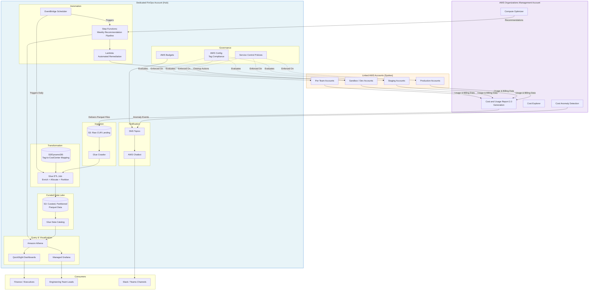

# Part XII – Resilience, Operations & Cost

# Chapter 97 — FinOps Architecture

---

# 1. Executive Summary

Cloud spend does not fail loudly. It fails quietly, one unattached EBS volume, one over-provisioned RDS instance, one forgotten NAT Gateway in a sandbox account at a time. By the time finance notices, the monthly bill has already grown 40% year-over-year with no matching increase in revenue or customer value.

FinOps Architecture is the technical foundation that makes financial accountability for cloud spend possible at scale. It is not a dashboard. It is not a monthly report. It is a set of AWS services, data pipelines, automation, and organizational processes wired together so that:

- Every dollar of spend can be attributed to a team, product, or feature.
- Engineers see the cost impact of their decisions close to the time they make them.
- Finance can forecast spend with the same rigor as revenue forecasting.
- Anomalies are detected in hours, not at the end of the billing cycle.
- Optimization is continuous and automated, not a quarterly fire drill.

## 1.1 The Business Problem

Organizations that move fast on AWS accumulate cost debt in the same way they accumulate technical debt. Common patterns:

- **Shared accounts with no tagging discipline.** Ten teams share a production account. Nobody can say which team's workload drives which line item.
- **Reactive cost management.** Finance receives the bill, is surprised, and asks engineering to "look into it" after the money is already spent.
- **No unit economics.** Leadership cannot answer "what does it cost us to serve one customer, one transaction, one API call?" — which means cloud spend cannot be tied to business value.
- **Optimization as a one-time project.** A consulting engagement rightsizes everything once, then costs creep back up over the following year because there is no continuous mechanism.
- **Procurement decisions made without engineering input, and engineering decisions made without cost visibility.** Reserved Instance purchases happen in a spreadsheet disconnected from what workloads actually run.

## 1.2 Architecture Objective

The objective of a FinOps Architecture is to make cost a first-class, real-time, queryable signal — with the same engineering rigor applied to observability (Chapter 96) or security (Part XI). Concretely, the architecture must:

1. **Ingest** billing and usage data from AWS Cost and Usage Report (CUR 2.0), Cost Explorer, and, in multi-account organizations, consolidated billing data across an AWS Organizations hierarchy.
2. **Enrich** that raw billing data with tags, business metadata (cost centers, product lines, environments), and, where tagging is incomplete, allocation rules.
3. **Store** the enriched data in a queryable format (typically S3 + Athena, or a dedicated FinOps platform) that supports both ad hoc analysis and scheduled reporting.
4. **Visualize and alert** through dashboards (QuickSight, Grafana, or third-party FinOps tools) and automated anomaly detection (AWS Cost Anomaly Detection, custom CloudWatch-based detection).
5. **Automate** optimization actions: rightsizing recommendations, Savings Plans purchase recommendations, idle resource cleanup, S3 lifecycle policies, scheduled start/stop of non-production resources.
6. **Govern** spend through budgets, Service Control Policies (SCPs) that prevent expensive resource types in non-approved accounts, and pre-deployment cost guardrails in CI/CD (cost estimation via Infracost or similar, integrated into Terraform pipelines).

## 1.3 Why Organizations Adopt This Architecture

**Cloud spend has outgrown ad hoc management.** Organizations spending under roughly $50,000/month on AWS can often manage cost with Cost Explorer and a spreadsheet. Past that threshold — and especially past $500,000/month — the number of accounts, services, and teams makes manual cost management impossible. A dedicated FinOps Architecture becomes necessary infrastructure, not an optional nicety.

**Multi-account sprawl demands consolidated visibility.** Enterprises following AWS multi-account best practices (Chapter 99 covers Landing Zone architecture in depth) end up with dozens to hundreds of AWS accounts. Without a central data pipeline pulling CUR data from every linked account into a management account (or a dedicated logging/analytics account), nobody has an enterprise-wide view of spend.

**Chargeback and showback become board-level requirements.** Once cloud spend is material to the P&L — commonly once it exceeds a few percent of revenue — finance leadership wants the same accountability from cloud spend that exists for headcount or capital expenditure. Engineering leaders need per-team, per-product cost breakdowns to defend budgets and justify infrastructure investment.

**Unit economics drive product and pricing decisions.** SaaS companies in particular need to know the marginal cost of serving each customer or tenant. This number directly affects pricing tiers, gross margin targets, and decisions about which customer segments are profitable.

**Cost anomalies indicate operational or security problems, not just billing problems.** A sudden spike in EC2 spend might indicate a runaway Auto Scaling Group, a misconfigured Lambda causing infinite retries, or — in the worst case — compromised credentials being used for cryptocurrency mining. A mature FinOps Architecture doubles as an early warning system.

## 1.4 Major Business Benefits

| Benefit | Description | Typical Impact |
|---|---|---|
| Direct cost reduction | Rightsizing, idle resource elimination, storage tiering, Reserved Instance/Savings Plan coverage | 15–35% reduction in gross spend within 6–12 months |
| Improved forecasting accuracy | Historical usage trends plus committed-use coverage feed finance forecasting models | Forecast variance reduced from ±30% to ±5–10% |
| Faster anomaly detection | Automated anomaly detection versus end-of-month bill review | Detection time reduced from 30+ days to under 24 hours |
| Engineering accountability | Per-team cost dashboards create ownership | Sustained cost discipline instead of one-time cleanup |
| Better architectural decisions | Cost visibility at design time (Infracost in CI/CD) prevents expensive patterns from reaching production | Fewer post-deployment cost surprises |
| Support for pricing strategy | Accurate unit economics inform product pricing | Improved gross margin visibility per product line |

## 1.5 Typical Enterprise Scenarios

- **A 200-account AWS Organization** where the platform team needs to build a Cost and Usage Report pipeline that aggregates spend across every linked account, tags it by business unit, and publishes daily dashboards to finance and engineering leadership.
- **A SaaS company with per-tenant infrastructure** (Chapter 59 covers SaaS Multi-Tenant architecture) that needs to calculate cost-per-tenant to identify unprofitable customers and inform tiered pricing.
- **A regulated enterprise** (banking, healthcare, insurance — see Part IX) that must demonstrate cost allocation controls as part of internal audit and must prevent cost-driving resource types (e.g., large GPU instances, cross-region data transfer) from being provisioned outside of approved workflows.
- **An engineering organization scaling from 20 to 200 engineers** that previously managed cost informally and now needs guardrails: budget alerts per team, mandatory tagging enforced by SCP, and a chargeback model tied to the internal billing system.
- **A company preparing for an acquisition or IPO** where cloud spend needs to be auditable, well-documented, and defensible to external stakeholders, with clear architecture decision records explaining why spend is allocated the way it is.

Throughout the rest of this chapter, we design, build, and operate a complete FinOps Architecture: from raw CUR ingestion through automated optimization actions, security controls, disaster recovery for the FinOps data pipeline itself, and a full enterprise case study.

---

# 2. Business Requirements

## 2.1 Business Drivers

- Cloud spend has grown faster than revenue for the past three fiscal quarters and finance has escalated to the CTO.
- The organization operates 60+ AWS accounts under AWS Organizations with no consolidated cost visibility.
- Engineering leadership cannot answer "what does Team X cost us per month?" without a multi-day manual export exercise.
- The board has asked for gross margin visibility by product line, which requires accurate cloud cost allocation.
- A recent cost anomaly (a misconfigured Auto Scaling Group left running in a test account) went undetected for three weeks and cost $85,000.

## 2.2 Functional Requirements

| ID | Requirement |
|---|---|
| FR-01 | Ingest AWS Cost and Usage Report (CUR 2.0) data from all linked accounts into a central data lake |
| FR-02 | Support tag-based cost allocation with at least five mandatory cost allocation tags |
| FR-03 | Provide a fallback allocation mechanism for untagged or unallocatable spend |
| FR-04 | Publish daily-refreshed dashboards segmented by account, team, product, and environment |
| FR-05 | Detect cost anomalies within 24 hours of occurrence and notify the responsible team |
| FR-06 | Generate weekly rightsizing and idle-resource recommendations |
| FR-07 | Track Reserved Instance and Savings Plan coverage and utilization |
| FR-08 | Enforce per-team and per-account budgets with automated alerting at 50/80/100% thresholds |
| FR-09 | Provide self-service cost query access (SQL) to engineering teams without granting Cost Explorer console access broadly |
| FR-10 | Estimate infrastructure cost changes at pull-request time in CI/CD pipelines |
| FR-11 | Calculate cost-per-tenant / cost-per-customer for chargeback purposes |
| FR-12 | Support show-back reporting exportable to the finance ERP system |

## 2.3 Non-Functional Requirements

**Scalability goals**

- Support 500+ linked AWS accounts without redesign of the ingestion pipeline.
- Handle CUR files that grow to tens of gigabytes per day as usage scales.
- Query performance must remain sub-10-second for standard dashboard queries even as historical data grows to multiple years.

**Availability requirements**

- The reporting pipeline should target 99.5% monthly availability. This is a batch analytics system, not a customer-facing service, so availability requirements are materially lower than the production workloads it monitors.
- A missed daily refresh is tolerable; a missed refresh lasting more than 72 hours should trigger an operational incident.

**Latency requirements**

- Anomaly detection alerts should reach the responsible team within 24 hours of the anomalous spend occurring (AWS Cost Anomaly Detection typically evaluates daily).
- Ad hoc Athena queries against the cost data lake should return in under 15 seconds for a single month of data and under 60 seconds for a full year, assuming partitioning best practices are followed (see Section 18).

**Compliance requirements**

- Cost data often reveals sensitive business information — headcount-adjacent signals, product investment levels, M&A due diligence signals. Access must be restricted using IAM and, where used, row-level or column-level security in the BI layer.
- For regulated industries, cost allocation reports must be retained for the same period as financial records generally (commonly 7 years) to support audit.

**Security expectations**

- CUR data lands in a dedicated, tightly access-controlled account (commonly the Organizations management account or a dedicated "billing" / "finops" account) — never a general-purpose data account.
- Encryption at rest (SSE-KMS) and in transit (TLS) for all cost data.
- No engineer should have write access to billing configuration; billing configuration changes should require a change-managed process.

**Recovery objectives**

- **RPO (Recovery Point Objective):** 24 hours — losing up to one day of ingested cost data is acceptable because CUR data can be re-exported from AWS Billing for the affected period.
- **RTO (Recovery Time Objective):** 8 business hours — dashboards being unavailable for a business day is tolerable; longer outages start to affect budget decision-making.

**SLAs**

- Internal SLA: daily cost dashboards refreshed by 9:00 AM in the primary business time zone.
- Internal SLA: anomaly alerts delivered within 24 hours of detection by the underlying AWS Cost Anomaly Detection service.

**Expected workload**

- Initial: 60 linked accounts, ~$800K/month AWS spend, CUR files in the low gigabytes per day.
- 12-month projection: 150 linked accounts, ~$2.5M/month AWS spend, driven by geographic expansion and new product lines.

**Expected growth**

- Account count and spend are expected to grow 2–3x over 18 months following an acquisition roadmap; the architecture must accommodate new linked accounts being onboarded to Organizations without manual re-architecture of the cost pipeline.

---

# 3. Architecture Overview

## 3.1 Overall Design

The FinOps Architecture in this chapter follows a **hub-and-spoke data pipeline pattern**, layered on top of an existing AWS Organizations multi-account structure.

- **Spokes** are every linked AWS account in the Organization — production, staging, sandbox, per-team accounts.
- **Hub** is a dedicated **FinOps account** (sometimes called the "billing" or "cost-management" account) that:
  - Receives the consolidated Cost and Usage Report from the Organizations management account.
  - Runs the ETL pipeline that enriches, partitions, and catalogs the data.
  - Hosts the query layer (Athena) and dashboarding layer (QuickSight or Grafana).
  - Runs the automation Lambda functions that generate recommendations and enforce budgets.

## 3.2 Architecture Philosophy

Three principles guide every design decision in this chapter:

1. **Cost data is just another data pipeline.** Treat it with the same engineering discipline as any other analytics pipeline: schema-on-read via Glue Catalog, partitioned storage, idempotent ETL, infrastructure as code. Do not build a bespoke, unmaintainable set of scripts.
2. **Tagging is a governance problem, not a technical problem.** The architecture provides the mechanisms (SCPs, Config rules, tag policies) to enforce tagging, but organizational buy-in and a tagging standard owned by a cross-functional team are what make allocation accurate.
3. **Optimization must be continuous and automated.** A quarterly cost review finds problems that have already cost money for three months. Automated daily/weekly recommendation generation, plus guardrails at deployment time, catch problems before or immediately after they start accruing cost.

## 3.3 Core Components

| Layer | Component | Purpose |
|---|---|---|
| Data source | AWS Cost and Usage Report (CUR 2.0) | Line-item-level billing data, the source of truth |
| Data source | AWS Cost Explorer API | Aggregated cost/usage queries, forecasting |
| Data source | AWS Cost Anomaly Detection | Managed anomaly detection on spend patterns |
| Data source | AWS Compute Optimizer / Trusted Advisor | Rightsizing and idle resource recommendations |
| Ingestion | S3 (CUR delivery bucket) | Landing zone for raw CUR Parquet/CSV exports |
| Ingestion | AWS Glue (Crawler + ETL Jobs) | Schema discovery, partitioning, enrichment |
| Ingestion | EventBridge + Lambda | Orchestration of ETL triggers and automation |
| Storage | S3 (curated data lake) | Partitioned, enriched, query-optimized cost data |
| Catalog | AWS Glue Data Catalog | Schema registry queried by Athena / QuickSight |
| Query | Amazon Athena | Serverless SQL over the cost data lake |
| Visualization | Amazon QuickSight | Executive and team dashboards |
| Visualization (alt.) | Managed Grafana | Engineering-facing dashboards, integrates with existing observability stack |
| Governance | AWS Budgets | Threshold-based alerting per account/team/tag |
| Governance | Service Control Policies | Prevent non-compliant resource provisioning |
| Governance | AWS Config | Tag compliance rules |
| Automation | Lambda + Step Functions | Scheduled cleanup, rightsizing actions, report generation |
| Notification | SNS / Chatbot (Slack, Teams) | Alert delivery |
| Security | KMS, IAM | Encryption and least-privilege access to cost data |

## 3.4 How Components Interact — High-Level Workflow

1. AWS Billing generates the Cost and Usage Report daily/hourly for the entire Organization and delivers it as partitioned Parquet files to an S3 bucket in the management account (or a delegated billing account).
2. An S3 event (or scheduled Glue Crawler) triggers cataloging of new CUR partitions.
3. A Glue ETL job enriches raw line items: joins against a tag-to-cost-center mapping table, applies allocation rules for untagged resources, and writes curated output to a separate, query-optimized S3 prefix, partitioned by year/month/day and account ID.
4. Athena queries the curated data directly; QuickSight datasets and Grafana panels query through Athena (or a QuickSight SPICE cache for performance).
5. AWS Cost Anomaly Detection runs independently against Cost Explorer data and pushes anomalies via SNS.
6. A Lambda function subscribed to Cost Anomaly Detection SNS topics enriches anomalies with account/team ownership metadata and posts to Slack/Teams.
7. Scheduled Lambda functions (via EventBridge Scheduler) run weekly to pull Compute Optimizer recommendations, cross-reference them with the curated cost data, and generate a prioritized rightsizing report.
8. AWS Budgets, configured per team/account/tag, send alerts independently at 50/80/100% thresholds directly to Slack/Teams via SNS/Chatbot.

## 3.5 Request, Response, and Data Lifecycle

**Data lifecycle (the primary lifecycle in this architecture):**

- Raw CUR data lands in S3 → retained 90 days in Standard, then transitioned to Glacier Instant Retrieval for audit purposes (7-year retention for regulated industries).
- Curated/enriched data lands in a separate S3 prefix → retained in S3 Standard for 13 months (covers trailing-twelve-month plus current-month reporting), then moved to S3 Standard-IA, then Glacier for long-term retention.
- QuickSight SPICE datasets refresh daily, giving dashboards effectively next-day data.

**"Request" lifecycle (for the query/dashboard layer):**

1. A finance analyst opens a QuickSight dashboard.
2. QuickSight serves from its in-memory SPICE cache (sub-second) rather than querying Athena live, keeping the experience fast and keeping Athena scan costs low.
3. An engineer runs an ad hoc Athena query for a deeper investigation (e.g., "show me all EC2 spend for account X tagged team=payments in the last 30 days").
4. Athena scans only the relevant partitions (year/month/day, account_id) due to the partitioning strategy defined in Section 18, keeping scan cost and latency low.

**"Response" lifecycle (for automation actions):**

1. A weekly Step Functions execution pulls Compute Optimizer recommendations.
2. Recommendations are filtered against a policy (e.g., only recommend action where projected savings exceed $50/month and confidence is "high").
3. A report is generated and posted to a shared channel; for pre-approved low-risk actions (e.g., deleting unattached EBS volumes older than 30 days in non-production accounts), an automated remediation Lambda executes directly with full audit logging via CloudTrail.

---

# 4. AWS Services Used

## 4.1 AWS Cost and Usage Report (CUR 2.0)

- **Purpose:** The authoritative, line-item-level export of all billing and usage data across an AWS Organization. This is the single source of truth for all cost analysis in this architecture.
- **Why selected:** CUR 2.0 provides hourly or daily granularity, is delivered directly to S3 in Parquet format (query-optimized), and includes resource-level tags, making it the only AWS-native source with enough detail for accurate tag-based allocation.
- **Alternatives:** Cost Explorer API (aggregated, less granular, rate-limited, unsuitable as a bulk data source); third-party billing exports from a Cloud Management Platform (adds vendor dependency and cost).
- **Limitations:** CUR delivery has a lag (commonly several hours to a day); schema changes between CUR versions require ETL updates; very large organizations generate CUR files large enough that query design (partitioning) becomes essential to control Athena scan costs.
- **Pricing considerations:** CUR itself is free to generate; the cost is in S3 storage and the compute (Glue, Athena) used to process and query it.
- **Best practices:** Enable CUR 2.0 (not the legacy CUR) for Parquet output and improved schema; enable resource IDs and split cost allocation tags; deliver to a dedicated, access-restricted S3 bucket.

## 4.2 AWS Cost Explorer

- **Purpose:** Interactive, aggregated cost and usage exploration with built-in forecasting.
- **Why selected:** Provides a fast, no-ETL-required way for finance and engineering to explore trends without waiting for the data lake pipeline; also the underlying data source for AWS Cost Anomaly Detection and rightsizing recommendations.
- **Alternatives:** Building all reporting exclusively on the CUR data lake — viable, but loses Cost Explorer's built-in forecasting models and immediate availability (no ETL lag).
- **Limitations:** API rate limits; aggregated data only, not suitable for line-item-level chargeback; 12-month lookback in the UI, longer via API.
- **Pricing considerations:** Cost Explorer UI is free; the Cost Explorer API is charged per request (a cost worth monitoring if automation queries it frequently — cache results).
- **Best practices:** Use for executive dashboards and forecasting; use the CUR data lake for detailed allocation and chargeback; cache API responses to avoid redundant charges.

## 4.3 AWS Cost Anomaly Detection

- **Purpose:** Machine-learning-based detection of unusual spend patterns, evaluated against historical usage per service, account, or cost category.
- **Why selected:** Native AWS service, no infrastructure to manage, integrates directly with SNS for alerting, and has proven effective at catching the "someone left a large instance running" class of incident that end-of-month review misses.
- **Alternatives:** Custom CloudWatch anomaly detection on billing metrics (more flexible but requires building and tuning your own model); third-party FinOps platforms with proprietary anomaly detection.
- **Limitations:** Detection is typically next-day, not real-time; works best with monitors scoped sensibly (per-account or per-service) rather than one Organization-wide monitor, which dilutes sensitivity.
- **Pricing considerations:** Free.
- **Best practices:** Create multiple monitors scoped by linked account and by major service category; set alert thresholds based on absolute dollar impact, not just percentage change, to avoid alert fatigue from small accounts with naturally volatile percentage swings.

## 4.4 AWS Budgets

- **Purpose:** Threshold-based budget tracking and alerting against cost, usage, Reserved Instance/Savings Plans utilization and coverage.
- **Why selected:** Native, free (for a generous number of budgets), integrates with SNS/Chatbot for near-real-time alerting, and supports budgets scoped by tag, account, or service.
- **Alternatives:** Custom budget tracking built on top of the CUR data lake (more flexible, more engineering effort); third-party tools.
- **Limitations:** Budget action automation (auto-remediation, such as stopping resources) requires IAM permissions and careful scoping to avoid accidentally terminating production workloads.
- **Pricing considerations:** First several dozen budgets are free per account; budget actions may incur minor charges.
- **Best practices:** Create budgets per team using cost allocation tags; use budget actions cautiously and only in non-production accounts for automated remediation.

## 4.5 AWS Compute Optimizer

- **Purpose:** Rightsizing recommendations for EC2, Auto Scaling Groups, EBS, Lambda, and ECS on Fargate, based on actual utilization metrics (CPU, memory where available, network).
- **Why selected:** Native, no cost, uses real CloudWatch utilization data rather than static thresholds, and provides projected savings per recommendation.
- **Alternatives:** Trusted Advisor cost checks (broader but shallower); third-party rightsizing tools with more sophisticated modeling (often better for GPU or specialized workloads).
- **Limitations:** Requires CloudWatch Agent for memory-based recommendations on EC2; recommendations need human/automated review before action, since utilization data alone doesn't capture business context (e.g., planned traffic spikes).
- **Pricing considerations:** Free.
- **Best practices:** Enable Compute Optimizer at the Organization level; integrate recommendations into the weekly automation pipeline described in Section 16 rather than reviewing manually.

## 4.6 Amazon S3

- **Purpose:** Storage for raw CUR exports and the curated, partitioned cost data lake.
- **Why selected:** Effectively unlimited scale, native lifecycle policies for automated tiering, and the standard storage layer for both Glue/Athena and QuickSight SPICE ingestion.
- **Alternatives:** None reasonable for this use case at AWS-native scale; a relational database could hold curated summary tables but would not scale to raw line-item CUR volume cost-effectively.
- **Limitations:** Query performance depends entirely on partitioning and file format discipline (see Section 18); poorly partitioned data leads to expensive, slow Athena scans.
- **Pricing considerations:** S3 Standard for hot data (current + trailing 13 months), S3 Standard-IA and Glacier Instant Retrieval for older data.
- **Best practices:** Partition by year/month/day and account_id; use Parquet with Snappy compression (CUR 2.0 delivers this natively); apply lifecycle policies aggressively since cost data itself should not become a cost problem.

## 4.7 AWS Glue

- **Purpose:** Serverless ETL (Glue Jobs) and schema cataloging (Glue Crawlers, Glue Data Catalog) for transforming raw CUR data into the curated, enriched, query-optimized dataset.
- **Why selected:** Serverless, scales automatically with data volume, integrates natively with Athena and QuickSight via the shared Data Catalog, and supports the tag-enrichment and allocation-rule logic needed to turn raw billing data into business-meaningful reporting.
- **Alternatives:** Lambda-based ETL (viable at smaller data volumes, becomes unwieldy as CUR file sizes grow); a self-managed Spark cluster on EMR (unnecessary operational overhead for this workload).
- **Limitations:** Glue job cold-start and DPU-based pricing means very small, frequent jobs can be inefficient; crawler runs have their own cost and should be scheduled, not continuous.
- **Pricing considerations:** Billed per DPU-hour; right-size worker type and count for the actual daily CUR data volume.
- **Best practices:** Use Glue job bookmarks to process only new data incrementally; separate the crawler (schema discovery) from the ETL job (transformation) so schema drift doesn't silently break transformations.

## 4.8 Amazon Athena

- **Purpose:** Serverless SQL query engine over the S3-based cost data lake, used for both ad hoc analysis and as the query backend for QuickSight/Grafana dashboards.
- **Why selected:** No infrastructure to manage, pay-per-query pricing aligns well with the "occasional deep-dive query, daily scheduled dashboard refresh" access pattern, and it queries the Glue Data Catalog directly with no data movement.
- **Alternatives:** Redshift (better for very high query concurrency and complex joins at scale, but requires provisioned or Serverless capacity and is a heavier operational and cost commitment); Redshift Spectrum as a hybrid.
- **Limitations:** Athena is priced per byte scanned, so poor partitioning directly translates into higher query cost — the FinOps tool must itself be cost-optimized; not ideal for very high-concurrency interactive dashboards without a caching layer (QuickSight SPICE fills this role here).
- **Pricing considerations:** $5 per TB scanned (rate varies by region); partitioning and columnar Parquet format are the primary cost levers.
- **Best practices:** Always filter on partition columns; use `MSCK REPAIR` or Glue Crawler scheduling to keep partitions current; set up Athena workgroups with per-workgroup query result limits to prevent runaway ad hoc queries from unexpected cost.

## 4.9 Amazon QuickSight

- **Purpose:** Business intelligence dashboards for executives, finance, and team leads.
- **Why selected:** Native AWS integration with Athena and the Glue Catalog, per-user pricing that scales with actual dashboard consumers rather than infrastructure, and row-level security features suitable for restricting teams to their own cost data.
- **Alternatives:** Managed Grafana (preferred by engineering-heavy audiences already using Grafana for observability — see Chapter 96); third-party FinOps SaaS platforms (CloudHealth, Cloudability, Vantage) which add polished FinOps-specific workflows at additional license cost.
- **Limitations:** SPICE capacity is a separate cost dimension to plan for; less flexible than Grafana for engineers who want raw SQL exploration (Athena directly serves that need).
- **Pricing considerations:** Per-user monthly/session pricing plus SPICE capacity; often cheaper than third-party FinOps platforms for organizations already invested in the AWS ecosystem.
- **Best practices:** Use SPICE for dashboards that many people view repeatedly (reduces Athena query cost); apply row-level security so team leads see only their team's data by default.

## 4.10 AWS Organizations & Consolidated Billing

- **Purpose:** The multi-account structure that enables a single Cost and Usage Report to cover every linked account, and the mechanism for applying Service Control Policies that enforce cost-related guardrails.
- **Why selected:** It is the AWS-native foundation for both governance and consolidated billing; without it, this architecture would need to aggregate billing data account-by-account with no native discount sharing (Reserved Instance and Savings Plans benefits are shared across the Organization by default).
- **Alternatives:** None at the "how do multiple AWS accounts share billing" layer — Organizations is effectively mandatory for any enterprise-scale AWS footprint. See Chapter 88 (Multi-Account Security) and Chapter 99 (Reference Landing Zone) for the full account structure this chapter assumes.
- **Limitations:** Requires careful account structure design; SCPs can inadvertently block legitimate workloads if not tested in a non-production OU first.
- **Pricing considerations:** Free; the value is in shared Reserved Instance/Savings Plans discounts and consolidated invoicing.
- **Best practices:** Delegate billing/cost administration to a dedicated FinOps account rather than operating everything from the Organizations management account, to reduce blast radius of the highest-privilege account.

## 4.11 IAM

- **Purpose:** Least-privilege access control over billing data, cost management tools, and the automation functions that take remediation actions.
- **Why selected:** Standard AWS access control layer; billing data sensitivity (Section 2.3) demands the same rigor as any other sensitive data domain.
- **Alternatives:** None — IAM is foundational.
- **Limitations:** Billing permissions historically defaulted to being visible to any account root user; must be explicitly scoped down via IAM policy and, where relevant, `aws-portal` billing permissions and IAM policies for Cost Explorer/Budgets actions.
- **Pricing considerations:** Free.
- **Best practices:** Create a dedicated `FinOpsReadOnly` role for broad cost visibility, and a separate, tightly scoped `FinOpsAdmin` role for anyone configuring budgets, CUR exports, or anomaly monitors. See Section 10.

## 4.12 KMS

- **Purpose:** Encryption of cost data at rest — the S3 buckets holding raw and curated CUR data, and any Redshift/RDS-based summary stores if used.
- **Why selected:** Customer-managed KMS keys provide auditable, revocable encryption with fine-grained key policies, distinct from the default S3-managed encryption, which is important given billing data's sensitivity.
- **Alternatives:** SSE-S3 (simpler, but no fine-grained key policy control or key rotation auditability).
- **Limitations:** KMS key policies must explicitly grant Glue, Athena, and QuickSight service roles decrypt permissions, or the pipeline breaks silently with access-denied errors.
- **Pricing considerations:** Per-key monthly fee plus per-request charges; negligible relative to the value of controlled access to financial data.
- **Best practices:** Use a dedicated KMS key for the FinOps account's S3 buckets; enable key rotation; restrict key policy to the specific service roles and human roles that need it.

## 4.13 EventBridge & Lambda

- **Purpose:** Orchestration — scheduling Glue job triggers, processing Cost Anomaly Detection SNS notifications, running weekly recommendation-generation jobs, and executing pre-approved automated remediation (e.g., deleting unattached volumes).
- **Why selected:** Serverless, event-driven, and the natural fit for scheduled and reactive automation without maintaining servers.
- **Alternatives:** Step Functions for more complex, multi-step orchestration (used in Section 16 for the recommendation pipeline); a scheduled batch job on ECS/Fargate for heavier processing needs.
- **Limitations:** Lambda's 15-minute maximum execution time can be a constraint for very large Organization-wide ETL orchestration — mitigated by using Glue Jobs for the actual heavy processing, with Lambda only orchestrating.
- **Pricing considerations:** Negligible at this workload's scale.
- **Best practices:** Use EventBridge Scheduler for time-based triggers (daily ETL runs, weekly recommendation reports); use SNS-to-Lambda for reactive anomaly enrichment.

## 4.14 SNS & AWS Chatbot

- **Purpose:** Delivery of budget alerts, anomaly notifications, and recommendation reports to Slack/Microsoft Teams channels owned by the relevant engineering teams and finance.
- **Why selected:** Native integration with Budgets and Cost Anomaly Detection; Chatbot removes the need to build a custom Slack integration.
- **Alternatives:** Custom webhook-based Lambda integration (more flexible formatting, more code to maintain).
- **Limitations:** Chatbot message formatting is relatively simple; complex, richly formatted reports (e.g., the weekly rightsizing report) are often better delivered as a QuickSight dashboard link or an email/PDF via SES rather than jammed into a chat message.
- **Pricing considerations:** Negligible.
- **Best practices:** Route alerts to team-specific channels using account/tag metadata rather than a single firehose channel that gets ignored.

---

# 5. Complete Architecture Diagram



---

# 6. Component-by-Component Explanation

## 6.1 CUR Landing Bucket (Raw S3)

- **Purpose:** Durable, immutable landing zone for CUR exports exactly as AWS Billing delivers them.
- **Responsibilities:** Receive Parquet file drops from the CUR delivery mechanism; retain raw data for audit and reprocessing.
- **Inputs:** CUR 2.0 export files, delivered on a schedule configured in Billing Preferences (daily is standard).
- **Outputs:** Triggers to the Glue Crawler / EventBridge for downstream processing.
- **Scaling:** S3 scales natively; no action needed as data volume grows.
- **High availability:** S3 Standard provides 99.99% availability and eleven nines durability within a region; cross-region replication (Section 13) protects against regional failure.
- **Failure handling:** If a scheduled CUR delivery fails or is delayed, downstream ETL simply has no new partition to process that day — the pipeline should detect "no new data" as a distinct alert condition (Section 24) rather than silently reporting stale numbers as current.
- **Dependencies:** AWS Billing/CUR configuration in the management account; correct S3 bucket policy granting the Billing service principal `s3:PutObject`.
- **Security:** SSE-KMS encryption; bucket policy restricting access to the Billing service principal and the FinOps ETL role only; S3 Block Public Access enabled account-wide.
- **Monitoring:** CloudWatch alarm on "no new object created" over a rolling 30-hour window (accounting for a 24-hour delivery cycle plus buffer).

## 6.2 Glue Crawler

- **Purpose:** Discover schema and register/update partitions in the Glue Data Catalog as new raw CUR data arrives.
- **Responsibilities:** Infer/confirm the CUR schema (which can evolve between CUR format versions); register new date partitions.
- **Inputs:** Raw S3 prefix.
- **Outputs:** Updated Glue Data Catalog table definitions and partitions.
- **Scaling:** Runs on a schedule (e.g., daily after expected CUR delivery time); scales automatically with data volume.
- **High availability:** Serverless; no HA configuration needed.
- **Failure handling:** Crawler failures alert via EventBridge rule on Glue job state change; a failed crawl should not silently block the downstream ETL job — the orchestration (Step Functions) should treat crawler success as a precondition.
- **Dependencies:** IAM role with read access to the raw S3 bucket and write access to the Glue Data Catalog.
- **Security:** Scoped IAM role, no broader permissions than required.
- **Monitoring:** Glue job run metrics in CloudWatch; alert on crawler failure or unexpected schema change (new/removed columns).

## 6.3 Glue ETL Job (Enrichment)

- **Purpose:** Transform raw CUR line items into the curated, business-meaningful dataset used for all downstream reporting.
- **Responsibilities:**
  - Join raw line items against the tag-to-cost-center mapping table to resolve business ownership.
  - Apply allocation rules for shared/untagged costs (Section 16 discusses allocation methodology in the cost optimization context; the mechanics live here).
  - Normalize inconsistent tag casing/values (e.g., `Team=payments` vs `team=Payments`).
  - Write output partitioned by `year`, `month`, `day`, and `account_id` in Parquet with Snappy compression.
- **Inputs:** Raw CUR partitions (new since last run, tracked via Glue job bookmarks), tag mapping reference data.
- **Outputs:** Curated S3 dataset, registered in the Glue Data Catalog.
- **Scaling:** Glue auto-scales worker count within configured bounds; DPU count should be tuned to daily data volume.
- **High availability:** Job retries are configured (2 retries) for transient failures; not a continuously-running service so traditional HA concepts apply less than failure recovery.
- **Failure handling:** On repeated failure, EventBridge triggers an SNS alert to the FinOps platform team; the previous day's curated partition remains available so dashboards degrade gracefully (showing stale-but-correct data with a "last updated" indicator) rather than breaking.
- **Dependencies:** Successful crawler run; tag mapping table current.
- **Security:** IAM role scoped to read raw bucket, write curated bucket, read/write specific Glue Catalog databases; KMS decrypt/encrypt permissions for both buckets.
- **Monitoring:** Job success/failure, job duration trend (catches gradual performance degradation as data grows), DPU-hour cost trend.

## 6.4 Curated Data Lake (S3 + Glue Catalog)

- **Purpose:** The query-optimized, partitioned dataset that every dashboard and ad hoc query reads from.
- **Responsibilities:** Serve as the single source of truth for "enriched" cost data (raw cost joined with business metadata).
- **Inputs:** Output of the Glue ETL job.
- **Outputs:** Queried by Athena, QuickSight, Grafana.
- **Scaling:** Partitioning strategy (Section 18) is what allows this to scale to years of data across hundreds of accounts without query performance degradation.
- **High availability:** Standard S3 durability/availability; cross-region replication for DR.
- **Failure handling:** Immutable, append-only writes per partition reduce risk of corruption; reprocessing a given day's data is idempotent (job bookmark plus partition overwrite).
- **Dependencies:** Glue ETL job, Glue Data Catalog.
- **Security:** SSE-KMS; access restricted to the Athena/QuickSight/Grafana service roles and the `FinOpsReadOnly`/`FinOpsAdmin` IAM roles.
- **Monitoring:** Storage growth trend (feeds the lifecycle policy tuning discussed in Section 16); partition count (very high partition counts can slow Athena query planning and may indicate a partitioning scheme needing revision).

## 6.5 Athena

- **Purpose:** SQL query engine for both human ad hoc analysis and machine (dashboard, automation) access to the curated data lake.
- **Responsibilities:** Execute cost-attributed, tag-enriched queries with predictable, controlled cost via partition pruning.
- **Inputs:** SQL queries against the Glue Catalog tables.
- **Outputs:** Query results to S3 (query result location), consumed by QuickSight/Grafana/CLI users.
- **Scaling:** Serverless, scales per-query; workgroup-level controls (per-query data scan limits) prevent runaway cost.
- **High availability:** Managed service; no HA configuration required beyond standard regional availability.
- **Failure handling:** Failed queries surface directly to the calling application/dashboard; no special handling needed beyond standard retry logic in QuickSight/Grafana connectors.
- **Dependencies:** Glue Data Catalog, curated S3 data.
- **Security:** IAM policies scoping which principals can query which Glue databases/tables; workgroup-based cost controls.
- **Monitoring:** Per-workgroup data-scanned metrics (direct cost driver), query failure rate, query latency distribution.

## 6.6 QuickSight / Grafana (Visualization)

- **Purpose:** Human-facing dashboards for finance, executives, and engineering teams.
- **Responsibilities:** Present cost trends, budget-vs-actual, team/product breakdowns, and forecast views; enforce row-level security so teams see only authorized data.
- **Inputs:** Athena query results (directly, or cached in QuickSight SPICE).
- **Outputs:** Rendered dashboards, scheduled email/PDF reports.
- **Scaling:** SPICE capacity and QuickSight user licensing scale independently of the data pipeline.
- **High availability:** Managed SaaS-like service (QuickSight) or Managed Grafana workspace; standard regional availability.
- **Failure handling:** SPICE refresh failure retains the previous successful dataset, so dashboards show stale-but-valid data with a visible last-refresh timestamp rather than failing outright.
- **Dependencies:** Athena, Glue Catalog, underlying curated data freshness.
- **Security:** Row-level security mapping viewer identity to permitted account/team scope; SSO integration with the existing corporate identity provider.
- **Monitoring:** SPICE refresh success/failure, dashboard view analytics (adoption tracking).

## 6.7 Automation Layer (Step Functions, Lambda, EventBridge Scheduler)

- **Purpose:** Turn passive reporting into active optimization — scheduled recommendation generation and, for pre-approved low-risk cases, automated remediation.
- **Responsibilities:** Pull Compute Optimizer/Trusted Advisor recommendations weekly, cross-reference against curated cost data for dollar-impact prioritization, generate reports, and execute approved automated cleanup actions (Section 16).
- **Inputs:** Compute Optimizer API, Trusted Advisor API, curated cost data (via Athena).
- **Outputs:** Weekly report (QuickSight dashboard update or emailed summary), remediation actions logged via CloudTrail.
- **Scaling:** Serverless; scales with account count naturally.
- **High availability:** Step Functions standard workflows retry on transient failure; failures alert via CloudWatch/EventBridge.
- **Failure handling:** Any automated remediation action is preceded by a dry-run/report-only mode in non-production before being enabled for automatic execution; failures in remediation actions do not retry blindly (avoids repeated unintended deletions) and instead alert for human review.
- **Dependencies:** IAM permissions scoped per remediation action type (Section 10); Compute Optimizer/Trusted Advisor enabled at the Organization level.
- **Security:** Remediation Lambda IAM role is the most sensitive identity in this architecture — scoped tightly to specific, pre-approved actions (e.g., `ec2:DeleteVolume` only on volumes matching a specific tag and age filter) with an explicit deny on production account IDs.
- **Monitoring:** Remediation action count/type/dollar-impact logged and reviewable; any remediation failure alerts immediately.

## 6.8 Governance Layer (Budgets, SCPs, Config)

- **Purpose:** Prevent cost problems before they occur, not just report on them after the fact.
- **Responsibilities:** Budget threshold alerting; SCP-based prevention of non-compliant resource provisioning (e.g., blocking specific expensive instance families outside of an approved OU); Config rules that flag untagged resources for remediation.
- **Inputs:** Organization structure (OUs), tag policies, budget definitions.
- **Outputs:** Preventive controls (SCPs applied at the OU level) and detective controls (Config rule evaluations, budget alerts).
- **Scaling:** Applied at the OU level, so new accounts inherit governance automatically upon being placed in the correct OU — critical for the account-growth projection in Section 2.
- **High availability:** SCPs and Config are foundational AWS Organizations/Config features with standard high availability.
- **Failure handling:** SCP changes are tested in a non-production OU before being applied broadly, since an overly restrictive SCP can break legitimate workloads Organization-wide.
- **Dependencies:** AWS Organizations OU structure (Chapter 99).
- **Security:** SCP and Config rule changes are themselves governed by a change-management process, since they are high-blast-radius controls.
- **Monitoring:** Config compliance dashboard for tag policy adherence (feeds directly into the allocation-accuracy metric tracked in Section 16).

---

# 7. End-to-End Request Flow

The following describes the daily "cost data becomes a dashboard number" flow, followed by the anomaly-alert flow.

**A. Daily Cost Data Pipeline**

1. AWS Billing generates the day's CUR increment and delivers Parquet files to the raw landing S3 bucket in the FinOps account, per the schedule configured in the Organizations management account's Billing Preferences.
2. An S3 event notification (or the daily EventBridge Scheduler trigger) signals that new data may be present.
3. The Glue Crawler runs, confirming schema and registering any new partitions in the Glue Data Catalog.
4. EventBridge triggers the Glue ETL job upon successful crawler completion.
5. The Glue ETL job reads new raw partitions (via job bookmark, so only genuinely new data is processed), joins against the tag-to-cost-center mapping table, applies allocation rules for unallocated spend, and writes curated, partitioned Parquet output.
6. The curated output is registered in the Glue Data Catalog (new partitions added).
7. QuickSight's scheduled SPICE refresh runs after the ETL job's expected completion window, pulling fresh data via Athena into the in-memory cache.
8. Finance and team-lead users open QuickSight dashboards during business hours and see data current as of the prior day's close, served instantly from SPICE.
9. An engineer investigating a specific cost question runs an ad hoc Athena query directly against the curated table, filtering on partition columns (`year`, `month`, `day`, `account_id`) to keep the query fast and cheap.
10. Logging: every Glue job run, Athena query, and QuickSight refresh is logged to CloudWatch Logs; CloudTrail records all API-level actions against the pipeline's AWS resources.
11. Monitoring: CloudWatch alarms watch for missed CUR delivery, Glue job failure, and SPICE refresh failure, alerting the FinOps platform team via SNS/Chatbot.
12. Error handling: on any pipeline stage failure, the previous day's curated data remains queryable and visible on dashboards (with a visible staleness indicator), avoiding a hard outage of the reporting function while the underlying issue is triaged.

**B. Cost Anomaly Alert Flow**

1. AWS Cost Anomaly Detection evaluates usage against its learned baseline for each configured monitor (scoped per linked account and per major service category).
2. An anomaly exceeding the configured dollar-impact threshold triggers an SNS notification.
3. A Lambda function subscribed to the SNS topic enriches the raw anomaly payload with account ownership metadata (looked up from the same tag-to-cost-center mapping table used in ETL).
4. The enriched alert is posted via AWS Chatbot to the Slack/Teams channel owned by the responsible team, and copied to a central FinOps channel for visibility.
5. The responsible team investigates using Athena/QuickSight, scoped to the flagged account and time window.
6. If the anomaly is confirmed as unintended spend (e.g., a forgotten large instance), the team remediates directly, or — for pre-approved patterns in non-production accounts — the automated remediation Lambda (Section 6.7) has already acted and the alert serves as a confirmation/audit record rather than a call to action.
7. Resolution is logged (manually, in a lightweight tracking mechanism — e.g., a tagged ticket) to feed the monthly FinOps review and the lessons-learned process (Section 23).

---

# 8. Deployment Flow

## 8.1 Infrastructure Provisioning

All infrastructure in this architecture — S3 buckets, Glue jobs/crawlers, Athena workgroups, IAM roles, Budgets, Cost Anomaly Detection monitors, EventBridge rules, Step Functions state machines, Lambda functions — is provisioned via Terraform (Section 18 provides full examples), never manually through the console. This matters especially for a FinOps platform: manual console changes to billing-adjacent infrastructure are themselves a governance gap the architecture is meant to close.

## 8.2 Terraform Workflow

1. Engineer opens a pull request against the `finops-infrastructure` repository.
2. CI runs `terraform fmt -check`, `terraform validate`, and a policy-as-code check (e.g., Open Policy Agent or Checkov) to catch misconfigurations such as unencrypted S3 buckets or overly permissive IAM policies before merge.
3. `terraform plan` output is posted as a PR comment for review.
4. On approval and merge to `main`, a CD pipeline (Section 20) runs `terraform apply` against the FinOps account using a dedicated deployment role.

## 8.3 CI/CD Deployment

- Infrastructure changes deploy through the same CI/CD platform used for the rest of the organization's Terraform (GitHub Actions, GitLab CI, or CodePipeline — see Section 20).
- The FinOps account's Terraform state is stored remotely (S3 backend with DynamoDB locking) in a dedicated state bucket, separate from application infrastructure state, to keep blast radius contained.

## 8.4 Blue-Green Deployment (applied to Glue ETL logic)

- Because the Glue ETL job's transformation logic can change (new allocation rules, new tag mappings), new job script versions are deployed to a distinct job name/version first, run in "shadow mode" against a copy of recent raw data, and the output is diffed against the current production curated dataset before the new logic replaces the production job. This catches allocation-logic regressions before they silently corrupt a month of cost reporting.

## 8.5 Rollback

- Terraform state and version-controlled job scripts make infrastructure rollback a standard `git revert` plus `terraform apply`.
- Curated data corruption from a bad ETL deployment is recoverable by reprocessing raw CUR data (retained per the lifecycle policy) through the previous, known-good job script version — this is why raw CUR retention (90 days minimum, longer for regulated industries) is a hard requirement, not just nice-to-have.

## 8.6 Secrets

- No traditional application secrets exist in this architecture (no database passwords, no API keys to third parties, assuming a fully AWS-native stack). If a third-party FinOps tool or Slack webhook is integrated, its credentials are stored in Secrets Manager, never in Terraform variables or environment variables in plaintext.

## 8.7 Configuration

- Tag-to-cost-center mapping and allocation rules are stored as versioned configuration (a DynamoDB table or a versioned S3/JSON file) rather than hardcoded in the Glue job script, so business teams can propose mapping changes via pull request without needing to touch ETL code.

## 8.8 Validation

- Post-deployment validation runs a smoke-test Athena query against the curated table to confirm expected row counts and no null cost-center values beyond the expected "unallocated" bucket, alerting if allocation accuracy (Section 16) regresses after a deployment.

---

# 9. Network Topology

The FinOps Architecture is primarily a data/analytics workload, not a network-heavy, latency-sensitive service, so the networking footprint is intentionally minimal.

## 9.1 VPC

- Glue jobs, if they need to reach resources requiring VPC connectivity (uncommon for this architecture, since sources are S3 and AWS APIs), run in a dedicated, private-subnet-only VPC within the FinOps account.
- Athena, QuickSight, Lambda (when not requiring VPC access), Step Functions, and SNS are accessed via AWS's public API endpoints (already TLS-encrypted) or VPC endpoints — most of this architecture does not require a VPC at all, since it interacts with S3 and AWS service APIs rather than running network-addressable compute.

## 9.2 CIDR / Subnets

- If a VPC is used (e.g., for a Lambda function that must reach an internal API for tag-mapping lookups), a small `/24` CIDR with two private subnets across two AZs is sufficient — this workload has no meaningful throughput or availability requirement that demands a larger footprint.
- No public subnets are required; there is no inbound traffic to this architecture from the internet.

## 9.3 NAT Gateway / Internet Gateway

- If Lambda functions in a private subnet need outbound internet access (e.g., to call a third-party FinOps tool's API), a NAT Gateway is required — but see the Cost Surprises section (34.8): NAT Gateway costs are frequently underestimated for exactly this kind of low-traffic-but-always-provisioned use case. **Prefer VPC Endpoints for S3, DynamoDB, Athena, Glue, and other AWS service traffic** to avoid NAT Gateway costs entirely wherever the destination is an AWS service rather than a third party.

## 9.4 Transit Gateway / PrivateLink

- Not required for this architecture in isolation. If the FinOps account needs to query operational metadata (e.g., resource tags) from application accounts via a private API rather than through CUR/tags alone, PrivateLink or cross-account IAM roles (preferred, simpler) are the appropriate mechanisms — Transit Gateway is unnecessary overhead for this specific workload.

## 9.5 Route Tables / NACLs / Security Groups

- Where a VPC is used, private subnet route tables send AWS-service-bound traffic through VPC Gateway/Interface Endpoints and any third-party-bound traffic through the NAT Gateway.
- Security Groups on any Lambda-attached ENIs restrict outbound traffic to only the specific required destinations (VPC endpoint prefix lists, or specific third-party IP ranges/domains via a proxy if strict egress control is required).
- Default NACLs are sufficient; this workload has no unusual network security requirement beyond standard least-privilege egress control.

## 9.6 Hybrid Connectivity

- Not applicable. This architecture has no on-premises dependency in the standard case. If the organization's ERP/finance system for chargeback export is on-premises, a narrowly scoped, existing Direct Connect/VPN path (shared with other enterprise integrations — see Chapter 23/24) is used for that specific export, not a dedicated hybrid connection built for FinOps alone.

---

# 10. Identity and Access

## 10.1 IAM Roles

| Role | Purpose | Key Permissions |
|---|---|---|
| `FinOpsReadOnly` | Broad read access to cost dashboards and Athena for any authorized engineer/finance user | `ce:Get*`, `ce:Describe*`, `athena:StartQueryExecution` (scoped workgroup), `quicksight:Get*`, `s3:GetObject` (curated bucket only) |
| `FinOpsAdmin` | Configuration of budgets, anomaly monitors, CUR settings | `budgets:*`, `ce:*`, IAM permissions to manage the FinOps pipeline's own resources |
| `FinOpsETLRole` | Service role for Glue jobs/crawlers | `s3:GetObject`/`PutObject` scoped to specific bucket prefixes, `glue:*` scoped to specific databases, `kms:Decrypt`/`Encrypt` scoped to the FinOps KMS key |
| `FinOpsRemediationRole` | Service role for the automated remediation Lambda | Narrowly scoped per action (e.g., `ec2:DeleteVolume` restricted by tag condition and explicit deny on production account IDs) |
| `FinOpsQuickSightServiceRole` | QuickSight's service role for querying Athena | `athena:*` (scoped workgroup), `glue:GetTable`/`GetDatabase`, `s3:GetObject` (curated bucket) |
| Cross-account `FinOpsCURReader` | Assumed by the FinOps account to read Cost Explorer/Compute Optimizer data from the Organizations management account, where those APIs are natively scoped | `ce:GetCostAndUsage`, `compute-optimizer:Get*` |

## 10.2 IAM Policies — Example: FinOpsReadOnly

```json

{
  "Version": "2012-10-17",
  "Statement": [
    {
      "Sid": "AthenaQueryAccess",
      "Effect": "Allow",
      "Action": [
        "athena:StartQueryExecution",
        "athena:GetQueryExecution",
        "athena:GetQueryResults",
        "athena:StopQueryExecution"
      ],
      "Resource": "arn:aws:athena:*:*:workgroup/finops-readonly"
    },
    {
      "Sid": "GlueCatalogReadAccess",
      "Effect": "Allow",
      "Action": [
        "glue:GetDatabase",
        "glue:GetTable",
        "glue:GetPartitions"
      ],
      "Resource": [
        "arn:aws:glue:*:*:catalog",
        "arn:aws:glue:*:*:database/finops_curated",
        "arn:aws:glue:*:*:table/finops_curated/*"
      ]
    },
    {
      "Sid": "CuratedDataReadAccess",
      "Effect": "Allow",
      "Action": ["s3:GetObject", "s3:ListBucket"],
      "Resource": [
        "arn:aws:s3:::finops-curated-data-lake",
        "arn:aws:s3:::finops-curated-data-lake/*"
      ]
    },
    {
      "Sid": "KMSDecryptForQuerying",
      "Effect": "Allow",
      "Action": "kms:Decrypt",
      "Resource": "arn:aws:kms:*:*:key/FINOPS_KEY_ID"
    }
  ]
}

```

## 10.3 Resource Policies

- The raw CUR landing bucket's policy grants `s3:PutObject` explicitly and only to the AWS Billing/CUR service principal, scoped by `aws:SourceAccount` condition matching the Organizations management account ID.
- The curated data lake bucket's policy denies any principal outside the FinOps account from direct access; cross-account read (e.g., for a team's own Grafana workspace in a different account) goes through Lake Formation cross-account sharing or an explicit, narrowly scoped bucket policy grant — never a broad `*` principal.

## 10.4 STS / Cross-Account Access

- Team leads in application accounts who need to query their own team's cost data assume a cross-account role (`arn:aws:iam::FINOPS_ACCOUNT:role/FinOpsReadOnly`) via STS, rather than being granted standing IAM users in the FinOps account. This keeps identity centralized (Chapter 89, IAM Identity Center) and access auditable.

## 10.5 Least Privilege

- The single highest-risk identity in this architecture is `FinOpsRemediationRole`. It is scoped using IAM condition keys to the specific resource types, tag values, and account IDs it is approved to act on — for example, only deleting EBS volumes tagged `Environment=sandbox` and older than 30 days, with an explicit `Deny` statement blocking any action against production account IDs regardless of any `Allow` elsewhere in the policy.

## 10.6 Service Roles

- Every AWS service in this architecture (Glue, Lambda, Step Functions, QuickSight) uses its own dedicated service role rather than a shared role, so that a compromise or misconfiguration of one service's permissions does not cascade to another.

## 10.7 Permission Boundaries

- All roles created for this architecture (both human-assumed and service roles) are constrained by a permission boundary that caps maximum possible permissions regardless of policy misconfiguration — for example, explicitly denying any `iam:*`, `organizations:*`, or `account:*` action, since no component of this architecture should ever need to modify IAM, Organizations structure, or account-level billing configuration itself.

---

# 11. Security Architecture

## 11.1 Encryption

- **At rest:** SSE-KMS on every S3 bucket in the pipeline (raw landing, curated data lake, Athena query results); a dedicated customer-managed KMS key per environment tier (production cost data vs. any test/staging pipeline data).
- **In transit:** TLS 1.2+ enforced via bucket policy (`aws:SecureTransport` deny condition) and via Athena/Glue/QuickSight's default TLS-encrypted API communication.

## 11.2 KMS

- A dedicated KMS key (`finops-data-key`) with a key policy granting decrypt/encrypt only to the specific service roles listed in Section 10 and to `FinOpsAdmin` for key management operations — not to `FinOpsReadOnly`, which needs decrypt (to read data) but never key administration.
- Automatic annual key rotation enabled.

## 11.3 TLS / Certificate Manager

- Not heavily applicable — this architecture has no customer-facing endpoints. If a custom internal API is built for chargeback data export, it uses an ACM-issued certificate behind an internal ALB, following the same pattern as any internal service (Chapter 7).

## 11.4 WAF / Shield

- Not applicable in the standard design, since there is no public-facing endpoint. If QuickSight embedding is used to surface dashboards in an internal portal, that portal's own ALB/CloudFront distribution carries the WAF/Shield protection, not the FinOps pipeline itself.

## 11.5 Secrets Manager

- Used only if a third-party integration (e.g., a Slack incoming webhook not managed via Chatbot, or a third-party FinOps SaaS API key) is present. All such secrets are stored in Secrets Manager with automatic rotation configured where the third party supports it.

## 11.6 GuardDuty / Security Hub / Inspector

- GuardDuty is enabled Organization-wide (standard practice regardless of FinOps) and specifically valuable here: unusual API activity against the FinOps account (e.g., an attempt to exfiltrate the curated cost data lake, which contains sensitive business intelligence) is a GuardDuty finding category worth explicit alert routing.
- Security Hub aggregates findings across the FinOps account alongside every other account, with a custom insight tracking findings specifically in accounts tagged `purpose=finops` given their access to sensitive financial data.
- Inspector is less relevant here (no long-running EC2/container workloads in a serverless-first architecture) but is applied to any Lambda functions per Organization-wide policy.

## 11.7 CloudTrail

- CloudTrail is enabled Organization-wide with a dedicated trail delivering to a central logging account (Chapter 96 architecture). For the FinOps account specifically, CloudTrail is the audit record for every remediation action taken by `FinOpsRemediationRole` and every configuration change to budgets, CUR settings, and anomaly monitors — this audit trail is often explicitly requested during financial/compliance audits.

## 11.8 AWS Config

- Config rules track: S3 bucket encryption status on the FinOps buckets, IAM policy changes on FinOps roles, and — critically for allocation accuracy — tag compliance across the broader Organization (a `required-tags` managed rule evaluated against every taggable resource, feeding directly into the allocation-accuracy metric in Section 16).

## 11.9 Zero Trust Considerations

- No implicit trust is granted based on network location (there is effectively no "inside the network" for this architecture — everything is IAM-authenticated API access). Every access to cost data, whether human or service, is authenticated and authorized per-request via IAM, consistent with the Zero Trust architecture described in Chapter 87.

## 11.10 Threat Model

| Threat | Attack Vector | Mitigation |
|---|---|---|
| Exfiltration of sensitive cost/business data | Compromised IAM credentials with `FinOpsReadOnly` or broader access | Least-privilege roles, MFA enforcement via IAM Identity Center, GuardDuty anomaly detection on data access patterns, S3 access logging |
| Unauthorized modification of allocation rules to hide spend | Compromised or malicious insider access to the tag-mapping configuration | Version-controlled configuration with PR-based change review; CloudTrail audit of any direct table/file modification |
| Malicious use of remediation automation to delete production resources | Compromised `FinOpsRemediationRole` or a bug in remediation logic | Explicit deny on production account IDs regardless of other policy statements; dry-run mode required before any new remediation rule goes live |
| Billing data tampering to misrepresent spend | Direct manipulation of raw CUR files in S3 | Raw bucket is write-once from the Billing service principal only; no human/service role has `s3:PutObject` on the raw bucket |
| Denial of reporting availability | Deletion of Glue jobs, Athena workgroups, or QuickSight resources | Terraform state as source of truth enables fast recovery; S3 versioning on Terraform state; permission boundaries prevent destructive actions by roles that shouldn't have them |

---

# 12. High Availability

This is a batch/analytics architecture, not a synchronous, customer-facing service, so "high availability" here means **data pipeline resilience and graceful degradation**, not multi-AZ active-active compute.

## 12.1 AZ Failures

- All components are serverless (S3, Glue, Athena, Lambda, Step Functions, QuickSight) and inherently span multiple AZs without any configuration required. The only component where AZ awareness matters is a VPC-attached Lambda (Section 9), which should have subnets in at least two AZs configured.

## 12.2 Instance Failures

- Not applicable — no long-running EC2 instances in this architecture.

## 12.3 Regional Failures

- See Section 13 (Disaster Recovery) for the full regional failure response. In summary: raw CUR data is replicated cross-region; the ETL/Athena/QuickSight stack can be redeployed via Terraform into a secondary region if the primary region experiences an extended outage, since this architecture's RTO (8 business hours) does not require a hot standby.

## 12.4 Database Failures

- No traditional database in the core pipeline (Glue Catalog and S3 serve that role). If a DynamoDB table is used for the tag-mapping configuration, it is configured with Point-in-Time Recovery and, if cross-region resilience is required, Global Tables.

## 12.5 Load Balancing / Health Checks / Failover

- Not applicable in the traditional sense (no request-serving compute fleet). The closest analog is Athena workgroup query concurrency limits, which prevent one runaway query from starving others — functionally similar to load-shedding.

---

# 13. Disaster Recovery

## 13.1 Backup Strategy

| Data / Component | Backup Mechanism | Retention |
|---|---|---|
| Raw CUR data (S3) | S3 Cross-Region Replication (CRR) to a secondary region | 90 days hot, then Glacier, 7-year total (regulated) |
| Curated data lake (S3) | S3 CRR to secondary region | 13 months hot, then tiered to Glacier |
| Terraform state | S3 versioning + cross-region replication | Indefinite (infrastructure history) |
| Tag-mapping configuration | Version-controlled in Git (source of truth) + DynamoDB PITR if stored there | Indefinite (Git history) + 35 days PITR |
| Glue job scripts | Version-controlled in Git | Indefinite |
| QuickSight dashboard definitions | Exported as QuickSight "Assets" via API on a schedule, stored in S3 | 90 days |

## 13.2 Cross-Region Replication

- Both the raw and curated S3 buckets have CRR configured to a secondary region, using a dedicated replication IAM role and matching KMS key setup in the destination region (KMS keys are regional, so a distinct destination-region key with an equivalent key policy is required).

## 13.3 Recovery Strategy: Pilot Light

Given the RTO of 8 business hours and RPO of 24 hours (Section 2.3), a **Pilot Light** DR strategy is the appropriate — and most cost-effective — pattern for this architecture:

- Core data (raw and curated S3) is continuously replicated cross-region via CRR (near-zero RPO for the data itself).
- Infrastructure (Glue jobs, Athena workgroups, QuickSight, Lambda, Step Functions) is **not** pre-provisioned in the secondary region. Instead, the same Terraform configuration used for the primary region is parameterized by region and can be applied to the secondary region on demand during a declared disaster.
- This avoids paying for idle duplicate infrastructure (Glue/Athena/QuickSight costs in this architecture are usage-based, so a fully warm standby would mean doubling ongoing licensing/capacity costs for a workload that tolerates an 8-hour RTO) while still protecting the data.

**Why not Warm Standby or Active-Active:** Both would materially increase QuickSight per-user licensing costs (potentially doubling them for a duplicate secondary-region deployment) and operational complexity, for a workload whose business impact of an 8-hour outage is "finance dashboards are stale for a day," not "revenue-impacting outage." This is a case where the DR strategy for the DR architecture (the FinOps platform) is deliberately lighter-weight than the DR strategy for the production workloads it reports on (see Chapter 95 for Pilot Light, Warm Standby, and Active-Active patterns applied to customer-facing systems, where the calculus is different).

## 13.4 RPO / RTO Achieved

- **RPO:** Near-zero for already-replicated data via CRR; up to 24 hours for the most recent day's CUR increment if the primary region fails before that day's replication completes — acceptable per the stated RPO requirement, and recoverable by re-triggering CUR export from AWS Billing for the affected date range once the pipeline is restored.
- **RTO:** Terraform apply to the secondary region, followed by a Glue Crawler run to catalog the replicated data and a full Glue ETL backfill run, is expected to complete within 4–6 hours based on the data volumes in Section 2 — within the 8-hour target with margin.

---

# 14. Scalability

## 14.1 Horizontal Scaling

- Every compute component (Glue, Athena, Lambda, Step Functions) scales horizontally and automatically with no manual intervention as account count and data volume grow from 60 to 150+ linked accounts per the 12-month projection in Section 2.

## 14.2 Storage Scaling

- S3 storage scales without limit; the operative scaling concern is **query performance**, addressed entirely through partitioning strategy (Section 18), not storage capacity.

## 14.3 Database Scaling

- Not applicable to the core pipeline. If the tag-mapping table is DynamoDB, on-demand capacity mode is used given its low, predictable request volume (ETL job reads it once per run, not per-line-item).

## 14.4 Serverless Scaling Considerations

- Glue job DPU allocation should be revisited as a scheduled quarterly review item as data volume grows — auto-scaling within Glue's job configuration handles most growth, but the maximum worker count ceiling should be periodically raised in line with the account/spend growth projection.
- Athena has no capacity to manage directly (fully serverless), but query cost scales with data scanned — the partitioning discipline in Section 18 is the actual scaling lever, not infrastructure sizing.

## 14.5 Queue Scaling

- SQS is not a core component of this architecture as designed (SNS and direct Lambda invocation suffice at this event volume), but if anomaly/alert volume grows substantially with account count, introducing an SQS buffer between SNS and the enrichment Lambda would decouple burst alert volume from Lambda concurrency limits.

---

# 15. Performance Optimization

## 15.1 Caching

- QuickSight SPICE serves as the primary caching layer, avoiding repeated Athena scans for the same dashboard views accessed by many users throughout the day.

## 15.2 Compression / File Format

- CUR 2.0's native Parquet output, combined with Snappy compression applied in the curated dataset, reduces both storage cost and Athena scan cost (columnar format means queries scan only the columns referenced, not entire rows).

## 15.3 Database / Query Optimization

- Partition pruning (Section 18) is the single highest-leverage performance optimization in this architecture — an unpartitioned or poorly partitioned multi-year cost dataset turns every query into a full-dataset scan, which is both slow and directly costly given Athena's per-byte-scanned pricing.
- Columnar projection: queries select only needed columns rather than `SELECT *`, since CUR data has 100+ columns and most queries need a small subset.

## 15.4 Connection Pooling / Concurrency

- Athena workgroup concurrency limits are tuned to prevent a burst of scheduled dashboard refreshes from starving ad hoc analyst queries; separate workgroups are used for scheduled/automated queries versus interactive human queries, each with its own concurrency and data-scan-limit configuration.

## 15.5 Async Processing

- All heavy processing (ETL, recommendation generation) is fully asynchronous and decoupled from any user-facing request path, since this is a batch analytics architecture — there is no synchronous request path to optimize in the way a customer-facing API would require.

---

# 16. Cost Optimization (FinOps) — Operating the Architecture Itself

It is worth stating explicitly: **this architecture must optimize its own cost**, or it undermines its own premise. The following applies FinOps discipline to the FinOps platform.

## 16.1 Estimated Monthly Cost by Deployment Size

| Component | Small (60 accounts, ~$800K/mo AWS spend) | Medium (150 accounts, ~$2.5M/mo AWS spend) | Enterprise (500+ accounts, ~$10M+/mo AWS spend) |
|---|---|---|---|
| S3 storage (raw + curated) | $40–80/mo | $150–300/mo | $800–1,500/mo |
| Glue ETL (DPU-hours) | $60–120/mo | $200–400/mo | $900–1,800/mo |
| Athena (data scanned) | $30–70/mo | $100–250/mo | $500–1,200/mo |
| QuickSight (per-user + SPICE) | $200–500/mo | $600–1,200/mo | $2,000–4,500/mo |
| Lambda / Step Functions / EventBridge | <$20/mo | $30–60/mo | $150–300/mo |
| Cost Anomaly Detection / Cost Explorer API | Free / <$20/mo | <$50/mo | $100–200/mo |
| KMS | <$10/mo | $15–30/mo | $50–100/mo |
| **Total estimated** | **~$360–800/mo** | **~$1,150–2,300/mo** | **~$4,500–9,600/mo** |

**Framing:** even at the enterprise tier, this platform typically costs well under 0.1% of the AWS spend it manages, and the optimization it drives (Section 16.4) routinely returns 15–35% of gross spend — a very high-leverage investment.

## 16.2 Major Cost Drivers (of the platform itself)

1. QuickSight per-user licensing, especially if broad read access is granted to every engineer rather than team leads plus a self-service Athena option for individual contributors.
2. Athena data scanned, if partitioning discipline erodes over time (Section 18 addresses this directly).
3. Glue DPU-hours, if the ETL job is not tuned as data volume grows (over-provisioned worker counts run at low utilization).

## 16.3 Optimization Opportunities (for the platform itself)

- Use QuickSight's reader/session-based pricing for broad, infrequent consumers (most engineers checking their team's cost occasionally) and reserve full author licenses for the smaller group building/editing dashboards.
- Enforce Athena workgroup data-scan limits per query to catch accidentally unpartitioned queries before they scan a full year of data.
- Right-size Glue job worker count against actual DPU utilization metrics on a quarterly cadence.

## 16.4 Reserved Instances / Savings Plans / Spot (for the workloads this platform reports on)

This is the primary output of the platform, not a cost of running it:

- **Savings Plans** (Compute Savings Plans, generally preferred over EC2 Instance Savings Plans for flexibility across instance families and, to a degree, compute types) are recommended based on trailing 30/60/90-day steady-state usage identified in the curated cost data — the ETL enrichment specifically flags On-Demand usage that has been sustained for 90+ days as a Savings Plan candidate.
- **Reserved Instances** are recommended only for genuinely static workloads (e.g., a long-lived RDS instance with no planned instance family change) where the additional discount over Savings Plans justifies the reduced flexibility.
- **Spot Instances** are flagged as an opportunity wherever Compute Optimizer/curated usage data shows fault-tolerant, interruptible workload patterns (batch processing, CI/CD runners, some stateless web tiers behind Auto Scaling Groups) not already using Spot.

## 16.5 S3 Lifecycle / Storage Classes (Organization-wide recommendation output)

The weekly automation pipeline (Section 6.7) specifically surfaces:
- S3 buckets Organization-wide with no lifecycle policy and objects older than 90 days still in S3 Standard.
- EBS snapshots older than the organization's retention policy with no corresponding lifecycle automation.
- CloudWatch Logs log groups with no retention policy set (defaulting to "Never Expire," a very common and easily fixed cost driver).

## 16.6 Rightsizing

- Weekly Compute Optimizer pull, filtered to recommendations with projected monthly savings above a configurable threshold (default $50) and "high" or "very high" confidence, cross-referenced against the curated cost data to prioritize by absolute dollar impact rather than percentage.

## 16.7 Cost Allocation & Tagging Methodology

**Mandatory cost allocation tags** (enforced via AWS Organizations tag policies and AWS Config `required-tags` rule):

| Tag Key | Purpose | Example Values |
|---|---|---|
| `cost-center` | Maps to the finance system's cost center code | `CC-4471` |
| `team` | Engineering team ownership | `payments`, `platform`, `growth` |
| `environment` | Deployment environment | `production`, `staging`, `sandbox` |
| `product` | Product line, for gross margin reporting | `core-platform`, `mobile-app` |
| `managed-by` | Provisioning method, for governance tracking | `terraform`, `manual` (flags drift) |

**Allocation for untagged or unallocatable spend** (a fallback, not a substitute for tagging discipline):

- Shared/account-level costs with no clean per-resource tag (e.g., a shared NAT Gateway, an account-level Support plan charge) are allocated using a defined methodology — commonly even split across all teams active in the account that month, or proportional to each team's tagged spend share in that account. The methodology is documented in an ADR (Section 30) so it is auditable and consistent, not ad hoc.
- **Allocation accuracy** is tracked as a first-class metric: percentage of total spend successfully mapped to a `cost-center`/`team` tag versus falling into the "unallocated" bucket. This is reported alongside the cost dashboards themselves — a rising unallocated percentage is treated as a governance failure worth escalating, not just a data quality footnote.

## 16.8 Budgets

- One budget per team (scoped by `team` tag) with alerts at 50/80/100% of the monthly allocated amount, delivered to the team's Slack channel.
- One budget per account category (production, staging, sandbox) as a backstop independent of tagging, since tag-based budgets are only as good as tagging compliance.

## 16.9 Cost Anomaly Detection Tuning

- Monitors are scoped per linked account (avoids a single Organization-wide monitor diluting sensitivity to any one team's anomaly) and additionally per major service (EC2, RDS, S3, data transfer) for the largest-spend accounts, where a service-level anomaly might be masked within an account-level view.

---

# 17. AI-Assisted Operations

## 17.1 Amazon Q (Developer / Business)

- **Amazon Q Business**, connected to the QuickSight dashboards and curated data lake, allows finance and engineering leaders to ask natural-language questions ("What drove the increase in EC2 spend for the payments team last month?") without writing SQL, lowering the barrier to self-service investigation.
- **Amazon Q Developer** assists engineers writing and debugging the Terraform and Glue ETL (PySpark) code that makes up this architecture, and can review Terraform plans for common misconfigurations before they reach CI's policy-as-code checks.

## 17.2 Bedrock

- A Bedrock-backed application (using a model such as Anthropic's Claude via Bedrock) can be layered on top of the curated cost data lake to generate the narrative sections of the weekly rightsizing report automatically — turning a table of "47 EC2 instances flagged for rightsizing, $12,400/month projected savings" into a prioritized, plain-language summary for a non-technical finance stakeholder, with the underlying data always available for verification.
- Bedrock Guardrails are applied to any such generative summarization to prevent hallucinated dollar figures — the generated narrative must be constrained to reference only numbers present in the underlying query result, with the raw data linked for verification rather than the model being trusted as the source of truth.

## 17.3 AI for Troubleshooting / Log Analysis

- When a Glue ETL job fails or produces unexpected output (e.g., a spike in the "unallocated" cost bucket), CloudWatch Logs Insights queries — optionally assisted by Amazon Q's natural-language-to-query translation — accelerate root cause identification versus manually scanning Glue job logs.

## 17.4 AI for Incident Response

- For cost anomalies, an AI-assisted first-pass triage (summarizing the anomaly, the affected account's recent deployment history if available via a connected CI/CD data source, and similar historical anomalies and their resolutions) speeds up the human investigation described in Section 7B, without removing the human decision point before any remediation action.

## 17.5 AI for Capacity Planning / Architecture Review

- Given the curated historical usage data, a Bedrock-backed forecasting assist can supplement Cost Explorer's native forecasting with narrative context — e.g., flagging that a linear extrapolation of recent growth is likely to breach a specific service quota within a projected timeframe, connecting cost forecasting directly to the scaling-limits discussion in Section 34.9.

## 17.6 AI-Generated Terraform / Documentation

- New Terraform modules for onboarding additional linked accounts to the FinOps pipeline (e.g., a per-account IAM role for cross-account Athena access) are scaffolded with AI assistance and then reviewed through the same PR/policy-as-code process as any other infrastructure change — AI assistance accelerates authoring, it does not bypass review.

---

# 18. Terraform Implementation

## 18.1 Providers and Backend

```hcl

# versions.tf

terraform {
  required_version = ">= 1.7.0"

  required_providers {
    aws = {
      source  = "hashicorp/aws"
      version = "~> 5.50"
    }
  }

  backend "s3" {
    bucket         = "acme-finops-terraform-state"
    key            = "finops-architecture/terraform.tfstate"
    region         = "us-east-1"
    dynamodb_table = "acme-finops-terraform-locks"
    encrypt        = true
  }
}

provider "aws" {
  region = var.primary_region

  default_tags {
    tags = {
      ManagedBy   = "terraform"
      Project     = "finops-architecture"
      Environment = var.environment
    }
  }
}

```

## 18.2 Variables

```hcl

# variables.tf

variable "primary_region" {
  description = "Primary AWS region for the FinOps platform"
  type        = string
  default     = "us-east-1"
}

variable "dr_region" {
  description = "Secondary region for CUR/curated data replication"
  type        = string
  default     = "us-west-2"
}

variable "environment" {
  description = "Deployment environment (production only for this platform)"
  type        = string
  default     = "production"
}

variable "org_management_account_id" {
  description = "AWS Organizations management account ID (CUR source)"
  type        = string
}

variable "finops_account_id" {
  description = "Dedicated FinOps hub account ID"
  type        = string
}

variable "cur_report_name" {
  description = "Name of the Cost and Usage Report"
  type        = string
  default     = "acme-org-cur"
}

variable "raw_bucket_retention_days" {
  description = "Days to retain raw CUR data in S3 Standard before transitioning to Glacier"
  type        = number
  default     = 90
}

variable "curated_bucket_hot_retention_days" {
  description = "Days to retain curated data in S3 Standard"
  type        = number
  default     = 395
}

variable "anomaly_alert_threshold_usd" {
  description = "Minimum absolute dollar impact to trigger a Cost Anomaly Detection alert"
  type        = number
  default     = 500
}

variable "notification_email" {
  description = "Fallback email for FinOps platform alerts"
  type        = string
}

```

## 18.3 KMS Key

```hcl

# kms.tf

resource "aws_kms_key" "finops_data_key" {
  description             = "KMS key for FinOps cost data encryption"
  deletion_window_in_days = 30
  enable_key_rotation     = true

  policy = data.aws_iam_policy_document.finops_kms_policy.json

  tags = { Name = "finops-data-key" }
}

resource "aws_kms_alias" "finops_data_key_alias" {
  name          = "alias/finops-data-key"
  target_key_id = aws_kms_key.finops_data_key.key_id
}

data "aws_iam_policy_document" "finops_kms_policy" {
  statement {
    sid    = "AllowAccountRootAdmin"
    effect = "Allow"
    principals {
      type        = "AWS"
      identifiers = ["arn:aws:iam::${var.finops_account_id}:root"]
    }
    actions   = ["kms:*"]
    resources = ["*"]
  }

  statement {
    sid    = "AllowServiceRolesDecryptEncrypt"
    effect = "Allow"
    principals {
      type = "AWS"
      identifiers = [
        aws_iam_role.finops_etl_role.arn,
        aws_iam_role.finops_readonly_role.arn,
        aws_iam_role.finops_quicksight_role.arn,
      ]
    }
    actions = [
      "kms:Decrypt",
      "kms:Encrypt",
      "kms:GenerateDataKey",
      "kms:DescribeKey",
    ]
    resources = ["*"]
  }
}

```

## 18.4 S3 Buckets (Raw and Curated)

```hcl

# s3.tf

resource "aws_s3_bucket" "cur_raw" {
  bucket = "acme-finops-cur-raw-${var.finops_account_id}"
}

resource "aws_s3_bucket_versioning" "cur_raw" {
  bucket = aws_s3_bucket.cur_raw.id
  versioning_configuration { status = "Enabled" }
}

resource "aws_s3_bucket_server_side_encryption_configuration" "cur_raw" {
  bucket = aws_s3_bucket.cur_raw.id
  rule {
    apply_server_side_encryption_by_default {
      sse_algorithm     = "aws:kms"
      kms_master_key_id = aws_kms_key.finops_data_key.arn
    }
    bucket_key_enabled = true
  }
}

resource "aws_s3_bucket_public_access_block" "cur_raw" {
  bucket                  = aws_s3_bucket.cur_raw.id
  block_public_acls       = true
  block_public_policy     = true
  ignore_public_acls      = true
  restrict_public_buckets = true
}

resource "aws_s3_bucket_lifecycle_configuration" "cur_raw" {
  bucket = aws_s3_bucket.cur_raw.id
  rule {
    id     = "transition-and-expire"
    status = "Enabled"
    transition {
      days          = var.raw_bucket_retention_days
      storage_class = "GLACIER_IR"
    }
    expiration { days = 2555 } # 7 years for audit
  }
}

resource "aws_s3_bucket_policy" "cur_raw_billing_access" {
  bucket = aws_s3_bucket.cur_raw.id
  policy = data.aws_iam_policy_document.cur_raw_billing_access.json
}

data "aws_iam_policy_document" "cur_raw_billing_access" {
  statement {
    sid    = "AllowBillingServicePut"
    effect = "Allow"
    principals {
      type        = "Service"
      identifiers = ["billingreports.amazonaws.com"]
    }
    actions   = ["s3:PutObject", "s3:GetBucketAcl", "s3:GetBucketPolicy"]
    resources = [aws_s3_bucket.cur_raw.arn, "${aws_s3_bucket.cur_raw.arn}/*"]
    condition {
      test     = "StringEquals"
      variable = "aws:SourceAccount"
      values   = [var.org_management_account_id]
    }
  }
  statement {
    sid       = "DenyInsecureTransport"
    effect    = "Deny"
    principals { type = "*"; identifiers = ["*"] }
    actions   = ["s3:*"]
    resources = [aws_s3_bucket.cur_raw.arn, "${aws_s3_bucket.cur_raw.arn}/*"]
    condition {
      test     = "Bool"
      variable = "aws:SecureTransport"
      values   = ["false"]
    }
  }
}

resource "aws_s3_bucket" "curated" {
  bucket = "acme-finops-curated-${var.finops_account_id}"
}

resource "aws_s3_bucket_server_side_encryption_configuration" "curated" {
  bucket = aws_s3_bucket.curated.id
  rule {
    apply_server_side_encryption_by_default {
      sse_algorithm     = "aws:kms"
      kms_master_key_id = aws_kms_key.finops_data_key.arn
    }
    bucket_key_enabled = true
  }
}

resource "aws_s3_bucket_lifecycle_configuration" "curated" {
  bucket = aws_s3_bucket.curated.id
  rule {
    id     = "tier-older-data"
    status = "Enabled"
    transition {
      days          = var.curated_bucket_hot_retention_days
      storage_class = "STANDARD_IA"
    }
    transition {
      days          = var.curated_bucket_hot_retention_days + 365
      storage_class = "GLACIER_IR"
    }
  }
}

```

## 18.5 Glue Catalog, Crawler, and ETL Job

```hcl

# glue.tf

resource "aws_glue_catalog_database" "finops_curated" {
  name = "finops_curated"
}

resource "aws_glue_crawler" "cur_raw_crawler" {
  name          = "finops-cur-raw-crawler"
  role          = aws_iam_role.finops_etl_role.arn
  database_name = aws_glue_catalog_database.finops_curated.name
  schedule      = "cron(0 6 * * ? *)" # Daily at 06:00 UTC, after expected CUR delivery

  s3_target {
    path = "s3://${aws_s3_bucket.cur_raw.bucket}/cur/${var.cur_report_name}/"
  }

  schema_change_policy {
    delete_behavior = "LOG"
    update_behavior = "UPDATE_IN_DATABASE"
  }
}

resource "aws_glue_job" "cur_enrichment_etl" {
  name              = "finops-cur-enrichment"
  role_arn          = aws_iam_role.finops_etl_role.arn
  glue_version      = "4.0"
  worker_type       = "G.1X"
  number_of_workers = 10
  max_retries       = 2
  timeout           = 60

  command {
    name            = "glueetl"
    script_location = "s3://${aws_s3_bucket.curated.bucket}/scripts/cur_enrichment.py"
    python_version  = "3"
  }

  default_arguments = {
    "--job-bookmark-option"     = "job-bookmark-enable"
    "--enable-metrics"          = "true"
    "--enable-continuous-cloudwatch-log" = "true"
    "--source_database"         = aws_glue_catalog_database.finops_curated.name
    "--target_bucket"           = aws_s3_bucket.curated.bucket
    "--tag_mapping_table"       = aws_dynamodb_table.tag_mapping.name
  }
}

```

## 18.6 Athena Workgroups

```hcl

# athena.tf

resource "aws_athena_workgroup" "finops_interactive" {
  name = "finops-interactive"

  configuration {
    enforce_workgroup_configuration    = true
    publish_cloudwatch_metrics_enabled = true
    bytes_scanned_cutoff_per_query     = 5368709120 # 5 GB cap on ad hoc queries

    result_configuration {
      output_location = "s3://${aws_s3_bucket.curated.bucket}/athena-results/interactive/"
      encryption_configuration {
        encryption_option = "SSE_KMS"
        kms_key_arn       = aws_kms_key.finops_data_key.arn
      }
    }
  }
}

resource "aws_athena_workgroup" "finops_scheduled" {
  name = "finops-scheduled"

  configuration {
    enforce_workgroup_configuration    = true
    publish_cloudwatch_metrics_enabled = true

    result_configuration {
      output_location = "s3://${aws_s3_bucket.curated.bucket}/athena-results/scheduled/"
      encryption_configuration {
        encryption_option = "SSE_KMS"
        kms_key_arn       = aws_kms_key.finops_data_key.arn
      }
    }
  }
}

```

## 18.7 Budgets and Cost Anomaly Detection

```hcl

# budgets.tf

resource "aws_budgets_budget" "team_budgets" {
  for_each = var.team_monthly_budgets # map(team_name => usd_amount)

  name         = "budget-${each.key}"
  budget_type  = "COST"
  limit_amount = tostring(each.value)
  limit_unit   = "USD"
  time_unit    = "MONTHLY"

  cost_filter {
    name   = "TagKeyValue"
    values = ["user:team$${each.key}"]
  }

  dynamic "notification" {
    for_each = [50, 80, 100]
    content {
      comparison_operator        = "GREATER_THAN"
      threshold                  = notification.value
      threshold_type             = "PERCENTAGE"
      notification_type          = "ACTUAL"
      subscriber_email_addresses = [var.notification_email]
      subscriber_sns_topic_arns  = [aws_sns_topic.finops_alerts.arn]
    }
  }
}

resource "aws_ce_anomaly_monitor" "per_account_monitor" {
  name         = "finops-per-account-anomaly-monitor"
  monitor_type = "DIMENSIONAL"

  monitor_specification = jsonencode({
    Dimensions = {
      Key    = "LINKED_ACCOUNT"
      Values = var.monitored_account_ids
    }
  })
}

resource "aws_ce_anomaly_subscription" "anomaly_alerts" {
  name      = "finops-anomaly-alerts"
  frequency = "DAILY"

  monitor_arn_list = [aws_ce_anomaly_monitor.per_account_monitor.arn]

  subscriber {
    type    = "SNS"
    address = aws_sns_topic.finops_alerts.arn
  }

  threshold_expression {
    dimension {
      key           = "ANOMALY_TOTAL_IMPACT_ABSOLUTE"
      values        = [tostring(var.anomaly_alert_threshold_usd)]
      match_options = ["GREATER_THAN_OR_EQUAL"]
    }
  }
}

```

## 18.8 Outputs

```hcl

# outputs.tf

output "raw_cur_bucket_name" {
  value = aws_s3_bucket.cur_raw.bucket
}

output "curated_data_lake_bucket_name" {
  value = aws_s3_bucket.curated.bucket
}

output "glue_database_name" {
  value = aws_glue_catalog_database.finops_curated.name
}

output "finops_kms_key_arn" {
  value = aws_kms_key.finops_data_key.arn
}

```

## 18.9 Partitioning Best Practice (applied in the ETL script, referenced from Terraform-provisioned resources)

- Curated data is written using Hive-style partitioning: `s3://.../curated/year=2026/month=08/day=07/account_id=123456789012/`.
- This allows Athena to prune irrelevant partitions automatically for any query filtering on those columns, which is the single biggest lever on both query latency and Athena scan cost (Section 15.3).

---

# 19. AWS CLI Examples

**Deployment / validation**

```bash

# Verify CUR report configuration

aws cur describe-report-definitions --region us-east-1

# Manually trigger the Glue crawler after a Terraform apply

aws glue start-crawler --name finops-cur-raw-crawler

# Check crawler status

aws glue get-crawler --name finops-cur-raw-crawler --query 'Crawler.State'

# Start the ETL job manually (e.g., for a backfill)

aws glue start-job-run --job-name finops-cur-enrichment \
  --arguments '{"--backfill_start_date":"2026-07-01","--backfill_end_date":"2026-07-31"}'

```

**Monitoring**

```bash

# Check the last 5 Glue job runs and their status

aws glue get-job-runs --job-name finops-cur-enrichment --max-results 5 \
  --query 'JobRuns[].{Run:Id,State:JobRunState,Started:StartedOn}'

# List recent Athena query executions in the interactive workgroup

aws athena list-query-executions --work-group finops-interactive --max-results 10

# Check bytes scanned for a specific query (cost visibility on the tool itself)

aws athena get-query-execution --query-execution-id <execution-id> \
  --query 'QueryExecution.Statistics.DataScannedInBytes'

```

**Cost data queries (Cost Explorer API)**

```bash

# Get month-to-date cost grouped by linked account

aws ce get-cost-and-usage \
  --time-period Start=2026-08-01,End=2026-08-07 \
  --granularity DAILY \
  --metrics "UnblendedCost" \
  --group-by Type=DIMENSION,Key=LINKED_ACCOUNT

# List active Cost Anomaly Detection monitors

aws ce get-anomaly-monitors

# Get recent detected anomalies above a dollar threshold

aws ce get-anomalies \
  --date-interval StartDate=2026-07-08,EndDate=2026-08-07 \
  --total-impact GREATER_THAN=500

```

**Troubleshooting**

```bash

# Check if a specific S3 prefix has partitions registered in Glue

aws glue get-partitions --database-name finops_curated --table-name curated_cost_data \
  --query 'Partitions[?Values[0]==`2026`]'

# Verify KMS key policy grants the ETL role decrypt access

aws kms get-key-policy --key-id alias/finops-data-key --policy-name default

# Check for recent access-denied events against the curated bucket (via CloudTrail)

aws cloudtrail lookup-events \
  --lookup-attributes AttributeKey=ResourceName,AttributeValue=acme-finops-curated-123456789012 \
  --max-results 20

```

**Cleanup (decommissioning a test/staging FinOps stack)**

```bash

# Empty and delete a test bucket before terraform destroy (S3 buckets with objects block destroy)

aws s3 rm s3://acme-finops-curated-test-123456789012 --recursive
terraform destroy -target=aws_s3_bucket.curated -var-file=test.tfvars

```

---

# 20. CI/CD Integration

## 20.1 GitHub Actions Example

```yaml

name: finops-infrastructure-cicd

on:
  pull_request:
    branches: [main]
  push:
    branches: [main]

jobs:
  validate:
    runs-on: ubuntu-latest
    steps:
      - uses: actions/checkout@v4
      - uses: hashicorp/setup-terraform@v3
        with:
          terraform_version: "1.7.5"
      - run: terraform fmt -check -recursive
      - run: terraform init -backend=false
      - run: terraform validate
      - name: Policy as Code scan
        uses: bridgecrewio/checkov-action@master
        with:
          directory: .
          framework: terraform

  plan:
    needs: validate
    if: github.event_name == 'pull_request'
    runs-on: ubuntu-latest
    steps:
      - uses: actions/checkout@v4
      - uses: hashicorp/setup-terraform@v3
      - run: terraform init
      - run: terraform plan -out=tfplan
      - name: Post plan to PR
        uses: actions/github-script@v7
        with:
          script: |
            // Post terraform plan output as a PR comment for review

  apply:
    needs: validate
    if: github.ref == 'refs/heads/main' && github.event_name == 'push'
    runs-on: ubuntu-latest
    environment: finops-production
    steps:
      - uses: actions/checkout@v4
      - uses: hashicorp/setup-terraform@v3
      - run: terraform init
      - run: terraform apply -auto-approve

```

## 20.2 GitLab / Jenkins / CodePipeline

- **GitLab CI** follows the identical `validate → plan → manual-approval → apply` stage structure using GitLab's native Terraform integration and merge request pipelines.
- **Jenkins** implements the same stages via a declarative Jenkinsfile, using the `terraform` CLI directly and the Pull Request Builder plugin for plan-on-PR behavior.
- **AWS CodePipeline** is the natural choice for organizations already standardized on CodePipeline/CodeBuild for other infrastructure (common in security-conscious enterprises that prefer to keep CI/CD entirely within the AWS account boundary) — a CodeBuild stage runs `terraform plan`, a manual approval action gates production apply, and a second CodeBuild stage runs `terraform apply`.

## 20.3 Terraform Pipeline Validation

- `terraform validate` and `terraform fmt -check` catch syntax and style issues.
- Checkov (or a similar policy-as-code tool) enforces organization-specific rules — e.g., "every S3 bucket must have a lifecycle policy," directly relevant to this architecture's own cost discipline (Section 16).
- A custom validation step confirms that any new Athena workgroup includes `bytes_scanned_cutoff_per_query`, preventing a future contributor from accidentally removing the cost guardrail described in Section 18.6.

## 20.4 Security Scanning / Policy as Code

- IAM policy changes in the PR are specifically flagged for manual review if they widen permissions on `FinOpsRemediationRole` or any role with `s3:Delete*`/`ec2:Terminate*`/`ec2:DeleteVolume` actions, given the sensitivity discussed in Section 10.5.

## 20.5 Rollback

- A failed `apply` in CI halts the pipeline and alerts the platform team; Terraform's state locking (DynamoDB) prevents concurrent conflicting applies. Rollback is a `git revert` of the merged PR followed by a new pipeline run, consistent with Section 8.5.

---

# 21. Monitoring

## 21.1 CloudWatch

- Custom metrics and alarms cover: CUR delivery freshness (no new raw object within 30 hours), Glue job success/failure and duration trend, Athena bytes-scanned trend per workgroup, QuickSight SPICE refresh success/failure.

## 21.2 Dashboards

- A dedicated CloudWatch dashboard (distinct from the QuickSight business dashboards) gives the FinOps platform team operational visibility into the health of the pipeline itself: job durations, data volumes processed, query costs incurred by the tool.

## 21.3 Metrics / Logs / Tracing

- Glue job metrics (via `--enable-metrics` and `--enable-continuous-cloudwatch-log`, shown in Section 18.5) provide DPU utilization, task counts, and shuffle metrics for performance tuning.
- X-Ray tracing is applied to the Lambda functions in the automation layer (anomaly enrichment, remediation) to diagnose latency or failure in multi-step invocation chains, consistent with the tracing approach in Chapter 96.

## 21.4 Alarms and Notifications

| Alarm | Condition | Notification Target |
|---|---|---|
| CUR delivery missed | No new raw S3 object in 30 hours | FinOps platform Slack channel |
| Glue ETL job failed | 2 consecutive retries exhausted | FinOps platform Slack channel + PagerDuty (business hours) |
| Athena workgroup scan cost spike | Daily bytes scanned exceeds 3x trailing 7-day average | FinOps platform Slack channel |
| QuickSight SPICE refresh failed | Refresh job status = FAILED | FinOps platform Slack channel |
| Unallocated spend percentage regression | Unallocated % increases >2 points week-over-week | FinOps platform + Engineering leadership |
| Budget threshold breach | Per Section 18.7, at 50/80/100% | Owning team's Slack channel |
| Cost anomaly detected | Per Section 18.7, above dollar threshold | Owning team's Slack channel + central FinOps channel |

## 21.5 SLIs / SLOs / Error Budgets

| SLI | SLO | Error Budget (monthly) |
|---|---|---|
| Daily pipeline completion by 9:00 AM local | 95% of business days | ~1 business day of late delivery tolerated |
| Ad hoc Athena query p95 latency (partitioned query) | Under 15 seconds | Reviewed monthly against actual distribution |
| Anomaly-to-alert latency | Under 24 hours (bounded by AWS Cost Anomaly Detection's daily evaluation cycle) | N/A — bounded by underlying managed service |

---

# 22. Logging

## 22.1 Centralized Logging

- All pipeline component logs (Glue job logs, Lambda logs, Step Functions execution history) flow to CloudWatch Logs in the FinOps account, and are additionally forwarded to the organization's central logging account (Chapter 96) for consistency with the broader observability architecture.

## 22.2 S3 / Athena / OpenSearch for Log Analysis

- CloudWatch Logs are exported to S3 for long-term, low-cost retention and are queryable via Athena using the same query engine already central to this architecture — no separate OpenSearch cluster is required purely for FinOps platform log analysis at this workload's scale, avoiding an unnecessary additional cost driver.

## 22.3 Retention

- Operational logs (Glue/Lambda/Step Functions): 90 days in CloudWatch Logs, then exported to S3/Glacier for 1 year total, sufficient for operational troubleshooting without indefinite retention cost.
- CloudTrail audit logs covering access to and configuration changes within the FinOps account: retained per the organization's compliance retention policy (commonly 7 years for regulated industries), stored in the central logging account's S3 bucket with Object Lock enabled for immutability.

## 22.4 Audit Logging

- Every remediation action, budget/anomaly-monitor configuration change, and tag-mapping configuration change is independently auditable via CloudTrail (API-level) and the Git history (configuration-level) — this dual trail is specifically valuable during financial or SOC 2 audits, where auditors commonly ask "show me who changed the cost allocation methodology and when."

---

# 23. Operational Excellence

## 23.1 Runbooks

Maintained runbooks cover: CUR delivery failure investigation, Glue ETL job failure triage, "unallocated spend spike" investigation, and cost anomaly investigation — each with explicit steps, relevant CLI commands (Section 19), and escalation paths.

## 23.2 Automation

- Weekly recommendation generation (Section 6.7) and pre-approved low-risk remediation are automated end-to-end; higher-risk actions always route to human review with the automation providing the investigation data, not the final decision.

## 23.3 Patch Management / Maintenance

- Glue job Python/PySpark library dependencies and Lambda runtime versions are kept current via a scheduled quarterly maintenance window, tested in a non-production copy of the pipeline before promotion — this is a lighter-weight patch cadence than a customer-facing service given the batch, non-continuously-running nature of the compute involved.

## 23.4 Incident Response

- A pipeline outage (e.g., extended Glue ETL failure) follows the organization's standard incident response process (Chapter 92 covers SOC Operations in depth) scoped to "Sev3" by default given the batch/non-customer-facing nature, escalating to "Sev2" only if the outage risks breaching the 8-hour RTO commitment during an active DR scenario.

## 23.5 Change Management

- Changes to the tag-mapping/allocation methodology, budget thresholds, and anomaly monitor sensitivity all go through the standard PR-based change process (Section 8.2), with allocation-methodology changes specifically requiring sign-off from both the FinOps platform team and finance, since these changes directly affect chargeback numbers that flow into other financial processes.

---

# 24. Failure Scenarios

| # | Scenario | Symptoms | Root Cause | Detection | Resolution | Prevention |
|---|---|---|---|---|---|---|
| 1 | CUR delivery stops | No new raw S3 objects | Billing Preferences misconfigured or CUR export disabled accidentally | CloudWatch alarm on missing daily object | Re-verify CUR export config in management account; re-trigger export for missed date range | IaC-managed CUR configuration, changes require PR review |
| 2 | Glue Crawler schema drift breaks ETL | ETL job fails on unexpected column | AWS changed CUR schema (new column added) between versions | Glue job failure alert | Update ETL job script to handle new schema; reprocess affected days | Pin to CUR 2.0 explicitly; monitor AWS CUR changelog |
| 3 | Tag-mapping table stale | Rising "unallocated" spend percentage | New teams/cost-centers not added to mapping table | Weekly allocation-accuracy report | Update mapping table via PR; backfill affected days | Automate mapping table updates from HR/org-chart system where feasible |
| 4 | Athena query cost spike | Unexpected Athena bill increase | A dashboard or ad hoc query lost partition filtering (e.g., after a schema change) | CloudWatch alarm on bytes-scanned trend | Identify and fix the offending query; add explicit partition filter | Workgroup-level `bytes_scanned_cutoff_per_query` limit |
| 5 | QuickSight SPICE refresh failure | Dashboards show stale data | Underlying Athena table/column renamed without updating the QuickSight dataset | SPICE refresh failure alert | Update QuickSight dataset definition to match new schema | Schema-change review step in ETL deployment process (Section 8.4) |
| 6 | Remediation Lambda deletes unintended resources | Unexpected resource deletion reported by a team | Overly broad tag-match condition in remediation policy | Team report + CloudTrail review | Immediate: disable remediation Lambda trigger; restore from EBS snapshot/backup if available; root-cause the policy condition | Mandatory dry-run mode for any new/changed remediation rule; explicit production-account deny |
| 7 | Cost Anomaly Detection false positive flood | Alert fatigue, team ignoring alerts | Monitor scoped too broadly (Organization-wide instead of per-account) | Team feedback / alert-acknowledgment tracking | Re-scope monitors per account/service | Initial monitor design per Section 16.9 |
| 8 | KMS key policy misconfigured after rotation | Access-denied errors across the pipeline | Key policy not updated to include a newly created service role | Glue/Athena job failures citing KMS access denied | Update key policy to include the new role ARN | Terraform-managed key policy referencing IAM role resources directly (Section 18.3), avoiding manual drift |
| 9 | Cross-region replication lag during DR event | Secondary region data incomplete at failover time | CRR replication lag exceeded RPO window due to a large backfill event | Replication metrics monitoring | Accept RPO gap per Section 13.4; re-trigger CUR export for the gap once primary region restored | Monitor CRR replication lag as a first-class metric, not just "enabled/disabled" |
| 10 | Terraform state lock stuck | CI/CD pipeline apply hangs | A previous apply was interrupted (e.g., CI runner killed) without releasing the DynamoDB lock | Pipeline timeout | Manually release the lock via `terraform force-unlock` after confirming no concurrent apply is actually running | Pipeline timeouts configured with graceful cleanup; avoid manual `Ctrl+C` during apply |
| 11 | Unallocated spend "black hole" grows silently | Gradual increase, not a sharp spike, so anomaly detection misses it | New AWS service adopted by a team without corresponding tag-mapping/allocation update | Monthly allocation-accuracy trend report (not real-time anomaly detection) | Update allocation methodology/mapping for the new service | Explicit allocation-accuracy SLO tracked and reviewed monthly (Section 16.7) |
| 12 | Budget alert not received | Team exceeds budget with no warning | SNS subscription to Slack channel silently broken (Chatbot configuration drift) | Discovered only after the fact during monthly review | Fix Chatbot/SNS subscription; backfill notification of the missed alert | Periodic synthetic test alert to confirm the notification path end-to-end |
| 13 | Glue job DPU under-provisioned as data grows | Job duration creeping upward, eventually breaching timeout | Worker count not revisited as account/spend count grew per the projection in Section 2 | Job duration trend alarm | Increase worker count / switch to auto-scaling Glue job configuration | Quarterly capacity review tied to the account-growth projection |
| 14 | Sensitive cost data over-exposed | An engineer outside finance/leadership can see company-wide margin-relevant data | Row-level security misconfigured in QuickSight, granting broader access than intended | Periodic access review / security audit finding | Correct row-level security rule set; audit who accessed the over-exposed data via QuickSight access logs | Access reviews on a defined cadence (quarterly minimum) specifically for the FinOps dashboards given data sensitivity |
| 15 | Third-party FinOps tool integration credential expired | Integration silently stops updating (if a third-party tool is layered on top) | Secrets Manager rotation not configured or failed silently | Integration health-check alarm | Rotate/replace the credential manually; investigate rotation failure | Automated rotation with alerting on rotation failure, not just on integration failure |

---

# 25. Troubleshooting Guide

| Problem | Symptoms | Likely Cause | Diagnosis | AWS CLI Commands | Resolution |
|---|---|---|---|---|---|
| Dashboard shows no data for today | Blank/zero values on the current day | CUR not yet delivered, or ETL job hasn't run yet | Check for new raw S3 objects and Glue job run status | `aws s3 ls s3://<raw-bucket>/cur/... --recursive \| tail`, `aws glue get-job-runs --job-name finops-cur-enrichment` | Wait for scheduled delivery/run; if overdue, follow Failure Scenario #1 runbook |
| Athena query returns "access denied" | Query fails immediately | IAM role lacks Glue Catalog or KMS permission | Review the calling role's attached policies | `aws iam get-role-policy --role-name <role> --policy-name <policy>` | Add missing `glue:GetTable`/`kms:Decrypt` permission per Section 10.2 |
| Query is slow and expensive | High latency, high bytes-scanned in query stats | Missing partition filter (full scan) | Review query for `WHERE year=... AND month=... AND account_id=...` clauses | `aws athena get-query-execution --query-execution-id <id> --query 'QueryExecution.Statistics'` | Rewrite query to filter on partition columns |
| Unallocated spend suddenly spikes | Allocation-accuracy report shows a jump | New account/service not in tag-mapping table | Query curated data for the spike's account/service breakdown | Athena SQL query filtering `cost_center IS NULL` | Update tag-mapping table; consider whether a new mandatory tag is needed |
| Budget alert didn't fire despite overage | Team over budget, no Slack message | SNS-to-Chatbot subscription broken | Send a test SNS message to the topic | `aws sns publish --topic-arn <arn> --message "test"` | Repair the Chatbot/SNS integration; verify in Slack |
| Glue ETL job fails with schema error | Job run status FAILED, schema-related stack trace | Upstream CUR schema changed (new/removed column) | Compare current Glue Catalog schema to the ETL script's expected schema | `aws glue get-table --database-name finops_curated --name cur_raw` | Update ETL script to handle the schema change; redeploy via the blue-green process (Section 8.4) |
| QuickSight dashboard shows a permissions error for a user | User cannot view a dashboard they should have access to | Row-level security dataset rule doesn't include their team/identity | Review the RLS dataset in QuickSight | N/A (console-based review) | Update RLS rule mapping; confirm via a test login as that user's role |
| Remediation Lambda reports repeated failures | CloudWatch alarm firing on remediation Lambda errors | Target resource already deleted, or a new resource type not handled by the function | Review Lambda CloudWatch Logs for the specific error | `aws logs tail /aws/lambda/finops-remediation --follow` | Add idempotency handling (treat "already deleted" as success) or extend the function for the new resource type |

---

# 26. Best Practices

1. Treat cost data as a first-class analytics pipeline, with the same IaC, testing, and review discipline as any production data platform.
2. Use CUR 2.0, not the legacy CUR format — Parquet output and improved schema materially reduce downstream ETL complexity.
3. Deliver CUR to a dedicated, tightly access-controlled FinOps account, not the Organizations management account.
4. Enforce mandatory cost allocation tags via AWS Organizations tag policies and AWS Config, not just documentation.
5. Track allocation accuracy (percentage of spend successfully attributed) as a first-class metric, not an afterthought.
6. Define and document the allocation methodology for shared/unallocatable costs in an ADR — make it consistent and auditable, not ad hoc.
7. Partition the curated data lake by date and account ID; never let Athena queries default to full-dataset scans.
8. Use separate Athena workgroups for scheduled/automated queries versus interactive human queries, each with appropriate concurrency and cost limits.
9. Use QuickSight SPICE for frequently viewed dashboards to reduce both latency and Athena query cost.
10. Scope Cost Anomaly Detection monitors per linked account (and per service for high-spend accounts) rather than one Organization-wide monitor.
11. Set anomaly and budget alert thresholds using absolute dollar impact, not just percentage change, to avoid alert fatigue.
12. Automate only pre-approved, low-risk remediation actions; require human review for anything with meaningful blast radius.
13. Always run new remediation logic in dry-run/report-only mode before enabling automatic execution.
14. Apply an explicit IAM deny on production account IDs for any automated remediation role, regardless of other Allow statements.
15. Use least-privilege, dedicated service roles per component (Glue, Lambda, QuickSight) rather than a shared role.
16. Encrypt all cost data at rest with a customer-managed KMS key, not the S3-managed default.
17. Enforce TLS for all access to cost data buckets via bucket policy.
18. Store the tag-to-cost-center mapping as version-controlled configuration, reviewed via pull request, not hardcoded in ETL scripts.
19. Retain raw CUR data for a minimum of 90 days (longer for regulated industries) to support ETL reprocessing after logic changes or bugs.
20. Use a Pilot Light DR strategy for the FinOps platform itself — replicate data continuously, redeploy compute on demand — rather than over-investing in a hot standby for a workload with an 8-hour RTO tolerance.
21. Monitor the FinOps platform's own AWS cost (Athena scans, QuickSight licensing, Glue DPU-hours) with the same rigor applied to everything else.
22. Right-size Glue job worker counts on a quarterly cadence as account count and data volume grow.
23. Integrate cost estimation (e.g., Infracost) into the Terraform CI pipeline for application infrastructure, catching expensive architectural decisions before deployment, not after the first bill.
24. Build weekly, automated rightsizing and idle-resource reports rather than relying on quarterly manual reviews.
25. Prioritize recommendations by absolute dollar impact, not percentage, to focus attention where it matters most.
26. Use Compute Savings Plans over EC2 Instance Savings Plans by default for flexibility, reserving RI purchases for genuinely static workloads.
27. Apply S3 lifecycle policies and CloudWatch Logs retention settings as a default, not an opt-in — flag any resource missing them via automated recommendation.
28. Route budget and anomaly alerts to the owning team's own channel, not just a central FinOps channel that gets ignored.
29. Run periodic (quarterly minimum) access reviews on who can view the cost data lake and dashboards, given the sensitivity of business-intelligence-adjacent cost data.
30. Document architecture decisions (allocation methodology, DR strategy, tool selection) as ADRs so future reviewers understand the "why," not just the "what."
31. Test SCPs in a non-production OU before applying them broadly across the Organization.
32. Use AWS-native services (CUR, Cost Explorer, Cost Anomaly Detection, Compute Optimizer, Budgets) as the foundation before adding third-party FinOps SaaS tools — evaluate the native stack's gaps first, since it is free or near-free relative to most third-party licensing.
33. Treat a rising "unallocated spend" percentage as a governance failure worth escalating, not just a data quality footnote.

---

# 27. Anti-Patterns

1. **Building cost reporting as a one-off spreadsheet export.** Dangerous because it doesn't scale past a handful of accounts and creates a manual, error-prone monthly burden. Correct approach: build the automated pipeline described in this chapter once, and let it run continuously.
2. **Relying on tagging discipline alone with no enforcement mechanism.** Dangerous because tagging compliance decays over time without SCPs/Config rules. Correct approach: enforce mandatory tags technically, not just via a wiki page.
3. **One Organization-wide Cost Anomaly Detection monitor.** Dangerous because it dilutes sensitivity — a large account's normal variance masks a small account's genuine anomaly. Correct approach: scope monitors per account (and per service for large accounts).
4. **Granting broad Cost Explorer/Billing console access to every engineer.** Dangerous because billing data can reveal sensitive business signals (headcount-adjacent, investment-level information) beyond what most engineers need. Correct approach: least-privilege `FinOpsReadOnly` role scoped to relevant data, broader access reserved for finance/leadership.
5. **Fully automating high-blast-radius remediation actions (e.g., stopping/terminating instances) without a dry-run phase.** Dangerous because a policy bug can take down production. Correct approach: dry-run/report-only mode is mandatory before any new remediation rule executes automatically, per Section 26.13.
6. **Ignoring the "unallocated" cost bucket as a rounding error.** Dangerous because it silently grows as new services/teams are adopted, undermining every downstream chargeback and unit-economics calculation. Correct approach: track allocation accuracy explicitly as a metric with an owner.
7. **Unpartitioned or poorly partitioned Athena tables.** Dangerous because it makes every query slow and expensive, defeating the purpose of building a cost-conscious tool. Correct approach: partition by date and account ID from day one.
8. **Storing the tag-mapping/allocation logic as hardcoded values inside the ETL script.** Dangerous because every mapping change requires an engineering deployment, creating a bottleneck and discouraging teams from keeping mappings current. Correct approach: externalize as version-controlled configuration.
9. **Treating FinOps as a one-time consulting project rather than an ongoing platform.** Dangerous because savings from a one-time rightsizing exercise erode within months as new resources are provisioned without the same scrutiny. Correct approach: continuous, automated recommendation generation (Section 16.6).
10. **No DR plan for the FinOps platform itself.** Dangerous because a regional outage leaves the organization unable to make cost decisions exactly when the underlying incident may itself have cost implications. Correct approach: at minimum, cross-region data replication per Section 13.
11. **Alert thresholds set purely on percentage change.** Dangerous because small accounts have naturally volatile percentages, creating alert fatigue that causes teams to ignore all anomaly alerts, including genuine large-dollar ones. Correct approach: combine percentage and absolute dollar thresholds.
12. **Building custom anomaly detection from scratch before evaluating AWS Cost Anomaly Detection.** Dangerous because it's a significant, ongoing engineering investment to replicate a capability AWS provides natively and for free. Correct approach: start with the native service; build custom detection only for gaps it demonstrably doesn't cover.
13. **Sharing one IAM role across Glue, Lambda, and QuickSight for "simplicity."** Dangerous because it violates least privilege and increases blast radius of any single credential compromise. Correct approach: dedicated, narrowly scoped service roles per component.
14. **Skipping policy-as-code checks on Terraform changes to the FinOps platform because "it's just internal tooling."** Dangerous because this platform has access to sensitive financial data and, via the remediation Lambda, destructive permissions — it deserves the same security rigor as customer-facing infrastructure. Correct approach: apply the same CI/CD security scanning standard as production application infrastructure.
15. **Manually editing budget thresholds or anomaly monitors in the console "just this once."** Dangerous because it creates drift between actual configuration and the Terraform-managed source of truth, and bypasses change-management review for financially significant configuration. Correct approach: all changes through the PR-based Terraform workflow.
16. **Treating the weekly rightsizing report as informational only, with no accountability for acting on it.** Dangerous because recommendations pile up unactioned, and the tool's value goes unrealized. Correct approach: assign clear ownership (team leads) and track recommendation-to-action conversion rate as a KPI.
17. **Over-investing in a hot-standby DR posture for the FinOps platform.** Dangerous because it materially increases ongoing cost (particularly QuickSight licensing) for a workload whose actual business-impact tolerance is measured in hours, not minutes — ironic, given the platform's purpose. Correct approach: match DR investment to actual RTO/RPO requirements (Section 13.3).
18. **Allowing SCPs to be written and applied directly to the root OU without testing.** Dangerous because an overly broad SCP can break unrelated workloads Organization-wide with no easy immediate rollback path in a crisis. Correct approach: test in a non-production OU first, per Section 26.31.
19. **Conflating showback and chargeback without deciding which the organization actually needs.** Dangerous because chargeback (actual internal billing/cost transfer) has materially higher accuracy and audit requirements than showback (informational reporting), and building for the wrong one wastes engineering effort or under-delivers for finance's actual need. Correct approach: clarify the requirement explicitly with finance before designing the allocation methodology.
20. **No periodic access review on who can see cost data.** Dangerous because access naturally over-grants over time (a common pattern across every access domain, not unique to FinOps) and cost data specifically carries business-sensitivity risk beyond typical operational data. Correct approach: quarterly access review, per Section 26.29.

---

# 28. Alternatives

## 28.1 Fully Native AWS Stack (this chapter's primary design) vs. Third-Party FinOps SaaS (CloudHealth, Cloudability, Vantage, nOps)

| Dimension | Native AWS Stack | Third-Party FinOps SaaS |
|---|---|---|
| Cost | Lower — mostly usage-based AWS service costs (Section 16.1) | Higher — per-account or percentage-of-spend licensing, often material at scale |
| Operational complexity | Higher — the organization builds and maintains the pipeline | Lower — vendor manages ingestion, dashboards, recommendation engine |
| Security | Data stays within the AWS account boundary | Data leaves AWS boundary to a third-party SaaS (requires vendor security review) |
| Performance | Fully controllable via partitioning/workgroup tuning | Dependent on vendor's platform performance |
| Feature depth | Requires building chargeback workflows, RI/SP purchase recommendation UX, etc. from scratch or with more manual process | Typically includes polished, purpose-built FinOps workflows (RI/SP marketplace, automated purchase recommendations, more mature multi-cloud support) out of the box |
| **Best fit** | Organizations single-cloud on AWS, with in-house data engineering capability, prioritizing cost and data locality | Organizations multi-cloud, without in-house capacity to build/maintain the pipeline, or wanting faster time-to-value |

## 28.2 Serverless (Glue/Athena/QuickSight, as designed) vs. Redshift-Based Data Warehouse

| Dimension | Serverless (Athena) | Redshift |
|---|---|---|
| Cost | Pay-per-query; low for this workload's access pattern (scheduled + occasional ad hoc) | Provisioned or Serverless capacity cost runs continuously; better value at very high query concurrency |
| Operational complexity | Minimal — no cluster management | Higher — cluster/workgroup sizing, maintenance windows (for provisioned) |
| Performance | Good for this workload; excellent with proper partitioning | Better for very high concurrency, complex multi-table joins at large scale |
| Security | Standard S3/IAM/KMS model | Same model plus Redshift-specific access controls |
| **Best fit** | This chapter's workload — batch, moderate concurrency | Organizations already running Redshift for other analytics who want to consolidate, or with materially higher dashboard concurrency than assumed here |

## 28.3 Automated CUR Pipeline (this design) vs. Manual Monthly Cost Explorer Review

| Dimension | Automated Pipeline | Manual Review |
|---|---|---|
| Cost | Platform cost per Section 16.1 | Near-zero direct tooling cost, but significant recurring analyst time |
| Operational complexity | Requires initial build and ongoing maintenance | None beyond the manual process itself |
| Detection speed | Hours to a day (automated anomaly detection) | Weeks (end of billing cycle) |
| Scalability | Scales to hundreds of accounts | Breaks down past a handful of accounts |
| **Best fit** | Any organization past roughly $50K/month AWS spend or more than ~10 accounts | Very small organizations with minimal account/spend complexity |

## 28.4 Centralized Automated Remediation vs. Fully Manual Remediation

| Dimension | Centralized Automation | Fully Manual |
|---|---|---|
| Cost | Lower ongoing engineering time; some upfront build cost | Higher ongoing time cost, savings realized more slowly and inconsistently |
| Operational complexity | Requires careful, tested policy design (Section 6.7) | Simpler to reason about, but scales poorly |
| Security | Requires the tightly-scoped IAM design in Section 10.5 | Lower automation blast-radius risk by definition, but higher risk of missed cleanup |
| Performance (savings realization) | Faster, more consistent | Slower, inconsistent, dependent on individual follow-through |
| **Best fit** | Organizations with mature engineering practices able to invest in careful policy scoping | Smaller organizations or early-stage FinOps maturity, before trust in automation is established |

## 28.5 Tag-Based Allocation (this design) vs. Account-Per-Team Allocation

| Dimension | Tag-Based Allocation | Account-Per-Team (no shared accounts) |
|---|---|---|
| Cost | Lower infrastructure overhead (fewer accounts to manage) | Higher account-management overhead, but near-perfect allocation accuracy by construction |
| Operational complexity | Requires ongoing tagging discipline and allocation-methodology maintenance | Simpler allocation, but significant Landing Zone/account-provisioning complexity (Chapter 99) |
| Security | Shared accounts require careful IAM boundary design between teams | Stronger natural security/blast-radius boundary per team |
| Performance | N/A | N/A |
| **Best fit** | Most enterprises, where full account-per-team is impractical at scale | Smaller organizations, or teams with genuinely independent infrastructure needs and no shared services |

---

# 29. Real Enterprise Case Study

## 29.1 Company Profile

**Meridian Logistics Group** — a 3,200-employee logistics and supply-chain technology company operating route-optimization, warehouse-management, and last-mile delivery-tracking products across North America and Europe. AWS spend had grown from $180K/month to $1.1M/month over eighteen months, driven by geographic expansion and the launch of a new real-time tracking product line.

## 29.2 Business Problem

- Finance flagged that AWS spend had grown 6x in eighteen months while revenue had grown roughly 2.5x, and could not get a clear answer on why from engineering.
- The Organization spanned 74 AWS accounts across four business units (Route Optimization, Warehouse Management, Delivery Tracking, and a shared Platform team), provisioned inconsistently over several years with no unified tagging standard.
- A near-miss cost incident — a load-testing environment left running with production-scale infrastructure for three weeks over a holiday period, costing approximately $95,000 — was the trigger event that got executive sponsorship for a FinOps initiative.

## 29.3 Architecture Decisions

- Meridian adopted the architecture described in this chapter nearly as designed, with two notable adaptations:
  - Given Meridian's existing investment in Grafana for observability (Chapter 96), Grafana was adopted as the primary engineering-facing cost dashboard, with QuickSight reserved specifically for finance/executive reporting requiring row-level security tied to the corporate SSO.
  - Given the near-miss load-testing incident, automated remediation was scoped aggressively in non-production accounts from day one (auto-stopping non-production EC2/RDS resources outside business hours, auto-deleting unattached EBS volumes after 14 days) rather than the more conservative default posture, since the triggering incident specifically justified faster action in that account category.
- The mandatory tagging standard settled on five tags (`cost-center`, `team`, `environment`, `product`, `managed-by`) exactly as in Section 16.7, enforced via AWS Organizations tag policies with a 90-day grace period before Config compliance rules began generating remediation tickets.

## 29.4 Migration

- **Weeks 1–3:** CUR 2.0 enabled Organization-wide; raw/curated S3 buckets, Glue pipeline, and Athena workgroups provisioned via Terraform in a new dedicated FinOps account.
- **Weeks 4–6:** Tag-mapping table populated in collaboration with each business unit's engineering lead; initial allocation accuracy measured at 61% (39% unallocated) — lower than hoped, reflecting years of inconsistent tagging.
- **Weeks 7–10:** Tag policy enforcement rolled out with the 90-day grace period; Config compliance dashboard shared with each team's engineering manager to drive remediation of untagged resources.
- **Weeks 11–14:** Cost Anomaly Detection monitors and per-team budgets configured; QuickSight/Grafana dashboards launched to finance and engineering respectively.
- **Weeks 15–18:** Automated remediation (non-production auto-stop, unattached volume cleanup) enabled after a 3-week dry-run/report-only period showed no unexpected candidates for deletion.

## 29.5 Challenges

- **Tagging retrofit was the single largest effort**, taking longer than the pipeline build itself — a pattern the architecture anticipated (Section 34.6 discusses this in depth) but that still surprised the project timeline by roughly four weeks.
- **The Warehouse Management business unit resisted the `product` tag requirement**, arguing their infrastructure served multiple products simultaneously and didn't map cleanly to a single value — resolved by extending the allocation methodology to support a documented "shared" allocation split for genuinely multi-product infrastructure, rather than forcing an inaccurate single-value tag.
- **Initial Athena queries were expensive** before the team fully internalized partition-filtering discipline — one dashboard query scanning a full year of unpartitioned data cost more in a single query than the platform's entire monthly budget projection, immediately validating the workgroup-level scan limits described in Section 18.6.

## 29.6 Results

| Metric | Before | After (9 months post-launch) |
|---|---|---|
| Allocation accuracy | N/A (no tracking existed) | 94% |
| Time to detect a cost anomaly | ~30 days (end of billing cycle) | Under 24 hours |
| Monthly AWS spend | $1.1M | $790K (28% reduction) |
| Reserved Instance / Savings Plan coverage | 22% | 71% |
| Non-production idle spend (weekends/overnight) | Significant, unmeasured | Reduced ~85% via automated scheduling |
| Finance forecast variance | ±28% | ±7% |

## 29.7 Lessons Learned

- Tagging retrofit is a change-management project as much as a technical one — it needed an executive mandate and per-team accountability, not just a technical enforcement mechanism, to actually close the gap within a reasonable timeframe.
- Starting automated remediation conservatively (dry-run first, even where a near-miss incident argued for urgency) still paid off — the dry-run period caught two edge cases (a legitimately long-running load test with an unusual tagging pattern) that would have been incorrectly remediated under the originally proposed rules.
- The "unallocated spend" metric turned out to be one of the most-referenced numbers in monthly leadership reviews, more so than the platform team initially expected — it became a proxy for overall engineering cost hygiene, not just a data-quality footnote.

---

# 30. Architecture Decision Record (ADR)

**ADR-097: Adopt a Centralized, AWS-Native FinOps Data Pipeline with Tag-Based Cost Allocation**

**Status:** Accepted

**Context**

The organization operates 60+ AWS accounts under AWS Organizations with no consolidated cost visibility, no per-team chargeback mechanism, and a history of undetected cost anomalies persisting for weeks. Finance has escalated forecast inaccuracy and requested gross-margin-relevant cost allocation by product line. A decision is needed on the architecture and toolset for solving this durably, not as a one-time project.

**Decision**

Adopt the architecture described in this chapter: AWS Cost and Usage Report (CUR 2.0) as the single source of truth, ingested via a Glue-based ETL pipeline into a partitioned S3/Athena data lake hosted in a dedicated FinOps account, with QuickSight (and/or Grafana) for visualization, AWS Budgets and Cost Anomaly Detection for governance and alerting, and a Step Functions/Lambda automation layer for recommendation generation and pre-approved remediation. Cost allocation is tag-based, using five mandatory tags enforced via AWS Organizations tag policies and AWS Config, with a documented, auditable fallback methodology for unallocatable spend.

**Alternatives Considered**

1. Third-party FinOps SaaS platform (Section 28.1) — rejected as the primary platform due to higher ongoing licensing cost at Meridian-class scale and data-residency preference for keeping billing data within the AWS account boundary, though re-evaluated as a potential complementary tool for RI/SP marketplace features in the future.
2. Redshift-based data warehouse (Section 28.2) — rejected as unnecessary operational and cost overhead given the workload's moderate query concurrency.
3. Continued manual Cost Explorer review (Section 28.3) — rejected as fundamentally unable to scale to the account count and detection-speed requirements.
4. Account-per-team allocation instead of tag-based (Section 28.5) — rejected due to the impracticality of re-architecting 60+ existing accounts' ownership structure versus retrofitting tagging discipline.

**Consequences**

- Positive: consolidated, near-real-time cost visibility; automated anomaly detection; a foundation for accurate chargeback and unit economics; a continuous (not one-time) optimization mechanism.
- Negative: requires sustained organizational investment in tagging discipline, which historically has been the largest source of project delay in comparable implementations (Section 29.5); introduces a new platform with its own operational and security surface area requiring ongoing maintenance (Section 23).
- Neutral: the FinOps platform team becomes a new, small, ongoing operational owner within the organization, distinct from — but closely partnered with — the finance team.

**Risks**

- Tagging compliance may plateau below the target allocation-accuracy threshold if organizational enforcement (beyond technical Config rules) is not sustained by engineering leadership.
- Automated remediation, if scoped too broadly, carries risk of unintended production impact — mitigated by the phased, dry-run-first rollout described in Section 8.4 and Section 26.13.

**Review Date**

This ADR will be reviewed 12 months after initial production rollout, or immediately upon any material change to the AWS Organization structure (e.g., a merger/acquisition materially changing account count), whichever comes first.

---

# 31. Architecture Review Checklist

**Security**
- [ ] All S3 buckets encrypted with a customer-managed KMS key
- [ ] TLS enforced via bucket policy on all cost-data buckets
- [ ] Raw CUR bucket write access restricted to the Billing service principal only
- [ ] Least-privilege, dedicated IAM roles per component (no shared roles)
- [ ] Remediation role has explicit deny on production account IDs
- [ ] CloudTrail enabled and retained per compliance requirements
- [ ] Quarterly access review scheduled for cost-data consumers

**Networking**
- [ ] VPC Endpoints used for S3/Glue/Athena traffic where a VPC is present, avoiding unnecessary NAT Gateway cost
- [ ] No public subnets/ingress present (no legitimate requirement for them in this architecture)

**Operations**
- [ ] Runbooks exist for CUR delivery failure, ETL failure, and anomaly investigation
- [ ] Alarms configured per Section 21.4
- [ ] Change management process covers allocation-methodology and budget/threshold changes

**Performance**
- [ ] Curated data lake partitioned by date and account ID
- [ ] Athena workgroups configured with scan-cost limits
- [ ] QuickSight SPICE used for high-traffic dashboards

**Scalability**
- [ ] Glue job worker count reviewed against current/projected data volume
- [ ] Architecture validated against the 12-month account-growth projection (Section 2.5)

**Reliability**
- [ ] Cross-region replication configured for raw and curated S3 data
- [ ] DR strategy (Pilot Light) documented and RTO/RPO validated
- [ ] Graceful degradation confirmed (stale-but-available data on pipeline failure)

**Cost**
- [ ] Platform's own cost tracked against the estimates in Section 16.1
- [ ] Allocation accuracy tracked and trending toward target
- [ ] Automated recommendation pipeline operating on the defined weekly cadence

**Compliance**
- [ ] Tag policy enforcement active (Config rule + Organizations tag policy)
- [ ] Retention periods for raw/curated data and audit logs meet regulatory requirements
- [ ] Allocation methodology documented in an ADR and available for audit review

---

# 32. Summary

## 32.1 Business Value

A FinOps Architecture converts cloud cost from a reactive, end-of-month surprise into a continuously monitored, engineered signal — enabling accurate chargeback, faster anomaly detection, and sustained (not one-time) cost optimization. In the case study, this translated to a 28% reduction in gross AWS spend within nine months, alongside materially improved forecast accuracy for finance.

## 32.2 Key Architecture Decisions

- CUR 2.0 as the single source of truth, ingested through a Glue-based ETL pipeline into a partitioned S3/Athena data lake.
- Tag-based cost allocation, enforced technically (SCPs, Config, tag policies) rather than relying on documentation alone.
- A dedicated, tightly access-controlled FinOps account separate from the Organizations management account.
- A Pilot Light DR strategy, deliberately lighter-weight than production customer-facing systems, matched to this workload's actual business-impact tolerance.
- Automation scoped carefully — mandatory dry-run before any automated remediation goes live, explicit denies on production accounts, human review for anything beyond pre-approved low-risk actions.

## 32.3 Lessons Learned

- Tagging retrofit is the largest and most underestimated part of any FinOps implementation — plan for it as a change-management effort, not a one-week technical task.
- Allocation accuracy is the metric that determines whether every downstream number (chargeback, unit economics, gross margin reporting) can be trusted — track it explicitly.
- The platform must optimize its own cost, or it undermines its own premise.

## 32.4 When to Use This Architecture

Organizations with more than roughly 10 AWS accounts, more than $50K/month in AWS spend, or an explicit finance/executive requirement for cost allocation and forecasting accuracy.

## 32.5 When Not to Use This Architecture

Very small organizations with a handful of accounts and modest spend, where Cost Explorer and a lightweight manual process remain proportionate to the actual complexity and risk — see Section 34.3 for a fuller discussion.

---

# 33. Further Reading

- AWS Well-Architected Framework — Cost Optimization Pillar
- AWS Cost and Usage Report (CUR) 2.0 documentation
- AWS Billing and Cost Management User Guide
- AWS Cost Anomaly Detection documentation
- AWS Compute Optimizer User Guide
- FinOps Foundation — FinOps Framework and Maturity Model
- Terraform AWS Provider documentation (`aws_cur_report_definition`, `aws_ce_anomaly_monitor`, `aws_budgets_budget` resources)
- AWS Organizations Tag Policies documentation
- Related chapters in this book: Chapter 88 (Multi-Account Security), Chapter 89 (IAM Identity Center), Chapter 96 (Observability Platform), Chapter 99 (Reference Landing Zone)

---

# 34. Architect's Corner

## 34.1 Why This Architecture Exists

Experienced architects reach for a dedicated FinOps Architecture at a specific inflection point: when the number of accounts, services, and teams has grown past the point where any one person can hold the full cost picture in their head or in a spreadsheet.

- Simpler designs — a monthly Cost Explorer screenshot, an ad hoc export to a spreadsheet — work fine for a single-account startup. They fail because they don't scale with organizational complexity, not because they're badly executed.
- The business problems this architecture solves exceptionally well: attribution (who owns this spend), timeliness (catching anomalies in hours, not weeks), and forecastability (giving finance a number they can actually plan around).
- The specific enterprise requirement that most often triggers adoption is finance asking for gross-margin-by-product-line reporting — a question that simply cannot be answered without accurate cost allocation infrastructure already in place.

## 34.2 When You SHOULD Choose This Architecture

- **Organizations:** running 10+ AWS accounts under AWS Organizations, or a single large account with multiple engineering teams sharing infrastructure.
- **Company size:** typically 50+ engineers, though the trigger is really account/spend complexity rather than headcount alone.
- **Traffic profile:** not traffic-dependent — this is orthogonal to the production workload's request volume; it's a function of AWS spend and organizational structure.
- **Engineering maturity:** organizations with existing IaC discipline (Terraform, CI/CD) will find this architecture straightforward to adopt using the same tooling already in place.
- **Compliance requirements:** any organization needing to demonstrate cost allocation controls for audit (regulated industries, pre-IPO companies) should treat this as close to mandatory.
- **Budget considerations:** the platform itself costs a small fraction of typical savings realized (Section 16.1), making it a rare case where the ROI case is usually easy to make to finance.
- **Growth expectations:** organizations on a growth or M&A trajectory that will add accounts/spend over time benefit from building this before the complexity becomes unmanageable, not after.

## 34.3 When You Should NOT Choose This Architecture

- A single-account startup with under ~$20–30K/month AWS spend and a small engineering team — Cost Explorer plus a lightweight, manually maintained tagging convention is proportionate and this architecture's operational overhead would exceed its value.
- An organization without any existing IaC/CI-CD discipline — attempting to bootstrap both Terraform practice and a FinOps platform simultaneously is a larger project than most teams should take on at once; build baseline IaC maturity first.
- An organization where engineering leadership will not commit to enforcing tagging discipline — the architecture's value is capped by allocation accuracy, and without organizational buy-in, the platform becomes an expensive, always-63%-unallocated dashboard nobody trusts.
- A team without budget/headcount to own ongoing maintenance — this is a platform, not a one-time deliverable, and needs a named owner (even part-time) for the runbooks, alert tuning, and quarterly reviews described in this chapter.
- Cheaper alternative for these cases: a scheduled Lambda that exports Cost Explorer data to a shared spreadsheet weekly, reviewed manually — far less capable, but proportionate to the actual risk and complexity at small scale.

## 34.4 Hidden Trade-offs

- **Operational complexity:** this is a genuine data platform with its own ETL, catalog, and query layer — it needs the same operational rigor as any other production data pipeline, which is easy to underestimate when it's framed as "just a cost dashboard."
- **Unexpected cloud costs:** the platform itself can develop the exact cost problems it's meant to catch (Section 34.8) if not monitored with the same discipline.
- **Troubleshooting difficulty:** CUR schema changes, tag normalization edge cases, and Athena partition-pruning issues require genuine data-engineering troubleshooting skill, not just AWS console familiarity.
- **Deployment complexity:** the blue-green approach to ETL logic changes (Section 8.4) is necessary but adds process overhead compared to a simpler "just redeploy" workflow — justified given the cost of silently corrupting a month of financial reporting data.
- **Vendor lock-in:** heavily AWS-native by design (CUR, Glue, Athena, QuickSight); an organization that later goes multi-cloud will need to either extend this architecture with non-AWS cost sources or adopt a multi-cloud-native third-party tool, effectively partially re-platforming.
- **Learning curve:** engineers new to the platform need both AWS billing domain knowledge (CUR schema, cost allocation concepts) and standard data engineering skills (Glue/Spark, Athena SQL, partitioning) — a narrower skill intersection than typical application engineering.
- **Security implications:** cost data is more sensitive than many teams initially assume (Section 34.10) — access control decisions deserve real scrutiny, not default-open internal tooling assumptions.
- **Maintenance burden:** CUR schema evolves, tag-mapping needs ongoing updates as the org chart changes, and remediation rules need periodic revisiting as infrastructure patterns evolve — this is not a "build once" system.

## 34.5 Common Architecture Review Questions

1. Why CUR 2.0 and not just the Cost Explorer API for everything?
2. Why a dedicated FinOps account instead of building this in the Organizations management account?
3. Why Athena instead of Redshift, given the query volume you're projecting?
4. How is the tag-to-cost-center mapping kept current as teams reorganize?
5. What happens to spend that can't be cleanly attributed to a single tag?
6. How is allocation accuracy measured, and what's the current number?
7. Why is automated remediation scoped the way it is — what prevents it from deleting something in production?
8. How is the remediation Lambda's IAM role scoped, specifically?
9. What is the DR strategy for this platform, and why is it lighter-weight than production systems?
10. What is the RTO/RPO for this platform, and how was that number decided?
11. Who has access to the curated cost data lake, and how is that access reviewed?
12. How does row-level security work in QuickSight, and has it been tested against a non-privileged user account?
13. What's the actual monthly cost of running this platform, and how does that compare to the savings it's generating?
14. How are Cost Anomaly Detection monitors scoped, and why not just one Organization-wide monitor?
15. What's the alert-fatigue mitigation strategy — how do you know teams aren't just muting the Slack channel?
16. How is this architecture tested before a schema change (e.g., a new CUR column) reaches production reporting?
17. What is the process for onboarding a newly acquired company's AWS accounts into this pipeline?
18. How does this integrate — or not — with the finance team's ERP/chargeback system?
19. What's the audit trail for a change to the cost allocation methodology itself?
20. How does this architecture avoid becoming shelfware after the initial rollout enthusiasm fades?

## 34.6 Production Pitfalls

1. **Problem:** Tagging retrofit takes far longer than expected. **Business impact:** delayed time-to-value, allocation accuracy stuck below target for months. **Technical impact:** ETL enrichment logic has to carry a large, growing "unallocated" fallback bucket. **Solution:** budget explicit timeline and executive sponsorship for the tagging retrofit as its own workstream, separate from the technical pipeline build.
2. **Problem:** One Organization-wide anomaly monitor generates either too many false positives or misses real anomalies in smaller accounts. **Business impact:** alert fatigue, teams disengage from the tool. **Technical impact:** wasted Lambda/notification invocations. **Solution:** per-account (and per-service for large accounts) monitor scoping from day one.
3. **Problem:** A dashboard query accidentally loses its partition filter after a schema change. **Business impact:** unexpected Athena bill spike. **Technical impact:** full-table scans. **Solution:** workgroup-level scan-cost caps plus a scheduled query performance/cost review.
4. **Problem:** Remediation automation is over-scoped and deletes a resource still in active use. **Business impact:** production or near-production incident, trust in the automation destroyed. **Technical impact:** requires manual recovery, possibly from backup. **Solution:** mandatory dry-run phase, explicit production-account deny, narrow tag/age-based conditions.
5. **Problem:** QuickSight row-level security is misconfigured, over-exposing sensitive cross-team cost data. **Business impact:** unintended disclosure of business-sensitive information (e.g., relative team investment levels). **Technical impact:** requires an access review and potentially notification per internal security policy. **Solution:** explicit RLS testing as part of any dashboard deployment, quarterly access reviews.
6. **Problem:** The tag-mapping table isn't updated when a new team or product line launches. **Business impact:** growing unallocated spend, inaccurate chargeback. **Technical impact:** none directly, but downstream reporting quality degrades silently. **Solution:** tie mapping-table updates into the standard "new team/product onboarding" checklist, not just ad hoc awareness.
7. **Problem:** Glue job DPU allocation isn't revisited as data volume grows. **Business impact:** delayed dashboard refreshes affecting daily reporting SLA. **Technical impact:** job duration creep, eventual timeout failures. **Solution:** quarterly capacity review tied to account/spend growth.
8. **Problem:** CUR schema change silently breaks the ETL job. **Business impact:** stale/incorrect cost data reaches finance without an obvious signal. **Technical impact:** requires script update and reprocessing. **Solution:** schema-change monitoring/alerting, not just job-failure alerting (a job that "succeeds" against a changed schema but produces wrong output is a subtler failure mode worth explicitly guarding against with output validation).
9. **Problem:** Budget/anomaly Slack notifications silently break (Chatbot misconfiguration) and nobody notices until a monthly review. **Business impact:** delayed detection defeats the entire purpose of the alerting layer. **Technical impact:** none until discovered. **Solution:** periodic synthetic test alerts to confirm the end-to-end notification path.
10. **Problem:** The platform's own AWS cost creeps up unmonitored (QuickSight licensing, Athena scans). **Business impact:** undermines the platform's credibility ("the cost tool costs how much?"). **Technical impact:** none directly. **Solution:** track platform cost against Section 16.1 estimates explicitly, as a standing line item in the FinOps team's own review.
11. **Problem:** Terraform state for the FinOps platform drifts due to a manual console change made "just this once" during an incident. **Business impact:** loss of trust in IaC as source of truth. **Technical impact:** future `terraform apply` may revert or conflict with the manual change unexpectedly. **Solution:** treat this platform's infrastructure with the same IaC discipline as production application infrastructure — no console exceptions, even during incidents (use a documented break-glass process instead, per Chapter 89).
12. **Problem:** Cross-region replication is enabled but never tested end-to-end. **Business impact:** DR plan fails when actually needed. **Technical impact:** discovered only during a real regional event, the worst possible time. **Solution:** scheduled DR game-days (Section 34.9 touches on testing cadence generally; apply the same discipline here).
13. **Problem:** SCPs written to enforce cost governance accidentally block a legitimate, unanticipated workload pattern. **Business impact:** engineering team blocked, escalation, trust erosion in the governance layer. **Technical impact:** requires emergency SCP exception process. **Solution:** test in non-production OU first; maintain a documented, fast exception-request process for legitimate edge cases.
14. **Problem:** Allocation methodology for shared costs is decided informally and never documented. **Business impact:** cannot defend the numbers during a finance or compliance audit. **Technical impact:** none directly, but creates audit risk. **Solution:** document the methodology in an ADR (Section 30) from the outset.
15. **Problem:** The weekly rightsizing report is generated but nobody is accountable for acting on it. **Business impact:** projected savings never materialize, platform ROI looks weak despite working correctly. **Technical impact:** none. **Solution:** assign explicit ownership and track a recommendation-to-action conversion rate as a KPI, per Section 27.16.

## 34.7 Lessons Learned

- **What usually causes delays:** the tagging retrofit, consistently, across nearly every real-world implementation — budget for it explicitly rather than treating it as a footnote to the technical build.
- **Why migrations fail:** most commonly because the organizational/change-management side (tagging enforcement, team buy-in) is under-resourced relative to the technical build, not because of any inherent technical difficulty in the pipeline itself.
- **Why monitoring is often insufficient:** teams monitor for job failure but not for "job succeeded, output is quietly wrong" — schema drift and allocation-accuracy regression are the two failure modes most likely to go undetected without explicit output-quality monitoring, not just pipeline-health monitoring.
- **Why teams underestimate networking:** less relevant here than in most architectures in this book, since this design is intentionally network-light — but teams that do introduce VPC-attached Lambdas for third-party integrations commonly underestimate NAT Gateway cost (Section 34.8) for what looks like "just a small Lambda."
- **How IAM becomes overly complex:** by adding permissions incrementally to a shared role to unblock a specific task quickly, rather than creating a new narrowly-scoped role — resist this from day one, since retrofitting least-privilege onto an over-permissioned shared role later is far harder than starting correctly.
- **How Terraform modules become difficult to maintain:** by inlining environment-specific logic (region, account ID, thresholds) directly into resource blocks instead of variables — the variable-driven structure in Section 18.2 is worth maintaining discipline around as the platform grows to cover more accounts and use cases.

## 34.8 Cost Surprises

- **Athena scan costs from unpartitioned queries:** the single most common and most easily fixed cost surprise — a single poorly written dashboard query can cost more than the platform's entire monthly Athena budget.
- **QuickSight licensing creep:** granting full author licenses broadly instead of reader/session-based access for occasional viewers; this compounds as adoption grows and is worth revisiting periodically.
- **NAT Gateway costs for a "small" VPC-attached Lambda:** a Lambda function that seems minor can still incur a full NAT Gateway's hourly charge if placed in a private subnet without VPC endpoints configured for its actual AWS-service traffic.
- **CloudWatch Logs with no retention policy:** a very common, easily automated fix (Section 16.5) that this platform itself must apply to its own log groups, not just recommend to others.
- **Glacier retrieval costs when audit/compliance teams need historical data faster than expected:** Glacier Instant Retrieval (used in this design specifically to mitigate this) avoids the worst of this, but teams using standard Glacier or Deep Archive for cost data should model realistic retrieval-frequency needs before choosing the cheaper-but-slower tier.
- **Cross-AZ / cross-region data transfer:** minimal in this architecture's core pipeline (S3/Glue/Athena within a region), but the CRR replication traffic itself (Section 13.2) is a real, ongoing cost worth including in the platform's own budget, not an oversight to discover later.
- **Idle Glue crawler/job over-scheduling:** running crawlers more frequently than the data actually changes (e.g., hourly when CUR only delivers daily) is a surprisingly common self-inflicted cost.
- **Third-party licensing, if layered on:** any third-party FinOps SaaS tool added on top of this native stack (Section 28.1) should have its licensing cost tracked as its own line item and periodically re-justified against the value it adds beyond the native stack.

## 34.9 Security Blind Spots

- **IAM misconfigurations:** overly permissive `FinOpsReadOnly` grants (e.g., accidentally including write actions) are the most common blind spot — review policies against the example in Section 10.2 rather than assuming a "read-only"-named role is actually read-only.
- **Overly permissive roles:** the remediation role is the highest-risk identity in this entire architecture; any review should scrutinize it more heavily than any other component.
- **Encryption gaps:** Athena query result buckets are sometimes overlooked for KMS encryption even when the source data buckets are properly encrypted — verify every S3 location the pipeline touches, not just the primary data buckets.
- **Secret leakage:** if a third-party integration is added, webhook URLs and API keys committed accidentally to the Terraform repository (rather than referenced from Secrets Manager) are a realistic risk given how often "just for testing" hardcoding happens.
- **Insufficient logging:** CloudTrail data events (not just management events) should be considered for the curated data lake bucket specifically, given its sensitivity — management-event-only logging won't capture individual object-level read access.
- **Insufficient auditing:** without the dual audit trail described in Section 22.4 (CloudTrail plus Git history for configuration), demonstrating "who changed the allocation methodology and when" to an auditor becomes a manual, unreliable reconstruction exercise.
- **Network exposure:** minimal by design, but any QuickSight embedding into an internal portal (Section 11.4) shifts real exposure risk onto that portal's own security posture — don't assume the FinOps platform's own minimal network footprint extends to every consumer of its data.
- **Supply chain risks:** Glue job Python dependencies and any third-party libraries used in Lambda functions should go through the organization's standard dependency-scanning process, same as any other production code.
- **Container security:** not directly applicable (serverless-first design), but if any component is later containerized (e.g., a custom API layer on ECS/Fargate for chargeback export), it inherits the standard container security requirements covered elsewhere in this book.
- **API security:** any custom API built for chargeback export to an external/on-premises ERP system needs its own authentication/authorization design — don't assume the internal IAM-based trust model of the rest of this architecture extends automatically to an external-facing API.

## 34.10 Scaling Limits

- **Athena query limits:** default concurrent query limits per workgroup can become a bottleneck as more teams adopt self-service querying — monitor concurrency against the configured workgroup limits and request a quota increase proactively, not reactively.
- **Glue job DPU ceilings:** default maximum worker counts should be revisited as data volume scales toward the "enterprise" tier in Section 16.1 — this is a soft limit, raised via a service quota increase request well before it becomes a bottleneck.
- **Glue Data Catalog partition count:** very high partition counts (a natural consequence of daily partitioning by date and account ID at 500+ accounts over multiple years) can slow Athena query planning — periodic partition consolidation or a move to a partition-projection strategy (computing partitions algorithmically rather than registering each one) becomes worth evaluating at this scale.
- **CUR file size and delivery time:** as Organization-wide spend grows, daily CUR file size grows correspondingly, which can push crawler/ETL runtimes later into the day — monitor this trend against the 9:00 AM dashboard-refresh SLA (Section 2.3) and adjust scheduling or parallelism proactively.
- **Cost Anomaly Detection monitor count:** there are practical limits on the number of monitors manageable before the operational overhead of tuning each one outweighs the benefit — consolidate monitor scope thoughtfully as account count grows rather than naively creating one monitor per account indefinitely.
- **QuickSight SPICE capacity:** a hard, purchased capacity limit that must be proactively managed as dataset count and refresh frequency grow with adoption — this is a genuine hard limit requiring a capacity purchase, not just a quota-increase request.
- **How to prepare:** tie all of the above to the same quarterly capacity review recommended in Section 26.22, using the account/spend growth projection from Section 2.5 as the forward-looking input rather than reacting only after a limit is actually hit.

## 34.11 Evolution Path

```

Startup (manual Cost Explorer review, single account)
    ↓  [account count / spend crosses ~$50K/month or ~10 accounts]
Small Production (basic CUR export, manual spreadsheet allocation)
    ↓  [tagging discipline established, first automated dashboard]
Highly Available FinOps Pipeline (this chapter's architecture:
    automated CUR → curated data lake → dashboards → anomaly detection)
    ↓  [automation matures, dry-run graduates to live remediation]
Continuous Optimization Platform (automated rightsizing/remediation,
    CI/CD-integrated cost estimation, chargeback tied to finance ERP)
    ↓  [multi-cloud footprint emerges, or M&A activity]
Multi-Cloud / Federated FinOps (extend beyond AWS-native tooling,
    or adopt a multi-cloud third-party platform for unified reporting)
    ↓  [enterprise scale, board-level cost accountability]
Global Enterprise FinOps (unit economics embedded in product pricing
    decisions, real-time cost signals feeding capacity planning and
    architecture review boards directly)

```

At each stage, the architectural change required is driven by a specific trigger — account/spend threshold, tagging maturity, automation trust, multi-cloud adoption, or organizational scale — not by a fixed timeline. Organizations should evolve deliberately in response to these triggers rather than pre-building for a stage they haven't reached.

## 34.12 Decision Matrix

| Criteria | Native AWS Pipeline (this chapter) | Third-Party FinOps SaaS | Manual Cost Explorer Review |
|---|---|---|---|
| Cost | 4/5 | 2/5 | 5/5 (short-term only) |
| Complexity (lower is better, scored inverted here — higher score = simpler) | 3/5 | 4/5 | 5/5 |
| Performance | 4/5 | 4/5 | 1/5 |
| Reliability | 4/5 | 4/5 | 2/5 |
| Scalability | 5/5 | 4/5 | 1/5 |
| Security | 4/5 | 3/5 (data leaves AWS boundary) | 3/5 |
| Operational effort (lower effort = higher score) | 3/5 | 4/5 | 2/5 |
| Maintainability | 4/5 | 4/5 | 1/5 |
| Compliance | 4/5 | 3/5 | 2/5 |
| Time to Market | 3/5 | 5/5 | 5/5 |
| Developer Experience | 4/5 | 4/5 | 2/5 |
| **Overall Recommendation** | **Best fit for AWS-native, security/cost-conscious enterprises with in-house engineering capacity** | **Best fit for multi-cloud organizations or those prioritizing time-to-value over customization** | **Only appropriate below ~$50K/month spend or single-account setups** |

## 34.13 Final Recommendations from the Architect

- **Biggest success factor:** executive sponsorship for tagging enforcement. Every other part of this architecture is a solved technical problem; tagging compliance is the organizational problem that determines whether the whole platform is trustworthy.
- **Biggest implementation risk:** over-scoping automated remediation before establishing trust through a dry-run period — a single bad automated action can set the entire FinOps initiative's credibility back by months.
- **First thing to build:** the raw CUR ingestion and curated data lake (Sections 6.1–6.4) — get real data flowing and queryable before building any dashboard or automation on top of it.
- **First thing to automate:** the daily ETL pipeline itself (crawler → enrichment → catalog), since it's low-risk and immediately valuable.
- **First thing to monitor:** CUR delivery freshness and Glue job success — if the pipeline's own health isn't monitored, every downstream number is unreliable and nobody will know it.
- **First security control to enable:** least-privilege IAM roles (Section 10) and KMS encryption from day one — retrofitting access control onto an already-adopted platform with broad default access is materially harder than starting correctly.
- **First FinOps recommendation to act on:** unattached EBS volumes and idle non-production resources — the lowest-risk, highest-confidence, fastest-to-validate optimization category, ideal for building trust in the automation before tackling anything more consequential.
- **First disaster recovery test to run:** a tabletop exercise confirming the team can actually redeploy the Terraform-defined infrastructure into the secondary region and reprocess a day of replicated raw data end-to-end — do this before the platform becomes load-bearing for finance's monthly close process, not after.
- **Long-term maintenance advice:** treat the quarterly capacity/access review (Sections 26.22, 26.29) and the tag-mapping currency check as standing calendar commitments, not best-effort tasks — the architectures that stay healthy for years are the ones where routine maintenance has an owner and a schedule, not just good intentions.
