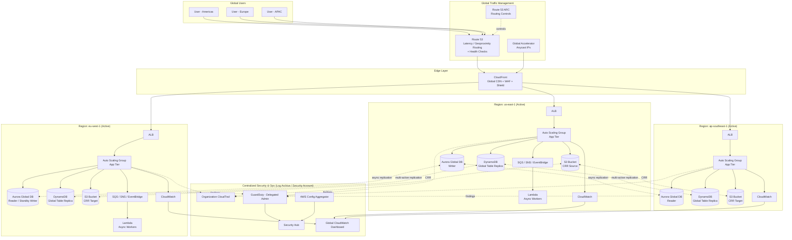

# Part XII – Resilience, Operations & Cost

# Chapter 98 — Multi-Region Active-Active

---

## 1. Executive Summary

### The Business Problem

Enterprises that depend on a single AWS Region for production workloads carry a structural risk that no amount of Multi-AZ redundancy can eliminate: a regional-scale failure.

- Regional failures are rare, but they are not theoretical. AWS has experienced regional service degradations affecting S3, EC2 control planes, DynamoDB, and networking in specific Regions over the years.
- A Multi-AZ architecture protects against data center failures, power loss, and rack-level hardware issues — it does **not** protect against a regional control-plane event, a botched regional deployment, a regional network partition, or a compliance-driven need to keep traffic local to a geography.
- For latency-sensitive global applications, a single-Region deployment also creates an unavoidable physics problem: users in Sydney talking to a database in Virginia will always see 200ms+ round-trip latency, regardless of how well the application tier is optimized.

Multi-Region Active-Active architecture solves a different class of problem than Multi-AZ HA. It is not primarily about "five nines" marketing — it is about three concrete business needs:

1. **Regional blast-radius containment** — a failure in `us-east-1` must not be able to take down the entire business.
2. **Global latency reduction** — users should be served from the AWS Region physically closest to them.
3. **Regulatory data residency** — certain workloads (banking, healthcare, government) must keep specific data processing within specific geographic boundaries while still offering a unified global product.

### Architecture Objective

The objective of a Multi-Region Active-Active design is to run **two or more AWS Regions simultaneously serving live production traffic**, with each Region capable of absorbing 100% of global traffic if a peer Region becomes unavailable, without a manual failover event and without data loss beyond an agreed RPO.

This is architecturally very different from Active-Passive disaster recovery, where a secondary Region sits idle (or partially warmed) and is only promoted during a declared disaster. In Active-Active:

- Every Region accepts writes (or, in a common variant, writes are geo-partitioned per Region with global read replication).
- DNS or Anycast-based routing continuously distributes traffic across healthy Regions based on latency, geoproximity, or weighted policies.
- Data replication is continuous and bi-directional (or multi-directional), not triggered on-demand.
- Regional failure is absorbed by traffic shifting away from the unhealthy Region — often within seconds to a few minutes — with no human intervention required for the initial mitigation.

> **Note:** "Active-Active" does not universally mean "every Region can write to every row of every table simultaneously with strong consistency." That specific goal is extremely hard and usually unnecessary. Most real enterprise Active-Active systems use a mix of patterns: globally read-replicated data with single-writer-per-partition, eventually-consistent multi-master for specific data types, and strictly regional data for anything that must not leave a jurisdiction. This chapter is explicit about where the "active-active" claim is true and where it is a simplification.

### Why Organizations Adopt This Architecture

**1. Revenue-critical availability requirements.**
When a single hour of downtime translates into millions of dollars in lost transactions (e-commerce checkout, payment processing, trading platforms, streaming), the cost of a Multi-Region architecture becomes justifiable against the cost of an outage.

**2. Global user base with latency SLAs.**
SaaS platforms selling into APAC, EMEA, and Americas simultaneously cannot satisfy a sub-100ms p99 API latency SLA from a single Region. Serving users from the nearest Region is the only way to meet that bar.

**3. Regulatory and data sovereignty mandates.**
GDPR, data localization laws in India and China, and financial services regulations in many jurisdictions require that certain categories of personal or financial data be processed and stored within specific borders. A Multi-Region Active-Active design, when paired with geo-partitioned data, allows a single global product to comply with per-country residency rules.

**4. M&A and multi-brand consolidation.**
Large enterprises that acquire regional businesses often inherit region-specific infrastructure. Rather than migrating everything into one Region (which reintroduces the single point of failure and adds cross-region latency for the acquired business's local customers), they standardize on a Multi-Region Active-Active reference architecture that lets each business unit operate close to its own customers while sharing a common operational model.

**5. Insurance against provider-level control-plane incidents.**
Even when data-plane resources (running EC2 instances, existing RDS connections) survive a regional event, the **control plane** (the ability to launch new instances, modify Auto Scaling Groups, deploy new Lambda versions) can be degraded. An Active-Active design means the business does not need the control plane of the affected Region to remain operational — the healthy Region already has capacity serving traffic.

### Major Business Benefits

| Benefit | Description |
|---|---|
| Business continuity | Regional outage does not equal business outage. |
| Reduced RTO | Recovery Time Objective drops from hours (Pilot Light / Warm Standby) to seconds/minutes. |
| Improved latency | Users are served by the nearest healthy Region. |
| Regulatory compliance | Data residency requirements can be satisfied per Region. |
| Load distribution | Global traffic is spread across Regions, reducing peak load on any single Region. |
| Deployment safety | Regional canary rollouts become possible — deploy to one Region, observe, then promote. |
| Negotiating leverage | Demonstrable resilience is often a contractual requirement for enterprise customers (RFPs, SOC 2, uptime SLAs). |

### Typical Enterprise Scenarios

- A global fintech running payment authorization APIs across `us-east-1`, `eu-west-1`, and `ap-southeast-1`, with strict regional data residency for EU cardholder data (PCI-DSS, GDPR).
- A SaaS analytics platform serving enterprise customers in North America, Europe, and Asia, with a 99.99% uptime SLA written into enterprise contracts.
- A media streaming platform that must serve live and on-demand video with sub-second start times globally, and cannot tolerate a single Region's failure disrupting the entire catalog.
- A healthcare platform where PHI must remain within-country per HIPAA-equivalent local regulation, but the platform itself is sold as a single global product.
- A large retailer running Black-Friday-scale traffic where a single-Region capacity ceiling would require unrealistic over-provisioning; splitting load across Regions is both a resilience and a cost-efficiency decision.

### Why Simpler Architectures Eventually Fail at Enterprise Scale

Single-Region Multi-AZ architectures are the correct starting point for the vast majority of workloads — this chapter is not an argument that every company needs Multi-Region. But organizations that scale past a certain point of revenue-criticality, geographic user distribution, or regulatory complexity consistently discover the same three failure modes with single-Region designs:

1. **Latency floors that cannot be engineered away.** No amount of caching, CDN edge optimization, or database tuning removes the fact that light takes ~130ms round-trip from Virginia to Singapore over real-world network paths.
2. **Regional incidents become full company incidents.** Even a partial regional degradation (e.g., increased API error rates from a single AZ's underlying host issues cascading through a poorly isolated Auto Scaling Group) can take down 100% of a single-Region service.
3. **Compliance walls.** At some point, a customer contract or a national regulator says "this data may not leave this country," and no amount of clever caching solves that without a genuine second processing Region.

This chapter provides the reference architecture, the trade-offs, the Terraform, and the operational playbook for building this correctly.

---

## 2. Business Requirements

### Business Drivers

- Protect revenue-critical workloads from regional-scale AWS incidents.
- Meet contractual uptime SLAs (99.95%–99.99%) with enterprise customers.
- Reduce global latency for a geographically distributed user base.
- Satisfy data residency and sovereignty regulations per country/region.
- Enable regional canary deployments to reduce blast radius of bad releases.
- Support business continuity requirements from enterprise procurement and security questionnaires (SOC 2, ISO 27001, customer BCDR audits).

### Functional Requirements

| Requirement | Description |
|---|---|
| Global routing | Traffic must be routed to the nearest/healthiest Region automatically. |
| Regional failover | Loss of one Region must not interrupt service for users routed to that Region beyond the agreed RTO. |
| Data consistency model | Explicit definition of which data is strongly consistent, eventually consistent, or regionally isolated. |
| Write conflict handling | For multi-writer data, a defined conflict resolution strategy (last-writer-wins, CRDT, application-level merge). |
| Session continuity | User sessions should not be lost or force a re-login on failover, where feasible. |
| Regional data residency | Specific data categories must not replicate outside defined jurisdictions. |
| Observability | Global and per-Region dashboards, alarms, and traces. |

### Non-Functional Requirements

- **Scalability:** Each Region must independently auto-scale to absorb up to 100% of global peak traffic (N+1 capacity planning across Regions, not N/2).
- **Availability:** 99.99% (≈52 minutes/year) or better at the global service level.
- **Latency:** p99 API latency under 150ms for in-Region requests; documented degraded latency ceiling for cross-Region fallback scenarios.
- **Security:** Defense-in-depth consistent across all Regions; no Region may have a materially weaker security posture than another.
- **Auditability:** All configuration changes, IAM actions, and data access must be logged centrally and per-Region.

### Recovery Objectives

| Metric | Target | Notes |
|---|---|---|
| RTO (Recovery Time Objective) | < 60 seconds (automated) to < 5 minutes (DNS TTL-bound) | Depends on routing mechanism chosen (Route 53 health checks vs. Global Accelerator). |
| RPO (Recovery Point Objective) | Near-zero for read replicas with async replication lag < 1s typical; explicitly non-zero (seconds) for cross-Region async database replication | Must be stated as a real, measured number — not "zero" — unless synchronous cross-Region replication is used (which most workloads should NOT use due to latency cost). |

> **Warning:** Marketing materials and even some internal architecture documents describe Multi-Region Active-Active as providing "zero RPO." This is almost never true for cross-Region database replication using standard AWS services (Aurora Global Database, DynamoDB Global Tables, RDS cross-region read replicas) because replication is asynchronous. Be explicit with stakeholders: RPO is typically 1 second to low tens of seconds under normal conditions, and can grow significantly during replication lag events. Promising zero RPO sets the organization up for a very bad day during an actual regional failure.

### SLAs

- External customer-facing SLA: commonly 99.9%–99.99% depending on tier.
- Internal engineering SLO: typically set tighter than the external SLA (e.g., 99.95% internal target to protect a 99.9% external commitment, leaving error budget for planned maintenance).

### Expected Workload and Growth

- Design for the workload profile of the busiest single Region today, doubled, distributed across N Regions with N-1 redundancy (i.e., if one Region fails, the remaining Regions must absorb its traffic without a full outage — this typically means running each Region at no more than 50-60% of its own maximum capacity when operating 2 Regions, or (N-1)/N utilization for N Regions).
- Growth planning must account for regional service quota increases (EC2 vCPU limits, VPC limits, Lambda concurrency limits) being requested well ahead of traffic growth — AWS quota increases are not instantaneous.


---

## 3. Architecture Overview

### Overall Design

The reference design in this chapter uses **two or more independently deployable "Regional Stacks,"** each a complete, self-sufficient copy of the application tier, fronted by a **global traffic layer** (Amazon Route 53 latency-based or geoproximity routing, optionally combined with AWS Global Accelerator for TCP/UDP-level failover), and backed by a **replicated data layer** using the appropriate replication pattern per data type.

Core design philosophy:

1. **No shared regional dependency.** Nothing in Region A may be a hard runtime dependency for Region B. If `us-east-1` disappears, `eu-west-1` must keep serving traffic without calling back to `us-east-1` for anything on the critical path.
2. **Data locality by default, replication by exception.** Only replicate data that genuinely needs to be globally available. Regionally-scoped data (session caches, regional audit logs) stays regional.
3. **Idempotent, conflict-aware writes.** Any data model that can be written in more than one Region must have an explicit conflict resolution strategy defined at design time, not discovered during an incident.
4. **Automated detection, automated mitigation, human-verified root cause.** Failover away from an unhealthy Region should be automatic. Failing *back* is typically a deliberate, human-approved action after root cause is understood — automatic fail-back can cause "flapping" if the underlying issue is intermittent.

### Core Components

- **Global DNS / Traffic Management:** Amazon Route 53 with latency-based or geoproximity routing policies and health checks; optionally AWS Global Accelerator for faster failover and static Anycast IPs.
- **Edge layer:** Amazon CloudFront as a global CDN and TLS termination point, with Regional origins.
- **Regional entry point:** Application Load Balancer (ALB) per Region, fronting compute.
- **Compute:** Auto Scaling Groups of EC2, ECS/Fargate services, or Lambda functions — deployed identically in every Region via Terraform modules.
- **Data layer:** A combination of Aurora Global Database (for relational data needing cross-region read scaling with single-writer semantics), DynamoDB Global Tables (for multi-writer NoSQL data with last-writer-wins conflict resolution), and S3 Cross-Region Replication (for object storage).
- **Messaging:** Regional SNS/SQS/EventBridge buses per Region, with cross-region event forwarding only where a genuine global workflow requires it.
- **Security & Identity:** Centralized IAM Identity Center, per-Region KMS keys (never sharing raw key material across Regions — use envelope encryption and re-encryption at the application layer where cross-region access to encrypted data is required), regional Secrets Manager replicas.
- **Observability:** Per-Region CloudWatch dashboards aggregated into a global view (via CloudWatch cross-account/cross-region dashboards or a third-party aggregator), centralized CloudTrail organization trail, centralized log archive account.

### How Components Interact — High-Level Workflow

1. A user's DNS resolver queries Route 53 for the application's domain.
2. Route 53 returns the IP/CNAME of the AWS Region with the lowest latency to the resolver (latency-based routing) or based on the user's geographic location (geoproximity), filtered to only Regions currently passing health checks.
3. The client connects to CloudFront, which terminates TLS at the edge and forwards to the Regional ALB origin (or serves from cache for cacheable content).
4. The Regional ALB distributes the request across the compute fleet in that Region.
5. The application reads/writes to the Regional data layer. Reads are typically served from the local Regional replica; writes follow the data model's defined write pattern (single global writer per partition, or local-Region multi-writer with conflict resolution).
6. Data changes replicate asynchronously to peer Regions.
7. Telemetry (metrics, logs, traces) is emitted locally and forwarded to a centralized observability account.

### Request Lifecycle vs. Response Lifecycle vs. Data Lifecycle

- **Request lifecycle:** DNS resolution → Edge (CloudFront) → Regional load balancer → Compute → Data layer (local read) → Response assembly.
- **Response lifecycle:** Application response → ALB → CloudFront (cache write if cacheable) → Client, with response headers carrying Region identification (e.g., `X-Served-By: us-east-1`) for observability and debugging.
- **Data lifecycle:** Write accepted in the owning Region → committed locally → asynchronously replicated to peer Regions → eventually visible to reads in peer Regions (bounded by replication lag) → periodically archived/lifecycle-transitioned in S3 per Region → backed up per Region with independent retention.

---

## 4. AWS Services Used

Each service below is explained on first use — purpose, why it was selected for this architecture, alternatives considered, limitations, pricing considerations, and best practices.

### Amazon Route 53

**Purpose:** Authoritative DNS with health-check-aware routing policies (latency-based, geoproximity, weighted, failover).

**Why selected:** Route 53 is the only AWS-native DNS service that supports latency-based routing across Regions combined with automated health checks, making it the default choice for Region-level traffic steering.

**Alternatives:** Third-party global traffic managers (NS1, Akamai GTM, Cloudflare Load Balancing) — sometimes chosen when an organization is already multi-cloud and wants provider-neutral DNS, or needs routing logic Route 53 doesn't support natively.

**Limitations:** DNS-based failover is bound by client and resolver TTL caching — even with a 60-second TTL, some resolvers and clients cache longer, delaying failover visibility for a subset of users.

**Pricing considerations:** Charged per hosted zone, per query, and per health check; health checks against endpoints outside AWS incur higher cost.

**Best practice:** Use low TTLs (30–60s) on records involved in failover, combine with Route 53 Application Recovery Controller (ARC) for more deterministic, sub-second-decision regional failover for the most critical workloads.

### AWS Global Accelerator

**Purpose:** Provides static Anycast IP addresses and routes traffic over the AWS global network backbone to the closest healthy Regional endpoint, with failover typically faster than DNS TTL expiry.

**Why selected:** Used alongside or instead of Route 53 latency routing when sub-DNS-TTL failover speed is required, or when the protocol is not HTTP (e.g., raw TCP/UDP workloads, gaming, VoIP).

**Alternatives:** Route 53 alone (simpler, cheaper, sufficient for most HTTP workloads); CloudFront (for HTTP/S workloads that can be edge-cached).

**Limitations:** Additional cost layer; adds a component to reason about during troubleshooting; does not replace the need for Regional health checks.

**Pricing considerations:** Fixed hourly fee plus a data transfer premium — this is a meaningful cost line item at scale and should be explicitly budgeted.

**Best practice:** Reserve Global Accelerator for workloads where failover speed genuinely matters more than cost — many web applications are well served by Route 53 + CloudFront alone.

### Amazon CloudFront

**Purpose:** Global CDN and edge TLS termination, reducing latency for cacheable content and providing a stable edge security layer (WAF integration, Shield).

**Why selected:** Nearly all public-facing Multi-Region architectures benefit from CloudFront's edge presence, independent of the Regional routing decision — it decouples "where the user connects" from "which Region serves the origin request" and provides built-in DDoS protection via Shield Standard.

**Alternatives:** Direct-to-ALB with Route 53 only (lower cost, no edge caching, no Shield Standard-through-CloudFront benefits); third-party CDNs (Akamai, Fastly, Cloudflare) — chosen for advanced edge compute needs or existing vendor relationships.

**Limitations:** Cache invalidation adds operational complexity; WebSocket and some real-time protocols need careful configuration.

**Pricing considerations:** Data transfer out is the dominant cost driver; pricing varies significantly by edge location/price class — restricting price class to needed geographies reduces cost.

**Best practice:** Use Origin Groups with primary/secondary Regional origins for automatic CloudFront-level origin failover as an additional layer beneath Route 53/Global Accelerator.

### Application Load Balancer (ALB)

**Purpose:** Regional Layer 7 load balancing across compute targets, with health checks, path-based routing, and WAF integration.

**Why selected:** Standard, well-understood entry point for HTTP(S) workloads within a Region; integrates natively with Auto Scaling Groups, ECS, and Lambda.

**Alternatives:** Network Load Balancer (NLB) for non-HTTP/high-throughput/low-latency TCP workloads; API Gateway for fully serverless request handling without needing a load balancer at all.

**Limitations:** Regional resource — an ALB in `us-east-1` cannot balance traffic to targets in `eu-west-1`; this is precisely why Regional stacks each need their own ALB.

**Pricing considerations:** Hourly charge plus Load Balancer Capacity Units (LCUs) based on connections, bandwidth, and rule evaluations.

**Best practice:** Deploy ALB across all AZs in the Region (minimum three in Regions that support it) and attach WAF at the ALB or CloudFront layer, not both redundantly unless there's a specific reason.

### Amazon EC2 / Auto Scaling Groups

**Purpose:** Elastic compute for the application tier where containerization or serverless is not the chosen model, or for workloads with specific instance-type/licensing requirements.

**Why selected:** Used here as the baseline compute layer for illustration; the same Regional-stack pattern applies equally to ECS/Fargate or EKS.

**Alternatives:** ECS Fargate (less operational overhead, no AMI patching); EKS (for organizations standardized on Kubernetes); Lambda (for event-driven/bursty workloads, discussed under serverless variants).

**Limitations:** Requires AMI lifecycle management (patching, golden AMI pipeline) unless fully replaced by Fargate.

**Pricing considerations:** On-Demand for baseline elasticity headroom, Reserved Instances/Savings Plans for the steady-state floor per Region, Spot for stateless, interruption-tolerant batch tiers.

**Best practice:** Size each Region's Auto Scaling Group minimum capacity for (Total Global Peak / N) × failover headroom factor — never size a Region only for its "average" local share of traffic.

### Amazon Aurora (PostgreSQL/MySQL-compatible) with Aurora Global Database

**Purpose:** Relational database with cross-Region replication designed specifically for Multi-Region deployments — a primary Region handles writes, up to five secondary Regions receive replicated data with typical replication lag under one second.

**Why selected:** Aurora Global Database is the AWS-native answer for relational Multi-Region needs, offering managed cross-region replication without building custom logical replication pipelines, and supports fast Regional promotion (secondary → primary) in a failover event, typically within about 1 minute.

**Alternatives:** RDS with manual cross-region read replicas (more manual failover, less integrated); self-managed PostgreSQL with logical replication (full control, full operational burden); DynamoDB Global Tables if the data model fits key-value/document access patterns better (see below).

**Limitations:** Aurora Global Database is fundamentally single-writer — only one Region can accept writes for a given global cluster at a time. True multi-region **write** concurrency for relational data is not what this service provides; it provides fast regional **read** access and fast **failover** of the write Region.

**Pricing considerations:** Cross-region replicated I/O and storage in secondary Regions add cost beyond a single-Region Aurora deployment; factor this into the FinOps model explicitly.

**Best practice:** Use Aurora Global Database when the business can tolerate a single logical "writer Region" per data domain (common for many enterprise systems), and pair it with Route 53 Application Recovery Controller for controlled, tested regional promotion.

### Amazon DynamoDB with Global Tables

**Purpose:** Fully managed multi-active (multi-writer) NoSQL replication across Regions, with last-writer-wins conflict resolution based on internal timestamps.

**Why selected:** For data models that genuinely need multi-Region **write** capability (e.g., user preference updates, shopping carts, session state that must be writable from any Region), DynamoDB Global Tables is the AWS-native service that provides this without custom conflict-resolution engineering.

**Alternatives:** Aurora Global Database (single-writer only — not suitable if true multi-region writes are required); self-managed Cassandra/ScyllaDB on EC2 (more control over consistency tuning, significantly higher operational burden).

**Limitations:** Conflict resolution is last-writer-wins at the item level — applications must be designed so this is an acceptable semantic, or must implement application-level conflict handling (e.g., CRDTs for counters, version vectors for complex objects).

**Pricing considerations:** Replicated write cost is charged in every Region the table is replicated to — a write in Region A is billed as a write in every Region B, C, D it replicates to, which materially changes the cost model versus a single-Region table.

**Best practice:** Use Global Tables for genuinely global-write data; keep large, rarely-changing datasets out of Global Tables replication scope where a Regional cache or a batch sync is sufficient instead.

### Amazon S3 with Cross-Region Replication (CRR)

**Purpose:** Object storage replication across Regions for durability, disaster recovery, and Regional read locality.

**Why selected:** S3 CRR is the standard AWS mechanism for keeping object data available in multiple Regions with minimal operational overhead.

**Alternatives:** S3 Multi-Region Access Points (simplifies client-side routing to the nearest replica bucket without changing application logic); manual application-level dual-write (avoided — error-prone and redundant given native CRR).

**Limitations:** Replication is asynchronous — RPO is non-zero (typically seconds, but can be higher under load); CRR does not replicate objects that existed before replication was enabled unless S3 Batch Replication is used to backfill.

**Pricing considerations:** Doubles (or more, with N Regions) storage cost for replicated objects, plus inter-region data transfer cost for the replication traffic itself.

**Best practice:** Use S3 Multi-Region Access Points for read-heavy global object access patterns; apply lifecycle policies independently per Region to control long-term storage cost growth.

### Amazon SNS, SQS, and EventBridge

**Purpose:** Regional asynchronous messaging and event routing within each Region's application tier.

**Why selected:** These are Regional services by design; the reference architecture deploys an independent messaging plane per Region rather than a single global queue, to avoid a cross-region dependency on the critical path.

**Alternatives:** Amazon MSK (Kafka) with MirrorMaker 2 for cross-region topic replication when genuine cross-region event streaming is required (e.g., a global audit event stream); third-party message buses.

**Limitations:** SNS/SQS do not natively replicate across Regions — any cross-region event flow must be explicitly built (e.g., EventBridge cross-region rules forwarding specific event types).

**Pricing considerations:** Low per-message cost; cross-region forwarding adds data transfer cost and Lambda/EventBridge invocation cost for the forwarding function.

**Best practice:** Keep messaging Regional by default; only forward the minimum necessary event types cross-region (e.g., "user deleted" events for global data-deletion compliance), never mirror entire event streams without a clear business need.

### AWS IAM, IAM Identity Center, and STS

**Purpose:** Identity, authentication, and least-privilege authorization across all Regions and accounts.

**Why selected:** IAM is global (with the exception of some Region-specific STS endpoints); IAM Identity Center provides centralized human-user access across the multi-account, multi-region AWS Organization.

**Best practice:** Use IAM Identity Center as the single source of truth for human access; use IAM roles (never long-lived IAM users) for workload identity, scoped per-Region where the role should not be usable outside its Region (via IAM condition keys like `aws:RequestedRegion`).

### Amazon VPC (per Region)

**Purpose:** Isolated Regional network foundation — subnets, routing, security groups, NACLs.

**Why selected:** Each Region requires its own VPC; VPCs are Regional constructs and cannot span Regions.

**Best practice:** Use non-overlapping CIDR ranges across all Regional VPCs from day one, even if cross-region VPC peering or Transit Gateway peering is not initially planned — overlapping CIDRs discovered later are extremely costly to fix.

### Amazon Route 53 Application Recovery Controller (ARC)

**Purpose:** Purpose-built service for coordinating and testing Multi-Region failover, including readiness checks and controlled routing control toggles.

**Why selected:** Provides a safer, more deterministic mechanism for regional failover than manually editing Route 53 records during an incident, plus built-in readiness checks that continuously validate that the standby Region could actually take over (capacity, configuration drift).

**Best practice:** Use ARC routing controls as the single mechanism operators use to shift traffic during an incident — never hand-edit DNS weights during a live incident.

### AWS KMS, Secrets Manager, Systems Manager, CloudWatch, CloudTrail, AWS Config, GuardDuty

These are covered in depth in the Security Architecture (Section 11) and Monitoring (Section 21) sections below, each deployed per-Region with centralized aggregation, consistent with the "no shared regional dependency on the critical path, but centralized visibility" design philosophy.


---

## 5. Complete Architecture Diagram



> **Tip:** In real Terraform/documentation, render each Region's subnet layout (public/private/data tiers) as a separate, more detailed diagram (see Section 9). The diagram above intentionally shows the Regional and global relationship, not full subnet-level detail, to remain readable.


---

## 6. Component-by-Component Explanation

### Route 53 (Global Traffic Management)

- **Purpose:** Resolve the application domain to the optimal, healthy Regional endpoint.
- **Responsibilities:** Run health checks against each Region's endpoint; apply latency-based or geoproximity routing policy; exclude unhealthy Regions from the answer set.
- **Inputs:** Health check results, routing policy configuration, resolver queries.
- **Outputs:** DNS answers (IP/CNAME) pointing to a healthy Region.
- **Scaling:** Fully managed; scales automatically with query volume.
- **High availability:** Route 53 itself runs across a globally distributed Anycast network — it is one of the most durable AWS services and does not have a single-Region dependency.
- **Failure handling:** If a Region fails health checks, Route 53 stops returning that Region's endpoint within the TTL window.
- **Dependencies:** Health check endpoints must accurately reflect true application health, not just "server is up."
- **Security:** DNSSEC can be enabled for the hosted zone; health check traffic should be allowed from Route 53's published IP ranges only.
- **Monitoring:** CloudWatch metrics for health check status per Region; alarm on any Region transitioning to unhealthy.

### CloudFront (Edge Layer)

- **Purpose:** Terminate global user connections at the nearest edge location and route to the nearest healthy Regional origin.
- **Responsibilities:** TLS termination, response caching, WAF rule evaluation, origin failover via Origin Groups.
- **Scaling:** Fully managed, scales globally.
- **High availability:** Distributed across all AWS edge locations; Origin Groups provide automatic failover between a primary and secondary Regional origin independent of DNS.
- **Failure handling:** On primary origin failure (5xx responses matching configured failover criteria), CloudFront automatically retries against the secondary origin in the Origin Group.
- **Security:** AWS WAF Web ACL attached; AWS Shield Standard included by default, Shield Advanced optional for higher-value protection and cost guarantees during DDoS events.
- **Monitoring:** CloudFront real-time logs and standard access logs shipped to S3/Kinesis; CloudWatch metrics for error rates and cache hit ratio per distribution.

### Regional ALB

- **Purpose:** Distribute incoming Regional traffic across healthy compute targets.
- **Responsibilities:** Layer 7 routing, health checks against targets, SSL offload (optional, depending on whether CloudFront-to-origin uses HTTPS end-to-end).
- **Scaling:** Auto-scales its own capacity (LCUs) based on traffic; no manual intervention required.
- **High availability:** Spans all AZs configured in the Region (minimum 2, recommend 3 where available).
- **Failure handling:** Automatically removes unhealthy targets from rotation based on configured health check thresholds.
- **Dependencies:** Target compute fleet (ASG/ECS/Lambda), ACM certificate, WAF Web ACL (if attached at this layer).
- **Monitoring:** Target response time, HTTPCode_Target_5XX_Count, healthy/unhealthy host count.

### Compute Fleet (ASG / ECS / Lambda)

- **Purpose:** Execute application logic.
- **Responsibilities:** Serve requests, read/write to the Regional data layer, emit telemetry.
- **Scaling:** Target-tracking or step scaling policies based on CPU, request count per target, or custom application metrics (e.g., queue depth).
- **High availability:** Distributed across all AZs in the Region; minimum capacity set high enough to survive loss of one AZ without breaching SLOs.
- **Failure handling:** Auto Scaling Group replaces unhealthy instances automatically (via EC2 status checks and/or ALB health checks); ECS service scheduler reschedules failed tasks.
- **Dependencies:** IAM instance/task role, Secrets Manager for credentials, VPC networking, NAT Gateway or VPC endpoints for egress.
- **Security:** No SSH — access via Systems Manager Session Manager only; IMDSv2 enforced.
- **Monitoring:** CPU/memory utilization, application-level custom metrics, X-Ray traces.

### Aurora Global Database

- **Purpose:** Relational data with cross-Region read availability and fast Regional promotion for the write path.
- **Responsibilities:** Accept writes in the designated primary Region; replicate to secondary Regions with sub-second typical lag; serve local reads from Regional read replicas.
- **Scaling:** Aurora Replicas scale read capacity within a Region; storage auto-scales up to configured limits.
- **High availability:** Multi-AZ by default within each Region; cross-Region secondary clusters provide Region-level resilience.
- **Failure handling:** Managed planned/unplanned failover promotes a secondary Region to primary; application connection strings must use the cluster endpoint (or a Route 53-managed CNAME) to avoid hardcoding a specific Region's writer endpoint.
- **Dependencies:** KMS key for encryption at rest (Regional key, cannot directly share raw key material cross-Region), VPC subnet group per Region, parameter groups kept in sync via Terraform module reuse.
- **Security:** Encryption at rest via KMS, encryption in transit via TLS, IAM database authentication where feasible.
- **Monitoring:** Replication lag per secondary Region (critical metric), CPU/connections/deadlocks, storage growth.

### DynamoDB Global Tables

- **Purpose:** Multi-writer NoSQL data requiring low-latency local reads and writes in every active Region.
- **Responsibilities:** Accept writes locally in any replica Region; propagate to all other replica Regions; resolve conflicts via last-writer-wins.
- **Scaling:** On-demand capacity mode recommended for unpredictable Multi-Region traffic patterns to avoid manual per-Region capacity planning.
- **High availability:** Inherently Multi-AZ within each Region; Global Tables extends this across Regions.
- **Failure handling:** If a Region becomes unavailable, other Regions continue accepting reads/writes for their local replica; once the Region recovers, replication catches up automatically.
- **Dependencies:** IAM permissions scoped per table/Region; DynamoDB Streams (used internally by Global Tables for replication).
- **Security:** Encryption at rest (KMS), fine-grained IAM condition-based access control.
- **Monitoring:** `ReplicationLatency` metric per Region pair — this is the single most important DynamoDB Global Tables metric to alarm on.

### S3 with Cross-Region Replication

- **Purpose:** Object storage durability and Regional read locality.
- **Responsibilities:** Asynchronously replicate new/updated objects to destination bucket(s) in peer Regions.
- **High availability:** Each Regional bucket already has 11 nines durability within-Region; CRR adds Region-level redundancy and locality.
- **Failure handling:** Replication failures are logged and can trigger EventBridge notifications for remediation; S3 Batch Replication can backfill after an outage.
- **Security:** Bucket policies enforcing TLS-only access, KMS-SSE per Region, Object Lock for compliance workloads requiring immutability.
- **Monitoring:** Replication metrics (`S3 Replication Time Control` if RTC is enabled, providing a 15-minute replication SLA with metrics and notifications).

### Central Security & Ops Account Components

- **CloudTrail (Organization Trail):** Captures management and data events across all Regions and accounts into a single, tamper-evident log archive account.
- **AWS Config (Aggregator):** Aggregates configuration compliance across all Regions/accounts for a single compliance view.
- **GuardDuty (Delegated Administrator):** Centralizes threat detection findings from every Region into the security account.
- **Security Hub:** Aggregates findings from GuardDuty, Config, Inspector, and third-party tools into a single prioritized view.

---

## 7. End-to-End Request Flow

1. **Client DNS resolution:** The client's resolver queries Route 53 for `api.example.com`.
2. **Regional selection:** Route 53 evaluates latency-based/geoproximity routing rules, filters out any Region currently failing its health check, and returns the CloudFront distribution's Anycast address (CloudFront itself is global, so this step primarily governs which *origin group priority* or, in a direct-to-ALB variant without CloudFront, which Regional ALB is returned).
3. **Edge connection:** The client establishes a TLS connection to the nearest CloudFront edge location.
4. **Cache check:** CloudFront checks if the requested resource is cacheable and present in cache. If yes, it is returned immediately (steps 5-11 skipped).
5. **Origin selection:** For cache misses or non-cacheable requests, CloudFront forwards the request to the configured origin — the Regional ALB associated with the Region Route 53 steered the client toward, using an Origin Group with a secondary Region as automatic fallback.
6. **WAF evaluation:** The AWS WAF Web ACL (attached at CloudFront or ALB) evaluates the request against configured rules (rate limiting, managed rule groups, custom rules) before it reaches the application.
7. **Load balancing:** The Regional ALB routes the request to a healthy target in the compute fleet based on the configured target group and routing rules.
8. **Application processing:** The application handles the request — validating input, applying business logic, and initiating any necessary reads/writes.
9. **Database read:** For read operations, the application queries the local Regional Aurora reader endpoint or the local DynamoDB Global Table replica — never routing reads cross-Region on the critical path.
10. **Database write:** For write operations, the application either writes to the local Aurora writer (if this Region is the designated write Region for that data domain) or writes to the local DynamoDB Global Table replica (if using a multi-writer table); writes requiring the Aurora write Region from a non-write Region are routed through an internal API call to the write Region — a deliberate, monitored cross-region dependency, minimized wherever possible.
11. **Caching layer (if present):** Application-level caches (e.g., ElastiCache) are checked/updated, scoped per-Region.
12. **Object storage access:** Any object read/write against S3 uses the local Regional bucket; writes replicate asynchronously to peer Regions via CRR.
13. **Logging:** Application and access logs are written locally (CloudWatch Logs) and asynchronously forwarded to the centralized log archive account.
14. **Response construction:** The application constructs the response, including a Region-identifying header for observability.
15. **Return path:** Response flows back through ALB → CloudFront (cached if applicable) → edge → client.
16. **Error handling:** If the application returns a 5xx error matching CloudFront's Origin Group failover criteria, CloudFront automatically retries the request against the secondary origin in the Origin Group before returning an error to the client.
17. **Monitoring/tracing:** X-Ray (or an equivalent distributed tracing tool) captures the full trace across ALB, compute, and downstream calls, tagged with Region, for cross-region latency and error analysis.


---

## 8. Deployment Flow

### Infrastructure Provisioning

- Infrastructure is defined once as reusable Terraform modules and instantiated per Region via a thin per-Region root module supplying Region-specific variables (CIDR block, AZ list, Region-specific ACM certificate ARN, KMS key).
- A dedicated Terraform remote state backend (S3 + DynamoDB lock table, or Terraform Cloud) is used **per Region** to avoid a single state file becoming a cross-region blast-radius risk, while a lightweight "global" state manages Route 53, IAM Identity Center, and Organization-level resources.

### Terraform Workflow

1. `terraform plan` is run per environment/Region combination in CI.
2. Plan output is posted for review (pull request comment).
3. Approved plans apply through a pipeline — never `terraform apply` from a local workstation in production.
4. Regional stacks are applied independently; a failed apply in Region B does not block or roll back an already-successful apply in Region A.

### CI/CD Deployment

- Application deployments follow a **Region-sequenced rollout**: deploy to a designated canary Region first, run automated smoke tests and observe error-rate/latency dashboards for a defined bake time (e.g., 15–30 minutes), then promote to remaining Regions.
- This sequencing is the single biggest practical safety net a Multi-Region architecture provides for deployment risk — a bad release is caught in one Region before it reaches all Regions.

### Blue-Green Deployment (per Region)

- Within each Region, a Blue-Green (or weighted Canary) deployment shifts traffic gradually between the old and new versions using ALB weighted target groups or CodeDeploy's built-in traffic shifting.
- Rollback within a Region is simply reverting the ALB target group weights — fast and low-risk.

### Rollback

- Application rollback: redeploy previous known-good artifact via the same Region-sequenced pipeline, canary Region first.
- Infrastructure rollback: `terraform apply` of the previous committed state (infrastructure changes should always be reversible via version control, never manually patched).
- Database schema rollback: forward-only migrations are strongly preferred (see Anti-Patterns); destructive rollbacks of schema changes on a Multi-Region database are high-risk and should be avoided by designing migrations to be backward-compatible for at least one full deployment cycle.

### Secrets and Configuration

- Secrets are stored in Secrets Manager **per Region** (not replicated as plaintext across Regions); where the same logical secret is needed in multiple Regions, Secrets Manager's built-in multi-Region secret replication feature is used, which keeps a read-only replica in sync while re-encrypting with the destination Region's own KMS key.
- Application configuration (non-secret) is managed via Systems Manager Parameter Store, deployed identically per Region through the same Terraform module.

### Validation

- Post-deployment automated validation includes: synthetic canary transactions against each Region's public endpoint (via CloudWatch Synthetics), a full smoke-test suite hitting critical user journeys, and a database replication-lag check to confirm the newly deployed Region has not introduced replication issues.

---

## 9. Network Topology

### VPC and CIDR Strategy

- Each Region gets its own VPC with a **non-overlapping CIDR block** planned against the full multi-region, multi-account CIDR allocation table from day one (e.g., `us-east-1: 10.10.0.0/16`, `eu-west-1: 10.20.0.0/16`, `ap-southeast-1: 10.30.0.0/16`).
- Non-overlapping CIDRs are mandatory even if cross-region private connectivity is not initially planned — retrofitting non-overlapping ranges after production data exists is a major, high-risk undertaking.

### Subnet Layout (per Region, per AZ)

| Tier | Purpose | Internet Route |
|---|---|---|
| Public | ALB, NAT Gateway | Internet Gateway |
| Private (app) | Compute fleet (EC2/ECS/Lambda ENIs) | NAT Gateway (egress only) |
| Private (data) | RDS/Aurora, ElastiCache | No direct internet route |

### NAT Gateway and Internet Gateway

- One NAT Gateway per AZ (not one per Region) to avoid cross-AZ data transfer charges and to prevent a single NAT Gateway from becoming an AZ-crossing single point of failure.
- Internet Gateway attached once per VPC, shared by all public subnets.

### Transit Gateway (Cross-Region Connectivity)

- Where private cross-region connectivity is required (e.g., a write-Region API call from a read-Region for Aurora writes), AWS Transit Gateway with **Transit Gateway inter-Region peering** connects Regional VPCs privately without traversing the public internet.
- Transit Gateway route tables are scoped to only advertise the specific subnets that genuinely need cross-region reachability — not the entire VPC CIDR — to keep the security boundary as tight as possible.

### Route Tables, NACLs, Security Groups

- Route tables follow least-exposure defaults: public subnets route `0.0.0.0/0` to the Internet Gateway; private subnets route `0.0.0.0/0` to the Regional NAT Gateway only; data subnets have no default internet route at all.
- Security Groups are the primary access control mechanism (stateful, resource-scoped); NACLs are used sparingly for subnet-wide explicit deny rules (e.g., blocking a known-bad CIDR range at the subnet boundary).
- Security Group references use **security group IDs**, not CIDR ranges, wherever the source is another AWS resource in the same VPC, to avoid brittle IP-based rules.

### PrivateLink

- AWS PrivateLink is used for any internal service-to-service API that should never traverse a NAT Gateway or the public internet — e.g., a shared internal auth service consumed by multiple Regional application stacks, exposed via a VPC endpoint service in the owning Region and consumed via interface endpoints in consuming Regions (over Transit Gateway peering, since PrivateLink itself is Regional).

### Hybrid Connectivity

- Where on-premises connectivity is required (e.g., enterprise data center integration), AWS Direct Connect is provisioned **per Region** (or per geographic Direct Connect location with redundant paths), avoiding a design where all Regions depend on a single Direct Connect circuit terminating in one location.

---

## 10. Identity and Access

### IAM Roles and Policies

- Workload identity uses IAM roles exclusively — EC2 instance profiles, ECS task roles, or Lambda execution roles — never long-lived access keys embedded in application configuration.
- Policies are written using least privilege, scoped to specific resource ARNs (including the Region in the ARN where the role should not be usable in other Regions), and reviewed via Access Analyzer.

### Resource Policies

- Cross-account/cross-region resource access (e.g., a Region B compute role reading a Region A S3 bucket for a legitimate cross-region workflow) is granted via the target resource's own resource policy (S3 bucket policy, KMS key policy) rather than broad IAM permissions, keeping the access grant visible at the resource being accessed.

### STS and Cross-Account Access

- Cross-account access (e.g., a shared services account providing a common service to workload accounts) uses STS `AssumeRole` with short-lived credentials, external ID conditions where a third party is involved, and session tagging for audit traceability.

### Least Privilege and Permission Boundaries

- Permission boundaries are attached to any IAM role capable of creating other IAM roles (CI/CD deployment roles, Terraform execution roles), preventing privilege escalation even if the deployment pipeline itself is compromised.

### Service Roles

- Each AWS service that needs to act on the account's behalf (Aurora for KMS access, CloudTrail for S3 log delivery, Config for resource recording) uses a dedicated, narrowly scoped service-linked or customer-managed service role — never a shared "do everything" role.

### IAM Identity Center

- Human access to the AWS Organization (including all Regional accounts) is federated through IAM Identity Center, integrated with the corporate identity provider (Okta, Entra ID, etc.), with permission sets mapped to job function and enforced MFA.


---

## 11. Security Architecture

### Encryption

- **At rest:** Every data store (Aurora, DynamoDB, S3, EBS) is encrypted using **Regional** AWS KMS Customer Managed Keys (CMKs) — KMS key material never leaves its home Region, so cross-region data replication (Aurora Global Database, S3 CRR, DynamoDB Global Tables) always involves the destination Region re-encrypting data with its own local CMK.
- **In transit:** TLS 1.2+ enforced end-to-end — client-to-CloudFront, CloudFront-to-ALB (using an ACM certificate per Region), ALB-to-compute (optional but recommended for defense-in-depth), and application-to-database (Aurora/DynamoDB TLS enforced via parameter group / IAM policy condition).

### AWS WAF and Shield

- WAF Web ACLs are deployed per CloudFront distribution and/or per Regional ALB, using AWS Managed Rule Groups (Core Rule Set, Known Bad Inputs, SQLi) plus custom rate-based rules tuned per-application.
- Shield Standard is included automatically for all CloudFront/Route 53/ALB resources; Shield Advanced is added for workloads where DDoS cost-protection guarantees and 24/7 DRT (DDoS Response Team) access are a business requirement.

### Secrets Manager and Certificate Manager

- All application secrets (DB credentials, API keys, third-party tokens) live in Secrets Manager, with automatic rotation configured for supported types (RDS/Aurora credentials rotate natively).
- ACM issues and auto-renews TLS certificates per Region for ALB/CloudFront; certificates used by CloudFront must be requested in `us-east-1` regardless of the origin's Region (a CloudFront-specific requirement).

### GuardDuty, Inspector, Security Hub

- GuardDuty is enabled in every Region with a delegated administrator account centralizing findings across the Organization.
- Inspector continuously scans EC2, ECR images, and Lambda functions for known vulnerabilities across every Region.
- Security Hub aggregates GuardDuty, Inspector, Config, and Access Analyzer findings into a single prioritized, Organization-wide view, mapped to compliance frameworks (CIS, PCI-DSS, NIST) as required.

### CloudTrail and AWS Config

- An Organization CloudTrail trail captures management and (where enabled) data events from every Region and every account into an immutable, centralized log archive account (S3 with Object Lock, cross-account write-only access).
- AWS Config records resource configuration state in every Region, aggregated centrally, with Conformance Packs enforcing organization-wide rules (e.g., "no public S3 buckets," "no unencrypted EBS volumes").

### Zero Trust Principles Applied

- No implicit trust between Regions: a request or credential from Region A is not automatically trusted by Region B's resources without an explicit, scoped grant.
- No SSH/RDP inbound anywhere — access via Systems Manager Session Manager only, itself governed by IAM and logged to CloudTrail.
- Every service-to-service call is authenticated (IAM SigV4, mTLS, or a service mesh identity), never relying on network location (VPC membership) alone as a trust signal.

### Threat Model and Attack Vectors

| Attack Vector | Mitigation |
|---|---|
| DDoS at the edge | CloudFront + Shield (Standard/Advanced), WAF rate-based rules |
| Credential compromise | Short-lived STS credentials, MFA, no long-lived IAM user keys |
| Data exfiltration via S3 misconfiguration | Config Conformance Packs, S3 Block Public Access at the account/Organization level |
| Cross-region replication tampering | KMS key policies restricting decrypt to specific roles; CloudTrail data event logging on replication buckets |
| Compromised CI/CD pipeline | Permission boundaries on deployment roles, mandatory code review, signed artifacts |
| Insider threat / privilege escalation | Least privilege IAM, Access Analyzer, permission boundaries, Security Hub alerting on anomalous IAM activity |
| Regional isolation bypass (attacker pivoting Region A → Region B) | No broad cross-region trust relationships; Transit Gateway route tables scoped to minimum necessary subnets |

---

## 12. High Availability

### AZ Failures

- Every Regional stack spans a minimum of three AZs (where the Region supports it); Auto Scaling Group minimum capacity is set so that losing one AZ still leaves sufficient capacity to serve the Region's traffic share without breaching latency SLOs.

### Instance Failures

- ALB health checks + Auto Scaling Group health checks jointly detect and replace unhealthy instances automatically, typically within 1-3 minutes of failure detection.

### Regional Failures

- Route 53 health checks (or Application Recovery Controller readiness checks) detect a Region-wide degradation and remove that Region from the DNS answer set; CloudFront Origin Groups provide a faster, sub-DNS-TTL failover path for HTTP traffic specifically.
- The remaining healthy Region(s) must already have sufficient provisioned (or rapidly auto-scalable) capacity to absorb the failed Region's traffic — this is a capacity planning decision made in advance, not something solved reactively during the incident.

### Database Failures

- Aurora: Multi-AZ failover within a Region is automatic (typically under 30 seconds); cross-Region failover (secondary Region promoted to primary) is a deliberate, ARC-coordinated operation, typically completing within 1-2 minutes once initiated.
- DynamoDB Global Tables: no failover action needed for reads/writes in surviving Regions — they simply continue operating against their local replica.

### Load Balancing and Health Checks

- Health checks are layered: ALB target health checks (compute-level), Route 53 health checks (Regional endpoint-level), and CloudWatch Synthetics canaries (full user-journey-level) — a single shallow health check (e.g., "TCP port open") is insufficient to detect a genuinely degraded Region.

### Failover Sequencing

1. Automated detection (health check failure across multiple consecutive checks to avoid false positives from transient blips).
2. Automated traffic shift away from the unhealthy Region (Route 53 / ARC / CloudFront Origin Group).
3. Paging of on-call engineering team for investigation (failover mitigates impact; it does not replace root cause investigation).
4. Manual, deliberate fail-back only after root cause is confirmed resolved and the Region passes readiness checks again.

---

## 13. Disaster Recovery

While this chapter's primary architecture is Active-Active (not the Pilot Light / Warm Standby patterns covered in Chapter 95, Disaster Recovery), it's important to be precise about where Active-Active sits on the DR spectrum and what backup strategy still applies underneath it.

| Pattern | RTO | RPO | Cost | Use Case |
|---|---|---|---|---|
| Backup & Restore | Hours | Hours | $ | Non-critical internal tools |
| Pilot Light | Tens of minutes | Minutes | $$ | Cost-sensitive DR for important-but-not-critical workloads |
| Warm Standby | Minutes | Seconds-minutes | $$$ | Business-critical, budget for a scaled-down standby |
| **Multi-Region Active-Active** | **Seconds-minutes** | **Seconds (async replication lag)** | **$$$$** | **Revenue-critical, globally distributed, regulatory residency** |

### Backup Strategy (Still Required in Active-Active)

- Active-Active protects against **Regional infrastructure failure** — it does **not** protect against **logical data corruption or accidental/malicious deletion**, because corrupted data replicates to every Region just as quickly as valid data does.
- Independent, Region-local backups remain mandatory: Aurora automated backups + manual snapshots retained per Region, DynamoDB Point-in-Time Recovery (PITR) enabled on every table, S3 Versioning enabled with MFA Delete on critical buckets.

> **Warning:** A common and dangerous misconception is that Multi-Region Active-Active replication *is* the backup strategy. It is not. If an engineer runs a bad `DELETE` statement or a compromised credential wipes a DynamoDB table, that action replicates to every Region within seconds. Point-in-Time Recovery and immutable backups are the actual defense against this scenario, and they must be tested with the same rigor as regional failover.

### Cross-Region Replication as DR Infrastructure

- The same Aurora Global Database, DynamoDB Global Tables, and S3 CRR mechanisms serving Active-Active traffic distribution also happen to satisfy the "data exists in a second Region" requirement of a DR strategy — this is a genuine efficiency of the Active-Active pattern, but it must not be mistaken for a complete DR strategy on its own.

### Combining Patterns

- Many enterprises run Active-Active across 2-3 "hot" Regions for latency and resilience, plus a lower-cost Pilot Light or Warm Standby in a 4th Region reserved purely for catastrophic (multi-hot-Region) scenarios or specific regulatory disaster recovery mandates.


---

## 14. Scalability

### Horizontal Scaling

- Compute scales horizontally per-Region via Auto Scaling Group target-tracking policies (CPU, request count per target) or ECS Service Auto Scaling; each Region scales independently based on its own local traffic, not a global aggregate.

### Vertical Scaling

- Used sparingly — primarily for stateful components with per-instance ceilings (e.g., a specific ElastiCache node type); vertical scaling requires a maintenance action and does not fit the "no manual intervention" goal of Active-Active resilience as cleanly as horizontal scaling.

### Auto Scaling Policies

- Predictive scaling is layered on top of target-tracking for workloads with known daily/weekly traffic patterns (e.g., scale up ahead of known regional business hours) to reduce reliance on reactive scaling alone during sudden spikes.

### Serverless Scaling

- Lambda-based components scale automatically per invocation, bounded by Regional concurrency limits — these limits must be proactively raised via Service Quotas well ahead of anticipated Multi-Region peak load, since default limits are calibrated for single-Region usage patterns.

### Database Scaling

- Aurora: read scaling via additional Aurora Replicas (up to 15 per Region); write scaling is vertical only (larger writer instance) since Aurora Global Database is single-writer by design — this is the primary scaling ceiling to plan around for write-heavy workloads.
- DynamoDB: on-demand mode auto-scales read/write capacity per Region without pre-provisioning; provisioned mode with auto-scaling is used only when traffic is predictable enough to benefit from Reserved Capacity pricing.

### Storage Scaling

- Aurora storage auto-scales up to 128 TiB per cluster; S3 has no practical storage ceiling but lifecycle policies should transition cold data to cheaper storage classes independently per Region to avoid unnecessary cost growth.

### Queue/Messaging Scaling

- SQS scales transparently with no configuration; EventBridge custom bus throughput limits should be monitored and increased via Service Quotas before they become a bottleneck during traffic growth.

---

## 15. Performance Optimization

### Caching

- Multi-layer caching: CloudFront edge caching for cacheable HTTP responses, Regional ElastiCache (Redis/Memcached) for application-level data caching, and in-process application caching for extremely hot, small datasets.
- Cache keys and TTLs must account for Regional data — never serve a cached response containing Region A's data to a user routed to Region B unless the underlying data is genuinely global and identical.

### Compression

- Gzip/Brotli compression enabled at CloudFront and at the application/ALB layer for text-based responses (JSON, HTML, CSS, JS), reducing both latency and CloudFront data transfer cost.

### CDN Optimization

- Static assets are versioned/fingerprinted in filenames to allow long-lived cache TTLs (a year+) with instant invalidation via new filenames on deploy, avoiding costly and slow CloudFront invalidation API calls for routine deployments.

### Database Optimization

- Read/write splitting: reads served from local Aurora Replicas or DynamoDB local replicas; writes routed only to the designated writer per data domain.
- Query optimization and appropriate indexing are Region-agnostic best practices but become more critical in Multi-Region designs because replication lag amplifies the cost of any query pattern that causes lock contention or long-running transactions on the writer.

### Connection Pooling

- Amazon RDS Proxy (works with Aurora) is used to pool and multiplex database connections from a potentially large, elastic compute fleet, preventing connection exhaustion during Regional scale-out events and reducing failover reconnection time.

### Concurrency and Async Processing

- Latency-sensitive synchronous work stays on the request path; anything that can be deferred (email sending, report generation, non-critical downstream notifications) is pushed to SQS/EventBridge and processed asynchronously by Regional Lambda/worker fleets, keeping p99 request latency low and predictable.

---

## 16. Cost Optimization (FinOps)

### Deployment Size Cost Estimates

The following are **illustrative, order-of-magnitude** monthly estimates for a 2-Region Active-Active deployment (US list pricing, `us-east-1` + `eu-west-1`), intended to frame relative cost drivers rather than serve as a quote. Actual costs must be validated with the AWS Pricing Calculator for a specific workload.

| Component | Small (≈50 req/s peak) | Medium (≈500 req/s peak) | Enterprise (≈5,000 req/s peak) |
|---|---|---|---|
| Compute (ASG, 2 Regions) | ~$800/mo | ~$6,000/mo | ~$45,000/mo |
| Aurora Global Database (2 Regions) | ~$1,200/mo | ~$5,500/mo | ~$28,000/mo |
| DynamoDB Global Tables | ~$300/mo | ~$2,500/mo | ~$18,000/mo |
| CloudFront + data transfer | ~$400/mo | ~$4,000/mo | ~$35,000/mo |
| NAT Gateway (2 Regions x 3 AZ) | ~$400/mo | ~$700/mo | ~$1,800/mo |
| Inter-Region data transfer (replication) | ~$150/mo | ~$1,500/mo | ~$12,000/mo |
| CloudWatch/CloudTrail/Config/GuardDuty | ~$300/mo | ~$1,200/mo | ~$6,000/mo |
| Global Accelerator (optional) | ~$50/mo | ~$400/mo | ~$3,000/mo |
| **Approximate Total** | **~$3,600/mo** | **~$21,800/mo** | **~$148,800/mo** |

> **Note:** Multi-Region Active-Active roughly **doubles to triples** the infrastructure cost versus an equivalent single-Region deployment, before accounting for inter-region data transfer, which is a cost category that does not exist at all in single-Region architectures and is easy to underestimate during initial budgeting.

### Major Cost Drivers

1. **Duplicated compute/database capacity** across N Regions (the fundamental cost of resilience).
2. **Inter-Region data transfer** — every byte of Aurora Global Database replication, DynamoDB Global Table replication, and S3 CRR crossing a Region boundary is billed.
3. **CloudFront/data egress** at global scale.
4. **NAT Gateway** hourly + per-GB processed charges, multiplied by Region count.
5. **Observability tooling** (CloudWatch Logs ingestion/storage, X-Ray traces) multiplied by Region count.

### Optimization Opportunities

- **Reserved Instances / Savings Plans:** Apply to the steady-state floor of compute in each Region (the minimum capacity that's always running), while leaving auto-scaled peak headroom on On-Demand or Spot.
- **Spot Instances:** Suitable for stateless, interruption-tolerant tiers (batch processing, async workers) — not suitable for the synchronous request-serving tier in a resilience-focused architecture.
- **S3 Lifecycle and Storage Classes:** Transition replicated objects to Infrequent Access or Glacier classes independently per Region based on that Region's actual access patterns — don't assume identical lifecycle needs across Regions.
- **Rightsizing:** Use Compute Optimizer per-Region; avoid the common mistake of copying Region A's instance sizing to Region B without validating Region B's actual traffic share.
- **DynamoDB Capacity Mode:** On-demand avoids over-provisioning during uneven Multi-Region traffic but costs more per-request than well-tuned provisioned capacity at steady, predictable volume — reassess after 60-90 days of production data.
- **Data Transfer Reduction:** Minimize unnecessary cross-region service-to-service calls (each one is a data transfer cost and a latency/availability risk); prefer Regional data locality wherever the business logic allows it.

### Cost Allocation and Tagging

- Every resource is tagged with `Environment`, `Region`, `CostCenter`, `Application`, and `DataClassification` at minimum, enforced via AWS Config's tag-compliance rules and Terraform module defaults (tags applied automatically, not left to individual engineers to remember).

### Budgets and Cost Anomaly Detection

- AWS Budgets configured per Region and per major cost category (compute, database, data transfer) with alert thresholds at 70%/90%/100% of forecast.
- AWS Cost Anomaly Detection monitors for unexpected spend spikes — particularly valuable for catching runaway inter-region data transfer costs caused by an accidental cross-region chatty service call introduced in a bad deployment.

---

## 17. AI-Assisted Operations

### Amazon Q (Developer / Business)

- Amazon Q Developer assists engineers writing and reviewing Terraform for the Regional stack modules, flagging common Multi-Region misconfigurations (e.g., hardcoded Region references, missing replication settings) during code review.
- Amazon Q in the console can be used during an active incident to quickly summarize recent CloudTrail activity or Config changes in a Region under investigation, accelerating root cause analysis.

### Amazon Bedrock

- Bedrock-based internal tooling can be used to build a "regional health summarizer" that ingests CloudWatch metrics/alarms across all Regions and produces a natural-language incident summary for the on-call engineer and stakeholders, reducing time-to-communicate during a Regional event.
- Bedrock Guardrails should be applied to any AI tooling that has access to production telemetry, to prevent sensitive data (customer PII appearing in logs) from being inadvertently included in AI-generated summaries shared broadly.

### AI-Assisted Log Analysis

- AI-assisted log analysis (via Bedrock or Amazon Q integrated with CloudWatch Logs Insights) accelerates cross-Region correlation during an incident — e.g., quickly identifying whether an elevated error rate in Region B started **after** a specific deployment or **after** a replication lag spike originating in Region A.

### AI-Assisted Incident Response

- Runbook automation combined with generative AI can draft an initial incident timeline and postmortem outline automatically from CloudWatch/CloudTrail/deployment pipeline data, which the incident commander then reviews and refines — reducing postmortem authoring time significantly while keeping a human in the loop for accuracy.

### AI-Assisted Cost Optimization

- AI-driven analysis of Cost Explorer / Cost and Usage Report data can surface Region-specific cost anomalies (e.g., "inter-region data transfer in `ap-southeast-1` grew 340% after the March 12 deployment") faster than manual dashboard review.

### AI-Assisted Capacity Planning

- Historical traffic and scaling data per Region can be fed into a Bedrock-based forecasting workflow to recommend Regional minimum/maximum Auto Scaling Group capacity ahead of known seasonal events, reducing both under-provisioning risk and over-provisioning cost.

### AI-Generated Terraform and Documentation

- Amazon Q Developer can scaffold new Regional module instances (e.g., adding a fourth Region) from the existing module pattern, significantly reducing manual copy-paste error risk — but all AI-generated Terraform must go through the same plan-review-approve pipeline as human-authored changes; AI assistance does not bypass change control.
- AI-generated documentation drafts (architecture diagrams-to-text, runbook drafts from incident data) are useful accelerants but require human technical review before publication, particularly for anything referenced during a live incident.


---

## 18. Terraform Implementation

The following structure demonstrates a production-quality, modular approach: a reusable `regional-stack` module instantiated once per Region, plus a `global` module for Region-spanning resources.

### Directory Structure

```

terraform/
├── modules/
│   ├── regional-stack/
│   │   ├── main.tf
│   │   ├── variables.tf
│   │   ├── outputs.tf
│   │   ├── network.tf
│   │   ├── compute.tf
│   │   ├── database.tf
│   │   └── security.tf
│   └── global/
│       ├── main.tf
│       ├── route53.tf
│       └── variables.tf
├── environments/
│   └── production/
│       ├── us-east-1.tf
│       ├── eu-west-1.tf
│       ├── ap-southeast-1.tf
│       ├── global.tf
│       ├── backend.tf
│       └── providers.tf

```

### providers.tf — Multi-Region Provider Configuration

```hcl

terraform {
  required_version = ">= 1.7.0"

  required_providers {
    aws = {
      source  = "hashicorp/aws"
      version = "~> 5.50"
    }
  }
}

provider "aws" {
  alias  = "use1"
  region = "us-east-1"

  default_tags {
    tags = {
      ManagedBy   = "Terraform"
      Application = "multi-region-active-active"
      Environment = var.environment
    }
  }
}

provider "aws" {
  alias  = "euw1"
  region = "eu-west-1"

  default_tags {
    tags = {
      ManagedBy   = "Terraform"
      Application = "multi-region-active-active"
      Environment = var.environment
    }
  }
}

provider "aws" {
  alias  = "apse1"
  region = "ap-southeast-1"

  default_tags {
    tags = {
      ManagedBy   = "Terraform"
      Application = "multi-region-active-active"
      Environment = var.environment
    }
  }
}

# us-east-1 provider alias, required for ACM certs used by CloudFront

provider "aws" {
  alias  = "cloudfront_acm"
  region = "us-east-1"
}

```

### backend.tf — Remote State

```hcl

terraform {
  backend "s3" {
    bucket         = "acme-terraform-state-prod"
    key            = "multi-region-active-active/production/terraform.tfstate"
    region         = "us-east-1"
    dynamodb_table = "terraform-state-lock"
    encrypt        = true
  }
}

```

### modules/regional-stack/variables.tf

```hcl

variable "region_name" {
  description = "AWS Region this stack is deployed into, e.g. us-east-1"
  type        = string
}

variable "vpc_cidr" {
  description = "Non-overlapping CIDR block for this Region's VPC"
  type        = string
}

variable "azs" {
  description = "List of Availability Zones to use in this Region"
  type        = list(string)
}

variable "environment" {
  description = "Deployment environment (production, staging)"
  type        = string
}

variable "is_primary_write_region" {
  description = "Whether this Region hosts the Aurora Global Database writer"
  type        = bool
  default     = false
}

variable "asg_min_size" {
  description = "Minimum Auto Scaling Group capacity for this Region"
  type        = number
}

variable "asg_max_size" {
  description = "Maximum Auto Scaling Group capacity for this Region"
  type        = number
}

variable "instance_type" {
  description = "EC2 instance type for the application tier"
  type        = string
  default     = "m6i.large"
}

variable "global_cluster_identifier" {
  description = "Identifier of the Aurora Global Database cluster this Region joins"
  type        = string
}

variable "acm_certificate_arn" {
  description = "Regional ACM certificate ARN for the ALB listener"
  type        = string
}

```

### modules/regional-stack/network.tf

```hcl

resource "aws_vpc" "this" {
  cidr_block           = var.vpc_cidr
  enable_dns_support    = true
  enable_dns_hostnames  = true

  tags = {
    Name = "vpc-${var.region_name}-${var.environment}"
  }
}

resource "aws_subnet" "public" {
  count                   = length(var.azs)
  vpc_id                  = aws_vpc.this.id
  cidr_block              = cidrsubnet(var.vpc_cidr, 4, count.index)
  availability_zone       = var.azs[count.index]
  map_public_ip_on_launch = true

  tags = {
    Name = "subnet-public-${var.azs[count.index]}"
    Tier = "public"
  }
}

resource "aws_subnet" "private_app" {
  count             = length(var.azs)
  vpc_id            = aws_vpc.this.id
  cidr_block        = cidrsubnet(var.vpc_cidr, 4, count.index + 4)
  availability_zone = var.azs[count.index]

  tags = {
    Name = "subnet-private-app-${var.azs[count.index]}"
    Tier = "private-app"
  }
}

resource "aws_subnet" "private_data" {
  count             = length(var.azs)
  vpc_id            = aws_vpc.this.id
  cidr_block        = cidrsubnet(var.vpc_cidr, 4, count.index + 8)
  availability_zone = var.azs[count.index]

  tags = {
    Name = "subnet-private-data-${var.azs[count.index]}"
    Tier = "private-data"
  }
}

resource "aws_internet_gateway" "this" {
  vpc_id = aws_vpc.this.id
  tags   = { Name = "igw-${var.region_name}" }
}

resource "aws_eip" "nat" {
  count  = length(var.azs)
  domain = "vpc"
}

resource "aws_nat_gateway" "this" {
  count         = length(var.azs)
  allocation_id = aws_eip.nat[count.index].id
  subnet_id     = aws_subnet.public[count.index].id
  tags          = { Name = "nat-${var.azs[count.index]}" }
}

resource "aws_route_table" "public" {
  vpc_id = aws_vpc.this.id

  route {
    cidr_block = "0.0.0.0/0"
    gateway_id = aws_internet_gateway.this.id
  }

  tags = { Name = "rt-public-${var.region_name}" }
}

resource "aws_route_table" "private" {
  count  = length(var.azs)
  vpc_id = aws_vpc.this.id

  route {
    cidr_block     = "0.0.0.0/0"
    nat_gateway_id = aws_nat_gateway.this[count.index].id
  }

  tags = { Name = "rt-private-${var.azs[count.index]}" }
}

resource "aws_route_table_association" "public" {
  count          = length(var.azs)
  subnet_id      = aws_subnet.public[count.index].id
  route_table_id = aws_route_table.public.id
}

resource "aws_route_table_association" "private_app" {
  count          = length(var.azs)
  subnet_id      = aws_subnet.private_app[count.index].id
  route_table_id = aws_route_table.private[count.index].id
}

```

### modules/regional-stack/compute.tf

```hcl

resource "aws_security_group" "alb" {
  name        = "sg-alb-${var.region_name}"
  description = "Allow HTTPS inbound from CloudFront/Internet"
  vpc_id      = aws_vpc.this.id

  ingress {
    from_port   = 443
    to_port     = 443
    protocol    = "tcp"
    cidr_blocks = ["0.0.0.0/0"]
  }

  egress {
    from_port   = 0
    to_port     = 0
    protocol    = "-1"
    cidr_blocks = ["0.0.0.0/0"]
  }
}

resource "aws_security_group" "app" {
  name        = "sg-app-${var.region_name}"
  description = "Allow traffic from ALB only"
  vpc_id      = aws_vpc.this.id

  ingress {
    from_port       = 8080
    to_port         = 8080
    protocol        = "tcp"
    security_groups = [aws_security_group.alb.id]
  }

  egress {
    from_port   = 0
    to_port     = 0
    protocol    = "-1"
    cidr_blocks = ["0.0.0.0/0"]
  }
}

resource "aws_lb" "this" {
  name               = "alb-${var.region_name}"
  internal           = false
  load_balancer_type = "application"
  security_groups    = [aws_security_group.alb.id]
  subnets            = aws_subnet.public[*].id

  enable_deletion_protection = true

  tags = { Name = "alb-${var.region_name}" }
}

resource "aws_lb_target_group" "app" {
  name     = "tg-app-${var.region_name}"
  port     = 8080
  protocol = "HTTP"
  vpc_id   = aws_vpc.this.id

  health_check {
    path                = "/healthz"
    interval            = 15
    timeout             = 5
    healthy_threshold   = 3
    unhealthy_threshold = 3
    matcher             = "200"
  }
}

resource "aws_lb_listener" "https" {
  load_balancer_arn = aws_lb.this.arn
  port              = 443
  protocol          = "HTTPS"
  ssl_policy        = "ELBSecurityPolicy-TLS13-1-2-2021-06"
  certificate_arn   = var.acm_certificate_arn

  default_action {
    type             = "forward"
    target_group_arn = aws_lb_target_group.app.arn
  }
}

resource "aws_launch_template" "app" {
  name_prefix   = "lt-app-${var.region_name}-"
  image_id      = data.aws_ami.app.id
  instance_type = var.instance_type

  metadata_options {
    http_tokens   = "required" # enforce IMDSv2
    http_endpoint = "enabled"
  }

  iam_instance_profile {
    name = aws_iam_instance_profile.app.name
  }

  vpc_security_group_ids = [aws_security_group.app.id]

  tag_specifications {
    resource_type = "instance"
    tags          = { Name = "app-${var.region_name}" }
  }
}

resource "aws_autoscaling_group" "app" {
  name                = "asg-app-${var.region_name}"
  min_size            = var.asg_min_size
  max_size            = var.asg_max_size
  desired_capacity    = var.asg_min_size
  vpc_zone_identifier = aws_subnet.private_app[*].id
  target_group_arns   = [aws_lb_target_group.app.arn]
  health_check_type   = "ELB"
  health_check_grace_period = 60

  launch_template {
    id      = aws_launch_template.app.id
    version = "$Latest"
  }

  tag {
    key                 = "Name"
    value               = "asg-app-${var.region_name}"
    propagate_at_launch = true
  }
}

resource "aws_autoscaling_policy" "cpu_target_tracking" {
  name                   = "cpu-target-tracking-${var.region_name}"
  autoscaling_group_name = aws_autoscaling_group.app.name
  policy_type            = "TargetTrackingScaling"

  target_tracking_configuration {
    predefined_metric_specification {
      predefined_metric_type = "ASGAverageCPUUtilization"
    }
    target_value = 55.0
  }
}

data "aws_ami" "app" {
  most_recent = true
  owners      = ["self"]

  filter {
    name   = "name"
    values = ["golden-ami-app-*"]
  }
}

```

### modules/regional-stack/database.tf

```hcl

resource "aws_rds_cluster" "aurora" {
  cluster_identifier        = "aurora-${var.region_name}"
  engine                    = "aurora-postgresql"
  engine_version            = "15.4"
  global_cluster_identifier = var.global_cluster_identifier
  master_username           = var.is_primary_write_region ? "dbadmin" : null
  master_password           = var.is_primary_write_region ? data.aws_secretsmanager_secret_version.db_master.secret_string : null
  db_subnet_group_name      = aws_db_subnet_group.this.name
  vpc_security_group_ids    = [aws_security_group.db.id]
  storage_encrypted         = true
  kms_key_id                = aws_kms_key.regional.arn
  skip_final_snapshot       = false
  final_snapshot_identifier = "aurora-${var.region_name}-final"

  # NOTE: For secondary (non-primary-write) regions joining an existing

  # Aurora Global Database, master credentials are omitted; the cluster

  # joins as a read replica of the global cluster.

  lifecycle {
    ignore_changes = [master_password]
  }
}

resource "aws_rds_cluster_instance" "aurora_instances" {
  count              = 2
  identifier         = "aurora-${var.region_name}-${count.index}"
  cluster_identifier = aws_rds_cluster.aurora.id
  instance_class     = "db.r6g.xlarge"
  engine             = aws_rds_cluster.aurora.engine
  engine_version     = aws_rds_cluster.aurora.engine_version
}

resource "aws_db_subnet_group" "this" {
  name       = "db-subnet-group-${var.region_name}"
  subnet_ids = aws_subnet.private_data[*].id
}

resource "aws_security_group" "db" {
  name   = "sg-db-${var.region_name}"
  vpc_id = aws_vpc.this.id

  ingress {
    from_port       = 5432
    to_port         = 5432
    protocol        = "tcp"
    security_groups = [aws_security_group.app.id]
  }
}

resource "aws_kms_key" "regional" {
  description             = "Regional CMK for ${var.region_name} data encryption"
  deletion_window_in_days = 30
  enable_key_rotation     = true
}

```

### environments/production/us-east-1.tf

```hcl

module "us_east_1" {
  source = "../../modules/regional-stack"

  providers = { aws = aws.use1 }

  region_name              = "us-east-1"
  vpc_cidr                 = "10.10.0.0/16"
  azs                      = ["us-east-1a", "us-east-1b", "us-east-1c"]
  environment               = "production"
  is_primary_write_region  = true
  asg_min_size             = 6
  asg_max_size             = 40
  global_cluster_identifier = aws_rds_global_cluster.this.id
  acm_certificate_arn       = data.aws_acm_certificate.use1.arn
}

resource "aws_rds_global_cluster" "this" {
  provider                 = aws.use1
  global_cluster_identifier = "acme-global-aurora"
  engine                    = "aurora-postgresql"
  engine_version            = "15.4"
  storage_encrypted         = true
}

```

### environments/production/eu-west-1.tf

```hcl

module "eu_west_1" {
  source = "../../modules/regional-stack"

  providers = { aws = aws.euw1 }

  region_name               = "eu-west-1"
  vpc_cidr                  = "10.20.0.0/16"
  azs                       = ["eu-west-1a", "eu-west-1b", "eu-west-1c"]
  environment                = "production"
  is_primary_write_region   = false
  asg_min_size              = 6
  asg_max_size              = 40
  global_cluster_identifier = aws_rds_global_cluster.this.id
  acm_certificate_arn        = data.aws_acm_certificate.euw1.arn

  depends_on = [module.us_east_1]
}

```

> **Tip:** Notice `depends_on = [module.us_east_1]` on the secondary Region — Aurora Global Database secondary clusters must join *after* the primary global cluster exists. Terraform's implicit dependency graph via `global_cluster_identifier` handles most of this, but an explicit `depends_on` avoids race conditions on first-time creation.

### modules/global/route53.tf

```hcl

resource "aws_route53_health_check" "us_east_1" {
  fqdn              = "api-use1.example.com"
  port              = 443
  type              = "HTTPS"
  resource_path     = "/healthz"
  request_interval  = 10
  failure_threshold = 3
}

resource "aws_route53_health_check" "eu_west_1" {
  fqdn              = "api-euw1.example.com"
  port              = 443
  type              = "HTTPS"
  resource_path     = "/healthz"
  request_interval  = 10
  failure_threshold = 3
}

resource "aws_route53_record" "api_use1" {
  zone_id        = var.hosted_zone_id
  name           = "api.example.com"
  type           = "A"
  set_identifier = "us-east-1"

  latency_routing_policy {
    region = "us-east-1"
  }

  alias {
    name                   = module.us_east_1.alb_dns_name
    zone_id                = module.us_east_1.alb_zone_id
    evaluate_target_health = true
  }

  health_check_id = aws_route53_health_check.us_east_1.id
}

resource "aws_route53_record" "api_euw1" {
  zone_id        = var.hosted_zone_id
  name           = "api.example.com"
  type           = "A"
  set_identifier = "eu-west-1"

  latency_routing_policy {
    region = "eu-west-1"
  }

  alias {
    name                   = module.eu_west_1.alb_dns_name
    zone_id                = module.eu_west_1.alb_zone_id
    evaluate_target_health = true
  }

  health_check_id = aws_route53_health_check.eu_west_1.id
}

```

### Terraform Best Practices Applied Above

- Region-specific provider aliases keep every resource's Region explicit and unambiguous.
- The `regional-stack` module is instantiated identically per Region — configuration drift is prevented by construction, not by discipline.
- Remote state uses S3 + DynamoDB locking with encryption enabled.
- IMDSv2 is enforced at the launch template level (`http_tokens = "required"`), not left to instance-level configuration.
- KMS keys are Regional and never shared across Region boundaries.
- `lifecycle { ignore_changes = [master_password] }` prevents Terraform from fighting with Secrets Manager-driven credential rotation.

---

## 19. AWS CLI Examples

### Deployment / Validation

```bash

# Verify Aurora Global Database replication lag per secondary Region

aws rds describe-global-clusters \
  --global-cluster-identifier acme-global-aurora \
  --query 'GlobalClusters[0].GlobalClusterMembers'

# Check DynamoDB Global Table replication status

aws dynamodb describe-table \
  --table-name acme-sessions \
  --query 'Table.Replicas'

# Confirm Route 53 health check status for each Region

aws route53 get-health-check-status \
  --health-check-id <HEALTH_CHECK_ID>

# Validate CloudFront Origin Group failover configuration

aws cloudfront get-distribution-config \
  --id <DISTRIBUTION_ID> \
  --query 'DistributionConfig.OriginGroups'

```

### Monitoring

```bash

# Pull recent 5xx error rate for a Regional ALB

aws cloudwatch get-metric-statistics \
  --namespace AWS/ApplicationELB \
  --metric-name HTTPCode_Target_5XX_Count \
  --dimensions Name=LoadBalancer,Value=app/alb-us-east-1/xxxxxxxx \
  --start-time $(date -u -d '1 hour ago' +%Y-%m-%dT%H:%M:%S) \
  --end-time $(date -u +%Y-%m-%dT%H:%M:%S) \
  --period 60 \
  --statistics Sum

# Check current Auto Scaling Group capacity vs desired, per Region

aws autoscaling describe-auto-scaling-groups \
  --auto-scaling-group-names asg-app-us-east-1 \
  --query 'AutoScalingGroups[0].[MinSize,DesiredCapacity,MaxSize,Instances[].HealthStatus]'

```

### Troubleshooting

```bash

# Identify which Region a specific request was served from (via custom header logged in access logs)

aws logs filter-log-events \
  --log-group-name /aws/alb/access-logs-us-east-1 \
  --filter-pattern '{ $.request_id = "abc-123" }'

# Check recent Config compliance for encryption rules, org-wide

aws configservice get-compliance-summary-by-config-rule \
  --config-rule-names encrypted-volumes s3-bucket-server-side-encryption-enabled

# Review recent GuardDuty findings across the delegated admin account

aws guardduty list-findings \
  --detector-id <DETECTOR_ID> \
  --finding-criteria '{"Criterion":{"severity":{"Gte":7}}}'

```

### Cleanup (Decommissioning a Region)

```bash

# Remove a secondary Region from an Aurora Global Database (must be done before destroying the cluster)

aws rds remove-from-global-cluster \
  --global-cluster-identifier acme-global-aurora \
  --db-cluster-identifier arn:aws:rds:eu-west-1:123456789012:cluster:aurora-eu-west-1

# Remove a Region's Route 53 latency record before decommissioning

aws route53 change-resource-record-sets \
  --hosted-zone-id <ZONE_ID> \
  --change-batch file://remove-eu-west-1-record.json

```


---

## 20. CI/CD Integration

### Pipeline Philosophy

- Infrastructure and application pipelines are **Region-aware by design** — the pipeline explicitly models "canary Region first, bake time, then remaining Regions," rather than a single deploy step that happens to loop over Regions with no observation window.

### GitHub Actions Example

```yaml

name: deploy-production
on:
  push:
    branches: [main]

jobs:
  terraform-plan:
    runs-on: ubuntu-latest
    strategy:
      matrix:
        region: [us-east-1, eu-west-1, ap-southeast-1]
    steps:
      - uses: actions/checkout@v4
      - uses: hashicorp/setup-terraform@v3
      - run: terraform -chdir=environments/production init
      - run: terraform -chdir=environments/production plan -target=module.${{ matrix.region }} -out=plan-${{ matrix.region }}.tfplan
      - uses: actions/upload-artifact@v4
        with:
          name: plan-${{ matrix.region }}
          path: environments/production/plan-${{ matrix.region }}.tfplan

  deploy-canary-region:
    needs: terraform-plan
    runs-on: ubuntu-latest
    environment: production-us-east-1
    steps:
      - run: ./scripts/deploy-app.sh --region us-east-1
      - run: ./scripts/smoke-test.sh --region us-east-1
      - run: ./scripts/bake-time-monitor.sh --region us-east-1 --duration 20m

  deploy-remaining-regions:
    needs: deploy-canary-region
    runs-on: ubuntu-latest
    strategy:
      matrix:
        region: [eu-west-1, ap-southeast-1]
    environment: production-${{ matrix.region }}
    steps:
      - run: ./scripts/deploy-app.sh --region ${{ matrix.region }}
      - run: ./scripts/smoke-test.sh --region ${{ matrix.region }}

```

### Validation and Security Scanning

- `tfsec` / `checkov` run on every Terraform plan to catch security misconfigurations (unencrypted resources, overly permissive security groups) before apply.
- `terraform plan` output is parsed for any resource replacement (not just update) on stateful resources (Aurora, DynamoDB) and requires explicit human approval — accidental resource replacement is one of the most damaging things that can happen in a Multi-Region database layer.

### Policy as Code

- Open Policy Agent (OPA) or AWS CloudFormation Guard rules enforce organization policy at plan time — for example, "no security group may allow 0.0.0.0/0 on ports other than 443," or "every Aurora cluster must have `storage_encrypted = true`."

### Rollback in the Pipeline

- Application rollback is a re-run of the same Region-sequenced pipeline against the previous release tag.
- Infrastructure rollback requires `terraform plan` against the previous Git commit to be reviewed like any other change — Multi-Region infrastructure rollbacks are never a "just revert and force-apply" operation given the stateful nature of Aurora Global Database and DynamoDB Global Tables.

---

## 21. Monitoring

### CloudWatch Dashboards

- Two dashboard tiers: **Regional dashboards** (deep detail for a single Region's on-call engineer) and a **Global dashboard** (aggregated cross-Region view for incident commanders, showing side-by-side error rate, latency, and traffic share per Region).

### Key Metrics Per Region

| Metric | Source | Why It Matters |
|---|---|---|
| Request rate, error rate, p50/p95/p99 latency | ALB / CloudFront | Core health of the Region's serving path |
| Healthy/unhealthy target count | ALB | Compute-tier health |
| Route 53 health check status | Route 53 | Whether the Region is currently in the DNS rotation |
| Aurora replication lag (per secondary Region) | RDS/Aurora | Directly determines effective cross-region RPO |
| DynamoDB `ReplicationLatency` | DynamoDB | Same purpose for the multi-writer data layer |
| NAT Gateway bytes processed | VPC | Cost and potential bottleneck signal |
| Auto Scaling Group desired vs. actual capacity | EC2 Auto Scaling | Detects scaling policy issues before they cause a capacity shortfall |

### X-Ray Distributed Tracing

- Every request is traced end-to-end, tagged with a `region` annotation, allowing engineers to filter traces by Region and identify whether a latency regression is Region-specific or global.

### Alarms and Notifications

- Alarms are tiered: **Regional alarms** page the Region's on-call rotation for issues that don't require failover (e.g., elevated but non-critical error rate); **Global/composite alarms** (CloudWatch Composite Alarms combining multiple Regional signals) page the incident commander rotation and can be wired to automatically trigger the ARC failover runbook for well-understood failure signatures.

### SLIs, SLOs, and Error Budgets

| SLI | SLO Target | Error Budget (30-day) |
|---|---|---|
| Availability (successful requests / total requests) | 99.95% | ~21.6 minutes |
| p99 latency (in-Region requests) | < 300ms | N/A (latency SLO, not budget-based) |
| Aurora cross-region replication lag | < 1s (p99) | Alarmed, not budgeted |

- Error budget burn-rate alarms (fast burn: budget exhausted in <2 hours at current rate; slow burn: budget exhausted in <a few days) are configured per the Google SRE-style multi-window, multi-burn-rate alerting approach, adapted to fire per-Region and globally.

---

## 22. Logging

### Centralized Logging Architecture

- Every Region ships CloudWatch Logs, VPC Flow Logs, ALB access logs, and CloudFront access logs to Regional S3 buckets, which then replicate (via S3 CRR, one-directional) into a centralized log archive account's bucket for long-term retention and cross-region correlation.

### Log Analysis

- Amazon OpenSearch Service (or a centralized CloudWatch Logs Insights cross-account query, where supported) is used for interactive log search during incidents.
- Amazon Athena queries S3-archived logs directly for historical analysis and compliance reporting, avoiding the cost of keeping years of logs in hot storage.

### Retention

| Log Type | Hot Retention (CloudWatch) | Cold Retention (S3/Glacier) |
|---|---|---|
| Application logs | 30 days | 1 year (compliance-dependent) |
| ALB/CloudFront access logs | 30 days | 3 years |
| CloudTrail (management events) | 90 days | 7 years (regulatory minimum, varies by industry) |
| VPC Flow Logs | 14 days | 1 year |

### Audit Logging

- CloudTrail data events are enabled selectively on the highest-sensitivity resources (e.g., S3 buckets containing PII, KMS key usage) rather than universally, balancing audit completeness against the substantial cost of data event logging at scale.

---

## 23. Operational Excellence

### Runbooks

- A dedicated, tested runbook exists for: "Region X is failing health checks," "Aurora Global Database replication lag exceeds threshold," "DynamoDB Global Table replication conflict rate spike," and "manual fail-back after Region recovery." Each runbook specifies exact CLI/console steps, who is authorized to execute them, and rollback steps if the runbook action itself causes a problem.

### Automation

- Routine operational actions (scaling threshold tuning, certificate rotation, AMI patch pipeline) are automated via Systems Manager Automation documents and scheduled EventBridge rules, reducing manual, error-prone per-Region repetition.

### Patch Management

- Golden AMI pipeline rebuilds and tests a new AMI on a fixed cadence (e.g., weekly) plus on-demand for critical CVEs, rolling out through the same canary-Region-first deployment pipeline used for application releases.

### Maintenance Windows

- Because the architecture is Active-Active, planned maintenance (e.g., major Aurora version upgrade) can often be performed with **zero customer-facing downtime** by taking one Region out of DNS rotation, performing maintenance, validating, and returning it to rotation — then repeating for the next Region. This is a significant operational advantage over single-Region architectures and should be explicitly leveraged rather than defaulting to traditional maintenance windows.

### Incident Response Process

1. Detection (automated alarm or customer report).
2. Automated/initial mitigation (traffic shift away from affected Region, if applicable).
3. Incident commander assigned; stakeholder communication initiated.
4. Root cause investigation using centralized logs/traces/metrics.
5. Fix forward or continue operating in degraded (single/partial-Region) mode until safe to restore.
6. Deliberate, verified fail-back.
7. Blameless postmortem within 5 business days.

### Change Management

- All production changes (infrastructure and application) flow through the same reviewed, Region-sequenced pipeline — there is no "emergency direct console change" path for anything other than a declared, incident-commander-approved break-glass action, which is itself logged and reviewed post-incident.

---

## 24. Failure Scenarios

| # | Scenario | Symptoms | Root Cause | Detection | Resolution | Prevention |
|---|---|---|---|---|---|---|
| 1 | Full Regional outage (AWS control/data plane) | Health checks fail; error rate spikes in one Region | AWS-side regional incident | Route 53 health check + Regional dashboard alarms | Automatic DNS/CloudFront failover away from Region; monitor healthy Regions' capacity | Adequate N-1 capacity headroom pre-provisioned |
| 2 | Aurora Global Database replication lag spike | Stale reads in secondary Regions | Write-heavy burst in primary Region, or network path degradation between Regions | CloudWatch `AuroraGlobalDBReplicationLag` alarm | Reduce write burst if application-controllable; wait for catch-up; consider temporary read-your-writes routing to primary for affected users | Load testing replication lag under peak write scenarios pre-launch |
| 3 | DynamoDB Global Table replication conflict | Unexpected data overwrites (last-writer-wins surprises) | Concurrent writes to the same item from two Regions | Elevated `ReplicationLatency`, application-level data integrity alerts | Application-level reconciliation; review conflict resolution design | Design write ownership to minimize concurrent cross-Region writes to the same item |
| 4 | Bad deployment causes elevated 5xx in canary Region | Canary bake-time alarms fire | Application bug in new release | Automated smoke test / bake-time monitor | Automatic rollback of canary Region; deployment halted before promoting to other Regions | Region-sequenced deploy pipeline with mandatory bake time |
| 5 | NAT Gateway saturation in one AZ | Elevated latency/timeouts for egress-dependent calls | Traffic spike exceeding single NAT Gateway throughput | CloudWatch NAT Gateway `BytesOutToDestination`/`ErrorPortAllocation` | Confirm per-AZ NAT Gateway sizing; VPC endpoints for AWS service traffic to bypass NAT | Use VPC endpoints (S3, DynamoDB, etc.) to reduce NAT-dependent traffic |
| 6 | Route 53 DNS caching delays failover for a subset of users | Some users still hitting failed Region minutes after failover | Resolver/client TTL caching beyond configured TTL | Elevated error rate persists briefly post-failover, geographically clustered | Wait out worst-case TTL; use CloudFront Origin Group failover as a faster secondary mechanism | Lower TTLs on critical records; layer CloudFront Origin Groups under DNS routing |
| 7 | KMS key policy misconfiguration blocks cross-region replica decrypt | New Region's Aurora/S3 replica fails to read replicated data | Regional KMS key policy not granting the replication service principal | CloudTrail `AccessDenied` events on KMS | Correct key policy; re-trigger replication/backfill | Terraform module template enforces correct KMS key policy for all replication service principals by default |
| 8 | Certificate expiry in one Region only | TLS errors for users routed to a specific Region | ACM auto-renewal failed (e.g., domain validation record removed) | ACM certificate expiry CloudWatch event | Restore DNS validation record; re-issue certificate | Route 53-managed DNS validation (auto-renews without manual steps) |
| 9 | Terraform state drift between Regions | One Region's config silently diverges (e.g., manual console change) | Manual out-of-band change bypassing pipeline | Scheduled `terraform plan` drift-detection job | Reconcile via Terraform apply or update code to match intentional change | Enforce no-console-access policy for production; SCPs restricting manual changes |
| 10 | Cross-region Transit Gateway route table misconfiguration | Internal service-to-service calls between Regions fail | Route table not updated after adding a new subnet | VPC Reachability Analyzer, application error logs | Correct TGW route table association | Terraform-managed TGW route tables, no manual edits |
| 11 | Cost spike from unexpected inter-region data transfer | Budget alarm fires | New feature introduced a chatty cross-region service call | Cost Anomaly Detection | Identify and fix the offending call path; add Regional caching | Architecture review requirement: flag any new cross-region synchronous call at design time |
| 12 | Auto Scaling Group fails to scale out during Regional failover traffic surge | Increased latency/errors in surviving Region during failover | ASG max size set too low, or launch template failure (e.g., stale AMI reference) | ASG activity history, CloudWatch `GroupInServiceInstances` | Raise max size; fix launch template; manually scale as immediate mitigation | Regular failover load testing (see Section 31 checklist) validates real scale-out behavior |
| 13 | Secrets Manager multi-region replica out of sync | Application in secondary Region fails to authenticate to a dependency | Replica update lag or replication failure | Application auth error logs, Secrets Manager replication status | Manually force secret sync; investigate replication failure | Monitor Secrets Manager replication status as a first-class metric |
| 14 | S3 Cross-Region Replication backlog after sustained high write volume | Objects not yet visible in secondary Region beyond expected lag | CRR throughput limits reached during a burst | S3 Replication metrics (with RTC enabled) | Enable/verify S3 Replication Time Control for critical buckets; wait for backlog to clear | Enable RTC on business-critical buckets from the start |
| 15 | GuardDuty/Security Hub findings not visible for a newly added Region | Blind spot in security monitoring for new Region | GuardDuty not enabled in the new Region before go-live | Security Hub Region coverage report | Enable GuardDuty in the new Region immediately; backfill Config recorder | New-Region onboarding checklist requires security services enabled before traffic is routed there |

---

## 25. Troubleshooting Guide

| Problem | Symptoms | Likely Cause | Diagnosis | AWS CLI Commands | Resolution |
|---|---|---|---|---|---|
| Elevated 5xx errors in one Region | Region-specific error spike on dashboard | Bad deploy, dependency failure, or capacity shortfall | Check recent deployments; check ASG capacity; check downstream dependency health | `aws ecs describe-services` / `aws autoscaling describe-auto-scaling-groups` | Roll back deployment or scale out; failover if unresolved quickly |
| Stale data visible to users in one Region | Users report seeing outdated information after writing elsewhere | Replication lag | Check Aurora/DynamoDB replication lag metrics | `aws rds describe-global-clusters` | Wait for replication catch-up; consider read-after-write routing for critical flows |
| DNS not failing over as expected | Users still routed to unhealthy Region | Health check misconfigured, or TTL caching | Verify health check target and threshold; check actual TTL in DNS response | `aws route53 get-health-check-status` | Fix health check path/thresholds; lower TTL |
| Cross-region internal API calls timing out | Elevated latency/timeouts on specific internal calls | Transit Gateway or PrivateLink misconfiguration | VPC Reachability Analyzer; check TGW route tables | `aws ec2 describe-transit-gateway-route-tables` | Correct routing/associations |
| Unexpectedly high AWS bill for a specific Region | Cost Anomaly Detection alert | New chatty cross-region call, or runaway logging | Cost Explorer by service/Region; check recent deploys | `aws ce get-cost-and-usage` | Identify and fix root cause; add architecture review gate |
| KMS `AccessDenied` on replicated resource | Replica read/decrypt fails | Key policy missing grant for replication principal | Review key policy; check CloudTrail `AccessDenied` events | `aws kms get-key-policy` | Update key policy via Terraform, re-apply |
| Auto Scaling Group stuck below desired capacity | Capacity shortfall during traffic spike | Launch template failure, service quota limit, Spot capacity unavailable (if using Spot) | Check ASG activity history and Service Quotas | `aws autoscaling describe-scaling-activities` | Fix launch template; raise quota; adjust Spot/On-Demand mix |
| CloudFront serving stale content after deploy | Users see old version | Cache TTL too long, no invalidation on deploy | Check distribution cache behaviors and object TTLs | `aws cloudfront get-distribution` | Use versioned asset filenames; invalidate sparingly for HTML entrypoints only |

---

## 26. Best Practices

1. Design data ownership explicitly per data domain (single-writer relational vs. multi-writer NoSQL) before writing any Terraform.
2. Never assume "zero RPO" — measure and communicate actual replication lag under realistic load.
3. Use non-overlapping CIDR blocks across all Regional VPCs from day one.
4. Deploy identical Terraform modules per Region; never hand-edit one Region's configuration independently.
5. Use canary-Region-first, bake-time-gated deployment pipelines for every release.
6. Enforce IMDSv2 on all EC2 launch templates.
7. Use Systems Manager Session Manager instead of SSH/bastion hosts.
8. Encrypt every data store with Regional KMS CMKs; enable automatic key rotation.
9. Enable GuardDuty, Security Hub, and Config in every Region before routing production traffic there.
10. Centralize CloudTrail via an Organization trail into an immutable log archive account.
11. Provision N-1 capacity headroom per Region — every Region must be able to absorb a peer Region's failure.
12. Use Route 53 health checks that validate true application health, not just TCP connectivity.
13. Layer CloudFront Origin Groups beneath DNS routing for faster HTTP-level failover.
14. Use Application Recovery Controller for deliberate, tested, auditable regional failover control.
15. Treat cross-region database replication as resilience infrastructure, not a backup strategy — maintain independent backups and PITR.
16. Tag every resource for cost allocation (`Environment`, `Region`, `CostCenter`, `Application`) via Terraform defaults, not manual discipline.
17. Monitor inter-region data transfer as a first-class cost and architecture-risk metric.
18. Minimize synchronous cross-region service calls; treat every one as a deliberate, reviewed exception.
19. Use RDS Proxy to manage connection pooling for elastic, Multi-Region-scale compute fleets.
20. Use on-demand DynamoDB capacity mode until traffic patterns are well understood, then reassess.
21. Test regional failover on a scheduled cadence (quarterly minimum) — an untested failover path is not a working failover path.
22. Use permission boundaries on any IAM role capable of creating other roles.
23. Require MFA and short-lived STS credentials for all human access via IAM Identity Center.
24. Version and fingerprint static assets to enable long-lived CDN caching without invalidation risk.
25. Use forward-compatible, backward-compatible database migrations to support safe Region-sequenced deployments.
26. Alarm on Aurora Global Database replication lag and DynamoDB Global Table replication latency as top-tier metrics.
27. Use Service Quotas proactively — request Multi-Region concurrency/capacity increases before they're needed, not during an incident.
28. Build a "new Region onboarding checklist" covering security services, monitoring, and DNS before any new Region is added.
29. Keep messaging (SNS/SQS/EventBridge) Regional by default; only forward the minimum necessary event types cross-region.
30. Document explicit conflict-resolution semantics for every multi-writer data type before it ships to production.
31. Require architecture review sign-off for any new cross-region synchronous dependency.
32. Build composite CloudWatch alarms that reflect true customer-facing impact, not just individual resource health.
33. Automate fail-back verification (readiness checks) but keep fail-back itself a deliberate human decision.

---

## 27. Anti-Patterns

1. **Treating replication as backup.** Corrupted or maliciously deleted data replicates just as fast as valid data — always maintain independent, immutable backups (PITR, snapshots, S3 Versioning with MFA Delete).
2. **Overlapping VPC CIDRs across Regions.** Makes future cross-region private connectivity extremely costly to retrofit — plan the full CIDR allocation table before the first VPC is created.
3. **Sizing each Region only for its "average" traffic share.** Leaves no headroom to absorb a peer Region's failure — always plan N-1 capacity.
4. **Promising "zero RPO" to stakeholders** for asynchronously replicated data. Sets unrealistic expectations that will be exposed painfully during a real incident.
5. **Sharing a single NAT Gateway across AZs.** Creates an AZ-crossing single point of failure and unnecessary cross-AZ data transfer charges.
6. **Deploying to all Regions simultaneously with no canary/bake time.** Turns every bad release into a simultaneous global incident.
7. **Hardcoding a specific Region's database endpoint in application configuration.** Breaks automatically during a Regional failover promotion — always use the Global Database cluster endpoint or a managed CNAME.
8. **Sharing raw KMS key material across Regions.** Not actually possible with standard AWS KMS CMKs, but attempting workarounds (e.g., exporting key material insecurely) undermines the entire encryption model — use Regional keys with proper replication service principal grants instead.
9. **Ignoring DynamoDB Global Tables' replicated write billing.** Leads to significant cost surprises when a table's write volume is naively assumed to cost the same as a single-Region table.
10. **Using long-lived IAM user access keys for application credentials.** Defeats the least-privilege, auditable-session model that Multi-Region architectures particularly depend on for security consistency.
11. **Manually editing DNS weights during a live incident.** Error-prone and unauditable — use Route 53 Application Recovery Controller routing controls instead.
12. **Skipping regional failover testing because "it should just work."** An untested failover path routinely fails in ways that are only discovered during a real incident — schedule and execute game days.
13. **Building a single global message queue instead of per-Region queues.** Creates an unnecessary cross-region dependency on the critical path for otherwise-Regional workflows.
14. **Allowing configuration drift between Regions via manual console changes.** Breaks the assumption that all Regions are running identical, known-good configuration — enforce infrastructure-as-code exclusively for production.
15. **Assuming Aurora Global Database supports multi-Region writes.** It does not — plan write ownership explicitly per data domain, and use DynamoDB Global Tables (or a purpose-built multi-master database) where genuine multi-region writes are required.
16. **Over-scoping Transit Gateway route tables to advertise entire VPC CIDRs** when only specific subnets need cross-region reachability, unnecessarily widening the security exposure surface.
17. **Under-provisioning Service Quotas for a Multi-Region launch.** Default quotas are calibrated for single-Region usage and will silently throttle scale-out exactly when it's needed most, during a failover event.
18. **Treating CloudFront cache invalidation as a routine deployment step.** Expensive and slow at scale — use versioned/fingerprinted asset filenames instead.
19. **Logging everything at DEBUG level in every Region indefinitely.** Drives CloudWatch Logs ingestion/storage cost far higher than necessary — apply retention and log-level discipline per environment.
20. **Failing back to a recovered Region automatically without verification.** Can cause "flapping" if the underlying issue was intermittent rather than fully resolved — always require a deliberate, checked fail-back.


---

## 28. Alternatives

### Alternative 1: Single-Region Multi-AZ (No Multi-Region)

- **Advantages:** Dramatically lower cost and operational complexity; no cross-region data consistency problems to design around; faster to build and easier to reason about.
- **Disadvantages:** No protection against regional-scale AWS incidents; cannot meet strict global latency SLAs; cannot satisfy hard data-residency requirements needing local processing in multiple countries.
- **Cost:** $ (baseline).
- **Operational complexity:** Low.
- **Security:** Equivalent per-Region posture, but a single security incident or misconfiguration is the whole company's exposure.
- **Performance:** Excellent for a geographically concentrated user base; poor for a globally distributed one.

### Alternative 2: Active-Passive (Pilot Light / Warm Standby) DR

- **Advantages:** Much lower cost than Active-Active (standby Region is scaled down or dormant); simpler consistency model (single active writer at all times); good fit for compliance-driven DR requirements without a genuine multi-region latency need.
- **Disadvantages:** RTO measured in minutes to tens of minutes rather than seconds; the standby Region can develop capacity or configuration drift that isn't discovered until an actual failover; no ongoing latency benefit for a global user base.
- **Cost:** $$-$$$ depending on how "warm" the standby is kept.
- **Operational complexity:** Moderate — the primary complexity is *maintaining* an accurate, ready-to-promote standby.
- **Security:** Equivalent, but standby Region security posture must be actively maintained even while idle (a common gap).
- **Performance:** No latency benefit for users near the standby Region under normal operation.

### Alternative 3: Multi-Cloud Active-Active (AWS + a Second Provider)

- **Advantages:** Protects against a provider-level (not just Regional) failure; can satisfy certain government/regulatory mandates requiring multi-vendor resilience.
- **Disadvantages:** Massively higher operational and engineering complexity — most managed AWS services (Aurora Global Database, DynamoDB Global Tables) have no direct equivalent that spans providers, forcing either a lowest-common-denominator self-managed data layer or provider-specific parallel implementations; talent and tooling overhead roughly doubles.
- **Cost:** $$$$$.
- **Operational complexity:** Very high.
- **Security:** Requires maintaining consistent security posture and compliance across fundamentally different provider security models.
- **Performance:** Comparable to single-cloud Multi-Region once built, but the build cost is substantial.
- **When it's justified:** Regulatory mandates explicitly requiring multi-vendor resilience, or extreme risk-aversion at the very largest scale (e.g., critical national infrastructure) — rarely justified purely on the basis of "AWS might have an outage."

### Alternative 4: Single-Region with Aggressive Edge Caching (CDN-Heavy)

- **Advantages:** Much lower cost and complexity than true Multi-Region; can meaningfully reduce perceived latency for read-heavy, cacheable content even from a single origin Region.
- **Disadvantages:** Does nothing for write-heavy or personalized/dynamic workloads; still fully exposed to a single-Region outage for anything not servable from cache; does not address data residency requirements.
- **Cost:** $-$$.
- **Operational complexity:** Low-moderate.
- **When it's justified:** Content-heavy applications (marketing sites, documentation, read-heavy catalogs) where the dynamic/write path is a small fraction of total traffic.

### Alternative 5: Cell-Based Architecture Within a Single Region

- **Advantages:** Reduces blast radius of a *partial* regional failure or bad deployment by isolating customers into independent "cells" (each with its own compute/data stack) within one Region, without the cost or cross-region consistency complexity of true Multi-Region.
- **Disadvantages:** Does not protect against a genuine full-Region failure; does not address cross-continent latency; adds its own meaningful architectural complexity (routing customers to cells, cell provisioning automation).
- **Cost:** $$-$$$.
- **Operational complexity:** Moderate-high, but a different kind of complexity than Multi-Region (no cross-region replication to design around).
- **When it's justified:** Very large single-Region-tenant workloads (e.g., a SaaS platform with all customers concentrated in one geography) that want deployment blast-radius reduction more than they want geographic resilience or latency improvement.

### Comparison Summary

| Alternative | Cost | Complexity | Regional Outage Protection | Global Latency | Data Residency |
|---|---|---|---|---|---|
| Single-Region Multi-AZ | $ | Low | No | Poor (global) | No |
| Active-Passive DR | $$-$$$ | Moderate | Yes (minutes RTO) | No | Partial |
| **Multi-Region Active-Active (this chapter)** | $$$$ | High | **Yes (seconds-minutes RTO)** | **Excellent** | **Yes** |
| Multi-Cloud Active-Active | $$$$$ | Very High | Yes (+ provider-level) | Excellent | Yes |
| CDN-Heavy Single-Region | $-$$ | Low-Moderate | No (except cached content) | Good (cacheable only) | No |
| Cell-Based Single-Region | $$-$$$ | Moderate-High | No | Poor (global) | No |

---

## 29. Real Enterprise Case Study

### Company Profile

**Northwind Financial Technologies** (illustrative composite, representative of common enterprise patterns) is a mid-to-large fintech providing payment authorization and fraud-scoring APIs to e-commerce merchants across North America, the EU, and Southeast Asia. Annual transaction volume: approximately 800 million authorization requests. Engineering organization: ~140 engineers across 18 teams.

### Business Problem

- Northwind's platform was originally built single-Region (`us-east-1`), serving all global merchants from Virginia.
- A regional AWS networking degradation caused a 47-minute partial outage, during which EU and APAC merchants experienced elevated authorization latency and timeout-driven transaction failures, resulting in a contractually significant SLA credit obligation and a materially damaging incident review with their three largest enterprise merchants.
- Separately, an EU banking-sector customer's procurement/compliance team required evidence that EU cardholder data was processed within the EU, which the single-Region architecture could not satisfy without a fundamental redesign.

### Architecture Decisions

- Adopted a 3-Region Active-Active design: `us-east-1` (Americas), `eu-west-1` (EU, primary Aurora writer for EU-resident data domain), `ap-southeast-1` (APAC).
- Split the data model explicitly: authorization/fraud-scoring transactional data was modeled with a **Region-owned partition key** (merchant's home Region determines data residency and write ownership), avoiding the need for true multi-region concurrent writes to the same transaction records.
- Shared, non-sensitive reference data (merchant catalog metadata, fraud rule definitions) used DynamoDB Global Tables for genuine multi-region read/write access, since conflict risk on this data type was low and last-writer-wins semantics were acceptable.
- Adopted Route 53 latency-based routing + CloudFront Origin Groups + Application Recovery Controller for traffic management.

### Migration Approach

1. Built the new Multi-Region stack in parallel with the existing single-Region production system (strangler-fig style, not a big-bang cutover).
2. Migrated APAC merchants first (smallest, most latency-motivated segment) to validate the architecture with lower business risk.
3. Migrated EU merchants next, explicitly to satisfy the compliance deadline.
4. Converted `us-east-1` from "the only Region" to "one of three peer Regions" last, since it required the most careful data model migration (existing production data needed to be repartitioned by Region ownership).

### Challenges

- **Data repartitioning complexity:** Existing single-Region data did not have a clean "owning Region" concept; a multi-month data classification and backfill project was required before the multi-region data model could go live.
- **Underestimated inter-region data transfer cost:** Initial cost projections missed the cost of DynamoDB Global Tables' replicated-write billing model, causing a mid-project budget revision.
- **Team readiness:** Several application teams initially wrote code assuming database calls were always low-latency and always available — Multi-Region forced explicit handling of cross-region call latency and partial-Region-failure scenarios that hadn't previously been considered.

### Lessons Learned

- Data model design (deciding write ownership per data domain) took longer and mattered more than the infrastructure/networking work.
- Regional failover testing (quarterly game days) surfaced real issues (a stale AMI reference in the APAC launch template, an under-provisioned Service Quota) that would otherwise have been discovered only during a genuine incident.
- The canary-Region-first deployment pipeline caught two significant application bugs before they reached all three Regions, independent of the resilience benefits — an unplanned but highly valued side benefit.

### Results

- Post-migration regional incident (an unrelated `us-east-1` control-plane degradation eight months later) resulted in automated failover with under 90 seconds of degraded service for Americas merchants and zero impact to EU/APAC merchants, versus the 47-minute global outage previously experienced.
- EU banking-sector customer compliance requirement satisfied, unlocking a contract representing a meaningful percentage of pipeline revenue.
- p99 API latency for APAC merchants improved from ~310ms to ~85ms.

---

## 30. Architecture Decision Record (ADR)

**ADR-098: Adopt Multi-Region Active-Active Architecture for the Payment Authorization Platform**

| Field | Content |
|---|---|
| Status | Accepted |
| Date | 2026-08-07 |
| Deciders | Principal Architect, VP Engineering, Head of Security, Head of Compliance |
| Review Date | 2027-02-07 (6-month review) |

**Context**

The platform currently runs single-Region, exposing the business to regional-scale outage risk, failing to meet global latency expectations for non-Americas merchants, and unable to satisfy EU data residency requirements from enterprise banking-sector prospects.

**Decision**

Adopt a Multi-Region Active-Active architecture across three AWS Regions (`us-east-1`, `eu-west-1`, `ap-southeast-1`), with Region-owned data partitioning for transactional data and DynamoDB Global Tables for shared reference data. Traffic management via Route 53 latency-based routing, CloudFront Origin Groups, and Application Recovery Controller.

**Alternatives Considered**

- Active-Passive DR (rejected: does not address latency or data residency requirements).
- Multi-Cloud Active-Active (rejected: complexity and cost disproportionate to the actual risk being mitigated; no regulatory mandate specifically requires multi-vendor resilience).
- CDN-heavy single-Region (rejected: transactional authorization traffic is not cacheable, so this does not address the core problem).

**Consequences**

- *Positive:* Regional outage blast radius contained; global latency substantially improved; EU compliance requirement satisfied; canary-Region deployment pipeline reduces bad-release blast radius as a side benefit.
- *Negative:* Infrastructure cost increases approximately 2.4x versus single-Region baseline; engineering teams require training on cross-region data consistency patterns; operational runbook complexity increases; a dedicated Regional-failover testing cadence (game days) becomes a mandatory ongoing commitment, not a one-time project.

**Risks**

- Data repartitioning migration risk (mitigated via phased, Region-by-Region migration with parallel-run validation).
- Underestimated inter-region data transfer cost (mitigated via Cost Anomaly Detection and a dedicated FinOps review at each project milestone).
- Team readiness for distributed-systems failure modes (mitigated via mandatory game-day participation and updated on-call training).

---

## 31. Architecture Review Checklist

### Security

- [ ] Every data store encrypted with a Regional KMS CMK with rotation enabled.
- [ ] No long-lived IAM user access keys used for workload identity.
- [ ] WAF attached at CloudFront and/or ALB with managed + custom rule groups.
- [ ] GuardDuty, Security Hub, Config enabled in every Region before go-live.
- [ ] CloudTrail Organization trail delivering to an immutable, access-restricted log archive account.
- [ ] Permission boundaries applied to any role capable of creating other IAM roles.

### Networking

- [ ] Non-overlapping CIDR blocks across all Regional VPCs.
- [ ] NAT Gateway provisioned per AZ, not shared across AZs.
- [ ] Transit Gateway route tables scoped to minimum necessary subnets for cross-region connectivity.
- [ ] Security Groups reference security group IDs, not broad CIDR ranges, for intra-VPC traffic.

### Operations

- [ ] Region-sequenced, bake-time-gated deployment pipeline in place.
- [ ] Runbooks exist and have been rehearsed for Regional failover and fail-back.
- [ ] Golden AMI / patch pipeline covers every Region identically.
- [ ] Quarterly (minimum) regional failover game day scheduled.

### Performance

- [ ] p99 latency targets defined and measured per Region.
- [ ] CDN caching strategy defined for cacheable content; versioned asset filenames used.
- [ ] RDS Proxy (or equivalent) in place for connection pooling at elastic scale.

### Scalability

- [ ] Each Region provisioned/auto-scalable to absorb N-1 peer-Region failure load.
- [ ] Service Quotas proactively raised ahead of projected Multi-Region peak.
- [ ] Database scaling ceiling (Aurora single-writer limit) understood and monitored against projected write growth.

### Reliability

- [ ] Health checks validate true application health, not just network reachability.
- [ ] Automated failover mechanism tested and confirmed to meet RTO target.
- [ ] Independent backups (PITR, snapshots, S3 Versioning) maintained regardless of cross-region replication.

### Cost

- [ ] Inter-region data transfer explicitly modeled and budgeted.
- [ ] Tagging strategy enforced via Terraform defaults for cost allocation.
- [ ] Cost Anomaly Detection configured per Region and major cost category.

### Compliance

- [ ] Data residency requirements mapped explicitly to Region ownership per data domain.
- [ ] Audit logging (CloudTrail data events) enabled on highest-sensitivity resources.
- [ ] Compliance evidence (Config Conformance Packs, Security Hub compliance scores) available for auditor review.

---

## 32. Summary

### Business Value

Multi-Region Active-Active converts regional-scale AWS incidents from full-business outages into contained, automatically-mitigated events, while simultaneously improving global latency and enabling compliance with data residency regulations — a combination that single-Region and Active-Passive architectures cannot deliver together.

### Key Architecture Decisions

- Explicit, per-data-domain decisions about write ownership (single-writer relational via Aurora Global Database vs. multi-writer NoSQL via DynamoDB Global Tables) rather than a one-size-fits-all replication strategy.
- Region-sequenced, canary-first deployment pipelines that deliver deployment-safety benefits independent of the resilience motivation.
- Automated detection and traffic-shift, paired with deliberate, human-verified fail-back.

### Lessons Learned (Recap)

- Data model and write-ownership design is harder, and more important, than the underlying infrastructure and Terraform.
- Inter-region data transfer and replicated-write billing are the most commonly underestimated cost line items.
- Untested failover paths reliably fail during real incidents — scheduled game days are not optional.

### When to Use This Architecture

- Revenue-critical workloads with contractual uptime SLAs of 99.95%+.
- Genuinely global user bases with hard latency requirements.
- Regulatory data residency requirements spanning multiple jurisdictions.
- Organizations with the engineering maturity and budget to operate the additional complexity (see Section 34 for a detailed maturity discussion).

### When NOT to Use This Architecture

- Early-stage products still validating product-market fit.
- Workloads with a geographically concentrated user base and no regulatory residency requirement.
- Organizations without the operational maturity to run and test Regional failover reliably — a Multi-Region architecture that has never had its failover path tested is, in practice, often a single-Region architecture with extra cost and complexity.

---

## 33. Further Reading

- AWS Whitepaper: *Disaster Recovery of Workloads on AWS: Recovery in the Cloud*
- AWS Well-Architected Framework — Reliability Pillar, `REL10` and `REL11` best practice areas (multi-location deployment, failure detection/response)
- AWS Documentation: *Amazon Aurora Global Database*
- AWS Documentation: *Amazon DynamoDB Global Tables*
- AWS Documentation: *Amazon Route 53 Application Recovery Controller*
- AWS Documentation: *Amazon S3 Cross-Region Replication*
- AWS Builders' Library: *Static stability using Availability Zones* (concepts extend to Regional stability)
- Terraform Documentation: `hashicorp/aws` provider, multi-region provider alias patterns
- GitHub: `aws-samples` organization — search for Aurora Global Database and DynamoDB Global Tables reference implementations
- Related chapters in this book: **Chapter 95 (Disaster Recovery)**, **Chapter 96 (Observability Platform)**, **Chapter 97 (FinOps Architecture)**, **Chapter 44 (Aurora Global Database)**, **Chapter 45 (DynamoDB)**, **Chapter 99 (Reference Landing Zone)**


---

# 34. Architect's Corner

## Why This Architecture Exists

Experienced architects don't reach for Multi-Region Active-Active because it's impressive on a slide — they reach for it when they've personally watched one of three things happen:

- A single-Region control-plane degradation that Multi-AZ redundancy did nothing to protect against, because the problem wasn't a host or an AZ, it was something Regional.
- A sales team losing (or nearly losing) a large contract because a security/compliance questionnaire asked "where is data processed" and the honest answer disqualified the deal.
- A latency complaint from an APAC or EMEA customer that no amount of application-layer optimization could fix, because the bottleneck was 180ms of unavoidable geography.

Simpler designs — Multi-AZ, even Active-Passive DR — eventually fail these organizations not because they were built badly, but because they were solving a different problem than the one the business grew into. Multi-AZ protects against hardware and data-center failure. It was never designed to protect against a Regional event, and pretending otherwise is the single most common false sense of security seen in architecture reviews.

The enterprise requirements that actually drive adoption, in the order they usually show up:

1. A specific, expensive outage (the forcing function is almost always retrospective, not proactive).
2. A specific enterprise/regulated customer's compliance requirement.
3. A specific, measured latency SLA that can't be met from one Region.

If none of these three has happened yet, that's a meaningful signal — see the next section.

## When You SHOULD Choose This Architecture

- **Organization size:** Typically 100+ engineers, or a smaller team with unusually high revenue-per-transaction (fintech, payments) where the cost of downtime justifies the investment disproportionately early.
- **Traffic profile:** Global, with meaningful traffic (not just a handful of test accounts) in at least two continents.
- **Engineering maturity:** Teams already comfortable with infrastructure-as-code, automated testing, and on-call incident response for a single-Region system. Multi-Region amplifies existing operational discipline — it does not create discipline that wasn't there.
- **Compliance requirements:** A named regulation or a named customer contract requiring data residency, not a hypothetical future one.
- **Budget:** Comfortable absorbing a 2-3x infrastructure cost multiplier plus a genuinely new cost category (inter-region data transfer) without that cost becoming a distraction from the resilience goal.
- **Growth expectations:** Already past product-market fit, scaling into enterprise/regulated segments, or already experiencing real latency complaints from specific geographies.

## When You Should NOT Choose This Architecture

- **Pre-product-market-fit startups.** The complexity tax slows down the exact iteration speed that determines whether the company survives at all.
- **Single-geography user base with no regulatory driver.** There is no latency or compliance problem to solve — this is complexity for its own sake.
- **Teams that haven't yet mastered single-Region operational excellence.** If Multi-AZ failover isn't already tested and trusted, Multi-Region will not be either — it will just be broken in more places.
- **Budget-constrained teams where the 2-3x cost multiplier would force cuts elsewhere** that matter more (e.g., product development, security tooling).
- **Lower-cost alternatives that solve the actual problem:** if the driver is latency for static/cacheable content, a CDN-heavy single-Region design solves it for a fraction of the cost; if the driver is DR rather than latency or residency, Active-Passive Warm Standby is usually the right-sized answer.

## Hidden Trade-offs

- **Operational complexity compounds, it doesn't just add.** Debugging a distributed, multi-region data consistency issue at 2 AM is categorically harder than debugging a single-Region issue — the number of possible failure interactions grows non-linearly with each Region added.
- **Unexpected cloud costs** show up specifically in inter-region data transfer and DynamoDB Global Tables' replicated-write billing — both are routinely missing from initial cost projections done by teams new to this pattern.
- **Troubleshooting difficulty** increases because "which Region served this request, and what was that Region's data state at that moment" becomes a question every investigation needs to answer, requiring tracing and logging discipline that many teams underinvest in until it's painfully necessary.
- **Deployment complexity** increases — a "simple" release now requires a Region-sequenced rollout with bake time, which is objectively slower per-release than a single-Region deploy, even though it reduces overall risk.
- **Vendor lock-in** deepens meaningfully — Aurora Global Database and DynamoDB Global Tables are AWS-specific managed capabilities with no drop-in equivalent elsewhere; a future multi-cloud or cloud-exit strategy becomes significantly more expensive to execute.
- **Learning curve** for application engineers is real and ongoing — writing code that's correct under eventual consistency and partial-Region-failure conditions is a different skill than writing code for a single, always-available database.
- **Security implications** — the attack surface and audit surface both multiply per Region; a security team that reviewed one Region's IAM policies now needs a process for reviewing N Regions' worth, consistently.
- **Maintenance burden** — Terraform modules, golden AMIs, and dependency upgrades all now need Regional rollout discipline indefinitely, not just at initial build time.

## Common Architecture Review Questions

1. Why does this data domain need Aurora (single-writer) instead of DynamoDB (multi-writer), or vice versa?
2. Why not go fully serverless (Lambda + DynamoDB only) and avoid Aurora's single-writer ceiling entirely?
3. Why three Regions and not two, or four?
4. What is the actual, measured RPO for each data store under realistic peak load — not the theoretical best case?
5. How is a "Region is unhealthy" decision made, and who/what has authority to trigger failover?
6. How is fail-back decided, and why is it not automatic?
7. How are secrets kept in sync across Regions without ever transmitting plaintext cross-region?
8. How is disaster recovery (as distinct from Regional failover) tested, and on what cadence?
9. How is compliance with data residency demonstrated to an external auditor, concretely?
10. How is cost monitored and attributed per Region, and what triggers a cost anomaly investigation?
11. What happens to in-flight user sessions during a Regional failover?
12. What is the conflict resolution strategy for every multi-writer data type, and has it been tested under concurrent writes?
13. How does the CI/CD pipeline prevent a bad deploy from reaching all Regions simultaneously?
14. What is the blast radius of a single misconfigured IAM policy or security group, and how is it contained per Region?
15. How does the team validate that a "healthy" Region can genuinely absorb a peer Region's full failover load, not just pass a health check?
16. What is the plan when Aurora Global Database's write-Region promotion takes longer than expected during a real incident?
17. How are AWS service quota increases tracked and requested ahead of Multi-Region growth, rather than during an incident?
18. What is the actual cost delta versus single-Region, including inter-region data transfer, and has Finance signed off on the ongoing run-rate?
19. How is configuration drift between Regions detected and prevented?
20. What is the team's on-call training and readiness for distributed-systems failure modes specifically, versus single-Region incident response?
21. How does this architecture degrade — what does "50% capacity, one Region down" actually look like for end users?
22. Who owns the decision to add a fourth Region, and what triggers that decision?

## Production Pitfalls

1. **Problem:** Assuming Aurora Global Database supports multi-region writes. **Business impact:** Late-discovered architecture rework. **Technical impact:** Application code written assuming write-anywhere semantics fails or silently routes all writes to one Region under load. **Solution:** Confirm single-writer constraint at design time; use DynamoDB Global Tables for genuine multi-writer needs.
2. **Problem:** Underestimating DynamoDB Global Tables replicated-write cost. **Business impact:** Mid-project budget overrun. **Technical impact:** None directly, but triggers scope-reduction pressure. **Solution:** Model replicated-write cost explicitly per Region count before committing to the table design.
3. **Problem:** No bake-time gate in the deployment pipeline. **Business impact:** A single bad release becomes a simultaneous global incident. **Technical impact:** No early-warning window to catch regressions. **Solution:** Enforce canary-Region-first, bake-time-gated deploys as a pipeline requirement, not a suggestion.
4. **Problem:** Untested regional failover. **Business impact:** False confidence going into a real incident. **Technical impact:** Real failover reveals capacity, quota, or configuration gaps at the worst possible time. **Solution:** Mandatory quarterly game days with measured RTO/RPO outcomes.
5. **Problem:** Hardcoded Regional database endpoints in application config. **Business impact:** Extended outage during a failover that should have been transparent. **Technical impact:** Application cannot reach the newly-promoted writer. **Solution:** Always use the Global Database cluster endpoint or a managed CNAME, never a hardcoded per-instance endpoint.
6. **Problem:** Overlapping VPC CIDRs discovered after production data exists. **Business impact:** Expensive, high-risk re-architecture project. **Technical impact:** Blocks future private cross-region connectivity. **Solution:** Plan the full CIDR allocation table before the first VPC is created, even if cross-region peering isn't immediately needed.
7. **Problem:** Security services (GuardDuty, Config) not enabled in a newly added Region before go-live. **Business impact:** Compliance/audit gap. **Technical impact:** Blind spot in threat detection. **Solution:** New-Region onboarding checklist gates traffic routing on security services being enabled first.
8. **Problem:** Manual DNS weight edits during a live incident. **Business impact:** Unpredictable, unauditable traffic shifts, sometimes worsening the incident. **Technical impact:** No rollback path if the manual edit is wrong. **Solution:** Route 53 Application Recovery Controller as the sole failover control mechanism.
9. **Problem:** No independent backups because "replication covers it." **Business impact:** Unrecoverable data loss from a logical corruption or malicious deletion event. **Technical impact:** Corruption/deletion replicates to every Region within seconds. **Solution:** PITR, snapshots, and versioning maintained independently of cross-region replication.
10. **Problem:** Application code with no tolerance for cross-region call latency or partial failure. **Business impact:** Poor user experience during any replication lag or partial-Region event. **Technical impact:** Timeouts, cascading retries, thread/connection pool exhaustion. **Solution:** Explicit timeout, retry, and circuit-breaker patterns for any cross-region call, with fallback behavior defined.
11. **Problem:** Service Quotas sized for single-Region usage. **Business impact:** Failover event throttled exactly when scale-out is needed most. **Technical impact:** Auto Scaling Group or Lambda concurrency ceiling hit during the surge. **Solution:** Proactively raise quotas ahead of Multi-Region peak projections.
12. **Problem:** Shared NAT Gateway across AZs within a Region. **Business impact:** Unnecessary cross-AZ cost and an avoidable single point of failure. **Technical impact:** AZ-crossing dependency undermines the Multi-AZ design the Region relies on. **Solution:** One NAT Gateway per AZ.
13. **Problem:** No architecture review gate for new cross-region synchronous calls. **Business impact:** Gradual erosion of Regional independence, and rising cost. **Technical impact:** Increasing coupling between Regions that were designed to be independent. **Solution:** Require explicit review and justification for any new cross-region synchronous dependency.
14. **Problem:** Terraform state or configuration drift via manual console changes. **Business impact:** Loss of confidence in infrastructure-as-code as the source of truth. **Technical impact:** Regions silently diverge, undermining the "identical stack per Region" assumption failover relies on. **Solution:** Enforce no-console-access policy for production, scheduled drift detection.
15. **Problem:** Automatic fail-back without verification. **Business impact:** Recurring, "flapping" incidents if the root cause wasn't fully resolved. **Technical impact:** Traffic bounces back to a still-degraded Region. **Solution:** Fail-back is always a deliberate, checked, human-approved action.

## Lessons Learned

- **What usually causes delays:** Not the Terraform, not the AWS services — it's the data model and write-ownership design. Teams consistently underestimate how long it takes to classify existing data by Region ownership and design conflict resolution for anything that needs to be multi-writer.
- **Why migrations fail:** Big-bang cutovers. The teams that succeed migrate incrementally (geography-by-geography, or service-by-service), validating each slice in production before moving to the next.
- **Why monitoring is often insufficient:** Single-Region monitoring habits carry over directly — dashboards show "the app," not "the app, per Region, compared side-by-side." Replication lag, specifically, is very commonly missing as a first-class alarmed metric until after the first incident where it mattered.
- **Why teams underestimate networking:** CIDR planning and Transit Gateway route table design feel like a "solved, boring" problem, so it gets rushed — and then becomes the single hardest thing to retrofit once production data and traffic exist.
- **How IAM becomes overly complex:** Ad hoc, incident-driven permission grants ("just give it access so we can ship this") accumulate per Region without a consistent review cadence, until no one can confidently say what a given role can actually do across all Regions.
- **How Terraform modules become difficult to maintain:** Region-specific exceptions get hardcoded into what was supposed to be a shared module ("just for eu-west-1, add this one resource"), and within a year the "identical stack per Region" guarantee that the whole architecture depends on has quietly eroded.

## Cost Surprises

- **Inter-region data transfer** is the single most common line-item surprise — it does not exist at all in a single-Region cost model, so teams new to Multi-Region routinely omit it from initial projections entirely.
- **DynamoDB Global Tables replicated writes** — a single logical write becomes N billed writes across N Regions, which can be a multi-fold cost increase versus the same table single-Region.
- **CloudFront costs** scale with global data transfer and can be significantly higher than teams expect once traffic is genuinely global rather than concentrated in one geography.
- **NAT Gateway costs** multiply by Region count and AZ count; per-GB processed charges at Multi-Region scale add up faster than the flat hourly fee suggests.
- **Logging costs** multiply by Region count — CloudWatch Logs ingestion and storage, X-Ray traces, and VPC Flow Logs are each now N times what a single-Region deployment would cost, and retention policy discipline matters more, not less.
- **Cross-AZ charges** within each Region are unchanged by Multi-Region adoption, but the total surface area for these charges (N Regions' worth) means small per-Region inefficiencies get magnified.
- **Idle resources** — a common mistake is provisioning a "just in case" larger standby footprint in one Region that ends up permanently underutilized because traffic never actually shifts there under normal (non-failover) conditions; regular rightsizing review should include this scenario explicitly.
- **Storage growth** — S3 CRR and Aurora Global Database secondary-Region storage both grow in lockstep with the primary, meaning a storage growth problem in one Region is now a storage growth problem in every replicated Region simultaneously.
- **Monitoring costs** — dashboards, alarms, and third-party observability tooling licensing (if used) frequently scale by Region or by host count, and this multiplier is easy to miss when initially budgeting an observability platform.
- **Third-party licensing** — any per-instance or per-node licensed software (databases, APM agents) now needs to be budgeted at N-Region scale, and some licensing models charge a premium for multi-region deployment specifically.

## Security Blind Spots

- **IAM misconfigurations:** Roles copied from one Region to another without re-scoping resource ARNs to the correct Region, accidentally granting broader-than-intended cross-region access.
- **Overly permissive roles:** "Just make it work" cross-region grants during initial build-out that are never revisited once the feature ships.
- **Encryption gaps:** A newly added Region where the KMS key policy wasn't updated to grant the replication service principal, discovered only when replication silently fails (see Failure Scenario #7).
</br>
- **Secret leakage:** Secrets Manager multi-region replicas that aren't monitored as rigorously as the primary Region's secret, becoming a weaker link.
- **Insufficient logging:** CloudTrail data events enabled in the primary Region during initial build but forgotten when a new Region is added later.
- **Insufficient auditing:** Config Conformance Packs not deployed to a newly added Region, creating a silent compliance gap.
- **Network exposure:** Transit Gateway route tables advertising broader CIDR ranges than necessary "to save time," widening the lateral-movement surface between Regions.
- **Supply chain risks:** Golden AMI pipelines that pull dependencies from the internet independently per Region, creating inconsistent patch levels if one Region's pipeline run fails silently.
- **Container security:** Image vulnerability scanning (Inspector or equivalent) not consistently enabled across every Region's ECR repositories.
- **API security:** Internal cross-region APIs (e.g., a write-Region API called by a read-Region) that are less rigorously authenticated/authorized than public-facing APIs, because they're "internal" — these deserve equal scrutiny.

## Scaling Limits

- **Aurora Global Database:** Single-writer constraint is the hard architectural ceiling for relational write throughput — vertical scaling of the writer instance is the only lever, and it has a real ceiling (largest available instance class).
- **DynamoDB Global Tables:** Effectively no hard ceiling with on-demand mode, but replicated-write cost scales linearly with Region count, which becomes an economic limit before it becomes a technical one.
- **Lambda concurrency:** Regional soft limits (commonly 1,000 by default, though this varies and should be verified for the current account) must be raised proactively; a Multi-Region failover event that suddenly doubles or triples one Region's Lambda load can hit this ceiling.
- **VPC limits:** Default limits on VPCs per Region, subnets per VPC, and route table entries are rarely binding early but should be checked against the full multi-region, multi-account footprint as the Organization grows.
- **EC2 vCPU quotas:** The most common hard blocker during a real failover event — a surviving Region's vCPU quota may not be sized for absorbing a peer Region's full failover load, and quota increases are not instantaneous (can take hours to days).
- **Route 53 health checks:** A soft limit on health checks per account; rarely binding, but worth confirming as Regions/services multiply.
- **Performance bottlenecks:** Aurora Global Database replication lag under sustained high write throughput is the most common performance-related scaling limit encountered in practice, not raw compute or storage.
- **Operational bottlenecks:** The number of Regions a given on-call rotation can meaningfully reason about during an incident is a real, human limit — most organizations find 2-4 Regions is the practical ceiling before requiring a dedicated Follow-the-Sun or Regional on-call model.
- **How to prepare:** Request quota increases as part of the standard Regional onboarding checklist, not reactively; load-test failover scenarios (not just steady-state load) specifically to discover these ceilings before a real incident does.

## Evolution Path

```

Startup (single EC2, single AZ)
        ↓  add redundancy within a Region
Small Production (Multi-AZ, RDS Multi-AZ, ALB + ASG)
        ↓  formalize resilience and testing
Highly Available (tuned health checks, tested AZ failover, backups validated)
        ↓  decompose the monolith as team/domain count grows
Microservices (service-oriented, per-service scaling, service mesh/observability maturity)
        ↓  business requires geographic resilience, latency, or residency
Multi-Region (this chapter — Active-Active or Active-Passive, data model redesigned for Region ownership)
        ↓  global scale, multiple business units/brands, possible multi-vendor mandate
Global Enterprise (cell-based scaling within Regions, possible multi-cloud for specific regulatory workloads, dedicated platform engineering team owning the reference architecture)

```

Each transition requires more than infrastructure change — it requires a corresponding change in team structure (dedicated platform/SRE ownership emerges around the Microservices stage), testing discipline (game days become mandatory at the Multi-Region stage), and cost governance (FinOps practice formalizes no later than the Highly Available stage, and becomes existential at Multi-Region scale).

## Decision Matrix

| Criteria | Single-Region Multi-AZ | Active-Passive DR | **Multi-Region Active-Active** | Multi-Cloud Active-Active |
|---|---|---|---|---|
| Cost | 5/5 (lowest) | 3/5 | 2/5 | 1/5 (highest) |
| Complexity (lower is simpler) | 5/5 (simplest) | 3/5 | 2/5 | 1/5 (most complex) |
| Performance (global latency) | 1/5 | 1/5 | 5/5 | 5/5 |
| Reliability (regional outage) | 1/5 | 4/5 | 5/5 | 5/5 |
| Scalability | 3/5 | 3/5 | 5/5 | 5/5 |
| Security (consistency across footprint) | 4/5 (one posture to maintain) | 4/5 | 3/5 (N Regions to maintain consistently) | 2/5 |
| Operational effort | 5/5 (lowest effort) | 3/5 | 2/5 | 1/5 (highest effort) |
| Maintainability | 5/5 | 4/5 | 3/5 | 2/5 |
| Compliance (data residency) | 1/5 | 2/5 | 5/5 | 5/5 |
| Time to Market | 5/5 (fastest) | 4/5 | 2/5 | 1/5 (slowest) |
| Developer Experience | 5/5 (simplest mental model) | 4/5 | 3/5 | 2/5 |

*(Scores are relative, 5 = best/most favorable on that criterion. "Best" for cost/complexity/operational effort/time-to-market means lowest cost/complexity/effort/time.)*

**Overall Recommendation:** Choose Multi-Region Active-Active only when at least one of Reliability (regional outage protection), Performance (global latency), or Compliance (data residency) is a genuine, named business requirement — not a hypothetical future one. When none of these three apply, a Single-Region Multi-AZ or Active-Passive DR architecture will deliver better time-to-market, lower cost, and lower operational risk for equivalent business outcomes.

## Final Recommendations from the Architect

- **Biggest success factor:** Getting the data model's write-ownership design right before writing any infrastructure code. Everything else is comparatively mechanical.
- **Biggest implementation risk:** Big-bang migration instead of incremental, geography-by-geography or service-by-service rollout.
- **First thing to build:** The Region-sequenced, bake-time-gated deployment pipeline — it pays for itself immediately, independent of the resilience goal, by catching bad releases early.
- **First thing to automate:** Regional failover detection and traffic shift (Route 53 health checks + Application Recovery Controller) — this is the core safety mechanism the entire architecture exists to provide.
- **First thing to monitor:** Cross-region replication lag (Aurora and/or DynamoDB) — it is the single metric most directly tied to your actual, real-world RPO, and it is the metric most commonly missing from initial dashboards.
- **First security control to enable:** GuardDuty and Security Hub in every Region, before any production traffic is routed there — retrofitting security visibility after go-live means operating with a blind spot in the meantime.
- **First FinOps recommendation:** Model inter-region data transfer and any replicated-write billing (DynamoDB Global Tables) explicitly, before committing to a table/data design — this is the most common cause of mid-project budget surprises.
- **First disaster recovery test:** A full, scheduled Regional failover game day, executed in a staging environment first and then in production during a low-traffic window, with RTO/RPO measured and documented — not assumed.
- **Long-term maintenance advice:** Treat the "identical stack per Region" guarantee as sacred. Every Region-specific exception to a shared Terraform module is a small crack in the assumption the entire failover strategy depends on; review and eliminate them on a regular cadence, not just when they cause an incident.
