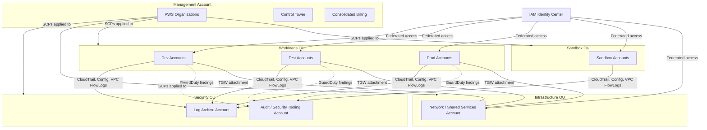
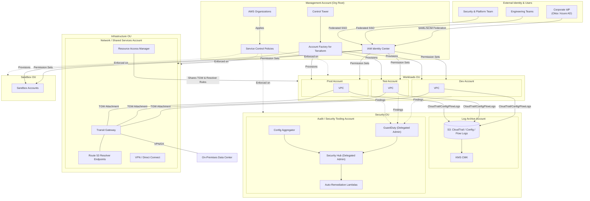
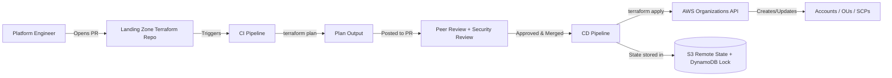

# Part XII – Resilience, Operations & Cost

# Chapter 99 — Reference Landing Zone

---

# 1. Executive Summary

## The Business Problem

Every enterprise that adopts AWS eventually confronts the same uncomfortable realization: a single AWS account, however well managed, cannot safely host an entire organization's workloads.

What typically happens without a landing zone:

- Development, staging, and production workloads share the same account and blast radius.
- IAM policies grow into unreadable, unauditable messes because every team requests broad permissions "to get things done."
- Security teams cannot enforce guardrails consistently — every team configures logging, encryption, and monitoring differently, if at all.
- Cost allocation becomes guesswork because there's no reliable account-level or tag-level boundary between business units.
- Compliance audits become multi-week fire drills because evidence of controls is scattered and inconsistent.
- A single compromised credential can pivot across every workload the company runs, because there is no hard account boundary containing the blast radius.

This is not a hypothetical failure mode — it is the default trajectory of nearly every organization that begins its AWS journey with a "just get it working" account structure and never revisits it until a security incident, a failed audit, or a runaway bill forces the conversation.

## What a Landing Zone Actually Is

A **Reference Landing Zone** is the foundational multi-account environment that every subsequent workload, application, and team operates within. It is not an application architecture — it is the **platform that all application architectures are built on top of**.

Concretely, a landing zone provides:

- A multi-account structure with clear account boundaries (security, logging, networking, shared services, workloads).
- Centralized identity and access management, typically through AWS IAM Identity Center (formerly AWS SSO).
- Centralized, immutable logging (CloudTrail, Config, VPC Flow Logs) aggregated into a dedicated account that workload teams cannot modify or delete.
- Preventive guardrails via Service Control Policies (SCPs) that make entire classes of misconfiguration structurally impossible, not just discouraged by policy documents.
- Detective guardrails via AWS Config rules and Security Hub that continuously assess conformance.
- Automated account provisioning ("account vending") so that new accounts inherit guardrails on day one rather than being retrofitted months later.
- Centralized networking (Transit Gateway or Cloud WAN) so that connectivity between accounts and to on-premises networks is consistent and centrally governed.
- A consistent cost allocation and tagging model that lets Finance and Engineering agree on what things cost, down to the account or workload.

## Why Organizations Adopt This Architecture

Organizations adopt a landing zone at one of three trigger points, and understanding which trigger applies helps calibrate urgency:

1. **Growth trigger.** The company now has more than 3–5 teams deploying to AWS independently. Without account isolation, teams begin colliding — on IAM roles, on VPC CIDR ranges, on service quotas, on naming conventions.
2. **Compliance trigger.** The company needs to demonstrate SOC 2, PCI-DSS, HIPAA, ISO 27001, or FedRAMP compliance. Auditors expect evidence of segregation of duties, centralized logging, and enforced guardrails — all of which are dramatically harder to demonstrate in a single-account or ad hoc multi-account environment.
3. **Incident trigger.** A security incident, a runaway cost event, or a failed internal audit exposes how fragile the "flat" account structure was. This is the most expensive way to learn the lesson, because remediation now happens under pressure and often requires migrating live workloads.

The best time to build a landing zone is before any of these triggers occur. The second-best time is immediately after the first one does.

## Major Business Benefits

| Benefit | Explanation |
|---|---|
| **Blast radius containment** | A compromised credential, a misconfigured resource, or a failed deployment in one account cannot directly affect another account. |
| **Consistent guardrails** | Security and compliance controls are enforced organization-wide via SCPs and Config rules, not dependent on individual teams remembering to configure them. |
| **Faster account provisioning** | New teams or workloads get a fully governed AWS account in minutes via automated account vending, rather than weeks of manual setup. |
| **Reliable cost allocation** | Account-level boundaries plus enforced tagging give Finance accurate, trustworthy chargeback and showback data. |
| **Audit readiness** | Centralized, immutable logs and continuous Config assessment mean compliance evidence is always current, not assembled reactively before an audit. |
| **Reduced cognitive load** | Application teams inherit a pre-approved, pre-secured environment and can focus on their workload instead of re-solving networking, logging, and IAM from scratch. |
| **Safer experimentation** | Sandbox accounts with strict guardrails let teams innovate without risking production systems or runaway costs. |

## Typical Enterprise Scenarios

**Scenario 1: The scaling startup.** A company with 40 engineers across 6 product teams has been running everything in two AWS accounts (prod and "everything else"). They've just closed a Series C and need SOC 2 Type II within nine months for enterprise sales. A landing zone becomes existential — not a nice-to-have — because SOC 2 auditors will not accept a flat account structure with commingled dev/prod resources and shared root credentials.

**Scenario 2: The regulated enterprise migrating to cloud.** A 3,000-person insurance company is migrating from on-premises data centers to AWS. Their internal audit and compliance functions require account-level segregation matching their existing on-premises network segmentation (DMZ, internal, regulated data zones). A landing zone with dedicated accounts per compliance boundary directly maps to their existing control framework, which materially eases the audit conversation.

**Scenario 3: The multi-business-unit conglomerate.** A holding company with five semi-autonomous business units, each with its own P&L, needs central visibility into security posture and cloud spend without dictating each unit's day-to-day engineering decisions. An Organizational Unit (OU) structure with per-BU OUs, shared central security/logging accounts, and delegated administration achieves this balance.

**Scenario 4: The M&A-active enterprise.** A company that acquires 2–4 companies per year needs a repeatable, automated process to onboard an acquired company's AWS footprint into a governed structure — ideally within weeks, not the 12–18 months that ad hoc integration typically takes.

In all four scenarios, the underlying architecture is the same: a multi-account AWS Organization, centralized identity, centralized logging, centralized networking, and automated, guardrail-enforced account provisioning. What differs is the specific OU structure, the specific SCPs, and the specific compliance mappings — all of which this chapter addresses in depth.

---

# 2. Business Requirements

## Business Drivers

- Establish a secure, auditable, and scalable multi-account foundation before workload growth outpaces governance capacity.
- Reduce time-to-provision for new AWS accounts from weeks to under one hour.
- Provide Finance with reliable, account-level cost visibility and chargeback capability.
- Satisfy compliance frameworks (SOC 2, ISO 27001, PCI-DSS, HIPAA as applicable) with demonstrable, continuously-assessed controls.
- Reduce security incident blast radius by isolating workloads, environments, and business units into separate accounts.
- Enable decentralized engineering velocity within centrally governed guardrails ("freedom within a framework").

## Functional Requirements

| Requirement | Description |
|---|---|
| Multi-account structure | Organization with OUs for Security, Infrastructure, Workloads (per environment), Sandbox, Suspended |
| Centralized identity | Single sign-on via IAM Identity Center, federated from corporate IdP (Okta/Azure AD/Ping) |
| Automated account vending | New accounts provisioned via Control Tower Account Factory or Terraform-based custom vending machine |
| Centralized logging | CloudTrail, Config, VPC Flow Logs, GuardDuty findings aggregated to a dedicated Log Archive account |
| Preventive guardrails | SCPs blocking root user actions, region restrictions, disabling of logging, public S3 buckets |
| Detective guardrails | AWS Config rules, Security Hub standards, GuardDuty enabled organization-wide |
| Centralized networking | Transit Gateway (or Cloud WAN) hub-and-spoke connecting all workload VPCs and on-premises |
| Break-glass access | Emergency access procedure independent of federated identity provider outage |
| Cost management | AWS Budgets, Cost Anomaly Detection, mandatory tagging policy enforced via SCP/Config |

## Non-Functional Requirements

- **Auditability:** Every control action (account creation, SCP change, IAM policy change) must be logged and attributable to an individual identity.
- **Immutability of logs:** Logs must be stored in an account that workload account administrators cannot access or modify.
- **Repeatability:** Account provisioning must be fully codified (Terraform / CloudFormation / Control Tower) — no manual console-based account setup.
- **Least privilege by default:** New accounts start with no standing human access beyond break-glass; access is granted via time-bound, role-based permission sets.

## Scalability Goals

| Dimension | Target |
|---|---|
| Number of accounts | Support 10 → 500+ accounts without architectural redesign |
| Account provisioning time | < 1 hour from request to usable, guardrail-compliant account |
| OU depth | Support up to 5 levels of OU nesting for complex org structures |
| Regions | Support multi-region workload accounts from a single global landing zone |

## Availability Requirements

The landing zone's control plane (Organizations, IAM Identity Center, Control Tower) relies on AWS's global service availability, which is exceptionally high but not something you architect further — it is not workload-facing availability. What *does* require design attention:

- The **Log Archive** and **Audit** accounts must remain reachable even during a broad AWS regional event affecting workload regions (achieved by choosing a home region for the landing zone control plane independent of workload region failures where feasible, and by S3 cross-region replication of logs).
- Break-glass access must not depend on the corporate identity provider being available.

## Latency Requirements

The landing zone itself introduces no workload-facing latency — it is a control-plane and governance layer, not a data-plane component. The one latency-relevant decision is **centralized networking via Transit Gateway**, which adds a small, consistent hop (typically low single-digit milliseconds) between spoke VPCs. This is discussed in Section 9.

## Compliance Requirements

| Framework | Landing Zone Relevance |
|---|---|
| SOC 2 | Requires segregation of duties, access logging, and change management — directly satisfied by account isolation + centralized CloudTrail + IAM Identity Center |
| PCI-DSS | Requires network segmentation of cardholder data environment (CDE) — satisfied by a dedicated PCI OU/account with restrictive SCPs and network isolation |
| HIPAA | Requires access controls and audit logging for ePHI — satisfied by dedicated healthcare workload accounts with BAA-eligible services only, enforced via SCP |
| ISO 27001 | Requires demonstrable risk management and control framework — satisfied by Config conformance packs mapped to ISO controls |
| FedRAMP | Requires strict boundary and continuous monitoring — typically requires GovCloud accounts within the same Organization structure |

## Security Expectations

- No IAM users with long-lived access keys in any account (identity federation only).
- Root user access disabled/locked down in every member account, with SCPs preventing most root actions regardless.
- All data encrypted at rest (KMS) and in transit (TLS) by default, enforced via SCP/Config where feasible.
- GuardDuty, Security Hub, and Config enabled in every account from creation, not opted-in later.

## Recovery Objectives

The landing zone's own recovery objectives concern the **governance layer**, not individual workloads (workload-level RPO/RTO is addressed per-application in other chapters, e.g., Chapter 95 – Disaster Recovery).

| Metric | Target | Rationale |
|---|---|---|
| RPO (Organizations/IAM Identity Center config) | Near-zero | Configuration is Terraform-managed and stored in version control; state is recoverable from source, not from backups |
| RPO (centralized logs) | Zero | S3 with versioning + cross-region replication; logs are never modified, only appended |
| RTO (account vending pipeline) | < 4 hours | If the vending pipeline itself fails, existing accounts continue operating; only *new* account creation is affected |
| RTO (break-glass access) | < 15 minutes | Must be fast enough to respond to an active security incident |

## SLAs

Internal SLA commitments typically set by the Platform/Cloud Engineering team owning the landing zone:

- New account provisioning: 95% of requests fulfilled within 1 business hour during business hours, 4 hours off-hours.
- SCP/guardrail change requests: reviewed and deployed within 2 business days (via pull request + approval workflow).
- Security finding triage (GuardDuty/Security Hub Critical/High): acknowledged within 1 hour, 24/7.

## Expected Workload

A landing zone does not host application workloads directly — it hosts the accounts that host workloads. Expected "load" is expressed as organizational scale:

- Initial: 10–20 accounts (per environment per major product line).
- Year 1: 40–80 accounts as teams decompose monoliths and adopt account-per-microservice-domain patterns.
- Year 3: 150–500+ accounts in a mature enterprise, especially where "account per environment per team" is the norm.

## Expected Growth

Growth is accommodated primarily by the OU structure and automated account vending, not by re-architecting the landing zone itself. This is the central design promise of a well-built landing zone: the *pattern* scales from 10 accounts to 1,000 accounts without a redesign, because provisioning, guardrails, and logging are already codified and account-count-agnostic.

---

# 3. Architecture Overview

## Overall Design

The Reference Landing Zone is built around **AWS Organizations** as the root construct, with a small number of purpose-built **foundational accounts** and an extensible tree of **Organizational Units (OUs)** that hold workload accounts.

The design philosophy rests on four pillars:

1. **Separation of concerns via accounts, not resource-level boundaries.** An AWS account is the strongest isolation boundary AWS offers (stronger than VPCs, stronger than IAM). The landing zone uses accounts as the primary unit of isolation for security, billing, and blast-radius containment.
2. **Guardrails over permissions.** Rather than trying to write a perfect IAM policy for every team (which is unmaintainable at scale), the landing zone uses SCPs to make entire categories of action impossible org-wide, then lets account owners operate with broad — but bounded — permissions inside their own account.
3. **Everything centralized that benefits from centralization; everything delegated that benefits from delegation.** Logging, identity, and network transit are centralized because fragmenting them destroys their value. Day-to-day resource management is delegated to account owners because centralizing it destroys their velocity.
4. **Codify, don't click.** Every account, OU, SCP, and guardrail is defined in Terraform (or CloudFormation/Control Tower blueprints) and deployed via CI/CD. The AWS Console is used for read-only inspection and emergency break-glass only.

## Core Components

| Component | Role |
|---|---|
| **Management Account** | Root of the AWS Organization; hosts Organizations, Control Tower, and consolidated billing. Never hosts workloads. |
| **Log Archive Account** | Immutable destination for CloudTrail, Config, VPC Flow Logs, and GuardDuty findings from every account in the Organization. |
| **Audit / Security Tooling Account** | Hosts Security Hub (delegated administrator), GuardDuty (delegated administrator), and security automation (e.g., Lambda-based auto-remediation). |
| **Shared Services / Network Account** | Hosts Transit Gateway, Route 53 Resolver endpoints, centralized VPN/Direct Connect termination, and shared AMI/artifact repositories. |
| **IAM Identity Center** | Federated SSO hub; maps corporate identity provider groups to AWS permission sets across all accounts. |
| **Workload OUs & Accounts** | Per-environment (Sandbox, Dev, Test, Prod) and/or per-business-unit accounts hosting actual application infrastructure. |
| **Account Factory / Vending Machine** | Automated pipeline (Control Tower Account Factory for Terraform, or custom Terraform module) that provisions new accounts with guardrails pre-applied. |

## How Components Interact



## High-Level Workflow

**Account creation workflow:**

1. Requesting team submits an account request (via ticket, portal, or pull request against the account-vending Terraform repository).
2. Platform team (or automated approval for pre-approved OUs like Sandbox) reviews and approves.
3. Account Factory (Control Tower) or custom Terraform pipeline provisions the account inside the correct OU.
4. Baseline guardrails (SCPs inherited from OU), Config rules, GuardDuty, CloudTrail, and Security Hub are automatically enabled.
5. Network account is notified/automated to create a Transit Gateway attachment for the new account's VPC.
6. IAM Identity Center permission sets are assigned to the requesting team's group for the new account.
7. Account is handed off with a "golden path" Terraform starter module for the team to deploy their workload.

**Ongoing guardrail lifecycle:**

1. Security/Platform team proposes an SCP or Config rule change via pull request.
2. Change is peer-reviewed, tested in a non-production OU first where feasible.
3. Change is merged and deployed via CI/CD to the target OU(s).
4. Config continuously assesses all accounts in scope; Security Hub aggregates findings.
5. Non-compliant resources trigger either an alert (detective) or are blocked at creation time (preventive, via SCP).

## Request Lifecycle (within a workload account)

This is workload-specific and covered in depth in the application-architecture chapters (5–98). The landing zone's role in the request lifecycle is indirect: it supplies the guardrails, network connectivity, and logging that every request implicitly passes through (VPC Flow Logs capturing the traffic, CloudTrail capturing any API calls, GuardDuty analyzing for anomalies).

## Response Lifecycle

Same note as above — the landing zone does not sit in the data path of application responses. Its role is governance and observability of the environment those responses are generated within.

## Data Lifecycle

- **Log data:** Generated in every member account → streamed/delivered to Log Archive account → stored in S3 with lifecycle policies (Standard → Glacier → expiration per retention policy) → queryable via Athena.
- **Configuration data:** Defined in Terraform in version control → applied via CI/CD → account/OU state reflected in AWS Organizations, SCPs, and Control Tower → drift detected via Config and Terraform plan diffs.
- **Identity data:** Sourced from corporate IdP → synchronized into IAM Identity Center → mapped to permission sets per account → session data logged in CloudTrail.

---

# 4. AWS Services Used

## AWS Organizations

**Purpose:** The root management construct for a multi-account environment. Provides consolidated billing, the OU hierarchy, and the enforcement point for Service Control Policies.

**Why selected:** There is no viable alternative for multi-account governance on AWS — Organizations is the only native mechanism to group accounts, apply org-wide policies, and consolidate billing.

**Alternatives:** None at the AWS-native level. Some enterprises consider "one giant account with strict IAM" as an alternative to multi-account entirely — this is discussed and rejected in Section 28 (Alternatives).

**Limitations:** Default limit of 10 OUs deep is not a practical constraint; default account limit (initially 10, raised via support request) requires proactive limit increases for large enterprises; SCPs have a 5KB size limit per policy and 5 attached policies per entity, which requires careful policy composition at scale.

**Pricing considerations:** AWS Organizations itself is free. Cost implications come from the accounts and resources it manages, not from Organizations as a service.

**Best practices:** Enable all features (not just consolidated billing); enable SCPs from day one even with permissive policies, so the enforcement muscle exists before you need it to be strict.

## AWS Control Tower

**Purpose:** A managed service that automates landing zone setup — creating the Management, Log Archive, and Audit accounts, applying baseline guardrails, and providing an Account Factory for self-service account provisioning.

**Why selected:** Dramatically reduces the time and expertise required to stand up a compliant landing zone compared to building every component from scratch in Terraform. Provides a well-tested baseline that AWS maintains and updates.

**Alternatives:** A fully custom Terraform-based landing zone (sometimes called a "landing zone accelerator" pattern, similar to AWS's own open-source *Landing Zone Accelerator on AWS*). Chosen instead of Control Tower by organizations that need guardrails or account structures Control Tower doesn't natively support, or that have a strong Terraform-first culture and want everything as code without Control Tower's opinionated abstractions.

**Limitations:** Control Tower has an opinionated OU/account structure that can be restrictive for unusual organizational needs; not available in all AWS regions as the "home region"; some advanced networking patterns (e.g., certain Transit Gateway topologies) require supplementing Control Tower with custom Terraform ("Customizations for Control Tower" or CfCT).

**Pricing considerations:** Control Tower itself has no additional charge; you pay only for the underlying services it provisions (Config, CloudTrail, S3, etc.).

**Best practices:** Use Control Tower's Account Factory for Terraform (AFT) if your organization is Terraform-first, rather than the console-based Account Factory, to keep account provisioning in version control.

## AWS IAM Identity Center (formerly AWS SSO)

**Purpose:** Centralized, federated identity and access management across all accounts in the Organization. Maps users/groups from a corporate identity provider to permission sets in specific AWS accounts.

**Why selected:** Eliminates per-account IAM users, which are a major security liability (long-lived credentials, inconsistent MFA enforcement, no central deprovisioning). Provides a single place to grant, review, and revoke access across hundreds of accounts.

**Alternatives:** Custom SAML federation directly between the corporate IdP and each account's IAM (viable but requires maintaining SAML trust relationships per account — does not scale well past a handful of accounts); third-party CIEM/identity governance tools layered on top for very large enterprises with complex entitlement review needs.

**Limitations:** Permission sets are provisioned as IAM roles into each account, which counts against that account's IAM role quota; cross-account session duration is capped (configurable, max 12 hours); cannot be the sole mechanism for machine/service-to-service access (that remains IAM roles).

**Pricing considerations:** No additional charge for IAM Identity Center itself.

**Best practices:** Group-based access assignment only (never assign permission sets to individual users directly) so that access changes are managed via the IdP's group membership, keeping a single source of truth.

## AWS CloudTrail

**Purpose:** Records every API call made within an AWS account — who did what, when, from where. The backbone of auditability.

**Why selected:** It is the only service that captures management-plane API activity across all AWS services in a consistent format, and it is required evidence for essentially every compliance framework.

**Alternatives:** None for management-plane logging — CloudTrail is foundational and not substitutable. (Data-plane logging, e.g., S3 access logs or VPC Flow Logs, is complementary, not alternative.)

**Limitations:** Organization trails simplify multi-account logging but must be created from the Management account; CloudTrail Lake (the newer SQL-queryable option) has separate pricing from standard trails and needs to be evaluated for query needs versus Athena-over-S3.

**Pricing considerations:** First copy of management events is free; data events (e.g., S3 object-level, Lambda invocations) incur per-event charges and should be scoped deliberately, not enabled blindly on every resource.

**Best practices:** Enable one **Organization Trail** in the Management account that logs to the Log Archive account's S3 bucket, rather than per-account trails, to guarantee consistent coverage and prevent individual accounts from disabling their own trail.

## AWS Config

**Purpose:** Continuously records resource configuration and evaluates it against rules (managed or custom) to detect non-compliant resources.

**Why selected:** Provides the detective-control half of the guardrail model — where SCPs prevent, Config detects (for the many controls that cannot be cleanly prevented at the API level, e.g., "S3 buckets should have versioning enabled").

**Alternatives:** Third-party CSPM (Cloud Security Posture Management) tools (Wiz, Prisma Cloud, Orca) — often used *in addition to* Config for richer cross-cloud or agentless vulnerability scanning, rarely as a full replacement given Config's tight native integration and Security Hub aggregation.

**Limitations:** Config rule evaluation is not real-time (periodic or configuration-change-triggered, typically within minutes, not seconds); conformance packs (bundles of rules mapped to a framework like PCI-DSS) need per-account or per-OU deployment via StackSets.

**Pricing considerations:** Charged per configuration item recorded and per rule evaluation — can become a meaningful cost line at scale (see Section 16); recording only relevant resource types (not "all resources" indiscriminately) controls this.

**Best practices:** Deploy an **Organization aggregator** in the Audit account to get a single-pane view of compliance across all accounts, rather than checking each account's Config dashboard individually.

## AWS Security Hub

**Purpose:** Aggregates findings from GuardDuty, Config, Inspector, IAM Access Analyzer, and third-party tools into a single dashboard, and evaluates accounts against security standards (AWS Foundational Security Best Practices, CIS AWS Foundations Benchmark, PCI-DSS).

**Why selected:** Without aggregation, security teams must check GuardDuty, Config, Inspector, and Access Analyzer separately in every account — infeasible past a handful of accounts. Security Hub's delegated administrator model gives one account org-wide visibility.

**Alternatives:** SIEM platforms (Splunk, Datadog Cloud SIEM, Sumo Logic) ingesting the same underlying findings — often used downstream of Security Hub for longer retention, correlation with non-AWS signals, and SOC workflows, not as a replacement for Security Hub's native AWS aggregation.

**Limitations:** Standards enablement is per-account (though can be automated org-wide via delegated administrator settings); finding retention in Security Hub itself is 90 days, so long-term retention requires export to S3/SIEM.

**Pricing considerations:** Priced per finding ingested and per security check performed — costs scale with account count and resource count; worth budgeting explicitly (Section 16).

**Best practices:** Designate the Audit account as Security Hub delegated administrator and auto-enable Security Hub for every new account created via the account factory, so no account is ever unmonitored.

## Amazon GuardDuty

**Purpose:** Managed threat detection service that analyzes VPC Flow Logs, DNS logs, CloudTrail events, and (with extensions) EKS audit logs and S3 data events for malicious or anomalous activity.

**Why selected:** Provides continuous, ML-based threat detection without requiring the organization to build and tune its own detection pipeline. Integrates natively with Organizations for one-click org-wide enablement.

**Alternatives:** Third-party EDR/network detection tools — typically layered on top for endpoint-level (EC2 OS-level) detection that GuardDuty does not natively provide, not as a full replacement for AWS-native threat detection.

**Limitations:** Extended threat detection features (EKS Protection, RDS Protection, Lambda Protection, Malware Protection) are separately priced add-ons and should be enabled deliberately based on actual workload types present, not enabled blindly.

**Pricing considerations:** Priced based on volume of CloudTrail events, VPC Flow Log data, and DNS query volume analyzed — can be a non-trivial cost at high-traffic scale (Section 16).

**Best practices:** Enable GuardDuty organization-wide with the Audit account as delegated administrator; enable auto-enable for new accounts so coverage is never a manual afterthought.

## AWS KMS

**Purpose:** Managed encryption key service used to encrypt data at rest across S3, EBS, RDS, and other services, and to encrypt CloudTrail logs and Config snapshots in the Log Archive account.

**Why selected:** Native integration with virtually every AWS storage and database service; supports customer-managed keys (CMKs) with fine-grained key policies for cross-account access patterns needed in a landing zone (e.g., workload accounts encrypting logs with a key owned by the Log Archive account).

**Alternatives:** AWS-owned or AWS-managed keys (simpler, no key policy management, but no cross-account sharing control and no key rotation control) — acceptable for non-sensitive data, insufficient for regulated workloads requiring demonstrable key control.

**Limitations:** Cross-account key usage requires careful key policy plus IAM policy alignment (both must grant access — a common source of "access denied" confusion); KMS API calls are throttled per key (request quota), which matters at very high-throughput encryption workloads.

**Pricing considerations:** Per-key monthly charge plus per-API-call charge; centralizing to fewer, well-shared CMKs (versus a key per resource) reduces cost and management overhead in the landing zone context.

**Best practices:** Use a dedicated CMK in the Log Archive account for encrypting centralized logs, with a key policy explicitly granting the specific workload accounts' CloudTrail/Config service roles permission to encrypt (but not decrypt) with it.

## AWS Secrets Manager

**Purpose:** Manages secrets (database credentials, API keys, third-party tokens) with automatic rotation support, used within workload accounts and for landing-zone-level automation credentials (e.g., break-glass credentials, CI/CD deployment credentials).

**Why selected:** Native rotation, fine-grained IAM-based access control, and CloudTrail logging of every secret access — critical for auditability of who accessed what secret and when.

**Alternatives:** AWS Systems Manager Parameter Store (SecureString) — lower cost, no native rotation, acceptable for simpler secrets or configuration values; HashiCorp Vault — chosen by organizations with multi-cloud secret management needs or existing Vault investment.

**Limitations:** Per-secret monthly charge plus per-API-call charge, which adds up at scale if used indiscriminately for every configuration value rather than genuine secrets.

**Pricing considerations:** See Section 16 for detailed cost modeling; a common landing-zone-level use is protecting the break-glass IAM user credentials and any cross-account automation tokens.

**Best practices:** Reserve Secrets Manager for genuine secrets (credentials, tokens); use Parameter Store for non-secret configuration to control cost.

## AWS Systems Manager

**Purpose:** Provides Session Manager (bastion-less shell access to EC2 instances), Parameter Store, Patch Manager, and Automation runbooks — used across the landing zone for operational tooling standardization.

**Why selected:** Session Manager eliminates the need for bastion hosts and open SSH/RDP security groups across every workload account, which is a meaningful landing-zone-wide security posture improvement enforceable via SCP (blocking inbound SSH/RDP from 0.0.0.0/0 org-wide).

**Alternatives:** Traditional bastion hosts — rejected as a landing-zone standard because they represent a persistent attack surface and require patching/maintenance in every account; third-party PAM (privileged access management) tools for very large enterprises with complex approval-workflow requirements around break-glass access.

**Limitations:** Requires the SSM Agent running on instances (default on most AWS-provided AMIs, must be added to custom AMIs); requires outbound connectivity to SSM endpoints (via VPC endpoints in private subnets — see Section 9).

**Pricing considerations:** Core Session Manager and Parameter Store (standard tier) functionality is free; Automation and advanced features have modest per-use charges.

**Best practices:** Deploy SSM VPC endpoints in every workload VPC (via the network account's shared endpoint pattern or per-VPC) so instances in private subnets without internet access can still use Session Manager.

## Amazon S3

**Purpose:** Storage for centralized logs (CloudTrail, Config, VPC Flow Logs) in the Log Archive account, and for Terraform remote state (in the Management or a dedicated Infrastructure account).

**Why selected:** Native integration as the delivery target for CloudTrail/Config/Flow Logs; extremely durable (11 nines); supports Object Lock for compliance-grade immutability of audit logs.

**Alternatives:** None credible for this specific role — S3 is the AWS-native and effectively only sensible target for centralized log delivery at this layer.

**Limitations:** Cross-account bucket policies must be carefully scoped (the classic landing-zone mistake is a Log Archive bucket policy that's too permissive, allowing any account to *read*, not just *write*, logs).

**Pricing considerations:** Storage cost is driven by log volume and retention period; lifecycle policies transitioning to Glacier/Glacier Deep Archive are essential at scale (Section 16).

**Best practices:** Enable S3 Object Lock (compliance mode) on the Log Archive bucket so that even an account with delete permissions cannot remove logs before the retention period expires — critical for demonstrating tamper-evidence to auditors.

## AWS Transit Gateway

**Purpose:** Central hub connecting VPCs across all workload accounts (and on-premises networks via VPN/Direct Connect) without requiring a full mesh of VPC peering connections.

**Why selected:** VPC peering does not scale past a small number of VPCs (no transitive routing, N² connection growth); Transit Gateway provides a hub-and-spoke model that scales linearly and centralizes routing policy in the Network account.

**Alternatives:** AWS Cloud WAN — a newer, higher-abstraction service for global network management across multiple regions with a policy-based approach; preferred by organizations managing very large, multi-region network topologies who want centralized policy documents rather than per-TGW route table management. VPC Peering — acceptable only for very small landing zones (under ~5 VPCs) where the operational simplicity of peering outweighs its scaling limits.

**Limitations:** Transit Gateway has quotas on attachments per TGW (default 5,000, adjustable) and routes per route table; cross-region TGW peering incurs additional data transfer charges.

**Pricing considerations:** Per-attachment hourly charge plus per-GB data processing charge — this is frequently an underestimated cost center (Section 16, "Cost Surprises").

**Best practices:** Use separate TGW route tables per environment tier (e.g., Prod route table only propagates routes from Prod spoke VPCs) to enforce network-level segmentation between environments, not just relying on security groups.

## Amazon Route 53

**Purpose:** DNS management, including private hosted zones shared across the Organization via Route 53 Resolver rules, and (if applicable) public DNS for the organization's domains.

**Why selected:** Native integration with AWS resources, health checks, and the Resolver service for hybrid DNS resolution between on-premises and AWS.

**Alternatives:** Third-party DNS providers for public zones (common for organizations with existing DNS vendor relationships) — typically combined with Route 53 private hosted zones for internal AWS resolution regardless.

**Limitations:** Cross-account private hosted zone association requires explicit authorization (VPC association authorization) — a step frequently missed in initial landing zone builds.

**Pricing considerations:** Modest — per-hosted-zone monthly charge plus per-query charge; not a major cost center relative to networking and logging.

**Best practices:** Centralize the Route 53 Resolver outbound/inbound endpoints in the Network account and share resolver rules org-wide via AWS RAM (Resource Access Manager), so every workload account resolves on-premises DNS consistently without duplicating resolver infrastructure.

## AWS Resource Access Manager (RAM)

**Purpose:** Shares resources (Transit Gateway attachments, Route 53 Resolver rules, subnets in some patterns) across accounts within the Organization without requiring resource duplication or cross-account IAM role assumption for every access.

**Why selected:** This is the mechanism that makes centralized networking practical — without RAM, every workload account would need to independently peer or replicate shared network resources.

**Alternatives:** None directly comparable for this specific sharing use case within an Organization.

**Limitations:** Only supports a defined set of shareable resource types (growing over time, but not universal); shared resources are still owned and billed to the sharing account, which matters for cost allocation design.

**Pricing considerations:** RAM itself is free; costs are attributed to the underlying shared resource per its own pricing model.

**Best practices:** Share Transit Gateway from the Network account to workload OUs (not to individual accounts one at a time) to keep sharing scoped and maintainable as new accounts are added.

---

# 5. Complete Architecture Diagram



---

# 6. Component-by-Component Explanation

## Management Account

- **Purpose:** Root of the AWS Organization. Owns consolidated billing and the authority to create/close accounts and apply SCPs.
- **Responsibilities:** Organization structure management, SCP authorship and attachment, Control Tower operation, IAM Identity Center hosting.
- **Inputs:** Terraform/CI-CD-driven changes to OU structure and SCPs; account creation requests via Account Factory.
- **Outputs:** Provisioned member accounts; enforced org-wide policies.
- **Scaling:** Not a workload-scaling concern — this account should never run application workloads. Scaling here means OU/account count, which Organizations handles natively to very large numbers.
- **High availability:** Relies on AWS's global control-plane availability for Organizations/IAM; no customer-managed HA design needed.
- **Failure handling:** If the Management account's automation pipeline fails, existing member accounts and their workloads continue operating unaffected — this isolation is precisely the point of the design.
- **Dependencies:** IAM Identity Center, Control Tower, the Terraform/CI-CD pipeline that codifies org structure.
- **Security:** Root user MFA hardware key mandatory, root credentials in a physically secured location, root user never used for routine operations; extremely limited human access (break-glass only).
- **Monitoring:** CloudTrail on the Management account itself feeds the Log Archive account like every other account; specific alerting on any root user activity or SCP change.

## Log Archive Account

- **Purpose:** Sole destination for centralized, immutable audit logs from every account in the Organization.
- **Responsibilities:** Receive and durably store CloudTrail, Config, and VPC Flow Log data; enforce write-once semantics via S3 Object Lock.
- **Inputs:** Log delivery streams from every member account.
- **Outputs:** Queryable log data (via Athena) for the Audit account and authorized investigators.
- **Scaling:** S3 scales natively with log volume; the design consideration is lifecycle policy tuning, not capacity planning.
- **High availability:** S3 provides 11 nines durability natively; cross-region replication adds resilience against a regional event affecting the Log Archive account's primary region.
- **Failure handling:** If log delivery from a workload account fails (e.g., misconfigured trail), Config/CloudTrail delivery failure alarms should fire — a silent logging gap is itself a critical finding.
- **Dependencies:** KMS CMK for encryption, S3 bucket policies granting write-only access to member accounts.
- **Security:** No human has standing delete access to this account; bucket policy denies delete/modify from any principal except a tightly scoped lifecycle-management role; MFA delete enabled.
- **Monitoring:** Alarms on log delivery gaps, unexpected access patterns to the log bucket, and any attempted policy change on the bucket itself.

## Audit / Security Tooling Account

- **Purpose:** Centralized security visibility and response tooling.
- **Responsibilities:** Hosts Security Hub and GuardDuty as delegated administrator, aggregates Config compliance data, runs automated remediation.
- **Inputs:** Findings and events streamed from every member account via Organization-wide enablement.
- **Outputs:** Aggregated dashboards, alerts (via EventBridge → SNS/Slack/PagerDuty), automated remediation actions.
- **Scaling:** Scales with finding volume; Security Hub and GuardDuty are managed services requiring no capacity planning.
- **High availability:** Managed-service availability; the account itself should have no single point of failure in its automation (Lambda functions should be idempotent and retry-safe).
- **Failure handling:** If auto-remediation Lambdas fail, findings should still surface in Security Hub for manual triage — automation is an enhancement, not a single point of detection failure.
- **Dependencies:** Delegated administrator relationships configured from the Management account; EventBridge rules for finding routing.
- **Security:** Tightly restricted human access; break-glass and named security engineers only.
- **Monitoring:** Meta-monitoring — alerts if GuardDuty or Security Hub itself becomes disabled in any account (a common attacker technique is disabling detection before acting).

## Network / Shared Services Account

- **Purpose:** Centralizes network transit and shared infrastructure so workload accounts don't each build their own connectivity.
- **Responsibilities:** Own and operate Transit Gateway, VPN/Direct Connect, Route 53 Resolver endpoints, and any shared AMI/artifact repositories.
- **Inputs:** TGW attachment requests from workload accounts (via RAM share acceptance); routing policy changes from the network team.
- **Outputs:** Connectivity between workload VPCs and to on-premises networks; DNS resolution for hybrid environments.
- **Scaling:** TGW scales to thousands of attachments; route table complexity is the practical scaling constraint requiring active management (segmented route tables per environment tier).
- **High availability:** TGW is inherently multi-AZ; VPN connections should be configured with two tunnels (AWS default) to two customer gateway endpoints for redundancy; Direct Connect should have a backup VPN or a second DX circuit in a different location.
- **Failure handling:** Loss of a single VPN tunnel fails over automatically to the second tunnel; loss of Direct Connect should fail over to backup VPN (requires explicit route preference configuration and testing).
- **Dependencies:** RAM for sharing TGW to workload OUs; workload account VPC route tables must be correctly configured to route through TGW attachments.
- **Security:** Route tables enforce environment segmentation (Prod spokes cannot route to Dev spokes unless explicitly required and approved); network ACLs as defense-in-depth.
- **Monitoring:** TGW flow logs, VPN tunnel status alarms, Direct Connect connection state alarms.

## Workload Accounts (Dev / Test / Prod)

- **Purpose:** Host actual application infrastructure, isolated per environment and/or per team/business unit.
- **Responsibilities:** Application compute, storage, database resources — everything covered in the other 99 chapters of this book, operating *within* this landing zone's guardrails.
- **Inputs:** Application deployments via the team's own CI/CD, within the permission boundaries granted by IAM Identity Center permission sets and constrained by inherited SCPs.
- **Outputs:** Application functionality; logs and findings flowing up to Log Archive and Audit accounts.
- **Scaling:** Each account scales independently for its own workload; the landing zone imposes no workload-level scaling constraint (see other chapters for workload-specific scaling).
- **High availability:** Workload-specific (see relevant architecture chapters); the landing zone's contribution is ensuring the account itself, its guardrails, and its logging never become the single point of failure.
- **Failure handling:** Workload-specific; landing-zone-level guarantee is that a failure in one workload account cannot cascade into another account due to the hard account boundary.
- **Dependencies:** IAM Identity Center for human access, TGW attachment for network connectivity, inherited SCPs for guardrails.
- **Security:** Team owns day-to-day security within the account but cannot disable org-wide controls (CloudTrail, GuardDuty, public S3 blocking) due to preventive SCPs.
- **Monitoring:** Application-level monitoring is the team's responsibility (see Chapter 96 – Observability Platform); landing-zone-level monitoring (Config, Security Hub, GuardDuty) is automatic and inherited.

## Sandbox Accounts

- **Purpose:** Provide a safe space for experimentation with strict cost and access controls, isolated from any production data or connectivity.
- **Responsibilities:** Nothing production-facing; typically no TGW attachment (or a heavily restricted one) to prevent accidental exposure to production networks.
- **Inputs:** Self-service requests from engineers wanting to experiment with new AWS services.
- **Outputs:** None consumed by other systems — sandbox accounts are terminal nodes in the architecture.
- **Scaling:** Automatically recycled/reset on a schedule (e.g., monthly) via automation to prevent drift and cost creep.
- **High availability:** Not applicable — sandbox accounts have no availability guarantee by design.
- **Failure handling:** N/A.
- **Dependencies:** Account Factory for provisioning; aggressive SCPs limiting instance types, regions, and spend.
- **Security:** Strict SCPs (e.g., deny expensive instance types, deny production-like services such as Direct Connect, restrict to specific regions); mandatory budget alarms with auto-suspension on breach.
- **Monitoring:** Cost Anomaly Detection tuned to a low threshold given the small expected spend baseline.

---

# 7. End-to-End Request Flow

This section illustrates the flow of a **governance event** — a new engineer requesting access to deploy a workload — since the landing zone itself is not in the application data path. This is the request flow most relevant to a landing zone chapter.

1. **Engineer requests access.** An engineer joins the "Payments-Team" group in the corporate identity provider (Okta/Azure AD), which is pre-mapped to a permission set in the Prod-Payments AWS account.
2. **SCIM sync.** The IdP's SCIM provisioning connector synchronizes group membership into IAM Identity Center within minutes.
3. **Engineer authenticates.** The engineer navigates to the AWS access portal URL, authenticates via the corporate IdP (including MFA, enforced at the IdP level), and is redirected back to AWS with a federated session.
4. **Account/role selection.** IAM Identity Center presents the accounts and permission sets the engineer's group grants access to; the engineer selects "Prod-Payments / DeveloperAccess."
5. **Temporary credentials issued.** AWS STS issues temporary credentials scoped to the DeveloperAccess permission set's IAM role in the Prod-Payments account, valid for the configured session duration (e.g., 4 hours).
6. **CloudTrail records the AssumeRole event.** This event is delivered to the Log Archive account within minutes, tagged with the engineer's federated identity.
7. **Engineer performs an action** — for example, deploying a Terraform change via CI/CD using a separate, more tightly scoped CI/CD IAM role (not the human's interactive role) that assumes a deployment role in Prod-Payments.
8. **SCP evaluation.** Every API call the engineer or the CI/CD pipeline makes is evaluated against the SCPs attached to the Prod-Payments account's OU before IAM policy evaluation even occurs. An action prohibited by SCP (e.g., disabling CloudTrail) fails with an `AccessDenied` regardless of the IAM policy's permissions.
9. **Config evaluates the resulting resource state.** If the engineer creates a new S3 bucket, the AWS Config rule for "s3-bucket-public-read-prohibited" evaluates it within minutes of creation.
10. **Non-compliant resource detected (if applicable).** If the bucket were misconfigured as public, Config marks it NON_COMPLIANT; an EventBridge rule routes this to the Audit account's auto-remediation Lambda, which can either alert or automatically remediate (e.g., apply the S3 Block Public Access setting) depending on the severity tier configured for that rule.
11. **GuardDuty continuously analyzes** the account's VPC Flow Logs, DNS logs, and CloudTrail events in the background for anomalous behavior (e.g., API calls from an unusual geography, or a compromised credential attempting reconnaissance).
12. **Security Hub aggregates** the Config finding and any GuardDuty finding into a unified view in the Audit account, scored by severity.
13. **Alert routed.** Critical/High findings trigger an EventBridge rule that posts to the security team's Slack/PagerDuty channel and opens a ticket automatically.
14. **Session expires.** After 4 hours, the engineer's temporary credentials expire; any continued access requires re-authentication through the same federated flow, ensuring no standing long-lived credential exists.
15. **Logging and error handling throughout.** Every step from 2–14 is independently logged (SCIM sync logs at the IdP, CloudTrail at every AWS API call, Config compliance history, GuardDuty finding history, Security Hub finding lifecycle) — providing a complete, correlated audit trail an investigator or auditor can reconstruct end-to-end without gaps.

---

# 8. Deployment Flow

## Infrastructure Provisioning

The landing zone itself, and every account within it, is provisioned via **Terraform**, never manually through the console. This is non-negotiable for a landing zone specifically because:

- Manual account setup is not repeatable and drifts silently.
- Auditors specifically look for evidence that guardrails are consistently applied — Terraform plan/apply history is exactly that evidence.
- Recovering from a mistake (e.g., an overly restrictive SCP locking out the platform team) is far faster via `terraform apply` of a reverted commit than via manual console remediation.

## Terraform Workflow



## CI/CD Deployment

- **Repository structure:** A dedicated repository (e.g., `landing-zone-infra`) separate from application repositories, with modules for `organizations/`, `scps/`, `account-factory/`, `identity-center/`, and `networking/`.
- **Pipeline stages:** lint (`terraform fmt`, `tflint`) → static security scan (`checkov` or `tfsec`) → `terraform plan` → manual approval gate (mandatory for SCP and account-creation changes) → `terraform apply`.
- **State isolation:** Separate state files per logical component (organizations, networking, identity center) to limit blast radius of a state corruption event and to allow independent apply cadences.

## Blue-Green Deployment

Blue-green in the traditional sense (two parallel environments swapped via load balancer) does not apply directly to the landing zone's own infrastructure, since Organizations/SCPs are singleton, global constructs. The equivalent pattern here is:

- **SCP staged rollout:** New or modified SCPs are first attached to a low-risk OU (e.g., Sandbox), observed for unintended denials over a burn-in period (typically 1–2 weeks), then progressively rolled out to Dev → Test → Prod OUs.
- **Account Factory template versioning:** New account baseline templates are versioned; new accounts use the new template while existing accounts continue operating on their original baseline until an explicit, tested upgrade is applied.

## Rollback

- SCP changes: revert the Terraform commit and re-apply; SCP changes take effect within seconds to a few minutes.
- Account Factory template changes: only affect newly created accounts, so rollback risk is limited to future provisioning, not existing accounts.
- Config rule changes: revert commit and re-apply; re-evaluation of existing resources against the reverted rule set occurs automatically.

## Secrets

- The landing zone's own operational secrets (break-glass IAM user credentials, CI/CD deployment role external IDs) are stored in Secrets Manager in the Management account, with access restricted to a very small number of named platform engineers and logged via CloudTrail.
- Application-level secrets are the responsibility of individual workload accounts and are out of scope for the landing zone itself, though the landing zone should enforce (via Config rule) that Secrets Manager or Parameter Store SecureString is used rather than hardcoded credentials.

## Configuration

- All OU structure, SCP content, Config rule sets, and account baseline parameters are defined as Terraform variables/`.tfvars` per environment tier, never hardcoded inline, so the same module code deploys consistently across Sandbox, Dev, Test, and Prod OUs with only parameter differences.

## Validation

- Post-apply validation includes automated checks that: the new/modified SCP does not lock out the platform team's own break-glass role (a specific, deliberate test case run in CI before merge); every account in scope has CloudTrail, Config, and GuardDuty enabled (checked via a validation script calling the relevant describe/list APIs); Security Hub shows no new Critical findings introduced by the change.

---

# 9. Network Topology

## VPC

Each workload account owns its own VPC(s) — the landing zone does not centralize VPCs themselves (that would reintroduce the blast-radius problem accounts are meant to solve), only the **transit** between them.

## CIDR

- A centrally managed CIDR allocation plan (typically tracked in the Network account via IPAM — Amazon VPC IP Address Manager) prevents overlapping CIDR ranges across accounts, which would otherwise make Transit Gateway routing impossible.
- Recommended pattern: allocate a `/16` supernet per environment tier (e.g., `10.0.0.0/16` reserved for Prod, `10.16.0.0/16` for Dev), with each new account's VPC receiving a `/20` or `/21` from IPAM automatically at account creation time.

## Public Subnets

- Present only in accounts/VPCs that genuinely require internet-facing resources (e.g., an account hosting a public ALB).
- SCPs can restrict which accounts are permitted to create internet gateways at all, forcing genuinely internal workloads into a topology with no public subnet option.

## Private Subnets

- Default and preferred subnet type for all workload compute and data resources.
- Outbound internet access (if needed) routed through centralized NAT Gateways — either per-account (simpler, slightly higher cost) or centralized in the Network account with routes via TGW (lower cost at scale, added complexity and a shared dependency).

## NAT Gateway

- **Per-account NAT:** Simpler blast-radius isolation, slightly higher aggregate cost at scale (each account pays its own NAT Gateway hourly + data processing charge).
- **Centralized NAT (in Network account, via TGW):** Lower aggregate cost at high account counts, but makes the Network account's NAT capacity a shared dependency across all workload accounts — requires careful capacity planning and monitoring.
- **Recommendation:** Start per-account for isolation and simplicity; reconsider centralized NAT only once account count and NAT Gateway cost genuinely justify the added shared-dependency complexity (typically past 50+ accounts).

## Internet Gateway

- Attached only to VPCs with legitimate public subnet needs; an SCP can deny `ec2:CreateInternetGateway` in OUs (e.g., a PCI-scoped OU) where no workload should ever have direct internet exposure.

## Transit Gateway

- The hub for all inter-VPC and on-premises connectivity, owned by the Network account, shared to workload OUs via RAM.
- Route tables are segmented by environment tier: a Prod TGW route table only contains routes to other Prod VPCs and on-premises (not to Dev/Test), enforcing environment isolation at the network layer as defense-in-depth beyond IAM/SCP controls.

## Route Tables

- Each VPC's subnet route tables direct non-local traffic to the TGW attachment (for inter-account/on-premises traffic) or to a NAT Gateway (for internet-bound traffic from private subnets).
- TGW route tables (distinct from VPC route tables) control which spoke VPCs can reach which other spoke VPCs — this is the primary network segmentation control point in the landing zone.

## Network ACLs

- Used sparingly, as a defense-in-depth layer beneath security groups (stateless, subnet-level), primarily to explicitly deny known-bad CIDR ranges or to enforce a hard boundary at the PCI/regulated-data-zone subnet level.

## Security Groups

- Primary micro-segmentation control, managed per-workload within each account (not centralized) since they are application-specific. The landing zone's role is ensuring (via Config rules) that no security group allows unrestricted ingress (0.0.0.0/0) on sensitive ports like 22 or 3389.

## PrivateLink

- Used for accessing AWS services (S3, DynamoDB, Secrets Manager, SSM, KMS, etc.) from private subnets without traversing the internet or even the TGW, via VPC endpoints (Gateway endpoints for S3/DynamoDB, Interface endpoints for most others).
- Also used to expose the Network account's shared services (e.g., a centralized artifact repository) to workload accounts without full network connectivity, when only a specific service — not the whole VPC — needs to be reachable.

## Hybrid Connectivity

- Direct Connect (primary) with VPN as failover, both terminating in the Network account and attached to the Transit Gateway, providing every workload account consistent, centrally managed access to on-premises systems without each account needing its own VPN/DX setup.
- BGP route propagation from on-premises through Direct Connect into TGW route tables, filtered to only advertise the specific on-premises CIDR ranges each environment tier is authorized to reach (e.g., Dev accounts should typically not have a route to the on-premises production database CIDR).

---

# 10. Identity and Access

## IAM Roles

- **Permission set roles:** Created automatically by IAM Identity Center in each workload account (e.g., `AWSReservedSSO_DeveloperAccess_<hash>`), assumed via federated SSO — this is how humans access accounts.
- **Service roles:** Used by AWS services (Lambda execution roles, CloudTrail delivery roles, Config recorder roles) — scoped tightly to the specific service action, never broad.
- **Cross-account automation roles:** Used by the account-vending pipeline and central security automation (e.g., the Audit account's auto-remediation Lambda assumes a role in the target workload account to apply a fix) — these roles have external ID conditions and trust policies scoped to the specific calling account/role only.

## IAM Policies

- Permission sets in IAM Identity Center are defined as managed-policy-equivalent JSON, version-controlled in the landing zone Terraform repository (not edited ad hoc in the console).
- Standard tiered permission sets: `ReadOnlyAccess`, `DeveloperAccess` (broad within account, no IAM/Organizations changes), `AdministratorAccess` (reserved for platform team + break-glass, MFA-enforced, time-bound).

## Resource Policies

- S3 bucket policies (Log Archive bucket, shared artifact buckets), KMS key policies (Log Archive CMK), and Secrets Manager resource policies (break-glass credential access) are the primary resource-policy surface in the landing zone, and are where most cross-account access grants live (as opposed to IAM policies, which govern what a principal *in* an account can do).

## STS

- All human access and most automation access uses AWS STS `AssumeRole`/`AssumeRoleWithSAML` to obtain short-lived credentials — no long-lived access keys for human users anywhere in the landing zone.
- Session duration is configured per permission set: shorter (1 hour) for AdministratorAccess-equivalent permission sets, longer (up to 8–12 hours) for ReadOnlyAccess, reflecting risk-proportionate session length.

## Cross-Account Access

- Governed exclusively through IAM Identity Center permission set assignments (for humans) and explicitly defined, narrowly-scoped role trust policies (for automation) — never through broad `sts:AssumeRole` grants to entire accounts or `*` principals.

## Least Privilege

- Enforced at three layers simultaneously: SCPs (org-wide ceiling on what's possible regardless of IAM policy), IAM Identity Center permission sets (what a given role of human can do within an account), and resource policies (what cross-account access is explicitly granted). No single layer is relied upon alone.

## Service Roles

- Every AWS service integration (Config recorder, CloudTrail delivery, GuardDuty, Lambda functions) uses a dedicated service role scoped only to the actions and resources that specific integration requires — never a shared "do everything" service role reused across multiple integrations.

## Permission Boundaries

- Applied to any IAM role that a workload team is permitted to create themselves (e.g., application execution roles within their own account), capping the maximum permissions that role can ever have — even if a developer accidentally attaches an overly broad policy to it, the permission boundary prevents privilege escalation beyond the boundary's ceiling.

---

# 11. Security Architecture

## Encryption

- **At rest:** KMS customer-managed keys for the Log Archive bucket, Config snapshots, and Secrets Manager; SCP enforces that `s3:PutObject` calls org-wide must include server-side encryption (denying unencrypted uploads at the API level).
- **In transit:** TLS enforced for all S3 access via bucket policy (`aws:SecureTransport` condition denying non-HTTPS requests) and for all API calls (AWS SDKs default to TLS; SCP can additionally deny non-TLS where relevant).

## KMS

- Dedicated CMK per major function (Log Archive encryption, Secrets Manager in Management account) rather than a single organization-wide key, limiting blast radius if a key policy is ever misconfigured and enabling clean audit trails per key's usage pattern.

## TLS

- Enforced org-wide via SCP denying any S3 API call lacking `aws:SecureTransport: true`, and via Config rules checking ALB/CloudFront listener configurations in workload accounts for TLS-only listeners where public-facing.

## WAF

- Not a landing-zone-level control (WAF is applied per-application at the ALB/CloudFront layer within workload accounts), but the landing zone can provide a **centrally managed WAF rule group** (via AWS Firewall Manager) that is automatically associated with any new internet-facing ALB/CloudFront distribution created in any workload account — ensuring baseline protection without relying on every team remembering to configure WAF themselves.

## Shield

- AWS Shield Standard is automatic and free for all resources org-wide. Shield Advanced (paid, for DDoS response team SLA and cost protection) is typically enabled centrally via Firewall Manager for accounts hosting genuinely internet-critical, high-value public endpoints, not blanket-enabled for every account.

## Secrets Manager

- Covered in Section 4; landing-zone-level use is limited to break-glass and cross-account automation credentials. Workload secrets are each account's own responsibility, with Config rules checking that Secrets Manager (not hardcoded values) is used for RDS master credentials, etc.

## Certificate Manager

- Each workload account manages its own ACM certificates for its own domains; the landing zone's contribution is a Config rule flagging certificates nearing expiration without auto-renewal configured (relevant mainly for certificates imported rather than ACM-issued, since ACM-issued certs backing supported services auto-renew).

## GuardDuty, Inspector, Security Hub, CloudTrail, AWS Config

Covered in depth in Section 4. The security architecture's core principle is: **these five services are enabled organization-wide, with delegated administration to the Audit account, and auto-enabled for every new account at creation time via the account vending pipeline** — never opt-in, never a manual per-account checklist step that can be skipped.

## Zero Trust

- The landing zone implements zero-trust principles primarily through: (1) no standing long-lived credentials anywhere (federated, short-lived STS sessions only), (2) network segmentation via TGW route tables rather than trusting "internal" traffic implicitly, (3) every API call authenticated, authorized, and logged regardless of source network, and (4) least-privilege IAM enforced at multiple independent layers (SCP + permission set + permission boundary).

## Threat Model

Primary threats a landing zone is specifically designed to mitigate:

| Threat | Mitigation |
|---|---|
| Compromised developer credential used to pivot across environments | Account isolation + TGW route segmentation prevent lateral movement from Dev to Prod |
| Insider disabling logging to cover tracks | SCP denies `cloudtrail:StopLogging`, `cloudtrail:DeleteTrail`, `config:StopConfigurationRecorder` org-wide |
| Accidental public exposure of sensitive data (S3 bucket, RDS snapshot) | SCP + Config + S3 Block Public Access enforced org-wide as a preventive and detective pair |
| Root account compromise in a member account | Root access disabled/locked in member accounts; break-glass process for the rare legitimate need |
| Unauthorized cross-account access | IAM Identity Center as sole federation path; no ad hoc IAM user creation permitted (SCP-denied) |
| Slow detection of an active intrusion | GuardDuty + Security Hub continuous monitoring with sub-hour alert SLA for Critical/High findings |

## Attack Vectors and Mitigations

- **Vector:** Overly permissive SCP exception granted "temporarily" and never revoked. **Mitigation:** All SCP exceptions require an expiration date tracked in the Terraform repository with an automated reminder/PR to remove it.
- **Vector:** Shadow IT — a team creating an AWS account outside the Organization entirely. **Mitigation:** Periodic reconciliation against the corporate billing/procurement system to detect AWS spend not flowing through the governed Organization.
- **Vector:** Supply-chain compromise of a Terraform module used across the landing zone. **Mitigation:** Pin module versions to specific commit hashes, not floating tags; use a private, scanned module registry rather than pulling directly from public sources for landing-zone-critical modules.

---

# 12. High Availability

## AZ Failures

- The landing zone's own control-plane services (Organizations, IAM Identity Center) are inherently multi-AZ/regional AWS-managed services — no customer design work required.
- Workload accounts are individually responsible for their own multi-AZ design (see relevant chapters); the landing zone's contribution is ensuring the *network path* (TGW, NAT) is itself multi-AZ, which it is by default when NAT Gateways and TGW attachments are deployed per-AZ per the standard reference pattern.

## Instance Failures

- Not directly applicable to the landing zone control plane (no EC2 instances in the core landing zone accounts other than potentially a bastion or CI runner, which itself should be Auto Scaling Group-managed if present).

## Regional Failures

- IAM Identity Center and Organizations operate from a designated home region but are inherently resilient AWS global/managed services; the practical regional-failure consideration is ensuring the **Log Archive** bucket has cross-region replication so audit evidence survives even a full regional outage of the home region.

## Database Failures

- N/A at the landing-zone-control-plane level (no customer-managed databases in the core accounts).

## Load Balancing

- N/A directly, though the Network account's shared NAT/VPN infrastructure should be deployed redundantly per-AZ.

## Health Checks

- Route 53 health checks are used if the landing zone exposes any centrally shared endpoint (e.g., a shared internal API for account-status lookups); more relevant is **operational health checking** of the landing zone's own automation — CloudWatch alarms on Lambda function errors in the account-vending pipeline and auto-remediation functions.

## Failover

- VPN/Direct Connect failover in the Network account (Section 9) is the most significant failover design point in the landing zone itself.

---

# 13. Disaster Recovery

## Backup Strategy

- **Terraform state:** S3 versioning + cross-region replication on the state bucket; DynamoDB table for state locking backed up via point-in-time recovery.
- **Landing zone configuration:** The Terraform source code in version control (GitHub/GitLab) *is* the backup — the entire landing zone can be reconstructed from source given a fresh Management account, which is itself periodically tested (see below).
- **Centralized logs:** S3 versioning + Object Lock + cross-region replication ensures log data survives even a regional event or an accidental/malicious deletion attempt.

## Snapshots

- Not directly applicable to the landing-zone control plane; relevant to individual workload account databases (covered in workload-specific chapters).

## Cross-Region Replication

- The Log Archive bucket replicates to a secondary region to protect against a regional S3 event; the Terraform state bucket does the same.

## Pilot Light / Warm Standby / Multi-Site / Active-Active / Active-Passive

These DR patterns primarily describe **workload** recovery strategies (see Chapter 95 – Disaster Recovery and Chapter 98 – Multi-Region Active-Active for full treatment). For the landing zone itself:

- The landing zone's control plane (Organizations, IAM Identity Center) is a **single global control plane** by AWS design — there is no multi-region "failover" concept for Organizations itself, since it is not regional.
- What *is* regional and needs a DR posture is the Log Archive account's S3 storage (mitigated via cross-region replication, effectively a warm-standby pattern for audit data) and any regional automation (Lambda-based auto-remediation), which should be deployed to at least two regions if the organization's risk tolerance requires continued detection capability during a full regional outage.

## RPO / RTO for the Landing Zone Itself

| Component | RPO | RTO |
|---|---|---|
| Landing zone Terraform config | Zero (source of truth is version control) | < 4 hours to fully reconstruct from source in a DR scenario |
| Centralized audit logs | Near-zero (S3 replication typically completes within 15 minutes) | N/A — data is durably stored, not a "recovery" concept |
| IAM Identity Center configuration | Zero (Terraform-managed) | < 2 hours to reapply configuration if corrupted |

---

# 14. Scalability

## Horizontal Scaling

- The landing zone scales horizontally by **adding accounts**, not by scaling any single account's resources. This is the fundamental scaling model: linear addition of isolated, identically-governed units rather than growing a shared resource pool.

## Vertical Scaling

- Not a meaningful concept for the landing zone control plane itself (no single resource that needs "more capacity" in the traditional sense — Organizations and IAM Identity Center scale transparently as AWS-managed services).

## Auto Scaling

- N/A to the core landing zone accounts; relevant within workload accounts (see other chapters).

## Serverless Scaling

- The landing zone's automation (account vending Lambda functions, auto-remediation Lambda functions, EventBridge rules) is inherently serverless and scales automatically with event volume — this is a deliberate design choice so the automation layer never becomes a capacity bottleneck as account count grows.

## Database Scaling

- N/A to the core landing zone (no customer-managed database in the core accounts, aside from potentially DynamoDB for Terraform state locking, which is effectively unlimited scale for this use case).

## Storage Scaling

- The Log Archive S3 bucket scales automatically; the practical scaling concern is **cost**, not capacity — addressed via lifecycle policies (Section 16).

## Queue Scaling

- If the account-vending pipeline uses SQS to buffer provisioning requests (recommended at scale to smooth bursts of simultaneous account requests), SQS scales automatically; the practical concern is downstream Lambda concurrency limits, which should be explicitly reserved/provisioned for the account-vending function to avoid contention with other Lambda workloads in the same account.

---

# 15. Performance Optimization

Performance, in the traditional latency/throughput sense, is largely not a landing-zone-level concern — it is a control-plane and governance layer, not a data-plane component workloads depend on for their own performance. The relevant optimizations are:

## Account Provisioning Speed

- Parallelize independent steps in the account-vending pipeline (e.g., enabling GuardDuty and creating the TGW attachment can happen concurrently, not sequentially) to keep the end-to-end provisioning SLA (Section 2) achievable as account count grows and pipeline steps accumulate.

## Config Rule Evaluation Latency

- Prefer configuration-change-triggered Config rules over periodic (e.g., 24-hour) evaluation where the underlying rule supports it, so non-compliant resources are detected within minutes rather than up to a day later.

## SCP Evaluation

- SCP evaluation is an AWS-managed, sub-millisecond part of every API call's authorization chain — not a customer-tunable performance parameter, but worth noting explicitly so architects don't mistakenly believe SCPs introduce meaningful latency to application API calls.

## Network Path Optimization

- TGW introduces one additional hop between spoke VPCs compared to direct VPC peering; for latency-sensitive workloads communicating heavily between two specific VPCs, a dedicated VPC peering connection alongside TGW (with TGW handling the broader mesh) is a valid targeted optimization, not a wholesale rejection of the TGW model.

## Caching

- Route 53 Resolver query caching (TTL-based) reduces repeated on-premises DNS round-trips for hybrid-connected workload accounts.

## Compression / CDN / Connection Pooling / Concurrency / Async Processing

- Not applicable at the landing-zone-control-plane layer; these are workload-architecture concerns thoroughly addressed in the application-focused chapters of this book (e.g., Chapter 22 – CloudFront Edge Architecture, Chapter 43 – Relational Database).

---

# 16. Cost Optimization (FinOps)

## Estimated Monthly Cost by Deployment Size

These estimates cover the **landing zone's own infrastructure** (Log Archive, Audit, Network accounts and their services) — not the workload accounts' application costs, which are separate and covered per-architecture in other chapters.

| Cost Driver | Small (10–20 accounts) | Medium (50–100 accounts) | Enterprise (300–500 accounts) |
|---|---|---|---|
| CloudTrail (Organization Trail, data events selective) | $50–150 | $300–800 | $1,500–4,000 |
| AWS Config (recording + rule evaluations) | $100–300 | $600–1,500 | $3,000–8,000 |
| GuardDuty (org-wide) | $150–400 | $800–2,500 | $4,000–12,000 |
| Security Hub (findings + checks) | $50–150 | $300–900 | $1,500–5,000 |
| S3 (Log Archive storage, with lifecycle) | $50–200 | $300–1,000 | $1,500–5,000 |
| Transit Gateway (attachments + data processing) | $150–400 | $600–1,800 | $3,000–9,000 |
| NAT Gateway (if per-account) | $200–600 | $1,000–3,000 | $5,000–15,000 |
| IAM Identity Center | Free | Free | Free |
| **Estimated Total** | **$750–2,200/mo** | **$3,900–11,500/mo** | **$19,500–58,000/mo** |

> **Note:** These are illustrative planning ranges, not quotes. Actual cost is driven heavily by data event volume (CloudTrail), resource count and change frequency (Config), and network traffic patterns (TGW, NAT) — always validate against the AWS Pricing Calculator and, ideally, a 30-day Cost Explorer baseline once initial accounts are live.

## Major Cost Drivers

1. **GuardDuty** scales with CloudTrail event volume, VPC Flow Log volume, and DNS query volume — the single largest and least intuitive landing-zone cost driver at scale, frequently underestimated during initial budgeting.
2. **Transit Gateway data processing** ($/GB) — every byte crossing TGW is charged, which surprises teams accustomed to VPC peering's data-transfer-only (no per-GB TGW processing fee) pricing model.
3. **NAT Gateway data processing** — both the per-account and centralized models incur this; centralizing reduces the *hourly* charge count but not the *data processing* charge, which is proportional to traffic regardless of topology.
4. **Config rule evaluations** at high account count with frequently-changing resources (e.g., auto-scaling workloads triggering many configuration-change events) can scale faster than expected.

## Optimization Opportunities

- **Selective CloudTrail data events:** Enable S3/Lambda data event logging only on genuinely sensitive buckets/functions, not blanket org-wide, which is the single most common accidental cost driver.
- **GuardDuty feature scoping:** Enable extended protections (EKS, RDS, Lambda, Malware Protection) only in OUs actually running those workload types, via Config-driven per-OU enablement rather than blanket organization-wide enablement of every feature.
- **S3 lifecycle policies on Log Archive:** Transition CloudTrail/Config logs from S3 Standard → S3 Standard-IA (30 days) → S3 Glacier Flexible Retrieval (90 days) → S3 Glacier Deep Archive (1 year) → expiration per the organization's compliance-mandated retention period (often 7 years for regulated industries).
- **Reserved capacity / Savings Plans:** Not directly applicable to the landing-zone control-plane services themselves (Config, GuardDuty, Security Hub don't offer RI/Savings Plan discounting), but relevant to any compute the landing zone's own automation runs on (e.g., if CI/CD runners are self-hosted EC2 rather than managed).
- **Spot:** Not applicable to landing-zone control-plane components; relevant only if self-hosted CI/CD runners are used for the Terraform pipeline (viable for non-production/ Sandbox OU pipeline runs, not recommended for the Prod-affecting apply pipeline given interruption risk during a critical guardrail deployment).

## Rightsizing

- Landing-zone-level rightsizing is primarily about **rule and feature scoping** (as above) rather than traditional compute rightsizing, since the core accounts run minimal compute of their own.

## Cost Allocation and Tagging

- Enforce a **mandatory tagging policy** (via Tag Policies in Organizations, combined with an SCP denying resource creation without required tags: `CostCenter`, `Environment`, `Owner`, `BusinessUnit`) applied org-wide from account creation, so cost allocation reports are trustworthy from day one rather than retrofitted.
- Account-level cost allocation is the primary and most reliable allocation boundary in a landing zone (every dollar in an account is unambiguously that team's/business unit's), with tags providing finer-grained allocation *within* shared accounts (e.g., the Network account's TGW cost allocated back to consuming workload accounts via a cost-allocation Lambda parsing Cost and Usage Reports by attachment).

## Budgets

- AWS Budgets configured per account (and per OU via Budgets' organizational view) with alert thresholds at 50%/80%/100% of the account's/team's planned monthly spend, notifying both the account owner and the FinOps/Platform team.

## Cost Anomaly Detection

- Enabled org-wide via a single Cost Anomaly Detection monitor scoped to the entire Organization's linked accounts, with alert subscriptions routed to the FinOps team — critical for catching the classic landing-zone-adjacent cost surprise: a misconfigured Config rule or a Sandbox account accidentally running an expensive resource type unnoticed for days.

---

# 17. AI-Assisted Operations

## Amazon Q

- **Amazon Q Developer** (formerly CodeWhisperer) assists platform engineers writing the landing zone's own Terraform — particularly useful for drafting SCP JSON (a notoriously fiddly syntax to hand-write correctly) and Config custom rule Lambda functions.
- **Amazon Q in the AWS Console/Chat integrations** (e.g., Q in Slack) can be surfaced to engineering teams as a self-service first line of support for "why was my API call denied" questions, reducing the platform team's ticket load for the most common SCP-related confusion.

## Bedrock

- Organizations building custom security automation increasingly use **Amazon Bedrock** to power natural-language summarization of Security Hub finding batches for daily/weekly security digest reports (e.g., "summarize this week's new Critical/High findings across all accounts in plain language for the engineering leadership review") — this is an augmentation of, not a replacement for, the structured Security Hub dashboard.
- Bedrock-powered log analysis (querying Athena-indexed CloudTrail data via natural language, translated to SQL by a Bedrock model) is an emerging pattern for making the Log Archive account's data accessible to security analysts who are not SQL experts, though this should be treated as an investigative aid, not a source of truth — always verify AI-generated query results against the underlying data before acting on them.

## AI Troubleshooting

- When an engineer's API call is unexpectedly denied, an AI assistant with access to the relevant SCP JSON and IAM policy JSON can meaningfully accelerate root-cause identification ("this call was denied by the `deny-root-actions` SCP attached to the Workloads OU, not by your IAM policy") — genuinely valuable given how non-obvious SCP-vs-IAM-policy denial attribution is even to experienced engineers.

## Log Analysis

- Athena queries over the Log Archive's CloudTrail data remain the authoritative investigative tool; AI assistance is best used to *draft* the Athena SQL from a natural-language investigative question, which a human then reviews before execution, rather than trusting an AI-generated summary of results without verification.

## Incident Response

- AI-assisted first-pass triage of Security Hub findings (clustering related findings, suggesting likely root cause) can reduce mean-time-to-triage, but the auto-remediation actions themselves (Section 11) remain deterministic Lambda functions, not AI-driven — auto-remediation of security findings should never be non-deterministic/AI-generated given the stakes of a wrong automated action in a security context.

## Cost Optimization

- AI-assisted analysis of Cost and Usage Reports (via Bedrock or Q) can surface non-obvious cost-driver correlations (e.g., "GuardDuty cost increase correlates with a new account's unusually high DNS query volume") faster than manual Cost Explorer exploration, complementing the deterministic Cost Anomaly Detection alerts.

## Capacity Planning

- Not a major landing-zone-specific AI use case (capacity planning is more relevant at the workload layer); the closest landing-zone analog is AI-assisted forecasting of account-count growth to proactively request service quota increases (e.g., TGW attachment limits) before they become blocking.

## Architecture Review

- AI assistants can be used to draft the initial pass of an Architecture Decision Record or Architecture Review checklist response (Sections 30–31) for a new proposed workload account's design, which a human architect then reviews and refines — a genuine time-saver for the repetitive, well-structured portions of review documentation, not a replacement for human judgment on the substantive risk questions.

## AI-Generated Terraform

- Useful for drafting boilerplate (a new workload account's starter VPC module, a new Config custom rule Lambda skeleton) but **every AI-generated Terraform change to the landing zone repository must go through the same PR review, `terraform plan` review, and security-scan pipeline as human-authored code** — no exception for AI-assisted authorship, given the elevated blast radius of landing-zone-level infrastructure changes.

## AI-Generated Documentation

- Genuinely effective for keeping the landing zone's internal runbooks and onboarding documentation current — e.g., automatically drafting an updated "how to request a new account" guide whenever the account-vending Terraform module's input variables change, flagged for human review before publishing.

---

# 18. Terraform Implementation

> The following examples illustrate the core landing-zone patterns. In production, these would be split across multiple modules and state files as described in Section 8.

## Providers and Backend

```hcl

# providers.tf

terraform {
  required_version = ">= 1.7.0"

  required_providers {
    aws = {
      source  = "hashicorp/aws"
      version = "~> 5.40"
    }
  }

  backend "s3" {
    bucket         = "acme-landing-zone-tfstate"
    key            = "organizations/terraform.tfstate"
    region         = "us-east-1"
    dynamodb_table = "acme-landing-zone-tflock"
    encrypt        = true
  }
}

provider "aws" {
  region = "us-east-1"

  # Assumes the Management account credentials via the CI/CD role

  assume_role {
    role_arn = "arn:aws:iam::${var.management_account_id}:role/LandingZoneTerraformRole"
  }
}

```

## Variables

```hcl

# variables.tf

variable "management_account_id" {
  description = "AWS account ID of the Organization Management account"
  type        = string
}

variable "org_email_domain" {
  description = "Domain used for auto-generated account root email addresses"
  type        = string
}

variable "environments" {
  description = "Map of environment tiers to their OU configuration"
  type = map(object({
    ou_name          = string
    require_approval = bool
  }))
  default = {
    sandbox = { ou_name = "Sandbox", require_approval = false }
    dev     = { ou_name = "Dev", require_approval = false }
    test    = { ou_name = "Test", require_approval = true }
    prod    = { ou_name = "Production", require_approval = true }
  }
}

```

## Organization and OU Structure

```hcl

# organizations.tf

resource "aws_organizations_organization" "root" {
  aws_service_access_principals = [
    "cloudtrail.amazonaws.com",
    "config.amazonaws.com",
    "guardduty.amazonaws.com",
    "securityhub.amazonaws.com",
    "sso.amazonaws.com",
    "ram.amazonaws.com",
  ]
  feature_set = "ALL"
}

resource "aws_organizations_organizational_unit" "security" {
  name      = "Security"
  parent_id = aws_organizations_organization.root.roots[0].id
}

resource "aws_organizations_organizational_unit" "infrastructure" {
  name      = "Infrastructure"
  parent_id = aws_organizations_organization.root.roots[0].id
}

resource "aws_organizations_organizational_unit" "workloads" {
  name      = "Workloads"
  parent_id = aws_organizations_organization.root.roots[0].id
}

resource "aws_organizations_organizational_unit" "workload_env" {
  for_each  = var.environments
  name      = each.value.ou_name
  parent_id = aws_organizations_organizational_unit.workloads.id
}

resource "aws_organizations_organizational_unit" "sandbox" {
  name      = "Sandbox"
  parent_id = aws_organizations_organization.root.roots[0].id
}

```

## Service Control Policies

```hcl

# scps.tf

resource "aws_organizations_policy" "deny_disable_logging" {
  name        = "deny-disable-security-logging"
  description = "Prevents disabling of CloudTrail, Config, and GuardDuty org-wide"
  type        = "SERVICE_CONTROL_POLICY"

  content = jsonencode({
    Version = "2012-10-17"
    Statement = [
      {
        Sid    = "DenyCloudTrailTampering"
        Effect = "Deny"
        Action = [
          "cloudtrail:StopLogging",
          "cloudtrail:DeleteTrail",
          "cloudtrail:UpdateTrail",
        ]
        Resource = "*"
        Condition = {
          StringNotLike = {
            "aws:PrincipalARN" = "arn:aws:iam::*:role/LandingZoneBreakGlassRole"
          }
        }
      },
      {
        Sid      = "DenyConfigTampering"
        Effect   = "Deny"
        Action   = ["config:StopConfigurationRecorder", "config:DeleteConfigurationRecorder"]
        Resource = "*"
      },
      {
        Sid      = "DenyGuardDutyTampering"
        Effect   = "Deny"
        Action   = ["guardduty:DeleteDetector", "guardduty:DisassociateFromMasterAccount"]
        Resource = "*"
      }
    ]
  })
}

resource "aws_organizations_policy" "deny_root_user" {
  name        = "deny-root-user-actions"
  type        = "SERVICE_CONTROL_POLICY"
  description = "Blocks root user actions across all member accounts"

  content = jsonencode({
    Version = "2012-10-17"
    Statement = [
      {
        Sid       = "DenyRootUser"
        Effect    = "Deny"
        Action    = "*"
        Resource  = "*"
        Condition = { StringLike = { "aws:PrincipalArn" = "arn:aws:iam::*:root" } }
      }
    ]
  })
}

resource "aws_organizations_policy" "require_encryption" {
  name        = "require-s3-encryption"
  type        = "SERVICE_CONTROL_POLICY"
  description = "Denies unencrypted S3 uploads org-wide"

  content = jsonencode({
    Version = "2012-10-17"
    Statement = [
      {
        Sid       = "DenyUnencryptedS3Uploads"
        Effect    = "Deny"
        Action    = "s3:PutObject"
        Resource  = "*"
        Condition = {
          StringNotEquals = { "s3:x-amz-server-side-encryption" = "aws:kms" }
        }
      },
      {
        Sid       = "DenyInsecureTransport"
        Effect    = "Deny"
        Action    = "s3:*"
        Resource  = "*"
        Condition = { Bool = { "aws:SecureTransport" = "false" } }
      }
    ]
  })
}

# Attach SCPs to the Workloads-level OU (inherited by all environment sub-OUs)

resource "aws_organizations_policy_attachment" "attach_logging_deny" {
  policy_id = aws_organizations_policy.deny_disable_logging.id
  target_id = aws_organizations_organizational_unit.workloads.id
}

resource "aws_organizations_policy_attachment" "attach_root_deny" {
  policy_id = aws_organizations_policy.deny_root_user.id
  target_id = aws_organizations_organization.root.roots[0].id
}

resource "aws_organizations_policy_attachment" "attach_encryption_require" {
  policy_id = aws_organizations_policy.require_encryption.id
  target_id = aws_organizations_organizational_unit.workloads.id
}

```

## Account Vending Module

```hcl

# modules/account-factory/main.tf

variable "account_name" {
  type = string
}

variable "account_email" {
  type = string
}

variable "ou_id" {
  type = string
}

variable "tags" {
  type = map(string)
}

resource "aws_organizations_account" "this" {
  name      = var.account_name
  email     = var.account_email
  parent_id = var.ou_id

  role_name = "OrganizationAccountAccessRole"

  tags = merge(var.tags, {
    ManagedBy = "landing-zone-terraform"
  })

  lifecycle {
    prevent_destroy = true
  }
}

output "account_id" {
  value = aws_organizations_account.this.id
}

```

```hcl

# Example invocation: creating a new Dev workload account

module "payments_dev_account" {
  source = "./modules/account-factory"

  account_name  = "acme-payments-dev"
  account_email = "aws-payments-dev@${var.org_email_domain}"
  ou_id         = aws_organizations_organizational_unit.workload_env["dev"].id

  tags = {
    CostCenter   = "payments"
    Environment  = "dev"
    Owner        = "payments-team"
    BusinessUnit = "payments"
  }
}

```

## IAM Identity Center Permission Set

```hcl

# identity_center.tf

data "aws_ssoadmin_instances" "this" {}

resource "aws_ssoadmin_permission_set" "developer_access" {
  name             = "DeveloperAccess"
  description      = "Standard developer access - no IAM or Organizations changes"
  instance_arn     = tolist(data.aws_ssoadmin_instances.this.arns)[0]
  session_duration = "PT4H"
}

resource "aws_ssoadmin_managed_policy_attachment" "developer_power_user" {
  instance_arn       = tolist(data.aws_ssoadmin_instances.this.arns)[0]
  managed_policy_arn = "arn:aws:iam::aws:policy/PowerUserAccess"
  permission_set_arn = aws_ssoadmin_permission_set.developer_access.arn
}

resource "aws_ssoadmin_account_assignment" "payments_dev_team" {
  instance_arn       = tolist(data.aws_ssoadmin_instances.this.arns)[0]
  permission_set_arn = aws_ssoadmin_permission_set.developer_access.arn

  principal_id   = var.payments_team_group_id
  principal_type = "GROUP"

  target_id   = module.payments_dev_account.account_id
  target_type = "AWS_ACCOUNT"
}

```

## Outputs

```hcl

# outputs.tf

output "organization_id" {
  value = aws_organizations_organization.root.id
}

output "security_ou_id" {
  value = aws_organizations_organizational_unit.security.id
}

output "workload_ou_ids" {
  value = { for k, v in aws_organizations_organizational_unit.workload_env : k => v.id }
}

```

> **Best practice note:** In production, SCP JSON should be linted with `checkov`/`tfsec` and validated with a policy simulator test suite (using `aws iam simulate-custom-policy` or the AWS Policy Simulator) *before* merge, specifically testing that the platform team's own break-glass role is never inadvertently denied by a new SCP statement.

---

# 19. AWS CLI Examples

## Deployment

```bash

# Verify Organization structure before applying changes

aws organizations describe-organization

# List all OUs under the root

aws organizations list-organizational-units-for-parent \
  --parent-id r-xxxx

# List accounts in a specific OU

aws organizations list-accounts-for-parent \
  --parent-id ou-xxxx-yyyyyyyy

```

## Validation

```bash

# Confirm CloudTrail is enabled and logging in a given account

aws cloudtrail get-trail-status \
  --name organization-trail \
  --profile target-account

# Confirm Config recorder is active

aws configservice describe-configuration-recorder-status \
  --profile target-account

# Confirm GuardDuty detector is enabled

aws guardduty list-detectors --profile target-account

# List all SCPs attached to an OU

aws organizations list-policies-for-target \
  --target-id ou-xxxx-yyyyyyyy \
  --filter SERVICE_CONTROL_POLICY

```

## Monitoring

```bash

# Query Security Hub for Critical/High findings across the Organization

aws securityhub get-findings \
  --filters '{"SeverityLabel":[{"Value":"CRITICAL","Comparison":"EQUALS"},{"Value":"HIGH","Comparison":"EQUALS"}],"RecordState":[{"Value":"ACTIVE","Comparison":"EQUALS"}]}' \
  --max-results 50

# Check Config compliance summary across the aggregator

aws configservice get-aggregate-compliance-details-by-config-rule \
  --configuration-aggregator-name org-aggregator \
  --config-rule-name s3-bucket-public-read-prohibited \
  --account-id 123456789012 \
  --aws-region us-east-1 \
  --compliance-type NON_COMPLIANT

```

## Troubleshooting

```bash

# Identify which SCP denied a specific API call (via CloudTrail event)

aws cloudtrail lookup-events \
  --lookup-attributes AttributeKey=EventName,AttributeValue=CreateBucket \
  --max-results 5

# Simulate whether a principal can perform an action (IAM policy layer only,

# does not simulate SCP evaluation - cross-check SCP content separately)

aws iam simulate-principal-policy \
  --policy-source-arn arn:aws:iam::123456789012:role/DeveloperAccess \
  --action-names s3:CreateBucket \
  --resource-arns "*"

# Check GuardDuty findings for a specific detector, filtered by severity

aws guardduty list-findings \
  --detector-id abc123 \
  --finding-criteria '{"Criterion":{"severity":{"Gte":7}}}'

```

## Cleanup

```bash

# Move an account to the Suspended OU (does NOT close the account)

aws organizations move-account \
  --account-id 123456789012 \
  --source-parent-id ou-xxxx-workloads \
  --destination-parent-id ou-xxxx-suspended

# Close an account (irreversible after 90-day grace period)

aws organizations close-account --account-id 123456789012

# Detach an SCP from an OU as part of a controlled rollback

aws organizations detach-policy \
  --policy-id p-xxxxxxxx \
  --target-id ou-xxxx-yyyyyyyy

```

---

# 20. CI/CD Integration

## GitHub Actions

```yaml

# .github/workflows/landing-zone-deploy.yml

name: Landing Zone Terraform Deploy

on:
  pull_request:
    paths: ["organizations/**", "scps/**", "account-factory/**"]
  push:
    branches: [main]
    paths: ["organizations/**", "scps/**", "account-factory/**"]

jobs:
  plan:
    runs-on: ubuntu-latest
    steps:
      - uses: actions/checkout@v4
      - uses: hashicorp/setup-terraform@v3
        with:
          terraform_version: "1.7.5"

      - name: Configure AWS credentials
        uses: aws-actions/configure-aws-credentials@v4
        with:
          role-to-assume: arn:aws:iam::${{ secrets.MGMT_ACCOUNT_ID }}:role/GitHubActionsLandingZoneRole
          aws-region: us-east-1

      - name: Terraform fmt check
        run: terraform fmt -check -recursive

      - name: Security scan (tfsec)
        uses: aquasecurity/tfsec-action@v1.0.3

      - name: Policy scan (checkov)
        uses: bridgecrewio/checkov-action@master
        with:
          directory: .

      - name: Terraform Init
        run: terraform init

      - name: Terraform Plan
        run: terraform plan -out=tfplan

      - name: SCP break-glass safety test
        run: ./scripts/validate-breakglass-not-denied.sh tfplan

      - name: Post plan to PR
        uses: actions/github-script@v7
        with:
          script: |
            // Posts terraform plan output as a PR comment for review

  apply:
    needs: plan
    if: github.ref == 'refs/heads/main'
    runs-on: ubuntu-latest
    environment: landing-zone-production  # requires manual approval gate
    steps:
      - uses: actions/checkout@v4
      - uses: hashicorp/setup-terraform@v3
      - name: Terraform Apply
        run: terraform apply -auto-approve tfplan

```

## GitLab / Jenkins / AWS CodePipeline

- **GitLab CI:** Equivalent structure using `.gitlab-ci.yml` stages (`validate`, `plan`, `security-scan`, `apply`), with `apply` gated behind a protected branch and manual approval (`when: manual`) for production-affecting OUs.
- **Jenkins:** A declarative pipeline with a dedicated `Landing Zone` folder, using the AWS Steps plugin for credential assumption and a mandatory `input` step before the apply stage for any change touching `scps/` or `organizations/`.
- **AWS CodePipeline:** A natural fit given the landing zone lives entirely in AWS — CodePipeline with a CodeBuild plan stage, a manual approval action, and a CodeBuild apply stage, source-triggered from CodeCommit or a GitHub connection.

## Validation

- **Static:** `terraform validate`, `tflint`, `checkov`/`tfsec` on every PR.
- **Dynamic (post-plan):** Automated diff review flagging any SCP change to ensure it does not introduce a `Deny *` without an explicit exception for the break-glass role; automated check that any new account-factory invocation includes all mandatory tags.

## Security Scanning

- `checkov` and `tfsec` scan for common landing-zone misconfigurations (e.g., an S3 bucket module missing encryption, an IAM policy with a wildcard resource) before merge, catching the same class of issue Config would catch post-deployment — shifting detection left.

## Policy as Code

- Beyond SCPs (AWS-native policy enforcement), many landing zones layer **Open Policy Agent (OPA)** or HashiCorp **Sentinel** policies into the CI pipeline itself, to enforce organization-specific Terraform authoring standards (e.g., "every `aws_organizations_account` resource must include a `CostCenter` tag") that catch violations at PR time, before `terraform plan` even runs against AWS.

## Rollback

- Standard Git revert + re-apply, as described in Section 8. The critical operational discipline is: **never manually revert a change in the AWS console** — always revert via Terraform, so the version-controlled state remains the single source of truth and future `terraform plan` runs don't show unexpected drift.

---

# 21. Monitoring

## CloudWatch

- Landing-zone-specific CloudWatch usage centers on **alarming on the automation itself**: Lambda error rates and duration for the account-vending pipeline and auto-remediation functions, and custom metrics published by the account-vending pipeline (e.g., "accounts provisioned this week," "average provisioning duration") for SLA tracking against the targets set in Section 2.

## Dashboards

- A central CloudWatch dashboard (or QuickSight dashboard sourced from the Config aggregator and Security Hub) in the Audit account showing: organization-wide Config compliance percentage, open Security Hub findings by severity, GuardDuty finding trend, and account-vending pipeline health — the single pane of glass the platform and security teams start their day with.

## Metrics

- Key landing-zone metrics to track over time: total account count by OU, average account provisioning time, percentage of accounts passing 100% of Config conformance pack checks, count of active SCP exceptions (should trend toward zero as exceptions expire), and GuardDuty/CloudTrail cost per account (to catch cost-driver anomalies early).

## Logs

- Centralized in the Log Archive account as described extensively above; landing-zone-specific log sources also include the CI/CD pipeline's own execution logs (who approved which SCP change, when) which should themselves be retained per the same audit-retention policy as CloudTrail.

## Tracing

- X-Ray is not typically relevant to the landing zone's own control-plane automation (simple, low-latency Lambda functions), though it can be added to the account-vending pipeline's Step Functions workflow (if used) to visualize and debug multi-step provisioning failures.

## X-Ray

- See above; primarily a workload-layer concern (Chapter 96 – Observability Platform provides full treatment).

## Alarms

- Critical landing-zone alarms: any account moved out of an expected OU unexpectedly (potential indicator of compromise or misconfiguration), any SCP detached from a Security/Workloads OU, any Config recorder or CloudTrail trail stopped in any account, GuardDuty or Security Hub disabled in any account, and account-vending pipeline failure rate exceeding a threshold.

## Notifications

- EventBridge rules route the above alarms to SNS topics feeding Slack/PagerDuty for the platform and security teams, with severity-based routing (Critical → PagerDuty page, Medium → Slack channel, Low → daily digest email).

## SLIs / SLOs / Error Budgets

| SLI | SLO | Error Budget Interpretation |
|---|---|---|
| Account provisioning time | 95% < 1 hour | Budget consumed by any provisioning taking longer, tracked monthly |
| Config compliance percentage (org-wide) | > 98% of resources compliant | Budget consumed by sustained non-compliance, triggering a remediation sprint if breached |
| Critical/High finding acknowledgment time | 95% < 1 hour | Budget consumed by SLA misses, escalated to security leadership if repeatedly breached |
| Logging pipeline uptime (no gaps in CloudTrail/Config delivery) | 99.9% | Any gap is treated as a near-miss regardless of duration, given the compliance stakes |

---

# 22. Logging

## Centralized Logging

Already covered extensively (Sections 3, 4, 6). The core pattern: **every account's CloudTrail, Config, and VPC Flow Logs deliver to the Log Archive account's S3 bucket, and nowhere else** — no account retains its own copy as the authoritative record (a local copy for convenience is fine, but the Log Archive copy is the one relied upon for audit and investigation).

## CloudWatch Logs

- Used within workload accounts for application-level logging (out of landing-zone scope, covered in Chapter 96); landing-zone-level CloudWatch Logs usage is limited to the automation Lambda functions' execution logs, which should also be exported to the Log Archive account for consistency (via a subscription filter to a centralized Kinesis Firehose delivery stream, a common enterprise pattern for aggregating CloudWatch Logs across accounts without relying solely on the S3-based CloudTrail/Config path).

## S3

- The storage layer for all centralized logs, as detailed in Sections 4, 9, and 13, with Object Lock, versioning, and lifecycle policies as the core durability and cost controls.

## Athena

- The primary query interface over the Log Archive's CloudTrail and Config data, using a Glue Data Catalog table partitioned by account ID and date to keep queries performant and cost-efficient (Athena charges per byte scanned — partition pruning is essential at scale, not optional).

```sql

-- Example Athena query: find all IAM policy changes in the last 7 days
-- across the entire Organization
SELECT
    useridentity.arn AS actor,
    eventtime,
    eventname,
    recipientaccountid,
    requestparameters
FROM cloudtrail_logs
WHERE eventsource = 'iam.amazonaws.com'
  AND eventname IN ('PutRolePolicy', 'AttachRolePolicy', 'CreatePolicy', 'PutUserPolicy')
  AND eventtime >= date_format(current_timestamp - interval '7' day, '%Y-%m-%dT%H:%i:%sZ')
ORDER BY eventtime DESC;

```

## OpenSearch

- Used by organizations that need sub-second interactive log search and dashboarding beyond what Athena's query-on-demand model provides (e.g., for a SOC team running live investigations) — typically fed from the same S3 Log Archive data via a Firehose or Lambda-based indexing pipeline, as a complementary "hot" tier alongside S3's "cold, authoritative" tier, not a replacement for the S3 archive.

## Retention

- Retention periods are compliance-driven, not arbitrary: commonly 1 year in a "warm" tier (S3 Standard-IA/Glacier Flexible) for active investigation needs, extending to 7 years in Glacier Deep Archive for regulated industries (PCI-DSS, HIPAA, SOX-adjacent requirements) — the specific number must come from the organization's compliance/legal function, not be assumed by the platform team.

## Audit Logging

- The entire landing zone *is*, in large part, an audit-logging architecture — the distinguishing characteristic versus a "notes app" approach to logging is that access to modify or delete the audit trail itself is structurally prevented (Object Lock, restrictive bucket policy, no standing human access to the Log Archive account) rather than merely discouraged by policy.

---

# 23. Operational Excellence

## Runbooks

Essential landing-zone runbooks include:

- **New account provisioning** (standard and expedited paths).
- **Break-glass access activation** (who can invoke it, what triggers justify it, mandatory post-incident review).
- **SCP emergency rollback** (when a deployed SCP unexpectedly blocks legitimate business-critical activity).
- **Account offboarding/closure** (when a team disbands or a project ends).
- **Suspected compromised account response** (isolate via SCP quarantine policy, preserve evidence, engage security team).

## Automation

- Account provisioning, guardrail application, and routine compliance remediation are automated end-to-end as described throughout this chapter; the operational excellence principle is that **manual console intervention is the exception requiring justification, not the default workflow**.

## Patch Management

- Not directly applicable to the core landing-zone accounts (minimal-to-no customer-managed compute); relevant to any self-hosted CI/CD runners the landing zone pipeline depends on, which should be patched via Systems Manager Patch Manager on an automated schedule like any other managed EC2 fleet.

## Maintenance

- Quarterly review cadence for: SCP effectiveness (are they still achieving intended coverage as new AWS services launch), Config conformance pack updates (AWS periodically updates managed conformance packs), and IAM Identity Center permission set review (removing stale group assignments for disbanded teams).

## Incident Response

- Security incidents affecting the landing zone itself (e.g., a suspected compromise of the break-glass credentials) follow a dedicated, more stringent incident response process than typical application incidents, given the elevated privilege at stake — including mandatory security leadership notification and a full credential rotation of all landing-zone-level automation credentials as a precautionary measure regardless of confirmed compromise scope.

## Change Management

- All landing-zone changes flow through the PR-based Terraform workflow (Section 8/20); changes to SCPs attached to the Production-tier OU specifically require a documented change ticket referencing a business justification, in addition to the standard peer review, given the potential organization-wide blast radius of a Production SCP error.

---

# 24. Failure Scenarios

**1. SCP accidentally denies the platform team's own break-glass role.**
- *Symptoms:* Platform team cannot make further Organizations API calls to fix the problem.
- *Root cause:* A newly deployed SCP's `Deny` statement lacked the exception condition for the break-glass role ARN.
- *Detection:* Immediate — the next `terraform apply` or console action fails with `AccessDenied`.
- *Resolution:* Use the true root user (only entity SCPs cannot deny) or a pre-established out-of-band emergency access path to detach the offending SCP.
- *Prevention:* Mandatory automated pre-merge test simulating the break-glass role against every new/modified SCP (Section 8, Section 18 note).

**2. Log Archive account fills up faster than lifecycle policies transition data, causing unexpected cost spike.**
- *Symptoms:* Sudden month-over-month S3 cost increase in Cost Explorer.
- *Root cause:* A new high-traffic account enabled S3 data event logging in CloudTrail without lifecycle policy tuning anticipating the volume.
- *Detection:* Cost Anomaly Detection alert.
- *Resolution:* Tighten data event scoping for the new account; accelerate lifecycle transition for the affected time window's data.
- *Prevention:* Cost-impact review as a mandatory step in the account provisioning checklist for any account expected to have high API/data-event volume.

**3. GuardDuty delegated administrator relationship breaks after an account is moved between OUs.**
- *Symptoms:* New account not appearing in the Audit account's GuardDuty member list.
- *Root cause:* Auto-enable settings only apply at account *creation*, not at OU *move* time, in some configurations.
- *Detection:* Config rule checking for GuardDuty enablement flags the gap.
- *Resolution:* Manually (or via remediation automation) re-associate the account as a GuardDuty member.
- *Prevention:* Include explicit GuardDuty membership verification as a post-move automated check whenever an account changes OU.

**4. Transit Gateway route table misconfiguration allows Dev VPC to reach Prod VPC.**
- *Symptoms:* Unexpected connectivity discovered during a security review or penetration test.
- *Root cause:* A TGW route table association was made to the wrong (shared, rather than environment-segmented) route table during initial setup.
- *Detection:* Should be caught by a periodic automated network topology audit (e.g., comparing actual TGW route table associations against the Terraform-defined intended state).
- *Resolution:* Correct the route table association via Terraform; verify no unauthorized traffic occurred via VPC Flow Log analysis during the exposure window.
- *Prevention:* Automated drift detection between Terraform state and actual TGW route table configuration, alerting on any manual out-of-band change.

**5. Terraform state lock stuck after a failed CI/CD run, blocking all further landing zone changes.**
- *Symptoms:* `terraform apply` fails with "state locked" error indefinitely.
- *Root cause:* CI/CD runner crashed mid-apply without releasing the DynamoDB lock.
- *Detection:* Next pipeline run fails immediately.
- *Resolution:* `terraform force-unlock <lock-id>` after confirming no other apply is genuinely in progress.
- *Prevention:* CI/CD pipeline timeout and cleanup step that force-releases locks held longer than the expected maximum apply duration, with alerting rather than silent auto-unlock.

**6. New account fails to receive Config baseline because Config service limit was reached in the account.**
- *Symptoms:* Account shows as non-compliant/unmonitored in the Config aggregator.
- *Root cause:* Default Config rule quota per account exceeded due to an overly broad conformance pack applied on top of custom rules.
- *Detection:* Post-provisioning validation script (Section 8) checking Config recorder and rule status.
- *Resolution:* Request a service quota increase or rationalize the rule set to remove redundant custom rules already covered by the conformance pack.
- *Prevention:* Track Config rule count against quota proactively as part of the account-factory template review whenever new rules are added.

**7. IAM Identity Center SCIM sync failure causes a departed employee to retain access.**
- *Symptoms:* Access review reveals an active permission set assignment for a terminated employee.
- *Root cause:* SCIM connector between the corporate IdP and IAM Identity Center silently failed for a subset of deprovisioning events.
- *Detection:* Quarterly access review (should be more frequent for privileged permission sets) or, better, automated reconciliation between IdP-reported active employees and IAM Identity Center assignments.
- *Resolution:* Immediate manual deprovisioning; SCIM connector health investigation.
- *Prevention:* Daily automated reconciliation job comparing IdP active-user list against IAM Identity Center assignments, alerting on any discrepancy exceeding a defined threshold.

**8. Sandbox account accumulates significant cost from an abandoned, forgotten resource.**
- *Symptoms:* Cost Anomaly Detection or monthly budget alert fires for a Sandbox account.
- *Root cause:* Engineer left an expensive resource (e.g., a large EC2 instance or unattached EBS volumes) running after their experiment concluded.
- *Detection:* Budget alarm at 80% threshold.
- *Resolution:* Automated resource cleanup (or account owner notification with a grace period before automated suspension).
- *Prevention:* Aggressive default budget thresholds and automated monthly Sandbox account reset/recycling (Section 6).

**9. Cross-account KMS key policy misconfiguration blocks CloudTrail log delivery from a new account.**
- *Symptoms:* New account's CloudTrail shows "delivery failure" status.
- *Root cause:* The Log Archive account's KMS key policy was not updated to include the new account's CloudTrail service principal condition.
- *Detection:* CloudTrail delivery failure alarm (Section 6, Log Archive account monitoring).
- *Resolution:* Update the KMS key policy to include the new account.
- *Prevention:* Automate KMS key policy updates as part of the account-vending pipeline rather than a manual step (this is precisely the class of manual step that gets forgotten at account #47).

**10. Auto-remediation Lambda incorrectly remediates a legitimate, intentionally-public S3 bucket (e.g., a static website hosting bucket).**
- *Symptoms:* A team's public website bucket suddenly becomes inaccessible.
- *Root cause:* Overly broad auto-remediation rule applying S3 Block Public Access indiscriminately without an exception mechanism for legitimately public resources.
- *Detection:* Team reports outage; ideally caught sooner via remediation action logging review.
- *Resolution:* Revert the remediation action; add the bucket to an approved-exception list (tag-based, e.g., `PublicAccessApproved: true`) that the remediation Lambda checks before acting.
- *Prevention:* Auto-remediation for any customer/business-facing-impact action should default to **alert-and-require-approval** rather than immediate automatic action, reserving fully automatic remediation for unambiguously dangerous configurations only.

**11. Direct Connect failure without tested VPN failover, causing a full loss of on-premises connectivity.**
- *Symptoms:* All workload accounts lose connectivity to on-premises systems simultaneously.
- *Root cause:* VPN failover path existed in configuration but had never been tested under load and failed to establish correctly during the actual DX outage.
- *Detection:* Immediate, widespread — every workload account affected.
- *Resolution:* Manual VPN tunnel troubleshooting during the live incident (worst-case scenario).
- *Prevention:* Scheduled, regular (e.g., quarterly) DX failover tests during a maintenance window, treating the failover path with the same rigor as a disaster recovery test.

**12. OU-level SCP change applied broader than intended due to OU nesting misunderstanding.**
- *Symptoms:* A restriction intended only for the PCI-scoped sub-OU inadvertently applies to the entire Workloads OU.
- *Root cause:* SCP was attached to the parent OU rather than the intended child OU, and SCPs are inherited downward.
- *Detection:* Unexpected `AccessDenied` errors reported by teams outside the intended scope.
- *Resolution:* Re-attach the SCP to the correct, narrower OU.
- *Prevention:* Mandatory `terraform plan` review specifically calling out the `target_id` of every `aws_organizations_policy_attachment` resource, with a peer-review checklist item confirming the target OU matches intent.

**13. Break-glass credentials never rotated since initial landing zone setup.**
- *Symptoms:* Discovered during a security audit — credentials are years old.
- *Root cause:* No automated rotation policy for break-glass credentials specifically (they're intentionally excluded from normal automated workflows to remain available during an IdP outage, but this exclusion was never paired with a manual rotation cadence).
- *Detection:* Periodic security audit or Secrets Manager rotation policy review.
- *Resolution:* Immediate rotation and documentation of the new rotation cadence.
- *Prevention:* Calendar-scheduled (not system-triggered, to remain independent of the automation that might itself be compromised) quarterly break-glass credential rotation with mandatory sign-off.

**14. New Config conformance pack deployment causes a burst of false-positive findings, causing alert fatigue.**
- *Symptoms:* Security team ignores a genuine Critical finding because it's buried among hundreds of new non-critical conformance pack findings.
- *Root cause:* A new conformance pack was deployed org-wide without first evaluating it against a representative sample of accounts to tune out false positives / genuinely inapplicable rules.
- *Detection:* Security team feedback / alert fatigue observed in triage metrics.
- *Resolution:* Suppress/tune the noisy rules; re-communicate the genuine findings.
- *Prevention:* Stage new conformance packs through Sandbox/Dev OUs first (same staged-rollout principle as SCPs, Section 8) before organization-wide deployment.

**15. Account closure leaves orphaned Transit Gateway attachment consuming quota and generating confusion.**
- *Symptoms:* TGW attachment count doesn't match active account count; approaching TGW attachment quota unexpectedly.
- *Root cause:* Account closure process didn't include an automated TGW attachment cleanup step.
- *Detection:* Periodic reconciliation between Organizations' active account list and TGW's attachment list.
- *Resolution:* Manually remove the orphaned attachment.
- *Prevention:* Add TGW attachment (and other shared-resource) cleanup as an explicit, automated step in the account offboarding runbook (Section 23).

---

# 25. Troubleshooting Guide

| Problem | Symptoms | Likely Cause | Diagnosis | AWS CLI Commands | Resolution |
|---|---|---|---|---|---|
| API call denied unexpectedly | `AccessDenied` despite IAM policy appearing to allow the action | SCP denying the action at the org level | Check SCPs attached to the account's OU chain | `aws organizations list-policies-for-target --target-id <ou-id>` | Identify and, if unintended, adjust the SCP via Terraform PR |
| New account not receiving logs | Log Archive bucket shows no data from new account | CloudTrail Organization Trail not yet propagated, or KMS key policy missing account | Check trail status in the new account | `aws cloudtrail get-trail-status --name organization-trail` | Verify Org Trail inheritance; update KMS key policy if needed |
| Cannot reach another VPC via TGW | Connection timeout between workload VPCs | Missing or incorrect TGW route table association/propagation | Inspect TGW route tables | `aws ec2 describe-transit-gateway-route-tables` | Correct route table association via Terraform |
| Terraform apply fails with state lock error | "Error acquiring the state lock" | Previous apply crashed without releasing DynamoDB lock | Check DynamoDB lock table item | `aws dynamodb get-item --table-name acme-landing-zone-tflock --key '{"LockID":{"S":"<state-path>"}}'` | `terraform force-unlock <lock-id>` after confirming no concurrent apply |
| GuardDuty shows no findings for an account (suspiciously quiet) | Zero findings ever, even for a mature account | GuardDuty detector not actually enabled, or delegated admin relationship broken | List detectors in the account | `aws guardduty list-detectors` | Re-enable/re-associate via Organizations GuardDuty settings |
| Config shows account as non-compliant across all rules simultaneously | Sudden mass non-compliance | Config recorder stopped, or IAM role for Config recorder lost permissions | Check recorder status | `aws configservice describe-configuration-recorder-status` | Restart recorder; verify service-linked role permissions |
| SSO login succeeds but no accounts appear | User authenticates via IdP but sees an empty account list in the AWS access portal | SCIM group sync hasn't propagated, or no permission set assignment exists for the user's group | Check group membership in IAM Identity Center | `aws identitystore list-group-memberships --identity-store-id <id> --group-id <group-id>` | Verify SCIM sync status at the IdP; confirm permission set assignment exists |
| Unexpected cost spike in an account | Budget alarm fires | Runaway resource, or a landing-zone service (GuardDuty/Config) scaling with unexpected data volume | Cost Explorer filtered by account and service | `aws ce get-cost-and-usage --time-period Start=...,End=... --granularity DAILY --metrics UnblendedCost --group-by Type=DIMENSION,Key=SERVICE` | Identify driver; apply rightsizing or lifecycle/scoping fix |
| Account stuck in "moving" state between OUs | `move-account` API call doesn't complete | Concurrent Organizations API operation in progress, or SCP inheritance recalculation delay | Check account's current parent | `aws organizations list-parents --child-id <account-id>` | Wait for propagation (typically under a few minutes) or retry after confirming no conflicting operation |

---

# 26. Best Practices

1. Enable AWS Organizations with **ALL features** (not just consolidated billing) from day one — SCPs require it, and enabling it later requires no additional cost, only planning to avoid disruption.
2. Never run workloads in the Management account — it should contain only Organizations, Control Tower, IAM Identity Center, and nothing else.
3. Use IAM Identity Center exclusively for human access — zero IAM users with console passwords or long-lived access keys anywhere in the Organization.
4. Codify the entire landing zone in Terraform (or Control Tower + AFT) — no manual console-based account or SCP creation, ever.
5. Attach SCPs at the OU level, not the individual account level, so policy stays maintainable as account count grows.
6. Stage every SCP and Config conformance pack change through Sandbox → Dev → Test → Prod OUs before full deployment.
7. Test that break-glass access is never inadvertently denied by any new SCP, as an automated pre-merge CI check.
8. Use a single Organization Trail for CloudTrail, delivered to a dedicated Log Archive account, rather than per-account trails.
9. Enable S3 Object Lock (compliance mode) on the Log Archive bucket to guarantee tamper-evidence.
10. Designate a dedicated Audit account (not the Management account) as Security Hub and GuardDuty delegated administrator.
11. Auto-enable GuardDuty, Security Hub, and Config for every new account at creation time via the account-vending pipeline — never as an opt-in step.
12. Enforce mandatory tagging (`CostCenter`, `Environment`, `Owner`, `BusinessUnit`) via Tag Policies + SCP from account creation.
13. Use Transit Gateway (or Cloud WAN for very large multi-region topologies) for inter-VPC connectivity, not a full mesh of VPC peering.
14. Segment TGW route tables by environment tier to enforce network-level isolation between Dev/Test/Prod, not just IAM-level isolation.
15. Centralize Route 53 Resolver endpoints in the Network account and share resolver rules via RAM.
16. Reserve Secrets Manager for genuine secrets; use Parameter Store SecureString for non-secret configuration to control cost.
17. Use permission boundaries on any IAM role a workload team is permitted to self-create, to cap maximum possible privilege escalation.
18. Never grant `AdministratorAccess`-equivalent permission sets as a default — reserve for platform team and time-bound break-glass only.
19. Set session durations proportional to privilege level (shorter for admin, longer for read-only).
20. Rotate break-glass credentials on a fixed calendar cadence, independent of any automated trigger, given break-glass exists specifically for scenarios where automation may be unavailable.
21. Build automated reconciliation between the corporate IdP's active-user list and IAM Identity Center assignments, run daily.
22. Deploy S3 lifecycle policies on the Log Archive bucket from the start, not retrofitted after the first surprising storage bill.
23. Scope CloudTrail data event logging (S3/Lambda) deliberately per-resource, never blanket-enabled organization-wide.
24. Set Cost Anomaly Detection at the Organization level with alerts routed to the FinOps/Platform team, not just individual account owners.
25. Recycle Sandbox accounts on an automated schedule (e.g., monthly) to prevent drift and forgotten-resource cost creep.
26. Default auto-remediation to alert-and-approve for anything with potential business/customer impact; reserve fully automatic remediation for unambiguous, low-risk misconfigurations.
27. Maintain an explicit account offboarding runbook that includes cleanup of shared-resource dependencies (TGW attachments, RAM shares, DNS associations).
28. Run quarterly DR-style failover tests of VPN/Direct Connect paths, not just initial configuration validation.
29. Keep SCP JSON under the 5KB-per-policy / 5-policies-per-target limits in mind from the start of policy design — consolidate logically related deny statements rather than creating many narrow policies.
30. Review and prune stale SCP exceptions on a fixed cadence — every exception should have an expiration date tracked in version control.
31. Separate Terraform state files by logical landing-zone component (organizations, networking, identity) to limit blast radius of state issues.
32. Require a documented business justification and elevated review for any change to SCPs attached to the Production-tier OU specifically.
33. Build a single-pane compliance dashboard (Config aggregator + Security Hub) as the daily operational tool for the platform/security team, not a once-a-quarter audit exercise.
34. Treat the landing zone Terraform repository with the same code review rigor as production application code — arguably higher, given its organization-wide blast radius.
35. Document the landing zone's own architecture (this chapter's content, tailored to your org) as living documentation, updated alongside every material Terraform change.

---

# 27. Anti-Patterns

1. **Running production workloads in the Management account.** Dangerous because it eliminates the isolation the entire multi-account model is meant to provide, and because the Management account has organization-wide privilege (closing/moving accounts) that should never coexist with application attack surface. *Correct approach:* Management account hosts only Organizations, Control Tower, and IAM Identity Center.
2. **Creating IAM users with long-lived access keys for human access.** Dangerous because long-lived credentials are the single most common initial-access vector in real breaches, and per-account IAM users don't centrally deprovision when an employee leaves. *Correct approach:* IAM Identity Center federated access exclusively.
3. **Attaching SCPs to individual accounts instead of OUs.** Dangerous because it becomes unmaintainable past a handful of accounts — policy drift between accounts becomes inevitable and undetectable without constant manual auditing. *Correct approach:* Attach at the OU level; use account-level attachment only for genuinely unique, single-account exceptions, and track those exceptions explicitly.
4. **Manually clicking through account creation in the AWS console.** Dangerous because it's not repeatable, not auditable in the same way as a PR-reviewed Terraform change, and guarantees drift between accounts created at different times by different people. *Correct approach:* Account Factory (Control Tower AFT or custom Terraform module) exclusively.
5. **Per-account CloudTrail trails instead of an Organization Trail.** Dangerous because individual account administrators could disable their own trail (absent an SCP preventing it), creating gaps in the audit record precisely when they're most needed. *Correct approach:* Single Organization Trail delivering to the centralized Log Archive account, reinforced by an SCP denying trail tampering.
6. **Granting broad `AdministratorAccess` as the default permission set for engineers.** Dangerous because it defeats least-privilege and makes any single compromised engineer credential equivalent to a full account compromise. *Correct approach:* Tiered permission sets (ReadOnly, Developer, Admin) with Admin reserved narrowly.
7. **Treating Sandbox accounts as unlimited, unmonitored playgrounds.** Dangerous because unmonitored spend accumulates invisibly, and a Sandbox account with full internet access and no network segmentation from Prod (if TGW attached carelessly) becomes a soft entry point. *Correct approach:* Aggressive budget alarms, restricted SCPs, no or heavily restricted TGW connectivity, automated periodic reset.
8. **Enabling every GuardDuty feature (EKS, RDS, Lambda, Malware Protection) organization-wide regardless of actual workload types present.** Dangerous to the budget, not to security — it's a cost anti-pattern that inflates the security tooling bill without proportional benefit in accounts that don't run the relevant workload type. *Correct approach:* Scope extended GuardDuty features per-OU based on actual workload composition.
9. **Full-mesh VPC peering instead of Transit Gateway past more than a handful of VPCs.** Dangerous/impractical because peering doesn't support transitive routing and connection count grows quadratically, becoming an operational nightmare to manage and audit. *Correct approach:* Transit Gateway hub-and-spoke from the outset if more than ~5 VPCs are anticipated.
10. **No network-level segmentation between environment tiers (relying on IAM alone).** Dangerous because IAM controls what actions a credential can take, not what network paths exist — a compromised Dev credential with an open network path to Prod resources is a real, exploitable risk regardless of IAM policy. *Correct approach:* TGW route table segmentation by environment tier as defense-in-depth.
11. **Storing landing-zone break-glass credentials in the same Secrets Manager rotation pipeline as routine application secrets.** Dangerous because automated rotation processes are themselves potential failure/compromise points, and break-glass access specifically needs to remain available independent of normal automation. *Correct approach:* Separate, manually-managed rotation cadence for break-glass credentials specifically.
12. **Deploying new Config conformance packs organization-wide without a staged rollout.** Dangerous operationally (not security-wise) — floods the security team with new findings, many possibly false-positive or inapplicable, causing alert fatigue that can mask genuinely critical findings. *Correct approach:* Stage through Sandbox/Dev OUs first.
13. **No expiration tracking on SCP exceptions.** Dangerous because "temporary" exceptions become permanent, silently eroding the guardrail model's integrity over months and years. *Correct approach:* Every exception tracked with an expiration date and an automated reminder to review/remove it.
14. **Fully automatic remediation for findings with potential business impact (e.g., auto-blocking public access on any S3 bucket regardless of intent).** Dangerous because it can cause real business outages (a legitimately public website bucket) and erodes trust in the automation, leading teams to lobby for disabling it entirely — a worse outcome than a slightly slower, human-approved remediation path. *Correct approach:* Alert-and-approve for anything with potential legitimate-use ambiguity.
15. **Centralizing NAT Gateway prematurely (before account count/cost genuinely justifies the added shared-dependency complexity).** Dangerous/wasteful because it introduces a shared operational dependency (Network account NAT capacity) and additional cross-account routing complexity before the cost savings actually materialize at low account counts. *Correct approach:* Start per-account NAT; reconsider centralization only at meaningful scale (Section 9).
16. **No automated reconciliation between the corporate IdP and IAM Identity Center.** Dangerous because SCIM sync failures are silent by default, and a terminated employee retaining cloud access is a serious, commonly-audited compliance and security gap. *Correct approach:* Daily automated reconciliation with alerting on discrepancies.
17. **Skipping the break-glass-role-not-denied test when deploying new SCPs.** Dangerous because it's precisely how organizations lock themselves out of their own Organization, sometimes for hours while working with AWS Support to recover. *Correct approach:* Automated pre-merge CI test, every time, no exceptions.
18. **Using the account's root user for any routine or even semi-routine operational task.** Dangerous because it bypasses the entire IAM Identity Center audit trail model and root credentials, once used routinely, tend to become less carefully protected over time. *Correct approach:* Root user locked down, MFA-hardware-key-protected, used only for the small set of actions that genuinely require it (rare, well-documented AWS-specific exceptions).
19. **No cross-region replication for the Log Archive bucket.** Dangerous because a full regional event affecting the home region could mean losing access to (or losing, if the event is severe enough) the organization's entire audit trail at precisely the moment it might be most needed (e.g., during an incident investigation). *Correct approach:* Cross-region replication configured from initial setup.
20. **Treating the landing zone as a one-time project rather than an ongoing platform with dedicated ownership.** Dangerous because AWS services evolve, new compliance requirements emerge, and account count grows — a landing zone built once and never revisited accumulates drift and gaps at the same rate any unmaintained system does. *Correct approach:* Dedicated Platform/Cloud Engineering team ownership with a defined maintenance cadence (Section 23).

---

# 28. Alternatives

## Alternative 1: Single Account with Strict IAM Segmentation

**Description:** All workloads in one AWS account, relying entirely on IAM policies, resource tags, and possibly separate VPCs within the account for isolation.

| Dimension | Comparison to Reference Landing Zone |
|---|---|
| Advantages | Simplest possible initial setup; no cross-account complexity; single bill |
| Disadvantages | No hard blast-radius boundary; a single compromised credential or misconfiguration can affect everything; service quotas shared across all workloads; extremely difficult to demonstrate segregation of duties to auditors |
| Cost | Lower initial tooling overhead (no per-account GuardDuty/Config/CloudTrail baseline cost multiplication), but this saving is illusory once genuine isolation needs emerge |
| Operational complexity | Lower initially, but IAM policy complexity grows unmanageably as the number of teams/workloads increases within the single account |
| Security | Significantly weaker — no account-level isolation; most compliance frameworks explicitly penalize this pattern |
| Performance | No difference |
| **Verdict** | Acceptable only for very early-stage startups (under ~10 engineers, pre-compliance-requirement); should be treated as a deliberately temporary state with a planned migration trigger, not a permanent architecture |

## Alternative 2: Two-Account Model (Prod / Non-Prod)

**Description:** A minimal multi-account split — one account for production, one shared account for everything else (dev, test, staging, sandboxes).

| Dimension | Comparison to Reference Landing Zone |
|---|---|
| Advantages | Meaningfully better than single-account; achieves the most important isolation boundary (Prod vs. everything else) with minimal operational overhead |
| Disadvantages | Non-Prod becomes a commingled environment with the same problems as single-account, just shifted down a tier; no per-team or per-business-unit isolation; harder to scale cost allocation |
| Cost | Lower than the full reference model (fewer accounts × per-account security tooling baseline cost) |
| Operational complexity | Lower — simpler account-vending needs, since there are effectively only two provisioning targets |
| Security | Better than single-account, still meaningfully weaker than full multi-account for organizations with many independent teams |
| **Verdict** | A reasonable intermediate step for small-to-mid organizations (10–50 engineers) not yet needing per-team isolation or facing complex multi-business-unit compliance requirements; frequently the actual starting point that evolves into the full reference landing zone |

## Alternative 3: AWS Control Tower "Out of the Box" with No Customization

**Description:** Adopting Control Tower's default guardrails and OU structure exactly as provided, without extending via Customizations for Control Tower (CfCT) or supplementary Terraform.

| Dimension | Comparison to Reference Landing Zone |
|---|---|
| Advantages | Fastest possible time-to-first-compliant-account; lowest initial implementation effort; AWS-maintained baseline reduces some maintenance burden |
| Disadvantages | Default guardrails are a reasonable baseline but rarely sufficient alone for a specific organization's compliance framework (PCI, HIPAA) or specific network topology needs (custom TGW segmentation); limited flexibility for organization-specific OU structures |
| Cost | Similar underlying service costs; lower initial engineering labor cost |
| Operational complexity | Lower initially; can become higher later if extensive customization is bolted on inconsistently rather than architected from the start |
| Security | Solid baseline, but specific regulated industries will need custom Config conformance packs and SCPs beyond the defaults regardless |
| **Verdict** | An excellent starting point, especially for organizations without deep in-house landing zone expertise, but should be planned from the outset as a foundation to extend (via CfCT/AFT) rather than treated as a permanent, complete solution for a mature enterprise's specific needs |

## Alternative 4: Fully Custom Terraform Landing Zone (No Control Tower)

**Description:** Building every component described in this chapter directly in Terraform without using AWS Control Tower at all, similar to AWS's own open-source *Landing Zone Accelerator on AWS* reference implementation.

| Dimension | Comparison to Reference Landing Zone |
|---|---|
| Advantages | Maximum flexibility — no constraint from Control Tower's opinionated structure; single source of truth entirely in Terraform with no console-managed component to reconcile against |
| Disadvantages | Significantly higher initial engineering investment; the organization takes on full responsibility for keeping guardrails current as AWS services evolve, rather than benefiting from AWS's Control Tower maintenance |
| Cost | Similar underlying AWS service costs; meaningfully higher initial and ongoing engineering labor cost |
| Operational complexity | Higher — no AWS-managed baseline to fall back on; requires deep in-house Terraform and AWS Organizations expertise |
| Security | Can be equally or more secure than Control Tower given full customization, contingent entirely on the implementing team's expertise and diligence |
| **Verdict** | The right choice for large enterprises with mature platform engineering teams, complex/unusual organizational structures Control Tower doesn't cleanly support, or an existing strong Terraform-first culture; overkill for small-to-mid organizations better served by Control Tower + AFT |

## Alternative 5: Third-Party Multi-Cloud Governance Platform

**Description:** Using a third-party cloud governance platform (e.g., a CSPM/CIEM vendor with multi-account provisioning capability) as the primary landing zone orchestration layer, with AWS-native services as the underlying enforcement mechanism.

| Dimension | Comparison to Reference Landing Zone |
|---|---|
| Advantages | Genuinely valuable for organizations operating across AWS, Azure, and GCP simultaneously, providing a single governance pane across clouds; often richer out-of-the-box compliance framework mappings and reporting |
| Disadvantages | Additional vendor cost and contract complexity; a layer of abstraction between the organization and native AWS controls that can slow troubleshooting; potential vendor lock-in for governance workflows |
| Cost | Additional licensing cost on top of native AWS service costs; can be justified by multi-cloud governance value, harder to justify for AWS-only environments |
| Operational complexity | Can reduce complexity for multi-cloud teams; adds complexity (another system to learn and integrate) for AWS-only teams |
| Security | Comparable to native AWS Config/Security Hub for AWS-specific controls; better for genuinely multi-cloud consistent policy enforcement |
| **Verdict** | Recommended primarily for organizations with genuine multi-cloud footprints where consistent governance across providers has clear business value; for AWS-only organizations, the native Organizations/Control Tower/Config/Security Hub stack described in this chapter is typically more cost-effective and operationally simpler |

---

# 29. Real Enterprise Case Study

## Company Profile

**Meridian Health Systems** is a fictional, composite mid-sized healthcare technology company (representative of common patterns seen across the healthcare technology sector) with 1,200 employees, 180 engineers across 22 product teams, processing electronic health records and patient scheduling data for approximately 400 partner clinics. The company is subject to HIPAA and, for a subset of enterprise customers, SOC 2 Type II requirements.

## Business Problem

Meridian had grown from a 15-person startup to 180 engineers over four years, all operating within three AWS accounts: `meridian-prod`, `meridian-staging`, and `meridian-shared` (a commingled account holding CI/CD infrastructure, internal tools, and — problematically — several teams' development environments that had nowhere else to go).

The trigger event was a failed SOC 2 Type II audit finding: the auditor flagged that engineers with production database access also had unrestricted IAM permissions in the same account to modify CloudTrail configuration, violating segregation-of-duties expectations. A secondary, more urgent driver emerged three weeks later: a misconfigured S3 bucket in `meridian-shared`, created by a developer testing a new feature, briefly exposed a dataset containing de-identified but still HIPAA-adjacent patient scheduling metadata before being caught by a routine internal review — not by any automated control, because none existed.

## Architecture Decisions

The platform team, working with an external AWS Partner consultancy over a 14-week engagement, made the following key decisions:

- **Adopted AWS Control Tower with Account Factory for Terraform (AFT)** rather than a fully custom build, given the team's existing Terraform proficiency but limited bandwidth to build every landing zone component from scratch under compliance pressure.
- **OU structure:** Security, Infrastructure, Workloads (split into Dev/Test/Prod sub-OUs), and a dedicated **PHI** sub-OU under Production specifically for any account handling actual patient health information, with materially stricter SCPs (no direct internet access, mandatory VPC endpoint usage, enhanced GuardDuty Malware Protection enabled).
- **Account-per-product-team-per-environment** model: each of the 22 product teams received a Dev and a Prod account (Test environments were consolidated into a shared Test OU pattern to control account-count growth given the 14-week timeline), resulting in approximately 46 initial workload accounts.
- **IAM Identity Center federated to their existing Okta deployment**, replacing 140+ individual IAM users across the three legacy accounts.
- **Centralized Transit Gateway** in a new Network account, replacing the ad hoc VPC peering connections that had grown organically (and undocumented) between `meridian-shared` and various team-created VPCs within `meridian-prod`.

## Migration

Migration proceeded in four phases over the 14-week engagement:

1. **Weeks 1–3:** Landing zone foundation deployed (Management, Log Archive, Audit, Network accounts) with Control Tower and baseline guardrails, validated in isolation with zero production impact.
2. **Weeks 4–6:** Account Factory pipeline built and tested; first five "pilot" product teams' Dev accounts provisioned and validated by those teams before wider rollout.
3. **Weeks 7–11:** Remaining 17 teams' Dev accounts provisioned; Prod account provisioning began in parallel for the five pilot teams, with actual workload migration (not just account creation) executed team-by-team using each team's own Terraform-based infrastructure code, redirected to deploy into the new Prod account rather than the legacy `meridian-prod`.
4. **Weeks 12–14:** Remaining teams' Prod workloads migrated; legacy `meridian-prod`, `meridian-staging`, and `meridian-shared` accounts formally decommissioned (moved to a Suspended OU with restrictive SCPs, retained for 90 days per their data retention policy before closure) after confirming zero remaining traffic via VPC Flow Log and CloudTrail analysis.

## Challenges

- **Underestimated Config rule tuning time.** The initial conformance pack deployment (attempted organization-wide rather than staged, contrary to the best practice in Section 26) generated over 2,000 findings in the first 48 hours, most low-value noise from default rules inapplicable to Meridian's actual resource types, causing several days of unplanned triage work and temporarily eroding trust in the new tooling among engineering teams. This was corrected mid-engagement by adopting the staged-rollout approach for all subsequent conformance pack changes.
- **TGW route table segmentation for the PHI sub-OU took longer than planned**, because the team initially attempted to retrofit segmentation onto an already-flat TGW route table design rather than architecting it from the start — a lesson directly reflected in this chapter's Section 9 guidance to segment route tables by environment/sensitivity tier from day one.
- **Break-glass process was tested for the first time during migration week 9**, when a legitimate need arose (a platform engineer needed emergency access after an IAM Identity Center permission set misconfiguration locked out the team responsible for fixing it) — the process worked but revealed the runbook documentation was incomplete regarding who specifically held the physical MFA hardware key, causing a 90-minute delay that would have been avoidable with clearer runbook ownership documentation.

## Lessons Learned

- Staged rollout of Config conformance packs (Section 26, Best Practice #6) should never be skipped even under timeline pressure — the 48-hour alert-fatigue incident cost more remediation time than the staging step would have taken.
- Network segmentation (TGW route tables) is dramatically easier to build correctly from the start than to retrofit onto live traffic — architected first, not bolted on.
- Break-glass runbooks need to be tested *before* a real need arises, not validated for the first time during an actual emergency, however rare that emergency.
- Account-per-team-per-environment (46 initial accounts) proved to be the right granularity for Meridian's 22-team organization — finer granularity (e.g., account-per-microservice) was considered but rejected as premature given their engineering maturity at the time, a decision the team revisited successfully 18 months later as specific high-compliance-sensitivity services (particularly the PHI-handling ones) were further decomposed into their own dedicated accounts.

## Results

- SOC 2 Type II re-audit (conducted 6 months post-migration) passed with zero segregation-of-duties findings.
- The specific class of incident that triggered the project (a developer-created public S3 bucket going undetected) became structurally prevented going forward — Config + SCP now catch and, for auto-approved rule categories, automatically remediate this class of misconfiguration within minutes rather than relying on manual review.
- Account provisioning time for new teams dropped from an ad hoc, multi-week manual process to a documented 45-minute average via the Account Factory pipeline.
- Centralized Cost Anomaly Detection caught three genuine cost anomalies in the first quarter post-migration (including one Sandbox-equivalent account left with an oversized, unused RDS instance) that would previously have gone unnoticed until the monthly bill review, at which point remediation would have been weeks later.

---

# 30. Architecture Decision Record (ADR)

## ADR-099: Adoption of a Multi-Account Reference Landing Zone

**Status:** Accepted

**Date:** 2026-01-15

**Review Date:** 2027-01-15 (annual review, or immediately upon any material compliance framework change)

### Context

The organization currently operates AWS workloads across a small number of accounts with inconsistent guardrails, no centralized audit logging, and IAM-user-based human access. Growth to 20+ engineering teams and an approaching SOC 2 Type II audit requirement necessitate a structural change to how AWS accounts are organized, secured, and provisioned.

### Decision

Adopt a multi-account AWS Organization structured around Security, Infrastructure, and Workloads OUs (the latter further divided by environment tier), provisioned and governed via Terraform (Control Tower + Account Factory for Terraform), with centralized logging to a dedicated Log Archive account, centralized security tooling in a dedicated Audit account, centralized networking via Transit Gateway in a dedicated Network account, and federated human access exclusively via IAM Identity Center.

### Alternatives Considered

1. Continue with the current two-account (Prod/everything-else) model, deferring further segmentation. Rejected: does not satisfy the segregation-of-duties requirement identified by the SOC 2 auditor.
2. Adopt a third-party multi-cloud governance platform. Rejected: organization is AWS-only with no near-term multi-cloud plan; native AWS tooling is more cost-effective for the current scope.
3. Build a fully custom Terraform landing zone without Control Tower. Rejected for the initial implementation given timeline constraints and team bandwidth; noted as a possible future evolution if Control Tower's constraints become limiting.

### Consequences

**Positive:**
- Structural segregation of duties satisfying the SOC 2 auditor's finding.
- Meaningful blast-radius reduction for security incidents.
- Faster, repeatable account provisioning enabling engineering team growth without a proportional platform-team bottleneck.
- Reliable, account-level cost allocation for Finance.

**Negative / Accepted Trade-offs:**
- Increased initial implementation effort (14-week engagement in the reference case study).
- Ongoing operational ownership burden requiring a dedicated platform/cloud engineering function, not a part-time responsibility.
- Increased AWS service cost from per-account security tooling baseline (GuardDuty, Config, Security Hub) multiplied across a larger account count.
- Learning curve for engineering teams adjusting to federated access and account-scoped resource boundaries rather than a single shared account.

### Risks

- Risk of SCP misconfiguration causing unintended access denial for legitimate business activity — mitigated by mandatory staged rollout and break-glass-role testing (Section 8, Section 26).
- Risk of incomplete migration leaving legacy account resources unmonitored during the transition period — mitigated by a defined decommissioning timeline with explicit traffic verification before legacy account closure.
- Risk of underestimated ongoing operational cost (both AWS service cost and engineering labor) — mitigated by the cost modeling in Section 16 and a defined budget review cadence.

---

# 31. Architecture Review Checklist

## Security

- [ ] Root user MFA (hardware key) configured in the Management account and locked down.
- [ ] Root user access disabled/restricted in all member accounts.
- [ ] IAM Identity Center is the sole mechanism for human access; zero standing IAM users with console access.
- [ ] SCPs prevent disabling of CloudTrail, Config, and GuardDuty organization-wide.
- [ ] S3 Block Public Access enforced at the account level (or organization level via Config/SCP) by default.
- [ ] KMS customer-managed keys used for Log Archive and Secrets Manager encryption, with least-privilege key policies.
- [ ] Break-glass access process documented, tested, and independent of the corporate identity provider's availability.

## Networking

- [ ] CIDR allocation plan prevents overlap across all current and planned accounts (IPAM in use or equivalent tracking).
- [ ] Transit Gateway (or equivalent) route tables segmented by environment tier to enforce network-level isolation.
- [ ] VPN/Direct Connect failover path tested, not just configured.
- [ ] No security group permits unrestricted ingress (0.0.0.0/0) on administrative ports (22, 3389) — enforced via Config rule.
- [ ] VPC endpoints deployed for AWS service access from private subnets (S3, SSM, KMS, Secrets Manager at minimum).

## Operations

- [ ] Entire landing zone (accounts, OUs, SCPs, Config rules) codified in Terraform, deployed via CI/CD with peer review.
- [ ] Account provisioning is self-service (or near-self-service) via an automated Account Factory pipeline.
- [ ] Runbooks exist and are current for: new account provisioning, break-glass activation, SCP rollback, account offboarding.
- [ ] Automated reconciliation between corporate IdP active users and IAM Identity Center assignments runs on a defined schedule.

## Performance

- [ ] Account provisioning SLA defined and measured against actual performance.
- [ ] Config rule evaluation type (periodic vs. configuration-change-triggered) selected appropriately per rule's criticality.

## Scalability

- [ ] OU structure and account-vending pipeline validated to support at least 3–5x current account count without redesign.
- [ ] Service quotas (TGW attachments, Config rules per account, IAM Identity Center assignments) monitored proactively against growth projections.

## Reliability

- [ ] Log Archive bucket has cross-region replication configured.
- [ ] Terraform state has versioning, replication, and locking (DynamoDB) configured.
- [ ] No single AWS account hosts both landing-zone control-plane functions and production application workloads.

## Cost

- [ ] Mandatory tagging policy enforced via SCP/Tag Policy from account creation.
- [ ] Cost Anomaly Detection enabled at the Organization level.
- [ ] S3 lifecycle policies configured on the Log Archive bucket.
- [ ] CloudTrail data event logging scoped deliberately, not blanket-enabled.
- [ ] GuardDuty extended features scoped per-OU based on actual workload types present.

## Compliance

- [ ] Applicable compliance framework(s) explicitly mapped to specific Config conformance packs and SCPs (not assumed to be automatically covered).
- [ ] Log retention period matches the compliance-mandated minimum (confirmed with legal/compliance function, not assumed by the platform team).
- [ ] Evidence of segregation of duties demonstrable directly from the account/OU structure and IAM Identity Center assignment history.
- [ ] Regulated-data-specific sub-OU(s) (e.g., PHI, PCI cardholder data environment) have materially stricter guardrails than the general workload OUs.

---

# 32. Summary

## Business Value

The Reference Landing Zone is not an application architecture — it is the governance and isolation foundation every other architecture in this book is deployed on top of. Its value is realized not in any single feature but in the compounding effect of consistent guardrails applied automatically, from day one, to every account an organization ever creates. This converts security and compliance from a per-team, per-project responsibility (inconsistently executed) into a platform-level guarantee.

## Key Architecture Decisions

- Account-level isolation as the primary security and blast-radius boundary, reinforced (not replaced) by IAM and network controls.
- Centralization of the three things that lose value when fragmented — logging, identity, and network transit — while delegating day-to-day resource management to workload account owners.
- Preventive guardrails (SCPs) paired with detective guardrails (Config, Security Hub, GuardDuty), never relying on either alone.
- Everything codified in Terraform; the AWS Console reserved for read-only inspection and emergency break-glass.

## Lessons Learned

The recurring theme across the failure scenarios, pitfalls, and the case study in this chapter is that **the landing zone's guardrails are only as good as the discipline applied to changing them**. Staged rollouts, break-glass testing, and mandatory pre-merge validation are not bureaucratic overhead — they are what prevents a well-designed landing zone from becoming, through a single careless change, the very single point of organization-wide failure it was built to eliminate.

## When to Use

- Organizations with more than 3–5 independent engineering teams deploying to AWS.
- Any organization facing (or anticipating) SOC 2, HIPAA, PCI-DSS, ISO 27001, or similar compliance requirements.
- Organizations that have experienced (or want to proactively prevent) a security incident whose blast radius was worsened by a flat account structure.
- Organizations planning sustained AWS footprint growth where manual, ad hoc account governance will not scale.

## When NOT to Use

- Very early-stage startups (under ~10 engineers, pre-compliance-requirement) where the operational overhead of a full multi-account landing zone exceeds its near-term value — a simpler two-account (Prod/non-Prod) model is a reasonable interim step (Section 28, Alternative 2).
- Organizations with a single, small, tightly-coordinated team where the coordination cost of multi-account boundaries would exceed the isolation benefit — though this should be treated as a temporary state with a defined re-evaluation trigger, not a permanent architectural stance.

---

# 33. Further Reading

## AWS Documentation

- AWS Organizations User Guide — [https://docs.aws.amazon.com/organizations/](https://docs.aws.amazon.com/organizations/)
- AWS Control Tower User Guide — [https://docs.aws.amazon.com/controltower/](https://docs.aws.amazon.com/controltower/)
- AWS IAM Identity Center User Guide — [https://docs.aws.amazon.com/singlesignon/](https://docs.aws.amazon.com/singlesignon/)
- Service Control Policies (SCP) Reference — [https://docs.aws.amazon.com/organizations/latest/userguide/orgs_manage_policies_scps.html](https://docs.aws.amazon.com/organizations/latest/userguide/orgs_manage_policies_scps.html)

## AWS Whitepapers

- "Organizing Your AWS Environment Using Multiple Accounts"
- "AWS Security Reference Architecture (AWS SRA)"
- "AWS Multi-Account Strategy for Your AWS Control Tower Landing Zone"

## AWS Well-Architected Framework

- AWS Well-Architected Framework — [https://aws.amazon.com/architecture/well-architected/](https://aws.amazon.com/architecture/well-architected/)
- Security Pillar deep dive, particularly the "Identity and Access Management" and "Detection" sections.

## Terraform Documentation

- Terraform AWS Provider — Organizations resources: [https://registry.terraform.io/providers/hashicorp/aws/latest/docs/resources/organizations_organization](https://registry.terraform.io/providers/hashicorp/aws/latest/docs/resources/organizations_organization)
- Terraform AWS Provider — IAM Identity Center (SSO Admin) resources documentation.

## GitHub Repositories / Open-Source Tools

- AWS Landing Zone Accelerator on AWS (open-source reference implementation) — search "Landing Zone Accelerator on AWS" on GitHub (aws-samples organization).
- Control Tower Account Factory for Terraform (AFT) — search "terraform-aws-control_tower_account_factory" (aws-ia organization).
- `checkov` and `tfsec` — open-source Terraform static security scanners referenced in Section 20.

## Additional Chapters From This Series

- **Chapter 87 – Zero Trust** — deeper treatment of the identity and network principles this chapter applies at the landing-zone level.
- **Chapter 88 – Multi-Account Security** — extended security architecture patterns building on this chapter's foundation.
- **Chapter 89 – IAM Identity Center** — full deep dive on federated identity design beyond this chapter's summary treatment.
- **Chapter 94 – Compliance** — detailed compliance framework mapping (PCI-DSS, HIPAA, SOC 2, ISO 27001) referenced but not fully expanded here.
- **Chapter 95 – Disaster Recovery** — workload-level RPO/RTO design, complementary to this chapter's landing-zone-level DR treatment.
- **Chapter 96 – Observability Platform** — full monitoring/logging architecture for workload accounts, complementary to this chapter's landing-zone-level logging treatment.
- **Chapter 97 – FinOps Architecture** — organization-wide cost optimization patterns extending Section 16's landing-zone-specific cost model.
- **Chapter 98 – Multi-Region Active-Active** — network and data architecture for organizations extending this landing zone across multiple AWS regions.

---

# 34. Architect's Corner

## Why This Architecture Exists

Experienced architects don't choose a multi-account landing zone because a framework told them to. They choose it because they've personally watched what happens without one, usually more than once.

The pattern is always the same:

- A company starts with one AWS account because it's simplest, and simplest is correct at that stage.
- Engineering headcount grows faster than governance discipline does — this is not a moral failing, it's a natural consequence of prioritizing product velocity early, which is usually the right call.
- Somewhere between 15 and 40 engineers, the account develops a kind of geological sediment: IAM policies nobody fully understands anymore, security groups with rules nobody can attribute to a person or a reason, and at least one resource that's clearly load-bearing but has "test" or "temp" in its name.
- Then something forces the issue — a failed audit, a security incident, or simply a new hire asking "wait, why does the marketing analytics Lambda have access to the payments database's VPC?" and nobody having a good answer.

Simpler designs (single account, IAM-only segmentation) don't fail because they were wrong at the time — they fail because **they don't degrade gracefully**. A landing zone's core value is that account-level isolation is a *hard* boundary that doesn't erode under organizational entropy the way IAM policy discipline does. You can forget to update an IAM policy. You cannot "forget" that an account boundary exists — it's structurally there regardless of whether anyone is paying attention that week.

The specific enterprise requirements that drove this architecture's evolution, historically: SOC 2 auditors demanding segregation of duties evidence that a flat account structure genuinely cannot provide; the realization that centralized, tamper-evident logging is nearly impossible to bolt on retroactively once dozens of teams have already configured (or not configured) their own CloudTrail; and the simple operational reality that "who can see this AWS bill line item" becomes an unanswerable question without account-level cost boundaries.

## When You SHOULD Choose This Architecture

- **Company size:** Once you cross roughly 5 independent engineering teams or 20-30 engineers, the coordination cost of a flat account structure starts exceeding the coordination cost of managing multiple accounts. Below that, it's often premature.
- **Traffic profile:** Traffic volume itself is not the trigger — a landing zone is about organizational and compliance structure, not request throughput. A low-traffic but highly regulated fintech with 15 engineers may need this sooner than a high-traffic but unregulated consumer app with 60 engineers.
- **Engineering maturity:** Teams that already use Terraform or CloudFormation for their own infrastructure adapt to a landing zone quickly. Teams still doing console-driven deployment will need a parallel investment in Infrastructure-as-Code literacy, or the landing zone's guardrails will feel like an obstacle rather than a platform.
- **Compliance requirements:** Any current or near-term SOC 2, HIPAA, PCI-DSS, ISO 27001, or FedRAMP requirement is close to a hard "yes, do this now" signal.
- **Budget considerations:** Budget for both the initial engineering investment (weeks of platform team time, or a consulting engagement as in the case study) and the ongoing per-account security tooling baseline cost (Section 16) — this is not a zero-marginal-cost decision.
- **Growth expectations:** If you expect to double engineering headcount or account count within 12-18 months, build the landing zone before that growth, not during it — retrofitting under growth pressure is measurably harder than building ahead of it.

## When You Should NOT Choose This Architecture

- **Pre-product-market-fit startups** where the team is under 10 people and the primary risk to the business is *not* finding product-market fit fast enough, not security posture. The opportunity cost of platform-team time here is real and should be weighed honestly.
- **Teams with no Infrastructure-as-Code discipline yet.** Introducing Terraform-managed multi-account governance at the same time a team is learning Terraform for the first time compounds two learning curves simultaneously; sequence them.
- **Budget-constrained environments where the per-account security tooling baseline genuinely doesn't fit.** A 15-account landing zone with full GuardDuty/Config/Security Hub coverage has a real monthly floor cost (Section 16) — if that number is a material fraction of total infrastructure budget, a lighter two-account model (Alternative 2, Section 28) may be the honest right answer for now.
- **Situations where a lower-cost alternative genuinely satisfies the actual requirement.** If the real driver is "we need Prod isolated from everything else" and nothing more, building the full reference landing zone is solving a problem you don't have yet — solve the problem you have.

## Hidden Trade-offs

- **Operational complexity is real and ongoing, not front-loaded.** The Terraform apply on day one is the easy part. The quarterly SCP review, the Config conformance pack tuning, the break-glass credential rotation — these are permanent operational line items requiring a team, not a project with an end date.
- **Unexpected cloud costs cluster around GuardDuty, Transit Gateway, and NAT Gateway** far more than most first-time landing zone builders expect — see Section 16 and "Cost Surprises" below.
- **Troubleshooting difficulty genuinely increases.** "Why was my API call denied" now has two possible answers (IAM policy or SCP) instead of one, and distinguishing them requires specific tooling knowledge most engineers don't have by default. Budget for internal enablement/documentation, not just the infrastructure itself.
- **Deployment complexity for the landing zone itself is higher-stakes than typical application deployments** — a bad `terraform apply` here can affect every account in the organization simultaneously, which is a fundamentally different risk profile than a bad deploy to a single service.
- **Vendor lock-in is real but proportionate.** You're committing to AWS Organizations' specific model (OUs, SCPs) — this is a deep AWS-native commitment, reasonable if you're AWS-committed generally, worth flagging explicitly if multi-cloud is a genuine future consideration.
- **The learning curve for application engineering teams is underestimated.** Engineers used to "just having access" to one account now need to understand which of potentially dozens of accounts their work lives in, and why. This needs deliberate change management, not just a Slack announcement.
- **Security implications cut both ways.** The architecture meaningfully improves security posture, but it also concentrates enormous privilege in the Management account and IAM Identity Center configuration — these become exceptionally high-value targets, and must be protected accordingly (Section 11).
- **Maintenance burden requires named ownership.** "The platform team" owning this informally, among other responsibilities, is how landing zones decay. It needs to be someone's explicit, tracked responsibility.

## Common Architecture Review Questions

1. Why an AWS-native multi-account model instead of a single account with strict IAM and resource tagging?
2. Why Control Tower instead of a fully custom Terraform build, or vice versa?
3. Why Transit Gateway instead of full-mesh VPC peering, given our current VPC count?
4. Why not Cloud WAN instead of Transit Gateway?
5. How is break-glass access secured and tested, and how does it remain available if the corporate IdP is down?
6. How are Service Control Policies tested before deployment to prevent accidental lockout?
7. Why is centralized logging mandatory rather than allowing per-account CloudTrail configuration?
8. How do we prevent the Log Archive account itself from being compromised or its logs deleted?
9. How is disaster recovery of the landing zone's own configuration tested, and what's the actual RTO if the Management account's automation pipeline fails?
10. How is compliance (SOC 2 / HIPAA / PCI-DSS, as applicable) demonstrated to an auditor directly from this architecture?
11. How is cost monitored and allocated back to business units or teams?
12. What is the account provisioning SLA, and what happens if a team needs an account faster than that SLA allows?
13. How do we handle a team that outgrows the standard account-per-team model and needs multiple accounts?
14. What is the process for onboarding an acquired company's existing AWS footprint into this landing zone?
15. How are IAM Identity Center permission sets reviewed and pruned over time to prevent privilege creep?
16. What network-level (not just IAM-level) segmentation exists between Dev, Test, and Prod?
17. How is GuardDuty/Security Hub coverage guaranteed for every account, including ones created outside the standard pipeline (if that's even possible)?
18. What happens operationally when a Config conformance pack update from AWS introduces new findings across every account simultaneously?
19. How is the Terraform state for the landing zone itself protected, and what's the recovery process if it's corrupted or lost?
20. Why not use Kubernetes/EKS as the primary workload isolation boundary instead of separate AWS accounts?
21. What is the actual, tested cost of GuardDuty and Config at our current and projected account count, not just the theoretical pricing model?
22. How do we prevent "SCP sprawl" — an ever-growing, hard-to-reason-about collection of policies — as the organization matures?

## Production Pitfalls

1. **Problem:** SCP deployed without break-glass testing, locking out the platform team.
   **Business impact:** Hours of lost productivity organization-wide if the SCP is broad; reputational cost with leadership.
   **Technical impact:** Requires true root-user intervention or AWS Support engagement to resolve.
   **Recommended solution:** Mandatory automated pre-merge break-glass simulation test (Section 8, Section 18).

2. **Problem:** GuardDuty/Config cost significantly exceeds initial budget estimate.
   **Business impact:** Unplanned budget conversation with Finance, potential credibility loss for the platform team's cost projections.
   **Technical impact:** None directly, but can pressure teams to disable features that shouldn't be disabled.
   **Recommended solution:** Conservative initial cost modeling with a validated 30-day baseline before committing to a multi-year budget number (Section 16).

3. **Problem:** Log Archive bucket's KMS key policy not updated for new accounts, silently breaking log delivery.
   **Business impact:** Audit gap discovered potentially months later, undermining compliance evidence integrity.
   **Technical impact:** Requires manual key policy correction and investigation of the gap's duration and cause.
   **Recommended solution:** Automate KMS key policy updates as part of account vending, never a manual step.

4. **Problem:** Sandbox account left unmonitored, accumulates significant unexpected cost.
   **Business impact:** Direct, unplanned cost.
   **Technical impact:** None beyond the resource itself.
   **Recommended solution:** Aggressive Sandbox OU budget alarms and automated periodic account reset.

5. **Problem:** TGW route table not properly segmented, allowing unintended cross-environment connectivity.
   **Business impact:** Potential compliance and security exposure, especially if Prod data is reachable from a lower-trust environment.
   **Technical impact:** Requires careful, verified remediation plus retrospective traffic analysis for the exposure window.
   **Recommended solution:** Environment-segmented route tables architected from the start, with automated drift detection.

6. **Problem:** Break-glass credentials never rotated.
   **Business impact:** Compliance audit finding; elevated risk if credentials were ever exposed.
   **Technical impact:** None until exploited.
   **Recommended solution:** Fixed calendar-based rotation cadence, independent of automated triggers.

7. **Problem:** IAM Identity Center SCIM sync silently fails for a subset of users.
   **Business impact:** Terminated employees retaining cloud access — a serious compliance and security finding.
   **Technical impact:** Requires manual reconciliation and potentially incident response if access was misused.
   **Recommended solution:** Daily automated reconciliation between IdP and IAM Identity Center.

8. **Problem:** Config conformance pack deployed org-wide without staging, causing alert fatigue.
   **Business impact:** Genuine critical findings potentially missed amid noise; security team credibility affected.
   **Technical impact:** Significant unplanned triage effort.
   **Recommended solution:** Staged rollout through lower-risk OUs first, always.

9. **Problem:** Auto-remediation Lambda takes an overly broad, business-impacting action.
   **Business impact:** Potential customer-facing outage (e.g., a legitimately public asset made inaccessible).
   **Technical impact:** Requires rapid manual reversal and process correction.
   **Recommended solution:** Default to alert-and-approve for any remediation with plausible legitimate-use ambiguity.

10. **Problem:** Account offboarding process omits cleanup of shared-resource dependencies (TGW attachments, RAM shares).
    **Business impact:** Minor — mostly a hygiene and quota-consumption issue.
    **Technical impact:** Orphaned resources approaching service quotas unexpectedly.
    **Recommended solution:** Explicit shared-resource cleanup step in the offboarding runbook.

11. **Problem:** No tested VPN failover for Direct Connect, discovered during an actual DX outage.
    **Business impact:** Full loss of on-premises connectivity during the outage window — potentially significant depending on hybrid workload dependency.
    **Technical impact:** Manual, high-pressure troubleshooting during a live incident.
    **Recommended solution:** Scheduled, regular failover testing treated with disaster-recovery-level rigor.

12. **Problem:** Landing zone Terraform repository treated with less review rigor than application code.
    **Business impact:** Elevated risk of an organization-wide-impact change being merged with insufficient scrutiny.
    **Technical impact:** Increased likelihood of the other pitfalls in this list occurring.
    **Recommended solution:** Explicit, arguably elevated, code review standard for the landing zone repository specifically.

13. **Problem:** Cost allocation tags not enforced from account creation, retrofitted later.
    **Business impact:** Historical cost data unusable for chargeback; Finance loses trust in cost reporting.
    **Technical impact:** Significant one-time cleanup effort tagging existing resources.
    **Recommended solution:** Tag Policy + SCP enforcement from the very first account created.

14. **Problem:** Single engineer/team holds undocumented tribal knowledge of the landing zone's design rationale.
    **Business impact:** Bus-factor risk; slower onboarding for new platform team members; risk of well-intentioned but incorrect changes by others.
    **Technical impact:** N/A directly, but compounds every other pitfall's likelihood.
    **Recommended solution:** Living architecture documentation (this chapter's structure, adapted) maintained alongside the Terraform code.

15. **Problem:** PHI/PCI-scoped sub-OU guardrails not materially stricter than general workload OU guardrails.
    **Business impact:** Compliance audit finding; potential regulatory exposure if regulated data isn't demonstrably more strictly controlled.
    **Technical impact:** Requires retrofitting stricter SCPs and Config rules onto potentially live regulated workloads.
    **Recommended solution:** Design the regulated-data sub-OU's stricter guardrail set from the start, as in the Meridian Health case study.

## Lessons Learned

- **What usually causes delays:** Underestimating Config rule/conformance pack tuning time, and underestimating the change-management effort of moving engineering teams from "one shared account" habits to a multi-account mental model. The infrastructure deploys faster than the organization adapts to it.
- **Why migrations fail:** Most commonly, attempting a "big bang" cutover instead of the phased, team-by-team migration demonstrated in the case study. Migrating 20+ teams simultaneously multiplies risk; migrating incrementally with validated pilot teams first catches problems while the blast radius is still small.
- **Why monitoring is often insufficient:** Teams enable GuardDuty and Config and consider the job done, without building the aggregation (Security Hub), alerting (EventBridge routing), and — critically — the *triage process and staffing* to actually act on what's detected. Detection without a resourced response process is theater.
- **Why teams underestimate networking:** Transit Gateway's hub-and-spoke model is conceptually simple but its route table semantics (per-attachment associations and propagations, distinct from VPC route tables) trip up even experienced network engineers on first exposure. Budget explicit learning time, not just implementation time.
- **How IAM becomes overly complex:** Almost always through accumulated one-off exceptions granted under time pressure ("just for this week") that are never revoked. The discipline of tracking exception expiration dates (Section 26) is the single highest-leverage practice for preventing this.
- **How Terraform modules become difficult to maintain:** Typically through insufficiently parameterized modules that get copy-pasted with small variations for each new account/OU rather than genuinely reused, leading to drift between "identical" accounts over time. Invest in genuinely reusable, well-parameterized modules from the start (Section 18).

## Cost Surprises

- **GuardDuty** is, almost universally, the biggest first-bill surprise — its cost scales with CloudTrail event volume, VPC Flow Log volume, and DNS query volume, none of which map intuitively to account count in the way many teams initially assume.
- **Transit Gateway data processing charges** surprise teams migrating from VPC peering, which has no equivalent per-GB processing fee — the same traffic pattern can cost meaningfully more post-TGW-migration if this wasn't modeled beforehand.
- **NAT Gateway data processing** (not just the hourly charge) is frequently underestimated, especially for accounts with high outbound traffic (e.g., calling third-party APIs frequently).
- **CloudFront costs** are workload-specific, not landing-zone-specific, but worth flagging that centralized WAF (via Firewall Manager, Section 11) does add a modest per-web-ACL-association cost across every protected distribution.
- **Logging costs (CloudTrail data events specifically)** balloon when data event logging is enabled blanket-wide rather than scoped to genuinely sensitive resources — the single most common "why is our Log Archive bill so high" root cause.
- **Cross-AZ data transfer charges** are a workload-level concern more than landing-zone-level, but the landing zone's Network account NAT/TGW infrastructure, if centralized, can itself incur meaningful cross-AZ charges depending on topology — worth explicitly modeling if adopting centralized NAT.
- **Idle resources** in Sandbox accounts specifically (Section 27, Anti-pattern #7) are a recurring, easily preventable cost surprise.
- **Storage growth** in the Log Archive account without lifecycle policies is a slow-burning surprise — often not noticed until 6-12 months in, when Standard-tier storage of a year's worth of unLifecycled logs has quietly become a meaningful cost line.
- **Monitoring costs** — specifically Security Hub's per-finding and per-check pricing — scale with both account count and resource count, meaning organic workload growth silently increases landing-zone-tooling cost even without any landing-zone-level change.
- **Third-party licensing**, if a CSPM or SIEM tool is layered on top (Section 4), typically prices per asset or per account, meaning the landing zone's own success at enabling account growth directly drives third-party tool cost growth — a dynamic worth flagging to Finance explicitly when adopting such tools.

## Security Blind Spots

- **IAM misconfigurations:** The most common blind spot is a permission boundary or SCP that looks restrictive on paper but has a subtle condition-key error rendering it ineffective — always validate with the IAM Policy Simulator or an actual test call, not just a policy JSON review.
- **Overly permissive roles:** "PowerUserAccess"-equivalent permission sets granted as the default "just to unblock people" and never subsequently tightened once the specific needed permissions become clear.
- **Encryption gaps:** Resources created via a path that bypasses the SCP's encryption-enforcement condition (e.g., certain legacy API actions or cross-service default encryption behaviors not covered by the specific condition key used) — periodic Config-based auditing catches what SCP prevention alone might miss.
- **Secret leakage:** Secrets accidentally committed to the Terraform repository itself (not just application code) — the landing zone repository needs the same secret-scanning (e.g., `git-secrets`, `trufflehog`) as any other repository, arguably more given its privilege level.
- **Insufficient logging:** Data-plane logging (S3 data events, RDS/Lambda-level logging) scoped too narrowly, missing genuinely sensitive resource access because it wasn't anticipated as sensitive at account-creation time.
- **Insufficient auditing:** Relying solely on automated Config/Security Hub findings without periodic human-led architecture reviews (Section 31) that catch design-level gaps no automated rule is written to detect.
- **Network exposure:** A forgotten public subnet or internet gateway in an account that shouldn't have one, created before the relevant SCP restriction was deployed (a legacy/grandfather problem — periodic account-level network topology audits catch this).
- **Supply chain risks:** Terraform module or provider version pinned to a floating tag rather than a specific version/hash, creating risk of an unreviewed upstream change silently affecting the landing zone on the next `terraform init`.
- **Container security:** Not landing-zone-specific directly, but worth noting the landing zone should ensure ECR/EKS-hosting accounts have GuardDuty's EKS Protection and image-scanning enabled by default via Config, not left to individual team discretion.
- **API security:** API Gateway/ALB-level API security (rate limiting, authentication) is workload-specific, but the landing zone's centralized WAF rule group (Section 11) provides a baseline layer every internet-facing API inherits regardless of the individual team's own API security maturity.

## Scaling Limits

| Quota/Limit | Typical Default | Common Trigger Point | Preparation |
|---|---|---|---|
| SCPs per target (OU/account) | 5 | Organizations with many independent compliance requirements needing separate policies | Consolidate related deny statements into fewer, well-organized policies rather than one policy per concern |
| SCP size | 5 KB per policy | Very granular, highly-commented policies | Keep SCP JSON lean; move rationale documentation to the Terraform repository's README/comments, not inline in the policy itself where it counts toward size |
| Organizations accounts | 10 initially (soft limit, raisable) | Any organization planning 50+ accounts | Request a limit increase proactively, well before hitting the current ceiling, given typical multi-week AWS Support turnaround for large increases |
| Transit Gateway attachments per TGW | 5,000 (soft limit) | Very large enterprises (500+ accounts with multiple VPCs each) | Monitor attachment count against quota as part of routine capacity planning, not just when nearly hit |
| Config rules per account | Varies by rule type, several hundred typical ceiling | Accounts with many custom rules layered on top of multiple conformance packs | Rationalize custom rules against what conformance packs already cover before adding redundant custom rules |
| IAM Identity Center permission sets | 500 per instance (soft limit) | Very large organizations with highly granular per-team permission sets | Favor a smaller number of well-designed, broadly-applicable permission sets over many narrow, team-specific ones |
| CloudTrail trails per region per account | 5 | Rarely hit given the Organization Trail pattern recommended in this chapter | Not typically a concern if following the single-Organization-Trail best practice |

**Operational bottlenecks** tend to appear before hard AWS quotas do — specifically, the platform team's own review/approval bandwidth for SCP and account-provisioning changes becomes the practical scaling constraint well before AWS-imposed limits, at which point the organization should invest in more self-service automation (pre-approved account templates requiring no human review for low-risk OUs like Sandbox/Dev) rather than simply adding review-process headcount.

## Evolution Path

```

Startup (1 account, IAM-only isolation)
    ↓  [Trigger: >10 engineers, first external customer contract requiring security review]
Small Production (2 accounts: Prod / Non-Prod)
    ↓  [Trigger: >5 independent teams, first compliance audit requirement]
Highly Available Landing Zone (this chapter: Security/Infra/Workload OUs, centralized logging & identity)
    ↓  [Trigger: monolith decomposition, need for finer-grained blast-radius isolation]
Microservices-Aligned Accounts (account-per-service-domain within the existing OU structure)
    ↓  [Trigger: global customer base, data residency requirements, regional resilience needs]
Multi-Region Landing Zone (regional Network accounts, cross-region log replication as primary not just backup, data residency-aware OU structure)
    ↓  [Trigger: multiple business units/brands, possible M&A activity]
Global Enterprise (delegated OU administration per business unit, standardized but centrally-governed account vending at 500+ account scale)

```

At each stage, the **architectural pattern established in this chapter does not need to be discarded and rebuilt** — it needs to be extended. This is the core promise of building the landing zone correctly the first time: OUs get deeper, SCPs get more nuanced, the Network account's topology gets more sophisticated (potentially migrating from Transit Gateway to Cloud WAN at the Multi-Region stage), but the fundamental account-as-isolation-boundary model, centralized logging model, and Terraform-first operating discipline persist unchanged from the first 10 accounts to the five-hundredth.

## Decision Matrix

| Criteria | Single Account | Two-Account (Prod/Non-Prod) | Reference Landing Zone (this chapter) | Custom Full Terraform (no Control Tower) | Third-Party Governance Platform |
|---|---|---|---|---|---|
| Cost | 5 (lowest) | 4 | 3 | 3 | 2 (highest, plus licensing) |
| Complexity (lower score = simpler) | 5 (simplest) | 4 | 3 | 2 | 2 |
| Performance | 5 (n/a, no impact) | 5 | 5 | 5 | 4 (added abstraction layer) |
| Reliability | 2 | 3 | 5 | 5 | 4 |
| Scalability | 1 | 2 | 5 | 5 | 4 |
| Security | 1 | 3 | 5 | 5 | 4 |
| Operational effort (lower score = less effort) | 5 (least, deceptively) | 4 | 3 | 2 | 3 |
| Maintainability | 2 | 3 | 5 | 4 | 4 |
| Compliance readiness | 1 | 2 | 5 | 5 | 4 |
| Time to Market (for the landing zone itself) | 5 (fastest) | 4 | 3 | 2 | 3 |
| Developer Experience | 3 (simple but eventually chaotic) | 3 | 4 | 4 | 4 |

*Scored 1–5, 5 = best on that dimension. "Operational effort" and "Complexity" are scored inversely (5 = simplest/least effort) for readability; all others score 5 = most favorable.*

**Overall recommendation:** For any organization past the very-early-stage threshold described in Section 34's "When You SHOULD Choose This Architecture," the Reference Landing Zone (via Control Tower + AFT for most organizations, or fully custom Terraform for large enterprises with mature platform teams and unusual requirements) offers the best balance of security, scalability, and compliance readiness against a manageable, well-understood operational cost — which is precisely why it is the dominant pattern recommended by AWS's own Security Reference Architecture and adopted broadly across regulated and high-growth enterprises alike.

## Final Recommendations from the Architect

**Biggest success factor:** Treat the landing zone as a permanently-owned platform with a named team, not a one-time project with a completion date. Every organization that has gotten this wrong treated it as "done" after initial deployment and paid for that assumption within 12-18 months in the form of drift, stale exceptions, and eroding guardrail integrity.

**Biggest implementation risk:** Deploying a broad SCP or Config conformance pack organization-wide without staging it through lower-risk OUs first. This single practice — staged rollout — prevents more real-world incidents than almost any other recommendation in this chapter.

**First thing to build:** The Management, Log Archive, and Audit accounts with the Organization Trail flowing into centralized, immutable S3 storage. Get audit-grade logging running before anything else — it's the one component whose absence you can never retroactively fix for the period before it existed.

**First thing to automate:** Account provisioning (the Account Factory pipeline). It's the highest-frequency operational task and the one most likely to accumulate manual-process drift if left un-automated even briefly.

**First thing to monitor:** GuardDuty and Security Hub finding delivery itself — specifically, alert if either service is ever disabled in any account, since a disabled detection service is both a common attacker technique and a common accidental-misconfiguration outcome, and either way you need to know immediately.

**First security control to enable:** The SCP denying CloudTrail/Config/GuardDuty tampering (Section 18's `deny_disable_logging` example). Everything else in the security architecture depends on logging and detection remaining active — protect that foundation first.

**First FinOps recommendation:** Enable Cost Anomaly Detection at the Organization level before you have a cost problem, not after. It's free to enable and the lead time between "cost anomaly occurs" and "cost anomaly detected" is the entire difference between a minor correction and a painful Finance conversation.

**First disaster recovery test:** The break-glass access procedure. Test it deliberately, on a schedule, before you ever need it during a genuine emergency — the Meridian Health case study's 90-minute break-glass delay happened specifically because this test had never been run under realistic conditions.

**Long-term maintenance advice:** Build the quarterly review cadence (SCP effectiveness, permission set staleness, Config conformance pack currency) into the platform team's actual sprint planning, not as an informal "we should get to that" backlog item. Landing zones don't fail catastrophically and suddenly — they fail slowly, through accumulated small deferrals of exactly this kind of maintenance, until the guardrails that once meant something no longer reliably do.
